# 01 — What Data Engineers Build

> **Module:** 2.1 — Data Engineering Foundations and Pipeline Thinking  
> **Topic:** 01 — What Data Engineers Build  
> **Level:** Beginner → Intermediate → Advanced  
> **Primary goal:** Build a practical mental model of what professional data engineers build, why those systems exist, how the pieces connect, and how data engineering supports analytics, machine learning, and AI systems.

---

## 1. Learning Objectives

By the end of this topic, you should be able to:

- Explain what a data engineer does in practical engineering terms.
- Explain why businesses need data engineering.
- Distinguish a one-off script from a production data pipeline.
- Explain the progression from `script → pipeline → production pipeline → data platform → data product`.
- Define the foundational vocabulary: source system, ingestion, dataset, table, job, transformation, storage, serving, consumer, pipeline, data platform, and data product.
- Explain what data engineers commonly build: ingestion pipelines, transformation pipelines, curated datasets, analytical data models, data platforms, data APIs, and internal tooling.
- Explain the difference between raw data, a managed dataset, and a data product.
- Compare data engineering with data analysis, data science, machine learning engineering, analytics engineering, and platform engineering without assuming universal organizational boundaries.
- Explain the cross-cutting concerns of security, data management, DataOps, architecture, orchestration, and software engineering.
- Explain centralized, embedded, and data-mesh organizational models and their trade-offs.
- Explain at a foundational level how data engineering supports feature pipelines, training datasets, retrieval pipelines, and embedding pipelines.
- Build a small standard-library-only Python example that represents an ingestion/transformation/load workflow.
- Build and reason about the `role_matcher.py` exercise.
- Explain the difference between a toy data workflow and a production data system.

A useful learning rule for this entire topic is:

```text
What is it?
    ↓
Why does it exist?
    ↓
What problem does it solve?
    ↓
How does it work?
    ↓
Where does it fit?
    ↓
How would I build a small version?
    ↓
What changes in production?
    ↓
What are the trade-offs?
```

The goal is not to memorize vocabulary. The goal is to build a connected engineering mental model.

---

# 2. Start With the Big Picture

A business produces data continuously.

An e-commerce company produces:

- customer accounts
- product catalog changes
- browsing events
- shopping carts
- orders
- payments
- refunds
- shipments
- support interactions

A bank produces:

- customer records
- account activity
- transactions
- payments
- card events
- fraud signals
- loan events
- regulatory records

A ride-sharing company produces:

- driver availability
- rider requests
- trips
- location events
- pricing information
- payments
- cancellations

A healthcare organization may produce:

- patient records
- appointments
- clinical events
- billing events
- laboratory results
- operational events

The existence of data is not the same thing as having useful, dependable data.

Raw data may be:

- distributed across many systems
- stored in incompatible formats
- duplicated
- incomplete
- delayed
- difficult to discover
- difficult to interpret
- difficult to join
- governed by security and privacy requirements

Data engineering turns this fragmented information into reliable data flows and reusable data capabilities.

A useful high-level mental model is:

```text
Business Systems
      ↓
   Source Data
      ↓
    Ingestion
      ↓
     Storage
      ↓
 Transformation
      ↓
  Curated Data
      ↓
 Data Products
      ↓
   Consumers
```

This diagram is deliberately simple. Real platforms may have many more stages, branches, control planes, quality checks, serving systems, and event streams.

The important idea is that a data engineer works across the flow.

---

# 3. What Is a Data Engineer?

## 3.1 Definition

A **data engineer** designs, builds, operates, and improves systems that make data available in a reliable and usable form for downstream consumers.

Those consumers can include:

- analysts
- business intelligence systems
- data scientists
- machine learning systems
- applications
- operational teams
- finance teams
- risk teams
- AI applications
- other software services

A data engineer therefore does much more than "move data."

A better mental model is:

> A data engineer builds dependable paths through which useful data can move, change, be validated, stored, discovered, and consumed.

---

## 3.2 Why Businesses Need Data Engineers

Businesses make decisions and operate systems using information.

For example:

```text
Customers
   ↓
Business applications
   ↓
Operational events
   ↓
Data systems
   ↓
Reports / analytics / ML / AI
   ↓
Business decisions
```

Without engineering, the organization may have data but not trustworthy access to that data.

Consider a revenue dashboard.

The business question might be:

> "What was yesterday's net revenue by country?"

To answer this correctly, someone may need to combine:

- order records
- successful payment records
- refunds
- currency conversion
- order cancellations
- customer geography

The challenge is not simply writing a query.

The engineering questions include:

- Where does each source live?
- How frequently does it change?
- How is it extracted?
- How do we know yesterday's data arrived?
- What happens if one source is late?
- Which refunds belong to which orders?
- What is the definition of "net revenue"?
- Who owns the resulting dataset?
- What happens if the upstream schema changes?
- How do we detect incorrect data?
- How do analysts discover the dataset?
- What happens when the pipeline fails overnight?

These are data-engineering problems.

---

# 4. What Does a Data Engineer Actually Do?

A normal working day can contain several types of work.

For example:

```text
09:00  Review overnight pipeline health
10:00  Investigate a data-quality failure
11:00  Review schema change from an upstream team
12:00  Improve an ingestion pipeline
14:00  Build a curated dataset for analytics
16:00  Review tests and deployment changes
17:00  Document a dataset and ownership rules
```

The exact work varies by company and level.

Typical activities include:

### Building

- ingestion workflows
- transformations
- datasets
- data models
- data services
- internal data tooling
- validation mechanisms

### Operating

- monitoring pipeline runs
- investigating failures
- responding to data-quality problems
- handling late or missing data
- managing retries and reruns

### Designing

- source-to-target flows
- storage layouts
- dependency boundaries
- ownership boundaries
- serving interfaces
- data contracts

### Collaborating

- working with application engineers
- working with analysts
- working with data scientists
- working with ML engineers
- working with security and governance teams
- working with business or domain teams

### Improving

- reliability
- maintainability
- execution cost
- developer productivity
- data discoverability
- test coverage
- operational visibility

This leads to an important distinction.

---

# 5. One-Off Script vs Production Data System

A beginner may write:

```python
import csv

with open("orders.csv", newline="") as f:
    rows = list(csv.DictReader(f))

total = sum(float(row["amount"]) for row in rows)

with open("total.txt", "w") as f:
    f.write(str(total))
```

This can be useful.

It may solve a real immediate problem.

But it does not automatically constitute a production data system.

## 5.1 One-Off Script

A one-off script often assumes:

- one known input
- one known operator
- one machine
- predictable input
- manual execution
- little or no monitoring
- little or no retry logic
- limited documentation
- limited tests
- limited operational support

It may be perfectly appropriate for a small task.

---

## 5.2 Production Pipeline

A production pipeline introduces system-level concerns.

For example:

```text
Source
  ↓
Extract
  ↓
Validate
  ↓
Transform
  ↓
Store
  ↓
Publish
  ↓
Monitor
```

Now the engineering questions become:

- Is the input available?
- Is it complete?
- Is the schema valid?
- Can the job be rerun safely?
- What happens after a partial failure?
- How do we know whether the output is correct?
- How is the workflow scheduled?
- Who receives an alert?
- Can we audit what happened?
- Can another engineer understand the code?
- Can the pipeline be deployed consistently?

---

## 5.3 The Progression

A useful progression is:

```text
Script
  ↓
Pipeline
  ↓
Production Pipeline
  ↓
Data Platform
  ↓
Data Product
```

### Script

A program solves one problem.

### Pipeline

A repeatable sequence moves or transforms data.

### Production pipeline

A pipeline is engineered for reliability, observability, security, testing, deployment, and operational ownership.

### Data platform

A shared system provides reusable capabilities for multiple data workflows and consumers.

### Data product

A data capability is deliberately designed around consumers, ownership, usability, quality, documentation, and expectations.

The levels are not mutually exclusive categories. A production platform still contains scripts and pipelines. A data product may depend on many pipelines and platform capabilities.

---

# 6. What Problems Does Data Engineering Solve?

Data engineering commonly addresses problems such as:

| Business/Engineering Problem | Data Engineering Response |
|---|---|
| Data exists in many systems | Ingestion and integration pipelines |
| Data arrives in different formats | Standardization and transformation |
| Analysts need consistent definitions | Curated datasets and analytical models |
| Data arrives late or fails | Monitoring, retries, validation, operational handling |
| Multiple teams need the same data | Reusable managed datasets or data products |
| Sensitive information must be protected | Access control, least privilege, encryption, classification |
| ML systems need training data | Reproducible training-data pipelines |
| AI systems need searchable knowledge | Retrieval and embedding pipelines |
| Business applications need data | APIs or serving layers |
| Teams repeatedly solve the same data problem | Internal data tooling and platform capabilities |

The key pattern is **repeatability**.

If a person can solve a problem manually once, that is useful.

If an organization needs the problem solved every day, every hour, or every time new data arrives, engineering becomes necessary.

---

# 7. Core Data Engineering Vocabulary

This section builds the vocabulary from absolute basics.

---

## 7.1 Source System

### Definition

A **source system** is a system that produces or owns data used downstream.

Examples:

- e-commerce application database
- payment processor
- CRM system
- banking transaction system
- application event stream
- SaaS application
- file exported by another system

### Why it exists

The source system exists to perform some business or operational function.

For example, a payments system processes payments.

It is not necessarily designed to serve analytics.

### Mental model

```text
Business operation
      ↓
Source system
      ↓
Data produced by that system
```

### Example

An online store has an orders database.

A table might conceptually look like:

| order_id | customer_id | amount | status |
|---|---|---:|---|
| 1001 | C17 | 49.99 | paid |
| 1002 | C22 | 15.00 | cancelled |

The orders database is a source system for downstream reporting.

### Production view

In production, source access usually involves:

- authentication
- network controls
- least-privilege access
- extraction strategy
- rate limits
- schema expectations
- change handling

> You only need the mental model here. Secure ingestion mechanics are covered later in the Stage 2 roadmap.

### Common beginner mistake

Thinking:

> "The source system is the data warehouse."

No. The source system usually performs the original operational function. A downstream data platform may copy or transform some of that information for other purposes.

---

## 7.2 Ingestion

### Definition

**Ingestion** is the process of bringing data from a source into a downstream data environment.

### Why it exists

A downstream system cannot transform or serve data that it cannot access.

### Mental model

```text
Source
  ↓
Ingestion
  ↓
Downstream storage
```

### Example

A payment system produces transaction data.

An ingestion process may bring those records into raw storage every night.

### Small Python example

```python
def ingest(source_rows):
    """Bring records into the pipeline's working boundary."""
    return list(source_rows)
```

The example is intentionally tiny. In a real system, ingestion may involve:

- APIs
- files
- database extraction
- event streams
- security controls
- checkpoints
- deduplication
- incremental extraction

### Production view

Production ingestion must answer:

- What data is extracted?
- How often?
- From which source?
- How is it authenticated?
- How is progress tracked?
- What happens when extraction fails?
- How are duplicates handled?
- How are late-arriving records handled?

---

## 7.3 Dataset

### Definition

A **dataset** is a collection of related data organized for a particular purpose.

It may contain:

- rows and columns
- files
- records
- documents
- events
- features
- other structured or semi-structured assets

### Why it exists

Consumers usually need a coherent group of related information, not arbitrary individual records.

### Mental model

Think of a dataset as:

> "A named collection of data that someone can understand and use."

### Example

`customer_orders` could contain order information used by analysts.

### Production view

A production dataset should ideally have:

- ownership
- description
- known schema
- quality expectations
- freshness expectations
- lineage or source information
- usage guidance
- access rules

---

## 7.4 Table

### Definition

A **table** is a structured representation of data with rows and columns.

Example:

| customer_id | name | country |
|---|---|---|
| C01 | Asha | IN |
| C02 | Daniel | UK |

### Why it exists

Tables make structured data easy to organize, query, join, and analyze.

### Important distinction

A dataset and a table are related but not identical concepts.

A dataset may be:

- one table
- several tables
- a collection of files
- a feature set
- documents
- another reusable data asset

A table is a specific structural representation.

### Beginner mental model

```text
Dataset
   └── may contain one or more tables
```

Do not assume every dataset is exactly one table.

---

## 7.5 Job

### Definition

A **job** is a unit of execution that performs a defined piece of work.

For example:

```text
nightly_orders_ingestion
```

may execute an ingestion task at 01:00 every day.

### Why it exists

A pipeline is logical flow. A job is a concrete execution unit.

### Mental model

```text
Pipeline
   ├── Job A
   ├── Job B
   └── Job C
```

A simple system may have one job for an entire pipeline.

A complex system may break work into many jobs.

### Production view

A production job normally needs:

- inputs
- outputs
- configuration
- logging
- failure behavior
- exit status
- execution history
- ownership

---

## 7.6 Pipeline

### Definition

A **pipeline** is a repeatable flow of data processing steps.

### Why it exists

Business data work often consists of multiple dependent steps.

For example:

```text
Extract
  ↓
Validate
  ↓
Transform
  ↓
Load
```

### Mental model

A pipeline answers:

> "What sequence of work turns source data into useful output?"

### Real-world example

An order pipeline may:

1. ingest orders
2. validate schema
3. remove invalid records
4. enrich customer information
5. calculate derived fields
6. publish a curated dataset

### Production view

A production pipeline must also answer:

- when to run
- what it depends on
- how to retry
- how to detect failure
- how to test
- how to deploy
- how to monitor
- who owns it

---

## 7.7 Transformation

### Definition

**Transformation** changes data from one representation into another representation that is more useful for a consumer.

Examples:

- filtering invalid records
- standardizing dates
- renaming fields
- joining datasets
- aggregating data
- deriving metrics
- changing data types

### Example

Input:

```text
amount = "49.99"
```

Output:

```text
amount = 49.99
```

Another example:

```text
first_name
last_name
```

may be combined into:

```text
customer_name
```

### Why it exists

Source data is optimized for the source system's operational needs, not necessarily for downstream analysis.

### Production view

Transformation logic becomes especially important because business meaning often lives inside it.

A production transformation should be:

- understandable
- tested
- version controlled
- observable
- documented
- consistent with business definitions

> SQL, analytical modelling, and larger transformation systems are covered later in the Stage 2 roadmap.

---

## 7.8 Storage

### Definition

**Storage** is where data is persisted so that it can be used later.

Examples include:

- files
- object storage
- databases
- analytical stores
- other durable data systems

### Why it exists

Data must survive beyond a single process execution.

### Mental model

```text
Pipeline execution
      ↓
Persistent data
      ↓
Future consumers
```

### Production view

Storage decisions involve trade-offs around:

- durability
- cost
- access patterns
- latency
- scalability
- security
- retention

> Detailed storage architectures and lakehouse concepts are covered later in the roadmap.

---

## 7.9 Serving

### Definition

**Serving** is the stage where processed data is exposed in a form consumers can use.

### Examples

- analytical tables
- APIs
- application-facing services
- semantic layers
- feature-serving systems
- retrieval systems

### Why it exists

Producing data is not enough. A consumer needs a usable access mechanism.

### Mental model

```text
Processed data
     ↓
Serving interface
     ↓
Consumer
```

---

## 7.10 Consumer

### Definition

A **consumer** is a person, system, team, or application that uses data.

Examples:

- analyst
- dashboard
- data scientist
- ML service
- fraud system
- application
- AI assistant

### Why it matters

The consumer defines what "useful" means.

For example, a dataset may be technically correct but still unusable because:

- definitions are unclear
- data is too late
- schema is unstable
- access is difficult
- documentation is missing

Data engineering is therefore consumer-oriented engineering.

---

## 7.11 Data Platform

### Definition

A **data platform** is a shared set of infrastructure, services, conventions, and capabilities that enable teams to build and operate data workflows.

### Why it exists

Without a platform, every team may need to independently solve:

- storage
- execution
- monitoring
- access control
- deployment
- metadata
- workflow execution

A shared platform can provide reusable foundations.

### Mental model

```text
                   ┌── Team A
Data Platform ─────┼── Team B
                   ├── Team C
                   └── Team D
```

### Production view

A platform is not simply "a big database."

It may include capabilities for:

- ingestion
- storage
- processing
- orchestration
- security
- metadata
- observability
- serving
- developer workflows

---

## 7.12 Data Product

### Definition

A **data product** is a data asset or data capability intentionally designed around consumer needs, ownership, usability, quality, discoverability, and expectations.

It can be:

- a curated dataset
- a group of related datasets
- a data API
- a feature set
- a reusable data service
- another reusable data capability

### Why it exists

Raw data tends to reflect source systems.

A data product is intentionally designed for consumers.

### Mental model

```text
Source-oriented thinking:
"We have this data."

Consumer-oriented thinking:
"Here is a dependable data capability designed for your use case."
```

This distinction will become central throughout professional data engineering.

---

# 8. What Data Engineers Build

The following are major categories of data-engineering deliverables.

---

## 8.1 Ingestion Pipelines

### What they are

Systems that bring data from source systems into a downstream environment.

### Why they are built

To make source data available for downstream use.

### Typical architecture

```text
Source Systems
      ↓
Secure Access
      ↓
Extraction
      ↓
Validation
      ↓
Raw Storage
```

### Typical inputs

- application databases
- files
- APIs
- events
- SaaS systems

### Typical outputs

- raw files
- raw tables
- immutable event records
- landing-zone data

### Common technologies

Organizations may use databases, object storage, messaging systems, orchestration tools, and managed cloud services. The specific technology depends on architecture and constraints.

### Failure modes

- source unavailable
- authentication failure
- network failure
- malformed records
- schema changes
- duplicate extraction
- incomplete extraction

### Operational concerns

- checkpoints
- retry behavior
- idempotency
- alerting
- access control
- auditability

### Small conceptual example

```python
def extract(source):
    return list(source)


def validate(rows):
    return [row for row in rows if "order_id" in row]


def store(rows):
    return rows


def ingest_pipeline(source):
    rows = extract(source)
    rows = validate(rows)
    return store(rows)
```

This is not a production ingestion engine. It only demonstrates the flow.

### When appropriate

Whenever data must move repeatedly from a source into a downstream system.

---

## 8.2 Transformation Pipelines

### What they are

Pipelines that convert raw data into cleaner, more useful representations.

### Typical architecture

```text
Raw Data
   ↓
Validation
   ↓
Cleaning
   ↓
Joining
   ↓
Derivation
   ↓
Curated Data
```

### Typical inputs

- raw datasets
- source extracts
- events
- reference data

### Typical outputs

- curated tables
- aggregates
- analytical datasets
- model-ready datasets

### Failure modes

- invalid input
- unexpected schema
- incorrect joins
- null explosion
- duplicate records
- incorrect business logic

### Operational concerns

- data tests
- lineage
- reproducibility
- dependency management
- documentation

### When appropriate

When consumers need data that is different from the source representation.

---

## 8.3 Curated Datasets

### What they are

Datasets intentionally prepared for reuse by consumers.

"Curated" usually means that someone has applied agreed logic, cleanup, structure, or selection.

### Why they are built

Instead of forcing every analyst or downstream engineer to repeatedly rebuild the same transformations, the organization can publish a reusable asset.

### Example

Raw orders:

```text
order_id
customer_id
status
gross_amount
refund_amount
created_at
```

Curated orders:

```text
order_id
customer_id
net_amount
order_date
country
is_completed
```

### Production considerations

A curated dataset needs clear definitions.

For example:

> `net_amount = gross_amount - refund_amount`

Without a documented definition, different teams may produce incompatible results.

---

## 8.4 Analytical Data Models

### What they are

Structures designed to support analytical questions and reporting.

### Why they are built

Operational data models often prioritize transaction processing.

Analytical models often prioritize:

- analysis
- grouping
- reporting
- business metrics
- historical understanding

### Mental model

```text
Operational systems
      ↓
   Raw data
      ↓
 Transformations
      ↓
Analytical models
      ↓
Dashboards / analysis
```

### Example

An analytical model may organize information into:

```text
customer
order
product
date
```

with relationships that make business analysis easier.

> SQL and modelling implementation details are covered later in the Stage 2 roadmap.

---

## 8.5 Data Platforms

### What they are

Shared infrastructure and capabilities that support multiple data workflows.

### Why they are built

Organizations eventually need consistency and reusable engineering primitives.

### Typical capabilities

```text
                    Data Platform
                         │
        ┌────────────────┼────────────────┐
        ↓                ↓                ↓
     Storage         Processing      Orchestration
        │                │                │
        ├────────────────┼────────────────┤
        ↓                ↓                ↓
    Security        Metadata        Observability
```

### Typical inputs

- source systems
- jobs
- events
- datasets
- infrastructure requests

### Typical outputs

- execution environments
- stored data
- metadata
- deployment pathways
- serving capabilities

### Failure modes

- shared infrastructure outage
- misconfiguration
- access problems
- scaling bottlenecks
- platform dependency failures

### Operational concerns

Platform teams must think about:

- multi-team usage
- isolation
- reliability
- standardization
- cost
- developer experience

### When appropriate

As organizations grow beyond isolated data scripts and need repeatable shared capabilities.

---

## 8.6 Data APIs

### What they are

Interfaces that allow software consumers to access data programmatically.

### Why they are built

Some consumers do not want to query a database directly.

An API can provide:

- controlled access
- consistent contract
- application-oriented responses
- authentication
- versioned behavior

### Conceptual architecture

```text
Consumer Application
       ↓
      API
       ↓
Data Service / Store
       ↓
   Data Assets
```

### Example

An application might request:

```text
GET /customers/C123/orders
```

and receive a defined response.

### Production considerations

- authentication
- authorization
- rate limits
- error handling
- latency
- versioning
- backward compatibility

> API implementation and service engineering are covered in more depth in later software/backend modules.

---

## 8.7 Internal Data Tooling

### What it is

Reusable software that makes data engineering work easier for internal teams.

Examples:

- dataset validation tools
- schema-checking tools
- pipeline templates
- data-inspection commands
- local development utilities
- deployment helpers

### Why it is built

Repeated manual work is a signal that automation may be valuable.

### Example

Instead of every engineer writing their own schema checker:

```text
validate_dataset.py
```

could provide a standard internal command.

### Production view

Internal tools themselves become software systems.

They need:

- documentation
- testing
- versioning
- ownership
- compatibility guarantees

---

# 9. How the Deliverables Connect

A common end-to-end flow is:

```text
Source Systems
      ↓
Ingestion Pipeline
      ↓
Raw Data
      ↓
Transformation Pipeline
      ↓
Curated Dataset
      ↓
Analytical Data Model
      ↓
Serving Layer / API
      ↓
Consumers
```

Now interpret each box.

### Source Systems

Produce original operational data.

### Ingestion Pipeline

Moves data into the downstream environment.

### Raw Data

Preserves source-oriented information for downstream processing or historical use.

### Transformation Pipeline

Applies cleaning, standardization, joins, and business logic.

### Curated Dataset

Provides a reusable, consumer-oriented representation.

### Analytical Data Model

Organizes data for analysis and business questions.

### Serving Layer / API

Provides a usable access mechanism.

### Consumers

Use the data to perform analysis, power applications, build ML systems, or support AI applications.

The flow is not always strictly linear.

Real systems often branch:

```text
                           ┌── Analysts
                           ├── BI
Sources → Pipelines → Data Platform → Data Products
                           ├── ML
                           ├── Applications
                           └── AI / RAG
```

A data engineer therefore thinks about the entire system, not only one transformation step.

---

# 10. Data as a Product

## 10.1 Why This Idea Matters

Many organizations begin with:

> "We have data."

As usage grows, a more useful question becomes:

> "Can another team reliably use this data?"

That question introduces product thinking.

---

## 10.2 Raw Data

Raw data exists because another system produced it.

For example:

```text
payments_source/
  2026-09-25/
    transactions.csv
```

The file may be valuable, but consumers may not know:

- who owns it
- what the fields mean
- whether the file is complete
- when it was last updated
- whether the format can change
- whether it contains sensitive information

Raw data is therefore not automatically a data product.

---

## 10.3 Managed Dataset

A **managed dataset** is intentionally maintained for reuse.

It may have:

- a known schema
- an owner
- scheduled refresh
- validation
- documentation
- known consumers

This is a significant step beyond an arbitrary raw extract.

---

## 10.4 Data Product

A data product goes further.

A useful model is:

```text
Data Product
├── Owner
├── Consumers
├── Business Meaning
├── Schema
├── Documentation
├── Quality Expectations
├── Freshness Expectation
├── Access Rules
├── Versioning
├── Change Management
└── Support Responsibility
```

The exact implementation varies by architecture.

The defining idea is intentional consumer-oriented ownership and reliability.

---

# 11. Concrete Example — `customer_orders` as a Data Product

Imagine an organization publishes:

```text
customer_orders
```

## Owner

The producing team is responsible for the dataset.

Ownership means more than having a name on a document.

The owner is accountable for maintaining the agreed behavior of the data capability.

## Consumers

Potential consumers:

- finance analysts
- product analysts
- customer operations
- ML engineers
- dashboards

## Schema

Example:

| Field | Meaning |
|---|---|
| `order_id` | Unique identifier for an order |
| `customer_id` | Identifier for the customer |
| `order_date` | Business date of the order |
| `net_amount` | Amount after defined adjustments |
| `status` | Current business status |

## Business Meaning

Consumers should know what the fields mean.

For example, `net_amount` should not require every analyst to reverse-engineer the formula.

## Freshness Expectation

Suppose the published expectation is:

> Data is normally refreshed every hour.

That expectation lets consumers decide whether the dataset is appropriate for their use case.

## Quality Expectations

Examples:

- `order_id` must be present.
- `customer_id` must be valid.
- `net_amount` must satisfy defined rules.
- duplicate records should be controlled.

These are examples, not universal requirements.

## Documentation

Documentation should explain:

- purpose
- field definitions
- source
- refresh behavior
- quality expectations
- owner
- access instructions
- known limitations

## Versioning

When a schema or semantic definition changes, consumers need a controlled way to understand the change.

Versioning can take different forms depending on the architecture.

## Change Management

Suppose `net_amount` changes from:

```text
gross_amount - refund_amount
```

to:

```text
gross_amount - refund_amount - chargebacks
```

That is not just a technical column change.

It can change business results.

The change therefore requires communication and controlled rollout.

---

# 12. Producer vs Consumer

A useful mental model is:

```text
Producer
  ↓
Data Product
  ↓
Consumer
```

### Producer

Creates and maintains the data capability.

### Consumer

Uses the data capability for another purpose.

### Why this distinction matters

Without clear ownership:

- failures may have no responsible team
- schema changes may surprise downstream users
- quality issues may persist
- documentation may become stale

A healthy data system therefore makes ownership explicit.

---

# 13. Core Characteristics of a Useful Data Product

A data product should be judged by characteristics relevant to its intended consumers.

### Discoverability

Can consumers find it?

### Usability

Can consumers understand and use it?

### Quality

Does it meet agreed quality expectations?

### Freshness

Does data arrive within the expected time?

### Reliability

Does the capability behave consistently?

### Documentation

Can a new consumer understand it?

### Versioning

Can changes be introduced safely?

### Contract

Are important expectations explicit?

A **data contract** is an agreed interface between a producer and consumer that describes expected data behavior.

It may include:

- schema
- field meanings
- allowed values
- required fields
- freshness
- compatibility expectations

> You only need the mental model here. Detailed validation, contracts, and quality engineering are covered later in the roadmap.

---

# 14. Data Engineering Undercurrents

These are not separate topics sitting beside a pipeline.

They run through the pipeline.

```text
Pipeline
 ├── Security
 ├── Data Management
 ├── DataOps
 ├── Architecture
 ├── Orchestration
 └── Software Engineering
```

Think of them as cross-cutting concerns.

---

## 14.1 Security

### What it means

Protect data, systems, credentials, and access paths.

### Why it matters

Data systems may contain:

- personal information
- financial information
- business-sensitive information
- authentication material

### How it affects a pipeline

A pipeline should not:

- hard-code passwords
- grant unnecessary permissions
- expose sensitive records to all consumers

### Beginner example

Bad:

```python
PASSWORD = "my-secret-password"
```

Better:

```python
import os

password = os.environ["PAYMENT_DB_PASSWORD"]
```

Even this is only one small step. Production secret management may use dedicated secret-management systems.

### Production example

A production workload may use:

- least privilege
- managed identities
- encryption
- access controls
- secret managers
- sensitive-data classification

### Common mistake

Treating security as something added after the pipeline is finished.

Security is part of the pipeline design.

---

## 14.2 Data Management

### What it means

The organized management of data as an organizational asset.

### Why it matters

Without management, data can become:

- ownerless
- undocumented
- duplicated
- difficult to govern
- difficult to retire

### How it affects a pipeline

You may need:

- ownership
- metadata
- quality expectations
- retention rules
- classification
- lifecycle decisions

### Beginner example

A README saying:

```text
Dataset: customer_orders
Owner: Commerce Data Team
Refresh: Hourly
Purpose: Orders analytics
```

is already a small form of data management.

### Production example

Organizations may have metadata catalogs, governance policies, lineage systems, retention policies, and formal ownership structures.

### Common mistake

Thinking data management means only "where files are stored."

---

## 14.3 DataOps

### What it means

**DataOps** is an engineering-oriented approach to making data work automated, tested, observable, repeatable, and reliable.

It connects software-engineering practices with data workflows.

### Why it matters

A pipeline that only works on one engineer's laptop is difficult to operate as a dependable service.

### How it affects a pipeline

DataOps introduces concerns such as:

- automation
- testing
- deployment
- observability
- repeatability
- reliability

### Beginner example

Run a data job from a repeatable command:

```bash
python daily_orders.py
```

with consistent inputs and outputs.

### Production example

A CI/CD system may:

1. run tests
2. validate configuration
3. build an artifact
4. deploy the pipeline
5. execute it under controlled permissions
6. emit operational telemetry

### Common mistake

Treating production data operations as manual spreadsheet work.

---

## 14.4 Architecture

### What it means

Architecture is the structure of a system and the relationships between its components.

### Why it matters

Local implementation choices can create global problems.

### How it affects a pipeline

Architecture determines:

- source boundaries
- storage boundaries
- processing paths
- serving paths
- dependencies
- scalability strategy

### Beginner example

```text
File → Python → File
```

### Production example

```text
Multiple Sources
      ↓
Secure Ingestion
      ↓
Raw Storage
      ↓
Validation
      ↓
Processing
      ↓
Curated Data
      ↓
Multiple Consumer Paths
```

### Common mistake

Designing each job independently without considering the larger platform.

---

## 14.5 Orchestration

### What it means

**Orchestration** coordinates when data jobs run and how they depend on one another.

### Why it matters

If Job B requires Job A to finish first, someone or something must manage that dependency.

### Beginner mental model

```text
Job A
  ↓
Job B
  ↓
Job C
```

### Production concerns

- schedules
- dependencies
- retries
- timeouts
- failure handling
- backfills
- workflow state

### Common mistake

Thinking orchestration means only "running a cron job."

A scheduler can trigger execution, but orchestration encompasses dependency and workflow coordination.

> Detailed orchestration design belongs later in the Stage 2 roadmap.

---

## 14.6 Software Engineering

### What it means

Applying software engineering principles to data systems.

### Why it matters

A data pipeline is software.

As soon as it runs repeatedly in production, software-quality concerns apply.

### How it affects a pipeline

Use:

- modularity
- testing
- version control
- configuration
- logging
- error handling
- maintainability

### Beginner example

Prefer:

```python
def clean_customer(row):
    ...
```

over one giant block of repeated code.

### Production example

A pipeline repository may include:

```text
src/
tests/
config/
docs/
deployment/
```

with CI, code review, automated testing, and structured operational practices.

### Common mistake

Using a different standard of engineering quality just because the application is called a "data pipeline."

---

# 15. Role Comparison

Data-related roles overlap significantly.

Titles are not universal.

One company may call a role "Analytics Engineer" that another company considers part of Data Engineering.

The following table describes common patterns, not rigid rules.

| Role | Primary Objective | Typical Inputs | Typical Outputs | Common Tools/Skills | Relationship With Data Engineering |
|---|---|---|---|---|---|
| Data Engineer | Build and operate dependable data systems | Source data, events, databases, files | Pipelines, datasets, platform capabilities | SQL, Python, data systems, cloud, orchestration | Core role in building data flows and foundations |
| Data Analyst | Answer business questions with data | Curated datasets, analytical models | Analyses, reports, dashboards, insights | SQL, BI tools, spreadsheets, statistics | Depends on data engineers for reliable data access |
| Data Scientist | Use data to build statistical or predictive solutions | Curated data, features, experiments | Models, analyses, experiments | Python, statistics, ML methods | Often depends on engineered datasets and features |
| Machine Learning Engineer | Productionize and operate ML systems | Models, features, training artifacts | Deployed ML services/pipelines | Python, ML systems, software engineering, deployment | Often consumes data-engineering pipelines and may collaborate on feature systems |
| Analytics Engineer | Transform and model data for analytics and business semantics | Raw/clean data | Analytical models, reusable business logic | SQL, modelling, version control, testing | Often sits between Data Engineering and Analytics |
| Data/Platform Engineer | Build shared infrastructure and platform capabilities | Infrastructure and workload requirements | Reusable platform capabilities | Cloud, infrastructure, automation, systems engineering | May build the platform on which data engineers operate |

## 15.1 Overlap Is Normal

Imagine a company needs a nightly payment report.

Several roles may contribute:

- Data Engineer: ingest and prepare payments data.
- Analytics Engineer: build business-facing analytical models.
- Analyst: investigate trends and explain results.
- Data Scientist: build a fraud or churn model from prepared data.
- ML Engineer: deploy that model as a service.
- Platform Engineer: provide shared infrastructure and deployment capabilities.

The boundaries depend on the organization.

---

# 16. Real-World Responsibility Examples

## "Build a nightly payments pipeline"

Common primary ownership: **Data Engineering**

Why:

- source extraction
- ingestion
- validation
- transformation
- storage
- operational reliability

Other roles may contribute.

---

## "Investigate a revenue drop"

Common primary ownership: **Data Analysis**

Why:

The task is mainly to answer a business question using available data.

Data engineering may still be needed if the data is missing, delayed, or incorrect.

---

## "Build a churn model"

Common primary ownership: **Data Science**

Why:

The central problem is modelling customer behavior.

Data engineering may prepare the training dataset and features.

---

## "Deploy a prediction model"

Common primary ownership: **Machine Learning Engineering**

Why:

The central challenge involves productionizing and operating model inference.

Data engineering may support feature or input-data pipelines.

---

## "Build a semantic layer"

Common ownership: **Analytics Engineering** in many organizations.

A semantic layer provides consistent business-oriented definitions and access patterns.

The exact ownership varies.

---

## "Build an internal data platform"

Common ownership: **Data/Platform Engineering**

The focus is reusable infrastructure and capabilities that support many teams.

Data engineers may be major platform users and contributors.

---

# 17. Building the Core Pipeline Mental Model

Start with the simplest possible pipeline:

```text
Input
  ↓
Process
  ↓
Output
```

Now expand it:

```text
Source
  ↓
Extract
  ↓
Validate
  ↓
Transform
  ↓
Store
  ↓
Serve
  ↓
Consume
```

This is the basic data-engineering lifecycle.

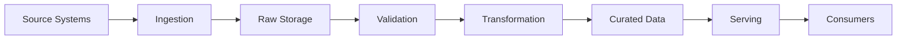

### Plain-English explanation

- **Source Systems** produce the original data.
- **Ingestion** brings the data into the downstream environment.
- **Raw Storage** preserves the incoming representation.
- **Validation** checks whether the data meets expected conditions.
- **Transformation** changes the data into a useful representation.
- **Curated Data** provides reusable cleaned or structured information.
- **Serving** exposes the data to consumers.
- **Consumers** use it for analysis, applications, ML, or AI.

Real systems may have multiple paths, loops, streams, and branches.

---

# 18. A Pipeline Is Not Just a Script

Consider a script:

```python
rows = read_file()
cleaned = clean(rows)
write_file(cleaned)
```

This describes logic.

A production pipeline adds surrounding system behavior:

```text
             ┌── Security
             ├── Testing
             ├── Observability
             ├── Orchestration
             ├── Configuration
             ├── Deployment
             └── Operational Ownership
                     │
                     ↓
                  Pipeline
```

The code is only one part.

This is one of the most important mindset changes in professional data engineering.

---

# 19. Production Engineering Perspective

## Toy System

```text
CSV → Python script → CSV
```

This is a valid learning exercise.

But it may have:

- no scheduling
- no monitoring
- no retries
- no alerting
- no access control
- no lineage
- no deployment pipeline
- no schema enforcement

## Production System

```text
Source Systems
      ↓
Secure Ingestion
      ↓
Raw Storage
      ↓
Validation
      ↓
Transformation
      ↓
Curated Dataset
      ↓
Serving
      ↓
Consumers
```

With cross-cutting concerns:

```text
Production Pipeline
├── Reliability
├── Observability
├── Security
├── Ownership
├── Documentation
├── Testing
├── Deployment
├── Retries
└── Data Quality
```

The key insight:

> Production engineering is not simply adding more code. It is making the system dependable under real operating conditions.

---

# 20. Organizational Models

Different organizations divide data-engineering responsibilities differently.

Three common models are:

1. centralized data team
2. embedded data engineers
3. data mesh-oriented organization

None is automatically correct for every company.

---

# 21. Centralized Data Team

## Structure

A central team serves multiple business or technical domains.

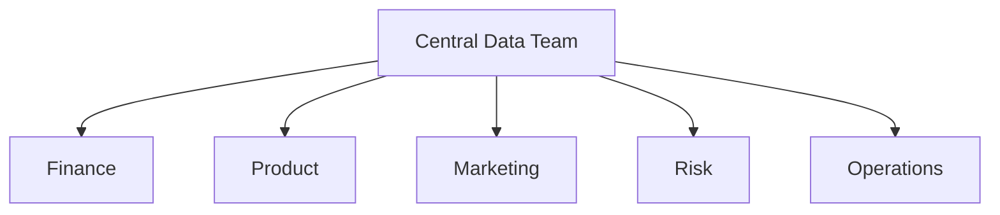

## Ownership

The central team usually owns much of the shared data infrastructure, pipelines, and datasets.

## Benefits

Potential benefits include:

- standardization
- shared expertise
- reduced duplication
- centralized governance
- consistent tooling

## Risks

Potential risks include:

- bottlenecks
- weaker domain context
- competing priorities
- communication overhead
- slower response for specialized needs

## Communication Model

Business teams typically request data capabilities from the central team.

The central team prioritizes and delivers.

## Scaling Issues

As demand grows, one team may become a bottleneck.

For example:

```text
20 business teams
      ↓
1 central data team
```

The central team's workload can become large.

---

# 22. Embedded Data Engineers

## Structure

Data engineers are placed directly inside business or domain teams.

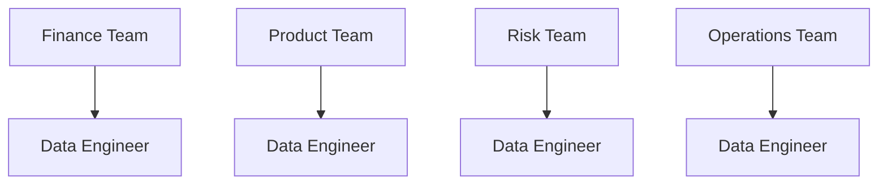

## Benefits

- strong domain knowledge
- faster local decisions
- closer collaboration
- local ownership

## Risks

- duplicated tooling
- inconsistent standards
- duplicated pipelines
- different definitions for similar metrics
- governance challenges

## Example

A payments engineer embedded within a banking payments domain may understand payment workflows deeply.

That can improve local problem-solving.

However, multiple teams could independently build similar ingestion frameworks.

---

# 23. Data Mesh

Data mesh is an organizational and architectural approach centered around four commonly discussed principles:

1. domain ownership
2. data as a product
3. self-serve data platform
4. federated governance

The purpose is to address organizational scaling problems that arise when a central team becomes a bottleneck.

---

## 23.1 Domain Ownership

The business domain that understands the data takes responsibility for it.

Example:

```text
Payments Domain
    ↓
Payments Data Product
```

Instead of every dataset being owned by one central team, ownership is distributed by domain.

---

## 23.2 Data as a Product

Domain teams are expected to treat data outputs as usable products with:

- ownership
- documentation
- quality
- discoverability
- consumer expectations

---

## 23.3 Self-Serve Data Platform

A shared platform provides infrastructure so domain teams do not need to build every technical capability from scratch.

Conceptually:

```text
Domain Team
    ↓
Self-Serve Platform
    ↓
Reusable Infrastructure
```

---

## 23.4 Federated Governance

Governance is coordinated across domains rather than completely centralized.

The goal is to balance:

```text
Local autonomy
       +
Organization-wide consistency
```

---

## 23.5 Why Data Mesh Was Proposed

A central data team can become a bottleneck as the organization grows.

A fully decentralized model can produce inconsistency.

Data mesh attempts to address this by combining:

- distributed domain ownership
- product thinking
- shared platform capabilities
- coordinated governance

---

## 23.6 Benefits

Potential benefits include:

- stronger domain ownership
- closer producer-consumer relationships
- reduced centralized bottlenecks
- better alignment with business domains

## 23.7 Challenges

Potential challenges include:

- higher organizational complexity
- need for strong platform capabilities
- governance coordination
- maturity requirements
- difficulty keeping standards consistent

## 23.8 Common Misconceptions

### Misconception

"Data mesh means every team builds everything independently."

Not necessarily.

A data-mesh approach generally depends on shared platform capabilities and coordinated governance.

### Misconception

"Data mesh eliminates the need for a central data team."

Not necessarily.

Platform, governance, architecture, standards, and enablement responsibilities may still be centralized or coordinated.

### Misconception

"Data mesh is a database architecture."

It is better understood as an organizational and architectural approach to data ownership and platform operating models.

---

# 24. Centralized vs Embedded vs Data Mesh

| Model | Ownership Strength | Potential Strengths | Potential Risks | Suitable Situation |
|---|---|---|---|---|
| Centralized data team | Central team owns most data capabilities | Standardization, shared expertise, simpler governance | Bottlenecks, less domain context | Smaller or centralized organizations |
| Embedded engineers | Domain teams own local data work | Strong domain knowledge, fast local decisions | Duplication, inconsistent standards | Organizations with strong business domains |
| Data mesh | Domain ownership with shared platform and federated governance | Domain accountability plus organizational coordination | Higher organizational and platform complexity | Larger organizations with multiple mature domains |

These are trade-offs, not a maturity ladder.

A company may also use a hybrid model.

---

# 25. Mental Model: Where the Data Engineer Sits

A data engineer often sits across multiple boundaries:

```text
                           ┌── Analysts
                           ├── BI
                           ├── Data Scientists
Sources → Pipelines → Data Platform → Data Products
                           ├── ML
                           ├── Applications
                           └── AI / RAG
```

This is why data engineering is often described as a bridge between:

- operational systems
- data infrastructure
- downstream consumers

The bridge must be engineered, not improvised.

---

# 26. Data Engineering for Machine Learning and AI

Modern data engineering increasingly supports ML and AI systems.

The underlying idea is not:

> "AI data is completely different."

A more useful perspective is:

> AI systems still need reliable ingestion, transformation, storage, metadata, quality, orchestration, and serving.

The difference is the shape and requirements of the data.

---

# 27. Feature Pipelines

## What is a Feature?

A **feature** is an input representation used by a machine-learning model.

Examples:

- number of purchases in the last 30 days
- average transaction amount
- account age
- number of failed login attempts

## Feature Pipeline

A feature pipeline creates or updates these values from source data.

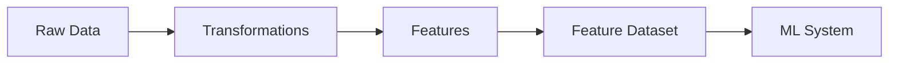

## Training/Serving Consistency

One important engineering challenge is consistency.

Suppose training uses:

```text
average_purchase_30d
```

calculated one way, while production inference calculates it differently.

The model may behave unexpectedly.

The exact infrastructure patterns are advanced topics, but the foundational principle is:

> The data used to train and serve a model should be produced according to consistent definitions.

> You only need the mental model here. Feature-store and ML-infrastructure implementation belongs later in the roadmap.

---

# 28. Training Datasets

A training dataset is a dataset prepared specifically for machine learning model development or training.

A simplified flow is:

```text
Source Data
    ↓
Extraction
    ↓
Cleaning
    ↓
Joining
    ↓
Filtering
    ↓
Labeling
    ↓
Dataset Version
    ↓
Model Training
```

Important concerns include:

- correct joins
- valid labels
- leakage avoidance
- reproducibility
- versioning
- historical correctness

## Why Versioning Matters

Suppose model version A was trained using:

```text
training_dataset_v3
```

Six months later, the same model is investigated.

If the exact training data cannot be reconstructed, debugging becomes harder.

Therefore data engineering supports reproducibility.

> Detailed ML data lineage, feature stores, and training-data infrastructure belong later in the roadmap.

---

# 29. Retrieval Pipelines

LLM applications that retrieve external knowledge often depend on a data pipeline.

A foundational flow is:

```text
Documents
   ↓
Extraction
   ↓
Cleaning
   ↓
Chunking
   ↓
Metadata
   ↓
Embedding
   ↓
Vector Storage
   ↓
Retrieval
   ↓
LLM Application
```

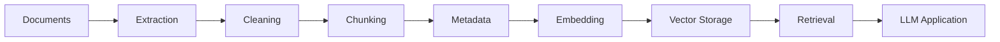

### What the data engineer may support

- document ingestion
- file discovery
- content extraction
- preprocessing
- metadata management
- indexing workflow
- reprocessing
- monitoring
- versioning

The data engineer may not be responsible for the LLM itself.

---

# 30. Embedding Pipelines

An **embedding** is a numerical representation of information that can capture useful semantic relationships for downstream machine-learning or retrieval systems.

At this level, think of it as:

```text
Text
  ↓
Embedding Model
  ↓
Vector Representation
```

An embedding pipeline exists because many documents must be processed repeatedly and reliably.

A production pipeline may need to manage:

- document ingestion
- preprocessing
- embedding generation
- storage
- model/version changes
- reprocessing
- retries
- monitoring
- stale records

## Reprocessing Example

Suppose the embedding model changes.

You may need:

```text
Existing Documents
      ↓
Re-chunk
      ↓
Re-embed
      ↓
Replace or version embeddings
```

That is a data-engineering workflow.

> The AI and vector-storage internals are intentionally introductory here. Deeper AI infrastructure is covered later in the roadmap.

---

# 31. A Unified AI Data Mental Model

These systems can be viewed as specialized data pipelines.

```text
Traditional Analytics
Source → Ingest → Transform → Curated Data → BI

Machine Learning
Source → Ingest → Transform → Features / Training Data → ML

RAG
Documents → Extract → Clean → Chunk → Embed → Retrieve → LLM
```

The repeated engineering pattern is:

```text
Input
  ↓
Processing
  ↓
Quality
  ↓
Storage
  ↓
Serving
  ↓
Consumer
```

The domain changes, but the engineering foundations remain recognizable.

---

# 32. Python Coding Example 1 — Simple Data Pipeline

Use only the Python standard library.

```python
def extract():
    """Return source records."""
    return [
        {"order_id": "1001", "amount": "25.50"},
        {"order_id": "1002", "amount": "40.00"},
    ]


def transform(data):
    """Convert amount strings into numbers."""
    return [
        {
            "order_id": row["order_id"],
            "amount": float(row["amount"]),
        }
        for row in data
    ]


def load(data):
    """Represent publishing the transformed data."""
    return list(data)


def main():
    data = extract()
    data = transform(data)
    output = load(data)
    print(output)


if __name__ == "__main__":
    main()
```

## What Each Function Represents

### `extract()`

Represents reading data from a source.

### `transform()`

Represents changing source-oriented data into a downstream representation.

### `load()`

Represents publishing or storing the result.

### `main()`

Represents orchestration of the three logical stages.

The code is intentionally small.

A production implementation would require substantially more:

- input validation
- error handling
- logging
- configuration
- observability
- idempotent execution
- tests
- deployment
- secure access
- operational ownership

---

# 33. Python Coding Example 2 — Dataset as a Reusable Asset

The standard library can represent metadata about a dataset.

```python
from dataclasses import dataclass


@dataclass
class DatasetDefinition:
    name: str
    owner: str
    schema: list[str]
    freshness_expectation: str
    consumers: list[str]


customer_orders = DatasetDefinition(
    name="customer_orders",
    owner="commerce-data-team",
    schema=[
        "order_id",
        "customer_id",
        "order_date",
        "net_amount",
        "status",
    ],
    freshness_expectation="hourly",
    consumers=[
        "finance-analytics",
        "product-analytics",
        "ml-team",
    ],
)

print(customer_orders.name)
print(customer_orders.owner)
print(customer_orders.freshness_expectation)
```

## What This Demonstrates

The dataset is not just rows.

It also has metadata describing:

- identity
- ownership
- structure
- freshness
- consumers

This is the beginning of thinking about data as a managed asset.

## Production Limitation

A real data catalog would likely manage richer metadata and connect it to actual storage and lineage systems.

This example is a mental-model exercise, not a catalog implementation.

---

# 34. Python Coding Example 3 — Data Job

A job needs a clear input, processing path, output, logging, and exit status.

```python
import logging
import sys


logging.basicConfig(
    level=logging.INFO,
    format="%(asctime)s %(levelname)s %(message)s",
)


def process(rows):
    return [
        row
        for row in rows
        if row.get("status") == "paid"
    ]


def main() -> int:
    rows = [
        {"order_id": "1001", "status": "paid"},
        {"order_id": "1002", "status": "cancelled"},
    ]

    logging.info("Received %d rows", len(rows))

    output = process(rows)

    logging.info("Produced %d paid rows", len(output))

    return 0


if __name__ == "__main__":
    sys.exit(main())
```

## Key Concepts

### Input

`rows`

### Processing

`process(rows)`

### Output

`output`

### Logging

```python
logging.info(...)
```

### Exit status

```python
return 0
```

Then:

```python
sys.exit(main())
```

A successful program commonly exits with status `0`.

Non-zero status is commonly used to indicate failure.

> Exit codes, structured logging, validation, and safe operational patterns are studied more deeply in later production-oriented Python and Data Engineering modules.

---

# 35. Hands-On Exercise — `role_matcher.py`

This exercise forces you to reason about role responsibilities rather than memorize job titles.

## 35.1 Problem Statement

Build a small Python program named:

```text
role_matcher.py
```

It should:

1. read a JSON file
2. read task descriptions
3. determine the commonly responsible role
4. print the role
5. print a one-line reason

Use only the Python standard library.

---

## 35.2 Input Format

Create:

```text
tasks.json
```

with:

```json
{
  "tasks": [
    {
      "description": "build a churn model"
    },
    {
      "description": "load Stripe payments nightly"
    },
    {
      "description": "fix a slow dashboard query"
    },
    {
      "description": "deploy a prediction service"
    },
    {
      "description": "build a semantic layer"
    }
  ]
}
```

---

## 35.3 Design Approach

A simple implementation can use keyword-based rules.

This is intentionally not an AI classifier.

Think:

```text
Task description
      ↓
Normalize text
      ↓
Check rules
      ↓
Choose common role
      ↓
Print role + reason
```

---

## 35.4 Implementation

```python
import json
import sys
from pathlib import Path


ROLE_RULES = [
    (
        "Machine Learning Engineer",
        ("deploy", "prediction", "model service", "inference"),
        "The task focuses on deploying or serving a machine-learning model.",
    ),
    (
        "Data Scientist",
        ("churn model", "predictive model", "experiment", "statistical model"),
        "The task focuses on building a predictive or statistical model.",
    ),
    (
        "Data Engineer",
        ("load", "ingest", "pipeline", "payments", "data pipeline"),
        "The task focuses on moving or preparing data for downstream use.",
    ),
    (
        "Analytics Engineer",
        ("semantic layer", "business metrics", "analytical model"),
        "The task focuses on analytical modelling and business-facing data semantics.",
    ),
    (
        "Data Analyst",
        ("dashboard query", "analysis", "report", "dashboard"),
        "The task focuses on analyzing or presenting data for business use.",
    ),
]


def load_tasks(path: Path) -> list[dict[str, str]]:
    with path.open("r", encoding="utf-8") as file:
        data = json.load(file)

    tasks = data.get("tasks", [])

    if not isinstance(tasks, list):
        raise ValueError("'tasks' must be a list")

    return tasks


def match_role(description: str) -> tuple[str, str]:
    text = description.lower()

    for role, keywords, reason in ROLE_RULES:
        if any(keyword in text for keyword in keywords):
            return role, reason

    return (
        "Needs collaboration / unclear",
        "The description does not provide enough information for a confident role match.",
    )


def main() -> int:
    if len(sys.argv) != 2:
        print("Usage: python role_matcher.py tasks.json")
        return 2

    path = Path(sys.argv[1])

    if not path.exists():
        print(f"File not found: {path}", file=sys.stderr)
        return 1

    try:
        tasks = load_tasks(path)
    except (OSError, json.JSONDecodeError, ValueError) as exc:
        print(f"Input error: {exc}", file=sys.stderr)
        return 1

    for task in tasks:
        description = task.get("description", "").strip()

        if not description:
            print("Task: <missing description>")
            print("Role: Needs collaboration / unclear")
            print("Reason: The task description is empty.")
            print()
            continue

        role, reason = match_role(description)

        print(f"Task: {description}")
        print(f"Role: {role}")
        print(f"Reason: {reason}")
        print()

    return 0


if __name__ == "__main__":
    sys.exit(main())
```

---

## 35.5 Expected Output

A representative output is:

```text
Task: build a churn model
Role: Data Scientist
Reason: The task focuses on building a predictive or statistical model.

Task: load Stripe payments nightly
Role: Data Engineer
Reason: The task focuses on moving or preparing data for downstream use.

Task: fix a slow dashboard query
Role: Data Analyst
Reason: The task focuses on analyzing or presenting data for business use.

Task: deploy a prediction service
Role: Machine Learning Engineer
Reason: The task focuses on deploying or serving a machine-learning model.

Task: build a semantic layer
Role: Analytics Engineer
Reason: The task focuses on analytical modelling and business-facing data semantics.
```

These are **common responsibility matches**, not universal organizational rules.

---

# 36. Step-by-Step Explanation of `role_matcher.py`

## Step 1 — Imports

```python
import json
import sys
from pathlib import Path
```

The standard library provides:

- JSON parsing
- command-line arguments
- filesystem path handling

No third-party package is required.

## Step 2 — Rules

```python
ROLE_RULES = [...]
```

Each rule contains:

- role
- keywords
- reason

This makes the mapping easier to inspect and modify.

## Step 3 — Load JSON

```python
data = json.load(file)
```

The input file becomes a Python dictionary.

## Step 4 — Validate Structure

```python
tasks = data.get("tasks", [])
```

The program expects a list of tasks.

## Step 5 — Normalize Text

```python
text = description.lower()
```

Lowercasing makes simple matching less sensitive to capitalization.

## Step 6 — Match

```python
if any(keyword in text for keyword in keywords):
```

If any configured keyword appears, the rule matches.

## Step 7 — Return Reason

The exercise intentionally prints a reason so you can connect the task to the responsibility.

## Step 8 — Exit Status

The program returns:

- `0` for success
- `1` for input/file errors
- `2` for incorrect command usage

That makes the program more like a real command-line job.

---

# 37. Design Limitations of `role_matcher.py`

This is a teaching exercise, not a production classification system.

Problems include:

### Keyword ambiguity

"Model deployment pipeline" could involve both data and ML engineering.

### Overlap

Real work frequently crosses role boundaries.

### Ordering effects

The first matching rule wins.

### Vocabulary dependence

A task with different wording may not match correctly.

### Organizational differences

A specific company may assign the task to a different role.

### No confidence model

The system does not estimate uncertainty.

### No context

The system sees only a task description.

These limitations teach an important engineering principle:

> A simple implementation can be useful when the problem is constrained, but do not mistake a toy rule set for a general solution.

---

# 38. Possible Production Improvements to `role_matcher.py`

A larger system might introduce:

- explicit task taxonomy
- configuration-driven rules
- test cases
- confidence scores
- multiple-role assignment
- human review for ambiguous cases
- structured output
- audit logs
- versioned classification rules

An ML-based classifier could also be used, but that would be outside the purpose of this introductory exercise.

---

# 39. Real-World Case Study 1 — E-Commerce

Consider an online retailer.

## Source Systems

- customer account service
- product catalog
- order database
- payment system
- warehouse system
- shipping system

## Data Produced

- product changes
- customer events
- order events
- payment events
- shipment events
- refunds

## Data Engineer Responsibilities

The data engineer may build:

```text
Orders DB ───────────┐
Payments API ────────┼──→ Ingestion
Shipping DB ─────────┤
Customer DB ─────────┘
                         ↓
                      Raw Data
                         ↓
                    Transformations
                         ↓
                   Curated Datasets
                         ↓
                  Analytical Data Model
                         ↓
            ┌────────────┼────────────┐
            ↓            ↓            ↓
           BI           ML           Analytics
```

## Data Products

Examples could include:

- customer orders dataset
- product sales dataset
- shipment performance dataset

## Operational Challenges

- late payment confirmations
- duplicate order events
- refunds arriving after orders
- schema changes
- high-volume traffic

The architecture is an example, not a universal e-commerce design.

---

# 40. Real-World Case Study 2 — Banking

Banking environments commonly contain many independent or specialized systems.

Examples may include:

- core banking systems
- transaction systems
- payment processing systems
- customer information systems
- fraud systems
- card systems
- loan systems
- regulatory reporting systems

## Data Produced

Examples:

```text
Customer Data
Transaction Data
Payment Data
Fraud Signals
Loan Events
Account Events
Regulatory Records
```

## Data Engineer Responsibilities

A data engineer may support:

- source extraction
- secure ingestion
- raw data storage
- transformation
- reconciliation
- curated datasets
- regulatory reporting data flows
- analytical datasets

## Consumers

- finance
- risk
- compliance
- fraud
- analysts
- management reporting
- ML teams

## Operational Challenges

- sensitive data
- strict access controls
- reconciliation requirements
- late or corrected transactions
- auditability
- data quality
- regulatory expectations

Do not assume a single bank uses one universal architecture. Banks differ substantially in systems, integration patterns, controls, and organizational structure.

---

# 41. Real-World Case Study 3 — Ride-Sharing

Imagine a ride-sharing system.

## Source Systems

- rider application
- driver application
- trip service
- pricing service
- payment service

## Data Produced

- trip requests
- driver availability
- trip state changes
- location events
- fare events
- cancellations

## Data Engineering Responsibilities

Potential work includes:

- event ingestion
- trip dataset construction
- geographic aggregation
- historical storage
- feature preparation
- analytics datasets

## Consumers

- operations
- analysts
- pricing teams
- ML teams
- product teams

## Operational Challenges

- high event volume
- late events
- duplicated events
- rapidly changing operational state

This example introduces the need for streaming concepts, which are addressed later in the roadmap.

---

# 42. Real-World Case Study 4 — Healthcare

Consider a healthcare organization.

## Source Systems

- patient administration
- appointment system
- laboratory system
- billing system
- clinical systems

## Data Produced

- patient records
- appointments
- lab events
- billing events
- clinical information

## Data Engineering Responsibilities

Potential responsibilities include:

- secure ingestion
- normalization
- quality checks
- historical datasets
- reporting datasets
- controlled access

## Consumers

- operations
- analysts
- reporting teams
- research teams
- authorized clinical or business systems

## Operational Challenges

- sensitive information
- inconsistent source formats
- identity matching
- access control
- data quality
- retention requirements

The exact regulations, systems, and controls depend on the jurisdiction and organization. The engineering principle remains: sensitive data requires careful access and lifecycle management.

---

# 43. Real-World Case Study 5 — LLM / RAG Application

Imagine a company has 500,000 internal documents and wants an employee-facing knowledge assistant.

## Source Systems

- document management systems
- wikis
- policy repositories
- knowledge bases

## Data Engineer Responsibilities

```text
Documents
   ↓
Ingestion
   ↓
Extraction
   ↓
Cleaning
   ↓
Chunking
   ↓
Metadata
   ↓
Embedding
   ↓
Vector Storage
   ↓
Retrieval
   ↓
LLM Application
```

The data engineer may own much of the document data lifecycle.

## Data Products

Potential reusable assets include:

- cleaned document corpus
- document metadata dataset
- chunk dataset
- embedding index

## Operational Challenges

- deleted documents
- changed documents
- duplicate documents
- stale embeddings
- embedding model upgrades
- failed reprocessing
- access-control propagation

A retrieval pipeline may therefore inherit normal data-engineering concerns.

---

# 44. Learning Progression

This topic intentionally progresses through three levels.

---

## Level 1 — Basics

You should understand:

- what data engineering is
- what a data engineer does
- what a pipeline is
- what a dataset is
- what a table is
- what a job is
- what data engineers build
- who consumes the data

At this level, ask:

> "Can I explain the data flow to another beginner?"

---

## Level 2 — Intermediate

You should understand:

- data as a product
- ownership
- documentation
- quality expectations
- versioning
- data-engineering undercurrents
- organizational models
- platform thinking

At this level, ask:

> "Can I explain why a technically correct dataset might still be a poor product?"

---

## Level 3 — Advanced

You should understand:

- centralized vs embedded teams
- data mesh
- domain ownership
- self-serve platforms
- federated governance
- feature pipelines
- training datasets
- retrieval pipelines
- embedding pipelines
- architecture trade-offs

At this level, ask:

> "Can I explain how organizational design changes technical architecture and operational responsibilities?"

---

# 45. Engineering Trade-Offs

Professional engineering rarely has one universally correct choice.

Use this reasoning model:

```text
Context
  ↓
Options
  ↓
Decision
  ↓
Consequences
```

---

## 45.1 Simplicity vs Flexibility

A simple pipeline may be easier to operate.

A more flexible architecture may support more use cases.

The right choice depends on actual requirements.

---

## 45.2 Centralization vs Domain Ownership

Centralization can increase standardization.

Domain ownership can increase context and accountability.

Neither is universally best.

---

## 45.3 Speed vs Maintainability

A quick script may solve today's problem.

Reusable software may cost more today but reduce future repeated work.

The decision depends on whether the task is:

- temporary
- recurring
- business-critical
- consumed by multiple teams

---

## 45.4 One-Off Script vs Reusable Pipeline

If someone needs an answer once, a script may be enough.

If the process runs daily for a year, manual execution becomes expensive and fragile.

---

## 45.5 Centralized Governance vs Team Autonomy

Centralized governance can create consistency.

Greater autonomy can improve local speed.

The trade-off is usually between:

```text
Consistency
vs
Local flexibility
```

---

## 45.6 Raw Data Availability vs Storage Cost

Keeping raw historical data can improve recovery and future reuse.

Keeping everything indefinitely can increase cost and governance complexity.

---

## 45.7 Reusable Datasets vs Specialization

A reusable dataset can serve many consumers.

But forcing every use case into one generalized dataset may produce complexity.

---

## 45.8 Platform Standardization vs Team Flexibility

Standardization can simplify operations.

Too much standardization can constrain legitimate domain-specific needs.

Engineering decisions should therefore be grounded in context.

---

# 46. Common Beginner Misconceptions

## "Data engineering is just SQL."

SQL is an important skill, but data engineering also involves:

- programming
- data systems
- architecture
- orchestration
- testing
- operations
- security
- reliability

---

## "A pipeline is just a Python script."

A Python script may implement part of a pipeline.

A production pipeline also has:

- inputs
- outputs
- scheduling
- dependencies
- quality checks
- monitoring
- failure handling
- ownership

---

## "A data engineer only moves data."

Movement is one part of ingestion.

Data engineers also:

- transform data
- design systems
- build datasets
- operate pipelines
- create platform capabilities
- support downstream consumers

---

## "A dataset is automatically a data product."

A dataset becomes product-like when it is intentionally managed around consumer needs and expectations.

---

## "Data mesh means every team builds everything independently."

Data mesh generally combines distributed ownership with shared platform capabilities and federated governance.

---

## "Data engineers are only responsible for storage."

Storage is only one layer.

Data engineering spans:

```text
Source
→ Ingestion
→ Processing
→ Storage
→ Serving
→ Consumers
```

plus cross-cutting operational concerns.

---

## "Data engineers and data scientists do the same work."

They collaborate, but their primary objectives differ.

Data engineering focuses on dependable data systems.

Data science focuses more on extracting insight, building models, and experimentation.

---

## "AI data pipelines are completely different from normal data pipelines."

They have specialized requirements, but the engineering patterns remain recognizable:

```text
Ingest
→ Transform
→ Validate
→ Store
→ Serve
→ Monitor
```

The data types and consumers may change.

---

# 47. Architecture Diagrams

This section summarizes the major architectures you should recognize.

---

## 47.1 Basic Data-Engineering Lifecycle


This is the foundational lifecycle.

---

## 47.2 Pipeline

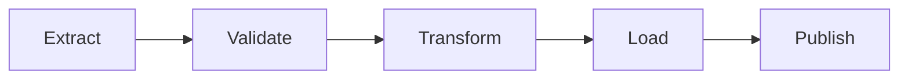

A pipeline is a sequence of dependent processing stages.

---

## 47.3 Data Platform

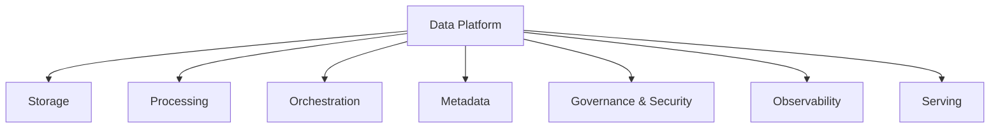

A data platform supplies reusable capabilities.

---

## 47.4 Data Product

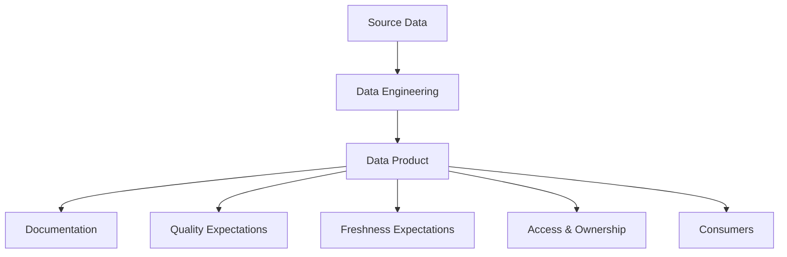

A data product is more than the physical rows. It includes the surrounding expectations and ownership.

---

## 47.5 Centralized Data Team

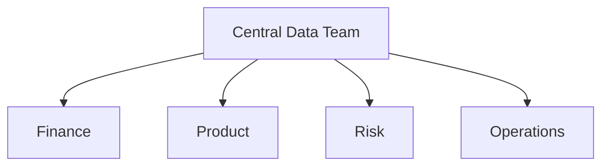

---

## 47.6 Embedded Team Model

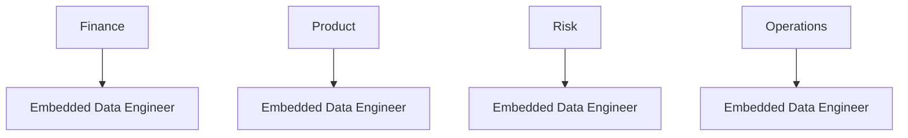

---

## 47.7 Data Mesh

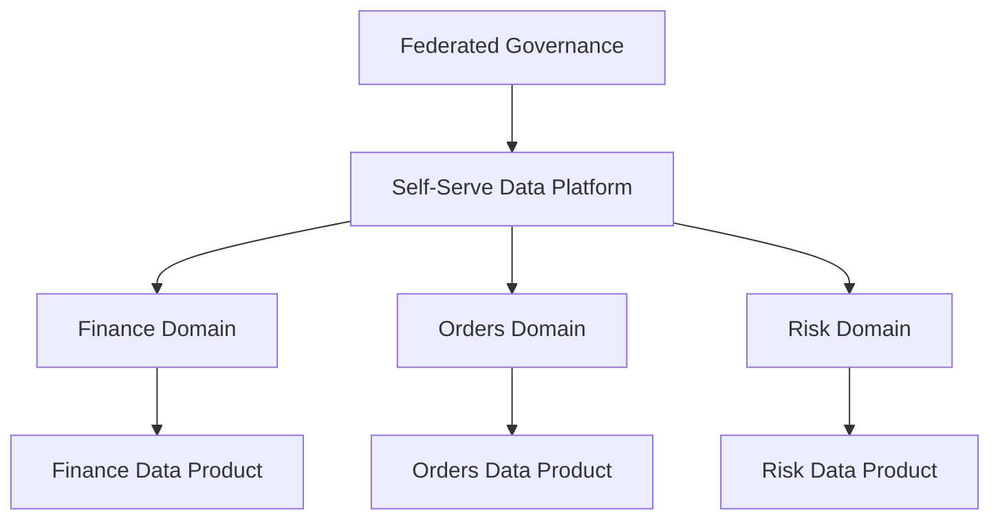

This illustrates the conceptual combination of:

- domain ownership
- data products
- shared platform
- federated governance

---

## 47.8 ML Data Pipeline

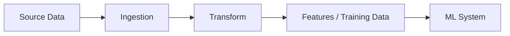

---

## 47.9 RAG / Retrieval Data Pipeline

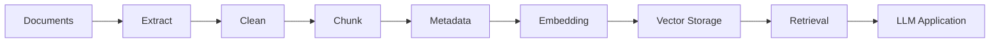

---

# 48. Small Learning Exercises

These are lightweight topic exercises. They are not the main `practice-questions.md`.

---

## Basic

### Exercise 1

Explain, in your own words, the difference between:

```text
source system
dataset
table
pipeline
job
consumer
```

### Exercise 2

Take this flow:

```text
Orders Database
      ↓
Raw Data
      ↓
Curated Orders
      ↓
Dashboard
```

Identify:

- source
- pipeline stages
- dataset
- consumer

### Exercise 3

List six things a data engineer can build.

---

## Moderate

### Exercise 4

A company receives customer CSV files every night.

The business wants a dashboard by 08:00.

Describe the minimum pipeline you would expect.

### Exercise 5

A dataset is technically correct, but no one knows:

- who owns it
- what its fields mean
- when it refreshes

Explain why it may still be difficult to use.

### Exercise 6

A pipeline works manually on one engineer's laptop but has no tests, monitoring, or deployment process.

Explain why it is not yet a dependable production system.

---

## Hard

### Exercise 7

A company has five business domains and one central data team.

The central team receives more requests than it can deliver.

Explain two organizational changes the company could consider and the trade-offs of each.

### Exercise 8

Two teams independently publish:

```text
customer_revenue
```

but calculate the metric differently.

Identify the likely engineering and organizational problem.

### Exercise 9

A data platform team wants a single standardized ingestion framework for every possible source.

Discuss the benefit of standardization and one reason excessive standardization can be harmful.

---

## Advanced

### Exercise 10

A company wants domain teams to own their own datasets but also wants common security and data-quality standards.

Explain how the four data-mesh principles could be applied without requiring every team to build everything independently.

### Exercise 11

An ML team says:

> "We trained a model on one version of the data, but we cannot reproduce that dataset."

Explain why this is a data-engineering problem as well as an ML problem.

### Exercise 12

An LLM/RAG system retrieves outdated documents because the source documents change frequently.

Describe the data pipeline concerns you would investigate.

---

# 49. Scenario Reasoning Exercises

Use this pattern:

```text
Context
→ Options
→ Decision
→ Consequences
```

Do not jump immediately to a technology.

---

## Scenario A — Small Company

A startup has:

- 20 employees
- one database
- one analyst
- low data volume

The founder wants a full data platform.

Reason through:

- what the actual problem is
- whether a full platform is necessary
- what could remain simple

The engineering lesson:

> Architecture should follow requirements, not fashion.

---

## Scenario B — Growing Company

A company now has:

- ten source systems
- three analysts
- two data scientists
- daily reporting
- recurring pipeline failures

Now the engineering need is different.

The company may need:

- reusable ingestion
- scheduled workflows
- validation
- ownership
- monitoring

The system has crossed from isolated scripts toward production pipelines.

---

## Scenario C — Large Organization

A large organization has:

- dozens of domains
- many engineering teams
- hundreds of data consumers
- multiple data platforms

Now organizational design becomes a major architectural concern.

Possible models include:

- centralization
- embedded teams
- hybrid models
- data mesh-oriented operating models

The correct design depends on:

- domain complexity
- organizational structure
- platform maturity
- governance requirements
- consumer needs

---

# 50. From Pipeline Thinking to Platform Thinking

A beginner may ask:

> "How do I build this pipeline?"

A more experienced engineer asks:

> "How do we make this class of pipeline repeatable across many teams?"

That is the beginning of platform thinking.

Compare:

```text
Pipeline Thinking
-----------------
Build one reliable pipeline.
```

with:

```text
Platform Thinking
-----------------
Build reusable capabilities so many teams
can build reliable pipelines consistently.
```

Platform thinking does not replace pipeline thinking.

It builds on it.

---

# 51. From Platform Thinking to Product Thinking

Another evolution is:

```text
Pipeline
   ↓
Platform
   ↓
Product
```

Pipeline thinking asks:

> "Can this flow execute?"

Platform thinking asks:

> "Can multiple teams build and operate this kind of flow?"

Product thinking asks:

> "Can consumers reliably use the resulting data capability?"

These are progressively broader engineering questions.

---

# 52. The Data Engineer's Core Responsibility

Across all of these topics, one responsibility appears repeatedly:

> **Turn data movement and transformation into dependable, understandable, reusable systems.**

That includes:

- building
- operating
- documenting
- securing
- testing
- monitoring
- improving

The data engineer therefore needs both:

```text
Data Thinking
+
Software Engineering
+
Systems Thinking
```

---

# 53. Cross-Module Boundaries

This lesson intentionally establishes foundations without consuming the entire Stage 2 curriculum.

You should know the concepts now, but deeper implementation comes later.

Examples:

| Foundation Introduced Here | Deeper Topic Later |
|---|---|
| Data lifecycle | Ingestion |
| Transformation | SQL and transformation engineering |
| Analytical data models | Data modelling |
| Orchestration | Production workflow orchestration |
| Quality expectations | Validation and data quality |
| PySpark | Distributed processing |
| Data platform | Lakehouse/platform architecture |
| Streaming | Event-driven systems |
| Observability | Operational reliability |
| Serving | Analytics/ML/AI serving patterns |

Use this rule:

> You only need the mental model here. The implementation details are covered later in the Stage 2 roadmap.

This prevents the first topic from becoming a duplicate of every later module.

---

# 54. Self-Explanation Test — Explain This to a New Teammate

Close your notes and explain each question aloud.

## 1. What does a data engineer actually build?

A strong answer should mention more than SQL or file movement.

## 2. Why isn't data engineering just SQL?

A strong answer should connect SQL to a larger system containing ingestion, storage, orchestration, reliability, security, testing, and consumers.

## 3. What is the difference between a dataset and a data product?

A strong answer should explain consumer orientation, ownership, documentation, quality, and expectations.

## 4. How does a data engineer support an ML team?

A strong answer should mention training datasets, feature pipelines, data preparation, reproducibility, and serving-related data dependencies.

## 5. Why might an organization choose a centralized data team?

A strong answer should mention standardization, shared expertise, and governance, as well as possible bottlenecks.

## 6. What problem does data mesh attempt to solve?

A strong answer should connect organizational scale, domain ownership, self-serve platform capabilities, and federated governance.

---

# 55. Interview-Ready Questions

These questions are for understanding, not memorization.

---

## Fundamental

### Question

**What does a data engineer do?**

### Answer Guidance

Explain that a data engineer builds and operates systems that ingest, transform, store, and serve reliable data for downstream consumers. Mention software engineering, reliability, security, and operational ownership.

---

## Intermediate

### Question

**What is a data product?**

### Answer Guidance

Describe it as a data asset or capability intentionally designed around consumer needs, with ownership, documentation, quality expectations, freshness expectations, discoverability, and change management.

---

## Architecture

### Question

**What is the difference between centralized and embedded data teams?**

### Answer Guidance

Explain who owns the data work, where engineers sit organizationally, how domain knowledge is obtained, and the trade-offs around standardization, autonomy, duplication, and communication.

---

## Advanced

### Question

**What problem does data mesh try to solve?**

### Answer Guidance

Explain that it is designed to address scaling problems around centralized data ownership by combining domain ownership, data as a product, self-serve platform capabilities, and federated governance.

---

## AI / Data Engineering

### Question

**How does data engineering support an LLM/RAG system?**

### Answer Guidance

Describe the document lifecycle:

```text
ingestion
→ extraction
→ cleaning
→ chunking
→ metadata
→ embedding
→ storage
→ retrieval
```

Then explain that reliable updates, reprocessing, versioning, access control, and observability are data-engineering concerns.

---

# 56. Roadmap Checkpoint

You should be able to complete all of the following without looking at the notes.

## Required Checkpoint

### 1. Explain the difference between a data engineer and a data scientist in two sentences.

A suitable answer should distinguish:

- dependable data-system engineering
- analytical/model-building work

and explain the collaboration between them.

### 2. List at least six things a data engineer builds.

Possible examples:

- ingestion pipelines
- transformation pipelines
- curated datasets
- analytical data models
- data platforms
- data APIs
- internal tooling

### 3. Explain "data as a product" and give one example.

Example:

```text
customer_orders
```

with:

- owner
- schema
- documented business meaning
- freshness expectation
- quality expectations
- consumers
- controlled changes

### 4. Describe one advantage and one risk of data mesh.

Example advantage:

- stronger domain ownership

Example risk:

- greater organizational and governance complexity

These are examples of documented trade-offs, not universal judgments.

---

# 57. Additional Validation Questions

Answer these without looking back.

1. What is a source system?
2. What is the difference between ingestion and transformation?
3. Why is a table not necessarily the same thing as a dataset?
4. What is the difference between a job and a pipeline?
5. Why does a data product need an owner?
6. What does freshness mean for a dataset?
7. Why does versioning matter?
8. How does security affect data pipelines?
9. What does DataOps add to a data workflow?
10. What is the purpose of orchestration?
11. What is the role of a data platform?
12. What is one benefit of embedded data engineers?
13. What is one challenge of embedded teams?
14. What are the four principles commonly associated with data mesh?
15. What is a feature pipeline?
16. Why does a training dataset need reproducibility?
17. Why does an embedding pipeline need reprocessing?
18. What is the role of metadata in a data product?
19. Why is a pipeline more than a Python script?
20. What changes when a toy data workflow becomes a production system?

---

# 58. Final Mental Model

Keep this entire topic in one connected picture:

```text
                         BUSINESS SYSTEMS
                               │
                               ↓
                         SOURCE DATA
                               │
                               ↓
                          INGESTION
                               │
                               ↓
                         RAW STORAGE
                               │
                               ↓
                         VALIDATION
                               │
                               ↓
                        TRANSFORMATION
                               │
                               ↓
                         CURATED DATA
                               │
                               ↓
                      ANALYTICAL / DATA
                           PRODUCTS
                               │
                  ┌────────────┼────────────┐
                  ↓            ↓            ↓
                 BI           ML           AI
                  │            │            │
                  └────────────┼────────────┘
                               ↓
                           CONSUMERS
```

Around the entire system:

```text
Security
Data Management
DataOps
Architecture
Orchestration
Software Engineering
```

And above the individual pipelines:

```text
Data Platform
```

And across the organization:

```text
Centralized
     ↔
Embedded
     ↔
Data Mesh / Hybrid Models
```

The data engineer works across these layers according to the organization's architecture and responsibilities.

---

# 59. What You Should Remember

Do not memorize this topic as a dictionary.

Remember the progression:

```text
Script
  ↓
Pipeline
  ↓
Production Pipeline
  ↓
Data Platform
  ↓
Data Product
```

And remember the consumer flow:

```text
Source
  ↓
Ingest
  ↓
Store
  ↓
Transform
  ↓
Curate
  ↓
Serve
  ↓
Consume
```

And remember the engineering lens:

```text
What?
Why?
How?
Where?
Failure modes?
Production concerns?
Trade-offs?
Consumer needs?
Ownership?
```

A data engineer is not simply the person who writes a query or moves a file.

A professional data engineer helps create the dependable data systems that allow an organization to use its data repeatedly and safely.

---

# 60. Topic Completion Checklist

Use this checklist before moving to the next topic.

- [ ] I can explain what a data engineer is.
- [ ] I can explain why businesses need data engineering.
- [ ] I can describe a typical data-engineering workday.
- [ ] I understand script vs pipeline vs production pipeline.
- [ ] I understand source systems.
- [ ] I understand ingestion.
- [ ] I understand datasets.
- [ ] I understand tables.
- [ ] I understand jobs.
- [ ] I understand transformations.
- [ ] I understand storage.
- [ ] I understand serving.
- [ ] I understand consumers.
- [ ] I understand data platforms.
- [ ] I understand data products.
- [ ] I can name major data-engineering deliverables.
- [ ] I understand producer and consumer responsibilities.
- [ ] I understand documentation, versioning, quality, and freshness expectations.
- [ ] I understand security as a cross-cutting concern.
- [ ] I understand data management.
- [ ] I understand DataOps at a foundational level.
- [ ] I understand architecture as a system concern.
- [ ] I understand orchestration at a foundational level.
- [ ] I understand software engineering as part of data engineering.
- [ ] I understand centralized data teams.
- [ ] I understand embedded data engineers.
- [ ] I understand the four core data-mesh principles.
- [ ] I understand the trade-offs of organizational models.
- [ ] I understand feature pipelines at a high level.
- [ ] I understand training datasets and reproducibility.
- [ ] I understand retrieval pipelines.
- [ ] I understand embedding pipelines.
- [ ] I completed `role_matcher.py`.
- [ ] I can explain the roadmap checkpoint without notes.
- [ ] I can explain the topic to a new teammate.

---

# 61. Content Quality Gate

The following roadmap requirements are explicitly covered in this file:

- [x] What a data engineer is
- [x] Data engineering vs data analysis
- [x] Data engineering vs data science
- [x] Data engineering vs ML engineering
- [x] Data engineering vs analytics engineering
- [x] Data engineering vs platform engineering
- [x] Pipeline
- [x] Dataset
- [x] Table
- [x] Job
- [x] Ingestion pipelines
- [x] Transformation pipelines
- [x] Curated datasets
- [x] Data models
- [x] Data platforms
- [x] Data APIs
- [x] Internal tooling
- [x] Data as a product
- [x] Owners
- [x] Consumers
- [x] Documentation
- [x] Versioning
- [x] Quality guarantees / expectations
- [x] Security
- [x] Data management
- [x] DataOps
- [x] Architecture
- [x] Orchestration
- [x] Software engineering
- [x] Centralized data team
- [x] Embedded engineers
- [x] Data mesh
- [x] Domain ownership
- [x] Self-serve platform
- [x] Federated governance
- [x] Feature pipelines
- [x] Training datasets
- [x] Retrieval pipelines
- [x] Embedding pipelines
- [x] `role_matcher.py` exercise
- [x] Roadmap checkpoint
- [x] Beginner → intermediate → advanced progression
- [x] Real-world examples
- [x] Python standard-library examples
- [x] Production engineering perspective

---

# 62. Final Review

Before considering this topic complete, verify:

1. Can I explain the end-to-end data flow without reading the notes?
2. Can I explain why a production data pipeline needs more than transformation logic?
3. Can I distinguish a raw dataset from a managed dataset and a data product?
4. Can I explain the major data-engineering roles without treating them as rigid categories?
5. Can I explain centralized, embedded, and data-mesh models using trade-offs rather than slogans?
6. Can I explain how a data engineer supports ML and AI systems?
7. Can I identify where security, DataOps, architecture, orchestration, and software engineering fit?
8. Can I complete `role_matcher.py` and explain its limitations?
9. Can I identify the difference between a toy pipeline and a production pipeline?
10. Can I explain the checkpoint requirements to a new teammate?

If the answer to these questions is yes, you have the foundational mental model needed to continue into the next data-engineering topics.

> **Next learning principle:** Do not rush into tools. First understand the data flow, the system boundaries, the consumers, and the operational expectations. Tools become easier to reason about after those foundations are clear.
