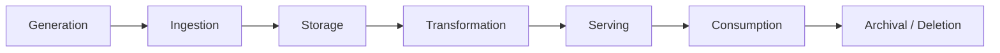
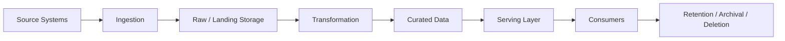
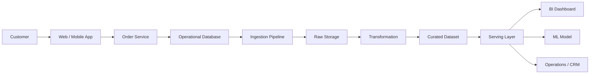

# Data Lifecycle from Sources to Consumers

> **Module:** Python for Data Engineering → 01-Data-Engineering-Foundations-and-Pipeline-Thinking  
> **Topic:** 02 — Data Lifecycle from Sources to Consumers  
> **Level:** Beginner → Intermediate → Advanced foundation  
> **Implementation rule for this lesson:** Python standard library only  
> **Primary goal:** Build an end-to-end mental model of how data is generated, ingested, stored, transformed, served, consumed, and eventually archived or deleted.

---

## 1. Why This Topic Matters

The previous topic introduced what data engineers build. This topic answers a more fundamental systems question:

> **How does data travel through a real data system from the moment it is created to the moment it is used or retired?**

A beginner often sees data as a table:

```text
database table
```

A production data engineer sees a journey:

```text
Business activity
    ↓
Data generation
    ↓
Ingestion
    ↓
Storage
    ↓
Transformation
    ↓
Serving
    ↓
Consumption
    ↓
Retention / archival / deletion
```

That difference in mental model matters.

A table is only one representation of data at one point in time. The data may have been generated in an operational application, extracted through an API or database connection, copied into raw storage, validated, transformed, joined with other data, published for analytical use, and later removed according to retention policy.

The central engineering principle for this topic is:

> **Understand the complete journey of data before optimizing any individual step.**

A data engineer who understands only ingestion can miss transformation errors.  
A data engineer who understands only storage can miss consumer requirements.  
A data engineer who understands only transformations can miss source-system behavior.  
A data engineer who ignores archival and deletion can create long-term governance and cost problems.

This lesson builds the lifecycle mental model first. Later topics will study particular parts in greater depth.

---

# 2. Learning Outcomes

By the end of this lesson, you should be able to:

1. Explain the complete data lifecycle in plain English.
2. Draw the lifecycle from generation to consumption and end-of-life.
3. Identify common source-system types.
4. Identify common data consumers.
5. Explain why source characteristics affect architecture.
6. Distinguish structured, semi-structured, and unstructured data.
7. Explain append-only and mutable sources.
8. Explain why updates and deletes change pipeline design.
9. Distinguish pull-based and push-based data access.
10. Explain source-boundary data contracts at a foundational level.
11. Explain lineage, ownership, classification, personally identifiable information (PII), and retention.
12. Identify where data can be lost, duplicated, delayed, corrupted, or changed.
13. Identify sensible places for validation and controls.
14. Build and understand a small end-to-end lifecycle simulation using Python standard-library tools.
15. Explain the lifecycle like a production data engineer.

---

# 3. The Big Picture: Data Is on a Journey

Start with the simplest possible definition:

> **A piece of data is created somewhere, moved into a data platform, stored, transformed, made available to people or systems, consumed for a purpose, and eventually archived or deleted according to policy.**

The canonical lifecycle is:

```text
┌─────────────┐
│  Generation │
└──────┬──────┘
       ↓
┌─────────────┐
│  Ingestion  │
└──────┬──────┘
       ↓
┌─────────────┐
│   Storage   │
└──────┬──────┘
       ↓
┌───────────────┐
│ Transformation │
└──────┬────────┘
       ↓
┌─────────────┐
│   Serving   │
└──────┬──────┘
       ↓
┌─────────────┐
│ Consumption │
└──────┬──────┘
       ↓
┌──────────────────────┐
│ Archival / Deletion  │
└──────────────────────┘
```

Each stage answers a different question.

| Stage | Core question |
|---|---|
| Generation | Where did the data originate? |
| Ingestion | How does the platform receive it? |
| Storage | Where is it persisted and kept available? |
| Transformation | How is it cleaned, standardized, enriched, or reshaped? |
| Serving | How is the result made convenient for consumers? |
| Consumption | Who or what uses it, and for what purpose? |
| Archival / Deletion | What happens after the useful or permitted lifetime ends? |

## 3.1 An e-commerce example

Imagine a customer places an online order.

```text
Customer places order
        ↓
Web / mobile application records the action
        ↓
Order service creates the order
        ↓
Operational database stores the order
        ↓
Data pipeline ingests the record
        ↓
Raw / landing storage
        ↓
Validation and transformation
        ↓
Curated analytical dataset
        ↓
Serving layer
        ↓
Dashboard / analyst / ML system / operational consumer
        ↓
Retention / archival / deletion
```

The important insight is that:

```text
where data is created
```

is not the same as:

```text
where data is consumed
```

The operational database may exist primarily to support order processing, while the analytical dataset exists to support reporting and analysis.

---

# 4. A Second Mental Model: The Data Journey

Another useful representation is:

```text
DATA JOURNEY

Created
  ↓
Captured
  ↓
Moved
  ↓
Stored
  ↓
Validated
  ↓
Transformed
  ↓
Served
  ↓
Consumed
  ↓
Retained
  ↓
Archived
  ↓
Deleted
```

This representation is more detailed than the seven-stage lifecycle.

The two views are not contradictory.

The seven-stage lifecycle is the architecture-level view:

```text
Generation
→ Ingestion
→ Storage
→ Transformation
→ Serving
→ Consumption
→ Archival / Deletion
```

The data-journey view adds operational detail within those stages.

For example:

```text
Ingestion
```

may include:

```text
authenticate
→ connect
→ extract
→ validate basic structure
→ attach ingestion metadata
→ land data
```

You do not need to memorize every internal activity. The goal is to understand that a lifecycle stage is often a collection of related engineering actions.

---

# 5. Strict Learning Progression

This topic is intentionally progressive.

```text
Beginner
   ↓
Basic lifecycle vocabulary
   ↓
Intermediate source and consumer analysis
   ↓
Data characteristics and design implications
   ↓
Metadata and data contracts
   ↓
Failure and corruption points
   ↓
Production lifecycle thinking
   ↓
Advanced architecture reasoning
```

Do not jump to advanced architecture decisions before you can answer:

> Where was this data created, how did it enter the platform, where is it stored, what happened to it, and who consumes the result?

Every major idea in this lesson follows this pattern:

```text
What is it?
→ Why does it exist?
→ How does it work?
→ Simple example
→ Real-world example
→ Small Python example where useful
→ Production interpretation
→ Failure modes
→ Engineering trade-offs
→ Common mistakes
→ Checkpoint
```

---

# 6. Stage 1 — Generation

## 6.1 What is data generation?

**Data generation** is the point where a business action, technical event, or external observation produces information that can be recorded.

Examples:

- A customer creates an account.
- A customer pays an invoice.
- A driver starts a trip.
- A bank approves a card authorization.
- A sensor reports temperature.
- An application writes a log.
- A third-party service publishes exchange-rate information.

Data generation happens because some system is doing something.

A simple mental model is:

```text
Business / operational activity
           ↓
      source system
           ↓
       data created
```

## 6.2 Why does generation exist?

Because businesses operate.

The data is a by-product, record, or representation of those operations.

A bank does not create transaction data merely because a data engineer needs a table. The transaction exists because money moved or a financial event occurred. The data platform later captures a representation of that event.

## 6.3 What is a source system?

A **source system** is a system that produces or owns data used downstream.

Examples:

- order service
- core banking system
- CRM
- payment processor
- SaaS application
- application log platform
- IoT platform
- third-party API

A source system can be internal or external.

### Important distinction

The source system usually owns the original business process.

The data engineering platform usually owns the downstream handling of the data.

For example:

```text
Payment service
    └── owns payment processing

Data platform
    └── owns downstream ingestion, transformation, serving
```

These responsibilities can overlap in some organizations, but they are conceptually different.

---

# 7. How Business Systems Generate Data

Consider e-commerce:

```text
User
 ↓
Browse
 ↓
Add to cart
 ↓
Checkout
 ↓
Payment
 ↓
Order
```

Each action can generate data.

For example:

```text
user_id = 42
event_type = "checkout_started"
event_time = ...
```

The next action might create:

```text
order_id = 1001
customer_id = 42
amount = 199.99
currency = "INR"
status = "PAID"
created_at = ...
```

The source may store these records in:

- a relational database
- a log file
- an event stream
- an external SaaS service
- some combination of systems

---

# 8. Real-World Generation Examples

## 8.1 E-commerce

Typical generated information:

- customer registration
- product view
- cart change
- checkout attempt
- payment authorization
- order creation
- shipment update
- refund

A data engineer may later ingest those records for:

- revenue reporting
- customer analytics
- fraud systems
- operational reporting
- ML features
- customer support

---

## 8.2 Banking

Examples include:

- account creation
- deposit
- withdrawal
- internal transfer
- card authorization
- merchant payment
- ATM withdrawal
- fraud alert
- loan event
- regulatory reporting event

A typical banking architecture can involve many independently operated source systems.

A data engineer therefore needs to understand source boundaries, ownership, availability, sensitivity, and access controls.

> A specific bank may have a very different architecture from another bank. The examples here are conceptual rather than universal.

---

## 8.3 Healthcare

Examples:

- patient registration
- appointment
- laboratory result
- prescription
- billing event
- clinical record update

Healthcare data often has stronger access-control and privacy implications than many ordinary business datasets.

---

## 8.4 Ride-sharing

Examples:

- driver online status
- driver location
- rider request
- trip accepted
- trip started
- trip completed
- payment processed

The frequency and volume of location-related data can differ significantly from a nightly finance report.

---

# 9. Source System Types

A data engineer may work with many different source categories.

| Source type | Example | Typical access | Common data shape | Typical update pattern | Common challenge |
|---|---|---|---|---|---|
| Operational database | Orders DB | SQL connection, replication, export | Structured tables | Mutable | Schema changes, load on production DB |
| SaaS API | CRM / payment API | HTTPS API | JSON / nested objects | Mutable or event-like | Rate limits, pagination, authentication |
| Event stream | Application events | Message/event interface | JSON / key-value / event schema | Usually append-like events | Ordering, duplicates, delays |
| Logs | Web/application logs | File/object/log API | Text or semi-structured | Append-heavy | Parsing, malformed lines |
| Files | CSV from vendor | SFTP/object storage/share | CSV, JSON, XML, etc. | Batch files | Missing or late files |
| IoT / sensors | Temperature sensors | Gateway / event system | Structured or semi-structured events | Append-heavy | High volume, noisy data |
| Third-party data | Market/weather/provider feed | API, files, feeds | Structured or semi-structured | Varies | Contracts, availability, licensing |

The important word is **typical**.

Real systems can combine patterns.

For example, an application may:

- write to a relational database,
- emit events,
- generate logs,
- and call a third-party API.

A single business process can therefore create several related sources.

---

# 10. Source Analysis: The Questions a Data Engineer Asks

Before building a pipeline, a data engineer should ask:

```text
Where is the data generated?
Who owns the source?
How much data is produced?
How quickly does it arrive?
What format is it in?
How stable is the schema?
Can records be updated?
Can records be deleted?
How can we access it?
How reliable is the source?
What does the consumer need?
```

These questions move you from:

> "How do I copy this table?"

to:

> "What system am I connecting to, what behavior does it have, and what downstream guarantees are required?"

That is a major engineering mindset shift.

---

# 11. Source Characteristics That Drive Architecture

The source does not determine the entire architecture by itself, but source characteristics strongly influence design decisions.

The most important characteristics for this lesson are:

- volume
- velocity
- variety
- schema stability
- update pattern
- append-only vs mutable behavior
- deletes
- pull vs push access

---

# 12. Volume

## 12.1 What is volume?

**Volume** is the amount of data produced or handled.

A source might produce:

```text
1,000 rows/day
```

or:

```text
10,000,000 rows/day
```

or:

```text
5 TB/day
```

The exact unit depends on the system.

## 12.2 Why volume matters

As volume grows, decisions about:

- storage
- processing capacity
- partitioning
- batching
- parallelism
- cost
- retention

become more important.

A Python script processing a 5 KB file locally may be perfectly reasonable.

The same design may be inappropriate when the source produces terabytes per day.

The code pattern might appear similar, but the system requirements are different.

---

# 13. Velocity

## 13.1 What is velocity?

**Velocity** is how quickly new data arrives or changes.

Examples:

```text
Daily batch
Hourly feed
Every minute
Thousands of events per second
Continuous event flow
```

Compare:

```text
Finance report
→ daily or monthly

Fraud event processing
→ potentially much more immediate
```

Velocity is closely related to latency requirements.

A slow-arriving source cannot directly satisfy a very low-latency consumer unless another mechanism or source is introduced.

You will study batch, micro-batch, and streaming more deeply in Topic 03.

> You only need the lifecycle mental model here. The detailed batch and streaming architecture is covered in Topic 03.

---

# 14. Variety

**Variety** refers to differences in formats, structures, and representations.

For example:

```text
SQL table
CSV
JSON
XML
application logs
PDF
image
audio
video
```

A data platform may need to handle several of these simultaneously.

Variety affects:

- parsing
- storage
- validation
- transformation
- metadata
- serving strategy

---

# 15. Schema Stability

A schema describes what fields exist, their types, and often their structural meaning.

A stable schema might look like:

```text
order_id      integer
customer_id   integer
amount        numeric
created_at    timestamp
status        string
```

Then imagine the source changes:

### Added field

```text
currency
```

### Removed field

```text
status
```

### Renamed field

```text
customer_id
→
client_id
```

### Type change

```text
amount: numeric
```

becomes:

```text
amount: string
```

A consumer that expects the original contract can break.

For example:

```python
total = row["amount"] + 10
```

works when `amount` is numeric.

If the source suddenly sends:

```python
"199.99"
```

the same operation now behaves differently.

Schema evolution is therefore not merely a documentation issue. It is a dependency issue.

---

# 16. Append-Only vs Mutable Sources

This is one of the most important distinctions in pipeline thinking.

## 16.1 Append-only

An append-only source primarily adds new records.

Conceptually:

```text
day 1
A
B
C

day 2
A
B
C
D
E
```

The new information is:

```text
D
E
```

Examples include some event and log systems.

Append-only behavior can simplify some downstream reasoning because historical records are not repeatedly replaced in place.

---

## 16.2 Mutable source

A mutable source allows an existing record to change.

For example:

```text
order_id = 1001
status = "PENDING"
```

later becomes:

```text
order_id = 1001
status = "PAID"
```

Now the pipeline must understand that:

```text
a row that already existed has changed
```

That is different from simply receiving another unrelated row.

---

# 17. Why Updates Matter

Suppose yesterday the analytical platform received:

```text
order_id = 1001
status = "PENDING"
```

Today the source says:

```text
order_id = 1001
status = "PAID"
```

If the ingestion design only appends new rows without interpreting the update, the downstream dataset may contain both:

```text
1001, PENDING
1001, PAID
```

That can be correct in an event-history model.

It can also be incorrect if the consumer expects one current-state record per order.

The correct design depends on the intended representation.

This is a key engineering lesson:

> **The same source change can be useful history or bad duplication depending on the target data model.**

Detailed change-data-capture techniques belong later.

---

# 18. Deletes

Deletes introduce another level of complexity.

There are two broad forms to recognize initially.

## Hard delete

The source physically removes the record.

```text
before:
1001
1002
1003

after delete:
1001
1003
```

A downstream system may not automatically know that `1002` was deleted.

## Soft delete

The source keeps the record but marks it as deleted.

```text
order_id = 1002
is_deleted = true
```

This preserves a signal that downstream systems can propagate.

## Tombstone concept

In event-oriented systems, a **tombstone** can conceptually represent the removal of a key or record.

For this lesson, the important idea is not a specific implementation.

The important question is:

> **How does the downstream system learn that something that existed should no longer be considered active?**

That question affects:

- data correctness
- privacy requirements
- consumer behavior
- historical modeling
- retention

Deep change-data-capture implementation is intentionally deferred.

> Detailed change-data-capture techniques are covered later. Here you only need to understand why updates and deletes change pipeline design.

---

# 19. Pull vs Push

Data can cross a source boundary in different ways.

## 19.1 Pull

The data platform asks the source for data.

```text
Data platform
    │
    │ "Give me records since T"
    ↓
Source
```

Examples:

- API polling
- scheduled database extraction
- periodic file retrieval

The data engineer or pipeline controls when retrieval occurs.

### Common characteristics

- scheduling matters
- source load must be considered
- pagination may matter
- rate limits may matter
- the pipeline must handle source availability

---

## 19.2 Push

The source sends data toward the platform.

```text
Source
  │
  │ "Here is a new event"
  ↓
Data platform
```

Examples:

- webhook
- event producer
- source-managed file delivery

The source may initiate the transfer.

### Common characteristics

- source must know destination or delivery interface
- delivery failures matter
- authentication and authorization matter
- timing is driven partly by the producer

---

## 19.3 Pull vs push is a design choice

Neither model is universally best.

Use:

```text
Context
→ Options
→ Decision
→ Consequences
```

For example:

### Context

A vendor exposes only a rate-limited API.

### Option A

Poll the API every minute.

### Consequence

Simple to understand, but potentially expensive or rate-limit constrained.

### Option B

Ask the vendor for a webhook.

### Consequence

More immediate delivery, but requires a receiver and stronger delivery handling.

---

# 20. Structured, Semi-Structured, and Unstructured Data

Data shape strongly affects processing.

## 20.1 Structured data

Structured data fits a well-defined schema.

Example:

```text
customer_id | name        | email              | created_at
------------|-------------|--------------------|-------------------
42          | Asha Roy    | asha@example.com   | 2026-09-25T10:00
43          | Rahul Sen   | rahul@example.com  | 2026-09-25T10:01
```

Common characteristics:

- rows
- columns
- explicit types
- predictable structure
- relational tables are a common representation

Typical sources:

- operational databases
- financial transaction tables
- accounting systems

---

## 20.2 Semi-structured data

Semi-structured data has structure, but not necessarily a fixed tabular shape.

For example:

```json
{
  "order_id": 1001,
  "customer": {
    "id": 42
  },
  "items": [
    {"sku": "A101", "qty": 2}
  ]
}
```

Important characteristics:

- nested objects
- arrays
- optional fields
- flexible structure
- field presence can vary

JSON is a common example.

---

## 20.3 Unstructured data

Unstructured data does not naturally fit a simple fixed relational schema.

Examples:

- PDF
- image
- audio
- video
- free-form text

"Unstructured" does **not** mean "contains no information."

A PDF can contain invoices, legal terms, dates, amounts, and customer identifiers. The challenge is that the information is not naturally represented as fixed rows and columns.

---

## 20.4 Comparison

| Property | Structured | Semi-structured | Unstructured |
|---|---|---|---|
| Typical shape | Rows / columns | Nested objects / arrays | Free-form content |
| Schema | Usually explicit | Partly flexible | Often implicit |
| Common example | SQL table | JSON document | PDF |
| Parsing difficulty | Lower | Moderate | Often higher |
| Typical transformation | SQL-style reshaping | Parsing / flattening | Extraction / interpretation |
| Common AI use | Features / metrics | Events / metadata | Retrieval / extraction |

The boundaries are not absolute. Data systems frequently transform one representation into another.

---

# 21. Stage 2 — Ingestion

## 21.1 What is ingestion?

**Ingestion** is the process of bringing data from a source boundary into a data platform.

Conceptually:

```text
Source System
     ↓
  Ingestion
     ↓
Data Platform
```

Ingestion creates the connection between the source world and the data-platform world.

## 21.2 Why does ingestion exist?

Because data usually does not start inside the analytical or shared data platform.

A payment application may own the payment record.

A CRM may own customer interaction data.

A sensor platform may own sensor events.

The data engineer needs a controlled way to bring selected information into the downstream system.

---

# 22. What Ingestion May Involve

At a foundational level, ingestion can include:

1. authenticate
2. establish network access
3. extract records
4. identify the source
5. attach ingestion metadata
6. perform basic validation
7. write to a landing/raw area
8. record the outcome

The ingestion stage may encounter:

- authentication failures
- missing files
- source downtime
- malformed records
- duplicate extraction
- partial extraction
- late records
- unexpected schema changes

---

# 23. Source Boundary Thinking

Think of ingestion as a boundary:

```text
                   TRUST / OWNERSHIP BOUNDARY

Source System                             Data Platform

┌───────────────┐                     ┌──────────────────┐
│ Business data │ ─── Ingestion ───→ │ Platform storage │
└───────────────┘                     └──────────────────┘
```

The source may have its own:

- owner
- schema
- access control
- uptime
- operational load
- business meaning

The platform has its own:

- storage rules
- metadata
- validation
- security policy
- downstream contracts
- operational controls

The ingestion boundary connects these worlds.

---

# 24. Ingestion Metadata

A useful pattern is to attach metadata when data enters the platform.

For example:

```text
source_system = "orders"
source_timestamp = "2026-09-25T10:30:00+05:30"
ingestion_timestamp = "2026-09-25T10:31:12+05:30"
batch_id = "20260925_103100"
```

These fields answer different questions.

### Source timestamp

When did the source say the event or record occurred?

### Ingestion timestamp

When did the platform receive or process it?

Those are not necessarily the same.

Example:

```text
Event created:
10:30:00

Network delay:
15 seconds

Ingestion:
10:30:15
```

This matters when investigating:

- latency
- late data
- source delays
- operational failures
- ordering problems

---

# 25. Batch Identity

If ingestion happens in batches, assigning a batch identity can help answer:

```text
Which records arrived together?
Which batch failed?
Which batch was reprocessed?
Which batch produced duplicates?
```

Example:

```text
batch_id = "orders_2026_09_25_01"
```

This is a simple example of operational metadata.

---

# 26. Stage 3 — Storage

## 26.1 What is storage?

Storage is where data is persisted so that it can be:

- processed
- reused
- audited
- replayed
- analyzed
- served later

A useful definition is:

> **Storage provides durable persistence between the stages that create data and the stages that consume it.**

---

# 27. Why Store Raw Data?

Raw preservation can provide:

- replayability
- auditability
- debugging support
- recovery from downstream logic errors
- a source-aligned historical record

For example:

```text
Source
  ↓
Raw storage
  ↓
Transformation v1
```

Later, transformation logic is found to be incorrect.

If the raw data still exists:

```text
Raw storage
  ↓
Transformation v2
```

the engineer may be able to recompute the downstream result.

This is one reason raw preservation can be valuable.

It is not free, however.

It introduces:

- storage cost
- governance responsibilities
- retention decisions
- access-control requirements

---

# 28. Storage Categories — Foundation Only

At this stage, distinguish these concepts without going deeply into later architecture:

### Operational storage

Designed primarily to support business operations.

### Raw / landing storage

Preserves incoming source data or a close representation of it.

### Curated storage

Contains data that has been cleaned or structured for reuse.

### Analytical storage

Designed to support analytical access patterns.

### Object / file storage

Stores files or objects such as CSV, JSON, documents, images, and other data assets.

The exact technologies and warehouse/lake/lakehouse trade-offs are covered later.

> We will study warehouse, lake, and lakehouse architecture in detail in Topic 06.

---

# 29. Organization and Retention in Storage

Even a simple storage layer benefits from consistent organization.

For example:

```text
landing/
  orders/
    2026/
      09/
        25/
```

The exact directory convention is not important here.

The principle is:

> Data should be organized so that engineers and systems can locate, interpret, and manage it predictably.

Storage design is also connected to:

- naming
- timestamps
- partitioning
- retention
- classification
- ownership

Partitioning will be studied more deeply later.

---

# 30. Stage 4 — Transformation

## 30.1 What is transformation?

Transformation is the process of changing data into a form that is more useful, correct, standardized, or aligned with a consumer requirement.

Raw data often reflects source-system behavior.

Consumers often need business-oriented meaning.

Therefore:

```text
raw data
   ↓
transformation
   ↓
consumer-ready representation
```

---

# 31. Common Transformation Operations

Transformation can include:

- cleaning
- validation
- type conversion
- string normalization
- deduplication
- enrichment
- joins
- filtering
- aggregation
- business logic

Not every pipeline needs every operation.

---

# 32. Technical vs Business Transformations

This distinction is important.

## 32.1 Technical transformation

The goal is to improve representation or technical usability.

Examples:

```text
" INDIA "
```

becomes:

```text
"India"
```

or:

```text
"199.99"
```

becomes:

```text
199.99
```

or:

```text
"2026-09-25T10:30:00+05:30"
```

becomes a parsed timestamp.

These transformations are mostly about representation.

---

## 32.2 Business transformation

The goal is to implement business meaning.

Examples:

```text
net_revenue = gross_revenue - refunds
```

or:

```text
customer_segment = "high_value"
```

or:

```text
fraud_category = "suspected_card_testing"
```

The logic may depend on organizational definitions.

This is why transformation is not simply "cleaning."

---

# 33. Transformation Example

Suppose a raw record contains:

```text
country = " INDIA "
amount = "199.99"
created_at = "2026-09-25T10:30:00+05:30"
```

A transformation might produce:

```text
country = "India"
amount = 199.99
created_at_utc = "2026-09-25T05:00:00+00:00"
```

A business transformation might additionally calculate:

```text
gross_revenue = 199.99
```

The important question is always:

> What meaning must the downstream consumer be able to rely on?

---

# 34. Stage 5 — Serving

## 34.1 What is serving?

**Serving** means making processed data available in a representation and access pattern that consumers can actually use.

A useful definition:

> **Serving turns stored and processed data into a usable interface for a consumer.**

Examples:

- analytical table
- dashboard dataset
- API response
- feature dataset
- search index
- vector store
- reporting table

---

# 35. Stored Data vs Served Data

A file existing in storage does not automatically mean it is easy for consumers to use.

Compare:

```text
Storage
└── raw_orders_2026_09_25.csv
```

with:

```text
Serving
└── daily_revenue.csv
```

or:

```text
Serving API
GET /customers/42/revenue
```

The serving representation is intentionally shaped for access.

---

# 36. Serving Depends on Access Patterns

A consumer may need:

### Analytical access

```text
scan many rows
aggregate
filter
group
```

### API access

```text
retrieve one or a small number of entities quickly
```

### Search access

```text
find relevant documents
```

### ML access

```text
retrieve feature or training representations
```

This is why:

> **Storage and serving are related but not identical concepts.**

---

# 37. Stage 6 — Consumption

Consumption is where the data creates practical value.

Common consumers include:

- BI dashboards
- analysts
- data scientists
- ML models
- applications
- operational tools
- regulators
- LLM / RAG systems

The consumer requirement should influence upstream design.

---

# 38. Consumer Types

| Consumer | What it may need | Typical use |
|---|---|---|
| BI dashboard | Aggregated, consistent metrics | Executive reporting |
| Analyst | Queryable, documented data | Investigation and analysis |
| Data scientist | Historical analytical datasets | Statistical or ML analysis |
| ML model | Features or inference inputs | Predictions |
| Application | Low-latency structured responses | Product functionality |
| Operational tool | Current operational state | Support / operations |
| Regulator | Controlled, traceable reporting data | Compliance reporting |
| LLM / RAG system | Documents, metadata, retrieval-ready representations | Question answering |

These are conceptual patterns, not universal architecture requirements.

---

# 39. Consumer Requirements Drive Design

Consider three consumers.

## Example A — Monthly finance report

Requirements may include:

- historical consistency
- accurate aggregation
- documented definitions
- repeatable computation

Potentially:

```text
daily / periodic pipeline
    ↓
curated finance dataset
    ↓
reporting model
```

---

## Example B — Fraud detection

Requirements may include:

- recent information
- low latency
- reliable delivery
- appropriate event ordering

The architecture may therefore need a different delivery pattern.

---

## Example C — LLM / RAG system

Requirements may include:

- documents
- extracted text
- metadata
- chunking
- embeddings
- retrieval-ready storage

The underlying lifecycle remains the same:

```text
Generation
→ Ingestion
→ Storage
→ Transformation
→ Serving
→ Consumption
```

Only the specific forms and transformations differ.

---

# 40. Stage 7 — Archival and Deletion

Data engineering does not end when the dashboard query runs.

Data may need to be:

```text
Created
→ Used
→ Retained
→ Archived
→ Deleted
```

---

# 41. Archival

**Archival** means moving or managing data so that it remains available when required while reducing operational cost or access frequency.

Possible reasons include:

- data is rarely accessed
- historical records still matter
- active storage is expensive
- policy requires preservation

Archival is not the same as deletion.

Archived data may still exist.

---

# 42. Retention

**Retention** answers:

> How long should this data remain available?

A retention policy may depend on:

- business policy
- legal requirements
- privacy obligations
- operational usefulness
- cost

Different datasets can have different retention periods.

---

# 43. Deletion

Deletion means data is removed according to an approved policy or requirement.

Reasons can include:

- privacy
- legal obligations
- retention expiration
- operational cleanup
- cost management

Deletion can be technically difficult if data has been copied into many downstream locations.

For example:

```text
Source
 ↓
Raw
 ↓
Curated
 ↓
Serving
 ↓
Cache
 ↓
Search index
```

Deleting a record correctly may require propagation across multiple representations.

This is why deletion should be treated as part of the lifecycle rather than an afterthought.

---

# 44. Complete Lifecycle Diagram



### Explanation

- **Generation:** business or operational systems create data.
- **Ingestion:** data crosses into the data platform.
- **Storage:** the platform persists it.
- **Transformation:** data is cleaned, standardized, enriched, or reshaped.
- **Serving:** processed data is exposed in useful forms.
- **Consumption:** people and systems use the data.
- **Archival / Deletion:** the data reaches the end of its active lifecycle.

The diagram is intentionally simple. Each box can contain many production components.

---

# 45. The Data Platform View

A broader architecture can be visualized as:



A more consumer-oriented view is:

```text
                          ┌── Analysts
                          ├── BI
Sources → Pipelines → Data Platform → Data Products → ML
                          ├── Applications
                          └── AI / RAG
```

The data engineer works across this system.

That does **not** mean one engineer necessarily owns every box.

Instead, the data engineer should understand how the boxes interact.

---

# 46. Data Contracts at the Source Boundary

## 46.1 What is a data contract?

A **data contract** is an explicit agreement between a producer and consumer about what data will be produced and what guarantees the consumer can rely on.

At a foundational level, a contract may describe:

- field names
- types
- required vs optional fields
- semantics
- ownership
- expected changes
- compatibility expectations
- quality expectations

Example:

```text
orders
-----------------------------
order_id      : integer
customer_id   : integer
amount        : numeric
created_at    : timestamp
currency      : string
```

Imagine a downstream consumer expects:

```text
amount: numeric
```

and the producer changes it to:

```text
amount: string
```

That may break calculations.

The deeper question is:

> Was the producer allowed to make that change without coordinating with consumers?

A contract creates a shared expectation.

---

# 47. Breaking vs Compatible Changes

Consider:

```text
Original:

customer_id: integer
```

### Potentially compatible addition

```text
customer_id: integer
country: string
```

A consumer that ignores unknown fields may continue working.

### Potentially breaking change

```text
customer_id: integer
```

becomes:

```text
customer_id: string
```

Consumers that rely on integer semantics may break.

### Another potentially breaking change

```text
amount
```

is removed.

The exact impact depends on consumers and compatibility policy.

> You only need the mental model here. Detailed schema contracts, compatibility strategies, and governance belong in later modules.

---

# 48. Metadata Along the Lifecycle

Data does not travel alone.

Metadata often travels conceptually alongside it.

Important metadata in this lesson includes:

- lineage
- ownership
- classification
- PII identification
- retention

---

# 49. Lineage

**Data lineage** answers:

> Where did this data come from, and what transformations produced it?

Example:

```text
orders_gold
    ↓
orders_silver
    ↓
orders_bronze
    ↓
source orders
```

A more complete lineage might be:

```text
Operational DB
     ↓
Raw orders
     ↓
Validated orders
     ↓
Curated orders
     ↓
Revenue model
     ↓
Finance dashboard
```

Lineage helps with:

- debugging
- impact analysis
- auditing
- understanding dependencies

For example:

> If I change this source field, which downstream datasets and dashboards might be affected?

That is a lineage question.

---

# 50. Ownership

Ownership answers:

> Who is responsible for this data?

Ownership can include:

- producer ownership
- dataset ownership
- pipeline ownership
- operational support responsibility

An owner should know:

- what the data means
- who uses it
- what changes are allowed
- who should be contacted when it breaks

Without ownership, failures can become organizational orphan problems.

---

# 51. Classification

Not all data should be treated equally.

Organizations may classify data using categories such as:

```text
Public
Internal
Confidential
Sensitive
```

The exact classification framework varies.

The principle is:

> **Classification helps determine how data should be handled.**

Classification can influence:

- storage access
- encryption requirements
- sharing rules
- logging
- retention
- consumer permissions

---

# 52. Personally Identifiable Information (PII)

**Personally identifiable information (PII)** is information that can identify or help identify a person, depending on context and organizational/legal definitions.

Examples may include:

- name
- email
- phone number
- address

PII handling matters because data may need stronger controls.

A simple lifecycle question is:

> Is this data sensitive, and do we know where it moves?

That is already a data-engineering question.

Do not assume one universal legal classification applies to every organization or jurisdiction.

---

# 53. Retention Metadata

Retention metadata can answer:

```text
retain_until = 2030-09-25
```

The exact implementation varies.

The principle is that downstream systems need enough information or policy context to know:

- how long data should remain
- when it can be archived
- when it should be deleted

---

# 54. Where Data Can Be Lost or Corrupted

Data problems can occur at every lifecycle stage.

Data quality is therefore **not** only a final-stage check.

| Stage | Possible failure | Example | Potential control |
|---|---|---|---|
| Generation | Missing event | Application fails to emit an order event | Source-side monitoring / reconciliation |
| Generation | Wrong timestamp | Application uses local time incorrectly | Timestamp validation |
| Ingestion | Missing batch | Vendor file never arrives | File-arrival check |
| Ingestion | Duplicate extraction | Same API page processed twice | Batch identity / deduplication strategy |
| Ingestion | Partial extraction | Only 60% of records retrieved | Row-count / completeness validation |
| Ingestion | Malformed record | Broken JSON line | Parse validation / quarantine |
| Storage | Incomplete write | File contains only part of batch | Atomic write patterns / size checks |
| Storage | Wrong location | Data landed in wrong partition | Path / partition validation |
| Storage | Accidental overwrite | Previous batch replaced | Safe-write design |
| Transformation | Incorrect logic | Revenue formula wrong | Unit / business validation |
| Transformation | Incorrect join | Rows duplicated or lost | Join cardinality checks |
| Transformation | Type issue | Amount parsing fails | Type validation |
| Serving | Stale result | Dashboard still shows yesterday's data | Freshness checks |
| Serving | Incomplete materialization | Only part of output produced | Completeness checks |
| Serving | Incorrect permissions | Sensitive data exposed | Access control |
| Consumption | Wrong query | Analyst filters incorrectly | Documentation / semantic definitions |
| Consumption | Stale dataset | Consumer uses old output | Freshness metadata |
| Archival / Deletion | Early deletion | Required history removed | Retention controls |
| Archival / Deletion | Late deletion | Data remains beyond policy | Retention monitoring |
| Archival / Deletion | Deletion not propagated | Source deleted, downstream copy remains | Lifecycle-aware deletion process |

---

# 55. Categories of Data Failure

It is useful to classify failures.

## Missing data

Data that should exist does not exist.

Example:

```text
1,000 expected orders
900 received
```

## Duplicate data

The same logical event appears more than once.

Example:

```text
order_id=1001
order_id=1001
```

## Late data

The data arrives after the expected time.

Example:

```text
event occurred at 10:00
arrived at 14:00
```

## Malformed data

The record cannot be interpreted correctly.

Example:

```text
amount = "one hundred ninety nine"
```

when a numeric field is required.

## Corrupted data

The representation may be damaged or semantically wrong.

Example:

```text
customer_id = 42
```

becomes:

```text
customer_id = 4200000
```

without any expected business explanation.

---

# 56. Where Should Validation Happen?

A useful principle is:

> **Detect errors as close as possible to where they are introduced, while also validating important invariants at downstream boundaries.**

Think of the lifecycle as a series of checkpoints.

```text
Source
  ↓
Schema check
  ↓
Ingestion
  ↓
Completeness / row-count check
  ↓
Storage
  ↓
Transformation
  ↓
Business validation
  ↓
Serving
  ↓
Consumer-facing validation
```

---

# 57. Why Not Check Only the Final Output?

Suppose the source produced:

```text
1,000 rows
```

Ingestion accidentally produced:

```text
800 rows
```

Transformation then processes those 800 rows successfully.

The final output may also look valid syntactically.

A final-stage check might say:

```text
Output is a valid CSV.
```

But 200 records are missing.

The missing data was introduced earlier.

Therefore:

```text
valid format
≠
valid data
```

and:

```text
successful job
≠
correct result
```

---

# 58. Control Placement Example

Suppose we expect exactly 1,000 generated records.

At ingestion:

```text
source_count = 1000
landing_count = 1000
```

Good.

Suppose transformation intentionally filters cancelled orders.

Then:

```text
landing_count = 1000
transformed_count = 920
```

The count changed, but that is not automatically a failure.

This is why:

> **Expected invariants must be defined for each stage.**

A transformation may intentionally change row count.

The control should therefore express business meaning, not blindly enforce equality.

---

# 59. A Better Mental Model for Row Counts

Instead of:

```text
rows_in == rows_out
```

use:

```text
What should happen to the row count at this stage?
```

Examples:

### One-to-one normalization

Expected:

```text
rows_out ≈ rows_in
```

### Filtering

Expected:

```text
rows_out <= rows_in
```

### Aggregation

Expected:

```text
rows_out < rows_in
```

### Exploding nested items

Potentially:

```text
rows_out > rows_in
```

Therefore, the invariant is about the transformation's intended behavior.

---

# 60. End-to-End E-commerce Case Study

Now put everything together.



## 60.1 Customer

The customer creates the business event:

```text
Place order
```

**Data shape:** application request / business object  
**Owner:** product/application team  
**Failure example:** request rejected or application bug prevents recording  
**Possible control:** application-level transaction / monitoring

---

## 60.2 Web or mobile application

The application sends an order request.

Example fields:

```text
customer_id
items
payment_method
shipping_address
```

**Failure example:** invalid request  
**Control:** application validation

---

## 60.3 Order service

The order service applies business logic and writes the order.

Example:

```text
order_id = 1001
customer_id = 42
amount = 199.99
status = "PAID"
```

**Failure example:** wrong amount calculation  
**Control:** application tests and business validation

---

## 60.4 Operational database

The order is persisted.

Example relational table:

```text
orders
-----------------------------------
order_id
customer_id
country
amount
created_at
status
```

**Typical role:** operational source  
**Failure example:** query extraction overloads the production system  
**Control:** controlled extraction strategy

---

## 60.5 Ingestion

The platform extracts the source records.

Example:

```text
Operational DB
     ↓
Ingestion
     ↓
landing/orders.csv
```

The pipeline may attach:

```text
source_timestamp
ingestion_timestamp
batch_id
```

**Failure example:** extraction stops halfway  
**Control:** completeness check

---

## 60.6 Raw storage

The source-aligned data is persisted.

**Why keep it?**

- replay
- audit
- debugging
- recomputation

**Failure example:** overwrite  
**Control:** safe-write strategy

---

## 60.7 Transformation

The pipeline:

- parses timestamps
- normalizes country
- converts amount
- validates required fields
- calculates derived metrics
- aggregates daily revenue

Output might become:

```text
date        country   daily_revenue
2026-09-25  India     102930.50
```

**Failure example:** incorrect join or revenue logic  
**Control:** business validation

---

## 60.8 Curated dataset

The data is now intentionally structured for reuse.

Potential consumers:

- finance
- analytics
- ML
- operations

The curated dataset should have:

- documented meaning
- ownership
- quality expectations
- freshness expectations

---

## 60.9 Serving layer

Different representations can be exposed:

```text
daily_revenue.csv
```

or:

```text
analytics table
```

or:

```text
API
```

**Failure example:** stale materialization  
**Control:** freshness check

---

## 60.10 Consumers

Consumers could include:

```text
BI dashboard
ML model
Operations / CRM
```

Each may need a different representation.

---

# 61. Short Industry Examples

## 61.1 Banking

Possible lifecycle:

```text
Core banking / payments / cards
        ↓
Secure ingestion
        ↓
Raw storage
        ↓
Validation / transformation
        ↓
Curated transaction data
        ↓
Reporting / fraud / analytics / regulatory consumers
        ↓
Retention / archival / deletion policy
```

Typical data includes:

- account activity
- transactions
- card authorizations
- payment records
- customer information
- fraud signals
- regulatory outputs

The architecture of a real bank depends heavily on its systems, regulatory obligations, access patterns, and organizational structure.

---

## 61.2 Healthcare

Possible lifecycle:

```text
Clinical / laboratory / billing systems
        ↓
Ingestion
        ↓
Controlled storage
        ↓
Validation / standardization
        ↓
Curated datasets
        ↓
Clinical analytics / operations / reporting
        ↓
Retention / archival / deletion
```

Privacy, access control, and retention can be particularly important.

---

## 61.3 Ride-sharing

Possible lifecycle:

```text
Driver / rider applications
        ↓
Trip and location events
        ↓
Ingestion
        ↓
Event / raw storage
        ↓
Transformation
        ↓
Trip datasets / metrics / features
        ↓
Operational tools / analytics / ML
```

Location events may have much higher velocity than a monthly financial report.

---

## 61.4 SaaS

Possible lifecycle:

```text
Application
  ↓
Usage events
  ↓
Event ingestion
  ↓
Raw storage
  ↓
Session / account transformation
  ↓
Analytical models
  ↓
Product analytics / customer success / billing
```

---

# 62. LLM / RAG Data Lifecycle

Modern AI systems also have data lifecycles.

A foundational retrieval pipeline can look like:

```text
Documents
    ↓
Ingestion
    ↓
Storage
    ↓
Extraction
    ↓
Cleaning
    ↓
Chunking
    ↓
Metadata enrichment
    ↓
Embedding
    ↓
Vector / Retrieval Store
    ↓
Retrieval
    ↓
LLM Application
```

This is still a data lifecycle.

The exact transformation technologies differ, but the core pattern remains:

```text
Generation
→ Ingestion
→ Storage
→ Transformation
→ Serving
→ Consumption
```

---

# 63. Training Dataset Lifecycle

A model-training workflow also relies on data engineering.

```text
Operational Data
     ↓
Ingestion
     ↓
Storage
     ↓
Cleaning / Joining
     ↓
Training Dataset
     ↓
ML Training
```

Training data may require:

- extraction
- cleaning
- labeling
- joining
- filtering
- versioning
- reproducibility

A data engineer may support these data flows without being responsible for model training itself.

> The deeper implementation of AI data infrastructure belongs to later stages of the roadmap.

---

# 64. Consumer-Driven Data Engineering

One of the most important principles in this lesson is:

> **A pipeline should not be designed only around the source. It must also be designed around the consumer.**

Use this mental model:

```text
Source
  ↓
What does the source provide?
  ↓
What does the platform need?
  ↓
What does the consumer require?
  ↓
What architecture connects them?
```

Suppose the source provides customer transactions once per day.

A consumer wants:

```text
near-real-time fraud detection
```

The architecture cannot simply ignore that mismatch.

Conversely, if the consumer only needs a monthly report, building an extremely low-latency architecture may add complexity without solving a real requirement.

The correct design depends on context.

---

# 65. Source-to-Consumer Decision Framework

Whenever designing a pipeline, ask:

```text
1. Where is the data generated?
2. Who owns the source?
3. How much data is produced?
4. How fast does it arrive?
5. Is the data structured?
6. Does the source allow updates?
7. Does the source allow deletes?
8. How can we access it?
9. Where should it land?
10. What transformations are required?
11. Who consumes it?
12. What does the consumer need?
13. What metadata must follow the data?
14. Where can the data fail?
15. Where should validation occur?
16. How long should the data be retained?
17. What happens when the data is archived or deleted?
```

These questions are the beginnings of architecture thinking.

---

# 66. Source/Consumer Mismatch Examples

## Scenario 1 — Monthly report

Source:

```text
daily files
```

Consumer:

```text
monthly finance report
```

Potential design:

```text
batch ingestion
→ historical storage
→ daily aggregation
→ monthly reporting model
```

---

## Scenario 2 — Fraud

Source:

```text
continuous events
```

Consumer:

```text
fraud detection
```

The consumer may need recent information quickly.

Potential architecture characteristics:

- lower-latency ingestion
- event-oriented processing
- reliable delivery
- strong monitoring

Topic 03 will examine batch and streaming patterns in detail.

---

## Scenario 3 — RAG

Source:

```text
PDF documents
```

Consumer:

```text
LLM retrieval system
```

Potential transformations:

```text
PDF
→ extracted text
→ chunks
→ metadata
→ embeddings
→ retrieval representation
```

The lifecycle is the same even though the data representations differ.

---

# 67. Python Example 1 — A Tiny Lifecycle Pipeline

The first coding example is deliberately small.

```python
def extract():
    return [
        {"order_id": 1, "amount": "100.00"},
        {"order_id": 2, "amount": "50.00"},
    ]


def transform(data):
    transformed = []

    for row in data:
        transformed.append(
            {
                "order_id": row["order_id"],
                "amount": float(row["amount"]),
            }
        )

    return transformed


def load(data):
    for row in data:
        print("Loading:", row)


def main():
    raw_data = extract()
    clean_data = transform(raw_data)
    load(clean_data)


if __name__ == "__main__":
    main()
```

## What does each function represent?

### `extract()`

Represents data arriving from a source.

In production, this might mean:

- reading a database
- calling an API
- receiving a file
- reading events

### `transform()`

Represents changing the source representation into a usable representation.

### `load()`

Represents delivering the transformed data into a destination.

This tiny program is useful because it creates the conceptual pattern:

```text
Extract
→ Transform
→ Load
```

However, the full lifecycle is broader:

```text
Generation
→ Ingestion
→ Storage
→ Transformation
→ Serving
→ Consumption
→ Archival / Deletion
```

A small script should not be confused with a full production platform.

---

# 68. Python Example 2 — A Dataset as a Reusable Asset

Python standard library structures can model metadata.

```python
dataset = {
    "name": "customer_orders",
    "owner": "commerce-data-team",
    "schema": {
        "order_id": "integer",
        "customer_id": "integer",
        "amount": "numeric",
        "created_at": "timestamp",
    },
    "freshness_expectation": "daily",
    "consumers": [
        "finance",
        "analytics",
        "ml"
    ],
}
```

This is not a production catalog.

It is a learning model.

The important idea is that a reusable dataset is more than rows.

It also has:

```text
name
owner
meaning
schema
expectations
consumers
```

---

# 69. Python Example 3 — A Small Data Job

A data job can expose operational information.

```python
import logging
import sys

logging.basicConfig(
    level=logging.INFO,
    format="%(asctime)s %(levelname)s %(message)s",
)


def process(records):
    logging.info("rows_in=%d", len(records))

    result = [record for record in records if record["amount"] >= 0]

    logging.info("rows_out=%d", len(result))

    return result


def main():
    records = [
        {"order_id": 1, "amount": 100},
        {"order_id": 2, "amount": -10},
    ]

    result = process(records)

    if not result:
        logging.error("No valid records produced.")
        return 1

    logging.info("job completed successfully")
    return 0


if __name__ == "__main__":
    sys.exit(main())
```

This demonstrates:

- input
- processing
- output
- logging
- exit status

The example is intentionally small.

Later modules will cover production logging, validation, configuration, retries, safe writes, and other engineering practices in greater depth.

---

# 70. The Official Hands-On Exercise — `lifecycle_sim.py`

This exercise turns the lifecycle into a small runnable system.

## Goal

Simulate:

```text
Generation
→ Ingestion
→ Storage
→ Transformation
→ Serving
→ Validation
```

using only Python standard-library tools.

The simulation will:

1. create `source.db`
2. generate 1,000 fake orders
3. ingest them into a landing file
4. transform the records
5. calculate daily revenue
6. write `serving/daily_revenue.csv`
7. log row counts
8. fail with a non-zero exit code when an unexpected loss occurs
9. support deliberate failure experiments

---

# 71. Why SQLite?

SQLite is included in Python's standard library through `sqlite3`.

It acts as a small stand-in for an operational source system.

Think of:

```text
source.db
```

as a tiny simulation of:

```text
production operational database
```

It is not intended to reproduce a real cloud database architecture.

The goal is to let you practice lifecycle thinking locally.

---

# 72. Suggested Exercise Structure

A simple directory structure for your own local exercise is:

```text
lifecycle-simulation/
├── lifecycle_sim.py
├── source.db
├── landing/
│   └── orders_raw.csv
└── serving/
    └── daily_revenue.csv
```

This structure is part of the exercise environment. It is not a change to this learning module's project files.

---

# 73. Step 1 — Generate 1,000 Fake Orders

The source should contain:

- order_id
- customer_id
- country
- amount
- created_at
- status

A source row might look like:

```text
1001,42, india ,199.99,2026-09-25T10:30:00+05:30,PAID
```

---

# 74. Step 2 — Ingest into Landing

The source records should be exported into:

```text
landing/orders_raw.csv
```

Include:

```text
source_created_at
ingestion_timestamp
```

This lets you compare source time with ingestion time.

A conceptual record becomes:

```text
order_id
customer_id
country
amount
status
source_created_at
ingestion_timestamp
```

---

# 75. Step 3 — Transform

Perform foundational transformations:

- normalize strings
- parse timestamps
- convert numeric values
- clean malformed values
- calculate revenue-related values
- compute daily revenue

Use only:

```python
csv
json
sqlite3
pathlib
datetime
logging
sys
random
decimal
```

and normal Python functions.

Do not use:

```text
pandas
NumPy
Polars
Spark
Kafka
Airflow
dbt
```

or other third-party libraries for this exercise.

---

# 76. Step 4 — Serve

Write:

```text
serving/daily_revenue.csv
```

For example:

```text
date,daily_revenue
2026-09-25,102930.50
2026-09-26,103120.25
```

This file represents a simple serving layer.

---

# 77. Step 5 — Row-Count Controls

At important boundaries, log:

```text
rows_in
rows_out
rows_rejected
rows_served
```

Example:

```text
rows_in=1000
rows_out=1000
rows_rejected=0
rows_served=1000
```

A later transformation may legitimately produce fewer rows.

For example:

```text
rows_in=1000
rows_out=920
rows_rejected=80
```

This is acceptable when the pipeline intentionally rejects 80 malformed records.

The important rule is:

> **Fail on an unexpected invariant violation, not on every row-count change.**

---

# 78. A Complete Reference Implementation

The following implementation is intentionally procedural and beginner-friendly.

```python
from __future__ import annotations

import csv
import logging
import random
import sqlite3
import sys
from datetime import datetime, timedelta, timezone
from decimal import Decimal, InvalidOperation
from pathlib import Path


BASE_DIR = Path(__file__).resolve().parent
SOURCE_DB = BASE_DIR / "source.db"
LANDING_DIR = BASE_DIR / "landing"
SERVING_DIR = BASE_DIR / "serving"

RAW_FILE = LANDING_DIR / "orders_raw.csv"
SERVING_FILE = SERVING_DIR / "daily_revenue.csv"

logging.basicConfig(
    level=logging.INFO,
    format="%(asctime)s %(levelname)s %(message)s",
)


def generate_orders(count: int = 1000) -> None:
    """Create a small SQLite source system with fake orders."""
    if SOURCE_DB.exists():
        SOURCE_DB.unlink()

    LANDING_DIR.mkdir(parents=True, exist_ok=True)
    SERVING_DIR.mkdir(parents=True, exist_ok=True)

    conn = sqlite3.connect(SOURCE_DB)

    try:
        conn.execute(
            """
            CREATE TABLE orders (
                order_id INTEGER PRIMARY KEY,
                customer_id INTEGER NOT NULL,
                country TEXT NOT NULL,
                amount TEXT NOT NULL,
                created_at TEXT NOT NULL,
                status TEXT NOT NULL
            )
            """
        )

        base_time = datetime(
            2026,
            9,
            25,
            10,
            0,
            tzinfo=timezone.utc,
        )

        countries = ["India", "India", "US", "UK", "Germany"]
        statuses = ["PAID", "PAID", "PAID", "CANCELLED"]

        rows = []

        for order_id in range(1, count + 1):
            created_at = base_time + timedelta(
                minutes=random.randint(0, 60 * 24 * 2)
            )

            amount = Decimal(
                random.randint(1000, 100000)
            ) / Decimal("100")

            rows.append(
                (
                    order_id,
                    random.randint(1, 250),
                    random.choice(countries),
                    str(amount),
                    created_at.isoformat(),
                    random.choice(statuses),
                )
            )

        conn.executemany(
            """
            INSERT INTO orders (
                order_id,
                customer_id,
                country,
                amount,
                created_at,
                status
            )
            VALUES (?, ?, ?, ?, ?, ?)
            """,
            rows,
        )

        conn.commit()

        logging.info("generated_rows=%d", count)

    finally:
        conn.close()


def read_source_orders() -> list[dict[str, str]]:
    """Read source rows from SQLite."""
    conn = sqlite3.connect(SOURCE_DB)

    try:
        cursor = conn.execute(
            """
            SELECT
                order_id,
                customer_id,
                country,
                amount,
                created_at,
                status
            FROM orders
            ORDER BY order_id
            """
        )

        columns = [
            "order_id",
            "customer_id",
            "country",
            "amount",
            "created_at",
            "status",
        ]

        return [
            dict(zip(columns, row))
            for row in cursor.fetchall()
        ]

    finally:
        conn.close()


def ingest_orders() -> int:
    """Export source data into the landing area."""
    orders = read_source_orders()

    ingestion_timestamp = datetime.now(timezone.utc).isoformat()

    with RAW_FILE.open("w", newline="", encoding="utf-8") as file:
        writer = csv.DictWriter(
            file,
            fieldnames=[
                "order_id",
                "customer_id",
                "country",
                "amount",
                "created_at",
                "status",
                "ingestion_timestamp",
            ],
        )

        writer.writeheader()

        for order in orders:
            order["ingestion_timestamp"] = ingestion_timestamp
            writer.writerow(order)

    logging.info("ingestion_rows=%d", len(orders))
    return len(orders)


def transform_orders() -> tuple[list[dict[str, object]], int]:
    """Clean and transform raw records."""
    transformed = []
    rejected = 0

    if not RAW_FILE.exists():
        raise FileNotFoundError(
            f"Missing raw file: {RAW_FILE}"
        )

    with RAW_FILE.open(
        "r",
        newline="",
        encoding="utf-8",
    ) as file:
        reader = csv.DictReader(file)

        for row in reader:
            try:
                order_id = int(row["order_id"])
                customer_id = int(row["customer_id"])

                country = row["country"].strip().title()

                amount = Decimal(row["amount"])

                created_at = datetime.fromisoformat(
                    row["created_at"]
                )

                if not country:
                    raise ValueError(
                        "country is empty"
                    )

                if amount < 0:
                    raise ValueError(
                        "amount cannot be negative"
                    )

                transformed.append(
                    {
                        "order_id": order_id,
                        "customer_id": customer_id,
                        "country": country,
                        "amount": amount,
                        "created_at": created_at,
                        "status": row["status"].strip().upper(),
                    }
                )

            except (
                KeyError,
                ValueError,
                TypeError,
                InvalidOperation,
            ):
                rejected += 1

    logging.info(
        "transformed_rows=%d rejected_rows=%d",
        len(transformed),
        rejected,
    )

    return transformed, rejected


def serve_daily_revenue(
    records: list[dict[str, object]],
) -> int:
    """Create a simple daily revenue serving file."""
    daily_revenue: dict[str, Decimal] = {}

    for record in records:
        if record["status"] != "PAID":
            continue

        created_at = record["created_at"]

        if not isinstance(created_at, datetime):
            raise TypeError("created_at must be a datetime")

        day = created_at.date().isoformat()
        amount = record["amount"]

        if not isinstance(amount, Decimal):
            raise TypeError("amount must be Decimal")

        daily_revenue[day] = (
            daily_revenue.get(day, Decimal("0"))
            + amount
        )

    with SERVING_FILE.open(
        "w",
        newline="",
        encoding="utf-8",
    ) as file:
        writer = csv.writer(file)
        writer.writerow(["date", "daily_revenue"])

        for day in sorted(daily_revenue):
            writer.writerow(
                [
                    day,
                    f"{daily_revenue[day]:.2f}",
                ]
            )

    logging.info(
        "served_rows=%d",
        len(daily_revenue),
    )

    return len(daily_revenue)


def validate_counts(
    source_count: int,
    ingested_count: int,
    transformed_count: int,
    rejected_count: int,
    served_count: int,
) -> None:
    """Validate expected lifecycle invariants."""
    if source_count != ingested_count:
        raise RuntimeError(
            "Unexpected loss during ingestion: "
            f"source={source_count} "
            f"ingested={ingested_count}"
        )

    if transformed_count + rejected_count != ingested_count:
        raise RuntimeError(
            "Transformation reconciliation failed: "
            f"transformed={transformed_count} "
            f"rejected={rejected_count} "
            f"ingested={ingested_count}"
        )

    if served_count <= 0:
        raise RuntimeError(
            "Serving produced no output."
        )

    logging.info("lifecycle_validation=passed")


def main() -> int:
    """Run the complete lifecycle simulation."""
    try:
        generate_orders(count=1000)

        source_count = 1000

        ingested_count = ingest_orders()

        transformed, rejected_count = transform_orders()

        served_count = serve_daily_revenue(transformed)

        validate_counts(
            source_count=source_count,
            ingested_count=ingested_count,
            transformed_count=len(transformed),
            rejected_count=rejected_count,
            served_count=served_count,
        )

        logging.info("pipeline_status=SUCCESS")
        return 0

    except Exception as exc:
        logging.exception(
            "pipeline_status=FAILED error=%s",
            exc,
        )
        return 1


if __name__ == "__main__":
    sys.exit(main())
```

---

# 79. How the Implementation Maps to the Lifecycle

The code can now be mapped directly to the conceptual lifecycle.

| Lifecycle stage | Code / artifact |
|---|---|
| Generation | `generate_orders()` creates `source.db` |
| Ingestion | `ingest_orders()` exports source rows |
| Storage | `source.db` and `landing/orders_raw.csv` |
| Transformation | `transform_orders()` |
| Serving | `serve_daily_revenue()` |
| Consumption | A dashboard, analyst, or program could read `daily_revenue.csv` |
| Archival / Deletion | Not automated in this toy program; discussed conceptually |

The last point is deliberate.

The exercise focuses on the core pipeline path.

You can extend it later to simulate retention.

---

# 80. Step-by-Step Explanation of the Code

## `generate_orders()`

Creates a SQLite database and inserts fake order records.

This simulates:

```text
operational source system
```

The function intentionally starts from scratch so the exercise is repeatable.

---

## `read_source_orders()`

Reads source records from SQLite.

In production, the source may be an external database rather than SQLite.

---

## `ingest_orders()`

Moves the records into a landing area.

It also adds:

```text
ingestion_timestamp
```

This demonstrates the source/platform boundary.

---

## `transform_orders()`

The raw records are strings because CSV is text-oriented.

The function converts:

```text
customer_id → int
amount → Decimal
created_at → datetime
country → normalized string
status → normalized string
```

Invalid records are counted as rejected.

---

## `serve_daily_revenue()`

Aggregates paid orders by day.

This is an example of a business-oriented transformation and serving result.

---

## `validate_counts()`

Checks expected relationships between lifecycle stages.

It does not require:

```text
transformed_count == ingested_count
```

because rejected records are legitimate in the simulation.

Instead, it requires:

```text
transformed_count + rejected_count == ingested_count
```

That is an example of a meaningful invariant.

---

# 81. Expected Output

A successful run may produce log lines similar to:

```text
INFO generated_rows=1000
INFO ingestion_rows=1000
INFO transformed_rows=1000 rejected_rows=0
INFO served_rows=2
INFO lifecycle_validation=passed
INFO pipeline_status=SUCCESS
```

The exact timestamps and daily row count depend on the generated sample.

The important facts are:

```text
source_count
=
ingested_count
```

and:

```text
transformed_count
+
rejected_count
=
ingested_count
```

and:

```text
served_rows > 0
```

---

# 82. Exit Status

A command-line data job should communicate its outcome.

Conceptually:

```text
exit code 0
→ success

non-zero exit code
→ failure
```

The example uses:

```python
return 1
```

when an unexpected error occurs.

And:

```python
sys.exit(main())
```

to expose the status to the shell.

This becomes important when a scheduler or orchestrator later runs the job.

> Detailed orchestration belongs later. Here you only need to understand that jobs should communicate success or failure clearly.

---

# 83. Sample Data Flow

## Source record

```json
{
  "order_id": 1001,
  "customer_id": 42,
  "country": " india ",
  "amount": "199.99",
  "created_at": "2026-09-25T10:30:00+05:30",
  "status": "PAID"
}
```

## Raw / landing record

```json
{
  "order_id": 1001,
  "customer_id": 42,
  "country": " india ",
  "amount": "199.99",
  "created_at": "2026-09-25T10:30:00+05:30",
  "status": "PAID",
  "ingestion_timestamp": "2026-09-25T10:31:12+00:00"
}
```

## Transformed record

```json
{
  "order_id": 1001,
  "customer_id": 42,
  "country": "India",
  "amount": 199.99,
  "created_at": "2026-09-25T10:30:00+05:30",
  "status": "PAID"
}
```

## Served result

```text
date,daily_revenue
2026-09-25,199.99
```

The point is not the format.

The point is that each representation serves a different purpose.

---

# 84. Break the Pipeline on Purpose

Working pipelines teach you less than broken pipelines unless you deliberately inspect the failures.

Introduce one failure at a time.

Required experiments:

1. duplicate row
2. malformed amount
3. missing country
4. empty source file
5. missing ingestion file
6. invalid timestamp
7. unexpected row-count change
8. late record

For each experiment ask:

```text
What happened?
Which stage detected it?
Which stage should ideally detect it?
What should the pipeline do?
Should the record be:
    rejected?
    quarantined?
    retried?
    or should the job stop?
```

The goal is not to build a sophisticated recovery system.

The goal is to develop pipeline-thinking.

---

# 85. Failure Experiment 1 — Duplicate Row

Suppose the landing file contains:

```text
1001,...
1001,...
```

Questions:

- Is the duplicate introduced by the source?
- Is it introduced by ingestion?
- Is the source naturally event-duplicating?
- Is `order_id` supposed to be unique?
- Is duplicate information actually a repeated event?

Possible handling in a simple pipeline:

```text
detect
→ log
→ reject or deduplicate according to defined rule
```

Do not assume every duplicate is automatically wrong.

---

# 86. Failure Experiment 2 — Malformed Amount

Change:

```text
199.99
```

to:

```text
abc
```

The transformation should fail to parse the number.

Possible handling:

```text
record rejected
rejected_rows += 1
pipeline continues
```

or:

```text
job stops
```

The correct choice depends on the business requirement.

---

# 87. Failure Experiment 3 — Missing Country

Change:

```text
"India"
```

to:

```text
""
```

Now ask:

> Is country mandatory for this dataset?

If yes:

```text
reject record
```

If no:

```text
preserve null / unknown
```

The pipeline should be driven by defined data semantics rather than arbitrary assumptions.

---

# 88. Failure Experiment 4 — Empty Source File

If:

```text
orders_raw.csv
```

contains only a header:

```text
order_id,customer_id,...
```

then:

```text
rows = 0
```

Possible interpretations:

- legitimate zero-volume day
- source outage
- extraction bug
- missing file contents

The pipeline therefore needs a business expectation.

"Zero rows" is not automatically good or bad.

---

# 89. Failure Experiment 5 — Missing Ingestion File

Delete:

```text
landing/orders_raw.csv
```

before transformation.

The transformation should fail clearly.

A useful error is:

```text
Missing raw file: ...
```

This is preferable to silently producing an empty result.

---

# 90. Failure Experiment 6 — Invalid Timestamp

Change:

```text
2026-09-25T10:30:00+05:30
```

to:

```text
not-a-timestamp
```

The timestamp parser should reject the record.

Ask:

> Should one invalid timestamp stop all processing?

There is no universal answer.

Possible strategies include:

```text
reject one record
```

or:

```text
fail the whole batch
```

The correct decision depends on the consumer and data-quality contract.

---

# 91. Failure Experiment 7 — Unexpected Row-Count Change

Imagine ingestion reports:

```text
1000 rows
```

but the source was expected to contain:

```text
1200 rows
```

The problem is not necessarily transformation.

The loss happened at or before ingestion.

Now imagine:

```text
1000 ingested
980 transformed
20 rejected
```

This can be expected.

If instead:

```text
1000 ingested
900 transformed
20 rejected
```

then:

```text
900 + 20 = 920
```

and 80 records are unaccounted for.

The reconciliation should fail.

---

# 92. Failure Experiment 8 — Late Records

A record may contain:

```text
created_at = 2026-09-25T10:00:00
```

but arrive:

```text
2026-09-26T14:00:00
```

That is late data.

The key question is:

> Is the consumer using event time or arrival time?

The answer can change:

- aggregation logic
- freshness interpretation
- backfill strategy
- correctness expectations

Detailed late-data processing belongs later.

---

# 93. Failure Handling Decision Table

| Failure | Common initial response | Possible later strategy |
|---|---|---|
| Malformed record | Reject and count | Quarantine / remediation workflow |
| Missing file | Stop or alert | Automated retry / dependency handling |
| Temporary source outage | Fail clearly | Retry with bounded backoff |
| Duplicate extraction | Detect | Idempotent ingestion |
| Invalid schema | Stop or quarantine | Contract validation |
| Unexpected row loss | Fail | Reconciliation and recovery |
| Late record | Track | Event-time processing / backfill |
| Wrong output | Fail validation | Reprocess from preserved raw data |

The advanced strategies are intentionally mentioned, not fully implemented.

---

# 94. Exercise: Trace Data from Source to Consumer

For each scenario, identify:

```text
generation
source system
ingestion mechanism
storage
transformation
serving
consumer
archival / deletion concern
```

## Scenario A — E-commerce orders

A customer places an order.

Questions:

1. Where is it generated?
2. Which system owns it?
3. How might it enter the platform?
4. Where could raw data be stored?
5. What transformations might occur?
6. Who consumes it?
7. What happens at end-of-life?

### Answer guidance

A reasonable conceptual answer:

```text
Customer action
→ order application/service
→ operational database
→ ingestion
→ raw storage
→ cleaned / modeled order data
→ serving layer
→ finance / BI / ML / operations
→ retention / archival / deletion
```

Different companies may implement the architecture differently.

---

# 95. Scenario B — Banking Card Transaction

Identify the lifecycle for:

```text
Card authorization
```

Think about:

- source system
- sensitivity
- volume
- velocity
- mutable state
- consumers
- retention

### Answer guidance

A possible model:

```text
Card / payment processing system
→ ingestion
→ controlled storage
→ validation / transformation
→ transaction datasets
→ fraud / analytics / regulatory consumers
→ retention / archival / deletion
```

Security and access control are important parts of the lifecycle.

---

# 96. Scenario C — Healthcare Lab Result

Imagine:

```text
lab system produces a test result
```

Trace:

```text
generation
→ ingestion
→ storage
→ transformation
→ serving
→ consumption
→ end-of-life
```

Think especially about:

- ownership
- sensitivity
- PII
- retention

---

# 97. Scenario D — Ride-sharing Location Data

Imagine drivers produce location events.

Ask:

- Is the source append-only?
- What is the volume?
- What is the velocity?
- Who consumes it?
- Would a daily batch satisfy every consumer?

### Answer guidance

You may identify:

```text
driver application / location source
→ event ingestion
→ raw storage
→ aggregation / feature transformations
→ operational and analytical serving
→ dispatch / analytics / ML consumers
```

A location system may have very different velocity requirements from a monthly reporting system.

---

# 98. Scenario E — SaaS Usage Events

Imagine a SaaS application records:

```text
user logged in
document opened
feature used
subscription changed
```

Trace:

```text
application
→ events
→ ingestion
→ storage
→ session / account transformations
→ product analytics serving
→ product / customer-success / billing consumers
```

---

# 99. Scenario F — LLM / RAG Documents

Suppose a company stores hundreds of PDF manuals.

Trace:

```text
document repository
→ ingestion
→ storage
→ extraction
→ cleaning
→ chunking
→ metadata
→ embedding
→ retrieval store
→ LLM application
```

Ask:

- What is the source?
- What is the data shape?
- What transformations are required?
- Who owns the documents?
- What should happen when a source document is deleted?
- How should old embeddings be handled?

The last questions introduce lifecycle-aware AI data engineering.

---

# 100. Architecture Drawing Exercises

Do these exercises without copying the diagrams above.

## Exercise 1 — Basic lifecycle

Draw:

```text
Generation
→ Ingestion
→ Storage
→ Transformation
→ Serving
→ Consumption
→ Archival / Deletion
```

Add a one-line description below every box.

---

## Exercise 2 — E-commerce

Draw:

```text
customer
→ application
→ source system
→ ingestion
→ storage
→ transformation
→ serving
→ consumers
```

Label every arrow with a short description of what data crosses it.

---

## Exercise 3 — Banking

Draw a card transaction lifecycle.

Your diagram must include:

- data format
- frequency
- approximate volume
- owner

Do not invent an exact production architecture. Use a conceptual one.

---

## Exercise 4 — LLM / RAG

Draw:

```text
documents
→ ingestion
→ storage
→ parsing
→ chunking
→ metadata
→ embeddings
→ retrieval store
→ LLM
```

Again label:

- data format
- frequency
- approximate volume
- owner

---

# 101. Lifecycle Decision Thinking

A production data engineer should be able to ask lifecycle questions without being prompted.

Use this checklist:

```text
1. Where is the data generated?
2. Who owns the source?
3. How much data is produced?
4. How fast does it arrive?
5. Is the data structured?
6. Does the source allow updates?
7. Does the source allow deletes?
8. How can we access it?
9. Where should it land?
10. What transformations are required?
11. Who consumes it?
12. What does the consumer need?
13. What metadata must follow the data?
14. Where can the data fail?
15. Where should validation occur?
16. How long should the data be retained?
17. What happens when the data is archived or deleted?
```

---

# 102. Production vs Toy System

The biggest mistake beginners make is assuming that a working script and a production data platform are the same kind of thing.

They are not.

## 102.1 Toy system

```text
SQLite
   ↓
Python
   ↓
CSV
```

This may be enough for learning.

It is simple, observable, easy to debug, and cheap.

---

## 102.2 Production system

```text
Business Systems
       ↓
Secure Source Boundary
       ↓
Ingestion
       ↓
Raw / Landing Storage
       ↓
Validation
       ↓
Transformation
       ↓
Curated Data
       ↓
Serving
       ↓
Consumers
```

Production may additionally require:

- security
- authentication
- authorization
- observability
- retries
- idempotency
- schema management
- data quality
- ownership
- lineage
- retention
- deployment
- monitoring

These concerns are introduced here because they affect the lifecycle.

They will be taught more deeply later.

---

# 103. Reliability Is an End-to-End Property

A pipeline can be correct at one stage and still fail overall.

Example:

```text
Source = correct
Ingestion = correct
Storage = correct
Transformation = wrong
Serving = technically successful
```

The consumer still receives bad data.

Therefore:

> **Reliability is not a property of one component. It is an end-to-end property of the lifecycle.**

This is one of the most important production ideas in data engineering.

---

# 104. Observability Across the Lifecycle

At a high level, observability means having enough information to understand what the system is doing.

Useful signals include:

```text
job status
row counts
rejected rows
timestamps
latency
freshness
schema changes
error messages
```

For example:

```text
source rows = 1000
ingested rows = 1000
transformed rows = 990
rejected rows = 10
served rows = 3
```

This allows an engineer to ask:

> Does this look expected?

Without such information, a successful process can still hide an incorrect result.

---

# 105. Metadata Is Part of the Lifecycle

A common beginner mistake is to think of metadata as optional documentation.

A stronger model is:

```text
Data
+
Metadata
+
Controls
```

Metadata can describe:

```text
where it came from
who owns it
what it means
how sensitive it is
how long it should be retained
what it depends on
```

This is why metadata can be operationally important, not merely descriptive.

---

# 106. Data Contract + Metadata + Lifecycle

These concepts reinforce one another.

Imagine a dataset:

```text
customer_orders
```

Metadata might say:

```text
owner = commerce-data-team
classification = internal
contains_pii = true
retention = 7 years
freshness = daily
```

The contract might say:

```text
order_id      integer
customer_id   integer
amount        numeric
created_at    timestamp
```

Lineage might say:

```text
operational orders
→ raw orders
→ curated orders
→ customer_orders
```

Now the consumer has a much clearer understanding of the asset.

---

# 107. Common Beginner Misconceptions

## Misconception 1 — "Data starts when the data engineer extracts it."

Incomplete.

The business event existed before extraction.

Correct mental model:

```text
business activity
→ source system
→ ingestion
```

---

## Misconception 2 — "The database is the entire data platform."

A database is one component.

A broader platform can include:

- ingestion
- storage
- transformation
- serving
- governance
- observability
- metadata
- access controls

---

## Misconception 3 — "Ingestion and transformation are the same thing."

They are different.

```text
Ingestion
→ move/capture data into the platform

Transformation
→ change data into a required representation
```

They can sometimes be combined in implementation, but conceptually they are different lifecycle stages.

---

## Misconception 4 — "Storage means the data is automatically usable."

A raw file may be durable but difficult to query.

Serving exists to make processed data usable for a consumer.

---

## Misconception 5 — "If the pipeline completed successfully, the data must be correct."

False.

A process can complete with:

- missing rows
- incorrect logic
- stale data
- wrong joins
- bad source values

Operational success and data correctness are related but not identical.

---

## Misconception 6 — "Append-only sources behave the same as mutable sources."

They do not.

Updates require downstream systems to understand changes to previously known entities.

---

## Misconception 7 — "All consumers need the same representation."

They do not.

A dashboard, API, ML system, and RAG system can consume related data through different serving representations.

---

## Misconception 8 — "Data quality is checked only at the end."

Problems can occur at generation, ingestion, storage, transformation, serving, and consumption.

Checks should be placed throughout the lifecycle.

---

## Misconception 9 — "Metadata is optional documentation."

Metadata can support:

- ownership
- security
- lineage
- retention
- impact analysis
- operational troubleshooting

---

## Misconception 10 — "Archival and deletion are unrelated to data engineering."

They are part of the full lifecycle.

Data must have an end-of-life strategy.

---

# 108. Engineering Trade-offs

Use this mental model:

```text
Context
→ Options
→ Decision
→ Consequences
```

There is rarely one architecture that is universally correct.

---

## 108.1 Raw preservation

### Benefits

- replayability
- auditing
- debugging
- recomputation

### Costs

- storage cost
- governance complexity
- retention decisions
- sensitive-data exposure risk

---

## 108.2 More validation

### Benefits

- earlier error detection
- better integrity
- easier troubleshooting

### Costs

- compute cost
- implementation complexity
- possible false positives
- possible pipeline interruptions

---

## 108.3 Consumer-specific serving

### Benefits

- optimized access
- clearer consumer interfaces
- consumer-friendly performance

### Costs

- duplicate models
- additional maintenance
- more metadata and dependency tracking

---

## 108.4 Push vs Pull

### Push can provide

- timely delivery
- source-initiated updates

### Push can require

- receiving infrastructure
- delivery coordination
- stronger boundary management

### Pull can provide

- consumer-controlled timing
- simple scheduled execution

### Pull can require

- polling
- rate-limit handling
- source-load management

Neither is universally better.

---

# 109. Advanced Mental Model — Data Is an Asset Moving Through a System

An advanced data engineer should stop thinking only in terms of tables.

Think:

> **Data is an asset moving through a lifecycle, accompanied by meaning, metadata, controls, and dependencies.**

A useful conceptual representation is:

```text
                 ┌─────────────────────┐
                 │      DATA ASSET     │
                 └──────────┬──────────┘
                            ↓
     ┌──────────────────────────────────────────┐
     │                                            │
     │  Value + Metadata + Ownership + Controls  │
     │                                            │
     └──────────────────────────────────────────┘
```

The same logical asset can change physical representation:

```text
SQL row
→ CSV
→ raw object
→ curated table
→ aggregate
→ API response
→ feature
→ embedding
```

It remains part of the same broader lifecycle.

---

# 110. Topic Boundaries

This lesson is foundational.

You may hear about:

- batch vs streaming
- ETL vs ELT
- OLTP vs OLAP
- warehouse / lake / lakehouse
- medallion layers
- data quality
- observability
- change data capture (CDC)

Those topics are intentionally only introduced here when needed to understand the lifecycle.

Do not attempt to master them from this lesson alone.

### Cross-module boundary map

| Concept | Where to go deeper |
|---|---|
| Lifecycle / ingestion | Later ingestion-focused topics |
| Batch vs streaming | Topic 03 |
| ETL vs ELT | Topic 04 |
| OLTP vs OLAP | Topic 05 |
| Warehouse / lake / lakehouse | Topic 06 |
| Medallion layers | Topic 07 |
| Freshness / latency / SLAs | Topic 08 |
| Data contracts | Later module dedicated to contracts |
| CDC | Later data-ingestion modules |
| Data quality | Later validation/quality topics |
| Orchestration | Later production pipeline topics |
| Observability | Later operational reliability topics |

Use this rule:

> **You only need the lifecycle mental model here. The detailed implementation is covered later.**

---

# 111. Mini-Checkpoint 1 — Can You Explain Generation?

Answer without looking at the notes:

1. What is data generation?
2. What is a source system?
3. Why does a business system create data?
4. Give three source-system examples.
5. Why does the data engineer often not own the business action itself?

### Target answer

A strong answer should communicate:

> Data is generated when a business or operational system records an event, transaction, state change, log, or external observation. The source system owns the original business process, while data engineering usually focuses on the downstream movement, persistence, transformation, and serving of the data.

---

# 112. Mini-Checkpoint 2 — Can You Explain Ingestion?

Answer:

1. What is ingestion?
2. Why is ingestion a boundary?
3. What is an ingestion timestamp?
4. Why might an ingestion timestamp differ from a source timestamp?
5. What is a batch ID useful for?

### Target answer

You should explain that ingestion moves data across the source boundary into the platform and often adds operational metadata so engineers can understand where and when the data entered the system.

---

# 113. Mini-Checkpoint 3 — Can You Explain Transformation?

Answer:

1. What is transformation?
2. Give three technical transformations.
3. Give three business transformations.
4. Why might raw data be unsuitable for consumers?
5. Can transformation change row counts?

### Target answer

Yes. A transformation can legitimately change row counts through filtering, aggregation, deduplication, or expansion. The important requirement is that the expected behavior is explicit.

---

# 114. Mini-Checkpoint 4 — Can You Explain Serving?

Answer:

1. What does serving mean?
2. Why is storage not enough?
3. Give three serving examples.
4. Why does serving depend on consumer access patterns?

---

# 115. Mini-Checkpoint 5 — Can You Explain End-of-Life?

Answer:

1. What is archival?
2. What is retention?
3. What is deletion?
4. Why can deletion be difficult in data platforms?
5. Why is end-of-life part of data engineering?

---

# 116. Basic Practice Exercises

These exercises should reinforce vocabulary and mental models.

## Exercise B1

Classify each as source, transformation, serving, or consumer:

```text
CRM database
daily_revenue.csv
analyst
country normalization
```

### Answer guidance

```text
CRM database → source
daily_revenue.csv → serving output
analyst → consumer
country normalization → transformation
```

---

## Exercise B2

Put these in order:

```text
Storage
Consumption
Generation
Serving
Ingestion
Transformation
```

### Answer

```text
Generation
→ Ingestion
→ Storage
→ Transformation
→ Serving
→ Consumption
```

---

## Exercise B3

Give one example of:

- structured data
- semi-structured data
- unstructured data

---

# 117. Moderate Practice Exercises

## Exercise M1 — Role of the source

A vendor sends a CSV every night.

Answer:

1. What is the source?
2. Is the source push or pull if your system downloads the file?
3. What happens if the file is missing?
4. What metadata would you record?

### Answer guidance

A reasonable design is:

```text
source = vendor file system
access = pull
missing file = fail/alert according to dependency contract
metadata = source date, ingestion time, file name, batch ID
```

---

## Exercise M2 — Mutable records

A CRM changes:

```text
customer.status
```

from:

```text
TRIAL
```

to:

```text
ACTIVE
```

Explain why this is different from a pure append-only event stream.

---

## Exercise M3 — Consumer requirements

You have one source containing transactions.

Consumer A needs:

```text
monthly finance reporting
```

Consumer B needs:

```text
fraud detection
```

Explain why one source can require different downstream designs.

---

# 118. Hard Practice Exercises

## Exercise H1 — Architecture reasoning

A source produces 50 million records per day and allows both updates and deletes.

Your consumer requires:

```text
daily analytical reporting
```

List the architectural questions you would ask before deciding the implementation.

At minimum consider:

```text
volume
velocity
schema
updates
deletes
access method
retention
consumer requirements
validation
```

---

## Exercise H2 — Row-count investigation

A source contains:

```text
2,000 rows
```

Ingestion reports:

```text
2,000
```

Transformation reports:

```text
1,850 transformed
100 rejected
```

What happened?

### Answer

```text
1,850 + 100 = 1,950
```

Therefore 50 rows are unaccounted for.

The stage should fail reconciliation until the missing 50 are explained.

---

## Exercise H3 — Late data

A transaction occurred on September 25 but arrived on September 27.

What questions should the engineer ask before deciding what to do?

Possible questions:

- Is event time the business truth?
- Is arrival time the processing truth?
- Can reports be recomputed?
- Is there a freshness requirement?
- Is the late data exceptional or normal?

---

# 119. Advanced Practice Exercises

## Exercise A1 — Data product lifecycle

A dataset called:

```text
customer_orders
```

is used by:

- finance
- customer support
- ML
- BI

Design the metadata you would expect to exist.

At minimum include:

```text
owner
schema
meaning
freshness
quality
classification
PII
retention
lineage
consumers
```

---

## Exercise A2 — Data mesh lifecycle

A company organizes engineering by business domains.

Each domain owns its own data assets.

Explain:

1. Who might own the source?
2. Who might publish the dataset?
3. What does the consumer need to know?
4. What happens when a schema changes?
5. What role does the shared data platform play?

Do not assume one organizational model is universally correct.

---

## Exercise A3 — RAG lifecycle

A knowledge base receives 5,000 PDFs per month.

Draw the full lifecycle.

Then answer:

- where should source identity be recorded?
- where should PII classification happen?
- where should document version be recorded?
- what happens if a source PDF is deleted?
- what happens to its embeddings?

---

# 120. Interview Questions

## Beginner — "What are the stages of the data lifecycle?"

### Answer guidance

A concise answer should name:

```text
Generation
→ Ingestion
→ Storage
→ Transformation
→ Serving
→ Consumption
→ Archival / Deletion
```

Then briefly explain that data is created by source systems, moved into a platform, persisted, transformed, exposed to consumers, used, and eventually retired.

---

## Intermediate — "How would you design a pipeline for an operational database that produces mutable records?"

### Answer guidance

Do not immediately jump to a technology.

First discuss:

```text
How often records change
How updates are identified
How deletes are represented
How source access works
What consumers require
What historical behavior is expected
What validations are needed
```

Then select an implementation appropriate to the context.

---

## Intermediate — "What is the difference between a source system and a consumer?"

### Answer guidance

A source system creates or owns upstream data. A consumer uses downstream data for a purpose such as reporting, analytics, operations, ML, or application functionality.

---

## Advanced — "Where would you place data-quality checks in a lifecycle?"

### Answer guidance

Checks should be placed at meaningful boundaries:

```text
source boundary
→ ingestion
→ storage
→ transformation
→ serving
→ consumer-facing boundaries
```

The exact check depends on the failure mode and the invariant being protected.

---

## Architecture — "How do source characteristics influence data-platform design?"

### Answer guidance

Discuss:

```text
volume
velocity
variety
schema stability
updates
deletes
access pattern
source reliability
consumer requirements
retention
```

These characteristics constrain or influence architectural options.

---

## Modern Data Engineering — "How does the data lifecycle apply to an LLM/RAG system?"

### Answer guidance

A simple answer:

```text
documents are generated or published
→ ingested
→ stored
→ parsed and cleaned
→ chunked / enriched
→ embedded
→ served through retrieval infrastructure
→ consumed by the LLM application
→ old versions are retained, archived, or deleted as required
```

The data representation changes, but the lifecycle mental model remains.

---

# 121. Self-Explanation Test — Explain This to a New Teammate

Close the notes and answer these in your own words.

1. What is the data lifecycle?
2. Where does data originate?
3. What is a source system?
4. What is ingestion?
5. Why do we store raw data?
6. What happens during transformation?
7. What does serving mean?
8. Who are the consumers?
9. Why do updates and deletes complicate pipelines?
10. What is data lineage?
11. Why does ownership matter?
12. Where can data be lost or corrupted?

Your answer should use one concrete business example.

A strong explanation should be able to walk through something like:

```text
A bank transaction is created in an operational system.
It is ingested into the platform.
The raw record is stored.
The data is validated and transformed.
A curated transaction dataset is served.
Fraud, analytics, and reporting systems consume it.
The data is eventually retained, archived, and deleted according to policy.
```

Do not memorize this exact wording.

Build your own explanation.

---

# 122. Production Thinking Exercise

Imagine a manager says:

> "The pipeline completed successfully, so the dashboard must be correct."

Respond as an engineer.

Your reasoning should include questions such as:

```text
Did all expected records arrive?
Were there duplicates?
Were records rejected?
Did the source schema change?
Did transformation logic produce the expected result?
Is the output fresh?
Did the serving step materialize completely?
Are the business metrics still valid?
```

This is the difference between:

```text
job execution
```

and:

```text
data correctness
```

---

# 123. Cross-Module Connections

This topic prepares you for later modules.

## Lifecycle → Ingestion

You will later study how source data is extracted and captured.

## Lifecycle → SQL / Transformation

You will later study how data is filtered, joined, grouped, and modeled.

## Lifecycle → Orchestration

You will later study how dependencies and job execution are managed.

## Lifecycle → Validation / Quality

You will later study systematic data-quality checks.

## Lifecycle → PySpark

You will later study how transformation changes when data no longer fits comfortably into a single-process Python program.

## Lifecycle → Lake / Lakehouse

You will later study data-platform storage architecture in depth.

## Lifecycle → Streaming

You will later study event-driven and streaming architectures.

## Lifecycle → Observability

You will later study how to monitor pipeline health and data behavior.

## Lifecycle → Serving

You will later study analytical and operational serving patterns.

The purpose of this topic is to connect these concepts into one journey before studying each one independently.

---

# 124. Final Mental Model

At the end of this lesson, you should be able to think:

```text
I know where data is generated.
I know who owns it.
I know how it enters the platform.
I know where it is stored.
I know why it must be transformed.
I know how it is served.
I know who consumes it.
I know what metadata follows it.
I know where it can fail.
I know where to put controls.
I know what happens when records are updated or deleted.
I know what happens at the end of its retention period.
I can draw the full lifecycle.
I can build a tiny version in Python.
I can explain the lifecycle to another engineer.
```

---

# 125. Official Roadmap Checkpoint

You should now be able to complete all four required checkpoint tasks.

## Requirement 1

**Name the six lifecycle stages in order without looking.**

Use the core lifecycle:

```text
Generation
→ Ingestion
→ Storage
→ Transformation
→ Serving
→ Consumption
```

Then remember that the full lifecycle also includes:

```text
→ Archival / Deletion
```

---

## Requirement 2

**Give three source types and three consumer types, with an example of each.**

Example source types:

```text
Operational database → orders database
SaaS API → CRM API
Files → nightly vendor CSV
```

Example consumer types:

```text
BI → revenue dashboard
ML model → churn prediction
Application → customer profile API
```

---

## Requirement 3

**Explain why "does the source allow updates and deletes?" changes the pipeline design.**

Because append-only data mainly adds new information, while mutable data can change the state of records that already exist.

Deletes add an additional problem:

```text
How does downstream data learn that something that previously existed should no longer be active?
```

This affects:

- ingestion logic
- historical representation
- deduplication
- downstream correctness
- deletion propagation

---

## Requirement 4

**Point to the stage in the simulation where a row-count check would be added, and explain why.**

The simulation uses row-count controls at key lifecycle boundaries.

For example:

```text
source_count
→ compare with ingested_count
```

and:

```text
ingested_count
→ reconcile with transformed_count + rejected_count
```

The reason is to detect unexplained loss close to where it occurs.

---

# 126. Additional Validation Questions

Answer these without the notes.

### Source characteristics

1. How does volume affect architecture?
2. Why does velocity matter?
3. What does schema stability mean?
4. Why are updates different from inserts?
5. Why do deletes complicate downstream systems?
6. What is the difference between pull and push?

### Data shape

7. What is structured data?
8. What is semi-structured data?
9. What is unstructured data?

### Metadata

10. What does lineage answer?
11. Why does ownership matter?
12. Why should PII be identified?
13. What does retention mean?

### Serving

14. Why is serving different from storage?
15. Why can different consumers need different representations?

### Reliability

16. Where can data be lost?
17. Where can data be duplicated?
18. Why should validation happen at multiple boundaries?
19. Why is successful execution not proof of correct data?

### Architecture

20. Why should consumer requirements influence pipeline design?
21. How do source characteristics constrain architectural choices?

---

# 127. Final Review Checklist

Before moving to Topic 03, verify that you can check every box.

## Lifecycle

- [ ] Generation
- [ ] Ingestion
- [ ] Storage
- [ ] Transformation
- [ ] Serving
- [ ] Consumption
- [ ] Archival
- [ ] Deletion

## Sources

- [ ] Operational databases
- [ ] SaaS APIs
- [ ] Event streams
- [ ] Logs
- [ ] Files
- [ ] IoT / sensors
- [ ] Third-party data

## Consumers

- [ ] BI dashboards
- [ ] Analysts
- [ ] Data scientists
- [ ] ML models
- [ ] Applications
- [ ] Operational tools
- [ ] Regulators
- [ ] LLM / RAG systems

## Source Characteristics

- [ ] Volume
- [ ] Velocity
- [ ] Variety
- [ ] Schema stability
- [ ] Update patterns
- [ ] Append-only vs mutable
- [ ] Deletes
- [ ] Pull vs push

## Data Types

- [ ] Structured
- [ ] Semi-structured
- [ ] Unstructured

## Metadata

- [ ] Lineage
- [ ] Ownership
- [ ] Classification
- [ ] PII
- [ ] Retention

## Data Contracts

- [ ] Source-boundary contracts
- [ ] Schema expectations
- [ ] Change expectations
- [ ] Consumer impact

## Reliability / Integrity

- [ ] Data-loss points
- [ ] Data-corruption points
- [ ] Duplicate data
- [ ] Late data
- [ ] Malformed data
- [ ] Row-count checks
- [ ] Validation placement

## Hands-on

- [ ] `lifecycle_sim.py`
- [ ] SQLite `source.db`
- [ ] 1,000 fake orders
- [ ] Landing/raw output
- [ ] Ingestion timestamp
- [ ] Transformation
- [ ] Daily revenue
- [ ] `serving/daily_revenue.csv`
- [ ] Row counts
- [ ] Non-zero exit on unexpected row loss
- [ ] Intentional failures
- [ ] Failure-handling discussion

## Learning quality

- [ ] Beginner → intermediate → advanced progression
- [ ] Simple explanations
- [ ] Detailed explanations
- [ ] Python examples
- [ ] Architecture diagrams
- [ ] Real-world examples
- [ ] Production perspective
- [ ] Trade-offs
- [ ] Common mistakes
- [ ] Official roadmap checkpoint
- [ ] Self-explanation test
- [ ] Interview practice

---

# 128. Readiness Test

You are ready to continue when you can answer these without opening the notes:

1. Where is data generated?
2. What is a source system?
3. What is ingestion?
4. What is the difference between source time and ingestion time?
5. Why do we preserve raw data?
6. What happens during transformation?
7. What is serving?
8. Why do consumer requirements affect architecture?
9. What is the difference between append-only and mutable data?
10. Why do updates and deletes matter?
11. What is the difference between pull and push?
12. What is structured vs semi-structured vs unstructured data?
13. What is a data contract?
14. What is lineage?
15. Who owns a dataset?
16. Why does PII classification matter?
17. Where can data fail?
18. Where should validation occur?
19. What does `lifecycle_sim.py` demonstrate?
20. How does the same lifecycle apply to ML training data and RAG?

---

# 129. What You Should Carry Into Topic 03

Do not try to memorize every detail in this lesson.

Carry forward the system model:

```text
DATA LIFECYCLE

Generation
    ↓
Ingestion
    ↓
Storage
    ↓
Transformation
    ↓
Serving
    ↓
Consumption
    ↓
Archival / Deletion
```

And the engineering questions:

```text
Where did it originate?
Who owns it?
How much is there?
How fast does it arrive?
What shape is it?
Can it change?
Can it be deleted?
How does it cross the boundary?
Where is it stored?
What must change?
Who consumes it?
What guarantees are required?
What metadata follows it?
Where can it fail?
Where should controls exist?
How long should it exist?
```

Once those questions become natural, the later topics become much easier to reason about.

---

# 130. Core Engineering Principle

> **Understand the complete journey of data before optimizing any individual step.**

A strong data engineer does not begin with:

```text
Which tool should I use?
```

The stronger first questions are:

```text
What data exists?
Where did it come from?
What behavior does the source have?
Who needs it?
What guarantees are required?
Where can it fail?
What should happen over the full lifecycle?
```

Tools come after the system problem is understood.

That is the foundation of production-oriented data engineering.

