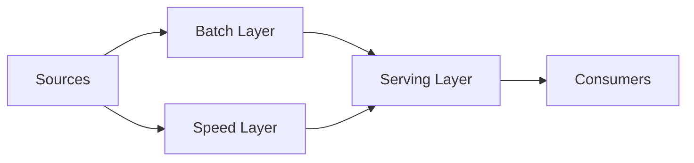
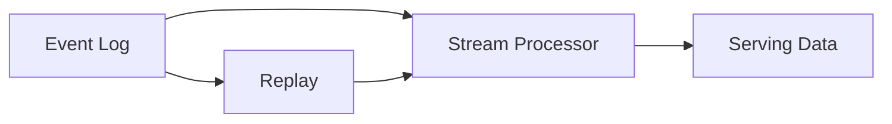
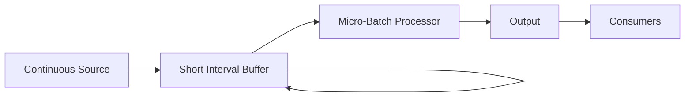
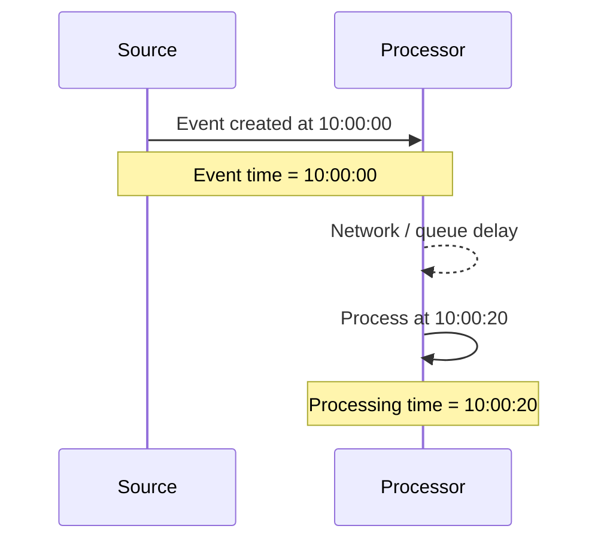
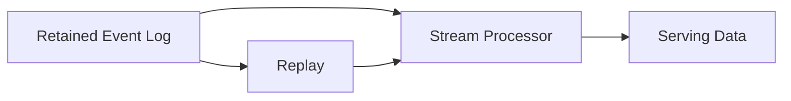

# Batch, Micro-Batch, and Streaming

> **Module:** Python for Data Engineering → 01-Data-Engineering-Foundations-and-Pipeline-Thinking  
> **Topic:** 03 — Batch, Micro-Batch, and Streaming  
> **Level:** Beginner → Intermediate → Advanced foundation  
> **Implementation rule for this lesson:** Python standard library only
>
> **Core principle:** **Choose the simplest processing architecture that satisfies the consumer's actual latency and business requirements.**

---

# 1. Why This Topic Matters

The previous topic established the **data lifecycle**:

```text
Generation
    ↓
Ingestion
    ↓
Storage
    ↓
Transformation
    ↓
Serving
    ↓
Consumption
    ↓
Archival / Deletion
```

That lifecycle answers:

> **What data moves, and where does it go?**

Now we need a second architectural question:

> **How frequently should data move through the lifecycle, and how quickly must it become available?**

That is the purpose of processing modes.

A useful mental model is:

```text
Lifecycle tells us:

WHAT data moves
and
WHERE it goes.

Processing mode tells us:

HOW OFTEN data moves
and
HOW QUICKLY it becomes available.
```

The three core models are:

```text
Batch
Micro-batch
Streaming
```

They are not merely three software buzzwords. They represent different ways of handling time, data arrival, compute, state, latency, and operations.

---

# 2. Learning Outcomes

By the end of this lesson, you should be able to:

1. Explain batch processing in plain English.
2. Explain micro-batch processing in plain English.
3. Explain streaming processing in plain English.
4. Distinguish bounded and unbounded data.
5. Explain why a processing mode is an architectural decision.
6. Distinguish event time and processing time.
7. Explain latency and freshness at a foundational level.
8. Explain why state matters in streaming systems.
9. Explain why ordering matters.
10. Explain the cost implications of always-on compute.
11. Explain why streaming usually creates additional operational responsibility.
12. Choose a processing mode from a business requirement.
13. Explain Lambda architecture.
14. Explain why Lambda can create duplicated business logic.
15. Explain Kappa architecture and replay.
16. Explain hybrid processing architectures.
17. Understand the concept of unified batch/stream processing.
18. Extend a small lifecycle simulation into batch, micro-batch, and stream modes.
19. Measure end-to-end latency in a local Python experiment.
20. Deliberately break the simulation and reason about what happened.
21. Explain these ideas like a production data engineer.

---

# 3. The Simplest Possible Explanation

Start here.

> **Batch processing handles data in groups. Streaming processes continuously arriving data. Micro-batch processes small groups frequently enough to provide relatively low latency without necessarily processing each event individually.**

Visualize the difference.

## Batch

```text
Data accumulates
      ↓
Wait
      ↓
Process a batch
      ↓
Output
      ↓
Finish
```

## Micro-batch

```text
Small amount of data arrives
      ↓
Wait for a short interval
      ↓
Process a small batch
      ↓
Repeat
      ↓
Repeat
      ↓
Repeat
```

## Streaming

```text
Event
 ↓
Process
 ↓
Output

Event
 ↓
Process
 ↓
Output

Event
 ↓
Process
 ↓
Output

...
```

These are conceptual models.

Real streaming systems may process individual records logically while internally buffering work into batches. Modern processing engines can therefore blur the implementation boundary between these categories.

---

# 4. Processing Mode Is a System Design Decision

A processing mode affects:

- freshness
- latency
- compute cost
- infrastructure complexity
- state management
- ordering
- replayability
- failure recovery
- monitoring
- on-call burden

Do not start with:

> "Which streaming technology should we use?"

Start with:

> **"How quickly must the business decision be made after the data is generated?"**

A useful conceptual spectrum is:

```text
Days / Hours / Minutes
        ↑
      BATCH

Minutes / Seconds
        ↑
   MICRO-BATCH

Seconds / Milliseconds
        ↑
    STREAMING
```

These ranges are illustrative rather than universal guarantees.

A micro-batch system running every 5 seconds might be entirely sufficient for a use case described informally as "real-time." Another system may need significantly lower latency.

The architecture should follow the requirement.

---

# 5. Learning Progression

This topic deliberately moves from simple ideas to advanced architecture.

```text
Level 1 — Basics
    ↓
What is processing?
    ↓
Batch
    ↓
Streaming
    ↓
Micro-batch
    ↓
Bounded vs unbounded
    ↓
Level 2 — Intermediate
    ↓
Event time vs processing time
    ↓
Latency
    ↓
Cost
    ↓
State
    ↓
Ordering
    ↓
Operational burden
    ↓
Decision framework
    ↓
Level 3 — Advanced
    ↓
Lambda architecture
    ↓
Kappa architecture
    ↓
Hybrid architectures
    ↓
Production architecture reasoning
```

Do not study Lambda or Kappa until the basic processing models are clear.

---

# 6. What Does "Processing" Mean?

At the simplest level, **processing** means taking available data and doing something with it.

For example:

```text
Input:
orders

Processing:
calculate total revenue

Output:
daily_revenue
```

The processing itself could be:

- filtering
- cleaning
- aggregating
- joining
- enriching
- computing features
- generating alerts
- updating state

The question in this lesson is not primarily **what transformation** occurs.

The question is:

> **When should that transformation happen?**

---

# 7. Batch Processing

## 7.1 Definition

> **Batch processing works on a finite or bounded collection of data at a scheduled or triggered time.**

Think:

```text
collect
→ wait
→ process
→ finish
```

A batch job has a natural notion of completion.

---

# 8. Why Batch Processing Exists

Batch processing is useful because it can provide a relatively simple execution model.

Potential benefits include:

- simpler execution
- efficient large-scale processing
- predictable scheduled work
- easier debugging
- easier reproducibility
- easier backfills
- lower need for continuously running compute
- suitability for workloads where immediate results are unnecessary

Suppose finance only needs a report every morning.

There may be little value in continuously recalculating it every second.

A batch process can be enough:

```text
Yesterday's data
        ↓
Nightly job
        ↓
Finance dataset
        ↓
Morning dashboard
```

---

# 9. Batch Lifecycle

A typical conceptual batch lifecycle is:

```text
Records arrive
      ↓
Accumulate
      ↓
Scheduled trigger
      ↓
Read bounded dataset
      ↓
Process
      ↓
Write output
      ↓
Finish
```

The phrase **scheduled trigger** is important.

The system may run:

- every hour
- every night
- every day
- every month
- when a file arrives
- when another upstream job completes

---

# 10. Batch Terminology

## Batch

A collection of records processed together.

Example:

```text
orders_2026_09_25
```

## Batch window

The period represented by a batch.

Example:

```text
2026-09-25 00:00
→
2026-09-26 00:00
```

## Schedule

When the job is intended to run.

Example:

```text
02:00 every day
```

## Run

One execution of the job.

Example:

```text
run_2026_09_26_0200
```

## Job

The executable unit of processing.

## Bounded input

Data with a known logical end.

---

# 11. Batch Examples

Common examples include:

- daily revenue reporting
- monthly finance reporting
- payroll
- nightly warehouse transformations
- daily machine-learning training dataset creation
- periodic recommendation refresh
- daily regulatory reports
- periodic billing calculations
- end-of-day reconciliation

A key pattern is:

```text
Immediate result is not required.
```

---

# 12. Batch Advantages

## 12.1 Simpler execution

A batch job generally has:

```text
start
→ process
→ finish
```

This can be easier to understand than a continuously running process.

## 12.2 Easier debugging

If a run fails:

```text
run 102 failed
```

the engineer can inspect the input and rerun the job.

## 12.3 Predictable compute

The system can provision compute around known schedules.

## 12.4 Easier historical recomputation

A finite dataset is often straightforward to reprocess.

## 12.5 Lower operational burden in many use cases

A job that runs for 15 minutes each night has a different operational profile from a service that must remain healthy continuously.

---

# 13. Batch Limitations

Batch processing has an inherent freshness trade-off.

If a job runs once per day:

```text
00:00 → data generated
02:00 → data lands
03:00 → job starts
04:00 → output available
```

a consumer cannot normally see the completed result at 00:05.

Typical limitations:

- delayed freshness
- waiting for the next run
- potentially large processing windows
- less suitable for immediate decisions

Again:

> A limitation is only important if the consumer actually cares about it.

---

# 14. Small Python Batch Example

Use Python standard library only.

```python
from pathlib import Path
import json


def process_batch(path: Path) -> float:
    records = json.loads(path.read_text(encoding="utf-8"))

    total = sum(
        float(record["amount"])
        for record in records
    )

    return total


if __name__ == "__main__":
    input_path = Path("orders.json")
    revenue = process_batch(input_path)
    print(f"revenue={revenue:.2f}")
```

Why is this batch processing?

Because the program:

1. reads a finite file,
2. loads the available records,
3. processes the collection,
4. produces a result,
5. finishes.

It is not continuously waiting for new records.

---

# 15. Bounded Data

## 15.1 Definition

> **Bounded data has a known beginning and end.**

For example:

```text
orders_2026_09_25.json
```

contains some finite set of records.

Conceptually:

```text
Start
 ↓
record
record
record
record
 ↓
End
```

Examples:

- file
- database query result
- daily partition
- historical dataset
- completed export

Bounded data is naturally compatible with batch processing.

But do not say:

> "Bounded data can only be processed in batch."

That is too strong.

A bounded dataset can also be fed into a system whose processing engine supports streaming-style execution. The key property is that the input has a logical end.

---

# 16. Streaming Processing

## 16.1 Definition

> **Streaming processing works with continuously arriving data that does not have a predetermined final record.**

Think:

```text
new event
→ process
→ next event
→ process
→ next event
→ ...
```

There may never be a final event.

---

# 17. Why Streaming Exists

Some business processes require rapid reaction.

Examples:

- fraud detection
- payment events
- stock or market events
- operational alerts
- real-time monitoring
- inventory changes
- IoT alerts
- live event analytics
- device telemetry
- customer notifications

The common property is not simply "large data."

The common property is:

> **A decision or action may become less useful if the system waits too long.**

---

# 18. Streaming Lifecycle

Conceptually:

```text
Event arrives
     ↓
Receive event
     ↓
Process event
     ↓
Update result / emit result
     ↓
Next event
     ↓
...
```

Unlike batch:

```text
there is no required natural finish point
```

The process may remain active indefinitely.

---

# 19. Properties of Streaming

Streaming systems often involve:

- unbounded data
- continuous arrival
- low-latency processing
- ongoing execution
- state
- ordering concerns
- recovery and checkpointing
- backlogs or lag
- continuous monitoring

Important clarification:

> "Streaming" does not necessarily mean that every event is literally executed by the CPU in complete isolation from every other event.

A streaming engine may internally buffer and batch work.

The conceptual distinction is about the **arrival and processing model**, not a particular CPU instruction sequence.

---

# 20. Unbounded Data

## 20.1 Definition

> **Unbounded data is data for which there is no predefined final record.**

For example:

```text
Order event
Order event
Order event
...
new event tomorrow
...
new event next month
...
```

A continuously operating system cannot simply wait for:

```text
the last record
```

because there may never be one.

This changes the engineering model.

---

# 21. Streaming Requires Ongoing Thinking

A long-running streaming system must answer:

- Where is progress remembered?
- What happens after restart?
- What happens when events arrive late?
- What happens when events arrive out of order?
- How is state recovered?
- What happens when consumers are slower than producers?
- How long can the process remain healthy?

These are not merely coding questions.

They are system design questions.

---

# 22. Micro-Batch Processing

## 22.1 Definition

> **Micro-batch processing processes small batches repeatedly at short intervals.**

Example:

```text
10:00:00 → events accumulate
10:00:05 → process batch A

10:00:05 → events accumulate
10:00:10 → process batch B

10:00:10 → events accumulate
10:00:15 → process batch C
```

It is useful to think of micro-batch as a repeated loop:

```text
wait briefly
→ collect
→ process
→ output
→ repeat
```

---

# 23. Micro-Batch Trade-off

The interval matters.

```text
Smaller interval
    ↓
lower latency
    ↓
more frequent processing
    ↓
potentially more overhead
```

Whereas:

```text
Larger interval
    ↓
higher latency
    ↓
fewer processing cycles
    ↓
potentially lower overhead
```

There is therefore a tuning trade-off.

A 1-second interval and a 60-second interval are not operationally equivalent.

---

# 24. Micro-Batch and Modern Engines

Some modern stream-processing engines support micro-batch execution.

For example, Spark Structured Streaming uses a micro-batch execution model by default.

For this lesson, remember only the architectural concept:

```text
continuously arriving data
+
repeated short processing intervals
```

Do not turn this section into a Spark tutorial.

> You only need the processing model here. Spark implementation details are covered later.

---

# 25. Batch vs Micro-Batch vs Streaming

| Dimension | Batch | Micro-Batch | Streaming |
|---|---|---|---|
| Input mental model | Bounded | Frequently arriving small groups | Unbounded / continuous |
| Processing | Scheduled | Repeated short intervals | Ongoing |
| Typical latency | Higher | Lower | Potentially lowest |
| Compute | Often on-demand/scheduled | Frequent | Often continuously available |
| State | Often simpler | Can be needed | Often important |
| Ordering concerns | Usually simpler | Moderate | Often important |
| Operational burden | Usually lower | Medium | Usually higher |
| Typical examples | Reports, payroll | Frequent analytics | Fraud, alerts, event-driven systems |

These are conceptual comparisons, not universal laws.

A real engine can blur the categories.

---

# 26. Latency

## 26.1 Definition

> **Latency is the time between an event being created and the result becoming available to the consumer.**

A useful lifecycle:

```text
Event created
    ↓
Ingestion delay
    ↓
Processing delay
    ↓
Serving delay
    ↓
Consumer sees result
```

A simplified relationship is:

```text
End-to-end latency
≈
ingestion latency
+
processing latency
+
serving latency
+
other relevant delays
```

For example:

```text
ingestion = 10 sec
processing = 20 sec
serving = 5 sec
```

Then the simplified end-to-end latency is approximately:

```text
35 seconds
```

This is an illustrative calculation, not a distributed-systems benchmark.

---

# 27. Processing Time vs End-to-End Latency

These are different.

## Processing time

How long the processing work itself takes.

Example:

```text
batch processing duration = 20 seconds
```

## End-to-end latency

How long it takes the information to become available to the consumer from the event's point of creation.

Example:

```text
event created
10:00:00

consumer sees result
10:00:35

latency = 35 seconds
```

A system can have a short processing duration but large end-to-end latency if the data spends a long time waiting before processing.

---

# 28. Freshness vs Latency

Do not confuse these.

### Latency

How long an individual event takes to travel through the system.

### Freshness

How recent the data currently available to a consumer is.

For example:

```text
Latest source event:
10:00

Consumer dataset last updated:
09:55
```

The dataset is:

```text
5 minutes behind
```

That is a freshness observation.

Latency is typically discussed from an event's perspective.

A later topic will cover freshness, latency, service-level objectives, and consumer expectations in more depth.

---

# 29. Event Time vs Processing Time

This is fundamental for streaming.

## Event time

The time when the event actually happened.

```text
event_time = 10:00:00
```

## Processing time

The time when the processing system handles the event.

```text
processing_time = 10:00:20
```

Visualize:

```text
Event happens
10:00:00
    ↓
network / queue / source delay
    ↓
Processor receives event
10:00:20
```

Therefore:

```text
event time
≠
processing time
```

---

# 30. Why Event Time and Processing Time Differ

Reasons can include:

- network delay
- device disconnection
- source retries
- delayed files
- mobile devices reconnecting
- overloaded systems
- intermediate queues

This matters because a consumer may care about **when the business event happened**, not simply when the system happened to process it.

---

# 31. Example: Late Event

Suppose:

```text
Event A
event_time = 10:00:00
arrives = 10:00:02
```

and:

```text
Event B
event_time = 10:00:01
arrives = 10:00:20
```

B happened earlier than some later events, but arrived later.

```text
event time:
A → B

arrival / processing order:
A → B
```

Now change the example:

```text
Event A
event_time = 10:00:00
arrives = 10:00:10

Event B
event_time = 10:00:01
arrives = 10:00:05
```

Now:

```text
event time:
A → B

arrival order:
B → A
```

This is an out-of-order event scenario.

Detailed event-time windows and watermarks belong later.

> You need the mental model here; detailed event-time processing and watermarking are covered later in the roadmap.

---

# 32. Ordering

Ordering asks:

> In what sequence should events be interpreted?

Suppose the logical sequence is:

```text
A → B → C
```

but the processor receives:

```text
A → C → B
```

That can matter when state changes depend on previous events.

---

# 33. Ordering Example

Suppose:

```text
account_balance = 100
```

Then:

```text
deposit +50
withdraw -30
```

The expected final balance is:

```text
120
```

If events are interpreted in a different order, intermediate state may differ.

This does not necessarily mean the final answer will always be wrong, but ordering requirements must be understood.

---

# 34. Global Order vs Partial Order

A system may be able to guarantee:

```text
order within a partition
```

without guaranteeing:

```text
global order across every event
```

Global ordering can be expensive and unnecessary.

The correct question is:

> **What level of ordering does the business actually require?**

For some workloads:

```text
no global ordering requirement
```

is enough.

For others:

```text
per-customer ordering
```

may be required.

This is an architecture trade-off.

---

# 35. State

## 35.1 Definition

> **State is information a processing system remembers across multiple events.**

Example:

```text
customer_id = 42
purchase_total = 700
```

New event:

```text
purchase = 100
```

State becomes:

```text
purchase_total = 800
```

The processor cannot calculate the new total from the latest event alone.

It needs prior information.

---

# 36. Why State Makes Streaming More Complex

A stateful streaming processor must reason about:

- state storage
- updates
- recovery
- checkpointing
- state size
- restart behavior
- duplicate processing

If the process crashes:

```text
Where does the processor continue from?
```

That is much more complicated than a stateless function that can simply re-read a complete file.

---

# 37. Stateless vs Stateful Example

## Stateless

```python
def normalize_country(value: str) -> str:
    return value.strip().title()
```

Each record can be processed independently.

## Stateful

```python
totals[customer_id] += amount
```

The result depends on prior events.

This is a simplified model, but it demonstrates why state introduces memory across records.

---

# 38. Always-On Compute

Batch often looks like:

```text
No scheduled processing
→ no batch execution

Scheduled time
→ start compute
→ process
→ stop
```

Streaming commonly looks like:

```text
processing service remains active
→ wait for events
→ process
→ wait
→ process
→ ...
```

This can create the requirement for continuously available resources.

That is often called **always-on compute**.

---

# 39. Cost Trade-Offs

The key cost question is not:

> "Is streaming expensive?"

The better question is:

> **"What amount of latency is worth the additional compute and operational complexity for this business?"**

## Batch

Potential cost advantage:

```text
compute runs when needed
```

## Streaming

Potential cost consequence:

```text
processing capacity remains available continuously
```

## Micro-batch

Conceptually:

```text
more frequent processing
→ more frequent work
→ potentially more overhead
```

Infrastructure pricing varies widely, so do not infer an exact cost relationship from these conceptual patterns.

---

# 40. Operational Complexity

Streaming can require more operational discipline because the system is continuously active.

Potential concerns include:

- continuously running processes
- state
- checkpoints
- retries
- recovery
- backpressure
- monitoring
- lag
- ordering
- event time
- downstream outages

A useful principle is:

> **A system that runs continuously has more continuously active failure modes than a job that simply starts and finishes.**

This does not mean streaming is inherently unreliable.

It means the operating model is different.

---

# 41. Backpressure

At a conceptual level, **backpressure** describes what happens when incoming work is arriving faster than the system can process it.

Example:

```text
events arriving:
1,000 / minute

system processing:
700 / minute
```

Unfinished work accumulates.

```text
arrival rate > processing rate
        ↓
backlog grows
        ↓
latency grows
        ↓
freshness worsens
```

The important metric concept is **lag** or backlog.

Do not go deeply into implementation-specific backpressure mechanisms here.

---

# 42. Backlog and Lag

Suppose:

```text
Producer:
10,000 events

Consumer:
8,000 processed
```

Then:

```text
2,000 events
```

remain outstanding in the simplified model.

If this gap continues growing:

```text
backlog ↑
latency ↑
consumer freshness ↓
```

This is a key operational signal.

---

# 43. On-Call Burden

The architecture choice also affects human operations.

## Batch example

A daily job fails:

```text
Investigate
→ fix
→ rerun / backfill
```

The problem is bounded to a run.

## Streaming example

A continuously running system may experience:

- increasing lag
- growing state
- stalled processing
- downstream outage
- event backlog
- restart loops

The team may need continuous monitoring and response.

This is part of the architecture's **operational cost**.

---

# 44. A Production Engineer's Decision Question

Do not ask:

> "Can we use streaming?"

Instead ask:

> **"What decision is made with this data, and how quickly must that decision be made?"**

Then consider:

```text
1. What decision is being made?
2. What is the maximum acceptable latency?
3. What happens if data is delayed?
4. How much data arrives?
5. How often does it arrive?
6. Is continuous processing actually required?
7. What operational complexity can the team support?
8. What does always-on compute cost?
9. Can a simpler architecture satisfy the requirement?
10. How will the system recover after failure?
```

---

# 45. Requirements-First Architecture

Use this sequence:

```text
Business requirement
        ↓
Decision timing
        ↓
Latency requirement
        ↓
Data arrival characteristics
        ↓
Cost / complexity constraints
        ↓
Processing mode
        ↓
Implementation
```

Do not reverse it.

The anti-pattern is:

```text
Technology
    ↓
Choose architecture
    ↓
Find a problem to justify it
```

That is technology-first architecture.

---

# 46. Use-Case Decision Table

The following table contains typical choices, not universal rules.

| Use case | Typical mode | Why | Main trade-off |
|---|---|---|---|
| Fraud detection | Streaming / low-latency processing | Decision may need recent events | Higher operational complexity |
| Monthly finance report | Batch | Immediate results usually unnecessary | Lower freshness |
| Recommendation refresh | Batch or micro-batch | Refresh can often be periodic | Potentially stale recommendations |
| Stock ticker | Streaming | Consumers care about rapid updates | Continuous processing cost |
| Payroll | Batch | Periodic calculation is sufficient | Wait until scheduled run |
| Website analytics | Batch or micro-batch | Requirement depends on dashboard freshness | More frequent processing adds cost |
| IoT alerts | Streaming | Alerts may lose value if delayed | More operational complexity |
| ML training set | Batch | Training is generally scheduled, not per-event | Dataset may be stale between refreshes |
| Inventory sync | Batch, micro-batch, or streaming | Depends on tolerance for stale inventory | Lower latency usually costs more |
| Marketing email list | Batch or micro-batch | Updates may not need per-event processing | Delay between changes and activation |

The correct decision should come from actual requirements.

---

# 47. Scenario: Monthly Finance Reporting

Suppose:

```text
Consumer:
finance department

Need:
daily or monthly finalized reporting
```

A batch design can be sensible:

```text
source data
→ daily batch
→ curated finance dataset
→ reporting
```

There is usually little architectural value in processing every transaction solely to maintain a dashboard that is consumed once per month.

---

# 48. Scenario: Fraud Detection

Suppose:

```text
Consumer:
fraud decision system

Need:
very recent transaction information
```

The decision may become less useful if delayed.

A low-latency design may therefore be appropriate:

```text
event
→ ingestion
→ low-latency processing
→ fraud signal
```

The exact implementation depends on the actual latency target.

---

# 49. Scenario: Recommendation Refresh

Suppose recommendations only need updating every few hours.

A micro-batch design may be sufficient:

```text
events
→ collect for 10 minutes
→ process
→ update recommendation data
```

If a 10-minute delay is acceptable, there may be little reason to introduce a more complex per-event processing design.

---

# 50. Scenario: Stock or Market Events

If users expect rapidly updating prices:

```text
event arrival
→ processing
→ serving
→ client
```

latency may matter strongly.

Streaming is a natural architectural candidate when the source and consumer requirements actually demand continuous low-latency behavior.

---

# 51. Scenario: Payroll

Payroll is generally periodic.

Conceptually:

```text
employee data
→ scheduled processing
→ payroll result
```

The system may be complex, but the processing mode can still be batch.

Complex business logic does not automatically imply streaming.

---

# 52. Scenario: Website Analytics

Imagine a product dashboard.

The business wants:

```text
metrics updated every 5 minutes
```

Micro-batch may fit:

```text
collect events
→ process every 5 minutes
→ update analytics
```

If the requirement instead becomes:

```text
dashboard update in 500 ms
```

the design pressure changes.

The decision should follow the requirement.

---

# 53. Scenario: IoT Alerts

Suppose a temperature sensor sends:

```text
temperature = 105°C
```

and the business needs an alert quickly.

Batch processing every night is obviously mismatched to that business requirement.

A low-latency processing approach becomes more appropriate.

---

# 54. Scenario: ML Training Set

A training dataset is usually assembled periodically:

```text
historical source data
→ cleaning
→ joining
→ feature creation
→ training dataset
→ model training
```

This often aligns with batch processing.

Training-data pipelines may still include continuously captured source events, but the final training dataset creation does not necessarily need per-event execution.

---

# 55. Scenario: Inventory Synchronization

Suppose:

```text
inventory = 10 units
```

and a purchase occurs.

How quickly must inventory change?

The answer could be:

```text
immediately
```

or:

```text
within a few minutes
```

or:

```text
hourly
```

Different requirements could lead to streaming, micro-batch, or batch.

The business tolerance for stale inventory is the deciding factor.

---

# 56. Scenario: Marketing Email List

Suppose a campaign targets customers who became eligible for an offer.

If the list can refresh every hour:

```text
micro-batch
```

may be adequate.

If it only needs a daily refresh:

```text
batch
```

may be enough.

Again, there is no universal "modern" choice.

---

# 57. Lambda Architecture

Only after understanding batch and streaming should we introduce Lambda.

> **Lambda architecture combines a batch layer with a speed/streaming layer so the system can support both low-latency views and recomputation over historical data.**

A simplified view:



Conceptually:

```text
                 ┌───────────────┐
                 │ Batch Layer   │
                 │ Historical    │
                 └───────┬───────┘
                         │
Sources ─────────────────┼──────→ Serving
                         │
                 ┌───────┴───────┐
                 │ Speed Layer   │
                 │ Low Latency   │
                 └───────────────┘
```

The batch layer handles historical computation.

The speed layer handles recent low-latency information.

---

# 58. Why Lambda Exists

A common conceptual requirement is:

```text
We want:
accurate historical results
+
low-latency recent results
```

A Lambda-style design may address both.

For example:

```text
Historical revenue
→ batch layer

Current-minute revenue
→ speed layer

Combined / served view
→ consumer
```

This can be useful in certain systems.

But it comes with a major trade-off.

---

# 59. Lambda's Duplicated-Logic Problem

Suppose the business rule is:

```text
net_revenue = gross_revenue - refunds
```

The batch layer may implement it one way.

The speed layer may implement it another way.

Conceptually:

```text
Batch revenue calculation
+
Streaming revenue calculation
=
Two implementations of related business logic
```

Now ask:

> What happens when the formula changes?

Both implementations must change.

Potential consequences:

- more maintenance
- more tests
- more debugging
- consistency risk
- more operational complexity

This is commonly described as **duplicated logic**.

The point is not that duplicated logic is impossible to manage.

The point is that it creates another consistency boundary.

---

# 60. Lambda Trade-Offs

## Potential benefits

- historical recomputation
- low-latency results
- separate optimization for historical and recent workloads

## Costs

- multiple processing paths
- potentially duplicated business logic
- reconciliation
- more testing
- more operational complexity

Lambda can still make sense when its trade-offs match the system's requirements.

Do not treat it as universally good or bad.

---

# 61. Kappa Architecture

Kappa architecture takes a different conceptual approach.

> **Kappa architecture uses a stream/event-log-oriented processing model and relies on replay to rebuild results instead of maintaining separate batch and speed logic.**

Simplified:



Conceptually:

```text
Event Log
    ↓
Streaming Processor
    ↓
Serving Data

Historical rebuild
       ↑
    Replay Events
```

The key idea is:

> **Keep the events available so the processing logic can be replayed.**

---

# 62. Why Replay Matters

Suppose the processor has a bug in version 1.

You deploy version 2.

If the source events are retained, you may be able to:

```text
replay historical events
→ rerun new logic
→ rebuild outputs
```

This gives replay-oriented systems a powerful recovery mechanism.

But replay is not free.

---

# 63. Kappa Trade-Offs

## Potential benefits

- one primary stream-oriented processing model
- reduced duplication of business logic
- replay as a historical rebuild mechanism

## Challenges

- event retention
- replay cost
- state reconstruction
- streaming operational complexity
- potentially long historical reprocessing
- dependency on reliable event history

Do not interpret Kappa as:

> "There is no batch computation."

Replay itself is a historical computation mechanism.

---

# 64. Lambda vs Kappa

| Dimension | Lambda | Kappa |
|---|---|---|
| Main idea | Batch + speed layers | Stream/replay-oriented processing |
| Historical processing | Batch layer | Replay retained events |
| Low latency | Speed layer | Streaming |
| Logic duplication | Can be significant | Can be reduced |
| Replay | Useful | Central concept |
| State concerns | Depends on design | Often important |
| Operational complexity | Can be high | Can be high |
| Main trade-off | Multiple processing paths | Event retention and replay complexity |

These are architecture concepts, not mandates.

---

# 65. Hybrid Architectures

Modern systems are often hybrid.

One example:

```text
Events
   ↓
Streaming ingestion
   ↓
Durable storage
   ↓
Scheduled batch transformation
   ↓
Analytical tables
```

This can make sense when:

- continuous capture is valuable
- transformations do not require immediate results
- durable historical storage is important
- analytics can tolerate periodic updates

Notice what happened:

```text
ingestion mode
```

and:

```text
transformation mode
```

do not have to be identical.

---

# 66. Streaming Ingestion + Batch Transformation

A useful hybrid model is:


The source events can enter the platform continuously.

The analytical transformation can run periodically.

This is an important architectural lesson:

> **Different lifecycle stages can have different timing requirements.**

---

# 67. Unified Batch/Stream Processing

Some modern processing systems allow related transformation logic to work over:

```text
historical bounded data
```

and:

```text
continuously arriving data
```

The useful conceptual idea is:

```text
one processing model
+
different input timing
```

This can reduce duplicated logic in some architectures.

The implementation details vary by engine.

> You need the architecture mental model here. Distributed engine implementation is taught later.

---

# 68. Bounded vs Unbounded Comparison

| Property | Bounded | Unbounded |
|---|---|---|
| Has a logical end | Yes | No predetermined end |
| Typical model | Batch | Streaming |
| Completion | Definite | Continuous |
| State concerns | Often simpler | Often more important |
| Scheduling | Common | Often continuously active |
| Historical replay | Usually straightforward | Depends on retained event history |
| Resource lifecycle | Start / finish | Long-running |

Again, this is a conceptual framework rather than an absolute implementation restriction.

---

# 69. Why Streaming Is Not "Instant"

A common misconception is:

```text
streaming
=
zero latency
```

This is incorrect.

A streaming system can still experience:

- network delay
- queue delay
- processing delay
- serving delay
- backpressure
- consumer delay
- outages

So:

```text
streaming
→ potentially low latency
```

is better than:

```text
streaming
→ instantaneous
```

---

# 70. Why Micro-Batch Can Be "Real-Time Enough"

Suppose a business requirement is:

```text
dashboard update within 30 seconds
```

A micro-batch interval of:

```text
5 seconds
```

may satisfy the requirement.

You do not need to process every event independently just because the user said:

> "real-time."

The engineering question is:

```text
What latency is actually required?
```

not:

```text
Which architecture sounds fastest?
```

---

# 71. Production Architecture View

## 71.1 Toy batch

```text
CSV
 ↓
Python
 ↓
CSV
```

## 71.2 Production batch

```text
Source
 ↓
Ingestion
 ↓
Durable Storage
 ↓
Scheduled Processing
 ↓
Curated Data
 ↓
Serving
 ↓
Consumers
```

Production adds concerns such as:

- authentication
- authorization
- validation
- idempotency
- retries
- deployment
- observability
- ownership
- lineage
- retention

---

# 72. Toy Streaming

A teaching simulation can be:

```text
Generator
 ↓
Function
 ↓
Output
```

Example:

```python
def order_stream(orders):
    for order in orders:
        yield order
```

The generator yields one item at a time.

That creates a useful mental model for:

```text
event
→ process
→ event
→ process
```

But remember:

> **This is a teaching simulation, not a distributed stream-processing system.**

---

# 73. Production Streaming

A conceptual production architecture may look like:

```text
Event Producers
      ↓
Durable Event Transport
      ↓
Stream Processor
      ↓
State / Checkpoints
      ↓
Serving / Storage
      ↓
Consumers
```

The components are more sophisticated because the system needs to handle:

- failures
- restart
- state
- event ordering
- backlogs
- scaling
- monitoring
- data loss prevention
- replay

This lesson introduces those concepts only.

Do not turn this into a Kafka, Flink, or Spark tutorial.

---

# 74. Architecture Diagram — Batch


### Explanation

Data accumulates until the scheduled process runs. The process reads a bounded input, transforms it, writes output, and finishes.

---

# 75. Architecture Diagram — Micro-Batch



### Explanation

Data keeps arriving, but the processor periodically handles small collections instead of waiting for a large daily batch.

---

# 76. Architecture Diagram — Streaming


### Explanation

The system remains active while events continue arriving. The processor handles the ongoing flow and updates or emits results.

---

# 77. Event-Time vs Processing-Time Timeline



### Explanation

The event happened at one time and was processed at another. In real distributed systems, this distinction is fundamental.

---

# 78. Architecture Diagram — Lambda


### Explanation

The batch path provides historical computation while the speed path provides low-latency information. Maintaining both paths can introduce duplicated business logic.

---

# 79. Architecture Diagram — Kappa



### Explanation

The retained event history acts as the replay source. Historical outputs can be rebuilt by replaying events through processing logic.

---

# 80. Architecture Diagram — Hybrid


### Explanation

Events are captured continuously, but downstream analytics are computed periodically.

---

# 81. Performance Thinking

An engineer deciding between processing modes should ask:

```text
How much data arrives?
How quickly does it arrive?
How quickly can we process it?
What happens when arrival rate exceeds processing rate?
What is our latency target?
How much compute must remain active?
What happens after restart?
Can we replay data?
```

This is performance thinking before tool selection.

Do not focus only on:

```text
records/second
```

Also consider:

```text
latency
backlog
cost
state
recovery
operability
```

---

# 82. End-to-End Latency Experiment

The roadmap requires extending the lifecycle simulation so you can compare:

```text
--mode batch
--mode micro-batch --interval 5
--mode stream
```

The purpose is not benchmarking your laptop.

The purpose is to make the architectural differences observable.

You should measure:

- processing duration
- end-to-end latency
- number of runs
- number of records
- average latency
- maximum latency

---

# 83. Important Note About the Exercise

The real-world system might use:

- message brokers
- distributed processors
- object storage
- event logs
- checkpoints
- orchestration
- monitoring platforms

The exercise deliberately does **not** reproduce those systems.

It uses:

```text
Python standard library
```

to simulate the mental model.

The correct learning outcome is:

```text
I understand why the architectures behave differently.
```

not:

```text
I built a production stream-processing engine.
```

---

# 84. Command-Line Interface

The simulation should support:

```text
python lifecycle_sim.py --mode batch
```

```text
python lifecycle_sim.py --mode micro-batch --interval 5
```

```text
python lifecycle_sim.py --mode stream
```

Use Python's standard-library `argparse`.

A simple command parser is:

```python
import argparse


def parse_args():
    parser = argparse.ArgumentParser()

    parser.add_argument(
        "--mode",
        choices=["batch", "micro-batch", "stream"],
        required=True,
    )

    parser.add_argument(
        "--interval",
        type=float,
        default=5.0,
    )

    return parser.parse_args()
```

The `interval` option is primarily relevant to micro-batch mode.

---

# 85. The Simulation Data Model

A useful record structure is:

```python
{
    "order_id": 1001,
    "customer_id": 42,
    "amount": 199.99,
    "created_at": "...",
}
```

Use timezone-aware timestamps.

A record has at least:

```text
event / creation time
```

Then the simulator can create:

```text
processing time
```

when the record is handled.

---

# 86. Batch Mode Implementation

Batch mode should:

1. process all records once,
2. log start time,
3. process the complete input,
4. log end time,
5. calculate processing duration,
6. calculate end-to-end latency,
7. report record count.

A simple pattern:

```python
from datetime import datetime, timezone


def process_one(order):
    processed_at = datetime.now(timezone.utc)

    event_time = datetime.fromisoformat(
        order["created_at"]
    )

    latency = (
        processed_at - event_time
    ).total_seconds()

    return {
        **order,
        "processed_at": processed_at,
        "latency_seconds": latency,
    }


def run_batch(orders):
    start = datetime.now(timezone.utc)

    results = [
        process_one(order)
        for order in orders
    ]

    end = datetime.now(timezone.utc)

    duration = (
        end - start
    ).total_seconds()

    return results, duration
```

The batch completes when all records have been processed.

---

# 87. Batch Mode Explanation

The important properties are:

```text
all records available
→ process collection
→ finish
```

This is not about `for` loops alone.

A Python `for` loop can appear in a streaming processor too.

The architectural property is:

> **The batch processor has a bounded processing set and a finite run.**

---

# 88. Micro-Batch Mode Implementation

Micro-batch requires repeated processing.

Conceptually:

```python
import time


def run_micro_batches(orders, interval_seconds=5):
    last_processed = None

    while True:
        new_orders = get_new_orders(
            orders,
            last_processed,
        )

        if new_orders:
            process_batch(new_orders)

            last_processed = max(
                order["created_at"]
                for order in new_orders
            )

        time.sleep(interval_seconds)
```

The example is intentionally incomplete as production code.

The key concepts are:

```text
interval
state
progress
new records
repeat
```

---

# 89. Micro-Batch Progress State

A micro-batch process needs some way to remember:

> What have I already processed?

A simple teaching model is:

```text
last_processed_timestamp
```

For example:

```text
last_processed_timestamp =
2026-09-25T10:00:00+00:00
```

The next run asks:

```text
Which records are newer?
```

This is useful for learning.

It is not a production-grade checkpointing system.

---

# 90. Why a Timestamp Alone Can Be Dangerous

Suppose two events have:

```text
created_at = 10:00:00
```

If the system records:

```text
last_processed_timestamp = 10:00:00
```

and later requests:

```text
timestamp > 10:00:00
```

it may accidentally skip the second event.

A production design may need a more precise progress marker such as:

```text
timestamp + unique ID
```

or another source-specific mechanism.

This is one reason processing progress is more complicated than a single variable.

---

# 91. Micro-Batch Duplicate Risk

Suppose a batch is processed:

```text
records A B C
```

The process crashes after the output is written but before progress is recorded.

On restart, it may process:

```text
A B C
```

again.

This creates:

```text
duplicate processing
```

The system therefore needs a consistent strategy for:

- output writes
- progress tracking
- restart behavior

This introduces the broader production concept of **idempotency**.

Do not implement full distributed idempotency here.

---

# 92. Stream Mode Implementation

A generator gives a useful teaching model:

```python
def order_stream(orders):
    for order in orders:
        yield order
```

Then:

```python
def run_stream(orders):
    results = []

    for order in order_stream(orders):
        result = process_one(order)
        results.append(result)

    return results
```

This does not make the system production streaming by itself.

The generator simply expresses:

```text
one item becomes available
→ process it
→ next item
→ process it
```

---

# 93. Streaming Simulation With Delays

To make the difference visible, simulate event arrival.

```python
import time


def order_stream(orders, delay_seconds=1.0):
    for order in orders:
        time.sleep(delay_seconds)
        yield order
```

Now:

```python
for order in order_stream(orders):
    process_one(order)
```

can approximate:

```text
event arrives
→ process
→ wait for next event
→ process
```

In a real event-driven system, events would arrive from an external transport rather than from a Python generator.

---

# 94. Full Teaching Simulation

The following is a compact reference implementation for the exercise.

It uses only Python standard-library modules.

```python
from __future__ import annotations

import argparse
import logging
import random
import statistics
import sys
import time
from dataclasses import dataclass
from datetime import datetime, timedelta, timezone
from typing import Iterable


logging.basicConfig(
    level=logging.INFO,
    format="%(asctime)s %(levelname)s %(message)s",
)


@dataclass(frozen=True)
class Order:
    order_id: int
    customer_id: int
    amount: float
    created_at: datetime


@dataclass(frozen=True)
class ProcessedOrder:
    order: Order
    processed_at: datetime
    latency_seconds: float


def parse_args():
    parser = argparse.ArgumentParser(
        description="Batch/micro-batch/stream lifecycle simulation"
    )

    parser.add_argument(
        "--mode",
        choices=["batch", "micro-batch", "stream"],
        required=True,
    )

    parser.add_argument(
        "--interval",
        type=float,
        default=5.0,
        help="Micro-batch interval in seconds.",
    )

    parser.add_argument(
        "--count",
        type=int,
        default=20,
        help="Number of simulated events.",
    )

    parser.add_argument(
        "--stream-delay",
        type=float,
        default=0.25,
        help="Delay between simulated stream events.",
    )

    return parser.parse_args()


def generate_orders(count: int) -> list[Order]:
    now = datetime.now(timezone.utc)

    orders = []

    for order_id in range(1, count + 1):
        created_at = now + timedelta(
            seconds=order_id * 0.1
        )

        orders.append(
            Order(
                order_id=order_id,
                customer_id=random.randint(1, 10),
                amount=round(
                    random.uniform(10, 500),
                    2,
                ),
                created_at=created_at,
            )
        )

    return orders


def process_order(order: Order) -> ProcessedOrder:
    processed_at = datetime.now(timezone.utc)

    latency = (
        processed_at - order.created_at
    ).total_seconds()

    return ProcessedOrder(
        order=order,
        processed_at=processed_at,
        latency_seconds=latency,
    )


def print_metrics(
    mode: str,
    duration_seconds: float,
    processed: list[ProcessedOrder],
) -> None:
    latencies = [
        item.latency_seconds
        for item in processed
    ]

    logging.info(
        "mode=%s records=%d duration_seconds=%.3f",
        mode,
        len(processed),
        duration_seconds,
    )

    if not latencies:
        return

    logging.info(
        "average_latency_seconds=%.3f",
        statistics.mean(latencies),
    )

    logging.info(
        "max_latency_seconds=%.3f",
        max(latencies),
    )


def run_batch(
    orders: list[Order],
) -> list[ProcessedOrder]:
    return [
        process_order(order)
        for order in orders
    ]


def run_stream(
    orders: list[Order],
    delay_seconds: float,
) -> list[ProcessedOrder]:
    results = []

    for order in orders:
        # Teaching simulation:
        # this represents time passing before
        # the next event becomes available.
        time.sleep(delay_seconds)

        result = process_order(order)

        logging.info(
            "stream_processed order_id=%d "
            "latency_seconds=%.3f",
            order.order_id,
            result.latency_seconds,
        )

        results.append(result)

    return results


def run_micro_batch(
    orders: list[Order],
    interval_seconds: float,
) -> list[ProcessedOrder]:
    results = []
    processed_ids: set[int] = set()

    # This is a teaching model of a moving processing boundary.
    # Production systems need durable progress tracking.
    start = time.monotonic()

    while len(processed_ids) < len(orders):
        elapsed = time.monotonic() - start

        if elapsed < interval_seconds:
            time.sleep(
                interval_seconds - elapsed
            )

        new_orders = [
            order
            for order in orders
            if order.order_id not in processed_ids
        ]

        if not new_orders:
            break

        logging.info(
            "micro_batch_size=%d",
            len(new_orders),
        )

        for order in new_orders:
            result = process_order(order)
            results.append(result)
            processed_ids.add(order.order_id)

        start = time.monotonic()

    return results


def main() -> int:
    args = parse_args()

    orders = generate_orders(args.count)

    start = time.monotonic()

    try:
        if args.mode == "batch":
            results = run_batch(orders)

        elif args.mode == "micro-batch":
            results = run_micro_batch(
                orders,
                args.interval,
            )

        elif args.mode == "stream":
            results = run_stream(
                orders,
                args.stream_delay,
            )

        else:
            raise ValueError(
                f"unsupported mode: {args.mode}"
            )

    except Exception:
        logging.exception(
            "pipeline_status=FAILED"
        )
        return 1

    duration = time.monotonic() - start

    print_metrics(
        mode=args.mode,
        duration_seconds=duration,
        processed=results,
    )

    logging.info(
        "pipeline_status=SUCCESS"
    )

    return 0


if __name__ == "__main__":
    sys.exit(main())
```

---

# 95. Important Limitation of the Reference Simulator

The simulator uses generated timestamps and local process time.

That means it is useful for illustrating:

```text
batch
vs
micro-batch
vs
stream
```

but it is **not** a real benchmark.

Some generated timestamps may even appear slightly in the future relative to processing time if the simulation creates the entire dataset at once.

For a cleaner experiment, you can instead generate event timestamps when each event is released into the simulated stream.

The lesson is about architecture, not stopwatch precision.

---

# 96. Improving the Simulation for a Better Experiment

A cleaner experiment is:

```text
Generate event
↓
record event_time
↓
wait according to mode
↓
process
↓
record processing_time
↓
latency = processing_time - event_time
```

This makes the timing relationship intuitive.

A useful helper is:

```python
def create_order(
    order_id: int,
) -> Order:
    return Order(
        order_id=order_id,
        customer_id=random.randint(1, 10),
        amount=round(
            random.uniform(10, 500),
            2,
        ),
        created_at=datetime.now(timezone.utc),
    )
```

Then the simulator can create events at different times.

---

# 97. Mode Semantics for the Exercise

## Batch

The exercise should conceptually behave like:

```text
Create all events
    ↓
Wait for batch trigger
    ↓
Process all available events
    ↓
Finish
```

## Micro-batch

Conceptually:

```text
Events appear
    ↓
wait 5 seconds
    ↓
process all currently pending events
    ↓
repeat
```

## Stream

Conceptually:

```text
Create event
    ↓
process immediately
    ↓
Create next event
    ↓
process immediately
```

These semantics are what you are trying to observe.

---

# 98. Required Commands

Run:

```bash
python lifecycle_sim.py --mode batch
```

Then:

```bash
python lifecycle_sim.py --mode micro-batch --interval 5
```

Then:

```bash
python lifecycle_sim.py --mode stream
```

Optional:

```bash
python lifecycle_sim.py --mode stream --stream-delay 0.5
```

The exact measured values will depend on your machine and simulation parameters.

---

# 99. What to Measure

For every mode record:

```text
Mode
Number of runs
Number of events
Total processing duration
Average latency
Maximum latency
Operational observations
```

Use this experiment table:

| Mode | Number of runs | Events processed | Duration (s) | Avg latency (s) | Max latency (s) | Operational observation |
|---|---:|---:|---:|---:|---:|---|
| Batch | ___ | ___ | ___ | ___ | ___ | ___ |
| Micro-batch | ___ | ___ | ___ | ___ | ___ | ___ |
| Stream | ___ | ___ | ___ | ___ | ___ | ___ |

**Do not copy expected numbers. Run the experiment and record your actual measurements.**

---

# 100. How to Interpret the Experiment

You are not trying to prove:

```text
streaming always has X milliseconds latency
```

or:

```text
batch always costs Y dollars
```

Instead, observe:

```text
When does processing happen?
How often does it happen?
How long does each event wait?
How much work occurs per run?
How much state must be remembered?
What happens when the system is kept alive?
```

That is architecture learning.

---

# 101. Why Local Benchmarks Can Mislead

A laptop experiment does not reproduce:

- distributed networking
- cluster scheduling
- cloud autoscaling
- storage latency
- network partitions
- multiple workers
- fault tolerance
- production event transport
- production workload volume

Therefore:

> **Use the experiment to understand behavior, not to estimate production capacity or cloud cost.**

---

# 102. Break the Pipeline on Purpose

The learning loop requires deliberate failure experiments.

Try:

1. duplicate events
2. delayed events
3. out-of-order events
4. slow processing
5. empty batches
6. source interruption
7. growing backlog
8. very small micro-batch interval

For every experiment, answer:

```text
What broke?
Why did it break?
What did I observe?
Which metric or log revealed it?
What production concept does this point toward?
```

---

# 103. Experiment 1 — Duplicate Events

Add the same event twice.

```text
order_id=1001
order_id=1001
```

Ask:

- Does the system process it twice?
- Does the output double-count it?
- Is the duplicate expected?
- How would production identify logical duplicates?

This points toward:

```text
idempotency
deduplication
event identity
```

---

# 104. Experiment 2 — Delayed Event

Create:

```text
event_time = 10:00
```

but release it later.

Observe:

```text
event time
≠
processing time
```

Ask:

- Does the pipeline use event time?
- Does the output appear in the correct logical window?
- What freshness does the consumer see?

This points toward:

```text
late data
event-time processing
watermarks
```

The deeper implementation comes later.

---

# 105. Experiment 3 — Out-of-Order Events

Create:

```text
event A = 10:00
event B = 09:59
```

but deliver:

```text
A
B
```

Now ask:

> What happens if B logically belongs before A?

This points toward:

```text
ordering
event time
state correctness
```

---

# 106. Experiment 4 — Slow Processing

Artificially slow processing:

```python
time.sleep(1)
```

for each event.

Suppose events arrive:

```text
10 events / second
```

but processing handles:

```text
1 event / second
```

The backlog grows.

Observe:

```text
arrival rate > processing rate
```

Then:

```text
latency increases
```

---

# 107. Experiment 5 — Empty Batch

Run a micro-batch interval where no new events arrive.

You may observe:

```text
batch size = 0
```

Ask:

> Should an empty batch be considered success, failure, or simply no-op?

There is no universal answer.

It depends on the source contract.

For example:

```text
daily payment batch
→ zero records may be suspicious
```

while:

```text
website events every 5 seconds
→ zero events for one interval may be normal
```

---

# 108. Experiment 6 — Source Interruption

Stop producing events temporarily.

In a real streaming architecture, the system may need to distinguish:

```text
no data
```

from:

```text
data source broken
```

That is an observability problem.

A pipeline that sees no events cannot automatically conclude that there are no events.

---

# 109. Experiment 7 — Growing Backlog

Artificially make processing slower than arrival.

Observe:

```text
pending work ↑
latency ↑
freshness ↓
```

This teaches why stream-processing systems monitor lag.

---

# 110. Experiment 8 — Very Small Micro-Batch Interval

Try:

```bash
python lifecycle_sim.py \
    --mode micro-batch \
    --interval 0.1
```

Then compare with:

```bash
python lifecycle_sim.py \
    --mode micro-batch \
    --interval 5
```

The point is to reason about:

```text
smaller interval
→ more frequent work
→ lower waiting time
→ potentially greater overhead
```

Your local experiment may or may not show a dramatic difference.

The architecture principle remains.

---

# 111. Failure-Handling Questions

For every failure, ask:

```text
Should we:
    retry?
    reject?
    quarantine?
    ignore?
    stop the job?
    replay?
    continue with partial results?
```

Do not pick an answer from habit.

Use:

```text
Context
→ Consumer requirement
→ Failure impact
→ Decision
→ Consequences
```

---

# 112. Data Correctness vs Processing Speed

A common mistake is to optimize latency before establishing correctness.

Suppose:

```text
streaming result in 1 second
```

but:

```text
10% of events are lost
```

That may be much worse for the business than:

```text
batch result in 10 minutes
```

with reliable correctness.

The architecture should optimize the actual business objective.

---

# 113. Real-World Case Study — Banking

Consider two banking workloads.

## Workload A — Fraud Detection

Potential consumer requirement:

```text
very recent transaction information
```

A low-latency architecture may be appropriate because delayed fraud signals may have reduced value.

Conceptually:

```text
Transaction event
    ↓
Low-latency ingestion
    ↓
Streaming processing
    ↓
Fraud signal
    ↓
Decision
```

## Workload B — Daily Regulatory Reporting

Potential requirement:

```text
finalized daily report
```

Batch processing may fit:

```text
Transaction history
    ↓
Daily batch
    ↓
Validated report
    ↓
Regulatory consumer
```

Same organization.

Different decision timing.

Different processing requirements.

---

# 114. Real-World Case Study — E-commerce

Compare:

## Order analytics

```text
orders
→ daily aggregation
→ analytics
```

Batch may be sufficient.

## Inventory alert

```text
inventory event
→ low-latency processing
→ alert
```

A lower-latency mode may be required.

The source domain does not determine the processing mode by itself.

The consumer requirement does.

---

# 115. Real-World Case Study — Ride-Sharing

Compare:

## Daily driver performance report

```text
trip history
→ daily batch
→ driver metrics
```

## Live location/event monitoring

```text
location events
→ continuous processing
→ operational system
```

The same company can legitimately use multiple processing modes.

This is common in real data platforms.

---

# 116. Real-World Case Study — Healthcare

Compare:

## Daily operational reporting

```text
clinical records
→ scheduled processing
→ report
```

## Urgent alerting

```text
clinical event
→ low-latency processing
→ alert
```

The difference is driven by how quickly the consumer must react.

---

# 117. Real-World Case Study — SaaS

Compare:

## Product analytics dashboard

```text
usage events
→ periodic aggregation
→ dashboard
```

## Operational anomaly detection

```text
service events
→ continuous processing
→ alert
```

Again:

```text
same company
→ different processing modes
```

---

# 118. Real-World Case Study — ML / AI

Compare:

## Training data

```text
historical operational data
→ batch transformation
→ training dataset
```

## RAG document updates

```text
new document
→ ingestion
→ processing
→ embedding
→ retrieval store
```

The second workflow may benefit from lower-latency updates if the business needs newly published knowledge to become searchable quickly.

However, that does not make every AI pipeline a streaming system.

---

# 119. Requirements-First Scenario Template

For each architecture scenario, write:

```text
Use case:
____________________

Business decision:
____________________

Maximum acceptable latency:
____________________

Data arrival pattern:
____________________

Processing mode:
____________________

Why:
____________________

Main trade-off:
____________________
```

Do not skip the business decision.

It keeps architecture grounded in purpose.

---

# 120. Decision Exercises

For each scenario below, choose a processing mode and defend it.

## Exercise 1

A finance dashboard updates once every morning.

Write:

```text
Mode:
Reason:
Trade-off:
```

---

## Exercise 2

A payment fraud signal should reach the decision system within a few seconds.

Write:

```text
Mode:
Reason:
Trade-off:
```

---

## Exercise 3

A recommendation engine refreshes every two hours.

Write:

```text
Mode:
Reason:
Trade-off:
```

---

## Exercise 4

An IoT system needs an alert when a machine temperature crosses a threshold.

Write:

```text
Mode:
Reason:
Trade-off:
```

---

## Exercise 5

An ML training dataset is rebuilt every night.

Write:

```text
Mode:
Reason:
Trade-off:
```

---

## Exercise 6

A customer-facing inventory count can be stale for up to 10 minutes.

Write:

```text
Mode:
Reason:
Trade-off:
```

---

## Exercise 7

A stock-price display needs rapid updates.

Write:

```text
Mode:
Reason:
Trade-off:
```

---

## Exercise 8

Payroll calculations run every two weeks.

Write:

```text
Mode:
Reason:
Trade-off:
```

---

## Exercise 9

A marketing audience list must update within one hour.

Write:

```text
Mode:
Reason:
Trade-off:
```

---

## Exercise 10

A product-usage dashboard should update approximately every five minutes.

Write:

```text
Mode:
Reason:
Trade-off:
```

---

# 121. Additional Decision Exercises

## Exercise 11 — Fraud score updates

A bank recalculates a fraud score when a new transaction arrives.

What matters more:

```text
batch simplicity
```

or:

```text
low latency
```

Explain your reasoning.

---

## Exercise 12 — Customer notification

A SaaS platform sends a notification after a user completes a specific workflow.

What processing mode could support this?

What is the business consequence of a 10-minute delay?

---

## Exercise 13 — Monthly audit package

A company produces a controlled audit package once a month.

Why might a batch architecture be preferable to continuous processing?

---

## Exercise 14 — Daily feature computation

An ML feature is refreshed every night.

Does "ML" automatically mean streaming?

Explain.

---

## Exercise 15 — Machine telemetry

A factory wants to detect abnormal machine temperature within 5 seconds.

What architectural characteristics follow from the requirement?

---

# 122. Architecture Decision Record Exercise

## Scenario

> An e-commerce company receives 50 million order-related events per day. The operations team needs some information within minutes, but finance only needs daily finalized revenue.

Write a small Architecture Decision Record (ADR) using:

```text
Context
Options
Decision
Consequences
```

You may consider:

```text
Option A:
batch everything

Option B:
stream everything

Option C:
stream ingestion + batch analytical transformation

Option D:
another hybrid
```

The important part is not finding one predetermined answer.

The important part is showing:

```text
requirement
→ latency
→ operational complexity
→ cost
→ decision
```

---

# 123. Example ADR Reasoning

A reasonable reasoning structure might be:

```text
Context
- operations need information within minutes
- finance needs daily finalized revenue
- event volume is high

Options
- all batch
- all streaming
- hybrid

Decision
- choose based on the actual operations latency requirement
- use lower-latency processing only where needed
- retain durable history for daily finance computation

Consequences
- more than one processing pattern exists
- architecture is more complex than pure batch
- latency-sensitive consumers receive suitable processing
- finance avoids unnecessary continuous computation
```

This is an example of reasoning structure, not a universal prescribed architecture.

---

# 124. Common Beginner Misconceptions

## Misconception 1 — "Streaming means every event is instantly processed."

Not necessarily.

There can be:

- network delay
- buffering
- processing delay
- serving delay
- backlog

Streaming usually means continuous or ongoing processing, not zero latency.

---

## Misconception 2 — "Micro-batch and streaming are exactly the same."

They are related but conceptually different.

Micro-batch explicitly groups arriving events into repeated small processing windows.

Streaming describes ongoing processing of continuously arriving data.

A streaming system can internally use batching.

---

## Misconception 3 — "Batch is outdated."

No.

Batch is still appropriate when:

- immediate results are unnecessary
- workloads are periodic
- large historical processing is required
- a simpler operating model is valuable

---

## Misconception 4 — "Streaming is always better."

Incorrect.

If a daily report is sufficient, continuous processing may add complexity without solving a business need.

---

## Misconception 5 — "Real-time means zero latency."

Impossible in practical distributed systems.

There is always some combination of:

```text
generation
→ transport
→ processing
→ serving
```

with nonzero delay.

---

## Misconception 6 — "If the system is fast, the data must be fresh."

A fast query over yesterday's data is still stale.

```text
query latency
≠
data freshness
```

---

## Misconception 7 — "Processing time is the same as event time."

They can differ substantially.

```text
event_time
=
when the event happened

processing_time
=
when the system processed it
```

---

## Misconception 8 — "Streaming never needs batch processing."

Streaming systems can still use:

- historical replay
- scheduled maintenance
- backfills
- batch-oriented downstream models

A single platform can use multiple processing patterns.

---

## Misconception 9 — "Lambda means two unrelated pipelines."

Lambda usually means separate batch and speed processing paths addressing related views of data.

The important architectural issue is that similar business logic can be implemented twice.

---

## Misconception 10 — "Kappa eliminates all batch computation."

Kappa relies on replay for historical rebuilding.

Replay is a historical computation.

---

## Misconception 11 — "More frequent processing automatically means better architecture."

More frequent processing can mean:

```text
lower waiting time
+
higher overhead
```

The requirement determines whether that trade-off is worthwhile.

---

# 125. Engineering Trade-Off Matrix

The direction of the relationships below is conceptual.

| Dimension | Batch | Micro-Batch | Streaming |
|---|---|---|---|
| Typical latency pressure | Lower | Medium | Higher |
| Continuous compute need | Lower | Medium | Higher |
| Operational complexity | Lower | Medium | Higher |
| State complexity | Often lower | Can be medium | Often higher |
| Ordering complexity | Often lower | Medium | Often higher |
| Replay model | Straightforward for bounded inputs | Depends on implementation | Often important |
| On-call burden | Often lower | Medium | Often higher |
| Fit for urgent decisions | Lower | Medium | Higher |

These are tendencies, not guarantees.

A highly sophisticated batch system may be operationally harder than a simple streaming system.

Always evaluate the actual architecture.

---

# 126. Production Reasoning: Simplicity Is a Feature

A simpler architecture can have real advantages:

```text
fewer components
→ fewer failure modes
→ fewer things to monitor
→ fewer deployment paths
→ easier debugging
```

This does not mean simpler always wins.

It means complexity should have a purpose.

A good question is:

> **What business requirement pays for this additional complexity?**

---

# 127. Streaming Complexity Must Buy Something

Suppose:

```text
Business requirement:
update report within 24 hours
```

and someone proposes:

```text
always-on distributed streaming infrastructure
```

Ask:

```text
What requirement requires this?
```

If there is no meaningful low-latency need, the architecture may be solving a problem the business does not have.

The issue is not the streaming technology itself.

The issue is unnecessary complexity.

---

# 128. Another Mental Model: Time as an Architectural Dimension

Many beginners think architecture is only about:

```text
data
storage
compute
```

This topic adds another dimension:

```text
TIME
```

Ask:

```text
When was the event generated?
When did it arrive?
When did processing begin?
When was it processed?
When did the consumer see it?
How fresh must the result be?
```

Time is a first-class architectural concern in data engineering.

---

# 129. Another Mental Model: Arrival Rate vs Processing Rate

For continuously arriving systems:

```text
arrival rate
vs
processing rate
```

is fundamental.

If:

```text
arrival > processing
```

then:

```text
backlog grows
```

If:

```text
processing > arrival
```

the processor may spend time waiting.

That does not automatically mean one system is "better."

The system should be sized around its actual requirements and expected workload.

---

# 130. State + Time + Ordering

A useful advanced mental model is:

```text
Streaming complexity
≈
continuous arrival
+
time semantics
+
state
+
ordering
+
failure recovery
```

This is not a mathematical equation.

It is a reasoning checklist.

When a streaming architecture looks difficult, ask which of these dimensions is causing the complexity.

---

# 131. The Three Core Questions

Whenever you encounter a data-processing architecture, ask:

### Question 1 — What is the input shape?

```text
bounded?
unbounded?
```

### Question 2 — What is the timing requirement?

```text
hours?
minutes?
seconds?
```

### Question 3 — What operational model can the team support?

```text
scheduled jobs?
frequent jobs?
continuously running systems?
```

These three questions often reveal the processing mode.

---

# 132. Processing Mode Is Not a Permanent Identity

A company does not have to be:

```text
a batch company
```

or:

```text
a streaming company
```

A mature data platform commonly has multiple modes.

For example:

```text
Finance reporting
→ batch

Product analytics
→ micro-batch

Fraud detection
→ streaming

ML training
→ batch

RAG document updates
→ streaming or micro-batch depending on freshness requirement
```

This is normal.

---

# 133. Lifecycle Stage and Processing Mode Can Differ

A powerful architectural insight:

```text
Ingestion mode
```

does not necessarily have to equal:

```text
Transformation mode
```

Example:

```text
continuous event ingestion
→ durable storage
→ nightly batch transformation
```

Or:

```text
daily source extraction
→ storage
→ continuous serving updates
```

The right timing can differ at different points in the lifecycle.

---

# 134. Why This Matters for Platform Design

A platform should not force every workload into the same processing mode.

Instead, it should provide appropriate capabilities for:

- periodic jobs
- frequent jobs
- low-latency event processing
- replay
- historical computation

This is one reason modern data platforms contain multiple processing patterns.

---

# 135. Interview Questions — Beginner

## Question 1

**What is batch processing?**

### Answer guidance

Batch processing operates on a bounded collection of records at a scheduled or triggered time and normally has a finite run.

---

## Question 2

**What is streaming?**

### Answer guidance

Streaming processes continuously arriving data in an ongoing execution model, typically when consumers require relatively low-latency results.

---

## Question 3

**What is micro-batch?**

### Answer guidance

Micro-batch repeatedly processes small groups of newly arrived records at short intervals.

---

## Question 4

**What is bounded data?**

### Answer guidance

Data with a known logical beginning and end.

---

## Question 5

**What is unbounded data?**

### Answer guidance

Data for which there is no predetermined final record.

---

# 136. Interview Questions — Intermediate

## Question 6

**What is event time?**

### Answer guidance

The time at which the business or source event actually occurred.

---

## Question 7

**What is processing time?**

### Answer guidance

The time at which the processing system handles the event.

---

## Question 8

**Why might streaming have a higher operational burden than batch?**

### Answer guidance

Because streaming systems often remain active continuously and may need state, checkpointing, recovery, lag monitoring, ordering handling, and continuous on-call coverage.

---

## Question 9

**When would you choose micro-batch over streaming?**

### Answer guidance

When the consumer needs relatively frequent updates but does not require individual-event processing at the lowest practical latency, making repeated short intervals a reasonable complexity/cost trade-off.

---

## Question 10

**Why does ordering matter?**

### Answer guidance

Because the meaning of some events depends on previous events. Out-of-order delivery can affect state, aggregates, or business decisions.

---

# 137. Interview Questions — Advanced

## Question 11

**What is Lambda architecture?**

### Answer guidance

A design that combines batch and low-latency speed-processing paths to support historical and recent results.

---

## Question 12

**Why can Lambda create duplicated logic?**

### Answer guidance

The batch and speed paths may implement similar business transformations separately, creating maintenance and consistency risks.

---

## Question 13

**What is Kappa architecture?**

### Answer guidance

A stream/event-log-oriented architecture that uses retained events and replay for historical rebuilding rather than maintaining separate batch and speed implementations.

---

## Question 14

**When can replay make a stream-oriented architecture practical?**

### Answer guidance

When the system can retain sufficient event history and replay it reliably and economically to rebuild outputs.

---

## Question 15

**What is a hybrid processing architecture?**

### Answer guidance

An architecture that deliberately combines different processing modes at different lifecycle stages or for different consumers.

---

# 138. Interview Question — Architecture

## "How do you decide between batch, micro-batch, and streaming?"

A strong answer starts with:

```text
What decision is being made?
```

Then:

```text
How quickly must it be made?
What is the acceptable latency?
How much data arrives?
How continuously does it arrive?
What operational complexity can we support?
What does always-on compute cost?
Can a simpler design satisfy the requirement?
```

Only then choose the processing mode.

---

# 139. Interview Question — Failure

## "What happens when event arrival is faster than processing?"

Answer conceptually:

```text
backlog grows
→ lag grows
→ latency grows
→ freshness degrades
```

Then discuss how production systems monitor and manage the condition.

Do not jump immediately to a particular vendor technology.

---

# 140. Interview Question — ML / AI

## "How does batch vs streaming apply to AI systems?"

Answer conceptually:

```text
Training data creation
→ often batch

Frequent feature updates
→ batch or micro-batch or streaming depending on latency

Real-time AI event processing
→ potentially streaming

RAG document ingestion
→ batch, micro-batch, or streaming depending on how quickly newly published documents must become retrievable
```

The consumer requirement remains the deciding factor.

---

# 141. Self-Explanation Test — Explain This to a New Teammate

Close the notes.

Explain these without looking:

1. What is batch processing?
2. What is streaming?
3. What is micro-batch?
4. What is bounded data?
5. What is unbounded data?
6. Why does latency matter?
7. What is event time?
8. What is processing time?
9. Why does state make streaming more complex?
10. Why does ordering matter?
11. Why can streaming cost more?
12. What problem does Lambda architecture address?
13. What problem does Kappa architecture address?
14. When might a hybrid architecture make sense?

Use at least one real-world example.

A good explanation should sound like a story, not a dictionary.

For example:

```text
A bank creates transaction events continuously.
Fraud detection may require recent events, so low-latency processing can be appropriate.
Finance may only need a finalized daily report, so batch processing can be appropriate.
The same source organization can therefore use different processing modes for different consumers.
```

---

# 142. Official Roadmap Checkpoint

You must be able to satisfy the four core requirements.

## Requirement 1 — Define bounded and unbounded data

### Bounded

```text
Data with a known logical end.
```

Example:

```text
daily CSV file
```

### Unbounded

```text
Data with no predetermined final record.
```

Example:

```text
continuous transaction events
```

---

## Requirement 2 — Explain why micro-batch is not "real" streaming, and when that distinction does not matter

Micro-batch groups records into repeated processing windows.

A conceptual stream can be:

```text
event
→ process
→ next event
```

while micro-batch can be:

```text
collect
→ process group
→ collect
→ process group
```

However, if the consumer only needs:

```text
results within 5 seconds
```

the conceptual distinction may not matter to the business consumer.

What matters is whether the chosen architecture satisfies the actual latency and reliability requirements.

---

## Requirement 3 — Pick an appropriate mode for five new use cases and defend the choice

For each case:

```text
business decision
→ latency requirement
→ mode
→ reason
→ trade-off
```

Do not merely state:

```text
streaming
```

or:

```text
batch
```

without reasoning.

---

## Requirement 4 — Explain the main weakness of Lambda architecture

The major architectural weakness introduced in this lesson is:

> **Maintaining separate batch and speed-processing paths can duplicate business logic, which increases maintenance, testing, debugging, and consistency risk.**

That does not mean Lambda is always inappropriate.

It means duplicated processing paths have a real engineering cost.

---

# 143. Additional Checkpoint Questions

Answer:

### Timing

1. What is latency?
2. How does end-to-end latency differ from processing duration?
3. What is freshness?

### Event time

4. Why can event time differ from processing time?
5. What is a late event?

### Operations

6. Why is state difficult?
7. Why does ordering matter?
8. What is backlog?
9. What is lag?
10. Why can always-on compute cost more?
11. Why can streaming increase on-call burden?

### Architecture

12. Why can Lambda duplicate business logic?
13. What is replay in Kappa?
14. What is a hybrid architecture?
15. Why can streaming ingestion be combined with batch transformation?

---

# 144. Final Architecture Decision Checklist

Before choosing a processing mode, ask:

```text
[ ] What business decision is being supported?
[ ] How quickly must the decision be made?
[ ] What is the maximum acceptable latency?
[ ] How often does data arrive?
[ ] Is the input bounded or unbounded?
[ ] What is the expected volume?
[ ] What happens if events arrive late?
[ ] What happens if events arrive out of order?
[ ] Is state required?
[ ] Is continuous processing required?
[ ] What is the cost of always-on compute?
[ ] What operational complexity can the team support?
[ ] How will the system recover?
[ ] Can historical data be replayed?
[ ] Can a simpler architecture satisfy the requirement?
```

---

# 145. A Compact Architecture Heuristic

Use this only as a starting point:

```text
If:
results can wait
→ consider batch first

If:
results need frequent updates
but not the lowest practical latency
→ consider micro-batch

If:
decisions depend on continuously arriving data
and delay materially reduces value
→ consider streaming
```

Then verify with actual requirements.

---

# 146. Anti-Pattern: "Use Streaming Because It Is Modern"

Avoid this sequence:

```text
We have streaming technology
        ↓
Let's use it everywhere
        ↓
Find reasons afterward
```

Use:

```text
Business need
        ↓
Consumer requirement
        ↓
Latency requirement
        ↓
Data characteristics
        ↓
Cost / complexity constraints
        ↓
Architecture
        ↓
Technology
```

Technology is a means, not the business requirement.

---

# 147. A Deeper Mental Model: Time as a Budget

Think of latency as a budget.

Suppose:

```text
maximum acceptable latency = 30 seconds
```

Then the system has to allocate that budget across:

```text
source delay
+
ingestion
+
queueing
+
processing
+
serving
```

Conceptually:

```text
30 sec budget
├── 5 sec ingestion
├── 10 sec waiting
├── 10 sec processing
└── 5 sec serving
```

This is illustrative.

The important mental model is:

> A consumer's latency requirement constrains every stage of the path.

---

# 148. Consumer Requirement Can Change the Architecture

Suppose the existing requirement is:

```text
daily report
```

and later becomes:

```text
report refreshed every five minutes
```

The source data has not necessarily changed.

But the architecture pressure has changed.

You may need:

```text
more frequent ingestion
more frequent transformation
more frequent serving
more monitoring
```

This is why processing mode is not merely a "pipeline configuration."

It is an architectural response to consumer expectations.

---

# 149. A Deeper Mental Model: Every Mode Has a Price

## Batch price

You pay with:

```text
waiting
```

## Micro-batch price

You pay with:

```text
frequent processing overhead
+
some complexity
```

## Streaming price

You may pay with:

```text
continuous compute
+
state
+
operational complexity
+
on-call burden
```

This is not a pricing formula.

It is a useful reasoning framework.

---

# 150. A Deeper Mental Model: Simpler Does Not Mean Less Capable

A batch system can be extremely capable.

For example, a batch platform might process:

```text
100 TB
```

every night.

That can be a sophisticated distributed system even though it is still batch.

Therefore:

```text
batch
≠
simple system
```

and:

```text
streaming
≠
advanced system
```

Processing mode describes timing and execution semantics, not engineering seniority.

---

# 151. A Deeper Mental Model: One Company, Many Clocks

A real organization can have:

```text
monthly clock
daily clock
hourly clock
five-minute clock
second clock
```

Different consumers operate on different timelines.

Therefore, one data platform may contain:

```text
batch pipelines
micro-batch pipelines
streaming pipelines
```

at the same time.

That is normal architecture, not architectural inconsistency.

---

# 152. What Changes When You Go to Production?

The toy models hide many details.

## Batch production concerns

- scheduling
- dependency management
- retries
- backfills
- data quality
- output correctness
- deployment
- logging
- alerting

## Micro-batch production concerns

Everything in batch, plus more frequent timing and progress tracking.

## Streaming production concerns

Potentially all of the above plus:

- long-running process health
- state recovery
- event ordering
- lag
- backpressure
- continuous scaling
- checkpointing
- replay
- event-time semantics

Again, these topics are introduced here and taught deeply later.

---

# 153. Production Architecture Boundary

Do not accidentally turn this lesson into a full distributed-systems curriculum.

You should understand:

```text
state exists
ordering matters
late data exists
checkpointing exists
backpressure exists
lag exists
replay exists
```

You do **not** yet need to implement:

```text
distributed state stores
watermark algorithms
partition assignment
consumer group protocols
exactly-once protocols
distributed checkpoint coordination
```

Those belong to later modules.

---

# 154. Topic Boundaries

This is Topic 03 of Module 2.1.

The following concepts may be introduced here but should not be taught as full later curricula:

- Kafka
- Spark Structured Streaming
- Flink
- watermarks
- event-time windows
- stateful stream-processing internals
- backpressure implementation
- distributed checkpoints
- orchestration
- service-level indicators and objectives
- lakehouse architecture

Use:

> **"You need the mental model here; the implementation details are covered later."**

The purpose of this lesson is to establish processing-mode judgment.

---

# 155. Relationship to Later Topics

## Topic 04 — ETL / ELT

Processing mode answers **when** processing happens.

ETL/ELT answers more about **where and how transformation is organized**.

## Topic 05 — OLTP / OLAP

Workload type answers more about **what kind of data access the system supports**.

## Topic 06 — Warehouse / Lake / Lakehouse

Storage architecture answers **where data is persisted and how the platform organizes it**.

## Topic 08 — SLAs / Freshness / Latency

Later topics formalize consumer expectations and operational targets.

## Later streaming modules

Later modules cover:

- Kafka
- event schemas
- partitions
- ordering
- consumer groups
- event-time processing
- watermarks
- state
- recovery
- distributed streaming

This lesson gives you the vocabulary required to understand them.

---

# 156. Suggested Learning Workflow

Follow this loop:

```text
Read
  ↓
Draw
  ↓
Relate to a real system
  ↓
Build a tiny Python version
  ↓
Break it intentionally
  ↓
Measure
  ↓
Decide
  ↓
Write down the decision
  ↓
Explain aloud
```

For this topic, your measurements should especially focus on:

```text
processing duration
end-to-end latency
number of runs
records processed
backlog behavior
operational observations
```

---

# 157. Reflection Exercise

After running all three modes, write:

```text
I observed that batch...
____________________________________

I observed that micro-batch...
____________________________________

I observed that streaming...
____________________________________

The biggest latency difference was...
____________________________________

The biggest operational difference was...
____________________________________

The biggest conceptual difference was...
____________________________________
```

Then answer:

> Which mode would you choose for a daily finance report, and why?

Your answer should be based on requirements, not on which mode produced the lowest local latency.

---

# 158. Design Review Exercise

Pretend you are reviewing a proposed architecture:

```text
Every application event
→ streaming platform
→ streaming processor
→ dashboard
```

The product requirement says:

```text
dashboard can be 15 minutes stale
```

Ask:

```text
Why do we need continuous processing?
```

Then propose a less operationally demanding alternative to evaluate.

Do not assume the alternative is necessarily better.

The purpose is to practice challenging unnecessary complexity.

---

# 159. Design Review Exercise — Another Direction

Now reverse the situation.

The requirement says:

```text
fraud decisions must happen within a few seconds.
```

The proposed architecture is:

```text
daily batch
```

Ask:

```text
What requirement does the architecture violate?
```

This is how architecture reasoning works:

```text
requirement
→ identify mismatch
→ change design
```

---

# 160. Data Lifecycle + Processing Mode

Bring Topic 02 back into the mental model.

The lifecycle was:

```text
Generation
→ Ingestion
→ Storage
→ Transformation
→ Serving
→ Consumption
```

Now add timing:

```text
Generation
    ↓
WHEN?
    ↓
Ingestion
    ↓
HOW OFTEN?
    ↓
Storage
    ↓
WHEN SHOULD TRANSFORMATION RUN?
    ↓
Transformation
    ↓
WHEN SHOULD RESULTS BE AVAILABLE?
    ↓
Serving
    ↓
Consumption
```

This is the architectural bridge between the previous and current topic.

---

# 161. One Data Source Can Support Multiple Processing Modes

Consider transaction data.

You could have:

```text
Transactions
├── Batch → finance report
├── Micro-batch → customer analytics
└── Streaming → fraud detection
```

This is entirely plausible.

The source does not force every consumer into one processing mode.

The consumer requirements can differ.

---

# 162. One Consumer Can Use Multiple Modes

Even a single consumer system can combine modes.

For example:

```text
Real-time stream
→ current state

Batch computation
→ historical correction

Serving layer
→ combine current + historical result
```

This is one reason hybrid architectures exist.

The architecture is based on requirements and constraints, not a single processing ideology.

---

# 163. Why Historical Reprocessing Matters

Production systems sometimes discover:

```text
transformation logic was wrong
```

If raw input is preserved, the team may be able to:

```text
re-read historical input
→ run corrected logic
→ rebuild output
```

Batch processing naturally fits this.

A stream-oriented architecture can use replay if event history is retained.

Therefore:

```text
reprocessing
```

is important for both batch and stream architecture.

---

# 164. Replay Is a Powerful Concept

Imagine retained events:

```text
E1 E2 E3 E4 E5 ...
```

Processor version 1:

```text
E1 E2 E3 E4 E5
→ result v1
```

Processor version 2:

```text
E1 E2 E3 E4 E5
→ result v2
```

This allows historical reconstruction.

But:

```text
more history
→ more storage
→ more replay compute
```

So replay has a cost.

---

# 165. Architecture Trade-Off: Replay vs Separate Batch

A simplified comparison:

```text
Separate batch path
→ historical computation through batch logic
```

versus:

```text
Replay path
→ historical computation through stream logic
```

The choice depends on:

- event retention
- replay cost
- state complexity
- operational model
- correctness requirements

There is no universal winner.

---

# 166. Final Engineering Heuristic

Use:

```text
Context
→ Options
→ Decision
→ Consequences
```

For example:

```text
Context:
Finance report is daily.

Options:
Batch / micro-batch / stream.

Decision:
Choose the mode that satisfies the actual freshness requirement with acceptable cost and complexity.

Consequences:
The simpler option may be easier to operate, while a lower-latency option may provide capabilities the consumer does not need.
```

---

# 167. Final "Explain It From Memory" Challenge

Without opening this file, explain the following story:

> A customer makes a payment at 10:00:00. The payment system records the event. The data enters the platform. One consumer needs a fraud decision within seconds. Another consumer needs a finalized daily finance report. Explain why these two consumers may legitimately use different processing modes even though they ultimately depend on related source data.

A strong explanation should mention:

```text
same source
+
different consumer requirements
+
different latency expectations
+
different processing modes
+
different operational trade-offs
```

---

# 168. Master Checklist

## Processing models

- [ ] Batch
- [ ] Micro-batch
- [ ] Streaming
- [ ] Bounded data
- [ ] Unbounded data

## Timing

- [ ] Latency
- [ ] End-to-end latency
- [ ] Event time
- [ ] Processing time
- [ ] Freshness distinction

## Operational concepts

- [ ] State
- [ ] Ordering
- [ ] Backlog
- [ ] Lag
- [ ] Continuous execution
- [ ] Always-on compute
- [ ] Cost
- [ ] Complexity
- [ ] On-call burden

## Architecture

- [ ] Lambda architecture
- [ ] Lambda duplicated-logic problem
- [ ] Kappa architecture
- [ ] Replay
- [ ] Hybrid architecture
- [ ] Streaming ingestion + batch transformation
- [ ] Unified batch/stream processing concept

## Decision making

- [ ] Requirements-first thinking
- [ ] Latency requirement
- [ ] Cost trade-off
- [ ] Complexity trade-off
- [ ] Ten roadmap use cases
- [ ] Architecture Decision Record exercise

## Coding

- [ ] `lifecycle_sim.py` exercise instructions
- [ ] `--mode batch`
- [ ] `--mode micro-batch --interval 5`
- [ ] `--mode stream`
- [ ] `argparse`
- [ ] End-to-end latency measurement
- [ ] Batch implementation
- [ ] Micro-batch implementation
- [ ] Stream/generator implementation
- [ ] Expected observation table
- [ ] Intentional failure experiments

## Learning quality

- [ ] Beginner → intermediate → advanced progression
- [ ] Simple explanations
- [ ] Detailed explanations
- [ ] Real-world examples
- [ ] Python examples
- [ ] Architecture diagrams
- [ ] Trade-offs
- [ ] Common misconceptions
- [ ] Production perspective
- [ ] Interview questions
- [ ] Self-explanation test
- [ ] Official roadmap checkpoint

---

# 169. Final Review

Before moving forward, verify that you can answer:

1. What is batch processing?
2. What is micro-batch processing?
3. What is streaming?
4. What is bounded data?
5. What is unbounded data?
6. Why is processing mode an architectural decision?
7. What is latency?
8. How is freshness different from latency?
9. What is event time?
10. What is processing time?
11. Why do event time and processing time differ?
12. Why does ordering matter?
13. What is state?
14. Why does state increase streaming complexity?
15. What is backlog?
16. What is lag?
17. What is always-on compute?
18. Why can streaming increase operational and on-call burden?
19. What is Lambda architecture?
20. Why can Lambda duplicate business logic?
21. What is Kappa architecture?
22. What is replay?
23. What is a hybrid architecture?
24. Why can streaming ingestion be combined with batch transformation?
25. How would you choose a mode from a consumer requirement?
26. Can you run the three simulation commands?
27. Can you measure latency?
28. Can you break the simulation intentionally?
29. Can you explain what the failure reveals about production systems?

If you cannot explain one of these clearly, revisit that section before advancing.

---

# 170. What You Should Carry Into the Next Topics

Do not memorize the names of architectures without understanding the decision logic.

Carry this mental model:

```text
Data lifecycle
    ↓
Processing frequency
    ↓
Latency requirement
    ↓
Batch / Micro-batch / Streaming
    ↓
State / Ordering / Event Time
    ↓
Cost / Complexity / Operations
    ↓
Architecture Choice
```

And remember:

```text
Batch:
process bounded groups.

Micro-batch:
process small groups repeatedly.

Streaming:
process continuously arriving data.
```

Then ask:

```text
How fast must the result exist?
```

That question should become automatic.

---

# 171. Final Engineering Principle

> **Choose the simplest processing architecture that satisfies the consumer's actual latency and business requirements.**

Not:

```text
streaming because it is modern
```

Not:

```text
batch because it is simpler
```

Not:

```text
micro-batch because it is a compromise
```

Instead:

```text
Understand the business decision
        ↓
Understand the consumer requirement
        ↓
Understand the source and arrival pattern
        ↓
Understand the latency budget
        ↓
Understand cost and operational constraints
        ↓
Choose the processing architecture
```

That is production-oriented data engineering thinking.

