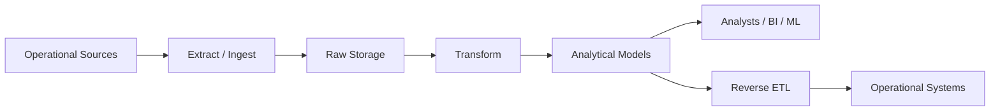
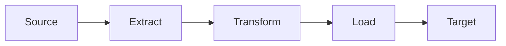
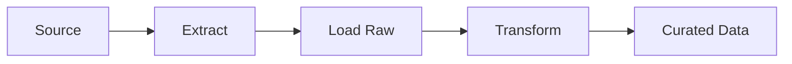
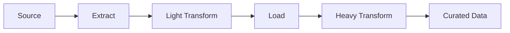
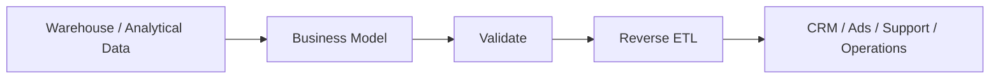
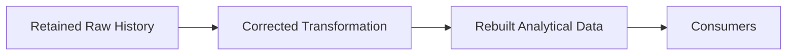
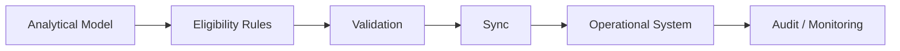

# ETL, ELT, and Reverse ETL

> **Module:** Python for Data Engineering → 01-Data-Engineering-Foundations-and-Pipeline-Thinking  
> **Topic:** 04 — ETL, ELT, and Reverse ETL  
> **Level:** Beginner → Intermediate → Advanced foundation  
> **Implementation rule for this lesson:** Python 3.12+ standard library only, with SQLite for local exercises.
>
> **Central engineering principle:**  
> **Choose where transformation happens based on requirements, data characteristics, security constraints, compute capabilities, replay needs, and consumer needs—not because ETL or ELT is fashionable.**

---

# 1. Why This Topic Matters

The previous topics answered three important questions:

```text
Topic 01:
What do data engineers build?

Topic 02:
How does data move through the lifecycle?

Topic 03:
How frequently should processing happen?
```

This topic answers the next architectural question:

> **Where should transformation happen, and how can transformed data move back into operational systems?**

Start with the simplest possible model:

```text
Where is the data?
       ↓
Where should transformation happen?
       ↓
Where should processed data live?
       ↓
Who consumes it?
       ↓
Does data need to move back into operational systems?
```

The three central patterns are:

```text
ETL
Extract → Transform → Load

ELT
Extract → Load → Transform

Reverse ETL
Analytical / Curated Data
        ↓
Operational Systems
```

The names are short.

The architectural consequences are not.

A production engineer must understand:

- where the transformation executes
- which system owns the transformation
- where raw data is retained
- how failures are handled
- whether history can be rebuilt
- how much compute the target can provide
- how sensitive data is handled
- what happens when analytical results are sent back into operational tools

---

# 2. Learning Outcomes

By the end of this lesson, you should be able to:

1. Explain extract, transform, and load in plain English.
2. Explain ETL and ELT without relying on acronyms alone.
3. State the central ETL-vs-ELT difference as a transformation-location decision.
4. Explain why ELT became common in modern cloud data platforms.
5. Explain when ETL is still appropriate.
6. Explain EtLT.
7. Explain replayability.
8. Explain backfills.
9. Explain why raw-data retention supports historical reconstruction.
10. Explain reverse ETL.
11. Explain operational analytics.
12. Identify reverse ETL risks.
13. Explain API rate-limit risk.
14. Explain synchronization conflicts.
15. Explain why validation is important before reverse ETL.
16. Explain ownership across source, pipeline, data-product, and destination boundaries.
17. Compare ETL and ELT using SQLite.
18. Introduce and fix a transformation bug.
19. Rebuild historical outputs after fixing a transformation.
20. Simulate reverse ETL without making real network requests.
21. Reason about architecture using `Context → Requirements → Options → Decision → Consequences`.
22. Explain these concepts like a production data engineer.

---

# 3. Prerequisites From Earlier Topics

You should already understand the basic lifecycle:

```text
Generation
    ↓
Ingestion
    ↓
Storage
    ↓
Transformation
    ↓
Serving
    ↓
Consumption
    ↓
Archival / Deletion
```

You should also understand:

```text
source
consumer
dataset
pipeline
batch
micro-batch
streaming
```

This topic does not replace those earlier ideas.

Instead, it adds a new architectural dimension:

```text
TRANSFORMATION LOCATION
```

---

# 4. The Core Mental Model

Start with:

```text
Source
  ↓
Extract
  ↓
Transform
  ↓
Load
  ↓
Target
```

Now ask:

> **Where does `Transform` happen?**

That one question separates the major patterns.

## ETL

```text
Source
  ↓
Extract
  ↓
Transform
  ↓
Load
  ↓
Target
```

Transformation happens **before** the target receives the final dataset.

## ELT

```text
Source
  ↓
Extract
  ↓
Load raw
  ↓
Transform in target / analytical platform
  ↓
Curated data
```

Transformation happens **after** data is loaded.

## Reverse ETL

```text
Analytical / Warehouse Data
        ↓
Modelled Customer Data
        ↓
Reverse ETL
        ↓
CRM / Ads / Support / Operational Tool
```

The direction of movement changes.

The first two patterns primarily move data **toward an analytical destination**.

Reverse ETL moves **derived analytical information back toward operational systems**.

---

# 5. The Simplest Definitions

## Extract

> **Extract means obtaining data from a source system.**

## Transform

> **Transform means changing data into a representation that is cleaner, standardized, validated, enriched, aggregated, or useful for a consumer.**

## Load

> **Load means writing data into a destination system.**

## ETL

> **ETL means Extract → Transform → Load, with transformation occurring before the target receives the final transformed result.**

## ELT

> **ELT means Extract → Load → Transform, with raw or lightly processed data loaded first and transformation occurring later inside the target or analytical platform.**

## Reverse ETL

> **Reverse ETL means moving transformed, modelled, or curated data from an analytical system back into operational tools so people or operational processes can act on it.**

---

# 6. What Does "Extract" Mean?

Extraction is the act of getting data out of a source.

Possible sources include:

```text
SQL database
API
CSV file
JSON file
SaaS platform
event stream
```

Examples:

```text
Orders database
       ↓
Extract orders

CRM API
       ↓
Extract customer records

Vendor CSV
       ↓
Extract file contents
```

---

# 7. Why Extraction Exists

A source system usually owns the original business process.

For example:

```text
Payment system
→ owns payment processing

CRM
→ owns customer interactions

Order service
→ owns order operations
```

The data platform does not necessarily own those systems.

Extraction creates a controlled path from:

```text
source system
```

to:

```text
downstream platform
```

---

# 8. Full vs Incremental Extraction

Extraction can conceptually be:

## Full extraction

Read everything.

```text
Source:
1,000,000 records

Extract:
all 1,000,000
```

This can be simple conceptually but may be expensive at scale.

## Incremental extraction

Read only newly changed or relevant records.

```text
Existing:
1,000,000

New/changed:
10,000

Extract:
10,000
```

The exact mechanism could depend on source capabilities.

For example:

```text
updated_at > last_run
```

or source-specific change tracking.

Do not deeply teach change-data-capture here.

> You only need the architectural idea here; detailed ingestion and CDC implementation belongs in later modules.

---

# 9. Small Python Extraction Example

This is intentionally a teaching abstraction.

```python
def extract_orders():
    return [
        {"order_id": 1, "amount": 100},
        {"order_id": 2, "amount": 200},
    ]
```

In real production code, the function might:

- query a database
- call an API
- read a file
- consume events

The important idea is:

```text
source
→ data enters the pipeline
```

---

# 10. What Does "Transform" Mean?

Transformation changes raw/source data into a representation that is more useful.

Typical goals:

- cleaner
- standardized
- validated
- enriched
- aggregated
- easier to analyze
- aligned with business definitions
- suitable for a particular consumer

Examples:

```text
" india "
→
"India"
```

```text
"199.99"
→
199.99
```

```text
local timestamp
→
standardized UTC representation
```

---

# 11. Technical Transformation

Technical transformation is primarily about representation.

Examples:

```text
parsing
casting
trimming
normalization
null handling
format conversion
```

Example:

```python
country = row["country"].strip().title()
amount = float(row["amount"])
```

---

# 12. Business Transformation

Business transformation implements business meaning.

Examples:

```text
quantity × unit_price = revenue
```

or:

```text
high_value_customer = customer_lifetime_value >= 10000
```

or:

```text
daily_sales = sum(order amounts by date)
```

These rules are not merely technical formatting.

They encode definitions the business relies on.

That is why transformation logic must be treated as software logic rather than anonymous glue code.

---

# 13. What Does "Load" Mean?

Loading means writing data into a destination.

Possible targets include:

- database
- warehouse
- lake
- lakehouse
- analytical table
- object storage
- staging table
- serving dataset

The destination may support operations such as:

```text
insert
append
overwrite
merge
```

These are conceptual loading patterns.

The exact implementation depends on the target.

---

# 14. Why Loading Is a Design Decision

A target has its own characteristics.

It may have:

- a schema
- constraints
- access rules
- compute capacity
- performance requirements
- ownership
- cost structure

Therefore:

```text
source data
```

cannot simply be assumed to fit:

```text
target system
```

The pipeline has to respect the destination contract.

---

# 15. ETL — Extract, Transform, Load

The basic ETL sequence is:

```text
Source
 ↓
Extract
 ↓
Transform
 ↓
Load
 ↓
Target
```

The defining property is:

> **Transformation happens before the final target load.**

That is the idea to remember.

---

# 16. ETL E-commerce Example

Suppose a source produces:

```text
order_id | country | amount
--------------------------------
1        |  india   | "199.99"
2        |  India   | "50.00"
```

The pipeline extracts those rows.

Then Python transformation does:

```python
country = country.strip().title()
amount = float(amount)
```

Result:

```text
order_id | country | amount
--------------------------------
1        | India   | 199.99
2        | India   | 50.00
```

Then the transformed data is loaded into the analytical target.

```text
Source
  ↓
Extract
  ↓
Python Transform
  ↓
Analytics target
```

Transformation occurred before the destination received the final representation.

---

# 17. Why ETL Exists

ETL was useful, and remains useful, because the destination may not be the right place to perform all transformations.

Historical reasons and current scenarios include:

- limited target compute
- strict target schemas
- pre-processing requirements
- source cleansing
- reducing what reaches the target
- security requirements
- minimizing sensitive-data exposure
- expensive downstream processing

The important point is:

> **ETL is not obsolete.**

It is one architectural option.

---

# 18. Why ETL Can Be Useful for Security

Suppose a source contains:

```text
customer_id
name
email
phone
address
transaction_amount
```

But a downstream environment only needs:

```text
customer_id
transaction_amount
```

The pipeline may intentionally remove sensitive fields before loading:

```text
Source
 ↓
Extract
 ↓
Remove sensitive fields
 ↓
Load
 ↓
Target
```

This can reduce exposure in a particular target environment.

The decision depends on organizational security policy and architecture.

---

# 19. ETL Use Case — PII Removal Before Landing

Consider a destination that is approved only for non-sensitive analytical data.

The pipeline may perform:

```text
Source
  ↓
Extract
  ↓
PII filtering / masking
  ↓
Load
  ↓
Approved target
```

This can be a legitimate reason to transform before landing.

The broader principle is:

> **Security requirements can influence transformation location.**

---

# 20. ETL Use Case — Heavy Parsing Before Target

Suppose a source produces a proprietary binary format.

A target platform is not designed to interpret that format directly.

A pre-processing layer may:

```text
Binary source
 ↓
Extract
 ↓
Parse / decode
 ↓
Standard representation
 ↓
Load
```

This can be a sensible ETL design.

---

# 21. ETL Use Case — Strict Target Schema

Suppose a destination only accepts:

```text
customer_id INTEGER
amount DECIMAL
created_at TIMESTAMP
```

but the source contains:

```text
customer_id = "42"
amount = "199.99"
created_at = "25/09/2026 10:30"
```

An ETL layer can normalize the data before loading.

```text
raw representation
→
required target representation
```

---

# 22. ETL Advantages

Potential advantages include:

- target receives curated data
- strict target contracts can be enforced before load
- sensitive fields can be filtered before entering a target
- complex source parsing can happen outside the target
- target compute requirements may be reduced
- consumer-facing structures can be created before loading

These are potential benefits, not universal guarantees.

---

# 23. ETL Limitations

Potential limitations include:

- raw data may not be retained
- replayability can be weaker if the transformed data is the only retained representation
- transformations may depend on external compute
- changing transformation logic may require rebuilding from another source
- transformation and loading can become tightly coupled

Again, these depend on implementation.

A good ETL system can still preserve raw source data separately.

---

# 24. ELT — Extract, Load, Transform

The ELT sequence is:

```text
Source
 ↓
Extract
 ↓
Load raw / staging data
 ↓
Transform
 ↓
Curated analytical tables
```

The defining property is:

> **Transformation happens after the raw or staging data has been loaded into the target or analytical platform.**

Repeat this until it is automatic:

```text
ETL:
Transform → Load

ELT:
Load → Transform
```

---

# 25. ELT E-commerce Example

Source:

```text
orders database
```

Extract:

```text
order_id
country
amount
created_at
```

Load:

```text
raw_orders
```

Then transform inside the analytical platform:

```text
raw_orders
 ↓
SQL transformation
 ↓
daily_revenue
```

Conceptually:

```text
Orders DB
   ↓
Extract
   ↓
raw_orders
   ↓
Transform
   ↓
daily_revenue
```

---

# 26. Why ELT Became Common

Modern cloud data platforms changed the economics and architecture of data processing.

Key factors include:

- relatively inexpensive scalable storage
- elastic compute
- scalable analytical systems
- separation of storage and compute in many platforms
- powerful SQL-based transformation
- ability to retain raw data
- easier replayability
- easier backfills
- ability to apply new transformation logic later

A simplified historical mental model is:

```text
Older constraint:

Compute is expensive
        ↓
Transform carefully before loading
```

A modern cloud pattern often looks more like:

```text
Storage is relatively inexpensive
+
Compute can scale
        ↓
Load raw data first
        ↓
Transform later
```

Be careful:

> Storage is not free.

Raw-data retention still creates:

- storage costs
- governance obligations
- security requirements
- retention complexity

---

# 27. Separation of Storage and Compute

Many modern analytical platforms allow an architecture where data storage and processing capacity can be scaled somewhat independently.

The conceptual advantage is:

```text
retain more data
+
scale compute when transformation needs increase
```

This makes ELT attractive in many analytics architectures.

The exact implementation varies by platform.

---

# 28. Why Raw Data Matters in ELT

ELT often preserves source-aligned data:

```text
Raw source data
      ↓
Stored
      ↓
Transformation v1
      ↓
Curated table
```

Later:

```text
Transformation logic changes
      ↓
Transformation v2
      ↓
Rebuild curated table
```

The raw data remains available.

This creates a powerful capability:

> **Reprocess historical data without repeatedly extracting it from the original source.**

---

# 29. Raw Data Preservation Is an Architectural Choice

Raw retention can provide:

- replayability
- reproducibility
- historical reconstruction
- debugging
- auditability
- backfill capability

But raw data retention also creates responsibilities:

- access control
- PII handling
- classification
- retention
- storage cost
- lifecycle management

Therefore:

```text
raw data retained
```

does not mean:

```text
keep everything forever
```

---

# 30. Replayability

## Definition

> **Replayability is the ability to reprocess previously captured source data using the same or updated transformation logic.**

Example:

```text
Raw Data
   ↓
Transformation v1
   ↓
Output
```

A business rule changes:

```text
Transformation v2
```

Then:

```text
Raw Data
   ↓
Transformation v2
   ↓
Rebuilt Output
```

Replayability is extremely useful when:

- transformation logic has a bug
- business definitions change
- a target needs reconstruction
- derived data is lost
- historical calculations must be corrected

---

# 31. Why Replayability Matters

Imagine the transformation rule for revenue is wrong.

Before:

```python
revenue = quantity + unit_price
```

Correct rule:

```python
revenue = quantity * unit_price
```

If only the final table exists, the team may need to obtain source data again.

If raw data is retained:

```text
raw source
→ corrected transformation
→ rebuild
```

The source system may not need to be queried again.

This reduces dependency on source availability and can make recovery easier.

---

# 32. Backfills

## Definition

> **A backfill is the process of processing historical data to populate or correct a downstream dataset.**

Example:

```text
Existing current data:
April → September

Correction required:
January → March

Backfill:
January → March
```

A backfill may be needed because:

- a pipeline did not exist historically
- a transformation was wrong
- a source outage caused missing data
- a business definition changed
- a dataset was rebuilt
- a new field or model needs historical values

---

# 33. Replay vs Backfill

These concepts are related but not identical.

### Replay

Focuses on reprocessing previously captured data.

```text
Raw history
→ rerun processing
```

### Backfill

Focuses on filling or correcting a historical period.

```text
Missing / incorrect January–March
→ process January–March
```

A backfill may use replay.

For example:

```text
Replay raw January–March
→ backfill corrected output
```

---

# 34. Backfill Risks

Backfills can create:

- duplicate output
- high compute usage
- unexpected downstream changes
- inconsistent business definitions
- synchronization effects
- accidental overwrites
- very large operational jobs

Therefore:

> A backfill is an engineering operation, not simply "run the pipeline again."

---

# 35. ETL vs ELT: Strong Comparison

| Dimension | ETL | ELT |
|---|---|---|
| Sequence | Extract → Transform → Load | Extract → Load → Transform |
| Transformation location | Before target load | After target load |
| Raw data retention | Optional / depends on architecture | Often central |
| Target receives first | Curated/transformed data | Raw/staging data |
| Compute location | Pre-load transformation layer | Target / analytical platform |
| Replayability | Depends on retained raw data | Often easier when raw is retained |
| Historical rebuilding | Can require re-extraction | Often easier from raw layer |
| PII filtering before target | Strong fit | May require additional safeguards |
| Heavy source parsing | Strong fit | Can still be used with appropriate staging |
| Strict target schema | Strong fit | Also possible |
| Transformation flexibility | Can be more coupled to pipeline | Often flexible after landing |
| Main architectural question | Where to transform before load? | Can target safely/efficiently transform after load? |

This table is conceptual.

Actual production systems often combine patterns.

---

# 36. ELT Is Not "SQL Only"

A common misconception is:

```text
ELT = SQL
```

Not necessarily.

ELT means:

```text
data is loaded first
→ transformation happens after loading
```

The transformation might use:

- SQL
- a transformation engine
- Python
- another processing framework

SQL is common in analytical platforms, but SQL is not the definition of ELT.

---

# 37. ETL Is Not "Bad"

Another misconception is:

```text
ETL = old
ELT = modern
therefore ELT = always better
```

That is not engineering reasoning.

The correct comparison is:

```text
requirements
→ constraints
→ transformation location
→ consequences
```

ETL can be appropriate when:

- sensitive fields should be filtered before landing
- the target has strict ingestion contracts
- source data requires heavy pre-processing
- the target should not receive raw data
- a pre-load transformation layer is operationally appropriate

---

# 38. ELT Is Not "Keep Everything Forever"

ELT can encourage raw preservation.

It does not mean:

```text
retain everything forever
```

You still need:

- retention policy
- PII controls
- classification
- access management
- deletion
- archival
- cost management

The data lifecycle still applies.

---

# 39. EtLT

## Definition

A practical pattern often described as **EtLT** is:

```text
Extract
→ light Transform
→ Load
→ heavy Transform
```

Visual:

```text
Source
 ↓
Extract
 ↓
Light Transform
 ↓
Load
 ↓
Heavy Transform
 ↓
Curated Data
```

---

# 40. Why Use EtLT?

The idea is that some transformation is necessary **before** raw data enters the target, while the heavier business transformation is performed later.

Examples of light transformations:

- basic deduplication
- masking
- minimal PII handling
- format normalization
- basic validation
- source-specific decoding

Heavy transformations may include:

- dimensional modeling
- complex joins
- aggregation
- business rules
- analytical calculations

---

# 41. EtLT Example

Suppose a source contains:

```text
name
email
amount
created_at
```

Light pre-load processing might:

```text
validate structure
mask email
normalize encoding
```

Then:

```text
Load
```

After that:

```text
join with customer data
→ calculate lifetime value
→ aggregate daily revenue
→ create analytical model
```

This gives:

```text
security / technical preprocessing
+
target-side analytical transformation
```

---

# 42. Important EtLT Nuance

EtLT should be understood as a practical architecture pattern.

Do not assume every organization uses the term identically.

The key mental model is:

```text
Some transformation before load
+
more transformation after load
```

It is not necessary to memorize the acronym beyond that.

---

# 43. Reverse ETL

Now change direction.

Reverse ETL means:

```text
Analytical / Warehouse Data
        ↓
Business Model
        ↓
Reverse ETL
        ↓
Operational System
```

Examples:

```text
Warehouse
→ customer lifetime value
→ CRM
```

```text
Warehouse
→ high-value segment
→ marketing system
```

```text
Warehouse
→ customer risk score
→ support platform
```

---

# 44. Why Reverse ETL Exists

Traditional analytics often ends here:

```text
Data
→ warehouse
→ dashboard
→ human observes
```

Operational analytics closes the loop:

```text
Data
→ warehouse
→ analytical model
→ operational system
→ human or application acts
```

This turns analytical information into operational action.

---

# 45. Operational Analytics

> **Operational analytics is the use of analytical data or models to support operational decisions and actions.**

Example:

```text
Customer transactions
        ↓
Analytical model
        ↓
Customer lifetime value
        ↓
CRM
        ↓
Sales representative
        ↓
Customer interaction
```

This is more consequential than a dashboard because the analytical result may change what the organization does.

---

# 46. Reverse ETL Example — CRM

Suppose the analytical system calculates:

```text
customer_id = 42
customer_lifetime_value = 15000
segment = "high_value"
```

Reverse ETL may send:

```json
{
  "customer_id": 42,
  "customer_lifetime_value": 15000.0,
  "segment": "high_value"
}
```

to a CRM system.

The salesperson can then use that information.

---

# 47. Reverse ETL Example — Marketing

Analytics might identify:

```text
high_value_customer = true
```

The marketing platform receives the derived segment.

```text
Warehouse
 ↓
High-value customer model
 ↓
Reverse ETL
 ↓
Marketing audience
```

The marketing system then applies its operational workflow.

---

# 48. Reverse ETL Example — Support

Analytics might calculate:

```text
risk_score = 0.82
```

A support platform may use that score to prioritize customer intervention.

The data movement is:

```text
Analytical data
→ derived score
→ operational support platform
```

---

# 49. Reverse ETL Risk #1 — Wrong Data

This is the most important risk.

Suppose the analytical model is wrong:

```text
incorrect_customer_value
```

Reverse ETL sends it into:

```text
CRM
```

Then:

```text
salesperson sees incorrect data
```

The effect is operational.

This is more serious than a private analytical query being slightly wrong.

---

# 50. Reverse ETL Risk #2 — API Rate Limits

Operational destinations often expose APIs with limits.

Conceptually:

```text
100,000 customer updates
```

sent to an API that allows:

```text
1,000 requests/minute
```

can result in:

```text
throttling
failed requests
slow synchronization
partial completion
```

The exact API behavior depends on the destination.

Do not implement a production retry/rate-control system in this lesson.

The important architecture concept is:

> **The destination has operational constraints that the analytical system must respect.**

---

# 51. Reverse ETL Risk #3 — Sync Conflicts

Suppose:

```text
CRM:
customer_status = VIP

Warehouse model:
customer_status = STANDARD
```

Which one is authoritative?

This is not merely a technical problem.

It is an ownership problem.

Ask:

```text
Who owns the field?
Which system is the source of truth?
Who is allowed to change it?
What happens when the values conflict?
```

---

# 52. Authoritative System

An **authoritative system** is the system whose value is treated as the accepted source of truth for a particular piece of information.

For example:

```text
Customer email
→ CRM may be authoritative
```

while:

```text
Customer lifetime value
→ analytical model may be authoritative
```

These are examples only.

The authority depends on organizational design.

---

# 53. Reverse ETL Is Not "Just Exporting a CSV"

A local CSV export:

```text
warehouse
→ CSV
```

may simply produce a file.

Reverse ETL is a recurring operational integration pattern:

```text
analytical system
→ transform / validate
→ synchronize
→ operational destination
→ monitor / audit
```

The destination may trigger real business action.

That creates higher operational consequences.

---

# 54. Reverse ETL Safety Controls

Before syncing data back into an operational system, consider:

- validation
- field-level mapping
- ownership definition
- audit logs
- sync status
- idempotency
- rate limiting
- schema checks
- dry-run/testing
- recovery strategy

A simple mental model is:

```text
Warehouse
   ↓
Validate
   ↓
Eligible records
   ↓
Sync
   ↓
Audit
   ↓
Operational system
```

---

# 55. Idempotency in Reverse ETL

Ask:

> **What happens if the synchronization runs twice?**

Example:

```text
Run 1
→ customer 42 updated

Run 2
→ customer 42 updated again
```

Repeated execution may be harmless or may create unintended effects.

For example, setting:

```text
segment = "high_value"
```

may be naturally repeatable.

But creating:

```text
new customer note
```

could create duplicates if repeated.

The concept is:

> **A repeatable operation should not produce unintended additional effects.**

Detailed synchronization idempotency belongs later.

---

# 56. Full E-commerce Example: ETL

```text
Orders DB
   ↓
Extract
   ↓
Python transformation
   ↓
Analytics DB
```

The final target receives transformed data.

---

# 57. Full E-commerce Example: ELT

```text
Orders DB
   ↓
Extract
   ↓
raw_orders
   ↓
SQL transformation
   ↓
analytics tables
```

The target receives raw/staging data first.

---

# 58. Full E-commerce Example: Reverse ETL

```text
Analytics tables
   ↓
Customer value model
   ↓
Reverse ETL
   ↓
CRM
```

Now the direction changes:

```text
operational source
→ analytical platform
→ operational destination
```

---

# 59. Full Pattern Together

```text
                 ┌───────────────┐
                 │ Orders Source │
                 └───────┬───────┘
                         ↓
                     Extraction
                         ↓
                ┌────────┴────────┐
                ↓                 ↓
               ETL                ELT
                ↓                 ↓
        Transform first      Load raw first
                ↓                 ↓
                └────────┬────────┘
                         ↓
                 Curated Analytics
                         ↓
                  Business Models
                         ↓
                    Reverse ETL
                         ↓
                 CRM / Operations
```

This is the bigger mental model.

---

# 60. SQLite Hands-On Work

The roadmap calls for three learner programs:

```text
etl_pipeline.py
elt_pipeline.py
reverse_etl.py
```

For this lesson, copy the code below into the three named learner files: `etl_pipeline.py`, `elt_pipeline.py`, and `reverse_etl.py`.

The exercise uses:

```text
Python
+
SQLite
```

to simulate a small analytical platform.

---

# 61. Exercise Architecture

The local learning environment can be conceptualized as:

```text
Source SQLite
    ↓
ETL or ELT pipeline
    ↓
Warehouse SQLite
    ↓
Analytical table
    ↓
Reverse ETL JSON output
```

The warehouse is only a teaching abstraction.

It is not intended to reproduce a cloud warehouse.

---

# 62. SQLite Schema

Use:

```sql
CREATE TABLE source_orders (
    order_id INTEGER PRIMARY KEY,
    customer_id INTEGER NOT NULL,
    country TEXT NOT NULL,
    amount TEXT NOT NULL,
    created_at TEXT NOT NULL,
    quantity INTEGER NOT NULL,
    unit_price TEXT NOT NULL
);
```

A raw analytical table can be:

```sql
CREATE TABLE raw_orders (
    order_id INTEGER PRIMARY KEY,
    customer_id INTEGER,
    country TEXT,
    amount TEXT,
    created_at TEXT,
    quantity INTEGER,
    unit_price TEXT
);
```

A final analytical table can be:

```sql
CREATE TABLE daily_revenue (
    order_date TEXT PRIMARY KEY,
    daily_revenue REAL NOT NULL
);
```

A customer model for reverse ETL can be:

```sql
CREATE TABLE customer_value (
    customer_id INTEGER PRIMARY KEY,
    customer_value REAL NOT NULL,
    segment TEXT NOT NULL
);
```

---

# 63. Complete `etl_pipeline.py` Reference Implementation

The following is a learner-ready teaching implementation.

It:

1. creates source data,
2. extracts rows,
3. transforms in Python,
4. loads final analytical results,
5. logs counts.

```python
from __future__ import annotations

import argparse
import json
import logging
import sqlite3
from datetime import datetime, timezone
from decimal import Decimal
from pathlib import Path


DB_PATH = Path("etl_demo.db")
EXTRACT_PATH = Path("etl_extract.json")

logging.basicConfig(
    level=logging.INFO,
    format="%(asctime)s %(levelname)s %(message)s",
)


def parse_args() -> argparse.Namespace:
    parser = argparse.ArgumentParser(
        description="ETL pipeline: separate extract and rebuild steps"
    )

    parser.add_argument(
        "--step",
        choices=["extract", "rebuild"],
        required=True,
    )

    return parser.parse_args()


def create_source(conn: sqlite3.Connection) -> None:
    conn.execute("DROP TABLE IF EXISTS source_orders")

    conn.execute(
        """
        CREATE TABLE source_orders (
            order_id INTEGER PRIMARY KEY,
            customer_id INTEGER NOT NULL,
            country TEXT NOT NULL,
            amount TEXT NOT NULL,
            created_at TEXT NOT NULL,
            quantity INTEGER NOT NULL,
            unit_price TEXT NOT NULL
        )
        """
    )

    rows = [
        (
            1,
            101,
            " india ",
            "199.99",
            "2026-09-25T10:00:00+00:00",
            2,
            "99.995",
        ),
        (
            2,
            102,
            " INDIA ",
            "50.00",
            "2026-09-25T11:00:00+00:00",
            1,
            "50.00",
        ),
        (
            3,
            101,
            "India",
            "300.00",
            "2026-09-26T09:00:00+00:00",
            3,
            "100.00",
        ),
    ]

    conn.executemany(
        """
        INSERT INTO source_orders (
            order_id,
            customer_id,
            country,
            amount,
            created_at,
            quantity,
            unit_price
        )
        VALUES (?, ?, ?, ?, ?, ?, ?)
        """,
        rows,
    )

    conn.commit()

    logging.info(
        "source_rows=%d",
        len(rows),
    )


def extract_orders(
    conn: sqlite3.Connection,
) -> list[sqlite3.Row]:
    conn.row_factory = sqlite3.Row

    cursor = conn.execute(
        """
        SELECT
            order_id,
            customer_id,
            country,
            amount,
            created_at,
            quantity,
            unit_price
        FROM source_orders
        ORDER BY order_id
        """
    )

    rows = cursor.fetchall()

    logging.info(
        "extracted_rows=%d",
        len(rows),
    )

    return rows


def save_extract(rows: list[sqlite3.Row]) -> None:
    """Persist extracted source-shaped records so rebuild can run independently."""
    records = [dict(row) for row in rows]

    EXTRACT_PATH.write_text(
        json.dumps(records, indent=2),
        encoding="utf-8",
    )

    logging.info(
        "extract_saved_rows=%d file=%s",
        len(records),
        EXTRACT_PATH,
    )


def load_extract() -> list[dict[str, object]]:
    """Read the previously extracted source-shaped records."""
    if not EXTRACT_PATH.exists():
        raise FileNotFoundError(
            f"Missing extracted data: {EXTRACT_PATH}. "
            "Run 'python etl_pipeline.py --step extract' first."
        )

    records = json.loads(
        EXTRACT_PATH.read_text(encoding="utf-8")
    )

    logging.info(
        "extract_loaded_rows=%d",
        len(records),
    )

    return records


def transform_orders(
    rows: list[dict[str, object]],
) -> list[dict[str, object]]:
    transformed = []

    for row in rows:
        created_at = datetime.fromisoformat(
            row["created_at"]
        )

        amount = Decimal(
            row["amount"]
        )

        country = row["country"].strip().title()

        transformed.append(
            {
                "order_id": int(row["order_id"]),
                "customer_id": int(row["customer_id"]),
                "country": country,
                "amount": float(amount),
                "created_at": created_at.isoformat(),
                "quantity": int(row["quantity"]),
                "unit_price": float(
                    Decimal(row["unit_price"])
                ),
            }
        )

    logging.info(
        "transformed_rows=%d",
        len(transformed),
    )

    return transformed


def load_final_table(
    conn: sqlite3.Connection,
    rows: list[dict[str, object]],
) -> None:
    conn.execute(
        "DROP TABLE IF EXISTS daily_revenue"
    )

    conn.execute(
        """
        CREATE TABLE daily_revenue (
            order_date TEXT PRIMARY KEY,
            daily_revenue REAL NOT NULL
        )
        """
    )

    daily: dict[str, Decimal] = {}

    for row in rows:
        created_at = datetime.fromisoformat(
            str(row["created_at"])
        )

        day = created_at.date().isoformat()

        amount = Decimal(
            str(row["amount"])
        )

        daily[day] = (
            daily.get(day, Decimal("0"))
            + amount
        )

    output_rows = [
        (
            day,
            float(value),
        )
        for day, value in sorted(daily.items())
    ]

    conn.executemany(
        """
        INSERT INTO daily_revenue (
            order_date,
            daily_revenue
        )
        VALUES (?, ?)
        """,
        output_rows,
    )

    conn.commit()

    logging.info(
        "loaded_rows=%d",
        len(output_rows),
    )


def run_extract() -> int:
    with sqlite3.connect(DB_PATH) as conn:
        create_source(conn)
        source_rows = extract_orders(conn)
        save_extract(source_rows)

    logging.info("etl_status=EXTRACT_SUCCESS")
    return 0


def run_rebuild() -> int:
    try:
        extracted_rows = load_extract()
    except FileNotFoundError as exc:
        logging.error(str(exc))
        return 1

    transformed_rows = transform_orders(extracted_rows)

    with sqlite3.connect(DB_PATH) as conn:
        load_final_table(
            conn,
            transformed_rows,
        )

    logging.info("etl_status=REBUILD_SUCCESS")
    return 0


def main() -> int:
    args = parse_args()

    if args.step == "extract":
        return run_extract()

    return run_rebuild()


if __name__ == "__main__":
    raise SystemExit(main())
```

---

# 64. How the ETL Code Demonstrates ETL

The key path is:

```text
source_orders
   ↓
extract_orders()
   ↓
transform_orders()
   ↓
load_final_table()
   ↓
daily_revenue
```

Notice:

```text
transformed_rows
```

are created **before** the final analytical table is populated.

That is the defining property.

---

# 65. ETL Code Inputs and Outputs

### Input

```text
source_orders
```

### Python transformation

```text
country normalization
amount parsing
timestamp parsing
```

### Output

```text
daily_revenue
```

The target receives the already transformed representation.

---

# 66. ETL Failure Scenario

Change:

```text
"199.99"
```

to:

```text
"not-a-number"
```

Then:

```python
Decimal(row["amount"])
```

raises an exception.

Possible response:

```text
fail job
```

or:

```text
reject record
```

depending on the required business behavior.

The exercise focuses on recognizing where the failure occurs.

---

# 67. ETL Production Consideration

The example opens a single SQLite database.

A production pipeline may instead involve:

```text
source database
→ ingestion layer
→ transformation compute
→ analytical storage
```

Production concerns would include:

- source load
- secure access
- retries
- partitioning
- logging
- observability
- data quality
- deployment
- idempotency
- backfills

The toy code intentionally omits these.

---

# 68. Complete `elt_pipeline.py` Reference Implementation

This version deliberately loads raw data first and performs the analytical transformation in SQLite.

```python
from __future__ import annotations

import argparse
import logging
import sqlite3
from pathlib import Path


DB_PATH = Path("elt_demo.db")

logging.basicConfig(
    level=logging.INFO,
    format="%(asctime)s %(levelname)s %(message)s",
)


def parse_args() -> argparse.Namespace:
    parser = argparse.ArgumentParser(
        description="ELT pipeline: separate extract and rebuild steps"
    )

    parser.add_argument(
        "--step",
        choices=["extract", "rebuild"],
        required=True,
    )

    return parser.parse_args()


def create_source(
    conn: sqlite3.Connection,
) -> int:
    conn.execute("DROP TABLE IF EXISTS source_orders")

    conn.execute(
        """
        CREATE TABLE source_orders (
            order_id INTEGER PRIMARY KEY,
            customer_id INTEGER NOT NULL,
            country TEXT NOT NULL,
            amount TEXT NOT NULL,
            created_at TEXT NOT NULL,
            quantity INTEGER NOT NULL,
            unit_price TEXT NOT NULL
        )
        """
    )

    rows = [
        (
            1,
            101,
            " india ",
            "199.99",
            "2026-09-25T10:00:00+00:00",
            2,
            "99.995",
        ),
        (
            2,
            102,
            " INDIA ",
            "50.00",
            "2026-09-25T11:00:00+00:00",
            1,
            "50.00",
        ),
        (
            3,
            101,
            "India",
            "300.00",
            "2026-09-26T09:00:00+00:00",
            3,
            "100.00",
        ),
    ]

    conn.executemany(
        """
        INSERT INTO source_orders (
            order_id,
            customer_id,
            country,
            amount,
            created_at,
            quantity,
            unit_price
        )
        VALUES (?, ?, ?, ?, ?, ?, ?)
        """,
        rows,
    )

    conn.commit()

    return len(rows)


def load_raw(
    conn: sqlite3.Connection,
) -> int:
    conn.execute("DROP TABLE IF EXISTS raw_orders")

    conn.execute(
        """
        CREATE TABLE raw_orders AS
        SELECT
            order_id,
            customer_id,
            country,
            amount,
            created_at,
            quantity,
            unit_price
        FROM source_orders
        """
    )

    row_count = conn.execute(
        "SELECT COUNT(*) FROM raw_orders"
    ).fetchone()[0]

    logging.info(
        "raw_loaded_rows=%d",
        row_count,
    )

    return int(row_count)


def raw_orders_exists(
    conn: sqlite3.Connection,
) -> bool:
    cursor = conn.execute(
        """
        SELECT name FROM sqlite_master
        WHERE type = 'table' AND name = 'raw_orders'
        """
    )

    return cursor.fetchone() is not None


def transform_in_sql(
    conn: sqlite3.Connection,
) -> int:
    conn.execute(
        "DROP TABLE IF EXISTS daily_revenue"
    )

    conn.execute(
        """
        CREATE TABLE daily_revenue AS
        SELECT
            substr(created_at, 1, 10)
                AS order_date,
            SUM(
                CAST(amount AS REAL)
            ) AS daily_revenue
        FROM raw_orders
        GROUP BY substr(created_at, 1, 10)
        """
    )

    row_count = conn.execute(
        "SELECT COUNT(*) FROM daily_revenue"
    ).fetchone()[0]

    logging.info(
        "analytical_rows=%d",
        row_count,
    )

    return int(row_count)


def run_extract() -> int:
    with sqlite3.connect(DB_PATH) as conn:
        source_count = create_source(conn)
        raw_count = load_raw(conn)

    if source_count != raw_count:
        logging.error(
            "ELT load reconciliation failed"
        )
        return 1

    logging.info("elt_status=EXTRACT_SUCCESS")
    return 0


def run_rebuild() -> int:
    with sqlite3.connect(DB_PATH) as conn:
        if not raw_orders_exists(conn):
            logging.error(
                "raw_orders table not found. "
                "Run 'python elt_pipeline.py --step extract' first."
            )
            return 1

        analytical_count = transform_in_sql(conn)

    if analytical_count == 0:
        logging.error(
            "ELT produced no analytical rows"
        )
        return 1

    logging.info("elt_status=REBUILD_SUCCESS")
    return 0


def main() -> int:
    args = parse_args()

    if args.step == "extract":
        return run_extract()

    return run_rebuild()


if __name__ == "__main__":
    raise SystemExit(main())
```

---

# 69. How the ELT Code Demonstrates ELT

The important path is:

```text
source_orders
   ↓
load_raw()
   ↓
raw_orders
   ↓
transform_in_sql()
   ↓
daily_revenue
```

Notice:

```text
raw_orders
```

exists **before** the analytical transformation occurs.

That is ELT.

---

# 70. ELT Code Inputs and Outputs

### Input

```text
source_orders
```

### First target

```text
raw_orders
```

### Transformation

```sql
SUM(CAST(amount AS REAL))
GROUP BY date
```

### Output

```text
daily_revenue
```

The target/analytical platform performs the transformation after loading.

---

# 71. ELT Failure Scenario

Introduce a malformed amount:

```text
amount = "abc"
```

SQLite's type conversion behavior may vary by expression and schema, so the important exercise is not to assume silent conversion is acceptable.

Instead, explicitly ask:

```text
How should malformed values be detected?
Should the load reject them?
Should they be quarantined?
Should a typed staging layer validate them first?
```

This is a production data-quality question.

---

# 72. ELT Production Consideration

A production ELT platform usually needs strong control around the raw layer:

- access control
- schema expectations
- PII classification
- retention
- validation
- partitioning
- ownership
- observability

ELT does not eliminate engineering responsibilities.

It moves where transformation happens.

---

# 73. ETL vs ELT Code Comparison

## ETL

```text
SQLite source
   ↓
Python
   ↓
clean()
   ↓
aggregate()
   ↓
SQLite final table
```

## ELT

```text
SQLite source
   ↓
SQLite raw_orders
   ↓
SQL
   ↓
SQLite analytical table
```

The question to ask is:

> **Where did the main transformation happen?**

That is the key distinction.

---

# 74. Transformation Location Exercise

For each pipeline below, identify ETL, ELT, or EtLT.

## Pipeline A

```text
API
↓
Python cleaning
↓
Warehouse
```

Answer:

```text
ETL
```

because transformation occurs before warehouse load.

---

## Pipeline B

```text
API
↓
Warehouse raw table
↓
SQL model
```

Answer:

```text
ELT
```

because raw data is loaded before the main transformation.

---

## Pipeline C

```text
API
↓
PII masking
↓
Warehouse raw table
↓
SQL analytical model
```

Answer:

```text
EtLT
```

because there is light transformation before loading and heavier transformation afterward.

---

# 75. Transformation Bug Exercise

The roadmap requires deliberately introducing a transformation bug.

The reference implementations group revenue by day using these expressions.

ETL, in `load_final_table()`:

```python
day = created_at.date().isoformat()
```

ELT, in `transform_in_sql()`:

```sql
GROUP BY substr(created_at, 1, 10)
```

Introduce a bug that changes the grouping grain from day to month.

ETL:

```python
day = created_at.strftime("%Y-%m")
```

ELT:

```sql
GROUP BY substr(created_at, 1, 7)
```

Now run the pipeline.

---

# 76. Observe the Bug

The sample source data contains orders on two different days:

```text
2026-09-25
2026-09-26
```

Correct output should contain two daily groups, one per date.

Buggy output collapses both dates into a single monthly group:

```text
2026-09
```

The pipeline may still execute successfully and still produce a `daily_revenue` table.

That is the important lesson:

```text
successful execution
≠
correct business logic
```

---

# 77. Fix the Bug

Change the grouping expression back to the daily grain.

ETL:

```python
day = created_at.strftime("%Y-%m")
```

back to:

```python
day = created_at.date().isoformat()
```

ELT:

```sql
GROUP BY substr(created_at, 1, 7)
```

back to:

```sql
GROUP BY substr(created_at, 1, 10)
```

Then rebuild the affected analytical output.

---

# 78. History Rebuild Exercise

Ask:

> **Do I need to extract the source again?**

Both reference scripts in this lesson separate this into two explicit steps:

```text
--step extract
--step rebuild
```

`--step extract` creates the SQLite source table, loads the sample data, and (for ETL) extracts and persists the source-shaped rows. `--step rebuild` only transforms and reloads the final analytical table — it never recreates or re-queries the source.

### Running the ETL Two-Step Exercise

Run:

```bash
python etl_pipeline.py --step extract
python etl_pipeline.py --step rebuild
```

The extract step writes the retained source-shaped snapshot to:

```text
etl_extract.json
```

After changing the grouping bug (see the Transformation Bug Exercise) and fixing it, rebuild again without re-extracting:

```bash
python etl_pipeline.py --step rebuild
```

`etl_extract.json` is intentionally retained so the rebuild step can be rerun independently, any number of times. It exists purely to make this two-step exercise runnable — it is not a hidden re-extraction from the source.

To simulate a pure ETL design that does **not** retain extracted/raw data, delete the snapshot and try to rebuild:

```bash
rm etl_extract.json
python etl_pipeline.py --step rebuild
```

The rebuild fails, with a clear error message telling you to extract again. This makes the original lesson concrete: without retained raw data, a pure ETL design must go back to the source to rebuild history.

### Running the ELT Two-Step Exercise

Run:

```bash
python elt_pipeline.py --step extract
python elt_pipeline.py --step rebuild
```

After fixing the grouping bug, rebuild again:

```bash
python elt_pipeline.py --step rebuild
```

This second rebuild does not recreate `source_orders` and does not reload `raw_orders` — it reads the `raw_orders` table that the extract step already retained. Running `--step rebuild` again keeps succeeding without ever touching the source.

### ETL without raw retention

Suppose:

```text
Source
 ↓
Transform
 ↓
Final table
```

and the raw source data was not retained.

The team may need to extract historical source records again.

### ELT with raw retention

Suppose:

```text
Source
 ↓
Raw table
 ↓
Transform
 ↓
Final table
```

The corrected transformation can process the retained raw data.

This demonstrates why raw retention can improve replayability.

---

# 79. Nuance: Architecture Name Does Not Guarantee Replayability

Do not learn:

```text
ETL = no replay
ELT = replay
```

That is incorrect.

The real question is:

> **What historical data was retained, and can the required representation be reconstructed from it?**

An ETL architecture may retain:

```text
raw source copy
```

and therefore be replayable.

An ELT architecture may delete raw data too early and therefore lose replay capability.

Replayability depends on actual retention and processing design.

---

# 80. Replay Experiment

Run:

```text
ETL output v1
```

Then:

```text
Change transformation
```

Then ask:

```text
Can I rebuild the result from existing data?
```

Next, run the same experiment for ELT.

Compare:

```text
What information survived?
What needs to be extracted again?
What can be reprocessed locally?
```

This is more important than memorizing which acronym is associated with replay.

---

# 81. Complete `reverse_etl.py` Reference Implementation

The exercise should simulate a CRM API using a local JSON file.

No external network calls are required.

```python
from __future__ import annotations

import json
import logging
import sqlite3
from pathlib import Path


DB_PATH = Path("reverse_etl_demo.db")
OUTPUT_PATH = Path("crm_sync_payload.json")

logging.basicConfig(
    level=logging.INFO,
    format="%(asctime)s %(levelname)s %(message)s",
)


VALID_SEGMENTS = {
    "standard",
    "high_value",
}


def create_warehouse(
    conn: sqlite3.Connection,
) -> None:
    conn.execute(
        """
        CREATE TABLE IF NOT EXISTS customer_value (
            customer_id INTEGER PRIMARY KEY,
            customer_value REAL NOT NULL,
            segment TEXT NOT NULL
        )
        """
    )

    conn.execute(
        "DELETE FROM customer_value"
    )

    rows = [
        (101, 15000.0, "high_value"),
        (102, 3000.0, "standard"),
        (103, 22000.0, "high_value"),
    ]

    conn.executemany(
        """
        INSERT INTO customer_value (
            customer_id,
            customer_value,
            segment
        )
        VALUES (?, ?, ?)
        """,
        rows,
    )

    conn.commit()

    logging.info(
        "customer_model_rows=%d",
        len(rows),
    )


def select_sync_records(
    conn: sqlite3.Connection,
) -> list[dict[str, object]]:
    rows = conn.execute(
        """
        SELECT
            customer_id,
            customer_value,
            segment
        FROM customer_value
        WHERE segment = 'high_value'
        ORDER BY customer_id
        """
    ).fetchall()

    records = [
        {
            "customer_id": int(row[0]),
            "customer_value": float(row[1]),
            "segment": str(row[2]),
        }
        for row in rows
    ]

    return records


def validate_records(
    records: list[dict[str, object]],
) -> None:
    for record in records:
        customer_id = record.get(
            "customer_id"
        )

        customer_value = record.get(
            "customer_value"
        )

        segment = record.get(
            "segment"
        )

        if customer_id is None:
            raise ValueError(
                "customer_id is required"
            )

        if customer_value is None:
            raise ValueError(
                "customer_value is required"
            )

        if float(customer_value) < 0:
            raise ValueError(
                "customer_value cannot be negative"
            )

        if segment not in VALID_SEGMENTS:
            raise ValueError(
                f"invalid segment: {segment}"
            )


def write_sync_payload(
    records: list[dict[str, object]],
) -> None:
    OUTPUT_PATH.write_text(
        json.dumps(
            records,
            indent=2,
        ),
        encoding="utf-8",
    )

    logging.info(
        "sync_records=%d",
        len(records),
    )


def main() -> int:
    with sqlite3.connect(DB_PATH) as conn:
        create_warehouse(conn)

        records = select_sync_records(
            conn
        )

    validate_records(records)

    write_sync_payload(records)

    logging.info(
        "reverse_etl_status=SUCCESS"
    )

    return 0


if __name__ == "__main__":
    raise SystemExit(main())
```

---

# 82. Reverse ETL Output

The local JSON file might contain:

```json
[
  {
    "customer_id": 101,
    "customer_value": 15000.0,
    "segment": "high_value"
  },
  {
    "customer_id": 103,
    "customer_value": 22000.0,
    "segment": "high_value"
  }
]
```

This file represents a CRM synchronization payload.

It is **not** a real CRM API integration.

---

# 83. Reverse ETL Input and Output

### Input

```text
customer_value
```

analytical model.

### Selection

```text
segment = high_value
```

### Validation

```text
customer_id exists
customer_value >= 0
segment is allowed
```

### Output

```text
crm_sync_payload.json
```

The output represents the data that would be sent to an operational destination.

---

# 84. Reverse ETL Validation Exercise

Before syncing, require:

```text
customer_id is present
customer_value is not negative
segment is valid
required fields exist
```

Why?

Because:

```text
warehouse
→ operational system
```

means an analytical error can become an operational error.

---

# 85. Reverse ETL Idempotency Exercise

Ask:

> What happens if `reverse_etl.py` runs twice?

For a field update:

```text
customer 101:
segment = high_value
```

running twice may be harmless.

For an operation like:

```text
create a new CRM note
```

running twice might create two notes.

This distinction is essential.

---

# 86. ETL, ELT, and Reverse ETL in One Customer Journey

Imagine an e-commerce company.

## Step 1

Orders are created:

```text
Operational order system
```

## Step 2

Data is extracted:

```text
Orders
```

## Step 3A — ETL

```text
Transform in Python
→ load analytical target
```

or:

## Step 3B — ELT

```text
Load raw data
→ transform in analytical platform
```

## Step 4

Customer value is modeled:

```text
customer_lifetime_value
```

## Step 5

Reverse ETL:

```text
customer_lifetime_value
→ CRM
```

The complete loop is:

```text
Operational Source
      ↓
Analytical Platform
      ↓
Analytical Model
      ↓
Operational Destination
```

This is modern operational analytics.

---

# 87. Full Analytical Lifecycle



### Explanation

- **Operational sources** create business data.
- **Extract / ingest** moves data into the platform.
- **Raw storage** preserves source-aligned information when appropriate.
- **Transform** creates useful analytical representations.
- **Analytical models** represent business logic and derived metrics.
- **Analysts / BI / ML** consume analytical information.
- **Reverse ETL** sends selected derived information back into operational systems.
- **Operational systems** use that information for action.

---

# 88. ETL Diagram



### Explanation

Transformation occurs before loading the final target.

---

# 89. ELT Diagram



### Explanation

Raw or staging information reaches the analytical platform first, and transformation happens afterward.

---

# 90. EtLT Diagram



### Explanation

A small amount of transformation happens before landing, while more substantial analytical transformations happen later.

---

# 91. Reverse ETL Diagram



### Explanation

Curated analytical information flows from the analytical environment back into operational tools.

---

# 92. Replay / Backfill Diagram



### Explanation

Historical source-aligned data is reprocessed using corrected logic.

---

# 93. ETL vs ELT Side-by-Side

```text
ETL                              ELT

Source                           Source
  ↓                                ↓
Extract                          Extract
  ↓                                ↓
Transform                        Load Raw
  ↓                                ↓
Load                             Transform
  ↓                                ↓
Target                           Curated Data
```

Ask one question:

```text
Where is the main transformation?
```

Answer:

```text
ETL → before target load
ELT → after target load
```

---

# 94. Reverse ETL Operational Loop



### Explanation

Reverse ETL should not be treated as a blind export.

There should be a controlled path:

```text
model
→ select
→ validate
→ sync
→ audit
```

---

# 95. Data Ownership Across the Architecture

A strong architecture identifies responsibility.

## Source owner

Owns the source system and original business data.

## Pipeline owner

Owns movement and transformation processes.

## Data-product owner

Owns the usability and expectations of a curated analytical asset.

## Operational destination owner

Owns the destination system receiving reverse ETL data.

Ownership matters because the following question must have an answer:

> Who is responsible when the data is wrong?

---

# 96. Reverse ETL Ownership Conflict Example

Suppose:

```text
Warehouse says:
customer_segment = high_value

CRM says:
customer_segment = standard
```

Do not immediately overwrite the CRM.

First ask:

```text
Which system owns this field?
```

Possible outcomes:

```text
CRM is authoritative
→ warehouse should not overwrite it

Warehouse model is authoritative
→ reverse ETL may update CRM

Neither clearly owns it
→ resolve the governance problem first
```

This is an architecture and ownership issue.

---

# 97. Change Management

Consider a source change:

```text
customer_id
```

becomes:

```text
client_id
```

Potential chain:

```text
Source
 ↓
Extract
 ↓
Raw data
 ↓
Transformation
 ↓
Analytical model
 ↓
Reverse ETL
```

One change can affect the whole dependency chain.

Other examples:

```text
amount: numeric
→ amount: string
```

or:

```text
remove field
```

or:

```text
change business semantics
```

These changes need controlled handling.

Detailed schema-evolution mechanisms belong later.

---

# 98. Failure Modes Across the Three Patterns

| Failure | ETL impact | ELT impact | Reverse ETL impact | Initial control |
|---|---|---|---|---|
| Malformed source data | Pre-load transformation may reject it | Raw data may land and fail later | Derived value may be wrong | Validate close to source |
| Source unavailable | Extraction fails | Extraction/load fails | Analytical source may be unavailable | Availability monitoring |
| Transformation bug | Final target may be wrong | Curated model may be wrong | Operational systems may receive wrong data | Tests / validation / replay |
| Schema change | Transform code may break | Raw load may succeed but model may break | Sync mapping may break | Schema contract |
| Duplicate records | Can create wrong target | Raw duplicates may persist | Duplicate operational effects | Deduplication / idempotency |
| Missing raw history | Rebuild may require source extraction | Backfill becomes harder | Historical sync may be impossible | Retention policy |
| API rate limit | Usually not central | Usually not central | Sync may partially fail | Rate control |
| Sync conflict | Usually not central | Usually not central | Wrong source may overwrite values | Ownership / authoritative system |
| Invalid customer payload | Not applicable to final target | Not applicable to final target | Incorrect operational update | Pre-sync validation |

This table is deliberately conceptual.

---

# 99. Production Architecture — Toy ETL vs Production ETL

## Toy ETL

```text
SQLite
 ↓
Python
 ↓
SQLite
```

## Production-oriented ETL

```text
Source Systems
      ↓
Secure Extraction / Ingestion
      ↓
Pre-load Transformation
      ↓
Validation
      ↓
Analytical Target
      ↓
Serving
      ↓
Consumers
```

Production concerns may include:

- security
- access control
- retries
- validation
- logging
- observability
- deployment
- idempotency
- schema management
- ownership

---

# 100. Production Architecture — Toy ELT vs Production ELT

## Toy ELT

```text
SQLite Source
 ↓
raw_orders
 ↓
SQL
 ↓
analytics
```

## Production-oriented ELT

```text
Source Systems
      ↓
Extraction / Ingestion
      ↓
Raw / Staging Storage
      ↓
Transformation Engine
      ↓
Curated Analytical Data
      ↓
Business Models
      ↓
Consumers
```

ELT does not eliminate the need for:

```text
security
quality
observability
ownership
retention
deployment
```

It changes transformation location.

---

# 101. Production Architecture — Reverse ETL

```text
Curated Analytical Data
        ↓
Business Model
        ↓
Eligibility Rules
        ↓
Validation
        ↓
Sync / Integration Layer
        ↓
Operational System
        ↓
Audit / Monitoring
```

Potential operational constraints include:

- destination API limits
- field-level permissions
- conflicting owners
- partial failures
- duplicate updates
- downstream latency
- incorrect business rules

---

# 102. Reverse ETL Is an Operational Boundary

A useful mental model is:

```text
Analytics world
        ↓
Operational boundary
        ↓
Business action
```

The analytical platform may be optimized for:

```text
analysis
modeling
aggregation
historical data
```

The operational destination may be optimized for:

```text
customer interaction
transactions
workflow
real-time user-facing actions
```

Reverse ETL connects two systems with different purposes.

That makes the boundary important.

---

# 103. Operational Analytics Is a Feedback Loop

Traditional analytics:

```text
Operational data
    ↓
Analytics
    ↓
Human observes
```

Operational analytics:

```text
Operational data
    ↓
Analytics
    ↓
Derived insight
    ↓
Operational system
    ↓
Action
    ↓
New operational data
    ↓
Analytics
```

This creates a feedback loop.

For example:

```text
customer behavior
→ churn score
→ CRM
→ retention action
→ customer response
→ new behavior
```

---

# 104. Reverse ETL and AI / ML

Reverse ETL can also move model outputs into operational systems.

For example:

```text
Operational transactions
        ↓
Analytical storage
        ↓
Feature/model computation
        ↓
Customer risk score
        ↓
Reverse ETL
        ↓
Operations platform
```

A data engineer may support this pipeline even if model training itself belongs to an ML engineering or data science team.

The key principle remains:

```text
model output
→ validated operational data
→ operational action
```

---

# 105. Reverse ETL and RAG / AI Applications

An AI application may use a curated dataset or model-derived information.

For example:

```text
Customer events
→ analytical model
→ support context
→ operational support platform
```

Or:

```text
Document metadata
→ retrieval-ready representation
→ AI application
```

Not every AI flow is reverse ETL.

The defining property remains:

> Data is intentionally moved from an analytical environment back into an operational environment.

---

# 106. ETL / ELT Decision Framework

Before deciding between ETL and ELT, ask:

```text
1. Does raw data need to be retained?
2. Does sensitive data need to be removed before landing?
3. Where is transformation compute available?
4. Is the target capable of large transformations?
5. Is replay/backfill important?
6. Does the source contain complex formats?
7. Does the destination require a strict schema?
8. Who owns transformation logic?
9. How frequently does transformation change?
10. What are the security constraints?
```

Then:

```text
Context
→ Requirements
→ Options
→ Decision
→ Consequences
```

---

# 107. Decision Example: Strictly Controlled Target

Context:

```text
Target allows only sanitized records.
```

Options:

```text
ETL
ELT
EtLT
```

Reasoning:

```text
Sensitive fields cannot enter this environment.
```

This creates pressure toward:

```text
pre-load transformation
```

The final architecture could be ETL or EtLT depending on the rest of the pipeline.

---

# 108. Decision Example: Frequently Changing Business Models

Context:

```text
raw data is retained
business logic changes often
analytical compute is available
```

This creates pressure toward:

```text
load raw
→ transform later
```

ELT may therefore be attractive.

The point is not that ELT is automatically better.

The point is that the requirements support it.

---

# 109. Decision Example: Complex Source Parsing

Context:

```text
source format is proprietary binary
target is not designed to parse it
```

Potential approach:

```text
Extract
→ decode
→ standardize
→ load
```

This creates a reasonable ETL/EtLT case.

---

# 110. Decision Example: Raw History + Flexible Analytics

Context:

```text
raw history is valuable
analytical rules change frequently
target has scalable compute
```

An ELT pattern can support:

```text
raw retention
+
late transformation
+
rebuilding models
```

Again, actual platform design determines the final implementation.

---

# 111. Reverse ETL Decision Framework

Before sending analytical data into an operational system, ask:

```text
1. What business action will this data trigger?
2. Which system owns the field?
3. Is the data validated?
4. What happens if the data is wrong?
5. Can the destination accept this volume?
6. Are there API rate limits?
7. What happens if the sync partially fails?
8. What happens if the job runs twice?
9. How are conflicts resolved?
10. Can we audit what was sent?
11. Can we recover from a bad sync?
```

This is the reverse-ETL version of requirements-first design.

---

# 112. Reverse ETL Safety Scenario

> The analytics team accidentally changes the definition of "high-value customer," and 100,000 customers become eligible for synchronization.

Do not immediately send all 100,000 records.

Ask:

```text
What changed?
Who owns the definition?
Was the model validated?
What downstream systems will change?
Is the new population expected?
How will the sync be audited?
Can the operation be rolled back?
```

A mature pipeline should have safeguards around high-impact analytical-to-operational changes.

---

# 113. Reverse ETL Dry Run

A useful conceptual safety mechanism is:

```text
select eligible records
→ validate
→ generate payload
→ inspect
→ sync
```

Instead of:

```text
query
→ immediately write to CRM
```

The first flow creates an opportunity to catch mistakes before they create operational effects.

---

# 114. Reverse ETL Partial Failure

Suppose:

```text
10,000 records selected
```

but:

```text
8,500 synchronized
1,500 failed
```

The pipeline should be able to report:

```text
selected = 10,000
success = 8,500
failed = 1,500
```

This is much better than:

```text
sync completed
```

because the latter hides partial failure.

---

# 115. Reverse ETL Auditability

A production process may need to answer:

```text
When did we sync?
Which records were selected?
Which fields were sent?
Which destination received them?
Which records failed?
What model/version produced them?
```

This matters because operational systems can trigger business consequences.

---

# 116. Transformation Versioning

Transformation logic changes.

Imagine:

```text
customer_segment_v1
```

becomes:

```text
customer_segment_v2
```

If reverse ETL depends on the result, you may need to know:

```text
Which version produced this value?
```

This becomes especially important during:

- backfills
- incident investigation
- operational disputes
- model changes

The deeper implementation of data/model versioning belongs later.

---

# 117. Backfill + Reverse ETL Interaction

Suppose a historical customer model is corrected.

You rebuild:

```text
customer_value
```

Now the corrected dataset may differ for:

```text
100,000 customers
```

If reverse ETL automatically syncs the corrected values, a backfill can create a large operational change.

Therefore:

> **Historical reprocessing and operational synchronization should not be treated as completely independent concerns.**

A safe design considers downstream effects before publishing or synchronizing rebuilt data.

---

# 118. A Full Incident Scenario

Imagine:

```text
Revenue transformation bug
```

caused customer values to be 10% too high.

Pipeline:

```text
Source
→ ELT
→ customer_value model
→ reverse ETL
→ CRM
```

The bug is discovered.

Correct response reasoning:

```text
1. Stop or isolate downstream sync if necessary.
2. Identify affected historical period.
3. Correct transformation.
4. Rebuild analytical data.
5. Validate corrected results.
6. Identify operational records affected.
7. Decide whether and how to resynchronize.
8. Audit what changed.
```

The exact response depends on the production environment.

The mental model is what matters here.

---

# 119. Common Misconceptions

## Misconception 1 — "ETL and ELT are completely different types of pipelines."

They are closely related pipeline patterns.

The central difference is:

```text
Where does transformation happen?
```

---

## Misconception 2 — "ELT means transformation must be SQL."

No.

ELT means the data is loaded before the main transformation.

SQL is common, but not the definition.

---

## Misconception 3 — "ETL is obsolete."

No.

ETL remains appropriate when requirements favor pre-load transformation.

---

## Misconception 4 — "ELT means raw data should always contain everything."

No.

Raw retention is a design choice constrained by:

- security
- privacy
- retention
- cost
- governance

---

## Misconception 5 — "If data is in the warehouse, it is automatically high quality."

No.

Raw data may be:

```text
in the warehouse
```

and still be:

```text
wrong
duplicated
malformed
stale
```

---

## Misconception 6 — "Reverse ETL is just exporting a CSV."

Not necessarily.

Reverse ETL is an operational synchronization pattern.

---

## Misconception 7 — "Reverse ETL is harmless because the warehouse is trusted."

Analytical models can still be wrong.

Sending wrong analytical data into operational systems creates operational consequences.

---

## Misconception 8 — "Raw data is always safe to retain forever."

No.

Retention depends on:

- privacy
- security
- policy
- legal requirements
- cost
- business value

---

## Misconception 9 — "Backfills are just rerunning the pipeline."

A backfill can affect:

- historical results
- downstream dependencies
- operational systems
- costs
- data semantics

It should be treated as a controlled engineering operation.

---

## Misconception 10 — "Replayability automatically exists in every ELT system."

No.

Replay requires that the relevant historical data was actually retained and remains usable.

---

## Misconception 11 — "EtLT is just a typo."

No.

It represents a practical pattern:

```text
Extract
→ light Transform
→ Load
→ heavy Transform
```

---

# 120. Engineering Trade-Offs

Use:

```text
Context
→ Options
→ Decision
→ Consequences
```

not:

```text
ELT is modern
→ choose ELT
```

or:

```text
ETL is simple
→ choose ETL
```

---

# 121. Trade-Off: Raw Preservation

## Benefits

- replayability
- auditing
- debugging
- backfills
- historical reconstruction

## Costs

- storage
- access control
- governance
- PII handling
- retention complexity

---

# 122. Trade-Off: Transform Before Load

## Benefits

- tighter control over what enters the target
- sensitive-field filtering
- strict target preparation
- source-specific preprocessing

## Costs

- more logic outside target
- potentially tighter pipeline coupling
- rebuilding may require retained raw data or source extraction

---

# 123. Trade-Off: Transform After Load

## Benefits

- flexible analytical transformation
- raw-data retention
- easier model changes
- easier historical rebuilding when raw is preserved

## Costs

- target compute consumption
- raw-data governance
- more data initially loaded
- potentially more work in the analytical platform

---

# 124. Trade-Off: Reverse ETL

## Benefits

- makes analytical insights operational
- reduces manual exports
- connects analytics to customer workflows
- enables model-driven operational decisions

## Costs / risks

- incorrect data can trigger operational mistakes
- destination API limits
- synchronization conflicts
- additional monitoring
- stronger ownership requirements
- greater need for auditability

---

# 125. Production Engineering Perspective

The architecture names are not enough.

A production design should answer:

```text
Who owns the source?
Who owns the transformation?
Where is raw data stored?
Who can access it?
How do we validate it?
What happens on failure?
Can we replay?
Can we backfill?
How are schema changes handled?
Who owns the destination?
What happens if reverse ETL runs twice?
How do we handle API limits?
How do we audit sync?
```

This is what turns an acronym into an engineering system.

---

# 126. Full Lifecycle Mental Model

Connect the topic back to Topic 02.

```text
Generation
    ↓
Ingestion
    ↓
Storage
    ↓
Transformation
    ↓
Serving
    ↓
Consumption
    ↓
Archival / Deletion
```

ETL changes the relationship between:

```text
Ingestion / extraction
```

and:

```text
Transformation / loading
```

ELT changes that relationship differently.

Reverse ETL adds another path:

```text
Analytical data
    ↓
Operational consumers
```

---

# 127. Full Architecture View

```text
                    ┌────────────────────┐
                    │ Operational Sources│
                    └─────────┬──────────┘
                              ↓
                         Extract /
                         Ingest
                              ↓
                   ┌──────────┴──────────┐
                   ↓                     ↓
                  ETL                   ELT
                   ↓                     ↓
           Transform first        Load raw first
                   ↓                     ↓
                   └──────────┬──────────┘
                              ↓
                      Curated Analytics
                              ↓
                       Business Models
                         ↙       ↘
                       BI      Reverse ETL
                                 ↓
                         CRM / Operations
```

This diagram captures the core topic.

---

# 128. Why Architecture Should Be Requirement-First

Technology choices should follow questions such as:

```text
Do we need raw data?
Do we need to sanitize before landing?
Do we need flexible transformations?
Does the target have sufficient compute?
How often do transformations change?
Do we need historical rebuilds?
Who consumes the output?
Does output go back to operations?
```

Only after answering those questions should technology choices become concrete.

---

# 129. Interview Preparation — Beginner

## Question 1 — What is ETL?

### Answer guidance

ETL means Extract, Transform, Load. Data is extracted from a source, transformed before the final target load, and then loaded into the destination.

---

## Question 2 — What is ELT?

### Answer guidance

ELT means Extract, Load, Transform. Data is loaded into the target or analytical platform first, then transformed there.

---

## Question 3 — Where does transformation happen in ETL?

### Answer guidance

Before the final target load.

---

## Question 4 — Where does transformation happen in ELT?

### Answer guidance

After the raw or staging data has been loaded into the target or analytical platform.

---

## Question 5 — What is reverse ETL?

### Answer guidance

It is the movement of curated or modelled analytical data back into operational tools so the information can support operational workflows.

---

# 130. Interview Preparation — Intermediate

## Question 6 — Why did ELT become common in cloud data platforms?

### Answer guidance

Because scalable storage and elastic analytical compute made it practical to retain more raw data and perform transformations inside analytical platforms. This can also make replay and backfills easier when raw data is retained.

---

## Question 7 — When would you still choose ETL?

### Answer guidance

Examples include:

- removing sensitive fields before landing
- strict target schemas
- heavy source-specific preprocessing
- formats that must be decoded before entering the target

---

## Question 8 — What is EtLT?

### Answer guidance

A pattern where lightweight transformation occurs before loading, while more substantial transformations occur after loading.

---

## Question 9 — Why is raw-data retention useful?

### Answer guidance

It can support replay, debugging, historical reconstruction, and backfills.

---

# 131. Interview Preparation — Advanced

## Question 10 — What makes a pipeline replayable?

### Answer guidance

It must retain sufficient historical input data and provide a way to run transformation logic against that history again.

---

## Question 11 — What is a backfill?

### Answer guidance

A controlled process of processing historical data to populate or correct downstream datasets.

---

## Question 12 — Why can reverse ETL be dangerous?

### Answer guidance

Because analytical errors can be propagated into systems where people or applications take operational actions.

---

## Question 13 — How do API rate limits affect reverse ETL?

### Answer guidance

Large synchronization jobs may exceed destination quotas, causing throttling, partial failure, or delayed synchronization.

---

## Question 14 — How do synchronization conflicts occur?

### Answer guidance

Different systems may hold different values for the same field, requiring clear ownership and an authoritative-source decision.

---

# 132. Interview Preparation — Architecture

## Question 15 — How would you choose ETL vs ELT?

### Answer guidance

Start with:

```text
requirements
→ security
→ raw retention
→ target compute
→ transformation needs
→ replay/backfill needs
→ consumer requirements
```

Then choose where transformation should occur.

---

## Question 16 — How would you design analytics-to-CRM synchronization?

### Answer guidance

Think in terms of:

```text
analytical model
→ selection
→ validation
→ synchronization
→ audit
```

Then consider:

- field ownership
- API limits
- idempotency
- partial failure
- recovery
- operational impact

---

## Question 17 — How would you safely change a business transformation and rebuild history?

### Answer guidance

A strong answer includes:

```text
identify impact
→ preserve/reuse historical raw data
→ fix transformation
→ reprocess historical period
→ validate results
→ assess downstream dependencies
→ publish/synchronize carefully
```

---

# 133. Self-Explanation Test — Explain This to a New Teammate

Close the notes.

Explain:

1. What is ETL?
2. What is ELT?
3. Where does transformation happen in each?
4. Why did ELT become common?
5. Why is raw-data retention useful?
6. What is EtLT?
7. What is reverse ETL?
8. Why does reverse ETL have greater operational consequences than a dashboard?
9. What is replayability?
10. What is a backfill?
11. When would ETL still be appropriate?
12. What can go wrong when syncing warehouse data into a CRM?

Use at least one concrete business example.

A strong explanation might walk through:

```text
A customer order starts in an operational system.
The order is extracted.
The company may either transform before loading (ETL)
or load raw data first and transform later (ELT).
The resulting customer-value model can be used analytically.
If that value needs to appear in the CRM,
reverse ETL sends the validated derived value into the CRM.
```

Do not memorize the exact wording.

Explain the architecture in your own words.

---

# 134. Topic-Boundary Check

This lesson intentionally does **not** become the full curriculum for:

- API ingestion
- change-data capture
- SQL
- dbt
- warehouse internals
- lakehouse internals
- orchestration
- data-quality frameworks
- Kafka
- Spark
- production API integration

These are introduced only where necessary to understand ETL, ELT, and reverse ETL.

> **You need the architectural mental model here; the implementation details are covered later in the roadmap.**

The purpose of this file is:

```text
transformation-location architecture
+
raw-data/replay thinking
+
analytical-to-operational data flow
```

---

# 135. Coding Rules

The examples in this lesson use:

```text
Python 3.12+
Python standard library
SQLite
```

Allowed tools include:

```python
sqlite3
csv
json
pathlib
datetime
logging
argparse
decimal
```

Do not require:

```text
pandas
NumPy
Polars
PySpark
Kafka
Airflow
dbt
external APIs
third-party ETL frameworks
```

The goal is conceptual mastery.

---

# 136. Code Quality Rules

Every substantial code example should make clear:

1. purpose
2. input
3. output
4. code
5. explanation
6. expected behavior
7. one failure scenario
8. one production consideration

Keep code intentionally small.

Do not turn this lesson into a software-framework tutorial.

---

# 137. Mini Exercise — Identify the Transformation Location

For each:

### A

```text
Source
 ↓
Python clean
 ↓
Warehouse
```

Identify:

```text
ETL
```

### B

```text
Source
 ↓
Warehouse raw
 ↓
SQL model
```

Identify:

```text
ELT
```

### C

```text
Source
 ↓
Mask PII
 ↓
Warehouse raw
 ↓
Analytical SQL
```

Identify:

```text
EtLT
```

### D

```text
Warehouse
 ↓
Customer model
 ↓
CRM
```

Identify:

```text
Reverse ETL
```

---

# 138. Mini Exercise — Explain "Why"

Do not answer with an acronym.

Explain:

> Why might a company transform before loading data into a target?

A good answer should mention one or more of:

```text
security
strict target schema
source parsing
target limitations
data minimization
```

---

# 139. Mini Exercise — Explain "Why Not"

Why might a company avoid transforming everything before loading?

Consider:

```text
raw retention
flexibility
replayability
historical reconstruction
scalable target compute
changing business logic
```

The answer should not say:

```text
because ELT is modern.
```

---

# 140. Mini Exercise — Reverse ETL Impact

Suppose:

```text
customer_risk_score = 0.90
```

is sent into a support system.

Ask:

```text
What happens if this number is wrong?
```

Think about:

```text
customer treatment
operational workflow
audit
model correctness
ownership
rollback
```

This teaches why reverse ETL needs stronger controls.

---

# 141. Architecture Decision Record Exercise

## Scenario

> A company receives customer and order data from several operational systems. The analytical platform must retain raw history, transformation logic changes frequently, and selected customer insights need to be pushed into CRM.

Write:

```text
Context
Options
Decision
Consequences
```

Consider:

```text
ETL
ELT
EtLT
Reverse ETL
Replayability
Backfills
Data governance
Sync risks
```

Do not assume one universally correct architecture.

Your goal is to demonstrate:

```text
requirements
→ architecture
→ trade-offs
```

---

# 142. ADR Example Reasoning Structure

A strong response might contain:

## Context

```text
Several source systems
Raw history required
Transformation logic changes
CRM needs selected derived data
```

## Options

```text
ETL
ELT
EtLT
Hybrid analytical + reverse ETL
```

## Decision

Choose based on:

```text
security
raw retention
target capability
replay needs
consumer needs
operational risk
```

## Consequences

Discuss:

```text
complexity
cost
replayability
security
operational synchronization
ownership
```

The exercise is about engineering reasoning, not memorization.

---

# 143. Production Change Scenario

Suppose a source changes:

```text
amount: numeric
```

to:

```text
amount: string
```

In an ETL design:

```text
Extract
→ Transform
```

may break during parsing.

In an ELT design:

```text
Extract
→ Load raw
```

may still succeed, but the analytical transformation may fail or produce an incorrect type.

In reverse ETL:

```text
wrong analytical model
→ wrong operational value
```

may propagate the problem further.

The same source change can therefore create different failure locations depending on architecture.

---

# 144. Data Quality Is Not Guaranteed by Architecture Name

Do not assume:

```text
ETL
= clean

ELT
= raw and dirty
```

Neither statement is correct.

Data quality depends on:

```text
validation
business rules
source quality
transformation logic
tests
controls
monitoring
```

ETL and ELT describe where transformation happens.

They do not guarantee correctness.

---

# 145. Security Is Not Guaranteed by ETL Either

ETL may be useful for pre-load filtering.

But:

```text
ETL
```

does not automatically mean:

```text
secure
```

You still need:

- access control
- credential management
- encryption
- auditing
- classification
- retention
- least privilege

The architecture only creates opportunities for better control.

---

# 146. Backfill Is Not Automatically Safe

Suppose a transformation was wrong for six months.

You backfill it.

Now:

```text
historical data changes
```

That can affect:

- reports
- ML features
- customer metrics
- operational models
- reverse ETL targets

Therefore, a backfill may need impact analysis before execution.

---

# 147. Reverse ETL Is Not Automatically Idempotent

Suppose the payload operation is:

```text
set segment = high_value
```

Repeated execution may be safe.

Now suppose it is:

```text
create CRM activity
```

Repeated execution can create duplicates.

Therefore, idempotency depends on the **destination operation**, not only the source dataset.

---

# 148. Analytical Truth vs Operational Truth

This is an advanced mental model.

A warehouse may calculate:

```text
customer_value = 15000
```

The CRM may contain:

```text
customer_value = 12000
```

Before synchronizing, ask:

```text
Which one is authoritative?
```

The correct answer depends on organizational ownership and semantics.

Do not assume:

```text
warehouse = always truth
```

or:

```text
CRM = always truth
```

Authority is field- and domain-specific.

---

# 149. The Data Flow Can Become a Control Loop

The complete architecture can look like:

```text
Operational Activity
        ↓
Source Systems
        ↓
Analytical Platform
        ↓
Transformation
        ↓
Business Insight
        ↓
Reverse ETL
        ↓
Operational Action
        ↓
New Operational Activity
```

This forms:

```text
feedback loop
```

The data engineer must therefore think about both directions.

---

# 150. What Makes Modern Data Engineering Different

A basic model is:

```text
source
→ warehouse
→ dashboard
```

A more modern model can be:

```text
sources
→ raw platform
→ analytical models
→ BI
→ ML
→ APIs
→ operational tools
→ applications
```

This creates more data paths.

With more paths come more:

```text
dependencies
ownership questions
data contracts
failure modes
```

ETL, ELT, and reverse ETL are patterns for managing those flows.

---

# 151. Learning Loop

Follow:

```text
Read
→ Draw
→ Relate to a real system
→ Build a tiny version
→ Break it intentionally
→ Measure
→ Decide
→ Write the decision
→ Explain aloud
```

For this lesson, measure:

```text
rows extracted
rows transformed
rows loaded
rejected rows
transformation duration
rebuild duration
reverse ETL rows selected
reverse ETL rows synchronized
```

---

# 152. Exercise — Transformation Measurement

Record:

| Pipeline | Source rows | Raw rows | Transformed rows | Final rows | Duration |
|---|---:|---:|---:|---:|---:|
| ETL | ___ | ___ | ___ | ___ | ___ |
| ELT | ___ | ___ | ___ | ___ | ___ |

Do not use the numbers as a production benchmark.

Use them to understand the flow.

---

# 153. Exercise — Replay Measurement

Measure:

```text
Initial build duration
Corrected rebuild duration
Rows affected
```

Then ask:

```text
What information was already available?
What had to be extracted again?
```

This converts replayability from a definition into an engineering observation.

---

# 154. Exercise — Reverse ETL Measurement

Record:

```text
records selected
records validated
records written
records rejected
```

For a production-oriented system, you would eventually also track:

```text
destination success
destination failure
retry count
sync latency
```

Those are introduced here only as concepts.

---

# 155. Failure Scenario — Transformation Logic Changes

Suppose the business changes:

```text
high_value_customer:
customer_value >= 10,000
```

to:

```text
high_value_customer:
customer_value >= 15,000
```

What changes?

```text
analytical model
→ affected customers
→ BI reports
→ reverse ETL payload
→ CRM state
```

This demonstrates how business definitions can propagate across the platform.

---

# 156. Failure Scenario — Raw History Deleted

Suppose:

```text
raw data retention = 7 days
```

but a transformation bug is discovered after:

```text
30 days
```

If the raw data no longer exists:

```text
replay capability may be lost
```

The organization may need to extract from the source again, if the source still supports the required historical retrieval.

This is a retention/replay trade-off.

---

# 157. Failure Scenario — CRM Schema Change

Suppose CRM changes:

```text
segment
```

to:

```text
customer_segment
```

Reverse ETL mapping can break.

The system may produce:

```text
sync failure
```

This demonstrates that reverse ETL also needs schema management and contracts.

---

# 158. Failure Scenario — API Rate Limit

Suppose:

```text
200,000 records selected
```

but the destination supports only limited request volume.

Potential result:

```text
partial sync
```

The engineering response may need:

```text
rate control
batching
retry strategy
progress tracking
```

Do not implement a production API client here.

Understand the architectural consequence.

---

# 159. Failure Scenario — Sync Conflict

Suppose:

```text
Warehouse:
segment = high_value

CRM:
segment = standard
```

Before updating:

```text
identify authority
```

Then define:

```text
which direction changes are allowed
```

This is a governance question as much as a technical question.

---

# 160. Failure Scenario — Duplicate Reverse ETL

Suppose the sync sends:

```text
create_customer_note
```

and runs twice.

Potential outcome:

```text
duplicate note
```

Therefore the destination interaction should be designed around:

```text
repeatability
identity
idempotency
```

---

# 161. Final ETL/ELT Mental Model

Think:

```text
ETL
→ transform before target

ELT
→ load first, transform later

EtLT
→ light transform before load, heavy transform later

Reverse ETL
→ analytical data back to operational tools
```

Then ask:

```text
Why?
```

That is where architecture begins.

---

# 162. Final Decision Tree

Use this as a first-pass heuristic.

```text
START
  ↓
Does sensitive / technically incompatible data need
transformation before entering the target?
  ├── Yes → Consider ETL / EtLT
  └── No
       ↓
Does the target have appropriate compute and
do we value raw retention / flexible transformations?
  ├── Yes → Consider ELT
  └── No
       ↓
Evaluate ETL / EtLT / hybrid based on constraints
```

Then separately:

```text
Does analytical data need to trigger operational action?
  ├── Yes → Consider Reverse ETL
  └── No → Keep analytical flow within analytical consumers
```

This is a heuristic, not a universal decision algorithm.

---

# 163. Final Roadmap Checkpoint

The four required checkpoint outcomes are:

## 1. Explain the difference between ETL and ELT in terms of where transformation runs.

### Expected explanation

```text
ETL:
transformation occurs before final target load.

ELT:
raw or staging data is loaded first,
then transformation occurs in the target/analytical platform.
```

---

## 2. Give two reasons to still use ETL today.

Examples:

```text
PII or sensitive-data removal before landing
```

and:

```text
heavy source-specific parsing or strict target schema requirements
```

Other valid reasons can include target-compute constraints or controlled data minimization.

---

## 3. Explain why keeping raw data makes backfills possible.

Because:

```text
raw history
→ corrected transformation
→ rebuilt output
```

can occur without repeatedly extracting historical data from the source, provided the required raw data remains available and usable.

---

## 4. Name one risk of reverse ETL and explain how to reduce it.

Example:

```text
Risk:
incorrect analytical data reaches CRM.

Reduction:
validate the sync dataset before transmission,
define ownership,
and audit the synchronization.
```

Other valid risks include API rate limits and synchronization conflicts.

---

# 164. Additional Checkpoint Questions

Answer without looking.

### Fundamentals

1. What do Extract, Transform, and Load mean?
2. What is the central difference between ETL and ELT?
3. What is EtLT?
4. What is reverse ETL?

### Architecture

5. Why did ELT become common?
6. When is ETL still appropriate?
7. Why does transformation location matter?
8. How does target compute influence the architecture?

### Replay / Backfill

9. What is replayability?
10. What is a backfill?
11. What does raw-data retention enable?
12. Why does architecture naming not guarantee replayability?

### Reverse ETL

13. Why can reverse ETL be operationally sensitive?
14. What is a sync conflict?
15. What is an authoritative system?
16. Why do API rate limits matter?
17. Why is validation needed before synchronization?
18. Why does idempotency matter?

### Engineering

19. What trade-offs exist between raw retention and cost?
20. How can a transformation bug propagate into operational systems?

---

# 165. Self-Assessment Scenario

Consider:

```text
A banking company receives transaction records.
The analytical platform retains raw history.
Risk logic changes frequently.
Selected risk scores must appear in an internal operations tool.
```

Explain:

1. whether ETL, ELT, or EtLT might be considered
2. why raw retention matters
3. how replay could help
4. how a backfill could be performed conceptually
5. why reverse ETL requires validation
6. what could happen if the risk score logic is wrong
7. which team or system should own each responsibility

Do not choose an architecture merely because the acronym sounds modern.

---

# 166. Explain This to a New Teammate

Pretend a new engineer asks:

> "Why do people keep saying ETL and ELT? Aren't they just moving data?"

Explain:

```text
The data still moves in both cases.

The important difference is where the transformation happens.

ETL:
transform before the target receives the final data.

ELT:
load first, transform afterward.

The choice affects security, compute, raw retention,
replayability, flexibility, and operational design.

Reverse ETL is different because the analytical result
moves back toward an operational system.
```

Then give one e-commerce example.

---

# 167. Advanced Architecture Question

Consider:

```text
Source:
proprietary binary files

Security requirement:
raw sensitive fields must not enter the analytical target

Analytical requirement:
business models change frequently

Operational requirement:
customer segments must be synchronized to CRM
```

Identify the architectural pressures.

Expected reasoning topics include:

```text
pre-load transformation
+
raw retention of permitted information
+
post-load business transformation
+
reverse ETL
+
validation
+
ownership
+
auditability
```

The exercise is about recognizing multiple constraints simultaneously.

---

# 168. What You Should Be Able to Draw From Memory

## ETL

```text
Source
 ↓
Extract
 ↓
Transform
 ↓
Load
 ↓
Target
```

## ELT

```text
Source
 ↓
Extract
 ↓
Load Raw
 ↓
Transform
 ↓
Curated
```

## EtLT

```text
Source
 ↓
Extract
 ↓
Light Transform
 ↓
Load
 ↓
Heavy Transform
 ↓
Curated
```

## Reverse ETL

```text
Analytical Data
 ↓
Business Model
 ↓
Validate
 ↓
Reverse ETL
 ↓
Operational System
```

---

# 169. The Most Important Distinction

Do not let the acronym become the concept.

Ask:

> **Where does the transformation happen?**

Then ask:

> **Why is that location appropriate for this system?**

Then:

> **What are the consequences?**

This three-question sequence is much more valuable than memorizing definitions.

---

# 170. Final Architecture Reasoning Framework

Use this for almost every data-pipeline design question:

```text
1. Context
   What system and business process are we supporting?

2. Requirements
   Security?
   Raw retention?
   Freshness?
   Consumer needs?
   Reprocessing?

3. Options
   ETL?
   ELT?
   EtLT?
   Hybrid?

4. Decision
   Where should transformation happen?

5. Consequences
   Cost?
   Complexity?
   Replay?
   Governance?
   Operational risk?

6. Validation
   Does the design actually satisfy the requirements?

7. Operations
   How will failures, backfills, and changes be handled?
```

---

# 171. Final Readiness Checklist

You are ready to continue when you can check every item.

## Fundamentals

- [ ] Extract
- [ ] Transform
- [ ] Load
- [ ] ETL
- [ ] ELT
- [ ] Reverse ETL

## ETL

- [ ] Definition
- [ ] Architecture
- [ ] Transformation location
- [ ] Why it exists
- [ ] Advantages
- [ ] Limitations
- [ ] PII removal before landing
- [ ] Heavy source parsing
- [ ] Strict target schemas
- [ ] Security considerations

## ELT

- [ ] Definition
- [ ] Architecture
- [ ] Why it became common
- [ ] Cloud storage economics
- [ ] Elastic compute
- [ ] Raw-data preservation
- [ ] Replayability
- [ ] Backfills

## EtLT

- [ ] Definition
- [ ] Light transformation
- [ ] Load
- [ ] Heavy transformation
- [ ] Use cases
- [ ] Trade-offs

## Reverse ETL

- [ ] Definition
- [ ] Architecture
- [ ] CRM example
- [ ] Marketing example
- [ ] Support example
- [ ] Operational analytics
- [ ] Incorrect-data risk
- [ ] API rate limits
- [ ] Sync conflicts
- [ ] Validation
- [ ] Ownership
- [ ] Auditability
- [ ] Idempotency

## Coding

- [ ] `etl_pipeline.py` reference implementation
- [ ] `elt_pipeline.py` reference implementation
- [ ] `reverse_etl.py` reference implementation
- [ ] SQLite source
- [ ] SQLite warehouse
- [ ] Python transformation
- [ ] SQL transformation
- [ ] Transformation bug exercise
- [ ] Bug fix
- [ ] History rebuild
- [ ] Replay comparison
- [ ] Reverse ETL JSON stand-in
- [ ] Validation before sync

## Engineering

- [ ] Trade-offs
- [ ] Failure modes
- [ ] Production architecture
- [ ] Data ownership
- [ ] Change management
- [ ] Reprocessing
- [ ] ADR exercise
- [ ] Real-world cases
- [ ] Interview questions
- [ ] Self-explanation test

---

# 172. Final Review

Before moving to the next topic, verify:

1. Can you explain ETL without using the acronym?
2. Can you explain ELT without using the acronym?
3. Can you explain reverse ETL without using the acronym?
4. Can you describe the exact transformation-location difference?
5. Can you explain why ELT became common?
6. Can you explain when ETL remains appropriate?
7. Can you explain EtLT?
8. Can you explain replayability?
9. Can you explain backfills?
10. Can you explain why raw retention helps reconstruction?
11. Can you introduce a transformation bug intentionally?
12. Can you fix it?
13. Can you rebuild historical output?
14. Can you explain why an architecture label does not guarantee replayability?
15. Can you explain reverse ETL risks?
16. Can you explain API rate limits?
17. Can you explain sync conflicts?
18. Can you explain field ownership?
19. Can you validate records before synchronization?
20. Can you explain why idempotency matters?
21. Can you reason about ETL/ELT/EtLT using context and constraints?
22. Can you explain how a backfill can affect reverse ETL?
23. Can you explain this topic to another engineer?

If any answer is unclear, revisit that section before advancing.

---

# 173. The Mental Model to Carry Forward

Carry this:

```text
ETL
Transform before load.

ELT
Load before transform.

EtLT
Light transform before load,
heavy transform after load.

Reverse ETL
Move curated analytical data
back into operational systems.
```

Then extend it:

```text
Transformation location
        ↓
Security
        ↓
Compute
        ↓
Raw retention
        ↓
Replayability
        ↓
Backfills
        ↓
Operational consequences
```

That is the real architecture.

---

# 174. Final Engineering Principle

> **Choose where transformation happens based on requirements, data characteristics, security constraints, compute capabilities, replay needs, and consumer needs—not because ETL or ELT is fashionable.**

A strong data engineer asks:

```text
What problem are we solving?
Where should transformation happen?
What data must survive?
What can be safely discarded?
Who owns the data?
How will we rebuild history?
What happens if the logic is wrong?
Who consumes the result?
Does analytical data need to flow back into operations?
What happens when it does?
```

That is the foundation for production-grade ETL, ELT, and reverse ETL architecture.

---

# 175. Final File Scope Reminder

This lesson establishes the architectural mental model for:

```text
ETL
ELT
EtLT
Reverse ETL
Replayability
Backfills
Operational Analytics
```

It intentionally does not replace later detailed modules on:

```text
ingestion implementation
CDC
SQL
dbt
warehouse internals
lakehouse internals
orchestration
data quality frameworks
streaming technologies
production API integration
```

The correct next step is to carry this mental model into those later implementation topics.

