# Topic 06 — Warehouse, Lake, and Lakehouse Architectures

> **Module:** 2.1 — Data Engineering Foundations and Pipeline Thinking  
> **Topic:** 06  
> **Primary focus:** Choosing where analytical data should live and how the surrounding platform should be designed.

---

## 1. Why This Topic Exists

We already know that analytical workloads are different from transactional workloads. Now we need to decide where the analytical data should live.

A data engineer is not only moving data from A to B. The engineer also has to decide what kind of analytical platform should receive, store, govern, process, and serve that data.

A useful starting point is:

```text
Operational Systems
      ↓
Data Ingestion
      ↓
Analytical Platform
      ↓
Consumers
```

The analytical platform may be built around one of three broad patterns:

```text
                 Analytical Data
                       ↓
          ┌────────────┼────────────┐
          ↓            ↓            ↓
      Warehouse       Lake      Lakehouse
```

These are **architectural patterns**, not merely product names.

The central question for this lesson is:

> **Where should analytical data live, and what kind of platform should an organization build around that data?**

The reasoning sequence for this topic is:

```text
OLAP workload
      ↓
Where should analytical data live?
      ↓
Warehouse vs Lake vs Lakehouse
      ↓
Storage model
      ↓
Compute model
      ↓
Data format
      ↓
Transactions / reliability
      ↓
Governance / catalog
      ↓
Cost / scalability / flexibility
      ↓
Architecture decision
```

The goal is not to memorize three definitions. The goal is to learn how to evaluate an analytical platform from requirements.

---

## 2. Learning Outcomes

By the end of this lesson, you should be able to:

1. Explain what a data warehouse is.
2. Explain what a data lake is.
3. Explain what a lakehouse is.
4. Explain why each architecture exists.
5. Explain schema-on-write.
6. Explain schema-on-read.
7. Compare the two schema approaches.
8. Explain separation of storage and compute.
9. Explain why storage/compute separation changed cloud data-platform economics.
10. Explain what a data swamp is.
11. Explain why a data lake needs governance.
12. Explain open data and table formats at a foundational level.
13. Explain engine independence.
14. Explain how Spark, Trino, DuckDB, and warehouses can potentially work with the same underlying data depending on architecture and format.
15. Explain catalogs and governance layers at a foundational level.
16. Evaluate trade-offs involving team skills, data types, ML needs, cost, and vendor lock-in.
17. Distinguish warehouse, lake, and lakehouse from a data-engineering requirements perspective.
18. Build toy simulations of all three architectures using only the Python standard library.
19. Explain architecture choices using an ADR-style decision process.
20. Recommend architecture patterns for different organization profiles by reasoning from requirements rather than popularity or hype.

---

## 3. Where This Topic Sits in the Roadmap

You have already studied:

- What Data Engineers Build
- Data Lifecycle
- Batch / Micro-Batch / Streaming
- ETL / ELT / Reverse ETL
- OLTP vs OLAP

This topic is the bridge from **workload understanding** to **analytical platform architecture**.

A useful mental dependency chain is:

```text
Business operation
      ↓
Operational workload
      ↓
OLTP
      ↓
Analytical need
      ↓
OLAP
      ↓
Where should analytical data live?
      ↓
Warehouse / Lake / Lakehouse
```

Later modules build deeper implementation knowledge around distributed processing, table formats, cloud platforms, governance, and observability. This lesson intentionally establishes the architecture foundation first.

---

## 4. The Architectural Mental Model

### Mermaid — Analytical Platform Choices

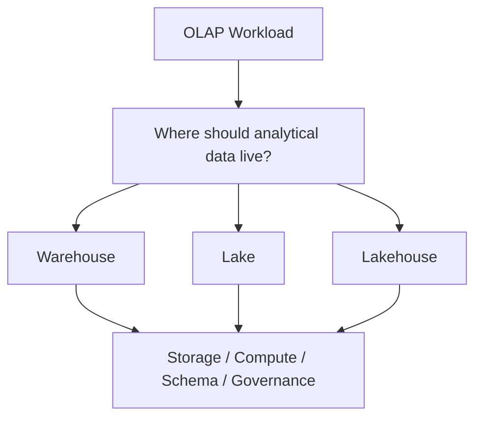

This is the high-level architecture question that the rest of the lesson answers.


Every major platform decision in this lesson should be examined using the same loop:

```text
What is it?
→ Why does it exist?
→ What problem does it solve?
→ How does it work?
→ Where is the data stored?
→ Where is compute happening?
→ What schema approach is used?
→ What are the strengths?
→ What are the limitations?
→ What are the trade-offs?
→ Small example
→ Real-world example
→ Python simulation where useful
→ Production interpretation
→ Common failure modes
→ Common misconceptions
→ When it fits
→ Checkpoint
```

This loop is intentionally engineering-oriented.

A beginner can start with a simple question:

> “Where does the data live, and who processes it?”

An experienced data engineer asks additional questions:

> “What is the workload? What are the data types? What consistency and governance are required? How much operational complexity can the team support? Which compute engines need access? What does the total cost of ownership look like? How much lock-in is acceptable?”

The rest of this module develops that thinking step by step.

---

# 5. Data Warehouse — From Basic to Advanced

## 5.1 Simple Definition

> **A data warehouse is a structured analytical data platform designed primarily for querying and analyzing business data.**

Think of a warehouse as a place where data is deliberately shaped into structures that analysts and business applications can query predictably.

A typical warehouse is:

- SQL-first
- strongly structured
- commonly schema-on-write
- designed for analytical workloads
- focused on curated or modeled data
- commonly used by BI and reporting teams
- operated through a managed analytical platform in many organizations

Examples of warehouse products include:

- Snowflake
- BigQuery
- Redshift

These are examples of implementations of the warehouse pattern. This lesson does **not** teach product-specific syntax.

---

## 5.2 Why Does a Warehouse Exist?

### Mermaid — Warehouse Architecture

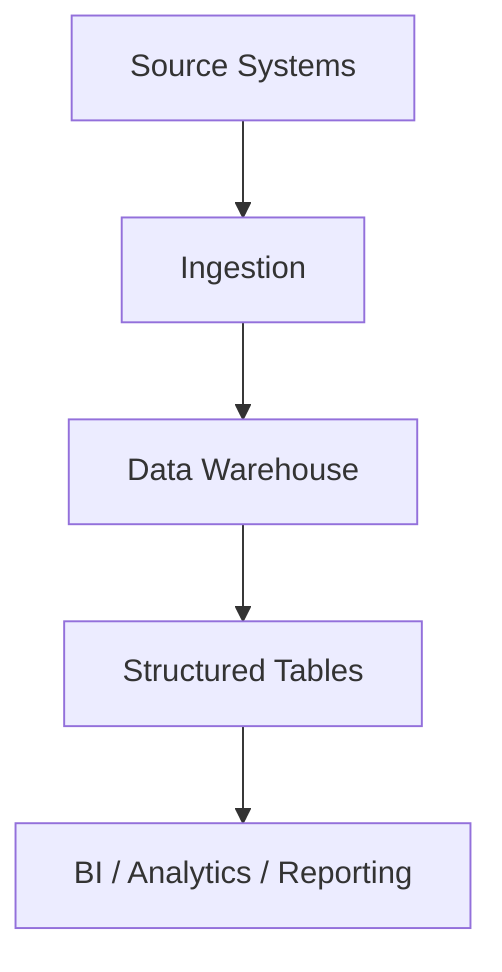

This shows the warehouse pattern as a path from operational sources to a managed analytical environment and then to analytical consumers.


Imagine an organization has operational databases containing customer, order, payment, and inventory records.

Those databases are optimized for operational workloads such as:

```sql
SELECT *
FROM customers
WHERE customer_id = 42;
```

or:

```sql
UPDATE inventory
SET quantity = quantity - 1
WHERE product_id = 1001;
```

An analyst may instead ask:

> “What was monthly revenue by country for the last three years, segmented by product category?”

That query has a very different work shape. It may scan large portions of a dataset and aggregate many rows.

A warehouse exists to support that analytical workload without forcing the operational database to serve as the primary analytical engine.

---

## 5.3 Warehouse Mental Model

```text
Source Systems
      ↓
Ingestion
      ↓
Data Warehouse
      ↓
Structured Tables
      ↓
BI / Analytics / Reporting
```

### Component-by-component

**Source systems** are where business operations happen.

Examples:

- core banking systems
- payment systems
- CRM systems
- order databases
- application databases

**Ingestion** moves or transforms data from sources into analytical storage.

**The warehouse** stores analytical structures designed for query workloads.

**Structured tables** expose predictable columns, data types, relationships, and business meaning.

**BI / analytics / reporting** consumes the data through dashboards, SQL, scheduled reports, notebooks, or analytical applications.

Another useful view is:

```text
Warehouse
 ├── Storage
 ├── Compute
 ├── SQL
 ├── Schema
 └── Governance
```

Modern managed warehouses can hide a large amount of infrastructure complexity from the user. The data engineer may primarily reason about tables, workloads, permissions, transformations, cost, and reliability rather than manually administering every storage device and compute node.

---

## 5.4 Schema-on-Write

### Mermaid — Schema-on-Write

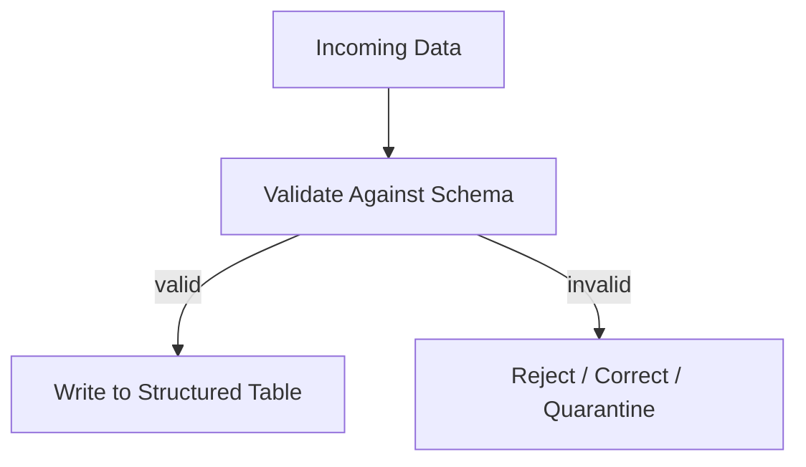

The important point is that validation is part of the write path.


> **Schema-on-write means the structure and rules of the data are generally defined before or as data is loaded into the analytical target.**

A simple model is:

```text
Incoming data
      ↓
Validate against schema
      ↓
Reject / correct invalid data
      ↓
Load into structured table
```

For example:

```text
customer_id: INTEGER
email: TEXT
created_at: TIMESTAMP
```

Suppose a pipeline receives:

```text
customer_id = "not-an-integer"
email       = "alice@example.com"
created_at  = "2026-09-26T10:20:00Z"
```

A schema-enforced target may reject or quarantine that record rather than accepting it into a typed analytical table.

### Why schema-on-write can help

It can provide:

- predictable structure
- stronger downstream assumptions
- more consistent query behavior
- earlier detection of bad data
- clearer ownership of data contracts

### Trade-off

Schema enforcement introduces coordination.

For example:

```text
Source schema changes
        ↓
Pipeline must understand change
        ↓
Target schema may need update
        ↓
Downstream consumers may need testing
```

Therefore schema-on-write can improve reliability while also making schema changes more deliberate.

It does **not** mean that data can never change or that every transformation happens before storage. It means the analytical target generally expects an explicitly managed structure at write time.

---

## 5.5 Warehouse Strengths

A warehouse tends to fit situations where organizations need:

- strong SQL analytics
- predictable tabular structures
- curated business data
- reporting and dashboards
- straightforward analytical access for SQL-oriented teams
- centrally managed analytical services

### Warehouse limitations and trade-offs

Depending on the implementation, a warehouse may be less natural for:

- very diverse raw file collections
- large unmanaged document repositories
- image and binary storage
- highly heterogeneous source data that changes frequently
- workloads that need broad low-level storage access

Modern warehouses can overlap with these capabilities, so these are architectural tendencies rather than rigid rules.

---

## 5.6 Warehouse Production Interpretation

A senior engineer does not ask only:

> “Can this warehouse run SQL?”

The better questions include:

- What is the workload profile?
- How many consumers exist?
- How predictable is the schema?
- What data needs to be retained raw?
- What governance is required?
- What compute scaling behavior is needed?
- What will the total cost look like?
- What platform dependencies could create lock-in?

### Warehouse checkpoint

Explain, in your own words:

1. Why a warehouse exists.
2. What makes an analytical workload different from an operational workload.
3. What schema-on-write means.
4. Why stronger schema control can improve downstream consistency.
5. What trade-off schema control introduces.

---

# 6. Data Lake — From Basic to Advanced

## 6.1 Simple Definition

> **A data lake is a storage-oriented architecture that uses relatively inexpensive object storage to keep data in many forms, often before strict analytical modelling is imposed.**

Common object-storage foundations include:

- Amazon S3
- Google Cloud Storage
- Azure Data Lake Storage

A lake may store:

- CSV
- JSON
- Parquet
- Avro
- ORC
- text
- logs
- images
- PDFs
- other files

A lake is not required to contain only unprocessed raw data. Organizations can keep multiple processing stages in object storage, including raw, curated, and derived datasets.

---

## 6.2 Why Does a Data Lake Exist?

### Mermaid — Data Lake Architecture

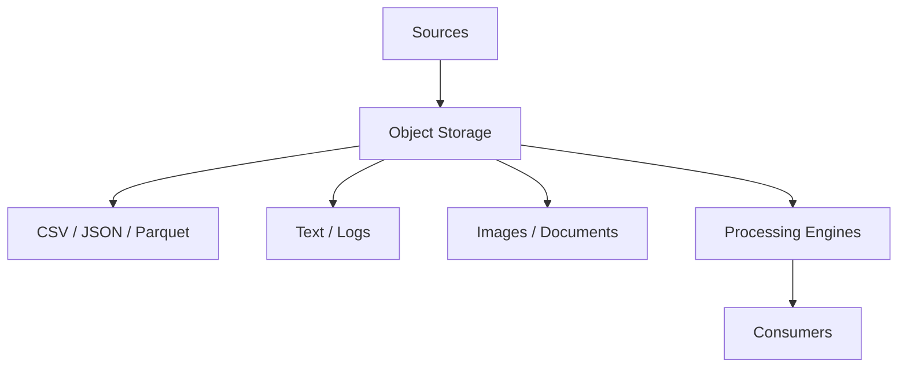

The diagram emphasizes that the lake starts with flexible object storage and can support multiple data forms before downstream processing.


A traditional structured analytical system assumes that data can be shaped into known structures.

Real organizations often receive:

```text
Tables
JSON
CSV
Logs
Images
PDFs
Events
Documents
ML datasets
```

The problem is that not every source arrives with a stable analytical schema.

A lake provides a flexible storage boundary where data can be captured without forcing every source to immediately conform to one analytical model.

This can be valuable when the organization needs to:

- retain raw information
- support heterogeneous data
- ingest sources quickly
- preserve information for future analysis
- support different processing engines

---

## 6.3 Lake Mental Model

```text
Sources
   ↓
Object Storage
   ├── CSV
   ├── JSON
   ├── Parquet
   ├── Text
   ├── Images
   └── Other Data
        ↓
Processing Engines
        ↓
Consumers
```

Object storage is central because it provides a durable persistence layer for a broad range of files and datasets.

The storage layer does not by itself answer:

- What does each file mean?
- Is the dataset trustworthy?
- Which file is authoritative?
- Who owns it?
- What is the schema?
- What is the lineage?
- How long should it be retained?

Those questions require additional metadata and governance.

---

## 6.4 Schema-on-Read

### Mermaid — Schema-on-Read

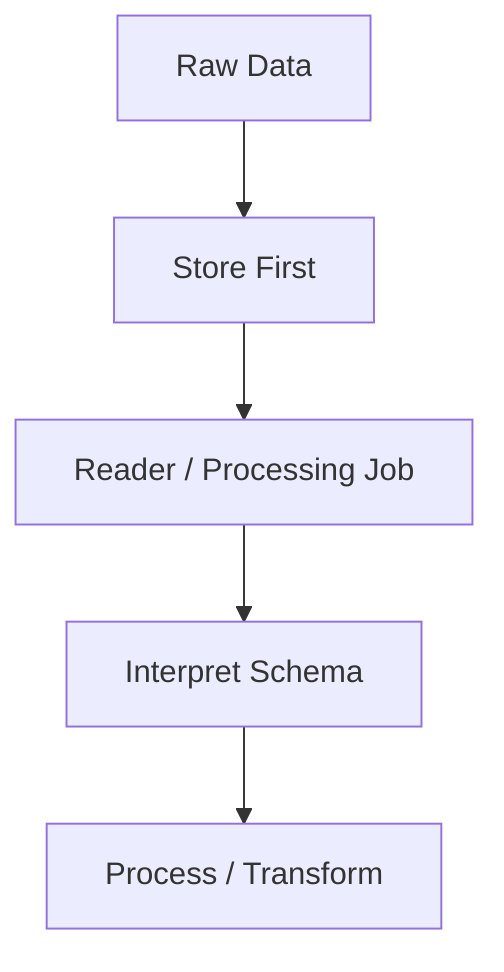

The structure is applied during interpretation rather than requiring all source records to conform before storage.


> **Schema-on-read means the structure and interpretation can be applied when data is read or processed rather than requiring every record to fully conform before storage.**

A simple model is:

```text
Raw Data
   ↓
Store
   ↓
Reader interprets structure
   ↓
Process
```

Consider two JSON documents:

```json
{
  "customer_id": 42,
  "name": "Asha",
  "country": "IN"
}
```

and:

```json
{
  "customer_id": 43,
  "name": "Rahul",
  "marketing_opt_in": true
}
```

The storage layer can keep both documents without requiring the same complete set of fields.

Later, a processing job may decide that:

```text
customer_id → required
name        → required
country     → optional
marketing_opt_in → optional
```

### Benefits

Schema-on-read can support:

- ingestion flexibility
- heterogeneous sources
- rapid data capture
- preservation of raw information

### Risks

Without discipline, the same flexibility can lead to:

- inconsistent interpretation
- repeated transformation logic
- difficult discovery
- unclear business meaning
- schema conflicts
- weak governance
- data swamps

### Important distinction

Schema-on-read does **not** mean “there is no schema.”

There is still a schema whenever someone interprets the data. The difference is **when and where the schema is enforced or applied**.

---

## 6.5 Common Lake Misunderstanding

A data lake is not simply:

> “A folder full of files.”

A production lake is an architectural system involving some combination of:

- secure ingestion
- object storage
- naming conventions
- metadata
- catalogs
- ownership
- access controls
- lifecycle policies
- quality checks
- lineage
- consumers

The storage layer is only one part of the platform.

---

## 6.6 Lake Strengths

A lake can be attractive when the organization needs:

- broad data-type support
- raw-data retention
- flexible ingestion
- object-storage economics
- storage for large files or datasets
- ML/AI experimentation
- data access by multiple processing engines

### Lake limitations

The flexibility can create significant platform complexity.

A poorly governed lake can become difficult to trust, search, understand, and operate.

That condition is commonly called a **data swamp**.

### Lake checkpoint

Explain:

1. Why object storage is central to a data lake.
2. Why a lake can ingest heterogeneous data.
3. What schema-on-read means.
4. Why schema-on-read does not mean “no schema.”
5. Why governance becomes important as lake usage grows.

---

# 7. Schema-on-Write vs Schema-on-Read

The two approaches differ primarily in **when structure and validation become binding**.

| Dimension | Schema-on-Write | Schema-on-Read |
|---|---|---|
| Validation timing | Before/at storage | At interpretation/read time |
| Flexibility at ingestion | Lower | Higher |
| Structure | More controlled | More flexible |
| Consumer predictability | Usually higher | Can vary |
| Source diversity | More coordination | Easier to absorb |
| Main risk | Tight coupling/change friction | Governance/consistency challenges |

### Example

Imagine a payment event:

```json
{
  "payment_id": 1001,
  "amount": 250.75,
  "currency": "INR"
}
```

With schema-on-write, the analytical destination may insist on:

```text
payment_id: INTEGER
amount: DECIMAL
currency: STRING
```

With schema-on-read, the raw event can be stored first and later interpreted by a processing job.

Neither strategy is universally superior.

The right choice depends on:

- source diversity
- consumer expectations
- change frequency
- quality requirements
- governance maturity
- workload requirements

---

# 8. Data Warehouse vs Data Lake — First Architectural Comparison

| Dimension | Warehouse | Lake |
|---|---|---|
| Primary role | Structured analytics | Flexible storage + processing foundation |
| Typical storage model | Managed analytical storage | Object storage |
| Data diversity | More structured | Broad |
| Schema tendency | Schema-on-write | Often schema-on-read |
| Raw-data retention | Possible | Common |
| SQL experience | Usually strong | Depends on processing/query engine |
| Governance | Often integrated into platform | Must be deliberately designed |
| Main strength | Predictable analytical experience | Flexibility and broad storage |
| Main challenge | Schema/change constraints can require coordination | Governance and discoverability complexity |

Do not treat this table as a set of hard laws. Modern systems increasingly overlap.

---

# 9. Lakehouse — From Basic to Advanced

## 9.1 Simple Definition

> **A lakehouse combines lake-style storage flexibility with table-management capabilities traditionally associated with analytical systems.**

The roadmap specifically frames the lakehouse as:

> **lake storage plus open table formats such as Delta Lake, Apache Iceberg, and Apache Hudi.**

The idea is to keep object storage as a durable foundation while adding table-level semantics and management capabilities above the raw files.

Key concepts include:

- ACID transactions
- schema enforcement
- time travel
- table-level semantics
- analytical processing
- object-storage foundations

This module introduces these ideas only at a conceptual level. The deeper implementation of Delta Lake, Iceberg, and Hudi belongs in Module 2.15.

---

## 9.2 Lakehouse Mental Model

### Mermaid — Lakehouse Architecture

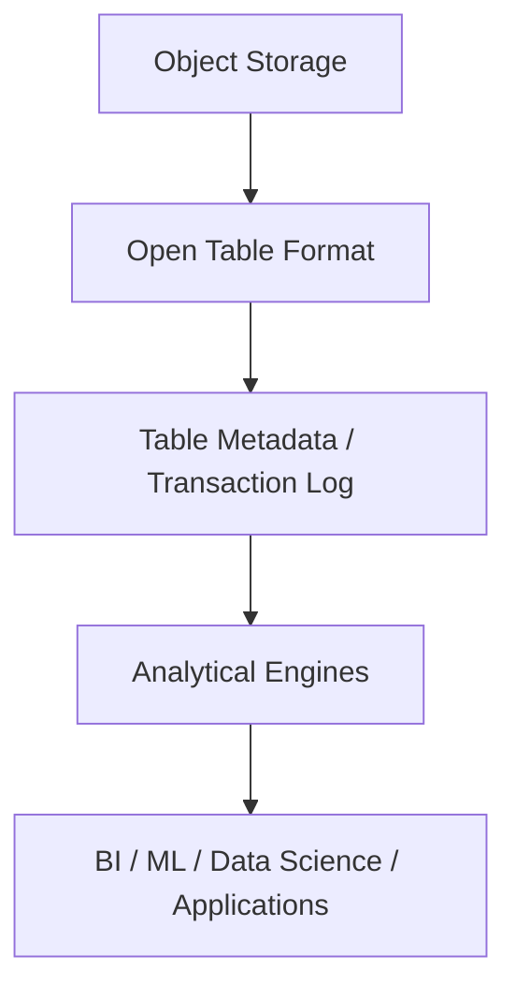

The key idea is that the table layer adds managed semantics over object-storage data files.


```text
Object Storage
      ↓
Open Table Format
      ↓
Table Metadata / Transaction Log
      ↓
Analytical Engines
      ↓
BI / ML / Data Science / Applications
```

The essential idea is that the table format adds a management layer over files.

Instead of saying:

> “There are files in a folder.”

we can reason about:

> “There is a managed table whose state is defined by committed metadata and associated data files.”

---

## 9.3 Why Does a Lakehouse Exist?

There is a common architectural tension.

### Data lake

```text
Flexible
+
Cheap storage
+
Broad data types
+
Raw data retention
-
Less structure by default
-
Governance challenges
-
Weak table semantics without additional layers
```

### Warehouse

```text
Strong structure
+
Managed analytics
+
Good SQL experience
-
Can be more restrictive depending on architecture
-
Storage/engine choices may be more platform-specific
```

The lakehouse goal can be expressed as:

```text
Flexibility of lake
        +
Reliability / table semantics
        +
Analytical usability
```

A lakehouse does **not** magically eliminate complexity.

It is an architectural pattern, not simply “a lake with a new name.”

---

# 10. ACID — Foundational Introduction

Lakehouse table formats commonly provide transactional semantics. At this level, focus on the idea rather than implementation internals.

ACID stands for:

- **Atomicity** — a change happens as an all-or-nothing unit.
- **Consistency** — committed state must obey the system’s defined rules.
- **Isolation** — concurrent operations should not expose invalid intermediate states according to the system’s isolation model.
- **Durability** — committed changes should survive process or infrastructure failure according to the system’s guarantees.

A simple conceptual write is:

```text
Writer
  ↓
write new data
  ↓
commit metadata
  ↓
reader sees committed state
```

If the write fails before commit:

```text
Writer
  ↓
write partial data
  ↓
CRASH
  X
metadata not committed
  ↓
reader continues using prior committed state
```

The important idea is not that every real implementation works exactly this way internally. The idea is that **committed table state is managed separately from arbitrary files that happen to exist in storage**.

---

# 11. Schema Enforcement in a Lakehouse

Compare:

```text
Raw lake files
```

with:

```text
Managed lakehouse table
```

A managed table layer can provide stronger schema rules and table semantics than unmanaged files.

For example:

```text
Incoming record
      ↓
Table schema check
      ↓
Accept / reject / transform
      ↓
Commit table state
```

This does not mean every lakehouse implementation enforces schemas identically. Enforcement depends on the table format, engine, configuration, and operational design.

The important foundational distinction is:

> **A file is storage. A managed table is storage plus rules and metadata about how the files form a table.**

---

# 12. Time Travel

> **Time travel allows a table to expose or reconstruct earlier versions of its state when the table format and retention policy support it.**

Think conceptually:

```text
Version 1
   ↓
Version 2
   ↓
Version 3
```

A consumer may need to understand what the table looked like at an earlier point.

Potential uses include:

- debugging
- audit support
- recovery from bad transformations
- reproducing historical states
- investigating unexpected data changes

Real implementations have retention and storage-management rules. Time travel is not infinite history by default.

---

# 13. File Formats vs Table Formats

This distinction is foundational.

## 13.1 File Format

A file format describes how data is represented inside a file.

Examples:

- CSV
- JSON
- Parquet
- Avro
- ORC

For example:

```text
customers.parquet
```

answers questions about how rows/columns are represented in that file.

## 13.2 Table Format

A table format adds management semantics over one or more data files.

Examples:

- Delta Lake
- Apache Iceberg
- Apache Hudi

Conceptually:

```text
Table Format
    ↓
Metadata + file references + table state
    ↓
Data files
```

A table format can describe:

- which files belong to a table
- table versions
- schema information
- transaction history or commit information
- metadata needed to interpret table state

Do not confuse:

```text
file format
```

with:

```text
table format
```

That distinction becomes important in later lakehouse modules.

---

# 14. Warehouse vs Lake vs Lakehouse

| Dimension | Warehouse | Lake | Lakehouse |
|---|---|---|---|
| Main purpose | Structured analytics | Flexible storage | Flexible storage + managed tables |
| Typical storage | Managed analytical storage | Object storage | Object storage |
| Schema | Usually schema-on-write | Often schema-on-read | Flexible + table-level enforcement |
| Data types | Strongly structured | Broad | Broad |
| Raw data | Possible | Common | Common |
| ACID table semantics | Typically strong | Not guaranteed by files alone | Provided by compatible table format |
| Time travel | Platform-dependent | Not inherent | Supported by many table formats |
| SQL analytics | Strong | Engine-dependent | Strong with compatible engines |
| ML friendliness | Good | Strong | Strong |
| Governance | Managed platform | Must be designed | Must be designed with catalog/table layers |
| Vendor lock-in | Varies | Often lower at storage layer | Potentially lower with open formats |
| Operational complexity | Varies | Can become significant | Can be significant |

### Important warning

These are conceptual patterns, not rigid categories.

Modern platforms can combine capabilities. An organization may also use more than one architecture pattern.

---

# 15. Storage vs Compute

This is one of the most important ideas in modern analytical architecture.

> **Storage and compute are different resources.**

A simple analogy:

```text
Storage = warehouse/building where data lives

Compute = workers/machines that process the data
```

Conceptually:

```text
             ┌───────────────┐
             │    Storage    │
             │   Data/files  │
             └───────┬───────┘
                     │
             ┌───────┼────────┐
             ↓       ↓        ↓
          Engine A Engine B Engine C
```

The same durable data layer may potentially be processed by different engines.

This is especially important in architectures built around object storage and open table formats.

---

## 15.1 Why Separation Matters

### Mermaid — Storage and Compute Separation

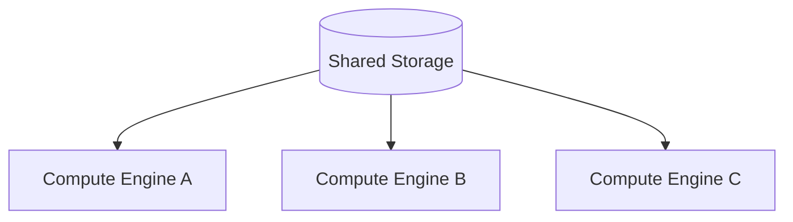

This illustrates the conceptual separation between persistent data and processing resources.


Separation can allow:

- compute to scale independently of storage
- storage to persist when compute is idle
- different workloads to use different compute resources
- multiple engines to work with shared data
- infrastructure costs to be aligned more closely with workload demand

Conceptually:

```text
Tightly coupled architecture

storage + compute
       ↓
capacity often planned together
```

versus:

```text
Separated architecture

storage  ←→  compute

scale / operate them more independently
```

The degree of independence varies across real platforms. Separation is an architectural capability, not a promise that the resources have no operational relationship.

---

# 16. Why Storage/Compute Separation Changed Cloud Data-Platform Economics

Consider three workloads.

## Heavy dashboard workload

```text
Morning
  ↓
Large number of analysts
  ↓
High query demand
  ↓
Temporarily increase compute
```

## Low-workload period

```text
Night
  ↓
Few users
  ↓
Low query demand
  ↓
Reduce or suspend compute where architecture permits
```

## Long-term data retention

```text
Historical data
  ↓
Retain for years
  ↓
Storage persists
  ↓
Compute need varies over time
```

The deeper lesson is:

> **Separating storage from compute can turn infrastructure capacity into a more flexible resource.**

It can change the cost model because an organization does not necessarily have to maintain the same compute capacity merely because a large volume of data exists.

However, architecture still has costs such as:

- storage access
- compute
- network/data transfer
- metadata services
- caching
- operational tooling
- governance
- engineering effort

Do not assume a specific cloud provider has one universal pricing model.

---

# 17. Data Swamp

### Mermaid — Evolution into a Data Swamp

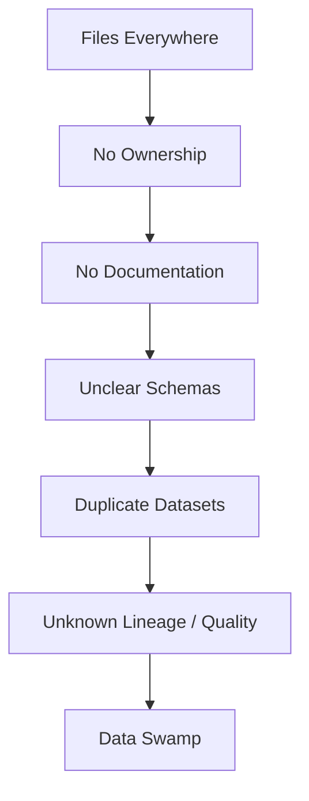

The failure is not the existence of a lake; it is uncontrolled flexibility without governance.


> **A data swamp is a data lake that has become difficult to trust, discover, understand, govern, or use.**

A healthy lake can degrade like this:

```text
Files everywhere
      ↓
No ownership
      ↓
No documentation
      ↓
Unclear schemas
      ↓
Duplicate datasets
      ↓
Unknown lineage
      ↓
Unknown data quality
      ↓
Data swamp
```

Common causes include:

- poor naming
- no ownership
- no catalog
- no governance
- no quality controls
- uncontrolled duplication
- no retention discipline
- undocumented schemas

A lake does not become a swamp because object storage is bad. It becomes a swamp because **flexibility is not matched with operational controls**.

---

# 18. Data Swamp Case Study

Imagine a company stores:

```text
CSV
JSON
logs
browser events
database exports
```

in one object-storage environment.

Six months later, a new analyst asks:

> “Which customer dataset is authoritative?”

The team discovers:

```text
/customer_export.csv
/customer_export_final.csv
/customer_export_new.csv
/customer_export_new2.csv
/customer_export_backup.csv
```

Nobody can immediately answer:

- Which dataset is authoritative?
- Who owns it?
- What schema does it follow?
- When was it last updated?
- Where did it come from?
- Which transformations produced it?
- Which consumers depend on it?

### What went wrong?

The problem is not storage capacity. The problem is missing metadata, ownership, lifecycle controls, and discoverability.

### What should exist?

At minimum, the organization needs a foundation around:

- ownership
- metadata
- naming
- cataloging
- quality expectations
- lineage
- access controls
- retention

---

# 19. Governance

> **Governance is the set of policies, ownership practices, metadata, controls, and processes that make data safe, understandable, and usable.**

At this foundational level, governance includes:

- ownership
- metadata
- classification
- access
- quality expectations
- lifecycle
- retention
- discoverability
- lineage

Governance is not an optional decoration added after the platform is built.

For analytical platforms, governance affects whether users can answer basic questions such as:

```text
What is this dataset?
Who owns it?
Can I use it?
Is it sensitive?
How fresh is it?
What system produced it?
What tables consume it?
When should it be deleted?
```

This module introduces the ideas only. The detailed governance, lineage, observability, and security curriculum appears later in Module 2.20.

---

# 20. Catalogs

> **A catalog is a system that helps people and tools discover what datasets/tables exist and understand their metadata.**

A catalog may contain information such as:

- dataset name
- description
- owner
- schema
- location
- classification
- lineage
- freshness information
- usage information

Examples of catalog technologies include:

- Hive Metastore
- AWS Glue
- Unity Catalog
- Polaris

These are technology examples only. This module does not teach their product APIs or operational configuration.

---

# 21. Governance Layer vs Storage Layer

### Mermaid — Catalog and Governance Layer

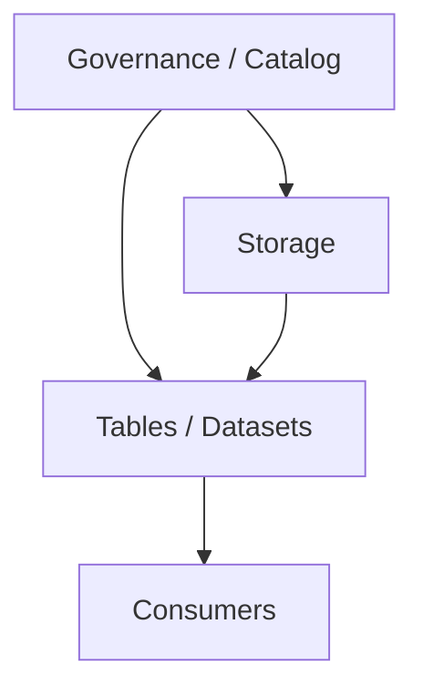

The governance layer provides metadata and controls around the data rather than replacing the storage layer.


A useful distinction is:

```text
Storage
=
Where data physically/logically lives
```

versus:

```text
Governance / Catalog
=
How people and systems understand, control, discover, and manage it
```

Conceptually:

```text
                  Governance / Catalog
                         ↓
Object Storage → Tables / Datasets → Consumers
```

A lake without governance can contain a lot of technically accessible data that is practically unusable.

### Governance checkpoint

Explain the difference between:

- a storage system
- a catalog
- governance
- ownership
- lineage

Then explain why these concepts are especially important in flexible storage architectures.

---

# 22. Open Formats

> **Open formats are standards/specifications that reduce dependence on one proprietary storage representation or engine.**

Open architecture discussions require a careful distinction.

## File formats

Examples:

- Parquet
- JSON
- CSV
- Avro
- ORC

## Table formats

Examples:

- Delta Lake
- Apache Iceberg
- Apache Hudi

A file format answers a question like:

> “How is the data encoded in this file?”

A table format answers a broader question like:

> “How do these files, schemas, versions, and metadata together represent a managed analytical table?”

Open formats can improve interoperability, but they do not guarantee zero lock-in.

---

# 23. Engine Independence

> **Engine independence means the same underlying data can potentially be accessed by multiple processing/query engines rather than being usable only through one proprietary execution engine.**

Conceptually:

```text
                 Open Data
                    ↓
          ┌─────────┼─────────┐
          ↓         ↓         ↓
        Spark     Trino    DuckDB
          ↓         ↓         ↓
          └──── Shared analytical data ────┘
```

The idea is that different workloads may use different compute engines.

For example:

- **Spark** can be useful for large-scale distributed processing.
- **Trino** can be useful for interactive SQL over compatible sources.
- **DuckDB** can be useful for local analytical work.
- **Warehouses** can provide managed analytical execution depending on the architecture.

The exact interoperability depends on storage layout, table format, connectors, feature support, and governance.

### Benefits of engine independence

Potential benefits include:

- workload specialization
- flexibility
- interoperability
- reduced engine lock-in
- different compute engines for different teams

### Caveats

Engine independence is not automatic.

Potential problems include:

- feature differences
- incomplete compatibility
- different SQL semantics
- different performance characteristics
- inconsistent governance behavior
- more operational complexity

Therefore:

> **“Open” means potential interoperability, not guaranteed identical behavior everywhere.**

---

# 24. Engine Independence Case Study

Suppose a company stores analytical data in an open table format in object storage.

Different teams request:

```text
Spark  → large distributed transformations
Trino  → interactive SQL
DuckDB → local analysis
```

### Questions

1. What architectural capability enables this?
2. What does engine independence mean?
3. What problems can still occur?
4. What governance layer is needed?

### Answer guidance

The capability is a shared storage/table representation that multiple compatible engines can understand.

Engine independence means that one compute engine is not the only possible execution path.

Problems can still include:

- feature incompatibility
- different engine capabilities
- inconsistent permissions
- different interpretations of schema or metadata
- operational complexity

A catalog and governance layer can provide consistent discovery, ownership, access, metadata, and lineage expectations.

---

# 25. Vendor Lock-In

> **Vendor lock-in is dependence on one provider's proprietary technology, formats, APIs, or services such that changing platforms becomes expensive or difficult.**

A conceptual architecture with potentially lower storage-layer lock-in might look like:

```text
Open storage
   +
Open table format
   +
Multiple compatible engines
```

A conceptual architecture with potentially higher lock-in might look like:

```text
Proprietary format
   +
Proprietary APIs
   +
Tightly coupled compute/storage
```

The trade-off is real:

### Lower lock-in can require more engineering

A portable architecture may require:

- compatibility testing
- multiple-engine support
- stronger standards discipline
- more operational components

### Higher lock-in can buy simplicity

A tightly integrated platform may offer:

- simpler operations
- strong managed capabilities
- fewer integration points
- easier vendor support

Therefore the real question is not:

> “Is lock-in bad?”

The better question is:

> “What level of lock-in is acceptable given the organization’s requirements, switching costs, and need for flexibility?”

Do not assume all managed warehouses have the same lock-in profile.

---

# 26. Team Skills as an Architecture Factor

> **The best architecture on paper may be inappropriate for a team that cannot reliably operate it.**

Architecture depends on engineering capability.

Important team skills may include:

- SQL expertise
- distributed-systems expertise
- cloud expertise
- DevOps/platform skills
- ML expertise
- operational maturity

Compare these simplified organizations:

```text
Small startup
+
small team
+
mostly BI
```

versus:

```text
Large data platform organization
+
ML team
+
many domains
+
large data volume
```

The first organization may value simplicity and a small operational footprint.

The second organization may be able to support a more complex shared data platform with multiple processing engines, governance components, and specialized workloads.

Team skill is not an afterthought. It is an architectural constraint.

---

# 27. Data Types as an Architecture Factor

Architecture must consider the shape of the data.

Examples include:

- tables
- images
- text
- embeddings

### Mostly relational business data

A warehouse can fit strongly because the primary consumers may perform SQL-oriented analytics over predictable tables.

### Massive raw documents and images

Object storage or lake-oriented architectures may be more natural because files are central to the workload.

### Tables + ML/AI data + open table requirements

A lakehouse may be attractive when an organization wants broad object storage plus stronger managed table semantics for analytical data.

These are examples, not universal prescriptions.

The architecture should follow the actual data characteristics.

---

# 28. ML / AI Needs as an Architecture Factor

Analytical platforms increasingly support ML and AI workflows.

Relevant requirements may include:

- training datasets
- feature data
- historical data
- large-scale scans
- experimentation
- reusable datasets
- embedding pipelines

A basic training path might look like:

```text
Raw data
   ↓
Curated data
   ↓
ML dataset
   ↓
Training
```

A document/embedding path might look like:

```text
Documents
   ↓
Storage
   ↓
Processing
   ↓
Embeddings
   ↓
Retrieval
```

The architecture must account for where these datasets live, who can access them, how they are versioned, and how they are governed.

The lesson here is architectural, not a full ML engineering curriculum.

---

# 29. Cost as an Architecture Factor

Cost is more than storage price.

Consider:

- storage
- compute
- data transfer
- operational overhead
- engineering effort
- governance
- platform maintenance
- migration costs

A senior engineer asks for total cost of ownership.

For example:

```text
Low storage cost
+
High operational complexity
+
Poor governance
=
Potentially expensive overall platform
```

A platform that costs slightly more in storage but dramatically reduces engineering complexity may have a lower total cost.

Likewise, a platform that is easy to start with may become expensive at large scale if workloads, governance, and data movement are poorly managed.

Therefore:

> **Cheapest storage does not necessarily mean cheapest architecture.**

---

# 30. Architecture Choice Framework

Before choosing a platform, ask:

```text
1. What data do we have?
2. What data types do we have?
3. How much data do we have?
4. Who consumes it?
5. What workloads do they run?
6. How frequently does the data change?
7. How much schema control is needed?
8. Do we need raw-data flexibility?
9. Do we need ACID table semantics?
10. Do we need multiple processing engines?
11. What ML/AI requirements exist?
12. What governance is required?
13. What team skills exist?
14. What is the total cost?
15. What vendor lock-in is acceptable?
```

Then use the decision sequence:

```text
Context
   → Requirements
   → Options
   → Trade-offs
   → Decision
   → Consequences
```

The architecture is a consequence of the requirements, not the starting point.

---

# 31. Organization Profiles

The same three patterns can produce different trade-offs depending on the organization.

## 31.1 A 10-Person Startup

Approximate characteristics:

- small engineering team
- limited platform operations staff
- mostly structured business data
- strong need for dashboards and basic analytics
- limited tolerance for operational complexity

Potential decision considerations:

- simplicity
- time to value
- predictable SQL access
- low operational burden
- manageable cost

A warehouse-oriented architecture may be a reasonable candidate where the workload is predominantly structured BI.

A lake or lakehouse could also be justified if raw files, ML workloads, or broader data diversity are important.

The point is the reasoning, not the label.

---

## 31.2 Mid-Size Retailer with ML Team

Approximate characteristics:

- structured orders and product data
- customer behavior events
- recommendation workloads
- ML datasets
- growing analytical team
- multiple consumer types

The organization may value:

- structured analytics
- event/raw-data retention
- ML-friendly storage
- reusable datasets
- multiple processing workloads
- stronger governance as the platform grows

A lakehouse can be attractive under some combinations of these requirements, but a warehouse plus carefully designed storage layers can also fit depending on constraints.

---

## 31.3 Regulated Bank

Approximate characteristics:

- strict access controls
- sensitive/PII data
- auditability requirements
- regulatory retention expectations
- many source systems
- multiple analytical consumers
- operational maturity requirements

The bank must reason carefully about:

- governance
- classification
- ownership
- lineage
- retention
- access controls
- auditability
- data quality
- cost
- operational complexity

The architecture cannot be chosen from performance and storage cost alone.

---

# 32. Architecture Decision Table

| Organization Profile | Key Requirements | Candidate Architecture | Main Reasoning | Main Risk |
|---|---|---|---|---|
| 10-person startup | Structured BI, low ops burden, predictable SQL | Warehouse-oriented candidate | Simplicity and structured analytics may dominate | May become restrictive if data diversity grows rapidly |
| Mid-size retailer + ML | Structured data + events + ML datasets | Lakehouse-oriented candidate or hybrid | Broad data support plus managed tables can be useful | More platform complexity |
| Regulated bank | Governance, PII, auditability, multiple domains | Warehouse, lake, lakehouse, or combination depending on controls | Requirements must drive storage, compute, and governance design | Complexity, regulatory exposure, and operational failure |

These are **educational scenarios**, not universal industry prescriptions.

---

# 33. Hands-On Exercise — Simulate All Three Architectures

The goal is to build intuition, not to reproduce production database or lakehouse implementations.

You will simulate:

- a warehouse with SQLite
- a lake with a directory of files
- a toy lakehouse with data files plus `_log.json`

Use only the Python standard library.

### Python requirements

Use Python 3.12+ and standard-library modules such as:

```python
sqlite3
json
csv
pathlib
datetime
logging
tempfile
os
time
```

Do not install:

- pandas
- NumPy
- Polars
- PySpark
- DuckDB
- Kafka
- Airflow
- dbt
- Delta Lake libraries
- Iceberg libraries
- Hudi libraries
- cloud SDKs

The exercise teaches **architecture**, not vendor APIs.

---

# 34. Toy Warehouse — SQLite

## 34.1 Purpose

Simulate a structured analytical target with:

- typed columns
- constraints
- a controlled target schema
- write-time rejection of invalid data

## 34.2 Input

Valid and invalid customer rows.

## 34.3 Output

The valid row is inserted. The invalid row is rejected by the database constraint.

## 34.4 Learner-Ready Code

```python
from __future__ import annotations

import sqlite3


def main() -> None:
    connection = sqlite3.connect(":memory:")

    try:
        connection.execute(
            """
            CREATE TABLE customers (
                customer_id INTEGER PRIMARY KEY,
                name TEXT NOT NULL,
                country TEXT NOT NULL
            )
            """
        )

        connection.execute(
            "INSERT INTO customers(customer_id, name, country) VALUES (?, ?, ?)",
            (1, "Asha", "IN"),
        )

        print("Valid insert succeeded.")

        try:
            connection.execute(
                "INSERT INTO customers(customer_id, name, country) VALUES (?, ?, ?)",
                ("not-an-integer", "Broken Customer", "IN"),
            )
        except sqlite3.Error as error:
            print(f"Invalid insert rejected: {error}")

        rows = connection.execute(
            "SELECT customer_id, name, country FROM customers"
        ).fetchall()

        print("Stored rows:")
        for row in rows:
            print(row)
    finally:
        connection.close()


if __name__ == "__main__":
    main()
```

## 34.5 Block-by-Block Explanation

### Connection

```python
connection = sqlite3.connect(":memory:")
```

This creates a temporary SQLite database in memory.

The goal is not to imitate a cloud warehouse. The goal is to create a controlled table where the schema exists before the insert.

### Schema

```sql
CREATE TABLE customers (
    customer_id INTEGER PRIMARY KEY,
    name TEXT NOT NULL,
    country TEXT NOT NULL
)
```

The target structure is explicitly defined.

### Valid insert

The valid record conforms to the schema.

### Invalid insert

```python
("not-an-integer", "Broken Customer", "IN")
```

This intentionally introduces a type mismatch.

SQLite has dynamic typing behavior in some situations, so the exact enforcement behavior is engine-specific. The teaching point is therefore the **controlled-schema model**, not a claim that SQLite enforces warehouse-grade typing identically to every production warehouse.

For a stricter demonstration, you can extend the table with additional checks, for example:

```sql
CHECK(typeof(customer_id) = 'integer')
```

But even that remains a toy simulation.

### Expected behavior

A properly constrained version rejects the invalid customer row at write time.

### Failure scenario

Try:

```text
country = NULL
```

The `NOT NULL` constraint should reject the row.

### Architectural lesson

The target schema is defined first, and writes are expected to conform to it.

```text
Schema-on-write
→ validation happens at write time
```

### Production limitation

SQLite is not a production cloud warehouse. It is only a simple local simulation of structured, constrained analytical storage.

---

# 35. Toy Data Lake — Directory of Files

## 35.1 Purpose

Simulate flexible storage where different file types can coexist before strict interpretation.

## 35.2 Directory Structure

```text
lake/
    raw/
        customers.csv
        customers.json
        events.json
```

## 35.3 Learner-Ready Code

```python
from __future__ import annotations

import csv
import json
from pathlib import Path
import tempfile


def create_lake(root: Path) -> Path:
    raw = root / "lake" / "raw"
    raw.mkdir(parents=True, exist_ok=True)

    with (raw / "customers.csv").open("w", newline="", encoding="utf-8") as file:
        writer = csv.writer(file)
        writer.writerow(["customer_id", "name", "country"])
        writer.writerow([1, "Asha", "IN"])

    with (raw / "customers.json").open("w", encoding="utf-8") as file:
        json.dump(
            {
                "customer_id": 2,
                "name": "Rahul",
                "marketing_opt_in": True,
            },
            file,
            indent=2,
        )

    # Intentionally malformed JSON. The storage layer can still hold the file.
    (raw / "events.json").write_text(
        '{"event_id": 1001, "customer_id": 1}\n'
        '{"event_id": 1002, "customer_id": }\n',
        encoding="utf-8",
    )

    return raw


def read_events(path: Path) -> None:
    print("Reading events.json line by line:")

    for line_number, line in enumerate(
        path.read_text(encoding="utf-8").splitlines(), start=1
    ):
        try:
            event = json.loads(line)
            print(f"line {line_number}: {event}")
        except json.JSONDecodeError as error:
            print(f"line {line_number}: reader could not parse record: {error}")


def main() -> None:
    with tempfile.TemporaryDirectory() as temporary_directory:
        raw = create_lake(Path(temporary_directory))

        print("Stored files:")
        for path in sorted(raw.iterdir()):
            print(f"- {path.name}")

        read_events(raw / "events.json")


if __name__ == "__main__":
    main()
```

## 35.4 Explanation

The storage layer accepts different formats:

```text
customers.csv
customers.json
events.json
```

It also allows the malformed JSON file to exist.

The important distinction is:

```text
Store
  ≠
Successfully interpret
```

A writer can store an object even when a downstream reader cannot successfully parse the content.

### Expected behavior

The directory is successfully created, and the malformed JSON file exists.

Later, `read_events()` detects that one record is malformed.

### Failure scenario

Add another malformed record.

Observe that ingestion into storage may still succeed while downstream interpretation becomes more difficult.

### Architectural lesson

```text
Schema-on-read
→ interpretation happens when consumed
```

### Production limitation

A production data lake would typically add validation, quarantine rules, metadata, schema management, quality checks, and lifecycle controls.

---

# 36. Toy Lakehouse — Files + `_log.json`

## 36.1 Required Teaching Model

The toy lakehouse uses:

```text
lakehouse/
    data/
        customers_001.json
        customers_002.json

    _log.json
```

The log records committed files and their schemas.

Readers trust **only** files listed in `_log.json`.

This creates the key distinction:

```text
Data file exists
+
log says committed
=
reader trusts it
```

versus:

```text
Data file exists
+
log does NOT say committed
=
reader ignores it
```

---

## 36.2 Purpose

This simulation demonstrates the relationship:

```text
Data Files
+
Transaction Metadata
=
Managed Table State
```

## 36.3 Learner-Ready Code

```python
from __future__ import annotations

import json
import logging
from pathlib import Path
import tempfile
from datetime import datetime, timezone

logging.basicConfig(level=logging.INFO, format="%(levelname)s: %(message)s")


SCHEMA = {
    "customer_id": "integer",
    "name": "string",
    "country": "string",
}


def atomic_write_text(path: Path, content: str) -> None:
    temporary_path = path.with_suffix(path.suffix + ".tmp")
    temporary_path.write_text(content, encoding="utf-8")
    temporary_path.replace(path)


def write_log(log_path: Path, committed_files: list[dict]) -> None:
    payload = {
        "files": committed_files,
        "updated_at": datetime.now(timezone.utc).isoformat(),
    }
    atomic_write_text(log_path, json.dumps(payload, indent=2))


def initialize_lakehouse(root: Path) -> tuple[Path, Path]:
    data_directory = root / "lakehouse" / "data"
    data_directory.mkdir(parents=True, exist_ok=True)
    log_path = root / "lakehouse" / "_log.json"

    first_file = data_directory / "customers_001.json"
    first_file.write_text(
        json.dumps(
            [
                {"customer_id": 1, "name": "Asha", "country": "IN"},
                {"customer_id": 2, "name": "Rahul", "country": "IN"},
            ],
            indent=2,
        ),
        encoding="utf-8",
    )

    write_log(
        log_path,
        [
            {
                "path": "data/customers_001.json",
                "schema": SCHEMA,
            }
        ],
    )

    return data_directory, log_path


def reader(data_directory: Path, log_path: Path) -> list[dict]:
    log = json.loads(log_path.read_text(encoding="utf-8"))
    trusted_files = {entry["path"] for entry in log["files"]}

    rows: list[dict] = []

    for file_path in sorted(data_directory.glob("*.json")):
        relative_path = file_path.relative_to(data_directory.parent).as_posix()

        if relative_path not in trusted_files:
            logging.info("Ignoring uncommitted file: %s", relative_path)
            continue

        rows.extend(json.loads(file_path.read_text(encoding="utf-8")))

    return rows


def commit_new_file(
    data_directory: Path,
    log_path: Path,
    rows: list[dict],
) -> None:
    new_path = data_directory / "customers_002.json"
    new_path.write_text(json.dumps(rows, indent=2), encoding="utf-8")

    log = json.loads(log_path.read_text(encoding="utf-8"))
    log["files"].append(
        {
            "path": "data/customers_002.json",
            "schema": SCHEMA,
        }
    )
    log["updated_at"] = datetime.now(timezone.utc).isoformat()
    atomic_write_text(log_path, json.dumps(log, indent=2))


def simulate_crash_before_commit(data_directory: Path) -> None:
    half_written_path = data_directory / "customers_003.json"
    half_written_path.write_text(
        json.dumps(
            [{"customer_id": 999, "name": "Uncommitted", "country": "IN"}],
            indent=2,
        ),
        encoding="utf-8",
    )

    raise RuntimeError("Simulated crash before transaction-log update")


def main() -> None:
    with tempfile.TemporaryDirectory() as temporary_directory:
        root = Path(temporary_directory)
        data_directory, log_path = initialize_lakehouse(root)

        print("Initial committed rows:")
        print(reader(data_directory, log_path))

        commit_new_file(
            data_directory,
            log_path,
            [{"customer_id": 3, "name": "Neha", "country": "IN"}],
        )

        print("After committed write:")
        print(reader(data_directory, log_path))

        try:
            simulate_crash_before_commit(data_directory)
        except RuntimeError as error:
            print(f"Expected crash: {error}")

        print("After restart, reader sees:")
        print(reader(data_directory, log_path))

        print("Physical files:")
        for path in sorted(data_directory.iterdir()):
            print(f"- {path.name}")

        print("Transaction log:")
        print(log_path.read_text(encoding="utf-8"))


if __name__ == "__main__":
    main()
```

---

## 36.4 Code Explanation

### `SCHEMA`

```python
SCHEMA = {
    "customer_id": "integer",
    "name": "string",
    "country": "string",
}
```

This is deliberately simple metadata. Real table formats have richer schema representations.

### `atomic_write_text()`

The function writes to a temporary file and replaces the target. This reduces the chance of leaving a partially written log file if the process fails during the final replacement step.

This is still only a toy implementation.

### `_log.json`

The log contains entries such as:

```json
{
  "files": [
    {
      "path": "data/customers_001.json",
      "schema": {
        "customer_id": "integer",
        "name": "string",
        "country": "string"
      }
    }
  ]
}
```

### Reader behavior

The reader loads the log and creates a set of trusted paths.

Any file that exists physically but is absent from the log is ignored.

This creates the teaching model:

```text
Physical files
      +
Committed metadata
      ↓
Visible table state
```

---

# 37. Crash Simulation

The required failure experiment is:

```text
1. Write a new data file.
2. Before updating `_log.json`, simulate a crash.
3. Restart reader.
4. Reader only uses files recorded in `_log.json`.
5. Half-completed data is invisible.
```

After the simulated crash, you should observe something like:

```text
Physical files:
- customers_001.json
- customers_002.json
- customers_003.json
```

while `_log.json` lists only the first two committed files.

The reader therefore ignores `customers_003.json`.

The architectural idea is:

> **Data files alone do not define the table state; committed metadata does.**

This is a **simplified teaching model inspired by real table formats**, not a production table-format implementation.

---

# 38. Bad Data Experiment Across the Three Architectures

Introduce:

```text
customer_id = "not-an-integer"
```

Then reason about the architecture.

## Warehouse

The target table can reject the record during the write path when the schema/constraint requires an integer.

```text
Bad row
  ↓
Validation
  ↓
Reject / quarantine
```

## Lake

The raw record can be stored because storage and interpretation are separate.

```text
Bad row
  ↓
Store raw data
```

A later consumer may fail when parsing or validating the row.

## Lakehouse

The table layer can provide schema controls depending on implementation and configuration.

The toy model in this lesson focuses primarily on committed table state rather than reproducing full production schema enforcement.

Do **not** conclude that every lakehouse automatically rejects every bad record.

---

# 39. Comparative Experiment

Run the mental model side by side:

```text
Warehouse:
Bad row → rejected

Lake:
Bad row → stored

Lakehouse:
Data file + transaction/schema metadata
→ reader sees only committed table state
```

### Questions

1. What did each architecture optimize for?
2. Where was schema enforcement applied?
3. What happened when a write failed?
4. What did the metadata layer provide?

### Expected reasoning

The warehouse simulation emphasizes **controlled target structure**.

The lake simulation emphasizes **storage flexibility**.

The lakehouse simulation emphasizes **managed table state using metadata in addition to files**.

---

# 40. Storage / Compute Separation Experiment

The following is intentionally conceptual.

```text
Shared Storage
      ↓
Compute Engine A
      ↓
Compute Engine B
      ↓
Compute Engine C
```

Imagine:

```text
Engine A = large distributed transformation
Engine B = interactive SQL
Engine C = local analysis
```

The goal is not to benchmark actual engines. The goal is to understand the architectural boundary.

Real engines can differ in:

- SQL support
- performance
- workload specialization
- cost
- compatibility

This is why “multiple engines” does not automatically mean “one workload can run identically everywhere.”

---

# 41. Data Swamp Recovery Exercise

Consider:

```text
lake/
    file1.csv
    data_new.csv
    final_final.csv
    copy_of_final.csv
    customer_export_old.json
    customer_export_new2.json
    unknown/
```

### Identify

- naming problems
- ownership problems
- discoverability problems
- version confusion
- governance problems

### Propose

- catalog
- ownership
- naming convention
- metadata
- lineage
- retention policy

### Example reasoning

`final_final.csv` has no meaningful semantic version information.

`copy_of_final.csv` suggests manual duplication.

`unknown/` is not a discoverable business domain.

A better platform would attach explicit metadata to datasets and define ownership and lifecycle expectations.

Do not over-engineer the solution. Start with a small set of enforceable controls.

---

# 42. Real-World Case Study — Banking

### Mermaid — Banking Analytical Platform Example

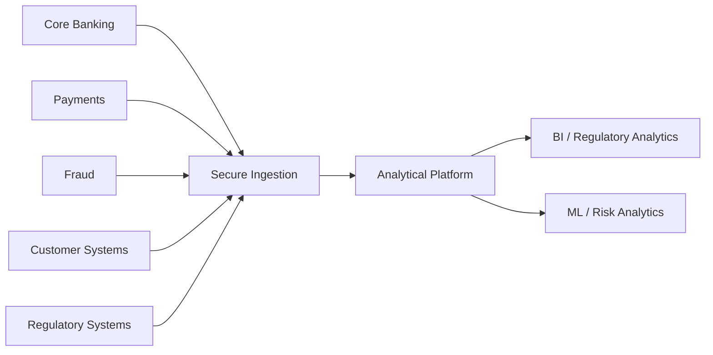

The pattern is intentionally conceptual: multiple operational domains can feed a governed analytical platform.


A bank can have many independent operational systems, for example:

```text
Core Banking
Payments
Cards
Fraud
Customer Systems
Regulatory Systems
```

These systems may produce different workload types and data shapes.

An analytical platform can receive data through batch, micro-batch, CDC, or other ingestion mechanisms studied earlier in the roadmap.

---

## 42.1 Warehouse-Oriented Design

```text
Sources
   ↓
ETL / ELT
   ↓
Warehouse
   ↓
BI / Regulatory Analytics
```

The warehouse-oriented design emphasizes structured analytical datasets and governed SQL access.

Relevant concerns include:

- PII
- access control
- auditability
- data quality
- regulatory reporting
- lifecycle and retention

---

## 42.2 Lake-Oriented Design

```text
Sources
   ↓
Object Storage
   ↓
Files
   ↓
Multiple Processing Engines
```

This approach can support diverse data such as:

- raw extracts
- event logs
- documents
- model-training datasets

The governance burden becomes especially important because financial data is sensitive.

---

## 42.3 Lakehouse-Oriented Design

```text
Sources
   ↓
Object Storage
   ↓
Managed Tables
   ↓
Multiple Analytical Consumers
```

This can combine object-storage flexibility with managed table semantics.

Potential considerations include:

- governance
- PII handling
- auditability
- cost
- ML requirements
- operational complexity

Do not assume all banks use one architecture. Banking environments differ by institution, workload, regulatory context, existing platforms, and operating model.

---

# 43. Real-World Case Study — E-Commerce

Imagine an e-commerce company with:

```text
Orders
Products
Customers
Clicks
Reviews
Images
Recommendations
```

The organization has:

- structured transactional data
- event data
- text/reviews
- images
- ML datasets

A highly structured BI workload could fit a warehouse strongly.

As data diversity and ML requirements grow, the organization may need a broader storage layer for events, images, historical data, and training datasets.

A lakehouse or hybrid architecture may become attractive depending on:

- table-management needs
- engine requirements
- governance
- cost
- team skill

The point is that architecture can evolve as requirements change.

---

# 44. Real-World Case Study — AI / RAG

### Mermaid — AI / RAG Architecture

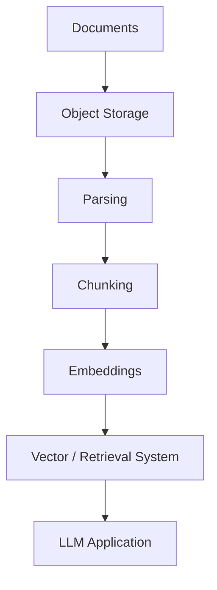

This highlights the role of flexible storage and metadata in AI data workflows.


A conceptual AI/RAG pipeline may look like:

```text
Documents
   ↓
Object Storage
   ↓
Parsing
   ↓
Chunking
   ↓
Embeddings
   ↓
Vector / Retrieval System
   ↓
LLM Application
```

This architecture highlights why flexible storage is valuable for:

- PDFs
- documents
- raw text
- images
- extracted content
- training datasets

Metadata remains important because the platform must answer questions such as:

- Where did this document come from?
- Who can use it?
- Which version is authoritative?
- What classification does it have?
- Which embedding dataset was produced from it?

A table/data-management layer may still be useful for structured datasets surrounding the AI application.

Keep the architectural distinction clear:

```text
Flexible storage
+
processing
+
metadata
+
retrieval/serving systems
```

The data platform is usually a collection of interacting components rather than one product.

---

# 45. What Warehouse, Lake, and Lakehouse Do Not Mean

## Warehouse does not mean

> “Only structured data can exist.”

Many modern warehouses can ingest or process more than traditional relational tables.

## Lake does not mean

> “No schema or governance.”

A well-designed lake can have rich metadata, schemas, quality controls, ownership, and governance.

## Lakehouse does not mean

> “Everything automatically becomes reliable.”

A table format does not eliminate poor governance, bad schemas, bad pipelines, or operational mistakes.

## Open format does not mean

> “Zero vendor lock-in.”

There can still be dependence on managed services, APIs, proprietary features, operational tooling, or provider-specific implementations.

## Storage/compute separation does not mean

> “Compute is always free.”

It means the resources can be reasoned about and, in many architectures, scaled or managed more independently.

---

# 46. Common Beginner Misconceptions

## “A data lake is just a folder full of files.”

Storage is only one component. A production lake needs ingestion, metadata, ownership, governance, quality, lifecycle, and access controls.

## “A warehouse is just a large database.”

A warehouse is an analytical platform optimized around analytical workloads, not simply a larger copy of an OLTP database.

## “A lakehouse is just a data lake with a marketing name.”

A lakehouse adds a table-management layer with capabilities such as transaction semantics, schema handling, versioning, and metadata over object storage.

## “Schema-on-read means there is no schema.”

A schema still exists when consumers interpret data. The key difference is when and where that interpretation becomes binding.

## “Schema-on-write means data can never change.”

Schema changes are possible. They generally require deliberate coordination and compatibility handling.

## “All lakes become data swamps.”

No. A lake becomes difficult to use when governance, ownership, metadata, quality, and lifecycle practices are insufficient.

## “Governance makes data engineering slower and is therefore optional.”

Governance introduces controls, but without governance the cost of discovering, trusting, and using data can become much higher.

## “Open formats completely eliminate vendor lock-in.”

Open formats can reduce storage/engine dependence, but proprietary services and operational integrations can still create lock-in.

## “If storage and compute are separated, they have no relationship.”

They remain operationally connected through data access, networking, metadata, caching, workload scheduling, and cost.

## “Any engine can automatically read any open format.”

Only when the required compatibility exists. Feature support varies.

## “A lakehouse automatically provides perfect ACID guarantees.”

The guarantees depend on the table format, engine, configuration, and implementation.

## “Cheap storage means cheap data platforms.”

Engineering effort, compute, governance, data transfer, operations, and migrations can dominate total cost.

---

# 47. Failure Modes

| Architecture / Concept | Failure | Why It Happens | Impact | Possible Control |
|---|---|---|---|---|
| Warehouse | Schema mismatch | Source changes without coordinated target update | Load failures or consumer breakage | Contracts, compatibility checks, staged schema changes |
| Lake | Schema inconsistency | Flexible ingestion without standards | Consumers interpret data differently | Shared schema conventions and quality checks |
| Lake | Data swamp | No ownership/catalog/retention discipline | Low trust and discoverability | Catalog, ownership, lifecycle controls |
| Governance | Missing ownership | Dataset created without accountable owner | Unresolved incidents and unclear decisions | Dataset ownership requirement |
| Governance | Missing metadata | Storage created without description/schema | Hard to discover or reuse | Metadata registration |
| Engine independence | Incompatible engines | Different feature support | Query failures or semantic differences | Compatibility matrix and tested engine versions |
| Lakehouse | Metadata corruption | Incorrect transaction or metadata management | Table state may become unavailable or inconsistent | Reliable metadata writes and recovery procedures |
| Lakehouse | Uncommitted files | Writer fails before commit | Orphan/untrusted data files | Readers trust committed metadata only |
| Lakehouse | Accidental overwrite | Unsafe update process | Loss or corruption of expected state | Versioning, isolation, safe writes |
| Storage | Excessive duplication | Multiple copies created without lifecycle policy | Higher storage and processing costs | Retention and deduplication strategy |
| Compute | Runaway cost | Unbounded or inefficient workloads | Unexpected bills | Workload controls, quotas, monitoring |
| Architecture | Vendor-specific dependencies | Proprietary features become core assumptions | Migration becomes expensive | Identify and consciously accept or reduce lock-in |

These are foundational controls, not a complete production reliability framework.

---

# 48. Security and Governance at Platform Level

Architecture cannot be selected using only:

```text
cost + performance
```

It must also include:

```text
security + governance + compliance + operations
```

Foundational concerns include:

- access control
- encryption
- PII
- dataset classification
- ownership
- auditability
- retention

For example, a bank may have a dataset that is technically easy to store in object storage. That does not mean unrestricted access is acceptable.

The architecture must answer:

```text
Who can access it?
How is access audited?
How is sensitive data classified?
How long should it exist?
Who owns the dataset?
How are policy violations detected?
```

The detailed security and governance curriculum belongs later in Module 2.20.

---

# 49. Architecture Trade-Off Matrix

The following matrix is intentionally qualitative.

| Dimension | Warehouse | Lake | Lakehouse |
|---|---|---|---|
| Storage flexibility | Medium | Higher | Higher |
| Structured analytics | Higher | Medium | Higher |
| Raw-data retention | Medium | Higher | Higher |
| Schema control | Higher | Lower by default | Medium–Higher |
| Query convenience | Higher | Medium | Higher |
| Multiple engines | Medium | Higher | Higher |
| ML friendliness | Medium–Higher | Higher | Higher |
| Governance | Higher in integrated platforms | Medium unless designed well | Medium–Higher with catalog/table layer |
| Cost flexibility | Medium–Higher | Higher at storage layer | Higher at storage layer |
| Operational complexity | Lower–Medium | Medium–Higher | Medium–Higher |
| Vendor lock-in | Varies | Often lower at storage layer | Potentially lower with open formats |

### Critical caveat

These values are not universal truths.

An architecture can change the answer.

For example:

- A highly managed lake may simplify governance.
- A warehouse may support broad semi-structured workloads.
- A lakehouse may have significant operational complexity.
- An organization may combine a lake and warehouse.

Use the matrix to identify questions, not to compute a universal score.

---

# 50. Architecture Decision Tree

### Mermaid — Architecture Decision Flow

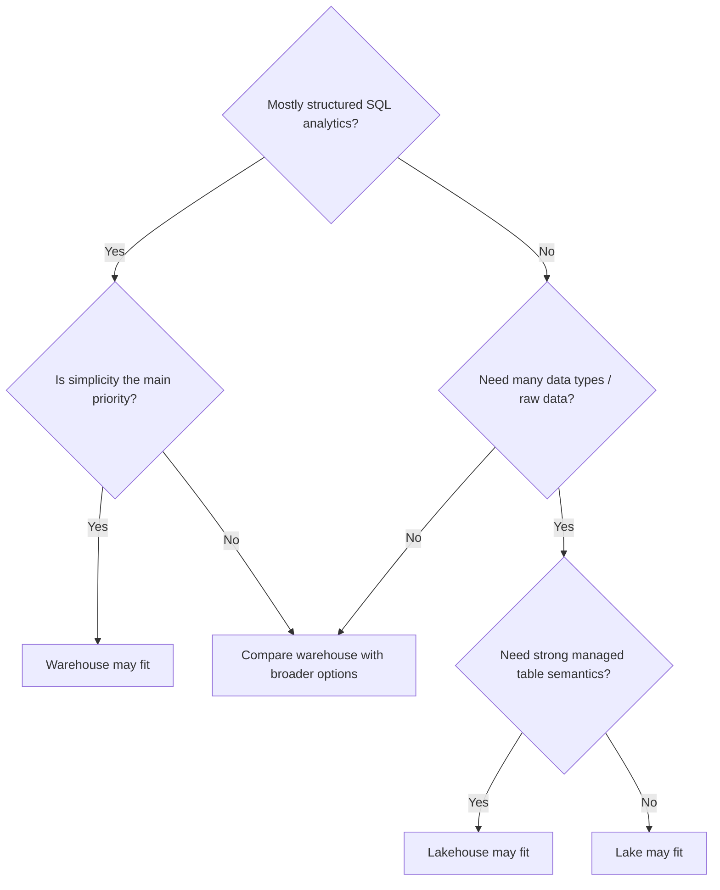

This is a teaching framework only; the real decision still requires workload, consumer, governance, team, cost, ML, and interoperability analysis.


A simple teaching framework is:

```text
Need mostly structured SQL analytics?
        ↓
      Yes
        ↓
Is simplicity the main priority?
        ↓
      Yes ─────────→ Warehouse may fit

Need many data types / raw data?
        ↓
      Yes
        ↓
Need strong managed table semantics?
        ↓
      Yes ─────────→ Lakehouse may fit

Need flexible low-level object storage?
        ↓
      Yes ─────────→ Lake may fit
```

Immediately add the warning:

> **This is a teaching framework, not a universal architecture selector.**

A real architecture decision needs additional questions about:

- workloads
- consumers
- data volume
- data change frequency
- governance
- ML requirements
- team skills
- cost
- compatibility
- vendor lock-in

---

# 51. Architecture Decision Exercises

## Scenario 1 — Small Startup

A small startup has mostly structured BI data.

Evaluate:

```text
Data types
Volume
Workload
Consumers
Governance
Team skills
Cost
Lock-in
Architecture
Reason
Trade-offs
```

### Questions

- What complexity can the team actually operate?
- Is raw-data flexibility important now?
- Are multiple engines really required?
- How much governance is necessary at this stage?
- What future growth could change the answer?

---

## Scenario 2 — Large Retailer with ML

The retailer has:

- transactional tables
- clickstream events
- ML training datasets
- recommendation workloads

Evaluate:

```text
Data types
Volume
Workload
Consumers
Governance
Team skills
Cost
Lock-in
Architecture
Reason
Trade-offs
```

### Questions

- Which data must remain raw?
- Which workloads need structured SQL?
- Which workloads benefit from distributed processing?
- Are multiple compute engines justified?
- How important are reusable ML datasets?

---

## Scenario 3 — Regulated Bank

The bank has strict governance and regulatory requirements.

Evaluate:

```text
Data types
Volume
Workload
Consumers
Governance
Team skills
Cost
Lock-in
Architecture
Reason
Trade-offs
```

### Questions

- What information is sensitive?
- Which teams may access it?
- What retention periods exist?
- How should lineage be represented?
- What auditability is required?
- What operational failures have regulatory consequences?

---

## Scenario 4 — AI Company

The company stores:

- documents
- embeddings
- structured user data
- model-training datasets

Evaluate the same factors.

Pay special attention to:

- raw file storage
- metadata
- ML data reuse
- structured analytical workloads
- multiple processing engines

---

## Scenario 5 — Multiple Query Engines

An organization wants multiple query engines over shared data.

Evaluate:

- engine compatibility
- open formats
- table formats
- governance
- catalog
- feature support
- operational burden
- portability requirements

The architecture should support the requirement without assuming that every engine must provide identical behavior.

---

# 52. Architecture Decision Record (ADR) Exercise

## Scenario

> A 500-person company has structured transactional data, website events, documents, image data, ML workloads, and a growing analytics team. The team wants to reduce dependence on any single processing engine.

Write an ADR using:

```text
Context
Requirements
Constraints
Options
Trade-offs
Decision
Consequences
Open Questions
```

### Explicitly consider

- warehouse
- lake
- lakehouse
- open formats
- engine independence
- catalog
- governance
- cost
- team skills
- ML needs
- vendor lock-in

### Example ADR template

```markdown
# ADR: Analytical Platform Architecture

## Context

Describe the organization's data, workloads, consumers, and constraints.

## Requirements

List mandatory functional and non-functional requirements.

## Constraints

Describe team, budget, compliance, technology, and operational constraints.

## Options

1. Warehouse
2. Lake
3. Lakehouse
4. Hybrid combinations where justified

## Trade-offs

Compare cost, complexity, governance, flexibility, engine compatibility,
ML needs, and lock-in.

## Decision

State which architecture pattern or combination is selected and why.

## Consequences

Describe operational and engineering consequences, both positive and negative.

## Open Questions

List unresolved assumptions that should be validated.
```

There is no single universal answer to this scenario.

The value of the exercise is the reasoning process.

---

# 53. Production vs Toy Architecture

Toy systems are useful because they isolate one architectural idea.

They are **not equivalent** to production platforms.

## Toy Warehouse

```text
Python
 ↓
SQLite
```

## Production Warehouse

```text
Sources
 ↓
Ingestion
 ↓
Managed Analytical Platform
 ↓
Curated Models
 ↓
BI / Analytics
```

## Toy Lake

```text
Folder
 ↓
CSV / JSON
```

## Production Lake

```text
Sources
 ↓
Secure Ingestion
 ↓
Object Storage
 ↓
Metadata / Catalog
 ↓
Processing Engines
 ↓
Consumers
```

## Toy Lakehouse

```text
Files
+
_log.json
```

## Production Lakehouse

```text
Object Storage
     ↓
Open Table Format
     ↓
Catalog / Metadata
     ↓
Multiple Compute Engines
     ↓
Consumers
```

### What the toy systems teach

They teach:

- schema enforcement timing
- flexible storage
- metadata as table state
- committed vs uncommitted data
- storage/compute conceptual separation

### What they do not implement

They do not implement production:

- distributed execution
- fault-tolerant metadata services
- cloud object-store semantics
- large-scale concurrency
- enterprise governance
- operational security
- table-format internals
- query optimizers
- automatic scaling

The distinction is mandatory:

> **This toy implementation demonstrates the underlying architectural idea, not the production implementation or performance characteristics.**

---

# 54. Code Explanation Checklist

For every substantial code example in this lesson, ask:

1. What is the purpose?
2. What is the input?
3. What is the output?
4. What does the code do?
5. What are the key blocks of logic?
6. What behavior should I expect?
7. What happens if something fails?
8. What architectural idea does the experiment demonstrate?
9. What production limitation does the toy code have?

Do not treat runnable code as proof that a toy implementation is production-ready.

---

# 55. Learning Loop for This Topic

Follow the Module 2.1 pipeline-thinking loop:

```text
Read
→ Draw
→ Relate to a real system
→ Build a tiny version
→ Break it intentionally
→ Measure / observe
→ Decide
→ Write the decision
→ Explain aloud
```

For this topic, useful observations include:

- data acceptance/rejection
- committed vs uncommitted files
- bytes stored
- number of files
- number of datasets
- metadata presence
- simulated processing behavior
- architecture complexity

Do not turn this into a production benchmark.

The goal is **architectural intuition**.

---

# 56. Break the System on Purpose

Intentional failure is one of the fastest ways to understand architecture.

## Warehouse

Insert invalid data.

Observe whether the target schema/constraint rejects it.

## Lake

Store malformed data.

Observe that storage succeeds while a downstream reader has trouble interpreting it.

## Lakehouse

Write a data file but do not commit it in `_log.json`.

Observe that the reader ignores it.

## Governance

Remove ownership or metadata information from a dataset.

Ask:

> “How does this change discoverability and trust?”

## Engine independence

Assume one engine supports a feature differently from another.

Discuss:

- compatibility
- correctness
- performance
- operational burden

Failure experiments turn abstract architecture diagrams into concrete system behavior.

---

# 57. Real-World Organization Exercise

## 10-Person Startup

Ask:

- What data exists?
- Who are the users?
- What complexity can the team operate?
- What governance is actually necessary now?
- What platform would be practical?

## Mid-Size Retailer with ML Team

Ask:

- What structured data exists?
- What event data exists?
- What ML datasets exist?
- What analytical workloads exist?
- What storage flexibility is required?

## Regulated Bank

Ask:

- What governance is required?
- What PII exists?
- What retention policies apply?
- What auditability is required?
- What access controls are needed?
- What operational maturity exists?

The learner must reason from requirements rather than select a platform first.

---

# 58. Interview Preparation

## Beginner

### 1. What is a data warehouse?

**Answer guidance:**
A structured analytical platform designed primarily for querying and analyzing business data, often with strong SQL support and managed analytical capabilities.

### 2. What is a data lake?

**Answer guidance:**
A storage-oriented architecture centered on object storage that can retain data in many forms, often before strict analytical modeling is applied.

### 3. What is a lakehouse?

**Answer guidance:**
An architecture that combines lake-style object storage with managed table semantics, commonly through open table formats.

### 4. What is schema-on-write?

**Answer guidance:**
The target structure and rules are generally defined and enforced before or during storage.

### 5. What is schema-on-read?

**Answer guidance:**
Data can be stored first and interpreted according to a schema when it is read or processed.

---

## Intermediate

### 6. Why did data lakes become popular?

**Answer guidance:**
Organizations needed inexpensive, flexible storage for heterogeneous data, including raw files and large datasets, without requiring every source to fit one schema immediately.

### 7. What problem does a lakehouse solve?

**Answer guidance:**
It aims to add managed table semantics, schema handling, transactional behavior, and other analytical capabilities to object-storage-based data platforms.

### 8. What is storage/compute separation?

**Answer guidance:**
The architecture treats persistent data storage and data-processing resources as distinct concerns that can often be scaled and operated more independently.

### 9. What is a data swamp?

**Answer guidance:**
A data lake that has become difficult to trust, discover, understand, govern, or use.

### 10. Why does a data lake need governance?

**Answer guidance:**
Because flexible storage without ownership, metadata, quality controls, access rules, lineage, and lifecycle discipline can make data difficult to discover and trust.

---

## Advanced

### 11. What are open table formats?

**Answer guidance:**
Table-management specifications such as Delta Lake, Apache Iceberg, and Apache Hudi that add semantics over data files, such as schema and table-state metadata.

### 12. What is engine independence?

**Answer guidance:**
The ability for compatible processing/query engines to work with the same underlying analytical data instead of forcing every workload through one execution engine.

### 13. Why are catalogs important?

**Answer guidance:**
They make datasets discoverable and provide metadata about schema, ownership, location, classification, lineage, and other attributes.

### 14. How would you think about vendor lock-in?

**Answer guidance:**
Treat it as a trade-off between managed simplicity and portability. Identify proprietary dependencies and decide which are acceptable.

### 15. How do team skills influence architecture?

**Answer guidance:**
A complex architecture that a team cannot reliably operate can create more risk and cost than a simpler architecture that meets the requirements.

---

## Architecture Questions

### 16. How would you choose between warehouse, lake, and lakehouse?

**Answer guidance:**
Start from data, workloads, consumers, governance, team capability, ML requirements, cost, and interoperability. Then compare candidate patterns and document trade-offs.

### 17. When might a warehouse be sufficient?

**Answer guidance:**
When the workload is predominantly structured SQL analytics and the organization values a managed, relatively simple analytical platform.

### 18. When might a lakehouse make sense?

**Answer guidance:**
When the organization needs broad object-storage flexibility plus stronger table semantics and potentially multiple processing engines.

### 19. What are the risks of a poorly governed lake?

**Answer guidance:**
Unknown ownership, inconsistent schemas, duplicate datasets, poor discoverability, weak trust, uncertain lineage, and uncontrolled retention.

### 20. What architecture might support both analytics and ML workloads?

**Answer guidance:**
Several patterns can support this. The correct answer depends on structured analytical needs, raw-data requirements, ML workflows, governance, team skills, and cost.

Do not answer these interview questions only by memorizing definitions. Explain the reasoning.

---

# 59. Self-Explanation Test — Explain This to a New Teammate

Without looking at your notes, explain:

1. Why warehouses exist.
2. Why lakes exist.
3. Why lakehouses exist.
4. Schema-on-write.
5. Schema-on-read.
6. Storage vs compute.
7. Why the cloud made storage/compute separation more useful.
8. What a data swamp is.
9. Why governance matters.
10. What a catalog does.
11. What open formats do.
12. What engine independence means.
13. Why vendor lock-in matters.
14. How team skills influence architecture.
15. How ML/AI needs influence architecture.

Then explain all three architectures using **one consistent business example**.

For example, use an e-commerce company:

```text
Orders + customers + products + clicks + reviews + images
```

Your explanation should connect:

```text
Data
→ Workload
→ Consumers
→ Storage
→ Compute
→ Schema
→ Governance
→ Cost
→ Architecture
```

If you cannot connect those ideas verbally, revisit the relevant sections.

---

# 60. Topic Boundaries

This is Topic 06 of Module 2.1.

Do **not** turn this file into the complete curriculum for:

- PySpark
- Delta Lake internals
- Apache Iceberg internals
- Apache Hudi internals
- cloud object-storage APIs
- Snowflake SQL
- BigQuery SQL
- Redshift SQL
- data catalog implementation
- governance frameworks
- data modeling
- distributed processing
- observability
- security architecture

These should be introduced only at a conceptual level here.

The roadmap maps this topic forward to:

- **2.14 Distributed Processing with PySpark**
- **2.15 Lakehouse Table Formats**
- **2.17 Cloud Storage and Cloud Data Platforms**
- **2.20 Observability, Lineage, Governance and Security**
- later data-serving areas

The deeper implementation belongs in those later modules.

---

# 61. Common Architecture Mistakes

## Choosing a platform because it is popular

Popularity does not establish fit.

Ask what the workload and operating model require.

## Choosing based only on storage cost

Storage is only one component of total cost.

## Choosing based only on performance

Performance must be considered together with governance, cost, reliability, and operational burden.

## Ignoring team skills

An architecture that requires skills the organization does not have creates operational risk.

## Ignoring governance

The platform can become technically large but operationally untrustworthy.

## Ignoring ML requirements

Training datasets and raw-data workflows can change the storage and compute requirements.

## Treating a data lake as ungoverned storage

Flexibility still needs ownership, metadata, lifecycle, and controls.

## Assuming open formats eliminate lock-in

Proprietary services and operational dependencies can remain.

## Assuming lakehouse solves every problem

It provides useful table semantics but does not eliminate bad data, poor governance, or complex operations.

## Assuming one architecture must serve every workload equally

Different workloads can justify different storage or compute patterns.

## Ignoring operational complexity

A technically elegant architecture can fail because it is too difficult to operate reliably.

The central lesson is:

> **Architecture is a system of trade-offs, not a product-selection exercise.**

---

# 62. Advanced Architectural Thinking

Train yourself to ask:

```text
Data characteristics
        ↓
Workload characteristics
        ↓
Consumer requirements
        ↓
Governance requirements
        ↓
Team capabilities
        ↓
Cost constraints
        ↓
Interoperability requirements
        ↓
Vendor lock-in tolerance
        ↓
Architecture
```

This is one of the strongest mental models in this module.

Notice what appears **before** architecture:

- data
- workloads
- consumers
- governance
- team
- cost
- interoperability
- lock-in tolerance

The platform is the result, not the premise.

---

# 63. Final Architecture Comparison

```text
                    ANALYTICAL PLATFORM

        ┌───────────────┬──────────────────┬──────────────────┐
        │               │                  │
        ↓               ↓                  ↓
    Warehouse         Lake            Lakehouse
        │               │                  │
 Structured         Flexible          Flexible
 Schema-on-write    Schema-on-read    Table semantics
 SQL-first          Object storage    Open table format
 Managed             Broad data        ACID / versions
 Analytics           Many formats      Multi-engine potential
```

Modern architectures can overlap.

An organization may have:

```text
Operational systems
        ↓
Object storage
        ↓
Lakehouse tables
        ↓
Warehouse-style serving
        ↓
BI + ML + applications
```

Or it may deliberately operate a simpler warehouse-oriented platform.

The architecture must follow requirements.

---

# 64. Official Topic 06 Checkpoint

The following objectives are mandatory.

## Checkpoint 1 — Schema

Explain schema-on-write vs schema-on-read with a concrete example.

Your answer should include:

```text
When validation happens
Where schema rules live
What happens to a bad record
What trade-off exists
```

## Checkpoint 2 — Open Table Formats

Explain what problem open table formats solve for data lakes.

Your answer should mention:

- table-level semantics
- metadata
- versions
- schema and/or transaction concepts
- why files alone are not the complete table state

## Checkpoint 3 — Architecture Recommendation

Recommend an architecture for a new scenario and justify it using:

```text
Data
Workloads
Consumers
Governance
Team
ML needs
Cost
Interoperability
Lock-in
```

Do not answer using only:

> “Lakehouse because it is modern.”

## Checkpoint 4 — Storage and Compute

Explain why separating storage from compute can reduce or optimize cost.

Discuss:

- independent scaling concept
- persistence of storage
- varying compute demand
- workload-specific compute

---

## Additional Checkpoints

### Data Swamp

Explain how a healthy lake turns into a swamp.

### Governance

Explain why flexible storage still requires governance.

### Catalog

Explain what a catalog records and why consumers need it.

### Engine Independence

Explain why multiple engines can be useful and what compatibility risks remain.

### Team Skills

Explain how team capability changes architecture decisions.

### ML Needs

Explain how training data, embeddings, and raw datasets can influence storage architecture.

### Vendor Lock-In

Explain how open formats can reduce some dependencies without eliminating all lock-in.

### Cost

Explain total cost of ownership beyond storage price.

### Data Type Diversity

Explain how tables, events, documents, images, and embeddings can change architecture requirements.

---

# 65. Final Project-Style Exercise

## Design an Analytical Platform

> **Design an analytical platform for an organization that has structured business data, raw event data, documents, ML datasets, and multiple analytical consumers.**

Document:

```text
1. Data types
2. Consumers
3. Workloads
4. Storage requirements
5. Schema strategy
6. Compute strategy
7. Governance
8. Catalog
9. Open formats
10. Engine requirements
11. ML requirements
12. Cost constraints
13. Vendor lock-in considerations
14. Architecture choice
15. Trade-offs
```

Produce the answer in this form:

```text
Context
   → Requirements
   → Architecture diagram
   → Decision
   → Consequences
```

You may choose:

- warehouse
- lake
- lakehouse
- a justified combination

There is **not** one universally correct answer.

The exercise should be graded on the quality of the reasoning:

- Are the requirements explicit?
- Are assumptions stated?
- Are trade-offs visible?
- Are governance needs represented?
- Are team capabilities considered?
- Are cost and lock-in considered?
- Does the selected architecture follow from the requirements?

---

# 66. One-Page Mental Model

Use this summary after completing the topic.

```text
                 ANALYTICAL NEED
                       ↓
                What data exists?
                       ↓
              What workloads exist?
                       ↓
              Who consumes the data?
                       ↓
              Where should it live?
                       ↓
        ┌──────────────┼──────────────┐
        ↓              ↓              ↓
    Warehouse         Lake        Lakehouse
        │              │              │
 Structured        Flexible       Managed tables
 SQL-first        Object store    + object storage
 Schema-on-write  Schema-on-read Open table formats
        │              │              │
        └──────────────┼──────────────┘
                       ↓
                 Storage + Compute
                       ↓
                Governance + Catalog
                       ↓
            Open formats / interoperability
                       ↓
            Cost + complexity + lock-in
                       ↓
                   Decision
```

This is the architecture mental model to carry into later modules.

---

# 67. Final Takeaways

## Warehouse

A warehouse emphasizes structured analytical data, strong SQL access, controlled schemas, and managed analytics.

## Lake

A lake emphasizes flexible object storage and broad data-type support, often allowing data to be stored before strict analytical interpretation.

## Lakehouse

A lakehouse combines object-storage flexibility with managed table semantics using table-format concepts.

## Schema-on-write

Structure and validation are established before or as data enters the managed analytical target.

## Schema-on-read

Data can be stored first and interpreted later.

## Storage vs compute

They are distinct resources that can often be scaled and operated more independently.

## Data swamp

Flexibility without governance can make data difficult to trust and discover.

## Catalog

A catalog makes datasets and their metadata discoverable.

## Governance

Governance makes data understandable, controllable, auditable, and usable.

## Open formats

Open file and table standards can improve interoperability and reduce some forms of dependency.

## Engine independence

Multiple engines can potentially use shared analytical data, but compatibility is not automatic.

## Architecture choice

The architecture depends on:

```text
data types
workloads
consumers
ML needs
team skills
governance
cost
interoperability
lock-in tolerance
```

The central engineering principle is:

> **Choose the data-platform architecture from workload, data, consumer, governance, team, cost, and interoperability requirements—not from product popularity or technology hype.**

---

# 68. Final Technical Review

Before moving forward, verify that you can answer “yes” to every question.

1. Can you explain a warehouse?
2. Can you explain a data lake?
3. Can you explain a lakehouse?
4. Can you explain why the three architectures exist?
5. Can you explain schema-on-write?
6. Can you explain schema-on-read?
7. Can you compare them?
8. Can you explain storage vs compute?
9. Can you explain why separating them can change cost and scaling?
10. Can you explain a data swamp?
11. Can you explain why a lake needs governance?
12. Can you explain what a catalog does?
13. Can you distinguish file formats from table formats?
14. Can you explain open table formats?
15. Can you explain engine independence?
16. Can you explain vendor lock-in?
17. Can you explain how team skills affect architecture?
18. Can you explain how data types affect architecture?
19. Can you explain how ML needs affect architecture?
20. Can you evaluate cost beyond storage price?
21. Can you simulate a warehouse using SQLite?
22. Can you simulate a data lake?
23. Can you simulate a toy lakehouse with `_log.json`?
24. Can you explain why uncommitted data should not be visible?
25. Can you reason about the startup scenario?
26. Can you reason about the retailer + ML scenario?
27. Can you reason about the regulated bank scenario?
28. Can you write an ADR-style architecture decision?
29. Can you explain the difference between toy and production architecture?
30. Does this lesson prepare you for PySpark, lakehouse table formats, cloud platforms, governance, and observability without duplicating later modules?

If any answer is “no”, revisit the relevant section and repeat the build/break/explain loop.

---

# 69. Final Learning Contract

Do not merely memorize these statements:

```text
Warehouse = structured
Lake = flexible
Lakehouse = hybrid
```

That is not enough.

You should be able to reason through the complete chain:

```text
Business requirement
      ↓
Data characteristics
      ↓
Workload characteristics
      ↓
Consumer requirements
      ↓
Schema strategy
      ↓
Storage strategy
      ↓
Compute strategy
      ↓
Governance / catalog
      ↓
Interoperability
      ↓
Cost
      ↓
Operational complexity
      ↓
Vendor lock-in
      ↓
Architecture decision
```

The strongest sign that you understand this topic is not the ability to define “lakehouse.”

It is the ability to explain **why an organization should or should not choose a particular architecture under a particular set of requirements**.

---

# 70. Completion Criteria

This topic is complete when you can:

- explain warehouse, lake, and lakehouse in plain English
- draw their architectures from memory
- explain schema-on-write and schema-on-read
- distinguish files from tables
- explain why object storage matters
- explain storage/compute separation
- explain data-swamp formation
- explain catalog and governance basics
- explain open formats and table formats
- explain engine independence and its caveats
- reason about vendor lock-in
- evaluate architecture using data types, workloads, consumers, team skills, ML requirements, governance, and cost
- build the three toy simulations
- break the simulations intentionally
- observe the consequences
- write an ADR
- defend the decision verbally

Only then should you move deeper into distributed processing, lakehouse table formats, cloud data platforms, and governance/observability modules.

---

## Appendix A — Suggested Practice Sequence

Use this sequence over several study sessions.

### Session 1 — Concepts

Read:

- warehouse
- lake
- lakehouse
- schema-on-write
- schema-on-read

Then draw all three architectures from memory.

### Session 2 — Storage and Compute

Study:

- storage vs compute
- independent scaling
- cost implications
- multiple engines

Then redraw the architecture with shared storage and multiple engines.

### Session 3 — Governance

Study:

- data swamp
- ownership
- metadata
- catalog
- lineage
- retention

Then perform the data-swamp recovery exercise.

### Session 4 — Open Architecture

Study:

- file formats
- table formats
- engine independence
- vendor lock-in

Then solve the engine-independence case study.

### Session 5 — Coding

Run:

- toy warehouse
- toy lake
- toy lakehouse

Break each one deliberately.

### Session 6 — Architecture Decisions

Work through:

- startup
- retailer + ML
- bank
- AI/RAG
- multi-engine organization

Then write the ADR.

### Session 7 — Self-Explanation

Explain everything aloud without notes.

If your explanation becomes product-specific instead of requirement-specific, restart from the architecture decision framework.

---

## Appendix B — Compact Interview Mental Model

When asked:

> “Warehouse or lakehouse?”

Do not immediately choose one.

Say:

```text
First I would inspect:

1. Data types
2. Workloads
3. Consumers
4. Schema control
5. Raw-data needs
6. ML requirements
7. Governance
8. Team skills
9. Cost
10. Interoperability / lock-in
```

Then compare the candidate architectures.

This demonstrates architecture thinking instead of product memorization.

---

## Appendix C — Production Perspective

At production scale, the architecture is often larger than the three words suggest.

A realistic analytical platform can contain:

```text
Operational Sources
      ↓
Secure Ingestion
      ↓
Object Storage / Warehouse / Both
      ↓
Catalog + Metadata
      ↓
Table Management
      ↓
Processing Engines
      ↓
Curated Data Products
      ↓
BI / ML / Applications / Regulatory Consumers
```

Additional platform concerns can include:

- workload isolation
- access controls
- data contracts
- schema evolution
- data quality
- lifecycle policies
- cost controls
- lineage
- monitoring
- disaster recovery
- incident response

Those deeper topics belong later in the roadmap.

The purpose of Topic 06 is to make sure that when you eventually learn those technologies, you understand **why they exist and which architectural problem they address**.

---

# Final Engineering Principle

> **Choose the data-platform architecture from workload, data, consumer, governance, team, cost, and interoperability requirements—not from product popularity or technology hype.**

That principle is the foundation of this topic and the bridge into the rest of the data-engineering roadmap.
