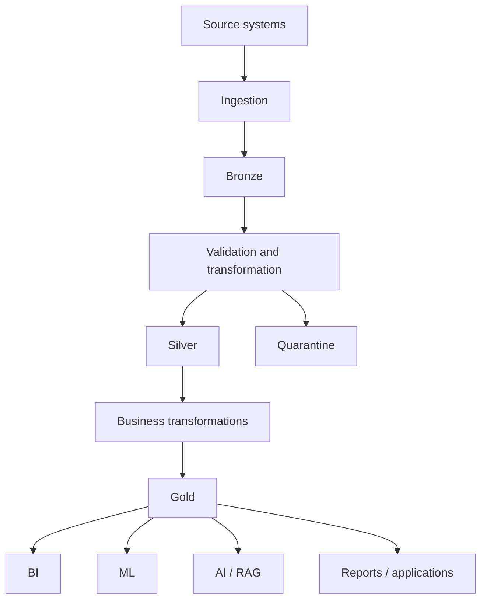
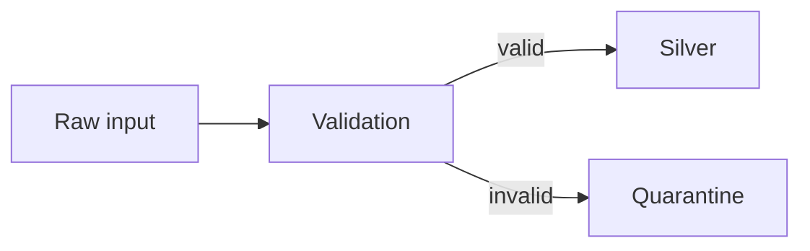
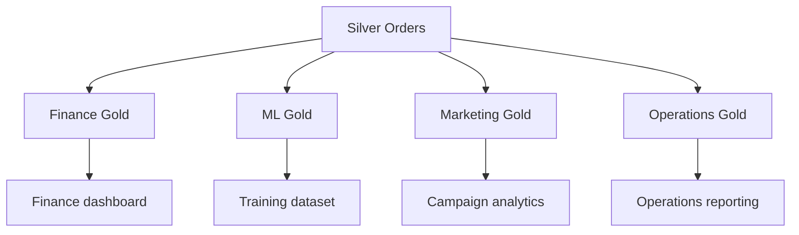
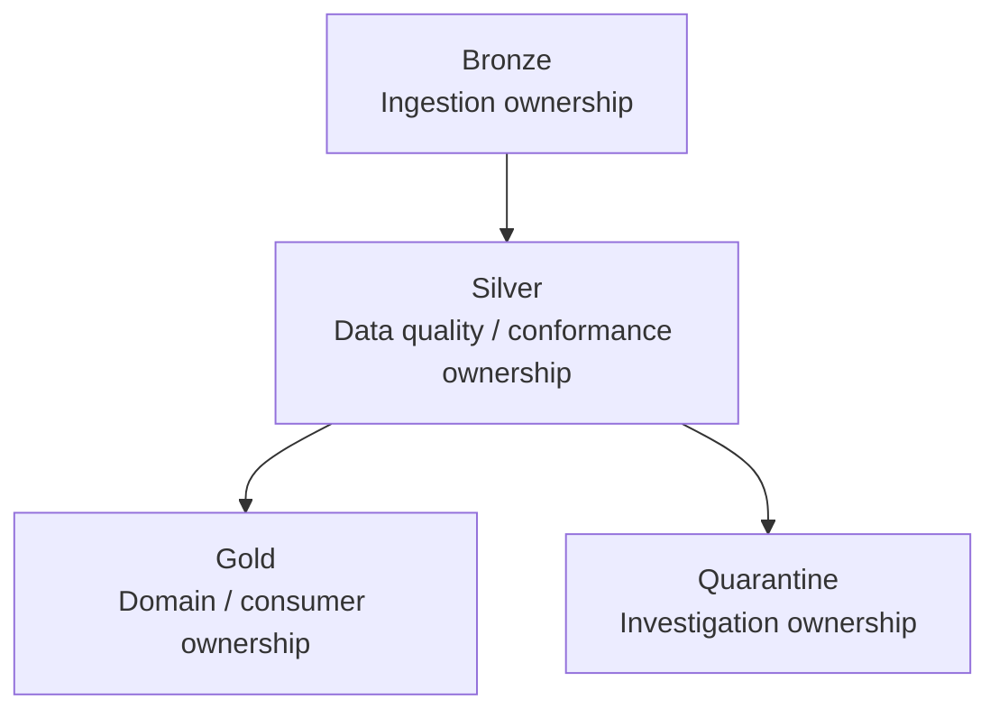
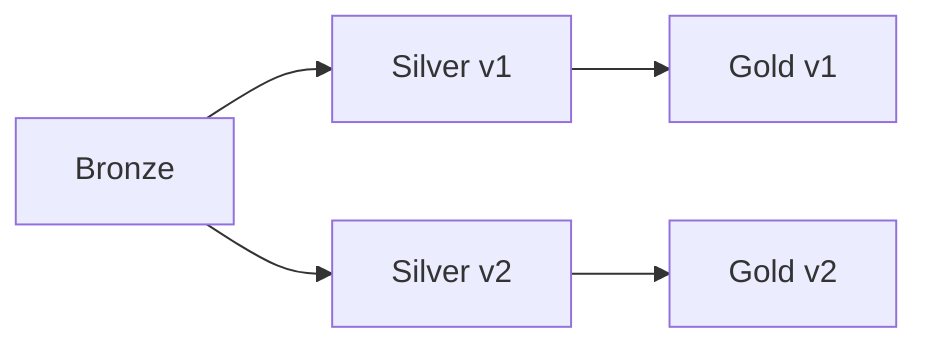
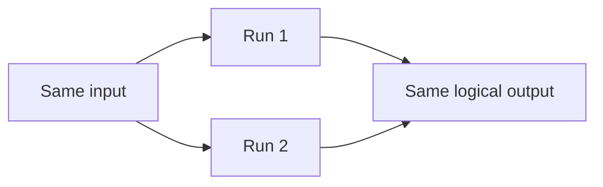
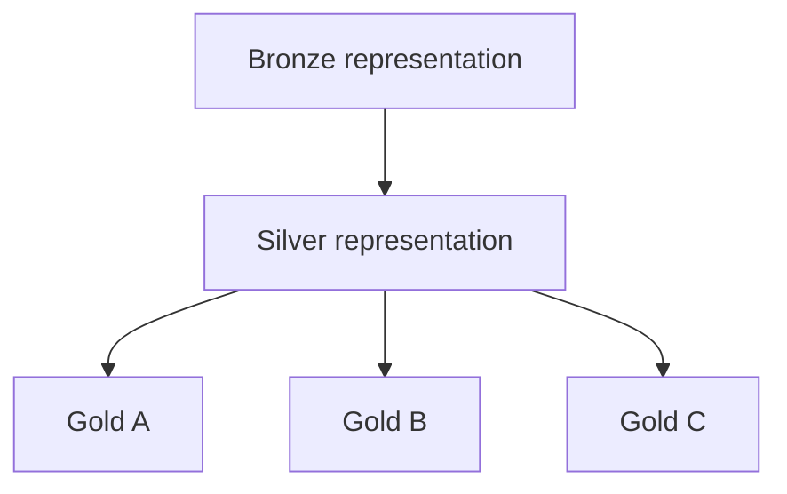
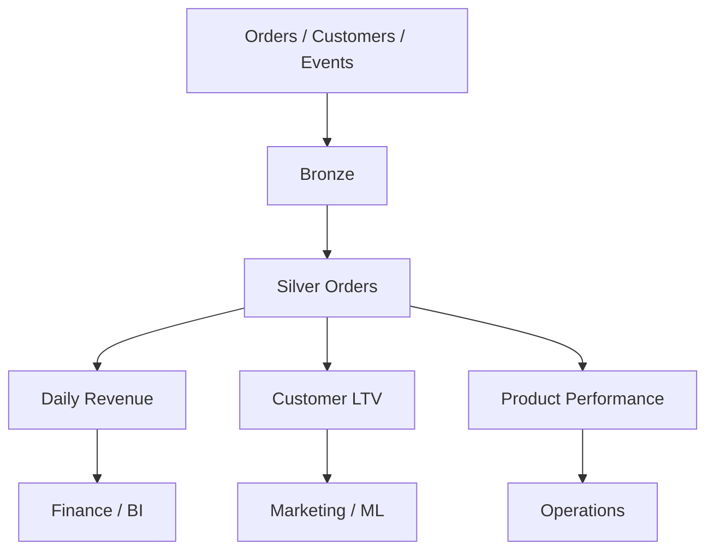
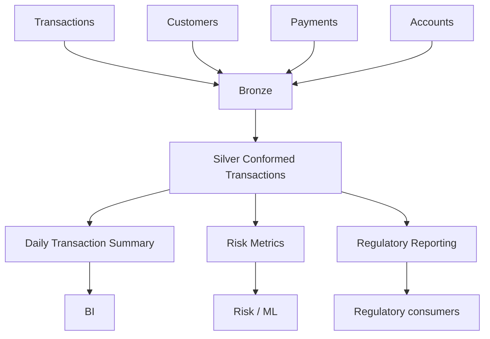
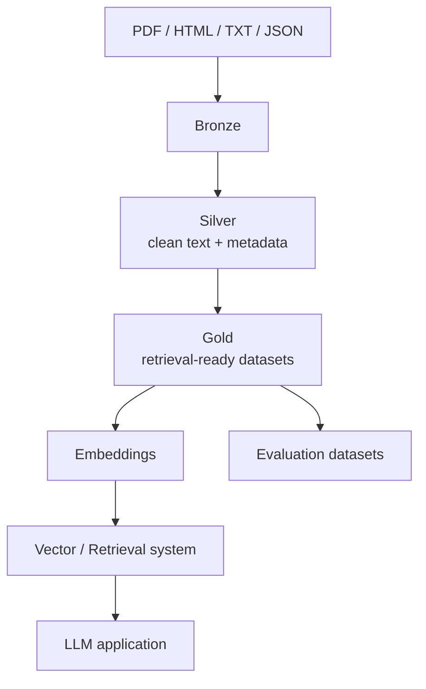

# Medallion Bronze, Silver, Gold Layers

> **Module:** 2.1 — Data Engineering Foundations and Pipeline Thinking  
> **Topic:** 07 — Medallion Bronze, Silver, Gold Layers  
> **Audience:** Complete beginner progressing toward production-ready Data Engineering  
> **Primary goal:** Build the mental model and practical instincts needed to organize analytical data into meaningful responsibility boundaries.

---

## What you already know

You have already studied:

1. What Data Engineers Build
2. Data Lifecycle
3. Batch / Micro-Batch / Streaming
4. ETL / ELT / Reverse ETL
5. OLTP vs OLAP
6. Warehouse / Lake / Lakehouse Architectures

This topic answers the next architectural question:

> **Once data enters an analytical platform, how should we organize it so that raw data is preserved, trusted data is produced, business logic is controlled, and different consumers can use the resulting datasets safely and repeatedly?**

---

# 1. Start With the Architectural Question

We already know that analytical workloads are different from transactional workloads.

Now we need to decide how analytical data should be organized after ingestion.

The foundational pattern is:

```text
SOURCE DATA
     |
     v
+----------------+
|     BRONZE     |
|  Raw / source  |
+--------+-------+
         |
         v
+----------------+
|     SILVER     |
| Clean / typed  |
| dedup /        |
| conformed      |
+--------+-------+
         |
         v
+----------------+
|      GOLD      |
| Business /     |
| consumer       |
| focused        |
+--------+-------+
         |
         v
     Consumers
```

A more complete operational view is:



### Plain-English explanation

- **Bronze** asks: **“What did the source actually give us?”**
- **Silver** asks: **“What data can we reasonably trust and reuse?”**
- **Gold** asks: **“What data does this specific consumer need?”**
- **Quarantine** holds records that failed a validation rule but should not simply disappear.
- **Consumers** use Gold or, where appropriate, trusted Silver datasets.

The important lesson is not the names.

The important lesson is the **responsibilities**.

---

# 2. The Central Mental Model

A medallion architecture is a way of organizing data into progressively more usable layers rather than forcing one dataset to serve every purpose.

Think:

```text
Raw
  |
  v
Trusted
  |
  v
Business-ready
```

Mapped to the layers:

```text
Bronze
  |
  v
Silver
  |
  v
Gold
```

Another useful set of questions:

### Bronze

> What did the source actually send?

### Silver

> What data can downstream systems trust and reuse?

### Gold

> What business representation does a particular consumer need?

Keep returning to these questions throughout the topic.

---

# 3. Why Layered Architecture Exists

Before discussing the layers individually, imagine that a company uses one giant dataset for everything:

```text
One giant table
    |
    +-- raw records
    +-- cleaned values
    +-- business rules
    +-- dashboard calculations
    +-- ML features
    +-- consumer-specific logic
```

This sounds simple.

In practice it often becomes difficult to reason about.

## Problems with one giant dataset

### 1. Meaning becomes unclear

Is a field the original source value or a transformed business value?

### 2. Debugging becomes harder

A wrong dashboard number could come from:

- ingestion
- parsing
- cleaning
- deduplication
- a join
- a business rule
- the final aggregation

### 3. Ingestion becomes coupled to business logic

If the Finance team changes the definition of "net revenue", should the raw ingestion process change?

Usually not.

### 4. Rebuilds become harder

You want to change a transformation and rebuild history.

That is much easier when the source-preserving boundary is clearly separated.

### 5. Consumers become coupled to unstable data

A raw source payload can change.

A consumer usually wants a predictable contract.

### 6. Ownership becomes unclear

Who is responsible for the dataset?

- ingestion team?
- platform team?
- analytics?
- finance?
- ML?

Layer boundaries can help establish ownership.

---

# 4. Layering as Separation of Concerns

A useful analogy comes from software engineering.

In a software system you may separate:

```text
Presentation
    |
Business logic
    |
Data access
```

In a data platform you may separate:

```text
Bronze
    |
Silver
    |
Gold
```

The systems are not identical, but the design idea is similar:

> A boundary is useful when it separates a responsibility that should be understood, changed, tested, owned, or reused independently.

This topic is therefore not about memorizing three names.

It is about learning to establish **meaningful data boundaries**.

---

# 5. Bronze Layer — Foundation

## Definition

> **Bronze is the layer that preserves source data in a form as close as practical to what was received, while adding metadata needed to operate and trace the ingestion.**

The intended foundational properties are:

- raw or source-like values
- append-oriented design
- source traceability
- ingestion metadata
- replay support
- auditability

---

# 6. What Belongs in Bronze?

Typical Bronze fields include:

- source business values
- source identifiers
- source timestamps
- source structure
- ingestion timestamp
- source-system identifier
- source file name
- batch identifier
- ingestion/run metadata

Example source record:

```text
order_id   = "1001"
amount     = "199.99"
country    = " india "
created_at = "2026-09-25T10:30:00+05:30"
```

A Bronze representation might preserve those values:

```text
order_id   = "1001"
amount     = "199.99"
country    = " india "
created_at = "2026-09-25T10:30:00+05:30"

_ingested_at  = "2026-09-25T10:35:12+05:30"
_source       = "orders_api"
_batch_id     = "batch-20260925-001"
_source_file  = "orders_2026-09-25.json"
```

Notice the important distinction:

- the original business values are preserved
- ingestion metadata is added
- the source is still recognizable

---

# 7. Why Bronze Preserves Raw Values

Suppose the source sends:

```text
country = " india "
```

A downstream engineer may eventually decide that the standardized value should be:

```text
country = "India"
```

The question is:

> Should Bronze silently replace `" india "` with `"India"`?

The foundational answer is generally **no**.

Bronze should usually preserve:

```text
" india "
```

and let a later layer perform the standardization.

## Why?

### Debugging

You can inspect what the source actually sent.

### Auditability

You can show the captured source representation.

### Replay

You can rerun transformations using the original captured values.

### Transformation changes

A future business or technical rule can be applied without reacquiring the source.

### Source-system investigation

If upstream behavior changes unexpectedly, Bronze helps you inspect the evidence.

### Historical recovery

If a downstream transformation is wrong, Bronze can act as a recovery boundary.

The key principle:

> **Keep Bronze close to the source while adding the metadata needed to operate and trace the ingestion.**

---

# 8. Bronze Should Not Generally Contain Business Logic

Consider this:

```python
customer_segment = (
    "high_value"
    if lifetime_value > 10000
    else "standard"
)
```

This is usually a poor Bronze transformation.

Why?

### Business definitions can change

What counts as "high value" today may differ later.

### Raw source preservation is weakened

You are no longer looking at the original source representation.

### Different consumers may need different definitions

Marketing and Finance may not define value identically.

### Replay becomes less transparent

If the Bronze layer contains changing business rules, the raw-capture boundary is no longer clean.

A stronger design is:

```text
Bronze
  |
  v
Silver
  |
  v
Business logic / Gold
```

The nuance matters:

> Business logic should not contaminate raw capture, but reusable logic may be placed in a shared downstream layer when its semantics are stable and appropriate.

---

# 9. Bronze and Append-Oriented Design

The roadmap uses an append-oriented Bronze principle.

Conceptually:

```text
Batch 1
   |
   v
Bronze records

Batch 2
   |
   v
More Bronze records

Batch 3
   |
   v
More Bronze records
```

Why is this useful?

- source history is easier to preserve
- incremental ingestion is natural
- audit trails are easier to reason about
- replay is easier
- debugging is easier

## Important nuance

Do **not** interpret "append-oriented" as an absolute rule that every production implementation must be literally immutable.

Real platforms may use:

- append-only files
- immutable objects
- versioned tables
- managed raw tables
- compaction
- operational metadata

The architectural principle is the important part:

> **Do not casually destroy the captured source history that downstream recovery may depend on.**

---

# 10. Bronze Ingestion Metadata

| Field | Meaning | Why it matters |
|---|---|---|
| `_ingested_at` | When the pipeline received/captured the record | Freshness, audit |
| `_source` | Source-system identifier | Lineage |
| `_batch_id` | Identity of the ingestion run | Debugging, replay |
| `_source_file` | Original file name when applicable | Traceability |

These fields are metadata, not source business facts.

For example:

```text
country = "IN"
```

is source data.

Whereas:

```text
_source = "payments_api"
```

is ingestion metadata.

---

# 11. Bronze Layer Contract

A foundational Bronze contract can be written as:

> **These are source-preserving records plus ingestion metadata.**

An explicit contract reduces ambiguity.

A consumer should be able to answer:

- What source produced this?
- When was it ingested?
- Which run captured it?
- Can I trace it back to the source artifact?
- Has a business transformation already changed the value?

---

# 12. Silver Layer — Trusted and Conformed Data

## Definition

> **Silver is where raw data is cleaned, typed, deduplicated, validated, standardized, and conformed into a reusable dataset with a clearly defined grain.**

Do not reduce Silver to simply:

> "cleaned data."

Silver is where data becomes **usable, reusable, and explicit enough for downstream consumers**.

The roadmap specifically requires:

- cleaning
- typing
- UTC normalization
- deduplication
- validation
- conformance
- reference-data joins
- clear grain
- quarantine of invalid records

---

# 13. Silver — Cleaning

Examples:

```text
" india "        -> "India"
" John Doe "     -> "John Doe"
""               -> null
```

Cleaning may include:

- trimming whitespace
- explicit standardization
- null handling
- normalization of known representations
- parsing of structured values

The important engineering rule is:

> **Cleaning rules should be explicit, testable, and documented.**

Do not silently add random transformations just because the data "looks messy."

---

# 14. Silver — Type Casting

A raw source might represent values as strings:

```text
"199.99"
"42"
"2026-09-25T10:30:00+05:30"
```

Silver may convert them into typed values:

```text
"199.99" -> numeric
"42"     -> integer
timestamp string -> normalized timestamp
```

Why does typing matter?

- arithmetic becomes reliable
- comparisons become meaningful
- sorting behaves predictably
- validation becomes stronger
- downstream query behavior is more stable

Example:

```text
Bronze:
amount = "199.99"

Silver:
amount = 199.99
```

The Silver field now has a clear semantic type.

---

# 15. Silver — Standardize Time to UTC

The roadmap's hands-on exercise requires UTC normalization.

Example source timestamp:

```text
2026-09-25T10:30:00+05:30
```

Converted to UTC:

```text
2026-09-25T05:00:00Z
```

Conceptually:

```text
Source timestamp
      |
      v
Parse with offset
      |
      v
Convert to UTC
      |
      v
Store standardized timestamp
```

Why is this helpful?

- consistent cross-region comparisons
- simpler cross-source joins
- cleaner event-time reasoning
- fewer accidental timezone mismatches

This topic introduces the architectural reason.

Detailed datetime and timezone mechanics belong in the dedicated Python foundations topic.

---

# 16. Silver — Deduplication

Deduplication means identifying records that represent the same logical record and deciding which version should remain in the trusted representation.

Example:

```text
order_id = 1001

Version A
updated_at = 10:00
status     = "created"

Version B
updated_at = 10:05
status     = "paid"
```

Required rule:

> **Keep the latest version by `order_id`.**

Conceptually:

```text
Records
  |
  v
Group by order_id
  |
  v
Compare update timestamps
  |
  v
Keep latest
```

A good implementation should think about:

- business key
- ordering field
- latest-record rule
- duplicate detection
- deterministic tie-breaking

### What if timestamps tie?

You need a deterministic rule, for example:

```text
1. latest updated_at wins
2. if equal, latest ingestion sequence wins
3. if still equal, use a stable deterministic tie-breaker
```

The exact production strategy depends on the source contract.

---

# 17. Silver — Conformance

"Conformed" means different source representations are converted into a shared, consistent meaning.

Example:

Source A:

```text
country = "IN"
```

Source B:

```text
country = "India"
```

Silver may standardize them into:

```text
country_code = "IN"
country_name = "India"
```

Why is conformance useful?

- cross-source joins become easier
- analytics are more consistent
- downstream teams can reuse the same interpretation
- duplicated mapping logic is reduced

---

# 18. Silver — Reference-Data Enrichment

Silver may enrich source data with trusted reference data.

Example:

```text
orders
   +
country_reference
   |
   v
conformed_orders
```

Reference data may map:

```text
IN -> India
US -> United States
JP -> Japan
```

The important idea is:

> Silver can combine source data with trusted reference information to produce a reusable conformed representation.

This is not a full data-modeling lesson.

---

# 19. Silver — Clear Grain

This is one of the most important concepts in the topic.

> **Grain is the exact meaning of one row.**

Examples:

```text
One row = one order
```

or:

```text
One row = one order item
```

or:

```text
One row = one customer-day
```

An explicit Silver contract should say:

```text
silver_orders
grain = one row per order
```

Why?

Because unclear grain causes:

- double counting
- incorrect joins
- incorrect aggregations
- confusing business logic
- ambiguous ownership

Example:

Suppose a table claims to represent orders, but some rows represent order items.

You might calculate:

```text
SUM(order_amount)
```

and accidentally count an order multiple times.

A clear grain protects against this.

---

# 20. Silver Layer Contract

A foundational Silver contract is:

> **These are validated, typed, deduplicated, conformed records at a stated grain.**

A consumer should be able to understand:

- what a row means
- what types exist
- which records are valid
- how duplicates were resolved
- how timestamps are standardized
- which reference mappings were applied

---

# 21. Gold Layer — Business-Ready Data

## Definition

> **Gold contains business-level datasets, aggregates, and models designed for specific consumers.**

Consumers may include:

- dashboards
- reports
- Finance
- Marketing
- Operations
- ML pipelines
- AI/RAG pipelines
- serving applications

Gold is not simply:

> "the final table."

Gold exists because different consumers often need different representations.

---

# 22. Gold Examples

### `daily_revenue_by_country`

Typical consumer:

```text
Finance / BI
```

Typical grain:

```text
one row per country per day
```

### `customer_lifetime_value`

Typical consumer:

```text
Marketing / CRM / ML
```

Typical grain:

```text
one row per customer
```

### `monthly_sales`

Typical consumer:

```text
Finance / executive reporting
```

Typical grain:

```text
one row per month
```

### `product_performance`

Typical consumer:

```text
Product / merchandising
```

### `customer_churn_metrics`

Typical consumer:

```text
Retention / ML / analytics
```

The important questions are always:

- Who consumes this?
- What is the grain?
- Which Silver datasets feed it?
- What business logic is applied?

---

# 23. One Silver Dataset Can Feed Multiple Gold Models

```text
                Silver Orders
               /      |       \
              /       |        \
             v        v         v
         Finance      ML      Marketing
            |          |          |
            v          v          v
        Gold A      Gold B      Gold C
```

For example:

```text
Silver:
conformed_orders
```

can feed:

```text
Gold:
daily_revenue_by_country
customer_lifetime_value
country_performance
product_performance
```

This is a major architectural benefit.

Silver is reusable.

Gold is consumer-oriented.

---

# 24. Business Logic Belongs in Appropriate Downstream Models

Business definitions such as:

```text
high-value customer
```

or:

```text
net revenue
```

often belong in Gold or an appropriate business-model layer rather than Bronze.

However, do not turn this into an absolute rule.

A reusable business rule may sometimes be suitable in a shared downstream layer when:

- semantics are stable
- ownership is clear
- multiple consumers need it
- it belongs to the responsibility of that layer

A strong senior-engineer principle is:

> **Put logic at the earliest layer where its meaning is stable, reusable, and appropriate for downstream consumers.**

---

# 25. Bronze vs Silver vs Gold

| Dimension | Bronze | Silver | Gold |
|---|---|---|---|
| Primary purpose | Preserve source data | Create trusted/reusable data | Serve business consumers |
| Data shape | Raw/source-like | Clean/conformed | Business-oriented |
| Business logic | Minimal | Reusable technical/conformance logic | Consumer/business logic |
| Schema | Source-like | Controlled | Consumer-specific |
| Deduplication | Usually not primary | Yes | Based on trusted upstream data |
| Data quality | Capture and traceability | Strong validation | Business-level correctness |
| Grain | Source-defined | Explicit/controlled | Consumer-specific |
| Replay | Strong | Rebuild from Bronze | Rebuild from Silver/Bronze |
| Typical consumers | Engineers/platform | Data engineers/downstream models | BI/analytics/ML/business tools |

### How to read this table

The table is not saying every production system has identical implementation details.

It is saying the responsibilities become progressively more specific:

```text
Preserve
   ->
Trust / conform
   ->
Serve
```

---

# 26. Rule-Placement Exercise

For each transformation below, classify it as:

- Bronze
- Silver
- Gold
- Cross-cutting / context-dependent

## Rules

1. Trim whitespace.
2. Parse a timestamp.
3. Convert a timestamp to UTC.
4. Cast amount to numeric.
5. Deduplicate orders by order ID.
6. Reject malformed order IDs.
7. Join country reference data.
8. Calculate revenue.
9. Classify a customer as high-value.
10. Calculate customer lifetime value.
11. Calculate daily revenue.
12. Create a dashboard-specific KPI.
13. Preserve source file name.
14. Attach ingestion timestamp.
15. Quarantine invalid rows.

## Guidance

| Rule | Likely layer | Reason |
|---|---|---|
| Trim whitespace | Silver | Reusable cleaning |
| Parse timestamp | Silver | Structured interpretation |
| UTC normalization | Silver | Shared normalization |
| Numeric casting | Silver | Stable typing |
| Deduplicate orders | Silver | Trusted logical record |
| Reject malformed order IDs | Silver / boundary validation | Data-quality responsibility |
| Join country reference | Silver | Reusable conformance |
| Calculate revenue | Depends | May be reusable business logic or consumer logic |
| High-value classification | Gold / shared business model | Business definition |
| Customer lifetime value | Gold / business model | Consumer-oriented metric |
| Daily revenue | Gold | Consumer/business aggregation |
| Dashboard-specific KPI | Gold | Consumer-specific |
| Preserve source file name | Bronze | Traceability metadata |
| Ingestion timestamp | Bronze | Ingestion metadata |
| Quarantine invalid rows | Cross-cutting flow | Validation / operational boundary |

The engineering lesson is:

> **Do not force every transformation into an artificial one-to-one mapping.**

Consider responsibility, reuse, ownership, and semantics.

---

# 27. Anti-Patterns — What Should Not Happen

## Cleaning Bronze

If Bronze silently changes source values, source fidelity is reduced.

## Business logic in Bronze

This couples ingestion with changing business definitions.

## Raw data directly into Gold

Consumers become responsible for repeated cleaning and interpretation.

## Gold tables nobody consumes

A Gold dataset should have a consumer purpose.

## Silver containing arbitrary business calculations

Reusable conformance should be distinguished from consumer-specific business logic.

## Giant single Silver/Gold table

Mixed responsibilities and unclear grain become maintenance problems.

---

# 28. Replayability

> **Replayability is the ability to rebuild downstream data from retained upstream data without returning to the original source.**

Consider:

```text
Bronze
  |
  v
Silver v1
  |
  v
Gold v1
```

Now the business rule changes:

```text
Business logic changes
  |
  v
Silver v2
  |
  v
Gold v2
```

The source does not need to be re-extracted if the required source information already exists in Bronze.

This is one of the strongest reasons to preserve raw data.

---

# 29. Rebuilding Silver

Conceptually:

```text
Bronze
  |
  v
Read raw data
  |
  v
Apply new Silver rules
  |
  v
Write Silver
```

The learner should understand:

> Silver should be derivable from Bronze according to a documented transformation contract.

That makes debugging and historical correction easier.

---

# 30. Rebuilding Gold

```text
Silver
  |
  v
Apply business model
  |
  v
Gold
```

Or the full chain:

```text
Bronze
  |
  v
Silver
  |
  v
Gold
```

Separate responsibilities make it possible to rebuild only what is necessary.

---

# 31. Idempotency

Connect this topic to Stage 1.

> **Idempotency means that running the same step again with the same inputs should not create unintended changes.**

Conceptually:

```text
Run 1:
Silver = 1,000 logical records

Run 2:
Silver = same 1,000 logical records
```

Possible design ideas include:

- deterministic transformation
- controlled overwrite
- run identity
- partition replacement
- merge/upsert concepts
- deterministic deduplication

Do not confuse idempotency with "the job never fails."

A job can fail and still be designed to be rerunnable safely.

---

# 32. Quarantine

> **Quarantine is a controlled holding area for records that fail validation but may need investigation or later reprocessing.**

Flow:



A quarantined record should preserve evidence such as:

- original record
- rejection reason
- timestamp
- source
- batch ID
- validation rule

Example:

```json
{
  "reason": "amount must be non-negative",
  "record": {
    "order_id": "1001",
    "amount": "-5"
  },
  "_source": "orders_api",
  "_batch_id": "batch-001"
}
```

---

# 33. Quarantine vs Drop

Bad pattern:

```text
invalid row
    |
    v
drop
```

Stronger operational pattern:

```text
invalid row
    |
    +----> quarantine/
    |
    +----> reason
    |
    +----> metadata
```

Silently dropping data makes investigation difficult.

Dropping can still be valid in some systems when it is:

- intentional
- documented
- observable
- consistent with requirements

The problem is silent data loss.

---

# 34. Layer Ownership

A platform needs ownership at two levels:

- layer
- dataset

A simplified organization might use:

```text
Bronze
Owner: ingestion/platform team

Silver
Owner: transformation/data platform team

Gold
Owner: domain / analytics / data product owner
```

But actual ownership varies.

The important principle is:

> **Somebody must be accountable for the meaning, quality, and operation of each important dataset.**

---

# 35. Naming Conventions

Examples:

```text
bronze.orders
silver.orders
gold.daily_revenue
gold.customer_lifetime_value
```

Or folder-based:

```text
lake/
  bronze/
  silver/
  gold/
```

Or:

```text
bronze/orders/
silver/orders/
gold/daily_revenue/
```

Useful naming properties include:

- predictable
- descriptive
- consistent
- purpose-oriented
- discoverable
- compatible with ownership expectations

Do not prescribe one universal standard.

---

# 36. Folder-Based vs Schema-Based Layout

## Schema-based

```text
bronze.orders
silver.orders
gold.daily_revenue
```

Potential benefit:

- compact logical namespace
- clear layer identity

## Folder-based

```text
lake/
  bronze/
  silver/
  gold/
```

Potential benefit:

- intuitive physical organization
- natural fit for object-storage-oriented architectures

Actual production platforms may combine logical schemas and physical folders.

The principle is:

> The organization should make responsibility and ownership easy to understand.

---

# 37. Medallion vs Other Names

Terminology differs across organizations.

| Medallion | Alternative | Approximate purpose |
|---|---|---|
| Bronze | Raw / Landing | Source-preserving |
| Silver | Staging / Curated | Clean / conformed |
| Gold | Marts / Consumption | Consumer-ready |

Also common:

```text
landing -> curated -> consumption
```

The names do not define the architecture.

The responsibilities do.

> **Do not memorize labels. Understand the contracts.**

---

# 38. Medallion Is Not a Law

Bronze/Silver/Gold is a useful pattern.

It is not mandatory for every data platform.

It may be unnecessary for:

- tiny datasets
- very small teams
- one consumer
- low transformation complexity
- low operational requirements
- short-lived internal analyses

A tiny system might reasonably look like:

```text
Source
  |
  v
Simple clean transform
  |
  v
Consumer table
```

The correct question is:

> **What problem would an extra layer solve?**

---

# 39. When Additional Layers Are Needed

Possible additional areas include:

```text
Bronze
Silver
Gold
Quarantine
Archive
Reference
Audit
```

Do not create a new layer just because the pattern permits it.

Additional layers create:

- more storage
- more processing
- more metadata
- more lineage complexity
- more operational work

Only introduce an additional boundary when it solves a real responsibility problem.

---

# 40. Storage Duplication vs Debuggability

Having multiple layers can mean multiple representations of the same underlying business information.

For example:

```text
Bronze
   +
Silver
   +
Gold
```

This costs resources.

But it can provide:

- replay
- debugging
- isolation
- reuse
- clearer contracts
- simpler downstream queries
- safer rule changes

Therefore:

> **Removing all duplication is not automatically the best engineering choice.**

The right question is the value gained from the additional representation.

---

# 41. Conceptual Cost Model

More layers may mean:

```text
More layers
    |
    +--> more storage
    +--> more processing
    +--> more metadata
    +--> more maintenance
```

But also:

```text
More meaningful separation
    |
    +--> easier debugging
    +--> safer changes
    +--> better reuse
    +--> easier replay
```

A useful mental model is:

```text
Total cost
=
storage
+
compute
+
engineering effort
+
operational complexity
```

This is not a pricing formula.

It is a reminder that infrastructure cost is only one part of platform cost.

---

# 42. Data Quality by Layer

## Bronze

Focus on:

- capture completeness
- source traceability
- ingestion metadata
- source-preserving behavior

## Silver

Focus on:

- schema validity
- data types
- duplicates
- null handling
- conformance
- reusable technical correctness

## Gold

Focus on:

- business definitions
- KPI correctness
- aggregation correctness
- consumer requirements

Detailed data-quality patterns are covered later.

---

# 43. Failure Modes by Layer

| Layer | Failure | Example | Detection | Action |
|---|---|---|---|---|
| Bronze | Missing batch | Expected source file never arrived | Ingestion check | Alert / retry |
| Bronze | Corrupt file | Invalid JSON | Parse check | Quarantine / investigate |
| Silver | Bad type | Amount is not numeric | Schema/type validation | Quarantine |
| Silver | Duplicate | Same order appears twice | Key check | Deduplicate |
| Silver | Wrong timezone | Mixed local timestamps | Standardization check | Normalize |
| Gold | Incorrect business rule | Wrong revenue formula | Business validation | Fix / rebuild |
| Gold | Wrong aggregation | Duplicate join multiplies rows | Reconciliation | Fix / rebuild |

Failure ownership matters.

If a Gold number is wrong because Silver duplicated data, Gold should not be the only place investigated.

---

# 44. Production Pipeline Flow

```text
Source
  |
  v
Ingestion
  |
  v
Bronze
  |
  v
Validation
  |
  +-------------------> Quarantine
  |
  v
Silver
  |
  v
Business transformation
  |
  v
Gold
  |
  +------> BI
  +------> ML
  +------> AI/RAG
  +------> Applications
```

Replay path:

```text
Bronze
  |
  +----> Silver rebuild
  |
  +----> Gold rebuild
```

The architecture is valuable because there are explicit recovery boundaries.

---

# 45. Hands-On Lab — Build the Pipeline in Python

The roadmap explicitly asks the learner to refactor a lifecycle simulation into a medallion pipeline.

The target conceptual structure is:

```text
medallion_pipeline
    |
    +-- bronze.py
    +-- silver.py
    +-- gold.py
```

### File-safety instruction for this lesson

The learning module itself does **not** create these Python files.

The complete learner-ready code is provided here so the learner can implement them later.

---

# 46. Python Rules

All examples use:

- Python 3.12+
- standard library only

Allowed modules:

- `csv`
- `json`
- `sqlite3`
- `pathlib`
- `datetime`
- `logging`
- `argparse`
- `collections`

Not required:

- pandas
- NumPy
- Polars
- PySpark
- DuckDB
- Kafka
- Airflow
- dbt
- Delta Lake libraries
- Iceberg libraries
- Hudi libraries
- cloud SDKs

The goal is to learn architecture, not framework syntax.

---

# 47. Toy Pipeline Directory

A learner can create a tiny project such as:

```text
medallion_lab/
    source/
        orders.json
    bronze/
        orders.jsonl
    silver/
        orders.jsonl
    gold/
        daily_revenue_by_country.csv
        customer_lifetime_value.csv
    quarantine/
        rejected_orders.jsonl
    bronze.py
    silver.py
    gold.py
```

This is a toy architecture.

It is intentionally simple.

---

# 48. Toy Bronze Implementation

## Purpose

Capture source records as faithfully as possible and add ingestion metadata.

## Input

A JSON file containing source orders.

Example:

```json
[
  {
    "order_id": "1001",
    "customer_id": "C1",
    "amount": "199.99",
    "country": " india ",
    "created_at": "2026-09-25T10:30:00+05:30",
    "updated_at": "2026-09-25T10:31:00+05:30"
  }
]
```

## Output

JSON Lines Bronze file containing source fields plus ingestion metadata.

## Code

```python
from __future__ import annotations

import json
from datetime import datetime, timezone
from pathlib import Path


def load_source(path: Path) -> list[dict]:
    with path.open("r", encoding="utf-8") as handle:
        data = json.load(handle)

    if not isinstance(data, list):
        raise ValueError("Expected a JSON array of records")

    return data


def append_bronze(
    source_path: Path,
    bronze_path: Path,
    source_name: str,
    batch_id: str,
) -> None:
    records = load_source(source_path)

    bronze_path.parent.mkdir(parents=True, exist_ok=True)

    ingested_at = datetime.now(timezone.utc).isoformat()

    with bronze_path.open("a", encoding="utf-8") as handle:
        for record in records:
            enriched = dict(record)

            # Add ingestion metadata only.
            enriched["_ingested_at"] = ingested_at
            enriched["_source"] = source_name
            enriched["_batch_id"] = batch_id
            enriched["_source_file"] = source_path.name

            handle.write(json.dumps(enriched) + "\n")


if __name__ == "__main__":
    append_bronze(
        source_path=Path("source/orders.json"),
        bronze_path=Path("bronze/orders.jsonl"),
        source_name="orders_api",
        batch_id="batch-001",
    )
```

## Block-by-block explanation

### `load_source`

Reads the source representation.

### `dict(record)`

Creates a separate dictionary so metadata can be added without intentionally mutating the original in-memory source object.

### `_ingested_at`

Records when ingestion happened.

### `_source`

Identifies the upstream source.

### `_batch_id`

Identifies the ingestion run.

### `_source_file`

Provides traceability for file-based ingestion.

### `"a"`

Append mode reinforces the append-oriented Bronze principle.

## Expected behavior

The raw business values stay unchanged:

```text
country = " india "
amount  = "199.99"
```

The record gains metadata.

## Failure scenario

If the input is not a JSON array:

```text
Expected a JSON array of records
```

## Architectural lesson

Bronze establishes a source-preservation boundary.

## Production limitation

This toy implementation does not provide:

- distributed ingestion
- object-store durability guarantees
- schema evolution management
- exactly-once semantics
- encryption
- authentication
- orchestration
- production observability

It teaches the boundary, not the production infrastructure.

---

# 49. Bronze Anti-Test — Do Not Normalize Here

Suppose the source contains:

```text
" india "
```

Do not change it to:

```text
"India"
```

inside Bronze.

The learning experiment is:

1. Add the raw record.
2. Inspect Bronze.
3. Confirm the original value remains.
4. Move normalization to Silver.

This demonstrates separation of responsibility.

---

# 50. Toy Silver Implementation

## Purpose

Turn Bronze records into validated, typed, deduplicated, conformed data.

## Required behavior

1. Read Bronze.
2. Cast data types.
3. Standardize timestamps to UTC.
4. Deduplicate by order ID.
5. Keep the latest version.
6. Validate records.
7. Send invalid records to `quarantine/`.

## Code

```python
from __future__ import annotations

import json
from datetime import datetime, timezone
from decimal import Decimal, InvalidOperation
from pathlib import Path


def read_jsonl(path: Path) -> list[dict]:
    records: list[dict] = []

    with path.open("r", encoding="utf-8") as handle:
        for line_number, line in enumerate(handle, start=1):
            line = line.strip()

            if not line:
                continue

            try:
                records.append(json.loads(line))
            except json.JSONDecodeError as exc:
                records.append(
                    {
                        "__parse_error__": f"line {line_number}: {exc}",
                        "__raw_line__": line,
                    }
                )

    return records


def parse_timestamp(value: str) -> datetime:
    parsed = datetime.fromisoformat(value)

    if parsed.tzinfo is None:
        raise ValueError("timestamp must contain timezone information")

    return parsed.astimezone(timezone.utc)


def parse_amount(value: object) -> Decimal:
    try:
        amount = Decimal(str(value))
    except InvalidOperation as exc:
        raise ValueError("amount must be numeric") from exc

    if amount < 0:
        raise ValueError("amount must be non-negative")

    return amount


def normalize_country(value: object) -> str:
    country = str(value).strip()

    mapping = {
        "IN": "India",
        "INDIA": "India",
        "US": "United States",
        "USA": "United States",
        "JP": "Japan",
    }

    normalized = mapping.get(country.upper(), country)

    if not normalized:
        raise ValueError("country must be present")

    return normalized


def validate_and_transform(record: dict) -> dict:
    if "__parse_error__" in record:
        raise ValueError(record["__parse_error__"])

    order_id = str(record.get("order_id", "")).strip()
    if not order_id:
        raise ValueError("order_id must be present")

    customer_id = str(record.get("customer_id", "")).strip()
    if not customer_id:
        raise ValueError("customer_id must be present")

    amount = parse_amount(record.get("amount"))

    created_at = parse_timestamp(str(record["created_at"]))
    updated_at = parse_timestamp(str(record["updated_at"]))

    country = normalize_country(record.get("country"))

    transformed = dict(record)

    transformed["order_id"] = order_id
    transformed["customer_id"] = customer_id
    transformed["amount"] = str(amount)
    transformed["country"] = country
    transformed["created_at"] = created_at.isoformat().replace("+00:00", "Z")
    transformed["updated_at"] = updated_at.isoformat().replace("+00:00", "Z")

    return transformed


def deduplicate_latest(records: list[dict]) -> list[dict]:
    latest: dict[str, dict] = {}

    for record in records:
        order_id = record["order_id"]

        if order_id not in latest:
            latest[order_id] = record
            continue

        current = latest[order_id]

        if record["updated_at"] > current["updated_at"]:
            latest[order_id] = record
        elif record["updated_at"] == current["updated_at"]:
            # Stable tie-breaker for reproducibility.
            if record.get("_batch_id", "") > current.get("_batch_id", ""):
                latest[order_id] = record

    return list(latest.values())


def write_jsonl(path: Path, records: list[dict]) -> None:
    path.parent.mkdir(parents=True, exist_ok=True)

    with path.open("w", encoding="utf-8") as handle:
        for record in records:
            handle.write(json.dumps(record) + "\n")


def write_quarantine(
    path: Path,
    record: dict,
    reason: str,
) -> None:
    path.parent.mkdir(parents=True, exist_ok=True)

    payload = {
        "reason": reason,
        "record": record,
    }

    with path.open("a", encoding="utf-8") as handle:
        handle.write(json.dumps(payload) + "\n")


def build_silver(
    bronze_path: Path,
    silver_path: Path,
    quarantine_path: Path,
) -> None:
    valid: list[dict] = []

    for record in read_jsonl(bronze_path):
        try:
            valid.append(validate_and_transform(record))
        except (KeyError, TypeError, ValueError) as exc:
            write_quarantine(
                quarantine_path,
                record=record,
                reason=str(exc),
            )

    deduplicated = deduplicate_latest(valid)

    # Controlled overwrite makes reruns easier to reason about.
    write_jsonl(silver_path, deduplicated)


if __name__ == "__main__":
    build_silver(
        bronze_path=Path("bronze/orders.jsonl"),
        silver_path=Path("silver/orders.jsonl"),
        quarantine_path=Path("quarantine/rejected_orders.jsonl"),
    )
```

---

# 51. Silver Code Explanation

## Input

Bronze JSONL.

## Output

Three conceptual destinations:

```text
valid records
    -> Silver

invalid records
    -> Quarantine

duplicate versions
    -> resolved to latest logical record
```

## Validation

The toy implementation checks:

```text
order_id must exist
customer_id must exist
amount must be numeric
amount must be non-negative
created_at must have timezone information
updated_at must have timezone information
country must be present
```

## Type conversion

The example uses `Decimal` to avoid treating monetary values as arbitrary floating-point data.

## UTC normalization

Source timestamps are parsed with timezone offsets and converted to UTC.

## Deduplication

Records are grouped by `order_id`.

The latest `updated_at` wins.

If timestamps tie, the example uses `_batch_id` as a deterministic tie-breaker.

## Expected behavior

For:

```text
amount = "199.99"
country = " india "
```

Silver produces:

```text
amount  = "199.99"  # represented as validated numeric value before serialization
country = "India"
```

and timestamps are normalized to UTC.

## Failure example

Input:

```text
amount = "abc"
```

Result:

```text
quarantine/
```

with a rejection reason.

## Architectural lesson

Silver is the trusted reusable boundary.

## Production limitation

This toy implementation does not fully solve:

- large-scale distributed deduplication
- late-arriving data
- schema evolution
- state management
- atomic multi-dataset commits
- full data-quality observability

Those belong to later production-oriented topics.

---

# 52. Silver Validation Function — Isolate the Rule

A useful engineering habit is to isolate validation logic.

Example:

```python
def validate_order(record: dict) -> list[str]:
    errors: list[str] = []

    if not record.get("order_id"):
        errors.append("order_id must be present")

    if not record.get("customer_id"):
        errors.append("customer_id must be present")

    try:
        amount = Decimal(str(record.get("amount")))
        if amount < 0:
            errors.append("amount must be non-negative")
    except InvalidOperation:
        errors.append("amount must be numeric")

    if not record.get("country"):
        errors.append("country must be present")

    return errors
```

Purpose:

> Make validation rules explicit enough that they can be tested and explained.

---

# 53. Quarantine Output Example

Example bad record:

```json
{
  "order_id": "1002",
  "customer_id": "C2",
  "amount": "abc",
  "country": "IN",
  "created_at": "2026-09-25T10:30:00+05:30",
  "updated_at": "2026-09-25T10:31:00+05:30"
}
```

Quarantine result:

```json
{
  "reason": "amount must be numeric",
  "record": {
    "order_id": "1002",
    "customer_id": "C2",
    "amount": "abc",
    "country": "IN",
    "created_at": "2026-09-25T10:30:00+05:30",
    "updated_at": "2026-09-25T10:31:00+05:30"
  }
}
```

A good quarantine design preserves enough context to investigate the failure.

---

# 54. Toy Gold Implementation

## Purpose

Create business-level consumer datasets from Silver.

Required outputs:

```text
daily_revenue_by_country
customer_lifetime_value
```

## Code

```python
from __future__ import annotations

import csv
import json
from collections import defaultdict
from decimal import Decimal
from pathlib import Path


def read_jsonl(path: Path) -> list[dict]:
    rows: list[dict] = []

    with path.open("r", encoding="utf-8") as handle:
        for line in handle:
            line = line.strip()

            if line:
                rows.append(json.loads(line))

    return rows


def write_csv(path: Path, fieldnames: list[str], rows: list[dict]) -> None:
    path.parent.mkdir(parents=True, exist_ok=True)

    with path.open("w", newline="", encoding="utf-8") as handle:
        writer = csv.DictWriter(handle, fieldnames=fieldnames)
        writer.writeheader()
        writer.writerows(rows)


def build_daily_revenue_by_country(rows: list[dict]) -> list[dict]:
    totals: dict[tuple[str, str], Decimal] = defaultdict(Decimal)

    for row in rows:
        day = row["created_at"][:10]
        country = row["country"]
        amount = Decimal(str(row["amount"]))

        totals[(day, country)] += amount

    output = []

    for (day, country), revenue in sorted(totals.items()):
        output.append(
            {
                "date": day,
                "country": country,
                "revenue": str(revenue),
            }
        )

    return output


def build_customer_lifetime_value(rows: list[dict]) -> list[dict]:
    totals: dict[str, Decimal] = defaultdict(Decimal)

    for row in rows:
        customer_id = row["customer_id"]
        amount = Decimal(str(row["amount"]))

        totals[customer_id] += amount

    output = []

    for customer_id, lifetime_value in sorted(totals.items()):
        output.append(
            {
                "customer_id": customer_id,
                "customer_lifetime_value": str(lifetime_value),
            }
        )

    return output


def build_gold(
    silver_path: Path,
    output_dir: Path,
) -> None:
    rows = read_jsonl(silver_path)

    daily_revenue = build_daily_revenue_by_country(rows)
    customer_ltv = build_customer_lifetime_value(rows)

    write_csv(
        output_dir / "daily_revenue_by_country.csv",
        fieldnames=["date", "country", "revenue"],
        rows=daily_revenue,
    )

    write_csv(
        output_dir / "customer_lifetime_value.csv",
        fieldnames=["customer_id", "customer_lifetime_value"],
        rows=customer_ltv,
    )


if __name__ == "__main__":
    build_gold(
        silver_path=Path("silver/orders.jsonl"),
        output_dir=Path("gold"),
    )
```

---

# 55. Gold Code Explanation

## Purpose

Convert a reusable Silver dataset into consumer-oriented business outputs.

## Input

```text
silver/orders.jsonl
```

## Output 1

```text
gold/daily_revenue_by_country.csv
```

Grain:

> **one row per country per day**

## Output 2

```text
gold/customer_lifetime_value.csv
```

Grain:

> **one row per customer**

## Why `Decimal`?

The example keeps money arithmetic explicit.

## How grouping works

For daily revenue:

```text
(date, country)
```

becomes the grouping key.

For customer lifetime value:

```text
customer_id
```

becomes the grouping key.

## Expected behavior

One Silver dataset can generate multiple business models.

## Failure scenario

If Silver contains duplicated records because deduplication failed, Gold metrics can be inflated.

## Architectural lesson

Gold is consumer-oriented and should state its grain and business meaning.

## Production limitation

The example is intentionally not a full analytics warehouse implementation.

---

# 56. Gold Grain

Explicitly define:

```text
daily_revenue_by_country
=
one row per country per day
```

and:

```text
customer_lifetime_value
=
one row per customer
```

This matters because two datasets may both contain "revenue" but have completely different row meanings.

---

# 57. End-to-End Pipeline

```text
bronze.py
    |
    v
silver.py
    |
    v
gold.py
```

Why separate steps in the learning implementation?

### Independent reruns

You can rebuild Silver without redoing Bronze.

### Debugging

Failures can be isolated by boundary.

### Ownership

Different teams can potentially own different responsibilities.

### Checkpoints

You can inspect data after each layer.

### Selective rebuilds

A changed Gold rule should not necessarily require re-extracting source data.

Do not turn this into the claim that production must use exactly three Python files.

The lesson is about **responsibility separation**.

---

# 58. Idempotency Experiment

The roadmap requires running each step twice.

## Procedure

```text
Run Bronze
Run Bronze again

Run Silver
Run Silver again

Run Gold
Run Gold again
```

Record:

```text
input rows
output rows
quarantine rows
output file hashes or exact text
```

## Expected conceptual result

With controlled deterministic behavior:

```text
same input
+
same code
+
same configuration
=
same logical result
```

## Where accidental nondeterminism can appear

Examples:

- current timestamps being written into business outputs
- random identifiers
- iteration-order assumptions
- nondeterministic duplicate selection
- unbounded append behavior
- unordered output rows

This is a strong engineering exercise because it turns idempotency from a definition into an observation.

---

# 59. Idempotency Lab — What to Inspect

After the first run:

```text
Silver rows = N
Gold rows   = M
```

Run again.

Ask:

- Did Silver gain duplicates?
- Did Gold change?
- Did quarantine records multiply?
- Did output ordering change?
- Did timestamps change?
- Did the logical values change?

Record actual results.

Do not copy sample numbers from this lesson.

---

# 60. Business-Rule Change Experiment

Original rule:

```text
revenue = quantity × unit_price
```

Now change the rule.

For example:

```text
revenue = quantity × unit_price × exchange_rate
```

The goal is not the exact formula.

The goal is to demonstrate:

```text
source stays unchanged
Bronze stays unchanged
Silver logic changes
Silver rebuilds
Gold rebuilds
```

## Required procedure

1. Leave source data untouched.
2. Leave Bronze intact.
3. Modify the downstream rule.
4. Rebuild Silver.
5. Rebuild Gold.
6. Compare outputs.
7. Explain why replayability matters.

---

# 61. Replay Experiment

Question:

> **Can you rebuild Gold without re-extracting from the source?**

Prove it:

```text
Source
  X
  |
  | no re-extraction
  |
Bronze
  |
  v
Silver
  |
  v
Gold
```

The reason this works is that Bronze retains the source-preserving information needed for downstream derivation.

---

# 62. Quarantine Experiment

Introduce malformed records:

```text
amount     = "abc"
created_at = "not-a-date"
order_id   = ""
country    = ""
```

Run Silver.

Expected conceptual result:

```text
valid   -> Silver
invalid -> quarantine/
```

Ask:

1. Why not silently drop the record?
2. What metadata should accompany the rejection?
3. How would an engineer investigate it?
4. How could it later be reprocessed?
5. Which layer should own the validation rule?

---

# 63. Failure Injection — Break the Pipeline on Purpose

The learning loop for this topic is:

```text
Read
  ->
Draw
  ->
Relate to a real system
  ->
Build a tiny version
  ->
Break it intentionally
  ->
Measure / observe
  ->
Decide
  ->
Write the decision
  ->
Explain aloud
```

Break the system intentionally:

1. duplicate order
2. malformed amount
3. invalid timestamp
4. missing country
5. schema mismatch
6. incorrect deduplication field
7. wrong business calculation
8. partial Bronze output
9. duplicate Gold output
10. repeated pipeline execution

For each experiment answer:

- What failed?
- Which layer should detect it?
- Does it belong in Bronze, Silver, Gold, quarantine, or orchestration?
- What evidence should be recorded?
- How should the pipeline recover?

---

# 64. E-Commerce Case Study

## E-commerce Case Study

This is the required end-to-end e-commerce scenario for the Topic 07 roadmap.

## Source

```text
Orders API / operational database
```

## Bronze

```text
raw_orders
```

Preserves:

- source order values
- source timestamps
- source IDs
- ingestion metadata

## Silver

```text
conformed_orders
```

Provides:

- typed fields
- normalized country
- UTC timestamps
- deduplicated records
- trusted order grain

## Gold

```text
daily_revenue_by_country
customer_lifetime_value
product_performance
```

## Consumers

```text
BI
Finance
Marketing
ML
Operations
```

### Architecture reasoning

The same order source can serve multiple consumers.

It would be undesirable to have every consumer independently repeat:

```text
trim
parse
deduplicate
join references
normalize timezone
```

Silver provides reuse.

Gold provides consumer-specific semantics.

---

# 65. Banking Case Study

Foundational source systems may include:

```text
transaction system
customer system
payment system
account system
```

Bronze:

```text
raw_transactions
```

Silver:

```text
conformed_transactions
```

Gold:

```text
daily_transaction_summary
customer_risk_metrics
regulatory_reporting_dataset
```

Important concerns include:

- auditability
- source preservation
- PII
- strict validation
- lineage
- retention
- reproducibility

Do not assume every bank uses exactly this architecture.

The purpose is to show how the layering responsibilities can map to a regulated environment.

---

# 66. LLM / RAG Adaptation

Medallion architecture can be adapted conceptually to AI data pipelines.

## Bronze

Raw documents:

```text
PDF
HTML
TXT
JSON
```

## Silver

Processed documents:

```text
clean text
metadata
document IDs
normalized timestamps
deduplicated content
```

## Gold

Consumer-ready AI datasets:

```text
retrieval-ready chunks
document metadata model
embedding input dataset
```

Conceptual flow:

```text
Documents
   |
   v
Bronze
   |
   v
Parsing / cleaning
   |
   v
Silver
   |
   v
Chunking / metadata / preparation
   |
   v
Gold
   |
   +----> embedding pipeline
   +----> retrieval system
   +----> evaluation datasets
```

### Important nuance

Not every RAG system needs Bronze/Silver/Gold.

The pattern is useful when the organization benefits from clear capture, trust, and consumer boundaries.

---

# 67. Multiple Gold Consumers

One Silver dataset may serve many consumers:



This is why Silver should be reusable and Gold should be explicit about purpose.

---

# 68. Layer Boundary Principle

> **A layer boundary should exist because it separates a meaningful responsibility.**

Examples:

### Bronze boundary

```text
source fidelity
```

### Silver boundary

```text
data trust + conformance
```

### Gold boundary

```text
business / consumer semantics
```

### Quarantine boundary

```text
invalid records requiring investigation
```

This is one of the strongest architectural lessons in the topic.

---

# 69. Medallion as Separation of Concerns

Another mental model:

```text
Bronze
=
capture responsibility

Silver
=
data-quality / conformance responsibility

Gold
=
business-consumer responsibility
```

This creates a pipeline where changes are more localized.

For example:

> The upstream source format changed.

Likely investigation starts around Bronze/Silver.

Another example:

> Finance changed the definition of a KPI.

Likely investigation starts around Gold or the relevant business model.

This is not a hard law.

It is a way to reason about ownership and change.

---

# 70. Advanced Question — Should Every Transformation Happen Exactly Once?

No.

A real transformation can fall into different categories:

```text
source capture metadata
technical normalization
conformance
reusable business definition
consumer-specific logic
```

The correct principle is:

> **Put logic where its semantics are stable, ownership is clear, and reuse is maximized without contaminating lower-level responsibilities.**

This avoids two opposite mistakes:

### Mistake A

Putting everything into Bronze.

### Mistake B

Putting every reusable technical transformation independently into every Gold model.

---

# 71. Advanced Question — Does Silver Always Need to Exist?

Not necessarily.

A tiny system may use:

```text
Source
  |
  v
Simple transform
  |
  v
Consumer table
```

Silver becomes more valuable as complexity grows.

Reasons include:

- many downstream consumers
- reusable conformed data
- inconsistent source quality
- complex transformations
- replay/debugging needs
- ownership boundaries
- multiple Gold products

The question should be:

> Does the Silver boundary solve a real problem?

---

# 72. Advanced Question — Can There Be Multiple Silver Layers?

Conceptually, an organization might have:

```text
Silver — standardized source data
        |
        v
Silver — conformed domain data
        |
        v
Gold — consumer data
```

This terminology varies.

Do not prescribe multiple Silver layers as required.

The important principle is:

> **Create a meaningful responsibility boundary when it improves clarity, reuse, ownership, or reliability.**

---

# 73. Advanced Question — Is Gold Always an Aggregate?

No.

Gold can contain:

- aggregates
- wide analytical models
- feature datasets
- consumer-specific curated tables
- reporting datasets
- serving-oriented datasets

The defining property is not "aggregation."

The defining property is:

> **business-level, consumer-oriented data with explicit meaning.**

---

# 74. Advanced Question — Is Bronze Always Raw Files?

No.

Bronze is a responsibility and semantic boundary.

It may be represented by:

- files
- tables
- managed raw tables
- durable raw representations
- managed lakehouse structures

This lesson uses simple files and local data because the goal is understanding the architecture.

---

# 75. Engineering Decision Framework

When deciding where a transformation belongs, ask:

```text
1. What responsibility does this transformation perform?
2. Is the source value still needed for replay or audit?
3. Is the logic technical or business-specific?
4. Is the logic reusable?
5. What is the grain?
6. Who consumes the result?
7. Who owns it?
8. What happens when the rule changes?
9. Can the result be rebuilt?
10. What does another layer need from this one?
11. Is another layer actually justified?
12. What is the cost of storing another representation?
```

Use this decision flow:

```text
Context
  |
  v
Responsibility
  |
  v
Options
  |
  v
Decision
  |
  v
Consequences
```

---

# 76. Layer Contracts

Explicit layer contracts make data easier to reason about.

## Bronze contract

> These are source-preserving records plus ingestion metadata.

## Silver contract

> These are validated, typed, deduplicated, conformed records at a stated grain.

## Gold contract

> These are business-ready datasets with explicit consumer purpose and grain.

A strong contract should answer:

```text
What does a row mean?
What does each field mean?
What quality guarantees exist?
Who owns it?
How is it rebuilt?
```

This is foundational contract thinking, not the full data-contract curriculum.

---

# 77. Real-World Organization Exercise

For each profile, reason from requirements rather than labels.

## 10-person startup

Ask:

- What data do they have?
- Who uses it?
- How much complexity can the team operate?
- What governance is genuinely necessary?
- Would three layers reduce pain or create unnecessary overhead?

Potential architecture:

```text
Source
  |
  v
Simple curated datasets
```

may be enough in some situations.

Do not assume Bronze/Silver/Gold is mandatory.

---

## Mid-size retailer with ML team

Ask:

- What structured transactional data exists?
- What event data exists?
- What ML data exists?
- Which datasets must be reused?
- Which consumers need stable contracts?
- How much raw-data retention is valuable?

Medallion boundaries may become more useful as the number of consumers and transformations grows.

---

## Regulated bank

Ask:

- What governance is required?
- Where is PII?
- What retention applies?
- What auditability is required?
- Which lineage must be reconstructable?
- Who owns regulatory datasets?
- How should invalid data be investigated?
- How will historical logic changes be reconstructed?

A layered architecture may be useful, but the actual implementation must follow the bank's regulatory, security, platform, and operational requirements.

---

# 78. Organization Comparison Table

| Organization Profile | Key Requirements | Candidate Consideration | Main Reasoning | Main Risk |
|---|---|---|---|---|
| 10-person startup | Simplicity, mostly structured BI | Simple curated path or lightweight layers | Minimize operational overhead while preserving useful boundaries | Cargo-cult complexity |
| Mid-size retailer + ML | Structured + events + reusable ML data | Explicit Bronze/Silver/Gold may be useful | Multiple consumers and reuse justify stronger boundaries | Too many duplicate representations |
| Regulated bank | Auditability, governance, PII, retention | Explicit responsibility boundaries | Clear ownership, replay, traceability and controlled transformations can help | Complexity and compliance burden |

These are educational scenarios, not universal prescriptions.

---

# 79. Data Swamp Recovery Exercise

Imagine a poorly organized data area:

```text
lake/
    file1.csv
    data_new.csv
    final_final.csv
    copy_of_final.csv
    customer_export_old.json
    customer_export_new2.json
    unknown/
```

Ask:

### Naming

What does `final_final.csv` mean?

### Ownership

Who owns it?

### Discoverability

How do you know which file is authoritative?

### Version confusion

Which export is newer?

### Governance

What data classification applies?

### Proposed controls

Introduce, as appropriate:

- catalog
- ownership
- naming convention
- metadata
- lineage
- retention policy

Do not over-engineer the recovery.

The point is to show why unstructured file accumulation can become operationally painful.

---

# 80. ADR Exercise — Twenty Source Systems and Two Hundred Datasets

Scenario:

> A company has 20 source systems, 200 downstream datasets, multiple analytics teams, ML workloads, and recurring incidents caused by undocumented transformations.

Write:

```text
Context
Problem
Current State
Options
Decision
Consequences
Open Questions
```

Questions to consider:

- Would explicit Bronze/Silver/Gold boundaries help?
- Which current transformations are ingestion responsibilities?
- Which are conformance responsibilities?
- Which are business responsibilities?
- Which datasets need replay?
- Where should quarantine exist?
- Which teams own each layer?
- What would the storage cost be?
- What would the operational benefit be?

Do not assume the answer is automatically "introduce Medallion."

The goal is the reasoning process.

---

# 81. Mini Design Exercises

For each scenario, decide:

- What belongs in Bronze?
- What belongs in Silver?
- What belongs in Gold?
- What is the grain?
- What metadata is needed?
- What gets quarantined?
- What can be replayed?
- Who owns the layer?

## Scenario 1 — E-commerce orders

Raw API payloads -> trusted orders -> revenue/customer models.

## Scenario 2 — Bank transactions

Raw transaction extracts -> validated/conformed transactions -> reporting/risk datasets.

## Scenario 3 — Ride-sharing trips

Raw trip events -> cleaned trips -> city/day/driver analytics.

## Scenario 4 — Hospital billing

Raw billing records -> validated billing events -> reporting models.

## Scenario 5 — IoT sensor readings

Raw device events -> typed and normalized measurements -> operational analytics.

## Scenario 6 — SaaS usage events

Raw application events -> deduplicated events -> account-level usage metrics.

## Scenario 7 — Customer profiles

Raw customer updates -> conformed customer records -> customer analytics.

## Scenario 8 — Payment data

Raw payment records -> validated payment facts -> financial reporting models.

## Scenario 9 — RAG documents

Raw files -> extracted/clean text + metadata -> retrieval-ready datasets.

## Scenario 10 — ML training data

Raw source data -> reusable curated training inputs -> task-specific training dataset.

---

# 82. Output Comparison Experiment

Record actual results from your implementation.

```text
Bronze output
Silver output
Gold output
Quarantine output
```

Then create a comparison:

| Layer | Rows | Invalid | Grain | Purpose |
|---|---:|---:|---|---|
| Bronze | record your result | record your result | source-defined | preservation |
| Silver | record your result | record your result | explicit | trusted reusable data |
| Gold | record your result | record your result | consumer-defined | business consumption |
| Quarantine | record your result | n/a | rejected records | investigation |

Do not copy sample values from this lesson.

Use your actual experiment results.

---

# 83. Replay / Backfill Exercise

Scenario:

> Silver business logic incorrectly excluded one valid category for the previous six months.

Your task:

1. Identify which layer should change.
2. Keep Bronze unchanged.
3. Rebuild Silver.
4. Rebuild Gold.
5. Compare historical output.
6. Confirm the original source was not re-extracted.

Expected reasoning:

```text
Bronze preserved source data
         |
         v
new Silver logic
         |
         v
recomputed Gold
```

This is a foundational backfill/replay concept.

---

# 84. Storage Duplication Experiment

Create the same logical business information in:

```text
Bronze
Silver
Gold
```

Then inspect:

- number of files
- number of records
- storage footprint
- transformation time

Ask:

> What value did the additional representations provide?

Then ask:

> What cost did they introduce?

This is how you avoid the simplistic claim:

> "Duplicate data is always bad."

Sometimes the duplication exists because the representations have different contracts and are intentionally reusable.

---

# 85. Production vs Toy Architecture

## Toy

```text
SQLite / CSV
    |
    v
bronze.py
    |
    v
silver.py
    |
    v
gold.py
```

## Production

```text
Operational sources
        |
        v
Secure ingestion
        |
        v
Bronze / raw storage
        |
        v
Validation / quality controls
        |
        v
Silver / conformed data
        |
        v
Business transformations
        |
        v
Gold / data products
        |
        +----> BI
        +----> ML
        +----> AI
        +----> Applications
```

The toy model teaches:

- boundaries
- transformations
- reruns
- quarantine
- replay
- grain
- ownership

It does **not** implement:

- distributed compute
- cloud object storage
- production orchestration
- transaction systems
- enterprise governance
- production monitoring
- production security architecture

---

# 86. Advanced Design Question — What Does a Layer Actually Buy You?

For every new layer ask:

```text
Does this layer:
  - improve reliability?
  - improve reuse?
  - improve debugging?
  - improve ownership?
  - improve the consumer experience?
```

If the answer is no:

> **Why does the layer exist?**

This question prevents cargo-cult architecture.

---

# 87. Common Misconceptions

## "Bronze means bad data."

Not necessarily.

Bronze means source-preserving data, not "wrong" data.

## "Silver means perfect data."

No.

Silver is intended to be trusted according to an explicit contract, but it can still contain defects.

## "Gold means final data for everyone."

No.

Gold is usually consumer-oriented.

Different consumers can need different Gold datasets.

## "Every transformation must happen in Silver."

No.

Technical normalization and conformance may belong there, but business-specific logic often belongs further downstream.

## "Business logic never belongs in Silver."

Too absolute.

Reusable business definitions may sometimes be placed in a shared downstream layer when they are stable and appropriate.

## "Bronze should never contain metadata."

Incorrect.

Ingestion metadata is one of the key Bronze requirements.

## "Bronze must always be a perfect byte-for-byte immutable copy."

Too absolute.

The foundational principle is preservation of source semantics, with appropriate ingestion metadata.

## "You always need exactly three layers."

No.

Layer count should follow responsibility and operational need.

## "More layers always mean better architecture."

No.

More layers increase both value and cost.

## "Silver can simply be rebuilt directly from the source every time."

That weakens the value of retained Bronze and can increase source dependencies.

## "Gold should contain all business logic in one giant table."

No.

Multiple Gold products may be more appropriate.

## "Quarantine means delete bad records."

No.

Quarantine provides controlled investigation and possible reprocessing.

## "Medallion architecture is the same as a lakehouse."

No.

Medallion is a layering pattern.

Lakehouse is a broader storage/table/compute architecture.

They can be used together, but they are not the same concept.

## "Bronze/Silver/Gold are universal industry standards with identical meanings everywhere."

No.

Names and exact responsibilities vary.

---

# 88. Failure Modes

| Failure | Layer | Impact | Detection | Response |
|---|---|---|---|---|
| Missing source file | Bronze | No new data | Ingestion check | Retry / investigate |
| Partial ingestion | Bronze | Incomplete capture | Row/file reconciliation | Recover batch |
| Duplicate records | Silver | Inflated metrics | Key validation | Deduplicate |
| Malformed value | Silver | Invalid typed data | Validation | Quarantine |
| Schema change | Bronze/Silver | Transformation failure | Schema checks | Update contract safely |
| Invalid timestamp | Silver | Wrong temporal analysis | Parse/semantic checks | Quarantine or correct explicitly |
| Wrong dedup field | Silver | Wrong record retained | Test cases | Fix and replay |
| Incorrect business logic | Gold | Wrong KPI | Business validation | Correct and rebuild |
| Incorrect join | Silver/Gold | Double counting | Reconciliation | Fix and rebuild |
| Duplicate Gold output | Gold | Repeated metrics | Output checks | Make process idempotent |
| Stale Gold | Gold/orchestration | Consumer sees old data | Freshness check | Rerun / investigate |
| Bad quarantine handling | Operational | Invalid records disappear | Quarantine count check | Fix retention and ownership |

---

# 89. Security and Governance Perspective

Architecture cannot be selected from:

```text
cost + performance
```

alone.

It must also consider:

```text
security
+
governance
+
compliance
+
operations
```

Foundational concerns include:

- access control
- encryption
- PII
- dataset classification
- ownership
- auditability
- retention

This topic introduces these concerns.

Detailed security architecture belongs later.

---

# 90. ML/Data Science Perspective

Medallion layers can help separate reusable data preparation from task-specific ML datasets.

Conceptually:

```text
Raw data
   |
   v
Bronze
   |
   v
Curated data
   |
   v
Silver
   |
   v
ML dataset
   |
   v
Training
```

Similarly:

```text
Documents
   |
   v
Bronze
   |
   v
Silver
   |
   v
Chunking / metadata
   |
   v
Gold
   |
   v
Embeddings / retrieval
```

The architecture can support experimentation without requiring every model team to repeat raw-data interpretation.

Not every ML or RAG system needs these exact layers.

---

# 91. Why Business Logic Should Not Leak Into Bronze

Consider this sequence:

```text
Source
  |
  v
Bronze
  |
  v
Silver
  |
  v
Gold
```

Now Finance changes:

```text
net revenue definition
```

If Bronze contains that business rule, you have coupled source capture with a downstream business definition.

A healthier dependency is:

```text
Bronze
  |
  v
Silver
  |
  v
Business rule
  |
  v
Gold
```

The raw capture boundary remains stable.

The business definition can change downstream.

---

# 92. Layer Ownership Diagram



Plain-English interpretation:

- Bronze is accountable for capturing what arrived.
- Silver is accountable for trusted reusable data.
- Gold is accountable for consumer/business meaning.
- Quarantine is accountable for failed records and investigation.

Actual organizational ownership can differ.

---

# 93. Replay Diagram



The important relationship is:

```text
same retained Bronze
+
new transformation code
=
rebuildable downstream history
```

---

# 94. Idempotency Diagram



A correct implementation should avoid:

```text
Run 1 -> one result
Run 2 -> unintended duplicate result
```

---

# 95. Storage Duplication vs Reuse



Storage has increased.

So has reuse.

This is the trade-off:

```text
More representations
       |
       +--> cost
       |
       +--> reuse
       +--> isolation
       +--> easier downstream logic
```

---

# 96. E-Commerce Medallion Architecture



The point is not the exact storage technology.

The point is that one trusted reusable dataset can support several consumer-specific products.

---

# 97. Banking Medallion Architecture



Governance, PII, auditability, and lineage are foundational concerns.

Do not infer that every bank implements the same exact structure.

---

# 98. RAG / AI Adaptation Diagram



This demonstrates how the layered idea can extend to AI data systems.

It does not mean every AI platform must use Medallion Architecture.

---

# 99. What the Layers Do Not Mean

### Bronze does not mean:

> "bad data"

It means source-preserving data.

### Silver does not mean:

> "perfect data"

It means trusted according to an explicit contract.

### Gold does not mean:

> "one final table"

It means consumer-oriented business data.

### Medallion does not mean:

> "exactly three physical folders"

It means meaningful layered responsibilities.

---

# 100. Topic Boundaries

This topic does **not** become the full curriculum for:

- Delta Lake internals
- Apache Iceberg internals
- Apache Hudi
- SQL optimization
- dbt
- Spark
- Kafka
- data-quality frameworks
- data-governance frameworks
- full dimensional modeling
- full orchestration
- observability

Those subjects may be introduced only enough to establish the layered mental model.

Downstream roadmap connections include:

- **2.11 Data Validation and Quality**
- **2.12 Transformation Patterns and Pipeline Design**
- **2.14 PySpark**
- **2.15 Lakehouse Table Formats**
- **2.20 Observability, Lineage, Governance and Security**

Respecting these boundaries prevents topic duplication while building the prerequisite mental model.

---

# 101. Hands-On Learning Loop

For this topic, follow:

```text
Read
  ->
Draw
  ->
Relate to a real system
  ->
Build a tiny version
  ->
Break it intentionally
  ->
Measure / observe
  ->
Decide
  ->
Write the decision
  ->
Explain aloud
```

Measure or inspect:

- input rows
- output rows
- rejected rows
- duplicate rows
- quarantine counts
- batch IDs
- processing time
- output consistency across reruns
- changes after business-rule updates

The goal is architectural intuition, not production benchmarking.

---

# 102. Production Thinking — What a Real Pipeline Adds

A real production implementation would typically need additional engineering around:

- secure ingestion
- schema evolution
- partitioning
- large-scale processing
- durable storage
- atomic or transactional writes
- lineage
- monitoring
- alerting
- access control
- retention
- disaster recovery
- deployment
- testing
- backfills
- incident response

The layered mental model remains useful even when the implementation is much more sophisticated.

---

# 103. Advanced Decision — Is More Layering Always Better?

No.

Suppose a system has:

```text
1 source
1 transformation
1 consumer
small data
```

Three separate layers may add more operational work than value.

Now suppose a system has:

```text
20 source systems
200 datasets
10 consumer teams
ML workloads
regulatory reporting
historical replay requirements
```

Explicit boundaries may provide substantial value.

The architecture should scale with requirements.

---

# 104. Advanced Decision — What Happens if Two Consumers Need Different Definitions?

Suppose:

```text
Consumer A:
high_value_customer = LTV > 10,000

Consumer B:
high_value_customer = LTV > 20,000
```

Do not force both definitions into Bronze.

Possible approaches include:

```text
Silver:
reusable customer facts

Gold A:
Finance definition

Gold B:
Marketing definition
```

Or a shared business model may define a common metric if the organization has agreed on one canonical definition.

The key is explicit ownership and semantics.

---

# 105. Advanced Decision — What If a Business Rule Is Reusable?

Suppose many consumers need exactly the same canonical definition of net revenue.

Then it may be reasonable to implement that reusable logic in a shared downstream model rather than repeating it across every Gold dataset.

This reinforces:

> **Layer responsibilities matter more than rigid labels.**

---

# 106. Advanced Decision — Can Gold Feed Other Gold?

In some architectures, one consumer-oriented dataset may feed another specialized model.

That can be appropriate, but it should be deliberate.

Ask:

- What is the contract?
- Who owns it?
- Is the upstream Gold stable?
- Are we creating hidden dependencies?
- Would Silver be the better reusable boundary?

Do not assume every Gold-to-Gold dependency is good or bad.

---

# 107. Advanced Decision — Can Silver Feed Consumers Directly?

Yes.

A highly technical consumer may prefer Silver.

For example:

```text
ML research team
    |
    v
Silver conformed events
```

The existence of Gold does not mean every consumer must use it.

Gold is for consumer-oriented models; a specialized consumer may legitimately consume a trusted upstream dataset if the contract fits.

---

# 108. Architecture Decision Checklist

Before creating or adding a layer, ask:

```text
What problem am I solving?

What responsibility does this layer own?

What is the layer's contract?

What is the grain?

Who owns it?

Who consumes it?

What validations happen here?

What transformations happen here?

What should NOT happen here?

Can it be rebuilt?

Can it be rerun safely?

What happens when the rule changes?

How much storage does it add?

How much compute does it add?

Does it improve reuse or debugging?

Would a simpler design work?
```

---

# 109. Final Medallion Architecture

```text
                    SOURCE SYSTEMS
                          |
                          v
                    INGESTION
                          |
                          v
               +--------------------+
               |      BRONZE        |
               | Source-preserving  |
               | + metadata         |
               +----------+---------+
                          |
                          v
                     Validation
                       /      \
                      /        \
                     v          v
              +----------+  +------------+
              |  SILVER  |  | QUARANTINE |
              | trusted  |  | bad records|
              +----+-----+  +------------+
                   |
                   v
          Business transformation
                   |
                   v
              +----------+
              |   GOLD   |
              | consumer |
              | focused  |
              +----+-----+
                   |
        +----------+----------+
        |          |          |
        v          v          v
       BI          ML       AI/RAG
```

### Component explanation

**Source systems** produce the original data.

**Ingestion** captures the source representation.

**Bronze** preserves source information and adds ingestion metadata.

**Validation** determines whether records can move into trusted data.

**Quarantine** preserves failed records for investigation.

**Silver** creates typed, validated, deduplicated, conformed reusable data.

**Business transformation** applies explicit business meaning.

**Gold** provides consumer-oriented datasets.

**BI / ML / AI/RAG** consume the resulting products.

---

# 110. Final Layer Contracts

Keep these three statements available as a mental checklist.

## Bronze

> **These are source-preserving records plus ingestion metadata.**

## Silver

> **These are validated, typed, deduplicated, conformed records at a stated grain.**

## Gold

> **These are business-ready datasets with explicit consumer purpose and grain.**

---

# 111. Interview Preparation

## Beginner

### Question: Explain Bronze, Silver, and Gold in one minute.

**Answer guidance:**

Bronze preserves source data and ingestion metadata.

Silver turns that source-like data into validated, typed, deduplicated, conformed reusable data with clear grain.

Gold provides business-oriented datasets for specific consumers such as BI, ML, or applications.

---

### Question: What is the purpose of Bronze?

**Answer guidance:**

To preserve source information and provide an operational recovery boundary with ingestion metadata.

---

## Intermediate

### Question: Why preserve raw values?

**Answer guidance:**

Because raw preservation supports debugging, auditability, replay, investigating source behavior, and rebuilding downstream logic without repeatedly depending on the source system.

---

### Question: What makes a Silver dataset trustworthy?

**Answer guidance:**

An explicit contract around schema, types, validation, deduplication, conformance, grain, and known transformation behavior.

---

### Question: Why is grain important?

**Answer guidance:**

Because grain defines the meaning of one row and prevents double counting and incorrect joins.

---

### Question: What is quarantine?

**Answer guidance:**

A controlled destination for invalid records that preserves the record, rejection reason, and useful metadata for investigation or reprocessing.

---

## Advanced

### Question: How would you handle duplicate records in Silver?

**Answer guidance:**

Define the logical key, define which ordering field determines the latest version, implement deterministic selection, and test tie behavior.

---

### Question: How would you handle invalid records?

**Answer guidance:**

Validate explicitly, quarantine rejected records with reasons and metadata, monitor rejection counts, and establish a controlled correction/reprocessing path.

---

### Question: How would you rebuild Gold after changing logic?

**Answer guidance:**

Keep Bronze unchanged, update the relevant transformation, rebuild Silver if necessary, then rebuild Gold. Avoid re-extraction when retained Bronze is sufficient.

---

## Architecture

### Question: When is Medallion Architecture overkill?

**Answer guidance:**

When the system is very small, has low transformation complexity, few consumers, and low replay/ownership requirements such that additional boundaries create more cost than value.

---

### Question: How do you decide where a transformation belongs?

**Answer guidance:**

Classify the responsibility, determine whether the source value needs preservation, evaluate technical versus business semantics, assess reuse, define grain, identify consumers and owners, and consider replay and cost.

---

### Question: How would you prevent business logic from leaking into Bronze?

**Answer guidance:**

Keep Bronze focused on source capture and ingestion metadata. Apply business definitions downstream where their semantics and ownership are explicit.

---

### Question: How do you balance storage duplication against replayability?

**Answer guidance:**

Treat additional representations as an intentional trade-off. Compare storage/compute/maintenance costs against the benefits of debugging, reuse, recovery, and simpler consumer logic.

---

# 112. Self-Explanation Test

# Explain This to a New Teammate

Without looking at notes, explain:

1. What is Medallion Architecture?
2. Why does Bronze exist?
3. Why preserve raw values?
4. What metadata belongs in Bronze?
5. What does Silver do?
6. What is a clear grain?
7. Why does deduplication belong in Silver?
8. What does "conformed" mean?
9. What belongs in Gold?
10. Why can multiple Gold models come from one Silver dataset?
11. Why should Bronze avoid business logic?
12. What is quarantine?
13. What is replayability?
14. What is idempotency?
15. Why does layering increase both cost and operational value?
16. When might you skip Silver?
17. When might an additional layer be justified?

## Required practical explanation

Use one concrete e-commerce example and explain:

```text
source
  ->
Bronze
  ->
Silver
  ->
Gold
  ->
consumer
```

Then explain one failure and one replay scenario.

---

# 113. Official Topic 07 Checkpoint

The roadmap checkpoint requirements are:

### 1. State the purpose of each layer in one sentence.

You should be able to say:

```text
Bronze = source-preserving data + ingestion metadata.

Silver = trusted typed deduplicated conformed reusable data at a clear grain.

Gold = business-ready consumer-oriented datasets.
```

### 2. Assign ten new transformation rules to the correct layer.

For each rule, justify the decision.

### 3. Explain why Bronze is append-only and keeps raw values.

Your explanation should connect:

```text
source preservation
+
replay
+
audit
+
debugging
```

### 4. Rebuild Gold after a logic change without re-extracting from the source.

Demonstrate:

```text
Bronze unchanged
    |
    v
new Silver logic
    |
    v
new Gold output
```

---

# 114. Additional Checkpoints

Before leaving this topic, verify that you can explain:

- Silver grain
- deduplication
- quarantine
- ownership
- naming conventions
- replayability
- idempotency
- storage cost
- when Medallion is overkill
- consumer-specific Gold

---

# 115. Final Project-Style Exercise

> **Design an analytical data pipeline for an organization that receives structured business data, raw event data, documents, ML datasets, and data for multiple analytical consumers.**

Document:

```text
1. Data types
2. Consumers
3. Workloads
4. Bronze responsibilities
5. Silver responsibilities
6. Gold responsibilities
7. Storage requirements
8. Schema strategy
9. Validation strategy
10. Quarantine strategy
11. Grain for important datasets
12. Ownership
13. Replay strategy
14. Idempotency strategy
15. Business logic placement
16. Cost trade-offs
17. Additional layers, if any
18. Naming conventions
19. Architecture diagram
20. Decision
21. Consequences
22. Open questions
```

Produce:

```text
Context
  ->
Requirements
  ->
Architecture diagram
  ->
Decision
  ->
Consequences
```

Do not assume there is one correct architecture.

Grade your reasoning.

---

# 116. Final Technical Self-Review

Before considering the topic complete, verify:

1. Can you explain Bronze?
2. Can you explain Silver?
3. Can you explain Gold?
4. Can you explain why the layers exist?
5. Can you explain why Bronze preserves source values?
6. Can you explain ingestion metadata?
7. Can you explain why business logic should generally stay out of Bronze?
8. Can you explain Silver typing?
9. Can you explain UTC normalization?
10. Can you explain deduplication?
11. Can you explain latest-version selection?
12. Can you explain conformance?
13. Can you define grain?
14. Can you explain reference-data enrichment?
15. Can you explain consumer-specific Gold?
16. Can you assign transformation rules to layers?
17. Can you explain quarantine?
18. Can you explain replayability?
19. Can you prove idempotency?
20. Can you rebuild Silver and Gold after changing logic?
21. Can you do that without re-extracting the source?
22. Can you explain storage/reuse trade-offs?
23. Can you explain when Medallion is overkill?
24. Can you explain why extra layers should have a purpose?
25. Can you compare Medallion to raw/staging/marts?
26. Can you compare it to landing/curated/consumption?
27. Can you explain layer contracts?
28. Can you reason about layer ownership?
29. Can you apply the pattern to e-commerce?
30. Can you apply it to banking?
31. Can you adapt the pattern to an AI/RAG data pipeline?
32. Can you explain what the toy Python code does not implement?

If any answer is "no", review that section and repeat the corresponding hands-on experiment.

---

# 117. Mental Model to Keep

Do not reduce this lesson to:

```text
Bronze = raw
Silver = clean
Gold = final
```

That is too shallow.

Use this mental model instead:

```text
I understand why layered data architecture exists.

I understand Bronze as a source-preservation boundary.
I understand why raw values matter.
I understand ingestion metadata.

I understand Silver as a trusted, typed,
deduplicated, conformed, reusable data boundary.
I understand grain.
I understand reference-data enrichment.
I understand quarantine.

I understand Gold as consumer-oriented business data.
I understand why one Silver dataset can support many Gold models.

I understand where transformations belong.
I understand why business logic should not contaminate raw capture.

I understand replayability.
I understand rebuilds.
I understand idempotency.
I understand how to change logic and rebuild history.

I understand that more layers create both:
    additional cost
and
    additional reliability / reuse / debugging value.

I understand that Bronze/Silver/Gold are architectural responsibilities,
not magic labels.

I can decide whether the pattern is appropriate.
I can explain the layer contracts.
I can build a toy implementation.
I can deliberately break it.
I can rerun it.
I can rebuild it.
I can explain the architecture to another engineer.
```

The central engineering principle is:

> **Create a layer only when it establishes a meaningful responsibility, contract, or reuse boundary; preserve raw data, make trusted data reusable, and keep consumer-specific business logic explicit.**

---

# 118. Quick Reference

## Bronze

```text
Question:
What did the source actually give us?

Purpose:
Preserve source values and ingestion context.

Typical contents:
raw records + ingestion metadata

Examples:
_ingested_at
_source
_batch_id
_source_file
```

## Silver

```text
Question:
What data can we reasonably trust and reuse?

Purpose:
Clean, type, validate, deduplicate, conform, enrich.

Key ideas:
clear grain
UTC
reference data
quarantine
reusable contract
```

## Gold

```text
Question:
What does this consumer need?

Purpose:
Business-ready consumer-specific datasets.

Examples:
daily revenue
customer lifetime value
risk metrics
reporting datasets
ML/AI consumer datasets
```

## Reliability

```text
Bronze
  |
  +--> replay
  +--> audit
  +--> debugging

Silver
  |
  +--> trust
  +--> conformance
  +--> reuse

Gold
  |
  +--> business meaning
  +--> consumer optimization
```

---

# 119. Final Review Checklist

## Bronze

- [x] Definition
- [x] Source-preserving purpose
- [x] Raw values
- [x] Append-oriented principle
- [x] Ingestion metadata
- [x] `_ingested_at`
- [x] `_source`
- [x] `_batch_id`
- [x] `_source_file`
- [x] Debugging
- [x] Replay
- [x] Auditability
- [x] Why business logic should not generally be there

## Silver

- [x] Definition
- [x] Cleaning
- [x] Type casting
- [x] UTC standardization
- [x] Deduplication
- [x] Latest-version selection
- [x] Validation
- [x] Quarantine
- [x] Conformance
- [x] Reference-data enrichment
- [x] Clear grain
- [x] Reusable downstream dataset

## Gold

- [x] Definition
- [x] Business-level models
- [x] Consumer-specific design
- [x] Aggregates
- [x] Features
- [x] Reports
- [x] KPI datasets
- [x] Explicit grain
- [x] Multiple Gold outputs from Silver

## Architecture

- [x] Why layering exists
- [x] Separation of concerns
- [x] Layer responsibilities
- [x] Layer contracts
- [x] Ownership
- [x] Naming conventions
- [x] Folder/schema layouts
- [x] Raw/staging/marts comparison
- [x] Landing/curated/consumption comparison
- [x] When medallion is overkill
- [x] Additional layers
- [x] Quarantine
- [x] Storage duplication trade-off
- [x] Cost considerations

## Reliability

- [x] Replayability
- [x] Rebuilds
- [x] Backfill concept
- [x] Idempotency
- [x] Failure modes
- [x] Rule placement
- [x] Data quality by layer

## Hands-on

- [x] `bronze.py` learner implementation
- [x] `silver.py` learner implementation
- [x] `gold.py` learner implementation
- [x] Standard library Python
- [x] Bronze metadata
- [x] Silver validation
- [x] Deduplication
- [x] UTC normalization
- [x] Quarantine
- [x] Gold aggregations/models
- [x] Rerun experiment
- [x] Idempotency experiment
- [x] Business-rule change
- [x] Rebuild from Bronze
- [x] No source re-extraction
- [x] Replay experiment

## Real-world

- [x] E-commerce
- [x] Banking
- [x] LLM/RAG
- [x] ML
- [x] Consumer-specific Gold

## Learning

- [x] Beginner -> intermediate -> advanced
- [x] Simple explanations
- [x] Detailed explanations
- [x] Python examples
- [x] Mermaid diagrams
- [x] Real-world examples
- [x] Trade-offs
- [x] Common misconceptions
- [x] Production perspective
- [x] Failure modes
- [x] ADR exercise
- [x] Interview questions
- [x] Self-explanation test
- [x] Official roadmap checkpoint

---

# 120. Final Engineering Principle

> **Create a layer only when it establishes a meaningful responsibility, contract, or reuse boundary; preserve raw data, make trusted data reusable, and keep consumer-specific business logic explicit.**
