# SLAs, Freshness, Latency, and Data Consumers

> **Module:** 2.1 — Data Engineering Foundations and Pipeline Thinking  
> **Topic:** 08 — SLAs, Freshness, Latency, and Data Consumers  
> **Audience:** Complete beginner progressing toward production-ready Data Engineering  
> **Focus:** Consumer-centric data reliability, measurable service levels, operational reasoning, and production-oriented SLO design.

---

# 1. Why This Topic Exists

You have already learned:

```text
Topic 01
What data engineers build
        ↓
Topic 02
How data moves
        ↓
Topic 03
How often data moves
        ↓
Topic 04
Where transformation happens
        ↓
Topic 05
What workload the system serves
        ↓
Topic 06
Where analytical data lives
        ↓
Topic 07
How data is layered
        ↓
Topic 08
What guarantees consumers receive
```

Earlier topics answer questions such as:

- What is the data system?
- Where does data come from?
- How does data move?
- How often should it move?
- Where should transformations happen?
- Where should analytical data live?
- How should raw, trusted, and consumer-ready data be organized?

Now comes the final architectural question for Module 2.1:

> **How do we define, measure, and communicate whether the data platform is actually delivering what consumers need?**

A data platform is not successful merely because:

```text
a pipeline ran
```

It is successful when:

```text
the right consumer
gets the right data
with the required freshness,
completeness,
accuracy,
availability,
and latency
within agreed expectations.
```

That is the foundation of data reliability.

---

# 2. The Central Mental Model

Use this model throughout the topic:

```text
Architecture
     ↓
Processing
     ↓
Storage
     ↓
Transformation
     ↓
Serving
     ↓
Consumer Requirements
     ↓
Measurable Reliability Guarantees
```

And use this operational chain:

```text
Consumer
    ↓
Requirement
    ↓
Measurable Signal
    ↓
Target
    ↓
Latency / Reliability Budget
    ↓
Dependencies
    ↓
Alerting
    ↓
Error Budget
    ↓
Operational Response
```

The important idea is:

> **Start with the consumer and work backward.**

Do not begin by asking:

> "What can our monitoring tool measure?"

Begin by asking:

> "What does the consumer need in order to perform its job?"

---

# 3. Data Consumers

## 3.1 Definition

> **A data consumer is a person, team, application, model, or system that relies on a dataset or data service to make decisions or perform work.**

Examples include:

- executives
- analysts
- data scientists
- finance teams
- operations teams
- fraud systems
- ML training pipelines
- online ML systems
- applications
- regulatory consumers
- AI systems
- RAG systems

A data platform is ultimately serving these consumers.

---

# 4. Consumer-Centered Architecture

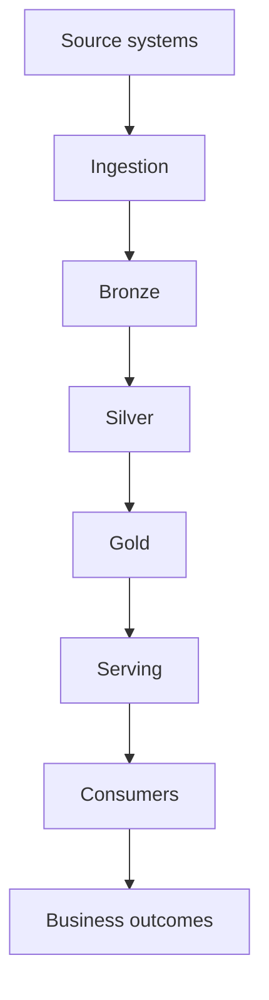

### Plain-English explanation

Data moves through the platform, but reliability must ultimately be evaluated at the consumer boundary.

A technically successful pipeline can still fail if:

- the output is too old
- the output is incomplete
- the output is wrong
- the serving system is unavailable
- the consumer cannot use the result in time

---

# 5. Types of Data Consumers

The roadmap explicitly requires several consumer categories.

| Consumer | Typical Need | Freshness Sensitivity | Latency Sensitivity | Consequence of Bad Data |
|---|---|---|---|---|
| CFO / executive reporting | Daily business view | Moderate | Moderate | Poor decisions |
| Operations dashboard | Current operational state | High | High | Slow response |
| Fraud system | Detect suspicious activity | Very high | Very high | Financial loss / risk |
| ML training job | Reproducible training data | Scheduled | Usually lower during training | Bad model |
| RAG system | Current approved documents | High | High at retrieval/serving time | Wrong or stale answers |
| Analyst | Exploration | Variable | Variable | Usually lower |
| Data scientist | Experiments | Variable | Variable | Misleading experiments |
| Application | Product functionality | Often high | High | User-visible failure |
| Regulatory consumer | Required reporting | Scheduled and strict | Deadline-sensitive | Compliance consequences |
| Operational system | Business process | Often high | High | Process disruption |

These are examples.

The exact requirement must come from the actual business process.

---

# 6. Consumer Requirements Are Different

Suppose one organization has:

```text
daily_revenue
```

The CFO may need:

```text
yesterday's complete data by 07:00 UTC
```

An operations dashboard may need:

```text
data no more than 5 minutes old
```

A fraud system may need:

```text
events processed within seconds
```

An ML training dataset may need:

```text
a reproducible daily refresh
```

A RAG index may need:

```text
newly approved documents available within a defined time window
```

The source data may be related.

The service requirements are not.

---

# 7. Consumer Requirement Table

For each important dataset ask:

```text
Who consumes it?
What decision depends on it?
How fresh must it be?
How complete must it be?
How accurate must it be?
How available must it be?
How quickly must it respond?
What happens when it is late?
What happens when it is wrong?
```

This is the starting point for SLO design.

---

# 8. Freshness

## 8.1 Definition

> **Freshness describes how old the newest usable data is relative to the current time or expected data time.**

A simplified model is:

```text
Current time
     ↓
Newest valid event
     ↓
Freshness
```

The basic calculation is:

```text
freshness
=
current time - maximum relevant event timestamp
```

---

# 9. Freshness Example

Suppose:

```text
Current time:
10:00

Newest valid event:
08:45
```

Then:

```text
freshness
=
10:00 - 08:45

=
1 hour 15 minutes
```

This means the newest usable event is 75 minutes old.

---

# 10. Freshness Is About the Newest Usable Data

The word **usable** matters.

Suppose the latest event arrived but failed validation.

Then the raw arrival time alone does not necessarily represent consumer-visible freshness.

A production-quality freshness definition must specify:

- which dataset is being measured
- which records count as usable
- which timestamp is used
- what current/evaluation time means
- what time zone or time standard is used

---

# 11. Freshness Diagram

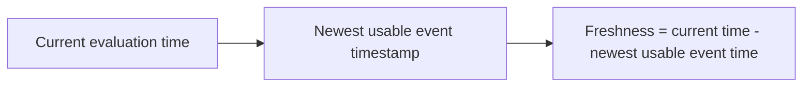

### Plain-English explanation

Freshness measures the age of the newest usable information available to the consumer.

---

# 12. Freshness vs Expected Delivery Time

These are related but different.

### Dataset freshness

```text
How old is the newest usable event?
```

### Delivery deadline

```text
Was yesterday's dataset available by 07:00 UTC?
```

### Pipeline completion time

```text
When did the pipeline finish?
```

These should not be casually treated as the same metric.

---

# 13. Latency

## 13.1 Definition

> **Latency is how long a piece of data or processing result takes to travel through a system.**

Conceptually:

```text
Event created
    ↓
Ingestion
    ↓
Transformation
    ↓
Serving
    ↓
Consumer
```

A simplified end-to-end latency model is:

```text
end-to-end latency
=
source delay
+
ingestion delay
+
processing delay
+
serving delay
+
other relevant delays
```

---

# 14. Freshness Is Not Latency

This distinction is mandatory.

| Concept | Main Question |
|---|---|
| Latency | How long did data take to travel? |
| Freshness | How old is the newest usable data now? |

Example:

```text
An event occurred 5 minutes ago.

It arrived 4 minutes later.

Processing took 30 seconds.

Per-event latency ≈ 4.5 minutes.
```

Now imagine:

```text
The source has produced no new usable data for 2 hours.
```

Then the dataset freshness may be:

```text
2 hours
```

The system could have excellent processing latency whenever data arrives while still having poor freshness because the upstream source stopped producing usable events.

---

# 15. Freshness and Latency Example

Consider:

```text
Event time:
09:55

Arrival:
09:59

Processing complete:
09:59:30

Current time:
10:00
```

Then approximately:

```text
Event-to-consumer latency = 4.5 minutes

Dataset freshness = 30 seconds
```

These values can differ substantially.

This is why:

```text
freshness != latency
```

---

# 16. Completeness

## Definition

> **Completeness measures whether the expected data has actually arrived or been processed.**

A simple teaching example:

```text
Expected:
1,000,000 rows

Received:
995,000 rows
```

Then:

```text
completeness
=
995,000 / 1,000,000 × 100

=
99.5%
```

---

# 17. Completeness Is More Than Row Count

Row count is only one possible completeness signal.

Other signals include:

- expected partitions
- expected files
- expected events
- expected time windows
- source record counts
- source totals
- business reconciliation totals

For example, two datasets could have exactly the same row count while representing different underlying records.

Therefore:

> **Completeness must be defined against an explicit expectation.**

---

# 18. Accuracy

## Definition

> **Accuracy describes whether the data correctly represents the underlying business reality or source information.**

Example:

```text
Source revenue = 1000
Gold revenue   = 1000
```

Potentially accurate.

But:

```text
Source revenue = 1000
Gold revenue   = 1200
```

indicates a discrepancy that requires investigation.

---

# 19. Fresh but Wrong

This is a critical reliability lesson:

```text
Data arrived 30 seconds ago.

But the revenue calculation is wrong.
```

Then:

```text
Fresh = yes
Accurate = no
```

Therefore:

```text
Fresh
≠
Correct
```

A system can deliver incorrect data very quickly.

Fast incorrect data is still incorrect.

---

# 20. Availability

## Definition

> **Availability describes whether the dataset, table, API, or data service is accessible when consumers need it.**

Examples:

- table cannot be queried
- API returns errors
- dashboard cannot load
- dataset was not published
- serving layer is unavailable

A useful example:

```text
Fresh + Accurate
but unavailable
=
consumer still cannot use it
```

---

# 21. Five Important Reliability Dimensions

For this topic, think about:

```text
Freshness
Latency
Completeness
Accuracy
Availability
```

A broader mental model:

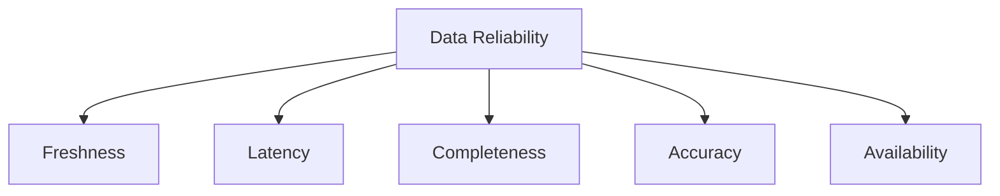

### Plain-English explanation

Data reliability is multidimensional.

A pipeline can satisfy one dimension and fail another.

---

# 22. Reliability Examples

| Situation | Fresh? | Complete? | Accurate? | Available? |
|---|---|---|---|---|
| Old but correct dataset | No | Yes | Yes | Yes |
| Recent but incomplete | Yes | No | Unknown | Yes |
| Recent but wrong | Yes | Yes | No | Yes |
| Correct but inaccessible | Unknown | Yes | Yes | No |

The exact observed values depend on the measurement definitions.

---

# 23. SLI — Service Level Indicator

## 23.1 Definition

> **An SLI is the actual measurable signal used to describe service performance.**

Examples:

```text
freshness_minutes
completeness_percent
end_to_end_latency_seconds
successful_delivery_rate
availability_percent
```

The simplest mental model is:

```text
SLI
=
what we measure
```

---

# 24. Designing a Useful SLI

A useful SLI should be:

- measurable
- meaningful to the consumer
- consistently calculated
- based on observable evidence
- tied to a defined population or window
- reproducible

Bad:

```text
pipeline feels healthy
```

Better:

```text
freshness_minutes
```

Or:

```text
successful_expected_runs / total_expected_runs
```

The exact calculation must be documented.

---

# 25. SLI Example

Suppose Finance cares about whether:

```text
daily_revenue
```

is available before a deadline.

Possible SLI:

```text
delivery_success
=
days available by agreed deadline
/
expected days
```

Another SLI could be:

```text
delivery_delay_minutes
```

The correct SLI depends on the actual SLO.

---

# 26. SLO — Service Level Objective

## 26.1 Definition

> **An SLO is the internal reliability target the engineering team aims to meet.**

Example:

```text
daily_revenue
must be complete for yesterday
by 07:00 UTC
on at least 99% of expected days.
```

Mental model:

```text
SLI
=
what we measure

SLO
=
what level we target
```

---

# 27. Writing a Measurable SLO

Use this structure:

```text
Dataset
Measurement
Population
Time window
Target
```

Example:

```text
Dataset:
daily_revenue

Measurement:
delivery deadline

Population:
expected daily production datasets

Time window:
one calendar month

Target:
available by 07:00 UTC on at least 99% of expected days
```

This is much more useful than:

```text
daily_revenue should be fresh
```

---

# 28. SLO Example — Freshness

```text
Dataset:
customer_events

SLI:
freshness_minutes

SLO:
freshness must remain below 120 minutes
for at least 99% of measurement windows.
```

The SLO must define:

- what counts as a measurement window
- how invalid records are handled
- which timestamp is used
- which periods are excluded, if any

---

# 29. SLO Example — Latency

```text
Dataset:
fraud_features

SLI:
event-to-consumer latency

SLO:
p95 latency < 60 seconds
```

At a foundational level:

> **p95 means 95% of measured observations are at or below the stated value.**

Do not use a percentile SLO without defining the event population and measurement window.

---

# 30. SLA — Service Level Agreement

## 30.1 Definition

> **An SLA is a formal agreement or externally communicated commitment that defines a level of service, often including consequences or escalation when the commitment is missed.**

Conceptually:

```text
SLI
 ↓
measurement

SLO
 ↓
internal target

SLA
 ↓
formal commitment
```

Organizations vary in how these terms are used.

Do not assume every company uses them identically.

---

# 31. SLI vs SLO vs SLA

| Term | Meaning | Example |
|---|---|---|
| SLI | Actual measurement | `freshness_minutes` |
| SLO | Internal reliability target | freshness < 120 minutes for 99% of windows |
| SLA | Formal service commitment | Agreed delivery deadline and escalation/consequence |

A simple memory aid:

```text
SLI = measure
SLO = target
SLA = commitment
```

That is only the starting point.

The real engineering skill is designing a measurement and target that reflect consumer needs.

---

# 32. Important SLA/SLO Nuance

Not every dataset needs an SLA.

A small exploratory dataset may only need:

- a documented owner
- an informal expectation
- basic monitoring

A critical financial or regulatory dataset may need:

- strict measurable SLO
- strong alerting
- escalation
- documented ownership
- formal commitment
- incident management

Do not assign the same operational burden to every dataset.

---

# 33. Consumer-Driven Reliability Model

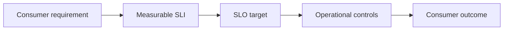

### Plain-English explanation

The consumer need comes first.

Monitoring exists to measure whether the requirement is being met.

---

# 34. Latency Budget

## Definition

> **A latency budget is the total allowed end-to-end delay divided among the stages of a pipeline or service path.**

Suppose the consumer requires:

```text
60 minutes end-to-end
```

A teaching allocation might be:

```text
Source availability       10 min
Ingestion                  10 min
Silver transformation      15 min
Gold transformation        15 min
Serving                     5 min
Buffer / unexpected         5 min
----------------------------------
Total                      60 min
```

Calculation:

```text
10 + 10 + 15 + 15 + 5 + 5 = 60 minutes
```

---

# 35. Latency Budget Diagram

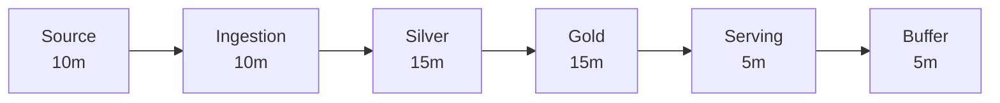

### Plain-English explanation

The end-to-end target is decomposed into responsibilities.

This lets engineers identify which stage consumed the available time.

---

# 36. Why Latency Budgets Matter

Without an explicit budget:

```text
"It should be fast enough."
```

With a budget:

```text
Every stage has an expected contribution.
```

Example:

```text
Ingestion budget = 10 minutes
Observed          = 25 minutes
Overage            = 15 minutes
```

This does not automatically tell you the root cause.

It tells you where to investigate first.

---

# 37. End-to-End Latency Formula

A simplified model:

```text
end-to-end latency
=
source delay
+
ingestion delay
+
processing delay
+
serving delay
+
other relevant delays
```

Production systems may also include:

- scheduling delay
- queueing
- retries
- orchestration
- network delay
- dependency delay
- resource contention

The formula is a mental model, not a complete mathematical description of every architecture.

---

# 38. Run Duration vs Per-Event Latency vs Freshness

These three metrics must not be confused.

### Run duration

```text
pipeline_end - pipeline_start
```

### Per-event latency

```text
consumer-visible time - event creation time
```

### Dataset freshness

```text
current time - newest usable event time
```

They can all be useful.

They answer different questions.

---

# 39. Error Budget

## 39.1 Definition

> **An error budget is the amount of unreliability that remains acceptable under an SLO.**

Suppose:

```text
SLO = 99% successful delivery
```

Conceptually:

```text
1%
=
error budget
```

This budget can be consumed by:

- failed runs
- late datasets
- unavailable services
- freshness breaches
- incomplete delivery

---

# 40. Why Error Budgets Exist

Perfect reliability is usually not economically rational.

A team could spend enormous resources reducing a rare failure from:

```text
0.1%
```

to:

```text
0.01%
```

But the business value of that improvement may not justify the additional cost.

SLOs provide a controlled target.

Error budgets make the remaining failure tolerance explicit.

---

# 41. Error Budget Decision Process

Conceptually:

```text
Healthy error budget
        |
        v
Continue normal delivery

Budget being consumed quickly
        |
        v
Investigate reliability

Budget exhausted
        |
        v
Prioritize reliability work
```

The exact organizational policy varies.

The principle is:

> Reliability investment should respond to the amount of reliability being consumed.

---

# 42. Error Budget Diagram

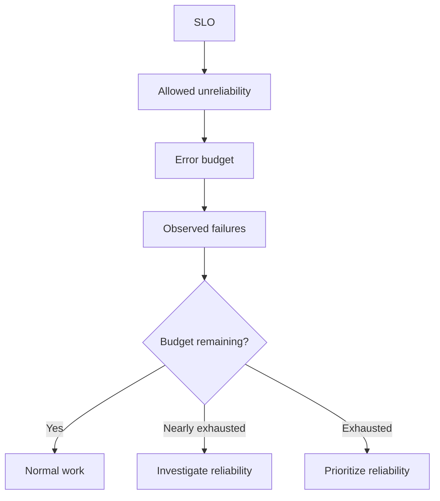

### Plain-English explanation

The error budget translates an abstract SLO into an operational decision mechanism.

---

# 43. Upstream Dependencies

One of the most important principles in the topic is:

> **Your SLA cannot realistically promise data earlier or more reliably than the dependencies required to produce that data.**

Suppose:

```text
Source availability:
06:30 UTC

Your advertised delivery:
06:00 UTC
```

If the pipeline depends entirely on the source, this downstream promise is not physically supported by the dependency.

---

# 44. Source SLA Limitation

Consider:

```text
Source
  ↓
Ingestion
  ↓
Bronze
  ↓
Silver
  ↓
Gold
  ↓
Consumer
```

Every downstream stage operates under upstream constraints.

If the source is reliably available only by:

```text
06:30
```

and your pipeline needs:

```text
40 minutes
```

then a realistic downstream target may need to be later than:

```text
06:30 + 40 minutes
```

unless the architecture has some additional mechanism that reduces the dependency or uses already-available data.

---

# 45. Dependency Chain

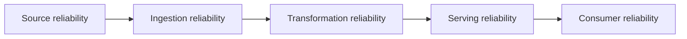

### Plain-English explanation

A downstream system cannot simply ignore upstream reliability.

If the source is late, downstream freshness can be late even when downstream code runs perfectly.

---

# 46. Upstream Failure Scenario

Normal behavior:

```text
Source file arrives:
05:30 UTC
```

Today:

```text
Source file arrives:
07:15 UTC
```

Consumer requirement:

```text
daily_revenue
available by 07:00 UTC
```

Ask:

1. Is the pipeline necessarily broken?
2. Where did the delay originate?
3. Which SLI identifies the problem?
4. Which part consumed the latency budget?
5. What should consumers be told?
6. Is the current SLO realistic given the source dependency?

The correct answer depends on architecture and contracts.

The key lesson is:

> **Observability must identify where the delay originated, not merely report that the final target was late.**

---

# 47. Dependency Negotiation

Suppose Finance requires:

```text
Gold available by 07:00 UTC
```

Suppose downstream processing needs:

```text
60 minutes
```

Then a dependency may need to be reliably available by approximately:

```text
06:00 UTC
```

This leads to a negotiation:

```text
Consumer requirement
        ↓
Gold deadline
        ↓
Downstream processing budget
        ↓
Source delivery expectation
```

This is a senior-engineering skill.

A downstream team should not promise a deadline without understanding the upstream path.

---

# 48. Dataset Tiering

## Definition

> **Dataset tiering means grouping datasets by business criticality and applying different reliability, monitoring, and support expectations to each tier.**

The roadmap specifies:

```text
Critical
Important
Best Effort
```

---

# 49. Critical Datasets

Examples:

- financial reporting
- regulatory data
- fraud features
- customer-facing business-critical datasets

Typical characteristics:

- strict SLOs
- strong monitoring
- strong alerting
- explicit ownership
- incident response
- potentially on-call support

---

# 50. Important Datasets

Examples:

- executive dashboards
- operational analytics
- business planning datasets

Typical characteristics:

- defined SLOs
- moderate-to-strong monitoring
- documented ownership
- escalation appropriate to business impact

---

# 51. Best-Effort Datasets

Examples:

- exploratory datasets
- temporary analyses
- experimentation outputs

Typical characteristics:

- lighter SLOs
- lightweight monitoring
- limited operational overhead

This does not mean "bad data."

It means the business consequence of delay may be lower.

---

# 52. Why Dataset Tiering Exists

Engineering capacity is limited.

Therefore:

```text
Higher business criticality
        ↓
Stronger reliability investment
```

and:

```text
Lower business criticality
        ↓
Lighter operational burden
```

Without tiering, teams may spend the same operational effort on:

```text
a temporary analyst export
```

and:

```text
a regulatory reporting dataset
```

That is usually a poor allocation of engineering resources.

---

# 53. Dataset Tiering Table

| Tier | Example | Reliability Expectation | Monitoring | On-Call |
|---|---|---|---|---|
| Critical | Regulatory report | Very high | Strong | Likely |
| Important | Operations dashboard | High | Moderate/strong | Organization-dependent |
| Best Effort | Exploratory dataset | Lower | Lightweight | Usually limited |

These values are educational examples, not universal standards.

---

# 54. Dataset Tiering Diagram

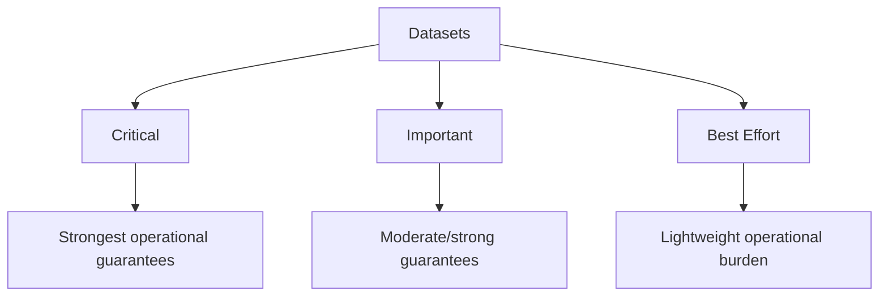

### Plain-English explanation

Tiering helps align engineering investment with business consequence.

---

# 55. Freshness SLO Examples by Consumer

## CFO

```text
daily_revenue
complete for previous day
by 07:00 UTC
on 99% of expected days
```

## Operations Dashboard

```text
operational_events
freshness < 5 minutes
for 99.9% of measurement windows
```

## ML Training Dataset

```text
training_dataset
updated according to an agreed daily schedule
```

## RAG Document Index

```text
approved documents
indexed within a defined time window
after approval
```

The target values must be derived from actual consumer needs.

---

# 56. Freshness SLO vs Delivery SLO

### Freshness-style requirement

```text
newest usable data must be less than 120 minutes old
```

### Deadline-style requirement

```text
yesterday's data must be published by 07:00 UTC
```

### Run-completion requirement

```text
pipeline must complete by 06:30 UTC
```

These should not be conflated.

---

# 57. Completeness SLO Examples

A simple example:

```text
orders dataset
≥ 99.5% expected events present
```

Or:

```text
daily partition
must contain the expected business date
```

Or:

```text
source count and target count must reconcile
within an agreed tolerance
```

The correct completeness signal depends on the data system.

---

# 58. Accuracy SLO Thinking

Accuracy is often harder to measure than freshness.

Possible signals include:

- source-to-target reconciliation
- known business invariants
- aggregate comparisons
- duplicate detection
- validation rules
- reference-data consistency

Example:

```text
payments source total
=
payments analytical total
```

within an agreed reconciliation method.

Do not reduce accuracy to:

```text
row count matched
```

A dataset can have the correct number of rows and still contain wrong values.

---

# 59. Availability SLO Examples

Example:

```text
analytical API
available 99.9% of required hours
```

Or:

```text
gold table
queryable during defined business hours
```

Every availability SLO should define:

- time window
- access method
- what counts as failure
- relevant consumer population

---

# 60. Percentile-Based Latency

At a foundational level:

```text
p50 = median
p95 = 95% of observations are at or below this value
p99 = 99% of observations are at or below this value
```

Example:

```text
p95 latency = 55 seconds
```

means approximately:

```text
95% of measured observations
were <= 55 seconds
```

and:

```text
5%
were slower than 55 seconds
```

Percentiles help expose tail behavior that an average can hide.

---

# 61. Why Averages Can Mislead

Suppose 100 events have:

```text
99 events at 1 second
1 event at 5 minutes
```

The average can still appear acceptable while one consumer request experiences severe latency.

For interactive or safety-sensitive systems, tail behavior can matter significantly.

Use:

- p50
- p95
- p99

when the consumer requirement makes tail latency relevant.

---

# 62. SLO Design Workshop

For each consumer define:

```text
Consumer
Dataset
Business purpose
Freshness SLI
Freshness SLO
Latency SLI
Latency SLO
Completeness SLI
Completeness SLO
Availability SLI
Availability SLO
```

Consumers:

1. CFO
2. fraud detection
3. operations dashboard
4. ML training pipeline
5. RAG/document retrieval

Do not assume identical targets.

---

# 63. Consumer-Centric Reliability Example

A strong design starts from:

```text
Business statement
```

Example:

> Finance needs yesterday's data every morning.

Translate it to:

```text
Consumer need
        ↓
Yesterday's dataset
        ↓
Available by 07:00 UTC
        ↓
Completeness + freshness
        ↓
SLIs
        ↓
SLO
```

This is better than starting from an arbitrary metric.

---

# 64. Consumer Requirement Translation

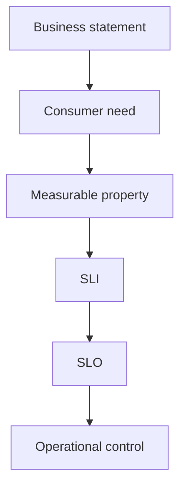

### Plain-English explanation

The engineering team turns a vague business requirement into something measurable and operationally actionable.

---

# 65. Ambiguous Requirement Exercise

Stakeholder says:

> "I need the dashboard to always have the latest data."

Do not immediately promise:

```text
"Yes, it will."
```

Ask:

```text
What does "latest" mean?

How old is acceptable?

What decision depends on it?

What happens if it is 10 minutes late?

What happens if it is one hour late?

How often does the dashboard need updating?

Is stale data worse than unavailable data?

Who owns the business definition?
```

Then convert the requirement into a measurable SLO.

---

# 66. Data Service Contract Thinking

A useful data product can publish expectations such as:

```text
Dataset:
daily_revenue

Owner:
Finance Analytics

Purpose:
Daily business reporting

Grain:
one row per country per day

Freshness:
available by 07:00 UTC on 99% of expected days

Completeness:
>= 99.5%

Availability:
queryable during business hours

Retention:
12 months
```

This connects:

```text
ownership
+
semantics
+
quality
+
freshness
+
service level
```

---

# 67. Dataset Contract Example

```text
Dataset: daily_revenue

Consumer:
Finance

Tier:
Critical

Grain:
country × day

Freshness SLI:
minutes after agreed publication deadline

Freshness SLO:
published by 07:00 UTC for at least 99% of expected days

Completeness SLI:
reconciled expected records / received records

Completeness SLO:
>= 99.5%

Availability SLI:
successful query checks / total query checks

Dependencies:
transaction source
exchange-rate source
pipeline scheduler
analytical platform

Owner:
Finance Data Product
```

This is an illustrative teaching contract.

---

# 68. Pipeline Success vs Data Service Success

This is one of the most important lessons.

A job can exit successfully:

```text
pipeline exit code = 0
```

while the data service still fails:

```text
source was late
+
freshness SLO breached
```

Therefore:

```text
Pipeline Success
≠
Data Reliability Success
```

---

# 69. Example — Successful Pipeline, Failed SLO

Suppose:

```text
Pipeline started:
08:00

Pipeline finished:
08:30

Exit code:
0
```

But the source only contained events up to:

```text
06:00
```

Current time:

```text
09:00
```

Freshness:

```text
3 hours
```

SLO:

```text
< 120 minutes
```

Result:

```text
Pipeline execution: SUCCESS
Freshness SLO: BREACH
```

This is not contradictory.

The two systems are measuring different things.

---

# 70. Consumer View vs Engineering View

## Engineering view

```text
Job completed.
```

## Consumer view

```text
Can I use yesterday's revenue now?
```

Or:

```text
Can the fraud system receive sufficiently fresh features?
```

Or:

```text
Can the RAG system retrieve newly approved documents?
```

The second set of questions is what service-level design should ultimately answer.

---

# 71. Bronze → Silver → Gold With SLOs

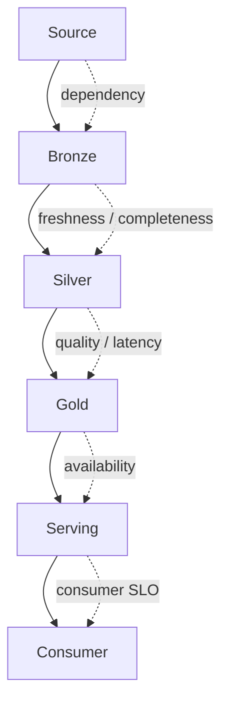

### Plain-English explanation

Reliability requirements can exist at several points, but the final question is whether the consumer received what was promised.

---

# 72. Reliability Chain

A conceptual mental model:

```text
Source Reliability
       ×
Ingestion Reliability
       ×
Transformation Reliability
       ×
Serving Reliability
       ×
Consumer Availability
       =
Overall Consumer Experience
```

Important:

> The multiplication sign is a conceptual metaphor, not a literal probability model.

It communicates that many dependencies participate in the final outcome.

---

# 73. Dependency Chain Caveat

It is possible for one weak dependency to dominate the end-to-end experience.

For example:

```text
Excellent transformation
+
excellent storage
+
excellent serving
+
source arrives 3 hours late
=
late consumer data
```

Therefore platform engineering must include upstream dependency expectations.

---

# 74. Late Source Incident

Scenario:

```text
Normal source arrival:
05:30 UTC

Actual arrival:
07:15 UTC

Consumer deadline:
07:00 UTC
```

Questions:

1. Which SLI detects the delay?
2. Which SLO is breached?
3. How much of the latency budget was consumed upstream?
4. What dependency should engineering investigate?
5. Should downstream teams be blamed for the late data?
6. What communication should reach the consumer?
7. Should the source delivery expectation be renegotiated?

The engineering response should follow evidence.

---

# 75. Incident Scenario — Regulatory Reporting

Scenario:

> `daily_revenue` was supposed to be available by 07:00 UTC but became available at 09:30 UTC.

Write:

```text
Incident
Impact
Consumer
SLO
Observed SLI
Root cause
Dependency
Latency budget
Error budget
Immediate mitigation
Long-term prevention
```

Reason through:

- whether the pipeline failed
- whether the source was late
- whether processing exceeded budget
- whether serving was unavailable
- whether the service-level commitment was realistic

---

# 76. Incident Scenario — Fresh but Wrong

Scenario:

> The dataset becomes available at 06:30 UTC, but a business-rule bug makes revenue 12% too high.

Ask:

1. Is freshness satisfied?
2. Is accuracy satisfied?
3. Is the pipeline operationally healthy?
4. What SLI could detect this?
5. Why is freshness alone insufficient?
6. What is the likely consumer impact?

Key lesson:

```text
Fresh ≠ Correct
```

---

# 77. Incident Scenario — Complete but Unavailable

Scenario:

> Gold data is accurate and fresh, but the serving system is unavailable for two hours.

Ask:

1. Is freshness satisfied?
2. Is availability satisfied?
3. Can the consumer actually use the data?
4. Which SLI detects the service failure?

Key lesson:

```text
Usable data
=
data properties
+
service availability
```

---

# 78. Failure Classification

Failures can be classified as:

```text
Pipeline execution failure
Data quality failure
Service-level failure
Upstream dependency failure
Consumer availability failure
```

These categories can overlap.

---

# 79. Pipeline Execution Failure

Example:

```text
Python process crashes.
```

This is an execution failure.

Useful signals:

- process exit code
- logs
- retry counts
- failed task status

But a successful process is not proof of good data.

---

# 80. Data Quality Failure

Example:

```text
Pipeline completes.

Amount values are wrong.

```

This is a data-quality failure.

The process succeeded technically.

The result failed semantically.

---

# 81. Service-Level Failure

Example:

```text
Gold exists.

But it is three hours late.

Freshness SLO = 120 minutes.
```

The data may exist.

The service promise failed.

---

# 82. Upstream Dependency Failure

Example:

```text
Source system publishes two hours late.
```

Downstream processing may complete perfectly.

The root cause is upstream.

This is why dependency monitoring matters.

---

# 83. Consumer Availability Failure

Example:

```text
Data exists
but serving API is unavailable.
```

The platform may have produced correct data while the consumer-facing service still fails.

---

# 84. Python Hands-On Exercise

The roadmap requires a small:

```text
freshness_check.py
```

and:

```text
run_metadata.json
```

For this lesson, the complete learner-ready implementation appears below.

No third-party libraries are required.

---

# 85. Python Restrictions

Use:

- Python 3.12+
- standard library only

Allowed modules include:

```python
json
datetime
pathlib
logging
sys
argparse
```

Do not require:

- pandas
- NumPy
- Polars
- PySpark
- Airflow
- dbt
- Prometheus
- Grafana
- OpenTelemetry
- cloud monitoring SDKs

The purpose is to learn the reliability concepts.

---

# 86. `run_metadata.json`

## Purpose

Create an operational record that provides evidence about what a pipeline did.

A learner-friendly example:

```json
{
  "run_id": "run-2026-09-26-001",
  "started_at": "2026-09-26T05:50:00Z",
  "ended_at": "2026-09-26T06:42:00Z",
  "expected_rows": 100000,
  "layers": {
    "bronze": {
      "rows_in": 100000,
      "rows_out": 100000
    },
    "silver": {
      "rows_in": 100000,
      "rows_out": 99500
    },
    "gold": {
      "rows_in": 99500,
      "rows_out": 500
    }
  },
  "gold_max_event_time": "2026-09-26T05:20:00Z"
}
```

---

# 87. `run_metadata.json` Field Explanation

### `run_id`

Identifies the execution.

### `started_at`

Pipeline start timestamp.

### `ended_at`

Pipeline end timestamp.

### `expected_rows`

Teaching input for completeness.

### `rows_in`

Rows entering the layer.

### `rows_out`

Rows emitted by the layer.

### `gold_max_event_time`

Maximum usable event timestamp represented in Gold.

The actual production metadata model can be richer.

This is a learning representation.

## Complete `run_metadata.py` Helper

The example above shows what `run_metadata.json` should look like, but a pipeline has to actually produce that file. The following standard-library-only helper does that.

```python
from __future__ import annotations

import json
from datetime import datetime, timezone
from pathlib import Path
from typing import Mapping


def utc_now() -> str:
    return datetime.now(timezone.utc).isoformat().replace("+00:00", "Z")


def max_event_time(
    records: list[dict],
    field: str = "event_time",
) -> str | None:
    timestamps = [
        record[field]
        for record in records
        if record.get(field)
    ]

    if not timestamps:
        return None

    return max(timestamps)


def write_run_metadata(
    path: Path,
    run_id: str,
    started_at: str,
    ended_at: str,
    expected_rows: int,
    layer_counts: Mapping[str, tuple[int, int]],
    gold_max_event_time: str | None,
) -> None:
    layers = {
        layer: {
            "rows_in": rows_in,
            "rows_out": rows_out,
        }
        for layer, (rows_in, rows_out) in layer_counts.items()
    }

    metadata = {
        "run_id": run_id,
        "started_at": started_at,
        "ended_at": ended_at,
        "expected_rows": expected_rows,
        "layers": layers,
        "gold_max_event_time": gold_max_event_time,
    }

    path.parent.mkdir(parents=True, exist_ok=True)

    with path.open("w", encoding="utf-8") as handle:
        json.dump(metadata, handle, indent=2)
```

### Where This Fits in the Pipeline

```text
overall pipeline starts
        ↓
started_at
        ↓
Bronze
        ↓
Silver
        ↓
Gold
        ↓
ended_at
        ↓
write_run_metadata()
        ↓
run_metadata.json
        ↓
freshness_check.py
```

A driver wires the real Bronze/Silver/Gold row counts into `write_run_metadata()` like this:

```python
def run_pipeline_with_metadata() -> None:
    run_id = "run-2026-09-26-001"
    started_at = utc_now()

    # bronze_rows_in, bronze_rows_out = run_bronze(...)
    bronze_rows_in, bronze_rows_out = 100_000, 100_000

    # silver_rows_in, silver_rows_out = run_silver(...)
    silver_rows_in, silver_rows_out = 100_000, 99_500

    # gold_rows_in, gold_rows_out, gold_records = run_gold(...)
    gold_rows_in, gold_rows_out = 99_500, 500
    gold_records = [{"event_time": "2026-09-26T05:20:00Z"}]

    ended_at = utc_now()

    write_run_metadata(
        path=Path("run_metadata.json"),
        run_id=run_id,
        started_at=started_at,
        ended_at=ended_at,
        expected_rows=100_000,
        layer_counts={
            "bronze": (bronze_rows_in, bronze_rows_out),
            "silver": (silver_rows_in, silver_rows_out),
            "gold": (gold_rows_in, gold_rows_out),
        },
        gold_max_event_time=max_event_time(gold_records),
    )
```

Each commented-out call (`run_bronze()`, `run_silver()`, `run_gold()`) stands in for the actual `bronze.py`, `silver.py`, and `gold.py` logic from Topic 07 — this helper only cares about the row counts and the maximum Gold event timestamp those steps produce.

---

# 88. Complete `freshness_check.py`

## Purpose

The checker must:

1. read `run_metadata.json`
2. parse timestamps safely
3. calculate freshness
4. calculate completeness
5. calculate pipeline run duration
6. compare observations with configured SLOs
7. log results
8. return a non-zero exit code when an SLO is breached

## Code

```python
from __future__ import annotations

import argparse
import json
import logging
import sys
from datetime import datetime, timezone
from pathlib import Path


LOGGER = logging.getLogger("freshness_check")


def parse_args() -> argparse.Namespace:
    parser = argparse.ArgumentParser(
        description="Check freshness, completeness, and run duration SLOs."
    )
    parser.add_argument(
        "--metadata",
        type=Path,
        default=Path("run_metadata.json"),
    )
    parser.add_argument(
        "--config",
        type=Path,
        default=Path("slo_config.json"),
    )
    parser.add_argument(
        "--max-freshness-minutes",
        type=float,
        default=None,
        help="Overrides freshness_minutes from --config when set.",
    )
    parser.add_argument(
        "--min-completeness-percent",
        type=float,
        default=None,
        help="Overrides completeness_percent from --config when set.",
    )
    parser.add_argument(
        "--max-run-duration-minutes",
        type=float,
        default=None,
        help="Overrides max_run_duration_minutes from --config when set.",
    )
    return parser.parse_args()


def parse_timestamp(value: str) -> datetime:
    parsed = datetime.fromisoformat(value.replace("Z", "+00:00"))

    if parsed.tzinfo is None:
        raise ValueError("timestamp must contain timezone information")

    return parsed.astimezone(timezone.utc)


def load_metadata(path: Path) -> dict:
    with path.open("r", encoding="utf-8") as handle:
        data = json.load(handle)

    if not isinstance(data, dict):
        raise ValueError("metadata must be a JSON object")

    return data


def load_slo_config(path: Path) -> dict[str, float]:
    with path.open("r", encoding="utf-8") as handle:
        data = json.load(handle)

    if not isinstance(data, dict):
        raise ValueError("SLO configuration must be a JSON object")

    required_keys = (
        "freshness_minutes",
        "completeness_percent",
        "max_run_duration_minutes",
    )

    missing = [key for key in required_keys if key not in data]

    if missing:
        raise ValueError(
            f"SLO configuration is missing required keys: {', '.join(missing)}"
        )

    return {key: float(data[key]) for key in required_keys}


def calculate_freshness_minutes(
    metadata: dict,
    now: datetime | None = None,
) -> float:
    now_utc = now or datetime.now(timezone.utc)

    max_event_time = parse_timestamp(
        metadata["gold_max_event_time"]
    )

    delta = now_utc - max_event_time

    return delta.total_seconds() / 60.0


def calculate_completeness_percent(metadata: dict) -> float:
    expected = float(metadata["expected_rows"])

    gold_rows_in = float(
        metadata["layers"]["silver"]["rows_in"]
    )

    if expected <= 0:
        raise ValueError("expected_rows must be positive")

    return gold_rows_in / expected * 100.0


def calculate_run_duration_minutes(metadata: dict) -> float:
    started_at = parse_timestamp(metadata["started_at"])
    ended_at = parse_timestamp(metadata["ended_at"])

    delta = ended_at - started_at

    return delta.total_seconds() / 60.0


def check_slos(
    freshness_minutes: float,
    completeness_percent: float,
    run_duration_minutes: float,
    max_freshness_minutes: float,
    min_completeness_percent: float,
    max_run_duration_minutes: float,
) -> bool:
    freshness_ok = freshness_minutes <= max_freshness_minutes
    completeness_ok = completeness_percent >= min_completeness_percent
    run_duration_ok = run_duration_minutes <= max_run_duration_minutes

    LOGGER.info(
        "Freshness: observed=%.2f min target<=%.2f status=%s",
        freshness_minutes,
        max_freshness_minutes,
        "PASS" if freshness_ok else "BREACH",
    )

    LOGGER.info(
        "Completeness: observed=%.2f%% target>=%.2f%% status=%s",
        completeness_percent,
        min_completeness_percent,
        "PASS" if completeness_ok else "BREACH",
    )

    LOGGER.info(
        "Run duration: observed=%.2f min target<=%.2f status=%s",
        run_duration_minutes,
        max_run_duration_minutes,
        "PASS" if run_duration_ok else "BREACH",
    )

    return freshness_ok and completeness_ok and run_duration_ok


def main() -> int:
    logging.basicConfig(
        level=logging.INFO,
        format="%(levelname)s: %(message)s",
    )

    args = parse_args()

    try:
        metadata = load_metadata(args.metadata)
        config = load_slo_config(args.config)

        max_freshness_minutes = (
            args.max_freshness_minutes
            if args.max_freshness_minutes is not None
            else config["freshness_minutes"]
        )

        min_completeness_percent = (
            args.min_completeness_percent
            if args.min_completeness_percent is not None
            else config["completeness_percent"]
        )

        max_run_duration_minutes = (
            args.max_run_duration_minutes
            if args.max_run_duration_minutes is not None
            else config["max_run_duration_minutes"]
        )

        freshness = calculate_freshness_minutes(metadata)
        completeness = calculate_completeness_percent(metadata)
        run_duration = calculate_run_duration_minutes(metadata)

        passed = check_slos(
            freshness_minutes=freshness,
            completeness_percent=completeness,
            run_duration_minutes=run_duration,
            max_freshness_minutes=max_freshness_minutes,
            min_completeness_percent=min_completeness_percent,
            max_run_duration_minutes=max_run_duration_minutes,
        )

        if passed:
            LOGGER.info("Overall SLO STATUS = PASS")
            return 0

        LOGGER.error("Overall SLO STATUS = BREACH")
        return 1

    except (OSError, KeyError, TypeError, ValueError, json.JSONDecodeError) as exc:
        LOGGER.error("Could not evaluate metadata: %s", exc)
        return 2


if __name__ == "__main__":
    sys.exit(main())
```

---

# 89. Code Explanation

## Purpose

The program turns operational metadata into measurable reliability signals.

## Input

```text
run_metadata.json
```

plus optional threshold arguments.

## Output

Human-readable logs:

```text
Freshness: PASS/BREACH
Completeness: PASS/BREACH
Run duration: PASS/BREACH
Overall SLO STATUS = PASS/BREACH
```

## Exit behavior

```text
0 = all SLOs pass
1 = one or more SLOs breach
2 = checker could not evaluate the metadata
```

This is an important operational distinction.

A breach is different from a checker failure.

---

# 90. Function-by-Function Explanation

### `parse_args()`

Reads command-line configuration.

### `parse_timestamp()`

Converts an ISO timestamp into a timezone-aware UTC timestamp.

### `load_metadata()`

Loads and structurally validates the JSON object.

### `calculate_freshness_minutes()`

Computes:

```text
now - max event time
```

### `calculate_completeness_percent()`

Computes a simple row-based teaching completeness metric.

### `calculate_run_duration_minutes()`

Computes:

```text
ended_at - started_at
```

This is run duration, not per-event latency.

### `check_slos()`

Compares observed values against targets.

### `main()`

Coordinates the process and converts outcomes into exit codes.

---

# 91. Expected Healthy Output

A healthy example may look like:

```text
INFO: Freshness: observed=87.00 min target<=120.00 status=PASS
INFO: Completeness: observed=99.80% target>=99.50% status=PASS
INFO: Run duration: observed=42.00 min target<=60.00 status=PASS
INFO: Overall SLO STATUS = PASS
```

This means the observed values satisfy the configured teaching SLOs.

---

# 92. Expected Breach Output

Example:

```text
INFO: Freshness: observed=180.00 min target<=120.00 status=BREACH
INFO: Completeness: observed=99.80% target>=99.50% status=PASS
INFO: Run duration: observed=42.00 min target<=60.00 status=PASS
ERROR: Overall SLO STATUS = BREACH
```

Expected process exit:

```text
non-zero
```

---

# 93. Configured SLOs

Example — save this as `slo_config.json`:

```json
{
  "freshness_minutes": 120,
  "completeness_percent": 99.5,
  "max_run_duration_minutes": 60
}
```

This is a learning-friendly representation, and unlike an illustration, `load_slo_config()` in `freshness_check.py` actually reads this exact file and uses its values as the default thresholds.

Run the checker against it:

```bash
python freshness_check.py \
  --metadata run_metadata.json \
  --config slo_config.json
```

Command-line flags such as `--max-freshness-minutes` remain available as explicit overrides for a single experimental run, without editing the configuration file.

Production systems may store thresholds in:

- configuration files
- data-product definitions
- service contracts
- deployment configuration
- observability systems

The architectural principle is more important than the storage mechanism.

---

# 94. Freshness Calculation

The basic calculation:

```python
freshness = now - max_event_time
```

Use timezone-aware timestamps.

Example:

```text
max_event_time:
2026-09-26T05:00:00Z

now:
2026-09-26T06:30:00Z

freshness:
90 minutes
```

Never silently mix:

```text
timezone-aware
```

and:

```text
timezone-naive
```

timestamps.

---

# 95. Completeness Calculation

For this toy exercise:

```text
completeness
=
rows_received / expected_rows × 100
```

Example:

```text
received = 99,000
expected = 100,000

completeness = 99%
```

Production completeness may instead use:

- source-to-target reconciliation
- expected partitions
- business totals
- event windows
- source control totals

---

# 96. Run Duration

The exercise calculates:

```python
run_duration = ended_at - started_at
```

Important nuance:

> This is **pipeline run duration**, not necessarily individual event-to-consumer latency.

The lesson intentionally exposes this limitation.

---

# 97. Required Distinction

Always distinguish:

```text
Run duration
```

from:

```text
Per-event latency
```

from:

```text
Dataset freshness
```

These are different signals.

---

# 98. Simulate a Late Source

Normal:

```text
Max event time:
08:00

Current time:
09:00

Freshness:
60 minutes
```

Late source:

```text
Max event time:
06:00

Current time:
09:00

Freshness:
180 minutes
```

SLO:

```text
freshness < 120 minutes
```

Result:

```text
BREACH
```

---

# 99. Late-Source Experiment

Steps:

1. Run the normal scenario.
2. Record freshness.
3. Modify `gold_max_event_time`.
4. Rerun the checker.
5. Observe the SLO breach.
6. Check the process exit code.
7. Explain whether the pipeline itself necessarily failed.

The lesson should be:

> A pipeline can execute correctly while its consumer-facing freshness requirement is violated.

---

# 100. Simulate Incomplete Data

Example:

```text
Expected:
100,000 rows

Received:
99,000 rows
```

Then:

```text
99%
```

Suppose:

```text
SLO >= 99.5%
```

Result:

```text
BREACH
```

---

# 101. Incomplete-Data Experiment

Steps:

1. Set expected rows.
2. Set lower actual rows.
3. Run the checker.
4. Observe the completeness calculation.
5. Observe the non-zero exit code.
6. Explain what evidence should be investigated.

Potential questions:

- Did the source send fewer records?
- Were records rejected?
- Did ingestion fail partially?
- Did Silver quarantine records?
- Did a transformation filter records unexpectedly?

---

# 102. Simulate a Slow Pipeline

Suppose:

```text
Started:
05:00

Ended:
06:15
```

Run duration:

```text
75 minutes
```

SLO:

```text
<= 60 minutes
```

Result:

```text
Run Duration SLO BREACH
```

The pipeline may be fully correct.

It simply consumed more time than the agreed target.

---

# 103. Multiple Simultaneous Breaches

Create a scenario where:

```text
Freshness = 180 min
Completeness = 98.5%
Run Duration = 75 min
```

Targets:

```text
Freshness <= 120 min
Completeness >= 99.5%
Run Duration <= 60 min
```

The checker should identify all three.

This teaches that reliability can fail along multiple dimensions simultaneously.

---

# 104. Complete Learner Path

Follow this exact sequence:

```text
1. Run the pipeline.
2. Produce run_metadata.json.
3. Produce Gold output.
4. Find max event timestamp.
5. Calculate freshness.
6. Calculate completeness.
7. Calculate pipeline run duration.
8. Compare metrics with configured SLOs.
9. Print PASS/BREACH.
10. Exit non-zero on breach.
```

Then introduce:

```text
late data
incomplete data
slow pipeline
multiple simultaneous breaches
```

and observe the results.

---

# 105. Production vs Toy Comparison

## Toy

```text
Source
  ↓
bronze.py
  ↓
silver.py
  ↓
gold.py
  ↓
freshness_check.py
```

## Production

```text
Source Systems
      ↓
Ingestion
      ↓
Bronze
      ↓
Validation
      ↓
Silver
      ↓
Gold
      ↓
Serving
      ↓
Consumers
```

Overlay:

```text
SLIs
SLOs
Alerts
Ownership
Dependencies
Run metadata
Incident response
```

---

# 106. Production vs Toy Explanation

The toy implementation teaches:

- measurable freshness
- simple completeness
- run duration
- metadata
- threshold comparison
- PASS/BREACH behavior
- non-zero exit codes

It does not implement:

- full observability infrastructure
- distributed tracing
- production metrics systems
- enterprise alerting
- incident management
- scalable time-series storage
- full service catalog integration
- advanced anomaly detection

That distinction is mandatory.

---

# 107. Architecture Diagram — Production Reliability

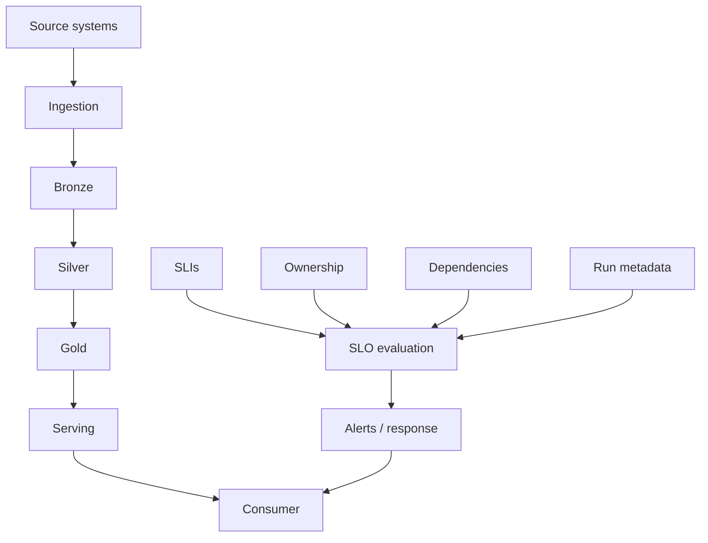

### Plain-English explanation

Reliability information sits alongside the data path rather than replacing it.

---

# 108. Data Reliability Is a Service

A dataset can be treated as a data product with expectations such as:

```text
Meaning
Owner
Grain
Freshness
Completeness
Availability
Quality expectations
Consumer
Tier
Escalation
```

This is why data engineering increasingly overlaps with reliability engineering.

---

# 109. Consumer-Specific Service Requirements

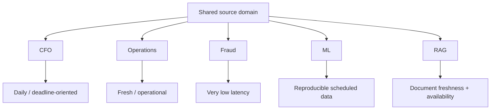

### Plain-English explanation

One source domain can feed consumers with radically different service expectations.

---

# 110. Consumer Impact Matrix

Use this as an exercise rather than as a universal answer:

| Failure | Finance | Operations | Fraud | ML Training | RAG |
|---|---|---|---|---|---|
| 2 hours stale | Potential reporting delay | Potentially severe | Potentially severe | Often tolerable depending on schedule | Potentially stale answers |
| 1% incomplete | Possible reconciliation issue | Potential operational blind spot | Potential risk | Dataset bias / incomplete training | Missing knowledge |
| Wrong business logic | Financially misleading | Operationally misleading | Risky | Bad model data | Incorrect retrieval/business context |
| Unavailable | Report blocked | Operations blocked | Detection degraded | Training blocked | Retrieval blocked |

The learner should explain why the business consequence differs.

---

# 111. Data Product Reliability Contract Exercise

Create a contract for:

```text
daily_revenue
```

Include:

```text
Owner
Purpose
Grain
Freshness SLI
Freshness SLO
Completeness SLI
Completeness SLO
Availability SLI
Availability SLO
Latency budget
Dependencies
Dataset tier
Escalation owner
```

Then ask:

> Which of these properties are consumer-facing commitments, and which are internal operational details?

This distinction is useful when evolving contracts.

---

# 112. SLO Anti-Patterns

## Vague

```text
Data should be fresh.
```

Problem:

No measurable definition.

## Unmeasurable

```text
Pipeline should be fast.
```

Problem:

No signal or target.

## Unrealistically strict

```text
Data must always be instantly available.
```

Problem:

No business justification.

## Undefined population

```text
99% good.
```

Problem:

99% of what?

## Undefined time window

```text
Complete 99.5%.
```

Problem:

Over what measurement period and expected population?

---

# 113. How to Improve a Bad SLO

Bad:

```text
Revenue data should be fresh.
```

Better:

```text
daily_revenue freshness
must remain under 120 minutes
for at least 99% of expected daily evaluation windows.
```

Even better:

```text
daily_revenue
must be complete for the previous business day
and published by 07:00 UTC
on at least 99% of expected days.
```

The final wording depends on the real consumer requirement.

---

# 114. SLO Period and Population

An SLO must define:

- measurement period
- expected population
- success condition

Bad:

```text
99% fresh
```

Better:

```text
At least 99% of expected daily production datasets
for daily_revenue
must satisfy freshness < 120 minutes
within the monthly measurement period.
```

The denominator matters.

Without a defined population, the percentage can be misleading.

---

# 115. Example of Denominator Ambiguity

Suppose:

```text
Expected runs = 100
Observed runs = 90
```

If you calculate:

```text
90/90 = 100%
```

you have hidden the ten missing expected runs.

A stronger measurement must account for the expected population.

This is why completeness and availability calculations need explicit definitions.

---

# 116. Consumer Requirement — CFO

Potential requirement:

```text
Dataset:
daily_revenue

Purpose:
daily financial reporting

Freshness:
previous business day available by 07:00 UTC

Completeness:
reconciled to expected source population

Accuracy:
business reconciliation required

Availability:
queryable during finance reporting hours

Tier:
Critical
```

This is a complete service conversation rather than a single metric.

---

# 117. Consumer Requirement — Fraud

Potential concerns:

```text
Freshness:
very high

Latency:
low

Availability:
very high

Completeness:
important

Accuracy:
critical
```

A fraud model with perfectly fresh but incomplete data may still behave poorly.

---

# 118. Consumer Requirement — ML Training

Training data often emphasizes:

- completeness
- reproducibility
- historical consistency
- predictable refresh schedules
- version awareness

Latency during the actual training job may be less important than producing a correct and reproducible training dataset on schedule.

---

# 119. Consumer Requirement — RAG

A RAG document index may care about:

- newly approved documents becoming searchable
- correct document version
- metadata correctness
- retrieval service availability
- indexing latency
- freshness of the index

Example:

```text
approved document
        ↓
indexing
        ↓
retrieval availability
```

The target must follow the application requirement.

---

# 120. Banking Case Study

Banking can contain multiple consumers with different reliability requirements.

## Regulatory reporting

Consumer:

```text
regulatory/compliance team
```

Needs:

- completeness
- correctness
- delivery deadline
- auditability

## Fraud

Consumer:

```text
fraud detection system
```

Needs:

- very high freshness
- low latency
- high availability
- strong accuracy

The same bank may therefore require very different service-level designs.

Do not assume all banking datasets need identical SLOs.

---

# 121. Banking Reliability Chain

```text
Core transaction source
      ↓
Payments
      ↓
Ingestion
      ↓
Bronze
      ↓
Silver
      ↓
Gold
      ↓
Regulatory reporting
```

And separately:

```text
Transactions
      ↓
Feature processing
      ↓
Fraud features
      ↓
Fraud model
```

The first may be deadline-oriented.

The second may be latency-oriented.

---

# 122. E-Commerce Case Study

## CFO dashboard

Needs:

- complete daily revenue
- predictable cutoff
- trustworthy business logic

## Inventory operations

Needs:

- fresher updates
- reliable operational visibility

## Recommendation system

Needs:

- sufficiently fresh behavior/features
- predictable availability

One domain can therefore expose multiple reliability contracts.

---

# 123. Ride-Sharing Case Study

## Daily driver report

Can tolerate scheduled batch freshness.

## Live operational dashboard

Needs much fresher information.

## Fraud/safety system

May need lower latency.

The consumer determines the reliability profile.

---

# 124. Healthcare Case Study

Potential consumers:

- scheduled analytical reporting
- operational monitoring
- regulated datasets

Reliability dimensions may include:

- correctness
- privacy
- availability
- auditability
- delivery timing

This section remains foundational and does not become a full compliance course.

---

# 125. ML / AI / RAG Reliability Matrix

| Consumer | Freshness | Latency | Completeness | Accuracy | Availability |
|---|---|---|---|---|---|
| ML training | Scheduled | Lower during many batch jobs | High | High | Needed around training workflow |
| Online ML | High | High | High | High | High |
| RAG indexing | High after document approval | Moderate to high | High for approved corpus | High | High for retrieval |
| AI evaluation | Version-specific | Usually lower | High | High | Useful for repeatability |

The exact target depends on the product.

---

# 126. SLA / SLO Negotiation Exercise

A stakeholder says:

> "Our data needs to be real time."

Translate this into questions:

```text
What does real time mean?
5 seconds?
30 seconds?
5 minutes?

Which consumer?

What business decision depends on it?

What happens if the data is 1 minute old?

What happens if it is 10 minutes old?

What source dependencies exist?

What is the cost of meeting the target?
```

Only then define the SLI/SLO.

---

# 127. Architecture Decision Exercise — 500 Gold Datasets

Scenario:

> A company has 500 Gold datasets. Only 20 are business-critical, 100 are important, and the remaining datasets are exploratory or best-effort.

Write an ADR:

```text
Context
Problem
Options
Decision
Consequences
```

Consider:

- tiering
- SLO depth
- monitoring
- alerting
- on-call
- operational cost

Do not assume every dataset deserves identical operational treatment.

---

# 128. Advanced Reliability Trade-Offs

## Stronger SLO

Potential benefits:

- stronger consumer confidence
- more predictable service

Potential costs:

- more infrastructure
- more engineering effort
- more monitoring
- more on-call work

## Relaxed SLO

Potential benefits:

- lower operational cost
- simpler platform

Potential cost:

- less predictable consumer experience

The objective is not to maximize a number.

It is to match reliability to business need.

---

# 129. Error Budget and Reliability Investment

Suppose:

```text
SLO:
99% of runs satisfy requirement
```

Then:

```text
Error budget:
1%
```

If observed breaches are:

```text
0
```

then the service has consumed:

```text
0%
```

of its allowed unreliability for that measurement period.

If breaches accumulate rapidly, engineering should investigate.

The exact policy is organization-specific.

---

# 130. Error Budget Exercise

Suppose:

```text
100 expected runs
2 breached runs
```

Observed reliability:

```text
98%
```

If SLO is:

```text
99%
```

then the SLO is breached.

Ask:

1. How much error budget was consumed?
2. What caused the breaches?
3. Are failures isolated or systematic?
4. Should reliability work become a higher priority?

---

# 131. Latency Budget Failure Analysis

Target:

```text
60 minutes
```

Budget:

```text
Source       10
Ingestion    10
Silver       15
Gold         15
Serving       5
Buffer        5
```

Observed:

```text
Source        8
Ingestion    25
Silver       10
Gold         13
Serving       4
Buffer        0
```

Calculate:

```text
Total observed latency
=
8 + 25 + 10 + 13 + 4
=
60 minutes
```

The nominal end-to-end target is met.

But:

```text
Ingestion budget = 10
Observed         = 25
```

The ingestion stage exceeded its budget by:

```text
15 minutes
```

The buffer was consumed completely.

This is operationally important even though the end-to-end target happened to be met.

---

# 132. Why Budget Breach Matters Before SLO Breach

A system can be:

```text
within overall SLO
```

while:

```text
one internal component
is consuming its allocation too aggressively
```

That creates less headroom.

If the same trend continues, the end-to-end SLO may later fail.

This is why latency budgets are useful leading indicators.

---

# 133. Consumer-Specific SLO Workshop

## Case 1 — Daily Finance Reporting

Define:

```text
Consumer
Dataset
Business consequence
Delivery deadline
Freshness SLI
Completeness SLI
SLO
```

## Case 2 — Fraud

Define:

```text
event population
latency measurement
p95/p99 target
measurement window
availability
```

## Case 3 — Operations

Define:

```text
freshness
availability
dashboard update cadence
```

## Case 4 — ML Training

Define:

```text
refresh schedule
completeness
reproducibility
version
```

## Case 5 — RAG

Define:

```text
document approval time
indexing latency
document correctness
retrieval availability
```

Values must come from requirements, not universal templates.

---

# 134. SLO Negotiation With Dependencies

Suppose:

```text
Consumer requires:
07:00

Downstream processing:
60 min

Source available:
06:45
```

Then:

```text
06:45 + 60 min
=
07:45
```

The existing downstream design cannot satisfy 07:00 merely by promising it more strongly.

Potential responses may include:

- move source delivery earlier
- reduce processing time
- reduce dependency count
- precompute
- use incremental processing
- change the consumer requirement
- change the architecture

The best choice depends on constraints.

---

# 135. Consumer Backward Design

The most important design direction for this topic is:

```text
Consumer
   ↑
Business requirement
   ↑
SLO
   ↑
SLI
   ↑
Pipeline budget
   ↑
Architecture
   ↑
Dependencies
```

Traditional implementation thinking often starts at the source.

Reliability design should often reason backward from the consumer.

---

# 136. Why "Monitoring Whatever Is Easy" Is Dangerous

A system may easily measure:

```text
job runtime
```

But the consumer may care about:

```text
freshness
```

If you monitor only runtime, the pipeline may appear healthy:

```text
run time = 20 minutes
```

while the dataset remains:

```text
4 hours old
```

The measurement is technically valid but operationally irrelevant.

Therefore:

> **Measure what represents the consumer requirement.**

---

# 137. Failure Classification Table

| Failure | Example | Primary Signal | Consumer Impact |
|---|---|---|---|
| Execution | Process crashed | Exit code / task state | Output missing |
| Freshness | Dataset 3h old | Freshness SLI | Stale decisions |
| Completeness | 1% missing | Completeness SLI | Incomplete analysis |
| Accuracy | Wrong revenue | Reconciliation / validation | Wrong decisions |
| Availability | Table inaccessible | Availability SLI | No access |
| Upstream | Source late | Dependency SLI | Downstream delay |
| Serving | API unavailable | Availability SLI | Consumer blocked |

Failures can overlap.

---

# 138. Freshness Check Failure Scenarios

## Case 1 — Healthy

```text
freshness = 87 min
target    = 120 min
PASS
```

## Case 2 — Late

```text
freshness = 180 min
target    = 120 min
BREACH
```

## Case 3 — Incomplete

```text
completeness = 99.0%
target       = 99.5%
BREACH
```

## Case 4 — Slow

```text
run duration = 75 min
target       = 60 min
BREACH
```

## Case 5 — Multiple

```text
freshness = 180 min
completeness = 98.5%
latency = 75 min

all three BREACH
```

---

# 139. Production Monitoring Is Broader Than One Script

A real data reliability system may contain:

```text
metrics
logs
traces
metadata
catalog information
quality checks
freshness checks
dependency checks
alerting
incident management
dashboards
SLO evaluation
```

This topic intentionally teaches the mental model before deeper implementation.

---

# 140. What the Toy Checker Teaches

The checker demonstrates:

```text
Evidence
  ↓
Measurement
  ↓
Comparison
  ↓
Decision
  ↓
Exit behavior
```

It makes reliability observable and testable.

---

# 141. What the Toy Checker Does Not Teach

It does not implement:

- distributed metric storage
- high-cardinality metric design
- trace correlation
- alert routing
- pager management
- production dashboards
- fleet-wide SLO aggregation
- anomaly detection
- dependency graphs
- enterprise incident orchestration

Those belong to later infrastructure/observability work.

---

# 142. Topic Boundaries

This topic does **not** become the full curriculum for:

- OpenTelemetry implementation
- Prometheus
- Grafana
- data observability platforms
- incident-management platforms
- Great Expectations
- Soda
- full data contracts
- distributed tracing
- Airflow alerting implementations
- cloud monitoring systems
- GDPR
- enterprise governance

The deeper roadmap destinations include:

- **2.20 Observability, Lineage, Governance and Security**
- **2.22 Serving Data for Analytics, ML, and AI**

The purpose here is consumer-centric reliability reasoning.

---

# 143. Advanced Question — Can Every Dataset Have the Same SLO?

No.

Consider:

```text
regulatory_report
```

versus:

```text
temporary_analyst_export
```

Their business consequences are different.

Therefore:

```text
Reliability investment
should follow business criticality.
```

---

# 144. Advanced Question — Is 99.99% Always Better Than 99%?

No.

A stricter target may require:

- more infrastructure
- more engineering work
- more operational response
- higher cost

The business may not benefit enough to justify that effort.

SLOs should be chosen based on consumer impact.

---

# 145. Advanced Question — Is an Error Budget Permission to Break Things?

No.

It is the amount of unreliability tolerated by an SLO.

The purpose is:

```text
realistic reliability
+
controlled operational risk
+
economic trade-off
```

It is not permission to intentionally create failures.

---

# 146. Advanced Question — Does a Strict SLO Guarantee High Quality?

No.

A strict freshness SLO can still produce:

```text
very fresh wrong data
```

Quality dimensions must be evaluated separately where they matter.

---

# 147. Advanced Question — Can a Downstream Team Set Any SLA It Wants?

No.

The target must be consistent with:

- upstream capabilities
- processing time
- serving behavior
- consumer needs
- system architecture

A downstream service cannot reliably promise an impossible dependency path.

---

# 148. Advanced Question — Can a Source Be Late Without Breaking the Pipeline?

Yes.

A source being late can be:

```text
upstream dependency failure
```

while the downstream pipeline behaves correctly.

But if the source lateness causes a downstream consumer SLO breach, then the data service has still failed its consumer-facing requirement.

These are different dimensions of incident classification.

---

# 149. Advanced Architecture Exercise

Scenario:

> A data team owns a critical Gold dataset. The team meets its 60-minute processing target almost every day, but the upstream source sometimes arrives two hours late.

Ask:

1. Is processing the primary reliability bottleneck?
2. What should the source dependency contract say?
3. Which SLI should measure source delivery?
4. How much buffer is needed?
5. Should the consumer SLO be changed?
6. Could architecture reduce dependency sensitivity?
7. Should the dataset tier affect the response?

---

# 150. Data Reliability Architecture

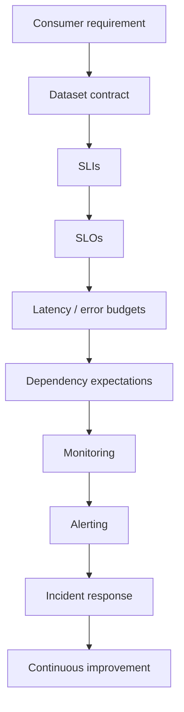

### Plain-English explanation

Reliability is an operational loop, not a one-time threshold.

---

# 151. Reliability Improvement Loop

When an SLO repeatedly fails:

```text
Observe
  ↓
Classify failure
  ↓
Find dependency / stage
  ↓
Measure budget consumption
  ↓
Mitigate
  ↓
Fix root cause
  ↓
Review SLO
  ↓
Re-measure
```

This turns reliability into engineering work rather than dashboard decoration.

---

# 152. Incident / Postmortem Exercise

Incident:

> `daily_revenue` was supposed to be available by 07:00 UTC but was available at 08:45 UTC.

Write:

```text
Incident:
daily_revenue late

Impact:
Finance reporting delayed

Consumer:
Finance

SLO:
available by 07:00 UTC

Observed SLI:
delivery time = 08:45 UTC

Root cause:
learner must determine

Dependency:
learner must identify

Latency budget:
learner must calculate

Error budget:
learner must determine

Immediate mitigation:
learner must propose

Long-term prevention:
learner must propose
```

Do not skip the evidence-gathering step.

---

# 153. Reliability Decision Record

A useful ADR can look like:

```text
# Decision

## Context
What consumer requirement exists?

## Problem
What reliability gap exists?

## Current State
What happens today?

## Options
What architecture / process alternatives exist?

## Decision
What will the team do?

## Consequences
What improves?
What becomes more expensive?

## Open Questions
What remains uncertain?
```

This is a practical bridge between engineering and service management.

---

# 154. Dataset Tiering ADR

Scenario:

> A platform has 500 Gold datasets. Twenty are business-critical, 100 are important, and 380 are exploratory or best-effort.

Consider:

### Option A

Every dataset gets identical monitoring and SLOs.

### Option B

Use tiered reliability expectations.

### Option C

No explicit SLOs.

Ask:

- Which option aligns effort with consequence?
- What could go wrong with over-monitoring?
- What could go wrong with under-monitoring?
- Which datasets need escalation?

Do not memorize a prescribed answer.

---

# 155. Consumer Requirement Matrix Exercise

Build your own matrix:

| Consumer | Dataset | Business Purpose | Freshness | Latency | Completeness | Accuracy | Availability | Tier |
|---|---|---|---|---|---|---|---|---|
| CFO | daily_revenue | Reporting | ? | ? | ? | ? | ? | ? |
| Fraud | fraud_features | Detection | ? | ? | ? | ? | ? | ? |
| Operations | operational_events | Operations | ? | ? | ? | ? | ? | ? |
| ML | training_dataset | Training | ? | ? | ? | ? | ? | ? |
| RAG | document_index | Retrieval | ? | ? | ? | ? | ? | ? |

Fill the matrix using actual business reasoning rather than arbitrary numbers.

---

# 156. Exercise — Write Five Freshness SLOs

Write measurable SLOs for:

1. Finance
2. Operations
3. Fraud
4. ML
5. RAG

Each must include:

```text
dataset
measurement
population
time window
target
```

Do not write:

```text
"must be fresh"
```

---

# 157. Exercise — Write Five Latency SLOs

For each:

```text
consumer
event population
latency metric
percentile
threshold
measurement window
```

Example structure:

```text
95% of valid fraud events
must be processed within X seconds
during the production measurement window.
```

Choose X from actual business reasoning.

---

# 158. Exercise — 60-Minute Budget

Allocate:

```text
60 minutes
```

across:

- source
- ingestion
- Bronze
- Silver
- Gold
- serving
- buffer

Your allocation must sum to:

```text
60
```

Then explain:

- why each stage gets that budget
- which stage is highest risk
- where the buffer comes from
- how you would detect budget consumption

---

# 159. Exercise — Budget Stress Test

Suppose your budget is:

```text
Source       10
Ingestion    10
Silver       15
Gold         15
Serving       5
Buffer        5
```

Now change:

```text
Ingestion = 18
```

Ask:

- Is the end-to-end SLO necessarily breached?
- Is the internal budget breached?
- What buffer remains?
- What should engineering investigate?

This teaches the difference between component budget and overall SLO.

---

# 160. Exercise — Source SLA Analysis

Suppose:

```text
Source:
available by 06:30 UTC

Processing:
45 minutes

Serving:
10 minutes

Consumer:
07:00 UTC
```

Ask:

1. Is the target feasible?
2. What additional buffer exists?
3. What happens if source arrives at 06:45?
4. Which dependency should be negotiated?
5. Could precomputation or incremental updates help?

---

# 161. Consumer-Centric Reliability Principles

Keep these principles:

```text
1. Start with the consumer.
2. Make the requirement explicit.
3. Choose an SLI that measures the requirement.
4. Define a realistic SLO.
5. Understand dependencies.
6. Allocate latency budget.
7. Track error budget.
8. Tier datasets by business criticality.
9. Treat data correctness separately from freshness.
10. Treat pipeline success separately from service success.
```

---

# 162. Common Beginner Misconceptions

## "SLI, SLO, and SLA are the same thing."

No.

```text
SLI = measurement
SLO = target
SLA = formal commitment
```

## "SLO means legal contract."

Usually not.

SLO is generally an engineering target.

## "SLA means the pipeline must always succeed."

No.

An SLA is a service commitment.

## "Freshness equals latency."

No.

They answer different questions.

## "Fresh data means correct data."

No.

Freshness is only one reliability dimension.

## "A successful pipeline means good data."

No.

Execution success and data reliability are different.

## "Every dataset should have the same SLO."

No.

Consumer consequence differs.

## "99.99% is always better than 99%."

Not necessarily.

Higher reliability can cost more.

## "Error budget means allowed bad data."

Not exactly.

It is an allowed amount of unreliability under the SLO.

## "Source reliability does not matter downstream."

Incorrect.

Dependencies constrain downstream reliability.

## "Row count alone measures completeness."

No.

Completeness depends on the expected population and reconciliation definition.

## "Dashboard availability means underlying data is reliable."

No.

Serving may be available while data is stale or incorrect.

## "Every dataset needs an SLA."

No.

Operational requirements should match business criticality.

---

# 163. Production Reliability Model

```text
                    Consumer
                       ↑
                    Serving
                       ↑
                     Gold
                       ↑
                    Silver
                       ↑
                    Bronze
                       ↑
                     Source
```

At boundaries, consider:

```text
freshness
completeness
accuracy
availability
observability
ownership
dependency expectations
```

---

# 164. Why Consumer-Centric Reliability Matters

A technically excellent data platform can still fail the business.

Example:

```text
99.9% pipeline execution success
```

sounds strong.

But if every successful run is late:

```text
consumer still receives unusable data
```

The metric was not aligned with the actual consumer requirement.

---

# 165. Architecture Decision Principle

> **A reliability metric is useful only when it measures something the consumer actually needs.**

This is why:

```text
runtime
```

can be insufficient.

And:

```text
freshness
```

may be highly valuable for one consumer but less important for another.

---

# 166. Advanced Question — What If the Consumer Changes?

Suppose the old requirement is:

```text
daily by 07:00
```

and the business launches:

```text
live operational monitoring
```

The architecture may now need:

- higher freshness
- lower latency
- stronger availability
- different serving
- different pipeline schedule

This demonstrates:

> Reliability requirements are coupled to consumer requirements, which can evolve.

---

# 167. Advanced Question — Should SLOs Be Architecture-Neutral?

The SLO itself should describe the required service outcome.

Architecture is how you satisfy it.

For example:

```text
SLO:
daily revenue available by 07:00 UTC
```

can potentially be met with different implementation architectures.

Do not choose the architecture merely because it produces a convenient metric.

Choose the architecture based on the service requirement and constraints.

---

# 168. Advanced Question — Should Every Metric Become an SLO?

No.

A platform may measure many internal signals.

Only meaningful consumer-facing or reliability-critical signals need to become SLOs.

For example:

```text
CPU = 75%
```

may be a useful operational metric.

It is not automatically a consumer SLO.

---

# 169. Operational Metric vs SLI

An operational metric:

```text
worker CPU utilization
```

can help explain performance.

An SLI:

```text
freshness_minutes
```

can directly represent a consumer requirement.

Both can be useful.

They serve different roles.

---

# 170. Root Cause vs Symptom

Suppose:

```text
Freshness SLO breached.
```

This is a symptom.

Possible root causes:

- source late
- ingestion retry storm
- transformation slowdown
- scheduler delay
- storage issue
- serving issue

A reliability system should distinguish:

```text
what failed
```

from:

```text
why it failed
```

---

# 171. Reliability Evidence

Good incident evidence can include:

```text
run_id
started_at
ended_at
source arrival time
maximum event timestamp
rows expected
rows received
rows rejected
rows emitted
SLO threshold
observed value
dependency status
```

This is why run metadata is valuable.

---

# 172. Operational Response to an SLO Breach

A basic decision flow:

```text
SLO breached
   ↓
Confirm measurement
   ↓
Classify failure
   ↓
Identify affected consumer
   ↓
Check upstream dependencies
   ↓
Check latency budget
   ↓
Mitigate
   ↓
Record incident
   ↓
Fix root cause
   ↓
Review trend
```

---

# 173. SLO Breach Communication

A useful consumer-facing status should answer:

```text
What happened?
What dataset is affected?
What consumer impact exists?
When did the issue start?
Is the data available now?
What is the current expected recovery?
What should consumers do?
```

Avoid communicating only:

```text
"Pipeline failed."
```

That may not accurately describe the consumer experience.

---

# 174. Example Status Message

Illustrative:

```text
daily_revenue is delayed beyond its 07:00 UTC delivery objective.

Observed issue:
the upstream transaction source arrived later than expected.

Impact:
Finance reporting is using the previous available snapshot.

Current state:
the pipeline is processing the received data.

Next action:
monitor completion and reconcile output before declaring the dataset usable.
```

This is an example of consumer-oriented communication.

---

# 175. RAG-Specific Reliability Thought Experiment

Suppose:

```text
Document approved:
10:00

RAG index updated:
13:00
```

The indexing latency is:

```text
3 hours
```

If the application requirement is:

```text
approved documents searchable within 30 minutes
```

then the index has breached its service objective.

The document could be completely correct after indexing.

The problem is service latency.

---

# 176. ML Training Thought Experiment

Suppose the training dataset is updated:

```text
04:00
```

Training begins:

```text
09:00
```

A 5-hour delay may be irrelevant if the business only requires a daily training dataset by noon.

But if training must complete before market open, the same delay may matter.

Consumer consequence determines the target.

---

# 177. Operations Dashboard Thought Experiment

Suppose:

```text
Current time = 10:00
Newest event = 09:54
```

Freshness:

```text
6 minutes
```

If target is:

```text
< 5 minutes
```

the SLO is breached by one minute.

That can be operationally meaningful even though the pipeline may look healthy from a batch-completion perspective.

---

# 178. The Difference Between "Latest" and "Fresh Enough"

A consumer rarely needs mathematically perfect real-time data.

It often needs:

```text
fresh enough for the decision
```

This is an important architecture and cost principle.

Example:

```text
Executive report:
daily

Operations dashboard:
minutes

Fraud:
seconds
```

The service target follows the decision cycle.

---

# 179. Cost of Strong Reliability

Stricter SLOs can require:

```text
more frequent processing
more redundancy
more monitoring
more on-call
more automation
more storage
more compute
more engineering effort
```

This is why reliability targets are business decisions, not purely technical numbers.

---

# 180. Total Reliability Cost

A conceptual model:

```text
Reliability cost
=
infrastructure
+
compute
+
storage
+
engineering effort
+
operational overhead
+
incident cost
+
consumer impact
```

This is not a precise accounting formula.

It is a framework for reasoning about trade-offs.

---

# 181. Business Cost of Failure

The opposite side also matters.

Failure cost may include:

```text
lost revenue
wrong financial decision
fraud exposure
customer dissatisfaction
regulatory delay
model degradation
operational disruption
trust loss
```

An appropriate SLO balances:

```text
cost of reliability
```

against:

```text
cost of failure.
```

---

# 182. Dataset Tiering and Cost

A practical policy might be conceptually:

```text
Critical
→ highest operational investment

Important
→ moderate/high investment

Best Effort
→ lightweight investment
```

This prevents infrastructure teams from over-engineering low-impact datasets.

---

# 183. SLO Review

SLOs should be reviewed when:

- consumer requirements change
- architecture changes
- dependencies change
- failure patterns change
- business criticality changes
- cost becomes disproportionate
- service requirements become stricter

An SLO is not necessarily permanent.

---

# 184. Anti-Pattern — Copying an SLO From Another Team

A common mistake is:

```text
Team A has 99.9%
therefore Team B should have 99.9%.
```

This is not sound reasoning.

Instead ask:

```text
What does B's consumer need?
What happens if B is late?
What does B's architecture support?
What is the cost?
```

---

# 185. Anti-Pattern — Choosing the Number First

Bad:

```text
We want 99.99%.
```

Then designing around it.

Better:

```text
Consumer requirement
→ consequence
→ acceptable failure
→ SLI
→ realistic SLO
→ architecture
```

---

# 186. Anti-Pattern — One SLO for an Entire Platform

A platform often supports:

```text
critical regulatory data
+
operational dashboards
+
analyst exploration
```

A single SLO cannot represent every consumer need.

Tiering and dataset-specific contracts are often more meaningful.

---

# 187. Reliability as a Product Property

A data product should ideally have:

```text
meaning
owner
grain
quality expectations
freshness expectations
availability expectations
support expectations
dependencies
```

That is why data reliability is not merely a monitoring concern.

It is part of the data product's design.

---

# 188. Architecture Flow — Consumer Backward

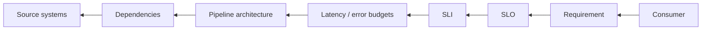

### Plain-English explanation

This deliberately runs opposite to the normal data movement direction.

Data physically moves:

```text
source → consumer
```

Reliability requirements should often be reasoned about:

```text
consumer → source
```

---

# 189. Final Reliability Mental Model

Use this sequence:

```text
Who consumes the data?
        ↓
What decision depends on it?
        ↓
What does "usable" mean?
        ↓
How fresh must it be?
        ↓
How complete must it be?
        ↓
How accurate must it be?
        ↓
How available must it be?
        ↓
How much latency is acceptable?
        ↓
What SLI measures that?
        ↓
What SLO should we target?
        ↓
What dependencies constrain it?
        ↓
What latency budget exists?
        ↓
What error budget exists?
        ↓
What alerts are required?
        ↓
What operational response follows?
```

---

# 190. Interview Preparation — Beginner

## What is freshness?

**Answer guidance:**

Freshness measures how old the newest usable data is relative to the current or expected time.

---

## What is latency?

**Answer guidance:**

Latency measures how long data or processing takes to travel through a system.

---

## What is an SLI?

**Answer guidance:**

A Service Level Indicator is the measurable signal used to evaluate service performance.

---

## What is an SLO?

**Answer guidance:**

A Service Level Objective is the reliability target associated with an SLI.

---

## What is an SLA?

**Answer guidance:**

A Service Level Agreement is a formal or externally communicated commitment about service levels, often with escalation or consequences.

---

# 191. Interview Preparation — Intermediate

## What is the difference between freshness and latency?

**Answer guidance:**

Latency measures how long an item takes to travel. Freshness measures the age of the newest usable dataset information. They can diverge because source production, event rates, and processing behavior are different.

---

## How would you define a freshness SLO?

**Answer guidance:**

Define the dataset, freshness measurement, expected population/window, and target. Example: freshness under a defined threshold for at least a specified percentage of measurement windows.

---

## What is a latency budget?

**Answer guidance:**

It is the allocation of an end-to-end latency target across stages such as source, ingestion, transformations, and serving.

---

## Why isn't pipeline success enough?

**Answer guidance:**

A process can exit successfully while the output is stale, incomplete, inaccurate, or unavailable.

---

# 192. Interview Preparation — Advanced

## What is an error budget?

**Answer guidance:**

The acceptable amount of unreliability implied by an SLO. It helps teams balance reliability investment with delivery velocity and cost.

---

## Why can downstream reliability not exceed upstream capability?

**Answer guidance:**

A downstream system depends on upstream data. If the source is late or unavailable, the downstream system cannot reliably produce consumer-ready data earlier than the dependency allows unless it has another mechanism or source of information.

---

## How would you tier datasets?

**Answer guidance:**

Classify datasets by business consequence and apply different SLO, monitoring, alerting, support, and on-call requirements.

---

## How would you decide whether a dataset needs a strict SLO?

**Answer guidance:**

Start with consumer consequence, business criticality, user expectations, dependency capabilities, and cost of failure.

---

# 193. Interview Preparation — Architecture

## How would you define SLOs for a critical Gold dataset?

Discuss:

```text
consumer
business impact
freshness
completeness
accuracy
availability
latency
population
window
dependencies
owner
tier
```

---

## How would you divide a 60-minute target?

Create:

```text
source
ingestion
processing
serving
buffer
```

Ensure:

```text
sum = 60 minutes
```

Then justify the allocations.

---

## What if an upstream source repeatedly consumes the latency budget?

Possible reasoning:

- confirm evidence
- measure source delivery
- negotiate the upstream contract
- reduce dependency sensitivity
- redesign processing
- add buffering or precomputation
- revisit the consumer SLO

Do not assume one universal fix.

---

## How do you prevent best-effort datasets from consuming critical-dataset effort?

Use tiering and differentiated:

- SLOs
- monitoring
- alerting
- support
- on-call expectations

---

# 194. Interview Preparation — AI / ML

## What reliability properties matter for a training dataset?

Likely:

- completeness
- accuracy
- reproducibility
- schedule predictability
- version awareness

---

## How would you think about freshness for an ML feature pipeline?

Start with whether the model decision depends on current information and define the maximum acceptable age.

---

## What reliability requirements might an RAG index have?

Potentially:

- approved-document freshness
- indexing latency
- document-version correctness
- retrieval availability
- metadata correctness

---

# 195. Self-Explanation Test

# Explain This to a New Teammate

Without looking at notes, explain:

1. Who is a data consumer?
2. What is freshness?
3. What is latency?
4. Why are freshness and latency different?
5. What is completeness?
6. What is accuracy?
7. What is availability?
8. What is an SLI?
9. What is an SLO?
10. What is an SLA?
11. How do they relate?
12. What is a latency budget?
13. What is an error budget?
14. Why do upstream dependencies matter?
15. Why do datasets need tiers?
16. Why can a successful pipeline still violate an SLO?
17. How would you write a freshness SLO for a finance dataset?
18. How would you explain a 60-minute latency budget?
19. How would you respond when a source violates its delivery expectation?

---

# 196. Required Self-Explanation Examples

Explain one banking example:

```text
Source
→ ingestion
→ analytical dataset
→ regulatory consumer
```

Explain:

- freshness
- completeness
- accuracy
- deadline
- dependency
- SLO

Then explain one e-commerce example:

```text
Orders/events
→ analytical data
→ operations dashboard
```

Explain:

- freshness
- latency
- availability
- consumer impact

---

# 197. Final Project Exercise

> **Design reliability requirements for a multi-consumer analytical platform.**

Scenario:

A company provides:

```text
daily finance reporting
operations dashboards
fraud detection
ML training
RAG document retrieval
```

Create:

```text
1. Consumer
2. Dataset
3. Business purpose
4. Tier
5. Freshness requirement
6. Latency requirement
7. Completeness requirement
8. Accuracy requirement
9. Availability requirement
10. SLI
11. SLO
12. Dependencies
13. Latency budget
14. Error budget
15. Alerting requirement
16. Ownership
17. Incident response expectation
```

Then write:

```text
Context
→ Requirements
→ SLI design
→ SLO design
→ Dependency analysis
→ Architecture considerations
→ Operational response
→ Consequences
```

---

# 198. Final Project — 60-Minute End-to-End Architecture

Assume:

```text
Consumer requirement:
Gold dataset usable within 60 minutes of the expected source event window.
```

Design a budget:

```text
Source
Ingestion
Bronze
Silver
Gold
Serving
Buffer
```

Then define:

```text
freshness SLI
latency SLI
completeness SLI
availability SLI
```

Then define:

```text
SLO
```

Then identify:

```text
upstream dependency
```

Then determine:

```text
error budget
```

Finally write:

```text
what happens when the budget is consumed.
```

---

# 199. Final Architecture Decision Exercise

Scenario:

> A 500-person company has structured business data, event data, multiple Gold datasets, an ML team, and a RAG application. Several consumers are complaining that "the data is often late," but the platform reports a 99.8% pipeline success rate.

Determine:

1. Why the current metric may be insufficient.
2. Which consumer requirements must be gathered.
3. Which SLIs should be introduced.
4. How to define SLOs.
5. How to build latency budgets.
6. How to identify upstream dependencies.
7. How to tier the datasets.
8. How to communicate SLO breaches.
9. What run metadata is needed.
10. How the platform should distinguish execution success from consumer reliability.

---

# 200. A Senior Engineer's Reliability Review

When reviewing a data product, ask:

```text
Consumer:
Who depends on this?

Business consequence:
What happens if it is late?

Freshness:
How old is acceptable?

Latency:
How quickly must events move?

Completeness:
How much missing data is acceptable?

Accuracy:
How do we know values are correct?

Availability:
Can consumers access it when needed?

SLI:
What exactly are we measuring?

SLO:
What is the target?

SLA:
Is there a formal commitment?

Dependencies:
What upstream systems constrain the target?

Budget:
How much latency / unreliability is acceptable?

Tier:
How important is this dataset?

Ownership:
Who is accountable?

Response:
What happens when the SLO is breached?
```

---

# 201. Common Architecture Mistakes

## Choosing metrics because they are easy

Example:

```text
job runtime
```

instead of:

```text
consumer freshness
```

## Defining SLOs without business context

Example:

```text
99.99%
```

because it sounds professional.

## Ignoring source dependencies

Example:

```text
downstream deadline is before source availability
```

## Treating freshness as accuracy

Example:

```text
very recent wrong data
```

## Treating pipeline success as data success

Example:

```text
job completed
but output is incomplete
```

## Giving every dataset identical operational treatment

Example:

```text
temporary analyst table
=
regulatory reporting dataset
```

from a monitoring perspective.

---

# 202. Advanced Architectural Thinking

The strongest mental model for this topic is:

```text
Data characteristics
        ↓
Workload characteristics
        ↓
Consumer requirements
        ↓
Governance / business constraints
        ↓
Team capabilities
        ↓
Cost constraints
        ↓
Dependency capabilities
        ↓
Reliability targets
        ↓
Architecture
        ↓
Operational controls
```

The architecture is not an end in itself.

It exists to satisfy requirements.

---

# 203. Reliability Review of the Whole Module

## Can the consumer requirement be stated in plain English?

If not, the SLO will likely be unclear.

## Can the SLI be calculated from evidence?

If not, it is not a useful SLI.

## Can the SLO be tested?

If not, the target is probably underspecified.

## Are dependencies understood?

If not, the SLO may be unrealistic.

## Is the dataset tier explicit?

If not, operational effort may be misallocated.

## Is there an error budget?

If not, reliability trade-offs may remain implicit.

## Is there a latency budget?

If not, end-to-end requirements may be disconnected from pipeline stages.

---

# 204. Topic 08 Mental Model

Do not memorize only:

```text
SLI = measurement
SLO = target
SLA = agreement
```

Instead retain:

```text
I understand who consumes data.

I understand that consumers have different requirements.

I understand freshness.

I understand latency.

I understand that freshness and latency are not the same.

I understand completeness.

I understand accuracy.

I understand availability.

I understand SLI.

I understand SLO.

I understand SLA.

I can turn a vague business requirement
into a measurable SLI and SLO.

I understand latency budgets.

I can divide a 60-minute requirement
across pipeline stages.

I understand error budgets.

I understand why reliability cannot be infinite at zero cost.

I understand upstream dependencies.

I understand that downstream reliability
depends on upstream systems.

I understand dataset tiering.

I understand that critical datasets
deserve stronger operational guarantees.

I can create run metadata.

I can calculate freshness.

I can calculate completeness.

I can calculate latency.

I can detect SLO breaches.

I can fail a job when an SLO is violated.

I understand:

Pipeline Success
≠
Data Reliability Success

I can reason about:
freshness,
completeness,
accuracy,
availability,
and consumer impact.

I can define reliability expectations
for finance,
operations,
fraud,
ML,
and RAG.

I can negotiate an ambiguous stakeholder
requirement into a measurable SLO.

I can distinguish toy monitoring
from production observability.

I can design reliability requirements
from the consumer backward.
```

---

# 205. Official Topic 08 Checkpoint

The official roadmap checkpoint requirements are:

### 1. Explain the difference between SLI, SLO, and SLA.

Your explanation must distinguish:

```text
SLI = actual measurement
SLO = target
SLA = formal/external commitment
```

### 2. Write a measurable freshness SLO for a real dataset.

Your SLO must state:

- dataset
- metric
- population/window
- target

### 3. Split a 60-minute end-to-end latency target into a budget per stage.

Example:

```text
Source       10 min
Ingestion    10 min
Silver       15 min
Gold         15 min
Serving       5 min
Buffer        5 min
-------------------
Total        60 min
```

### 4. Explain why your SLA depends on your sources' SLAs.

Your explanation should connect:

```text
source availability
→ downstream processing
→ serving
→ consumer deadline
```

---

# 206. Additional Checkpoints

Before completing this topic, verify that you can explain:

- freshness vs latency
- completeness
- accuracy
- availability
- error budgets
- upstream dependencies
- dataset tiering
- consumer-specific SLOs
- pipeline success vs service success
- latency budgets
- population and time-window definitions
- p95/p99 basics

---

# 207. Final Learning Loop

Follow the Module 2.1 learning loop:

```text
Read
  ↓
Draw
  ↓
Relate to a real system
  ↓
Build a tiny Python version
  ↓
Break it intentionally
  ↓
Measure
  ↓
Decide
  ↓
Write the decision
  ↓
Explain aloud
```

For this topic, measure:

- freshness
- latency
- completeness
- successful vs breached runs
- expected vs actual delivery
- row counts
- maximum event timestamp
- SLO status
- dependency delays
- dataset tier

---

# 208. Break the System on Purpose

Perform all of these:

### Experiment 1

Late source.

### Experiment 2

Incomplete source.

### Experiment 3

Slow pipeline.

### Experiment 4

Multiple breaches.

### Experiment 5

Fresh but incorrect data.

### Experiment 6

Accurate but unavailable serving.

### Experiment 7

Dependency delay.

For every experiment record:

```text
What failed?
What did the SLI measure?
Which SLO was affected?
What was the consumer impact?
Which dependency was involved?
What should engineering do?
```

---

# 209. Evidence Table

After the experiments, record:

| Run | Freshness | Completeness | Run Duration | SLO Status | Failure Classification | Consumer Impact |
|---|---:|---:|---:|---|---|---|
| Healthy | actual | actual | actual | PASS/BREACH | actual | actual |
| Late | actual | actual | actual | PASS/BREACH | actual | actual |
| Incomplete | actual | actual | actual | PASS/BREACH | actual | actual |
| Slow | actual | actual | actual | PASS/BREACH | actual | actual |
| Multiple | actual | actual | actual | PASS/BREACH | actual | actual |

Use actual experimental values.

Do not copy sample numbers into your final report.

---

# 210. Final Architecture Review Exercise

Draw:

```text
Source
  ↓
Ingestion
  ↓
Bronze
  ↓
Silver
  ↓
Gold
  ↓
Serving
  ↓
Consumer
```

Overlay:

```text
Freshness
Latency
Completeness
Accuracy
Availability
SLI
SLO
Dependency
Latency budget
Error budget
Tier
Owner
Alert
```

Explain every arrow and every metric aloud.

---

# 211. Final Technical Review

Before considering the topic complete, verify:

1. Can you explain what a data consumer is?
2. Can you explain freshness?
3. Can you explain latency?
4. Can you distinguish freshness from latency?
5. Can you explain completeness?
6. Can you explain accuracy?
7. Can you explain availability?
8. Can you explain SLI?
9. Can you explain SLO?
10. Can you explain SLA?
11. Can you distinguish all three?
12. Can you write a measurable SLO?
13. Can you define the measurement population?
14. Can you define the measurement window?
15. Can you build a latency budget?
16. Can you calculate a 60-minute latency budget?
17. Can you explain error budgets?
18. Can you explain why error budgets exist?
19. Can you identify upstream dependency constraints?
20. Can you explain why a downstream promise cannot ignore source reliability?
21. Can you classify datasets by criticality?
22. Can you explain why critical datasets deserve more operational attention?
23. Can you create run metadata?
24. Can you calculate freshness?
25. Can you calculate completeness?
26. Can you calculate pipeline run duration?
27. Can you detect an SLO breach?
28. Can you produce a non-zero exit code on breach?
29. Can you explain why a successful pipeline may still fail a data SLO?
30. Can you reason about late data?
31. Can you reason about incomplete data?
32. Can you reason about inaccurate data?
33. Can you reason about unavailable data?
34. Can you define reliability expectations for finance?
35. Can you define reliability expectations for fraud?
36. Can you define reliability expectations for ML?
37. Can you define reliability expectations for RAG?
38. Can you negotiate an ambiguous stakeholder requirement into a measurable SLO?
39. Can you explain the difference between toy monitoring and production observability?
40. Does this topic prepare you for later observability and serving topics without becoming those topics?

If any answer is "no", review the corresponding section and repeat the relevant experiment.

---

# 212. Final Practical Checklist

## Consumers

- [ ] Data consumer definition
- [ ] CFO / executive reporting
- [ ] Operations dashboards
- [ ] Fraud
- [ ] ML training
- [ ] RAG
- [ ] Analysts
- [ ] Data scientists
- [ ] Applications
- [ ] Operational systems
- [ ] Regulators

## Reliability Dimensions

- [ ] Freshness
- [ ] Latency
- [ ] Completeness
- [ ] Accuracy
- [ ] Availability
- [ ] Freshness vs latency distinction

## Service Levels

- [ ] SLI
- [ ] SLO
- [ ] SLA
- [ ] Comparison
- [ ] Relationship
- [ ] Measurable SLOs
- [ ] Population
- [ ] Time window

## Reliability Architecture

- [ ] Latency budget
- [ ] 60-minute example
- [ ] Error budget
- [ ] Error-budget decision process
- [ ] Upstream dependencies
- [ ] Source SLA limitation
- [ ] Dependency chain
- [ ] Dataset tiering
- [ ] Critical / Important / Best Effort

## Python

- [ ] `freshness_check.py`
- [ ] `run_metadata.json`
- [ ] Start/end time
- [ ] Rows in/out per layer
- [ ] Gold max event timestamp
- [ ] Freshness calculation
- [ ] Completeness calculation
- [ ] Run duration calculation
- [ ] Configured SLOs
- [ ] PASS/BREACH
- [ ] Non-zero exit code
- [ ] Late-source simulation
- [ ] Incomplete-data simulation
- [ ] Slow-pipeline simulation
- [ ] Multiple-breach simulation

## Engineering

- [ ] Pipeline success vs service success
- [ ] Consumer-centric reliability
- [ ] SLO negotiation
- [ ] Dataset contracts
- [ ] Incident scenarios
- [ ] ADR exercise
- [ ] Trade-offs
- [ ] Failure classification
- [ ] Percentiles
- [ ] p95 / p99 foundation
- [ ] Production vs toy distinction

## Real World

- [ ] Banking
- [ ] E-commerce
- [ ] Ride-sharing
- [ ] Healthcare
- [ ] ML
- [ ] AI/RAG

## Learning Quality

- [ ] Beginner → intermediate → advanced
- [ ] Simple explanations
- [ ] Detailed explanations
- [ ] Coding examples
- [ ] Architecture diagrams
- [ ] Real-world examples
- [ ] Production perspective
- [ ] Trade-offs
- [ ] Common misconceptions
- [ ] Interview questions
- [ ] Self-explanation test
- [ ] Official roadmap checkpoint

---

# 213. Final Engineering Principle

> **Start with what the consumer needs, convert that requirement into measurable SLIs and realistic SLOs, allocate the latency/reliability budget across the pipeline, and operate the dataset according to its business criticality.**

This is the core lesson of Topic 08.

Do not measure whatever happens to be easy.

Measure what matters.

Do not promise whatever sounds impressive.

Promise what the consumer needs and what the architecture can realistically support.

Do not optimize every dataset equally.

Apply operational effort according to business criticality.

Do not confuse:

```text
Pipeline Success
```

with:

```text
Data Reliability Success
```

A production data engineer should be able to answer:

```text
Who depends on this data?
What do they need?
How do we measure that need?
What target do we commit to?
What dependencies constrain the target?
What happens when we miss it?
How much reliability investment is justified?
```

That is the foundation for data reliability engineering.
