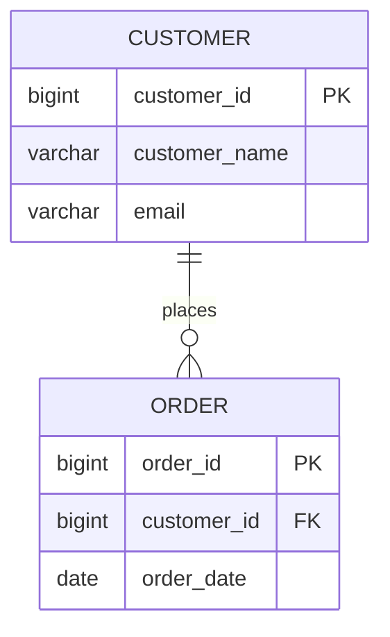
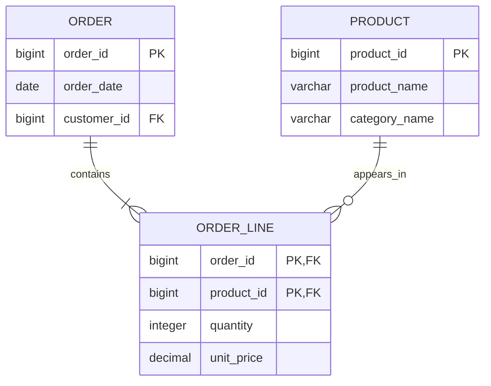
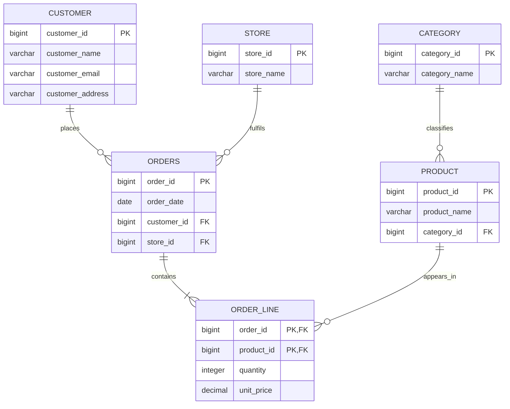
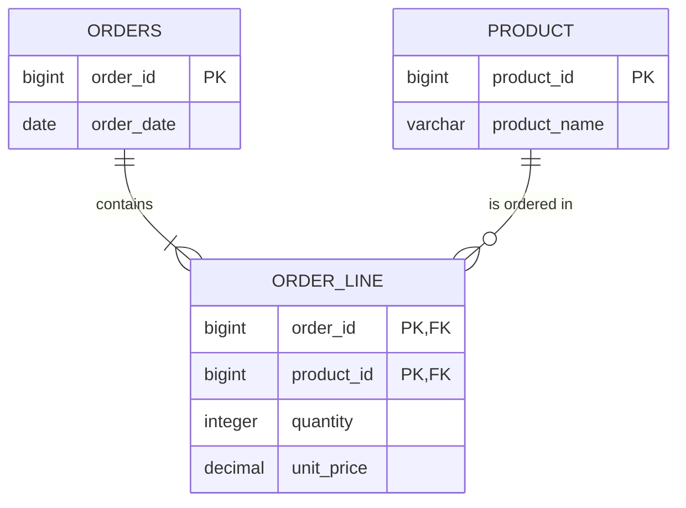

# Normalization and Denormalization

> **Stage 2 — Python for Data Engineering → Module 2.8 — Data Modelling for Analytics**
>
> **Topic 01 of 08 — Modelling Foundations**

---

## 1. Learning Objectives

By the end of this topic, you should be able to:

- explain why data modelling exists and why table shape matters;
- distinguish **conceptual**, **logical**, and **physical** data models;
- identify **entities**, **attributes**, **relationships**, and **cardinality**;
- read and draw basic **ER diagrams** using Crow's-foot notation;
- recognize **update**, **insert**, and **delete anomalies** caused by inappropriate redundancy;
- explain **functional dependencies**, determinants, dependent attributes, candidate keys, and composite keys;
- normalize a relation through:
  - **1NF — First Normal Form**,
  - **2NF — Second Normal Form**,
  - **3NF — Third Normal Form**,
  - **BCNF — Boyce-Codd Normal Form**;
- resolve many-to-many relationships with an **associative/bridge table**;
- explain why OLTP systems tend to normalize data for consistency and write efficiency;
- explain why analytical systems often denormalize data for simpler reads and efficient scans;
- reason about the trade-offs between normalized and denormalized models instead of treating either as universally better;
- understand where normalized and denormalized representations commonly sit in a modern data platform;
- reverse-engineer an unfamiliar operational schema by inspecting keys, constraints, metadata, sample data, soft deletes, audit columns, and status columns;
- recognize normalization implications in semi-structured JSON containing repeated groups;
- implement examples using **DuckDB SQL** and small, useful **Python** programs;
- defend a normalization or denormalization decision in a production Data Engineering discussion.

### The core mental model

A good Data Engineer does not begin by asking:

> "How many tables should I create?"

A better sequence is:

```text
Business meaning
    ↓
Entities + relationships
    ↓
Functional dependencies
    ↓
Appropriate normalized representation
    ↓
Workload and consumer requirements
    ↓
Selective denormalization where justified
```

Normalization and denormalization are not competitions. They are modelling techniques used for different priorities.

---

## 2. Prerequisites

This topic assumes that you have already encountered the following ideas in earlier parts of the roadmap:

| Prior knowledge | Earlier area | How it connects here |
|---|---|---|
| State modelling and decomposition | Stage 1 — Module 1.1 | A database model decomposes a business domain into entities and relationships. |
| Dataclasses and data models | Stage 1 — Module 1.8 | The same modelling discipline applies at table level. |
| OLTP vs OLAP | Stage 2 — Module 2.1 | Operational systems and analytical systems optimize for different workloads. |
| Medallion architecture | Stage 2 — Module 2.1 | Different platform layers can intentionally use different representations. |
| Join cardinality | Stage 2 — Module 2.3 | Normalization often creates joins; understanding one-to-many and many-to-many relationships prevents row multiplication. |
| Nested data and flatten/explode | Stage 2 — Module 2.5 | JSON arrays and repeated groups often need a relational design decision. |
| SQL joins, constraints, windows, and SCD Type 1/2 implementation | Stage 2 — Module 2.6 | SQL mechanics are already learned; this topic focuses on modelling decisions. |
| Python ingestion and metadata tables | Stage 2 — Module 2.7 | Python can generate realistic source data and load the structures designed here. |

Earlier you learned that join cardinality affects row counts. Here we connect that idea to modelling:

- if one customer can place many orders, `customers → orders` is one-to-many;
- if an order can contain many products and a product can appear in many orders, the relationship is many-to-many;
- if you model that relationship carelessly, joins can duplicate measures and create incorrect analytics.

This topic therefore adds a new question:

> **What should each table mean, and which facts should be stored together?**

---

## 3. Why Data Modelling Starts With Structure

### 3.1 A simple analogy

Imagine a warehouse for physical goods.

You could put:

```text
Customer: Asha
Address: Kolkata
Product: Laptop
Category: Electronics
Quantity: 1
```

on every shipping label.

That feels simple at first.

But imagine 50,000 orders from Asha. Her address now appears on thousands of records.

When she moves:

```text
old address → new address
```

you have to find every copy of the old address and update it correctly.

Now compare that with a physical warehouse inventory system that stores:

```text
CUSTOMER
--------
customer_id
name
address
```

once, and stores orders separately:

```text
ORDER
-----
order_id
customer_id
order_date
```

The second design has more structure, but the repeated fact has one clear home.

That is the central intuition behind normalization.

### 3.2 Why databases need structure

Real businesses have facts about:

- customers;
- products;
- employees;
- stores;
- orders;
- payments;
- shipments;
- accounts;
- devices;
- subscriptions.

Those facts are related.

Without an explicit structure, the system must rely on repeated values, application assumptions, or undocumented conventions.

A data model makes those rules visible.

For example:

```text
Customer
  └── places
        └── Order
              └── contains
                    └── Product
```

The model tells us:

- who the entities are;
- what a row represents;
- which entity owns an attribute;
- how entities relate;
- which identifiers connect them.

### 3.3 Why repeated information causes problems

Duplication is not automatically wrong.

For example, storing a denormalized customer name in an analytics table can be intentional.

The problem is **inappropriate redundancy**:

> The same business fact is stored in multiple places without a controlled reason for those copies to stay consistent.

This can produce:

- contradictory values;
- unnecessary updates;
- impossible inserts;
- accidental data loss;
- larger write surfaces;
- difficult integrity enforcement.

### 3.4 Why Data Engineers need to understand source-data shape

A Data Engineer frequently receives a request such as:

> "Please ingest the orders database and make the data available for analytics."

That request sounds like an ingestion problem.

It is also a modelling problem.

You need to understand:

```text
Which table is the source of truth?
What identifies a customer?
Which columns describe an order?
Which rows are order lines?
Which relationships are one-to-many?
Which rows are deleted logically but not physically?
Which attributes are copied from another entity?
```

If you miss those questions, the pipeline can run successfully while producing incorrect business data.

### 3.5 Why this is foundational for later analytical modelling

Later topics build analytical models from source structures.

Before you design facts and dimensions, you need to be able to look at a normalized source and say:

> "This source has a customer entity, an order entity, an order-line relationship, and a product entity. These attributes belong to different business concepts."

The sequence is:

```text
Understand source structure
        ↓
Understand dependencies
        ↓
Normalize where appropriate
        ↓
Understand workload
        ↓
Denormalize deliberately for analytics
```

---

## 4. The Three Levels of Data Modelling

A common beginner mistake is treating "the schema" as a single thing.

Professional modelling usually separates decisions into three levels.

```text
Business idea
    ↓
Conceptual model
    ↓
Logical model
    ↓
Physical model
    ↓
Database implementation
```

### 4.1 Conceptual Model

#### What is it?

A **conceptual model** describes the important business concepts and how they relate.

It answers:

> "What exists in the business domain?"

Example:

```text
Customer
Order
Product
Store
```

and:

```text
Customer places Order
Order contains Product
Store fulfils Order
```

#### Purpose

The purpose is to establish shared business understanding before getting lost in implementation details.

#### Example

For an e-commerce business:

```text
Customer
    |
    | places
    v
Order
    |
    | contains
    v
Product
```

#### Decisions made

At this level you decide:

- what the important entities are;
- which high-level relationships exist;
- what business terms mean.

#### Decisions intentionally postponed

You usually do not decide yet:

- exact SQL data types;
- indexes;
- partitioning;
- file layout;
- compression;
- hash algorithms;
- engine-specific physical optimizations.

### 4.2 Logical Model

#### What is it?

The **logical model** turns business concepts into a database-oriented structure without tying the design to one specific physical engine.

It answers:

> "What relations, keys, attributes, and relationships represent the business?"

Example:

```text
CUSTOMER
--------
customer_id PK
customer_name
email

ORDER
-----
order_id PK
customer_id FK
order_date

PRODUCT
-------
product_id PK
product_name
category
```

#### Purpose

The logical model makes dependencies and relationships precise.

#### Decisions made

You decide:

- table/relation boundaries;
- primary keys;
- foreign keys;
- attributes;
- relationships;
- normalization structure;
- nullability intent;
- many-to-many resolution.

#### Decisions postponed

You may still postpone:

- index implementation;
- partitioning;
- clustering;
- storage format;
- compression;
- engine-specific execution strategies.

### 4.3 Physical Model

#### What is it?

The **physical model** describes how the logical model is implemented in a specific technology.

It answers:

> "How will this actually be stored and executed?"

For a concrete database, you might choose:

```sql
CREATE TABLE customer (
    customer_id BIGINT PRIMARY KEY,
    customer_name VARCHAR NOT NULL,
    email VARCHAR NOT NULL
);
```

Then you may decide:

- index definitions;
- partitioning;
- sort keys;
- clustering;
- file format;
- compression;
- storage locations;
- engine-specific data types.

### 4.4 Relationship between the three levels

The levels are not independent.

```text
CONCEPTUAL
Customer places Order
        |
        v
LOGICAL
CUSTOMER(customer_id, ...)
ORDER(order_id, customer_id, ...)
        |
        v
PHYSICAL
DuckDB/PostgreSQL table definitions,
types, constraints, indexes/storage choices
```

A physical implementation should still preserve the business meaning defined earlier.

### 4.5 Compact comparison

| Level | Main question | Focus | Typical output |
|---|---|---|---|
| Conceptual | What exists? | Business concepts | High-level ER/domain diagram |
| Logical | How are concepts represented? | Entities, attributes, keys, relationships | Logical schema |
| Physical | How is it implemented? | Types, constraints, indexes, storage | DDL and engine-specific design |

### 4.6 Short exercise

Identify the level:

1. "A customer can place many orders."  
2. `ORDER.customer_id` references `CUSTOMER.customer_id`.  
3. Create an index on `orders(customer_id, order_date)`.  

**Answer**

1. Conceptual.  
2. Logical.  
3. Physical.

---

## 5. Entities, Attributes, Relationships, and Cardinality

### 5.1 Entity

An **entity** is a distinct business concept that you need to represent.

Examples:

- Customer
- Order
- Product
- Employee
- Store

A table often represents an entity, but "entity" is a modelling concept and should not be confused with "table" too early.

### 5.2 Attribute

An **attribute** describes an entity.

For a customer:

```text
Customer
--------
customer_id
name
email
address
signup_date
```

Here:

- `Customer` is the entity;
- `customer_id`, `name`, `email`, and so on are attributes.

### 5.3 Relationship

A **relationship** describes how two entities are connected.

Examples:

```text
Customer places Order
Order contains Product
Store fulfils Order
```

### 5.4 Cardinality

**Cardinality** describes how many instances of one entity can be associated with another.

The three core patterns are:

```text
1:1    one-to-one
1:N    one-to-many
N:M    many-to-many
```

### 5.5 One-to-one

Example:

```text
CUSTOMER  1 ───── 0..1  CUSTOMER_PROFILE
```

A customer might have zero or one profile row.

This can be useful when:

- the optional attributes are sensitive;
- a subsystem owns the second entity;
- lifecycle or access boundaries differ.

Do not assume every one-to-one relationship must be split. The split should have a reason.

### 5.6 One-to-many

Example:

```text
CUSTOMER  1 ───── N  ORDER
```

One customer can place many orders.

A typical relational representation is:

```text
CUSTOMER
customer_id PK

ORDER
order_id PK
customer_id FK → CUSTOMER.customer_id
```

The foreign key goes on the **many** side.

### 5.7 Many-to-many

Consider:

```text
ORDER  N ───── M  PRODUCT
```

An order can contain multiple products.

A product can appear in multiple orders.

A single foreign key from `order` to `product` is not enough to represent all relationships.

Instead:

```text
ORDER
order_id

ORDER_LINE
order_id
product_id
quantity
unit_price

PRODUCT
product_id
```

Now:

```text
ORDER  1 ───── N  ORDER_LINE
PRODUCT 1 ───── N ORDER_LINE
```

The relationship between `ORDER` and `PRODUCT` is represented through `ORDER_LINE`.

### 5.8 Why Order Line is needed

Suppose:

```text
Order 1001 contains:
- Laptop
- Mouse
- Keyboard
```

We need a separate row for each ordered product because each relationship has its own attributes:

```text
order_id | product_id | quantity | unit_price
---------+------------+----------+-----------
1001     | 10         | 1        | 900
1001     | 11         | 2        | 25
1001     | 12         | 1        | 60
```

`quantity` belongs to the relationship:

> "This order contains this product at this quantity."

That is an important modelling idea:

> Some attributes describe an entity; others describe the relationship between entities.

### 5.9 Short exercise

For each statement, identify the likely cardinality:

1. A country has many customers.  
2. A customer has one current billing profile.  
3. A product can appear in many orders and an order can contain many products.

**Answer**

1. One-to-many.  
2. One-to-one (possibly optional).  
3. Many-to-many, usually resolved using `order_line`.

---

## 6. ER Diagrams and Crow's-Foot Notation

An **Entity-Relationship (ER) diagram** shows:

- entities;
- attributes;
- primary keys;
- foreign keys;
- relationships;
- cardinality;
- sometimes optionality.

### 6.1 Simple Customer → Order relationship



#### Reading the diagram

`CUSTOMER ||--o{ ORDER` means:

- `||` at the customer side: one customer instance;
- `o{` at the order side: zero or many orders;
- relationship label: `places`.

So:

```text
One customer → zero or many orders
```

### 6.2 Order ↔ Product resolved through Order Line



#### Read it from left to right

```text
ORDER
  |
  | one order contains one or many lines
  v
ORDER_LINE
  ^
  | a product can appear in zero or many lines
  |
PRODUCT
```

`ORDER_LINE` is the associative entity.

It allows both sides to participate in the relationship many times.

### 6.3 Crow's-foot notation symbols

A useful mental reference:

| Symbol | Meaning |
|---|---|
| `||` | exactly one |
| `o|` | zero or one |
| `|{` | one or many |
| `o{` | zero or many |

For example:

```text
CUSTOMER ||--o{ ORDER
```

means:

> A customer can have zero or many orders, and every order belongs to one customer under this model.

### 6.4 Optional vs mandatory

Consider:

```text
CUSTOMER ||--o{ ORDER
```

The `o` means zero is allowed on the order side.

If the business rule requires every customer to place at least one order before being considered an active customer, the conceptual meaning might be different. The database should reflect the actual rule rather than a convenient diagram.

### 6.5 Why ER diagrams matter in production

A schema can contain hundreds of tables.

An ER diagram helps you see:

- dependency paths;
- join paths;
- ownership of attributes;
- cardinality;
- accidental complexity.

For a Data Engineer, an ER diagram is often the fastest bridge between:

```text
source database
```

and:

```text
pipeline design
```

---

## 7. What Goes Wrong Without Normalization

We will deliberately build a bad table.

### 7.1 The flat representation

Suppose an e-commerce source gives us:

```text
sales_flat
```

with columns:

| Column | Meaning |
|---|---|
| `order_id` | order identifier |
| `order_date` | order date |
| `customer_id` | customer identifier |
| `customer_name` | customer name |
| `customer_email` | customer email |
| `customer_address` | customer address |
| `product_id` | product identifier |
| `product_name` | product name |
| `category_name` | product category |
| `quantity` | quantity ordered |
| `unit_price` | price per unit |
| `store_id` | store identifier |
| `store_name` | store name |

Example rows:

| order_id | order_date | customer_id | customer_name | customer_email | customer_address | product_id | product_name | category_name | quantity | unit_price | store_id | store_name |
|---:|---|---:|---|---|---|---:|---|---|---:|---:|---:|---|
| 1001 | 2026-09-01 | 42 | Asha | asha@example.com | Kolkata | 10 | Laptop | Electronics | 1 | 900.00 | 7 | Kolkata Store |
| 1001 | 2026-09-01 | 42 | Asha | asha@example.com | Kolkata | 11 | Mouse | Electronics | 2 | 25.00 | 7 | Kolkata Store |
| 1002 | 2026-09-02 | 42 | Asha | asha@example.com | Kolkata | 12 | Keyboard | Electronics | 1 | 60.00 | 7 | Kolkata Store |
| 1003 | 2026-09-03 | 99 | Ravi | ravi@example.com | Delhi | 13 | Desk | Furniture | 1 | 300.00 | 9 | Delhi Store |

Notice the repeated facts:

```text
Asha's name
Asha's email
Asha's address
Kolkata Store
Electronics
```

These values may be repeated across many rows.

### 7.2 Repetition is a modelling signal

Ask:

> Does this value describe this specific order line, or does it describe another entity?

For example:

```text
customer_name
```

describes the customer.

It does not describe an individual order line.

Likewise:

```text
store_name
```

describes a store.

That distinction is the starting point for normalization.

---

## 8. The Three Classic Data Anomalies

Normalization is not primarily about "making more tables."

It is about avoiding bad dependency and redundancy patterns that cause anomalies.

---

### 8.1 Update Anomaly

Suppose Asha's address changes:

```text
Kolkata
→
Bengaluru
```

Her address appears on three order rows.

A buggy update changes only two:

| order_id | customer_id | customer_address |
|---:|---:|---|
| 1001 | 42 | Bengaluru |
| 1002 | 42 | Bengaluru |
| 1003 | 42 | Kolkata |

Now the database contains contradictory information about the same customer.

#### SQL demonstration

```sql
CREATE TABLE sales_flat_update_demo (
    order_id INTEGER,
    customer_id INTEGER,
    customer_name VARCHAR,
    customer_address VARCHAR,
    product_id INTEGER
);

INSERT INTO sales_flat_update_demo VALUES
    (1001, 42, 'Asha', 'Kolkata', 10),
    (1002, 42, 'Asha', 'Kolkata', 11),
    (1003, 42, 'Asha', 'Kolkata', 12);
```

A partial update:

```sql
UPDATE sales_flat_update_demo
SET customer_address = 'Bengaluru'
WHERE order_id IN (1001, 1002);
```

Check:

```sql
SELECT
    customer_id,
    customer_address,
    COUNT(*) AS row_count
FROM sales_flat_update_demo
GROUP BY customer_id, customer_address
ORDER BY customer_id, customer_address;
```

Expected problem:

```text
customer_id | customer_address | row_count
------------+------------------+----------
42          | Bengaluru        | 2
42          | Kolkata          | 1
```

#### Root cause

The customer address is stored repeatedly in a table whose rows represent order lines.

The database has multiple copies of one business fact.

#### Normalized fix

Store the customer address once:

```text
CUSTOMER
--------
customer_id
customer_name
customer_address
```

and reference the customer from orders/order lines.

---

### 8.2 Insert Anomaly

Suppose a new customer signs up:

```text
customer_id = 123
name = Meera
email = meera@example.com
```

But Meera has not placed an order yet.

In a table whose entire row represents a sale, you may have no natural row in which to store:

```text
Meera
```

without inventing:

```text
order_id = ?
product_id = ?
quantity = ?
unit_price = ?
```

That is an **insert anomaly**.

The model makes unrelated order information a prerequisite for storing a customer.

#### Why this matters

You want to represent this fact independently:

> "Customer 123 exists."

That should not require:

> "Customer 123 has already bought product 10."

Normalization separates those business concepts.

---

### 8.3 Delete Anomaly

Imagine product 13 appears in exactly one order:

```text
order_id = 1003
product_id = 13
product_name = Desk
```

If you delete the last order row containing product 13, you may also lose the only stored record that:

```text
product 13 exists
product 13 is named Desk
product 13 belongs to Furniture
```

The order fact and product master fact are entangled.

That is a **delete anomaly**.

#### Root cause

The table stores multiple business concepts in the same row structure.

Deleting one fact accidentally removes another fact.

### 8.4 Summary of the three anomalies

| Anomaly | What happens | Typical root cause |
|---|---|---|
| Update | One business fact must be changed in many rows | Repeated attribute |
| Insert | Cannot store one fact without inventing another | Unrelated facts coupled together |
| Delete | Removing one fact accidentally removes another | Multiple independent facts share the same storage row |

### 8.5 The normalization response

The general strategy is:

```text
Find facts that belong to different entities
        ↓
Identify dependencies
        ↓
Separate those facts
        ↓
Connect them with keys
```

---

## 9. Functional Dependencies

Functional dependencies are the reasoning engine behind normalization.

If you understand functional dependencies, normal forms become much easier.

### 9.1 The intuitive definition

Ask:

> **If I know X, can I uniquely determine Y?**

If the answer is yes, we can write:

```text
X → Y
```

Read this as:

> X functionally determines Y.

### 9.2 Example

Suppose:

```text
customer_id = 42
```

always identifies one customer name.

Then:

```text
customer_id → customer_name
```

If customer 42 has exactly one current email in the relation:

```text
customer_id → customer_email
```

### 9.3 Determinant

The left side is the **determinant**.

In:

```text
customer_id → customer_name
```

`customer_id` is the determinant.

### 9.4 Dependent attribute

The right side is the dependent attribute.

Here:

```text
customer_name
```

is functionally dependent on `customer_id`.

### 9.5 Candidate key

A **candidate key** is a minimal set of attributes that uniquely identifies a row.

Example:

```text
CUSTOMER(customer_id, name, email)
```

If `customer_id` uniquely identifies each customer:

```text
customer_id
```

is a candidate key.

If `email` is also guaranteed unique:

```text
email
```

may also be a candidate key.

The relation may have multiple candidate keys but normally designates one primary key.

### 9.6 Composite key

A key can contain more than one attribute.

For order lines:

```text
(order_id, product_id)
```

may identify the relationship row.

Then:

```text
(order_id, product_id) → quantity
(order_id, product_id) → unit_price
```

### 9.7 Full dependency

If an attribute depends on the whole composite key:

```text
(order_id, product_id) → quantity
```

then both parts are required to determine `quantity`.

### 9.8 Partial dependency

If:

```text
product_id → product_name
```

then:

```text
(order_id, product_id) → product_name
```

is also true, but `product_name` does not depend on the entire composite key.

It depends only on:

```text
product_id
```

That is a **partial dependency** and becomes important for 2NF.

### 9.9 Transitive dependency

Suppose:

```text
order_id → customer_id
customer_id → customer_name
```

Therefore:

```text
order_id → customer_name
```

But the dependency passes through another non-key attribute:

```text
order_id
  ↓
customer_id
  ↓
customer_name
```

This is the core idea of a **transitive dependency** and becomes important for 3NF.

### 9.10 Valid vs invalid functional dependency examples

Suppose:

```text
product_id | product_name | category_id
-----------+--------------+-----------
10         | Laptop       | 5
11         | Mouse        | 5
```

Likely valid:

```text
product_id → product_name
product_id → category_id
```

Potentially invalid:

```text
category_id → product_name
```

because category 5 contains multiple products.

Another invalid dependency:

```text
product_name → product_id
```

may fail if product names are not unique.

The word **may** matters. Functional dependencies are properties of business rules and data semantics, not assumptions based only on column names.

### 9.11 Why functional dependencies matter

Normalization asks you to separate attributes according to the dependencies that govern them.

In simplified form:

```text
1NF → remove repeating/non-atomic structures
2NF → remove partial dependencies
3NF → remove transitive dependencies
BCNF → ensure determinants are candidate keys
```

---

## 10. Functional Dependency Exercise

Consider this relation:

```text
ORDER_LINE_RAW
--------------------------------------------------------
order_id
product_id
product_name
category_id
category_name
quantity
unit_price
```

Assume:

- `(order_id, product_id)` identifies a row;
- `product_id` identifies one product;
- `category_id` identifies one category.

### Questions

1. What is the candidate key?
2. Which attributes depend on the full composite key?
3. Which attributes depend only on `product_id`?
4. Which attributes depend on `category_id`?
5. Which functional dependencies suggest a normalization problem?

### Solution

Candidate key:

```text
(order_id, product_id)
```

Full-key dependencies:

```text
(order_id, product_id) → quantity
(order_id, product_id) → unit_price
```

Product dependencies:

```text
product_id → product_name
product_id → category_id
```

Category dependency:

```text
category_id → category_name
```

This tells us that:

```text
product_name
category_id
category_name
```

do not belong in the same relation under the normalization objective of this example.

The dependency chain is:

```text
(order_id, product_id)
          |
          +--> quantity
          +--> unit_price

product_id
   |
   +--> product_name
   +--> category_id
              |
              +--> category_name
```

That chain predicts the decomposition we will build.

---

## 11. First Normal Form — 1NF

### 11.1 What is 1NF?

**First Normal Form (1NF)** requires a relational representation in which each cell holds one value appropriate to the relation's design, with no repeating groups.

A useful beginner rule is:

> **One row represents one occurrence, and one column position holds one value for that occurrence.**

### 11.2 Atomic values

Suppose we have:

| order_id | customer | products |
|---:|---|---|
| 1001 | Asha | `["Laptop", "Mouse", "Keyboard"]` |

The `products` column contains a collection.

In a simple relational representation, that is a repeated group.

We can instead represent:

| order_id | product |
|---:|---|
| 1001 | Laptop |
| 1001 | Mouse |
| 1001 | Keyboard |

Now every row represents one order-product occurrence.

### 11.3 "Atomic" does not mean splitting everything

Atomicity is **contextual to the relational design**.

For example:

```text
"Kolkata, West Bengal, India"
```

does not automatically violate 1NF because it is a multi-word string.

The question is:

> Does the relation need independent attributes such as city, state, and country for its intended semantics?

If yes, separate attributes may be appropriate.

Do not interpret atomicity as:

```text
"India" → "I", "n", "d", "i", "a"
```

That is not the point.

### 11.4 A practical 1NF transformation

Bad:

| order_id | products |
|---:|---|
| 1001 | Laptop, Mouse, Keyboard |

Better:

| order_id | product_id |
|---:|---:|
| 1001 | 10 |
| 1001 | 11 |
| 1001 | 12 |

### 11.5 DuckDB example

```sql
CREATE TABLE orders_with_list (
    order_id INTEGER,
    customer_name VARCHAR,
    products VARCHAR
);

INSERT INTO orders_with_list VALUES
    (1001, 'Asha', 'Laptop,Mouse,Keyboard');
```

This representation forces downstream consumers to parse the list.

A normalized relational representation:

```sql
CREATE TABLE order_item (
    order_id INTEGER,
    product_id INTEGER
);

INSERT INTO order_item VALUES
    (1001, 10),
    (1001, 11),
    (1001, 12);
```

Now the repeated group is represented as multiple rows.

### 11.6 When a list/array can still be valid

Modern analytical systems support arrays, structs, and JSON.

That does not mean 1NF is irrelevant.

Instead, ask:

- Is the nested structure the native source representation?
- Are consumers expected to work with the nested object as one unit?
- Does the engine support the access pattern efficiently?
- Does the repeated group have independent lifecycle or relationships?
- Is the nested form the canonical model, or merely a convenient transport format?

Later in this topic we will return to JSON and repeated groups.

---

## 12. Second Normal Form — 2NF

### 12.1 What is 2NF?

A relation is in **Second Normal Form (2NF)** when it is in 1NF and every non-key attribute is fully functionally dependent on the whole candidate key.

This matters primarily when a relation has a **composite candidate key**.

### 12.2 The order-line example

Suppose:

```text
ORDER_LINE_RAW
------------------------------------------------
order_id
product_id
product_name
quantity
unit_price
```

Candidate key:

```text
(order_id, product_id)
```

Functional dependencies:

```text
(order_id, product_id) → quantity
(order_id, product_id) → unit_price

product_id → product_name
```

The problem is:

```text
product_name
```

depends only on:

```text
product_id
```

not on the complete composite key.

### 12.3 Full vs partial dependency

#### Full dependency

```text
(order_id, product_id) → quantity
```

You need the order and the product to determine the quantity of that product within that order.

#### Partial dependency

```text
product_id → product_name
```

You only need the product to determine its name.

So:

```text
(order_id, product_id) → product_name
```

is true but not a full-key dependency.

### 12.4 Decomposition

Separate:

```text
PRODUCT
-------
product_id PK
product_name
```

from:

```text
ORDER_LINE
----------
order_id PK, FK
product_id PK, FK
quantity
unit_price
```

### 12.5 DuckDB implementation

```sql
CREATE TABLE product (
    product_id INTEGER PRIMARY KEY,
    product_name VARCHAR NOT NULL
);

CREATE TABLE order_line (
    order_id INTEGER NOT NULL,
    product_id INTEGER NOT NULL,
    quantity INTEGER NOT NULL,
    unit_price DECIMAL(12, 2) NOT NULL,
    PRIMARY KEY (order_id, product_id),
    FOREIGN KEY (product_id) REFERENCES product(product_id)
);

INSERT INTO product VALUES
    (10, 'Laptop'),
    (11, 'Mouse'),
    (12, 'Keyboard');

INSERT INTO order_line VALUES
    (1001, 10, 1, 900.00),
    (1001, 11, 2, 25.00),
    (1001, 12, 1, 60.00);
```

Query:

```sql
SELECT
    ol.order_id,
    ol.product_id,
    p.product_name,
    ol.quantity,
    ol.unit_price
FROM order_line AS ol
JOIN product AS p
  ON p.product_id = ol.product_id
ORDER BY ol.order_id, ol.product_id;
```

The join reconstructs the descriptive information without storing the product name on every order-line row.

### 12.6 What 2NF is not

2NF is not:

> "Remove duplicate columns."

It is:

> "Remove attributes that depend on only part of a composite candidate key."

If a relation's candidate key is a single attribute, partial dependency on part of the key cannot exist.

That is why a relation with only a single-column key is automatically free of partial dependency for 2NF purposes, assuming 1NF holds.

### 12.7 Short exercise

Given:

```text
(order_id, product_id, quantity, product_name, order_date)
```

and:

```text
(order_id, product_id) → quantity
product_id → product_name
order_id → order_date
```

Which attributes have partial dependencies?

**Answer**

Both:

```text
product_name
order_date
```

because they depend on only one component of the composite key.

They should be separated into product/order relations.

---

## 13. Third Normal Form — 3NF

### 13.1 What is 3NF?

A relation is in **Third Normal Form (3NF)** when it is in 2NF and does not contain inappropriate transitive dependencies among non-key attributes.

An accessible rule is:

> **A non-key attribute should describe the key, the whole key, and nothing but the key.**

That sentence is useful as a mental shortcut, although formal definitions are more precise.

### 13.2 Example

Suppose:

```text
ORDER
----------------------------------------------------
order_id
customer_id
customer_name
```

Dependencies:

```text
order_id → customer_id
customer_id → customer_name
```

Therefore:

```text
order_id → customer_name
```

through:

```text
order_id → customer_id → customer_name
```

`customer_name` describes the customer, not the order.

### 13.3 Decomposition

Create:

```text
CUSTOMER
--------
customer_id PK
customer_name
```

and:

```text
ORDER
-----
order_id PK
customer_id FK
```

Now:

```text
customer_id → customer_name
```

belongs to `CUSTOMER`.

### 13.4 DuckDB before and after

Bad representation:

```sql
CREATE TABLE order_3nf_bad (
    order_id INTEGER PRIMARY KEY,
    customer_id INTEGER,
    customer_name VARCHAR
);

INSERT INTO order_3nf_bad VALUES
    (1001, 42, 'Asha'),
    (1002, 42, 'Asha'),
    (1003, 99, 'Ravi');
```

Normalized design:

```sql
CREATE TABLE customer (
    customer_id INTEGER PRIMARY KEY,
    customer_name VARCHAR NOT NULL
);

CREATE TABLE customer_order (
    order_id INTEGER PRIMARY KEY,
    customer_id INTEGER NOT NULL,
    FOREIGN KEY (customer_id) REFERENCES customer(customer_id)
);

INSERT INTO customer VALUES
    (42, 'Asha'),
    (99, 'Ravi');

INSERT INTO customer_order VALUES
    (1001, 42),
    (1002, 42),
    (1003, 99);
```

Reconstruct:

```sql
SELECT
    o.order_id,
    o.customer_id,
    c.customer_name
FROM customer_order AS o
JOIN customer AS c
  ON c.customer_id = o.customer_id
ORDER BY o.order_id;
```

### 13.5 Practical meaning

The decomposition gives each business fact a clear owner.

```text
Customer name belongs to Customer.
Order date belongs to Order.
Product name belongs to Product.
Quantity belongs to Order Line.
```

That makes updates more controlled.

---

## 14. BCNF

### 14.1 What is BCNF?

**Boyce-Codd Normal Form (BCNF)** is stricter than 3NF.

A commonly used formal statement is:

> For every non-trivial functional dependency `X → Y`, `X` must be a candidate key.

The important phrase is:

```text
Every determinant must be a candidate key.
```

### 14.2 Why BCNF exists

3NF permits some dependency patterns that BCNF rejects.

BCNF addresses cases where a determinant is not itself a candidate key.

### 14.3 Concrete example

Consider:

```text
TEACHING
------------------------------------------------
student_id
course_id
instructor_id
```

Assume these business rules:

1. A student can take a course from one instructor in this relation.
2. Each instructor teaches only one course.
3. A student can take many courses.

Suppose:

```text
(student_id, course_id) → instructor_id
instructor_id → course_id
```

Candidate key:

```text
(student_id, course_id)
```

Potentially also:

```text
(student_id, instructor_id)
```

because the instructor determines the course.

But:

```text
instructor_id → course_id
```

has determinant:

```text
instructor_id
```

which is not a candidate key of the whole relation.

Therefore the relation can violate BCNF.

### 14.4 Decomposition

Split into:

```text
INSTRUCTOR_COURSE
-----------------
instructor_id PK
course_id
```

and:

```text
STUDENT_INSTRUCTOR
------------------
student_id
instructor_id
PK(student_id, instructor_id)
```

The exact decomposition must follow the actual business dependencies. BCNF is not a pattern-matching exercise based only on column names.

### 14.5 Why BCNF is more advanced

BCNF problems appear when:

- several candidate keys overlap;
- business rules create non-obvious dependencies;
- relationships are encoded in a single relation;
- an attribute that looks descriptive actually determines another attribute.

### 14.6 When Data Engineers encounter BCNF in practice

You may see BCNF issues in:

- scheduling systems;
- assignment/teaching relationships;
- product or organizational mappings;
- policy tables;
- systems where one business identifier determines another relationship.

Most production Data Engineering work does not begin with:

> "Let's maximize normal form."

Instead, the engineering question is:

> "What dependencies exist, what anomalies must be prevented, and what model best serves the system?"

### 14.7 Normalization is not a purity contest

A higher normal form is not automatically the business objective.

A model can be mathematically elegant but operationally awkward.

In production, consider:

```text
Correctness
Consistency
Write workload
Read workload
Latency
Consumer simplicity
Operational complexity
Engine capabilities
```

BCNF is a tool for reasoning about dependencies, not a commandment that every table must always follow.

---

## 15. Normalizing a Realistic Table Step by Step

We will now take a messy retail relation and progressively improve it.

### 15.1 Starting table

Assume one row per order line:

```text
SALES_FLAT
```

Columns:

```text
order_id
order_date
customer_id
customer_name
customer_email
customer_address
product_id
product_name
category_id
category_name
quantity
unit_price
store_id
store_name
```

Sample data:

| order_id | order_date | customer_id | customer_name | customer_email | customer_address | product_id | product_name | category_id | category_name | quantity | unit_price | store_id | store_name |
|---:|---|---:|---|---|---|---:|---|---:|---|---:|---:|---:|---|
| 1001 | 2026-09-01 | 42 | Asha | asha@example.com | Kolkata | 10 | Laptop | 5 | Electronics | 1 | 900.00 | 7 | Kolkata Store |
| 1001 | 2026-09-01 | 42 | Asha | asha@example.com | Kolkata | 11 | Mouse | 5 | Electronics | 2 | 25.00 | 7 | Kolkata Store |
| 1002 | 2026-09-02 | 42 | Asha | asha@example.com | Kolkata | 10 | Laptop | 5 | Electronics | 1 | 900.00 | 7 | Kolkata Store |
| 1003 | 2026-09-03 | 99 | Ravi | ravi@example.com | Delhi | 13 | Desk | 9 | Furniture | 1 | 300.00 | 9 | Delhi Store |

### 15.2 Step 1 — Identify entities

Likely entities:

```text
Customer
Order
Product
Category
Store
Order Line
```

### 15.3 Step 2 — Identify attributes

#### Customer

```text
customer_id
customer_name
customer_email
customer_address
```

#### Order

```text
order_id
order_date
customer_id
store_id
```

#### Product

```text
product_id
product_name
category_id
```

#### Category

```text
category_id
category_name
```

#### Store

```text
store_id
store_name
```

#### Order Line

```text
order_id
product_id
quantity
unit_price
```

### 15.4 Step 3 — Identify relationships

```text
Customer 1 → many Orders
Order 1 → many Order Lines
Product 1 → many Order Lines
Category 1 → many Products
Store 1 → many Orders
```

### 15.5 Step 4 — Identify dependencies

Likely dependencies:

```text
customer_id → customer_name, customer_email, customer_address
order_id → order_date, customer_id, store_id
product_id → product_name, category_id
category_id → category_name
store_id → store_name
(order_id, product_id) → quantity, unit_price
```

### 15.6 Step 5 — Identify anomaly risk

Because customer data is repeated:

```text
customer_id → customer_name, ...
```

is represented many times.

Because category data is repeated:

```text
category_id → category_name
```

is also represented repeatedly.

The flat table mixes several entities.

---

### 15.7 Move toward 1NF

For this example, the source rows already contain one value per field.

So the original row structure can be treated as 1NF, assuming:

- no comma-separated product lists;
- no repeated product columns such as `product_1`, `product_2`, `product_3`;
- no multi-valued attributes stored in one cell.

The key issue is now not 1NF but dependency structure.

---

### 15.8 Move toward 2NF

Candidate key for the order-line relation:

```text
(order_id, product_id)
```

Attributes depending only on `order_id`:

```text
order_date
customer_id
store_id
```

Attributes depending only on `product_id`:

```text
product_name
category_id
```

Attributes depending on the full key:

```text
quantity
unit_price
```

This means the flat relation contains many partial dependencies.

Decompose into:

```text
ORDER
-----
order_id
order_date
customer_id
store_id
```

```text
PRODUCT
-------
product_id
product_name
category_id
```

```text
ORDER_LINE
----------
order_id
product_id
quantity
unit_price
```

---

### 15.9 Move toward 3NF

Now inspect:

```text
PRODUCT
-------
product_id
product_name
category_id
category_name
```

We have:

```text
product_id → category_id
category_id → category_name
```

That is a transitive dependency.

So create:

```text
CATEGORY
--------
category_id
category_name
```

and keep:

```text
PRODUCT
-------
product_id
product_name
category_id
```

Similarly:

```text
STORE
-----
store_id
store_name
```

and:

```text
CUSTOMER
--------
customer_id
customer_name
customer_email
customer_address
```

### 15.10 Resulting normalized model

```text
CUSTOMER
--------
customer_id PK
customer_name
customer_email
customer_address

ORDER
-----
order_id PK
order_date
customer_id FK
store_id FK

ORDER_LINE
----------
order_id PK, FK
product_id PK, FK
quantity
unit_price

PRODUCT
-------
product_id PK
product_name
category_id FK

CATEGORY
--------
category_id PK
category_name

STORE
-----
store_id PK
store_name
```

### 15.11 ER diagram



### 15.12 DuckDB SQL

```sql
CREATE TABLE customer (
    customer_id INTEGER PRIMARY KEY,
    customer_name VARCHAR NOT NULL,
    customer_email VARCHAR NOT NULL,
    customer_address VARCHAR
);

CREATE TABLE category (
    category_id INTEGER PRIMARY KEY,
    category_name VARCHAR NOT NULL
);

CREATE TABLE product (
    product_id INTEGER PRIMARY KEY,
    product_name VARCHAR NOT NULL,
    category_id INTEGER NOT NULL,
    FOREIGN KEY (category_id) REFERENCES category(category_id)
);

CREATE TABLE store (
    store_id INTEGER PRIMARY KEY,
    store_name VARCHAR NOT NULL
);

CREATE TABLE orders (
    order_id INTEGER PRIMARY KEY,
    order_date DATE NOT NULL,
    customer_id INTEGER NOT NULL,
    store_id INTEGER NOT NULL,
    FOREIGN KEY (customer_id) REFERENCES customer(customer_id),
    FOREIGN KEY (store_id) REFERENCES store(store_id)
);

CREATE TABLE order_line (
    order_id INTEGER NOT NULL,
    product_id INTEGER NOT NULL,
    quantity INTEGER NOT NULL,
    unit_price DECIMAL(12, 2) NOT NULL,
    PRIMARY KEY (order_id, product_id),
    FOREIGN KEY (order_id) REFERENCES orders(order_id),
    FOREIGN KEY (product_id) REFERENCES product(product_id)
);
```

Sample inserts:

```sql
INSERT INTO customer VALUES
    (42, 'Asha', 'asha@example.com', 'Kolkata'),
    (99, 'Ravi', 'ravi@example.com', 'Delhi');

INSERT INTO category VALUES
    (5, 'Electronics'),
    (9, 'Furniture');

INSERT INTO product VALUES
    (10, 'Laptop', 5),
    (11, 'Mouse', 5),
    (13, 'Desk', 9);

INSERT INTO store VALUES
    (7, 'Kolkata Store'),
    (9, 'Delhi Store');

INSERT INTO orders VALUES
    (1001, DATE '2026-09-01', 42, 7),
    (1002, DATE '2026-09-02', 42, 7),
    (1003, DATE '2026-09-03', 99, 9);

INSERT INTO order_line VALUES
    (1001, 10, 1, 900.00),
    (1001, 11, 2, 25.00),
    (1002, 10, 1, 900.00),
    (1003, 13, 1, 300.00);
```

### 15.13 What improved?

The normalized design gives each business fact a more focused home:

```text
Customer address → CUSTOMER
Order date → ORDERS
Product name → PRODUCT
Category name → CATEGORY
Store name → STORE
Quantity → ORDER_LINE
```

The model is easier to update consistently.

### 15.14 What did we not optimize for?

We did not minimize the number of joins.

A normalized model can require:

```sql
SELECT
    o.order_id,
    o.order_date,
    c.customer_name,
    p.product_name,
    cat.category_name,
    s.store_name,
    ol.quantity,
    ol.unit_price
FROM orders AS o
JOIN customer AS c
  ON c.customer_id = o.customer_id
JOIN store AS s
  ON s.store_id = o.store_id
JOIN order_line AS ol
  ON ol.order_id = o.order_id
JOIN product AS p
  ON p.product_id = ol.product_id
JOIN category AS cat
  ON cat.category_id = p.category_id;
```

That extra join complexity can be a problem for analytics consumers.

That is precisely where **denormalization** can become a deliberate analytical design choice.

---

## 16. Many-to-Many Relationships and Associative Tables

### 16.1 The problem

Consider:

```text
STUDENT ↔ COURSE
```

A student can take many courses.

A course can contain many students.

That is:

```text
N:M
```

A relational model usually resolves this using an **associative table**.

### 16.2 The associative table

```text
STUDENT
-------
student_id PK
student_name

COURSE
------
course_id PK
course_name

STUDENT_COURSE
--------------
student_id PK, FK
course_id PK, FK
enrolled_at
grade
```

The relationship table can store attributes of the relationship itself:

```text
enrolled_at
grade
status
```

### 16.3 Order-product example



`ORDER_LINE` is not just a technical workaround.

It represents a real business relationship:

> "Product X occurs in Order Y with quantity Q at price P."

### 16.4 Composite key

A common natural key for an order line is:

```text
(order_id, product_id)
```

However, whether this is truly unique depends on the business rules.

For example, if the same product can appear as separate line items for different reasons, the relationship may require another line identifier:

```text
(order_id, line_number)
```

or:

```text
order_line_id
```

The key must reflect the actual semantics.

### 16.5 Entity table vs relationship table

| Type | Represents | Example |
|---|---|---|
| Entity table | A business object/concept | `CUSTOMER`, `PRODUCT` |
| Relationship table | A connection between entities | `ORDER_LINE`, `STUDENT_COURSE` |

### 16.6 Connection to later analytical bridge tables

The idea of a relationship table reappears later in analytical modelling.

The key principle is the same:

> **Represent a relationship explicitly when one entity can associate with many instances of another.**

The later dimensional modelling topic will extend this idea; it is not necessary to learn the full dimensional bridge pattern here.

---

## 17. Why OLTP Systems Tend to Normalize

OLTP means **Online Transaction Processing**.

Typical workloads include:

```text
INSERT order
UPDATE address
CREATE customer
CHANGE product status
UPDATE payment state
```

These workloads care strongly about correct writes and transactional consistency.

### 17.1 One place to update each fact

Suppose:

```text
Asha's address = Kolkata
```

appears on 4,000 order-line rows.

An address change becomes:

```text
UPDATE 4,000 copies
```

A normalized design gives us:

```text
CUSTOMER
customer_id = 42
address = Kolkata
```

Now the business fact has one primary storage location.

### 17.2 Write efficiency

Normalization can reduce:

- repeated writes;
- duplicated data movement;
- update surfaces;
- unnecessary storage changes.

Instead of rewriting many copies of a customer attribute:

```text
one customer row
```

can change.

### 17.3 Consistency

If a fact has one controlled home, it is easier to maintain consistency.

For example:

```text
customer_id = 42
address = Bengaluru
```

does not need to be synchronized across hundreds of order rows.

### 17.4 Transactional integrity

Normalized schemas can make business rules easier to enforce through:

- primary keys;
- foreign keys;
- uniqueness;
- not-null constraints;
- transactional updates.

The database can represent:

```text
An order must reference a real customer.
An order line must reference a real order.
An order line must reference a real product.
```

### 17.5 Operational example

Customer changes address.

#### Repeated operational table

```text
customer_id | customer_name | address    | order_id
------------+---------------+------------+---------
42          | Asha          | Kolkata    | 1001
42          | Asha          | Kolkata    | 1002
42          | Asha          | Kolkata    | 1003
```

Potential work:

```text
update every matching row
```

#### Normalized design

```text
CUSTOMER
customer_id | customer_name | address
------------+---------------+----------
42          | Asha          | Kolkata
```

Update:

```sql
UPDATE customer
SET customer_address = 'Bengaluru'
WHERE customer_id = 42;
```

One row is the authoritative current representation.

### 17.6 But normalization is not universally superior

This is important.

A model is not good simply because it has more normalization.

Operational and analytical systems optimize for different goals.

A normalized OLTP design may create a more complex analytical query path.

An analytical model may intentionally repeat descriptive data because:

```text
readability
scan efficiency
BI simplicity
```

matter more than write-time deduplication.

---

## 18. Why Analytics Often Denormalizes

Analytics is usually read-heavy.

A consumer may ask:

> "What was revenue by product category, store, and month?"

A fully normalized source model may require several joins.

### 18.1 Fewer joins

Suppose an analytical table contains:

```text
order_id
order_date
customer_name
product_name
category_name
store_name
quantity
unit_price
```

The consumer can query:

```sql
SELECT
    category_name,
    SUM(quantity * unit_price) AS revenue
FROM sales_analytics
GROUP BY category_name;
```

A normalized model might need:

```text
orders
→ order_line
→ product
→ category
→ store
→ customer
```

### 18.2 Simpler queries

A denormalized representation can make business analysis easier for:

- BI users;
- analysts;
- dashboard authors;
- downstream applications.

This reduces the cognitive cost of reconstructing relationships.

### 18.3 Faster scans in columnar engines

Columnar analytical engines can scan selected columns efficiently.

Repeated descriptive attributes may be relatively inexpensive because analytical storage commonly uses:

- compression;
- encoding;
- vectorized execution;
- column pruning.

The exact performance depends on the engine, data distribution, and query.

The correct reasoning is not:

> "Denormalization is always faster."

It is:

> **Denormalization can reduce join work and simplify scan-oriented analytical workloads, subject to the engine and data shape.**

### 18.4 Compression changes the storage calculation

Suppose:

```text
category_name = Electronics
```

appears in millions of rows.

In a row-store mindset, duplication may look expensive.

In a columnar system, repeated values can compress well.

Therefore:

```text
logical redundancy ≠ proportional physical storage cost
```

But compression should be measured, not assumed.

### 18.5 Costs of analytical denormalization

Denormalization introduces trade-offs:

```text
Duplicated attributes
More storage
Refresh complexity
Potential semantic drift
More complicated rebuild logic
Harder change propagation
Risk of stale copies
```

Suppose `category_name` exists in ten downstream tables.

A category rename now requires:

```text
source change
      ↓
model refresh
      ↓
multiple copies updated
```

If one refresh is missed, different datasets can disagree.

### 18.6 Do not turn this into a dimensional-modelling tutorial

Later in Module 2.8, star schemas, facts, dimensions, and OBTs are taught in depth.

Here the goal is only to establish:

> Analytics may intentionally reshape normalized source data to optimize read-oriented workloads.

---

## 19. Normalization vs Denormalization

There is no universal winner.

The appropriate shape depends on workload and system requirements.

| Factor | More normalized | More denormalized |
|---|---|---|
| Primary workload | Write-heavy operational | Read-heavy analytical |
| Write behavior | Less repeated updates | More repeated refresh/update work |
| Read behavior | More joins may be required | Fewer joins often required |
| Redundancy | Lower | Higher |
| Consistency maintenance | Centralized facts | Multiple copies can drift |
| Storage | Often lower logically | Often higher logically; may compress well |
| Query complexity | Can be higher for consumers | Often simpler for common reads |
| BI usability | May require more modelling effort | Often easier for direct consumption |
| Analytical scan patterns | Can require more joins | Can reduce join work |
| Operational complexity | Strong transactional structure | More refresh/derivation complexity |
| Change propagation | Centralized | Must maintain copies |
| Best fit | Workloads where consistency and writes dominate | Workloads where reads and consumer simplicity dominate |

### 19.1 The wrong question

Do not ask:

> "Should our entire platform be normalized?"

Do not ask:

> "Should our entire platform be denormalized?"

Ask:

> "What representation best fits this layer and workload?"

### 19.2 The production pattern

A common architecture can deliberately contain both:

```text
Normalized operational source
        ↓
Integration representation
        ↓
Analytical model
        ↓
Consumer-oriented wide representation
```

That is not inconsistency.

It is **purposeful multiple representation**.

---

## 20. Where These Models Live in a Modern Data Platform

A simplified platform flow is:

```text
Operational / source systems
        ↓
Normalized source representation
        ↓
Integration layer
        ↓
Dimensional / analytical marts
        ↓
Wide / consumption tables
```

### 20.1 Normalized sources

Operational databases often have normalized models because they optimize for:

- transactional writes;
- consistency;
- constrained relationships;
- current operational state.

Example:

```text
customers
orders
order_items
products
```

### 20.2 Integration layer

An integration layer may preserve source relationships and histories while combining systems.

This layer may be normalized, source-aligned, or follow another explicit modelling approach.

The important idea here is:

> Do not assume that source tables should be reshaped into the final analytical form immediately.

### 20.3 Dimensional marts

Later in this module, you will learn how analytics-oriented structures organize:

- facts;
- dimensions;
- shared business concepts.

This is a form of deliberate analytical denormalization compared with many operational schemas.

### 20.4 Wide consumption tables

A downstream consumer may benefit from a pre-joined, wide representation.

For example:

```text
order_id
order_date
customer_name
product_name
category_name
store_name
quantity
unit_price
```

This can make BI or ML workflows simpler.

The important modelling principle is:

> **Different layers can represent the same business information differently because the layers have different jobs.**

### 20.5 Connection to medallion architecture

Earlier you learned the medallion pattern:

```text
Bronze → Silver → Gold
```

The exact implementation varies by organization, but the modelling lesson is:

- ingestion/storage concerns do not automatically dictate consumer shape;
- a platform can preserve relatively source-aligned structures earlier;
- downstream models can become increasingly business- and consumer-oriented.

Do not assume:

```text
Bronze = always normalized
Silver = always normalized
Gold = always denormalized
```

That is too rigid.

The better rule is:

> **Model each layer according to its responsibilities, data semantics, and workload.**

---

## 21. Reverse-Engineering an Unfamiliar Source Schema

This is one of the most valuable practical skills in Data Engineering.

You may join a project and receive access to:

```text
customers
orders
order_items
products
stores
```

with little documentation.

Your task is to infer how the database works.

### 21.1 Start with metadata

Inspect:

- table names;
- column names;
- data types;
- primary keys;
- foreign keys;
- nullability;
- unique constraints;
- indexes where available;
- row counts.

### 21.2 Then inspect sample data

Look for:

- duplicates;
- null patterns;
- repeated identifiers;
- timestamp patterns;
- statuses;
- deletion flags;
- suspiciously high or low cardinalities.

### 21.3 Build a relationship hypothesis

For a fictional schema:

```text
customers
---------
customer_id
name
email
created_at
updated_at
is_deleted

orders
------
order_id
customer_id
store_id
order_date
status
created_at
updated_at

order_items
-----------
order_id
product_id
quantity
unit_price

products
--------
product_id
product_name
store_id
status
created_at
updated_at

stores
------
store_id
store_name
```

Initial hypothesis:

```text
CUSTOMERS 1 → N ORDERS
STORES    1 → N ORDERS
ORDERS    1 → N ORDER_ITEMS
PRODUCTS  1 → N ORDER_ITEMS
```

But do not stop at the table names.

### 21.4 Signals to inspect in DDL

Look for:

```sql
PRIMARY KEY
FOREIGN KEY
UNIQUE
NOT NULL
CHECK
```

Constraints are valuable because they reveal explicit system rules.

### 21.5 Signals in column names

Common indicators:

```text
*_id
created_at
updated_at
deleted_at
is_deleted
status
effective_from
effective_to
```

These are clues, not proof.

For example:

```text
customer_id
```

strongly suggests an identifier, but the database constraint is stronger evidence.

### 21.6 Nullability

Suppose:

```text
orders.customer_id NOT NULL
```

This suggests every order must have a customer at the schema level.

If:

```text
orders.customer_id NULL
```

you should investigate why.

Possibilities include:

- guest orders;
- incomplete migration;
- data quality issue;
- optional relationship;
- historical source behaviour.

Do not assume.

### 21.7 Row counts

Suppose:

```text
customers = 10 million
orders = 100 million
order_items = 300 million
```

This supports a hypothesis that:

```text
customer → orders → order_items
```

has one-to-many relationships.

But counts alone do not establish correctness.

### 21.8 Duplicate patterns

Use queries such as:

```sql
SELECT
    customer_id,
    COUNT(*) AS rows_per_customer
FROM customers
GROUP BY customer_id
HAVING COUNT(*) > 1
ORDER BY rows_per_customer DESC;
```

If duplicates appear, investigate:

- missing primary-key constraint;
- source-system semantics;
- multiple versions;
- soft deletes;
- historical records;
- bad data.

### 21.9 DuckDB metadata example

DuckDB exposes information through information-schema views.

For example:

```sql
SELECT
    table_schema,
    table_name,
    column_name,
    data_type,
    is_nullable
FROM information_schema.columns
WHERE table_schema = 'main'
ORDER BY table_name, ordinal_position;
```

This gives a first schema inventory.

You can inspect tables:

```sql
SELECT *
FROM information_schema.tables
WHERE table_schema = 'main'
ORDER BY table_name;
```

### 21.10 A practical reverse-engineering workflow

```text
1. Inventory tables
2. Inventory columns and types
3. Find declared keys/constraints
4. Count rows
5. Profile nulls and duplicates
6. Inspect status/deletion/audit columns
7. Infer relationships
8. Validate hypotheses against sample data
9. Draw a provisional ER diagram
10. Confirm business meaning with system owners
```

The final step matters.

Reverse engineering gives you a **hypothesis**. Business owners and source-system documentation provide confirmation.

---

## 22. Detecting Soft Deletes and Audit Columns

### 22.1 Soft delete

A soft delete means the row remains physically present but is treated as deleted by a flag or timestamp.

Common patterns:

```text
is_deleted
deleted_at
active_flag
record_status
```

Example:

```text
customer_id | name | is_deleted
------------+------+-----------
42          | Asha | false
99          | Ravi | true
```

If your analytics query simply does:

```sql
SELECT COUNT(*)
FROM customer;
```

you may count deleted customers.

### 22.2 Correct investigation

Ask:

```text
What does true mean?
Is false the current state?
Can a deleted row become active again?
Is deleted_at authoritative?
Do downstream consumers exclude deleted rows?
```

The exact semantics are system-specific.

### 22.3 Audit columns

Common examples:

```text
created_at
updated_at
created_by
updated_by
loaded_at
source_system
```

These fields help answer:

- when was the business row created?
- when did it last change?
- which actor/system changed it?
- when did our pipeline receive it?
- where did the record originate?

### 22.4 Why audit columns matter

Imagine a customer record changed unexpectedly.

Without audit information:

```text
"Who changed this?"
"When?"
"From which source?"
```

may be difficult to answer.

For Data Engineering, these columns are also valuable when debugging ingestion and modelling problems.

### 22.5 Status columns

Common patterns:

```text
status = 'ACTIVE'
status = 'CANCELLED'
status = 'PENDING'
status = 'SHIPPED'
```

Do not mistake a status column for a delete flag.

The business meanings can be different.

For example:

```text
CANCELLED
```

may mean:

> The order existed, but the business process was cancelled.

That is not the same as:

> The record should disappear from analytics.

### 22.6 Ignoring soft deletes can produce incorrect counts

Suppose:

```text
customers:
42 Asha false
99 Ravi true
```

Query:

```sql
SELECT COUNT(*) AS customer_count
FROM customer;
```

returns:

```text
2
```

If the business definition is "currently active customers":

```sql
SELECT COUNT(*) AS active_customer_count
FROM customer
WHERE NOT is_deleted;
```

returns:

```text
1
```

The modelling mistake is not in SQL syntax.

It is in failing to understand source semantics.

---

## 23. Normalization and Semi-Structured JSON

Earlier you learned nested data, flattening, and exploding.

Now connect that knowledge to relational modelling.

### 23.1 Example JSON source

```json
{
  "order_id": 1001,
  "customer": {
    "id": 42,
    "name": "Asha"
  },
  "items": [
    {
      "product_id": 10,
      "product_name": "Laptop",
      "quantity": 1
    },
    {
      "product_id": 11,
      "product_name": "Mouse",
      "quantity": 2
    }
  ]
}
```

This contains:

```text
order
customer
repeating item group
product references
relationship attributes
```

### 23.2 Parent entity

The root object describes:

```text
ORDER
```

with:

```text
order_id
```

### 23.3 Nested customer

The nested object describes:

```text
CUSTOMER
```

conceptually:

```text
customer.id
customer.name
```

### 23.4 Repeated group

The array:

```text
items
```

contains multiple occurrences.

This is conceptually similar to:

```text
ORDER 1 → N ORDER_ITEM
```

### 23.5 Conceptual normalized representation

```text
CUSTOMER
--------
customer_id
customer_name

ORDERS
------
order_id
customer_id

ORDER_ITEMS
-----------
order_id
product_id
quantity

PRODUCT
-------
product_id
product_name
```

The JSON array becomes a relational child table.

### 23.6 DuckDB JSON example

If JSON is stored as a string:

```sql
CREATE TABLE raw_orders (
    payload JSON
);
```

Insert:

```sql
INSERT INTO raw_orders VALUES (
    '{
        "order_id": 1001,
        "customer": {
            "id": 42,
            "name": "Asha"
        },
        "items": [
            {
                "product_id": 10,
                "product_name": "Laptop",
                "quantity": 1
            },
            {
                "product_id": 11,
                "product_name": "Mouse",
                "quantity": 2
            }
        ]
    }'
);
```

Extract the parent values:

```sql
SELECT
    payload->>'order_id' AS order_id,
    payload->'customer'->>'id' AS customer_id,
    payload->'customer'->>'name' AS customer_name
FROM raw_orders;
```

For repeated items, a practical approach is to transform the JSON array into rows using DuckDB's JSON/list functionality. Exact syntax can depend on the JSON shape and engine version, so validate the expression in the actual DuckDB environment you run.

One readable pattern is:

```sql
SELECT
    payload->>'order_id' AS order_id,
    item->>'product_id' AS product_id,
    item->>'product_name' AS product_name,
    item->>'quantity' AS quantity
FROM raw_orders,
UNNEST(
    from_json(
        json_extract(payload, '$.items'),
        '["JSON"]'
    )
) AS t(item);
```

The key modelling result is:

```text
one JSON object
    ↓
one order
    ↓
many item rows
```

### 23.7 Flatten vs preserve

Do not conclude:

> "Normalization means flatten every JSON document."

That is too simplistic.

Ask:

- Who consumes the data?
- How often are child items queried independently?
- Do items have their own lifecycle?
- Do they relate to other entities?
- Does the engine efficiently support nested data?
- Is the source contract naturally hierarchical?
- Would flattening destroy useful structure?

### 23.8 When flattening often helps

Flatten the repeated group when:

- each item needs independent filtering;
- items participate in joins;
- item-level aggregation is common;
- downstream tools expect tabular data;
- relational constraints are useful.

### 23.9 When preserving nested structure may help

Keep nested data when:

- the entire document is consumed together;
- hierarchy is meaningful;
- nested access is well supported;
- flattening creates needless duplication;
- the document is primarily an interchange representation.

### 23.10 The correct principle

Normalization asks:

> "What are the business entities and dependencies?"

It does not ask:

> "How many JSON keys can I turn into tables?"

---

## 24. A Complete End-to-End Example

We now tie the concepts together using one realistic retail scenario.

### 24.1 Business scenario

A retailer sells:

- electronics;
- furniture;
- accessories.

Customers place orders through stores.

Each order contains one or more products.

Leadership needs:

- order revenue;
- customer-level reporting;
- product-level reporting;
- category reporting;
- store reporting.

The source arrives as one flat relation.

### 24.2 Start with `sales_flat`

```text
sales_flat
```

Example:

| order_id | order_date | customer_id | customer_name | customer_email | customer_address | product_id | product_name | category_id | category_name | quantity | unit_price | store_id | store_name |
|---:|---|---:|---|---|---|---:|---|---:|---|---:|---:|---:|---|
| 1001 | 2026-09-01 | 42 | Asha | asha@example.com | Kolkata | 10 | Laptop | 5 | Electronics | 1 | 900 | 7 | Kolkata Store |
| 1001 | 2026-09-01 | 42 | Asha | asha@example.com | Kolkata | 11 | Mouse | 2 | Accessories | 2 | 25 | 7 | Kolkata Store |
| 1002 | 2026-09-02 | 42 | Asha | asha@example.com | Kolkata | 10 | Laptop | 5 | Electronics | 1 | 900 | 7 | Kolkata Store |
| 1003 | 2026-09-03 | 99 | Ravi | ravi@example.com | Delhi | 13 | Desk | 9 | Furniture | 1 | 300 | 9 | Delhi Store |

### 24.3 Step 1 — Identify business entities

```text
Customer
Order
Order Line
Product
Category
Store
```

### 24.4 Step 2 — Identify cardinality

```text
Customer 1 → N Order
Order    1 → N Order Line
Product  1 → N Order Line
Category 1 → N Product
Store    1 → N Order
```

### 24.5 Step 3 — Identify dependencies

```text
customer_id → customer_name
customer_id → customer_email
customer_id → customer_address

order_id → order_date
order_id → customer_id
order_id → store_id

product_id → product_name
product_id → category_id

category_id → category_name

store_id → store_name

(order_id, product_id) → quantity
(order_id, product_id) → unit_price
```

### 24.6 Step 4 — Predict anomalies

#### Update

Asha changes address.

Many rows must change if the flat relation is the source of the address fact.

#### Insert

A new customer with no order cannot be naturally represented.

#### Delete

Deleting the last order containing a product can remove the only product representation.

### 24.7 Step 5 — 1NF

Confirm:

- no repeated product columns;
- no list-valued product field;
- one quantity per order-line occurrence.

### 24.8 Step 6 — 2NF

Separate attributes depending only on:

```text
order_id
```

or:

```text
product_id
```

from attributes depending on:

```text
(order_id, product_id)
```

### 24.9 Step 7 — 3NF

Remove:

```text
category_id → category_name
```

by creating `category`.

### 24.10 Step 8 — Evaluate BCNF

For the resulting entity relationships, verify that determinants correspond to candidate keys.

Do not force another decomposition merely because "BCNF sounds better."

### 24.11 Step 9 — Build normalized tables

```sql
CREATE TABLE customer (
    customer_id INTEGER PRIMARY KEY,
    customer_name VARCHAR NOT NULL,
    customer_email VARCHAR NOT NULL,
    customer_address VARCHAR
);

CREATE TABLE category (
    category_id INTEGER PRIMARY KEY,
    category_name VARCHAR NOT NULL
);

CREATE TABLE product (
    product_id INTEGER PRIMARY KEY,
    product_name VARCHAR NOT NULL,
    category_id INTEGER NOT NULL,
    FOREIGN KEY (category_id) REFERENCES category(category_id)
);

CREATE TABLE store (
    store_id INTEGER PRIMARY KEY,
    store_name VARCHAR NOT NULL
);

CREATE TABLE orders (
    order_id INTEGER PRIMARY KEY,
    order_date DATE NOT NULL,
    customer_id INTEGER NOT NULL,
    store_id INTEGER NOT NULL,
    FOREIGN KEY (customer_id) REFERENCES customer(customer_id),
    FOREIGN KEY (store_id) REFERENCES store(store_id)
);

CREATE TABLE order_line (
    order_id INTEGER NOT NULL,
    product_id INTEGER NOT NULL,
    quantity INTEGER NOT NULL,
    unit_price DECIMAL(12, 2) NOT NULL,
    PRIMARY KEY (order_id, product_id),
    FOREIGN KEY (order_id) REFERENCES orders(order_id),
    FOREIGN KEY (product_id) REFERENCES product(product_id)
);
```

### 24.12 Step 10 — Answer business questions

#### Question 1: Revenue by product

```sql
SELECT
    p.product_name,
    SUM(ol.quantity * ol.unit_price) AS revenue
FROM order_line AS ol
JOIN product AS p
  ON p.product_id = ol.product_id
GROUP BY p.product_name
ORDER BY revenue DESC;
```

#### Question 2: Revenue by customer

```sql
SELECT
    c.customer_name,
    SUM(ol.quantity * ol.unit_price) AS revenue
FROM orders AS o
JOIN customer AS c
  ON c.customer_id = o.customer_id
JOIN order_line AS ol
  ON ol.order_id = o.order_id
GROUP BY c.customer_name
ORDER BY revenue DESC;
```

#### Question 3: Revenue by category

```sql
SELECT
    cat.category_name,
    SUM(ol.quantity * ol.unit_price) AS revenue
FROM order_line AS ol
JOIN product AS p
  ON p.product_id = ol.product_id
JOIN category AS cat
  ON cat.category_id = p.category_id
GROUP BY cat.category_name
ORDER BY revenue DESC;
```

The normalized model answers the questions correctly.

### 24.13 Step 11 — Why analytics might later denormalize

A dashboard used continuously by analysts may repeatedly reconstruct:

```text
orders
→ order_line
→ product
→ category
→ customer
→ store
```

A downstream analytical representation could pre-join selected attributes.

For example:

```text
sales_analytics
--------------
order_id
order_date
customer_name
product_name
category_name
store_name
quantity
unit_price
```

Now:

```sql
SELECT
    category_name,
    SUM(quantity * unit_price) AS revenue
FROM sales_analytics
GROUP BY category_name;
```

is simpler.

The important point is:

```text
source-of-truth relationship model
           ↓
derived analytical representation
```

The analytical copy does not replace the need to understand the underlying relationships.

### 24.14 End-to-end ER diagram


---

## 25. Production Engineering Perspective

Normalization becomes much more useful when you see the actual Data Engineering situations it supports.

### 25.1 Ingesting an unfamiliar OLTP database

You may receive:

```text
customers
orders
payments
shipments
products
```

without complete documentation.

Before building the pipeline, determine:

```text
Which table owns which fact?
Which identifiers are stable?
What is the relationship path?
Are rows soft-deleted?
Which timestamps indicate changes?
```

### 25.2 Building a staging layer

A staging layer often needs to preserve source fidelity.

Do not casually flatten everything simply because:

> "A flat table is easier."

Source semantics may be lost.

### 25.3 Designing integration models

When combining sources:

```text
CRM
Web shop
ERP
Support system
```

different systems may use different identifiers.

Understanding normalization helps you determine:

- which entities are actually the same;
- which attributes belong to which entity;
- where conflicting dependencies exist.

### 25.4 Troubleshooting duplicate business entities

Suppose you discover:

```text
customer_id = 42
customer_name = Asha
customer_id = 42
customer_name = Anisha
```

Possible explanations include:

- source corruption;
- multiple versions;
- historical records;
- bad merge;
- reused identifiers.

Normalization reasoning tells you to investigate the business dependency rather than blindly deduplicate rows.

### 25.5 Preventing accidental double counting

Suppose revenue doubles after:

```text
orders
JOIN order_items
JOIN promotions
```

The SQL may be syntactically valid.

The problem may be that a one-to-many join transformed the intended grain.

The earlier join-cardinality knowledge from the roadmap is now connected to modelling:

> **Know what each relation represents before aggregating it.**

### 25.6 Preparing for analytical modelling

Later topics will ask:

```text
What is a business process?
What should be a fact?
What should be a dimension?
```

Those questions depend on your ability to recognize the underlying source entities.

### 25.7 Deciding whether the source representation should remain normalized

Not every downstream layer needs to copy the source as-is.

Ask:

```text
Who uses this layer?
How frequently does it change?
What queries dominate?
What correctness guarantees matter?
What refresh model exists?
```

### 25.8 Documenting relationships for downstream engineers

A strong Data Engineer should be able to leave behind:

```text
ER diagram
Key definitions
Relationship descriptions
Delete semantics
Audit semantics
Known anomalies
Source-system assumptions
```

That documentation can prevent hours of future debugging.

---

## 26. Common Mistakes

### Mistake 1 — "Normalization means make more tables"

#### Why it happens

Beginners memorize:

```text
1NF → 2NF → 3NF
```

as a table-splitting exercise.

#### Why it is dangerous

You may create unnecessary fragmentation without fixing any meaningful dependency.

#### How to avoid it

Start with:

```text
What business fact does this attribute describe?
What dependency does it have?
```

---

### Mistake 2 — Confusing normalization with fragmentation

More tables are not automatically better.

A split should have a reason:

- dependency;
- ownership;
- optional lifecycle;
- consistency;
- relationship clarity.

---

### Mistake 3 — Skipping functional dependencies

If you only memorize:

```text
2NF = composite key
3NF = transitive dependency
```

you may pass a quiz and still fail a modelling discussion.

Instead ask:

```text
If I know X, can I determine Y?
```

---

### Mistake 4 — Misunderstanding composite keys

An attribute is not partially dependent just because a key contains two columns.

You must prove:

```text
X → Y
```

where X is only part of the candidate key.

---

### Mistake 5 — Applying 2NF incorrectly

If the candidate key is:

```text
customer_id
```

a single column, there cannot be a dependency on only part of the key.

2NF matters primarily when the key is composite.

---

### Mistake 6 — Misunderstanding transitive dependencies

Do not look only for copied values.

Look for dependency chains:

```text
key → A
A   → B
```

Then:

```text
key → B
```

through A.

---

### Mistake 7 — Assuming 3NF and BCNF are interchangeable

BCNF is stricter.

A 3NF relation can still violate BCNF when a determinant is not a candidate key.

---

### Mistake 8 — Treating denormalization as bad design

Denormalization can be deliberate and useful for analytics.

The question is:

> What workload are we optimizing?

---

### Mistake 9 — Treating normalization as always better

Highly normalized analytical data can create:

- more joins;
- more complex consumer queries;
- more opportunities for incorrect joins.

Choose based on system requirements.

---

### Mistake 10 — Forgetting relationship tables

A many-to-many relationship usually needs an associative representation.

Trying to represent:

```text
Order ↔ Product
```

with one foreign key loses relationships.

---

### Mistake 11 — Ignoring soft deletes

A logically deleted record may still exist physically.

Counting physical rows without understanding deletion semantics can produce wrong metrics.

---

### Mistake 12 — Ignoring audit columns

Without:

```text
created_at
updated_at
source_system
```

you may lose valuable information about how a source changed.

---

### Mistake 13 — Ignoring source-system semantics

A column named:

```text
status
```

does not tell you exactly what the statuses mean.

Ask the source owner.

---

### Mistake 14 — Blindly flattening JSON

Nested data is not automatically bad.

The decision should depend on:

```text
access patterns
business semantics
downstream consumers
engine capabilities
```

---

### Mistake 15 — Designing from columns instead of business meaning

Weak approach:

> "These columns look similar, so I'll put them together."

Stronger approach:

> "These attributes are functionally dependent on the same business entity, so they belong together."

---

### Mistake 16 — Failing to document meaning

A table without documented semantics creates future ambiguity.

At minimum, document:

```text
What does one row mean?
What is the key?
Which entity owns each important attribute?
What relationships exist?
What delete semantics apply?
```

---

## 27. Hands-On Lab — `models/01/`

This lab follows the Topic 01 roadmap exercise.

### 27.1 Goal

Normalize a flat `sales.csv` representation to 3NF in DuckDB, compare it with a denormalized representation, and reverse-engineer an OLTP schema.

The lab does not require an external file. You can generate the data directly in DuckDB.

### 27.2 Project layout

Use the module's shared lab convention:

```text
modelling_lab/
├── generators/
├── models/01/
├── diagrams/
├── docs/
└── tests/
```

For this exercise, the key modelling work belongs under:

```text
models/01/
```

### 27.3 Generate realistic sample data

A small Python generator is useful for creating enough rows to make query comparisons meaningful.

```python
from datetime import date, timedelta
import random

random.seed(7)

customers = [
    (1, "Asha", "asha@example.com", "Kolkata"),
    (2, "Ravi", "ravi@example.com", "Delhi"),
    (3, "Meera", "meera@example.com", "Mumbai"),
]

products = [
    (10, "Laptop", 5, "Electronics", 900.00),
    (11, "Mouse", 2, "Accessories", 25.00),
    (12, "Keyboard", 2, "Accessories", 60.00),
    (13, "Desk", 9, "Furniture", 300.00),
]

stores = [
    (7, "Kolkata Store"),
    (8, "Mumbai Store"),
    (9, "Delhi Store"),
]

rows = []
order_id = 1000

for day_offset in range(30):
    order_day = date(2026, 9, 1) + timedelta(days=day_offset)

    for _ in range(20):
        order_id += 1
        customer = random.choice(customers)
        store = random.choice(stores)
        product = random.choice(products)

        quantity = random.randint(1, 4)

        rows.append(
            (
                order_id,
                order_day,
                customer[0],
                customer[1],
                customer[2],
                customer[3],
                product[0],
                product[1],
                product[2],
                product[3],
                quantity,
                product[4],
                store[0],
                store[1],
            )
        )

print(f"Generated {len(rows):,} order-line rows")
```

This is intentionally simple.

Later in the roadmap, larger pipeline modules will cover more sophisticated data generation and transformation patterns.

### 27.4 Create the flat table in DuckDB

```sql
CREATE TABLE sales_flat (
    order_id INTEGER,
    order_date DATE,
    customer_id INTEGER,
    customer_name VARCHAR,
    customer_email VARCHAR,
    customer_address VARCHAR,
    product_id INTEGER,
    product_name VARCHAR,
    category_id INTEGER,
    category_name VARCHAR,
    quantity INTEGER,
    unit_price DECIMAL(12, 2),
    store_id INTEGER,
    store_name VARCHAR
);
```

Load the generated data using your preferred Python/DuckDB path.

### 27.5 Exercise 1 — Identify the entities

Write down:

```text
1. __________________
2. __________________
3. __________________
4. __________________
5. __________________
6. __________________
```

Expected concepts:

```text
Customer
Order
Order Line
Product
Category
Store
```

### 27.6 Exercise 2 — Identify relationships

For each relationship, write cardinality.

```text
CUSTOMER ____ ORDER
ORDER ____ ORDER_LINE
PRODUCT ____ ORDER_LINE
CATEGORY ____ PRODUCT
STORE ____ ORDER
```

### 27.7 Exercise 3 — Write functional dependencies

Write at least:

```text
customer_id →
order_id →
product_id →
category_id →
store_id →
(order_id, product_id) →
```

Do not guess the right side from column proximity. Base it on business meaning.

### 27.8 Exercise 4 — Show one update anomaly

Pick a customer with multiple orders.

Change one duplicate address but not the others.

Show the inconsistent result.

### 27.9 Exercise 5 — Normalize to 3NF

Create:

```text
customer
orders
order_line
product
category
store
```

Add:

- primary keys;
- foreign keys;
- realistic constraints.

### 27.10 Exercise 6 — Prove the update anomaly is prevented

Run:

```sql
UPDATE customer
SET customer_address = 'Bengaluru'
WHERE customer_id = 1;
```

Then inspect all orders for that customer by joining back to the customer table.

You should see one authoritative current address.

### 27.11 Exercise 7 — Five business questions

Answer at least:

1. What is revenue by product?
2. What is revenue by category?
3. What is revenue by customer?
4. What is revenue by store?
5. How many units of each product were sold?

Example:

```sql
SELECT
    p.product_name,
    SUM(ol.quantity) AS units_sold,
    SUM(ol.quantity * ol.unit_price) AS revenue
FROM order_line AS ol
JOIN product AS p
  ON p.product_id = ol.product_id
GROUP BY p.product_name
ORDER BY revenue DESC;
```

### 27.12 Exercise 8 — Count joins

For each query, document:

```text
Question
Number of tables
Number of joins
Why those joins are required
```

This builds intuition for the read complexity of a normalized model.

### 27.13 Exercise 9 — Build a denormalized representation

Create:

```sql
CREATE TABLE sales_denormalized AS
SELECT
    o.order_id,
    o.order_date,
    c.customer_id,
    c.customer_name,
    c.customer_email,
    c.customer_address,
    ol.product_id,
    p.product_name,
    p.category_id,
    cat.category_name,
    ol.quantity,
    ol.unit_price,
    o.store_id,
    s.store_name
FROM orders AS o
JOIN customer AS c
  ON c.customer_id = o.customer_id
JOIN order_line AS ol
  ON ol.order_id = o.order_id
JOIN product AS p
  ON p.product_id = ol.product_id
JOIN category AS cat
  ON cat.category_id = p.category_id
JOIN store AS s
  ON s.store_id = o.store_id;
```

### 27.14 Exercise 10 — Run the same questions again

Compare:

```text
Normalized model
vs
Denormalized model
```

Measure:

- SQL length;
- join count;
- logical complexity;
- execution time;
- storage size.

### 27.15 Important benchmark rule

Do not treat a single execution time as proof.

For a fair local comparison:

- use the same engine;
- use the same source data;
- use the same query semantics;
- compare multiple runs;
- record cold/warm conditions;
- measure data size where practical.

You will study benchmarking much more deeply in the later engine-selection topic.

### 27.16 Exercise 11 — Reverse-engineer an OLTP schema

Given:

```text
customers
---------
customer_id
name
email
created_at
updated_at
is_deleted

orders
------
order_id
customer_id
store_id
order_date
status
created_at
updated_at

order_items
-----------
order_id
product_id
quantity
unit_price

products
--------
product_id
product_name
store_id
status
created_at
updated_at

stores
------
store_id
store_name
created_at
updated_at
```

Document:

```text
Primary keys
Foreign keys
Relationships
Likely cardinality
Soft-delete columns
Audit columns
Status columns
Unknown assumptions
```

### 27.17 Exercise 12 — Draw the ER diagram

Use Mermaid directly in the Markdown file.

Do not create a separate diagram file.

### 27.18 Exercise 13 — Write assertions

Examples:

```sql
-- Customer IDs should be unique.
SELECT
    customer_id
FROM customer
GROUP BY customer_id
HAVING COUNT(*) > 1;
```

A correct result should return zero rows.

Check orphan order lines:

```sql
SELECT
    ol.order_id,
    ol.product_id
FROM order_line AS ol
LEFT JOIN orders AS o
  ON o.order_id = ol.order_id
LEFT JOIN product AS p
  ON p.product_id = ol.product_id
WHERE o.order_id IS NULL
   OR p.product_id IS NULL;
```

Again, the expected correct result is zero rows.

---

## 28. Debugging and Failure Scenarios

These scenarios train the reasoning required in production.

---

### Scenario 1 — A customer name differs across rows

You discover:

```text
customer_id | customer_name
------------+--------------
42          | Asha
42          | Asha Sharma
42          | Asha
```

#### Question

What modelling problem does this suggest?

#### Solution

The source may contain duplicated representations of a customer attribute.

Investigate:

```text
Is customer_id really stable?
Is there history?
Is this a source-data defect?
Are records from different systems?
Is name allowed to change?
```

Do not immediately overwrite one value.

The right action depends on source semantics.

---

### Scenario 2 — Deleting the last order for a product removes the product

#### Question

What anomaly is this?

#### Solution

This is a **delete anomaly**.

The product fact is dependent on an order row existing.

A normalized model separates:

```text
PRODUCT
```

from:

```text
ORDER
```

so deleting an order does not delete the product entity.

---

### Scenario 3 — Revenue suddenly doubles after a join

#### Question

What relationship/cardinality problem might exist?

#### Solution

A join may have transformed one intended row into many rows.

Common causes:

```text
one-to-many joined without controlling grain
many-to-many joined directly
duplicate dimension rows
non-unique join key
```

Inspect row counts before and after the join.

Example:

```sql
SELECT COUNT(*) FROM order_line;
```

then:

```sql
SELECT COUNT(*)
FROM order_line AS ol
JOIN product AS p
  ON p.product_id = ol.product_id;
```

If `product.product_id` is supposed to be unique but isn't, the join can multiply rows.

---

### Scenario 4 — JSON items array contains multiple products

Given:

```json
"items": [
  {"product_id": 10, "quantity": 1},
  {"product_id": 11, "quantity": 2}
]
```

#### Question

How would you represent the repeated group relationally?

#### Solution

Usually as:

```text
ORDER
-----
order_id

ORDER_LINE
----------
order_id
product_id
quantity
```

The array is a one-to-many child collection.

---

### Scenario 5 — `created_at`, `updated_at`, `is_deleted`

#### Question

What should you investigate before modelling the table?

#### Solution

Determine:

```text
What does is_deleted mean?
When is it set?
Can rows be restored?
Does updated_at change when is_deleted changes?
Is created_at source creation time?
Is there also a pipeline ingestion timestamp?
```

These details affect downstream filtering and history.

---

### Scenario 6 — A supposed primary key is duplicated

You find:

```sql
SELECT
    customer_id,
    COUNT(*) AS n
FROM customers
GROUP BY customer_id
HAVING COUNT(*) > 1;
```

returns rows.

#### Solution

Do not simply create a surrogate key and move on.

Investigate whether:

- the table contains history;
- deleted rows are retained;
- the declared key assumption is wrong;
- multiple source systems are merged;
- the entity identity is actually composite.

The duplicate may reveal a deeper modelling problem.

---

## 29. Practical Mini-Exercises

### Exercise A — Entity or attribute?

Classify each item:

```text
Customer
Email
Order
Order Date
Product
Product Price
Store
Store Name
```

**Answer**

Entities:

```text
Customer
Order
Product
Store
```

Attributes:

```text
Email
Order Date
Product Price
Store Name
```

---

### Exercise B — Determine cardinality

```text
Customer → Order
Order → Order Line
Product → Order Line
```

**Answer**

```text
1:N
1:N
1:N
```

Therefore:

```text
Order ↔ Product
```

is many-to-many through `Order Line`.

---

### Exercise C — Identify the anomaly

A customer address is copied onto 1,000 order rows. The address changes but only 900 rows are updated.

**Answer**

Update anomaly.

---

### Exercise D — Functional dependency

Suppose:

```text
employee_id
employee_name
department_id
department_name
```

and:

```text
employee_id → employee_name
employee_id → department_id
department_id → department_name
```

What is the transitive dependency?

**Answer**

```text
employee_id → department_id → department_name
```

---

### Exercise E — 1NF

Bad:

```text
order_id | phone_numbers
1001     | ["123", "456"]
```

What could a relational representation look like?

**Answer**

```text
ORDER_PHONE
-----------
order_id
phone_number
```

with:

```text
1001 | 123
1001 | 456
```

Whether this exact model is desirable depends on what the phone numbers mean and who owns them.

---

### Exercise F — 2NF

```text
(order_id, product_id) → quantity
product_id → product_name
```

What should happen?

**Answer**

Move:

```text
product_name
```

to the product relation.

---

### Exercise G — 3NF

```text
order_id → customer_id
customer_id → customer_name
```

What should happen?

**Answer**

Move:

```text
customer_name
```

to the customer relation.

---

### Exercise H — Many-to-many

A course can have many students and a student can attend many courses.

What table should represent the relationship?

**Answer**

```text
student_course
```

---

### Exercise I — Soft delete

```text
is_deleted = TRUE
```

What should you do before excluding the row from analytics?

**Answer**

Confirm what `TRUE` means in the source contract and business semantics.

---

### Exercise J — JSON normalization

A JSON document contains:

```text
customer
items[]
```

What relational pattern does the array often correspond to?

**Answer**

A child table:

```text
order_items
```

with one row per item occurrence.

---

### Exercise K — Normalize or denormalize?

Scenario:

> An operational system handles thousands of address updates each day.

Which direction is more aligned with consistency-focused writes?

**Answer**

A more normalized design is often more appropriate, subject to the system's actual requirements.

---

### Exercise L — Normalize or denormalize?

Scenario:

> A dashboard repeatedly reads product, category, customer, and store attributes with sales measures.

What might be considered?

**Answer**

A derived analytical denormalization may be appropriate if measured workload benefits justify the added refresh and consistency complexity.

---

## 30. Knowledge Check

Answer these without looking at the earlier sections.

### Conceptual questions

1. What is normalization?
2. Why does 3NF exist?
3. What is a functional dependency?
4. What is the difference between 2NF and 3NF?
5. What makes BCNF stricter than 3NF?
6. Why do many-to-many relationships usually need an associative table?
7. Why do OLTP systems tend to normalize?
8. Why might analytics denormalize?
9. Why is denormalization not automatically bad?
10. How would you inspect an unfamiliar OLTP schema?
11. What is a soft delete?
12. Why do audit columns matter?
13. How can repeated JSON groups map to relational tables?
14. What is the difference between a conceptual and logical model?
15. What is the purpose of a physical model?

### Self-assessment

Check each statement honestly:

- [ ] I can identify entities, attributes, relationships, and cardinality.
- [ ] I can read a basic Crow's-foot ER diagram.
- [ ] I can explain update, insert, and delete anomalies using actual data.
- [ ] I can derive functional dependencies from business rules.
- [ ] I can identify a candidate key and composite key.
- [ ] I can explain 1NF without confusing atomicity with character-level splitting.
- [ ] I can identify partial dependencies for 2NF.
- [ ] I can identify transitive dependencies for 3NF.
- [ ] I can explain why BCNF is stricter.
- [ ] I can resolve a many-to-many relationship with an associative table.
- [ ] I can explain why OLTP systems commonly normalize.
- [ ] I can explain why analytics may denormalize.
- [ ] I can reverse-engineer an unfamiliar source schema.
- [ ] I can identify soft deletes and audit columns.
- [ ] I can reason about repeated groups in JSON.
- [ ] I can implement the examples in DuckDB.
- [ ] I can explain the trade-offs in a production discussion.

Do not move on merely because you can recite definitions.

A stronger checkpoint is:

> Can I take a new source schema and explain why each table and relationship exists?

---

## 31. Review / Interview / Architecture Questions

These questions are designed to test reasoning rather than memorization.

---

### Question 1 — Why would an OLTP system normalize customer data while an analytics system may denormalize it?

**What the interviewer is testing**

Whether you understand workload-driven modelling.

**How to reason**

Compare:

```text
OLTP → writes, consistency, transactional integrity
Analytics → reads, scans, BI simplicity, repeated aggregation
```

**Example answer**

An OLTP system often normalizes customer data so one business fact has a controlled storage location, reducing repeated updates and consistency problems. An analytical system may deliberately duplicate customer attributes in a derived representation to reduce joins and simplify read-heavy workloads. The choice depends on the workload and constraints.

**Common weak answer**

> "OLTP is normalized and OLAP is denormalized."

**Senior-level considerations**

Real platforms can contain mixed shapes. Some analytical models remain highly normalized; some operational systems selectively denormalize.

---

### Question 2 — Explain 1NF, 2NF, and 3NF using one business example.

**What the interviewer is testing**

Whether you understand the dependency progression.

**How to reason**

Use `order_line`:

```text
1NF → remove repeating groups
2NF → remove dependencies on part of (order_id, product_id)
3NF → remove dependencies through non-key attributes
```

**Example answer**

For order data, 1NF removes repeated product collections from a single cell. 2NF moves product attributes such as `product_name` out of an order-line relation when the key is `(order_id, product_id)` because `product_name` depends only on `product_id`. 3NF moves attributes such as `category_name` into `category` when `category_id` determines `category_name`.

**Common weak answer**

> "1NF removes duplicates, 2NF makes it more normalized, 3NF removes more duplicates."

**Senior-level considerations**

Tie each transformation to a functional dependency. Do not explain normal forms as a sequence of arbitrary table splits.

---

### Question 3 — Give an example of a 3NF relation that violates BCNF.

**What the interviewer is testing**

Whether you understand determinants and candidate keys.

**How to reason**

Provide a relation where:

```text
X → Y
```

but X is not a candidate key, despite the relation satisfying 3NF under the appropriate dependency pattern.

**Example answer**

A teaching/scheduling relation can have a rule such as:

```text
instructor_id → course_id
```

while the primary or candidate key is based on student and course/instructor. If `instructor_id` is not a candidate key, the determinant violates the BCNF condition.

**Common weak answer**

> "BCNF is just a stronger version of 3NF."

**Senior-level considerations**

State the actual dependency and identify why the determinant is not a candidate key.

---

### Question 4 — How would you reverse-engineer an unfamiliar production database?

**What the interviewer is testing**

Practical source-analysis ability.

**How to reason**

Use:

```text
metadata → constraints → profiling → relationships → validation → documentation
```

**Example answer**

I would inventory tables and columns, inspect declared primary/foreign keys and nullability, profile row counts and duplicates, inspect timestamp/status/delete columns, infer relationships, validate cardinality assumptions with sample data, draw a provisional ER diagram, and then confirm uncertain business semantics with source owners.

**Common weak answer**

> "I would inspect the table names."

**Senior-level considerations**

Distinguish declared constraints from inferred relationships and clearly document unresolved assumptions.

---

### Question 5 — How would you identify whether a column represents a soft delete?

**What the interviewer is testing**

Whether you inspect semantics rather than names alone.

**How to reason**

Look for:

```text
is_deleted
deleted_at
active_flag
status
```

Then inspect values, application behaviour, documentation, and change history.

**Example answer**

I would look for deletion-related fields, profile their values and timestamps, inspect how they change, and verify the semantics with source documentation or the application owner. I would not infer deletion semantics solely from a name.

**Common weak answer**

> "`is_deleted` means deleted."

**Senior-level considerations**

Check whether deletion is reversible, whether the row remains analytically visible for historical reporting, and whether related entities use the same convention.

---

### Question 6 — A business wants faster dashboard queries. Why might you choose denormalization?

**What the interviewer is testing**

Whether you can connect workload to model shape.

**How to reason**

Ask:

```text
Which queries?
How often?
Which joins?
Which consumers?
What is the refresh cost?
```

**Example answer**

If dashboards repeatedly join the same normalized tables, a derived denormalized representation can precompute those joins and simplify queries. I would validate the benefit with a representative benchmark and verify that the refresh and consistency costs are acceptable.

**Common weak answer**

> "Denormalization is faster."

**Senior-level considerations**

Measure the workload. A denormalized model can also become slower or more expensive if it is excessively wide or costly to refresh.

---

### Question 7 — What risks appear after denormalization?

**What the interviewer is testing**

Whether you understand operational consequences.

**How to reason**

Think:

```text
duplicate facts
refresh failures
drift
storage
rebuild complexity
semantic ambiguity
```

**Example answer**

Denormalization can introduce duplicated attributes, more complex refresh logic, inconsistent copies when a source changes, higher storage, and ambiguity over which representation is authoritative.

**Common weak answer**

> "It uses more storage."

**Senior-level considerations**

Discuss lineage and ownership: every denormalized field needs a trustworthy derivation from a source-of-truth representation.

---

### Question 8 — Why is a many-to-many relationship often represented with an associative table?

**What the interviewer is testing**

Relational modelling fundamentals.

**How to reason**

Each pairwise relationship needs its own row, and the relationship may carry attributes.

**Example answer**

A single foreign key cannot represent an arbitrary number of related instances on both sides. An associative table stores one row per relationship and can also store relationship attributes such as quantity, enrollment time, or grade.

**Common weak answer**

> "Because SQL doesn't support many-to-many."

**Senior-level considerations**

The associative table is a semantic representation of the relationship, not merely an implementation trick.

---

### Question 9 — How would you normalize nested JSON containing repeated order items?

**What the interviewer is testing**

Whether you can connect semi-structured data to relational modelling.

**How to reason**

Identify:

```text
parent order
customer
repeated items
```

Then map the repeated group to a child relation.

**Example answer**

I would keep the raw JSON for source fidelity, then conceptually map the order object to `orders`, the customer object to `customer`, and the repeated `items[]` array to `order_items`, with one row per item. Whether I fully flatten or preserve some nested structure depends on the downstream workload and engine.

**Common weak answer**

> "Flatten the JSON."

**Senior-level considerations**

Preserve source data where necessary and avoid flattening simply for convenience.

---

### Question 10 — When should a Data Engineer avoid aggressively normalizing an analytical dataset?

**What the interviewer is testing**

Architectural judgment.

**How to reason**

Consider:

```text
consumer simplicity
query frequency
join cost
columnar compression
refresh cost
semantic risk
```

**Example answer**

I would avoid aggressive normalization when the analytical workload repeatedly needs the same joins, consumer complexity is high, and a derived denormalized representation can improve usability or performance without creating unacceptable refresh or consistency risks.

**Common weak answer**

> "When there are too many tables."

**Senior-level considerations**

The decision should be measured and layer-specific. A normalized source-of-truth representation and a denormalized consumer representation can coexist.

---

## 32. Final Concept Map

```text
Business domain
    ↓
Entities + attributes + relationships
    ↓
Cardinality
    ↓
Functional dependencies
    ↓
1NF
    ↓
2NF
    ↓
3NF
    ↓
BCNF
    ↓
Normalized operational model
    ↓
Analytical requirements
    ↓
Selective denormalization
    ↓
Analytical / consumption models
```

### Transition 1 — Business domain → entities

Start with:

```text
What exists in the business?
```

Identify:

```text
Customer
Order
Product
Store
```

### Transition 2 — Entities → relationships

Ask:

```text
How are these entities connected?
```

For example:

```text
Customer places Order
Order contains Product
```

### Transition 3 — Relationships → cardinality

Ask:

```text
How many?
```

For example:

```text
Customer 1 → N Order
Order N ↔ M Product
```

### Transition 4 — Cardinality → functional dependencies

Ask:

```text
If I know X, what can I determine?
```

Example:

```text
customer_id → customer_name
```

### Transition 5 — Functional dependencies → 1NF

Remove:

- repeating groups;
- multi-valued structures that conflict with the relational design.

### Transition 6 — 1NF → 2NF

When the key is composite:

```text
remove dependencies on only part of the key
```

### Transition 7 — 2NF → 3NF

Remove:

```text
non-key → non-key
```

dependency chains where the non-key attribute belongs to another entity.

### Transition 8 — 3NF → BCNF

Check:

```text
Is every determinant a candidate key?
```

### Transition 9 — BCNF → normalized operational model

The result should represent business concepts with controlled redundancy and explicit relationships.

### Transition 10 — normalized model → analytical requirements

Now ask:

```text
What do downstream consumers need?
How often do they query?
Which joins dominate?
What performance is required?
```

### Transition 11 — analytical requirements → selective denormalization

Only introduce duplication deliberately.

Document:

```text
why
where
what source is authoritative
how refresh works
```

### Final principle

Normalization solves one class of problems.

Denormalization solves a different class of workload problems.

Production modelling is about knowing which problem you are solving.

---

## 33. Production Takeaways

The most important lessons from this topic are:

### 1. Normalization is about meaning and dependencies

It is not primarily about producing the largest possible number of tables.

The key questions are:

```text
What does this fact mean?
Which entity owns it?
What determines it?
```

### 2. Functional dependencies are more important than memorized normal-form labels

Instead of memorizing:

```text
2NF = X
3NF = Y
```

reason from:

```text
X → Y
```

Then ask whether Y depends on:

- the whole key;
- part of the key;
- another non-key attribute.

### 3. Relationship modelling matters

Many-to-many relationships need explicit representation.

```text
ORDER ↔ PRODUCT
```

becomes:

```text
ORDER
ORDER_LINE
PRODUCT
```

### 4. Normalization commonly supports operational correctness

Normalized OLTP designs tend to provide:

```text
less inappropriate redundancy
one place to update each fact
clear relationships
stronger consistency
```

### 5. Denormalization can be a deliberate analytical choice

Analytics may intentionally accept redundancy for:

```text
fewer joins
simpler queries
consumer usability
efficient scans
```

### 6. Denormalization is not free

Every copied attribute creates a maintenance obligation.

You need to know:

```text
Where did this value come from?
How is it refreshed?
What happens when the source changes?
```

### 7. There is no universally "best" schema shape

The correct design depends on:

```text
workload
correctness requirements
change patterns
consumers
system architecture
```

### 8. A modern data platform can contain multiple representations

A common pattern is:

```text
Normalized source
      ↓
Integration representation
      ↓
Analytical model
      ↓
Wide consumption representation
```

Different layers can legitimately use different shapes.

### 9. Reverse engineering is a production skill

When documentation is weak:

```text
inspect metadata
→ inspect constraints
→ profile data
→ infer relationships
→ validate assumptions
→ document
```

### 10. Soft deletes and audit fields change interpretation

Never blindly count rows.

Understand:

```text
is_deleted
deleted_at
status
created_at
updated_at
source_system
```

before modelling source data.

### 11. JSON needs the same modelling discipline

Do not ask only:

> "How do I flatten this JSON?"

Ask:

```text
What is the parent entity?
What is the repeated group?
What dependencies exist?
Who consumes the data?
Should the nested structure be preserved?
```

### 12. Start from business meaning, not columns

A schema is not just a collection of fields.

It is a representation of a business domain.

The strongest Data Engineers can move between:

```text
business process
↔
data model
↔
SQL implementation
↔
pipeline behaviour
↔
consumer requirements
```

---

## 34. Topic 01 Checkpoint

Before moving to Topic 02, you should be able to explain this complete sequence without notes:

```text
Business requirement
      ↓
Conceptual model
      ↓
Entities + attributes
      ↓
Relationships + cardinality
      ↓
Functional dependencies
      ↓
1NF
      ↓
2NF
      ↓
3NF
      ↓
BCNF evaluation
      ↓
Normalized source representation
      ↓
Workload analysis
      ↓
Selective analytical denormalization
```

### You are ready to move on when you can:

- [ ] Explain conceptual, logical, and physical models.
- [ ] Identify entities, attributes, relationships, and cardinality.
- [ ] Draw basic Crow's-foot ER diagrams.
- [ ] Explain update, insert, and delete anomalies with concrete examples.
- [ ] Derive functional dependencies from business rules.
- [ ] Identify candidate and composite keys.
- [ ] Explain and demonstrate 1NF.
- [ ] Explain and demonstrate 2NF.
- [ ] Explain and demonstrate 3NF.
- [ ] Explain BCNF and why it is stricter than 3NF.
- [ ] Resolve many-to-many relationships with associative tables.
- [ ] Explain why OLTP systems commonly normalize.
- [ ] Explain why analytics may denormalize.
- [ ] Compare normalized and denormalized trade-offs.
- [ ] Locate normalized and denormalized representations within a modern data platform.
- [ ] Reverse-engineer an unfamiliar OLTP schema.
- [ ] Recognize soft deletes, audit columns, and status fields.
- [ ] Reason about repeated groups in JSON.
- [ ] Complete the `models/01/` hands-on lab.
- [ ] Explain your modelling decision to a non-engineer and a senior engineer.

> **Final test:** Take an unfamiliar source table and, starting from the business meaning rather than the column list, explain its entities, relationships, dependencies, normalization opportunities, and the circumstances under which an analytical layer might intentionally denormalize it.
