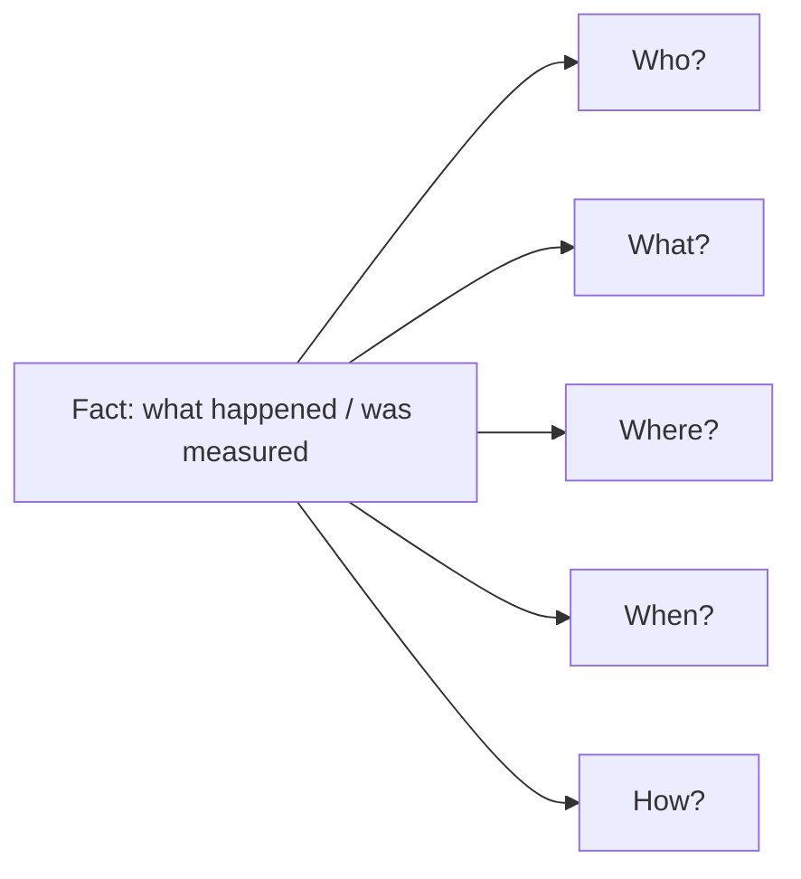
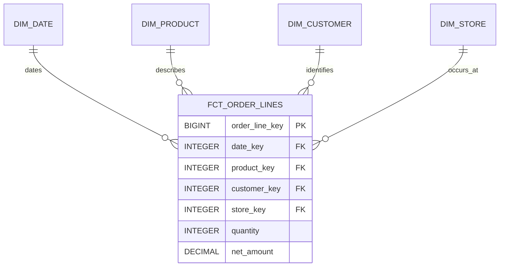
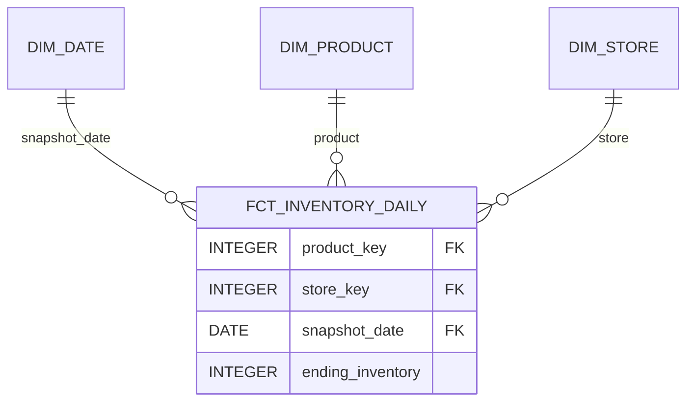
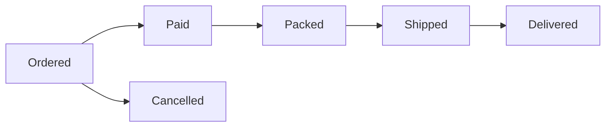
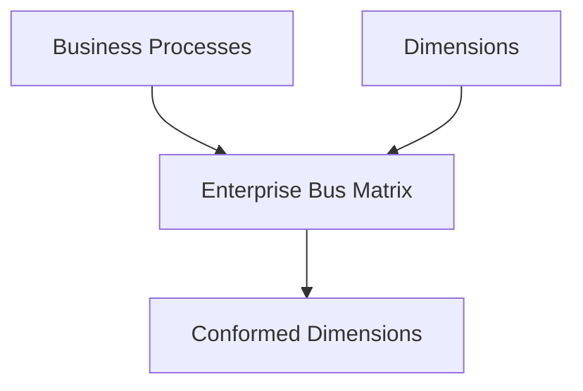
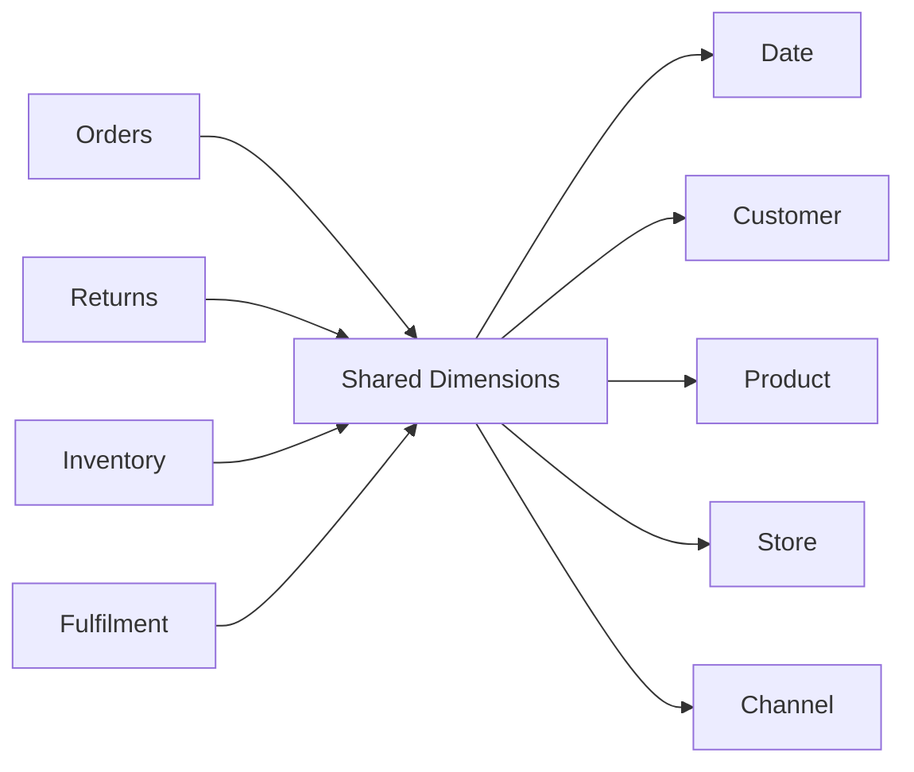
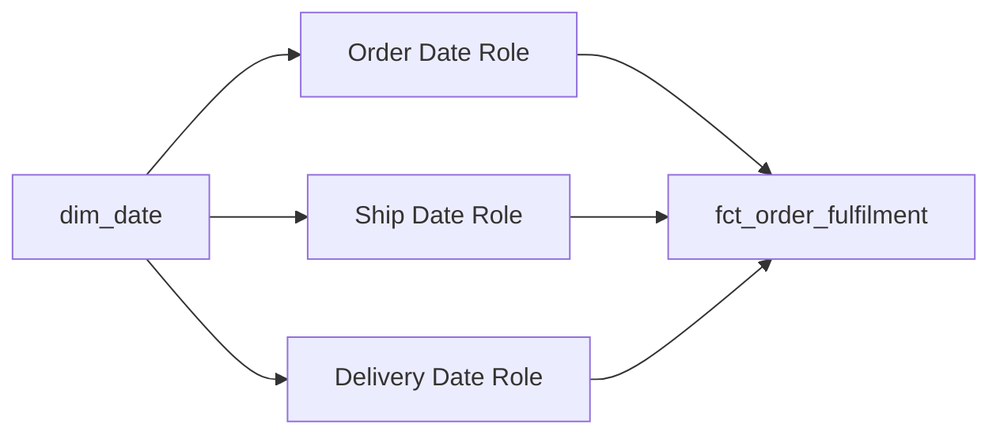
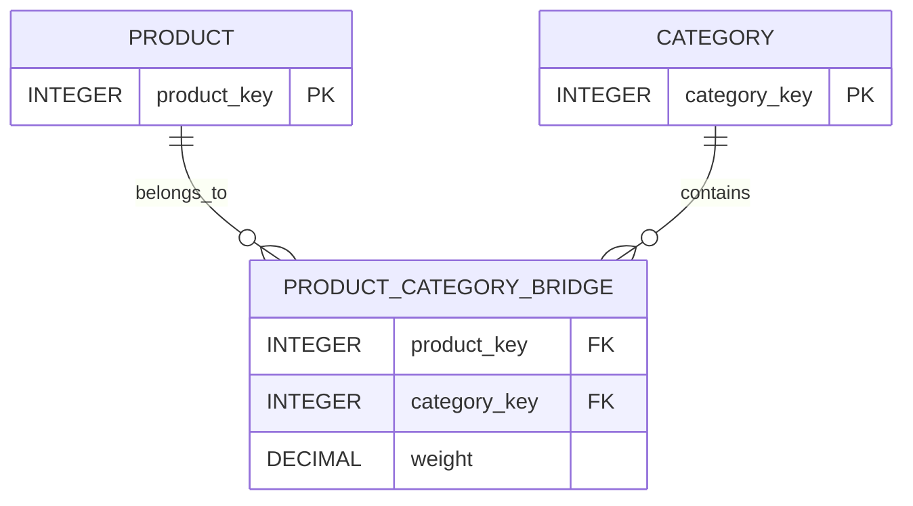
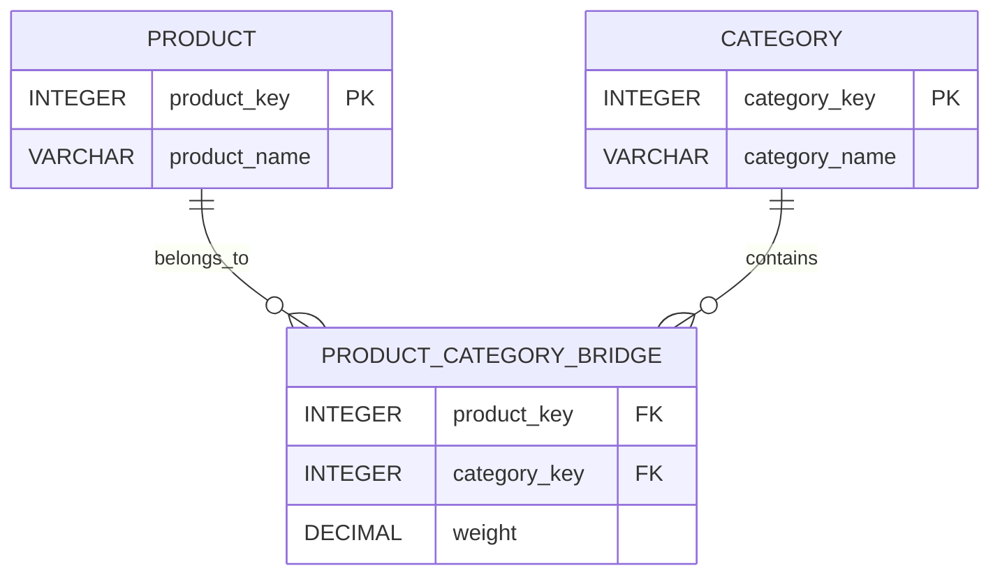
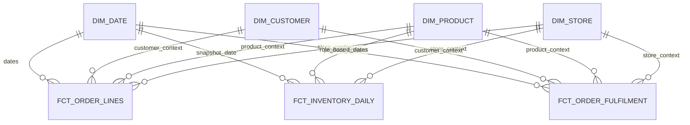

# Dimensional Modelling: Facts and Dimensions

> **Stage 2 — Python for Data Engineering → Module 2.8 — Data Modelling for Analytics**  
> **Topic 02 — Dimensional Modelling: Facts and Dimensions**

## 1. Learning Objectives

By the end of this topic, you should be able to:

- explain why dimensional modelling exists and how it differs from an operational model;
- identify a business process that should become an analytical fact table;
- distinguish facts (measurements) from dimensions (descriptive context);
- apply the Kimball four-step dimensional design process;
- declare the grain before selecting columns or measures;
- choose between transaction, periodic snapshot, accumulating snapshot, and factless fact tables;
- classify measures as additive, semi-additive, or non-additive;
- design useful, readable analytical dimensions;
- explain why a date dimension is useful and build one in DuckDB;
- explain conformed dimensions and use them across multiple business processes;
- create and interpret an enterprise bus matrix;
- use degenerate, junk, role-playing, and audit dimensions appropriately;
- use controlled unknown and not-applicable dimension members instead of casually introducing `NULL` foreign keys;
- reason about late-arriving facts and late-arriving dimensions, including inferred members;
- model many-to-many relationships with bridge tables and understand weighting;
- design aggregate/consolidated facts without mixing grains;
- reconcile aggregate facts back to atomic facts;
- implement a practical dimensional model in DuckDB;
- generate realistic training data with Python where that makes the modelling problem easier to test;
- debug common modelling failures such as doubled revenue, inflated inventory, broken conformance, and non-reconciling aggregates;
- explain dimensional design decisions clearly in a production Data Engineering or architecture discussion.

The central outcome is **not memorising table types**. It is learning to move from a business question to a model that has an explicit grain, valid measurements, reusable dimensions, predictable aggregation behaviour, and testable business semantics.

---

## 2. Prerequisites

This topic assumes you have already studied:

- Stage 1 programming and computational-thinking foundations;
- Stage 2 Module 2.1 — data-engineering foundations, including OLTP vs OLAP and medallion architecture;
- Stage 2 Modules 2.2–2.7, including the relevant SQL, data movement, and database-connectivity foundations;
- Topic 01 — Normalization and Denormalization;
- join cardinality and the idea that joins can increase, preserve, or reduce row counts;
- the concept of grain;
- basic SQL (`SELECT`, `JOIN`, `GROUP BY`, aggregates, filters);
- constraints and integrity checks;
- window functions;
- the implementation mechanics of SCD Type 1 and Type 2 from Module 2.6.

Those subjects are **not re-taught here as standalone chapters**. Instead, this topic connects them to a new question:

> **How should source data be reshaped so that analytical questions are easy to ask and hard to get wrong?**

Topic 01 showed why normalized source systems reduce inappropriate redundancy. Dimensional modelling now reshapes that source data around **business processes and analytical questions**.

---

# 3. Why Dimensional Modelling Exists

## 3.1 Start with the business problem

An operational database is usually built to answer questions such as:

- Can I create an order?
- Which customer owns order `10091`?
- Which address should we ship to?
- Has payment succeeded?
- Which rows must be updated when a product changes?

An analytics system is asked different questions:

- What was revenue by category last month?
- Which stores grew fastest quarter over quarter?
- What percentage of orders were delivered within two days?
- What was month-end inventory by department?
- How many customers bought from a particular category on weekends?

The operational system needs to **run transactions correctly**. The analytical system needs to **explain business activity efficiently and consistently**.

That difference is the reason dimensional modelling exists.

## 3.2 A simple analogy

Imagine a supermarket's stock room and the supermarket's management report.

The stock room is organised around operational tasks: where individual items are received, moved, counted, and stored.

The management report is organised around questions: sales by day, store, product, category, and customer segment.

The same business information can therefore have more than one useful shape.

## 3.3 The modelling question

A useful mental distinction is:

> **Operational question:** How does the application need to store and change the transaction?
>
> **Analytical question:** How does a human need to slice, group, compare, and aggregate the transaction?

Dimensional modelling is an analytical modelling approach that makes the second class of question easier.

## 3.4 What dimensional modelling optimises for

Dimensional models usually aim to make these tasks predictable:

- filtering by business context;
- grouping by business context;
- aggregating measurements;
- comparing multiple business processes;
- building readable BI queries;
- keeping common business definitions consistent across facts.

Dimensional modelling does **not** mean “make everything flat” or “never use joins”. It is a structured way to decide what the fact represents, what context should surround it, and how that context should be reused.

---

# 4. The Core Mental Model

The core design sequence for this topic is:

```text
Business Process
      ↓
Declare Grain
      ↓
Identify Dimensions
      ↓
Identify Facts
      ↓
Build Fact Table + Dimensions
      ↓
Answer Business Questions
```

This is the practical version of Kimball's four-step process.

## 4.1 Why this order matters

Beginners often start with columns:

> “I have `order_id`, `customer_name`, `product_name`, `price`, `quantity`... so I will make one big table.”

That approach is dangerous because column selection can happen before the designer has answered the most important question:

> **What does one row mean?**

Suppose you define a fact as:

> one row per order line

Then `quantity = 2` has a clear meaning: two units on that order line.

If you instead mix order-level and order-line-level attributes, the same number can become ambiguous. That ambiguity produces incorrect sums and confusing queries.

### Production rule

> **Declare the grain before selecting facts.**

The later Topic 04 formalises grain and key strategy in greater depth. Here, grain is introduced strongly because the four-step design process cannot work without it.

---

# 5. Facts vs Dimensions

## 5.1 What is a fact?



The central node represents the measurable business activity. The connected nodes are the descriptive contexts supplied by dimensions.


### Simple definition

A **fact** is a measurable observation about a business process.

Examples:

- sale amount;
- number of units sold;
- shipping duration;
- inventory quantity at the end of a day.

### Formal interpretation

A fact row records measurements at a declared grain and normally contains foreign-key references to the dimensions that provide business context.

### Example

For an order-line fact:

```text
quantity = 2
unit_price = 750.00
net_amount = 1400.00
```

Those values describe what happened for that order line.

## 5.2 What is a dimension?

### Simple definition

A **dimension** describes the context around the measurement.

Dimensions answer:

- **Who?** customer, seller, employee;
- **What?** product, service, promotion;
- **Where?** store, warehouse, city, region;
- **When?** date, fiscal period;
- **How?** sales channel, order source, fulfilment method.

### Formal interpretation

A dimension is a descriptive entity used to filter, group, label, and interpret fact measurements.

Dimensions normally contain human-readable business attributes rather than numerical measurements intended for aggregation.

## 5.3 Concrete e-commerce example

```text
                    dim_date
                       |
                       |
 dim_customer ---- fct_order_lines ---- dim_product
                       |
                       |
                    dim_store
```

The fact tells us **what happened**. The dimensions tell us **who, what, where, and when it happened**.

## 5.4 Facts vs dimensions table

| Characteristic | Fact | Dimension |
|---|---|---|
| Primary purpose | Record measurement/process activity | Provide descriptive context |
| Typical contents | Amounts, quantities, durations | Names, categories, labels, attributes |
| Typical row volume | Large | Smaller relative to facts |
| Typical query role | Aggregate/filter | Filter/group/label |
| Example | `net_amount = 1400` | `category = 'Laptops'` |
| Grain | Explicit and central | Entity/member-level context |

### Checkpoint

You should be able to finish this sentence:

> “The fact tells me ______; the dimension tells me ______.”

A good answer is:

> “The fact tells me what was measured at a particular grain; the dimension tells me the business context used to understand that measurement.”

---

# 6. A Simple Example Before the Formal Process

Suppose leadership asks:

> **“How much revenue did we generate by product category and store during January?”**

Reason about the question rather than the source columns.

### Step 1 — Business process

The relevant business process is **selling products**.

### Step 2 — Grain

A useful atomic grain is:

> **One row per order line.**

Why order line rather than order?

Because one order can contain multiple products. Product-level revenue therefore naturally exists at order-line grain.

### Step 3 — Dimensions

The question needs:

- date;
- product/category;
- store.

A customer dimension might also be included if customer analysis is expected from the same fact.

### Step 4 — Facts

At order-line grain, useful measures might be:

- quantity;
- unit price;
- discount amount;
- net amount.

The resulting conceptual shape is:

```text
                    dim_date
                       |
                       |
dim_product ------- fct_order_lines ------- dim_store
                       |
                       |
                 dim_customer
```

Now a query can group `SUM(net_amount)` by `dim_product.category` and `dim_store.store_name`, filtered through `dim_date`.

---

# 7. Kimball's Four-Step Dimensional Design Process

The four steps are:

1. Select the business process.
2. Declare the grain.
3. Identify the dimensions.
4. Identify the facts.

The order is deliberate.

## Step 1 — Select the Business Process

### What is a business process?

A business process is a meaningful activity or state-measurement process that the organisation wants to analyse.

Typical examples include:

- order placement;
- payment;
- shipment;
- product return;
- inventory measurement;
- subscription renewal.

A business process is not necessarily a single application table.

For example, “fulfil an order” can involve payment, packing, shipping, and delivery milestones even when those are stored in several source tables.

### Why does this step exist?

Because facts should be tied to a business process rather than to a random collection of source columns.

### What makes a useful process?

A useful process usually has:

- a clearly understood business meaning;
- events or states that can be measured;
- analytical questions attached to it;
- enough stability that its semantics can be documented.

### Example

For a retailer, possible processes are:

| Process | Example analytical questions |
|---|---|
| Orders | How many orders? How much revenue? |
| Returns | Which products are returned most? |
| Inventory | What was month-end stock? |
| Fulfilment | How long from order to delivery? |
| Promotions | Which promotions influenced sales? |
| Payments | What is payment success rate? |

### Exercise

Choose a business you know and list five processes. For each process, write one question that a manager might ask.

### Checkpoint

If you cannot explain the business process in one or two sentences, stop before designing the fact table.

---

## Step 2 — Declare the Grain

### Definition

The **grain** states exactly what one row in the fact table represents.

Examples:

- one row per order;
- one row per order line;
- one row per customer per day;
- one row per store per day.

### Why is grain so important?

Because every fact must be valid at that grain.

Consider:

> one row per order line

Then `quantity`, `unit_price`, and `net_amount` can be valid.

Now imagine adding:

> “customer's current lifetime value”

That value is not an order-line measurement. It changes over time and is at a different semantic grain.

The model may compile perfectly while still being conceptually wrong.

### Order grain vs order-line grain

Suppose order `1001` contains:

| order_id | product | quantity |
|---|---|---:|
| 1001 | Laptop | 1 |
| 1001 | Mouse | 2 |

At **order grain**, the natural row count is 1.

At **order-line grain**, the natural row count is 2.

Both are valid models. They answer different questions.

### Grain is not just a technical property

A grain statement is also a business statement:

> “This table contains one row for each product line purchased in an order.”

A non-engineer should be able to read it and understand what a row means.

### Grain exercise

Write the grain for these tables:

1. Daily stock by store and product.
2. One row for each delivery milestone of an order lifecycle.
3. Every individual payment transaction.
4. Every customer who attended a training session.

Suggested answers:

1. One row per product per store per day.
2. One row per order lifecycle with milestone dates.
3. One row per payment transaction.
4. One row per customer-session attendance event.

### Checkpoint

Before choosing any measure, ask:

> **“Can I explain why this number is valid for exactly one row of this table?”**

If not, the measure probably belongs elsewhere.

---

## Step 3 — Identify the Dimensions

Once the grain is fixed, ask:

- Who?
- What?
- Where?
- When?
- How?

For an order-line fact:

| Question | Possible dimension |
|---|---|
| Who bought? | Customer |
| What was bought? | Product |
| Where was it sold? | Store |
| When was it sold? | Date |
| How did the order arrive? | Channel / source |

### Important reasoning rule

The same source entity can be useful in one process and irrelevant in another.

For example, `dim_customer` is useful for sales but may not belong in a machine-level inventory snapshot unless the business process truly contains customer context.

### Exercise

For “daily inventory” identify dimensions by answering the five context questions.

Possible result:

- Who? Usually not customer.
- What? Product.
- Where? Store/warehouse.
- When? Date.
- How? Optional inventory status or location context, depending on the process.

### Checkpoint

A dimension should have a clear analytical purpose. Do not add dimensions merely because they exist in the source.

---

## Step 4 — Identify the Facts

Only after the process, grain, and dimensions are known should facts be selected.

### Example: order lines

At one row per order line, candidate facts include:

- quantity;
- unit price;
- discount amount;
- net amount;
- cost amount.

### Invalid candidates

Suppose `customer_name` is added as a “fact”. It is descriptive context, not a measurement. It belongs in the customer dimension.

Suppose `customer_lifetime_value` is added. It is a derived metric at another business grain and may change independently of the order line.

### A useful test

Ask:

> “If I aggregate this column, does the result have a defined business meaning at the target grain?”

That question will not solve every modelling issue, but it quickly exposes many weak designs.

### Complete worked example

**Business process:** Order line sales  
**Grain:** One row per order line  
**Dimensions:** Date, Customer, Product, Store  
**Facts:** Quantity, unit price, discount amount, net amount

```text
                 dim_date
                    |
                    |
 dim_customer --- fct_order_lines --- dim_product
                    |
                    |
                 dim_store
```

---

# 8. Grain: The Most Important Design Decision

Grain deserves extra emphasis even though Topic 04 will formalise grain and key strategy later.

## 8.1 Common fact grains

| Grain statement | Typical use |
|---|---|
| One row per order | Order-level counts and totals |
| One row per order line | Product-level sales analysis |
| One row per customer per day | Daily customer activity/features |
| One row per store per day | Store daily snapshots |
| One row per product per store per day | Inventory snapshot |

## 8.2 Different grain, different truth

Suppose an order has three lines:

```text
Order 9001
  Laptop   $1000
  Mouse      $50
  Keyboard   $80
```

If the fact is at order-line grain, `SUM(net_amount)` is the order revenue.

If a separate order fact stores the total `$1130`, that is a different fact table with a different grain.

Neither is “more correct” without a question. The correct model depends on the process and required analysis.

## 8.3 Mismatched grain is a common production failure

Consider joining:

- one row per order;
- one row per order line.

If the order-level amount is repeated across lines and then summed, revenue can be multiplied by line count.

This is the same class of problem you saw earlier when learning join cardinality and fan traps: **the model's grain controls the meaning of a row**.

### Rule of thumb

> Never assume two tables are join-compatible just because they share a business key.

Their grains must be understood first.

---

# 9. Transaction Fact Tables

## 9.1 Definition

A **transaction fact table** records individual business events at the lowest useful atomic level.



The fact sits at the centre because each row represents one order line, while the dimensions provide the context needed to analyse that event.

Examples:

- a sale;
- a payment;
- a click;
- a return;
- a shipment event.

The rows normally remain historically useful because each row represents an event that happened.

## 9.2 Retail example

Table: `fct_order_lines`

Grain:

> **One row per order line.**

Possible columns:

| Column | Role |
|---|---|
| `order_line_key` | Row identifier |
| `date_key` | Date context |
| `customer_key` | Customer context |
| `product_key` | Product context |
| `store_key` | Store context |
| `order_number` | Degenerate business identifier |
| `quantity` | Measure |
| `unit_price` | Measure/input value |
| `discount_amount` | Measure |
| `net_amount` | Measure |

## 9.3 DuckDB implementation

```sql
CREATE TABLE fct_order_lines (
    order_line_key BIGINT,
    date_key INTEGER,
    customer_key INTEGER,
    product_key INTEGER,
    store_key INTEGER,
    order_number VARCHAR,
    quantity INTEGER,
    unit_price DECIMAL(12, 2),
    discount_amount DECIMAL(12, 2),
    net_amount DECIMAL(12, 2)
);

INSERT INTO fct_order_lines VALUES
    (1, 20260901, 101, 201, 1, 'ORD-1001', 1, 1000.00, 50.00, 950.00),
    (2, 20260901, 101, 202, 1, 'ORD-1001', 2, 50.00, 0.00, 100.00),
    (3, 20260902, 102, 203, 2, 'ORD-1002', 1, 80.00, 10.00, 70.00);
```

### Query

```sql
SELECT
    store_key,
    SUM(net_amount) AS revenue,
    SUM(quantity) AS units
FROM fct_order_lines
GROUP BY store_key
ORDER BY store_key;
```

The query answers a store-level question because the fact is at order-line grain and the store key is a valid dimension reference.

## 9.4 Strengths

- preserves atomic business events;
- supports many downstream aggregations;
- makes detailed investigation possible;
- provides a strong source for derived aggregates.

## 9.5 Limitations

- can become very large;
- some state questions require snapshots instead;
- lifecycle duration may be awkward if the process is naturally milestone-oriented.

### Exercise

Design a transaction fact for restaurant orders. State the grain first, then list five candidate facts.

### Checkpoint

If the business asks “show me each individual occurrence”, a transaction fact is a natural candidate.

---

# 10. Periodic Snapshot Fact Tables

## 10.1 Definition

A **periodic snapshot fact table** records the state of a business process at regular intervals.



The same product-store combination appears repeatedly because the business state is intentionally observed at regular points in time.

Examples:

- inventory every day;
- account balance at the end of each day;
- daily number of active subscriptions.

The same business state can therefore appear in multiple rows over time. That repetition is intentional.

## 10.2 Inventory example

Table: `fct_inventory_daily`

Grain:

> **One row per product per store per day.**

```text
product | store | date       | ending_inventory
--------|-------|------------|-----------------
Laptop  | 1     | 2026-09-01 | 10
Laptop  | 1     | 2026-09-02 | 12
Laptop  | 1     | 2026-09-03 | 15
```

## 10.3 Why this is not duplication by mistake

A daily snapshot deliberately repeats observations because the business wants to ask:

- What was inventory on each day?
- What was month-end inventory?
- How many days did a product remain below a threshold?

A transaction table containing only receipts and sales cannot answer those questions as directly.

## 10.4 DuckDB example

```sql
CREATE TABLE fct_inventory_daily (
    product_key INTEGER,
    store_key INTEGER,
    snapshot_date DATE,
    ending_inventory INTEGER
);

INSERT INTO fct_inventory_daily VALUES
    (201, 1, DATE '2026-09-01', 10),
    (201, 1, DATE '2026-09-02', 12),
    (201, 1, DATE '2026-09-03', 15),
    (202, 1, DATE '2026-09-01', 5),
    (202, 1, DATE '2026-09-02', 7),
    (202, 1, DATE '2026-09-03', 8);
```

Month-end or period-end inventory must select the appropriate last snapshot, not sum all daily balances.

```sql
SELECT
    product_key,
    store_key,
    ending_inventory
FROM fct_inventory_daily
WHERE snapshot_date = DATE '2026-09-30';
```

### Checkpoint

Ask:

> “Am I measuring an event, or am I measuring the state of something at regular intervals?”

That distinction is often the first clue for selecting a transaction fact vs periodic snapshot.

---

# 11. Accumulating Snapshot Fact Tables

## 11.1 Definition

An **accumulating snapshot** models a process that moves through a known lifecycle with important milestones.



Each lifecycle instance can carry milestone timestamps so the model can measure time between stages.

Unlike a periodic snapshot, the row represents the **same business process instance** while milestone fields become populated as the process advances.

## 11.2 Order fulfilment example

Table: `fct_order_fulfilment`

Possible milestones:

- ordered;
- paid;
- packed;
- shipped;
- delivered;
- cancelled.

Conceptually:

```text
Ordered
   ↓
Paid
   ↓
Packed
   ↓
Shipped
   ↓
Delivered
```

A cancellation may end the lifecycle on a different branch.

## 11.3 Example table

| order_number | ordered_at | paid_at | shipped_at | delivered_at | cancelled_at |
|---|---|---|---|---|---|
| ORD-1001 | 2026-09-01 10:00 | 10:03 | 14:10 | 2026-09-03 12:30 | NULL |
| ORD-1002 | 2026-09-02 09:00 | 09:02 | 13:15 | NULL | 2026-09-03 08:00 |

## 11.4 Why this differs from a transaction fact

A transaction fact answers:

> “What individual event happened?”

An accumulating snapshot answers:

> “Where is this business process in its lifecycle, and how long did it take between milestones?”

## 11.5 Turnaround query

```sql
SELECT
    order_number,
    delivered_at - ordered_at AS total_fulfilment_time
FROM fct_order_fulfilment
WHERE delivered_at IS NOT NULL;
```

Depending on the exact DuckDB type and desired output, interval arithmetic can be further transformed into minutes or hours.

### Lifecycle-oriented reasoning

Use an accumulating snapshot when milestone progression is central to the analysis and the process has a reasonably defined lifecycle.

### Checkpoint

Describe a business process in five milestones. If you cannot identify meaningful milestone dates/timestamps, a different fact design may be more natural.

---

# 12. Factless Fact Tables

## 12.1 A surprising idea

A fact table does not require a numeric measure.

A **factless fact table** records that a business event or relationship occurred, even when there is no numeric measurement to store.

Examples:

- student attended a class;
- customer was eligible for a promotion;
- employee attended training;
- patient had a diagnosis relationship;
- customer account activity occurred.

## 12.2 “No facts” vs “the fact is the occurrence”

Consider:

```text
student_id | course_id | attendance_date
-----------|-----------|----------------
42         | 7         | 2026-09-10
```

There may be no `amount` or `quantity`.

The useful fact is the **occurrence itself**:

> Student 42 attended course 7 on that date.

That occurrence can still be counted.

## 12.3 DuckDB example

```sql
CREATE TABLE fct_student_attendance (
    student_key INTEGER,
    course_key INTEGER,
    date_key INTEGER
);

INSERT INTO fct_student_attendance VALUES
    (101, 20, 20260910),
    (101, 21, 20260910),
    (102, 20, 20260910);

SELECT
    course_key,
    COUNT(*) AS attendance_events
FROM fct_student_attendance
GROUP BY course_key;
```

### Checkpoint

If the business question is “how often did this event/relationship occur?”, a factless fact may be exactly what you need.

---

# 13. Choosing the Correct Fact Table Type

| Type | Row meaning | Typical use |
|---|---|---|
| Transaction | One business event/transaction | Sales, payments, clicks |
| Periodic snapshot | State measured at regular intervals | Inventory, balances |
| Accumulating snapshot | One lifecycle instance with milestone dates | Order fulfilment |
| Factless | Event/coverage without a numeric measure | Attendance, eligibility |

## 13.1 Scenario exercise

Choose a fact type and explain why:

1. “Every payment captured by the payment processor.”
2. “Inventory position for every product-store combination every midnight.”
3. “Time from job submission to job completion through several workflow steps.”
4. “Which students attended which courses?”

### Answers

1. **Transaction fact** — individual payments are events.
2. **Periodic snapshot** — regular state observation.
3. **Accumulating snapshot** — lifecycle milestones.
4. **Factless fact** — occurrence/coverage relationship without numeric measures.

### Important boundary

Do not treat these types as a ranking. The appropriate type depends on the process behaviour and the questions the model must answer.

---

# 14. Measures and Additivity

Measure additivity is critical because a numerically valid column can still produce an invalid business result when aggregated the wrong way.

## 14.1 Additive measures

An **additive** measure can be summed across all relevant dimensions.

Examples:

- `sales_amount`;
- `quantity`;
- `cost_amount`.

Example:

```sql
SELECT SUM(net_amount)
FROM fct_order_lines;
```

For a normal sales amount, summing across products, stores, and dates is meaningful, assuming the fact is correctly modelled and the business semantics permit the aggregation.

## 14.2 Semi-additive measures

A **semi-additive** measure can be summed across some dimensions but not others.

Classic example:

```text
Product A
Day 1 = 10
Day 2 = 12
Day 3 = 15
```

You can add balances across products at the **same point in time**:

```text
Laptop = 15
Mouse = 30
----------------
Total = 45 units
```

But:

```text
10 + 12 + 15 = 37
```

does not mean “inventory balance for the three-day period”. It means the sum of three point-in-time balances, which is usually not the business metric being requested.

### Correct approaches

For **end-of-period balance**:

```sql
SELECT
    MAX(snapshot_date) AS period_end_date,
    SUM(ending_inventory) AS month_end_inventory
FROM fct_inventory_daily
WHERE snapshot_date BETWEEN DATE '2026-09-01' AND DATE '2026-09-30'
  AND snapshot_date = DATE '2026-09-30';
```

For a month-end balance from a table where a given month can contain variable dates, first identify the last available date and then sum that date's balances.

For **average balance**, the correct aggregation depends on the business definition, for example an average of daily balances.

## 14.3 Non-additive measures

A **non-additive** measure should not be summed across dimensions because the resulting number has no valid interpretation.

Typical examples:

- percentages;
- ratios;
- rates.

### Example: conversion rate

Store A:

```text
100 sales / 200 visitors = 50%
```

Store B:

```text
1 sale / 2 visitors = 50%
```

A naive average happens to produce 50% in this example, but that does not mean averaging percentages is generally correct.

A stronger design stores the underlying components:

```text
sales_count
visitor_count
```

and derives:

```text
SUM(sales_count) / SUM(visitor_count)
```

when the metric's semantics support that calculation.

### Example query

```sql
SELECT
    SUM(sales_count) * 1.0 / NULLIF(SUM(visitor_count), 0) AS conversion_rate
FROM daily_store_metrics;
```

The `NULLIF` protects against division by zero.

## 14.4 Additivity comparison

| Measure type | Can sum across dimensions? | Can sum across time? | Example |
|---|---|---|---|
| Additive | Generally yes | Generally yes | Sales amount |
| Semi-additive | Some dimensions | Often no | Inventory balance |
| Non-additive | No | No | Conversion rate |

### Exercise

Classify each:

- units sold;
- account balance;
- gross margin amount;
- conversion percentage;
- average selling price;
- number of orders.

Suggested reasoning:

- units sold → additive;
- account balance → semi-additive;
- gross margin amount → often additive at compatible grains;
- conversion percentage → non-additive;
- average selling price → generally non-additive; derive from appropriate numerator/denominator;
- number of orders → additive as a count of correctly defined rows or distinct business events, subject to grain and deduplication.

---

# 15. Facts vs Derived Metrics

A useful distinction is between **atomic measurements** and **derived metrics**.

## 15.1 Base measurements

For an order line:

```text
quantity
unit_price
discount_amount
cost_amount
```

## 15.2 Derived values

```text
gross_amount = quantity * unit_price
net_amount = gross_amount - discount_amount
margin_amount = net_amount - cost_amount
conversion_rate = conversions / visitors
```

A derived value may still be valid to materialize in an atomic fact when its semantics are stable and performance/reuse justify it. But derived ratios need special care because their aggregation behaviour differs from additive amounts.

### Production question

Before storing a derived metric, ask:

1. What is its grain?
2. Is the derivation stable and reusable?
3. Can it be recomputed from trusted atomic values?
4. Will storing it create another copy of business logic that can drift?

This topic does not teach semantic layers in depth; the goal is simply to understand why not every calculated metric should be treated like an additive atomic fact.

---

# 16. Designing Dimensions

Dimensions provide analytical context. Good dimensions make business questions readable.

## 16.1 Descriptive attributes

A product dimension might contain:

- product name;
- brand;
- subcategory;
- category;
- department;
- colour;
- product type.

These attributes are useful because analysts can group and filter on them.

## 16.2 Text-rich, readable business vocabulary

Compare:

```text
category_id = 4
```

with:

```text
category = 'Laptops'
```

The identifier is useful for relationships. The readable label is useful for analysis and explanation.

A production dimension can contain both.

## 16.3 Flattened hierarchies

A common analytical dimension includes hierarchy attributes together:

```text
Product
  ↓
Subcategory
  ↓
Category
  ↓
Department
```

For example:

| product_name | subcategory | category | department |
|---|---|---|---|
| ProBook 14 | Laptops | Computers | Electronics |
| Ergo Mouse | Mice | Accessories | Electronics |

This is convenient for analytical grouping. Later Topic 03 will compare star and snowflake arrangements; here the important lesson is that analytical dimensions often flatten business hierarchies intentionally.

## 16.4 Practical `dim_product`

```sql
CREATE TABLE dim_product (
    product_key INTEGER,
    product_id VARCHAR,
    product_name VARCHAR,
    brand VARCHAR,
    subcategory VARCHAR,
    category VARCHAR,
    department VARCHAR
);

INSERT INTO dim_product VALUES
    (201, 'P100', 'ProBook 14', 'Acme', 'Laptops', 'Computers', 'Electronics'),
    (202, 'P101', 'Ergo Mouse', 'Acme', 'Mice', 'Accessories', 'Electronics'),
    (203, 'P102', 'Travel Keyboard', 'KeyWorks', 'Keyboards', 'Accessories', 'Electronics');
```

### Why this design helps

An analyst can ask:

```sql
SELECT
    category,
    SUM(f.net_amount) AS revenue
FROM fct_order_lines f
JOIN dim_product p
  ON p.product_key = f.product_key
GROUP BY category
ORDER BY revenue DESC;
```

The query reads close to the business question.

---

# 17. The Date Dimension

The date dimension is one of the most reusable dimensions in an analytical platform.

## 17.1 Why not calculate dates in every query?

Without a date dimension, every analyst may independently implement:

- month extraction;
- quarter logic;
- fiscal periods;
- weekend logic;
- holiday logic.

That causes duplicated logic and increases the chance that two dashboards define the same period differently.

A date dimension centralises those attributes.

## 17.2 Typical attributes

A useful date dimension can contain:

- calendar date;
- day of month;
- day name;
- weekday number;
- week number;
- month number;
- month name;
- quarter;
- calendar year;
- fiscal period;
- fiscal year;
- holiday flag;
- holiday name;
- business-day flag.

The precise fiscal logic depends on the organisation.

## 17.3 DuckDB date dimension example

The following example assumes a fiscal year beginning in April. That rule is an example, not a universal standard.

```sql
CREATE TABLE dim_date AS
SELECT
    CAST(STRFTIME(d, '%Y%m%d') AS INTEGER) AS date_key,
    d::DATE AS calendar_date,
    EXTRACT(DAY FROM d) AS day_of_month,
    STRFTIME(d, '%A') AS day_name,
    EXTRACT(ISODOW FROM d) AS weekday_number,
    EXTRACT(WEEK FROM d) AS iso_week,
    EXTRACT(MONTH FROM d) AS month_number,
    STRFTIME(d, '%B') AS month_name,
    EXTRACT(QUARTER FROM d) AS calendar_quarter,
    EXTRACT(YEAR FROM d) AS calendar_year,
    CASE
        WHEN EXTRACT(MONTH FROM d) >= 4
            THEN EXTRACT(YEAR FROM d)
        ELSE EXTRACT(YEAR FROM d) - 1
    END AS fiscal_year,
    CASE
        WHEN EXTRACT(MONTH FROM d) >= 4
            THEN EXTRACT(MONTH FROM d) - 3
        ELSE EXTRACT(MONTH FROM d) + 9
    END AS fiscal_period,
    FALSE AS is_holiday,
    FALSE AS is_business_day
FROM generate_series(
    DATE '2026-01-01',
    DATE '2026-12-31',
    INTERVAL '1 day'
) AS t(d);
```

> Depending on the DuckDB release, the exact `generate_series` relation syntax may need adjustment. The modelling idea remains the same: materialise a trusted calendar table once and reuse it.

A simpler version for the same concept is:

```sql
CREATE TABLE dim_date (
    date_key INTEGER,
    calendar_date DATE,
    day_of_month INTEGER,
    day_name VARCHAR,
    month_number INTEGER,
    month_name VARCHAR,
    calendar_quarter INTEGER,
    calendar_year INTEGER,
    fiscal_year INTEGER,
    fiscal_period INTEGER,
    is_holiday BOOLEAN,
    holiday_name VARCHAR,
    is_business_day BOOLEAN
);
```

Then load rows from a trusted calendar generator or Python job.

## 17.4 Example queries

### Revenue by fiscal quarter

```sql
SELECT
    d.fiscal_year,
    d.fiscal_period,
    SUM(f.net_amount) AS revenue
FROM fct_order_lines f
JOIN dim_date d
  ON d.date_key = f.date_key
GROUP BY
    d.fiscal_year,
    d.fiscal_period
ORDER BY
    d.fiscal_year,
    d.fiscal_period;
```

### Weekend vs weekday sales

```sql
SELECT
    CASE
        WHEN d.weekday_number IN (6, 7) THEN 'Weekend'
        ELSE 'Weekday'
    END AS day_type,
    SUM(f.net_amount) AS revenue
FROM fct_order_lines f
JOIN dim_date d
  ON d.date_key = f.date_key
GROUP BY day_type;
```

### Holiday vs non-holiday sales

```sql
SELECT
    d.is_holiday,
    SUM(f.net_amount) AS revenue
FROM fct_order_lines f
JOIN dim_date d
  ON d.date_key = f.date_key
GROUP BY d.is_holiday;
```

### Key lesson

The date dimension turns calendar semantics into reusable business data rather than repeated query-specific code.

---

# 18. Conformed Dimensions

## 18.1 What does “conformed” mean?

A **conformed dimension** is a shared dimension whose attributes have consistent business meaning across multiple fact tables.

For example, the organisation can have one trusted `dim_date` used by:

- sales;
- returns;
- inventory;
- shipments.

## 18.2 Why conformance matters

Suppose:

```text
fct_sales       ── dim_date
fct_returns     ── dim_date
fct_inventory   ── dim_date
fct_shipments   ── dim_date
```

Now a question such as:

> “How did sales and returns compare by fiscal quarter?”

can use one definition of fiscal quarter.

Without conformance, one dashboard might define fiscal Q1 as April–June while another incorrectly uses January–March.

## 18.3 Common conformed dimensions

Examples include:

- `dim_date`;
- `dim_product`;
- `dim_customer`;
- `dim_store`.

Conformance is about **consistent semantics**, not merely the fact that two tables have columns with the same name.

## 18.4 Practical example

```sql
-- Sales by category and month
SELECT
    d.calendar_year,
    d.month_number,
    p.category,
    SUM(f.net_amount) AS sales
FROM fct_order_lines f
JOIN dim_date d
  ON d.date_key = f.date_key
JOIN dim_product p
  ON p.product_key = f.product_key
GROUP BY 1, 2, 3;

-- Returns by the same date and product vocabulary
SELECT
    d.calendar_year,
    d.month_number,
    p.category,
    SUM(r.return_amount) AS returns
FROM fct_returns r
JOIN dim_date d
  ON d.date_key = r.date_key
JOIN dim_product p
  ON p.product_key = r.product_key
GROUP BY 1, 2, 3;
```

Because the dimensions are conformed, the category and calendar meanings are comparable.

### Checkpoint

A dimension is not conformed merely because its schema looks similar. Ask:

> “Would two independent business processes interpret this dimension member the same way?”

---

# 19. The Enterprise Bus Matrix

## 19.1 What is a bus matrix?

An **enterprise bus matrix** is a planning tool for dimensional modelling.



The visual emphasises that the matrix is a bridge between business processes and reusable analytical context.

- Rows represent business processes.
- Columns represent dimensions.
- A checkmark means the business process uses that dimension.

It helps reveal which dimensions should be designed as shared/conformed dimensions.

## 19.2 Retailer example

| Business process | Date | Customer | Product | Store | Channel |
|---|---:|---:|---:|---:|---:|
| Orders | ✓ | ✓ | ✓ | ✓ | ✓ |
| Returns | ✓ | ✓ | ✓ | ✓ | ✓ |
| Inventory | ✓ |  | ✓ | ✓ |  |
| Fulfilment | ✓ | ✓ | ✓ | ✓ | ✓ |
| Promotions | ✓ |  | ✓ | ✓ | ✓ |
| Payments | ✓ | ✓ |  | ✓ | ✓ |

### What does the matrix tell us?

`dim_date` is shared by many processes.

`dim_product` is shared by orders, returns, inventory, fulfilment, and promotions.

`dim_customer` is not necessarily meaningful for inventory.

That distinction is valuable because it prevents the designer from forcing every dimension into every fact.

## 19.3 Mermaid view of the concept



The diagram represents the planning idea, not a physical database structure. The bus matrix is normally maintained as a table because it is easier to audit and extend.

## 19.4 Why a bus matrix helps at enterprise scale

As the number of processes grows, the matrix makes it easier to discuss:

- shared business dimensions;
- missing analytical context;
- inconsistent definitions;
- future fact-table additions.

It is therefore both a modelling tool and a communication tool.

### Exercise

Create a bus matrix for a food-delivery business with at least six processes and five dimensions.

### Checkpoint

Can you use the matrix to identify which dimensions need shared business definitions?

---

# 20. Galaxy / Fact Constellation

When multiple fact tables share dimensions, the collection is sometimes described as a **galaxy** or **fact constellation**.

```text
                    dim_date
                       |
          ┌────────────┼────────────┐
          ↓            ↓            ↓
      fct_sales    fct_returns  fct_inventory
          |            |            |
          ↓            ↓            ↓
      dim_product   dim_product   dim_product
```

The important ideas are:

- there are multiple business processes;
- the facts have different grains;
- dimensions may be shared/conformed;
- facts should not simply be joined together at raw grain.

For example, joining all sales rows directly to all return rows by `product_key` can produce multiplicative results because one product can have many sales rows and many return rows.

The safe analytical strategy is usually to aggregate each fact to a common reporting grain first and then compare those results.

> Topic 03 will examine how facts and dimensions are physically arranged as stars and snowflakes. This section only establishes the multi-fact, shared-dimension foundation.

---

# 21. Special Dimension — Degenerate Dimension

## 21.1 Definition

A **degenerate dimension** is a business identifier stored directly in the fact table without a separate dimension table.

Classic example:

```text
order_number
```

An order number is useful for grouping, filtering, or drilling to a business transaction, but it may not require a separate table containing descriptive attributes.

## 21.2 Example

```sql
SELECT
    order_number,
    SUM(net_amount) AS order_value
FROM fct_order_lines
GROUP BY order_number
ORDER BY order_value DESC;
```

Because `order_number` identifies the business transaction and is stored with the fact rows, it behaves like dimensional context even though there is no `dim_order_number` table.

### Why use it?

- avoids creating a dimension table with little useful descriptive context;
- keeps a business transaction identifier available for analysis and troubleshooting.

The term is important, but the design decision remains workload-driven.

---

# 22. Special Dimension — Junk Dimension

## 22.1 Definition

A **junk dimension** groups small, low-cardinality flags and indicators into one reusable dimension.

Suppose a fact needs:

```text
is_gift
is_first_order
payment_method_group
order_source
fraud_flag
```

Creating a separate dimension table for each binary flag can produce many tiny joins.

A junk dimension can instead represent combinations of these low-cardinality attributes.

## 22.2 Example

```text
junk_order_flag_key
is_gift
is_first_order
payment_method_group
order_source
fraud_flag
```

Example rows:

| junk_order_flag_key | is_gift | is_first_order | payment_method_group | order_source | fraud_flag |
|---:|---:|---:|---|---|---:|
| 1 | false | true | Card | Web | false |
| 2 | true | false | Wallet | App | false |
| 3 | false | false | Card | Web | true |

## 22.3 Trade-offs

A junk dimension can simplify the fact table and reduce many tiny relationships, but it should not become a dumping ground for unrelated attributes.

A useful criterion is:

> Are these attributes small, low-cardinality indicators that naturally belong together for analytical use?

If not, they probably need another design.

---

# 23. Special Dimension — Role-Playing Dimension

## 23.1 Definition



The three roles use the same calendar semantics while representing different dates in the order lifecycle.

A **role-playing dimension** is one physical dimension used in multiple semantic roles.

The classic example is `dim_date`.

The same date dimension may represent:

- order date;
- ship date;
- delivery date.

## 23.2 Conceptual model

```text
                   dim_date
                  /    |    \
                 /     |     \
        order_date  ship_date  delivery_date
             |          |           |
             └──────────┴───────────┘
                       |
               fct_order_fulfilment
```

The roles are different, but the calendar semantics remain consistent.

## 23.3 SQL views

```sql
CREATE VIEW dim_order_date AS
SELECT * FROM dim_date;

CREATE VIEW dim_ship_date AS
SELECT * FROM dim_date;

CREATE VIEW dim_delivery_date AS
SELECT * FROM dim_date;
```

A BI tool can then expose three semantic roles while the warehouse maintains one logical date dimension.

### Example query

```sql
SELECT
    od.calendar_date AS order_date,
    sd.calendar_date AS ship_date,
    dd.calendar_date AS delivery_date
FROM fct_order_fulfilment f
JOIN dim_date od
  ON od.date_key = f.order_date_key
JOIN dim_date sd
  ON sd.date_key = f.ship_date_key
JOIN dim_date dd
  ON dd.date_key = f.delivery_date_key;
```

Role-playing dimensions are about **meaning**, not duplicating the underlying reference data unnecessarily.

---

# 24. Special Dimension — Audit Dimension

## 24.1 Purpose

An **audit dimension** provides reusable pipeline/load context associated with analytical rows.

Potential attributes include:

```text
load_batch_id
source_system
loaded_at
pipeline_run_id
```

These fields can help answer:

- Which source produced this row?
- Which load introduced it?
- When was it loaded?
- Which pipeline run can be used to investigate it?

## 24.2 Example

```sql
CREATE TABLE dim_audit (
    audit_key INTEGER,
    load_batch_id VARCHAR,
    source_system VARCHAR,
    loaded_at TIMESTAMP,
    pipeline_run_id VARCHAR
);
```

A fact can then carry `audit_key` as a reference to a standard set of load-context attributes.

## 24.3 Scope boundary

This topic only establishes the modelling concept. Full observability, governance, lineage, and security are covered later in the roadmap.

### Production consideration

If audit context is useful for troubleshooting or lineage-oriented analysis, standardising it can be better than inventing different load columns across every fact table.

---

# 25. Unknown and Not-Applicable Members

Facts often reference dimensions through foreign keys. The fact should not casually use `NULL` every time the dimension lookup is unavailable or irrelevant.

## 25.1 Why controlled special members help

A controlled dimension member preserves relational usability and gives the missing condition a defined business meaning.

For example:

```text
customer_key = -1
```

might represent an **unknown customer**.

The exact key is a warehouse design convention; `-1` is only an example.

## 25.2 Unknown vs not applicable

| Member type | Meaning | Example |
|---|---|---|
| Unknown | The dimension should apply, but its member is not known | Sale references a customer whose record has not arrived |
| Not applicable | The dimension genuinely does not apply | A stock adjustment has no customer |

### Unknown

> “We expected a customer, but we do not know which one yet.”

### Not Applicable

> “This business event genuinely has no customer context.”

These are not the same data condition.

## 25.3 Example dimension members

```sql
INSERT INTO dim_customer (
    customer_key,
    customer_id,
    customer_name
)
VALUES
    (-1, 'UNKNOWN', 'Unknown Customer'),
    (-2, 'NOT_APPLICABLE', 'Not Applicable');
```

Then facts can reference a real, controlled member instead of using `NULL` for every exceptional row.

### Why this matters

- referential integrity remains easier to enforce;
- counts remain visible;
- data-quality problems become measurable;
- “missing because unknown” is not confused with “does not apply”.

---

# 26. Late-Arriving Facts

## 26.1 What is a late-arriving fact?

A late-arriving fact is a business event that happened earlier but reached the analytical system later.

Example:

```text
Order happened:      June 1
Warehouse received:  June 4
```

The business event date and the load date are different.

## 26.2 Why the difference matters

The model may need to represent at least two ideas:

- **business/event time** — when the event actually happened;
- **load/ingestion time** — when the warehouse received it.

These dates answer different questions.

## 26.3 Dimension lookup implication

Suppose a customer had category `A` on June 1 and changed to `B` on June 3.

A sale that actually happened on June 1 but arrives on June 4 must be associated with the correct customer context according to the model's history rules.

This topic focuses on the conceptual modelling decision. The detailed SCD mechanics are covered later in Topic 05 and SQL implementation mechanics were covered earlier in Module 2.6.

## 26.4 Conceptual SQL example

```sql
SELECT
    f.order_number,
    f.event_date,
    f.loaded_at,
    d.customer_key
FROM staging_orders f
JOIN dim_customer d
  ON d.customer_id = f.customer_id;
```

In a real historical dimension design, the lookup would also consider the relevant version and event time rather than simply using the current row.

### Production question

When a fact is late, ask:

1. What was the business date?
2. What was the load date?
3. Which dimension state should represent the event?
4. What happens if the correct dimension member is not yet present?

---

# 27. Late-Arriving Dimensions and Inferred Members

The opposite problem can also occur:

> The fact arrives before the complete dimension record.

Example:

```text
Sale arrives with customer_id = C123
Customer dimension record has not arrived yet
```

## 27.1 Inferred member

An **inferred member** is a placeholder dimension row created from the information currently available so that the fact can be loaded without breaking the relationship.

### Typical sequence

1. Create a placeholder dimension member for `C123`.
2. Load the fact referencing that member.
3. When the full customer record arrives, complete the dimension row.

## 27.2 Example

```sql
INSERT INTO dim_customer (
    customer_key,
    customer_id,
    customer_name,
    customer_status
)
VALUES (
    999,
    'C123',
    'Unknown - C123',
    'Inferred'
);
```

Then:

```sql
INSERT INTO fct_order_lines (
    order_line_key,
    customer_key,
    quantity,
    net_amount
)
VALUES (50001, 999, 2, 120.00);
```

Later, the dimension can be completed using the appropriate dimension-history logic.

## 27.3 Why it matters

Without inferred members, a fact may have to wait or use an invalid relationship. Both options can complicate downstream processing.

The important modelling distinction is:

- **Unknown member** = the correct member is not known;
- **Inferred member** = a placeholder exists because the fact arrived before complete dimension data.

An inferred member may initially behave like an unknown member but carries a lifecycle expectation that it will be completed.

---

# 28. Bridge Tables for Many-to-Many Relationships

A many-to-many relationship is one where each side can have multiple related members.

Examples:

- a product belongs to multiple categories;
- a customer can belong to multiple segments;
- an order can be associated with multiple promotions.

## 28.1 Why a direct foreign key is insufficient

A single `category_key` in `dim_product` can represent one category per product.

If a product legitimately belongs to three categories, one scalar foreign key cannot represent all three relationships without changing the representation.

## 28.2 Bridge structure



This explicitly represents the many-to-many relationship before any measure is allocated across it.

Example:

```text
PRODUCT
-------
product_key
product_name

PRODUCT_CATEGORY_BRIDGE
-----------------------
product_key
category_key
weight

CATEGORY
--------
category_key
category_name
```

Mermaid:



The bridge represents the **relationship itself**.

## 28.3 Why direct joins can multiply results

Suppose a sale worth `$300` is associated with three categories.

A naive join can produce:

```text
$300
$300
$300
```

The underlying sale is still `$300`, but an unqualified `SUM(amount)` now returns `$900`.

This is not a SQL syntax problem. It is a modelling and cardinality problem.

---

# 29. Bridge Table Weighting Factors

Weighting is needed when a business measure associated with one entity must be allocated across multiple related dimensional members.

## 29.1 Example

Suppose a sale of `$300` is associated equally with three categories.

A reasonable allocation could be:

```text
Category A → 1/3
Category B → 1/3
Category C → 1/3
```

Then:

```text
allocated_amount = amount * weight
```

Each category receives:

```text
$300 × 1/3 = $100
```

The total remains `$300`.

## 29.2 DuckDB example

```sql
CREATE TABLE product_category_bridge (
    product_key INTEGER,
    category_key INTEGER,
    weight DECIMAL(9, 6)
);

INSERT INTO product_category_bridge VALUES
    (201, 10, 0.333333),
    (201, 11, 0.333333),
    (201, 12, 0.333334);
```

The tiny difference in the final row makes the weights sum to approximately one.

A query can then allocate revenue:

```sql
SELECT
    b.category_key,
    SUM(f.net_amount * b.weight) AS allocated_revenue
FROM fct_order_lines f
JOIN product_category_bridge b
  ON b.product_key = f.product_key
GROUP BY b.category_key;
```

## 29.3 Weighting is a business rule

A weight is **not a mathematical trick used to hide duplicate rows**.

It must represent a defensible business allocation rule.

Examples of possible semantics:

- equal split;
- revenue-share allocation;
- ownership percentage;
- explicit business-provided allocation.

The business meaning must be documented.

### Exercise

A policy says every sale linked to four equally relevant categories should be split evenly. What weight would each bridge row receive?

Answer:

```text
1 / 4 = 0.25
```

---

# 30. Consolidated Fact Tables

A **consolidated fact** combines related measurements into a useful analytical structure while preserving a clear grain.

For example, a process may need several related measurements such as:

```text
order_count
order_amount
return_count
return_amount
```

A consolidated representation can be useful when the business repeatedly analyses those measurements together.

## 30.1 The key constraint

> **Do not consolidate unrelated grains.**

Suppose one table is:

> one row per order

and another is:

> one row per payment transaction.

Putting both raw-level measures into one row is unsafe unless there is a well-defined common grain and relationship.

## 30.2 Example

A daily store summary can have a declared grain:

> One row per store per day.

It can then safely contain daily measurements such as:

- order count;
- sales amount;
- return amount.

That is fundamentally different from mixing individual order rows and individual payment rows in the same table.

### Production test

Write the grain statement before deciding to consolidate anything.

---

# 31. Aggregate Fact Tables

## 31.1 Why aggregate facts exist

Atomic facts preserve detail, but some dashboards repeatedly ask the same high-level questions.

For example:

> Revenue by store and day.

If the atomic fact has billions of order-line rows, a precomputed daily store aggregate may reduce query cost.

## 31.2 Example

Atomic fact:

```text
fct_order_lines
```

Aggregate fact:

```text
fct_sales_daily
```

Conceptually:

```text
atomic fact
    ↓ aggregate by store + date
fct_sales_daily
```

## 31.3 Example structure

```sql
CREATE TABLE fct_sales_daily AS
SELECT
    date_key,
    store_key,
    SUM(quantity) AS units_sold,
    SUM(net_amount) AS sales_amount,
    COUNT(DISTINCT order_number) AS order_count
FROM fct_order_lines
GROUP BY
    date_key,
    store_key;
```

The exact use of `COUNT(DISTINCT order_number)` is valid here because the output grain is store-day and the query is intentionally counting distinct orders.

## 31.4 Trade-offs

| Benefit | Cost |
|---|---|
| Faster repeated queries | Extra storage |
| Less work for BI users | Refresh complexity |
| Predictable serving performance | Another derived representation to maintain |

An aggregate fact is an **accelerator**, not automatically a new source of business truth.

---

# 32. Aggregate Reconciliation

An aggregate fact should reconcile with its atomic source.

This is a production requirement, not a nice-to-have.

## 32.1 Basic reconciliation

Atomic result:

```sql
SELECT SUM(net_amount) AS atomic_revenue
FROM fct_order_lines
WHERE date_key = 20260901;
```

Aggregate result:

```sql
SELECT SUM(sales_amount) AS aggregate_revenue
FROM fct_sales_daily
WHERE date_key = 20260901;
```

The business metric should agree under the same filter semantics.

## 32.2 Assertion query

A useful test should return zero rows when the model is correct.

```sql
WITH atomic AS (
    SELECT
        date_key,
        SUM(net_amount) AS revenue
    FROM fct_order_lines
    GROUP BY date_key
),
agg AS (
    SELECT
        date_key,
        SUM(sales_amount) AS revenue
    FROM fct_sales_daily
    GROUP BY date_key
)
SELECT
    a.date_key,
    a.revenue AS atomic_revenue,
    g.revenue AS aggregate_revenue,
    a.revenue - g.revenue AS difference
FROM atomic a
JOIN agg g
  ON g.date_key = a.date_key
WHERE a.revenue <> g.revenue;
```

If this returns rows, investigate.

## 32.3 Common causes of mismatch

- different filters;
- late-arriving facts;
- duplicate atomic rows;
- different business rules;
- incorrect grain;
- incorrect aggregation;
- refresh lag;
- excluding unknown members in one path but not the other.

### Production habit

Whenever a derived aggregate is introduced, define its reconciliation rule at the same time.

---

# 33. Complete Worked Example — Online Retailer

This example ties the topic together without turning into the later star/snowflake or SCD modules.

## 33.1 Business scenario

An online retailer wants to understand:

- revenue;
- units sold;
- customers;
- products;
- stores;
- inventory;
- fulfilment.

## 33.2 Business questions

At least ten realistic questions should drive the design:

1. What is revenue by product category by month?
2. How many units were sold by store?
3. What is average order value?
4. What was month-end inventory by store and product?
5. How long did orders take to reach customers?
6. Which products have the highest returns?
7. What is revenue by fiscal quarter?
8. Are weekend sales different from weekday sales?
9. How many orders did each customer place?
10. How do sales compare with returns by month and category?
11. How many customers purchased from each department?
12. Which stores have the highest fulfilment delays?

These questions are intentionally phrased before table design.

---

## 33.3 Step 1 — Select business processes

Choose these core processes:

- order lines;
- daily inventory;
- order fulfilment.

Optional process:

- promotion eligibility/participation, which could support a factless fact.

---

## 33.4 Step 2 — Declare grain

### Order lines

> One row per order line.

### Daily inventory

> One row per product per store per day.

### Order fulfilment

> One row per order lifecycle, with milestone timestamps.

These grains are different by design.

---

## 33.5 Step 3 — Identify dimensions

Shared dimensions include:

- `dim_date`;
- `dim_product`;
- `dim_customer`;
- `dim_store`.

Not every fact needs every dimension.

For example, daily inventory usually does not need customer context.

---

## 33.6 Step 4 — Identify facts

### `fct_order_lines`

- quantity;
- unit price;
- discount amount;
- net amount.

### `fct_inventory_daily`

- ending inventory quantity;
- inventory value, if defined at the snapshot grain.

### `fct_order_fulfilment`

- milestone timestamps;
- derived durations such as order-to-ship time when their semantics are stable.

---

## 33.7 Final conceptual model



### Diagram interpretation

- `DIM_DATE` provides reusable calendar context.
- `DIM_PRODUCT`, `DIM_CUSTOMER`, and `DIM_STORE` provide descriptive context.
- The facts represent different processes and therefore different grains.
- The shared dimensions create consistent analytical vocabulary.

---

# 34. SQL Implementation

The following examples use DuckDB-oriented SQL and intentionally keep the schema small enough to study.

## 34.1 Dimensions

```sql
CREATE TABLE dim_customer (
    customer_key INTEGER,
    customer_id VARCHAR,
    customer_name VARCHAR,
    customer_segment VARCHAR
);

CREATE TABLE dim_product (
    product_key INTEGER,
    product_id VARCHAR,
    product_name VARCHAR,
    brand VARCHAR,
    subcategory VARCHAR,
    category VARCHAR,
    department VARCHAR
);

CREATE TABLE dim_store (
    store_key INTEGER,
    store_id VARCHAR,
    store_name VARCHAR,
    city VARCHAR,
    region VARCHAR
);
```

Insert representative data:

```sql
INSERT INTO dim_customer VALUES
    (-1, 'UNKNOWN', 'Unknown Customer', 'Unknown'),
    (-2, 'NOT_APPLICABLE', 'Not Applicable', 'Not Applicable'),
    (101, 'C001', 'Asha Rao', 'Standard'),
    (102, 'C002', 'Kabir Sen', 'Premium');

INSERT INTO dim_product VALUES
    (201, 'P100', 'ProBook 14', 'Acme', 'Laptops', 'Computers', 'Electronics'),
    (202, 'P101', 'Ergo Mouse', 'Acme', 'Mice', 'Accessories', 'Electronics'),
    (203, 'P102', 'Travel Keyboard', 'KeyWorks', 'Keyboards', 'Accessories', 'Electronics');

INSERT INTO dim_store VALUES
    (1, 'S001', 'Kolkata Central', 'Kolkata', 'East'),
    (2, 'S002', 'Bengaluru Tech Park', 'Bengaluru', 'South');
```

## 34.2 Order-line fact

```sql
CREATE TABLE fct_order_lines (
    order_line_key BIGINT,
    date_key INTEGER,
    customer_key INTEGER,
    product_key INTEGER,
    store_key INTEGER,
    order_number VARCHAR,
    quantity INTEGER,
    unit_price DECIMAL(12, 2),
    discount_amount DECIMAL(12, 2),
    net_amount DECIMAL(12, 2)
);

INSERT INTO fct_order_lines VALUES
    (1, 20260901, 101, 201, 1, 'ORD-1001', 1, 1000.00, 50.00, 950.00),
    (2, 20260901, 101, 202, 1, 'ORD-1001', 2, 50.00, 0.00, 100.00),
    (3, 20260902, 102, 203, 2, 'ORD-1002', 1, 80.00, 10.00, 70.00),
    (4, 20260903, 102, 201, 2, 'ORD-1003', 1, 1000.00, 0.00, 1000.00);
```

## 34.3 Analytical joins

```sql
SELECT
    p.category,
    SUM(f.net_amount) AS revenue
FROM fct_order_lines f
JOIN dim_product p
  ON p.product_key = f.product_key
GROUP BY p.category
ORDER BY revenue DESC;
```

This answers:

> How much revenue did each product category produce?

## 34.4 Revenue by store

```sql
SELECT
    s.store_name,
    SUM(f.net_amount) AS revenue
FROM fct_order_lines f
JOIN dim_store s
  ON s.store_key = f.store_key
GROUP BY s.store_name
ORDER BY revenue DESC;
```

## 34.5 Customer order count

Because the fact grain is order line, counting rows would count lines, not orders.

```sql
SELECT
    c.customer_name,
    COUNT(DISTINCT f.order_number) AS order_count
FROM fct_order_lines f
JOIN dim_customer c
  ON c.customer_key = f.customer_key
GROUP BY c.customer_name
ORDER BY order_count DESC;
```

This is a concrete example of why grain matters.

---

# 35. Python Data Generation

Python is useful when a training model needs realistic variation rather than a few handwritten rows.

## 35.1 Beginner-friendly deterministic generator

```python
from datetime import date, timedelta
import random

random.seed(42)

products = [
    {"product_id": "P100", "category": "Computers"},
    {"product_id": "P101", "category": "Accessories"},
    {"product_id": "P102", "category": "Accessories"},
]

customers = ["C001", "C002", "C003", "C004"]
stores = ["S001", "S002"]

start_date = date(2026, 9, 1)
orders = []

for order_number in range(1, 101):
    order_date = start_date + timedelta(days=random.randint(0, 29))
    customer_id = random.choice(customers)
    store_id = random.choice(stores)
    product = random.choice(products)
    quantity = random.randint(1, 4)

    orders.append({
        "order_number": f"ORD-{order_number:05d}",
        "order_date": order_date,
        "customer_id": customer_id,
        "store_id": store_id,
        "product_id": product["product_id"],
        "quantity": quantity,
    })

for row in orders[:5]:
    print(row)
```

This creates repeatable training data because the random seed is fixed.

## 35.2 Why repeatability matters in a learning lab

A reproducible dataset lets you answer:

- Did the model change, or did the data change?
- Can I reproduce the same bug?
- Can I rerun the same reconciliation test?

The goal is not to build a sophisticated simulator. The goal is to have enough variability to exercise the model.

## 35.3 Slightly larger generation pattern

For larger datasets, prefer generating rows programmatically and writing them in batches rather than building enormous Python lists unnecessarily.

For example, a production-style training pipeline might:

1. define a deterministic seed;
2. define entity populations;
3. generate events;
4. inject controlled edge cases;
5. write Parquet/CSV;
6. load into DuckDB;
7. run model and quality assertions.

This is a modelling lab pattern, not a separate Python curriculum.

---

# 36. Query Patterns

These queries reinforce the relationship between business questions, fact grain, and dimensions.

## 36.1 Revenue by Category

```sql
SELECT
    p.category,
    SUM(f.net_amount) AS revenue
FROM fct_order_lines f
JOIN dim_product p
  ON p.product_key = f.product_key
GROUP BY p.category
ORDER BY revenue DESC;
```

**Answers:** Which product categories generated the most revenue?  
**Fact:** `fct_order_lines`  
**Dimensions:** `dim_product`  
**Why correct:** Revenue is measured at order-line grain and category is context from the product dimension.

## 36.2 Revenue by Store

```sql
SELECT
    s.store_name,
    SUM(f.net_amount) AS revenue
FROM fct_order_lines f
JOIN dim_store s
  ON s.store_key = f.store_key
GROUP BY s.store_name;
```

**Answers:** How much revenue did each store generate?

## 36.3 Units by Product

```sql
SELECT
    p.product_name,
    SUM(f.quantity) AS units_sold
FROM fct_order_lines f
JOIN dim_product p
  ON p.product_key = f.product_key
GROUP BY p.product_name
ORDER BY units_sold DESC;
```

**Why correct:** `quantity` is additive at the order-line grain.

## 36.4 Month-End Inventory

A correct month-end query selects the final available snapshot date first.

```sql
WITH latest_snapshot AS (
    SELECT MAX(snapshot_date) AS snapshot_date
    FROM fct_inventory_daily
    WHERE snapshot_date BETWEEN DATE '2026-09-01' AND DATE '2026-09-30'
)
SELECT
    i.store_key,
    SUM(i.ending_inventory) AS month_end_inventory
FROM fct_inventory_daily i
CROSS JOIN latest_snapshot l
WHERE i.snapshot_date = l.snapshot_date
GROUP BY i.store_key;
```

**Why correct:** It sums balances across products for one point in time rather than adding balances across days.

## 36.5 Average Fulfilment Time

```sql
SELECT
    AVG(delivered_at - ordered_at) AS average_fulfilment_interval
FROM fct_order_fulfilment
WHERE delivered_at IS NOT NULL;
```

The exact presentation of an interval should match the reporting requirement.

## 36.6 Sales by Fiscal Quarter

```sql
SELECT
    d.fiscal_year,
    d.fiscal_period,
    SUM(f.net_amount) AS revenue
FROM fct_order_lines f
JOIN dim_date d
  ON d.date_key = f.date_key
GROUP BY d.fiscal_year, d.fiscal_period
ORDER BY d.fiscal_year, d.fiscal_period;
```

## 36.7 Returns vs Sales

The exact comparison requires both facts to be aggregated to a compatible reporting grain first.

Conceptually:

```sql
WITH sales AS (
    SELECT
        date_key,
        product_key,
        SUM(net_amount) AS sales_amount
    FROM fct_order_lines
    GROUP BY date_key, product_key
),
returns AS (
    SELECT
        date_key,
        product_key,
        SUM(return_amount) AS return_amount
    FROM fct_returns
    GROUP BY date_key, product_key
)
SELECT
    s.date_key,
    s.product_key,
    s.sales_amount,
    COALESCE(r.return_amount, 0) AS return_amount
FROM sales s
LEFT JOIN returns r
  ON r.date_key = s.date_key
 AND r.product_key = s.product_key;
```

The important idea is the **common reporting grain**.

## 36.8 Customer Order Count

```sql
SELECT
    customer_key,
    COUNT(DISTINCT order_number) AS order_count
FROM fct_order_lines
GROUP BY customer_key;
```

## 36.9 Business-Day vs Weekend Sales

```sql
SELECT
    CASE
        WHEN d.weekday_number IN (6, 7) THEN 'Weekend'
        ELSE 'Business day'
    END AS day_type,
    SUM(f.net_amount) AS revenue
FROM fct_order_lines f
JOIN dim_date d
  ON d.date_key = f.date_key
GROUP BY day_type;
```

---

# 37. Common Dimensional Modelling Mistakes

| Mistake | Why it happens | Symptom | Root cause | Fix | Production impact |
|---|---|---|---|---|---|
| No declared grain | Columns selected first | Ambiguous facts | No row-level definition | Write grain first | Incorrect metrics |
| Mixing business processes | Desire for one table | Strange NULLs and mixed measures | Different processes combined | Separate facts | Hard-to-trust analytics |
| Mixing grains | Convenience | Double counts | Order and line data combined | Keep distinct grains | Revenue inflation |
| Treating dimensions as measures | Column-oriented thinking | Invalid aggregates | Descriptive data in facts | Move context to dimensions | Confusing queries |
| Storing ratios as additive facts | Misunderstood additivity | Wrong totals | Percentage summed/averaged incorrectly | Store components | Metric disagreements |
| Summing inventory across time | Treating balance like sales | Huge inventory totals | Semi-additive measure aggregated wrongly | Select period-ending snapshot | Incorrect stock reporting |
| Forgetting conformed dimensions | Independent marts | Different labels/periods | Shared meanings not standardised | Define conformed dimensions | Cross-process inconsistency |
| NULL foreign keys everywhere | Missing lookups handled ad hoc | Unexplained missing context | No special members | Unknown/N/A members | Weak referential usability |
| Unknown = N/A | Missing semantics | Ambiguous counts | Two conditions collapsed | Distinguish members | Misleading analysis |
| Direct fact-to-fact join | Shared keys look convenient | Multiplication | Many-to-many at raw grain | Aggregate to common grain | Financial/metric errors |
| Ignoring late-arriving data | Focus on happy path | Missing/unknown context | Time/order mismatch | Design late-data behaviour | Historical instability |
| Incorrect role-playing dates | Duplicate or ambiguous aliases | Wrong date filters | Roles not explicit | Use distinct roles on one date dimension | Misreported lifecycle timing |
| Too many tiny dimensions | Over-modelling | Join-heavy queries | Flags split excessively | Consider junk dimension | BI complexity |
| Descriptive attributes in facts | Source columns copied directly | Very wide fact | Operational shape leaked into analytics | Move context into dimensions | Poor model clarity |
| Aggregate logic differs | Independent SQL | Reconciliation failures | Business rules drift | Centralise logic + tests | Dashboard disagreements |

The most common root cause behind many rows above is the same:

> **The designer did not define the business meaning of a row before deciding its columns.**

---

# 38. Debugging Scenarios

## Scenario 1 — Revenue Doubles

A dashboard suddenly shows revenue doubled after adding customer information.

### Think first

Ask:

1. What is the grain of the fact?
2. Is the customer dimension unique at the join key?
3. Did the join change row count?
4. Is there an accidental one-to-many relationship?

### Diagnostic SQL

```sql
SELECT COUNT(*) AS fact_rows
FROM fct_order_lines;

SELECT COUNT(*) AS joined_rows
FROM fct_order_lines f
JOIN dim_customer c
  ON c.customer_key = f.customer_key;
```

Then test dimension uniqueness:

```sql
SELECT
    customer_key,
    COUNT(*) AS row_count
FROM dim_customer
GROUP BY customer_key
HAVING COUNT(*) > 1;
```

### Likely root cause

The dimension join key is not unique, or the wrong relationship was used.

### Fix

Restore the intended dimension grain and uniqueness. Do not patch the dashboard with `DISTINCT` until the modelling problem is understood.

---

## Scenario 2 — Inventory Is Three Times Too Large

A report adds daily balances across three days:

```text
Day 1 = 10
Day 2 = 12
Day 3 = 15
Total = 37
```

### Problem

Inventory balance is semi-additive over time.

### Correct question

If the business asks “What was inventory at month end?”, select the month-end snapshot, then aggregate across products/stores as appropriate.

---

## Scenario 3 — Sales and Returns Cannot Be Compared

The sales dashboard says `$1.2M`, while the returns dashboard says `$80K`, but a joint analysis produces unexpected totals.

### Investigate

- Are both facts using the same date semantics?
- Are product categories conformed?
- Were both facts aggregated to the same reporting grain?
- Is one process using order date and another return date?

The first troubleshooting step is usually **define the common comparison grain**, not “write a more complicated join”.

---

## Scenario 4 — Unknown Customers Increase

A large percentage of sales now references the unknown customer member.

### Investigate

- Did customer data arrive late?
- Did the business key mapping change?
- Did the dimension load fail?
- Did new source systems introduce identifiers that were not mapped?
- Are inferred members being completed correctly?

Unknown-member counts are valuable quality signals. Do not hide them with null handling.

---

## Scenario 5 — Aggregate Table Does Not Reconcile

The atomic table shows `$500,000`, but the daily aggregate shows `$493,000`.

### Investigate

- filter mismatch;
- refresh lag;
- duplicates in the atomic data;
- missing late-arriving facts;
- different business rules;
- wrong aggregation grain.

### Diagnostic pattern

```sql
WITH atomic AS (
    SELECT
        date_key,
        SUM(net_amount) AS revenue
    FROM fct_order_lines
    GROUP BY date_key
),
agg AS (
    SELECT
        date_key,
        SUM(sales_amount) AS revenue
    FROM fct_sales_daily
    GROUP BY date_key
)
SELECT
    COALESCE(a.date_key, g.date_key) AS date_key,
    a.revenue AS atomic_revenue,
    g.revenue AS aggregate_revenue,
    COALESCE(a.revenue, 0) - COALESCE(g.revenue, 0) AS difference
FROM atomic a
FULL OUTER JOIN agg g
  ON g.date_key = a.date_key
WHERE COALESCE(a.revenue, 0) <> COALESCE(g.revenue, 0);
```

---

# 39. Hands-On Exercise — `models/02/`

This is the roadmap-aligned practice lab for this topic.

## 39.1 Objective

Build an online-retailer dimensional model in DuckDB containing:

- `fct_order_lines` — transaction fact;
- `fct_inventory_daily` — periodic snapshot;
- `fct_order_fulfilment` — accumulating snapshot;
- `dim_date`;
- `dim_product`;
- `dim_customer`;
- `dim_store`.

Include unknown-member rows, role-playing date usage, conformed dimensions, analytical queries, and a bus matrix.

## 39.2 Step 1 — Order lines

### Business process

Sales/order lines.

### Grain

> One row per order line.

### Dimensions

- date;
- customer;
- product;
- store.

### Facts

- quantity;
- unit price;
- discount amount;
- net amount.

Build the table in DuckDB and load realistic sample data.

## 39.3 Step 2 — Daily inventory

### Business process

Inventory state.

### Grain

> One row per product per store per day.

### Dimensions

- date;
- product;
- store.

### Facts

- ending inventory;
- optional inventory value.

Demonstrate why:

```text
SUM(ending_inventory across days)
```

is not a month-end balance.

## 39.4 Step 3 — Order fulfilment

### Business process

Order lifecycle.

### Grain

> One row per order lifecycle.

Include milestone timestamps:

- ordered;
- paid;
- packed;
- shipped;
- delivered;
- cancelled where relevant.

Calculate fulfilment durations.

## 39.5 Step 4 — Date dimension

Build `dim_date` with at least:

- calendar date;
- day name;
- weekday number;
- month;
- quarter;
- fiscal year;
- fiscal period;
- holiday flag.

## 39.6 Step 5 — Unknown members

Add controlled rows for:

- Unknown;
- Not Applicable.

Use a warehouse-controlled key convention and document it.

## 39.7 Step 6 — Role-playing dates

Use `dim_date` in three roles for the fulfilment process:

- order date;
- ship date;
- delivery date.

Create readable semantic views or aliases.

## 39.8 Step 7 — Five analytical questions

At minimum answer:

1. Revenue by category.
2. Revenue by store.
3. Units by product.
4. Month-end inventory.
5. Average fulfilment time.

Then add:

6. Sales by fiscal quarter.
7. Weekend vs weekday sales.
8. Customer order count.
9. Returns vs sales.
10. Store fulfilment performance.

## 39.9 Step 8 — Count joins

For each query, record:

| Query | Fact | Dimensions joined | Join count |
|---|---|---|---:|
| Revenue by category | `fct_order_lines` | Product | 1 |
| Revenue by store | `fct_order_lines` | Store | 1 |
| Sales by fiscal quarter | `fct_order_lines` | Date | 1 |
| Customer order count | `fct_order_lines` | Customer | 1 |
| Fulfilment duration | `fct_order_fulfilment` | Date/Customer/Store as needed | Depends on question |

Do not optimise join count blindly. The purpose is to understand how the model maps to business questions.

## 39.10 Step 9 — Bus matrix

Create an enterprise bus matrix containing at least six processes:

- orders;
- returns;
- inventory;
- fulfilment;
- promotions;
- payments.

Use dimensions such as:

- date;
- customer;
- product;
- store;
- channel.

## 39.11 Exercise completion standard

You should be able to show:

- a clear process statement;
- an explicit grain for every fact;
- fact and dimension classifications;
- working DuckDB DDL and queries;
- a bus matrix;
- role-playing dates;
- correct month-end inventory logic;
- readable explanations of why each design exists.

---

# 40. Mini Design Exercises

Work through these before looking at the solutions.

## Exercise 1 — Fact or Dimension?

Classify each:

1. `product_name`
2. `quantity`
3. `store_city`
4. `net_amount`
5. `customer_segment`
6. `inventory_balance`

### Solution

- `product_name` → dimension attribute;
- `quantity` → fact measure;
- `store_city` → dimension attribute;
- `net_amount` → fact measure;
- `customer_segment` → dimension attribute;
- `inventory_balance` → fact measure with semi-additive behaviour across time.

---

## Exercise 2 — Identify the Business Process

A table contains `order_id`, `customer_id`, `product_id`, `quantity`, and `amount`.

Possible answer:

> The process is selling/order-line activity, assuming one row represents a product line in an order.

But do not stop there. The grain still must be verified.

---

## Exercise 3 — Write the Grain

For an inventory table containing product, store, date, and quantity, write the grain.

### Solution

> One row per product per store per day.

---

## Exercise 4 — Select Dimensions

For order-line sales, choose dimensions from:

```text
customer
product
store
supplier_cost
order_date
channel
```

### Solution

Likely dimensions:

- customer;
- product;
- store;
- order date;
- channel.

`supplier_cost` is a measurement/value rather than a descriptive dimension.

---

## Exercise 5 — Fact Type

A warehouse records the number of active subscriptions at midnight every day.

### Solution

Periodic snapshot.

Reason: the table measures state at regular intervals.

---

## Exercise 6 — Additivity

Classify:

```text
sales_amount
inventory_balance
conversion_rate
```

### Solution

- `sales_amount` → additive;
- `inventory_balance` → semi-additive;
- `conversion_rate` → non-additive.

---

## Exercise 7 — Date Dimension

A company has five dashboards, each with a different definition of fiscal quarter.

What modelling change could reduce duplicated date logic?

### Solution

Create and govern a shared `dim_date` with trusted fiscal attributes, then use it consistently.

---

## Exercise 8 — Conformance

Sales and returns both use `product_id`, but sales map “Accessories” one way and returns map the same products to “Hardware”.

What is the problem?

### Solution

The product context is not conformed. Cross-process analysis can produce inconsistent categories.

---

## Exercise 9 — Special Dimension

An order number is needed for drill-down but has no additional descriptive attributes.

### Solution

A degenerate dimension is a natural option.

---

## Exercise 10 — Unknown vs N/A

A stock adjustment has no customer because customers are irrelevant to the process.

Which special member is more appropriate?

### Solution

Not Applicable.

---

## Exercise 11 — Late Dimension

A sale arrives referencing `C123`, but the customer dimension row has not arrived yet.

### Solution

Use an inferred member / controlled placeholder so the fact can be loaded while the complete dimension information is pending.

---

## Exercise 12 — Bridge

A product can belong to three categories. How would you represent the relationship?

### Solution

Use a product-category bridge table with one row per product-category relationship.

If a measure must be allocated across categories, include a defensible weighting rule.

---

## Exercise 13 — Weighting

A `$600` sale belongs equally to three categories.

What is the allocation per category?

### Solution

Weight each category by `1/3`, producing `$200` per category.

---

## Exercise 14 — Aggregate Fact

A dashboard asks for daily store revenue hundreds of times per day over a very large atomic fact.

Would an aggregate fact potentially be useful?

### Solution

Yes. A store-day aggregate may reduce repeated computation, provided its grain and business logic are explicit and it is reconciled back to atomic facts.

---

# 41. Decision Framework

Use this repeatable design method when modelling a new analytical process:

```text
1. What business process am I modelling?
2. What does one row represent?
3. What questions must the model answer?
4. What dimensions provide context?
5. What measurements exist at this grain?
6. Which measurements are additive?
7. Which fact-table type fits the process?
8. Which dimensions should be conformed?
9. Are there late-arriving or unknown members?
10. Are there many-to-many relationships?
11. Do aggregate tables provide enough value to justify their maintenance?
12. Can the model be validated with reconciliation and integrity tests?
```

## 41.1 Explain each step

### 1. Business process

Name the real activity or state measurement.

### 2. Grain

Write one row in plain language.

### 3. Business questions

The model exists to answer questions. List them before implementation.

### 4. Dimensions

Identify reusable business context.

### 5. Measurements

Select measurements that actually exist at the declared grain.

### 6. Additivity

Decide how measures can safely aggregate.

### 7. Fact-table type

Match table behaviour to the business process.

### 8. Conformance

Identify dimensions that must have the same business meaning across facts.

### 9. Late/unknown conditions

Design the exceptions instead of hoping they never occur.

### 10. Many-to-many

Look for relationships that can multiply a measure.

### 11. Aggregates

Add derived acceleration layers only when they solve a real workload problem.

### 12. Validation

Define tests for correctness before declaring the model finished.

---

# 42. Architecture Review Questions

The following questions are designed to test reasoning rather than memorisation.

## 1. Why is grain the first important decision in dimensional modelling?

**What is being tested:** Whether you understand the semantic foundation of a fact.

**Reasoning approach:** A fact's valid measures depend on what one row means.

**Strong example answer:**

> Grain defines the exact business event or state represented by each row. It determines which dimensions and measurements are valid and prevents mixing incompatible levels such as order and order-line data.

**Common weak answer:**

> Grain tells you how many rows the table has.

**Senior-level consideration:** Grain is both a technical and business contract. It should be explainable to analysts and protected by tests.

---

## 2. When would you use a transaction fact instead of a periodic snapshot?

**What is being tested:** Process reasoning.

**Reasoning approach:** Decide whether the business needs occurrences or repeated states.

**Strong example answer:**

> Use a transaction fact when each business event is individually meaningful and the analysis depends on atomic events. Use a periodic snapshot when the business needs the state measured regularly over time.

**Common weak answer:**

> Transaction facts are smaller.

**Senior-level consideration:** Table size is not the deciding criterion; business behaviour and analytical questions are.

---

## 3. When would an accumulating snapshot be appropriate?

**What is being tested:** Lifecycle modelling.

**Reasoning approach:** Look for a process with defined milestones.

**Strong example answer:**

> Order fulfilment is a natural example because the business cares about ordered, paid, packed, shipped, and delivered milestones and the elapsed time between them.

**Common weak answer:**

> Whenever you need a daily snapshot.

**Senior-level consideration:** Confirm that milestone progression and update semantics are well understood before choosing this pattern.

---

## 4. Can a fact table have no numeric measures?

**What is being tested:** Factless fact understanding.

**Reasoning approach:** Separate “measurement value” from “business occurrence”.

**Strong example answer:**

> Yes. A factless fact records that an event or relationship occurred, such as attendance or promotion eligibility.

**Common weak answer:**

> No, a fact must have a number.

**Senior-level consideration:** Counts of rows can become useful measures even when the stored fact has no numeric column.

---

## 5. Why is inventory balance semi-additive?

**What is being tested:** Aggregation semantics.

**Reasoning approach:** Distinguish aggregation across entities from aggregation across time.

**Strong example answer:**

> Inventory can be summed across products at the same date, but summing balances over multiple dates produces a total of observations rather than a period-ending inventory position.

**Common weak answer:**

> Because inventory is different from sales.

**Senior-level consideration:** The exact valid aggregation depends on the business metric, such as end-of-period, average balance, or turnover.

---

## 6. Why should ratios generally not be summed?

**What is being tested:** Metric semantics.

**Reasoning approach:** Ratios have numerators and denominators; aggregation needs to preserve the underlying population.

**Strong example answer:**

> A percentage does not usually contain enough information to aggregate correctly. For example, conversion rate is better derived from total conversions divided by total eligible visits when that matches the business definition.

**Common weak answer:**

> Ratios are decimals so they cannot be summed.

**Senior-level consideration:** Even averaging ratios can be wrong when denominators differ materially.

---

## 7. What makes a dimension conformed?

**What is being tested:** Enterprise consistency.

**Reasoning approach:** Ask whether the same business concept has the same meaning across facts.

**Strong example answer:**

> A conformed dimension has consistent business semantics and can be reused across multiple fact tables for comparable analysis.

**Common weak answer:**

> It has the same columns everywhere.

**Senior-level consideration:** Semantic governance matters more than identical physical layout.

---

## 8. How does a bus matrix support enterprise modelling?

**What is being tested:** Dimensional architecture planning.

**Reasoning approach:** Think in terms of processes and reusable dimensions.

**Strong example answer:**

> The bus matrix maps business processes to dimensions, making shared dimensions visible and helping a team evolve an enterprise dimensional model consistently.

**Common weak answer:**

> It is a report of all tables.

**Senior-level consideration:** The matrix is useful for stakeholder alignment as well as physical design planning.

---

## 9. Why might order number remain directly in a fact table?

**What is being tested:** Degenerate dimension concept.

**Reasoning approach:** Not every identifier needs a descriptive dimension table.

**Strong example answer:**

> Order number may be a valuable business identifier for drill-down and reconciliation even when there are no descriptive attributes that justify a separate dimension table.

**Common weak answer:**

> Because IDs always belong in facts.

**Senior-level consideration:** The decision depends on analytical and operational needs, not a blanket rule.

---

## 10. When would a junk dimension be useful?

**What is being tested:** Controlled dimensional simplification.

**Reasoning approach:** Look for several low-cardinality indicators that otherwise create many tiny dimensions.

**Strong example answer:**

> A junk dimension can combine low-cardinality flags such as gift status, first-order flag, and source group into manageable reusable context.

**Common weak answer:**

> Whenever there are many columns.

**Senior-level consideration:** Do not use it as a dumping ground for unrelated attributes.

---

## 11. Why are role-playing dimensions useful?

**What is being tested:** Reuse of conformed context.

**Reasoning approach:** One conceptual dimension may participate in multiple roles.

**Strong example answer:**

> A single date dimension can represent order date, ship date, and delivery date while maintaining consistent calendar semantics.

**Common weak answer:**

> They duplicate dimensions so joins are faster.

**Senior-level consideration:** The semantic role should be explicit to users and BI tooling.

---

## 12. Why do warehouse models use unknown members?

**What is being tested:** Exception modelling.

**Reasoning approach:** Separate missing information from broken relationships.

**Strong example answer:**

> An unknown member gives a fact a valid, measurable relationship when the correct dimension member is not known, while keeping the condition visible for quality monitoring.

**Common weak answer:**

> To hide nulls.

**Senior-level consideration:** Unknown counts are useful operational quality signals and should be tracked rather than ignored.

---

## 13. How would you deal with a fact arriving before its dimension?

**What is being tested:** Late-arriving dimension reasoning.

**Reasoning approach:** Preserve the relationship now, complete the context later.

**Strong example answer:**

> Create an inferred dimension member using the available business identifier, load the fact against it, then complete the dimension when full source information arrives.

**Common weak answer:**

> Drop the fact until the dimension is available.

**Senior-level consideration:** Dropping facts changes business totals and can create temporal inconsistencies.

---

## 14. How would you model a many-to-many relationship?

**What is being tested:** Relationship modelling.

**Reasoning approach:** Represent the relationship as rows in a bridge/associative table.

**Strong example answer:**

> Create one row per relationship pair, with foreign keys to both participating entities and optional relationship attributes such as weighting.

**Common weak answer:**

> Put the second ID in a comma-separated string.

**Senior-level consideration:** Arrays/nested structures can be valid in some systems, but when relational analytics and clear join semantics are required, the bridge table makes the relationship explicit.

---

## 15. Why can a bridge table require weighting?

**What is being tested:** Multiplication risk.

**Reasoning approach:** A measure from one fact row can be repeated across multiple bridge members.

**Strong example answer:**

> Weighting lets the business allocate a measure across related members so the allocated totals can remain consistent with the original measure under a defined allocation rule.

**Common weak answer:**

> Weighting is required for every bridge.

**Senior-level consideration:** Weighting is required only when the business metric is meant to be allocated across multiple related members.

---

## 16. Why should aggregate facts reconcile with atomic facts?

**What is being tested:** Trust and derivation.

**Reasoning approach:** An aggregate is a derived representation of a more detailed truth.

**Strong example answer:**

> If the aggregate does not reconcile, users cannot know which representation is correct. Reconciliation tests detect filtering, duplication, refresh, grain, and business-rule mismatches.

**Common weak answer:**

> Because numbers should always match.

**Senior-level consideration:** The reconciliation definition itself must be explicit about filters, effective dates, excluded rows, and metric semantics.

---

## 17. What happens when two fact tables have different grains?

**What is being tested:** Cross-fact analysis.

**Reasoning approach:** Never assume a shared business key makes raw rows directly joinable.

**Strong example answer:**

> Directly joining facts at incompatible grains can multiply rows and measures. Aggregate each fact to the required common reporting grain before comparing them.

**Common weak answer:**

> Join them on the customer ID.

**Senior-level consideration:** A common reporting grain is a semantic design decision, not merely a technical join condition.

---

## 18. How would you review a dimensional model proposed by another engineer?

**What is being tested:** End-to-end design judgement.

**Reasoning approach:** Start with business meaning and work outward.

**Strong example answer:**

> I would first check the business questions and grain, then fact type, dimensions, measure additivity, conformance, late-data handling, many-to-many relationships, aggregate logic, testability, and clarity for consumers.

**Common weak answer:**

> I would check whether the SQL runs.

**Senior-level consideration:** A technically valid query can still produce a business-invalid model.

---

# 43. Self-Assessment

Do not move on until you can answer these without looking at the notes.

- [ ] I can explain facts and dimensions simply.
- [ ] I can identify a business process suitable for dimensional analysis.
- [ ] I can declare grain before selecting columns.
- [ ] I can apply Kimball's four-step process.
- [ ] I can choose among transaction, periodic snapshot, accumulating snapshot, and factless fact tables.
- [ ] I can classify additive, semi-additive, and non-additive measures.
- [ ] I can explain why ratios often need numerator/denominator-based calculation.
- [ ] I can design a date dimension with business calendar attributes.
- [ ] I understand conformed dimensions.
- [ ] I can build and interpret an enterprise bus matrix.
- [ ] I understand degenerate, junk, role-playing, and audit dimensions.
- [ ] I can distinguish unknown and not-applicable members.
- [ ] I understand late-arriving facts and late-arriving dimensions.
- [ ] I can explain inferred members.
- [ ] I can model many-to-many relationships with bridge tables.
- [ ] I understand when weighting is needed and why it is a business rule.
- [ ] I can design an aggregate fact without mixing grains.
- [ ] I can reconcile aggregate facts with atomic facts.
- [ ] I can implement a dimensional model in DuckDB.
- [ ] I can explain my model to another Data Engineer or analyst.

### Practical exit test

Take a new business process that you have never modelled before and, without notes, produce:

1. ten analytical questions;
2. the business process statement;
3. one exact grain statement;
4. dimensions;
5. facts;
6. fact-table type;
7. additivity classifications;
8. a small ER-style diagram;
9. three example SQL queries;
10. one data-quality test;
11. one late-data scenario;
12. one explanation of how this process could fit into a wider dimensional platform.

If you can do that and defend every decision, the topic has become practical knowledge rather than vocabulary memorisation.

---

# 44. Final Concept Map

```text
Business Questions
       ↓
Business Process
       ↓
Declare Grain
       ↓
Identify Dimensions
       ↓
Identify Facts
       ↓
Fact Table Type
       ↓
Measure Additivity
       ↓
Conformed Dimensions
       ↓
Special Dimensions
       ↓
Late-Arriving Data / Unknown Members
       ↓
Bridge Tables / Many-to-Many
       ↓
Aggregate Facts
       ↓
Validation + Reconciliation
       ↓
Production Analytical Model
```

### How to read the map

**Business questions** define what the model must answer.

**Business process** identifies the activity or state being measured.

**Declare grain** defines exactly what one row means.

**Identify dimensions** adds reusable business context.

**Identify facts** adds valid measurements at the chosen grain.

**Fact table type** matches the process behaviour: event, state, lifecycle, or occurrence.

**Measure additivity** determines which aggregations are safe.

**Conformed dimensions** make cross-process analysis consistent.

**Special dimensions** handle practical modelling cases without forcing every identifier or flag into a full entity dimension.

**Late-arriving data / unknown members** make the model resilient to imperfect arrival order.

**Bridge tables** make many-to-many relationships explicit and protect against accidental multiplication.

**Aggregate facts** accelerate repeated reporting workloads while remaining derived from trusted atomic facts.

**Validation + reconciliation** turn the model into something that can be tested rather than merely admired.

**Production analytical model** is the final result: a model that business users can query, engineers can maintain, and reviewers can reason about.

---

# 45. Production Takeaways

1. **Dimensional modelling starts with business questions.** Do not start by copying source columns into an analytical table.

2. **Grain is foundational.** A fact row must have a precise meaning before facts can be selected correctly.

3. **Facts represent measurements or process occurrences at a declared grain.** Dimensions provide the reusable business context used to interpret those measurements.

4. **Fact type must match process behaviour.** Transaction, periodic snapshot, accumulating snapshot, and factless facts solve different modelling problems.

5. **Measure additivity matters as much as the column name.** Sales amount and inventory balance are both numbers, but they cannot be aggregated in the same way.

6. **Conformed dimensions enable consistent cross-process analytics.** Shared business meaning is more important than simply having matching column names.

7. **Unknown and not-applicable members are deliberate modelling constructs.** Missing information should have explicit semantics rather than disappearing into unmanaged `NULL`s.

8. **Late-arriving data is normal production behaviour.** Design the model for arrival-order problems instead of assuming perfect sequencing.

9. **Many-to-many relationships need explicit modelling.** Bridge tables make the relationship visible and expose the possibility of multiplicative measures.

10. **Weighting is a business rule.** Never invent a weight merely to make totals “look right.”

11. **Aggregate facts are derived accelerators.** They should preserve clear grain, consistent logic, and reconciliation to atomic facts.

12. **A valid SQL query can still represent an invalid business model.** Correctness starts with semantics, not syntax.

13. **Dimensional modelling is a platform discipline.** A production data platform can contain normalized operational representations, integration structures, dimensional marts, and downstream consumption models because each layer serves a different purpose.

14. **There is no universally best schema shape.** The appropriate model depends on the workload, correctness requirements, change patterns, consumers, and surrounding architecture.

15. **A good dimensional model is explainable and testable.** Another Data Engineer should be able to read the grain, understand the business meaning, trace the dimensions, and reproduce the important metrics.

---

## Topic Boundary and Continuity

This file deliberately stops at the foundation needed for dimensional facts and dimensions.

Later topics continue into:

- **Topic 03:** star and snowflake schema arrangement;
- **Topic 04:** grain and natural/surrogate/durable key strategy in full depth;
- **Topic 05:** slowly changing dimensions;
- **Topic 06:** Data Vault;
- **Topic 07:** one-big-table and wide models;
- **Topic 08:** event and clickstream modelling.

Those later topics are referenced only where needed for continuity and are not re-taught here.

---

# Final Checkpoint

Before moving to Topic 03, explain this in your own words:

> **A dimensional model starts with a business process, declares the grain, identifies reusable dimensions, and then selects valid facts at that grain. The fact-table type and measure aggregation rules depend on the behaviour of the business process. Conformed dimensions support consistent analysis across facts, while special dimensions, late-data patterns, bridges, and aggregates handle important production cases.**

If you can explain that statement, demonstrate it in DuckDB, and defend the trade-offs behind your choices, you have the foundation required for the next topic.
