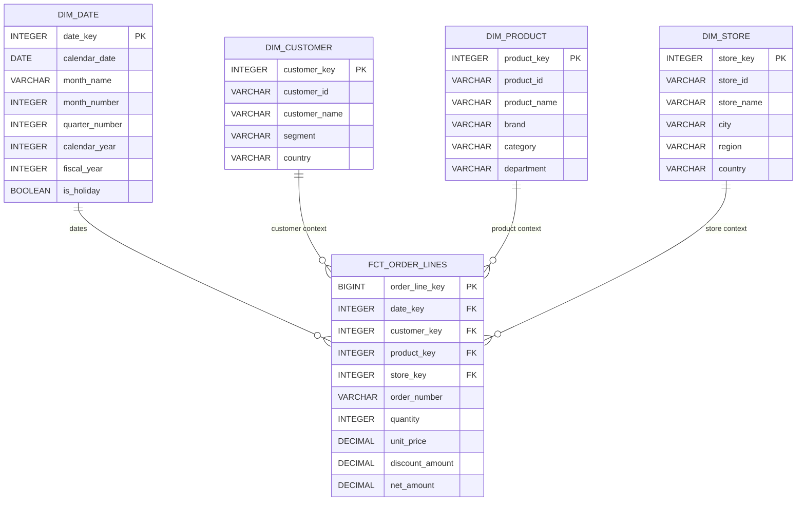
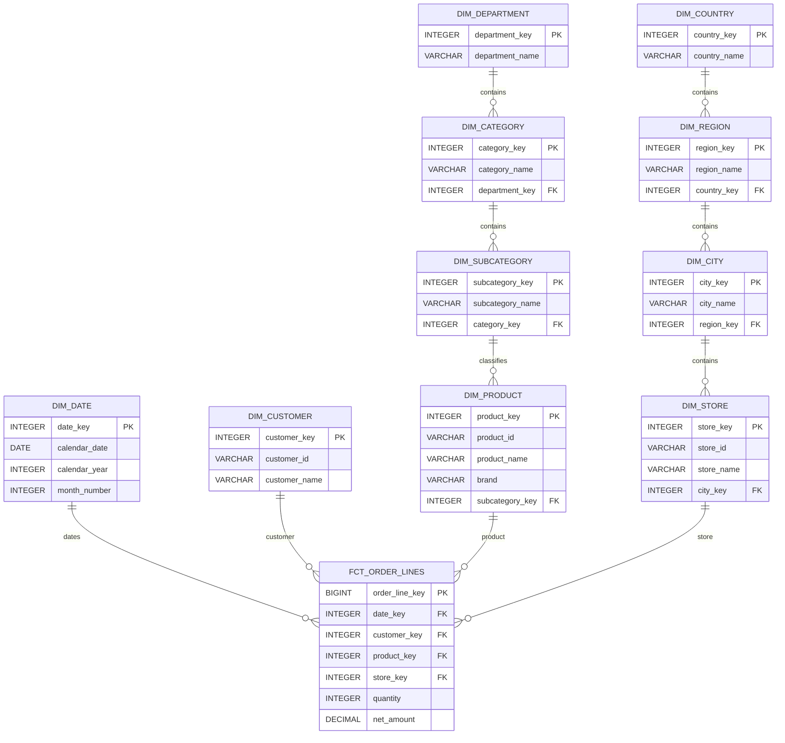
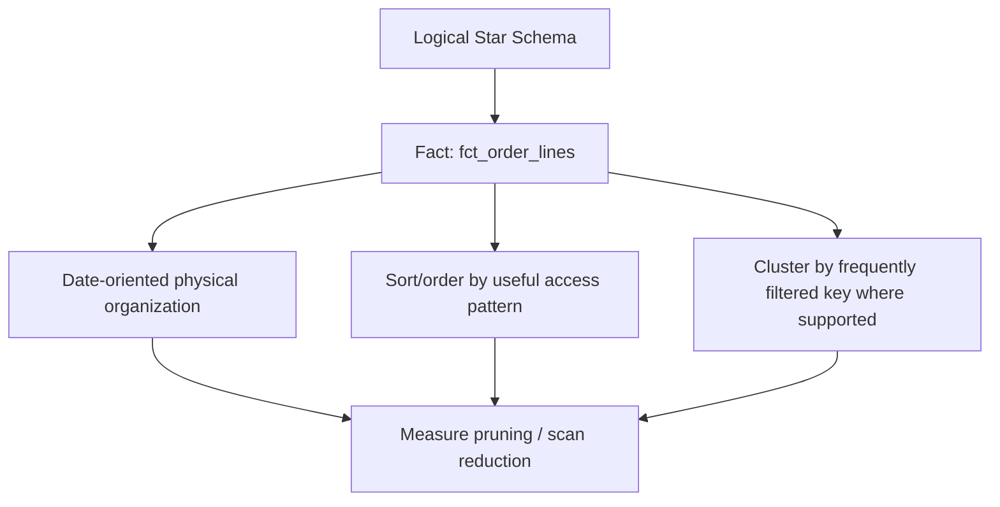

# Star and Snowflake Schemas

> **Stage 2 — Python for Data Engineering → Module 2.8 — Data Modelling for Analytics → Topic 03**
>
> This module is about one specific architectural question: **how should facts and dimensions be arranged for analytical use?**
>
> The goal is not to memorize that one schema shape is “better.” The goal is to learn how to compare **star** and **snowflake** structures using business requirements, query patterns, data characteristics, engine behavior, BI compatibility, physical design, and operational constraints.

---

## 1. Learning Objectives

By the end of this topic, you should be able to:

- Explain a **star schema** in simple language and in formal data-warehouse terminology.
- Explain a **snowflake schema** and identify the structural change that makes a dimensional model snowflaked.
- Build a star and a snowflake representation of the **same business process** without changing the business meaning.
- Write analytical SQL against both structures.
- Explain why stars commonly lead to fewer joins and simpler user-facing SQL.
- Explain why a team might deliberately snowflake a hierarchy.
- Explain what an **outrigger** is and why it is a limited form of snowflaking.
- Explain a **galaxy/fact constellation** with multiple fact tables sharing conformed dimensions.
- Perform a correct **drill-across** analysis without multiplying fact rows.
- Explain why columnar analytical engines can make dimension redundancy relatively inexpensive through compression and efficient scans.
- Explain engine behaviors that can improve star-style queries, including predicate/filter pushdown, column pruning, join reordering, and efficient hash joins.
- Explain the concept of a **broadcast join** in Spark at an architectural level.
- Explain how BI tools and semantic layers interact naturally with fact-and-dimension structures.
- Distinguish logical schema design from physical design decisions such as partitioning, sorting, and clustering.
- Benchmark star vs snowflake fairly using equivalent workloads, cold/warm cache measurements, repeated runs, consistent file formats, and memory measurements.
- Evaluate a schema using approximately 50 million fact rows in DuckDB without inventing benchmark results.
- Defend a workload-specific schema decision in a production or architecture review.

---

## 2. Prerequisites

This topic assumes you have completed or understand:

- **Topic 01 — Normalization and Denormalization**
- **Topic 02 — Dimensional Modelling: Facts and Dimensions**
- SQL fundamentals
- Join cardinality
- DuckDB fundamentals
- Basic analytical querying
- Earlier Stage 2 concepts such as OLAP, medallion architecture, efficient file formats, and query execution fundamentals

You already know what a fact table, dimension, grain, and normalized source are. We will use those concepts rather than re-teaching them from scratch.

The key transition is:

> **Topic 02 taught you what facts and dimensions are. Topic 03 teaches you how those tables are arranged and how the arrangement affects users, queries, performance, and architecture.**

Later topics will cover grain and key strategy in greater depth, SCDs, Data Vault, and one-big-table models. Those are referenced only where needed for continuity.

---

# 3. Why Schema Shape Matters

Imagine an online retailer. The business has:

- orders
- products
- categories
- departments
- stores
- cities
- regions
- countries
- customers
- dates

The underlying operational system may store these concepts across many normalized tables because its primary job is to process transactions correctly.

Analytics has a different job.

An analyst may ask:

> “What was revenue by product category, store region, and quarter?”

Another analyst may ask:

> “Which departments grew fastest this year?”

A BI dashboard may need:

> “Show monthly revenue and units sold, then allow the user to filter by department, category, brand, country, and store.”

The same business information can be represented using different analytical structures. Schema shape therefore affects:

| Concern | Why structure matters |
|---|---|
| Query complexity | More joins usually create more SQL structure that users must understand. |
| Join behavior | Different structures create different join paths and opportunities for mistakes. |
| User experience | Analysts need a model that matches business vocabulary. |
| Redundancy | Denormalized dimensions repeat descriptive values. |
| Maintainability | More tables create more relationships to maintain; fewer tables can create wider, more redundant structures. |
| Performance | Runtime depends on the engine, data size, join strategy, filtering, storage layout, and workload. |
| BI usability | BI tools often map naturally to a fact-plus-dimensions structure. |
| Physical layout | Partitioning, sorting, clustering, and file organization can change the cost of the same logical model. |

### A useful mental model

> **Schema shape is an architectural decision, not just a diagramming preference.**

The same business meaning can be implemented in multiple valid structures. The engineering question is which structure fits the workload and environment.

### Small exercise

A retailer has a `product` entity and a four-level hierarchy:

```text
product → subcategory → category → department
```

Write down two possible designs:

1. Store all hierarchy attributes directly in `dim_product`.
2. Split the hierarchy into separate tables.

Do not decide which is better yet. The purpose is to see that both can describe the same business hierarchy.

### Checkpoint

**Question:** Why is schema shape an architectural decision?

**Answer:** Because it influences how users query the data, how many joins are required, how redundancy is managed, how BI and semantic layers consume the model, how the engine executes queries, and what physical design options are available.

---

# 4. Star Schema — Start From Zero

## 4.1 What Is a Star Schema?

A **star schema** is a dimensional model in which:

- a central **fact table** stores measurements for a business process at a declared grain, and
- **dimension tables** surround the fact and contain descriptive context.

The dimensions are generally designed so that the fact can join directly to them without traversing a normalized hierarchy of sub-dimensions.

A simple retailer can look like this:

```text
                 dim_date
                    |
                    |
dim_customer ---- fct_sales ---- dim_product
                    |
                    |
                 dim_store
```

The drawing resembles a star: the fact is in the center and the dimensions radiate outward.

### Formal definition

A star schema is an analytical schema where a fact table connects directly to denormalized dimensions, typically using keys from the fact to the corresponding dimension.

### Why does it exist?

It exists because analytical users usually want to ask questions such as:

- revenue by category
- units by store
- sales by month
- customers by segment
- revenue by geography

They want to express those questions in business vocabulary without navigating a complicated normalized hierarchy.

### The important distinction

A star does **not** mean “one table with everything.”

It means:

```text
              dimensions
                  |
            +-----+-----+
            |   FACT    |
            +-----+-----+
                  |
              dimensions
```

The fact and dimensions remain separate tables. The dimensions are simply arranged so that the fact can reach the required descriptive context directly.

### Small exercise

Suppose a sales fact joins directly to `dim_product`, and `dim_product` contains `product_name`, `category_name`, and `department_name`.

Is that a star-style dimension or a snowflaked dimension hierarchy?

**Answer:** It is star-style because the hierarchy attributes needed for analysis are stored directly in the product dimension.

---

# 5. Why It Is Called a “Star”

The name is visual rather than algorithmic.

The fact table is the center. Dimensions form the points around it:

```text
                         dim_date
                            |
                            |
              dim_customer | dim_product
                       \    |    /
                        \ fct_sales /
                         /    |    \
                 dim_store    |   dim_channel
```

The diagram is not intended to prescribe a particular number of dimensions. A real model can have many dimensions.

The important property is the **direct relationship from fact to dimensions**.

### Checkpoint

**Question:** What is the defining structural idea of a star schema?

**Answer:** A central fact table connects directly to denormalized analytical dimensions.

---

# 6. Build a Complete Star Schema

We will use the same online retailer throughout this topic so that every later comparison is based on the same business semantics.

## 6.1 Business process

The process is **retail order-line sales**.

## 6.2 Grain

> **One row per order line.**

This means a single order containing four products produces four fact rows.

The grain matters because the fact measures must belong to exactly one order-line observation.

## 6.3 Logical shape

```text
                  dim_date
                     |
                     |
dim_customer --- fct_order_lines --- dim_product
                     |
                     |
                  dim_store
```

## 6.4 Mermaid ER diagram



### Diagram explanation

- `FCT_ORDER_LINES` is the central fact table.
- Each dimension has one primary key used by the fact as a foreign key.
- `DIM_PRODUCT` contains category and department attributes directly.
- `DIM_STORE` contains city, region, and country directly.
- No extra category or geography tables are required to answer normal business questions.

That directness is the defining structural property we care about.

## 6.5 DuckDB DDL

```sql
CREATE TABLE dim_date (
    date_key INTEGER PRIMARY KEY,
    calendar_date DATE NOT NULL,
    month_name VARCHAR NOT NULL,
    month_number INTEGER NOT NULL,
    quarter_number INTEGER NOT NULL,
    calendar_year INTEGER NOT NULL,
    fiscal_year INTEGER NOT NULL,
    is_holiday BOOLEAN NOT NULL
);

CREATE TABLE dim_customer (
    customer_key INTEGER PRIMARY KEY,
    customer_id VARCHAR NOT NULL,
    customer_name VARCHAR NOT NULL,
    segment VARCHAR NOT NULL,
    country VARCHAR NOT NULL
);

CREATE TABLE dim_product (
    product_key INTEGER PRIMARY KEY,
    product_id VARCHAR NOT NULL,
    product_name VARCHAR NOT NULL,
    brand VARCHAR NOT NULL,
    category VARCHAR NOT NULL,
    department VARCHAR NOT NULL
);

CREATE TABLE dim_store (
    store_key INTEGER PRIMARY KEY,
    store_id VARCHAR NOT NULL,
    store_name VARCHAR NOT NULL,
    city VARCHAR NOT NULL,
    region VARCHAR NOT NULL,
    country VARCHAR NOT NULL
);

CREATE TABLE fct_order_lines (
    order_line_key BIGINT PRIMARY KEY,
    date_key INTEGER NOT NULL,
    customer_key INTEGER NOT NULL,
    product_key INTEGER NOT NULL,
    store_key INTEGER NOT NULL,
    order_number VARCHAR NOT NULL,
    quantity INTEGER NOT NULL,
    unit_price DECIMAL(12, 2) NOT NULL,
    discount_amount DECIMAL(12, 2) NOT NULL,
    net_amount DECIMAL(12, 2) NOT NULL
);
```

## 6.6 Sample data

```sql
INSERT INTO dim_date VALUES
    (20260105, DATE '2026-01-05', 'January', 1, 1, 2026, 2026, FALSE),
    (20260110, DATE '2026-01-10', 'January', 1, 1, 2026, 2026, FALSE),
    (20260126, DATE '2026-01-26', 'January', 1, 1, 2026, 2026, TRUE);

INSERT INTO dim_customer VALUES
    (1, 'C001', 'Asha Rao', 'Premium', 'India'),
    (2, 'C002', 'Ravi Sen', 'Standard', 'India'),
    (3, 'C003', 'Maya Das', 'Premium', 'Bangladesh');

INSERT INTO dim_product VALUES
    (10, 'P001', 'Laptop Pro 14', 'Northstar', 'Laptops', 'Electronics'),
    (11, 'P002', 'Wireless Mouse', 'Northstar', 'Accessories', 'Electronics'),
    (12, 'P003', 'Coffee Grinder', 'BeanWorks', 'Kitchen', 'Home');

INSERT INTO dim_store VALUES
    (100, 'S001', 'Salt Lake Store', 'Kolkata', 'East', 'India'),
    (101, 'S002', 'Banjara Store', 'Hyderabad', 'South', 'India');

INSERT INTO fct_order_lines VALUES
    (1, 20260105, 1, 10, 100, 'O1001', 1, 90000.00, 5000.00, 85000.00),
    (2, 20260105, 1, 11, 100, 'O1001', 2, 1500.00, 100.00, 2900.00),
    (3, 20260110, 2, 12, 101, 'O1002', 1, 7000.00, 0.00, 7000.00),
    (4, 20260126, 3, 10, 100, 'O1003', 1, 92000.00, 2000.00, 90000.00);
```

The values are illustrative training data. A production warehouse would have a more rigorous loading process, key-management strategy, history policy, constraints, data-quality tests, and operational metadata.

---

# 7. Typical Star Schema Query Patterns

The common analytical pattern is:

```text
Filter or group using dimension attributes
                ↓
          join to the fact
                ↓
        aggregate measures
```

## 7.1 Filter on dimension attributes

### Business question

> “What was revenue for the Electronics department?”

```sql
SELECT
    SUM(f.net_amount) AS revenue
FROM fct_order_lines AS f
JOIN dim_product AS p
    ON f.product_key = p.product_key
WHERE p.department = 'Electronics';
```

### What is happening?

- The fact provides `net_amount`.
- The product dimension provides `department`.
- The filter selects the business population.
- The aggregation computes revenue over that selected population.

The model lets the user express the question in business terms without navigating department → category → product tables.

### Checkpoint

What table contains the measure `net_amount`?

**Answer:** The fact table.

What table contains `department`?

**Answer:** The product dimension.

---

## 7.2 Group by dimension attributes

### Business question

> “What was revenue by product category?”

```sql
SELECT
    p.category,
    SUM(f.net_amount) AS revenue
FROM fct_order_lines AS f
JOIN dim_product AS p
    ON f.product_key = p.product_key
GROUP BY p.category
ORDER BY revenue DESC;
```

This is a classic star query: the dimension gives context, while the fact supplies the measurement.

---

## 7.3 Aggregate fact measures

### Business question

> “What was monthly revenue by store?”

```sql
SELECT
    d.calendar_year,
    d.month_number,
    s.store_name,
    SUM(f.net_amount) AS revenue
FROM fct_order_lines AS f
JOIN dim_date AS d
    ON f.date_key = d.date_key
JOIN dim_store AS s
    ON f.store_key = s.store_key
GROUP BY
    d.calendar_year,
    d.month_number,
    s.store_name
ORDER BY
    d.calendar_year,
    d.month_number,
    s.store_name;
```

### Why the grain is correct

Every fact row is one order line. `net_amount` is therefore an order-line measure and can be aggregated to month/store because the aggregation is from a lower grain to a higher reporting grain.

### Small exercise

Write a query for:

> Units sold by department.

**Solution:**

```sql
SELECT
    p.department,
    SUM(f.quantity) AS units_sold
FROM fct_order_lines AS f
JOIN dim_product AS p
    ON f.product_key = p.product_key
GROUP BY p.department
ORDER BY units_sold DESC;
```

---

# 8. Snowflake Schema — Start From Zero

A **snowflake schema** is a dimensional model where one or more dimensions are normalized into related sub-dimension tables.

The classic example is a product hierarchy.

Instead of this star-style dimension:

```text
DIM_PRODUCT
-----------------------------------
product
product_name
category
subcategory
department
```

we may represent the hierarchy as:

```text
product
   ↓
subcategory
   ↓
category
   ↓
department
```

The fact first joins to product, then product joins to subcategory, subcategory to category, and category to department.

## Formal definition

A snowflake schema is an analytical dimensional structure in which dimensions are normalized into multiple related tables, typically separating hierarchy levels into distinct entities.

## Why does it exist?

Possible motivations include:

- reducing repeated descriptive values
- representing large or complex hierarchies separately
- reusing shared hierarchy structures
- fitting a particular organizational or platform design
- reducing the maintenance surface of certain repeated attributes

The fact that a hierarchy is normalized does not automatically make a snowflake appropriate. It is simply one design option.

---

# 9. Build the Snowflake Version of the Same Model

The business semantics must stay identical to the star example.

Only the structural arrangement changes.

## 9.1 Product hierarchy

```text
fct_order_lines
       |
 dim_product
       |
 dim_subcategory
       |
   dim_category
       |
 dim_department
```

## 9.2 Store hierarchy

```text
fct_order_lines
       |
   dim_store
       |
   dim_city
       |
  dim_region
       |
 dim_country
```

## 9.3 Mermaid ER diagram



### Diagram explanation

In the star, the fact reaches `department` through `dim_product` directly.

In the snowflake, the path is longer:

```text
FCT_ORDER_LINES
    → DIM_PRODUCT
    → DIM_SUBCATEGORY
    → DIM_CATEGORY
    → DIM_DEPARTMENT
```

Similarly, store geography has multiple joins.

The business meaning has not changed. The **schema shape** has changed.

## 9.4 DuckDB DDL

```sql
CREATE TABLE dim_department (
    department_key INTEGER PRIMARY KEY,
    department_name VARCHAR NOT NULL
);

CREATE TABLE dim_category (
    category_key INTEGER PRIMARY KEY,
    category_name VARCHAR NOT NULL,
    department_key INTEGER NOT NULL
);

CREATE TABLE dim_subcategory (
    subcategory_key INTEGER PRIMARY KEY,
    subcategory_name VARCHAR NOT NULL,
    category_key INTEGER NOT NULL
);

CREATE TABLE dim_product (
    product_key INTEGER PRIMARY KEY,
    product_id VARCHAR NOT NULL,
    product_name VARCHAR NOT NULL,
    brand VARCHAR NOT NULL,
    subcategory_key INTEGER NOT NULL
);

CREATE TABLE dim_country (
    country_key INTEGER PRIMARY KEY,
    country_name VARCHAR NOT NULL
);

CREATE TABLE dim_region (
    region_key INTEGER PRIMARY KEY,
    region_name VARCHAR NOT NULL,
    country_key INTEGER NOT NULL
);

CREATE TABLE dim_city (
    city_key INTEGER PRIMARY KEY,
    city_name VARCHAR NOT NULL,
    region_key INTEGER NOT NULL
);

CREATE TABLE dim_store (
    store_key INTEGER PRIMARY KEY,
    store_id VARCHAR NOT NULL,
    store_name VARCHAR NOT NULL,
    city_key INTEGER NOT NULL
);

CREATE TABLE dim_date (
    date_key INTEGER PRIMARY KEY,
    calendar_date DATE NOT NULL,
    month_number INTEGER NOT NULL,
    calendar_year INTEGER NOT NULL
);

CREATE TABLE dim_customer (
    customer_key INTEGER PRIMARY KEY,
    customer_id VARCHAR NOT NULL,
    customer_name VARCHAR NOT NULL
);

CREATE TABLE fct_order_lines (
    order_line_key BIGINT PRIMARY KEY,
    date_key INTEGER NOT NULL,
    customer_key INTEGER NOT NULL,
    product_key INTEGER NOT NULL,
    store_key INTEGER NOT NULL,
    order_number VARCHAR NOT NULL,
    quantity INTEGER NOT NULL,
    net_amount DECIMAL(12, 2) NOT NULL
);
```

## 9.5 Snowflake sample data

```sql
INSERT INTO dim_department VALUES
    (1, 'Electronics'),
    (2, 'Home');

INSERT INTO dim_category VALUES
    (10, 'Laptops', 1),
    (11, 'Accessories', 1),
    (12, 'Kitchen', 2);

INSERT INTO dim_subcategory VALUES
    (100, 'Portable Computers', 10),
    (101, 'Computer Accessories', 11),
    (102, 'Coffee Equipment', 12);

INSERT INTO dim_product VALUES
    (1000, 'P001', 'Laptop Pro 14', 'Northstar', 100),
    (1001, 'P002', 'Wireless Mouse', 'Northstar', 101),
    (1002, 'P003', 'Coffee Grinder', 'BeanWorks', 102);

INSERT INTO dim_country VALUES
    (1, 'India'),
    (2, 'Bangladesh');

INSERT INTO dim_region VALUES
    (10, 'East', 1),
    (11, 'South', 1),
    (12, 'Dhaka Region', 2);

INSERT INTO dim_city VALUES
    (100, 'Kolkata', 10),
    (101, 'Hyderabad', 11),
    (102, 'Dhaka', 12);

INSERT INTO dim_store VALUES
    (1000, 'S001', 'Salt Lake Store', 100),
    (1001, 'S002', 'Banjara Store', 101);
```

The exact surrogate-key strategy is intentionally not discussed deeply here. That is a later topic. The point is that the hierarchy is separated into related dimensions.

---

# 10. Star vs Snowflake — Structural Difference

| Characteristic | Star schema | Snowflake schema |
|---|---|---|
| Fact table | Central | Central |
| Dimension structure | Usually denormalized | More normalized |
| Hierarchy | Often flattened into one dimension | Often split across tables |
| Joins for hierarchy attributes | Usually fewer | Usually more |
| SQL complexity | Often simpler | Can be more complex |
| Analyst usability | Often easier | Can require more schema knowledge |
| BI configuration | Often straightforward | Can introduce more relationship paths |
| Redundancy | More repeated descriptive attributes | Less repeated hierarchy data |
| Storage | Can be larger logically, although compression can reduce physical cost | Often fewer repeated values |
| Maintenance | Simpler query paths; redundant attributes must remain consistent | More relationships and tables to maintain |
| Schema evolution | Often localized to wider dimensions | May affect several hierarchy tables |
| Performance | Often favorable for common analytical access patterns, but must be measured | Can be competitive or preferable for some workloads; must be measured |

The table describes common tendencies, not laws.

Performance depends on:

- engine
- optimizer
- table size
- dimension cardinality
- filter selectivity
- storage format
- physical layout
- workload repetition
- caching
- concurrency
- BI-generated SQL

### Critical rule

> **Do not choose a schema because you have memorized a ranking. Choose it because it fits the actual workload and constraints.**

---

# 11. The Same Query in Star vs Snowflake

A fair comparison keeps the business question and business meaning unchanged.

Below are ten representative questions.

## Query 1 — Revenue by Department

### Star

```sql
SELECT
    p.department,
    SUM(f.net_amount) AS revenue
FROM fct_order_lines AS f
JOIN dim_product AS p
    ON f.product_key = p.product_key
GROUP BY p.department;
```

**Join count:** 1.

### Snowflake

```sql
SELECT
    d.department_name,
    SUM(f.net_amount) AS revenue
FROM fct_order_lines AS f
JOIN dim_product AS p
    ON f.product_key = p.product_key
JOIN dim_subcategory AS s
    ON p.subcategory_key = s.subcategory_key
JOIN dim_category AS c
    ON s.category_key = c.category_key
JOIN dim_department AS d
    ON c.department_key = d.department_key
GROUP BY d.department_name;
```

**Join count:** 4.

### Structural difference

The business question is identical. The extra joins exist because the snowflake stores the hierarchy in separate tables.

---

## Query 2 — Revenue by Category

### Star

```sql
SELECT
    p.category,
    SUM(f.net_amount) AS revenue
FROM fct_order_lines AS f
JOIN dim_product AS p
    ON f.product_key = p.product_key
GROUP BY p.category;
```

**Join count:** 1.

### Snowflake

```sql
SELECT
    c.category_name,
    SUM(f.net_amount) AS revenue
FROM fct_order_lines AS f
JOIN dim_product AS p
    ON f.product_key = p.product_key
JOIN dim_subcategory AS s
    ON p.subcategory_key = s.subcategory_key
JOIN dim_category AS c
    ON s.category_key = c.category_key
GROUP BY c.category_name;
```

**Join count:** 3.

---

## Query 3 — Revenue by Product

### Star

```sql
SELECT
    p.product_name,
    SUM(f.net_amount) AS revenue
FROM fct_order_lines AS f
JOIN dim_product AS p
    ON f.product_key = p.product_key
GROUP BY p.product_name;
```

**Join count:** 1.

### Snowflake

```sql
SELECT
    p.product_name,
    SUM(f.net_amount) AS revenue
FROM fct_order_lines AS f
JOIN dim_product AS p
    ON f.product_key = p.product_key
GROUP BY p.product_name;
```

**Join count:** 1.

### Important observation

A snowflake does not necessarily add joins to **every** query. If all required attributes are already in `dim_product`, the hierarchy split may not matter.

The structural difference becomes visible when the query travels into the sub-dimensions.

---

## Query 4 — Revenue by Region

### Star

```sql
SELECT
    s.region,
    SUM(f.net_amount) AS revenue
FROM fct_order_lines AS f
JOIN dim_store AS s
    ON f.store_key = s.store_key
GROUP BY s.region;
```

**Join count:** 1.

### Snowflake

```sql
SELECT
    r.region_name,
    SUM(f.net_amount) AS revenue
FROM fct_order_lines AS f
JOIN dim_store AS s
    ON f.store_key = s.store_key
JOIN dim_city AS c
    ON s.city_key = c.city_key
JOIN dim_region AS r
    ON c.region_key = r.region_key
GROUP BY r.region_name;
```

**Join count:** 3.

---

## Query 5 — Revenue by Store

### Star

```sql
SELECT
    s.store_name,
    SUM(f.net_amount) AS revenue
FROM fct_order_lines AS f
JOIN dim_store AS s
    ON f.store_key = s.store_key
GROUP BY s.store_name;
```

**Join count:** 1.

### Snowflake

```sql
SELECT
    s.store_name,
    SUM(f.net_amount) AS revenue
FROM fct_order_lines AS f
JOIN dim_store AS s
    ON f.store_key = s.store_key
GROUP BY s.store_name;
```

**Join count:** 1.

Again, no unnecessary joins are introduced merely because the schema is snowflaked.

---

## Query 6 — Monthly Revenue by Category

### Star

```sql
SELECT
    d.calendar_year,
    d.month_number,
    p.category,
    SUM(f.net_amount) AS revenue
FROM fct_order_lines AS f
JOIN dim_date AS d
    ON f.date_key = d.date_key
JOIN dim_product AS p
    ON f.product_key = p.product_key
GROUP BY
    d.calendar_year,
    d.month_number,
    p.category
ORDER BY
    d.calendar_year,
    d.month_number,
    p.category;
```

**Join count:** 2.

### Snowflake

```sql
SELECT
    d.calendar_year,
    d.month_number,
    c.category_name,
    SUM(f.net_amount) AS revenue
FROM fct_order_lines AS f
JOIN dim_date AS d
    ON f.date_key = d.date_key
JOIN dim_product AS p
    ON f.product_key = p.product_key
JOIN dim_subcategory AS s
    ON p.subcategory_key = s.subcategory_key
JOIN dim_category AS c
    ON s.category_key = c.category_key
GROUP BY
    d.calendar_year,
    d.month_number,
    c.category_name
ORDER BY
    d.calendar_year,
    d.month_number,
    c.category_name;
```

**Join count:** 4.

---

## Query 7 — Units Sold by Department

### Star

```sql
SELECT
    p.department,
    SUM(f.quantity) AS units_sold
FROM fct_order_lines AS f
JOIN dim_product AS p
    ON f.product_key = p.product_key
GROUP BY p.department;
```

**Join count:** 1.

### Snowflake

```sql
SELECT
    d.department_name,
    SUM(f.quantity) AS units_sold
FROM fct_order_lines AS f
JOIN dim_product AS p
    ON f.product_key = p.product_key
JOIN dim_subcategory AS s
    ON p.subcategory_key = s.subcategory_key
JOIN dim_category AS c
    ON s.category_key = c.category_key
JOIN dim_department AS d
    ON c.department_key = d.department_key
GROUP BY d.department_name;
```

**Join count:** 4.

---

## Query 8 — Sales by Country and Quarter

### Star

```sql
SELECT
    d.calendar_year,
    d.quarter_number,
    s.country,
    SUM(f.net_amount) AS revenue
FROM fct_order_lines AS f
JOIN dim_date AS d
    ON f.date_key = d.date_key
JOIN dim_store AS s
    ON f.store_key = s.store_key
GROUP BY
    d.calendar_year,
    d.quarter_number,
    s.country;
```

**Join count:** 2.

### Snowflake

```sql
SELECT
    d.calendar_year,
    d.quarter_number,
    co.country_name,
    SUM(f.net_amount) AS revenue
FROM fct_order_lines AS f
JOIN dim_date AS d
    ON f.date_key = d.date_key
JOIN dim_store AS s
    ON f.store_key = s.store_key
JOIN dim_city AS c
    ON s.city_key = c.city_key
JOIN dim_region AS r
    ON c.region_key = r.region_key
JOIN dim_country AS co
    ON r.country_key = co.country_key
GROUP BY
    d.calendar_year,
    d.quarter_number,
    co.country_name;
```

**Join count:** 5.

---

## Query 9 — Top Products by Revenue

This query is structurally the same because the product name is available directly from the product dimension.

### Star

```sql
SELECT
    p.product_name,
    SUM(f.net_amount) AS revenue
FROM fct_order_lines AS f
JOIN dim_product AS p
    ON f.product_key = p.product_key
GROUP BY p.product_name
ORDER BY revenue DESC
LIMIT 10;
```

### Snowflake

```sql
SELECT
    p.product_name,
    SUM(f.net_amount) AS revenue
FROM fct_order_lines AS f
JOIN dim_product AS p
    ON f.product_key = p.product_key
GROUP BY p.product_name
ORDER BY revenue DESC
LIMIT 10;
```

**Join count:** 1 in both.

This is an important engineering lesson: **do not count tables in the schema and assume every query pays the maximum possible join cost.** The query path depends on which attributes the question uses.

---

## Query 10 — Revenue Growth by Category

### Star

```sql
WITH monthly AS (
    SELECT
        d.calendar_year,
        d.month_number,
        p.category,
        SUM(f.net_amount) AS revenue
    FROM fct_order_lines AS f
    JOIN dim_date AS d
        ON f.date_key = d.date_key
    JOIN dim_product AS p
        ON f.product_key = p.product_key
    GROUP BY
        d.calendar_year,
        d.month_number,
        p.category
)
SELECT
    calendar_year,
    month_number,
    category,
    revenue,
    revenue - LAG(revenue) OVER (
        PARTITION BY category
        ORDER BY calendar_year, month_number
    ) AS revenue_change
FROM monthly
ORDER BY category, calendar_year, month_number;
```

### Snowflake

```sql
WITH monthly AS (
    SELECT
        d.calendar_year,
        d.month_number,
        c.category_name,
        SUM(f.net_amount) AS revenue
    FROM fct_order_lines AS f
    JOIN dim_date AS d
        ON f.date_key = d.date_key
    JOIN dim_product AS p
        ON f.product_key = p.product_key
    JOIN dim_subcategory AS s
        ON p.subcategory_key = s.subcategory_key
    JOIN dim_category AS c
        ON s.category_key = c.category_key
    GROUP BY
        d.calendar_year,
        d.month_number,
        c.category_name
)
SELECT
    calendar_year,
    month_number,
    category_name,
    revenue,
    revenue - LAG(revenue) OVER (
        PARTITION BY category_name
        ORDER BY calendar_year, month_number
    ) AS revenue_change
FROM monthly
ORDER BY category_name, calendar_year, month_number;
```

### Query comparison

The ten queries demonstrate a broader principle:

- Some questions have the **same join count** in both models.
- Questions requiring hierarchy attributes generally need **more joins in the snowflake**.
- A query can be structurally more complex without producing a different business result.
- More joins do not automatically mean worse runtime on every engine.
- Readability and BI usability are part of the decision, not just runtime.

---

# 12. Why Analysts Often Prefer Stars

A star schema often maps closely to how analysts think.

An analyst might naturally think:

> Revenue → Product → Category → Store → Month

rather than:

> Revenue → Product → Subcategory → Category → Department

The common reasons stars are comfortable for users include:

- fewer joins
- flatter dimensions
- readable business vocabulary
- straightforward filters
- simple grouping
- easier BI configuration
- easier self-service analysis

For example, this query is easy to explain:

```sql
SELECT
    p.category,
    SUM(f.net_amount) AS revenue
FROM fct_order_lines AS f
JOIN dim_product AS p
    ON f.product_key = p.product_key
GROUP BY p.category;
```

The downside is that dimensions can contain repeated descriptive values.

A product dimension may contain:

```text
product_id | product_name | category       | department
-----------+--------------+----------------+------------
P001       | Laptop A     | Laptops        | Electronics
P002       | Laptop B     | Laptops        | Electronics
P003       | Laptop C     | Laptops        | Electronics
```

`Electronics` is repeated. That is intentional denormalization.

### Checkpoint

Why might the repeated category value be acceptable?

**Answer:** Because analytical workloads often prioritize straightforward reads and scans, and columnar storage/compression can reduce the physical cost of repeating low-cardinality descriptive values.

---

# 13. Why Someone Might Choose Snowflake

Snowflaking can be justified when the hierarchy separation provides real value.

Examples include:

| Situation | Why snowflaking may be considered |
|---|---|
| Complex hierarchy management | Hierarchy levels may have distinct lifecycle and ownership. |
| Reducing redundancy | Repeated hierarchy attributes can be represented once. |
| Shared substructures | A hierarchy entity may be reused across multiple dimensions or subject areas. |
| Organizational conventions | A platform may have established modelling standards that favor separated hierarchies. |
| Engine/workload characteristics | Query cost may be acceptable or advantageous under the target engine and workload. |
| Rapidly evolving hierarchy structure | Separate tables may simplify particular operational changes. |

However:

> **“We snowflaked because normalized data is good” is not sufficient architectural reasoning.**

The decision should state the actual requirement and why the structure helps satisfy it.

### Example of stronger reasoning

Weak:

> “Snowflake is more normalized.”

Stronger:

> “The geography hierarchy is shared by several subject areas, changes under an independently managed process, and is rarely needed beyond region-level reporting. We will test whether the additional joins are acceptable for the target BI workload before adopting the separated hierarchy.”

The second statement connects the schema to a real requirement and a validation step.

---

# 14. Redundancy in Star Schemas

Consider this dimension:

```text
product_id
product_name
category
department
```

There might be 100,000 products but only 20 departments.

The strings `Electronics`, `Home`, and other department labels may be repeated across many product rows.

At first this can look wasteful.

But analytical systems commonly use columnar storage, where a column is stored separately and compression schemes can exploit repeated values.

For example:

```text
category column
--------------
Laptops
Laptops
Laptops
Accessories
Accessories
Kitchen
Kitchen
Kitchen
```

A columnar storage engine can often compress repeated or low-cardinality values more effectively than a naïve row-oriented mental model suggests.

### Important caution

Do **not** assume a specific compression ratio without measuring it.

The actual result depends on:

- values
- cardinality
- encoding
- compression algorithm
- file format
- sort order
- engine
- data distribution

The correct statement is:

> **Columnar compression can make some forms of dimension redundancy relatively inexpensive. The magnitude of the benefit must be measured on actual data.**

---

# 15. Join Cost vs Storage Cost

A simplified conceptual trade-off is:

```text
STAR
more repeated dimension information
            ↓
      fewer joins

SNOWFLAKE
less repeated hierarchy information
            ↓
       more joins
```

This produces two common but incorrect shortcuts:

> “Fewer rows means faster.”

and:

> “Fewer joins always means faster.”

Neither is universally true.

A query engine may execute multiple joins very efficiently. A star dimension may be wide but highly compressible. A snowflake hierarchy may reduce storage but increase join planning and execution work. A particular engine may optimize one access pattern much better than another.

### Production rule

Benchmark the real query patterns on the target platform.

Use intuition to formulate hypotheses, not to fabricate conclusions.

---

# 16. Outriggers

An **outrigger** is a dimension that is intentionally snowflaked from another dimension rather than directly stored as part of the main dimension.

Think of it as a **limited, deliberate form of snowflaking**.

For example:

```text
DIM_CUSTOMER
      |
      v
DIM_CUSTOMER_GEOGRAPHY
```

The customer dimension might contain a `geography_key`, while geography is maintained separately.

This is different from taking every hierarchy and normalizing every level.

### Why use an outrigger?

Possible reasons:

- a reusable substructure has meaningful independent ownership
- the substructure is shared
- the separation reduces operational duplication
- the hierarchy changes differently from the parent dimension
- the workload and BI model tolerate the extra join

### Why be cautious?

Every additional relationship is another path the consumer or semantic layer may need to understand.

An outrigger should answer a concrete need. It should not be a reflexive attempt to make a dimensional model look like an OLTP schema.

### Small exercise

A customer dimension contains address attributes that are used only by one workload. A geography hierarchy is shared across five subject areas and independently maintained.

Which structure is worth investigating?

**Answer:** A shared geography structure may justify an outrigger or another deliberate snowflake pattern. The decision still needs workload and platform validation.

---

# 17. Galaxy / Fact Constellation

A **galaxy**, also called a **fact constellation**, is a dimensional architecture with multiple fact tables that share dimensions.

Example:

```text
                   dim_date
                      |
          +-----------+-----------+
          |           |           |
          v           v           v
     fct_sales   fct_returns  fct_inventory
          |           |           |
          +----- shared dimensions -----+
                 |          |
            dim_product  dim_store
                 |
            dim_customer
```

The important ideas are:

- each fact represents a business process
- facts can have different grains
- dimensions can be shared
- shared dimensions need consistent business meaning

For example:

| Fact | Business process | Example grain |
|---|---|---|
| `fct_sales` | Sales | One row per order line |
| `fct_returns` | Returns | One row per returned order line |
| `fct_inventory` | Inventory | One row per product/store/day |

The dimensions may include `dim_date`, `dim_product`, and `dim_store`.

### Why this matters

A business may want to compare sales and returns. The common dimensions make the analysis possible, but the fact tables should not be casually joined at their raw grains.

That leads to drill-across.

---

# 18. Why Fact Tables Must Not Be Joined Carelessly

Suppose Product A has:

```text
3 sales rows
2 return rows
```

If you join those facts directly on product, you can produce:

```text
3 × 2 = 6 joined rows
```

Every sales row can match every return row.

If `sales.amount` is then summed after the join, the amount can be multiplied.

### Simplified example

Sales:

| product | sale_id | amount |
|---|---:|---:|
| A | S1 | 100 |
| A | S2 | 150 |
| A | S3 | 200 |

Returns:

| product | return_id | amount |
|---|---:|---:|
| A | R1 | 20 |
| A | R2 | 30 |

A direct join produces six combinations.

The correct sales total is:

```text
100 + 150 + 200 = 450
```

But after a direct fact-to-fact join, the sales amount appears across multiple matching return rows.

This is the kind of fan-trap problem that comes from ignoring grain.

### The correct principle

> **Drill across facts at a common grain.**

---

# 19. Drill-Across Queries

Suppose the business question is:

> “Compare monthly sales and returns by product category.”

The correct process is:

1. Aggregate sales to month/category.
2. Aggregate returns to month/category.
3. Join those two already-aggregated result sets.

### Sales aggregation

```sql
WITH sales AS (
    SELECT
        d.calendar_year,
        d.month_number,
        p.category,
        SUM(f.net_amount) AS sales_amount
    FROM fct_sales AS f
    JOIN dim_date AS d
        ON f.date_key = d.date_key
    JOIN dim_product AS p
        ON f.product_key = p.product_key
    GROUP BY
        d.calendar_year,
        d.month_number,
        p.category
),
returns AS (
    SELECT
        d.calendar_year,
        d.month_number,
        p.category,
        SUM(f.return_amount) AS return_amount
    FROM fct_returns AS f
    JOIN dim_date AS d
        ON f.date_key = d.date_key
    JOIN dim_product AS p
        ON f.product_key = p.product_key
    GROUP BY
        d.calendar_year,
        d.month_number,
        p.category
)
SELECT
    COALESCE(s.calendar_year, r.calendar_year) AS calendar_year,
    COALESCE(s.month_number, r.month_number) AS month_number,
    COALESCE(s.category, r.category) AS category,
    COALESCE(s.sales_amount, 0) AS sales_amount,
    COALESCE(r.return_amount, 0) AS return_amount
FROM sales AS s
FULL OUTER JOIN returns AS r
    ON s.calendar_year = r.calendar_year
   AND s.month_number = r.month_number
   AND s.category = r.category
ORDER BY
    calendar_year,
    month_number,
    category;
```

### Why this works

Both datasets are reduced to the same comparison grain:

> **One row per month per category.**

The join is now a comparison of summarized business populations, not a raw fact-to-fact multiplication.

### Checkpoint

What is the key requirement for a safe drill-across?

**Answer:** The participating fact tables must first be independently aggregated to a common, compatible grain before being combined.

---

# 20. Columnar Engines and Star Schemas

Analytical systems frequently use columnar engines because analytical queries often need only a subset of columns from a very large fact table.

For example:

```sql
SELECT
    p.category,
    SUM(f.net_amount)
FROM fct_order_lines AS f
JOIN dim_product AS p
    ON f.product_key = p.product_key
WHERE p.department = 'Electronics'
GROUP BY p.category;
```

The engine may only need:

- `f.product_key`
- `f.net_amount`
- relevant columns from `p`

It may avoid reading unrelated fact columns such as:

- audit metadata
- discount details not used by the query
- source identifiers
- other attributes

This is called **column pruning** or projection pruning.

## 20.1 Why stars can fit this pattern well

A common analytical shape is:

```text
large fact table
      ↓
 small dimensions
      ↓
filter/group/aggregate
```

The fact can remain large while dimensions provide low-volume descriptive context.

Possible engine advantages include:

- column pruning
- predicate filtering
- compressed dimension attributes
- efficient hash joins
- join reordering
- aggregation over only needed columns

Again, these are common execution opportunities, not guarantees.

---

# 21. Large Fact + Small Dimension

A frequent analytical access pattern looks like:

```text
       Large fact
           |
           | JOIN
           v
    Small dimension
```

For example, `fct_order_lines` could contain hundreds of millions of rows, while `dim_product` contains tens of thousands or millions of rows.

A database may use a hash join or another physical join strategy that is efficient for this relationship.

The conceptual flow is:

```text
Dimension filter
      ↓
select relevant dimension values
      ↓
join against fact keys
      ↓
aggregate fact measures
```

The effect of a dimension filter can be significant when it substantially reduces the fact-side population.

### Important caution

Do not assume that a dimension filter always reduces the amount of physical work. Actual execution depends on:

- optimizer behavior
- selectivity
- statistics
- data layout
- join strategy
- partition pruning
- clustering/sorting
- engine implementation

Use `EXPLAIN` or the engine's profiling facilities to inspect real behavior.

---

# 22. How Engines Optimize Star Joins

This is an advanced awareness section, not a complete query-engine course.

Depending on the engine and optimizer, a star-style query can benefit from several techniques.

## 22.1 Predicate pushdown

A predicate such as:

```sql
WHERE p.department = 'Electronics'
```

may be moved closer to the point where data is read or filtered.

The exact implementation differs by engine.

## 22.2 Filter pushdown

The optimizer may use the dimension filter to reduce work earlier in the execution plan.

## 22.3 Column pruning

Unused columns can be excluded from scans.

## 22.4 Join reordering

An optimizer can change the physical order of joins when doing so is expected to reduce cost.

## 22.5 Hash joins

For equality joins such as:

```sql
ON f.product_key = p.product_key
```

hash-based execution can be effective under the right conditions.

## 22.6 Dimension filtering and fact scanning

The engine may exploit statistics or physical layout so that dimension filtering results in less data being processed on the fact side.

### Inspect, do not assume

A senior engineer should ask:

> “What did the optimizer actually do?”

rather than:

> “The model is a star, so the query must be fast.”

Use tools such as DuckDB's `EXPLAIN` or `EXPLAIN ANALYZE` when available:

```sql
EXPLAIN
SELECT
    p.category,
    SUM(f.net_amount)
FROM fct_order_lines AS f
JOIN dim_product AS p
    ON f.product_key = p.product_key
WHERE p.department = 'Electronics'
GROUP BY p.category;
```

For runtime profiling:

```sql
EXPLAIN ANALYZE
SELECT
    p.category,
    SUM(f.net_amount)
FROM fct_order_lines AS f
JOIN dim_product AS p
    ON f.product_key = p.product_key
WHERE p.department = 'Electronics'
GROUP BY p.category;
```

The exact operator names and plan details are engine-specific.

---

# 23. Broadcast Joins in Spark — Advanced Awareness

The roadmap requires awareness of the **broadcast join** concept in Spark.

Imagine:

- one very large fact dataset
- one relatively small product dimension

Conceptually:

```text
               Small dimension
                      |
               broadcast copy
              /       |       \
             /        |        \
       Worker 1   Worker 2   Worker 3
           |          |          |
        local fact local fact local fact
```

Instead of repeatedly moving the large fact across workers, Spark can distribute the smaller dimension to workers so that each worker can perform a local join against its own fact partition.

### Why might this help?

It can reduce a large shuffle when the dimension is small enough to fit in worker memory.

### What must be considered?

- dimension size
- worker memory
- available executor resources
- optimizer decisions
- configuration
- data distribution

This does **not** mean every star schema automatically becomes a broadcast join. The engine may choose another strategy or the dimension may be too large.

### Conceptual decision rule

> If the small side is genuinely small and the engine can safely replicate it, broadcasting may be useful. Measure and inspect the plan.

---

# 24. BI Tool Compatibility

A star schema often fits the mental model of BI systems:

```text
              Measures
                 |
                 v
               FACT
             /  |  \
            /   |   \
     Dimensions | Dimensions
```

A BI user commonly wants:

- measures such as revenue and units
- dimensions such as date, product, store, customer
- filters
- groupings
- drill-downs
- hierarchies

A star can make the relationship structure relatively easy to expose.

For example:

```text
Product
  → Department
  → Category
  → Brand
  → Product
```

could appear as a clear hierarchy in a BI interface.

### Why a heavily snowflaked model can be more complex

The BI tool may need to understand:

```text
Product
  → Subcategory
      → Category
          → Department
```

and possibly additional paths through geography or other structures.

This can increase semantic complexity.

### Important qualification

Not all BI tools behave the same way.

Some can handle complex relationship graphs well. Others are more comfortable with simple dimensional relationships.

Therefore, BI compatibility should be validated against the actual toolset rather than assumed from a general rule.

---

# 25. Semantic-Layer Compatibility

A semantic layer commonly thinks in terms of:

```text
Fact
  +
Dimensions
  +
Measures
  +
Relationships
```

A star schema fits this structure naturally.

For example:

```text
                 Revenue
                    |
                 FACT SALES
               /     |      \
           Date   Product   Store
```

The semantic layer can potentially hide join details from end users.

A user might ask for:

> Revenue by department.

The semantic layer can translate that into joins and aggregation logic.

A snowflake is still possible, but additional relationships can increase semantic-model configuration complexity.

### The architectural point

Schema shape affects downstream systems even when the SQL engine can execute both forms.

This is why schema evaluation must include **usability**, not only database runtime.

---

# 26. Physical Design of a Star Schema

A logical star is only the logical structure.

Production systems also make physical decisions such as:

- partitioning
- sorting
- clustering
- file organization
- compression
- data retention layout

The same logical star can have very different runtime characteristics under different physical layouts.

### Logical vs physical design

| Layer | Example decision |
|---|---|
| Logical | `fct_order_lines` joins to `dim_product`. |
| Physical | Store the fact organized by date and/or sort or cluster by frequently filtered keys. |
| Operational | Refresh recent partitions incrementally and manage historical retention. |

Do not confuse:

> “This is a star schema.”

with:

> “This is already physically optimized.”

---

# 27. Fact Table Partitioning

Date is often an important candidate for physical organization because many analytical queries filter by time.

For example:

```text
fct_order_lines
    partitioned by order_date
```

A query such as:

```sql
SELECT SUM(net_amount)
FROM fct_order_lines
WHERE order_date >= DATE '2026-09-01'
  AND order_date < DATE '2026-10-01';
```

may be able to avoid scanning older partitions if the engine and storage layout support partition pruning.

## Benefits can include

- reduced scan scope
- better incremental loading patterns
- easier retention management
- predictable time-window access

## Risks and trade-offs

Poor partitioning can create:

- too many small partitions
- uneven partition sizes
- expensive metadata management
- limited pruning benefit
- write amplification

### Important rule

> **Date is common; date is not automatically correct.**

Choose partitioning based on the actual filter patterns, table size, write pattern, and engine capabilities.

---

# 28. Sorting

Sorting can improve analytical data locality.

Suppose common queries filter by date and then group by product:

```text
order_date, product_key
```

A physically ordered representation may improve:

- locality
- range filtering
- ordered scans
- compression in some engines

The exact benefits depend on the storage format and engine.

### Example hypothesis

> “If most queries filter by a recent date range and then group by product, organizing the fact with time locality and product-related ordering may reduce scan work.”

That is a **hypothesis** to benchmark, not a guaranteed result.

---

# 29. Clustering

**Clustering** means physically organizing data so that values frequently used by queries have good locality.

A query workload may frequently filter by:

- customer
- product
- store
- region

A platform may provide a clustering mechanism to keep similar values physically closer.

### Partitioning vs clustering

| Concept | Simplified idea |
|---|---|
| Partitioning | Break data into explicit, separately managed groups. |
| Sorting | Order records within a physical representation. |
| Clustering | Improve locality around frequently accessed values using the engine's supported physical organization. |

Different engines implement these differently, so do not assume a cloud warehouse's clustering semantics are identical to another engine's.

### Small exercise

A fact has 20 TB of historical data. 80% of queries filter on `order_date`, while 30% of queries additionally filter on `store_key`.

What should you investigate?

**Answer:** Investigate date-based partitioning or equivalent pruning, then investigate whether sorting/clustering by store materially improves the real workload. Measure before and after.

---

# 30. Choosing Physical Keys Carefully

Physical design can use keys that align with query behavior, such as:

- date
- frequently filtered dimension keys
- frequently grouped attributes
- high-value access patterns

This section is **not** a re-teaching of surrogate-key strategy. That belongs to Topic 04.

The question here is:

> **Which existing model columns can be used effectively by the physical storage and query engine?**

For example, if queries frequently filter by `date_key`, it is worth evaluating date-oriented physical organization.

If queries frequently isolate a store, investigate whether store-oriented locality has measurable value.

The answer should come from workload evidence.

---

# 31. Star Schema Physical Design Example

Suppose the logical model is:

```text
             dim_date
                 |
                 |
        dim_product
              \  |
               \ |
             fct_order_lines
               /     \
        dim_store   dim_customer
```

Possible physical hypotheses:

| Decision | Hypothesis | What to measure |
|---|---|---|
| Date partitioning | Time-range queries may scan fewer files/partitions. | Bytes/files/rows scanned and latency. |
| Sort by date | Range scans may benefit from locality. | Range-query latency and storage impact. |
| Sort/cluster by product key | Product-heavy filters may benefit. | Filtered-query latency and scan volume. |
| Store-oriented locality | Store dashboards may benefit. | Store-filtered dashboard latency. |

### Mermaid physical-design concept



The diagram means that physical layout sits **below** the logical star. You do not change the business model merely because you are testing a physical optimization.

---

# 32. Benchmarking: Why It Matters

Comparing star vs snowflake by intuition is not enough for production architecture.

Suppose an engineer says:

> “Snowflake uses less storage, so it must be more efficient.”

Another says:

> “Star has fewer joins, so it must be faster.”

Both are making broad claims without evidence.

A fair benchmark asks:

> **Under the same workload, on the same engine and hardware, how do the candidate structures behave?**

Benchmarking should be controlled, repeatable, and representative.

---

# 33. What Makes a Fair Star vs Snowflake Benchmark?

A fair comparison should hold the important variables constant.

Both models should use:

- the same business data
- the same logical row counts
- the same business semantics
- the same analytical result
- the same engine
- the same hardware
- the same query semantics
- equivalent filtering
- equivalent aggregation
- the same file format where file format is part of the experiment
- the same or explicitly documented compression assumptions

### Unfair example

Star:

- optimized Parquet
- carefully sorted
- warm cache

Snowflake:

- unoptimized files
- cold cache
- unrelated query implementation

That experiment cannot support a reliable architectural conclusion.

### Benchmark principle

> **Change one design variable at a time when possible.**

---

# 34. Cold Cache vs Warm Cache

## Cold cache

A cold-cache measurement is intended to approximate a situation where the required data is not already resident in caches.

Cold behavior matters for workloads such as:

- infrequent reports
- ad-hoc queries
- newly accessed partitions
- startup-heavy workloads

## Warm cache

Warm-cache measurements represent repeated access where some data or metadata may already be cached.

Warm behavior matters for:

- repeated dashboards
- scheduled reports
- interactive analysts repeatedly querying the same period

### Why separate them?

A system can have:

```text
Cold:  slow
Warm:  fast
```

or:

```text
Cold:  acceptable
Warm:  excellent
```

Those represent different operational experiences.

### Rule

Record cold and warm results separately. Do not mix them into a single misleading average.

---

# 35. Repeated Runs

Do not trust a single execution.

Run the same query multiple times and record at least:

- first execution
- subsequent executions
- median runtime where appropriate
- minimum and maximum when useful
- variation/outliers

A single slow run could result from:

- temporary resource contention
- filesystem behavior
- cache state
- compilation/planning overhead
- background activity

Likewise, a single unusually fast run may not represent normal behavior.

### Example result table

| Query | Model | Run 1 | Run 2 | Run 3 | Median | Notes |
|---|---|---:|---:|---:|---:|---|
| Q1 | Star |  |  |  |  |  |
| Q1 | Snowflake |  |  |  |  |  |

Populate this table from actual runs.

---

# 36. Same File Format

When file-based storage is part of the comparison, control the file format.

For example, if using Parquet:

- use equivalent source data
- use the same compression assumptions where relevant
- keep the physical conditions comparable
- do not give one model a specially optimized storage layout unless physical layout is itself the subject being tested

The benchmark question must be clear.

### Example

Question A:

> “How does logical star vs logical snowflake behave?”

Then control physical storage as much as possible.

Question B:

> “What is the performance of production-ready star physical layout versus production-ready snowflake physical layout?”

Then physical optimization is part of the comparison, but it must be documented explicitly.

---

# 37. Memory Measurement

Runtime alone can hide production problems.

Suppose:

```text
Star      = 1.4 seconds, 1 GB peak memory
Snowflake = 1.1 seconds, 10 GB peak memory
```

The second may be faster in a local test but much harder to run safely under a constrained container or concurrent workload.

Memory affects:

- deployment limits
- concurrency
- worker sizing
- failure risk
- query queueing
- cost on some managed platforms

### Measure at least

- elapsed time
- peak memory when the tool exposes it
- bytes/files/rows scanned where available
- storage footprint

Do not fabricate values. Record real observations from the target environment.

---

# 38. Avoid Vendor-Marketing Benchmarks

Published benchmarks can be useful as background information, but they do not automatically predict your workload.

Potential differences include:

- dataset size
- hardware
- engine version
- configuration
- query mix
- file format
- compression
- cache state
- optimizer features
- partition layout
- clustering

Before accepting a benchmark claim, ask:

> **Does this benchmark resemble my workload?**

If not, treat it as contextual information rather than evidence for your production decision.

---

# 39. TPC-H-Style Benchmark Ideas

TPC-H is an established decision-support benchmark. This topic does **not** require claiming or implementing an official TPC-H run.

The useful idea is to construct a workload with varied analytical patterns such as:

- large fact scans
- dimension joins
- date filters
- selective predicates
- grouping
- aggregation
- multiple joins
- ranking or top-N analysis

For this module, create a representative benchmark suite inspired by those shapes rather than relying on one synthetic query.

### Example workload mix

| Query class | Example |
|---|---|
| Selective filter | Revenue for one department. |
| Grouping | Revenue by category. |
| Time aggregation | Monthly revenue. |
| Geography | Revenue by country/region. |
| Top-N | Top 100 products. |
| Multi-dimensional | Monthly revenue by category and store region. |
| Drill-across | Sales vs returns by month/category. |

The shape of the benchmark matters more than a single headline number.

---

# 40. Benchmark Dimensions

Use a benchmark report with multiple dimensions.

| Dimension | What to measure |
|---|---|
| Query latency | Cold and warm runtime. |
| Throughput | Queries per unit time under the chosen test conditions. |
| Memory | Peak memory or the closest supported measure. |
| Scan volume | Rows, files, or bytes scanned where available. |
| Join complexity | Number and type of joins in the logical/physical plan. |
| SQL complexity | Query length, readability, and number of relationship steps. |
| Storage | Physical table/file size. |
| Maintenance | Refresh or update complexity. |
| BI usability | Semantic-model complexity and user-facing join burden. |
| Scalability | Behavior as fact and dimension sizes increase. |

### Why multiple dimensions matter

Imagine:

```text
Model A: smaller storage
Model B: easier SQL
Model A: slower BI queries
Model B: larger storage
```

The architecture decision cannot be made responsibly from storage alone.

---

# 41. Required Hands-On Benchmark

The roadmap exercise requires you to:

- build the same retailer model as star and snowflake
- write ten equivalent business queries
- compare join counts
- compare SQL complexity
- measure runtime
- use approximately **50 million fact rows in DuckDB**

This module specifies the method; the learner should run it rather than receiving fabricated results.

## 41.1 Suggested data generation design

Use deterministic Python generation so that both models receive the same business data.

A practical dataset can include:

| Entity | Example scale |
|---|---:|
| Departments | 10–50 |
| Categories | 100–500 |
| Subcategories | 500–2,000 |
| Products | 100,000+ |
| Countries | 20–100 |
| Regions | 100–1,000 |
| Cities | 500–10,000 |
| Stores | 1,000–10,000 |
| Customers | 500,000+ |
| Fact rows | ~50,000,000 |

The exact counts are training choices, not requirements for a production warehouse.

## 41.2 Beginner-readable Python generation

```python
from __future__ import annotations

from datetime import date, timedelta
from random import Random


rng = Random(42)


departments = [
    (1, "Electronics"),
    (2, "Home"),
    (3, "Sports"),
]

categories = [
    (1, "Laptops", 1),
    (2, "Accessories", 1),
    (3, "Kitchen", 2),
    (4, "Fitness", 3),
]

subcategories = [
    (1, "Portable Computers", 1),
    (2, "Computer Accessories", 2),
    (3, "Coffee Equipment", 3),
    (4, "Exercise Equipment", 4),
]

products = [
    (1, "P001", "Laptop Pro 14", "Northstar", 1),
    (2, "P002", "Wireless Mouse", "Northstar", 2),
    (3, "P003", "Coffee Grinder", "BeanWorks", 3),
    (4, "P004", "Yoga Mat", "FlexFit", 4),
]

start = date(2026, 1, 1)

dates = []
for offset in range(365):
    d = start + timedelta(days=offset)
    dates.append((int(d.strftime("%Y%m%d")), d))

print("departments:", len(departments))
print("categories:", len(categories))
print("subcategories:", len(subcategories))
print("products:", len(products))
print("dates:", len(dates))
```

This first version is intentionally simple. For tens of millions of fact rows, you would normally generate data in batches rather than keeping a giant Python list in memory.

## 41.3 Batch-oriented fact generation

```python
from random import Random


rng = Random(42)


def generate_order_lines(batch_size: int, start_id: int):
    for i in range(batch_size):
        order_line_key = start_id + i
        product_key = rng.randint(1, 100_000)
        store_key = rng.randint(1, 5_000)
        customer_key = rng.randint(1, 500_000)
        date_key = rng.randint(20260101, 20261231)
        quantity = rng.randint(1, 5)
        unit_price = rng.randint(100, 100_000) / 100
        discount = rng.randint(0, 2_000) / 100
        gross = quantity * unit_price
        net = gross - discount

        yield (
            order_line_key,
            date_key,
            customer_key,
            product_key,
            store_key,
            f"O{order_line_key // 3:010d}",
            quantity,
            unit_price,
            discount,
            net,
        )
```

A real benchmark should use a reproducible generator, the same generated business data for both models, and a loading strategy that does not accidentally favor one schema.

### Important

A naïve random generator can create a technically large dataset that does not resemble real business distributions. Consider realistic skew, repeated customers, popular products, seasonal dates, and representative geography. The benchmark should resemble the workload you intend to evaluate.

---

# 42. Benchmark Setup in DuckDB

A simple benchmark harness can use DuckDB's timing and profiling capabilities.

```sql
PRAGMA enable_profiling='json';
PRAGMA profiling_output='profile.json';
```

The exact profiling setup can vary by DuckDB version and workflow. The important methodological requirement is to capture comparable metrics for the same logical query.

For individual plan inspection:

```sql
EXPLAIN
SELECT
    p.category,
    SUM(f.net_amount) AS revenue
FROM fct_order_lines AS f
JOIN dim_product AS p
    ON f.product_key = p.product_key
GROUP BY p.category;
```

For execution profiling:

```sql
EXPLAIN ANALYZE
SELECT
    p.category,
    SUM(f.net_amount) AS revenue
FROM fct_order_lines AS f
JOIN dim_product AS p
    ON f.product_key = p.product_key
GROUP BY p.category;
```

### Suggested benchmark sequence

```text
1. Load identical business data
2. Validate row counts
3. Validate the same business totals
4. Warm up if warm-cache measurement is desired
5. Record cold-cache results separately
6. Run each query repeatedly
7. Record runtime
8. Record memory/scan metrics when available
9. Compare SQL and logical join counts
10. Interpret the full evidence
```

---

# 43. Benchmark Result Template

Do not fill this with invented numbers.

| Query | Star joins | Snowflake joins | Star median (s) | Snowflake median (s) | Star memory | Snowflake memory | Notes |
|---|---:|---:|---:|---:|---:|---:|---|
| Q1 |  |  |  |  |  |  |  |
| Q2 |  |  |  |  |  |  |  |
| Q3 |  |  |  |  |  |  |  |
| Q4 |  |  |  |  |  |  |  |
| Q5 |  |  |  |  |  |  |  |
| Q6 |  |  |  |  |  |  |  |
| Q7 |  |  |  |  |  |  |  |
| Q8 |  |  |  |  |  |  |  |
| Q9 |  |  |  |  |  |  |  |
| Q10 |  |  |  |  |  |  |  |

### Storage template

| Model | Logical tables | Physical size | Notes |
|---|---:|---:|---|
| Star |  |  |  |
| Snowflake |  |  |  |

### BI/usability template

| Factor | Star observation | Snowflake observation |
|---|---|---|
| Number of relationships |  |  |
| User-facing SQL |  |  |
| Semantic model complexity |  |  |
| Hierarchy navigation |  |  |
| Maintenance burden |  |  |

---

# 44. Benchmark Result Interpretation

Imagine these **illustrative** values:

```text
Star:
Query A = 0.8 s
Query B = 1.2 s

Snowflake:
Query A = 1.0 s
Query B = 1.1 s
```

The correct conclusion is not:

> “Star always wins.”

Instead, ask:

- Which query patterns favor each model?
- Are the differences repeatable?
- Is memory materially different?
- Is storage materially different?
- Are users comfortable with the SQL?
- Is BI configuration more complex in one model?
- What happens at a larger data volume?
- What is the maintenance cost?
- Are cold-cache and warm-cache behaviors different?

The correct output of the benchmark is an **evidence-based trade-off analysis**, not a universal ranking.

---

# 45. Production Decision Framework

Use this framework when reviewing a star vs snowflake proposal.

```text
1. What are the most important analytical queries?
2. What is the grain of the fact?
3. How complex are the dimensions?
4. How frequently are hierarchies queried?
5. What BI tools consume the data?
6. What engine executes the queries?
7. How large are the facts and dimensions?
8. What physical design options are available?
9. How important is SQL simplicity?
10. How expensive is redundancy in this workload?
11. What does the benchmark show?
12. What operational trade-offs exist?
```

## Step 1 — Important queries

Do not start with:

> “Should we use star or snowflake?”

Start with:

> “What are our most important queries?”

Examples:

- dashboard queries
- recurring reporting
- ad-hoc analysis
- executive metrics
- scheduled extracts
- semantic-layer queries

## Step 2 — Fact grain

The schema shape must preserve the fact grain established in Topic 02.

## Step 3 — Dimension complexity

Ask whether the hierarchy is simple, large, shared, rapidly changing, or independently managed.

## Step 4 — Query frequency

A hierarchy that is rarely used can have different trade-offs from a hierarchy that appears in almost every dashboard.

## Step 5 — BI environment

Identify actual tools, semantic layers, and user skill levels.

## Step 6 — Engine

The same logical model can behave differently in DuckDB, Spark, or a cloud warehouse.

## Step 7 — Data size

A small dataset can hide problems that appear at production scale.

## Step 8 — Physical options

Check whether partitioning, sorting, clustering, indexing-like structures, or file-level pruning can change the result.

## Step 9 — SQL simplicity

Simplicity is an engineering characteristic. It affects developer productivity, analyst correctness, and support burden.

## Step 10 — Redundancy cost

Measure physical storage and operational impact instead of assuming repeated values are automatically expensive.

## Step 11 — Benchmark evidence

Use the controlled benchmark.

## Step 12 — Operational trade-offs

Consider:

- refresh complexity
- schema ownership
- documentation burden
- BI support
- training requirements
- debugging effort
- long-term maintenance

---

# 46. Scenario-Based Design Decisions

The following scenarios intentionally do **not** have a universal answer. The purpose is to practice reasoning.

## Scenario A — Small BI Team, Cloud Warehouse, Heavy Self-Service

### Requirements

- many analysts
- self-service reporting
- limited engineering support
- lots of dimension filters
- high importance of readable SQL

### Relevant factors

- BI friendliness
- semantic-layer simplicity
- number of joins
- documentation
- user error risk

### Design questions

A star structure may reduce user-facing relationship complexity, but this should still be validated against the actual BI tool and workload.

### What to benchmark/validate

- representative dashboard queries
- generated SQL complexity
- semantic-model setup time
- runtime under realistic concurrency
- support/maintenance burden

---

## Scenario B — Complex Product Hierarchy With Strong Data Engineering Support

### Requirements

- many hierarchy levels
- independently maintained hierarchy
- internal engineering expertise
- specialized analytical access patterns

### Relevant factors

- hierarchy management
- shared substructures
- BI complexity
- runtime
- maintenance

### What to investigate

Whether separating hierarchy levels provides measurable operational value without introducing unacceptable query or semantic complexity.

---

## Scenario C — Very Large Fact With Frequent Date Filtering

### Requirements

- hundreds of millions/billions of facts
- most queries filter by date
- historical data is retained

### Relevant factors

- date partitioning/pruning
- file layout
- sort order
- query selectivity
- fact scan reduction

### What to validate

Compare both schemas under the same time-range query workload and inspect scan volume and physical layout behavior.

---

## Scenario D — Interactive BI With Repetitive Queries

### Requirements

- users repeatedly run similar dashboard queries
- low expected tolerance for latency
- warm-cache performance matters

### Relevant factors

- warm-cache latency
- concurrency
- caching behavior
- SQL simplicity
- BI relationship structure

### What to validate

Run repeated workloads, not a single query. Separate first-run and subsequent-run measurements.

---

## Scenario E — Large Hierarchy Reused Across Domains

### Requirements

- geography or organization hierarchy is shared
- several analytical subject areas reference it
- independent ownership exists

### Relevant factors

- conformance
- hierarchy reuse
- maintenance
- semantic complexity
- join overhead

### What to validate

Whether a shared hierarchical structure should be physically separated, flattened into multiple dimensions, or represented using another architecture pattern.

The conclusion must be based on the actual domains and query patterns.

---

# 47. Common Mistakes

| Mistake | Symptom | Root cause | Correction | Production consequence |
|---|---|---|---|---|
| Snowflaking automatically because it looks “more normalized” | Complex schema with no measurable benefit | Confusing analytical structure with OLTP normalization | State the specific requirement for each snowflake edge | More joins and harder maintenance without business value |
| Denormalizing everything | Huge, redundant dimensions | Optimizing for simplicity without modeling boundaries | Keep redundancy deliberate and consumer-driven | Larger maintenance surface and possible semantic drift |
| Comparing different business logic | Different totals | Benchmark is not equivalent | Ensure same semantics and filters | Invalid architecture conclusion |
| Benchmarking one query | One result treated as universal evidence | Narrow workload | Use a representative query suite | Production surprises |
| One execution only | Unstable result | Timing variance/cache state | Repeat runs and report median/variation | Wrong performance assumptions |
| Mixing cold and warm cache | Confusing numbers | Cache state not controlled | Measure separately | Incorrect latency expectations |
| Different file formats | One model appears faster | Physical test is not controlled | Keep format comparable | Misleading benchmark |
| Ignoring memory | Fast query fails in production | Runtime treated as sole metric | Measure peak memory/resource use | OOM or poor concurrency |
| Vendor benchmark accepted without review | Architecture based on external number | Benchmark mismatch | Check data, engine, version, workload | Poor portability of conclusion |
| Direct fact-to-fact join | Revenue doubles | Incompatible fact grain | Aggregate to common grain first | Incorrect metrics |
| Assuming all columnar engines behave identically | Optimization expectations fail | Engine differences ignored | Inspect actual plans | Unpredictable performance |
| Assuming all BI tools are identical | Semantic model issues | Tool differences ignored | Validate with target BI platform | User friction |
| Partitioning without query analysis | No performance improvement | Poor partition choice | Measure pruning and filter selectivity | Storage complexity with no gain |
| Clustering without measuring | More maintenance, no speedup | Optimization by intuition | Benchmark the access pattern | Unnecessary physical complexity |
| Treating logical design as physical optimization | Schema churn during tuning | Layer confusion | Separate logical and physical decisions | Hard-to-review architecture |
| Overusing outriggers | Many hidden join paths | Excessive snowflaking | Use only for clear shared/operational value | BI and query complexity |
| Snowflaking every hierarchy | Deep join chains | Mechanical normalization | Evaluate each hierarchy independently | User and engine burden |
| Optimizing only for storage | Small footprint but poor usability | Single-metric optimization | Evaluate total requirements | Higher support and query costs |

---

# 48. Debugging Scenarios

## Scenario 1 — Query Became Much More Complex

A dashboard was migrated from a star schema to a snowflake schema.

The business question did not change.

The query changed from:

```sql
SELECT
    p.category,
    SUM(f.net_amount)
FROM fct_order_lines f
JOIN dim_product p
  ON f.product_key = p.product_key
GROUP BY p.category;
```

to a query that joins product, subcategory, category, and department.

### Question

What changed structurally?

### Solution

The hierarchy was moved from a flattened dimension into multiple normalized sub-dimensions. The business meaning did not change, but the query now has a longer relationship path.

### Senior consideration

Ask whether the additional joins solve a real operational or modeling problem and whether the target BI/semantic layer can handle the added complexity well.

---

## Scenario 2 — Revenue Doubled

An engineer joined `fct_sales` directly to `fct_returns` on `product_key`.

### Question

What should you inspect first?

### Solution

Inspect fact grain and join cardinality.

If one product has three sales rows and two return rows, a direct join can create six combinations. The sales measure can therefore be repeated.

### Fix

Aggregate sales and returns independently to the comparison grain, then join those summaries.

---

## Scenario 3 — Snowflake Uses Less Storage but Queries Are Slower

### Question

Can this happen without saying that snowflakes are always slower?

### Solution

Yes. Separating hierarchy levels can reduce repeated attributes while introducing additional joins. The target engine might execute those joins efficiently or inefficiently depending on statistics, data distribution, caching, and optimizer behavior.

The correct next step is measurement on representative queries.

---

## Scenario 4 — Query Is Fast Warm but Slow Cold

### Question

What does this suggest?

### Solution

The workload may benefit strongly from caching. The system's first-access experience and repeated-access experience are different and should be measured separately.

This matters operationally if users commonly run the workload after data refresh or access infrequently queried historical periods.

---

## Scenario 5 — Partitioning Did Not Improve Performance

Investigate:

- filter selectivity
- partition size
- pruning effectiveness
- query predicates
- actual physical layout
- engine implementation
- whether the query was dominated by another operation such as a large join

### Senior-level response

Do not conclude that partitioning “doesn't work.” Determine whether the partition key aligns with the workload and whether the engine actually pruned data.

---

# 49. Hands-On Exercise — `models/03/`

This follows the Module 2.8 Topic 03 exercise.

## Objective

Take the retailer model from Topic 02 and create two structurally different representations:

1. a star schema
2. a snowflake schema

Then compare them fairly.

## Step 1 — Extend the product hierarchy

Build:

```text
product
subcategories
categories
departments
```

Snowflake structure:

```text
DIM_PRODUCT
    ↓
DIM_SUBCATEGORY
    ↓
DIM_CATEGORY
    ↓
DIM_DEPARTMENT
```

Star structure:

```text
DIM_PRODUCT
(product + subcategory + category + department attributes)
```

## Step 2 — Extend the store hierarchy

Build:

```text
store
city
region
country
```

Snowflake structure:

```text
DIM_STORE
    ↓
DIM_CITY
    ↓
DIM_REGION
    ↓
DIM_COUNTRY
```

Star structure:

```text
DIM_STORE
(store + city + region + country attributes)
```

## Step 3 — Same fact grain

Use:

> **One row per order line.**

The fact data must represent the same business events in both versions.

## Step 4 — Ten equivalent queries

Use the ten queries in Section 11.

For each query record:

- star SQL
- snowflake SQL
- star join count
- snowflake join count
- SQL length
- readability notes
- runtime

## Step 5 — Approximately 50 million rows

Use the Python generation approach in Section 41.

### Important

Load the same generated business data into both models.

Do not generate separate random data for each schema. That would destroy comparability.

## Step 6 — Add `fct_returns`

A simple training structure might be:

```sql
CREATE TABLE fct_returns (
    return_line_key BIGINT PRIMARY KEY,
    date_key INTEGER NOT NULL,
    product_key INTEGER NOT NULL,
    store_key INTEGER NOT NULL,
    customer_key INTEGER NOT NULL,
    return_quantity INTEGER NOT NULL,
    return_amount DECIMAL(12, 2) NOT NULL
);
```

Both fact tables should use the same conformed dimensions where the business semantics match.

## Step 7 — Drill across

Answer:

> “Compare monthly sales and returns by product category.”

Aggregate separately, then join at month/category.

## Step 8 — Benchmark

Record:

- cold-cache runtime
- warm-cache runtime
- repeated-run median
- memory
- scan metrics where available
- storage
- query complexity

## Step 9 — Architecture decision

Write a short decision record **inside this Markdown file** with the following structure:

```text
Business workload:

Important queries:

Candidate models:

BI environment:

Engine:

Data volume:

Physical design assumptions:

Benchmark observations:

Operational considerations:

Decision rationale:

Open risks:

What would trigger reconsideration:
```

Do not write a fake universal winner. Your conclusion should be specific to your measured workload and environment.

---

# 50. Mini Design Exercises

These exercises reinforce the topic before the final self-assessment.

## Exercise 1 — Identify the Schema Shape

```text
FACT_SALES
   |
DIM_PRODUCT
```

`DIM_PRODUCT` contains:

- product
- category
- department

### Answer

Star-style dimension.

---

## Exercise 2 — Identify the Schema Shape

```text
FACT_SALES
   |
DIM_PRODUCT
   |
DIM_CATEGORY
   |
DIM_DEPARTMENT
```

### Answer

Snowflake-style hierarchy.

---

## Exercise 3 — Query Path

What happens structurally when an analyst asks for department revenue in the snowflake?

### Answer

The query must travel through the normalized hierarchy, for example:

```text
FACT → PRODUCT → SUBCATEGORY → CATEGORY → DEPARTMENT
```

---

## Exercise 4 — Conformed Dimensions

`fct_sales`, `fct_returns`, and `fct_inventory` all use `dim_date` with the same business definition.

### Answer

`dim_date` is a conformed dimension.

---

## Exercise 5 — Fact Constellation

Three facts share date, product, and store dimensions.

### Answer

That is a galaxy/fact constellation pattern.

---

## Exercise 6 — Drill Across

Sales is at order-line grain. Returns is at return-line grain.

Can you directly join them on `product_key` and sum both amounts?

### Answer

Not safely. Aggregate each fact to a common comparison grain first.

---

## Exercise 7 — Physical Design

Most fact queries filter by date.

Should you automatically partition by date?

### Answer

No. Date is a strong candidate to investigate, but partitioning must be validated against table size, query patterns, partition size, pruning behavior, and engine capabilities.

---

## Exercise 8 — Outrigger

A customer dimension points to a separately maintained shared geography structure.

### Answer

This could be an outrigger. Evaluate whether the additional join is justified by the shared or operational value.

---

## Exercise 9 — Compression

Why can repeated category labels in a star dimension be less expensive than expected?

### Answer

Columnar storage and compression can exploit repeated/low-cardinality values. The actual storage impact must be measured.

---

## Exercise 10 — Benchmarking

You compare star and snowflake using one cold-cache run for each.

Is that sufficient?

### Answer

No. Use multiple equivalent queries and repeated runs, separate cold and warm behavior, control storage conditions, and measure memory and other relevant dimensions.

---

# 51. Knowledge Checks With Answers

These questions test whether you can explain the concepts without looking at the previous sections.

## Check 1

**What is the defining structure of a star schema?**

**Answer:** A central fact table directly connects to denormalized dimensions.

## Check 2

**What makes a schema a snowflake?**

**Answer:** One or more dimensions are normalized into related sub-dimensions, often representing hierarchy levels separately.

## Check 3

**Why do snowflake dimensions often require more joins?**

**Answer:** Because hierarchy attributes are split across related tables rather than stored directly in the main dimension.

## Check 4

**Why might redundancy be acceptable in analytical systems?**

**Answer:** Read simplicity and analytical scan efficiency can justify deliberate redundancy, and columnar compression can reduce its physical storage cost.

## Check 5

**What is an outrigger?**

**Answer:** A deliberately separated dimension structure attached to another dimension; a limited form of snowflaking used for a concrete modeling or operational reason.

## Check 6

**What is a fact constellation?**

**Answer:** Multiple fact tables sharing conformed dimensions.

## Check 7

**What is a drill-across query?**

**Answer:** A cross-fact comparison where each fact is first aggregated to a compatible common grain and the summarized results are then combined.

## Check 8

**Why are conformed dimensions important?**

**Answer:** They provide shared, consistent business meaning across multiple processes and facts.

## Check 9

**What is partition pruning?**

**Answer:** The engine avoids reading partitions that cannot satisfy a query's filter predicates.

## Check 10

**Why compare cold and warm cache?**

**Answer:** They represent different operational states and can have materially different performance.

## Check 11

**Why measure memory?**

**Answer:** A query that is fast but memory-intensive can fail or reduce concurrency under production resource limits.

## Check 12

**Why is one benchmark query insufficient?**

**Answer:** A single query cannot represent the diversity of real analytical workloads. Different query patterns can behave differently across schema structures.

---

# 52. Interview Practice

The following questions are designed for senior Data Engineering interviews. The objective is reasoning, not memorization.

## 1. What is a star schema?

### What the interviewer is testing

Whether you understand the structural definition rather than simply recognizing the name.

### Reasoning process

Start with the fact, then explain direct dimension relationships and denormalized dimension context.

### Strong example answer

> A star schema is an analytical dimensional model with a central fact table at a declared grain and dimensions directly connected to that fact. The dimensions are usually denormalized so common business hierarchies can be queried with fewer joins.

### Common weak answer

> “It is a data warehouse schema that looks like a star.”

### Senior consideration

Mention that runtime and suitability still depend on workload and engine behavior.

---

## 2. What is a snowflake schema?

### What the interviewer is testing

Whether you understand the difference from a star.

### Reasoning process

Describe normalized dimension hierarchies and the resulting join paths.

### Strong example answer

> A snowflake schema keeps the central fact but separates parts of the dimension hierarchy into related tables, such as product → subcategory → category → department. This can reduce redundancy or support certain hierarchy-management needs, but it generally introduces more relationships for users or BI tools to navigate.

### Common weak answer

> “Snowflake is the optimized version of a star.”

### Senior consideration

Do not imply universal performance characteristics.

---

## 3. Why would you denormalize dimensions in a star?

### What the interviewer is testing

Whether you understand analytical trade-offs.

### Reasoning process

Connect denormalization to query simplicity, fewer joins, BI usage, and columnar storage.

### Strong example answer

> We may flatten descriptive hierarchies into a dimension so analysts can filter and group without repeatedly traversing normalized hierarchy tables. The extra redundancy is a deliberate read-oriented trade-off. Its physical cost should be measured, especially because columnar compression may make some low-cardinality repetition inexpensive.

### Common weak answer

> “Denormalization makes everything faster.”

### Senior consideration

Mention storage, maintenance, and semantic consistency risks.

---

## 4. Why would you snowflake a dimension?

### What the interviewer is testing

Whether you can identify legitimate reasons rather than treating snowflaking as automatically bad.

### Strong example answer

> I would consider it when the hierarchy has independent ownership or lifecycle, is shared across domains, has meaningful maintenance advantages when separated, or when the workload and engine make the added joins acceptable. I would validate those benefits against query simplicity, BI usability, and benchmark results.

### Weak answer

> “Because normalized data is always better.”

### Senior consideration

State the requirement that justifies the extra relationship.

---

## 5. When is an outrigger appropriate?

### What the interviewer is testing

Whether you understand limited snowflaking.

### Strong example answer

> An outrigger is appropriate when a dimension depends on a separately useful or shared substructure and the additional join provides real operational or modeling value. I would not use it simply to normalize every attribute.

### Senior consideration

Check BI semantic-model behavior before introducing it.

---

## 6. What is a galaxy schema?

### Strong example answer

> It is a fact constellation containing multiple fact tables that share conformed dimensions. The shared dimensions let consumers analyze different business processes consistently, but each fact retains its own grain.

### Senior consideration

Mention that direct fact-to-fact joins are often unsafe when the grains differ.

---

## 7. What does conformed dimension mean?

### Strong example answer

> A conformed dimension has consistent business meaning and definitions across multiple fact tables or analytical processes. For example, a shared `dim_date` can support sales, returns, and inventory with the same calendar semantics.

### Senior consideration

Conformance is a business consistency property, not merely identical table names.

---

## 8. Why should facts not be joined directly at incompatible grains?

### Strong answer

Because the join can create multiplicative combinations. If three rows from one fact match two from another, the join can create six rows, repeating measures and producing incorrect totals.

### Senior consideration

Aggregate each fact to a common grain first.

---

## 9. How do you perform a drill-across query?

### Strong answer

> I define the common reporting grain first, aggregate each fact independently to that grain, and then join the summarized result sets. For example, to compare sales and returns by month and category, I aggregate both to month/category and then join those summaries.

---

## 10. Why can columnar storage make redundancy relatively cheap?

### Strong answer

> Columnar storage keeps attributes together by column, and repeated or low-cardinality values can often compress efficiently. That means logical duplication does not necessarily translate into equally large physical storage overhead. The actual benefit depends on the data and compression implementation, so I would measure it.

---

## 11. What engine optimizations can help star joins?

### Strong answer

> Depending on the engine, useful optimizations may include predicate/filter pushdown, column pruning, join reordering, statistics-driven planning, and efficient hash joins. The exact strategy is engine-specific, so I would inspect the actual plan.

### Senior consideration

Do not promise a specific physical plan without checking.

---

## 12. What is a broadcast join?

### Strong answer

> In Spark, if one side of a join is small enough, the engine can distribute that dimension to workers so each worker can join its local fact partition without requiring the same large shuffle of the dimension relationship. Memory limits and optimizer decisions determine whether this is appropriate.

---

## 13. How does BI tooling affect schema design?

### Strong answer

> The logical database is consumed through tools that create filters, measures, hierarchies, and joins. A deeply snowflaked structure may be technically valid but harder for a BI semantic model or self-service user to understand. I would validate the target BI platform rather than assume all tools behave the same.

---

## 14. How would you benchmark star vs snowflake fairly?

### Strong answer

> I would use the same business data, fact row counts, engine, hardware, query semantics, and storage conditions where applicable. I would run multiple representative queries, separate cold and warm cache, repeat each test, measure runtime and memory, and include storage and SQL complexity. Then I would interpret the results across the complete workload rather than selecting one headline number.

---

## 15. Why are cold and warm cache measurements different?

### Strong answer

> Cold-cache measurements approximate first access when relevant data is not already cached, while warm-cache measurements represent repeated access. A workload can behave very differently in those states, so they should be reported separately when cache behavior matters.

---

## 16. Why is memory measurement important?

### Strong answer

> Because latency is not the only production constraint. A query can be fast but consume enough memory to reduce concurrency, trigger OOM failures, or require more expensive workers. Resource pressure matters in containers, distributed workers, and managed platforms.

---

## 17. How would you choose partitioning?

### Strong answer

> I would start from query predicates and data volume, then test which partitioning key provides useful pruning without creating pathological small partitions or skew. Date is a common candidate for historical facts, but it is not automatic.

---

## 18. How would you evaluate clustering?

### Strong answer

> I would identify frequently filtered or grouped attributes, form a hypothesis about data locality, implement the supported physical organization, and compare scan volume and latency on representative queries. If the workload does not improve enough to justify maintenance, I would not keep the optimization.

---

## 19. What would make you reject a snowflake design?

### Strong answer

> I would reject it when the normalization provides no meaningful business or operational benefit, the added relationship complexity harms BI and analyst usability, the benchmark shows material performance cost without a compensating advantage, or the maintenance model is unnecessarily difficult.

### Important note

This is not a claim that snowflake schemas are inherently wrong. It is an example of a **workload-specific rejection criterion**.

---

## 20. What would make you reject a star design?

### Strong answer

> I would reconsider or reject it when its redundancy creates unacceptable maintenance or semantic consistency problems, when a shared hierarchy has strong independent ownership that benefits from separation, or when the target workload demonstrates an important advantage for a separated structure. I would support that decision with evidence rather than architectural fashion.

---

# 53. Architecture Review: How a Senior Engineer Should Talk About the Choice

Use the following sequence in a design review:

```text
Business requirements
      ↓
Representative queries
      ↓
Star and snowflake candidates
      ↓
Fair benchmark
      ↓
Engine / BI evaluation
      ↓
Physical design evaluation
      ↓
Operational trade-offs
      ↓
Architecture decision
```

A strong architecture discussion sounds like this:

> “We have identified the top analytical queries. Both candidate models preserve the same fact grain and business semantics. We tested ten equivalent queries at production-like fact volume. We separated cold and warm execution, recorded repeated-run medians, and measured memory and scan behavior. We also evaluated the BI semantic layer and maintenance implications. The chosen structure is the one that best fits these requirements and observed trade-offs.”

A weak discussion sounds like this:

> “Our team usually uses stars.”

or:

> “Snowflake is more normalized, so it must be better.”

Senior engineering decisions are evidence-based and requirement-driven.

---

# 54. Final Concept Map

```text
Facts + Dimensions
        ↓
    Schema Shape
        ↓
   Star ←→ Snowflake
        ↓
      Outriggers
        ↓
Fact Constellation
        ↓
Analytical Query Patterns
        ↓
Columnar Engine Behavior
        ↓
BI / Semantic Compatibility
        ↓
    Physical Design
        ↓
    Fair Benchmark
        ↓
Production Architecture Decision
```

## Explain the flow

### Facts + Dimensions

Start with the analytical entities established in Topic 02.

### Schema Shape

Decide how dimensions are arranged around the facts.

### Star ↔ Snowflake

Choose between flatter and more normalized dimension structures.

### Outriggers

Consider limited, deliberate snowflaking where it solves a real need.

### Fact Constellation

Recognize that organizations often have multiple facts sharing dimensions.

### Analytical Query Patterns

Study what users actually query.

### Columnar Engine Behavior

Understand scan, join, compression, pruning, and optimization behavior.

### BI / Semantic Compatibility

Check how downstream tools represent the model.

### Physical Design

Tune partitioning, sorting, and clustering separately from the logical model.

### Fair Benchmark

Measure the candidate structures under controlled conditions.

### Production Architecture Decision

Combine requirements, evidence, usability, and operational trade-offs into a defensible decision.

---

# 55. Production Takeaways

Keep these principles in mind when you move from training exercises to real systems:

1. **Star and snowflake are analytical modelling structures.**
   The names describe how facts and dimensions are arranged.

2. **Star emphasizes direct relationships and user simplicity.**
   It commonly reduces the number of joins needed for hierarchy-oriented analytical questions.

3. **Snowflake introduces normalized dimension hierarchies.**
   This can reduce repetition or support meaningful hierarchy-management requirements.

4. **Neither structure is universally correct.**
   The appropriate choice depends on workload and constraints.

5. **Benchmark realistic workloads.**
   Ten representative queries are more informative than one synthetic headline query.

6. **Compare equivalent business queries.**
   Changing business logic between models invalidates the comparison.

7. **Separate logical design from physical optimization.**
   A star schema can still be physically poorly organized, and a snowflake can still have effective physical layout.

8. **Understand BI and semantic-layer requirements.**
   A technically executable schema can still be difficult for consumers.

9. **Use conformed dimensions for shared business meaning.**
   Shared dimensions support consistent cross-process analysis.

10. **Drill across facts at a common grain.**
    Avoid direct joins between incompatible atomic fact grains.

11. **Use partitioning, sorting, and clustering deliberately.**
    Start from query behavior and validate the result.

12. **Measure runtime, memory, storage, and usability.**
    Performance is multidimensional.

13. **Make schema decisions from workload evidence.**
    Architecture should be explainable in terms of requirements, measurements, and trade-offs.

---

# Appendix A — Compact Reference Tables

## A.1 Star vs Snowflake at a Glance

| Question | Star | Snowflake |
|---|---|---|
| Are dimensions denormalized? | Usually | Less so |
| Are hierarchy levels separated? | Usually no | Often yes |
| Are common queries simple? | Often | Can be more complex |
| Is redundancy present? | More | Less |
| Are fewer joins often required? | Yes | No for hierarchy paths |
| Is it BI-friendly? | Often | Depends on tool |
| Is it always faster? | No | No |
| Is it always smaller? | No | No |
| Should it be benchmarked? | Yes | Yes |

## A.2 Decision Factors

| Factor | Questions |
|---|---|
| Workload | What queries dominate? |
| Data | How large and distributed are facts/dimensions? |
| Hierarchy | How complex and shared is it? |
| Engine | How does the target engine optimize joins/scans? |
| BI | How will users consume the model? |
| Physical layout | What partition/sort/cluster options exist? |
| Operations | Which model is easier to refresh and maintain? |
| Team | What level of SQL and semantic-model complexity can users support? |
| Evidence | What does the controlled benchmark show? |

---

# Appendix B — One-Page Benchmark Checklist

Before accepting a star-vs-snowflake benchmark, verify:

- [ ] Same business data
- [ ] Same fact row count
- [ ] Same dimension semantics
- [ ] Same engine
- [ ] Same hardware/resources
- [ ] Equivalent query semantics
- [ ] Same file format where relevant
- [ ] Cold and warm cache measured separately
- [ ] Multiple executions per query
- [ ] Median or other robust timing statistic recorded
- [ ] Memory measured where possible
- [ ] Storage measured
- [ ] Scan metrics captured where available
- [ ] Ten or more representative query patterns
- [ ] No vendor benchmark substituted for local evidence
- [ ] BI usability evaluated
- [ ] Maintenance complexity evaluated
- [ ] No fabricated results

---

# Appendix C — Production Design Template

Use this template when reviewing a new analytical dimension structure.

```text
Model:

Business process:

Fact grain:

Top analytical questions:

Primary consumers:

BI / semantic layer:

Target engine:

Fact volume:

Dimension volume:

Hierarchy characteristics:

Candidate structure:

Alternative structure:

Expected benefit:

Expected cost:

Physical design hypothesis:

Benchmark workload:

Cold-cache observations:

Warm-cache observations:

Memory observations:

Storage observations:

SQL / usability observations:

Operational observations:

Risks:

Decision:

Revisit trigger:
```

This template is deliberately neutral. It helps a team document the reasoning without forcing a predetermined schema outcome.

---

# Final Summary

A star schema and a snowflake schema can represent the **same business meaning** while exposing different structural paths to analysts and query engines.

The most important lessons are not the names themselves. They are the reasoning skills behind them:

- start with the business process and its grain
- understand how the dimensions will be used
- choose schema shape deliberately
- protect fact-grain correctness
- use shared/conformed dimensions consistently
- aggregate facts before cross-fact comparison
- understand engine and BI behavior
- separate logical modeling from physical tuning
- benchmark with equivalent, representative workloads
- evaluate runtime, memory, storage, usability, and maintenance together
- document why the design fits the actual environment

The objective is not to become a person who says “star” or “snowflake” automatically.

The objective is to become the Data Engineer who can explain:

> **“Here is the workload, here are the candidate structures, here is what we measured, here are the operational and consumer trade-offs, and here is why this design fits this system.”**

That is production-oriented schema design.
