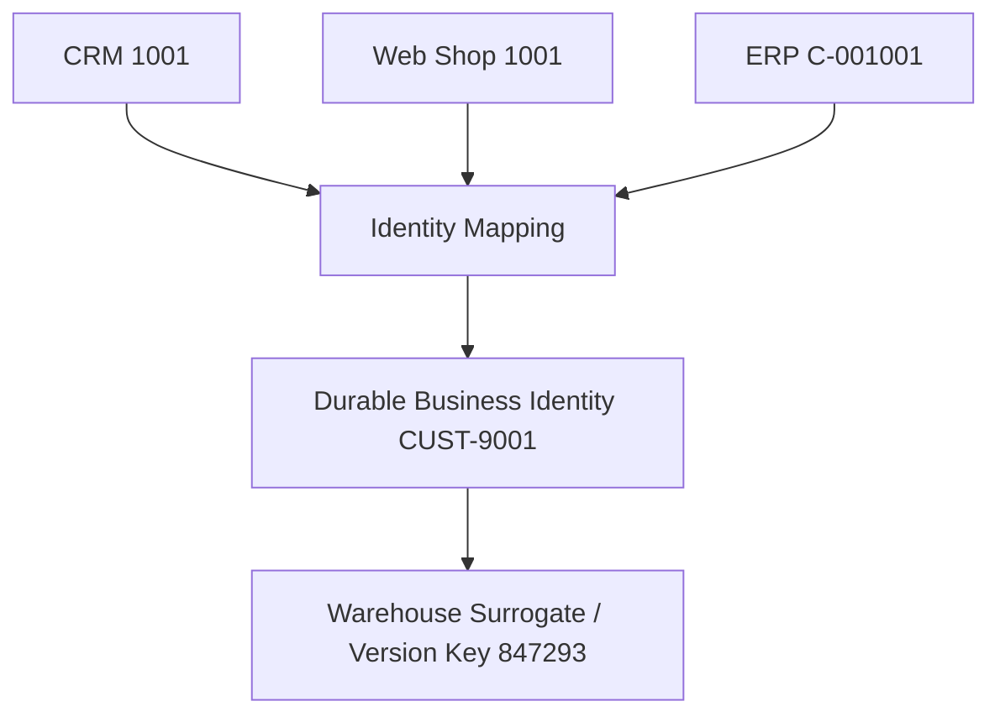
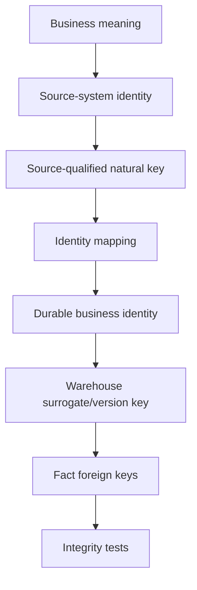

# Grain, Natural Keys, and Surrogate Keys

> **Stage 2 — Python for Data Engineering → Module 2.8 — Data Modelling for Analytics → Topic 04**

This topic makes two ideas rigorous:

- **Grain tells us what a row means.**
- **A key tells us how that row is identified.**

A strong Data Engineer can state both clearly before building a table.

---

## 1. Learning Objectives

By the end of this module, you should be able to:

- Write a precise grain statement for an analytical table.
- Distinguish atomic grain from aggregated grain.
- Explain why grain must be declared before choosing columns.
- Detect mixed-grain tables and explain their aggregation failures.
- Explain how joins can change the effective grain of a result.
- Identify natural/business keys and evaluate their stability.
- Distinguish candidate keys, primary keys, natural keys, surrogate keys, and durable keys.
- Explain why analytical warehouses often introduce surrogate keys.
- Compare integer-generated surrogate keys with deterministic hash keys.
- Reason about reproducibility, parallel loading, collision risk, storage, joins, and operational complexity.
- Explain how a durable key represents an entity across historical versions.
- Handle source identifiers that change, are reused, have different formats, or collide across systems.
- Design a cross-reference/key-mapping table.
- Use composite keys when they accurately represent logical uniqueness.
- Explain why business meaning is usually better kept out of identifiers.
- Explain why `yyyymmdd` is a common deliberate date-key convention.
- Write automated tests for grain uniqueness and key integrity.
- Detect orphan facts and distinguish intentional unknown members from accidental missing keys.
- Reason about identity and grain during reloads, parallel pipelines, source migration, and historical modelling.
- Defend a grain/key decision in an architecture review, code review, or Data Engineering interview.

---

## 2. Prerequisites

This topic assumes that you have already completed:

- **Topic 01 — Normalization and Denormalization**
- **Topic 02 — Dimensional Modelling: Facts and Dimensions**
- **Topic 03 — Star and Snowflake Schemas**
- Earlier Stage 1 and Stage 2 modules

You should already be comfortable with:

- relational tables
- primary and foreign keys
- joins and join cardinality
- basic SQL
- facts and dimensions
- basic dimensional modelling
- basic normalization
- constraints
- SCD Type 1 and Type 2 implementation mechanics from Module 2.6

Those topics are not re-taught here.

Instead, this topic makes earlier ideas precise. You already know that a join can multiply rows; here we turn that observation into a formal modelling discipline.

---

## 3. Why Grain and Keys Matter So Much

Imagine a production table named `sales`.

A new engineer asks:

> "What does one row represent?"

The answer is:

> "It depends."

That answer is a warning sign.

If a table contains order totals, order lines, customer attributes, and shipment information without a precise row definition, different engineers may make different assumptions. One engineer may aggregate `order_total`; another may aggregate `line_amount`; a third may join the table to another source and unintentionally multiply rows.

The result is not merely an ugly schema. It can produce:

- double-counted revenue
- duplicate customers
- broken joins
- incorrect KPIs
- unreliable dashboards
- incorrect downstream features
- difficult debugging
- failed data-quality checks

### The production mental model

```text
What does one row represent?
          ↓
Declare the grain
          ↓
What uniquely identifies that row?
          ↓
Choose the key strategy
          ↓
Define relationships
          ↓
Load data
          ↓
Test uniqueness + integrity
```

### Grain tells us what the row means

For example:

> One row per order line.

This says nothing yet about whether the row is identified by an integer surrogate key, `(order_id, line_number)`, or a deterministic hash.

### A key tells us how the row is identified

A possible key may be:

```text
(order_id, line_number)
```

or:

```text
order_line_key = 938475
```

The key implementation can change while the row meaning stays the same.

### Keep these concepts separate

| Concept | Main question | Example |
|---|---|---|
| Grain | What does one row mean? | One row per order line |
| Logical uniqueness | What combination should be unique? | `(order_id, line_number)` |
| Natural key | What identifier comes from the business/source? | `order_id` |
| Surrogate key | What warehouse-generated identifier is used? | `order_line_key = 938475` |
| Durable key | What stable identity represents the entity across versions? | `customer_durable_key = C100` |

A surrogate key does **not** define the grain.

---

## 4. Grain — The Meaning of One Row

### 4.1 Simple explanation

**Grain** is the exact level of detail represented by one row.

Think of grain as the sentence you would say if someone pointed at one row and asked:

> "What is this row?"

Examples:

- One row per customer.
- One row per order.
- One row per order line.
- One row per product per store per day.
- One row per customer per day.
- One row per account per month.

### 4.2 Formal definition

In dimensional modelling, the grain describes the business event, state, or relationship represented by each row at a stated level of detail.

A grain statement should be specific enough that two engineers would interpret the table the same way.

### 4.3 Common grain examples

| Table | Grain |
|---|---|
| `dim_customer` | One row per customer entity/version represented by the dimension policy |
| `fct_orders` | One row per order |
| `fct_order_lines` | One row per order line |
| `fct_inventory_daily` | One row per product, store, and calendar day |
| `customer_activity_daily` | One row per customer and calendar day |
| `account_balance_monthly` | One row per account and reporting month |

---

## 5. How to Write a Grain Statement

A good grain statement should usually identify:

1. the business entity or process
2. the level of detail
3. important dimensions
4. a time component when time is part of the row meaning

### Good grain statements

> One row per order line.

> One row per product, store, and calendar day representing end-of-day inventory.

> One row per customer and calendar month representing that customer's closing account balance.

> One row per shipment event for an order.

> One row per store and fiscal week containing weekly net sales.

### Weak grain statements

> Sales data.

> Customer orders.

> Inventory table.

> Product data.

These phrases name a subject but do not define row meaning.

### Ten quick classifications

Classify each statement as **precise** or **vague**.

1. One row per customer.
2. Sales.
3. One row per order line.
4. Customer activity.
5. One row per store per day.
6. Orders by product.
7. One row per payment transaction.
8. Inventory snapshot.
9. One row per product/store/day at end of day.
10. Revenue.

### Answer

| # | Classification | Why |
|---|---|---|
| 1 | Precise | Identifies entity and row level |
| 2 | Vague | Does not say whether row means order, line, day, etc. |
| 3 | Precise | Identifies exact business detail |
| 4 | Vague | "Activity" could mean events, sessions, or a daily aggregate |
| 5 | Precise | Identifies entity and time grain |
| 6 | Vague | Could be product/order, product/day, or product/month |
| 7 | Precise | Identifies a transaction-level event |
| 8 | Vague | Does not state snapshot frequency or dimensions |
| 9 | Precise | States entity combinations and measurement point |
| 10 | Vague | Revenue could be transaction, daily, monthly, customer-level, etc. |

### Checkpoint

Before continuing, answer:

> Can you describe one of your earlier tables using one sentence without using the table name?

If not, stop and rewrite the grain statement.

---

## 6. Atomic vs Aggregated Grain

### 6.1 Atomic grain

Atomic grain preserves the lowest useful level at which the original business event or state is represented.

Examples:

- individual order line
- individual payment
- individual shipment
- individual support ticket event

Atomic does not mean "smallest possible technical row in the universe." It means the lowest meaningful detail required by the model's purpose.

### 6.2 Aggregated grain

Aggregated grain summarizes lower-level records.

Examples:

- store/day
- product/month
- customer/week
- region/quarter

An aggregate is useful when its query and operational requirements justify storing that summary.

### 6.3 Information loss

Suppose the source contains:

```text
order_id | product_id | quantity | net_amount
---------|------------|----------|-----------
1001     | P10        | 1        | 1200
1001     | P11        | 2        | 30
1002     | P10        | 1        | 1150
```

At order-line grain we can derive:

- revenue by product
- revenue by customer, if customer is related
- revenue by day
- revenue by category
- order-line counts
- units sold

If we only keep a monthly aggregate:

```text
month      | net_amount
-----------|-----------
2026-09    | 2380
```

we cannot reconstruct which product lines created that number.

### Information-loss principle

> Aggregation can remove detail; aggregation generally cannot recreate detail that was discarded.

This is why the roadmap says the **lowest useful grain is usually powerful**.

That is a principle, not an absolute requirement to retain every raw event forever. Storage cost, retention policy, privacy constraints, and workload requirements still matter.

---

## 7. Why Lowest Grain Is Usually Powerful

Suppose the atomic table is:

> One row per order line.

You can aggregate it to:

```text
product/day
product/month
store/day
store/month
customer/week
category/month
region/quarter
```

The reverse is not generally possible.

A monthly product aggregate cannot tell you the exact order-line sequence that produced it.

### A useful engineering rule

> Prefer an atomic model when the business needs may reasonably expand and the cost of retaining that grain is acceptable.

Then derive aggregates for workloads that benefit from them.

### Trade-off

| Atomic model | Aggregate model |
|---|---|
| More detail | Less detail |
| More storage | Less storage |
| More flexible analysis | Faster/simple queries for known questions |
| Can feed many summaries | Cannot generally recover lost detail |
| Potentially higher scan cost | Potentially lower scan cost |

The engineering question is not "Which is morally better?" It is:

> What information, performance, storage, and operational properties does this workload require?

---

## 8. Grain Changes What Measures Mean

Consider:

```text
order_id
order_line_id
quantity
unit_price
discount_amount
net_amount
```

At order-line grain:

- `quantity` describes the line.
- `unit_price` describes the line's pricing basis.
- `discount_amount` describes the line discount.
- `net_amount` describes the line amount.

Now imagine that an order-level `shipping_amount = 20` is copied onto every line:

```text
order_id | order_line_id | net_amount | shipping_amount
---------|---------------|------------|----------------
1001     | 1             | 100        | 20
1001     | 2             | 50         | 20
```

If you sum `shipping_amount`, you get `40`, even though the order-level shipping charge was `20`.

The value itself is not necessarily wrong. Its **grain is different** from the row grain.

### Production lesson

> A measure is meaningful only in the context of the grain at which it is stored.

This becomes critical during:

- joins
- aggregation
- incremental loads
- reconciliation
- BI semantic definitions
- feature construction

---

## 9. Mixed Grain — A Major Data Modelling Failure

A mixed-grain table contains columns that conceptually belong to different row levels.

Consider:

```text
orders_mixed

order_id
customer_id
order_total       -- order grain
product_id        -- line grain
quantity          -- line grain
unit_price        -- line grain
```

The table is physically one table, but it contains two meanings:

- order-level
- order-line-level

Suppose order `1001` has two lines.

```text
order_id | customer_id | order_total | product_id | quantity | unit_price
---------|-------------|-------------|------------|----------|-----------
1001     | C10         | 130         | P01        | 1        | 100
1001     | C10         | 130         | P02        | 2        | 15
```

The order total appears twice.

### Incorrect aggregation

```sql
SELECT SUM(order_total) AS reported_revenue
FROM orders_mixed;
```

The result is:

```text
260
```

But the real order total is:

```text
130
```

### Correct line-level aggregation

```sql
SELECT
    SUM(quantity * unit_price) AS line_revenue
FROM orders_mixed;
```

For the sample:

```text
100 + 30 = 130
```

The correct result comes from respecting the actual line grain.

### Why this happens

The problem is not "SQL made a mistake."

The model allowed an order-level measurement to repeat on a line-level row.

### Correct decomposition

```text
orders
-------
order_id
customer_id
order_total

order_lines
-----------
order_id
order_line_id
product_id
quantity
unit_price
```

Now each table has one clear row meaning.

---

## 10. Detecting Mixed Grain

Use a structured investigation.

### Question 1 — Which identifiers repeat?

```sql
SELECT
    order_id,
    COUNT(*) AS row_count
FROM orders_mixed
GROUP BY order_id
HAVING COUNT(*) > 1;
```

A repeated order ID is not automatically a defect. It may simply mean the table's grain is order-line.

### Question 2 — Which measures repeat?

```sql
SELECT
    order_id,
    COUNT(DISTINCT order_total) AS distinct_order_totals,
    COUNT(*) AS line_count
FROM orders_mixed
GROUP BY order_id
HAVING COUNT(DISTINCT order_total) > 1
   OR COUNT(*) > 1;
```

The second condition is only an investigation signal. The real question is whether `order_total` is semantically valid at line grain.

### Question 3 — Can one consistent set of columns uniquely identify each row?

For line grain:

```sql
SELECT
    order_id,
    order_line_id,
    COUNT(*) AS row_count
FROM orders_mixed
GROUP BY order_id, order_line_id
HAVING COUNT(*) > 1;
```

The correct assertion should return zero rows.

### Question 4 — What does every measure mean?

Create a small modelling inventory:

| Column | Meaning | Intended grain |
|---|---|---|
| `order_total` | Total monetary value of an order | Order |
| `quantity` | Units on the line | Order line |
| `unit_price` | Unit price on the line | Order line |
| `customer_id` | Order customer identity | Order |
| `product_id` | Product on the line | Order line |

If one table contains several incompatible intended grains, stop before adding more columns.

---

## 11. Grain and Join Cardinality

You already know join cardinality from earlier modules. The important connection here is:

> **A join can change the effective grain of the result.**

Consider:

```text
orders
   1
   |
   N
order_lines
```

One order can have many order lines.

If you join an order-level amount to order lines:

```sql
SELECT
    o.order_id,
    o.order_total,
    ol.product_id,
    ol.quantity
FROM orders o
JOIN order_lines ol
    ON o.order_id = ol.order_id;
```

one order row can become several result rows.

### Example

`orders`:

```text
order_id | order_total
---------|------------
1001     | 130
```

`order_lines`:

```text
order_id | order_line_id | product_id
---------|---------------|-----------
1001     | 1             | P01
1001     | 2             | P02
```

Result:

```text
1001 | 130 | P01
1001 | 130 | P02
```

The `order_total` is now repeated.

This is not wrong if the query is intentionally showing order context per line.

It is wrong if someone then does:

```sql
SELECT SUM(o.order_total)
...
```

without accounting for the changed grain.

### Production rule

Before every many-row join, ask:

1. What is the left-side grain?
2. What is the right-side grain?
3. What is the resulting grain?
4. Which measures repeat?
5. Which measures can safely be aggregated after the join?

---

## 12. Natural / Business Keys

### 12.1 Definition

A **natural key** is an identifier that comes from a business or source-system domain rather than being invented by the warehouse.

Examples:

- `order_number`
- `SKU`
- `source_customer_id`
- `email`

Examples from systems:

```text
order_number = ORD-2026-00481
sku = LAPTOP-15-001
source_customer_id = C12345
```

### 12.2 Important warning

An identifier being unique today does not automatically make it a stable long-term identity.

For example, an email address may currently be unique but can be:

- changed
- reused
- absent
- corrected
- shared under specific business rules

Likewise, a source ID may be unique inside one application but not globally unique across your data platform.

---

## 13. Candidate Key vs Natural Key vs Primary Key

These terms are related, but not interchangeable.

### Candidate key

A candidate key is a column or set of columns that can uniquely identify a row according to the model's integrity rules.

Example:

```text
(order_id, order_line_id)
```

may be a candidate key for order lines.

### Natural/business key

A candidate key may be a natural key if it has business/source meaning.

Example:

```text
SKU
```

may identify a product in an operational system.

### Primary key

The primary key is the key chosen as the table's formal primary identifier.

A model could have:

```text
PRIMARY KEY (customer_key)
```

while retaining:

```text
source_customer_id
```

as a natural/business identifier.

### Practical distinction

| Term | Main idea |
|---|---|
| Candidate key | Any valid unique identifier candidate |
| Natural key | Identifier with business/source meaning |
| Primary key | Identifier selected by the schema as the primary row identifier |

---

## 14. Natural-Key Problems in Production

Natural identifiers become difficult when systems change.

### 14.1 Keys can change

Suppose a customer moves from one source application to another and receives a new source identifier.

```text
Old: C12345
New: 77891
```

If every downstream table uses the source identifier directly, source migration can become a warehouse-wide identity migration.

A warehouse identity can decouple analytical relationships from the source identifier.

### 14.2 Keys can be reused

Suppose:

```text
Customer 1001
```

belongs to one entity historically.

Later, the source system assigns:

```text
Customer 1001
```

to a different entity.

A downstream system that assumes `1001` is permanent could merge unrelated histories.

### 14.3 Different sources use different formats

CRM:

```text
CUS-10045
```

Web shop:

```text
10045
```

ERP:

```text
000010045
```

These values may or may not identify the same business entity. The answer requires business evidence, not string similarity alone.

### 14.4 Identifier collisions across systems

CRM:

```text
customer_id = 1001
```

ERP:

```text
customer_id = 1001
```

They may refer to different customers.

The source-qualified identity is safer:

```text
(source_system, source_customer_id)
```

For example:

```text
(CRM, 1001)
(ERP, 1001)
```

Those are different source identities.

---

## 15. Surrogate Keys

### 15.1 Definition

A **surrogate key** is a warehouse-generated identifier with no business meaning.

Example:

```text
customer_key = 847293
```

It is an implementation identity rather than a business identity.

You may have:

```text
source identity
CRM / C12345
```

and:

```text
warehouse identity
847293
```

### 15.2 Why surrogate keys exist

The roadmap highlights several useful reasons.

#### Source-system independence

If a source ID changes, downstream warehouse foreign keys can remain stable.

#### Multiple-source integration

Several source namespaces can map into one warehouse identity.

#### SCD Type 2 versions

Different historical versions of one business entity can receive different version-specific surrogate keys.

Example:

```text
customer_key | durable_customer_key | valid_from
-------------|----------------------|------------
501          | C100                 | 2025-01-01
782          | C100                 | 2026-04-01
```

#### Unknown members

A controlled warehouse key can represent an expected but currently unknown dimension member:

```text
customer_key = -1
```

#### Potentially smaller joins

Integer surrogate keys can be compact compared with long business identifiers. Whether that produces a meaningful performance benefit depends on the engine, physical layout, data types, and workload.

---

## 16. Surrogate Key Does Not Mean Grain

This distinction is foundational.

Consider:

```text
customer_key
```

That value may exist in:

- one row per customer
- one row per customer per day
- one row per customer per SCD version

The surrogate key identifies a row. It does not tell you the table's semantic grain.

### Example

```text
dim_customer_current
customer_key = 1001
```

could mean:

> one row per current customer

Whereas:

```text
customer_activity_daily
customer_key = 1001
activity_date = 2026-09-29
```

could mean:

> one row per customer per day

Same key concept. Different grain.

---

## 17. Integer Surrogate Keys

A common approach is an integer generated by the warehouse.

Conceptually:

```text
5001
5002
5003
```

### Benefits

- simple to understand
- compact representation
- straightforward joins
- easy debugging
- easy display in many tools

### Operational considerations

Think about:

- parallel pipelines allocating IDs
- deterministic reloads
- cross-environment reproducibility
- merge/rebuild workflows
- preserving existing identity assignments

A sequence is not inherently bad. The question is whether its operational behavior matches the architecture.

### DuckDB example

```sql
CREATE SEQUENCE customer_key_seq START 1;

CREATE TABLE dim_customer (
    customer_key BIGINT PRIMARY KEY,
    source_system VARCHAR NOT NULL,
    source_customer_id VARCHAR NOT NULL,
    customer_name VARCHAR
);

INSERT INTO dim_customer (
    customer_key,
    source_system,
    source_customer_id,
    customer_name
)
VALUES
    (nextval('customer_key_seq'), 'CRM', 'C12345', 'Asha'),
    (nextval('customer_key_seq'), 'WEB', '77891', 'Rahul');

SELECT *
FROM dim_customer
ORDER BY customer_key;
```

This example demonstrates generated identity, not a recommendation that every warehouse should use sequences.

---

## 18. Deterministic Hash Keys

A deterministic hash key is created from a stable, canonicalized business input.

The important property is:

> Given identical canonical input and the same hash function, the same input produces the same digest.

Conceptual input:

```text
source_system + '|' + source_customer_id
```

Example:

```text
CRM|C12345
```

### Why deterministic keys can be attractive

They can support:

- reproducible transformations
- independent/parallel processing
- idempotent identity generation
- source-qualified identity
- easier re-computation without coordinating a central sequence

### Important caveat

Hash determinism depends on:

1. the exact input
2. the exact canonicalization rules
3. the exact separator/encoding
4. the selected hashing function and representation

Do not assume that any database's generic `hash()` function is guaranteed to remain identical across every engine version and environment. For cross-system reproducibility, explicitly choose and document the algorithm and representation.

### DuckDB example using MD5

```sql
SELECT
    md5('CRM|C12345') AS customer_digest;
```

A practical mapping expression can be:

```sql
SELECT
    source_system,
    source_customer_id,
    md5(
        lower(trim(source_system))
        || '|'
        || lower(trim(source_customer_id))
    ) AS durable_identity_hash
FROM staging_customers;
```

The canonicalization policy is part of the key design.

---

## 19. Integer vs Hash Surrogate Keys

Neither approach should be selected by fashion.

| Factor | Integer-generated key | Deterministic hash key |
|---|---|---|
| Deterministic from source data | Usually no | Yes, when inputs and algorithm are fixed |
| Simple to inspect | Usually easier | Usually harder |
| Compact storage | Often compact | Depends on representation |
| Parallel generation | Requires allocation strategy | Naturally parallel for independent records |
| Reproducible reload | Requires identity preservation | Strong property when deterministic |
| Collision concept | Sequence allocation avoids hash collisions | Hash collisions are theoretically possible |
| Cross-system generation | Requires shared allocation or mapping | Can be independently computed |
| Debugging | Human-friendly values | Usually less human-friendly |
| Canonicalization burden | Lower | Higher |
| Implementation complexity | Lower | Higher |
| Key stability | Depends on persistence strategy | Depends on input/algorithm contract |
| Join performance | Workload/engine dependent | Workload/engine dependent |

### Production decision question

Do not ask:

> "Which is best?"

Ask:

> "Which identity-generation behavior best satisfies this platform's loading, integration, reproducibility, storage, and query requirements?"

---

## 20. Hash Collisions

A **hash collision** happens when two different inputs produce the same hash representation.

For an appropriate hash function with a sufficiently large output space, the practical collision risk can be extremely low, but it is never correct to say that collisions are mathematically impossible.

### Why the engineering discussion matters

Collision handling depends on:

- algorithm choice
- digest size
- how much data the system expects to process
- whether the key is merely an optimization or a correctness-critical identity
- whether the original natural identity is retained for verification

### Practical design

Keep source identity columns available:

```text
source_system
source_customer_id
```

even when a hash is used as a warehouse identifier.

That gives you evidence for debugging and reconciliation.

Do not replace business identity understanding with a hash.

---

## 21. Canonicalization Before Hashing

These strings are not textually identical:

```text
"C123"
" C123 "
"c123"
```

Business rules may nevertheless treat them as the same source identity.

If you hash the raw strings, you get different hashes.

### Typical canonicalization decisions

- trim whitespace
- normalize case where appropriate
- define null behavior
- define separators
- include the source-system namespace
- standardize encoding if cross-system identity requires it
- select exactly which input columns participate in identity

Example:

```sql
SELECT
    md5(
        lower(trim(source_system))
        || '|'
        || lower(trim(source_customer_id))
    ) AS identity_hash
FROM staging_customers;
```

### Critical principle

> The hash is deterministic only when the transformation that creates its input is deterministic.

Changing from:

```text
CRM|C12345
```

to:

```text
crm|c12345
```

may preserve business identity, but it changes the input string and therefore the digest.

Document the canonicalization contract.

---

## 22. Durable Keys

### 22.1 Definition

A **durable key** represents the stable identity of a business entity across all historical versions.

This is especially useful with SCD Type 2.

Example:

```text
durable_customer_key | customer_key | valid_from  | segment
---------------------|--------------|-------------|---------
C100                 | 501          | 2025-01-01  | Basic
C100                 | 782          | 2026-04-01  | Premium
```

Here:

- `C100` identifies the customer across history.
- `501` identifies one specific historical version.
- `782` identifies another version.

### Why this distinction matters

A version-specific surrogate key answers:

> "Which dimension version does this fact reference?"

A durable key answers:

> "Which business entity does this historical version belong to?"

These are different questions.

Topic 05 goes deeper into SCD policies. Here the focus is only the identity implication:

> One durable entity can have multiple historical surrogate/version keys.

---

## 23. Multiple Systems and Identity Mapping

Suppose three systems use different customer identifiers.

### CRM

```text
customer_id = 1001
```

### Web Shop

```text
customer_id = 1001
```

### ERP

```text
customer_id = C-001001
```

It would be unsafe to merge them solely from the numeric coincidence.

First establish source-qualified identity:

```text
(CRM, 1001)
(WEB, 1001)
(ERP, C-001001)
```

Then determine whether those source records represent the same durable business entity.

### Identity architecture



**Diagram explanation:** Source IDs remain namespaced to their sources, mapping makes identity decisions explicit, durable identity represents the business entity, and a warehouse key can identify the physical row/version.

---

## 24. Cross-Reference / Key-Mapping Tables

A cross-reference table makes identity mapping explicit.

Example:

```text
customer_key_map
```

Possible columns:

| Column | Purpose |
|---|---|
| `source_system` | Source namespace |
| `source_customer_id` | Source identifier |
| `durable_customer_key` | Stable business identity |
| `warehouse_customer_key` | Specific warehouse dimension identity |
| `effective_from` | Start of mapping validity |
| `effective_to` | End of mapping validity |
| `match_method` | How the mapping was established |
| `match_status` | Current mapping state |

### DuckDB DDL

```sql
CREATE TABLE customer_key_map (
    source_system VARCHAR NOT NULL,
    source_customer_id VARCHAR NOT NULL,
    durable_customer_key VARCHAR NOT NULL,
    warehouse_customer_key BIGINT,
    effective_from DATE NOT NULL,
    effective_to DATE,
    match_method VARCHAR NOT NULL,
    match_status VARCHAR NOT NULL,
    PRIMARY KEY (source_system, source_customer_id, effective_from)
);
```

Example records:

```sql
INSERT INTO customer_key_map VALUES
    ('CRM', '1001', 'CUST-9001', 501, DATE '2026-01-01', NULL, 'manual_verified', 'active'),
    ('WEB', '1001', 'CUST-9001', 501, DATE '2026-01-01', NULL, 'account_link', 'active'),
    ('ERP', 'C-001001', 'CUST-9001', 501, DATE '2026-01-01', NULL, 'crm_reference', 'active'),
    ('CRM', '1002', 'CUST-9002', 502, DATE '2026-01-01', NULL, 'manual_verified', 'active'),
    ('ERP', 'C-001002', 'CUST-9002', 502, DATE '2026-01-01', NULL, 'crm_reference', 'active');
```

### Lookup

```sql
SELECT *
FROM customer_key_map
WHERE source_system = 'WEB'
  AND source_customer_id = '1001'
ORDER BY effective_from DESC;
```

The important idea is that the mapping is explicit model state rather than a hidden assumption in transformation code.

---

## 25. Natural-Key Reuse

Suppose a source system contains:

```text
customer_id = 1001
```

for one customer.

The original customer is deleted or retired.

Years later, the system reuses `1001` for another customer.

If downstream history uses only:

```text
customer_id = 1001
```

then two unrelated entities may become indistinguishable.

### Safer reasoning

Keep identity scoped by:

```text
(source_system, source_id)
```

and maintain a durable identity that reflects the business entity across time.

### Important lesson

> A source identifier is a claim made by a source system. It is not automatically a permanent global identity for your entire data platform.

---

## 26. Composite Keys

### 26.1 Definition

A **composite key** uses multiple columns together to uniquely identify a row.

Examples:

```text
(order_id, order_line_id)
```

or:

```text
(product_id, store_id, business_date)
```

### Why composite keys are legitimate

A composite key can directly express the model's logical uniqueness.

For:

> One row per product, store, and day.

the natural logical key may be:

```text
(product_id, store_id, business_date)
```

### Advantages

- directly represents business grain
- makes uniqueness rules explicit
- can be natural for relationship tables
- can avoid inventing an identifier when the combination already identifies the row

### Disadvantages

- wider joins
- wider indexes where indexes are used
- more columns carried through relationships
- more complex references from downstream tables
- more care required when component columns change

Do not treat composite keys as inherently bad.

---

## 27. Composite Key and Grain Relationship

This is one of the most important connections in this module.

Suppose the grain is:

> One row per product per store per business day representing closing inventory.

A logical uniqueness expression is:

```text
(product_id, store_id, business_date)
```

The grain tells you **why** those three columns matter.

The key expresses **how the database can test uniqueness**.

A warehouse may additionally use:

```text
inventory_row_key
```

as a physical row identifier.

### Separate the concerns

```text
Semantic meaning:
One row per product/store/day
          ↓
Logical uniqueness:
(product_id, store_id, business_date)
          ↓
Optional physical identifier:
inventory_row_key
```

---

## 28. Smart Keys

### 28.1 Definition

A **smart key** embeds business meaning into an identifier.

Examples:

```text
IND-MUM-ELEC-000123
20260929-IND-00542
CUST-IND-RETAIL-2026-001
```

The identifier now encodes things such as:

- geography
- category
- date
- business unit
- sequence

### Why this is usually an anti-pattern

Business rules change.

If a region is reorganized, then:

```text
IND-MUM-ELEC-000123
```

may no longer describe the entity correctly.

Problems include:

- meaning changes
- parsing logic spreads across systems
- format changes become breaking changes
- identifiers become coupled to business rules
- users depend on embedded meaning
- key generation becomes more complex

### Better principle

Keep business attributes in columns:

```text
country = 'IN'
city = 'Mumbai'
department = 'Electronics'
```

and keep the identifier independent.

---

## 29. The `yyyymmdd` Date-Key Exception

Warehouses commonly use:

```text
20260929
```

as a date key.

This is effectively a meaningful identifier: the digits encode a date.

Why is this often acceptable?

- calendar dates have stable, well-defined semantics
- date dimensions are commonly joined through date keys
- the encoded form is compact and recognizable
- the convention is deliberate and standardized within the model

Example:

```text
date_key = 20260929
calendar_date = 2026-09-29
```

This does **not** mean arbitrary smart keys become good design.

The distinction is:

> A standardized date-key convention is a deliberate modelling convention; embedding changing business meaning into general-purpose entity identifiers usually creates coupling.

Do not generalize this exception to every date/time identifier.

---

## 30. Testing Grain

A grain statement is useful only if you can test it.

Suppose:

```text
fct_inventory_daily
```

has grain:

> One row per product, store, and day.

Then this should return zero rows:

```sql
SELECT
    product_key,
    store_key,
    date_key,
    COUNT(*) AS row_count
FROM fct_inventory_daily
GROUP BY
    product_key,
    store_key,
    date_key
HAVING COUNT(*) > 1;
```

### Why zero rows?

This is an assertion convention:

> **Correct assertion → zero returned rows.**

Rows returned by the assertion are exceptions that require investigation.

### Possible causes

- duplicate source data
- incorrect deduplication
- incomplete key definition
- wrong declared grain
- accidental history/versioning
- multiple records for one stated state

Do not immediately delete duplicates. First determine the intended row meaning.

---

## 31. Testing Key Uniqueness

### Primary-key uniqueness

```sql
SELECT
    customer_key,
    COUNT(*) AS row_count
FROM dim_customer
GROUP BY customer_key
HAVING COUNT(*) > 1;
```

### Null key check

```sql
SELECT *
FROM dim_customer
WHERE customer_key IS NULL;
```

### Composite uniqueness

```sql
SELECT
    product_key,
    store_key,
    business_date,
    COUNT(*) AS row_count
FROM inventory_daily
GROUP BY
    product_key,
    store_key,
    business_date
HAVING COUNT(*) > 1;
```

### Duplicate source IDs

```sql
SELECT
    source_system,
    source_customer_id,
    COUNT(*) AS row_count
FROM staging_customers
GROUP BY
    source_system,
    source_customer_id
HAVING COUNT(*) > 1;
```

The expected result depends on the table's intended grain. Historical versions can make an identifier legitimately repeat.

---

## 32. Referential Integrity

A fact foreign key should resolve to an intended dimension identity.

### Orphan-fact query

```sql
SELECT f.*
FROM fct_order_lines f
LEFT JOIN dim_customer d
    ON f.customer_key = d.customer_key
WHERE d.customer_key IS NULL;
```

Expected result:

```text
zero rows
```

### Why orphan facts are dangerous

They can produce:

- dropped rows in inner joins
- unexpected unknown reporting
- inconsistent totals
- broken BI relationships
- difficult reconciliation

A referential-integrity failure is a debugging signal.

---

## 33. Unknown-Key Validation

An analytical warehouse may intentionally allow a controlled special key such as:

```text
customer_key = -1
```

for an unknown member.

That is different from silently allowing arbitrary nulls.

### Example policy

```text
-1   = Unknown customer
-2   = Not applicable customer
NULL = not allowed
```

### Assertion

```sql
SELECT *
FROM fct_order_lines
WHERE customer_key IS NULL
   OR customer_key < -2;
```

If the model allows only those sentinel values, the assertion should return zero rows.

### Important distinction

| Value | Meaning |
|---|---|
| `-1` | Expected customer exists, but identity is currently unknown |
| `-2` | Customer dimension genuinely does not apply |
| `NULL` | Often an unexpected missing relationship; policy-dependent |

---

## 34. Key-Mapping Integrity Tests

A key-mapping table needs explicit integrity rules.

### Test 1 — Active source identity uniqueness

```sql
SELECT
    source_system,
    source_customer_id,
    COUNT(*) AS active_mappings
FROM customer_key_map
WHERE effective_to IS NULL
GROUP BY source_system, source_customer_id
HAVING COUNT(*) > 1;
```

### Test 2 — Missing durable identity

```sql
SELECT *
FROM customer_key_map
WHERE durable_customer_key IS NULL;
```

### Test 3 — Accidental many-to-many mapping

```sql
SELECT
    source_system,
    source_customer_id,
    COUNT(DISTINCT durable_customer_key) AS durable_count
FROM customer_key_map
WHERE effective_to IS NULL
GROUP BY source_system, source_customer_id
HAVING COUNT(DISTINCT durable_customer_key) > 1;
```

An explicit historical mapping can legitimately change over time, but uncontrolled active many-to-many identity mapping is a serious warning.

---

## 35. Complete Worked Example — Customer Identity

We will combine CRM, Web Shop, and ERP records.

### Source data

```sql
CREATE TABLE crm_customers (
    customer_id VARCHAR,
    customer_name VARCHAR
);

CREATE TABLE web_customers (
    customer_id VARCHAR,
    customer_name VARCHAR
);

CREATE TABLE erp_customers (
    customer_id VARCHAR,
    customer_name VARCHAR
);

INSERT INTO crm_customers VALUES
    ('1001', 'Asha'),
    ('1002', 'Rahul');

INSERT INTO web_customers VALUES
    ('1001', 'Asha'),
    ('1008', 'Meera');

INSERT INTO erp_customers VALUES
    ('C-001001', 'Asha'),
    ('C-001002', 'Rahul');
```

### First principle: qualify the source ID

```sql
SELECT
    'CRM' AS source_system,
    customer_id AS source_customer_id,
    customer_name
FROM crm_customers

UNION ALL

SELECT
    'WEB' AS source_system,
    customer_id AS source_customer_id,
    customer_name
FROM web_customers

UNION ALL

SELECT
    'ERP' AS source_system,
    customer_id AS source_customer_id,
    customer_name
FROM erp_customers;
```

Now:

```text
(CRM, 1001)
(WEB, 1001)
(ERP, C-001001)
```

are distinct source identities.

### Mapping

```sql
CREATE TABLE customer_key_map (
    source_system VARCHAR NOT NULL,
    source_customer_id VARCHAR NOT NULL,
    durable_customer_key VARCHAR NOT NULL,
    warehouse_customer_key BIGINT,
    effective_from DATE NOT NULL,
    effective_to DATE,
    match_method VARCHAR NOT NULL,
    match_status VARCHAR NOT NULL,
    PRIMARY KEY (source_system, source_customer_id, effective_from)
);
```

Example:

```sql
INSERT INTO customer_key_map VALUES
    ('CRM', '1001', 'CUST-9001', 501, DATE '2026-01-01', NULL, 'manual_verified', 'active'),
    ('WEB', '1001', 'CUST-9001', 501, DATE '2026-01-01', NULL, 'account_link', 'active'),
    ('ERP', 'C-001001', 'CUST-9001', 501, DATE '2026-01-01', NULL, 'crm_reference', 'active'),
    ('CRM', '1002', 'CUST-9002', 502, DATE '2026-01-01', NULL, 'manual_verified', 'active'),
    ('ERP', 'C-001002', 'CUST-9002', 502, DATE '2026-01-01', NULL, 'crm_reference', 'active');
```

### Warehouse identity

```sql
CREATE TABLE dim_customer (
    customer_key BIGINT PRIMARY KEY,
    durable_customer_key VARCHAR NOT NULL,
    customer_name VARCHAR,
    source_system VARCHAR,
    source_customer_id VARCHAR
);
```

### What the design gives us

- source-specific identity
- explicit cross-system mapping
- durable business identity
- warehouse identity
- auditable transformation from one to another

The mapping is a business/data-quality decision and should be governed accordingly.

---

## 36. Complete Worked Example — Mixed-Grain Orders

### Broken model

```sql
CREATE TABLE orders_mixed (
    order_id INTEGER,
    customer_id VARCHAR,
    order_total DECIMAL(12,2),
    product_id VARCHAR,
    quantity INTEGER,
    unit_price DECIMAL(12,2)
);

INSERT INTO orders_mixed VALUES
    (1001, 'C10', 130.00, 'P01', 1, 100.00),
    (1001, 'C10', 130.00, 'P02', 2, 15.00),
    (1002, 'C11', 50.00,  'P03', 1, 50.00);
```

### Incorrect revenue

```sql
SELECT SUM(order_total) AS revenue
FROM orders_mixed;
```

Result:

```text
310
```

But the actual order totals are:

```text
130 + 50 = 180
```

### Correct model

```sql
CREATE TABLE orders (
    order_id INTEGER PRIMARY KEY,
    customer_id VARCHAR NOT NULL,
    order_total DECIMAL(12,2) NOT NULL
);

CREATE TABLE order_lines (
    order_id INTEGER NOT NULL,
    order_line_id INTEGER NOT NULL,
    product_id VARCHAR NOT NULL,
    quantity INTEGER NOT NULL,
    unit_price DECIMAL(12,2) NOT NULL,
    PRIMARY KEY (order_id, order_line_id)
);

INSERT INTO orders VALUES
    (1001, 'C10', 130.00),
    (1002, 'C11', 50.00);

INSERT INTO order_lines VALUES
    (1001, 1, 'P01', 1, 100.00),
    (1001, 2, 'P02', 2, 15.00),
    (1002, 1, 'P03', 1, 50.00);
```

Now:

```text
orders      → one row per order
order_lines → one row per order line
```

### Correct line-level revenue

```sql
SELECT
    SUM(quantity * unit_price) AS line_revenue
FROM order_lines;
```

Result:

```text
180
```

The model now makes the business meaning explicit.

---

## 37. Complete Worked Example — Integer vs Hash Keys

We will demonstrate their operational properties rather than claiming one is faster.

### Approach A — integer-generated key

```sql
CREATE SEQUENCE customer_seq START 1;

CREATE TABLE dim_customer_integer (
    customer_key BIGINT PRIMARY KEY,
    source_system VARCHAR NOT NULL,
    source_customer_id VARCHAR NOT NULL
);

INSERT INTO dim_customer_integer
SELECT
    nextval('customer_seq'),
    source_system,
    source_customer_id
FROM (
    SELECT 'CRM' AS source_system, 'C12345' AS source_customer_id
    UNION ALL
    SELECT 'WEB', '77891'
) s;
```

The key depends on allocation state.

### Approach B — deterministic digest

```sql
CREATE TABLE dim_customer_hash AS
SELECT
    md5(
        lower(trim(source_system))
        || '|'
        || lower(trim(source_customer_id))
    ) AS customer_identity_hash,
    source_system,
    source_customer_id
FROM (
    SELECT 'CRM' AS source_system, 'C12345' AS source_customer_id
    UNION ALL
    SELECT 'WEB', '77891'
) s;
```

The same canonical input can regenerate the same digest.

### Reproducibility thought experiment

Process:

```text
CRM | C12345
```

today and again tomorrow.

An integer sequence can assign a different new value if the original identity assignment was not preserved.

A deterministic digest can reproduce the same identity when:

- input is identical
- canonicalization is identical
- hashing algorithm is identical
- representation is identical

### Parallel-loading thought experiment

Suppose CRM and WEB pipelines run simultaneously.

Sequential keys require coordination or an allocation strategy.

Hash keys can be computed independently because they derive from record content.

That does not make hashing "better." It changes the operational trade-off.

---

## 38. Python Examples

Python is useful for generating realistic identity scenarios.

### 38.1 Deterministic identity digest

```python
from hashlib import md5


def canonical_identity(source_system: str, source_id: str) -> str:
    # Return the canonical identity string used as hash input.
    return f"{source_system.strip().lower()}|{source_id.strip().lower()}"


def identity_hash(source_system: str, source_id: str) -> str:
    # Return a reproducible hexadecimal digest for the canonical input.
    value = canonical_identity(source_system, source_id)
    return md5(value.encode("utf-8")).hexdigest()


examples = [
    ("CRM", " C123 "),
    ("crm", "c123"),
    ("WEB", "C123"),
]

for source_system, source_id in examples:
    print(
        source_system,
        source_id,
        canonical_identity(source_system, source_id),
        identity_hash(source_system, source_id),
    )
```

The first two examples intentionally canonicalize to the same input:

```text
crm|c123
```

so they produce the same digest.

**Production note:** Do not blindly lower-case every business identifier. Whether case is meaningful is a source/business rule.

### 38.2 Reproducible multi-source test data

```python
import random


random.seed(42)

crm_ids = [f"C{n:05d}" for n in range(1, 6)]
web_ids = [f"{n:05d}" for n in range(1, 6)]

records = []

for customer_id in crm_ids:
    records.append(("CRM", customer_id))

for customer_id in web_ids:
    records.append(("WEB", customer_id))

random.shuffle(records)

for source_system, source_id in records:
    print(source_system, source_id)
```

The fixed seed makes the training dataset reproducible.

Python is supporting Data Engineering reasoning, not becoming the focus of this topic.

---

## 39. Hands-On Lab — `models/04/`

This lab follows the Module 2.8 roadmap.

Everything needed to perform the exercise is described here.

### Exercise 1 — Multi-Source Customer Integration

Integrate customers from:

- CRM
- Web Shop

where IDs overlap but mean different things.

#### Build

- key-mapping table
- single `dim_customer`
- surrogate key
- durable key

Use realistic sample data such as:

```text
CRM: C100, C101, C102
WEB: 100, 101, 205
```

At least one CRM and Web Shop identifier should look similar while remaining source-qualified.

#### Questions

1. What is the source-qualified natural identity?
2. Which records should map to the same durable entity?
3. What evidence supports the mapping?
4. Which identifier is the warehouse row key?
5. Which identifier is durable across historical versions?

#### Solution

A reasonable architecture is:

```text
(source_system, source_id)
          ↓
customer_key_map
          ↓
durable_customer_key
          ↓
warehouse customer_key
```

The exact mapping must be justified by business evidence.

---

### Exercise 2 — Mixed-Grain Orders

Build a deliberately broken table containing:

- order headers
- order lines

#### Tasks

1. Declare the intended grain.
2. Show why the mixed table violates that intention.
3. Demonstrate double-counting.
4. Split it into `orders` and `order_lines`.
5. Write a correct revenue calculation.
6. Add a uniqueness test.

#### Solution

The core problem is:

> An order-level value is stored on rows that represent order lines.

The correct response is to separate the grains or redesign the row meaning.

---

### Exercise 3 — Assertions

Write assertions for:

- grain uniqueness
- referential integrity
- orphan facts

Example:

```sql
SELECT
    product_key,
    store_key,
    date_key,
    COUNT(*) AS row_count
FROM fct_inventory_daily
GROUP BY product_key, store_key, date_key
HAVING COUNT(*) > 1;
```

The correct test returns zero rows.

---

### Exercise 4 — Integer vs Hash Keys

Compare integer surrogate keys and deterministic hash keys.

Simulate or reason about:

- parallel pipelines
- sequence allocation
- reproducibility
- deterministic identity

Explicitly answer:

> What breaks or becomes harder with sequential keys?

A strong answer discusses allocation, identity persistence, reloads, backfills, and environment movement.

---

### Exercise 5 — Design Review

An engineer proposes:

> "Let's just use the source customer ID everywhere."

Critique the proposal using:

- source integration
- key stability
- collisions
- historical identity
- SCD implications
- unknown members
- downstream joins

A senior response is conditional. In a tightly controlled single-source system, a stable source ID may be perfectly viable. In a multi-source or history-heavy platform, explicit identity separation may be more appropriate.

---

## 40. Debugging Scenarios

### Scenario 1 — Duplicate Customers

Two systems both contain:

```text
customer_id = 1001
```

**Question:** Is this automatically one customer?

**Answer:** No. Establish source context first:

```text
(CRM, 1001)
(WEB, 1001)
```

Then investigate whether they represent the same business entity.

---

### Scenario 2 — Revenue Doubled

Order header total is repeated on each line.

**Question:** What is wrong?

**Answer:** Mixed grain. The repeated order-level measure is being aggregated at line grain.

---

### Scenario 3 — Surrogate Keys Change After a Full Reload

Downstream joins break.

**Answer:** The reload regenerated warehouse identities instead of preserving a stable mapping. Investigate identity persistence and downstream foreign keys.

---

### Scenario 4 — Orphan Facts

A fact references a missing customer key.

Investigate:

- failed dimension load
- incorrect mapping
- unexpected dimension deletion
- key regeneration
- load-order failure

---

### Scenario 5 — Hash IDs Differ Between Runs

Investigate:

- inconsistent canonicalization
- different separators
- null handling
- casing
- source prefixing
- different columns
- algorithm changes
- encoding/representation differences

---

### Scenario 6 — Composite Grain Test Returns Duplicates

Do not automatically add another column.

Investigate whether:

- source data duplicates exist
- declared grain is wrong
- multiple historical versions are legitimate
- the key definition is incomplete
- an upstream join produced a fan-out

---

## 41. Common Mistakes

### Undocumented grain

**Symptom:** Different users calculate different totals.

**Root cause:** Row meaning was never explicitly defined.

**Fix:** Write and publish one precise grain statement.

**Production impact:** Metric disputes and fragile downstream models.

### Choosing a key before understanding grain

**Symptom:** Key is unique, but table meaning is unclear.

**Root cause:** Technical identity was chosen before semantic identity.

**Fix:** Define grain first.

**Production impact:** Rework and incorrect relationships.

### Assuming source IDs are globally unique

**Symptom:** CRM and ERP records merge unexpectedly.

**Root cause:** Source namespace ignored.

**Fix:** Use source-qualified identity.

**Production impact:** Entity corruption.

### Using email as permanent identity

**Symptom:** Customer history breaks after email changes.

**Root cause:** Mutable attribute treated as durable identity.

**Fix:** Evaluate business rules and use an appropriate identity model.

**Production impact:** Broken customer analytics.

### Regenerating surrogate keys on reloads

**Symptom:** Foreign keys no longer resolve.

**Root cause:** Existing warehouse identities were replaced.

**Fix:** Preserve identity assignments or use a deterministic strategy where appropriate.

**Production impact:** Referential-integrity failures.

### Smart keys

**Symptom:** Business changes require identifier changes.

**Root cause:** Business meaning encoded in key.

**Fix:** Store meaning as attributes.

**Production impact:** Breaking changes and parsing logic.

### Hash without canonicalization

**Symptom:** Same source entity receives different hashes.

**Root cause:** Different input strings.

**Fix:** Define canonicalization first.

**Production impact:** Duplicate identities.

### Skipping orphan-fact tests

**Symptom:** Facts disappear from inner-join reports.

**Root cause:** Dimension relationships were not validated.

**Fix:** Automate orphan checks.

**Production impact:** Silent metric loss.

### Composite key without grain reasoning

**Symptom:** Duplicate logical rows remain.

**Root cause:** Composite columns do not actually express the intended grain.

**Fix:** Revisit row meaning.

**Production impact:** Integrity failures.

---

## 42. Grain and Key Decision Framework

Use this repeatable process:

```text
1. What business process/entity does this table represent?
2. What exactly does one row represent?
3. Can I write the grain in one sentence?
4. What columns make that grain unique?
5. What is the source/business identifier?
6. Is the source identifier stable?
7. Can it change?
8. Can it be reused?
9. Are multiple source systems involved?
10. Can source identifiers collide?
11. Do I need a warehouse surrogate key?
12. Do I need a durable entity key?
13. Do I need a composite logical key?
14. Could the identifier be a smart-key anti-pattern?
15. How will unknown members be represented?
16. How will grain uniqueness be tested?
17. How will referential integrity be tested?
18. How will the design behave during reloads and parallel loads?
```

### Why the order matters

Do not start with:

> "Should I use an integer or hash?"

Start with:

> "What exactly am I identifying?"

Key strategy comes after business meaning and grain.

---

## 43. Production Architecture Perspective

A Senior Data Engineer should be able to reason through identity as a chain:



**Diagram explanation:** Start with business semantics; understand source identity; qualify it by source namespace; map identities across systems; maintain durable business identity where necessary; use warehouse row/version identity when useful; connect facts; then validate the entire chain.

Not every architecture requires every layer. The layers should be introduced because a real requirement justifies them.

---

## 44. Senior-Level Architecture Questions

### 1. What is grain?

**Testing:** semantic modelling fundamentals.

**Strong answer:** Grain is the exact business meaning represented by one row.

**Weak answer:** Grain is the primary key.

**Senior consideration:** Keys implement identity; grain defines semantics.

### 2. Why must grain be declared before choosing columns?

**Testing:** dependency between semantics and schema.

**Strong answer:** Grain determines which facts and attributes can validly coexist on one row.

**Weak answer:** "Because Kimball says so."

**Senior consideration:** It prevents mixed-grain designs.

### 3. Why is grain more important than the table name?

**Testing:** ability to reason beyond naming.

**Strong answer:** Names such as `sales` do not define row meaning. A grain statement does.

**Senior consideration:** Ambiguity grows costly as more teams consume the table.

### 4. Explain atomic vs aggregated grain.

**Strong answer:** Atomic preserves detailed events/states; aggregated grain summarizes them.

**Senior consideration:** Choose retention based on cost, detail needs, performance, privacy, and downstream use cases.

### 5. Why can mixed grain cause double counting?

**Strong answer:** A higher-grain measure repeats over lower-grain rows.

**Senior consideration:** Inspect measure grain before changing SQL.

### 6. What is a natural key?

**Strong answer:** An identifier with source/business meaning.

### 7. Why can a natural key be dangerous?

**Strong answer:** It may change, be reused, differ by namespace, or collide.

### 8. Why would you introduce a surrogate key?

**Strong answer:** To decouple warehouse identity from source behaviour, support multi-source integration, history, unknown members, and potentially compact joins.

### 9. Does every dimension require a surrogate key?

**Strong answer:** No. The decision depends on requirements and source behaviour.

### 10. What is a durable key?

**Strong answer:** Stable identity of the business entity across historical versions.

### 11. How is a durable key different from an SCD Type 2 surrogate key?

**Strong answer:** Durable key identifies the entity; the Type 2 surrogate/version key identifies a particular historical row.

### 12. When might deterministic hashes be attractive?

**Strong answer:** When deterministic, independent, reproducible identity generation is useful.

### 13. What are the trade-offs between integer and hash keys?

**Strong answer:** Integer keys are often simpler and compact; hash keys can simplify deterministic generation but require canonicalization and collision considerations.

### 14. What is a key collision?

**Strong answer:** Different inputs result in the same hash.

### 15. Why does canonicalization matter?

**Strong answer:** Equivalent business identities can have different textual representations.

### 16. How do you integrate IDs from several systems?

**Strong answer:** Qualify by source namespace, map explicitly to durable identity, then assign warehouse identity as needed.

### 17. What is a cross-reference table?

**Strong answer:** Explicit source-to-canonical identity mapping.

### 18. Why can the same source ID represent different entities?

**Strong answer:** IDs are frequently source-scoped.

### 19. What is a composite key?

**Strong answer:** Multiple columns jointly identify a row.

### 20. When is a composite key appropriate?

**Strong answer:** When the combination accurately expresses logical grain uniqueness.

### 21. What is a smart key?

**Strong answer:** An identifier containing embedded business meaning.

### 22. Why is embedding meaning risky?

**Strong answer:** Business meaning changes and downstream parsing becomes coupled to it.

### 23. Why is `yyyymmdd` a common exception?

**Strong answer:** It is a deliberate, standardized date-dimension convention with stable semantics.

### 24. How do you test grain uniqueness?

**Strong answer:** Group by the logical grain columns and assert `COUNT(*) > 1` returns zero rows.

### 25. How do you detect orphan facts?

**Strong answer:** Left join facts to the dimension and find unmatched foreign keys.

### 26. How would you review an engineer's key strategy?

**Strong answer:** Review business identity, grain, source namespace, stability, reuse, multi-source integration, history, unknown members, reloads, parallelism, and executable integrity tests.

---

## 45. Practical Review Checklist

Before approving a production table, verify:

```text
[ ] Business purpose is documented
[ ] Grain is written in one sentence
[ ] Logical uniqueness is defined
[ ] Measures match the declared grain
[ ] Source identity is documented
[ ] Source namespace is explicit where needed
[ ] Key stability has been assessed
[ ] Reuse risk has been assessed
[ ] Multi-source collisions have been considered
[ ] Surrogate key rationale is documented if used
[ ] Durable identity is defined if history requires it
[ ] Composite uniqueness is tested where applicable
[ ] Smart-key risk has been considered
[ ] Unknown-member policy is defined
[ ] Grain uniqueness assertion exists
[ ] Referential-integrity assertion exists
[ ] Orphan-fact check exists
[ ] Reload behaviour is understood
[ ] Parallel-load behaviour is understood
```

---

## 46. Final Concept Map

```text
Business Meaning
      ↓
Table Purpose
      ↓
Grain
      ↓
Logical Uniqueness
      ↓
Natural / Source Identity
      ↓
Key Stability Analysis
      ↓
Surrogate / Durable Identity
      ↓
Cross-System Mapping
      ↓
Foreign-Key Relationships
      ↓
Grain + Key Validation
      ↓
Production Reliability
```

### Explain the flow

**Business Meaning → Table Purpose**

Understand why the table exists and what business concept it represents.

**Table Purpose → Grain**

State the exact meaning of one row.

**Grain → Logical Uniqueness**

Determine what should be unique.

**Logical Uniqueness → Natural / Source Identity**

Inspect the source identifiers involved.

**Natural / Source Identity → Key Stability Analysis**

Test whether those identifiers can change, be reused, differ across sources, or collide.

**Key Stability Analysis → Surrogate / Durable Identity**

Choose warehouse identity mechanisms only when their properties satisfy actual requirements.

**Surrogate / Durable Identity → Cross-System Mapping**

Make multi-source identity explicit.

**Cross-System Mapping → Foreign-Key Relationships**

Use controlled identifiers to connect facts and dimensions.

**Foreign-Key Relationships → Grain + Key Validation**

Turn model assumptions into executable tests.

**Validation → Production Reliability**

A model becomes production-ready when its assumptions remain provable after repeated loads and operational change.

---

## 47. Production Takeaways

Remember:

- **Grain describes what the row means.**
- **Keys identify the row.**
- A surrogate key does not define grain.
- Atomic grain often preserves analytical flexibility.
- Mixed grain is a major source of incorrect metrics.
- Source IDs are not automatically good warehouse identities.
- Source-system namespaces matter.
- Durable identity and version-specific surrogate identity can serve different purposes.
- Deterministic hashes can support reproducibility, but only with disciplined canonicalization and a documented hashing contract.
- Smart keys usually create unnecessary coupling.
- Composite keys can be legitimate when they accurately represent logical uniqueness.
- `yyyymmdd` is a common deliberate date-key convention, not a general endorsement of smart keys.
- Unknown members should be intentional, not accidental.
- Every important model should have automated grain and referential-integrity tests.
- Multi-source identity mapping should be explicit.
- Reload behaviour and parallel loading are part of key design.
- The correct key strategy depends on business identity, source behaviour, history requirements, workload, and operational constraints.

The core mental model is:

```text
Grain first
    ↓
Meaning
    ↓
Logical uniqueness
    ↓
Identity analysis
    ↓
Key strategy
    ↓
Relationships
    ↓
Tests
    ↓
Operational resilience
```

---

## 48. Scope Boundary and Continuity

This topic is intentionally focused on:

> **precise row meaning + identity + key strategy + data-integrity consequences**

Later modules build on this foundation:

- **Topic 05** expands the use of keys for slowly changing dimensions.
- Later integration topics expand source-to-warehouse identity handling.
- The facts and dimensions from Topics 02–03 depend on the grain/key discipline established here.

Do not try to solve all modelling problems with one key type or one identity pattern.

The right question is:

> **What business meaning must remain stable, and what implementation strategy best preserves that meaning under this system's constraints?**
