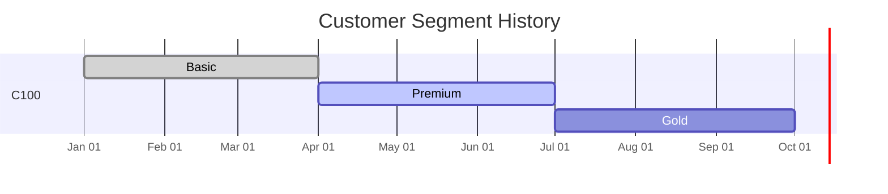
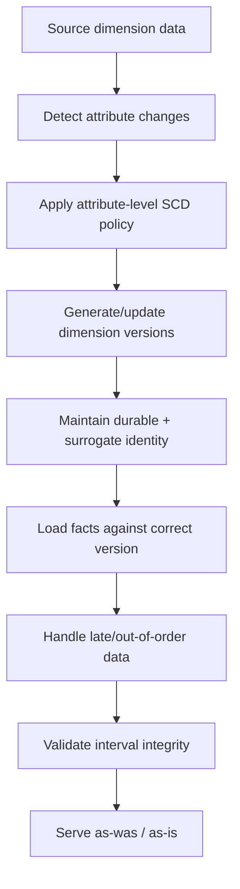
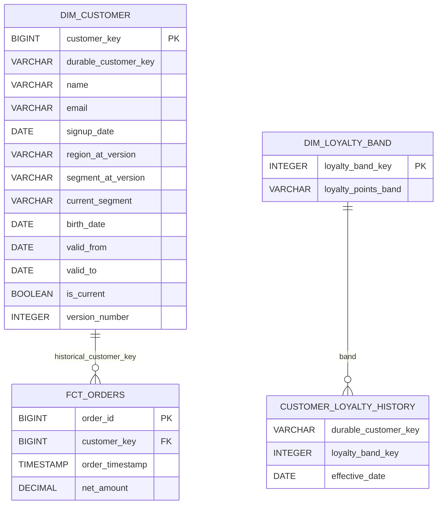

# Slowly Changing Dimension Types

> **Stage 2 — Python for Data Engineering → Module 2.8 — Data Modelling for Analytics → Topic 05**

Slowly Changing Dimensions (SCDs) are a way to decide and implement **how changing dimension attributes should be represented over time**.

The key question is not "Which SQL statement do I run?"

The key question is:

> **When a dimension attribute changes, should historical facts show the old value or the new value?**

That is a business and modelling decision first, and a SQL implementation decision second.

---

## 1. Learning Objectives

By the end of this topic, you should be able to:

- Explain why dimension attributes change.
- Identify the business history question behind an SCD design.
- Decide whether historical values should be preserved.
- Explain and apply SCD Types **0, 1, 2, 3, 4, and 6**.
- Explain Types **5 and 7** at awareness level.
- Choose an SCD strategy **per attribute**, rather than blindly assigning one type to an entire dimension.
- Design Type 2 validity intervals using:
  - `valid_from`
  - `valid_to`
  - half-open interval semantics
  - `is_current`
  - far-future end dates
  - version numbers
- Understand how surrogate keys and durable business identities interact with SCD history.
- Assign facts to the correct historical dimension version.
- Compare fact-load-time version assignment with query-time point-in-time resolution.
- Produce both **"as was"** and **"as is"** reporting when the business requires both.
- Reason about late-arriving facts, late-arriving dimensions, out-of-order changes, and back-dated corrections.
- Decide how source deletes should affect warehouse history.
- Recognize Type 2 row explosion and evaluate alternatives such as mini-dimensions and snapshots.
- Understand daily dimension snapshots.
- Explain what dbt-style snapshots generally solve without turning this topic into a dbt course.
- Implement practical SCD patterns in DuckDB.
- Build a mixed SCD policy for a realistic customer dimension.
- Write automated integrity checks for historical dimensions.
- Troubleshoot incorrect historical reporting.
- Defend an SCD design in a stakeholder meeting, code review, architecture review, or interview.

---

## 2. Prerequisites

This topic assumes you have already completed:

- **Topic 01 — Normalization and Denormalization**
- **Topic 02 — Dimensional Modelling: Facts and Dimensions**
- **Topic 03 — Star and Snowflake Schemas**
- **Topic 04 — Grain, Natural Keys, and Surrogate Keys**
- Stage 2 Module 2.6 SQL mechanics
- Stage 2 Module 2.7 Python database connectivity

You should already understand:

- facts and dimensions
- grain
- primary and foreign keys
- natural, surrogate, and durable keys
- basic SQL joins
- join cardinality
- basic analytical querying
- Type 1 and Type 2 implementation mechanics in SQL

### What is not being re-taught

Module 2.6 already covered Type 1 and Type 2 SQL mechanics. This topic uses those mechanics where useful, but the main objective here is:

> **Decide when and why a history strategy is appropriate, then design it so historical semantics remain correct in production.**

Likewise, Topic 04 already established the difference between:

- **durable business identity**
- **version-specific surrogate identity**

We use that foundation here rather than rebuilding the entire key-design topic.

---

## 3. What Problem Do Slowly Changing Dimensions Solve?

Imagine a retailer.

A customer belongs to this segment:

```text
January → Basic
February → Basic
March → Basic
April → Premium
May → Premium
```

An order was placed on:

```text
2026-03-15
```

Today the customer is Premium.

Now leadership asks:

> "How much revenue came from Basic customers?"

There are at least two valid interpretations.

### Interpretation A — Historical truth

> Show the segment that was true when each order happened.

The March order belongs to:

```text
Basic
```

### Interpretation B — Current truth

> Reclassify the customer using today's current segment.

The same March order could now be reported under:

```text
Premium
```

Neither query is automatically "the correct one."

The correct answer depends on the business question.

### The core business decision

> **When an attribute changes, should old facts report the old value or the new value?**

That is the central question behind SCD design.

---

## 4. Slowly Changing Dimension — Simple Definition

A **dimension** contains descriptive context such as:

- customer segment
- customer region
- product category
- supplier classification
- sales territory

A **slowly changing dimension** is a dimension for which attributes can change over time and where the warehouse must deliberately decide how those changes are represented.

### Why "slowly" can be misleading

"Slowly changing" is historical data-warehouse terminology.

It does **not** mean:

> "The attribute literally changes only a few times."

A customer loyalty band could change every day.

A risk score band could change every hour.

A product classification could change rarely.

The important issue is not the literal speed of change. The important issue is:

> **What historical meaning should the data preserve?**

---

## 5. The Core SCD Decision

A useful conceptual map is:

```text
Attribute changes
       |
       +-- Keep original forever?      → Type 0
       |
       +-- Replace old value?          → Type 1
       |
       +-- Keep full versions?         → Type 2
       |
       +-- Keep previous value only?   → Type 3
       |
       +-- Separate history?           → Type 4
       |
       +-- Hybrid current + history?   → Type 6
```

This is a reasoning aid, not a rigid automatic decision tree.

The real process is:

```text
Attribute changes
       ↓
Business asks:
"Do we need history?"
       ↓
Choose SCD policy per attribute
       ↓
Choose identity/key strategy
       ↓
Store current/history representation
       ↓
Assign facts to correct version
       ↓
Validate historical correctness
```

### Core principle

> **SCD type is a business/history decision, not merely a SQL implementation technique.**

And:

> **Choose the SCD type per attribute, not automatically per entire dimension table.**

---

## 6. Type 0 — Retain the Original Value

### 6.1 What is Type 0?

Type 0 means:

> **The original value is retained and later changes are not applied to that attribute.**

There is no historical versioning for the attribute.

### 6.2 Why would we want this?

Some attributes are analytically meaningful specifically because they record the original state.

Examples:

- original signup date
- original acquisition channel
- original enrollment date
- original customer classification at creation
- date of birth when the business treats the recorded birth date as an original retained value

### 6.3 Example

Initial customer:

```text
customer_id = C100
signup_channel = Organic
```

Later, a source reports:

```text
signup_channel = Paid
```

A Type 0 policy retains:

```text
Organic
```

### 6.4 DuckDB example

```sql
CREATE TABLE dim_customer_type0 (
    customer_key BIGINT PRIMARY KEY,
    customer_id VARCHAR NOT NULL,
    signup_channel VARCHAR NOT NULL
);

INSERT INTO dim_customer_type0 VALUES
    (1, 'C100', 'Organic');

-- Incoming value says "Paid".
-- Type 0 policy means we do not overwrite the original value.

SELECT *
FROM dim_customer_type0
WHERE customer_id = 'C100';
```

Expected conceptual result:

```text
customer_key | customer_id | signup_channel
-------------|-------------|---------------
1            | C100        | Organic
```

### 6.5 When Type 0 is useful

Use it when:

- the original state itself matters
- later corrections should not erase the original analytical fact
- the business explicitly wants original-value semantics

### 6.6 When not to use it

Do not select Type 0 merely because the column feels important.

Ask:

> Does the business actually want the original value to remain permanently authoritative?

### 6.7 Common mistake

Treating every historical field as Type 0.

A source correction may mean that the original stored value was simply wrong rather than historically meaningful.

The business requirement determines the policy.

### Checkpoint

**Question:** A customer originally acquired through Organic later becomes associated with a Paid campaign. When might Type 0 be appropriate?

**Answer:** When the business explicitly wants the original acquisition value retained as an immutable historical attribute.

---

## 7. Type 1 — Overwrite, No History

### 7.1 What is Type 1?

Type 1 means:

> **Overwrite the old value with the new value.**

The dimension contains the current value.

No historical versions are retained.

### 7.2 Example: email correction

Initial value:

```text
asha@example.com
```

Later the source corrects it:

```text
asha.new@example.com
```

Type 1 changes the existing row.

### 7.3 DuckDB example

```sql
CREATE TABLE dim_customer_type1 (
    customer_key BIGINT PRIMARY KEY,
    customer_id VARCHAR NOT NULL,
    customer_name VARCHAR NOT NULL,
    email VARCHAR NOT NULL
);

INSERT INTO dim_customer_type1 VALUES
    (1, 'C100', 'Asha', 'asha@example.com');

UPDATE dim_customer_type1
SET email = 'asha.new@example.com'
WHERE customer_id = 'C100';

SELECT *
FROM dim_customer_type1;
```

Expected result:

```text
customer_key | customer_id | customer_name | email
-------------|-------------|---------------|-----------------------
1            | C100        | Asha          | asha.new@example.com
```

### 7.4 Why Type 1 is often useful

It is appropriate when:

- only the current value matters
- a correction should replace an incorrect stored value
- historical attribute values have little business value
- avoiding row growth is important

### 7.5 The historical implication

If a fact later joins to this Type 1 dimension, the fact sees the current dimension value.

Therefore:

> Type 1 is not a "history preservation" strategy.

### 7.6 A subtle but important distinction

Suppose the source corrects:

```text
"Asha Kumar" → "Asha Kumari"
```

If the original value was a typo, preserving the typo may not be useful history.

That makes Type 1 a reasonable candidate.

But if the change represents a meaningful business classification, Type 2 may be needed.

### Checkpoint

**Question:** What is the defining characteristic of Type 1?

**Answer:** The existing dimension row is overwritten; the old value is not preserved as a separate historical version.

---

## 8. Type 2 — Full Historical Versions

Type 2 is the most important SCD strategy in this topic.

### 8.1 Core idea

> **Every meaningful historical change creates a new dimension row/version.**

Example:

```text
customer_id | customer_key | segment | valid_from | valid_to   | is_current
------------|--------------|---------|------------|------------|-----------
C100        | 501          | Basic   | 2026-01-01 | 2026-04-01 | false
C100        | 782          | Premium | 2026-04-01 | 9999-12-31 | true
```

The customer has one business identity:

```text
C100
```

but two historical dimension versions:

```text
501 → Basic
782 → Premium
```

### 8.2 Why Type 2 exists

Type 2 answers questions such as:

> "What was the customer's segment when the order occurred?"

> "Which region was a store assigned to when a sale happened?"

> "Which category did a product belong to at that point in time?"

### 8.3 Type 2 timeline



The diagram shows separate business-valid periods for each historical version.

### 8.4 Type 2 identity model

Connect this directly to Topic 04:

```text
Durable business identity
        C100
         |
         +--------------------+
         |                    |
         ↓                    ↓
Version key 501          Version key 782
Basic                     Premium
```

A durable key identifies the business entity.

The version-specific surrogate key identifies one historical dimension row.

---

## 9. Type 2 Column Conventions

This topic uses one consistent convention:

```text
valid_from <= event_time < valid_to
```

That is a **half-open interval**.

### Typical columns

| Column | Meaning |
|---|---|
| `customer_key` | Version-specific warehouse identity |
| `durable_customer_key` | Stable business identity |
| `valid_from` | Start of this version's validity |
| `valid_to` | Exclusive end of this version's validity |
| `is_current` | Whether this is the current version |
| `version_number` | Sequence of historical versions |

### Example

```text
durable_customer_key | customer_key | segment | valid_from  | valid_to    | is_current | version_number
---------------------|--------------|---------|-------------|-------------|------------|---------------
C100                 | 501          | Basic   | 2026-01-01  | 2026-04-01  | false      | 1
C100                 | 782          | Premium | 2026-04-01  | 9999-12-31  | true       | 2
```

### Why half-open intervals?

Compare:

```text
[2026-01-01, 2026-04-01)
[2026-04-01, 9999-12-31)
```

April 1 belongs unambiguously to the second version.

The query condition is always:

```sql
event_time >= valid_from
AND event_time < valid_to
```

With closed intervals, you can accidentally define overlapping boundaries.

### Far-future date

Using:

```text
9999-12-31
```

as an open-ended end date is a common convention.

The exact sentinel can vary by platform. What matters is that the convention is documented and used consistently.

### `is_current`

`is_current = TRUE` provides a convenient current-state filter:

```sql
SELECT *
FROM dim_customer
WHERE is_current = TRUE;
```

It is a convenience flag and an integrity constraint—not a substitute for validity intervals.

---

## 10. Type 2 SQL Implementation

The implementation is intentionally shown step by step.

### 10.1 Create the dimension

```sql
CREATE TABLE dim_customer (
    customer_key BIGINT PRIMARY KEY,
    durable_customer_key VARCHAR NOT NULL,
    customer_name VARCHAR NOT NULL,
    segment VARCHAR NOT NULL,
    valid_from DATE NOT NULL,
    valid_to DATE NOT NULL,
    is_current BOOLEAN NOT NULL,
    version_number INTEGER NOT NULL
);
```

### 10.2 Initial load

```sql
INSERT INTO dim_customer (
    customer_key,
    durable_customer_key,
    customer_name,
    segment,
    valid_from,
    valid_to,
    is_current,
    version_number
)
VALUES (
    501,
    'C100',
    'Asha',
    'Basic',
    DATE '2026-01-01',
    DATE '9999-12-31',
    TRUE,
    1
);
```

### 10.3 New incoming state

Suppose the source tells us:

```text
C100 → Premium
effective 2026-04-01
```

First expire the current row:

```sql
UPDATE dim_customer
SET
    valid_to = DATE '2026-04-01',
    is_current = FALSE
WHERE durable_customer_key = 'C100'
  AND is_current = TRUE;
```

Then add the new version:

```sql
INSERT INTO dim_customer (
    customer_key,
    durable_customer_key,
    customer_name,
    segment,
    valid_from,
    valid_to,
    is_current,
    version_number
)
VALUES (
    782,
    'C100',
    'Asha',
    'Premium',
    DATE '2026-04-01',
    DATE '9999-12-31',
    TRUE,
    2
);
```

### 10.4 Verify

```sql
SELECT
    durable_customer_key,
    customer_key,
    segment,
    valid_from,
    valid_to,
    is_current,
    version_number
FROM dim_customer
WHERE durable_customer_key = 'C100'
ORDER BY valid_from;
```

Expected:

```text
C100 | 501 | Basic   | 2026-01-01 | 2026-04-01 | false | 1
C100 | 782 | Premium | 2026-04-01 | 9999-12-31 | true  | 2
```

This is intentionally simple so that the learner can see the state transition clearly.

---

## 11. Type 2 Example With a Timeline

Suppose:

```text
Jan 1      Apr 1      Jul 1
  |-----------|-----------|
 Basic       Premium      Gold
```

The resulting rows are:

```text
C100 | 501 | Basic   | 2026-01-01 | 2026-04-01 | false
C100 | 782 | Premium | 2026-04-01 | 2026-07-01 | false
C100 | 901 | Gold    | 2026-07-01 | 9999-12-31 | true
```

### Which segment should an order see?

| Order date | Correct historical version |
|---|---|
| 2026-03-10 | Basic |
| 2026-04-02 | Premium |
| 2026-06-30 | Premium |
| 2026-07-10 | Gold |

The answer comes from business-effective time, not the warehouse load time.

---

## 12. Type 3 — Previous Value

### 12.1 What is Type 3?

Type 3 keeps a limited amount of history by storing the current and previous values in columns.

Example:

```text
current_region
previous_region
```

### Before the change

```text
current_region | previous_region
---------------|---------------
North          | NULL
```

Customer moves:

```text
North → South
```

After the change:

```text
current_region | previous_region
---------------|---------------
South          | North
```

### Important limitation

Type 3 does **not** retain unlimited history.

After another move:

```text
South → West
```

you may have:

```text
current_region | previous_region
---------------|---------------
West           | South
```

The original North value is no longer represented in the Type 3 columns.

### When Type 3 can work

Use it when:

- only immediate previous context matters
- a business question explicitly compares current vs previous
- complete history is unnecessary

### When not to use it

Do not use Type 3 when the business asks:

> "Show the entire history of every regional assignment."

That is a different requirement.

### DuckDB example

```sql
CREATE TABLE dim_customer_type3 (
    customer_key BIGINT PRIMARY KEY,
    customer_id VARCHAR NOT NULL,
    current_region VARCHAR NOT NULL,
    previous_region VARCHAR
);

INSERT INTO dim_customer_type3 VALUES
    (1, 'C100', 'North', NULL);

UPDATE dim_customer_type3
SET
    previous_region = current_region,
    current_region = 'South'
WHERE customer_id = 'C100';

SELECT *
FROM dim_customer_type3;
```

---

## 13. Type 4 — Separate History

The roadmap uses Type 4 to cover:

- history stored in a separate table
- and a mini-dimension pattern for rapidly changing attributes

The exact implementation terminology can vary between organizations. The underlying idea is:

> **Separate rapidly changing or historical data from the main dimension representation.**

### 13.1 Separate history table

Pattern:

```text
dim_customer
dim_customer_history
```

Example:

```text
dim_customer
------------
customer_key
customer_id
current_region
current_segment

dim_customer_history
--------------------
customer_id
region
segment
valid_from
valid_to
```

The current dimension stays relatively compact while detailed history is stored elsewhere.

### 13.2 Mini-dimension pattern

For a rapidly changing attribute such as:

```text
loyalty_points_band
```

you can isolate that attribute subset in a smaller structure.

Example:

```text
dim_customer
------------
customer_key
customer_id
name
region
segment

dim_loyalty_band
----------------
loyalty_band_key
loyalty_points_band
```

The facts can reference the rapidly changing band through the appropriate model relationship.

### Why separate history?

Potential benefits:

- reduce row growth in a very large core dimension
- isolate attributes with different change frequency
- simplify some current-state access paths
- make rapidly changing attributes easier to manage independently

### Trade-off

The complexity does not disappear. It moves into:

- additional relationships
- more modelling concepts
- more careful query semantics
- downstream documentation

---

## 14. Type 6 — Hybrid SCD

### 14.1 What is Type 6?

Type 6 is commonly described as a hybrid of:

- **Type 1** current-value behavior
- **Type 2** historical rows
- **Type 3** current/previous-style information

A practical pattern is:

```text
durable_customer_key
customer_key
segment_at_version
current_segment
valid_from
valid_to
is_current
```

### 14.2 Example

```text
durable_customer_key | customer_key | segment_at_version | current_segment | valid_from  | valid_to    | is_current
---------------------|--------------|--------------------|-----------------|-------------|-------------|------------
C100                 | 501          | Basic              | Gold            | 2026-01-01  | 2026-04-01  | false
C100                 | 782          | Premium            | Gold            | 2026-04-01  | 2026-07-01  | false
C100                 | 901          | Gold               | Gold            | 2026-07-01  | 9999-12-31  | true
```

Historical rows retain:

```text
segment_at_version
```

while all rows can expose:

```text
current_segment = Gold
```

### 14.3 Why this can be useful

The same dimension can support:

**As-was:**

```text
segment_at_version
```

**As-is:**

```text
current_segment
```

### 14.4 Why Type 6 is not automatically better

It creates additional semantics and maintenance rules.

You must keep:

- historical version attributes
- current attributes
- validity intervals
- current-row logic

consistent.

Use it because the combined semantic requirement justifies it—not because a hybrid sounds more advanced.

---

## 15. Awareness: Types 5 and 7

The roadmap requires awareness, not deep implementation.

SCD terminology beyond Types 0–4 and 6 is not perfectly standardized across every book and organization, so treat Types 5 and 7 as **conceptual patterns whose exact implementation terminology can vary**.

### Type 5 — Awareness

Type 5 is commonly discussed as combining a main dimension with a mini-dimension/current-state relationship so users can access current and historical perspectives without treating one physical representation as the only truth.

For this module, you need to recognize the conceptual goal:

> Support an additional current/alternate view while retaining the historical model.

### Type 7 — Awareness

Type 7 is commonly discussed as supporting both:

- a current-view relationship
- a historical-view relationship

so users can choose which interpretation they need.

Again, the implementation vocabulary varies by methodology.

### Why awareness is enough here

Types 5 and 7 are not the primary focus of this module. The important learning outcome is:

> SCD design can combine current-state and historical semantics, and organizations may use different established patterns to do that.

---

## 16. SCD Types Comparison

| Type | History | Storage pattern | Typical use |
|---|---|---|---|
| 0 | Original only | Retain original value | Immutable/original attributes |
| 1 | None | Overwrite | Corrections/current-state attributes |
| 2 | Full | Multiple rows | Historical reporting |
| 3 | Limited | Current/previous columns | Immediate previous-state comparison |
| 4 | Separate | Separate history table / mini-dimension pattern | Separated history or rapidly changing attributes |
| 5 | Awareness | Hybrid current/mini-dimension pattern | Awareness |
| 6 | Hybrid | Multiple historical rows + current-value representation | As-was + as-is requirements |
| 7 | Awareness | Current and historical views/relationships | Awareness |

### The table is not the decision

A business requirement might look like:

```text
Email → current only
Segment → full history
Signup date → original value
Loyalty band → rapidly changing subset
```

That is a **mixed SCD policy**.

---

## 17. Why There Is No "SCD Type for a Dimension"

A critical production principle is:

> **SCD policy is normally chosen per attribute.**

Consider a customer dimension.

| Attribute | Candidate policy | Reason |
|---|---|---|
| `signup_date` | Type 0 | Original fact |
| `email` | Type 1 | Current contact/correction |
| `name` | Type 1 | Correction/current identity display |
| `segment` | Type 2 | Historical business analysis |
| `region` | Type 2 | Historical reporting |
| `loyalty_points_band` | Type 4 / mini-dimension | Rapid change |
| `current_segment` | Type 6 current-value column | As-is semantics |

So saying:

> "Our customer dimension is Type 2"

is incomplete.

A more useful statement is:

> "Customer `segment` and `region` are Type 2; `email` is Type 1; `signup_date` is Type 0; rapidly changing loyalty band is isolated; the dimension also exposes current segment for as-is analysis."

### Checkpoint

Why is "the whole dimension is Type 2" incomplete?

**Answer:** Because different attributes may have different historical requirements and therefore require different policies.

---

## 18. SCD Policy Table

Before implementation, create a policy table.

Recommended columns:

| Column | Meaning |
|---|---|
| `dimension` | Dimension name |
| `attribute` | Attribute being governed |
| `scd_type` | Selected pattern |
| `business_reason` | Why |
| `historical_requirement` | What should reports show? |
| `source_column` | Source field |
| `change_frequency` | How often it changes |
| `edge_cases` | Corrections, deletes, late data, etc. |

### Example

| Dimension | Attribute | Type | Business reason | History needed? |
|---|---|---:|---|---|
| Customer | `signup_date` | 0 | Preserve original signup fact | Yes, original only |
| Customer | `email` | 1 | Current contact address | No |
| Customer | `name` | 1 | Current display/correction | No |
| Customer | `region` | 2 | Historical reporting | Yes |
| Customer | `segment` | 2 | Revenue attribution over time | Yes |
| Customer | `loyalty_points_band` | 4 | Changes rapidly | Separate |
| Customer | `current_segment` | 6 | Current reporting | Yes, alongside historical rows |

### Production insight

The policy table is not just documentation.

It is a bridge between:

```text
business requirement
        ↓
modelling choice
        ↓
implementation
```

---

## 19. Stakeholder Discussion Example

A Senior Data Engineer should ask business questions before discussing SQL.

### Engineer

> "When customer segment changes, should past revenue remain associated with the old segment?"

### Stakeholder

> "Yes."

Candidate policy:

```text
segment → Type 2
```

### Engineer

> "When customer email changes?"

### Stakeholder

> "We only need the current email."

Candidate policy:

```text
email → Type 1
```

### Engineer

> "Do we care about the original acquisition channel?"

### Stakeholder

> "Yes. We want to know how the customer originally arrived."

Candidate policy:

```text
acquisition_channel → Type 0
```

### Engineering lesson

Do not choose an SCD type from a memorized checklist alone.

First discover:

- what changed
- whether history matters
- how old facts should behave
- how frequently it changes
- what consumers need
- how much history is affordable to maintain

---

## 20. Type 2 and Surrogate/Durable Keys

Topic 04 established two different identity jobs.

### Durable business identity

Example:

```text
C100
```

This represents the customer across history.

### Version-specific surrogate key

Example:

```text
501
782
901
```

These represent distinct historical versions.

### Model

```text
C100
 |
 +-- 501 → Basic
 |
 +-- 782 → Premium
 |
 +-- 901 → Gold
```

A fact that occurred while the customer was Premium can reference:

```text
customer_key = 782
```

while the durable identity remains:

```text
C100
```

---

## 21. Facts + Type 2: The Historical Version Problem

Suppose:

```text
Customer segment:
Basic  → through 2026-03-31
Premium → from 2026-04-01
```

Order:

```text
order_timestamp = 2026-03-15
customer = C100
```

The fact should be associated with the version valid on:

```text
2026-03-15
```

not today's current version.

### The core lookup condition

```text
fact_event_time >= valid_from
AND fact_event_time < valid_to
```

### What can go wrong?

If the loader simply chooses:

```sql
WHERE durable_customer_key = 'C100'
  AND is_current = TRUE
```

it may attach the order to Premium.

That produces an incorrect historical representation.

---

## 22. Assigning Type 2 Version at Fact Load Time

### Concept

When the fact is loaded, identify the dimension version whose validity period contains the fact's business/event timestamp.

Example:

```sql
SELECT
    f.order_id,
    f.order_timestamp,
    f.customer_id,
    d.customer_key
FROM staging_orders f
JOIN dim_customer d
    ON f.customer_id = d.durable_customer_key
   AND f.order_timestamp >= d.valid_from
   AND f.order_timestamp < d.valid_to;
```

### The intended invariant

For a historical fact:

> **Exactly one dimension version should match.**

### Zero matches

Possible causes:

- missing dimension history
- late-arriving dimension
- incorrect effective dates
- missing inferred member
- incomplete mapping

### Multiple matches

Possible causes:

- overlapping Type 2 intervals
- duplicate dimension versions
- incorrect back-dated correction
- bad SCD logic

These are data-quality failures, not merely SQL inconveniences.

---

## 23. Point-in-Time Join at Query Time

An alternative is to store enough identity information to resolve the dimension historically at query time.

Conceptually:

```sql
SELECT
    f.order_id,
    f.order_timestamp,
    d.segment
FROM fct_orders f
JOIN dim_customer d
    ON f.customer_id = d.durable_customer_key
   AND f.order_timestamp >= d.valid_from
   AND f.order_timestamp < d.valid_to;
```

### Compare the two approaches

| Approach | Version assigned | Query complexity | Historical repair | Typical consideration |
|---|---|---|---|---|
| Load-time assignment | During fact load | Lower for consumers | Requires fact repair if dimension history changes | Convenient for repeated reporting |
| Query-time point-in-time | During analysis | Higher | Can respond to corrected history more directly | More temporal logic at query time |

Neither should be declared universally superior.

The right choice depends on:

- freshness
- correction frequency
- query volume
- consumer skill
- performance
- auditability
- whether fact foreign keys are expected to resolve directly

---

## 24. "As Was" Reporting

"As was" means:

> Report using the dimension value that was valid at the historical event time.

Example business question:

> "What was revenue by customer segment as the segment existed when each order occurred?"

### Query with version-specific fact keys

If the fact stores `customer_key`:

```sql
SELECT
    d.segment,
    SUM(f.net_amount) AS revenue
FROM fct_orders f
JOIN dim_customer d
    ON f.customer_key = d.customer_key
GROUP BY d.segment
ORDER BY revenue DESC;
```

This is often straightforward because the historical version was assigned at fact load time.

### Query with durable identity and event time

```sql
SELECT
    d.segment,
    SUM(f.net_amount) AS revenue
FROM fct_orders f
JOIN dim_customer d
    ON f.durable_customer_key = d.durable_customer_key
   AND f.order_timestamp >= d.valid_from
   AND f.order_timestamp < d.valid_to
GROUP BY d.segment;
```

This expresses historical semantics directly.

---

## 25. "As Is" Reporting

"As is" means:

> Use the customer's current dimension classification.

Example business question:

> "How much of our historical revenue belongs to customers who are currently Premium?"

Now the current segment is intentionally used.

A model with a current-value representation can make this explicit.

### Example Type 6 pattern

```sql
SELECT
    d.current_segment,
    SUM(f.net_amount) AS revenue
FROM fct_orders f
JOIN dim_customer_type6 d
    ON f.customer_key = d.customer_key
GROUP BY d.current_segment;
```

### Important distinction

"As was":

```text
What was true then?
```

"As is":

```text
What is true now?
```

They are different analytical questions.

---

## 26. As-Was vs As-Is Side-by-Side

| Question | Required interpretation |
|---|---|
| Revenue by segment at time of sale | As-was |
| Current customers by current segment | As-is |
| Historical operational analysis | Often as-was |
| Current segmentation strategy | As-is |
| "Who was in Region A when the order occurred?" | As-was |
| "Which current customers generated last quarter's revenue?" | As-is |

### Same facts, different semantics

Suppose:

```text
Order on March 15 = $100
Segment in March = Basic
Current segment = Premium
```

Then:

**As-was report**

```text
Basic = $100
```

**As-is report**

```text
Premium = $100
```

Both can be internally correct if they answer their explicitly defined business question.

---

## 27. Type 6 for As-Was + As-Is

A Type 6-style representation can store:

```text
segment_at_version
current_segment
```

For the same customer:

```text
durable_customer_key | customer_key | segment_at_version | current_segment
---------------------|--------------|--------------------|----------------
C100                 | 501          | Basic              | Gold
C100                 | 782          | Premium            | Gold
C100                 | 901          | Gold               | Gold
```

### As-was

Use:

```text
segment_at_version
```

### As-is

Use:

```text
current_segment
```

### Critical caution

If current values are propagated onto historical rows, that update must be deliberate and tested. It is not enough to call the table "Type 6"; you need explicit semantics for which columns represent historical state and which represent current state.

---

## 28. Late-Arriving Dimensions

A fact can arrive before the complete dimension record.

Example:

```text
Fact:
customer_id = C100
order_timestamp = 2026-05-10
```

But the customer dimension data has not arrived.

### The modelling problem

The fact needs a dimension relationship, but the complete dimension attributes are not available yet.

### Inferred member concept

A common solution is:

1. create a placeholder/inferred dimension member
2. load the fact against that member
3. complete the dimension later when source attributes arrive

Conceptually:

```text
Fact arrives
     ↓
Customer C100 absent
     ↓
Create inferred member
     ↓
Load fact
     ↓
Dimension details arrive
     ↓
Complete the member
```

### Why this helps

It can preserve:

- referential integrity
- fact loading continuity
- the ability to reconcile later

### SCD implication

The inferred member must be integrated carefully with the eventual Type 2 history. The goal is to avoid creating:

- duplicate current rows
- overlapping validity intervals
- disconnected durable identity
- duplicate entity history

---

## 29. Late-Arriving Facts

A late-arriving fact is a business event that happened earlier but reached the warehouse later.

Example:

```text
Order occurred: 2026-03-10
Warehouse received: 2026-03-15
```

### Key distinction

The two timestamps have different meanings:

```text
event/business time = 2026-03-10
load/arrival time    = 2026-03-15
```

For historical dimension assignment, business-effective time is usually the relevant time.

### Risk

If the pipeline assigns the fact to the current dimension row on March 15, it may incorrectly report the order using a value that became true after the order occurred.

### Production question

When facts arrive late:

> "Which timestamp defines historical truth for this business process?"

Document the answer.

---

## 30. Out-of-Order Dimension Changes

Change events may arrive in a different order than their business-effective dates.

Example:

```text
April 1  → Premium
April 10 → Gold
April 5  → late correction/change
```

The processing order is:

```text
April 1
April 10
April 5
```

But business time says:

```text
April 1
April 5
April 10
```

### Why this matters

A Type 2 dimension is based on **business validity**, not merely arrival order.

A late event can require:

- inserting a historical version
- splitting an existing validity interval
- adjusting `valid_to`
- recalculating affected versions
- re-evaluating facts assigned to historical versions

### Design principle

> Processing time and business-effective time are different dimensions of reality.

Do not silently assume:

```text
arrival order = business order
```

---

## 31. Back-Dated Corrections

A back-dated correction means:

> A source tells us today that a change was actually effective earlier.

Example:

```text
Correction received: June 10
Effective from: May 1
```

### Why this is difficult

If the dimension already says:

```text
April 1 → June 30 = Premium
July 1 → current   = Gold
```

and we learn that:

```text
May 1 → Premium Plus
```

then the historical timeline must be reconsidered.

### Potential implications

- validity intervals may need repair
- historical rows may need splitting
- facts may need re-evaluation
- as-was reports may change
- aggregate or downstream models may require reconciliation

### Do not invent a universal repair algorithm

The exact repair method depends on:

- source semantics
- correction frequency
- fact-load strategy
- audit requirements
- warehouse capabilities
- downstream contracts

The important design lesson is:

> **Back-dated corrections are model changes in business time, not merely new rows arriving today.**

---

## 32. Deletes in SCD Dimensions

A source can represent a customer disappearing in several ways:

- hard delete
- soft delete
- inactive status
- account closure
- logical retirement

### Important modelling question

Does:

```text
source record deleted
```

mean:

```text
warehouse history should be deleted
```

?

Not necessarily.

Historical warehouse data often has a different purpose from the current operational state.

### Example

A customer account is closed.

The warehouse may still need:

- historical orders
- historical segment
- historical customer identity
- historical reporting context

The source deletion should therefore be interpreted according to business semantics.

### Production rule

> Never destroy warehouse history merely because a source row disappeared without first understanding the business meaning of that deletion.

---

## 33. Type 2 Row Explosion

Type 2 creates a new row whenever tracked attributes change.

A rough growth relationship is:

```text
number of entities × average number of historical versions
```

Suppose:

```text
10,000,000 customers
×
8 average versions
=
80,000,000 dimension rows
```

That is a modelling scale estimate, not a benchmark result.

### Why growth matters

Large Type 2 dimensions can increase:

- storage
- scan cost
- join cost
- refresh work
- historical lookup complexity
- downstream processing

### Important nuance

Row growth is not automatically bad.

If history is business-critical, the additional rows may be exactly what correctness requires.

The question is:

> Is full Type 2 history for this particular attribute worth its operational cost?

---

## 34. Rapidly Changing Dimensions

A "slowly changing dimension" can contain attributes that change rapidly.

Examples:

- loyalty tier
- risk band
- score band
- engagement band
- customer value band

Suppose customer score changes every day:

```text
Monday → 720
Tuesday → 735
Wednesday → 742
Thursday → 748
...
```

Applying Type 2 to every customer row for every change can create very large historical dimensions.

### Key reasoning

Ask:

- Does every historical change matter?
- Does the attribute need full history?
- Can the history be isolated?
- Would a daily snapshot be simpler?
- Would a mini-dimension reduce growth in the main dimension?
- Do downstream consumers need every version?

---

## 35. Mini-Dimensions

A mini-dimension isolates a subset of rapidly changing attributes.

### Example

Main customer dimension:

```text
dim_customer
-------------
customer_key
durable_customer_key
name
email
region
segment
```

Rapidly changing subset:

```text
dim_loyalty_band
----------------
loyalty_band_key
loyalty_points_band
```

### Why this can help

Instead of creating many Type 2 versions of the entire customer dimension due to one rapidly changing attribute, the volatile attribute can be represented separately.

### Trade-offs

| Benefit | Cost |
|---|---|
| Reduces pressure on main dimension history | Additional model component |
| Isolates high-change attributes | More relationships |
| Can simplify some change handling | More consumer understanding |
| May reduce repeated historical copies | More implementation/documentation |

### Production principle

> Model change frequency as well as business meaning.

---

## 36. Daily Dimension Snapshots

A snapshot-based history model stores the dimension state at a regular interval.

Example:

```text
dim_customer_daily
```

Grain:

> One row per customer per day.

### Example

```text
customer_id | snapshot_date | segment | region
------------|---------------|---------|-------
C100        | 2026-04-01    | Premium | East
C100        | 2026-04-02    | Premium | East
C100        | 2026-04-03    | Premium | West
```

### Advantages

- conceptually simple
- easy to reason about daily state
- straightforward historical reconstruction at snapshot granularity

### Costs

- potentially very large row counts
- repeated attribute values
- daily processing/storage
- history resolution limited to snapshot frequency

If a customer changes twice in one day, a daily snapshot may not preserve both changes.

---

## 37. SCD Type 2 vs Daily Snapshot

| Dimension | Type 2 | Daily snapshot |
|---|---|---|
| History representation | Change-driven versions | Scheduled state copies |
| Storage | Depends on number of changes | Entity × snapshot frequency |
| Temporal precision | Can represent exact effective periods | Limited by snapshot schedule |
| Query model | Validity intervals/version rows | Snapshot date |
| Change detection | Change driven | Time driven |
| Rapid intraday changes | Can preserve them | May miss them |
| Simplicity | Requires interval reasoning | Conceptually simple |
| Late corrections | May require interval repair | May require snapshot restatement |
| Storage predictability | Depends on change volume | Often easier to estimate |
| Best fit | Business-effective history | Periodic state analysis |

Neither is universally better.

The correct choice depends on:

- change frequency
- time precision
- storage budget
- query patterns
- correction behaviour
- downstream expectations

---

## 38. Tool-Based Snapshots

Tools such as **dbt snapshots** provide a managed pattern for detecting changes and storing historical states.

Conceptually, a snapshot tool can help with:

```text
Source row
    ↓
Detect change
    ↓
Close old version
    ↓
Store new version
    ↓
Maintain history metadata
```

### What the tool does not decide for you

A tool can implement a mechanism, but the business still needs to decide:

- which attributes require history
- what historical semantics mean
- how deletes should work
- how late data should be handled
- which timestamp defines effective truth
- how downstream facts should use the history

### Awareness only

This module does not teach dbt itself.

The important connection is:

> Snapshot tooling can reduce implementation burden, but it does not replace SCD modelling decisions.

---

## 39. Complete Worked Example — Customer Dimension

Suppose a retailer has a customer dimension with these 15 attributes:

```text
customer_id
signup_date
name
email
address
city
region
country
segment
loyalty_points_band
birth_date
marketing_opt_in
acquisition_channel
preferred_language
customer_status
```

### Business questions

Before assigning SCD types, ask:

1. Do we need the customer's original signup date?
2. Should a corrected email update historical rows?
3. Should historical revenue retain the segment that was true at the time?
4. Should region at order time be preserved?
5. Does loyalty band change too frequently for full Type 2?
6. Do current-state reports need today's segment?
7. Should a closed customer disappear from historical reporting?

### Candidate SCD policy

| Attribute | Type | Reason |
|---|---:|---|
| `signup_date` | 0 | Original signup fact |
| `name` | 1 | Current/corrected name |
| `email` | 1 | Current contact |
| `address` | 1 or 2 | Depends on historical address requirement |
| `city` | 1 or 2 | Depends on historical geography requirement |
| `region` | 2 | Historical reporting |
| `country` | 2 or 1 | Business requirement |
| `segment` | 2 | Historical revenue analysis |
| `loyalty_points_band` | 4 | Rapidly changing subset |
| `birth_date` | 1 | Correction rather than business history |
| `marketing_opt_in` | 1 or separately governed | Current consent state may be the main requirement |
| `acquisition_channel` | 0 | Preserve original acquisition |
| `preferred_language` | 1 or 2 | Depends on historical reporting needs |
| `customer_status` | 1 or 2 | Depends on whether historical lifecycle analysis is required |

The exact policy must be validated with stakeholders.

---

## 40. Type 2 Integrity Tests

Historical modelling must be testable.

### Test 1 — At most one current row

```sql
SELECT
    durable_customer_key,
    COUNT(*) AS current_rows
FROM dim_customer
WHERE is_current = TRUE
GROUP BY durable_customer_key
HAVING COUNT(*) > 1;
```

Expected result:

```text
zero rows
```

If business policy requires exactly one current row for every durable entity, a separate completeness assertion should also be enforced.

### Test 2 — Invalid intervals

```sql
SELECT *
FROM dim_customer
WHERE valid_from >= valid_to;
```

Expected:

```text
zero rows
```

### Test 3 — No overlapping versions

A simple self-join:

```sql
SELECT
    a.durable_customer_key,
    a.customer_key AS key_a,
    b.customer_key AS key_b,
    a.valid_from AS a_from,
    a.valid_to AS a_to,
    b.valid_from AS b_from,
    b.valid_to AS b_to
FROM dim_customer a
JOIN dim_customer b
    ON a.durable_customer_key = b.durable_customer_key
   AND a.customer_key < b.customer_key
   AND a.valid_from < b.valid_to
   AND b.valid_from < a.valid_to;
```

Expected:

```text
zero rows
```

### Test 4 — Optional continuity check

If the business model requires continuous history, compare:

```text
current valid_from
```

to:

```text
previous valid_to
```

using a window function.

```sql
WITH ordered AS (
    SELECT
        durable_customer_key,
        customer_key,
        valid_from,
        valid_to,
        LAG(valid_to) OVER (
            PARTITION BY durable_customer_key
            ORDER BY valid_from
        ) AS previous_valid_to
    FROM dim_customer
)
SELECT *
FROM ordered
WHERE previous_valid_to IS NOT NULL
  AND previous_valid_to <> valid_from;
```

This test is **policy-dependent**. Some dimensions intentionally have gaps.

### Test 5 — Historical fact resolution

```sql
SELECT
    f.order_id,
    f.durable_customer_key,
    f.order_timestamp,
    COUNT(d.customer_key) AS matching_versions
FROM fct_orders f
LEFT JOIN dim_customer d
    ON f.durable_customer_key = d.durable_customer_key
   AND f.order_timestamp >= d.valid_from
   AND f.order_timestamp < d.valid_to
GROUP BY
    f.order_id,
    f.durable_customer_key,
    f.order_timestamp
HAVING COUNT(d.customer_key) <> 1;
```

Expected:

```text
zero rows
```

This catches:

- no matching version
- multiple matching versions

### Test 6 — Inferred/unknown members

Validate placeholder members according to the documented policy.

For example:

```sql
SELECT *
FROM dim_customer
WHERE is_inferred = TRUE
  AND customer_name IS NULL
  AND email IS NOT NULL;
```

This is a sample business-rule check, not a universal invariant.

---

## 41. SQL for Detecting Overlapping SCD Versions

Overlap is particularly dangerous because a historical fact can then match multiple dimension versions.

Example of a bad timeline:

```text
Version A: [2026-01-01, 2026-05-01)
Version B: [2026-04-15, 9999-12-31)
```

From April 15 through April 30, both are valid.

### Detection query

```sql
SELECT
    a.durable_customer_key,
    a.customer_key AS version_a,
    b.customer_key AS version_b,
    a.valid_from AS a_from,
    a.valid_to AS a_to,
    b.valid_from AS b_from,
    b.valid_to AS b_to
FROM dim_customer a
JOIN dim_customer b
    ON a.durable_customer_key = b.durable_customer_key
   AND a.customer_key < b.customer_key
   AND a.valid_from < b.valid_to
   AND b.valid_from < a.valid_to;
```

### Why overlap is dangerous

A query such as:

```sql
event_time >= valid_from
AND event_time < valid_to
```

could return two dimension rows for the same event.

That makes the historical meaning ambiguous.

---

## 42. SQL for Multiple Current Rows

Use:

```sql
SELECT
    durable_customer_key,
    COUNT(*) AS current_rows
FROM dim_customer
WHERE is_current = TRUE
GROUP BY durable_customer_key
HAVING COUNT(*) > 1;
```

Expected result:

```text
zero rows
```

### Typical causes

- concurrent loads
- retry logic without idempotency
- incorrect change detection
- bad back-dated correction
- incomplete expiry of old versions

---

## 43. SQL for Historical Version Resolution

A fact can resolve to a Type 2 row using:

```sql
SELECT
    f.order_id,
    f.order_timestamp,
    f.durable_customer_key,
    d.customer_key,
    d.segment
FROM fct_orders f
JOIN dim_customer d
    ON f.durable_customer_key = d.durable_customer_key
   AND f.order_timestamp >= d.valid_from
   AND f.order_timestamp < d.valid_to;
```

### Version-resolution invariant

For each fact requiring historical resolution:

```text
number of matching dimension versions = 1
```

That is why historical resolution should itself be tested.

---

## 44. Common SCD Mistakes

| Mistake | Symptom | Root cause | Correction | Production impact |
|---|---|---|---|---|
| One SCD type for every attribute | Huge or semantically wrong history | Policy chosen at table level | Choose per attribute | Unnecessary cost or wrong reporting |
| Type 2 everywhere | Dimension explodes | All changes versioned by default | Identify which attributes truly require history | Storage/processing growth |
| Type 1 on historical attributes | Past reports change | Old values overwritten | Use a historical strategy | Incorrect historical metrics |
| Current values used for historical reports | Old revenue moves into current segments | Query filters current row | Resolve by event time/version | Historical semantic error |
| Overlapping intervals | One fact matches two versions | Bad validity boundaries | Enforce interval integrity | Ambiguous joins |
| Multiple current rows | Two `is_current = true` rows | Concurrent/retry/bad change processing | Enforce current-row test | Non-deterministic reporting |
| History gaps where continuity is required | Events cannot resolve | Missing version | Repair history or define gap semantics | Missing/unknown attributes |
| Fact assigned to current row | Historical values wrong | Load ignores event time | Match business-effective time | Misclassified facts |
| Ignore late-arriving dimensions | Unknown customer spikes | Fact arrives first | Use inferred-member policy | Broken relationships |
| Ignore late-arriving facts | Wrong historical version | Load time mistaken for event time | Use business-event time | Historical misclassification |
| Ignore back-dated corrections | Old periods remain wrong | Effective time differs from arrival time | Repair intervals/reconcile affected facts | Historical inaccuracies |
| Physically delete warehouse history after source delete | Historical reports disappear | Source state confused with warehouse history | Interpret delete semantics | Loss of history |
| Type 3 when full history is required | Only one previous value exists | Limited-history pattern misapplied | Use Type 2 or another full-history design | Missing history |
| Type 4 without a real need | More joins/complexity | Pattern selected because it is advanced | Justify separation | Maintenance overhead |
| Ignore rapid change | Very large Type 2 dimension | Volatile attributes in core dimension | Consider mini-dim/snapshot | Scale pressure |
| No stakeholder policy | Frequent disputes | Engineering guessed semantics | Document attribute-level policy | Trust problems |
| Durable/version identity confused | Historical relationships unclear | One key used for multiple jobs | Separate entity and version identity | Incorrect history |
| Tool assumed to solve semantics | Snapshot exists but answers wrong questions | Mechanism chosen before business requirement | Define policy first | False confidence |

---

## 45. Debugging Scenarios

### Scenario 1 — Historical Revenue Changed

A report from last month changes after a customer's segment changes today.

**Question:** Why?

**Answer:** If the report joins facts to a Type 1/current dimension, the historical fact can pick up today's segment. If historical truth is required, the model needs an appropriate Type 2/version-aware interpretation.

---

### Scenario 2 — Two Current Rows

A customer has:

```text
is_current = true
```

on two rows.

**Question:** What is wrong?

**Answer:** The Type 2 integrity invariant is violated. One durable business identity should generally have at most one current version when the model uses a single-current-row policy.

Investigate:

- concurrent processing
- retries
- change-detection logic
- back-dated corrections
- failed expiry

---

### Scenario 3 — Historical Join Returns Two Rows

An order timestamp matches two customer versions.

**Answer:** The validity intervals overlap.

Run the overlap assertion from Section 41.

---

### Scenario 4 — Historical Revenue Uses Today's Segment

**Diagnosis:** Current-row lookup was used instead of historical version resolution.

Incorrect concept:

```sql
WHERE is_current = TRUE
```

for an as-was query.

Correct historical reasoning:

```text
event_time ∈ [valid_from, valid_to)
```

---

### Scenario 5 — Dimension Has Millions of Versions

Do not automatically apply Type 2 to every attribute.

Investigate:

- which attributes actually require history
- change frequency
- whether a mini-dimension is suitable
- whether a snapshot is simpler
- whether the business needs exact change timestamps

---

### Scenario 6 — Back-Dated Correction

A change received today says:

```text
effective_date = one month ago
```

Possible impact:

- interval repair
- historical fact re-resolution
- downstream model reconciliation
- changed as-was metrics

Do not assume that inserting a new current row is sufficient.

---

### Scenario 7 — Email Correction

The source reports a typo in a customer's email.

Ask:

> Does the business need the typo preserved as a historical email?

If not, Type 1 may be appropriate.

Do not use Type 2 solely because "the value changed."

---

## 46. Decision Matrix for Choosing SCD Types

A reasoning aid:

```text
Does history matter?
        |
        +-- No → Type 1 may be sufficient
        |
        +-- Preserve original only → Type 0
        |
        +-- Need full history → Type 2
        |
        +-- Need one previous value → Type 3
        |
        +-- Separate history / volatile subset → Type 4
        |
        +-- Need hybrid current + historical semantics → Type 6
```

### Important warning

> **This is not a universal automatic decision tree.**

A final choice must consider:

- business meaning
- history requirement
- change frequency
- dimension size
- query patterns
- storage
- operational complexity
- late-data behaviour
- downstream consumers

---

## 47. Stakeholder Requirement Template

Use this before implementation.

| Question | Example |
|---|---|
| What changed? | Customer segment |
| Does history matter? | Yes |
| Should old facts keep old value? | Yes |
| Current-state reporting needed? | Yes |
| Change frequency | Monthly |
| Dimension size | Large |
| Candidate | Type 2 / Type 6 |
| Reason | Historical + current views |
| Late correction frequency | Occasional |
| Delete semantics | Retain warehouse history |

The learner should be able to use this template in a design discussion.

---

## 48. Python — Generate the 90-Day Customer History Dataset

The roadmap requires 90 days of customer snapshots with changes to:

- address
- segment
- email
- birth date correction

The lab also uses a rapidly changing:

- `loyalty_points_band`

The following generator creates deterministic training data.

```python
from __future__ import annotations

from datetime import date, timedelta
import random


SEED = 42
random.seed(SEED)


SEGMENTS = ["Basic", "Premium", "Gold"]
REGIONS = ["North", "South", "East", "West"]
LOYALTY_BANDS = ["Bronze", "Silver", "Gold", "Platinum"]


def random_email(customer_number: int, day_offset: int) -> str:
    """Create a deterministic sample email."""
    return f"customer{customer_number}.{day_offset}@example.com"


def generate_customers(customer_count: int = 100) -> list[dict]:
    customers: list[dict] = []

    for customer_number in range(1, customer_count + 1):
        customers.append(
            {
                "customer_id": f"C{customer_number:05d}",
                "name": f"Customer {customer_number}",
                "email": random_email(customer_number, 0),
                "address": f"{customer_number} Main Street",
                "region": random.choice(REGIONS),
                "segment": random.choice(SEGMENTS),
                "loyalty_points_band": random.choice(LOYALTY_BANDS),
                "birth_date": date(1990, 1, 1) + timedelta(days=customer_number),
                "signup_date": date(2026, 1, 1),
            }
        )

    return customers


def generate_90_day_snapshots(
    customers: list[dict],
    start_date: date = date(2026, 1, 1),
    days: int = 90,
) -> list[dict]:
    snapshots: list[dict] = []

    for day_offset in range(days):
        snapshot_date = start_date + timedelta(days=day_offset)

        for customer in customers:
            record = customer.copy()

            # Segment changes occasionally.
            if day_offset > 0 and random.random() < 0.03:
                record["segment"] = random.choice(SEGMENTS)

            # Region changes less frequently.
            if day_offset > 0 and random.random() < 0.01:
                record["region"] = random.choice(REGIONS)

            # Loyalty band changes more frequently.
            if day_offset > 0 and random.random() < 0.10:
                record["loyalty_points_band"] = random.choice(LOYALTY_BANDS)

            # Email corrections/changes are rare.
            if day_offset == 30:
                record["email"] = random_email(
                    int(customer["customer_id"][1:]),
                    day_offset,
                )

            # Back-dated-style birth-date correction example.
            if day_offset == 45:
                record["birth_date"] = record["birth_date"] - timedelta(days=1)

            record["snapshot_date"] = snapshot_date
            snapshots.append(record)

    return snapshots


customers = generate_customers(customer_count=100)
snapshots = generate_90_day_snapshots(customers)

print("customer rows:", len(customers))
print("snapshot rows:", len(snapshots))
```

### Why this generator is useful

It deliberately creates different change frequencies:

```text
segment                 → moderate
region                  → slower
loyalty_points_band     → rapid
email                   → correction/change
birth_date              → correction
```

That supports the idea that:

> Different attributes can require different SCD strategies.

---

## 49. DuckDB Staging Table for the 90-Day Lab

After generating records in Python, load them into a staging table.

A simple DuckDB-oriented representation is:

```sql
CREATE TABLE staging_customer_snapshots (
    customer_id VARCHAR,
    name VARCHAR,
    email VARCHAR,
    address VARCHAR,
    region VARCHAR,
    segment VARCHAR,
    loyalty_points_band VARCHAR,
    birth_date DATE,
    signup_date DATE,
    snapshot_date DATE
);
```

### Staging grain

> One row per customer per snapshot date.

That grain is different from the final Type 2 dimension's grain.

This distinction matters.

---

## 50. Mixed SCD Policy for the Lab

The roadmap requires:

- Type 0 → signup date
- Type 1 → email
- Type 1 → name corrections
- Type 2 → segment
- Type 2 → region
- Type 6 current columns → segment
- Type 4 / mini-dimension → loyalty points band

### Target concept

```text
dim_customer
------------
customer_key
durable_customer_key
name
email
signup_date
region
segment_at_version
current_segment
birth_date
valid_from
valid_to
is_current
version_number

dim_loyalty_band
----------------
loyalty_band_key
loyalty_points_band
```

This is intentionally a mixed policy.

---

## 51. Type 1 Columns Inside a Type 2 Dimension

A mixed SCD design often contains Type 1 attributes alongside Type 2 attributes.

Example:

```text
customer version rows
---------------------
customer_key
segment_at_version   -- Type 2 history
region_at_version    -- Type 2 history
email                -- Type 1 current value
name                 -- Type 1 current value
```

When email is corrected:

> The current email can be updated without creating a new Type 2 row if the policy is Type 1.

### Important semantic implication

A historical Type 2 row may contain:

```text
segment_at_version = Basic
```

while:

```text
email = current_email
```

That is not automatically inconsistent.

It is the consequence of an explicit mixed attribute policy.

Document it so consumers know which columns are historical and which are current.

---

## 52. Example Type 6 Dimension

```sql
CREATE TABLE dim_customer_type6 (
    customer_key BIGINT PRIMARY KEY,
    durable_customer_key VARCHAR NOT NULL,
    customer_name VARCHAR NOT NULL,
    email VARCHAR NOT NULL,
    signup_date DATE NOT NULL,
    region VARCHAR NOT NULL,
    segment_at_version VARCHAR NOT NULL,
    current_segment VARCHAR NOT NULL,
    birth_date DATE NOT NULL,
    valid_from DATE NOT NULL,
    valid_to DATE NOT NULL,
    is_current BOOLEAN NOT NULL,
    version_number INTEGER NOT NULL
);
```

### Example history

```sql
INSERT INTO dim_customer_type6 VALUES
    (
        501,
        'C100',
        'Asha',
        'asha@example.com',
        DATE '2026-01-01',
        'East',
        'Basic',
        'Premium',
        DATE '1990-01-01',
        DATE '2026-01-01',
        DATE '2026-04-01',
        FALSE,
        1
    ),
    (
        782,
        'C100',
        'Asha',
        'asha@example.com',
        DATE '2026-01-01',
        'East',
        'Premium',
        'Premium',
        DATE '1990-01-01',
        DATE '2026-04-01',
        DATE '9999-12-31',
        TRUE,
        2
    );
```

This demonstrates the key Type 6 idea:

- first row = historical segment Basic
- current state = Premium is available on both rows

---

## 53. Loading Facts Against the Correct Version

Suppose:

```sql
CREATE TABLE fct_orders (
    order_id BIGINT PRIMARY KEY,
    durable_customer_key VARCHAR NOT NULL,
    customer_key BIGINT,
    order_timestamp TIMESTAMP NOT NULL,
    net_amount DECIMAL(12,2) NOT NULL
);
```

Incoming order:

```text
C100
2026-03-15 10:30:00
$100.00
```

Resolve the historical version:

```sql
INSERT INTO fct_orders (
    order_id,
    durable_customer_key,
    customer_key,
    order_timestamp,
    net_amount
)
SELECT
    s.order_id,
    s.durable_customer_key,
    d.customer_key,
    s.order_timestamp,
    s.net_amount
FROM staging_orders s
JOIN dim_customer_type6 d
    ON s.durable_customer_key = d.durable_customer_key
   AND CAST(s.order_timestamp AS DATE) >= d.valid_from
   AND CAST(s.order_timestamp AS DATE) < d.valid_to;
```

The March order should receive the version that was valid on March 15.

### Production note

If exact timestamps matter rather than dates, make `valid_from` and `valid_to` timestamps consistently.

Do not mix date-level and timestamp-level semantics casually.

---

## 54. As-Was Query for the Lab

```sql
SELECT
    d.segment_at_version AS segment,
    SUM(f.net_amount) AS revenue
FROM fct_orders f
JOIN dim_customer_type6 d
    ON f.customer_key = d.customer_key
GROUP BY d.segment_at_version
ORDER BY revenue DESC;
```

This asks:

> What segment was represented by the customer's historical dimension version at the time of the order?

---

## 55. As-Is Query for the Lab

```sql
SELECT
    d.current_segment AS segment,
    SUM(f.net_amount) AS revenue
FROM fct_orders f
JOIN dim_customer_type6 d
    ON f.customer_key = d.customer_key
GROUP BY d.current_segment
ORDER BY revenue DESC;
```

This asks:

> How does the same historical revenue distribute according to the customer's current segment?

Again, the two numbers can differ intentionally.

---

## 56. Type 4 / Mini-Dimension for Loyalty Band

A simple mini-dimension:

```sql
CREATE TABLE dim_loyalty_band (
    loyalty_band_key INTEGER PRIMARY KEY,
    loyalty_points_band VARCHAR NOT NULL
);

INSERT INTO dim_loyalty_band VALUES
    (1, 'Bronze'),
    (2, 'Silver'),
    (3, 'Gold'),
    (4, 'Platinum');
```

Depending on the architecture, facts or another daily representation can reference the appropriate loyalty-band key.

The important lesson is:

> The frequently changing attribute does not have to force every main customer attribute into a new Type 2 version.

---

## 57. Daily Snapshot Alternative

Create:

```sql
CREATE TABLE dim_customer_daily (
    customer_id VARCHAR NOT NULL,
    snapshot_date DATE NOT NULL,
    name VARCHAR,
    email VARCHAR,
    region VARCHAR,
    segment VARCHAR,
    loyalty_points_band VARCHAR,
    birth_date DATE,
    signup_date DATE,
    PRIMARY KEY (customer_id, snapshot_date)
);
```

Grain:

> One row per customer per snapshot day.

### Size comparison

If there are:

```text
100 customers
× 90 days
```

the snapshot contains:

```text
9,000 rows
```

If there are:

```text
10 million customers
× 365 days
```

the same design would produce:

```text
3.65 billion rows
```

This is a scale illustration, not a performance claim.

The business and operational context determines whether such a design is practical.

---

## 58. Type 2 vs Snapshot: Decision Exercise

### Scenario

A customer risk score changes every day.

Business asks:

> "What was the customer's daily risk band?"

Possible candidates:

- Type 2
- daily snapshot
- isolated mini-dimension

### Reasoning

If the business only needs one state per day, a daily snapshot may be easier to reason about.

If the exact effective timestamp of every change is important, Type 2 may better preserve the business history.

If only the rapidly changing risk-band subset needs history while the main customer attributes change rarely, a mini-dimension may reduce duplication.

There is no automatic winner.

---

## 59. Back-Dated Change Example

Suppose dimension history currently contains:

```text
C100 | Basic   | [2026-01-01, 2026-04-01)
C100 | Premium | [2026-04-01, 9999-12-31)
```

On June 10, the source reports:

```text
C100 | Gold | effective 2026-03-15
```

A naive implementation might simply insert:

```text
Gold | [2026-06-10, 9999-12-31)
```

That is semantically wrong if the business says the value was effective March 15.

### The correct design questions

- Which existing interval must be split?
- Should facts from March 15 onward move to the Gold version?
- What happens to the Premium period?
- Do downstream aggregates need reconciliation?
- How is the correction audited?

This is why effective time and arrival time must be modelled separately.

---

## 60. Production Flow



### Explanation

1. **Source dimension data** arrives from operational systems.
2. **Change detection** identifies relevant changes.
3. **Attribute-level policy** decides Type 0/1/2/3/4/6 behaviour.
4. **Versioning** updates the dimension appropriately.
5. **Identity** links versions to the durable business entity.
6. **Facts** resolve to the proper historical version.
7. **Late/out-of-order data** can require additional historical handling.
8. **Integrity checks** prove the dimension remains valid.
9. **Consumers** receive clearly defined historical/current semantics.

---

## 61. Final Integrated Case Study

### Scenario

An online retailer has:

- 10 million customers
- a customer segment used for revenue analysis
- customer region used for historical regional reporting
- email used only for current contact
- signup channel that must never change
- loyalty band changing frequently
- orders that can arrive late
- occasional back-dated customer corrections
- business users asking both current and historical questions

### Requirement discovery

#### Segment

> Past orders must remain attributed to the segment that was true when the order occurred.

Candidate:

```text
Type 2
```

#### Region

> Historical revenue must reflect historical region.

Candidate:

```text
Type 2
```

#### Email

> Only current email is needed.

Candidate:

```text
Type 1
```

#### Signup channel

> Original acquisition channel must remain available.

Candidate:

```text
Type 0
```

#### Loyalty band

> Changes very frequently.

Candidate:

```text
Type 4 / mini-dimension
```

#### Current segment

> Leadership also wants current segment reporting.

Candidate:

```text
Type 6 current-value representation
```

### Target model



### Diagram explanation

- `dim_customer` stores historical versions for the attributes requiring Type 2 semantics.
- `email` and `name` can remain Type 1 within the dimension according to policy.
- `signup_date` is retained as an original value.
- `current_segment` supports current-state reporting.
- Loyalty history is separated because that attribute changes more frequently.
- Facts reference a specific customer version when using load-time Type 2 assignment.

### Case-study workflow

```text
Business requirements
       ↓
Attribute policy
       ↓
Dimension structure
       ↓
Sample changes
       ↓
Type 2 interval maintenance
       ↓
Fact version assignment
       ↓
As-was result
       ↓
As-is result
       ↓
Late-data handling
       ↓
Integrity tests
```

---

## 62. Practical Mini Exercises

### Exercise A — Choose SCD Type for Ten Attributes

Assign a candidate type:

1. original signup date
2. email correction
3. customer segment
4. region
5. loyalty band
6. original acquisition source
7. current preferred language
8. account status
9. previous territory
10. historical sales classification

#### Solution

There is not one universally correct answer without business context.

A reasonable starting policy is:

| Attribute | Candidate | Why |
|---|---:|---|
| signup date | 0 | Preserve original |
| email correction | 1 | Current correction |
| segment | 2 | Historical analysis |
| region | 2 | Historical reporting |
| loyalty band | 4 | Rapidly changing |
| acquisition source | 0 | Original acquisition |
| preferred language | 1 or 2 | Depends on history requirement |
| account status | 1 or 2 | Depends on lifecycle analysis |
| previous territory | 3 | If only current/previous matters |
| historical sales classification | 2 | Historical attribution |

The exercise is testing reasoning, not memorized assignments.

---

### Exercise B — Convert Type 1 to Type 2

Current dimension:

```text
customer_id | region
------------|-------
C100        | South
```

Business now requires historical region.

#### Solution

Redesign the dimension to maintain versions:

```text
customer_id | customer_key | region | valid_from | valid_to
------------|--------------|--------|------------|-----------
C100        | 501          | North  | 2026-01-01 | 2026-04-01
C100        | 782          | South  | 2026-04-01 | 9999-12-31
```

The change is a semantic model change, not just an `UPDATE` statement.

---

### Exercise C — Draw Type 2 Versions

Customer:

```text
Jan–Mar = Basic
Apr–Jun = Premium
Jul–Present = Gold
```

#### Solution

```text
Basic   [Jan, Apr)
Premium [Apr, Jul)
Gold    [Jul, ∞)
```

Every boundary must be unambiguous.

---

### Exercise D — Detect Overlap

Given:

```text
[2026-01-01, 2026-05-01)
[2026-04-15, 9999-12-31)
```

#### Solution

These intervals overlap from:

```text
2026-04-15 through 2026-04-30
```

That is an SCD integrity defect if overlapping versions are not explicitly designed.

---

### Exercise E — Resolve an Order

Customer history:

```text
Basic   [2026-01-01, 2026-04-01)
Premium [2026-04-01, 9999-12-31)
```

Order:

```text
2026-03-20
```

#### Solution

The order maps to:

```text
Basic
```

because:

```text
2026-03-20 >= 2026-01-01
AND
2026-03-20 < 2026-04-01
```

---

### Exercise F — As-Was Query

Write a query showing revenue using historical segment.

#### Solution

Use the version-specific fact relationship:

```sql
SELECT
    d.segment_at_version,
    SUM(f.net_amount)
FROM fct_orders f
JOIN dim_customer d
    ON f.customer_key = d.customer_key
GROUP BY d.segment_at_version;
```

---

### Exercise G — As-Is Query

Write a query showing historical revenue by current segment.

#### Solution

Use a current-value column or current dimension interpretation:

```sql
SELECT
    d.current_segment,
    SUM(f.net_amount)
FROM fct_orders f
JOIN dim_customer d
    ON f.customer_key = d.customer_key
GROUP BY d.current_segment;
```

---

### Exercise H — Type 2 vs Snapshot

A customer's risk band changes daily, and leadership asks for daily state.

#### Solution

Both could be candidates.

Choose based on:

- required time precision
- storage
- change frequency
- query patterns
- correction behaviour

Do not automatically choose Type 2.

---

### Exercise I — Late-Arriving Dimension

Order arrives with customer `C100`, but customer record arrives tomorrow.

#### Solution

Consider an inferred member:

```text
Create placeholder
→ load fact
→ complete dimension later
```

Validate that the placeholder is merged correctly into the final history.

---

### Exercise J — Back-Dated Correction

A correction arrives June 10 and says:

```text
effective May 1
```

#### Solution

Re-evaluate historical validity from May 1.

Potential impacts:

- split interval
- create corrected version
- reassign affected facts if needed
- reconcile downstream metrics

---

## 63. Interview / Architecture Practice

### 1. What is an SCD?

**Testing:** foundational warehouse modelling.

**Strong answer:** An SCD is a deliberate way of representing changes to dimension attributes over time so historical/current reporting has defined semantics.

**Weak answer:** A database table that changes slowly.

**Senior consideration:** The "slow" label is historical terminology; change semantics matter more than literal frequency.

---

### 2. Why do we need SCDs?

**Testing:** business reasoning.

**Strong answer:** Because dimension values can change while historical reports may still need the values that were true when facts occurred.

**Weak answer:** To keep old rows.

**Senior consideration:** History should be preserved only where the business requirement justifies it.

---

### 3. What is the difference between Type 1 and Type 2?

**Strong answer:** Type 1 overwrites without historical versions; Type 2 creates new versions and retains historical validity.

**Senior consideration:** The right choice depends on attribute semantics, not on which SQL pattern is easier.

---

### 4. When would you choose Type 0?

**Strong answer:** When the original value is intentionally immutable for analytics.

**Weak answer:** Whenever you want history.

**Senior consideration:** Type 0 preserves one original state, not unlimited history.

---

### 5. When is Type 3 useful?

**Strong answer:** When the business needs current and immediate previous values but not complete history.

**Weak answer:** When Type 2 is too complicated.

**Senior consideration:** A simpler implementation is not sufficient justification if full history is required.

---

### 6. Explain Type 4.

**Strong answer:** It separates historical or rapidly changing information from the main dimension representation, often through a separate history structure or mini-dimension pattern.

**Senior consideration:** Separation can reduce pressure on the core dimension but introduces additional relationships and semantics.

---

### 7. What is Type 6?

**Strong answer:** A hybrid that combines Type 2 historical rows with current-value information, allowing both historical and current interpretations.

**Senior consideration:** Current values on historical rows require explicit maintenance and documentation.

---

### 8. Why choose SCD type per attribute?

**Strong answer:** Because different attributes have different business history requirements and change frequencies.

**Weak answer:** Because Type 2 is expensive.

**Senior consideration:** Even within one dimension, some attributes may be Type 0, others Type 1, Type 2, or isolated into another structure.

---

### 9. What makes a good Type 2 validity interval?

**Strong answer:** A consistent temporal contract such as `valid_from <= event_time < valid_to`, with no unintended overlaps.

**Senior consideration:** The exact time granularity must match the business's effective-time semantics.

---

### 10. Why use half-open intervals?

**Strong answer:** They eliminate ambiguity at boundaries.

Example:

```text
[Jan 1, Apr 1)
[Apr 1, Jul 1)
```

April 1 belongs to exactly one interval.

---

### 11. Why is `is_current` useful?

**Strong answer:** It provides a convenient current-state filter and supports an explicit current-row invariant.

**Senior consideration:** It should agree with validity intervals; it should not replace them.

---

### 12. Why use a far-future end date?

**Strong answer:** It gives the current version a concrete open-ended boundary while keeping comparisons simple and consistent.

---

### 13. How do facts find the correct Type 2 dimension row?

**Strong answer:** Match durable/business identity plus business-event time against the dimension validity interval, or assign the version-specific surrogate key during fact loading.

---

### 14. What is an as-was report?

**Strong answer:** A report that uses the dimension value valid at the historical event time.

---

### 15. What is an as-is report?

**Strong answer:** A report that interprets historical facts using the current dimension state where that is the intended business meaning.

---

### 16. What happens when a fact arrives before the dimension?

**Strong answer:** Consider an inferred/placeholder member so the fact can load, then complete the dimension record later.

**Senior consideration:** The placeholder must be integrated correctly with durable identity and Type 2 validity.

---

### 17. What happens when a dimension change arrives out of order?

**Strong answer:** Use business-effective time rather than assuming processing order represents business chronology. Existing validity intervals may need repair.

---

### 18. How do back-dated corrections affect Type 2?

**Strong answer:** They can require interval repair and historical fact reassignment/reconciliation because the newly supplied effective time may fall inside already-created history.

---

### 19. What is Type 2 row explosion?

**Strong answer:** Growth in dimension rows caused by frequent changes creating many historical versions.

**Senior consideration:** Evaluate which attributes truly require full history.

---

### 20. When can a mini-dimension help?

**Strong answer:** When a small subset of attributes changes rapidly and isolating them reduces repeated Type 2 growth in a large core dimension.

---

### 21. Type 2 vs daily snapshot?

**Strong answer:** Type 2 is change-driven and can preserve precise effective intervals; snapshots are time-driven and can be simpler when daily state is the actual business requirement.

---

### 22. What happens if Type 2 validity intervals overlap?

**Strong answer:** Historical queries may return multiple versions for one fact, making the dimension semantics ambiguous.

---

### 23. What should happen when a source deletes a customer?

**Strong answer:** First interpret whether the deletion means inactive/currently absent or whether warehouse history should actually disappear. Historical analytics often still require the dimension's previous context.

---

### 24. How would you review an SCD design proposed by another engineer?

**Strong answer:** I would review:

- attribute-level policies
- business questions
- key strategy
- validity convention
- current-row invariant
- overlap/gap policy
- fact-version assignment
- late-data behaviour
- back-dated correction strategy
- delete semantics
- rapid-change risk
- integrity tests
- downstream semantics

The design should be explainable to both business stakeholders and engineers.

---

## 64. Practical SCD Review Checklist

Before approving an SCD implementation:

```text
[ ] Each tracked attribute has an explicit history policy
[ ] Business requirement is documented
[ ] Type 0/1/2/3/4/6 choices are justified
[ ] Types 5/7 awareness is understood where relevant
[ ] Durable identity is defined
[ ] Version identity is defined
[ ] valid_from semantics are documented
[ ] valid_to semantics are documented
[ ] Half-open interval convention is used consistently
[ ] is_current policy is documented
[ ] Far-future date convention is documented
[ ] Version numbering rules are documented
[ ] Historical fact assignment is defined
[ ] As-was semantics are defined
[ ] As-is semantics are defined
[ ] Late-arriving dimensions are handled
[ ] Late-arriving facts are handled
[ ] Out-of-order changes are handled
[ ] Back-dated corrections are understood
[ ] Delete semantics are understood
[ ] Type 2 size is estimated
[ ] Rapidly changing attributes are identified
[ ] Mini-dimension/snapshot alternatives are evaluated
[ ] Overlap test exists
[ ] Current-row test exists
[ ] Fact-version resolution test exists
[ ] Inferred/unknown member policy exists
[ ] Reload/reprocessing behaviour is known
```

---

## 65. Final Concept Map

```text
Dimension Attribute Changes
          ↓
Business History Requirement
          ↓
SCD Policy Per Attribute
          ↓
0 / 1 / 2 / 3 / 4 / 6
          ↓
Identity + Versioning
          ↓
Fact-to-Version Assignment
          ↓
As-Was / As-Is Reporting
          ↓
Late / Out-of-Order Changes
          ↓
Rapidly Changing Dimensions
          ↓
Snapshots / Mini-Dimensions
          ↓
Integrity Tests
          ↓
Production Historical Model
```

### Explain every transition

**Dimension Attribute Changes**

Values change over time.

**Business History Requirement**

Ask what historical meaning users actually need.

**SCD Policy Per Attribute**

Select the representation for each attribute.

**0 / 1 / 2 / 3 / 4 / 6**

Choose an appropriate pattern.

**Identity + Versioning**

Separate durable entity identity from historical version identity.

**Fact-to-Version Assignment**

Make sure facts use the correct historical context.

**As-Was / As-Is Reporting**

Expose the intended historical or current interpretation.

**Late / Out-of-Order Changes**

Design for the fact that data can arrive in a different order from business-effective time.

**Rapidly Changing Dimensions**

Look for Type 2 growth pressure.

**Snapshots / Mini-Dimensions**

Evaluate alternative structures when change frequency makes full Type 2 expensive.

**Integrity Tests**

Turn temporal assumptions into executable checks.

**Production Historical Model**

The result is a model whose historical meaning is deliberate, explainable, and testable.

---

## 66. Production Takeaways

The most important engineering principles are:

- **SCD design starts with business history requirements.**
- The central question is whether past facts should show past or current dimension values.
- SCD policy is usually selected **per attribute**.
- Type 0 retains an original value.
- Type 1 overwrites without preserving historical versions.
- Type 2 creates multiple historical versions.
- Type 3 preserves limited previous/current state.
- Type 4 separates history or isolates rapidly changing attributes.
- Type 6 combines historical versions with current-value semantics.
- Types 5 and 7 should be understood conceptually.
- Type 2 requires carefully defined validity intervals.
- Half-open intervals reduce temporal boundary ambiguity.
- `is_current` is useful but should agree with interval semantics.
- Facts must resolve to the correct historical version when historical reporting is required.
- "As was" and "as is" are different business questions.
- Type 2 is not automatically appropriate for every changing attribute.
- Rapidly changing attributes may require mini-dimensions or snapshots.
- Late-arriving facts and dimensions must be handled deliberately.
- Out-of-order changes require business-effective-time reasoning.
- Back-dated corrections can require historical interval repair and downstream reconciliation.
- A source delete does not automatically justify deleting warehouse history.
- Historical dimensions need automated integrity tests.
- Tools can help implement snapshots, but tooling does not replace business semantics.
- An advanced SCD design should be explainable to both technical and non-technical stakeholders.
- There is no universal SCD strategy. The correct design depends on business history requirements, change patterns, scale, query semantics, operational constraints, and downstream consumers.

The most useful mental model is:

```text
What changed?
     ↓
Why does it matter?
     ↓
What historical truth do we need?
     ↓
Which attribute-level policy fits?
     ↓
How will identity/versioning work?
     ↓
How will facts resolve history?
     ↓
How will late/corrected data behave?
     ↓
How will we prove it remains correct?
```

---

## 67. Scope Boundary and Continuity

This is **Topic 05**.

The focus is:

> **dimension attribute history + SCD policy + version identity + historical fact semantics + production correctness**

The next topic, **Topic 06 — Data Vault: Hubs, Links, and Satellites**, will build on the ability to reason about historical change and source integration.

Earlier topics established:

- normalization
- facts and dimensions
- star/snowflake structures
- grain and key strategy

Later topics build on this:

- Data Vault integration
- wide/OBT consumption models
- behavioural/event modelling

Do not duplicate those complete curricula here.

The key transition is:

```text
Topic 04:
Who/what is this row?
        ↓
Topic 05:
How should changing attributes be represented over time?
        ↓
Topic 06:
How should changing data from multiple sources be integrated?
```

---

## 68. Final Checkpoint — Are You Ready for Topic 06?

Before moving on, you should be able to answer all of these without notes:

- [ ] What is the central business question behind SCD design?
- [ ] When is Type 0 appropriate?
- [ ] When is Type 1 appropriate?
- [ ] When is Type 2 appropriate?
- [ ] When is Type 3 appropriate?
- [ ] What does Type 4 separate?
- [ ] What makes Type 6 a hybrid?
- [ ] What is the conceptual purpose of Types 5 and 7?
- [ ] Why should SCD policy normally be defined per attribute?
- [ ] What are `valid_from` and `valid_to`?
- [ ] Why use half-open intervals?
- [ ] Why is `is_current` useful?
- [ ] Why is `9999-12-31` commonly used?
- [ ] What is a version number?
- [ ] How does a durable key differ from a version-specific surrogate key?
- [ ] How does a fact find the correct Type 2 version?
- [ ] What is an as-was report?
- [ ] What is an as-is report?
- [ ] What is a late-arriving dimension?
- [ ] What is an inferred member?
- [ ] What is a late-arriving fact?
- [ ] What is an out-of-order change?
- [ ] What is a back-dated correction?
- [ ] Why can source deletes be dangerous for historical warehouse data?
- [ ] What is Type 2 row explosion?
- [ ] When can a mini-dimension help?
- [ ] When can a daily snapshot be a candidate?
- [ ] What does a dbt snapshot generally solve?
- [ ] How do you detect overlapping Type 2 versions?
- [ ] How do you detect multiple current rows?
- [ ] How do you prove a historical fact maps to exactly one version?

If you can answer those questions clearly and can complete the 90-day customer exercise, you have the foundation needed for the next stage of the roadmap.
