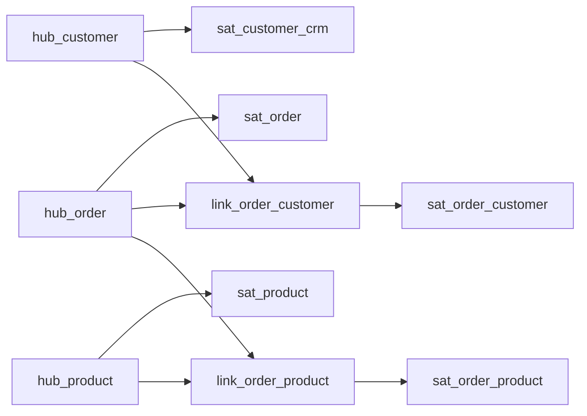
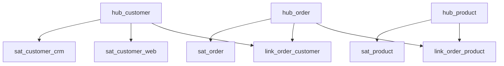
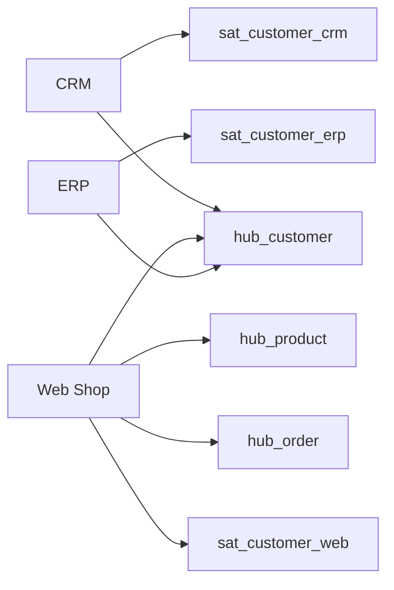
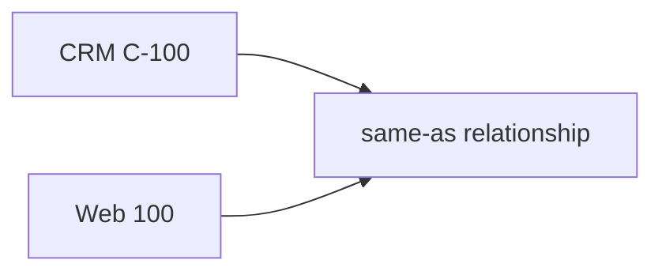
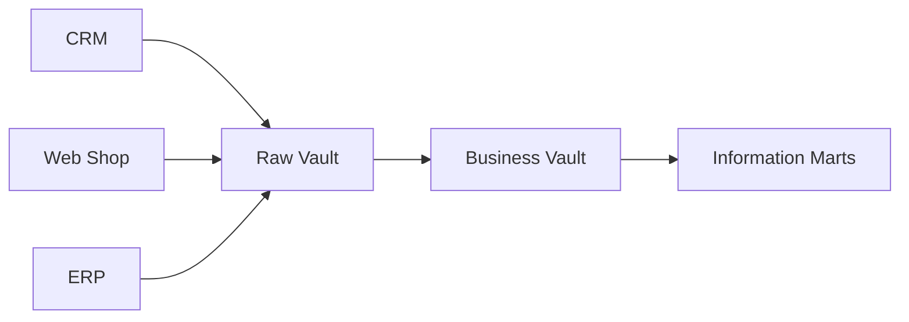
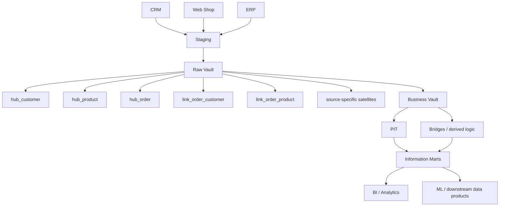

# Data Vault: Hubs, Links, and Satellites

> **Stage 2 — Python for Data Engineering → Module 2.8 — Data Modelling for Analytics → Topic 06**

Data Vault is an **integration and historical modelling approach** designed for environments where multiple source systems change over time and the platform must preserve source history, identity, relationships, and audit context.

The key architectural distinction for this topic is:

> **Data Vault is primarily an integration/history layer, not usually the final BI consumption model.**

A common flow is:

```text
Many changing source systems
          ↓
       Staging
          ↓
       Raw Vault
          |
          ├── Hubs
          ├── Links
          └── Satellites
          ↓
     Business Vault
          ↓
    Information Marts
          ↓
 Dimensional / BI models
```

This topic teaches how to reason about when that architecture is useful, how to build its core structures, how to preserve source history, and when the additional complexity is not justified.

---

# 1. Learning Objectives

By the end of this module, you should be able to:

- Explain what Data Vault is in simple and formal terms.
- Explain the multi-source integration problem Data Vault addresses.
- Distinguish Data Vault from dimensional modelling.
- Explain why a Data Vault is often an integration/history layer followed by analytical marts.
- Identify and design:
  - hubs
  - links
  - satellites
- Choose and qualify business keys appropriately.
- Understand Data Vault hash keys and connect them to the deterministic-key ideas from Topic 04.
- Explain hash diffs and their role in change detection.
- Explain `load_date` and `record_source`.
- Explain why Raw Vault loading is usually insert-only.
- Distinguish Raw Vault from Business Vault.
- Explain why business rules should not silently replace source evidence in the Raw Vault.
- Build source-specific satellites.
- Split satellites deliberately by source, rate of change, or logical attribute group.
- Explain same-as links and why source histories should not be destroyed by identity matching.
- Explain multi-active satellites.
- Explain effectivity satellites.
- Explain PIT (Point-In-Time) tables.
- Explain Data Vault bridge tables in the context of query assistance.
- Build information marts from the vault.
- Compare Data Vault with:
  - normalized enterprise/integration layers
  - direct staging → dimensional marts
- Explain the operational costs and criticism of Data Vault.
- Recognize situations where Data Vault may be overkill.
- Add a new source system while preserving existing source history.
- Build a working two-source Raw Vault in DuckDB.
- Generate realistic changing source data in Python.
- Build a customer PIT.
- Build an information mart.
- Write validation and reconciliation assertions.
- Defend a Data Vault architecture decision in a design review.

---

# 2. Prerequisites

This topic assumes that you have completed:

- **Topic 01 — Normalization and Denormalization**
- **Topic 02 — Dimensional Modelling: Facts and Dimensions**
- **Topic 03 — Star and Snowflake Schemas**
- **Topic 04 — Grain, Natural Keys, and Surrogate Keys**
- **Topic 05 — Slowly Changing Dimension Types**
- Stage 2 Modules 2.1–2.7

You should already know:

- primary and foreign keys
- grain
- natural/business keys
- surrogate keys
- durable keys
- SCD Type 1 and Type 2 mechanics
- SQL joins
- basic analytical modelling
- medallion architecture
- loading data from Python

Those concepts are not re-taught from scratch.

Instead, this topic connects them to a new architectural pattern.

For example:

> Topic 04 introduced deterministic identity and hash-key trade-offs. Data Vault uses deterministic hash identities operationally for hubs and links.

And:

> Topic 05 introduced historical dimension versions. Data Vault satellites preserve source-aligned descriptive history through insert-oriented records rather than using the same dimensional versioning model as the final BI layer.

---

# 3. What Is Data Vault?

## 3.1 Simple explanation

Imagine a company receives customer and order data from several systems:

```text
CRM
Web Shop
ERP
Support Platform
Billing System
```

Each system may have:

- different identifiers
- different formats
- different schemas
- different timestamps
- different update frequencies
- different definitions
- different levels of history

A Data Vault provides a structured integration layer that separates three questions:

### Hub

> **What business thing are we talking about?**

### Link

> **How are business things related?**

### Satellite

> **What descriptive information did a source tell us about that thing, and how did it change?**

This gives the basic mental model:

```text
Hub   = identity
Link  = relationship
Satellite = descriptive history
```

## 3.2 Formal definition

Data Vault is a data-warehouse modelling approach built around:

- business keys
- hub entities
- links between entities
- satellites containing descriptive attributes and history
- explicit source/load metadata
- insert-oriented historical preservation

The exact implementation details can vary by organization and platform. The core architectural intent is to separate identity, relationships, and descriptive source history.

## 3.3 What Data Vault is not

Data Vault is not simply:

- a replacement for every dimensional model
- a BI-friendly star schema
- a generic normalization technique
- an automatic identity-resolution system
- a guarantee of unlimited scalability
- a magic solution to schema change

The strongest mental model is:

> **Data Vault is a possible integration/history architecture that can feed business-facing analytical models.**

---

# 4. Why Data Vault Exists

Consider a retailer with three source systems.

## CRM

```text
customers
addresses
customer_segments
```

## Web Shop

```text
customers
products
orders
order_items
```

## ERP

```text
customers
products
finance
```

The systems may disagree.

### Customer IDs

```text
CRM     → C-100
Web     → 100
ERP     → 000100
```

### Customer attributes

CRM might contain:

```text
customer_name
email
sales_region
```

Web Shop might contain:

```text
display_name
email
shipping_country
```

ERP might contain:

```text
account_number
legal_name
credit_status
```

### Change patterns

CRM may update:

```text
segment
region
```

Web Shop may update:

```text
email
address
```

ERP may update:

```text
credit_status
```

Now imagine a platform that must:

- onboard more sources
- preserve source history
- retain audit context
- handle different schemas
- support parallel source loads
- expose multiple downstream analytical models

A direct staging → star approach can still work, but its integration layer may require more coordination as source complexity grows.

Data Vault is one architectural response.

---

# 5. Data Vault in a Modern Data Platform

```text
Source Systems
     ↓
Landing / Staging
     ↓
Raw Vault
     ↓
Business Vault
     ↓
Information Marts
     ↓
BI / Analytics / ML
```

## Landing / Staging

Purpose:

- receive source records
- standardize access to incoming data
- provide an ingestion boundary

The exact staging pattern depends on the broader platform.

## Raw Vault

Purpose:

- preserve source-aligned business identities
- preserve relationships
- preserve descriptive source history
- retain source/load metadata
- minimize business-rule interpretation

## Business Vault

Purpose:

- derive reusable business logic
- create query helpers
- calculate business relationships
- build PIT and bridge structures
- standardize or combine information where required

## Information Marts

Purpose:

- provide consumer-friendly analytical models
- support facts/dimensions
- expose readable business vocabulary
- optimize for BI and analytical workloads

### Important relationship to earlier topics

```text
Topic 02/03
Dimensional modelling
        ↑
        |
 Information Marts
        ↑
 Business Vault
        ↑
 Raw Vault
        ↑
 Source Integration
```

The vault does not eliminate dimensional modelling. It can provide a more flexible integration foundation for it.

---

# 6. The Three Core Building Blocks

The core Data Vault model is:

```text
      HUB
       |
    LINK
   /    \
HUB     HUB
       |
  SATELLITE
```

A useful analogy is:

| Data Vault object | Simple question |
|---|---|
| Hub | Who/what is this business thing? |
| Link | How are business things related? |
| Satellite | What do we know about it, and what did the source say over time? |

Now move from analogy to engineering.

---

# 7. Hubs

## 7.1 What Is a Hub?

A **hub** represents a core business concept identified by a business key.

Examples:

- customer
- product
- order
- account
- policy
- supplier

The key idea is identity.

### Example

```text
hub_customer
```

answers:

> "Which customer identity exists in the integrated domain?"

It does not try to contain every customer attribute.

## 7.2 What belongs in a Hub?

Typical concepts include:

```text
customer_hk
customer_business_key
load_date
record_source
```

Where:

- `customer_hk` = warehouse/Data Vault hash identity
- `customer_business_key` = source/business identity representation
- `load_date` = when the record was loaded into the vault
- `record_source` = which source supplied the identity

The exact physical standard can vary, but the identity-focused role should remain clear.

## 7.3 What does not normally belong in a Hub?

Descriptive attributes generally belong in satellites:

```text
customer_name
address
segment
email
credit_status
```

Why?

Because these values describe the identity and can change independently.

Putting them into the hub would mix:

```text
identity
```

with:

```text
description/history
```

That weakens the separation that Data Vault is designed to create.

---

# 8. Hub Example — Customer

Create:

```text
hub_customer
```

### DuckDB DDL

```sql
CREATE TABLE hub_customer (
    customer_hk VARCHAR PRIMARY KEY,
    customer_business_key VARCHAR NOT NULL,
    load_date TIMESTAMP NOT NULL,
    record_source VARCHAR NOT NULL
);
```

### Sample source-qualified keys

```sql
INSERT INTO hub_customer VALUES
    ('hk_crm_1001', 'CRM|1001', TIMESTAMP '2026-01-01 08:00:00', 'CRM'),
    ('hk_web_1001', 'WEB|1001', TIMESTAMP '2026-01-01 08:05:00', 'WEB');
```

These are intentionally distinct.

Even though the visible ID is:

```text
1001
```

the source-qualified identity is different:

```text
CRM|1001
WEB|1001
```

### Important

Do not assume that two source-qualified IDs represent different or identical real-world entities without business evidence.

Identity matching is a separate modelling decision.

---

# 9. Hub Example — Product

Create:

```text
hub_product
```

### Example

```sql
CREATE TABLE hub_product (
    product_hk VARCHAR PRIMARY KEY,
    product_business_key VARCHAR NOT NULL,
    load_date TIMESTAMP NOT NULL,
    record_source VARCHAR NOT NULL
);
```

Possible business identity:

```text
SKU-10045
```

The hub says:

> This product identity exists.

It does not say:

```text
product_name = Laptop Pro
category = Electronics
```

Those descriptive values belong downstream in satellites.

---

# 10. Hub Example — Order

Create:

```sql
CREATE TABLE hub_order (
    order_hk VARCHAR PRIMARY KEY,
    order_business_key VARCHAR NOT NULL,
    load_date TIMESTAMP NOT NULL,
    record_source VARCHAR NOT NULL
);
```

Example:

```sql
INSERT INTO hub_order VALUES
    (
        'hk_order_ord1001',
        'ORD-1001',
        TIMESTAMP '2026-01-01 09:00:00',
        'WEB'
    );
```

The hub represents order identity.

It does not try to represent every line-level or fulfilment-level business fact.

---

# 11. Links

## 11.1 What Is a Link?

A **link** represents a business relationship between hubs.

For example:

```text
ORDER ↔ CUSTOMER
```

can be represented as:

```text
hub_order
    |
    v
link_order_customer
    |
    v
hub_customer
```

## 11.2 Why not put the relationship into a hub?

Because the relationship is a business concept in its own right.

An order:

```text
ORD-1001
```

may be associated with:

```text
Customer C100
```

and potentially:

```text
Seller S200
Channel Web
```

Those relationships can evolve independently from the identity objects.

## 11.3 Link example — Order ↔ Customer

```sql
CREATE TABLE link_order_customer (
    order_customer_hk VARCHAR PRIMARY KEY,
    order_hk VARCHAR NOT NULL,
    customer_hk VARCHAR NOT NULL,
    load_date TIMESTAMP NOT NULL,
    record_source VARCHAR NOT NULL
);
```

Sample:

```sql
INSERT INTO link_order_customer VALUES
    (
        'lk_order1001_customer1001',
        'hk_order_ord1001',
        'hk_web_1001',
        TIMESTAMP '2026-01-01 09:01:00',
        'WEB'
    );
```

The link says:

> At this load event, the source established a relationship between this order identity and customer identity.

Descriptive relationship history may be attached through a link satellite where needed.

---

# 12. Link Example — Order ↔ Product

One order can contain multiple products.

Conceptually:

```text
hub_order
    |
    +---- link_order_product ---- hub_product
    |
    +---- link_order_product ---- hub_product
```

### DuckDB

```sql
CREATE TABLE link_order_product (
    order_product_hk VARCHAR PRIMARY KEY,
    order_hk VARCHAR NOT NULL,
    product_hk VARCHAR NOT NULL,
    load_date TIMESTAMP NOT NULL,
    record_source VARCHAR NOT NULL
);
```

Sample:

```sql
INSERT INTO link_order_product VALUES
    (
        'lk_order1001_product1',
        'hk_order_ord1001',
        'hk_product_p1',
        TIMESTAMP '2026-01-01 09:02:00',
        'WEB'
    ),
    (
        'lk_order1001_product2',
        'hk_order_ord1001',
        'hk_product_p2',
        TIMESTAMP '2026-01-01 09:02:00',
        'WEB'
    );
```

### Important distinction from Topic 02

A dimensional fact such as:

```text
fct_order_lines
```

is a consumer-oriented measurement structure.

A Data Vault link represents source/business relationship identity.

Do not automatically equate:

```text
link = fact
```

or:

```text
satellite = dimension
```

They solve different problems.

---

# 13. Satellites

## 13.1 What Is a Satellite?

A **satellite** stores descriptive attributes and their history.

Satellites can attach to:

- hubs
- links

Examples:

```text
hub_customer
    |
sat_customer_crm
```

and:

```text
link_order_customer
    |
sat_order_customer
```

## 13.2 Why satellites exist

They provide separation for:

- descriptive attributes
- source-specific information
- changing attributes
- historical records
- different rates of change

### Example

```text
hub_customer
sat_customer_crm
sat_customer_web
```

The hub identifies the customer.

The satellites describe the customer from specific sources.

---

# 14. Satellite Structure

Example:

```text
sat_customer_crm
```

Possible columns:

```text
customer_hk
load_date
record_source
hash_diff
customer_name
email
segment
address
```

### Why include `hash_diff`?

It provides a practical change-detection mechanism for a defined set of descriptive attributes.

### Why include `record_source`?

Because consumers may need to answer:

> Which source supplied this information?

### Why include `load_date`?

Because consumers may need to answer:

> When did the vault receive this information?

---

# 15. Hub-Link-Satellite Relationship



**Diagram explanation:** Hubs hold core identities, links hold relationships between those identities, and satellites hold descriptive/history data attached to either hubs or links.

---

# 16. Hash Keys

Topic 04 already introduced deterministic hash identities.

Data Vault commonly uses hash keys for:

- hubs
- links

Conceptual transformation:

```text
(source_system, business_key)
            ↓
      canonical string
            ↓
      deterministic hash
            ↓
          hub_hk
```

For a composite link:

```text
parent_hub_hk + child_hub_hk
```

can be canonically represented and hashed into a link hash key.

## 16.1 Example

```text
CRM|C100
```

becomes a deterministic identity.

For example, using DuckDB's `md5`:

```sql
SELECT md5('CRM|C100') AS customer_hk;
```

## 16.2 Canonicalization matters

Input:

```text
" CRM "
"crm"
```

can produce different raw strings unless canonicalized.

A controlled approach:

```sql
SELECT md5(
    lower(trim(source_system))
    || '|'
    || lower(trim(source_customer_id))
) AS customer_hk
FROM staging_customer;
```

### Production caveat

Do not assume a generic database hash function is guaranteed to have stable cross-platform output. For interoperability, explicitly document:

- algorithm
- encoding
- canonicalization
- separator rules
- representation

Data Vault's use of hash keys builds directly on Topic 04.

---

# 17. Hash Diffs

## 17.1 What is a Hash Diff?

A **hash diff** is a digest computed from a defined set of descriptive satellite attributes.

Its purpose is change detection.

Suppose a satellite tracks:

```text
customer_name
email
segment
address
```

A canonical representation can be created and hashed.

```sql
SELECT
    md5(
        coalesce(trim(customer_name), '<NULL>')
        || '|'
        || coalesce(lower(trim(email)), '<NULL>')
        || '|'
        || coalesce(trim(segment), '<NULL>')
        || '|'
        || coalesce(trim(address), '<NULL>')
    ) AS hash_diff
FROM staging_customer;
```

If the canonicalized attribute set changes, the digest normally changes.

## 17.2 What hash diffs do not solve

A hash diff does not tell you:

- whether the change is business-correct
- whether the source value is valid
- whether two records represent the same real-world person
- whether null handling follows business semantics
- whether a field should belong in this satellite

It is a change-detection mechanism.

## 17.3 Hash-diff contract

Document:

```text
Satellite: sat_customer_crm
Tracked fields:
  customer_name
  email
  segment
  address

Canonicalization:
  trim strings
  lowercase email
  explicit NULL token

Algorithm:
  MD5
```

Changing the tracked field set changes the meaning of the hash diff.

---

# 18. Load Date and Record Source

Two metadata concepts are especially important.

## 18.1 Load date

`load_date` answers:

> When did this record enter the vault?

Example:

```text
2026-09-29 10:32:15
```

This is **load chronology**.

## 18.2 Record source

`record_source` answers:

> Which source supplied this record?

Example:

```text
CRM
WEB
ERP
```

## 18.3 Do not confuse load time and effective time

A source may say:

```text
customer moved to Region B effective May 1
```

but the platform receives that record on:

```text
June 10
```

Then:

```text
effective time = May 1
load time      = June 10
```

Data Vault metadata is powerful because it preserves ingestion chronology, but the source's business-effective timestamp is a separate semantic concept.

---

# 19. Insert-Only Data Vault

This is a central idea.

Suppose the source first tells us:

```text
C100
segment = Basic
```

Later it tells us:

```text
C100
segment = Premium
```

In a Raw Vault satellite, the preferred pattern is not:

```sql
UPDATE old_row
SET segment = 'Premium';
```

Instead:

```text
old record remains
new record is inserted
```

Example:

```text
load_date   | segment
------------|---------
2026-01-01  | Basic
2026-04-01  | Premium
```

The history remains visible.

---

# 20. Why Raw Vault Uses Insert-Only Patterns

## 20.1 Auditability

You can preserve:

> What information did we receive?

## 20.2 Historical traceability

You can inspect:

> What did the source say earlier?

## 20.3 Replay and reconstruction

If downstream business rules change, the original source-aligned history remains available.

## 20.4 Parallel loading

Append-oriented pipelines can reduce dependencies caused by coordinating many updates.

## 20.5 Source evidence

The Raw Vault should behave more like:

```text
evidence repository
```

than:

```text
final business truth table
```

### Important nuance

Insert-only does not mean that every downstream table must be insert-only.

For example:

- Business Vault derived structures
- current-state views
- dimensional information marts

can be maintained with different techniques.

The Raw Vault's job is different.

---

# 21. Proving Insert-Only Behavior

Suppose:

```text
sat_customer_crm
```

is loaded daily.

You can inspect row counts by load date:

```sql
SELECT
    CAST(load_date AS DATE) AS load_day,
    COUNT(*) AS rows_loaded
FROM sat_customer_crm
GROUP BY CAST(load_date AS DATE)
ORDER BY load_day;
```

### Detect duplicate descriptive records for the same load event

```sql
SELECT
    customer_hk,
    load_date,
    COUNT(*) AS row_count
FROM sat_customer_crm
GROUP BY customer_hk, load_date
HAVING COUNT(*) > 1;
```

Expected for a one-record-per-hub-per-load policy:

```text
zero rows
```

That policy is not universal; the satellite's declared grain must determine the assertion.

---

# 22. Raw Vault

## 22.1 Definition

The **Raw Vault** is the source-aligned historical integration layer.

Its main goals are:

- source fidelity
- identity
- relationships
- descriptive history
- load/source context

## 22.2 Characteristics

```text
source-aligned
minimal transformation
insert-oriented
historically preserved
source metadata retained
business rules limited
```

## 22.3 What Raw Vault should avoid

Do not silently transform:

```text
source_segment = GOLD
```

into:

```text
business_segment = VIP
```

inside the Raw Vault unless that transformation is itself part of the source-aligned representation and explicitly governed.

A business-rule interpretation belongs downstream.

---

# 23. Business Vault

The **Business Vault** is where derived, reusable business logic can be introduced.

Examples:

- business-standardized relationships
- derived history
- PIT tables
- bridges
- calculated business states
- reusable transformation logic

### Comparison

| Raw Vault | Business Vault |
|---|---|
| Source-aligned | Business-rule-driven |
| Minimal interpretation | Derived interpretation |
| Historical source evidence | Reusable business logic |
| Identity/relationship capture | Query helpers and derived structures |
| Audit-oriented | Consumption-supporting |

### Why separate them?

Suppose business rule version 1 says:

```text
VIP if lifetime_spend > 10,000
```

Later version 2 says:

```text
VIP if lifetime_spend > 15,000
OR
priority_account = true
```

If you overwrite source history with the derived label, you lose the ability to reconstruct source evidence.

Keeping raw data separate means business logic can evolve without destroying the original source representation.

---

# 24. Why Business Rules Should Not Be Hidden in Raw Vault

Bad pattern:

```text
Source says:
segment = "Premium"

Engineer stores:
segment = "VIP"
```

without preserving what the source said.

This creates two problems:

1. Source truth is lost.
2. Future rule changes cannot reliably reconstruct the old state.

Better:

```text
Raw Vault:
source_segment = Premium

Business Vault:
business_segment = VIP
```

The transformation is explicit and replaceable.

---

# 25. Source-Specific Satellites

Two systems may describe the same customer differently.

```text
hub_customer
      |
      +-- sat_customer_crm
      |
      +-- sat_customer_web
```

### CRM satellite

```text
customer_name
email
sales_region
account_manager
```

### Web Shop satellite

```text
display_name
shipping_country
browser_preferences
web_opt_in
```

This preserves source context.

### Why this matters

If one source stops providing a field, that does not necessarily mean the other source has stopped providing it.

Source-specific satellites isolate:

- ownership
- change frequency
- schema evolution
- source semantics

---

# 26. Satellite Splitting

Satellites can be split intentionally by:

- source
- rate of change
- logical attribute group

Example:

```text
sat_customer_crm_identity
sat_customer_crm_contact
sat_customer_crm_segment
sat_customer_web_preferences
```

## 26.1 Benefits

- independent source loads
- smaller change-detection groups
- clearer ownership
- reduced churn in unrelated attributes

## 26.2 Costs

- more tables
- more joins
- more metadata
- more documentation
- greater consumer complexity if queried directly

### Principle

> There is no universal "correct number of satellites."

Split when the operational/query benefits justify the additional complexity.

---

# 27. Complete Data Vault Example

We will model an online retailer.

## Hubs

```text
hub_customer
hub_product
hub_order
```

## Links

```text
link_order_customer
link_order_product
```

## Satellites

```text
sat_customer_crm
sat_customer_web
sat_product
sat_order
```

### Architecture



**Diagram explanation:** The hubs establish core identities. Links represent order relationships to customers and products. Satellites describe those identities or relationships over time and preserve source context.

---

# 28. Loading Two Source Systems

We use:

- CRM
- Web Shop

## CRM

Provides:

```text
customer_id
customer_name
email
region
segment
```

## Web Shop

Provides:

```text
customer_id
display_name
email
shipping_country
orders
products
```

### Loading the same vault

CRM may populate:

```text
hub_customer
sat_customer_crm
```

Web Shop may populate:

```text
hub_customer
sat_customer_web
hub_order
hub_product
link_order_customer
link_order_product
sat_order
sat_product
```

This is an example of source-specific participation in the same integrated model.

---

# 29. Multi-Source Business Keys

Suppose:

```text
CRM customer_id = 1001
Web customer_id = 1001
```

Do not automatically collapse them.

Use source-qualified identity:

```text
CRM|1001
WEB|1001
```

Then decide whether:

```text
CRM|1001
```

and:

```text
WEB|1001
```

represent the same business entity.

### Identity architecture

```text
Source identity
      ↓
Source-qualified identity
      ↓
Identity mapping
      ↓
Durable business identity
      ↓
Hub identity
```

Data Vault can preserve both source records while later allowing a business-level relationship to be derived.

---

# 30. Parallel Loading

A major architectural motivation can be easier source-specific loading.

Conceptually:



**Diagram explanation:** Multiple source pipelines can contribute to shared hubs and separate satellites without requiring one enormous source-specific transformation job to update every downstream representation.

### Important caveat

Data Vault does not automatically make all pipelines conflict-free.

You still need:

- deterministic identity rules
- duplicate handling
- load orchestration
- concurrency controls where required
- idempotency
- tests

---

# 31. Same-As Links

## 31.1 Problem

CRM says:

```text
C-100
```

Web says:

```text
100
```

After identity analysis, the organization determines:

```text
CRM C-100
=
Web 100
```

How do we express that without deleting either source identity?

Use a **same-as relationship**.

### Concept

```text
CRM C-100
     \
      SAME_AS
     /
Web 100
```

### Mermaid



**Diagram explanation:** The two source identities remain intact while the same-as relationship records that the organization considers them equivalent at the business level.

## 31.2 Why not just merge them?

Because merging can destroy:

- source history
- source ownership
- evidence
- source-specific attributes
- audit context

A same-as relationship separates:

```text
identity equivalence
```

from:

```text
source record existence
```

---

# 32. Same-As Example

A simple table:

```sql
CREATE TABLE same_as_customer (
    same_as_hk VARCHAR PRIMARY KEY,
    customer_hk_a VARCHAR NOT NULL,
    customer_hk_b VARCHAR NOT NULL,
    load_date TIMESTAMP NOT NULL,
    record_source VARCHAR NOT NULL
);
```

Sample:

```sql
INSERT INTO same_as_customer VALUES
(
    'same_as_001',
    'hk_crm_100',
    'hk_web_100',
    TIMESTAMP '2026-02-01 10:00:00',
    'identity_resolution'
);
```

The exact governance around identity matching is organization-specific.

The vault's role is to preserve the relationship without deleting the source identities.

---

# 33. Duplicate Entity Scenario

Two source records can be:

```text
Same entity
Different entities
Unknown
```

Do not encode uncertainty as a forced merge.

### Identity states

| State | Meaning |
|---|---|
| Matched | Evidence supports same business entity |
| Unmatched | Evidence supports distinct entities |
| Uncertain | Evidence is insufficient |

A same-as relationship should represent an established equivalence decision, not a guess.

---

# 34. Multi-Active Satellites

A normal historical satellite often represents descriptive state over time.

But some business domains legitimately allow multiple active values simultaneously.

Examples:

### Customer phones

```text
home
work
mobile
```

Several can be active at the same time.

### Customer addresses

```text
home address
work address
billing address
```

Multiple addresses may coexist.

### Roles

A person can simultaneously have:

```text
buyer
approver
administrator
```

If you force these into one row with:

```text
current_value
```

you may lose valid multiplicity.

That is where **multi-active satellite** reasoning becomes useful.

---

# 35. Multi-Active Satellite Example

Consider:

```text
ma_sat_customer_phone
```

Possible columns:

```text
customer_hk
phone_number
phone_type
load_date
record_source
hash_diff
active_from
active_to
```

Example:

```text
customer_hk | phone_type | phone_number | active_from
------------|------------|--------------|------------
HK100       | mobile     | +91-9000001  | 2026-01-01
HK100       | work       | +91-9000002  | 2026-01-01
```

Two values are active simultaneously.

### Why this differs from a simple Type 2 row

A simple one-current-value assumption says:

```text
one active state
```

A multi-active model says:

```text
multiple simultaneous active instances
```

The exact implementation should follow domain semantics.

---

# 36. Multi-Active Satellite Loading

Suppose a customer has:

```text
home + work + mobile
```

The source sends all three.

Do not collapse them into one arbitrary field.

Instead preserve the active-instance identifier:

```text
phone_type
```

or another appropriate domain key.

### Validation question

For each customer:

> Can two phone records of the same active role legitimately exist?

The answer determines the uniqueness test.

For example, if one phone per type is expected:

```sql
SELECT
    customer_hk,
    phone_type,
    COUNT(*) AS row_count
FROM ma_sat_customer_phone
WHERE active_to IS NULL
GROUP BY customer_hk, phone_type
HAVING COUNT(*) > 1;
```

Expected:

```text
zero rows
```

if that is the business rule.

---

# 37. Effectivity Satellites

An **effectivity satellite** models whether a relationship is active over time.

The relationship itself is in a link.

The effectivity satellite provides temporal relationship state.

Example:

```text
Customer ↔ Account
```

or:

```text
Order ↔ Seller
```

A relationship can:

```text
start
remain active
end
```

## Concept

```text
relationship exists
       ↓
effective_from
       ↓
active period
       ↓
effective_to
```

This is different from describing the customer or account.

The focus is the **relationship's validity**.

---

# 38. Effectivity Satellite Example

Create:

```sql
CREATE TABLE sat_order_customer_effectivity (
    order_customer_hk VARCHAR NOT NULL,
    effective_from DATE NOT NULL,
    effective_to DATE,
    is_active BOOLEAN NOT NULL,
    load_date TIMESTAMP NOT NULL,
    record_source VARCHAR NOT NULL
);
```

Example:

```sql
INSERT INTO sat_order_customer_effectivity VALUES
(
    'lk_order1001_customer1001',
    DATE '2026-01-01',
    DATE '2026-02-01',
    FALSE,
    TIMESTAMP '2026-02-01 08:00:00',
    'CRM'
),
(
    'lk_order1001_customer1001',
    DATE '2026-02-01',
    NULL,
    TRUE,
    TIMESTAMP '2026-02-01 08:00:00',
    'CRM'
);
```

### Query

```sql
SELECT *
FROM sat_order_customer_effectivity
WHERE DATE '2026-02-15' >= effective_from
  AND (
      effective_to IS NULL
      OR DATE '2026-02-15' < effective_to
  )
  AND is_active = TRUE;
```

### Explanation

The query asks:

> Was this relationship effective on February 15?

The exact effectivity model depends on domain semantics and source data.

---

# 39. Business Vault

Go deeper into the role of Business Vault.

Potential structures include:

- derived business rules
- standardized attributes
- reusable calculations
- PIT tables
- bridge/query-helper structures
- derived relationships
- business-standardized history

### Key principle

```text
Raw Vault
= preserve what sources said

Business Vault
= derive what the organization means
```

This makes the architecture easier to reason about.

---

# 40. PIT — Point-In-Time Tables

## 40.1 The problem

Suppose a customer has three satellites:

```text
sat_customer_crm
sat_customer_web
sat_customer_erp
```

Each may have multiple historical records.

To answer:

> "What was the customer's state on June 1?"

a query may need to select the appropriate latest satellite record for each satellite.

Repeated temporal logic can become expensive and complex.

## 40.2 PIT definition

A **Point-In-Time (PIT) table** is a derived structure that helps identify the relevant satellite records for an entity at a specified point in time.

Conceptually:

```text
customer_hk
as_of_date
crm_sat_load_date
web_sat_load_date
erp_sat_load_date
```

These fields point toward the appropriate satellite states.

### Important

The exact PIT structure is implementation-specific.

---

# 41. PIT Table Worked Example

Suppose:

### CRM satellite

```text
Jan 1 → Address A
Apr 1 → Address B
```

### Web satellite

```text
Feb 1 → Basic
May 1 → Premium
```

For:

```text
as_of_date = 2026-04-15
```

we need:

```text
CRM → Address B
Web → Basic
```

### PIT

```text
customer_hk | as_of_date | crm_load_date | web_load_date
------------|------------|---------------|---------------
HK100       | 2026-04-15 | 2026-04-01    | 2026-02-01
```

The PIT centralizes the "which satellite row was current at this time?" decision.

---

# 42. Building a PIT in DuckDB

Assume:

```sql
CREATE TABLE sat_customer_crm (
    customer_hk VARCHAR,
    load_date DATE,
    address VARCHAR,
    hash_diff VARCHAR
);

CREATE TABLE sat_customer_web (
    customer_hk VARCHAR,
    load_date DATE,
    segment VARCHAR,
    hash_diff VARCHAR
);
```

A simple daily PIT:

```sql
CREATE TABLE customer_pit AS
WITH dates AS (
    SELECT
        customer_hk,
        day::DATE AS as_of_date
    FROM hub_customer,
    generate_series(
        DATE '2026-01-01',
        DATE '2026-06-30',
        INTERVAL '1 day'
    ) AS t(day)
)
SELECT
    d.customer_hk,
    d.as_of_date,
    (
        SELECT MAX(s.load_date)
        FROM sat_customer_crm s
        WHERE s.customer_hk = d.customer_hk
          AND s.load_date <= d.as_of_date
    ) AS crm_load_date,
    (
        SELECT MAX(s.load_date)
        FROM sat_customer_web s
        WHERE s.customer_hk = d.customer_hk
          AND s.load_date <= d.as_of_date
    ) AS web_load_date
FROM dates d;
```

This is a teaching implementation. Production implementations may use set-based windowing, incremental maintenance, or platform-specific optimizations.

---

# 43. Querying Through a PIT

```sql
SELECT
    p.as_of_date,
    c.address,
    w.segment
FROM customer_pit p
LEFT JOIN sat_customer_crm c
    ON p.customer_hk = c.customer_hk
   AND p.crm_load_date = c.load_date
LEFT JOIN sat_customer_web w
    ON p.customer_hk = w.customer_hk
   AND p.web_load_date = w.load_date
WHERE p.customer_hk = 'HK100'
  AND p.as_of_date = DATE '2026-04-15';
```

This is much easier to consume than repeating the temporal selection logic for every satellite.

### PIT trade-off

| Benefit | Cost |
|---|---|
| Easier point-in-time queries | Extra storage |
| Centralized selection logic | Refresh complexity |
| Can improve repeated query performance | Must be maintained |
| Easier downstream consumption | Additional derived layer |

PIT is a query helper, not automatically a mandatory Data Vault table.

---

# 44. Bridge Tables in Data Vault

Data Vault queries can also become complex when relationships must be traversed repeatedly.

A **bridge table** can precompute useful navigational relationships.

Examples:

```text
customer → order → product
customer → account → policy
product → category
```

The purpose is:

- simplify repeated relationship traversal
- improve usability
- potentially improve performance for known access patterns

### Distinction from Topic 02

Topic 02 discussed dimensional bridge tables for many-to-many fact/dimension relationships.

Here the focus is:

> **query assistance around a Data Vault integration model.**

The exact bridge design depends on the graph of hubs and links and on consumer workloads.

---

# 45. Information Marts

The final consumers generally need readable analytical structures.

An **information mart** can transform:

```text
Raw Vault
   ↓
Business Vault
   ↓
dimensional model
```

Example:

```text
dim_customer
fct_order_lines
```

### Why not expose raw hubs/links/satellites directly?

Because consumers should not have to understand:

- hash keys
- satellite selection
- load chronology
- link navigation
- PIT logic
- source-specific tables

The information mart gives them:

```text
customer
product
order
revenue
quantity
date
```

in a model suitable for analysis.

---

# 46. Build an Information Mart From Data Vault

Suppose the vault contains:

```text
hub_customer
sat_customer_crm
hub_order
link_order_customer
sat_order
hub_product
link_order_product
sat_product
```

We can produce:

```text
dim_customer
fct_order_lines
```

### Example customer dimension

```sql
CREATE TABLE dim_customer AS
SELECT
    h.customer_hk AS customer_key,
    h.customer_business_key,
    c.customer_name,
    c.email,
    c.segment,
    c.region
FROM hub_customer h
LEFT JOIN sat_customer_crm c
    ON h.customer_hk = c.customer_hk
WHERE c.load_date = (
    SELECT MAX(c2.load_date)
    FROM sat_customer_crm c2
    WHERE c2.customer_hk = h.customer_hk
);
```

This is a simplified current-state mart transformation.

### Production caveat

A full dimensional model may need:

- SCD policies
- point-in-time rules
- source precedence
- data quality handling
- conformed dimensions
- business definitions

Those are downstream design responsibilities.

---

# 47. Information Mart Example — Order Lines

A simplified transformation could join:

```text
hub_order
link_order_customer
link_order_product
sat_order
sat_product
```

and produce a consumer-friendly fact.

```sql
CREATE TABLE fct_order_lines AS
SELECT
    o.order_hk,
    oc.customer_hk,
    op.product_hk,
    CAST(so.order_timestamp AS DATE) AS order_date,
    so.quantity,
    so.unit_price,
    so.quantity * so.unit_price AS net_amount
FROM hub_order o
JOIN link_order_customer oc
    ON o.order_hk = oc.order_hk
JOIN link_order_product op
    ON o.order_hk = op.order_hk
JOIN sat_order so
    ON o.order_hk = so.order_hk
JOIN sat_product sp
    ON op.product_hk = sp.product_hk;
```

### Important modelling warning

This example assumes the satellite grains and link semantics support a valid line-level result.

You must not assume that an arbitrary satellite join creates an order-line fact safely.

**Grain validation remains mandatory.**

---

# 48. Data Vault vs Direct Dimensional Marts

Consider two architectures.

## Approach A — Direct dimensional

```text
Sources
   ↓
Staging
   ↓
Dimensional marts
```

## Approach B — Data Vault

```text
Sources
   ↓
Staging
   ↓
Raw Vault
   ↓
Business Vault
   ↓
Dimensional marts
```

### Comparison

| Factor | Data Vault | Direct dimensional |
|---|---|---|
| Many changing sources | Can provide useful separation | Can become more tightly integrated |
| Full source history | Designed around preserving it | Must be deliberately engineered |
| Auditability | Explicit source/load metadata | Must be added by design |
| Parallel loading | Append-oriented design can help | Depends on transformation dependencies |
| Query simplicity | Raw Vault queries are often more complex | Marts are often simpler |
| Implementation complexity | Higher | Lower for simpler systems |
| Source evolution | Can isolate source-specific changes | Changes may affect more transformations |
| Time-to-value | Often slower initially | Often faster for focused needs |
| Team expertise | Requires Data Vault knowledge | Uses conventional modelling skills |
| Downstream marts | Often one or more marts sit on top | Marts are the main analytical layer |

No row in this table is an automatic winner.

The question is:

> What architecture gives enough value for the complexity the organization can actually operate?

---

# 49. Data Vault vs Normalized Enterprise Integration Layer

A normalized enterprise/integration layer can also be used to integrate many source systems.

### Comparison dimensions

| Factor | Data Vault | Normalized integration layer |
|---|---|---|
| Primary emphasis | Identity, relationships, history | Integrated relational business model |
| Source alignment | Strong | Can be strong |
| Historical loading | Insert-oriented patterns are central | Depends on design |
| Business rules | Usually downstream of raw source capture | Can be integrated into model |
| Schema evolution | Can isolate source-specific additions | May require broader schema impact |
| Query usability | Often complex without marts/helpers | Can be relationally coherent but still complex |
| Audit metadata | Commonly explicit | Must be designed |
| Table count | Often high | Often lower |
| Operational complexity | Higher | Varies |

A normalized integration layer can be a sound architecture when it satisfies the source integration and history requirements without the additional Data Vault machinery.

---

# 50. Adding a New Source System

Suppose we begin with:

```text
CRM
Web Shop
```

Then ERP arrives.

### Data Vault path

ERP may contribute:

```text
hub_customer
sat_customer_erp

hub_product
sat_product_erp

new relationships
new hubs if new concepts appear
```

Existing source-specific satellites can remain.

### Architecture concept



**Diagram explanation:** A new source can be onboarded into the integration layer without requiring every existing source representation to be rewritten. However, downstream marts can still change if the new source introduces a new business concept, a new preferred source, or additional consumer requirements.

### Important nuance

Do not promise:

> "Adding a source requires zero downstream changes."

That is too strong.

A new source may change:

- business coverage
- identity mappings
- source precedence
- data quality
- consumer requirements

The useful property is **isolation and incremental integration**, not magical zero-impact onboarding.

---

# 51. Ten-Day Insert-Only Example

The hands-on lab requires ten days of changing source data.

Imagine:

```text
Day 1:
C100 = Basic

Day 3:
C101 added

Day 4:
C100 region changes

Day 6:
C100 segment changes

Day 8:
C102 added

Day 9:
C101 email changes

Day 10:
ERP contributes new customer attributes
```

A Raw Vault satellite should contain multiple records.

Example:

```text
customer_hk | load_date  | segment | region
------------|------------|---------|--------
HK100       | 2026-01-01 | Basic   | East
HK100       | 2026-01-04 | Basic   | West
HK100       | 2026-01-06 | Premium | West
```

The older records remain.

### Proving no overwrite

You should be able to inspect historical rows:

```sql
SELECT
    customer_hk,
    load_date,
    segment,
    region
FROM sat_customer
WHERE customer_hk = 'HK100'
ORDER BY load_date;
```

The expected behaviour is:

```text
old record remains
new record inserted
```

---

# 52. Source Corrections

A source may correct previously supplied data.

Example:

```text
Day 3:
region = East

Day 10:
region = West
effective from Day 3
```

Data Vault preserves both source observations when loaded as source evidence.

The Business Vault or downstream history layer can then decide how to interpret the correction.

### Key distinction

```text
Raw evidence
      ≠
Business interpretation
```

This separation is one of the strongest reasons an organization may choose the architecture.

---

# 53. Handling Deletes in Data Vault

Suppose CRM says:

```text
customer C100 deleted
```

Raw Vault should not simply execute:

```sql
DELETE FROM hub_customer
WHERE customer_business_key = 'C100';
```

That would destroy source identity evidence.

### Possible approaches

Depending on source semantics and Data Vault conventions:

- load deletion/inactivation status into a satellite
- represent relationship effectivity
- capture source-delete metadata
- preserve the original records
- derive current-state inactive representations downstream

### Important

There is no one universal delete implementation for every Data Vault.

The architectural principle is:

> **Do not destroy Raw Vault history casually.**

---

# 54. Data Vault Auditability

Data Vault metadata can support questions such as:

> Which source supplied this attribute?

> When did the platform receive it?

> What did the source say previously?

Relevant fields/patterns include:

```text
load_date
record_source
hash keys
hash diffs
insert-only history
```

### Important limitation

These columns alone do not constitute complete enterprise lineage.

Full lineage may also require:

- pipeline metadata
- transformation metadata
- dependency graphs
- orchestration records
- catalog information

So say:

> "These fields support source/load traceability."

Do not say:

> "These fields solve all lineage."

---

# 55. Raw Vault Loading Pattern

A conceptual daily load can look like:

```text
Source extract
    ↓
Canonicalize source identity
    ↓
Hash business key
    ↓
Insert new hub identity if unseen
    ↓
Build link identities
    ↓
Calculate satellite hash diff
    ↓
Insert changed descriptive record
    ↓
Retain previous records
```

### Hub load

Only new business identities need new hub rows.

### Link load

New relationships can be inserted.

### Satellite load

New descriptive states can be inserted.

This supports incremental source ingestion while maintaining history.

---

# 56. DuckDB Raw Vault Example

## 56.1 Source tables

```sql
CREATE TABLE crm_customers (
    customer_id VARCHAR,
    customer_name VARCHAR,
    email VARCHAR,
    region VARCHAR,
    segment VARCHAR
);

CREATE TABLE web_customers (
    customer_id VARCHAR,
    display_name VARCHAR,
    email VARCHAR,
    shipping_country VARCHAR
);

CREATE TABLE web_orders (
    order_id VARCHAR,
    customer_id VARCHAR,
    order_timestamp TIMESTAMP
);

CREATE TABLE web_products (
    sku VARCHAR,
    product_name VARCHAR
);
```

### Sample data

```sql
INSERT INTO crm_customers VALUES
    ('1001', 'Asha', 'asha@example.com', 'East', 'Basic'),
    ('1002', 'Rahul', 'rahul@example.com', 'North', 'Premium');

INSERT INTO web_customers VALUES
    ('1001', 'Asha', 'asha@example.com', 'IN'),
    ('2001', 'Meera', 'meera@example.com', 'IN');

INSERT INTO web_orders VALUES
    ('ORD-1001', '1001', TIMESTAMP '2026-01-01 09:00:00'),
    ('ORD-1002', '2001', TIMESTAMP '2026-01-02 10:00:00');

INSERT INTO web_products VALUES
    ('SKU-1', 'Laptop'),
    ('SKU-2', 'Mouse');
```

---

# 57. Hashing Source Identities in DuckDB

```sql
CREATE TABLE staging_crm_customer AS
SELECT
    customer_id,
    customer_name,
    email,
    region,
    segment,
    md5('CRM|' || lower(trim(customer_id))) AS customer_hk,
    md5(
        coalesce(trim(customer_name), '<NULL>')
        || '|'
        || coalesce(lower(trim(email)), '<NULL>')
        || '|'
        || coalesce(trim(region), '<NULL>')
        || '|'
        || coalesce(trim(segment), '<NULL>')
    ) AS hash_diff,
    TIMESTAMP '2026-01-01 08:00:00' AS load_date,
    'CRM' AS record_source
FROM crm_customers;
```

### Insert into hub

```sql
INSERT INTO hub_customer (
    customer_hk,
    customer_business_key,
    load_date,
    record_source
)
SELECT DISTINCT
    customer_hk,
    'CRM|' || customer_id,
    load_date,
    record_source
FROM staging_crm_customer s
WHERE NOT EXISTS (
    SELECT 1
    FROM hub_customer h
    WHERE h.customer_hk = s.customer_hk
);
```

---

# 58. Satellite Load With Change Detection

Assume:

```sql
CREATE TABLE sat_customer_crm (
    customer_hk VARCHAR NOT NULL,
    load_date TIMESTAMP NOT NULL,
    record_source VARCHAR NOT NULL,
    hash_diff VARCHAR NOT NULL,
    customer_name VARCHAR,
    email VARCHAR,
    region VARCHAR,
    segment VARCHAR
);
```

A simplified change-detection pattern:

```sql
INSERT INTO sat_customer_crm (
    customer_hk,
    load_date,
    record_source,
    hash_diff,
    customer_name,
    email,
    region,
    segment
)
SELECT
    s.customer_hk,
    s.load_date,
    s.record_source,
    s.hash_diff,
    s.customer_name,
    s.email,
    s.region,
    s.segment
FROM staging_crm_customer s
WHERE NOT EXISTS (
    SELECT 1
    FROM sat_customer_crm existing
    WHERE existing.customer_hk = s.customer_hk
      AND existing.hash_diff = s.hash_diff
);
```

### Important production refinement

A production loader should define its exact satellite grain and idempotency policy.

For example:

- same `customer_hk + load_date + hash_diff`
- source batch identifier
- ingestion timestamp
- source record sequence

The exact rule depends on the ingestion architecture.

---

# 59. Link Load Example

First, stage order/customer identities.

```sql
CREATE TABLE staging_web_orders AS
SELECT
    o.order_id,
    o.customer_id,
    md5('WEB_ORDER|' || lower(trim(o.order_id))) AS order_hk,
    md5('WEB_CUSTOMER|' || lower(trim(o.customer_id))) AS customer_hk,
    TIMESTAMP '2026-01-02 11:00:00' AS load_date,
    'WEB' AS record_source
FROM web_orders o;
```

Insert the order hub:

```sql
INSERT INTO hub_order (
    order_hk,
    order_business_key,
    load_date,
    record_source
)
SELECT DISTINCT
    order_hk,
    'WEB_ORDER|' || order_id,
    load_date,
    record_source
FROM staging_web_orders s
WHERE NOT EXISTS (
    SELECT 1
    FROM hub_order h
    WHERE h.order_hk = s.order_hk
);
```

Insert the order-customer link:

```sql
INSERT INTO link_order_customer (
    order_customer_hk,
    order_hk,
    customer_hk,
    load_date,
    record_source
)
SELECT
    md5(s.order_hk || '|' || s.customer_hk),
    s.order_hk,
    s.customer_hk,
    s.load_date,
    s.record_source
FROM staging_web_orders s
WHERE EXISTS (
    SELECT 1
    FROM hub_order ho
    WHERE ho.order_hk = s.order_hk
)
AND EXISTS (
    SELECT 1
    FROM hub_customer hc
    WHERE hc.customer_hk = s.customer_hk
)
AND NOT EXISTS (
    SELECT 1
    FROM link_order_customer l
    WHERE l.order_customer_hk = md5(s.order_hk || '|' || s.customer_hk)
);
```

This demonstrates the identity/relationship pattern.

---

# 60. Source-Qualified Identity in Multi-Source Hubs

There is an important subtlety.

Suppose:

```text
CRM|1001
WEB|1001
```

The source-qualified strings are distinct.

If later identity resolution concludes:

```text
CRM|1001 = WEB|1001
```

you need a separate business-level equivalence representation.

Do not simply change one hub key to the other.

The Raw Vault's source-preservation role should remain intact.

---

# 61. Ten-Day Python Generator

The hands-on exercise requires at least ten days of records.

The generator below creates deterministic source histories.

```python
from __future__ import annotations

from datetime import date, timedelta
import random


SEED = 42
random.seed(SEED)

SEGMENTS = ["Basic", "Premium", "Gold"]
REGIONS = ["North", "South", "East", "West"]


def generate_customers(count: int = 20) -> list[dict]:
    rows: list[dict] = []

    for i in range(1, count + 1):
        rows.append(
            {
                "customer_id": f"{i:04d}",
                "customer_name": f"Customer {i}",
                "email": f"customer{i}@example.com",
                "region": random.choice(REGIONS),
                "segment": random.choice(SEGMENTS),
            }
        )

    return rows


def generate_ten_days(
    customers: list[dict],
    start_date: date = date(2026, 1, 1),
) -> list[dict]:
    result: list[dict] = []

    for day_offset in range(10):
        load_day = start_date + timedelta(days=day_offset)

        for customer in customers:
            current = customer.copy()

            # Controlled changes create useful satellite history.
            if day_offset > 0 and random.random() < 0.10:
                current["region"] = random.choice(REGIONS)

            if day_offset > 0 and random.random() < 0.08:
                current["segment"] = random.choice(SEGMENTS)

            if day_offset == 7 and customer["customer_id"] == "0001":
                current["email"] = "customer1.corrected@example.com"

            current["load_date"] = load_day
            result.append(current)

    return result


customers = generate_customers()
ten_days = generate_ten_days(customers)

print("customers:", len(customers))
print("records:", len(ten_days))
```

### Why deterministic data?

A fixed seed makes debugging easier because:

```text
same code
+
same inputs
=
same training dataset
```

That is particularly useful when troubleshooting Data Vault change detection.

---

# 62. Hands-On Lab — `models/06/`

Follow this project sequence.

## Requirement 1 — Two-Source Raw Vault

Build from:

- CRM
- Web Shop

Required structures:

```text
hub_customer
hub_product
hub_order

link_order_customer
link_order_product

source-specific satellites
```

### Your deliverables inside the project

- DDL
- source sample data
- staging queries
- hash-key generation
- hash-diff generation
- hub loads
- link loads
- satellite loads
- validation queries
- Mermaid architecture diagram

---

# 63. Hands-On Requirement 1 — Two-Source Raw Vault

Start with:

```text
CRM customers
Web Shop customers
Web Shop orders
Web Shop products
```

### Step 1

Create source tables.

### Step 2

Create source-qualified business keys.

### Step 3

Generate deterministic hub hash keys.

### Step 4

Load hubs.

### Step 5

Generate links.

### Step 6

Load source-specific satellites.

### Step 7

Validate uniqueness and referential relationships.

### Checkpoint

You should be able to explain:

> Why is `customer_name` in a satellite and not in the customer hub?

**Answer:** Because the hub is focused on core business identity; descriptive, changing, and source-specific attributes belong in satellites.

---

# 64. Hands-On Requirement 2 — Ten Days of Changes

Generate ten days containing:

- new entities
- changing attributes
- repeated source records
- source-specific changes
- useful late changes

For example:

```text
Day 1 → initial customer
Day 3 → region change
Day 5 → new customer
Day 7 → segment change
Day 9 → email correction
Day 10 → repeated unchanged source record
```

### Required proof

Show that no Raw Vault record is overwritten.

Run:

```sql
SELECT
    customer_hk,
    load_date,
    hash_diff,
    segment,
    region
FROM sat_customer_crm
WHERE customer_hk = 'HK100'
ORDER BY load_date;
```

You should see historical rows.

---

# 65. Hands-On Requirement 3 — Customer PIT

Build:

```text
customer_pit
```

### Required components

- customer hub identity
- as-of date
- satellite selection references

### Required tasks

1. Populate the PIT.
2. Query the customer as of multiple dates.
3. Compare PIT-based results with direct temporal satellite queries.
4. Explain when PIT reduces repeated query complexity.
5. Discuss PIT maintenance cost.

---

# 66. Hands-On Requirement 4 — Information Mart

Build:

```text
dim_customer
fct_order_lines
```

using the vault as the integration source.

### Required reasoning

Explain:

```text
Hub identity
     ↓
Dimension identity

Satellite attributes
     ↓
Dimension descriptive fields

Links
     ↓
Relationships needed to build facts
```

Then validate the grain.

For example:

> One row per order line.

Do not allow an arbitrary link/satellite join to silently produce duplicate fact rows.

---

# 67. Hands-On Requirement 5 — Add ERP

Add:

```text
ERP
```

### Include

- source-specific attributes
- new satellite(s)
- new relationships where required
- new hub(s) if new business concepts appear

### Explain

What stays unchanged?

```text
Existing CRM satellite
Existing Web satellite
Existing historical source records
```

What may change?

```text
Business Vault mappings
Identity resolution
Information marts
Source-precedence logic
New analytical coverage
```

---

# 68. Hands-On Requirement 6 — Architecture Decision

Write a one-page decision:

> **Would you use Data Vault for this company?**

You must discuss:

- number of sources
- source volatility
- history requirements
- auditability
- parallel loading
- team size
- operational complexity
- downstream consumers
- implementation cost

### Do not write

> "Data Vault is better."

Instead write:

> "Given these requirements, Data Vault provides these benefits, at these costs, compared with the simpler alternative."

---

# 69. Data Vault vs Alternatives — Decision Matrix

| Factor | Data Vault | Normalized integration | Direct dimensional |
|---|---|---|---|
| Many changing sources | Can isolate sources through satellites | Can integrate through shared relational model | May create tightly coupled transformations |
| Full source history | Strong fit for source-preserving history | Possible with explicit history design | Possible but requires deliberate engineering |
| Auditability | Explicit metadata patterns | Must be engineered | Must be engineered |
| Parallel loading | Append-oriented structures can help | Varies | Varies |
| Query simplicity | Raw Vault often complex | Relational complexity depends on model | Consumer marts can be simpler |
| Implementation complexity | High | Medium/variable | Lower for simpler systems |
| Small-team suitability | Can be harder to operate | Often simpler | Often simpler |
| Source evolution | Often isolates source changes | Depends on coupling | May require more transformation changes |
| Time-to-value | Often slower initially | Varies | Often faster for focused domains |

The table is a comparison framework, not a ranking.

---

# 70. When Data Vault May Be Worth the Cost

Data Vault can be a plausible architectural candidate when there are several of these conditions:

- many source systems
- frequent source changes
- substantial history requirements
- strong auditability requirements
- complicated source integration
- many downstream marts
- need for relatively independent source onboarding
- changing relationships
- complex business identity landscape
- multiple teams loading source domains

The more of these requirements exist, the more the architecture's integration/history separation may matter.

That still does not guarantee that Data Vault is the right answer.

---

# 71. When Data Vault May Be Overkill

A simpler architecture may be sufficient when there are conditions such as:

- one or two stable source systems
- stable schemas
- small team
- simple analytical requirements
- low history complexity
- low audit burden
- direct staging → dimensional transformations are easy to maintain
- few downstream consumer models

### Example

```text
One PostgreSQL application
        ↓
DuckDB/warehouse staging
        ↓
Simple star schema
```

If this already satisfies the requirements, adding:

```text
hubs
links
satellites
business vault
PIT
bridges
```

may introduce complexity without enough corresponding value.

---

# 72. Data Vault Costs and Criticism

Data Vault is not free.

## 72.1 Many tables

A single business subject can produce multiple:

- hubs
- links
- satellites
- PITs
- bridges

This increases:

- metadata
- orchestration
- documentation
- debugging surface area

## 72.2 Complex queries

Raw Vault can require many joins.

A simple question like:

> "What was the customer's region on this date?"

may involve:

- hub
- satellite
- PIT
- temporal selection

## 72.3 Additional layers

You may need:

```text
Raw Vault
Business Vault
Information Mart
```

Each adds:

- code
- tests
- operations
- refresh dependencies

## 72.4 Learning curve

Data Vault has its own modelling vocabulary and conventions.

Team members must understand:

- hubs
- links
- satellites
- hash keys
- hash diffs
- PITs
- effectivity
- multi-active structures

## 72.5 Storage overhead

Insert-only history can preserve many records.

That is often intentional, but it costs:

- storage
- processing
- scans
- maintenance

## 72.6 Over-engineering risk

A methodology can become an anti-pattern when it is implemented because:

> "This is what modern warehouses do."

instead of:

> "This solves our integration/history problem."

---

# 73. Common Anti-Patterns

## "Everything must be a hub."

Not every table represents a durable business identity.

**Correction:** Identify real business concepts.

## "Every source column goes into one satellite."

This can create a giant high-churn satellite.

**Correction:** Split by source, rate of change, or logical group when justified.

## "Put business logic in Raw Vault."

This can overwrite source semantics.

**Correction:** Preserve source-aligned values and derive business logic downstream.

## "Update Raw Vault rows."

This destroys insert-only history.

**Correction:** Insert new source observations according to the satellite's grain and idempotency policy.

## "Delete old rows."

This destroys source evidence.

**Correction:** Preserve Raw Vault history and represent inactivation/deletion appropriately.

## "Use source technical IDs without business interpretation."

A technical ID may not be a stable business key.

**Correction:** Analyze source namespace and business identity.

## "Hash everything without canonicalization."

Formatting changes can alter hashes.

**Correction:** Define canonicalization explicitly.

## "Assume same IDs mean same entity."

`1001` in CRM and `1001` in ERP may be unrelated.

**Correction:** Use source-qualified identity and explicit matching.

## "Expose Raw Vault directly to analysts."

Consumers inherit technical complexity.

**Correction:** Build information marts or other consumer-friendly models.

## "Build PIT/bridges without a workload."

These structures have costs.

**Correction:** Build them when repeated query patterns justify them.

## "Build Data Vault because it is fashionable."

Methodology is not a requirement.

**Correction:** Start from integration, history, audit, and operating needs.

## "Data Vault eliminates dimensional modelling."

It does not.

**Correction:** Treat dimensional marts as common downstream consumers where analytical questions require them.

---

# 74. Debugging Scenarios

## Scenario 1 — Duplicate Hub Business Keys

Hub contains:

```text
CRM|1001
crm|1001
```

### Diagnosis

Likely canonicalization inconsistency.

Investigate:

- case
- whitespace
- separators
- normalization rules

### Fix

Define canonicalization before hashing and enforce it consistently.

---

## Scenario 2 — Same Business Entity Appears in Two Hubs

Possible causes:

- inconsistent business-key definitions
- source namespace mismatch
- separate hub domains unintentionally created
- identity integration failure

### Investigation

Ask:

1. What is the business key?
2. Is it source-qualified?
3. Do both records represent the same entity?
4. Is a same-as relationship needed?
5. Is the hub boundary correct?

Do not merge records blindly.

---

## Scenario 3 — Satellite Appears to Lose History

### Symptom

Only the latest value remains.

### Cause

An engineer used:

```sql
UPDATE
```

instead of inserting a new source observation.

### Correction

Restore/recapture available source history and enforce append-oriented loading.

---

## Scenario 4 — PIT Returns Incorrect Address

Investigate:

- satellite `load_date`
- as-of date
- latest-record selection
- incorrect join between PIT and satellite
- source-specific timeline

A PIT is only as correct as the temporal selection logic used to populate it.

---

## Scenario 5 — BI Query Is Extremely Complex

### Likely issue

Consumers are querying Raw Vault directly.

### Correction

Provide:

```text
Business Vault
   ↓
Information Mart
```

The raw integration structure is not necessarily the right consumer interface.

---

## Scenario 6 — Third Source Added

### Question

How should you extend the vault?

### Answer

Evaluate:

- new source-specific satellites
- new hubs
- new links
- same-as mappings
- source precedence
- downstream mart changes

Do not rewrite existing source history unnecessarily.

---

## Scenario 7 — Hash Diff Changes Unexpectedly

Investigate:

- column order
- case normalization
- whitespace
- null encoding
- delimiter changes
- selected-attribute changes
- data type conversion

A hash diff is meaningful only under a stable definition of its input.

---

# 75. Validation and Testing

A production Data Vault should be testable.

Use the convention:

> **A correctness assertion normally returns zero rows.**

Where a check expects a positive count, that expectation must be explicit.

---

# 76. Hub Business-Key Uniqueness

Suppose:

```text
hub_customer
```

uses:

```text
customer_business_key
```

A source-qualified business key should not be duplicated within the intended hub identity policy.

```sql
SELECT
    customer_business_key,
    COUNT(*) AS row_count
FROM hub_customer
GROUP BY customer_business_key
HAVING COUNT(*) > 1;
```

Expected:

```text
zero rows
```

---

# 77. Hub Hash-Key Uniqueness

```sql
SELECT
    customer_hk,
    COUNT(*) AS row_count
FROM hub_customer
GROUP BY customer_hk
HAVING COUNT(*) > 1;
```

Expected:

```text
zero rows
```

A collision is theoretically possible for hash identities, so keeping the original business-key representation is important for debugging and verification.

---

# 78. Link Relationship Uniqueness

Suppose the link identity is:

```text
order_hk + customer_hk
```

Test:

```sql
SELECT
    order_hk,
    customer_hk,
    COUNT(*) AS row_count
FROM link_order_customer
GROUP BY order_hk, customer_hk
HAVING COUNT(*) > 1;
```

The exact assertion depends on the link's grain.

If multiple historical relationship observations are intentionally permitted, the test should include the relevant temporal/load identity.

---

# 79. Missing Hub References

```sql
SELECT l.*
FROM link_order_customer l
LEFT JOIN hub_order o
    ON l.order_hk = o.order_hk
LEFT JOIN hub_customer c
    ON l.customer_hk = c.customer_hk
WHERE o.order_hk IS NULL
   OR c.customer_hk IS NULL;
```

Expected:

```text
zero rows
```

---

# 80. Satellite Key/Load-Time Uniqueness

For a satellite with:

```text
one record per hub per load timestamp
```

test:

```sql
SELECT
    customer_hk,
    load_date,
    COUNT(*) AS row_count
FROM sat_customer_crm
GROUP BY customer_hk, load_date
HAVING COUNT(*) > 1;
```

If the satellite grain allows multiple simultaneous records, such as a multi-active satellite, the assertion must include the active-instance identifier.

---

# 81. Unexpected Duplicate Satellite Records

Detect identical content repeated unnecessarily:

```sql
SELECT
    customer_hk,
    hash_diff,
    COUNT(*) AS row_count
FROM sat_customer_crm
GROUP BY customer_hk, hash_diff
HAVING COUNT(*) > 1;
```

This is an investigation query, not always a hard failure.

Why?

Because repeated identical observations can be legitimate under some source/load policies.

The model's declared grain should determine whether duplicates are acceptable.

---

# 82. Raw Vault Insert-Only Verification

You cannot inspect "whether an UPDATE occurred" solely from final rows.

Instead, test the expected historical result.

For a defined satellite:

```sql
SELECT
    customer_hk,
    COUNT(*) AS historical_versions
FROM sat_customer_crm
GROUP BY customer_hk
HAVING COUNT(*) = 1;
```

A one-row result is not necessarily wrong.

The right question is:

> Does the satellite contain every expected source observation/change according to its load policy?

### More useful validation

For a known changed customer:

```sql
SELECT
    customer_hk,
    load_date,
    hash_diff,
    segment,
    region
FROM sat_customer_crm
WHERE customer_hk = 'HK100'
ORDER BY load_date;
```

Verify that old and new states remain represented.

---

# 83. PIT Completeness

If the PIT is intended to provide one as-of row per hub per snapshot date:

```sql
SELECT
    customer_hk,
    as_of_date,
    COUNT(*) AS row_count
FROM customer_pit
GROUP BY customer_hk, as_of_date
HAVING COUNT(*) <> 1;
```

Expected:

```text
zero rows
```

assuming that all customer/date combinations should exist.

---

# 84. Information-Mart Reconciliation

Reconcile:

```text
Source
  ↓
Raw Vault
  ↓
Information Mart
```

Example business checks:

```sql
SELECT COUNT(*) AS order_count
FROM source_orders;
```

Compare with the mart:

```sql
SELECT COUNT(*) AS order_count
FROM fct_order_lines;
```

For an order-line fact, direct order counts may not equal fact rows, so choose a matching business grain.

A better comparison might be:

```sql
SELECT COUNT(DISTINCT order_id) AS order_count
FROM fct_order_lines;
```

### Revenue

Compare business-equivalent calculations:

```sql
SELECT SUM(quantity * unit_price) AS revenue
FROM source_order_lines;
```

versus:

```sql
SELECT SUM(net_amount) AS revenue
FROM fct_order_lines;
```

### Possible mismatches

- filtering
- deduplication
- source-specific logic
- business rules
- late data
- incorrect joins
- incorrect grain

---

# 85. Reconciliation Is a Modelling Test

A reconciliation failure is not automatically a vault problem.

Suppose:

```text
source revenue = 1,000,000
mart revenue   =   950,000
```

Investigate:

1. Are both at the same grain?
2. Are filters equivalent?
3. Are late records included?
4. Are duplicates removed consistently?
5. Did the Business Vault apply exclusions?
6. Did the mart use a different business definition?
7. Did a link fan out the facts?

### Production principle

> Reconciliation requires equivalent semantics, not merely similar SQL.

---

# 86. Data Vault Modelling Rules

## Hub

- represent a core business identity
- use a deliberate business key
- qualify source identity when required
- avoid descriptive overload
- retain source/load context

## Link

- represent a business relationship
- reference hub identities
- define relationship grain carefully
- preserve relationship source/load context
- use link satellites when relationship attributes have history

## Satellite

- store descriptive attributes
- preserve source-specific history
- track changes deliberately
- define satellite grain
- use hash diffs carefully

## Raw Vault

- preserve source-aligned information
- use insert-oriented patterns
- minimize hidden business rules
- retain source/load metadata

## Business Vault

- derive business logic
- build query helpers
- standardize reusable semantics
- prepare information for downstream consumption

---

# 87. Source Volatility and Satellite Design

Suppose:

```text
CRM changes segment weekly.
Web changes email daily.
ERP changes credit status monthly.
```

One satellite containing all attributes would change frequently because any one field changes.

Splitting can isolate:

```text
sat_customer_crm_segment
sat_customer_web_contact
sat_customer_erp_credit
```

### But more satellites create more joins.

Therefore:

> Split when change isolation and operational boundaries justify the additional query and maintenance complexity.

---

# 88. Data Vault and Identity Resolution

Data Vault preserves identities well when business-key strategy is clear.

It does not automatically determine:

> "These two people are definitely the same."

That is a separate identity-resolution problem.

### Example

```text
CRM C100
Web 100
```

A same-as relationship might eventually say:

```text
C100 = 100
```

But the relationship requires evidence.

Possible matching evidence could include:

- verified source references
- account linkage
- controlled master-data mappings
- domain-specific identifiers

The vault should preserve both the source identities and the relationship decision.

---

# 89. Data Vault and SCD

Topic 05 asks:

> How should a dimensional attribute change over time?

Data Vault asks a somewhat different question:

> What descriptive information did each source provide over time, and how do we preserve that source history?

### Contrast

```text
SCD Type 2:
Business-facing historical dimension versions

Data Vault satellite:
Source-aligned historical descriptive records
```

A Data Vault can later feed an SCD Type 2 information mart.

This is an important architectural distinction.

---

# 90. Data Vault and Grain

Topic 04 taught:

> Grain describes what one row means.

That rule still applies.

Examples:

### Hub grain

> One row per unique business identity represented by the hub.

### Link grain

> One row per unique relationship between the linked hub identities under the model's relationship policy.

### Satellite grain

> One row per hub/link state observation at the satellite's declared grain and load/event policy.

Never create a satellite without understanding what one row represents.

---

# 91. Architecture Review Framework

Use this sequence:

```text
1. How many source systems exist?
2. How frequently do sources change?
3. How much history must be preserved?
4. What audit questions must be answered?
5. How independent must source loads be?
6. How many downstream models consume the data?
7. How complex is source identity?
8. What is the team's Data Vault expertise?
9. What additional storage/query complexity is acceptable?
10. Is direct staging → dimensional modelling sufficient?
11. What would Data Vault buy us that the simpler architecture does not?
12. What would it cost operationally?
```

### Explain the decision

A senior engineer should be able to state:

```text
Requirement
    ↓
Architectural need
    ↓
Data Vault capability
    ↓
Operational cost
    ↓
Alternative comparison
    ↓
Decision
```

---

# 92. Data Vault Architecture Decision Example

### Company A

```text
2 stable sources
small data team
simple BI
low audit requirement
limited history
```

Relevant question:

> Does Data Vault solve a problem we actually have?

Maybe the additional layers are difficult to justify.

### Company B

```text
12 sources
frequent schema changes
multiple source teams
strong historical/audit requirements
several downstream marts
complex identity integration
```

The Data Vault architecture may deserve serious evaluation because its integration/history separation addresses several visible requirements.

Again, the correct engineering response is:

> Evaluate it against alternatives.

---

# 93. Final End-to-End Architecture Example



**Diagram explanation:** Sources are integrated into staging and then the Raw Vault. Hubs, links, and satellites preserve identities, relationships, and descriptive history. Business Vault structures such as PITs and bridges make that information easier to use. Information marts translate the integration representation into consumer-oriented analytical models.

---

# 94. Complete Flow Example

Suppose:

```text
CRM:
C100 → segment = Basic

Web:
100 → order ORD-1

ERP:
C-100 → credit_status = Good
```

### Step 1 — Source identity

```text
CRM|C100
WEB|100
ERP|C-100
```

### Step 2 — Hubs

```text
hub_customer
hub_order
```

### Step 3 — Links

```text
order ↔ customer
```

### Step 4 — Satellites

```text
CRM customer segment
ERP credit status
Web customer attributes
Web order attributes
```

### Step 5 — Identity relationship

Business matching may establish:

```text
CRM|C100
=
WEB|100
=
ERP|C-100
```

through an explicit same-as/identity mapping process.

### Step 6 — Business Vault

Derive:

```text
canonical_customer
current_credit_status
historical_segment
```

### Step 7 — Mart

Produce:

```text
dim_customer
fct_order_lines
```

The result is a clean separation between:

```text
source evidence
```

and:

```text
business consumption
```

---

# 95. Python Data Generation for Third-Source Onboarding

We can extend the ten-day simulation with ERP records.

```python
from datetime import date


def generate_erp_records(customers: list[dict]) -> list[dict]:
    records = []

    for customer in customers:
        records.append(
            {
                "erp_customer_id": f"C-{customer['customer_id']}",
                "legal_name": customer["customer_name"],
                "credit_status": "Good",
                "load_date": date(2026, 1, 10),
                "record_source": "ERP",
            }
        )

    return records
```

### Learning objective

The important part is not the Python itself.

The important architecture question is:

> Where does ERP data belong?

Likely:

```text
Existing hub_customer
      +
sat_customer_erp
```

if ERP is describing an existing customer concept.

If ERP introduces a genuinely new business concept, such as:

```text
credit_account
```

you may need:

```text
hub_credit_account
link_customer_credit_account
sat_credit_account_erp
```

The source determines the model needs.

---

# 96. Mini Exercises

## Exercise A — Identify Hubs, Links, Satellites

Scenario:

```text
Customer
Order
Product
Order contains products
Order belongs to customer
Customer has CRM attributes
Product has ERP attributes
```

### Solution

Likely:

```text
Hubs:
customer
order
product

Links:
order-customer
order-product

Satellites:
customer CRM
product ERP
```

The exact solution depends on source/business identity.

---

## Exercise B — Choose Business Keys

Possible:

```text
Customer → source-qualified customer ID
Product  → SKU
Order    → order number
```

Validate stability before adopting them.

---

## Exercise C — Design a Hub

Required:

```text
identity
load_date
record_source
```

### Solution

```sql
CREATE TABLE hub_product (
    product_hk VARCHAR PRIMARY KEY,
    product_business_key VARCHAR NOT NULL,
    load_date TIMESTAMP NOT NULL,
    record_source VARCHAR NOT NULL
);
```

---

## Exercise D — Design a Link

Scenario:

> Orders belong to customers.

### Solution

```text
hub_order
    |
link_order_customer
    |
hub_customer
```

Include:

- link key
- hub keys
- load date
- record source

---

## Exercise E — Design a Satellite

Scenario:

CRM supplies:

```text
customer_name
email
segment
region
```

### Solution

```text
sat_customer_crm
```

with:

```text
customer_hk
load_date
record_source
hash_diff
customer_name
email
segment
region
```

---

## Exercise F — Conceptual Hash Diff

Inputs:

```text
name = Asha
email = asha@example.com
segment = Basic
region = East
```

Canonicalize using a documented rule:

```text
asha|asha@example.com|basic|east
```

Then compute the selected digest.

### Lesson

Changing one canonicalized input should normally change the hash diff.

---

## Exercise G — Source-Specific Satellites

CRM:

```text
segment
sales_region
```

Web:

```text
browser_language
shipping_country
```

### Solution

Separate satellites can preserve source ownership and different change behaviour.

---

## Exercise H — Same-As

CRM:

```text
C-100
```

Web:

```text
100
```

Business has verified equality.

### Solution

Represent:

```text
same-as(CRM C-100, WEB 100)
```

without deleting either source identity.

---

## Exercise I — Multi-Active Satellite

A customer can have multiple active phone numbers.

### Solution

A multi-active satellite can preserve:

```text
customer_hk
phone_type
phone_number
...
```

The instance/role becomes part of row meaning.

---

## Exercise J — Effectivity Satellite

A customer is assigned to a sales account manager for a limited period.

### Solution

Use a link for:

```text
customer ↔ account manager
```

and model relationship validity with an effectivity satellite when appropriate.

---

## Exercise K — PIT

Three satellites describe customer state.

### Task

Design:

```text
customer_pit
```

### Solution

Store an as-of date and references to the selected satellite records.

---

## Exercise L — Decide Whether Data Vault Is Justified

Scenario:

```text
1 source
stable schema
simple reporting
small team
```

### Solution

Data Vault may add more complexity than the requirements justify.

The correct answer is not "never use Data Vault." It is:

> Evaluate the business value of source/history/audit separation against its operational cost.

---

# 97. Knowledge Checks

Answer without looking back.

1. What is Data Vault?
2. What problem does it address?
3. Why is it often an integration layer rather than the final BI model?
4. What is a hub?
5. What is a link?
6. What is a satellite?
7. Why should descriptive attributes normally not live in hubs?
8. What is a source-qualified business key?
9. What is a hash key?
10. What is a hash diff?
11. Why is canonicalization important?
12. What is `load_date`?
13. What is `record_source`?
14. Why is Raw Vault insert-oriented?
15. Why should Raw Vault not silently contain business rules?
16. What is the Business Vault?
17. What is an information mart?
18. What is a same-as link?
19. What is a multi-active satellite?
20. What is an effectivity satellite?
21. What is a PIT table?
22. Why can PIT tables help?
23. What is a Data Vault bridge?
24. Why not expose Raw Vault directly to BI users?
25. How can a new source be added?
26. What are the costs of Data Vault?
27. When may Data Vault be overkill?
28. Does Data Vault automatically solve identity resolution?
29. Does Data Vault eliminate dimensional modelling?
30. What should a Data Vault architecture review ask?

## Answers

### 1. What is Data Vault?

An integration/history modelling approach centered on hubs, links, satellites, business keys, source metadata, and historical preservation.

### 2. What problem does it address?

Complex multi-source integration where source volatility, history, auditability, and independent loading matter.

### 3. Why not final BI?

Its technical structures are optimized for integration/history rather than analyst-friendly consumption.

### 4. Hub?

Core business identity.

### 5. Link?

Business relationship between hubs.

### 6. Satellite?

Descriptive, source-specific, and historical information.

### 7. Why not attributes in hubs?

To keep identity separate from description/history.

### 8. Source-qualified key?

An identity such as:

```text
(source_system, source_id)
```

### 9. Hash key?

A deterministic identity representation derived from canonical input.

### 10. Hash diff?

A digest of a selected descriptive attribute set used for change detection.

### 11. Canonicalization?

To ensure logically identical source inputs are normalized before hashing.

### 12. `load_date`?

When the vault received the record.

### 13. `record_source`?

Which source supplied the record.

### 14. Why insert-oriented?

To preserve source evidence, history, audit context, and replayability.

### 15. Why no hidden business rules?

Because the raw layer should retain source-aligned evidence so business rules can evolve without destroying original information.

### 16. Business Vault?

Derived business logic and reusable structures built over Raw Vault.

### 17. Information mart?

Consumer-oriented analytical model built from the vault.

### 18. Same-as link?

A representation that two source identities refer to the same underlying business entity.

### 19. Multi-active satellite?

A satellite that allows multiple legitimate simultaneous active descriptive records for one business identity.

### 20. Effectivity satellite?

A satellite modelling whether a relationship is active over time.

### 21. PIT?

Point-In-Time helper that identifies relevant satellite states for an entity and as-of date.

### 22. Why PIT?

It can centralize repeated temporal selection logic and simplify point-in-time querying.

### 23. Data Vault bridge?

A derived helper structure that simplifies repeated relationship navigation.

### 24. Why not BI directly?

Because raw vault structures expose technical identity/history complexity rather than consumer-friendly semantics.

### 25. How add a source?

Add relevant source-specific satellites, hubs, links, identity mappings, and downstream logic while preserving existing history.

### 26. Costs?

Many tables, joins, storage, ETL/ELT complexity, PIT/bridge maintenance, learning curve, and operational overhead.

### 27. Overkill?

Few stable sources, simple analytics, small team, low history/audit requirements, and straightforward direct dimensional transformations.

### 28. Does it solve identity resolution automatically?

No. It preserves identity and can represent relationships, but identity matching requires separate business/data-quality logic.

### 29. Does it eliminate dimensional modelling?

No. Information marts can use dimensional models downstream.

### 30. What should review ask?

Whether source complexity, history, auditability, parallel loading, and downstream needs justify the architecture and its cost.

---

# 98. Senior-Level Interview Questions

## 1. What problem does Data Vault solve?

**Testing:** Architectural understanding.

**Strong answer:** Data Vault is an integration/history approach designed for multiple changing source systems where preserving source-aligned history, identity, relationships, and audit context is valuable.

**Weak answer:** It is a faster data warehouse.

**Senior consideration:** Its value is architectural separation, not an automatic performance guarantee.

---

## 2. Why use hubs, links, and satellites?

**Testing:** Structural comprehension.

**Strong answer:** They separate identity, relationships, and descriptive history.

**Senior consideration:** This separation enables source-specific loading and history preservation.

---

## 3. What belongs in a hub?

**Strong answer:** Core business identity, business key, hub identity, and required source/load metadata.

**Weak answer:** All customer columns.

**Senior consideration:** Avoid descriptive overload.

---

## 4. What belongs in a link?

**Strong answer:** A relationship between hub identities.

**Senior consideration:** Relationship descriptive history can be placed in a link satellite.

---

## 5. What belongs in a satellite?

**Strong answer:** Descriptive/source-specific attributes and their history.

**Senior consideration:** Satellite grain and change frequency matter.

---

## 6. Why preserve business keys?

**Strong answer:** They provide traceable business identity and enable integration, matching, and audit.

---

## 7. Why use hash keys?

**Strong answer:** They can provide deterministic, source-derived warehouse identities suitable for distributed loading and stable identity generation.

**Senior consideration:** Canonicalization and algorithm contracts matter.

---

## 8. What is a hash diff?

**Strong answer:** A digest of a defined set of satellite descriptive attributes used to detect changes.

---

## 9. Why is Raw Vault insert-oriented?

**Strong answer:** To preserve source observations and historical evidence without overwriting previous states.

---

## 10. Why avoid business rules in Raw Vault?

**Strong answer:** Business definitions can change. Source evidence should remain available independently of those interpretations.

---

## 11. What is the Business Vault?

**Strong answer:** A derived layer for business rules, reusable transformations, PITs, bridges, and other structures that interpret Raw Vault data.

---

## 12. Why build marts on top of Data Vault?

**Strong answer:** Raw Vault is optimized for integration/history, while marts are optimized for analytical usability.

---

## 13. What is a PIT table?

**Strong answer:** A derived point-in-time structure that identifies the relevant satellite records for an entity at a specified time.

---

## 14. Why can PIT improve queryability?

**Strong answer:** It centralizes repeated temporal record-selection logic.

---

## 15. What is a bridge in Data Vault?

**Strong answer:** A derived relationship helper that can simplify repeated graph traversal.

---

## 16. What is a same-as link?

**Strong answer:** A representation that two source identities are equivalent at the business-entity level.

---

## 17. When would you use a multi-active satellite?

**Strong answer:** When multiple active records can legitimately exist simultaneously for a business identity, such as multiple phone numbers or roles.

---

## 18. What is an effectivity satellite?

**Strong answer:** A structure that models the effective period of a relationship represented by a link.

---

## 19. How would you add a third source?

**Strong answer:** Assess which existing hubs the source contributes to, add source-specific satellites, add new hubs/links where new concepts or relationships appear, manage identity mappings, and evaluate downstream mart effects.

---

## 20. Why retain record source?

**Strong answer:** To identify which source supplied a record and support source/load traceability.

---

## 21. How does Data Vault support auditability?

**Strong answer:** Through explicit identity, load chronology, record-source metadata, hash-based identities/diffing, and historical insert-oriented records.

**Senior consideration:** Those mechanisms support auditability but are not a complete enterprise lineage system by themselves.

---

## 22. What are the biggest costs?

**Strong answer:** Table proliferation, additional joins, storage, Business Vault/PIT/bridge maintenance, learning curve, orchestration, and operational complexity.

---

## 23. When would Data Vault be overkill?

**Strong answer:** When source complexity and history/audit needs are low and a direct staging-to-dimensional architecture is already simple and maintainable.

---

## 24. How does Data Vault compare with a normalized enterprise layer?

**Strong answer:** A normalized integration layer can provide an integrated relational representation; Data Vault emphasizes identity, relationships, source-aligned history, insert-oriented loading, and source evolution isolation.

---

## 25. How does Data Vault compare with direct staging → dimensional marts?

**Strong answer:** Direct marts can be simpler and faster to deliver in focused domains; Data Vault adds an integration/history layer that may pay off when source volatility and audit/history complexity are high.

---

## 26. Does Data Vault eliminate dimensional modelling?

**Strong answer:** No. A common architecture uses the vault as an integration layer and builds dimensional information marts above it.

---

## 27. Does Data Vault automatically solve identity resolution?

**Strong answer:** No. It provides structures that preserve identities and can represent identity relationships, but matching business entities is a separate data-quality/governance problem.

---

## 28. Why should BI users generally not query Raw Vault?

**Strong answer:** Raw Vault exposes technical integration semantics. Information marts can provide clearer grain, business labels, measures, and easier relationships.

---

## 29. How would you validate insert-only Raw Vault behaviour?

**Strong answer:** Validate that historical source observations remain present, duplicate/idempotency rules pass, and changed source states appear as new records according to satellite grain rather than replacing earlier records.

---

## 30. How would you investigate an unexpected hash-diff change?

**Strong answer:** Compare the canonicalized inputs, null handling, casing, trimming, separators, attribute list, algorithm, and data-type conversions.

---

# 99. Architecture Review Questions

When a team proposes Data Vault, ask:

### Source complexity

- How many sources?
- How frequently do they change?
- How independently are they managed?

### History

- Do we need complete source history?
- Do source corrections need to remain reconstructable?
- How much history is actually required?

### Auditability

- Which source supplied each value?
- When was it received?
- What evidence must remain available?

### Identity

- Are source IDs stable?
- Do identifiers overlap?
- Are there identity-matching challenges?

### Operations

- Can the team operate many tables?
- How will PITs and bridges be refreshed?
- What tests will run?
- What will be monitored?

### Consumers

- How many marts exist?
- Who consumes the data?
- Do BI users need simple stars?
- Will downstream ML/data products require different representations?

### Alternatives

- Can a normalized integration layer solve the problem?
- Can direct staging → dimensional transformations remain maintainable?
- What would Data Vault provide that those simpler designs cannot?

---

# 100. Testing Strategy

| Area | Example test | Expected outcome |
|---|---|---|
| Hub identity | Duplicate business key | Zero unexpected duplicates |
| Hub hash key | Duplicate hash key | Zero rows |
| Link | Missing hub reference | Zero rows |
| Link grain | Unexpected duplicate relationship | Zero rows |
| Satellite | Duplicate at declared satellite grain | Zero unexpected duplicates |
| Hash diff | Same source state changes unexpectedly | Investigate |
| Raw history | Expected changed record missing | Failure |
| PIT | Multiple rows per entity/as-of date | Zero unexpected duplicates |
| Mart | Business totals fail reconciliation | Investigate |
| New source | Source-specific load breaks existing identities | Failure |
| Same-as | One source maps to conflicting durable identities | Zero unexpected conflicts where policy requires uniqueness |

---

# 101. Ten-Day Validation Plan

After loading the ten-day training dataset:

### Day counts

```sql
SELECT
    CAST(load_date AS DATE) AS load_day,
    COUNT(*) AS row_count
FROM sat_customer_crm
GROUP BY CAST(load_date AS DATE)
ORDER BY load_day;
```

### Changed customer history

```sql
SELECT
    customer_hk,
    load_date,
    segment,
    region,
    hash_diff
FROM sat_customer_crm
WHERE customer_hk = 'HK100'
ORDER BY load_date;
```

### Expected result

You should be able to see:

```text
initial state
changed state
later state
```

without losing the original source observations.

---

# 102. Reconciliation Lab

Suppose the source has:

```text
1,000 unique orders
```

and the information mart has:

```sql
SELECT COUNT(DISTINCT order_id)
FROM fct_order_lines;
```

Compare them.

If different, investigate:

- source filtering
- duplicate removal
- missing source rows
- relationship joins
- satellite selection
- grain mismatch
- late-arriving data

### Revenue

Use equivalent semantics:

```sql
SELECT SUM(quantity * unit_price)
FROM source_order_lines;
```

vs:

```sql
SELECT SUM(net_amount)
FROM fct_order_lines;
```

Only compare them if both expressions represent the same business definition.

---

# 103. Data Vault and New Source Evolution

Suppose ERP adds:

```text
credit_status
```

A possible evolution is:

```text
hub_customer
       |
sat_customer_crm
sat_customer_web
sat_customer_erp
```

The existing customer identity can remain stable.

If ERP introduces:

```text
credit_account
```

you may instead add:

```text
hub_credit_account
link_customer_credit_account
sat_credit_account_erp
```

### Architectural lesson

Data Vault can isolate new source attributes and relationships.

The benefit is not "zero changes."

The benefit is:

> **Existing source-aligned structures can remain intact while new information is added incrementally.**

---

# 104. Data Vault Anti-Overengineering Test

Before implementing Data Vault, answer:

```text
What problem are we trying to solve?
```

Then:

```text
Can a simpler architecture solve it reliably?
```

Then:

```text
What unique value does Data Vault add?
```

Then:

```text
Can the team operate the resulting system?
```

If the answer to the third question is unclear, do not introduce the architecture merely because it is fashionable.

---

# 105. Final Decision Framework

```text
Source complexity
      +
Source volatility
      +
History requirements
      +
Auditability
      +
Parallel loading needs
      +
Downstream model count
      +
Identity complexity
      +
Team expertise
      +
Operational cost
          ↓
Does Data Vault provide enough value?
          ↓
Choose architecture
```

### Decision principle

> **Data Vault is an architectural choice, not a mandatory stage in every data platform.**

---

# 106. Production Architecture Perspective

A Senior Data Engineer should describe the architecture in terms of requirements:

```text
Business/source reality
        ↓
Integration requirements
        ↓
Identity + relationship model
        ↓
Raw historical capture
        ↓
Business derivation
        ↓
Query helpers
        ↓
Information marts
        ↓
Consumers
        ↓
Validation + reconciliation
```

This is stronger than saying:

> "We use Data Vault because it is a standard."

The architecture should be explainable in terms of:

- what problem exists
- what component solves it
- what cost it introduces
- what alternatives were considered

---

# 107. Final Concept Map

```text
Business Identity
       ↓
      Hub
       ↓
   Relationship
       ↓
      Link
       ↓
Descriptive History
       ↓
   Satellite
       ↓
   Raw Vault
       ↓
 Business Vault
       ↓
PIT / Bridges / Derived Logic
       ↓
 Information Marts
       ↓
 BI / Analytics / ML
```

### Plain-English explanation

**Business Identity**

Find the core business things.

**Hub**

Store their identities.

**Relationship**

Identify how those things connect.

**Link**

Store business relationships.

**Descriptive History**

Capture what sources know about those things.

**Satellite**

Store attributes and source history.

**Raw Vault**

Preserve source-aligned evidence.

**Business Vault**

Apply reusable business interpretation.

**PIT / Bridges / Derived Logic**

Create query helpers and derived structures.

**Information Marts**

Transform technical integration data into consumer-friendly analytics.

**BI / Analytics / ML**

Serve the actual downstream use cases.

---

# 108. Production Takeaways

Remember these principles:

- **Data Vault is primarily an integration/history architecture.**
- Hubs represent business identities.
- Links represent business relationships.
- Satellites preserve descriptive/source-specific history.
- Business keys must be carefully defined and source-qualified when required.
- Hash keys can support deterministic identity generation.
- Hash diffs can support satellite change detection.
- Canonicalization is part of hash design.
- `load_date` and `record_source` provide useful source/load context.
- Raw Vault is commonly insert-oriented because preserving source evidence matters.
- Raw Vault should not silently replace source truth with changing business rules.
- Business Vault is a place for derived business logic.
- PIT and bridge structures can make complex vault querying more practical.
- Information marts make the data usable for BI and analytics.
- Same-as links can represent cross-source identity equivalence without deleting source history.
- Multi-active satellites support legitimate simultaneous active records.
- Effectivity satellites model relationship validity over time.
- Adding a source can be isolated through new satellites, hubs, links, and mappings where appropriate.
- Data Vault does not automatically solve identity resolution.
- Data Vault does not eliminate dimensional modelling.
- Many tables and layers introduce real operational cost.
- PITs and bridges should have workload justification.
- Source deletes should not casually destroy Raw Vault history.
- Auditability requires more than a few metadata columns.
- Reconciliation requires equivalent business semantics and compatible grain.
- Data Vault can be valuable for complex, volatile, multi-source environments.
- Data Vault may be overkill for small, stable, simple environments.
- Architecture should be selected from requirements and operational evidence rather than methodology preference.

The most important mental model is:

```text
Preserve identities
        ↓
Preserve relationships
        ↓
Preserve source descriptions/history
        ↓
Derive reusable business meaning
        ↓
Build consumer-friendly models
        ↓
Validate the result
```

---

# 109. Scope Boundary and Continuity

This is **Topic 06**.

The focus is:

> **Data Vault as an integration/history architecture built from hubs, links, and satellites.**

Do not duplicate the full curricula of:

- Topic 01 — Normalization and Denormalization
- Topic 02 — Dimensional Modelling
- Topic 03 — Star and Snowflake Schemas
- Topic 04 — Grain and Key Strategy
- Topic 05 — Slowly Changing Dimensions
- Topic 07 — One Big Table and Wide Models
- Topic 08 — Event and Clickstream Modelling

### Continuity

Earlier topics established:

```text
Grain
Keys
Dimensions
Historical change
```

Data Vault adds:

```text
Source integration
Identity preservation
Relationship preservation
Source-aligned descriptive history
```

The next topic asks a different question:

> How should integrated data be shaped into a wide, consumer-oriented model such as an OBT?

That is the focus of Topic 07.

---

# 110. Final Readiness Check — Before Topic 07

You should now be able to explain, without notes:

- [ ] What is Data Vault?
- [ ] Why does Data Vault exist?
- [ ] What problem does it solve?
- [ ] Why is it often an integration layer?
- [ ] What is a hub?
- [ ] What belongs in a hub?
- [ ] What does not belong in a hub?
- [ ] What is a link?
- [ ] What is a satellite?
- [ ] Why are descriptive attributes in satellites?
- [ ] What is a hash key?
- [ ] What is a hash diff?
- [ ] Why does canonicalization matter?
- [ ] What is `load_date`?
- [ ] What is `record_source`?
- [ ] Why is Raw Vault insert-oriented?
- [ ] Why should Raw Vault preserve source evidence?
- [ ] What is Business Vault?
- [ ] What is an information mart?
- [ ] What is a PIT?
- [ ] Why might PIT help?
- [ ] What is a Data Vault bridge?
- [ ] What is a same-as link?
- [ ] What is a multi-active satellite?
- [ ] What is an effectivity satellite?
- [ ] How are source-specific satellites useful?
- [ ] How can a third source be added?
- [ ] What are the costs of Data Vault?
- [ ] When might it be overkill?
- [ ] How does it compare with normalized integration?
- [ ] How does it compare with direct staging → dimensional marts?
- [ ] Why should BI users generally use information marts rather than Raw Vault directly?
- [ ] How do you test hub/link/satellite integrity?
- [ ] How do you reconcile the vault to an information mart?
- [ ] Can you defend a Data Vault decision without saying it is universally better?

If you can answer these questions and complete the two-source, ten-day, PIT, mart, and third-source exercises, you have the conceptual foundation needed to move to **Topic 07 — One Big Table and Wide Denormalized Models**.
