# One Big Table and Wide Denormalized Models

> **Stage 2 — Python for Data Engineering → Module 2.8 — Data Modelling for Analytics → Topic 07**
>
> This module teaches how to design and operate wide, denormalized analytical models without losing control of grain, semantics, correctness, refresh cost, or operational ownership.

## 1. Learning Objectives

By the end of this module, you should be able to:

- define a One Big Table (OBT) precisely and state its grain;
- explain why organizations build wide consumption models;
- distinguish a derived OBT from the canonical/source-of-truth analytical model;
- derive an OBT from a fact table plus dimensions without changing the business meaning of the underlying facts;
- choose OBT columns from real consumer requirements instead of copying every possible attribute;
- reason about duplicated dimension attributes and the storage/maintenance consequences;
- understand why wide analytical tables can be practical on columnar storage such as Parquet;
- compare star and OBT representations for the same business question;
- reason about current (`as is`) versus historical (`as was`) dimension semantics;
- understand why dimension changes can make OBT refreshes expensive;
- design date-partitioned and sensibly sorted Parquet output;
- maintain an OBT incrementally when the physical design and semantics permit it;
- identify affected partitions after dimension changes;
- recognize when a rebuild of the whole table is safer than an incremental refresh;
- understand nested/repeated representation as an alternative to full flattening;
- distinguish BI-oriented OBTs from ML feature tables;
- design an entity-time feature table with explicit point-in-time correctness;
- detect and prevent future-data leakage;
- design aggregated wide tables that reconcile to atomic facts;
- explain activity-schema concepts at an awareness level;
- explain how semantic/metric layers can reduce proliferation of hand-built wide tables;
- compare OBTs with star-shaped and nested representations without declaring a universal winner;
- build an OBT with DuckDB;
- write it as partitioned/sorted Parquet;
- design practical validation and reconciliation tests;
- debug common OBT production failures; and
- defend OBT design decisions in architecture reviews using workload, semantics, measurements, and operational constraints.

The target mental model is:

```text
No universally best analytical representation.
There is a representation that best fits a particular workload.

Requirements
    ↓
Workload characteristics
    ↓
Candidate representation(s)
    ↓
Fair benchmark / validation
    ↓
Operational evaluation
    ↓
Decision
    ↓
Documented ownership + maintenance
```

---

# 2. Prerequisites

You have already completed:

- Topic 01 — Normalization and Denormalization
- Topic 02 — Dimensional Modelling: Facts and Dimensions
- Topic 03 — Star and Snowflake Schemas
- Topic 04 — Grain, Natural Keys, and Surrogate Keys
- Topic 05 — Slowly Changing Dimension Types
- Topic 06 — Data Vault

You should also already understand DuckDB, Parquet, columnar storage, nested data, joins, grain, SCD concepts, Python, and analytical querying.

This topic does **not** re-teach those subjects as standalone courses. Instead, it connects them to a practical decision:

> **How should we create a consumer-friendly wide representation without destroying the semantics and maintainability of the underlying model?**

For example:

- Topic 03 established the star schema. This topic shows how a consumer-friendly wide table can be derived from that star.
- Topic 04 established grain. This topic applies that discipline to denormalized tables.
- Topic 05 established SCD history. This topic examines how historical/current dimension semantics affect a derived OBT.
- Topic 06 established integration/history patterns. This topic treats OBTs primarily as downstream consumption representations.

---

# 3. Why Do We Need Wide Consumption Models?

Imagine a BI analyst answering:

> “What is revenue by product category and store region for the current quarter, split by customer segment?”

A star-shaped analytical model might look like this:

```text
fct_order_lines
    |
    +---- dim_product
    |
    +---- dim_customer
    |
    +---- dim_store
    |
    +---- dim_date
```

The query can be perfectly reasonable, but the consumer must understand the relationships and join keys.

### Star-shaped query

```sql
SELECT
    p.category,
    s.region AS store_region,
    c.segment AS customer_segment,
    SUM(f.net_amount) AS revenue
FROM fct_order_lines AS f
JOIN dim_product AS p
  ON f.product_key = p.product_key
JOIN dim_customer AS c
  ON f.customer_key = c.customer_key
JOIN dim_store AS s
  ON f.store_key = s.store_key
JOIN dim_date AS d
  ON f.date_key = d.date_key
WHERE d.calendar_date >= DATE '2026-07-01'
  AND d.calendar_date < DATE '2026-10-01'
GROUP BY
    p.category,
    s.region,
    c.segment;
```

The user may instead want to write:

```sql
SELECT
    product_category,
    store_region,
    customer_segment,
    SUM(net_amount) AS revenue
FROM obt_order_lines
WHERE order_date >= DATE '2026-07-01'
  AND order_date < DATE '2026-10-01'
GROUP BY
    product_category,
    store_region,
    customer_segment;
```

The second query is simpler because the join work was moved upstream.

## The central trade-off

> **OBTs simplify consumption by moving join complexity upstream.**

Therefore:

> **Less query complexity for consumers can mean more modelling and refresh complexity for producers.**

This trade-off is the foundation for every later decision in the module.

---

# 4. What Is a One Big Table?

A practical definition is:

> **An OBT is a wide, denormalized analytical table containing fact measurements plus the dimensional attributes required by its intended consumers, all at one clearly defined grain.**

Example grain:

> `obt_order_lines` = **one row per order line**.

An example structure:

| Column | Meaning | Logical source |
|---|---|---|
| `order_line_id` | unique order-line identifier | order-line fact |
| `order_date` | date of the order | date dimension / fact |
| `customer_id` | customer identity | fact / customer dimension |
| `customer_name` | customer display name | customer dimension |
| `customer_segment` | segment used by the dataset | customer dimension |
| `product_id` | product identity | fact / product dimension |
| `product_name` | product display name | product dimension |
| `product_category` | category | product dimension |
| `product_department` | department | product dimension |
| `store_id` | store identity | fact / store dimension |
| `store_name` | store display name | store dimension |
| `store_region` | geographic region | store dimension |
| `quantity` | units sold | fact |
| `unit_price` | unit price | fact |
| `discount_amount` | discount applied | fact |
| `net_amount` | net line revenue | fact |

The most important word in the definition is **grain**.

A wide table can have 100, 300, or 800 columns and still be valid. But if nobody can answer “what does one row mean?”, the table is not well-defined.

---

# 5. Why Is It Called “One Big Table”?

The name is literal: the consumer receives a flattened representation where the required attributes are already attached to the measurement rows.

### Star

```text
                 dim_customer
                      |
                      |
dim_product ---- fct_order_lines ---- dim_store
                      |
                   dim_date
```

### OBT

```text
+---------------------------------------------------------------+
| obt_order_lines                                               |
|---------------------------------------------------------------|
| order_line_id | order_date | customer_name | product_category |
| store_region | quantity | net_amount | ...                   |
+---------------------------------------------------------------+
```

The OBT does not magically remove the relationships that exist in the business. It materializes enough of those relationships into the row itself for a particular consumer workload.

---

# 6. OBT Is a Derived Consumption Layer

A common architecture is:

```text
Source systems
    ↓
Staging / integration models
    ↓
Dimensional / analytical model
    ↓
Derived OBT
    ↓
BI / analysts / dashboards
```

Or, in a more general form:

```text
Source / Integration Models
          ↓
    Dimensional Model
          ↓
       Derived OBT
          ↓
 BI / Analysts / Dashboards
```

And keep this distinction in mind:

```text
Source of Truth
      ≠
Consumption Convenience Layer
```

An OBT is generally a derived representation. It can be highly important, heavily used, and operationally critical without being the canonical definition of every business entity.

### Why keep a source-of-truth model?

A star/dimensional model may centralize facts, dimensions, grain, historical semantics, conformed definitions, and reusable relationships. A derived OBT can then be rebuilt from those inputs without becoming the sole place where business logic lives.

This is a workload-dependent architecture pattern, not a universal requirement. Some systems have a different canonical representation, and some small systems may intentionally use a wide model as the primary analytical model.

### Production principle

> Build the OBT so that its regeneration is a consequence of authoritative inputs, not a destructive replacement for them.

---

# 7. OBT Grain

The OBT still requires an explicit grain statement.

For this module:

> **`obt_order_lines` = one row per order line.**

That means every selected attribute must be interpretable in relation to that order-line row.

### Repeated attributes are expected

A single customer can appear on thousands of order lines, so `customer_name` and `customer_segment` may repeat.

A single product can appear on millions of order lines, so `product_name` and `product_category` may repeat.

A store can appear on many order lines, so `store_region` may repeat.

Repetition is not automatically an error. It is the intentional consequence of denormalization.

### What can go wrong?

The dangerous case is not repetition itself. The dangerous case is **grain distortion**.

Suppose an order has three order lines. If an OBT join accidentally creates nine rows because a dimension join is not unique, measures such as `net_amount` can be multiplied.

Therefore the question is always:

> “Does the flattened result still contain exactly one row for the intended grain?”

---

# 8. Grain Validation for OBT

A basic uniqueness check is:

```sql
SELECT
    order_id,
    order_line_id,
    COUNT(*) AS row_count
FROM obt_order_lines
GROUP BY
    order_id,
    order_line_id
HAVING COUNT(*) > 1;
```

For a correctly built OBT, this should normally return **zero rows**.

You should also validate the expected count against the source fact:

```sql
SELECT
    (SELECT COUNT(*) FROM fct_order_lines) AS fact_rows,
    (SELECT COUNT(*) FROM obt_order_lines) AS obt_rows;
```

A mismatch does not automatically prove an error because filters or intended exclusions might exist. It is a diagnostic signal that the expected row population must be explicitly documented.

### Grain checklist

Before approving an OBT, write down:

```text
Table: obt_order_lines
Grain: one row per order line
Unique identifier: order_line_id
Primary measure grain: order line
Repeated attributes: customer/product/store attributes
Expected filters: none, unless explicitly documented
Historical semantics: order-time dimension version / current dimension, explicitly chosen
```

---

# 9. Why Teams Use OBTs

## 9.1 No Joins for Users

A consumer can often write:

```sql
SELECT
    product_category,
    store_region,
    SUM(net_amount) AS revenue
FROM obt_order_lines
GROUP BY 1, 2;
```

rather than learning the relationship between four analytical tables.

This can be particularly useful for recurring dashboard queries and standardized analyst datasets.

## 9.2 Simpler BI Configuration

A wide dataset may reduce the number of relationships exposed to a BI author:

- fewer relationships to model;
- simpler semantic configuration for a specific dataset;
- easier dashboard prototyping;
- fewer opportunities for a report author to accidentally choose the wrong join path.

This does **not** mean every BI platform requires OBTs, or that a flat table is automatically easier for every organization.

## 9.3 Columnar Scan Efficiency

Wide analytical tables often live in columnar formats such as Parquet.

A query that selects only four columns can avoid reading unrelated columns. Repeated attributes can sometimes compress efficiently. Scan-oriented engines such as DuckDB can exploit column pruning and predicate pushdown when the data format and query allow it.

The critical qualifier is:

> A wide table can still be expensive when a workload reads many columns, refreshes large portions of the data, or causes inefficient scans.

---

# 10. Star vs OBT — Same Business Question

Question:

> **Revenue by category and region for the current quarter.**

### Star query

```sql
SELECT
    p.category,
    s.region,
    SUM(f.net_amount) AS revenue
FROM fct_order_lines AS f
JOIN dim_product AS p
  ON f.product_key = p.product_key
JOIN dim_store AS s
  ON f.store_key = s.store_key
JOIN dim_date AS d
  ON f.date_key = d.date_key
WHERE d.calendar_date >= DATE '2026-07-01'
  AND d.calendar_date < DATE '2026-10-01'
GROUP BY p.category, s.region;
```

### OBT query

```sql
SELECT
    product_category,
    store_region,
    SUM(net_amount) AS revenue
FROM obt_order_lines
WHERE order_date >= DATE '2026-07-01'
  AND order_date < DATE '2026-10-01'
GROUP BY product_category, store_region;
```

### What moved?

The business question did not change.

The OBT moved these operations upstream:

```text
fact → product relationship
fact → store relationship
fact → date relationship
selected attribute projection
```

The consumer receives the result of that modelling work rather than performing it repeatedly.

---

# 11. When OBTs Become Especially Useful

An OBT can be useful when the workload has characteristics such as:

- repeated BI queries over the same dimensional relationships;
- self-service analysts who benefit from a flat dataset;
- dashboards with a relatively stable set of filters and group-by columns;
- standardized business datasets distributed to multiple consumers;
- downstream tools that work naturally with rectangular, flat data;
- recurring scans where the same joins would otherwise be repeated many times.

The correct question is not:

> “Are OBTs good?”

The correct question is:

> “Does materializing these relationships produce enough consumer and operational value to justify the refresh and storage cost?”

---

# 12. OBT Trade-Offs

| Trade-off | Why it happens | What to watch |
|---|---|---|
| Duplicated attributes | Dimension values are copied onto fact-grain rows | Storage, schema clarity, update semantics |
| Expensive rebuilds | Dimension changes can affect many fact rows | Refresh volume, SLA, compute cost |
| As-was vs as-is ambiguity | A derived row can use historical or current dimension state | Reporting meaning, auditability |
| Very wide schema | Many consumer attributes are flattened | Cognitive load, scan width, governance |
| Repeated logic | Many OBTs can encode similar joins/metrics | Drift between datasets |
| Staleness | Materialized data may refresh on a schedule | Freshness expectations |
| Operational ownership | Each table needs tests, monitoring, and a maintainer | On-call and lifecycle cost |

The table is useful because these costs are often hidden when a proposal is presented simply as “BI wants a flat table.”

---

# 13. OBT Duplication Example

Suppose a product has:

```text
product_id = P100
category = Electronics
```

If 10 million order lines reference `P100`, then a flattened OBT can contain `Electronics` in 10 million logical rows.

That creates three different questions:

### Logical duplication

The same business attribute is represented repeatedly.

### Physical storage

The actual storage cost depends on the file format, encoding, compression, partitioning, row group layout, and data distribution.

### Maintenance cost

When the product category changes, the derived rows may need to be refreshed depending on the OBT's intended semantics.

Do not assume a fixed compression ratio. Measure the actual workload and file layout.

---

# 14. Why Columnar Storage Changes the Trade-Off

Columnar storage changes the economics of duplication because values are organized by column rather than by complete row.

Conceptually:

```text
Row-oriented
+-------------------------------+
| full row | full row | ...     |
+-------------------------------+

Column-oriented
+---------+  +---------+  +------+
| product |  | region  |  | sales|
| product |  | region  |  | sales|
| product |  | region  |  | sales|
+---------+  +---------+  +------+
```

Potential benefits for an OBT include:

- selecting only the required columns;
- compression of repeated values;
- scan-oriented execution;
- predicate pushdown and column pruning where supported.

But a wide table can still become expensive when consumers select dozens or hundreds of columns, when partition pruning is poor, or when refreshes rewrite large amounts of data.

Therefore:

> **Wide is not automatically expensive, and wide is not automatically cheap. The workload determines the result.**

---

# 15. Consumer-Driven Column Selection

Do not start with:

> “Copy every column from every dimension.”

Start with the consumers.

### Consumer requirements

Suppose a dashboard repeatedly needs:

- revenue;
- product category;
- customer segment;
- store region;
- order date.

The OBT might therefore contain:

```text
order_line_id
order_date
customer_segment
product_category
store_region
net_amount
```

not hundreds of unrelated fields such as marketing preferences, internal product notes, or unused customer audit attributes.

### Column-selection principles

| Principle | Practical question |
|---|---|
| Consumer-driven | Which reports, analyses, or models actually use this column? |
| Business-defined | Is the field tied to an approved business definition? |
| Filter/group utility | Will consumers filter or group by it repeatedly? |
| Measure utility | Is it required for a recurring metric? |
| Stability | Is the field likely to remain useful and well-defined? |
| Cost | Does including it increase refresh or scanning cost materially? |
| Ambiguity | Will its meaning remain obvious after flattening? |
| Ownership | Who owns the definition if the source changes? |

### Naming convention

Prefer explicit prefixes:

```text
customer_name
customer_segment
customer_region

product_name
product_brand
product_category

store_name
store_region
```

This avoids meaningless collisions such as:

```text
name
region
status
```

---

# 16. Column Naming Conventions

A good wide schema makes flattened semantics obvious.

### Good

```text
customer_name
customer_segment
customer_region

product_name
product_brand
product_category

store_name
store_region
store_type
```

### Risky

```text
name
name_2
region
region_2
status
status_2
```

The second approach makes downstream debugging harder because the column itself no longer documents its business context.

### Naming rule of thumb

> **When flattening relationships, replace positional knowledge (“the second `region` field”) with explicit semantic names.**

Avoid unnecessarily elaborate prefixes. The goal is clarity, not a naming tax.

---

# 17. Preserving Business Meaning in a Wide Table

Flattening removes visible table boundaries, so names must carry enough context.

For example:

| Bad | Problem | Better |
|---|---|---|
| `name` | Which entity? | `customer_name` |
| `region` | Which region? | `store_region` |
| `status` | Order status or customer status? | `order_status` / `customer_status` |
| `id` | Which identity? | `order_id`, `customer_id`, `product_id` |
| `date` | Which date? | `order_date`, `ship_date`, `signup_date` |

This becomes especially important when a BI tool exposes 100+ fields in a single field picker.

A wide table should reduce joins without increasing semantic ambiguity.

---

# 18. “As Was” vs “As Is” in an OBT

Connect this section directly to Topic 05.

Suppose a customer's segment changes:

```text
January–March   = Basic
April–today     = Premium
```

An order placed in February can therefore be represented in at least two reasonable ways.

### OBT using the historical dimension version

```text
order_date = 2026-02-10
customer_segment = Basic
```

This preserves the segment relevant at order time.

### OBT using the current dimension

```text
order_date = 2026-02-10
customer_segment = Premium
```

This answers a different business question: what is the customer's segment now?

Neither is automatically correct.

The design must explicitly document the semantic contract.

| Semantic choice | Meaning of dimension column on historical fact row | Typical question |
|---|---|---|
| **As was** | value that applied at the event/fact time | “What did revenue look like then?” |
| **As is** | current value associated with the entity | “How should historical activity be viewed using today's state?” |

The dangerous design is an undocumented mixture where some columns use current values and others use historical values without a clear business contract.

---

# 19. SCD + OBT Interaction

A Type 2 dimension can be used to generate historically correct OBT rows:

```text
Type 2 dimension history
          ↓
point-in-time / historical join
          ↓
      derived OBT
```

Conceptually:

```sql
SELECT
    f.order_line_id,
    f.order_date,
    c.customer_segment
FROM fct_order_lines AS f
JOIN dim_customer AS c
  ON f.customer_business_id = c.customer_business_id
 AND f.order_timestamp >= c.valid_from
 AND f.order_timestamp <  c.valid_to;
```

The exact join keys and temporal columns depend on the upstream model.

### Important consequence

If the OBT stores historical values, a current dimension update does not necessarily mean every OBT row should be updated. The OBT may intentionally preserve the historical state already attached to each event.

If the OBT stores current state, a dimension change can affect many historical rows because the derived representation is supposed to reinterpret them using the new current value.

That semantic decision drives refresh strategy.

---

# 20. Dimension Changes and OBT Rebuilds

Suppose:

```text
Product P100
old category = Accessories
new category = Electronics
```

Potentially thousands or millions of OBT rows reference `P100`.

What must be refreshed depends on the OBT's meaning.

### Historical OBT

If the OBT means:

> “category as it was when the order occurred”

then old orders may intentionally retain `Accessories`, while newer orders use `Electronics`.

### Current-state OBT

If the OBT means:

> “current category attached to each historical order”

then all relevant historical rows may need to reflect `Electronics`.

### Why this matters

A statement such as:

> “We only changed one dimension row, so the OBT refresh is cheap.”

can be completely wrong.

The change is small in the dimension and potentially large in the derived table.

---

# 21. Incremental OBT Maintenance

A full rebuild looks like:

```text
Entire OBT
   ↓
Recompute 100%
```

An incremental approach attempts:

```text
Changed dimension/entity
          ↓
Identify affected fact rows
          ↓
Identify affected partitions
          ↓
Recompute only affected partitions
          ↓
Validate
          ↓
Replace affected output
```

Incremental maintenance is possible when the table's grain, semantics, physical organization, dependency graph, and refresh mechanics make the affected set identifiable.

It is not automatically possible.

### Three maintenance granularities

| Strategy | Description | Strength | Risk |
|---|---|---|---|
| Row-level update | Update individual derived rows | Potentially small write set | Can create complex mutation/locking behavior |
| Partition rebuild | Recompute and replace complete affected partitions | Easier correctness boundary | May rewrite more rows than strictly changed |
| Full rebuild | Recompute the complete derived model | Simple reasoning and strong consistency | Highest compute/write cost |

A senior engineer chooses among these based on workload and correctness, not fashion.

---

# 22. Affected-Partition Reasoning

Imagine a date-partitioned OBT:

```text
obt_order_lines/
├── order_month=2026-01/
├── order_month=2026-02/
├── order_month=2026-03/
├── ...
└── order_month=2026-09/
```

Suppose a product category changes on September 10.

The affected partitions depend on semantics.

### If the OBT uses current product state

Historical rows for that product may be affected across all periods represented in the OBT.

### If the OBT preserves order-time category

Only rows whose historical dimension version changes under the intended SCD rules may be affected; some current-period partitions might be sufficient if the history is append-oriented, but a backdated correction can make older partitions relevant.

### If the OBT has a business-effective date policy

The affected range may be bounded by that effective interval.

Therefore:

> **Partition impact is a function of semantic dependencies, not simply the date the source update arrived.**

---

# 23. Incremental Refresh Example

Roadmap exercise:

> Change **1% of product categories** and compare incremental refresh with a full rebuild.

A practical sequence is:

1. detect changed product members;
2. identify order lines referencing those products;
3. map those order lines to OBT partitions;
4. rebuild only the affected partitions;
5. validate the replacement output;
6. compare the incremental result with an independently generated full rebuild.

### Detect changed products

Suppose a change table is available:

```sql
CREATE OR REPLACE TEMP TABLE changed_products AS
SELECT DISTINCT product_id
FROM product_category_changes
WHERE change_timestamp >= TIMESTAMP '2026-09-01 00:00:00';
```

### Identify affected order lines

```sql
CREATE OR REPLACE TEMP TABLE affected_order_lines AS
SELECT DISTINCT f.order_line_id
FROM fct_order_lines AS f
JOIN changed_products AS p
  ON f.product_id = p.product_id;
```

### Identify affected partitions

If the physical partitioning key is the order month:

```sql
SELECT DISTINCT
    DATE_TRUNC('month', order_date) AS order_month
FROM fct_order_lines AS f
JOIN changed_products AS p
  ON f.product_id = p.product_id
ORDER BY order_month;
```

### Rebuild a partition

```sql
CREATE OR REPLACE TABLE obt_order_lines_rebuilt_partition AS
SELECT
    f.order_line_id,
    f.order_id,
    f.order_date,
    f.customer_id,
    c.customer_name,
    c.segment AS customer_segment,
    f.product_id,
    p.product_name,
    p.category AS product_category,
    s.store_id,
    s.store_name,
    s.region AS store_region,
    f.quantity,
    f.unit_price,
    f.discount_amount,
    f.net_amount
FROM fct_order_lines AS f
JOIN dim_customer AS c
  ON f.customer_id = c.customer_id
JOIN dim_product AS p
  ON f.product_id = p.product_id
JOIN dim_store AS s
  ON f.store_id = s.store_id
WHERE DATE_TRUNC('month', f.order_date) = DATE '2026-09-01'
ORDER BY f.order_date, f.order_line_id;
```

In a production lakehouse/object-store workflow, partition replacement should be implemented through the storage layer's supported atomic or transactional pattern. The SQL above demonstrates the **reasoning boundary**, not a claim that every environment has the same physical replacement mechanism.

---

# 24. Safe Partition Replacement

A robust conceptual workflow is:

```text
Existing partition
       ↓
Recompute affected partition
       ↓
Run row-count + grain + aggregate checks
       ↓
Validate schema / nullability expectations
       ↓
Publish replacement
       ↓
Verify downstream visibility
```

The important design idea is the **validation boundary**.

Do not consider a partition “replaced successfully” merely because the query that generated it completed.

A production replacement should have:

- expected row population;
- expected grain uniqueness;
- expected required columns;
- aggregate reconciliation where applicable;
- successful partition discovery by readers;
- an explicit owner and refresh timestamp.

---

# 25. OBT Storage as Parquet

Parquet is often a practical storage format for analytical OBTs because it is columnar and integrates with DuckDB and other analytical engines.

A simplified DuckDB export is:

```sql
COPY (
    SELECT
        order_line_id,
        order_id,
        order_date,
        customer_name,
        customer_segment,
        product_name,
        product_category,
        store_region,
        quantity,
        net_amount
    FROM obt_order_lines
)
TO 'output/obt_order_lines.parquet'
(FORMAT PARQUET);
```

For partitioned output, DuckDB supports partitioned writes with a partition expression, for example:

```sql
COPY (
    SELECT
        order_line_id,
        order_id,
        order_date,
        DATE_TRUNC('month', order_date) AS order_month,
        customer_name,
        customer_segment,
        product_name,
        product_category,
        store_region,
        quantity,
        net_amount
    FROM obt_order_lines
)
TO 'output/obt_order_lines_partitioned'
(FORMAT PARQUET, PARTITION_BY (order_month));
```

The exact physical file layout can depend on the DuckDB version and options in use. Validate generated output in the same runtime where it will be consumed.

---

# 26. Sorted and Partitioned Wide Tables

Partitioning can reduce the amount of data considered when filters align with the partition key.

Example:

```text
obt_order_lines/
├── order_month=2026-07/
├── order_month=2026-08/
└── order_month=2026-09/
```

Sorting can make related rows closer together and may help compression or scan locality depending on the engine and storage layout.

A reasonable query shape is:

```sql
SELECT
    product_category,
    store_region,
    SUM(net_amount) AS revenue
FROM read_parquet('output/obt_order_lines_partitioned/**/*.parquet',
                  hive_partitioning = true)
WHERE order_month >= DATE '2026-08-01'
  AND order_month < DATE '2026-10-01'
GROUP BY product_category, store_region;
```

### Do not assume partitioning is automatically beneficial

Potential costs include:

- too many tiny partitions;
- poor pruning because filters use another key;
- extra file-management overhead;
- expensive rewrites when a high-cardinality partition key is used;
- fragmentation from frequent incremental writes.

The correct rule is:

> **Choose physical layout from observed workload patterns and measure it.**

---

# 27. Nested and Repeated Fields

A wide table is not the only way to put related information close to a consumer.

Consider an order with repeated items:

```json
{
  "order_id": 1001,
  "customer": {
    "name": "Asha"
  },
  "items": [
    {
      "product": "Laptop",
      "quantity": 1
    },
    {
      "product": "Mouse",
      "quantity": 2
    }
  ]
}
```

There are at least two representations.

### Fully exploded OBT

```text
order_id | customer_name | product | quantity
1001     | Asha          | Laptop  | 1
1001     | Asha          | Mouse   | 2
```

Grain:

> one row per order line.

### Nested representation

```text
order_id | customer_name | items
1001     | Asha          | [Laptop(1), Mouse(2)]
```

Grain:

> one row per order.

Both are valid shapes for different consumers.

---

# 28. When Nested Data Can Be Useful

Nested representation can be useful when consumers naturally retrieve a parent object together with its repeated children.

Examples include:

- application-style order retrieval;
- hierarchical exports;
- APIs returning orders with line items;
- parent-level analytics where line items are only occasionally exploded.

Potential drawbacks include:

- more complex queries for users who need line-level aggregation;
- engine-specific syntax and type support;
- interoperability concerns across tools;
- more difficult flattening for consumers that expect simple rectangular tables.

The correct decision is workload-driven.

---

# 29. Hands-On Nested Representation

The exercise is to build both representations and ask three questions:

1. Which is easiest for BI consumers?
2. Which is easiest for line-level analysis?
3. Which is easiest for parent-level retrieval?

### DuckDB nested example

A compact conceptual pattern is:

```sql
CREATE OR REPLACE TABLE nested_orders AS
SELECT
    order_id,
    customer_name,
    list(
        struct_pack(
            product_name := product_name,
            quantity := quantity,
            net_amount := net_amount
        )
        ORDER BY order_line_id
    ) AS items
FROM obt_order_lines
GROUP BY order_id, customer_name;
```

The exact nested struct/list behavior should be verified against the DuckDB version used for the exercise.

### Read a nested order

```sql
SELECT *
FROM nested_orders
WHERE order_id = 1001;
```

### Explode line items

Depending on the DuckDB version and schema, a pattern is:

```sql
SELECT
    order_id,
    unnest(items) AS item
FROM nested_orders;
```

For line-level analysis, you may then project fields from the resulting struct.

The exercise is deliberately comparative: do not declare nesting universally better or worse than OBT flattening.

---

# 30. Wide Tables for ML

ML feature tables are often wide because a model may need many aligned features for an entity at a particular point in time.

Example table:

```text
customer_features_daily
```

Grain:

> **One row per customer per day.**

Example columns:

```text
customer_id
feature_date
orders_7d
orders_30d
revenue_7d
revenue_30d
days_since_last_order
avg_order_value_30d
support_tickets_30d
```

The width is intentional. The model needs a single feature vector associated with a customer-time observation.

But the engineering challenge is much stricter than “put many columns together.”

The central concern becomes:

> **Were all of these features actually known at the time the model would have made its prediction?**

---

# 31. Point-in-Time Correctness

The core rule is:

> **A feature for time `T` must use only information that was known by `T`.**

Suppose the prediction date is:

```text
2026-09-10
```

Allowed:

```text
Data known on or before 2026-09-10
```

Not allowed:

```text
Information first known after 2026-09-10
```

A useful temporal model is:

```text
source event time ───────────────→ feature cutoff time
         |                               |
         |--- allowed information ------>|
                                         |
                                   prediction made
```

This is point-in-time correctness.

It is fundamentally a **temporal data-modelling constraint**, not only an ML concern.

---

# 32. Feature Leakage

Feature leakage occurs when future information enters a historical feature set.

### Bad example

You are predicting churn on September 10, but you calculate:

```text
next_30_days_revenue
```

using transactions from September 11 onward.

That feature was not knowable on September 10.

### Another leakage pattern

A customer's segment is updated after September 10, but the training pipeline joins the customer's current segment onto a historical September 10 prediction row.

The model now sees a state that did not exist at the prediction time.

### Why leakage is dangerous

Offline evaluation can look unrealistically strong because the training data contains information that would not have been available in production at prediction time.

Do not invent a numeric performance uplift. The engineering conclusion is enough:

> Future information produces an invalid training/evaluation dataset.

---

# 33. Building Point-in-Time Correct Features

Assume these inputs:

- `orders(order_id, customer_id, event_timestamp, net_amount)`
- `customer_history(customer_id, segment, valid_from, valid_to)`
- `support_events(customer_id, event_timestamp, event_type)`

Target:

```text
customer_features_daily
```

Grain:

> one row per customer per day.

### Generate a feature-date spine

```sql
WITH feature_dates AS (
    SELECT *
    FROM range(
        DATE '2026-09-01',
        DATE '2026-09-11',
        INTERVAL '1 day'
    ) AS t(feature_date)
),
customers AS (
    SELECT DISTINCT customer_id
    FROM orders
)
SELECT
    c.customer_id,
    d.feature_date
FROM customers AS c
CROSS JOIN feature_dates AS d;
```

### Compute only information known by the feature date

```sql
WITH feature_spine AS (
    SELECT
        c.customer_id,
        d.feature_date
    FROM (SELECT DISTINCT customer_id FROM orders) AS c
    CROSS JOIN (
        SELECT feature_date::DATE AS feature_date
        FROM range(
            DATE '2026-09-01',
            DATE '2026-09-11',
            INTERVAL '1 day'
        ) AS x(feature_date)
    ) AS d
),
features AS (
    SELECT
        s.customer_id,
        s.feature_date,
        COUNT(o.order_id) FILTER (
            WHERE o.event_timestamp >= s.feature_date - INTERVAL '7 days'
              AND o.event_timestamp <  s.feature_date + INTERVAL '1 day'
        ) AS orders_7d,
        COALESCE(SUM(o.net_amount) FILTER (
            WHERE o.event_timestamp >= s.feature_date - INTERVAL '30 days'
              AND o.event_timestamp <  s.feature_date + INTERVAL '1 day'
        ), 0) AS revenue_30d
    FROM feature_spine AS s
    LEFT JOIN orders AS o
      ON o.customer_id = s.customer_id
     AND o.event_timestamp < s.feature_date + INTERVAL '1 day'
    GROUP BY s.customer_id, s.feature_date
)
SELECT *
FROM features;
```

The exact cutoff definition must match the business definition of the prediction timestamp. For an event occurring at a precise timestamp, use timestamp comparisons rather than silently converting everything to dates.

---

# 34. Feature Table Grain

These are different tables:

### One row per customer

```text
customer_id | orders_7d | orders_30d | revenue_30d
```

### One row per customer per day

```text
customer_id | feature_date | orders_7d | orders_30d | revenue_30d
```

The second table preserves temporal observations and can support a historical training set.

Always document the grain explicitly:

> `customer_features_daily` = one row per customer per feature date.

Do not let a column called `date` silently imply a time grain that the table does not actually enforce.

---

# 35. Wide ML Tables vs BI OBTs

| Dimension | BI OBT | ML feature table |
|---|---|---|
| Consumer | Dashboard / analyst | Model training / scoring |
| Typical grain | Business-event-oriented | Entity-time-oriented |
| Columns | Dimensions + measures | Features derived from historical signals |
| Temporal semantics | Business reporting semantics | Strict point-in-time semantics |
| Main risk | Ambiguous meaning / expensive refresh | Future leakage / temporal misalignment |
| Typical query | Filter / group / aggregate | Select feature vector for entity-time row |
| Validation emphasis | Grain + reconciliation | Grain + point-in-time leakage checks |

Both are wide, but “wide” does not make them the same kind of model.

---

# 36. Incrementally Maintaining ML Features

Feature tables can often be organized by feature date:

```text
customer_features_daily/
├── feature_date=2026-09-08/
├── feature_date=2026-09-09/
└── feature_date=2026-09-10/
```

Potential incremental strategy:

```text
New events
   ↓
Identify impacted feature dates
   ↓
Recompute required historical window
   ↓
Validate point-in-time boundaries
   ↓
Publish corrected feature partitions
```

Late-arriving data complicates this.

If a September 5 support event arrives on September 10, then feature rows on September 5–9 might require recomputation depending on the feature window.

Therefore feature refresh policy must define:

- late-arrival allowance;
- recomputation horizon;
- event-time vs processing-time semantics;
- backfill procedure;
- validation after backfill.

This module does not turn into a full feature-store course; the goal is to understand why wide ML tables require rigorous temporal modelling.

---

# 37. Aggregated Wide Tables

An OBT can also be an aggregated model rather than an atomic fact-grain table.

Examples:

```text
customer_metrics_monthly
store_performance_daily
product_category_metrics_weekly
```

A monthly customer table might contain:

```text
customer_id
month
order_count
revenue
avg_order_value
refund_amount
support_ticket_count
```

The advantage is repeated consumers can avoid recomputing common metrics.

The risk is duplicated metric logic.

If the atomic fact logic says one thing and the aggregate table says something else, trust in the analytical platform falls quickly.

---

# 38. Aggregate Consistency

The intended relationship is:

```text
Atomic facts
    ↓
Approved aggregation logic
    ↓
Wide aggregate table
```

A basic reconciliation query might be:

```sql
SELECT
    SUM(net_amount) AS atomic_revenue
FROM fct_order_lines
WHERE order_date >= DATE '2026-09-01'
  AND order_date < DATE '2026-10-01';
```

Compare with:

```sql
SELECT
    SUM(revenue) AS aggregate_revenue
FROM customer_metrics_monthly
WHERE month = DATE '2026-09-01';
```

A correct implementation should reconcile at the equivalent business grain and filter scope.

### Common mismatch causes

- different date boundaries;
- excluded rows;
- duplicate input records;
- late-arriving facts;
- changed business rules;
- filter drift;
- grain mismatch;
- currency conversion differences;
- refunds or cancellations handled differently.

Reconciliation is a semantic test, not just a numeric check.

---

# 39. Activity Schema

At an awareness level, an activity-schema approach can be thought of as:

> **One narrow activity stream plus derived wide tables for the consumers that need them.**

Conceptually:

```text
activity_stream
      |
      +---- wide_1
      |
      +---- wide_2
      |
      +---- wide_3
```

A narrow activity stream may represent events such as:

```text
activity_id
activity_timestamp
customer_id
activity_type
source_system
attributes...
```

Different consumers can derive their own wide representations without every custom table being directly coupled to every raw source.

The trade-off is that the activity layer itself must have clear semantics, identity, event-time handling, and ownership.

This section is awareness-level only. It is not a full activity-schema curriculum.

---

# 40. Metric and Semantic Layers

Instead of materializing every metric combination into physical wide tables, a platform can centralize:

- metric definitions;
- business semantics;
- dimensions;
- measures;
- reusable relationships.

A semantic/metric layer can then allow multiple consumers to ask for combinations of approved metrics without requiring a new bespoke wide table for every dashboard.

This is an alternative or complement to OBTs.

The architectural question becomes:

> Which semantics should be materialized physically, and which should remain reusable definitions that are composed at query time?

Do not turn this into a full semantic-layer course. The goal is to understand how semantic layers can reduce uncontrolled wide-table proliferation.

---

# 41. OBT vs Semantic Layer

| Factor | OBT | Semantic / metric layer |
|---|---|---|
| Primary mechanism | Materialize selected joins/attributes | Centralize definitions and relationships |
| Storage | Requires persisted derived data | May reduce need for duplicated physical tables |
| Query complexity | Often lower for the target dataset | Can remain flexible for combinations |
| Governance | Schema + table ownership | Definition + relationship governance |
| Reuse | High within intended dataset | Potentially high across datasets |
| Freshness | Refresh schedule determines data latency | Depends on underlying query/materialization strategy |
| Maintenance | Rebuild/refresh logic | Definition, dependency, testing, and serving logic |
| Consumer experience | Very flat | Depends on consumer interface |

An architecture can use both:

```text
Canonical analytical model
        ↓
Semantic definitions
        ↓
Selected OBT / aggregate tables
        ↓
Specific BI workloads
```

No universal rule says one must replace the other.

---

# 42. OBT vs Star Schema

| Factor | Star schema | OBT |
|---|---|---|
| Grain | Facts and dimensions each have explicit grains | One declared grain for the wide table |
| Joins | Required for many analyses | Required relationships are pre-joined |
| Storage | Less duplication of dimension attributes | More repeated attributes |
| Query simplicity | Requires understanding relationships | Often simpler for target consumers |
| Maintenance | Centralized dimensions/facts | Derived refreshes add operational work |
| Source of truth | Often a canonical analytical model | Generally a derived consumption layer |
| BI usability | Flexible but relationship-aware | Convenient for flat consumption |
| Schema width | Usually distributed across tables | Can become very wide |
| SCD behavior | Explicit dimension history | Must choose how historical/current values are materialized |
| Refresh cost | Fact/dimension loads have their own costs | Dimension changes can propagate into many rows |
| Debugging | Can isolate fact and dimension problems | Flattening can hide relationship boundaries |
| Reusability | Strong across many use cases | Optimized around defined consumer requirements |

The point of the comparison is not to choose a universal winner. It is to understand which costs and benefits the workload is accepting.

---

# 43. OBT vs Nested Representation

| Factor | Exploded OBT | Nested representation |
|---|---|---|
| Row structure | Many rows at child grain | Fewer rows at parent grain with repeated fields |
| Repeated data | Flattened onto child rows | Encapsulated in lists/structs |
| BI query simplicity | Often straightforward | May require nested-field operations |
| Parent-level retrieval | Requires grouping or re-aggregation | Natural parent retrieval |
| Line-level analysis | Direct | Requires unnesting/explosion |
| Interoperability | Rectangular and widely familiar | Depends more on nested-type support |
| Row explosion risk | Higher when repeated structures are flattened | Lower at the parent level |
| Consumer fit | Flat analytical workflows | Hierarchical workloads |

Again, choose from the consumer's access pattern.

---

# 44. OBT vs Activity Schema

| Concept | Many OBTs | Activity schema approach |
|---|---|---|
| Main idea | Materialize consumer-specific wide datasets | Maintain a narrow activity foundation plus derived models |
| Source coupling | Can be high if each OBT is built directly from sources | Can centralize activity representation |
| Consumer flexibility | High within each OBT | High through multiple derivations |
| Maintenance | Potentially many independent refresh pipelines | Central activity layer plus downstream derivations |
| Risk | Wide-table proliferation | Activity semantics becoming too generic |
| Best fit | Stable, repeated consumer workloads | Many related consumers with reusable activity signals |

The choice depends on how many consumers exist, how standardized their questions are, and where the organization wants complexity to live.

---

# 45. Decision Framework

Use this sequence:

```text
Who is consuming the data?
        ↓
What questions do they ask?
        ↓
What is the grain?
        ↓
How many joins would consumers repeatedly perform?
        ↓
How often do dimensions change?
        ↓
How expensive would refreshes be?
        ↓
Do consumers need historical or current semantics?
        ↓
Would a wide table simplify the workload?
        ↓
Would nested data work better?
        ↓
Would a semantic layer remove the need?
        ↓
Choose + validate + measure
```

### Step 1 — Identify the consumer

A dashboard, exploratory analyst, machine-learning pipeline, and application API may require different representations.

### Step 2 — Identify the questions

Write real queries rather than vague statements such as “users need easy access.”

### Step 3 — Declare grain

If there is no stable grain, stop and fix the model design before flattening.

### Step 4 — Quantify repeated join pain

Count the joins, frequency, complexity, and error rate of the repeated workload.

### Step 5 — Measure change frequency

A low-churn dimension and a rapidly changing dimension create different refresh economics.

### Step 6 — Estimate refresh volume

Estimate affected rows and partitions for typical and worst-case changes.

### Step 7 — Choose temporal semantics

Explicitly decide as-was vs as-is.

### Step 8 — Compare alternatives

Consider star, OBT, nested, activity-schema, aggregate, or semantic-layer designs where relevant.

### Step 9 — Validate

Benchmark the candidate and test semantics.

### Step 10 — Document

Record grain, consumers, selected columns, refresh strategy, assumptions, and ownership.

---

# 46. Complete Worked Example — `obt_order_lines`

We will build a consumer-facing table from a star model.

### Source models

```text
fct_order_lines
    |
    +---- dim_product
    |
    +---- dim_customer
    |
    +---- dim_store
    |
    +---- dim_date
```

### Consumer requirement

A BI team repeatedly needs:

- order date;
- customer segment;
- product category;
- store region;
- quantity;
- net revenue.

We intentionally do **not** include every dimension column.

### Grain declaration

> `obt_order_lines` = one row per order line.

### Build in DuckDB

```sql
CREATE OR REPLACE TABLE obt_order_lines AS
SELECT
    f.order_line_id,
    f.order_id,
    f.order_date,
    f.customer_id,
    c.name AS customer_name,
    c.segment AS customer_segment,
    f.product_id,
    p.name AS product_name,
    p.category AS product_category,
    p.department AS product_department,
    f.store_id,
    s.name AS store_name,
    s.region AS store_region,
    f.quantity,
    f.unit_price,
    f.discount_amount,
    f.net_amount
FROM fct_order_lines AS f
JOIN dim_customer AS c
  ON f.customer_id = c.customer_id
JOIN dim_product AS p
  ON f.product_id = p.product_id
JOIN dim_store AS s
  ON f.store_id = s.store_id;
```

### Validate the grain

```sql
SELECT
    order_line_id,
    COUNT(*) AS row_count
FROM obt_order_lines
GROUP BY order_line_id
HAVING COUNT(*) > 1;
```

Expected correctness condition: **zero rows**.

### Validate source row population

```sql
SELECT
    (SELECT COUNT(*) FROM fct_order_lines) AS source_count,
    (SELECT COUNT(*) FROM obt_order_lines) AS obt_count,
    (SELECT COUNT(*) FROM fct_order_lines)
      - (SELECT COUNT(*) FROM obt_order_lines) AS difference;
```

If this difference is not zero, investigate filters, join cardinality, missing dimensions, or intentional exclusions.

---

# 47. Hands-On Requirement — Star vs OBT

Build the same business questions against the star and OBT.

## The experiment

1. Build `obt_order_lines` from the star model.
2. Write ten equivalent business queries.
3. Run each query against the star.
4. Run the equivalent query against the OBT.
5. Compare:
   - SQL length;
   - number of joins;
   - runtime;
   - scan behavior where measurable;
   - maintainability considerations.

Do not invent benchmark results. Record what your environment actually measures.

### Ten equivalent workload ideas

| # | Business question |
|---|---|
| 1 | Revenue by product category |
| 2 | Revenue by store region |
| 3 | Revenue by customer segment |
| 4 | Units by category and region |
| 5 | Average order-line revenue by category |
| 6 | Revenue by month and category |
| 7 | Top 20 products by revenue |
| 8 | Customer-segment revenue for a quarter |
| 9 | Discount amount by department |
| 10 | Revenue for a selected region and category |

### Example star query

```sql
SELECT
    p.category,
    SUM(f.net_amount) AS revenue
FROM fct_order_lines AS f
JOIN dim_product AS p
  ON f.product_key = p.product_key
GROUP BY p.category;
```

### Equivalent OBT query

```sql
SELECT
    product_category,
    SUM(net_amount) AS revenue
FROM obt_order_lines
GROUP BY product_category;
```

### Benchmark discipline

Run multiple times and record:

```text
query_id
representation
first-run runtime
warm-run runtime
rows returned
estimated/observed scan metrics if available
notes
```

A benchmark without workload equivalence is not evidence about architecture.

---

# 48. Hands-On Requirement — Incremental Refresh

The required exercise is to change **1% of product categories**.

### Step 1 — Generate the change set

The change set should contain approximately one percent of products, with a deterministic random seed for reproducibility.

Example shape:

```text
product_id | old_category | new_category | effective_timestamp
```

### Step 2 — Detect changed products

```sql
SELECT DISTINCT product_id
FROM product_category_changes;
```

### Step 3 — Identify affected OBT rows

```sql
SELECT DISTINCT f.order_line_id
FROM fct_order_lines AS f
JOIN product_category_changes AS c
  ON f.product_id = c.product_id;
```

### Step 4 — Identify affected partitions

```sql
SELECT DISTINCT
    DATE_TRUNC('month', f.order_date) AS order_month
FROM fct_order_lines AS f
JOIN product_category_changes AS c
  ON f.product_id = c.product_id
ORDER BY order_month;
```

### Step 5 — Rebuild those partitions

Use the same transformation as the full OBT, filtered to the affected partition range.

### Step 6 — Validate

Run:

- grain uniqueness;
- required-column tests;
- row-count checks;
- aggregate reconciliation;
- partition completeness;
- comparison to the full rebuild.

### Step 7 — Compare with full rebuild

Create an independent full-build result and compare:

```sql
SELECT * FROM incremental_result
EXCEPT
SELECT * FROM full_result;
```

and the reverse:

```sql
SELECT * FROM full_result
EXCEPT
SELECT * FROM incremental_result;
```

Expected correctness condition for an equivalent result: both queries return **zero rows**.

The exact partitions affected depend on the OBT's temporal semantics and physical organization.

---

# 49. Hands-On Requirement — ML Feature Table

Build:

```text
customer_features_daily
```

Grain:

> **one row per customer per day**.

Suggested features:

```text
orders_7d
orders_30d
revenue_7d
revenue_30d
days_since_last_order
avg_order_value_30d
support_tickets_30d
```

### Required leakage demonstration

Create a deliberately incorrect feature:

```text
next_30_days_revenue
```

or use a customer state that was recorded after the prediction date.

Show why it violates:

```text
source_event_timestamp <= feature_timestamp
```

Then remove the future information and rebuild the feature using only data known at the cutoff.

### Validate the final table

```sql
SELECT
    customer_id,
    feature_date,
    source_event_timestamp
FROM feature_lineage
WHERE source_event_timestamp > feature_date;
```

Correctness condition: **zero rows**.

---

# 50. Hands-On Requirement — Nested Order Representation

Create both:

- `obt_order_lines` at one row per order line;
- `nested_orders` at one row per order with repeated line items.

Then compare:

| Consumer task | Likely representation to investigate first | Why investigate it |
|---|---|---|
| Flat BI filtering | OBT | Simple rectangular field set |
| Line-level revenue analysis | OBT | Grain directly matches the event/line |
| Parent-level order retrieval | Nested | Child items remain attached to the order |
| API payload generation | Nested | Hierarchical output may match the consumer |
| Mixed analytical workload | Benchmark both | Consumer access pattern determines trade-off |

These are workload hypotheses, not universal rankings.

---

# 51. Python Data Generation

Use Python to generate reproducible exercise data when it materially helps the experiment.

A compact deterministic generator can look like this:

```python
from __future__ import annotations

from datetime import datetime, timedelta
from random import Random

rng = Random(42)

customers = [
    {
        "customer_id": f"C{i:05d}",
        "name": f"Customer {i}",
        "segment": rng.choice(["Basic", "Premium", "Enterprise"]),
    }
    for i in range(1, 101)
]

products = [
    {
        "product_id": f"P{i:05d}",
        "name": f"Product {i}",
        "category": rng.choice(["Electronics", "Accessories", "Home"]),
        "department": rng.choice(["Retail", "Lifestyle"]),
    }
    for i in range(1, 51)
]

stores = [
    {
        "store_id": f"S{i:03d}",
        "name": f"Store {i}",
        "region": rng.choice(["East", "West", "North", "South"]),
    }
    for i in range(1, 11)
]

start = datetime(2026, 9, 1)
orders = []
order_lines = []

for order_number in range(1, 1001):
    order_id = f"O{order_number:06d}"
    customer = rng.choice(customers)
    store = rng.choice(stores)
    ts = start + timedelta(minutes=rng.randrange(60 * 24 * 10))
    product = rng.choice(products)
    quantity = rng.randint(1, 4)
    unit_price = rng.choice([25, 50, 100, 250, 500])
    net_amount = quantity * unit_price

    orders.append({
        "order_id": order_id,
        "customer_id": customer["customer_id"],
        "store_id": store["store_id"],
        "order_timestamp": ts,
        "order_date": ts.date(),
    })

    order_lines.append({
        "order_line_id": f"{order_id}-1",
        "order_id": order_id,
        "customer_id": customer["customer_id"],
        "store_id": store["store_id"],
        "product_id": product["product_id"],
        "order_timestamp": ts,
        "order_date": ts.date(),
        "quantity": quantity,
        "unit_price": unit_price,
        "discount_amount": 0,
        "net_amount": net_amount,
    })
```

For the exercise, extend the script to generate:

- customers;
- products;
- stores;
- orders;
- order lines;
- product-category changes;
- historical customer states;
- feature events.

The important property is reproducibility:

```python
Random(42)
```

means that the same generation logic can reproduce the same benchmark population, assuming the code and dependency behavior are unchanged.

Do not turn this into a Python tutorial; Python is a test-data tool here.

---

# 52. DuckDB SQL Requirements

DuckDB is the primary engine for the hands-on work in this module.

You should be able to express:

- star-to-OBT transformation;
- joins;
- OBT creation;
- partitioned/sorted Parquet output;
- analytical queries;
- incremental refresh;
- changed-dimension detection;
- affected-fact identification;
- affected-partition identification;
- aggregate validation;
- point-in-time feature logic;
- nested representation.

### Example: inspect an OBT

```sql
DESCRIBE obt_order_lines;
```

### Example: profile basic population

```sql
SELECT
    COUNT(*) AS row_count,
    COUNT(DISTINCT order_line_id) AS distinct_order_lines,
    COUNT(DISTINCT customer_id) AS customers,
    COUNT(DISTINCT product_id) AS products
FROM obt_order_lines;
```

### Example: query Parquet directly

```sql
SELECT
    product_category,
    SUM(net_amount) AS revenue
FROM read_parquet('output/obt_order_lines_partitioned/**/*.parquet',
                  hive_partitioning = true)
GROUP BY product_category
ORDER BY revenue DESC;
```

Keep SQL readable and explicitly state the assumed grain and semantics beside each transformation.

---

# 53. Data Quality / Validation

An OBT is not production-ready merely because its SQL runs.

## OBT grain uniqueness

```sql
SELECT
    order_line_id,
    COUNT(*) AS row_count
FROM obt_order_lines
GROUP BY order_line_id
HAVING COUNT(*) > 1;
```

Expected: zero rows.

## Referential consistency before flattening

```sql
SELECT f.customer_id
FROM fct_order_lines AS f
LEFT JOIN dim_customer AS c
  ON f.customer_id = c.customer_id
WHERE c.customer_id IS NULL;
```

Expected: zero rows unless an explicit unknown-member policy exists.

## Required columns

```sql
SELECT COUNT(*) AS bad_rows
FROM obt_order_lines
WHERE order_line_id IS NULL
   OR order_date IS NULL
   OR net_amount IS NULL;
```

For a zero-null contract, `bad_rows` should be zero.

## Duplicate rows

Use the declared business grain, not every column:

```sql
SELECT
    order_id,
    order_line_id,
    COUNT(*) AS row_count
FROM obt_order_lines
GROUP BY order_id, order_line_id
HAVING COUNT(*) > 1;
```

## Aggregate reconciliation

```sql
SELECT
    ABS(
        (SELECT SUM(net_amount) FROM fct_order_lines)
        -
        (SELECT SUM(net_amount) FROM obt_order_lines)
    ) AS absolute_difference;
```

Interpret the result with a clearly defined tolerance when floating-point arithmetic or currency transformations are involved.

## Partition completeness

Check expected partition values:

```sql
SELECT DISTINCT order_month
FROM obt_order_lines
ORDER BY order_month;
```

Then compare against the expected date range.

## Point-in-time feature correctness

```sql
SELECT *
FROM feature_lineage
WHERE source_event_timestamp > feature_timestamp;
```

Expected: zero rows.

## No future-information leakage

The same zero-row pattern should be applied to every source event used in a feature where event time is available.

### Assertion convention

> **A failing condition should normally return rows; a correct assertion should normally return zero rows.**

This makes data tests easy to interpret in CI and production monitoring.

---

# 54. Point-in-Time Leakage Test

A practical leakage test uses explicit timestamps.

For each feature lineage record:

```text
feature_timestamp
source_event_timestamp
```

Validate:

```text
source_event_timestamp <= feature_timestamp
```

Equivalent SQL:

```sql
SELECT
    customer_id,
    feature_timestamp,
    source_event_timestamp
FROM feature_lineage
WHERE source_event_timestamp > feature_timestamp;
```

Any returned row is evidence that future information crossed the feature boundary.

### Important nuance

“Available by time T” is often more subtle than event time.

A source can contain:

- business event time;
- ingestion time;
- publication time;
- correction time.

For strict production point-in-time semantics, define which timestamp represents **knowledge availability** for the feature pipeline. Using event time alone can be insufficient when data arrives late.

---

# 55. Common OBT Mistakes

| Mistake | Symptom | Root cause | Correction | Production impact |
|---|---|---|---|---|
| Treating OBT as only source of truth | Downstream logic cannot be traced back cleanly | Consumption model became canonical by accident | Keep canonical inputs explicit and rebuildable | Harder debugging and governance |
| No declared grain | Analysts get conflicting row counts | Model meaning was never stated | Write a grain contract | Broken metrics |
| Mixed grains | Revenue changes after adding columns | Joins combine incompatible row meanings | Separate models or aggregate deliberately | Silent metric corruption |
| Every possible column included | Hundreds of mostly unused fields | “Copy everything” design | Consumer-driven selection | Large schemas and scan costs |
| Duplicate dimension attributes | Conflicting versions of a field | Multiple join paths or duplicate sources | Choose one semantic source per field | Consumer confusion |
| Ambiguous names | BI users cannot tell which field is correct | Flattening removed entity context | Prefix semantic names | Misreporting |
| Current/history semantics undocumented | Dashboard segment appears wrong | As-is and as-was were mixed | Document temporal contract | Trust failure |
| Full rebuild after every tiny change | Slow, expensive refresh | No dependency analysis | Evaluate affected partitions | SLA/cost pressure |
| Incorrect partition refresh | Old data unexpectedly changes | Historical dependency was misunderstood | Recompute all semantically affected partitions | Partial inconsistency |
| OBT stale | Users see old values | Refresh failed or schedule too slow | Monitor freshness and lineage | Operational incidents |
| Dimension changes ignored | OBT values disagree with intended semantics | Dependencies not tracked | Define change propagation policy | Incorrect history/current reporting |
| Accidental row multiplication | Revenue larger than source | Non-unique join | Validate relationship cardinality | Material metric errors |
| Nested data used blindly | Consumers struggle with queries | Representation chosen without workload analysis | Benchmark consumer operations | Low adoption |
| OBT for every consumer | Many similar tables drift apart | No modelling standard | Consolidate patterns where reusable | Maintenance explosion |
| ML feature leakage | Implausibly strong offline result | Future information entered features | Enforce cutoff and lineage tests | Invalid ML evaluation |
| Current data used for historical predictions | Training features describe future state | As-is join applied to past | Use point-in-time join | Deployment failure |
| Aggregate does not reconcile | KPI differs by dataset | Logic/filter/grain drift | Reconcile to atomic facts | Loss of confidence |
| Many redundant wide tables | Nearly identical schemas | No ownership/consumer registry | Retire or consolidate | Platform sprawl |
| Assuming Parquet makes wide data free | Large storage/scan costs remain | Physical layout ignored | Measure columns, partitions, file sizes | Cost/performance problems |
| Semantic layer + OBT roles unclear | Conflicting metric definitions | Definition lives in multiple places | Assign semantic ownership | Governance drift |

A senior engineer should be able to recognize these as **failure modes of a system**, not merely SQL mistakes.

---

# 56. Debugging Scenarios

## Scenario 1 — OBT Revenue Is Higher Than Star Revenue

### Symptoms

```text
Star revenue = 125,000
OBT revenue  = 141,000
```

Do not guess the answer from the numbers alone.

### Investigate

1. Join multiplication.
2. Duplicate dimension rows.
3. Mixed grain.
4. Unexpected one-to-many relationships.
5. Filters applied to one model but not the other.

### Diagnostic SQL

```sql
SELECT
    order_line_id,
    COUNT(*) AS row_count
FROM obt_order_lines
GROUP BY order_line_id
HAVING COUNT(*) > 1;
```

Then inspect the join cardinality of each dimension independently.

---

## Scenario 2 — OBT Is Correct but Very Expensive to Refresh

### Investigate

- dimension change frequency;
- affected partition count;
- affected row estimate;
- partition pruning;
- full rebuild frequency;
- whether current-state semantics are causing broad propagation;
- whether columns can be reduced.

### Architecture question

Could the OBT be retained while changing its physical organization or refresh strategy?

---

## Scenario 3 — Dashboard Uses Wrong Customer Segment

### Investigate

- as-was vs as-is semantics;
- Type 2 effective interval joins;
- current-value replacement;
- whether the dashboard expects current membership or historical membership.

The likely issue is semantic, not necessarily a broken join.

---

## Scenario 4 — OBT Contains Hundreds of Unused Columns

Ask:

```text
Which consumers use each column?
Which business questions require it?
Which fields are duplicates?
Which fields are deprecated?
Who owns each definition?
```

Redesign around actual consumers and retire fields through an explicit compatibility/deprecation process.

---

## Scenario 5 — ML Model Performs Unusually Well Offline

Investigate:

- future-data leakage;
- current-state joins;
- label leakage;
- feature timestamps;
- source availability time;
- backfilled corrections.

A particularly strong signal is a feature that contains information generated after the prediction timestamp.

---

## Scenario 6 — Only One Partition Was Rebuilt but Historical Results Changed Unexpectedly

Investigate whether:

- the OBT promised as-was semantics but current state was joined;
- a dimension change was backdated;
- older partitions depended on the changed dimension value;
- the physical partition key does not align with semantic dependency;
- a downstream consumer is reconstructing current state independently.

---

## Scenario 7 — Aggregate Wide Table Does Not Reconcile

Investigate:

- filters;
- business logic;
- late data;
- duplicates;
- grain mismatch;
- time-zone/date-boundary differences;
- currency or unit conversions.

Use the atomic fact model as the reference point for the reconciliation boundary.

---

# 57. Production Architecture Discussion

When asked:

> **“Should we build an OBT?”**

A senior engineer should reason through:

```text
Consumer requirements
        ↓
Repeated join/query pain
        ↓
Stable grain
        ↓
Selected columns
        ↓
Refresh frequency
        ↓
Dimension volatility
        ↓
Storage format
        ↓
Incremental maintenance strategy
        ↓
Historical/current semantics
        ↓
BI / ML compatibility
        ↓
Operational ownership
        ↓
Build or do not build
```

“The BI tool wants a flat table” is a requirement, but it is not a complete architecture decision.

### Questions for architecture review

1. Who are the consumers?
2. Which repeated joins are they performing today?
3. What exact queries should become simpler?
4. What is the OBT grain?
5. Which columns are required?
6. What are the temporal semantics?
7. How often do the source dimensions change?
8. How many partitions are typically affected?
9. What is the worst-case refresh volume?
10. What is the freshness SLA?
11. How is the OBT validated?
12. Who owns it?
13. How is schema evolution handled?
14. When is a full rebuild required?
15. What alternative representation was considered?

### Production architecture principle

> Do not justify an OBT with convenience alone. Tie the convenience to a measurable consumer workload and compare it with the recurring operational cost.

---

# 58. Scenario-Based Design Exercises

## Scenario A — Executive BI Dashboard

### Situation

An executive dashboard repeatedly filters and groups by five dimensions and uses the same revenue measures.

### Identify requirements

- stable query patterns;
- simple dashboard authoring;
- predictable freshness;
- explicit revenue semantics.

### Risks

- stale OBT;
- current/history ambiguity;
- unused-column growth;
- refresh propagation from dimension changes.

### Candidate design to evaluate

A consumer-driven OBT derived from a governed analytical model.

### Measure/validate

- dashboard query runtime;
- SQL complexity;
- refresh duration;
- affected rows after dimension changes;
- reconciliation to the atomic model.

Do not turn this into a universal recommendation.

---

## Scenario B — Analyst Ad-Hoc Dataset

### Situation

Analysts want easy filtering but dimensions change frequently.

### Requirements

- low join complexity;
- flexible attributes;
- high refresh responsiveness.

### Risks

Frequent dimension changes can make a current-state OBT expensive to maintain.

### Candidates to evaluate

- a narrow star model with a semantic layer;
- a selective OBT;
- separate derived tables for common use cases.

### Measure

- actual query frequency;
- field usage;
- refresh cost;
- analyst error rate;
- number of recurring query shapes.

---

## Scenario C — ML Churn Features

### Situation

You need daily customer-level features with strict historical correctness.

### Candidate model to evaluate

`customer_features_daily` with explicit point-in-time feature generation.

### Primary risks

- future-data leakage;
- late-arriving data;
- current-state dimension joins;
- ambiguous feature timestamps.

### Validation

- one row per customer per day;
- source event timestamp not after feature cutoff;
- feature lineage completeness;
- backfill consistency.

---

## Scenario D — Highly Nested Orders

### Situation

Consumers mostly retrieve complete orders with repeated line items.

### Candidates

- nested representation;
- exploded OBT;
- possibly both as consumer-specific outputs.

### Measure

- parent retrieval latency;
- line-item aggregation complexity;
- storage size;
- consumer implementation effort.

---

## Scenario E — Many Different Metric Definitions

### Situation

Multiple teams request slightly different versions of “revenue,” “active customer,” and other metrics.

### Risk

Creating one wide table per request may multiply nearly identical models.

### Candidate to evaluate

A governed semantic/metric layer, potentially alongside a smaller number of physical aggregates/OBTs.

### Measure

- number of duplicate metric definitions;
- query flexibility;
- governance requirements;
- physical refresh cost;
- consumer latency.

---

# 59. Senior-Level Interview Questions

## 1. What is an OBT?

**What is tested:** Conceptual precision.

**Reasoning approach:** Define the model and state the grain.

**Strong answer:** An OBT is a wide denormalized analytical table containing fact measurements plus selected dimensional attributes at one clearly defined grain. It is usually a derived consumption representation.

**Weak answer:** “It is a table with everything joined together.”

**Senior consideration:** Explain who the consumers are and why the table exists.

## 2. Why do teams build OBTs?

**What is tested:** Workload reasoning.

**Reasoning approach:** Connect repeated joins to consumer simplicity.

**Strong answer:** Teams may materialize commonly used relationships to simplify BI/analyst queries, standardize a dataset, and take advantage of scan-oriented columnar workloads.

**Weak answer:** “Because OBTs are faster.”

**Senior consideration:** Ask whether refresh cost justifies the consumer benefit.

## 3. Why should OBTs usually be derived from a source-of-truth model?

**What is tested:** Architecture layering.

**Reasoning approach:** Separate authoritative semantics from convenience representation.

**Strong answer:** A canonical analytical model can centralize grain, facts, dimensions, history, and reusable business definitions, while the OBT is rebuilt for a consumer workload.

**Weak answer:** “Because stars are always better.”

**Senior consideration:** Acknowledge that some architectures may choose a different canonical form.

## 4. Why is grain still critical in a wide table?

**What is tested:** Data-model fundamentals.

**Reasoning approach:** Denormalization changes table shape, not row meaning.

**Strong answer:** Every row still has to represent one defined business object or event; otherwise joins and aggregations can multiply rows or mix incompatible semantics.

**Weak answer:** “Grain matters only in fact tables.”

**Senior consideration:** Use uniqueness and row-count tests.

## 5. What happens when a dimension changes?

**What is tested:** Change propagation.

**Reasoning approach:** Ask whether the OBT stores as-was or as-is semantics.

**Strong answer:** The impact depends on the temporal contract. Current-state OBTs can require broad refreshes; historical OBTs may preserve older values.

**Weak answer:** “The entire table always needs rebuilding.”

**Senior consideration:** Analyze affected partitions and backdated changes.

## 6. Why can an OBT become expensive to maintain?

**What is tested:** Operational thinking.

**Reasoning approach:** Dimension change × fact population × physical layout.

**Strong answer:** A small dimension change can propagate to many fact-grain OBT rows, especially under current-state semantics, producing large rewrites.

**Weak answer:** “Because the table has many columns.”

**Senior consideration:** Refresh volume can matter more than width alone.

## 7. How can partitioning reduce refresh cost?

**What is tested:** Physical design.

**Reasoning approach:** Determine semantic impact, then map affected rows to partitions.

**Strong answer:** If the impacted rows are confined to a manageable set of partitions, those partitions can be recomputed and replaced instead of rebuilding the entire table.

**Weak answer:** “Partitioning always makes refresh faster.”

**Senior consideration:** Partition count, file fragmentation, and semantic dependencies matter.

## 8. What is consumer-driven column selection?

**What is tested:** Schema governance.

**Reasoning approach:** Start from real consumers and repeated questions.

**Strong answer:** Include columns based on actual dashboard, analytics, or ML requirements rather than copying every possible upstream field.

**Weak answer:** “Take the important columns.”

**Senior consideration:** Tie inclusion to ownership, business definition, and maintenance cost.

## 9. Why are prefixed dimension column names useful?

**What is tested:** Semantic clarity.

**Reasoning approach:** Flattening removes visible table boundaries.

**Strong answer:** Prefixes such as `customer_` and `product_` preserve entity context in a single field namespace.

**Weak answer:** “It looks cleaner.”

**Senior consideration:** Naming reduces consumer errors and debugging ambiguity.

## 10. Why can columnar compression make duplication acceptable?

**What is tested:** Storage mechanics.

**Reasoning approach:** Separate logical duplication from physical storage.

**Strong answer:** Repeated values in a column can often compress efficiently, and columnar engines can read only selected columns. The actual benefit is workload-dependent.

**Weak answer:** “Repeated strings take no space.”

**Senior consideration:** File encoding, cardinality, and selected-column width still matter.

## 11. When might nested data be preferable to fully exploded OBTs?

**What is tested:** Representation choice.

**Reasoning approach:** Match row grain to consumer access pattern.

**Strong answer:** When consumers naturally retrieve parent objects with repeated children, nested structures can preserve hierarchy and avoid row explosion.

**Weak answer:** “Nested data is better for performance.”

**Senior consideration:** Evaluate engine support and line-level query complexity.

## 12. What is an ML feature table?

**What is tested:** Advanced wide-table concepts.

**Reasoning approach:** Identify entity-time grain and feature vector semantics.

**Strong answer:** A dataset containing engineered features aligned to an entity, often at an explicit time grain such as one customer per day.

**Weak answer:** “A wide table for machine learning.”

**Senior consideration:** Point-in-time correctness is central.

## 13. What does point-in-time correctness mean?

**What is tested:** Temporal semantics.

**Reasoning approach:** Establish the cutoff timestamp.

**Strong answer:** A feature for time T may use only information that was available by T under the defined knowledge-availability semantics.

**Weak answer:** “Use historical data.”

**Senior consideration:** Event time and publication/availability time may differ.

## 14. What is feature leakage?

**What is tested:** ML data-quality awareness.

**Reasoning approach:** Look for future information or target-derived information.

**Strong answer:** Leakage occurs when information unavailable at prediction time enters a feature or training process.

**Weak answer:** “The model memorized the data.”

**Senior consideration:** Trace the feature lineage timestamps.

## 15. How would you test for future-data leakage?

**What is tested:** Production validation.

**Reasoning approach:** Compare source availability timestamps with feature timestamps.

**Strong answer:** Materialize feature lineage and assert that every source timestamp used is at or before the feature cutoff.

**Weak answer:** “Check the dataset manually.”

**Senior consideration:** Include automated tests in the pipeline.

## 16. How would you maintain an OBT incrementally?

**What is tested:** Operational design.

**Reasoning approach:** Identify changes, dependencies, partitions, then rebuild safely.

**Strong answer:** Detect changed dimensions, map them to affected fact rows/partitions, rebuild those partitions, validate, and publish replacements; keep a full rebuild path.

**Weak answer:** “UPDATE the changed rows.”

**Senior consideration:** The best mechanism depends on storage and temporal semantics.

## 17. How would you identify affected partitions after a dimension change?

**What is tested:** Dependency analysis.

**Reasoning approach:** Trace changed entities to fact rows and physical partition keys.

**Strong answer:** Join the change set to the relevant fact table, derive the partition key from affected facts, and then validate whether historical semantics require a broader range.

**Weak answer:** “Rebuild the partition containing the change timestamp.”

**Senior consideration:** Source arrival time and business effective time can differ.

## 18. Why can an OBT have “as-was” versus “as-is” semantics?

**What is tested:** SCD integration.

**Reasoning approach:** Ask which dimension version is materialized.

**Strong answer:** Historical joins preserve the value that applied at event time, while current-state joins reinterpret historical rows using the current dimension state.

**Weak answer:** “They are the same.”

**Senior consideration:** Both may be valid for different consumers.

## 19. Why should aggregate wide tables reconcile with atomic facts?

**What is tested:** Metric governance.

**Reasoning approach:** Aggregates are derived summaries of a canonical event population.

**Strong answer:** Reconciliation verifies that filters, grain, business logic, and late-data handling have not caused metric drift.

**Weak answer:** “To make the numbers look similar.”

**Senior consideration:** Compare at equivalent grain and business scope.

## 20. What is an activity schema?

**What is tested:** Awareness of alternative modelling patterns.

**Reasoning approach:** Explain narrow source + derived consumers.

**Strong answer:** A conceptual model where a narrow activity/event stream is reused to derive multiple consumer-oriented datasets.

**Weak answer:** “Another kind of OBT.”

**Senior consideration:** Discuss ownership and reusable event semantics.

## 21. How can a semantic layer reduce the need for wide tables?

**What is tested:** Platform architecture.

**Reasoning approach:** Move some reusable logic into governed definitions rather than physical duplication.

**Strong answer:** Centralized metric and relationship definitions can allow flexible query composition without materializing every metric combination as its own wide table.

**Weak answer:** “It removes tables.”

**Senior consideration:** Understand that physical models may still be needed for performance or operational reasons.

## 22. Would you build one OBT for every team?

**What is tested:** Governance.

**Reasoning approach:** Evaluate duplication and consumer overlap.

**Strong answer:** Not automatically. I would identify shared workloads, metric definitions, ownership, and opportunities for reusable models before multiplying wide tables.

**Weak answer:** “Yes, each team gets what it wants.”

**Senior consideration:** Table proliferation becomes an operational product problem.

## 23. What are the operational costs of many OBTs?

**What is tested:** Production ownership.

**Reasoning approach:** Count refreshes, tests, schemas, dependencies, and on-call surfaces.

**Strong answer:** Each OBT can require scheduling, monitoring, data-quality tests, schema management, lineage, access controls, incident response, and backfills.

**Weak answer:** “More storage.”

**Senior consideration:** Human and operational cost can dominate physical storage.

## 24. How would you troubleshoot revenue mismatch between an OBT and star?

**What is tested:** Debugging method.

**Reasoning approach:** Compare row populations, grain, joins, filters, and dimensions incrementally.

**Strong answer:** First validate OBT grain uniqueness, then inspect each join cardinality, compare filters and row counts, and trace the mismatch to the first transformation that diverges.

**Weak answer:** “Rebuild the OBT.”

**Senior consideration:** Build a reproducible reconciliation query rather than relying on manual inspection.

## 25. What would make you reject an OBT proposal?

**What is tested:** Architecture judgment.

**Reasoning approach:** Identify cases where consumer benefit is small or refresh/semantic risk is large.

**Strong answer:** Examples include unclear grain, no concrete consumer workload, rapidly changing dependencies with unacceptable refresh cost, unresolved as-is/as-was semantics, or a better reusable semantic/analytical representation that meets the requirement.

**Weak answer:** “OBTs are bad.”

**Senior consideration:** The decision should be evidence-based and workload-specific.

## 26. How would you review an existing wide table for design quality?

**What is tested:** Senior review discipline.

**Reasoning approach:** Inspect grain, consumers, semantics, columns, refresh mechanics, physical layout, tests, and ownership.

**Strong answer:** I would check declared grain and uniqueness, field usage, historical/current semantics, change propagation, partition strategy, refresh cost, reconciliation, point-in-time rules for ML use cases, and operational ownership.

**Weak answer:** “Check whether the SQL is optimized.”

**Senior consideration:** A model can be technically fast and still be semantically wrong or operationally unmanageable.

---

# 60. Practical Knowledge Checks

After the module, you should be able to answer these without looking back:

1. What is an OBT?
2. What does one row represent in `obt_order_lines`?
3. Why is an OBT commonly derived?
4. Why is column selection consumer-driven?
5. Why can duplication be acceptable in an analytical wide model?
6. What creates OBT refresh cost?
7. What is an as-was OBT?
8. What is an as-is OBT?
9. Why do dimension changes matter?
10. What is incremental maintenance?
11. How do affected partitions get identified?
12. What is point-in-time correctness?
13. What is feature leakage?
14. How can leakage be detected with a zero-row test?
15. When can nested data be useful?
16. What is an activity schema?
17. What is a semantic/metric layer?
18. How does an OBT differ from a star model?
19. Why is grain still mandatory after denormalization?
20. Why should aggregate wide tables reconcile to atomic facts?

## Detailed answer key

| Question | Answer |
|---|---|
| 1 | A wide, denormalized analytical table combining fact measurements with selected dimensional attributes at a declared grain. |
| 2 | One row per order line. |
| 3 | To simplify repeated consumer queries by moving join complexity upstream. |
| 4 | Every included field creates storage, semantic, and maintenance cost; unused fields add noise. |
| 5 | Columnar formats may compress repeated values and queries can prune unused columns. |
| 6 | Dimension changes, full rewrites, wide projections, and physical storage strategy. |
| 7 | Dimension values represent the historical state relevant to the fact time. |
| 8 | Historical facts are interpreted using current dimension state. |
| 9 | They can change many derived rows depending on the OBT's semantics. |
| 10 | Recomputing only the changed rows/partitions when dependencies and storage allow it. |
| 11 | Map changed entities to affected facts, derive their physical partition keys, then account for temporal semantics. |
| 12 | Only information available by the prediction/feature cutoff may be used. |
| 13 | Future or otherwise unavailable information entering a historical model input. |
| 14 | Return rows where a source timestamp is later than the feature timestamp; correctness expects zero rows. |
| 15 | When consumers naturally retrieve parent entities and repeated child data together. |
| 16 | A pattern centered on a narrow activity stream with downstream derived representations. |
| 17 | A governed layer for reusable metric and relationship semantics that can reduce physical-model duplication. |
| 18 | A star keeps relationships distributed across tables; an OBT materializes selected relationships into one consumer-oriented table. |
| 19 | Denormalization changes physical shape, not the meaning of one row. |
| 20 | It verifies that derived summaries remain consistent with the atomic population and definitions. |

---

# 61. Mini Exercises

## Exercise A — Declare the Grain of Five Wide Tables

For each table, write the grain:

1. `customer_daily_metrics`
2. `order_summary_monthly`
3. `store_product_inventory_daily`
4. `customer_features_daily`
5. `obt_order_lines`

### Solution

1. one row per customer per day;
2. one row per order per month is unusual and should be examined carefully—more likely the intended grain is one row per month, depending on the metric design; declare the actual meaning explicitly;
3. one row per store-product-day;
4. one row per customer per feature date;
5. one row per order line.

The lesson is that table names suggest a grain but do not enforce it. The model owner must document and test it.

---

## Exercise B — Choose Columns for a Dashboard OBT

Consumers need:

- revenue;
- category;
- region;
- month;
- customer segment.

Upstream dimensions also contain 80 other fields.

### Solution

Start with the required five analytical concepts and the minimum identifiers needed for validation/lineage. Do not copy all 80 fields merely because they are available.

A candidate schema could include:

```text
order_line_id
order_date
product_category
store_region
customer_segment
net_amount
```

Expand only when a concrete consumer requirement justifies the field.

---

## Exercise C — Rewrite a Multi-Join Query Using an OBT

Given a star query joining fact, customer, product, store, and date, rewrite it against an OBT.

### Solution pattern

Move the dimension projections into the OBT build, then let the consumer query the selected fields directly:

```sql
SELECT
    product_category,
    store_region,
    customer_segment,
    SUM(net_amount) AS revenue
FROM obt_order_lines
GROUP BY product_category, store_region, customer_segment;
```

The key lesson is not the shorter SQL itself. It is the transfer of complexity from repeated consumers to the data pipeline.

---

## Exercise D — Identify Ambiguous Column Names

Given:

```text
name
region
status
date
id
```

### Solution

Possible corrected names:

```text
customer_name
store_region
order_status
order_date
order_id
```

The exact entity prefix depends on the source meaning.

---

## Exercise E — Current or Historical Dimension Values?

A finance dashboard asks:

> “What customer segment did each order belong to when the order was booked?”

### Solution

The wording requires an as-was interpretation. Use the relevant historical dimension version at order time.

A different question such as:

> “What are the current segments of customers who placed historical orders?”

would require an as-is interpretation.

The architecture must encode the distinction explicitly.

---

## Exercise F — Find Affected Partitions

A product category changes. The OBT is partitioned by order month.

### Solution

1. Identify changed products.
2. Join them to order lines.
3. Derive distinct order months.
4. Evaluate whether the temporal semantics require historical partitions outside the obvious range.

Example:

```sql
SELECT DISTINCT
    DATE_TRUNC('month', order_date) AS order_month
FROM fct_order_lines AS f
JOIN product_category_changes AS c
  ON f.product_id = c.product_id
ORDER BY order_month;
```

Do not simply assume the partition containing the source update timestamp is the only affected one.

---

## Exercise G — Design a Point-in-Time-Correct Feature

Prediction date:

```text
2026-09-10 12:00
```

Events:

```text
2026-09-09 17:00 purchase
2026-09-10 11:30 support ticket
2026-09-10 13:00 purchase
```

### Solution

The first two events are eligible under a simple “known by prediction timestamp” rule. The 13:00 purchase is not eligible.

A feature query should enforce:

```sql
WHERE event_timestamp <= TIMESTAMP '2026-09-10 12:00:00'
```

If the source publication/availability timestamp is later than event time, use the defined availability cutoff instead.

---

## Exercise H — Find Feature Leakage

Feature row timestamp:

```text
2026-09-10
```

Source event timestamp:

```text
2026-09-11
```

### Solution

This violates point-in-time correctness.

Validation:

```sql
SELECT *
FROM feature_lineage
WHERE source_event_timestamp > feature_timestamp;
```

The violating row should be rejected or excluded according to the feature pipeline's correction policy.

---

## Exercise I — Compare Nested vs Exploded Representation

Orders are mainly retrieved as complete parent objects, but analysts occasionally need line-level revenue.

### Solution

Evaluate both representations.

Nested can simplify parent retrieval but requires unnesting for line-level analysis. Exploded OBT is direct for line-level analytics but introduces repeated parent information.

Benchmark the actual consumer workloads before selecting a production representation.

---

## Exercise J — Determine Whether an Aggregate Table Reconciles

Atomic revenue:

```text
100,000
```

Aggregate revenue:

```text
99,500
```

### Solution

Do not immediately blame arithmetic.

Investigate:

- time boundaries;
- excluded transactions;
- late-arriving data;
- duplicate facts;
- refunds;
- currency/unit transformations;
- grain mismatch;
- filter differences.

The right answer is a reconciliation path to the first differing transformation.

---

# 62. Final Integrated Case Study

We now connect the complete lifecycle:

```text
Star Model
    ↓
Selected Consumer Requirements
    ↓
Derived OBT
    ↓
Parquet
    ↓
BI Queries
    ↓
Incremental Maintenance
    ↓
ML Feature Table
```

## Step 1 — Star model

Assume:

```text
fct_order_lines
├── order_line_id
├── order_date
├── customer_id
├── product_id
├── store_id
├── quantity
└── net_amount
```

and dimensions:

```text
dim_customer
├── customer_id
├── name
└── segment

dim_product
├── product_id
├── name
├── category
└── department

dim_store
├── store_id
├── name
└── region
```

## Step 2 — Selected consumer requirements

The BI workload needs:

```text
order_date
customer_segment
product_category
store_region
quantity
net_amount
```

## Step 3 — OBT

Grain:

> one row per order line.

SQL:

```sql
CREATE OR REPLACE TABLE obt_order_lines AS
SELECT
    f.order_line_id,
    f.order_id,
    f.order_date,
    c.segment AS customer_segment,
    p.category AS product_category,
    s.region AS store_region,
    f.quantity,
    f.net_amount
FROM fct_order_lines AS f
JOIN dim_customer AS c USING (customer_id)
JOIN dim_product AS p USING (product_id)
JOIN dim_store AS s USING (store_id);
```

Use the actual model's key names when implementing.

## Step 4 — Parquet design

A candidate physical organization is:

```text
output/
└── obt_order_lines/
    ├── order_month=2026-07/
    ├── order_month=2026-08/
    └── order_month=2026-09/
```

Sort within the query used to generate each partition by high-use analytical keys only when measurements indicate that it helps.

## Step 5 — BI queries

```sql
SELECT
    product_category,
    store_region,
    SUM(net_amount) AS revenue
FROM read_parquet('output/obt_order_lines/**/*.parquet',
                  hive_partitioning = true)
WHERE order_date >= DATE '2026-09-01'
  AND order_date < DATE '2026-10-01'
GROUP BY product_category, store_region;
```

## Step 6 — Incremental maintenance

When 1% of product categories changes:

```text
Changed products
      ↓
Affected order lines
      ↓
Affected order months
      ↓
Rebuild partitions
      ↓
Validate
      ↓
Publish replacement
```

Then compare the resulting dataset with an independent full rebuild.

## Step 7 — Current vs historical semantics

Document one of the following:

```text
OBT semantic contract:
product_category = category valid at order time
```

or:

```text
OBT semantic contract:
product_category = current category at refresh time
```

These are different products even if the column has the same name.

## Step 8 — ML feature table

Build:

```text
customer_features_daily
```

with:

```text
customer_id
feature_date
orders_7d
orders_30d
revenue_7d
revenue_30d
days_since_last_order
support_tickets_30d
```

Enforce point-in-time correctness and test every feature lineage edge.

## Step 9 — Final validation

Run:

- OBT grain uniqueness;
- source/OBT row-population comparison;
- required column tests;
- aggregate reconciliation;
- partition completeness;
- feature point-in-time checks;
- leakage checks;
- schema compatibility checks.

### Final architecture diagram

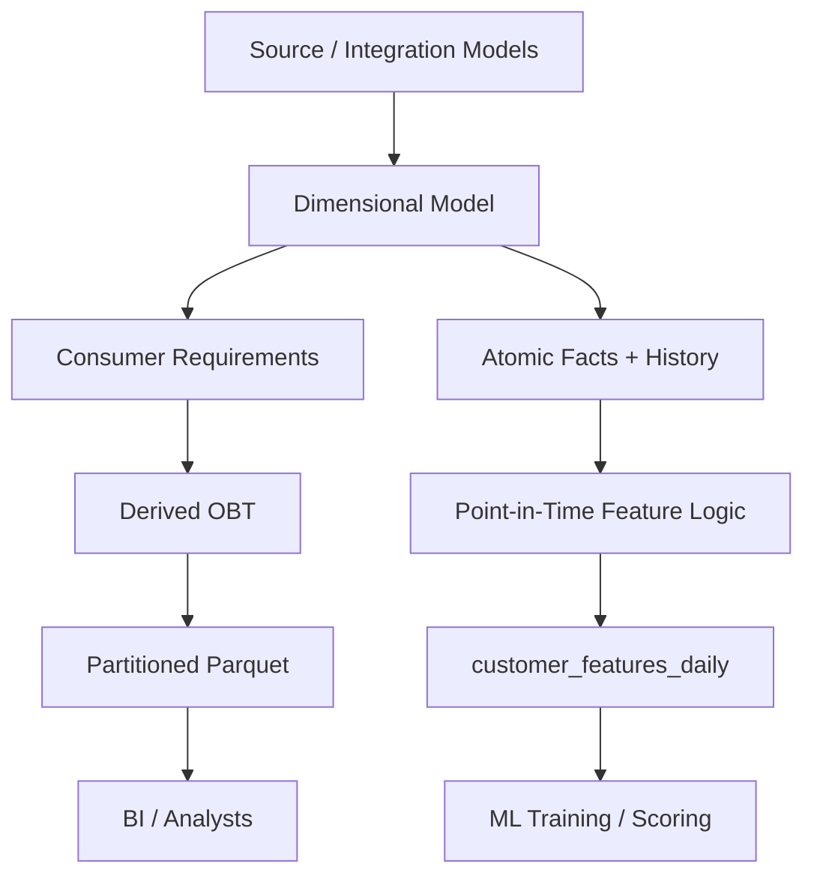

**Diagram explanation:** The same governed analytical foundation can feed different consumer representations. The OBT is one derived output, while the point-in-time feature table is a different wide model for a different consumer and temporal contract.

---

# 63. Final Decision Matrix

Use this matrix during architecture reviews.

| Factor | Questions to ask |
|---|---|
| Consumer simplicity | Do users repeatedly write the same joins? |
| Grain | Is one clear row meaning possible? |
| Dimension volatility | How often do dimension values change? |
| Refresh cost | How much data must be rebuilt? |
| Storage | Is duplication acceptable for the workload and format? |
| BI | Does the consuming tool benefit from flattened data? |
| ML | Does the consumer need point-in-time features? |
| Nested data | Would hierarchical representation better match access patterns? |
| Semantic layer | Could centralized metrics reduce wide-table proliferation? |
| Operations | Who owns, monitors, tests, and refreshes the table? |
| Freshness | What is the required data latency? |
| History | Does the consumer need as-was or as-is semantics? |
| Physical layout | Does partitioning/sorting align with actual query patterns? |
| Change propagation | Can affected rows/partitions be identified reliably? |
| Reconciliation | Can the derived model be reconciled to authoritative facts? |

### Architecture decision worksheet

```text
Consumer:

Primary questions:

Declared grain:

Required columns:

Historical semantics:

Expected freshness:

Dimension volatility:

Typical changed-entity percentage:

Affected-row estimate:

Partition strategy:

Incremental refresh strategy:

Full-rebuild fallback:

Alternative representations considered:

Validation tests:

Owner:

Success measures:
```

This is a decision aid, not a scorecard that produces a universal winner.

---

# 64. Final Concept Map

```text
Business Questions
       ↓
Consumer Requirements
       ↓
Declare Grain
       ↓
Select Required Columns
       ↓
Build Derived Wide Model
       ↓
Store Efficiently
       ↓
Serve BI / Analytics / ML
       ↓
Maintain Incrementally
       ↓
Validate Semantics + Reconciliation
       ↓
Monitor Consumer Value
```

Architectural alternatives and complements:

```text
Star
  ↘
   OBT
  ↘
   Nested Representation

Activity Schema
  ↘
   Derived Wide Tables

Semantic / Metric Layer
  ↘
   Flexible Consumption
```

These are architectural options, not mutually exclusive technologies.

A mature data platform may simultaneously have:

- a dimensional source-of-truth model;
- a few high-value OBTs;
- nested outputs for hierarchical consumers;
- a narrow activity stream;
- aggregated wide tables;
- a semantic/metric layer;
- point-in-time-correct ML feature tables.

The design challenge is deciding where each workload's complexity should live.

---

# 65. Production Takeaways

1. **An OBT is a consumer-oriented derived model.**
2. **A clear grain is mandatory.**
3. **OBTs simplify consumption by moving joins upstream.**
4. **Reduced query complexity can create increased pipeline maintenance.**
5. **Do not put every possible column into a wide table.**
6. **Column selection should be driven by real consumers and workloads.**
7. **Wide-table duplication can be practical in columnar storage, but it is not free.**
8. **Dimension changes can create expensive refresh requirements.**
9. **Incremental partition refresh can reduce cost when the semantics and physical design permit it.**
10. **Current-vs-historical dimension semantics must be explicit.**
11. **Nested data can be an alternative when consumers naturally work with hierarchical structures.**
12. **ML feature tables require strict point-in-time correctness.**
13. **Future information must never leak into historical features.**
14. **Aggregate wide tables must reconcile with atomic facts.**
15. **Activity schemas and semantic/metric layers can reduce unnecessary proliferation of wide tables.**
16. **There is no universal rule that every analytical consumer needs an OBT.**
17. **Build a wide model when its consumer and operational benefits justify its maintenance cost.**
18. **Keep a full-rebuild path even when incremental maintenance exists.**
19. **Treat semantic contracts and ownership as part of the model, not as optional documentation.**
20. **Benchmark actual workloads instead of relying on broad claims about “flat is faster.”**

---

## Readiness Check Before Topic 08

You are ready to move to **Topic 08 — Modelling Event and Clickstream Data** when you can explain, without notes:

```text
1. What is the grain of an OBT?
2. Why does an OBT simplify consumer SQL?
3. Where did the join complexity go?
4. Why should column selection be consumer-driven?
5. What happens when a Type 2 dimension changes?
6. How do as-was and as-is semantics differ?
7. How would you identify affected partitions?
8. When would a full rebuild be preferable to an incremental refresh?
9. Why can nested data be a valid alternative?
10. Why must ML feature tables be point-in-time correct?
11. How would you detect future leakage?
12. Why must aggregates reconcile with atomic facts?
13. What problem can an activity schema address?
14. How can a semantic layer reduce wide-table proliferation?
15. What evidence would you require before approving an OBT in production?
```

The next topic changes the modelling problem from mostly relational business entities and consumption-oriented denormalization to **event and clickstream data**, where event identity, event time, sessionization, repeated events, and high-volume append patterns become central.

---

# Reference Patterns and Reusable SQL

## Star-to-OBT pattern

```sql
CREATE OR REPLACE TABLE obt_order_lines AS
SELECT
    f.order_line_id,
    f.order_id,
    f.order_date,
    f.customer_id,
    c.name AS customer_name,
    c.segment AS customer_segment,
    f.product_id,
    p.name AS product_name,
    p.category AS product_category,
    f.store_id,
    s.name AS store_name,
    s.region AS store_region,
    f.quantity,
    f.unit_price,
    f.discount_amount,
    f.net_amount
FROM fct_order_lines AS f
JOIN dim_customer AS c
  ON f.customer_id = c.customer_id
JOIN dim_product AS p
  ON f.product_id = p.product_id
JOIN dim_store AS s
  ON f.store_id = s.store_id;
```

## OBT uniqueness test

```sql
SELECT order_line_id
FROM obt_order_lines
GROUP BY order_line_id
HAVING COUNT(*) > 1;
```

## Parquet export

```sql
COPY (
    SELECT *
    FROM obt_order_lines
    ORDER BY order_date, order_line_id
)
TO 'output/obt_order_lines.parquet'
(FORMAT PARQUET);
```

## Partitioned Parquet export

```sql
COPY (
    SELECT
        *,
        DATE_TRUNC('month', order_date) AS order_month
    FROM obt_order_lines
)
TO 'output/obt_order_lines_partitioned'
(FORMAT PARQUET, PARTITION_BY (order_month));
```

## Read partitioned Parquet

```sql
SELECT
    product_category,
    store_region,
    SUM(net_amount) AS revenue
FROM read_parquet(
    'output/obt_order_lines_partitioned/**/*.parquet',
    hive_partitioning = true
)
GROUP BY product_category, store_region;
```

## Affected partitions

```sql
SELECT DISTINCT
    DATE_TRUNC('month', f.order_date) AS order_month
FROM fct_order_lines AS f
JOIN product_category_changes AS c
  ON f.product_id = c.product_id
ORDER BY order_month;
```

## Compare incremental vs full result

```sql
SELECT * FROM incremental_result
EXCEPT
SELECT * FROM full_result;

SELECT * FROM full_result
EXCEPT
SELECT * FROM incremental_result;
```

Correctness condition for exact equivalence: both return zero rows.

---

# Appendix A — Mermaid Diagram Set

The following diagrams provide a visual map of the key transformations in the module.

## 1. Star → OBT architecture

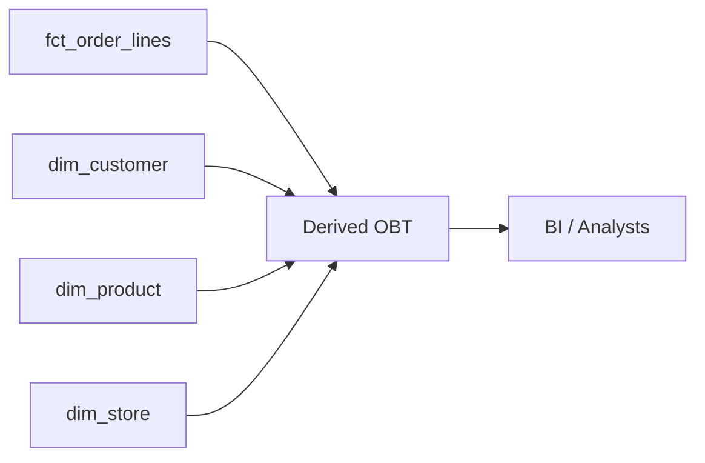

**Explanation:** Fact and dimension information is combined into a consumer-oriented output.

## 2. OBT structure

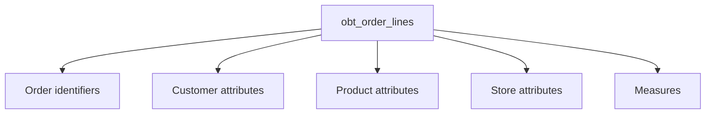

**Explanation:** All selected consumer fields appear in one row-oriented logical table even though their lineage comes from multiple upstream entities.

## 3. Fact + dimensions → OBT

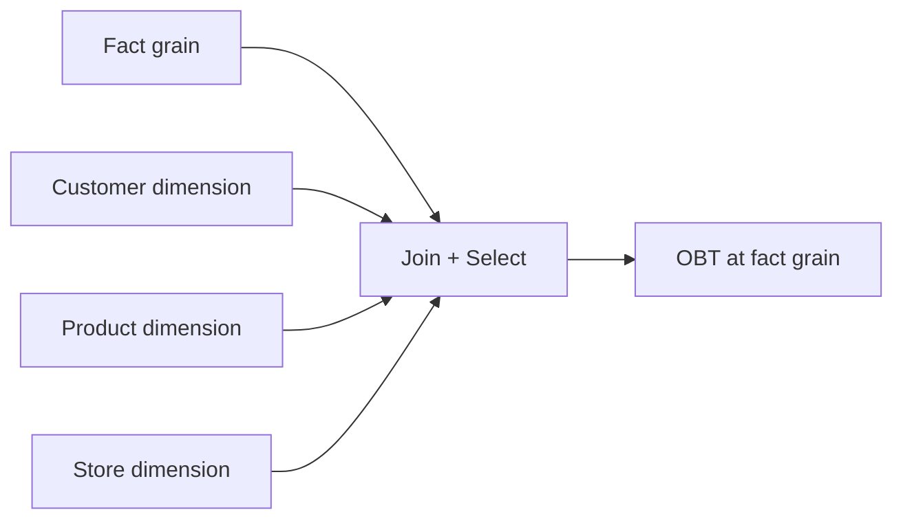

**Explanation:** The output remains at the fact grain; dimensions contribute attributes.

## 4. OBT grain

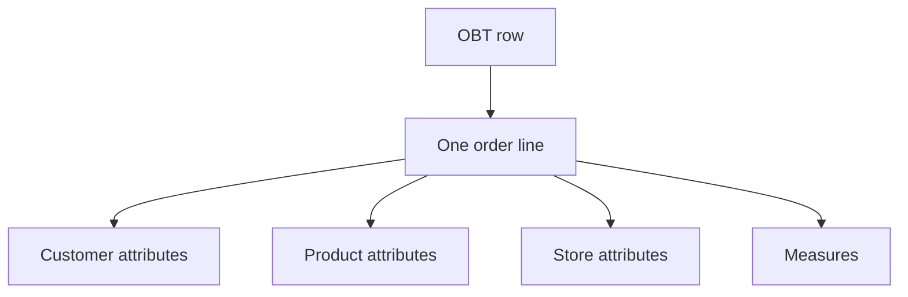

**Explanation:** Repeated dimension attributes belong to the order-line row because the order line defines the table's grain.

## 5. Current vs historical semantics

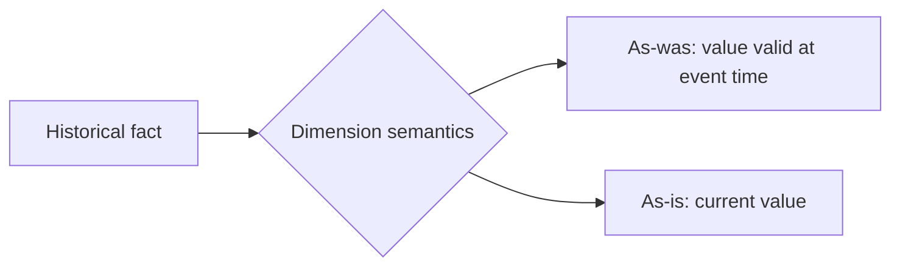

**Explanation:** Both are possible interpretations; the model must make the chosen interpretation explicit.

## 6. Incremental partition refresh

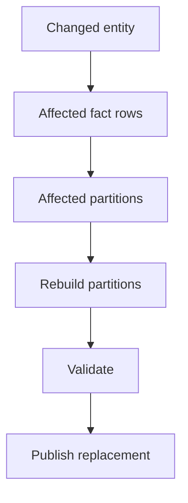

**Explanation:** Incremental refresh narrows the recomputation boundary when dependency analysis permits it.

## 7. Parquet partition layout

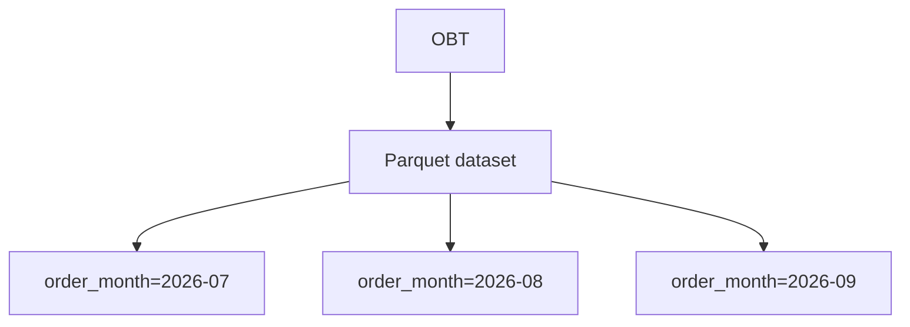

**Explanation:** Physical organization can align with common time filters, but performance should be measured.

## 8. Nested vs exploded representation

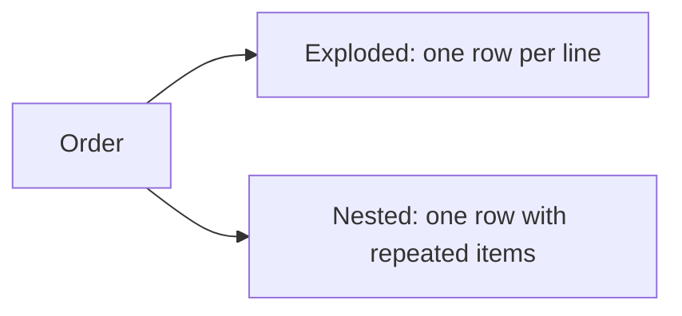

**Explanation:** Two shapes encode the same business content at different grains.

## 9. Point-in-time feature table

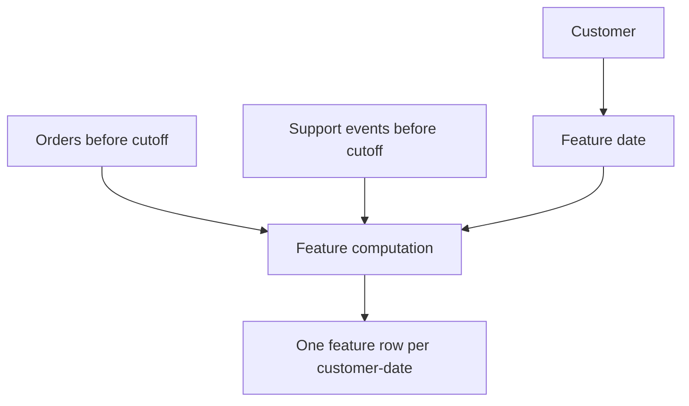

**Explanation:** Only data available by the feature cutoff enters the feature vector.

## 10. Feature leakage

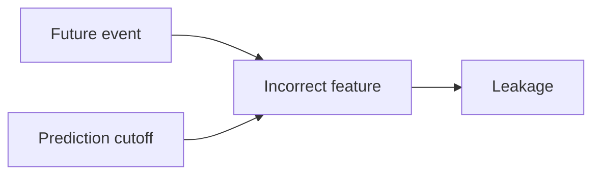

**Explanation:** Future information crossing the prediction boundary invalidates the feature dataset.

## 11. Activity schema

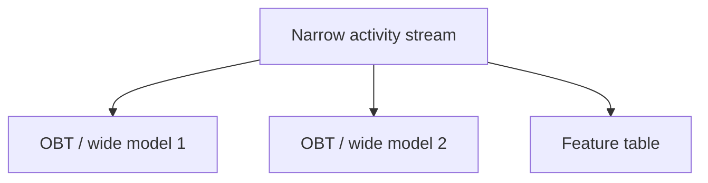

**Explanation:** A reusable activity foundation can feed multiple consumer-specific representations.

## 12. Semantic / metric layer relationship

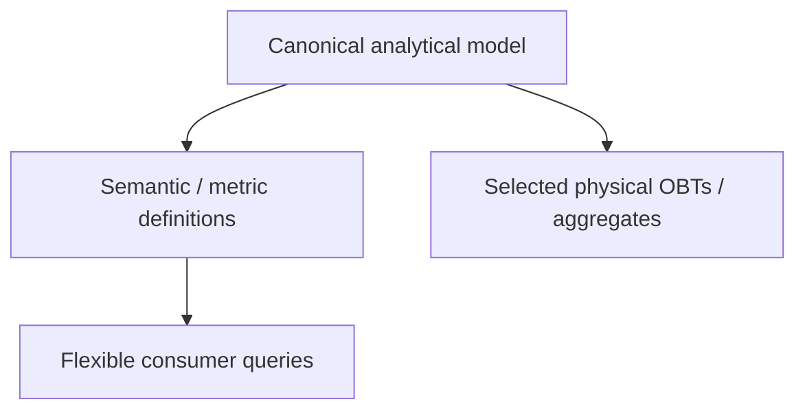

**Explanation:** Semantic definitions and physical derived models can coexist.

## 13. Final integrated architecture

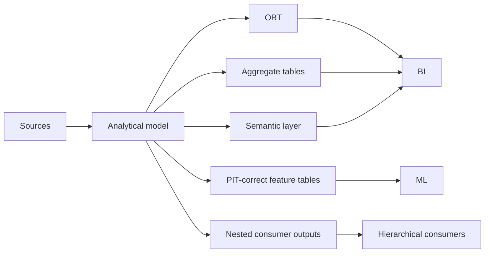

**Explanation:** A mature architecture can use several representations simultaneously, each serving a different workload.

---

# Appendix B — Production Review Checklist

Use this checklist in a design review, code review, or production readiness review.

## Semantics

- [ ] The table has an explicit name.
- [ ] The grain is written in one sentence.
- [ ] The grain has a corresponding uniqueness test.
- [ ] Historical/current semantics are documented.
- [ ] Business metric definitions are traceable to authoritative inputs.

## Consumer fit

- [ ] Consumers are identified.
- [ ] Real recurring queries exist.
- [ ] Selected columns map to real use cases.
- [ ] Unused columns are not included by default.
- [ ] Naming preserves entity context.

## Performance and storage

- [ ] Star vs OBT workload has been measured where the decision is performance-sensitive.
- [ ] Cold/warm behavior is understood where relevant.
- [ ] Parquet column usage is understood.
- [ ] Partitioning is aligned with real filters.
- [ ] Sorting has a measured reason.
- [ ] File fragmentation is monitored.

## Maintenance

- [ ] Dimension dependencies are known.
- [ ] Affected-row logic is defined.
- [ ] Affected-partition logic is defined.
- [ ] Incremental refresh exists only where correctness can be proved.
- [ ] Full rebuild path exists.
- [ ] Backdated changes have a policy.
- [ ] Late-arriving data has a policy.

## Data quality

- [ ] Referential consistency is checked before flattening.
- [ ] Duplicate OBT rows are tested.
- [ ] Aggregates reconcile with atomic facts.
- [ ] Partition completeness is checked.
- [ ] Required columns are checked.
- [ ] Feature leakage checks exist for ML use cases.

## Operations

- [ ] Owner is identified.
- [ ] Freshness expectation is documented.
- [ ] Failure alerting exists.
- [ ] Schema-change policy exists.
- [ ] Access controls are defined.
- [ ] Deprecation/removal process exists for unused columns.

## Architecture

- [ ] Star/OBT trade-offs were considered.
- [ ] Nested representation was considered when relevant.
- [ ] Activity-schema implications were considered when relevant.
- [ ] Semantic-layer implications were considered when relevant.
- [ ] The proposal states why the consumer benefit justifies ongoing maintenance.

---

# Appendix C — The Senior Mental Model

When you encounter a request such as:

> “Can you create one big flat table for the BI team?”

Do not jump directly to SQL.

Run this sequence mentally:

```text
1. What consumer problem are we solving?
        ↓
2. What exact questions need to become easier?
        ↓
3. What is the row grain?
        ↓
4. Which columns are actually required?
        ↓
5. What historical semantics do those columns have?
        ↓
6. Which upstream changes can propagate into this table?
        ↓
7. What is the expected refresh volume?
        ↓
8. Can affected partitions be identified?
        ↓
9. Does physical storage support the workload efficiently?
        ↓
10. How will correctness be validated?
        ↓
11. Who owns the table?
        ↓
12. What alternative representation could solve the same problem?
        ↓
13. What should be measured before making the architecture decision?
```

That is the production-level skill this topic is intended to build.

> **The purpose of an OBT is not to make the data model “better.” The purpose is to make a specific consumer workload simpler while preserving correct semantics and accepting only justified operational cost.**

---
