# Modelling Event and Clickstream Data

> **Stage 2 — Python for Data Engineering → Module 2.8 — Data Modelling for Analytics → Topic 08**
>
> **Learning path:** Basics → Intermediate → Advanced → Production implementation → Architecture reasoning
>
> **Primary SQL engine:** DuckDB
> **Generation language:** Python

---

## 1. Learning Objectives

By the end of this topic, you should be able to:

- explain what an event is and declare the grain of an event table;
- design a standard event envelope;
- create a tracking plan and treat it as a governed event contract;
- choose between typed columns, JSON/struct properties, and dedicated event models;
- distinguish event time from received time;
- handle late and out-of-order events;
- deduplicate events using stable event identity;
- model anonymous and authenticated identity and explain historical re-attribution;
- derive sessions with an explicit inactivity rule;
- model funnels, retention cohorts, activation, and attribution;
- identify bot, internal, and test traffic;
- physically design large event tables using workload-driven partitioning and locality;
- reason about retention, aggregation, PII, consent, and deletion;
- recognize Segment-style and Snowplow-style event-schema patterns at awareness level;
- build `fct_events`, `identity_map`, `fct_sessions`, funnel models, retention, and `user_activity_daily` in DuckDB;
- generate reproducible clickstream data in Python;
- validate event, identity, time, session, funnel, retention, and privacy-related rules;
- reconcile clickstream metrics with authoritative transactional systems;
- debug behavioural metric discrepancies;
- defend event-model decisions in production architecture reviews and senior interviews.

---

## 2. Prerequisites

This topic assumes completion of:

1. Topic 01 — Normalization and Denormalization
2. Topic 02 — Dimensional Modelling: Facts and Dimensions
3. Topic 03 — Star and Snowflake Schemas
4. Topic 04 — Grain, Natural Keys, and Surrogate Keys
5. Topic 05 — Slowly Changing Dimensions
6. Topic 06 — Data Vault
7. Topic 07 — One Big Table and Wide Denormalized Models

It also assumes familiarity with DuckDB, Parquet, joins, window functions, JSON/nested data, Python, and analytical SQL.

Earlier topics are referenced for continuity rather than re-taught.

> **Topic 04 established grain. Event modelling applies grain at the individual-event level.**
>
> **Topic 07 established derived wide models. `user_activity_daily` is a behavioural wide model derived from an event stream.**

---

## 3. Core Mental Model

The central objective is to turn a high-volume stream of things that happened into trustworthy analytical models.

```text
Something happened
      ↓
Capture an event
      ↓
Validate the event contract
      ↓
Store immutable event record
      ↓
Deduplicate
      ↓
Resolve identity
      ↓
Derive sessions
      ↓
Derive behavioural models
      ↓
Funnels / Retention / Attribution / Activation
      ↓
BI / Analytics / ML
```

> **Raw event data records what happened. Derived behavioural models explain what those events mean for a business use case.**

That distinction is fundamental. The raw event record should preserve the observation; downstream models should implement explicit interpretations.

### Mermaid — raw event flow

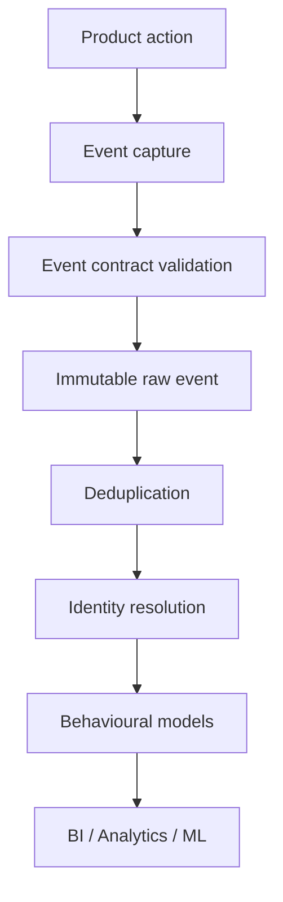

**How to read it:** validation happens before analytical interpretation, and deduplication/identity/session logic are derived stages rather than replacements for raw observations.

---

## 4. Why Event Data Is Different

Traditional business data often represents transactions or durable state changes:

- order
- payment
- shipment
- subscription

Event data captures a broader history of observations:

- `page_view`
- `search`
- `product_viewed`
- `cart_item_added`
- `checkout_started`
- `order_completed`

Event datasets often become:

- high-volume;
- append-heavy;
- timestamp-driven;
- semi-structured;
- rapidly generated;
- affected by retries and replays;
- affected by anonymous identity;
- affected by late and out-of-order arrival;
- more semantically ambiguous than transactional facts.

A useful analogy is:

> A transaction system can resemble an official ledger, while an event stream resembles a detailed activity log. Both can be valuable, but they do not automatically have the same source-of-truth status.

### Checkpoint

A `product_viewed` event describes an observation. It does not automatically mean a product was purchased, paid for, or recognized as financial truth.

---

## 5. What Is an Event?

> **An event is a record that something happened at a particular point in time.**

A useful decomposition is:

```text
Actor + Action + Object + Time + Properties
```

Examples:

```text
User viewed product 123
User added product 123 to cart
User completed order 1001
```

The event occurrence is the thing being recorded. Sessions, funnels, attribution, and retention are interpretations derived from event history.

### Event anatomy

| Element | Meaning | Example |
|---|---|---|
| Actor | Who/what acted | `user_123` |
| Action | What happened | `product_viewed` |
| Object | Target of action | `product_123` |
| Time | When it happened | `2026-09-10 10:01:05` |
| Properties | Extra context | category, position |

---

## 6. Event Grain

Define the raw event grain explicitly:

> **One row per unique canonical event occurrence.**

A table named `fct_events` should not secretly mean one row per user, session, or page.

### Raw versus derived grains

| Model | Grain |
|---|---|
| `fct_events` | One unique canonical event occurrence |
| `fct_sessions` | One derived session |
| Funnel step model | Defined entity + step, depending on design |
| Retention detail | Entity + cohort/activity period, depending on design |
| `user_activity_daily` | One user per day |

### Why grain matters

If `evt_100` is delivered twice and both rows are counted, one logical occurrence becomes two analytical occurrences.

```sql
SELECT
    event_id,
    COUNT(*) AS row_count
FROM fct_events
GROUP BY event_id
HAVING COUNT(*) > 1;
```

For a canonical model requiring one row per event ID, a correct assertion normally returns **zero rows**.

### Mermaid — event grain

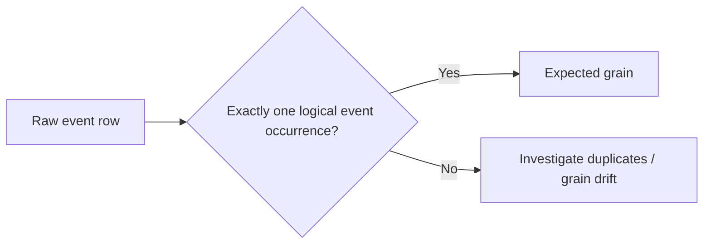

### Checkpoint

Complete:

> `fct_events` contains one row per __________.

Expected: **unique canonical event occurrence**.

---

## 7. Standard Event Envelope

A standard event envelope gives every event a common structural core.

```text
event_id
event_name
event_timestamp
received_at
user_id
anonymous_id
session_id
context
properties
```

Context can include:

```text
device
app_version
page
user_agent
acquisition metadata
IP-related metadata where policy permits
```

### Event envelope table

| Field | Purpose |
|---|---|
| `event_id` | Unique logical event identity |
| `event_name` | Action type |
| `event_timestamp` | Time action occurred |
| `received_at` | Time ingestion received it |
| `user_id` | Known identity |
| `anonymous_id` | Anonymous/pre-auth identity |
| `session_id` | Upstream session identifier, where useful/trusted |
| `context` | Device/page/app/environment context |
| `properties` | Event-specific long-tail attributes |

### Mermaid — event envelope

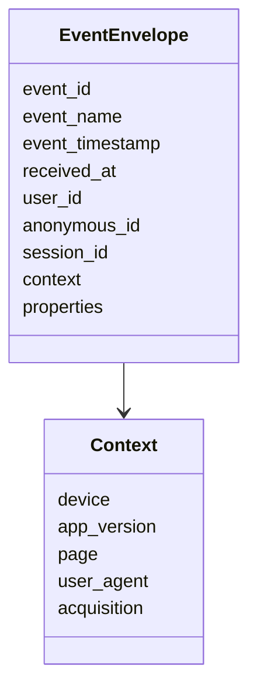

**Explanation:** the envelope is stable; the nested context and properties allow event-specific detail without requiring every event to have identical business fields.

---

## 8. Event ID

`event_id` matters because client retries, replays, reprocessing, and backfills can produce multiple deliveries of one logical event.

Example:

```text
event_id = evt_abc123
event_name = product_viewed
```

Two identical deliveries with the same ID can be treated as one logical occurrence after validation.

### Conflicting duplicate payloads

This is different:

```text
same event_id
payload A: product_id = P123
payload B: product_id = P999
```

Do not silently pick a winner just because one record arrived later. Treat this as a data-quality investigation.

### Duplicate investigation

```sql
SELECT
    event_id,
    COUNT(*) AS records,
    COUNT(DISTINCT event_name) AS event_name_variants,
    COUNT(DISTINCT user_id) AS user_variants,
    COUNT(DISTINCT anonymous_id) AS anonymous_variants
FROM raw_events
GROUP BY event_id
HAVING COUNT(*) > 1
   AND (
        COUNT(DISTINCT event_name) > 1
        OR COUNT(DISTINCT user_id) > 1
        OR COUNT(DISTINCT anonymous_id) > 1
   );
```

A conflicting result should be flagged rather than silently discarded.

---

## 9. Event Name Design

Use governed, descriptive names such as:

```text
product_viewed
cart_item_added
checkout_started
order_completed
```

Avoid uncontrolled near-synonyms such as:

```text
click
Clicked Button
btnClick
Product clicked!!
```

The goal is not one mandatory naming style for every organization. The goal is consistency, discoverability, stable semantics, ownership, and downstream compatibility.

A governed naming standard should answer:

- Is this an action or a state?
- What object is affected?
- Is tense consistent?
- What does the event mean?
- Who owns it?

---

## 10. Tracking Plans

> **A tracking plan defines what events exist, what properties they require, their types, ownership, and intended meaning.**

### Example tracking plan

| Event | Required properties | Type | Owner | Description |
|---|---|---|---|---|
| `product_viewed` | `product_id` | string | Product | User viewed a product |
| `cart_item_added` | `product_id`, `quantity` | string/int | Commerce | Product added |
| `checkout_started` | `cart_value` | decimal | Checkout | Checkout began |
| `order_completed` | `order_id`, `amount` | string/decimal | Payments | Purchase completed |

The tracking plan should also cover:

- optional properties
- allowed values where relevant
- semantic definitions
- ownership
- version/change awareness
- downstream significance

### Tracking plan as data contract

```text
Producer team
      ↓
Tracking plan
      ↓
Event contract
      ↓
Data platform
      ↓
BI / Analytics / ML
```

An event table can be structurally valid while semantically wrong if the producer changes the meaning of a field without updating the contract.

### Mermaid — tracking plan

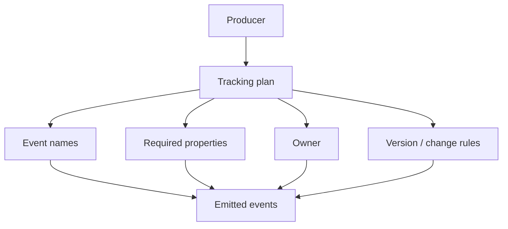

---

## 11. Typed Columns vs JSON/Struct vs Event-Specific Tables

Three useful strategies are:

### A. Typed columns

Prefer for important properties that are frequently queried, grouped, filtered, validated, or business-critical.

Examples:

```text
product_id
quantity
order_value
currency
```

### B. JSON/struct long tail

Useful for event-specific or less stable fields that do not yet justify first-class columns.

### C. Separate event-type models

Useful for highly important or complex event types whose semantics deserve dedicated modelling.

Examples:

```text
product_view_events
subscription_started_events
```

### Comparison

| Approach | Strength | Trade-off |
|---|---|---|
| Typed columns | Easy analytical access and validation | Schema evolution |
| JSON/struct | Flexible long tail | Query/governance complexity |
| Dedicated event models | Precise semantics | More tables and maintenance |

There is no universal choice. Use workload, stability, business importance, governance, and interoperability to decide.

---

## 12. Event Time vs Received Time

Example:

```text
event_timestamp = 2026-09-10 10:01:05
received_at     = 2026-09-10 10:03:42
```

> **Event time describes when the action occurred.**
>
> **Received time describes when the ingestion system received it.**

### Why do they differ?

- offline mobile devices
- network latency
- batching
- retries
- queueing
- ingestion delay
- producer clock skew

### Mermaid — event time versus receive time

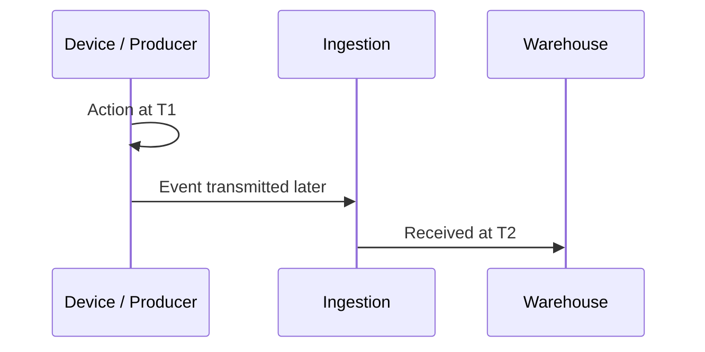

### Time-semantics table

| Question | Relevant field |
|---|---|
| When did the action happen? | `event_timestamp` |
| When did ingestion receive it? | `received_at` |
| How much ingestion delay exists? | Difference between both |
| Which events arrived late today? | Compare both timestamps |

### Ingestion delay

```sql
SELECT
    event_date,
    MEDIAN(DATE_DIFF('second', event_timestamp, received_at)) AS median_delay_seconds
FROM fct_events
GROUP BY event_date
ORDER BY event_date;
```

This is a pipeline-delay metric, not a perfect measurement of network latency, because producer clocks can be wrong.

---

## 13. Late Events

Example:

```text
Event happened:  2026-09-10 10:00
Received:        2026-09-10 15:00
```

The event may be late relative to a reporting or processing window.

Late data can change:

- daily metrics
- sessions
- funnels
- retention
- attribution
- historical aggregates

A production model needs a correction strategy such as:

- late-data windows
- partition recomputation
- incremental backfills
- periodic reconciliation

The correct strategy depends on freshness requirements, lateness patterns, volume, and transformation cost.

---

## 14. Out-of-Order Events

Received order can differ from event-time order.

```text
Received order: A, C, B

Event-time order:
A, B, C
```

### Mermaid — out-of-order arrival

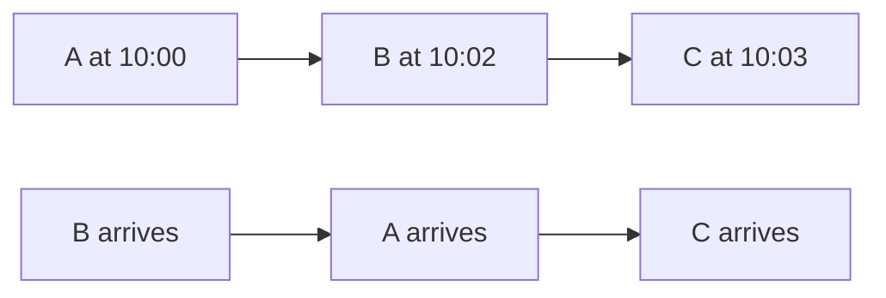

Use explicit event-time ordering in behavioural transformations. Arrival order is a pipeline fact, not automatically the business sequence.

---

## 15. Deduplication

A simple DuckDB pattern is:

```sql
WITH ranked AS (
    SELECT
        *,
        ROW_NUMBER() OVER (
            PARTITION BY event_id
            ORDER BY received_at DESC
        ) AS rn
    FROM raw_events
)
SELECT *
FROM ranked
WHERE rn = 1;
```

For the lab, this creates a canonical row per `event_id`. In production, first distinguish equivalent retries from conflicting payloads.

### Correctness strategy

```text
Detect duplicates
      ↓
Compare payloads
      ↓
Equivalent? ── Yes → canonicalize
      |
      No
      ↓
Investigate conflict
```

### Exactly-once-style business expectations

A business may require “count every logical event once.” That does not imply upstream delivery physically happens exactly once. The analytical system may need idempotent processing to produce the required logical outcome.

---

# Sessions and Identity

## 16. Raw Event Model

A practical raw event model can be represented as:

```sql
CREATE TABLE fct_events (
    event_id VARCHAR,
    event_name VARCHAR,
    event_timestamp TIMESTAMP,
    received_at TIMESTAMP,
    user_id VARCHAR,
    anonymous_id VARCHAR,
    session_id VARCHAR,
    context JSON,
    properties JSON,
    event_date DATE,
    is_bot BOOLEAN,
    is_internal BOOLEAN,
    is_test BOOLEAN
);
```

The important logical guarantees are:

- one row per canonical event;
- event and received timestamps remain distinct;
- source observations are preserved subject to retention/deletion policy;
- traffic classification is represented separately from the raw event semantics.

---

## 17. Sessions

> **A session is a derived period of activity separated by enough inactivity.**

For this roadmap's hands-on implementation, use the fixed rule:

> **Start a new session when inactivity exceeds 30 minutes.**

### Sessionization algorithm

1. Choose the identity used for grouping.
2. Order events by `event_timestamp`.
3. Use `LAG()` to obtain the previous event time.
4. Calculate the gap.
5. Mark a new session when the gap is greater than 30 minutes.
6. Cumulatively sum the boundary flags.
7. Generate a derived session ID.
8. Aggregate to session grain.

### Mermaid — sessionization

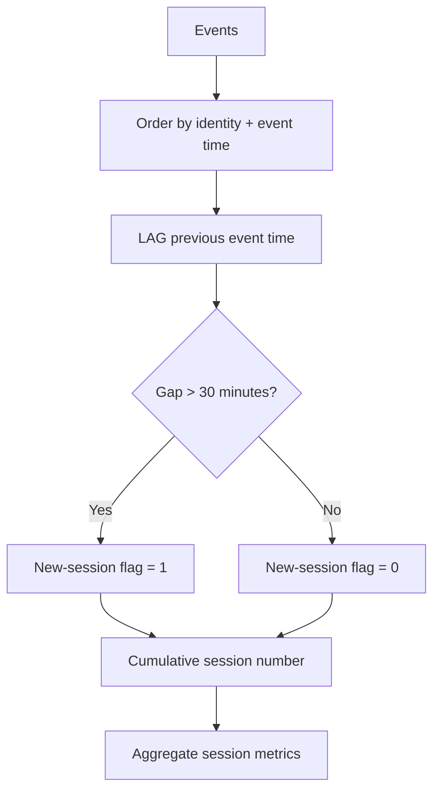

### DuckDB implementation

```sql
CREATE OR REPLACE TABLE sessionized_events AS
WITH ordered AS (
    SELECT
        e.*,
        COALESCE(e.resolved_user_id, e.anonymous_id) AS identity_id,
        LAG(e.event_timestamp) OVER (
            PARTITION BY COALESCE(e.resolved_user_id, e.anonymous_id)
            ORDER BY e.event_timestamp, e.event_id
        ) AS previous_event_timestamp
    FROM events_resolved e
    WHERE e.resolved_user_id IS NOT NULL
       OR e.anonymous_id IS NOT NULL
), marked AS (
    SELECT
        *,
        CASE
            WHEN previous_event_timestamp IS NULL THEN 1
            WHEN event_timestamp - previous_event_timestamp > INTERVAL '30 minutes' THEN 1
            ELSE 0
        END AS new_session_flag
    FROM ordered
), numbered AS (
    SELECT
        *,
        SUM(new_session_flag) OVER (
            PARTITION BY identity_id
            ORDER BY event_timestamp, event_id
            ROWS BETWEEN UNBOUNDED PRECEDING AND CURRENT ROW
        ) AS session_number
    FROM marked
)
SELECT
    *,
    identity_id || ':' || CAST(session_number AS VARCHAR) AS derived_session_id
FROM numbered;
```

Aggregate the result:

```sql
CREATE OR REPLACE TABLE fct_sessions AS
SELECT
    derived_session_id AS session_id,
    identity_id,
    MIN(event_timestamp) AS session_start,
    MAX(event_timestamp) AS session_end,
    DATE_DIFF('second', MIN(event_timestamp), MAX(event_timestamp)) AS duration_seconds,
    COUNT(*) AS event_count,
    COUNT(*) FILTER (WHERE event_name = 'page_view') AS page_view_count,
    MIN(properties->>'source') AS entry_source
FROM sessionized_events
GROUP BY derived_session_id, identity_id;
```

### Session grain

> **One row per derived session.**

### Validation

```sql
SELECT *
FROM fct_sessions
WHERE session_start > session_end
   OR duration_seconds < 0;
```

Correct assertion: zero rows.

---

## 18. Identity Stitching

A user may first appear anonymously:

```text
anonymous_id = anon_abc
user_id      = NULL
```

and later authenticate:

```text
anonymous_id = anon_abc
user_id      = user_123
```

Identity stitching connects these observations when there is trustworthy identity evidence.

### Identity graph

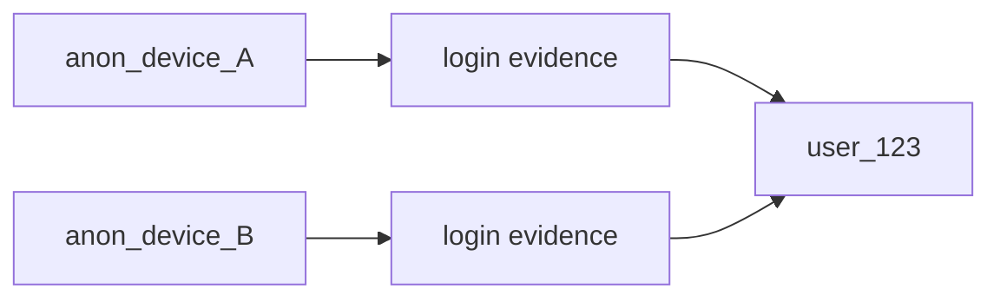

Potential identity inputs:

- explicit login events;
- verified account identifiers;
- device relationships where policy allows;
- authenticated application state;
- other approved identity evidence.

Avoid rules such as “same device equals same human” without considering shared devices, account switching, identifier reuse, or privacy constraints.

---

## 19. `identity_map`

A derived identity mapping model can contain:

```text
anonymous_id
user_id
first_seen_at
last_seen_at
source
effective_from
effective_to
```

DuckDB example:

```sql
CREATE OR REPLACE TABLE identity_map AS
SELECT
    anonymous_id,
    user_id,
    MIN(event_timestamp) AS first_seen_at,
    MAX(event_timestamp) AS last_seen_at,
    'login-event' AS source,
    MIN(event_timestamp) AS effective_from,
    NULL::TIMESTAMP AS effective_to
FROM fct_events
WHERE event_name = 'login'
  AND anonymous_id IS NOT NULL
  AND user_id IS NOT NULL
GROUP BY anonymous_id, user_id;
```

### Mermaid — identity flow

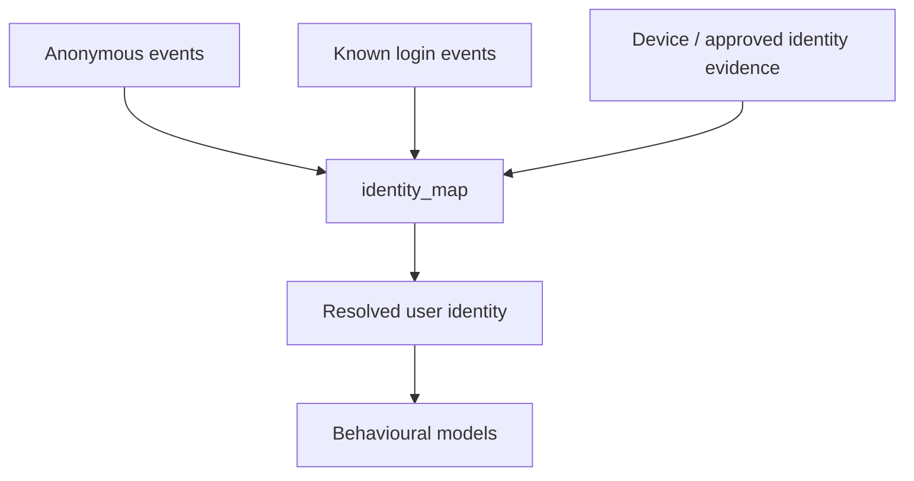

The map should be treated as an explicit derived model with quality rules.

---

## 20. Historical Anonymous Re-Attribution

Historical re-attribution asks:

> Should anonymous events recorded before login become associated with the user known later?

Two common interpretations:

### Observation-time semantics

Preserve the identity as it was known when the event occurred.

### Resolved-history semantics

Use later verified identity relationships to associate prior events with the known user.

Both can be useful for different questions. Do not hide the decision in a query.

### Mermaid — historical re-attribution

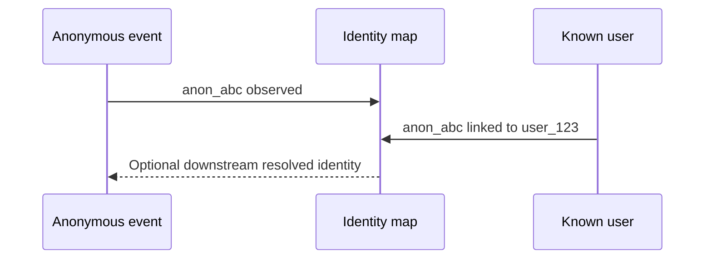

A strong pattern is to preserve raw `user_id` and `anonymous_id`, then add a derived `resolved_user_id` so both views are possible.

---

## 21. Resolved Identity View

```sql
CREATE OR REPLACE VIEW events_resolved AS
SELECT
    e.*,
    COALESCE(e.user_id, i.user_id) AS resolved_user_id
FROM fct_events e
LEFT JOIN identity_map i
  ON e.anonymous_id = i.anonymous_id;
```

For time-aware mappings, use effective intervals:

```sql
LEFT JOIN identity_map i
  ON e.anonymous_id = i.anonymous_id
 AND e.event_timestamp >= i.effective_from
 AND (
      i.effective_to IS NULL
      OR e.event_timestamp < i.effective_to
 )
```

The correct temporal policy depends on the identity model.

### Identity-quality assertion

```sql
SELECT
    anonymous_id,
    COUNT(DISTINCT user_id) AS distinct_users
FROM identity_map
GROUP BY anonymous_id
HAVING COUNT(DISTINCT user_id) > 1;
```

A returned row is an investigation trigger.

---

# Funnels, Retention, Activation, and Attribution

## 22. Funnel Modelling

> **A funnel models ordered behavioural steps and measures progression and drop-off.**

Example:

```text
signup
  ↓
product_viewed
  ↓
cart_item_added
  ↓
checkout_started
  ↓
order_completed
```

A funnel definition must specify:

| Dimension | Example |
|---|---|
| Scope | One row per user |
| Step order | Signup → product → checkout → purchase |
| Window | 30 days |
| Occurrence | First qualifying occurrence |
| Ordering | Event time |
| Duplicate policy | Canonical event ID |
| Denominator | Eligible population |

### Checkpoint

The phrase “signup-to-purchase conversion” is incomplete until its scope, ordering, time window, and denominator are defined.

---

## 23. Signup → First Purchase Funnel

Use an explicit 30-day example for the exercise.

```sql
WITH base AS (
    SELECT
        COALESCE(resolved_user_id, anonymous_id) AS identity_id,
        event_name,
        event_timestamp
    FROM events_resolved
    WHERE resolved_user_id IS NOT NULL
       OR anonymous_id IS NOT NULL
), signup AS (
    SELECT
        identity_id,
        MIN(event_timestamp) AS signup_at
    FROM base
    WHERE event_name = 'signup'
    GROUP BY identity_id
), product AS (
    SELECT
        s.identity_id,
        MIN(e.event_timestamp) AS product_at
    FROM signup s
    JOIN base e
      ON e.identity_id = s.identity_id
     AND e.event_timestamp >= s.signup_at
     AND e.event_timestamp < s.signup_at + INTERVAL '30 days'
     AND e.event_name = 'product_viewed'
    GROUP BY s.identity_id
), checkout AS (
    SELECT
        p.identity_id,
        MIN(e.event_timestamp) AS checkout_at
    FROM product p
    JOIN base e
      ON e.identity_id = p.identity_id
     AND e.event_timestamp >= p.product_at
     AND e.event_timestamp < p.product_at + INTERVAL '30 days'
     AND e.event_name = 'checkout_started'
    GROUP BY p.identity_id
), purchase AS (
    SELECT
        c.identity_id,
        MIN(e.event_timestamp) AS purchase_at
    FROM checkout c
    JOIN base e
      ON e.identity_id = c.identity_id
     AND e.event_timestamp >= c.checkout_at
     AND e.event_timestamp < c.checkout_at + INTERVAL '30 days'
     AND e.event_name = 'order_completed'
    GROUP BY c.identity_id
)
SELECT
    (SELECT COUNT(*) FROM signup) AS signup_users,
    (SELECT COUNT(*) FROM product) AS product_users,
    (SELECT COUNT(*) FROM checkout) AS checkout_users,
    (SELECT COUNT(*) FROM purchase) AS purchase_users;
```

### Funnel quality test

```sql
SELECT *
FROM funnel_detail
WHERE product_at < signup_at
   OR checkout_at < product_at
   OR purchase_at < checkout_at;
```

Correct assertion: zero rows.

---

## 24. Funnel Conversion Rates

Possible rates include:

```text
product / signup
checkout / product
purchase / checkout
purchase / signup
```

They have different denominators and meanings.

Never silently change the denominator between reports.

---

## 25. Retention Cohorts

> **A retention cohort groups entities by a meaningful starting event/date and measures later activity.**

### Mermaid — retention cohort

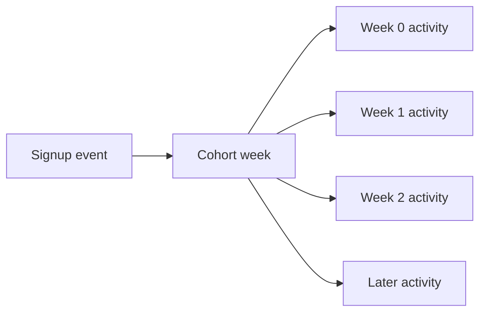

**Explanation:** users enter a cohort based on a defined starting point, then later activity is measured relative to that cohort period.


> **A retention cohort groups entities by a meaningful starting event/date and measures later activity.**

Example:

```text
Cohort = signup week
Activity = any valid product activity
Periods = subsequent weeks
```

### Retention definition table

| Decision | Must specify |
|---|---|
| Cohort | First signup, first purchase, etc. |
| Activity | Any event, core action, purchase, etc. |
| Time unit | Day/week/month |
| Identity | User/resolved user/anonymous |
| Eligibility | Which cohorts are old enough to measure |
| Late events | Correction/backfill policy |

### Weekly retention SQL

```sql
WITH first_signup AS (
    SELECT
        resolved_user_id AS user_id,
        DATE_TRUNC('week', MIN(event_timestamp)) AS cohort_week
    FROM events_resolved
    WHERE resolved_user_id IS NOT NULL
      AND event_name = 'signup'
    GROUP BY resolved_user_id
), weekly_activity AS (
    SELECT DISTINCT
        resolved_user_id AS user_id,
        DATE_TRUNC('week', event_timestamp) AS activity_week
    FROM events_resolved
    WHERE resolved_user_id IS NOT NULL
      AND NOT is_bot
      AND NOT is_internal
      AND NOT is_test
), detail AS (
    SELECT
        s.cohort_week,
        a.activity_week,
        DATE_DIFF('week', s.cohort_week, a.activity_week) AS week_number,
        s.user_id
    FROM first_signup s
    JOIN weekly_activity a
      ON a.user_id = s.user_id
     AND a.activity_week >= s.cohort_week
)
SELECT
    cohort_week,
    week_number,
    COUNT(DISTINCT user_id) AS active_users
FROM detail
GROUP BY cohort_week, week_number
ORDER BY cohort_week, week_number;
```

### Retention validation

```sql
SELECT *
FROM retention_detail
WHERE activity_week < cohort_week
   OR week_number < 0;
```

Correct assertion: zero rows.

---

## 26. Activation Metrics

Activation is a business-specific meaningful first-value action.

Examples:

- first successful project created;
- first purchase;
- first playlist created.

A useful definition contains:

```text
Eligible population
Activation event
Activation window
Activated population
Activation rate
```

Example:

```sql
WITH signup AS (
    SELECT
        user_id,
        MIN(event_timestamp) AS signup_at
    FROM fct_events
    WHERE event_name = 'signup'
      AND user_id IS NOT NULL
    GROUP BY user_id
), activation AS (
    SELECT
        s.user_id,
        MIN(e.event_timestamp) AS activated_at
    FROM signup s
    JOIN fct_events e
      ON e.user_id = s.user_id
     AND e.event_name = 'project_created'
     AND e.event_timestamp >= s.signup_at
     AND e.event_timestamp < s.signup_at + INTERVAL '7 days'
    GROUP BY s.user_id
)
SELECT
    (SELECT COUNT(*) FROM signup) AS eligible_users,
    COUNT(*) AS activated_users,
    COUNT(*)::DOUBLE / NULLIF((SELECT COUNT(*) FROM signup), 0) AS activation_rate
FROM activation;
```

The 7-day window is illustrative. The product team must define the actual business window.

---

## 27. Attribution

### Mermaid — attribution

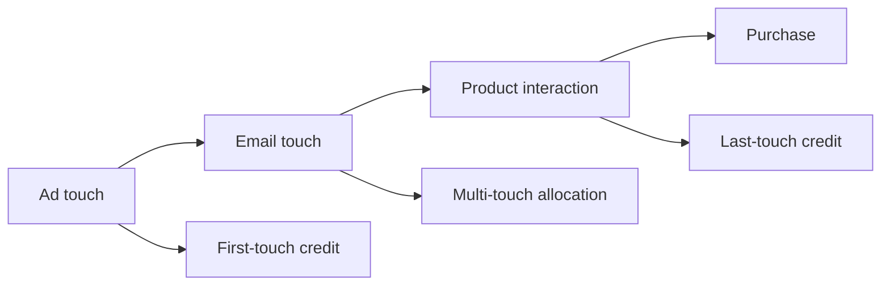

**Explanation:** the same touch history can produce different credit allocations depending on the attribution model and its stated assumptions.


Three required awareness-level models:

### First-touch

The first qualifying touch receives credit.

### Last-touch

The last qualifying touch receives credit.

### Multi-touch

Credit is distributed across qualifying touches according to a defined allocation rule.

### Example

```text
Ad Click
   ↓
Product View
   ↓
Email Click
   ↓
Purchase
```

A first-touch model and a last-touch model produce different attributions.

### Attribution assumptions

Document:

- attribution window;
- qualifying touch events;
- identity requirements;
- exclusion rules;
- direct traffic handling;
- duplicate-touch handling;
- cross-device policy.

### Attribution comparison

| Model | Core rule | Main assumption/limitation |
|---|---|---|
| First-touch | First qualifying touch gets credit | Later influences are not represented by the allocation |
| Last-touch | Last qualifying touch gets credit | Earlier influences are not represented by the allocation |
| Multi-touch | Credit split across touches | Allocation rule introduces additional assumptions |

No model should be called universally correct without a defined business objective.

---

# Traffic Quality and Physical Design

## 28. Bot, Internal, and Test Traffic

Event streams often include non-business traffic.

Potential sources:

- bots/crawlers;
- automated clients;
- QA activity;
- employee traffic;
- test accounts;
- synthetic monitoring.

### Derived classification flags

```text
is_bot
is_internal
is_test_event
```

### Detection signals

| Signal | Example |
|---|---|
| User agent | Known automation pattern |
| Network identity | Approved internal network rules where permitted |
| Account | Test user IDs |
| Event IDs | Synthetic/test ID patterns |
| Behaviour | Extremely repetitive sequence |

Do not assume bots can be identified perfectly with one rule.

### Mermaid — bot filtering

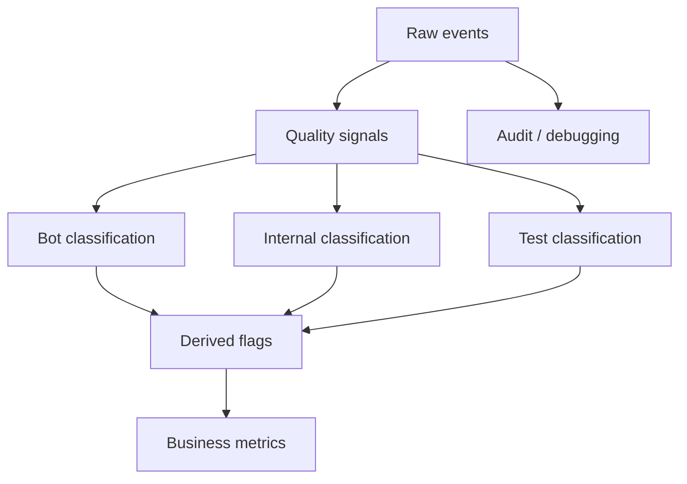

Keep raw evidence according to the retention/privacy policy even when derived metrics exclude traffic.

---

## 29. Physical Design for Very Large Event Tables

A large event table needs physical-design reasoning in addition to logical modelling.

Consider:

- event-date partitioning;
- clustering/locality by user;
- locality by event name;
- file sizing;
- retention;
- old-data aggregation;
- backfill behaviour.

### Physical-design factors

| Factor | Questions |
|---|---|
| Partition key | What filters dominate? |
| Partition size | Are partitions operationally manageable? |
| User locality | Are user-history queries common? |
| Event locality | Are specific event types frequently queried? |
| Retention | How long is full raw detail required? |
| Aggregation | Which repeated queries can use summaries? |
| Late data | Which historical partitions can change? |
| Backfill | How much historical data can be recomputed? |

---

## 30. Event-Date Partitioning

A conceptual layout is:

```text
2026-08-01/
2026-08-02/
...
2026-08-30/
```

Time-range queries can become easier to optimize when the physical layout matches the access pattern.

Example filter:

```sql
SELECT COUNT(*)
FROM fct_events
WHERE event_date BETWEEN DATE '2026-08-01' AND DATE '2026-08-07';
```

Do not claim event date is always the best partition key. Measure the workload and account for late arrivals and partition sizes.

---

## 31. Clustering / Locality

Potential high-value keys:

```text
user_id
event_name
```

The benefit depends on:

- filter selectivity;
- engine/storage behaviour;
- file layout;
- write frequency;
- competing access patterns.

The objective is to improve locality for important queries, not to cluster every possible column.

---

## 32. Retention and Aggregation of Old Events

Possible lifecycle:

```text
Recent raw events
      ↓
Full-fidelity retention
      ↓
Archive / summary
      ↓
Older analytical aggregates
```

Example derived model:

```text
fct_events → user_activity_daily
```

Aggregation reduces repeated event scans but sacrifices some event-level detail.

Retention policy must account for:

- analytical value;
- storage cost;
- privacy requirements;
- contractual requirements;
- debugging/audit needs;
- deletion obligations.

---

## 33. Privacy: PII in Event Properties

Free-form properties can accidentally contain:

- email addresses;
- phone numbers;
- postal addresses;
- authentication tokens;
- free-form text containing personal data.

### Practical principles

- minimize collection;
- avoid unnecessary PII;
- govern event properties;
- separate sensitive fields when needed;
- document access and retention;
- test for obvious violations;
- design deletion propagation before the platform becomes large.

### Privacy-risk table

| Risk | Example | Modelling response |
|---|---|---|
| Accidental PII | Email in arbitrary property | Restrict/property validation |
| Over-collection | Full address collected for a page view | Remove unnecessary field |
| Over-retention | Raw events kept indefinitely | Apply retention policy |
| Derived copies | User ID appears in daily aggregates | Include downstream deletion plan |
| Identity expansion | Anonymous history linked later | Govern re-attribution |

---

## 34. Consent Flags

Conceptual fields may include:

```text
consent_state
collection_allowed
purpose
```

The exact representation depends on organizational policy and applicable requirements.

The engineering lesson is:

> Processing constraints should be explicit and reproducible rather than buried inside an undocumented filter.

---

## 35. Deletion Requests

A deletion request may affect:

```text
raw events
identity_map
fct_sessions
funnels
retention tables
user_activity_daily
archives
backups
exports
```

A mature architecture asks, before implementation:

- where is the user's identifier stored?
- where are copies derived?
- can historical models be rebuilt?
- what is the archive policy?
- what is the backup policy?
- how does deletion affect identity mappings?

There is no single universal deletion implementation. The model must reflect organizational and applicable requirements.

---

## 36. Event Schema Evolution

Tracking plans evolve.

```text
Version 1:
product_viewed(product_id)

Version 2:
product_viewed(product_id, source)

Version 3:
product_viewed(product_id, source, position)
```

When a contract changes, distinguish:

- additive optional fields;
- newly required fields;
- semantic redefinition;
- renamed fields;
- type changes.

A new optional property is not the same as changing the meaning of an existing property.

### Evolution checklist

- Is backward compatibility required?
- Is historical interpretation stable?
- Who owns the change?
- Which downstream models break?
- Is version awareness needed?
- How is old data interpreted?

---

## 37. Segment-Style Event Schema Awareness

At awareness level, Segment-style patterns commonly use standardized event names, user/anonymous identities, context, and properties to support consistent event collection across multiple producers.

The transferable lesson is:

> A standardized event envelope reduces downstream modelling friction.

Do not treat this section as a vendor-specific implementation tutorial.

---

## 38. Snowplow-Style Event Schema Awareness

At awareness level, Snowplow-style patterns are associated with structured events plus rich context/entity data.

Important ideas include:

- event + entity/context modelling;
- structured event data;
- richer analytical context;
- explicit event semantics.

Again, the purpose here is to recognize schema patterns, not to reproduce vendor-specific documentation.

---

## 39. Event-Schema Approach Comparison

| Approach | Strength | Trade-off |
|---|---|---|
| Standard envelope | Consistency across producers | May require extensions |
| Typed columns | Easy analytical access | Schema evolution |
| JSON/struct long tail | Flexibility | Weaker typing/governance |
| Dedicated event model | Precise semantics | More tables |
| Event + context/entity style | Rich contextual modelling | More modelling complexity |

Use workload and governance requirements rather than declaring one approach universally superior.

---

# Production Implementation Lab

## 40. Lab Scope

Build the following models from a reproducible dataset:

```text
raw_events
    ↓
fct_events
    ↓
identity_map
    ↓
fct_sessions
    ↓
funnel
retention
user_activity_daily
```

The required exercise dataset is:

> **30 days of clickstream data for 100,000 users.**

The generated data should deliberately contain:

- anonymous users;
- logged-in users;
- several devices;
- duplicate events;
- late events;
- out-of-order arrival;
- bots;
- internal/test traffic;
- anonymous-to-known identity transitions.

No measured benchmark numbers should be invented. The learner should run the workload and record actual measurements.

---

## 41. Python Data Generation

The following generator is intentionally simple and reproducible. It generates analytical test data; it is not a production event collector.

```python
from __future__ import annotations

from dataclasses import dataclass
from datetime import datetime, timedelta, timezone
import json
import random
from typing import Any


SEED = 42
EVENT_TYPES = (
    "signup",
    "page_view",
    "product_viewed",
    "cart_item_added",
    "checkout_started",
    "order_completed",
    "login",
)


@dataclass(frozen=True)
class User:
    user_id: str
    anonymous_id: str
    devices: tuple[str, ...]


def make_rng(seed: int = SEED) -> random.Random:
    return random.Random(seed)


def iso(ts: datetime) -> str:
    return ts.astimezone(timezone.utc).isoformat()


def generate_users(n: int, seed: int = SEED) -> list[User]:
    rng = make_rng(seed)
    users: list[User] = []
    for i in range(1, n + 1):
        device_count = 2 if rng.random() < 0.20 else 1
        users.append(
            User(
                user_id=f"user_{i:06d}",
                anonymous_id=f"anon_{i:06d}",
                devices=tuple(
                    f"device_{i:06d}_{j}"
                    for j in range(1, device_count + 1)
                ),
            )
        )
    return users


def make_event(
    *,
    event_id: str,
    event_name: str,
    event_timestamp: datetime,
    received_at: datetime,
    user_id: str | None,
    anonymous_id: str | None,
    device_id: str,
    properties: dict[str, Any],
    is_bot: bool = False,
    is_internal: bool = False,
    is_test: bool = False,
) -> dict[str, Any]:
    return {
        "event_id": event_id,
        "event_name": event_name,
        "event_timestamp": iso(event_timestamp),
        "received_at": iso(received_at),
        "user_id": user_id,
        "anonymous_id": anonymous_id,
        "session_id": None,
        "context": {
            "device": {"device_id": device_id},
            "app_version": "synthetic-1.0",
            "page": {"path": "/shop"},
            "user_agent": "synthetic-client",
        },
        "properties": properties,
        "is_bot": is_bot,
        "is_internal": is_internal,
        "is_test": is_test,
    }


def generate_events(
    *,
    users: list[User],
    start: datetime,
    days: int = 30,
    seed: int = SEED,
) -> list[dict[str, Any]]:
    rng = make_rng(seed)
    events: list[dict[str, Any]] = []
    event_no = 0

    for user in users:
        login_day = rng.randint(0, min(days - 1, 10))

        for day in range(days):
            base = start + timedelta(days=day)
            count = rng.randint(1, 8) if rng.random() < 0.75 else 0

            for _ in range(count):
                event_no += 1
                event_ts = base + timedelta(
                    hours=rng.randint(0, 23),
                    minutes=rng.randint(0, 59),
                    seconds=rng.randint(0, 59),
                )

                if day < login_day:
                    user_id = None
                else:
                    user_id = user.user_id

                event_name = rng.choice(EVENT_TYPES)
                properties: dict[str, Any] = {}

                if event_name in {"product_viewed", "cart_item_added"}:
                    properties["product_id"] = (
                        f"P{rng.randint(1, 50000):05d}"
                    )

                if event_name == "cart_item_added":
                    properties["quantity"] = rng.randint(1, 3)

                if event_name == "checkout_started":
                    properties["cart_value"] = round(
                        rng.uniform(10, 500), 2
                    )

                if event_name == "order_completed":
                    properties["order_id"] = f"O{event_no:09d}"
                    properties["amount"] = round(
                        rng.uniform(10, 500), 2
                    )
                    properties["currency"] = "USD"

                received = event_ts + timedelta(
                    seconds=rng.randint(0, 120)
                )

                events.append(
                    make_event(
                        event_id=f"evt_{event_no:012d}",
                        event_name=event_name,
                        event_timestamp=event_ts,
                        received_at=received,
                        user_id=user_id,
                        anonymous_id=user.anonymous_id,
                        device_id=rng.choice(user.devices),
                        properties=properties,
                    )
                )

        event_no += 1
        login_ts = start + timedelta(days=login_day, hours=8)
        events.append(
            make_event(
                event_id=f"evt_{event_no:012d}",
                event_name="login",
                event_timestamp=login_ts,
                received_at=login_ts + timedelta(seconds=2),
                user_id=user.user_id,
                anonymous_id=user.anonymous_id,
                device_id=user.devices[0],
                properties={"login_method": "password"},
            )
        )

    # Duplicates: same event objects reused under the same IDs.
    duplicate_rng = make_rng(seed + 1)
    duplicate_count = max(1, len(events) // 100)
    events.extend(
        duplicate_rng.choices(events, k=duplicate_count)
    )

    # Bots.
    bot_rng = make_rng(seed + 2)
    bot_count = max(100, len(events) // 1000)
    for i in range(bot_count):
        event_no += 1
        event_ts = start + timedelta(
            days=bot_rng.randint(0, days - 1),
            minutes=bot_rng.randint(0, 1439),
        )
        events.append(
            make_event(
                event_id=f"evt_{event_no:012d}",
                event_name="page_view",
                event_timestamp=event_ts,
                received_at=event_ts + timedelta(seconds=1),
                user_id=None,
                anonymous_id=f"bot_{i:06d}",
                device_id=f"bot_device_{i:06d}",
                properties={"path": "/automated"},
                is_bot=True,
            )
        )

    # Internal/test traffic.
    for i in range(100):
        event_no += 1
        event_ts = start + timedelta(days=i % days, hours=12)
        events.append(
            make_event(
                event_id=f"evt_{event_no:012d}",
                event_name="product_viewed",
                event_timestamp=event_ts,
                received_at=event_ts,
                user_id=f"test_user_{i:04d}",
                anonymous_id=f"test_anon_{i:04d}",
                device_id=f"test_device_{i:04d}",
                properties={"product_id": "TEST"},
                is_internal=True,
                is_test=True,
            )
        )

    # Late events: move receive time forward without changing event time.
    late_rng = make_rng(seed + 3)
    late_count = max(1, len(events) // 100)
    for row in late_rng.sample(events, min(late_count, len(events))):
        event_ts = datetime.fromisoformat(row["event_timestamp"])
        row["received_at"] = iso(event_ts + timedelta(hours=2))

    # Shuffle arrival order so event-time and receive order are different.
    rng.shuffle(events)
    return events


def write_jsonl(rows: list[dict[str, Any]], path: str) -> None:
    with open(path, "w", encoding="utf-8") as f:
        for row in rows:
            f.write(json.dumps(row, separators=(",", ":")) + "\n")


if __name__ == "__main__":
    start = datetime(2026, 8, 1, tzinfo=timezone.utc)
    users = generate_users(100_000)
    events = generate_events(
        users=users,
        start=start,
        days=30,
    )
    write_jsonl(events, "events.jsonl")
```

### Generator note

The generator is intentionally simple. Holding the entire dataset in memory can be expensive at larger event volumes. A production-minded improvement is to generate/write in deterministic chunks. That does not change the modelling lessons.

---

## 42. Load Into DuckDB

```sql
CREATE TABLE raw_events AS
SELECT *
FROM read_json_auto('events.jsonl');
```

Inspect the structure:

```sql
DESCRIBE raw_events;
```

Inspect representative records:

```sql
SELECT
    event_id,
    event_name,
    event_timestamp,
    received_at,
    user_id,
    anonymous_id,
    properties
FROM raw_events
LIMIT 20;
```

---

## 43. Build the Canonical `fct_events`

```sql
CREATE OR REPLACE TABLE fct_events AS
WITH ranked AS (
    SELECT
        *,
        ROW_NUMBER() OVER (
            PARTITION BY event_id
            ORDER BY received_at DESC
        ) AS rn
    FROM raw_events
)
SELECT
    event_id,
    event_name,
    CAST(event_timestamp AS TIMESTAMP) AS event_timestamp,
    CAST(received_at AS TIMESTAMP) AS received_at,
    user_id,
    anonymous_id,
    session_id,
    context,
    properties,
    CAST(event_timestamp AS DATE) AS event_date,
    is_bot,
    is_internal,
    is_test
FROM ranked
WHERE rn = 1;
```

This is the lab's canonical rule. In production, first distinguish equivalent retries from conflicting payloads.

### Event ID uniqueness test

```sql
SELECT
    event_id,
    COUNT(*) AS row_count
FROM fct_events
GROUP BY event_id
HAVING COUNT(*) > 1;
```

Expected correct result: zero rows.

---

## 44. Event Schema Validation

### Unknown event names

```sql
WITH allowed(event_name) AS (
    VALUES
        ('signup'),
        ('page_view'),
        ('product_viewed'),
        ('cart_item_added'),
        ('checkout_started'),
        ('order_completed'),
        ('login')
)
SELECT DISTINCT e.event_name
FROM fct_events e
LEFT JOIN allowed a USING (event_name)
WHERE a.event_name IS NULL;
```

### Required `product_id`

```sql
SELECT *
FROM fct_events
WHERE event_name = 'product_viewed'
  AND properties->>'product_id' IS NULL;
```

### Required quantity

```sql
SELECT *
FROM fct_events
WHERE event_name = 'cart_item_added'
  AND TRY_CAST(properties->>'quantity' AS INTEGER) IS NULL;
```

### Correctness convention

A correctness assertion normally returns zero rows. Returned rows are failures to investigate.

---

## 45. Event-Time Validation

### Null timestamp

```sql
SELECT *
FROM fct_events
WHERE event_timestamp IS NULL;
```

### Received before event

```sql
SELECT *
FROM fct_events
WHERE received_at < event_timestamp;
```

### Delay distribution

```sql
SELECT
    DATE_DIFF('minute', event_timestamp, received_at) AS delay_minutes,
    COUNT(*) AS events
FROM fct_events
GROUP BY delay_minutes
ORDER BY delay_minutes DESC;
```

A large delay can come from offline devices, buffering, retries, producer clocks, or ingestion latency, so investigate rather than immediately assuming infrastructure failure.

---

## 46. Build `identity_map`

For the exercise, login events provide explicit identity evidence.

```sql
CREATE OR REPLACE TABLE identity_map AS
SELECT
    anonymous_id,
    user_id,
    MIN(event_timestamp) AS first_seen_at,
    MAX(event_timestamp) AS last_seen_at,
    'login-event' AS source,
    MIN(event_timestamp) AS effective_from,
    NULL::TIMESTAMP AS effective_to
FROM fct_events
WHERE event_name = 'login'
  AND anonymous_id IS NOT NULL
  AND user_id IS NOT NULL
GROUP BY anonymous_id, user_id;
```

### Identity conflict test

```sql
SELECT
    anonymous_id,
    COUNT(DISTINCT user_id) AS distinct_users
FROM identity_map
GROUP BY anonymous_id
HAVING COUNT(DISTINCT user_id) > 1;
```

A result is an investigation trigger.

---

## 47. Historical Identity Policy for the Lab

Use this explicit policy:

> The raw event fields remain unchanged. A derived `resolved_user_id` may associate earlier anonymous events with a verified user after the identity relationship is established.

That provides two useful perspectives:

```text
Observed identity
vs
Resolved analytical identity
```

The raw event remains the evidence for what was observed.

---

## 48. Build `events_resolved`

```sql
CREATE OR REPLACE VIEW events_resolved AS
SELECT
    e.*,
    COALESCE(e.user_id, i.user_id) AS resolved_user_id
FROM fct_events e
LEFT JOIN identity_map i
  ON e.anonymous_id = i.anonymous_id;
```

For temporal mappings, use effective-date conditions rather than an unconstrained join.

---

## 49. Build `fct_sessions`

```sql
CREATE OR REPLACE TABLE sessionized_events AS
WITH ordered AS (
    SELECT
        e.*,
        COALESCE(e.resolved_user_id, e.anonymous_id) AS identity_id,
        LAG(e.event_timestamp) OVER (
            PARTITION BY COALESCE(e.resolved_user_id, e.anonymous_id)
            ORDER BY e.event_timestamp, e.event_id
        ) AS previous_event_timestamp
    FROM events_resolved e
    WHERE e.resolved_user_id IS NOT NULL
       OR e.anonymous_id IS NOT NULL
), marked AS (
    SELECT
        *,
        CASE
            WHEN previous_event_timestamp IS NULL THEN 1
            WHEN event_timestamp - previous_event_timestamp > INTERVAL '30 minutes' THEN 1
            ELSE 0
        END AS new_session_flag
    FROM ordered
), numbered AS (
    SELECT
        *,
        SUM(new_session_flag) OVER (
            PARTITION BY identity_id
            ORDER BY event_timestamp, event_id
            ROWS BETWEEN UNBOUNDED PRECEDING AND CURRENT ROW
        ) AS session_number
    FROM marked
)
SELECT
    *,
    identity_id || ':' || CAST(session_number AS VARCHAR) AS derived_session_id
FROM numbered;

CREATE OR REPLACE TABLE fct_sessions AS
SELECT
    derived_session_id AS session_id,
    identity_id,
    MIN(event_timestamp) AS session_start,
    MAX(event_timestamp) AS session_end,
    DATE_DIFF('second', MIN(event_timestamp), MAX(event_timestamp)) AS duration_seconds,
    COUNT(*) AS event_count,
    COUNT(*) FILTER (WHERE event_name = 'page_view') AS page_view_count,
    MIN(properties->>'source') AS entry_source
FROM sessionized_events
GROUP BY derived_session_id, identity_id;
```

### Session validation

```sql
SELECT *
FROM fct_sessions
WHERE session_start > session_end
   OR duration_seconds < 0;
```

Expected result: zero rows.

### Session-boundary validation

```sql
WITH check_gaps AS (
    SELECT
        derived_session_id,
        event_timestamp,
        LAG(event_timestamp) OVER (
            PARTITION BY derived_session_id
            ORDER BY event_timestamp, event_id
        ) AS previous_timestamp
    FROM sessionized_events
)
SELECT *
FROM check_gaps
WHERE previous_timestamp IS NOT NULL
  AND event_timestamp - previous_timestamp > INTERVAL '30 minutes';
```

Expected result: zero rows.

---

## 50. Build the Signup → First Purchase Funnel

The roadmap exercise uses:

```text
signup
→ product interaction
→ checkout
→ first purchase
```

with a documented time window.

```sql
CREATE OR REPLACE TABLE funnel_detail AS
WITH base AS (
    SELECT
        COALESCE(resolved_user_id, anonymous_id) AS identity_id,
        event_name,
        event_timestamp
    FROM events_resolved
    WHERE resolved_user_id IS NOT NULL
       OR anonymous_id IS NOT NULL
), signup AS (
    SELECT
        identity_id,
        MIN(event_timestamp) AS signup_at
    FROM base
    WHERE event_name = 'signup'
    GROUP BY identity_id
), product AS (
    SELECT
        s.identity_id,
        MIN(e.event_timestamp) AS product_at
    FROM signup s
    JOIN base e
      ON e.identity_id = s.identity_id
     AND e.event_timestamp >= s.signup_at
     AND e.event_timestamp < s.signup_at + INTERVAL '30 days'
     AND e.event_name = 'product_viewed'
    GROUP BY s.identity_id
), checkout AS (
    SELECT
        p.identity_id,
        MIN(e.event_timestamp) AS checkout_at
    FROM product p
    JOIN base e
      ON e.identity_id = p.identity_id
     AND e.event_timestamp >= p.product_at
     AND e.event_timestamp < p.product_at + INTERVAL '30 days'
     AND e.event_name = 'checkout_started'
    GROUP BY p.identity_id
), purchase AS (
    SELECT
        c.identity_id,
        MIN(e.event_timestamp) AS purchase_at
    FROM checkout c
    JOIN base e
      ON e.identity_id = c.identity_id
     AND e.event_timestamp >= c.checkout_at
     AND e.event_timestamp < c.checkout_at + INTERVAL '30 days'
     AND e.event_name = 'order_completed'
    GROUP BY c.identity_id
)
SELECT
    s.identity_id,
    s.signup_at,
    p.product_at,
    c.checkout_at,
    pu.purchase_at
FROM signup s
LEFT JOIN product p ON p.identity_id = s.identity_id
LEFT JOIN checkout c ON c.identity_id = s.identity_id
LEFT JOIN purchase pu ON pu.identity_id = s.identity_id;
```

### Funnel summary

```sql
SELECT
    COUNT(*) AS signup_users,
    COUNT(product_at) AS product_users,
    COUNT(checkout_at) AS checkout_users,
    COUNT(purchase_at) AS purchase_users,
    COUNT(product_at)::DOUBLE / NULLIF(COUNT(*), 0) AS signup_to_product_rate,
    COUNT(checkout_at)::DOUBLE / NULLIF(COUNT(product_at), 0) AS product_to_checkout_rate,
    COUNT(purchase_at)::DOUBLE / NULLIF(COUNT(checkout_at), 0) AS checkout_to_purchase_rate,
    COUNT(purchase_at)::DOUBLE / NULLIF(COUNT(*), 0) AS signup_to_purchase_rate
FROM funnel_detail;
```

### Funnel order assertion

```sql
SELECT *
FROM funnel_detail
WHERE product_at IS NOT NULL
  AND product_at < signup_at
UNION ALL
SELECT *
FROM funnel_detail
WHERE checkout_at IS NOT NULL
  AND product_at IS NOT NULL
  AND checkout_at < product_at
UNION ALL
SELECT *
FROM funnel_detail
WHERE purchase_at IS NOT NULL
  AND checkout_at IS NOT NULL
  AND purchase_at < checkout_at;
```

Correct result: zero rows.

---

## 51. Weekly Retention

Define activity explicitly. For this lab:

> **Active = at least one non-bot, non-internal, non-test event associated with the resolved user.**

```sql
CREATE OR REPLACE TABLE weekly_retention AS
WITH signup AS (
    SELECT
        resolved_user_id AS user_id,
        DATE_TRUNC('week', MIN(event_timestamp)) AS cohort_week
    FROM events_resolved
    WHERE resolved_user_id IS NOT NULL
      AND event_name = 'signup'
    GROUP BY resolved_user_id
), activity AS (
    SELECT DISTINCT
        resolved_user_id AS user_id,
        DATE_TRUNC('week', event_timestamp) AS activity_week
    FROM events_resolved
    WHERE resolved_user_id IS NOT NULL
      AND NOT is_bot
      AND NOT is_internal
      AND NOT is_test
), detail AS (
    SELECT
        s.cohort_week,
        a.activity_week,
        DATE_DIFF('week', s.cohort_week, a.activity_week) AS week_number,
        s.user_id
    FROM signup s
    JOIN activity a
      ON a.user_id = s.user_id
     AND a.activity_week >= s.cohort_week
)
SELECT
    cohort_week,
    week_number,
    COUNT(DISTINCT user_id) AS active_users
FROM detail
GROUP BY cohort_week, week_number
ORDER BY cohort_week, week_number;
```

### Cohort-size denominator

```sql
WITH cohort_sizes AS (
    SELECT
        DATE_TRUNC('week', MIN(event_timestamp)) AS cohort_week,
        COUNT(DISTINCT resolved_user_id) AS cohort_users
    FROM events_resolved
    WHERE resolved_user_id IS NOT NULL
      AND event_name = 'signup'
    GROUP BY cohort_week
)
SELECT
    r.cohort_week,
    r.week_number,
    r.active_users,
    c.cohort_users,
    r.active_users::DOUBLE / NULLIF(c.cohort_users, 0) AS retention_rate
FROM weekly_retention r
JOIN cohort_sizes c USING (cohort_week)
ORDER BY r.cohort_week, r.week_number;
```

### Retention validation

```sql
SELECT *
FROM weekly_retention
WHERE week_number < 0;
```

Expected result: zero rows.

---

## 52. Build `user_activity_daily`

Grain:

> **One row per resolved user per activity date.**

```sql
CREATE OR REPLACE TABLE user_activity_daily AS
SELECT
    event_timestamp::DATE AS activity_date,
    resolved_user_id AS user_id,
    COUNT(*) AS events_count,
    COUNT(DISTINCT derived_session_id) AS sessions_count,
    COUNT(*) FILTER (WHERE event_name = 'page_view') AS page_views,
    COUNT(*) FILTER (WHERE event_name = 'product_viewed') AS products_viewed,
    COUNT(*) FILTER (WHERE event_name = 'cart_item_added') AS carts_started,
    COUNT(*) FILTER (WHERE event_name = 'order_completed') AS purchases,
    COALESCE(
        SUM(
            CASE
                WHEN event_name = 'order_completed'
                THEN TRY_CAST(properties->>'amount' AS DECIMAL(18,2))
                ELSE 0
            END
        ),
        0
    ) AS revenue,
    TRUE AS active_flag
FROM sessionized_events
WHERE resolved_user_id IS NOT NULL
  AND NOT is_bot
  AND NOT is_internal
  AND NOT is_test
GROUP BY event_timestamp::DATE, resolved_user_id;
```

### Grain assertion

```sql
SELECT
    activity_date,
    user_id,
    COUNT(*) AS row_count
FROM user_activity_daily
GROUP BY activity_date, user_id
HAVING COUNT(*) > 1;
```

Expected result: zero rows.

---

## 53. Point-in-Time Correct Feature Table

`user_activity_daily` can also be used as a feature-building source, but only when historical information availability is preserved.

Core rule:

> **A feature at time T may use only information that was available by T.**

### Example feature definition

For each user/date, calculate:

```text
orders_7d
revenue_7d
sessions_7d
page_views_7d
```

using an event-time window ending at the feature timestamp.

```sql
WITH feature_dates AS (
    SELECT DISTINCT
        resolved_user_id AS user_id,
        event_timestamp::DATE AS feature_date
    FROM events_resolved
    WHERE resolved_user_id IS NOT NULL
), features AS (
    SELECT
        f.user_id,
        f.feature_date,
        COUNT(*) FILTER (
            WHERE e.event_name = 'order_completed'
        ) AS orders_7d,
        COALESCE(SUM(
            CASE
                WHEN e.event_name = 'order_completed'
                THEN TRY_CAST(e.properties->>'amount' AS DECIMAL(18,2))
                ELSE 0
            END
        ), 0) AS revenue_7d,
        COUNT(*) FILTER (
            WHERE e.event_name = 'page_view'
        ) AS page_views_7d
    FROM feature_dates f
    LEFT JOIN events_resolved e
      ON e.resolved_user_id = f.user_id
     AND e.event_timestamp >= CAST(f.feature_date AS TIMESTAMP) - INTERVAL '6 days'
     AND e.event_timestamp < CAST(f.feature_date AS TIMESTAMP) + INTERVAL '1 day'
    GROUP BY f.user_id, f.feature_date
)
SELECT *
FROM features;
```

This example is a date-level design. A production ML pipeline should define exact cutoff timestamps, time zone, late-data treatment, label windows, and identity state semantics.

### Leakage test

If lineage records source timestamps:

```sql
SELECT *
FROM feature_lineage
WHERE source_event_timestamp > feature_timestamp;
```

Any returned row violates a strict no-future-information rule.

### Mermaid — point-in-time correctness

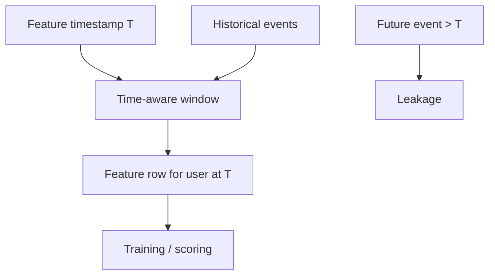

---

## 54. Demonstrating Feature Leakage

Bad feature:

```text
Prediction date: 2026-09-10
Feature: revenue during 2026-09-11 to 2026-10-10
```

The feature contains future information.

A second common leak is:

```text
Historical row: 2026-09-10
Customer segment used: current segment as of 2026-09-30
```

If the segment changed on September 20, the historical row contains a state unavailable at the prediction timestamp.

### Leakage comparison

| Case | Valid? | Reason |
|---|---|---|
| Events known by T | Yes | Information existed by T |
| Events first received after T | Not under strict availability semantics | Future knowledge |
| Current dimension state applied to old row | Potential leakage | Historical state may differ |
| Future revenue window | No | Direct future information |

---

## 55. Bot-Filtered Daily Metrics

Always be explicit about filtering.

```sql
SELECT
    event_date,
    COUNT(*) AS all_events,
    COUNT(*) FILTER (WHERE NOT is_bot AND NOT is_internal AND NOT is_test) AS business_events,
    COUNT(*) FILTER (WHERE is_bot) AS bot_events,
    COUNT(*) FILTER (WHERE is_internal) AS internal_events,
    COUNT(*) FILTER (WHERE is_test) AS test_events
FROM fct_events
GROUP BY event_date
ORDER BY event_date;
```

This lets the team quantify contamination rather than hiding it.

---

## 56. Reconcile Clickstream Revenue to Transactions

Suppose `orders` is the authoritative transaction model.

```sql
WITH clickstream AS (
    SELECT
        event_timestamp::DATE AS order_date,
        SUM(TRY_CAST(properties->>'amount' AS DECIMAL(18,2))) AS event_revenue,
        COUNT(DISTINCT properties->>'order_id') AS event_orders
    FROM fct_events
    WHERE event_name = 'order_completed'
    GROUP BY order_date
), transactions AS (
    SELECT
        order_date,
        SUM(net_amount) AS transaction_revenue,
        COUNT(DISTINCT order_id) AS transaction_orders
    FROM orders
    GROUP BY order_date
)
SELECT
    COALESCE(c.order_date, t.order_date) AS order_date,
    c.event_revenue,
    t.transaction_revenue,
    COALESCE(c.event_revenue, 0) - COALESCE(t.transaction_revenue, 0) AS revenue_difference,
    c.event_orders,
    t.transaction_orders,
    COALESCE(c.event_orders, 0) - COALESCE(t.transaction_orders, 0) AS order_difference
FROM clickstream c
FULL OUTER JOIN transactions t
  ON c.order_date = t.order_date
ORDER BY order_date;
```

### Investigation framework

If the values differ, inspect:

1. duplicate event delivery;
2. missing event emission;
3. late events;
4. refunds/cancellations;
5. event semantics versus transaction semantics;
6. timezone boundaries;
7. transaction source of truth.

---

# Event Physical Design and Lifecycle

## 57. Event Table Storage Strategy

Conceptual physical layout:

```text
fct_events
   ├── partition / pruning key: event_date
   ├── locality: user_id where workload supports it
   ├── locality: event_name where workload supports it
   ├── retention lifecycle
   └── historical aggregate models
```

### Mermaid — physical design

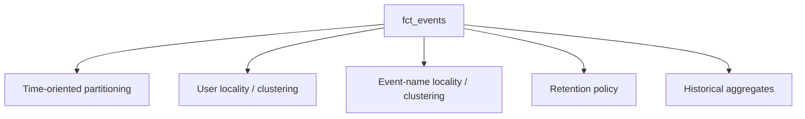

**Explanation:** these are physical design options. Their value depends on the actual engine, workload, write pattern, and data size.

---

## 58. Partitioning Considerations

A date partition can be useful when most queries are time bounded.

Ask:

- What are the dominant time ranges?
- How large is a day's data?
- How many partitions will exist?
- Will users often query one day, one week, or years?
- How often will old partitions be rewritten?
- How late can events arrive?

A partition strategy that creates many tiny partitions can increase operational complexity. A strategy with very large partitions can reduce pruning usefulness.

Measure the real workload.

---

## 59. Clustering / Sorting Considerations

Potential access keys include:

```text
user_id
event_name
```

But the choice should be made from actual access patterns.

Example questions:

- Are user-history queries common?
- Are event-type queries common?
- How selective are filters?
- What does the storage engine do with sorted locality?
- Does maintaining locality add significant write/rewrite cost?

Avoid saying “cluster by user” as a universal rule.

---

## 60. Retention and Historical Aggregation

A long-lived event platform can separate lifecycle stages:

```text
recent raw
   ↓
full analytical retention
   ↓
archive / summary
   ↓
long-term aggregate history
```

Possible older-data models:

```text
user_activity_daily
purchase_events_daily
product_interaction_daily
```

The trade-off is explicit:

> Less raw detail can mean lower cost and simpler long-term retention, but also less ability to reconstruct fine-grained historical behaviour.

Privacy and deletion requirements must be included in the decision.

---

# Anti-Patterns

## 61. Common Architecture Anti-Patterns

### 1. Raw events treated as fully trusted

**Symptom:** metrics rely directly on incoming rows.

**Root cause:** validation stage skipped.

**Correction:** validate event contract, IDs, time, and required properties.

**Production impact:** silent metric corruption.

### 2. Event name used as identity

**Symptom:** duplicates cannot be distinguished.

**Root cause:** no stable logical event ID.

**Correction:** require a governed `event_id`.

**Production impact:** inflated counts and unreliable reprocessing.

### 3. Everything stored in arbitrary JSON forever

**Symptom:** SQL becomes difficult and schemas are unclear.

**Root cause:** no property-promotion strategy.

**Correction:** typed high-value fields plus controlled long-tail structure.

**Production impact:** analyst friction, weak quality control, and governance risk.

### 4. Event and received timestamps mixed

**Symptom:** daily metrics disagree with ingestion reports.

**Root cause:** one timestamp used for unrelated questions.

**Correction:** preserve both semantics.

**Production impact:** incorrect reporting and debugging confusion.

### 5. Arrival order treated as business order

**Symptom:** sessions/funnels contain impossible sequences.

**Root cause:** late/out-of-order events ignored.

**Correction:** sequence by event time with deterministic ties.

**Production impact:** behavioural metric corruption.

### 6. Anonymous and known users counted separately

**Symptom:** DAU changes after login.

**Root cause:** identity policy missing.

**Correction:** explicit identity mapping and resolved identity.

**Production impact:** inconsistent user metrics.

### 7. Identity automatically merged

**Symptom:** unrelated users appear linked.

**Root cause:** weak identity evidence or simplistic rules.

**Correction:** governed identity evidence and conflict tests.

**Production impact:** historical corruption and privacy risk.

### 8. Historical events re-attributed without policy

**Symptom:** historical metrics change unexpectedly.

**Root cause:** identity semantics embedded in transformation code.

**Correction:** document observation-time versus resolved-history semantics.

**Production impact:** audit and trust problems.

### 9. Funnel definitions without a time limit

**Symptom:** different teams report different conversion.

**Root cause:** undefined eligibility window.

**Correction:** explicit funnel contract.

**Production impact:** non-reproducible KPIs.

### 10. Retention without denominator definition

**Symptom:** “retention” has several values.

**Root cause:** unclear cohort eligibility.

**Correction:** define cohort, activity, period, denominator.

**Production impact:** decision confusion.

### 11. Attribution model hidden

**Symptom:** marketing dashboards disagree.

**Root cause:** first/last/multi-touch assumptions undocumented.

**Correction:** document attribution method and window.

**Production impact:** governance conflict.

### 12. Bot/internal/test traffic ignored

**Symptom:** unexplained spikes.

**Root cause:** all traffic considered business traffic.

**Correction:** explicit derived classification flags.

**Production impact:** false product signals.

### 13. Raw PII stored indefinitely

**Symptom:** sensitive data appears in long-lived event history.

**Root cause:** free-form properties and absent lifecycle policy.

**Correction:** minimize collection, govern properties, define retention/deletion.

**Production impact:** unnecessary privacy and operational risk.

### 14. No partitioning strategy for huge data

**Symptom:** routine queries scan huge histories.

**Root cause:** physical design ignored.

**Correction:** match layout to workload.

**Production impact:** cost and latency pressure.

### 15. Too many materialized event-specific tables

**Symptom:** table explosion.

**Root cause:** every event type treated as a separate first-class model.

**Correction:** reserve dedicated models for materially important event types.

**Production impact:** maintenance burden.

---

# Production Debugging Scenarios

## 62. Scenario 1 — DAU Suddenly Doubles

Investigate:

```text
duplicates
identity changes
event ID reuse
bots
test traffic
event-definition changes
```

Useful query:

```sql
SELECT
    event_date,
    COUNT(*) AS events,
    COUNT(DISTINCT resolved_user_id) AS resolved_users,
    COUNT(DISTINCT anonymous_id) AS anonymous_ids
FROM events_resolved
GROUP BY event_date
ORDER BY event_date;
```

### Senior approach

First establish whether source volume, identity interpretation, or filtering changed. Do not assume product behaviour changed.

---

## 63. Scenario 2 — Session Count Is Too High

Investigate:

- duplicate events
- event-time ordering
- receive-order usage
- timestamp quality
- 30-minute threshold implementation
- anonymous/known identity transitions

A common failure is assigning sessions before deduplicating or sessionizing in arrival order.

---

## 64. Scenario 3 — Funnel Conversion Suddenly Improves

Investigate:

- duplicate purchases
- changed event definitions
- changed time windows
- changed denominator
- bot/test filters
- identity logic

Key question:

> Did behaviour change, or did the metric definition change?

---

## 65. Scenario 4 — Historical User Count Changes After Login

Investigate:

- historical re-attribution policy
- effective identity windows
- current-versus-observation identity
- query changes

The correct response is to explain the semantic policy, not merely report the new number.

---

## 66. Scenario 5 — Event Revenue Differs From Orders Table

Investigate:

- duplicated events
- missing events
- event semantics
- refunds/cancellations
- late events
- timezone boundaries
- authoritative source

The result should be a diagnosed reconciliation difference, not an assumption that events are automatically authoritative.

---

## 67. Scenario 6 — Retention Jumps

Investigate:

- cohort definition
- active definition
- identity stitching
- bot filtering
- late events
- duplicate rate

Retention changes can result from semantics as well as behaviour.

---

## 68. Scenario 7 — Feature Dataset Contains Future Activity

Investigate:

- feature windows
- current-state joins
- event timestamps
- identity mappings learned later
- late-data handling

Run:

```sql
SELECT *
FROM feature_lineage
WHERE source_event_timestamp > feature_timestamp;
```

Any returned row is a point-in-time correctness failure under a strict cutoff definition.

---

# Scenario-Based Architecture Decisions

## 69. Mobile App With Offline Uploads

**Requirement:** events may be uploaded hours later.

**Risks:** late data, clock skew, out-of-order arrival, retries.

**Design questions:**

- Is event time preserved?
- Is received time preserved?
- Is `event_id` stable across retries?
- How are historical partitions corrected?
- How much lateness is acceptable before backfill?

**Validation:** delay distribution, duplicate rate, future timestamps, correction rate.

---

## 70. E-Commerce Revenue Dashboard

**Requirement:** purchase events power behavioural dashboards.

**Questions:**

- Is revenue owned by the event model or transaction model?
- Are refunds represented?
- Can purchase events duplicate?
- Can events be lost?

**Reasoning:** behavioural event data and financial transaction truth can coexist. Reconciliation makes the relationship explicit.

---

## 71. Content Platform Retention

**Requirement:** weekly retention.

**Questions:**

- What defines signup?
- What defines active?
- Is an anonymous user eligible?
- What is the cohort denominator?
- How is late activity treated?

**Validation:** retained users belong to the source cohort; no negative week numbers; denominator is stable.

---

## 72. Advertising Attribution

**Requirement:** assign credit across marketing touches.

**Questions:**

- first-touch, last-touch, or multi-touch?
- attribution window?
- identity policy?
- duplicate-touch handling?
- qualifying channels?

**Reasoning:** the model is an allocation rule with assumptions, not an unquestionable fact.

---

## 73. Highly Private Product

**Requirement:** behavioural analytics with strict data minimization.

**Questions:**

- what PII is actually necessary?
- can free-form properties contain sensitive text?
- what consent semantics are needed?
- how long is raw data retained?
- how are deletion requests propagated?

**Reasoning:** privacy lifecycle is part of event architecture, not a later cleanup task.

---

# Senior Architecture Review

## 74. Production Event Pipeline

A senior Data Engineer should be able to explain this flow:

```text
Web / Mobile / Backend Producers
        ↓
Tracking Plan
        ↓
Event Collection
        ↓
Landing / Raw
        ↓
Event Validation
        ↓
Deduplication
        ↓
Identity Processing
        ↓
Sessionization
        ↓
┌──────────┬─────────────┬─────────────┐
↓          ↓             ↓
Funnels   Retention   Attribution
└──────────┴─────────────┴─────────────┘
        ↓
user_activity_daily
        ↓
BI / Analytics / ML / AI
```

### Mermaid — final production architecture

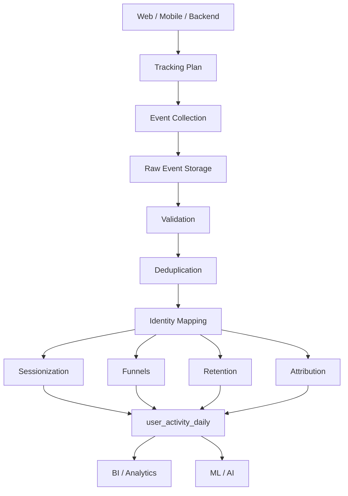

Each layer has a distinct responsibility. The architecture is conceptual; a real implementation may split, merge, or reorder technical components according to its platform constraints.

---

## 75. Event-Time vs Processing-Time Architecture Discussion

```text
Event Time
   ↓
Business semantics

Received Time
   ↓
Pipeline / ingestion semantics
```

Use event time to understand when the behaviour occurred. Use received time to understand when the platform received the observation. Keep both when those questions matter.

---

## 76. Identity Architecture Discussion

```text
anonymous_id
      ↓
identity events
      ↓
identity graph / map
      ↓
user_id
      ↓
behavioural models
```

The identity graph is not merely a technical join. It has business meaning and privacy implications.

---

## 77. Architecture Decision Framework

Review an event model using this sequence:

```text
Business Questions
      ↓
Event Semantics
      ↓
Tracking Plan
      ↓
Event Grain
      ↓
Time Semantics
      ↓
Identity Semantics
      ↓
Deduplication
      ↓
Derived Behaviour Models
      ↓
Physical Design
      ↓
Privacy / Retention
      ↓
Validation + Reconciliation
      ↓
Production Operations
```

### What each stage asks

| Stage | Senior question |
|---|---|
| Business questions | Which decisions depend on this behaviour? |
| Event semantics | What exactly happened? |
| Tracking plan | What can producers and consumers assume? |
| Grain | What does one raw row mean? |
| Time | When happened versus when received? |
| Identity | Who/what is associated, and with what evidence? |
| Deduplication | How is one logical event protected from replay? |
| Behaviour models | What interpretations should be reusable? |
| Physical design | How is the workload stored/queryable? |
| Privacy | What may be collected, retained, and processed? |
| Validation | How do we prove the model is correct? |
| Operations | How do we monitor and repair it? |

---

# Final Integrated Case Study

## 78. E-Commerce Clickstream Case

The business wants to understand:

- daily active users;
- sessions;
- product engagement;
- checkout progression;
- purchases;
- weekly retention;
- acquisition/activation;
- attribution;
- bot/test contamination;
- ingestion delay.

### Raw event types

```text
signup
product_viewed
cart_item_added
checkout_started
order_completed
login
page_view
```

### Raw model

```text
fct_events
```

### Identity model

```text
identity_map
```

### Behavioural models

```text
fct_sessions
funnel_detail
weekly_retention
user_activity_daily
```

### End-to-end sequence

```text
Generate
   ↓
Load
   ↓
Validate
   ↓
Deduplicate
   ↓
Resolve identity
   ↓
Sessionize
   ↓
Build funnel
   ↓
Build retention
   ↓
Filter bots/test traffic
   ↓
Build daily activity
   ↓
Reconcile with transactions
```

### What should be documented

- raw event grain;
- event ID semantics;
- time semantics;
- identity policy;
- session rule;
- funnel window;
- retention definition;
- attribution model;
- bot/test filter policy;
- physical layout;
- raw retention;
- privacy/deletion semantics;
- source of truth for financial metrics.

---

# Senior Interview Questions

## 79. Interview Questions 1–10

### 1. What is an event?

**Testing:** fundamentals.

**Reasoning:** occurrence + time + actor/action/object + properties.

**Strong answer:** An event records that something happened at a particular time. The raw event model captures the observation; sessions and funnels are derived interpretations.

**Weak answer:** “An event is just a database row.”

**Senior consideration:** define semantics and grain before tools.

### 2. What is the grain of an event table?

**Testing:** data modelling.

**Reasoning:** define row meaning explicitly.

**Strong answer:** One row per unique canonical event occurrence according to the event identity and deduplication policy.

**Weak answer:** “One row per user.”

**Senior consideration:** keep raw, session, funnel, and daily-activity grains distinct.

### 3. Why is `event_id` important?

**Testing:** replay/deduplication.

**Strong answer:** It provides stable logical identity so duplicate delivery can be detected and handled idempotently downstream.

**Weak answer:** “It is the primary key because databases need one.”

**Senior consideration:** distinguish equivalent duplicate deliveries from conflicting payloads.

### 4. What belongs in a standard event envelope?

**Testing:** schema design.

**Strong answer:** Event ID/name/time, receive time, identity fields, session information when available, context, and event properties.

**Weak answer:** “Everything in one JSON field.”

**Senior consideration:** stable envelope + governed extensibility.

### 5. What is a tracking plan?

**Testing:** event contract.

**Strong answer:** A governed specification of event names, properties, types, owners, and semantic meaning.

**Weak answer:** “A list of events.”

**Senior consideration:** change management and downstream assumptions.

### 6. Typed columns or JSON?

**Testing:** schema trade-offs.

**Strong answer:** Promote frequently queried and business-critical properties to typed columns; use JSON/struct for appropriate long-tail properties.

**Weak answer:** “Always use JSON.”

**Senior consideration:** balance typing, queryability, evolution, governance, and workload.

### 7. What is event time?

**Testing:** temporal semantics.

**Strong answer:** The timestamp representing when the action occurred.

**Weak answer:** “When the warehouse saw it.”

**Senior consideration:** producer clock quality matters.

### 8. What is received time?

**Testing:** pipeline semantics.

**Strong answer:** The time the ingestion system received the event.

**Weak answer:** “A duplicate of event time.”

**Senior consideration:** useful for lag and late-data monitoring.

### 9. Why can event time and received time differ?

**Testing:** real-world data.

**Strong answer:** Offline devices, network delay, retries, buffering, batching, queueing, and clock skew.

**Weak answer:** “Because the warehouse is slow.”

**Senior consideration:** separate source clock problems from pipeline latency.

### 10. What is a late event?

**Testing:** incremental correctness.

**Strong answer:** An event that arrives later than the relevant processing/reporting expectation based on event time.

**Weak answer:** “Any event older than a day.”

**Senior consideration:** lateness is relative to a defined processing window or SLA.

---

## 80. Interview Questions 11–20

### 11. What is an out-of-order event?

**Testing:** sequence semantics.

**Strong answer:** Arrival order differs from event-time order.

**Weak answer:** “A duplicate.”

**Senior consideration:** behavioural models should use event-time ordering.

### 12. How do you deduplicate events?

**Testing:** idempotency.

**Strong answer:** Group by logical event ID, compare payloads, canonicalize equivalent duplicates, flag conflicts, and preserve raw evidence.

**Weak answer:** “Use `DISTINCT`.”

**Senior consideration:** `DISTINCT` does not define logical identity.

### 13. What if the same ID has conflicting payloads?

**Testing:** quality maturity.

**Strong answer:** Flag for investigation instead of silently choosing one.

**Weak answer:** “Keep the latest.”

**Senior consideration:** could indicate producer ID reuse.

### 14. How do you define a session?

**Testing:** derived-model design.

**Strong answer:** Define identity scope, order by event time, apply an inactivity rule, and aggregate. For this exercise, use 30 minutes.

**Weak answer:** “The app defines it, so there is no modelling decision.”

**Senior consideration:** source session IDs still require semantics/trust.

### 15. Why is sessionization derived?

**Testing:** raw versus interpreted data.

**Strong answer:** A session is an interpretation of event sequence under a rule.

**Weak answer:** “Because sessions are not real.”

**Senior consideration:** preserve raw events so alternate definitions remain possible.

### 16. What is identity stitching?

**Testing:** identity modelling.

**Strong answer:** Connecting anonymous, device, and known identifiers using approved evidence and policy.

**Weak answer:** “Join on device ID.”

**Senior consideration:** shared devices and account switching create ambiguity.

### 17. Should historical anonymous events be re-attributed?

**Testing:** semantic governance.

**Strong answer:** Depends on the business question and identity policy; preserve raw observations and optionally derive resolved history.

**Weak answer:** “Always.”

**Senior consideration:** historical metrics can change.

### 18. What is an identity graph?

**Testing:** cross-device reasoning.

**Strong answer:** A representation of relationships among identifiers and entities.

**Weak answer:** “A user table.”

**Senior consideration:** relationships need evidence and potentially temporal validity.

### 19. What is a funnel?

**Testing:** behavioural modelling.

**Strong answer:** An ordered sequence of qualifying steps measured over a defined scope and time window.

**Weak answer:** “A group of event counts.”

**Senior consideration:** denominator and first/any occurrence matter.

### 20. How should a funnel time limit be chosen?

**Testing:** metric semantics.

**Strong answer:** As an explicit business requirement supported by the behaviour and decision being measured.

**Weak answer:** “Always 7 days.”

**Senior consideration:** different funnels can have different windows.

---

## 81. Interview Questions 21–30

### 21. What is retention?

**Testing:** cohort modelling.

**Strong answer:** Cohort-based measurement of later activity after a meaningful starting event/date.

**Weak answer:** “How many users come back.”

**Senior consideration:** define activity and denominator.

### 22. What defines an active user?

**Testing:** KPI semantics.

**Strong answer:** A documented event/behaviour relevant to the product question.

**Weak answer:** “Anyone with a page view.”

**Senior consideration:** changing the definition changes the metric.

### 23. What is activation?

**Testing:** behavioural KPI modelling.

**Strong answer:** A business-defined meaningful first-value action in a defined window for an eligible population.

**Weak answer:** “The first login.”

**Senior consideration:** activation should represent meaningful product value.

### 24. Compare first-touch, last-touch, and multi-touch attribution.

**Testing:** attribution assumptions.

**Strong answer:** First-touch credits the first qualifying touch, last-touch the final qualifying touch, and multi-touch distributes credit by an explicit allocation rule.

**Weak answer:** “One is objectively best.”

**Senior consideration:** each reflects different assumptions.

### 25. How can bots distort metrics?

**Testing:** data quality.

**Strong answer:** They can inflate events, sessions, DAU, funnel conversion, and retention.

**Weak answer:** “Bots only affect page views.”

**Senior consideration:** detection is imperfect; use multiple signals.

### 26. How would you partition a very large event table?

**Testing:** physical design.

**Strong answer:** Start from query patterns, time windows, partition size, late data, and retention. A time-oriented partition may fit time-heavy workloads.

**Weak answer:** “Always partition by date.”

**Senior consideration:** benchmark actual access patterns.

### 27. Why cluster or sort by `user_id`?

**Testing:** locality.

**Strong answer:** It can improve locality for common user-history filters if the engine/storage implementation benefits.

**Weak answer:** “It always makes queries faster.”

**Senior consideration:** compare read benefit with write/reorganization cost.

### 28. How do you handle PII in event properties?

**Testing:** governance.

**Strong answer:** Minimize collection, govern properties, isolate sensitive data when needed, and design retention/deletion.

**Weak answer:** “Put it in encrypted JSON.”

**Senior consideration:** encryption does not replace lifecycle governance.

### 29. How do deletion requests affect event architecture?

**Testing:** data lifecycle.

**Strong answer:** Raw events, identity maps, derived models, archives, backups, and exports may all need consideration.

**Weak answer:** “Delete the user row.”

**Senior consideration:** derived copies must be traceable.

### 30. When would you build a dedicated event-specific table?

**Testing:** modelling judgement.

**Strong answer:** When a high-value or complex event type needs dedicated semantics that materially improve correctness or usability.

**Weak answer:** “One table per event.”

**Senior consideration:** avoid unnecessary table proliferation.

---

## 82. Interview Questions 31–38

### 31. Why build `user_activity_daily`?

**Testing:** derived wide models.

**Strong answer:** To provide a reusable one-row-per-user-per-day behavioural summary for common analytical workloads.

**Weak answer:** “Because aggregate tables are always faster.”

**Senior consideration:** define late-data correction and point-in-time semantics.

### 32. How would you validate event data quality?

**Testing:** validation depth.

**Strong answer:** Validate IDs, names, required properties, types, timestamps, duplicates, identity, traffic classification, and derived-model consistency.

**Weak answer:** “Check nulls.”

**Senior consideration:** semantic validation matters as much as structural validation.

### 33. How would you reconcile clickstream purchases with transactional orders?

**Testing:** source-of-truth reasoning.

**Strong answer:** Compare equivalent grains and time semantics, then investigate duplicates, missing events, late data, business semantics, refunds, and source-of-truth ownership.

**Weak answer:** “They must match exactly.”

**Senior consideration:** mismatch is diagnostic evidence.

### 34. How would you design events for offline mobile users?

**Testing:** delayed ingestion.

**Strong answer:** Preserve event/receive time, stable event IDs, tolerate late/out-of-order arrival, and design historical correction.

**Weak answer:** “Use receive time because it is reliable.”

**Senior consideration:** producer clock quality can be imperfect.

### 35. How would you troubleshoot DAU suddenly doubling?

**Testing:** debugging method.

**Strong answer:** Compare duplicate rate, identity resolution, bot/test traffic, event definitions, and source volume before concluding behaviour changed.

**Weak answer:** “Increase warehouse capacity.”

**Senior consideration:** separate source change, semantic change, and user behaviour.

### 36. What assumptions belong in an event-model design document?

**Testing:** architecture maturity.

**Strong answer:** Grain, event ID semantics, time semantics, identity policy, deduplication, late-event treatment, sessions, funnel windows, retention, attribution, filtering, privacy, retention, and source-of-truth rules.

**Weak answer:** “Schema and database type.”

**Senior consideration:** semantic assumptions are the highest-risk dependencies.

### 37. How do you prevent future-data leakage in features?

**Testing:** ML data correctness.

**Strong answer:** Use event-time/information-availability cutoffs, preserve temporal identity semantics, and test source timestamps against feature timestamps.

**Weak answer:** “Shuffle the training set.”

**Senior consideration:** leakage can come from current-state dimensions as well as future events.

### 38. What makes an event platform trustworthy?

**Testing:** end-to-end production thinking.

**Strong answer:** Explicit contracts, stable IDs, time semantics, identity policy, deduplication, behavioural definitions, physical design, privacy controls, validation, reconciliation, and monitoring.

**Weak answer:** “Lots of events.”

**Senior consideration:** volume is not the same as trustworthiness.

---

# Practical Knowledge Checks

## 83. Questions

1. What is event grain?
2. Why do we need event IDs?
3. What belongs in an event envelope?
4. What is a tracking plan?
5. Why distinguish event time from received time?
6. What causes late events?
7. What causes duplicate events?
8. What is sessionization?
9. Why is sessionization a derived model?
10. What is identity stitching?
11. What is historical re-attribution?
12. What is a funnel?
13. What is a cohort?
14. What is activation?
15. What is attribution?
16. Why filter bots?
17. Why partition large event data?
18. Why retain raw and derived data separately?
19. Why can arbitrary JSON properties create problems?
20. What is point-in-time correctness?
21. How can current-state joins create leakage?
22. What makes a retention denominator valid?
23. Why reconcile event revenue with transactions?
24. How should late data affect a daily activity model?
25. What should happen when the same event ID has conflicting payloads?
26. Why can arrival order differ from business order?
27. Why can historical identity policy change DAU?
28. What is a semantic definition of an active user?
29. How can physical data layout affect event-query workload?
30. Why should deletion planning start early?

---

# Final Concept Map

## 84. Event Modelling Concept Map

```text
Event Occurrence
      ↓
Event Envelope
      ↓
Tracking Plan
      ↓
Immutable Raw Event
      ↓
Deduplication
      ↓
Event-Time Ordering
      ↓
Identity Resolution
      ↓
Sessions
      ↓
Funnels / Retention / Attribution
      ↓
Daily Behaviour Models
      ↓
BI / ML / AI
      ↓
Governance + Privacy + Quality
```

### Mermaid — concept map

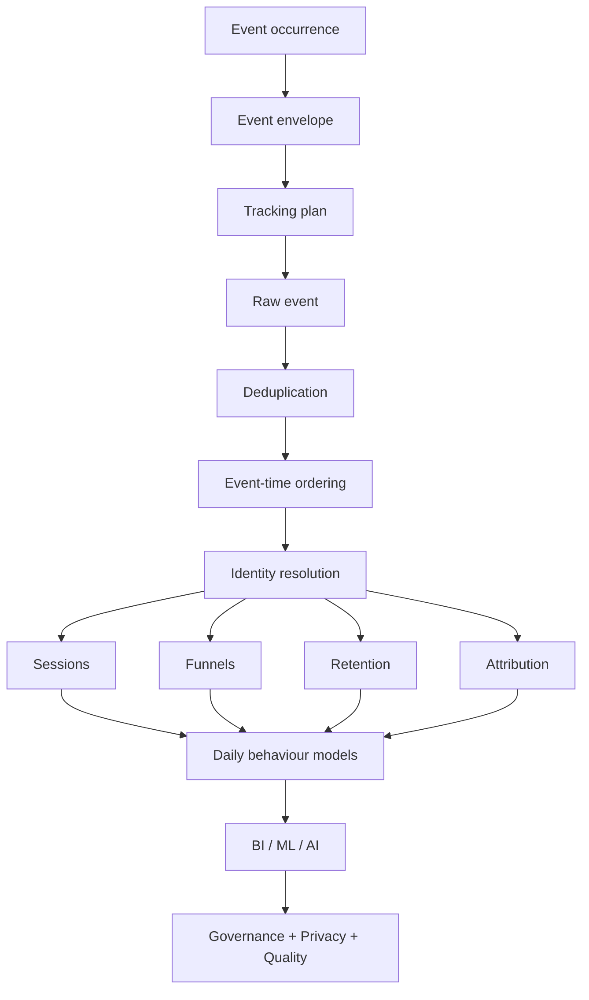

**Explanation:** each stage narrows the raw occurrence history into a specific business interpretation while preserving enough underlying evidence to validate and recompute it.

---

## 85. Final Architectural Principle

> **Raw events should represent what happened. Derived behavioural models should make explicit what those events mean for a particular business question.**

That means:

```text
Preserve the occurrence
        +
Define the semantics
        +
Model the identity
        +
Respect event time
        +
Handle duplicates and lateness
        +
Validate the behaviour model
        +
Govern privacy and retention
        =
Trustworthy event analytics
```

---

# Production Takeaways

## 86. Principles to Carry Forward

- Raw events should represent what happened.
- Event grain must be explicit.
- `event_id` is fundamental to deduplication and logical event identity.
- Event names and properties need governance.
- Event time and received time answer different questions.
- Late and out-of-order events are normal realities that models must handle.
- Deduplication rules must be explicit.
- Conflicting duplicate payloads should trigger investigation rather than silent overwriting.
- Sessions are derived models, not raw event facts.
- Identity stitching is a technical, business, and privacy problem.
- Historical anonymous-event re-attribution must be governed.
- Funnel, retention, activation, and attribution definitions must be explicit.
- Bot and internal/test traffic must not silently contaminate business metrics.
- Huge event tables require deliberate physical design and retention strategy.
- Free-form properties can become governance and privacy problems.
- PII should not be collected casually.
- Deletion requirements should influence architecture from the beginning.
- Event-based revenue should be reconciled against authoritative transactional systems where appropriate.
- Derived behavioural models should have clear grains and documented semantics.
- The goal is not merely to store millions of events; it is to turn event history into reliable business information.

---

# Scope Boundaries

This is **Topic 08 — Modelling Event and Clickstream Data**, the final topic of Module 2.8.

Do not deeply re-teach:

- normalization/denormalization → Topic 01
- dimensional modelling → Topic 02
- star/snowflake → Topic 03
- grain/key design → Topic 04
- SCD → Topic 05
- Data Vault → Topic 06
- OBT/wide modelling → Topic 07
- full streaming architecture → later Stage 2 modules
- full data-contract curriculum → later modules
- full observability/governance/security curriculum → later modules
- full semantic-layer/feature-store curriculum → later modules

These topics may be referenced for continuity but should not be duplicated here.

---

# Technical Accuracy Rules

Do not make absolute claims such as:

- event data is always more important than transactional data;
- clickstream should always be the source of truth;
- all anonymous events should always be re-attributed;
- all event properties should always be JSON;
- all important properties should always be columns;
- every session uses 30 minutes;
- first-touch is universally correct;
- last-touch is universally correct;
- bots can be identified perfectly;
- all event data should be retained forever;
- one partition strategy always solves performance;
- one physical layout is best for every event workload.

Instead reason from:

- business semantics
- workload
- data quality
- engine/storage behaviour
- privacy constraints
- operational constraints
- freshness requirements
- correctness requirements
- trade-offs

The only fixed session rule for this roadmap's hands-on exercise is:

> **30 minutes of inactivity.**

---

# Final Readiness Check

You are ready to move on when you can explain, implement, and defend:

1. event definition and event grain;
2. standard event envelope;
3. event IDs and deduplication;
4. tracking plans and event contracts;
5. typed versus JSON/struct properties;
6. event versus received time;
7. late and out-of-order event handling;
8. sessionization with a 30-minute inactivity rule;
9. anonymous and authenticated identity;
10. identity stitching and historical re-attribution policy;
11. funnel definitions and denominator semantics;
12. weekly retention cohorts and active-user definitions;
13. activation metrics;
14. first-touch, last-touch, and multi-touch attribution;
15. bot/internal/test traffic filtering;
16. event-table partitioning and locality;
17. raw retention and historical aggregation;
18. PII, consent, and deletion considerations;
19. Segment-style and Snowplow-style event schema awareness;
20. `fct_events` construction in DuckDB;
21. `identity_map` construction;
22. `fct_sessions` construction;
23. signup-to-purchase funnel implementation;
24. weekly retention implementation;
25. `user_activity_daily` implementation;
26. point-in-time feature construction;
27. future-data leakage detection;
28. reconciliation against transactional systems;
29. production debugging of behavioural metrics;
30. senior-level event architecture review.

---

# Module 2.8 Completion Perspective

You have now moved through a modelling progression:

```text
Normalization / Denormalization
          ↓
Facts + Dimensions
          ↓
Star / Snowflake
          ↓
Grain + Keys
          ↓
SCD History
          ↓
Data Vault Integration / History
          ↓
OBT / Wide Consumption Models
          ↓
Event / Clickstream Behaviour Models
```

The important engineering lesson is that these are modelling patterns, not isolated technologies. The right design depends on the semantics, grain, consumer, change behaviour, query workload, history requirements, privacy constraints, and operational needs of the system being built.

The final goal is not to memorize one event schema. The goal is to be able to start with **something that happened** and build a trustworthy analytical model whose assumptions are explicit, testable, and maintainable in production.

---

# Appendix — Representative Data and Validation Matrix

## 87. Representative Event Records

Use this small dataset before running the 100,000-user generator. It makes the edge cases visible by inspection.

| event_id | event_name | event_time | received_at | user_id | anonymous_id | flags |
|---|---|---|---|---|---|---|
| `evt_001` | `page_view` | 2026-09-01 09:00:00 | 2026-09-01 09:00:02 | NULL | `anon_a` | normal |
| `evt_002` | `product_viewed` | 2026-09-01 09:02:00 | 2026-09-01 09:02:01 | NULL | `anon_a` | normal |
| `evt_003` | `login` | 2026-09-01 09:05:00 | 2026-09-01 09:05:02 | `user_123` | `anon_a` | identity transition |
| `evt_004` | `order_completed` | 2026-09-01 09:07:00 | 2026-09-01 09:07:01 | `user_123` | `anon_a` | normal |
| `evt_004` | `order_completed` | 2026-09-01 09:07:00 | 2026-09-01 09:07:10 | `user_123` | `anon_a` | duplicate |
| `evt_005` | `page_view` | 2026-09-01 08:55:00 | 2026-09-01 11:00:00 | `user_123` | `anon_a` | late |
| `evt_006` | `page_view` | 2026-09-01 09:10:00 | 2026-09-01 09:10:01 | NULL | `bot_001` | bot |
| `evt_007` | `product_viewed` | 2026-09-01 09:11:00 | 2026-09-01 09:11:00 | `test_001` | `test_anon_001` | internal/test |

This records the required modelling problems in a form that can be debugged manually before scaling the dataset.

---

## 88. Validation Test Matrix

| Model/layer | Test | Example failure condition | Correct assertion result |
|---|---|---|---|
| `fct_events` | Event ID uniqueness | Same `event_id` appears twice after canonicalization | Zero rows |
| `fct_events` | Event-name validity | Event not registered in tracking plan | Zero rows |
| `fct_events` | Required properties | `product_viewed` lacks `product_id` | Zero rows |
| `fct_events` | Property type | `quantity` cannot cast to integer | Zero rows |
| `fct_events` | Timestamp sanity | Clearly impossible event time | Zero rows |
| `fct_events` | Duplicate conflict | Same ID has conflicting business payload | Zero rows after quarantine/investigation |
| `identity_map` | Identity uniqueness | Anonymous ID mapped to conflicting users under a single-user policy | Zero rows |
| `identity_map` | Temporal interval | `effective_to <= effective_from` | Zero rows |
| `fct_sessions` | Time validity | Session starts after it ends | Zero rows |
| `fct_sessions` | Non-negative duration | Negative duration | Zero rows |
| `fct_sessions` | 30-minute rule | Same session contains a gap > 30 minutes | Zero rows |
| Funnel | Step order | Purchase occurs before checkout | Zero rows |
| Funnel | Time window | Step occurs outside defined window | Zero rows |
| Funnel | Denominator | KPI uses inconsistent eligible population | Zero semantic inconsistencies |
| Retention | Cohort order | Activity precedes cohort | Zero rows |
| Retention | Week number | Negative week number | Zero rows |
| `user_activity_daily` | Grain | Multiple rows per user/date | Zero rows |
| Features | Point-in-time | Source event timestamp > feature timestamp | Zero rows |
| Traffic | Bot/test policy | Excluded traffic counted in business KPI | Zero unexpected rows |
| Reconciliation | Revenue | Event revenue disagrees without explained cause | Zero unexplained differences |

The exact SQL assertion depends on the model, but the engineering convention is consistent: **a failing condition should normally return rows; a healthy assertion should normally return zero rows.**

---

## 89. Minimal DuckDB Setup

For the hands-on lab, a compact setup can be:

```sql
INSTALL json;
LOAD json;

CREATE TABLE raw_events AS
SELECT *
FROM read_json_auto('events.jsonl');

DESCRIBE raw_events;

SELECT COUNT(*) AS rows_loaded
FROM raw_events;
```

Then proceed through:

```text
raw_events
→ fct_events
→ identity_map
→ events_resolved
→ sessionized_events
→ fct_sessions
→ funnel_detail
→ weekly_retention
→ user_activity_daily
```

---

## 90. Final Hands-On Deliverables

At the end of the lab, you should be able to point to these models and explain their grains:

| Deliverable | Grain |
|---|---|
| `fct_events` | One unique canonical event occurrence |
| `identity_map` | One approved anonymous-to-known identity relationship, subject to policy |
| `fct_sessions` | One derived session |
| `funnel_detail` | One identity in the signup-to-purchase funnel |
| `weekly_retention` | Cohort week × activity week summary |
| `user_activity_daily` | One resolved user per activity day |
| Feature model | Entity × feature timestamp, under a strict point-in-time policy |

You should also be able to explain what information was lost or changed at each transformation and how the resulting model was validated.
