# Interview Practice — Data Modelling for Analytics

## How to Use This Interview Practice

This document prepares you for Data Engineering, Analytics Engineering, Data Warehouse, dimensional modelling, architecture, whiteboard, and production-debugging interviews across **Stage 2 — Python for Data Engineering → Module 2.8 — Data Modelling for Analytics**.

These are interview conversations, not a second hands-on exercise book. For each question, stop after **Problem** and **Candidate Task**, answer aloud, and only then compare your reasoning with the solution.

A strong interview response normally:

- clarifies ambiguity before choosing a technology;
- identifies the business process;
- declares grain early;
- separates logical from physical design;
- makes key and history semantics explicit;
- discusses late data and edge cases;
- validates correctness;
- explains operational cost;
- compares alternatives without claiming a universal winner.

The central reasoning model is:

```text
Clarify the business
        ↓
Identify business processes
        ↓
Declare grain
        ↓
Choose facts + dimensions
        ↓
Choose keys + history strategy
        ↓
Handle edge cases
        ↓
Consider physical design
        ↓
Consider consumers
        ↓
Discuss scale + operations
        ↓
Defend trade-offs
        ↓
Validate the design
```

## Communication Rule

Do not start with a technology name. Start with the business question, row meaning, identity, history requirements, workload, and operational constraints.

---

# The 45-Minute Data Modelling Interview Framework

| Time | Focus |
|---|---|
| 0–5 min | Clarify users, business questions, scale, freshness, history, and sources |
| 5–15 min | Identify business processes, grains, and fact types |
| 15–25 min | Facts, dimensions, keys, relationships, conformed dimensions |
| 25–35 min | SCD, late data, many-to-many, identity, event semantics |
| 35–40 min | Physical design, partitioning, clustering, OBTs, event storage |
| 40–45 min | Alternatives, trade-offs, operational ownership, scale changes |

These time boxes are practice guidance, not a rigid requirement for every real interview.


---

# Part I — Basic

---

## Question 1 — A Warehouse Table With Too Much Repetition

### Difficulty
Basic

### Primary Topics
- Topic 01 — Normalization

### Secondary Topics
- Topic 02 — Dimensional Modelling

### Interview Context
A sales source table repeats customer, order, and product attributes on every row.

### Problem
The interviewer asks whether the repetition is automatically a modelling mistake and what you would clarify before changing it.

### Candidate Task
Explain how you would distinguish conceptual, logical, and physical modelling and decide whether normalization or analytical denormalization is appropriate.

---

### Solution

#### Step 1 — Clarify the Requirements
Ask whether the table serves OLTP transactions, analytics, or both. Clarify write patterns, update frequency, query patterns, and consumers.

#### Step 2 — Identify the Business Process
Identify customer, order, order line, and product, then state their relationships and cardinalities.

#### Step 3 — Declare the Grain
For an analytical order-line model, state: one row represents one order line.

#### Step 4 — Design the Model / Reasoning
For OLTP, decompose where dependencies and anomalies justify it. For analytics, a star or deliberate denormalization may reduce repeated joins.

#### Step 5 — Keys / History / Relationships
Separate business keys from warehouse keys when needed and preserve explicit relationships.

#### Step 6 — Physical / Operational Considerations
Consider storage, engine, write contention, update frequency, and BI behaviour.

#### Step 7 — Validation
Validate the chosen grain and reconcile analytical measures to the underlying process.

#### Why This Works
Repetition has different implications in transactional and analytical systems; the workload determines whether it is useful redundancy or harmful duplication.

#### Strong Interview Answer
> A strong answer could start: “I would not call the repetition wrong until I know the workload. I would identify the business process, dependencies, grain, and whether this is an operational or analytical representation.”

#### Common Weak Answer
> A weak answer is: “Duplicate data is bad, so I would normalize it.”

#### What the Interviewer Is Evaluating
The interviewer is evaluating modelling judgement rather than normal-form vocabulary.

#### Senior-Level Insight
Senior candidates separate logical modelling decisions from physical optimization and consumer convenience.

### Self-Check
- Can I start by clarifying the business problem?
- Can I state the grain precisely?
- Can I explain the main correctness risk or trade-off?
- Can I describe at least one validation step?

---

## Question 2 — Diagnose the Grain of Three Analytical Tables

### Difficulty
Basic

### Primary Topics
- Topic 02 — Dimensional Modelling

### Secondary Topics
- Topic 04 — Grain/Keys
- Topic 07 — OBT/Wide Models

### Interview Context
A warehouse contains `fct_order_lines`, `store_daily_sales`, and `customer_features_daily`.

### Problem
The interviewer asks you to state exactly what one row means in each table.

### Candidate Task
Give precise grain statements and explain why grain controls valid measures, keys, and joins.

---

### Solution

#### Step 1 — Clarify the Requirements
Assume order-line analysis, store-day reporting, and customer-day feature generation.

#### Step 2 — Identify the Business Process
These represent commerce transactions, recurring store state, and customer behavioural features.

#### Step 3 — Declare the Grain
`fct_order_lines`: one row per order line. `store_daily_sales`: one row per store per day. `customer_features_daily`: one row per customer per day.

#### Step 4 — Design the Model / Reasoning
Measures must belong to the declared row meaning.

#### Step 5 — Keys / History / Relationships
Use uniqueness keys aligned with each grain.

#### Step 6 — Physical / Operational Considerations
Validate daily models and partition where workload benefits.

#### Step 7 — Validation
Run uniqueness assertions for every table.

#### SQL / Implementation
```sql
SELECT order_id, order_line_id, COUNT(*) AS row_count
FROM fct_order_lines
GROUP BY order_id, order_line_id
HAVING COUNT(*) > 1;
```

#### Validation
```sql
SELECT store_id, business_date, COUNT(*) AS row_count
FROM store_daily_sales
GROUP BY store_id, business_date
HAVING COUNT(*) > 1;

SELECT customer_id, feature_date, COUNT(*) AS row_count
FROM customer_features_daily
GROUP BY customer_id, feature_date
HAVING COUNT(*) > 1;
```

#### Why This Works
Grain determines row meaning, valid measures, keys, and join safety.

#### Strong Interview Answer
> A strong candidate states the grain before discussing columns or SQL.

#### Common Weak Answer
> A weak answer lists columns without explaining row meaning.

#### What the Interviewer Is Evaluating
The interviewer is testing whether the candidate can make row semantics explicit.

#### Senior-Level Insight
If the grain is uncertain, a senior candidate resolves it before designing joins or measures.

#### Whiteboard / Mermaid
Draw this relationship on a whiteboard or paper during the interview.

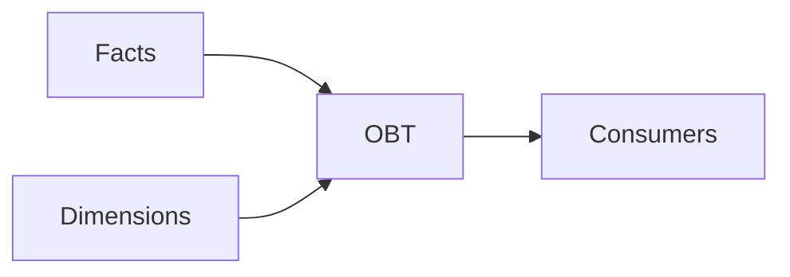

### Self-Check
- Can I start by clarifying the business problem?
- Can I state the grain precisely?
- Can I explain the main correctness risk or trade-off?
- Can I describe at least one validation step?

---

## Question 3 — Choose a Fact Type for Inventory

### Difficulty
Basic

### Primary Topics
- Topic 02 — Dimensional Modelling

### Secondary Topics
- None

### Interview Context
A retailer needs daily inventory-on-hand reporting by warehouse and product.

### Problem
The interviewer asks which fact pattern fits the requirement.

### Candidate Task
Explain the fact type, grain, and measure behaviour.

---

### Solution

#### Step 1 — Clarify the Requirements
Confirm this is a recurring state measurement rather than a transaction log.

#### Step 2 — Identify the Business Process
The process is inventory state at a daily observation point.

#### Step 3 — Declare the Grain
One row per warehouse per product per day, if that is the required level.

#### Step 4 — Design the Model / Reasoning
A periodic snapshot captures recurring state. Quantity on hand is not additive across time.

#### Step 5 — Keys / History / Relationships
Reference warehouse, product, and date at snapshot grain.

#### Step 6 — Physical / Operational Considerations
Consider daily partitioning and late corrections.

#### Step 7 — Validation
Check one row per warehouse/product/day and reconcile selected dates.

#### Why This Works
The fact type follows the business process and requested observation grain.

#### Strong Interview Answer
> A strong answer identifies a periodic snapshot and explains semi-additive behaviour across time.

#### Common Weak Answer
> A weak answer says: “Use a transaction fact because inventory changes.”

#### What the Interviewer Is Evaluating
The interviewer is evaluating whether the candidate maps business processes to fact patterns.

#### Senior-Level Insight
Senior reasoning includes the aggregation rule, not just the fact-table label.

### Self-Check
- Can I start by clarifying the business problem?
- Can I state the grain precisely?
- Can I explain the main correctness risk or trade-off?
- Can I describe at least one validation step?

---

## Question 4 — Explain a Star Schema to a BI Team

### Difficulty
Basic

### Primary Topics
- Topic 02 — Dimensional Modelling

### Secondary Topics
- Topic 03 — Star/Snowflake

### Interview Context
A BI analyst asks why the warehouse has a central fact table surrounded by dimensions.

### Problem
Explain the star schema simply and contrast it with a normalized hierarchy.

### Candidate Task
Give a concise explanation and sketch the model.

---

### Solution

#### Step 1 — Clarify the Requirements
Assume repeated sales analysis by customer, product, store, and date.

#### Step 2 — Identify the Business Process
Order-line sales is the central process.

#### Step 3 — Declare the Grain
One row per order line.

#### Step 4 — Design the Model / Reasoning
Facts store measurements; dimensions provide descriptive grouping and filtering context.

#### Step 5 — Keys / History / Relationships
The fact references dimension keys; a snowflake may normalize parts of a hierarchy.

#### Step 6 — Physical / Operational Considerations
Compare joins, BI compatibility, storage redundancy, and engine behaviour.

#### Step 7 — Validation
Ensure both designs answer equivalent business questions.

#### SQL / Implementation
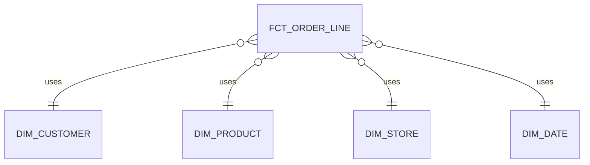

#### Why This Works
A star keeps dimensions directly connected to the fact; a snowflake can normalize hierarchy tables and add joins.

#### Strong Interview Answer
> A strong answer focuses on business usability and trade-offs rather than saying one shape always wins.

#### Common Weak Answer
> A weak answer says: “Star is always better because it has fewer joins.”

#### What the Interviewer Is Evaluating
The interviewer is testing clear communication and schema reasoning.

#### Senior-Level Insight
Senior candidates separate logical join count from actual physical execution.

### Self-Check
- Can I start by clarifying the business problem?
- Can I state the grain precisely?
- Can I explain the main correctness risk or trade-off?
- Can I describe at least one validation step?

---

## Question 5 — Natural Key or Surrogate Key?

### Difficulty
Basic

### Primary Topics
- Topic 04 — Grain/Keys

### Secondary Topics
- None

### Interview Context
A source customer number can be reused after an account is closed.

### Problem
The interviewer asks whether you would use that source identifier directly as the warehouse dimension key.

### Candidate Task
Explain how you would preserve source identity while protecting warehouse history.

---

### Solution

#### Step 1 — Clarify the Requirements
Ask whether historical identity and source-key reuse must be handled.

#### Step 2 — Identify the Business Process
The entity is customer and the warehouse needs a stable analytical identity.

#### Step 3 — Declare the Grain
Define whether the dimension stores one customer or one customer version per row.

#### Step 4 — Design the Model / Reasoning
A reused source key is not durable enough to be the sole analytical identity.

#### Step 5 — Keys / History / Relationships
Retain the source key as source evidence and use a warehouse/durable identity strategy. For multiple sources, use source-qualified identity and mapping.

#### Step 6 — Physical / Operational Considerations
Integer surrogates can be practical; deterministic hashes can support reproducible parallel loading when canonicalized.

#### Step 7 — Validation
Test source-key uniqueness, warehouse-key uniqueness, and mapping integrity.

#### Why This Works
Source identifiers are valuable evidence but are not automatically durable warehouse identities.

#### Strong Interview Answer
> A strong answer says: “I would preserve the source customer number but not assume it is durable. The warehouse key should protect against reuse and support the required history.”

#### Common Weak Answer
> A weak answer is: “Natural keys are always bad.”

#### What the Interviewer Is Evaluating
The interviewer is testing key stability and identity separation.

#### Senior-Level Insight
Senior candidates explicitly ask about reuse, format changes, cross-source collisions, and mapping ownership.

#### Whiteboard / Mermaid
Draw this relationship on a whiteboard or paper during the interview.


### Self-Check
- Can I start by clarifying the business problem?
- Can I state the grain precisely?
- Can I explain the main correctness risk or trade-off?
- Can I describe at least one validation step?

---

## Question 6 — Select a Slowly Changing Dimension Policy

### Difficulty
Basic

### Primary Topics
- Topic 05 — SCD

### Secondary Topics
- None

### Interview Context
A customer dimension contains `signup_date`, `email`, and `customer_segment`. Finance needs historical segment reporting, while operations wants the current email.

### Problem
How would you choose history behaviour?

### Candidate Task
Propose an attribute-level policy and explain why one table-wide SCD type may be insufficient.

---

### Solution

#### Step 1 — Clarify the Requirements
Separate attributes needing historical reporting from those needing current correction.

#### Step 2 — Identify the Business Process
Customer attributes have different semantic change requirements.

#### Step 3 — Declare the Grain
A Type 2 row represents one customer version over a validity interval.

#### Step 4 — Design the Model / Reasoning
Type 0 can fit signup date, Type 1 email, Type 2 segment.

#### Step 5 — Keys / History / Relationships
Type 2 needs version identity and validity attributes.

#### Step 6 — Physical / Operational Considerations
Avoid creating history for attributes whose historical state has no analytical value.

#### Step 7 — Validation
Test current-row uniqueness and interval integrity.

#### Why This Works
SCD policy is a semantic decision per attribute.

#### Strong Interview Answer
> A strong answer explains that finance’s historical requirement does not imply every attribute must be Type 2.

#### Common Weak Answer
> A weak answer says: “Make the whole table Type 2.”

#### What the Interviewer Is Evaluating
The interviewer is testing history reasoning.

#### Senior-Level Insight
Senior candidates also consider rapidly changing attributes and alternative patterns such as mini-dimensions.

#### Whiteboard / Mermaid
Draw this relationship on a whiteboard or paper during the interview.

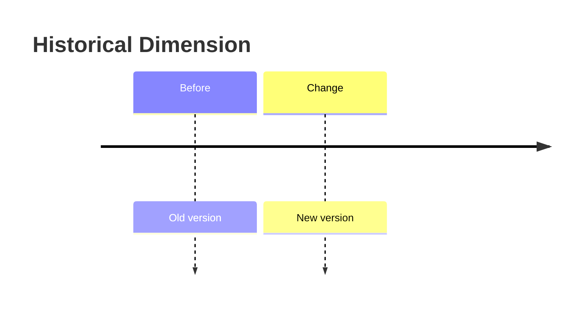

### Self-Check
- Can I start by clarifying the business problem?
- Can I state the grain precisely?
- Can I explain the main correctness risk or trade-off?
- Can I describe at least one validation step?

---

## Question 7 — Raw Vault, Hubs, Links, and Satellites

### Difficulty
Basic

### Primary Topics
- Topic 06 — Data Vault

### Secondary Topics
- None

### Interview Context
CRM and e-commerce both contain customers with different identifiers and update frequencies.

### Problem
Explain what belongs in hubs, links, and satellites and why the Raw Vault is not automatically the BI mart.

### Candidate Task
Sketch a simple model and explain the layer responsibilities.

---

### Solution

#### Step 1 — Clarify the Requirements
Focus on source integration, history, traceability, and independent ingestion.

#### Step 2 — Identify the Business Process
Customer identity is shared while descriptive source observations differ.

#### Step 3 — Declare the Grain
Hub: business identity; satellite: descriptive observations; link: relationship.

#### Step 4 — Design the Model / Reasoning
Use a customer hub and source-specific satellites, adding links when relationships require them.

#### Step 5 — Keys / History / Relationships
Retain hash keys, load date, and record source. Keep descriptive history in satellites.

#### Step 6 — Physical / Operational Considerations
Use insert-only Raw Vault loading.

#### Step 7 — Validation
Test hub uniqueness, satellite duplicates, missing relationships, and insert-only behaviour.

#### SQL / Implementation
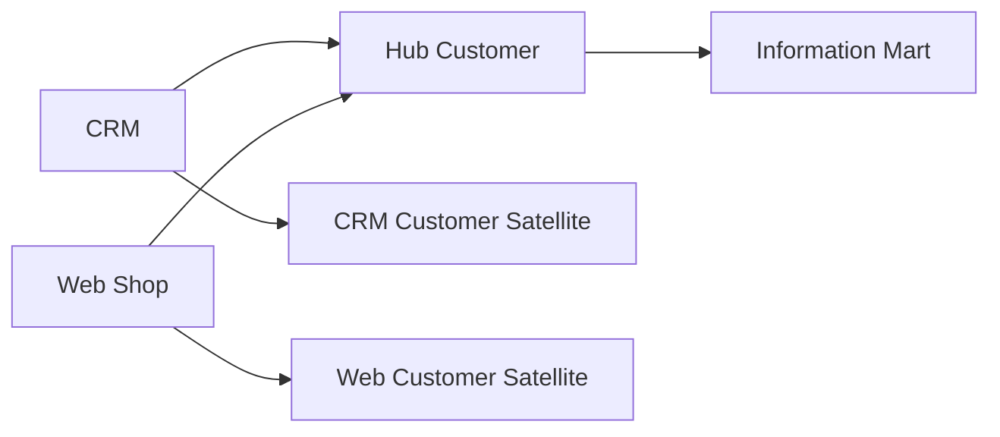

#### Why This Works
Raw Vault preserves integrated source history; business-facing marts can be derived from it.

#### Strong Interview Answer
> A strong answer separates business identity from descriptive history and clearly names Raw Vault versus downstream consumption.

#### Common Weak Answer
> A weak answer says: “Put customer attributes in the hub.”

#### What the Interviewer Is Evaluating
The interviewer is testing Data Vault fundamentals.

#### Senior-Level Insight
Senior candidates discuss source-specific history and auditability rather than exposing Raw Vault directly to BI.

#### Whiteboard / Mermaid
Draw this relationship on a whiteboard or paper during the interview.

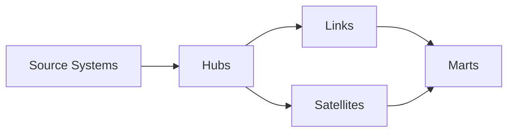

### Self-Check
- Can I start by clarifying the business problem?
- Can I state the grain precisely?
- Can I explain the main correctness risk or trade-off?
- Can I describe at least one validation step?

---

## Question 8 — When a Flat OBT Helps a BI Consumer

### Difficulty
Basic

### Primary Topics
- Topic 07 — OBT/Wide Models

### Secondary Topics
- Topic 03 — Star/Snowflake

### Interview Context
A BI team repeatedly joins order lines to product, store, customer, and date dimensions.

### Problem
The team asks for one flat dataset.

### Candidate Task
Explain what an OBT changes and what questions you would ask before building it.

---

### Solution

#### Step 1 — Clarify the Requirements
Ask who consumes it, which joins repeat, required freshness, and historical/current semantics.

#### Step 2 — Identify the Business Process
Assume order-line analysis.

#### Step 3 — Declare the Grain
One row per order line.

#### Step 4 — Design the Model / Reasoning
Flatten selected fact and dimension columns into a derived consumption layer.

#### Step 5 — Keys / History / Relationships
Use unambiguous names and choose current versus historical semantics explicitly.

#### Step 6 — Physical / Operational Considerations
Consider Parquet, partitioning, sorting, and refresh cost.

#### Step 7 — Validation
Compare OBT aggregates to the star and check for row multiplication.

#### Why This Works
OBT simplifies consumption by moving join complexity upstream.

#### Strong Interview Answer
> A strong answer starts: “I would treat the OBT as a derived consumption model, not automatically as the source of truth.”

#### Common Weak Answer
> A weak answer says: “Build it because BI wants flat tables.”

#### What the Interviewer Is Evaluating
The interviewer is testing workload-based OBT judgement.

#### Senior-Level Insight
Senior candidates ask who owns refreshes and what dimension changes will do to the OBT.

### Self-Check
- Can I start by clarifying the business problem?
- Can I state the grain precisely?
- Can I explain the main correctness risk or trade-off?
- Can I describe at least one validation step?

---

## Question 9 — Event Time Versus Received Time

### Difficulty
Basic

### Primary Topics
- Topic 08 — Event/Clickstream

### Secondary Topics
- None

### Interview Context
A mobile device records an event at `10:01:05` but the platform receives it at `10:03:42`.

### Problem
Which timestamp should drive behavioural chronology and which should drive ingestion monitoring?

### Candidate Task
Explain the distinction and give causes for the difference.

---

### Solution

#### Step 1 — Clarify the Requirements
Separate business behaviour from pipeline operations.

#### Step 2 — Identify the Business Process
The action happened before the platform received the record.

#### Step 3 — Declare the Grain
One row per captured event occurrence.

#### Step 4 — Design the Model / Reasoning
Use event time for behaviour and received time for receipt/lag analysis.

#### Step 5 — Keys / History / Relationships
Use event ID for identity and preserve both timestamps.

#### Step 6 — Physical / Operational Considerations
Offline devices, latency, retries, and clock skew can cause delays.

#### Step 7 — Validation
Inspect extreme delays and future timestamps with client-clock caveats.

#### Why This Works
The two timestamps answer different questions.

#### Strong Interview Answer
> A strong answer says event time describes when the action occurred and received time describes when the system observed it.

#### Common Weak Answer
> A weak answer collapses them into one warehouse timestamp.

#### What the Interviewer Is Evaluating
The interviewer is testing temporal semantics.

#### Senior-Level Insight
Senior candidates mention that receipt order is not necessarily event-time order.

### Self-Check
- Can I start by clarifying the business problem?
- Can I state the grain precisely?
- Can I explain the main correctness risk or trade-off?
- Can I describe at least one validation step?

---

## Question 10 — A Simple Event Table Contract

### Difficulty
Basic

### Primary Topics
- Topic 08 — Event/Clickstream

### Secondary Topics
- None

### Interview Context
A product team wants to add `product_viewed` events from web and mobile, but the first design contains only an event name and arbitrary JSON.

### Problem
What should the envelope and tracking plan establish?

### Candidate Task
Describe a minimal useful event contract and how you would govern it.

---

### Solution

#### Step 1 — Clarify the Requirements
Ask what downstream questions, identities, and common properties are required.

#### Step 2 — Identify the Business Process
The event means a product was viewed in a defined context.

#### Step 3 — Declare the Grain
One row per unique captured event occurrence.

#### Step 4 — Design the Model / Reasoning
Use event identity, event time, received time, identity, context, and properties.

#### Step 5 — Keys / History / Relationships
Require `event_id` and important properties such as `product_id`.

#### Step 6 — Physical / Operational Considerations
Use typed fields for important stable properties and JSON/struct for justified long-tail data.

#### Step 7 — Validation
Validate names, required properties, types, and event IDs.

#### Why This Works
A tracking plan turns ad-hoc payloads into governed event data.

#### Strong Interview Answer
> A strong answer mentions event name, identity, time, context, property definitions, ownership, and schema evolution.

#### Common Weak Answer
> A weak answer says: “Keep everything in JSON for flexibility.”

#### What the Interviewer Is Evaluating
The interviewer is evaluating event-contract thinking.

#### Senior-Level Insight
Senior candidates ask who owns event definitions and how changes are versioned.

### Self-Check
- Can I start by clarifying the business problem?
- Can I state the grain precisely?
- Can I explain the main correctness risk or trade-off?
- Can I describe at least one validation step?

---

# Part II — Moderate

---

## Question 11 — Decompose a Repeated Order Table

### Difficulty
Moderate

### Primary Topics
- Topic 01 — Normalization

### Secondary Topics
- Topic 02 — Dimensional Modelling

### Interview Context
A relation contains order, customer, and product information plus quantity. Orders can contain many products.

### Problem
The source team asks whether a single table is an acceptable canonical operational design.

### Candidate Task
Walk through the dependency problem, propose a normalized decomposition, and describe the analytical representation you would derive.

---

### Solution

#### Step 1 — Clarify the Requirements
Separate operational correctness from analytical convenience.

#### Step 2 — Identify the Business Process
Order header and order line are distinct entities.

#### Step 3 — Declare the Grain
The current relation is order-line grain.

#### Step 4 — Design the Model / Reasoning
Order attributes depend on order identity; line attributes depend on line identity/composite key. Decompose the operational model.

#### Step 5 — Keys / History / Relationships
Use order, customer, product, and order-line keys.

#### Step 6 — Physical / Operational Considerations
Normalization can prevent anomalies in OLTP; analytics can later flatten selected attributes.

#### Step 7 — Validation
Check dependencies and one-row-per-line semantics.

#### SQL / Implementation
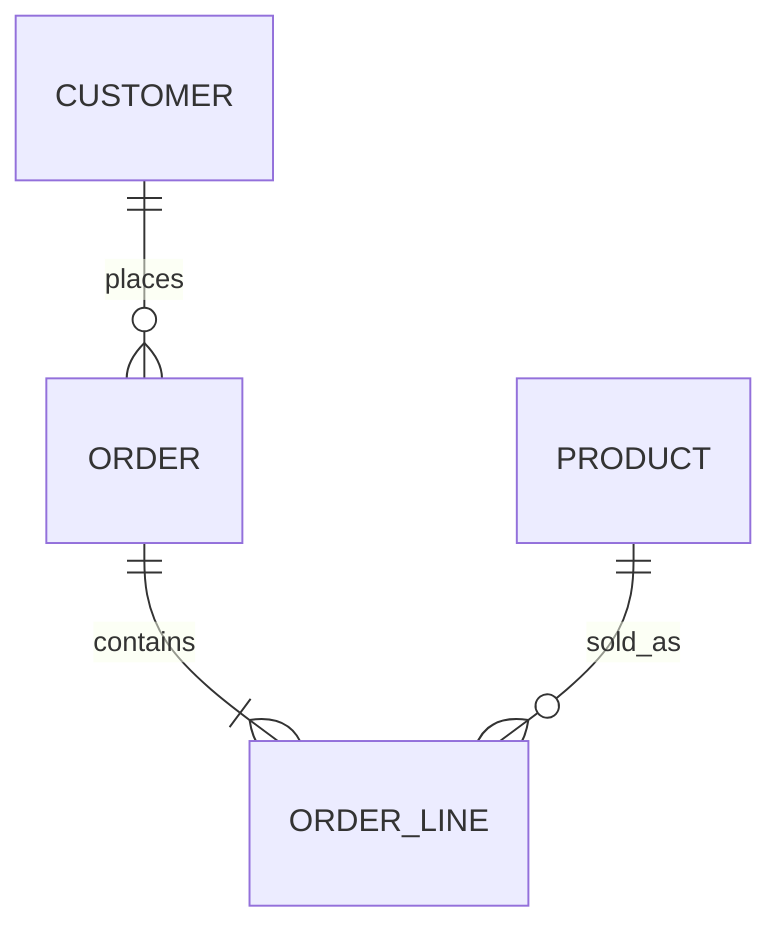

#### Why This Works
Decomposition follows functional dependencies and entity relationships; analytical denormalization is a separate decision.

#### Strong Interview Answer
> A strong candidate names the entities and dependencies before invoking 2NF/3NF terminology.

#### Common Weak Answer
> A weak answer simply says “normalize to 3NF.”

#### What the Interviewer Is Evaluating
The interviewer is testing applied normalization.

#### Senior-Level Insight
Senior candidates separate source canonical structure from downstream analytical structures.

#### Whiteboard / Mermaid
Draw this relationship on a whiteboard or paper during the interview.


### Self-Check
- Can I start by clarifying the business problem?
- Can I state the grain precisely?
- Can I explain the main correctness risk or trade-off?
- Can I describe at least one validation step?

---

## Question 12 — Design a Conformed-Dimension Bus

### Difficulty
Moderate

### Primary Topics
- Topic 02 — Dimensional Modelling

### Secondary Topics
- Topic 03 — Star/Snowflake

### Interview Context
A company has orders, shipments, and support cases. All need date and customer; orders and shipments also need product.

### Problem
How would you organize the dimensions so cross-process reporting remains consistent?

### Candidate Task
Explain a bus-matrix approach and the grain constraints of drill-across.

---

### Solution

#### Step 1 — Clarify the Requirements
Ask whether cross-process analysis is required.

#### Step 2 — Identify the Business Process
Orders, shipments, and support are separate facts.

#### Step 3 — Declare the Grain
Give each fact its own explicit grain.

#### Step 4 — Design the Model / Reasoning
Use conformed customer and date dimensions where semantics truly match.

#### Step 5 — Keys / History / Relationships
Do not join raw facts directly to each other just because they share an identifier.

#### Step 6 — Physical / Operational Considerations
The bus matrix coordinates logical integration; physical implementation can vary.

#### Step 7 — Validation
Aggregate each fact to a common compatible dimension grain before combining.

#### SQL / Implementation
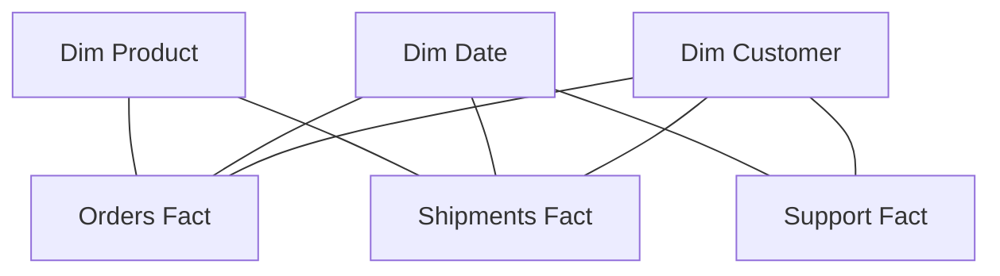

#### Why This Works
Conformed dimensions provide common analytical semantics without requiring direct fact-to-fact joins.

#### Strong Interview Answer
> A strong answer distinguishes a bus matrix from a physical table and states grain compatibility explicitly.

#### Common Weak Answer
> A weak answer says: “Join all facts on customer_id.”

#### What the Interviewer Is Evaluating
The interviewer is evaluating enterprise dimensional reasoning.

#### Senior-Level Insight
Senior candidates validate each fact independently before drill-across.

#### Whiteboard / Mermaid
Draw this relationship on a whiteboard or paper during the interview.

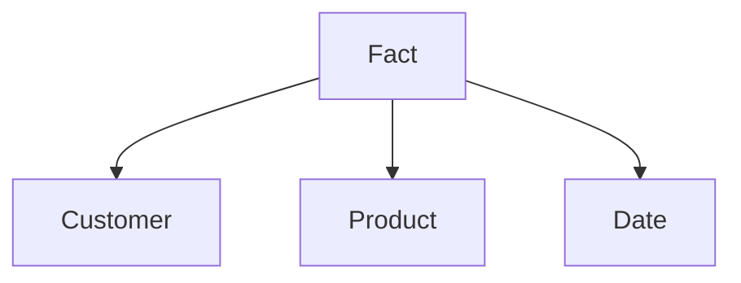

### Self-Check
- Can I start by clarifying the business problem?
- Can I state the grain precisely?
- Can I explain the main correctness risk or trade-off?
- Can I describe at least one validation step?

---

## Question 13 — Compare Star and Snowflake for a Product Hierarchy

### Difficulty
Moderate

### Primary Topics
- Topic 03 — Star/Snowflake

### Secondary Topics
- Topic 02 — Dimensional Modelling

### Interview Context
A retailer has product → subcategory → category → department. The BI team mostly filters by category and department.

### Problem
How would you decide between a flattened product dimension and normalized hierarchy tables?

### Candidate Task
Explain the evidence you would gather and how you would benchmark the alternatives.

---

### Solution

#### Step 1 — Clarify the Requirements
Ask about query patterns, BI relationships, hierarchy change frequency, row counts, and engine.

#### Step 2 — Identify the Business Process
Product analysis around the sales fact.

#### Step 3 — Declare the Grain
One row per product in the dimension.

#### Step 4 — Design the Model / Reasoning
Flattened hierarchy reduces logical relationships; snowflaking normalizes hierarchy structure.

#### Step 5 — Keys / History / Relationships
Use equivalent keys and history semantics.

#### Step 6 — Physical / Operational Considerations
Compare joins, BI usability, column pruning, and maintenance.

#### Step 7 — Validation
Verify result equivalence before comparing runtimes.

#### SQL / Implementation
```sql
-- Same business question should be expressed against both equivalent models.
SELECT p.category_name, s.region, SUM(f.net_amount) AS revenue
FROM fct_order_lines f
JOIN dim_product p ON f.product_key = p.product_key
JOIN dim_store s ON f.store_key = s.store_key
GROUP BY 1,2;
```

#### Why This Works
No schema shape is universally better. Benchmark the same logical workload with comparable physical conditions.

#### Strong Interview Answer
> A strong candidate specifies the same file format, cold/warm cache, repeated runs, memory measurements, and equivalent queries.

#### Common Weak Answer
> A weak answer says: “Snowflake saves space, so use it.”

#### What the Interviewer Is Evaluating
The interviewer is testing architecture comparison and benchmark discipline.

#### Senior-Level Insight
Senior candidates record engine version, hardware/container limits, data distribution, and workload mix.

### Self-Check
- Can I start by clarifying the business problem?
- Can I state the grain precisely?
- Can I explain the main correctness risk or trade-off?
- Can I describe at least one validation step?

---

## Question 14 — A Missing Customer at Load Time

### Difficulty
Moderate

### Primary Topics
- Topic 02 — Dimensional Modelling

### Secondary Topics
- Topic 04 — Grain/Keys
- Topic 05 — SCD

### Interview Context
An order fact arrives before the customer dimension record.

### Problem
How do you prevent an orphan fact while allowing later correction?

### Candidate Task
Explain unknown/inferred-member handling and the validation path.

---

### Solution

#### Step 1 — Clarify the Requirements
Ask whether the fact must be immediately queryable.

#### Step 2 — Identify the Business Process
This is a late-arriving dimension problem.

#### Step 3 — Declare the Grain
The fact keeps its original grain, such as one row per order line.

#### Step 4 — Design the Model / Reasoning
Use an unknown or inferred member strategy.

#### Step 5 — Keys / History / Relationships
When the dimension arrives, reconcile the inferred record without changing fact grain.

#### Step 6 — Physical / Operational Considerations
Make late-arrival repair auditable and repeatable.

#### Step 7 — Validation
Test orphans and unresolved inferred members.

#### SQL / Implementation
```sql
SELECT f.order_id, f.customer_key
FROM fct_order_lines f
LEFT JOIN dim_customer d ON f.customer_key = d.customer_key
WHERE d.customer_key IS NULL;
```

#### Validation
```sql
SELECT COUNT(*) AS unresolved_inferred
FROM dim_customer
WHERE is_inferred = TRUE;
```

#### Why This Works
Referential integrity and fact grain can remain stable while dimension information catches up.

#### Strong Interview Answer
> A strong answer distinguishes an unknown member from an inferred member and explains the later repair.

#### Common Weak Answer
> A weak answer says: “Delay all facts until the dimension arrives.”

#### What the Interviewer Is Evaluating
The interviewer is testing late-arrival handling.

#### Senior-Level Insight
Senior candidates discuss SLAs for unresolved inferred members and downstream tolerance.

### Self-Check
- Can I start by clarifying the business problem?
- Can I state the grain precisely?
- Can I explain the main correctness risk or trade-off?
- Can I describe at least one validation step?

---

## Question 15 — Choose Attribute-Level SCD Policies

### Difficulty
Moderate

### Primary Topics
- Topic 05 — SCD

### Secondary Topics
- Topic 02 — Dimensional Modelling

### Interview Context
A SaaS customer dimension has signup date, email, plan, segment, and support tier. Finance needs historical plan/segment; operations wants current email/tier.

### Problem
How would you design the dimension?

### Candidate Task
Propose a mixed attribute-level history policy and defend it.

---

### Solution

#### Step 1 — Clarify the Requirements
Separate historical business-state requirements from current correction requirements.

#### Step 2 — Identify the Business Process
Customer descriptive history has mixed meanings.

#### Step 3 — Declare the Grain
Type 2 history is one row per customer version.

#### Step 4 — Design the Model / Reasoning
Type 0 signup date; Type 1 email/tier; Type 2 plan/segment is one defensible policy.

#### Step 5 — Keys / History / Relationships
Use version keys and validity intervals for Type 2 attributes.

#### Step 6 — Physical / Operational Considerations
Avoid Type 2 churn for attributes without historical value.

#### Step 7 — Validation
Check one current row and non-overlapping intervals.

#### Why This Works
Different attributes can require different historical semantics.

#### Strong Interview Answer
> A strong answer explains why the policy is attribute-level and tied to business reporting requirements.

#### Common Weak Answer
> A weak answer says: “Use Type 2 because history matters.”

#### What the Interviewer Is Evaluating
The interviewer is testing nuanced SCD judgement.

#### Senior-Level Insight
Senior candidates mention rapidly changing attributes and alternative models.

#### Whiteboard / Mermaid
Draw this relationship on a whiteboard or paper during the interview.


### Self-Check
- Can I start by clarifying the business problem?
- Can I state the grain precisely?
- Can I explain the main correctness risk or trade-off?
- Can I describe at least one validation step?

---

## Question 16 — Model a Simple Event Stream

### Difficulty
Moderate

### Primary Topics
- Topic 08 — Event/Clickstream

### Secondary Topics
- Topic 04 — Grain/Keys

### Interview Context
A food-delivery app captures restaurant views, item additions, checkout starts, and order completions from web and mobile.

### Problem
The mobile and web payloads differ.

### Candidate Task
Design the standard event envelope and decide which properties should be typed versus kept in JSON/struct form.

---

### Solution

#### Step 1 — Clarify the Requirements
Ask which properties are common and frequently queried.

#### Step 2 — Identify the Business Process
These are user-behaviour occurrences leading toward orders.

#### Step 3 — Declare the Grain
One row per unique captured event occurrence.

#### Step 4 — Design the Model / Reasoning
Use a shared envelope, typed high-value fields, and governed event-specific long-tail fields.

#### Step 5 — Keys / History / Relationships
Require event ID and identity fields; do not use event name as identity.

#### Step 6 — Physical / Operational Considerations
Use a tracking plan and schema evolution awareness.

#### Step 7 — Validation
Check required properties and types by event.

#### Why This Works
A stable event envelope separates shared semantics from flexible event-specific properties.

#### Strong Interview Answer
> A strong answer says the tracking plan defines required fields, types, ownership, and meaning.

#### Common Weak Answer
> A weak answer says: “Put everything in JSON.”

#### What the Interviewer Is Evaluating
The interviewer is testing practical event schema design.

#### Senior-Level Insight
Senior candidates consider property promotion, long-tail governance, and schema evolution.

### Self-Check
- Can I start by clarifying the business problem?
- Can I state the grain precisely?
- Can I explain the main correctness risk or trade-off?
- Can I describe at least one validation step?

---

## Question 17 — Sessionize Events With the 30-Minute Rule

### Difficulty
Moderate

### Primary Topics
- Topic 08 — Event/Clickstream

### Secondary Topics
- None

### Interview Context
A streaming service starts a new session after more than 30 minutes of inactivity.

### Problem
How would you explain and implement sessionization?

### Candidate Task
Describe the `LAG()` plus cumulative-sum method and the resulting session grain.

---

### Solution

#### Step 1 — Clarify the Requirements
Use the module's fixed 30-minute inactivity rule for this exercise.

#### Step 2 — Identify the Business Process
A session is a derived period of activity.

#### Step 3 — Declare the Grain
One row per derived session after aggregation.

#### Step 4 — Design the Model / Reasoning
Sort by user and event time, compute the previous timestamp, flag gaps over 30 minutes, then cumulative-sum the flags.

#### Step 5 — Keys / History / Relationships
Create a deterministic session sequence per user.

#### Step 6 — Physical / Operational Considerations
Late events may alter session boundaries, requiring a recomputation policy.

#### Step 7 — Validation
Check session bounds and complete event assignment.

#### SQL / Implementation
```sql
WITH ordered AS (
  SELECT event_id, user_id, event_timestamp,
         LAG(event_timestamp) OVER (
           PARTITION BY user_id
           ORDER BY event_timestamp, event_id
         ) AS prev_ts
  FROM fct_events
),
flagged AS (
  SELECT *,
         CASE WHEN prev_ts IS NULL
                   OR event_timestamp - prev_ts > INTERVAL '30 minutes'
              THEN 1 ELSE 0 END AS new_session
  FROM ordered
),
numbered AS (
  SELECT *,
         SUM(new_session) OVER (
           PARTITION BY user_id
           ORDER BY event_timestamp, event_id
           ROWS UNBOUNDED PRECEDING
         ) AS session_number
  FROM flagged
)
SELECT user_id, session_number,
       MIN(event_timestamp) AS session_start,
       MAX(event_timestamp) AS session_end,
       COUNT(*) AS event_count
FROM numbered
GROUP BY 1,2;
```

#### Validation
```sql
SELECT *
FROM fct_sessions
WHERE session_start > session_end
   OR duration_seconds < 0;
```

#### Why This Works
The rule is based on inactivity gaps in event time, not arbitrary clock buckets.

#### Strong Interview Answer
> A strong answer mentions deterministic ordering for equal timestamps and late-event effects.

#### Common Weak Answer
> A weak answer says: “Group events into 30-minute windows.”

#### What the Interviewer Is Evaluating
The interviewer is testing time reasoning and window-function knowledge.

#### Senior-Level Insight
Senior candidates ask how late events are allowed to modify historical sessions.

### Self-Check
- Can I start by clarifying the business problem?
- Can I state the grain precisely?
- Can I explain the main correctness risk or trade-off?
- Can I describe at least one validation step?

---

## Question 18 — Define a Signup-to-Purchase Funnel

### Difficulty
Moderate

### Primary Topics
- Topic 08 — Event/Clickstream

### Secondary Topics
- None

### Interview Context
A SaaS company wants signup → product interaction → checkout → first purchase within 30 days.

### Problem
How do you prevent two analysts from producing different conversion rates?

### Candidate Task
State user scope, step ordering, time window, occurrence policy, and denominator.

---

### Solution

#### Step 1 — Clarify the Requirements
Ask whether the funnel is user-scoped, first versus any purchase, and the exact 30-day boundary.

#### Step 2 — Identify the Business Process
Signup establishes eligibility and purchase is the success event.

#### Step 3 — Declare the Grain
Use one row per eligible user/funnel instance or a step-level relation.

#### Step 4 — Design the Model / Reasoning
Use event-time ordering and require steps to occur sequentially within the stated window.

#### Step 5 — Keys / History / Relationships
Resolve identity according to the identity policy.

#### Step 6 — Physical / Operational Considerations
Materialize reusable funnel logic if it is stable and frequently queried.

#### Step 7 — Validation
Later-step counts should not exceed the corresponding eligible population.

#### SQL / Implementation
```sql
-- Conceptual step extraction
WITH signup AS (
  SELECT user_id, MIN(event_timestamp) AS signup_ts
  FROM fct_events
  WHERE event_name = 'signup'
  GROUP BY user_id
)
SELECT ...
```

#### Validation
```sql
SELECT *
FROM funnel_summary
WHERE purchase_users > checkout_users
   OR checkout_users > eligible_users;
```

#### Why This Works
Funnels are metric definitions as well as SQL queries; the denominator and time window are critical.

#### Strong Interview Answer
> A strong answer says the funnel contract must state scope, ordering, windows, and first/any occurrence.

#### Common Weak Answer
> A weak answer says: “Count users who did each event.”

#### What the Interviewer Is Evaluating
The interviewer is testing metric-definition discipline.

#### Senior-Level Insight
Senior candidates ask who owns the funnel definition and how changes are communicated to consumers.

### Self-Check
- Can I start by clarifying the business problem?
- Can I state the grain precisely?
- Can I explain the main correctness risk or trade-off?
- Can I describe at least one validation step?

---

## Question 19 — Weekly Retention Without an Ambiguous Denominator

### Difficulty
Moderate

### Primary Topics
- Topic 08 — Event/Clickstream

### Secondary Topics
- None

### Interview Context
A product manager says: “Show weekly retention for users who signed up in January.”

### Problem
What must you clarify before writing SQL?

### Candidate Task
Define cohort, activity, timezone, denominator, and subsequent activity semantics.

---

### Solution

#### Step 1 — Clarify the Requirements
Ask what counts as active and which timezone defines a week.

#### Step 2 — Identify the Business Process
Cohort membership comes from signup; retention comes from later activity.

#### Step 3 — Declare the Grain
Intermediate grain can be one row per user per activity week.

#### Step 4 — Design the Model / Reasoning
Assign cohort week, identify active weeks, compute relative week, divide retained users by cohort size.

#### Step 5 — Keys / History / Relationships
Use resolved identity according to policy.

#### Step 6 — Physical / Operational Considerations
Daily activity models can reduce repeated raw-event scans.

#### Step 7 — Validation
Cohort dates must not be after activity dates; retained counts cannot exceed cohort size.

#### SQL / Implementation
```sql
WITH cohorts AS (
  SELECT user_id, DATE_TRUNC('week', MIN(event_timestamp)) AS cohort_week
  FROM fct_events
  WHERE event_name = 'signup'
  GROUP BY user_id
),
activity AS (
  SELECT DISTINCT user_id, DATE_TRUNC('week', event_timestamp) AS activity_week
  FROM fct_events
  WHERE is_bot = FALSE AND is_internal = FALSE AND is_test_event = FALSE
)
SELECT c.cohort_week,
       DATE_DIFF('week', c.cohort_week, a.activity_week) AS relative_week,
       COUNT(DISTINCT a.user_id) AS retained_users
FROM cohorts c
JOIN activity a USING (user_id)
WHERE a.activity_week >= c.cohort_week
GROUP BY 1,2;
```

#### Validation
```sql
SELECT *
FROM retention
WHERE relative_week < 0
   OR retained_users > cohort_users;
```

#### Why This Works
Retention requires an explicit definition of active and a stable denominator.

#### Strong Interview Answer
> A strong answer starts with clarifying questions rather than immediately writing SQL.

#### Common Weak Answer
> A weak answer says: “Retention is active users divided by all users.”

#### What the Interviewer Is Evaluating
The interviewer is testing cohort semantics.

#### Senior-Level Insight
Senior candidates mention identity, bot filtering, timezone, and metric ownership.

### Self-Check
- Can I start by clarifying the business problem?
- Can I state the grain precisely?
- Can I explain the main correctness risk or trade-off?
- Can I describe at least one validation step?

---

## Question 20 — Choose an Attribution Model

### Difficulty
Moderate

### Primary Topics
- Topic 08 — Event/Clickstream

### Secondary Topics
- None

### Interview Context
Advertising has ad click, email click, site visit, and purchase events.

### Problem
The team asks which attribution model to use.

### Candidate Task
Compare first-touch, last-touch, and multi-touch approaches without claiming one is universally correct.

---

### Solution

#### Step 1 — Clarify the Requirements
Ask what decision the metric supports, attribution window, qualifying touches, and identity quality.

#### Step 2 — Identify the Business Process
Touches precede a conversion.

#### Step 3 — Declare the Grain
Touch events are event grain; attribution output needs an explicit conversion/touch grain.

#### Step 4 — Design the Model / Reasoning
First-touch credits the earliest qualifying touch; last-touch the latest; multi-touch distributes credit using a defined rule.

#### Step 5 — Keys / History / Relationships
Identity stitching must make touchpoints linkable to conversions.

#### Step 6 — Physical / Operational Considerations
Preserve raw touch history and explicit windows.

#### Step 7 — Validation
Check allocation totals against the chosen attribution rule.

#### Why This Works
Attribution is a business model with assumptions about causality, identity, and time windows.

#### Strong Interview Answer
> A strong candidate chooses based on the decision being supported, the data available, and model assumptions.

#### Common Weak Answer
> A weak answer says: “Use last-touch because it is standard.”

#### What the Interviewer Is Evaluating
The interviewer is testing trade-off reasoning.

#### Senior-Level Insight
Senior candidates clarify that attribution is descriptive and assumption-driven, not a universal causal truth.

### Self-Check
- Can I start by clarifying the business problem?
- Can I state the grain precisely?
- Can I explain the main correctness risk or trade-off?
- Can I describe at least one validation step?

---

# Part III — Hard

---

## Question 21 — Why Is Revenue Doubled After a Drill-Across?

### Difficulty
Hard

### Primary Topics
- Topic 02 — Dimensional Modelling

### Secondary Topics
- Topic 03 — Star/Snowflake
- Topic 04 — Grain/Keys

### Interview Context
An analyst joins order facts directly to shipment facts on order ID; revenue is doubled.

### Problem
Diagnose the issue and explain the correct drill-across strategy.

### Candidate Task
Identify the grains, explain the multiplication, and rewrite the analysis.

---

### Solution

#### Step 1 — Clarify the Requirements
Determine the intended output grain, such as day.

#### Step 2 — Identify the Business Process
Orders and shipments are separate processes.

#### Step 3 — Declare the Grain
Orders may be one row per order; shipments may have multiple rows per order.

#### Step 4 — Design the Model / Reasoning
Aggregate each fact to a compatible common grain before combining.

#### Step 5 — Keys / History / Relationships
Use conformed dimensions for analysis; do not rely on raw fact-to-fact joins.

#### Step 6 — Physical / Operational Considerations
Pre-aggregation can reduce repeated work.

#### Step 7 — Validation
Compare revenue with the independent order fact.

#### SQL / Implementation
```sql
WITH orders AS (
  SELECT order_date, SUM(net_amount) AS revenue
  FROM fct_orders
  GROUP BY order_date
),
shipments AS (
  SELECT ship_date, COUNT(*) AS shipment_count
  FROM fct_shipments
  GROUP BY ship_date
)
SELECT COALESCE(o.order_date, s.ship_date) AS date,
       o.revenue, s.shipment_count
FROM orders o
FULL OUTER JOIN shipments s
  ON o.order_date = s.ship_date;
```

#### Validation
```sql
SELECT SUM(net_amount) FROM fct_orders;
SELECT SUM(revenue) FROM daily_business_summary;
```

#### Why This Works
Fact-to-fact joins can multiply rows when grains differ.

#### Strong Interview Answer
> A strong answer names the grains first and performs independent aggregation before the drill-across.

#### Common Weak Answer
> A weak answer says: “Add DISTINCT.”

#### What the Interviewer Is Evaluating
The interviewer is testing cardinality and metric correctness.

#### Senior-Level Insight
Senior candidates validate facts independently and choose a compatible common grain.

### Self-Check
- Can I start by clarifying the business problem?
- Can I state the grain precisely?
- Can I explain the main correctness risk or trade-off?
- Can I describe at least one validation step?

---

## Question 22 — Assign Orders to the Correct Type 2 Customer Version

### Difficulty
Hard

### Primary Topics
- Topic 04 — Grain/Keys

### Secondary Topics
- Topic 05 — SCD

### Interview Context
A customer changes region on June 10. Orders occur on June 5 and June 15. Finance wants region as it was at order time.

### Problem
How should the fact resolve to the dimension?

### Candidate Task
Explain the half-open interval and point-in-time join.

---

### Solution

#### Step 1 — Clarify the Requirements
Finance needs as-was reporting.

#### Step 2 — Identify the Business Process
Order facts must resolve to customer history at order time.

#### Step 3 — Declare the Grain
Order fact retains its order/order-line grain; Type 2 rows represent customer-version intervals.

#### Step 4 — Design the Model / Reasoning
Use `valid_from <= order_timestamp < valid_to`.

#### Step 5 — Keys / History / Relationships
Fact references version key while durable identity remains separate if needed.

#### Step 6 — Physical / Operational Considerations
Choose load-time or query-time point-in-time resolution explicitly.

#### Step 7 — Validation
Ensure exactly one matching version per fact and no overlapping intervals.

#### SQL / Implementation
```sql
SELECT f.order_id, f.order_timestamp, d.customer_key, d.region
FROM fct_orders f
JOIN dim_customer d
  ON f.customer_id = d.customer_durable_id
 AND f.order_timestamp >= d.valid_from
 AND f.order_timestamp < d.valid_to;
```

#### Validation
```sql
SELECT order_id, COUNT(*) AS version_matches
FROM fact_version_matches
GROUP BY order_id
HAVING COUNT(*) <> 1;
```

#### Why This Works
Half-open intervals make boundary transitions precise.

#### Strong Interview Answer
> A strong answer explains both durable identity and version identity.

#### Common Weak Answer
> A weak answer joins only on customer ID and returns multiple versions.

#### What the Interviewer Is Evaluating
The interviewer is testing temporal joins and SCD semantics.

#### Senior-Level Insight
Senior candidates also discuss late and back-dated changes.

### Self-Check
- Can I start by clarifying the business problem?
- Can I state the grain precisely?
- Can I explain the main correctness risk or trade-off?
- Can I describe at least one validation step?

---

## Question 23 — Benchmark Star vs Snowflake Without Cheating

### Difficulty
Hard

### Primary Topics
- Topic 03 — Star/Snowflake

### Secondary Topics
- None

### Interview Context
Engineering claims a star is 40% faster, but the star test uses Parquet and the snowflake test uses CSV.

### Problem
How would you redesign the benchmark?

### Candidate Task
Specify workload equivalence, file format, cache conditions, repeats, and memory measurement.

---

### Solution

#### Step 1 — Clarify the Requirements
The objective is an apples-to-apples workload comparison.

#### Step 2 — Identify the Business Process
Use the same business questions.

#### Step 3 — Declare the Grain
Both models must represent equivalent facts and dimensions.

#### Step 4 — Design the Model / Reasoning
Control row counts, distributions, data types, and SQL semantics.

#### Step 5 — Keys / History / Relationships
Use equivalent key/history semantics.

#### Step 6 — Physical / Operational Considerations
Run cold and warm cache conditions, repeated runs, memory measurements, and document engine/configuration.

#### Step 7 — Validation
Check result equivalence before comparing runtime.

#### SQL / Implementation
```sql
SELECT p.category_name, s.region, SUM(f.net_amount)
FROM ...
GROUP BY 1,2;
```

#### Why This Works
A runtime comparison is not meaningful if the workload or physical setup differs materially.

#### Strong Interview Answer
> A strong answer explains cold/warm cache, repeated runs, identical format, equivalent queries, and memory measurement.

#### Common Weak Answer
> A weak answer says only: “Average ten runs.”

#### What the Interviewer Is Evaluating
The interviewer is testing benchmark methodology.

#### Senior-Level Insight
Senior candidates record engine version, hardware/container constraints, and workload mix.

### Self-Check
- Can I start by clarifying the business problem?
- Can I state the grain precisely?
- Can I explain the main correctness risk or trade-off?
- Can I describe at least one validation step?

---

## Question 24 — A New ERP Source Shares Customer IDs

### Difficulty
Hard

### Primary Topics
- Topic 04 — Grain/Keys

### Secondary Topics
- Topic 06 — Data Vault

### Interview Context
CRM customer 100 and ERP customer 100 are different entities, while some records really refer to the same people.

### Problem
How would you avoid accidental identity merging?

### Candidate Task
Explain source-qualified identity, cross-reference mapping, and how this can feed integration and dimensional models.

---

### Solution

#### Step 1 — Clarify the Requirements
Ask whether enterprise entity resolution is required and who owns the matching policy.

#### Step 2 — Identify the Business Process
Customer is shared concept with source-specific identities.

#### Step 3 — Declare the Grain
Source customer identity has source-specific grain; enterprise identity is a separate durable concept.

#### Step 4 — Design the Model / Reasoning
Use `(source_system, source_customer_id)` as source identity and a controlled mapping layer.

#### Step 5 — Keys / History / Relationships
Do not equate identical source IDs; Data Vault identity and same-as relationships require explicit semantics.

#### Step 6 — Physical / Operational Considerations
Make matching reproducible and auditable.

#### Step 7 — Validation
Detect conflicting source-to-enterprise mappings.

#### SQL / Implementation
```sql
SELECT source_system, source_customer_id,
       COUNT(DISTINCT enterprise_customer_id) AS enterprise_ids
FROM customer_xref
GROUP BY 1,2
HAVING COUNT(DISTINCT enterprise_customer_id) > 1;
```

#### Validation
```sql
SELECT source_system, source_customer_id, COUNT(*) AS mapping_rows
FROM customer_xref
GROUP BY 1,2
HAVING COUNT(*) > 1;
```

#### Why This Works
Same literal IDs across sources do not prove same entity identity.

#### Strong Interview Answer
> A strong answer separates source identity from enterprise identity and makes matching policy explicit.

#### Common Weak Answer
> A weak answer says: “Use customer_id as the global key.”

#### What the Interviewer Is Evaluating
The interviewer is testing cross-source identity.

#### Senior-Level Insight
Senior candidates discuss auditability, reversible mapping, and governance.

### Self-Check
- Can I start by clarifying the business problem?
- Can I state the grain precisely?
- Can I explain the main correctness risk or trade-off?
- Can I describe at least one validation step?

---

## Question 25 — A Type 2 Dimension Has Two Current Rows

### Difficulty
Hard

### Primary Topics
- Topic 05 — SCD

### Secondary Topics
- Topic 04 — Grain/Keys

### Interview Context
A production test finds two current customer rows for the same durable customer.

### Problem
How would you diagnose and repair the issue?

### Candidate Task
Walk through the integrity tests and root-cause investigation.

---

### Solution

#### Step 1 — Clarify the Requirements
Confirm the invariant: one current row per durable customer.

#### Step 2 — Identify the Business Process
Customer version history.

#### Step 3 — Declare the Grain
One row per customer version.

#### Step 4 — Design the Model / Reasoning
Inspect source changes, load ordering, effective timestamps, deduplication, and concurrent loads.

#### Step 5 — Keys / History / Relationships
Check current flags, validity intervals, version numbers, and fact assignments.

#### Step 6 — Physical / Operational Considerations
Repair deterministically and preserve source evidence.

#### Step 7 — Validation
Rerun current-row and interval-integrity tests.

#### SQL / Implementation
```sql
SELECT customer_durable_id, COUNT(*) AS current_rows
FROM dim_customer
WHERE is_current
GROUP BY customer_durable_id
HAVING COUNT(*) > 1;
```

#### Validation
```sql
SELECT customer_durable_id, valid_from, valid_to
FROM dim_customer
WHERE valid_from >= valid_to;
```

#### Why This Works
A duplicate current row is usually a transition/load problem, not a query problem.

#### Strong Interview Answer
> A strong answer investigates before deleting anything, repairs deterministically, and validates downstream facts.

#### Common Weak Answer
> A weak answer says: “Delete one row.”

#### What the Interviewer Is Evaluating
The interviewer is testing production debugging.

#### Senior-Level Insight
Senior candidates separate repair from prevention and inspect whether fact-version assignment was affected.

### Self-Check
- Can I start by clarifying the business problem?
- Can I state the grain precisely?
- Can I explain the main correctness risk or trade-off?
- Can I describe at least one validation step?

---

## Question 26 — Data Vault History Disappeared

### Difficulty
Hard

### Primary Topics
- Topic 06 — Data Vault

### Secondary Topics
- Topic 04 — Grain/Keys

### Interview Context
A source correction replaced a customer's old address and the old address is no longer visible in Raw Vault.

### Problem
What concerns you and what would you investigate?

### Candidate Task
Diagnose the anti-pattern and explain how insert-only Raw Vault history should behave.

---

### Solution

#### Step 1 — Clarify the Requirements
Raw Vault goals include history, traceability, and source evidence.

#### Step 2 — Identify the Business Process
Customer descriptive history belongs in a satellite.

#### Step 3 — Declare the Grain
Satellite rows represent source observations at the defined satellite grain.

#### Step 4 — Design the Model / Reasoning
Check whether a prior satellite row was updated/deleted instead of a new observation being inserted.

#### Step 5 — Keys / History / Relationships
Inspect hash diff, load date, record source, and hub key.

#### Step 6 — Physical / Operational Considerations
Raw Vault should preserve source history through insert-only behaviour.

#### Step 7 — Validation
Compare source observations over time and test for overwritten history.

#### SQL / Implementation
```sql
SELECT customer_hk, record_source, load_date, hash_diff
FROM sat_customer
ORDER BY customer_hk, load_date;
```

#### Why This Works
Overwriting Raw Vault history defeats source-fidelity and auditability goals.

#### Strong Interview Answer
> A strong answer investigates the load pattern and protects source evidence before repairing downstream models.

#### Common Weak Answer
> A weak answer says: “Recreate the old address from the current CRM.”

#### What the Interviewer Is Evaluating
The interviewer is testing Data Vault principles and debugging.

#### Senior-Level Insight
Senior candidates distinguish Raw Vault evidence from Business Vault derivations and marts.

### Self-Check
- Can I start by clarifying the business problem?
- Can I state the grain precisely?
- Can I explain the main correctness risk or trade-off?
- Can I describe at least one validation step?

---

## Question 27 — An OBT Refresh Suddenly Became Expensive

### Difficulty
Hard

### Primary Topics
- Topic 07 — OBT/Wide Models

### Secondary Topics
- Topic 05 — SCD

### Interview Context
A date-partitioned OBT has billions of rows. A product-category change affecting 1% of products currently triggers a full rebuild.

### Problem
How would you redesign the refresh strategy?

### Candidate Task
Explain affected-product, affected-fact, and affected-partition reasoning, including when a full rebuild may still be necessary.

---

### Solution

#### Step 1 — Clarify the Requirements
Determine whether the OBT is current-state or historical/as-was.

#### Step 2 — Identify the Business Process
Order-line analytics is derived from facts and dimensions.

#### Step 3 — Declare the Grain
One row per order line.

#### Step 4 — Design the Model / Reasoning
Identify changed products, affected facts, and impacted partitions.

#### Step 5 — Keys / History / Relationships
Use stable product identity and correct dimension semantics.

#### Step 6 — Physical / Operational Considerations
Rebuild/replace only affected partitions when semantics and physical design permit.

#### Step 7 — Validation
Compare the affected results with a full-rebuild equivalent.

#### SQL / Implementation
```sql
WITH changed_products AS (
  SELECT product_id
  FROM product_changes
  WHERE change_date = DATE '2026-09-10'
),
affected_days AS (
  SELECT DISTINCT DATE_TRUNC('day', order_timestamp) AS order_day
  FROM fct_order_lines o
  JOIN changed_products c ON o.product_id = c.product_id
)
SELECT order_day FROM affected_days ORDER BY order_day;
```

#### Why This Works
Incremental refresh depends on both semantic scope and physical organization.

#### Strong Interview Answer
> A strong answer asks whether current or historical semantics apply before identifying partitions.

#### Common Weak Answer
> A weak answer says: “Only rebuild the day of the change.”

#### What the Interviewer Is Evaluating
The interviewer is testing SCD/OBT interaction and operational cost reasoning.

#### Senior-Level Insight
Senior candidates discuss refresh blast radius, partition replacement, and measurable cost.

#### Whiteboard / Mermaid
Draw this relationship on a whiteboard or paper during the interview.


### Self-Check
- Can I start by clarifying the business problem?
- Can I state the grain precisely?
- Can I explain the main correctness risk or trade-off?
- Can I describe at least one validation step?

---

## Question 28 — A Feature Table Uses Future Information

### Difficulty
Hard

### Primary Topics
- Topic 07 — OBT/Wide Models

### Secondary Topics
- Topic 08 — Event/Clickstream

### Interview Context
A churn feature `revenue_30d` accidentally includes events from 30 days after the scoring date.

### Problem
Why is the dataset invalid?

### Candidate Task
Explain point-in-time correctness and define a leakage test.

---

### Solution

#### Step 1 — Clarify the Requirements
The feature must use only information known by prediction time.

#### Step 2 — Identify the Business Process
Customer behaviour is transformed into time-aligned features.

#### Step 3 — Declare the Grain
One row per customer per feature date.

#### Step 4 — Design the Model / Reasoning
Only source records at or before feature time are eligible.

#### Step 5 — Keys / History / Relationships
Join using the resolved customer identity policy.

#### Step 6 — Physical / Operational Considerations
Late events may require feature recomputation windows.

#### Step 7 — Validation
Any source timestamp after feature timestamp is a leakage violation.

#### SQL / Implementation
```sql
SELECT *
FROM feature_lineage
WHERE source_event_timestamp > feature_timestamp;
```

#### Validation
```sql
SELECT COUNT(*) AS leakage_rows
FROM feature_lineage
WHERE source_event_timestamp > feature_timestamp;
```

#### Why This Works
Future information makes historical training rows invalid.

#### Strong Interview Answer
> A strong answer defines eligibility relative to feature timestamp and provides a validation rule.

#### Common Weak Answer
> A weak answer says: “Remove future columns.”

#### What the Interviewer Is Evaluating
The interviewer is testing time-aware ML data modelling.

#### Senior-Level Insight
Senior candidates discuss late-event recomputation and lineage of feature inputs.

### Self-Check
- Can I start by clarifying the business problem?
- Can I state the grain precisely?
- Can I explain the main correctness risk or trade-off?
- Can I describe at least one validation step?

---

## Question 29 — A Bridge Table Produces Wrong Revenue

### Difficulty
Hard

### Primary Topics
- Topic 02 — Dimensional Modelling

### Secondary Topics
- Topic 04 — Grain/Keys

### Interview Context
A product belongs to multiple marketing categories. A bridge join makes total revenue exceed the atomic sales total.

### Problem
What is wrong and how can weighting support reconciliation?

### Candidate Task
Explain the many-to-many relationship, bridge grain, allocation weight, and validation.

---

### Solution

#### Step 1 — Clarify the Requirements
Ask whether the business wants full allocation, equal allocation, or intentional duplication.

#### Step 2 — Identify the Business Process
Sales is the fact; product-category is many-to-many.

#### Step 3 — Declare the Grain
Bridge: one row per product-category relationship.

#### Step 4 — Design the Model / Reasoning
Joining the bridge duplicates fact rows conceptually. Weighting can allocate a fact amount.

#### Step 5 — Keys / History / Relationships
Check that weights satisfy the chosen allocation rule.

#### Step 6 — Physical / Operational Considerations
Centralize allocation rules.

#### Step 7 — Validation
Reconcile allocated totals to atomic totals when full allocation is intended.

#### SQL / Implementation
```sql
SELECT f.order_line_id, b.category_key,
       f.net_amount * b.weight AS allocated_amount
FROM fct_order_lines f
JOIN bridge_product_category b
  ON f.product_key = b.product_key;
```

#### Validation
```sql
SELECT product_key, SUM(weight) AS total_weight
FROM bridge_product_category
GROUP BY product_key
HAVING ABS(SUM(weight) - 1.0) > 0.000001;
```

#### Why This Works
Many-to-many relationships require explicit allocation semantics if the measure must remain reconcilable.

#### Strong Interview Answer
> A strong answer distinguishes displaying multiple categories from allocating one amount across them.

#### Common Weak Answer
> A weak answer says: “Use DISTINCT.”

#### What the Interviewer Is Evaluating
The interviewer is testing bridge-table semantics.

#### Senior-Level Insight
Senior candidates document whether allocation is exhaustive, proportional, or intentionally non-additive.

#### Whiteboard / Mermaid
Draw this relationship on a whiteboard or paper during the interview.


### Self-Check
- Can I start by clarifying the business problem?
- Can I state the grain precisely?
- Can I explain the main correctness risk or trade-off?
- Can I describe at least one validation step?

---

## Question 30 — Session Count and DAU Doubled

### Difficulty
Hard

### Primary Topics
- Topic 08 — Event/Clickstream

### Secondary Topics
- Topic 04 — Grain/Keys

### Interview Context
A dashboard suddenly shows 2× sessions and active users, and raw event volume also increased.

### Problem
How would you investigate systematically?

### Candidate Task
Give a hypothesis tree covering duplicate events, identity, bots/test traffic, and sessionization.

---

### Solution

#### Step 1 — Clarify the Requirements
Pin down the exact metric definition, period, population, and releases/backfills.

#### Step 2 — Identify the Business Process
DAU and sessions are derived from event identity and time semantics.

#### Step 3 — Declare the Grain
Event, session, and user-day are different grains.

#### Step 4 — Design the Model / Reasoning
Check duplicates, event-ID reuse, identity mapping, bot/test filters, and session logic.

#### Step 5 — Keys / History / Relationships
Inspect event IDs, anonymous IDs, user IDs, and mapping changes.

#### Step 6 — Physical / Operational Considerations
Check ingestion replay or overlapping partition processing.

#### Step 7 — Validation
Recompute from controlled subsets and compare each derivation layer.

#### SQL / Implementation
```sql
SELECT COUNT(*) - COUNT(DISTINCT event_id) AS duplicate_rows
FROM fct_events
WHERE event_date = DATE '2026-09-20';

SELECT is_bot, is_internal, is_test_event, COUNT(*)
FROM fct_events
WHERE event_date = DATE '2026-09-20'
GROUP BY 1,2,3;
```

#### Validation
```sql
SELECT event_id, COUNT(*) AS c
FROM fct_events
GROUP BY event_id
HAVING COUNT(*) > 1;
```

#### Why This Works
A metric spike should be decomposed into data-volume, identity, filtering, and derivation hypotheses.

#### Strong Interview Answer
> A strong answer provides a prioritized investigation path instead of assuming genuine traffic growth.

#### Common Weak Answer
> A weak answer says: “Traffic doubled.”

#### What the Interviewer Is Evaluating
The interviewer is testing production incident reasoning.

#### Senior-Level Insight
Senior candidates inspect release history, backfills, identity-policy changes, and processing overlap.

#### Whiteboard / Mermaid
Draw this relationship on a whiteboard or paper during the interview.

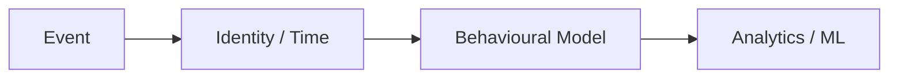

### Self-Check
- Can I start by clarifying the business problem?
- Can I state the grain precisely?
- Can I explain the main correctness risk or trade-off?
- Can I describe at least one validation step?

---

# Part IV — Advanced

---

## Question 31 — Seven Sources, One Customer Model

### Difficulty
Advanced

### Primary Topics
- Topic 01 — Normalization

### Secondary Topics
- Topic 04 — Grain/Keys
- Topic 05 — SCD
- Topic 06 — Data Vault
- Topic 02 — Dimensional Modelling

### Interview Context
You join a company with seven sources. CRM and ERP have overlapping customer IDs, the web shop has anonymous visitors, and finance needs historical revenue by customer segment.

### Problem
Design the customer integration and analytical architecture while acknowledging missing identity-matching requirements.

### Candidate Task
Clarify unknowns, define identities and grains, propose candidate layers, and state what evidence would change the design.

---

### Solution

#### Step 1 — Clarify the Requirements
Ask which system owns customer identity, revenue, segment, address, deletion, freshness, and history.

#### Step 2 — Identify the Business Process
Separate customer integration from order revenue and behavioural events.

#### Step 3 — Declare the Grain
State source-customer, durable-customer, Type 2 version, fact, and event grains.

#### Step 4 — Design the Model / Reasoning
Use source-qualified identities and a controlled cross-reference layer. Add a Data Vault integration/history layer only if source complexity and requirements justify it.

#### Step 5 — Keys / History / Relationships
Use durable identity plus version keys; apply Type 2 where historical reporting requires it.

#### Step 6 — Physical / Operational Considerations
Separate ingestion/history from analytical serving and define retention/partitioning.

#### Step 7 — Validation
Test identity mapping, SCD intervals, revenue reconciliation, and lineage.

#### SQL / Implementation
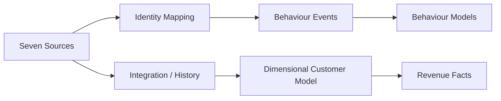

#### Why This Works
The architecture should expose assumptions rather than invent missing business definitions.

#### Strong Interview Answer
> A strong answer begins with clarifying questions and only then compares integration patterns.

#### Common Weak Answer
> A weak answer says: “Seven sources means Data Vault.”

#### What the Interviewer Is Evaluating
The interviewer is testing ambiguity handling and architecture decomposition.

#### Senior-Level Insight
Senior candidates identify which choices are expensive to change later, especially identity and history semantics.

#### Whiteboard / Mermaid
Draw this relationship on a whiteboard or paper during the interview.


### Self-Check
- Can I start by clarifying the business problem?
- Can I state the grain precisely?
- Can I explain the main correctness risk or trade-off?
- Can I describe at least one validation step?

---

## Question 32 — Is Data Vault Justified Here?

### Difficulty
Advanced

### Primary Topics
- Topic 06 — Data Vault

### Secondary Topics
- Topic 02 — Dimensional Modelling
- Topic 01 — Normalization

### Interview Context
A mid-sized company has two stable sources, a small team, limited historical requirements, and three BI marts. Leadership wants Data Vault because a consultant recommended it.

### Problem
Would you adopt it automatically?

### Candidate Task
Evaluate Data Vault against normalized integration and direct staging-to-dimensional alternatives.

---

### Solution

#### Step 1 — Clarify the Requirements
Ask about source volatility, auditability, history, parallel loads, downstream reuse, and growth.

#### Step 2 — Identify the Business Process
Focus on integration rather than only BI tables.

#### Step 3 — Declare the Grain
State integrated entity and downstream fact/dimension grains.

#### Step 4 — Design the Model / Reasoning
Compare direct staging-to-dimensional, normalized integration, and Raw/Business Vault patterns.

#### Step 5 — Keys / History / Relationships
Compare source-specific history, identities, and audit needs.

#### Step 6 — Physical / Operational Considerations
Account for table count, query complexity, PIT/bridge maintenance, tooling, and team cost.

#### Step 7 — Validation
Define acceptance criteria around reconciliation, history, onboarding effort, and downstream usability.

#### SQL / Implementation
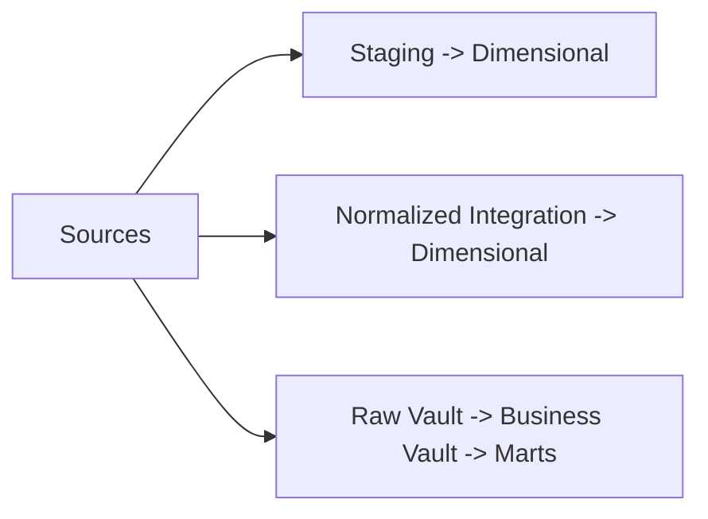

#### Why This Works
Data Vault is an option whose value depends on source complexity, history, audit, reuse, and operational cost.

#### Strong Interview Answer
> A strong answer compares the value of traceability and parallel source loading against added complexity.

#### Common Weak Answer
> A weak answer says: “Data Vault is the enterprise standard.”

#### What the Interviewer Is Evaluating
The interviewer is evaluating architecture judgement.

#### Senior-Level Insight
Senior candidates define the evidence that would justify or reject the extra layer.

#### Whiteboard / Mermaid
Draw this relationship on a whiteboard or paper during the interview.


### Self-Check
- Can I start by clarifying the business problem?
- Can I state the grain precisely?
- Can I explain the main correctness risk or trade-off?
- Can I describe at least one validation step?

---

## Question 33 — A Five-Billion-Row Event Platform

### Difficulty
Advanced

### Primary Topics
- Topic 08 — Event/Clickstream

### Secondary Topics
- Topic 07 — OBT/Wide Models
- Topic 04 — Grain/Keys

### Interview Context
A company stores billions of events. Events can arrive hours late, anonymous users become known after login, and BI needs DAU, retention, funnels, and attribution.

### Problem
Design the end-to-end event and behavioural modelling approach.

### Candidate Task
Discuss envelope, time semantics, deduplication, identity, sessions, physical layout, retention, and validation.

---

### Solution

#### Step 1 — Clarify the Requirements
Ask freshness, retention, timezone, identity policy, funnel/attribution windows, and audit needs.

#### Step 2 — Identify the Business Process
Raw events record occurrences; behavioural models interpret them.

#### Step 3 — Declare the Grain
Event, identity relationship, session, and user-day grains must be explicit.

#### Step 4 — Design the Model / Reasoning
Standardize the envelope, deduplicate by event ID, preserve both timestamps, resolve identity, and derive sessions/retention/funnels.

#### Step 5 — Keys / History / Relationships
Preserve anonymous and known identities and make re-attribution policy explicit.

#### Step 6 — Physical / Operational Considerations
Use workload-driven partitioning/clustering and define lateness/reprocessing.

#### Step 7 — Validation
Monitor duplicates, lag, invalid fields, identity conflicts, session anomalies, and metric reconciliation.

#### SQL / Implementation
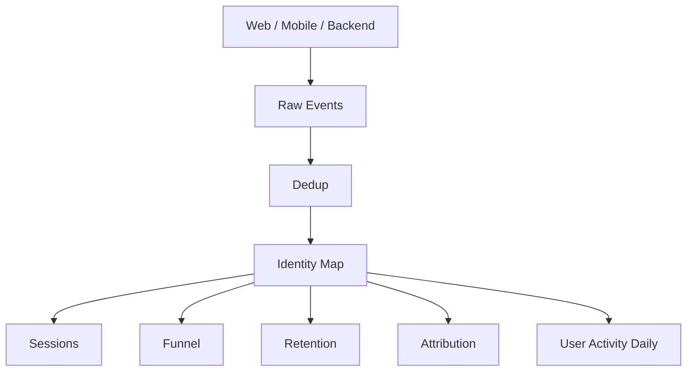

#### Validation
```sql
SELECT DATE(event_timestamp) AS event_date,
       COUNT(*) AS events,
       COUNT(DISTINCT event_id) AS unique_events
FROM fct_events
GROUP BY 1
ORDER BY 1;
```

#### Why This Works
Scale increases the cost of repeated scans and late-data reprocessing, but semantics and correctness still come first.

#### Strong Interview Answer
> A strong answer goes from event semantics to derived models to physical design instead of starting with a streaming product.

#### Common Weak Answer
> A weak answer is: “Use a distributed engine because there are billions of rows.”

#### What the Interviewer Is Evaluating
The interviewer is testing end-to-end event-platform reasoning.

#### Senior-Level Insight
Senior candidates explain materialization boundaries and how late data affects historical derivations.

#### Whiteboard / Mermaid
Draw this relationship on a whiteboard or paper during the interview.


### Self-Check
- Can I start by clarifying the business problem?
- Can I state the grain precisely?
- Can I explain the main correctness risk or trade-off?
- Can I describe at least one validation step?

---

## Question 34 — One Anonymous Device, Two Accounts

### Difficulty
Advanced

### Primary Topics
- Topic 04 — Grain/Keys

### Secondary Topics
- Topic 05 — SCD
- Topic 08 — Event/Clickstream

### Interview Context
A shared tablet has one anonymous ID but login events alternate between two different users.

### Problem
How should the identity model behave?

### Candidate Task
Explain temporal identity mapping, ambiguity, and historical re-attribution policy.

---

### Solution

#### Step 1 — Clarify the Requirements
Ask whether analysis is person-level, device-level, or both.

#### Step 2 — Identify the Business Process
Identity observations occur over time and can be ambiguous.

#### Step 3 — Declare the Grain
An identity relationship needs an explicit temporal grain.

#### Step 4 — Design the Model / Reasoning
Preserve login evidence and temporal associations rather than assuming a permanent one-to-one mapping.

#### Step 5 — Keys / History / Relationships
Keep anonymous and authenticated IDs and validity periods where required.

#### Step 6 — Physical / Operational Considerations
Make historical re-attribution a separate, governed derivation.

#### Step 7 — Validation
Flag simultaneous conflicting mappings and inspect transition chronology.

#### SQL / Implementation
```sql
SELECT anonymous_id, COUNT(DISTINCT user_id) AS users
FROM identity_map
GROUP BY anonymous_id
HAVING COUNT(DISTINCT user_id) > 1;
```

#### Why This Works
Shared-device behaviour demonstrates why identity is not safely modelled as permanent string equality.

#### Strong Interview Answer
> A strong answer preserves raw identity observations and makes re-attribution policy explicit.

#### Common Weak Answer
> A weak answer says: “The latest login owns the whole device history.”

#### What the Interviewer Is Evaluating
The interviewer is testing identity modelling and historical reasoning.

#### Senior-Level Insight
Senior candidates recognize that device/session identity can be the appropriate analytical grain for some questions.

#### Whiteboard / Mermaid
Draw this relationship on a whiteboard or paper during the interview.

```mermaid
flowchart LR
    E[Event] --> I[Identity / Time]
    I --> B[Behavioural Model]
    B --> A[Analytics / ML]
```

### Self-Check
- Can I start by clarifying the business problem?
- Can I state the grain precisely?
- Can I explain the main correctness risk or trade-off?
- Can I describe at least one validation step?

---

## Question 35 — A 100× Growth Review: What Changes?

### Difficulty
Advanced

### Primary Topics
- Topic 03 — Star/Snowflake

### Secondary Topics
- Topic 07 — OBT/Wide Models
- Topic 08 — Event/Clickstream
- Topic 06 — Data Vault

### Interview Context
A warehouse expects a jump from tens of millions of rows to billions.

### Problem
Leadership asks whether the current architecture can simply scale 100×.

### Candidate Task
Explain how you would review logical correctness, physical design, workload performance, refresh cost, and operational constraints.

---

### Solution

#### Step 1 — Clarify the Requirements
Ask SLA, concurrency, freshness, retention, workload mix, and growth distribution.

#### Step 2 — Identify the Business Process
Identify which facts, events, and derived tables drive growth.

#### Step 3 — Declare the Grain
Verify grains remain stable and aggregations remain semantically valid.

#### Step 4 — Design the Model / Reasoning
Revisit join multiplication, OBT refresh scope, event scanning, aggregation layers, and identity/history surfaces.

#### Step 5 — Keys / History / Relationships
Ensure key strategy remains stable while mapping/history scale is considered.

#### Step 6 — Physical / Operational Considerations
Benchmark representative workloads with controlled cache, format, memory, and file layout.

#### Step 7 — Validation
Reconcile outputs while testing performance; never trade away correctness checks.

#### SQL / Implementation
```sql
SELECT category_name, SUM(net_amount) AS revenue
FROM obt_order_lines
WHERE order_date BETWEEN DATE '2026-01-01' AND DATE '2026-03-31'
GROUP BY category_name;
```

#### Why This Works
Scale changes operational and performance characteristics; row count alone does not determine architecture.

#### Strong Interview Answer
> A strong answer asks for measurements at representative scale rather than assuming a new technology is required.

#### Common Weak Answer
> A weak answer says: “Move everything to a distributed system.”

#### What the Interviewer Is Evaluating
The interviewer is testing performance engineering and architecture maturity.

#### Senior-Level Insight
Senior candidates identify what is expected to scale linearly and what requires a different model or physical strategy.

### Self-Check
- Can I start by clarifying the business problem?
- Can I state the grain precisely?
- Can I explain the main correctness risk or trade-off?
- Can I describe at least one validation step?

---

## Question 36 — When the BI Team Wants Hundreds of Columns

### Difficulty
Advanced

### Primary Topics
- Topic 07 — OBT/Wide Models

### Secondary Topics
- Topic 02 — Dimensional Modelling

### Interview Context
The BI team requests a 600-column OBT containing every available customer, product, store, and order attribute.

### Problem
How would you respond in an architecture review?

### Candidate Task
Explain consumer-driven column selection, naming, width risks, and alternatives.

---

### Solution

#### Step 1 — Clarify the Requirements
Ask which dashboards, filters, groupings, and models actually use the attributes.

#### Step 2 — Identify the Business Process
Assume order-line analytics but recognize multiple consumer needs.

#### Step 3 — Declare the Grain
State the OBT row meaning before column selection.

#### Step 4 — Design the Model / Reasoning
Select columns based on real consumer workload and use explicit prefixes.

#### Step 5 — Keys / History / Relationships
Expose only useful identifiers and document current/historical semantics.

#### Step 6 — Physical / Operational Considerations
Consider scan cost, refresh cost, governance, and smaller purpose-built models or semantic-layer options.

#### Step 7 — Validation
Measure usage and maintenance before and after redesign.

#### SQL / Implementation
```sql
SELECT customer_segment, product_category, store_region,
       SUM(net_amount) AS revenue
FROM obt_order_lines
GROUP BY 1,2,3;
```

#### Why This Works
Columnar storage can make selective wide scans practical, but unnecessary width still creates maintenance and governance cost.

#### Strong Interview Answer
> A strong answer treats the BI request as a usability signal, not as a complete architecture decision.

#### Common Weak Answer
> A weak answer is: “Put everything in because Parquet is columnar.”

#### What the Interviewer Is Evaluating
The interviewer is testing workload-based OBT design.

#### Senior-Level Insight
Senior candidates ask where business definitions live and which columns have measurable consumer value.

### Self-Check
- Can I start by clarifying the business problem?
- Can I state the grain precisely?
- Can I explain the main correctness risk or trade-off?
- Can I describe at least one validation step?

---

## Question 37 — Mobile Offline Events Change Your Time Model

### Difficulty
Advanced

### Primary Topics
- Topic 08 — Event/Clickstream

### Secondary Topics
- Topic 02 — Dimensional Modelling
- Topic 07 — OBT/Wide Models

### Interview Context
A mobile app may be offline for six hours. Events arrive later with their original event timestamps. Daily activity, sessions, and funnels are materialized.

### Problem
How would you handle late events without making historical data impossible to maintain?

### Candidate Task
Design the timestamp model and a bounded recomputation strategy.

---

### Solution

#### Step 1 — Clarify the Requirements
Ask freshness tolerance, lateness distribution, and how much historical change consumers accept.

#### Step 2 — Identify the Business Process
Behaviour occurred before ingestion.

#### Step 3 — Declare the Grain
Event, session, and user-day grains remain distinct.

#### Step 4 — Design the Model / Reasoning
Preserve event and received timestamps; derive business metrics from event time.

#### Step 5 — Keys / History / Relationships
Deduplicate before behavioural models and apply identity policy.

#### Step 6 — Physical / Operational Considerations
Recompute recent windows where late data can affect results, with explicit exceptions for older backfills.

#### Step 7 — Validation
Monitor lateness and reconcile before/after recomputation.

#### SQL / Implementation
```sql
SELECT DATE(received_at) AS received_date,
       DATE(event_timestamp) AS event_date,
       COUNT(*) AS events
FROM fct_events
WHERE received_at > event_timestamp
GROUP BY 1,2;
```

#### Why This Works
Late event handling is a business and operational policy, not just a timestamp transformation.

#### Strong Interview Answer
> A strong answer defines a recomputation window based on observed lateness and business tolerance.

#### Common Weak Answer
> A weak answer says: “Use received time for everything.”

#### What the Interviewer Is Evaluating
The interviewer is testing event-time architecture.

#### Senior-Level Insight
Senior candidates define what can be corrected automatically versus what requires a deliberate backfill.

### Self-Check
- Can I start by clarifying the business problem?
- Can I state the grain precisely?
- Can I explain the main correctness risk or trade-off?
- Can I describe at least one validation step?

---

## Question 38 — Semantic Layer or More Wide Tables?

### Difficulty
Advanced

### Primary Topics
- Topic 07 — OBT/Wide Models

### Secondary Topics
- Topic 02 — Dimensional Modelling
- Topic 03 — Star/Snowflake

### Interview Context
An analytics organization has 25 hand-built wide tables with slightly different definitions of active customers.

### Problem
Should it create more OBTs or centralize semantics?

### Candidate Task
Evaluate how a metric/semantic layer could complement purpose-built wide models.

---

### Solution

#### Step 1 — Clarify the Requirements
Determine which differences are metric-definition problems versus query-usability problems.

#### Step 2 — Identify the Business Process
Multiple consumers reuse the same business measures.

#### Step 3 — Declare the Grain
Keep atomic fact grains explicit while derived models have purpose-specific grains.

#### Step 4 — Design the Model / Reasoning
Centralize shared metric definitions where useful; retain physical models when they solve a concrete workload.

#### Step 5 — Keys / History / Relationships
Ensure shared metrics use consistent dimensions and history semantics.

#### Step 6 — Physical / Operational Considerations
Compare storage, freshness, query composition, governance, and maintenance.

#### Step 7 — Validation
Detect metric drift and reconcile shared measures.

#### Why This Works
A semantic layer and OBTs address different problems and can coexist.

#### Strong Interview Answer
> A strong answer focuses on duplicated definitions and governance rather than simply counting tables.

#### Common Weak Answer
> A weak answer says: “A semantic layer makes OBTs obsolete.”

#### What the Interviewer Is Evaluating
The interviewer is testing architecture composition.

#### Senior-Level Insight
Senior candidates ask where definitions live, how lineage works, and which workloads still need materialization.

### Self-Check
- Can I start by clarifying the business problem?
- Can I state the grain precisely?
- Can I explain the main correctness risk or trade-off?
- Can I describe at least one validation step?

---

## Question 39 — Raw Events, Transactional Truth, and Revenue

### Difficulty
Advanced

### Primary Topics
- Topic 02 — Dimensional Modelling

### Secondary Topics
- Topic 06 — Data Vault
- Topic 08 — Event/Clickstream
- Topic 07 — OBT/Wide Models

### Interview Context
Clickstream contains 10,250 `order_completed` events while the transactional orders system contains 10,000 completed orders.

### Problem
The business asks for one revenue number.

### Candidate Task
Design a reconciliation approach before declaring a source of truth.

---

### Solution

#### Step 1 — Clarify the Requirements
Clarify what “completed” and “revenue” mean in each system.

#### Step 2 — Identify the Business Process
Transactional orders and clickstream events are related but distinct data products.

#### Step 3 — Declare the Grain
Orders and events have different grains.

#### Step 4 — Design the Model / Reasoning
Match by order ID where available, deduplicate event IDs, classify unmatched and conflicting populations, and inspect timing.

#### Step 5 — Keys / History / Relationships
Keep order identity and event identity distinct.

#### Step 6 — Physical / Operational Considerations
Preserve raw events for audit/debugging and define source-of-truth rules for financial metrics.

#### Step 7 — Validation
Reconcile matched orders, unmatched events, duplicates, late events, and revenue totals.

#### SQL / Implementation
```sql
SELECT COUNT(*) AS event_rows,
       COUNT(DISTINCT event_id) AS unique_events,
       COUNT(DISTINCT o.order_id) AS matched_orders
FROM fct_order_completed_events e
LEFT JOIN orders o USING (order_id);
```

#### Validation
```sql
SELECT e.order_id
FROM fct_order_completed_events e
LEFT JOIN orders o USING (order_id)
WHERE o.order_id IS NULL
GROUP BY e.order_id;
```

#### Why This Works
Event counts do not automatically define financial truth.

#### Strong Interview Answer
> A strong answer starts with reconciliation by business key and semantics rather than choosing a system by row count.

#### Common Weak Answer
> A weak answer says: “The OLTP database is always right” without checking definitions and timing.

#### What the Interviewer Is Evaluating
The interviewer is testing reconciliation discipline.

#### Senior-Level Insight
Senior candidates expect duplicates, missing events, reversals, late arrivals, and semantic differences.

### Self-Check
- Can I start by clarifying the business problem?
- Can I state the grain precisely?
- Can I explain the main correctness risk or trade-off?
- Can I describe at least one validation step?

---

## Question 40 — End-to-End Marketplace Architecture Review

### Difficulty
Advanced

### Primary Topics
- Topic 01 — Normalization

### Secondary Topics
- Topic 02 — Dimensional Modelling
- Topic 03 — Star/Snowflake
- Topic 04 — Grain/Keys
- Topic 05 — SCD
- Topic 06 — Data Vault
- Topic 07 — OBT/Wide Models
- Topic 08 — Event/Clickstream

### Interview Context
A two-sided online marketplace has buyers, sellers, an OLTP orders database, CRM, web/app events, overlapping IDs, changing attributes, duplicate and late events, BI dashboards, retention/funnel reporting, and churn-modelling needs.

### Problem
Leadership wants trustworthy revenue and seller performance; Data Science wants point-in-time-correct buyer churn features. Requirements are intentionally incomplete.

### Candidate Task
Conduct a complete architecture review: clarify unknowns, identify processes and grains, design keys and SCD policy, evaluate Data Vault, dimensional marts, OBTs, event/identity models, behavioural metrics, validation, reconciliation, privacy, scale, and operational trade-offs.

---

### Solution

#### Step 1 — Clarify the Requirements
Ask which systems are authoritative for revenue and identity, freshness, history, privacy, retention, deletion, workload, scale, and ownership.

#### Step 2 — Identify the Business Process
Separate order lifecycle, seller performance, buyer lifecycle, clickstream behaviour, and churn features.

#### Step 3 — Declare the Grain
Examples: order/order-line fact, seller-day summary, raw event, session, cohort period, and buyer-day feature.

#### Step 4 — Design the Model / Reasoning
Normalize operational entities upstream, build dimensional marts around stable grains, derive OBTs where repeated joins justify them, and keep behavioural derivations separate from raw events.

#### Step 5 — Keys / History / Relationships
Use source-qualified IDs, durable enterprise identities where justified, Type 2 version keys, and explicit identity mapping.

#### Step 6 — Physical / Operational Considerations
Choose schema shape, partitions, clustering, OBT storage, event retention, and incremental refresh from measured workload. Evaluate Data Vault based on actual source/history/audit requirements.

#### Step 7 — Validation
Define grain uniqueness, RI, SCD interval tests, identity conflicts, event deduplication, session/funnel/retention checks, OBT-to-star reconciliation, source-to-mart revenue reconciliation, and point-in-time leakage tests.

#### SQL / Implementation
```mermaid
flowchart TB
    SRC[OLTP + CRM + Web/App Events]
    SRC --> INT[Integration / History if justified]
    INT --> DIM[Dimensional Marts]
    SRC --> EVT[Raw Event Model]
    EVT --> BEH[Sessions / Funnels / Retention / Attribution]
    DIM --> OBT[Purposeful OBTs]
    BEH --> ACT[Daily Behaviour Models]
    DIM --> FEAT[Point-in-Time ML Features]
    OBT --> BI[BI]
    ACT --> BI
    FEAT --> ML[ML / AI]
```

#### Validation
```sql
SELECT order_id, order_line_id, COUNT(*) AS row_count
FROM fct_order_lines
GROUP BY 1,2
HAVING COUNT(*) > 1;

SELECT event_id, COUNT(*) AS row_count
FROM fct_events
GROUP BY 1
HAVING COUNT(*) > 1;
```

#### Why This Works
A senior architecture answer is a sequence of explicit decisions from requirements through validation.

#### Strong Interview Answer
> A strong answer does not jump to a technology; it explains why each layer exists, what semantics it owns, what it costs, and what evidence would change the decision.

#### Common Weak Answer
> A weak answer is a technology shopping list with no grain, identity, source-of-truth, or validation reasoning.

#### What the Interviewer Is Evaluating
The interviewer is evaluating end-to-end modelling maturity, communication, and architecture judgement.

#### Senior-Level Insight
Senior insight: the strongest design is not the most elaborate; it is the design whose correctness, consumer value, and operational cost are justified.

#### Whiteboard / Mermaid
Draw this relationship on a whiteboard or paper during the interview.

```mermaid
flowchart LR
    E[Event] --> I[Identity / Time]
    I --> B[Behavioural Model]
    B --> A[Analytics / ML]
```

### Self-Check
- Can I start by clarifying the business problem?
- Can I state the grain precisely?
- Can I explain the main correctness risk or trade-off?
- Can I describe at least one validation step?

---

# Interview Answer Frameworks

## Framework 1 — Start With the Business Process

```text
What does the business do?
What question must the system answer?
What is the event/state being measured?
```

## Framework 2 — Declare Grain

Say:

> “Before choosing the columns or joins, I want to define exactly what one row represents.”

Then write the grain in one sentence.

## Framework 3 — Select Facts and Dimensions

```text
Who?
What?
Where?
When?
How?
What measurements exist at this grain?
```

## Framework 4 — Historical Change

```text
Does history matter?
Which attributes need history?
Which SCD semantics fit each attribute?
How do facts resolve to history?
```

For Type 2 reasoning:

```text
valid_from <= fact_timestamp < valid_to
```

## Framework 5 — Multi-Source Identity

```text
What identifies the entity in each source?
Can IDs collide?
Can IDs be reused?
Do source formats differ?
Is a durable identity required?
Do we need a mapping layer?
```

## Framework 6 — Data Vault Decision

```text
How many sources?
How volatile are they?
How much history/auditability?
How independently must sources load?
How many downstream models reuse the integration layer?
Is the added complexity justified?
```

## Framework 7 — OBT Decision

```text
Who consumes it?
Which joins repeat?
What is the grain?
Which columns are actually used?
How often do dimensions change?
What does refresh cost?
Is the semantic view as-was or as-is?
```

## Framework 8 — Event Model

```text
What happened?
What identifies the event?
When did it happen?
When did we receive it?
How are duplicates handled?
How is identity resolved?
How are sessions/funnels/retention defined?
```

## Framework 9 — Debugging a Metric

```text
Metric mismatch
    ↓
Definition mismatch?
    ↓
Grain mismatch?
    ↓
Join multiplication?
    ↓
Duplicate data?
    ↓
Filtering / identity issue?
    ↓
Late / historical data?
    ↓
Source reconciliation?
```

## Framework 10 — Architecture Trade-Off

```text
Requirements
    ↓
Assumptions
    ↓
Candidate designs
    ↓
Correctness risks
    ↓
Operational cost
    ↓
Physical behaviour
    ↓
Consumer usability
    ↓
Validation plan
    ↓
Decision criteria
```

# Strong Interview Answer Structure

```text
1. Clarify the requirement.
2. State assumptions.
3. Identify business processes.
4. Declare grain.
5. Design the logical model.
6. Choose key strategy.
7. Handle history and edge cases.
8. Discuss physical design.
9. Define validation and reconciliation.
10. Compare alternatives.
11. Explain operational ownership.
12. State trade-offs.
```

The **Strong Interview Answer** sections are examples of reasoning style, not scripts to memorize word-for-word.


---

# Coverage Matrix

| Question | Difficulty | Primary Topic | Secondary Topics | SQL? | Diagram? | Debugging? | Architecture? | Trade-off? |
|---|---|---|---|---|---|---|---|---|
| 1 | Basic | Topic 01 — Normalization | Topic 02 — Dimensional Modelling | No | No | No | No | Yes |
| 2 | Basic | Topic 02 — Dimensional Modelling | Topic 04 — Grain/Keys; Topic 07 — OBT/Wide Models | Yes | Yes | No | No | No |
| 3 | Basic | Topic 02 — Dimensional Modelling | — | No | No | No | No | Yes |
| 4 | Basic | Topic 02 — Dimensional Modelling | Topic 03 — Star/Snowflake | Yes | No | No | No | No |
| 5 | Basic | Topic 04 — Grain/Keys | — | No | Yes | No | No | Yes |
| 6 | Basic | Topic 05 — SCD | — | No | Yes | No | No | Yes |
| 7 | Basic | Topic 06 — Data Vault | — | Yes | Yes | No | Yes | No |
| 8 | Basic | Topic 07 — OBT/Wide Models | Topic 03 — Star/Snowflake | No | No | No | No | No |
| 9 | Basic | Topic 08 — Event/Clickstream | — | No | No | No | No | No |
| 10 | Basic | Topic 08 — Event/Clickstream | — | No | No | No | No | No |
| 11 | Moderate | Topic 01 — Normalization | Topic 02 — Dimensional Modelling | Yes | Yes | No | Yes | Yes |
| 12 | Moderate | Topic 02 — Dimensional Modelling | Topic 03 — Star/Snowflake | Yes | Yes | No | Yes | No |
| 13 | Moderate | Topic 03 — Star/Snowflake | Topic 02 — Dimensional Modelling | Yes | No | No | No | Yes |
| 14 | Moderate | Topic 02 — Dimensional Modelling | Topic 04 — Grain/Keys; Topic 05 — SCD | Yes | No | Yes | No | No |
| 15 | Moderate | Topic 05 — SCD | Topic 02 — Dimensional Modelling | No | Yes | No | No | Yes |
| 16 | Moderate | Topic 08 — Event/Clickstream | Topic 04 — Grain/Keys | No | No | No | No | No |
| 17 | Moderate | Topic 08 — Event/Clickstream | — | Yes | No | No | No | No |
| 18 | Moderate | Topic 08 — Event/Clickstream | — | Yes | No | No | No | No |
| 19 | Moderate | Topic 08 — Event/Clickstream | — | Yes | No | No | No | No |
| 20 | Moderate | Topic 08 — Event/Clickstream | — | No | No | No | No | Yes |
| 21 | Hard | Topic 02 — Dimensional Modelling | Topic 03 — Star/Snowflake; Topic 04 — Grain/Keys | Yes | No | No | Yes | Yes |
| 22 | Hard | Topic 04 — Grain/Keys | Topic 05 — SCD | Yes | No | No | No | No |
| 23 | Hard | Topic 03 — Star/Snowflake | — | Yes | No | No | No | Yes |
| 24 | Hard | Topic 04 — Grain/Keys | Topic 06 — Data Vault | Yes | No | No | Yes | No |
| 25 | Hard | Topic 05 — SCD | Topic 04 — Grain/Keys | Yes | No | Yes | No | Yes |
| 26 | Hard | Topic 06 — Data Vault | Topic 04 — Grain/Keys | Yes | No | Yes | Yes | No |
| 27 | Hard | Topic 07 — OBT/Wide Models | Topic 05 — SCD | Yes | Yes | No | Yes | Yes |
| 28 | Hard | Topic 07 — OBT/Wide Models | Topic 08 — Event/Clickstream | Yes | No | Yes | No | No |
| 29 | Hard | Topic 02 — Dimensional Modelling | Topic 04 — Grain/Keys | Yes | Yes | No | Yes | Yes |
| 30 | Hard | Topic 08 — Event/Clickstream | Topic 04 — Grain/Keys | Yes | Yes | Yes | No | No |
| 31 | Advanced | Topic 01 — Normalization | Topic 04 — Grain/Keys; Topic 05 — SCD; Topic 06 — Data Vault; Topic 02 — Dimensional Modelling | Yes | Yes | No | Yes | Yes |
| 32 | Advanced | Topic 06 — Data Vault | Topic 02 — Dimensional Modelling; Topic 01 — Normalization | Yes | Yes | No | Yes | Yes |
| 33 | Advanced | Topic 08 — Event/Clickstream | Topic 07 — OBT/Wide Models; Topic 04 — Grain/Keys | Yes | Yes | No | Yes | No |
| 34 | Advanced | Topic 04 — Grain/Keys | Topic 05 — SCD; Topic 08 — Event/Clickstream | Yes | Yes | No | Yes | No |
| 35 | Advanced | Topic 03 — Star/Snowflake | Topic 07 — OBT/Wide Models; Topic 08 — Event/Clickstream; Topic 06 — Data Vault | Yes | No | Yes | Yes | Yes |
| 36 | Advanced | Topic 07 — OBT/Wide Models | Topic 02 — Dimensional Modelling | Yes | No | No | No | Yes |
| 37 | Advanced | Topic 08 — Event/Clickstream | Topic 02 — Dimensional Modelling; Topic 07 — OBT/Wide Models | Yes | No | No | Yes | No |
| 38 | Advanced | Topic 07 — OBT/Wide Models | Topic 02 — Dimensional Modelling; Topic 03 — Star/Snowflake | No | No | No | No | Yes |
| 39 | Advanced | Topic 02 — Dimensional Modelling | Topic 06 — Data Vault; Topic 08 — Event/Clickstream; Topic 07 — OBT/Wide Models | Yes | No | Yes | Yes | No |
| 40 | Advanced | Topic 01 — Normalization | Topic 02 — Dimensional Modelling; Topic 03 — Star/Snowflake; Topic 04 — Grain/Keys; Topic 05 — SCD; Topic 06 — Data Vault; Topic 07 — OBT/Wide Models; Topic 08 — Event/Clickstream | Yes | Yes | Yes | Yes | Yes |

## Topic Coverage

| Module Topic | Covered? | Representative Questions |
|---|---|---|
| Topic 01 — Normalization | Yes | 1, 11, 31, 32, 40 |
| Topic 02 — Dimensional Modelling | Yes | 1, 2, 3, 4, 11, 12, 13, 14, 15, 21, 29, 31, 32, 36, 37, 38, 39, 40 |
| Topic 03 — Star/Snowflake | Yes | 4, 8, 12, 13, 21, 23, 35, 38, 40 |
| Topic 04 — Grain/Keys | Yes | 2, 5, 14, 16, 21, 22, 24, 25, 26, 29, 30, 31, 33, 34, 40 |
| Topic 05 — SCD | Yes | 6, 14, 15, 22, 25, 27, 31, 34, 40 |
| Topic 06 — Data Vault | Yes | 7, 24, 26, 31, 32, 35, 39, 40 |
| Topic 07 — OBT/Wide Models | Yes | 2, 8, 27, 28, 33, 35, 36, 37, 38, 39, 40 |
| Topic 08 — Event/Clickstream | Yes | 9, 10, 16, 17, 18, 19, 20, 28, 30, 33, 34, 35, 37, 39, 40 |

## Coverage Audit

The set intentionally mixes topics so the learner must reason across the module rather than recall isolated definitions.

- Exactly 40 interview questions.
- Exactly 10 Basic, 10 Moderate, 10 Hard, and 10 Advanced.
- SQL reasoning is included throughout, using DuckDB syntax for concrete examples.
- Diagram-oriented questions cover ER, grain/key models, dimensional models, SCD, bridge/OBT models, Data Vault, event/identity, and end-to-end architecture.
- Grain is tested across source tables, facts, SCD versions, OBTs, sessions, events, and feature tables.
- Key reasoning covers source identity, surrogate identity, durable identity, deterministic hashing, and mapping.
- SCD reasoning includes attribute-level policy, Type 2, version assignment, current/history semantics, and debugging.
- Data Vault reasoning includes hubs, satellites, integration-layer reasoning, and adoption trade-offs.
- OBT reasoning includes consumer simplicity, dimension changes, refresh scope, and wide-schema governance.
- Event reasoning includes envelope, time semantics, deduplication, sessions, identity, funnels, retention, attribution, physical design, and reconciliation.
- Debugging scenarios require hypothesis-driven investigation rather than guessing a root cause.
- Advanced architecture questions require assumptions, alternatives, validation, and operational reasoning.
- No question assumes that one modelling pattern is universally best.


# Final Interview Readiness Checklist

I can:

- [ ] clarify an ambiguous modelling requirement;
- [ ] identify business processes before choosing tables;
- [ ] declare grain precisely;
- [ ] identify facts and dimensions;
- [ ] choose transaction, snapshot, accumulating, or factless patterns;
- [ ] reason about additive, semi-additive, and non-additive measures;
- [ ] compare star and snowflake using workload and consumer evidence;
- [ ] reason about conformed dimensions, drill-across, and fact-to-fact multiplication;
- [ ] choose natural, surrogate, durable, composite, or deterministic-hash key strategies;
- [ ] design cross-source identity mapping;
- [ ] choose SCD policies per attribute;
- [ ] explain Type 2 validity intervals and fact-to-version resolution;
- [ ] handle late-arriving and back-dated changes;
- [ ] explain Raw Vault, Business Vault, hubs, links, satellites, and PIT concepts;
- [ ] evaluate whether Data Vault complexity is justified;
- [ ] design consumer-driven OBTs;
- [ ] reason about OBT dimension-change blast radius and incremental refresh;
- [ ] explain point-in-time correctness for ML features;
- [ ] diagnose feature leakage;
- [ ] design event envelopes and tracking plans;
- [ ] distinguish event time from received time;
- [ ] explain deduplication, sessions, identity stitching, funnels, retention, activation, and attribution;
- [ ] reason about bot/internal/test traffic;
- [ ] discuss event-table partitioning, clustering, retention, and old-data aggregation;
- [ ] discuss PII, consent, and deletion requirements;
- [ ] reconcile event-based metrics with transactional systems;
- [ ] debug metric discrepancies systematically;
- [ ] state assumptions and alternatives;
- [ ] defend a modelling architecture clearly.

## Final Interview Habit

When asked, “What would you build?”, do not answer with a pattern name first.

Use:

```text
Requirements
    ↓
Business Process
    ↓
Grain
    ↓
Facts / Dimensions / Identities
    ↓
History + Edge Cases
    ↓
Physical Design
    ↓
Validation + Reconciliation
    ↓
Alternatives + Trade-Offs
    ↓
Operational Ownership
```

The objective is to demonstrate reasoning from business semantics to a correct, maintainable production data model.
