# Practice Questions — Data Modelling for Analytics

## How to Use This Practice Set

This practice set consolidates the eight topics in Module 2.8. Stop at the **Problem** and **Your Task** sections before reading each solution. The questions progress from foundational application to senior architecture reasoning.

The rules used throughout are deliberate:

- **Basic (1–10):** foundations, small examples, simple SQL/model reasoning.
- **Moderate (11–20):** combine several concepts in practical warehouse problems.
- **Hard (21–30):** production diagnosis, historical corrections, physical design, and cross-topic reasoning.
- **Advanced (31–40):** architecture-review problems with explicit assumptions, operational constraints, and trade-offs.

For correctness tests, a failing condition should normally return rows; a correct assertion should normally return zero rows. Performance benchmarks are observations, not correctness assertions. No question assumes a universal “best” modelling pattern.

---

# Part I — Basic

## Question 1 — Repeating Items in an Order Record

### Difficulty
Basic

### Topics Covered
- Topic 01: Normalization and Denormalization
- Topic 04: Grain and Keys

### Problem
A food-delivery OLTP table contains `order_id`, customer and restaurant attributes, `item_1_name`, `item_1_qty`, `item_2_name`, `item_2_qty`, and `order_total`. Orders may contain any number of items. Changing one customer attribute sometimes requires several edits.

### Your Task
Design the normalized logical model. Identify entities, relationships, candidate keys, and the associative table for order items. State the grain of each table and draw an ER diagram.

### Self-Check
- [ ] Did I remove the repeating group?
- [ ] Did I state the grain of every table?
- [ ] Did I identify at least two anomalies?

---

### Solution

### Step 1 — Understand the Problem
`item_1`, `item_2`, and similar columns represent a repeating group. The record is trying to store a variable-length relationship inside fixed columns.

### Step 2 — Identify the Modelling Issue
Customer and restaurant attributes depend on their own entities, while each item is a separate occurrence. The original structure permits update, insert, and delete anomalies.

### Step 3 — Design / Reasoning
A suitable logical design is:

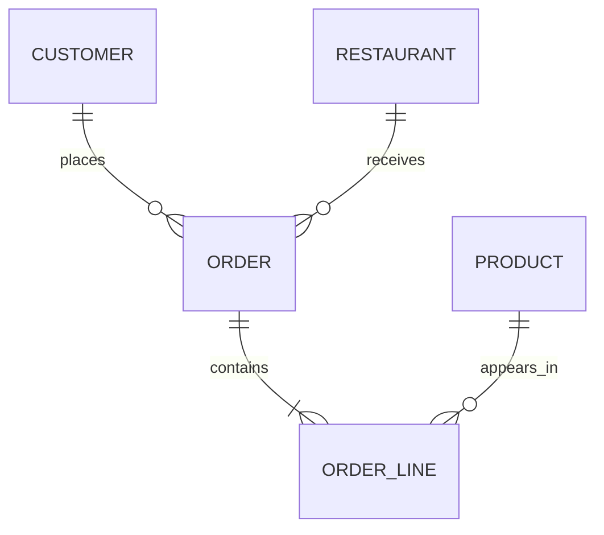

Suggested grains:

```text
customer   = one row per customer
restaurant = one row per restaurant
order      = one row per order
order_line = one row per order line
product    = one row per product
```

`(order_id, line_number)` can be a composite key if it is guaranteed unique.

### Step 4 — Practical Implementation
The normalized relations can be expressed as:

```text
customer(customer_id, customer_name)
restaurant(restaurant_id, restaurant_name)
product(product_id, product_name)
order(order_id, customer_id, restaurant_id, order_date)
order_line(order_id, line_number, product_id, quantity)
```

### Step 5 — Validate the Result
Check that each relation has one coherent grain and that `(order_id, line_number)` is unique in `order_line`.

### Why This Works
The design stores variable-length order items as rows instead of numbered columns and gives each determinant a clear owner.

### Common Mistake
Replacing `item_1`, `item_2` with `product_1`, `product_2` while keeping the same repeating-group pattern.

### Production Insight
Normalize operational structures when it improves integrity; analytical layers can later denormalize deliberately for consumer workloads.

## Question 2 — Find the Functional Dependency Behind an Update Anomaly

### Difficulty
Basic

### Topics Covered
- Topic 01: Functional Dependencies
- Topic 01: 1NF/2NF/3NF

### Problem
A banking staging table contains `account_id`, `branch_id`, `branch_name`, `branch_city`, and `account_type`. Multiple accounts can use one branch. One analyst updates a branch name and another row still has the old name.

### Your Task
State the key functional dependency, identify the anomaly, and decompose the data into relations that remove the repeated branch attributes. Include a referential-integrity test.

### Self-Check
- [ ] Did I identify the determinant?
- [ ] Did I separate branch attributes from account attributes?
- [ ] Did I include a key and FK relationship?

---

### Solution

### Step 1 — Understand the Problem
`branch_id` identifies a branch; `account_id` identifies an account.

### Step 2 — Identify the Modelling Issue
The relevant dependency is:

```text
branch_id -> branch_name, branch_city
```

The branch attributes do not depend on the account.

### Step 3 — Design / Reasoning
Use:

```text
branch(branch_id, branch_name, branch_city)
account(account_id, branch_id, account_type)
```

### Step 4 — Practical Implementation
```sql
SELECT branch_id
FROM branch
GROUP BY branch_id
HAVING COUNT(*) > 1;
```

This should normally return zero rows.

### Step 5 — Validate the Result
Also verify every `account.branch_id` exists in `branch.branch_id`.

### Why This Works
The determinant now owns the attributes it functionally determines, removing repeated updates.

### Common Mistake
Treating duplicate values as the whole problem without identifying the functional dependency that explains them.

### Production Insight
Functional dependencies are useful when reverse-engineering unfamiliar operational schemas and locating the correct owner of an attribute.

## Question 3 — Select the Correct Fact Grain

### Difficulty
Basic

### Topics Covered
- Topic 02: Dimensional Modelling
- Topic 04: Grain

### Problem
A subscription business needs invoice revenue and end-of-day active-subscription counts. A developer proposes a single fact table containing invoice rows and daily status rows.

### Your Task
Choose a fact type and grain for each business process. Classify the main measures as additive, semi-additive, or otherwise, and explain why one mixed-grain table is unsafe.

### Self-Check
- [ ] Did I name the business process?
- [ ] Did I write a precise grain sentence for each fact?
- [ ] Did I recognize the time-additivity issue?

---

### Solution

### Step 1 — Understand the Problem
Invoices are transaction events. Daily subscription status is naturally a periodic snapshot.

### Step 2 — Identify the Modelling Issue
The row meanings differ, so one fact cannot preserve both grains safely.

### Step 3 — Design / Reasoning
Use:

```text
fct_invoice
  grain: one row per invoice

fct_subscription_daily
  grain: one row per subscription per day
```

Invoice amount is additive across invoices. A daily active-state measure can be semi-additive across time depending on the exact metric.

### Step 4 — Practical Implementation
Document the grain before adding dimensions and measures. Shared dimensions such as date or customer can remain conformed across both facts.

### Step 5 — Validate the Result
Ask whether one row can simultaneously mean “one invoice” and “one subscription on one day.” It cannot.

### Why This Works
Business process and grain determine the fact structure.

### Common Mistake
Combining metrics because they appear together on a dashboard.

### Production Insight
A bus matrix can coordinate multiple facts without forcing them into a single grain.

## Question 4 — Draw Star and Snowflake Shapes

### Difficulty
Basic

### Topics Covered
- Topic 03: Star and Snowflake Schemas

### Problem
A retail warehouse stores `fct_sales → dim_product → dim_subcategory → dim_category`. Another implementation flattens category attributes into `dim_product`. Both must answer revenue by category and month.

### Your Task
Draw both schemas, compare the query relationships, and explain what changes for BI users and the analytical engine.

### Self-Check
- [ ] Did I show the normalized hierarchy?
- [ ] Did I identify the extra relationship in the snowflake?
- [ ] Did I avoid assuming one shape is always faster?

---

### Solution

### Step 1 — Understand the Problem
The business question is identical; the dimension representation differs.

### Step 2 — Identify the Modelling Issue
The snowflake normalizes hierarchy levels into separate tables. The star keeps more hierarchy attributes directly on the dimension.

### Step 3 — Design / Reasoning
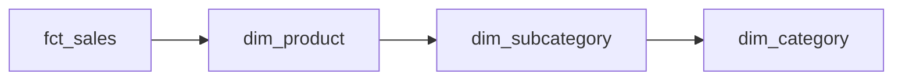

Star variant:


### Step 4 — Practical Implementation
A snowflake query may require more joins to reach category. A star query may reach the same attribute through the product dimension.

### Step 5 — Validate the Result
For a fixed date range, reconcile category totals across both representations.

### Why This Works
The shape changes where descriptive hierarchy is stored, not the underlying sales process.

### Common Mistake
Treating join count alone as proof of performance or usability.

### Production Insight
Consider BI compatibility, engine join optimization, predicate pushdown, column pruning, governance, and observed workload behaviour together.

## Question 5 — Separate Source Identity From Enterprise Identity

### Difficulty
Basic

### Topics Covered
- Topic 04: Natural/Surrogate/Durable Keys
- Topic 06: Data Vault

### Problem
CRM and Web Shop both contain `customer_id = 1007`, but they are different identifier namespaces. The team wants one enterprise customer dimension.

### Your Task
Explain why `1007` is unsafe as an enterprise key. Design a source-qualified identity and mapping-table strategy, and show how it can feed a dimensional model.

### Self-Check
- [ ] Did I preserve the source namespace?
- [ ] Did I distinguish enterprise identity from source identity?
- [ ] Did I mention mapping validation?

---

### Solution

### Step 1 — Understand the Problem
`1007` is only unique within each source system.

### Step 2 — Identify the Modelling Issue
The same value can represent two unrelated source entities, so a global natural key can cause accidental merges.

### Step 3 — Design / Reasoning
Use:

```text
(source_system, source_customer_id)
```

For example:

```text
(CRM, 1007)
(WebShop, 1007)
```

Then map to an enterprise key through:

```text
customer_key_map(source_system, source_customer_id,
                 enterprise_customer_key, valid_from, valid_to)
```

### Step 4 — Practical Implementation
A deterministic hash can be produced from a canonical source-qualified identity if required, but the identity policy comes first.

### Step 5 — Validate the Result
```sql
SELECT source_system, source_customer_id, COUNT(*)
FROM customer_key_map
GROUP BY source_system, source_customer_id
HAVING COUNT(*) > 1;
```

### Why This Works
It prevents cross-source collisions while retaining lineage.

### Common Mistake
Assuming equal identifiers imply equal real-world entities.

### Production Insight
A surrogate key does not solve entity matching; it only provides a warehouse identity after the mapping decision exists.

## Question 6 — Choose SCD Policies by Attribute

### Difficulty
Basic

### Topics Covered
- Topic 05: Slowly Changing Dimensions

### Problem
A customer dimension contains `signup_date`, `email`, `customer_segment`, `region`, and `preferred_language`. Requirements: signup date stays original; email corrections replace the current value; segment and region need historical reporting; preferred language does not need history yet.

### Your Task
Assign an SCD policy to every attribute and show the core Type 2 columns for the historical attributes.

### Self-Check
- [ ] Did I choose policy per attribute?
- [ ] Did I identify Type 0, Type 1, and Type 2 uses?
- [ ] Did I include interval semantics?

---

### Solution

### Step 1 — Understand the Problem
The attributes have different historical requirements.

### Step 2 — Identify the Modelling Issue
A single table-level SCD type would be unnecessarily restrictive.

### Step 3 — Design / Reasoning
| Attribute | Policy |
|---|---|
| signup_date | Type 0 |
| email | Type 1 |
| customer_segment | Type 2 |
| region | Type 2 |
| preferred_language | Type 1 |

Type 2 rows can use `valid_from`, `valid_to`, `is_current`, plus a warehouse identity/version.

### Step 4 — Practical Implementation
Use half-open intervals:

```text
valid_from <= t < valid_to
```

### Step 5 — Validate the Result
Test one current row per customer, no overlapping intervals, and valid point-in-time lookups.

### Why This Works
SCD policy follows business semantics, not table names.

### Common Mistake
Making everything Type 2 simply because history sounds useful.

### Production Insight
Attribute-level policy becomes especially important as dimensions grow and different columns change at different rates.

## Question 7 — A Flat Sales Dataset Request Without Changing Grain

### Difficulty
Basic

### Topics Covered
- Topic 02: Facts
- Topic 03: Star Schema
- Topic 07: OBT/Wide Models

### Problem
A sales dashboard repeatedly needs `product_category`, `customer_segment`, `store_region`, `order_date`, and `net_amount`. The source model is `fct_order_lines` plus product, customer, store, and date dimensions.

### Your Task
Define the OBT grain, choose only consumer-required columns, and write DuckDB SQL to build `obt_order_lines`.

### Self-Check
- [ ] Is the grain one row per order line?
- [ ] Did I avoid “select everything”?
- [ ] Did I preserve fact-row uniqueness?

---

### Solution

### Step 1 — Understand the Problem
The repeated joins are a consumer-usage problem, so moving them upstream can simplify consumption.

### Step 2 — Identify the Modelling Issue
The OBT must retain the original fact grain while adding selected descriptive attributes.

### Step 3 — Design / Reasoning
Grain:

> one row per order line

Selected columns can be `order_line_id`, `order_date`, `product_category`, `customer_segment`, `store_region`, `quantity`, and `net_amount`.

### Step 4 — SQL / Implementation
```sql
CREATE OR REPLACE TABLE obt_order_lines AS
SELECT
  f.order_line_id,
  d.date AS order_date,
  p.category AS product_category,
  c.segment AS customer_segment,
  s.region AS store_region,
  f.quantity,
  f.net_amount
FROM fct_order_lines f
JOIN dim_product p ON f.product_key = p.product_key
JOIN dim_customer c ON f.customer_key = c.customer_key
JOIN dim_store s ON f.store_key = s.store_key
JOIN dim_date d ON f.order_date_key = d.date_key;
```

### Step 5 — Validate the Result
```sql
SELECT order_line_id
FROM obt_order_lines
GROUP BY order_line_id
HAVING COUNT(*) > 1;
```

### Why This Works
The OBT removes repeated consumer joins while preserving a clear source-of-truth star model.

### Common Mistake
Building a wide table from every possible dimension column.

### Production Insight
OBT column selection should be driven by real consumer workloads, not by what happens to be available in the joins.

## Question 8 — Design an Event Envelope and Tracking Plan

### Difficulty
Basic

### Topics Covered
- Topic 08: Event Envelope
- Topic 08: Tracking Plans

### Problem
A mobile app emits inconsistent payloads such as `{"type":"click","uid":"u1","ts":123}`. Analytics needs governed product views, cart events, checkout, and purchase events.

### Your Task
Design a standard envelope and a small tracking plan. Explain why event identity and user identity must be separate.

### Self-Check
- [ ] Did I include `event_id`?
- [ ] Did I include both event and received timestamps?
- [ ] Did I define required properties and ownership?

---

### Solution

### Step 1 — Understand the Problem
The current format mixes semantics and lacks stable governance.

### Step 2 — Identify the Modelling Issue
A standard event record needs event identity, timing, user identity, context, and properties.

### Step 3 — Design / Reasoning
Core envelope:

```text
event_id
event_name
event_timestamp
received_at
user_id
anonymous_id
session_id
context
properties
```

Tracking-plan excerpt:

| Event | Required properties | Type | Owner |
|---|---|---|---|
| product_viewed | product_id | string | Product |
| cart_item_added | product_id, quantity | string/int | Commerce |
| checkout_started | cart_value | decimal | Checkout |
| order_completed | order_id, amount | string/decimal | Payments |

### Step 4 — Practical Implementation
`event_id` identifies the event occurrence. `user_id` identifies the actor when known. `anonymous_id` supports pre-login behaviour.

### Step 5 — Validate the Result
Check for null event IDs, unknown event names, missing required properties, and invalid property types.

### Why This Works
The envelope gives a stable structure while the tracking plan gives meaning and ownership.

### Common Mistake
Using `user_id` as the deduplication key for events.

### Production Insight
A tracking plan acts like a data contract between event producers and analytical consumers.

## Question 9 — Deduplicate Event Replays

### Difficulty
Basic

### Topics Covered
- Topic 08: Event IDs
- Topic 08: Deduplication

### Problem
The same `event_id = e100` appears twice in a clickstream table with the same event timestamp but different `received_at` values. The dashboard counts two purchases.

### Your Task
Write a deterministic DuckDB deduplication query and a conflict query for cases where the same event ID has different payloads.

### Self-Check
- [ ] Did I partition by `event_id`?
- [ ] Did I choose a deterministic survivor rule?
- [ ] Did I flag conflicting payloads instead of silently hiding them?

---

### Solution

### Step 1 — Understand the Problem
Retries and replay can produce multiple records for one logical event.

### Step 2 — Identify the Modelling Issue
The raw table has duplicate event identity.

### Step 3 — Design / Reasoning
Keep the earliest received record as the canonical copy for this exercise, while separately flagging payload conflicts.

### Step 4 — SQL / Implementation
```sql
WITH ranked AS (
  SELECT *,
         ROW_NUMBER() OVER (
           PARTITION BY event_id
           ORDER BY received_at ASC
         ) AS rn
  FROM raw_events
  WHERE event_id IS NOT NULL
)
SELECT *
FROM ranked
WHERE rn = 1;
```

Conflict check:

```sql
SELECT event_id,
       COUNT(*) AS records,
       COUNT(DISTINCT md5(CAST(properties AS VARCHAR))) AS payload_versions
FROM raw_events
WHERE event_id IS NOT NULL
GROUP BY event_id
HAVING COUNT(*) > 1 AND COUNT(DISTINCT md5(CAST(properties AS VARCHAR))) > 1;
```

### Step 5 — Validate the Result
The canonical result should contain at most one row per `event_id`; conflict rows should remain visible to data-quality investigation.

### Why This Works
It makes deduplication deterministic and separates duplicate replay from conflicting data.

### Common Mistake
Choosing an arbitrary row or silently overwriting conflicts.

### Production Insight
Conflicting duplicate IDs indicate a source/data-quality problem that should be investigated, not normalized away without evidence.

## Question 10 — A Five-Event Timeline

### Difficulty
Basic

### Topics Covered
- Topic 08: Sessions
- Topic 08: Event Time

### Problem
User `u1` generates events at 09:00, 09:10, 09:35, 10:50, and 11:05. The exercise uses a 30-minute inactivity rule.

### Your Task
Assign session numbers and build a session summary with start, end, duration, and event count.

### Self-Check
- [ ] Did I order by event time?
- [ ] Did a gap greater than 30 minutes start a session?
- [ ] Did I state session grain?

---

### Solution

### Step 1 — Understand the Problem
Sessions are derived behavioural periods, not raw events.

### Step 2 — Identify the Modelling Issue
A session boundary must be calculated from event-time gaps.

### Step 3 — Design / Reasoning
The 10-minute and 25-minute gaps remain in the first session. The 75-minute gap starts a new session. The 15-minute gap remains in session two.

### Step 4 — SQL / Implementation
```sql
WITH ordered AS (
  SELECT *,
         LAG(event_timestamp) OVER (
           PARTITION BY user_id ORDER BY event_timestamp
         ) AS prev_ts
  FROM clean_events
), marked AS (
  SELECT *,
         CASE WHEN prev_ts IS NULL
                   OR event_timestamp - prev_ts > INTERVAL '30 minutes'
              THEN 1 ELSE 0 END AS new_session
  FROM ordered
), numbered AS (
  SELECT *,
         SUM(new_session) OVER (
           PARTITION BY user_id
           ORDER BY event_timestamp
           ROWS BETWEEN UNBOUNDED PRECEDING AND CURRENT ROW
         ) AS session_number
  FROM marked
)
SELECT user_id, session_number,
       MIN(event_timestamp) AS session_start,
       MAX(event_timestamp) AS session_end,
       DATE_DIFF('second', MIN(event_timestamp), MAX(event_timestamp)) AS duration_seconds,
       COUNT(*) AS event_count
FROM numbered
GROUP BY user_id, session_number;
```

### Step 5 — Validate the Result
Check that every event belongs to exactly one session and that session start is not after session end.

### Why This Works
Cumulative session-boundary flags convert event-time gaps into a derived session grain.

### Common Mistake
Using `received_at` to define the event sequence.

### Production Insight
The 30-minute rule is the fixed exercise convention; real systems should document and govern their chosen session definition.

# Part II — Moderate

## Question 11 — From Operational Tables to Analytics

### Difficulty
Moderate

### Topics Covered
- Topic 01: Normalization and Denormalization
- Topic 02: Dimensional Modelling
- Topic 03: Star Schema

### Problem
An OLTP source has `customers`, `regions`, `orders`, `order_lines`, `products`, and `categories`. Analytics needs sales by product category, customer region, and order date.

### Your Task
Declare the fact grain, identify dimensions, and write DuckDB SQL for the atomic order-line fact. Explain why the normalized source and star serve different purposes.

### Self-Check
- [ ] Did I start from the business process?
- [ ] Is the fact one row per order line?
- [ ] Did I avoid accidentally multiplying lines?

---

### Solution

### Step 1 — Understand the Problem
The business process is sales. The most useful atomic grain is one row per order line.

### Step 2 — Identify the Modelling Issue
The normalized source stores relationships and dependencies for operational integrity. The analytical model can expose flattened descriptive dimensions and additive line measures.

### Step 3 — Design / Reasoning
A star can contain `fct_order_lines`, `dim_customer`, `dim_product`, and `dim_date`; region/category hierarchy can be flattened into those dimensions where appropriate.

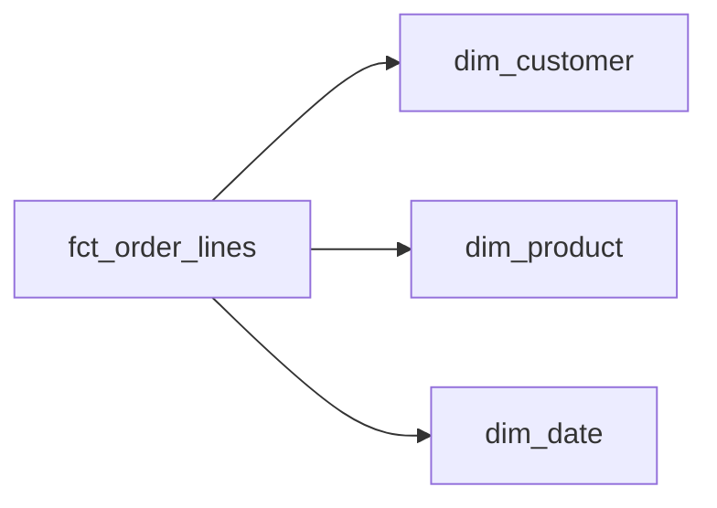

### Step 4 — SQL / Implementation
```sql
CREATE TABLE fct_order_lines AS
SELECT
  ol.order_id,
  ol.line_no AS order_line_number,
  o.customer_id,
  o.order_ts::DATE AS order_date,
  ol.product_id,
  ol.quantity,
  ol.unit_price,
  ol.quantity * ol.unit_price AS gross_amount
FROM order_lines ol
JOIN orders o
  ON o.order_id = ol.order_id;
```

### Step 5 — Validate the Result
```sql
SELECT order_id, order_line_number, COUNT(*)
FROM fct_order_lines
GROUP BY order_id, order_line_number
HAVING COUNT(*) > 1;
```

Reconcile total `gross_amount` to the source calculation.

### Why This Works
It preserves the source model while creating a business-process-oriented analytical representation.

### Common Mistake
Flattening every normalized table immediately without checking which attributes belong in which analytical dimension.

### Production Insight
Normalization is often the source-side integrity strategy; dimensional modelling is a consumer-oriented analytical strategy.

## Question 12 — Diagnose Mixed Grain in a Sales Report

### Difficulty
Moderate

### Topics Covered
- Topic 04: Grain and Join Cardinality
- Topic 02: Facts and Measures

### Problem
A report joins order headers to order lines and calculates `SUM(order_total)`. Order 5001 has three lines and `order_total = 300`, so the report shows 900.

### Your Task
Explain the failure, provide corrected SQL, and create a diagnostic query that identifies affected orders.

### Self-Check
- [ ] Did I identify two different grains?
- [ ] Did I explain the 3× multiplication?
- [ ] Did I avoid `SUM(DISTINCT ...)` as a generic fix?

---

### Solution

### Step 1 — Understand the Problem
`order_total` is order grain. The join result is order-line grain.

### Step 2 — Identify the Modelling Issue
Each order-level total repeats once for every line. Three lines create three copies of 300.

### Step 3 — Design / Reasoning
Use line-level measures for a line-grain query, or aggregate orders independently when the requested measure is order-level.

### Step 4 — SQL / Implementation
```sql
SELECT SUM(quantity * unit_price) AS revenue
FROM order_lines;
```

Or:

```sql
SELECT SUM(order_total) AS revenue
FROM orders;
```

Diagnostic query:

```sql
SELECT o.order_id, COUNT(*) AS line_count
FROM orders o
JOIN order_lines l ON l.order_id = o.order_id
GROUP BY o.order_id
HAVING COUNT(*) > 1;
```

### Step 5 — Validate the Result
Reconcile the corrected total with the authoritative source at the same population and time grain.

### Why This Works
The measure is aggregated at the grain to which it belongs.

### Common Mistake
Using `SUM(DISTINCT order_total)`, which fails when two legitimate orders share the same amount.

### Production Insight
A correct SQL statement can still produce incorrect business results when the underlying grain is wrong.

## Question 13 — Protect a Weighted Bridge Allocation

### Difficulty
Moderate

### Topics Covered
- Topic 02: Bridge Tables
- Topic 02: Weighting Factors
- Topic 03: Drill-Across

### Problem
An account can belong to multiple segments. A bridge stores weights: A1→S1 = 0.60 and A1→S2 = 0.40. A1 has revenue of 10,000.

### Your Task
Write the allocation query and a validation query ensuring full-allocation weights sum to 1.0.

### Self-Check
- [ ] Did I account for bridge row multiplication?
- [ ] Did I multiply revenue by the weight?
- [ ] Did I validate the weights?

---

### Solution

### Step 1 — Understand the Problem
The bridge is many-to-many and therefore creates multiple rows per account.

### Step 2 — Identify the Modelling Issue
Summing raw revenue after the join would repeat the full amount for each segment.

### Step 3 — Design / Reasoning
Use the weight to allocate the account amount at the bridge grain.

### Step 4 — SQL / Implementation
```sql
SELECT
  b.segment_id,
  SUM(a.revenue * b.weight) AS allocated_revenue
FROM account_revenue a
JOIN account_segment_bridge b
  ON a.account_id = b.account_id
GROUP BY b.segment_id;
```

```sql
SELECT account_id, SUM(weight) AS total_weight
FROM account_segment_bridge
GROUP BY account_id
HAVING ABS(SUM(weight) - 1.0) > 1e-9;
```

### Step 5 — Validate the Result
For fully allocated accounts, total allocated revenue should reconcile to account revenue.

### Why This Works
The bridge changes cardinality; weighting restores controlled measure allocation.

### Common Mistake
Treating the bridge as a descriptive-only join.

### Production Insight
A many-to-many relationship often requires explicit measure semantics as well as relationship modelling.

## Question 14 — A Customer Version at Order Time

### Difficulty
Moderate

### Topics Covered
- Topic 05: SCD Type 2
- Topic 04: Keys and Grain

### Problem
Customer C9 has Type 2 rows: Basic from January 1 through April 1, Premium from April 1 onward. An order occurs on March 15.

### Your Task
Write SQL that resolves the correct customer version and explain why joining only on `customer_id` is insufficient.

### Self-Check
- [ ] Did I use half-open interval semantics?
- [ ] Did I identify the historical surrogate/version key?
- [ ] Did I distinguish as-was from as-is?

---

### Solution

### Step 1 — Understand the Problem
The order requires the customer state at order time.

### Step 2 — Identify the Modelling Issue
A natural customer ID can have multiple historical dimension rows.

### Step 3 — Design / Reasoning
Use:

```text
valid_from <= order_ts < valid_to
```

### Step 4 — SQL / Implementation
```sql
SELECT
  o.order_id,
  d.customer_key,
  d.segment
FROM orders o
JOIN dim_customer d
  ON d.customer_id = o.customer_id
 AND o.order_ts >= d.valid_from
 AND o.order_ts < d.valid_to;
```

### Step 5 — Validate the Result
```sql
SELECT o.order_id
FROM orders o
JOIN dim_customer d
  ON d.customer_id = o.customer_id
 AND o.order_ts >= d.valid_from
 AND o.order_ts < d.valid_to
GROUP BY o.order_id
HAVING COUNT(*) <> 1;
```

### Why This Works
The timestamp selects the valid dimension version.

### Common Mistake
Joining on `is_current = true` when the report needs as-was semantics.

### Production Insight
Key identity and version identity are separate questions: “which entity?” and “which historical state?”

## Question 15 — A Schema Performance Comparison

### Difficulty
Moderate

### Topics Covered
- Topic 03: Star/Snowflake
- Topic 03: Benchmarking

### Problem
Two models contain identical sales data, but one benchmark uses Parquet for the star and CSV for the snowflake. The team wants to claim the star is faster.

### Your Task
Redesign the benchmark so it isolates the schema-shape question as much as practical.

### Self-Check
- [ ] Same logical data?
- [ ] Same file format and scale?
- [ ] Cold and warm cache separated?
- [ ] Multiple repetitions?

---

### Solution

### Step 1 — Understand the Problem
The benchmark changes multiple variables at once.

### Step 2 — Identify the Modelling Issue
Storage format, compression, cache state, and schema shape all affect runtime. Comparing CSV with Parquet does not isolate the schema.

### Step 3 — Design / Reasoning
Use the same scale, same Parquet format, similar partitioning, equivalent business queries, same engine version, and documented hardware.

### Step 4 — SQL / Implementation
Benchmark at least four representative queries: filtered revenue, grouped revenue, top categories, and a multi-dimension aggregation. Run separate cold-cache and warm-cache conditions and repeat each query.

### Step 5 — Validate the Result
Results must be semantically equal before timings are compared. Record wall time and memory where measurable.

### Why This Works
It reduces confounding variables.

### Common Mistake
Using one run or vendor-supplied benchmark numbers as production proof.

### Production Insight
A benchmark supports a bounded workload decision. It is not evidence for a universal winner.

## Question 16 — Two Sources, Different Identities

### Difficulty
Moderate

### Topics Covered
- Topic 06: Data Vault
- Topic 04: Keys

### Problem
CRM and Web Shop send customer records with different identifiers and different update patterns. The team wants source history and parallel loading.

### Your Task
Explain what belongs in hubs, links, and satellites. Show a minimal insert-oriented hub pattern and the tests you would add.

### Self-Check
- [ ] Hub for identity?
- [ ] Satellite for descriptive history?
- [ ] Link for relationship?
- [ ] Insert-only Raw Vault?

---

### Solution

### Step 1 — Understand the Problem
The primary need is integration and source-history preservation.

### Step 2 — Identify the Modelling Issue
Identity, relationships, and changing descriptions have different roles.

### Step 3 — Design / Reasoning
Use business-key hubs, relationship links, and source-specific descriptive satellites.

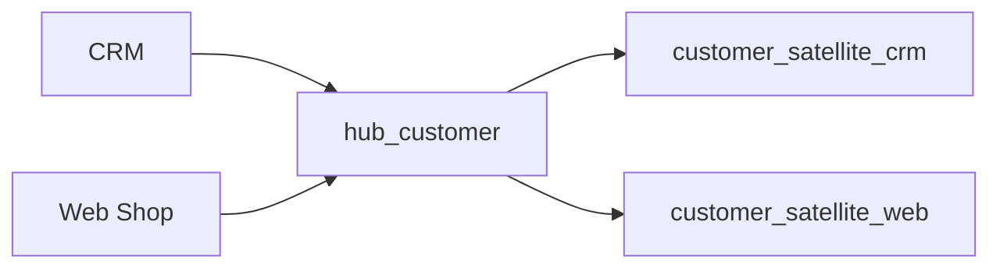

### Step 4 — SQL / Implementation
```sql
INSERT INTO hub_customer(customer_hk, business_key, load_date, record_source)
SELECT DISTINCT
  md5(source_system || '|' || customer_id),
  source_system || '|' || customer_id,
  CURRENT_TIMESTAMP,
  source_system
FROM staging_customer
WHERE customer_id IS NOT NULL;
```

### Step 5 — Validate the Result
Test hub business-key uniqueness, satellite grain, and missing link/hub references.

### Why This Works
Raw Vault structures preserve source evidence while allowing downstream business modelling.

### Common Mistake
Putting descriptive names and addresses into hubs.

### Production Insight
Raw Vault is primarily an integration/history layer; Business Vault and information marts can supply reusable business semantics.

## Question 17 — A Product Change in September

### Difficulty
Moderate

### Topics Covered
- Topic 07: OBT/Wide Models
- Topic 05: SCD

### Problem
An OBT is partitioned by `order_date`. Product categories change for 1% of products on September 10. The OBT stores category as a flattened attribute.

### Your Task
Design the impact analysis from changed products to affected facts and partitions. Explain when historical partitions may need refresh.

### Self-Check
- [ ] Did I trace dimension → fact → partition?
- [ ] Did I separate current-state and historical semantics?
- [ ] Did I distinguish partition rebuild from full rebuild?

---

### Solution

### Step 1 — Understand the Problem
The denormalized category can make many OBT rows dependent on one dimension change.

### Step 2 — Identify the Modelling Issue
The refresh scope depends on OBT semantics.

### Step 3 — Design / Reasoning
Current-state semantics may require refreshing partitions containing current rows for changed products. As-was semantics may intentionally preserve historical category values, while a backdated correction may require historical recomputation.

### Step 4 — SQL / Implementation
```sql
WITH changed_products AS (
  SELECT product_id
  FROM dim_product_changes
  WHERE change_date = DATE '2026-09-10'
)
SELECT DISTINCT f.order_date
FROM fct_order_lines f
JOIN changed_products c
  ON f.product_id = c.product_id;
```

Recompute those partitions, validate, and replace them safely.

### Step 5 — Validate the Result
Compare each rebuilt partition against a full rebuild of that same partition.

### Why This Works
The dependency graph identifies the smallest defensible refresh scope.

### Common Mistake
Assuming 1% of changed products means 1% of rows or partitions.

### Production Insight
Fan-out must be measured. Incremental refresh is a semantic and dependency problem as much as a physical-layout problem.

## Question 18 — Two Representations of an Order

### Difficulty
Moderate

### Topics Covered
- Topic 07: OBT/Wide Models
- Topic 07: Nested Data

### Problem
A food-delivery application has one consumer that retrieves whole orders and another that performs line-level analytics across millions of items.

### Your Task
Compare one-row-per-order nested data with one-row-per-order-line data. Show how line-level analysis can unnest the nested representation in DuckDB.

### Self-Check
- [ ] Did I state both grains?
- [ ] Did I identify row explosion?
- [ ] Did I connect design to consumer workload?

---

### Solution

### Step 1 — Understand the Problem
Parent-level retrieval and line-level analysis prefer different physical representations.

### Step 2 — Identify the Modelling Issue
Exploding items creates more rows but simpler line analysis. Nested data keeps the parent intact but requires unnesting for detailed analysis.

### Step 3 — Design / Reasoning
```text
exploded: one row per order line
nested:   one row per order with repeated items
```

### Step 4 — SQL / Implementation
```sql
SELECT product_id, SUM(quantity)
FROM obt_order_lines
GROUP BY product_id;
```

Conceptual nested query:

```sql
SELECT o.order_id, item.product_id, item.quantity
FROM orders_nested o,
UNNEST(o.items) AS item(product_id, quantity);
```

### Step 5 — Validate the Result
Counts and quantities after unnesting should reconcile to the exploded model.

### Why This Works
Both representations can preserve the same information while serving different access patterns.

### Common Mistake
Assuming one physical representation is universally superior.

### Production Insight
Consumer access patterns, engine support, and interoperability matter as much as storage shape.

## Question 19 — An Anonymous-to-Known User Transition

### Difficulty
Moderate

### Topics Covered
- Topic 08: Identity Stitching
- Topic 08: Retention

### Problem
A visitor has `anonymous_id = a9` before login and `user_id = U77` after login. The analytics team currently counts both as separate users.

### Your Task
Design an identity mapping with effective dates and write SQL for a resolved identity view. State the decision that must precede historical re-attribution.

### Self-Check
- [ ] Did I make identity policy explicit?
- [ ] Did I prevent conflicting mappings?
- [ ] Did I preserve original identifiers?

---

### Solution

### Step 1 — Understand the Problem
One actor appears under different identifiers over time.

### Step 2 — Identify the Modelling Issue
Retention depends on a consistent identity definition.

### Step 3 — Design / Reasoning
Use an `identity_map` with `anonymous_id`, `user_id`, `effective_from`, `effective_to`, and source metadata.

### Step 4 — SQL / Implementation
```sql
SELECT
  e.event_id,
  e.anonymous_id,
  e.user_id AS original_user_id,
  COALESCE(m.user_id, e.user_id) AS resolved_user_id
FROM fct_events e
LEFT JOIN identity_map m
  ON e.anonymous_id = m.anonymous_id
 AND e.event_timestamp >= m.effective_from
 AND (m.effective_to IS NULL OR e.event_timestamp < m.effective_to);
```

### Step 5 — Validate the Result
```sql
SELECT anonymous_id
FROM identity_map
GROUP BY anonymous_id, effective_from
HAVING COUNT(DISTINCT user_id) > 1;
```

Investigate any returned rows rather than silently picking one user.

### Why This Works
The mapping makes identity history explicit and testable.

### Common Mistake
Automatically re-attributing historical anonymous events without agreeing on the business/privacy rule.

### Production Insight
Identity stitching is a business and governance decision as well as a technical one.

## Question 20 — A Sudden Attribution Change

### Difficulty
Moderate

### Topics Covered
- Topic 08: Attribution
- Topic 08: Bots/Internal/Test Traffic

### Problem
An ad dashboard uses last-touch attribution, but the event stream contains crawlers and internal QA events. The conversion rate increases suddenly after a campaign launches.

### Your Task
Design the filtering and attribution order. State the attribution window, identity requirements, and validation approach.

### Self-Check
- [ ] Did I define what counts as eligible traffic?
- [ ] Did I define a touch window?
- [ ] Did I separate raw preservation from filtering?

---

### Solution

### Step 1 — Understand the Problem
Attribution should not silently include known non-business traffic.

### Step 2 — Identify the Modelling Issue
Bots and internal/test activity can create false touches or conversions.

### Step 3 — Design / Reasoning
First derive `is_bot`, `is_internal`, and `is_test_event` flags. Then apply a documented last-touch rule and a defined attribution window.

### Step 4 — SQL / Implementation
```sql
WITH eligible AS (
  SELECT *
  FROM fct_events
  WHERE NOT is_bot
    AND NOT is_internal
    AND NOT is_test_event
), touches AS (
  SELECT * FROM eligible WHERE event_name = 'ad_click'
), purchases AS (
  SELECT * FROM eligible WHERE event_name = 'order_completed'
)
SELECT p.order_id, t.source
FROM purchases p
JOIN touches t
  ON t.user_id = p.user_id
 AND t.event_timestamp <= p.event_timestamp
 AND p.event_timestamp < t.event_timestamp + INTERVAL '30 days';
```

A production query must deterministically choose the latest qualifying touch.

### Step 5 — Validate the Result
Compare filtered and unfiltered event volumes and reconcile conversion populations with the intended business scope.

### Why This Works
Traffic quality and attribution rules remain separate and testable.

### Common Mistake
Deleting bot events from raw storage.

### Production Insight
Filtering, identity, attribution windows, and conversion definitions all affect the metric and should be versioned and documented.

# Part III — Hard

## Question 21 — A Dependency Conflict in Enrollment

### Difficulty
Hard

### Topics Covered
- Topic 01: Functional Dependencies and BCNF
- Topic 01: Associative Relationships

### Problem
A university staging relation is `(student_id, course_id, instructor_id, instructor_email)`. Rules are `(student_id, course_id) -> instructor_id` and `instructor_id -> instructor_email`. One instructor can teach many courses.

### Your Task
Explain the dependency problem, decompose the relation, state the grain of each table, and write DuckDB validation SQL.

### Self-Check
- [ ] Did I identify the non-key determinant?
- [ ] Did I separate instructor identity from enrollment?
- [ ] Did I validate uniqueness and referential integrity?

---

### Solution

### Step 1 — Understand the Problem
The enrollment relationship is identified by `(student_id, course_id)`, while instructor identity has its own determinant.

### Step 2 — Identify the Modelling Issue
`instructor_id -> instructor_email` means instructor ID determines email, but instructor ID is not the candidate key of the full enrollment relation.

### Step 3 — Design / Reasoning
Decompose:

```text
instructor(instructor_id, instructor_email)
enrollment(student_id, course_id, instructor_id)
```

Grains are one row per instructor and one row per student-course assignment.

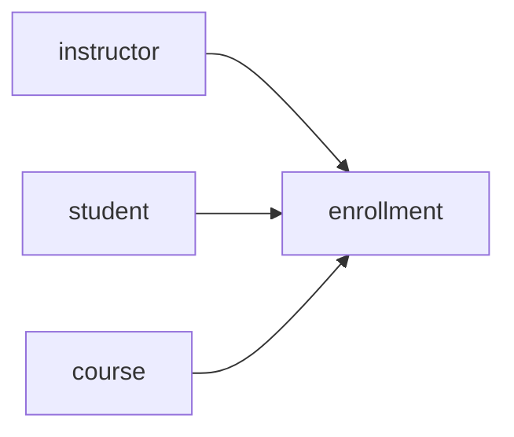

### Step 4 — Practical Implementation
```sql
CREATE TABLE instructor AS
SELECT DISTINCT instructor_id, instructor_email
FROM staging_enrollment;

CREATE TABLE enrollment AS
SELECT DISTINCT student_id, course_id, instructor_id
FROM staging_enrollment;
```

### Step 5 — Validate the Result
```sql
SELECT instructor_id
FROM instructor
GROUP BY instructor_id
HAVING COUNT(*) > 1;

SELECT e.instructor_id
FROM enrollment e
LEFT JOIN instructor i USING (instructor_id)
WHERE i.instructor_id IS NULL;
```

### Why This Works
Each determinant now controls attributes in its own relation.

### Common Mistake
Adding indexes without fixing the dependency structure.

### Production Insight
Normalization is about semantic dependency and anomaly prevention. Analytical models may later flatten the result intentionally.

## Question 22 — A Sales and Returns Report

### Difficulty
Hard

### Topics Covered
- Topic 02: Fact Constellation and Drill-Across
- Topic 03: Conformed Dimensions
- Topic 04: Grain

### Problem
`fct_sales` has one row per sale line; `fct_returns` has one row per return line. An analyst joins the facts directly on `customer_id` and `product_id`, causing sales and return totals to inflate.

### Your Task
Design a safe drill-across approach and write DuckDB SQL that aggregates each fact to a common grain before combining them.

### Self-Check
- [ ] Did I state both fact grains?
- [ ] Did I aggregate before the cross-process join?
- [ ] Did I validate each fact independently?

---

### Solution

### Step 1 — Understand the Problem
The two facts represent different business processes and can have multiple rows for the same customer/product.

### Step 2 — Identify the Modelling Issue
A raw fact-to-fact join can create a many-to-many multiplication.

### Step 3 — Design / Reasoning
Choose a shared reporting grain such as `(customer_id, product_id, activity_date)` and aggregate independently before combining.

### Step 4 — SQL / Implementation
```sql
WITH sales AS (
  SELECT customer_id, product_id, sale_date AS activity_date,
         SUM(net_amount) AS sales_amount
  FROM fct_sales
  GROUP BY customer_id, product_id, sale_date
), returns AS (
  SELECT customer_id, product_id, return_date AS activity_date,
         SUM(return_amount) AS return_amount
  FROM fct_returns
  GROUP BY customer_id, product_id, return_date
)
SELECT
  COALESCE(s.customer_id, r.customer_id) AS customer_id,
  COALESCE(s.product_id, r.product_id) AS product_id,
  COALESCE(s.activity_date, r.activity_date) AS activity_date,
  s.sales_amount,
  r.return_amount
FROM sales s
FULL OUTER JOIN returns r
  ON s.customer_id = r.customer_id
 AND s.product_id = r.product_id
 AND s.activity_date = r.activity_date;
```

### Step 5 — Validate the Result
Reconcile sales and returns independently before and after the drill-across.

### Why This Works
Each fact is brought to the same grain before being compared.

### Common Mistake
Using `DISTINCT` after the multiplication and assuming the problem is solved.

### Production Insight
A fact constellation is useful when conformed dimensions support shared analysis, but it does not make arbitrary fact-to-fact joins safe.

## Question 23 — A Historical Customer Correction

### Difficulty
Hard

### Topics Covered
- Topic 05: Type 2 History
- Topic 05: Late/Out-of-Order Changes
- Topic 07: OBT Refresh

### Problem
A customer was recorded as Basic through June 30 and Premium from July 1. On September 20, the source says Premium actually started June 15. Orders from June 16–30 and an as-was OBT were already processed.

### Your Task
Redesign the SCD intervals, identify affected facts, explain downstream correction, and state which OBT partitions might need rebuilding.

### Self-Check
- [ ] Did I distinguish current from historical semantics?
- [ ] Did I identify the affected event-time interval?
- [ ] Did I propagate the correction to downstream derived models?

---

### Solution

### Step 1 — Understand the Problem
This is a backdated correction to historical truth.

### Step 2 — Identify the Modelling Issue
The prior Type 2 boundary is wrong, so historical fact version assignment and as-was OBT semantics may be wrong.

### Step 3 — Design / Reasoning
A corrected timeline could be:

```text
Basic   2026-01-01 -> 2026-06-15
Premium 2026-06-15 -> 9999-12-31
```

Orders in the affected period should be re-resolved using the corrected intervals.

### Step 4 — Practical Implementation
```sql
SELECT o.order_id
FROM fct_orders o
WHERE o.customer_id = 'C9'
  AND o.order_ts >= TIMESTAMP '2026-06-15 00:00:00'
  AND o.order_ts <  TIMESTAMP '2026-07-01 00:00:00';
```

Then rebuild affected historical OBT partitions under the as-was semantics.

### Step 5 — Validate the Result
Check no interval overlap, exactly one current version, correct fact version assignment, and OBT reconciliation.

### Why This Works
It treats the source correction as a change to historical validity rather than just changing today's row.

### Common Mistake
Updating only the current customer record.

### Production Insight
Backdated changes can cascade through facts and derived consumer models; lineage and dependency-aware rebuilds are essential.

## Question 24 — A New ERP Source Arrives

### Difficulty
Hard

### Topics Covered
- Topic 06: Data Vault
- Topic 04: Source-Qualified Keys
- Topic 06: PIT and Information Marts

### Problem
CRM and Web Shop are already integrated. ERP now supplies customers and addresses with its own IDs. Leadership asks whether ERP can be “added without changing anything downstream.”

### Your Task
Explain the onboarding process, including hub reuse, source-specific satellites, possible new links, PIT impact, and mart revalidation.

### Self-Check
- [ ] Did I separate identity matching from source ingestion?
- [ ] Did I preserve source-specific history?
- [ ] Did I challenge the assumption of zero downstream impact?

---

### Solution

### Step 1 — Understand the Problem
ERP introduces another source namespace and another change history.

### Step 2 — Identify the Modelling Issue
The existing enterprise identity may be reusable, but source evidence should not be collapsed without preserving provenance.

### Step 3 — Design / Reasoning
Use source-qualified ERP keys. If ERP maps to an existing hub business identity, reuse that hub and add an ERP-specific satellite. Add links only when ERP introduces a relationship not represented by existing links.

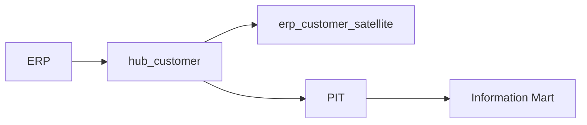

### Step 4 — Practical Implementation
A PIT process selects the latest applicable satellite record at an as-of point. The exact SQL depends on satellite grain and hash columns.

### Step 5 — Validate the Result
Test ERP source-key uniqueness, mapping coverage, missing hubs, satellite duplicates, PIT completeness, and downstream reconciliation.

### Why This Works
Source onboarding is isolated without pretending that downstream semantics can never change.

### Common Mistake
Treating “same customer concept” as proof that the ERP row should overwrite existing source history.

### Production Insight
A new source is an architecture change even when it maps into existing business identities.

## Question 25 — Explain an OBT Refresh After a Dimension Change

### Difficulty
Hard

### Topics Covered
- Topic 07: OBT/Wide Models
- Topic 05: SCD
- Topic 04: Grain

### Problem
An `obt_order_lines` table contains current product category and is partitioned by order month. One percent of products change category. The team wants to rebuild only what is necessary.

### Your Task
Write the impact-analysis SQL, distinguish row-level update, partition rebuild, and full rebuild, and explain how as-is versus as-was semantics alter the scope.

### Self-Check
- [ ] Did I trace product → fact → partition?
- [ ] Did I account for fan-out?
- [ ] Did I distinguish semantic policies?

---

### Solution

### Step 1 — Understand the Problem
A product change can affect many flattened fact rows.

### Step 2 — Identify the Modelling Issue
The correct refresh scope depends on how the OBT defines historical values.

### Step 3 — Design / Reasoning
Find changed products, then affected facts, then distinct partitions.

### Step 4 — SQL / Implementation
```sql
WITH changed AS (
  SELECT product_id
  FROM dim_product_changes
  WHERE change_date = DATE '2026-09-10'
)
SELECT DISTINCT f.order_date
FROM fct_order_lines f
JOIN changed c ON c.product_id = f.product_id;
```

Then recompute only those partitions when safe. A row-level update changes individual records; a partition rebuild recomputes a controlled slice; a full rebuild recomputes all OBT data.

### Step 5 — Validate the Result
Compare rebuilt partitions to a full rebuild of the same partitions for equality of row counts and business aggregates.

### Why This Works
The dependency chain gives an evidence-based refresh scope.

### Common Mistake
Equating “1% of products changed” with “1% of the OBT needs refreshing.”

### Production Insight
Incremental refresh is possible when the semantic and physical dependency structure makes impact analysis reliable.

## Question 26 — A Late Mobile Event

### Difficulty
Hard

### Topics Covered
- Topic 08: Event Time
- Topic 08: Late/Out-of-Order Events
- Topic 08: Sessions and Funnels

### Problem
A user signs up at 10:00, views a product at 10:05, and starts checkout at 10:15. The product-view event is received at 12:00 because the mobile device was offline. A pipeline orders events by `received_at`.

### Your Task
Redesign the event ordering and explain the recomputation policy for late events.

### Self-Check
- [ ] Did I use event time for behavioural ordering?
- [ ] Did I preserve received time for ingestion analysis?
- [ ] Did I state a late-data correction window?

---

### Solution

### Step 1 — Understand the Problem
Business sequence is based on when actions occurred, not when they arrived in storage.

### Step 2 — Identify the Modelling Issue
Received-time ordering makes a valid product view appear after checkout.

### Step 3 — Design / Reasoning
Use `event_timestamp` for sessions and funnel ordering. Keep `received_at` for latency monitoring. Define a correction window during which late events may change prior results.

### Step 4 — Practical Implementation
A funnel step lookup should order events by `event_timestamp` and enforce the defined time limit.

### Step 5 — Validate the Result
A test fixture should resolve the sequence as `signup → product_viewed → checkout_started` and prove the late event was not discarded merely because it arrived later.

### Why This Works
It separates behavioural semantics from ingestion mechanics.

### Common Mistake
Using arrival order as the event sequence.

### Production Insight
Late-event handling requires a documented recomputation policy so downstream metric changes are expected and explainable.

## Question 27 — Explain Retention Changes After Identity Stitching

### Difficulty
Hard

### Topics Covered
- Topic 08: Identity Stitching
- Topic 08: Retention
- Topic 05: Historical Semantics

### Problem
A SaaS company measures weekly retention by anonymous device ID. After login is introduced, historical anonymous activity is sometimes mapped to the known user. Retention changes substantially for older cohorts.

### Your Task
Diagnose why the metric changes. Define at least two identity policies and show how to validate their effect without double counting.

### Self-Check
- [ ] Did I define original and resolved identity?
- [ ] Did I identify the historical-policy decision?
- [ ] Did I compare policies using the same denominator rules?

---

### Solution

### Step 1 — Understand the Problem
The unit “user” changed across the pipeline.

### Step 2 — Identify the Modelling Issue
Historical anonymous activity may or may not belong to the later known user, depending on policy.

### Step 3 — Design / Reasoning
Possible policies include: preserve anonymous history, or re-attribute eligible history using effective-dated identity mappings. Store original and resolved identities for auditability.

### Step 4 — SQL / Implementation
```sql
SELECT
  event_id,
  anonymous_id,
  user_id AS original_user_id,
  resolved_user_id
FROM resolved_events;
```

### Step 5 — Validate the Result
Calculate retention under both policies for the same cohort and verify that one event contributes to at most one resolved identity in each policy.

### Why This Works
It makes the source of metric change explicit.

### Common Mistake
Calling the change a “retention bug” without first identifying the identity definition.

### Production Insight
Identity policy changes are semantic changes and should be treated like metric-definition changes with versioned documentation and impact analysis.

## Question 28 — A Billion-Row Event Table

### Difficulty
Hard

### Topics Covered
- Topic 08: Physical Design
- Topic 08: Retention
- Topic 03: Columnar Storage

### Problem
A media platform stores billions of events. Most queries filter by event date, then often by `user_id` or `event_name`. The team proposes partitioning by both date and user ID.

### Your Task
Evaluate the proposal. Design a candidate partitioning and clustering/sorting strategy, and describe the benchmark questions that must be answered before adoption.

### Self-Check
- [ ] Did I distinguish partitioning from clustering?
- [ ] Did I consider metadata/partition explosion?
- [ ] Did I include read and write trade-offs?

---

### Solution

### Step 1 — Understand the Problem
The workload is primarily time-filtered with secondary user/event filters.

### Step 2 — Identify the Modelling Issue
Over-partitioning can add metadata and operational overhead. A physical layout should reflect real query patterns.

### Step 3 — Design / Reasoning
A candidate is partitioning by event date and using sorting/clustering by high-value query keys such as `user_id` or `event_name`, subject to engine behaviour and file layout.

### Step 4 — Practical Implementation
Benchmark date-range, user-history, and event-type queries at realistic scale. Measure scan volume, files touched, runtime, memory, and write/maintenance cost.

### Step 5 — Validate the Result
Compare several representative workloads rather than one query. Include retention operations as part of the workload.

### Why This Works
The design matches physical layout to workload rather than assuming more partitions are always better.

### Common Mistake
Partitioning by every frequently filtered column.

### Production Insight
Physical design is a system-level trade-off between pruning, locality, write cost, metadata, and maintenance.

## Question 29 — A User Deletion Request Across Layers

### Difficulty
Hard

### Topics Covered
- Topic 08: PII, Consent and Deletion
- Topic 06: Data Vault
- Topic 07: OBT

### Problem
A platform stores events, identity mappings, Type 2 dimensions, OBTs, daily activity, feature tables, and archived Parquet. Free-form event properties can contain email addresses or phone numbers. A deletion request arrives.

### Your Task
Trace the deletion dependency graph and explain which layers may require deletion, recomputation, anonymization, or policy-driven retention.

### Self-Check
- [ ] Did I include derived and archived copies?
- [ ] Did I distinguish raw evidence from derived representations?
- [ ] Did I avoid assuming one universal implementation?

---

### Solution

### Step 1 — Understand the Problem
Deletion is cross-layer, not a single-table operation.

### Step 2 — Identify the Modelling Issue
A user can appear through multiple identifiers and representations.

### Step 3 — Design / Reasoning
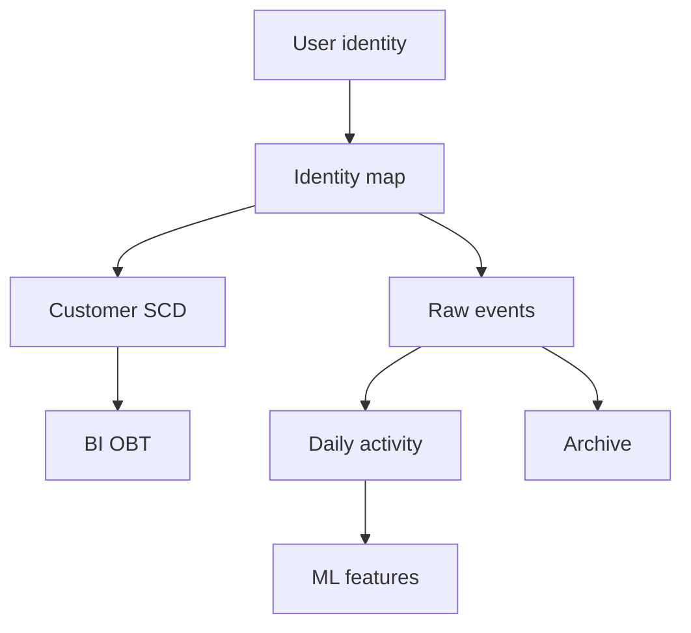

Create a dependency inventory for every representation.

### Step 4 — Practical Implementation
For each dependent dataset, document the applicable operation: delete rows, recompute aggregates, anonymize identifiers, or retain under an approved policy where allowed.

### Step 5 — Validate the Result
Test representative deletion requests and verify the dependency inventory covers raw, derived, archive, and downstream copies.

### Why This Works
It makes lifecycle semantics explicit before production execution.

### Common Mistake
Deleting only the current dimension row.

### Production Insight
PII governance must influence event-property design, retention, lineage, and downstream model ownership from the beginning.

## Question 30 — Reconcile OBT, Star, and Event Revenue

### Difficulty
Hard

### Topics Covered
- Topic 02: Reconciliation
- Topic 07: OBT
- Topic 08: Events
- Topic 05: SCD

### Problem
For September: transactional orders = 12.4M, star fact = 12.4M, OBT = 12.4M, clickstream purchase events = 12.8M. Event data includes duplicate IDs and internal test traffic.

### Your Task
Design a systematic reconciliation investigation. Identify which layer is authoritative for revenue, how to filter events, and what semantic conditions must match before comparing totals.

### Self-Check
- [ ] Did I align grain and date semantics?
- [ ] Did I distinguish transaction truth from event evidence?
- [ ] Did I inspect duplicates and test traffic?

---

### Solution

### Step 1 — Understand the Problem
The transaction system is the natural candidate for financial authority when the business defines it that way; events describe observed behaviour.

### Step 2 — Identify the Modelling Issue
Raw event counts can exceed transaction counts because of duplicate, test, missing, or delayed events.

### Step 3 — Design / Reasoning
Investigate in this order:
1. reconcile star to transactions;
2. reconcile OBT to star;
3. deduplicate purchase events;
4. exclude governed test/internal traffic;
5. align event-time versus received-time definitions;
6. account for late arrivals and missing events.

### Step 4 — SQL / Implementation
```sql
SELECT event_id, COUNT(*) AS copies
FROM fct_events
WHERE event_name = 'order_completed'
GROUP BY event_id
HAVING COUNT(*) > 1;
```

### Step 5 — Validate the Result
Build a reconciliation matrix with source, grain, time semantics, population, inclusion rules, and expected relationship.

### Why This Works
It diagnoses semantic differences before forcing the numbers to match.

### Common Mistake
Using a broad `DISTINCT` to force event revenue to equal transaction revenue.

### Production Insight
Reconciliation is an analytical modelling discipline: define equivalent populations, time semantics, and business meaning before comparing aggregates.

# Part IV — Advanced

## Question 31 — Five Changing Enterprise Sources

### Difficulty
Advanced

### Topics Covered
- Topic 01: Normalization
- Topic 04: Keys and Grain
- Topic 05: SCD
- Topic 06: Data Vault
- Topic 02: Dimensional Modelling

### Problem
An insurer integrates policy administration, CRM, claims, billing, and a partner portal. Each source uses different customer IDs. Source schemas change frequently. Audit requires historical source evidence. Analysts need conformed customer/policy dimensions and claims/billing facts.

### Your Task
Propose a layered architecture and key strategy. Explain where source-aligned models, Data Vault, SCD dimensions, facts, and consumer models fit. State assumptions and missing requirements.

### Self-Check
- [ ] Did I identify source and consumer concerns separately?
- [ ] Did I preserve source namespaces?
- [ ] Did I tie SCD to history requirements?
- [ ] Did I identify evidence needed before finalizing?

---

### Solution

### Step 1 — Understand the Problem
Source volatility and history requirements are high, while multiple analytical consumers need conformed models.

### Step 2 — Identify the Modelling Issue
No single layer optimizes source fidelity, integration history, business semantics, and consumption simplicity simultaneously.

### Step 3 — Design / Reasoning
A candidate architecture is:

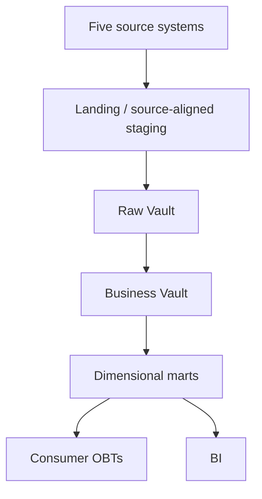

Use source-qualified keys, cross-reference mappings, and attribute-level SCD policies. Use facts at business-process-specific grains.

### Step 4 — Practical Implementation
Prototype source-key uniqueness, enterprise mapping, Type 2 interval lookup, and atomic fact creation before expanding the architecture.

### Step 5 — Validate the Result
Measure source change rate, late-data behaviour, lineage completeness, identity ambiguity, model count, query patterns, and team operating capacity.

### Why This Works
Each layer has a distinct responsibility and can be validated independently.

### Common Mistake
Calling Data Vault, normalization, and dimensional modelling mutually exclusive.

### Production Insight
Architecture decisions should be supported by evidence on source volatility, history, audit, identity complexity, downstream model count, and operational cost.

## Question 32 — A Data Vault Proposal for a Small Retailer

### Difficulty
Advanced

### Topics Covered
- Topic 06: Data Vault
- Topic 01: Normalization
- Topic 02: Dimensional Modelling

### Problem
A small retailer has three stable sources, modest history requirements, simple BI, a small team, and infrequent source changes. A consultant proposes Raw Vault + Business Vault + PIT + bridges + multiple marts.

### Your Task
Evaluate the proposal against normalized integration and direct staging→dimensional alternatives. Do not give a universal winner; identify decision criteria and evidence.

### Self-Check
- [ ] Did I evaluate source volatility?
- [ ] Did I include operational complexity?
- [ ] Did I identify when Data Vault creates enough value to justify itself?

---

### Solution

### Step 1 — Understand the Problem
The proposed architecture adds substantial modelling and operating overhead.

### Step 2 — Identify the Modelling Issue
The central question is whether the extra layers solve meaningful integration/history/audit problems that simpler approaches cannot solve acceptably.

### Step 3 — Design / Reasoning
Evaluate:
- source count and volatility;
- history/audit requirements;
- identity complexity;
- number of downstream consumers;
- need for parallel loading;
- PIT/bridge operating cost;
- team expertise;
- refresh and query requirements.

### Step 4 — Practical Implementation
Build a decision matrix with evidence for each criterion and record open questions.

### Step 5 — Validate the Result
Test assumptions against actual source change rates, data volume, history requirements, and team capacity.

### Why This Works
The architecture decision is based on business and operational requirements rather than fashion.

### Common Mistake
Assuming “enterprise” automatically means Data Vault.

### Production Insight
An architecture earns complexity when the additional structures materially reduce risk, change cost, integration difficulty, or downstream duplication.

## Question 33 — One Wide Table or Two Consumer Models?

### Difficulty
Advanced

### Topics Covered
- Topic 07: OBT/Wide Models
- Topic 05: SCD
- Topic 08: Events
- Topic 02: Facts

### Problem
Leadership wants a flat BI dataset of sales and dimensions. Data Science wants a churn dataset at one row per customer per day using only information available at each prediction date. A team proposes one giant wide table.

### Your Task
Design separate models, identify shared authoritative sources, and specify the point-in-time validation needed for ML features.

### Self-Check
- [ ] Did I declare both grains?
- [ ] Did I distinguish BI convenience from ML temporal correctness?
- [ ] Did I define a leakage test?

---

### Solution

### Step 1 — Understand the Problem
The BI OBT and ML feature table have different grains and semantics.

### Step 2 — Identify the Modelling Issue
A single table would mix business-event grain with entity-time feature grain.

### Step 3 — Design / Reasoning
Use:

```text
star / atomic facts
   ├── obt_order_lines        one row per order line
   └── customer_features_daily one row per customer per day
```

### Step 4 — SQL / Implementation
```sql
SELECT customer_id, feature_date, COUNT(*) AS events_to_date
FROM clean_events
WHERE event_timestamp < feature_date + INTERVAL '1 day'
GROUP BY customer_id, feature_date;
```

The exact feature windows must be explicit and should never include future events.

### Step 5 — Validate the Result
```sql
SELECT feature_date, source_event_timestamp
FROM feature_contributions
WHERE source_event_timestamp > feature_date;
```

A correct assertion returns zero rows.

### Why This Works
Each consumer gets the model and time semantics appropriate to its job.

### Common Mistake
Using today's customer state when producing historical training rows.

### Production Insight
Wide tables are representations, not universal canonical models. Sharing authoritative atomic sources reduces duplicated business logic while consumer-specific models preserve correctness.

## Question 34 — Offline Mobile Behaviour and Analytics

### Difficulty
Advanced

### Topics Covered
- Topic 08: Event Envelope
- Topic 08: Time Semantics
- Topic 08: Identity
- Topic 08: Sessions/Funnels/Retention

### Problem
A mobile commerce app has offline users, late/out-of-order events, anonymous browsing, later login, and cross-device activity. Product needs sessions, signup→purchase funnel, weekly retention, and attribution.

### Your Task
Design the event architecture, semantic definitions, identity model, derived models, and validation plan. Explicitly state which decisions must be business-approved.

### Self-Check
- [ ] Did I include event and received timestamps?
- [ ] Did I define deduplication and identity policy?
- [ ] Did I specify session/funnel/retention rules?

---

### Solution

### Step 1 — Understand the Problem
This is a high-volume behavioural model with late data and changing identity.

### Step 2 — Identify the Modelling Issue
Time semantics, event identity, anonymous-to-known mapping, and business metric definitions all affect outputs.

### Step 3 — Design / Reasoning
Use:

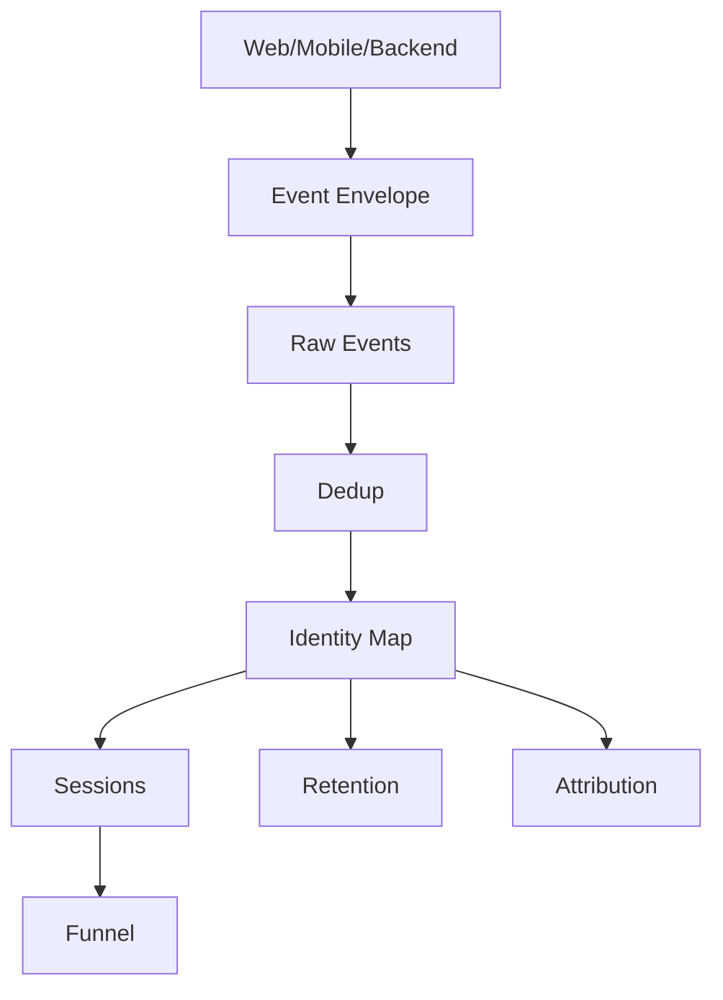

The event envelope includes `event_id`, `event_name`, `event_timestamp`, `received_at`, `user_id`, `anonymous_id`, `session_id`, `context`, and `properties`.

### Step 4 — Practical Implementation
Use event time for behavioural order, `received_at` for lag, a 30-minute session rule for the exercise, explicit funnel windows, and a governed identity map.

### Step 5 — Validate the Result
Test event uniqueness, required properties, late-event handling, session boundaries, funnel order, identity conflicts, and retention cohort definitions.

### Why This Works
Raw observations remain separable from derived interpretation.

### Common Mistake
Baking a final session or funnel interpretation into the immutable raw event row.

### Production Insight
The hard part of event modelling is often semantic stability rather than storage alone. Business definitions need ownership and change management.

## Question 35 — Conduct a 50-Million-Row Schema Benchmark

### Difficulty
Advanced

### Topics Covered
- Topic 03: Star/Snowflake
- Topic 03: Benchmarking
- Topic 07: Physical Design

### Problem
A platform team has 50 million sales rows represented in both star and snowflake models. They want evidence about runtime and memory, but the initial proposal uses different file formats and one query per model.

### Your Task
Design a reproducible benchmark using DuckDB and Parquet. Include query equivalence, cold/warm cache, repetitions, memory, physical layout, and result validation. Do not invent results.

### Self-Check
- [ ] Same data and format?
- [ ] Equivalent queries?
- [ ] Multiple runs and cache conditions?
- [ ] Memory recorded?
- [ ] Results reconciled?

---

### Solution

### Step 1 — Understand the Problem
The benchmark is intended to compare schema shape under controlled conditions.

### Step 2 — Identify the Modelling Issue
Changing schema and file format confounds the experiment.

### Step 3 — Design / Reasoning
Use identical logical data, the same scale, comparable Parquet encoding/compression, documented partitioning/sorting, and equivalent queries such as filtered revenue, category grouping, and multi-dimension aggregation.

### Step 4 — Practical Implementation
For every query, collect:
- cold-cache runtime;
- repeated warm-cache runtime;
- peak memory where measurable;
- scan/file-touch information where available;
- result checksum or aggregate equality.

Document engine version, hardware, configuration, and file layout.

### Step 5 — Validate the Result
Do not compare timing if result semantics differ. Keep the benchmark repeatable and re-run it as workloads change.

### Why This Works
It isolates the experiment more effectively and preserves evidence.

### Common Mistake
Treating one vendor benchmark table as proof of production performance.

### Production Insight
Benchmark conclusions are scoped to a workload and test environment. TPC-H-style ideas can structure workloads, but production decisions require representative queries.

## Question 36 — A Rapidly Changing Customer Attribute

### Difficulty
Advanced

### Topics Covered
- Topic 05: Rapidly Changing Dimensions
- Topic 05: Mini-Dimensions/Snapshots
- Topic 07: OBT

### Problem
A gaming product records a customer engagement state every few minutes. Other customer attributes such as signup date change rarely. A proposal puts every state change into the customer Type 2 dimension and then flattens the dimension into a BI OBT.

### Your Task
Evaluate the design. Compare attribute-level SCD, mini-dimension, daily snapshot, and event-derived approaches. Explain downstream OBT implications.

### Self-Check
- [ ] Did I identify Type 2 row explosion?
- [ ] Did I separate rates of change?
- [ ] Did I define what history consumers actually need?

---

### Solution

### Step 1 — Understand the Problem
The rapid engagement state has a much higher change frequency than identity/profile attributes.

### Step 2 — Identify the Modelling Issue
Type 2 for every state transition can make the dimension and any OBT dependent on it grow rapidly.

### Step 3 — Design / Reasoning
Possible options include:
- Type 1/2 policies for slower customer attributes;
- mini-dimension for frequently changing categorical state;
- periodic/daily snapshots where daily history is sufficient;
- event-derived behavioural models when event history itself is the useful source.

### Step 4 — Practical Implementation
State the grain of each candidate model and calculate expected row growth using observed change rates.

### Step 5 — Validate the Result
Test whether the model answers the required historical queries, then measure row growth and downstream refresh cost.

### Why This Works
It aligns temporal representation with change rate and consumer needs.

### Common Mistake
Assuming “full history” automatically means Type 2 on every attribute.

### Production Insight
History has multiple valid representations. The semantic requirement should determine whether versioned dimensions, snapshots, or event models are appropriate.

## Question 37 — Twenty-Five Similar Wide Tables

### Difficulty
Advanced

### Topics Covered
- Topic 07: OBT
- Topic 07: Activity Schema
- Topic 07: Semantic/Metric Layers

### Problem
A company has 25 wide tables with duplicated definitions of active customer, net revenue, and new buyer. Teams report inconsistent values and spend significant effort maintaining similar datasets.

### Your Task
Evaluate an architecture using an activity schema and/or semantic layer. Explain what should remain materialized and what should be centralized as reusable meaning.

### Self-Check
- [ ] Did I identify duplicated business logic?
- [ ] Did I distinguish semantics from physical materialization?
- [ ] Did I preserve materialization where the workload still needs it?

---

### Solution

### Step 1 — Understand the Problem
The core failure is semantic duplication across many derived datasets.

### Step 2 — Identify the Modelling Issue
The platform repeats metric definitions and joins in many places.

### Step 3 — Design / Reasoning
A narrow activity stream can provide a reusable behavioural source. A semantic/metric layer can centralize definitions and relationships. Materialized OBTs can remain for consumers whose workload or BI tooling justifies them.

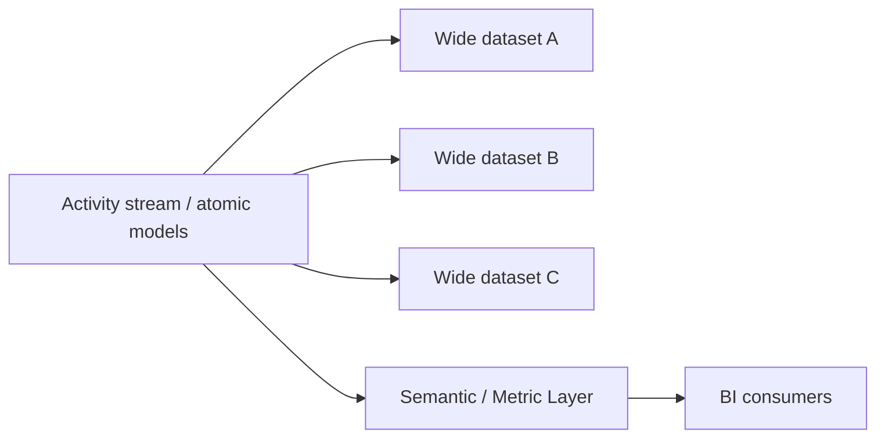

### Step 4 — Practical Implementation
Inventory duplicate metrics, compare definitions, and identify which wide tables exist only because users need convenience versus those with measured performance requirements.

### Step 5 — Validate the Result
Reconcile centralized metrics with current authoritative models and measure consumer adoption, runtime, freshness, and maintenance cost.

### Why This Works
It moves reusable meaning to a shared layer while keeping physical representations where they add value.

### Common Mistake
Assuming semantic layers eliminate every need for materialized wide datasets.

### Production Insight
OBT, activity-schema, and semantic-layer patterns can coexist. Architecture should place meaning and computation where consumers and operations can support them.

## Question 38 — Design Deletion Across Raw Vault, Events, OBT, and Features

### Difficulty
Advanced

### Topics Covered
- Topic 06: Data Vault
- Topic 07: OBT
- Topic 08: Privacy/Deletion
- Topic 05: SCD

### Problem
An enterprise stores a person in CRM-derived Raw Vault structures, a Type 2 dimension, raw events, OBTs, and point-in-time ML features. Identity is also retained in cross-reference mappings. A deletion request affects one person.

### Your Task
Design the review process from source identity through every dependent model. Identify which artifacts should be re-derived and how you would prove the deletion path is complete under the approved policy.

### Self-Check
- [ ] Did I start with identity lineage?
- [ ] Did I include historical and derived data?
- [ ] Did I define a verification strategy?

---

### Solution

### Step 1 — Understand the Problem
The individual is represented in multiple layers with different grains and retention behaviours.

### Step 2 — Identify the Modelling Issue
Deleting an SCD row does not necessarily remove the person from events, mappings, OBTs, features, archives, or downstream systems.

### Step 3 — Design / Reasoning
Build a dependency graph and classify each artifact by policy: delete, recompute, anonymize, retain, or propagate to downstream copies as required.

### Step 4 — Practical Implementation
Use lineage metadata and deterministic test cases so a deletion request can be followed from source identifiers to all derived representations.

### Step 5 — Validate the Result
Execute controlled test requests and verify every dependency is either processed or explicitly documented as exempt/retained under an approved rule.

### Why This Works
It converts privacy from an ad hoc cleanup task into a repeatable data lifecycle process.

### Common Mistake
Focusing only on the current logical table.

### Production Insight
Privacy architecture must account for source history, derived models, identity mappings, archives, and ML datasets.

## Question 39 — Certifying a New Analytical Model

### Difficulty
Advanced

### Topics Covered
- Topic 03: Benchmarking
- Topic 04: Grain/Keys
- Topic 02: Reconciliation
- Topic 08: Event Quality

### Problem
A platform team wants to certify a new analytical model as both correct and performant. Previous benchmarks sometimes compared different grains and different business populations.

### Your Task
Define a model-certification contract with separate semantic gates and benchmark gates. Include at least five correctness categories and explain which checks should normally return zero rows.

### Self-Check
- [ ] Did I separate correctness from performance?
- [ ] Did I include grain/key/reconciliation checks?
- [ ] Did I prevent a faster-but-wrong model from passing?

---

### Solution

### Step 1 — Understand the Problem
A performance benchmark cannot compensate for semantic differences.

### Step 2 — Identify the Modelling Issue
Candidate models need to be certified for grain, keys, referential integrity, temporal semantics, and aggregate equivalence before timing is meaningful.

### Step 3 — Design / Reasoning
Use gates for:
1. grain uniqueness;
2. key uniqueness and referential integrity;
3. SCD temporal integrity where applicable;
4. aggregate reconciliation;
5. event-specific quality and identity rules;
6. only then performance benchmarking.

### Step 4 — SQL / Implementation
```sql
SELECT order_id, order_line_id
FROM candidate_fact
GROUP BY order_id, order_line_id
HAVING COUNT(*) > 1;
```

This is a zero-row correctness assertion. Benchmark outputs instead record runtime, memory, cache state, and scan information.

### Step 5 — Validate the Result
Do not benchmark or certify a model whose semantics do not match the reference model.

### Why This Works
It prevents a fast-but-wrong model from appearing successful.

### Common Mistake
Using runtime as the headline metric before validating results.

### Production Insight
Production certification should be a controlled workflow: semantic equivalence first, performance evidence second.

## Question 40 — Design the Complete Marketplace Data Architecture

### Difficulty
Advanced

### Topics Covered
- Topic 01: Normalization
- Topic 02: Dimensional Modelling
- Topic 03: Star/Snowflake
- Topic 04: Grain/Keys
- Topic 05: SCD
- Topic 06: Data Vault
- Topic 07: OBT/Wide Models
- Topic 08: Event/Clickstream

### Problem
A two-sided marketplace has an OLTP orders database, CRM, web/app events, buyer and seller entities, overlapping source IDs, changing attributes, duplicate and late events, BI dashboards, retention analysis, funnel reporting, and churn modelling. Leadership requires trustworthy revenue and seller performance. Data Science requires point-in-time-correct churn features.

### Your Task
Produce an end-to-end architecture review. You must:
1. identify business processes;
2. declare grains;
3. identify normalized source entities;
4. design source and enterprise keys;
5. select SCD policies;
6. evaluate Data Vault;
7. design dimensional marts;
8. design a BI OBT;
9. design event models;
10. define identity handling;
11. define sessions, funnel, retention, and attribution;
12. design quality tests;
13. define reconciliation;
14. discuss physical design;
15. explain trade-offs;
16. identify missing requirements and assumptions.

### Self-Check
- [ ] Can I explain why every layer exists?
- [ ] Are grains explicit?
- [ ] Are source identity, enterprise identity, and version identity separate?
- [ ] Can revenue be reconciled?
- [ ] Are ML features point-in-time correct?
- [ ] Have I documented missing requirements?

---

### Solution

### Step 1 — Understand the Problem
At minimum, the architecture contains transactional, customer/seller history, and behavioural-event domains. They have different grains and different notions of truth.

### Step 2 — Identify the Modelling Issues
The major risks are:
- cross-source identifier collision;
- mixed-grain facts;
- changing buyer/seller attributes;
- late and duplicate events;
- anonymous-to-known identity transitions;
- BI convenience requirements versus ML temporal correctness;
- reconciliation between behavioural and transactional measures.

### Step 3 — Design / Reasoning
A candidate architecture is:

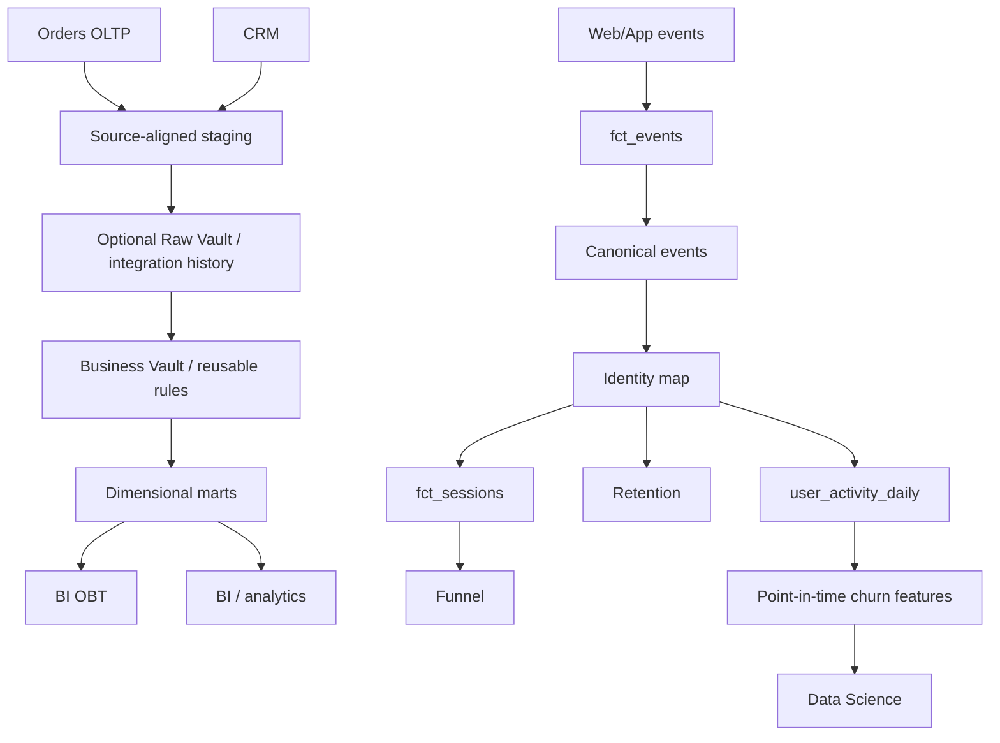

Core grain examples:

```text
fct_order_lines        = one row per order line
fct_events             = one row per unique captured event after the canonical event policy
fct_sessions           = one row per derived session
user_activity_daily    = one row per user per day
customer_features_daily= one row per customer per day
```

For source identity, preserve `(source_system, source_id)` and maintain explicit mappings to enterprise identities. Use surrogate/durable keys deliberately; deterministic hashes are an implementation option, not proof of entity equality.

For SCD, use attribute-level policies. Example: signup date Type 0, current contact correction Type 1, historical buyer/seller segment Type 2. Add other types only when the business requirement justifies them.

Data Vault should be evaluated rather than assumed. It can be useful when source volatility, history, auditability, identity complexity, and downstream model count justify an integration/history layer. Otherwise, simpler staging/integration and dimensional paths may satisfy the requirements.

The star should preserve atomic transactional business processes. The OBT should be consumer-driven and derived from the analytical model where that reduces repeated joins. The event model should preserve the raw event occurrence separately from sessions, funnels, retention, attribution, and daily activity interpretations.

### Step 4 — Practical Implementation
Prototype the architecture with DuckDB SQL such as:

**Fact grain test**

```sql
SELECT order_id, order_line_id, COUNT(*) AS rows
FROM fct_order_lines
GROUP BY order_id, order_line_id
HAVING COUNT(*) > 1;
```

**Type 2 lookup**

```sql
SELECT o.order_id, d.customer_key
FROM fct_orders o
JOIN dim_customer d
  ON d.customer_id = o.customer_id
 AND o.order_ts >= d.valid_from
 AND o.order_ts < d.valid_to;
```

**OBT transformation**

```sql
CREATE TABLE obt_order_lines AS
SELECT
  f.order_line_id,
  f.order_date,
  p.category AS product_category,
  c.segment AS customer_segment,
  s.region AS store_region,
  f.net_amount
FROM fct_order_lines f
JOIN dim_product p ON p.product_key = f.product_key
JOIN dim_customer c ON c.customer_key = f.customer_key
JOIN dim_store s ON s.store_key = f.store_key;
```

**Event deduplication**

```sql
WITH ranked AS (
  SELECT *,
         ROW_NUMBER() OVER (
           PARTITION BY event_id ORDER BY received_at
         ) AS rn
  FROM raw_events
  WHERE event_id IS NOT NULL
)
SELECT * FROM ranked WHERE rn = 1;
```

**Sessionization** should use event-time ordering and the fixed 30-minute inactivity rule for this exercise. **Funnels** should define ordered steps, scope, first/any occurrence, and time window. **Retention** should define cohort and active-event semantics. **Attribution** should document first-touch, last-touch, or multi-touch assumptions.

**Point-in-time feature validation**

```sql
SELECT feature_date, source_event_timestamp
FROM feature_contributions
WHERE source_event_timestamp > feature_date;
```

### Step 5 — Validate the Result
Use a layered verification plan:

```text
source integrity
    ↓
source-qualified key integrity
    ↓
SCD temporal integrity
    ↓
atomic fact grain
    ↓
aggregate reconciliation
    ↓
OBT grain + semantic tests
    ↓
event envelope + event_id + property tests
    ↓
identity conflict checks
    ↓
session/funnel/retention checks
    ↓
PII/retention/deletion controls
    ↓
point-in-time feature leakage checks
```

Revenue should be reconciled to the authoritative transactional system for the defined business population. Event-derived purchase metrics should be investigated separately for duplicates, missing events, lateness, identity policy, and test/bot traffic.

Physical design should reflect workload: event-date partitioning is a candidate, but clustering/sorting and retention need measurement. BI OBTs can be stored as partitioned/sorted Parquet when workload evidence supports it. Benchmarks should use equivalent data, query semantics, file formats, cache conditions, repeated runs, and memory measurements.

### Why This Works
The architecture respects differences in grain, history, identity, and consumer needs. It does not try to make one representation the universal source of truth.

### Common Mistake
Designing a giant marketplace table containing buyers, sellers, orders, events, current state, and ML features. That collapses incompatible grains and semantic contracts into one structure.

### Production Insight
A senior architecture review ends with explicit assumptions: authoritative revenue source, buyer/seller identity policy, SCD history requirements, maximum accepted event lateness, anonymous re-attribution policy, session definition, funnel/retention definitions, PII and deletion rules, BI workload patterns, ML feature freshness, ownership, and operating cost. The implementation should then be measured and revised based on evidence.


# Coverage Matrix

| Question | Difficulty | Primary Topic(s) | Secondary Topic(s) | SQL? | Diagram? | Debugging? | Architecture/Trade-off? |
| --- | --- | --- | --- | --- | --- | --- | --- |
| 1 | Basic | Topic 01: Normalization | Topic 04: Grain/Keys | No | Yes | No | No |
| 2 | Basic | Topic 01: Functional Dependencies | Topic 01: 1NF–3NF | Yes | No | Yes | No |
| 3 | Basic | Topic 02: Dimensional Modelling | Topic 04: Grain | No | No | No | No |
| 4 | Basic | Topic 03: Star/Snowflake | Topic 03: Engine/BI behaviour | No | Yes | No | Yes |
| 5 | Basic | Topic 04: Keys | Topic 06: Data Vault | Yes | Yes | No | Yes |
| 6 | Basic | Topic 05: SCD | Attribute-level policy | Yes | No | No | Yes |
| 7 | Basic | Topic 07: OBT | Topic 02/03: Facts + Star | Yes | Yes | No | No |
| 8 | Basic | Topic 08: Event Envelope | Tracking Plan / Data Contract | Yes | Yes | No | Yes |
| 9 | Basic | Topic 08: Event IDs | Deduplication | Yes | No | Yes | No |
| 10 | Basic | Topic 08: Sessions | Event Time | Yes | No | No | No |
| 11 | Moderate | Topic 01: Normalization | Topic 02/03: Star | Yes | Yes | No | No |
| 12 | Moderate | Topic 04: Grain | Topic 02: Measures | Yes | No | Yes | No |
| 13 | Moderate | Topic 02: Bridge Tables | Weighting / Drill-Across | Yes | Yes | No | Yes |
| 14 | Moderate | Topic 05: Type 2 | Topic 04: Keys/Grain | Yes | Yes | No | No |
| 15 | Moderate | Topic 03: Star/Snowflake | Benchmarking | Yes | Yes | No | Yes |
| 16 | Moderate | Topic 06: Data Vault | Topic 04: Keys | Yes | Yes | No | Yes |
| 17 | Moderate | Topic 07: OBT | Topic 05: SCD | Yes | No | Yes | Yes |
| 18 | Moderate | Topic 07: OBT/Nested | Consumer workload | Yes | Yes | No | Yes |
| 19 | Moderate | Topic 08: Identity | Retention | Yes | Yes | No | No |
| 20 | Moderate | Topic 08: Attribution | Bots / Internal / Test | Yes | No | Yes | Yes |
| 21 | Hard | Topic 01: BCNF | Functional Dependencies | Yes | Yes | No | No |
| 22 | Hard | Topic 02: Fact Constellation | Topic 03/04: Drill-Across + Grain | Yes | Yes | Yes | Yes |
| 23 | Hard | Topic 05: SCD Type 2 | Topic 07: OBT | Yes | Yes | Yes | Yes |
| 24 | Hard | Topic 06: Data Vault | PIT / New Source / Keys | Yes | Yes | No | Yes |
| 25 | Hard | Topic 07: OBT | Topic 05: SCD / Historical Semantics | Yes | Yes | Yes | Yes |
| 26 | Hard | Topic 08: Time Semantics | Late Events / Funnel / Sessions | Yes | No | Yes | No |
| 27 | Hard | Topic 08: Identity | Retention / Historical Semantics | Yes | Yes | Yes | Yes |
| 28 | Hard | Topic 08: Physical Design | Topic 03: Columnar Storage | Yes | Yes | No | Yes |
| 29 | Hard | Topic 08: Privacy/Deletion | Topic 06/07: Vault + OBT | Yes | Yes | No | Yes |
| 30 | Hard | Topic 02: Reconciliation | Topic 07/08/05 | Yes | No | Yes | Yes |
| 31 | Advanced | Topic 06: Enterprise Integration | Topic 01/04/05/02 | Yes | Yes | No | Yes |
| 32 | Advanced | Topic 06: Data Vault | Topic 01/02 | Yes | Yes | No | Yes |
| 33 | Advanced | Topic 07: OBT/ML Features | Topic 05/08/02 | Yes | Yes | No | Yes |
| 34 | Advanced | Topic 08: Event Architecture | Identity / Time / Sessions | Yes | Yes | No | Yes |
| 35 | Advanced | Topic 03: Star/Snowflake | Benchmarking / Physical Design | Yes | Yes | No | Yes |
| 36 | Advanced | Topic 05: Rapidly Changing Dimensions | Mini-Dimension / Snapshot / OBT | Yes | Yes | No | Yes |
| 37 | Advanced | Topic 07: OBT | Activity Schema / Semantic Layer | Yes | Yes | No | Yes |
| 38 | Advanced | Topic 08: Privacy/Deletion | Topic 06/07/05 | Yes | Yes | No | Yes |
| 39 | Advanced | Topic 03: Benchmarking | Topic 04/02/08 | Yes | No | Yes | Yes |
| 40 | Advanced | All Module 2.8 Topics | End-to-end architecture | Yes | Yes | Yes | Yes |

## Concept Coverage

| Topic | Covered? | Question Numbers |
| --- | --- | --- |
| Normalization | Yes | 1, 2, 11, 21, 31, 40 |
| Dimensional Modelling | Yes | 3, 7, 11, 13, 22, 30, 31, 33, 40 |
| Star/Snowflake | Yes | 4, 11, 15, 22, 31, 35, 39, 40 |
| Grain/Keys | Yes | 1, 3, 5, 7, 11, 12, 14, 16, 21, 22, 23, 31, 39, 40 |
| SCD | Yes | 6, 14, 17, 23, 25, 27, 31, 33, 36, 40 |
| Data Vault | Yes | 5, 16, 24, 31, 32, 38, 40 |
| OBT/Wide Models | Yes | 7, 17, 18, 23, 25, 29, 30, 33, 36, 37, 38, 40 |
| Event/Clickstream | Yes | 8, 9, 10, 19, 20, 26, 27, 28, 29, 30, 34, 38, 39, 40 |

## Requirement Audit

| Requirement | Target | Coverage in this set |
| --- | ---: | ---: |
| Total questions | 40 | 40 |
| Basic | 10 | 10 |
| Moderate | 10 | 10 |
| Hard | 10 | 10 |
| Advanced | 10 | 10 |
| SQL-related questions | ≥20 | 29 |
| Diagram-oriented questions | ≥10 | 27 |
| Grain-focused questions | ≥8 | 14+ |
| Key-focused questions | ≥6 | 10+ |
| SCD-focused questions | ≥6 | 10 |
| Data Vault-focused questions | ≥4 | 7 |
| OBT/wide-focused questions | ≥4 | 12 |
| Event/clickstream-focused questions | ≥6 | 14 |
| Star/snowflake-focused questions | ≥4 | 8 |
| Normalization-focused questions | ≥4 | 6 |
| Debugging/suspicious-system questions | ≥8 | 11 |
| Architecture/trade-off questions | ≥6 | 20+ |
| Cross-topic questions | ≥10 | 20+ |

> The audit counts are deliberately overlapping: one question can satisfy several coverage categories.

## Final Module Readiness Check

I can:

- [ ] normalize and denormalize a model intentionally;
- [ ] identify and validate grain before modelling;
- [ ] distinguish facts, dimensions, and business processes;
- [ ] compare star and snowflake designs using workload evidence;
- [ ] select and validate natural, surrogate, durable, composite, hash, and mapping keys;
- [ ] choose SCD policies at the attribute level;
- [ ] reason about historical truth, as-was/as-is semantics, and late corrections;
- [ ] explain Data Vault hubs, links, satellites, PIT, and integration-layer trade-offs;
- [ ] design OBTs, nested alternatives, and wide consumer models;
- [ ] model event and clickstream data with explicit time and identity semantics;
- [ ] debug grain, key, history, reconciliation, privacy, and event-quality failures;
- [ ] write DuckDB SQL for core modelling and validation tasks;
- [ ] design fair analytical benchmarks without inventing results;
- [ ] explain architecture trade-offs with explicit assumptions and operational constraints.

## Practice Standard

For each question, a strong attempt should begin with **business requirement → grain → modelling issue → design → implementation → validation → trade-offs**. At Advanced level, also document assumptions, missing requirements, operational ownership, and what evidence would change the decision.
