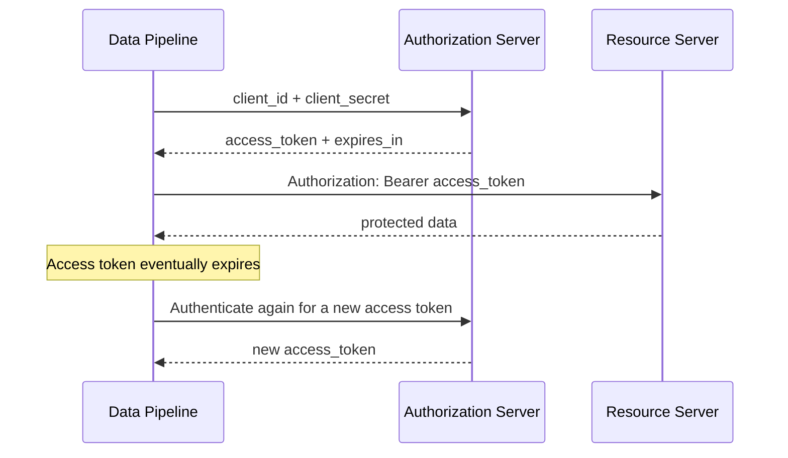
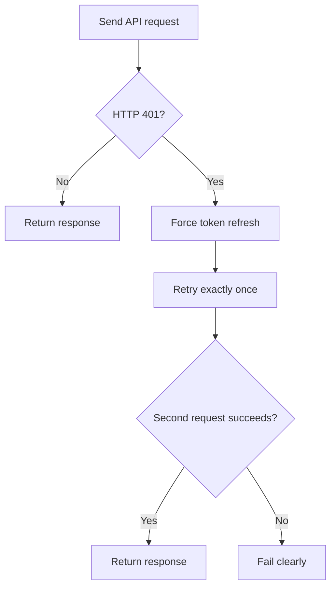
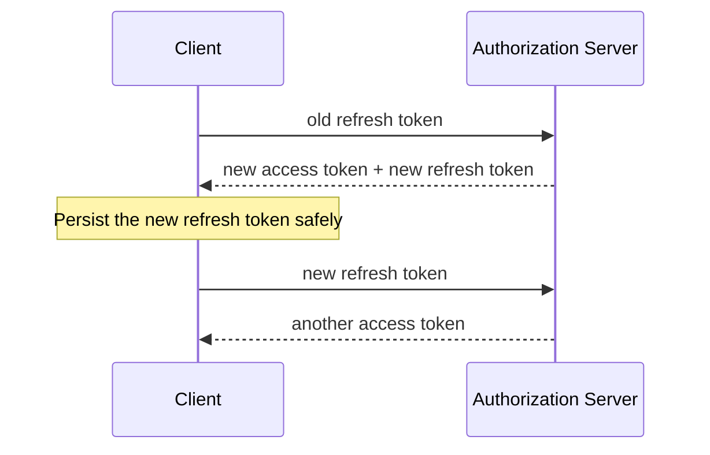
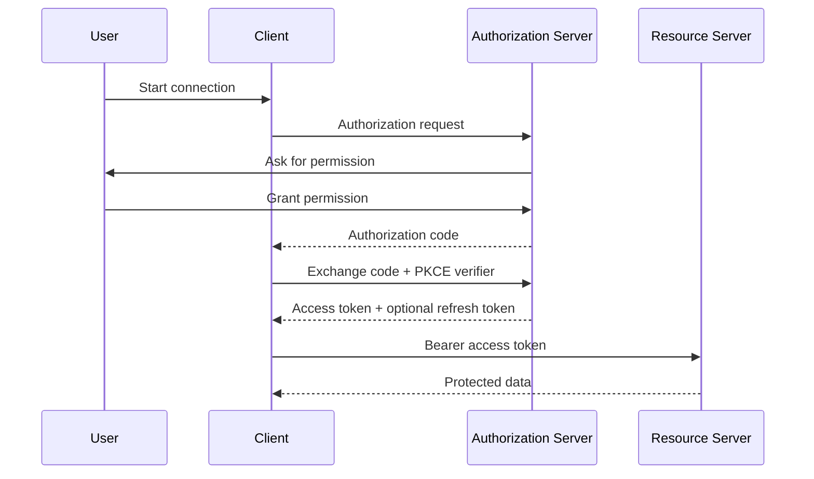
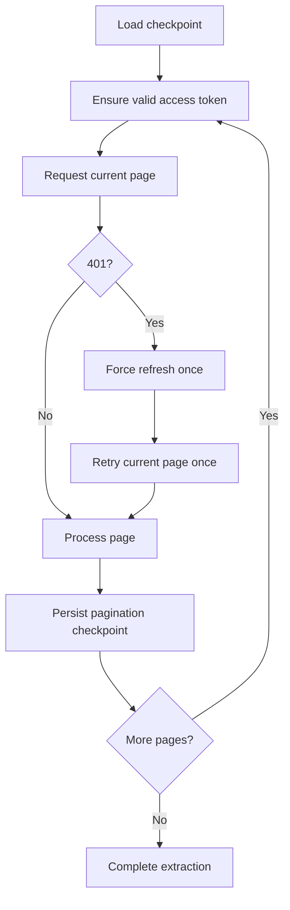
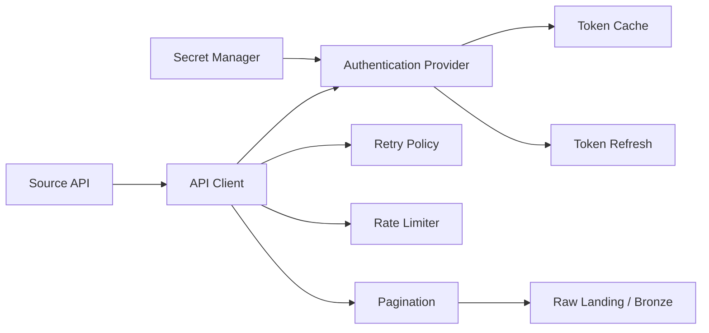

# API Authentication — Keys, OAuth 2.0, and Token Refresh

> **Stage 2 — Python for Data Engineering · Module 2.9 · Topic 03**
>
> This chapter teaches API authentication from first principles through production-oriented token lifecycle management, OAuth 2.0, JWTs, request signing, mTLS, credential hygiene, testing, and long-running ingestion.

---

## 1. Learning Objectives

By the end of this chapter, you should be able to:

1. Explain authentication and authorization in simple terms.
2. Explain API keys, Basic Auth, and Bearer tokens.
3. Explain why credentials should not be placed in URLs.
4. Explain OAuth 2.0 without memorizing terminology blindly.
5. Explain the roles involved in OAuth 2.0.
6. Explain the client-credentials flow step by step.
7. Explain authorization code + PKCE conceptually and technically.
8. Explain access tokens, refresh tokens, and token expiry.
9. Implement proactive token refresh.
10. Implement reactive refresh after HTTP `401`.
11. Prevent infinite refresh loops.
12. Cache tokens correctly.
13. Handle rotating refresh tokens safely.
14. Build reusable authentication with `httpx.Auth`.
15. Understand `requests.AuthBase` in existing codebases.
16. Understand JWT structure and the difference between decoding and verification.
17. Understand HMAC/request signing at a practical level.
18. Understand mutual TLS and service-account credentials.
19. Apply production credential hygiene.
20. Handle token expiration during long pagination and export jobs.
21. Test authentication code without a real external API.
22. Design authentication that is observable without leaking secrets.

---

## 2. Prerequisites

This topic assumes you have completed:

- **Topic 01 — HTTP Fundamentals for Data Extraction**
- **Topic 02 — httpx and requests: Sessions and Timeouts**

You should already have a basic understanding of:

- HTTP requests and responses
- methods such as `GET` and `POST`
- status codes
- headers
- JSON request/response bodies
- `httpx.Client`
- request timeouts
- basic Python functions, classes, exceptions, and context managers

This chapter does **not** re-teach HTTP fundamentals or HTTP-client basics. It connects those ideas to authentication.

---

# 3. Why API Authentication Exists

Imagine a CRM API contains 10 million customer records.

If the API were completely open, anyone who knew the endpoint could potentially request:

```text
GET /customers
```

The server needs answers to two different questions:

1. **Who is making this request?**
2. **What is that caller allowed to do?**

These are different questions.

### Authentication

**Authentication** answers:

> "Who are you?"

Examples:

- an API key identifies a registered application;
- a username/password authenticates a user;
- an access token represents an authorized client or user;
- a client certificate identifies a machine or service.

### Authorization

**Authorization** answers:

> "What are you allowed to do?"

For example, an authenticated ingestion service may be allowed to:

```text
customers:read
orders:read
```

but not:

```text
customers:delete
billing:write
```

### Data-engineering example

A scheduled ingestion pipeline extracts customer data from a SaaS CRM.

The CRM may need to determine:

- which application is calling;
- whether its credential is valid;
- whether the credential has expired;
- whether the caller can read customers;
- whether the caller has the required scope;
- whether the credential has been revoked.

Authentication and authorization therefore become part of the reliability and security boundary of the ingestion pipeline.

---

# 4. Authentication vs Authorization

A useful mental model is:

```text
Authentication
      |
      v
"Who are you?"
      |
      v
Identity
      |
      v
Authorization
      |
      v
"What are you allowed to do?"
      |
      v
Permissions / Scopes
```

| Concept | Question | Example |
|---|---|---|
| Authentication | Who are you? | "This request belongs to ingestion-service-A." |
| Identity | Which principal is this? | Service account `crm-ingestor` |
| Authorization | What may it do? | Read customer records |
| Permission | What specific operation is allowed? | `customers:read` |
| Scope | How is delegated access represented? | `customers.read` |

A successful authentication does **not** automatically mean every operation is authorized.

For example:

```text
Authentication: SUCCESS
Authorization:  FAILURE
```

can legitimately produce:

```http
HTTP/1.1 403 Forbidden
```

### `401` vs `403`

A common practical distinction is:

- `401 Unauthorized`: the request lacks valid authentication credentials, or the credentials are invalid/expired.
- `403 Forbidden`: the server understood the caller's identity but refuses the requested operation.

Providers differ in exact semantics, so always consult the API's documentation.

---

# 5. API Keys

## 5.1 What Is an API Key?

An API key is a credential issued by an API provider.

Conceptually:

```text
Your application
      |
      | API key
      v
Provider
      |
      v
"Recognize this application"
```

An API key often looks like an opaque string:

```text
ak_live_XXXXXXXXXXXXXXXX
```

The exact format varies by provider.

An API key may identify:

- an application;
- a project;
- an integration;
- a service;
- an account.

It may also be associated with permissions or quotas.

Do not assume every API key has identical security semantics. The provider defines what the key means.

---

## 5.2 Header-Based API Keys

A common pattern is sending the key in a header:

```http
GET /customers HTTP/1.1
Host: api.example.com
X-API-Key: <API_KEY>
```

Python:

```python
import os
import httpx

api_key = os.environ["API_KEY"]

with httpx.Client(
    base_url="https://api.example.com",
    headers={"X-API-Key": api_key},
    timeout=30.0,
) as client:
    response = client.get("/customers")
    response.raise_for_status()
```

The important idea is:

```text
Credential
   |
   v
HTTP header
   |
   v
API request
```

The exact header name is provider-specific. Some APIs use:

```text
X-API-Key
```

while others document a different header.

---

## 5.3 Why Query-String API Keys Are Risky

This is generally undesirable:

```http
GET /customers?api_key=SECRET
```

The secret becomes part of the URL.

URLs can be captured by:

- access logs;
- reverse proxies;
- monitoring systems;
- browser history;
- browser bookmarks;
- debugging tools;
- tracing systems;
- analytics systems;
- screenshots;
- copied links;
- intermediary infrastructure.

A URL can also persist longer than expected.

Prefer:

```http
GET /customers
X-API-Key: SECRET
```

when the API supports header-based authentication.

### Bad

```python
client.get("/customers", params={"api_key": api_key})
```

### Better

```python
client.get(
    "/customers",
    headers={"X-API-Key": api_key},
)
```

The exact provider contract always wins. Some legacy services only support query parameters, but that should be treated as a security consideration rather than copied into a new integration by default.

---

## 5.4 API-Key Credential Hygiene

Never do this:

```python
API_KEY = "ak_live_123456789"
```

Use external secret configuration:

```python
import os

API_KEY = os.environ["API_KEY"]
```

For production, environment variables may be only one layer of a larger secret-management strategy. Managed secret stores are often preferable when available.

---

# 6. HTTP Basic Authentication

Basic Authentication traditionally sends a username and password through the `Authorization` header:

```http
Authorization: Basic <base64-value>
```

The encoded value represents:

```text
username:password
```

### Important security fact

**Base64 is encoding, not encryption.**

Anyone who obtains the encoded value can decode it.

Therefore Basic Authentication should be protected with HTTPS.

With `httpx`:

```python
import httpx

with httpx.Client(
    base_url="https://api.example.com",
    auth=("username", "password"),
) as client:
    response = client.get("/customers")
    response.raise_for_status()
```

Basic Auth can still appear in:

- legacy APIs;
- internal systems;
- older enterprise integrations;
- administrative interfaces.

Do not assume it is interchangeable with OAuth. Authentication mechanisms have different trust models and operational characteristics.

---

# 7. Bearer Tokens

A bearer token is a credential where:

> whoever possesses the token can generally present it to access the associated resources.

The standard HTTP form is:

```http
Authorization: Bearer <ACCESS_TOKEN>
```

Python:

```python
access_token = os.environ["ACCESS_TOKEN"]

headers = {
    "Authorization": f"Bearer {access_token}",
}
```

The term **bearer** is important.

You generally do not need to prove additional possession beyond presenting the token.

Therefore:

```text
Access token leaked
       |
       v
Attacker possesses token
       |
       v
Attacker may use token within its permissions/lifetime
```

This is why access tokens should be:

- protected;
- short-lived where appropriate;
- scoped narrowly;
- excluded from logs;
- excluded from source control;
- excluded from URLs.

### API key vs Bearer token

| Property | API Key | Bearer Token |
|---|---|---|
| Typical purpose | Application identification/access | Authorized API access |
| Header example | `X-API-Key: ...` | `Authorization: Bearer ...` |
| Expiration | Provider-dependent | Commonly short-lived |
| OAuth relationship | Not necessarily OAuth | Commonly used by OAuth |
| Rotation | Provider-dependent | Commonly lifecycle-managed |
| Risk if leaked | Potential API access | Potential API access until expiry/revocation |

Do not assume "OAuth" automatically means "JWT". OAuth access tokens can be opaque or structured.

---

# 8. OAuth 2.0 — Mental Model

OAuth 2.0 exists primarily to enable **delegated authorization**.

The core idea is that an application can obtain a token representing permission to access resources without necessarily receiving the user's primary password.

Consider a user who wants a data application to read files from another service.

A useful conceptual model is:

```text
Resource Owner
      |
      | grants authorization
      v
Client
      |
      | obtains token
      v
Authorization Server
      |
      | access token
      v
Resource Server
```

## 8.1 OAuth Roles

### 1. Resource Owner

The entity that can grant access to a protected resource.

Often this is a user.

### 2. Client

The application requesting access.

For example:

```text
data-ingestion-service
```

### 3. Authorization Server

The system responsible for issuing tokens after the required authorization process.

### 4. Resource Server

The API hosting protected resources.

For example:

```text
CRM API
```

These roles can be implemented by separate services or by the same platform.

---

# 9. OAuth 2.0 Tokens

## 9.1 Access Token

An access token is presented to the resource server:

```http
Authorization: Bearer <ACCESS_TOKEN>
```

It is normally used for API requests.

It often has a relatively short lifetime.

## 9.2 Refresh Token

A refresh token can be used by an OAuth client to obtain a new access token without repeating the full authorization interaction.

Conceptually:

```text
Refresh Token
      |
      v
Authorization Server
      |
      v
New Access Token
```

A refresh token is usually more sensitive than an access token because it may provide a mechanism for obtaining additional access tokens.

Therefore:

> Protect refresh tokens at least as carefully as, and generally more carefully than, access tokens.

### Access token vs refresh token

| Property | Access Token | Refresh Token |
|---|---|---|
| Main purpose | Access protected API | Obtain a new access token |
| Sent to resource API | Yes | Usually no |
| Lifetime | Often short | Often longer |
| Exposure | Must be protected | Requires especially strong protection |
| Rotation | Provider-dependent | Commonly supported by providers |
| Storage | Often in memory | May require secure persistence |

---

# 10. Token Lifetime and Expiration

A token endpoint may return:

```json
{
  "access_token": "<ACCESS_TOKEN>",
  "token_type": "Bearer",
  "expires_in": 3600
}
```

Meaning:

- `access_token`: credential used for API requests;
- `token_type`: how the token is presented;
- `expires_in`: lifetime in seconds from issuance.

If:

```text
expires_in = 3600
```

the nominal lifetime is one hour.

A production client should not assume:

```text
token is valid forever
```

Instead, maintain an expiration timestamp.

```text
issued_at = current_time
expires_in = 3600

expires_at = issued_at + 3600
```

A client can then refresh before:

```text
expires_at
```

---

# 11. OAuth 2.0 Client Credentials Flow

This is particularly important for data engineering.

The **client credentials flow** is designed for machine-to-machine authorization where the client acts on its own behalf rather than on behalf of an interactive user.

Typical examples:

- scheduled ETL;
- API ingestion jobs;
- service-to-service calls;
- machine-to-machine integrations;
- background workers;
- service identities.

## 11.1 Flow



### Step 1 — Client registration

The service is registered with the provider.

### Step 2 — Client ID

The provider gives the application a client identifier.

```text
CLIENT_ID
```

### Step 3 — Client secret

The provider may issue a secret:

```text
CLIENT_SECRET
```

Treat it as a credential.

### Step 4 — Token endpoint

The provider documents a token endpoint, for example:

```text
https://auth.example.com/oauth/token
```

The exact URL is provider-specific.

### Step 5 — Token request

Conceptually:

```text
client_id
client_secret
grant_type=client_credentials
```

### Step 6 — Access token

The authorization server returns an access token.

### Step 7 — API request

The client sends:

```http
Authorization: Bearer <ACCESS_TOKEN>
```

### Step 8 — Expiration

Eventually the access token expires.

### Step 9 — Renewal

The client obtains another access token using the provider's documented client-credentials mechanism.

### Important distinction

Do **not** automatically describe client-credentials renewal as a refresh-token flow.

Many client-credentials implementations simply request a new access token using the client credentials after the old access token expires.

That differs from an OAuth flow where a refresh token is explicitly exchanged for a new access token.

---

# 12. Python Implementation — Client Credentials

Start with a deliberately simple implementation.

```python
from __future__ import annotations

import os

import httpx


TOKEN_URL = "https://auth.example.com/oauth/token"
API_BASE_URL = "https://api.example.com"

CLIENT_ID = os.environ["CLIENT_ID"]
CLIENT_SECRET = os.environ["CLIENT_SECRET"]


def get_access_token(client: httpx.Client) -> str:
    response = client.post(
        TOKEN_URL,
        data={
            "grant_type": "client_credentials",
            "client_id": CLIENT_ID,
            "client_secret": CLIENT_SECRET,
        },
    )
    response.raise_for_status()

    payload = response.json()
    return payload["access_token"]
```

This is easy to understand, but it has a major problem:

```text
Every call to get_access_token()
        |
        v
New token request
```

A production API client should usually cache the token for its valid lifetime.

---

# 13. Proactive Token Refresh

Proactive refresh means:

> Refresh before the token reaches its expiration time.

Suppose:

```text
expires_in = 3600 seconds
```

You might use a safety margin such as:

```text
refresh 30 seconds before expiration
```

This protects against:

- clock skew;
- network latency;
- a request starting immediately before expiration;
- token expiration during a long request.

## 13.1 Expiration Timestamp

Prefer storing:

```python
token_expires_at
```

rather than repeatedly reasoning about the original:

```python
expires_in
```

Example:

```python
from datetime import datetime, timedelta, timezone


def expiration_from_expires_in(expires_in: int) -> datetime:
    return datetime.now(timezone.utc) + timedelta(seconds=expires_in)
```

Then:

```python
def token_needs_refresh(
    expires_at: datetime,
    safety_margin: timedelta = timedelta(seconds=30),
) -> bool:
    now = datetime.now(timezone.utc)
    return now + safety_margin >= expires_at
```

The safety margin means:

```text
now ---- 30s ---- expires_at
              ^
          refresh here
```

---

# 14. Reactive Token Refresh on HTTP 401

Proactive refresh is not enough.

A valid-looking cached token can become invalid because of:

- revocation;
- server-side invalidation;
- clock differences;
- administrative action;
- provider policy;
- unexpected token invalidation.

Therefore a robust client can also respond to an authentication failure.

Conceptually:



## Never do this

```python
while response.status_code == 401:
    refresh()
    response = retry()
```

If the credential is permanently invalid, this can loop forever.

## Correct principle

```text
401
 |
 +--> refresh once
 |
 +--> retry once
 |
 +--> success OR explicit failure
```

The retry must have a bounded policy.

---

# 15. Proactive + Reactive Refresh Together

A production-oriented client can use both:

| Strategy | Purpose |
|---|---|
| Proactive | Handle normal token expiration |
| Reactive | Handle unexpected invalidation |

The combined behavior is:

```text
Before request
    |
    v
Is token near expiration?
    |
  yes ----> refresh
    |
    v
Send request
    |
    v
Did API return 401?
    |
  yes ----> force refresh once
    |
    v
Retry once
    |
    +---- success
    |
    +---- 401 again -> fail
```

Reactive refresh should not become a generic retry mechanism.

A `401` may represent a credential problem requiring operator intervention.

---

# 16. Token Caching

Requesting a new access token for every API request can create:

- unnecessary latency;
- authorization-server load;
- token endpoint rate-limit pressure;
- additional failure points;
- unnecessary cost.

Suppose a pipeline makes:

```text
100,000 API requests
```

and every request first obtains a token.

You have turned one API integration into potentially:

```text
100,000 API calls
+
100,000 token calls
```

when the provider may have allowed one cached access token to serve many requests.

## 16.1 In-Memory Cache

A simple cache belongs to one process:

```text
Process
 |
 +-- token
 +-- expiration
```

When the process exits, the cache disappears.

This is often appropriate for short-lived access tokens.

## 16.2 Across Processes

If you have:

```text
Worker A
Worker B
Worker C
Worker D
```

each process has separate memory.

Therefore:

```text
Worker A cache != Worker B cache
```

Do not assume an in-memory cache is globally shared.

## 16.3 Persistent Token Storage

Refresh tokens may need persistence across restarts.

That is fundamentally different from caching a short-lived access token.

Think of the layers as:

```text
In-memory access-token cache
        |
        v
Process lifetime

Persistent refresh-token state
        |
        v
Application/restart lifetime
```

Persistent credential state requires stronger controls.

---

# 17. Thread-Safe Token Refresh

Consider two threads:

```text
Worker A: token expired
Worker B: token expired
```

Without coordination:

```text
A -> refresh
B -> refresh
```

Both may contact the token endpoint.

With rotating refresh tokens, this can become dangerous.

## 17.1 Locking Pattern

```python
from threading import Lock


class TokenManager:
    def __init__(self) -> None:
        self._lock = Lock()
        self._access_token: str | None = None

    def get_token(self) -> str:
        with self._lock:
            if self._token_is_valid():
                assert self._access_token is not None
                return self._access_token

            self._access_token = self._refresh()
            return self._access_token

    def _token_is_valid(self) -> bool:
        return self._access_token is not None

    def _refresh(self) -> str:
        # Replace with the provider-specific token request.
        return "placeholder-access-token"
```

The critical section is:

```python
with self._lock:
```

The lock prevents multiple threads in the same process from simultaneously executing the refresh operation.

### Important limitation

A Python lock does not coordinate separate processes.

For:

```text
Process A
Process B
```

you need an inter-process coordination strategy if shared refresh state requires it.

---

# 18. Rotating Refresh Tokens

Some OAuth providers rotate refresh tokens.

The lifecycle can look like:



The critical point is:

```text
old refresh token
        |
        v
refresh request
        |
        +--> new access token
        |
        +--> new refresh token
```

If the provider invalidates the old refresh token, this is dangerous:

```python
refresh_token = old_token

new_access_token, new_refresh_token = refresh()

# BUG:
# Ignore new_refresh_token
```

The application may later attempt to use the now-invalid old refresh token.

## Correct behavior

Persist the newly issued refresh token.

Conceptually:

```python
new_access_token, new_refresh_token = refresh()

persist_refresh_token_atomically(new_refresh_token)

access_token = new_access_token
```

### Crash-safety problem

Consider:

```text
1. Receive new refresh token
2. Process crashes
3. Old refresh token is invalid
4. New refresh token was never persisted
```

You can lose the ability to refresh.

This is why rotating refresh tokens require deliberate persistence design.

---

# 19. Safe Refresh Token Storage

## Development

A restricted local file can sometimes be used for development.

Example considerations:

- file permissions should prevent other users from reading it;
- never commit the file;
- never put it into source control;
- do not print it.

## Production

Prefer managed secret storage where appropriate:

- cloud secret manager;
- Vault;
- managed secret store;
- dedicated credential-management infrastructure.

Avoid:

- Git repositories;
- source code;
- Docker image layers;
- plaintext logs;
- public configuration;
- arbitrary database tables without appropriate access controls.

### Development vs production

| Environment | Example | Key concern |
|---|---|---|
| Local development | Restricted local secret file | Prevent accidental commits |
| CI/CD | Secret-management facility | Avoid plaintext pipeline output |
| Production | Managed secret manager | Access control, auditing, rotation |
| Container | Runtime secret injection | Avoid image-layer exposure |

A secret is not merely configuration.

### Configuration

Examples:

```text
API_BASE_URL
TIMEOUT_SECONDS
```

### Secret

Examples:

```text
CLIENT_SECRET
REFRESH_TOKEN
PRIVATE_KEY
```

Treat these differently.

---

# 20. `httpx.Auth`

Authentication logic should not be duplicated across every API call.

Instead of:

```python
headers = {
    "Authorization": f"Bearer {token}"
}

client.get("/customers", headers=headers)
client.get("/orders", headers=headers)
client.get("/invoices", headers=headers)
```

you can centralize authentication.

`httpx` provides the `Auth` abstraction.

Conceptually:

```python
auth = ClientCredentialsAuth(...)

client = httpx.Client(
    base_url="https://api.example.com",
    auth=auth,
)
```

The client then owns authentication behavior.

## 20.1 A Small Custom `httpx.Auth`

```python
from __future__ import annotations

import httpx


class StaticBearerAuth(httpx.Auth):
    def __init__(self, access_token: str) -> None:
        self._access_token = access_token

    def auth_flow(self, request: httpx.Request):
        request.headers["Authorization"] = (
            f"Bearer {self._access_token}"
        )
        yield request
```

Usage:

```python
auth = StaticBearerAuth("<ACCESS_TOKEN>")

with httpx.Client(
    base_url="https://api.example.com",
    auth=auth,
) as client:
    response = client.get("/customers")
    response.raise_for_status()
```

The authentication concern is now separated from business logic.

---

# 21. Production-Oriented `httpx.Auth` Design

A token-aware implementation needs:

- token acquisition;
- expiration tracking;
- safety margin;
- synchronization;
- request modification;
- bounded reactive refresh.

A simplified structure is:

```python
from __future__ import annotations

from dataclasses import dataclass
from datetime import datetime, timedelta, timezone
from threading import Lock

import httpx


@dataclass
class AccessToken:
    value: str
    expires_at: datetime


class ClientCredentialsAuth(httpx.Auth):
    def __init__(
        self,
        token_url: str,
        client_id: str,
        client_secret: str,
        *,
        refresh_margin_seconds: int = 30,
    ) -> None:
        self.token_url = token_url
        self.client_id = client_id
        self.client_secret = client_secret
        self.refresh_margin = timedelta(
            seconds=refresh_margin_seconds
        )
        self._token: AccessToken | None = None
        self._lock = Lock()

    def _needs_refresh(self) -> bool:
        if self._token is None:
            return True

        now = datetime.now(timezone.utc)
        return now + self.refresh_margin >= self._token.expires_at

    def _get_token(self) -> str:
        with self._lock:
            if not self._needs_refresh():
                assert self._token is not None
                return self._token.value

            # Token acquisition would use a dedicated client and
            # provider-specific request format.
            raise NotImplementedError(
                "Implement provider-specific token acquisition."
            )

    def auth_flow(self, request: httpx.Request):
        token = self._get_token()
        request.headers["Authorization"] = f"Bearer {token}"
        yield request
```

This is intentionally incomplete at the provider boundary.

A production implementation should keep provider-specific token acquisition isolated from generic authentication behavior.

### Why that separation matters

```text
Generic authentication lifecycle
        |
        +--> token cache
        +--> expiry
        +--> locking
        +--> injection
        +--> bounded refresh

Provider-specific adapter
        |
        +--> token URL
        +--> form fields
        +--> client authentication method
        +--> response schema
```

This makes testing and maintenance easier.

---

# 22. `requests.AuthBase`

Existing data-engineering codebases may use `requests`.

The equivalent abstraction is:

```python
requests.auth.AuthBase
```

Example:

```python
import requests


class BearerAuth(requests.auth.AuthBase):
    def __init__(self, token: str) -> None:
        self.token = token

    def __call__(self, request: requests.PreparedRequest):
        request.headers["Authorization"] = (
            f"Bearer {self.token}"
        )
        return request
```

Usage:

```python
session = requests.Session()
session.auth = BearerAuth("<ACCESS_TOKEN>")

response = session.get("https://api.example.com/customers")
response.raise_for_status()
```

### Comparison

| Feature | `httpx.Auth` | `requests.AuthBase` |
|---|---|---|
| Library | `httpx` | `requests` |
| Main abstraction | `Auth` | `AuthBase` |
| Authentication hook | `auth_flow()` | `__call__()` |
| Common use | Modern Python clients | Existing/legacy integrations |
| Async ecosystem | Strong support | Primarily synchronous |

The important engineering skill is recognizing the authentication abstraction in either client rather than scattering credentials throughout business code.

---

# 23. OAuth 2.0 Authorization Code Flow

The authorization code flow is commonly used when a user participates in authorization.

Conceptually:



Important concepts include:

- user authorization;
- authorization endpoint;
- redirect URI;
- authorization code;
- token endpoint;
- access token;
- refresh token.

### Difference from client credentials

| Property | Client Credentials | Authorization Code + PKCE |
|---|---|---|
| User involved | Usually no | Yes |
| Main trust model | Application/service | User delegates access to client |
| Typical use | Service-to-service ingestion | User-connected SaaS integrations |
| Authorization interaction | Machine | User |
| Refresh token | Provider-dependent; commonly not central to this flow | Commonly used |
| Typical example | Scheduled CRM ingestion service | User connects their cloud storage |

Selection depends on the trust model and integration requirements.

---

# 24. PKCE

**PKCE** stands for Proof Key for Code Exchange.

It protects the authorization-code exchange against certain code interception scenarios.

The basic idea is that the client creates a secret-like temporary value:

```text
code_verifier
```

and derives:

```text
code_challenge
```

from it.

For the common `S256` method:

```text
code_challenge =
    BASE64URL(
        SHA256(code_verifier)
    )
```

The client sends the challenge during authorization.

Later, when exchanging the authorization code, it sends the verifier.

```text
Authorization request
        |
        +--> code_challenge
        |
        v
Authorization Server
        |
        +--> authorization code
        |
        v
Token request
        |
        +--> code_verifier
        |
        v
Authorization Server
```

The server can verify that the party exchanging the code possesses the original verifier.

### Why hashing appears here

A hash function maps input data to a fixed-size digest:

```text
input
  |
  v
SHA-256
  |
  v
digest
```

It is not encryption.

For educational purposes:

```python
import base64
import hashlib


def create_code_challenge(code_verifier: str) -> str:
    digest = hashlib.sha256(
        code_verifier.encode("ascii")
    ).digest()

    return base64.urlsafe_b64encode(
        digest
    ).rstrip(b"=").decode("ascii")
```

In real applications, use a well-maintained OAuth library when appropriate rather than implementing an entire OAuth client from scratch.

---

# 25. Device Code Flow

The device authorization flow is useful when a device or environment cannot conveniently perform a normal browser redirect.

A typical conceptual sequence is:

```text
Device
  |
  +--> Device authorization endpoint
  |
  +--> User receives verification instructions
  |
  +--> User authorizes on another device
  |
  +--> Device polls token endpoint
  |
  +--> Access token
```

Examples can include:

- command-line applications;
- smart devices;
- environments with limited input/display.

It differs from client credentials because a human authorization step remains part of the flow.

This section is awareness-level. The exact protocol details are provider-specific.

---

# 26. OAuth Flow Comparison

| Flow | User involved? | Machine-to-machine? | Refresh token? | Typical use |
|---|---:|---:|---:|---|
| Client Credentials | No | Yes | Not usually central | Background services |
| Authorization Code + PKCE | Yes | Not primarily | Common | User-connected applications |
| Device Code | Yes | Not purely | Provider-dependent | Devices/CLI environments |

There is no universally correct OAuth flow.

Choose based on:

- who owns the resource;
- whether a user is present;
- trust relationships;
- provider capabilities;
- credential lifecycle;
- deployment environment.

---

# 27. JWTs

**JWT** means **JSON Web Token**.

A JWT is a token representation with three dot-separated components:

```text
header.payload.signature
```

For example:

```text
xxxxx.yyyyy.zzzzz
```

A JWT is commonly Base64URL-encoded.

### Critical security point

JWT payloads are generally **encoded, not encrypted**.

Therefore:

> Do not put confidential information into a JWT payload merely because it is a JWT.

The three parts are:

```text
Header
  |
  v
Payload
  |
  v
Signature
```

---

# 28. JWT Header

A conceptual JWT header may look like:

```json
{
  "alg": "RS256",
  "typ": "JWT",
  "kid": "key-2026-01"
}
```

Common fields:

| Claim | Meaning |
|---|---|
| `alg` | Signing algorithm |
| `typ` | Token type |
| `kid` | Key identifier |

Do not blindly trust the header. Verification rules must come from the token issuer's security contract.

---

# 29. JWT Payload

A payload may contain claims such as:

```json
{
  "sub": "service-account-123",
  "iss": "https://auth.example.com",
  "aud": "https://api.example.com",
  "iat": 1790000000,
  "exp": 1790003600,
  "scope": "customers.read orders.read"
}
```

| Claim | Meaning |
|---|---|
| `sub` | Subject |
| `iss` | Issuer |
| `aud` | Intended audience |
| `iat` | Issued-at time |
| `exp` | Expiration time |
| `scope` | Granted scope information |

Providers may use different claim names or formats.

---

# 30. JWT Signature

The signature provides integrity and authenticity when correctly verified.

Conceptually:

```text
header + "." + payload
          |
          v
       signing
          |
          v
      signature
```

A signature is not the same thing as encryption.

```text
Signing:
Can I detect modification and verify the signer?

Encryption:
Can unauthorized parties read the content?
```

JWT signing does not automatically hide the payload.

---

# 31. Reading JWT `exp` and Scopes

For debugging, it can be useful to inspect a JWT payload.

A minimal educational decoder:

```python
import base64
import json


def decode_payload_for_inspection(token: str) -> dict:
    parts = token.split(".")
    if len(parts) != 3:
        raise ValueError("Not a JWT-shaped token")

    payload = parts[1]
    padding = "=" * (-len(payload) % 4)

    decoded = base64.urlsafe_b64decode(
        payload + padding
    )

    return json.loads(decoded)
```

Then:

```python
payload = decode_payload_for_inspection(token)

print(payload.get("exp"))
print(payload.get("scope"))
```

### Very important

This is **inspection only**.

It does **not** prove:

- the token was signed by the expected issuer;
- the token was not modified;
- the token is intended for your API;
- the token is currently valid.

---

# 32. JWT Verification

Verification should check the token against trusted verification material and policy.

Typical checks include:

1. signature;
2. allowed algorithm;
3. issuer;
4. audience;
5. expiration;
6. other provider-specific constraints.

The distinction is:

```text
decode(token)
```

versus:

```text
verify(token)
```

Decoding answers:

> "What bytes/claims are inside this token?"

Verification answers:

> "Can I trust this token according to the issuer and security policy?"

### Common mistakes

- accepting any `alg` value;
- skipping signature verification;
- ignoring `aud`;
- ignoring `iss`;
- accepting expired tokens;
- treating decoded scopes as automatically trustworthy.

Use established JWT/OAuth libraries for real verification rather than writing cryptographic verification yourself unless you have a specific reason and deep expertise.

---

# 33. Request Signing

Bearer authentication has an important property:

```text
Possession of token -> ability to present token
```

Some APIs need stronger request-level integrity.

**Request signing** creates a cryptographic signature over selected request information.

Conceptually:

```text
HTTP method
URL/path
timestamp
headers
body
   |
   v
canonical request
   |
   v
HMAC/signature algorithm
   |
   v
signature
```

The server reconstructs the expected signed content and verifies the signature.

This can provide:

- message integrity;
- authentication of the signing party;
- replay protection when timestamps/nonces are incorporated correctly.

---

# 34. HMAC Authentication

**HMAC** means Hash-based Message Authentication Code.

At a high level:

```text
secret + message
      |
      v
     HMAC
      |
      v
   signature
```

The server must have access to the corresponding secret.

Python:

```python
import hashlib
import hmac


def create_signature(
    secret: bytes,
    canonical_request: bytes,
) -> str:
    digest = hmac.new(
        secret,
        canonical_request,
        hashlib.sha256,
    ).hexdigest()

    return digest
```

Verification:

```python
def signatures_match(
    expected: str,
    received: str,
) -> bool:
    return hmac.compare_digest(
        expected,
        received,
    )
```

`compare_digest()` is preferred for comparing security-sensitive values because it is designed to reduce timing side-channel differences compared with ordinary string comparison.

## Replay protection

A signature alone does not automatically prevent replay.

A request may include:

```text
timestamp
nonce
```

The server can enforce rules such as:

```text
timestamp must be recent
nonce must not have been used before
```

The exact protocol is provider-specific.

---

# 35. AWS Signature Version 4 Awareness

Cloud APIs can use request signing rather than simple bearer tokens.

AWS Signature Version 4 (SigV4) involves concepts such as:

- canonical request;
- signed headers;
- credential scope;
- signing key;
- derived signature.

Conceptually:

```text
HTTP request
    |
    v
Canonical request
    |
    v
String to sign
    |
    v
Derived signing key
    |
    v
Signature
```

You do not need to memorize the full SigV4 specification at this stage.

The important data-engineering lesson is:

> Some cloud APIs authenticate the request itself, not merely the possession of an opaque bearer token.

When using AWS SDKs or established clients, prefer their implementation rather than hand-implementing SigV4.

---

# 36. Mutual TLS

Normal TLS commonly authenticates the server to the client.

The simplified model is:

```text
Client ---- TLS ----> Server
          ^
          |
      Server proves
        identity
```

**Mutual TLS (mTLS)** adds client authentication:

```text
Client <---- mutual TLS ----> Server
   |                              |
client cert                  server cert
private key
```

The client generally has:

- client certificate;
- corresponding private key.

Both sides participate in certificate-based authentication.

## Enterprise use cases

mTLS may appear in:

- banking integrations;
- regulated environments;
- B2B APIs;
- internal service meshes;
- enterprise partner integrations.

## Operational complexity

mTLS introduces lifecycle concerns:

- certificate issuance;
- private-key protection;
- certificate rotation;
- certificate expiration;
- trust-store management;
- CA management.

Certificate expiration can become a production outage if not monitored.

---

# 37. Service Accounts and Key Files

A service account represents a machine identity rather than a human user.

Examples:

```text
crm-ingestion-service
warehouse-loader
billing-export-worker
```

A provider may issue service-account credentials in a file.

Such a file can contain sensitive material such as:

```json
{
  "client_id": "<CLIENT_ID>",
  "private_key": "<PRIVATE_KEY>"
}
```

Never commit such a file to Git.

### Service-account design principles

Use:

- dedicated identities;
- narrow permissions;
- separate credentials by environment;
- credential rotation;
- revocation procedures;
- managed secret storage.

Avoid sharing one highly privileged service credential across unrelated pipelines.

---

# 38. Credential Hygiene

Credential hygiene is a production engineering requirement.

## 38.1 Least Privilege

Grant only the permissions the integration requires.

If the pipeline only reads customers:

```text
customers.read
```

is preferable to:

```text
admin.*
```

where the provider supports such scope controls.

## 38.2 Narrow Scopes

Scopes should reflect actual workload needs.

Ask:

> "What is the smallest set of permissions required?"

## 38.3 Dedicated Service Accounts

A service account should represent a workload or integration boundary.

Benefits include:

- clearer auditing;
- easier revocation;
- narrower permissions;
- safer credential rotation.

## 38.4 Credential Rotation

Credentials should have a lifecycle:

```text
issue
  |
  v
use
  |
  v
rotate
  |
  v
revoke old credential
```

Rotation should be designed before an emergency requires it.

## 38.5 Revocation

A credential may need immediate invalidation after:

- suspected exposure;
- employee/service decommissioning;
- environment migration;
- security incident.

## 38.6 Never Print Credentials

Never log:

- API keys;
- access tokens;
- refresh tokens;
- client secrets;
- private keys;
- complete `Authorization` headers.

---

# 39. Logging Authentication Safely

### Bad

```python
logger.info("Request headers: %s", headers)
```

This can accidentally print:

```text
Authorization: Bearer <SECRET>
```

### Better

```python
logger.info(
    "API request completed",
    extra={
        "status_code": response.status_code,
        "duration_ms": duration_ms,
        "endpoint": endpoint_name,
    },
)
```

Useful authentication-related observability includes:

- endpoint name;
- HTTP method;
- status;
- latency;
- retry count;
- whether a refresh occurred;
- authentication failure category.

Do not log the credential value.

### Never log

```text
API key
access token
refresh token
client secret
private key
Authorization header
```

Also consider indirect leakage through:

- exception messages;
- metrics labels;
- traces;
- query parameters;
- request dumps;
- debugging middleware.

---

# 40. Token Expiration During Long Pagination

Consider:

```text
Token lifetime: 60 seconds
Records:        100,000
Pagination:     several minutes
```

A naive client might:

```text
get token
  |
  v
page 1
page 2
page 3
...
page 40
  |
  v
401
```

The correct response is not:

```text
restart from page 1
```

Instead:

```text
page 40
   |
   v
401
   |
   v
refresh token
   |
   v
retry page 40 once
   |
   v
continue page 41
```

Authentication state and extraction state should remain separate.

```text
Extraction state
    |
    +--> page/cursor/checkpoint

Authentication state
    |
    +--> access token
    +--> expiry
    +--> refresh state
```

A token refresh should not reset the pagination cursor.

## Long-running pagination design



The checkpoint should advance based on successfully processed data, not merely on an attempted request.

---

# 41. Token Expiration During Large Exports

Some APIs use asynchronous exports.

Example:

```http
POST /exports
```

may return:

```http
202 Accepted
```

The client then polls:

```http
GET /exports/<id>
```

until the export is ready.

Finally:

```http
GET /exports/<id>/download
```

Authentication can expire during any of these stages:

```text
create export
    |
    v
poll status
    |
    v
poll status
    |
    v
download
```

A production client should treat authentication as a reusable concern across the entire workflow.

Do not create separate, inconsistent authentication logic for:

- creation;
- polling;
- download.

---

# 42. Common Failure Scenarios

| Scenario | Likely cause | Correct response |
|---|---|---|
| `401` | Missing/invalid/expired authentication | Inspect credential lifecycle; refresh once if appropriate |
| `403` | Insufficient authorization | Check scopes/permissions |
| Expired access token | Token lifetime elapsed | Proactive or bounded reactive refresh |
| Invalid refresh token | Revoked/rotated/expired refresh credential | Re-authorize or rotate credential according to provider process |
| Revoked credential | Administrative/security action | Replace credential through controlled process |
| Insufficient scope | Token lacks required permission | Request correct least-privilege scope |
| Wrong audience | Token intended for another API | Correct token audience/resource configuration |
| Wrong issuer | Token from unexpected issuer | Verify provider configuration |
| Expired JWT | `exp` has passed | Obtain a valid token |
| Clock skew | Client/server clocks differ | Use UTC and safety margins; verify time synchronization |
| Refresh rotation failure | New refresh token ignored | Persist new token safely |
| Leaked API key | Secret exposed | Revoke/rotate and investigate exposure |
| Token logged | Credential appears in logs | Remove logging, rotate exposed credential |
| Infinite refresh loop | Unbounded `401` retry | Refresh and retry at most once per request |
| Refresh race | Multiple workers refresh simultaneously | Coordinate refresh |
| Missing client secret | Configuration/secret injection problem | Check secret management without printing value |
| Wrong OAuth endpoint | Configuration mismatch | Verify provider documentation/configuration |

---

# 43. Debugging Methodology

When authentication fails, debug systematically.

## Step 1 — Check HTTP status

Is it:

```text
401
403
400
429
500
```

Do not treat every error as an authentication error.

## Step 2 — Check endpoint

Confirm:

- API base URL;
- token endpoint;
- resource endpoint;
- environment.

## Step 3 — Check authentication method

Is the API expecting:

- API key?
- Basic Auth?
- Bearer token?
- OAuth?
- HMAC?
- mTLS?

## Step 4 — Check whether the credential exists

Do not print it.

Instead verify presence:

```python
if not client_secret:
    raise RuntimeError("CLIENT_SECRET is not configured")
```

## Step 5 — Check expiration

Determine whether the access token is expired or near expiry.

## Step 6 — Check scopes

Confirm the token has the required permissions.

## Step 7 — Check issuer/audience

For JWT-based systems, verify the expected:

```text
iss
aud
```

## Step 8 — Check response headers

Some providers expose useful authentication metadata.

## Step 9 — Check refresh behavior

Did refresh occur when expected?

## Step 10 — Check retry count

Was the failed request retried?

## Step 11 — Check refresh count

Was refresh attempted more than once?

## Step 12 — Never print the secret

Use metadata such as:

```text
token_present=true
token_expired=true
refresh_attempted=true
retry_count=1
```

rather than:

```text
token=<SECRET>
```

---

# 44. Testing Authentication Code

Authentication code should be testable without real credentials or external services.

Useful tools include:

- `httpx.MockTransport`;
- `respx`.

The tests should exercise the state machine, not a real provider.

## 44.1 What to Test

At minimum:

1. valid token;
2. expired token;
3. proactive refresh;
4. `401` reactive refresh;
5. second `401`;
6. invalid refresh token;
7. rotating refresh token;
8. token caching;
9. concurrent refresh;
10. redacted logging.

---

## 44.2 `httpx.MockTransport`

Example:

```python
import httpx


def handler(request: httpx.Request) -> httpx.Response:
    if request.url.path == "/customers":
        return httpx.Response(
            200,
            json={"customers": []},
        )

    return httpx.Response(404)


transport = httpx.MockTransport(handler)

with httpx.Client(
    base_url="https://example.test",
    transport=transport,
) as client:
    response = client.get("/customers")

assert response.status_code == 200
```

No external network is required.

---

## 44.3 Testing Proactive Refresh

A useful test structure is:

```text
Given:
    cached token expires within safety margin

When:
    client makes a request

Then:
    token endpoint is called
    new token is cached
    API receives new token
```

The test should verify both behavior and call counts.

---

## 44.4 Testing Reactive `401`

```text
Given:
    cached token appears valid

When:
    API returns 401

Then:
    client refreshes exactly once
    client retries exactly once
```

Then test:

```text
Given:
    refreshed token is also rejected

Then:
    client fails
    no third request is attempted
    no endless refresh occurs
```

---

## 44.5 Testing Rotating Refresh Tokens

The mock authorization server can return:

```json
{
  "access_token": "access-2",
  "refresh_token": "refresh-2",
  "expires_in": 60
}
```

Then assert that:

```text
refresh-2
```

is persisted.

A second refresh should use:

```text
refresh-2
```

not:

```text
refresh-1
```

---

# 45. Hands-On Project — API Authentication Lab

The following is a self-contained design for a mock authentication lab.

You are **not** being asked to create separate project files in this chapter.

## Goal

Build conceptually:

```text
Mock Authentication Server
        |
        +--> /token
        |
        +--> 60-second access tokens
        |
        +--> rotating refresh tokens

Protected API
        |
        +--> /customers
```

The client should use:

```python
ClientCredentialsAuth(httpx.Auth)
```

or an equivalent reusable authentication abstraction.

## Requirements

The implementation should:

1. Fetch a token.
2. Cache the token.
3. Refresh 30 seconds before expiry.
4. Detect `401`.
5. Force refresh.
6. Retry exactly once.
7. Prevent infinite loops.
8. Run a five-minute paginated extraction.
9. Demonstrate token expiration.
10. Prove extraction completes.
11. Demonstrate rotating refresh tokens.
12. Persist the new refresh token safely.
13. Demonstrate what breaks when the new refresh token is ignored.
14. Add log redaction.
15. Test the redaction.

## Conceptual API

### Token endpoint

```http
POST /token
```

Example response:

```json
{
  "access_token": "access-123",
  "token_type": "Bearer",
  "expires_in": 60,
  "refresh_token": "refresh-123"
}
```

### Protected endpoint

```http
GET /customers?page=1
Authorization: Bearer access-123
```

When the token is expired:

```http
HTTP/1.1 401 Unauthorized
```

## Client state

```python
from dataclasses import dataclass
from datetime import datetime


@dataclass
class TokenState:
    access_token: str
    expires_at: datetime
    refresh_token: str | None = None
```

## Expected behavior

```text
Start extraction
      |
      v
Obtain token
      |
      v
Cache token
      |
      v
Extract pages
      |
      v
Near expiry?
   /       \
 yes       no
  |         |
refresh     |
  \         /
   v       v
continue extraction
      |
      v
Unexpected 401?
      |
     yes
      |
force refresh
      |
retry once
      |
      v
continue from same page
```

## Demonstrating the rotation bug

Broken behavior:

```text
refresh-1
   |
   v
refresh request
   |
   +--> access-2
   +--> refresh-2
             |
             X ignored
```

Correct behavior:

```text
refresh-1
   |
   v
refresh request
   |
   +--> access-2
   +--> refresh-2
             |
             v
        persist safely
```

## Proof of correctness

Your lab should demonstrate:

```text
pages requested:       N
pages successfully processed: N
duplicate pages due to refresh: 0
refresh loops:         0
secrets logged:        0
```

The important lesson is that token lifecycle management should not corrupt extraction progress.

---

# 46. Production Architecture

A production ingestion architecture can separate responsibilities:



## Separation of concerns

### API client

Responsible for:

- requests;
- response handling;
- endpoint behavior.

### Authentication provider

Responsible for:

- credentials;
- token acquisition;
- token caching;
- expiration;
- refresh;
- authentication headers.

### Retry policy

Responsible for:

- bounded retries;
- transient failures;
- authentication-specific retry rules.

### Rate limiter

Responsible for:

- provider rate limits;
- request pacing.

### Pagination

Responsible for:

- cursor/page state;
- extraction progress.

### Secret manager

Responsible for:

- protected credential storage;
- access control;
- rotation.

Authentication should not be deeply mixed into extraction business logic.

---

# 47. Production Design Principles

1. **Never hard-code secrets.**
2. **Never log credentials.**
3. **Prefer short-lived access tokens where appropriate.**
4. **Use least privilege.**
5. **Use proactive refresh where appropriate.**
6. **Handle unexpected `401`s safely.**
7. **Retry authentication exactly once when appropriate.**
8. **Prevent refresh loops.**
9. **Protect refresh tokens strongly.**
10. **Handle rotating refresh tokens.**
11. **Make authentication logic reusable.**
12. **Test authentication failure paths.**
13. **Make authentication observable without exposing secrets.**
14. **Design for long-running extraction jobs.**
15. **Separate authentication state from extraction state.**

---

# 48. Beginner-to-Advanced Mental Model

The learning progression is:

## Level 1 — API Key

You learned:

- credentials can identify an application;
- credentials belong in appropriate headers;
- URLs are poor places for secrets.

**Problem solved:** basic API access control.

**Production risk:** leaked keys can provide unauthorized access.

---

## Level 2 — Bearer Token

You learned:

- a token can be presented through the `Authorization` header;
- possession can be sufficient for access.

**Problem solved:** token-based API access.

**Production risk:** token leakage.

---

## Level 3 — OAuth 2.0

You learned:

- delegated authorization;
- authorization server;
- resource server;
- client;
- resource owner;
- access tokens.

**Problem solved:** controlled authorization without directly sharing primary credentials.

**Production risk:** incorrect flow selection or scope configuration.

---

## Level 4 — Token Lifecycle Management

You learned:

- expiration;
- caching;
- proactive refresh;
- reactive refresh;
- refresh-token rotation;
- concurrency.

**Problem solved:** long-running API clients.

**Production risk:** race conditions, refresh loops, credential loss.

---

## Level 5 — JWT and Verification

You learned:

- header;
- payload;
- signature;
- claims;
- decoding;
- verification.

**Problem solved:** understanding structured token representations.

**Production risk:** treating decoded claims as trusted without verification.

---

## Level 6 — Request Signing

You learned:

- canonical requests;
- HMAC;
- signatures;
- timestamps/nonces;
- replay protection.

**Problem solved:** request-level integrity and authentication.

**Production risk:** canonicalization mistakes and replay vulnerabilities.

---

## Level 7 — mTLS and Service Identities

You learned:

- client certificates;
- private keys;
- service accounts;
- machine identity.

**Problem solved:** stronger machine-to-machine trust models.

**Production risk:** certificate/key lifecycle failures.

---

## Level 8 — Production Authentication Architecture

You learned to combine:

```text
credentials
+
token lifecycle
+
secret management
+
observability
+
testing
+
long-running extraction
```

The goal is not to memorize technologies.

The goal is to reason about authentication as a production system.

---

# 49. Interview and Architecture Questions

## Beginner

### 1. What is authentication?

Reasoning:

Authentication establishes the identity or credential context associated with a request.

### 2. What is authorization?

Reasoning:

Authorization determines what an authenticated principal is permitted to do.

### 3. What is an API key?

Reasoning:

It is a provider-issued credential used to identify or authorize an application according to the provider's API contract.

### 4. Why should API keys not be placed in query strings?

Reasoning:

URLs can propagate into logs, history, proxies, traces, monitoring systems, and other systems. Headers are generally a safer placement when supported.

---

## Intermediate

### 5. What is OAuth 2.0?

Explain it as an authorization framework centered around obtaining access tokens under defined authorization flows.

### 6. What is client credentials?

Explain why it is appropriate for machine-to-machine integrations and why client-credentials renewal should not automatically be described as refresh-token renewal.

### 7. What is a refresh token?

Explain its role in obtaining new access tokens without repeating the complete authorization interaction.

### 8. Why cache tokens?

Explain latency, token endpoint load, rate limits, and reliability.

### 9. How should a pipeline handle `401`?

A strong answer should mention:

```text
bounded reactive refresh
+
retry once
+
fail clearly after a second authentication failure
```

---

## Advanced

### 10. How would you handle token expiration during a two-hour extraction?

Reason through:

- token cache;
- proactive refresh;
- reactive `401`;
- preserving extraction cursor/checkpoint;
- bounded retries;
- secret handling;
- observability.

### 11. How do you prevent infinite refresh loops?

Use explicit state:

```text
refresh_attempted = False
```

or an equivalent bounded retry mechanism.

### 12. How do you handle rotating refresh tokens?

Persist the newly issued refresh token safely and atomically before relying on it for subsequent refreshes.

### 13. How do you make refresh thread-safe?

Coordinate access to the refresh critical section using an appropriate synchronization mechanism.

### 14. How would you design authentication for multiple workers?

Discuss:

- process-local access-token caches;
- shared persistent credential state;
- refresh coordination;
- secret-manager access;
- token endpoint load;
- worker failure modes.

### 15. How would you safely observe authentication failures?

Log:

```text
status
endpoint
latency
refresh_attempted
retry_count
failure_category
```

but never:

```text
access_token
refresh_token
client_secret
private_key
```

---

## Architecture Questions

### 16. Design an API ingestion platform where access tokens expire every 60 seconds.

Your design should include:

- centralized authentication abstraction;
- token caching;
- proactive refresh margin;
- reactive `401` handling;
- bounded retry;
- concurrency coordination;
- pagination checkpointing;
- secure secret storage;
- authentication metrics.

### 17. Design authentication for 100 parallel ingestion workers.

Reason through:

```text
100 workers
    |
    +--> local token caches
    |
    +--> refresh coordination
    |
    +--> token endpoint load
```

Do not assume a single-process lock solves a multi-process problem.

### 18. How would you handle credential rotation without downtime?

A strong design considers:

- overlapping credentials where the provider supports them;
- controlled rollout;
- validation of the new credential;
- switching consumers;
- revocation of the old credential after confirmation.

### 19. How would you prevent secrets from appearing in logs and traces?

Discuss:

- header redaction;
- structured logging;
- exception sanitization;
- trace instrumentation filters;
- metric-label design;
- automated tests for redaction.

### 20. How would you choose between API keys, OAuth, mTLS, and request signing?

Do not answer by naming a universal winner.

Evaluate:

- trust model;
- user involvement;
- machine identity;
- provider capabilities;
- credential lifecycle;
- security requirements;
- operational complexity;
- observability;
- team capabilities.

---

# 50. Exercises

## BASIC — Exercise 1: Add an API Key

### Objective

Send an API key using an HTTP header.

### Requirements

Use:

```python
httpx.Client
```

and:

```python
X-API-Key
```

### Constraints

- no hard-coded secret;
- use environment configuration;
- HTTPS endpoint placeholder.

### Expected behavior

The API request contains the key in the header.

### Edge cases

- missing environment variable;
- empty value.

### Prove

Show that the credential is not present in the URL.

### Guidance

Use:

```python
os.environ["API_KEY"]
```

---

## BASIC — Exercise 2: Explain Query-String Risk

### Objective

Identify credential leakage paths.

### Requirements

Explain at least five potential leakage destinations.

### Expected behavior

You should be able to explain:

```text
URL
 -> logs
 -> proxies
 -> history
 -> monitoring
 -> traces
```

### Prove

Explain why a header is preferable when supported.

---

## BASIC — Exercise 3: Bearer Authentication

### Objective

Add a bearer token to a request.

### Requirements

Use:

```http
Authorization: Bearer <TOKEN>
```

### Edge cases

- missing token;
- accidentally logging headers.

### Prove

The token is injected centrally rather than repeated in every business function.

---

## MODERATE — Exercise 4: Token Caching

### Objective

Avoid requesting a token for every API call.

### Requirements

Store:

```text
access_token
expires_at
```

### Expected behavior

Multiple API requests reuse the same valid token.

### Edge cases

- first request;
- token near expiry;
- expired token.

### Prove

The token endpoint is called only when required.

---

## MODERATE — Exercise 5: Proactive Refresh

### Objective

Refresh before expiration.

### Requirements

Use a configurable safety margin.

### Expected behavior

A token expiring within the margin is replaced before an API request.

### Edge cases

- zero margin;
- very short lifetime;
- clock skew.

### Prove

The API does not intentionally begin a request with a token that is already expired.

---

## MODERATE — Exercise 6: Reactive `401` Refresh

### Objective

Recover from unexpected token invalidation.

### Requirements

Implement:

```text
request
 -> 401
 -> refresh
 -> retry once
```

### Edge cases

The second request returns `401`.

### Prove

No third request is made.

---

## HARD — Exercise 7: Refresh-Token Rotation

### Objective

Correctly handle a provider that returns a new refresh token.

### Requirements

Persist:

```text
new_refresh_token
```

### Edge cases

- process crash during persistence;
- concurrent refresh;
- invalid old token.

### Prove

The next refresh uses the new token.

---

## HARD — Exercise 8: Prevent Concurrent Refresh Races

### Objective

Coordinate refresh within a process.

### Requirements

Use:

```python
threading.Lock
```

or an appropriate equivalent.

### Expected behavior

Concurrent requests do not all refresh independently.

### Edge cases

- refresh fails;
- lock holder raises;
- token becomes valid while waiting.

### Prove

The refresh operation is bounded and coordinated.

---

## HARD — Exercise 9: Token Expiry During Pagination

### Objective

Complete a long extraction despite token expiration.

### Requirements

- preserve page/cursor;
- refresh;
- retry current page once;
- continue.

### Prove

The extraction does not restart from page 1.

---

## ADVANCED — Exercise 10: Reusable Authentication Abstraction

### Objective

Design authentication as a reusable component.

### Requirements

Separate:

```text
token acquisition
token lifecycle
request authentication
extraction logic
```

### Prove

A second API endpoint can reuse the same authentication component.

---

## ADVANCED — Exercise 11: Complete Authentication Tests

### Objective

Test authentication without a real provider.

### Requirements

Use:

- `httpx.MockTransport`;
- optionally `respx`.

Test:

- valid token;
- expiration;
- proactive refresh;
- reactive refresh;
- second `401`;
- rotation;
- concurrency;
- logging redaction.

### Prove

No real credential is required.

---

## ADVANCED — Exercise 12: Multi-Worker Authentication Design

### Objective

Design authentication for multiple ingestion workers.

### Requirements

Address:

- process-local caches;
- shared state;
- refresh coordination;
- credential rotation;
- secret management;
- failure recovery.

### Prove

Your architecture explains what happens if one worker crashes during refresh.

---

# 51. Debugging Scenarios

## BUG 1 — Token Refresh Happens Forever

### Broken code

```python
while response.status_code == 401:
    token = refresh_token()
    response = client.get(
        "/customers",
        headers={"Authorization": f"Bearer {token}"},
    )
```

### Observed behavior

The client never terminates.

### Root cause

No retry bound exists.

### Debugging process

Ask:

```text
How many refresh attempts occurred?
```

If the answer is unbounded, the client has a refresh-loop bug.

### Corrected design

```text
401
 |
 +--> if not refreshed:
 |       refresh
 |       retry
 |
 +--> otherwise:
         fail
```

### Production lesson

Authentication recovery must be bounded.

---

## BUG 2 — Every Request Requests a New Token

### Broken pattern

```python
def get_customer(client):
    token = fetch_token()
    return client.get(
        "/customers",
        headers={"Authorization": f"Bearer {token}"},
    )
```

### Observed behavior

Token endpoint traffic is nearly equal to API traffic.

### Root cause

No token cache.

### Correction

Cache the access token until its refresh threshold.

### Production lesson

Token acquisition is part of the system's performance and reliability path.

---

## BUG 3 — Refresh Token Becomes Invalid After Rotation

### Broken pattern

```python
access_token, new_refresh_token = refresh(old_refresh_token)

# new_refresh_token ignored
return access_token
```

### Observed behavior

The next refresh fails.

### Root cause

The provider rotated the refresh token.

### Correction

Persist the new refresh token safely.

### Production lesson

Treat token responses as state transitions, not merely as one-time responses.

---

## BUG 4 — Two Workers Refresh Simultaneously

### Broken behavior

```text
Worker A -> refresh
Worker B -> refresh
```

### Root cause

Both observed an expired token before either updated shared state.

### Correction

Use synchronization appropriate to the deployment model.

### Production lesson

A thread lock handles threads in one process; it does not automatically coordinate independent processes.

---

## BUG 5 — Token Is Accidentally Logged

### Broken code

```python
logger.info("Authorization=%s", request.headers["Authorization"])
```

### Observed behavior

Credential appears in logs.

### Root cause

Sensitive headers are being logged.

### Correction

Log only safe metadata.

### Production lesson

Logging is part of the credential attack surface.

---

## BUG 6 — Long Pagination Fails Halfway Through

### Broken behavior

```text
page 37 -> 401 -> extraction fails
```

### Root cause

The client assumes the original token remains valid for the whole job.

### Correction

Refresh authentication without resetting extraction state.

### Production lesson

Long-running ingestion must model token lifetime explicitly.

---

## BUG 7 — JWT Is Decoded and Blindly Trusted

### Broken pattern

```python
payload = decode_payload_for_inspection(token)

if "customers.read" in payload["scope"]:
    allow_request()
```

### Observed behavior

Application treats unverified claims as authoritative.

### Root cause

Decoding was confused with verification.

### Correction

Verify signature and required claims using trusted issuer configuration.

### Production lesson

Readable claims are not automatically trustworthy claims.

---

# 52. Checkpoint

Before moving on, verify:

- [ ] I can explain authentication vs authorization.
- [ ] I can explain API keys.
- [ ] I understand why credentials in URLs are risky.
- [ ] I can explain Basic Auth.
- [ ] I can explain Bearer tokens.
- [ ] I can explain OAuth 2.0 roles.
- [ ] I can explain client credentials.
- [ ] I can explain authorization code + PKCE.
- [ ] I can explain refresh tokens.
- [ ] I can implement token caching.
- [ ] I can implement proactive refresh.
- [ ] I can implement safe `401` refresh.
- [ ] I can prevent infinite refresh loops.
- [ ] I understand rotating refresh tokens.
- [ ] I can use `httpx.Auth`.
- [ ] I understand `requests.AuthBase`.
- [ ] I can explain JWT structure.
- [ ] I understand JWT verification.
- [ ] I can explain HMAC signing.
- [ ] I understand mTLS.
- [ ] I understand service-account credentials.
- [ ] I can apply credential hygiene.
- [ ] I can handle token expiration during long extraction.
- [ ] I can test authentication without real credentials.
- [ ] I can design authentication separately from extraction state.

### Mastery test

You should be able to explain this system without notes:

```text
Ingestion Worker
      |
      v
Authentication Layer
      |
      +--> Token Cache
      |
      +--> Proactive Refresh
      |
      +--> Reactive 401 Refresh
      |
      +--> Refresh Coordination
      |
      v
API Client
      |
      v
Pagination
      |
      v
Checkpoint
```

If you cannot explain why each component exists, revisit the corresponding section.

---

# 53. Common Mistakes

## 53.1 Requesting a New Token for Every API Call

Problem:

- increased latency;
- token endpoint load;
- unnecessary failures.

Fix:

- cache tokens according to their lifecycle.

## 53.2 Putting API Keys in URLs

Problem:

- URLs can leak through infrastructure and tooling.

Fix:

- use documented header-based authentication when available.

## 53.3 Hard-Coding Credentials

Problem:

- source control exposure;
- accidental redistribution.

Fix:

- external secret management.

## 53.4 Logging Authorization Headers

Problem:

- access tokens become log data.

Fix:

- redact sensitive headers.

## 53.5 Logging Refresh Tokens

Problem:

- refresh tokens can provide continued access.

Fix:

- never log them.

## 53.6 Infinite Refresh Loops

Problem:

- endless requests;
- provider overload;
- stuck jobs.

Fix:

- bounded refresh and retry.

## 53.7 Repeatedly Refreshing After Permanent `401`

Problem:

- invalid credential is treated as transient.

Fix:

- retry authentication once, then fail clearly.

## 53.8 Excessive Scopes

Problem:

- unnecessarily broad access.

Fix:

- least privilege.

## 53.9 Ignoring Token Expiration

Problem:

- long-running jobs fail unpredictably.

Fix:

- model token lifetime explicitly.

## 53.10 Ignoring Rotating Refresh Tokens

Problem:

- refresh state becomes invalid.

Fix:

- persist newly issued refresh credentials safely.

## 53.11 Treating JWT Decoding as Verification

Problem:

- untrusted claims are accepted.

Fix:

- perform proper signature and claim verification.

## 53.12 Committing Credentials to Git

Problem:

- source history can preserve secrets even after deletion.

Fix:

- prevent commits and rotate immediately if exposure occurs.

## 53.13 Storing Secrets in Docker Images

Problem:

- image layers can preserve sensitive material.

Fix:

- inject secrets at runtime through an appropriate secret mechanism.

## 53.14 Concurrent Refresh Without Coordination

Problem:

- duplicated refresh;
- refresh-token rotation conflicts.

Fix:

- coordinate refresh.

## 53.15 Restarting Pagination from Page 1 After Refresh

Problem:

- duplicate processing;
- wasted work.

Fix:

- preserve extraction checkpoint independently from authentication state.

## 53.16 Mixing Authentication and Extraction State

Problem:

- authentication failures can corrupt business progress.

Fix:

```text
authentication state != extraction state
```

---

# 54. Production Checklist

## Security

- [ ] No credentials are hard-coded.
- [ ] No credentials are placed in URLs unless explicitly required by a documented provider contract.
- [ ] HTTPS is used for protected communication.
- [ ] Scopes follow least privilege.
- [ ] Service accounts are dedicated to appropriate workloads.
- [ ] Access tokens are protected.
- [ ] Refresh tokens are protected more strongly.
- [ ] Private keys are protected.
- [ ] Credential revocation procedures exist.

## Reliability

- [ ] Access-token expiration is modeled.
- [ ] Proactive refresh is implemented where appropriate.
- [ ] Reactive `401` handling is bounded.
- [ ] Authentication retry happens at most once for a given failed request unless the provider contract explicitly requires another strategy.
- [ ] Refresh loops are impossible.
- [ ] Refresh races are controlled.
- [ ] Rotating refresh tokens are persisted correctly.
- [ ] Long-running pagination survives token expiration.
- [ ] Long-running exports survive token expiration.
- [ ] Extraction checkpoints survive authentication refresh.

## Observability

- [ ] Authentication failures are measurable.
- [ ] Refresh events can be observed without logging tokens.
- [ ] Retry counts are visible.
- [ ] Latency is measured.
- [ ] Status codes are captured.
- [ ] Sensitive headers are redacted.
- [ ] Exceptions cannot accidentally expose credentials.
- [ ] Metrics do not contain secrets.

## Testing

- [ ] Authentication is tested without real credentials.
- [ ] Token caching is tested.
- [ ] Proactive refresh is tested.
- [ ] Reactive refresh is tested.
- [ ] A second `401` is tested.
- [ ] Refresh-token rotation is tested.
- [ ] Concurrent refresh is tested.
- [ ] Long-running extraction is tested.
- [ ] Log redaction is tested.

## Operations

- [ ] Credential rotation is documented.
- [ ] Credential revocation is documented.
- [ ] Certificate rotation is monitored where mTLS is used.
- [ ] Secret-manager access is controlled.
- [ ] Service-account ownership is clear.
- [ ] OAuth endpoints and issuer configuration are documented.
- [ ] Recovery from invalid credentials is understood.

## Credential Management

- [ ] Credentials are externalized from code.
- [ ] Production secrets use appropriate secret-management infrastructure.
- [ ] Access to secrets is least-privilege.
- [ ] Old credentials are revoked after successful rotation when appropriate.
- [ ] Credential exposure has an incident-response path.

---

# 55. Final Mental Model

A production API ingestion client is not simply:

```python
client.get("/customers")
```

It is closer to:

```text
                    +--------------------+
                    |   Secret Manager   |
                    +---------+----------+
                              |
                              v
+-------------+      +--------------------+
| Token Cache | <---- | Authentication     |
+------+------+      | Provider           |
       |             +---------+----------+
       |                       |
       v                       v
+-----------------------------------------+
|              API Client                 |
|                                         |
|  auth -> request -> response -> retry   |
+----------------------+------------------+
                       |
          +------------+------------+
          |                         |
          v                         v
   Pagination/Export          Observability
          |
          v
     Checkpoint
          |
          v
   Raw Landing / Bronze
```

The key engineering principle is:

> **Authentication is a lifecycle, not a header.**

A robust Data Engineer thinks about:

```text
identity
authorization
credential storage
token lifetime
token caching
refresh
rotation
revocation
concurrency
observability
testing
long-running extraction
```

Once these concepts are understood, API authentication stops being a collection of headers and becomes a predictable part of production system design.

---

## Topic 03 Completion Standard

You are ready to continue when you can independently answer:

1. What is the difference between authentication and authorization?
2. Why are API keys generally better placed in headers than URLs?
3. What is a bearer token?
4. What problem does OAuth 2.0 solve?
5. What are the four major OAuth roles?
6. How does client credentials differ from authorization code + PKCE?
7. What is an access token?
8. What is a refresh token?
9. Why should tokens be cached?
10. Why refresh proactively?
11. Why also handle unexpected `401`s?
12. Why must refresh be bounded?
13. What is refresh-token rotation?
14. Why does token refresh need synchronization?
15. What is the difference between JWT decoding and verification?
16. What does an HMAC signature provide?
17. What is mTLS?
18. Why are dedicated service accounts useful?
19. How do you prevent credentials from appearing in logs?
20. How do you keep a long-running extraction alive when tokens expire?

If you can answer these questions **and implement the authentication lab with deterministic tests**, you have moved from merely using API credentials to engineering an authentication lifecycle suitable for production data ingestion.
