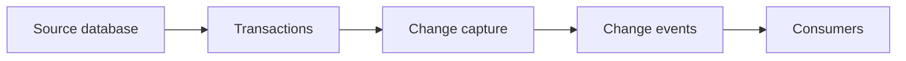
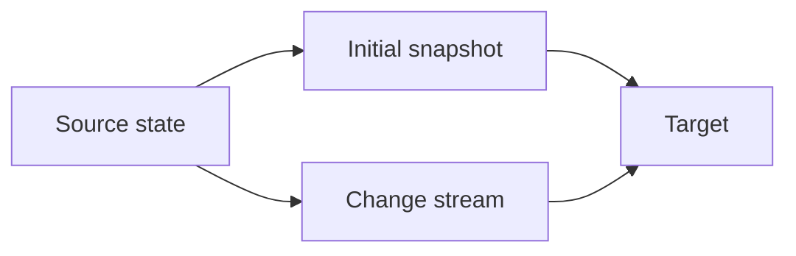
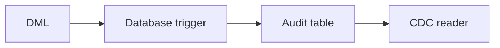
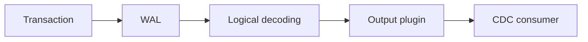
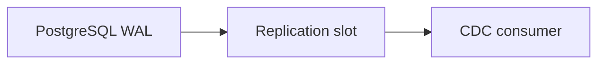
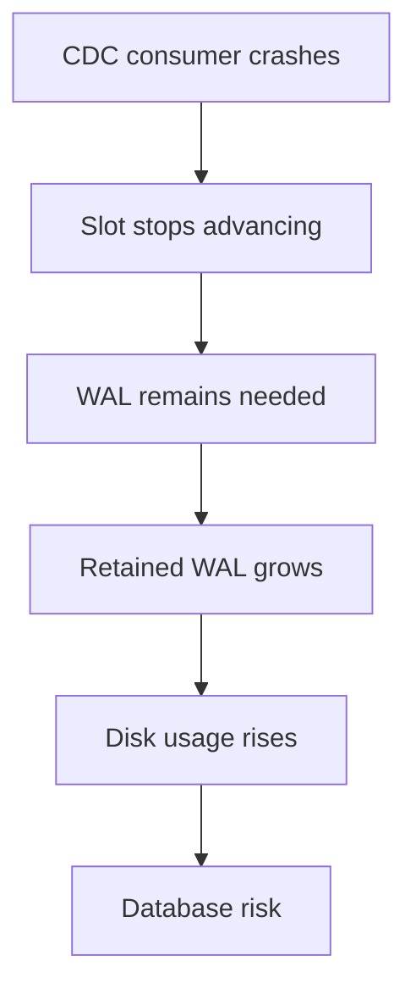
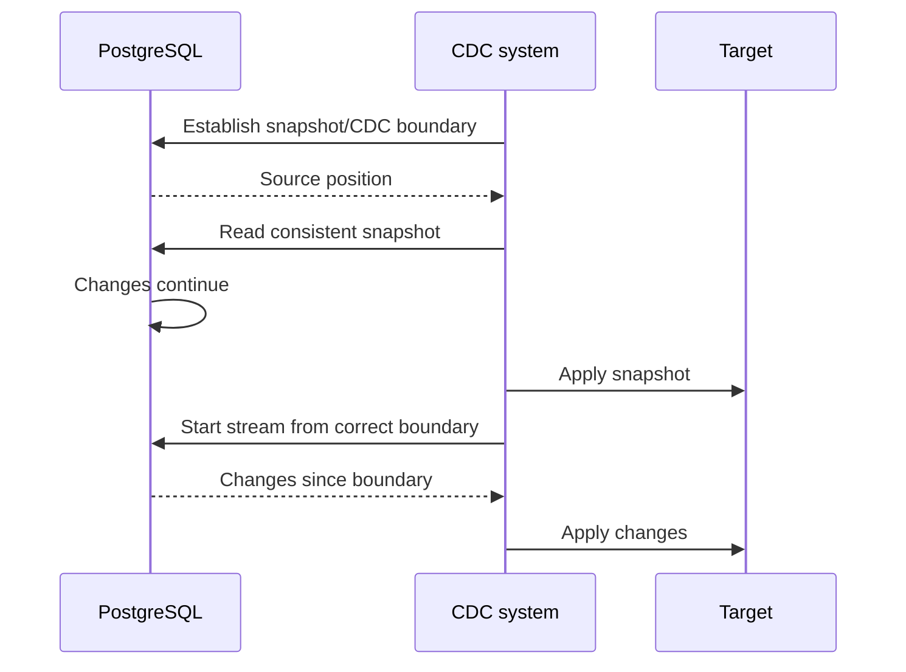
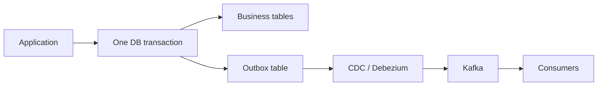
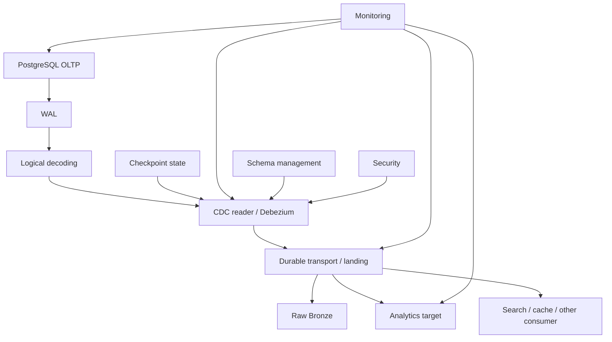

# Change Data Capture Concepts

> **Topic 07 — Data Ingestion and Extraction Patterns**
>
> This module teaches Change Data Capture from fundamentals through PostgreSQL logical decoding, snapshot + streaming, target application, operational failure modes, transactional outbox, and production architecture.

---

## Core Mental Model

> **Incremental extraction asks: “What rows changed since X?”**  
> **CDC asks: “What changes actually happened?”**

CDC is not universally better than incremental extraction. The appropriate approach depends on freshness, source capabilities, volume, change rate, delete requirements, operational complexity, infrastructure, team expertise, and cost.

---


## 1. Learning Objectives

By the end of this module you should be able to:

- Explain Change Data Capture (CDC) from first principles.
- Explain why current-state polling is not always sufficient.
- Capture and reason about inserts, updates, and deletes.
- Compare query-based, timestamp-based, trigger-based, audit-table, snapshot-comparison, and log-based CDC.
- Explain PostgreSQL WAL, logical decoding, `wal_level = logical`, output plugins, replication slots, publications, and LSNs.
- Model CDC events with operation, key, before/after images, commit information, and source position.
- Design an initial snapshot plus continuous-stream handoff without gaps.
- Apply changes safely to a downstream target and tolerate replay.
- Explain ordering, deletes, replica identity, and tables without primary keys.
- Diagnose replication-slot lag and WAL-retention risk.
- Design for schema evolution, checkpointing, idempotency, recovery, security, and observability.
- Explain the transactional outbox pattern and the architectural roles of Debezium, Kafka, and managed CDC services.
- Debug CDC from source through capture, transport, consumer, and target.
- Design a production-oriented PostgreSQL CDC pipeline.


## 2. Prerequisites

You should already understand SQL, transactions, incremental extraction, watermarks, PostgreSQL basics, Python database connectivity, and `MERGE`/upsert concepts.

The key connection to Topic 06 — Full vs Incremental Extraction and Watermarks is:

> Incremental extraction asks **“What rows changed since X?”** CDC asks **“What changes actually happened?”**

This module uses those concepts without re-teaching the previous topic.


## 3. Why CDC Exists

Suppose `customers` contains:

| id | name | email | updated_at |
|---:|---|---|---|
| 42 | Bob | bob@example.com | 10:00 |
| 43 | Carol | carol@example.com | 10:00 |

A polling extractor might use:

```sql
SELECT *
FROM customers
WHERE updated_at > :watermark;
```

That can work, but it has important limits.

If customer 42 is deleted, there may be no row left to return. If application code forgets to update `updated_at`, an update may be missed. If a row changes A → B → C between polling runs, a current-state query may reveal only C. Polling also introduces source query load and polling latency.

CDC changes the mental model:



Instead of repeatedly asking for current state, CDC provides a representation of changes as they occur.


## 4. Snapshot vs Change Stream

A snapshot is a representation of current state at a point in time. A change stream is a sequence of state transitions.

| Dimension | Snapshot | Change stream |
|---|---|---|
| Represents | State | Changes |
| Typical payload | Rows | Events |
| Deletes | Indirect unless marked | Usually explicit |
| Intermediate updates | Usually lost | Can be retained |
| Initial loading | Strong fit | Usually insufficient alone |
| Continuous synchronization | Insufficient alone | Strong fit |

Production synchronization frequently combines both:




## 5. INSERT, UPDATE, DELETE Events

A canonical CDC event can look like:

```json
{
  "operation": "update",
  "table": "customers",
  "primary_key": {"id": 42},
  "before": {"id": 42, "email": "old@example.com"},
  "after": {"id": 42, "email": "new@example.com"},
  "commit_timestamp": "2026-10-01T10:00:00Z",
  "lsn": "0/16B3748"
}
```

| Operation | Before | After |
|---|---|---|
| INSERT | Usually none | New row |
| UPDATE | Previous row if available | New row |
| DELETE | Previous row if available | Usually none |

The exact event contract depends on the CDC mechanism. Before-images are not automatically available in every implementation.


## 6. CDC Approaches

| Approach | Mechanism | Delete handling | Intermediate changes | Main trade-off |
|---|---|---|---|---|
| Query/timestamp | Poll rows | Difficult without tombstones | Often lost | Simple but limited |
| Trigger | Trigger writes changes | Strong | Can preserve | Adds source transaction work |
| Audit table | Explicit change records | Depends on design | Can preserve | Storage/maintenance |
| Snapshot comparison | Compare states | Detectable indirectly | Usually lost | Expensive at scale |
| Log-based | Read database log | Strong for supported sources | Can preserve | More operational complexity |

There is no universally best approach. Choose according to freshness, volume, source capabilities, delete requirements, operational complexity, cost, and team expertise.


## 7. Query-Based and Timestamp CDC

A common pattern is:

```sql
SELECT *
FROM customers
WHERE updated_at > :watermark;
```

Typical failure modes:

- Deletes disappear from the table.
- `updated_at` may be missing or unreliable.
- Timestamp precision can create boundary problems.
- Intermediate updates may collapse into one current row.
- Application timestamps do not necessarily equal transaction commit order.
- Polling creates repeated source queries.

Timestamp extraction remains useful when its correctness and latency characteristics satisfy the workload. CDC should not be adopted merely because it is more sophisticated.


## 8. Trigger-Based CDC and Audit Tables

A trigger can write changes into an audit table:

```sql
CREATE TABLE customer_changes (
    event_id BIGSERIAL PRIMARY KEY,
    operation TEXT NOT NULL,
    record_id BIGINT,
    before_data JSONB,
    after_data JSONB,
    changed_at TIMESTAMPTZ NOT NULL DEFAULT now()
);
```

Conceptually:



For an update, PostgreSQL exposes `OLD` and `NEW`; for an insert, `NEW` is available; for a delete, `OLD` is available.

An audit table should consider ordering, durability, retention, storage growth, cleanup, indexing, and transaction overhead.

The key production trade-off is that trigger work occurs on the source write path. Large audit payloads or heavy indexing can increase source transaction cost.


## 9. Log-Based CDC Mental Model

Log-based CDC follows:

```text
Database transaction
        ↓
Transaction log
        ↓
Logical decoding / log reader
        ↓
Logical change representation
        ↓
CDC consumer
```

For PostgreSQL:



Important distinction:

> PostgreSQL WAL is not automatically a ready-to-consume JSON CDC stream.

Physical WAL, logical decoding, logical replication output, and application-level CDC events are distinct layers.


## 10. PostgreSQL WAL

WAL means **Write-Ahead Log**. PostgreSQL records durable log information as part of its transaction and recovery design.

WAL supports:

- durability,
- crash recovery,
- physical replication,
- logical decoding.

Do not confuse physical WAL records with logical row events. A CDC consumer normally uses a logical-decoding mechanism to turn database-log information into a logical representation.


## 11. Logical Decoding and wal_level

Logical decoding interprets WAL information into a logical sequence of database changes.

For logical decoding, PostgreSQL needs appropriate configuration, notably:

```conf
wal_level = logical
```

Verify the setting with:

```sql
SHOW wal_level;
```

Production configuration changes must follow the deployment's change-management process. Do not casually alter a production database just to experiment.


## 12. Output Plugins

Important PostgreSQL output plugins include:

| Plugin | Role |
|---|---|
| `test_decoding` | Educational and debugging-oriented textual output |
| `pgoutput` | PostgreSQL native logical-replication output |
| `wal2json` | JSON-oriented logical-decoding output |

`pgoutput` is particularly important in PostgreSQL logical-replication architectures. `test_decoding` is convenient for learning because its output is inspectable. `wal2json` is useful when a JSON-oriented integration is appropriate.

Plugin output contracts differ; do not assume one format is interchangeable with another.


## 13. Replication Slots

A replication slot maintains source-side progress state for a logical/physical consumer.



A useful mental model is:

> Keep WAL information that this consumer may still need.

Important fields include:

- slot name,
- active state,
- restart LSN,
- confirmed flush LSN.

An LSN (Log Sequence Number) identifies a position in PostgreSQL's WAL sequence. It is not a business timestamp.


## 14. Publications

A PostgreSQL publication defines which tables and changes participate in a logical-replication publication.

For example:

```sql
CREATE PUBLICATION app_publication
FOR TABLE customers, orders;
```

Or, where appropriate:

```sql
CREATE PUBLICATION app_publication
FOR ALL TABLES;
```

Remember the distinction:

- **Publication:** what is included.
- **Replication slot:** consumption state and retained-log boundary.

They solve different problems and can both be part of a logical CDC architecture.


## 15. Replication-Slot Failure

A major production incident looks like:



Example timeline:

```text
Friday: consumer crashes
Saturday: no monitoring
Sunday: writes continue
Monday: PostgreSQL disk is nearly full
```

Monitor slot activity, retained WAL, restart/confirmed-flush positions, consumer health, processing latency, and errors.

Never drop an unknown production slot blindly. First identify its owner and determine whether the retained changes are still required.


## 16. Monitoring CDC Lag

CDC lag can mean several things:

| Metric | Meaning |
|---|---|
| LSN lag | Source/consumer position difference |
| Consumer lag | Unprocessed captured changes |
| Processing latency | Time from source change to target success |
| Slot lag | How far a replication slot trails source progress |

Inspect slots with:

```sql
SELECT
    slot_name,
    plugin,
    slot_type,
    active,
    restart_lsn,
    confirmed_flush_lsn
FROM pg_replication_slots
WHERE slot_type = 'logical';
```

Do not invent a universal lag formula. Interpret positions according to the PostgreSQL version and CDC consumer architecture.


## 17. PostgreSQL CDC Lab

An educational Docker environment can run PostgreSQL with logical decoding enabled. The exact configuration method depends on the image/deployment.

Create a table:

```sql
CREATE TABLE customers (
    id BIGINT PRIMARY KEY,
    name TEXT NOT NULL,
    email TEXT NOT NULL,
    updated_at TIMESTAMPTZ NOT NULL DEFAULT now()
);
```

Create a logical slot:

```sql
SELECT *
FROM pg_create_logical_replication_slot(
    'customer_slot',
    'test_decoding'
);
```

Make changes:

```sql
INSERT INTO customers (id, name, email)
VALUES (1, 'Alice', 'alice@example.com');

UPDATE customers
SET email = 'alice.new@example.com'
WHERE id = 1;

DELETE FROM customers
WHERE id = 1;
```

Inspect without consuming:

```sql
SELECT *
FROM pg_logical_slot_peek_changes(
    'customer_slot',
    NULL,
    NULL
);
```

Then, for controlled consumption:

```sql
SELECT *
FROM pg_logical_slot_get_changes(
    'customer_slot',
    NULL,
    NULL
);
```

Exact decoder output varies. Focus on transaction boundaries, operations, and source positions rather than memorizing textual formatting.


## 18. peek vs get

| Function | Purpose | Advances consumption? |
|---|---|---:|
| `pg_logical_slot_peek_changes` | Inspect changes | No |
| `pg_logical_slot_get_changes` | Retrieve/consume changes | Yes |

Think of `peek` as looking at a message without consuming it and `get` as reading it for actual progress.

This matters during debugging and recovery because consuming data before safely persisting downstream state can create a correctness problem.


## 19. Python CDC Reader

Python 3.12+ with `psycopg` can call PostgreSQL functions.

```python
from dataclasses import dataclass
from typing import Any

import psycopg


@dataclass(frozen=True)
class ChangeEvent:
    operation: str
    table: str | None
    key: dict[str, Any]
    before: dict[str, Any] | None
    after: dict[str, Any] | None
    lsn: str | None
    commit_time: str | None


dsn = "host=localhost port=5432 dbname=postgres user=postgres password=postgres"

with psycopg.connect(dsn) as conn:
    with conn.cursor() as cur:
        cur.execute(
            """
            SELECT lsn, xid, data
            FROM pg_logical_slot_peek_changes(
                %s, NULL, NULL
            )
            """,
            ("customer_slot",),
        )

        for lsn, xid, data in cur:
            print({"lsn": str(lsn), "xid": xid, "data": data})
```

The code deliberately separates raw decoder output from a canonical `ChangeEvent` model. A production reader needs parsing, durable progress, reconnects, retries, observability, schema handling, and target-transaction coordination.

Do not put real passwords or secrets into source code. Use environment/secret management in real systems.


## 20. Transaction Boundaries

Consider:

```sql
BEGIN;

UPDATE customers
SET email = 'new@example.com'
WHERE id = 42;

UPDATE orders
SET status = 'paid'
WHERE id = 9001;

COMMIT;
```

The two row changes belong to one transaction.

A CDC architecture must understand transaction metadata and commit boundaries sufficiently for its downstream correctness requirements.

Do not treat CDC as an unordered collection of independent rows.


## 21. Initial Snapshot + Streaming

Suppose a source has ten million existing rows while new writes continue.

You need:

1. Existing state.
2. Future changes.

A robust design combines a consistent initial snapshot with a change stream.

The central invariant is:

> Every source change must be represented by either the snapshot or the subsequent stream, with no gap and controlled duplicate overlap.

A dangerous sequence is:

```text
Start snapshot
    ↓
Source changes
    ↓
Snapshot completes
    ↓
CDC starts from an unrelated position
    ↓
Missing change
```

The correct handoff establishes a known source/log boundary and starts streaming from a position that covers changes occurring around the snapshot.


## 22. Snapshot Handoff Timeline



Two failure modes matter:

- **Gap:** a change appears in neither snapshot nor stream.
- **Double-apply:** a change appears in both and is applied incorrectly twice.

Correct source-position management plus idempotent target application addresses these risks.


## 23. Applying CDC to a Target

A basic mapping is:

```text
INSERT → INSERT
UPDATE → UPDATE
DELETE → DELETE
```

A staging table can receive normalized changes:

```sql
CREATE TABLE customer_changes_stage (
    id BIGINT,
    name TEXT,
    email TEXT,
    operation TEXT NOT NULL,
    source_lsn TEXT NOT NULL
);
```

Conceptually:

```sql
MERGE INTO target_customers AS target
USING customer_changes_stage AS source
ON target.id = source.id
WHEN MATCHED AND source.operation = 'delete' THEN
    DELETE
WHEN MATCHED AND source.operation = 'update' THEN
    UPDATE SET
        name = source.name,
        email = source.email
WHEN NOT MATCHED AND source.operation = 'insert' THEN
    INSERT (id, name, email)
    VALUES (source.id, source.name, source.email);
```

Exact `MERGE` capabilities vary by target engine. The CDC concern is correctness of ordering, operation semantics, retries, and replay.


## 24. Ordering and Latest Change per Key

If one key changes:

```text
A → B → C
```

the target must not accidentally apply:

```text
C → B
```

Consumer arrival time is not automatically source order.

Potential ordering information includes:

- LSN,
- transaction position,
- per-key sequence,
- source commit ordering.

If a batch needs only the latest change per key, use an authoritative source/change position:

```sql
SELECT *
FROM (
    SELECT
        *,
        ROW_NUMBER() OVER (
            PARTITION BY id
            ORDER BY source_position DESC
        ) AS rn
    FROM changes
) x
WHERE rn = 1;
```

Do not blindly sort by consumer arrival time.


## 25. Deletes, Replica Identity, and Primary Keys

Deletes are difficult for ordinary timestamp polling because the source row disappears.

CDC can represent a delete explicitly, for example:

```json
{
  "operation": "delete",
  "primary_key": {"id": 42},
  "before": {"id": 42, "email": "old@example.com"},
  "after": null
}
```

Target strategies include hard deletes, tombstones, and soft deletes.

PostgreSQL **replica identity** determines how rows are identified for logical replication, especially for updates and deletes. The common default uses the primary key when available.

An educational alternative is:

```sql
ALTER TABLE customers REPLICA IDENTITY FULL;
```

`FULL` can expose more old-row information but may increase logical-replication volume. Use it deliberately.

Tables without primary keys are not automatically impossible to capture, but they make:

- row identity,
- update/delete targeting,
- deduplication,
- before-image interpretation

harder. A stable key is highly valuable for CDC.


## 26. Schema Evolution

Schema changes affect the whole CDC chain.

For example:

```sql
ALTER TABLE customers
ADD COLUMN phone TEXT;
```

Questions to answer:

- Does the change-event schema include `phone`?
- Can existing consumers tolerate the new field?
- Does the target schema change?
- Does serialization remain compatible?
- What happens to historical rows?
- How are incompatible type changes rolled out?

A CDC pipeline should treat schema evolution as an explicit operational concern, not an accidental side effect.


## 27. Checkpointing and Idempotency

A durable consumer needs source progress.

A simplified workflow is:

```text
Read event
   ↓
Apply target transaction
   ↓
Commit target
   ↓
Persist/confirm source progress
```

The exact atomicity boundary depends on the architecture.

If the target commit succeeds but the checkpoint does not, the event may replay after restart. That is acceptable only if replay is safe.

Therefore production CDC commonly combines:

```text
durable source position
+
idempotent target application
+
reconciliation
```

Possible deduplication information includes event identity, source LSN, transaction position, or another documented source sequence. Do not assume one LSN uniquely identifies every row event without checking the event contract.


## 28. CDC Failure Modes

| Failure | Typical impact | Detection | Recovery |
|---|---|---|---|
| Consumer crash | Lag | Health/heartbeat | Restart/resume |
| Network outage | Consumption stops | Connection errors | Reconnect |
| Slot lag | WAL retention | Slot metrics | Restore throughput |
| Disk pressure | Source risk | Disk/WAL alerts | Recover consumer safely |
| Malformed event | Consumer halt | Parser metrics | Fix/replay |
| Schema change | Consumer/target failure | Compatibility errors | Coordinated migration |
| Duplicate replay | Duplicate application | Position/idempotency checks | Safe replay |
| Out-of-order apply | Wrong state | Reconciliation | Reprocess |
| Target outage | Apply lag | Target health | Retry/resume |
| Checkpoint loss | Replay/gap risk | State validation | Recover from durable source state |

A production runbook should define ownership, alert thresholds, recovery actions, and resnapshot criteria.


## 29. Transactional Outbox

The dual-write problem occurs when an application must update a database and publish an event.

A naive design:

```text
UPDATE business table
      +
SEND message
```

can leave database state and event publication inconsistent.

The transactional outbox solves a specific part of this:



Example:

```sql
BEGIN;

INSERT INTO orders (order_id, customer_id, status)
VALUES (1001, 42, 'PAID');

INSERT INTO order_outbox (
    event_id,
    event_type,
    aggregate_id,
    payload
)
VALUES (
    gen_random_uuid(),
    'OrderPaid',
    1001,
    '{"order_id":1001,"customer_id":42}'
);

COMMIT;
```

Both records commit together. CDC then reads the durable outbox record.

The outbox does not automatically create end-to-end exactly-once delivery. It creates transactional coupling between business state and durable event intent.


## 30. Debezium, Kafka, and Managed CDC

A common architecture is:

```text
PostgreSQL
   ↓
WAL / logical decoding
   ↓
Debezium connector
   ↓
Kafka
   ↓
Consumers
```

Debezium is a CDC ecosystem that commonly handles snapshotting, streaming, source offsets, change-event representation, and connector operations.

Kafka can provide durable event transport, partitions, consumer groups, and replay. Ordering is normally scoped to a partition, not globally.

Managed CDC services can automate infrastructure, capture, checkpointing, monitoring, and scaling. Trade-offs include cost, lock-in, supported sources, configuration flexibility, security, and operational ownership.

Do not rank CDC vendors universally.


## 31. Other Database CDC Mechanisms

| Database | Representative mechanism |
|---|---|
| PostgreSQL | WAL + logical decoding/logical replication |
| MySQL | Binary log (`binlog`) |
| SQL Server | CDC/change mechanisms and log-based technologies |
| Oracle | Redo logs and replication technologies |
| MongoDB | Change streams |

The implementation details differ. The transferable pattern is:

```text
Source change
    ↓
Durable source position
    ↓
Capture
    ↓
Event representation
    ↓
Consumer progress
    ↓
Target application
```


## 32. CDC vs Incremental Extraction

| Dimension | Incremental extraction | CDC |
|---|---|---|
| Core question | Rows changed since X | Changes that occurred |
| Deletes | Difficult without markers | Usually explicit |
| Intermediate changes | Often lost | Can be preserved |
| Latency | Polling dependent | Can be low |
| Source load | Repeated queries | Capture-dependent |
| Complexity | Often lower | Often higher |
| Source requirements | Reliable change column | CDC capability/configuration |

CDC is not always necessary.

Incremental extraction may be sufficient for small reference data, low change rates, daily batches, reliable `updated_at`, or sources without practical CDC support.

CDC becomes relevant when freshness, deletes, intermediate changes, high write volume, event streams, or audit/history requirements justify its operational complexity.


## 33. Production CDC Architecture



Production design must cover capture, state, delivery, target application, schema evolution, observability, security, and recovery.

A source-only design is incomplete. A consumer-only design is incomplete. CDC is an end-to-end system.


## 34. Hands-On Project

Build a conceptual PostgreSQL CDC lab containing:

1. `customers` table.
2. Trigger-based audit table.
3. Logical-decoding slot.
4. INSERT, UPDATE, DELETE operations.
5. Python `psycopg` reader.
6. Canonical `ChangeEvent`.
7. JSON Lines landing representation.
8. Initial snapshot.
9. Snapshot/stream handoff.
10. Target merge/application.
11. Delete application.
12. Slot-lag experiment.
13. Schema-change experiment.
14. Monitoring and reconciliation.

Compare trigger capture and logical decoding using identical source changes. Record what each captures, source overhead, event structure, failure behavior, and operational responsibilities.

For every implementation step, document:

- what it does,
- why it exists,
- how it works,
- failure modes,
- production implications.


## 35. Debugging Scenarios

### Scenario 1 — Delete Missing

**Symptoms:** Target retains a row deleted in PostgreSQL.

**Investigate:** source delete → emitted event → parsed event → target application.

**Possible causes:** timestamp-only extraction, missing delete representation, parser failure, or target ignoring deletes.

**Lesson:** delete semantics must be explicit.

### Scenario 2 — WAL Growth

**Symptoms:** Source disk usage rises after consumer outage.

**Investigate:** slot activity, retained WAL, consumer health, source write rate.

**Lesson:** replication slots create source-side operational responsibility.

### Scenario 3 — Duplicate Replay

**Symptoms:** Restart causes previously processed events to reappear.

**Investigate:** target commit vs checkpoint ordering.

**Lesson:** replay is expected in many at-least-once designs; target application must be idempotent.

### Scenario 4 — Missed Update

**Symptoms:** Source is B, target is A.

**Investigate:** source change, source position, event emission, parsing, target transaction, checkpoint.

### Scenario 5 — Older Update Wins

**Symptoms:** Source ends at C but target ends at B.

**Investigate:** source ordering versus consumer arrival ordering.

### Scenario 6 — Schema Change Break

**Symptoms:** CDC fails after `ALTER TABLE`.

**Investigate:** decoder output, parser, serialization, target schema, compatibility contract.

### Scenario 7 — Snapshot Gap

**Symptoms:** Target differs after initial load.

**Investigate:** snapshot boundary and streaming start position.

### Scenario 8 — Consumer Restart

**Symptoms:** Events replay.

**Investigate:** checkpoint durability and target idempotency.

For every incident, classify the failure as **source**, **capture**, **transport**, **consumer**, or **target application**.


## 36. Testing Strategy

### Unit tests

Test:

- event parsing,
- INSERT/UPDATE/DELETE,
- malformed events,
- missing keys,
- schema changes,
- unsupported operations.

Example:

```python
def parse_operation(record: dict) -> str:
    operation = record.get("operation")
    if operation not in {"insert", "update", "delete"}:
        raise ValueError(f"Unsupported operation: {operation!r}")
    return operation
```

### Integration tests

Use real PostgreSQL to test:

```text
create slot
→ insert
→ update
→ delete
→ consume
→ restart
→ replay
→ schema change
```

### End-to-end validation

Compare source and target by:

- key sets,
- row counts,
- values,
- deletes,
- missing keys,
- unexpected keys.

Reconciliation is evidence of correctness; successful event processing alone is not proof.


## 37. Practice Exercises

### Basic

1. Explain CDC in your own words.
2. Identify INSERT/UPDATE/DELETE events.
3. Compare snapshot and change stream.
4. Explain why timestamp extraction can miss deletes.

### Intermediate

5. Build an audit table.
6. Compare trigger and timestamp capture.
7. Enable PostgreSQL logical decoding.
8. Create a replication slot.
9. Read changes with `test_decoding`.
10. Parse events into Python objects.

### Hard

11. Design snapshot + streaming handoff.
12. Apply CDC using `MERGE`.
13. Handle deletes.
14. Design LSN checkpointing.
15. Make target application idempotent.
16. Handle schema evolution.

### Advanced

17. Diagnose replication-slot WAL growth.
18. Design multiple downstream consumers.
19. Design a transactional outbox.
20. Design PostgreSQL → Debezium → Kafka → lakehouse.
21. Design recovery after consumer outage.
22. Design CDC for high-volume OLTP.

For every exercise define: objective, requirements, constraints, expected outcome, failure cases, and validation criteria.


## 38. Interview and Architecture Questions

### Beginner

- What is CDC?
- Why does CDC exist?
- Snapshot versus change stream?
- What is an insert event?
- What is a delete event?

### Intermediate

- Why can timestamp extraction miss deletes?
- What is trigger-based CDC?
- What is log-based CDC?
- What is PostgreSQL WAL?
- What is logical decoding?
- What is a replication slot?
- What is an LSN?
- What is a publication?

### Advanced

- How does snapshot + streaming avoid gaps?
- What happens when a consumer crashes?
- Why can a slot fill disk?
- How do you apply events idempotently?
- How do you handle deletes?
- How do you handle schema evolution?
- What is replica identity?

### Architecture

- Design PostgreSQL CDC for a lakehouse.
- Design PostgreSQL → Debezium → Kafka.
- Design multiple downstream consumers.
- Design recovery after six hours of consumer downtime.
- Design a transactional outbox.

A strong answer should explain the reasoning, guarantees, trade-offs, and failure modes rather than naming a tool.


## 39. Production CDC Checklist

### Capture

- [ ] WAL/log source configured correctly.
- [ ] CDC mechanism documented.
- [ ] Replication slots monitored.
- [ ] Publications documented.
- [ ] Permissions controlled.

### State

- [ ] Durable LSN/checkpoint.
- [ ] Restart behavior defined.
- [ ] Replay behavior defined.
- [ ] Snapshot boundary documented.

### Reliability

- [ ] Retries.
- [ ] Reconnect.
- [ ] Duplicate handling.
- [ ] Idempotent target application.
- [ ] Recovery strategy.

### Correctness

- [ ] Snapshot correctness.
- [ ] Ordering.
- [ ] Deletes.
- [ ] Transaction boundaries.
- [ ] Reconciliation.
- [ ] Schema evolution.

### Observability

- [ ] Slot lag.
- [ ] Consumer lag.
- [ ] Processing latency.
- [ ] Errors.
- [ ] Throughput.
- [ ] Retained WAL.
- [ ] Target failures.

### Security

- [ ] Dedicated CDC identity.
- [ ] Least privilege.
- [ ] Secret management.
- [ ] Encryption.
- [ ] Network controls.

### Operations

- [ ] Alerting.
- [ ] Runbooks.
- [ ] Backfill plan.
- [ ] Disaster recovery.
- [ ] Capacity planning.
- [ ] Resnapshot procedure.


## 40. Final Mental Model

The complete CDC mental model is:

```text
SOURCE DATABASE
      ↓
TRANSACTION
      ↓
WAL / CHANGE LOG
      ↓
CDC CAPTURE
      ↓
CHANGE EVENTS
      ↓
DURABLE CHECKPOINT
      ↓
TARGET APPLICATION
      ↓
ANALYTICS / LAKEHOUSE / STREAM / SEARCH
```

CDC is not merely a tool. It is a system-design pattern involving:

```text
capture
+
ordering
+
state
+
delivery
+
application
+
recovery
+
schema evolution
+
observability
+
security
```

The engineering question is not:

> “Which CDC tool is best?”

It is:

> “What capture mechanism and end-to-end architecture provide the required correctness, freshness, operational behavior, and recovery characteristics for this source and workload?”


## 41. Final Checkpoint

You should now be able to explain:

- Why CDC exists.
- Why timestamp-based extraction is not always sufficient.
- How inserts, updates, and deletes become change events.
- How query, trigger, audit, snapshot-comparison, and log-based approaches differ.
- What PostgreSQL WAL is.
- Why physical WAL is different from logical decoding.
- What `wal_level = logical` enables.
- What `test_decoding`, `pgoutput`, and `wal2json` do.
- What a replication slot is.
- Why inactive slots can cause WAL retention and disk pressure.
- What a publication is.
- What an LSN represents.
- How snapshot + streaming prevents gaps.
- Why duplicates and replay must be expected in many systems.
- How to apply INSERT/UPDATE/DELETE safely.
- Why ordering matters.
- What replica identity does.
- Why tables without primary keys are harder.
- How schema evolution affects the entire pipeline.
- How checkpointing and idempotency interact.
- What the transactional outbox solves.
- Where Debezium and Kafka fit.
- How to monitor and debug a CDC system.
- When CDC is unnecessary.
- When CDC becomes relevant.

The completion standard is not memorizing commands. It is being able to explain why the architecture works, what can fail, how the failure is detected, and how the system recovers without silently losing or corrupting changes.
