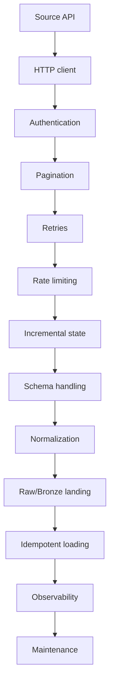
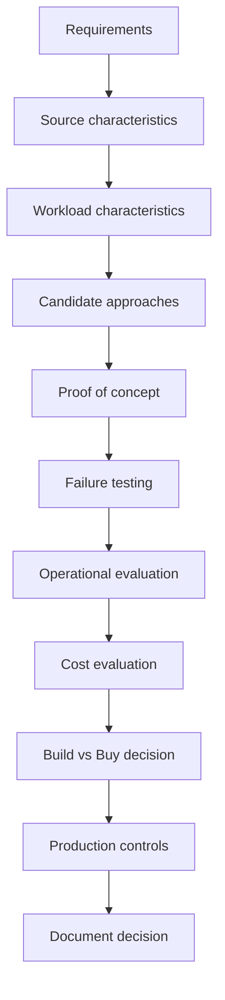
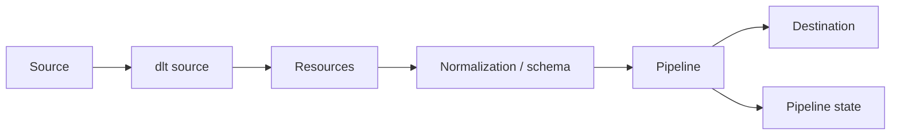
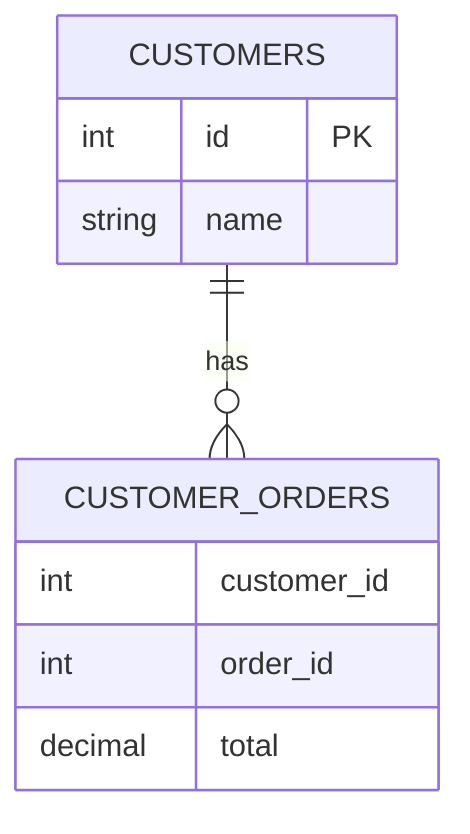
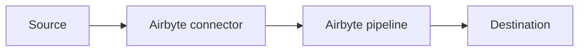
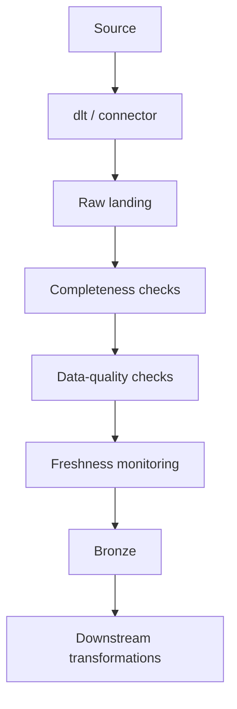
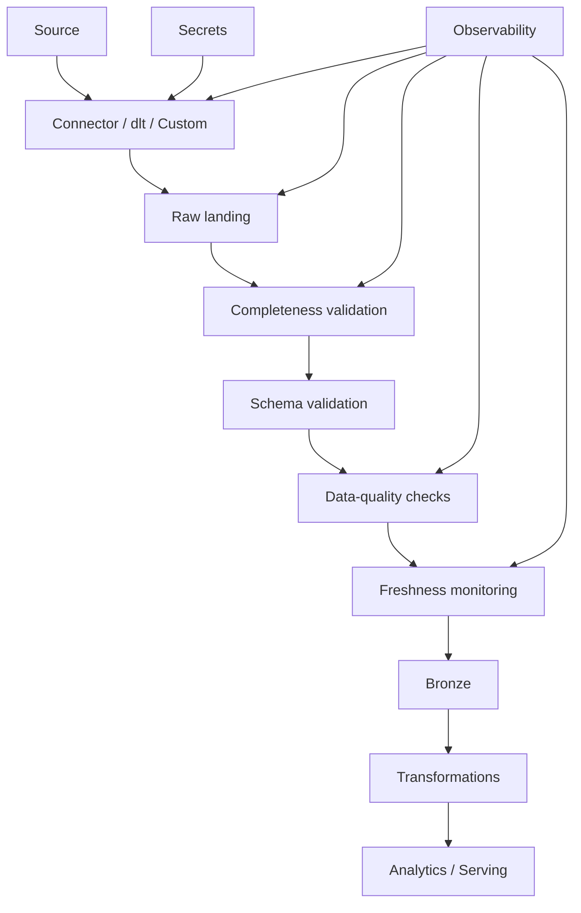

# Ingestion Frameworks: dlt and Managed Connectors

> **Stage 2 — Python for Data Engineering**  
> **Module 2.9 — Data Ingestion and Extraction Patterns**  
> **Topic 11 — Ingestion Frameworks: dlt and Managed Connectors**

## Core Mental Model

> **An ingestion framework is an abstraction over ingestion problems you should already understand.**

You have already learned how to build ingestion manually:

```text
HTTP client
   ↓
authentication
   ↓
pagination
   ↓
rate limiting
   ↓
incremental state
   ↓
schema handling
   ↓
raw/bronze landing
   ↓
idempotent loading
   ↓
observability
```

Frameworks and managed connectors automate some or all of these concerns.

That does **not** mean they remove engineering responsibility.

The senior-engineering question is therefore not:

> "Which ingestion tool is best?"

It is:

> "Which approach gives the required reliability, freshness, correctness, observability, security, maintainability, and cost for this source and workload?"

There is no universal winner between custom Python, dlt, Singer/Meltano, Airbyte, managed connectors, or cloud-native services.

---

# 1. Learning Objectives

By the end of this topic, you should be able to:

1. Explain why ingestion frameworks exist.
2. Explain build-vs-buy trade-offs.
3. Understand the long-term maintenance cost of custom connectors.
4. Explain dlt's core architecture and terminology.
5. Build a basic dlt pipeline.
6. Use `@dlt.source`.
7. Use `@dlt.resource`.
8. Understand dlt destinations.
9. Load data into DuckDB.
10. Understand PostgreSQL, filesystem, and cloud-warehouse destinations conceptually.
11. Explain `append`, `replace`, and `merge`.
12. Explain primary keys and merge keys.
13. Configure incremental loading with `dlt.sources.incremental`.
14. Explain dlt pipeline state.
15. Compare dlt state with a hand-built watermark.
16. Explain schema inference.
17. Explain schema evolution.
18. Explain nested JSON normalization.
19. Explain schema contracts.
20. Configure a declarative REST API source.
21. Understand declarative authentication, pagination, and incremental extraction.
22. Explain when declarative configuration stops being sufficient.
23. Explain Singer taps and targets.
24. Explain Meltano at an awareness level.
25. Explain Airbyte connectors at an awareness level.
26. Explain managed/SaaS connectors conceptually.
27. Evaluate connector coverage and quality.
28. Evaluate incremental and CDC support.
29. Evaluate delete handling.
30. Evaluate backfills.
31. Evaluate observability, security, data residency, cost, and lock-in.
32. Wrap frameworks with internal correctness and data-quality controls.
33. Identify cases where custom code is still appropriate.
34. Re-implement an incremental API ingestion pattern with dlt.
35. Compare custom extraction with dlt.
36. Test failure and schema-change behavior.
37. Build a repeatable build-vs-buy decision framework.
38. Defend an ingestion architecture in a technical design review.

---

# 2. Prerequisites

This topic comes **last** in the ingestion/extraction module for a reason.

You should already understand:

- HTTP extraction
- API authentication
- pagination
- rate limiting
- full extraction
- incremental extraction
- watermarks
- CDC concepts
- schema handling
- idempotency
- raw/bronze landing
- source contracts

Do not treat those topics as framework features you can blindly outsource.

Instead, ask:

> **What did I previously have to build manually, and what is this framework now automating?**

That question is the foundation for evaluating abstractions intelligently.

---

# 3. Why Ingestion Frameworks Exist

## 3.1 The Real Engineering Problem

A custom ingestion pipeline may start as:

```text
API
 ↓
HTTP request
 ↓
parse JSON
 ↓
write database
```

That looks simple.

Production requirements quickly expand it:



Now consider what happens when:

- the API changes pagination;
- OAuth behavior changes;
- a new field appears;
- a field changes type;
- deletes become important;
- rate limits become stricter;
- authentication changes;
- historical backfill is requested;
- duplicate records appear;
- nested objects are introduced;
- an API version is deprecated.

The initial code may be cheap.

The long-term maintenance can be expensive.

---

## 3.2 Initial Development Cost vs Maintenance Cost

A useful mental model is:

```text
Total Cost of Ownership
=
Development
+
Maintenance
+
Operations
+
Failure handling
+
Monitoring
+
Upgrades
+
Infrastructure
+
Engineering time
+
Vendor/license/usage cost
```

This is a **decision framework**, not a literal accounting formula.

A 300-line custom connector is not necessarily cheaper than a managed connector if your team must maintain it for five years.

Conversely, a managed connector is not automatically cheaper if:

- the source is unusual;
- the connector is poorly supported;
- usage costs scale badly;
- you need specialized transformations;
- you need strict latency;
- the connector cannot meet correctness requirements.

---

# 4. Build vs Buy

## 4.1 What Does "Build" Mean?

Build can mean:

- custom Python ingestion code;
- a reusable internal ingestion library;
- custom source adapters;
- a custom CDC consumer;
- a specialized connector maintained by your team.

Advantages can include:

- maximum control;
- source-specific behavior;
- precise failure semantics;
- custom authentication;
- custom reconciliation;
- no external connector dependency.

Costs include:

- engineering time;
- testing;
- on-call;
- documentation;
- upgrades;
- incident response;
- security maintenance;
- source API changes.

---

## 4.2 What Does "Buy" Mean?

Buy can mean:

- managed SaaS connector;
- cloud-native ingestion service;
- commercial connector;
- managed database migration/CDC service.

A managed connector may automate:

```text
Connectivity
Authentication
Retries
Scheduling
Incremental state
Schema handling
Loading
Monitoring
Backfills
```

But it does not automatically guarantee:

```text
Correctness
Completeness
Business semantics
Freshness SLA
Delete correctness
Security compliance
Cost efficiency
```

---

## 4.3 Build-vs-Buy Comparison

| Dimension | Build | Buy / Managed |
|---|---|---|
| Initial engineering | Usually higher | Often lower |
| Flexibility | High | Depends on connector |
| Source-specific logic | High | May be limited |
| Operational ownership | Internal | Shared with vendor |
| Upgrade burden | Internal | Partly vendor-managed |
| Cost model | Engineering + infrastructure | Usage/license + destination |
| Lock-in | Usually lower | Potentially higher |
| Connector coverage | Must build | Depends on provider |
| Failure semantics | Fully controllable | Must validate |
| Custom reconciliation | High control | May be limited |
| Data residency | Fully controllable | Must verify |
| Exit strategy | Usually easier | Must plan |

Do not interpret this table as a scorecard. It is a set of dimensions to investigate for a particular workload.

---

# 5. The Core Decision Loop

A strong architecture process is:



Start with:

### Requirements

- freshness;
- volume;
- correctness;
- availability;
- delete semantics;
- backfill requirements;
- latency;
- security;
- residency.

Then characterize the source:

- API/database/file;
- authentication;
- pagination;
- rate limits;
- change semantics;
- schema behavior.

Then evaluate candidate approaches.

The decision should be based on evidence from a proof of concept, not tool popularity.

---

# 6. What Is dlt?

## 6.1 Beginner Definition

**dlt** is a Python-based data-loading framework designed to help engineers build ingestion pipelines with reusable abstractions for sources, resources, schemas, state, and destinations.

The important idea is:

> dlt provides structure around common ingestion mechanics.

It does not eliminate the need to understand:

- API semantics;
- authentication;
- pagination;
- incremental correctness;
- source changes;
- data quality;
- operational reliability.

---

## 6.2 dlt Mental Model



Useful terms:

| Concept | Meaning |
|---|---|
| Pipeline | Execution identity and loading workflow |
| Source | Logical group of resources representing a source system |
| Resource | A stream/table-like unit of extracted data |
| Destination | Where dlt loads data |
| Schema | Representation of destination structure |
| State | Persistent information required across runs |
| Write disposition | How data is written |
| Primary key | Record identity |
| Merge key | Identity used to reconcile incoming records |

---

# 7. dlt Core Concepts

## 7.1 Pipelines

A pipeline represents a loading workflow.

Conceptually:

```python
import dlt

pipeline = dlt.pipeline(
    pipeline_name="customers_pipeline",
    destination="duckdb",
    dataset_name="raw"
)
```

Important concepts:

- pipeline identity;
- destination;
- dataset;
- schema;
- state.

A pipeline may maintain state between runs.

---

## 7.2 Sources

A source groups related resources.

Conceptually:

```python
import dlt


@dlt.source
def crm_source():
    return [
        customers(),
        orders(),
    ]
```

The source answers:

> Which resources belong to this logical source?

---

## 7.3 Resources

A resource represents an extractable stream of records.

A simple educational example:

```python
import dlt


@dlt.resource(name="customers")
def customers():
    yield {
        "id": 1,
        "name": "Alice",
        "email": "alice@example.com",
    }

    yield {
        "id": 2,
        "name": "Bob",
        "email": "bob@example.com",
    }
```

The function yields records rather than returning one giant list.

This matters because ingestion systems often need streaming-style processing.

---

## 7.4 Destinations

dlt can work with different destination categories.

Examples include:

- DuckDB;
- PostgreSQL;
- filesystem/object-storage-oriented destinations;
- cloud analytical warehouses.

The engineering decision is still workload-dependent.

A local DuckDB destination can be useful for:

- learning;
- local development;
- reproducible experiments;
- small analytical workloads.

A cloud warehouse may be appropriate when the destination must support:

- multiple users;
- centralized analytics;
- larger scale;
- organizational governance.

Do not infer that one destination is universally appropriate.

---

# 8. First Complete dlt Pipeline

The first pipeline should be deliberately simple.

```python
import dlt


@dlt.resource(name="customers")
def customers():
    yield {
        "id": 1,
        "name": "Alice",
        "email": "alice@example.com",
    }

    yield {
        "id": 2,
        "name": "Bob",
        "email": "bob@example.com",
    }


pipeline = dlt.pipeline(
    pipeline_name="customers_demo",
    destination="duckdb",
    dataset_name="raw"
)

load_info = pipeline.run(
    customers(),
    write_disposition="replace"
)

print(load_info)
```

## What happens?

Conceptually:

```text
Python records
     ↓
dlt resource
     ↓
dlt pipeline
     ↓
schema handling
     ↓
DuckDB
```

The first run creates or replaces the destination representation according to the selected write disposition.

### Why DuckDB?

It keeps the first lab local and removes unnecessary infrastructure.

### What should you verify?

Inspect the resulting DuckDB database and confirm:

- table exists;
- expected columns exist;
- expected rows exist;
- rerunning produces the documented write behavior.

---

# 9. dlt Write Dispositions

Write disposition answers:

> **What should happen to existing destination data when this resource runs?**

The three core concepts are:

- `append`
- `replace`
- `merge`

---

## 9.1 Append

Append means new records are added.

Conceptual usage:

```python
pipeline.run(
    customers(),
    write_disposition="append"
)
```

Use cases include:

- event-like data;
- immutable records;
- audit data;
- append-only logs.

Main risk:

```text
same source record
    ↓
loaded twice
    ↓
duplicate target record
```

Append is not inherently idempotent.

---

## 9.2 Replace

Replace means the destination representation is rebuilt/replaced for that load.

```python
pipeline.run(
    customers(),
    write_disposition="replace"
)
```

Useful when:

- source is small;
- full refresh is acceptable;
- simplicity matters;
- source has no reliable incremental mechanism.

Trade-off:

```text
simple correctness model
        vs
more source/destination work
```

For a large table, replacement can be expensive.

---

## 9.3 Merge

Merge reconciles incoming records with existing records using identity information.

Example:

```python
@dlt.resource(
    name="customers",
    write_disposition="merge",
    primary_key="id",
)
def customers():
    yield {"id": 1, "name": "Alice"}
    yield {"id": 2, "name": "Bob"}
```

The exact merge behavior depends on destination capabilities and configuration.

The key idea is:

```text
incoming record
       ↓
identify existing record
       ↓
insert or update
```

---

## 9.4 Write Disposition Comparison

| Disposition | Behavior | Typical use | Main risk |
|---|---|---|---|
| `append` | Add records | Events/logs | Duplicates |
| `replace` | Rebuild/replace | Small/full-refresh sources | Cost |
| `merge` | Reconcile by identity | Mutable entities | Incorrect keys |

The choice should follow source semantics.

---

# 10. Primary Keys and Merge Keys

## 10.1 Why Identity Matters

Suppose the source sends:

```json
{
  "id": 42,
  "name": "Alice"
}
```

and later:

```json
{
  "id": 42,
  "name": "Alice Smith"
}
```

The destination needs to understand that these represent the same entity.

A stable key provides that identity.

---

## 10.2 Natural vs Surrogate Keys

A **natural key** comes from the source domain:

```text
customer_id = 42
```

A **surrogate key** is generated by a system.

For ingestion, preserving the source identifier is often important because it allows source-to-target reconciliation.

---

## 10.3 Composite Keys

Some records require more than one field:

```text
(order_id, line_number)
```

The pair identifies a line item.

A bad merge key can cause:

- accidental overwrites;
- duplicates;
- data loss;
- incorrect updates.

### Key validation questions

Before production:

- Is the key unique?
- Is it stable?
- Can it be null?
- Can the source reuse it?
- Is it unique across the source object?
- Does it change?
- Does it remain valid during backfills?

---

# 11. dlt Incremental Loading

## 11.1 Why Incremental Loading Exists

Full extraction:

```text
Source
 ↓
all records
 ↓
destination
```

Incremental extraction:

```text
Source
 ↓
records changed since watermark
 ↓
destination
 ↓
advance state
```

If a source has one billion records and only ten thousand change per day, repeatedly extracting all billion rows is usually wasteful.

---

## 11.2 Incremental Resource

A conceptual dlt pattern is:

```python
import dlt


@dlt.resource(
    name="customers",
    write_disposition="merge",
    primary_key="id",
)
def customers(
    updated_at=dlt.sources.incremental(
        "updated_at",
        initial_value="2026-01-01T00:00:00Z",
    )
):
    for record in fetch_customers(updated_at.start_value):
        yield record
```

The exact API surface can vary by dlt release and source implementation, so verify the syntax against the version pinned by your project.

The important concepts are:

- cursor field;
- initial value;
- previous state;
- new state;
- successful loading;
- subsequent run.

---

## 11.3 What dlt Automates

A framework can automate pieces of:

```text
state representation
state persistence
incremental cursor handling
loading
schema handling
```

But you still own:

```text
Is updated_at trustworthy?
Are updates ordered?
Can timestamps tie?
Can records arrive late?
Are deletes represented?
Is the source query correct?
Is the destination application correct?
```

---

## 11.4 Boundary Problems

Suppose:

```text
Last watermark = 10:00:00
```

A source record changes at:

```text
10:00:00.500
```

If your source/query truncates timestamps to seconds, a naive predicate may miss it.

This is why incremental extraction needs careful boundary semantics.

Possible techniques include:

- strict `>`;
- inclusive `>=` with deduplication;
- overlap windows;
- source-side cursors;
- sequence IDs.

The correct choice depends on source semantics.

---

# 12. dlt State

State is information that must survive one pipeline execution and be available to later executions.

A simple model:

```text
Run 1
watermark = T1

Run 2
read > T1
watermark becomes T2

Run 3
read > T2
watermark becomes T3
```

---

## 12.1 State Must Represent Successful Progress

The principle is:

> **Never advance ingestion state merely because extraction was attempted. State should represent progress that satisfies the pipeline's correctness contract.**

Consider:

```text
Extract succeeds
      ↓
Load fails
      ↓
Should state advance?
```

Usually, no.

If state advances despite load failure:

```text
source position advanced
+
target did not receive data
=
potential data loss
```

This is one of the most important production concepts hidden behind the word "incremental."

---

## 12.2 Crash Scenario

Suppose:

```text
Read through T2
   ↓
Target write succeeds
   ↓
Process crashes before state persistence
```

The next run may replay data.

That is not automatically wrong.

If the destination operation is idempotent, replay can be safe.

This gives the larger pattern:

```text
durable progress
+
idempotent loading
+
reconciliation
```

---

# 13. Incremental Loading: dlt vs Hand-Written Implementation

| Concern | Custom implementation | dlt | Engineer still owns |
|---|---|---|---|
| HTTP client | Explicit | Can be abstracted | Source behavior |
| Authentication | Explicit | Can be configured | Credential correctness |
| Pagination | Explicit | Can be configured | Pagination semantics |
| Watermark | Custom state | Incremental state abstraction | Boundary correctness |
| Retries | Custom | Framework-dependent | Failure policy |
| Schema | Custom | Schema abstraction | Contract decisions |
| Loading | Custom | Destination abstraction | Target correctness |
| State | Custom store | Pipeline state | State semantics |
| Observability | Custom | Framework signals | SLA/data-quality monitoring |

The framework reduces implementation surface.

It does not transfer correctness ownership.

---

# 14. Schema Inference

Schema inference means the framework derives destination structure from incoming data.

Consider:

```json
{
  "id": 101,
  "name": "Alice",
  "active": true
}
```

A framework can infer:

```text
id      → integer
name    → string
active  → boolean
```

But real APIs are harder.

---

## 14.1 Nulls

First record:

```json
{"id": 1, "phone": null}
```

Later:

```json
{"id": 2, "phone": "+91-555-0100"}
```

The schema must support a nullable string.

---

## 14.2 Type Changes

Initial:

```json
{"customer_id": 42}
```

Later:

```json
{"customer_id": "42"}
```

Now the source has changed its representation.

Automatic inference can detect or adapt to this, but automatic adaptation can also create downstream instability.

---

## 14.3 Nested Objects

```json
{
  "id": 1,
  "name": "Alice",
  "address": {
    "city": "Kolkata",
    "country": "India"
  }
}
```

A relational destination may normalize this into related structures rather than storing one deeply nested object.

---

# 15. dlt Schema Evolution

Suppose the initial source is:

```text
id
name
email
```

Later it becomes:

```text
id
name
email
phone
```

A framework may automatically add `phone`.

That can be convenient.

But automatic schema evolution can also be dangerous.

Potential consequences:

- downstream SQL breaks;
- BI models change;
- contracts are violated;
- types drift;
- nullability changes;
- unexpected columns appear;
- analytical assumptions become invalid.

The senior question is not:

> "Can the framework evolve the schema automatically?"

It is:

> "Should this source be allowed to evolve this destination automatically?"

---

# 16. Schema Contracts

Schema contracts introduce explicit control over schema behavior.

A useful conceptual spectrum is:

```text
Flexible
   ↓
Allow expected evolution
   ↓
Restrict certain changes
   ↓
Freeze/reject unexpected changes
```

The correct level depends on the environment.

---

## 16.1 Why Contracts Exist

Imagine a payment API unexpectedly adds:

```json
"currency": "INR"
```

If automatic schema evolution is enabled, the destination may accept the field.

That might be desirable.

But if a source unexpectedly changes:

```json
"amount": 125.50
```

to:

```json
"amount": "unknown"
```

automatic adaptation could be dangerous.

A contract lets the pipeline fail visibly rather than silently accepting a breaking change.

---

## 16.2 Contract Lab

Conceptually:

```text
Initial schema
id
name
email

       ↓

New source field
phone

       ↓

Flexible schema
accepted

       ↓

Strict schema contract
rejected

       ↓

Engineer investigates
```

The exact dlt `schema_contract` configuration should be checked against the dlt version used by the project because schema-contract APIs evolve.

The engineering lesson is stable:

> **Schema inference is automation; schema governance is an engineering decision.**

---

# 17. Nested JSON Normalization

Consider:

```json
{
  "id": 1,
  "name": "Alice",
  "orders": [
    {
      "order_id": 5001,
      "total": 100.00
    },
    {
      "order_id": 5002,
      "total": 75.00
    }
  ]
}
```

A relational destination may represent:

```text
customers
---------
id
name

customer__orders
----------------
customer_id
order_id
total
```

The parent-child relationship is important.



Questions to ask:

- What identifies the parent?
- What identifies each child?
- Can the array contain duplicates?
- Can child records arrive later?
- What happens when a child is removed?
- How are relationships preserved?

A framework can automate normalization mechanics, but you still need to understand the resulting data model.

---

# 18. Declarative REST API Source

## 18.1 Imperative vs Declarative

Imperative code says:

> "Execute these Python instructions."

Declarative configuration says:

> "This is what the API looks like and how it should be extracted."

Imperative:

```python
response = client.get(
    "/customers",
    params={"page": page}
)
```

Declarative:

```text
base URL
endpoint
auth
pagination
response path
cursor
primary key
```

The advantage is less repetitive connector code.

The risk is that the source may not fit the abstraction.

---

# 19. Declarative REST API Example

A conceptual dlt REST source can look like:

```python
import dlt
from dlt.sources.rest_api import rest_api_source


source = rest_api_source(
    {
        "client": {
            "base_url": "https://api.example.com/",
            "auth": {
                "type": "bearer",
                "token": dlt.secrets["api_token"],
            },
        },
        "resources": [
            {
                "name": "customers",
                "endpoint": {
                    "path": "customers",
                    "params": {
                        "page_size": 100,
                    },
                    "paginator": {
                        "type": "page_number",
                        "base_page": 1,
                    },
                },
                "primary_key": "id",
                "write_disposition": "merge",
            }
        ],
    }
)
```

Then:

```python
pipeline = dlt.pipeline(
    pipeline_name="customers_rest",
    destination="duckdb",
    dataset_name="raw",
)

pipeline.run(source)
```

### Important note

Declarative REST configuration is powerful, but exact configuration fields and supported paginator/authentication variants are version-sensitive. Pin the dlt version and validate the configuration against that version's documentation before production.

The architectural concept is more important than memorizing one configuration dictionary.

---

# 20. Declarative Authentication

Authentication can sometimes be represented declaratively:

```text
API key
   ↓
HTTP header

Bearer token
   ↓
Authorization header
```

For example:

```text
Authorization: Bearer <token>
```

The secret should come from a secret-management mechanism, not source code.

Conceptually:

```python
token = dlt.secrets["api_token"]
```

Avoid:

```python
token = "real-production-secret"
```

---

## 20.1 When Authentication Stops Being Simple

Declarative configuration can become insufficient for:

- complicated OAuth flows;
- request signing;
- HMAC;
- AWS SigV4;
- custom token exchange;
- multi-step authentication;
- source-specific authentication dependencies.

When the source authentication model exceeds the abstraction, custom code may be the correct choice.

---

# 21. Declarative Pagination

Pagination can often be described with configuration.

Common patterns:

```text
page number
offset
cursor
next URL
```

Conceptually:

```json
{
  "paginator": {
    "type": "cursor",
    "cursor_path": "next_cursor",
    "cursor_param": "cursor"
  }
}
```

The exact field names depend on the framework/version and source configuration.

Declarative pagination becomes difficult when:

- the next request depends on multiple response fields;
- cursor tokens expire;
- pagination requires branching;
- one endpoint determines another;
- requests need special signatures;
- the source uses unusual stateful behavior.

---

# 22. Declarative Incremental Extraction

A declarative source may express:

```text
cursor field
initial value
request parameter
state
```

Conceptually:

```text
updated_at
     ↓
last successful value
     ↓
request filter
     ↓
new records
     ↓
new state
```

The same boundary questions from Topic 06 remain:

- What if timestamps tie?
- What if a record arrives late?
- What if the clock moves backward?
- What if updates are not reflected in the cursor?
- What if deletes are invisible?

A framework does not make a bad source watermark reliable.

---

# 23. When Declarative Configuration Is Not Enough

Custom Python can still be the correct abstraction when the source requires:

1. unusual authentication;
2. signed requests;
3. complex request sequencing;
4. non-standard pagination;
5. conditional API calls;
6. multiple dependent endpoints;
7. unusual delete semantics;
8. custom reconciliation;
9. source-specific business logic;
10. specialized CDC behavior.

The principle is:

> **Abstraction reduces code only when the source fits the abstraction.**

If you spend more time fighting a framework's abstraction than writing the source-specific logic directly, the abstraction may no longer be helping.

---

# 24. Singer Ecosystem

Singer is an open-source ecosystem built around a stream-oriented extraction/loading model.

The classic conceptual model is:

```text
Singer
├── Tap
└── Target
```

### Tap

A **tap** extracts data.

```text
Source → Tap → records
```

### Target

A **target** loads records.

```text
records → Target → destination
```

Singer commonly represents records as stream-oriented JSON messages and has concepts around catalogs and state.

You do not need to memorize historical details. The important architectural idea is separation of:

```text
extraction
vs
loading
```

---

# 25. Meltano

Meltano is an ecosystem/tooling approach associated with Singer-style extraction/loading and pipeline development.

At awareness level, understand that it can help engineers:

- discover and configure taps/targets;
- manage extraction/loading workflows;
- coordinate pipeline components;
- work with Singer-compatible tooling.

Conceptually:

```text
Source
 ↓
Singer tap
 ↓
Pipeline tooling
 ↓
Singer target
 ↓
Destination
```

The engineering questions remain:

- Is the connector mature?
- Does it support required incremental semantics?
- Does it handle deletes?
- What operational burden exists?
- How is state managed?
- How is observability implemented?

---

# 26. Airbyte

Airbyte is an ingestion/connectors platform with source and destination connectors.

Conceptually:



Relevant concepts include:

- source;
- destination;
- connector;
- open-source/self-hosted deployment options;
- cloud/managed deployment models;
- connector ecosystem.

Evaluate a connector by behavior rather than merely by its existence in a connector catalog.

Ask:

- Which objects are supported?
- Which API endpoints?
- Incremental?
- CDC?
- Deletes?
- Custom fields?
- Backfills?
- Schema evolution?
- Rate-limit behavior?
- Recovery?
- Observability?

Do not assume that a connector's availability means it satisfies your production requirements.

---

# 27. Managed Connectors

Managed connectors are services where a provider operates substantial parts of the ingestion infrastructure.

Examples can include:

- Fivetran;
- similar SaaS ingestion platforms;
- cloud-native database migration/replication services.

The important question is:

> **What operational burden is being transferred, and what responsibility remains with the customer?**

---

## 27.1 What Managed Connectors Commonly Automate

Depending on the product:

```text
Source connectivity
      ↓
Authentication
      ↓
Scheduling
      ↓
Retries
      ↓
Incremental extraction
      ↓
Schema handling
      ↓
Destination loading
      ↓
Monitoring
```

Some also support CDC and historical backfills.

But these capabilities must be verified for the exact connector and source object.

---

# 28. Managed Connector Pricing

Managed connector pricing can be based on different dimensions:

- rows processed;
- active rows;
- data volume;
- compute;
- connector count;
- feature tier;
- destination usage;
- historical/backfill volume.

Never model pricing using vague statements such as:

> "The connector costs X."

Instead model the workload.

---

## 28.1 Hypothetical Cost Example

Assume a hypothetical service charges:

```text
$0.01 per 1,000 processed records
```

This is **illustrative only**, not a real vendor price.

### Workload A

```text
1,000,000 records/day
```

Monthly records:

```text
1,000,000 × 30
=
30,000,000
```

Hypothetical ingestion cost:

```text
30,000,000 / 1,000 × $0.01
=
$300/month
```

### Workload B

```text
100,000,000 records/day
```

Monthly:

```text
3,000,000,000 records
```

Hypothetical cost:

```text
3,000,000,000 / 1,000 × $0.01
=
$30,000/month
```

The exact numbers are irrelevant.

The engineering lesson is:

> **A pricing model must be evaluated against actual extraction volume, change rate, backfills, and retention behavior.**

---

## 28.2 Backfills Can Change Economics

Suppose normal workload is:

```text
10 million records/month
```

Then a one-time historical backfill requires:

```text
2 billion records
```

If the pricing model charges for processed records, the backfill can dominate the monthly bill.

Therefore ask vendors:

- Are backfills billed?
- How?
- Can historical ranges be selected?
- Can backfills be throttled?
- Can they run concurrently?
- Can a failed backfill resume?
- Does a backfill trigger duplicate downstream writes?

---

# 29. Connector Coverage and Quality

Do not ask only:

> "Does the vendor support Salesforce?"

Ask:

### Source coverage

- Which objects?
- Which endpoints?
- Which versions?
- Which custom objects?
- Which custom fields?

### Change semantics

- Incremental?
- CDC?
- Deletes?
- Hard deletes?
- Soft deletes?
- Tombstones?

### Operational behavior

- Rate limits?
- Retries?
- Authentication renewal?
- Failure recovery?
- Backfills?
- Reconciliation?

### Schema

- New fields?
- Type changes?
- Renames?
- Nested structures?
- Schema contracts?

### Observability

- Error visibility?
- Sync history?
- Freshness?
- Lag?
- Record counts?

A connector that technically "supports" a source can still fail your requirements.

---

# 30. Incremental and CDC Support

"Supports incremental loading" is not enough.

Evaluate:

| Question | Why it matters |
|---|---|
| Which cursor? | Determines correctness |
| Source-side cursor or timestamp? | Affects boundary semantics |
| CDC available? | Determines delete/intermediate-change behavior |
| Initial snapshot? | Needed for target initialization |
| Snapshot-to-stream handoff? | Prevents gaps |
| Ordering? | Protects target state |
| Duplicate behavior? | Determines idempotency requirements |
| Late changes? | Affects completeness |
| Schema changes? | Affects consumers |

Connect this directly to Topics 06 and 07.

---

# 31. Delete Handling

Deletes are a hidden correctness failure.

Suppose source state changes:

```text
Customer 42 exists
        ↓
Customer 42 deleted
```

An update-only connector may leave:

```text
Target:
Customer 42 still exists
```

The target is now stale.

Possible delete representations:

```text
hard delete
soft delete
tombstone
CDC delete event
periodic reconciliation
```

Before production ask:

> "Show me exactly how a source delete becomes a target delete."

Do not accept:

> "Deletes are supported."

Ask for a concrete test.

---

# 32. Backfills

A **backfill** loads historical data that was not previously ingested or needs to be reloaded.

Examples:

```text
January → June historical load
```

or:

```text
Reprocess only March 2026
```

Backfills raise additional concerns:

- rate limits;
- vendor cost;
- destination load;
- duplicates;
- checkpoint/state interaction;
- schema changes over historical periods;
- concurrent ingestion;
- recovery.

A production backfill plan should define:

```text
scope
→ extraction window
→ throttling
→ destination behavior
→ deduplication
→ validation
→ reconciliation
→ completion criteria
```

---

# 33. Observability

A managed connector does not eliminate observability responsibilities.

Monitor signals such as:

- records extracted;
- records loaded;
- extraction errors;
- load errors;
- retries;
- API rate limits;
- freshness;
- lag;
- schema changes;
- failed syncs;
- backfill progress;
- source availability;
- destination failures;
- data-quality failures.

Important principle:

> **Buying a connector does not mean buying away operational responsibility.**

---

## 33.1 Freshness

Suppose the SLA says:

```text
Data must be no more than 15 minutes old.
```

A connector that silently retries for six hours is operationally failing even if it eventually succeeds.

Monitor:

```text
now - latest_successful_source_data_time
```

or another source-appropriate freshness metric.

---

# 34. Security

Evaluate:

- secret management;
- credential rotation;
- least privilege;
- network access;
- encryption;
- audit logs;
- role-based access;
- vendor access;
- destination access;
- tenant isolation;
- sensitive-data exposure.

Do not assume:

```text
managed = automatically secure
```

Instead ask:

- Where are credentials stored?
- Who can access them?
- How are they rotated?
- Where does data travel?
- Are logs redacted?
- What network paths are required?
- What access does the connector need?

---

# 35. Data Residency and Compliance

For a managed service, determine:

- where data is processed;
- where temporary data may exist;
- where logs are stored;
- where backups may exist;
- whether regional deployment is available;
- whether data crosses borders;
- what regulatory constraints apply.

This can eliminate an otherwise technically attractive service.

A source may be located in one region while:

```text
connector processing
+
temporary storage
+
logs
+
destination
```

occur elsewhere.

Data residency is an architecture constraint, not merely a procurement checkbox.

---

# 36. Vendor Lock-In

Lock-in can arise from:

- proprietary metadata;
- proprietary state;
- proprietary connector behavior;
- destination coupling;
- operational dependency;
- vendor-specific transformations;
- vendor-specific schemas;
- migration cost.

---

## 36.1 Lock-In Mitigation

Possible strategies:

- own raw/bronze data;
- preserve source identifiers;
- maintain source contracts;
- standardize schemas where appropriate;
- document connector behavior;
- preserve recovery/export paths;
- avoid unnecessary vendor-specific transformations;
- maintain reproducible validation logic;
- maintain an exit strategy.

The objective is not zero lock-in.

The objective is:

> **Understand and deliberately accept the lock-in that remains.**

---

# 37. Wrapping Frameworks With Your Own Controls

Frameworks should sit inside a broader ingestion architecture.



The framework handles ingestion mechanics.

Your platform should still own controls.

---

## 37.1 Source Contracts

A source contract defines expectations such as:

```text
required fields
data types
identifier semantics
change semantics
freshness expectations
delete behavior
```

---

## 37.2 Completeness Checks

Ask:

> Did we receive everything we expected?

Examples:

```text
expected record count
vs
received record count
```

or:

```text
expected date range
vs
received date range
```

or:

```text
source high-water mark
vs
landed high-water mark
```

---

## 37.3 Data-Quality Checks

Examples:

- primary key uniqueness;
- non-null constraints;
- accepted values;
- referential checks;
- duplicate detection;
- schema validation.

The framework does not automatically understand your business definition of correct data.

---

## 37.4 Freshness Monitoring

A connector can report:

```text
last sync = successful
```

while your data is still stale.

Your own freshness signal should answer:

> When was the latest valid source data successfully available downstream?

---

# 38. When Custom Code Still Wins

Custom code can be the better engineering choice when:

1. the source is unusual;
2. the source is unsupported;
3. authentication is complex;
4. latency requirements are strict;
5. cost requirements are strict;
6. extraction requires complex transformations;
7. pagination is highly specialized;
8. requests require custom signing;
9. CDC logic is source-specific;
10. full control is required;
11. the source is tiny/simple and a framework adds unnecessary complexity;
12. source semantics are highly specialized.

The decision is not:

```text
framework = good
custom = bad
```

It is:

> **Which approach minimizes total risk and cost while meeting requirements?**

Custom code still has a maintenance burden. The decision should account for that.

---

# 39. Custom Python vs dlt vs Open-Source Connectors vs Managed Connectors

| Dimension | Custom Python | dlt | Singer/Meltano | Airbyte | Managed Connector |
|---|---|---|---|---|---|
| Development effort | Team-owned | Framework-assisted | Ecosystem-assisted | Connector-assisted | Provider-assisted |
| Flexibility | High | High within abstraction | Depends on components | Depends on connector | Depends on connector |
| Connector coverage | Must build | Source-dependent | Ecosystem-dependent | Ecosystem-dependent | Provider-dependent |
| Operational ownership | High | High | High | Varies by deployment | Shared |
| Incremental | Custom | Supported abstractions | Component-dependent | Connector-dependent | Connector-dependent |
| CDC | Custom | Source/architecture dependent | Component-dependent | Connector-dependent | Provider-dependent |
| Schema evolution | Custom | Schema tooling | Component-dependent | Connector-dependent | Connector-dependent |
| Backfills | Custom | Pipeline design | Pipeline design | Connector-dependent | Service-dependent |
| Observability | Build | Add controls | Add controls | Platform-dependent | Platform-dependent |
| Cost | Engineering/infrastructure | Engineering/infrastructure | Engineering/infrastructure | Infrastructure/service | Usage/license |
| Lock-in | Usually lower | Framework-specific | Ecosystem-specific | Platform-specific | Potentially higher |
| Customization | Highest | High | Varies | Varies | Often constrained |
| Security responsibility | Internal | Internal | Internal | Shared/deployment-dependent | Shared |

This is a starting matrix, not a ranking.

Validate the exact source, connector version, workload, and deployment model.

---

# 40. Decision Framework

Use this repeatable process.

## Step 1 — Define the source

```text
API?
Database?
SFTP?
Webhook?
CDC?
```

## Step 2 — Define volume

```text
rows/day
bytes/day
peak throughput
historical volume
```

## Step 3 — Define freshness

```text
minutes?
hourly?
daily?
event-driven?
```

## Step 4 — Define extraction strategy

```text
full
incremental
CDC
hybrid
```

## Step 5 — Define delete semantics

```text
irrelevant
soft delete
hard delete
tombstone
CDC
reconciliation
```

## Step 6 — Define schema evolution

```text
flexible
controlled
strict
```

## Step 7 — Define backfill requirements

```text
rare
frequent
large
partial
historical
```

## Step 8 — Define security and residency

```text
credentials
network
encryption
regional processing
compliance
```

## Step 9 — Estimate engineering cost

Include:

- initial development;
- maintenance;
- on-call;
- testing;
- upgrades;
- incident response.

## Step 10 — Estimate infrastructure/vendor cost

Include:

- compute;
- storage;
- network;
- connector charges;
- backfills;
- destination charges.

## Step 11 — Run a proof of concept

Do not evaluate only the happy path.

Test:

- initial load;
- incremental;
- delete;
- schema change;
- duplicate;
- retry;
- backfill;
- authentication failure;
- rate limiting.

## Step 12 — Evaluate operational burden

Ask:

> Who gets paged when it fails?

## Step 13 — Document the decision

Capture:

- requirements;
- alternatives;
- evidence;
- trade-offs;
- selected approach;
- rejected alternatives;
- operational controls;
- exit strategy.

---

# 41. Required Evaluation Criteria

| Criterion | What to ask | Evidence | Failure signal |
|---|---|---|---|
| Connector coverage | Which exact objects/endpoints? | Connector docs + POC | Missing required data |
| Incremental | Which cursor? | Controlled test | Missed/duplicated records |
| CDC | What source changes are captured? | Insert/update/delete test | Missing changes |
| Deletes | How are deletes represented? | Delete test | Stale target |
| Schema drift | What happens to new/type-changed fields? | Schema test | Silent break |
| Backfills | Can ranges be replayed safely? | Historical test | Duplicates/cost spike |
| Observability | What metrics exist? | Monitoring test | No actionable signal |
| Security | How are secrets/access controlled? | Security review | Excessive privileges |
| Residency | Where is data processed/logged? | Architecture review | Compliance conflict |
| Cost | What drives billing? | Workload model | Unbounded spend |
| Lock-in | How portable is state/data? | Exit analysis | Difficult migration |
| Customization | Can unusual behavior be implemented? | POC | Abstraction mismatch |
| Recovery | What happens after outage? | Failure test | Manual data loss |
| Freshness | How is lag measured? | SLA test | Silent staleness |
| Rate limits | How does the connector react? | Throttling test | Repeated 429/failure |
| Data quality | Can external checks be integrated? | Validation test | Bad data lands silently |
| Ownership | Who handles incidents? | Support contract/runbook | Unclear escalation |

---

# 42. Production Failure Scenarios

## Scenario 1 — Incremental Support but Deletes Are Missing

### Symptoms

Updates arrive, but deleted source records remain in the destination.

### Investigation

```text
Connector claims "incremental"
        ↓
Check delete semantics
        ↓
No delete event
        ↓
Target remains stale
```

### Root cause

Incremental updates are not equivalent to delete-aware CDC.

### Mitigation

Use a supported delete mechanism or add reconciliation.

### Prevention

Test an actual source delete before production.

---

## Scenario 2 — Unexpected New Column

### Symptoms

Source adds:

```text
phone
```

and downstream models fail.

### Investigation

Check:

- schema evolution behavior;
- destination schema;
- downstream contract.

### Mitigation

Coordinate schema change.

### Prevention

Use appropriate schema contracts and change monitoring.

---

## Scenario 3 — Silent Retries Break Freshness

### Symptoms

Connector reports no permanent failure, but data is six hours old.

### Investigation

Inspect:

- retry history;
- rate-limit responses;
- source health;
- latest successful data timestamp.

### Root cause

Retries hid a prolonged freshness failure.

### Prevention

Alert on freshness, not only connector status.

---

## Scenario 4 — Backfill Creates Unexpected Charges

### Symptoms

Vendor bill increases dramatically.

### Investigation

Check:

- processed records;
- backfill volume;
- pricing unit.

### Prevention

Estimate historical extraction cost before execution and use bounded backfills.

---

## Scenario 5 — Authentication Fails

### Symptoms

No new records.

### Investigation

Check:

- credential expiry;
- token refresh;
- secret rotation;
- permission changes.

### Prevention

Credential-expiry monitoring and rotation procedures.

---

## Scenario 6 — API Pagination Changes

### Symptoms

Record counts drop unexpectedly.

### Investigation

Compare:

```text
old pagination semantics
vs
current API response
```

### Prevention

Completeness checks and connector-version/source-contract monitoring.

---

## Scenario 7 — Duplicate Records

### Symptoms

Destination row count increases unexpectedly.

### Investigation

Check:

- write disposition;
- primary/merge key;
- retry behavior;
- source duplicate behavior.

### Prevention

Validate identity and idempotency.

---

## Scenario 8 — Source Type Change

### Symptoms

A numeric field becomes a string.

### Investigation

Check schema inference and destination type.

### Prevention

Schema contracts plus explicit source compatibility tests.

---

## Scenario 9 — Required Object Unsupported

### Symptoms

Connector handles most CRM objects but misses one required object.

### Investigation

Read exact connector coverage rather than general product claims.

### Mitigation

Custom extractor or another connector approach.

---

## Scenario 10 — Managed Service Outage

### Symptoms

All connector runs fail.

### Investigation

Determine:

- vendor outage;
- source outage;
- destination outage;
- credentials;
- network.

### Recovery

Use documented retry/replay/backfill procedures.

### Architecture lesson

Managed infrastructure reduces some operational work; it does not remove the need for recovery design.

---

# 43. Hands-On Lab — dlt Pipeline

This lab must remain self-contained. No helper files are required.

## 43.1 Mock API Data

Use a Python generator as the mock source:

```python
from datetime import datetime, timezone


def mock_customers():
    return [
        {
            "id": 1,
            "name": "Alice",
            "email": "alice@example.com",
            "updated_at": "2026-10-01T10:00:00+00:00",
        },
        {
            "id": 2,
            "name": "Bob",
            "email": "bob@example.com",
            "updated_at": "2026-10-01T10:05:00+00:00",
        },
    ]
```

In a real API connector, this function would be replaced by HTTP extraction.

---

## 43.2 Build a Merge Pipeline

```python
import dlt


@dlt.resource(
    name="customers",
    write_disposition="merge",
    primary_key="id",
)
def customers():
    yield from mock_customers()


pipeline = dlt.pipeline(
    pipeline_name="mock_customers",
    destination="duckdb",
    dataset_name="raw",
)

load_info = pipeline.run(customers())

print(load_info)
```

### What is being automated?

```text
record generation
       ↓
resource
       ↓
schema
       ↓
merge loading
       ↓
DuckDB
```

### What you still own?

- Is `id` actually unique?
- Is `updated_at` trustworthy?
- What happens to deletes?
- What if records are duplicated?
- What if source data changes type?

---

# 44. Hands-On Lab — Incremental API Pipeline

A conceptual implementation:

```python
import dlt


@dlt.resource(
    name="customers",
    write_disposition="merge",
    primary_key="id",
)
def customers(
    updated_at=dlt.sources.incremental(
        "updated_at",
        initial_value="2026-10-01T00:00:00+00:00",
    )
):
    current_watermark = updated_at.start_value

    for record in fetch_customers_since(current_watermark):
        yield record


pipeline = dlt.pipeline(
    pipeline_name="incremental_customers",
    destination="duckdb",
    dataset_name="raw",
)

pipeline.run(customers())
```

The `fetch_customers_since()` function represents the API client you learned earlier in the module.

### Exercise

Run:

```text
Initial load
    ↓
Change customer 1
    ↓
Run again
    ↓
Verify merge
    ↓
Run again
    ↓
Verify idempotent behavior
```

Then answer:

1. What value did the pipeline remember?
2. When did it advance?
3. What happens if loading fails?
4. What happens if the same record is returned twice?
5. What happens if the record is deleted?

---

# 45. Hands-On Lab — Failure Injection

Simulate:

```text
Extract
  ↓
Load
  ↓
FAIL
```

For example:

```python
def load_with_failure(records):
    for record in records:
        if record["id"] == 2:
            raise RuntimeError("simulated destination failure")
```

Reason about:

```text
Should incremental state advance?
```

Then restart the pipeline.

The desired reasoning is:

```text
Failed load
   ↓
do not treat uncommitted progress as completed
   ↓
retry/replay
   ↓
idempotent destination
```

The exact state transaction semantics depend on the framework and destination, so verify them experimentally rather than assuming.

---

# 46. Hands-On Lab — Declarative REST API

Construct a declarative REST source for a mock API.

Conceptual configuration:

```python
import dlt
from dlt.sources.rest_api import rest_api_source


source = rest_api_source(
    {
        "client": {
            "base_url": "https://api.example.com/",
            "auth": {
                "type": "bearer",
                "token": dlt.secrets["api_token"],
            },
        },
        "resources": [
            {
                "name": "customers",
                "endpoint": {
                    "path": "customers",
                    "params": {
                        "page_size": 100,
                    },
                    "paginator": {
                        "type": "page_number",
                        "base_page": 1,
                    },
                },
                "primary_key": "id",
                "write_disposition": "merge",
            }
        ],
    }
)
```

Then:

```python
pipeline = dlt.pipeline(
    pipeline_name="declarative_customers",
    destination="duckdb",
    dataset_name="raw",
)

pipeline.run(source)
```

### Inspect the abstraction

Identify what disappeared compared with custom Python:

```text
HTTP client setup
pagination loop
resource iteration
destination loading
schema plumbing
```

Then identify what did **not** disappear:

```text
API semantics
correctness
delete handling
schema governance
freshness
security
testing
```

---

# 47. Hands-On Lab — Schema Evolution

Start with:

```json
{
  "id": 1,
  "name": "Alice"
}
```

Then add:

```json
{
  "id": 1,
  "name": "Alice",
  "phone": "+91-555-0100"
}
```

Then nested data:

```json
{
  "id": 1,
  "name": "Alice",
  "address": {
    "city": "Kolkata"
  }
}
```

Observe:

1. new column handling;
2. nested normalization;
3. destination schema changes.

Then introduce an incompatible type:

```json
{
  "id": "one",
  "name": "Alice"
}
```

Observe how your configured schema behavior responds.

Finally configure an appropriate schema contract and repeat the change.

### Questions

- Should the new column be accepted?
- Should a type change be accepted?
- What should happen to the pipeline?
- Who should be alerted?
- How does downstream data quality react?

---

# 48. Hands-On Lab — Custom Extractor vs dlt

The roadmap requires comparison with the earlier hand-built incremental API implementation.

Build two conceptual implementations:

```text
Implementation A
Custom Python
```

and:

```text
Implementation B
dlt
```

Compare:

| Test | Custom | dlt |
|---|---|---|
| Initial extraction | Measure | Measure |
| Incremental extraction | Measure | Measure |
| Duplicate input | Observe | Observe |
| Load failure | Observe | Observe |
| Restart | Observe | Observe |
| New column | Observe | Observe |
| Delete | Observe | Observe |
| Backfill | Observe | Observe |

Do not measure only runtime.

Also measure:

- code complexity;
- debugging complexity;
- operational visibility;
- failure recovery;
- schema control;
- maintenance burden.

---

## 48.1 Prove Identical Row Sets

The goal is not:

> "dlt ran successfully."

The goal is:

```text
custom extractor result
        =
dlt result
```

Compare:

- primary keys;
- row counts;
- column values;
- nulls;
- timestamps;
- duplicates.

A simple conceptual validation:

```python
def canonicalize(rows):
    return sorted(
        tuple(sorted(row.items()))
        for row in rows
    )


assert canonicalize(custom_rows) == canonicalize(dlt_rows)
```

For real nested records, use an explicit canonicalization strategy rather than relying blindly on dictionary ordering or object representations.

---

# 49. Hands-On Lab — Build-vs-Buy Decisions

Write a decision memo for each scenario.

## Scenario A — Popular CRM

Characteristics:

```text
well-known SaaS
many objects
high volume
regular incremental sync
standard authentication
```

Questions:

- Does a mature connector cover required objects?
- Are deletes supported?
- What is the pricing model?
- What is the backfill behavior?
- What operational burden remains?

---

## Scenario B — Payments API

Characteristics:

```text
financially important data
strict correctness
sensitive credentials
audit requirements
```

Questions:

- Is connector correctness independently validated?
- How are deletes handled?
- What is the source-of-truth reconciliation process?
- How are secrets managed?
- What happens during replay?

---

## Scenario C — Internal PostgreSQL

Characteristics:

```text
internal ownership
known schema
logical replication available
high write volume
```

Questions:

- Is database-native CDC appropriate?
- Does the chosen framework support required CDC semantics?
- What are slot/lag responsibilities?
- Who operates the replication path?

---

## Scenario D — Partner SFTP Drop

Characteristics:

```text
files
variable naming
batch delivery
possible duplicates
late files
```

Questions:

- Is a generic connector useful?
- Is custom file-arrival logic simpler?
- How are files identified?
- How are partial uploads detected?
- How are backfills performed?

---

## Scenario E — Niche Industry API

Characteristics:

```text
unusual authentication
custom pagination
sparse documentation
special business semantics
```

Questions:

- Does a generic abstraction fit?
- How much custom logic would be required?
- Can the connector be tested sufficiently?
- Would custom Python provide clearer failure semantics?

Do not choose a tool by category. Choose based on evidence.

---

# 50. Production Architecture

A framework should usually be one component inside a larger platform.



This architecture emphasizes an important principle:

> **The framework is not the entire ingestion system.**

---

# 51. Testing Strategy

| Test category | What to verify |
|---|---|
| Unit | Parsing/configuration logic |
| Contract | Source schema assumptions |
| Integration | Real source/destination interaction |
| Incremental | Cursor/state correctness |
| Delete | Delete semantics |
| Schema | New/type-changed fields |
| Failure | Retry/recovery |
| Backfill | Historical loading |
| Reconciliation | Source-target completeness |
| Performance | Throughput/latency |
| Security | Credentials/permissions |
| Operational | Monitoring/alerts |

Do not test only:

```text
HTTP 200
```

A successful HTTP request does not prove correct ingestion.

---

# 52. Debugging Exercises

## Exercise 1 — Wrong Merge Key

### Symptom

Two source customers overwrite each other.

### Reasoning

```text
duplicate merge key
      ↓
incorrect identity
      ↓
incorrect merge
```

Find the source's actual stable identity.

---

## Exercise 2 — Stale Incremental Cursor

### Symptom

A changed record never appears.

Investigate:

- cursor field;
- source filtering;
- boundary;
- state;
- late arrival.

---

## Exercise 3 — Unexpected Column

### Symptom

Pipeline fails after source adds a field.

Investigate:

```text
schema inference
schema contract
destination
downstream contract
```

---

## Exercise 4 — Missing Delete

### Symptom

Source has 999 records; target has 1,000.

Investigate whether the connector supports deletes or only updates.

---

## Exercise 5 — Duplicate Records

### Symptom

Repeated pipeline run increases target row count.

Investigate:

- `append` vs `merge`;
- primary key;
- source duplicates;
- retry behavior.

---

## Exercise 6 — Failed Backfill

### Symptom

Historical period is partially loaded.

Investigate:

- state;
- destination transaction;
- source range;
- retry/replay;
- duplicate handling.

---

## Exercise 7 — Expired Credentials

### Symptom

Extraction worked yesterday and now returns authentication errors.

Investigate:

- token lifetime;
- secret rotation;
- scopes;
- connector credential state.

---

## Exercise 8 — Pagination Mismatch

### Symptom

Record count is suddenly 30% lower.

Investigate:

- API pagination contract;
- connector configuration;
- next-page semantics;
- response structure.

---

## Exercise 9 — Rate-Limit Exhaustion

### Symptom

Repeated 429 responses.

Investigate:

- request rate;
- concurrency;
- retry behavior;
- `Retry-After`;
- backfill pressure.

---

## Exercise 10 — Destination Failure

### Symptom

Extraction succeeds but destination has no new data.

Investigate the boundary:

```text
source
 ↓
extract
 ↓
normalize
 ↓
load
 ↓
commit
 ↓
state
```

Do not assume successful extraction means successful ingestion.

---

# 53. Architecture Review Questions

### 1. Why should frameworks come after manual ingestion?

Because understanding the underlying mechanics lets you evaluate what the framework is automating and what it is hiding.

### 2. When would you choose custom code over dlt?

When source behavior does not fit the abstraction, or when control, latency, cost, or specialized semantics justify custom implementation.

### 3. What does dlt automate?

Potentially:

- pipeline execution;
- loading;
- schema handling;
- state;
- incremental abstractions;
- normalization.

Exact behavior depends on configuration and destination.

### 4. What does dlt not guarantee?

It does not automatically guarantee:

- source correctness;
- delete semantics;
- completeness;
- business correctness;
- acceptable cost;
- SLA compliance;
- correct source watermark semantics.

### 5. How would you validate incremental correctness?

Test:

- initial run;
- updates;
- equal timestamps;
- late records;
- failures;
- restart;
- duplicate replay;
- deletes.

### 6. How would you test delete handling?

Perform a real source delete and verify the target changes exactly as the contract requires.

### 7. How would you evaluate a managed connector?

Evaluate exact source coverage, incremental/CDC semantics, deletes, schema evolution, backfills, observability, security, cost, residency, and recovery.

### 8. What questions would you ask a vendor?

Ask for exact behavior rather than feature labels.

For example:

> "Show me what happens when a source row is hard-deleted after the initial sync."

### 9. How would you estimate total cost?

Include:

```text
engineering
+
operations
+
infrastructure
+
vendor usage
+
backfills
+
incidents
+
maintenance
```

### 10. How would you handle lock-in?

Own raw data, preserve source IDs, document contracts, minimize unnecessary proprietary transformations, and maintain an exit path.

### 11. What happens when schema evolution is automatic?

New source fields may appear in the destination without an explicit migration. That may be useful or dangerous depending on downstream contracts.

### 12. How would you design observability?

Monitor:

- freshness;
- throughput;
- failures;
- retries;
- lag;
- record counts;
- schema changes;
- data quality;
- cost.

### 13. How would you handle data residency?

Verify processing, storage, logs, backups, regions, and cross-border flows.

### 14. How would you handle a connector outage?

Have:

- alerting;
- incident ownership;
- retry policy;
- replay/backfill strategy;
- reconciliation;
- documented recovery.

### 15. How would you prove completeness?

Use source-to-target comparisons such as:

- counts;
- key ranges;
- high-water marks;
- checksums;
- reconciliation queries.

### 16. How would you perform a large backfill?

Define a bounded window, throttle the source, isolate state where necessary, validate duplicates, monitor cost, and reconcile afterward.

### 17. How would you validate a new connector?

Run a proof of concept against realistic source data and deliberately test failures, deletes, schema changes, rate limits, backfills, and recovery.

### 18. What makes a connector production-ready?

Not a marketing label.

It is evidence that:

```text
correctness
+
recovery
+
observability
+
security
+
freshness
+
cost
```

meet your requirements.

### 19. When is a managed connector operationally worse than custom code?

When its abstraction is a poor fit, its failure behavior is opaque, its costs are excessive, or it cannot satisfy source-specific correctness requirements.

### 20. How would you defend your choice?

Present:

```text
requirements
→ source characteristics
→ alternatives
→ POC evidence
→ failure results
→ operational cost
→ decision
→ controls
→ exit strategy
```

---

# 54. Production Checklist

## Source

- [ ] Source contract documented
- [ ] Authentication documented
- [ ] Pagination documented
- [ ] Rate limits documented
- [ ] Change semantics understood
- [ ] Delete semantics understood

## Framework / Connector

- [ ] Exact connector/source support verified
- [ ] Incremental behavior tested
- [ ] CDC behavior tested if applicable
- [ ] Delete behavior tested
- [ ] Schema evolution tested
- [ ] Backfill tested
- [ ] Recovery tested
- [ ] Connector version pinned/managed appropriately

## Data Correctness

- [ ] Primary keys validated
- [ ] Merge keys validated
- [ ] Completeness checks exist
- [ ] Duplicate checks exist
- [ ] Delete checks exist
- [ ] Schema checks exist
- [ ] Data-quality checks exist
- [ ] Source-target reconciliation exists

## Operations

- [ ] Freshness monitoring
- [ ] Failure alerts
- [ ] Retry visibility
- [ ] Lag monitoring
- [ ] Backfill visibility
- [ ] Cost monitoring
- [ ] Incident ownership documented

## Security

- [ ] Secrets protected
- [ ] Least privilege
- [ ] Credential rotation
- [ ] Network controls
- [ ] Encryption
- [ ] Auditability
- [ ] Data residency verified

## Architecture

- [ ] Build-vs-buy decision documented
- [ ] Cost model documented
- [ ] Lock-in considered
- [ ] Exit/migration strategy considered
- [ ] Ownership clearly defined
- [ ] Recovery plan tested

---

# 55. Final Mental Model

Leave this topic with one idea:

> **An ingestion framework is an abstraction over ingestion problems you should already understand.**

The full ingestion system is:

```text
Source
   ↓
Contract
   ↓
Extraction
   ↓
State
   ↓
Schema
   ↓
Loading
   ↓
Correctness
   ↓
Observability
   ↓
Operations
```

A framework may automate portions of:

```text
Extraction
State
Schema
Loading
Retries
Scheduling
```

But the engineer still owns:

```text
Correctness
Completeness
Security
Freshness
Data quality
Cost
Operational decisions
Architecture
```

The final decision loop is:

```mermaid
flowchart LR
    A[Requirements] --> B[Workload]
    B --> C[Candidate approaches]
    C --> D[Proof of concept]
    D --> E[Failure testing]
    E --> F[Operational evaluation]
    F --> G[Cost evaluation]
    G --> H[Build vs Buy]
    H --> I[Production controls]
    I --> J[Document decision]
```



A mature data engineer does not ask:

> "Which tool should I use?"

A mature data engineer asks:

> "What are the source semantics, what guarantees does the workload require, what does each approach automate, what remains my responsibility, and what evidence proves that the chosen architecture is safe to operate?"

---

# 56. Learner Checkpoint

Before marking this topic complete:

- [ ] I can explain why ingestion frameworks exist.
- [ ] I can explain build-vs-buy.
- [ ] I can explain the maintenance cost of custom connectors.
- [ ] I can explain dlt pipelines.
- [ ] I can explain dlt sources.
- [ ] I can explain dlt resources.
- [ ] I can explain dlt destinations.
- [ ] I can load data into DuckDB with dlt.
- [ ] I can explain `append`.
- [ ] I can explain `replace`.
- [ ] I can explain `merge`.
- [ ] I can explain primary keys.
- [ ] I can explain merge keys.
- [ ] I can build an incremental dlt resource.
- [ ] I can explain dlt pipeline state.
- [ ] I can compare dlt state with a hand-built watermark.
- [ ] I can reason about failed loads and state advancement.
- [ ] I can explain schema inference.
- [ ] I can explain schema evolution.
- [ ] I can explain nested JSON normalization.
- [ ] I can explain schema contracts.
- [ ] I can configure a declarative REST API source at an appropriate level.
- [ ] I can explain declarative authentication.
- [ ] I can explain declarative pagination.
- [ ] I can explain declarative incremental extraction.
- [ ] I can identify when declarative configuration is insufficient.
- [ ] I can explain Singer taps and targets.
- [ ] I can explain Meltano at a high level.
- [ ] I can explain Airbyte at a high level.
- [ ] I can explain managed connectors.
- [ ] I can evaluate connector coverage.
- [ ] I can evaluate incremental and CDC support.
- [ ] I can evaluate delete handling.
- [ ] I can evaluate schema drift.
- [ ] I can evaluate backfills.
- [ ] I can evaluate observability.
- [ ] I can evaluate security.
- [ ] I can evaluate data residency.
- [ ] I can evaluate cost.
- [ ] I can evaluate lock-in.
- [ ] I can explain when custom code wins.
- [ ] I can wrap a framework with source contracts and data-quality controls.
- [ ] I can compare custom extraction with dlt.
- [ ] I can test failure behavior.
- [ ] I can test schema-change behavior.
- [ ] I can write a build-vs-buy decision.
- [ ] I can defend the decision in an architecture review.

---

# 57. Topic Completion Standard

You have completed Topic 11 when you can independently take a new source and reason through:

```text
What is the source?
       ↓
What are its semantics?
       ↓
What freshness is required?
       ↓
What volume and change rate exist?
       ↓
Do deletes matter?
       ↓
What schema evolution is expected?
       ↓
What backfills are required?
       ↓
Which approach fits?
       ↓
What does it automate?
       ↓
What remains my responsibility?
       ↓
How will I prove correctness?
       ↓
How will I monitor it?
       ↓
How will I recover it?
       ↓
What will it cost?
       ↓
How much lock-in am I accepting?
       ↓
Can I defend the decision?
```

The objective of this topic is therefore not to become a "dlt user" or a "managed connector user."

The objective is to become an engineer who can **evaluate ingestion abstractions without surrendering engineering judgment**.
