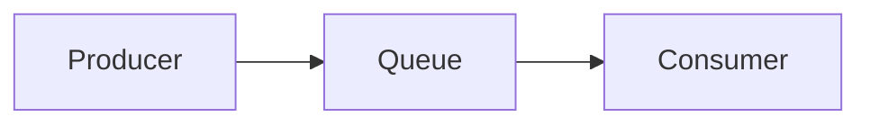
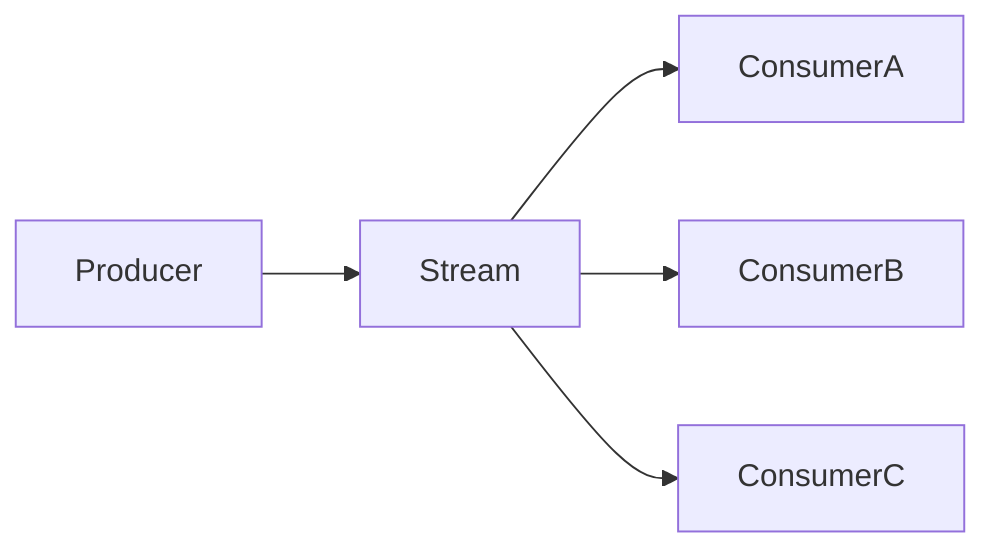

# CLAUDE CODE PROMPT

## Role

Act as a **Senior Data Engineer with 10+ years of industry experience** designing and operating production-grade data platforms, event-driven architectures, streaming systems, distributed systems, and real-time data pipelines.

You are teaching me the following learning file from my canonical Stage 2 Data Engineering curriculum:

```text
Python for Data Engineering/
└── 16-Streaming-and-Event-Driven-Data/
    └── 01-event-streams-vs-message-queues.md
```

The authoritative roadmap for this module is:

```text
16-Streaming-and-Event-Driven-Data/
```

The current file is:

```text
01-event-streams-vs-message-queues.md
```

Your job is to **teach me this topic completely from basic to advanced**, in a structured, practical, production-oriented manner.

---

# 1. PRIMARY OBJECTIVE

Create/update ONLY:

```text
01-event-streams-vs-message-queues.md
```

Do NOT create, modify, rename, delete, or update any other file or folder in the current repository.

The goal is to make this file a **complete standalone learning module** for understanding:

> **Event Streams vs Message Queues**

The teaching must start from absolute fundamentals and progressively reach advanced production-level data engineering concepts.

Do not assume that I already understand distributed streaming systems.

Build the foundation step by step.

---

# 2. AUTHORITATIVE SCOPE

The content must strictly follow the concepts defined for:

```text
01-event-streams-vs-message-queues.md
```

in the canonical Module 2.16 roadmap.

The roadmap requires coverage of:

- Events
- Commands
- Messages
- Message queues
- Event streams / logs
- Queue-based consumption
- Log-based consumption
- Retention
- Replay
- Ordering
- Fan-out
- Per-message acknowledgement
- Offset-based consumption
- Throughput
- When to use a queue
- When to use a stream
- When streaming is actually necessary
- Batch vs micro-batch vs streaming
- Event-driven architecture patterns
- Event notification
- Event-carried state transfer
- Event sourcing
- CQRS
- Transactional outbox
- Characteristics of good events
- Immutable events
- Self-describing events
- Event IDs
- Timestamps
- Event versions
- Kafka and other streaming platforms
- RabbitMQ/SQS-style queue systems
- Hybrid queue/stream concepts
- Practical queue-vs-stream decision making
- Hands-on comparison of queue and log behavior

Do NOT introduce unrelated topics merely because they are generally associated with Kafka or streaming.

Later Module 2.16 topics such as detailed Kafka internals, producers, consumers, delivery semantics, schema registry, watermarks, windows, stateful processing, Spark Structured Streaming, Flink, Debezium, and consumer lag belong to subsequent files.

You may mention those technologies briefly when necessary for context, but do NOT turn this file into those later modules.

---

# 3. TEACHING PHILOSOPHY

Teach using this progression:

```text
What is the problem?
        ↓
What is a message?
        ↓
What is an event?
        ↓
What is a command?
        ↓
What is a message queue?
        ↓
What is an event stream?
        ↓
How do they behave differently?
        ↓
Why does the distinction matter?
        ↓
When should I use each?
        ↓
How do event-driven patterns work?
        ↓
How do real systems combine these ideas?
        ↓
How do I make the architecture decision in production?
```

Every major concept should be explained using:

1. Simple definition
2. Intuition
3. Real-world analogy
4. Technical explanation
5. Concrete example
6. Code example where useful
7. Architecture example
8. Common mistakes
9. Production considerations
10. When to use it
11. When NOT to use it

Avoid jumping directly into jargon.

Whenever a technical term appears for the first time, explain it in simple language before using it extensively.

---

# 4. START WITH THE FUNDAMENTALS

Begin the file by explaining why asynchronous communication exists in distributed systems.

Explain:

- What is a distributed system?
- Why services need to communicate
- Synchronous communication
- Asynchronous communication
- Request/response
- Producer
- Consumer
- Message
- Event
- Command

Clearly distinguish:

```text
Message
Event
Command
```

Use practical examples such as:

```text
CreateOrder
OrderCreated
ProcessPayment
PaymentCompleted
```

Explain why these are not interchangeable concepts.

Create a comparison table showing:

| Concept | Meaning | Typical Intent | Example |
|---|---|---|---|
| Command | Request to perform an action | Action | CreateOrder |
| Event | Something that already happened | Notification/fact | OrderCreated |
| Message | Generic unit of communication | Depends | OrderCreated message |

Make the distinction extremely clear.

---

# 5. WHAT IS A MESSAGE QUEUE?

Explain message queues from first principles.

Cover:

- Queue
- Producer
- Consumer
- Broker
- Message
- Queue depth
- Acknowledgement
- Message removal
- Delivery to one consumer
- Competing consumers
- Work distribution

Explain the classic model:

```text
Producer
    |
    v
+---------+
|  Queue  |
+---------+
    |
    +------> Consumer A
    |
    +------> Consumer B
    |
    +------> Consumer C
```

Explain that multiple consumers may compete for messages rather than every consumer independently receiving every message.

Use simple examples:

- Email processing
- Image processing
- Payment processing
- Background jobs
- Order fulfillment
- PDF generation

Explain why queues are excellent for:

> "Someone needs to process this task."

---

# 6. QUEUE ACKNOWLEDGEMENT MODEL

Explain acknowledgement carefully.

Show the lifecycle:

```text
Producer
   ↓
Queue
   ↓
Consumer receives message
   ↓
Consumer processes message
   ↓
ACK
   ↓
Message can be removed
```

Explain:

- Why acknowledgement exists
- What happens before ACK
- What happens after ACK
- What happens if the consumer crashes
- Redelivery
- Failed processing
- Poison messages
- Retry behavior

Do not go too deeply into advanced delivery semantics because those belong to the later delivery-semantics file.

The purpose here is to establish the conceptual model.

---

# 7. WHAT IS AN EVENT STREAM?

Now introduce event streams.

Start with:

> An event stream is a continuously growing sequence of events that can be retained and independently consumed.

Explain the log model.

Use a diagram such as:

```text
Event Stream

Offset 0 → OrderCreated
Offset 1 → PaymentStarted
Offset 2 → PaymentCompleted
Offset 3 → OrderShipped
Offset 4 → OrderDelivered
...
```

Explain:

- Append-only log
- Event sequence
- Retention
- Offset
- Consumers reading independently
- Replay
- Multiple consumers
- Fan-out
- Independent consumption

Use Kafka as the primary concrete example, while also mentioning:

- Amazon Kinesis
- Apache Pulsar
- Redpanda
- Azure Event Hubs

Do not turn the section into detailed Kafka internals.

---

# 8. QUEUE VS STREAM — CORE DIFFERENCE

This is the most important section.

Clearly explain:

```text
Queue:

Producer
   ↓
Queue
   ↓
One worker processes task
   ↓
Message acknowledged/removed
```

versus:

```text
Stream:

Producer
   ↓
Event Log
   ↓
Consumer A
Consumer B
Consumer C
Consumer D

Each consumer can maintain its own position.
```

Explain the fundamental conceptual difference:

### Queue

The message represents work that needs to be performed.

### Stream

The event represents something that happened and can be consumed by multiple independent consumers.

Do not oversimplify this into an absolute rule. Explain that real systems can blur the distinction.

---

# 9. BUILD A DETAILED COMPARISON

Create a detailed comparison table covering:

- Primary purpose
- Consumption model
- Retention
- Replay
- Fan-out
- Ordering
- Acknowledgement
- Consumer position
- Multiple consumers
- Work distribution
- Data pipelines
- Background jobs
- Event-driven architectures
- Throughput
- Operational complexity
- Typical technologies
- Typical use cases
- Failure recovery
- Historical processing

Explain every important row in prose.

Include examples such as:

### Queue technologies

- RabbitMQ
- Amazon SQS

### Stream technologies

- Apache Kafka
- Amazon Kinesis
- Apache Pulsar
- Redpanda
- Azure Event Hubs

Do not imply that a product belongs exclusively to one conceptual category if its capabilities overlap.

---

# 10. RETENTION

Explain retention in event streams.

Teach:

- What retention means
- Why events may remain after consumption
- Time-based retention
- Size-based retention
- Why retention enables replay
- Why retention is valuable for data engineering

Use an example:

```text
Day 1
OrderCreated

Day 2
Analytics consumer starts

Day 3
Fraud detection consumer starts

Day 4
ML feature pipeline starts
```

Show how independent consumers can process historical retained events.

Contrast this with a traditional queue where successfully acknowledged messages are normally no longer available.

---

# 11. REPLAY

Explain replay as a first-class streaming capability.

Teach:

- What replay means
- Why replay matters
- Reprocessing historical events
- Recovering from consumer bugs
- Rebuilding derived datasets
- Backfilling
- Debugging
- New consumers

Use a concrete example:

```text
A bug incorrectly calculated revenue for 3 days.

Stream retained the original events.

Fix the code.

Reset/reposition the consumer.

Replay the events.

Rebuild the correct result.
```

Explain why replay is one of the major reasons data engineering teams use event streams.

---

# 12. ORDERING

Explain ordering carefully.

Start simple:

```text
Event A
Event B
Event C
```

Then explain why distributed systems make ordering difficult.

Explain:

- Ordered sequence
- Consumer observation order
- Partition-level ordering concept
- Why global ordering can be expensive
- Why business keys matter

Use an order example:

```text
OrderCreated
PaymentCompleted
OrderShipped
```

Explain why processing these out of order can create incorrect results.

Do not go deeply into Kafka partition internals here; that belongs in:

```text
02-kafka-topics-partitions-offsets-replication.md
```

---

# 13. FAN-OUT

Explain fan-out in simple terms.

Example:

```text
OrderCreated
      |
      +----> Analytics
      |
      +----> Fraud Detection
      |
      +----> Recommendation System
      |
      +----> Notification Service
      |
      +----> Data Warehouse
```

Explain why event streams are powerful when many independent systems need the same event.

Contrast this with a queue where multiple consumers usually compete for work.

Explain:

- One event
- Many consumers
- Independent processing
- Independent progress
- Different consumer speeds
- Different business purposes

---

# 14. QUEUE VS STREAM — REAL-WORLD DECISION RULE

Create a practical decision framework.

Explain:

Use a **queue** when:

> "This task should be processed by a worker."

Examples:

- Generate PDF
- Send email
- Resize image
- Process payment
- Run background job

Use a **stream** when:

> "This fact should be available to multiple consumers and may need replay."

Examples:

- OrderCreated
- CustomerUpdated
- PaymentCompleted
- ProductViewed
- SensorReading

Then explain that this is a decision heuristic, not an absolute law.

---

# 15. WHEN STREAMING IS ACTUALLY NECESSARY

This section is extremely important.

Teach me not to choose streaming simply because it sounds modern.

Compare:

```text
Batch
Micro-batch
Streaming
```

Explain each in simple terms.

### Batch

Process data periodically.

Example:

```text
Every night at 1 AM
```

### Micro-batch

Process small batches frequently.

Example:

```text
Every 5 minutes
```

### Streaming

Process continuously as events arrive.

Example:

```text
Seconds or sub-second latency
```

Explain how to decide based on:

- Business latency requirements
- Freshness SLA
- Volume
- Cost
- Complexity
- Operational burden
- Failure recovery
- Need for replay
- Need for continuous processing

Include a decision table.

Emphasize:

> If hourly batch processing satisfies the business requirement, streaming may be unnecessary complexity.

---

# 16. EVENT-DRIVEN ARCHITECTURE

Introduce event-driven architecture from first principles.

Explain:

- Event producer
- Event broker
- Event consumer
- Loose coupling
- Asynchronous communication
- Independent scaling
- Event propagation

Architecture:

```text
             +----------------+
             | Event Producer |
             +-------+--------+
                     |
                     v
               +-----------+
               |   Broker  |
               +-----+-----+
                     |
       +-------------+-------------+
       |             |             |
       v             v             v
   Analytics       Fraud       Notification
```

Explain why event-driven architecture can reduce direct coupling between services.

Also explain its costs:

- Debugging complexity
- Eventual consistency
- Operational complexity
- Ordering problems
- Duplicate processing
- Schema evolution
- Observability challenges

Do not pretend event-driven architecture is automatically better.

---

# 17. EVENT-DRIVEN PATTERN 1 — EVENT NOTIFICATION

Explain event notification.

Example:

```text
OrderCreated
```

The event tells consumers:

> Something happened.

Consumers may then query the source system for more details.

Explain:

- Small event payload
- Notification
- Loose coupling
- Consumer fetches current state

Explain advantages and disadvantages.

---

# 18. EVENT-DRIVEN PATTERN 2 — EVENT-CARRIED STATE TRANSFER

Explain event-carried state transfer.

Example:

```json
{
  "event_type": "CustomerUpdated",
  "customer_id": "C123",
  "name": "Alice",
  "email": "alice@example.com",
  "tier": "gold"
}
```

The event carries enough information for downstream consumers to update their local representation.

Explain:

- Reduced downstream API calls
- Local read models
- Faster consumers
- Larger events
- Data duplication
- Schema evolution challenges

Compare it directly with event notification.

---

# 19. EVENT-DRIVEN PATTERN 3 — EVENT SOURCING

Introduce event sourcing carefully.

Explain:

> Instead of storing only the latest state, store the sequence of events that produced that state.

Example:

```text
AccountOpened
MoneyDeposited
MoneyDeposited
MoneyWithdrawn
```

Current balance is derived from the event history.

Explain:

- Event log as source of truth
- Rebuilding state
- Auditability
- Replay
- Temporal history

Also explain disadvantages:

- Complexity
- Event schema longevity
- Storage
- Rebuilding state
- Event versioning
- Operational requirements

Clearly distinguish:

```text
Event streaming
```

from:

```text
Event sourcing
```

They are related but NOT the same thing.

---

# 20. EVENT-DRIVEN PATTERN 4 — CQRS

Explain Command Query Responsibility Segregation.

Start with:

```text
Commands → Change state
Queries  → Read state
```

Then show:

```text
                Commands
                   |
                   v
              Write Model
                   |
                 Events
                   |
                   v
              Read Model
                   |
                   v
                 Queries
```

Explain:

- Write model
- Read model
- Commands
- Events
- Projections
- Read optimization
- Independent scaling

Explain that CQRS does not automatically require event sourcing.

This distinction is important.

---

# 21. EVENT-DRIVEN PATTERN 5 — TRANSACTIONAL OUTBOX

Teach the transactional outbox pattern thoroughly.

Start with the dual-write problem.

Example:

```text
Database transaction
       +
Kafka publish
```

Explain why this can fail:

```text
1. DB transaction succeeds
2. Application crashes
3. Event is never published
```

Or:

```text
1. Event is published
2. DB transaction fails
3. Event describes state that never committed
```

Then introduce:

```text
Application
    |
    +----> Business DB
    |
    +----> Outbox Table
                |
                v
          CDC / Publisher
                |
                v
              Kafka
```

Explain:

- Atomic DB transaction
- Outbox record
- CDC/publisher
- Reliable event publication
- Duplicate publication
- Idempotent consumers
- Ordering considerations

Use a concrete SQL example.

Example:

```sql
BEGIN;

INSERT INTO orders (...);

INSERT INTO outbox_events (
    event_id,
    event_type,
    aggregate_id,
    payload
);

COMMIT;
```

Then explain how a CDC system such as Debezium can publish the outbox event.

Do not turn this into the full Debezium module.

---

# 22. GOOD EVENT DESIGN

Explain the characteristics of a good event.

Cover every item from the roadmap:

- Immutable
- Self-describing
- Event ID
- Timestamp
- Version

Explain each in detail.

Example:

```json
{
  "event_id": "evt_123",
  "event_type": "OrderCreated",
  "event_version": 1,
  "occurred_at": "2026-10-05T10:30:00Z",
  "order_id": "ORD-1001",
  "customer_id": "C-101"
}
```

Explain why each field matters.

Discuss:

- Idempotency
- Debugging
- Traceability
- Replay
- Schema evolution
- Ordering
- Deduplication

---

# 23. IMMUTABILITY

Explain why events should generally be immutable.

Contrast:

Bad model:

```text
OrderCreated
↓
Modify the original event
```

Better model:

```text
OrderCreated
OrderAddressChanged
OrderCancelled
```

Explain why immutable events support:

- Auditability
- Replay
- Historical reconstruction
- Debugging
- Independent consumers

Do not claim every messaging system is inherently immutable; distinguish the event concept from the underlying technology.

---

# 24. SELF-DESCRIBING EVENTS

Explain what "self-describing" means.

Show:

```json
{
  "event_type": "OrderCreated",
  "event_version": 1,
  "event_id": "evt-123",
  "occurred_at": "...",
  "order_id": "ORD-123"
}
```

Explain why consumers need enough context to understand the event.

Discuss:

- Event type
- Version
- Identifier
- Timestamp
- Payload
- Schema

Keep detailed schema registry implementation for the later schema file.

---

# 25. PRACTICAL CODE EXAMPLES

Include simple Python examples where they improve understanding.

Do NOT write toy code merely for the sake of having code.

At minimum include:

### Example 1 — In-memory queue

Demonstrate:

```python
from queue import Queue
```

Show:

- Producer
- Consumer
- Message processing
- `task_done()`
- `join()`

Explain what the code demonstrates conceptually.

### Example 2 — Simple event log

Implement a tiny Python event stream using a list or append-only structure.

Demonstrate:

```text
append event
read from offset
replay from offset
multiple consumers
```

For example:

```python
events = []

events.append(...)
events.append(...)
events.append(...)
```

Then show consumers maintaining independent positions.

### Example 3 — Fan-out

Demonstrate multiple consumers reading the same event history independently.

### Example 4 — Event notification

Show a simple event payload.

### Example 5 — Event-carried state transfer

Show a richer event payload.

### Example 6 — Transactional outbox

Show a simplified Python + SQL conceptual example.

Clearly label simplified examples versus production implementations.

Do not pretend an in-memory list is equivalent to Kafka.

---

# 26. HANDS-ON COMPARISON LAB

The roadmap explicitly requires a practical comparison of queue and log behavior.

Create a complete hands-on lab.

Build a small experiment that produces approximately:

```text
1000 events
```

Then compare:

```text
Queue-style processing
vs
Log/stream-style processing
```

The experiment should demonstrate:

1. Produce 1000 events
2. Process them using competing consumers
3. Demonstrate work distribution
4. Produce/retain the same events in an event-log model
5. Start multiple independent consumers
6. Demonstrate fan-out
7. Demonstrate independent consumer positions
8. Replay events
9. Compare behavior
10. Record observations

Use Python for the conceptual lab.

Where Docker is useful, mention it, but do not make the lab unnecessarily infrastructure-heavy.

The purpose is to understand the conceptual difference.

---

# 27. DECISION GUIDE

Create a practical architecture decision matrix.

For example:

| Requirement | Queue | Stream |
|---|---:|---:|
| Background task processing | Strong fit | Possible |
| Work distribution | Strong fit | Possible |
| Multiple independent consumers | Limited/depends on system | Strong fit |
| Replay | Usually limited | Strong fit |
| Long retention | Usually not primary model | Strong fit |
| Data pipelines | Possible | Strong fit |
| Event history | Weak fit | Strong fit |
| Task execution | Strong fit | Possible |
| Continuous analytics | Weak fit | Strong fit |
| Simple asynchronous job | Strong fit | Often unnecessary |

Explain every decision rather than relying only on the table.

---

# 28. COMMON ARCHITECTURAL MISTAKES

Create a dedicated section covering mistakes such as:

### Mistake 1
Using a queue when many independent systems need the same event.

### Mistake 2
Using a stream when a simple background queue would solve the problem.

### Mistake 3
Treating commands as events.

### Mistake 4
Assuming streaming automatically means better architecture.

### Mistake 5
Ignoring replay requirements.

### Mistake 6
Ignoring event ordering.

### Mistake 7
Creating mutable events.

### Mistake 8
Publishing database changes without considering the dual-write problem.

### Mistake 9
Ignoring event identity.

### Mistake 10
Designing an event-driven system without observability.

For every mistake explain:

```text
Problem
Why it happens
Why it is dangerous
Better approach
Production example
```

---

# 29. PRODUCTION ARCHITECTURE EXAMPLES

Include several realistic architecture scenarios.

At minimum:

### Scenario 1 — E-commerce order processing

Show where a queue fits.

### Scenario 2 — E-commerce analytics platform

Show where an event stream fits.

### Scenario 3 — Fraud detection

Show stream-based event consumption.

### Scenario 4 — Email/PDF background processing

Show queue-based work distribution.

### Scenario 5 — Database-to-analytics pipeline

Show why event streams are useful.

### Scenario 6 — Transactional outbox architecture

Show the DB → outbox → event stream flow.

For each scenario explain why the chosen model is appropriate.

---

# 30. ADVANCED ARCHITECTURAL THINKING

After the fundamentals, teach advanced concepts such as:

- Coupling
- Temporal decoupling
- Spatial decoupling
- Consumer independence
- Replayability
- Event history
- Event-driven scalability
- Failure isolation
- Eventual consistency
- Derived state
- Read models
- Backfill/reprocessing
- Multiple downstream teams consuming the same data
- Data platform implications

Keep these concepts connected to the central queue-vs-stream distinction.

Do not introduce advanced concepts without explaining their connection to the foundational model.

---

# 31. HYBRID SYSTEMS

Explain that real architectures frequently use both queues and streams.

Example:

```text
Order Service
     |
     v
Kafka Event Stream
     |
     +------> Analytics
     |
     +------> Fraud
     |
     +------> CDC/Data Platform
     |
     +------> Notification Service
                  |
                  v
              Task Queue
                  |
                  v
             Email Worker
```

Explain why a stream and queue can coexist.

Also mention that modern streaming systems can expose queue-like consumption patterns, so the distinction is conceptual rather than a rigid product classification.

Keep this discussion aligned with the roadmap's hybrid awareness.

---

# 32. TECHNOLOGY LANDSCAPE

Give a concise technology map.

### Queue-oriented technologies

- RabbitMQ
- Amazon SQS

### Event-stream technologies

- Apache Kafka
- Amazon Kinesis
- Apache Pulsar
- Redpanda
- Azure Event Hubs

Explain:

```text
Technology
    ↓
Communication model
    ↓
Typical use case
```

Do not perform a product feature-by-feature comparison.

Detailed Kafka internals will be covered in the next file.

---

# 33. INTERVIEW-LEVEL UNDERSTANDING

At the end of the module, include interview-oriented questions such as:

1. What is the difference between a queue and a stream?
2. When would you choose Kafka over RabbitMQ?
3. Why is replay important?
4. What is fan-out?
5. What is the difference between an event and a command?
6. What is event sourcing?
7. Is event sourcing the same as event streaming?
8. What is CQRS?
9. Does CQRS require event sourcing?
10. What is the transactional outbox pattern?
11. Why are immutable events useful?
12. When is streaming unnecessary?
13. How would you design an order-processing system?
14. How would you design an event-driven analytics platform?

For important questions, provide model answers.

---

# 34. KNOWLEDGE CHECKPOINTS

After each major section, include short knowledge checkpoints.

Use formats such as:

### Quick Check

- Question
- Expected reasoning

### Think Before Moving On

- Scenario
- What would you choose?
- Why?

Do not make them trivial.

The objective is to ensure I actually understand the concepts before moving to the next level.

---

# 35. MINI EXERCISES

Include progressively difficult exercises.

### Beginner

Explain queue vs stream in your own words.

### Intermediate

Design an architecture for image processing.

### Intermediate+

Design an order event stream.

### Advanced

Choose queue vs stream for multiple business scenarios.

### Advanced+

Design an event-driven e-commerce architecture using:

- Event stream
- Queue
- Multiple consumers
- Replay
- Transactional outbox

Provide expected solution reasoning after each exercise.

---

# 36. LEARNING VALIDATION

End with a comprehensive assessment.

Divide it into:

### Level 1 — Fundamentals

Questions about:

- Message
- Event
- Command
- Queue
- Stream

### Level 2 — Architecture

Questions about:

- Queue vs stream
- Fan-out
- Replay
- Retention
- Ordering

### Level 3 — Event-driven architecture

Questions about:

- Event notification
- Event-carried state transfer
- Event sourcing
- CQRS
- Transactional outbox

### Level 4 — Production design

Scenario-based architecture decisions.

Require me to explain:

```text
What would you choose?
Why?
What are the trade-offs?
What can fail?
How would you recover?
```

---

# 37. FINAL MENTAL MODEL

End the file with a concise mental model.

The reader should remember:

```text
Message
  ↓
Communication unit

Command
  ↓
"Please do this"

Event
  ↓
"This happened"

Queue
  ↓
"Someone should process this work"

Stream
  ↓
"This fact happened and many consumers may independently process it"

Retention
  ↓
Keep history

Replay
  ↓
Read history again

Fan-out
  ↓
Many independent consumers

Event-driven architecture
  ↓
Systems react to events

Transactional outbox
  ↓
Safely bridge database transactions and event publication
```

Then provide a final decision rule:

```text
Need work distribution?
→ Think queue.

Need durable event history, replay, and multiple independent consumers?
→ Think event stream.

Need both?
→ Use both deliberately.

Need neither?
→ Keep the architecture simpler.
```

---

# 38. CODE QUALITY REQUIREMENTS

All Python examples must:

- Use Python 3.12+
- Be syntactically correct
- Be readable
- Use meaningful variable names
- Include comments where they clarify concepts
- Avoid unnecessary abstractions
- Explain the code immediately after each important example

When using external libraries:

- Explain why the library is being used
- Show installation if appropriate
- Prefer minimal dependencies
- Clearly separate conceptual examples from production examples

Never present toy code as production-ready infrastructure.

---

# 39. DIAGRAM REQUIREMENTS

Use Mermaid diagrams where architecture or flow is easier to understand visually.

Examples:



and:



Use diagrams for:

- Queue architecture
- Stream architecture
- Fan-out
- Event-driven architecture
- Event sourcing
- CQRS
- Transactional outbox
- Hybrid architectures

Every diagram must be accompanied by a textual explanation.

---

# 40. SIMPLICITY REQUIREMENT

Use simple language first.

For example, instead of immediately saying:

> "A stream provides durable append-only log semantics with independently managed consumer offsets."

First say:

> "A stream is like a durable history of events. Consumers can read that history independently and remember where they stopped."

Then introduce the technical terminology.

Follow:

```text
Simple explanation
        ↓
Technical terminology
        ↓
Example
        ↓
Production implication
```

---

# 41. DO NOT OVERLAP WITH FUTURE FILES

Maintain clean module boundaries.

Do not deeply teach:

```text
02-kafka-topics-partitions-offsets-replication.md
03-kafka-producers-in-python.md
04-kafka-consumers-and-consumer-groups.md
05-delivery-semantics-at-most-once-at-least-once-exactly-once.md
06-protobuf-and-schema-registry.md
07-event-time-processing-time-and-watermarks.md
08-tumbling-sliding-and-session-windows.md
09-stateful-stream-processing.md
10-spark-structured-streaming.md
11-apache-flink-and-pyflink-overview.md
12-debezium-cdc-streams-into-kafka.md
13-backpressure-and-consumer-lag.md
```

Those files will provide the detailed implementation later.

This file should establish the conceptual foundation required to understand them.

---

# 42. LEARNING LOOP

For each important concept, encourage this loop:

```text
1. Read
2. Understand
3. Draw
4. Predict
5. Implement
6. Run
7. Inspect
8. Break it
9. Recover
10. Explain
```

For the queue-vs-stream comparison specifically:

```text
Predict behavior
        ↓
Run experiment
        ↓
Observe consumption
        ↓
Replay
        ↓
Add another consumer
        ↓
Compare behavior
        ↓
Explain why
```

---

# 43. FINAL FILE STRUCTURE

Organize the Markdown file approximately as:

```text
# Event Streams vs Message Queues

## Learning Objectives

## Prerequisites

## 1. Why Distributed Systems Need Messaging

## 2. Messages, Events, and Commands

## 3. What Is a Message Queue?

## 4. Queue Consumption and Acknowledgement

## 5. What Is an Event Stream?

## 6. Queue vs Stream — Core Difference

## 7. Retention

## 8. Replay

## 9. Ordering

## 10. Fan-Out

## 11. Queue vs Stream Decision Framework

## 12. Batch vs Micro-Batch vs Streaming

## 13. Event-Driven Architecture

## 14. Event Notification

## 15. Event-Carried State Transfer

## 16. Event Sourcing

## 17. CQRS

## 18. Transactional Outbox

## 19. Designing Good Events

## 20. Event Immutability

## 21. Self-Describing Events

## 22. Python Hands-On Examples

## 23. Queue vs Stream Comparison Lab

## 24. Real-World Architecture Scenarios

## 25. Hybrid Queue + Stream Architectures

## 26. Technology Landscape

## 27. Common Mistakes

## 28. Advanced Architecture Considerations

## 29. Knowledge Checkpoints

## 30. Practical Exercises

## 31. Interview Questions

## 32. Final Assessment

## 33. Final Mental Model

## 34. Summary
```

You may adjust the exact section names if necessary, but do not remove any required concept.

---

# 44. FINAL QUALITY CHECK BEFORE FINISHING

Before completing the task, verify all of the following:

### Scope

- [ ] Only `01-event-streams-vs-message-queues.md` was modified.
- [ ] No other file was changed.
- [ ] No unrelated topic was added.

### Concept Coverage

- [ ] Messages explained
- [ ] Events explained
- [ ] Commands explained
- [ ] Message queues explained
- [ ] Event streams explained
- [ ] Queue acknowledgement explained
- [ ] Stream offsets explained conceptually
- [ ] Retention explained
- [ ] Replay explained
- [ ] Ordering explained
- [ ] Fan-out explained
- [ ] Throughput explained
- [ ] Queue use cases explained
- [ ] Stream use cases explained
- [ ] Batch vs micro-batch vs streaming explained
- [ ] Event-driven architecture explained
- [ ] Event notification explained
- [ ] Event-carried state transfer explained
- [ ] Event sourcing explained
- [ ] CQRS explained
- [ ] Transactional outbox explained
- [ ] Immutable events explained
- [ ] Self-describing events explained
- [ ] Event IDs explained
- [ ] Timestamps explained
- [ ] Event versions explained
- [ ] Hybrid architectures explained
- [ ] Practical queue-vs-stream decision framework included

### Practical Learning

- [ ] Python examples included
- [ ] Queue example included
- [ ] Event stream example included
- [ ] Fan-out example included
- [ ] Transactional outbox example included
- [ ] 1000-event comparison lab included
- [ ] Replay demonstrated
- [ ] Multiple consumers demonstrated
- [ ] Practical scenarios included
- [ ] Exercises included
- [ ] Knowledge checkpoints included
- [ ] Interview questions included
- [ ] Final assessment included

### Teaching Quality

- [ ] Starts from fundamentals
- [ ] Progresses from basic to advanced
- [ ] Uses simple language
- [ ] Technical terminology is introduced gradually
- [ ] Coding examples are explained
- [ ] Architecture diagrams are included
- [ ] Trade-offs are explained
- [ ] Common mistakes are explained
- [ ] Production considerations are explained
- [ ] Future Module 2.16 files are not unnecessarily duplicated

---

# 45. FINAL INSTRUCTION

Do not merely write a list of definitions.

Build a **complete learning experience**.

I should finish this file able to answer:

> "What is a message?"

> "What is an event?"

> "What is a command?"

> "What is the difference between a message queue and an event stream?"

> "Why does retention matter?"

> "Why is replay powerful?"

> "What is fan-out?"

> "When should I use RabbitMQ/SQS-style queue processing?"

> "When should I use Kafka/Kinesis/Pulsar-style event streaming?"

> "When is streaming unnecessary?"

> "What is event-driven architecture?"

> "What is event notification?"

> "What is event-carried state transfer?"

> "What is event sourcing?"

> "What is CQRS?"

> "What is the transactional outbox pattern?"

> "How do I design good events?"

> "How do I decide between a queue, a stream, batch, micro-batch, or a combination?"

Most importantly, I should be able to **design a real production architecture and defend the queue-vs-stream decision based on requirements, trade-offs, replayability, fan-out, retention, latency, and operational complexity.**

Use the canonical roadmap as the source of truth.

**Modify ONLY `01-event-streams-vs-message-queues.md`.**

Do not modify any other file.