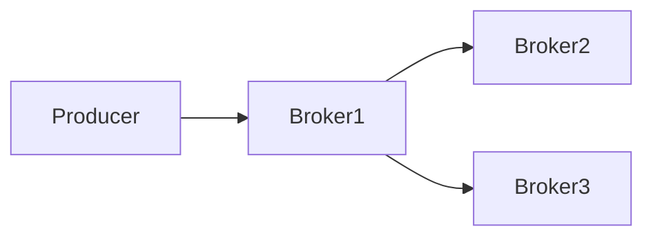
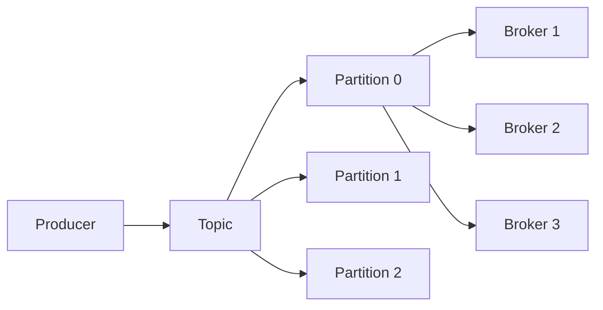

# CLAUDE CODE PROMPT

## ROLE

Act as a **Senior Data Engineer with 10+ years of industry experience** designing, building, and operating production-grade data platforms, Apache Kafka platforms, distributed event-driven systems, CDC pipelines, streaming architectures, and large-scale data infrastructure.

You are teaching me the following file from my canonical Stage 2 Data Engineering curriculum:

```text
Python for Data Engineering/
└── 16-Streaming-and-Event-Driven-Data/
    └── 02-kafka-topics-partitions-offsets-and-replication.md
```

The authoritative roadmap is:

```text
16-Streaming-and-Event-Driven-Data/
```

Your task is to create/update **ONLY**:

```text
02-kafka-topics-partitions-offsets-and-replication.md
```

Do **NOT** create, modify, rename, delete, or update any other file or folder.

---

# 1. PRIMARY LEARNING OBJECTIVE

Build a complete learning module that teaches:

> **Kafka Topics, Partitions, Offsets, and Replication**

from absolute beginner level through advanced production-level understanding.

The learning progression must be:

```text
Why Kafka needs topics
        ↓
Kafka broker
        ↓
Topic
        ↓
Partition
        ↓
Record
        ↓
Offset
        ↓
Ordering
        ↓
Keys
        ↓
Partition assignment
        ↓
Replication
        ↓
Leader / follower
        ↓
ISR
        ↓
min.insync.replicas
        ↓
Broker failures
        ↓
Retention
        ↓
Log compaction
        ↓
Partition-count decisions
        ↓
Hot partitions / skew
        ↓
Segments
        ↓
KRaft
        ↓
Topic design
        ↓
Production architecture
```

Do not jump directly into advanced Kafka terminology.

Build the mental model step by step.

---

# 2. AUTHORITATIVE ROADMAP SCOPE

The canonical roadmap for this file requires coverage of:

- Kafka brokers
- Topics
- Partitions
- Offsets
- Records
- Record keys
- Record values
- Headers
- Timestamps
- Ordering
- Partitioning
- Key-based partition assignment
- KRaft
- Kafka CLI
- Kafka UI
- Replication
- Leaders
- Followers
- Replication factor
- ISR — In-Sync Replicas
- `min.insync.replicas`
- Broker failure
- Retention
- Time-based retention
- Size-based retention
- Log compaction
- Compacted topics
- Latest value per key
- Changelog / state topics
- Partition count
- Throughput
- Consumer parallelism
- Key distribution
- Too many partitions
- Hot partitions
- Skew
- Log segments
- Storage behavior
- Tiered storage awareness
- KRaft vs ZooKeeper awareness
- Managed Kafka awareness
- Kafka-compatible systems
- Topic design
- Naming
- Event type per topic vs multiple event types
- Key selection
- Hands-on three-broker KRaft lab
- Six-partition `orders` topic
- Replication factor 3
- `min.insync.replicas=2`
- Compacted `customer_state` topic
- Broker-failure experiments
- Hot-partition/skew experiment
- Topic design document

Every roadmap concept above must be explicitly taught.

Do not skip concepts.


---

# 3. IMPORTANT MODULE BOUNDARY

This file is foundational.

Do not turn it into the later Kafka client modules.

The following files are separate:

```text
03-kafka-producers-in-python.md
04-kafka-consumers-and-consumer-groups.md
05-delivery-semantics-at-most-once-at-least-once-exactly-once.md
06-protobuf-and-schema-registry.md
```

Therefore:

### This file SHOULD deeply explain:

- Kafka's storage/log model
- Topics
- Partitions
- Offsets
- Keys
- Ordering
- Replication
- Broker failures
- Retention
- Compaction
- Partition sizing/design
- Topic design

### This file should NOT become a detailed tutorial about:

- Python producer implementation
- Python consumer implementation
- Consumer groups and rebalances
- Producer acknowledgements
- Idempotent producers
- Kafka transactions
- Exactly-once processing
- Schema Registry implementation
- Protobuf implementation

You may mention those later concepts briefly for context, but preserve clean curriculum boundaries.

---

# 4. START WITH: WHY KAFKA NEEDS THIS MODEL

Before teaching individual Kafka components, explain the underlying problem.

Explain:

- Why distributed systems need durable event logs
- Why a single ordered stream is insufficient for high throughput
- Why Kafka divides a topic into partitions
- Why Kafka stores records rather than immediately deleting them after consumption
- Why consumers need a position
- Why data needs replication

Use a simple conceptual progression:

```text
One stream
    ↓
Too much traffic
    ↓
Split into partitions
    ↓
Parallel processing
    ↓
Replicate partitions
    ↓
Fault tolerance
```

Explain this before introducing detailed terminology.

---

# 5. WHAT IS A KAFKA BROKER?

Teach the broker from first principles.

Explain:

- Kafka broker
- Broker ID
- Broker responsibilities
- Storage
- Network communication
- Hosting partitions
- Reading/writing records
- Leader/follower responsibilities

Use a simple diagram:



Then explain that a Kafka cluster consists of multiple brokers.

Show:

```text
Kafka Cluster

Broker 1
Broker 2
Broker 3
```

Explain why multiple brokers are necessary.

---

# 6. WHAT IS A TOPIC?

Explain topics from beginner level.

Define:

> A Kafka topic is a named logical stream of records.

Explain:

- Topic name
- Records belonging to a topic
- Multiple producers
- Multiple consumers
- Topic retention
- Topic partitions

Use examples:

```text
orders
payments
customer-events
inventory-events
clickstream
```

Explain that a topic is logical rather than a single physical file.

Then introduce:

```text
Topic
   ↓
Partition 0
Partition 1
Partition 2
...
```

---

# 7. WHAT IS A KAFKA RECORD?

Explain the structure of a Kafka record.

Cover:

- Key
- Value
- Headers
- Timestamp
- Offset

Use an example:

```text
Key:
customer-123

Value:
{
  "event_type": "OrderCreated",
  "order_id": "ORD-1001"
}

Headers:
content-type = application/json

Timestamp:
2026-10-05T10:30:00Z

Offset:
1257
```

Explain the purpose of each field.

Make clear that the offset is assigned by Kafka within a partition.

---

# 8. TOPIC VS PARTITION

This distinction must be extremely clear.

Explain:

```text
Topic = logical stream

Partition = ordered log inside the topic
```

Example:

```text
orders

Partition 0
Partition 1
Partition 2
Partition 3
Partition 4
Partition 5
```

Explain why six partitions do not mean six separate business topics.

Use a real-world analogy, but follow it with the technical explanation.

---

# 9. PARTITIONS

Teach partitions deeply.

Explain:

- Why partitions exist
- Parallelism
- Horizontal scaling
- Storage distribution
- Ordering boundary
- Consumer parallelism
- Partition assignment
- Partition count

Use:

```text
orders
├── partition-0
├── partition-1
├── partition-2
├── partition-3
├── partition-4
└── partition-5
```

Explain:

> Kafka guarantees ordering within a partition, not automatically across an entire multi-partition topic.

This is a foundational principle.

---

# 10. OFFSETS

Teach offsets from first principles.

Explain:

> An offset is the position of a record within a partition.

Example:

```text
Partition 0

Offset 0 → OrderCreated
Offset 1 → OrderCreated
Offset 2 → PaymentCompleted
Offset 3 → OrderShipped
Offset 4 → OrderDelivered
```

Explain:

- Offset is partition-specific
- Offset is not globally unique across a topic
- Consumers use offsets to know where they are
- Offsets enable replay
- Offsets provide a position in the log

Show:

```text
Partition 0 → offset 0,1,2,3,4
Partition 1 → offset 0,1,2,3,4
```

Make it explicit that:

```text
offset 3 in partition 0
```

and:

```text
offset 3 in partition 1
```

are different records.

---

# 11. ORDERING

Teach Kafka ordering carefully.

Explain:

### Guaranteed:

Ordering within a partition.

### Not automatically guaranteed:

Global ordering across all partitions.

Use:

```text
Partition 0:
A → B → C

Partition 1:
X → Y → Z
```

Explain why Kafka cannot automatically claim:

```text
A → X → B → Y → C → Z
```

as a single global ordering.

Explain why this matters for:

- Orders
- Payments
- Customer state
- Inventory
- CDC

---

# 12. RECORD KEYS

Teach keys in depth.

Explain:

> A record key can influence which partition receives the record.

Use:

```text
customer_id = C123
```

and:

```text
customer_id = C456
```

Explain why choosing a business key can preserve related events in the same partition.

Example:

```text
OrderCreated(customer_id=C123)
PaymentCompleted(customer_id=C123)
OrderShipped(customer_id=C123)
```

Explain the goal:

```text
same key
   ↓
same partition
   ↓
partition-level ordering
```

Do NOT overclaim that every Kafka partitioner behaves identically across all clients or versions.

Introduce partitioner behavior conceptually and defer detailed producer implementation to the next module.

---

# 13. KEY SELECTION

Teach how to choose a Kafka key.

Discuss candidates:

- customer_id
- order_id
- account_id
- device_id
- tenant_id
- transaction_id

Explain the decision criteria:

- What must be ordered together?
- What entity defines the ordering boundary?
- How evenly distributed are keys?
- Can one key become extremely hot?
- Does the downstream consumer need entity-local ordering?

Use concrete examples.

### Example:

If the requirement is:

> All events for one order must be processed in order.

Then:

```text
key = order_id
```

may be appropriate.

If the requirement is:

> All events for one customer must be processed in order.

Then:

```text
key = customer_id
```

may be appropriate.

Explain that the key should be selected based on business semantics, not convenience.

---

# 14. PARTITION DISTRIBUTION

Explain how records get distributed.

Teach conceptually:

```text
Record
   ↓
Key
   ↓
Partitioning logic
   ↓
Partition
```

Explain:

- Keyed records
- Null-key records
- Partition distribution
- Skew
- Hot keys

Do not dive deeply into Python producer APIs yet.

---

# 15. KAFKA CLI AND KAFKA UI

The roadmap explicitly requires hands-on Kafka CLI/UI work.

Teach the purpose of Kafka CLI tools.

Cover conceptual commands for:

- Creating topics
- Listing topics
- Describing topics
- Inspecting partitions
- Inspecting replication
- Producing test records
- Consuming test records

Use Kafka 4.x / KRaft-compatible commands.

Explain what each command demonstrates.

Also explain the purpose of a Kafka UI:

- Topic overview
- Partition count
- Leaders
- Replicas
- ISR
- Messages
- Consumer information where relevant

Do not assume ZooKeeper-based commands.

---

# 16. KRAFT

Teach KRaft carefully.

Explain:

> KRaft is Kafka's modern metadata management architecture that removes the dependency on ZooKeeper.

The roadmap specifically uses:

```text
Apache Kafka 4.x
KRaft
No ZooKeeper
```

Explain:

- Historical ZooKeeper architecture
- Why Kafka moved away from ZooKeeper
- KRaft controllers
- Broker role
- Metadata management
- Controller quorum concept
- Why this matters operationally

Do not turn this into an internal implementation deep dive.

The goal is operational understanding.

Explicitly state:

> For this curriculum, use KRaft-based Kafka rather than ZooKeeper-based Kafka.

---

# 17. REPLICATION

Now introduce replication.

Start with the problem:

```text
What happens if the broker storing a partition fails?
```

Then explain replication.

Example:

```text
Partition 0

Broker 1 → Leader
Broker 2 → Follower
Broker 3 → Follower
```

Explain:

- Replica
- Leader replica
- Follower replica
- Replication factor
- Data redundancy
- Fault tolerance

---

# 18. REPLICATION FACTOR

Explain replication factor.

Example:

```text
Replication Factor = 3
```

means:

```text
Partition 0:
Broker 1 → Leader
Broker 2 → Replica
Broker 3 → Replica
```

Explain:

- RF=1
- RF=2
- RF=3

Discuss the trade-offs:

| RF | Fault tolerance | Storage | Network cost |
|---|---|---|---|
| 1 | Low | Low | Low |
| 2 | Medium | Higher | Higher |
| 3 | High | Higher | Higher |

Do not present the table as an absolute performance guarantee.

Explain that RF=3 is common in production but depends on requirements.

---

# 19. LEADERS AND FOLLOWERS

Explain the leader/follower model.

For a partition:

```text
Leader
   |
   +----> Follower
   |
   +----> Follower
```

Explain:

- Leader handles partition writes
- Followers replicate the partition
- Leader failure
- New leader election
- Replica recovery

Use simple failure scenarios.

---

# 20. ISR — IN-SYNC REPLICAS

Teach ISR from first principles.

Explain:

> ISR is the set of replicas considered sufficiently caught up to participate safely in leader election according to Kafka's replication rules.

Explain:

```text
Partition 0

Leader → Broker 1
ISR → Broker 1, Broker 2, Broker 3
```

Then simulate:

```text
Broker 3 falls behind

ISR → Broker 1, Broker 2
```

Explain why this matters.

Do not oversimplify ISR into "all replicas that exist."

Explain the difference between:

```text
Assigned replicas
```

and:

```text
In-sync replicas
```

---

# 21. MIN.INSYNC.REPLICAS

Teach:

```text
min.insync.replicas
```

from first principles.

Use:

```text
Replication Factor = 3
min.insync.replicas = 2
```

Explain the safety goal.

Show scenarios:

### Healthy

```text
Broker 1 → ISR
Broker 2 → ISR
Broker 3 → ISR
```

### One broker unavailable

```text
Broker 1 → ISR
Broker 2 → ISR
Broker 3 → unavailable
```

Still sufficient.

### Two brokers unavailable

```text
Only one ISR remains
```

Explain why safe writes may no longer be accepted depending on producer acknowledgement configuration.

Do NOT deeply teach producer `acks` here; explain only enough to understand the relationship.

---

# 22. BROKER FAILURE

Create detailed failure simulations.

Scenario:

```text
3 brokers
RF=3
min.insync.replicas=2
```

Kill one broker.

Explain:

1. What happens to its replicas?
2. What happens to partition leadership?
3. What happens to ISR?
4. Can the cluster continue?
5. What happens when the broker returns?
6. How does the replica catch up?

Then simulate a second broker failure.

Explain the resulting risk.

The objective is to build operational intuition.

---

# 23. RETENTION

Teach Kafka retention thoroughly.

Explain:

> Kafka retention determines how long or how much data remains available in the log.

Cover:

- Time-based retention
- Size-based retention
- Segment-based deletion
- Retention vs consumption
- Retention vs replay
- Storage growth

Use an example:

```text
retention.ms = 7 days
```

Explain that a consumer can still replay retained data if it has not been deleted.

Important:

Do not imply that consumption automatically removes records from Kafka.

---

# 24. TIME-BASED RETENTION

Explain:

```text
retention.ms
```

conceptually.

Example:

```text
Keep records for 7 days.
```

Explain:

- Replay window
- Storage growth
- Recovery window
- Backfill implications

Discuss how retention should be selected based on business requirements rather than arbitrary defaults.

---

# 25. SIZE-BASED RETENTION

Explain:

```text
retention.bytes
```

conceptually.

Explain:

- Maximum retained log size
- Storage constraints
- Interaction with traffic volume
- High-volume topic implications

Show why:

```text
7 days
```

does not necessarily mean the same number of records for every topic.

---

# 26. LOG SEGMENTS

Explain Kafka log segments.

Start simply:

> Kafka does not store an entire partition as one giant file. Partition data is organized into log segments.

Explain:

- Segment files
- Active segment
- Older segments
- Segment rolling
- Retention operating on segments
- Why segments matter operationally

Keep implementation details appropriate to this module.

Do not overfocus on internal file formats.

---

# 27. LOG COMPACTION

This is a major roadmap topic.

Explain the difference between:

```text
Delete-based retention
```

and:

```text
Log compaction
```

Teach:

> Log compaction keeps the latest record for each key over time, subject to Kafka's compaction semantics and configuration.

Use:

```text
customer-123 → Gold
customer-123 → Platinum
customer-123 → Enterprise
```

After compaction, the topic can retain the latest state:

```text
customer-123 → Enterprise
```

Explain that this is conceptually useful for:

- Changelog topics
- Current-state reconstruction
- CDC
- State stores
- Materialized views

---

# 28. COMPACTION VS RETENTION

Create a clear comparison.

| Feature | Delete Retention | Log Compaction |
|---|---|---|
| Main goal | Remove old data | Retain latest state by key |
| Based on | Time/size | Keys |
| Historical records | Eventually removed | Older values may be removed |
| Current state | Not guaranteed | Strong use case |
| CDC/changelog | Possible | Strong fit |

Explain why these are different mechanisms.

Also explain that compaction does not mean the topic immediately contains exactly one record per key at all times.

---

# 29. COMPACTED `customer_state` TOPIC

The roadmap explicitly requires a compacted `customer_state` experiment.

Teach:

```text
customer_state
```

with:

```text
key = customer_id
value = latest customer state
```

Example:

```text
C001 → Bronze
C001 → Silver
C001 → Gold
```

Explain how compaction eventually favors the latest state.

Show how a new consumer can reconstruct current state by reading the compacted topic.

---

# 30. PARTITION COUNT

Teach partition-count decisions carefully.

Explain that partitions provide:

- Parallelism
- Throughput
- Consumer scalability
- Storage distribution

But partitions also create:

- Metadata overhead
- More files
- More network connections
- More operational complexity
- Rebalancing/management overhead
- Resource consumption

Teach the principle:

> More partitions are not automatically better.

---

# 31. PARTITION COUNT AND THROUGHPUT

Explain the relationship:

```text
More partitions
       ↓
More parallelism
       ↓
Potentially more throughput
```

But explain that throughput can also be constrained by:

- Network
- Disk
- CPU
- Producer
- Consumers
- Serialization
- Downstream sinks

Do not claim a simple linear scaling relationship.

---

# 32. PARTITION COUNT AND CONSUMER PARALLELISM

Explain conceptually:

```text
6 partitions
+
6 consumers
=
up to 6 active partition-processing units
```

Then:

```text
6 partitions
+
10 consumers
=
some consumers have no partition assigned
```

Do not deeply teach consumer groups because that belongs to the next Kafka consumer module.

Simply establish why partition count affects downstream parallelism.

---

# 33. HOT PARTITIONS

Teach hot partitions.

Example:

```text
Partition 0 → 80% traffic
Partition 1 → 5%
Partition 2 → 5%
Partition 3 → 5%
Partition 4 → 3%
Partition 5 → 2%
```

Explain:

- Hot key
- Skew
- Uneven partition distribution
- Throughput bottleneck
- Consumer bottleneck
- Why increasing partitions alone may not fix a hot key

Use examples:

```text
tenant_id = giant_customer
customer_id = celebrity_user
device_id = high-volume-device
```

Explain mitigation strategies conceptually:

- Better key choice
- Composite keys
- Key salting where ordering permits
- Separate high-volume workloads
- More partitions when appropriate

Clearly explain trade-offs.

---

# 34. SKEW

Teach partition skew separately from hot partitions.

Explain:

> Skew means traffic is distributed unevenly.

Use:

```text
Ideal:
25% / 25% / 25% / 25%

Skewed:
70% / 10% / 10% / 10%
```

Explain how skew affects:

- Throughput
- Latency
- Consumer utilization
- Cost
- Scaling

---

# 35. TOO MANY PARTITIONS

Explain the opposite problem.

Why not create:

```text
10,000 partitions
```

without justification?

Discuss:

- Broker metadata
- Open files
- Memory
- Network connections
- Controller metadata
- Operational overhead
- Consumer assignment overhead
- Storage management

Explain the principle:

> Choose partition count based on expected throughput, consumer parallelism, key distribution, and future growth.

---

# 36. PARTITION COUNT DESIGN FRAMEWORK

Create a practical framework.

Given:

```text
Expected throughput
Expected consumer throughput
Required parallelism
Key distribution
Growth rate
Operational limits
```

derive a reasonable starting partition count.

Do NOT pretend there is a universal formula.

Show a worked example.

For example:

```text
Expected input:
500 MB/s

Expected processing capacity:
100 MB/s per consumer instance

Required parallelism:
500 / 100 = 5

Choose a practical partition count:
6 or more depending on growth and distribution
```

Clearly label this as a simplified planning example rather than a universal Kafka sizing formula.

---

# 37. TOPIC DESIGN

Teach topic design as a production engineering discipline.

Cover:

- Naming
- Domain
- Event type
- Ownership
- Retention
- Partition count
- Key
- Replication factor
- Compaction
- Data sensitivity
- Consumers

Create a sample topic specification:

```yaml
topic: orders
owner: commerce-data-platform
partitions: 6
replication_factor: 3
min_insync_replicas: 2
retention: 7d
cleanup_policy: delete
key: order_id
```

Explain every field.

---

# 38. TOPIC NAMING

Teach practical naming principles.

Examples:

```text
orders
payments
customer-events
inventory-events
```

Discuss:

- Consistency
- Domain ownership
- Environment separation
- Versioning where appropriate
- Avoiding ambiguous names

Do not impose an arbitrary organization-wide naming convention.

Explain that naming standards should be consistent within the organization.

---

# 39. ONE EVENT TYPE PER TOPIC VS MULTIPLE EVENT TYPES

Teach the design trade-off.

Example A:

```text
orders-created
orders-updated
orders-cancelled
```

versus:

```text
orders
```

containing:

```text
OrderCreated
OrderUpdated
OrderCancelled
```

Explain the trade-offs:

- Consumer filtering
- Schema evolution
- Topic management
- Retention differences
- Ownership
- Operational simplicity
- Consumer needs

Do not declare one universal answer.

Provide decision criteria.

---

# 40. TOPIC KEY DESIGN

Connect topic design back to keys.

Explain:

```text
Topic
  ↓
Business entity
  ↓
Key choice
  ↓
Ordering requirement
  ↓
Partition distribution
```

Use examples:

```text
orders → order_id
customer-events → customer_id
account-transactions → account_id
```

Then explain when these choices can produce skew.

---

# 41. KAFKA-COMPATIBLE SYSTEMS

The roadmap requires awareness of Kafka-compatible alternatives.

Briefly explain:

- Redpanda
- Other Kafka-compatible platforms

Explain what "Kafka-compatible" generally means at the protocol/client/API level.

Do not perform a detailed vendor comparison.

Focus on architectural awareness.

---

# 42. MANAGED KAFKA

Briefly explain managed Kafka services.

Examples:

- Amazon MSK
- Confluent Cloud
- Azure Event Hubs Kafka interface
- Other managed Kafka offerings

Focus on the difference between:

```text
Self-managed Kafka
```

and:

```text
Managed Kafka
```

Discuss:

- Operations
- Upgrades
- Scaling
- Availability
- Cost
- Configuration control

Do not turn this into a cloud services module.

---

# 43. TIERED STORAGE AWARENESS

Introduce tiered storage conceptually.

Explain:

```text
Recent data
   ↓
Local broker storage

Older data
   ↓
Remote/object storage
```

Explain why tiered storage can help:

- Long retention
- Storage economics
- Large historical logs

Only provide conceptual awareness.

Do not go into vendor-specific implementation.

---

# 44. PYTHON EXAMPLES

Although this file is primarily architecture/infrastructure focused, include practical Python examples where they improve understanding.

Use Python 3.12+.

At minimum provide examples for:

### Example 1

Representing a Kafka record in Python:

```python
record = {
    "key": "customer-123",
    "value": {...},
    "headers": {...},
    "timestamp": "...",
    "partition": 2,
    "offset": 105
}
```

Explain that this is a conceptual representation.

### Example 2

Simulating partitions:

```python
partitions = {
    0: [],
    1: [],
    2: [],
}
```

Show records being assigned to partitions.

### Example 3

Simulating offsets.

### Example 4

Simulating replication.

### Example 5

Demonstrating skew.

### Example 6

Calculating simple partition-capacity planning estimates.

All examples must be educational and clearly distinguish simulation from real Kafka.

---

# 45. KAFKA HANDS-ON LAB

Build a practical Kafka lab using:

```text
Apache Kafka 4.x
KRaft
Docker Compose
```

Do not use ZooKeeper.

The lab must contain:

```text
3 Kafka brokers
```

Create:

```text
orders
```

with:

```text
6 partitions
replication factor = 3
min.insync.replicas = 2
```

Also create:

```text
customer_state
```

with log compaction enabled.

---

# 46. HANDS-ON LAB — STEP 1: START KAFKA

Provide a Docker Compose configuration appropriate for Kafka 4.x KRaft.

Explain:

- Brokers
- Controller roles
- Cluster ID
- Listener concepts
- Broker IDs / node IDs
- Persistent storage

Do not use ZooKeeper.

After starting the cluster, provide commands to verify broker health.

---

# 47. HANDS-ON LAB — STEP 2: CREATE `orders`

Create:

```text
orders
```

with:

```text
partitions = 6
replication factor = 3
min.insync.replicas = 2
```

Show how to verify:

- Partition count
- Leader
- Replicas
- ISR

Use Kafka CLI commands.

Explain the output.

---

# 48. HANDS-ON LAB — STEP 3: PRODUCE TEST EVENTS

Produce events with different keys.

Example:

```text
order-001
order-002
order-003
```

Show how keys affect partition placement conceptually.

Inspect the resulting topic.

Record:

```text
key
partition
offset
```

Explain what happened.

---

# 49. HANDS-ON LAB — STEP 4: REPLICATION INSPECTION

Inspect:

```text
Leader
Replicas
ISR
```

Create a table documenting the current cluster state.

Example:

| Partition | Leader | Replicas | ISR |
|---|---|---|---|
| 0 | Broker 1 | 1,2,3 | 1,2,3 |
| 1 | Broker 2 | 2,3,1 | 2,3,1 |

Do not assume exact broker assignment if Kafka produces a different valid distribution.

Tell Claude Code to inspect the actual environment output.

---

# 50. HANDS-ON LAB — STEP 5: BROKER FAILURE

Stop one broker.

Observe:

- Leadership changes
- ISR changes
- Partition availability
- Topic state

Then restart the broker.

Observe:

- Replica recovery
- ISR restoration
- Catch-up

Then document the observations.

---

# 51. HANDS-ON LAB — STEP 6: SECOND BROKER FAILURE

Stop a second broker.

Explain:

```text
RF=3
min.insync.replicas=2
```

and what happens when the cluster loses enough replicas.

Do not make unsupported claims about exact write behavior without checking the actual configuration.

The learner should inspect the system.

---

# 52. HANDS-ON LAB — STEP 7: COMPACTED TOPIC

Create:

```text
customer_state
```

with:

```text
cleanup.policy=compact
```

Produce:

```text
customer-1 → Bronze
customer-1 → Silver
customer-1 → Gold
```

Then produce updates for multiple customers.

Explain that compaction is asynchronous and should not be treated as an immediate "one record per key" operation.

Show how to inspect topic configuration.

---

# 53. HANDS-ON LAB — STEP 8: HOT PARTITION EXPERIMENT

Create an intentionally skewed key distribution.

For example:

```text
90% of records → customer-999
10% → all other customers
```

Measure/inspect partition distribution.

Explain:

- Hot key
- Hot partition
- Consumer imbalance
- Throughput limitation

Then experiment with an alternative key.

Explain the trade-off between:

```text
Ordering
```

and:

```text
Distribution
```

---

# 54. HANDS-ON LAB — STEP 9: TOPIC DESIGN DOCUMENT

Create a topic design exercise.

The learner must design:

```text
orders
payments
customer_state
inventory_events
```

For each topic define:

- Topic name
- Purpose
- Owner
- Event types
- Key
- Partition count
- Replication factor
- `min.insync.replicas`
- Retention
- Cleanup policy
- Ordering requirement
- Expected throughput
- Consumer parallelism
- Growth assumptions

Then explain the reasoning behind every decision.

---

# 55. FAILURE-DRIVEN LEARNING

Do not only demonstrate successful Kafka operations.

Include experiments where things fail.

Examples:

- Broker failure
- Replica falling out of ISR
- Hot partition
- Excessive partitions
- Poor key selection
- Insufficient retention
- Compaction misunderstanding

For each:

```text
Expected behavior
Observed behavior
Why it happened
Operational consequence
How to diagnose it
How to improve the design
```

---

# 56. PRODUCTION DESIGN SCENARIOS

Include several architecture scenarios.

### Scenario 1 — E-commerce orders

Requirements:

- 100k events/minute
- Order-level ordering
- 7-day replay
- Multiple consumers

Ask the learner to design:

- Topic
- Key
- Partition count
- Retention
- RF
- ISR

Then provide a model solution.

---

### Scenario 2 — Customer current-state topic

Requirements:

- Latest state needed
- Historical versions not required by the consumer
- New consumers should reconstruct current state

Evaluate log compaction.

---

### Scenario 3 — High-volume telemetry

Requirements:

- Very high throughput
- Millions of devices
- Potentially uneven device traffic

Analyze:

- Key choice
- Partition count
- Hot partitions
- Retention
- Storage

---

### Scenario 4 — Financial transactions

Requirements:

- Account-level ordering
- Strong durability
- Multiple replicas
- Strict operational controls

Design the partition and replication strategy.

---

# 57. COMMON MISTAKES

Create a dedicated section covering:

### Mistake 1
Assuming a topic is a single ordered stream.

### Mistake 2
Assuming offsets are globally unique.

### Mistake 3
Assuming Kafka provides global ordering across partitions.

### Mistake 4
Choosing a key without considering ordering.

### Mistake 5
Choosing a key without considering skew.

### Mistake 6
Assuming more partitions always means more performance.

### Mistake 7
Using RF=1 for critical production data without understanding the failure implications.

### Mistake 8
Confusing assigned replicas with ISR.

### Mistake 9
Treating retention and compaction as the same thing.

### Mistake 10
Assuming compaction immediately deletes all older values.

### Mistake 11
Using arbitrary retention values.

### Mistake 12
Creating huge numbers of partitions without capacity planning.

### Mistake 13
Using ZooKeeper-based instructions for a Kafka 4.x KRaft environment.

For every mistake explain:

```text
What is wrong?
Why?
What happens in production?
What should be done instead?
```

---

# 58. ADVANCED MENTAL MODELS

Once the learner understands the fundamentals, introduce:

- Partition as the unit of ordering
- Partition as a unit of parallelism
- Replica as a unit of fault tolerance
- Offset as a position
- Key as a routing/ordering decision
- Retention as replay capacity
- Compaction as state-history reduction
- ISR as replication health
- Partition count as an architectural scaling decision

Create a final diagram:

```text
                    Kafka Topic
                         |
          +--------------+--------------+
          |              |              |
     Partition 0    Partition 1    Partition 2
          |              |              |
      offsets        offsets        offsets
          |              |              |
      replicas       replicas       replicas
          |              |              |
       brokers        brokers        brokers
```

Explain how all the concepts connect.

---

# 59. OBSERVABILITY AWARENESS

Keep this section concise.

Explain what engineers should monitor conceptually:

- Partition distribution
- Leader distribution
- ISR health
- Under-replicated partitions
- Storage growth
- Partition skew
- Hot partitions
- Topic throughput
- Retention behavior

Detailed consumer lag belongs to:

```text
13-backpressure-and-consumer-lag.md
```

Do not duplicate that module.

---

# 60. VERSION AWARENESS

The roadmap explicitly requires current-version awareness.

Teach:

- Kafka 4.x
- KRaft
- No ZooKeeper for this curriculum
- Modern Kafka behavior
- Kafka-compatible alternatives
- Configuration names can change across versions

Whenever showing a CLI/configuration example, instruct the learner to verify it against the installed Kafka version.

Do not blindly reuse old ZooKeeper-based tutorials.

---

# 61. KNOWLEDGE CHECKPOINTS

After each major section, include questions such as:

### Checkpoint

What is the difference between:

```text
Topic
Partition
Offset
Replica
ISR
```

### Checkpoint

Why does Kafka partition a topic?

### Checkpoint

Why does a key matter?

### Checkpoint

Why can two records with the same offset number exist?

### Checkpoint

Why does RF=3 not automatically mean all three replicas are healthy?

### Checkpoint

What happens if a broker fails?

### Checkpoint

What is the difference between retention and compaction?

Each checkpoint should include the expected reasoning.

---

# 62. PRACTICAL EXERCISES

Create exercises from beginner to advanced.

## Beginner

Explain:

- Broker
- Topic
- Partition
- Offset
- Replica

## Intermediate

Given six partitions, explain how records are distributed.

## Intermediate+

Choose keys for:

- Orders
- Customers
- Accounts
- Devices

## Advanced

Design a topic for:

```text
500 MB/s
```

with multiple consumers and ordering requirements.

## Advanced+

Diagnose:

```text
One partition is receiving 80% of traffic.
```

Explain the root cause and mitigation options.

## Expert-Level Design Exercise

Design:

```text
3-broker Kafka cluster
orders topic
6 partitions
RF=3
min.insync.replicas=2
7-day retention
```

Then explain failure behavior.

---

# 63. INTERVIEW QUESTIONS

Include interview questions with model answers.

Cover:

1. What is a Kafka topic?
2. What is a partition?
3. Why does Kafka use partitions?
4. What is an offset?
5. Is an offset globally unique?
6. Where is Kafka ordering guaranteed?
7. Why are keys important?
8. What is replication factor?
9. What is a leader replica?
10. What is a follower?
11. What is ISR?
12. What is `min.insync.replicas`?
13. What happens when a broker fails?
14. What is retention?
15. What is log compaction?
16. Retention vs compaction?
17. What causes hot partitions?
18. Why not create thousands of partitions automatically?
19. What is KRaft?
20. Why did Kafka move away from ZooKeeper?
21. How would you design an orders topic?
22. How would you choose a partition key?
23. How would you diagnose partition skew?
24. How would you design a highly available Kafka topic?

For architecture questions, require:

```text
Requirement
→ Design
→ Reasoning
→ Trade-offs
→ Failure behavior
```

---

# 64. FINAL ASSESSMENT

Create a final assessment divided into:

## Level 1 — Fundamentals

- Broker
- Topic
- Partition
- Record
- Offset

## Level 2 — Partitioning

- Keys
- Ordering
- Distribution
- Parallelism
- Skew

## Level 3 — Reliability

- Replication
- Leader/follower
- ISR
- `min.insync.replicas`
- Broker failure

## Level 4 — Storage

- Retention
- Segments
- Compaction

## Level 5 — Architecture

- Topic design
- Partition sizing
- Key selection
- Failure planning
- KRaft

Require scenario-based answers rather than memorized definitions.

---

# 65. FINAL MENTAL MODEL

End the module with this conceptual model:

```text
Kafka Cluster
     |
     +---- Brokers
             |
             +---- Topics
                     |
                     +---- Partitions
                             |
                             +---- Records
                             |
                             +---- Offsets
                             |
                             +---- Replicas
                                     |
                                     +---- Leader
                                     |
                                     +---- Followers
                                     |
                                     +---- ISR
```

Then explain:

```text
Topic
= logical stream

Partition
= ordered log + unit of parallelism

Offset
= position within a partition

Key
= routing and ordering decision

Replica
= copy for fault tolerance

ISR
= replicas currently considered in sync

Retention
= how long/how much history remains

Compaction
= preserve latest state per key

Partition count
= throughput + parallelism + operational design decision
```

---

# 66. REQUIRED LEARNING LOOP

For important concepts use:

```text
Read
  ↓
Draw
  ↓
Predict
  ↓
Run
  ↓
Inspect
  ↓
Break
  ↓
Recover
  ↓
Measure
  ↓
Explain
```

For this particular module, the learner must repeatedly ask:

```text
Where is the data?
Which partition?
Which offset?
Which broker?
Which replica is leader?
Which replicas are ISR?
What happens if this broker dies?
How long will the data remain?
Can I replay it?
Is the key causing skew?
```

This mental model is essential.

---

# 67. REQUIRED FILE STRUCTURE

Organize the Markdown file approximately as:

```text
# Kafka Topics, Partitions, Offsets, and Replication

## Learning Objectives

## Prerequisites

## 1. Why Kafka Uses Topics and Partitions

## 2. Kafka Brokers

## 3. Kafka Topics

## 4. Kafka Records

## 5. Partitions

## 6. Offsets

## 7. Ordering

## 8. Record Keys and Partitioning

## 9. Kafka CLI and Kafka UI

## 10. KRaft

## 11. Replication

## 12. Leaders and Followers

## 13. Replication Factor

## 14. In-Sync Replicas (ISR)

## 15. min.insync.replicas

## 16. Broker Failure and Recovery

## 17. Kafka Retention

## 18. Time-Based Retention

## 19. Size-Based Retention

## 20. Log Segments

## 21. Log Compaction

## 22. Retention vs Compaction

## 23. Partition Count and Capacity Planning

## 24. Hot Partitions and Skew

## 25. Topic Design

## 26. Topic Naming

## 27. Event Types per Topic

## 28. Key Selection

## 29. Managed Kafka and Kafka-Compatible Systems

## 30. Tiered Storage Awareness

## 31. Python Conceptual Examples

## 32. Three-Broker KRaft Lab

## 33. orders Topic Lab

## 34. customer_state Compaction Lab

## 35. Broker Failure Lab

## 36. Hot Partition Lab

## 37. Topic Design Exercise

## 38. Production Architecture Scenarios

## 39. Common Mistakes

## 40. Knowledge Checkpoints

## 41. Practical Exercises

## 42. Interview Questions

## 43. Final Assessment

## 44. Final Mental Model

## 45. Summary
```

You may adjust section ordering slightly if pedagogically necessary, but **every roadmap concept must remain covered**.

---

# 68. CODE AND COMMAND QUALITY REQUIREMENTS

All code examples must:

- Use Python 3.12+ where Python is used.
- Be syntactically valid.
- Be understandable to someone learning Kafka.
- Explain what the code is demonstrating.
- Clearly distinguish simulations from real Kafka behavior.

All Kafka commands must:

- Target Kafka 4.x / KRaft.
- Avoid ZooKeeper-based commands.
- Be explained line by line where useful.
- Include expected output or explain how to interpret the output.
- Avoid assuming broker IDs or partition assignments that Kafka has not actually produced.

If configuration behavior depends on Kafka version, explicitly say so and instruct the learner to verify against the installed version.

---

# 69. DIAGRAM REQUIREMENTS

Use Mermaid diagrams wherever they improve understanding.

At minimum include diagrams for:

- Kafka cluster
- Topic → partitions
- Partition → offsets
- Key → partition
- Leader/follower replication
- ISR
- Broker failure
- Retention
- Log compaction
- Hot partition
- Overall Kafka architecture

Example:



Every diagram must have a plain-language explanation immediately below it.

---

# 70. SIMPLICITY → DEPTH REQUIREMENT

For every major concept, follow:

```text
Simple explanation
        ↓
Analogy
        ↓
Technical definition
        ↓
Diagram
        ↓
Example
        ↓
Code/CLI
        ↓
Failure scenario
        ↓
Production implication
```

Example:

Do not begin with:

> "A partition is an ordered, replicated append-only log segment."

Instead begin with:

> "A partition is one ordered lane inside a Kafka topic."

Then progressively introduce:

- append-only log
- offsets
- replicas
- leader
- followers
- ISR

---

# 71. DO NOT WRITE SHALLOW CONTENT

Do not produce:

```text
Topic = stream
Partition = split
Offset = number
Replication = copies
```

That is insufficient.

For each concept explain:

```text
What is it?
Why does it exist?
How does it work?
What problem does it solve?
What trade-off does it create?
What can go wrong?
How do I observe it?
How do I design it?
How does it affect production systems?
```

---

# 72. DO NOT MODIFY OTHER MODULE FILES

This is a strict repository-safety requirement.

You may inspect other files if needed to understand module boundaries, but:

```text
DO NOT MODIFY THEM.
DO NOT RENAME THEM.
DO NOT DELETE THEM.
DO NOT CREATE NEW FILES.
```

Only this file may be changed:

```text
16-Streaming-and-Event-Driven-Data/
└── 02-kafka-topics-partitions-offsets-and-replication.md
```

---

# 73. FINAL QUALITY CHECK

Before finishing, verify:

### Concept Coverage

- [ ] Kafka broker
- [ ] Topic
- [ ] Record
- [ ] Key
- [ ] Value
- [ ] Headers
- [ ] Timestamp
- [ ] Partition
- [ ] Offset
- [ ] Ordering
- [ ] Partition assignment
- [ ] KRaft
- [ ] Kafka CLI
- [ ] Kafka UI
- [ ] Replication
- [ ] Leader
- [ ] Follower
- [ ] Replication factor
- [ ] ISR
- [ ] `min.insync.replicas`
- [ ] Broker failure
- [ ] Retention
- [ ] Time-based retention
- [ ] Size-based retention
- [ ] Log segments
- [ ] Log compaction
- [ ] Changelog/state topics
- [ ] Partition count
- [ ] Throughput
- [ ] Consumer parallelism
- [ ] Hot partitions
- [ ] Key skew
- [ ] Too many partitions
- [ ] Topic naming
- [ ] Event types per topic
- [ ] Key selection
- [ ] Managed Kafka awareness
- [ ] Kafka-compatible systems
- [ ] Tiered storage awareness

### Practical Coverage

- [ ] Python conceptual examples
- [ ] Kafka CLI examples
- [ ] Kafka UI usage
- [ ] Three-broker KRaft lab
- [ ] `orders` with 6 partitions
- [ ] RF=3
- [ ] `min.insync.replicas=2`
- [ ] `customer_state` compacted topic
- [ ] Broker failure experiment
- [ ] Recovery experiment
- [ ] Hot partition experiment
- [ ] Topic design exercise
- [ ] Production scenarios

### Teaching Quality

- [ ] Beginner-friendly introduction
- [ ] Basic → intermediate → advanced progression
- [ ] Detailed explanations
- [ ] Coding examples
- [ ] CLI examples
- [ ] Architecture diagrams
- [ ] Failure scenarios
- [ ] Trade-offs
- [ ] Production considerations
- [ ] Knowledge checkpoints
- [ ] Exercises
- [ ] Interview questions
- [ ] Final assessment
- [ ] Final mental model

### Scope

- [ ] No deep producer implementation
- [ ] No deep consumer-group implementation
- [ ] No deep delivery-semantics implementation
- [ ] No deep Schema Registry implementation
- [ ] No deep stream-processing concepts
- [ ] No unrelated topics
- [ ] Only `02-kafka-topics-partitions-offsets-and-replication.md` modified

---

# 74. FINAL INSTRUCTION TO CLAUDE CODE

Do not treat this as a request to write a short reference note.

Treat it as a request to build a **complete professional learning module**.

By the end of the file, I should be able to:

1. Explain Kafka's architecture from first principles.
2. Explain the difference between a topic and a partition.
3. Explain offsets precisely.
4. Explain Kafka ordering guarantees.
5. Choose an appropriate record key.
6. Reason about partition distribution.
7. Design partition counts based on workload requirements.
8. Diagnose hot partitions and skew.
9. Explain replication factor.
10. Explain leaders and followers.
11. Explain ISR.
12. Explain `min.insync.replicas`.
13. Reason about broker failure.
14. Explain Kafka retention.
15. Explain log compaction.
16. Choose between retention and compaction.
17. Understand KRaft at an operational level.
18. Design production Kafka topics.
19. Operate a three-broker KRaft development cluster.
20. Inspect partitions, leaders, replicas, and ISR.
21. Demonstrate broker failure and recovery.
22. Demonstrate a compacted state topic.
23. Diagnose a hot partition.
24. Defend Kafka design decisions in a senior data-engineering interview.

The most important mental model is:

```text
Kafka Topic
    ↓
Partitions
    ↓
Ordered records
    ↓
Offsets
    ↓
Keys determine distribution
    ↓
Replicas provide fault tolerance
    ↓
ISR represents replication health
    ↓
Retention preserves replayable history
    ↓
Compaction preserves useful latest state
    ↓
Partition count determines scalability and parallelism
```

Use the canonical Module 2.16 roadmap as the source of truth.

**Modify ONLY:**

```text
16-Streaming-and-Event-Driven-Data/02-kafka-topics-partitions-offsets-and-replication.md
```

Do not modify any other file.