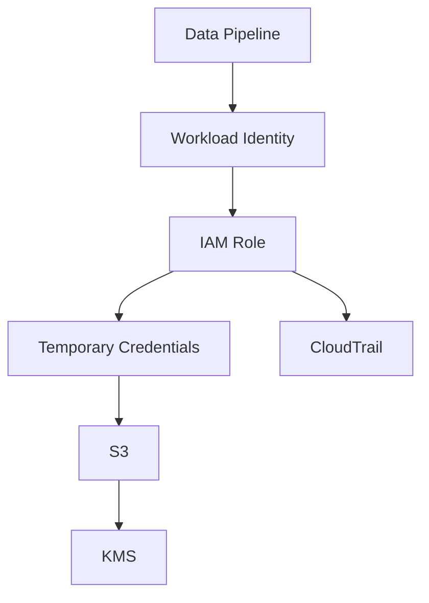

# CLAUDE CODE PROMPT — Module 2.17, File 04

You are acting as a **Senior Data Engineer with 10+ years of production industry experience**, specializing in cloud data platforms, data pipelines, IAM, security, AWS, GCP, Azure, and production-grade data engineering systems.

Your task is to **teach and build the complete learning content for exactly one file**:

`17-Cloud-Storage-and-Cloud-Data-Platforms/04-iam-roles-and-least-privilege-for-pipelines.md`

## 1. ABSOLUTE SCOPE — FOLLOW THIS STRICTLY

You are working on:

`17-Cloud-Storage-and-Cloud-Data-Platforms/04-iam-roles-and-least-privilege-for-pipelines.md`

### You MUST:

- Read the existing project structure and the authoritative roadmap relevant to Module 2.17 before writing.
- Treat the roadmap for Module 2.17 — **Cloud Storage and Cloud Data Platforms** — as the source of truth.
- Build this file from **absolute beginner → intermediate → advanced → production-level understanding**.
- Explain concepts in simple language first, then progressively introduce professional terminology.
- Include practical Python/cloud examples where appropriate.
- Primarily use **AWS IAM** as the concrete implementation because AWS is the primary cloud in this module.
- Explicitly map the equivalent concepts to **GCP and Azure** where required by the roadmap.
- Cover **every topic and concept relevant to this file in the roadmap**.
- Make the learning progression coherent: concept → example → implementation → failure → security reasoning → production pattern.
- Include enough depth that a learner can eventually reason about IAM architecture independently.

### CRITICAL FILE-SAFETY RULE

**DO NOT MODIFY, CREATE, DELETE, RENAME, OR UPDATE ANY OTHER FILE.**

Only modify:

`04-iam-roles-and-least-privilege-for-pipelines.md`

Do not modify:

- README files
- learning plans
- other Module 2.17 files
- Python files
- test files
- configuration files
- project files
- roadmap files
- any other documentation

If other files contain useful context, **read them if necessary but do not modify them**.

---

# 2. LEARNING OBJECTIVE

The purpose of this file is to teach:

> **How cloud identity and access management works for production data pipelines, and how to design secure, least-privilege access without relying on long-lived credentials.**

The learner should finish this file understanding not merely how to create an IAM role, but **why the role exists, how permissions are evaluated, how temporary credentials work, how workloads obtain identity, how least privilege is designed, how KMS permissions interact with storage access, how CI/CD authenticates securely, and how IAM is audited and operated in production.**

---

# 3. REQUIRED ROADMAP COVERAGE

Do not skip any of the following roadmap concepts.

## A. Identity as the Security Perimeter

Teach:

- what identity means in cloud computing
- why identity becomes a major security perimeter for data platforms
- authentication vs authorization
- principal
- identity
- resource
- action
- permission
- policy
- role
- user
- group
- service identity

Explain these concepts using simple data-engineering examples.

For example:

```text
Pipeline
   ↓
Identity
   ↓
Permission
   ↓
S3 object
```

Explain exactly what is happening in this flow.

---

# 4. IAM USERS, GROUPS, ROLES, AND SERVICE IDENTITIES

Explain clearly:

## IAM Users

- what an IAM user is
- when humans historically used IAM users
- access keys
- passwords
- why long-lived credentials create risk
- why modern workloads should generally avoid embedded long-lived credentials

## IAM Groups

Explain:

- what groups are
- how groups help organize human permissions
- why groups are generally not the identity used directly by workloads

## IAM Roles

Teach:

- what an IAM role is
- why roles are central to production cloud data engineering
- trust policy
- permission policy
- assuming a role
- temporary credentials
- role session

Use a simple conceptual model:

```text
Principal
   ↓
Assume Role
   ↓
Temporary Credentials
   ↓
Access AWS Resource
```

## Service Identities

Explain how cloud workloads receive identities.

Examples:

- EC2 instance roles
- ECS task roles
- EKS pod roles
- Lambda execution roles
- managed service identities

Explain why the workload should receive an identity from the platform rather than storing credentials inside application code.

---

# 5. AUTHENTICATION VS AUTHORIZATION

Explain the distinction extremely clearly.

Use simple questions:

```text
Authentication:
"Who are you?"

Authorization:
"What are you allowed to do?"
```

Then connect this to a data pipeline.

Example:

```text
Airflow task
    ↓
AWS workload identity
    ↓
IAM authorization
    ↓
S3
```

Show a practical example where authentication succeeds but authorization fails.

Explain the resulting `AccessDenied` behavior.

---

# 6. IDENTITY-BASED VS RESOURCE-BASED POLICIES

Teach:

## Identity-based policies

Explain:

- policies attached to users
- policies attached to groups
- policies attached to roles

Example:

```json
{
  "Version": "2012-10-17",
  "Statement": [
    {
      "Effect": "Allow",
      "Action": [
        "s3:GetObject"
      ],
      "Resource": "arn:aws:s3:::my-data-bucket/raw/*"
    }
  ]
}
```

Explain every field.

## Resource-based policies

Explain:

- bucket policies
- why permissions can also be attached to resources
- cross-account access concept
- how resource policies differ from identity policies

Use an S3 bucket example.

---

# 7. IAM POLICY EVALUATION

This section must be taught carefully.

Explain:

- Allow
- Deny
- explicit deny
- implicit deny
- policy evaluation
- identity policy
- resource policy
- conditions
- boundaries
- organization-level restrictions at awareness level

Most importantly teach:

> **Explicit deny wins.**

Create simple examples.

Example:

```text
Policy A → Allow s3:GetObject
Policy B → Deny s3:GetObject
Result   → DENIED
```

Explain why.

Teach the learner how to reason through an `AccessDenied` problem systematically.

Provide a step-by-step debugging framework:

```text
1. Who is making the request?
2. What resource is being accessed?
3. What action is being attempted?
4. Which policies apply?
5. Is there an explicit deny?
6. Is the resource correct?
7. Are conditions satisfied?
8. Is KMS involved?
9. Is the role actually being assumed?
10. Is the request crossing accounts?
```

---

# 8. ROLES AND TEMPORARY CREDENTIALS

This is a major section.

Teach:

- why temporary credentials are safer
- short-lived credentials
- credential expiration
- role assumption
- AWS STS
- `AssumeRole`
- session credentials
- session duration awareness
- credential rotation through expiration
- why temporary credentials reduce blast radius

Show Python examples using boto3 where appropriate.

Example conceptual flow:

```python
import boto3

sts = boto3.client("sts")

response = sts.assume_role(
    RoleArn="arn:aws:iam::123456789012:role/data-pipeline-role",
    RoleSessionName="pipeline-run"
)

credentials = response["Credentials"]
```

Explain the example rather than merely showing code.

Also explain that production applications should normally rely on the AWS credential provider chain rather than manually handling credentials unnecessarily.

---

# 9. CREDENTIAL PROVIDER CHAIN

Explain the secure credential resolution model.

Cover the relevant credential sources such as:

- environment variables
- shared AWS configuration
- AWS SSO / IAM Identity Center awareness
- assumed roles
- EC2 instance roles
- ECS task roles
- EKS workload identity
- Lambda execution roles
- other workload-provided credentials

Explain:

> Never hard-code access keys in source code.

Show bad and good examples.

BAD:

```python
aws_access_key = "AKIA..."
aws_secret_key = "..."
```

GOOD:

```python
import boto3

s3 = boto3.client("s3")
```

Explain why the second pattern is safer.

---

# 10. ASSUMEROLE AND AWS STS

Teach:

- AWS STS
- `AssumeRole`
- trust relationship
- trusted principal
- role session
- temporary credentials
- cross-account role assumption
- session policies awareness

Explain the difference between:

```text
Who is allowed to assume this role?
```

and:

```text
What can the role do after it is assumed?
```

This distinction between the **trust policy** and **permissions policy** must be extremely clear.

---

# 11. HUMAN ACCESS VS WORKLOAD ACCESS

Explain why production systems should distinguish between:

### Humans

Use mechanisms such as:

- SSO
- IAM Identity Center
- federated access
- short-lived sessions

### Workloads

Use:

- instance roles
- task roles
- pod/workload identity
- function execution roles
- workload identity federation

Explain why sharing a human administrator's credentials with a pipeline is a serious design mistake.

---

# 12. WORKLOAD IDENTITY

Teach workload identity in practical data-engineering terms.

Cover:

- EC2 instance profiles
- ECS task roles
- EKS pod roles / workload identity
- Lambda execution roles
- managed service execution roles

Show examples of a pipeline accessing S3 without storing credentials.

Example:

```python
import boto3

s3 = boto3.client("s3")

response = s3.list_objects_v2(
    Bucket="company-data",
    Prefix="raw/orders/"
)
```

Explain that boto3 can obtain credentials through the workload's identity mechanism.

---

# 13. OIDC WORKLOAD IDENTITY FEDERATION FOR CI/CD

This is a required advanced topic.

Teach:

- what OIDC is
- why CI/CD systems need cloud access
- why storing AWS access keys inside GitHub Actions secrets is undesirable
- workload identity federation
- GitHub Actions → AWS role assumption
- trust policies
- subject/audience restrictions
- short-lived credentials

Show a conceptual architecture:

```text
GitHub Actions
      |
      | OIDC token
      ↓
AWS STS
      |
      | AssumeRoleWithWebIdentity
      ↓
IAM Role
      |
      ↓
S3 / AWS Resources
```

Explain the security advantages.

Include a representative trust policy example.

Do not encourage overly broad trust relationships.

Explain how conditions can restrict which repositories, branches, or workflows can assume the role.

---

# 14. LEAST PRIVILEGE

This is one of the most important sections.

Explain the principle:

> Give an identity only the permissions it needs, only on the resources it needs, only for the operations it needs.

Break least privilege into:

### Actions

Example:

```text
s3:GetObject
```

instead of:

```text
s3:*
```

### Resources

Example:

```text
arn:aws:s3:::company-data/raw/orders/*
```

instead of:

```text
*
```

### Conditions

Explain how conditions can further restrict access.

Teach:

- action-level restriction
- resource-level restriction
- prefix-level restriction
- environment restriction
- encryption requirements
- source identity restrictions
- time/context restrictions at awareness level

---

# 15. DATA-ENGINEERING LEAST-PRIVILEGE EXAMPLES

Build realistic examples.

### Ingestion role

`ingest-orders`

Should be able to:

```text
write → raw/orders/
read  → required metadata/object state
```

But should NOT automatically have:

```text
delete → entire bucket
write  → curated/
admin  → IAM
```

### Transformation role

`transform-silver`

Should have only the permissions required to read raw data and write the appropriate silver/curated locations.

### Analyst role

`analyst-readonly`

Should be:

```text
READ ONLY
```

Explain why analyst access should not include write or administrative privileges.

---

# 16. PER-PIPELINE AND PER-ENVIRONMENT ROLES

Teach production IAM architecture.

Examples:

```text
dev-ingest-orders
staging-ingest-orders
prod-ingest-orders
```

and:

```text
prod-transform-silver
prod-transform-gold
prod-analyst-readonly
```

Explain:

- why separate environments need separate permissions
- blast radius
- accidental production modification
- separation of duties
- auditability
- easier incident response

Do not present one giant shared role as the preferred architecture.

---

# 17. SEPARATION OF DUTIES

Explain:

- ingestion
- transformation
- analytics
- platform administration
- security administration

Why these responsibilities should not automatically share the same credentials.

Use a realistic architecture:

```text
Ingestion Role
       ↓
Raw Zone

Transformation Role
       ↓
Silver / Gold

Analyst Role
       ↓
Read-only analytics

Platform Admin
       ↓
Infrastructure / IAM
```

Explain the security reasoning.

---

# 18. BREAK-GLASS ACCESS

Explain the concept of a:

> Break-glass role

Cover:

- emergency administrative access
- highly restricted usage
- strong authentication
- audit logging
- alerting
- avoiding normal day-to-day usage

Do not turn this into a generic security course; keep it relevant to cloud data platforms.

---

# 19. KMS AND ENCRYPTED DATA ACCESS

Teach the relationship between IAM and encryption.

Explain:

- AWS KMS
- customer-managed keys
- key permissions
- why S3 access can succeed while KMS access fails
- `kms:Decrypt`
- `kms:Encrypt`
- key policies
- IAM permissions vs KMS key policy
- least privilege for encryption keys

Create a realistic failure:

```text
IAM:
s3:GetObject → ALLOW

KMS:
kms:Decrypt → DENY

Result:
S3 object cannot be successfully read.
```

Explain how to debug this.

Include a representative policy example.

---

# 20. PERMISSION BOUNDARIES AND ORGANIZATION-LEVEL CONTROLS

Cover at an appropriate awareness/advanced level:

- permission boundaries
- SCPs / organization-level policies
- why an IAM policy Allow does not always mean access will succeed
- organizational guardrails
- separation between workload-level permissions and organization-wide restrictions

Explain the conceptual hierarchy without turning this file into a dedicated AWS Organizations module.

---

# 21. AUDITABILITY

Teach:

- CloudTrail
- access logging
- IAM activity
- role assumption events
- identifying who/what accessed a resource
- investigating suspicious or unexpected access
- audit trails for production pipelines

Explain how IAM and observability connect.

Example:

```text
Pipeline
   ↓
AssumeRole
   ↓
S3 access
   ↓
CloudTrail event
   ↓
Audit / Investigation
```

Also explain the purpose of tools such as:

- IAM Access Analyzer
- policy analysis
- unused-access review awareness

Do not invent capabilities not supported by the roadmap.

---

# 22. CATALOG GOVERNANCE AND CREDENTIAL VENDING

At an awareness level, explain how IAM fits into broader data-platform governance.

Cover:

- catalog governance
- centralized authorization
- credential vending
- IAM as one layer of security
- why data authorization can exist above raw object access

Keep this connected to data engineering.

---

# 23. AWS → GCP → AZURE MAPPING

Provide a concise comparison table.

At minimum map:

| Concept | AWS | GCP | Azure |
|---|---|---|---|
| Workload identity | IAM Role | Service Account / Workload Identity | Managed Identity |
| Temporary access | STS | Short-lived credentials / federation | Managed identity tokens |
| CI/CD federation | OIDC → IAM Role | Workload Identity Federation | Federated Identity Credential |
| Resource authorization | IAM / resource policies | IAM | Azure RBAC |
| Key management | KMS | Cloud KMS | Key Vault |
| Audit | CloudTrail | Cloud Audit Logs | Azure Activity Log |

Use the roadmap's terminology and do not expand into unrelated cloud services.

---

# 24. HANDS-ON LAB — REQUIRED

Build a production-oriented IAM learning lab.

The lab should conceptually create these roles:

```text
ingest-orders
transform-silver
analyst-readonly
```

The learner must:

1. Create the roles.
2. Define trust relationships.
3. Define least-privilege permissions.
4. Restrict access to specific S3 prefixes.
5. Test successful access.
6. Test unauthorized access.
7. Trigger `AccessDenied`.
8. Diagnose the failure.
9. Add required KMS permissions.
10. Test encrypted-object access.
11. Configure temporary credentials.
12. Demonstrate role assumption.
13. Configure OIDC-based CI/CD access conceptually/practically where possible.
14. Inspect audit events.
15. Remove/revoke unnecessary long-lived access keys.

Use safe development practices.

Do not instruct the learner to expose credentials.

---

# 25. CODING REQUIREMENTS

The file must contain practical code examples where useful.

Use:

- Python
- boto3
- JSON IAM policy examples
- AWS CLI examples where appropriate
- representative CI/CD/OIDC configuration where appropriate

For every important code example explain:

1. What the code does.
2. Why it works.
3. Which identity is being used.
4. Which permissions are required.
5. What happens if permission is missing.
6. How this would look in production.
7. What security mistake the example is avoiding.

Do not provide code merely for decoration.

---

# 26. FAILURE-DRIVEN LEARNING

Include realistic failure scenarios.

At minimum:

### Failure 1
Pipeline receives:

```text
AccessDenied
```

Teach how to debug it.

### Failure 2
S3 access works but encrypted object access fails.

Explain KMS.

### Failure 3
Pipeline uses credentials stored in `.env`.

Explain why this is dangerous and how workload identity replaces it.

### Failure 4
Role has:

```text
Action: "*"
Resource: "*"
```

Explain the blast radius and how to narrow it.

### Failure 5
CI/CD pipeline uses long-lived cloud access keys.

Explain OIDC federation.

### Failure 6
Developer can access production because dev and prod share a role.

Explain environment isolation.

### Failure 7
Role can write to the entire bucket instead of one prefix.

Explain resource scoping.

---

# 27. SECURITY MISCONFIGURATION EXAMPLES

Include BAD → BETTER patterns.

Examples:

```text
BAD:
s3:*

BETTER:
s3:GetObject
s3:PutObject
```

and:

```text
BAD:
Resource: "*"

BETTER:
Resource:
arn:aws:s3:::company-data/raw/orders/*
```

and:

```text
BAD:
AWS keys stored in source code

BETTER:
Workload identity / temporary credentials
```

and:

```text
BAD:
One shared admin role for all pipelines

BETTER:
Dedicated least-privilege roles
```

Explain the security reasoning behind each.

---

# 28. PRODUCTION ARCHITECTURE

Create at least one complete architecture example.

Example:

```text
                 CI/CD
                   |
                OIDC
                   |
                   v
              IAM Role
                   |
                   v
        -----------------------
        | Production Pipeline |
        -----------------------
             /          \
            /            \
           v              v
       S3 Raw         Data Platform
           |
           v
    Transform Role
           |
           v
     Silver / Gold
           |
           v
   Analyst Read-Only Role
```

Then explain:

- identities
- trust relationships
- permissions
- least privilege
- environment separation
- KMS
- auditing
- failure boundaries
- blast radius

---

# 29. PRODUCTION DESIGN PRINCIPLES

Summarize practical principles such as:

- prefer roles over long-lived access keys
- use temporary credentials
- isolate environments
- create dedicated workload identities
- minimize actions
- minimize resources
- use conditions where useful
- separate trust policy from permissions policy
- restrict CI/CD federation
- protect encryption keys
- audit role usage
- regularly review permissions
- design for small blast radius

Tie each principle to a concrete data-engineering example.

---

# 30. PERFORMANCE AND OPERATIONAL CONSIDERATIONS

Keep this section focused on IAM.

Discuss:

- credential retrieval overhead at a practical level
- role assumption frequency
- credential caching
- avoiding unnecessary STS calls
- retry behavior
- avoiding authentication bottlenecks
- operational implications of short-lived credentials

Do not turn this into a general cloud performance chapter.

---

# 31. OBSERVABILITY AND TROUBLESHOOTING WORKFLOW

Create a practical troubleshooting checklist.

For example:

```text
Step 1 → Identify caller
Step 2 → Identify action
Step 3 → Identify resource
Step 4 → Check trust policy
Step 5 → Check identity policy
Step 6 → Check resource policy
Step 7 → Check explicit denies
Step 8 → Check conditions
Step 9 → Check permission boundaries
Step 10 → Check organization restrictions
Step 11 → Check KMS
Step 12 → Check audit logs
```

Explain each step.

---

# 32. BEGINNER → ADVANCED TEACHING STRUCTURE

Structure the file as a genuine learning module.

Use approximately this progression:

```text
1. Module Overview
2. Why IAM Matters in Data Engineering
3. Authentication vs Authorization
4. Identity, Principal, Resource, Action, Permission
5. Users, Groups, Roles
6. Service Identities
7. IAM Policies
8. Identity-Based vs Resource-Based Policies
9. Policy Evaluation
10. Explicit Deny
11. Trust Policies
12. IAM Roles
13. STS and Temporary Credentials
14. Credential Provider Chain
15. Workload Identity
16. Human vs Workload Access
17. Least Privilege
18. Resource and Prefix-Level Permissions
19. Per-Pipeline Roles
20. Per-Environment Roles
21. Separation of Duties
22. KMS Permissions
23. OIDC Workload Identity Federation
24. CI/CD Security
25. Permission Boundaries / Organization Guardrails
26. Auditability
27. IAM Access Analysis
28. Catalog Governance / Credential Vending
29. AWS → GCP → Azure Mapping
30. Hands-On Lab
31. Failure Scenarios
32. Production Architecture
33. Common Mistakes
34. Advanced Reasoning
35. Practice Questions
36. Interview Questions
37. Final Assessment
38. Mastery Checklist
```

You may improve the exact organization if doing so makes the learning flow better, but **do not omit any roadmap topic**.

---

# 33. SIMPLE LANGUAGE REQUIREMENT

The learner should be able to understand the topic even if they are encountering cloud IAM for the first time.

For every difficult concept use this pattern:

```text
Simple explanation
        ↓
Technical definition
        ↓
Data-engineering example
        ↓
Code / policy example
        ↓
Failure example
        ↓
Production reasoning
```

Avoid unexplained jargon.

When introducing terms such as:

- principal
- ARN
- STS
- AssumeRole
- trust policy
- resource policy
- OIDC
- federation
- KMS
- permission boundary
- SCP

define them before relying on them.

---

# 34. DIAGRAM REQUIREMENT

Use Mermaid diagrams where architecture or identity flow benefits from visualization.

For example:



Use diagrams to clarify architecture, not as decoration.

---

# 35. EXERCISES

Include progressive exercises.

### Beginner

- identify authentication vs authorization
- identify role vs user
- explain a simple policy

### Intermediate

- create an S3 read-only role
- restrict access to a prefix
- intentionally trigger `AccessDenied`
- diagnose the policy problem

### Advanced

- design separate ingestion/transformation/analyst roles
- design cross-account role access
- configure temporary credentials
- design OIDC CI/CD federation
- integrate KMS permissions

### Senior-level

Given a production scenario, ask the learner to design:

- identities
- trust policies
- permissions
- resource scopes
- environment separation
- KMS permissions
- audit strategy
- blast-radius controls

Provide solutions after the exercises.

---

# 36. PRACTICE QUESTIONS

Include conceptual questions such as:

- What is IAM?
- What is the difference between authentication and authorization?
- What is an IAM role?
- Why are roles preferable to long-lived access keys for workloads?
- What is STS?
- What is AssumeRole?
- What is a trust policy?
- What is an identity-based policy?
- What is a resource-based policy?
- What is explicit deny?
- How does least privilege work?
- Why restrict S3 access to prefixes?
- Why separate dev and production roles?
- What is workload identity?
- What is OIDC federation?
- Why does KMS matter for encrypted S3 objects?
- What is separation of duties?
- What is a break-glass role?
- What is the purpose of CloudTrail?
- How does AWS IAM map conceptually to GCP and Azure?

Include scenario-based questions, not only definitions.

---

# 37. INTERVIEW PREPARATION

Include production-oriented interview questions for:

### Junior Data Engineer
IAM basics and credentials.

### Mid-Level Data Engineer
Roles, policies, S3 access, least privilege, temporary credentials.

### Senior Data Engineer
Workload identity, cross-account access, KMS, OIDC, environment isolation, policy evaluation, auditing.

### Staff/Lead-level
IAM architecture for a multi-account data platform, blast-radius reduction, governance, CI/CD federation, role boundaries, organizational guardrails, and incident investigation.

For important questions, provide model answers.

---

# 38. ADVANCED REASONING SECTION

Do not stop at memorization.

Include scenarios such as:

### Scenario A
A pipeline can list an S3 bucket but cannot read objects.

Ask the learner to reason about:

- `s3:ListBucket`
- `s3:GetObject`
- bucket ARN vs object ARN
- prefix restrictions

### Scenario B
A pipeline can read an S3 object but gets a KMS error.

Reason about:

- S3 permissions
- KMS permissions
- key policy

### Scenario C
GitHub Actions needs production S3 access.

Design:

```text
GitHub OIDC
→ AWS STS
→ dedicated IAM role
→ restricted production resource
```

### Scenario D
A developer needs production read-only access but must not modify data.

Design the appropriate identity and permissions.

### Scenario E
An ingestion role is compromised.

Ask:

> How small is the blast radius?

Use least privilege to reason about the answer.

---

# 39. KNOWLEDGE CHECKPOINTS

After major sections, include short checkpoints.

Example:

```text
CHECKPOINT

Can you explain:

1. Why a role is different from a user?
2. How temporary credentials are obtained?
3. What a trust policy controls?
4. What a permissions policy controls?
5. Why explicit deny wins?
6. Why least privilege reduces blast radius?
```

Do not allow the learner to proceed conceptually without understanding the prerequisite.

---

# 40. FINAL ASSESSMENT

At the end, create a practical final assessment.

Give the learner a fictional company:

```text
Company: Acme Data Platform

S3:
acme-data-prod/
    raw/
        orders/
    silver/
        orders/
    gold/
        orders/
```

Requirements:

- ingestion pipeline writes raw orders
- transformation job reads raw orders
- transformation job writes silver
- analysts can read gold
- CI/CD deploys pipelines
- all sensitive data is encrypted
- production access must be restricted
- long-lived access keys are prohibited

Ask the learner to design:

1. IAM roles
2. Trust policies
3. Permission policies
4. S3 resource restrictions
5. KMS permissions
6. CI/CD OIDC
7. environment isolation
8. audit strategy
9. break-glass access
10. least-privilege reasoning

Then provide a reference solution.

---

# 41. FINAL MASTERY CHECKLIST

Finish with a checklist.

The learner should be able to confidently say:

```text
[ ] I understand authentication vs authorization.
[ ] I understand IAM users, groups, and roles.
[ ] I understand workload identities.
[ ] I understand IAM policies.
[ ] I understand identity-based and resource-based policies.
[ ] I understand explicit deny.
[ ] I understand trust policies.
[ ] I understand STS and temporary credentials.
[ ] I understand the credential provider chain.
[ ] I understand workload identity.
[ ] I understand least privilege.
[ ] I can restrict S3 access to prefixes.
[ ] I can design per-pipeline roles.
[ ] I can design per-environment roles.
[ ] I understand separation of duties.
[ ] I understand KMS permissions.
[ ] I understand OIDC federation.
[ ] I can secure CI/CD cloud access.
[ ] I understand permission boundaries at a conceptual level.
[ ] I understand organization-level guardrails at a conceptual level.
[ ] I understand CloudTrail/auditability.
[ ] I can troubleshoot AccessDenied.
[ ] I can design production IAM for data pipelines.
[ ] I can explain AWS IAM concepts and map them to GCP/Azure.
```

---

# 42. QUALITY REQUIREMENTS

The final Markdown file must be:

- technically accurate
- production-oriented
- beginner-friendly
- progressively structured
- detailed
- practical
- code-heavy where appropriate
- security-conscious
- cloud-aware
- strongly connected to Data Engineering
- aligned with the Module 2.17 roadmap

Avoid:

- vague explanations
- unexplained jargon
- shallow definitions
- unrelated cybersecurity topics
- unrelated AWS administration topics
- skipping advanced IAM concepts explicitly listed in the roadmap
- giant unexplained code blocks
- insecure credential practices
- pretending local examples are equivalent to production security

---

# 43. VERSION-AWARENESS

Cloud IAM behavior, APIs, SDKs, CLI commands, and provider recommendations can change.

Where implementation details are version-sensitive:

- identify the relevant current behavior
- avoid presenting outdated behavior as universal
- prefer current official SDK/API patterns
- distinguish conceptual IAM principles from provider-specific implementation details

Do not introduce unrelated technologies simply because they are modern.

---

# 44. TEACHING PHILOSOPHY

Use this learning loop throughout the file:

```text
LEARN
  ↓
UNDERSTAND
  ↓
SEE AN EXAMPLE
  ↓
WRITE THE POLICY
  ↓
RUN THE CODE
  ↓
BREAK THE PERMISSION
  ↓
DEBUG AccessDenied
  ↓
FIX IT
  ↓
MEASURE / AUDIT
  ↓
EXPLAIN WHY
```

The goal is **engineering understanding**, not memorization.

The learner should understand not only:

> "How do I create an IAM role?"

but also:

> "Why does this role exist, who can assume it, exactly what can it access, what happens if it is compromised, how can I prove what it accessed, and how do I reduce its blast radius?"

---

# 45. FINAL FILE VALIDATION

Before finishing:

1. Verify every roadmap topic relevant to `04-iam-roles-and-least-privilege-for-pipelines.md` is covered.
2. Verify beginner → advanced progression.
3. Verify all important concepts have examples.
4. Verify AWS is the primary implementation.
5. Verify GCP/Azure equivalents are mapped.
6. Verify temporary credentials are covered.
7. Verify workload identity is covered.
8. Verify OIDC federation is covered.
9. Verify least privilege is demonstrated with concrete S3 examples.
10. Verify KMS permissions are covered.
11. Verify policy evaluation and explicit deny are covered.
12. Verify auditability is covered.
13. Verify the hands-on lab is included.
14. Verify failure scenarios are included.
15. Verify exercises and interview questions are included.
16. Verify final assessment is included.
17. Verify mastery checklist is included.
18. Verify code examples are secure and production-oriented.
19. Verify no unsupported claims are presented as roadmap requirements.
20. Verify that **ONLY `04-iam-roles-and-least-privilege-for-pipelines.md` was modified.**

The final result should be a **complete standalone learning chapter** that takes a learner from zero IAM knowledge to being able to design and reason about **production-grade IAM for cloud data pipelines**.