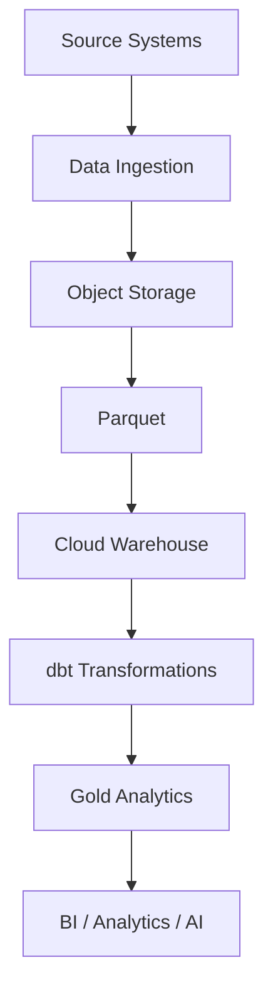
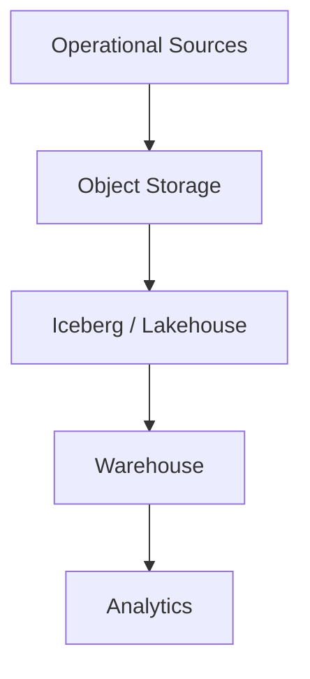

# CLAUDE CODE PROMPT — Module 2.17, Topic 05

You are acting as a **Senior Data Engineer with 10+ years of production industry experience**, specializing in cloud data platforms, analytical data warehouses, lakehouse architectures, SQL, Python data engineering, performance engineering, and cloud cost optimization.

Your task is to create the complete learning content for exactly this file:

`17-Cloud-Storage-and-Cloud-Data-Platforms/05-cloud-warehouses-snowflake-bigquery-and-redshift.md`

The goal is to teach **Cloud Warehouses — Snowflake, BigQuery, and Redshift** from beginner fundamentals through advanced production-level data-engineering understanding.

---

# 1. ABSOLUTE FILE SCOPE

You MUST work only on:

`05-cloud-warehouses-snowflake-bigquery-and-redshift.md`

### CRITICAL:

**DO NOT CHANGE, CREATE, DELETE, RENAME, OR UPDATE ANY OTHER FILE IN THE CURRENT FOLDER.**

You may read other files for context if necessary, especially prerequisite modules, but you must modify **only**:

`05-cloud-warehouses-snowflake-bigquery-and-redshift.md`

Do not modify:

- README files
- learning plans
- other Module 2.17 topic files
- Python files
- experiment files
- configuration files
- roadmap files
- any other project files

---

# 2. SOURCE OF TRUTH

Treat the authoritative Module 2.17 roadmap as the source of truth.

The roadmap explicitly requires this topic to teach:

- common cloud-warehouse architecture
- columnar storage
- separation of storage and compute
- massively parallel processing
- SQL
- managed operations
- Snowflake virtual warehouses
- Snowflake databases, schemas, and stages
- BigQuery serverless architecture
- BigQuery datasets and tables
- BigQuery on-demand bytes-scanned pricing
- BigQuery reserved-capacity/slots pricing
- Redshift provisioned clusters
- Redshift Serverless
- managed storage
- Snowflake micro-partitions and clustering keys
- BigQuery partitioning and clustering
- Redshift distribution styles and sort keys
- relationship to Parquet layout concepts
- compute/storage/data-transfer cost models
- auto-suspend
- query limits
- budgets
- Snowflake `COPY INTO`
- BigQuery load jobs and Storage Write API
- Redshift `COPY` from S3
- Snowflake Time Travel
- Snowflake zero-copy cloning
- materialized views
- result caching
- query history
- lakehouse integration
- Iceberg/external object-storage data
- Snowpipe, streams, tasks, dynamic tables — awareness
- BigQuery scheduled queries — awareness
- dbt on the three warehouses
- SQL dialect differences
- Databricks SQL / Azure analytics / managed PostgreSQL-compatible analytics — awareness
- choosing a warehouse based on workload shape, skills, cloud, lakehouse strategy, governance, and cost predictability
- hands-on performance/cost comparison
- cost-control mechanisms
- warehouse recommendation exercise

Do **not** omit any of these concepts.

---

# 3. PRIMARY LEARNING OBJECTIVE

The learner must finish this file able to answer:

> **What is a cloud data warehouse, how do Snowflake, BigQuery, and Redshift work internally at a practical architectural level, how do their performance and pricing models differ, how should data be loaded and organized, and how do I select the right warehouse for a production workload?**

The learner must not simply memorize product features.

They must understand:

```text
Architecture
    ↓
Storage
    ↓
Compute
    ↓
Query execution
    ↓
Data layout
    ↓
Performance
    ↓
Cost
    ↓
Operational controls
    ↓
Production workload fit
```

---

# 4. TEACHING STYLE

Teach every concept using this progression whenever appropriate:

```text
Simple explanation
        ↓
Technical definition
        ↓
Architecture
        ↓
Concrete example
        ↓
SQL / Python example
        ↓
Performance implications
        ↓
Cost implications
        ↓
Production considerations
        ↓
Failure / anti-pattern
```

Assume the learner already has foundational Data Engineering knowledge but is new to cloud warehouses.

Start simple.

Then progressively introduce:

- warehouse terminology
- architecture
- query execution
- physical data layout
- optimization
- cost engineering
- production architecture
- warehouse selection

Avoid unexplained jargon.

---

# 5. START WITH: WHAT IS A CLOUD DATA WAREHOUSE?

Explain:

- what a data warehouse is
- why organizations use warehouses
- OLTP vs OLAP
- analytical workloads
- facts and dimensions
- star schemas
- large-scale SQL analytics
- columnar storage
- compression
- vectorized execution awareness
- massively parallel processing
- distributed query execution
- managed infrastructure

Use a simple example:

```text
Operational Database
        ↓
   Data Pipeline
        ↓
 Object Storage / Lake
        ↓
 Cloud Warehouse
        ↓
 BI / Analytics / ML / AI
```

Explain exactly why the warehouse exists.

---

# 6. WHAT CLOUD WAREHOUSES HAVE IN COMMON

Teach the common architecture across Snowflake, BigQuery, and Redshift.

Cover:

## Columnar storage

Explain:

```text
Row-oriented:

id | customer | amount | date

Column-oriented:

id: ...
customer: ...
amount: ...
date: ...
```

Explain why analytical queries often benefit from columnar storage.

Cover:

- column pruning
- compression
- scanning only required columns
- analytical aggregation

## Separation of storage and compute

Explain the concept clearly.

Contrast:

```text
Traditional database
Storage + Compute tightly coupled
```

with:

```text
Modern cloud warehouse
Storage
   +
Compute
```

Explain why this matters for:

- scaling
- cost
- concurrency
- workload isolation
- operational management

## Massively Parallel Processing

Explain MPP using a simple example:

```text
Query
  ↓
Coordinator
  ↓
------------------------
Worker  Worker  Worker
  ↓       ↓       ↓
Partitioned data
------------------------
  ↓
Aggregate
  ↓
Result
```

Explain:

- parallelism
- distributed execution
- data movement
- aggregation
- why poor data distribution can hurt performance

---

# 7. SNOWFLAKE — FROM BASIC TO ADVANCED

Create a dedicated Snowflake section.

## 7.1 Snowflake architecture

Explain:

- databases
- schemas
- tables
- stages
- storage
- compute
- virtual warehouses
- cloud services layer at a conceptual level

Explain why Snowflake is different from traditional database servers.

## 7.2 Virtual warehouses

Teach:

- what a virtual warehouse is
- compute cluster
- sizing
- scaling
- concurrency
- suspend/resume
- auto-suspend
- auto-resume
- compute cost

Show examples conceptually and, where appropriate, SQL.

Explain why leaving a warehouse running unnecessarily creates cost.

## 7.3 Databases and schemas

Teach:

```text
Database
  ↓
Schema
  ↓
Table
```

Explain why schemas are useful for organizing data.

## 7.4 Stages

Teach:

- internal stages
- external stages
- object storage
- file-based loading

Explain the relationship:

```text
Object Storage
      ↓
    Stage
      ↓
Snowflake
```

---

# 8. SNOWFLAKE PERFORMANCE

Teach:

## Micro-partitions

Explain:

- what micro-partitions are
- automatic organization
- metadata
- partition pruning
- why scanning less data improves performance

Do not imply that micro-partitions are identical to manually created partitions.

## Clustering keys

Teach:

- what clustering means
- when clustering can help
- clustering dimensions
- pruning
- maintenance implications
- cost/performance trade-offs

Explain when **not** to add clustering unnecessarily.

---

# 9. BIGQUERY — FROM BASIC TO ADVANCED

Create a dedicated BigQuery section.

## 9.1 BigQuery architecture

Teach:

- serverless model
- projects
- datasets
- tables
- storage
- query execution
- slots

Explain what “serverless” means in this context.

## 9.2 Datasets and tables

Explain:

```text
Project
  ↓
Dataset
  ↓
Table
```

Explain how this differs conceptually from Snowflake's database/schema organization.

## 9.3 On-demand pricing

Explain:

> bytes scanned

Teach:

- why `SELECT *` can be expensive
- column pruning
- partition pruning
- query estimates
- dry-run awareness
- cost estimation

Example:

```sql
SELECT
    order_date,
    customer_id,
    revenue
FROM `project.analytics.orders`
WHERE order_date >= '2026-01-01';
```

Then explain why selecting only required columns and filtering partitions can reduce scanned data.

## 9.4 Slots / capacity

Teach at an appropriate level:

- slots
- reserved capacity
- workload capacity
- serverless execution
- on-demand vs capacity-based pricing

Do not turn this into an exhaustive BigQuery administration module.

---

# 10. BIGQUERY PARTITIONING AND CLUSTERING

Teach:

- table partitioning
- time/date partitioning
- integer/range concepts where relevant
- partition pruning
- clustering
- combination of partitioning + clustering
- cost implications
- performance implications

Use realistic analytics examples.

Example:

```text
orders
├── partition by order_date
└── cluster by customer_id
```

Explain when this helps.

---

# 11. REDSHIFT — FROM BASIC TO ADVANCED

Create a dedicated Redshift section.

Teach:

## Architecture

- provisioned clusters
- compute nodes
- managed storage
- serverless option
- distributed execution

Explain the difference between:

```text
Redshift provisioned
```

and:

```text
Redshift Serverless
```

## Distribution styles

Teach:

- why data distribution matters
- distribution keys
- EVEN
- KEY
- ALL
- how distribution affects joins and network movement

Explain data redistribution.

## Sort keys

Teach:

- what a sort key does
- sorting
- range-restricted scans
- query performance
- relationship to filtering

Explain the distinction:

```text
Distribution
→ Where data lives

Sort key
→ How data is ordered
```

---

# 12. COMPARE DATA LAYOUT STRATEGIES

Create a dedicated comparison.

| Platform | Main layout concepts |
|---|---|
| Snowflake | Micro-partitions, clustering |
| BigQuery | Partitioning, clustering |
| Redshift | Distribution styles, sort keys |

Explain the underlying principle:

> The physical organization of data affects how much data must be read, moved, and processed.

Connect this to the earlier Parquet module.

Explain:

- row groups
- column chunks
- statistics
- predicate pushdown
- partition pruning
- column pruning

Make the connection between object-storage Parquet and cloud warehouse storage optimization clear.

---

# 13. COST MODELS — DEEP DIVE

This section is mandatory and should be detailed.

Explain the major cost dimensions:

```text
Compute
Storage
Data transfer
Query execution
Data ingestion
Data extraction
```

Then compare the three platforms.

## Snowflake

Explain:

- virtual warehouse compute
- per-use compute
- warehouse size
- runtime
- auto-suspend
- storage
- data transfer awareness

## BigQuery

Explain:

- bytes scanned / on-demand
- slots / capacity
- storage
- data transfer
- query efficiency

## Redshift

Explain:

- provisioned compute
- serverless consumption
- storage
- data transfer
- cluster utilization

Do not invent precise current prices.

Instead explain the pricing **models** and instruct Claude Code to use current official pricing documentation if exact prices are demonstrated.

---

# 14. COST-CONTROL STRATEGIES

Teach:

## Snowflake

- auto-suspend
- appropriate warehouse sizing
- workload isolation
- query monitoring
- avoiding unnecessarily long-running compute

## BigQuery

- partitioning
- clustering
- selecting required columns
- query byte estimates
- query limits
- budgets
- capacity management

## Redshift

- appropriate sizing
- workload management awareness
- efficient distribution
- sort keys
- serverless/provisioned choice
- avoiding unnecessary always-on capacity

Explain:

> Performance optimization and cost optimization are often connected, but not always identical.

---

# 15. QUERY HISTORY AND COST ANALYSIS

Teach the importance of query history.

The learner should understand how to investigate:

- query duration
- bytes scanned
- compute consumption
- expensive queries
- repeated queries
- failed queries
- inefficient SQL
- workload patterns

Show a generic workflow:

```text
Query
  ↓
Execute
  ↓
Query History
  ↓
Measure
  ↓
Identify expensive operation
  ↓
Optimize
  ↓
Run again
  ↓
Compare
```

Explain that optimization should be evidence-based.

---

# 16. LOADING DATA INTO CLOUD WAREHOUSES

Teach the roadmap's three major loading paths.

## Snowflake

Explain:

```text
Object Storage
      ↓
Stage
      ↓
COPY INTO
      ↓
Table
```

Include a representative example:

```sql
COPY INTO analytics.orders
FROM @orders_stage
FILE_FORMAT = (
    TYPE = PARQUET
);
```

Explain each part.

## BigQuery

Teach:

- load jobs
- object-storage sources
- schema handling
- batch loading
- Storage Write API awareness

Provide representative Python/SQL examples where appropriate.

## Redshift

Teach:

```sql
COPY analytics.orders
FROM 's3://company-data/orders/'
IAM_ROLE '...'
FORMAT AS PARQUET;
```

Explain the architecture and security considerations.

Do not hard-code real credentials.

---

# 17. SNOWPIPE, STREAMS, TASKS, DYNAMIC TABLES

Teach these as **advanced awareness**, as specified by the roadmap.

Explain:

- Snowpipe
- Streams
- Tasks
- Dynamic Tables

For each:

- what problem it solves
- where it fits
- batch vs continuous processing
- when it might be useful

Do not turn this into a separate Snowflake-specialist certification course.

---

# 18. BIGQUERY SCHEDULED QUERIES

Teach at awareness level:

- what scheduled queries are
- when they are useful
- batch transformation use cases
- relationship to orchestration tools

Explain that scheduled queries do not replace a full workflow orchestrator for complex pipelines.

---

# 19. MATERIALIZED VIEWS AND RESULT CACHING

Teach:

## Materialized views

- what they are
- why they improve repeated analytical workloads
- refresh/maintenance considerations
- when they can reduce compute

## Result caching

Explain:

- cached query results
- why repeated queries may behave differently
- why benchmarking must account for caching

Make clear that:

> A cached query result is not the same thing as optimized underlying data layout.

---

# 20. TIME TRAVEL AND ZERO-COPY CLONING

For Snowflake, teach:

## Time Travel

Explain:

- historical data access
- recovery/use cases
- retention awareness
- storage implications

## Zero-copy cloning

Explain:

- logical cloning concept
- why it is useful for development/testing
- storage behavior at a conceptual level
- production use cases

Do not present it as a generic feature of all warehouses.

---

# 21. LAKEHOUSE INTEGRATION

This is an advanced section.

Connect this topic to Module 2.15.

Explain:

```text
Object Storage
       ↓
Iceberg / Lakehouse Tables
       ↓
Cloud Warehouse
       ↓
SQL Analytics
```

Teach at a conceptual level:

- querying external data
- external tables
- Iceberg integration
- object-storage data
- lakehouse/warehouse coexistence
- data-copy vs data-query approaches

Compare the architectural implications.

Explain why organizations increasingly use both:

```text
Lakehouse
+
Warehouse
```

rather than treating them as mutually exclusive.

---

# 22. DBT ON CLOUD WAREHOUSES

Connect to Module 2.12.

Teach:

- dbt as SQL transformation layer
- warehouse-specific execution
- models
- materializations
- incremental models
- tests
- documentation
- dialect differences

Explain:

```text
Raw data
   ↓
Warehouse
   ↓
dbt
   ↓
Analytics models
```

Compare the practical differences of running dbt against:

- Snowflake
- BigQuery
- Redshift

Do not turn this file into the dbt module itself.

---

# 23. SQL DIALECT DIFFERENCES

Teach the learner that:

> SQL is standardized, but cloud warehouses are not identical.

Provide examples of differences such as:

- date/time functions
- casting
- semi-structured data
- identifier behavior
- array/struct syntax
- warehouse-specific functions
- `QUALIFY` and other dialect-specific functionality where appropriate

Use a comparison table.

The objective is to make the learner aware of portability issues when moving workloads between warehouses.

---

# 24. OTHER PLATFORMS — AWARENESS ONLY

Briefly introduce:

- Databricks SQL
- Azure analytics services
- managed PostgreSQL-compatible analytics

Explain where they fit conceptually.

Do not allow this section to overwhelm the core:

```text
Snowflake
BigQuery
Redshift
```

---

# 25. WAREHOUSE SELECTION FRAMEWORK

This must be one of the strongest sections.

Teach the learner how to choose a warehouse based on:

## Workload shape

- steady
- spiky
- interactive
- batch
- high concurrency
- predictable workloads
- unpredictable workloads

## Team skills

- SQL expertise
- cloud expertise
- operational capabilities
- existing tooling

## Existing cloud

- AWS
- GCP
- Azure
- multi-cloud

## Lakehouse strategy

- object storage
- Iceberg
- Delta
- warehouse-centric
- hybrid

## Governance

- security
- identity
- auditing
- compliance
- data residency awareness

## Cost predictability

- predictable compute
- unpredictable query scanning
- reserved capacity
- usage-based models
- workload isolation

Never say one warehouse is universally "best."

Instead teach the learner to reason from workload requirements.

---

# 26. REQUIRED COMPARISON TABLE

Create a comprehensive table covering:

| Dimension | Snowflake | BigQuery | Redshift |
|---|---|---|---|
| Architecture | | | |
| Compute model | | | |
| Storage model | | | |
| Scaling | | | |
| Query execution | | | |
| Pricing model | | | |
| Performance layout | | | |
| Partitioning/clustering | | | |
| Loading | | | |
| Object storage integration | | | |
| Lakehouse/Iceberg integration | | | |
| Caching | | | |
| Materialized views | | | |
| Cost controls | | | |
| Query history | | | |
| dbt | | | |
| Best-fit workload characteristics | | | |
| Main cost risks | | | |
| Main optimization techniques | | | |

Do not reduce this to marketing language.

Every row should contain engineering-relevant information.

---

# 27. HANDS-ON EXPERIMENT — `experiments/05_warehouses/`

Design the learning content around the roadmap's experiment.

The learner should:

### Step 1

Use the orders star schema from Module 2.8.

### Step 2

Start with Parquet in object storage.

### Step 3

Load the dataset into at least one cloud warehouse.

Two warehouses are preferred if resources permit.

### Step 4

Run the same ten analytical queries.

Record:

```text
Query
Duration
Bytes scanned
Compute consumed
Estimated cost
```

### Step 5

Optimize the physical layout.

Depending on platform:

```text
Snowflake
→ clustering

BigQuery
→ partitioning + clustering

Redshift
→ distribution + sort keys
```

### Step 6

Run the same queries again.

Compare:

```text
Before
vs
After
```

### Step 7

Calculate the improvement.

Example:

```text
Query 4

Before:
Duration = X
Bytes processed = Y
Cost = Z

After:
Duration = A
Bytes processed = B
Cost = C
```

Explain what changed and why.

---

# 28. EXPENSIVE ANTI-PATTERN LAB

Demonstrate at least one expensive anti-pattern.

Examples:

### BigQuery

```sql
SELECT *
FROM huge_table;
```

Explain why this can be expensive.

### Snowflake

An always-running virtual warehouse.

Explain:

- compute continues accumulating
- auto-suspend can reduce idle cost

### Redshift

Poor distribution causing excessive data movement.

Show how this can increase query time.

Then demonstrate the fix.

---

# 29. COST CONTROLS LAB

Teach the learner to configure or reason about:

### Snowflake

- auto-suspend
- warehouse sizing

### BigQuery

- query byte limits
- dry-run/query estimation
- budget alerts
- partitioning

### Redshift

- appropriate capacity
- serverless/provisioned selection
- workload/resource controls awareness

The objective is to make cost control an engineering responsibility.

---

# 30. PYTHON EXAMPLES

Include practical Python examples where useful.

Potential libraries:

```text
snowflake-connector-python
google-cloud-bigquery
redshift-connector
```

However, keep this file focused primarily on **warehouse architecture and behavior**.

The detailed connector/bulk-loading implementation belongs to Topic 06.

Use Python here mainly to demonstrate:

- connecting
- submitting a query
- retrieving metadata/results
- inspecting query behavior
- loading at a conceptual/basic level

Do not duplicate the entire Topic 06 module.

---

# 31. PRODUCTION ARCHITECTURE

Create at least one complete architecture diagram.

Example:



Then explain where:

- Snowflake
- BigQuery
- Redshift

can fit.

Also show a lakehouse-oriented architecture:



Explain the trade-offs.

---

# 32. PERFORMANCE ENGINEERING

Teach the following reasoning framework:

```text
Query
 ↓
What data is being read?
 ↓
How much data is being read?
 ↓
Can pruning occur?
 ↓
Is data movement occurring?
 ↓
Is compute appropriately sized?
 ↓
Is caching involved?
 ↓
Is the workload concurrent?
 ↓
What does query history show?
 ↓
Optimize
 ↓
Measure again
```

Connect performance to:

- data layout
- query shape
- compute
- concurrency
- storage
- network/data movement
- caching

---

# 33. COMMON MISTAKES

Explicitly cover the roadmap's mistakes:

- `SELECT *` on scan-priced warehouses
- leaving compute running
- failing to partition large time-series data
- using inappropriate data layout
- copying traditional on-premises indexing assumptions into cloud columnar warehouses

Also include:

- benchmarking only one query
- benchmarking cached queries without realizing it
- optimizing without measuring
- ignoring data transfer
- choosing a warehouse based only on popularity
- ignoring workload shape
- ignoring existing cloud/lakehouse strategy

---

# 34. FAILURE SCENARIOS

Include realistic debugging scenarios.

### Scenario 1

A BigQuery query is unexpectedly expensive.

Ask:

- How many bytes were scanned?
- Is partition pruning happening?
- Is `SELECT *` being used?
- Is the query filtering the partition column?

### Scenario 2

A Snowflake workload is expensive.

Ask:

- Is the warehouse always running?
- Is it oversized?
- Is auto-suspend configured?
- Is clustering actually necessary?

### Scenario 3

A Redshift join is slow.

Ask:

- How is data distributed?
- Is redistribution occurring?
- Are distribution styles appropriate?
- Are sort keys useful?

### Scenario 4

A query became faster but cost increased.

Teach the learner that:

> Performance and cost are related but distinct optimization dimensions.

---

# 35. ARCHITECTURAL TRADE-OFFS

Include explicit trade-off discussions.

Examples:

```text
More compute
vs
lower query latency
```

```text
More clustering
vs
maintenance/storage cost
```

```text
Partitioning
vs
operational complexity
```

```text
Serverless
vs
predictable capacity
```

```text
Warehouse
vs
Lakehouse
```

```text
Convenience
vs
cost control
```

The learner must understand that production engineering is about trade-offs rather than feature checklists.

---

# 36. ADVANCED SCENARIO EXERCISES

Include scenarios such as:

### Scenario A — Spiky startup analytics workload

Queries arrive unpredictably.

Ask the learner to evaluate Snowflake vs BigQuery vs Redshift.

### Scenario B — Large AWS-centric organization

Most data is in S3 and workloads are predictable.

Ask the learner to evaluate Redshift and Snowflake.

### Scenario C — Extremely large ad-hoc analytical workload

Query volume is unpredictable.

Ask the learner to evaluate serverless/usage-based models.

### Scenario D — Lakehouse-first organization

Large Iceberg data exists in object storage.

Ask the learner to evaluate warehouse integration.

### Scenario E — Cost-sensitive analytics

Ask the learner to identify the biggest cost risks and controls.

For each scenario, provide a reference reasoning process rather than merely naming a winner.

---

# 37. PRACTICE QUESTIONS

Include beginner → advanced questions.

### Beginner

- What is a cloud data warehouse?
- What is OLAP?
- What is columnar storage?
- What is MPP?
- What is separation of storage and compute?

### Intermediate

- What is a Snowflake virtual warehouse?
- What is a BigQuery dataset?
- What are BigQuery slots?
- What is a Redshift distribution style?
- What is a Redshift sort key?
- What is a Snowflake micro-partition?
- What is clustering?

### Advanced

- Why does partitioning reduce query cost?
- How does poor distribution increase Redshift query time?
- When is Snowflake clustering useful?
- How do BigQuery bytes-scanned economics affect SQL design?
- How should warehouse architecture interact with a lakehouse?
- How do you benchmark warehouses fairly?
- How do you choose between serverless and provisioned capacity?

Include scenario-based questions.

---

# 38. INTERVIEW PREPARATION

Create interview sections for:

## Junior Data Engineer

- warehouse fundamentals
- OLTP vs OLAP
- columnar storage
- basic Snowflake/BigQuery/Redshift concepts

## Mid-Level Data Engineer

- partitioning
- clustering
- distribution
- sort keys
- cost optimization
- loading patterns

## Senior Data Engineer

- architecture
- performance engineering
- cost engineering
- lakehouse integration
- workload isolation
- warehouse selection

## Staff/Lead-level

- multi-warehouse strategy
- warehouse vs lakehouse
- cost governance
- workload architecture
- platform selection
- organizational trade-offs

Provide strong model answers for the most important questions.

---

# 39. KNOWLEDGE CHECKPOINTS

After each major section, include checkpoints.

Example:

```text
CHECKPOINT

Can you explain:

1. Why are warehouses columnar?
2. What does MPP mean?
3. How does Snowflake separate compute and storage?
4. How does BigQuery pricing differ from Snowflake?
5. Why do Redshift distribution styles matter?
6. How does partitioning reduce scanned data?
7. Why does data layout affect cost?
```

Do not make checkpoints purely vocabulary-based.

Require reasoning.

---

# 40. FINAL PROJECT — WAREHOUSE RECOMMENDATION

Create a realistic final assignment.

### Fictional company

```text
Company: Acme Analytics

Data:
5 TB today
50 TB projected

Workload:
60% BI
25% ad-hoc analytics
15% scheduled transformations

Data:
Parquet in object storage
Iceberg tables
Orders star schema

Requirements:
High reliability
Cost visibility
Production dbt
Multiple analysts
Occasional workload spikes
```

Ask the learner to:

1. Compare Snowflake.
2. Compare BigQuery.
3. Compare Redshift.
4. Design the architecture.
5. Explain storage/compute.
6. Explain performance strategy.
7. Explain loading strategy.
8. Explain cost model.
9. Explain cost controls.
10. Explain lakehouse integration.
11. Explain dbt integration.
12. Recommend a platform based on explicit requirements.

Important:

**Do not simply declare one platform as universally best.**

The learner must justify the recommendation using:

```text
Workload
Cloud
Skills
Architecture
Performance
Cost
Governance
Lakehouse strategy
Operational model
```

---

# 41. FINAL ASSESSMENT

Create a comprehensive assessment containing:

- conceptual questions
- SQL exercises
- architecture questions
- cost-analysis questions
- performance-debugging questions
- warehouse-selection scenarios

Include an answer key/reference solution.

---

# 42. MASTERY CHECKLIST

Finish with:

```text
[ ] I understand what a cloud data warehouse is.
[ ] I understand OLAP workloads.
[ ] I understand columnar storage.
[ ] I understand MPP.
[ ] I understand separation of storage and compute.
[ ] I understand Snowflake architecture.
[ ] I understand Snowflake virtual warehouses.
[ ] I understand Snowflake stages.
[ ] I understand micro-partitions.
[ ] I understand clustering keys.
[ ] I understand BigQuery architecture.
[ ] I understand datasets and tables.
[ ] I understand bytes-scanned pricing.
[ ] I understand BigQuery slots.
[ ] I understand partitioning.
[ ] I understand clustering.
[ ] I understand Redshift architecture.
[ ] I understand provisioned vs Serverless.
[ ] I understand distribution styles.
[ ] I understand sort keys.
[ ] I understand warehouse cost models.
[ ] I understand loading paths.
[ ] I understand query history.
[ ] I understand cost controls.
[ ] I understand materialized views.
[ ] I understand result caching.
[ ] I understand Snowflake Time Travel.
[ ] I understand zero-copy cloning.
[ ] I understand warehouse/lakehouse integration.
[ ] I understand Iceberg integration at a conceptual level.
[ ] I understand Snowpipe/Streams/Tasks/Dynamic Tables at awareness level.
[ ] I understand BigQuery scheduled queries.
[ ] I understand dbt on cloud warehouses.
[ ] I understand SQL dialect differences.
[ ] I understand the relationship to Parquet layout.
[ ] I can benchmark warehouse performance.
[ ] I can investigate expensive queries.
[ ] I can reason about cost vs performance.
[ ] I can select a warehouse based on workload requirements.
```

---

# 43. IMPORTANT DISTINCTION FROM TOPIC 06

This file is:

**Topic 05 — Cloud Warehouse Architecture, Performance, Cost, and Selection**

The next file:

`06-python-warehouse-connectors-and-bulk-loads.md`

will go deeper into Python connectors and production bulk-loading/extraction.

Therefore, in this file:

- introduce Python connectivity where useful
- demonstrate representative loading concepts
- explain warehouse loading architecture

But **do not duplicate the entire connector and bulk-loading curriculum from Topic 06**.

Keep this file focused on:

```text
Warehouse architecture
+
Performance
+
Cost
+
Data layout
+
Loading concepts
+
Lakehouse integration
+
Warehouse selection
```

---

# 44. VERSION AND PRICING ACCURACY

Cloud warehouse pricing and product capabilities change.

Therefore:

- do not invent current pricing numbers
- do not present historical pricing as current
- explain pricing models rather than relying on hard-coded prices
- when exact current prices are needed for an exercise, instruct the learner to verify official provider pricing
- distinguish architectural principles from provider-specific implementation details

The goal is durable engineering knowledge.

---

# 45. TEACHING LOOP

Use this learning loop throughout the chapter:

```text
UNDERSTAND
    ↓
LOAD DATA
    ↓
RUN QUERY
    ↓
MEASURE
    ↓
INSPECT QUERY HISTORY
    ↓
IDENTIFY BOTTLENECK
    ↓
CHANGE DATA LAYOUT / SQL / COMPUTE
    ↓
RUN AGAIN
    ↓
COMPARE COST + PERFORMANCE
    ↓
EXPLAIN THE TRADE-OFF
```

This is critical.

The learner must learn to **measure before claiming that an optimization works**.

---

# 46. FINAL QUALITY VALIDATION

Before completing the file, verify:

1. All roadmap Topic 05 concepts are covered.
2. Snowflake is taught from basic → advanced.
3. BigQuery is taught from basic → advanced.
4. Redshift is taught from basic → advanced.
5. Common cloud-warehouse architecture is explained.
6. Columnar storage is explained.
7. MPP is explained.
8. Storage/compute separation is explained.
9. Snowflake micro-partitions are explained.
10. Snowflake clustering is explained.
11. BigQuery partitioning is explained.
12. BigQuery clustering is explained.
13. Redshift distribution styles are explained.
14. Redshift sort keys are explained.
15. Parquet layout concepts are connected to warehouse optimization.
16. Cost models are explained deeply.
17. Loading paths are explained.
18. Query history/cost analysis is included.
19. Cost controls are included.
20. Time Travel and zero-copy cloning are included.
21. Materialized views and result caching are included.
22. Lakehouse/Iceberg integration is included.
23. Snowpipe/Streams/Tasks/Dynamic Tables are included at awareness level.
24. BigQuery scheduled queries are included at awareness level.
25. dbt integration is included.
26. SQL dialect differences are included.
27. Other platforms are included only at awareness level.
28. Warehouse selection framework is included.
29. Hands-on `experiments/05_warehouses/` is fully specified.
30. Performance benchmarking is included.
31. Cost benchmarking is included.
32. Anti-patterns are included.
33. Failure scenarios are included.
34. Exercises are included.
35. Interview preparation is included.
36. Final assessment is included.
37. Mastery checklist is included.
38. Explanations are simple before becoming advanced.
39. Code examples are secure and production-oriented.
40. No unrelated curriculum has been added.
41. No roadmap requirements have been silently omitted.
42. **ONLY `05-cloud-warehouses-snowflake-bigquery-and-redshift.md` has been modified.**

The final Markdown file must function as a **complete standalone learning chapter** that takes the learner from understanding what a cloud warehouse is to being capable of evaluating, optimizing, benchmarking, and selecting Snowflake, BigQuery, or Redshift for a real production Data Engineering workload.