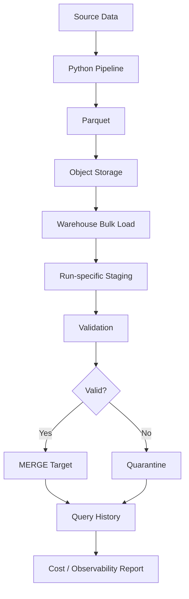

# CLAUDE CODE PROMPT — Module 2.17, Topic 06

You are acting as a **Senior Data Engineer with 10+ years of production industry experience**, specializing in Python data engineering, cloud data warehouses, high-throughput ingestion, bulk loading, data extraction, Arrow, warehouse performance, security, idempotency, and production pipeline architecture.

Your task is to create the complete learning content for exactly this file:

`17-Cloud-Storage-and-Cloud-Data-Platforms/06-python-warehouse-connectors-and-bulk-loads.md`

The objective is to teach **Python Warehouse Connectors and Bulk Loads** from beginner fundamentals through advanced, production-grade Data Engineering practices.

---

# 1. ABSOLUTE FILE SCOPE

You MUST work only on:

`17-Cloud-Storage-and-Cloud-Data-Platforms/06-python-warehouse-connectors-and-bulk-loads.md`

### CRITICAL FILE-SAFETY RULE

**DO NOT MODIFY, CREATE, DELETE, RENAME, OR UPDATE ANY OTHER FILE IN THE CURRENT FOLDER.**

You may read other files for context, but you must modify **ONLY**:

`06-python-warehouse-connectors-and-bulk-loads.md`

Do not modify:

- README files
- learning plans
- other Module 2.17 files
- Python source files
- experiment directories
- configuration files
- test files
- roadmap files
- any other project file

---

# 2. SOURCE OF TRUTH

Use the authoritative Module 2.17 roadmap as the source of truth.

This topic specifically requires:

### Basics

- `snowflake-connector-python`
- `google-cloud-bigquery`
- `redshift_connector`
- PostgreSQL drivers where relevant
- DB-API patterns from Module 2.7
- secure authentication
- Snowflake key-pair authentication
- BigQuery application default credentials/service accounts
- Redshift IAM-based authentication
- parameterized queries
- query labels/tags for cost attribution

### Intermediate

- stage → load → merge bulk-loading pattern
- Parquet in object storage
- Snowflake `COPY INTO`
- BigQuery load jobs
- Redshift `COPY`
- staging tables
- DataFrame loading helpers
- when helpers stage files
- Arrow-based result fetching
- Snowflake Arrow/pandas fetches
- BigQuery Storage Read API
- unloading large results to object storage
- file formats
- schema matching
- error thresholds
- rejected-row handling
- quarantine

### Advanced

- ADBC
- streaming/micro-batch vs batch ingestion
- Snowpipe
- BigQuery Storage Write API
- cost/latency trade-offs
- idempotent loading
- load IDs
- run-specific staging tables
- `MERGE`
- preventing duplicate file loads
- file registries
- SQLAlchemy dialects
- dlt destinations
- AWS SDK for pandas
- BigQuery dry runs and byte estimates
- Snowflake warehouse sizing and auto-suspend
- query tagging

The roadmap's required hands-on work includes building a reusable warehouse loader/extractor, secure authentication, query tagging, cost reporting, duplicate-load protection, and bad-row quarantine.

Do not skip any of these concepts.

---

# 3. PRIMARY LEARNING OBJECTIVE

The learner must finish this file able to build a production-grade Python workflow like:

```text id="bq1s9x"
Parquet / Object Storage
        ↓
Python Pipeline
        ↓
Warehouse Connector
        ↓
Run-specific Staging
        ↓
Bulk Load
        ↓
Validation
        ↓
MERGE
        ↓
Production Table
```

And for extraction:

```text id="o6a2pn"
Warehouse Query
       ↓
Connector
       ↓
Arrow / Efficient Fetch
       ↓
Bounded-memory Processing
       ↓
Parquet / Object Storage
```

The learner must understand why these patterns are preferable to:

```text id="n6f3b7"
Python loop
   ↓
INSERT one row
   ↓
INSERT one row
   ↓
INSERT one row
   ↓
Millions of round trips
```

---

# 4. TEACHING PHILOSOPHY

Teach every major concept using:

```text id="v9k8h2"
Simple explanation
        ↓
Technical definition
        ↓
Architecture
        ↓
Code example
        ↓
Run/execute
        ↓
Observe result
        ↓
Measure performance
        ↓
Analyze cost
        ↓
Failure scenario
        ↓
Production pattern
```

Do not simply provide API documentation.

The learner must understand **why the production pattern exists**.

---

# 5. START WITH DB-API FOUNDATIONS

Before introducing cloud-specific connectors, establish the common Python database interface.

Explain:

- DB-API concept
- connection
- cursor
- execute
- parameterized query
- fetchone
- fetchmany
- fetchall
- transaction awareness
- commit/rollback where applicable
- context managers
- connection lifecycle

Use a simple conceptual example:

```python id="k9w2m3"
connection = connect(...)
cursor = connection.cursor()

cursor.execute(
    "SELECT * FROM orders WHERE customer_id = %s",
    (customer_id,)
)

rows = cursor.fetchall()
```

Explain why parameterization matters.

Do not assume that every cloud warehouse behaves identically to PostgreSQL.

Clearly distinguish:

```text
Generic DB-API concepts
vs
Warehouse-specific APIs
```

---

# 6. PYTHON WAREHOUSE CONNECTORS

Create separate sections for:

## Snowflake

Teach:

- `snowflake-connector-python`
- connection
- cursor
- query execution
- result retrieval
- authentication
- query metadata
- query tagging

## BigQuery

Teach:

- `google-cloud-bigquery`
- client object
- query jobs
- job lifecycle
- result retrieval
- load jobs
- authentication
- query labels
- dry-run awareness

## Redshift

Teach:

- `redshift_connector`
- connection
- cursor
- SQL execution
- IAM-based authentication
- result retrieval

Also mention PostgreSQL-compatible drivers only where useful for understanding Redshift compatibility.

---

# 7. CONNECTOR ARCHITECTURE

Explain what a Python connector actually does.

Use a conceptual flow:

```text id="q7x0t5"
Python Application
       ↓
Connector
       ↓
Authentication
       ↓
Network
       ↓
Warehouse API / SQL Endpoint
       ↓
Query Execution
       ↓
Result
       ↓
Python
```

Explain:

- network round trips
- query submission
- asynchronous jobs where applicable
- result transfer
- serialization
- memory implications

Explain why moving millions of rows through a normal row-oriented cursor can be inefficient.

---

# 8. SECURE AUTHENTICATION

This section must be detailed.

Teach the roadmap's authentication approaches.

## Snowflake

Cover:

- key-pair authentication
- private key handling
- avoiding passwords
- credential storage
- environment/secret management
- short-lived/secure alternatives where appropriate

Explain that private keys must never be committed to source control.

## BigQuery

Teach:

- Application Default Credentials
- service accounts
- workload identity awareness
- local development vs production authentication
- avoiding embedded credential JSON in source code

## Redshift

Teach:

- IAM-based authentication
- temporary access
- workload identity/role-based access
- avoiding static database passwords where IAM-based authentication is available

Use secure examples.

Never place real secrets in code.

---

# 9. AUTHENTICATION ARCHITECTURE

Create a comparison:

| Warehouse | Preferred production-oriented authentication pattern |
|---|---|
| Snowflake | Key-pair / secure identity-based authentication |
| BigQuery | Application Default Credentials / service identity |
| Redshift | IAM-based authentication |

Explain that authentication is not merely a connection detail.

It is part of:

```text
Security
+
Identity
+
Credential lifecycle
+
Auditability
```

Connect this topic to Module 2.17 Topic 04 on IAM and least privilege without duplicating that module.

---

# 10. PARAMETERIZED QUERIES

Teach:

- SQL injection risk
- parameter binding
- query parameters
- separating data from SQL
- safe dynamic SQL
- identifier handling

BAD:

```python id="x8qj1w"
query = f"""
SELECT *
FROM orders
WHERE customer_id = '{customer_id}'
"""
```

GOOD:

```python id="8j0r4n"
query = """
SELECT *
FROM orders
WHERE customer_id = %s
"""
```

Use the correct parameter syntax for each connector where syntax differs.

Explain:

> Parameterized queries are not just a security feature; they also improve maintainability and correctness.

---

# 11. QUERY TAGGING AND COST ATTRIBUTION

Teach:

- query labels
- query tags
- pipeline name
- environment
- run ID
- team
- workload
- cost attribution

Use a conceptual metadata structure:

```text id="qz8g1f"
pipeline=orders_ingestion
environment=prod
run_id=2026-10-05T120000Z
```

Explain why untagged queries make production cost analysis difficult.

Build the architecture:

```text
Pipeline
   ↓
Tagged Query
   ↓
Warehouse Query History
   ↓
Cost Analysis
   ↓
Pipeline-level Cost Report
```

---

# 12. WHY ROW-BY-ROW INSERTS ARE A BAD PATTERN

This is a foundational section.

Show:

```python id="5s6q3m"
for row in rows:
    cursor.execute(
        "INSERT INTO orders VALUES (...)"
    )
```

Explain why this becomes catastrophic at scale.

Discuss:

- network round trips
- transaction overhead
- parsing/planning
- warehouse compute
- concurrency
- latency
- cost
- failure recovery
- partial loads

Then show:

```text id="h1j8ds"
Write files
   ↓
Object Storage
   ↓
Bulk Load
   ↓
Warehouse
```

Explain why cloud warehouses are optimized for bulk ingestion.

---

# 13. THE PRODUCTION BULK-LOAD PATTERN

This is the central topic.

Teach:

```text id="5x4x2g"
DataFrame / Source
       ↓
Parquet
       ↓
Object Storage
       ↓
Warehouse Stage / Load Job
       ↓
Staging Table
       ↓
Validation
       ↓
MERGE
       ↓
Target Table
```

Explain every step.

---

# 14. PARQUET AS THE BULK-LOAD FORMAT

Explain why Parquet is useful:

- columnar
- compressed
- typed
- efficient
- object-storage friendly
- parallelizable
- interoperable

Connect to earlier modules:

- PyArrow
- Polars
- DuckDB
- object storage
- Parquet layout

Explain why:

```text
Python DataFrame
→ Parquet
→ Cloud Warehouse
```

is generally preferable to:

```text
Python DataFrame
→ row-by-row SQL INSERT
```

---

# 15. SNOWFLAKE BULK LOAD

Teach:

```text id="e6w0n7"
Parquet
  ↓
S3 / Cloud Storage
  ↓
Snowflake Stage
  ↓
COPY INTO
  ↓
Staging Table
  ↓
MERGE
```

Provide representative SQL.

Example:

```sql id="6m0jbi"
COPY INTO staging.orders
FROM @orders_stage
FILE_FORMAT = (
    TYPE = PARQUET
);
```

Then explain:

- stage
- file format
- COPY
- load behavior
- schema mapping
- errors
- rejected files
- staging
- merge

Do not repeat the entire Snowflake architecture module.

Focus on Python-driven loading.

---

# 16. BIGQUERY BULK LOAD

Teach:

- BigQuery client
- load jobs
- Parquet from object storage
- schema handling
- job execution
- job status
- errors
- write dispositions
- append/overwrite concepts
- staging and merge

Provide a representative Python example.

Explain:

```text id="v8a5y4"
Python
 ↓
BigQuery Client
 ↓
Load Job
 ↓
Staging Table
 ↓
Validation
 ↓
MERGE
```

Also explain the Storage Write API as an advanced alternative for streaming/micro-batch ingestion.

---

# 17. REDSHIFT BULK LOAD

Teach:

```text id="p5b9om"
Parquet
  ↓
S3
  ↓
Redshift COPY
  ↓
Staging
  ↓
Validation
  ↓
MERGE
  ↓
Target
```

Provide representative SQL.

Example:

```sql id="t2y5ra"
COPY staging.orders
FROM 's3://company-data/orders/'
IAM_ROLE 'arn:aws:iam::123456789012:role/redshift-load-role'
FORMAT AS PARQUET;
```

Never use real credentials.

Explain:

- IAM role
- S3 access
- COPY
- file loading
- error handling
- staging
- merge

---

# 18. THREE LOADING STRATEGIES EXPERIMENT

The roadmap specifically requires comparing three approaches.

Teach and implement:

### Strategy 1 — Batched row inserts

```text
Python
→ batches
→ INSERT
```

### Strategy 2 — DataFrame helper

```text
DataFrame
→ Warehouse helper
→ Warehouse
```

### Strategy 3 — Stage → COPY/load

```text
DataFrame
→ Parquet
→ Object Storage
→ Bulk Load
```

Use the same dataset for all three.

Measure:

```text
Rows
Elapsed time
Network behavior
Warehouse compute
Cost
Failure behavior
Memory
```

Explain why the results differ.

The learner should reach the engineering conclusion through measurement, not memorization.

---

# 19. DATAFRAME LOADING HELPERS

Teach:

- Snowflake pandas write helpers
- BigQuery DataFrame loads
- URI-based loads
- AWS SDK for pandas awareness
- when helpers stage files internally
- hidden costs/behavior
- schema inference
- convenience vs control

Explain the trade-off:

```text
Convenience
vs
Control
vs
Performance
vs
Observability
```

Do not simply say helpers are good or bad.

---

# 20. SCHEMA HANDLING

Teach:

- schema inference
- explicit schemas
- type compatibility
- nullable fields
- numeric types
- timestamps
- dates
- strings
- nested structures where relevant
- Parquet schema
- warehouse schema

Explain common failures:

```text id="t1e0k9"
Parquet type
      ≠
Warehouse column type
```

Explain how to detect and handle these mismatches.

---

# 21. FILE FORMATS AND LOAD OPTIONS

Teach relevant load configuration concepts:

- Parquet
- CSV awareness
- compression
- schema
- delimiter awareness for CSV
- header
- null handling
- write disposition
- append/overwrite
- file matching
- path/prefix selection

Keep Parquet as the preferred production example.

---

# 22. LOAD ERRORS AND REJECTED ROWS

Teach:

- malformed records
- schema mismatch
- invalid values
- duplicate records
- missing required fields
- corrupt files
- rejected rows
- error thresholds

Explain:

```text id="9y8h7k"
Good rows
    ↓
Target/Staging

Bad rows
    ↓
Quarantine
    ↓
Investigation
```

Connect this to Module 2.11 Data Validation and Quality.

---

# 23. QUARANTINE DESIGN

Create a practical quarantine architecture.

Example:

```text id="k5f8u4"
Incoming File
     ↓
Bulk Load
     ↓
Validation
   /     \
GOOD     BAD
 ↓        ↓
MERGE   Quarantine
          ↓
       Reason
       File
       Row
       Run ID
       Timestamp
```

Explain what metadata should be recorded for rejected data.

---

# 24. FAST EXTRACTION

Teach the opposite direction:

```text id="2g6kz8"
Warehouse
    ↓
Large Query
    ↓
Efficient Fetch
    ↓
Arrow
    ↓
Parquet
    ↓
Object Storage
```

Explain why fetching millions of rows using slow row-oriented APIs is inefficient.

---

# 25. ARROW-BASED RESULT FETCHING

Teach:

- Apache Arrow
- columnar memory representation
- zero-/low-copy concepts where applicable
- vectorized transfer
- Arrow tables
- pandas/Polars integration
- bounded memory

Explain why Arrow can significantly improve large-result extraction.

Do not claim "zero-copy" universally; explain where copies may still occur.

---

# 26. SNOWFLAKE ARROW/PANDAS FETCHING

Teach at an appropriate level:

- Arrow-based result retrieval
- pandas fetch helpers
- batch/chunked retrieval
- memory considerations

Explain when to use:

```text
Small result
→ normal fetch

Large result
→ Arrow / chunking / unload
```

---

# 27. BIGQUERY STORAGE READ API

Teach:

- why it exists
- high-throughput reads
- columnar/Arrow-oriented transfer
- parallel reads
- large result extraction
- interaction with Python

Explain when it is preferable to ordinary query-result retrieval.

---

# 28. UNLOADING LARGE RESULTS TO OBJECT STORAGE

Teach:

> Do not always pull a huge dataset through the Python process.

Instead:

```text
Warehouse
    ↓
UNLOAD / Export
    ↓
Object Storage
    ↓
Parquet
    ↓
Downstream Consumer
```

Explain:

- bounded Python memory
- parallelism
- cost
- network
- downstream interoperability

Then compare:

```text
Arrow fetch
vs
warehouse unload
```

---

# 29. BOUNDED-MEMORY EXTRACTION

Teach safe extraction patterns.

BAD:

```python id="4sjp7z"
rows = cursor.fetchall()
```

when the result contains hundreds of millions of rows.

BETTER:

```python id="7x0w6m"
while True:
    batch = fetch_next_batch()

    if not batch:
        break

    process(batch)
```

Then show Arrow/chunked/Parquet approaches.

Explain memory behavior.

---

# 30. ADBC

Teach ADBC as an advanced topic.

Explain:

- Apache Arrow Database Connectivity
- Arrow-native database connectivity
- columnar transfer
- why it matters
- how it differs conceptually from traditional DB-API
- where ADBC fits into a modern Python data stack

Show representative examples if supported by current libraries.

Do not make unsupported claims about every warehouse having identical ADBC capabilities.

---

# 31. BATCH VS STREAMING VS MICRO-BATCH

Compare:

```text id="w1z5fo"
Batch
→ large periodic loads

Micro-batch
→ small frequent loads

Streaming
→ near-continuous ingestion
```

Discuss:

- latency
- throughput
- cost
- operational complexity
- failure handling

Map examples:

```text
Snowpipe
BigQuery Storage Write API
```

Explain when batch is preferable.

Do not assume streaming is always better.

---

# 32. IDEMPOTENT LOADS

This is a critical production concept.

Teach:

> Running the same pipeline twice should not incorrectly duplicate data.

Cover:

- idempotency
- deterministic load IDs
- file IDs
- object keys
- checksums where useful
- staging tables
- run-specific staging
- `MERGE`
- unique/business keys
- file registries

---

# 33. FILE REGISTRY

Connect to Module 2.9.

Design a file registry such as:

```text id="avj7qx"
file_uri
file_version
checksum
first_seen_at
loaded_at
load_status
run_id
row_count
error_count
```

Explain how the registry prevents:

```text
same file
    ↓
loaded twice
    ↓
duplicate data
```

---

# 34. RUN-SPECIFIC STAGING TABLES

Teach:

```text id="3qpl5g"
run_20261005_001_staging
```

or an equivalent logical run identifier.

Explain why run-specific staging helps with:

- retries
- debugging
- isolation
- partial failure
- rollback/recovery
- idempotency

Then show:

```text
Stage
 ↓
Validate
 ↓
MERGE
 ↓
Drop/retain staging based on policy
```

---

# 35. MERGE PATTERN

Teach:

```sql id="b5ukx3"
MERGE INTO target t
USING staging s
ON t.order_id = s.order_id
WHEN MATCHED THEN
    UPDATE SET ...
WHEN NOT MATCHED THEN
    INSERT (...);
```

Explain:

- match key
- update
- insert
- duplicate source keys
- deterministic behavior
- data quality requirements
- idempotency

Connect to Module 2.6 and Module 2.12.

---

# 36. COMPLETE `load_parquet_to_warehouse()` DESIGN

The roadmap explicitly requires a reusable function:

```python id="u2b7m8"
load_parquet_to_warehouse(uri, table, keys)
```

Design and implement it conceptually.

It should:

1. Accept a source URI.
2. Identify the input file/run.
3. Authenticate securely.
4. Create/use run-specific staging.
5. Bulk-load Parquet.
6. Validate the loaded data.
7. Detect invalid/rejected rows.
8. Quarantine bad records where appropriate.
9. MERGE valid records into the target.
10. Record load metadata.
11. Prevent duplicate loading.
12. Produce useful logs/metrics.
13. Clean up staging appropriately.
14. Be safe to retry.

Explain each step.

---

# 37. COMPLETE `extract_query_to_parquet()` DESIGN

The roadmap also requires:

```python id="f9k1s3"
extract_query_to_parquet(sql, uri)
```

Design it to:

1. Accept a SQL query.
2. Execute securely.
3. Fetch efficiently using Arrow where appropriate.
4. Avoid loading unlimited data into memory.
5. Write Parquet.
6. Preserve schema.
7. Record row counts.
8. Handle failures.
9. Produce useful metadata.
10. Support large datasets.

Compare two implementation strategies:

```text
Warehouse → Arrow → Python → Parquet
```

and:

```text
Warehouse → UNLOAD/Export → Object Storage
```

Explain when each is appropriate.

---

# 38. QUERY COST AWARENESS IN CODE

Teach warehouse-specific cost controls.

## BigQuery

Cover:

- dry runs
- bytes estimates
- query cost estimation
- query labels

Show how a Python pipeline can estimate query cost before executing expensive work where supported.

## Snowflake

Cover:

- warehouse size
- auto-suspend
- query tags
- workload selection

## Redshift

Cover:

- IAM
- workload/resource awareness
- query attribution

The principle should be:

```text
Before execution
→ Estimate

During execution
→ Tag

After execution
→ Measure
```

---

# 39. COST REPORTING PER PIPELINE

Build a conceptual workflow:

```text
Pipeline
 ↓
Run ID
 ↓
Tagged Query
 ↓
Warehouse Query History
 ↓
Extract Metadata
 ↓
Aggregate
 ↓
Cost Report
```

Example report:

```text
pipeline          run_id        duration   bytes   estimated_cost
orders_ingest     run_001       ...        ...     ...
orders_transform  run_001       ...        ...     ...
```

Explain why this is important in production Data Engineering.

---

# 40. RETRIES AND FAILURE HANDLING

Teach:

- transient network failures
- warehouse job failures
- load failures
- timeout
- authentication expiration
- malformed files
- partial loads

Explain:

```text
Retry
vs
Do not retry
```

Examples:

```text
Transient network failure
→ retry

Invalid schema
→ do not blindly retry

Duplicate load
→ detect/idempotently handle
```

Explain exponential backoff conceptually.

Do not create a complex retry framework unrelated to the module.

---

# 41. TRANSACTIONS AND ATOMICITY

Explain carefully:

- transaction boundaries
- staging vs target
- MERGE
- partial failures
- commit behavior
- warehouse-specific differences

The goal is to help the learner reason about:

> What happens if the pipeline crashes halfway through?

Use the staging → validate → merge architecture to answer.

---

# 42. OBSERVABILITY FOR WAREHOUSE LOADS

Teach useful metadata:

```text id="m4p9k2"
run_id
pipeline_name
source_uri
file_version
start_time
end_time
rows_read
rows_loaded
rows_rejected
status
warehouse
query_id
duration
estimated_cost
```

Explain how these support:

- debugging
- monitoring
- cost attribution
- incident response
- auditability

---

# 43. HIGHER-LEVEL TOOLS — AWARENESS

The roadmap requires awareness of:

- SQLAlchemy dialects
- dlt destinations
- AWS SDK for pandas

For each explain:

- what it is
- what problem it solves
- when it is useful
- trade-offs vs direct connectors

Do not duplicate their dedicated modules.

---

# 44. PRODUCTION ARCHITECTURE

Create a complete architecture:



Explain every component.

---

# 45. SECURITY REQUIREMENTS

The file must strongly reinforce:

- no passwords in source code
- no access keys in source code
- no secrets in Git
- secure credential providers
- least-privilege IAM
- secure object-storage access
- encrypted transport
- secure private-key handling
- service identities
- query authorization

Connect to Topic 04 without duplicating it.

---

# 46. PERFORMANCE BENCHMARKING

Create a benchmark framework.

Compare:

```text
1. Row inserts
2. Batch inserts
3. DataFrame helper
4. Parquet → bulk load
5. Arrow extraction
6. Standard row extraction
7. Warehouse unload
```

Record:

```text
Rows
Elapsed time
Memory
Network transfer
Warehouse compute
Cost
Failure behavior
```

Teach:

> Never optimize a data pipeline without measuring the baseline.

---

# 47. REQUIRED 10-MILLION-ROW EXPERIMENT

Follow the roadmap exactly.

Load approximately 10 million rows using:

### Method A

Batched row inserts.

### Method B

DataFrame helper.

### Method C

Parquet → object storage → stage/load/COPY.

Record:

```text
Method
Time
Cost
Memory
Throughput
Failure recovery
```

Then extract approximately 10 million rows using:

### Method A

Regular row fetching.

### Method B

Arrow-based fetching.

Compare.

Explain why the results differ.

---

# 48. DUPLICATE-LOAD EXPERIMENT

Perform:

```text
Load file A
↓
Load file A again
```

The second run must not produce duplicate business records.

Demonstrate the mechanism:

```text
File Registry
+
Run ID
+
Staging
+
MERGE
```

Prove idempotency.

---

# 49. BAD-DATA EXPERIMENT

Create a file containing:

- valid rows
- malformed rows
- invalid types
- missing required fields

Run the load.

Expected design:

```text
Valid
→ warehouse

Invalid
→ quarantine
```

Record:

- file
- row
- reason
- run ID
- timestamp

---

# 50. COMMON MISTAKES

Explicitly cover the roadmap's mistakes:

- `INSERT` loops
- slow row-by-row fetching
- passwords in connection strings
- untagged queries

Also include:

- loading directly into production without staging
- no idempotency
- no file registry
- no validation
- loading entire results into memory
- ignoring schema drift
- blindly retrying invalid data
- treating streaming as automatically superior
- failing to measure load cost

For every mistake show:

```text
BAD
→ Why it fails
→ Better
→ Production pattern
```

---

# 51. FAILURE-DRIVEN SCENARIOS

Include at least these.

### Scenario 1 — Duplicate file

The same Parquet file arrives twice.

Design an idempotent solution.

### Scenario 2 — Warehouse connection expires

The pipeline fails during execution.

Explain recovery.

### Scenario 3 — Schema mismatch

A source column changes type.

Explain:

- detection
- quarantine
- remediation

### Scenario 4 — 500 GB extraction

A developer calls:

```python
fetchall()
```

Explain why this is dangerous.

### Scenario 5 — Query costs unexpectedly increase

Investigate:

- missing query tags
- larger scans
- inefficient SQL
- warehouse size
- repeated queries

### Scenario 6 — Half-completed load

The pipeline crashes after staging but before MERGE.

Explain how run-specific staging makes recovery safer.

---

# 52. PRACTICE QUESTIONS

Include beginner → advanced questions.

## Beginner

- What is a Python warehouse connector?
- What is DB-API?
- What is a cursor?
- What is parameterized SQL?
- Why are row-by-row inserts slow?

## Intermediate

- What is bulk loading?
- Why use Parquet?
- What is a staging table?
- Why use `MERGE`?
- What is Arrow?
- Why use query tags?

## Advanced

- How would you make a warehouse load idempotent?
- How would you extract 500 GB safely?
- When should you use Arrow vs unload?
- How would you quarantine bad rows?
- How would you attribute warehouse cost to pipelines?
- How would you choose batch vs micro-batch?
- What role does ADBC play?
- How would you design retry behavior?

Include scenario-based questions.

---

# 53. INTERVIEW PREPARATION

Create sections for:

## Junior Data Engineer

- connectors
- DB-API
- parameterized queries
- bulk loading basics

## Mid-Level

- Parquet loading
- staging
- MERGE
- schema handling
- Arrow
- idempotency

## Senior

- high-volume ingestion
- extraction architecture
- cost attribution
- warehouse-specific loading
- retry/failure architecture
- streaming vs batch

## Staff/Lead

- enterprise ingestion architecture
- warehouse cost governance
- data contracts
- idempotency strategy
- observability
- multi-warehouse abstraction

Provide model answers for important questions.

---

# 54. ADVANCED DESIGN SCENARIOS

Include scenarios such as:

### Scenario A

A company receives 5,000 Parquet files per day.

Design:

```text
Object Storage
→ Python
→ Bulk Load
→ Staging
→ Validation
→ MERGE
```

### Scenario B

A 1 TB warehouse query must be exported daily.

Choose:

```text
Arrow extraction
vs
Warehouse unload
```

Justify.

### Scenario C

A pipeline can retry automatically.

Explain how to avoid duplicate records.

### Scenario D

A warehouse bill suddenly increases.

Design an investigation using:

```text
query tags
+
query history
+
pipeline run IDs
+
cost metadata
```

---

# 55. KNOWLEDGE CHECKPOINTS

After major sections, include reasoning checkpoints.

Example:

```text
CHECKPOINT

Can you explain:

1. Why row-by-row INSERT is inefficient?
2. Why Parquet is useful for bulk loads?
3. Why staging tables exist?
4. Why MERGE helps idempotency?
5. Why query tags matter?
6. Why Arrow helps extraction?
7. When an unload is better than Python fetching?
8. How a file registry prevents duplicate loads?
```

Do not make checkpoints merely vocabulary tests.

---

# 56. FINAL PROJECT

Create a complete production-style assignment.

### Company

```text
Acme Data Platform
```

### Requirements

- 50 million orders/day
- Parquet source files
- object storage
- cloud warehouse
- incremental loads
- duplicate files possible
- schema changes possible
- bad rows must be quarantined
- pipeline costs must be attributable
- analysts need extracts
- no passwords in code
- retryable pipeline

Ask the learner to design:

1. Authentication.
2. Connector architecture.
3. Parquet staging.
4. Bulk-load strategy.
5. Staging tables.
6. Validation.
7. Quarantine.
8. MERGE.
9. Idempotency.
10. File registry.
11. Extraction.
12. Arrow vs unload.
13. Cost tagging.
14. Query history.
15. Retry strategy.
16. Observability.
17. Security.
18. Failure recovery.

Provide a reference architecture and solution.

---

# 57. FINAL ASSESSMENT

Create a comprehensive assessment covering:

- Python code
- SQL
- warehouse loading
- schema mapping
- idempotency
- cost attribution
- extraction
- Arrow
- ADBC
- security
- architecture
- failure recovery

Include answer keys/reference solutions.

---

# 58. MASTERY CHECKLIST

End the file with:

```text
[ ] I understand Python warehouse connectors.
[ ] I understand DB-API patterns.
[ ] I can connect to Snowflake securely.
[ ] I can connect to BigQuery securely.
[ ] I can connect to Redshift securely.
[ ] I understand key-pair authentication.
[ ] I understand Application Default Credentials.
[ ] I understand IAM-based authentication.
[ ] I can write parameterized queries.
[ ] I understand query tags/labels.
[ ] I understand why row-by-row inserts are inefficient.
[ ] I understand Parquet-based bulk loading.
[ ] I understand Snowflake COPY INTO.
[ ] I understand BigQuery load jobs.
[ ] I understand Redshift COPY.
[ ] I understand staging tables.
[ ] I understand MERGE.
[ ] I can design idempotent loads.
[ ] I understand file registries.
[ ] I can prevent duplicate file loads.
[ ] I understand schema matching.
[ ] I can handle load errors.
[ ] I can design quarantine handling.
[ ] I understand Arrow.
[ ] I can extract large results efficiently.
[ ] I understand Snowflake Arrow/pandas fetching.
[ ] I understand BigQuery Storage Read API.
[ ] I understand warehouse unload patterns.
[ ] I understand bounded-memory extraction.
[ ] I understand ADBC.
[ ] I understand batch vs micro-batch vs streaming.
[ ] I understand Snowpipe and Storage Write API at the required level.
[ ] I understand SQLAlchemy/dlt/AWS SDK for pandas at awareness level.
[ ] I understand warehouse cost attribution.
[ ] I can build a production warehouse loader.
[ ] I can build a production warehouse extractor.
[ ] I can troubleshoot failed loads.
[ ] I can reason about pipeline cost.
[ ] I can design secure, retryable, idempotent warehouse ingestion.
```

---

# 59. FINAL FILE VALIDATION

Before finishing the Markdown file, verify:

1. Every Topic 06 roadmap concept is covered.
2. Beginner → advanced progression is clear.
3. DB-API foundations are included.
4. Snowflake connector is covered.
5. BigQuery connector is covered.
6. Redshift connector is covered.
7. Secure authentication is covered.
8. Parameterized queries are covered.
9. Query tagging is covered.
10. Bulk loading is deeply explained.
11. Parquet → object storage → warehouse is explained.
12. Snowflake `COPY INTO` is covered.
13. BigQuery load jobs are covered.
14. Redshift `COPY` is covered.
15. DataFrame helpers are covered.
16. Schema handling is covered.
17. Load errors and rejected rows are covered.
18. Quarantine is covered.
19. Arrow extraction is covered.
20. Snowflake Arrow/pandas fetching is covered.
21. BigQuery Storage Read API is covered.
22. Warehouse unloads are covered.
23. Bounded-memory extraction is covered.
24. ADBC is covered.
25. Batch vs micro-batch vs streaming is covered.
26. Snowpipe and BigQuery Storage Write API are covered at the required level.
27. Idempotency is deeply covered.
28. File registries are covered.
29. Run-specific staging is covered.
30. MERGE is covered.
31. `load_parquet_to_warehouse()` is designed.
32. `extract_query_to_parquet()` is designed.
33. Cost awareness in code is covered.
34. Query cost attribution is covered.
35. Retry/failure handling is covered.
36. Security is covered.
37. Observability is covered.
38. The 10-million-row experiment is included.
39. Duplicate-load experiment is included.
40. Bad-data/quarantine experiment is included.
41. Exercises are included.
42. Failure scenarios are included.
43. Interview preparation is included.
44. Final project is included.
45. Final assessment is included.
46. Mastery checklist is included.
47. No unrelated topics have been added.
48. No roadmap topic has been silently omitted.
49. No insecure credential examples are presented as recommended production practice.
50. **ONLY `06-python-warehouse-connectors-and-bulk-loads.md` has been modified.**

The final result must be a **complete standalone production-oriented learning chapter**, taking the learner from basic Python warehouse connectivity to designing secure, high-throughput, cost-aware, idempotent, observable warehouse ingestion and extraction pipelines.