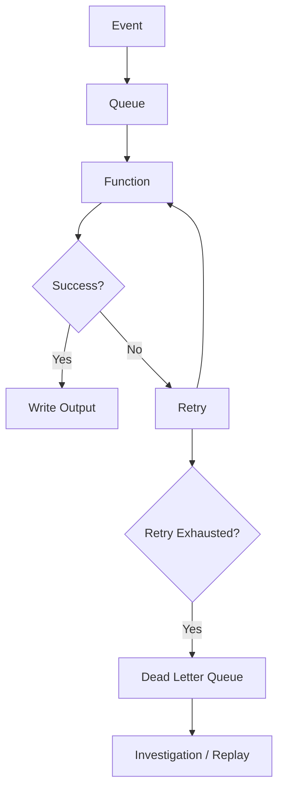
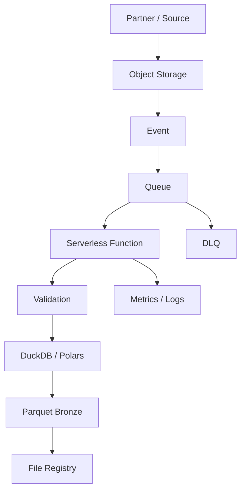

# CLAUDE CODE PROMPT — Module 2.17, Topic 07

You are acting as a **Senior Data Engineer with 10+ years of production industry experience**, specializing in cloud data engineering, event-driven architectures, serverless computing, Python pipelines, object storage, distributed systems, reliability, observability, and cloud cost optimization.

Your task is to create the complete learning content for exactly this file:

`17-Cloud-Storage-and-Cloud-Data-Platforms/07-serverless-data-processing.md`

The goal is to teach **Serverless Data Processing** from foundational concepts through advanced, production-oriented Data Engineering architecture.

---

# 1. ABSOLUTE FILE SCOPE

You MUST work only on:

`17-Cloud-Storage-and-Cloud-Data-Platforms/07-serverless-data-processing.md`

### CRITICAL FILE-SAFETY RULE

**DO NOT MODIFY, CREATE, DELETE, RENAME, OR UPDATE ANY OTHER FILE IN THE CURRENT FOLDER.**

You may read other files for context, but you must modify **ONLY**:

`07-serverless-data-processing.md`

Do not modify:

- README files
- learning plans
- other Module 2.17 files
- Python source files
- experiment files
- configuration files
- test files
- roadmap files
- any other project files

---

# 2. SOURCE OF TRUTH

Treat the authoritative Module 2.17 roadmap as the source of truth.

Topic 07 specifically requires:

### Basics

- serverless functions
- AWS Lambda
- Google Cloud Run functions / Cloud Run jobs
- Azure Functions
- event-driven execution
- billing by invocation/duration
- object-storage triggers
- schedules
- queues and streams
- HTTP triggers
- Python packaging
- dependency layers
- container images
- cold-start optimization

### Intermediate

- maximum execution time
- memory and CPU
- temporary disk
- payload sizes
- concurrency limits
- event-driven file processing
- validation
- DuckDB/Polars processing
- Parquet output
- bronze/silver layers
- idempotency
- duplicate/out-of-order events
- object key/version deduplication
- serverless query engines
- Amazon Athena
- BigQuery
- serverless Spark awareness

### Advanced

- state machines
- AWS Step Functions
- Google Workflows
- Airflow comparison
- fan-out
- backpressure
- reserved concurrency
- queues
- batching
- retries
- dead-letter queues
- partial batch failures
- structured logs
- metrics
- tracing
- when serverless is inappropriate

The roadmap's hands-on exercise requires an event-driven CSV-to-Parquet pipeline, idempotency, malformed-file handling, dead-letter queues, a 1,000-file concurrency experiment, serverless SQL, cost comparison, and teardown.

Do not skip any of these concepts.

---

# 3. PRIMARY LEARNING OBJECTIVE

The learner must finish this file able to reason about and build architectures such as:

```text
Object Storage
      ↓
Event
      ↓
Serverless Function
      ↓
Validation
      ↓
Transformation
      ↓
Parquet
      ↓
Bronze / Silver
```

But the learner must also understand when that architecture becomes inappropriate:

```text
Huge Dataset
      ↓
Long-running computation
      ↓
Heavy CPU / Memory
      ↓
Serverless Function
      ↓
TIMEOUT / HIGH COST / OPERATIONAL PROBLEM
```

The core lesson is:

> **Serverless is a workload execution model, not a universal replacement for containers, warehouses, or distributed compute.**

---

# 4. TEACHING PHILOSOPHY

Teach every major concept progressively:

```text
Simple explanation
        ↓
Technical definition
        ↓
Architecture
        ↓
Python example
        ↓
Trigger/event example
        ↓
Failure mode
        ↓
Performance implications
        ↓
Cost implications
        ↓
Production design
```

For difficult distributed-system concepts, use concrete examples before introducing formal terminology.

---

# 5. START WITH: WHAT IS SERVERLESS?

Explain:

- what serverless means
- what "serverless" does NOT mean
- why servers still exist underneath
- managed infrastructure
- event-driven execution
- automatic scaling
- pay-per-use model
- operational responsibility shifted to cloud provider

Explain the conceptual difference:

```text
Traditional server
→ provision
→ maintain
→ scale
→ patch
→ pay while idle
```

versus:

```text
Serverless
→ deploy code
→ trigger execution
→ platform scales
→ pay based on usage
```

Explain the trade-offs.

---

# 6. WHEN SERVERLESS IS USEFUL FOR DATA ENGINEERING

Use concrete examples:

- file arrives in object storage
- API poll every 15 minutes
- small transformation
- metadata extraction
- validation
- event-driven enrichment
- lightweight ingestion
- scheduled processing
- small query execution
- workflow step

Explain why these workloads are suitable:

- small
- independent
- event-driven
- bursty
- intermittent
- short-running

---

# 7. SERVERLESS FUNCTIONS

Create a foundational section.

Teach:

- function
- invocation
- execution
- event
- handler
- runtime
- deployment
- concurrency
- statelessness

Use a simple Python example:

```python
def handler(event, context):
    print("Received event")
    return {
        "statusCode": 200
    }
```

Explain:

- what `event` represents
- what `context` represents
- what triggers the function
- why functions should generally be stateless

---

# 8. AWS LAMBDA

Teach AWS Lambda as the primary concrete example.

Cover:

- function
- runtime
- handler
- invocation
- event
- execution role
- environment variables
- temporary filesystem
- concurrency
- timeout
- memory
- deployment package
- layers
- container-image deployment

Explain the execution lifecycle:

```text
Trigger
  ↓
Lambda invocation
  ↓
Runtime initialization
  ↓
Handler
  ↓
Processing
  ↓
Response / completion
  ↓
Environment may be reused or discarded
```

---

# 9. GOOGLE CLOUD RUN FUNCTIONS / CLOUD RUN JOBS

Teach at a practical awareness level:

- Cloud Run functions
- Cloud Run jobs
- event-driven execution
- container-based execution
- scheduled jobs
- batch-style processing

Explain the conceptual differences from Lambda.

Do not turn this into an exhaustive GCP certification course.

---

# 10. AZURE FUNCTIONS

Teach at a practical awareness level:

- Azure Functions
- triggers
- Python functions
- HTTP triggers
- storage triggers
- timer triggers
- event-driven execution

Map the concept:

```text
AWS Lambda
↔
Google Cloud Run functions
↔
Azure Functions
```

Emphasize the common serverless architecture rather than memorizing provider-specific APIs.

---

# 11. SERVERLESS COMPUTE COMPARISON

Create a table:

| Concept | AWS | GCP | Azure |
|---|---|---|---|
| Function platform | Lambda | Cloud Run functions | Azure Functions |
| Container/job option | Lambda container image / other services | Cloud Run Jobs | Container-oriented Functions options |
| Object trigger | S3 | Cloud Storage | Blob Storage |
| Scheduler | EventBridge Scheduler | Cloud Scheduler | Timer trigger |
| Queue/event systems | SQS/EventBridge/etc. | Pub/Sub | Service Bus/Event Grid |
| Identity | IAM role | Service account / workload identity | Managed identity |

Keep the comparison conceptual and avoid unsupported feature equivalence.

---

# 12. TRIGGERS

Teach the major trigger categories required by the roadmap.

## Object-storage triggers

Example:

```text
S3 object created
      ↓
Lambda
```

## Scheduled triggers

Example:

```text
Every 15 minutes
      ↓
Function
      ↓
API
```

## Queue triggers

Example:

```text
Queue
 ↓
Function
```

## Stream triggers

Explain at a conceptual level.

## HTTP triggers

Example:

```text
HTTP Request
     ↓
Function
```

Explain the difference between:

```text
event-driven
vs
request-driven
vs
scheduled
```

---

# 13. EVENT-DRIVEN DATA ENGINEERING

Teach the core model:

```text
Event
 ↓
Consumer
 ↓
Process
 ↓
Write result
```

Explain why event-driven processing is useful.

Discuss:

- loose coupling
- asynchronous processing
- scalability
- responsiveness
- failure isolation

Then explain the challenges:

- duplicate events
- out-of-order events
- retries
- partial failure
- downstream overload

---

# 14. PYTHON PACKAGING

Teach:

- Python dependencies
- deployment package
- requirements
- dependency layers
- container images
- package size
- startup time
- cold starts

Explain three approaches:

```text
1. ZIP/deployment package
2. Dependency layer
3. Container image
```

Explain when each is appropriate.

---

# 15. COLD STARTS

Explain:

- what a cold start is
- initialization
- dependency loading
- runtime startup
- why large packages can increase startup time
- why heavy imports can matter
- warm execution awareness

Teach practical optimization:

- keep packages small
- minimize unnecessary dependencies
- initialize reusable clients outside the handler where appropriate
- avoid expensive startup work
- use suitable runtime/container packaging

Do not claim cold starts are eliminated completely.

---

# 16. SERVERLESS LIMITS

This section must be detailed.

Explain the design impact of:

- maximum runtime
- memory
- CPU
- temporary disk
- payload size
- concurrency
- execution limits

Create a table:

| Limit | Why it matters | Design consequence |
|---|---|---|
| Runtime | Function can time out | Split work / use jobs |
| Memory | Large processing fails | Increase memory / use another engine |
| CPU | Heavy transforms are slow | Use container/Spark |
| Temp disk | Large files may not fit | Stream/object storage |
| Payload | Events have size limits | Store payload in object storage |
| Concurrency | Downstream systems overload | Queue/backpressure |

The learner must understand that **limits shape architecture**.

---

# 17. EVENT-DRIVEN FILE PROCESSING

This is the central hands-on use case.

Build:

```text
landing/
   ↓
Object Created Event
   ↓
Serverless Function
   ↓
Validate CSV
   ↓
DuckDB / Polars
   ↓
Parquet
   ↓
bronze/
   ↓
registry
```

The roadmap specifically expects:

- CSV input
- validation using Pydantic/Pandera
- conversion using DuckDB or Polars
- Parquet output
- bronze/silver destination
- file registry

Explain every step.

---

# 18. VALIDATION

Connect to Module 2.11.

Teach:

- schema validation
- required columns
- data types
- nullability
- basic business rules
- malformed input
- validation failures

Example:

```python
from pydantic import BaseModel

class Order(BaseModel):
    order_id: str
    customer_id: str
    amount: float
```

Explain that for large files, row/model validation strategy must account for performance and memory.

Mention Pandera where appropriate.

---

# 19. DUCKDB / POLARS IN SERVERLESS

Explain why DuckDB or Polars can be useful for lightweight transformations.

Example:

```text
CSV
 ↓
DuckDB / Polars
 ↓
Parquet
```

Discuss:

- memory
- CPU
- file size
- execution time
- package size
- cold start
- limits

Explain when a single-node engine is appropriate and when Spark is better.

---

# 20. IDEMPOTENCY

This is a critical production topic.

Teach:

> An event may arrive more than once.

Therefore:

```text
Same event
    ↓
Function executes twice
```

must NOT necessarily result in:

```text
Duplicate data
```

Explain:

- object key
- object version
- event ID
- file registry
- checksum awareness
- processed status

Use a registry concept:

```text
object_key
version
checksum
status
processed_at
run_id
```

---

# 21. OUT-OF-ORDER EVENTS

Explain:

```text
Event A
Event B
Event C
```

may arrive as:

```text
B
A
C
```

Teach why pipelines should not assume event order unless ordering is explicitly guaranteed by the underlying service.

Explain how object versions and metadata can help.

---

# 22. SERVERLESS QUERY ENGINES

Teach at awareness-to-intermediate level:

- Amazon Athena
- BigQuery
- query-on-object-storage
- pay-per-data-scanned models
- Parquet
- Iceberg

Explain:

```text
Object Storage
      ↓
Serverless SQL
      ↓
Query Result
```

Compare with a traditional warehouse:

```text
Warehouse
vs
Serverless Query Engine
```

Discuss:

- workload
- latency
- cost
- operational model
- data locality

---

# 23. SERVERLESS SPARK

Introduce serverless Spark at awareness level.

Explain:

- why Spark may still be required
- large distributed transformations
- serverless Spark removes cluster management
- serverless Spark is still fundamentally distributed compute

Connect to Topic 08 without duplicating it.

---

# 24. SERVERLESS VS CONTAINER JOBS VS SPARK VS WAREHOUSE

This comparison is essential.

Create a decision framework:

| Workload | Function | Container Job | Serverless SQL | Spark |
|---|---:|---:|---:|---:|
| Small event | ✓ | | | |
| API call | ✓ | ✓ | | |
| Medium batch | | ✓ | | |
| SQL over Parquet | | | ✓ | |
| Huge distributed transformation | | | | ✓ |
| Long-running job | | ✓ | | ✓ |
| Heavy CPU | | ✓ | | ✓ |
| Simple scheduled task | ✓ | ✓ | | |

Then explain the reasoning behind each choice.

---

# 25. ORCHESTRATING SERVERLESS STEPS

Teach:

- multiple functions
- workflow/state machine
- retries
- branching
- sequencing
- error handling

Introduce:

### AWS Step Functions

### Google Workflows

Then compare with:

### Airflow

Explain:

```text
State machine
vs
Data orchestrator
```

Use cases:

```text
Simple application workflow
→ State machine

Complex data platform DAG
→ Airflow / Dagster
```

Do not claim one universally replaces the other.

---

# 26. FAN-OUT

Explain:

```text
1 event
 ↓
1,000 files
 ↓
1,000 function invocations
```

Then explain the danger:

```text
1,000 functions
 ↓
Database
 ↓
OVERLOAD
```

Teach:

- fan-out
- concurrency
- downstream capacity
- burst traffic

---

# 27. BACKPRESSURE

Explain backpressure in simple terms.

Example:

```text
Producer
  ↓
1000 events/sec
  ↓
Consumer
  ↓
100 events/sec
```

The consumer cannot keep up.

Explain why uncontrolled concurrency is dangerous.

Then introduce:

- queues
- batching
- reserved concurrency
- rate limiting
- buffering

---

# 28. RESERVED CONCURRENCY

Teach conceptually:

- limiting function concurrency
- protecting downstream systems
- preventing runaway fan-out
- capacity management

Example:

```text
Without limit:
1000 concurrent calls

With reserved concurrency:
50 concurrent calls
```

Explain the trade-off:

```text
Protection
vs
Latency
```

---

# 29. QUEUES AND BATCHING

Teach:

```text
Producer
 ↓
Queue
 ↓
Function
 ↓
Database
```

Explain why a queue helps:

- buffering
- decoupling
- retry
- backpressure
- burst absorption

Explain batching:

```text
1 message → 1 invocation
```

versus:

```text
100 messages
   ↓
1 invocation
```

Discuss latency vs throughput.

---

# 30. RETRIES

Teach:

- transient failure
- retry
- exponential backoff
- maximum attempts
- retry storms
- idempotency requirements

Important principle:

> Retrying a non-idempotent operation can create duplicate side effects.

Use examples.

---

# 31. DEAD-LETTER QUEUES

Teach:

```text
Queue
 ↓
Function
 ↓
Failure
 ↓
Retry
 ↓
Retry
 ↓
Retry exhausted
 ↓
DLQ
```

Explain:

- why DLQs exist
- poison messages
- investigation
- replay
- operational workflow

---

# 32. PARTIAL BATCH FAILURES

Teach the problem:

```text
Batch:
A B C D E

A ✓
B ✓
C ✗
D ✓
E ✓
```

Explain why blindly retrying the entire batch may reprocess successful items.

Discuss:

- partial batch failure
- per-record status
- idempotency
- replay strategy

Keep provider-specific implementation details accurate and distinguish conceptual behavior from provider APIs.

---

# 33. FAILURE ARCHITECTURE

Create a complete failure flow:



Explain every stage.

---

# 34. OBSERVABILITY

Connect to Module 2.20.

Teach:

## Structured logs

Example:

```json
{
  "pipeline": "csv_to_parquet",
  "run_id": "run-001",
  "object_key": "landing/orders.csv",
  "status": "success"
}
```

## Metrics

Examples:

- invocation count
- duration
- errors
- throttles
- concurrency
- queue depth
- records processed
- bytes processed
- DLQ messages

## Tracing

Explain:

- request flow
- correlation
- distributed tracing
- identifying slow stages

Do not turn this into the full observability module.

---

# 35. COST MODEL

Teach serverless cost reasoning.

Discuss:

- invocation count
- execution duration
- memory/compute
- request costs
- data transfer
- downstream service cost

Build the mental model:

```text
Total Cost
=
Compute
+
Requests
+
Data Transfer
+
Downstream Services
```

Explain why a function being "serverless" does not automatically mean it is cheap.

---

# 36. COST ESTIMATION EXERCISE

The roadmap asks for monthly cost estimation.

Create scenarios:

### Scenario A

100 files/day.

### Scenario B

10,000 files/day.

### Scenario C

1,000,000 small files/day.

Estimate conceptually:

- invocations
- execution
- concurrency
- downstream cost

Do not invent current provider prices.

Where exact prices are needed, instruct the learner to use current official pricing.

---

# 37. THREE ARCHITECTURE DECISION EXERCISES

The roadmap specifically asks for three designs.

Create:

### Design 1 — Partner file arrival

```text
Partner
 ↓
Object Storage
 ↓
Function
```

Decide whether to use:

- serverless function
- container job
- Spark
- serverless SQL

### Design 2 — API every 15 minutes

Determine the appropriate execution model.

### Design 3 — Nightly compaction

Determine whether:

- function
- container
- serverless SQL
- Spark

is appropriate.

For each, explain:

- workload size
- runtime
- compute
- cost
- failure model
- operational complexity

---

# 38. WHEN SERVERLESS IS THE WRONG CHOICE

This section must be explicit.

Explain when serverless functions are inappropriate:

- long-running workloads
- very large files
- heavy CPU
- heavy memory
- distributed processing
- sustained high throughput
- workloads with poor function boundaries
- workloads where containers/clusters are cheaper

Compare:

```text
Serverless Function
vs
Container Job
vs
Spark
```

Use real engineering reasoning.

---

# 39. COMMON MISTAKES

Explicitly cover the roadmap's mistakes:

### Mistake 1

Function times out on a large file.

### Mistake 2

Unbounded fan-out overwhelms a database/API.

### Mistake 3

Assuming exactly-once event delivery.

### Mistake 4

Huge deployment package causes slow cold starts.

Also include:

- no idempotency
- no DLQ
- no observability
- no cost analysis
- processing too much data inside a function
- ignoring downstream capacity
- retrying permanent errors
- using a function where Spark/container compute is more appropriate

For every mistake:

```text
Problem
→ Why it happens
→ Impact
→ Better design
```

---

# 40. HANDS-ON PROJECT — `serverless/`

Follow the roadmap's exercise closely.

Build a learning project:

```text
serverless/
```

The project should implement:

```text
landing/
    orders.csv
       ↓
Object Storage Event
       ↓
Serverless Function
       ↓
Pydantic / Pandera validation
       ↓
DuckDB / Polars
       ↓
Parquet
       ↓
bronze/
       ↓
File Registry
```

Then add:

```text
Malformed File
       ↓
Failure
       ↓
Retry
       ↓
DLQ
```

And:

```text
Duplicate Event
       ↓
Idempotency Check
       ↓
No Duplicate Processing
```

---

# 41. 1,000-FILE CONCURRENCY EXPERIMENT

The roadmap specifically requires uploading 1,000 files at once.

Design an experiment:

```text
1,000 files
   ↓
Object Storage
   ↓
1,000 events
   ↓
Serverless Functions
```

Observe:

- invocation rate
- concurrency
- execution duration
- errors
- throttling
- downstream pressure

Then protect the database using:

- reserved concurrency
- queue
- batching

Compare before vs after.

Explain the results.

---

# 42. SERVERLESS SQL EXPERIMENT

Query the bronze layer using:

- Amazon Athena
- or BigQuery

over:

- Parquet
- or Iceberg

Compare with the cloud warehouse from Topic 05.

Record:

```text
Query
Data scanned
Duration
Estimated cost
```

Explain when serverless SQL is more appropriate than loading everything into a warehouse.

---

# 43. TEARDOWN

Teach cloud hygiene.

The lab must end with:

- deleting test functions
- removing queues
- removing DLQs
- deleting temporary objects
- removing test infrastructure
- checking for ongoing charges

The learner should understand that temporary cloud resources can continue generating costs.

---

# 44. PRODUCTION ARCHITECTURE

Create at least one complete production architecture.

Example:



Explain:

- identity
- permissions
- event flow
- queue
- function
- validation
- transformation
- storage
- idempotency
- failure handling
- observability
- cost

---

# 45. SECURITY

Connect to Topic 04.

Teach:

- function execution identity
- least privilege
- object-storage access
- queue access
- secret management
- encryption
- no credentials in code

Example:

```text
Function Role
   ↓
Read landing/
Write bronze/
Write registry
```

But it should NOT automatically have:

```text
AdministratorAccess
```

Explain the blast-radius principle.

---

# 46. DATA ENGINEERING DESIGN PATTERNS

Include these patterns:

### Pattern 1 — Event-driven ingestion

```text
Object → Event → Function
```

### Pattern 2 — Queue-buffered ingestion

```text
Object → Queue → Function
```

### Pattern 3 — Serverless transformation

```text
Object → Function → Parquet
```

### Pattern 4 — Serverless SQL

```text
Object → Athena/BigQuery → Result
```

### Pattern 5 — Orchestrated serverless workflow

```text
Trigger
 ↓
Function
 ↓
Validation
 ↓
Transformation
 ↓
Load
```

Explain when each pattern is appropriate.

---

# 47. ADVANCED DISTRIBUTED-SYSTEM REASONING

Teach these concepts through serverless examples:

- at-least-once delivery
- idempotency
- retries
- backpressure
- fan-out
- concurrency
- failure isolation
- eventual processing
- asynchronous execution

Do not overclaim exactly-once guarantees.

The learner should understand:

> Distributed systems fail in ways that ordinary single-process scripts do not.

---

# 48. PRACTICE QUESTIONS

Include beginner → advanced questions.

## Beginner

- What is serverless?
- What is a function?
- What is an invocation?
- What is a trigger?
- What is a cold start?

## Intermediate

- How does an object-storage trigger work?
- Why are serverless functions usually stateless?
- What happens when a function times out?
- Why is idempotency important?
- Why do functions need queues?

## Advanced

- What is backpressure?
- What is fan-out?
- How can concurrency overload a database?
- Why use a DLQ?
- What is partial batch failure?
- When should you use a container instead of a function?
- When should you use Spark instead?
- When is serverless SQL better than a warehouse?

Include scenario-based questions.

---

# 49. INTERVIEW PREPARATION

Create sections for:

## Junior Data Engineer

- serverless basics
- Lambda/functions
- triggers
- event-driven processing

## Mid-Level Data Engineer

- idempotency
- retries
- DLQs
- concurrency
- cost
- object-storage triggers

## Senior Data Engineer

- fan-out/backpressure
- queues
- workflow orchestration
- function limits
- serverless vs containers vs Spark
- production architecture

## Staff/Lead

- event-driven data platform architecture
- workload selection
- cost governance
- failure architecture
- scaling
- reliability
- organizational operational trade-offs

Provide strong model answers.

---

# 50. ADVANCED SCENARIOS

Include scenarios such as:

### Scenario A

A partner uploads 50,000 files in one hour.

Design the architecture.

Consider:

- fan-out
- queue
- batching
- concurrency
- downstream protection

### Scenario B

A function takes 20 minutes to process one file.

Decide whether to:

- optimize
- split
- move to container
- move to Spark

Explain why.

### Scenario C

The same event is received three times.

Design an idempotent solution.

### Scenario D

The downstream database can handle only 100 writes/second while functions can produce 10,000 writes/second.

Design backpressure.

### Scenario E

A function's package becomes extremely large.

Explain:

- layers
- container images
- dependency optimization
- cold-start implications

---

# 51. KNOWLEDGE CHECKPOINTS

After major sections include reasoning checkpoints.

Example:

```text
CHECKPOINT

Can you explain:

1. What makes a workload suitable for serverless?
2. What happens during a cold start?
3. Which limits shape function architecture?
4. Why are events not assumed to be exactly once?
5. Why is idempotency necessary?
6. How does a queue create backpressure?
7. How can fan-out overload a database?
8. Why does a DLQ exist?
9. When should serverless be replaced by containers or Spark?
```

---

# 52. FINAL PROJECT — PRODUCTION SERVERLESS DATA PIPELINE

Create a comprehensive final project.

### Scenario

A company receives CSV files from multiple partners.

Requirements:

- files arrive unpredictably
- files may be duplicated
- files may be malformed
- files may arrive out of order
- transformations are usually small
- some files may be large
- output must be Parquet
- bronze data lives in object storage
- failures must be recoverable
- downstream systems must not be overwhelmed
- pipeline cost must be measurable

Ask the learner to design:

1. Object-storage architecture.
2. Event trigger.
3. Queue.
4. Function.
5. Validation.
6. Transformation.
7. Idempotency.
8. File registry.
9. DLQ.
10. Retry strategy.
11. Concurrency controls.
12. Observability.
13. Security.
14. Cost controls.
15. Large-file fallback.
16. Serverless vs container vs Spark decision.

Provide a reference architecture and reasoning.

---

# 53. FINAL ASSESSMENT

Create an assessment containing:

- conceptual questions
- Python implementation exercises
- event-design questions
- failure debugging
- idempotency design
- concurrency analysis
- cost estimation
- architecture selection
- serverless vs container vs Spark decisions

Include answer/reference solutions.

---

# 54. MASTERY CHECKLIST

End the file with:

```text
[ ] I understand serverless computing.
[ ] I understand serverless functions.
[ ] I understand Lambda.
[ ] I understand Cloud Run functions/jobs at the required level.
[ ] I understand Azure Functions at the required level.
[ ] I understand triggers.
[ ] I understand object-storage triggers.
[ ] I understand scheduled triggers.
[ ] I understand queue and stream triggers.
[ ] I understand HTTP triggers.
[ ] I understand Python packaging.
[ ] I understand layers.
[ ] I understand container-image deployment.
[ ] I understand cold starts.
[ ] I understand runtime limits.
[ ] I understand memory and CPU limits.
[ ] I understand temporary disk limits.
[ ] I understand payload limits.
[ ] I understand concurrency limits.
[ ] I can build event-driven file processing.
[ ] I can use DuckDB/Polars appropriately.
[ ] I understand validation.
[ ] I understand Parquet output.
[ ] I understand bronze/silver processing.
[ ] I understand idempotency.
[ ] I understand duplicate events.
[ ] I understand out-of-order events.
[ ] I understand file registries.
[ ] I understand serverless SQL.
[ ] I understand Athena and BigQuery at the required level.
[ ] I understand serverless Spark conceptually.
[ ] I understand state machines.
[ ] I understand Step Functions / Workflows conceptually.
[ ] I understand Airflow vs state-machine orchestration.
[ ] I understand fan-out.
[ ] I understand backpressure.
[ ] I understand reserved concurrency.
[ ] I understand queues and batching.
[ ] I understand retries.
[ ] I understand dead-letter queues.
[ ] I understand partial batch failures.
[ ] I understand structured logs.
[ ] I understand metrics.
[ ] I understand tracing.
[ ] I understand serverless cost.
[ ] I can estimate serverless workload cost.
[ ] I can protect downstream systems.
[ ] I can design production serverless data pipelines.
[ ] I know when serverless is the wrong choice.
[ ] I can choose between functions, containers, serverless SQL, and Spark.
```

---

# 55. FINAL FILE VALIDATION

Before completing the file, verify:

1. All Topic 07 roadmap concepts are covered.
2. The learning progression is beginner → intermediate → advanced.
3. Serverless fundamentals are explained.
4. AWS Lambda is covered.
5. Google Cloud Run functions/jobs are covered.
6. Azure Functions are covered.
7. Trigger types are covered.
8. Python packaging is covered.
9. Layers are covered.
10. Container-image packaging is covered.
11. Cold starts are covered.
12. Runtime limits are covered.
13. Memory/CPU limits are covered.
14. Temporary disk limits are covered.
15. Payload limits are covered.
16. Concurrency limits are covered.
17. Event-driven file processing is fully demonstrated.
18. Pydantic/Pandera validation is included.
19. DuckDB/Polars transformation is included.
20. Parquet output is included.
21. Bronze/silver architecture is included.
22. Idempotency is deeply explained.
23. Duplicate events are handled.
24. Out-of-order events are addressed.
25. Serverless query engines are covered.
26. Athena/BigQuery are covered at the required level.
27. Serverless Spark is covered at awareness level.
28. State-machine orchestration is covered.
29. Step Functions/Google Workflows are covered.
30. Airflow comparison is included.
31. Fan-out is explained.
32. Backpressure is explained.
33. Reserved concurrency is explained.
34. Queues are explained.
35. Batching is explained.
36. Retries are explained.
37. Dead-letter queues are explained.
38. Partial batch failures are explained.
39. Structured logging is covered.
40. Metrics are covered.
41. Tracing is covered.
42. Cost modeling is covered.
43. Monthly cost estimation is included.
44. 1,000-file concurrency experiment is included.
45. Serverless SQL cost comparison is included.
46. Full hands-on `serverless/` project is included.
47. Teardown is included.
48. Security/least privilege is connected to Topic 04.
49. Failure scenarios are included.
50. Common mistakes are included.
51. Exercises are included.
52. Interview preparation is included.
53. Final project is included.
54. Final assessment is included.
55. Mastery checklist is included.
56. No unrelated topics have been added.
57. No roadmap requirements have been silently omitted.
58. **ONLY `07-serverless-data-processing.md` has been modified.**

The final Markdown file must function as a **complete standalone learning chapter** that takes the learner from understanding what serverless is to designing reliable, idempotent, observable, cost-aware event-driven Data Engineering systems—and, critically, knowing when to use a container, serverless SQL, or Spark instead.