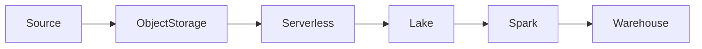

# CLAUDE CODE TASK — BUILD 40 COMPLETE PRACTICE QUESTIONS AND SOLUTIONS

## TARGET FILE

`17-Cloud-Storage-and-Cloud-Data-Platforms/practice-questions.md`

---

# ROLE

Act as a **Senior Data Engineer with 10+ years of production industry experience**, specializing in:

- Cloud Data Engineering
- AWS
- Google Cloud
- Azure
- Object Storage
- Data Lakes
- Lakehouses
- Cloud Warehouses
- Python Data Engineering
- Distributed Data Processing
- Serverless Data Processing
- Apache Spark
- Data Security
- IAM
- Cloud Cost Optimization
- Production Data Platforms

You are also an expert technical educator and interviewer.

Your job is to create a **complete, production-oriented practice-question and solution bank** for:

# Module 2.17 — Cloud Storage and Cloud Data Platforms

The practice questions must be based **strictly on the concepts and topics already taught in the files under**:

`17-Cloud-Storage-and-Cloud-Data-Platforms/`

---

# 1. ABSOLUTE FILE-SCOPE RULE

You may modify **ONLY**:

```text
17-Cloud-Storage-and-Cloud-Data-Platforms/practice-questions.md
```

### DO NOT MODIFY ANY OTHER FILE

Absolutely do NOT modify:

```text
README.md

01-object-storage-s3-gcs-and-adls.md
02-boto3-and-s3-operations.md
03-fsspec-and-cloud-agnostic-file-access.md
04-iam-roles-and-least-privilege-for-pipelines.md
05-cloud-warehouses-snowflake-bigquery-and-redshift.md
06-python-warehouse-connectors-and-bulk-loads.md
07-serverless-data-processing.md
08-managed-spark-databricks-emr-and-dataproc.md
09-storage-classes-and-lifecycle-policies.md
```

Also do NOT modify:

- any file outside this folder
- roadmap files
- source files
- Python files
- configuration files
- project files
- scripts
- notebooks
- any other artifact

### CRITICAL

The final task must result in:

```text
ONLY practice-questions.md changed
```

Before finishing, inspect the file/diff state and verify that **no other file was modified**.

---

# 2. SOURCE-OF-TRUTH RULE

Before writing the questions, you MUST inspect and study **all nine learning files**:

```text
01-object-storage-s3-gcs-and-adls.md
02-boto3-and-s3-operations.md
03-fsspec-and-cloud-agnostic-file-access.md
04-iam-roles-and-least-privilege-for-pipelines.md
05-cloud-warehouses-snowflake-bigquery-and-redshift.md
06-python-warehouse-connectors-and-bulk-loads.md
07-serverless-data-processing.md
08-managed-spark-databricks-emr-and-dataproc.md
09-storage-classes-and-lifecycle-policies.md
```

Also inspect:

```text
README.md
```

and the Module 2.17 roadmap if it is available in the repository/context.

The learning files are the **primary educational source**.

Do NOT invent topics that were not taught in these files.

Do NOT silently replace the module's terminology with unrelated terminology.

Do NOT create questions from technologies that belong to later modules unless the existing Module 2.17 files explicitly teach or reference them as part of this module.

---

# 3. FIRST ANALYZE THE COMPLETE MODULE

Before generating the final questions, internally build a coverage map of:

```text
Topic 01
Topic 02
Topic 03
Topic 04
Topic 05
Topic 06
Topic 07
Topic 08
Topic 09
```

For each topic identify:

- major concepts
- sub-concepts
- terminology
- Python concepts
- cloud services
- architecture concepts
- security concepts
- performance concepts
- cost concepts
- operational concepts
- failure scenarios
- production patterns
- hands-on concepts
- trade-offs
- decision-making concepts

Then create an internal coverage matrix:

| Topic | Basic | Moderate | Hard | Advanced |
|---|---:|---:|---:|---:|
| 01 Object Storage | | | | |
| 02 boto3/S3 | | | | |
| 03 fsspec | | | | |
| 04 IAM | | | | |
| 05 Cloud Warehouses | | | | |
| 06 Warehouse Connectors | | | | |
| 07 Serverless | | | | |
| 08 Managed Spark | | | | |
| 09 Storage Classes/Lifecycle | | | | |

The matrix must demonstrate that the final 40 questions provide **meaningful coverage across the entire module**.

Do NOT merely produce 40 random questions.

---

# 4. EXACT QUESTION COUNT

You MUST produce exactly:

```text
10 BASIC
10 MODERATE
10 HARD
10 ADVANCED
----------------
40 TOTAL QUESTIONS
```

No more.

No fewer.

Do not accidentally create 41 or 39.

Every question must have:

```text
Problem
↓
Solution
```

The solution must immediately follow the problem.

---

# 5. REQUIRED DIFFICULTY PROGRESSION

The difficulty levels must genuinely increase.

Use this progression:

```text
BASIC
↓
Recall + Understanding + Simple Application

MODERATE
↓
Application + Small Design Decisions + Coding

HARD
↓
Multi-concept Problems + Debugging + Architecture + Trade-offs

ADVANCED
↓
Production Architecture + Cost + Security + Reliability
+ Cross-cloud Reasoning + Complex Trade-offs
```

Do NOT simply label easy questions as "Advanced".

Difficulty must reflect the reasoning required.

---

# 6. BASIC QUESTIONS — 10

Create exactly 10 Basic questions.

Basic questions should test foundational understanding.

They may include:

- definitions
- conceptual differences
- simple architecture
- simple Python
- simple cloud-storage operations
- basic security
- basic cost concepts
- basic service identification
- basic lifecycle concepts

Examples of appropriate areas:

### Object Storage

- bucket/object/key/prefix
- object storage vs filesystem
- S3/GCS/ADLS

### boto3

- client
- `put_object`
- `get_object`
- `head_object`
- listing

### fsspec

- filesystem abstraction
- protocols
- `s3://`
- `gs://`
- `abfs://`

### IAM

- role
- temporary credentials
- least privilege

### Warehouses

- Snowflake vs BigQuery vs Redshift at a conceptual level

### Connectors

- why bulk loading is preferable to row-by-row insertion

### Serverless

- functions
- triggers
- serverless query engines

### Managed Spark

- managed Spark
- cluster vs serverless
- job cluster vs interactive cluster

### Lifecycle

- storage classes
- lifecycle transitions
- expiration

Basic questions should NOT require complex architecture.

---

# 7. MODERATE QUESTIONS — 10

Create exactly 10 Moderate questions.

These must require practical application.

Include concepts such as:

- Python implementation
- boto3 pagination
- retries
- multipart transfers
- fsspec storage abstraction
- cloud-agnostic pipeline design
- IAM policies
- warehouse loading
- bulk Parquet loading
- serverless idempotency
- DLQs
- managed Spark deployment concepts
- lifecycle policy design

Questions should require the learner to **do something**, not simply define something.

Examples:

- Design an S3 listing function using pagination.
- Write a safe object-download function.
- Refactor a local file reader to support S3/GCS/local using fsspec.
- Design a least-privilege role for an ingestion pipeline.
- Select a warehouse for a stated workload.
- Design a bulk-loading workflow.
- Design an idempotent serverless file processor.
- Choose job compute vs interactive compute.
- Design a basic lifecycle policy for landing/tmp data.

---

# 8. HARD QUESTIONS — 10

Create exactly 10 Hard questions.

Hard questions must combine multiple concepts.

Examples of appropriate complexity:

```text
Object Storage
+
IAM
+
boto3
+
fsspec
```

or:

```text
Cloud Storage
+
Serverless
+
Warehouse
+
Cost
```

or:

```text
Managed Spark
+
IAM
+
Lakehouse
+
Airflow
+
Cost
```

Hard questions should involve:

- debugging
- architecture
- performance
- failure handling
- security
- cost
- implementation
- trade-offs

Examples:

### Example Hard Scenario

A pipeline receives 10,000 files daily in S3.

The current implementation:

- lists without pagination
- downloads every file
- stores credentials in environment variables shared across developers
- inserts records one row at a time
- runs a long-lived Spark cluster
- has no lifecycle policy

Ask the learner to:

1. identify problems
2. redesign the pipeline
3. explain security
4. explain performance
5. explain cost
6. explain lifecycle management

The solution must demonstrate integrated knowledge.

---

# 9. ADVANCED QUESTIONS — 10

Create exactly 10 Advanced questions.

These must resemble **senior Data Engineer / production architecture problems**.

Advanced questions should require the learner to reason about multiple dimensions simultaneously:

```text
Architecture
+
Security
+
Reliability
+
Performance
+
Cost
+
Operations
+
Cloud Services
+
Data Lifecycle
```

Use realistic production scenarios.

Examples:

- Design a cloud-native orders platform.
- Migrate an on-premise pipeline to AWS.
- Design a multi-cloud storage abstraction.
- Reduce a large cloud data bill.
- Design a secure managed Spark platform.
- Diagnose a production pipeline with unexpected storage and retrieval costs.
- Design a serverless ingestion architecture that protects a warehouse from fan-out.
- Select between Snowflake, BigQuery, Redshift, Spark, DuckDB, and serverless query engines.
- Design lifecycle policies without breaking Delta/Iceberg.
- Design an end-to-end cloud data platform with least privilege.

Advanced questions should not be solvable by memorizing definitions.

They must require engineering judgment.

---

# 10. EVERY QUESTION MUST FOLLOW THIS FORMAT

Use this exact overall structure:

```markdown
## Question 01 — <Title>

### Difficulty
Basic

### Topics Covered
- Topic 01 — Object Storage
- Topic 02 — boto3

### Problem

<Problem statement>

### Solution

<Step-by-step solution>

### Why This Solution Works

<Explanation>

### Key Takeaways

- ...
- ...
- ...
```

Repeat for every question.

For Moderate, Hard, and Advanced questions, add sections when appropriate:

```markdown
### Approach

### Implementation

### Architecture

### Trade-offs

### Failure Scenarios

### Production Considerations
```

Do NOT force unnecessary sections onto simple questions.

---

# 11. MANDATORY PROBLEM → SOLUTION RULE

This is extremely important.

For **ALL 40 QUESTIONS**:

First introduce the problem.

Then immediately introduce the solution.

Never create a section containing only questions followed by a separate answer key.

The required pattern is:

```text
Question 01
Problem
Solution

Question 02
Problem
Solution

Question 03
Problem
Solution
```

and so on.

---

# 12. SOLUTION QUALITY

Every solution must explain:

1. What the problem is asking.
2. How to approach it.
3. Why the approach is appropriate.
4. The implementation or architecture.
5. Why the solution works.
6. Important trade-offs.
7. Production considerations where relevant.

Do NOT provide one-line answers.

The solutions should teach the learner.

---

# 13. CODING QUESTIONS

Include practical coding questions.

Use technologies actually taught in Module 2.17, including where relevant:

- Python
- boto3
- fsspec
- pandas
- Polars
- PyArrow
- DuckDB
- Snowflake Python connector
- Google BigQuery Python client
- Redshift connector
- PySpark
- Airflow concepts
- lifecycle configuration
- cloud APIs

Code examples should be:

- readable
- correct
- production-oriented
- secure
- explained

Never include:

```python
AWS_ACCESS_KEY_ID = "..."
AWS_SECRET_ACCESS_KEY = "..."
```

or fake credentials.

Use placeholders/configuration/roles where needed.

---

# 14. OBJECT STORAGE COVERAGE

Across the 40 questions, ensure coverage of:

- buckets
- objects
- keys
- prefixes
- metadata
- URIs
- object vs file
- consistency
- versioning
- encryption
- object lock/immutability where taught
- replication
- multipart uploads
- checksums
- ETags
- conditional requests
- request costs
- retrieval
- data transfer
- performance
- Parquet access
- S3
- GCS
- ADLS
- MinIO where taught

Do not force every concept into one question.

Distribute them naturally.

---

# 15. BOTO3 / S3 COVERAGE

Ensure questions cover:

- sessions
- clients
- credentials/provider chain
- core S3 operations
- `put`
- `get`
- `head`
- copy
- delete
- list
- pagination
- prefixes
- delimiters
- managed transfers
- `TransferConfig`
- multipart transfers
- retries
- throttling / `SlowDown`
- timeout handling
- `ClientError`
- presigned URLs
- conditional operations
- concurrency
- thread-safety concepts
- batch operations
- moto
- MinIO testing

---

# 16. FSSPEC COVERAGE

Ensure questions cover:

- filesystem abstraction
- protocols
- S3
- GCS
- ADLS
- local
- memory filesystem
- `fsspec.open`
- `fsspec.url_to_fs`
- `ls`
- `glob`
- `exists`
- `put`
- `get`
- `storage_options`
- Pandas
- Polars
- PyArrow
- DuckDB
- caching
- block reads
- range requests
- UPath
- storage-agnostic pipeline design
- small-file performance
- listing-cache considerations

---

# 17. IAM / SECURITY COVERAGE

Ensure questions cover:

- authentication vs authorization
- IAM roles
- service identities
- temporary credentials
- STS/assume-role concepts
- credential provider chains
- workload identity federation
- OIDC where taught
- least privilege
- resource policies
- identity policies
- explicit deny
- conditions
- prefix-level permissions
- human vs workload identity
- separation of duties
- break-glass awareness
- KMS/encryption integration
- auditability
- access-denied troubleshooting

At least some questions must require the learner to design permissions rather than simply define IAM.

---

# 18. CLOUD WAREHOUSE COVERAGE

Ensure questions cover:

### Snowflake

- architecture
- virtual warehouses
- storage/compute separation
- micro-partitions
- clustering concepts
- stages
- loading
- cost model
- caching
- Time Travel
- zero-copy cloning where taught

### BigQuery

- serverless architecture
- datasets
- bytes scanned
- partitioning
- clustering
- slots/concurrency concepts
- load jobs
- Storage Read API where taught
- query cost

### Redshift

- cluster/serverless concepts
- distribution
- sort keys
- COPY
- storage/compute architecture
- workload selection

Also test:

- warehouse selection
- cost trade-offs
- performance
- lakehouse integration where taught

---

# 19. PYTHON WAREHOUSE CONNECTOR COVERAGE

Ensure questions cover:

- DB-API concepts
- parameterized queries
- secure authentication
- query tagging/labels
- row-by-row inserts vs bulk loading
- Parquet staging
- Snowflake `COPY`
- BigQuery load jobs
- Redshift `COPY`
- DataFrame loading
- schema handling
- error/quarantine handling
- Arrow extraction
- BigQuery Storage Read API
- unload/extract patterns
- bounded-memory extraction
- batch vs microbatch vs streaming
- idempotency
- staging
- MERGE
- file registries
- cost-aware extraction

---

# 20. SERVERLESS COVERAGE

Ensure questions cover:

- serverless functions
- Lambda
- Cloud Run Functions / equivalent concepts
- Azure Functions
- triggers
- object-storage events
- schedules
- queues
- HTTP
- Python packaging
- dependency layers
- container images
- cold starts
- runtime limits
- memory/CPU
- temporary storage
- payload limits
- concurrency
- event-driven file processing
- idempotency
- duplicate events
- out-of-order events
- serverless query engines
- Athena
- BigQuery
- serverless Spark awareness
- state machines vs Airflow
- fan-out
- backpressure
- reserved concurrency
- queues
- batching
- retries
- DLQs
- partial batch failure
- observability
- when serverless is the wrong choice

---

# 21. MANAGED SPARK COVERAGE

Ensure questions cover:

### General

- managed Spark
- cluster vs serverless
- job clusters
- interactive clusters
- packaged PySpark jobs
- entry points
- arguments
- dependencies

### Databricks

- workspaces
- compute
- jobs
- notebooks
- Git-based projects
- Unity Catalog
- Delta Lake
- declarative pipeline awareness
- bundle-based deployment awareness

### EMR

- EC2
- EKS
- Serverless
- clusters
- steps/jobs
- storage/catalog integration

### Dataproc

- clusters
- jobs
- serverless
- Cloud Storage integration
- catalog integration

### Operations

- Python dependencies
- JARs
- containers
- Spark UI
- logs
- debugging

### Cost

- right-sizing
- autoscaling
- spot/preemptible
- auto-termination
- job vs all-purpose compute
- cost tags

### Orchestration

- Airflow
- Dagster awareness
- provider integrations
- data intervals

### Security

- job roles
- least privilege
- network isolation
- secrets

### Platform selection

- managed Spark
- warehouse SQL
- DuckDB/Polars/single-node engines

---

# 22. STORAGE CLASSES / LIFECYCLE COVERAGE

Ensure questions cover:

- standard/frequent-access storage
- infrequent-access storage
- archive
- automatic tiering
- AWS S3
- GCS
- Azure
- retrieval costs
- minimum storage duration
- lifecycle transitions
- expiration
- noncurrent versions
- multipart cleanup
- landing
- bronze
- silver
- gold
- tmp
- logs
- prefix design
- small-object economics
- Delta/Iceberg safety
- VACUUM
- snapshot expiration
- Object Lock
- legal holds
- retention
- storage inventory
- storage analytics
- storage cost model
- growth rate
- retrieval patterns
- projected savings
- compression
- duplicate deletion
- cross-region transfer

---

# 23. CROSS-TOPIC QUESTIONS ARE REQUIRED

Do NOT make all 40 questions isolated topic quizzes.

A strong Data Engineer must connect the concepts.

Therefore include questions that combine multiple topics.

Examples:

### Object Storage + IAM

```text
Design a role that can write to landing/ but cannot read payroll/.
```

### boto3 + fsspec

```text
When should provider-specific boto3 logic be used versus cloud-agnostic fsspec?
```

### Storage + Warehouse

```text
Design an architecture that lands Parquet in object storage before bulk loading a warehouse.
```

### Serverless + Warehouse

```text
Design a file-triggered ingestion system that protects a warehouse from unbounded fan-out.
```

### Managed Spark + IAM

```text
Secure a Spark job so it can access only required lakehouse prefixes.
```

### Managed Spark + Cost

```text
Choose between fixed compute, autoscaling, and spot/preemptible capacity.
```

### Lifecycle + Lakehouse

```text
Design lifecycle policies without deleting active Delta/Iceberg files.
```

### Full Platform

```text
Design a secure, cost-controlled cloud data platform.
```

---

# 24. QUESTION DISTRIBUTION

Aim for approximately this conceptual distribution:

| Topic | Target Coverage |
|---|---:|
| 01 Object Storage | 4–6 questions |
| 02 boto3/S3 | 4–5 questions |
| 03 fsspec | 3–4 questions |
| 04 IAM | 4–5 questions |
| 05 Warehouses | 5–6 questions |
| 06 Connectors/Bulk Loads | 3–4 questions |
| 07 Serverless | 4–5 questions |
| 08 Managed Spark | 4–5 questions |
| 09 Lifecycle/Cost | 4–5 questions |

These are **coverage targets**, not rigid quotas.

Cross-topic questions may count toward multiple areas.

The most important requirement is that **all topics and major concepts are meaningfully represented**.

---

# 25. INCLUDE DIFFERENT QUESTION TYPES

Across the 40 questions, use a mixture of:

- conceptual questions
- explain-in-your-own-words questions
- coding problems
- debugging problems
- architecture problems
- design problems
- cost-analysis problems
- security problems
- troubleshooting scenarios
- comparison questions
- decision-making questions
- implementation exercises
- production incidents

Do NOT make all questions multiple-choice.

The majority should require written reasoning or implementation.

---

# 26. PRODUCTION SCENARIOS

Especially in Hard and Advanced sections, use realistic scenarios.

Examples:

### Scenario — Unexpected S3 Cost

A data lake's storage bill increased significantly.

Ask the learner to investigate:

- storage growth
- old versions
- tiny files
- incomplete multipart uploads
- lifecycle
- retrieval
- duplication
- cross-region transfer

---

### Scenario — AccessDenied

A Spark job suddenly cannot read its input path.

Ask:

- what should be checked?
- IAM role?
- resource policy?
- prefix?
- KMS?
- network?
- credentials?

---

### Scenario — Warehouse Loading Bottleneck

A pipeline inserts millions of rows one at a time.

Ask the learner to redesign it using:

- Parquet
- object storage
- bulk loading
- staging
- MERGE

---

### Scenario — Serverless Fan-Out

10,000 files arrive simultaneously.

Ask how to prevent:

```text
10,000 functions
        ↓
10,000 database connections
        ↓
database overload
```

---

### Scenario — Spark Cost Explosion

A managed Spark workload's monthly cost doubled.

Ask the learner to investigate:

- cluster sizing
- idle clusters
- job vs interactive compute
- autoscaling
- spot/preemptible
- runtime
- retries
- data volume
- cost tags

---

# 27. CLOUD-AGNOSTIC THINKING

Because the module teaches AWS primarily while mapping GCP and Azure equivalents, questions should occasionally require:

```text
AWS
↔
Google Cloud
↔
Azure
```

Examples:

- S3 ↔ GCS ↔ ADLS
- IAM ↔ Google IAM ↔ Azure RBAC/managed identity concepts
- Lambda ↔ Google/Azure function equivalents
- EMR ↔ Dataproc
- S3 lifecycle ↔ GCS/Azure lifecycle management
- warehouse comparisons

Do NOT claim services are exact equivalents when they are not.

Focus on transferable architectural concepts.

---

# 28. COST REASONING

Cost must appear throughout the question bank, especially Hard and Advanced.

Teach the learner to consider:

```text
Storage
+
Requests
+
Retrieval
+
Compute
+
Data Transfer
+
Scans
+
Idle Time
+
Retries
+
Versioned Data
```

Questions should require cost reasoning rather than memorizing prices.

Do NOT use fabricated current pricing.

Use variables or clearly marked illustrative numbers.

---

# 29. SECURITY RULE

No question solution may recommend:

- hard-coded credentials
- committing secrets to Git
- root-account usage for normal workloads
- overly broad permissions when least privilege is possible
- disabling security controls as a shortcut

Solutions should prefer:

- IAM roles
- temporary credentials
- workload identities
- least privilege
- encryption
- secret managers where taught
- private networking where appropriate
- auditability

---

# 30. ARCHITECTURE DIAGRAMS

For complex questions, use Mermaid diagrams where useful.

Example:



Use diagrams only when they improve understanding.

---

# 31. SOLUTION DEPTH BY DIFFICULTY

### Basic

Solutions should be concise but educational.

### Moderate

Solutions should include practical implementation.

### Hard

Solutions should include:

- reasoning
- implementation
- trade-offs
- failure considerations

### Advanced

Solutions should include:

- architecture
- security
- cost
- reliability
- scalability
- operational considerations
- trade-offs
- alternatives
- senior-engineering reasoning

---

# 32. REQUIRED DOCUMENT STRUCTURE

The final `practice-questions.md` should have this structure:

```markdown
# Module 2.17 — Cloud Storage and Cloud Data Platforms
# Practice Questions and Solutions

## How to Use This Practice Set

<short explanation>

## Coverage Map

<topics and difficulty coverage>

---

# Part I — Basic

## Question 01 — ...
### Difficulty
Basic

### Topics Covered
...

### Problem
...

### Solution
...

### Why This Solution Works
...

### Key Takeaways
...

...

## Question 10 — ...

---

# Part II — Moderate

## Question 11 — ...
...

## Question 20 — ...

---

# Part III — Hard

## Question 21 — ...
...

## Question 30 — ...

---

# Part IV — Advanced

## Question 31 — ...
...

## Question 40 — ...

---

# Final Module Coverage Checklist

...
```

---

# 33. NUMBERING MUST BE EXACT

Use:

```text
01–10   Basic
11–20   Moderate
21–30   Hard
31–40   Advanced
```

Do not restart numbering at 1 for each section.

---

# 34. FINAL MODULE COVERAGE CHECKLIST

At the end of `practice-questions.md`, include a checklist showing that the 40 questions collectively cover:

```text
[ ] Object Storage
[ ] S3
[ ] GCS
[ ] ADLS
[ ] boto3
[ ] S3 operations
[ ] Pagination
[ ] Multipart transfers
[ ] Retries
[ ] Presigned URLs
[ ] fsspec
[ ] S3/GCS/ADLS abstraction
[ ] Pandas/Polars/PyArrow/DuckDB
[ ] IAM
[ ] Least privilege
[ ] Temporary credentials
[ ] Workload identity
[ ] Cloud Warehouses
[ ] Snowflake
[ ] BigQuery
[ ] Redshift
[ ] Bulk loading
[ ] Python connectors
[ ] Serverless
[ ] Event triggers
[ ] Idempotency
[ ] DLQs
[ ] Serverless query engines
[ ] Managed Spark
[ ] Databricks
[ ] EMR
[ ] Dataproc
[ ] Job clusters
[ ] Serverless Spark
[ ] Spark dependencies
[ ] Spark UI/logs
[ ] Spark cost optimization
[ ] Airflow/Dagster orchestration
[ ] Managed Spark security
[ ] Storage classes
[ ] Lifecycle policies
[ ] Version cleanup
[ ] Multipart cleanup
[ ] Small-object economics
[ ] Delta/Iceberg lifecycle safety
[ ] Compliance/retention
[ ] Storage inventory
[ ] Storage cost modeling
[ ] Cross-cloud architecture
[ ] Production architecture
```

---

# 35. FINAL QUALITY STANDARD

The practice set must feel like it was designed by a **Senior Data Engineer**, not generated as a collection of textbook questions.

Every question should answer at least one of these:

> Can the learner explain the concept?

> Can the learner implement it?

> Can the learner debug it?

> Can the learner design it?

> Can the learner secure it?

> Can the learner optimize it?

> Can the learner estimate its cost?

> Can the learner make the correct production trade-off?

The Advanced questions should particularly test engineering judgment.

---

# 36. IMPORTANT: DO NOT TEACH OUTSIDE THE MODULE

Stay strictly within the knowledge boundary of:

```text
17-Cloud-Storage-and-Cloud-Data-Platforms/
```

Do not introduce unrelated technologies merely to make the questions harder.

If a concept is mentioned from another module, use it only where the existing Module 2.17 files explicitly rely on it.

Examples include:

- Spark from Module 2.14
- table formats from Module 2.15
- Airflow from Module 2.13
- concurrency from Module 2.10
- data validation from Module 2.11

These may be used as dependencies because Module 2.17 explicitly builds upon them.

But the question must remain a **Module 2.17 cloud-platform question**.

---

# 37. DO NOT FABRICATE PRICING OR SERVICE LIMITS

Cloud pricing, quotas, limits, and service capabilities change.

Therefore:

- Do not present invented prices.
- Do not present obsolete limits as current facts.
- Use illustrative numbers only when clearly labeled.
- Prefer cost equations and relative reasoning.
- If a provider-specific exact number is required, state that current provider documentation should be checked.

---

# 38. FINAL VALIDATION BEFORE FINISHING

Before saving the final file, perform all of these checks.

## Count

Verify:

```text
Basic      = 10
Moderate   = 10
Hard       = 10
Advanced   = 10
----------------
Total      = 40
```

## Structure

Verify every question contains:

```text
Question
↓
Problem
↓
Solution
```

## Coverage

Verify all nine Module 2.17 files are represented.

## Difficulty

Verify the difficulty genuinely increases.

## Solutions

Verify every question has a complete solution.

## Coding

Verify practical coding problems exist.

## Architecture

Verify architecture/design problems exist.

## Security

Verify IAM/security problems exist.

## Cost

Verify cost reasoning appears throughout the module.

## Cross-cloud

Verify AWS/GCP/Azure concepts are appropriately represented.

## Production

Verify Hard and Advanced questions contain realistic production scenarios.

## File safety

Verify:

```text
ONLY:
17-Cloud-Storage-and-Cloud-Data-Platforms/practice-questions.md
```

was modified.

No other file or folder may be changed.

---

# 39. FINAL INSTRUCTION

Do not merely create an outline.

Do not create placeholder questions.

Do not create questions without solutions.

Do not create a separate answer key.

Do not skip topics.

Do not duplicate the same concept 10 times.

Do not make all questions theoretical.

Do not make all questions coding exercises.

Create a balanced, progressive, production-oriented set of exactly:

```text
10 Basic
10 Moderate
10 Hard
10 Advanced
```

for a total of:

# 40 PRACTICE QUESTIONS WITH COMPLETE SOLUTIONS

Write the final content directly into:

```text
17-Cloud-Storage-and-Cloud-Data-Platforms/practice-questions.md
```

and **do not modify anything else**.