# 02 — Serving Aggregates and Caching Layers

> **Stage:** Stage 2 — Python for Data Engineering  
> **Module:** 2.22 — Serving Data for Analytics, ML, and AI  
> **Topic:** 02 — Serving Aggregates and Caching Layers  
> **Role:** Senior Data Engineer / Data Platform Engineer  
> **Primary stack:** Python 3.12+, FastAPI, PostgreSQL, DuckDB, Redis-compatible cache, PyArrow/Parquet where useful

---

## 1. Module Objective

This topic teaches how to transform expensive analytical workloads into **fast, predictable, fresh, secure, and cost-aware serving paths**.

The central progression is:

```text
Raw / Modelled Data
        ↓
Precompute expensive work
        ↓
Aggregate / Materialize
        ↓
Choose serving storage
        ↓
Cache where appropriate
        ↓
Control freshness
        ↓
Protect against stampedes
        ↓
Measure latency, hit rate, load, and cost
```

The target is not simply:

> "I know Redis."

The target is:

> "I can decide what should be precomputed, where it should live, whether it should be cached, how fresh it must be, how the cache remains secure and consistent, and how the whole serving path behaves under production load."

---

# 2. Where This Topic Fits

Topic 01 introduced FastAPI Data Services.

This topic builds the serving path behind those APIs.

```text
01 — FastAPI Data Services
        ↓
02 — Serving Aggregates and Caching Layers
        ↓
03 — Semantic Layers and Metric Definitions
        ↓
04 — Feature Stores and ML Handoff
        ↓
05 — Embedding and Vector Data Pipelines
```

The boundary for this file is:

```text
Aggregate serving
+
Caching
+
Freshness
+
Performance
+
Capacity
+
Cost
```

Later modules may consume the serving layer, but their detailed implementation belongs elsewhere.

---

# 3. Why Serving Layers Exist

Imagine an API endpoint:

```http
GET /dashboard/sales
```

Every request executes:

```text
Orders
   ↓
JOIN Customers
   ↓
JOIN Products
   ↓
GROUP BY
   ↓
SUM / COUNT / AVG
   ↓
Time filtering
   ↓
Response
```

If 10,000 clients request the same dashboard, the system may repeatedly perform essentially the same work.

That creates:

- CPU cost;
- I/O cost;
- memory pressure;
- database concurrency;
- latency;
- repeated computation;
- infrastructure cost.

The core idea is:

```text
Compute once
    ↓
Store useful result
    ↓
Serve many times
```

This is the reason serving architectures exist.

---

## 3.1 The Two Questions

For every expensive query ask:

1. **Can the expensive work be done before the request arrives?**
2. **If the result is requested repeatedly, can it be reused?**

The first question leads to:

```text
Preaggregation
Rollups
Summary tables
Materialized views
```

The second leads to:

```text
Caching
```

These are related but not identical.

---

# 4. Serving Contract

Serving design must begin with the consumer rather than with a cache product.

## Serving Contract

### Consumer

Who needs this data?

Examples:

- dashboard;
- customer-facing application;
- internal operations tool;
- analytics application.

### Shape

What data is required?

### Latency

How quickly must it be available?

### Freshness

How old can the data be?

### Availability

What happens if a dependency is unavailable?

### Access Rules

Which rows and scopes can the consumer see?

### Cost

How much computation and infrastructure can this serving path consume?

A practical template:

```markdown
## Serving Contract

### Consumer
Dashboard used by regional operations teams.

### Shape
Daily revenue grouped by region.

### Latency
p95 under 500 ms.

### Freshness
No more than 5 minutes stale.

### Availability
Must remain useful during short cache failures.

### Access Rules
Users can see only authorized regions.

### Cost
Avoid repeatedly scanning the raw orders fact table.
```

This contract determines the architecture.

---

# 5. Latency Requirements

Different consumers have different expectations.

Typical categories are:

```text
Product/API requests
→ milliseconds to hundreds of milliseconds

Dashboards
→ sub-second to seconds

Analytical consumers
→ seconds to minutes
```

These are design categories, not universal SLAs.

A product API may need predictable low latency.

A dashboard might tolerate one or two seconds.

An analyst may accept a query that takes tens of seconds.

Therefore:

> Never choose a serving technology before understanding the consumer's latency requirement.

---

## 5.1 Latency Is Not the Only Requirement

A 50 ms response is not automatically good.

Suppose:

```text
Latency = 50 ms
Freshness = 2 hours stale
```

For a real-time operations dashboard, this could be unacceptable.

Conversely:

```text
Latency = 1.5 seconds
Freshness = 30 seconds
```

may be perfectly acceptable for another consumer.

Serving quality is multidimensional:

```text
Correctness
+
Freshness
+
Latency
+
Availability
+
Security
+
Cost
```

---

## Checkpoint

You should now be able to:

- explain why serving layers exist;
- distinguish precomputation from caching;
- define a serving contract;
- explain why latency and freshness must be considered together.

### Quick questions

1. Why is repeating an expensive aggregation wasteful?
2. When would a dashboard need preaggregation?
3. Why is a latency target meaningless without a consumer?
4. Can a fast response still be unacceptable? Why?

---

# 6. Preaggregation Fundamentals

Preaggregation means computing an aggregate before the consumer requests it.

Suppose raw orders contain:

```text
order_id
customer_id
product_id
region
created_at
amount
```

A dashboard repeatedly needs:

```text
revenue by region by day
```

Instead of calculating:

```text
Raw orders
    ↓
GROUP BY date, region
    ↓
SUM(amount)
```

for every request, create a serving table:

```text
daily_revenue_by_region
```

Then:

```text
API
 ↓
Small aggregate table
 ↓
Fast response
```

---

# 7. Compute on Request vs Compute Before Request

## Compute on request

```text
Request
  ↓
Read raw/modelled data
  ↓
Join
  ↓
Filter
  ↓
Aggregate
  ↓
Return
```

Advantages:

- freshest possible source data;
- flexible;
- fewer precomputed tables.

Disadvantages:

- repeated computation;
- variable latency;
- higher source load;
- higher cost.

## Compute before request

```text
Transformation job
       ↓
Aggregate
       ↓
Serving table
       ↓
Request
       ↓
Simple lookup
```

Advantages:

- predictable latency;
- reduced source load;
- repeated requests are cheap;
- easier capacity planning.

Disadvantages:

- storage;
- refresh complexity;
- possible staleness;
- backfill requirements;
- more data products to govern.

---

# 8. When to Preaggregate

Good candidates include:

- frequently requested queries;
- expensive joins;
- repeated `GROUP BY` operations;
- stable dimensions;
- high request volume;
- dashboard workloads;
- API workloads.

Example:

```text
daily revenue by region
```

is a strong candidate when thousands of consumers repeatedly ask for it.

A poor candidate may be:

```text
arbitrary analyst exploration
```

where filters and dimensions change constantly.

The rule is:

> Precompute what is repeatedly expensive and predictable; do not precompute everything.

---

# 9. Rollups

A rollup is an aggregate at a defined grain.

A common hierarchy is:

```text
Raw orders
    ↓
Hourly rollup
    ↓
Daily rollup
    ↓
Monthly rollup
```

The important concept is **grain**.

Examples:

```text
hour × region
day × region
day × product_category
month × customer
```

A rollup typically contains:

- dimensions;
- measures;
- time grain.

---

## 9.1 Rollup Example

Suppose:

```text
orders
```

contains millions of records.

Create:

```text
daily_revenue_by_region
```

with:

```text
business_date
region
orders
revenue
```

SQL:

```sql
CREATE TABLE daily_revenue_by_region AS
SELECT
    DATE(created_at) AS business_date,
    region,
    COUNT(*) AS orders,
    SUM(amount) AS revenue
FROM orders
GROUP BY
    DATE(created_at),
    region;
```

For production workloads, the table would normally be incrementally maintained rather than rebuilt blindly every time.

---

# 10. Choosing Rollup Grain

Choosing the wrong grain creates problems.

## Too fine

```text
minute × customer × product × region
```

may create enormous storage and refresh cost.

## Too coarse

```text
month × region
```

may not answer a dashboard needing daily data.

The grain should be driven by consumer questions.

A useful design statement is:

> One row represents one `<grain>` for one `<dimension combination>`.

For example:

> One row represents one region for one calendar day.

---

# 11. Incremental Rollups

Instead of rebuilding an entire rollup:

```text
10 years of orders
      ↓
recompute everything
```

process only the affected interval.

Example:

```text
Today's orders
      ↓
Update today's rollup
```

But correctness becomes more complicated when:

- late-arriving records appear;
- records are corrected;
- records are deleted;
- historical data is backfilled.

A production rollup therefore needs a defined refresh and correction strategy.

---

# 12. Late-Arriving Data

Suppose the daily rollup for:

```text
2026-10-05
```

was finalized at 00:05.

At 10:00, a late order arrives for October 5.

If the pipeline only processes today's date, the rollup remains incorrect.

Possible approaches include:

- reprocess a sliding time window;
- process correction events;
- maintain affected partitions;
- rebuild the impacted aggregate.

The correct choice depends on the source system and freshness contract.

---

## Checkpoint

You should now be able to:

- define a rollup grain;
- explain why grain affects flexibility and storage;
- design a daily aggregate;
- explain why late-arriving data matters.

### Quick questions

1. What is the grain of `daily_revenue_by_region`?
2. Why can a very fine-grained rollup be expensive?
3. Why might yesterday's rollup need to be recomputed today?
4. When is preaggregation a poor fit?

---

# 13. Summary Tables

A summary table is a persistent table containing precomputed business-oriented results.

Example:

```text
daily_sales_summary
```

Columns:

```text
date
region
product_category
orders
revenue
customers
```

Architecture:

```text
Raw / Modelled Data
       ↓
Transformation
       ↓
Summary Table
       ↓
API / Dashboard
```

Summary tables are useful because the serving query becomes much smaller.

---

## 13.1 Summary Table vs Fact Table

A fact table might contain:

```text
one row per order
```

A summary table might contain:

```text
one row per day × region × category
```

The summary table trades flexibility for predictable performance.

---

## 13.2 Refresh Strategies

A summary table can be refreshed using:

- scheduled batch processing;
- incremental processing;
- event-driven updates;
- partition replacement;
- sliding-window recomputation.

The strategy must match:

```text
Freshness requirement
+
Data arrival behavior
+
Correction requirements
```

---

# 14. Materialized Views

A normal database view stores a query definition.

Conceptually:

```text
View
 ↓
Query definition
 ↓
Compute when queried
```

A materialized view stores the query result:

```text
Materialized view
 ↓
Stored result
 ↓
Refresh when required
```

This shifts work from request time to refresh time.

---

## 14.1 PostgreSQL Example

```sql
CREATE MATERIALIZED VIEW daily_region_sales AS
SELECT
    DATE(created_at) AS business_date,
    region,
    COUNT(*) AS order_count,
    SUM(amount) AS revenue
FROM orders
GROUP BY
    DATE(created_at),
    region;
```

Refresh:

```sql
REFRESH MATERIALIZED VIEW daily_region_sales;
```

A production design must consider refresh duration and how readers behave during refresh.

---

## 14.2 Materialized View Tradeoff

The central tradeoff is:

```text
Freshness
    ↕
Query latency
    ↕
Refresh cost
```

A very frequently refreshed materialized view can shift the problem from request-time compute to refresh-time compute.

---

## 14.3 When to Use

Materialized views can be useful when:

- the query is expensive;
- the result is requested repeatedly;
- the query structure is stable;
- the database can manage refresh efficiently.

They may be less suitable when:

- refresh cost is enormous;
- the consumer requires near-real-time data;
- query patterns are highly dynamic.

---

# 15. Aggregate Design Decision

Use this decision process:

```text
Is the query expensive?
       ↓
Does it repeat frequently?
       ↓
Is its shape predictable?
       ↓
Does the consumer tolerate bounded freshness?
       ↓
YES → Preaggregate
```

If not:

```text
Consider serving the underlying data directly.
```

The goal is not maximum materialization.

The goal is the **right amount of materialization**.

---

# 16. Choosing Serving Storage

The roadmap considers:

```text
PostgreSQL
DuckDB
Key-value stores
Real-time analytical databases
```

The choice depends on access pattern.

---

# 17. PostgreSQL as Serving Storage

PostgreSQL is useful for:

- point lookups;
- indexed queries;
- relatively small serving datasets;
- transactional integration;
- structured aggregate tables.

Example:

```sql
SELECT
    business_date,
    region,
    revenue
FROM daily_revenue_by_region
WHERE business_date = $1
  AND region = $2;
```

An appropriate index can make this predictable.

---

## 17.1 Index Awareness

For a common query:

```sql
WHERE business_date = ?
  AND region = ?
```

a composite index may be appropriate:

```sql
CREATE INDEX idx_daily_revenue_region_date
ON daily_revenue_by_region (business_date, region);
```

The correct index depends on the real workload and query planner.

Use:

```sql
EXPLAIN
```

to inspect how PostgreSQL plans the query.

Do not treat indexes as magic.

Indexes add:

- storage;
- write/update cost;
- maintenance;
- planning considerations.

---

# 18. DuckDB for Read-Only Analytical Serving

DuckDB is an analytical query engine that can operate embedded in an application.

It can be useful for:

- local analytical queries;
- read-only serving;
- Parquet-backed datasets;
- embedded analytics;
- workloads where a full database service is unnecessary.

Example:

```sql
SELECT
    region,
    SUM(revenue) AS revenue
FROM read_parquet('daily_sales/*.parquet')
WHERE business_date >= DATE '2026-10-01'
GROUP BY region;
```

The important question is not:

> "Is DuckDB faster?"

The correct question is:

> "Does an embedded analytical engine fit this consumer, concurrency model, data size, and freshness requirement?"

---

# 19. Key-Value Stores

A key-value store is appropriate when access is predictable:

```text
key → value
```

Example:

```text
sales:region=APAC:date=2026-10-06
```

returns:

```json
{
  "orders": 12450,
  "revenue": 981234.50
}
```

Strengths:

- extremely fast lookup;
- predictable access;
- TTL support;
- natural cache interface.

Weaknesses:

- limited analytical flexibility;
- memory cost;
- invalidation complexity;
- serialization choices.

---

# 20. Real-Time Analytical Databases

Systems such as:

- ClickHouse;
- Druid;
- Pinot

are examples of analytical databases designed for high-performance analytical serving.

They can be useful when:

- analytical queries are too large for simple key-value lookup;
- low-latency aggregation is required;
- concurrent analytical reads are high;
- the workload has a real-time or near-real-time requirement.

This module does not turn them into separate courses.

The goal is to recognize the architectural tradeoff.

---

# 21. Storage Decision Matrix

| Access pattern | Candidate |
|---|---|
| Point lookup by indexed key | PostgreSQL |
| Small structured aggregate table | PostgreSQL |
| Embedded analytical query | DuckDB |
| Repeated exact key lookup | Redis-compatible KV |
| High-concurrency analytical serving | Real-time analytical DB |
| Large analytical artifact | Parquet/object storage |

These are starting points, not universal rules.

---

## Checkpoint

You should now be able to:

- explain when PostgreSQL is a good serving store;
- explain read-only DuckDB serving;
- explain key-value access;
- identify when a real-time analytical database may be appropriate.

### Quick questions

1. Why is a key-value store poor for arbitrary analytical exploration?
2. Why might DuckDB be useful for a read-only analytical artifact?
3. What does an index trade off?
4. When would a real-time analytical database be worth its operational complexity?

---

# 22. Cache Fundamentals

A cache is a faster temporary representation of data that can be reused.

A useful analogy:

> Instead of repeatedly going to the warehouse to retrieve the same item, keep frequently requested items somewhere closer and faster.

A cache has:

```text
Key
Value
Expiration / eviction policy
```

Basic flow:

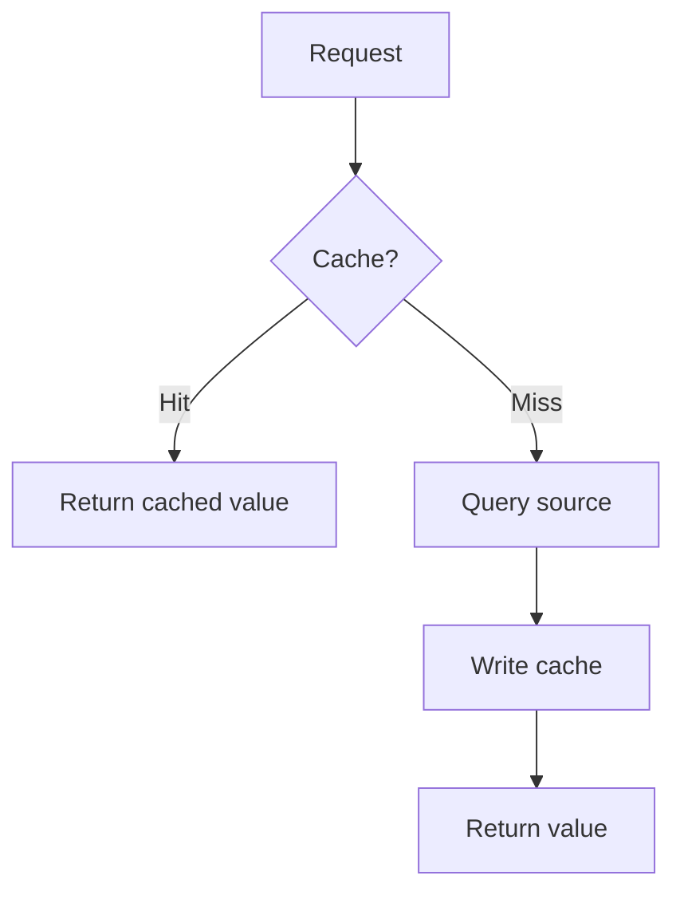

A cache should generally not be treated as the authoritative source unless the architecture explicitly makes it one.

---

# 23. Cache Hit and Cache Miss

## Cache hit

The requested value exists:

```text
Client
  ↓
Cache
  ↓
Response
```

## Cache miss

The value is absent:

```text
Client
  ↓
Cache miss
  ↓
Database / serving store
  ↓
Cache
  ↓
Response
```

The hit rate is:

```text
cache hits
------------
total requests
```

Example:

```text
100,000 requests
90,000 hits
10,000 misses
```

Therefore:

```text
Hit rate = 90%
Miss rate = 10%
```

---

# 24. Why Hit Rate Matters

Every miss may cause work against the source.

If:

```text
10 million requests
```

and:

```text
90% hit rate
```

then approximately:

```text
1 million source fetches
```

remain.

At:

```text
99% hit rate
```

approximately:

```text
100,000 source fetches
```

remain.

But:

> A higher hit rate is not automatically better.

A cache that costs significant memory and operational complexity may not be justified if source queries are already cheap.

---

# 25. TTL — Time To Live

TTL determines how long an entry remains valid in the cache.

Example:

```text
SET sales:APAC value
TTL = 300 seconds
```

After five minutes, the entry expires.

The tradeoff:

```text
Short TTL
→ fresher
→ more source queries

Long TTL
→ fewer source queries
→ potentially staler data
```

TTL should be derived from the freshness contract.

Do not choose:

```text
TTL = 3600
```

because one hour "sounds reasonable."

Instead ask:

> How stale can this consumer safely be?

---

# 26. Redis-Compatible Caching

Redis-compatible systems provide key-value access suitable for shared caching.

Core operations include:

```text
GET
SET
EXPIRE / TTL
```

Conceptual Python:

```python
import json


def serialize(value: dict) -> str:
    return json.dumps(value)


def deserialize(value: str) -> dict:
    return json.loads(value)
```

A cache client would then conceptually perform:

```python
cached = await cache.get(key)

if cached is not None:
    return deserialize(cached)

value = await load_from_source()
await cache.set(key, serialize(value), ex=300)

return value
```

The exact client API depends on the selected Redis-compatible implementation.

---

# 27. Cache Failure Principle

A cache is often an optimization layer.

If it fails, the system must have a deliberate policy.

Possible behavior:

```text
Cache unavailable
       ↓
Bypass cache
       ↓
Read source
```

or:

```text
Cache unavailable
       ↓
Serve known-safe stale data
```

or, for a critical dependency:

```text
Cache unavailable
       ↓
Fail request
```

The correct behavior depends on:

- freshness;
- availability;
- source capacity;
- security;
- consumer contract.

Never choose fail-open or fail-closed behavior without analyzing the data.

---

# 28. Cache-Aside

Cache-aside is one of the most common patterns.

Flow:

```text
Application
    ↓
Check cache
    ↓
Hit? ── Yes → Return
    │
    No
    ↓
Query source
    ↓
Write cache
    ↓
Return
```

The application controls cache population.

---

## 28.1 Python Example

```python
import json
from typing import Any


async def get_sales(
    key: str,
    cache: Any,
    source: Any,
) -> dict:
    cached = await cache.get(key)

    if cached is not None:
        return json.loads(cached)

    value = await source.fetch_sales()

    await cache.set(
        key,
        json.dumps(value),
        ex=300,
    )

    return value
```

The important design points are:

- cache first;
- source on miss;
- populate after successful source read;
- bounded TTL.

Production code must additionally handle serialization errors, cache failures, timeouts, source failures, and authorization scope.

---

# 29. Cache-Aside Failure Handling

Suppose the cache is down.

A cache-aside implementation should not automatically fail the whole API.

A common policy is:

```text
Try cache
  ↓
cache error
  ↓
log/measure
  ↓
read source
```

But this is safe only if the source can handle the additional load.

This leads to an important production relationship:

```text
Cache failure
    ↓
Cache misses increase
    ↓
Source load increases
    ↓
Source may become overloaded
```

Therefore cache failure is also a capacity-planning problem.

---

# 30. Read-Through

Read-through moves cache population into the cache layer.

Conceptually:

```text
Application
     ↓
Cache layer
     ↓
Source
```

The application asks the cache layer for a value.

If absent, the cache layer loads it from the source.

Comparison:

```text
Cache-aside:
Application controls miss logic.

Read-through:
Cache layer controls miss loading.
```

Read-through can centralize behavior but may introduce more infrastructure abstraction.

---

# 31. Write-Through

Write-through means writes pass through the cache and are synchronously propagated to persistent storage.

Conceptually:

```text
Application
     ↓
Cache
     ↓
Persistent store
```

Benefits can include:

- coordinated writes;
- predictable cache population.

Costs include:

- write latency;
- consistency complexity;
- more complicated failure behavior.

Write-through is not automatically the best pattern for analytical data serving, where data often flows from pipelines into read-optimized serving structures.

---

# 32. Refresh-Ahead

Refresh-ahead refreshes a hot value before it expires.

```text
Cache entry nearing expiry
        ↓
Refresh
        ↓
New value ready
```

This reduces the probability that a popular key expires exactly when many clients request it.

It is useful for:

- hot dashboards;
- popular API endpoints;
- predictable access patterns.

It adds refresh work, so it should be used selectively.

---

# 33. Cache Pattern Comparison

| Pattern | Read path | Write path | Advantages | Risks | Good use cases |
|---|---|---|---|---|---|
| Cache-aside | App checks cache | App controls population | Simple, explicit | Miss logic in app | Common read-heavy APIs |
| Read-through | Cache loads source | Usually cache-managed | Centralized read behavior | More abstraction | Standardized cache layer |
| Write-through | Cache then persistent store | Synchronous | Cache stays populated | Write latency/complexity | Read-after-write workloads |
| Refresh-ahead | Cache refreshes proactively | Background refresh | Predictable hot-key latency | Extra work | Very hot predictable keys |

---

## Checkpoint

You should now be able to:

- explain hit and miss;
- calculate hit rate;
- explain TTL;
- implement cache-aside conceptually;
- compare cache-aside, read-through, write-through, and refresh-ahead.

### Quick questions

1. What should happen after a cache miss?
2. Why can a cache failure overload the source?
3. When is refresh-ahead useful?
4. Why is write-through not automatically ideal for analytical serving?

---

# 34. Cache Key Design

Cache-key design is a production concern, not a naming detail.

This is dangerous:

```text
sales
```

because the result may depend on:

- region;
- date;
- dimensions;
- filters;
- consumer;
- authorization scope;
- data version.

A more explicit key might be:

```text
sales:region=APAC:date=2026-10-01:version=42
```

A cache key should represent every input that materially changes the cached result.

---

# 35. Deterministic Keys

Equivalent requests should produce equivalent keys.

For example:

```text
region=APAC
date=2026-10-01
```

should not sometimes produce:

```text
sales:date=2026-10-01:region=APAC
```

and elsewhere:

```text
sales:region=APAC:date=2026-10-01
```

unless the implementation deliberately treats those as equivalent.

Use a centralized key-builder:

```python
def sales_cache_key(
    *,
    region: str,
    business_date: str,
    data_version: str,
) -> str:
    return (
        f"sales:"
        f"region={region}:"
        f"date={business_date}:"
        f"version={data_version}"
    )
```

Centralization reduces inconsistent key formats.

---

# 36. Access-Scoped Cache Keys

This is critical.

Imagine:

```text
User A
  ↓
Cache
  ↓
Sensitive result
  ↓
User B
```

If the result depends on authorization scope but the cache key does not, User B may receive User A's result.

Therefore:

> Cache keys can be part of the security boundary.

Possible scope components include:

```text
tenant
region
role
permission set
user scope
```

Example:

```text
sales:
region=APAC:
role=regional_manager:
version=42
```

The exact scope depends on the authorization model.

---

# 37. Do Not Put Raw Secrets in Cache Keys

A cache key should not contain:

- passwords;
- access tokens;
- API secrets.

Use stable, non-sensitive authorization identifiers or a safe scope hash where appropriate.

The key should identify the permission context, not expose credentials.

---

# 38. Versioned Cache Keys

Suppose the current data version is:

```text
v42
```

The key becomes:

```text
sales:APAC:v42
```

When new data is published:

```text
v42
→
v43
```

New requests use:

```text
sales:APAC:v43
```

The old key becomes unused.

Architecture:

```text
Data publication
      ↓
New data_version
      ↓
New cache key
      ↓
Old cache naturally becomes unused
```

This can simplify invalidation.

---

# 39. Version-Based Invalidation

Instead of finding every old key and deleting it immediately, change the version used to generate keys.

For example:

```text
Current version = 42

sales:APAC:v42
sales:EU:v42
sales:US:v42
```

After publication:

```text
Current version = 43
```

All new requests use `v43`.

This is particularly useful when there are many parameter combinations.

Old entries can expire naturally.

---

# 40. Cache Invalidation

The classic question is:

> How do you know when cached data is no longer valid?

Strategies include:

```text
TTL
Explicit invalidation
Event-driven invalidation
Version-based invalidation
```

Cache invalidation is difficult because data dependencies can be complicated.

Suppose:

```text
orders
  ↓
daily revenue
  ↓
regional dashboard
  ↓
cached API response
```

An order correction can affect multiple derived results.

---

# 41. TTL-Based Invalidation

Simple model:

```text
Store
 ↓
TTL
 ↓
Expire
 ↓
Next request recomputes
```

Advantages:

- simple;
- bounded staleness;
- easy to reason about.

Disadvantages:

- stale data can remain until expiration;
- many keys may expire together;
- source load can spike after expiration.

TTL works best when bounded staleness is acceptable.

---

# 42. Event-Driven Invalidation

Architecture:

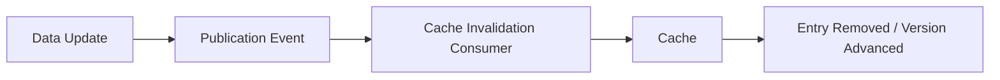

Possible event sources include:

- CDC;
- Kafka;
- data-publication events.

The event tells the serving layer:

> The underlying data changed.

The serving layer can then invalidate or advance its version.

This module uses event-driven invalidation as a serving pattern; detailed Kafka implementation belongs to the streaming module.

---

# 43. Freshness Contracts

A serving system is not successful merely because it is fast.

The contract should explicitly define:

```text
How fresh must the data be?
```

Example:

```text
Dashboard
≤ 5 minutes stale

Customer support
≤ 30 seconds stale

Historical reporting
≤ 1 hour stale
```

These are examples.

The real value is that freshness becomes measurable.

---

# 44. `as_of`

`as_of` tells the consumer the effective data timestamp.

Example:

```json
{
  "data": {
    "revenue": 981234.50
  },
  "as_of": "2026-10-06T10:00:00Z"
}
```

This answers:

> Up to what point in time does this result represent the underlying data?

It helps with:

- consumer trust;
- debugging;
- reproducibility;
- freshness monitoring.

---

# 45. `data_version`

`data_version` identifies the published data version.

Example:

```json
{
  "data": {
    "revenue": 981234.50
  },
  "as_of": "2026-10-06T10:00:00Z",
  "data_version": "v42"
}
```

This can be used for:

- cache keys;
- debugging;
- reproducibility;
- coordinated publication;
- invalidation.

---

# 46. `as_of` vs `data_version`

They answer different questions.

`as_of`:

> What time does this data represent?

`data_version`:

> Which published version produced this result?

Both can be useful.

```text
as_of = time semantics
data_version = publication identity
```

---

# 47. Knowingly Serving Stale Data

Stale does not automatically mean invalid.

Suppose:

```text
Freshness SLA = 5 minutes
Current data age = 2 minutes
```

The data is stale relative to "now", but still within the contract.

Compare:

```text
Stale but within contract
```

with:

```text
Too stale and contract-violating
```

The serving layer should know the difference.

---

# 48. Stale-While-Revalidate Awareness

A useful supporting pattern is:

```text
Serve slightly stale value
        +
Refresh in background
```

This can reduce latency while preserving a bounded freshness window.

It is especially useful for:

- hot keys;
- dashboards;
- data whose consumers tolerate small staleness.

The implementation must still define:

- maximum staleness;
- refresh failure behavior;
- observability.

---

## Checkpoint

You should now be able to:

- design deterministic cache keys;
- include authorization scope where necessary;
- explain versioned cache keys;
- distinguish `as_of` and `data_version`;
- define a freshness contract;
- explain why stale data can be acceptable.

### Quick questions

1. Why is `sales` a poor cache key?
2. Why can cache keys become security boundaries?
3. What does `data_version` solve?
4. Why should a response expose `as_of`?

---

# 49. Cache Stampede

A cache stampede occurs when many requests simultaneously miss the same cache entry and all perform the expensive source operation.

Example:

```text
Popular key
    ↓
TTL expires
    ↓
10,000 requests arrive
    ↓
10,000 cache misses
    ↓
10,000 database queries
```

This is also called a thundering herd.

The cache was intended to protect the source.

Instead, expiration causes the cache to amplify load.

---

# 50. Request Coalescing

Request coalescing ensures that many requests for the same missing key share one refresh.

Architecture:

```text
Many requests
      ↓
One refresh operation
      ↓
Cache populated
      ↓
Many consumers receive result
```

Conceptually:

```python
in_flight: dict[str, object] = {}
```

A production implementation needs concurrency-safe coordination and careful cleanup.

The key principle is:

> One expensive refresh should satisfy many equivalent requests.

---

# 51. Request Coalescing Conceptual Implementation

```python
import asyncio
from typing import Any


class CoalescingLoader:
    def __init__(self) -> None:
        self._locks: dict[str, asyncio.Lock] = {}

    def _lock_for(self, key: str) -> asyncio.Lock:
        lock = self._locks.get(key)

        if lock is None:
            lock = asyncio.Lock()
            self._locks[key] = lock

        return lock

    async def get_or_load(
        self,
        key: str,
        cache: Any,
        loader: Any,
    ) -> Any:
        cached = await cache.get(key)

        if cached is not None:
            return cached

        lock = self._lock_for(key)

        async with lock:
            cached = await cache.get(key)

            if cached is not None:
                return cached

            value = await loader()
            await cache.set(key, value)
            return value
```

This is educational code.

For multiple application instances, an in-process lock is insufficient because each process has its own lock state.

That is where distributed coordination becomes relevant.

---

# 52. Locks

A distributed cache refresh may use a distributed lock.

Conceptually:

```text
Request A
  ↓
Acquire lock
  ↓
Refresh cache

Request B/C/D
  ↓
Wait / serve safe stale value
```

A distributed lock requires careful handling of:

- lock ownership;
- expiration;
- process failure;
- retries;
- lock contention;
- duplicate refresh;
- clock and timing assumptions.

Never build a distributed lock as a simplistic:

```text
SET lock = true
```

without considering failure modes.

---

# 53. Early Refresh

Instead of waiting until:

```text
TTL = 0
```

refresh before expiration.

Example:

```text
TTL = 300 seconds

At ~250 seconds
      ↓
Refresh
```

Benefits:

- avoids synchronized expiry;
- reduces hot-key misses;
- improves latency predictability.

Costs:

- additional refresh work;
- background coordination;
- possible refresh waste for keys that are no longer popular.

Use it for hot or important keys, not every key.

---

# 54. Jitter

Suppose every entry has:

```text
TTL = 300 seconds
```

If a batch writes 1 million entries at the same time, many may expire together.

Instead:

```text
TTL = base TTL + jitter
```

For example:

```text
300 ± random small interval
```

This spreads expiration over time.

Jitter is a simple but powerful technique for reducing synchronized load.

---

# 55. Stampede Protection Strategy

A mature design can combine:

```text
Versioning
+
Jitter
+
Early refresh
+
Request coalescing
+
Distributed lock where necessary
+
Safe stale serving
```

Do not automatically use all of them.

Choose the minimum mechanism that satisfies the consumer and reliability contract.

---

# 56. Multilevel Caching

Caching can exist at several layers:

```text
Client
  ↓
HTTP / CDN Cache
  ↓
In-Process Cache
  ↓
Shared Cache
  ↓
Serving Database
  ↓
Warehouse / Lakehouse
```

Each level has different:

- latency;
- capacity;
- scope;
- consistency;
- failure behavior.

More caching layers do not automatically mean better performance.

---

# 57. In-Process Cache

An in-process cache stores data in application memory.

Advantages:

- extremely low latency;
- no network round trip.

Risks:

- process-local;
- separate workers have separate caches;
- memory limits;
- inconsistent entries;
- difficult global invalidation.

Example:

```text
Worker A → value v42
Worker B → value v41
```

Both can temporarily disagree.

---

# 58. Shared Cache

A shared Redis-compatible cache provides common state:

```text
Worker A ─┐
Worker B ─┼──> Shared Cache
Worker C ─┘
```

Advantages:

- shared across application instances;
- centralized cache state;
- easier coordination.

Costs:

- network latency;
- shared dependency;
- capacity management;
- availability considerations.

---

# 59. HTTP / CDN Cache Awareness

HTTP caching can sit outside the application.

```text
Client
  ↓
CDN / HTTP Cache
  ↓
API
```

Relevant concepts include:

```text
Cache-Control
ETag
If-None-Match
304 Not Modified
```

The exact HTTP mechanics were introduced in Topic 01.

Here the important question is:

> Where should a response be cached, and how does that layer interact with application-level caching?

For public or safely cacheable data, an HTTP/CDN layer can reduce application traffic substantially.

For user-scoped or sensitive data, cache policy must be designed carefully.

---

# 60. Warehouse / Query Result Cache Awareness

The analytical engine may already cache query results.

Architecture:

```text
Application cache
      ↓
Serving database
      ↓
Warehouse result cache
      ↓
Warehouse compute
```

Adding another cache can create complexity without meaningful improvement.

Before adding a cache ask:

1. Is there already a cache?
2. What is its hit rate?
3. What is its latency?
4. Does it satisfy the freshness requirement?
5. Does another cache materially reduce source load?

---

# 61. Cache Consistency

Independent cached responses can disagree.

Example:

```text
Dashboard:
Revenue = $1,000

Orders endpoint:
Orders = 100

Customer summary:
Revenue = $950
```

Each response may be internally valid according to its own cache state, but consumers see an inconsistent system.

Possible solutions:

- shared publication versions;
- coordinated invalidation;
- consistent snapshots;
- `data_version`;
- freshness metadata.

---

# 62. Publication Boundaries

One useful pattern is to publish a coherent data version.

```text
Build aggregates
      ↓
Validate
      ↓
Publish version 42
      ↓
Serving reads version 42
```

Then caches can use:

```text
version=42
```

instead of trying to independently infer whether every object is current.

This is especially valuable when multiple aggregate tables change together.

---

# 63. Capacity Planning

Caching is not free.

You need to estimate:

- number of keys;
- object size;
- memory overhead;
- TTL;
- working set;
- hot keys;
- eviction;
- replication;
- safety margin.

Basic estimate:

```text
Number of cached objects
×
Average object size
+
Overhead
+
Safety margin
```

---

# 64. Cache Memory Sizing Example

Suppose:

```text
1,000,000 objects
2 KB average payload
```

Raw payload:

```text
1,000,000 × 2 KB
≈ 2 GB
```

But actual memory will be higher because of:

- key storage;
- metadata;
- object representation;
- allocator overhead;
- replication;
- fragmentation;
- operational headroom.

Therefore:

> Raw payload size is not the same as required cache capacity.

---

# 65. Average vs P95 Object Size

Using average object size can understate memory needs.

Suppose:

```text
Average = 2 KB
p95 = 12 KB
```

A workload with many large values may require substantially more memory than an average-only estimate suggests.

Measure actual distributions where possible.

---

# 66. Hot Keys

A hot key is requested disproportionately often.

Example:

```text
sales:global:today
```

may receive:

```text
40% of all requests
```

A hot key can create:

- concentrated load;
- stampede risk;
- lock contention;
- uneven traffic.

Hot keys deserve explicit analysis.

---

# 67. Cache Hit-Rate Targets

Do not use a universal rule such as:

> "A production cache must have 99% hit rate."

The correct target depends on:

- source query cost;
- request volume;
- cache cost;
- freshness;
- latency SLA;
- miss penalty.

Example:

```text
Source query = extremely expensive
```

A 95% hit rate may still leave too much source load.

Conversely:

```text
Source query = 2 ms
```

A 90% hit rate may be perfectly acceptable if the cache is expensive to operate.

---

# 68. Quantitative Hit-Rate Exercise

Given:

```text
1,000,000 requests
950,000 hits
50,000 misses
```

Hit rate:

```text
950,000 / 1,000,000
= 95%
```

Miss rate:

```text
50,000 / 1,000,000
= 5%
```

If each miss causes one source query, approximately:

```text
50,000 source queries
```

remain.

---

# 69. Source Load Reduction

Suppose:

```text
10 million requests
```

with:

```text
90% hit rate
```

Then:

```text
9 million cache hits
1 million misses
```

Without cache:

```text
10 million source requests
```

With cache:

```text
1 million source requests
```

Approximate source request reduction:

```text
90%
```

But the source-query cost per miss may vary, so actual infrastructure savings require measurement.

---

# 70. Cache vs Database Query Cost

Suppose:

```text
Cache request cost = low
Database query cost = high
```

Caching can reduce:

- database CPU;
- warehouse compute;
- latency;
- infrastructure cost.

But caching adds:

- memory cost;
- operational complexity;
- invalidation complexity;
- stale-data risk.

A cache is justified when:

> Performance, load, or cost benefits exceed its operational complexity.

---

# 71. Cost Model

A simple conceptual model:

```text
Total serving cost
=
cache infrastructure cost
+
source query cost after caching
+
refresh/invalidation cost
+
operational complexity
```

Without cache:

```text
Total source cost
=
all request-driven query cost
```

The comparison should be based on observed workload rather than assumptions.

---

# 72. Redis Ecosystem and Licensing Awareness

The Redis ecosystem includes Redis itself and multiple Redis-compatible alternatives.

Engineers should evaluate:

- API compatibility;
- persistence behavior;
- clustering;
- operational model;
- managed-service availability;
- performance;
- licensing;
- organizational policy.

Do not assume:

> "Redis-compatible" means identical in behavior, operational characteristics, or licensing.

This is an engineering-selection concern, not a legal analysis.

Always check the current product documentation and licensing terms before adoption.

---

## Checkpoint

You should now be able to:

- estimate cache memory;
- explain hot keys;
- define a useful hit-rate target;
- compare cache and source costs;
- explain why licensing can matter in technology selection.

### Quick questions

1. Why is 2 GB of payload not necessarily a 2 GB cache requirement?
2. Why can hot keys be dangerous?
3. Why is 99% not a universal hit-rate target?
4. What costs should be included in a cache decision?

---

# 73. Production Serving Architecture

A practical architecture is:

```text
                    ┌──────────────────┐
                    │     Clients      │
                    └────────┬─────────┘
                             ↓
                    ┌──────────────────┐
                    │   FastAPI API    │
                    └────────┬─────────┘
                             ↓
                  ┌──────────────────────┐
                  │ Serving / Cache Layer│
                  └──────────┬───────────┘
                             ↓
              ┌──────────────┴──────────────┐
              ↓                             ↓
       Shared Cache                  Serving Storage
       Redis-compatible             PostgreSQL / DuckDB
              ↓                             ↓
              └──────────────┬──────────────┘
                             ↓
                    Warehouse/Lakehouse
```

The architecture should be consumer-driven.

---

# 74. End-to-End Project

## Project: E-Commerce Analytics Serving Layer

Build a serving layer for:

```text
Customers
Orders
Products
Regions
```

The system serves:

1. operational dashboards;
2. application requests.

The project should progressively demonstrate:

```text
Preaggregation
    ↓
Summary tables
    ↓
Materialized views
    ↓
Serving storage selection
    ↓
FastAPI serving
    ↓
Redis-compatible cache
    ↓
Cache-aside
    ↓
Scoped keys
    ↓
Versioned keys
    ↓
Freshness metadata
    ↓
Invalidation
    ↓
Stampede protection
    ↓
Capacity measurement
    ↓
Cost analysis
```

---

# 75. Project Part 1 — Aggregate Tables

Create:

```text
daily_revenue_by_region
daily_orders_by_product
customer_revenue_summary
```

Example:

```sql
CREATE TABLE daily_revenue_by_region AS
SELECT
    DATE(created_at) AS business_date,
    region,
    COUNT(*) AS orders,
    SUM(amount) AS revenue
FROM orders
GROUP BY
    DATE(created_at),
    region;
```

Then validate:

- row count;
- expected grain;
- nulls;
- duplicate grain keys;
- reconciliation against source totals.

---

# 76. Project Part 2 — Materialized View

Create a materialized view for a stable, frequently requested query.

```sql
CREATE MATERIALIZED VIEW daily_product_sales AS
SELECT
    DATE(o.created_at) AS business_date,
    p.category,
    COUNT(*) AS orders,
    SUM(o.amount) AS revenue
FROM orders AS o
JOIN products AS p
    ON p.product_id = o.product_id
GROUP BY
    DATE(o.created_at),
    p.category;
```

Define a refresh strategy.

Document:

```text
Refresh frequency
Expected freshness
Refresh duration
Failure behavior
Backfill behavior
```

---

# 77. Project Part 3 — Serving API

Expose aggregate endpoints such as:

```text
GET /sales/daily?region=APAC&date=2026-10-06
GET /sales/product?category=Electronics&date=2026-10-06
```

The API should return:

```json
{
  "data": {
    "orders": 12450,
    "revenue": 981234.50
  },
  "as_of": "2026-10-06T10:00:00Z",
  "data_version": "v42"
}
```

Do not recreate the full Topic 01 API module. Use only enough FastAPI to expose the serving layer.

---

# 78. Project Part 4 — Cache-Aside

Flow:

```text
Request
  ↓
Generate scoped/versioned key
  ↓
Cache lookup
  ↓
Hit → return
  ↓
Miss
  ↓
Query serving store
  ↓
Write cache
  ↓
Return
```

Measure:

```text
cache hit
cache miss
source query
latency
```

---

# 79. Project Part 5 — Cache Key

Example:

```text
sales:
region=APAC:
date=2026-10-06:
version=v42
```

If authorization changes the result:

```text
sales:
region=APAC:
scope=regional_manager:
date=2026-10-06:
version=v42
```

The exact key should reflect the result's actual dependency set.

---

# 80. Project Part 6 — Freshness

Every response should expose:

```text
as_of
data_version
```

Then monitor:

```text
current_time - as_of
```

Example:

```text
Current time: 10:05
as_of:        10:02
age:          3 minutes
```

If the SLA is:

```text
≤ 5 minutes
```

the result is still within contract.

---

# 81. Project Part 7 — Invalidation

Implement at least two strategies:

### TTL

```text
TTL = 300 seconds
```

### Version-based invalidation

```text
v42 → v43
```

Document why versioning can avoid deleting thousands of combinations individually.

---

# 82. Project Part 8 — Stampede Protection

Simulate:

```text
10,000 concurrent requests
```

for the same expired key.

Without protection:

```text
10,000 source queries
```

With request coalescing:

```text
1 source refresh
+
9,999 requests sharing result
```

Measure source-query count.

---

# 83. Project Part 9 — Early Refresh and Jitter

For a hot key:

```text
TTL = 300 seconds
```

define a refresh window before expiry.

Add jitter to avoid synchronized expiration.

Measure:

```text
refresh distribution
source load
p95 latency
```

---

# 84. Project Part 10 — Multilevel Cache Design

Document a design using:

```text
HTTP/CDN
   ↓
In-process
   ↓
Shared cache
   ↓
PostgreSQL/DuckDB
```

Do not implement every layer unless needed.

Explain:

- why each layer exists;
- its scope;
- its freshness behavior;
- its failure mode.

---

# 85. Project Part 11 — Capacity Plan

Estimate:

```text
Number of keys
Average object size
P95 object size
TTL
Memory overhead
Safety margin
```

Example:

```text
5 million objects
2 KB average payload
```

Calculate raw payload:

```text
≈ 10 GB
```

Then explicitly add a headroom assumption.

Do not present the estimate as an exact infrastructure requirement.

---

# 86. Project Part 12 — Cost Analysis

Compare:

```text
Uncached:
All requests → source
```

against:

```text
Cached:
Cache hits → cache
Cache misses → source
```

Measure:

```text
Requests
Hit rate
Misses
Source queries
Query latency
Compute
Cache memory
```

Then document whether the cache is economically justified.

---

# 87. Project Part 13 — Failure Scenarios

Simulate:

1. cache unavailable;
2. stale cache;
3. database slowdown;
4. expired hot key;
5. invalidation event missing;
6. cache memory pressure.

For every failure document:

```text
Failure
Impact
Detection
Mitigation
Long-term prevention
```

---

# 88. Project Observability

Track at minimum:

```text
Cache hit rate
Cache miss rate
Cache latency
Source query count
Source query latency
API p50
API p95
API p99
Freshness age
Data version
Error rate
```

A dashboard should allow an engineer to answer:

> Is the system slow because the cache is ineffective, the cache is slow, or the source is slow?

---

# 89. Debugging Workflow

## Problem

Suppose:

```text
p95 = 150 ms
```

becomes:

```text
p95 = 2.5 seconds
```

Do not immediately increase infrastructure.

Investigate:

```text
1. Cache hit rate
2. Cache latency
3. Miss rate
4. Database latency
5. Query volume
6. Hot keys
7. Connection pool
8. Freshness
9. Invalidation behavior
10. Recent deployments/configuration
```

### Reasoning

If hit rate collapsed:

```text
Likely source load increase
```

If cache latency increased:

```text
Investigate cache capacity/network
```

If database latency increased:

```text
Investigate source query pressure
```

If only one key is slow:

```text
Investigate hot key / stampede
```

Senior debugging starts with evidence.

---

# 90. Failure Scenario — Cache Unavailable

Question:

> Should the API fail or bypass the cache?

Possible design:

```text
Cache unavailable
       ↓
Read source
```

But only if the source can absorb the additional load.

If the source is already near capacity, failover may create a cascading failure.

Therefore cache bypass is not automatically safe.

---

# 91. Failure Scenario — Database Unavailable

If a cache hit exists:

```text
Database unavailable
      ↓
Cache hit
      ↓
Potentially serve cached data
```

If a cache miss occurs:

```text
Database unavailable
      ↓
No source result
      ↓
Failure or safe stale fallback
```

Whether stale fallback is acceptable depends on the freshness and correctness contract.

---

# 92. Failure Scenario — Invalidation Event Missing

Suppose:

```text
Data updated
↓
Event lost
↓
Cache not invalidated
```

The cache may remain stale.

Mitigations include:

- TTL;
- version checks;
- freshness monitoring;
- periodic reconciliation;
- publication metadata.

This demonstrates why event-driven invalidation alone may not be sufficient.

---

# 93. Failure Scenario — Cache Memory Pressure

Symptoms:

- increased eviction;
- lower hit rate;
- increased source load;
- latency increase.

Investigate:

```text
Object size
Key count
TTL
Hot keys
Eviction policy
Unexpected key growth
```

A cache should be treated as a capacity-managed system, not infinite memory.

---

# 94. Bad vs Good Engineering

## Bad: generic key

```text
sales
```

### Why it fails

Different regions and dates overwrite or reuse the wrong value.

## Good

```text
sales:region=APAC:date=2026-10-06:version=v42
```

---

## Bad: one TTL for everything

```text
TTL = 1 hour
```

### Why it fails

Different consumers have different freshness requirements.

## Good

```text
TTL derived from consumer contract
```

---

## Bad: cache without authorization scope

### Why it fails

A result generated for one scope may be served to another.

## Good

```text
scope included in cache identity
```

---

## Bad: cache forever

### Why it fails

Data can remain stale indefinitely.

## Good

```text
Freshness contract
+
bounded expiration
+
version/invalidation strategy
```

---

## Bad: all requests recompute the same query

### Why it fails

Repeated work increases latency and source load.

## Good

```text
Predictable expensive work
        ↓
Preaggregate
        ↓
Serve
```

---

## Bad: all keys expire simultaneously

### Why it fails

Creates a synchronized source-load spike.

## Good

```text
Jitter
+
early refresh
+
coalescing
```

---

# 95. Practical Labs

Each lab should produce a concrete result.

---

## Lab 1 — Identify Expensive Queries

### Objective

Find analytical queries suitable for preaggregation.

### Task

Given several queries, rank them by:

```text
Cost
Frequency
Predictability
Freshness tolerance
```

### Validation

Select at least two candidates and explain why.

### Production takeaway

Precompute repeated expensive work, not everything.

---

## Lab 2 — Build a Rollup

### Objective

Create:

```text
daily_revenue_by_region
```

### Task

Aggregate raw orders.

### Validation

Reconcile total revenue with source data.

### Common mistake

Ignoring duplicate grain keys.

### Production takeaway

A rollup is only useful if its grain is correct.

---

## Lab 3 — Build a Summary Table

### Objective

Create:

```text
customer_revenue_summary
```

### Task

Compute total orders and revenue by customer.

### Validation

Compare a sample against source-level SQL.

### Production takeaway

Summary tables convert repeated analytical work into predictable reads.

---

## Lab 4 — Materialized View

### Objective

Create a PostgreSQL materialized view.

### Task

Materialize a stable dashboard query.

### Validation

Measure query time before and after materialization.

### Production takeaway

Materialization moves work from request time to refresh time.

---

## Lab 5 — Serving Storage Comparison

### Objective

Compare:

```text
PostgreSQL
DuckDB
Redis-compatible KV
Real-time analytical DB
```

### Task

For a given consumer, select the best candidate.

### Validation

Write a decision record explaining:

```text
Latency
Freshness
Concurrency
Cost
Complexity
```

### Production takeaway

Technology choice follows access pattern.

---

## Lab 6 — Cache-Aside

### Objective

Implement cache-aside.

### Task

Cache a daily revenue response.

### Validation

Observe:

```text
first request = miss
second request = hit
```

### Production takeaway

Measure source-load reduction.

---

## Lab 7 — Cache Key Design

### Objective

Design safe deterministic keys.

### Task

Include:

```text
metric
region
date
scope
version
```

### Validation

Confirm different scopes never reuse an unauthorized result.

### Production takeaway

Key design is part of correctness and security.

---

## Lab 8 — Versioned Cache

### Objective

Use `data_version`.

### Task

Move:

```text
v42 → v43
```

without deleting every old combination immediately.

### Validation

New requests resolve to v43.

### Production takeaway

Versioning can simplify large-scale invalidation.

---

## Lab 9 — Freshness Contract

### Objective

Make freshness visible.

### Task

Return:

```text
as_of
data_version
```

### Validation

Calculate data age.

### Production takeaway

Freshness must be observable.

---

## Lab 10 — Invalidation

### Objective

Implement TTL and version-based invalidation.

### Validation

Show that expired/versioned data is not returned as current.

### Production takeaway

Every cache requires an explicit invalidation strategy.

---

## Lab 11 — Stampede Protection

### Objective

Protect the source from concurrent refresh.

### Task

Implement request coalescing.

### Validation

Generate concurrent requests for one missing key and count source calls.

### Production takeaway

The number of requests should not equal the number of expensive refreshes.

---

## Lab 12 — Early Refresh and Jitter

### Objective

Reduce synchronized expiry.

### Task

Refresh hot keys before expiry and add TTL jitter.

### Validation

Plot or inspect refresh timing.

### Production takeaway

Expiration is a load-management problem.

---

## Lab 13 — Multilevel Cache Design

### Objective

Design:

```text
HTTP/CDN
→ In-process
→ Shared
→ Serving DB
```

### Task

Document each layer's scope and failure behavior.

### Production takeaway

Every additional cache adds complexity.

---

## Lab 14 — Capacity Planning

### Objective

Estimate memory.

### Task

Given:

```text
5 million objects
2 KB average payload
```

estimate raw payload and then add overhead/headroom assumptions.

### Production takeaway

Capacity should be estimated before deployment.

---

## Lab 15 — Cost Analysis

### Objective

Quantify cache benefit.

### Task

Compare:

```text
0% hit rate
90% hit rate
95% hit rate
99% hit rate
```

for the same request volume.

### Production takeaway

Optimization should be measured economically.

---

## Lab 16 — Failure Simulation

### Objective

Test resilience.

### Task

Simulate:

- cache outage;
- stale cache;
- database slowdown;
- hot-key stampede.

### Validation

Record:

```text
Detection
Response
Source load
Latency
Recovery
```

### Production takeaway

A production cache design is defined partly by its failure behavior.

---

# 96. Quantitative Exercises

## Exercise 1 — Hit Rate

Given:

```text
1,000,000 requests
950,000 hits
50,000 misses
```

Calculate:

```text
Hit rate = 95%
Miss rate = 5%
```

---

## Exercise 2 — Source Query Reduction

Given:

```text
10,000,000 requests
90% hit rate
```

Calculate:

```text
9,000,000 cache hits
1,000,000 misses
```

Source requests are reduced by approximately:

```text
90%
```

assuming one source request per miss.

---

## Exercise 3 — Memory

Given:

```text
5,000,000 objects
2 KB average payload
```

Raw payload:

```text
5,000,000 × 2 KB
≈ 10 GB
```

Then discuss:

- key overhead;
- metadata;
- fragmentation;
- replication;
- headroom.

---

## Exercise 4 — Cost

Suppose:

```text
Database query = expensive
Cache lookup = cheap
```

Ask:

```text
At what hit rate does the cache materially reduce source cost?
```

There is no universal answer. Use:

```text
request volume
miss penalty
cache cost
freshness requirement
```

to calculate it.

---

# 97. Interview Preparation

## Beginner

### What is a cache?

A cache is a faster reusable representation of data that reduces repeated work against a slower source.

### What is a cache hit?

A requested value exists in the cache and can be returned without querying the source.

### What is a cache miss?

The requested value is absent or invalid, so the source must be consulted.

### What is TTL?

Time To Live defines how long a cache entry remains valid before expiration.

### What is preaggregation?

Preaggregation computes an aggregate before the consumer requests it so repeated requests can read a smaller, precomputed result.

### What is a materialized view?

A materialized view stores the result of a query and refreshes it according to a defined strategy.

---

## Intermediate

### Cache-aside vs read-through?

Cache-aside puts miss/population logic in the application. Read-through puts that behavior behind the cache layer.

### Why use summary tables?

They convert repeated expensive analytical work into predictable reads.

### How do you choose TTL?

Derive TTL from the consumer's freshness contract, source cost, request frequency, and tolerance for staleness.

### Why does cache hit rate matter?

Higher hit rates generally reduce source load, but the economically useful target depends on cache cost and miss penalty.

### Why are cache keys important?

Keys determine identity. If a key omits a result dependency, the cache can return incorrect or unauthorized data.

### What is cache invalidation?

It is the process of ensuring cached values are no longer treated as current after underlying data changes.

---

## Advanced

### How do you prevent cache stampede?

Use mechanisms such as:

- request coalescing;
- distributed locks;
- early refresh;
- jitter;
- bounded stale serving;
- versioning.

Choose only what the workload requires.

### How would you design versioned cache keys?

Include the published `data_version` in the key:

```text
sales:region=APAC:version=v42
```

When version changes, new requests naturally use a new namespace.

### How would you serve data with freshness guarantees?

Define an explicit freshness SLA, expose `as_of` and possibly `data_version`, monitor data age, and use TTL/invalidation/refresh strategies consistent with that contract.

### How would you choose PostgreSQL vs Redis vs DuckDB?

Start with access pattern:

- PostgreSQL for indexed structured serving;
- Redis-compatible KV for repeated exact key lookups;
- DuckDB for embedded/read-only analytical serving.

Then evaluate concurrency, freshness, operational cost, and data size.

### How would you handle stale cache entries?

First define whether stale data is acceptable. If yes, bound its age. If not, invalidate or bypass it according to the serving contract.

---

## Senior / Production

### Design a low-latency analytics serving layer.

Start with the consumer contract, precompute predictable expensive work, select an appropriate serving store, add a shared cache only where it provides measurable benefit, define freshness and invalidation, then instrument latency, source load, hit rate, and cost.

### How do you protect a database from cache stampedes?

Prevent synchronized expiry, coalesce concurrent refreshes, use locks where cross-instance coordination is required, refresh hot keys early, and consider safe stale serving.

### How do you guarantee authorization correctness with caching?

Make authorization scope part of the cache identity when it affects the result, enforce authorization before source access, avoid mixing security contexts, and test cross-scope access explicitly.

### How do you balance latency, freshness, availability, and cost?

Treat them as explicit contract dimensions. A faster but stale or unauthorized response is not a successful serving path.

### How would you size a cache for 10 million objects?

Estimate object-count × object-size, then add key/metadata overhead, fragmentation, replication if applicable, and operational headroom. Validate the estimate with measured memory usage.

### How would you diagnose a sudden cache hit-rate collapse?

Check:

1. key-generation changes;
2. version changes;
3. TTL changes;
4. eviction;
5. working-set growth;
6. cache availability;
7. serialization;
8. traffic pattern;
9. invalidation behavior;
10. recent deployments.

### When should you avoid caching?

Avoid it when:

- source queries are already cheap;
- access patterns are highly unpredictable;
- freshness requirements are extremely strict;
- invalidation is more complex than the benefit;
- cache cost exceeds source-query savings.

---

# 98. Common Production Mistakes

## 1. Caching Everything

Why dangerous:

- memory growth;
- complexity;
- stale data;
- low-value entries.

## 2. Caching Nothing

Why dangerous:

- repeated expensive work;
- unnecessary source load;
- unpredictable latency.

## 3. Arbitrary TTLs

Why dangerous:

- freshness becomes accidental rather than contractual.

## 4. Cache Keys Without Scope

Why dangerous:

- possible data leakage.

## 5. Cache Keys Without Version

Why dangerous:

- difficult invalidation;
- stale data may persist across publication boundaries.

## 6. No Invalidation Strategy

Why dangerous:

- no clear definition of when cached data becomes invalid.

## 7. No Freshness Contract

Why dangerous:

- engineers cannot determine whether stale data is acceptable.

## 8. Ignoring Cache Stampede

Why dangerous:

- expiration can create a source-load spike.

## 9. No Lock Expiry

Why dangerous:

- a failed owner can leave a refresh blocked.

## 10. Synchronized TTL Expiration

Why dangerous:

- many keys expire together.

## 11. No Jitter

Why dangerous:

- synchronized expiration becomes more likely.

## 12. Storing Oversized Objects

Why dangerous:

- memory consumption rises rapidly;
- network serialization becomes expensive.

## 13. No Memory Planning

Why dangerous:

- eviction and source-load spikes can occur unexpectedly.

## 14. No Monitoring

Why dangerous:

- cache failures remain invisible until users experience latency.

## 15. Assuming High Hit Rate Means Success

Why dangerous:

- a cache can have high hit rate but violate freshness, security, or cost requirements.

## 16. Ignoring Source Query Cost

Why dangerous:

- cache ROI cannot be measured.

## 17. Ignoring Cache Operational Cost

Why dangerous:

- the cache can cost more than the problem it solves.

## 18. Treating Cache as Source of Truth

Why dangerous:

- cache loss can become data loss if the architecture is not designed for it.

## 19. Inconsistent Cached Responses

Why dangerous:

- related APIs can disagree.

## 20. Serving Unauthorized Cached Data

Why dangerous:

- caching can become a security vulnerability.

## 21. Failing Open Without Security Analysis

Why dangerous:

- bypassing cache or access controls can expose data.

## 22. Failing Closed Without Availability Analysis

Why dangerous:

- a non-critical cache failure can unnecessarily take down the application.

## 23. Blindly Adding Multiple Cache Layers

Why dangerous:

- consistency and invalidation complexity can exceed the performance benefit.

## 24. Ignoring Licensing and Technology Selection

Why dangerous:

- organizational adoption can be blocked even when the technical design works.

---

# 99. Architecture Diagrams

## 99.1 Preaggregation Pipeline

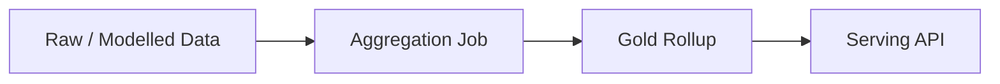

## 99.2 Summary Table Serving

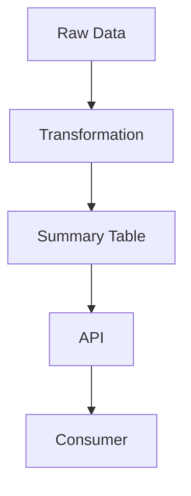

## 99.3 Materialized View

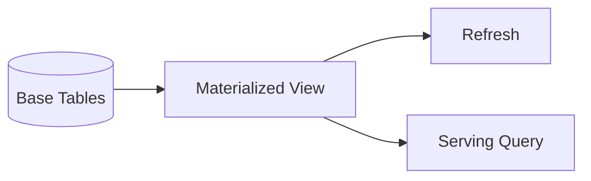

## 99.4 Cache-Aside

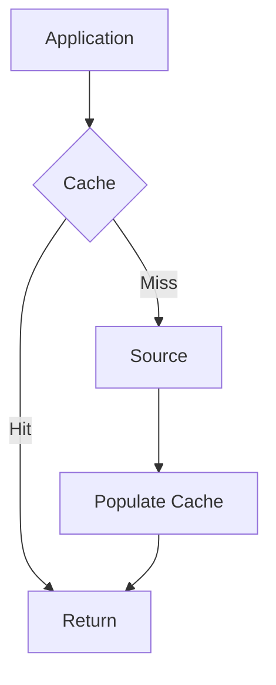

## 99.5 Read-Through

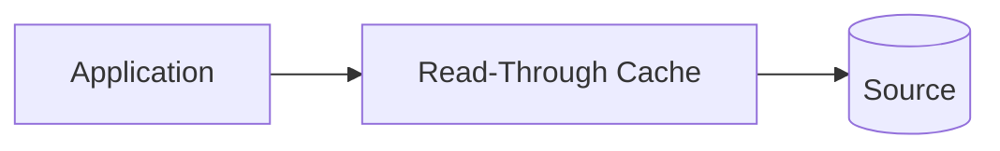

## 99.6 Write-Through

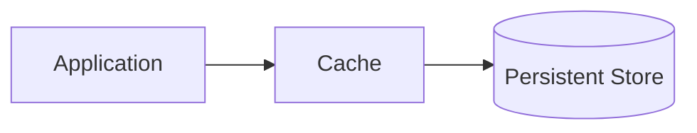

## 99.7 Refresh-Ahead

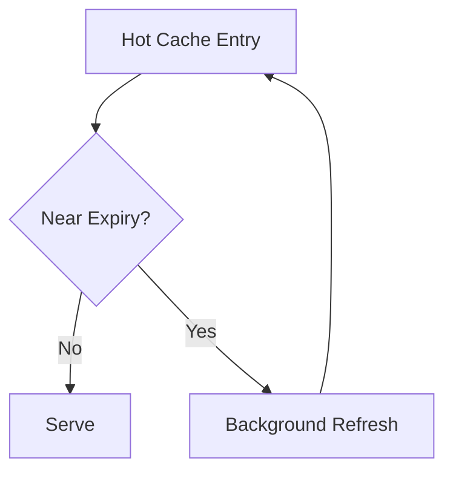

## 99.8 Cache Invalidation

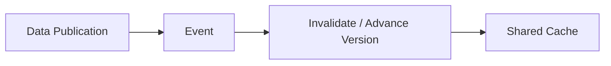

## 99.9 Cache Stampede

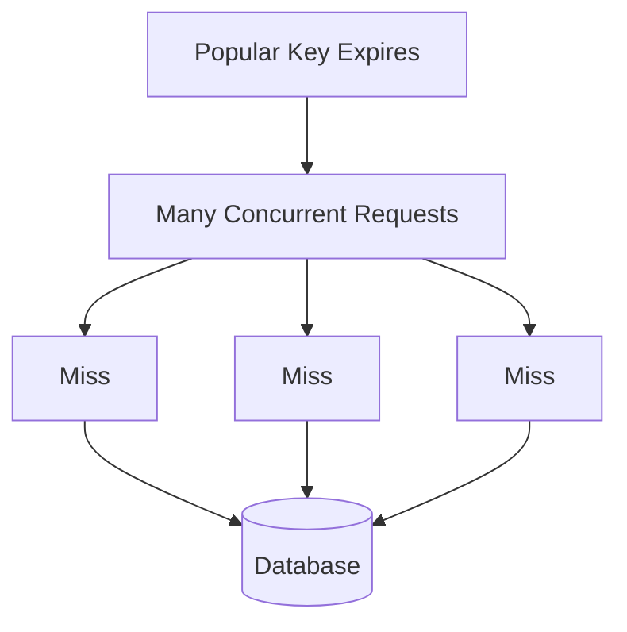

## 99.10 Request Coalescing

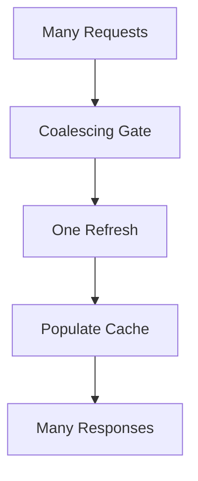

## 99.11 Multilevel Cache

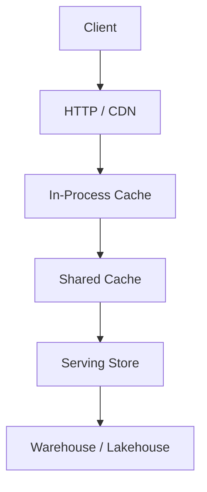

## 99.12 End-to-End Serving Architecture

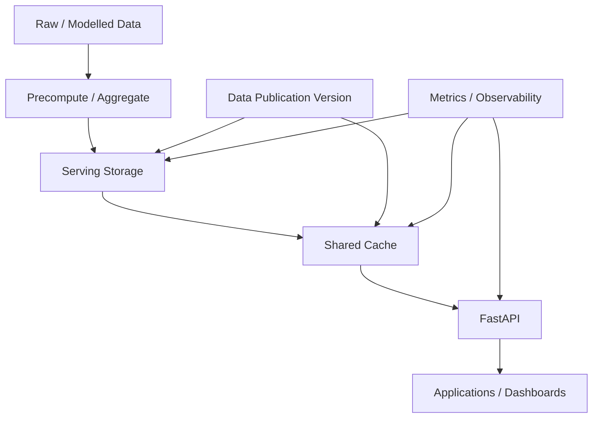

---

# 100. Consumer-First Design Habit

For every serving decision, ask:

```text
Who consumes this data?
```

Then:

```text
What latency do they need?
What freshness do they need?
What shape do they need?
What access rules apply?
How often is it requested?
How expensive is the source query?
What happens if the cache fails?
What happens if the data is stale?
What does it cost?
```

This should become an engineering reflex.

---

# 101. Production Decision Framework

Use this sequence:

```text
1. Identify consumer
        ↓
2. Define latency/freshness contract
        ↓
3. Measure current query cost
        ↓
4. Identify repeated expensive work
        ↓
5. Decide what to precompute
        ↓
6. Choose serving storage
        ↓
7. Measure baseline
        ↓
8. Add cache only if justified
        ↓
9. Design secure deterministic keys
        ↓
10. Define invalidation/versioning
        ↓
11. Protect hot keys
        ↓
12. Measure again
        ↓
13. Estimate capacity
        ↓
14. Calculate cost
        ↓
15. Test failures
        ↓
16. Document the decision
```

The key principle is:

> Measure before optimizing.

---

# 102. Do Not Confuse Preaggregation and Caching

These solve different problems.

## Preaggregation

Reduces the amount of computation needed to produce a result.

```text
Raw data
  ↓
Aggregate
  ↓
Small serving table
```

## Caching

Avoids repeating an already-computed retrieval.

```text
Serving table
  ↓
Cache
  ↓
Repeated requests
```

They can be combined:

```text
Raw orders
   ↓
Daily rollup
   ↓
PostgreSQL
   ↓
Redis-compatible cache
   ↓
API
```

This is often much more effective than caching a raw analytical query.

---

# 103. Why "Cache the Database" Is Not a Complete Strategy

A weak architecture says:

```text
Database is slow
↓
Add Redis
```

A senior architecture asks:

```text
Why is the database query slow?
```

Possibilities:

- repeated aggregation;
- poor grain;
- missing index;
- excessive joins;
- too much data scanned;
- dynamic query shape;
- insufficient serving table.

If the query should have been precomputed, caching the expensive query result may merely hide the underlying design problem.

---

# 104. The Optimization Ladder

Use this ladder:

```text
Do less work
      ↓
Preaggregate
      ↓
Use a better serving engine
      ↓
Use caching
      ↓
Use more compute
```

Caching should not be the first response to every performance problem.

A smaller, better-shaped serving table is often more robust than a complex cache over an expensive query.

---

# 105. Freshness and Cost Tradeoff

Suppose:

```text
Freshness requirement = 30 seconds
```

A one-hour TTL is obviously wrong.

But:

```text
TTL = 1 second
```

may also be unnecessarily expensive.

A short TTL creates:

```text
More misses
→ More source queries
→ More compute
```

The correct TTL is derived from the contract and measured source cost.

---

# 106. Availability and Staleness Tradeoff

Suppose the cache is unavailable.

Option A:

```text
Bypass cache
→ Source
```

Availability increases, but source load increases.

Option B:

```text
Serve stale
```

Availability increases while freshness decreases.

Option C:

```text
Fail request
```

Source is protected, but consumer availability decreases.

There is no universal answer.

The consumer contract determines the acceptable tradeoff.

---

# 107. Security and Caching Tradeoff

Caching can accidentally change the security boundary.

A source query may correctly enforce:

```text
region = APAC
```

but a generic cache key:

```text
sales:2026-10-06
```

can remove that distinction.

Therefore:

```text
Database authorization
+
Cache authorization identity
```

must be consistent.

This is one reason cache design belongs in Data Engineering rather than being treated as a purely performance concern.

---

# 108. Observability Requirements

At minimum, collect:

```text
cache_hits_total
cache_misses_total
cache_errors_total
cache_latency
source_queries_total
source_query_latency
serving_request_latency
serving_request_errors
freshness_age
data_version
```

Useful derived metrics:

```text
hit_rate
miss_rate
source_load_reduction
stale_response_rate
stampede_events
```

---

# 109. What Good Observability Lets You Answer

A production engineer should be able to answer:

### Is the API slow?

Check:

```text
p50/p95/p99
```

### Is the cache working?

Check:

```text
hit rate
miss rate
cache latency
```

### Is the source overloaded?

Check:

```text
source query count
source query latency
database resource usage
```

### Is data fresh?

Check:

```text
current_time - as_of
```

### Did a deployment change behavior?

Check:

```text
metrics before/after deployment
```

### Is one key causing trouble?

Check:

```text
hot-key traffic
refresh count
lock contention
```

---

# 110. Final Production Challenge

> **Design and implement a production-oriented serving layer for an e-commerce analytics platform that serves dashboard and application requests using precomputed aggregates, PostgreSQL/DuckDB where appropriate, and a Redis-compatible shared cache.**

Your implementation must demonstrate:

```text
Consumer contracts
Latency targets
Freshness targets
Preaggregation
Summary tables
Materialized views
Storage selection
Cache-aside
Scoped keys
Versioned keys
TTL
Invalidation
as_of
data_version
Stampede protection
Request coalescing
Locks or equivalent protection
Early refresh
Jitter
Multilevel cache awareness
Capacity estimation
Hit-rate measurement
Latency measurement
Source-load measurement
Cost analysis
Failure handling
```

---

# 111. Acceptance Checklist

## Architecture

- [ ] Consumer is explicitly defined.
- [ ] Latency requirement is explicit.
- [ ] Freshness requirement is explicit.
- [ ] Availability requirement is explicit.
- [ ] Access rules are explicit.
- [ ] Cost constraints are explicit.

## Aggregates

- [ ] At least one rollup exists.
- [ ] Grain is documented.
- [ ] Summary table exists.
- [ ] Materialized view is evaluated where appropriate.
- [ ] Refresh strategy is documented.
- [ ] Late-arriving data strategy is documented.

## Storage

- [ ] PostgreSQL serving path is evaluated.
- [ ] Index strategy is considered.
- [ ] DuckDB use case is understood.
- [ ] Key-value serving is understood.
- [ ] Real-time analytical database tradeoffs are understood.

## Caching

- [ ] Cache-aside is implemented or demonstrated.
- [ ] Read-through is understood.
- [ ] Write-through is understood.
- [ ] Refresh-ahead is understood.
- [ ] TTL is defined.
- [ ] Keys are deterministic.
- [ ] Keys include required scope.
- [ ] Versioned keys are implemented or demonstrated.
- [ ] Invalidation strategy exists.
- [ ] Stampede protection exists.
- [ ] Jitter is understood.
- [ ] Early refresh is understood.

## Freshness

- [ ] `as_of` is exposed.
- [ ] `data_version` is exposed.
- [ ] Freshness age is measurable.
- [ ] Stale-serving behavior is explicitly defined.

## Capacity

- [ ] Number of keys estimated.
- [ ] Average object size measured/estimated.
- [ ] P95 size considered.
- [ ] Overhead considered.
- [ ] Headroom included.
- [ ] Hot keys identified.

## Economics

- [ ] Cache hit rate measured.
- [ ] Source query reduction measured.
- [ ] Cache cost estimated.
- [ ] Source cost estimated.
- [ ] Operational complexity considered.

## Reliability

- [ ] Cache outage tested.
- [ ] Database slowdown tested.
- [ ] Stampede tested.
- [ ] Invalidation failure tested.
- [ ] Memory pressure considered.

## Observability

- [ ] Hit rate monitored.
- [ ] Miss rate monitored.
- [ ] Cache latency monitored.
- [ ] Source latency monitored.
- [ ] p50/p95/p99 monitored.
- [ ] Freshness monitored.
- [ ] Errors monitored.

---

# 112. Final Assessment

You should now be able to answer the following without notes.

## Architecture

- Why do serving aggregates exist?
- When should data be precomputed?
- When should data remain dynamic?
- How do you choose serving storage?

## Caching

- What is cache-aside?
- When would you use read-through?
- When would you use write-through?
- What is refresh-ahead?
- How do you design cache keys?

## Freshness

- What is TTL?
- What is `as_of`?
- What is `data_version`?
- How do you define acceptable staleness?

## Reliability

- What is cache stampede?
- How do request coalescing and locks help?
- Why is jitter useful?
- What happens when the cache is unavailable?

## Security

- Why must cache keys respect authorization scope?
- How can caching accidentally leak data?

## Performance

- How do you measure cache hit rate?
- How do you measure p95/p99?
- How do you estimate cache memory?

## Economics

- When does caching save money?
- When can caching increase cost?
- How do you compare cache cost against source-query cost?

---

# 113. Senior Review Exercise

Imagine this production incident:

```text
10:00
p95 = 180 ms
cache hit rate = 96%

10:05
p95 = 2.4 s
cache hit rate = 71%
database CPU = 92%
```

A weak response is:

> "Increase the database."

A senior investigation asks:

```text
Why did hit rate fall?
```

Possible causes:

- key-generation change;
- version change;
- TTL reduction;
- cache eviction;
- working-set increase;
- cache failure;
- traffic pattern change;
- invalidation bug.

Then:

```text
Why did database CPU rise?
```

Likely consequence:

```text
More misses
→ More source queries
→ Higher DB CPU
→ Higher latency
```

Then inspect:

```text
recent deployment
cache memory
eviction metrics
key cardinality
TTL configuration
invalidation rate
hot keys
source query volume
```

The lesson is:

> Diagnose the causal chain before changing capacity.

---

# 114. Core Engineering Principles

Remember these principles:

### Principle 1

> Do not optimize what you have not measured.

### Principle 2

> Precompute repeated expensive work when the consumer contract permits bounded freshness.

### Principle 3

> A cache is an optimization layer, not automatically the source of truth.

### Principle 4

> Cache keys are part of correctness and can be part of the security boundary.

### Principle 5

> Freshness must be explicit.

### Principle 6

> `as_of` tells consumers what time the data represents.

### Principle 7

> `data_version` tells consumers which published version they received.

### Principle 8

> Cache invalidation must be designed, not assumed.

### Principle 9

> Hot keys require explicit stampede protection.

### Principle 10

> A high cache hit rate is useful only when it improves the actual consumer and system objectives.

### Principle 11

> More cache layers mean more consistency and invalidation complexity.

### Principle 12

> Cache capacity must be estimated before production deployment.

### Principle 13

> A cache failure can become a database failure if bypass behavior is not capacity-aware.

### Principle 14

> Technology choice follows the access pattern.

### Principle 15

> The correct serving architecture balances latency, freshness, correctness, availability, security, and cost.

---

# 115. Topic Completion Standard

This topic is complete when you can take an expensive analytical workload and reason through:

```text
What does the consumer need?
        ↓
How fresh must it be?
        ↓
How fast must it be?
        ↓
Can the expensive work be precomputed?
        ↓
What aggregate grain is correct?
        ↓
Where should the result live?
        ↓
Should it be cached?
        ↓
What should the cache key contain?
        ↓
How will authorization affect the key?
        ↓
How will data changes invalidate it?
        ↓
What happens when many requests miss together?
        ↓
How much memory is required?
        ↓
What is the source-load reduction?
        ↓
What does it cost?
        ↓
How will failures be observed and handled?
```

The final competency is:

```text
Fast
+
Fresh
+
Correct
+
Secure
+
Observable
+
Capacity-aware
+
Cost-aware
```

That is the Data Engineering objective of **Serving Aggregates and Caching Layers**.
