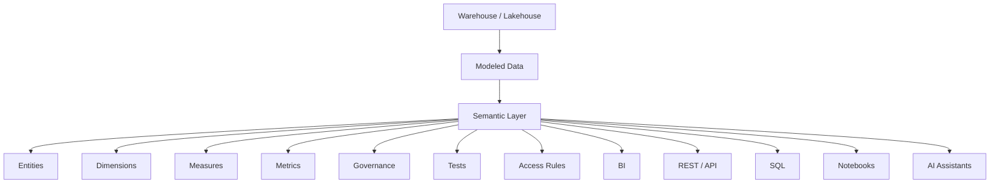
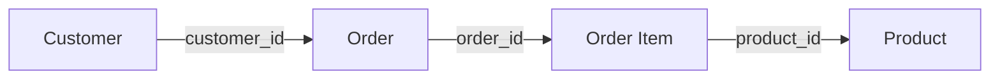
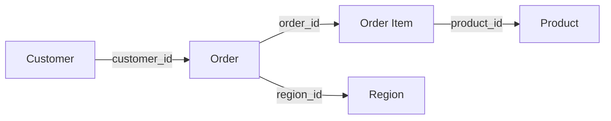
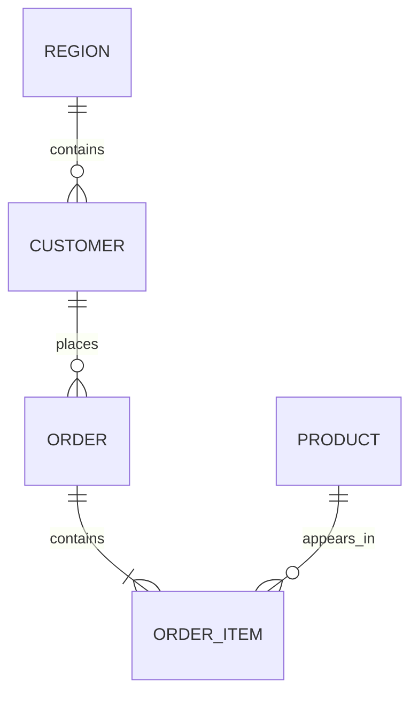
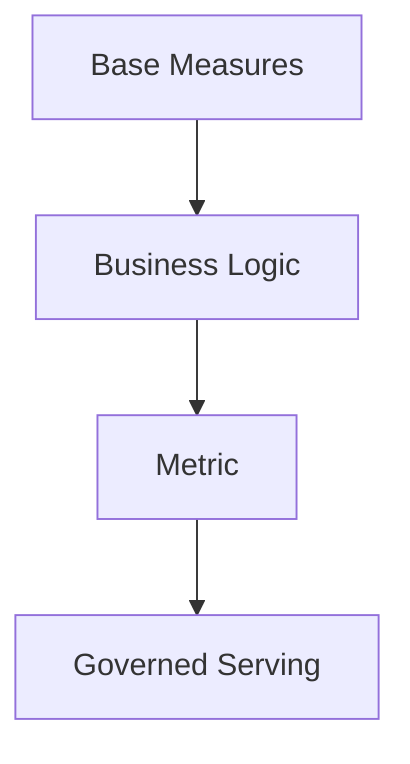
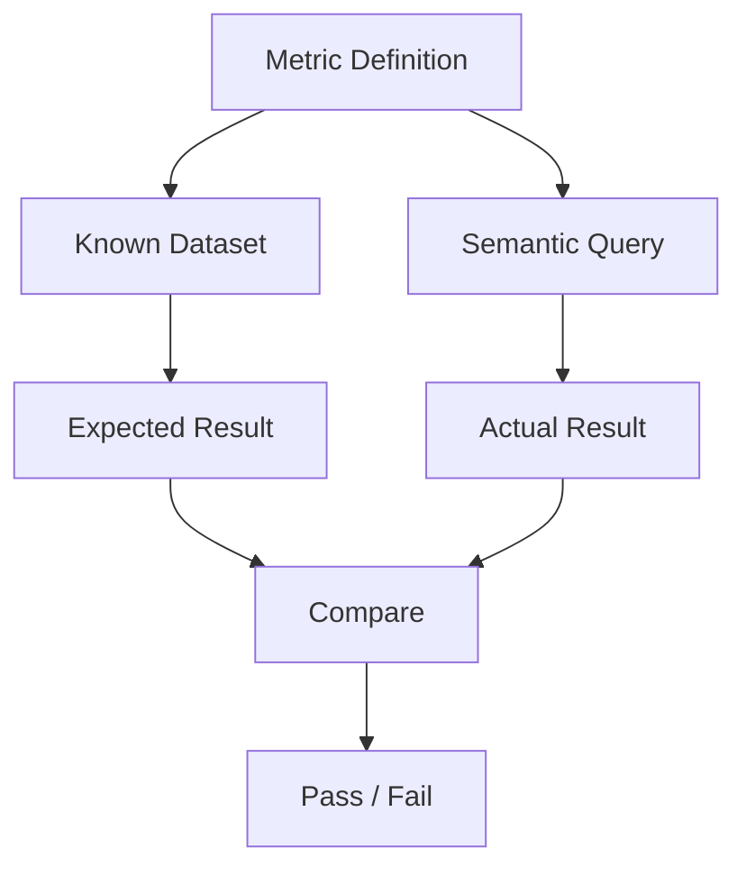
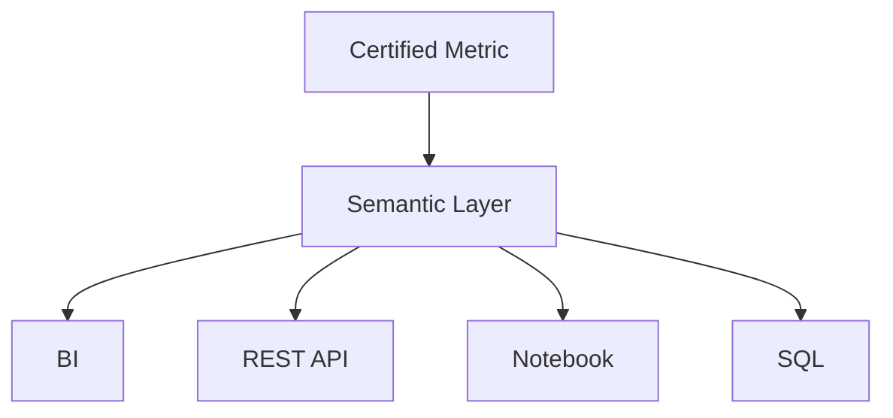
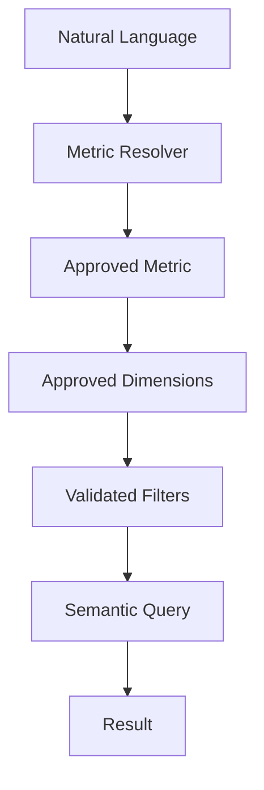

# Module 2.22.03 — Semantic Layers and Metric Definitions

> **Role:** Senior Data Engineer / Analytics Engineer perspective  
> **Level:** Beginner → Fundamentals → Intermediate → Advanced → Production  
> **Primary stack:** SQL, Python 3.12+, dbt / MetricFlow concepts, Cube awareness, FastAPI/REST awareness, Git, CI/CD  
> **Domain used throughout:** E-commerce analytics

---

## 1. Module Purpose

A production data platform does not finish when trustworthy tables are created. The next problem is **serving trustworthy business meaning**.

A company may have excellent warehouse tables and still answer a simple question differently:

> **“What is our revenue?”**

Finance may report ₹10 crore, BI may show ₹10.4 crore, an analyst may calculate ₹9.8 crore, and an AI assistant may return ₹11.2 crore.

The problem is often not arithmetic. It is that different consumers use different:

- filters,
- joins,
- time windows,
- sources,
- grains,
- treatment of refunds,
- treatment of cancellations,
- definitions,
- aggregation rules.

The central engineering idea of this module is:

```text
Business Meaning
      ↓
Define Once
      ↓
Govern Centrally
      ↓
Test
      ↓
Serve Consistently
      ↓
BI / APIs / Notebooks / Analytics / AI
```

A semantic layer is therefore a **governed translation layer between modeled data and business meaning**.

---

## 2. Learning Outcome

By the end of this module, you should be able to:

1. Explain why metrics disagree across teams.
2. Explain what a semantic layer is and what it is not.
3. Model entities and entity relationships.
4. Identify grain and join keys before writing metric logic.
5. Define dimensions, time dimensions, measures, and metrics.
6. Build simple, ratio, cumulative, derived, and period-over-period metrics.
7. Correctly aggregate numerator/denominator metrics.
8. Design semantic join graphs and prevent fan-out.
9. Understand dbt Semantic Layer / MetricFlow concepts.
10. Understand Cube's role at an architectural level.
11. Treat metrics as code.
12. Assign ownership and connect metrics to a business glossary.
13. Write known-answer, regression-bound, and reconciliation tests.
14. Serve governed metrics through SQL, REST, BI, and understand GraphQL integration.
15. Understand the relationship between semantic layers, caches, and preaggregations.
16. Certify, restrict, version, and deprecate metrics.
17. Build a governed text-to-metrics workflow for AI.
18. Explain why unrestricted AI-generated SQL is dangerous.
19. Recognize semantic-layer limitations and when ad-hoc exploration is appropriate.
20. Design an enterprise semantic layer for an e-commerce platform.

---

# Part I — The Foundation

## 3. The Metric Consistency Problem

Imagine five consumers asking for revenue:

```text
Finance       → ₹10.0 crore
BI Dashboard  → ₹10.4 crore
Analyst       → ₹9.8 crore
Notebook      → ₹10.1 crore
AI Assistant  → ₹11.2 crore
```

This immediately creates a trust problem.

### 3.1 Why can this happen?

Possible causes include:

- different source tables;
- different filters;
- different join paths;
- gross vs net revenue;
- refunds included by one query but excluded by another;
- cancelled orders included by one query;
- duplicate rows;
- different date fields;
- different time zones;
- different time windows;
- different aggregation rules;
- different definitions of active customer;
- different treatment of late-arriving data.

For example:

```sql
-- Query A
SELECT SUM(order_amount)
FROM orders;
```

could mean something different from:

```sql
-- Query B
SELECT SUM(net_amount)
FROM orders
WHERE status = 'completed';
```

Both queries may be syntactically correct.

Only one may represent the organization's approved definition.

### 3.2 The core problem

Without a semantic layer:

```text
BI       → SQL
Analyst  → SQL
API      → SQL
Notebook → SQL
AI       → SQL
```

Business logic becomes duplicated.

With a semantic layer:

```text
                         ┌── BI
                         ├── API
Modeled Data → Semantic ├── Notebook
                         ├── Analyst
                         └── AI
```

The semantic layer becomes the shared location for business meaning.

### 3.3 Why this is a Data Engineering problem

This is not merely a dashboard problem.

Metric correctness depends on:

- source data;
- data models;
- table grain;
- joins;
- transformations;
- data quality;
- governance;
- access control;
- testing;
- serving;
- performance;
- change management.

Therefore semantic-layer engineering sits directly on top of data engineering, analytics engineering, data modeling, and data governance.

---

# Part II — What Is a Semantic Layer?

## 4. Definition

A useful beginner definition is:

> **A semantic layer is a governed translation layer between data models and the business meaning consumers need.**

Conceptually:

```text
Physical Data
      ↓
Models / Tables
      ↓
Semantic Layer
      ↓
Business Meaning
      ↓
Consumers
```

Consumers can include:

- BI;
- APIs;
- notebooks;
- analysts;
- applications;
- AI assistants.

### 4.1 What the semantic layer does

A semantic layer can define:

- entities;
- relationships;
- dimensions;
- measures;
- metrics;
- time behavior;
- join paths;
- business filters;
- metric ownership;
- descriptions;
- tests;
- access rules;
- certification;
- lifecycle state.

### 4.2 What it does not do

A semantic layer does **not** automatically:

- fix bad source data;
- make every query fast;
- eliminate the need for data modeling;
- eliminate ad-hoc analysis;
- guarantee correct business definitions without governance;
- make arbitrary AI-generated SQL safe.

A semantic layer is an abstraction and governance mechanism. Its quality depends on the model underneath it and the engineering discipline around it.

---

# Part III — Semantic Layer Architecture

## 5. Reference Architecture



A more consumer-oriented view:

```text
Raw / Modelled Data
        ↓
     Entities
        ↓
    Dimensions
        ↓
      Measures
        ↓
       Metrics
        ↓
 Semantic Model
        ↓
Governed Query / Serving Layer
        ↓
BI / APIs / Notebooks / AI
```

### 5.1 The important distinction

The semantic layer is not necessarily another physical database.

It is primarily a **logical and governed representation of business meaning** that can generate or control access to analytical queries.

---

# Part IV — Entities and Relationships

## 6. Entities

An **entity** is a meaningful business object that has an identifiable identity.

Typical e-commerce entities:

```text
Customer
Order
Order Item
Product
Region
Subscription
Invoice
```

### 6.1 Entity grain

Every entity should have a clear grain.

Examples:

| Entity | Grain |
|---|---|
| Customer | one row per customer |
| Order | one row per order |
| Order Item | one row per item within an order |
| Product | one row per product |
| Region | one row per region |

Always ask:

> **At what grain does one row represent one business fact?**

This question prevents many downstream metric errors.

### 6.2 Entity identifiers

An entity can have:

- primary key;
- surrogate key;
- business key.

Example:

```text
Customer
customer_id = 10042
```

The key identifies the entity.

---

## 7. Entity Relationships

Consider:



Common relationship types:

- one-to-one;
- one-to-many;
- many-to-many awareness.

Example:

```text
One Customer
   ↓
Many Orders
   ↓
Many Order Items
   ↓
Products
```

### 7.1 Why relationships matter

Suppose:

```text
Customer A
  10 orders
  each order has 5 items
```

A careless join can move the effective grain from customer/order to order-item.

If revenue is stored at order grain and is joined directly to order items, the same order revenue can appear five times.

That is a **fan-out problem**.

### 7.2 Join keys

A semantic relationship should explicitly understand the key used to connect entities.

Examples:

```text
orders.customer_id
        =
customers.customer_id
```

and:

```text
order_items.order_id
        =
orders.order_id
```

Never assume that two similarly named columns represent the same relationship.

---

# Part V — Dimensions

## 8. Dimensions

A dimension is a business attribute used to **slice, group, or filter** data.

Examples:

```text
region
country
product_category
customer_segment
order_status
channel
```

Suppose the metric is:

```text
Revenue
```

A dimension lets you ask:

```text
Revenue by region
Revenue by product
Revenue by month
Revenue by customer segment
```

### 8.1 Metric vs dimension

```text
Metric
→ What are we measuring?

Dimension
→ How do we want to break it down?
```

Example:

```text
Metric: Revenue

Dimensions:
- Region
- Country
- Product Category
- Customer Segment
- Month
```

### 8.2 Group-by dimensions

If a user requests:

```text
Revenue by region
```

then `region` becomes a grouping dimension.

Conceptually:

```sql
SELECT
    region,
    SUM(net_revenue) AS net_revenue
FROM ...
GROUP BY region;
```

The semantic layer should know that `region` is a valid analytical dimension rather than allowing arbitrary columns to become business dimensions without governance.

---

# Part VI — Time Dimensions and Time Grains

## 9. Time Dimensions

Common time representations include:

- timestamp;
- date;
- hour;
- day;
- week;
- month;
- quarter;
- year.

Typical hierarchy:

```text
Timestamp
   ↓
Hour
   ↓
Day
   ↓
Week / Month
   ↓
Quarter
   ↓
Year
```

### 9.1 Time grain

**Time grain** describes the level at which a time-based result is grouped.

Examples:

```text
Revenue by hour
Revenue by day
Revenue by week
Revenue by month
Revenue by quarter
Revenue by year
```

### 9.2 Why explicit time semantics matter

Two teams may both say:

> “Revenue last month.”

But one may use:

```text
calendar month
```

while another uses:

```text
last 30 days
```

These are not equivalent.

Other sources of disagreement include:

- UTC vs local time;
- event time vs processing time;
- order date vs shipment date;
- partial current month;
- late-arriving records.

A production semantic model must make time behavior explicit.

---

# Part VII — Measures

## 10. Measures

A **measure** is a value that can be aggregated according to a defined rule.

Examples:

```text
order_amount
quantity
discount
cost
profit
```

Common aggregations:

```text
SUM
COUNT
COUNT DISTINCT
MIN
MAX
AVG
```

Example:

```sql
SELECT SUM(order_amount)
FROM orders;
```

### 10.1 Why aggregation belongs in the semantic definition

If every consumer chooses aggregation independently, the same field can produce inconsistent meaning.

For example:

```text
quantity → SUM
```

is generally meaningful.

But:

```text
customer_age → SUM
```

usually is not.

The semantic layer should encode which measures are valid and how they are intended to aggregate.

---

# Part VIII — Measures vs Metrics

## 11. The Critical Distinction

A measure is a building block.

A metric is a **business-defined measurement**.

Think:

```text
Measures
   ↓
Business Logic
   ↓
Metrics
```

Examples:

```text
Measure:
order_amount

Metric:
Average Order Value
```

Or:

```text
Measures:
gross_sales
refund_amount

Metric:
Net Revenue
```

### 11.1 Why the distinction matters

A metric should capture business meaning, not merely expose a column.

A production metric should have:

```text
Name
Definition
Owner
Source
Grain
Measures
Dimensions
Aggregation
Time semantics
Formula
Filters
Access rules
Tests
Status
```

---

# Part IX — Metric Types

## 12. Simple Metrics

Simple metrics often directly aggregate a measure.

Examples:

```text
Total Revenue
Total Orders
Total Customers
Total Units Sold
```

Example:

```sql
SELECT SUM(order_amount) AS total_revenue
FROM orders;
```

Even a simple metric needs governance.

Example contract:

```yaml
name: gross_revenue
description: Total eligible order revenue before refunds.
owner: finance_analytics
source: fct_orders
grain: order
aggregation: sum
status: certified
```

---

## 13. Ratio Metrics

Ratio metrics are among the easiest metrics to implement incorrectly.

Examples:

```text
Average Order Value
Conversion Rate
Profit Margin
Return Rate
```

Consider conversion rate:

```text
Conversion Rate =
Converted Users / Eligible Users
```

The dangerous approach is:

```sql
AVG(daily_conversion_rate)
```

That can produce the wrong answer because each day may have a different denominator.

### 13.1 Correct aggregation

Instead calculate:

```text
SUM(converted_users)
--------------------
SUM(eligible_users)
```

Example:

```sql
SELECT
    SUM(converted_users)::numeric
    / NULLIF(SUM(eligible_users), 0) AS conversion_rate
FROM daily_conversion;
```

### 13.2 Why this works

Suppose:

```text
Day 1:
Conversions = 10
Visitors = 100
Rate = 10%

Day 2:
Conversions = 90
Visitors = 900
Rate = 10%
```

The aggregate is:

```text
100 / 1000 = 10%
```

Now change the example:

```text
Day 1:
Conversions = 1
Visitors = 10
Rate = 10%

Day 2:
Conversions = 90
Visitors = 900
Rate = 10%
```

Still 10%.

But consider:

```text
Day 1:
Conversions = 1
Visitors = 10
Rate = 10%

Day 2:
Conversions = 90
Visitors = 1000
Rate = 9%
```

Simple average:

```text
(10% + 9%) / 2 = 9.5%
```

Correct aggregate:

```text
91 / 1010 ≈ 9.01%
```

Therefore:

> **For ratio metrics, aggregate numerator and denominator separately, then calculate the ratio, when that matches the business definition.**

### 13.3 Exceptions

There are cases where an average of rates is intentionally the business definition.

The semantic engineer must encode the **business definition**, not apply a universal mathematical rule blindly.

---

# Part X — Cumulative Metrics

## 14. Running / Cumulative Metrics

Examples:

- cumulative revenue;
- running order count;
- cumulative subscriptions;
- running customer count.

Suppose daily revenue is:

```text
Day 1 = 100
Day 2 = 200
Day 3 = 300
```

Running revenue is:

```text
Day 1 = 100
Day 2 = 300
Day 3 = 600
```

A SQL implementation may use a window function:

```sql
SELECT
    revenue_date,
    daily_revenue,
    SUM(daily_revenue) OVER (
        ORDER BY revenue_date
        ROWS BETWEEN UNBOUNDED PRECEDING AND CURRENT ROW
    ) AS cumulative_revenue
FROM daily_revenue
ORDER BY revenue_date;
```

### 14.1 Production considerations

A cumulative metric requires explicit:

- time ordering;
- partitioning where applicable;
- treatment of missing dates;
- late-arriving data behavior;
- restatement policy.

---

# Part XI — Derived Metrics

## 15. Derived Metrics

A derived metric combines one or more measures or other governed calculations.

Examples:

```text
Gross Margin
Profit Margin
Revenue per Customer
Revenue per Order
```

Conceptually:

```text
Base Measures
      ↓
Derived Calculation
      ↓
Derived Metric
```

Example:

```text
Profit Margin =
Profit / Net Revenue
```

Again, numerator and denominator need correct aggregation.

---

# Part XII — Period-over-Period Metrics

## 16. MoM, WoW, and YoY

Common period comparisons:

- month-over-month;
- week-over-week;
- year-over-year;
- previous period;
- growth rate.

Example:

```text
Revenue MoM
Revenue YoY
Orders WoW
```

A growth metric is commonly:

```text
(Current - Previous) / Previous
```

Example:

```text
Current month = ₹12M
Previous month = ₹10M

MoM growth =
(12 - 10) / 10
= 20%
```

SQL awareness:

```sql
WITH monthly AS (
    SELECT
        DATE_TRUNC('month', order_date) AS month,
        SUM(net_revenue) AS revenue
    FROM fct_orders
    GROUP BY 1
),
with_previous AS (
    SELECT
        month,
        revenue,
        LAG(revenue) OVER (ORDER BY month) AS previous_revenue
    FROM monthly
)
SELECT
    month,
    revenue,
    previous_revenue,
    (revenue - previous_revenue)
        / NULLIF(previous_revenue, 0) AS revenue_mom
FROM with_previous;
```

### 16.1 Edge cases

Handle:

- missing prior period;
- zero denominator;
- partial current period;
- late-arriving data;
- incomplete historical data.

A semantic definition should make these behaviors explicit.

---

# Part XIII — Grain, Join Graphs, and Fan-Out

## 17. Every Metric Has a Grain

A critical production rule:

> **Every metric has a grain.**

Examples:

```text
Order-level
Customer-level
Order-item-level
Daily
Monthly
```

Before joining anything ask:

> **At what grain is this table?**

### 17.1 Grain mismatch

Suppose:

```text
orders
1 row = 1 order
```

and:

```text
order_items
1 row = 1 item
```

Joining them creates multiple rows per order.

If `orders.order_amount` is repeated for each item, summing it after the join inflates revenue.

---

## 18. Semantic Join Graphs

A join graph describes which entities can be joined and how.



The graph defines:

- valid relationships;
- join keys;
- cardinality;
- expected paths;
- relationship direction;
- safe analytical combinations.

### 18.1 Why arbitrary joins are dangerous

Without a governed graph, a consumer may join:

```text
Customer
+
Order
+
Order Item
+
Product
```

without realizing that measures at different grains will multiply.

A semantic layer should make valid relationships explicit.

---

# Part XIV — Fan-Out Problems

## 19. A Concrete Fan-Out Example

Suppose:

```text
Customer A
10 Orders
5 Items per Order
```

Then the relationship is:

```text
1 Customer
   ↓
10 Orders
   ↓
50 Order Items
```

If order-level revenue is joined to order items:

```text
Order 1 revenue = ₹1,000
5 items
```

the row value ₹1,000 can appear five times.

A naive aggregation:

```sql
SELECT SUM(o.order_amount)
FROM orders o
JOIN order_items i
  ON o.order_id = i.order_id;
```

may produce:

```text
₹5,000
```

instead of:

```text
₹1,000
```

for that order.

### 19.1 Safer approach

Aggregate at the required grain before joining where appropriate.

For example:

```sql
WITH order_revenue AS (
    SELECT
        order_id,
        SUM(order_amount) AS revenue
    FROM orders
    GROUP BY order_id
),
item_summary AS (
    SELECT
        order_id,
        COUNT(*) AS item_count
    FROM order_items
    GROUP BY order_id
)
SELECT
    r.order_id,
    r.revenue,
    s.item_count
FROM order_revenue r
JOIN item_summary s
  ON r.order_id = s.order_id;
```

The correct solution depends on the analytical question, but the first diagnostic step is always **grain**.

### 19.2 Fan-out symptoms

Watch for:

- revenue suddenly doubling;
- order counts increasing unexpectedly;
- average values changing after adding a dimension;
- ratios becoming implausible;
- duplicate-looking output rows.

---

# Part XV — dbt Semantic Layer / MetricFlow

## 20. Why dbt Is Relevant

dbt is commonly used to transform and manage analytical data models.

A semantic layer adds a governed representation of:

- entities;
- dimensions;
- measures;
- metrics;
- relationships.

MetricFlow is associated with dbt's semantic modeling and metric querying approach.

The important learning goal here is **conceptual understanding**, not memorizing every framework command.

### 20.1 Conceptual model

```text
dbt Models
    ↓
Semantic Models
    ↓
Entities
Dimensions
Measures
Metrics
    ↓
Governed Query
```

### 20.2 Why this helps

Instead of every dashboard defining revenue independently, a governed definition can be reused.

The semantic system can reason about:

```text
Metric = revenue
Dimension = region
Time = month
Filter = completed orders
```

and produce an appropriate analytical query.

### 20.3 What to learn

You should understand:

- semantic models;
- entities;
- dimensions;
- measures;
- metrics;
- relationships;
- governed querying;
- tests;
- version-controlled definitions.

Do not assume every organization uses dbt.

---

# Part XVI — Cube

## 21. Cube: Architectural Awareness

Cube is a semantic-layer and analytics-serving platform used to model and consistently expose analytical data.

At an architectural level, understand:

- semantic modeling;
- metrics;
- dimensions;
- APIs;
- BI integration;
- caching/preaggregation awareness;
- governed analytics serving.

Conceptually:

```text
Data
 ↓
Cube Semantic Model
 ↓
Metrics / Dimensions
 ↓
API / BI / Analytics Consumers
```

This module does not attempt to teach a complete Cube implementation.

The goal is to understand **where Cube fits** in an enterprise serving architecture.

---

## 22. dbt Semantic Layer / MetricFlow vs Cube

| Capability | dbt Semantic Layer / MetricFlow | Cube |
|---|---|---|
| Semantic modeling | Strong focus | Strong focus |
| Metrics | Governed metric definitions | Governed metric definitions |
| Dimensions | Semantic dimensions | Semantic dimensions |
| Query interfaces | Governed analytical querying | APIs and analytical query serving |
| APIs | Can participate in governed serving architectures | Strong API-oriented serving model |
| BI integration | Designed for governed analytics consumption | Designed for BI and embedded analytics use cases |
| Governance | Definitions can be version-controlled with data code | Governed semantic model and access patterns |
| Caching / preaggregation | Can connect to performance strategies | Important part of Cube-oriented serving |
| Best fit | Teams already centered around dbt/data transformation workflows | Teams needing a semantic/serving layer with strong API/BI serving needs |

The exact capabilities and product boundaries can evolve. Treat this comparison as architectural orientation and verify current product documentation before production adoption.

---

# Part XVII — Metrics as Code

## 23. Business Metrics Should Be Treated Like Software

A production metric is not merely a line of SQL.

A robust lifecycle is:

```text
Metric Definition
      ↓
Git
      ↓
Pull Request
      ↓
Review
      ↓
CI Tests
      ↓
Deploy
```

### 23.1 Why metrics as code?

Benefits include:

- version control;
- review;
- change history;
- ownership;
- reproducibility;
- auditability;
- collaboration.

### 23.2 Example repository

```text
semantic/
├── models/
├── entities/
├── dimensions/
├── measures/
├── metrics/
├── tests/
└── glossary/
```

This is a learning structure, not a mandatory framework layout.

---

## 24. Example Metric Definition

```yaml
name: average_order_value

description: >
  Net revenue divided by completed orders for the selected
  analytical period.

owner: finance_analytics

source: fct_orders

grain: order

numerator:
  metric: net_revenue

denominator:
  metric: completed_orders

formula: sum(net_revenue) / sum(completed_orders)

dimensions:
  - region
  - country
  - product_category
  - customer_segment

time_dimension: order_date

status: certified

access:
  roles:
    - analytics
    - finance
    - executive
```

The exact syntax depends on the semantic framework. The important concept is that the **definition is explicit and reviewable**.

---

# Part XVIII — Metric Ownership and Business Glossary

## 25. Metric Ownership

Every important metric should have an owner.

Example:

```text
Revenue
Owner: Finance Analytics

Active Customer
Owner: Growth Analytics

Gross Margin
Owner: Finance
```

A useful metric contract includes:

```text
Name
Definition
Owner
Description
Source
Grain
Aggregation
Dimensions
Time behavior
Business rules
Tests
Status
```

### 25.1 Why ownership matters

Without an owner:

- definitions drift;
- disputes remain unresolved;
- nobody approves changes;
- deprecation becomes difficult;
- governance becomes theoretical.

---

## 26. Business Glossary Integration

A semantic layer should connect technical definitions to business terminology.

Examples:

```text
Customer
Active Customer
Revenue
Net Revenue
Churned Customer
Order
```

Conceptually:

```text
Business Glossary
       ↓
Semantic Definition
       ↓
Metric
       ↓
Consumer
```

Descriptions should be understandable to both humans and AI systems.

For example:

> **Active Customer:** A customer with at least one completed purchase during the defined rolling 30-day period.

This is much safer than:

> active customer = count(customer_id)

The first expresses business meaning. The second expresses only implementation.

---

# Part XIX — Metric Testing

## 27. A Metric Is Not Complete Until It Is Tested

Metric tests should cover:

- correctness;
- known answers;
- regressions;
- valid bounds;
- reconciliation.

A useful testing model is:

```text
Definition
    ↓
Known Dataset
    ↓
Expected Result
    ↓
Semantic Query
    ↓
Comparison
```

---

## 28. Known-Answer Tests

Suppose a controlled dataset contains:

```text
Known revenue = ₹1,000,000
```

The semantic metric must return:

```text
₹1,000,000
```

Conceptually:

```python
def test_revenue_known_answer():
    result = run_metric("revenue", dataset="known_orders")
    assert result == 1_000_000
```

The point is not the exact test framework.

The point is to prevent accidental changes to business logic.

### 28.1 Good known-answer dataset

A small test fixture should intentionally include:

- completed orders;
- cancelled orders;
- refunds;
- duplicate-looking records;
- multiple customers;
- multiple dates;
- boundary cases.

---

## 29. Regression Bounds

Some metrics have mathematically or operationally valid bounds.

Example:

```text
0 ≤ conversion_rate ≤ 1
```

or:

```text
revenue ≥ 0
```

when negative revenue is not valid under the defined business semantics.

A conceptual test:

```python
assert 0 <= conversion_rate <= 1
```

Bounds must be **business-specific**. Do not blindly apply a bound just because it sounds reasonable.

Regression tests can also detect unexpected changes:

```text
Previous certified revenue = ₹10.0M
Current result = ₹27.0M
```

The system should trigger investigation rather than silently accepting the result.

---

# Part XX — Finance Reconciliation

## 30. Reconciliation

Finance-owned metrics often require explicit reconciliation.

Compare:

```text
Semantic Revenue
       vs
Finance-Approved Revenue
```

Differences may be legitimate because of:

- accounting treatment;
- timing;
- refunds;
- cancellations;
- tax;
- currency conversion;
- business rules;
- cut-off dates.

The goal is not necessarily to force equality.

The goal is to understand and document the difference.

### 30.1 Reconciliation workflow

```text
Semantic Result
      ↓
Finance Reference
      ↓
Compare
      ↓
Explain Difference
      ↓
Document Rule
      ↓
Approve
```

---

# Part XXI — Serving Governed Metrics

## 31. SQL Serving

A semantic layer can support a request such as:

```text
Metric: Revenue
Dimension: Region
Time: Month
```

Conceptually:

```sql
SELECT
    region,
    DATE_TRUNC('month', order_date) AS month,
    SUM(net_revenue) AS revenue
FROM fct_orders
WHERE order_status = 'completed'
GROUP BY 1, 2;
```

The important point is that the consumer does not have to reinvent the business definition.

---

## 32. REST Serving

A governed metric can be exposed conceptually as:

```http
GET /metrics/revenue
```

with parameters such as:

```text
dimension=region
start_date=2026-01-01
end_date=2026-01-31
```

A semantic metric API should validate:

- metric selection;
- dimension selection;
- filters;
- time range;
- access;
- output contract.

Conceptually:

```text
Client
  ↓
Metric Request
  ↓
Metric Validation
  ↓
Access Check
  ↓
Semantic Query
  ↓
Result
```

This module focuses on semantic serving, not a second complete FastAPI course.

---

## 33. GraphQL Awareness

GraphQL provides a flexible query interface.

It can be useful when consumers need to select fields and analytical structures dynamically.

However, flexibility introduces complexity:

- query-cost control;
- authorization;
- schema governance;
- expensive combinations;
- semantic consistency.

GraphQL does not eliminate the need for a semantic layer.

The semantic definitions should remain authoritative.

---

## 34. BI Serving

Semantic layers can support:

- dashboards;
- reports;
- self-service analytics;
- governed exploration.

Conceptually:

```text
Semantic Metric
      ↓
    BI Tool
      ↓
   Dashboard
```

The danger is allowing every BI dashboard to recreate the same metric logic independently.

---

# Part XXII — Caching and Preaggregation Relationship

## 35. Relationship to Topic 02

Semantic layers can sit above:

```text
Aggregates
Materialized Views
Preaggregations
Caches
```

A conceptual path:

```text
Consumer
   ↓
Semantic Layer
   ↓
Serving / Preaggregation
   ↓
Warehouse / Lakehouse
```

The semantic layer answers:

> **What does the metric mean?**

The serving layer answers:

> **How can that metric be delivered efficiently?**

These concerns are related but distinct.

A semantic layer does not replace good aggregate design or caching.

---

# Part XXIII — Certified Metrics and Governance

## 36. Certified Metrics

Not every metric should be treated as equally trustworthy.

Example:

```text
Revenue
Status: CERTIFIED
Owner: Finance
```

versus:

```text
Experimental Revenue Proxy
Status: DRAFT
```

A certification state can communicate:

- definition approved;
- tests passed;
- owner assigned;
- source documented;
- governance reviewed.

Possible lifecycle states:

```text
DRAFT
REVIEW
CERTIFIED
DEPRECATED
RETIRED
```

---

## 37. Metric Access Control

Governance includes access.

Examples:

```text
Public:
Orders

Restricted:
Profit Margin

Highly Restricted:
Customer-level Revenue
```

Controls can include:

- role-based access;
- row-level restrictions;
- sensitive dimensions;
- PII controls;
- authorization.

The semantic layer should not expose sensitive analytical combinations simply because the underlying database technically permits them.

---

## 38. Metric Deprecation

Metrics evolve.

Example:

```text
customer_revenue_v1
       ↓
   DEPRECATED
       ↓
customer_net_revenue_v2
```

A deprecation strategy should include:

1. identify consumers;
2. announce change;
3. provide replacement;
4. document semantic difference;
5. maintain a migration period where appropriate;
6. remove old definition only after dependencies are addressed.

Never silently redefine a certified metric if consumers depend on its historical meaning.

---

# Part XXIV — Semantic Layers for AI

## 39. Why AI Needs Semantic Governance

A naive architecture is:

```text
User
 ↓
AI
 ↓
Generate arbitrary SQL
 ↓
Warehouse
```

Potential problems:

- incorrect metric;
- unsafe joins;
- wrong filters;
- PII exposure;
- expensive queries;
- inconsistent business definitions.

A safer architecture is:

```text
User
 ↓
AI
 ↓
Semantic Layer
 ↓
Governed Metric
 ↓
Approved / Validated Query
 ↓
Data
```

The semantic layer becomes a controlled interface between natural language and analytical meaning.

---

## 40. Governed Text-to-Metrics

User:

> **What was revenue in APAC last month?**

The AI should resolve:

```text
Metric:
Revenue

Filter:
Region = APAC

Time:
Previous month
```

Then:

```text
Natural Language
      ↓
Metric Resolution
      ↓
Dimension Resolution
      ↓
Filter Validation
      ↓
Semantic Query
      ↓
Result
```

The AI should **not invent a metric definition**.

If "revenue" has a certified definition, the AI should use that definition.

---

## 41. Why Free-Form AI SQL Is Dangerous

Bad default:

```text
User
 ↓
LLM
 ↓
Arbitrary SQL
 ↓
Database
```

Better:

```text
User
 ↓
LLM
 ↓
Governed Semantic Definitions
 ↓
Allowed Metrics / Dimensions
 ↓
Validated Query
 ↓
Database
```

### 41.1 Safety

The AI should not decide independently:

```text
Which revenue?
Which customer definition?
Which source?
Which joins?
Which PII fields?
```

### 41.2 Correctness

A semantic layer provides a stable business contract.

### 41.3 Cost

A semantic layer can constrain:

- allowed dimensions;
- query shapes;
- time windows;
- expensive analytical paths.

### 41.4 Governance

Every result can be traced back to a defined metric.

### 41.5 Reproducibility

The same metric definition can be used across:

- BI;
- APIs;
- notebooks;
- AI.

---

# Part XXV — Semantic Layer Limitations

## 42. Do Not Treat Semantic Layers as Universal

Semantic layers are powerful, but they are not magic.

### 42.1 Ad-hoc exploration

Some questions genuinely require exploration.

An analyst may discover a new pattern that has not yet become a certified metric.

A healthy organization should support:

```text
Governed Analytics
+
Legitimate Exploration
```

rather than blocking all direct analysis.

### 42.2 Custom logic

Some analyses are highly specialized.

Not every calculation deserves a permanent enterprise metric.

### 42.3 Huge models

A semantic abstraction can still generate an expensive query.

A large model with many relationships can become difficult to reason about.

### 42.4 Performance

A semantic layer does not automatically make a bad query fast.

You still need:

- good physical models;
- indexes where appropriate;
- partitioning;
- aggregation;
- precomputation;
- caching;
- query optimization.

### 42.5 Complexity

An over-engineered semantic model can become harder to maintain than the problem it was intended to solve.

### 42.6 Large-model limitations

When a semantic model grows very large:

- join graphs become harder to understand;
- metric dependencies become complex;
- query planning can become expensive;
- governance becomes harder;
- documentation becomes essential.

Use domain boundaries and clear ownership rather than creating one enormous undifferentiated model.

---

# Part XXVI — End-to-End E-Commerce Semantic Model

## 43. Domain

Use:

```text
Customer
Order
Order Item
Product
Region
```

### 43.1 Entities

```text
customer
order
product
region
```

### 43.2 Dimensions

```text
region
country
product_category
customer_segment
order_status
order_date
```

### 43.3 Measures

```text
order_count
revenue
discount
cost
profit
customer_count
```

### 43.4 Metrics

```text
gross_revenue
net_revenue
orders
average_order_value
active_customers
profit_margin
revenue_mom
revenue_yoy
```

---

# Part XXVII — Metric Contract

## 44. Standard Metric Contract

Use this structure for important production metrics:

```markdown
## Metric Contract

### Name
...

### Business Definition
...

### Owner
...

### Source
...

### Grain
...

### Measures
...

### Dimensions
...

### Aggregation
...

### Time Semantics
...

### Formula
...

### Filters
...

### Access Rules
...

### Tests
...

### Status
...
```

This recurring contract forces ambiguity into the open.

---

## 45. Example — Net Revenue

```markdown
## Metric Contract

### Name
Net Revenue

### Business Definition
Eligible completed-order revenue after approved refund adjustments.

### Owner
Finance Analytics

### Source
fct_orders

### Grain
Order

### Measures
gross_revenue
refund_amount

### Dimensions
region
country
product_category
customer_segment
order_date

### Aggregation
SUM

### Time Semantics
Completed order date

### Formula
SUM(gross_revenue - refund_amount)

### Filters
Only orders meeting the approved completed-order definition.

### Access Rules
Finance, analytics, and approved executive consumers.

### Tests
Known-answer test, non-negative/bound tests where applicable, finance reconciliation.

### Status
CERTIFIED
```

---

# Part XXVIII — Detailed Metric Examples

## 46. Average Order Value

### Definition

Net revenue divided by completed orders.

### Numerator

```text
Net Revenue
```

### Denominator

```text
Completed Orders
```

### Formula

```text
SUM(net_revenue)
----------------
SUM(completed_orders)
```

### Important rule

Do not average precomputed daily AOV values unless that is explicitly the intended business definition.

---

## 47. Profit Margin

Conceptually:

```text
Profit Margin =
Profit / Revenue
```

Correct aggregation should usually follow:

```text
SUM(profit)
-----------
SUM(revenue)
```

rather than:

```text
AVG(daily_profit_margin)
```

unless the business definition explicitly requires the latter.

---

## 48. Active Customers

Example business definition:

> A customer with at least one completed purchase during the defined activity window.

The semantic definition must specify:

- completed status;
- activity window;
- customer identity;
- time zone;
- whether refunds/cancellations affect eligibility.

The word "active" is not self-defining.

---

## 49. Revenue MoM

```text
Revenue MoM =
(Current Month Revenue - Previous Month Revenue)
/
Previous Month Revenue
```

Production questions:

- What if previous month is zero?
- What if previous month is missing?
- Is the current month complete?
- Which time zone defines the month?
- How are late-arriving orders handled?

---

# Part XXIX — Join-Correctness Lab

## 50. Objective

Diagnose a revenue metric that becomes inflated after adding product information.

### Given

```text
orders
1 row = 1 order

order_items
1 row = 1 item
```

Query:

```sql
SELECT
    p.category,
    SUM(o.order_amount) AS revenue
FROM orders o
JOIN order_items oi
  ON o.order_id = oi.order_id
JOIN products p
  ON oi.product_id = p.product_id
GROUP BY p.category;
```

### Problem

An order with five items can contribute its order-level revenue five times.

### Investigation

```text
Problem
  ↓
Check table grain
  ↓
Inspect join cardinality
  ↓
Count rows before/after joins
  ↓
Identify fan-out
  ↓
Choose correct analytical grain
  ↓
Aggregate safely
  ↓
Validate result
```

### Useful diagnostic SQL

```sql
SELECT
    COUNT(*) AS rows_after_join,
    COUNT(DISTINCT o.order_id) AS distinct_orders,
    SUM(o.order_amount) AS summed_revenue
FROM orders o
JOIN order_items oi
  ON o.order_id = oi.order_id;
```

Compare:

```text
SUM(order_amount)
```

with an order-grain baseline.

### Production takeaway

Never debug an incorrect metric by staring only at the final number. Start with **grain, joins, cardinality, and row counts**.

---

# Part XXX — Metrics-as-Code Project

## 51. Project Structure

Create a conceptual repository:

```text
semantic/
├── models/
├── entities/
├── dimensions/
├── measures/
├── metrics/
├── tests/
└── glossary/
```

### Workflow

```text
Metric change
    ↓
Git commit
    ↓
Pull request
    ↓
Metric validation
    ↓
Known-answer tests
    ↓
Regression tests
    ↓
Review
    ↓
Deploy
```

### Engineering rules

1. No important metric exists only in a dashboard.
2. Every certified metric has an owner.
3. Every important metric has a business definition.
4. Metric changes are reviewed.
5. Tests run in CI.
6. Certification status is explicit.
7. Deprecated metrics have migration paths.

---

# Part XXXI — CI/CD for Metrics

## 52. Conceptual Pipeline


A production metric change should be treated similarly to a production software change.

---

# Part XXXII — Practical Labs

## 53. Lab 1 — Identify Metric Inconsistency

### Objective

Understand why apparently identical revenue queries disagree.

### Prerequisites

- basic SQL;
- understanding of filters and aggregation.

### Task

Given three SQL definitions of revenue, identify differences in:

- filters;
- source;
- joins;
- grain;
- refunds;
- cancellations;
- date logic.

### Expected result

A written explanation of the exact semantic difference.

### Validation

Every difference must be traceable to a query clause or source-table behavior.

### Common mistake

Assuming different answers mean one query must have a SQL syntax problem.

### Production takeaway

Most metric mismatches are semantic or data-modeling problems, not syntax problems.

---

## 54. Lab 2 — Model Entities

### Task

Define:

```text
Customer
Order
Order Item
Product
```

For each, document:

- identifier;
- grain;
- important attributes;
- relationships.

### Validation

You should be able to answer:

> What does one row mean?

---

## 55. Lab 3 — Define Dimensions

Create:

```text
region
product_category
date
customer_segment
```

For each define:

- business meaning;
- valid grouping use;
- source;
- time behavior where relevant.

---

## 56. Lab 4 — Define Measures

Create:

```text
revenue
orders
quantity
cost
```

Specify:

- source;
- grain;
- aggregation;
- null behavior.

---

## 57. Lab 5 — Define Simple Metrics

Create:

```text
Total Revenue
Total Orders
```

For each provide a metric contract.

---

## 58. Lab 6 — Ratio Metrics

Implement correctly:

```text
Average Order Value
Conversion Rate
```

Test:

- numerator;
- denominator;
- zero denominator;
- aggregation behavior.

---

## 59. Lab 7 — Cumulative Metric

Create:

```text
Running Revenue
```

Use a time-ordered window calculation.

Validate that:

```text
Day 3 running total
=
Day 1 + Day 2 + Day 3
```

---

## 60. Lab 8 — Period-over-Period

Implement:

```text
Revenue MoM
Revenue YoY
```

Test:

- missing prior period;
- zero prior period;
- partial period;
- late data.

---

## 61. Lab 9 — Fan-Out Debugging

### Task

Given an incorrect revenue query involving orders and order items:

1. identify grain;
2. count rows;
3. identify cardinality;
4. demonstrate inflated revenue;
5. repair the analytical path;
6. reconcile against a known-answer result.

---

## 62. Lab 10 — Metrics as Code

Represent metric definitions in a version-controlled structure.

Include:

```text
name
definition
owner
source
grain
formula
dimensions
time behavior
status
```

---

## 63. Lab 11 — Metric Tests

Create:

- known-answer test;
- regression test;
- bounds test.

Use a small deterministic dataset.

---

## 64. Lab 12 — Finance Reconciliation

Compare semantic revenue with a finance-approved reference.

Document:

- exact match;
- expected differences;
- unexplained differences;
- resolution.

---

## 65. Lab 13 — Governed Metric API

Conceptually expose:

```http
GET /metrics/revenue
```

Allow:

```text
dimension=region
start_date=...
end_date=...
```

Validate:

- metric allowlist;
- dimension allowlist;
- filter validation;
- authorization;
- consistent output.

---

## 66. Lab 14 — AI Metric Resolution

Input:

```text
"What was revenue in APAC last month?"
```

Resolve to:

```text
metric = revenue
region = APAC
period = previous month
```

Do **not** generate unrestricted SQL.

The exercise is about controlled semantic resolution.

---

# Part XXXIII — Debugging Scenarios

## 67. Scenario 1 — Revenue Mismatch

```text
Finance = ₹10M
BI      = ₹10.7M
```

Investigate:

```text
Problem
 ↓
Hypotheses
 ↓
Evidence
 ↓
Root Cause
 ↓
Fix
 ↓
Prevention
```

Check:

- metric definition;
- source;
- filters;
- joins;
- refunds;
- cancellations;
- time window.

---

## 68. Scenario 2 — Revenue Doubles After Adding Product

Investigate:

- join path;
- grain;
- fan-out;
- duplicate rows.

First question:

> Did the join change the grain?

---

## 69. Scenario 3 — Conversion Rate Suddenly Changes

Investigate:

- numerator;
- denominator;
- filters;
- time period;
- definition change;
- data freshness.

Do not assume a model change is the only explanation.

---

## 70. Scenario 4 — Metric Query Becomes Extremely Slow

Investigate:

- semantic model;
- joins;
- cardinality;
- generated SQL;
- missing preaggregation;
- warehouse performance.

A semantic layer does not guarantee query efficiency.

---

## 71. Scenario 5 — AI Assistant Gives Wrong Revenue

Investigate:

```text
Metric resolution
      ↓
Definition
      ↓
Filter mapping
      ↓
Semantic lookup
      ↓
Generated query
```

Determine whether the AI selected the wrong business concept or whether the semantic implementation is wrong.

---

# Part XXXIV — Bad vs Good Engineering

## 72. Independent Dashboard Definitions

### Bad

Every dashboard defines revenue independently.

### Why it fails

Definitions drift.

### Good

Revenue is centrally defined and certified.

---

## 73. Incorrect Ratio Aggregation

### Bad

```sql
AVG(daily_conversion_rate)
```

### Good

```sql
SUM(conversions)
/
SUM(eligible_users)
```

when this matches the approved business definition.

---

## 74. Free-Form AI SQL

### Bad

```text
User → LLM → Arbitrary SQL → Database
```

### Good

```text
User
 → LLM
 → Approved Metrics / Dimensions
 → Validated Semantic Query
 → Database
```

---

## 75. Unrestricted Joins

### Bad

Consumers choose arbitrary joins.

### Good

Use an explicit semantic join graph with known relationships and cardinality.

---

## 76. No Metric Owner

### Bad

```text
Revenue
Owner: Nobody
```

### Good

```text
Revenue
Owner: Finance Analytics
Status: Certified
Tests: Passing
```

---

# Part XXXV — Quantitative Exercises

## 77. AOV

Given:

```text
Revenue = ₹10,00,000
Orders = 20,000
```

Calculate:

```text
AOV = Revenue / Orders
```

Answer:

```text
₹10,00,000 / 20,000 = ₹50
```

---

## 78. Conversion Rate

Given:

```text
Conversions = 5,000
Eligible Users = 100,000
```

Calculate:

```text
5,000 / 100,000 = 0.05 = 5%
```

---

## 79. Correct Ratio Aggregation

Given:

```text
Day 1: 10 conversions / 100 eligible
Day 2: 90 conversions / 900 eligible
```

Correct aggregate:

```text
100 / 1,000 = 10%
```

If daily rates differ, compare:

```text
AVG(daily rate)
```

against:

```text
SUM(numerator) / SUM(denominator)
```

and explain why they may differ.

---

## 80. MoM Growth

Given:

```text
Current month = ₹12M
Previous month = ₹10M
```

Then:

```text
(12 - 10) / 10
= 0.20
= 20%
```

---

## 81. Fan-Out Calculation

Given:

```text
1 customer
10 orders
5 items per order
```

Then:

```text
1 × 10 × 5 = 50
```

order-item rows can exist beneath the customer.

If an order-level measure is repeated on every item row, aggregation can be inflated by the item multiplicity.

---

# Part XXXVI — Metric Lifecycle

## 82. Lifecycle


### 82.1 Idea

Someone identifies a recurring business question.

### 82.2 Definition

Business meaning is written down.

### 82.3 Owner

An accountable team or individual is assigned.

### 82.4 Implementation

The semantic definition is encoded.

### 82.5 Testing

Known-answer, regression, and reconciliation checks are created.

### 82.6 Review

Technical and business stakeholders validate it.

### 82.7 Certification

The metric becomes an approved trusted definition.

### 82.8 Serving

Consumers use it through supported interfaces.

### 82.9 Monitoring

Changes in data quality, correctness, and performance are observed.

### 82.10 Change

The definition evolves through controlled change.

### 82.11 Deprecation

Consumers migrate away from obsolete definitions.

---

# Part XXXVII — Consumer-First Design

## 83. Ask These Questions Before Designing

```text
Who consumes the metric?
What does the metric mean?
What dimensions are required?
What filters are allowed?
What freshness is required?
What access rules apply?
What latency is expected?
What is the cost?
How is correctness tested?
```

This prevents designing a semantic model in isolation from actual consumers.

### Example

For an executive dashboard:

```text
Consumer: Executive BI
Metric: Net Revenue
Freshness: hourly
Dimensions: region, country
Latency: sub-second to seconds
Access: executive-approved
```

For an AI assistant:

```text
Consumer: AI Assistant
Metric: Revenue
Freshness: defined by serving contract
Dimensions: approved dimensions only
Latency: interactive
Access: user-scoped
Cost: bounded
```

The same metric may therefore have different serving requirements without changing its business meaning.

---

# Part XXXVIII — Architecture Diagrams

## 84. Entities and Relationships



---

## 85. Measures to Metrics



---

## 86. Metric Testing



---

## 87. BI/API/Notebook Consumption



---

## 88. AI to Governed Query



---

# Part XXXIX — Production Checklist

## 89. Before Certifying a Metric

### Business meaning

- [ ] Definition is unambiguous.
- [ ] Business glossary term exists.
- [ ] Owner is assigned.
- [ ] Source is documented.

### Data modeling

- [ ] Grain is documented.
- [ ] Entity relationships are understood.
- [ ] Join keys are documented.
- [ ] Fan-out risks are tested.

### Metric logic

- [ ] Aggregation is explicit.
- [ ] Ratio behavior is explicit.
- [ ] Time semantics are explicit.
- [ ] Edge cases are defined.

### Governance

- [ ] Access rules are documented.
- [ ] Certification status is explicit.
- [ ] Deprecation strategy exists.

### Testing

- [ ] Known-answer tests exist.
- [ ] Regression tests exist.
- [ ] Bounds are defined where justified.
- [ ] Finance reconciliation exists where appropriate.

### Serving

- [ ] Supported interfaces are defined.
- [ ] Performance requirements are understood.
- [ ] Caching/preaggregation requirements are understood.

### AI

- [ ] AI can resolve approved metrics.
- [ ] AI cannot invent business definitions.
- [ ] Metric and dimension access is controlled.
- [ ] Query cost and access are bounded.

---

# Part XL — Common Production Mistakes

## 90. Independent BI Definitions

**Failure:** Every BI tool implements its own revenue.

**Consequence:** conflicting numbers.

**Prevention:** certified semantic metric.

---

## 91. No Metric Ownership

**Failure:** nobody is accountable.

**Consequence:** disputes and uncontrolled changes.

**Prevention:** explicit owner.

---

## 92. Undefined Grain

**Failure:** engineers join tables without understanding row meaning.

**Consequence:** fan-out and incorrect aggregates.

**Prevention:** document grain before joins.

---

## 93. Arbitrary Joins

**Failure:** consumers choose any available join.

**Consequence:** duplicated facts and invalid metrics.

**Prevention:** semantic join graph.

---

## 94. Incorrect Ratio Aggregation

**Failure:**

```sql
AVG(daily_rate)
```

**Consequence:** biased aggregate.

**Prevention:** aggregate numerator and denominator separately when appropriate.

---

## 95. Inconsistent Filters

**Failure:** one team excludes refunds, another includes them.

**Consequence:** metric disagreement.

**Prevention:** encode business filters in the metric definition.

---

## 96. Ambiguous Time Definitions

**Failure:** "last month" is interpreted differently.

**Consequence:** inconsistent reporting.

**Prevention:** explicit time semantics.

---

## 97. No Business Glossary

**Failure:** terms such as "active customer" remain ambiguous.

**Consequence:** technical definitions drift from business meaning.

**Prevention:** glossary + metric contract.

---

## 98. No Tests

**Failure:** metric logic changes without detection.

**Consequence:** silent analytical regressions.

**Prevention:** known-answer and regression tests.

---

## 99. No Reconciliation

**Failure:** finance and analytics numbers differ with no explanation.

**Consequence:** loss of trust.

**Prevention:** documented reconciliation.

---

## 100. No Version Control

**Failure:** metric definitions live only in dashboards.

**Consequence:** poor auditability.

**Prevention:** metrics as code.

---

## 101. No Certification

**Failure:** experimental and approved metrics look equally authoritative.

**Consequence:** consumers choose the wrong metric.

**Prevention:** explicit lifecycle status.

---

## 102. Unrestricted Metric Access

**Failure:** sensitive dimensions or metrics are available to everyone.

**Consequence:** privacy and governance risk.

**Prevention:** authorization and data-access rules.

---

## 103. Free-Form AI SQL

**Failure:** AI independently invents joins and metric logic.

**Consequence:** incorrect, unsafe, or expensive queries.

**Prevention:** governed text-to-metrics.

---

## 104. Assuming Semantic Layers Solve Performance

**Failure:** a semantic abstraction is expected to optimize everything.

**Consequence:** slow queries remain slow.

**Prevention:** physical modeling, preaggregation, caching, query optimization, and measurement.

---

## 105. Overengineering

**Failure:** every calculation becomes a permanent enterprise metric.

**Consequence:** semantic complexity.

**Prevention:** distinguish certified business metrics from legitimate ad-hoc exploration.

---

# Part XLI — Interview Preparation

## 106. Beginner Questions

### Q1. What is a semantic layer?

**Answer:** A governed translation layer that represents business meaning—entities, dimensions, measures, metrics, relationships, and rules—between modeled data and consumers such as BI, APIs, notebooks, and AI.

### Q2. Why do organizations need semantic layers?

**Answer:** To reduce inconsistent metric definitions, duplicated business logic, governance problems, and unsafe or inconsistent analytical access.

### Q3. What is a dimension?

**Answer:** A business attribute used to slice, group, or filter a metric, such as region, product category, or customer segment.

### Q4. What is a measure?

**Answer:** A value that can be aggregated according to a defined rule, such as revenue, quantity, or cost.

### Q5. What is a metric?

**Answer:** A governed business measurement built from measures and business rules, such as net revenue, conversion rate, or AOV.

### Q6. What is an entity?

**Answer:** A meaningful business object with an identifiable identity, such as customer, order, or product.

---

# Part XLII — Intermediate Interview Questions

## 107. Measure vs Metric

A measure is generally a building block that can be aggregated.

A metric captures a business-defined calculation.

Example:

```text
Measure: order_amount
Metric: Average Order Value
```

---

## 108. Why are ratio metrics tricky?

Because averaging already-aggregated ratios can produce a different result from the ratio of the underlying totals.

Prefer:

```text
SUM(numerator) / SUM(denominator)
```

when that matches the business definition.

---

## 109. What is a join graph?

A governed representation of valid analytical relationships, including entities, keys, cardinality, and join paths.

---

## 110. What is fan-out?

Fan-out occurs when a join multiplies rows relative to the grain of a fact or measure, causing repeated values and potentially inflated aggregates.

---

## 111. Why use metrics as code?

To provide version control, review, reproducibility, auditability, ownership, and automated testing.

---

## 112. Why are metric owners important?

Because somebody must be accountable for the definition, correctness, business interpretation, change approval, and lifecycle of the metric.

---

# Part XLIII — Advanced Interview Questions

## 113. How Would You Design a Semantic Layer for E-Commerce?

Start with:

```text
Customer
Order
Order Item
Product
Region
```

Then:

1. establish grain;
2. define keys;
3. define relationships;
4. define dimensions;
5. define measures;
6. define metrics;
7. encode join graph;
8. create tests;
9. assign ownership;
10. connect glossary terms;
11. establish certification;
12. expose governed serving interfaces;
13. implement access control;
14. document lifecycle.

---

## 114. How Do You Prevent Metric Duplication?

Use:

- centralized metric definitions;
- metrics as code;
- BI integration with governed metrics;
- ownership;
- certification;
- review;
- discovery/catalog;
- deprecation of duplicate definitions.

---

## 115. How Do You Test Metrics?

Use multiple layers:

```text
Known-answer tests
Regression tests
Bounds tests
Finance reconciliation
Data-quality checks
```

A metric should be tested against deterministic fixtures and important business references.

---

## 116. How Do You Handle Period-over-Period Metrics?

Define:

- time dimension;
- period grain;
- previous-period logic;
- incomplete-period behavior;
- zero denominator behavior;
- missing-period behavior;
- late-arriving data behavior.

---

## 117. How Do You Model Complex Joins?

First establish:

```text
grain
keys
cardinality
valid paths
```

Then explicitly encode the join graph and test fan-out.

Do not start with SQL syntax. Start with data relationships.

---

## 118. How Would You Expose Semantic Metrics Through APIs?

A conceptual architecture:

```text
API Request
 ↓
Metric Allowlist
 ↓
Dimension Allowlist
 ↓
Filter Validation
 ↓
Authorization
 ↓
Semantic Query
 ↓
Serving Layer
 ↓
Response
```

The API should not become an unrestricted SQL proxy.

---

# Part XLIV — Senior / Production Interview Questions

## 119. How Would You Design Enterprise-Wide Metric Governance?

Use:

```text
Metric Registry
+
Business Glossary
+
Metric Contracts
+
Owners
+
Version Control
+
Tests
+
Certification
+
Access Control
+
Serving Standards
+
Deprecation
```

Establish clear responsibility between:

- data engineering;
- analytics engineering;
- finance;
- business owners;
- security/governance;
- AI/application teams.

---

## 120. How Do You Prevent AI From Inventing Metric Definitions?

Do not give the AI unrestricted authority to define business meaning.

Instead:

```text
Natural Language
 ↓
Metric Resolution
 ↓
Certified Metric Registry
 ↓
Allowed Dimensions
 ↓
Validated Filters
 ↓
Governed Query
```

Unknown metrics should result in clarification or an explicit "not certified" state rather than an invented SQL definition.

---

## 121. How Do You Handle Metric Versioning and Deprecation?

Treat metric changes as contract changes.

Use:

```text
v1 → migration period → v2 → deprecation → retirement
```

Document semantic differences and identify downstream consumers.

---

## 122. How Do You Reconcile Semantic Metrics With Finance?

Define the semantic metric and finance reference independently, compare them on controlled datasets and production periods, investigate differences, document accounting/business rules, and obtain explicit ownership approval.

---

## 123. When Should You NOT Use a Semantic Layer?

Avoid forcing every analytical question into a governed enterprise metric.

Direct exploration may be appropriate for:

- exploratory analysis;
- one-off research;
- prototyping;
- specialized calculations;
- discovering new metrics.

The result can later become a governed metric if it proves valuable and reusable.

---

## 124. How Do You Handle Semantic Models Over Very Large Datasets?

Use:

- careful physical modeling;
- selective relationships;
- preaggregation;
- caching;
- partition-aware designs;
- query-cost controls;
- clear domain boundaries;
- measured performance.

The semantic layer must not hide physical reality.

---

## 125. How Do You Diagnose a Metric That Suddenly Became Incorrect?

Follow:

```text
Definition
 ↓
Source Data
 ↓
Grain
 ↓
Joins
 ↓
Filters
 ↓
Time Semantics
 ↓
Generated SQL
 ↓
Known-Answer Tests
 ↓
Recent Changes
```

Use evidence rather than guessing.

---

## 126. How Do You Balance Governance With Analyst Flexibility?

Use two modes:

```text
Certified / Governed Metrics
        +
Ad-Hoc Exploration
```

Govern the metrics that need consistency while preserving the ability to investigate new questions.

---

# Part XLV — Final End-to-End Project

## 127. Project: Governed Semantic Layer for E-Commerce Analytics

### Goal

Build a governed semantic layer for:

```text
Customer
Order
Order Item
Product
Region
```

### Entities

Implement:

```text
customer
order
product
region
```

### Dimensions

Implement:

```text
region
country
product_category
customer_segment
order_status
date
```

### Measures

Implement:

```text
revenue
orders
quantity
cost
profit
customers
```

### Metrics

Implement:

```text
gross_revenue
net_revenue
orders
average_order_value
active_customers
profit_margin
revenue_mom
revenue_yoy
```

---

## 128. Governance Requirements

Every metric must have:

- owner;
- description;
- glossary mapping;
- certification status;
- access rules;
- lifecycle state.

---

## 129. Testing Requirements

Include:

- known-answer tests;
- regression tests;
- bounds;
- finance reconciliation.

Demonstrate that at least one deliberately incorrect metric fails a test.

---

## 130. Serving Requirements

Demonstrate conceptual support for:

```text
SQL
API
BI
AI metric resolution
```

Do not duplicate the full FastAPI implementation from Topic 01.

---

## 131. AI Requirement

Build the conceptual workflow:

```text
Natural Language
       ↓
Metric Resolver
       ↓
Approved Metric
       ↓
Approved Dimensions
       ↓
Validated Filters
       ↓
Semantic Query
       ↓
Result
```

The AI must never invent a metric definition.

Example:

```text
User:
"What was revenue in APAC last month?"
```

Resolved representation:

```json
{
  "metric": "revenue",
  "filters": {
    "region": "APAC"
  },
  "time": {
    "period": "previous_month"
  }
}
```

The semantic layer determines what `revenue` means.

---

# Part XLVI — Final Assessment

## 132. Knowledge Assessment

You should be able to explain:

- why semantic layers exist;
- what entities are;
- how entity relationships work;
- what dimensions are;
- what time grains are;
- what measures are;
- what metrics are;
- measure vs metric;
- simple metrics;
- ratio metrics;
- cumulative metrics;
- derived metrics;
- period-over-period metrics;
- metric grain;
- join graphs;
- fan-out;
- dbt Semantic Layer / MetricFlow concepts;
- Cube's architectural role;
- metrics as code;
- Git-based metric definitions;
- ownership;
- business glossary;
- known-answer tests;
- regression bounds;
- finance reconciliation;
- SQL serving;
- REST serving;
- GraphQL awareness;
- BI serving;
- caching/preaggregation relationship;
- certified metrics;
- access control;
- metric deprecation;
- semantic layers for AI;
- governed text-to-metrics;
- dangers of free-form AI SQL;
- semantic-layer limitations;
- ad-hoc exploration;
- performance limitations;
- large-model limitations.

---

## 133. Practical Assessment

Complete these without copying the answers above:

### Assessment 1

Explain why two teams can calculate different revenue from the same warehouse.

### Assessment 2

Given:

```text
customers
orders
order_items
products
```

document the grain of each.

### Assessment 3

Design a semantic join graph.

### Assessment 4

Create a metric contract for:

```text
Net Revenue
```

### Assessment 5

Correct this metric:

```sql
AVG(daily_conversion_rate)
```

### Assessment 6

Build:

```text
Revenue MoM
```

and identify its edge cases.

### Assessment 7

Diagnose a fan-out error.

### Assessment 8

Design a metrics-as-code repository.

### Assessment 9

Create known-answer and regression tests.

### Assessment 10

Design a governed AI workflow for:

> "Show me net revenue by country for last quarter."

The AI must resolve the request through approved semantic definitions.

---

# Part XLVII — Production Design Review

## 134. Architecture Review Questions

Before approving a semantic layer, ask:

```text
1. Who owns each metric?
2. What does each metric mean?
3. What is the grain?
4. What are the valid joins?
5. What aggregation is valid?
6. What time semantics apply?
7. What filters are built into the definition?
8. What access rules apply?
9. How is it tested?
10. How is it certified?
11. How is it served?
12. How is performance controlled?
13. How is it versioned?
14. How is it deprecated?
15. Can AI access it safely?
```

If these questions cannot be answered, the semantic layer is not production-ready.

---

# Part XLVIII — Core Engineering Principles

## 135. Principle 1 — Define Meaning Before SQL

Do not start with:

```sql
SELECT ...
```

Start with:

```text
What does this metric mean?
```

---

## 136. Principle 2 — Grain Before Join

Before joining:

```text
Identify grain
Identify keys
Identify cardinality
```

Then write SQL.

---

## 137. Principle 3 — Ratios Need Special Care

Do not assume:

```text
AVG(ratio)
```

equals:

```text
SUM(numerator) / SUM(denominator)
```

---

## 138. Principle 4 — Metrics Need Owners

A metric without ownership is not governed.

---

## 139. Principle 5 — Metrics Need Tests

A metric without tests is an unverified business rule.

---

## 140. Principle 6 — Certification Matters

Consumers need to distinguish:

```text
Certified
Draft
Experimental
Deprecated
```

---

## 141. Principle 7 — Governance Includes Access

Correct numbers delivered to the wrong user are still a production failure.

---

## 142. Principle 8 — AI Should Resolve Meaning, Not Invent It

AI should map language to approved business concepts.

---

## 143. Principle 9 — Semantic Layers Do Not Replace Physical Engineering

You still need:

- good data models;
- efficient queries;
- aggregation;
- caching;
- precomputation;
- monitoring;
- cost controls.

---

## 144. Principle 10 — Governance and Exploration Must Coexist

Enterprise analytics needs both:

```text
Trusted Metrics
+
Flexible Exploration
```

---

# Part XLIX — Module Completion Checklist

## 145. Roadmap Coverage

- [x] Inconsistent metric problem
- [x] Semantic layer
- [x] Entities
- [x] Join keys
- [x] Dimensions
- [x] Group-by
- [x] Time dimensions
- [x] Time grains
- [x] Measures
- [x] Aggregations
- [x] Metrics
- [x] Simple metrics
- [x] Ratio metrics
- [x] Correct numerator/denominator aggregation
- [x] Cumulative metrics
- [x] Derived metrics
- [x] Period-over-period metrics
- [x] Join graph
- [x] Fan-out
- [x] dbt Semantic Layer
- [x] MetricFlow
- [x] Cube
- [x] Metrics as code
- [x] Git
- [x] Ownership
- [x] Descriptions
- [x] Business glossary
- [x] Known-answer tests
- [x] Regression bounds
- [x] Finance reconciliation
- [x] SQL serving
- [x] REST serving
- [x] GraphQL awareness
- [x] BI serving
- [x] Caching/preaggregation relationship
- [x] Certified metrics
- [x] Access control
- [x] Metric deprecation
- [x] Semantic layer for AI
- [x] Governed text-to-metrics
- [x] Risks of free-form AI SQL
- [x] Semantic-layer limitations
- [x] Ad-hoc exploration
- [x] Performance limitations
- [x] Large-model limitations

## 146. Learning Quality

- [x] Beginner-friendly explanations
- [x] Basic → advanced progression
- [x] Detailed SQL examples
- [x] Python examples where appropriate
- [x] Semantic-model examples
- [x] Mermaid diagrams
- [x] Production scenarios
- [x] Debugging scenarios
- [x] Practical labs
- [x] Checkpoints
- [x] Quantitative exercises
- [x] Interview questions
- [x] Final project
- [x] Final assessment

## 147. Production Quality

- [x] Correctness
- [x] Governance
- [x] Ownership
- [x] Security
- [x] Reproducibility
- [x] Version control
- [x] Testing
- [x] Performance
- [x] Cost awareness
- [x] AI safety

---

# 148. Final Mental Model

The entire module can be reduced to this production flow:

```text
Raw / Modelled Data
        ↓
Understand Grain
        ↓
Define Entities
        ↓
Define Relationships
        ↓
Define Dimensions
        ↓
Define Measures
        ↓
Define Metrics
        ↓
Validate Aggregation
        ↓
Control Join Graph
        ↓
Test
        ↓
Assign Ownership
        ↓
Connect Business Glossary
        ↓
Certify
        ↓
Control Access
        ↓
Serve
        ↓
Monitor
        ↓
Version / Deprecate
        ↓
Expose Safely to AI
```

The most important engineering principle is:

> **Business meaning should be defined once, tested rigorously, governed explicitly, and reused consistently across BI, APIs, analytics, and AI applications.**

A strong semantic layer does not merely make dashboards cleaner. It turns business meaning into a **versioned, testable, governed data product**.

That is the bridge from data engineering to trustworthy analytics, ML systems, Applied AI, and Agentic AI.
