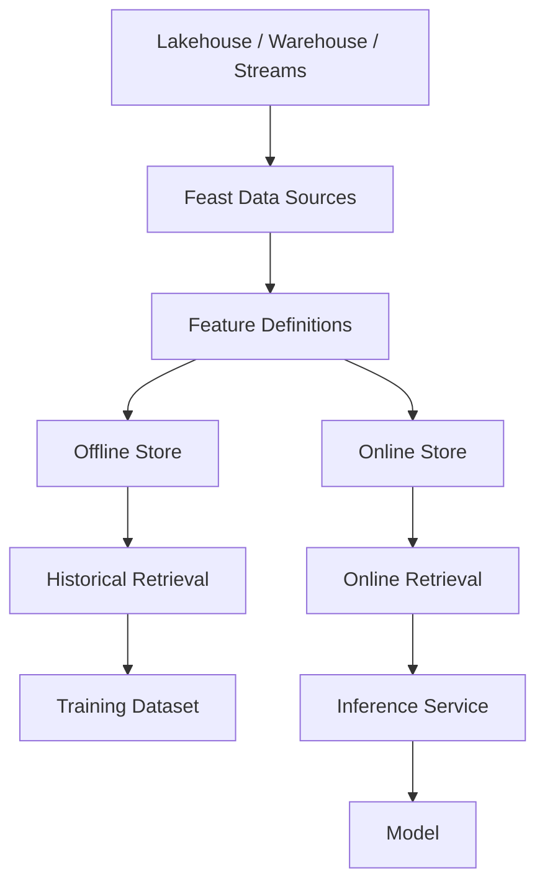
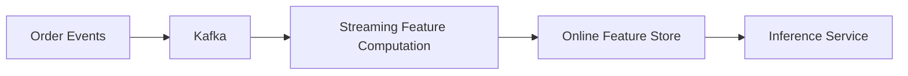
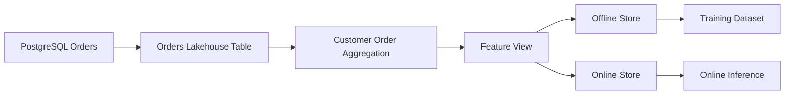
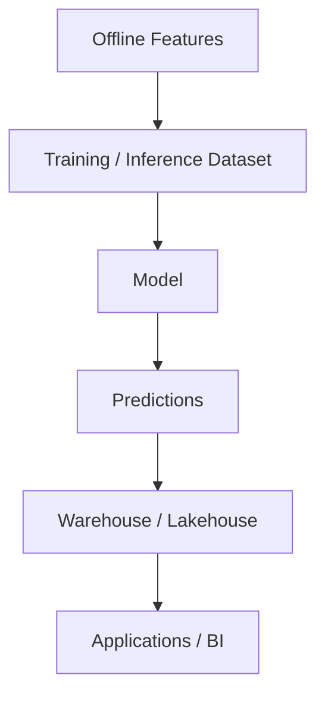
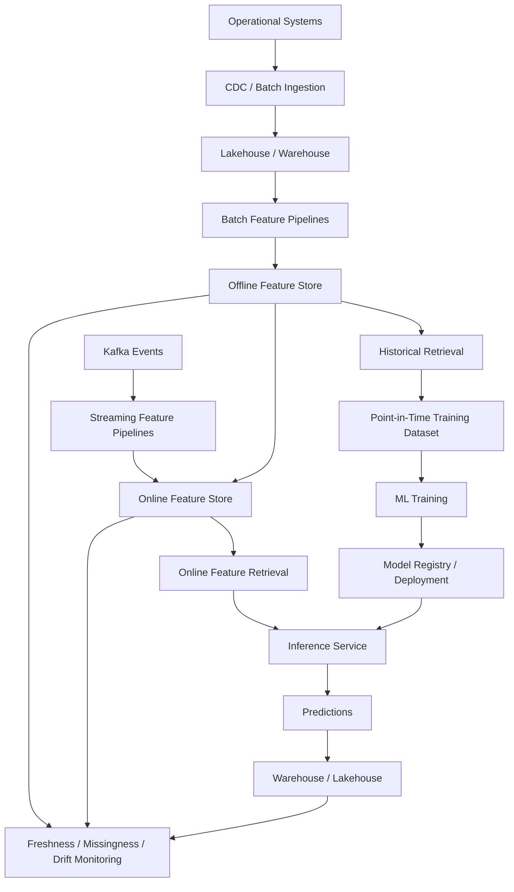
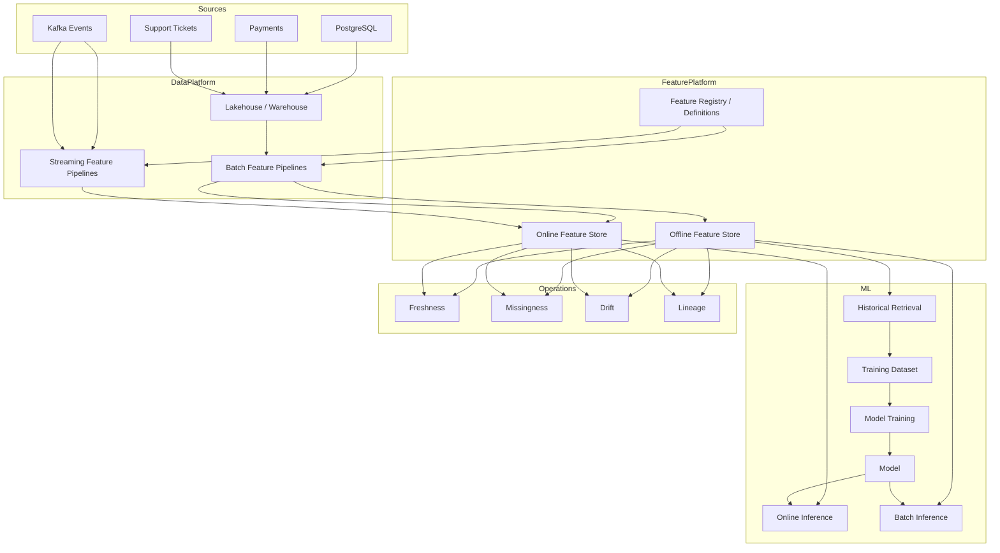

# Module 2.22.04 — Feature Stores and ML Handoff

> **Role:** Senior Data Engineer / ML Data Infrastructure perspective  
> **Level:** Beginner → Fundamentals → Intermediate → Advanced → Production  
> **Primary technology:** Python 3.12+, SQL, Parquet/Lakehouse, PostgreSQL, Kafka, Feast, Redis-compatible online storage, FastAPI, Ray Data  
> **Core engineering concerns:** point-in-time correctness, leakage prevention, training-serving consistency, freshness, reproducibility, versioning, lineage, monitoring

---

## 1. Module Purpose

Machine-learning systems are only as reliable as the data infrastructure feeding them.

A model may have excellent algorithms and still fail because:

- future information leaked into training;
- training features were calculated differently from serving features;
- online features became stale;
- the training dataset cannot be reproduced;
- feature definitions changed without versioning;
- the ML team received data without schema or lineage;
- a streaming feature was unavailable when inference occurred.

This module teaches the Data Engineering side of the ML lifecycle.

The central pipeline is:

```text
Operational / Analytical Data
          ↓
Feature Computation
          ↓
Feature Definitions
          ↓
Offline Feature Store
          ↓
Point-in-Time Training Dataset
          ↓
ML Training
          ↓
Online Feature Store
          ↓
Low-Latency Inference
          ↓
Prediction
          ↓
Monitoring
```

The key idea is:

> **A production feature is not just a column. It is a versioned, time-aware, governed data product with a defined computation, freshness expectation, lineage, and serving contract.**

---

# 2. Learning Outcomes

By the end of this module you should be able to:

1. Explain the ML lifecycle from a Data Engineering perspective.
2. Distinguish features, labels, training datasets, and predictions.
3. Explain batch versus online inference.
4. Model feature entities and entity keys.
5. Design feature views.
6. Define and monitor feature freshness.
7. Explain offline and online feature stores.
8. Build point-in-time-correct training datasets.
9. Identify and prevent data leakage.
10. Explain training-serving skew.
11. Understand Feast architecture and terminology.
12. Configure a Feast repository.
13. Define Feast entities, data sources, and feature views.
14. Retrieve historical features.
15. Materialize features to an online store.
16. Retrieve online features.
17. Build batch and streaming feature pipelines.
18. Make training datasets reproducible.
19. Pin source/table versions and feature-definition versions.
20. Use time travel/versioned data concepts.
21. Create an ML handoff contract.
22. Document schemas, statistics, lineage, versions, and limitations.
23. Monitor freshness, missingness, and feature drift.
24. Build batch inference pipelines and write predictions back to data systems.
25. Understand where Ray Data fits.
26. Evaluate managed feature stores.
27. Decide when a feature store is unnecessary.
28. Compare feature stores with well-designed feature tables.
29. Validate offline/online consistency.
30. Design a production feature platform.

---

# 3. The ML Data Problem

Suppose we want to predict:

> **Will this customer churn?**

The model might require:

```text
customer_id
days_since_last_order
orders_last_30_days
orders_last_90_days
revenue_last_30_days
revenue_last_90_days
support_tickets_last_30_days
average_order_value
```

The Data Engineer must answer:

```text
Where do these features come from?
How are they calculated?
What data was available when?
Where are historical values stored?
How are training features retrieved?
How are online features retrieved?
Are training and serving using the same definition?
How fresh must the feature be?
Can the training dataset be reproduced?
Can the ML team trace each feature to its source?
What happens when source data changes?
```

The foundational relationship is:

```text
Correct ML
    ↓
Correct Data
    ↓
Correct Features
    ↓
Correct Time Semantics
    ↓
Correct Serving
```

---

# 4. ML Lifecycle from a Data Engineering Perspective

A Data Engineer does not need to become a model researcher to support ML systems effectively.

The relevant lifecycle is:

```text
Raw Data
   ↓
Data Transformation
   ↓
Feature Computation
   ↓
Training Dataset
   ↓
Model Training
   ↓
Model Evaluation
   ↓
Model Deployment
   ↓
Batch / Online Inference
   ↓
Predictions
   ↓
Monitoring
   ↓
Retraining / Revision
```

## 4.1 Data Engineer responsibilities

| ML stage | Data Engineering responsibility |
|---|---|
| Raw data | Reliable ingestion and storage |
| Transformation | Correct, tested transformations |
| Feature computation | Reusable feature definitions |
| Training data | Point-in-time correctness and reproducibility |
| Training | Deliver governed datasets |
| Deployment | Provide reliable serving data |
| Online inference | Low-latency feature retrieval |
| Batch inference | Scalable feature/model execution |
| Predictions | Store results reliably |
| Monitoring | Freshness, missingness, drift, pipeline health |
| Retraining | Reproducible historical data |

This module is therefore about **reliable ML data infrastructure**, not model algorithms.

---

# 5. Features

A feature is an input value representing information a model can use to make a prediction.

Examples:

```text
age
customer_tenure_days
orders_last_30_days
average_order_value
login_count_last_7_days
support_tickets_last_30_days
```

## 5.1 Types of features

### Raw feature

Directly represents source data:

```text
customer_age
country
account_type
```

### Derived feature

Calculated from other values:

```text
days_since_last_order
```

### Aggregated feature

Summarizes historical events:

```text
orders_last_30_days
revenue_last_90_days
```

### Numerical feature

```text
average_order_value = 72.50
```

### Categorical feature

```text
customer_segment = "premium"
```

The ML algorithm determines how features are consumed. The Data Engineer's focus is reliable computation, storage, serving, and governance.

---

# 6. Labels

A label is the outcome the model is trying to predict.

Examples:

```text
churned = 1
fraud = 1
late_payment = 0
```

The most important distinction is:

```text
Feature
→ What was known before prediction?

Label
→ What happened afterward?
```

For churn:

```text
Prediction date:
2026-10-01

Features:
What was known on 2026-10-01

Label:
Did the customer churn during the following 30 days?
```

This time relationship is fundamental to leakage prevention.

---

# 7. Training Datasets

A useful conceptual structure is:

```text
Entity
+
Event / Observation Timestamp
+
Historical Features
+
Label
```

Example:

| customer_id | event_timestamp | orders_30d | revenue_90d | tickets_30d | churned |
|---|---|---:|---:|---:|---:|
| C001 | 2026-07-01 10:00 | 4 | 820 | 1 | 0 |
| C002 | 2026-07-01 10:00 | 0 | 120 | 5 | 1 |

The critical requirement is:

> The feature values must represent what was knowable at the observation timestamp.

Do not build historical training examples using today's feature values.

---

# 8. Batch vs Online Inference

## 8.1 Batch inference

Batch inference processes many entities at once.

```text
Millions of Customers
        ↓
Retrieve / Compute Features
        ↓
Run Model
        ↓
Write Predictions
```

Examples:

- daily churn scores;
- weekly customer risk scores;
- monthly segmentation;
- nightly demand forecasting.

Typical properties:

- high throughput;
- latency measured in minutes/hours;
- output often stored in the warehouse/lakehouse.

## 8.2 Online inference

Online inference responds to a request.

```text
Application Request
        ↓
Retrieve Current Features
        ↓
Model
        ↓
Prediction
        ↓
Response
```

Examples:

- fraud detection;
- recommendation;
- real-time eligibility;
- personalization.

Typical properties:

- low latency;
- high availability;
- current features;
- key-based feature lookup.

---

# 9. Feature Entities

An entity is the business object a feature describes.

Examples:

```text
customer
merchant
account
device
product
```

A customer feature might be keyed by:

```text
customer_id
```

The entity key allows the feature-serving system to answer:

```text
Give me the current features for customer C123.
```

Without stable entity identity, feature retrieval becomes ambiguous.

---

# 10. Feature Values Are Time-Aware

A feature is often better represented as:

```text
entity_id
timestamp
feature_value
```

rather than simply:

```text
entity_id
feature_value
```

Example:

```text
customer_id = C123
timestamp   = 2026-10-01 10:00
orders_30d  = 12
```

Later:

```text
customer_id = C123
timestamp   = 2026-10-10 10:00
orders_30d  = 17
```

The feature changed.

Historical ML training needs the correct historical value, not merely the latest value.

---

# 11. Feature Views

A feature view groups related features that share a logical source, entity, and temporal behavior.

Example:

```text
CustomerActivityFeatures
```

might contain:

```text
orders_last_30_days
orders_last_90_days
revenue_last_30_days
revenue_last_90_days
days_since_last_order
support_tickets_last_30_days
```

A feature view should make clear:

```text
Entity
Source
Timestamp
Feature schema
Transformation
Freshness expectation
Version
```

---

# 12. Feature Freshness

Feature freshness describes how recent a feature value is relative to the time it is needed.

Examples:

```text
Fraud detection:
seconds

Recommendation:
minutes

Churn scoring:
hours / day
```

A feature can be mathematically correct but operationally useless if it is too stale.

The relationship is:

```text
Business requirement
        ↓
Freshness SLA
        ↓
Pipeline frequency
        ↓
Storage / serving strategy
        ↓
Monitoring
```

Example:

```text
Required:
< 5 minutes stale

Pipeline:
runs every 30 minutes
```

This architecture cannot meet the contract.

---

# 13. Offline Feature Store

An offline feature store primarily contains historical feature values for:

- training;
- evaluation;
- analysis;
- reproducibility.

Conceptually:

```text
Historical Data
      ↓
Feature Computation
      ↓
Offline Store
      ↓
Historical Retrieval
      ↓
Training Dataset
```

Common physical storage:

- Parquet;
- lakehouse tables;
- warehouse tables.

Important properties:

- historical timestamps;
- large analytical reads;
- reproducibility;
- versionability;
- lineage.

---

# 14. Online Feature Store

An online feature store provides current features with low latency.

```text
Feature Pipeline
      ↓
Online Store
      ↓
Inference Service
      ↓
Model
```

Typical requirements:

- millisecond-scale lookups;
- high availability;
- entity-keyed retrieval;
- freshness;
- predictable latency.

Redis-compatible systems are a common implementation pattern.

---

# 15. Offline vs Online Store

| Characteristic | Offline | Online |
|---|---|---|
| Primary use | Training | Inference |
| Data | Historical | Latest/current |
| Access | Analytical | Key lookup |
| Latency | Seconds/minutes acceptable | Usually milliseconds |
| Storage | Lakehouse/warehouse/Parquet | KV / low-latency DB |
| Time | Historical | Current |
| Main concern | Correctness/reproducibility | Latency/freshness |
| Typical workload | Large scans | Point reads |

Both may be required because their workload characteristics are fundamentally different.

---

# 16. Point-in-Time Correctness

> **A feature used for a training example must contain only information that was available at or before the training example's event timestamp.**

This is the most important concept in this module.

Suppose:

```text
Prediction timestamp:
2026-10-01 12:00
```

A feature:

```text
orders_last_30_days
```

must only use events available by:

```text
2026-10-01 12:00
```

It must not include:

```text
2026-10-02 order
```

even though that order exists in today's database.

## 16.1 Timeline

```text
Past                         Future
───────────────────────────────|─────────────────────
                               |
Feature data available         | Future event
                               |
2026-10-01 12:00               | 2026-10-02
Prediction / observation       | New order
```

Training must only see the left side.

---

# 17. Why Current Joins Leak Future Information

Imagine:

```text
labels
customer_id | label_timestamp | churned
C001        | 2026-10-01      | 1
```

Current feature table:

```text
customer_id | orders_last_30_days
C001        | 18
```

Suppose 8 of those 18 orders occurred after 2026-10-01.

Using 18 in the training example leaks future information.

The model sees information that would not have existed when the prediction was supposed to be made.

---

# 18. Point-in-Time Join

The conceptual condition is:

```text
feature_timestamp <= event_timestamp
```

For each training example, choose the **latest valid feature record** before the event timestamp.

Example feature history:

| customer_id | feature_timestamp | orders_30d |
|---|---|---:|
| C001 | 2026-09-01 | 4 |
| C001 | 2026-09-20 | 7 |
| C001 | 2026-10-05 | 12 |

Training event:

```text
2026-10-01
```

Correct value:

```text
7
```

Incorrect value:

```text
12
```

because the `12` value was not known yet.

---

# 19. SQL Point-in-Time Example

Assume:

```sql
CREATE TABLE customer_features (
    customer_id TEXT,
    feature_timestamp TIMESTAMP,
    orders_last_30_days INTEGER
);
```

and:

```sql
CREATE TABLE churn_labels (
    customer_id TEXT,
    label_timestamp TIMESTAMP,
    churned INTEGER
);
```

A conceptual PostgreSQL solution:

```sql
SELECT
    l.customer_id,
    l.label_timestamp,
    l.churned,
    f.orders_last_30_days
FROM churn_labels l
LEFT JOIN LATERAL (
    SELECT
        orders_last_30_days
    FROM customer_features f
    WHERE f.customer_id = l.customer_id
      AND f.feature_timestamp <= l.label_timestamp
    ORDER BY f.feature_timestamp DESC
    LIMIT 1
) f
ON TRUE;
```

The important rule is:

```sql
f.feature_timestamp <= l.label_timestamp
```

The `ORDER BY ... DESC LIMIT 1` selects the most recent valid feature.

---

# 20. Point-in-Time Join with Window Logic

Another common pattern is:

```sql
WITH candidates AS (
    SELECT
        l.customer_id,
        l.label_timestamp,
        l.churned,
        f.feature_timestamp,
        f.orders_last_30_days,
        ROW_NUMBER() OVER (
            PARTITION BY l.customer_id, l.label_timestamp
            ORDER BY f.feature_timestamp DESC
        ) AS rn
    FROM churn_labels l
    JOIN customer_features f
      ON f.customer_id = l.customer_id
     AND f.feature_timestamp <= l.label_timestamp
)
SELECT
    customer_id,
    label_timestamp,
    churned,
    orders_last_30_days
FROM candidates
WHERE rn = 1;
```

The pattern is:

```text
Join only valid historical records
        ↓
Rank newest valid feature
        ↓
Select rank = 1
```

---

# 21. Data Leakage

Data leakage occurs when information unavailable at prediction time enters the training dataset.

Typical leakage sources:

- future transactions;
- future customer status;
- post-outcome support tickets;
- future aggregates;
- target-derived columns;
- data updated after the prediction timestamp;
- incorrectly joined current dimensions.

The dangerous result is:

```text
Leaky training data
      ↓
Artificially high offline score
      ↓
Model deployment
      ↓
Poor production performance
```

---

# 22. Leakage Debugging Lab

Suppose a churn model reports:

```text
Offline accuracy = 99%
Production accuracy = 71%
```

Do not immediately blame the model.

Investigate:

```text
Training dataset
       ↓
Feature timestamps
       ↓
Source update timestamps
       ↓
Join conditions
       ↓
Feature computation
       ↓
Label definition
```

If a feature was built using current customer status, it may have leaked future information.

## Correct debugging workflow

```text
1. Identify prediction timestamp.
2. List every feature.
3. Identify feature source timestamps.
4. Check whether each feature existed by prediction time.
5. Inspect joins.
6. Compare leaky vs point-in-time datasets.
7. Re-run evaluation.
8. Document the corrected feature contract.
```

---

# 23. Training-Serving Skew

Training-serving skew occurs when the feature logic used in training differs from the logic used during production inference.

Example:

```text
Training:
orders_last_30_days

Serving:
orders_last_28_days
```

Other examples:

```text
Training timezone = UTC
Serving timezone = local

Training missing value = 0
Serving missing value = NULL

Training:
completed orders only

Serving:
all orders
```

Even apparently small differences can alter model behavior.

---

# 24. Preventing Training-Serving Skew

The principle is:

```text
Define Feature Once
        ↓
Reuse Definition
        ↓
Historical Training Retrieval
        ↓
Online Serving Retrieval
```

Feature infrastructure should centralize:

- feature name;
- source;
- transformation;
- entity;
- timestamp semantics;
- schema;
- version;
- freshness;
- default behavior.

The goal is not necessarily that the physical execution path is identical. The **business computation and contract** must remain consistent.

---

# 25. Offline/Online Consistency

For a feature:

```text
orders_last_30_days
```

the offline and online representations should agree for the same entity and time when the comparison is meaningful.

Example validation:

```text
Customer: C123
As-of time: 2026-10-01

Offline:
orders_last_30_days = 17

Online:
orders_last_30_days = 17
```

A mismatch requires investigation.

Potential causes:

- different transformation;
- stale materialization;
- timezone mismatch;
- different filtering;
- missing events;
- different default;
- version mismatch.

---

# 26. Feast

Feast is an open-source feature-store technology.

Its important concepts include:

```text
Entities
Data Sources
Feature Views
Feature Service / Retrieval
Offline Store
Online Store
Registry
Historical Retrieval
Materialization
Online Retrieval
```

A simplified architecture:



Feast should be understood as an implementation of feature-store patterns, not as a substitute for understanding those patterns.

---

# 27. Feast Project Structure

A conceptual repository might look like:

```text
feature_repo/
├── feature_store.yaml
├── entities.py
├── data_sources.py
├── feature_views.py
├── feature_services.py
└── tests/
```

Exact APIs and project conventions can evolve, so verify the installed Feast version when implementing a production project.

The conceptual roles are:

| Component | Purpose |
|---|---|
| `feature_store.yaml` | Store/provider configuration |
| `entities.py` | Entity definitions |
| `data_sources.py` | Source definitions |
| `feature_views.py` | Feature schemas and source mappings |
| `feature_services.py` | Grouped feature retrieval contracts |
| `tests/` | Validation |

---

# 28. Feast Configuration

A configuration identifies the environment in which feature definitions operate.

Typical concerns include:

```text
provider
registry
offline store
online store
project
environment
```

Do not hardcode:

```text
passwords
API keys
cloud credentials
```

Use:

- environment variables;
- secret managers;
- workload identity;
- deployment configuration.

---

# 29. Feast Entities

A customer entity conceptually looks like:

```python
from feast import Entity

customer = Entity(
    name="customer",
    join_keys=["customer_id"],
)
```

The important idea is:

```text
Entity
+
Join Key
=
Identity used for feature retrieval
```

For example:

```text
customer_id = C123
```

is the lookup identity.

---

# 30. Feast Data Sources

A feature source can point to historical data such as:

```text
Parquet
warehouse table
lakehouse table
```

A source generally needs to make time and entity identity explicit.

For example:

```text
customer_id
event_timestamp
orders_last_30_days
revenue_last_90_days
```

The source should have clear:

- entity key;
- event timestamp;
- data availability;
- schema;
- version;
- freshness expectation.

---

# 31. Feast Feature Views

A feature view groups related features.

Conceptually:

```python
from feast import FeatureView, Field
from feast.types import Int64, Float32

customer_activity = FeatureView(
    name="customer_activity",
    entities=["customer"],
    ttl=...,
    schema=[
        Field(name="orders_last_30_days", dtype=Int64),
        Field(name="revenue_last_90_days", dtype=Float32),
    ],
    source=customer_activity_source,
)
```

The exact API depends on the Feast release and source type.

The conceptual contract is more important:

```text
Entity
+
Feature Schema
+
Timestamp
+
Source
+
Freshness / TTL
+
Version
```

---

# 32. Historical Retrieval

Training requires historical feature values.

Conceptually:

```text
Entity DataFrame
        +
Observation Timestamp
        ↓
Historical Retrieval
        ↓
Point-in-Time Features
        ↓
Training Dataset
```

Example entity dataframe:

```python
import pandas as pd

entity_df = pd.DataFrame(
    {
        "customer_id": ["C001", "C002"],
        "event_timestamp": pd.to_datetime(
            ["2026-07-01", "2026-07-01"]
        ),
        "churned": [0, 1],
    }
)
```

The retrieval system should produce the features that were valid at those timestamps.

---

# 33. Why Historical Retrieval Matters

Bad approach:

```text
Today's Features
       ↓
Historical Labels
       ↓
Training Dataset
```

Correct approach:

```text
Historical Labels
       ↓
As-of Timestamp
       ↓
Historical Feature Retrieval
       ↓
Training Dataset
```

The second approach preserves temporal correctness.

---

# 34. Materialization

Materialization moves feature values from an offline source into an online store.

```text
Offline / Historical Source
          ↓
     Materialization
          ↓
     Online Store
          ↓
   Low-Latency Retrieval
```

A scheduled materialization job might run:

```text
every 5 minutes
every hour
daily
```

depending on the feature's freshness requirement.

Materialization must be monitored because a successful feature computation is not enough if the online store remains stale.

---

# 35. Online Retrieval

At inference time:

```text
Request
  ↓
Entity Key
  ↓
Online Feature Store
  ↓
Feature Vector
  ↓
Model
  ↓
Prediction
```

Conceptually:

```python
features = feature_store.get_online_features(
    features=[
        "customer_activity:orders_last_30_days",
        "customer_activity:revenue_last_90_days",
    ],
    entity_rows=[
        {"customer_id": "C123"}
    ],
).to_dict()
```

Exact Feast syntax can vary by release.

Production retrieval must also consider:

- latency;
- availability;
- missing features;
- authorization;
- feature version;
- freshness.

---

# 36. Batch Feature Pipelines

Batch features are appropriate when freshness requirements are moderate.

Example:

```text
Orders
   ↓
Daily Aggregation
   ↓
orders_last_30_days
   ↓
Offline Store
   ↓
Online Materialization
```

Typical orchestration:

```text
Scheduler
   ↓
Extract
   ↓
Transform
   ↓
Validate
   ↓
Publish
   ↓
Materialize
   ↓
Monitor
```

Use existing Stage 2 orchestration and testing patterns rather than creating a separate orchestration philosophy.

---

# 37. Streaming Features

Some features need near-real-time updates.

Example:

> Number of orders placed by a customer in the last hour.

Architecture:



A streaming feature may be:

```text
orders_last_1_hour
```

The engineering concerns include:

- event time;
- late events;
- out-of-order events;
- state;
- checkpointing;
- exactly-once or at-least-once semantics;
- backpressure;
- freshness;
- recovery.

---

# 38. Batch vs Streaming Features

| Characteristic | Batch | Streaming |
|---|---|---|
| Typical freshness | Minutes → days | Seconds → minutes |
| Processing | Scheduled | Continuous |
| Example | Revenue last 90 days | Orders last hour |
| Complexity | Lower | Higher |
| Cost | Usually lower | Usually higher |
| Failure handling | Job retry | Stateful recovery |
| Main risk | Staleness | State/event-time complexity |

Use streaming only when the business requirement justifies the operational complexity.

---

# 39. Reproducible Training Datasets

A training dataset should be reproducible.

Record:

```text
training dataset ID
entity definition version
feature definition version
source/table versions
training window
label definition
code version
configuration
creation timestamp
data quality results
```

Conceptually:

```text
Training Run
    ↓
Feature Version
    ↓
Source Version
    ↓
Transformation Version
    ↓
Training Window
    ↓
Dataset Snapshot
```

If a model performs unexpectedly six months later, you should be able to reconstruct what data and feature definitions produced it.

---

# 40. Table-Version Pinning

Suppose a lakehouse table has:

```text
Version 101
Version 102
Version 103
```

A training run should record:

```text
orders_table_version = 102
customers_table_version = 88
```

rather than simply:

```text
orders_table = current
```

"Current" is not reproducible.

Version pinning creates a historical reference.

---

# 41. Time Travel

Versioned table systems can support:

```text
Read table as of timestamp
```

or:

```text
Read table version N
```

Conceptually:

```text
Today
 ↓
Table Version 103

Training Run
 ↓
Requires Version 101
```

This allows historical reconstruction.

Time travel is useful for reproducibility, debugging, auditing, and backfills.

---

# 42. Feature-Definition Versioning

Source data versioning alone is insufficient.

Suppose:

```text
v1:
orders_last_30_days = completed orders

v2:
orders_last_30_days = completed + paid orders
```

The source table may be identical, but the feature meaning changed.

Therefore record:

```text
feature_definition_version = 2
```

A robust training run references both:

```text
Source Version
+
Feature Definition Version
```

---

# 43. Feature Versioning Strategy

A feature version should change when its semantic or computational contract changes materially.

Examples:

```text
customer_ltv_v1
customer_ltv_v2
```

or:

```text
feature_definition_hash
```

The organization should establish whether a change is:

- backward compatible;
- a correction;
- a semantic change;
- a new feature.

Never silently change a certified feature if model reproducibility depends on its previous meaning.

---

# 44. ML Handoff Contract

The Data Engineering team should not simply send:

```text
training.csv
```

to the ML team.

The handoff should describe the dataset as a data product.

A useful contract contains:

```text
Dataset identity
Schema
Feature definitions
Label definition
Statistics
Source versions
Feature versions
Lineage
Freshness
Quality checks
Known limitations
Ownership
Access rules
Training window
```

---

# 45. Feature Schema

Example:

| Feature | Type | Nullable | Unit | Description |
|---|---|---|---|---|
| orders_last_30_days | integer | no | orders | Completed orders |
| revenue_last_90_days | float | no | INR | Net revenue |
| average_order_value | float | yes | INR | Average completed order value |
| days_since_last_order | integer | yes | days | Days since last completed order |

Schema should also specify:

- valid ranges where known;
- default behavior;
- timestamp semantics;
- version.

---

# 46. Feature Statistics

Useful statistics include:

```text
count
missing_count
missing_rate
min
max
mean
median
quantiles
unique_count
```

For categorical features:

```text
top categories
category frequency
unknown category rate
```

These statistics help detect unexpected changes before they damage model performance.

---

# 47. Feature Lineage

Lineage answers:

> Where did this feature come from?

Example:

```text
orders_last_30_days
        ↓
fct_orders
        ↓
orders
        ↓
CDC / ingestion
        ↓
PostgreSQL
```

More detailed lineage:



Lineage is essential for:

- debugging;
- audits;
- impact analysis;
- incident response;
- model governance.

---

# 48. Feature Limitations

Every ML handoff should document limitations.

Examples:

```text
Support ticket data is delayed by up to 30 minutes.
Historical refunds before 2025 are incomplete.
Feature is unavailable for new customers.
Online value can be up to 5 minutes stale.
```

A limitation is not necessarily a failure.

An undocumented limitation is a production risk.

---

# 49. Data Contracts

A data contract defines expectations between producers and consumers.

For ML features it can include:

```text
Schema
Data types
Nullability
Freshness
Allowed ranges
Entity key
Timestamp semantics
Availability
Quality expectations
Ownership
```

The feature contract extends the data contract into ML-serving requirements.

---

# 50. Freshness Monitoring

Suppose:

```text
Feature:
orders_last_1_hour

Required freshness:
< 5 minutes
```

Monitor:

```text
now - latest_feature_timestamp
```

If:

```text
freshness_age = 11 minutes
```

the feature violates its contract.

Alerting should be based on the business requirement, not an arbitrary threshold.

---

# 51. Missingness Monitoring

Monitor:

```text
missing_rate =
missing_values / total_values
```

Example:

```text
Expected:
< 1%

Observed:
8.4%
```

This may indicate:

- source failure;
- transformation bug;
- new entity population;
- schema change;
- upstream delay.

Missingness can be a model-quality problem even when the pipeline itself is "green."

---

# 52. Feature Drift

Feature drift occurs when the production distribution changes relative to a reference distribution.

Examples:

```text
Training average order value:
₹80

Production:
₹140
```

or:

```text
Training premium customers:
12%

Production:
34%
```

Possible causes:

- business changes;
- customer behavior changes;
- seasonality;
- data pipeline changes;
- instrumentation changes.

Drift is not automatically bad, but it is a signal requiring investigation.

---

# 53. Drift Monitoring

Useful approaches include:

- mean/variance comparison;
- quantile comparison;
- PSI awareness;
- distribution distance measures;
- categorical frequency comparison.

A production system should define:

```text
reference window
monitoring window
threshold
alert policy
owner
```

Do not choose a threshold without understanding the feature's behavior.

---

# 54. Batch Inference

Batch inference architecture:



Example:

```text
10 million customers
        ↓
Daily features
        ↓
Churn model
        ↓
10 million predictions
        ↓
customer_churn_scores
```

The prediction table should include:

```text
customer_id
prediction_timestamp
model_version
score
prediction_version
feature_version
```

---

# 55. Writing Predictions Back

Predictions are themselves data products.

A robust prediction table may contain:

```text
customer_id
prediction_timestamp
model_version
feature_version
score
prediction
```

This supports:

- auditability;
- downstream applications;
- monitoring;
- model comparison;
- historical analysis.

Never store only:

```text
customer_id
score
```

if production traceability matters.

---

# 56. Ray Data Awareness

Ray Data is useful for distributed batch data processing and inference workloads.

Conceptually:

```text
Large Feature Dataset
        ↓
Ray Data
        ↓
Distributed Inference
        ↓
Predictions
        ↓
Lakehouse / Warehouse
```

It can be useful when:

- data no longer fits efficiently into one process;
- inference is CPU/GPU parallelizable;
- large datasets require distributed execution.

Ray Data does not replace:

- feature definitions;
- point-in-time correctness;
- feature stores;
- data contracts.

It is an execution/scaling component.

---

# 57. Managed Feature Stores

Managed feature stores may be provided as part of cloud ML/data platforms.

Benefits may include:

- managed infrastructure;
- online serving;
- metadata;
- integration with training;
- monitoring;
- operational support.

Trade-offs include:

- cost;
- vendor lock-in;
- portability;
- platform complexity;
- feature/API constraints;
- governance;
- operational coupling.

Evaluate a managed feature store against actual requirements rather than adopting it automatically.

---

# 58. When a Feature Store Is Overkill

Not every organization needs a feature store.

A feature store may be unnecessary when:

- models are few;
- features are batch-only;
- inference is infrequent;
- no online serving exists;
- feature reuse is low;
- a well-designed feature table is sufficient.

A simple architecture can be:

```text
Lakehouse Feature Tables
        ↓
Training Dataset
        ↓
Batch Model
        ↓
Predictions
```

Do not introduce a feature store merely because "production ML" sounds like it requires one.

---

# 59. Feature Tables as an Alternative

A well-designed feature table can provide:

```text
entity_id
event_timestamp
feature_1
feature_2
feature_3
...
```

with:

- clear schema;
- historical values;
- point-in-time retrieval;
- versioning;
- lineage;
- tests.

For batch ML, this may be enough.

The real requirement is not the tool.

The requirement is:

```text
Correct
+
Reproducible
+
Versioned
+
Observable
+
Accessible
features
```

---

# 60. Feature Store vs Feature Tables

| Requirement | Feature Tables | Feature Store |
|---|---|---|
| Batch training | Excellent | Excellent |
| Historical data | Excellent | Excellent |
| Online low-latency retrieval | Usually limited | Strong |
| Central feature registry | Custom | Usually built in |
| Feature reuse | Possible | Strong |
| Operational complexity | Lower | Higher |
| Cost | Lower | Potentially higher |
| Best for | Batch/simple ML | Reused + online ML |

---

# 61. Production Feature Architecture

A production-oriented architecture can look like:



---

# 62. Production Feature Contract

For each feature define:

```text
Name
Business meaning
Entity
Join key
Source
Transformation
Timestamp semantics
Data type
Null behavior
Freshness SLA
TTL
Version
Owner
Lineage
Access policy
Quality tests
Known limitations
```

Example:

```yaml
name: orders_last_30_days
entity: customer
dtype: int64
source: fct_orders
definition: count of completed orders in preceding 30 days
timestamp_semantics: event_time
freshness_sla: 5m
owner: customer_ml
version: 3
```

---

# 63. End-to-End Churn Feature Project

## Project Goal

Build a production-oriented feature platform for customer churn prediction.

### Data

Use:

```text
Customers
Orders
Payments
Support Tickets
```

### Features

Build:

```text
orders_last_30_days
orders_last_90_days
revenue_last_30_days
revenue_last_90_days
days_since_last_order
support_tickets_last_30_days
average_order_value
```

### Infrastructure

Implement:

```text
offline feature storage
online feature storage
Feast
historical retrieval
materialization
online retrieval
```

### Correctness

Demonstrate:

```text
point-in-time joins
leakage prevention
training-serving consistency
```

### Reproducibility

Record:

```text
feature version
source/table version
transformation version
training window
run metadata
```

### Handoff

Produce:

```text
schema
statistics
lineage
freshness
limitations
ownership
```

### Monitoring

Implement:

```text
freshness
missingness
drift
```

### ML

Demonstrate:

```text
training dataset
batch inference
prediction storage
online feature retrieval
```

---

# 64. Project Structure

A practical project can use:

```text
features/
├── feature_repo/
│   ├── feature_store.yaml
│   ├── entities.py
│   ├── data_sources.py
│   ├── feature_views.py
│   └── tests/
├── data/
│   ├── raw/
│   ├── curated/
│   └── feature_tables/
├── training/
│   ├── datasets/
│   └── metadata/
├── inference/
│   ├── batch/
│   └── online/
├── monitoring/
│   ├── freshness/
│   ├── missingness/
│   └── drift/
└── docs/
    └── ml-handoff.md
```

---

# 65. Practical Lab 1 — Build a Feature Table

Create:

```text
customer_features
```

with:

```text
customer_id
feature_timestamp
orders_last_30_days
revenue_last_90_days
days_since_last_order
```

Requirements:

- explicit timestamp;
- deterministic transformation;
- documented grain;
- tests.

Checkpoint:

- [ ] Explain one row.
- [ ] Explain the timestamp.
- [ ] Explain the source.

---

# 66. Practical Lab 2 — Create a Leaky Dataset

Intentionally build:

```text
historical labels
+
current features
```

Train a toy model and record its score.

Then build the point-in-time version.

Compare:

```text
leaky score
vs
correct score
```

The purpose is to make leakage measurable rather than theoretical.

---

# 67. Practical Lab 3 — Point-in-Time Join

Create feature history:

```text
C001 | 2026-09-01 | 4
C001 | 2026-09-20 | 7
C001 | 2026-10-05 | 12
```

Create label:

```text
C001 | 2026-10-01 | 1
```

Expected feature:

```text
7
```

not:

```text
12
```

Checkpoint:

- [ ] Explain why 12 is invalid.
- [ ] Implement the as-of join.
- [ ] Add a regression test.

---

# 68. Practical Lab 4 — Feast Repository

Create:

```text
customer
```

entity.

Create batch features:

```text
lifetime_orders
days_since_last_order
average_order_value
```

Create a source backed by Parquet or an appropriate local analytical source.

Define feature views.

Retrieve historical features.

Then materialize current values to an online store.

---

# 69. Practical Lab 5 — Online Retrieval

For:

```text
customer_id = C123
```

retrieve:

```text
orders_last_30_days
revenue_last_90_days
average_order_value
```

Measure:

```text
latency
freshness
missingness
```

Checkpoint:

- [ ] Online lookup works.
- [ ] Entity key is correct.
- [ ] Values are documented.
- [ ] Missing values are handled.

---

# 70. Practical Lab 6 — Offline/Online Parity

For selected customers:

```text
As-of time = T
```

compare the offline feature value against the corresponding online value where the online store represents that same version/time state.

Investigate every mismatch.

Possible root causes:

```text
stale materialization
different transformation
different version
timezone mismatch
missing event
default mismatch
```

---

# 71. Practical Lab 7 — Feature Freshness Monitor

Calculate:

```text
feature_age =
current_time - latest_feature_timestamp
```

Set a contract:

```text
freshness < 5 minutes
```

Generate a test condition that violates it.

Expected:

```text
monitor = FAIL
alert = triggered
```

---

# 72. Practical Lab 8 — Missingness Monitor

Calculate:

```text
missing_rate =
missing_count / total_count
```

Create a synthetic failure where:

```text
missing_rate = 8%
```

while the contract says:

```text
< 1%
```

Investigate the upstream source and transformation.

---

# 73. Practical Lab 9 — Drift Detection

Create a training distribution:

```text
AOV mean = ₹80
```

and a production distribution:

```text
AOV mean = ₹145
```

Calculate descriptive statistics and apply an appropriate drift test.

Explain:

- whether drift is detected;
- whether it is necessarily bad;
- what should happen next.

---

# 74. Practical Lab 10 — Reproducible Training Run

Create metadata:

```yaml
run_id: churn-2026-10-01-001
feature_version: 3
orders_table_version: 102
customers_table_version: 88
training_start: 2026-01-01
training_end: 2026-09-01
label_definition_version: 2
code_commit: abc123
```

Then verify that the dataset can be reconstructed from these references.

---

# 75. Practical Lab 11 — ML Handoff Document

Produce an ML handoff containing:

```text
Dataset
Purpose
Entity
Label
Feature list
Schema
Statistics
Feature versions
Source versions
Lineage
Freshness
Quality checks
Known limitations
Ownership
Access instructions
Reproduction instructions
```

---

# 76. Practical Lab 12 — Batch Prediction Pipeline

Build:

```text
Offline Features
      ↓
Batch Feature Dataset
      ↓
Toy Model
      ↓
Predictions
      ↓
Prediction Table
```

Prediction table:

```text
customer_id
prediction_timestamp
model_version
feature_version
score
prediction
```

---

# 77. Debugging Scenario — 99% Offline Accuracy

### Symptom

```text
Offline:
99%

Production:
72%
```

### Investigation

```text
1. Check feature timestamps.
2. Check target-derived columns.
3. Check current vs historical joins.
4. Check source update timestamps.
5. Compare feature distributions.
6. Compare offline/online transformations.
7. Rebuild the dataset.
```

### Likely causes

```text
data leakage
training-serving skew
distribution shift
```

Do not assume one cause before collecting evidence.

---

# 78. Debugging Scenario — Online Features Are Stale

### Symptom

```text
Required:
< 5 min

Observed:
47 min
```

Investigate:

```text
source ingestion
        ↓
feature computation
        ↓
materialization
        ↓
online store
        ↓
retrieval
```

Determine where freshness was lost.

---

# 79. Debugging Scenario — Offline/Online Mismatch

Expected:

```text
offline = 17
online = 17
```

Observed:

```text
offline = 17
online = 14
```

Investigate:

- source version;
- materialization time;
- transformation version;
- event-time handling;
- filtering;
- defaults;
- online store state.

---

# 80. Debugging Scenario — Feature Missing for New Customers

A new customer has:

```text
orders_last_30_days = NULL
```

Possible reason:

```text
no historical orders
```

Possible responses depend on the feature contract:

```text
0
NULL
special missing category
fallback feature
```

Never choose a default purely for convenience. The default is part of the model's data contract.

---

# 81. Debugging Scenario — Streaming Feature Lags

Required:

```text
orders_last_1_hour freshness < 2 minutes
```

Observed:

```text
12 minutes
```

Investigate:

```text
Kafka lag
consumer throughput
state store
checkpointing
late events
downstream materialization
online store write latency
```

---

# 82. Common Mistakes

## 82.1 Current features joined to historical labels

**Failure:** leakage.

**Fix:** point-in-time retrieval.

## 82.2 Separate training and serving code

**Failure:** training-serving skew.

**Fix:** shared feature definitions and contracts.

## 82.3 Unmonitored online store

**Failure:** stale features.

**Fix:** freshness monitoring and alerting.

## 82.4 No versioning

**Failure:** training dataset cannot be reconstructed.

**Fix:** source and feature version pinning.

## 82.5 No lineage

**Failure:** impossible impact analysis.

**Fix:** source-to-feature lineage.

## 82.6 No missingness monitoring

**Failure:** silent feature degradation.

**Fix:** missing-rate monitoring.

## 82.7 No drift monitoring

**Failure:** distribution changes remain invisible.

**Fix:** reference vs production distribution monitoring.

## 82.8 Feature store because it sounds advanced

**Failure:** unnecessary complexity.

**Fix:** evaluate whether feature tables are sufficient.

---

# 83. Production Reliability Checklist

## Correctness

- [ ] Feature grain documented.
- [ ] Entity key documented.
- [ ] Timestamp semantics documented.
- [ ] Point-in-time retrieval tested.
- [ ] Leakage tests exist.
- [ ] Offline/online consistency tested.

## Reproducibility

- [ ] Source versions recorded.
- [ ] Feature versions recorded.
- [ ] Code version recorded.
- [ ] Training window recorded.
- [ ] Dataset identity recorded.

## Serving

- [ ] Online store available.
- [ ] Retrieval latency measured.
- [ ] Freshness monitored.
- [ ] Missingness monitored.
- [ ] Defaults documented.

## Governance

- [ ] Owner assigned.
- [ ] Schema documented.
- [ ] Lineage documented.
- [ ] Limitations documented.
- [ ] Access rules documented.

## ML handoff

- [ ] Dataset contract.
- [ ] Feature schema.
- [ ] Statistics.
- [ ] Versions.
- [ ] Lineage.
- [ ] Freshness.
- [ ] Known limitations.
- [ ] Reproduction instructions.

---

# 84. Quantitative Exercises

## Exercise 1 — Freshness

A feature pipeline publishes every 10 minutes.

Required freshness:

```text
< 5 minutes
```

Can the architecture guarantee the requirement?

**Answer:** No. A 10-minute publication interval already exceeds the maximum freshness target in the worst case.

---

## Exercise 2 — Missingness

A feature dataset has:

```text
1,000,000 rows
12,000 missing values
```

Calculate missingness:

```text
12,000 / 1,000,000
= 0.012
= 1.2%
```

If the contract is `< 1%`, it fails.

---

## Exercise 3 — Point-in-Time Selection

Feature history:

```text
09:00 → 4
10:00 → 7
11:00 → 12
```

Training event:

```text
10:30
```

Correct value:

```text
7
```

---

## Exercise 4 — Feature Freshness

Latest feature timestamp:

```text
10:55
```

Current time:

```text
11:03
```

Feature age:

```text
8 minutes
```

If SLA is:

```text
< 5 minutes
```

the feature is stale.

---

## Exercise 5 — Leakage

A label is created at:

```text
2026-10-01
```

A feature source includes events through:

```text
2026-10-05
```

Can the entire source be used without temporal filtering?

**Answer:** No. The training query must restrict feature information to data available by the label/observation timestamp.

---

# 85. Interview Questions — Beginner

## Q1. What is a feature?

A feature is an input value used by an ML model to make a prediction.

## Q2. What is a label?

A label is the outcome the model is trying to predict.

## Q3. What is a feature store?

A feature store is infrastructure for defining, managing, storing, and serving ML features, particularly across historical training and low-latency online inference workloads.

## Q4. What is an offline feature store?

Historical feature storage primarily used for training and analysis.

## Q5. What is an online feature store?

Low-latency storage for current feature retrieval during online inference.

## Q6. Why are timestamps important?

Because feature values must respect what was known at the time of prediction.

---

# 86. Interview Questions — Intermediate

## Q7. What is point-in-time correctness?

For each training example, use only feature values that were available at or before that example's event timestamp.

## Q8. What is data leakage?

Data leakage occurs when information unavailable at prediction time enters training data.

## Q9. What is training-serving skew?

A mismatch between feature computation or behavior during training and production serving.

## Q10. Why are offline and online stores different?

Training requires large historical retrievals; online inference requires low-latency current-value lookups.

## Q11. What is materialization?

The process of populating current feature values from an offline/historical source into an online feature store.

## Q12. Why version feature definitions?

Because a feature's business or computational meaning can change even when the source data does not.

---

# 87. Interview Questions — Advanced

## Q13. How would you design a point-in-time training pipeline?

Start with entity observations and timestamps, retrieve only feature records satisfying:

```text
feature_timestamp <= observation_timestamp
```

select the latest valid record, validate temporal correctness, and record source/feature versions.

## Q14. How would you detect training-serving skew?

Compare:

- definitions;
- transformations;
- defaults;
- schemas;
- feature distributions;
- offline and online values for common entities/timestamps.

Automate parity tests for representative features.

## Q15. How would you design feature freshness monitoring?

Define a feature-specific freshness SLA, measure the age of the latest available feature value, alert on threshold violations, and trace failures through ingestion, transformation, materialization, and serving.

## Q16. When is a feature store unnecessary?

When the system is batch-oriented, feature reuse is limited, online inference is absent, and well-designed versioned feature tables can satisfy training and inference requirements.

## Q17. What belongs in an ML handoff contract?

At minimum:

```text
schema
statistics
feature definitions
label definition
versions
lineage
freshness
quality checks
limitations
ownership
reproduction information
```

## Q18. How would you handle a feature definition change?

Version the feature, evaluate compatibility, update downstream consumers, record the change, and preserve the previous definition when reproducibility requires it.

---

# 88. Senior-Level Interview Questions

## Q19. Design a production feature platform.

A strong answer should cover:

```text
batch ingestion
CDC / streaming
lakehouse
feature computation
offline store
online store
historical retrieval
point-in-time correctness
materialization
online retrieval
monitoring
versioning
lineage
governance
cost
disaster recovery
```

## Q20. How do you prevent leakage systematically?

Use:

- explicit observation timestamps;
- point-in-time joins;
- temporal validation tests;
- source availability timestamps where necessary;
- feature contracts;
- training dataset audits;
- leakage regression tests.

## Q21. How do you balance freshness and cost?

Classify features by freshness SLA.

```text
seconds → streaming
minutes → micro-batch
hours → scheduled batch
daily → daily batch
```

Do not use streaming for a feature that can tolerate daily freshness.

## Q22. How do you make training reproducible?

Record:

```text
source versions
feature versions
code commit
training window
label definition
configuration
dataset identifier
```

and retain the referenced source snapshots/versioned tables.

## Q23. How would you migrate feature definitions safely?

Use:

```text
v1
 ↓
v2 side-by-side
 ↓
validate parity / expected changes
 ↓
migrate consumers
 ↓
monitor
 ↓
deprecate v1
```

Avoid silently changing a production feature in place.

---

# 89. Final End-to-End Architecture



---

# 90. Final Assessment

You should be able to demonstrate all of the following.

## Roadmap Coverage

- [x] ML lifecycle
- [x] Data Engineer role
- [x] Features
- [x] Labels
- [x] Training datasets
- [x] Batch inference
- [x] Online inference
- [x] Entities
- [x] Feature views
- [x] Feature freshness
- [x] Offline store
- [x] Online store
- [x] Point-in-time correctness
- [x] Data leakage
- [x] Training-serving skew
- [x] Feast
- [x] Feast configuration
- [x] Feast entities
- [x] Feast data sources
- [x] Feast feature views
- [x] Historical retrieval
- [x] Materialization
- [x] Online retrieval
- [x] Batch feature pipelines
- [x] Streaming feature pipelines
- [x] Reproducible training data
- [x] Table versioning
- [x] Feature versioning
- [x] Time travel
- [x] ML handoff
- [x] Feature schema
- [x] Feature statistics
- [x] Feature lineage
- [x] Feature limitations
- [x] Data contracts
- [x] Freshness monitoring
- [x] Missingness monitoring
- [x] Feature drift
- [x] Batch inference
- [x] Prediction storage
- [x] Ray Data awareness
- [x] Managed feature stores
- [x] Feature-store tradeoffs
- [x] Feature tables
- [x] Offline/online consistency
- [x] Production architecture

## Learning Quality

- [x] Beginner-friendly explanations
- [x] Basic → advanced progression
- [x] Python examples
- [x] SQL examples
- [x] Feast examples
- [x] Architecture diagrams
- [x] Point-in-time examples
- [x] Leakage examples
- [x] Debugging scenarios
- [x] Practical labs
- [x] Checkpoints
- [x] Quantitative exercises
- [x] Interview questions
- [x] Final project
- [x] Final assessment

## Production Quality

- [x] Correctness
- [x] Leakage prevention
- [x] Training-serving consistency
- [x] Freshness
- [x] Reproducibility
- [x] Versioning
- [x] Lineage
- [x] Monitoring
- [x] Availability awareness
- [x] Scalability
- [x] Operational tradeoffs
- [x] Cost awareness

---

# 91. Final Mental Model

Remember the entire topic through this flow:

```text
Business / ML Requirement
        ↓
Define Entity
        ↓
Define Feature
        ↓
Define Timestamp Semantics
        ↓
Compute Feature
        ↓
Store Historical Values
        ↓
Build Point-in-Time Training Data
        ↓
Version Everything
        ↓
Train Model
        ↓
Materialize Current Features
        ↓
Serve Online Features
        ↓
Run Inference
        ↓
Store Predictions
        ↓
Monitor Freshness
        ↓
Monitor Missingness
        ↓
Monitor Drift
        ↓
Reproduce / Audit / Retrain
```

The most important principle is:

> **The feature used by the model must be correct for the right entity, at the right time, with the right definition, in both training and production.**

A production feature platform exists to make that correctness **repeatable, observable, versioned, and operationally reliable**.
