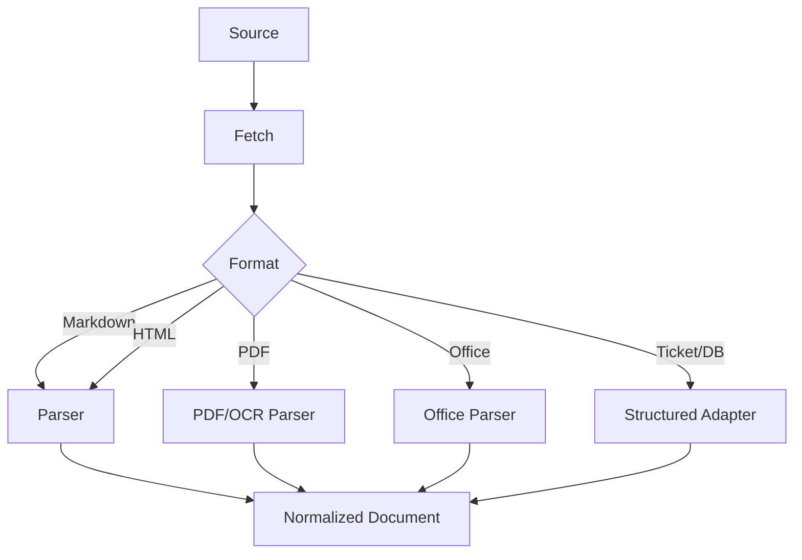
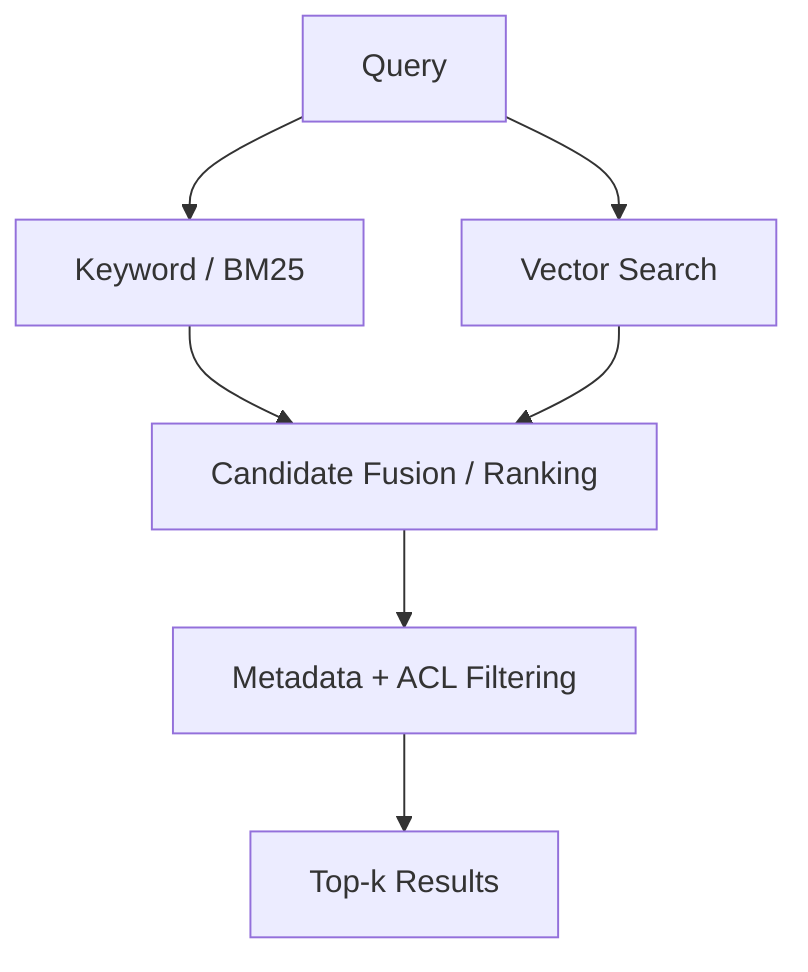
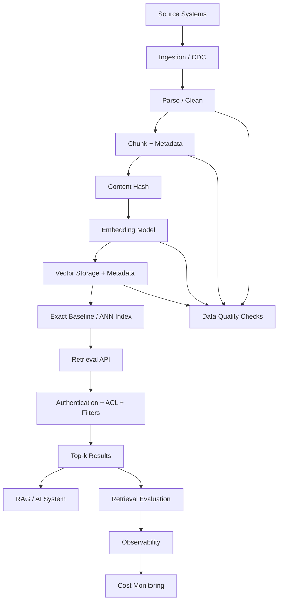
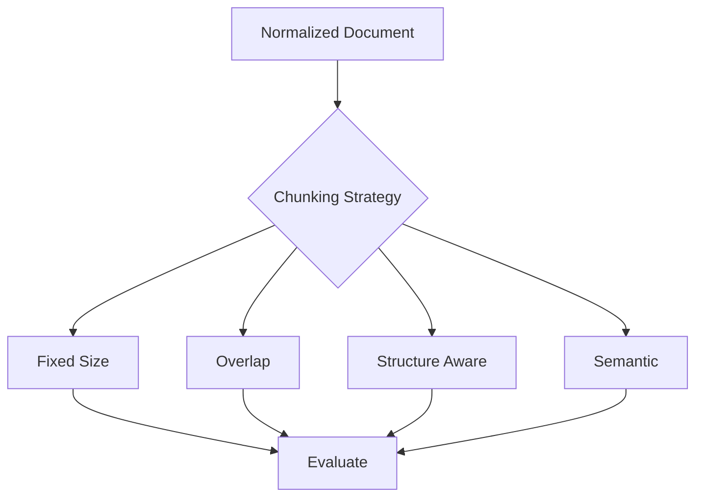
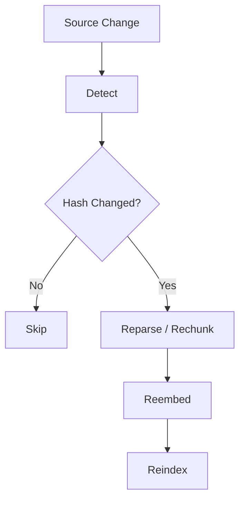
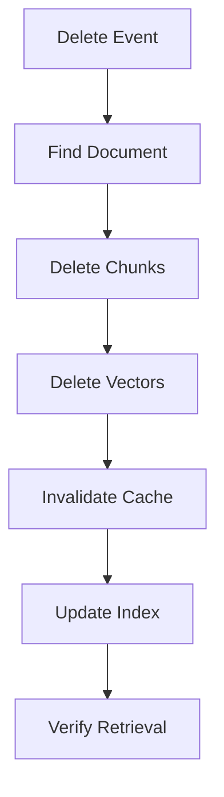
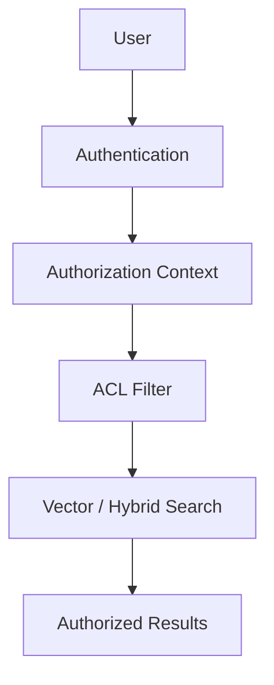
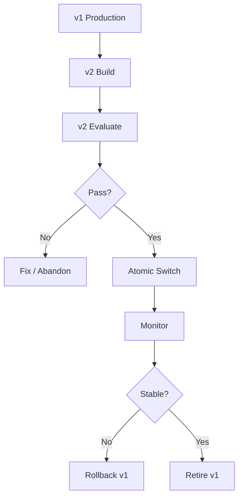
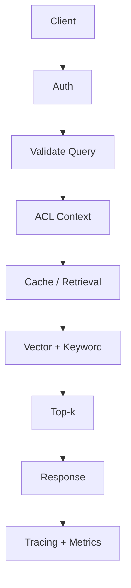

# 05 — Embedding and Vector Data Pipelines

> **Stage 2 — Python for Data Engineering**  
> **Module 2.22 — Serving Data for Analytics, ML, and AI**  
> **Topic 05 — Embedding and Vector Data Pipelines**

## Learning objective

This module teaches how to build the **data infrastructure behind semantic search, RAG, and AI retrieval systems**.

The goal is not merely to learn embeddings or a vector database. The goal is to build a production-oriented pipeline that transforms trusted source data into **fresh, incremental, secure, evaluated, observable, and cost-controlled vector-search infrastructure**.

The core lifecycle is:

```text
Source Data
    ↓
Ingestion
    ↓
Parsing
    ↓
Cleaning
    ↓
Chunking
    ↓
Metadata
    ↓
Content Hashing
    ↓
Embedding
    ↓
Vector Storage
    ↓
Indexing
    ↓
Retrieval
    ↓
Filtering / Authorization
    ↓
Evaluation
    ↓
Serving
    ↓
Incremental Updates
    ↓
Deletion
    ↓
Model Migration
    ↓
Monitoring
```

### Learning progression

```text
Beginner
   ↓
Fundamentals
   ↓
Intermediate
   ↓
Advanced
   ↓
Production
```

### Core engineering principle

```text
Good source data
    ↓
Good parsing
    ↓
Good chunking
    ↓
Good metadata
    ↓
Correct embeddings
    ↓
Correct indexing
    ↓
Secure retrieval
    ↓
Measured retrieval quality
```

Poor retrieval is often an upstream data-engineering problem: stale data, incorrect parsing, poor chunking, missing metadata, missing permissions, incorrect incremental processing, undeleted content, or embedding-version mismatch can all make a strong retrieval model appear weak.

---

# 1. Why Embedding and Vector Pipelines Exist

Imagine an enterprise with:

- customer-support documents
- product documentation
- internal policies
- support tickets
- FAQs
- knowledge articles

A user asks:

> What is the refund policy for an annual subscription?

A keyword search may fail when the query and document use different words.

For example:

```text
Query:
"How can I get my money back?"

Document:
"Customers may request a refund within 30 days..."
```

The two pieces of text are related by **meaning**, not necessarily by exact words.

Semantic retrieval introduces a different path:

```text
User Query
    ↓
Embedding
    ↓
Vector Similarity
    ↓
Relevant Chunks
```

The vector pipeline exists because raw documents are not directly useful for semantic retrieval:

```text
Raw Documents
      ↓
Parse
      ↓
Clean
      ↓
Chunk
      ↓
Embed
      ↓
Index
      ↓
Retrieve
```

A vector pipeline is therefore best understood as a **data pipeline for knowledge retrieval**.

## Why this belongs in Data Engineering

A production retrieval system must answer more questions than:

> "Can I calculate a vector?"

It must answer:

- Where did the content come from?
- Is the content current?
- Was it parsed correctly?
- Was it chunked correctly?
- Who can access it?
- Which embedding model produced the vector?
- Which index contains it?
- What happens when the source changes?
- What happens when the source is deleted?
- Can we prove that unauthorized users cannot retrieve it?
- Can we measure retrieval quality?
- Can we roll back an embedding-model migration?
- How much does re-embedding cost?
- How quickly does a source change reach the searchable index?

These are Data Engineering questions.

---

## Checkpoint

You should now be able to:

- explain why raw documents need a transformation pipeline;
- explain why semantic retrieval is a data-engineering problem;
- identify freshness, security, lifecycle, and evaluation as first-class concerns.

### Quick questions

1. Why might keyword search miss a semantically relevant document?
2. Why is a vector pipeline more than an embedding API call?
3. What production failure can occur if the source is deleted but the vector remains?

---

# 2. Relationship to RAG

At a high level:

```text
Documents
   ↓
Embedding / Vector Pipeline
   ↓
Vector Store
   ↓
Retriever
   ↓
Relevant Context
   ↓
LLM
   ↓
Answer
```

This module focuses primarily on the **data and retrieval infrastructure**. It does not attempt to teach an entire RAG application framework.

A useful separation is:

```text
This module:
Source → Retrieval Infrastructure → Relevant Context

Later AI application layer:
Relevant Context → Prompting → LLM → Answer
```

## Why retrieval quality affects RAG quality

If the vector pipeline retrieves irrelevant or stale context, the downstream model receives poor evidence.

```text
Poor source data
    ↓
Poor chunks
    ↓
Poor retrieval
    ↓
Poor context
    ↓
Poor RAG answer
```

The LLM is not a substitute for a trustworthy retrieval data layer.

---

# 3. Semantic Search

**Semantic search retrieves content based on meaning rather than exact keyword matching.**

Compare:

```text
Keyword Search
    ↓
Match terms
```

with:

```text
Semantic Search
    ↓
Represent meaning numerically
    ↓
Find nearby representations
```

### Example

Query:

```text
"How can I get my money back?"
```

Document:

```text
"Customers may request a refund within 30 days..."
```

A semantic system can recognize that the concepts are related even though the wording differs.

### Semantic search is not magic

Semantic search can still fail because of:

- poor parsing;
- poor chunking;
- weak or mismatched embedding models;
- bad metadata;
- incorrect filters;
- stale indexes;
- poor ANN tuning;
- insufficient evaluation data.

---

## Checkpoint

You should now be able to:

- distinguish lexical and semantic retrieval;
- explain the role of embeddings in semantic search;
- identify upstream reasons semantic retrieval can fail.

### Quick questions

1. Give one query/document pair where exact keywords differ but meaning is similar.
2. Why can a semantic search system still return bad results?
3. Why should retrieval be evaluated separately from the LLM?

---

# 4. Relationship to Agent Memory

Vector pipelines can support:

- long-term knowledge;
- document memory;
- conversation memory;
- enterprise knowledge.

But distinguish:

```text
Knowledge retrieval
vs
Agent memory
```

A vector store is a storage and retrieval mechanism. Whether retrieved content is treated as agent memory depends on the application architecture, lifecycle, retention rules, identity model, and purpose.

For this module, the focus remains the **data pipeline and retrieval infrastructure**.

---

# 5. What Is an Embedding?

An **embedding is a numerical representation of content designed so that semantically related content tends to be closer in vector space.**

Conceptually:

```text
Text
 ↓
Embedding Model
 ↓
Vector
```

For example:

```text
"How do I request a refund?"
```

might become conceptually:

```text
[0.12, -0.45, 0.87, ...]
```

Do not interpret an individual dimension as a simple human-readable concept. The useful property is the geometry of the representation.

## What an embedding is not

An embedding is not:

- a database record by itself;
- a summary;
- a list of human-readable keywords;
- a guarantee of semantic correctness;
- a permission system.

An embedding must be stored with enough metadata and lifecycle information to make it useful operationally.

---

# 6. Vector Space Fundamentals

A vector is an ordered collection of numerical values.

A simplified 2D example:

```text
Document A → [0.90, 0.80]
Document B → [0.85, 0.82]
Document C → [0.10, 0.20]
```

A and B are close to one another, while C is farther away.

Real embeddings generally contain many more dimensions.

The important concepts are:

- **dimension** — number of values in a vector;
- **distance** — how far two vectors are under a chosen metric;
- **similarity** — how related two vectors are under a chosen scoring function;
- **vector representation** — the numerical representation used by the retrieval system.

## Why dimension matters

Dimension affects:

- memory;
- storage;
- index size;
- computation;
- compatibility with the selected index;
- migration complexity.

If a system moves from a 768-dimensional model to a 1536-dimensional model, the storage and index design may need to change.

---

# 7. Similarity Functions

The roadmap requires three core concepts: cosine similarity, dot product, and Euclidean distance.

## 7.1 Cosine similarity

Cosine similarity compares the angle between two vectors:

\[
\operatorname{cosine}(a,b)=
\frac{a\cdot b}{\|a\|\|b\|}
\]

Intuition:

- same direction → high similarity;
- orthogonal direction → similarity around zero;
- opposite direction → low/negative similarity in representations where that interpretation applies.

Cosine similarity is useful when the direction of a vector matters more than its magnitude.

### Python

```python
from __future__ import annotations

import math


def cosine_similarity(a: list[float], b: list[float]) -> float:
    if len(a) != len(b):
        raise ValueError("Vectors must have the same dimension.")

    dot = sum(x * y for x, y in zip(a, b))
    norm_a = math.sqrt(sum(x * x for x in a))
    norm_b = math.sqrt(sum(y * y for y in b))

    if norm_a == 0 or norm_b == 0:
        raise ValueError("Cosine similarity is undefined for a zero vector.")

    return dot / (norm_a * norm_b)
```

## 7.2 Dot product

\[
a\cdot b = \sum_i a_i b_i
\]

Dot product measures alignment while also being affected by vector magnitude.

It is common in embedding systems, but the correct metric depends on the model, normalization strategy, index, and workload.

## 7.3 Euclidean distance

\[
d(a,b)=\sqrt{\sum_i(a_i-b_i)^2}
\]

Smaller distance means the points are closer under Euclidean geometry.

## Engineering rule

Do not choose a similarity metric because it is popular.

Confirm:

1. what metric the embedding model expects;
2. whether vectors are normalized;
3. what the storage/index supports;
4. what your evaluation shows.

---

# 8. Similarity Search Without a Vector Database

Before introducing a vector database, understand the algorithm.

```text
Query Vector
      ↓
Compare with candidate vectors
      ↓
Calculate score/distance
      ↓
Sort candidates
      ↓
Return top-k
```

### Example

```python
from __future__ import annotations

from dataclasses import dataclass


@dataclass(frozen=True)
class Candidate:
    chunk_id: str
    vector: list[float]


def top_k_by_cosine(
    query: list[float],
    candidates: list[Candidate],
    k: int,
) -> list[tuple[str, float]]:
    if k <= 0:
        raise ValueError("k must be positive.")

    scored = [
        (candidate.chunk_id, cosine_similarity(query, candidate.vector))
        for candidate in candidates
    ]

    return sorted(scored, key=lambda item: item[1], reverse=True)[:k]
```

This is conceptually an **exact nearest-neighbor baseline**.

For a small dataset it is easy to understand and useful for evaluation.

For a large dataset, comparing the query with every vector can become expensive.

---

## Checkpoint

You should now be able to:

- explain vector dimensions;
- calculate cosine similarity;
- explain dot product and Euclidean distance;
- describe top-k similarity search.

### Quick questions

1. What does vector dimension mean?
2. Why can exact comparison become expensive?
3. Why should an exact search implementation be kept as an evaluation baseline?

---

# 9. End-to-End Embedding Pipeline Architecture

The core architecture is:

```text
                 Source Systems
                       ↓
                 Ingestion Layer
                       ↓
                Parsing / Cleaning
                       ↓
                    Chunking
                       ↓
                  Metadata
                       ↓
                Embedding Model
                       ↓
                 Vector Storage
                       ↓
                    Indexing
                       ↓
                 Retrieval API
                       ↓
                  Applications
```

Each stage has a contract.

| Stage | Main responsibility | Typical failure |
|---|---|---|
| Ingestion | acquire source data | missed/duplicated source |
| Parsing | recover structure/content | malformed extraction |
| Cleaning | remove noise | useful content removed |
| Chunking | create retrieval units | ideas split incorrectly |
| Metadata | preserve context/security | missing ACL/source |
| Embedding | create vectors | model failure/rate limit |
| Storage | persist content/vector | inconsistent records |
| Indexing | accelerate retrieval | poor recall/latency |
| Retrieval | return candidates | irrelevant results |
| Evaluation | measure quality | no regression detection |
| Serving | expose results | security/latency failures |

---

# 10. Source Ingestion

The roadmap includes:

- Markdown;
- HTML;
- PDF;
- office documents;
- tickets;
- database records.

The pipeline should normalize different inputs into a common representation.

A conceptual document model:

```python
from dataclasses import dataclass
from datetime import datetime


@dataclass(frozen=True)
class Document:
    document_id: str
    source_id: str
    source_url: str | None
    title: str
    content: str
    source_type: str
    updated_at: datetime
```

## Why source identity matters

You need stable identifiers to answer:

- Which source produced this chunk?
- Which chunks belong to this document?
- Which vectors should be deleted?
- Which documents changed?
- Which source should be cited downstream?

Never treat a vector as an orphaned numeric object.

---

## Source ingestion contract

A useful normalized record contains:

```text
document_id
source_id
source_url
title
document_type
content
created_at
updated_at
source_system
```

Add lifecycle status where appropriate:

```text
active
deleted
quarantined
```

---

# 11. Document Parsing

Different sources have different structures.

```text
PDF
HTML
DOCX
Markdown
Database
Support Ticket
```

Parsing should preserve meaningful structure when possible:

- headings;
- paragraphs;
- lists;
- tables awareness;
- links;
- source location;
- document metadata.

## PDFs are not all equivalent

PDF extraction can encounter:

- scanned pages;
- OCR errors;
- reading-order problems;
- tables;
- headers and footers;
- repeated page elements;
- multi-column layouts.

Do not assume that extracting text from a PDF automatically produces good retrieval content.

---

## Mermaid: document ingestion



---

# 12. Cleaning

Cleaning should remove noise without destroying meaning.

Common operations:

- whitespace normalization;
- boilerplate removal;
- duplicate removal;
- malformed-content handling;
- navigation/menu removal;
- HTML cleanup;
- OCR awareness.

## Bad cleaning

```text
Remove everything that is not a plain sentence.
```

This can destroy:

- headings;
- tables;
- code;
- identifiers;
- policy clauses;
- document structure.

## Better approach

```text
Raw content
   ↓
Identify noise
   ↓
Remove known boilerplate
   ↓
Preserve semantic structure
   ↓
Validate output
```

Cleaning is a transformation that should be testable.

---

## Data-quality checks after parsing

Check:

```text
document_id is present
content is not unexpectedly empty
content length is reasonable
source type is valid
updated_at is valid
duplicate identity is detected
```

Do not use a single minimum-length rule as a universal quality criterion. Different document types have different valid sizes.

---

# 13. Chunking

> **Chunking divides a document into retrieval units.**

Example:

```text
Large Document
      ↓
Chunk 1
Chunk 2
Chunk 3
...
```

Chunking is one of the highest-leverage choices in retrieval quality.

A chunk should ideally contain enough context to answer or support a query without becoming so large that relevant information is diluted.

There is no universally optimal chunk size.

---

# 14. Fixed-Size Chunking

A simple strategy is:

```text
Every N tokens or characters
```

Example:

```text
Document:
1 2 3 4 5 6 7 8 9 10 11 12

Chunk size = 5

Chunk 1:
1 2 3 4 5

Chunk 2:
6 7 8 9 10

Chunk 3:
11 12
```

### Advantages

- simple;
- predictable;
- easy to implement;
- easy to benchmark.

### Limitations

It can split:

- a paragraph;
- a sentence;
- a table;
- a policy rule;
- a heading from its content.

---

# 15. Chunk Overlap

Overlap preserves context across chunk boundaries.

```text
Chunk A:
sentence 1 ... sentence 10

Chunk B:
sentence 8 ... sentence 17
```

Here sentences 8–10 are shared.

## Too little overlap

Important context may be split.

## Too much overlap

You create:

- duplicate content;
- more embeddings;
- more storage;
- higher retrieval noise;
- higher embedding cost.

Overlap is a tunable engineering parameter, not a rule that should always be maximized.

---

# 16. Recursive / Structure-Aware Chunking

Structure-aware chunking attempts to respect document boundaries.

```text
Document
 ├── Chapter
 │    ├── Section
 │    └── Section
 └── Chapter
```

Possible boundaries:

1. document;
2. chapter;
3. heading;
4. section;
5. paragraph;
6. sentence.

A structure-aware strategy can preserve relationships that blind fixed-size splitting destroys.

### Example

Instead of:

```text
Chunk:
"...therefore the customer must..."

Next chunk:
"...submit the form within 30 days."
```

prefer:

```text
Chunk:
Refund Eligibility

Customers must submit the form within 30 days.
```

when the document structure permits it.

---

# 17. Semantic Chunking

Semantic chunking attempts to split content according to meaning rather than only character or token counts.

Potential advantages:

- better conceptual boundaries;
- improved coherence for some knowledge bases.

Potential costs:

- more complexity;
- additional computation;
- model dependence;
- more difficult debugging;
- harder reproducibility if the method changes.

Do not assume semantic chunking is always better.

Measure it against representative retrieval queries.

---

# 18. Chunking Tradeoffs

| Strategy | Advantages | Risks | Good use cases |
|---|---|---|---|
| Fixed-size | Simple, predictable | Can split ideas | Simple documents |
| Overlap | Preserves boundary context | Duplication/cost | General documents |
| Structure-aware | Preserves document meaning | Requires parsing | Technical/business docs |
| Semantic | Meaning-aware boundaries | More expensive/complex | Complex knowledge |

The correct decision should come from retrieval evaluation.

---

## Checkpoint

You should now be able to:

- explain why chunking affects retrieval;
- implement fixed-size chunking conceptually;
- explain overlap;
- distinguish structure-aware and semantic chunking;
- reason about storage and embedding cost.

### Quick questions

1. What happens if chunks are too small?
2. What happens if overlap is excessive?
3. Why is structure-aware chunking attractive for technical documentation?

---

# 19. Chunk Metadata

Every chunk should carry metadata.

At minimum:

```text
chunk_id
source_id
source_url
document_id
section
timestamp
content_hash
embedding_model
embedding_model_version
ACL attributes
```

Metadata is as important as the vector itself because the vector answers:

> "What is semantically similar?"

Metadata answers:

> "What is this, where did it come from, who can access it, and which version produced it?"

## Example

```python
from dataclasses import dataclass
from datetime import datetime


@dataclass(frozen=True)
class ChunkMetadata:
    chunk_id: str
    document_id: str
    source_id: str
    source_url: str | None
    section: str | None
    language: str
    updated_at: datetime
    content_hash: str
    embedding_model: str
    embedding_model_version: str
    index_version: str
    acl_groups: tuple[str, ...]
```

---

# 20. Content Hashing

A content hash gives the pipeline a deterministic fingerprint.

```text
Document content
      ↓
SHA-256 / hash
      ↓
content_hash
```

Then:

```text
old_hash == new_hash
        ↓
unchanged
        ↓
skip expensive work
```

or:

```text
old_hash != new_hash
        ↓
changed
        ↓
reprocess
```

## Why hashing matters

It can reduce:

- compute;
- hosted API calls;
- embedding cost;
- processing time.

Hashing is not merely a performance trick. It supports **idempotency and reproducible change detection**.

### Python

```python
from hashlib import sha256


def content_hash(text: str) -> str:
    normalized = text.strip().encode("utf-8")
    return sha256(normalized).hexdigest()
```

Choose normalization carefully. If meaningful whitespace or formatting is part of the source semantics, do not normalize it away blindly.

---

# 21. Embedding Generation

The transformation is:

```text
Chunk
 ↓
Embedding Model
 ↓
Vector
```

Production concerns include:

- batch size;
- model input limits;
- throughput;
- retries;
- rate limits;
- failures;
- cost;
- checkpointing;
- idempotency.

## Embedding job state

A useful batch process can track:

```text
chunk_id
content_hash
model_version
status
attempt_count
last_error
embedded_at
```

This makes failed work recoverable instead of forcing a complete restart.

---

# 22. Hosted Embedding APIs

Hosted embedding services can simplify operations.

Typical flow:

```text
Chunk
 ↓
Batch request
 ↓
Hosted embedding service
 ↓
Vectors
```

Production concerns:

- API authentication;
- batching;
- rate limits;
- transient failures;
- retries;
- timeouts;
- data transfer;
- privacy;
- vendor dependency;
- usage cost.

## Retry policy

Do not retry every error indefinitely.

Conceptually:

```text
Request
  ↓
Success → persist result
  ↓
Transient failure → bounded retry
  ↓
Permanent/invalid request → quarantine
```

Use exponential backoff and a maximum retry budget where appropriate.

---

# 23. Local Embedding Models

Local models provide more control over data handling.

Consider:

- privacy;
- model quality;
- hardware requirements;
- throughput;
- latency;
- infrastructure;
- model operations;
- upgrade complexity.

The tradeoff is not simply:

```text
Hosted = bad
Local = good
```

It is:

```text
Operational simplicity
        vs
Control / privacy / infrastructure responsibility
```

---

# 24. Hosted vs Local Embeddings

| Dimension | Hosted | Local |
|---|---|---|
| Operational simplicity | Higher | Lower |
| Privacy control | Provider-dependent | Higher control |
| Cost model | Usage-based | Infrastructure-based |
| Scaling | Provider-managed | Your responsibility |
| Network latency | Relevant | Usually local |
| Model control | Provider-dependent | Higher |
| Infrastructure burden | Lower | Higher |

Architecture should follow organizational requirements.

---

# 25. Embedding Cost Estimation

Do not invent current vendor prices.

Use the methodology.

For hosted embeddings:

```text
number of chunks
×
average tokens per chunk
×
price per token
```

For local models:

```text
documents
   ↓
tokens
   ↓
throughput
   ↓
compute time
   ↓
infrastructure cost
```

### Example calculation

Suppose:

```text
1,000,000 chunks
1,000 tokens/chunk
```

Then:

```text
1,000,000 × 1,000
=
1,000,000,000 tokens
```

If a hypothetical price is provided by an exercise, multiply by that price. Do not silently treat an illustrative price as a current vendor price.

---

# 26. Batch Embedding

Batching improves throughput by amortizing request/model overhead.

A robust batch worker needs:

```text
read batch
   ↓
validate
   ↓
embed
   ↓
persist
   ↓
checkpoint
   ↓
next batch
```

### Python pattern

```python
from __future__ import annotations

from collections.abc import Iterable, Sequence
from dataclasses import dataclass


@dataclass(frozen=True)
class EmbeddedChunk:
    chunk_id: str
    model_version: str
    vector: Sequence[float]


def batched(items: Sequence[str], batch_size: int) -> Iterable[Sequence[str]]:
    if batch_size <= 0:
        raise ValueError("batch_size must be positive.")

    for start in range(0, len(items), batch_size):
        yield items[start : start + batch_size]
```

The model-specific embedding call belongs behind a dedicated interface so that the pipeline is testable without making real model requests.

---

# 27. Ray Data Awareness for Scale

The roadmap expects **awareness**, not a full Ray course.

Distributed processing becomes useful when:

- the corpus is very large;
- preprocessing is CPU-intensive;
- embedding throughput must scale;
- a single machine cannot meet the processing SLA.

Conceptually:

```text
Millions of chunks
       ↓
Ray Data
       ↓
Parallel preprocessing / embedding
       ↓
Vector output
```

The engineering decision should consider:

- workload size;
- model throughput;
- cluster cost;
- operational complexity;
- retry semantics;
- output idempotency.

Do not distribute a workload merely because a distributed framework exists.

---

## Checkpoint

You should now be able to:

- design hosted and local embedding workflows;
- estimate embedding workload cost;
- explain batching and retries;
- explain where Ray Data can fit.

### Quick questions

1. Why should embedding work be checkpointed?
2. What is the difference between a transient and permanent failure?
3. When is distributed embedding processing justified?

---

# 28. Vector Storage

A vector record should normally preserve more than the vector.

Conceptually:

```text
chunk_id
content
metadata
embedding
source_id
ACL
version
timestamps
```

Storing only:

```text
[0.12, -0.45, ...]
```

creates an operationally weak system.

You need to know:

- what the vector represents;
- which source produced it;
- which model produced it;
- who can access it;
- which index contains it;
- whether it is stale;
- how to delete it.

---

# 29. PostgreSQL + pgvector

`pgvector` is the roadmap's primary concrete vector-storage technology.

The architecture combines:

```text
PostgreSQL
+
vector column
+
relational metadata
+
vector index
```

This is useful when relational data, transactional integration, metadata filtering, and vector retrieval belong in one platform.

## Conceptual schema

```sql
CREATE TABLE documents (
    document_id TEXT PRIMARY KEY,
    source_id TEXT NOT NULL,
    source_url TEXT,
    title TEXT NOT NULL,
    document_type TEXT NOT NULL,
    content_hash TEXT NOT NULL,
    acl_group TEXT NOT NULL,
    updated_at TIMESTAMPTZ NOT NULL,
    status TEXT NOT NULL
);

CREATE TABLE chunks (
    chunk_id TEXT PRIMARY KEY,
    document_id TEXT NOT NULL REFERENCES documents(document_id),
    chunk_index INTEGER NOT NULL,
    section TEXT,
    content TEXT NOT NULL,
    content_hash TEXT NOT NULL,
    embedding_model_version TEXT NOT NULL,
    created_at TIMESTAMPTZ NOT NULL,
    updated_at TIMESTAMPTZ NOT NULL
);
```

A vector-bearing table can then associate the embedding with the chunk and its version.

Exact SQL syntax and index options depend on the installed pgvector version and chosen distance operator.

---

# 30. Exact Nearest-Neighbor Search

Exact search compares the query against all candidates.

```text
Query
 ↓
Compare against every vector
 ↓
Calculate similarity
 ↓
Sort
 ↓
Top-k
```

### Advantages

- exact;
- simple;
- useful for smaller datasets;
- valuable as an evaluation baseline.

### Disadvantage

Cost grows with the number of candidate vectors.

Exact search is extremely valuable because it provides a reference against which ANN recall can be measured.

---

# 31. Approximate Nearest-Neighbor Search

ANN methods trade some exactness for faster search.

```text
Exact Search
    vs
Approximate Search
```

At large vector counts, exact search can become too expensive for low-latency workloads.

ANN design becomes an optimization problem:

```text
Recall
+
Latency
+
Memory
+
Build Time
```

There is no free performance.

---

# 32. HNSW

**HNSW — Hierarchical Navigable Small World** — is a graph-based ANN approach.

Conceptually, vectors are connected in a navigable graph. Search explores promising neighbors rather than comparing every vector.

Think:

```text
All vectors
   ↓
Graph structure
   ↓
Navigate toward similar regions
   ↓
Top-k candidates
```

Engineering tradeoffs include:

- retrieval speed;
- recall;
- memory;
- index-build cost;
- tuning parameters.

Do not memorize implementation internals. Understand why a graph index can accelerate search and why the index itself consumes resources.

---

# 33. IVF

**IVF — Inverted File** — partitions the vector space into clusters.

Conceptually:

```text
All vectors
    ↓
Cluster / partition
    ↓
Find promising partitions
    ↓
Search candidate vectors
    ↓
Top-k
```

Tradeoffs include:

- fewer candidates → faster search but potentially lower recall;
- more candidates → higher recall but more work;
- index construction requires clustering;
- tuning depends on the workload.

---

# 34. Exact vs HNSW vs IVF

| Method | Recall potential | Latency | Memory | Build cost | Typical role |
|---|---|---|---|---|---|
| Exact | Highest reference | Higher at scale | Lower index overhead | Low | Baseline / smaller workloads |
| HNSW | High when tuned | Low | Higher | Higher | Low-latency retrieval |
| IVF | Tunable | Low when tuned | Variable | Moderate | Large/tuned workloads |

These are **engineering tendencies, not universal guarantees**.

Actual behavior depends on:

- vector dimension;
- dataset size;
- hardware;
- metadata filters;
- index parameters;
- query distribution;
- concurrency.

---

# 35. Index Building and Tuning

Index tuning should optimize measured workload behavior.

Measure:

```text
Recall
Latency
Memory
Build Time
Index Size
```

Benchmark data should resemble production data.

Avoid statements such as:

> "Parameter X is always best."

Instead:

```text
Hypothesis
   ↓
Benchmark
   ↓
Measure recall
   ↓
Measure latency
   ↓
Measure memory
   ↓
Choose configuration
```

Keep the exact-search baseline whenever possible.

---

# 36. Retrieval Top-K

`top_k` controls how many candidates the retriever returns.

Too small:

- relevant evidence may be missed.

Too large:

- more latency;
- more data transferred;
- more downstream context;
- potentially higher LLM cost;
- potentially more irrelevant context.

Top-k is a retrieval-quality and systems-design parameter.

---

# 37. Metadata Filtering

Vector similarity should usually be combined with metadata constraints.

Examples:

```text
department = "finance"
language = "en"
region = "APAC"
document_type = "policy"
```

Conceptually:

```text
Vector similarity
+
Metadata filtering
```

A request might mean:

> Find the most semantically relevant finance policies in English.

The actual query execution order depends on the storage/index architecture. Do not assume every system performs filters in exactly the same physical order.

---

# 38. Hybrid Retrieval

Hybrid retrieval combines:

```text
Keyword / BM25
+
Vector Search
+
Metadata Filters
```

Why?

Some queries depend strongly on exact terminology:

- product IDs;
- legal terms;
- error codes;
- names;
- technical identifiers.

A semantic model may understand meaning but still underweight an exact identifier.

---

# 39. BM25 Awareness

BM25 is a lexical relevance method.

At a conceptual level it accounts for:

- term frequency;
- inverse document frequency;
- document length.

Its strength is lexical precision.

For example:

```text
Query:
ERR_AUTH_401
```

A lexical system may be especially strong at finding the exact identifier.

Do not turn this module into a full information-retrieval mathematics course. The goal is to understand why lexical and semantic retrieval complement each other.

---

# 40. Hybrid Retrieval Architecture



Fusion can use different strategies. The important engineering rule is:

> The fusion/ranking strategy must be evaluated on representative queries.

---

## Checkpoint

You should now be able to:

- explain pgvector;
- distinguish exact and ANN search;
- explain HNSW and IVF conceptually;
- explain metadata filtering;
- explain why hybrid retrieval exists.

### Quick questions

1. Why keep an exact-search baseline?
2. What does HNSW trade for speed?
3. Why can BM25 complement vector retrieval?

---

# 41. Incremental Updates

Do **not** build a pipeline that re-embeds every document every night by default.

A production pipeline should detect change:

```text
Source Change
     ↓
Detect Change
     ↓
Process Only Changed Content
     ↓
Re-chunk if necessary
     ↓
Re-embed Changed Chunks
     ↓
Update Index
```

This is a classic Data Engineering optimization:

> Do less work before trying to make the work faster.

---

# 42. CDC Awareness

CDC — Change Data Capture — can deliver source changes as events.

Conceptually:

```text
Source DB
   ↓
CDC
   ↓
Change Events
   ↓
Embedding Pipeline
   ↓
Vector Store
```

Events commonly represent:

```text
INSERT
UPDATE
DELETE
```

The embedding pipeline can translate those events into retrieval-state changes.

CDC is a trigger/source-of-change mechanism here, not the entire subject of this module.

---

# 43. Content Hashing for Incremental Processing

Compare:

```text
old_hash
vs
new_hash
```

If:

```text
old_hash == new_hash
```

skip re-embedding.

If:

```text
old_hash != new_hash
```

reprocess.

This can reduce:

- compute;
- API calls;
- embedding cost;
- processing time.

### Example

```python
from dataclasses import dataclass


@dataclass(frozen=True)
class ChunkState:
    chunk_id: str
    content_hash: str


def needs_reembedding(
    previous: ChunkState | None,
    new_hash: str,
) -> bool:
    if previous is None:
        return True
    return previous.content_hash != new_hash
```

---

# 44. Re-Embedding Only Changed Chunks

A robust workflow:

```text
Document
 ↓
Hash
 ↓
Compare
 ├── Unchanged → Skip
 └── Changed
       ↓
     Reparse
       ↓
     Rechunk
       ↓
     Reembed
       ↓
     Reindex
```

Chunk-level identity is useful because a document update may affect only one section.

However, if a change shifts document structure enough to alter neighboring chunk boundaries, multiple chunks may need reprocessing. The pipeline must detect this rather than assuming one changed source paragraph maps to one unchanged chunk ID.

---

# 45. Deleted Document Handling

If a source document is deleted:

```text
Source
 ↓
Deleted
```

the corresponding vectors must not remain retrievable indefinitely.

A deletion workflow:

```text
Delete event
 ↓
Find related chunks
 ↓
Delete vector records
 ↓
Update / maintain index
 ↓
Invalidate affected caches
 ↓
Verify retrieval
```

Deletion is a first-class data lifecycle operation.

---

# 46. Privacy and Erasure

Deleting the source is not necessarily enough.

Depending on architecture, you may need to remove:

```text
Source content
+
Chunks
+
Embeddings
+
Indexes
+
Caches
```

Also consider:

- retention policies;
- sensitive content;
- tenant isolation;
- audit evidence;
- deletion verification;
- replicas/backups and their lifecycle rules.

The exact legal requirements depend on the organization's obligations and jurisdiction; this module teaches the engineering awareness and implementation pattern.

---

# 47. PII Scanning

PII can include:

- email addresses;
- phone numbers;
- physical addresses;
- IDs;
- financial information;
- other sensitive enterprise data.

A possible pipeline:

```text
Detect
 ↓
Redact / Mask
 ↓
Approve
 ↓
Embed
```

or:

```text
Detect
 ↓
Reject / Quarantine
```

depending on policy.

### Important limitation

PII detection is not perfect.

A robust architecture combines:

- automated detection;
- rules;
- source classification;
- policy;
- review for high-risk data;
- retrieval-time authorization.

---

# 48. Retrieval-Time ACL Filtering

This is one of the most important security concepts.

A user should retrieve only content they are authorized to access.

Example:

```text
Document:
Finance Department

User:
Engineering

Result:
MUST NOT be returned
```

Architecture:

```text
User
 ↓
Authentication
 ↓
Authorization Context
 ↓
Metadata ACL Filter
 ↓
Vector Search / Retrieval
 ↓
Authorized Results
```

## Why post-filtering can be dangerous

If the system retrieves unauthorized content first and filters it later, the unauthorized data may already have:

- entered application memory;
- affected ranking;
- been logged;
- entered a cache;
- been exposed to downstream components.

Where the storage architecture permits it, authorization constraints should be part of the retrieval candidate-selection path.

---

# 49. Vector Search Security

Important controls:

- tenant isolation;
- department access;
- document ACL;
- row-level permissions;
- metadata filters;
- authorization context.

The core rule:

> **Vector similarity does not understand permissions.**

Permissions must be represented and enforced separately.

---

# 50. Embedding Model Versioning

Suppose:

```text
Model v1
 ↓
Vectors v1
```

Later:

```text
Model v2
 ↓
Vectors v2
```

Changing the model can change:

- vector dimensions;
- similarity behavior;
- ranking;
- semantic representation;
- retrieval quality.

Therefore every vector should carry model identity/version information.

---

# 51. Dimension Changes

A model migration may change:

```text
dimension = 768
```

to:

```text
dimension = 1536
```

Vectors of incompatible dimensions cannot simply be mixed in the same fixed-dimension index structure.

Dimension is therefore part of the data contract.

A useful compatibility identity is:

```text
embedding_model
+
embedding_model_version
+
dimension
+
metric
```

---

# 52. Embedding Model Migration

Do not blindly replace the production index.

Instead:

```text
Old Model
   ↓
Old Index

New Model
   ↓
New Index
```

Then:

```text
Evaluate
 ↓
Validate
 ↓
Switch
```

---

# 53. Side-by-Side Index Migration

A production migration can follow:

```text
1. Define v2 model contract
2. Backfill v2 embeddings
3. Build v2 index
4. Evaluate v2
5. Compare v1 vs v2
6. Validate recall and latency
7. Switch serving reference
8. Monitor
9. Retire v1 after a rollback window
```

## Rollback

Keep v1 available until:

- v2 is validated;
- serving metrics are stable;
- retrieval quality is stable;
- security checks pass;
- the rollback window has expired.

---

# 54. Atomic Index Switching

Conceptually:

```text
Current Serving Alias
        ↓
       v1
```

After validation:

```text
Current Serving Alias
        ↓
       v2
```

The application should reference a stable serving identity rather than hard-code an index version.

This reduces deployment coupling and makes rollback simpler.

---

# 55. Retrieval Evaluation

A vector pipeline is not complete because similarity search returns plausible results.

You must measure whether the results are useful.

```text
Golden Dataset
      ↓
Query
      ↓
Expected Relevant Documents
      ↓
Retriever
      ↓
Results
      ↓
Evaluation
```

Retrieval evaluation is the equivalent of a test suite for search behavior.

---

# 56. Golden Dataset

Create a representative set of queries and expected relevant content.

Example:

```text
Query:
"What is the refund policy?"

Expected:
refund-policy.md
```

Include:

- easy queries;
- ambiguous queries;
- exact-term queries;
- long queries;
- permission-sensitive queries;
- paraphrases;
- technical identifiers.

A useful starting project target is **20–50 representative queries**, with enough variety to expose failure modes.

Do not fabricate results. If the pipeline has not been executed, label metrics as examples.

---

# 57. Recall@K

Recall@K asks whether the relevant item appears in the top K results.

Example:

```text
Expected relevant document:
D7
```

Retrieved:

```text
D2, D7, D3, D8, D9
```

For this query:

```text
Recall@5 = 1
```

when the evaluation target is whether the expected item appears at all in the top five.

For multiple expected relevant items, define the denominator explicitly and calculate consistently.

---

# 58. Ranking Metrics

Useful metrics include:

- Recall@K;
- Precision@K;
- MRR — Mean Reciprocal Rank;
- NDCG — Normalized Discounted Cumulative Gain.

At a high level:

| Metric | Main question |
|---|---|
| Recall@K | Did relevant content appear in top K? |
| Precision@K | How much of top K was relevant? |
| MRR | How early did the first relevant result appear? |
| NDCG | Are highly relevant results ranked appropriately? |

Do not use one metric blindly. Match the metric to the retrieval objective.

---

# 59. CI Retrieval Regression Testing

Treat retrieval quality like software quality.

```text
Embedding / Chunking / Index Change
       ↓
Golden Evaluation
       ↓
Recall@K / Ranking Metrics
       ↓
Compare Baseline
       ↓
Pass / Fail
```

Example:

```text
Baseline Recall@5 = 0.91
New Recall@5      = 0.82
```

This is a regression signal.

Potential causes:

- chunking change;
- embedding model change;
- metadata filtering;
- index configuration;
- source parsing;
- ranking changes.

---

# 60. Production Freshness

Retrieval quality alone is insufficient.

A vector store can have:

```text
Excellent retrieval
+
Stale data
```

That is still a production failure.

Track:

```text
source freshness
ingestion lag
embedding lag
index lag
last successful update
```

A useful freshness chain is:

```text
Source updated
    ↓
Ingested
    ↓
Parsed
    ↓
Embedded
    ↓
Indexed
    ↓
Retrievable
```

Each transition has measurable lag.

---

# 61. Retrieval Observability

Track:

- query count;
- latency;
- p50;
- p95;
- p99;
- top-k;
- empty-result rate;
- retrieval score distribution;
- freshness;
- errors;
- index version;
- embedding model version;
- filter usage;
- authorization failures.

### Why p95 and p99 matter

Average latency can hide tail behavior.

A system with acceptable average latency can still violate the user experience if a significant tail of requests is slow.

---

# 62. Cost Monitoring

Track:

- embedding compute;
- hosted embedding API calls;
- vector storage;
- index memory;
- query compute;
- retrieval infrastructure;
- re-embedding cost.

Useful unit economics:

```text
cost per document
cost per chunk
cost per 1,000 documents
cost per 1,000 retrieval requests
```

These numbers should be derived from actual infrastructure measurements or clearly labeled assumptions.

---

# 63. Retrieval API

A conceptual endpoint:

```text
POST /retrieve
```

Request:

```json
{
  "query": "What is the refund policy?",
  "top_k": 5
}
```

Response:

```json
{
  "results": [
    {
      "chunk_id": "chunk-123",
      "content": "Customers may request...",
      "source_id": "policy-123",
      "source_url": "https://example.invalid/policy",
      "section": "Refund Eligibility",
      "score": 0.91
    }
  ]
}
```

Source metadata matters because downstream RAG systems may need citations, auditability, filtering, and traceability.

---

# 64. Retrieval API Security

The retrieval endpoint should consider:

- authentication;
- authorization;
- ACL filters;
- tenant isolation;
- rate limits;
- query-length limits;
- top-k limits;
- timeouts;
- cost controls.

An unrestricted retrieval endpoint can become an expensive compute surface.

Do not reteach the entire FastAPI module here. Apply the serving principles from Topic 01.

---

# 65. Retrieval Caching Awareness

Caching can improve latency, but retrieval cache keys must include all dimensions that affect correctness.

A conceptual key:

```text
query
+
embedding_model_version
+
filters
+
ACL scope
+
index_version
```

Unsafe:

```python
cache["query"]
```

Two users could issue the same query but have different authorization scopes.

A safe design must account for:

```text
same query
≠
same authorized result
```

Similarly:

```text
same query
≠
same result across index versions
```

This topic applies the caching principles learned earlier; it does not replace Topic 02.

---

# 66. Vector Storage Choices

## PostgreSQL + pgvector

A strong fit when:

- PostgreSQL already exists;
- relational metadata matters;
- the vector workload is moderate;
- transactional integration is valuable;
- filtering and relational joins are important.

## Dedicated vector databases

Consider when:

- vector retrieval is a dominant workload;
- specialized operational capabilities justify another system;
- scale or workload shape exceeds the relational design.

Evaluate:

- operational complexity;
- consistency;
- filtering;
- backups;
- observability;
- cost;
- portability.

## Search engines

Useful when:

- lexical search matters;
- hybrid search is central;
- filtering is important;
- enterprise search capabilities are required.

## Lakehouse / data-lake-oriented approaches

Useful for:

- large-scale storage;
- batch processing;
- analytical workflows;
- integration with a broader data platform.

Do not promote one technology universally.

---

# 67. Storage Decision Framework

Evaluate:

```text
Dataset Size
+
Query Rate
+
Latency SLA
+
Filtering Complexity
+
Metadata Requirements
+
Consistency
+
Operational Complexity
+
Cost
```

Then choose among:

```text
PostgreSQL + pgvector
vs
Dedicated Vector DB
vs
Search Engine
vs
Lakehouse-oriented architecture
```

A senior engineer does not ask:

> "Which vector database is best?"

They ask:

> "Which serving architecture satisfies this workload's correctness, latency, security, operational, and cost constraints?"

---

# 68. End-to-End Production Architecture



The complete system must account for:

- data quality;
- freshness;
- security;
- lifecycle;
- retrieval quality;
- operational performance;
- cost.

---

# 69. Enterprise Knowledge Retrieval Platform — Final Project

Build one realistic project throughout the module.

## Sources

```text
Markdown documentation
HTML pages
PDF documents
Support tickets
Database records
```

## Final capabilities

```text
Ingestion
Parsing
Cleaning
Chunking
Metadata
PII scanning
Embedding
Vector storage
ANN indexing
Hybrid retrieval
ACL filtering
Incremental updates
Deletion
Evaluation
Monitoring
```

---

# 70. Project Data Model

## Documents

```text
documents
---------
document_id
source_id
source_url
title
document_type
updated_at
content_hash
acl_group
language
status
```

## Chunks

```text
chunks
------
chunk_id
document_id
chunk_index
section
content
content_hash
embedding_model_version
created_at
updated_at
```

## Embeddings

```text
chunk_embeddings
-----------------
chunk_id
embedding
embedding_model_version
index_version
```

Relationships:

```text
Document
   1
   |
   | contains
   |
   N
Chunk
   |
   | has
   |
   N
Embedding Version
```

Keep lifecycle identity explicit so that updates and deletions are deterministic.

---

# 71. Project Phases

## Phase 1 — Source Ingestion

Ingest:

- Markdown;
- HTML;
- PDF;
- tickets.

**Deliverable:** normalized source records.

## Phase 2 — Normalization

Convert different sources into a common document schema.

**Deliverable:** deterministic document model.

## Phase 3 — Parsing

Extract meaningful structure.

**Deliverable:** parsed document representation.

## Phase 4 — Cleaning

Remove unwanted content while preserving useful structure.

**Deliverable:** cleaned content.

## Phase 5 — Chunking

Implement:

- fixed-size chunking;
- overlap;
- structure-aware chunking.

**Deliverable:** comparable chunk sets.

## Phase 6 — Metadata

Add:

- source ID;
- URL;
- section;
- timestamp;
- content hash;
- model version;
- ACL.

**Deliverable:** complete chunk metadata.

## Phase 7 — PII Scan

Detect and handle sensitive content.

**Deliverable:** PII decision and audit record.

## Phase 8 — Embeddings

Generate embeddings using a local model.

**Deliverable:** versioned vectors.

## Phase 9 — Vector Storage

Store in PostgreSQL + pgvector.

**Deliverable:** queryable vector records.

## Phase 10 — Indexing

Build an exact baseline and ANN index.

**Deliverable:** measured index comparison.

## Phase 11 — Retrieval

Implement vector search.

**Deliverable:** top-k retrieval.

## Phase 12 — Hybrid Retrieval

Add keyword + vector retrieval.

**Deliverable:** evaluated hybrid strategy.

## Phase 13 — ACL Filtering

Ensure users cannot retrieve unauthorized documents.

**Deliverable:** security tests.

## Phase 14 — Incremental Updates

Use content hashes to reprocess only changed content.

**Deliverable:** changed-only processing.

## Phase 15 — Deletion

Implement document erasure.

**Deliverable:** deletion verification.

## Phase 16 — Evaluation

Build a golden dataset and evaluate Recall@K.

**Deliverable:** retrieval-quality report.

## Phase 17 — Model Migration

Create a second embedding-model version and perform side-by-side migration.

**Deliverable:** migration and rollback evidence.

## Phase 18 — Production Observability

Monitor:

- freshness;
- latency;
- errors;
- retrieval quality;
- cost.

**Deliverable:** operational dashboard/metrics specification.

---

# 72. Chunking Experiment

Compare:

```text
Fixed-size
vs
Overlap
vs
Structure-aware
```

Measure:

- Recall@K;
- ranking quality;
- latency;
- chunk count;
- storage;
- embedding workload.

Do not assume one strategy wins.

Explain the evidence.

---

# 73. Embedding Model Experiment

Where practical, compare:

```text
Local Model A
vs
Local Model B
```

or:

```text
Baseline Model
vs
New Model
```

Evaluate:

- Recall@K;
- latency;
- vector dimension;
- storage;
- cost;
- migration complexity.

Do not claim superiority without measurement.

---

# 74. Exact vs ANN Experiment

Build:

```text
Exact Search
vs
HNSW
```

Compare:

- recall;
- latency;
- index size;
- build time.

Use exact search as the reference where feasible.

---

# 75. Hybrid Retrieval Experiment

Compare:

```text
Vector-only
vs
Keyword-only
vs
Hybrid
```

Use representative queries.

Evaluate:

- Recall@K;
- ranking quality;
- latency.

Explain why different query types may favor different retrieval methods.

---

# 76. Mandatory ACL Security Test

Create:

```text
User A → Finance
User B → Engineering
```

Documents:

```text
Finance Policy
Engineering Documentation
```

Verify:

```text
User A:
Finance      → allowed
Engineering  → denied

User B:
Engineering  → allowed
Finance      → denied
```

This test is mandatory.

Also test a cache-hit path so that permissions cannot be bypassed through cached retrieval results.

---

# 77. Deletion Test

1. Create a document.
2. Index it.
3. Verify retrieval.
4. Delete the source.
5. Delete chunks.
6. Delete vectors.
7. Update/refresh the index as required.
8. Invalidate affected caches.
9. Verify that the document is no longer retrievable.

This is a production security requirement, not merely cleanup.

---

# 78. Incremental Update Test

Create:

```text
Document v1
```

Generate embeddings.

Modify it:

```text
Document v2
```

Verify:

```text
content_hash changed
        ↓
Only affected chunks reprocessed
```

Also verify that unchanged documents are not re-embedded.

---

# 79. Model Migration Test

Create:

```text
Index v1
Embedding Model v1
```

Then:

```text
Index v2
Embedding Model v2
```

Run evaluation.

Switch only after validation.

Demonstrate:

```text
v2 failure
   ↓
Serving alias
   ↓
Rollback to v1
```

---

# 80. Retrieval Evaluation Project

Create a golden dataset of approximately:

```text
20–50 representative queries
```

where practical.

Categories:

- direct questions;
- paraphrases;
- exact identifiers;
- technical terms;
- ambiguous questions;
- metadata-filtered questions;
- permission-sensitive questions.

Evaluate:

```text
Recall@1
Recall@5
Recall@10
MRR where useful
Latency
```

Never fabricate results.

If execution has not happened, use:

```text
Example / illustrative result
```

rather than presenting it as measured.

---

# 81. Production Failure Scenarios

## Scenario 1 — Retrieval Quality Drops

Suppose an illustrative baseline changes:

```text
Recall@5:
0.91 → 0.75
```

Investigate:

```text
chunking
embedding model
index
parsing
filters
ranking
```

Use evidence rather than guessing.

## Scenario 2 — Retrieval Is Fast but Wrong

Investigate:

- poor embeddings;
- bad chunking;
- incorrect metadata;
- wrong index configuration;
- inappropriate top-k.

## Scenario 3 — Retrieval Returns Unauthorized Content

Investigate:

- missing ACL metadata;
- missing retrieval filter;
- cache key;
- tenant isolation;
- authorization-context propagation.

## Scenario 4 — Deleted Document Still Appears

Investigate:

- source deletion;
- chunk deletion;
- vector deletion;
- index state;
- cache;
- replicas;
- asynchronous deletion lag.

## Scenario 5 — Embedding Costs Explode

Investigate:

- unnecessary re-embedding;
- missing content hashes;
- duplicate chunks;
- inefficient batching;
- excessive retries;
- oversized overlap.

## Scenario 6 — New Model Makes Retrieval Worse

Investigate:

- golden evaluation;
- chunk/model interaction;
- dimension;
- index parameters;
- ranking behavior.

## Scenario 7 — Vector Store Grows Too Quickly

Investigate:

- duplicate chunks;
- repeated embeddings;
- old model versions;
- undeleted documents;
- unnecessary overlap.

---

# 82. Senior Data Engineer Debugging Method

For every failure:

```text
Problem
   ↓
Hypotheses
   ↓
Evidence
   ↓
Root Cause
   ↓
Fix
   ↓
Regression Test
   ↓
Monitoring
```

### Example

Problem:

```text
Recall@5 dropped.
```

Bad reasoning:

> "The new embedding model is bad."

Senior reasoning:

```text
1. Confirm the regression is reproducible.
2. Compare source corpus versions.
3. Compare chunk counts and lengths.
4. Compare embedding model/version.
5. Compare vector dimensions and metric.
6. Compare index configuration.
7. Compare metadata filters.
8. Run exact-search evaluation.
9. Isolate the first changed component.
10. Add a regression test before closing the incident.
```

This prevents a symptom from being mistaken for a root cause.

---

# 83. Bad vs Good Engineering

## Embedding whole documents

**Bad**

```text
Entire document
    ↓
One vector
```

**Why it fails**

- poor retrieval granularity;
- large contexts;
- unrelated concepts mixed together.

**Good**

```text
Document
 ↓
Meaningful chunks
 ↓
Individual vectors
```

---

## Re-embedding everything

**Bad**

```text
Every night
 ↓
Embed all documents
```

**Why it fails**

- unnecessary compute;
- unnecessary API calls;
- higher cost;
- longer processing windows.

**Good**

```text
Hash
 ↓
Changed?
 ├── No → Skip
 └── Yes → Reprocess
```

---

## Store only the vector

**Bad**

```text
vector
```

**Why it fails**

You lose source, version, permissions, lifecycle, and traceability.

**Good**

```text
vector
+
content
+
metadata
+
source
+
version
+
ACL
```

---

## Delete source but keep vectors

**Bad**

```text
Source deleted
       ↓
Vector remains
```

**Good**

```text
Delete source
 ↓
Delete chunks
 ↓
Delete vectors
 ↓
Invalidate caches
 ↓
Verify retrieval
```

---

## Retrieve first, authorize later

**Bad**

```text
Search
 ↓
Unauthorized result
 ↓
Filter
```

**Good**

```text
Authorization context
 ↓
ACL-aware candidate selection
 ↓
Authorized retrieval
```

---

## Mix model versions

**Bad**

```text
v1 vectors
+
v2 vectors
```

**Good**

```text
Model version
+
dimension
+
metric
+
index version
```

Keep incompatible representations isolated.

---

## Switch models blindly

**Bad**

```text
v1 → delete
v2 → production
```

**Good**

```text
v1 production
v2 side-by-side
 ↓
Evaluate
 ↓
Switch
 ↓
Monitor
 ↓
Rollback if required
```

---

## Trust plausible results

**Bad**

> "The results look reasonable."

**Good**

```text
Golden Dataset
 ↓
Recall@K
 ↓
Ranking Metrics
 ↓
Regression Gate
```

---

# 84. Coding Standards

Use:

```text
Python 3.12+
FastAPI
PostgreSQL
pgvector
PyArrow
Parquet
sentence-transformers / local embedding model
Ray Data awareness
OpenTelemetry awareness
```

Important code should include:

- type hints;
- clear names;
- error handling;
- configuration separation;
- useful comments;
- explanation.

For important code, explain:

```text
What it does
Why it exists
How it works
Failure mode
Production concern
```

---

# 85. Python Building Blocks

## Document normalization

```python
from dataclasses import dataclass
from datetime import datetime


@dataclass(frozen=True)
class NormalizedDocument:
    document_id: str
    source_id: str
    source_url: str | None
    title: str
    text: str
    document_type: str
    updated_at: datetime
```

The purpose is to create one contract across different source systems.

## Fixed-size chunking

```python
from collections.abc import Iterator


def chunk_text(text: str, size: int) -> Iterator[str]:
    if size <= 0:
        raise ValueError("size must be positive.")

    for start in range(0, len(text), size):
        chunk = text[start : start + size].strip()
        if chunk:
            yield chunk
```

This is intentionally simple. Production chunking should usually account for tokens, structure, metadata, and document-specific rules.

## Hashing

```python
from hashlib import sha256


def sha256_text(text: str) -> str:
    return sha256(text.encode("utf-8")).hexdigest()
```

## Retry concept

```python
import time
from collections.abc import Callable
from typing import TypeVar

T = TypeVar("T")


def retry(
    operation: Callable[[], T],
    attempts: int = 3,
    base_delay_seconds: float = 0.5,
) -> T:
    if attempts <= 0:
        raise ValueError("attempts must be positive.")

    last_error: Exception | None = None

    for attempt in range(attempts):
        try:
            return operation()
        except Exception as exc:
            last_error = exc
            if attempt == attempts - 1:
                break
            time.sleep(base_delay_seconds * (2**attempt))

    assert last_error is not None
    raise last_error
```

In production, classify errors before retrying and use jitter where appropriate.

---

# 86. SQL Patterns

## Document table

```sql
CREATE TABLE documents (
    document_id TEXT PRIMARY KEY,
    source_id TEXT NOT NULL,
    source_url TEXT,
    title TEXT NOT NULL,
    document_type TEXT NOT NULL,
    updated_at TIMESTAMPTZ NOT NULL,
    content_hash TEXT NOT NULL,
    acl_group TEXT NOT NULL,
    language TEXT NOT NULL,
    status TEXT NOT NULL
);
```

## Chunk table

```sql
CREATE TABLE chunks (
    chunk_id TEXT PRIMARY KEY,
    document_id TEXT NOT NULL
        REFERENCES documents(document_id),
    chunk_index INTEGER NOT NULL,
    section TEXT,
    content TEXT NOT NULL,
    content_hash TEXT NOT NULL,
    embedding_model_version TEXT NOT NULL,
    created_at TIMESTAMPTZ NOT NULL,
    updated_at TIMESTAMPTZ NOT NULL
);
```

## Deletion

```sql
DELETE FROM chunks
WHERE document_id = $1;
```

Use parameterized queries. Do not interpolate user input into SQL.

## Content-hash comparison

Conceptually:

```sql
SELECT
    chunk_id,
    content_hash
FROM chunks
WHERE document_id = $1;
```

Compare source-derived hashes with persisted hashes in application logic or in a controlled SQL transformation.

## pgvector-style retrieval

The exact operator depends on the chosen distance metric and pgvector configuration. Conceptually:

```sql
SELECT
    chunk_id,
    content,
    document_id
FROM chunk_embeddings
WHERE document_id = $1
ORDER BY embedding <distance_operator> $2
LIMIT $3;
```

The placeholder `$2` represents the query vector.

---

# 87. Retrieval API Design

A conceptual FastAPI contract:

```python
from pydantic import BaseModel, Field


class RetrieveRequest(BaseModel):
    query: str = Field(min_length=1, max_length=4_000)
    top_k: int = Field(default=5, ge=1, le=50)


class RetrievedChunk(BaseModel):
    chunk_id: str
    content: str
    source_id: str
    source_url: str | None
    section: str | None
    score: float


class RetrieveResponse(BaseModel):
    results: list[RetrievedChunk]
```

The service should additionally enforce:

- authentication;
- authorization context;
- ACL filtering;
- timeout;
- query limits;
- top-k limits;
- structured errors;
- tracing;
- metrics.

Do not expose internal database errors to clients.

---

# 88. Metadata Contract

Use a reusable contract:

```markdown
# Vector Chunk Contract

## Chunk ID
Stable identifier for the retrieval unit.

## Document ID
Stable identity of the source document.

## Source ID
Identity of the upstream source system or object.

## Source URL
Canonical source location when available.

## Section
Document structure location.

## Language
Language classification.

## Created At
When the chunk record was created.

## Updated At
When the source/chunk was last changed.

## Content Hash
Deterministic fingerprint for change detection.

## Embedding Model
Embedding model identity.

## Embedding Model Version
Specific model/version used to produce the vector.

## Index Version
Index lifecycle identity.

## ACL Attributes
Authorization attributes required for retrieval.

## Retention Policy
Lifecycle/deletion policy where applicable.
```

This contract should be version-controlled.

---

# 89. Retrieval Contract

```markdown
# Retrieval Contract

## Query
Input semantic query.

## Top K
Maximum number of results.

## Filters
Metadata constraints.

## Authorization Context
Tenant/user/role/access scope.

## Index Version
Serving index identity.

## Embedding Model Version
Query embedding compatibility.

## Latency SLA
Expected retrieval latency.

## Freshness SLA
Maximum acceptable source-to-index lag.

## Result Schema
Fields returned to consumers.

## Cost Limit
Maximum resource/query budget.

## Evaluation Target
Required retrieval-quality threshold.
```

Treat retrieval as a governed data product, not an undocumented helper function.

---

# 90. Quantitative Exercises

## Exercise 1 — Similarity

Given:

```text
A = [1, 0]
B = [0.8, 0.6]
```

Calculate:

- dot product;
- Euclidean distance;
- cosine similarity.

### Solution

Dot product:

```text
1×0.8 + 0×0.6 = 0.8
```

Euclidean distance:

```text
sqrt((1-0.8)^2 + (0-0.6)^2)
= sqrt(0.04 + 0.36)
= sqrt(0.40)
≈ 0.632
```

Cosine similarity:

```text
0.8 / (1 × 1)
= 0.8
```

The vectors are directionally similar.

---

## Exercise 2 — Recall@K

Expected relevant documents:

```text
D7
D8
```

Top 5:

```text
D2
D7
D3
D8
D9
```

Both relevant documents appear.

Under a binary "all expected relevant items retrieved" interpretation:

```text
Recall@5 = 2 / 2 = 1.0
```

Always define what the relevance set means before calculating the metric.

---

## Exercise 3 — Storage

Suppose there are:

```text
10,000,000 chunks
768 dimensions
4 bytes/value
```

Raw vector payload:

```text
10,000,000 × 768 × 4
= 30,720,000,000 bytes
```

Approximately:

```text
30.72 GB decimal
```

This is **only the raw vector payload**.

Actual storage also includes:

- metadata;
- row overhead;
- indexes;
- replication;
- database overhead;
- free-space requirements.

---

## Exercise 4 — Incremental savings

Suppose:

```text
10,000,000 total chunks
1% changed
```

Changed chunks:

```text
10,000,000 × 0.01
= 100,000
```

Compare:

```text
10,000,000 re-embeddings
```

with:

```text
100,000 re-embeddings
```

The second approach performs approximately 100× fewer embedding operations for this change set, assuming the same chunk workload.

---

## Exercise 5 — Embedding cost

Use:

```text
number of chunks
×
average tokens/chunk
×
price/token
```

Example:

```text
100,000 chunks
×
500 tokens
=
50,000,000 tokens
```

If an exercise provides a hypothetical price, multiply by that price.

Do not treat illustrative pricing as current vendor pricing.

---

# 91. Progressive Practical Labs

Every lab includes:

- objective;
- prerequisites;
- task;
- expected result;
- implementation guidance;
- validation;
- common mistakes;
- production takeaway.

## Lab 1 — Embedding Basics

**Objective:** Generate embeddings for simple text.

**Task:** Embed semantically related and unrelated sentences.

**Validation:** Confirm vectors have the expected dimension.

**Production takeaway:** Model identity and dimension belong in the data contract.

## Lab 2 — Similarity

**Objective:** Compare cosine, dot product, and Euclidean distance.

**Task:** Use small vectors and calculate each metric.

**Validation:** Compare results manually and with Python.

**Production takeaway:** Metric choice must match the model/index design.

## Lab 3 — Document Normalization

**Objective:** Normalize Markdown/HTML-like documents.

**Task:** Produce a common document schema.

**Validation:** Required identifiers and timestamps are present.

**Production takeaway:** Retrieval quality starts at ingestion.

## Lab 4 — Chunking

**Objective:** Implement fixed-size chunking.

**Task:** Split documents into bounded chunks.

**Validation:** No empty chunks and deterministic output.

**Production takeaway:** Determinism simplifies debugging.

## Lab 5 — Overlap

**Objective:** Compare overlap values.

**Task:** Measure chunk count and duplicate content.

**Validation:** Compare retrieval results.

**Production takeaway:** More overlap is not automatically better.

## Lab 6 — Structure-Aware Chunking

**Objective:** Preserve headings and sections.

**Task:** Chunk by logical boundaries.

**Validation:** Each chunk retains section context.

**Production takeaway:** Document structure is retrieval metadata.

## Lab 7 — Metadata

**Objective:** Build complete chunk metadata.

**Task:** Add source ID, URL, section, timestamp, hash, model version, ACL.

**Validation:** Reject incomplete records.

**Production takeaway:** Metadata is a security and lifecycle dependency.

## Lab 8 — Content Hashing

**Objective:** Detect changed documents.

**Task:** Hash normalized content.

**Validation:** Identical content produces identical hashes.

**Production takeaway:** Change detection prevents unnecessary work.

## Lab 9 — Batch Embedding

**Objective:** Embed many chunks efficiently.

**Task:** Add batching, bounded retries, checkpointing.

**Validation:** Failed batches can resume without duplicating successful work.

**Production takeaway:** Idempotency matters.

## Lab 10 — pgvector

**Objective:** Store embeddings.

**Task:** Create PostgreSQL tables and vector storage.

**Validation:** Insert and retrieve a known vector.

**Production takeaway:** Keep relational metadata beside vector state when appropriate.

## Lab 11 — Exact Search

**Objective:** Build an exact retrieval baseline.

**Task:** Compare query vector against all candidates.

**Validation:** Verify expected nearest neighbors.

**Production takeaway:** Exact search provides a reference for ANN recall.

## Lab 12 — HNSW

**Objective:** Build ANN retrieval.

**Task:** Create and benchmark an HNSW configuration supported by your installed pgvector version.

**Validation:** Compare recall and latency with exact search.

**Production takeaway:** Tune with representative data.

## Lab 13 — Hybrid Retrieval

**Objective:** Combine keyword and vector search.

**Task:** Compare vector-only, keyword-only, and hybrid retrieval.

**Validation:** Evaluate representative query classes.

**Production takeaway:** Exact terminology can favor lexical search.

## Lab 14 — ACL Filtering

**Objective:** Implement authorization-aware retrieval.

**Task:** Build Finance and Engineering users/documents.

**Validation:** Run the mandatory cross-access tests.

**Production takeaway:** Permissions must be enforced in the retrieval path.

## Lab 15 — Incremental Updates

**Objective:** Re-embed only changed chunks.

**Task:** Compare content hashes.

**Validation:** Unchanged chunks are skipped.

**Production takeaway:** Change detection is a cost-control mechanism.

## Lab 16 — Deletion

**Objective:** Implement complete erasure.

**Task:** Delete source-linked chunks/vectors and invalidate affected retrieval state.

**Validation:** Deleted content is not retrievable.

**Production takeaway:** Deletion is part of the data lifecycle.

## Lab 17 — Retrieval Evaluation

**Objective:** Create a golden dataset.

**Task:** Write representative queries and expected results.

**Validation:** Dataset includes easy, ambiguous, exact-term, and permission-sensitive cases.

**Production takeaway:** Search quality needs tests.

## Lab 18 — Recall@K

**Objective:** Calculate retrieval quality.

**Task:** Calculate Recall@1, Recall@5, and Recall@10.

**Validation:** Verify calculations with hand-worked examples.

**Production takeaway:** A metric is only useful when relevance is defined clearly.

## Lab 19 — Model Migration

**Objective:** Run side-by-side embedding models.

**Task:** Build v2 alongside v1.

**Validation:** Compare quality, latency, dimensions, storage, and cost.

**Production takeaway:** Migration is an evaluated lifecycle process.

## Lab 20 — Retrieval API

**Objective:** Build a production-style retrieval endpoint.

**Task:** Add request validation, authentication context, ACL filtering, bounded top-k, timeout, and tracing.

**Validation:** Authorized and unauthorized test cases.

**Production takeaway:** Retrieval is a governed service.

## Lab 21 — Observability

**Objective:** Track latency, errors, freshness, and retrieval quality.

**Task:** Define metrics and traces.

**Validation:** Simulate slow queries and stale data.

**Production takeaway:** You cannot operate what you cannot observe.

## Lab 22 — Cost Analysis

**Objective:** Estimate embedding and serving costs.

**Task:** Model full re-embedding versus changed-only processing.

**Validation:** Calculate unit costs.

**Production takeaway:** The cheapest vector query is often the one you do not need to compute.

---

# 92. Data Quality Checks

## Source

Check:

- missing document ID;
- malformed source;
- duplicate documents;
- unexpected source type.

## Parsing

Check:

- empty extracted text;
- corrupted extraction;
- unexpected length;
- missing structure.

## Chunking

Check:

- empty chunks;
- oversized chunks;
- duplicate chunks;
- missing document association.

## Embedding

Check:

- missing vector;
- incorrect dimension;
- failed model call;
- wrong model version.

## Storage

Check:

- duplicate chunk ID;
- missing metadata;
- missing ACL;
- invalid index/model version.

## Retrieval

Check:

- empty results;
- low scores;
- unauthorized results;
- stale results;
- unexpected latency.

---

# 93. Observability Model

```text
Pipeline Metrics
├── documents processed
├── chunks created
├── embeddings generated
├── embedding failures
├── processing lag
└── deletion lag

Vector Store Metrics
├── vector count
├── index size
├── index build time
├── query latency
└── error rate

Retrieval Metrics
├── Recall@K
├── MRR
├── empty-result rate
├── p50
├── p95
└── p99

Security Metrics
├── denied requests
├── ACL failures
└── cross-tenant access attempts

Cost Metrics
├── embedding cost
├── storage cost
└── query cost
```

## Operational interpretation

**Vector count:** detects unexpected growth.

**Index size:** helps capacity planning.

**Index build time:** affects migration/rebuild windows.

**p95/p99:** exposes tail latency.

**Empty-result rate:** can indicate parsing, filtering, or indexing failures.

**Freshness lag:** reveals source-to-retrieval delay.

**ACL failures:** detects security-control problems or attempted unauthorized access.

**Embedding failures:** reveals model/API/infrastructure problems.

---

# 94. Production Decision Framework

Given a new vector-search workload, evaluate:

```text
1. Data volume
2. Document types
3. Update frequency
4. Deletion requirements
5. Query volume
6. Latency SLA
7. Retrieval quality requirement
8. Metadata filtering
9. ACL complexity
10. Embedding model
11. Vector dimension
12. Storage requirements
13. Cost
14. Operational complexity
15. Compliance/privacy
16. Disaster recovery
```

Then choose an architecture.

The senior-engineering principle is:

> Do not recommend technology merely because it is popular.

---

# 95. Practical Production Architecture Checklist

## Data quality

- [ ] source identity is stable;
- [ ] parsing is tested;
- [ ] cleaning is deterministic;
- [ ] chunking is evaluated;
- [ ] metadata is complete;
- [ ] content hashes are persisted.

## Embedding

- [ ] model is versioned;
- [ ] dimension is known;
- [ ] metric is defined;
- [ ] batching is bounded;
- [ ] retries are controlled;
- [ ] cost is measurable.

## Retrieval

- [ ] exact baseline exists;
- [ ] ANN is benchmarked;
- [ ] metadata filtering is tested;
- [ ] hybrid retrieval is evaluated where useful;
- [ ] top-k is bounded.

## Security

- [ ] authentication exists;
- [ ] authorization context is propagated;
- [ ] ACL metadata is enforced;
- [ ] tenant isolation is tested;
- [ ] retrieval caches are permission-aware;
- [ ] deletion is verified.

## Lifecycle

- [ ] incremental updates exist;
- [ ] CDC is considered where appropriate;
- [ ] changed chunks are reprocessed;
- [ ] deleted content is erased;
- [ ] model versions are isolated;
- [ ] index migration has rollback.

## Evaluation

- [ ] golden dataset exists;
- [ ] Recall@K is measured;
- [ ] ranking metrics are considered;
- [ ] CI regression testing exists.

## Operations

- [ ] freshness is monitored;
- [ ] latency is monitored;
- [ ] errors are monitored;
- [ ] retrieval quality is monitored;
- [ ] cost is monitored;
- [ ] index and model versions are observable.

---

# 96. Interview Preparation

## Beginner

### 1. What is an embedding?

An embedding is a numerical representation of content designed so that semantically related content tends to be close in vector space.

### 2. What is vector search?

Vector search finds vectors that are most similar or closest to a query vector under a chosen metric.

### 3. What is semantic search?

Semantic search retrieves content based on meaning rather than relying only on exact keyword matches.

### 4. What is a vector database?

A system optimized for storing and retrieving vector representations, usually with metadata and specialized similarity indexes.

### 5. What is chunking?

Chunking divides a larger source document into smaller retrieval units.

### 6. Why do we need metadata?

Metadata provides source identity, context, lifecycle information, model version, and authorization attributes.

---

## Intermediate

### 7. Cosine similarity vs dot product?

Cosine similarity emphasizes vector direction and normalizes magnitude. Dot product depends on both alignment and magnitude. The correct choice depends on the embedding model, normalization, and index design.

### 8. Why use chunk overlap?

Overlap preserves context across chunk boundaries but increases duplication, storage, and embedding cost.

### 9. What is pgvector?

A PostgreSQL extension that supports vector data and vector similarity search.

### 10. Exact vs ANN?

Exact search compares against the full candidate set. ANN reduces search work to achieve lower latency, potentially trading some recall.

### 11. What is HNSW?

A graph-based ANN indexing approach that navigates a graph to find nearby vectors efficiently.

### 12. What is hybrid retrieval?

Combining lexical/keyword retrieval with vector retrieval, often alongside metadata filters.

### 13. Why use content hashes?

To detect unchanged content and avoid unnecessary reprocessing.

---

## Advanced

### 14. How would you design a document embedding pipeline?

Start with source identity and ingestion, normalize documents, parse and clean, chunk, attach metadata and ACLs, hash content, embed in batches, persist vectors, build indexes, expose retrieval, evaluate quality, and monitor freshness and cost.

### 15. How would you handle incremental updates?

Use CDC or scheduled source comparison, stable IDs and content hashes, process only changed content, re-chunk when necessary, re-embed affected chunks, update indexes, and record lineage.

### 16. How would you handle deleted documents?

Propagate the deletion to all derived records, remove chunks/vectors, update index state, invalidate caches, and verify that retrieval no longer returns the content.

### 17. How would you enforce ACLs?

Carry authorization metadata with chunks and apply authorization-aware filtering during retrieval. Test cross-tenant and cross-department access explicitly.

### 18. How would you evaluate retrieval quality?

Create a representative golden dataset, define relevance, calculate Recall@K and appropriate ranking metrics, compare against a baseline, and run regression tests after pipeline changes.

### 19. How would you choose chunk size?

Treat it as an experiment. Start with a reasonable deterministic strategy, measure retrieval quality and cost, inspect failure cases, then adjust based on evidence.

---

## Senior / Production

### 20. Design an enterprise vector data platform.

A strong answer should include:

```text
Source Systems
 ↓
Ingestion / CDC
 ↓
Parsing / Cleaning
 ↓
Chunking + Metadata
 ↓
Hashing
 ↓
Embedding
 ↓
Versioned Vector Storage
 ↓
Exact + ANN Indexes
 ↓
ACL-aware Retrieval API
 ↓
Evaluation
 ↓
Observability
 ↓
Cost Controls
```

Also discuss deletion, model migration, disaster recovery, testing, and rollback.

### 21. How would you migrate embedding models without downtime?

Build the new embedding/index side-by-side, backfill, evaluate against the golden dataset, benchmark latency, switch a stable serving alias atomically, monitor, and retain the old version for rollback.

### 22. How would you prevent unauthorized retrieval?

Enforce authentication, propagate authorization context, store ACL metadata, filter during retrieval, isolate tenants, and test cache behavior as well as direct queries.

### 23. How would you guarantee deleted documents are no longer retrievable?

Design deletion as a propagated lifecycle event, delete source-derived chunks/vectors, update index state, invalidate caches, account for asynchronous replicas, and run a post-deletion retrieval test.

### 24. How would you diagnose retrieval-quality regression?

Use:

```text
Regression
 ↓
Reproduce
 ↓
Compare golden metrics
 ↓
Compare chunk distributions
 ↓
Compare embedding versions
 ↓
Compare index configuration
 ↓
Compare metadata filters
 ↓
Run exact baseline
 ↓
Isolate root cause
 ↓
Add regression test
```

### 25. When would you choose pgvector vs a dedicated vector database?

Choose based on workload and organizational constraints: existing PostgreSQL, metadata relationships, scale, latency, filtering, operational complexity, cost, consistency, and team expertise.

### 26. How would you reduce embedding costs?

Use content hashes, deduplicate content, choose sensible chunking, batch requests, bound retries, use local models where justified, process incrementally, and avoid re-embedding unchanged content.

### 27. How would you design retrieval observability?

Monitor request volume, latency percentiles, empty results, score distributions, freshness, index/model versions, ACL failures, errors, and retrieval-quality metrics.

### 28. How would you design multi-tenant vector search?

Use explicit tenant identity, tenant-aware metadata, authorization context, retrieval filtering, cache isolation, test isolation, and operational monitoring for cross-tenant access attempts.

### 29. How would you balance recall, latency, memory, and cost?

Treat the problem as a measured optimization:

```text
Quality target
+
Latency target
+
Memory budget
+
Cost budget
```

Then benchmark exact and ANN configurations on production-like data.

---

# 97. Common Production Mistakes

| Mistake | Consequence |
|---|---|
| Embedding entire documents | Poor retrieval granularity |
| Poor chunking | Context fragmentation |
| Arbitrary chunk sizes | Unstable quality |
| Excessive overlap | Cost/storage/redundancy |
| Missing metadata | Poor filtering and traceability |
| Missing source IDs | Difficult lifecycle management |
| Missing content hashes | Unnecessary re-embedding |
| No model version | Migration ambiguity |
| Mixed dimensions | Incompatible index state |
| No incremental processing | High compute cost |
| Re-embedding everything | Wasteful processing |
| No deletion pipeline | Stale/unauthorized retrieval |
| No ACL filtering | Security incident |
| Authorization only after retrieval | Potential data exposure |
| No golden dataset | No objective quality baseline |
| No regression tests | Silent retrieval degradation |
| No freshness monitoring | Stale knowledge |
| No cost monitoring | Uncontrolled spend |
| Ignoring index memory | Capacity failures |
| Assuming ANN is always better | Quality regressions |
| Excessive top-k | Latency/context/cost growth |
| Unsafe cache keys | Cross-user data exposure |
| Blind model switch | Production outage/regression |
| No rollback | Difficult incident recovery |
| Treating vector search as magic | Upstream data problems remain hidden |

---

# 98. Architecture Diagrams

## Document ingestion


## Chunking



## Embedding generation


## Exact search


## ANN


## Incremental update



## Deletion



## ACL-aware retrieval



## Model migration



## Retrieval evaluation


## Production retrieval API



---

# 99. Vector Pipeline Lifecycle

```text
Source
 ↓
Ingest
 ↓
Parse
 ↓
Clean
 ↓
Chunk
 ↓
Metadata
 ↓
Hash
 ↓
Embed
 ↓
Store
 ↓
Index
 ↓
Retrieve
 ↓
Evaluate
 ↓
Monitor
 ↓
Update
 ↓
Delete
 ↓
Migrate
```

The lifecycle must be designed as a system rather than as independent scripts.

---

# 100. Production Decision Examples

## Example A — Existing PostgreSQL, moderate workload

Requirements:

```text
PostgreSQL already exists
Moderate vector volume
Strong metadata filtering
Transactional integration
```

A PostgreSQL + pgvector design may be a strong starting candidate.

Do not assume it is automatically the final architecture; benchmark it.

## Example B — Search-heavy enterprise workload

Requirements:

```text
Large lexical search workload
Complex filtering
Hybrid retrieval
```

A search-engine-oriented architecture may be worth evaluating.

## Example C — Large specialized vector workload

Requirements:

```text
High query volume
Specialized vector operations
Low-latency requirement
Dedicated operations team
```

A dedicated vector database may be worth evaluating.

## Example D — Batch-heavy analytical workload

Requirements:

```text
Very large corpus
Batch processing
Analytical workflows
Lower interactive query pressure
```

A lakehouse-oriented design may be appropriate.

The decision must follow evidence.

---

# 101. Final End-to-End Project Specification

## Project

> **Build a production-oriented Enterprise Knowledge Retrieval Platform.**

### Source inputs

```text
Markdown
HTML
PDF
Support Tickets
Database Records
```

### Required pipeline

```text
Ingestion
→ Parsing
→ Cleaning
→ Chunking
→ Metadata
→ Content Hashing
→ PII Scan
→ Embedding
→ pgvector
→ Exact Search
→ HNSW
→ Hybrid Retrieval
→ ACL Filtering
→ Incremental Updates
→ Deletion
→ Retrieval Evaluation
→ Model Migration
→ Observability
→ Cost Monitoring
```

### Required evidence

#### Data quality

- normalized documents;
- meaningful chunks;
- metadata;
- content hashes;
- PII handling.

#### Retrieval

- semantic similarity;
- metadata filtering;
- hybrid retrieval;
- top-k.

#### Scale

- batch embeddings;
- incremental processing;
- ANN indexing;
- Ray Data awareness.

#### Security

- authentication;
- authorization;
- ACL filtering;
- tenant isolation;
- deletion.

#### Lifecycle

- updates;
- deletes;
- re-embedding;
- model migration;
- index migration.

#### Evaluation

- golden dataset;
- Recall@K;
- ranking metrics;
- regression testing.

#### Operations

- freshness;
- latency;
- errors;
- cost;
- index version;
- model version.

---

# 102. Final Assessment

The learner should demonstrate that they can:

- explain embeddings;
- explain vector similarity;
- calculate cosine similarity;
- explain dot product;
- explain Euclidean distance;
- design an embedding pipeline;
- ingest documents;
- parse different formats;
- clean documents;
- design chunking strategies;
- use overlap correctly;
- use structure-aware chunking;
- understand semantic chunking;
- design chunk metadata;
- use content hashing;
- generate embeddings;
- batch embedding workloads;
- reason about hosted vs local embedding models;
- estimate embedding cost;
- understand Ray Data's role;
- use pgvector;
- understand exact search;
- understand ANN;
- understand HNSW;
- understand IVF;
- reason about recall/latency/memory;
- tune indexes conceptually;
- use metadata filtering;
- implement hybrid retrieval;
- understand BM25;
- implement incremental updates;
- use CDC awareness;
- re-embed only changed content;
- implement deletion;
- understand privacy/erasure;
- scan for PII;
- enforce retrieval-time ACLs;
- version embedding models;
- handle dimension changes;
- perform side-by-side model migration;
- atomically switch indexes;
- create retrieval golden datasets;
- calculate Recall@K;
- understand ranking metrics;
- implement retrieval regression tests;
- monitor freshness;
- monitor retrieval quality;
- monitor cost;
- design a secure retrieval API;
- make vector-storage architecture decisions.

---

# 103. Final Production Readiness Checklist

## Foundations

- [ ] I can explain what an embedding is.
- [ ] I can explain vector space.
- [ ] I can calculate cosine similarity.
- [ ] I understand dot product.
- [ ] I understand Euclidean distance.
- [ ] I can explain top-k retrieval.

## Pipeline

- [ ] I can ingest multiple source formats.
- [ ] I can normalize documents.
- [ ] I can parse and clean content.
- [ ] I can compare chunking strategies.
- [ ] I can design chunk metadata.
- [ ] I can implement content hashing.

## Embedding

- [ ] I understand hosted embedding APIs.
- [ ] I understand local models.
- [ ] I can design batch embedding.
- [ ] I can reason about retries and rate limits.
- [ ] I can estimate embedding cost.
- [ ] I understand when distributed processing may help.

## Vector infrastructure

- [ ] I can explain pgvector.
- [ ] I understand exact search.
- [ ] I understand ANN.
- [ ] I understand HNSW.
- [ ] I understand IVF.
- [ ] I can reason about recall, latency, and memory.

## Retrieval

- [ ] I can implement metadata filtering.
- [ ] I understand BM25.
- [ ] I can design hybrid retrieval.
- [ ] I can choose top-k rationally.
- [ ] I can design a retrieval API.

## Lifecycle

- [ ] I can implement incremental updates.
- [ ] I understand CDC awareness.
- [ ] I can re-embed only changed content.
- [ ] I can implement deletion.
- [ ] I understand privacy/erasure.
- [ ] I can version embeddings and indexes.
- [ ] I can migrate models side-by-side.
- [ ] I can roll back a migration.

## Security

- [ ] I can design ACL-aware retrieval.
- [ ] I understand tenant isolation.
- [ ] I understand retrieval-time authorization.
- [ ] I can test unauthorized retrieval.
- [ ] I can design permission-aware cache keys.

## Evaluation

- [ ] I can build a golden dataset.
- [ ] I can calculate Recall@K.
- [ ] I understand MRR/Precision@K/NDCG.
- [ ] I can build CI regression checks.
- [ ] I can separate measured results from assumptions.

## Operations

- [ ] I can monitor freshness.
- [ ] I can monitor p50/p95/p99 latency.
- [ ] I can monitor retrieval quality.
- [ ] I can monitor index/model versions.
- [ ] I can monitor embedding and serving cost.
- [ ] I can debug retrieval regressions systematically.

---

# 104. Module Completion Rule

Do not consider this topic complete because you have read the definitions.

You should be able to explain the complete production flow aloud:

```text
Trusted Source Data
      ↓
Ingestion / CDC
      ↓
Parsing
      ↓
Cleaning
      ↓
Chunking
      ↓
Metadata + ACL
      ↓
Content Hash
      ↓
Embedding
      ↓
Versioned Vector Storage
      ↓
Exact Baseline + ANN
      ↓
Hybrid / Metadata-Aware Retrieval
      ↓
Secure Retrieval API
      ↓
Golden Evaluation
      ↓
Freshness + Quality + Cost Monitoring
      ↓
Incremental Updates
      ↓
Deletion / Erasure
      ↓
Side-by-Side Model Migration
      ↓
Atomic Index Switch
      ↓
Rollback if Necessary
```

The production mindset is:

```text
Do not optimize what you have not measured.
Do not reprocess what has not changed.
Do not retrieve what the user is not authorized to see.
Do not delete only the source and forget derived data.
Do not switch models without evaluation.
Do not trust plausible search results without measurement.
Do not operate a retrieval system without freshness, quality, security, and cost observability.
```

---

# 105. Relationship to the Rest of Module 2.22

This topic connects to the previous serving topics without duplicating them.

```text
01 — FastAPI Data Services
        ↓
Secure API serving patterns
        ↓
02 — Aggregates and Caching
        ↓
Freshness + cache correctness
        ↓
03 — Semantic Layers
        ↓
Governed meaning
        ↓
04 — Feature Stores and ML Handoff
        ↓
Trusted feature/data lifecycle
        ↓
05 — Embedding and Vector Data Pipelines
        ↓
Semantic retrieval infrastructure
        ↓
Applied AI / RAG / Agentic AI
```

This module is therefore the final serving bridge from Stage 2 Data Engineering into the later Applied AI and Agentic AI stages.

---

# 106. Final Takeaway

A production vector system is not:

```text
Text
 ↓
Embedding
 ↓
Vector DB
```

It is:

```text
Trusted Source Data
        ↓
Correct Ingestion
        ↓
Correct Parsing
        ↓
Meaningful Chunking
        ↓
Complete Metadata
        ↓
Content Hashing
        ↓
Correct Embeddings
        ↓
Versioned Storage
        ↓
Measured Indexing
        ↓
Secure Retrieval
        ↓
Retrieval Evaluation
        ↓
Freshness Monitoring
        ↓
Incremental Updates
        ↓
Deletion / Erasure
        ↓
Model Migration
        ↓
Cost and Operational Control
```

That is the Data Engineering foundation behind reliable semantic search, RAG, and AI retrieval systems.

---

# Appendix A — Quick Reference

## Core pipeline

```text
Ingest → Parse → Clean → Chunk → Metadata → Hash → Embed → Store → Index → Retrieve → Evaluate → Serve → Update → Delete → Migrate → Monitor
```

## Core retrieval choices

```text
Exact
HNSW
IVF
Keyword/BM25
Hybrid
Metadata filtering
```

## Core lifecycle identities

```text
document_id
chunk_id
content_hash
embedding_model_version
index_version
ACL attributes
```

## Core quality signals

```text
Recall@1
Recall@5
Recall@10
MRR
Precision@K
NDCG
```

## Core operational signals

```text
freshness lag
embedding lag
index lag
p50
p95
p99
empty-result rate
error rate
vector count
index size
embedding cost
query cost
```

## Core security controls

```text
authentication
authorization
tenant isolation
ACL filtering
permission-aware caching
deletion verification
PII handling
```

---

# Appendix B — Senior Review Questions

Before calling the platform production-ready, ask:

1. Can we identify every vector back to its source?
2. Can we detect exactly what changed?
3. Can we avoid re-embedding unchanged content?
4. Can we prove deleted content is no longer retrievable?
5. Can we prove unauthorized users cannot retrieve protected content?
6. Can we reproduce which embedding model produced a vector?
7. Can we compare a new index against an exact-search baseline?
8. Can we detect retrieval-quality regression automatically?
9. Can we measure source-to-index freshness?
10. Can we roll back an embedding-model migration?
11. Can we explain retrieval latency at p95 and p99?
12. Can we estimate cost per document and per retrieval request?
13. Can we operate the system without treating the vector database as a black box?
14. Can we distinguish an upstream data problem from a retrieval-model problem?
15. Can we explain the architecture and its tradeoffs to another engineer?

If the answer to these questions is consistently yes, the learner is no longer thinking about vector search as a demo. They are thinking about it as a **production Data Engineering system**.


# Appendix C — Roadmap Coverage Matrix

| Roadmap requirement | Covered in |
|---|---|
| RAG relationship | Sections 2 and 105 |
| Semantic search | Section 3 |
| Agent memory awareness | Section 4 |
| Embeddings and vector representation | Sections 5–6 |
| Cosine / dot product / Euclidean distance | Section 7 |
| Similarity search | Section 8 |
| Pipeline architecture | Sections 9 and 68 |
| Ingestion / parsing / cleaning | Sections 10–12 |
| Fixed-size / overlap / structure-aware / semantic chunking | Sections 13–18 |
| Chunk metadata / source IDs / URLs / timestamps / ACL | Section 19 |
| Content hashing | Section 20 |
| Batch / hosted / local embeddings | Sections 21–26 |
| Rate limits / retries / cost | Sections 22, 26 |
| Ray Data awareness | Section 27 |
| Vector storage / pgvector | Sections 28–29 |
| Exact / ANN / HNSW / IVF | Sections 30–34 |
| Recall / latency / memory / index tuning | Sections 34–35 |
| Top-k / metadata filtering | Sections 36–37 |
| Hybrid retrieval / BM25 | Sections 38–40 |
| Incremental updates / CDC / changed chunks | Sections 41–44 |
| Deletion / privacy / erasure / PII | Sections 45–47 |
| Retrieval-time ACL / tenant security | Sections 48–49 |
| Model versioning / dimension changes / migration | Sections 50–54 |
| Golden dataset / Recall@K / ranking metrics | Sections 55–58 |
| CI retrieval regression | Section 59 |
| Freshness / observability / cost | Sections 60–62 and 93 |
| Retrieval API / auth / caching | Sections 63–65 and 87 |
| Vector storage decision framework | Sections 66–67 |
| Production architecture | Section 68 |
| End-to-end project | Sections 69–80 and 101 |
| Failure scenarios / debugging | Sections 81–82 |
| Bad vs good engineering | Section 83 |
| Python / SQL / API examples | Sections 85–87 |
| Metadata / retrieval contracts | Sections 88–89 |
| Quantitative exercises | Section 90 |
| 22 progressive labs | Section 91 |
| Data quality / observability | Sections 92–93 |
| Production decision framework | Section 94 |
| Interview preparation | Section 96 |
| Common production mistakes | Section 97 |
| Architecture diagrams | Section 98 |
| Final assessment | Sections 102–104 |
