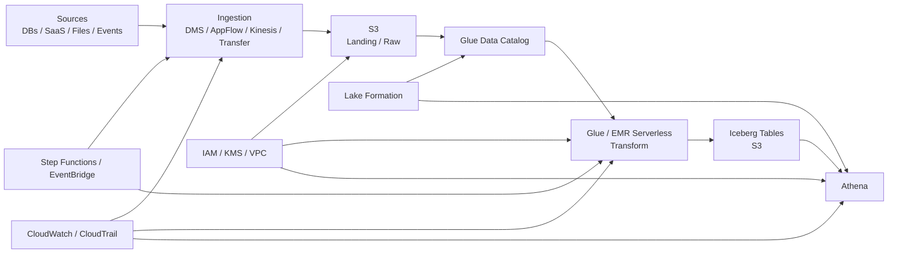
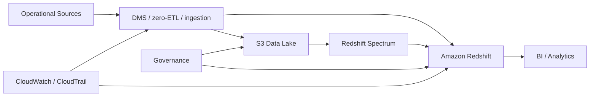
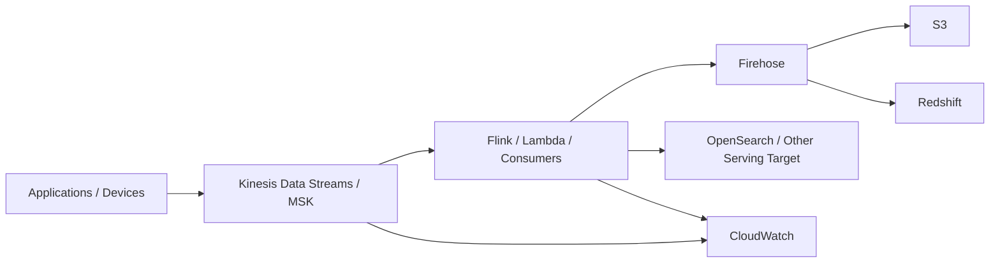
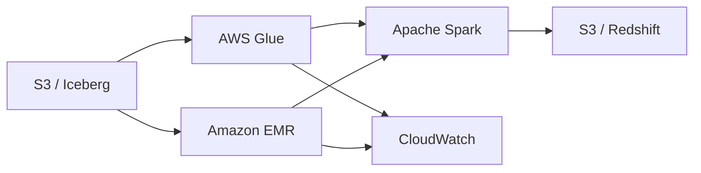

# AWS Data Services Landscape and Reference Architectures

**Module:** G3 — AWS Data Engineering Deep Dive  
**Topic:** 01 — AWS Data Services Landscape and Reference Architectures  
**Role in G3:** Foundational architecture and service-selection module  
**Progression:** Beginner → Intermediate → Advanced → Production Architecture  
**Prerequisites:** Stage 2 Data Engineering foundations, cloud-neutral data engineering concepts, IAM basics, SQL, Spark, Iceberg, streaming, orchestration, Terraform, observability, governance, and cloud-cost fundamentals  
**Expected outcome:** You can look at a data problem, translate its requirements into an AWS architecture, select appropriate AWS services, explain alternatives and trade-offs, identify security/operations/cost concerns, and defend the design like a production Data Engineer.

> **Scope note:** This module establishes architecture-level understanding. Detailed implementation of S3 Tables, Glue Catalog, Glue ETL/Data Quality, advanced Athena, Lake Formation, Redshift, Kinesis/Firehose/MSK, EMR, orchestration, DMS/zero-ETL, CloudWatch/CloudTrail/Cost Explorer, KMS/VPC, and DataZone/Unified Studio belongs to Topics 02–14.

---

## 1. Why This Topic Matters

AWS has a very large service catalog. A beginner can easily fall into **service soup**: memorizing product names without understanding what problem each service solves.

That is not enough for production Data Engineering.

A professional Data Engineer starts with:

```text
Business Requirement
        ↓
Data Characteristics
        ↓
Architecture Pattern
        ↓
AWS Service Selection
        ↓
Security + Governance
        ↓
Operations + Reliability
        ↓
Cost
```

The question is not:

> "Which AWS service should I use?"

The better question is:

> "What problem am I solving, what constraints exist, and what architecture satisfies those constraints with the least unnecessary complexity?"

### Why individual service knowledge is insufficient

Knowing that:

- S3 stores objects,
- Glue runs data jobs,
- Athena queries S3,
- Redshift is a warehouse,
- Kinesis handles streams,
- EMR runs big-data frameworks,

does not tell you how to build a useful platform.

Production architecture requires understanding the **relationships**:

```text
S3 + Glue Catalog + Lake Formation + Athena
```

is an architectural combination, not four unrelated services.

Likewise:

```text
Kinesis/MSK → processing → Firehose → S3/Redshift
```

is a streaming pattern.

And:

```text
DMS / zero-ETL → analytical target → governance → observability
```

is a migration/replication pattern.

### The architectural mindset

For every workload, ask:

1. What is the business outcome?
2. What data exists?
3. Where does the data originate?
4. How frequently does it change?
5. What latency is required?
6. How large is it?
7. What throughput is required?
8. How reliable must the pipeline be?
9. Who may access it?
10. What regulatory constraints exist?
11. What operational skills does the team have?
12. What is the acceptable cost?
13. What happens when a component fails?
14. What happens when the workload grows?
15. Can the platform be reproduced and safely destroyed?

Only then select AWS services.

---

## 2. Prerequisites

This topic assumes the earlier roadmap has already introduced the following concepts.

| Prerequisite | What you should already know | Why it matters here |
|---|---|---|
| Object storage | Buckets, objects, prefixes, lifecycle | S3 is a foundational AWS data-store |
| IAM | Users, roles, policies, least privilege | Every AWS data service depends on identity |
| SQL | Filtering, joins, aggregation, analytical queries | Athena and Redshift decisions depend on query patterns |
| Data modelling | Facts, dimensions, normalization/denormalization | Warehouse and lakehouse architecture |
| Ingestion | Batch, incremental ingestion | Service choice depends on ingestion semantics |
| CDC | Change capture, offsets, replication | DMS, zero-ETL and streaming choices |
| Data quality | Completeness, validity, freshness, uniqueness | Production pipelines need controls |
| Orchestration | DAGs, dependencies, retries, schedules | Step Functions/MWAA choices |
| Spark | Distributed processing concepts | Glue/EMR decisions |
| Iceberg | Table format, snapshots, schema evolution | Modern S3 lakehouse architecture |
| Kafka/streaming | Topics, partitions, consumers, offsets | Kinesis/MSK decisions |
| Terraform | Infrastructure as Code | Reproducible AWS environments |
| Observability | Logs, metrics, traces, alerts | CloudWatch/CloudTrail architecture |
| Governance | Access control, catalog, lineage, audit | Lake Formation/DataZone |
| Cloud cost | Usage-driven billing, tagging, budgets | Architecture must be economically sustainable |

This module does **not** reteach those subjects from scratch. It connects them to AWS implementation choices.

---

# 3. AWS Data Platform Mental Model

A useful first mental model is:

```text
                         ┌──────────────────────┐
                         │      DATA SOURCES    │
                         │ DBs • SaaS • Apps    │
                         │ Files • Events       │
                         └──────────┬───────────┘
                                    │
                                    ▼
                         ┌──────────────────────┐
                         │      INGESTION       │
                         │ DMS • Kinesis • MSK   │
                         │ AppFlow • Transfer    │
                         └──────────┬───────────┘
                                    │
                                    ▼
                         ┌──────────────────────┐
                         │       STORAGE        │
                         │ S3 • S3 Tables       │
                         └──────────┬───────────┘
                                    │
                                    ▼
                         ┌──────────────────────┐
                         │       CATALOG        │
                         │ Glue Data Catalog    │
                         └──────────┬───────────┘
                                    │
                                    ▼
                         ┌──────────────────────┐
                         │      PROCESSING      │
                         │ Glue • EMR • Lambda  │
                         │ Managed Flink        │
                         └──────────┬───────────┘
                                    │
                                    ▼
                    ┌──────────────────────────────┐
                    │       QUERY / WAREHOUSE      │
                    │ Athena • Redshift            │
                    └──────────────┬───────────────┘
                                   │
                    ┌──────────────┴───────────────┐
                    ▼                              ▼
             Governance                      Consumers
       Lake Formation/DataZone           BI • DS • Apps • AI

        ┌───────────────────────────────────────────────┐
        │ Cross-cutting: Security • Networking          │
        │ KMS • VPC • IAM • Secrets                     │
        ├───────────────────────────────────────────────┤
        │ Cross-cutting: Operations                     │
        │ CloudWatch • CloudTrail • Cost controls       │
        ├───────────────────────────────────────────────┤
        │ Cross-cutting: Orchestration                  │
        │ Step Functions • EventBridge • MWAA           │
        └───────────────────────────────────────────────┘
```

This is a **mental model**, not a mandatory pipeline.

Real systems are graph-shaped rather than strictly linear.

For example:

- a source database may replicate directly to a warehouse;
- S3 may be both raw storage and the system of record;
- Athena may query curated lake data without a traditional ETL job;
- Redshift may query data in S3 through Spectrum;
- a streaming pipeline may write both to S3 and a serving system;
- orchestration may trigger ingestion, processing, validation, and publication independently;
- governance may apply across several data stores.

### Data plane versus control plane

A useful distinction:

**Data plane** — the path through which data is moved, stored, processed, and queried.

**Control plane** — the APIs, configuration, policies, metadata, scheduling, permissions, and operational controls that manage the data plane.

Example:

```text
Data plane:
Database → DMS → S3 → Glue → Iceberg → Athena

Control plane:
IAM
Lake Formation
Glue Catalog
Step Functions
CloudWatch
CloudTrail
KMS
Terraform
```

The distinction helps during incident response. A data-plane failure and a control-plane authorization failure can produce very different symptoms.

---

# 4. AWS Data Service Families

## 4.1 Landscape Table

| Family | AWS Services | Primary responsibility | Typical Data Engineering use |
|---|---|---|---|
| Storage | S3, S3 Tables | Durable analytical storage | Data lake, lakehouse storage, landing/curated data |
| Catalog & governance | Glue Data Catalog, Lake Formation, DataZone | Metadata, discovery, access and governance | Tables, permissions, data discovery |
| Ingestion | DMS, zero-ETL, Kinesis, Firehose, MSK, AppFlow, Transfer Family | Move data into analytical platforms | CDC, events, SaaS, files |
| Processing | Glue, EMR, Lambda, Managed Service for Apache Flink | Transform and process data | ETL, Spark, stream processing, lightweight functions |
| Query & warehouse | Athena, Redshift | SQL analytics and warehousing | Ad-hoc lake queries, BI, warehouse workloads |
| Orchestration | Step Functions, EventBridge, MWAA | Coordinate workflows and events | Pipelines, schedules, retries, event-driven workflows |
| Operations | CloudWatch, CloudTrail | Observe and audit workloads | Metrics, logs, alerts, API auditing |
| Security/networking | KMS, VPC | Encryption and network boundaries | Keys, private connectivity, isolation |

---

## 4.2 Storage

### Amazon S3

**What it is:** Object storage designed for high durability and large-scale storage.

**Architectural responsibility:** Durable storage layer for data lakes and many lakehouse architectures.

**Typical uses:**

- raw/landing data;
- curated analytical data;
- Parquet/Iceberg datasets;
- logs and exports;
- intermediate artifacts;
- long-term historical data.

**What it is not:** A relational database or general-purpose transactional filesystem.

**Important alternatives:** EBS, EFS, databases, Redshift managed storage, specialized stores.

**Production thinking:**

- design prefixes and table locations deliberately;
- use columnar formats for analytical workloads;
- enforce encryption;
- block unintended public access;
- apply lifecycle rules where appropriate;
- control access with IAM and, where applicable, Lake Formation;
- monitor storage growth and data-transfer paths.

### S3 Tables

S3 Tables is relevant to the modern lakehouse direction and is covered in more detail in Topic 02.

At this stage understand its architectural role: a more table-oriented S3 capability intended to simplify operational aspects of analytical tables.

Do not treat S3 Tables as a replacement for understanding:

```text
S3
+
table format
+
catalog
+
query engine
+
governance
```

Topic 02 owns the detailed implementation.

---

## 4.3 Catalog and Governance

### AWS Glue Data Catalog

**What it is:** Central metadata repository used by AWS analytics services.

**Architectural responsibility:** Describe datasets through databases, tables, schemas, partitions, and related metadata.

**Typical use:** Let engines such as Athena and Glue jobs discover structured data in a data lake.

**What it is not:** The data itself.

A catalog entry does not mean the actual dataset lives inside the catalog.

```text
S3:
actual objects

Glue Data Catalog:
metadata describing those objects/tables
```

### AWS Lake Formation

Lake Formation provides centralized governance for data lakes and integrates with services including Glue, Athena, Redshift Spectrum and EMR. It can provide fine-grained permissions over governed analytical data.

Architecturally:

```text
IAM
  +
Lake Formation
  +
Glue Data Catalog
  +
S3
  +
Analytics Engines
```

should be understood as complementary layers rather than interchangeable products.

Detailed permission configuration belongs to Topic 06.

### Amazon DataZone

DataZone is positioned around data discovery, cataloging, governance workflows, and organizational data sharing.

At Topic 01 level, think:

```text
Technical metadata
        +
Business context
        +
Discovery
        +
Governed sharing
```

Detailed DataZone and SageMaker Unified Studio direction belongs to Topic 14.

---

# 5. Ingestion Services

## AWS Database Migration Service (DMS)

**Primary problem:** Move or replicate data between supported sources and targets, including migration and ongoing replication scenarios.

Common architecture:

```text
Operational Database
       │
       ▼
      DMS
       │
       ├── Full Load
       └── CDC
            │
            ▼
      S3 / Warehouse / Other Target
```

Use DMS when migration/replication is the primary problem.

Do not automatically use DMS for every streaming workload.

## Zero-ETL

Zero-ETL patterns reduce or remove the need for custom extraction/transformation pipelines between supported AWS data stores.

Architectural advantage:

```text
Source
  ↓
Managed integration
  ↓
Analytical destination
```

The trade-off is that supported source/target combinations, semantics, feature availability, schema behavior, and operational controls must be verified for the current service release.

## Kinesis Data Streams

Use Kinesis Data Streams when you need an AWS-native streaming ingestion backbone with producers and consumers processing event streams.

Think:

```text
Producers
   ↓
Kinesis Data Streams
   ↓
Consumers / Processors
```

Topic 08 owns the detailed streaming internals.

## Amazon Data Firehose

Firehose is primarily a managed delivery mechanism.

Think:

```text
Stream/source
     ↓
Firehose
     ↓
Destination
```

It is useful when you want managed buffering, delivery, and integration rather than building all delivery mechanics yourself.

## Amazon MSK

Amazon Managed Streaming for Apache Kafka provides managed Kafka infrastructure.

Choose it when Kafka compatibility and the Kafka ecosystem are important.

Do not select MSK merely because Kafka is popular. Kafka introduces concepts and operational responsibilities that may be unnecessary for a simple AWS-native stream.

## Amazon AppFlow

AppFlow is suited to data movement between supported SaaS applications and AWS services.

Example:

```text
SaaS application
      ↓
   AppFlow
      ↓
S3 / analytical destination
```

## AWS Transfer Family

Transfer Family is useful when external parties or legacy systems need managed file-transfer protocols such as SFTP.

Typical architecture:

```text
External Partner
      ↓
Transfer Family
      ↓
S3
      ↓
Processing
```

---

# 6. Processing Services

## AWS Glue

Glue is a managed data integration and ETL/ELT platform.

Use it when:

- Spark-based processing fits;
- managed ETL is preferred;
- integration with Glue Catalog is valuable;
- you want less cluster-management work than self-managed Spark.

Do not assume Glue is automatically the right choice for every transformation.

## Amazon EMR

EMR provides managed big-data environments with significant control over frameworks and runtime configuration.

Use it when:

- large-scale distributed processing is required;
- Spark/Hadoop ecosystem control matters;
- workload customization matters;
- the team can operate the chosen EMR deployment model.

EMR is a family of deployment choices, not a single operating model.

## AWS Lambda

Lambda is excellent for short-lived, event-driven functions and lightweight data tasks.

Good examples:

- validate an S3 object arrival;
- enrich a small event;
- trigger orchestration;
- perform lightweight metadata operations.

Poor fit:

- large Spark workloads;
- long-running distributed ETL;
- heavy joins over large datasets.

## Managed Service for Apache Flink

Managed Service for Apache Flink is designed for stateful stream processing and real-time analytics.

Use it when event-time processing, state, windows, and continuous streaming computation require a streaming processing engine.

---

# 7. Query and Warehouse Services

## Amazon Athena

Athena provides serverless SQL querying against supported data sources, especially data stored in S3.

Mental model:

```text
S3 data
  +
Catalog/metadata
  +
SQL engine
  =
Athena query
```

Excellent for:

- ad-hoc analytics;
- exploratory analysis;
- lake-based SQL;
- operationally simple SQL access.

Important architectural concern:

> Query cost and performance are strongly influenced by how much data the query must scan and how efficiently the data is organized.

That makes file format, partitioning, table layout, compression and query design architectural concerns.

Topic 05 owns advanced Athena features.

## Amazon Redshift

Redshift is a cloud data warehouse designed for analytical workloads requiring warehouse semantics, managed compute/storage, SQL performance, concurrency and integration with the broader AWS data ecosystem.

Use it when:

- repeated analytical queries justify a warehouse;
- predictable analytical performance matters;
- BI/concurrency requirements are substantial;
- warehouse-oriented modelling is appropriate.

Redshift does not make S3 irrelevant.

A modern AWS architecture can use:

```text
S3 = broad data lake / system of record
Redshift = specialized analytical warehouse
```

---

# 8. Orchestration and Eventing

## AWS Step Functions

Use Step Functions for explicit state-machine orchestration.

Typical pattern:

```text
Start
 ↓
Validate
 ↓
Ingest
 ↓
Transform
 ↓
Quality Check
 ↓
Publish
 ↓
Notify
```

Strengths:

- explicit state;
- retries;
- branching;
- event-driven workflows;
- service integrations;
- visible execution state.

## Amazon EventBridge

EventBridge is primarily an event-routing and event-driven integration service.

Think:

```text
Event
 ↓
Rule
 ↓
Target
```

It is often the trigger layer rather than the complete ETL orchestration engine.

## Amazon MWAA

Managed Workflows for Apache Airflow provides managed Airflow.

Choose MWAA when the organization benefits from Airflow's DAG model, ecosystem, scheduling model and operational familiarity.

Do not deploy Airflow simply because a workflow has multiple steps. Step Functions may be a simpler solution.

---

# 9. Operations and Security

## CloudWatch

CloudWatch provides operational telemetry including metrics, logs, alarms and related monitoring capabilities.

For a data platform, ask:

- Did the job run?
- How long did it take?
- Did data volume change unexpectedly?
- Did errors increase?
- Did throttling occur?
- Did latency increase?
- Did a stream fall behind?
- Did a service consume more resources than expected?

## CloudTrail

CloudTrail is central to AWS API activity auditing.

For an incident such as:

> "Who changed this policy?"

CloudTrail may provide the evidence needed to identify the API activity and principal involved.

CloudWatch and CloudTrail are complementary:

```text
CloudWatch
→ operational behavior

CloudTrail
→ AWS API activity / audit trail
```

## KMS

KMS provides managed cryptographic key capabilities used by AWS services and applications.

Architecture-level questions:

- What needs encryption?
- Who can use the key?
- Which account owns it?
- Which services need grants or key permissions?
- How will key access be audited?

Detailed KMS design belongs to Topic 13.

## VPC

VPC provides the networking boundary in which many AWS workloads operate.

For data engineering, VPC thinking includes:

- subnets;
- routing;
- security groups;
- private access;
- endpoints;
- connectivity to databases;
- cross-account/network connectivity;
- egress cost and security.

Do not confuse "private subnet" with "automatically secure." Network architecture still needs correct routing, authorization, security controls and observability.

---

# 10. AWS Service Map for Data Engineers

Use this as a starting decision map.

```text
Need durable data-lake storage?
→ S3 / S3 Tables

Need metadata?
→ Glue Data Catalog

Need data-lake governance?
→ Lake Formation

Need discovery/business data sharing?
→ DataZone

Need database migration/CDC?
→ DMS

Need supported managed replication?
→ zero-ETL

Need streaming ingestion?
→ Kinesis Data Streams / MSK

Need managed stream delivery?
→ Firehose

Need SaaS ingestion?
→ AppFlow

Need managed external file transfer?
→ Transfer Family

Need managed Spark ETL?
→ Glue

Need configurable big-data processing?
→ EMR

Need lightweight event-driven code?
→ Lambda

Need stateful stream processing?
→ Managed Service for Apache Flink

Need serverless SQL on lake data?
→ Athena

Need warehouse analytics?
→ Redshift

Need explicit workflow orchestration?
→ Step Functions

Need event routing?
→ EventBridge

Need Airflow DAGs?
→ MWAA

Need metrics/logs/alarms?
→ CloudWatch

Need AWS API audit?
→ CloudTrail

Need encryption/key management?
→ KMS

Need private network boundaries/connectivity?
→ VPC
```

This map is not a rigid rule. Requirements always win.

---

# 11. Mapping Stage 2 Concepts to AWS Services

| Stage 2 concept | AWS implementation examples | Architectural interpretation |
|---|---|---|
| Object storage | S3 | Durable data-lake storage |
| Data lake | S3 + Glue Catalog + governance | Broad analytical storage and metadata |
| Lakehouse | S3 + Iceberg + Catalog + query/processing + governance | Table-oriented analytical platform |
| Iceberg | Iceberg on S3, supported AWS analytics engines | Transactional table abstraction over object storage |
| ETL | Glue / EMR | Managed distributed transformation |
| ELT | S3 + Athena/Redshift + transformation engine | Transform after landing |
| Batch ingestion | DMS, AppFlow, Transfer Family, scheduled jobs | Periodic movement |
| CDC | DMS, supported zero-ETL patterns, streaming designs | Incremental source changes |
| Streaming | Kinesis / MSK | Event ingestion |
| Kafka | MSK | Managed Kafka ecosystem |
| Spark | Glue / EMR | Distributed compute |
| Orchestration | Step Functions / MWAA / EventBridge | Workflow/event coordination |
| Data quality | Glue Data Quality and pipeline controls | Quality gates |
| Catalog | Glue Data Catalog | Technical metadata |
| Governance | Lake Formation / DataZone | Access, discovery, organizational governance |
| Observability | CloudWatch / CloudTrail | Runtime telemetry and audit |
| Warehouse | Redshift | Purpose-built analytical warehouse |
| SQL analytics | Athena / Redshift | Query consumption layer |
| IaC | Terraform/OpenTofu + AWS provider | Reproducible infrastructure |

The important transition is:

```text
Stage 2:
"What is the concept?"

G3:
"Which AWS architecture implements that concept, and why?"
```

---

# 12. Reference Architecture 1 — Serverless Lakehouse

## 12.1 Architecture



## 12.2 Components

### Sources

Could include:

- operational databases;
- SaaS applications;
- partner files;
- application events.

### Ingestion

Choose based on source and latency:

- DMS for database migration/CDC;
- AppFlow for supported SaaS movement;
- Transfer Family for file-transfer workflows;
- Kinesis for streaming events.

### S3

S3 is the durable storage layer.

A common conceptual organization is:

```text
s3://data-lake/
    raw/
    standardized/
    curated/
    analytics/
```

The exact layout should follow the organization's table and governance strategy.

### Glue Data Catalog

Provides metadata so analytical services can discover datasets.

### Glue / EMR

Process data into analytical table structures.

### Iceberg

Provides a table abstraction with transactional and metadata capabilities over object storage.

### Athena

Provides serverless SQL consumption.

### Lake Formation

Applies governance and fine-grained data access patterns where supported.

### Orchestration

Coordinates the workflow.

### Observability

CloudWatch and CloudTrail support operations and auditing.

## 12.3 Control plane and data plane

**Data plane:**

```text
Sources → Ingestion → S3 → Processing → Iceberg → Athena
```

**Control plane:**

```text
IAM
Lake Formation
Glue Catalog
Step Functions
CloudWatch
CloudTrail
KMS
Terraform
```

## 12.4 Strengths

- low infrastructure-management burden;
- elastic storage;
- strong AWS service integration;
- supports batch and streaming ingestion patterns;
- good fit for analytical lakehouse designs.

## 12.5 Risks

- service sprawl;
- unclear ownership;
- poor table layout;
- uncontrolled query scanning;
- overly broad permissions;
- insufficient governance;
- hidden network/observability costs;
- assuming serverless means free.

## 12.6 Cost drivers

Conceptually:

- S3 storage;
- requests;
- data transfer;
- processing consumption;
- Athena scanned bytes;
- logs;
- networking;
- VPC endpoints/NAT where applicable.

---

# 13. Reference Architecture 2 — Warehouse-Centric

## 13.1 Architecture



## 13.2 When Redshift should be central

Use a warehouse-centric architecture when:

- analytical workloads are heavily SQL/BI oriented;
- repeated queries dominate;
- concurrency and predictable warehouse performance matter;
- warehouse modelling is central;
- users expect a warehouse-oriented analytical experience.

## 13.3 When S3 remains the system of record

S3 may remain the broad historical data layer when:

- raw source data must be retained;
- multiple engines need access;
- data formats are diverse;
- downstream workloads include Spark, lake analytics or AI/ML;
- cost-effective long-term object storage is important.

## 13.4 Spectrum

Spectrum allows Redshift-based analytical workflows to access data in S3 without requiring all data to be loaded into native warehouse tables.

Architectural implication:

```text
Warehouse
   +
Lake
   =
Hybrid analytical platform
```

## 13.5 Why this differs from a lakehouse

A lakehouse emphasizes:

```text
Object storage
+
Table format
+
Multiple processing/query engines
+
Unified governance
```

A warehouse-centric design emphasizes:

```text
Warehouse compute
+
Warehouse modelling
+
SQL workloads
+
Predictable analytical consumption
```

They can coexist.

---

# 14. Reference Architecture 3 — Streaming

## 14.1 Architecture



AWS's Data Analytics Lens describes streaming reference architectures in terms of sources, stream ingestion/producers, stream storage, processing/consumers, and downstream destinations. citeturn0search5

## 14.2 Kinesis versus MSK

### Kinesis is attractive when

- AWS-native streaming is preferred;
- the team does not need the full Kafka ecosystem;
- managed AWS integration is a priority;
- operational simplicity matters.

### MSK is attractive when

- Kafka compatibility is a requirement;
- existing Kafka skills exist;
- Kafka clients/ecosystem are important;
- portability across Kafka environments matters.

### Do not make the decision from brand recognition

The correct question is:

> "What streaming semantics, ecosystem, operational model, portability and team capabilities does the workload require?"

---

# 15. Reference Architecture 4 — Big-Data Processing

## 15.1 Architecture



## 15.2 Glue versus EMR

### Glue

Prefer when:

- managed ETL is the dominant need;
- Glue Catalog integration is useful;
- less cluster-level control is desired;
- the workload fits Glue's execution model.

### EMR

Prefer when:

- framework/runtime customization matters;
- distributed processing is complex;
- more control over the execution environment is justified;
- team expertise supports EMR operations.

### Lambda

Prefer when:

- execution is lightweight;
- event-driven function semantics fit;
- distributed compute is unnecessary.

Do not use Lambda as a substitute for Spark.

---

# 16. Choosing Between Overlapping AWS Services

## 16.1 Glue vs EMR vs Lambda

| Dimension | Glue | EMR | Lambda |
|---|---|---|---|
| Typical workload | Managed ETL/data integration | Large/custom distributed processing | Lightweight event-driven function |
| Spark | Yes, in appropriate Glue workloads | Yes | No |
| Customisation | Moderate | High | Application/function level |
| Operational burden | Lower | Higher | Low |
| Large-scale distributed processing | Strong fit | Strong fit | Poor fit |
| Long-running compute | Suitable for appropriate jobs | Strong fit | Not the design target |
| Startup/operational model | Managed job execution | Multiple managed deployment models | Event/function execution |
| Team skill | Data integration/Spark | Spark/platform operations | Application/serverless |
| Common mistake | Treating it as universal | Using it for every ETL task | Using it for heavy ETL |

**Decision rule:**

```text
Lightweight event/function?
→ Lambda

Managed ETL/Spark with lower infrastructure burden?
→ Glue

Need significant Spark/runtime/custom infrastructure control?
→ EMR
```

---

## 16.2 Athena vs Redshift

| Dimension | Athena | Redshift |
|---|---|---|
| Primary role | Serverless SQL over lake data | Data warehouse |
| Best for | Ad-hoc/lake analytics | Repeated analytical workloads |
| Compute model | Query-oriented | Warehouse compute |
| Storage | Commonly S3-based external data | Managed warehouse storage + external access |
| Cost reasoning | Query/data scanned and other usage | Compute/storage/concurrency characteristics |
| Operational model | Very low infrastructure management | More warehouse-oriented administration |
| Repeated BI | Can work, but workload-dependent | Often stronger fit |
| Lake-native access | Strong | Strong through integrations such as Spectrum |
| Typical mistake | Querying inefficient raw data repeatedly | Using a warehouse when simple lake SQL is enough |

---

## 16.3 Kinesis vs MSK

| Dimension | Kinesis Data Streams | Amazon MSK |
|---|---|---|
| Ecosystem | AWS-native | Kafka |
| Compatibility | Kinesis APIs/ecosystem | Kafka clients/tools |
| Operational model | Managed AWS streaming abstraction | Managed Kafka platform |
| Portability | Lower Kafka portability | Higher Kafka ecosystem portability |
| Team requirement | AWS streaming skills | Kafka expertise |
| Best fit | AWS-native event streaming | Kafka-centric architectures |
| Key risk | Choosing without considering stream semantics | Kafka operational complexity |
| Decision driver | AWS integration and simplicity | Kafka ecosystem and compatibility |

---

## 16.4 Step Functions vs MWAA

| Dimension | Step Functions | MWAA |
|---|---|---|
| Model | State machine | Airflow DAG |
| Workflow style | Explicit states/events | DAG/task orchestration |
| Backfills | Workload-dependent | Strong Airflow pattern |
| Ecosystem | AWS integrations | Airflow ecosystem |
| Operational burden | Lower | Higher |
| Best fit | Service orchestration, event workflows | Airflow-oriented data platforms |
| Team skill | AWS/serverless | Airflow |
| Common mistake | Building an unnecessarily complex state machine | Deploying Airflow for a simple workflow |

---

## 16.5 DMS vs zero-ETL vs Debezium

| Dimension | DMS | zero-ETL | Debezium + Kafka/MSK |
|---|---|---|---|
| Primary use | Migration/replication | Supported managed integrations | Flexible CDC/event architecture |
| Latency | Workload/configuration dependent | Integration dependent | Streaming CDC |
| Source/target | Supported endpoints | Specific supported combinations | Broad ecosystem through connectors |
| Flexibility | Moderate | Lower than custom pipelines | High |
| Operational effort | Managed | Lower | Higher |
| Schema evolution | Verify workload-specific behavior | Verify current integration behavior | Strong tooling possibilities, but more architecture |
| Lock-in | AWS-oriented | Higher AWS dependency | More portable/open ecosystem |
| Team skill | AWS migration | AWS managed integration | Kafka/CDC expertise |
| Decision driver | Migration/replication requirement | Simplify supported data movement | Need flexible event/CDC platform |

> **Important:** The exact support matrix and capabilities change. Verify current AWS documentation before choosing a production integration.

---

# 17. Architecture Decision Framework

Use this sequence for every AWS data architecture.

```text
1. Requirements
2. Data characteristics
3. Latency
4. Volume
5. Throughput
6. Reliability
7. Security
8. Governance
9. Operational complexity
10. Cost
11. Team skills
12. AWS regional availability
13. Service quotas
14. Lock-in
15. Future growth
```

## Reusable decision template

```text
Requirement:
Workload:
Source:
Target:
Volume:
Throughput:
Latency:
Availability:
Durability:
Security:
Compliance:
Governance:
Team:
AWS Region:
Quota constraints:
Cost constraint:

Chosen service(s):
Alternative:
Why chosen:
Why alternative rejected:
Major risk:
Mitigation:
Cost driver:
Operational burden:
Failure mode:
Recovery strategy:
Observability:
Teardown plan:
```

### Example

**Requirement:** Process 2 TB of nightly event data into curated Iceberg tables.

**Workload:** Batch distributed transformation.

**Candidates:** Glue, EMR Serverless, EMR on EC2.

**Initial choice:** Glue when the workload fits the managed Spark model and the team values lower infrastructure management.

**Alternative:** EMR Serverless when runtime or execution requirements make EMR the better fit.

**Reject Lambda:** Workload is distributed and too large for Lambda semantics.

The important skill is not the answer itself. It is the reasoning chain.

---

# 18. Quotas and Service Limits

A production architecture can be logically correct and still fail because of quotas.

AWS documents service quotas and notes that, unless otherwise specified, many quotas are Region-specific. Some quotas can be increased and some cannot. citeturn0search12

## 18.1 Quota categories

Think about:

- API request rates;
- concurrent executions;
- stream/shard capacity;
- processing concurrency;
- query concurrency;
- account-level resources;
- regional resources;
- storage limits;
- networking limits.

## 18.2 Why quotas matter

Suppose an architecture requires:

```text
1,000 concurrent processing operations
```

but the relevant service/account quota allows substantially fewer concurrent operations.

The architecture may work in a small development test and fail under production load.

## 18.3 Quota review process

Before production:

```text
Architecture
   ↓
List quota-sensitive components
   ↓
Identify required capacity
   ↓
Check current regional/account quotas
   ↓
Determine adjustable vs non-adjustable
   ↓
Request increases where appropriate
   ↓
Load-test
   ↓
Document operational limits
```

## 18.4 AWS CLI pattern

The general Service Quotas API supports inspection such as:

```bash
aws service-quotas list-service-quotas \
  --service-code <service-code>
```

Do not guess service codes or hard-code quota values from an old tutorial.

Check current official AWS documentation and the Service Quotas console.

---

# 19. AWS Regional Availability

Never assume:

> "If AWS has the service, it must be available in my Region."

Region selection affects:

- service availability;
- data residency;
- latency;
- disaster recovery;
- compliance;
- pricing;
- networking;
- cross-region transfer;
- service integrations.

## Pre-deployment checklist

```text
[ ] Required service is available in target Region
[ ] Required service features are available
[ ] Dependent services are available
[ ] Desired instance/deployment options exist
[ ] Compliance allows data residency there
[ ] Source systems can reach the Region
[ ] Cross-region data transfer is acceptable
[ ] DR Region has compatible services
[ ] Quotas are adequate
[ ] Pricing is understood
```

### Regional architecture principle

Do not select a Region solely because it is familiar.

Select a Region based on:

```text
Business
+
Compliance
+
Latency
+
Service availability
+
Cost
+
DR
```

---

# 20. Multi-Account AWS Data Platforms

Production organizations often separate workloads across AWS accounts.

A conceptual structure:

```text
AWS Organization
│
├── Management / Organization
├── Security Account
├── Log Archive Account
├── Ingestion Account
├── Data Lake Account
├── Analytics Account
└── Sandbox / Development Account
```

This is an architectural pattern, not a mandatory account layout.

## Why separate accounts?

### Blast-radius reduction

A compromised workload should not automatically have unrestricted access to every environment.

### Billing separation

Account boundaries can make cost ownership clearer.

### Environment isolation

Development should not accidentally destroy production.

### Security boundaries

Security and log-archive functions can be separated from application teams.

### Governance

AWS Organizations can be used with organizational policies and guardrails to constrain what accounts can do.

### Cross-account sharing

Data platforms frequently need controlled sharing across account boundaries.

The design should explicitly define:

- data ownership;
- producer/consumer accounts;
- trust relationships;
- encryption-key ownership;
- network paths;
- access policies;
- audit responsibilities.

---

# 21. AWS Well-Architected Framework

The AWS Well-Architected Framework provides six pillars:

1. Operational Excellence
2. Security
3. Reliability
4. Performance Efficiency
5. Cost Optimization
6. Sustainability

AWS also provides technology and industry lenses, including the Data Analytics Lens. citeturn0search4turn0search10

## 21.1 Operational Excellence

For a data platform:

- Can operators understand pipeline state?
- Are runbooks documented?
- Are deployments reproducible?
- Can failed jobs be retried safely?
- Are operational metrics defined?
- Are incidents observable?

## 21.2 Security

Ask:

- Who can read the data?
- Who can modify it?
- Are permissions least-privilege?
- Is data encrypted?
- Are network paths appropriate?
- Are secrets protected?
- Are administrative actions audited?

## 21.3 Reliability

Ask:

- What happens when ingestion fails?
- Can processing be retried?
- Is the pipeline idempotent?
- Can data be recovered?
- Is there a DR strategy?
- Are downstream dependencies protected?

## 21.4 Performance Efficiency

Ask:

- Is the file/table format appropriate?
- Are queries scanning unnecessary data?
- Is compute right-sized?
- Is parallelism appropriate?
- Is data partitioning effective?
- Is the chosen service appropriate for workload characteristics?

## 21.5 Cost Optimization

Ask:

- How much data is scanned?
- Are clusters idle?
- Are resources tagged?
- Are expensive networking paths necessary?
- Can serverless execution reduce idle capacity?
- Are workloads right-sized?
- Are storage lifecycle policies appropriate?

## 21.6 Sustainability

Ask:

- Are resources unnecessarily running?
- Can compute be reduced?
- Can data movement be minimized?
- Can storage be lifecycle-managed?
- Is the architecture doing work that provides no business value?

---

# 22. AWS Well-Architected Data Analytics Lens

The Data Analytics Lens applies Well-Architected thinking specifically to analytics workloads. AWS describes it as guidance for designing and operating reliable, secure, efficient and cost-effective analytics workloads. citeturn0search36

A useful architecture review sequence is:

```text
Data discovery
    ↓
Ingestion
    ↓
Storage
    ↓
Processing
    ↓
Analytics
    ↓
Governance
    ↓
Security
    ↓
Reliability
    ↓
Operations
    ↓
Cost
```

AWS's modern data architecture guidance emphasizes that modern platforms may combine a data lake, warehouse and purpose-built data stores, with data moving between them based on the workload. citeturn0search9

## Practical review checklist

```text
Discovery
[ ] Do we know the business use cases?
[ ] Is ownership clear?
[ ] Are consumers known?

Ingestion
[ ] Is ingestion method appropriate?
[ ] Is CDC/event/batch semantics correct?
[ ] Are retries/idempotency handled?

Storage
[ ] Is the storage layer appropriate?
[ ] Is data format appropriate?
[ ] Are retention policies defined?

Processing
[ ] Is compute matched to workload?
[ ] Is processing scalable?
[ ] Are data-quality gates present?

Analytics
[ ] Is query engine appropriate?
[ ] Is concurrency understood?
[ ] Is query cost controlled?

Governance
[ ] Is metadata available?
[ ] Are permissions explicit?
[ ] Is sensitive data controlled?

Security
[ ] Encryption?
[ ] Least privilege?
[ ] Private networking where appropriate?
[ ] Audit?

Reliability
[ ] Failure strategy?
[ ] Retry strategy?
[ ] Recovery?
[ ] DR?

Operations
[ ] Metrics?
[ ] Logs?
[ ] Alerts?
[ ] Runbooks?

Cost
[ ] Cost attribution?
[ ] Usage metrics?
[ ] Budget/alerts?
[ ] Teardown?
```

---

# 23. Production Architecture Review

For any AWS Data Engineering architecture, ask:

```text
Can it scale?
Can it fail safely?
Can we observe it?
Can we secure it?
Can we govern it?
Can we recover it?
Can we explain its cost?
Can we reproduce it?
Can we operate it?
Can we delete it safely?
```

## Can it scale?

Look for:

- throughput bottlenecks;
- quotas;
- concurrency;
- storage growth;
- query growth;
- partition/key distribution.

## Can it fail safely?

Look for:

- retries;
- dead-letter/error paths where appropriate;
- idempotency;
- checkpointing;
- replay;
- partial-failure behavior.

## Can we observe it?

Look for:

- metrics;
- logs;
- alerts;
- data freshness;
- pipeline state;
- audit records.

## Can we secure it?

Look for:

- IAM roles;
- least privilege;
- KMS;
- network boundaries;
- secrets;
- cross-account trust.

## Can we govern it?

Look for:

- catalog;
- ownership;
- access policies;
- sensitive-data controls;
- auditability.

## Can we recover it?

Look for:

- source replay;
- retained raw data;
- backups/snapshots where applicable;
- multi-Region strategy where justified;
- recovery runbooks.

## Can we explain its cost?

Every major component should have an identifiable cost driver.

## Can we reproduce it?

Use:

```text
Terraform/OpenTofu
+
version-controlled configuration
+
documented parameters
```

## Can we delete it safely?

A learning or temporary environment must have:

- teardown procedures;
- lifecycle controls;
- resource inventory;
- budgets/alerts;
- ownership tags.

---

# 24. Cost-Aware Architecture

Do not wait for the AWS bill to discover your architecture's cost model.

## Major conceptual cost drivers

| Component | Cost driver to understand |
|---|---|
| S3 | Storage, requests, transfer, related features |
| Athena | Data scanned and query-related usage |
| Glue | Processing consumption and related resources |
| EMR | Compute/runtime resources and deployment model |
| Redshift | Compute/capacity, storage and related features |
| Kinesis | Stream capacity/usage model |
| MSK | Broker/cluster capacity and related infrastructure |
| NAT Gateway | Processing and hourly/networking costs |
| Interface VPC endpoints | Endpoint usage/hourly and traffic-related costs |
| CloudWatch | Logs, metrics and related ingestion/storage |
| CloudTrail | Trail/event configuration and data-event-related usage |

Do not memorize prices from this module. Pricing changes.

## Architecture A versus B

### Architecture A — simple lake SQL

```text
Sources
  ↓
S3
  ↓
Glue Catalog
  ↓
Athena
```

Potential advantages:

- low infrastructure management;
- no always-on warehouse;
- simple analytical access.

Potential costs:

- repeated scans;
- poorly optimized files;
- data-transfer/networking paths;
- query volume.

### Architecture B — warehouse-centric

```text
Sources
  ↓
DMS / ingestion
  ↓
Redshift
  ↘
   S3
```

Potential advantages:

- repeated analytical workloads can fit warehouse semantics;
- predictable SQL consumption patterns;
- strong BI integration.

Potential costs:

- warehouse capacity;
- storage;
- operational administration;
- network/data movement.

Neither is universally cheaper.

The correct comparison is:

```text
Workload shape
+
Usage frequency
+
Concurrency
+
Data volume
+
Latency
+
Operational cost
+
Service cost
```

---

# 25. Infrastructure-as-Code Perspective

G3 requires infrastructure to be reproducible.

Architecture should translate into:

```text
Architecture
    ↓
AWS Service
    ↓
Terraform/OpenTofu Resource
    ↓
Environment-specific configuration
```

## Minimal illustrative example

```hcl
resource "aws_s3_bucket" "data_lake" {
  bucket = var.bucket_name
}
```

This is intentionally incomplete.

A production baseline should consider:

- encryption;
- public-access blocking;
- versioning where appropriate;
- lifecycle configuration;
- tags;
- bucket policies;
- access logging/monitoring where required;
- environment separation;
- state management;
- review/approval;
- deletion protection considerations.

The point of this example is not to teach Terraform. It is to teach:

> Architecture decisions should be representable as version-controlled infrastructure.

---

# 26. AWS CLI Examples

## 26.1 Identify the current AWS identity

```bash
aws sts get-caller-identity
```

Why it matters:

Before operating on an AWS environment, confirm **which identity and account** the CLI is using.

Typical output includes:

- Account;
- ARN;
- UserId.

This is a basic safety check before executing infrastructure changes.

## 26.2 Check the configured region

```bash
aws configure get region
```

Why it matters:

AWS service availability and resources are often Region-specific.

## 26.3 Inspect S3 buckets

```bash
aws s3api list-buckets
```

Use carefully in shared accounts. Listing resources is generally lower risk than mutating them, but access should still be controlled.

## 26.4 Inspect available service quotas

```bash
aws service-quotas list-service-quotas \
  --service-code <service-code>
```

Use the current AWS Service Quotas documentation to determine the correct service code and interpret the results.

## 26.5 Safety rule

Never paste production destructive commands into a learning workflow without first explaining:

```text
Target
Identity
Scope
Blast radius
Rollback
Verification
```

---

# 27. Python / boto3 Example

A minimal service interaction example:

```python
import boto3

s3 = boto3.client("s3")

response = s3.list_buckets()

for bucket in response["Buckets"]:
    print(bucket["Name"])
```

## What is happening?

```text
Python
  ↓
boto3
  ↓
S3 client
  ↓
AWS API
  ↓
Response
```

### Credentials

boto3 normally obtains credentials through the AWS credential/provider chain. In production, prefer short-lived credentials and IAM roles/assumed roles rather than hard-coded access keys.

### Region

Some AWS clients and APIs are Region-specific. Be explicit where the workload requires it.

### Production considerations

- never hard-code credentials;
- use IAM roles or an appropriate identity mechanism;
- handle API errors;
- implement retries appropriately;
- use pagination for large result sets;
- emit useful logs;
- avoid printing sensitive metadata;
- test against the intended account and Region.

---

# 28. Architecture Examples From Real Data Engineering Problems

## Scenario 1 — E-commerce Orders Platform

### Requirements

- batch order data;
- clickstream events;
- analytical queries;
- governance;
- low operational burden.

### Architecture

```text
Order DB
   ↓
DMS / supported replication
   ↓
S3
   ↓
Glue / Iceberg
   ↓
Athena

Clickstream
   ↓
Kinesis
   ↓
Firehose / processing
   ↓
S3
   ↓
Same analytical lakehouse

Governance:
Lake Formation

Orchestration:
Step Functions / EventBridge

Operations:
CloudWatch + CloudTrail
```

### Why

The workload combines batch/CDC and streaming. S3 provides a common analytical storage layer while different ingestion paths feed the platform.

---

## Scenario 2 — Financial Analytics

### Requirements

- PII;
- row-level access;
- audit;
- encryption;
- compliance.

### Architecture

```text
Sources
   ↓
Controlled ingestion
   ↓
S3 / governed tables
   ↓
Glue Catalog
   ↓
Lake Formation
   ↓
Athena / Redshift
```

Security:

```text
IAM
KMS
VPC/private connectivity where appropriate
CloudTrail
CloudWatch
```

The key architectural decision is that access control is not merely:

```text
"Can this user read the bucket?"
```

It may need to answer:

```text
"Can this user read this dataset,
this table,
these columns,
and these rows?"
```

Lake Formation is relevant to that governance layer.

---

## Scenario 3 — High-Volume Clickstream

### Requirements

- high throughput;
- streaming;
- near-real-time analytics;
- durable lake storage.

### Architecture

```text
Applications
   ↓
Kinesis / MSK
   ↓
Flink / consumers
   ├──→ near-real-time destination
   └──→ Firehose
            ↓
           S3
            ↓
        Iceberg/Athena
```

The architecture separates:

```text
stream ingestion
from
stream processing
from
durable analytical storage
from
query consumption
```

---

## Scenario 4 — Legacy PostgreSQL Migration

### Requirements

- CDC;
- minimal downtime;
- analytical platform;
- incremental migration.

### Candidates

```text
DMS
zero-ETL
Debezium + MSK
```

### Decision logic

Choose **DMS** when managed migration/replication is the primary requirement and supported endpoints satisfy the design.

Choose **zero-ETL** when the source/target integration is currently supported and the managed integration meets the workload requirements.

Choose **Debezium + MSK** when flexible CDC event semantics, Kafka ecosystem integration, or custom downstream processing justify the additional platform complexity.

Never select based only on technology preference.

---

## Scenario 5 — Large Nightly Spark Workload

### Requirements

- large dataset;
- nightly execution;
- Spark;
- predictable completion;
- cost control.

### Candidates

```text
Glue
EMR Serverless
EMR on EC2
```

### Decision

Start with:

```text
Can Glue satisfy the runtime and customization requirements?
    ├── Yes → Glue is a strong candidate.
    └── No
         ↓
Can EMR Serverless provide required flexibility?
    ├── Yes → EMR Serverless candidate.
    └── No
         ↓
Need deeper infrastructure/runtime control?
    → EMR on EC2
```

The decision must include workload runtime, customization, team skills, startup characteristics, cost and operational burden.

---

# 29. Architecture Failure Scenarios

## Failure 1 — Lambda for a Large Spark Workload

**Problem:** A team attempts to process a multi-terabyte dataset with Lambda functions.

**Why wrong:** Lambda is a function execution model, not a distributed Spark processing platform.

**Symptoms:**

- orchestration complexity;
- excessive invocation count;
- poor data-shuffle strategy;
- runtime/resource constraints;
- difficult operations.

**Root cause:** Wrong compute abstraction.

**Better architecture:** Glue or EMR depending on requirements.

**Trade-off:** Distributed processing introduces more platform concepts, but matches the workload.

---

## Failure 2 — Athena Repeatedly Querying Raw CSV

**Problem:** Analysts repeatedly scan large raw CSV files.

**Symptoms:**

- slow queries;
- unnecessary scans;
- unpredictable query cost;
- poor user experience.

**Root cause:** Storage/query design does not match analytical access patterns.

**Better architecture:**

```text
Raw CSV
  ↓
Transformation
  ↓
Columnar curated data
  ↓
Athena
```

**Production lesson:** Query engine choice cannot compensate for poor data layout.

---

## Failure 3 — MSK Without Kafka Expertise

**Problem:** Team selects MSK because "Kafka is enterprise standard."

**Symptoms:**

- operational incidents;
- poor partition planning;
- difficult upgrades/configuration;
- unclear ownership.

**Root cause:** Technology selection ignored team capability.

**Better architecture:** Kinesis may be simpler if Kafka compatibility is not a requirement.

**Trade-off:** Kinesis can reduce Kafka-specific operational burden but may not satisfy Kafka ecosystem requirements.

---

## Failure 4 — Always-On EMR

**Problem:** An EMR environment remains running continuously although jobs execute for only a short period.

**Symptoms:**

- idle compute;
- unexpected monthly cost.

**Root cause:** Architecture optimized for convenience rather than workload lifecycle.

**Better architecture:** Evaluate serverless/on-demand execution or automated lifecycle management.

---

## Failure 5 — Ignoring Quotas

**Problem:** Production traffic exceeds an account or regional service quota.

**Symptoms:**

- throttling;
- rejected requests;
- stalled pipeline;
- cascading retries.

**Root cause:** Quotas were never part of architecture capacity planning.

**Fix:**

```text
Identify quota
→ measure required capacity
→ verify adjustable/non-adjustable
→ request increase if appropriate
→ load test
→ add application backpressure/retry strategy
```

---

## Failure 6 — Assuming Every Service Exists Everywhere

**Problem:** Infrastructure deploys successfully in one Region but a required service/feature is unavailable in another.

**Root cause:** Region availability was assumed.

**Fix:** Verify service, feature, dependency, and quota availability before deployment.

---

## Failure 7 — Broad IAM Permissions

**Problem:** One role has broad access to every S3 bucket and analytical service.

**Symptoms:**

- large blast radius;
- difficult audits;
- accidental data access.

**Fix:** Separate roles by workload and enforce least privilege.

---

## Failure 8 — One AWS Account for Everything

**Problem:** Development, security logs, production data and experiments share one account.

**Risk:** High blast radius and weak isolation.

**Better:** Introduce organizational account boundaries appropriate to business scale.

---

## Failure 9 — Expensive NAT Gateway Path

**Problem:** Large data workloads send high volumes through NAT unnecessarily.

**Symptoms:**

- unexpectedly high networking cost;
- unnecessary network path complexity.

**Fix:** Evaluate private connectivity and VPC endpoints where appropriate.

---

## Failure 10 — No Observability

**Problem:** Pipeline fails, but nobody can explain why.

**Symptoms:**

- missing data;
- delayed jobs;
- unclear ownership;
- long incident resolution.

**Fix:**

```text
Metrics
+
Logs
+
Audit
+
Alerts
+
Runbooks
```

---

## Failure 11 — No Teardown Strategy

**Problem:** Learning resources remain deployed.

**Symptoms:**

- surprise charges;
- abandoned infrastructure;
- unclear resource ownership.

**Fix:**

```text
IaC
+
Tags
+
Budgets
+
Teardown
+
Resource inventory
```

---

# 30. Hands-On Lab

## Lab goal

Build the learner's ability to select AWS services from requirements rather than from memorized service names.

Suggested repository:

```text
aws_lab/
├── infra/
├── jobs/
├── sql/
├── statemachines/
├── docs/
└── tests/
```

---

## Exercise 1 — AWS Data-Service Decision Table

Create:

| Workload | Requirement | Chosen Service | Alternative | Reason | Cost Driver | Security Consideration | Operational Consideration |
|---|---|---|---|---|---|---|---|
| Database CDC | Incremental changes | | | | | | |
| SaaS ingestion | Scheduled SaaS movement | | | | | | |
| Raw data lake | Durable storage | | | | | | |
| SQL over lake | Ad-hoc queries | | | | | | |
| Enterprise BI | Repeated warehouse queries | | | | | | |
| Streaming events | Near-real-time ingestion | | | | | | |
| Large Spark ETL | Distributed processing | | | | | | |
| Workflow | Multi-step orchestration | | | | | | |

Do not fill the table with one service for every row. Defend each choice.

---

## Exercise 2 — Terraform Baseline Concept

Design a baseline containing:

- AWS budget;
- mandatory cost tags;
- encrypted S3 bucket;
- blocked public access;
- learning IAM role.

The implementation belongs to the learner's IaC practice; this module focuses on the architecture and reasoning.

---

## Exercise 3 — Quota Inventory

Create a document containing:

```text
Service
Quota name
Current quota
Adjustable?
Required capacity
Gap
Mitigation
Source/documentation checked
Date verified
```

At minimum investigate:

- Glue;
- Athena;
- Kinesis.

Do not hard-code quota values into this learning module.

---

## Exercise 4 — Draw Four Architectures From Memory

Without looking at this document, draw:

1. Serverless lakehouse;
2. Warehouse-centric;
3. Streaming;
4. Big-data processing.

Then compare your diagrams with this module.

---

## Exercise 5 — Five Workloads

For each workload:

1. identify requirements;
2. list candidates;
3. select service(s);
4. reject alternatives;
5. identify cost drivers;
6. identify security controls;
7. identify failure modes;
8. identify observability;
9. identify teardown strategy.

---

# 31. Break/Fix Exercises

For every exercise use:

```text
Broken Architecture
        ↓
Symptoms
        ↓
Evidence
        ↓
Diagnosis
        ↓
Fix
        ↓
Verification
        ↓
Production Lesson
```

## Break/Fix 1 — Wrong Service

Give a large distributed transformation to Lambda.

Determine:

- why it is wrong;
- what evidence proves it;
- which service should replace it.

## Break/Fix 2 — IAM Failure

A Glue/analytics workload can see a catalog object but cannot access the underlying data.

Investigate:

```text
Identity
→ IAM
→ Catalog permissions
→ Lake governance
→ S3 access
→ KMS
```

Do not assume every access failure is an S3 bucket-policy problem.

## Break/Fix 3 — Region Failure

Architecture requires a service/feature unavailable in the selected Region.

Determine:

- dependency;
- alternative Region;
- alternative service;
- compliance implications;
- DR implications.

## Break/Fix 4 — Quota Failure

A stream or processing workload reaches a quota.

Determine:

- which quota;
- whether adjustable;
- whether scaling is appropriate;
- whether backpressure or redesign is needed.

## Break/Fix 5 — Unexpected Cost

Athena/processing/network costs increase.

Investigate:

```text
Usage
→ Data volume
→ Query pattern
→ Compute
→ Network path
→ Logs
→ Idle resources
```

## Break/Fix 6 — Architecture Sprawl

A pipeline contains twelve AWS services for a simple batch ingestion job.

Ask:

> Which services are actually required?

Simplification is an architectural skill.

## Break/Fix 7 — Public Data Path

A workload sends data through unnecessary public network paths.

Review:

- VPC;
- endpoints;
- routing;
- security groups;
- service-supported private connectivity.

## Break/Fix 8 — No Observability

Pipeline failed overnight and there is no useful log/metric trail.

Design:

```text
Detection
→ Evidence
→ Diagnosis
→ Alert
→ Runbook
```

## Break/Fix 9 — Wrong Orchestrator

A team deploys Airflow for a small event-driven workflow.

Compare:

```text
Step Functions
vs
MWAA
```

and justify simplification if appropriate.

---

# 32. Beginner → Intermediate → Advanced Progression

## Beginner

You should understand:

- what a data platform is;
- AWS service families;
- basic service responsibilities;
- storage vs processing vs query vs orchestration;
- basic reference architectures.

### Beginner checkpoint

Can you explain, without notes:

> "Where does my data come from, where is it stored, how is it processed, and how do users query it?"

---

## Intermediate

You should understand:

- service selection;
- overlapping services;
- architecture patterns;
- alternatives;
- trade-offs;
- quotas;
- Region selection;
- cost drivers;
- basic governance.

### Intermediate checkpoint

Can you defend:

> "Why did you choose Glue instead of EMR?"

without saying only:

> "Because Glue is managed."

---

## Advanced

You should understand:

- multi-account architecture;
- organizational boundaries;
- governance;
- security architecture;
- failure modes;
- service quotas;
- production observability;
- cost optimization;
- Well-Architected reviews;
- trade-offs between managed simplicity and flexibility.

### Advanced checkpoint

Can you review another engineer's AWS architecture and identify:

```text
Security risk
+
Reliability risk
+
Cost risk
+
Operational risk
+
Scalability risk
```

without redesigning everything unnecessarily?

---

# 33. Interview Perspective

These questions test architecture reasoning, not memorization.

## 1. How would you design a serverless AWS data lake?

**What interviewer is testing:** Whether you understand storage, ingestion, catalog, processing, query, governance and operations.

**Expected reasoning:**

```text
Sources
→ ingestion
→ S3
→ Catalog
→ processing
→ query
→ governance
→ operations
```

**Strong answer structure:** Start with requirements, then architecture, then security, reliability and cost.

**Common weak answer:** Listing AWS services without explaining why they belong in the architecture.

---

## 2. Glue vs EMR?

**Testing:** Compute/service-selection reasoning.

**Expected reasoning:** Workload size, Spark, customization, runtime, operational burden, team skills, cost.

**Strong answer:** "I would choose based on the required control and workload shape."

**Weak answer:** "Glue is serverless, so always use Glue."

---

## 3. Athena vs Redshift?

**Testing:** Query/warehouse architecture.

**Expected reasoning:** ad-hoc versus repeated workloads, concurrency, latency, cost model, lake versus warehouse role.

**Weak answer:** "Athena is cheaper and Redshift is faster."

That statement is too absolute.

---

## 4. Kinesis vs MSK?

**Testing:** Streaming architecture.

**Expected reasoning:** AWS-native requirements, Kafka compatibility, ecosystem, portability, operations, team expertise.

---

## 5. Step Functions vs MWAA?

**Testing:** Workflow abstraction.

**Expected reasoning:** State machine/event orchestration versus Airflow DAG ecosystem.

---

## 6. DMS vs Debezium?

**Testing:** CDC architecture.

**Expected reasoning:** managed migration/replication versus flexible Kafka-based CDC.

---

## 7. Why use S3 as a data lake?

**Testing:** Storage architecture.

**Expected reasoning:** scalable object storage, separation of storage/compute, broad engine integration, data retention and format flexibility.

---

## 8. How would you design a multi-account data platform?

**Testing:** Organizational architecture.

**Expected reasoning:**

```text
Security
Log archive
Data
Analytics
Development
```

plus cross-account access, billing, governance and blast-radius reduction.

---

## 9. What happens when a service quota is reached?

**Testing:** Production thinking.

**Strong answer:**

```text
Detect
→ identify quota
→ measure demand
→ determine adjustability
→ request increase or redesign
→ add backpressure/retry
→ validate under load
```

---

## 10. How do you evaluate AWS architecture cost?

**Testing:** Cost-aware architecture.

**Strong answer:** Identify usage-based drivers before deployment, tag resources, establish budgets, estimate data movement/compute/query volume, monitor actual usage and compare alternatives.

---

## 11. How do you apply Well-Architected principles to a data platform?

**Testing:** Systems thinking.

**Strong answer:** Review operational excellence, security, reliability, performance, cost and sustainability against the actual workload.

---

# 34. Common Beginner Mistakes

## Mistake 1 — Memorizing services

**Problem:** "S3, Glue, Redshift, Kinesis..."

**Fix:** Memorize responsibilities and relationships, not product trivia.

## Mistake 2 — Selecting services before requirements

**Problem:**

> "We need Glue."

before describing the workload.

**Fix:**

```text
Requirement
→ workload
→ constraints
→ candidate services
→ decision
```

## Mistake 3 — Using too many services

Complexity is a cost.

Every additional service introduces:

- configuration;
- permissions;
- monitoring;
- failure modes;
- cost;
- operational knowledge.

## Mistake 4 — Ignoring cost

Serverless does not mean free.

Managed does not mean costless.

## Mistake 5 — Ignoring quotas

A scalable service still has service/account/regional limits.

## Mistake 6 — Ignoring Region availability

Architecture must be deployable in the selected Region.

## Mistake 7 — Confusing lake and warehouse responsibilities

S3 and Redshift can complement one another.

## Mistake 8 — Assuming managed means zero operations

Managed services reduce infrastructure work; they do not remove architecture, security, monitoring or incident-response responsibilities.

## Mistake 9 — Ignoring security boundaries

A functional data pipeline can still be an unacceptable production architecture.

## Mistake 10 — No failure strategy

Every pipeline should answer:

> What happens when this component fails?

## Mistake 11 — No observability

If you cannot detect or diagnose failures, you do not really operate the platform.

## Mistake 12 — No teardown plan

Temporary infrastructure becomes permanent spend unless ownership and deletion are designed.

---

# 35. Practical Cheat Sheets

## Cheat Sheet 1 — AWS Data Service Families

```text
Storage
→ S3 / S3 Tables

Catalog
→ Glue Data Catalog

Governance / discovery
→ Lake Formation / DataZone

Ingestion
→ DMS / zero-ETL / Kinesis / Firehose / MSK / AppFlow / Transfer Family

Processing
→ Glue / EMR / Lambda / Managed Service for Apache Flink

Query / warehouse
→ Athena / Redshift

Orchestration
→ Step Functions / EventBridge / MWAA

Operations
→ CloudWatch / CloudTrail

Security / network
→ KMS / VPC
```

## Cheat Sheet 2 — Service Selection

```text
Start with requirements.
Then evaluate:
volume
throughput
latency
reliability
security
governance
team skill
region
quota
cost
lock-in
future growth
```

## Cheat Sheet 3 — Architecture Patterns

```text
Lakehouse
→ S3 + Catalog + table format + processing + query + governance

Warehouse
→ ingestion + Redshift + optional S3 integration

Streaming
→ producers + Kinesis/MSK + processing + delivery + destinations

Big Data
→ S3/Iceberg + Glue/EMR + Spark + targets
```

## Cheat Sheet 4 — Glue vs EMR vs Lambda

```text
Lightweight event
→ Lambda

Managed ETL/Spark
→ Glue

More distributed/runtime control
→ EMR
```

## Cheat Sheet 5 — Athena vs Redshift

```text
Ad-hoc lake SQL
→ Athena

Repeated/concurrent warehouse analytics
→ Redshift

Need both?
→ Use both deliberately
```

## Cheat Sheet 6 — Kinesis vs MSK

```text
AWS-native streaming simplicity
→ Kinesis

Kafka ecosystem/compatibility
→ MSK
```

## Cheat Sheet 7 — Step Functions vs MWAA

```text
State-machine/service orchestration
→ Step Functions

Airflow DAG ecosystem
→ MWAA
```

## Cheat Sheet 8 — DMS vs zero-ETL vs Debezium

```text
Managed migration/CDC
→ DMS

Supported managed integration
→ zero-ETL

Flexible Kafka-based CDC/event architecture
→ Debezium + Kafka/MSK
```

## Cheat Sheet 9 — Architecture Review

```text
Scale?
Failure?
Security?
Governance?
Observability?
Recovery?
Cost?
Reproducibility?
Operations?
Teardown?
```

## Cheat Sheet 10 — Cost Review

```text
Storage
Compute
Queries
Streaming capacity
Warehouse capacity
Network transfer
NAT
VPC endpoints
Logs
Audit/data events
Idle resources
```

---

# 36. Final Mental Model

The professional mental model is:

```text
DATA PROBLEM
    ↓
REQUIREMENTS
    ↓
DATA CHARACTERISTICS
    ↓
ARCHITECTURE PATTERN
    ↓
AWS SERVICE SELECTION
    ↓
SECURITY + GOVERNANCE
    ↓
OBSERVABILITY
    ↓
COST
    ↓
OPERATIONS
    ↓
FAILURE RECOVERY
```

A strong AWS Data Engineer does not memorize AWS services.

They understand:

```text
Requirements
    ↓
Constraints
    ↓
Architecture
    ↓
Service responsibilities
    ↓
Trade-offs
    ↓
Security
    ↓
Operations
    ↓
Cost
```

That is the foundation for the remaining G3 modules.

---

# 37. Final Knowledge Check

Do not look at the answer key until you have attempted the questions.

## 37.1 Concept Questions

1. What is meant by "service soup" in AWS Data Engineering?
2. Why should requirements be defined before selecting AWS services?
3. What is the architectural role of S3?
4. What is the difference between storage and catalog metadata?
5. What is the purpose of Glue Data Catalog?
6. What problem does Lake Formation solve at architecture level?
7. What problem does DataZone address?
8. What is the primary architectural role of DMS?
9. What does zero-ETL mean at a high level?
10. What is the difference between Kinesis Data Streams and Firehose?
11. Why might an organization choose MSK?
12. When is AppFlow appropriate?
13. When is Transfer Family appropriate?
14. What is Glue's role in a data platform?
15. What is EMR's role?
16. Why is Lambda usually a poor choice for large distributed Spark workloads?
17. What is Athena optimized for conceptually?
18. What is Redshift optimized for conceptually?
19. What is the architectural role of Step Functions?
20. What is the architectural role of EventBridge?
21. When is MWAA appropriate?
22. What is CloudWatch used for?
23. What is CloudTrail used for?
24. Why is KMS important to data platforms?
25. What does VPC contribute to data architecture?
26. What is the difference between data plane and control plane?
27. Why do quotas matter?
28. Why does Region availability matter?
29. Why do production organizations use multiple AWS accounts?
30. What are the six Well-Architected pillars?
31. What is the purpose of the Data Analytics Lens?
32. Why does serverless not mean free?
33. Why should data-platform infrastructure be represented as code?
34. Why is observability an architectural concern rather than an afterthought?
35. Why should teardown be part of a learning environment?

---

## 37.2 Scenario Questions

1. A company has a PostgreSQL database and wants incremental changes copied into S3. What service categories should you evaluate?
2. A company needs SQL access to data already stored in S3. What should you consider before choosing Athena?
3. A team wants Kafka compatibility but has no Kafka expertise. What should be considered before choosing MSK?
4. A nightly Spark workload takes several hours. Which compute options should be evaluated?
5. A business needs a lightweight function when an S3 object arrives. Which service family fits?
6. A partner sends daily files through SFTP. Which AWS ingestion service family is relevant?
7. A company wants governance across S3 lake data and analytical consumers. Which governance service should be evaluated?
8. A workload must run in a specific country for residency reasons. What architecture checks are required?
9. A production stream suddenly begins throttling. What should the engineer investigate?
10. A pipeline is operationally correct but costs five times more than expected. What dimensions should be investigated?

---

## 37.3 Architecture-Selection Questions

1. Design a serverless lakehouse for batch and streaming data.
2. Design a warehouse-centric architecture for a BI-heavy enterprise.
3. Design a high-volume clickstream platform.
4. Design a nightly Spark processing platform.
5. Design a legacy database migration into an analytical platform.
6. Design a multi-account data platform.
7. Design a governed financial analytics platform.
8. Design a low-operations e-commerce data platform.
9. Design a CDC architecture with both historical backfill and ongoing changes.
10. Design an architecture that can safely operate across development and production environments.

---

## 37.4 Trade-Off Questions

1. Glue versus EMR: what are the major trade-offs?
2. Glue versus Lambda: why are these not substitutes for the same workload?
3. Athena versus Redshift: when can each be the better choice?
4. Kinesis versus MSK: what does Kafka compatibility change?
5. Step Functions versus MWAA: what does orchestration style change?
6. DMS versus zero-ETL: what does managed integration versus migration/replication imply?
7. DMS versus Debezium: when is flexibility worth additional operational complexity?
8. S3 lake versus warehouse-centric design: what business requirements drive the choice?
9. Single-account versus multi-account architecture: what does isolation cost and what does it buy?
10. Serverless versus provisioned infrastructure: what changes in cost, operations and control?

---

# 38. Answer Key

## Concept Answers — Core Points

1. **Service soup:** Memorizing and combining services without a requirement-driven architecture.
2. **Requirements first:** Services are implementation choices; requirements determine what architecture is needed.
3. **S3:** Durable object storage and a foundational data-lake layer.
4. **Storage vs metadata:** Storage contains data; catalog metadata describes and organizes that data for consumers.
5. **Glue Catalog:** Central metadata repository used by AWS analytics services.
6. **Lake Formation:** Centralized data-lake governance and fine-grained access control capabilities.
7. **DataZone:** Data discovery, organizational governance and data-sharing workflows.
8. **DMS:** Database migration and replication.
9. **zero-ETL:** Managed integration patterns that reduce or remove custom ETL between supported systems.
10. **Kinesis vs Firehose:** Kinesis Data Streams is a stream ingestion backbone; Firehose is a managed delivery mechanism.
11. **MSK:** Kafka ecosystem/compatibility and related requirements.
12. **AppFlow:** Supported SaaS/application data movement.
13. **Transfer Family:** Managed external file transfer such as SFTP.
14. **Glue:** Managed data integration/ETL processing and related catalog integration.
15. **EMR:** Managed big-data environments with greater processing/runtime control.
16. **Lambda:** Function-oriented execution is not the right abstraction for large distributed Spark workloads.
17. **Athena:** Serverless SQL analytics over lake data.
18. **Redshift:** Analytical warehouse workloads.
19. **Step Functions:** Explicit workflow/state-machine orchestration.
20. **EventBridge:** Event routing and event-driven integration.
21. **MWAA:** Managed Airflow for DAG-oriented orchestration.
22. **CloudWatch:** Runtime monitoring, metrics, logs and alarms.
23. **CloudTrail:** AWS API activity auditing.
24. **KMS:** Encryption key management and cryptographic controls.
25. **VPC:** Network isolation and connectivity architecture.
26. **Data plane/control plane:** Data movement/processing versus management, metadata, policy and operational controls.
27. **Quotas:** Architectures can fail when service/account/regional limits are reached.
28. **Region availability:** Services/features differ by Region; residency, latency and DR matter.
29. **Multiple accounts:** Isolation, blast-radius reduction, governance, billing and environment separation.
30. **Six pillars:** Operational Excellence, Security, Reliability, Performance Efficiency, Cost Optimization, Sustainability.
31. **Data Analytics Lens:** Analytics-specific Well-Architected guidance.
32. **Serverless:** Charges can still occur based on usage and surrounding resources.
33. **IaC:** Reproducibility, reviewability and controlled deployment.
34. **Observability:** Without evidence, operators cannot reliably detect or diagnose failures.
35. **Teardown:** Prevents abandoned billable infrastructure and creates operational discipline.

## Scenario Answer Themes

1. Evaluate DMS and supported managed replication/zero-ETL patterns based on source/target requirements.
2. Evaluate Athena based on data layout, format, query volume, scan size, latency and cost.
3. Compare Kafka requirements against the operational skills and simplicity of Kinesis.
4. Evaluate Glue and EMR deployment options based on runtime, customization, operations and cost.
5. Lambda is a strong candidate for lightweight event-driven logic.
6. Transfer Family is relevant.
7. Lake Formation should be evaluated for governed lake access.
8. Verify Region/service availability, residency, latency, DR and dependencies.
9. Investigate stream/service quotas, producer/consumer rates, partition/shard capacity and backpressure.
10. Investigate usage, data scanned, compute, network paths, idle resources, logs and architecture changes.

## Architecture Answer Themes

A strong answer always begins with requirements and ends with security, observability, reliability, cost and operational considerations.

---

# 39. Topic 01 Completion Checklist

```text
[ ] I understand AWS data service families.
[ ] I can map Stage 2 concepts to AWS services.
[ ] I can explain the major AWS data services.
[ ] I can draw the serverless lakehouse architecture.
[ ] I can draw the warehouse-centric architecture.
[ ] I can draw the streaming architecture.
[ ] I can draw the big-data processing architecture.
[ ] I can choose between overlapping services.
[ ] I understand AWS service quotas.
[ ] I know why regional availability matters.
[ ] I understand multi-account data-platform architecture.
[ ] I understand AWS Organizations guardrails at awareness level.
[ ] I can apply the Well-Architected Framework.
[ ] I understand the Data Analytics Lens.
[ ] I can evaluate cost at architecture level.
[ ] I can explain security and governance considerations.
[ ] I can justify AWS service choices in an interview.
[ ] I can design a basic production-oriented AWS data platform.
```

---

# 40. Production Readiness Gate

Before moving to Topic 02, you should be able to answer this without notes:

> "A business gives me a data problem. How do I decide which AWS services to use?"

Your answer should sound approximately like:

```text
1. Clarify the business outcome.
2. Identify sources and consumers.
3. Characterize the data.
4. Define latency and throughput.
5. Choose an architecture pattern.
6. Identify candidate AWS services.
7. Compare alternatives.
8. Check regional availability.
9. Check service/account quotas.
10. Design IAM and governance.
11. Design encryption and networking.
12. Define observability and audit.
13. Estimate major cost drivers.
14. Define failure/recovery behavior.
15. Implement through IaC.
16. Test with realistic workloads.
17. Monitor production behavior.
18. Review and optimize.
19. Tear down unused resources.
```

If you can do that, you have moved beyond AWS service memorization into **AWS Data Engineering architecture thinking**.

---

# 41. Scope Boundaries for the Remaining G3 Topics

This Topic 01 is intentionally the architectural foundation.

| Later topic | Topic 01 only establishes | Later topic owns the deep implementation |
|---|---|---|
| 02 — S3 Tables, Access Points, Batch Operations | Architectural role | Detailed implementation |
| 03 — Glue Catalog/Crawlers/Schema | Catalog responsibility | Catalog engineering |
| 04 — Glue ETL/Data Quality | Managed ETL role | Job engineering and quality |
| 05 — Advanced Athena | Serverless SQL role | Partition projection, CTAS/UNLOAD, Iceberg details |
| 06 — Lake Formation | Governance role | Fine-grained permissions |
| 07 — Redshift | Warehouse role | Serverless, Spectrum, tuning, sharing, workload management |
| 08 — Kinesis/Firehose/MSK | Streaming landscape | Streaming implementation |
| 09 — EMR | Big-data processing role | EMR deployment and operations |
| 10 — Step Functions/EventBridge/MWAA | Orchestration landscape | Workflow implementation |
| 11 — DMS/zero-ETL | Migration/replication role | Detailed implementation |
| 12 — CloudWatch/CloudTrail/Cost Explorer | Operations role | Detailed monitoring/auditing/cost workflows |
| 13 — KMS/VPC | Security/network role | Detailed security/network architecture |
| 14 — DataZone/Unified Studio | Discovery/governance direction | Detailed platform integration |

Do not skip later topics because Topic 01 introduced the concepts. Topic 01 teaches **how the pieces fit together**; later modules teach **how to operate each piece deeply**.

---

# 42. Current AWS Documentation Discipline

AWS service names, capabilities, quotas, pricing, regional availability and product direction change.

Therefore:

- treat stable architectural concepts as durable knowledge;
- verify current service capabilities before implementation;
- verify current Region availability;
- verify current quotas;
- verify current pricing;
- verify current integration support;
- use current AWS documentation and the AWS console before production deployment.

Useful official references to verify before implementation:

- AWS Well-Architected documentation: https://docs.aws.amazon.com/wellarchitected/
- AWS Well-Architected Data Analytics Lens: https://docs.aws.amazon.com/wellarchitected/latest/analytics-lens/
- AWS Service Quotas: https://docs.aws.amazon.com/servicequotas/
- AWS General Reference: https://docs.aws.amazon.com/general/
- AWS reference architectures: https://aws.amazon.com/architecture/

The architecture principles in this module are intended to remain useful even as individual AWS features evolve.

---

# 43. Final Takeaway

The purpose of Topic 01 is not to make you memorize 20+ AWS services.

It is to build this professional mental model:

```text
                    BUSINESS PROBLEM
                           ↓
                    REQUIREMENTS
                           ↓
                 DATA CHARACTERISTICS
                           ↓
                 ARCHITECTURE PATTERN
                           ↓
                 AWS SERVICE FAMILIES
                           ↓
                SERVICE SELECTION
                    ↙          ↘
              ALTERNATIVES    TRADE-OFFS
                    ↘          ↙
                SECURITY + GOVERNANCE
                           ↓
                     OBSERVABILITY
                           ↓
                         COST
                           ↓
                      OPERATIONS
                           ↓
                  FAILURE / RECOVERY
                           ↓
                IaC + PRODUCTION REVIEW
```

> **A strong AWS Data Engineer does not memorize AWS services. They understand requirements, map them to architecture patterns, select the right managed services, understand trade-offs, and operate the resulting platform safely and economically.**

That is the foundation required before going deeper into the AWS-specific implementation topics that follow.
