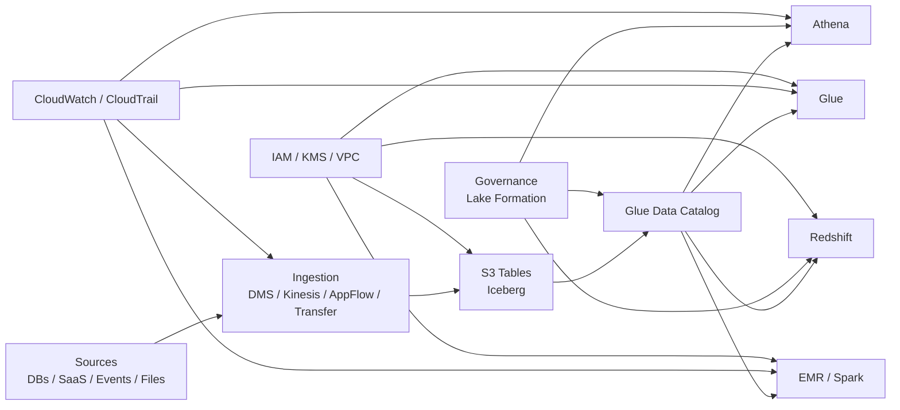
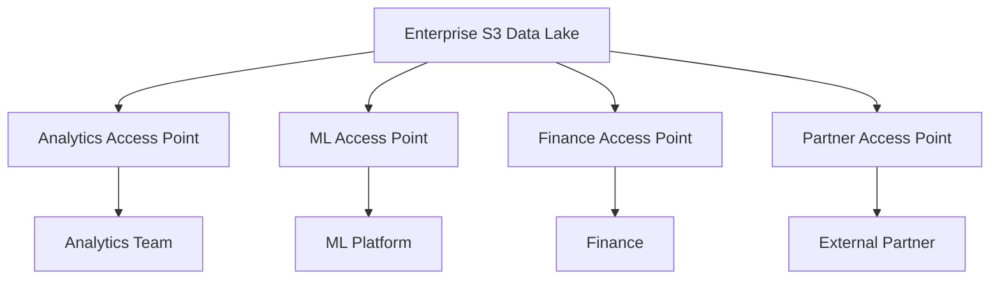

# 02 — S3 Tables, Access Points and Batch Operations

**G3 — AWS Data Engineering Deep Dive**

> **Learning progression:** Simple explanation → foundation → hands-on → deeper internals → production usage → architecture → security → performance → cost → troubleshooting → advanced design

## Module Overview

This module teaches three AWS capabilities that become increasingly valuable as an S3-based data platform grows:

1. **Amazon S3 Tables** — a table-oriented managed storage experience for Apache Iceberg tables.
2. **Amazon S3 Access Points** — scalable access boundaries that let different consumers use different access policies against S3 data.
3. **Amazon S3 Batch Operations** — managed, manifest-driven operations over very large sets of S3 objects.

The architectural relationship is:

```text
                    AWS DATA PLATFORM

                        S3
                         |
             +-----------+-----------+
             |                       |
      General-purpose S3        S3 Tables
             |                       |
        Objects/files              Iceberg
             |                       |
             +-----------+-----------+
                         |
                 Access boundaries
                         |
                  S3 Access Points
                         |
                Large-scale object
                    management
                         |
                S3 Batch Operations
```

The goal is not to memorize product terminology. The goal is to understand **why each capability exists, when to use it, what it changes operationally, and what trade-offs it introduces**.

### Role in the G3 roadmap

Topic 01 established the AWS data-service landscape and reference architectures. This topic now goes deeper into the S3 layer.

Later topics own detailed implementation of:

- Glue Data Catalog;
- Glue ETL and Data Quality;
- advanced Athena;
- Lake Formation;
- Redshift;
- Kinesis/Firehose/MSK;
- EMR;
- orchestration;
- DMS and zero-ETL;
- CloudWatch/CloudTrail/Cost Explorer;
- KMS/VPC;
- DataZone/SageMaker Unified Studio.

Those services are referenced here only enough to explain how S3 Tables fit into the broader platform.

---

# 1. Learning Outcomes

By completing this module, you should be able to:

- explain S3 buckets, objects, keys, prefixes, metadata and tags;
- explain why S3 is not a traditional filesystem;
- explain the evolution from files → data lake → Iceberg → managed table storage;
- explain Apache Iceberg at the level needed to understand S3 Tables;
- explain S3 Tables, table buckets, namespaces and tables;
- explain managed compaction, snapshot management and unreferenced-file removal;
- explain how S3 Tables integrate with AWS analytics services;
- compare S3 Tables with general-purpose S3;
- explain S3 Access Points and Access Point policies;
- distinguish bucket policies, IAM policies and Access Point policies;
- understand VPC-restricted Access Points;
- design multi-team access to a shared S3 data platform;
- explain S3 Batch Operations and manifests;
- use Batch Operations for large-scale object management;
- interpret completion reports and partial failures;
- compare Batch Operations with custom Python loops;
- reason about security, encryption, governance, performance and cost;
- troubleshoot common S3/S3 Tables/Access Point/Batch Operations failures;
- translate architecture decisions into Terraform/IaC;
- defend design choices in a Data Engineering interview.

---

# 2. Why This Topic Matters in Data Engineering

The evolution of analytical storage can be simplified as:

```text
Files
  ↓
Object Storage
  ↓
S3 Data Lake
  ↓
Partitioned Parquet
  ↓
Apache Iceberg
  ↓
Managed Iceberg Table Storage
  ↓
Enterprise Lakehouse
```

A traditional S3 data lake can begin very simply:

```text
s3://company-data/
    raw/
    silver/
    gold/
```

But production data platforms introduce more responsibilities:

```text
Millions of objects
       ↓
Table metadata
       ↓
Snapshots
       ↓
Manifests
       ↓
Small-file management
       ↓
Compaction
       ↓
Old snapshot cleanup
       ↓
Unreferenced-file cleanup
       ↓
Concurrent writers
       ↓
Access control
       ↓
Governance
       ↓
Operational monitoring
```

The storage system itself may be simple while the **table lifecycle** becomes complex.

S3 Tables is designed around this table-oriented problem. AWS states that S3 tables are stored in Apache Iceberg format and that S3 automatically performs table maintenance including compaction and snapshot management, with unreferenced-file removal at table-bucket level. citeturn0search1turn0search4

Access Points solve a different problem:

> "How do many independent teams, applications and partners access the same S3 data without turning one bucket policy into an unmanageable policy monolith?"

Batch Operations solves another:

> "How do I perform the same object-level operation across millions or billions of objects without writing and operating my own object-by-object worker fleet?"

These are three different architectural problems:

```text
S3 Tables
→ table lifecycle

Access Points
→ access architecture

Batch Operations
→ object-scale operations
```

---

# 3. S3 Fundamentals You Must Know First

## 3.1 Bucket

An S3 bucket is a logical container for objects.

Example:

```text
company-data
```

A bucket is not a traditional folder hierarchy.

## 3.2 Object

An S3 object consists conceptually of:

```text
Object
├── Key
├── Data
├── Metadata
└── Tags
```

Example object:

```text
s3://company-data/orders/2026/10/orders.parquet
```

## 3.3 Object Key

The key identifies the object within a bucket.

For:

```text
s3://company-data/orders/2026/10/orders.parquet
```

the key is:

```text
orders/2026/10/orders.parquet
```

## 3.4 Prefix

A prefix is the leading portion of object keys used to organize and select objects.

Example:

```text
orders/2026/10/
```

S3 does not require directories to exist in the filesystem sense.

## 3.5 Object Metadata

Metadata describes an object.

Examples include:

- content type;
- size-related properties;
- checksums;
- system metadata;
- user-defined metadata.

Metadata is different from object tags.

## 3.6 Object Tags

Tags are key/value metadata associated with an object.

Example:

```text
data_classification = confidential
domain = finance
retention = regulated
```

Tags can be useful for governance and large-scale object management.

## 3.7 Versioning

Versioning allows multiple versions of an object key to coexist.

Conceptually:

```text
orders.csv
   ├── version A
   ├── version B
   └── version C
```

Versioning can improve recovery from accidental overwrites/deletes, but it can also increase storage usage.

## 3.8 Storage Classes

S3 provides multiple storage classes designed for different access patterns.

At architecture level, ask:

```text
How often is data accessed?
How quickly must it be retrieved?
How long will it be retained?
What retrieval/storage economics apply?
```

Do not select a storage class solely from habit.

## 3.9 Lifecycle Policies

Lifecycle rules can transition or expire objects based on age and other conditions.

A production lifecycle design should be based on:

```text
Business retention
+
Compliance
+
Access pattern
+
Recovery requirements
+
Cost
```

## 3.10 Encryption

S3 supports server-side encryption options, including S3-managed encryption and AWS KMS-backed encryption.

At architecture level:

```text
Data
 ↓
Encryption
 ↓
Key / key-management policy
 ↓
Authorized access
```

## 3.11 IAM

IAM controls who or what can perform AWS actions.

For production:

- prefer roles and temporary credentials;
- avoid hard-coded access keys;
- use least privilege;
- separate workloads where practical.

## 3.12 Bucket Policies

S3 bucket policies are resource-based policies attached to buckets.

A simplified access model is:

```text
Principal
   ↓
IAM identity policy
   +
S3 resource policy
   +
Other applicable controls
   ↓
Authorization decision
```

Never assume a single policy document explains every access result.

---

# 4. Breaking Down an S3 URI

Consider:

```text
s3://company-data/orders/year=2026/month=10/day=06/orders.parquet
```

Breakdown:

```text
s3://
   ↓
S3 URI scheme

company-data
   ↓
Bucket

orders/
   ↓
Logical prefix

year=2026/
month=10/
day=06/
   ↓
Partition-style path convention

orders.parquet
   ↓
Object key suffix / object name
```

The important conceptual distinction:

> S3 stores objects identified by keys. The apparent directory hierarchy is a naming convention.

That distinction becomes important when reasoning about:

- object listings;
- batch operations;
- lifecycle rules;
- data-lake layouts;
- partitioning;
- access policies.

---

# 5. Traditional S3 Data Lake Mental Model

A common early-stage data lake:

```text
S3 Bucket
│
├── bronze/
│   └── raw/
│
├── silver/
│   └── standardized/
│
└── gold/
    └── curated/
```

A more analytical design might evolve toward:

```text
Raw data
   ↓
Parquet
   ↓
Partitioning
   ↓
Table metadata
   ↓
Iceberg
```

The data itself may live in S3 while the table format provides a logical table abstraction.

## The operational problem

Once an Iceberg table becomes heavily used, the platform must deal with:

- metadata files;
- snapshots;
- manifests;
- data files;
- small files;
- compaction;
- snapshot expiration;
- unreferenced files;
- concurrent table writers.

This is why "S3 is just storage" becomes an incomplete production mental model.

The storage layer may be simple, but the **analytical table lifecycle** is not.

---

# 6. Apache Iceberg Foundation

> **Iceberg is a table format, not a database.**

A useful mental model:

```text
Iceberg Table
│
├── Table Metadata
│
├── Snapshots
│
├── Manifest Lists / Manifests
│
└── Data Files
        └── Parquet / ORC / Avro
```

## 6.1 Table metadata

Metadata describes the current and historical state of the table.

## 6.2 Snapshots

A snapshot represents a consistent version of table state.

Conceptually:

```text
Snapshot 1
   ↓
Snapshot 2
   ↓
Snapshot 3
```

This supports features such as historical table state and controlled table evolution.

## 6.3 Manifests

Manifests describe groups of data files and their metadata.

They help query engines determine which files belong to a table snapshot.

## 6.4 Data files

These contain the actual rows.

For analytical workloads, columnar formats such as Parquet are common.

## 6.5 Schema evolution awareness

Iceberg supports table schema evolution mechanisms without treating every change as a destructive rewrite.

## 6.6 Partition evolution awareness

Iceberg can represent evolving partition specifications as part of the table metadata model.

## 6.7 ACID-style table operations awareness

Iceberg provides table-level transactional semantics designed for concurrent analytical workloads.

## 6.8 Time travel awareness

Historical snapshots can allow readers to reason about previous table states, subject to retention and maintenance policies.

### Why this matters for S3

Without a table abstraction:

```text
S3 objects
```

are just files.

With Iceberg:

```text
S3 objects
+
metadata
+
snapshots
+
manifests
=
analytical table
```

---

# 7. What Are S3 Tables?

A simple explanation:

> A normal S3 bucket is optimized around object storage. S3 Tables adds a table-oriented storage model designed for Apache Iceberg analytical tables and managed table maintenance.

AWS documents that every table in an S3 table bucket is stored in Apache Iceberg format. AWS also manages maintenance such as automatic file compaction and snapshot management. citeturn0search1

## 7.1 Why S3 Tables exist

The architectural problem is not:

> "How do I store one more file?"

It is:

> "How do I operate very large numbers of analytical tables and their underlying Iceberg files without manually owning every maintenance task?"

The managed model can reduce operational work around:

- compaction;
- snapshot management;
- unreferenced-file cleanup.

## 7.2 Mental model

Traditional S3:

```text
Traditional S3
    │
    └── Bucket
          │
          └── Objects
```

S3 Tables:

```text
S3 Tables
    │
    └── Table Bucket
          │
          ├── Namespace
          │     ├── Table
          │     └── Table
          │
          └── Namespace
                └── Table
```

## 7.3 Table bucket

A table bucket is the S3 Tables container for table-oriented storage.

It is not simply a general-purpose S3 bucket with a special folder name.

## 7.4 Namespace

A namespace provides logical organization for tables.

Think:

```text
Namespace
   ↓
logical database/domain grouping
   ↓
tables
```

## 7.5 Table

An S3 table represents a structured dataset plus its associated Iceberg metadata.

AWS documents that S3 creates a warehouse location for the table and stores the table's associated objects there. citeturn0search1

---

# 8. S3 Tables: The Architecture-Level Lifecycle

A conceptual workflow:

```text
Create Table Bucket
        ↓
Create Namespace
        ↓
Create Table
        ↓
Write Data
        ↓
Iceberg Metadata Evolves
        ↓
Snapshots Accumulate
        ↓
Maintenance Runs
        ├── Compaction
        ├── Snapshot Management
        └── Unreferenced File Removal
        ↓
Analytics Consumers
```

The key shift is:

```text
Traditional approach:
Data Engineer owns more maintenance.

S3 Tables:
AWS manages important table maintenance operations.
```

That does **not** mean the Data Engineer has no responsibility.

You still own:

- table design;
- schema;
- partitioning strategy;
- workload characteristics;
- access control;
- integration;
- retention requirements;
- query design;
- cost monitoring;
- operational validation.

---

# 9. Creating and Managing S3 Tables

S3 Tables APIs use the `s3tables` service namespace. AWS documentation should be treated as the authoritative source for exact API/CLI syntax because commands and capabilities can evolve.

A conceptual workflow:

```text
1. Create table bucket
2. Create namespace
3. Create table
4. Integrate with analytics/catalog
5. Write data
6. Query data
7. Monitor maintenance
8. Review cost
```

## 9.1 Verify identity first

```bash
aws sts get-caller-identity
```

### What it does

Shows the AWS account and principal used by the current CLI credential chain.

### Why it matters

Before creating or modifying AWS resources, confirm:

```text
Account
+
Identity
+
Region
```

### Production note

Never assume the terminal is authenticated to the account you intended.

---

## 9.2 Verify the configured Region

```bash
aws configure get region
```

For automation, also verify the effective credential and Region configuration rather than relying solely on local defaults.

---

## 9.3 S3 Tables CLI

The current AWS CLI exposes S3 Tables operations through the `s3tables` command namespace.

For example, the general shape is:

```bash
aws s3tables help
```

Use this first when working in a learning environment to inspect the installed CLI's supported commands.

### Why this is safer than copying old commands

AWS services evolve. A command copied from an outdated tutorial may:

- use an obsolete parameter;
- target a changed API;
- omit a newly required permission;
- behave differently across CLI versions.

**Rule:**

> Verify exact syntax against the AWS CLI Command Reference for the installed AWS CLI version before executing a mutating command.

---

# 10. S3 Tables and Apache Iceberg

The relationship is:

```text
S3 Tables
    ↓
Managed table storage experience
    ↓
Apache Iceberg table format
    ↓
Analytics engines
```

This is not:

```text
S3 Tables = Iceberg itself
```

Iceberg is the table format. S3 Tables is an AWS managed storage capability built around Iceberg tables.

## Why the distinction matters

If your organization already understands Iceberg, S3 Tables can be evaluated as an AWS-managed operational model rather than as an entirely new table concept.

That makes the transition:

```text
Manual Iceberg on S3
        ↓
Managed S3 Tables experience
```

more understandable.

---

# 11. Automatic Table Maintenance

AWS documents three important maintenance areas:

```text
Table maintenance
├── File compaction
├── Snapshot management
└── Unreferenced file removal
```

AWS states these maintenance operations are enabled by default and can be configured. citeturn0search4turn0search5

---

## 11.1 Automatic Compaction

### The problem

Imagine:

```text
100,000 tiny files
        ↓
Large metadata footprint
        ↓
More file-level planning
        ↓
Poor analytical performance
```

After compaction:

```text
Fewer larger files
        ↓
Lower file-management overhead
        ↓
More efficient reads
```

AWS documents compaction as combining smaller objects into fewer larger objects to improve Iceberg query performance and notes that it also applies row-level delete effects during compaction. citeturn0search5

### Why small files happen

Common causes:

- frequent micro-batches;
- many concurrent writers;
- streaming-to-lake workloads;
- poorly tuned output;
- frequent incremental writes.

### Production lesson

Do not treat compaction as merely a performance trick.

It can affect:

- compute usage;
- storage layout;
- query planning;
- operational workload;
- cost.

---

## 11.2 Snapshot Management

A snapshot represents a table state.

Without lifecycle management:

```text
Snapshot 1
Snapshot 2
Snapshot 3
...
Snapshot 10,000
```

can create unnecessary metadata and retained data.

AWS documents snapshot-management configuration around minimum retained snapshots and maximum snapshot age. Current defaults and limits are documented by AWS and should be verified before production configuration. citeturn0search5turn0search16

### Important production question

Do not ask only:

> "How many snapshots can we keep?"

Ask:

> "How much historical table state does the business actually need to recover or query?"

Retention should reflect:

- recovery requirements;
- compliance;
- time-travel requirements;
- storage economics.

---

## 11.3 Unreferenced File Removal

An Iceberg table can accumulate files that are no longer referenced by current table snapshots.

Conceptually:

```text
Old snapshot
   ↓
No longer referenced
   ↓
File becomes eligible for cleanup
```

S3 table-bucket maintenance can identify and remove unreferenced objects according to its configured retention behavior. citeturn0search11

### Critical safety principle

Unreferenced does not mean:

> "I personally do not recognize this file."

It means the table's metadata no longer references it under the maintenance model.

Do not manually delete Iceberg files just because they appear unused.

### Why this matters

Unsafe manual deletion can break table consistency.

---

# 12. S3 Tables vs General-Purpose S3

| Capability | General-purpose S3 | S3 Tables |
|---|---|---|
| Object storage | Core capability | Underlying storage capability |
| Table-oriented model | No built-in table abstraction | Yes |
| Apache Iceberg | Can store/manage Iceberg manually | Native table-oriented model |
| Namespace/table hierarchy | Application/catalog convention | Table-bucket model |
| Compaction | Your architecture/tools | Managed table maintenance |
| Snapshot management | Your Iceberg implementation/tooling | Managed table maintenance |
| Unreferenced-file cleanup | Your responsibility/tooling | Managed maintenance |
| Flexibility | Extremely broad | More specialized |
| Best fit | General object/data-lake storage | Managed Iceberg analytical tables |
| Operational burden | Potentially higher for table maintenance | Reduced for supported maintenance |
| Cost model | Storage/requests/etc. | Storage plus table/maintenance/usage considerations |
| Architectural coupling | Broad S3 ecosystem | More specialized AWS table-storage capability |

## 12.1 When should I use general-purpose S3?

Prefer general-purpose S3 when you need:

- raw object storage;
- arbitrary files;
- archives;
- landing zones;
- non-table data;
- application artifacts;
- maximum object-storage flexibility.

## 12.2 When should I consider S3 Tables?

Consider it when:

- the workload is fundamentally table-oriented;
- Apache Iceberg is the table format;
- operational table maintenance is significant;
- the AWS-managed experience fits the organization's architecture;
- supported analytics integrations meet requirements.

## 12.3 When should I avoid or defer S3 Tables?

Consider general-purpose S3 plus your own Iceberg/catalog architecture when:

- the workload requires capabilities not supported by S3 Tables;
- portability or custom catalog architecture is a primary requirement;
- the organization already has mature Iceberg operations;
- the workload is not table-oriented.

The decision should be evidence-based rather than product-driven.

---

# 13. Accessing S3 Tables from AWS Analytics Services

AWS documents Glue Data Catalog integration as the recommended integration path for accessing S3 table buckets from AWS analytics services. Through this integration, services such as Athena and Redshift can discover and access S3 Tables. AWS also documents direct/REST-based access for Iceberg-compatible clients. citeturn0search3

Conceptually:

```text
                    S3 Tables
                        |
               Glue Data Catalog
                        |
          +-------------+-------------+
          |             |             |
       Athena         Glue          Redshift
          |
         EMR / Iceberg-compatible clients
```

AWS currently documents S3 Tables access through:

- Glue Data Catalog integration;
- Glue Iceberg REST endpoint;
- direct access methods for supported open-source/Iceberg clients. citeturn0search3

## Important boundary

This module explains **how S3 Tables fit into the analytics platform**.

It does not become a full:

- Glue Catalog course;
- Athena course;
- EMR course;
- Redshift course.

Those are later G3 topics.

---

# 14. Athena Integration

Athena provides SQL analytics over data in S3.

For S3 Tables, the architecture is:

```text
S3 Table
   ↓
Glue integration/catalog
   ↓
Athena
   ↓
SQL
```

AWS documents Athena support for querying S3 Tables after table-bucket integration. citeturn0search8

### Architectural implication

The Data Engineer needs to think about:

```text
Table design
+
Metadata
+
Query engine
+
Governance
+
Query cost
```

not merely:

> "Can Athena run SQL?"

---

# 15. Glue Integration

Glue can process S3 Tables through AWS analytics-service integration or supported Iceberg access paths. AWS documents Glue ETL access to S3 Tables through the integration and through Iceberg-compatible access methods. citeturn0search14

Conceptually:

```text
S3 Tables
   ↓
Glue
   ↓
Transform
   ↓
S3 Tables
```

This makes Glue useful as a processing layer while S3 Tables remains the table-storage layer.

---

# 16. EMR Integration

EMR can use Spark to work with S3 Tables through supported catalog/access configurations.

Conceptually:

```text
S3 Tables
   ↓
Iceberg
   ↓
Spark on EMR
   ↓
Transform / Analyze
```

AWS documents both Glue Data Catalog integration and the S3 Tables Catalog for Apache Iceberg for EMR/Spark scenarios. citeturn0search12

### Production question

Do not ask only:

> "Can EMR read the table?"

Ask:

- Which catalog path will we use?
- Which permissions are required?
- What is the network path?
- What is the Spark runtime?
- Who owns the compute?
- How is the workload monitored?
- What is the cost model?

---

# 17. Redshift Integration Awareness

Redshift can query S3 Tables through supported AWS analytics integration.

AWS documents integration prerequisites involving table buckets and Glue/Data Catalog/Lake Formation configuration. citeturn0search13

The architecture can therefore become:

```text
S3 Tables
    ↓
Governed table metadata
    ↓
Redshift
    ↓
Warehouse consumers
```

This demonstrates an important lakehouse principle:

> Storage and analytical compute do not have to be the same system.

---

# 18. S3 Tables and Lakehouse Architecture

A production-style architecture:



## Example: e-commerce

```text
Order database
      ↓
     DMS
      ↓
S3 Tables
      ↓
orders table

Application events
      ↓
Kinesis
      ↓
processing
      ↓
clickstream table

Product data
      ↓
S3 / ingestion
      ↓
product table

                ↓
          Iceberg Lakehouse
                ↓
       +--------+--------+
       |        |        |
    Athena    Glue      EMR
       |
    Redshift
```

### Governance

Add:

```text
Lake Formation
```

where the broader platform requires governed access.

### Operations

Add:

```text
CloudWatch
CloudTrail
```

### Security

Add:

```text
IAM
KMS
VPC/private connectivity where appropriate
```

---

# 19. S3 Access Points

## 19.1 The problem

Imagine one bucket serves:

```text
Company Data Lake
       |
       +── Analytics
       +── ML
       +── Finance
       +── Application A
       +── Application B
       +── Partner
```

If every consumer is managed through one enormous bucket policy, policy administration can become difficult.

The architecture needs **separate access boundaries**.

## 19.2 What is an Access Point?

An S3 Access Point provides a named access endpoint associated with an S3 bucket and can have its own access policy.

Mental model:

```text
                 S3 Bucket
                    |
       +------------+-------------+
       |            |             |
 Access Point A  Access Point B  Access Point C
       |            |             |
   Analytics       ML          Partner
   Policy A       Policy B      Policy C
```

AWS Access Points are designed to simplify data access management at scale by allowing different policies for different applications or teams.

---

# 20. Access Point ARN

An Access Point has an ARN identifying the access point resource.

At architecture level, understand:

```text
Bucket
   +
Access Point
   +
Access Point ARN
   +
Access Point policy
```

The exact ARN format and endpoint behavior should be verified against current AWS documentation when implementing.

Do not hand-type production ARNs into scripts when the value can be discovered or parameterized.

---

# 21. Access Point Policy

An Access Point can have a resource policy describing who can perform which operations through that access point.

Conceptually:

```text
Analytics Access Point
        ↓
Policy:
read curated analytics data

ML Access Point
        ↓
Policy:
read selected ML datasets

Partner Access Point
        ↓
Policy:
restricted read-only dataset
```

This separates access intent.

---

# 22. Access Point and Bucket Policies

Access Point policies do not magically replace all other authorization controls.

A useful mental model is:

```text
Request
  ↓
Identity permissions
  +
Resource/access-point policies
  +
Applicable S3 controls
  +
KMS authorization where applicable
  +
Network restrictions where applicable
  ↓
Allow / Deny
```

An explicit deny can override an allow.

Therefore, an Access Point access failure should be investigated across the complete authorization chain.

---

# 23. Creating an Access Point

AWS CLI uses the `s3control` API namespace for Access Point administration.

A current documented VPC-restricted creation example has the form:

```bash
aws s3control create-access-point \
  --name example-vpc-ap \
  --account-id 123456789012 \
  --bucket amzn-s3-demo-bucket \
  --vpc-configuration VpcId=vpc-1a2b3c
```

AWS documents that an Access Point's network origin is chosen at creation time and can be `Internet` or `VPC`; a VPC-origin Access Point rejects requests that do not originate from the specified VPC. citeturn0search10

### What it does

Creates an Access Point named `example-vpc-ap` for the specified bucket and restricts its network origin to the specified VPC.

### Prerequisites

You need:

- the correct AWS account;
- permission to create the Access Point;
- the target bucket;
- the target VPC;
- appropriate network configuration.

### Production note

The example uses a placeholder account ID and VPC ID.

Never copy those identifiers into a real environment without replacing and verifying them.

---

# 24. Verifying an Access Point

A corresponding inspection pattern is:

```bash
aws s3control get-access-point \
  --name example-vpc-ap \
  --account-id 123456789012
```

AWS documents that this can show the Access Point's network origin and VPC configuration. citeturn0search10

The important operational habit is:

```text
Create
 ↓
Inspect
 ↓
Test
 ↓
Audit
```

not:

```text
Create
 ↓
Assume
```

---

# 25. VPC-Restricted Access Points

A VPC Access Point changes the network-origin requirement.

Conceptually:

```text
Private VPC
     |
     v
VPC Access Point
     |
     v
S3 bucket/data
```

AWS states that S3 rejects requests to a VPC-origin Access Point if they do not originate from the configured VPC. citeturn0search10

## Important distinction

A VPC-restricted Access Point provides a **network-origin restriction**.

It does not automatically answer:

- who can access the data;
- which objects they can access;
- whether KMS authorization succeeds;
- whether the VPC endpoint policy permits the request.

AWS notes that VPC endpoint policies must also grant access to the Access Point and underlying bucket for requests through the VPC endpoint. citeturn0search10

---

# 26. Access Points vs Direct Bucket Access

| Dimension | Direct bucket access | Access Points | VPC Access Point |
|---|---|---|---|
| Simple workload | Excellent | Often unnecessary | Often unnecessary |
| Many independent consumers | Can become complex | Strong fit | Strong fit for private workloads |
| Separate policies | Bucket policy/IAM | Access Point policies | Access Point + network restriction |
| Network restriction | Other controls | Can be configured | VPC-origin Access Point |
| Operational complexity | Lower initially | Moderate | Higher |
| Enterprise isolation | Can become policy-heavy | Strong | Strongest for private network boundary |
| Best use | Simple bucket | Multi-consumer access | Private multi-consumer access |

### Decision rule

```text
One/few consumers + simple permissions
→ Direct bucket access may be sufficient.

Many consumers + different access policies
→ Consider Access Points.

Many private consumers + VPC-only requirement
→ Consider VPC-restricted Access Points.
```

---

# 27. Enterprise Access Point Architecture



Each access boundary can have a deliberately scoped policy.

### Why this scales better

Instead of thinking:

```text
One giant bucket policy
```

think:

```text
Data domain
+
consumer
+
access intent
+
policy boundary
```

This is especially useful in organizations where:

- many teams share a lake;
- applications have distinct permissions;
- partners need controlled access;
- security teams want isolated policy ownership.

---

# 28. S3 Batch Operations

## 28.1 The problem

Suppose you need to operate on:

```text
10 million objects
```

A naive implementation might be:

```python
for object_key in objects:
    process(object_key)
```

This creates application-level responsibilities for:

- enumeration;
- concurrency;
- retries;
- checkpointing;
- failure tracking;
- throttling;
- observability;
- reporting.

S3 Batch Operations provides a managed alternative.

AWS documents that Batch Operations can perform a single operation over lists containing up to very large object populations, with progress tracking, notifications and detailed completion reports. citeturn0search2

---

# 29. Batch Operations Mental Model

```text
Objects
   ↓
Manifest
   ↓
Batch Job
   ↓
Operation
   ↓
IAM Role
   ↓
Managed Execution
   ↓
Success / Failure
   ↓
Completion Report
```

The core idea:

> Tell S3 which objects to operate on and what operation to perform; let the managed service execute the object-level work.

---

# 30. Manifests

A manifest is the object list that identifies the targets of a Batch Operations job.

AWS documents that a manifest can be supplied as a CSV object list or derived from supported inventory/replication workflows. A manually created CSV can contain bucket name, object key and optionally object version. citeturn0search9

## Why manifests matter

Compare:

```text
"Process everything in this bucket"
```

with:

```text
"Process exactly these objects"
```

The second is deterministic.

That matters for:

- auditability;
- reproducibility;
- targeted migrations;
- controlled remediation;
- compliance operations.

## Version-aware processing

In versioned buckets, a manifest can identify specific object versions.

That can be critical when:

```text
key = orders.csv
version A
version B
version C
```

must not be treated as interchangeable.

---

# 31. Creating a Batch Operations Job

A Batch Operations job conceptually needs:

```text
Operation
+
Manifest
+
IAM role
+
Optional completion report
```

AWS documents these as core job inputs. citeturn0search9

### Job lifecycle

Conceptually:

```text
New
 ↓
Preparing
 ↓
Ready
 ↓
Running
 ↓
Complete / Failed / Canceled
```

AWS documents asynchronous execution and notes that tasks do not necessarily execute in manifest order. citeturn0search7

### Critical operational lesson

Do not assume:

```text
Manifest row 1
→ task 1 completes first
```

Manifest order is not execution order.

Use completion reports and audit logs to determine actual results.

---

# 32. Supported Batch Operations

AWS currently documents operations including:

- copy objects;
- compute checksums;
- delete object tags;
- invoke Lambda;
- replace object tags;
- replace ACLs;
- restore objects;
- update object encryption;
- existing-object replication;
- S3 Object Lock retention;
- S3 Object Lock legal holds.

AWS's supported-operation list should be checked before implementing a specific workflow because the supported set can evolve. citeturn0search2

The roadmap-relevant operations include:

```text
Copy
Tag
Delete
Restore
Lambda invocation
```

---

# 33. Batch Operation — Copy

Concept:

```text
Bucket A
   ↓
Manifest
   ↓
Batch Operations
   ↓
Bucket B
```

Use cases:

- migration;
- dataset reorganization;
- replication workflows;
- controlled archival movement.

Questions to answer:

- Are source and destination correct?
- Is encryption configured correctly?
- Are permissions correct?
- What happens if some objects fail?
- How will success be verified?

---

# 34. Batch Operation — Tagging

At scale:

```text
Millions of objects
       ↓
Batch Operations
       ↓
data_classification=restricted
```

Useful for:

- governance;
- domain tagging;
- migration markers;
- operational classification.

Avoid treating tags as a substitute for actual authorization.

A tag saying:

```text
classification=restricted
```

does not itself make the object restricted.

The tag becomes useful only when governance and policy systems actually use it.

---

# 35. Batch Operation — Delete

Deletion is dangerous.

A production delete workflow should be:

```text
Identify target
   ↓
Validate manifest
   ↓
Confirm environment/account
   ↓
Review permissions
   ↓
Run controlled job
   ↓
Inspect completion report
   ↓
Verify outcome
```

### Safer practice

Use:

- lab buckets;
- explicit manifests;
- versioning where appropriate;
- least-privilege roles;
- change approval;
- audit logging.

Never test bulk deletion against production data.

---

# 36. Batch Operation — Restore

Batch Operations can be used for supported object-restore workflows.

Architecture:

```text
Archived objects
      ↓
Manifest
      ↓
Batch Operations
      ↓
Restore operation
      ↓
Completion report
```

The exact behavior depends on the storage class and restore operation.

Verify current AWS documentation before executing a production restore.

---

# 37. Batch Operation — Lambda Invocation

Batch Operations can invoke Lambda for object-level processing.

Conceptually:

```text
Manifest
   ↓
Batch Operations
   ↓
Lambda
   ↓
Object-level custom logic
```

This is useful when the object operation cannot be represented by one of the native Batch Operations actions.

### Important boundary

Do not turn Batch Operations + Lambda into an excuse to build a custom distributed processing system for large data transformations.

If the workload requires:

- scanning large datasets;
- joins;
- aggregations;
- distributed transformations;

use an appropriate data-processing engine instead.

Batch Operations is fundamentally an **object-operation orchestration mechanism**.

---

# 38. Completion Reports

A completion report is one of the most important operational features.

AWS documents that completion reports can contain each task's object key/version, status, error codes and error descriptions. Reports can be configured for all tasks or failed tasks. citeturn0search0turn0search7

Conceptually:

```text
Batch Job
   ↓
+-------------------+
| 98% succeeded     |
| 2% failed         |
+-------------------+
          ↓
Completion Report
          ↓
Failed object list
          ↓
Diagnosis / retry
```

## What to inspect

For failures:

- object key;
- version;
- status;
- error code;
- error description;
- operation;
- permissions;
- object state.

## Production lesson

A batch job being "mostly successful" does not mean the data operation is complete.

If:

```text
1,000,000 objects
999,000 succeeded
1,000 failed
```

you still need to decide:

- Are the failures acceptable?
- Must they be retried?
- Do they indicate a systematic permission issue?
- Are failed objects business-critical?

---

# 39. Batch Operations vs Custom Python Scripts

| Requirement | Custom Python | S3 Batch Operations |
|---|---|---|
| Small number of objects | Excellent | Often unnecessary |
| Millions of objects | Requires engineering | Strong fit |
| Native object operation | Application-managed | Managed |
| Retry management | You build it | Managed job model |
| Progress tracking | You build it | Built in |
| Completion report | You build it | Supported |
| Custom object logic | Flexible | Lambda integration where appropriate |
| Distributed compute | Not the right abstraction | Not the right abstraction |
| Operational burden | Higher | Lower for supported operations |
| Auditability | You design it | Managed reporting/audit capabilities |
| Best use | Bespoke logic/small scope | Large-scale supported object operations |

### Decision rule

```text
Small + bespoke
→ Python may be simplest.

Large + native S3 object operation
→ Batch Operations.

Large + custom data transformation
→ Data-processing engine.
```

---

# 40. IAM and Security

A production S3 architecture typically contains several policy layers:

```text
Identity
   ↓
IAM policy
   +
S3 bucket policy
   +
Access Point policy
   +
KMS authorization
   +
VPC/network controls
   ↓
Final authorization decision
```

## 40.1 Least privilege

A role should have only the actions and resources required.

Avoid:

```json
"Action": "s3:*",
"Resource": "*"
```

unless there is a carefully justified administrative role and strong controls around its use.

## 40.2 Batch Operations IAM role

Batch Operations needs an IAM role with permissions required to perform the selected operation.

The role should be scoped to:

- the relevant bucket;
- relevant objects;
- relevant KMS keys;
- relevant report location;
- relevant operation.

## 40.3 Cross-account access

For enterprise architectures, cross-account access can involve:

```text
Consumer role
+
Resource policy
+
Access Point
+
KMS permissions
+
Organization/SCP constraints
```

Do not assume a role in Account A automatically has access to data in Account B.

## 40.4 Explicit deny

Remember:

```text
Explicit Deny
    >
Allow
```

When debugging access, search for denies as well as missing allows.

---

# 41. Encryption

Common S3 server-side encryption concepts include:

- SSE-S3;
- SSE-KMS;
- customer-managed KMS keys.

## Why KMS matters

With KMS-backed encryption, successful data access may require both:

```text
S3 authorization
+
KMS authorization
```

Conceptually:

```text
User/Role
   |
   +── S3 permission
   |
   +── KMS permission
   |
   ↓
Encrypted object access
```

Actual authorization can involve additional policy layers.

### Production checklist

```text
[ ] Encryption enabled
[ ] Key ownership understood
[ ] Key policy reviewed
[ ] IAM permissions reviewed
[ ] Cross-account behavior tested
[ ] Rotation/retention requirements understood
[ ] Audit path defined
```

---

# 42. Public Access Safety

Do not use:

```text
public-read
```

or broad public policies as a learning shortcut.

For enterprise data platforms:

```text
Block unintended public access
+
least privilege
+
private connectivity where appropriate
+
audit
```

The correct solution to an access problem is not:

> "Make the bucket public."

---

# 43. Data Governance

S3 Tables, Access Points and Batch Operations fit into a larger governance model.

Governance questions include:

- Who owns the data?
- Which domain owns the table?
- Who can read it?
- Who can write it?
- Who can delete it?
- How is sensitive data classified?
- How is access audited?
- How are partner accesses isolated?
- How are cross-account accesses controlled?

Relevant technologies include:

```text
IAM
S3 policies
Access Points
KMS
Lake Formation
Glue Data Catalog
DataZone
CloudTrail
```

This module introduces the relationships but does not replace the later Lake Formation/DataZone topics.

---

# 44. Cost Considerations

Never design an S3 architecture without identifying cost drivers.

## 44.1 S3 Tables

Consider:

- data storage;
- object/request activity;
- table maintenance;
- compaction work;
- metadata;
- retained snapshots;
- query-engine consumption;
- data transfer.

AWS documents that S3 table maintenance can include compaction, snapshot management and unreferenced-file removal; the exact cost impact should be evaluated using current AWS pricing and workload behavior. citeturn0search4turn0search16

## 44.2 Access Points

Access Points are primarily an access-management architecture capability.

Do not assume that introducing an Access Point removes or creates every downstream networking/data-transfer cost. Review the actual request path, VPC endpoints, NAT, cross-Region traffic and consumer architecture.

## 44.3 Batch Operations

Consider:

- Batch Operations usage;
- object operations;
- Lambda invocation if used;
- data transfer;
- downstream processing;
- completion-report storage.

### Cost rule

> Always verify current AWS pricing before production deployment.

Never hard-code pricing from a tutorial into an architecture decision.

---

# 45. Performance Considerations

## 45.1 S3 Tables

Think about:

```text
File size
+
Compaction
+
Metadata
+
Partitioning
+
Query engine
```

### Small files

Too many small files can increase planning and read overhead.

### Compaction

Managed compaction can reduce the number of small objects.

### Partitioning

Poor partitioning can still produce inefficient queries even if files are compacted.

### Query engine

Athena, Spark and Redshift can have different access and optimization behaviors.

---

## 45.2 Access Points

Access Points primarily affect access architecture rather than turning an inefficient data layout into an efficient one.

Review:

- request path;
- VPC endpoint behavior;
- cross-Region access;
- cross-account architecture;
- authorization complexity.

---

## 45.3 Batch Operations

Consider:

- number of objects;
- manifest quality;
- operation type;
- object distribution;
- downstream processing;
- retry behavior;
- completion-report analysis.

Do not assume object count alone determines runtime.

---

# 46. Failure Scenarios and Break/Fix Labs

## Incident 1 — Too Many Small Files

### Symptom

```text
Iceberg table
    ↓
Very large number of small files
    ↓
Queries become slower
```

### Evidence

Collect:

- file counts;
- file-size distribution;
- table metadata;
- query performance;
- ingestion pattern;
- maintenance status.

### Root cause possibilities

- micro-batch writes;
- high writer concurrency;
- insufficient compaction;
- unsuitable file-size configuration.

### Remediation

Evaluate:

```text
Managed compaction
+
write pattern
+
table maintenance configuration
+
query layout
```

### Verification

Re-measure:

- file count;
- average file size;
- query latency;
- scan behavior.

---

# 47. Incident 2 — Access Denied Through Access Point

Use this decision tree:

```text
Access denied
      ↓
Confirm identity/account
      ↓
Check IAM policy
      ↓
Check bucket policy
      ↓
Check Access Point policy
      ↓
Check explicit denies/SCPs
      ↓
Check KMS authorization
      ↓
If VPC AP:
check VPC endpoint policy/network
      ↓
Retry with controlled test
```

### Evidence to collect

- caller ARN;
- account ID;
- Access Point ARN/name;
- bucket;
- requested object;
- action;
- error message;
- CloudTrail evidence;
- KMS key information where relevant;
- network path.

Do not randomly add permissions until the actual denial is understood.

---

# 48. Incident 3 — Batch Job Partial Failure

Suppose:

```text
1,000,000 objects
998,000 succeeded
2,000 failed
```

### Diagnose

```text
Completion report
      ↓
Group failures by error
      ↓
Identify common root cause
      ↓
Determine whether failure is systematic
      ↓
Correct root cause
      ↓
Retry failed subset
      ↓
Verify
```

### Possible causes

- missing permissions;
- missing object;
- wrong version;
- KMS permission;
- destination failure;
- unsupported operation condition.

---

# 49. Incident 4 — Unexpected Storage Growth

Investigate:

```text
Storage growth
   ↓
Data growth?
   ├── Yes → expected business growth?
   └── No
        ↓
Snapshots?
        ↓
Unreferenced files?
        ↓
Object versions?
        ↓
Incomplete cleanup?
        ↓
Compaction/maintenance behavior?
```

Do not immediately delete old files.

First establish their relationship to:

- active snapshots;
- retention requirements;
- table metadata;
- recovery requirements.

---

# 50. Incident 5 — Production Data Accidentally Deleted

### Immediate actions

```text
Stop further destructive activity
        ↓
Identify caller
        ↓
Identify affected bucket/object/version
        ↓
Inspect CloudTrail/audit evidence
        ↓
Assess versioning/recovery options
        ↓
Contain permissions
        ↓
Recover where possible
        ↓
Document root cause
```

### Preventive controls

- least privilege;
- explicit delete permissions;
- versioning where appropriate;
- change approval;
- separate production roles;
- monitoring;
- audit logs;
- controlled Batch Operations manifests.

---

# 51. Hands-On Lab Series

> **AWS cost safety:** Use small datasets, short-lived resources, explicit tags, budgets/alerts and teardown. Never assume a service is free.

## Lab 1 — S3 Fundamentals

Create a disposable lab bucket such as:

```text
de-learning-<unique-suffix>
```

Practice:

- upload;
- list;
- inspect metadata;
- tags;
- versioning;
- lifecycle awareness.

### Verification

Record:

```text
Account
Region
Bucket
Object key
Encryption
Versioning state
Tags
```

### Cleanup

Delete lab objects and the lab bucket after verifying no other workload depends on it.

---

# 52. Lab 2 — S3 Table Architecture

Design:

```text
Table Bucket
     ↓
Namespace
     ↓
orders table
```

Document:

```text
Table purpose:
Namespace:
Schema:
Partition strategy:
Consumers:
Security:
Governance:
Cost drivers:
```

Do not start by blindly creating resources.

---

# 53. Lab 3 — S3 Tables + Iceberg

Use a small realistic dataset:

```text
orders
customers
products
```

Design relationships:

```text
customers
     |
     +── orders
            |
            +── products
```

Document:

- table schema;
- data format;
- table ownership;
- query consumers;
- maintenance expectations.

The objective is to understand the **table architecture**, not to build a huge dataset.

---

# 54. Lab 4 — Access Points

Design three access paths:

```text
Analytics
Application
Partner
```

Architecture:

```text
One S3 data bucket
        |
        +── Analytics Access Point
        |
        +── Application Access Point
        |
        +── Partner Access Point
```

For each define:

```text
Principal
Allowed actions
Allowed resources
Network origin
Encryption requirements
Audit expectations
```

---

# 55. Lab 5 — VPC Access Point

Create a conceptual private-access design:

```text
Private VPC
    ↓
S3 VPC endpoint
    ↓
VPC-restricted Access Point
    ↓
S3 data
```

Verify:

- VPC identity;
- Access Point network origin;
- endpoint policy;
- identity policy;
- Access Point policy.

AWS documents that VPC endpoint policies must allow the relevant Access Point and underlying bucket for this access pattern. citeturn0search10

---

# 56. Lab 6 — Batch Operations

Create a controlled set of test objects.

Perform safe operations such as:

```text
Tag
Copy
```

Then inspect:

```text
Job status
Completion report
Successful objects
Failed objects
```

Do not start with bulk deletion.

---

# 57. Lab 7 — Failure Injection

Create a controlled permission failure.

Example:

```text
Batch Operations
       ↓
Insufficient permission
       ↓
Failure
```

Diagnose:

```text
Identity
↓
IAM role
↓
S3 permission
↓
KMS if applicable
↓
Manifest
↓
Completion report
```

Restore the required permission and retry only the failed subset.

---

# 58. Lab 8 — Production Architecture

Design:

```text
                    E-COMMERCE PLATFORM

Orders DB ────────┐
                  │
Product data ─────┼──→ Ingestion
                  │
Clickstream ──────┘
                       ↓
                    S3 Tables
                       ↓
                    Iceberg
             +---------+---------+
             |         |         |
          Athena     EMR      Redshift

Security:
IAM + KMS + VPC

Governance:
Lake Formation awareness

Access:
Access Points

Operations:
CloudWatch + CloudTrail

Cost:
Tags + Budget + Usage review

IaC:
Terraform
```

Produce an architecture document containing:

- data flow;
- trust boundaries;
- table ownership;
- access boundaries;
- failure modes;
- observability;
- cost drivers;
- teardown strategy.

---

# 59. AWS CLI Examples — Safety Rules

Every CLI command in a learning environment should be accompanied by:

```text
Purpose
Prerequisites
Target
Expected output
Common error
Cleanup
```

Before mutating resources:

```bash
aws sts get-caller-identity
aws configure get region
```

Then inspect the target resource.

### Destructive operations

Mark destructive commands clearly:

> **DESTRUCTIVE:** Verify account, Region, bucket, manifest and object versions before executing any bulk-delete workflow.

Never test destructive operations against production.

---

# 60. Python / boto3 Examples

## 60.1 List buckets

```python
import boto3

s3 = boto3.client("s3")

response = s3.list_buckets()

for bucket in response["Buckets"]:
    print(bucket["Name"])
```

### What it demonstrates

```text
Python
  ↓
boto3
  ↓
S3 client
  ↓
AWS API
  ↓
Response
```

### Production considerations

- use IAM roles/temporary credentials;
- do not hard-code keys;
- handle API errors;
- use pagination where APIs return paginated results;
- log safely;
- confirm account/Region.

---

## 60.2 Inspect an object

```python
import boto3

s3 = boto3.client("s3")

response = s3.head_object(
    Bucket="example-bucket",
    Key="orders/2026/10/orders.parquet",
)

print("Size:", response["ContentLength"])
print("ETag:", response.get("ETag"))
print("ContentType:", response.get("ContentType"))
```

This is useful for understanding object metadata without downloading the object.

---

## 60.3 Apply an object tag

```python
import boto3

s3 = boto3.client("s3")

s3.put_object_tagging(
    Bucket="example-bucket",
    Key="orders/2026/10/orders.parquet",
    Tagging={
        "TagSet": [
            {"Key": "domain", "Value": "orders"},
            {"Key": "classification", "Value": "internal"},
        ]
    },
)
```

### Production warning

Object tags can support governance workflows, but a tag is not automatically an authorization boundary.

---

# 61. Terraform Perspective

The architectural goal is:

```text
Architecture
    ↓
AWS resource
    ↓
Terraform/OpenTofu
    ↓
Version control
    ↓
Review
    ↓
Plan
    ↓
Apply
```

## Illustrative Access Point resource

```hcl
resource "aws_s3_access_point" "analytics" {
  bucket = aws_s3_bucket.data.id
  name   = "analytics"
}
```

This is intentionally minimal.

A production configuration should additionally consider:

- account ownership;
- policy;
- public access controls;
- VPC restriction where required;
- tags;
- IAM;
- encryption;
- environment separation.

## Workflow

```bash
terraform init
terraform plan
terraform apply
terraform destroy
```

### Why `plan` matters

`terraform plan` provides an opportunity to review:

```text
What will be created?
What will be changed?
What will be destroyed?
```

Never blindly apply infrastructure changes to a production account.

---

# 62. Architecture Decision Records

## ADR 1 — General-purpose S3 or S3 Tables?

### Context

The platform needs analytical Iceberg tables.

### Decision

Evaluate S3 Tables when managed table maintenance and AWS integration provide enough value.

### Alternatives

- general-purpose S3 + manually managed Iceberg;
- another managed table/lakehouse architecture.

### Trade-offs

**S3 Tables:**

- lower operational burden for supported table maintenance;
- specialized table storage model;
- AWS-oriented integration.

**General-purpose S3:**

- maximum flexibility;
- broader object-storage use cases;
- potentially more table-maintenance responsibility.

### Security

Evaluate:

- IAM;
- table/resource permissions;
- KMS;
- governance.

### Cost

Evaluate:

- storage;
- maintenance;
- query workload;
- transfer;
- alternative platform cost.

---

## ADR 2 — Direct Bucket Access or Access Point?

### Context

Multiple teams require different policies over the same bucket.

### Decision

Consider Access Points when separate access boundaries improve manageability.

### Alternatives

Direct bucket access with IAM/bucket policy.

### Trade-offs

Access Points introduce an additional resource/policy layer but can make enterprise access architecture easier to reason about.

---

## ADR 3 — Python Loop or Batch Operations?

### Context

Millions of objects require the same native object operation.

### Decision

Prefer S3 Batch Operations when the required operation is supported and the object set is large.

### Alternative

Custom Python.

### Trade-off

Python provides maximum custom logic but requires the team to build operational machinery. Batch Operations provides managed execution and reporting for supported operations.

---

# 63. Production Design Patterns

## Pattern 1 — Managed Iceberg Lakehouse

```text
Sources
   ↓
Ingestion
   ↓
S3 Tables
   ↓
Iceberg
   ↓
Athena / Glue / EMR / Redshift
```

Add:

```text
IAM
KMS
Governance
CloudWatch
CloudTrail
Cost controls
```

---

## Pattern 2 — Multi-Team S3 Access

```text
                 S3 Data Lake
                     |
        +------------+------------+
        |            |            |
   Analytics AP    ML AP      Partner AP
        |            |            |
     Policy A      Policy B     Policy C
```

Use this when access requirements differ by consumer.

---

## Pattern 3 — Large-Scale Object Management

```text
Object Inventory / Object List
             ↓
          Manifest
             ↓
     S3 Batch Operations
             ↓
          Operation
             ↓
      Completion Report
```

---

## Pattern 4 — Secure Enterprise Data Platform

```text
Users / Services
       ↓
IAM
       ↓
Access Points
       ↓
S3 / S3 Tables
       ↓
KMS encryption

Private workloads
       ↓
VPC
       ↓
VPC endpoint / VPC Access Point

Audit
       ↓
CloudTrail

Operations
       ↓
CloudWatch

Governance
       ↓
Lake Formation / DataZone awareness
```

---

# 64. Common Beginner Mistakes

## Mistake 1 — Treating S3 as a filesystem

**Why it happens:** The key naming convention looks like directories.

**Why dangerous:** Leads to incorrect assumptions about rename, directory semantics and object operations.

**Correct approach:** Think object store + keys.

**Production lesson:** Design around object semantics.

---

## Mistake 2 — Confusing bucket and prefix

A prefix is not a separate bucket.

```text
Bucket:
company-data

Prefix:
orders/2026/
```

---

## Mistake 3 — Assuming S3 Tables are just another bucket

S3 Tables provide a table-oriented model and managed maintenance around Iceberg tables.

---

## Mistake 4 — Ignoring Iceberg metadata

If you understand only:

```text
Parquet files
```

you do not yet understand the full Iceberg table model.

---

## Mistake 5 — Ignoring small files

Small files can degrade analytical performance and increase metadata overhead.

---

## Mistake 6 — Giving broad S3 permissions

Avoid:

```text
s3:*
Resource: *
```

as a convenience.

---

## Mistake 7 — Using Access Points without understanding policy layering

An Access Point policy is one layer of authorization, not a replacement for understanding IAM, bucket policies, KMS and network restrictions.

---

## Mistake 8 — Making data public to solve access problems

Never use public access as a shortcut.

---

## Mistake 9 — Running millions of object operations with a naive Python loop

At scale, consider S3 Batch Operations for supported native operations.

---

## Mistake 10 — Ignoring completion reports

A 98% success rate can still represent a production incident.

---

## Mistake 11 — Hard-coding AWS credentials

Use:

```text
IAM roles
+
temporary credentials
+
IAM Identity Center where appropriate
```

---

## Mistake 12 — Ignoring KMS permissions

An S3 permission failure may actually involve KMS authorization.

---

## Mistake 13 — Ignoring service limits

Always validate quotas and service limits before scaling.

---

## Mistake 14 — Assuming CLI syntax never changes

Verify current AWS CLI documentation.

---

# 65. Advanced Concepts

The following are intentionally labeled.

## Core

- S3 object model;
- S3 Tables;
- table buckets;
- namespaces;
- Iceberg relationship;
- maintenance;
- Access Points;
- VPC Access Points;
- Batch Operations;
- manifests;
- completion reports;
- security;
- cost.

## Advanced

- managed Iceberg table lifecycle;
- maintenance configuration;
- cross-account access;
- policy layering;
- private data paths;
- high-scale object operations;
- failure isolation;
- reproducible IaC;
- operational auditability.

## Awareness

- deep Lake Formation governance;
- DataZone;
- advanced Redshift;
- advanced Athena;
- advanced EMR;
- Kinesis/MSK internals;
- DMS implementation.

Those awareness topics belong to later G3 modules.

---

# 66. Architecture Trade-Off Matrix

## Storage

| Decision | General-purpose S3 | S3 Tables |
|---|---|---|
| Best use | General object/data lake | Managed Iceberg analytical tables |
| Flexibility | Very high | Specialized |
| Table maintenance | User/platform responsibility | Managed capabilities |
| Iceberg | Manual/integrated | Native table-oriented model |
| Operational burden | Potentially higher | Lower for supported maintenance |
| Recommendation | Default broad storage layer | Consider for managed Iceberg table workloads |

## Access

| Decision | Direct bucket | Access Point | VPC Access Point |
|---|---|---|---|
| Simple access | Strong | Often unnecessary | Often unnecessary |
| Multiple consumers | Can become complex | Strong | Strong |
| Separate policies | Possible | Strong | Strong |
| Network restriction | Other controls | Configurable | VPC-origin |
| Complexity | Low initially | Moderate | Higher |

## Object Operations

| Decision | Python | Batch Operations |
|---|---|---|
| Small custom task | Strong | Overkill |
| Millions of objects | Operational burden | Strong |
| Native object operation | Custom implementation | Managed |
| Retry/reporting | Build it | Managed capabilities |
| Custom processing | Strong | Lambda integration where appropriate |
| Distributed analytics | Wrong abstraction | Wrong abstraction |

---

# 67. Interview Preparation

## Basic

### What is S3?

**Expected thinking:** Object storage, buckets, objects and keys.

### What is S3 Tables?

**Expected thinking:** Table-oriented managed storage for Iceberg tables.

### What is a table bucket?

**Expected thinking:** Container for S3 Tables namespaces and tables.

### What is an Access Point?

**Expected thinking:** Named access boundary associated with an S3 bucket.

### What is S3 Batch Operations?

**Expected thinking:** Managed large-scale operations against a manifest-defined object set.

### What is an Iceberg table?

**Expected thinking:** Analytical table format using metadata, snapshots, manifests and data files.

---

## Intermediate

### Why use S3 Tables instead of general-purpose S3?

Strong answer:

> When the workload is fundamentally Iceberg-table oriented and the managed maintenance/integration model provides enough operational value relative to the flexibility of managing Iceberg yourself.

### How do Access Points help enterprise teams?

Strong answer:

> They allow different applications or teams to use separate named access paths and policies against the same bucket, reducing policy-management complexity.

### Why are manifests used in Batch Operations?

Strong answer:

> They define the exact object population targeted by a job, improving determinism, auditability and controlled retries.

### Why are small files a problem?

Strong answer:

> They increase file-level planning and metadata overhead and can reduce analytical read efficiency.

### What is snapshot management?

Strong answer:

> Lifecycle control over historical Iceberg table snapshots so that useful history is retained without unbounded metadata/data retention.

---

## Advanced

### Design an enterprise Iceberg lakehouse using S3 Tables.

Expected reasoning:

```text
Sources
→ ingestion
→ S3 Tables
→ Iceberg
→ Glue integration
→ Athena/Glue/EMR/Redshift
→ governance
→ IAM/KMS/VPC
→ observability
→ cost
```

### Design multi-team access to one S3 platform.

Expected reasoning:

```text
Bucket
→ Access Points
→ consumer-specific policies
→ IAM
→ KMS
→ VPC restrictions where needed
→ CloudTrail
```

### Process 500 million S3 objects safely.

Expected reasoning:

- identify supported native operation;
- create deterministic manifest;
- use Batch Operations;
- least-privilege IAM role;
- completion report;
- monitor;
- retry failures;
- validate results.

### Diagnose unexpected Iceberg storage growth.

Expected reasoning:

```text
Business data growth
→ snapshots
→ unreferenced files
→ versions
→ maintenance configuration
→ write pattern
→ retention
```

### Troubleshoot Access Point authorization failure.

Expected reasoning:

```text
Identity
→ IAM
→ bucket policy
→ Access Point policy
→ SCP/explicit deny
→ KMS
→ VPC endpoint/network
```

### Compare S3 Tables with manually managed Iceberg on S3.

Expected reasoning:

Compare:

- maintenance;
- control;
- flexibility;
- integration;
- portability;
- cost;
- operational expertise.

---

# 68. Practice Questions

## Basic

1. What is an S3 bucket?
2. What is an S3 object?
3. What is an object key?
4. What is a prefix?
5. What is object metadata?
6. What is an object tag?
7. Why does versioning matter?
8. What is an Iceberg table?
9. What is S3 Tables?
10. What is a table bucket?
11. What is a namespace?
12. What is an Access Point?
13. What is a VPC Access Point?
14. What is S3 Batch Operations?
15. What is a manifest?

## Intermediate

16. Why can manually managed Iceberg tables create operational work?
17. Why are small files problematic?
18. Why is compaction useful?
19. Why do snapshots require lifecycle management?
20. Why can unreferenced files accumulate?
21. Why might a company use Access Points?
22. What is the difference between a bucket policy and Access Point policy?
23. Why does a VPC Access Point not solve every authorization problem?
24. Why are completion reports important?
25. When is Python better than Batch Operations?

## Advanced

26. A table receives many small micro-batches. What would you investigate?
27. A table's storage increases while business data remains stable. What evidence would you collect?
28. A VPC Access Point request is denied. Give the troubleshooting sequence.
29. A Batch Operations job fails for 3% of objects. How would you isolate the root cause?
30. Design Access Points for analytics, ML and external partners.
31. Design an S3 Tables lakehouse for e-commerce.
32. Compare general-purpose S3 and S3 Tables for a multi-engine platform.
33. Design a cross-account S3 Tables access model.
34. Explain how KMS changes the access-debugging model.
35. Explain why completion reports are part of the operational design.

## Production Scenarios

36. A finance team must access only approved datasets. Design the access boundary.
37. A partner must receive a controlled copy of selected objects. Design the workflow.
38. A data lake contains hundreds of millions of objects that need tagging. Design the operation.
39. A table's query latency doubles after a streaming ingestion change. Diagnose.
40. A bulk object migration succeeds partially. Design the retry process.

---

# 69. Final Knowledge Check

Do not consult the answer key until you have attempted all questions.

## 69.1 Concept Questions — 20

1. Why is S3 not a traditional filesystem?
2. What problem does Iceberg solve above object storage?
3. Why does an Iceberg table have metadata?
4. What is an Iceberg snapshot?
5. What is the purpose of manifests?
6. Why can small files hurt performance?
7. What is S3 Tables?
8. Why does a table bucket exist?
9. What is a namespace?
10. What is automatic compaction?
11. What is snapshot management?
12. What is unreferenced-file removal?
13. What is an Access Point?
14. Why are Access Points useful for enterprise access management?
15. What is a VPC Access Point?
16. What is S3 Batch Operations?
17. Why are manifests important?
18. What is a completion report?
19. Why can KMS permissions matter for S3 access?
20. Why should large object operations not automatically be implemented as Python loops?

## 69.2 Scenario Questions — 10

1. An Iceberg table contains millions of small files. What do you investigate?
2. An Access Point request is denied from a private workload. What do you check?
3. A Batch Operations job has a 2% failure rate. How do you investigate?
4. S3 storage grows without corresponding business-data growth. What do you investigate?
5. A partner needs read-only access to selected data. How would you design the access boundary?
6. A team wants to process hundreds of millions of objects with a custom script. What alternatives should they evaluate?
7. A table must be queried by Athena and processed by Spark. How could S3 Tables fit?
8. A finance workload requires encryption and strict access. Which layers must be considered?
9. A team wants Kafka-level streaming but has no Kafka expertise. Why is that relevant to this topic's architecture?
10. A production deletion affected the wrong objects. What evidence and recovery controls matter?

## 69.3 Service Selection Questions — 10

1. General-purpose S3 or S3 Tables for arbitrary files?
2. General-purpose S3 or S3 Tables for managed Iceberg analytics?
3. Direct bucket access or Access Point for one simple consumer?
4. Direct bucket access or Access Points for ten teams with different policies?
5. Internet-origin Access Point or VPC-origin Access Point for a private application?
6. Python loop or Batch Operations for a few hundred custom objects?
7. Python loop or Batch Operations for millions of native object operations?
8. Batch Operations or Spark for a large analytical transformation?
9. S3 Tables or manually managed Iceberg when the team needs maximum portability?
10. Access Point or bucket policy as the only mechanism for a complex enterprise access model?

## 69.4 Troubleshooting Questions — 10

1. How would you diagnose an Access Point `AccessDenied`?
2. How would you diagnose a KMS-related S3 access failure?
3. How would you diagnose an S3 Tables maintenance failure?
4. How would you diagnose unexpected snapshot growth?
5. How would you diagnose unreferenced-file growth?
6. How would you diagnose a Batch Operations manifest failure?
7. How would you diagnose partial Batch Operations failure?
8. How would you verify that a VPC Access Point is actually VPC restricted?
9. How would you verify that you are operating in the intended AWS account?
10. How would you verify that a bulk operation affected exactly the intended objects?

## 69.5 Architecture Questions — 5

1. Design an enterprise S3 Tables lakehouse.
2. Design multi-team Access Point architecture.
3. Design a controlled bulk object-tagging platform.
4. Design a private S3 data platform for a financial workload.
5. Design an architecture that combines S3 Tables, Athena, Glue, EMR and Redshift.

---

# 70. Answer Key

## Core concepts

1. S3 stores objects addressed by keys; folders are naming conventions.
2. Iceberg adds a table abstraction, metadata and snapshot-based table management.
3. Metadata describes table state and file relationships.
4. A snapshot represents a consistent version of table state.
5. Manifests identify groups of data files and related metadata.
6. Too many small files increase planning/metadata overhead and can reduce read efficiency.
7. S3 Tables is a table-oriented managed storage capability for Iceberg tables.
8. Table buckets organize S3 Tables namespaces/tables.
9. Namespace logically groups tables.
10. Compaction combines smaller files into fewer larger files.
11. Snapshot management controls retained table history.
12. Unreferenced-file removal cleans files no longer referenced by table snapshots according to maintenance policy.
13. Access Points provide named access boundaries/policies for S3 buckets.
14. They allow different consumers to have separate access policies.
15. A VPC Access Point restricts requests to a configured VPC network origin.
16. Batch Operations performs managed operations over a manifest-defined object set.
17. A manifest defines exactly which objects are targeted.
18. A completion report records task outcomes and failures.
19. KMS authorization can be required in addition to S3 authorization for KMS-encrypted data.
20. At large scale, custom loops require significant operational machinery; Batch Operations may provide a managed alternative.

---

# 71. Topic 02 Completion Checklist

## S3 Fundamentals

- [ ] I understand S3 buckets.
- [ ] I understand S3 objects.
- [ ] I understand object keys.
- [ ] I understand prefixes.
- [ ] I understand object metadata.
- [ ] I understand object tags.
- [ ] I understand versioning.
- [ ] I understand storage classes conceptually.
- [ ] I understand lifecycle policies.
- [ ] I understand encryption.
- [ ] I understand IAM/bucket-policy relationships.

## S3 Tables

- [ ] I understand why S3 Tables exist.
- [ ] I understand table buckets.
- [ ] I understand namespaces.
- [ ] I understand tables.
- [ ] I understand the Iceberg relationship.
- [ ] I understand managed table storage.
- [ ] I understand automatic compaction.
- [ ] I understand snapshot management.
- [ ] I understand unreferenced-file removal.
- [ ] I understand S3 Tables vs general-purpose S3.
- [ ] I understand analytics-engine integration.
- [ ] I understand cost considerations.

## Access Points

- [ ] I understand Access Points.
- [ ] I understand Access Point ARNs conceptually.
- [ ] I understand Access Point policies.
- [ ] I understand bucket-policy interaction.
- [ ] I understand IAM interaction.
- [ ] I understand VPC Access Points.
- [ ] I understand enterprise access patterns.
- [ ] I can troubleshoot access failures.

## Batch Operations

- [ ] I understand manifests.
- [ ] I understand Batch Operations jobs.
- [ ] I understand native object operations.
- [ ] I understand Lambda invocation.
- [ ] I understand completion reports.
- [ ] I understand partial failure.
- [ ] I can design retries.
- [ ] I can compare Batch Operations with Python.
- [ ] I understand large-scale object-management use cases.

## Production

- [ ] I can design a managed Iceberg lakehouse.
- [ ] I can design multi-team S3 access.
- [ ] I can reason about VPC-restricted access.
- [ ] I can explain KMS implications.
- [ ] I can identify cost drivers.
- [ ] I can troubleshoot common failures.
- [ ] I can represent the architecture in IaC.
- [ ] I can explain the design in an interview.

---

# 72. Final Roadmap Coverage Audit

| Topic 02 requirement | Covered? | Primary sections |
|---|---:|---|
| S3 Tables | Yes | 7–13 |
| Table buckets | Yes | 7 |
| Namespaces | Yes | 7 |
| Tables | Yes | 7–9 |
| Managed table storage | Yes | 7–10 |
| Iceberg relationship | Yes | 6, 10 |
| Automatic compaction | Yes | 11 |
| Snapshot management | Yes | 11 |
| Unreferenced file removal | Yes | 11 |
| General-purpose S3 comparison | Yes | 12 |
| Athena integration | Yes | 14 |
| Glue integration | Yes | 15 |
| EMR integration | Yes | 16 |
| Redshift awareness | Yes | 17 |
| Open-source/Iceberg awareness | Yes | 6, 16 |
| Operational implications | Yes | throughout |
| Cost considerations | Yes | 44 |
| Access Points | Yes | 19–27 |
| Access Point policies | Yes | 21–22 |
| VPC Access Points | Yes | 25 |
| Enterprise access patterns | Yes | 27 |
| S3 Batch Operations | Yes | 28–38 |
| Manifests | Yes | 30 |
| Copy/tag/delete/restore | Yes | 33–36 |
| Lambda invocation | Yes | 37 |
| Completion reports | Yes | 38 |
| Failure handling | Yes | 46–50 |
| IAM/security | Yes | 40–42 |
| Encryption/KMS awareness | Yes | 41 |
| Governance awareness | Yes | 43 |
| Hands-on labs | Yes | 51–58 |
| AWS CLI | Yes | 9, 23, 61 |
| boto3 | Yes | 60 |
| Terraform | Yes | 61 |
| Architecture patterns | Yes | 63 |
| Decision matrices | Yes | 64 |
| Troubleshooting | Yes | 46–50 |
| Interview preparation | Yes | 67 |
| Practice questions | Yes | 68–69 |
| Knowledge check | Yes | 69 |
| Completion checklist | Yes | 71 |

---

# 73. Quality and Safety Audit

## Technical quality

- [x] Beginner concepts precede advanced concepts.
- [x] S3 fundamentals precede S3 Tables.
- [x] Iceberg is explained before managed table storage.
- [x] Access Points are explained before enterprise patterns.
- [x] Batch Operations are explained before failure handling.
- [x] Trade-offs are explicit.
- [x] Production considerations are included.
- [x] Later G3 topics are referenced without being fully duplicated.

## AWS accuracy discipline

- [x] No invented quota numbers.
- [x] No invented pricing.
- [x] Current AWS documentation is the authority for changing syntax/features.
- [x] CLI examples are limited to documented concepts.
- [x] Version-dependent syntax is explicitly flagged.
- [x] Current S3 Tables maintenance behavior is distinguished from general Iceberg behavior.
- [x] Batch Operations are treated as asynchronous and manifest-driven.

## Security

- [x] No hard-coded credentials.
- [x] Least privilege is emphasized.
- [x] Public-access shortcuts are rejected.
- [x] KMS authorization is addressed.
- [x] VPC Access Point restrictions are explained.
- [x] Destructive operations require verification.
- [x] Production deletion is not used as a casual lab exercise.

## Cost

- [x] Cost drivers are identified.
- [x] Current prices are not fabricated.
- [x] Cleanup and teardown are required.
- [x] Serverless is not treated as free.
- [x] Networking costs are acknowledged.

---

# 74. Final Mental Model

```text
S3
=
Object Storage

S3 Tables
=
Managed Table-Oriented Storage for Iceberg Workloads

Access Points
=
Scalable Access Boundaries for S3 Data

Batch Operations
=
Managed Large-Scale Object Operations
```

Connect them:

```text
                         AWS DATA PLATFORM

                              S3
                               |
                 +-------------+-------------+
                 |                           |
          General-purpose S3            S3 Tables
                 |                           |
             Objects                     Iceberg
                 |                           |
                 +-------------+-------------+
                               |
                        Access Architecture
                               |
                         Access Points
                               |
                      Object Management
                               |
                      Batch Operations
                               |
                   Completion / Audit Evidence
```

And the production engineering model is:

```text
DATA REQUIREMENT
      ↓
DATA CHARACTERISTICS
      ↓
ARCHITECTURE
      ↓
S3 / S3 Tables
      ↓
ACCESS BOUNDARIES
      ↓
SECURITY + KMS + NETWORK
      ↓
OPERATIONS
      ↓
COST
      ↓
FAILURE RECOVERY
      ↓
INFRASTRUCTURE AS CODE
```

> **A strong Data Engineer does not choose S3 Tables, Access Points or Batch Operations because they are AWS features. They choose them because they solve specific storage, access-management and large-scale object-operation problems with an acceptable security, operational and cost profile.**

That is the production-level mental model for Topic 02.
