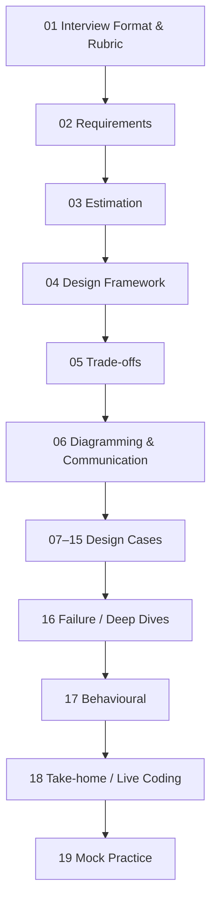
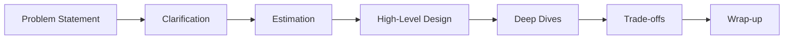
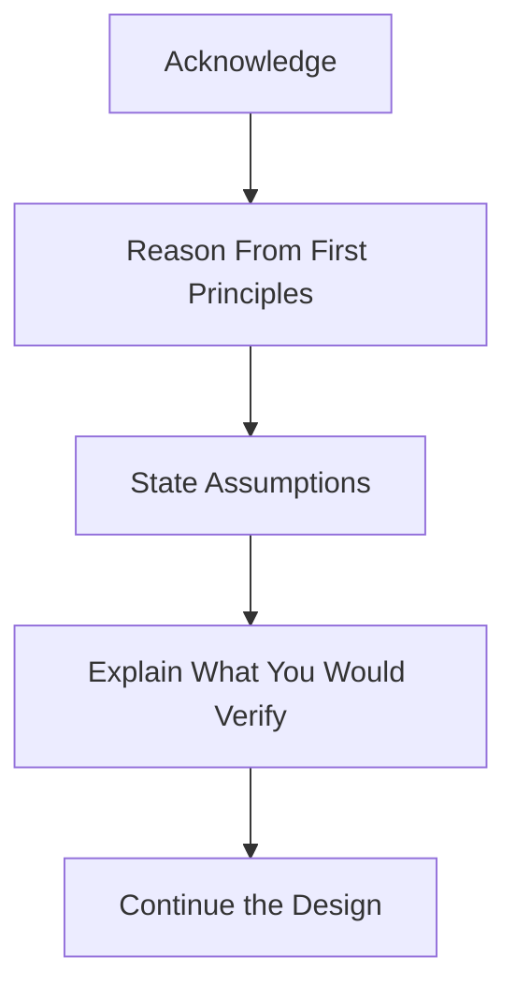

# System Design Interview Format and Evaluation Rubric

> **G5 — Data Engineering System Design Interviews | Topic 01**

## 1. Purpose of This Module

This standalone module establishes the foundation for G5 Topics 02–19. It teaches how Data Engineering system-design interviews work, how candidates are evaluated, how expectations change by seniority, and how to demonstrate engineering judgment in a 45–60 minute round.

It progresses from beginner understanding to senior/staff readiness without turning Topic 01 into a generic software system-design tutorial.

## 2. Learning Objectives

By completing this module, you should be able to:

- describe a typical Data Engineering interview loop;
- explain the structure of a 45–60 minute system-design round;
- understand the nine evaluation dimensions;
- self-score using a five-level rubric;
- distinguish mid-level, senior, and staff expectations;
- recognize interviewer hints and redirections;
- communicate collaboratively;
- recover from common interview failures;
- adapt discussion to different domains;
- handle uncertainty without bluffing;
- manage time deliberately.

## 3. Why This Topic Matters

A system-design interview evaluates engineering judgment, not technology memorization.

A strong candidate turns an ambiguous data problem into a defensible design by connecting:

```text
Requirements → Assumptions → Estimates → Architecture → Depth → Trade-offs
→ Reliability/Data Quality → Security/Privacy → Cost → Communication
```

The candidate is evaluated on both **what** they design and **how** they reason.

## 4. Where Topic 01 Fits in G5



Topic 01 teaches how the interview is structured and judged. The later topics develop the detailed capabilities.

---

# PART 1 — DATA ENGINEERING INTERVIEW LANDSCAPE

## 5. Typical Data Engineering Interview Loop

A common pattern is:

```text
Recruiter Screen
      ↓
Hiring Manager / Initial Technical Screen
      ↓
SQL / Coding
      ↓
Data Modelling
      ↓
System Design
      ↓
Behavioural
      ↓
Take-home / Live Pipeline Exercise
      ↓
Final / Hiring Decision
```

This is not universal. Companies vary in round count, ordering, exercise types, and level expectations.

| Stage | Main purpose |
|---|---|
| Recruiter | Broad role alignment and logistics |
| Initial technical | Technical breadth, experience, role fit |
| SQL / coding | Implementation correctness and problem solving |
| Data modelling | Data structure, grain, relationships, history |
| System design | End-to-end architecture and engineering judgment |
| Behavioural | Ownership, collaboration, ambiguity, conflict, influence |
| Take-home/live pipeline | Practical implementation, quality, testing, reproducibility |
| Final decision | Combined evidence against role expectations |

System design differs from SQL/coding because it emphasizes architecture and judgment rather than primarily implementation syntax. It differs from data modelling because it covers the broader lifecycle: ingestion, storage, processing, serving, reliability, security, cost, and evolution.

---

# PART 2 — ANATOMY OF THE SYSTEM DESIGN ROUND

## 6. Typical 45–60 Minute Structure



A practical 45-minute allocation is:

```text
5 min  → Requirements
5 min  → Estimates
15 min → High-Level Design
15 min → Deep Dives
5 min  → Trade-offs + Wrap-up
```

This is a practical example, not a rigid universal rule.

## 7. Problem Statement

**What happens:** The interviewer gives an incomplete data problem.

**Candidate:** Identify important unknowns before selecting technologies.

**Interviewer evaluates:** Ambiguity handling and structured thinking.

**Weak:** “We'll use Kafka, Spark and S3.”

**Strong:** “Before choosing technologies, I'd like to clarify consumers, freshness, event volume, retention and correctness.”

**Transition:** “I have enough information to proceed, so I'll state my assumptions.”

## 8. Clarification

Topic 02 develops this in depth. Topic 01 establishes its purpose.

Clarify requirements that can change the architecture:

- consumers;
- freshness;
- volume;
- correctness;
- availability;
- retention;
- security/privacy;
- cost.

Avoid both extremes:

```text
Too little clarification → wrong architecture
Too much clarification → no time left to design
```

## 9. Estimation

Topic 03 develops estimation in depth.

At this stage understand why numbers matter:

```text
Users × Events/User = Daily Events
Daily Events × Bytes/Event = Raw Daily Bytes
```

Numbers influence:

- batch vs streaming;
- partitioning;
- storage;
- processing;
- serving;
- compute;
- cost.

## 10. High-Level Design

Topic 04 and Topic 06 develop this in detail.

At Topic 01 level:

```text
Sources
  ↓
Ingestion
  ↓
Raw / Bronze
  ↓
Transformation
  ↓
Curated / Silver
  ↓
Serving / Gold
  ↓
Consumers
```

This is a conceptual pattern, not a mandatory architecture.

Narrate while drawing:

> “I'm preserving a raw recovery boundary before transformation because it gives us a source of truth for replay and historical correction.”

## 11. Deep Dives

The interviewer may select:

- ingestion;
- partitioning;
- late data;
- deduplication;
- data quality;
- backfills;
- schema evolution;
- security;
- cost;
- serving.

Do not deep-dive into everything. Select the areas with the highest risk or evaluation value.

## 12. Trade-offs

Use:

```text
Requirement → Decision → Reason → Trade-off
```

Example:

```text
Requirement: hourly freshness.
Decision: incremental ingestion.
Reason: meets freshness without continuous processing.
Trade-off: additional orchestration and state management.
```

## 13. Wrap-up

A strong close covers:

- architecture summary;
- assumptions;
- major trade-offs;
- important risks;
- what you would validate next.

Example:

> “The design meets the hourly freshness target with incremental ingestion. The main trade-off is operational complexity. I would validate late-data handling, source reliability and the cost model next.”

---

# PART 3 — TIME MANAGEMENT

## 14. Managing a 45-Minute Round

Do not spend 15 minutes clarifying.

Do not draw architecture before requirements are sufficiently bounded.

Do not spend the entire round on one component.

Reserve time for:

- failures;
- data quality;
- trade-offs;
- wrap-up.

Useful transitions:

> “I have enough information to proceed, so I'll make these assumptions.”

> “I'll give the high-level architecture first, then we can deep-dive into ingestion.”

> “We have about 15 minutes left, so I'd like to cover failure handling and the main trade-offs.”

These statements demonstrate time awareness, prioritization and scope control.

### If time is running out

> “We have five minutes left. I'll summarize the architecture, then cover the two highest-risk areas and the key trade-offs.”

---

# PART 4 — WHAT DATA ENGINEERING SYSTEM DESIGN MEANS

## 15. General Software Design vs Data Engineering Design

The distinction is about emphasis, not an absolute boundary.

General software design may emphasize:

- request latency;
- API throughput;
- availability;
- concurrency;
- service boundaries.

Data Engineering system design strongly emphasizes:

- data flows;
- data lifecycle;
- correctness over time;
- late data;
- duplicate data;
- backfills;
- data quality;
- schema evolution;
- governance;
- privacy;
- cost;
- batch vs streaming;
- freshness;
- retention;
- downstream consumers;
- operational reliability.

Software engineers can care about these concerns too. The distinction is that data lifecycle and temporal correctness are often central to Data Engineering designs.

### Example

A generic service may ask:

> “Can this API handle 10,000 requests per second?”

A Data Engineering design may additionally ask:

> “What happens when an event arrives two days late, is duplicated, changes schema, and must be included in a corrected financial report?”

The second question exposes temporal correctness.

## 16. Data Engineering Design Dimensions

| Dimension | Question |
|---|---|
| Data flow | Where does data come from and go? |
| Freshness | How quickly must it be available? |
| Correctness | What does correct mean? |
| Scale | What throughput and volume exist? |
| Reliability | What happens when components fail? |
| Data quality | How is bad data detected? |
| Late data | How are late events handled? |
| Duplicates | How is repeated data handled? |
| Backfills | How is history recomputed? |
| Schema | How do changes propagate? |
| Governance | Who can access what? |
| Privacy | How is sensitive data handled? |
| Cost | How does spend scale? |
| Consumers | Who uses the data? |
| Evolution | How does the system change? |

---

# PART 5 — THE NINE-DIMENSION EVALUATION RUBRIC

## 17. Requirement Gathering

**Looking for:** Identification of requirements that materially affect architecture.

**Weak:** Immediately selects tools.

**Acceptable:** Asks useful questions and states assumptions.

**Strong:** Prioritizes high-impact requirements.

**Senior:** Identifies hidden requirements such as billing correctness, privacy, ownership and historical restatement.

**Staff:** Recognizes organizational and regulatory constraints.

**Failure modes:** Tool-first thinking, excessive questioning, missing consumers, missing correctness.

## 18. Estimation

**Looking for:** Ability to turn qualitative requirements into approximate quantities.

**Weak:** No numbers.

**Acceptable:** Basic volume/storage estimates.

**Strong:** Uses estimates to justify architecture.

**Senior:** Connects estimates to throughput, capacity, compute, serving and cost.

**Staff:** Reasons about growth, organizational capacity and long-term economics.

## 19. Architecture

**Looking for:** A coherent end-to-end system.

**Weak:** Disconnected tool list.

**Acceptable:** Workable pipeline.

**Strong:** Requirement-driven and operationally coherent.

**Senior:** Connects architecture to scale, failure and evolution.

**Staff:** Includes platform reuse, ownership, standards and migration where relevant.

## 20. Depth

**Looking for:** Ability to reason deeply about selected areas.

**Weak:** Surface-level descriptions.

**Acceptable:** Understands major components.

**Strong:** Explains failure and scale in selected areas.

**Senior:** Chooses high-value deep dives.

**Staff:** Understands second-order and platform effects.

## 21. Trade-off Reasoning

**Looking for:** Explicit alternatives and consequences.

**Weak:** “X is the industry standard.”

**Acceptable:** Names alternatives.

**Strong:** Explains benefits, costs and consequences.

**Senior:** Ties trade-offs to requirements and operations.

**Staff:** Includes platform strategy, organizational skills, vendor lock-in and migration when relevant.

## 22. Reliability and Data Quality

**Looking for:** A design that survives messy production conditions.

Discuss where relevant:

- retries;
- duplicates;
- late data;
- source failure;
- reconciliation;
- quality checks;
- replay;
- backfills.

**Weak:** Happy path only.

**Strong:** Explains detection, containment and recovery.

**Senior:** Connects reliability to correctness and ownership.

**Staff:** Considers platform-level reliability standards and recovery strategy.

## 23. Security and Privacy

**Looking for:** Appropriate protection of data.

Consider:

- identity;
- access control;
- sensitive data;
- encryption;
- privacy;
- retention;
- deletion;
- auditability.

**Weak:** “Security is handled by IAM.”

**Strong:** Explains who accesses what, why, and how access is controlled and audited.

**Senior:** Identifies privacy/governance requirements early.

**Staff:** Connects governance to organizational and regulatory requirements.

## 24. Cost Awareness

**Weak:** Never discusses cost.

**Acceptable:** Mentions cost.

**Strong:** Identifies cost drivers.

**Senior:** Uses workload characteristics to reason about spend.

**Staff:** Considers unit economics, shared platforms, attribution and organizational scale.

## 25. Communication and Collaboration

**Weak:** Silent drawing, rambling or tool listing.

**Strong:** Narrates decisions, checks assumptions, responds to hints and summarizes clearly.

**Senior:** Makes reasoning easy to inspect.

**Staff:** Can align multiple stakeholders around decisions and consequences.

---

# PART 6 — FIVE-LEVEL SCORING RUBRIC

## 26. Scoring Scale

```text
1 = Weak
2 = Developing
3 = Solid
4 = Strong
5 = Exceptional
```

| Evaluation Area | 1 — Weak | 2 — Developing | 3 — Solid | 4 — Strong | 5 — Exceptional |
|---|---|---|---|---|---|
| Requirements | Tool-first, major ambiguity | Some questions, misses key constraints | Clarifies key requirements | Prioritizes requirements and hidden constraints | Frames scope, ambiguity and measurable success |
| Estimation | No/implausible numbers | Basic arithmetic, weak assumptions | Reasonable estimates | Estimates drive architecture/cost | Quantifies scale, growth, capacity and sanity checks |
| Architecture | Tool list | Basic pipeline | Coherent end-to-end design | Requirement-driven operational design | Evolvable design with platform/migration implications |
| Depth | Surface-level | Basic component knowledge | Good selected depth | Strong failure/scale reasoning | Deep reasoning and second-order effects |
| Trade-offs | One “right” tool | Names alternatives | Explains main trade-offs | Connects choices to requirements | Quantifies strategic/operational/organizational consequences |
| Reliability/Data Quality | Happy path | Generic retries/monitoring | Major failures and checks | Recovery tied to correctness | Replay, reconciliation, evolution and ownership |
| Security/Privacy | Vague | Basic access control | Appropriate controls | Security/privacy influence design | Governance and regulatory implications integrated |
| Cost | Ignored | “Cost matters” | Major drivers identified | Workload-driven cost reasoning | Unit economics and organizational scale |
| Communication | Silent/rambling | Inconsistent | Clear and structured | Collaborative and concise | Guides the interview and makes complex reasoning easy to inspect |

Do not rely on an average alone. The pattern of strengths and weaknesses matters.

---

# PART 7 — MID-LEVEL VS SENIOR VS STAFF

## 27. Mid-Level

Expected:

- sound design;
- understands major components;
- reasonable assumptions;
- basic trade-offs;
- workable solution;
- common failure awareness.

## 28. Senior

Expected:

- strong clarification;
- useful estimates;
- deeper trade-offs;
- failure handling;
- operational thinking;
- data quality;
- security/privacy;
- cost;
- evolution;
- clear communication;
- ability to defend decisions.

## 29. Staff

Expected:

- organization-wide implications;
- platform evolution;
- cross-team impact;
- standards;
- governance;
- long-term architecture;
- migration;
- operational ownership;
- organizational cost;
- influence;
- ambiguity handling.

Staff does **not** mean more technologies.

```text
Scope
+
Depth
+
Judgment
+
Trade-offs
+
Operational maturity
+
Communication
+
Long-term thinking
```

### Same prompt at three levels

Prompt:

> “Design a daily finance reporting platform from operational systems and SaaS sources.”

**Mid-level:** ingestion, storage, transformations, reporting, scheduling and basic quality.

**Senior:** adds estimates, incremental/CDC strategy, idempotency, reconciliation, late data, backfills, quality gates, security, cost and ownership.

**Staff:** adds platform standards, ownership boundaries, migration, common contracts, governance, organizational cost and long-term evolution.

---

# PART 8 — READING INTERVIEWER SIGNALS

## 30. Hints

If the interviewer says:

> “What about late-arriving data?”

Respond constructively:

> “Good point. That changes the correctness discussion, so I'll incorporate late-data handling into the processing and reconciliation design.”

## 31. Redirections

If the interviewer says:

> “Let's move on from ingestion and talk about serving.”

Usually interpret this as:

- sufficient evidence was gathered on ingestion;
- another dimension needs evaluation;
- time should move forward.

Do not keep defending the previous component.

## 32. Common Follow-Ups

| Interviewer asks | Likely testing |
|---|---|
| “Traffic increases 10×?” | Scale, capacity, bottlenecks, cost |
| “Source unavailable?” | Reliability, recovery, freshness |
| “Reduce cost by half?” | Cost drivers and trade-offs |
| “European deletion request?” | Privacy, governance, deletion |
| “How do you handle late data?” | Temporal correctness |
| “Schema changes?” | Evolution and reliability |

---

# PART 9 — INTERVIEWER AS COLLABORATOR

## 33. Mindset

Bad:

```text
“I must prove I know everything.”
```

Better:

```text
“We are collaboratively designing a system.”
```

Behaviours:

- ask for confirmation;
- check assumptions;
- invite direction;
- respond constructively to hints;
- acknowledge constraints;
- reconsider decisions;
- explain changes;
- avoid defensiveness.

### Dialogue

**Interviewer:** “The freshness requirement changed from daily to every 15 minutes.”

**Weak:** “That wasn't in the requirements.”

**Strong:** “Understood. That materially changes the freshness constraint. I would revisit the ingestion and orchestration approach rather than forcing the original daily design to fit.”

---

# PART 10 — COMMON FAILURE PATTERNS

## 34. Tool-First Thinking

**Problem:** “Kafka, Spark, S3 and Snowflake” before requirements.

**Why:** Candidate wants to demonstrate technology knowledge.

**Observed:** Memorization rather than judgment.

**Fix:** Start with consumers, freshness, scale, correctness, retention, security/privacy and cost.

## 35. Silent Drawing

**Problem:** Architecture appears without narration.

**Observed:** Reasoning is invisible.

**Fix:** Explain decisions while drawing.

## 36. Over-Designing

**Problem:** Unnecessary components and premature complexity.

**Observed:** Complexity without requirement justification.

**Fix:** Ask what problem each component solves.

## 37. Ignoring Requirements

**Problem:** Architecture is disconnected from business needs.

**Fix:**

```text
Requirement → Decision → Reason
```

## 38. No Numbers

**Problem:** “The data is huge.”

**Fix:** Estimate orders of magnitude and state assumptions.

## 39. No Failure Handling

**Problem:** Happy path only.

**Fix:**

```text
What fails?
How do we detect it?
How do we contain it?
How do we recover?
How do we prevent recurrence?
```

## 40. Running Out of Time

**Problem:** No time for failures/trade-offs.

**Fix:** Time-box and announce transitions.

---

# PART 11 — COMPANY AND DOMAIN DIFFERENCES

## 41. Product Analytics

Likely emphasis:

- events;
- analytics;
- freshness;
- dashboards;
- experimentation.

## 42. Ad Tech

Likely emphasis:

- massive event volumes;
- attribution;
- deduplication;
- correctness;
- billing.

## 43. Fintech

Likely emphasis:

- correctness;
- auditability;
- security;
- compliance;
- reconciliation.

## 44. IoT

Likely emphasis:

- massive fan-in;
- device reliability;
- time-series;
- out-of-order events;
- edge buffering.

## 45. AI / ML Platforms

Likely emphasis:

- feature freshness;
- point-in-time correctness;
- training-serving consistency;
- vector data;
- evaluation;
- lineage.

These are examples of likely emphasis, not guaranteed interview formats.

---

# PART 12 — COMPANY-SPECIFIC PREPARATION

## 46. Research Before the Interview

Research where public information exists:

- product;
- business model;
- data scale;
- likely sources;
- likely consumers;
- domain constraints;
- engineering blog;
- public technology information;
- public architecture information;
- likely data problems.

Never pretend to know confidential architecture.

Use:

```text
Company
↓
Business model
↓
Data generation
↓
Likely data problems
↓
Likely interview cases
↓
Relevant architecture patterns
```

The objective is not to predict the exact question. It is to understand which engineering concerns are likely to matter.

---

# PART 13 — HANDLING “I DON'T KNOW”

## 47. Framework



Example:

> “I don't know the exact current throughput limit of that service off the top of my head. I'd treat that number as an assumption initially, size the design with a safety margin, and verify the current service limit before production.”

Why it is strong:

- honest;
- keeps the design moving;
- separates knowns from unknowns;
- demonstrates production discipline.

Never invent a precise number to sound confident.

---

# PART 14 — DATA ENGINEERING COMMUNICATION

## 48. Requirement → Decision → Reason → Trade-off

Example:

```text
Requirement:
Hourly freshness.

Decision:
Incremental ingestion.

Reason:
Meets freshness without continuous processing.

Trade-off:
Additional orchestration and state management.
```

Additional example:

```text
Requirement:
Billing-grade correctness.

Decision:
Preserve auditable event history and reconciliation.

Reason:
Financial outputs need explainability and correction.

Trade-off:
More storage and operational complexity.
```

Communication is part of the architecture interview.

---

# PART 15 — FULL 45-MINUTE WALKTHROUGH

## 49. Representative Prompt

> “Design a batch analytics platform for a company with several operational systems and SaaS tools where finance needs daily reports by 07:00.”

This walkthrough demonstrates interview behaviour. The dedicated Topic 07 case will teach the complete architecture.

### Minute 0–5 — Requirements

Candidate:

> “Before choosing technologies, I'd like to clarify consumers, sources, freshness, volume, correctness, retention, and security/privacy constraints.”

**Evaluation:** ambiguity handling, prioritization, listening.

### Minute 5–10 — Estimation

Estimate:

- records/day;
- average record size;
- storage;
- peak processing rate;
- retention;
- growth.

**Evaluation:** quantitative reasoning and sanity checks.

### Minute 10–25 — High-Level Design

Start simple:

```text
Sources → Incremental Ingestion → Raw → Transformation → Curated → Finance
```

Narrate the boundaries.

**Evaluation:** architecture, coherence, communication.

### Minute 25–40 — Deep Dive

Select one or two high-risk areas, such as:

- incremental ingestion;
- reconciliation;
- data quality;
- late data;
- backfills.

**Evaluation:** depth, reliability and correctness.

### Minute 40–45 — Trade-offs + Wrap-up

Candidate:

> “The design uses incremental processing to meet the 07:00 deadline while preserving raw data for recovery. The main trade-off is operational complexity. The biggest remaining risks are source failures, late data and month-end restatements.”

Then invite follow-up.

---

# PART 16 — WEAK VS STRONG TRANSFORMATIONS

## 50. Tool Selection

**Weak:** “I'll use Spark because the data is large.”

**Strong:** “I'd first estimate volume and SLA. If distributed processing is justified, Spark becomes a candidate; otherwise a simpler engine may reduce complexity and cost.”

## 51. Requirements

**Weak:** “What database should I use?”

**Strong:** “Who are the consumers, and what freshness and correctness guarantees do they require?”

## 52. Failure Handling

**Weak:** “We'll retry.”

**Strong:** “I'd detect the missing interval, prevent incomplete data from being published, recover after the source returns, and reconcile the affected interval.”

## 53. Cost

**Weak:** “We'll optimize later.”

**Strong:** “I'd identify the largest cost drivers, quantify them where possible, and evaluate alternatives against freshness, reliability and complexity.”

## 54. Interview Hint

**Weak:** “I already covered ingestion.”

**Strong:** “That's an important correctness issue. I'll incorporate it into the processing and reconciliation design.”

---

# PART 17 — CODING / SELF-REVIEW EXAMPLES

Topic 01 is not a Python programming lesson. Small examples are self-review aids.

## 55. Estimation Helper

```python
def daily_events(users, events_per_user):
    return users * events_per_user
```

Use it to check:

```text
users × events/user = daily events
```

The interview value is in the assumptions, not the function.

## 56. Storage Estimation

```python
def daily_storage_gb(events, bytes_per_event, compression_ratio=4):
    raw_bytes = events * bytes_per_event
    compressed_bytes = raw_bytes / compression_ratio
    return compressed_bytes / (1024 ** 3)
```

Assumptions must be explicit.

## 57. Rubric Scoring

```python
scores = {
    "requirements": 4,
    "estimation": 3,
    "architecture": 4,
    "tradeoffs": 3,
    "reliability": 4,
    "communication": 5,
}

average = sum(scores.values()) / len(scores)
print(f"Average score: {average:.2f}")
```

Use this for self-review, not as a substitute for qualitative analysis.

## 58. Time Budget

```python
sections = {
    "requirements": 5,
    "estimation": 5,
    "high_level_design": 15,
    "deep_dives": 15,
    "tradeoffs_wrapup": 5,
}

print(sum(sections.values()))
```

Expected result:

```text
45
```

---

# PART 18 — HANDS-ON LABS

## Lab 1 — Interview Rubric

Build a personal 1–5 rubric for all nine dimensions. Define observable behaviour for each score.

## Lab 2 — 45-Minute Time Plan

Create and defend your own time allocation for requirements, estimation, design, deep dives, trade-offs and wrap-up.

## Lab 3 — Seniority Comparison

Take one design question and write a mid-level, senior and staff answer. Do not merely add technologies.

## Lab 4 — Interviewer Signal Recognition

For each follow-up below, identify the likely evaluation dimension:

- 10× traffic;
- source unavailable;
- halve cost;
- European deletion;
- late data;
- schema change.

## Lab 5 — Failure Pattern Detection

Analyze:

- immediate Kafka/Spark/S3 selection;
- 20 minutes of requirements;
- perfect architecture with no failure handling;
- invented service limit;
- silent drawing.

Write the recovery response for each.

## Lab 6 — Company Adaptation

Take one prompt and adapt its likely emphasis for:

- product analytics;
- fintech;
- ad tech;
- IoT;
- AI/ML.

## Lab 7 — Recorded Mock

Run a 45-minute design session, record yourself, and score:

```text
Requirements:        __ / 5
Estimation:          __ / 5
Architecture:        __ / 5
Depth:               __ / 5
Trade-offs:          __ / 5
Reliability/DQ:      __ / 5
Security/Privacy:    __ / 5
Cost:                __ / 5
Communication:       __ / 5
```

Identify your top three recurring weaknesses.

---

# PART 19 — BREAK/FIX EXERCISES

## 59. Broken Candidate: Tool First

**Behaviour:** “Kafka + Spark + S3.”

**Problem:** No requirements.

**Recovery:** Clarify freshness, scale, consumers, correctness, retention, security/privacy and cost.

## 60. Broken Candidate: Excessive Clarification

**Behaviour:** Still gathering requirements after the design is sufficiently constrained.

**Recovery:** State assumptions and proceed.

## 61. Broken Candidate: No Failure Discussion

**Behaviour:** Only happy path.

**Recovery:** Discuss the highest-risk failure, detection, containment, recovery and downstream correctness.

## 62. Broken Candidate: Invented Limit

**Behaviour:** Gives a precise unsupported service limit.

**Recovery:** Acknowledge uncertainty, use a conservative assumption, explain verification.

## 63. Broken Candidate: Silent Drawing

**Behaviour:** Draws without narration.

**Recovery:** Explain each major boundary and decision as it is drawn.

## 64. Broken Candidate: Ignores Redirection

**Behaviour:** Keeps defending ingestion after interviewer moves to serving.

**Recovery:** Accept the direction and shift focus.

## 65. Broken Candidate: Time Crisis

**Behaviour:** Five minutes remain and the candidate starts another large deep dive.

**Recovery:** Summarize, cover highest-risk failure and trade-off, close.

---

# PART 20 — TOPIC 01 PRACTICE QUESTIONS

## Basic

### Question 1
**Expected Thinking:** Recall the common interview lifecycle.

**Strong Answer Outline:** Recruiter → initial technical → SQL/coding → modelling → system design → behavioural → possible take-home/live pipeline → final decision; state that companies vary.

**Common Mistake:** Presenting one process as universal.

### Question 2
**Expected Thinking:** Explain the purpose of system design.

**Strong Answer Outline:** It evaluates ambiguity handling, requirements, scale, architecture, reliability, trade-offs, security/privacy, cost and communication.

**Common Mistake:** Calling it a technology-memory test.

### Question 3
**Expected Thinking:** Recall the 45-minute structure.

**Strong Answer Outline:** Requirements 5, estimates 5, high-level design 15, deep dives 15, trade-offs/wrap-up 5.

**Common Mistake:** Treating this allocation as universal.

### Question 4
**Expected Thinking:** Recall the nine dimensions.

**Strong Answer Outline:** Requirements, estimation, architecture, depth, trade-offs, reliability/data quality, security/privacy, cost, communication.

**Common Mistake:** Omitting communication or operations.

### Question 5
**Expected Thinking:** Connect tool selection to requirements.

**Strong Answer Outline:** Premature tool selection can create unsuitable or unnecessarily complex architecture.

**Common Mistake:** Saying technology knowledge is irrelevant.

## Intermediate

### Question 6
**Expected Thinking:** Treat interviewer feedback as information.

**Strong Answer Outline:** Acknowledge, explain design impact, adapt.

**Common Mistake:** Becoming defensive.

### Question 7
**Expected Thinking:** Recognize scalability testing.

**Strong Answer Outline:** Revisit estimates, bottlenecks, capacity, scaling and cost.

**Common Mistake:** “Just autoscale.”

### Question 8
**Expected Thinking:** Manage clarification time.

**Strong Answer Outline:** Ask high-leverage questions, state assumptions, proceed.

**Common Mistake:** Turning clarification into a workshop.

### Question 9
**Expected Thinking:** Distinguish emphasis.

**Strong Answer Outline:** Data Engineering emphasizes temporal correctness, late data, duplicates, backfills, quality, evolution, governance, privacy, freshness and retention.

**Common Mistake:** Claiming software design ignores these topics.

### Question 10
**Expected Thinking:** Explain senior maturity.

**Strong Answer Outline:** Strong clarification, estimates, failures, DQ, security/privacy, cost, evolution and communication.

**Common Mistake:** Adding technologies.

## Advanced

### Question 11
**Expected Thinking:** Identify cost drivers and trade-offs.

**Strong Answer Outline:** Quantify major drivers and propose alternatives with consequences.

**Common Mistake:** Arbitrary cost cuts.

### Question 12
**Expected Thinking:** Demonstrate epistemic discipline.

**Strong Answer Outline:** Acknowledge unknown, state assumption, add margin, verify before production.

**Common Mistake:** Inventing a number.

### Question 13
**Expected Thinking:** Understand temporal correctness.

**Strong Answer Outline:** Late data can change historical aggregates and reports, requiring correction/reconciliation.

**Common Mistake:** Treating late data as only ingestion.

### Question 14
**Expected Thinking:** Adapt emphasis by domain.

**Strong Answer Outline:** Fintech emphasizes correctness/audit/security/compliance/reconciliation; IoT emphasizes fan-in/device reliability/time-series/out-of-order/edge buffering.

**Common Mistake:** Reusing the same architecture unchanged.

### Question 15
**Expected Thinking:** Distinguish staff scope from senior depth.

**Strong Answer Outline:** Staff includes organizational impact, platform evolution, standards, governance, migration, ownership, cost and influence.

**Common Mistake:** More technologies.

## Senior / Staff

### Question 16
**Expected Thinking:** Interpret redirection.

**Strong Answer Outline:** Interviewer may have enough evidence and wants another dimension. Follow direction.

**Common Mistake:** Continuing to defend the previous component.

### Question 17
**Expected Thinking:** Show strategic thinking without complexity.

**Strong Answer Outline:** Keep design simple, then discuss ownership, standards, migration, governance and long-term evolution when relevant.

**Common Mistake:** Adding components to look senior.

### Question 18
**Expected Thinking:** Adapt to changed constraints.

**Strong Answer Outline:** Restate new requirement, identify affected assumptions, revise design, explain trade-off.

**Common Mistake:** Treating original design as fixed.

### Question 19
**Expected Thinking:** Make reasoning inspectable.

**Strong Answer Outline:** Narrate decisions, state assumptions, distinguish known/unknown, manage time, summarize trade-offs.

**Common Mistake:** Talking more instead of communicating better.

### Question 20
**Expected Thinking:** Prioritize under time pressure.

**Strong Answer Outline:** Announce time constraint, summarize, cover highest-risk failure and trade-off, close.

**Common Mistake:** Starting an unfinished deep dive.

---

# PART 21 — FINAL INTERVIEW CHEAT SHEET

## Before Designing

```text
→ Clarify requirements
→ Identify consumers
→ Establish freshness
→ Estimate scale
→ Identify correctness
→ Identify security/privacy
→ Identify cost constraints
```

## During Design

```text
→ Start simple
→ Explain major decisions
→ Draw clearly
→ Label data flows
→ Use numbers
→ Check in with interviewer
```

## Deep Dive

```text
→ Failure
→ Data quality
→ Backfill
→ Late data
→ Scale
→ Security
→ Cost
→ Evolution
```

## Before Finishing

```text
→ Summarize
→ State trade-offs
→ Mention risks
→ Invite follow-up
```

---

# PART 22 — CHECKPOINT

## 66. Roadmap Checkpoint

You should be able to:

```text
[ ] Describe a typical Data Engineering interview loop.
[ ] List the rubric areas.
[ ] Explain what strong performance means.
[ ] Plan the time of a design round.
```

### Measurable self-tests

1. Explain the full interview loop aloud in under two minutes.
2. Name all nine evaluation dimensions without notes.
3. Create a 45-minute plan from memory.
4. Explain mid-level vs senior vs staff on one design prompt.
5. Explain what is being tested by 10× scale, source failure, cost reduction, deletion and late-data follow-ups.

---

# PART 23 — FINAL KNOWLEDGE CHECKLIST

## Interview Structure

- [ ] I understand the complete interview loop.
- [ ] I understand the purpose of each stage.
- [ ] I understand the system design round.

## Evaluation

- [ ] I understand all nine dimensions.
- [ ] I can identify weak and strong signals.
- [ ] I can self-score using the five-level rubric.

## Seniority

- [ ] I understand mid-level expectations.
- [ ] I understand senior expectations.
- [ ] I understand staff expectations.

## Communication

- [ ] I can narrate while designing.
- [ ] I can respond to hints.
- [ ] I can handle pushback.
- [ ] I can summarize.

## Time Management

- [ ] I can plan a 45-minute round.
- [ ] I know when to move on.
- [ ] I reserve time for trade-offs and failures.

## Reasoning

- [ ] I do not jump to technologies.
- [ ] I use numbers.
- [ ] I state assumptions.
- [ ] I explain trade-offs.
- [ ] I discuss failure.

## Advanced

- [ ] I can identify interviewer signals.
- [ ] I can adapt to different domains.
- [ ] I can reason when I do not know an exact answer.
- [ ] I can demonstrate senior/staff thinking.

---

# PART 24 — FINAL MENTAL MODELS

### Mental Model 1

```text
Don't start with tools.
Start with requirements.
```

### Mental Model 2

```text
Numbers drive architecture.
```

### Mental Model 3

```text
Every major decision needs a trade-off.
```

### Mental Model 4

```text
A production design must explain failure.
```

### Mental Model 5

```text
Communication is part of the architecture interview.
```

### Mental Model 6

```text
Senior engineers don't know everything;
they know how to reason when they don't know.
```

### Mental Model 7

```text
The interviewer is a collaborator, not an adversary.
```

---

# 25. Final Operating Standard

```text
CLARIFY
→ ASSUME
→ ESTIMATE
→ STRUCTURE
→ COMMUNICATE
→ DEEP-DIVE
→ TRADE-OFF
→ HANDLE FAILURE
→ SUMMARIZE
→ INVITE FOLLOW-UP
```

Topic 01 is complete when you can demonstrate these behaviours naturally under time pressure.

The next module is **Topic 02 — Requirements Clarification and Scoping**, where the clarification capability introduced here becomes a detailed, repeatable method.
