# Requirements Clarification and Scoping

> **G5 — Data Engineering System Design Interviews | Topic 02**
>
> The second module in the G5 interview-design sequence. This module turns the high-level clarification capability introduced in Topic 01 into a repeatable method for discovering requirements, exposing assumptions, negotiating scope, defining measurable constraints, and setting an interview-sized MVP.

---

## 1. Purpose

A Data Engineering system-design prompt is deliberately incomplete.

The candidate's first responsibility is **not** to choose Kafka, Spark, a warehouse, a lakehouse, or a cloud service.

The first responsibility is to determine:

> **What problem are we actually being asked to solve, for whom, at what scale, with what correctness, freshness, reliability, security, privacy, retention, and cost expectations?**

Topic 01 established that requirements gathering is one of the nine major interview evaluation dimensions.

Topic 02 makes that capability operational.

By the end of this module, you should be able to take an ambiguous prompt and, within roughly five minutes, produce:

```text
Problem
→ Consumers
→ Functional requirements
→ Non-functional requirements
→ Constraints
→ Assumptions
→ MVP scope
→ Measurable success criteria
→ Explicit out-of-scope items
```

---

# 2. Position in G5

```mermaid
flowchart LR
    A["01 Interview Format & Rubric"] --> B["02 Requirements Clarification & Scoping"]
    B --> C["03 Estimation"]
    C --> D["04 Reusable Design Framework"]
    D --> E["05 Trade-offs"]
    E --> F["06 Diagramming & Communication"]
    F --> G["07–15 Design Cases"]
    G --> H["16 Failure / Deep Dives"]
    H --> I["17 Behavioural"]
    I --> J["18 Take-home / Live Coding"]
    J --> K["19 Mock Practice"]
```



### Topic boundary

Topic 02 answers:

> **What does the system need to do, and under what constraints?**

Topic 03 answers:

> **How large is the system, approximately?**

Topic 04 answers:

> **How do we structure the architecture?**

Topic 05 answers:

> **Which design alternatives should we choose, and why?**

Topic 06 answers:

> **How do we communicate the design clearly?**

Do not turn Topic 02 into a technology-selection or capacity-sizing lesson.

---

# 3. Learning Objectives

After completing this module, you should be able to:

- distinguish functional from non-functional requirements;
- identify sources and consumers;
- clarify freshness;
- clarify volume without performing a full estimation;
- define correctness;
- discuss availability;
- establish retention;
- identify security and privacy constraints;
- surface cost constraints;
- state assumptions explicitly;
- ask high-impact clarification questions;
- identify hidden requirements;
- negotiate an interview-sized MVP;
- define measurable SLAs/SLOs;
- respond to changing requirements;
- handle ambiguity collaboratively;
- adapt questions to different Data Engineering domains;
- recognize common clarification failures;
- conduct a five-minute requirements session;
- convert an ambiguous prompt into a concise design brief.

---

# PART 1 — THE CORE REQUIREMENTS MODEL

## 4. The Requirements Funnel

A useful interview model is:

```text
Ambiguous Prompt
      ↓
Business Objective
      ↓
Consumers
      ↓
Functional Requirements
      ↓
Non-Functional Requirements
      ↓
Constraints
      ↓
Assumptions
      ↓
MVP Scope
      ↓
Measurable Success Criteria
```

The candidate should progressively reduce ambiguity.

The goal is not to eliminate every unknown.

The goal is to eliminate the unknowns that could materially change the architecture.

---

## 5. Business Objective First

Start by identifying the business outcome.

Example:

> "Finance needs daily revenue reporting by 07:00."

This is more useful than immediately asking:

> "Do you use Kafka?"

The business objective creates the context for the data system.

### Ask

- Who needs the outcome?
- What decision does the data support?
- What happens if the data is late?
- What happens if it is wrong?
- Is the output exploratory, operational, financial, regulatory, or customer-facing?

### Example

```text
Business objective:
Finance needs daily revenue reporting.

Consumer:
Finance analysts and finance leadership.

Business consequence:
Incorrect or late numbers may affect financial decisions.

Therefore:
Correctness, auditability, freshness, and reconciliation become important.
```

---

# 6. Functional Requirements

Functional requirements describe **what the system must do**.

Examples:

- ingest data from operational systems;
- ingest SaaS data;
- retain raw source records;
- transform records;
- deduplicate events;
- maintain historical changes;
- produce daily aggregates;
- support near-real-time dashboards;
- support user deletion;
- expose curated datasets;
- publish features;
- reconcile results.

### Interview question

> "What must the system actually do?"

A useful answer should be expressed as capabilities rather than technologies.

### Weak

> "Use Spark to process the data."

### Strong

> "The system must transform incoming records into curated analytical datasets and make them available to finance by 07:00."

---

# 7. Non-Functional Requirements

Non-functional requirements describe **how well, how safely, or under what constraints the system must operate**.

Typical categories:

- freshness;
- latency;
- throughput;
- availability;
- durability;
- correctness;
- reliability;
- scalability;
- retention;
- security;
- privacy;
- observability;
- cost;
- operational complexity.

A useful mental model:

```text
Functional:
WHAT must happen?

Non-functional:
HOW WELL must it happen?
UNDER WHAT CONSTRAINTS?
```

---

# PART 2 — THE REQUIREMENTS DIMENSIONS

## 8. Sources

Clarify where data comes from.

Possible sources:

- operational databases;
- SaaS platforms;
- APIs;
- event producers;
- application logs;
- IoT devices;
- CDC streams;
- files;
- third-party data providers.

### Questions

- How many sources?
- What types?
- Are they authoritative?
- Are they reliable?
- Are they push or pull?
- Are historical records available?
- Can the source be queried incrementally?
- Are deletes visible?
- Can the schema change?

### Why it matters

Source characteristics affect:

- ingestion method;
- latency;
- correctness;
- recovery;
- schema handling;
- operational complexity.

Do not choose the ingestion technology yet.

---

## 9. Consumers

Clarify who consumes the output.

Consumers may include:

- analysts;
- dashboards;
- finance;
- applications;
- data scientists;
- ML systems;
- downstream pipelines;
- external partners;
- regulators.

### Questions

- Who consumes the data?
- How many consumers?
- What access pattern do they have?
- Do they need interactive queries?
- Do they need files?
- Do they need APIs?
- Do they need batch outputs?
- Do they require different security policies?

### Why consumers matter

The serving design depends heavily on how data will be consumed.

---

## 10. Freshness

Freshness is:

> **How recent must the available data be?**

Examples:

- daily by 07:00;
- hourly;
- every 15 minutes;
- within 60 seconds;
- sub-second.

Do not automatically equate freshness with streaming.

The requirement determines the appropriate processing model later.

### High-impact question

> "How stale can the data be before the consumer considers it unusable?"

This is usually better than:

> "Do you need streaming?"

---

## 11. Volume

Topic 03 handles detailed estimation.

Topic 02 only needs enough information to identify the scale constraint.

Ask:

- approximate records/events per day;
- approximate data size;
- number of sources;
- peak versus average rate;
- expected growth;
- retention period.

Do not spend five minutes performing arithmetic here.

Example:

> "Are we talking about thousands, millions, or billions of events per day?"

That is often sufficient for early scoping.

---

## 12. Correctness

Correctness is one of the most important Data Engineering requirements.

Ask:

> "What does correct mean for this system?"

Possible answers:

- no duplicates;
- no missing events;
- exactly one financial transaction;
- eventual completeness;
- reproducible historical reports;
- consistent dimensions;
- accurate attribution;
- point-in-time-correct ML training data.

### Critical distinction

```text
"Data arrives"
≠
"Data is correct"
```

### Example

For a dashboard:

> Small temporary delays may be acceptable.

For financial reporting:

> Incorrect or duplicated records may be unacceptable.

The architecture should reflect that difference.

---

## 13. Availability

Clarify how often the data service must be available.

Examples:

- business hours only;
- 24×7;
- best effort;
- 99.9%;
- 99.99%.

Ask:

- What happens when the serving layer is unavailable?
- Can consumers tolerate stale data?
- Is there a fallback?
- Is the pipeline required to run continuously?

Do not invent a target if the prompt does not provide one.

If the interviewer does not specify availability, state an assumption.

---

## 14. Retention

Clarify:

- how long raw data must be retained;
- how long curated data must be retained;
- whether historical versions are required;
- whether data must be deleted earlier for privacy reasons;
- whether backups have different retention.

Examples:

```text
Raw events: 2 years
Curated reporting: 7 years
Temporary processing state: days
```

These are examples, not defaults.

Retention affects:

- storage;
- cost;
- governance;
- recovery;
- deletion;
- compliance.

---

## 15. Security

Clarify:

- who can access the data;
- whether different users need different access;
- whether service-to-service access is required;
- whether data is sensitive;
- whether encryption is required;
- whether access must be audited.

A useful question:

> "Are there different access levels or data classifications we need to enforce?"

---

## 16. Privacy

Privacy is not identical to security.

Security asks:

> Who can access the data?

Privacy also asks:

> Should this data exist, where may it exist, how long may it exist, and what happens when the person requests deletion?

Potential constraints:

- PII;
- consent;
- regional storage;
- deletion;
- anonymization;
- pseudonymization;
- retention limits;
- downstream propagation.

### Example

A GDPR deletion requirement can fundamentally change the data architecture.

---

## 17. Cost

Cost is an explicit requirement when the business has a budget or when scale makes cost material.

Ask:

- Is there a budget?
- Is freshness more important than cost?
- Is the workload predictable?
- Are there peak periods?
- Is cost per event/record/report important?
- Is the platform shared across teams?

Avoid:

> "What is the cheapest technology?"

Ask:

> "What cost constraints must the architecture satisfy?"

Cost is a constraint, not the only optimization objective.

---

# PART 3 — THE CLARIFICATION CHECKLIST

## 18. The Eight Core Questions

A compact first-pass checklist:

```text
1. Who consumes the data?
2. Where does the data come from?
3. How fresh must it be?
4. What scale are we dealing with?
5. What does correctness mean?
6. What availability/retention is required?
7. What security/privacy constraints exist?
8. What cost constraints matter?
```

Use these as categories, not a script.

---

## 19. High-Impact Question Test

Before asking a question, ask yourself:

> **Could the answer materially change my architecture?**

If yes, ask it.

If no, it may be safe to defer it.

### High-impact

> "Do consumers need sub-minute freshness or daily freshness?"

### Lower-impact early question

> "What exact version of the downstream query engine are you using?"

The second question may matter later, but usually should not consume early interview time unless it changes the design.

---

# PART 4 — ASSUMPTIONS

## 20. Why Assumptions Matter

An interview prompt cannot provide every detail.

If you wait for perfect information, you will run out of time.

Therefore:

```text
Unknown
→ Reasonable Assumption
→ State It
→ Proceed
→ Revise If Interviewer Changes It
```

### Example

> "The prompt doesn't specify retention, so I'll assume two years for the initial design. If the business requires seven years, I'll revisit storage and cost."

This is stronger than silently assuming two years.

---

## 21. Good Assumption Format

Use:

```text
Assumption:
The source produces approximately one million records per day.

Why:
The prompt does not specify volume.

Impact:
This is sufficient for the initial architecture; Topic 03 will refine the estimate.
```

The assumption should be:

- explicit;
- plausible;
- relevant;
- easy to revise.

---

## 22. Assumption Categories

Useful categories:

| Category | Example |
|---|---|
| Volume | 10M events/day |
| Freshness | Hourly |
| Retention | 2 years |
| Consumers | Finance + BI |
| Availability | Business-hours reporting |
| Correctness | No duplicate financial records |
| Security | PII requires restricted access |
| Growth | 3× in two years |
| Scope | One region for MVP |

Do not present example numbers as universal standards.

---

# PART 5 — HIDDEN REQUIREMENTS

## 23. What Is a Hidden Requirement?

A hidden requirement is a constraint not explicitly stated in the initial prompt but likely relevant to the system's success.

You should not invent arbitrary requirements.

Instead, recognize requirements that naturally emerge from the domain.

### Example

Prompt:

> "Build a platform for financial reporting."

Potential hidden requirements:

- reconciliation;
- auditability;
- historical restatement;
- access controls;
- retention;
- correctness;
- month-end processing.

---

## 24. Hidden Requirement Discovery

Use:

```text
Business
↓
Failure consequence
↓
Operational implication
↓
Hidden requirement
```

Example:

```text
Financial reporting
↓
Incorrect report affects financial decisions
↓
Need to detect and correct discrepancies
↓
Reconciliation becomes a requirement
```

---

## 25. Common Hidden Requirements

### Analytics

- metric consistency;
- historical reproducibility;
- late data;
- dashboard freshness.

### Finance

- reconciliation;
- auditability;
- restatements;
- strict correctness.

### ML

- point-in-time correctness;
- feature freshness;
- training-serving consistency;
- lineage.

### IoT

- device identity;
- clock skew;
- reconnect storms;
- out-of-order events.

### GDPR

- deletion propagation;
- identity resolution;
- proof of deletion;
- backup handling.

### RAG

- access-control propagation;
- source deletion;
- document versioning;
- retrieval freshness.

---

# PART 6 — MVP SCOPE

## 26. Why Scope Matters in an Interview

A common failure is trying to solve everything.

The interviewer wants to see whether you can prioritize.

A useful model:

```text
Must Have
↓
Should Have
↓
Could Have
↓
Out of Scope
```

---

## 27. MVP Definition

A good interview MVP should:

- satisfy the core business outcome;
- satisfy the most important non-functional constraints;
- be implementable within the scenario;
- leave a clear evolution path.

### Example

Prompt:

> "Build an analytics platform for 20 source systems."

Possible MVP:

```text
Must:
- 5 highest-value sources
- daily freshness
- curated finance dataset
- quality validation
- access controls

Should:
- remaining sources
- richer lineage
- automated reconciliation dashboard

Could:
- real-time analytics

Out of scope:
- global multi-region platform
- generalized self-service ingestion platform
```

This demonstrates prioritization.

---

# PART 7 — SCOPE NEGOTIATION

## 28. Scope Negotiation Framework

When requirements conflict:

```text
Requirement
→ Constraint
→ Conflict
→ Priority
→ Decision
→ Consequence
```

Example:

```text
Requirement:
Sub-minute freshness.

Constraint:
Strict cost budget.

Conflict:
Continuous processing increases cost.

Priority:
Business requires sub-minute freshness.

Decision:
Prioritize freshness for critical events.

Consequence:
Accept higher cost and optimize lower-priority workloads.
```

---

## 29. When the Interviewer Adds Scope

Suppose the interviewer says:

> "The original requirement was daily, but now the CEO wants near-real-time dashboards."

Do not say:

> "That breaks my architecture."

Instead:

> "That changes the freshness requirement and therefore the processing path. I'd separate the real-time consumer path from the daily analytical path rather than forcing every consumer onto the same execution model."

This demonstrates adaptability.

---

# PART 8 — MEASURABLE SLAs AND SLOs

## 30. Why Measurability Matters

Avoid vague statements.

### Weak

> "The pipeline should be fast."

### Strong

> "Ninety-five percent of daily finance data should be available by 07:00."

### Weak

> "The dashboard should be highly available."

### Strong

> "The serving system should meet the agreed availability target during business-critical hours."

Only use exact numbers when the problem provides them or you explicitly label them as assumptions.

---

## 31. SLA vs SLO — Interview-Level Use

You do not need a lengthy reliability-engineering lecture.

For interview scoping:

- **SLA**: an externally committed service expectation.
- **SLO**: a measurable internal reliability/performance objective.

The important skill is to turn vague requirements into measurable constraints.

Examples:

```text
Freshness SLO:
95% of data available within 15 minutes.

Availability SLO:
99.9% monthly availability.

Data quality SLO:
99.99% of accepted records satisfy required validation rules.
```

These are examples. The actual targets should come from the problem.

---

# PART 9 — REQUIREMENTS PRIORITIZATION

## 32. Requirement Priority Matrix

| Requirement | Priority | Why |
|---|---|---|
| Core business output | Must | System has no purpose without it |
| Required freshness | Must | Directly affects usefulness |
| Critical correctness | Must | Prevents invalid decisions |
| Security/privacy constraint | Must | Risk/compliance |
| Cost target | Must/constraint | Determines viable architecture |
| Secondary dashboard | Should | Valuable but not core |
| Advanced analytics | Could | Can follow MVP |
| Global expansion | Later | Only if required |

Do not automatically classify every requirement as "must."

---

## 33. Requirement Conflict Matrix

When requirements conflict, identify the business priority.

| Conflict | Example response |
|---|---|
| Freshness vs cost | Identify business priority |
| Correctness vs latency | Define acceptable temporary state |
| Retention vs privacy | Establish policy boundary |
| Flexibility vs simplicity | Scope MVP |
| Availability vs operational cost | Define required availability |
| Speed of delivery vs completeness | Ship high-value scope first |

The point is not to choose the same side every time.

The point is to make the trade-off explicit.

---

# PART 10 — DOMAIN-SPECIFIC CLARIFICATION

## 34. Batch Analytics Platform

Ask:

- Who consumes reports?
- What is the reporting deadline?
- Which systems are authoritative?
- How much historical data is required?
- Is correctness financial-grade?
- How are late records handled?
- Are restatements required?

Potential hidden requirements:

- reconciliation;
- auditability;
- reproducibility;
- backfills.

---

## 35. Real-Time Clickstream Analytics

Ask:

- What is an event?
- How many events?
- What freshness is required?
- Is ordering important?
- How are duplicates identified?
- What happens when mobile events arrive late?
- What consumers need real-time data?

Potential hidden requirements:

- bot filtering;
- event identity;
- late events;
- session correctness.

---

## 36. CDC Replication

Ask:

- Which source databases?
- How many tables?
- What latency?
- Are deletes required?
- Is full history required?
- How are schema changes handled?
- What happens during source failover?

Potential hidden requirements:

- replication-slot health;
- reconciliation;
- initial snapshot correctness;
- ordering.

---

## 37. ML Feature Platform

Ask:

- Which models consume the features?
- Batch, online, or both?
- What feature freshness?
- What serving latency?
- Is point-in-time training required?
- Who owns feature definitions?
- What happens when a feature changes?

Potential hidden requirements:

- leakage prevention;
- training-serving consistency;
- lineage;
- feature freshness.

---

## 38. Log / Metrics Analytics

Ask:

- How many servers?
- Event rate?
- Search freshness?
- Retention?
- Query patterns?
- Cardinality?
- PII?
- Cost constraints?

Potential hidden requirements:

- sampling;
- downsampling;
- tiered retention;
- cardinality control.

---

## 39. Ad Attribution / Deduplication

Ask:

- What counts as an impression, click and conversion?
- What is the attribution window?
- How are event IDs generated?
- What happens when events arrive late?
- Is the result billing-grade?
- How is fraud handled?
- How are corrections made?

Potential hidden requirements:

- auditability;
- reconciliation;
- deduplication;
- late conversion handling.

---

## 40. IoT Telemetry

Ask:

- Number of devices?
- Reporting frequency?
- Peak reconnect behaviour?
- Device identity?
- Connectivity assumptions?
- Clock accuracy?
- Retention?
- Real-time alerting requirements?

Potential hidden requirements:

- burst handling;
- clock skew;
- offline buffering;
- device authentication.

---

## 41. GDPR Deletion

Ask:

- What identifies a person?
- Which systems contain their data?
- Which downstream copies exist?
- What is the deletion deadline?
- How is deletion verified?
- How are backups handled?
- What audit evidence is required?

Potential hidden requirements:

- data inventory;
- lineage;
- deletion certificates;
- retry/escalation.

---

## 42. RAG / Vector Data Platform

Ask:

- What documents and sources?
- Who can access them?
- How quickly must changes appear?
- How are documents deleted?
- What retrieval latency?
- How is retrieval quality evaluated?
- How often are embeddings refreshed?

Potential hidden requirements:

- permission-aware retrieval;
- source deletion;
- document versioning;
- index freshness;
- evaluation.

---

# PART 11 — REQUIREMENT CHANGE DURING THE INTERVIEW

## 43. Change Management Pattern

When a requirement changes:

```text
1. Restate the new requirement.
2. Identify affected assumptions.
3. Identify affected components.
4. Explain what stays unchanged.
5. Explain the new trade-off.
6. Continue.
```

### Example

Original:

> Daily reporting.

New:

> Every 15 minutes.

Response:

> "The freshness requirement has changed from daily to 15 minutes. The storage model can remain similar, but ingestion and processing need a more frequent execution path. I'll also revisit operational cost and failure recovery."

This is much stronger than restarting the entire design.

---

# PART 12 — COMMON REQUIREMENTS FAILURES

## 44. Failure: Asking Technology Questions First

**Bad:**

> "Do you want Kafka?"

**Better:**

> "What freshness and throughput requirements do the consumers have?"

## 45. Failure: Asking Every Possible Question

**Problem:** Interview time disappears.

**Fix:** Prioritize questions by architectural impact.

## 46. Failure: Silent Assumptions

**Problem:** Interviewer cannot distinguish your assumption from a stated requirement.

**Fix:**

> "I'll assume X because the prompt doesn't specify it."

## 47. Failure: Treating Business Language as a Requirement

**Bad:**

> "The data should be real-time."

**Better:**

> "How quickly after the event occurs must consumers see it?"

## 48. Failure: No Consumer

**Problem:** The architecture has no clear serving target.

**Fix:** Identify who uses the output and how.

## 49. Failure: No Correctness Definition

**Problem:** "Accurate data" means nothing operationally.

**Fix:** Ask what errors are unacceptable.

## 50. Failure: Everything Is Must-Have

**Problem:** No prioritization.

**Fix:** Must / Should / Could / Out of Scope.

## 51. Failure: Requirements Never Become Measurable

**Problem:** “Fast,” “reliable,” and “fresh” remain vague.

**Fix:** Translate them into measurable objectives where appropriate.

---

# PART 13 — REALISTIC INTERVIEW DIALOGUES

## 52. Dialogue 1 — Good Opening

**Interviewer:** “Design a data platform for customer analytics.”

**Candidate:** “Before choosing an architecture, I'd like to clarify the consumers, freshness, source systems, approximate scale, retention, and correctness expectations.”

**Interviewer:** “The main consumers are analysts and dashboards.”

**Candidate:** “Great. What freshness do those dashboards require, and is the data exploratory or business-critical?”

**Why strong:** The candidate asks questions that can change the design.

---

## 53. Dialogue 2 — Scope Control

**Interviewer:** “We have 40 source systems.”

**Candidate:** “For the interview MVP, I'd like to design around the highest-value source category and make the ingestion boundary reusable. Then I can explain how the remaining sources would be onboarded.”

**Why strong:** The candidate controls scope without ignoring the larger requirement.

---

## 54. Dialogue 3 — Ambiguous Freshness

**Interviewer:** “The dashboard needs real-time data.”

**Candidate:** “When you say real-time, what is the maximum acceptable delay—seconds, a minute, or several minutes?”

**Why strong:** Converts vague language into a measurable requirement.

---

## 55. Dialogue 4 — Conflicting Requirements

**Interviewer:** “The business wants sub-minute freshness but has a very small budget.”

**Candidate:** “Those constraints may conflict. I'd first identify which workloads genuinely require sub-minute freshness. If only a critical subset does, I would isolate that path and keep lower-priority workloads on a cheaper processing model.”

**Why strong:** Negotiates scope instead of pretending the conflict does not exist.

---

## 56. Dialogue 5 — Unknown Retention

**Candidate:** “The prompt doesn't specify retention. I'll assume two years for the initial design and revisit storage and cost if regulatory or business requirements require longer retention.”

**Why strong:** Explicit, reversible assumption.

---

# PART 14 — HANDS-ON LABS

## Lab 1 — Requirement Extraction

Take five ambiguous prompts.

For each, write:

```text
Business objective
Consumers
Functional requirements
Non-functional requirements
Constraints
Assumptions
MVP
Out of scope
```

Time limit: **5 minutes per prompt**.

---

## Lab 2 — Functional vs Non-Functional

Classify each statement:

1. Ingest customer events.
2. Data must be available within 15 minutes.
3. Preserve raw events.
4. 99.9% availability.
5. Delete customer data within 30 days.
6. Produce daily revenue reports.
7. Encrypt sensitive data.
8. Support five years of history.

Then explain ambiguous cases.

---

## Lab 3 — High-Impact Questions

Given:

> “Design a clickstream analytics platform.”

Write 15 possible questions.

Then reduce them to the **five questions most likely to change the architecture**.

Explain why you removed the others.

---

## Lab 4 — Assumption Drill

For a prompt with missing information, write five assumptions.

For each, include:

```text
Assumption
Why needed
Impact
How to validate
```

---

## Lab 5 — MVP Scoping

Take a large prompt and divide requirements into:

```text
Must
Should
Could
Out of Scope
```

Then explain why each item belongs in its category.

---

## Lab 6 — SLA/SLO Conversion

Convert vague statements into measurable objectives.

Examples:

```text
“Fast dashboard”
“Fresh data”
“Reliable pipeline”
“High availability”
“Good quality”
```

Do not invent targets silently. Label any example target as an assumption.

---

## Lab 7 — Requirement Change

Start with:

> “Daily batch analytics.”

Then introduce:

- hourly freshness;
- 15-minute freshness;
- sub-minute critical events.

For each change, identify which requirements and architecture boundaries would need reconsideration.

---

## Lab 8 — Domain Adaptation

Use the same clarification framework for:

- batch analytics;
- clickstream;
- CDC;
- ML features;
- logs;
- ad attribution;
- IoT;
- GDPR deletion;
- RAG.

Record the five highest-impact questions for each.

---

# PART 15 — BREAK/FIX EXERCISES

## 57. Break/Fix 1 — Tool-First Clarification

### Broken

> “I'll use Kafka because this is a data platform.”

### Diagnosis

No freshness, volume, consumer, or correctness requirement has been established.

### Fix

> “Before choosing the ingestion technology, I want to establish the freshness, scale, source behaviour and consumer requirements.”

---

## 58. Break/Fix 2 — Endless Questions

### Broken

The candidate asks 20 questions before making progress.

### Diagnosis

Clarification has become analysis paralysis.

### Fix

Ask high-impact questions, state assumptions and proceed.

---

## 59. Break/Fix 3 — Vague Freshness

### Broken

> “The data needs to be real-time.”

### Diagnosis

No measurable requirement.

### Fix

> “What is the maximum acceptable delay after the source event occurs?”

---

## 60. Break/Fix 4 — Hidden Financial Requirement

### Broken

Finance reporting is treated like an ordinary dashboard.

### Diagnosis

Potentially missing reconciliation, auditability and strict correctness.

### Fix

Ask whether the output is billing/financial-grade and whether historical restatements are required.

---

## 61. Break/Fix 5 — Silent Retention Assumption

### Broken

Candidate designs seven years of storage without saying why.

### Diagnosis

Invented requirement.

### Fix

> “The prompt doesn't specify retention, so I'll assume two years for the initial design.”

---

## 62. Break/Fix 6 — Everything Is MVP

### Broken

Candidate includes real-time, global deployment, ML, self-service ingestion, advanced governance and every source in the first release.

### Diagnosis

No prioritization.

### Fix

Define the smallest scope that satisfies the core business outcome.

---

## 63. Break/Fix 7 — Requirement Changes Ignored

### Broken

Interviewer changes daily freshness to 15 minutes; candidate continues the original architecture unchanged.

### Diagnosis

Failure to adapt.

### Fix

Restate the changed requirement and identify affected components and trade-offs.

---

## 64. Break/Fix 8 — Security Added at the End

### Broken

Candidate says:

> “We'll add security later.”

### Diagnosis

Security/privacy may change data flow and access boundaries.

### Fix

Identify sensitive data and access requirements during scoping.

---

# PART 16 — REQUIREMENT DECISION MATRICES

## 65. Clarification Priority Matrix

| Question | High impact? | Why |
|---|---:|---|
| Consumer freshness | Yes | Changes processing model |
| Data volume | Yes | Changes capacity and architecture |
| Correctness | Yes | Changes validation/recovery |
| Retention | Yes | Changes storage/governance |
| Privacy | Yes | Changes data flow/access |
| Consumer type | Yes | Changes serving |
| Exact engine version | Usually later | May not affect initial design |
| Exact dashboard color | No | Not architectural |
| Preferred programming language | Usually later | Not the initial system boundary |

---

## 66. Requirement Maturity Matrix

| Stage | Candidate behaviour |
|---|---|
| Weak | Repeats prompt |
| Developing | Asks generic questions |
| Solid | Identifies major constraints |
| Strong | Prioritizes architecture-changing requirements |
| Exceptional | Surfaces hidden constraints and converts ambiguity into measurable scope |

---

## 67. Scope Matrix

| Scope | Meaning |
|---|---|
| Must | Core outcome or mandatory constraint |
| Should | Important but not required for first viable system |
| Could | Useful enhancement |
| Out of scope | Explicitly deferred |

---

# PART 17 — ADR EXERCISES

## 68. ADR 1 — Freshness

**Decision:** Daily vs hourly vs streaming.

**Requirements:** Consumer freshness.

**Decision rationale:** Select only after defining acceptable delay.

**Trade-off:** Freshness versus cost/complexity.

---

## 69. ADR 2 — Retention

**Decision:** Initial retention period.

**Requirements:** Business, regulatory and privacy needs.

**Trade-off:** Historical utility versus storage/cost/privacy exposure.

---

## 70. ADR 3 — MVP Sources

**Decision:** Which source systems enter MVP.

**Requirements:** Highest-value business outcomes.

**Trade-off:** Coverage versus delivery speed and operational complexity.

---

## 71. ADR 4 — Correctness

**Decision:** Required correctness boundary.

**Requirements:** Consumer impact of duplicates, missing data or late corrections.

**Trade-off:** Stronger guarantees versus complexity/latency/cost.

---

# PART 18 — INTERVIEW PREPARATION

## 72. Five-Minute Clarification Drill

Use this exact sequence:

### Minute 0–1

Identify:

- business objective;
- primary consumers.

### Minute 1–2

Clarify:

- sources;
- freshness;
- basic scale.

### Minute 2–3

Clarify:

- correctness;
- availability;
- retention.

### Minute 3–4

Clarify:

- security;
- privacy;
- cost.

### Minute 4–5

State:

- assumptions;
- MVP;
- out-of-scope items;
- measurable success criteria.

Then transition:

> “I have enough information to estimate the system and move into the architecture.”

---

# PART 19 — PRACTICE QUESTIONS

## Basic

### Question 1
**Question:** What is the difference between a functional and non-functional requirement?

**Expected Thinking:** Separate system capabilities from operating constraints.

**Strong Answer Outline:** Functional = what the system does. Non-functional = how well, how safely, and under what constraints it operates.

**Common Mistake:** Treating performance as functional behaviour.

### Question 2
**Question:** Why should consumers be identified early?

**Expected Thinking:** Serving requirements depend on consumers.

**Strong Answer Outline:** Different consumers have different freshness, access patterns, latency, and governance requirements.

**Common Mistake:** Designing storage before understanding consumers.

### Question 3
**Question:** What does freshness mean?

**Expected Thinking:** Data recency from source event to consumer availability.

**Strong Answer Outline:** Define maximum acceptable staleness.

**Common Mistake:** Automatically equating freshness with streaming.

### Question 4
**Question:** Why is correctness important in Data Engineering design?

**Expected Thinking:** Bad data can cause incorrect downstream decisions.

**Strong Answer Outline:** Define what errors are unacceptable and how corrections are handled.

**Common Mistake:** Treating arrival as correctness.

### Question 5
**Question:** Why state assumptions?

**Expected Thinking:** Interviews cannot specify everything.

**Strong Answer Outline:** Make unknowns explicit, keep the design moving, and make assumptions revisable.

**Common Mistake:** Silently inventing requirements.

---

## Intermediate

### Question 6
**Question:** How do you decide which clarification questions to ask first?

**Expected Thinking:** Prioritize architecture-changing questions.

**Strong Answer Outline:** Ask about consumers, freshness, scale, correctness, retention, security/privacy and cost in the order that most reduces architectural uncertainty.

**Common Mistake:** Asking questions in a fixed script regardless of context.

### Question 7
**Question:** The interviewer says “real-time.” What do you ask?

**Expected Thinking:** Convert vague language into measurable freshness.

**Strong Answer Outline:** Ask maximum acceptable delay: seconds, minute, several minutes, etc.

**Common Mistake:** Immediately selecting a streaming platform.

### Question 8
**Question:** The prompt does not specify retention. What do you do?

**Expected Thinking:** Avoid blocking on missing information.

**Strong Answer Outline:** State a reasonable assumption, explain impact, proceed, and note what would cause revision.

**Common Mistake:** Treating the assumption as a stated requirement.

### Question 9
**Question:** How do you scope an MVP?

**Expected Thinking:** Prioritize business-critical requirements.

**Strong Answer Outline:** Must / Should / Could / Out of Scope.

**Common Mistake:** Trying to solve every possible future requirement.

### Question 10
**Question:** Why should security and privacy be considered during requirements clarification?

**Expected Thinking:** They can change the architecture.

**Strong Answer Outline:** Sensitive data, access boundaries, deletion, retention and regional constraints can materially affect data flow and storage.

**Common Mistake:** Leaving security until deployment.

---

## Advanced

### Question 11
**Question:** How would you handle conflicting freshness and cost requirements?

**Expected Thinking:** Make the business priority explicit.

**Strong Answer Outline:** Identify which workloads truly require the stronger freshness target, isolate them if possible, and make the cost/freshness trade-off explicit.

**Common Mistake:** Claiming both can always be maximized.

### Question 12
**Question:** How do you discover hidden requirements without inventing them?

**Expected Thinking:** Derive them from business consequences and domain characteristics.

**Strong Answer Outline:** Ask what happens if data is late, wrong, deleted, exposed, or corrected; use domain context to surface likely constraints and validate them with the interviewer.

**Common Mistake:** Assuming arbitrary compliance or scale requirements.

### Question 13
**Question:** How do you define correctness for a financial system?

**Expected Thinking:** Correctness must be operationally defined.

**Strong Answer Outline:** Consider duplicates, missing records, reconciliation, historical restatement, auditability and reproducibility.

**Common Mistake:** “The database guarantees correctness.”

### Question 14
**Question:** How does a GDPR deletion requirement change clarification?

**Expected Thinking:** Data must be inventoried across systems.

**Strong Answer Outline:** Identify identity, stores, downstream copies, deletion deadline, verification, backups and audit evidence.

**Common Mistake:** Assuming one database delete solves the problem.

### Question 15
**Question:** How would you clarify an ML feature platform?

**Expected Thinking:** Batch and online requirements may differ.

**Strong Answer Outline:** Consumers/models, freshness, serving latency, point-in-time correctness, feature ownership, lineage, training-serving consistency.

**Common Mistake:** Treating all features as ordinary warehouse columns.

---

## Senior / Staff

### Question 16
**Question:** How do you negotiate scope when the interviewer gives ten conflicting requirements?

**Expected Thinking:** Identify priorities and business-critical constraints.

**Strong Answer Outline:** Group requirements, identify conflicts, ask which outcome has priority, define MVP, explicitly defer lower-value requirements.

**Common Mistake:** Trying to satisfy all requirements equally.

### Question 17
**Question:** How do you handle a requirement change halfway through the interview?

**Expected Thinking:** Adapt without restarting unnecessarily.

**Strong Answer Outline:** Restate change, identify affected assumptions/components, preserve unchanged design, explain trade-off.

**Common Mistake:** Treating the original architecture as fixed.

### Question 18
**Question:** How do you demonstrate staff-level requirements thinking?

**Expected Thinking:** Go beyond the immediate system.

**Strong Answer Outline:** Identify ownership, platform reuse, governance, standards, migration, cross-team dependencies, organizational cost and long-term evolution.

**Common Mistake:** Adding unnecessary components.

### Question 19
**Question:** How do you prevent clarification from becoming analysis paralysis?

**Expected Thinking:** Balance uncertainty reduction with time.

**Strong Answer Outline:** Ask questions by architectural impact, state assumptions, move forward, and revisit only if later information changes the design.

**Common Mistake:** Refusing to proceed until every detail is known.

### Question 20
**Question:** What is the strongest signal that a candidate understands requirements?

**Expected Thinking:** Requirements should visibly drive the design.

**Strong Answer Outline:** The candidate can explain each major architectural decision as a response to a stated requirement or constraint and can revise it when the requirement changes.

**Common Mistake:** Giving a technically impressive architecture disconnected from the business problem.

---

# PART 20 — CHEAT SHEET

## 73. First Five Questions

```text
1. Who consumes the data?
2. Where does it come from?
3. How fresh must it be?
4. What scale are we dealing with?
5. What does correctness mean?
```

Then:

```text
Availability
Retention
Security
Privacy
Cost
```

## 74. Assumption Formula

```text
Unknown
→ Assumption
→ Reason
→ Impact
→ Proceed
```

## 75. Scope Formula

```text
Must
→ Should
→ Could
→ Out of Scope
```

## 76. Change Formula

```text
New Requirement
→ Affected Assumptions
→ Affected Components
→ Revised Trade-off
→ Continue
```

## 77. Final Transition

> “I have enough information to proceed. I'll state the remaining assumptions, define the MVP boundary, and move into estimation.”

---

# PART 21 — KNOWLEDGE CHECKPOINT

## 78. Checkpoint A — Concepts

Without notes, explain:

- functional vs non-functional requirements;
- freshness;
- correctness;
- availability;
- retention;
- security;
- privacy;
- cost.

## 79. Checkpoint B — Five-Minute Drill

Given:

> “Design a platform for 50 million daily users.”

Within five minutes produce:

```text
Business objective
Consumers
Sources
Freshness
Scale category
Correctness
Availability
Retention
Security/privacy
Cost
Assumptions
MVP
Out of scope
```

## 80. Checkpoint C — Requirement Change

Start with:

> “Daily analytics.”

Then respond to:

> “The CEO now requires 15-minute dashboards.”

Explain:

- changed requirement;
- affected assumptions;
- affected architecture boundary;
- trade-off;
- next step.

## 81. Checkpoint D — Seniority

Explain how a staff-level candidate handles requirements differently from a mid-level candidate.

## 82. Passing Standard

You should be able to perform the five-minute drill without:

- selecting technologies prematurely;
- asking irrelevant questions;
- inventing unstated requirements;
- ignoring consumers;
- ignoring correctness;
- ignoring privacy/security;
- losing scope.

---

# PART 22 — FINAL CHECKLIST

## Requirements

- [ ] I can identify the business objective.
- [ ] I can identify consumers.
- [ ] I can identify sources.
- [ ] I can distinguish functional and non-functional requirements.
- [ ] I can clarify freshness.
- [ ] I can identify scale constraints without prematurely doing full estimation.
- [ ] I can define correctness.
- [ ] I can clarify availability.
- [ ] I can clarify retention.
- [ ] I can identify security constraints.
- [ ] I can identify privacy constraints.
- [ ] I can identify cost constraints.

## Assumptions

- [ ] I explicitly state assumptions.
- [ ] I explain why they matter.
- [ ] I make them easy to revise.

## Scope

- [ ] I can define Must / Should / Could / Out of Scope.
- [ ] I can negotiate conflicting requirements.
- [ ] I can define an interview-sized MVP.
- [ ] I can protect the core business outcome from scope creep.

## Measurability

- [ ] I can turn vague freshness into a measurable target.
- [ ] I can express availability as an objective.
- [ ] I can discuss data-quality objectives.
- [ ] I do not invent targets without labeling assumptions.

## Interview Behaviour

- [ ] I ask high-impact questions.
- [ ] I avoid technology-first questioning.
- [ ] I avoid endless clarification.
- [ ] I collaborate with the interviewer.
- [ ] I adapt when requirements change.
- [ ] I can identify hidden requirements without inventing them.

## Practice

- [ ] I completed all eight labs.
- [ ] I completed all eight break/fix exercises.
- [ ] I answered all 20 practice questions.
- [ ] I passed the five-minute clarification drill.
- [ ] I can perform the process without notes.

---

# PART 23 — CONNECTIONS TO THE REST OF G5

## 83. Topic 01 → Topic 02

Topic 01 established that requirements are one of the nine evaluation dimensions.

Topic 02 turns that into a method.

```text
Topic 01:
Why clarification matters

Topic 02:
How to clarify

Topic 03:
How to quantify what was clarified

Topic 04:
How to architect from the resulting requirements
```

## 84. Topic 02 → Topic 03

Topic 02 identifies:

- consumers;
- freshness;
- volume category;
- retention;
- correctness;
- constraints.

Topic 03 then turns those requirements into quantitative estimates.

Do not duplicate detailed throughput/storage calculations in Topic 02.

## 85. Topic 02 → Topic 04

The architecture should be a consequence of requirements.

```text
Requirements
      ↓
Estimates
      ↓
Architecture
```

If the requirements change, the architecture may change.

## 86. Topic 02 → Topic 05

Requirements determine which trade-offs matter.

For example:

```text
Sub-minute freshness
+
Low cost
=
Important trade-off
```

Without requirements, trade-off discussion becomes generic technology comparison.

## 87. Topic 02 → Topic 06

Clear requirements should appear visibly in the interview diagram and narrative.

A strong candidate can say:

> “The 15-minute freshness requirement is why I am separating this path from the daily batch path.”

That connects requirements directly to communication.

---

# 24. ADVANCED MENTAL MODELS

## 88. Requirement vs Implementation

```text
Requirement:
“Data must be available within 15 minutes.”

Not:
“Use Kafka.”

```

Technology is a possible implementation response to the requirement.

## 89. Freshness vs Streaming

```text
Freshness requirement
        ↓
Processing model
        ↓
Technology choice
```

Do not reverse the sequence.

## 90. Correctness vs Arrival

```text
Data arrived
≠
Data is correct
```

Always ask what correctness means.

## 91. Scope vs Completeness

```text
Good MVP
≠
Everything eventually required
```

A good MVP satisfies the core outcome and preserves an evolution path.

## 92. Unknown vs Assumption

```text
Unknown
≠
Requirement
```

If you introduce an assumption, label it.

## 93. Requirement vs Wish

Not every stakeholder request deserves equal priority.

Use:

```text
Business value
+
Risk
+
Constraints
+
Time
→
Priority
```

---

# 25. FINAL OPERATING STANDARD

When a Data Engineering system-design prompt arrives:

```text
HEAR THE BUSINESS PROBLEM
        ↓
IDENTIFY CONSUMERS
        ↓
IDENTIFY SOURCES
        ↓
CLARIFY FRESHNESS
        ↓
CLARIFY SCALE
        ↓
DEFINE CORRECTNESS
        ↓
CLARIFY AVAILABILITY
        ↓
CLARIFY RETENTION
        ↓
CLARIFY SECURITY / PRIVACY
        ↓
CLARIFY COST
        ↓
STATE ASSUMPTIONS
        ↓
SURFACE HIDDEN REQUIREMENTS
        ↓
DEFINE MVP
        ↓
DEFINE MEASURABLE SUCCESS
        ↓
CONFIRM SCOPE
        ↓
MOVE TO ESTIMATION
```

The core principle is:

> **Do not design the system you know. First define the system the problem requires.**

Topic 02 is complete when you can turn an ambiguous Data Engineering prompt into a concise, explicit, measurable design brief in approximately five minutes without prematurely choosing technologies.

**Next:** Topic 03 — Back-of-the-Envelope Estimation.
