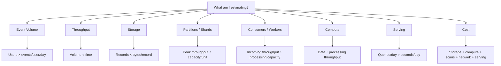
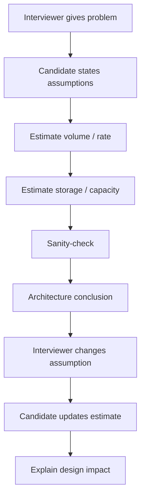

# Back-of-the-Envelope Estimation for Data Systems

> **G5 — Data Engineering System Design Interviews | Topic 03**
>
> **Learning progression:** Simple → Foundation → Basic → Intermediate → Advanced → Senior/Staff → Interview Mastery → Production Thinking
>
> The purpose of this module is not mathematical precision. It is to turn incomplete requirements into **reasonable order-of-magnitude estimates** that can defend an architecture during a Data Engineering system-design interview.

---

## 1. Why Estimation Matters

In a system-design interview, architecture should not appear from intuition alone.

Numbers constrain the design.

A requirement such as:

> "Design a clickstream platform."

is incomplete until we understand questions such as:

- How many users?
- How many events per user?
- What is the event size?
- What is the average rate?
- What is the peak rate?
- How long is data retained?
- How much data must be scanned?
- How many consumers exist?
- What freshness is required?
- What serving load exists?
- What cost constraints exist?

The central mental model is:

```text
Requirements
    ↓
Assumptions
    ↓
Estimates
    ↓
Sanity Checks
    ↓
Architecture Decisions
    ↓
Trade-offs
```

### Numbers can answer architectural questions

Estimation can tell you:

- whether one machine is plausible;
- whether distributed processing is necessary;
- approximately how much storage is required;
- whether ingestion must be partitioned;
- how much consumer parallelism is needed;
- whether a workload is batch- or streaming-oriented;
- whether query load needs caching;
- whether a design is economically plausible;
- where the likely bottleneck is.

### The interview principle

> **Quick, reasonable, order-of-magnitude estimates are more valuable than false precision.**

A candidate who says:

> "I estimate roughly 100 million events/day, or about 1,200 events/sec on average, and I'll assume a 5× peak."

usually demonstrates stronger engineering judgment than someone who presents a precise-looking number based on unstated assumptions.

---

# 2. What Back-of-the-Envelope Estimation Means

Back-of-the-envelope estimation is a lightweight engineering technique for answering:

> "Approximately how large, fast, expensive, or resource-intensive is this system?"

It uses:

- simple arithmetic;
- powers of ten;
- known conversion factors;
- explicit assumptions;
- approximate reference numbers;
- order-of-magnitude reasoning;
- sanity checks.

It is deliberately faster than detailed capacity planning.

## 2.1 Exact Calculation vs Engineering Estimation

### Exact calculation

You know the inputs precisely.

```text
2,400 × 365 = 876,000
```

### Engineering estimation

The inputs themselves are uncertain.

```text
~10M users
×
~20 events/user/day
≈
~200M events/day
```

The second answer is useful even though the actual workload may be 180M or 230M.

### What the interviewer is evaluating

Usually:

1. Did you identify the important variables?
2. Did you state assumptions?
3. Are your units correct?
4. Is the order of magnitude reasonable?
5. Did you apply realistic peaks and overhead?
6. Did you sanity-check the result?
7. Did you use the result to make an architectural decision?

---

# 3. The Complete Estimation Chain

A common Data Engineering chain is:

```text
Users
  ↓
Events / user / day
  ↓
Events / day
  ↓
Average events / second
  ↓
Peak events / second
  ↓
Bytes / event
  ↓
Raw storage / day
  ↓
Compression
  ↓
Retention
  ↓
Replication / physical overhead
  ↓
Throughput
  ↓
Partitions / shards / workers
  ↓
Compute
  ↓
Serving load
  ↓
Cost
  ↓
Sanity check
  ↓
Architecture decision
```

Not every problem needs every step.

For example:

- a batch ETL problem may need storage and compute;
- a clickstream problem may need peak EPS and partitions;
- an API-serving problem may need QPS, cache hit rate, and latency;
- a long-retention telemetry system may emphasize storage;
- a warehouse problem may emphasize scanned data and query frequency.

The skill is knowing **which quantities matter**.

---

# 4. Powers of Ten

Powers of ten are the fastest mental-math language for system design.

| Power | Approximate meaning |
|---:|---:|
| 10³ | thousand |
| 10⁶ | million |
| 10⁹ | billion |
| 10¹² | trillion |
| 10¹⁵ | quadrillion |

Useful sequence:

```text
10
100
1,000
10,000
100,000
1 million
10 million
100 million
1 billion
10 billion
100 billion
1 trillion
```

## 4.1 Scientific-Notation Thinking

```text
5 × 10⁶ = 5 million

2 × 10⁹ = 2 billion

7.5 × 10⁷ = 75 million
```

A useful shortcut:

```text
10⁶ = 1M
10⁹ = 1B
10¹² = 1T
```

## 4.2 Why This Matters

Suppose:

```text
50M users
×
20 events/user/day
```

You can reason:

```text
50 × 20 = 1,000
M × events/day
≈
1B events/day
```

No calculator is necessary.

## 4.3 Rounding

Prefer:

```text
86,400 seconds/day
≈
100,000 seconds/day
```

when the problem only requires an order-of-magnitude answer.

But keep the exact value when a small difference affects the decision.

---

# 5. Bytes and Data Size

## 5.1 Fundamental Units

```text
1 byte = 8 bits
```

For interview estimation, approximate decimal units are usually sufficient:

```text
1 KB ≈ 10³ bytes
1 MB ≈ 10⁶ bytes
1 GB ≈ 10⁹ bytes
1 TB ≈ 10¹² bytes
1 PB ≈ 10¹⁵ bytes
```

Binary units such as KiB, MiB, GiB and TiB exist and can be relevant in exact engineering work.

For an interview:

> State the convention if precision matters, then move on.

## 5.2 Record Size

If:

```text
10M events/day
×
500 bytes/event
```

then:

```text
5 × 10⁹ bytes/day
≈
5 GB/day
```

This is the fundamental storage equation:

```text
storage/day
=
records/day × bytes/record
```

## 5.3 Logical vs Physical Size

Keep these concepts separate.

```text
Logical data
    ↓
Compression
    ↓
Replication
    ↓
Physical storage
```

Example:

```text
100 TB logical
÷ 4 compression
=
25 TB compressed logical

25 TB × 3 replication
=
75 TB physical
```

The exact physical footprint can also include metadata, indexes, temporary data, snapshots, logs and other overhead.

---

# 6. Time Conversions

Memorize:

```text
60 seconds/minute
3,600 seconds/hour
86,400 seconds/day
~31.5 million seconds/year
```

## 6.1 Daily Events to Events per Second

```text
events/sec
=
events/day ÷ 86,400
```

Example:

```text
864M events/day
÷
86,400
=
10,000 events/sec
```

## 6.2 Events per Second to Events per Day

```text
events/day
=
events/sec × 86,400
```

Example:

```text
10,000 EPS
×
86,400
≈
864M events/day
```

## 6.3 GB per Day to GB per Year

```text
GB/year
=
GB/day × 365
```

Example:

```text
100 GB/day
×
365
=
36.5 TB/year
```

Always check units before calculating.

---

# 7. Event Volume Estimation

A common starting formula is:

```text
events/day
=
daily active users
×
events/user/day
```

Example:

```text
DAU = 10M
events/user/day = 20

events/day
=
10M × 20
=
200M events/day
```

Then:

```text
average EPS
=
200M ÷ 86,400
≈
2,315 EPS
```

## 7.1 What the Variables Mean

### DAU

Daily active users.

### Events per user per day

How many events one active user generates.

This is an assumption unless the problem provides it.

### Events per day

The total logical event volume.

### Average EPS

The average rate if traffic were evenly distributed.

It is not the production capacity target.

---

# 8. Peak Traffic

Average traffic is rarely sufficient.

Use:

```text
peak rate
=
average rate × peak factor
```

Example:

```text
2,500 average EPS
×
5× peak
=
12,500 peak EPS
```

## 8.1 Why Peaks Exist

Examples:

- morning/evening usage patterns;
- product launches;
- flash sales;
- marketing campaigns;
- breaking news;
- sports events;
- batch jobs;
- retries;
- reconnect storms;
- regional traffic concentration.

## 8.2 Peak Factor Is an Assumption

Do not say:

> "Production always needs 5×."

Instead:

> "The prompt doesn't provide a traffic distribution, so I'll use a 5× peak factor as a planning assumption."

The actual factor depends on workload.

## 8.3 Average vs Peak

```text
Average:
What happens over the whole day?

Peak:
What capacity must the system survive?
```

The distinction is fundamental.

---

# 9. Storage Per Day

Core formula:

```text
storage/day
=
events/day × bytes/event
```

Alternative:

```text
storage/day
=
events/sec × bytes/event × 86,400
```

## Worked Example

Suppose:

```text
100,000 EPS
1 KB/event
```

Then:

```text
100,000 × 1,000 bytes
=
100,000,000 bytes/sec
≈
100 MB/sec
```

Daily:

```text
100 MB/sec
×
86,400
≈
8.64 TB/day
```

The exact unit convention is less important than maintaining consistency.

### Sanity check

100K events/sec × 1KB is approximately 100MB/sec.

100MB/sec × roughly 100K seconds/day gives roughly 10TB/day.

Therefore ~8.6TB/day is plausible.

---

# 10. Storage Per Year

```text
annual storage
=
daily storage × 365
```

Example:

```text
100 GB/day
×
365
=
36.5 TB/year
```

For retention:

```text
retained logical storage
=
daily storage × retention days
```

Example:

```text
100 GB/day
×
2,555 days
≈
255.5 TB
```

If the system has seven-year retention, the storage requirement is materially different from 30-day retention.

---

# 11. Compression

Compression can reduce physical storage and I/O.

Example:

```text
raw data = 100 GB/day
compression ratio = 4:1

compressed data
=
100 / 4
=
25 GB/day
```

## 11.1 Compression Assumptions

Compression depends on:

- data type;
- cardinality;
- encoding;
- columnar layout;
- repetition;
- file format;
- compression codec;
- workload.

Do not state:

> "Parquet always compresses by exactly 4×."

Instead:

> "I'll assume approximately 4× compression for this estimate; actual compression should be measured against representative data."

---

# 12. Replication

Replication increases physical storage and can support durability or availability.

```text
physical storage
=
logical storage × replication factor
```

Example:

```text
100 TB logical
×
3 replicas
=
300 TB physical
```

Replication can affect:

- storage cost;
- network traffic;
- recovery;
- durability;
- capacity planning.

Keep **logical data volume** separate from **physical infrastructure volume**.

---

# 13. Complete Storage Estimation

The full chain is:

```text
events/day
→ bytes/event
→ raw storage/day
→ compression
→ retention
→ replication
→ physical storage
```

## Example A — Small Analytics Platform

Assumptions:

```text
Users = 1M/day
Events/user/day = 10
Record size = 500 bytes
Retention = 365 days
Compression = 4×
Replication = 3×
```

### Step 1 — Events

```text
1M × 10
=
10M events/day
```

### Step 2 — Raw storage

```text
10M × 500 bytes
=
5GB/day
```

### Step 3 — Compressed

```text
5GB / 4
=
1.25GB/day
```

### Step 4 — One-year logical compressed storage

```text
1.25GB × 365
≈
456GB
```

### Step 5 — Physical with replication

```text
456GB × 3
≈
1.37TB
```

### Sanity check

This is a small-to-moderate data volume.

**Architecture implication:** volume alone does not justify a large distributed platform. Freshness, reliability, query patterns and organizational constraints may still justify one.

---

## Example B — Medium Product Analytics Platform

Assumptions:

```text
DAU = 20M
Events/user/day = 25
Record size = 700 bytes
Peak factor = 5×
Compression = 4×
Retention = 2 years
Replication = 3×
```

### Events

```text
20M × 25
=
500M events/day
```

### Average EPS

```text
500M / 86,400
≈
5,800 EPS
```

### Peak EPS

```text
5,800 × 5
≈
29,000 EPS
```

### Raw storage/day

```text
500M × 700 bytes
≈
350GB/day
```

### Compressed storage/day

```text
350 / 4
≈
87.5GB/day
```

### Two-year compressed logical storage

```text
87.5GB × 730
≈
63.9TB
```

### Physical with replication

```text
63.9 × 3
≈
192TB
```

### Architecture implication

This is now a meaningful platform-scale workload.

The numbers justify explicit attention to:

- scalable ingestion;
- storage lifecycle;
- distributed processing;
- partitioning;
- cost;
- retention;
- recovery.

They still do not automatically dictate a particular vendor or technology.

---

## Example C — Large Streaming Platform

Assumptions:

```text
100M DAU
10 events/user/day
500 bytes/event
5× peak
4× compression
3× replication
365-day retention
```

### Daily events

```text
100M × 10
=
1B events/day
```

### Average EPS

```text
1B / 86,400
≈
11,600 EPS
```

### Peak EPS

```text
11,600 × 5
≈
58,000 EPS
```

### Raw storage/day

```text
1B × 500 bytes
=
500GB/day
```

### Compressed

```text
500 / 4
=
125GB/day
```

### One-year logical compressed storage

```text
125GB × 365
≈
45.6TB
```

### Physical with replication

```text
45.6 × 3
≈
137TB
```

### Important observation

A workload can have high event rate without having petabytes of retained storage.

This is why **throughput and retention must be estimated separately**.

---

# 14. Throughput-Based Sizing

Capacity should be compared with workload rate.

A simplified model:

```text
required capacity
≈
incoming throughput
```

But practical capacity needs headroom.

For a component:

```text
required instances
≈
required throughput / sustainable throughput per instance
```

Then add a safety margin.

---

# 15. Partition and Shard Estimation

A generic approximation:

```text
partitions
≈
peak throughput / sustainable throughput per partition
```

Example:

```text
Peak = 200 MB/s
Estimated sustainable capacity = 20 MB/s/partition

Theoretical partitions
=
200 / 20
=
10
```

A practical design may choose more than 10 because of:

- uneven distribution;
- hot keys;
- consumer parallelism;
- failures;
- headroom;
- future growth.

For example:

```text
10 theoretical
→
12–15 practical
```

This is an illustrative planning decision, not a universal capacity guarantee.

## 15.1 What Affects Partition Throughput?

Capacity depends on:

- message size;
- producer configuration;
- consumer configuration;
- broker hardware;
- replication;
- compression;
- network;
- workload;
- batching;
- serialization;
- broker configuration.

Never memorize a single "Kafka partition always handles X MB/s" number.

---

# 16. Consumer Sizing

A simple model:

```text
consumers
≈
incoming throughput / processing throughput per consumer
```

Example:

```text
Incoming = 1 GB/s
Consumer capacity = 100 MB/s

Theoretical consumers
≈
1,000 / 100
=
10
```

Then account for headroom.

```text
10 theoretical
→
12+ practical
```

Also check:

```text
partitions
≥
useful consumer parallelism
```

If there are fewer partitions than consumers, some consumers may have no partition to process.

---

# 17. Throughput, Lag and Backlog

Consider:

```text
incoming = 1,000 EPS
processing = 800 EPS
```

Then:

```text
backlog growth
=
1,000 - 800
=
200 events/sec
```

If that condition persists:

> backlog grows continuously.

## 17.1 Recovery

Suppose:

```text
Normal traffic = 1,000 EPS
Processing capacity = 1,500 EPS
```

The excess 500 EPS can be used to drain backlog.

### Approximate catch-up time

If:

```text
backlog = 180,000 events
excess capacity = 500 events/sec
```

then:

```text
catch-up time
≈
180,000 / 500
=
360 sec
≈
6 minutes
```

This is a powerful interview observation.

> Capacity should be sufficient not only for normal traffic but also for recovery from temporary backlog.

---

# 18. Compute Sizing

A useful approximation:

```text
runtime
≈
data scanned / processing throughput
```

Example:

```text
Data = 5 TB
Throughput = 500 GB/hour

Runtime
=
5 / 0.5
=
10 hours
```

If the requirement says:

> "The job must finish in two hours."

then:

```text
required throughput
=
5 TB / 2 hours
=
2.5 TB/hour
```

You now have a capacity target.

## 18.1 Scaling Is Not Perfectly Linear

Adding workers does not always produce proportional speedup because of:

- network I/O;
- shuffle;
- skew;
- coordination;
- serialization;
- scheduling;
- disk I/O;
- synchronization;
- diminishing returns.

A senior candidate should say:

> "I'll initially assume near-linear scaling for the estimate, then reserve headroom because distributed systems have coordination and I/O overhead."

---

# 19. Data Scanned Per Job

Estimate how much data is actually processed.

Suppose:

```text
Table = 10 TB
20% scanned/query
```

Then:

```text
2 TB/query
```

If:

```text
100 queries/day
```

then:

```text
2 TB × 100
=
200 TB/day scanned
```

This matters for:

- query cost;
- compute;
- latency;
- partition pruning;
- column pruning;
- capacity.

A 10 TB table does not necessarily mean every query processes 10 TB.

---

# 20. Serving Load and QPS

For serving:

```text
QPS
=
queries/day ÷ 86,400
```

Example:

```text
10M users
×
2 queries/day
=
20M queries/day
```

Then:

```text
20M / 86,400
≈
231 QPS average
```

Apply a peak factor:

```text
231 × 5
≈
1,155 peak QPS
```

## 20.1 Serving Is Different from Ingestion

A system can have:

```text
10,000 events/sec ingestion
```

and only:

```text
100 QPS serving
```

or the reverse.

Always estimate each workload independently.

---

# 21. Cache Hit Rate

Backend load can be reduced by caching.

```text
backend QPS
=
total QPS × (1 - cache hit rate)
```

Example:

```text
1,000 QPS
90% cache hit rate

backend QPS
=
1,000 × 0.10
=
100 QPS
```

The difference is substantial.

A senior candidate should understand that cache assumptions directly affect backend capacity.

---

# 22. Latency Budgets

An end-to-end SLA can be decomposed.

Example:

```text
Total target = 500 ms

API             100 ms
Cache             20 ms
Feature lookup   150 ms
Database         150 ms
Network/other     80 ms
-----------------------
Total             500 ms
```

The components consume the latency budget.

## 22.1 Percentiles

Distinguish:

- p50;
- p95;
- p99.

Average latency can hide tail behaviour.

For a user-facing SLA:

> "Average is 80 ms" does not prove that p99 is acceptable.

---

# 23. Cost Estimation

A simple monthly model is:

```text
monthly cost
=
storage
+
compute
+
query/scan
+
network
+
serving
+
other infrastructure
```

The goal is order of magnitude.

Do not present an illustrative price as permanent vendor pricing.

---

# 24. Storage Cost

Conceptually:

```text
storage cost
=
physical storage × price/unit/month
```

Example:

```text
500 TB
×
illustrative price/TB/month
=
monthly storage estimate
```

The important reasoning is to identify what drives physical storage:

```text
logical data
×
compression effect
×
replication
×
retention
```

Also consider:

- hot/cold tiers;
- snapshots;
- temporary storage;
- indexes;
- metadata.

---

# 25. Compute Cost

```text
compute cost
=
workers
×
hours
×
cost/hour
```

Example:

```text
20 workers
×
10 hours/day
×
30 days
=
6,000 worker-hours/month
```

If the illustrative rate is:

```text
$0.50/worker-hour
```

then:

```text
6,000 × $0.50
=
$3,000/month
```

The price is an assumption.

What matters is that the candidate can explain:

- workload;
- utilization;
- idle time;
- autoscaling;
- batch vs streaming;
- provisioned vs serverless economics.

---

# 26. Query / Scan Cost

Conceptually:

```text
monthly scan volume
×
price per unit scanned
```

If:

```text
2 PB/month scanned
```

the cost can become material.

Reducing scanned data through:

- partition pruning;
- column pruning;
- incremental processing;
- caching;
- materialized results;

can materially change economics.

---

# 27. Network Transfer Cost

Conceptually:

```text
data transferred
×
unit network price
```

Important categories:

- cross-region transfer;
- cross-zone transfer;
- internet egress;
- replication traffic.

At large scale, network movement can become a first-class cost driver.

---

# 28. Reference Numbers to Know Approximately

These are **planning references**, not universal guarantees.

| Resource | Interview-level reference | What affects it |
|---|---|---|
| Memory | Think in GBs to hundreds of GBs per host; larger systems aggregate many hosts | Instance type, workload, caching |
| Disk throughput | Think in hundreds of MB/s to GB/s depending on storage/system | Device, RAID, filesystem, workload |
| Network | Think in Gb/s to tens/hundreds of Gb/s for modern infrastructure | NIC, host, topology, protocol |
| Object storage request latency | Usually far above in-memory access latency; exact latency depends on API, region and workload | Provider, object size, request pattern |
| Kafka partition throughput | Use a workload-specific measured/assumed value rather than a universal constant | Message size, batching, compression, broker, replication, network |

### Safe interview language

> "I'll use this as an approximate planning assumption; actual capacity depends on workload and configuration."

### Do not memorize false guarantees

Avoid:

> "One Kafka partition always handles exactly X MB/s."

Prefer:

> "For the estimate, I'll assume X MB/s per partition and validate it with a representative benchmark."

---

# 29. Sanity Checks

After every important estimate, ask:

> **Does this answer make sense?**

## 29.1 Memory Check

Would the dataset fit in memory?

If not:

- disk access;
- distributed storage;
- partitioning;
- streaming;
- external state

may matter.

## 29.2 Disk Check

Could a single machine store the data?

If:

```text
5 TB total
```

one machine may be physically possible.

If:

```text
5 PB
```

distributed storage is a different class of problem.

## 29.3 Network Check

Can the network move the data?

If:

```text
1 TB must move in 10 minutes
```

calculate the required transfer rate before assuming the network can handle it.

## 29.4 CPU Check

Can processing finish inside the SLA?

If:

```text
10 TB
must finish in 10 minutes
```

the required throughput is much higher than:

```text
10 TB
over 10 hours
```

## 29.5 Storage Check

Does the retention estimate make sense?

Watch for:

- missing retention;
- missing compression;
- missing replication;
- accidental unit conversion.

## 29.6 Cost Check

If your calculation says:

```text
$20/month
```

for a multi-petabyte globally replicated system, something is probably wrong.

If it says:

```text
$100M/month
```

for a tiny batch workload, check the units.

---

# 30. Order-of-Magnitude Sanity Checking

Suppose:

```text
10M users
×
100 events/day
=
1B events/day
```

That should immediately trigger:

```text
1B/day
≈
11.6K EPS average
```

If someone calculates:

```text
1B/day = 1M EPS
```

the zeros are wrong.

Useful checks:

- round values;
- check zeros;
- check units;
- compare average to peak;
- compare logical to physical;
- compare current to growth;
- compare result to familiar scales.

---

# 31. Unit Consistency

Dimensional analysis catches many errors.

### Example

```text
events/day × bytes/event
=
bytes/day
```

### Example

```text
bytes/day ÷ seconds/day
=
bytes/second
```

### Example

```text
TB ÷ TB/hour
=
hours
```

### Example

```text
queries/day ÷ seconds/day
=
queries/second
```

If the units do not simplify to the quantity you intended, stop and inspect the calculation.

---

# 32. Using Estimates to Drive Architecture

Estimation is valuable because it produces decisions.

Use:

```text
Estimate
→
Interpret
→
Compare with requirement
→
Identify bottleneck
→
Choose architecture boundary
→
Explain trade-off
```

## Example 1 — Small Volume

```text
50 GB/day
```

Possible conclusion:

> "Volume alone does not justify a large distributed processing platform. I would choose the simplest architecture that satisfies freshness, reliability and growth requirements."

## Example 2 — Large Volume

```text
50 TB/day
```

Possible conclusion:

> "This is large enough that distributed storage and horizontally scalable processing become important."

## Example 3 — High Event Rate

```text
10,000 peak EPS
```

Possible conclusion:

> "I need scalable, partitioned ingestion and enough consumer parallelism to handle the peak plus recovery headroom."

## Example 4 — High Serving QPS

```text
100,000 peak QPS
```

Possible conclusion:

> "Serving capacity, caching, horizontal scaling and hot-key behaviour become major design concerns."

Numbers constrain architecture; they do not mechanically select a technology.

---

# 33. Estimation Under Uncertainty

Real interview prompts are incomplete.

Use:

```text
Assumption
→
Estimate
→
Sensitivity
```

Example:

```text
Assumption:
10M DAU

Events/user/day:
20

Base:
200M events/day
```

Then test:

```text
10 events/user/day
→
100M/day

50 events/user/day
→
500M/day
```

The goal is to identify the variables that dominate the result.

---

# 34. Dominant Variables

Not every input matters equally.

Suppose:

```text
storage
=
users
×
events/user/day
×
bytes/event
×
retention
```

Then the biggest uncertainties may be:

- user count;
- event frequency;
- record size;
- retention.

If those are uncertain, spend interview time clarifying them.

Do not waste time debating a small coefficient while the dominant variable is unknown.

---

# 35. Sensitivity Analysis

A simple sensitivity table:

| Variable | Base | Low | High |
|---|---:|---:|---:|
| DAU | 10M | 5M | 50M |
| Events/user/day | 20 | 10 | 50 |
| Record size | 500B | 250B | 1KB |
| Peak factor | 5× | 2× | 10× |
| Retention | 365d | 90d | 7y |

Ask:

> Which change moves the architecture most?

That is senior-level estimation thinking.

---

# 36. Best / Base / Worst Case

When uncertainty is large:

```text
Low:
10M events/day

Base:
100M events/day

High:
1B events/day
```

Then ask:

- Does the architecture remain viable across the range?
- At which threshold does the architecture need to change?
- Which assumption should be clarified first?

This is more useful than pretending the estimate is exact.

---

# 37. Growth Estimation

Growth matters because today's architecture must survive tomorrow's workload.

Suppose:

```text
100 GB/day today
20% annual growth
```

You do not necessarily need complex financial mathematics.

You need to recognize:

> The storage requirement is not static.

A useful interview statement:

> "I'll design the MVP around today's workload but validate that the chosen architecture has a clear path for the expected growth range."

## Growth Questions

- User growth?
- Event-rate growth?
- Record-size growth?
- Query growth?
- Retention growth?
- Consumer growth?

---

# 38. Capacity Planning

Capacity planning asks:

> "How much resource do we need now, and how much should we plan for later?"

A simple approach:

```text
Current workload
+
Peak
+
Recovery headroom
+
Expected growth
=
Planning envelope
```

Do not simply multiply everything by a huge arbitrary safety factor.

Explain the reason for the headroom.

---

# 39. Estimation with Retention

Combine:

```text
daily volume
×
retention days
×
compression effect
×
replication factor
```

Example:

```text
200 GB/day
365 days
4× compression
3× replication
```

Logical compressed retention:

```text
200 × 365 / 4
=
18,250 GB
≈
18.25 TB
```

Physical:

```text
18.25 × 3
≈
54.75 TB
```

### Sanity check

Without compression or replication:

```text
200 GB/day × 365
=
73 TB
```

After 4× compression:

```text
~18 TB
```

After 3× replication:

```text
~55 TB
```

The numbers are internally consistent.

---

# 40. Complete Interview-Style Example

Suppose the interviewer says:

> "Estimate the data platform for 100M daily active users."

You should not immediately calculate.

First say:

> "I'll make a few assumptions so I can get to an order-of-magnitude estimate."

Assume:

```text
DAU = 100M
Events/user/day = 10
Record size = 500 bytes
Peak factor = 5×
Compression = 4×
Retention = 1 year
Replication = 3×
```

### Step 1 — Daily events

```text
100M × 10
=
1B events/day
```

### Step 2 — Average EPS

```text
1B / 86,400
≈
11.6K EPS
```

### Step 3 — Peak EPS

```text
11.6K × 5
≈
58K EPS
```

### Step 4 — Raw storage/day

```text
1B × 500B
=
500GB/day
```

### Step 5 — Compressed

```text
500 / 4
=
125GB/day
```

### Step 6 — One-year compressed logical storage

```text
125GB × 365
≈
45.6TB
```

### Step 7 — Physical with replication

```text
45.6 × 3
≈
137TB
```

### Step 8 — Architecture implication

> "The platform needs to support roughly 58K peak events/sec and retain roughly 46TB of compressed logical data for one year before replication. I would therefore plan for partitioned ingestion, scalable storage, distributed processing where required, and enough consumer capacity to handle peak plus recovery. I would validate the record-size and compression assumptions with real data."

That final paragraph is the point of the calculation.

---

# 41. Throughput vs Storage

A frequent interview mistake is assuming high throughput always means enormous storage.

Consider:

```text
100K events/sec
```

At:

```text
100 bytes/event
```

versus:

```text
10KB/event
```

The throughput may be identical while storage differs by 100×.

Therefore estimate both:

```text
Rate
+
Record size
```

Likewise:

```text
Long retention
```

can create large storage even when the current event rate is moderate.

---

# 42. Compute Sizing with Headroom

Suppose:

```text
Required processing = 2.5 TB/hour
```

If one worker can sustain:

```text
500 GB/hour
```

then:

```text
theoretical workers
=
2.5 TB / 0.5 TB
=
5
```

Do not immediately stop at five.

Consider:

- workload variability;
- skew;
- failure;
- scaling delay;
- network;
- shuffle;
- utilization;
- recovery.

A planning choice might be:

```text
5 theoretical
→
6–8 practical
```

The exact headroom must be justified.

---

# 43. Serving Capacity with Cache

Suppose:

```text
100M users
2 queries/user/day
```

Then:

```text
200M queries/day
≈
2,315 QPS average
```

With:

```text
5× peak
```

we get:

```text
~11.6K peak QPS
```

If:

```text
90% cache hit
```

then backend load is approximately:

```text
11.6K × 10%
≈
1.16K QPS
```

This shows why cache assumptions can materially change backend infrastructure requirements.

---

# 44. Latency Budget Example

Suppose the product requires:

```text
p95 < 500ms
```

A conceptual budget might be:

```text
API gateway       80ms
Cache              20ms
Feature lookup    150ms
Database          150ms
Network/other     100ms
-----------------------
Total             500ms
```

If one component grows from 150ms to 300ms, the system no longer fits the budget.

This is why:

> End-to-end latency is a system constraint, not just a database metric.

---

# 45. Cost Estimation Example

Assume:

```text
Storage = 500 TB
Compute = 20 workers × 10 hours/day
Scan = 2 PB/month
Serving = separate capacity
Network = estimated separately
```

Build:

```text
Monthly cost
=
storage
+
compute
+
scan
+
network
+
serving
```

If the exact cloud price is not supplied, use:

```text
illustrative unit price
```

and focus on the dominant cost drivers.

### Interview language

> "I won't claim an exact monthly cloud bill without current pricing and workload-specific measurements. For interview purposes, I'll estimate the order of magnitude and identify the largest cost drivers."

---

# 46. Three-Minute Estimation Method

The roadmap calls for timed drills of approximately three minutes.

Use:

```text
0:00–0:20
Clarify / state assumptions

0:20–1:00
Calculate scale

1:00–1:45
Calculate throughput/storage

1:45–2:20
Calculate infrastructure

2:20–2:45
Sanity-check

2:45–3:00
Architecture conclusion
```

This is a practice framework, not a rigid rule.

## What Good Performance Sounds Like

> "I'll assume 10M users and 20 events per user per day."

> "That's 200M events/day."

> "Dividing by 86,400 gives roughly 2.3K average EPS."

> "I'll use a 5× peak, giving roughly 12K peak EPS."

> "At 500 bytes/event, that's about 100GB/day."

> "The volume is manageable, but the peak ingestion and freshness requirements will drive the ingestion architecture."

Short, structured, auditable.

---

# 47. Ten Timed Estimation Drills

Each drill should be completed in approximately three minutes.

## Drill 1 — Basic Event Rate

**Problem:** 1M users generate 10 events/user/day.

**Assumptions:** Use the supplied numbers; no extra assumptions required.

**Estimate:**
- events/day;
- average EPS.

**Worked solution:**

```text
1M × 10 = 10M events/day

10M / 86,400
≈
116 EPS
```

**Sanity check:** Hundreds of EPS, not millions.

**Architecture takeaway:** Small rate by itself does not require a large distributed ingestion system.

---

## Drill 2 — Peak Clickstream

**Problem:** 20M users generate 20 events/user/day. Use a 5× peak.

**Solution:**

```text
400M events/day
400M / 86,400
≈ 4.6K EPS average

Peak
≈
23K EPS
```

**Takeaway:** Provision around peak/recovery needs, not daily average alone.

---

## Drill 3 — Storage

**Problem:** 100M events/day, 500 bytes/event, 365-day retention.

```text
100M × 500B
=
50GB/day

50 × 365
=
18.25TB/year
```

**Takeaway:** Retention converts daily volume into a long-term storage requirement.

---

## Drill 4 — Compression and Replication

**Problem:** 200GB/day raw, 4× compression, 3× replication, 365 days.

```text
200 / 4
=
50GB/day compressed

50 × 365
=
18.25TB logical

18.25 × 3
≈
54.75TB physical
```

**Takeaway:** Keep logical and physical storage separate.

---

## Drill 5 — Partitions

**Problem:** Peak throughput 500MB/s. Assume 25MB/s sustainable per partition.

```text
500 / 25
=
20 theoretical partitions
```

Add justified headroom.

**Takeaway:** The mathematical minimum is not automatically the production configuration.

---

## Drill 6 — Consumers

**Problem:** 2GB/s incoming, 200MB/s sustainable processing per consumer.

```text
2,000 / 200
=
10 consumers theoretical
```

Then discuss:

- headroom;
- partition parallelism;
- failure;
- recovery.

---

## Drill 7 — Batch Runtime

**Problem:** 20TB scanned. Sustainable processing rate 2TB/hour.

```text
20 / 2
=
10 hours
```

If SLA is 4 hours:

```text
20 / 4
=
5TB/hour
```

**Takeaway:** The SLA creates a throughput requirement.

---

## Drill 8 — Serving QPS

**Problem:** 50M users, 4 queries/user/day, 5× peak.

```text
200M queries/day

200M / 86,400
≈
2.3K average QPS

Peak
≈
11.6K QPS
```

---

## Drill 9 — Cache

**Problem:** Peak 20K QPS, 95% cache hit rate.

```text
backend
=
20K × 5%
=
1K QPS
```

**Takeaway:** Cache effectiveness is an infrastructure assumption.

---

## Drill 10 — Cost

**Problem:** 50 workers run 8 hours/day for 30 days. Illustrative cost is $0.40/worker-hour.

```text
50 × 8 × 30
=
12,000 worker-hours

12,000 × $0.40
=
$4,800/month
```

**Takeaway:** The arithmetic is simple; identifying the correct workload and utilization assumptions is the engineering skill.

---

# 48. Revisiting Previous Data Engineering Projects

Estimation improves when compared against reality.

For each previous project, record:

```text
What did I estimate?

What actually happened?

Where was my estimate wrong?

Which assumption caused the difference?
```

Investigate:

```text
workload
record size
compression
skew
network
compute
query pattern
concurrency
implementation overhead
```

## Example

Estimate:

```text
100GB/day
```

Observed:

```text
160GB/day
```

Possible reasons:

- actual record size was larger;
- metadata overhead was omitted;
- duplicate events existed;
- compression was worse;
- event frequency was underestimated.

The lesson is not:

> "My estimate was bad."

The better lesson is:

> "Which assumption was wrong, and how can I improve the model?"

---

# 49. Common Estimation Mistakes

## 49.1 Skipping Estimation

**Why it happens:** Candidate wants to reach architecture quickly.

**Why dangerous:** Architecture becomes intuition-driven.

**Fix:** Spend enough time to establish scale.

## 49.2 Jumping to Technology

**Why it happens:** Familiar tools are easier to discuss than workload numbers.

**Why dangerous:** Technology choice is not justified.

**Fix:** Requirements → estimates → architecture.

## 49.3 False Precision

**Why it happens:** Candidate wants to appear rigorous.

**Why dangerous:** Inputs are uncertain.

**Fix:** Round numbers and state assumptions.

## 49.4 Forgetting Peak

**Why dangerous:** Average capacity may fail during bursts.

**Fix:** Explicitly estimate peak.

## 49.5 Forgetting Retention

**Why dangerous:** Daily storage can look small while multi-year storage becomes large.

**Fix:** Convert daily storage to retained storage.

## 49.6 Forgetting Compression

**Why dangerous:** Physical storage can be overestimated.

**Fix:** State a measured or illustrative compression assumption.

## 49.7 Forgetting Replication

**Why dangerous:** Logical storage is not necessarily physical capacity.

**Fix:** Apply replication where appropriate.

## 49.8 Mixing Units

**Why dangerous:** Can create 1,000× or 1,000,000× errors.

**Fix:** Write units beside every intermediate result.

## 49.9 Losing Zeros

**Why dangerous:** Powers-of-ten errors can invalidate the architecture.

**Fix:** Use scientific notation or rounded checkpoints.

## 49.10 Ignoring Growth

**Why dangerous:** Architecture may work today but fail quickly.

**Fix:** Ask about expected growth.

## 49.11 Ignoring Consumer Throughput

**Why dangerous:** Ingestion may be healthy while processing backlog grows.

**Fix:** Compare incoming and processing rates.

## 49.12 Ignoring Backlog Recovery

**Why dangerous:** Temporary failures can become persistent lag.

**Fix:** Estimate recovery capacity.

## 49.13 Ignoring Query Volume

**Why dangerous:** Storage size alone does not tell you serving load.

**Fix:** Estimate queries/day and peak QPS.

## 49.14 Ignoring Cache Hit Rate

**Why dangerous:** Backend capacity may be mis-sized.

**Fix:** Estimate backend QPS after caching.

## 49.15 Ignoring Latency Budget

**Why dangerous:** Average throughput can look adequate while p95/p99 fails.

**Fix:** Decompose end-to-end latency.

## 49.16 Ignoring Network

**Why dangerous:** Large data movement can dominate performance and cost.

**Fix:** Estimate transfer rates and boundaries.

## 49.17 Never Sanity-Checking

**Why dangerous:** Arithmetic can be internally consistent but still absurd.

**Fix:** Ask whether the order of magnitude makes sense.

## 49.18 Estimating but Not Using the Number

**Why dangerous:** The calculation becomes interview theatre.

**Fix:** Always state:

> "So what does this mean for the architecture?"

---

# 50. Senior-Level Estimation

At senior level, the arithmetic is usually not the differentiator.

Senior candidates should:

- state assumptions quickly;
- identify dominant variables;
- estimate order of magnitude;
- recognize bottlenecks;
- include sensible headroom;
- explain uncertainty;
- perform sensitivity analysis;
- connect numbers to architecture;
- discuss recovery;
- discuss cost;
- discuss operational consequences.

### Example

A mid-level answer:

> "We need 20 partitions."

A stronger answer:

> "The raw calculation gives about 20 partitions at peak. I'd add headroom for burstiness and growth, then validate sustainable partition throughput with representative message size, batching, compression and replication."

The second answer demonstrates engineering judgment.

---

# 51. Staff-Level Estimation

Staff-level reasoning expands the horizon.

Consider:

- growth trajectories;
- capacity thresholds;
- cost curves;
- reliability;
- multi-region implications;
- platform reuse;
- organizational constraints;
- migration;
- operational complexity;
- build vs buy;
- future architecture evolution.

## Example

Suppose:

```text
Current = 50TB/day
Growth = 3× over two years
```

A staff-level engineer asks:

- Where does the current architecture stop being economical?
- What is the scaling boundary?
- Which assumptions dominate cost?
- Can multiple teams share the platform?
- What operational model is required?
- Should the system optimize for today's workload or the growth envelope?

Staff thinking is not adding more components.

It is identifying **system-level consequences of scale**.

---

# 52. Estimation Decision Tree



---

# 53. Reusable Estimation Templates

## 53.1 Event Volume

```text
Users:
Events/user/day:
Events/day:
Average events/sec:
Peak factor:
Peak events/sec:
```

## 53.2 Storage

```text
Events/day:
Bytes/event:
Raw storage/day:
Compression:
Compressed storage/day:
Retention:
Logical retained storage:
Replication:
Physical storage:
```

## 53.3 Partition / Shard

```text
Peak throughput:
Sustainable throughput/unit:
Theoretical units:
Safety margin:
Practical units:
Parallelism constraint:
```

## 53.4 Consumers

```text
Incoming throughput:
Processing throughput/consumer:
Theoretical consumers:
Headroom:
Practical consumers:
Partition constraint:
```

## 53.5 Compute

```text
Data scanned:
Processing throughput:
Required runtime:
Required capacity:
Headroom:
Scaling assumption:
```

## 53.6 Serving

```text
Users:
Queries/user/day:
Average QPS:
Peak factor:
Peak QPS:
Cache hit rate:
Backend QPS:
Latency target:
```

## 53.7 Cost

```text
Storage:
Compute:
Query/scan:
Network:
Serving:
Other:
Total monthly estimate:
Dominant cost driver:
```

---

# 54. Python Estimation Examples

These examples are learning aids, not production capacity planners.

## 54.1 Events per Second

```python
users = 10_000_000
events_per_user_per_day = 20
seconds_per_day = 86_400

events_per_day = users * events_per_user_per_day
avg_events_per_second = events_per_day / seconds_per_day

print(f"Events/day: {events_per_day:,}")
print(f"Average EPS: {avg_events_per_second:,.1f}")
```

### Reasoning

```text
10M × 20 = 200M events/day

200M / 86,400
≈ 2,315 EPS
```

---

## 54.2 Peak Throughput

```python
peak_factor = 5

peak_eps = avg_events_per_second * peak_factor

print(f"Peak EPS: {peak_eps:,.1f}")
```

---

## 54.3 Storage

```python
bytes_per_event = 500

raw_bytes_per_day = events_per_day * bytes_per_event

print(f"Raw GB/day: {raw_bytes_per_day / 1e9:,.2f}")
```

---

## 54.4 Compression and Replication

```python
compression_ratio = 4
replication_factor = 3

compressed_bytes_per_day = raw_bytes_per_day / compression_ratio
physical_bytes_per_day = (
    compressed_bytes_per_day * replication_factor
)

print(
    f"Compressed GB/day: "
    f"{compressed_bytes_per_day / 1e9:,.2f}"
)

print(
    f"Physical GB/day: "
    f"{physical_bytes_per_day / 1e9:,.2f}"
)
```

---

## 54.5 Partition Estimation

```python
peak_mb_per_second = 200
partition_mb_per_second = 20
safety_factor = 1.3

theoretical_partitions = (
    peak_mb_per_second / partition_mb_per_second
)

practical_partitions = theoretical_partitions * safety_factor

print(f"Theoretical: {theoretical_partitions:.1f}")
print(f"Practical: {practical_partitions:.1f}")
```

Round the final capacity to an operationally sensible integer.

---

## 54.6 Consumer Estimation

```python
incoming_mb_per_second = 1000
consumer_capacity_mb_per_second = 100

consumers = (
    incoming_mb_per_second
    / consumer_capacity_mb_per_second
)

print(f"Theoretical consumers: {consumers:.1f}")
```

Then explicitly add headroom in the reasoning rather than pretending the decimal is a deployable count.

---

## 54.7 Compute Runtime

```python
data_tb = 5
throughput_tb_per_hour = 0.5

runtime_hours = data_tb / throughput_tb_per_hour

print(f"Estimated runtime: {runtime_hours:.1f} hours")
```

---

## 54.8 QPS and Cache Hit Rate

```python
users = 10_000_000
queries_per_user_per_day = 2
seconds_per_day = 86_400

avg_qps = (
    users * queries_per_user_per_day
    / seconds_per_day
)

peak_factor = 5
peak_qps = avg_qps * peak_factor

cache_hit_rate = 0.90
backend_qps = peak_qps * (1 - cache_hit_rate)

print(f"Average QPS: {avg_qps:,.1f}")
print(f"Peak QPS: {peak_qps:,.1f}")
print(f"Backend QPS: {backend_qps:,.1f}")
```

---

## 54.9 Illustrative Compute Cost

```python
workers = 20
hours_per_day = 10
days_per_month = 30
illustrative_cost_per_worker_hour = 0.50

monthly_compute_cost = (
    workers
    * hours_per_day
    * days_per_month
    * illustrative_cost_per_worker_hour
)

print(f"Illustrative monthly compute cost: "
      f"${monthly_compute_cost:,.2f}")
```

> **Important:** The price above is deliberately an illustrative assumption, not a permanent cloud price.

---

# 55. Reusable Python Estimation Calculator

The following calculator keeps the model intentionally simple.

```python
def estimate_data_system(
    users,
    events_per_user_per_day,
    bytes_per_event,
    peak_factor,
    compression_ratio,
    replication_factor,
    retention_days,
):
    events_per_day = users * events_per_user_per_day
    avg_eps = events_per_day / 86_400
    peak_eps = avg_eps * peak_factor

    raw_bytes_per_day = events_per_day * bytes_per_event
    compressed_bytes_per_day = (
        raw_bytes_per_day / compression_ratio
    )

    retained_logical_bytes = (
        compressed_bytes_per_day * retention_days
    )

    physical_bytes = (
        retained_logical_bytes * replication_factor
    )

    return {
        "events_per_day": events_per_day,
        "average_eps": avg_eps,
        "peak_eps": peak_eps,
        "raw_bytes_per_day": raw_bytes_per_day,
        "compressed_bytes_per_day": compressed_bytes_per_day,
        "retained_logical_bytes": retained_logical_bytes,
        "physical_bytes": physical_bytes,
    }


estimate = estimate_data_system(
    users=10_000_000,
    events_per_user_per_day=20,
    bytes_per_event=500,
    peak_factor=5,
    compression_ratio=4,
    replication_factor=3,
    retention_days=365,
)

for key, value in estimate.items():
    print(f"{key}: {value:,.2f}")
```

### What this teaches

The calculator makes the chain explicit:

```text
users
→
events/day
→
EPS
→
peak EPS
→
raw storage
→
compression
→
retention
→
replication
```

It is intentionally not a production capacity planner.

---

# 56. Realistic Data Engineering Scenarios

## 56.1 Product Analytics

Clarify:

- DAU;
- events/user/day;
- event size;
- freshness;
- retention;
- query volume.

Estimate:

```text
events/day
average EPS
peak EPS
storage
query load
```

---

## 56.2 E-commerce Events

Important variables:

- shoppers;
- events/session;
- seasonal peak;
- product-launch spikes;
- transaction correctness;
- retention.

Architecture implication:

> Peak traffic and business-critical correctness may matter more than average volume.

---

## 56.3 Food Delivery

Consider:

- customers;
- restaurants;
- drivers;
- location updates;
- order events;
- operational dashboard freshness.

Different consumers may need different SLAs.

---

## 56.4 Kafka Clickstream

Estimate:

- peak message rate;
- bytes/sec;
- partition count;
- consumer capacity;
- replication/storage.

Do not pick partition counts from memorized constants.

---

## 56.5 CDC Pipeline

Estimate:

- number of tables;
- changes/sec;
- peak changes;
- record size;
- downstream consumers;
- retention.

Consider initial snapshot separately from steady-state CDC.

---

## 56.6 IoT Telemetry

Estimate:

```text
devices
×
messages/device/minute
```

Then convert to:

- messages/sec;
- peak reconnect traffic;
- storage/day;
- retained storage.

Also consider:

- device clock skew;
- burstiness;
- offline buffering;
- duplicate messages.

---

## 56.7 Log Analytics

Estimate:

```text
hosts
×
logs/host/sec
×
bytes/log
```

Then:

```text
storage/day
×
retention
```

Also estimate query volume and search freshness.

---

## 56.8 ML Feature Platform

Estimate:

- entities;
- features/entity;
- feature record size;
- batch generation frequency;
- online QPS;
- feature freshness;
- retention.

Separate:

```text
offline training data
vs
online serving load
```

---

## 56.9 RAG / Vector Data Platform

Estimate:

- documents;
- document size;
- chunks/document;
- embedding dimensionality;
- index update frequency;
- retrieval QPS;
- retention/versioning.

The exact vector representation depends on implementation, so state assumptions.

---

## 56.10 Data Warehouse Analytics

Estimate:

- data stored;
- queries/day;
- data scanned/query;
- concurrency;
- peak query load;
- freshness;
- retention.

A 100TB warehouse with 20 small queries/day is a different capacity problem from a 100TB warehouse with thousands of concurrent scans.

---

# 57. Interview Worked Example — Kafka Capacity

**Prompt:**

> "Estimate Kafka capacity for a clickstream platform."

### Step 1 — Assumptions

```text
DAU = 50M
Events/user/day = 20
Average record size = 1KB
Peak factor = 5×
Assumed sustainable partition throughput = 20MB/s
```

### Step 2 — Events/day

```text
50M × 20
=
1B events/day
```

### Step 3 — Average EPS

```text
1B / 86,400
≈
11.6K EPS
```

### Step 4 — Peak EPS

```text
11.6K × 5
≈
58K EPS
```

### Step 5 — Peak bytes/sec

```text
58K × 1KB
≈
58MB/sec
```

### Step 6 — Theoretical partitions

```text
58 / 20
≈
3 partitions
```

This is deliberately simplistic.

A strong candidate should immediately say:

> "I would not deploy three partitions solely from this calculation. I need to account for replication, message-size distribution, key skew, consumer parallelism, recovery, operational headroom and future growth."

The calculation is a starting point, not the answer.

---

# 58. Interview Worked Example — Five-Year Telemetry

**Prompt:**

> "Estimate storage for five years of telemetry."

Assume:

```text
1M devices
1 message/minute/device
500 bytes/message
5 years
4× compression
3× replication
```

### Messages/day

Each device:

```text
1,440 messages/day
```

Therefore:

```text
1M × 1,440
=
1.44B messages/day
```

### Raw storage/day

```text
1.44B × 500 bytes
≈
720GB/day
```

### Five-year raw

Approximately:

```text
720GB × 1,825
≈
1.31PB
```

### Compressed logical

```text
1.31PB / 4
≈
328TB
```

### Physical with replication

```text
328TB × 3
≈
984TB
```

### Architecture implication

The storage footprint approaches petabyte scale.

Therefore storage lifecycle, tiering, compression, retention policy and cost become first-class architecture concerns.

---

# 59. Interview Worked Example — 20TB Daily Processing

**Prompt:**

> "Estimate compute required to process 20TB/day."

Suppose:

```text
Daily volume = 20TB
Required completion = 4 hours
```

Required throughput:

```text
20 / 4
=
5TB/hour
```

Assume:

```text
One worker sustains 500GB/hour
```

Then:

```text
5TB/hour
/
0.5TB/hour/worker
=
10 workers
```

Practical discussion:

> "Ten workers is the theoretical number under the throughput assumption. I'd add headroom and validate scaling efficiency because shuffle, I/O, skew and coordination reduce linear scaling."

---

# 60. Interview Worked Example — Serving 100M Users

Assume:

```text
100M users
2 queries/user/day
5× peak
90% cache hit
```

Daily queries:

```text
200M/day
```

Average QPS:

```text
200M / 86,400
≈
2.3K QPS
```

Peak:

```text
2.3K × 5
≈
11.6K QPS
```

Backend after cache:

```text
11.6K × 10%
≈
1.16K QPS
```

Architecture implication:

> Caching can reduce backend load by roughly an order of magnitude under the stated assumption.

---

# 61. Interview Worked Example — Cost

Suppose:

```text
20 workers
×
10 hours/day
×
30 days
=
6,000 worker-hours/month
```

If the illustrative rate is:

```text
$0.50/hour
```

then:

```text
$3,000/month
```

Now ask:

> Is compute the dominant cost?

Maybe not.

If the system also stores hundreds of TB and scans PBs monthly, storage and query cost may dominate.

Senior candidates identify the **cost curve**, not merely one line item.

---

# 62. Weak vs Strong Estimation Answers

## Weak

> "There will be a lot of traffic, so I'd use Kafka and Spark."

### Why weak

- no assumptions;
- no numbers;
- no scale;
- no capacity;
- no sanity check;
- no connection to requirements.

## Strong

> "I'll assume 50M daily users, 20 events per user per day, and 500 bytes per event. That gives roughly 1B events/day, or 11.6K events/sec average. With a 5× peak assumption, that's about 58K EPS. At 500 bytes/event, that's roughly 500GB/day raw. The key architecture drivers are peak ingestion, consumer parallelism, one-year retention, and cost. I'd validate the record size and peak factor against real workload data."

### Why strong

```text
Assumption
→
Calculation
→
Result
→
Sanity check
→
Architecture implication
```

---

# 63. How to Speak While Estimating

Useful phrases:

> "I'll start with a few assumptions."

> "I'll use round numbers because we're looking for an order-of-magnitude estimate."

> "That gives us roughly 2,000 events per second on average."

> "I'll assume a 5× peak because the traffic profile isn't specified."

> "That puts peak traffic around 10,000 events per second."

> "I'll use 500 bytes per event as a working assumption."

> "This gives approximately 5GB/day raw."

> "With an illustrative 4× compression assumption, the retained logical storage is lower."

> "The important result is not the exact number; it's that the workload is now large enough that horizontal scaling matters."

Avoid narrating every arithmetic operation.

The interviewer needs to hear:

```text
Assumption
Reason
Result
Implication
```

not a stream of calculator keystrokes.

---

# 64. Mock Interview Framework



### Follow-up questions

The interviewer may ask:

- What if traffic is 10× higher?
- What if retention becomes seven years?
- What if record size doubles?
- What if compression is worse?
- What if one region fails?
- What if latency must be below 100ms?
- What if the budget is cut by 50%?
- What if traffic is highly skewed?
- What if processing capacity falls by 30%?
- What if the query rate doubles?

A strong candidate updates the relevant calculation rather than restarting the entire problem.

---

# 65. Requirement Change Scenarios

## Scenario A — 10M to 100M DAU

Initial:

```text
10M DAU
```

New:

```text
100M DAU
```

If all else remains equal:

```text
10× volume
≈
10× event rate
≈
10× raw storage
```

Then revisit:

- peak;
- partitions;
- consumers;
- compute;
- cost.

---

## Scenario B — Record Size Doubles

If:

```text
500B → 1KB
```

then storage and byte throughput approximately double.

Event count does not.

---

## Scenario C — Retention Increases

```text
30 days → 7 years
```

Daily ingestion does not change.

Retained storage changes dramatically.

---

## Scenario D — Peak Factor Increases

```text
5× → 10×
```

Average volume stays constant.

Peak capacity approximately doubles.

This mainly affects:

- ingestion;
- partitions;
- consumers;
- compute headroom;
- serving capacity.

---

## Scenario E — Latency Tightens

```text
500ms → 100ms
```

The data volume may be unchanged.

But the serving architecture may need:

- lower-latency components;
- caching;
- precomputation;
- tighter latency budgets.

---

## Scenario F — Budget Is Cut by 50%

Do not simply remove half the workers.

Ask:

- Which workload is most valuable?
- Can freshness be relaxed?
- Can retention be reduced?
- Can scans be reduced?
- Can cache usage increase?
- Can batch replace continuous processing for non-critical paths?

This is estimation-driven trade-off thinking.

---

# 66. Requirements → Estimates → Design

The complete G5 flow is:

```text
Topic 02
Requirements
      ↓
Topic 03
Estimates
      ↓
Topic 04
Design Framework
      ↓
Topic 05
Trade-offs
      ↓
Topic 06
Communication
```

Examples:

```text
100 TB/day
→ distributed storage

100K peak EPS
→ partitioned ingestion

10ms serving target
→ low-latency serving and caching considerations

7-year retention
→ lifecycle/tiering and cost planning
```

These are implications, not automatic technology selections.

---

# 67. Connections to Stage 2

Topic 03 assumes you already have Data Engineering foundations.

The following earlier concepts become estimation inputs:

- columnar storage and compression;
- distributed processing;
- streaming/Kafka;
- cloud/data platforms;
- cost and capacity;
- serving/query systems.

The point is not to re-teach those topics.

Instead:

> **Your Stage 2 knowledge becomes quantitative system-design reasoning.**

For example:

```text
You learned compression
        ↓
Now estimate compressed storage

You learned Spark
        ↓
Now estimate processing throughput/runtime

You learned Kafka
        ↓
Now estimate peak throughput and partition parallelism

You learned cloud cost
        ↓
Now estimate order-of-magnitude economics
```

---

# 68. Connections to Future G5 Topics

## Topic 04 — Reusable Design Framework

Topic 03 supplies the numbers that make the framework concrete.

## Topic 05 — Trade-offs

Estimates expose trade-offs such as:

```text
freshness
vs
cost
```

or:

```text
retention
vs
storage cost
```

## Topics 07–15 — Design Cases

Each design case should begin with:

```text
Requirements
→
Estimates
→
Architecture
```

## Topic 16 — Failure / Deep Dives

Estimates support questions such as:

- What happens at 10× traffic?
- How quickly can backlog recover?
- How much storage is needed during replay?
- How much capacity is required after a failure?

## Topic 19 — Mock Interviews

Repeated estimation drills make the reasoning automatic.

---

# 69. Formula Cheat Sheet

## Event Volume

```text
events/day
=
users × events/user/day
```

## Average Event Rate

```text
events/sec
=
events/day ÷ 86,400
```

## Peak Event Rate

```text
peak EPS
=
average EPS × peak factor
```

## Storage

```text
storage/day
=
events/day × bytes/event
```

## Annual Storage

```text
storage/year
=
storage/day × 365
```

## Compression

```text
compressed storage
=
raw storage ÷ compression ratio
```

## Replication

```text
physical storage
=
logical storage × replication factor
```

## Partition Estimate

```text
partitions
≈
peak throughput ÷ sustainable throughput/partition
```

## Consumer Estimate

```text
consumers
≈
incoming throughput ÷ processing throughput/consumer
```

## Compute Runtime

```text
runtime
≈
data scanned ÷ processing throughput
```

## Required Processing Throughput

```text
required throughput
=
data volume ÷ target runtime
```

## QPS

```text
QPS
=
queries/day ÷ 86,400
```

## Backend QPS

```text
backend QPS
=
total QPS × (1 - cache hit rate)
```

## Compute Cost

```text
cost
=
workers × hours × price/hour
```

## Total Cost

```text
total cost
=
storage
+
compute
+
query/scan
+
network
+
serving
```

---

# 70. Mental Models

## Model 1 — The Quantity Chain

```text
Users
→
Events
→
Rate
→
Peak
→
Storage
→
Infrastructure
```

## Model 2 — Four Core Dimensions

> **Volume tells me how much data exists.**

> **Throughput tells me how fast it moves.**

> **Latency tells me how quickly it must be processed or served.**

> **Cost tells me whether the design is economically viable.**

## Model 3 — Estimate → Sanity Check → Decision

Never stop at the estimate.

```text
Estimate
↓
Does it make sense?
↓
What does it imply?
↓
What should I design?
```

## Model 4 — Separate Average from Peak

> Average describes the workload. Peak often determines capacity.

## Model 5 — Separate Logical from Physical

> Logical data describes information. Physical capacity includes compression, replication and operational overhead.

## Model 6 — Assumptions Are Part of the Answer

> An estimate without assumptions is difficult to audit.

---

# 71. Practice Questions

Each question includes the expected reasoning, solution and production takeaway.

## Basic — 5 Questions

### Question 1 — Unit Conversion

**Problem:** Convert 1 billion events/day to average EPS.

**Expected reasoning:** Divide by 86,400.

**Solution:**

```text
1B / 86,400
≈
11,600 EPS
```

**Sanity check:** Tens of thousands per second.

**Production takeaway:** Average rate is not peak capacity.

---

### Question 2 — Storage

**Problem:** 10M events/day, 1KB/event.

**Expected reasoning:** Events × bytes.

**Solution:**

```text
10M × 1KB
≈
10GB/day
```

**Sanity check:** 10 million × 1,000 bytes = 10 billion bytes.

**Production takeaway:** Keep record size explicit.

---

### Question 3 — Annual Storage

**Problem:** 100GB/day for one year.

**Solution:**

```text
100 × 365
=
36.5TB/year
```

**Sanity check:** Roughly 0.1TB/day × 365.

**Production takeaway:** Retention matters.

---

### Question 4 — Peak

**Problem:** 2,000 average EPS, 5× peak.

**Solution:**

```text
2,000 × 5
=
10,000 peak EPS
```

**Takeaway:** Size capacity against the relevant peak requirement.

---

### Question 5 — Compression

**Problem:** 100GB raw, 4× compression.

**Solution:**

```text
100 / 4
=
25GB
```

**Takeaway:** Compression changes physical storage and I/O assumptions.

---

## Intermediate — 8 Questions

### Question 6 — Event Rate

**Problem:** 5M users, 20 events/user/day.

**Expected reasoning:**

```text
5M × 20
=
100M/day

100M / 86,400
≈
1,157 EPS
```

**Production takeaway:** Average EPS must be separated from peak.

---

### Question 7 — Peak Traffic

**Problem:** Average 5K EPS, 4× peak.

**Solution:**

```text
5K × 4
=
20K peak EPS
```

**Production takeaway:** Peak factor must be stated as an assumption unless supplied.

---

### Question 8 — Replication

**Problem:** 80TB logical storage, replication factor 3.

**Solution:**

```text
80 × 3
=
240TB physical
```

**Production takeaway:** Cost and capacity should use the relevant physical footprint.

---

### Question 9 — Partitions

**Problem:** Peak 300MB/s; assumed sustainable capacity 25MB/s/partition.

**Solution:**

```text
300 / 25
=
12 theoretical partitions
```

Then discuss headroom, skew and consumer parallelism.

**Production takeaway:** Capacity assumptions must be validated.

---

### Question 10 — Consumers

**Problem:** 1.2GB/s input, 150MB/s per consumer.

**Solution:**

```text
1,200 / 150
=
8 theoretical consumers
```

**Production takeaway:** Add recovery and failure headroom.

---

### Question 11 — Compute

**Problem:** 12TB, 1TB/hour/worker, 3-hour SLA.

**Solution:**

Required throughput:

```text
12 / 3
=
4TB/hour
```

Workers:

```text
4 / 1
=
4 theoretical workers
```

**Production takeaway:** Distributed processing does not scale perfectly linearly.

---

### Question 12 — QPS

**Problem:** 20M users, 3 queries/day.

**Solution:**

```text
60M queries/day
60M / 86,400
≈
694 QPS
```

**Production takeaway:** Then estimate peak.

---

### Question 13 — Cache

**Problem:** Peak 5K QPS, 80% cache hit.

**Solution:**

```text
5K × 20%
=
1K backend QPS
```

**Production takeaway:** Cache hit rate can materially change backend sizing.

---

## Advanced — 7 Questions

### Question 14 — Combined Storage

**Problem:** 500M events/day, 700B/event, 4× compression, 2-year retention.

**Expected reasoning:** Volume → raw storage → compression → retention.

**Solution:**

```text
500M × 700B
=
350GB/day raw

350 / 4
=
87.5GB/day compressed

87.5 × 730
≈
63.9TB logical compressed
```

**Production takeaway:** Always keep raw and compressed storage distinct.

---

### Question 15 — Backlog

**Problem:** Input 10K EPS; processing 8K EPS.

**Solution:**

```text
backlog growth
=
2K EPS
```

**Production takeaway:** A persistent rate deficit is unstable.

---

### Question 16 — Recovery

**Problem:** Backlog 1.8M events; processing exceeds incoming by 3K EPS.

**Solution:**

```text
1.8M / 3K
=
600 sec
≈
10 minutes
```

**Production takeaway:** Recovery capacity should be estimated, not assumed.

---

### Question 17 — Scan Load

**Problem:** 20TB table, 10% scanned/query, 100 queries/day.

**Solution:**

```text
2TB/query
×
100
=
200TB/day scanned
```

**Production takeaway:** Query volume can exceed stored-data size by large factors.

---

### Question 18 — Latency

**Problem:** Total p95 target 400ms. Existing components consume 350ms.

**Expected reasoning:** Remaining budget is 50ms.

**Solution:**

```text
400 - 350
=
50ms remaining
```

**Production takeaway:** A component that looks "fast" in isolation can violate the end-to-end budget.

---

### Question 19 — Cost

**Problem:** 40 workers, 6 hours/day, 30 days, illustrative $0.75/hour.

**Solution:**

```text
40 × 6 × 30
=
7,200 worker-hours

7,200 × $0.75
=
$5,400/month
```

**Production takeaway:** Label illustrative pricing assumptions.

---

### Question 20 — Sensitivity

**Problem:** Storage is driven by 10M users × 20 events/day × 500B. What happens if event frequency becomes 50?

**Solution:**

Base:

```text
100M events/day
```

New:

```text
500M events/day
```

Storage increases 5×.

**Production takeaway:** Identify dominant variables.

---

## Senior / Staff — 5 Questions

### Question 21 — Ambiguous Scale

**Problem:** "Design a platform for a large social application."

**Expected reasoning:** Identify users, events, peak, record size, retention, consumers and freshness before calculating.

**Solution:** Do not invent a single scale silently. State a planning assumption and sensitivity range.

**Production takeaway:** Requirements clarification and estimation are coupled.

---

### Question 22 — Capacity Planning

**Problem:** Current workload is 50TB/day and expected to triple in two years.

**Expected reasoning:** Identify current capacity, growth trajectory, thresholds and cost.

**Solution:** Plan the growth envelope rather than merely multiplying today's cluster by three without checking bottlenecks.

**Production takeaway:** Capacity planning is a trajectory problem.

---

### Question 23 — Multi-Dimensional Trade-off

**Problem:** The business wants low latency, high correctness, long retention and very low cost.

**Expected reasoning:** These constraints can conflict.

**Solution:** Identify which are hard requirements, which are negotiable, and estimate the cost/scale impact of each.

**Production takeaway:** Numbers help expose impossible combinations.

---

### Question 24 — Cost / Scaling

**Problem:** A workload grows 10× but the budget can grow only 2×.

**Expected reasoning:** Identify which dimension must change.

**Solution:** Explore:
- better compression;
- reduced scans;
- caching;
- workload prioritization;
- relaxed freshness;
- tiered storage;
- improved utilization;
- architecture simplification.

**Production takeaway:** Capacity planning includes economics.

---

### Question 25 — Estimation-Driven Architecture

**Problem:** Estimate a system with 100TB/day, 100K peak EPS and 5-year retention.

**Expected reasoning:** Separate throughput, storage, retention and serving requirements.

**Solution:** Produce independent estimates and use each to identify a design boundary.

**Production takeaway:** One "scale number" is not enough.

---

# 72. Interview Estimation Drills

## Drill 1

> Estimate a clickstream system for 100M users.

**5-minute goal:** Produce event/day, average EPS, peak EPS, storage/day and one-year storage.

**Do not over-question:** Exact broker version.

**Expected output:** Assumptions + calculations + architecture implications.

---

## Drill 2

> Estimate Kafka capacity for 1B events/day.

**Discover:** Record size, peak factor, partition capacity assumption, replication, consumer parallelism.

**Do not over-question:** Exact software version before workload is understood.

---

## Drill 3

> Estimate five-year IoT storage.

**Discover:** Device count, frequency, payload size, retention, compression.

**Expected output:** Raw, compressed and physical storage.

---

## Drill 4

> Estimate CDC throughput.

**Discover:** Tables, changes/sec, row size, peak, initial snapshot, downstream consumers.

**Expected output:** Throughput and capacity envelope.

---

## Drill 5

> Estimate warehouse query load.

**Discover:** Table size, scan fraction, query frequency, concurrency, freshness.

**Expected output:** Data scanned/day and peak query load.

---

## Drill 6

> Estimate ML feature serving.

**Discover:** entities, features, online QPS, freshness, latency, cache.

**Expected output:** Peak serving load and latency budget.

---

## Drill 7

> Estimate log analytics infrastructure.

**Discover:** Hosts, log rate, log size, retention, query load.

**Expected output:** Ingest rate + retained storage + query volume.

---

## Drill 8

> Estimate monthly cloud cost.

**Discover:** storage, compute hours, scan volume, network, serving.

**Expected output:** Order-of-magnitude cost and dominant driver.

---

## Drill 9

> Estimate peak traffic during a major event.

**Discover:** normal traffic, peak factor, event size, recovery requirement.

**Expected output:** Peak rate + headroom.

---

## Drill 10

> Estimate capacity for 3× growth.

**Discover:** current baseline, growth horizon, bottleneck, budget.

**Expected output:** Current vs future capacity and scaling boundary.

---

# 73. Break/Fix Scenarios

## Scenario 1 — Forgot Peak

### Broken reasoning

> "Average traffic is 10K EPS, so I'll provision for 10K."

### Diagnosis

Peak and recovery are ignored.

### Corrected reasoning

```text
Average
→
Peak assumption
→
Recovery headroom
```

### Architecture consequence

Provisioning must survive expected bursts.

---

## Scenario 2 — Unit Error

### Broken reasoning

> "The pipeline processes 1GB/day, so 1MB/sec should be enough."

### Diagnosis

GB/day was treated as GB/sec.

### Fix

Convert:

```text
1GB/day
÷
86,400
≈
11.6KB/sec
```

### Lesson

Write units at every step.

---

## Scenario 3 — Missing Replication

### Broken reasoning

> "We need 100TB."

### Diagnosis

Only logical storage was calculated.

### Fix

Ask:

> "Is 100TB logical data or physical infrastructure capacity?"

---

## Scenario 4 — Average Capacity Used for Peak

### Broken reasoning

```text
5K average EPS
→
5K provisioned capacity
```

### Diagnosis

No peak factor.

### Fix

State peak assumption and recovery headroom.

---

## Scenario 5 — Retention Ignored

### Broken reasoning

> "We generate only 100GB/day."

### Diagnosis

The system keeps seven years.

### Fix

```text
100GB/day × 2,555 days
```

before compression and replication.

---

## Scenario 6 — Partition Count Without Consumer Parallelism

### Broken reasoning

> "We need 20 partitions, therefore 20 consumers."

### Diagnosis

Consumer capacity and workload semantics were not estimated.

### Fix

Estimate:

```text
incoming throughput
÷
processing throughput/consumer
```

and check partition parallelism.

---

## Scenario 7 — Perfect Linear Scaling

### Broken reasoning

> "Doubling workers exactly halves runtime."

### Diagnosis

Ignores overhead.

### Fix

State a near-linear assumption for the first estimate, then discuss:

- shuffle;
- network;
- skew;
- coordination;
- I/O.

---

## Scenario 8 — False Precision

### Broken reasoning

> "The platform requires exactly 13.728 workers."

### Diagnosis

Inputs are uncertain.

### Fix

> "The theoretical calculation is about 14 workers; I'll round to an operational capacity with headroom and validate the assumption."

---

# 74. Final Estimation Playbook

Memorize:

```text
1. Clarify the workload.
2. State assumptions.
3. Round aggressively.
4. Calculate volume.
5. Convert to rate.
6. Apply peak.
7. Calculate storage.
8. Account for compression.
9. Account for retention.
10. Account for replication.
11. Estimate throughput.
12. Estimate partitions/workers.
13. Estimate compute.
14. Estimate serving load.
15. Estimate cost.
16. Sanity-check.
17. Identify the bottleneck.
18. Make an architecture decision.
19. State uncertainty.
20. Move on.
```

The goal is not to perform all 20 steps for every problem.

The goal is to know which steps matter.

---

# 75. Final Checkpoint

The roadmap checkpoint requires you to demonstrate:

- event-rate estimation;
- storage estimation;
- partition estimation;
- compute estimation;
- cost estimation;
- sanity checking;
- estimation-driven architecture decisions.

## Checkpoint 1 — Event Rate

**Prompt:**

```text
25M DAU
12 events/user/day
```

Calculate average EPS.

Expected:

```text
300M/day
÷
86,400
≈
3.5K EPS
```

Then state a reasonable peak assumption.

---

## Checkpoint 2 — Storage

**Prompt:**

```text
300M events/day
800 bytes/event
365-day retention
```

Calculate raw annual storage.

```text
300M × 800B
=
240GB/day

240 × 365
≈
87.6TB/year
```

Then explain what additional assumptions are needed for physical capacity.

---

## Checkpoint 3 — Partitions

**Prompt:**

```text
Peak = 400MB/s
Assumed sustainable partition capacity = 25MB/s
```

Theoretical:

```text
400 / 25
=
16 partitions
```

Explain why 16 may not be the final operational number.

---

## Checkpoint 4 — Compute

**Prompt:**

```text
30TB
must finish in 5 hours
```

Required throughput:

```text
30 / 5
=
6TB/hour
```

If a worker sustains 500GB/hour:

```text
6 / 0.5
=
12 theoretical workers
```

Discuss headroom and non-linear scaling.

---

## Checkpoint 5 — Cost

Given:

```text
30 workers
×
8 hours/day
×
30 days
×
$0.50/hour
```

Calculate:

```text
30 × 8 × 30
=
7,200 worker-hours

7,200 × $0.50
=
$3,600/month
```

Then identify what other cost components are missing.

---

## Checkpoint 6 — Architecture

Given:

```text
100TB/day
100K peak EPS
7-year retention
```

Explain which architecture concerns become important.

Expected themes:

- scalable ingestion;
- distributed storage;
- distributed processing;
- retention/lifecycle;
- cost;
- partitioning;
- recovery;
- observability.

Do not name technologies without explaining why the numbers require them.

---

# 76. Final Assessment

## Part A — Fundamentals

Complete without a calculator:

1. Convert 1B/day to EPS.
2. Convert 10K EPS to events/day.
3. Calculate storage for 10M × 500B.
4. Calculate annual storage.
5. Apply 4× compression.
6. Apply 3× replication.
7. Apply a 5× peak factor.
8. Explain logical vs physical storage.
9. Explain average vs peak.
10. Explain order-of-magnitude estimation.

## Part B — Intermediate

1. Estimate a 100M-event/day pipeline.
2. Estimate peak throughput.
3. Estimate partition count.
4. Estimate consumers.
5. Estimate batch runtime.
6. Estimate QPS.
7. Estimate backend QPS after caching.
8. Estimate compute cost.
9. Estimate scan volume.
10. Build a latency budget.

## Part C — Advanced

1. Combine volume, record size, compression and retention.
2. Add replication.
3. Estimate recovery time.
4. Perform sensitivity analysis.
5. Model growth.
6. Estimate query load.
7. Estimate network transfer.
8. Compare logical vs physical capacity.
9. Identify dominant variables.
10. Use estimates to choose architecture boundaries.

## Part D — Senior / Staff

1. Handle ambiguous assumptions.
2. Identify the dominant bottleneck.
3. Explain capacity thresholds.
4. Discuss growth and economics.
5. Reconcile conflicting requirements.

---

# 77. Complete 45-Minute Estimation Challenge

Use this as a full system-design estimation exercise.

## Prompt

> Design the quantitative capacity envelope for a company-wide customer-event platform.

### Initial information

The interviewer provides only:

> "The company has a large customer base and wants analytics and operational consumers."

You must first clarify.

### Step 1 — Requirements

Identify:

```text
Consumers
Freshness
Users
Events/user/day
Record size
Peak
Retention
Availability
Query load
Cost constraint
```

### Step 2 — Assumptions

State them explicitly.

Example:

```text
DAU = 50M
Events/user/day = 20
Record size = 500B
Peak = 5×
Retention = 2 years
Compression = 4×
Replication = 3×
```

### Step 3 — Volume

Calculate:

```text
events/day
average EPS
peak EPS
```

### Step 4 — Storage

Calculate:

```text
raw/day
compressed/day
retained logical storage
physical storage
```

### Step 5 — Throughput

Estimate:

```text
peak bytes/sec
```

Then determine a planning partition/consumer envelope using explicit capacity assumptions.

### Step 6 — Compute

Given a processing SLA, calculate required throughput and approximate workers.

### Step 7 — Serving

Estimate:

```text
queries/day
average QPS
peak QPS
cache-adjusted backend QPS
```

### Step 8 — Cost

Build:

```text
storage
+
compute
+
scan
+
network
+
serving
```

using clearly labeled illustrative prices.

### Step 9 — Sanity Check

Ask:

- Are the units correct?
- Are zeros correct?
- Is peak plausible?
- Is retained storage plausible?
- Is compute plausible?
- Is cost plausible?
- Which variable dominates?

### Step 10 — Architecture Decision

Conclude:

> "These estimates imply..."

Then explain:

- scalable ingestion;
- storage approach;
- processing approach;
- serving considerations;
- recovery/headroom;
- cost controls.

### Step 11 — Interviewer Changes

Now handle:

1. DAU becomes 100M.
2. Record size doubles.
3. Retention becomes seven years.
4. Peak becomes 10×.
5. Budget is cut in half.
6. Latency becomes 100ms.

For each, update only the affected estimates first.

---

# 78. Completion Criteria

Do not consider Topic 03 complete until you can:

1. Perform a basic estimate without a calculator.
2. Estimate event rates within a reasonable order of magnitude.
3. Estimate storage correctly.
4. Apply compression and replication.
5. Estimate partition requirements.
6. Estimate consumers/workers.
7. Estimate compute/runtime.
8. Estimate QPS and backend load.
9. Estimate cost at order-of-magnitude level.
10. Perform sanity checks.
11. Explain assumptions.
12. Explain uncertainty.
13. Turn numbers into architecture decisions.
14. Complete a three-minute estimation drill.
15. Handle changed assumptions.
16. Compare estimates against real project measurements.

---

# 79. Final Knowledge Checklist

## Foundations

- [ ] I understand back-of-the-envelope estimation.
- [ ] I can use powers of ten.
- [ ] I can convert time units.
- [ ] I can convert data units.
- [ ] I can reason with approximate numbers.

## Volume

- [ ] I can estimate events/day.
- [ ] I can estimate average EPS.
- [ ] I can estimate peak EPS.
- [ ] I can explain peak-factor assumptions.

## Storage

- [ ] I can estimate storage/day.
- [ ] I can estimate annual/retained storage.
- [ ] I can apply compression.
- [ ] I can apply replication.
- [ ] I can distinguish logical and physical storage.

## Throughput

- [ ] I can estimate throughput.
- [ ] I can estimate partitions/shards.
- [ ] I can estimate consumers.
- [ ] I understand backlog.
- [ ] I can estimate recovery time.
- [ ] I understand headroom.

## Compute

- [ ] I can estimate processing runtime.
- [ ] I can calculate required throughput.
- [ ] I can estimate worker counts.
- [ ] I understand non-linear scaling.

## Serving

- [ ] I can estimate QPS.
- [ ] I can estimate peak QPS.
- [ ] I can apply cache hit rate.
- [ ] I can construct a latency budget.
- [ ] I understand p50/p95/p99 conceptually.

## Cost

- [ ] I can estimate storage cost.
- [ ] I can estimate compute cost.
- [ ] I can estimate scan/query cost.
- [ ] I can identify network cost.
- [ ] I can estimate serving cost.
- [ ] I can identify dominant cost drivers.

## Advanced Reasoning

- [ ] I can perform sensitivity analysis.
- [ ] I can model growth.
- [ ] I can perform best/base/worst-case estimates.
- [ ] I can identify dominant variables.
- [ ] I can explain uncertainty.
- [ ] I can handle changed requirements.

## Interview Execution

- [ ] I state assumptions.
- [ ] I use round numbers.
- [ ] I keep units visible.
- [ ] I sanity-check every major estimate.
- [ ] I avoid false precision.
- [ ] I explain calculations aloud.
- [ ] I answer "so what?" after calculations.
- [ ] I use estimates to justify architecture.
- [ ] I can complete a three-minute drill.
- [ ] I can handle interviewer pushback.

## Production Thinking

- [ ] I compare estimates with measured project data.
- [ ] I understand capacity headroom.
- [ ] I understand recovery capacity.
- [ ] I consider growth.
- [ ] I consider cost.
- [ ] I understand that benchmark data should replace generic reference numbers before production decisions.

---

# 80. Final Interview Cheat Sheet

```text
START

1. Clarify workload.
2. State assumptions.
3. Round numbers.

VOLUME

Users
×
Events/user/day
=
Events/day

RATE

Events/day
÷
86,400
=
Average EPS

PEAK

Average EPS
×
Peak factor
=
Peak EPS

STORAGE

Events/day
×
Bytes/event
=
Raw storage/day

COMPRESSION

Raw
÷
Compression ratio
=
Compressed

RETENTION

Compressed/day
×
Retention
=
Logical retained storage

REPLICATION

Logical
×
Replication factor
=
Physical storage

CAPACITY

Peak throughput
÷
Capacity/unit
=
Theoretical units

SERVING

Queries/day
÷
86,400
=
Average QPS

QPS
×
Peak factor
=
Peak QPS

Peak QPS
×
(1 - cache hit rate)
=
Backend QPS

COMPUTE

Data
÷
Throughput
=
Runtime

COST

Storage
+
Compute
+
Scan
+
Network
+
Serving

THEN

Sanity check
→
Find bottleneck
→
Make architecture decision
→
State uncertainty
```

---

# 81. The "So What?" Checklist

After a major calculation, answer one or more of these:

### Does it fit on one machine?

If yes, do not introduce distributed complexity solely because "big data" sounds appropriate.

### Does it require horizontal scaling?

If throughput or storage exceeds practical single-node limits, explain why.

### Does the peak drive capacity?

If yes, size around peak and recovery.

### Does retention drive storage?

If yes, discuss lifecycle/tiering/cost.

### Does query volume drive serving?

If yes, discuss caching, precomputation or scalable serving.

### Does latency drive architecture?

If yes, establish a latency budget.

### Does cost drive the design?

If yes, identify the dominant cost driver and alternatives.

### Does growth drive the architecture?

If yes, identify the threshold where today's design stops being adequate.

---

# 82. The Core Production Principle

A production engineer does not say:

> "The calculation says 10 workers, therefore deploy 10 workers."

A stronger statement is:

> "The theoretical requirement is approximately 10 workers under these throughput assumptions. I'll add justified headroom, validate sustainable throughput with representative workload data, account for failure/recovery, and monitor the actual utilization after deployment."

That is the difference between:

```text
Arithmetic
```

and:

```text
Engineering estimation.
```

---

# 83. Final Operating Standard

When given a Data Engineering system-design problem:

```text
CLARIFY
  ↓
ASSUME
  ↓
ESTIMATE
  ↓
CONVERT UNITS
  ↓
APPLY PEAK
  ↓
SIZE STORAGE
  ↓
SIZE THROUGHPUT
  ↓
SIZE PARTITIONS / WORKERS
  ↓
SIZE COMPUTE
  ↓
SIZE SERVING
  ↓
ESTIMATE COST
  ↓
SANITY-CHECK
  ↓
IDENTIFY BOTTLENECK
  ↓
MAKE ARCHITECTURE DECISION
  ↓
EXPLAIN TRADE-OFF
  ↓
STATE UNCERTAINTY
```

The central principle is:

> **Numbers do not replace architecture. Numbers make architecture defensible.**

And the interviewer's most important question after every estimate is:

> **"So what does that number mean for the system?"**

If you can answer that consistently, you are no longer merely calculating capacity. You are doing Data Engineering system design.

---

# 84. Final Roadmap Connection


Topic 02 establishes:

> **What exactly are we building?**

Topic 03 establishes:

> **How large, fast, expensive and resource-intensive is it?**

Topic 04 will use those answers to structure the architecture.

---

# 85. Topic 03 Completion Standard

You are ready to move forward when you can take a vague Data Engineering workload and, without a calculator for the first-pass arithmetic:

```text
State assumptions
        ↓
Estimate volume
        ↓
Estimate rate
        ↓
Estimate peak
        ↓
Estimate storage
        ↓
Estimate capacity
        ↓
Estimate serving
        ↓
Estimate cost
        ↓
Sanity-check
        ↓
Defend architecture
```

You should be able to do this in approximately three minutes for a focused estimation question and incorporate the same reasoning into a full 45–60 minute system-design interview.

> **Final mental model:**
>
> **Requirements tell you what matters. Estimates tell you how much. Architecture tells you how to satisfy it.**
