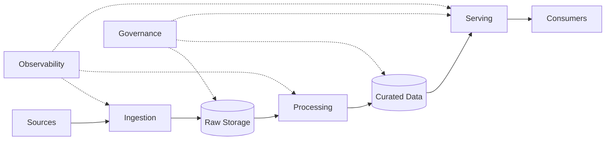
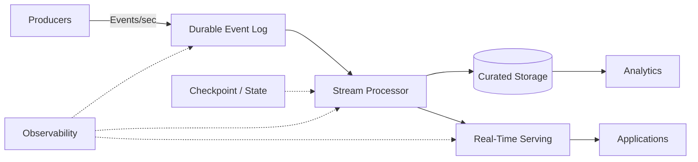
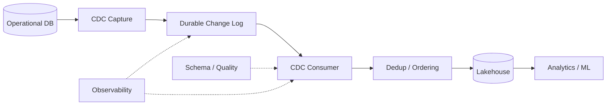
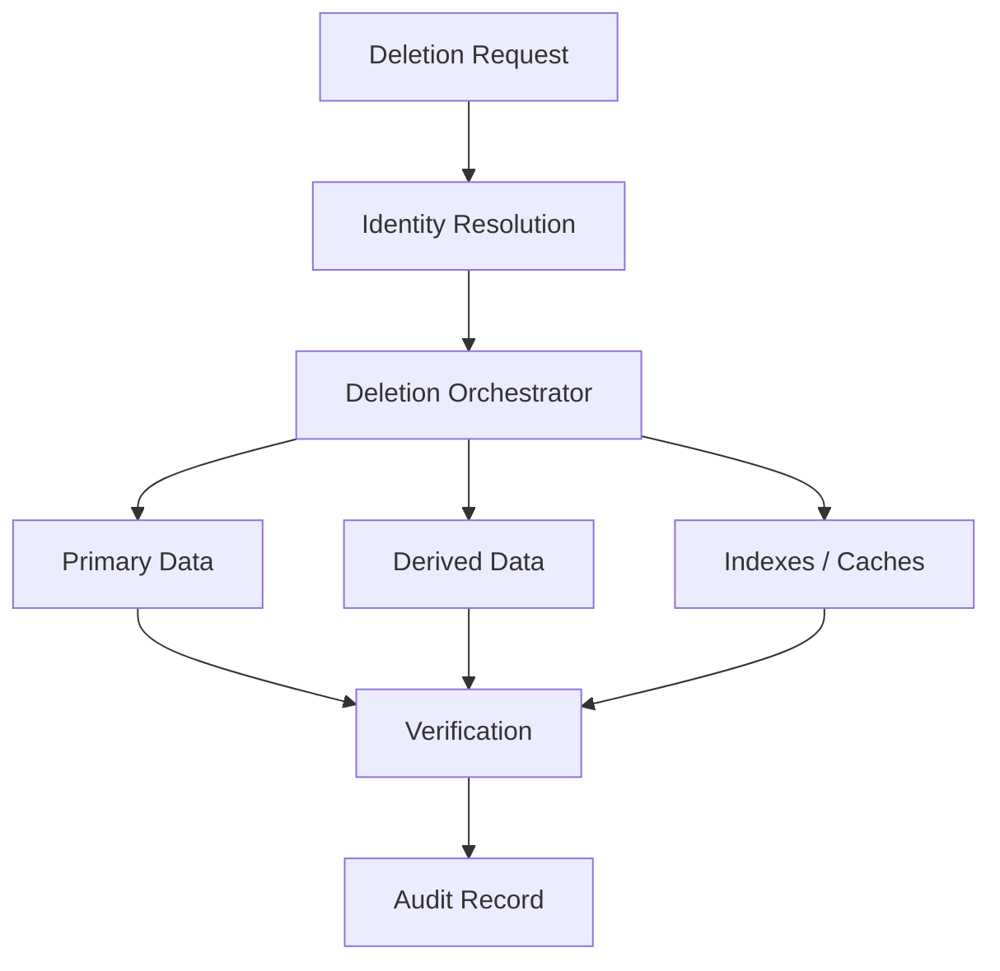

# Topic 06 — Diagramming and Communicating Designs

> **Stage:** G5 — Data Engineering System Design Interviews  
> **Phase:** B — Core System-Design Method  
> **Progression:** Absolute Beginner → Foundation → Basic → Intermediate → Advanced → Senior → Staff → Interview Mastery

---

# 1. Purpose

A strong Data Engineering system design is not enough if the interviewer cannot follow it.

This module teaches the ability to:

- turn requirements into a clear architecture diagram;
- draw the diagram quickly under interview time pressure;
- explain what each component does and why it exists;
- label data flows with meaningful information;
- zoom from high-level architecture into one subsystem;
- connect diagrams to estimates, trade-offs, reliability, security, and cost;
- communicate while designing rather than disappearing into silent drawing;
- handle interviewer questions, hints, objections, and requirement changes;
- recover when the first design is incomplete or wrong.

The target interview behavior is:

```text
Requirements
    ↓
Estimates
    ↓
High-level flow
    ↓
Diagram
    ↓
Explain
    ↓
Zoom in
    ↓
Trade-offs
    ↓
Failure handling
    ↓
Recap
```

The diagram is a **communication instrument**, not artwork.

---

# 2. Why Diagramming Matters

A Data Engineering architecture often contains:

- sources;
- ingestion;
- buffering;
- raw storage;
- transformation;
- quality controls;
- serving;
- consumers;
- orchestration;
- metadata;
- governance;
- observability.

Without structure, an interview answer can become a stream of disconnected technologies.

A diagram gives the interviewer a shared model.

```text
Without diagram:

Kafka... Spark... S3... warehouse... Airflow...
Maybe CDC... maybe Redis...
```

versus:

```text
Sources
   ↓
Ingestion
   ↓
Durable storage
   ↓
Processing
   ↓
Serving
   ↓
Consumers

Cross-cutting:
quality + governance + observability + security
```

The second representation makes architecture visible.

---

# 3. The Core Principle

> **Start simple, make the data flow obvious, then add complexity only when the requirements justify it.**

Do not begin with:

```text
15 boxes
8 arrows
12 technologies
```

Begin with:

```text
Sources
   ↓
Ingestion
   ↓
Storage
   ↓
Processing
   ↓
Serving
   ↓
Consumers
```

Then add:

- buffering if needed;
- CDC if needed;
- streaming if needed;
- quality gates if needed;
- orchestration if needed;
- governance if needed;
- observability if needed;
- specialized serving if needed.

---

# 4. What the Interviewer Should Understand After 60 Seconds

After your first architecture pass, the interviewer should know:

1. What enters the system.
2. Where data first lands.
3. How data is transformed.
4. Where curated data lives.
5. How consumers access it.
6. What the main latency/freshness model is.
7. Where failures can occur.
8. Which major trade-offs you made.

If those are unclear, the diagram is not doing its job.

---

# 5. The Default Data Engineering Diagram

Use this as the starting mental model:

```text
+-------------+
|   Sources   |
+-------------+
       |
       v
+-------------+
|  Ingestion  |
+-------------+
       |
       v
+-------------+
| Raw/Bronze  |
+-------------+
       |
       v
+-------------+
| Processing  |
+-------------+
       |
       v
+-------------+
| Curated Data|
+-------------+
       |
       v
+-------------+
|   Serving   |
+-------------+
       |
       v
+-------------+
| Consumers   |
+-------------+
```

Then place cross-cutting concerns around the flow:

```text
             +------------------+
             | Governance       |
             +------------------+

Sources → Ingestion → Storage → Processing → Serving → Consumers
              |          |          |           |
              +----------+----------+-----------+
                         |
                  Observability
                         |
                    Data Quality
                         |
                    Security
```

This is a **starting template**, not a mandatory architecture.

---

# 6. The Six-Layer Communication Model

A useful interview diagram can be organized into six layers.

## Layer 1 — Sources

Examples:

- operational databases;
- SaaS APIs;
- application events;
- files;
- IoT devices;
- logs.

## Layer 2 — Ingestion

Examples:

- batch extraction;
- CDC;
- event streams;
- API polling;
- managed connectors.

## Layer 3 — Storage

Examples:

- object storage;
- warehouse;
- lakehouse tables;
- raw/curated zones.

## Layer 4 — Processing

Examples:

- SQL transformations;
- distributed batch;
- streaming;
- enrichment;
- deduplication.

## Layer 5 — Serving

Examples:

- warehouse;
- data marts;
- APIs;
- caches;
- search/vector indexes.

## Layer 6 — Consumers

Examples:

- BI;
- analysts;
- applications;
- ML training;
- feature serving;
- downstream systems.

---

# 7. Diagramming Before Drawing

Before drawing, answer these questions verbally:

```text
1. Who produces the data?
2. What data enters the system?
3. How much data enters?
4. How frequently?
5. How fresh must it be?
6. Where should durable data live?
7. What processing is required?
8. Who consumes the result?
9. What latency is required?
10. What happens when something fails?
```

Do not draw before understanding the first-order requirements.

---

# 8. The 8-Minute Diagram Rule

The roadmap standard is:

> **Be able to draw each major system-design case in under eight minutes.**

A useful practice progression:

```text
Beginner:
15 minutes

Intermediate:
12 minutes

Advanced:
10 minutes

Interview target:
≤ 8 minutes
```

The goal is not artistic speed.

The goal is:

```text
Fast enough
+
clear enough
+
complete enough
```

---

# 9. The 60-Second Architecture Pass

Within the first minute of drawing:

```text
1. Draw sources.
2. Draw ingestion.
3. Draw durable storage.
4. Draw processing.
5. Draw serving.
6. Draw consumers.
```

Example:

```text
DB / Events / APIs
       |
       v
   Ingestion
       |
       v
   Raw Storage
       |
       v
   Processing
       |
       v
 Curated Tables
       |
       v
 BI / ML / APIs
```

Then say:

> "I'll start with the end-to-end path and then zoom into the ingestion and processing paths because those are the most likely bottlenecks."

This tells the interviewer how you will proceed.

---

# 10. Left-to-Right Flow

Use a consistent direction:

```text
Sources → Ingestion → Storage → Processing → Serving → Consumers
```

Avoid:

```text
          ↓
left ← right
     ↑
   random
```

unless the architecture genuinely requires it.

A consistent direction reduces cognitive load.

---

# 11. What a Box Means

A box should represent a meaningful architectural responsibility.

Good:

```text
CDC Ingestion
Raw Object Storage
Streaming Processor
Curated Lakehouse
BI Serving
```

Weak:

```text
Thing
Service
Data Stuff
Processing
```

A box should answer:

> "What responsibility does this component own?"

---

# 12. Naming Components

Use:

```text
Responsibility + type
```

Examples:

```text
CDC Ingestion
Event Stream
Raw Storage
Transformation Engine
Feature Store
Analytics Warehouse
```

Avoid prematurely naming products:

```text
Kafka
Spark
Snowflake
Databricks
```

unless the technology choice itself is relevant.

Start with the capability.

Then specify technology:

```text
Event Stream
(Kafka-style log)
```

This keeps the architecture requirement-driven.

---

# 13. What an Arrow Means

An arrow should communicate more than direction.

Where useful, label:

- data type;
- approximate volume;
- rate;
- format;
- latency;
- delivery semantics;
- partitioning key;
- important transformation.

Example:

```text
Application Events
    |
    | 100K events/sec
    | JSON → validated event schema
    v
Event Stream
```

The arrow now communicates architecture.

---

# 14. Data Flow Labels

Useful labels include:

```text
100K events/sec
5-minute micro-batch
CDC inserts/updates/deletes
Parquet
JSON
Avro
< 1 minute freshness
At-least-once
partition by customer_id
```

Do not label every arrow.

Label the flows where the information changes the design.

---

# 15. Diagram Detail Levels

Use three levels.

## Level 1 — Context

```text
Sources → Platform → Consumers
```

## Level 2 — Architecture

```text
Sources
  ↓
Ingestion
  ↓
Raw
  ↓
Processing
  ↓
Curated
  ↓
Serving
```

## Level 3 — Deep Dive

```text
Source
 ↓
CDC
 ↓
Event stream
 ↓
Partitioned consumers
 ↓
Dedup/state
 ↓
Curated tables
 ↓
Serving
```

Do not start at Level 3.

---

# 16. Zooming In

A strong interview communication pattern is:

```text
High-level diagram
      ↓
Identify risk/bottleneck
      ↓
Zoom into subsystem
      ↓
Explain data/state/failure behavior
      ↓
Return to system-level view
```

Example:

> "The main risk is CDC ordering and duplicate delivery, so I'll zoom into ingestion and deduplication."

Then draw:

```text
Source DB
   ↓
CDC Capture
   ↓
Durable Log
   ↓
Consumer
   ↓
Dedup State
   ↓
Merge
   ↓
Curated Table
```

Then return:

> "That completes the ingestion path; the rest of the architecture remains unchanged."

This prevents the interview from becoming a deep dive into one component.

---

# 17. The Zoom-In Contract

Before zooming in, say:

> "I'll zoom into X because it is the main risk for Y."

After zooming out, say:

> "Returning to the full architecture, this subsystem feeds Z."

This keeps the interviewer oriented.

---

# 18. Diagramming Data Contracts

A data flow should sometimes show the contract.

Example:

```text
Events
 |
 | event_id
 | event_time
 | customer_id
 | event_type
 | schema_version
 v
Ingestion
```

For important boundaries, consider:

```text
Schema
Ownership
Freshness
Quality
Delivery semantics
```

Do not turn the diagram into a schema document.

Show only fields that affect architecture.

---

# 19. Diagramming Batch Systems

Example:

```text
+-------------+
| Source DB   |
+-------------+
       |
       | daily extract
       v
+-------------+
| Raw Storage |
+-------------+
       |
       | scheduled
       v
+-------------+
| Transform   |
+-------------+
       |
       v
+-------------+
| Curated     |
+-------------+
       |
       v
+-------------+
| BI / Users  |
+-------------+
```

Add:

```text
Orchestrator
Data Quality
Observability
```

only when relevant.

---

# 20. Diagramming Streaming Systems

Example:

```text
+-----------+
| Producers |
+-----------+
      |
      | events/sec
      v
+-----------+
| Event Log |
+-----------+
      |
      +----------+
      |          |
      v          v
+---------+   +---------+
|Consumer |   |Consumer |
|Group A  |   |Group B  |
+---------+   +---------+
      |          |
      +----+-----+
           |
           v
      +---------+
      | Storage |
      +---------+
```

Label:

- partitioning;
- event rate;
- latency;
- replay;
- consumer groups;
- state;
- checkpointing.

Only where they affect the decision.

---

# 21. Diagramming CDC

A useful CDC architecture:

```text
Operational DB
      |
      | transaction changes
      v
+-------------+
| CDC Capture |
+-------------+
      |
      v
+-------------+
| Durable Log |
+-------------+
      |
      v
+-------------+
| CDC Consumer|
+-------------+
      |
      +------> Dedup / Ordering
      |
      v
+-------------+
| Lakehouse   |
+-------------+
```

Deep-dive questions:

```text
What is the ordering key?
How are deletes represented?
What happens after a consumer restart?
How do we detect gaps?
How do we replay?
How do we reconcile with the source?
```

---

# 22. Diagramming ML Feature Systems

A conceptual architecture:

```text
Sources
  |
  v
Data Ingestion
  |
  v
Historical Storage
  |
  v
Feature Computation
  |
  +--------------------+
  |                    |
  v                    v
Offline Features    Online Features
  |                    |
  v                    v
Training             Serving
```

Communication priorities:

- point-in-time correctness;
- feature freshness;
- offline/online consistency;
- serving latency;
- backfills;
- lineage.

Do not use the diagram to re-teach ML algorithms.

---

# 23. Diagramming RAG / Vector Data Platforms

Conceptual flow:

```text
Documents
   |
   v
Ingestion
   |
   v
Parsing / Chunking
   |
   v
Embeddings
   |
   v
Vector Index
   |
   v
Retriever
   |
   v
Application / RAG
```

Add:

```text
Access control
Document versions
Deletion
Metadata filters
```

when those requirements matter.

The system-design emphasis is:

```text
freshness
permissions
index consistency
retrieval latency
reprocessing
cost
```

---

# 24. Diagramming GDPR Deletion

Deletion should be shown as a data-flow problem, not merely a button.

```text
Deletion Request
       |
       v
Identity Resolution
       |
       v
Deletion Orchestrator
       |
       +--------+
       |        |
       v        v
Primary      Derived
Data         Data
       |        |
       +---+----+
           |
           v
Indexes / Caches / Exports
           |
           v
Verification + Audit
```

The diagram exposes a critical question:

> "Where else did this user's data go?"

---

# 25. Cross-Cutting Concerns

Do not create random side boxes.

Use a consistent cross-cutting band:

```text
+-------------------------------------------------------+
| Security | Governance | Quality | Observability | Cost|
+-------------------------------------------------------+

Sources → Ingestion → Storage → Processing → Serving
```

Or show them near the relevant components.

The interviewer should understand that they apply across the architecture.

---

# 26. Security on the Diagram

Show security only where it changes architecture.

Examples:

```text
Private network
Encryption
IAM boundary
PII zone
Service identity
Trust boundary
```

A useful representation:

```text
         TRUST BOUNDARY
+--------------------------------+
| Internal Data Platform         |
|                                |
| Storage → Processing → Serving |
+--------------------------------+
          ^
          |
      Controlled access
```

Do not clutter the diagram with every security control.

---

# 27. Governance on the Diagram

Relevant elements:

```text
Catalog
Data contracts
Lineage
Access policy
Retention
Quality
```

Example:

```text
Raw
 ↓
Catalog + lineage
 ↓
Curated
 ↓
Governed serving
```

Explain which governance mechanism protects which data boundary.

---

# 28. Observability on the Diagram

Show:

```text
Logs
Metrics
Traces where applicable
Data quality
Freshness
Lag
Alerts
Audit
```

A useful pattern:

```text
                 Observability
                     |
Sources → Ingestion → Storage → Processing → Serving
             |           |          |
             +-----------+----------+
```

Then say:

> "I would monitor both system health and data health; a successful job is not enough if row counts, freshness, or schema quality are wrong."

---

# 29. Failure Paths

A mature diagram includes failure thinking.

Instead of:

```text
A → B → C
```

think:

```text
A → B → C
    |
    +→ retry
    +→ dead-letter/quarantine
    +→ replay
    +→ alert
```

Only show the failure paths that matter.

---

# 30. Diagramming Reliability

For a major component, be able to answer:

```text
What can fail?
How is failure detected?
Where does work remain durable?
Can we retry?
Can we replay?
How do we avoid duplicates?
How do we recover?
How do we verify correctness?
```

This connects the diagram to Topic 16 failure/deep-dive preparation later in G5.

---

# 31. Diagramming Backfills

A production design should have a visible path for historical recomputation when relevant.

Example:

```text
Historical Storage
      |
      | backfill
      v
Processing
      |
      v
Curated Tables
```

Then explain:

> "Backfills use the same transformation logic where possible, with controlled partition/date ranges and idempotent writes."

Do not create a completely separate architecture unless isolation is required.

---

# 32. Diagramming Late Data

For time-sensitive systems:

```text
Events
  |
  v
Stream
  |
  v
Stateful Processor
  |
  +--> late-event handling
  |
  v
Output
```

Explain:

- event time;
- processing time;
- watermark;
- allowed lateness;
- correction strategy.

Only introduce these concepts when the case requires them.

---

# 33. Diagramming Schema Evolution

A useful boundary:

```text
Producer
   |
   | schema version
   v
Ingestion
   |
   v
Validation / Compatibility
   |
   v
Storage
```

Ask:

```text
Who owns the schema?
How are breaking changes detected?
Can old and new producers coexist?
What happens to downstream consumers?
```

---

# 34. Diagramming Data Quality

Quality checks should be located where they reduce blast radius.

Example:

```text
Raw
 ↓
Schema / validity checks
 ↓
Curated
 ↓
Business quality checks
 ↓
Serving
```

Explain:

```text
Invalid raw records
→ quarantine

Business rule failure
→ block or flag

Unexpected volume
→ alert/reconcile
```

Do not imply that a "data quality box" magically makes data correct.

---

# 35. Diagramming Cost

Cost can be represented at major compute/storage boundaries.

```text
Sources
  ↓
Ingestion       [$]
  ↓
Storage         [$]
  ↓
Processing      [$$]
  ↓
Serving         [$$]
```

Then connect to Topic 03:

```text
Volume
×
Retention
×
Compute
×
Query frequency
=
Cost drivers
```

The diagram need not contain exact prices.

---

# 36. Diagramming Data Ownership

For multi-team systems, show ownership where it matters.

Example:

```text
Team A
  |
  v
Raw Domain Data
  |
  | contract
  v
Platform
  |
  v
Shared Curated Data
  |
  v
Team B / Team C
```

Explain:

- producer ownership;
- platform ownership;
- consumer responsibility;
- data contract boundaries.

---

# 37. Trust Boundaries

Draw boundaries when data moves between:

- public internet;
- third-party SaaS;
- internal systems;
- regulated zones;
- cloud accounts;
- regions;
- organizations.

Example:

```text
External SaaS
     |
     | authenticated connection
     v
+---------------------------+
| Internal Data Platform    |
+---------------------------+
```

The boundary prompts security questions.

---

# 38. Architecture Evolution Diagrams

Sometimes show:

```text
Today
```

and:

```text
At 10× scale
```

Example:

### Today

```text
API → Batch → Warehouse → BI
```

### Future

```text
API → Stream → Lakehouse → Serving
           ↘
            Real-time alerts
```

Explain what requirement changed.

Do not design for imaginary scale without evidence.

---

# 39. Diagramming Trade-Offs

Topic 05 teaches the decision.

Topic 06 makes the decision visible.

Example:

```text
Freshness requirement: 5 minutes

Sources
  ↓
Micro-batch ingestion
  ↓
Object storage
  ↓
Transformation
  ↓
Warehouse
  ↓
BI
```

Say:

> "I'm choosing micro-batch rather than continuous streaming because five-minute freshness is sufficient. That reduces state and operational complexity."

The diagram and explanation reinforce each other.

---

# 40. Diagramming Estimates

Topic 03 estimates should appear where they matter.

Example:

```text
100K events/sec
      |
      v
Event Stream
      |
      | ~8.6B events/day
      v
Raw Storage
```

Then:

```text
Assume 500 bytes/event
≈ 4.3 TB/day raw
```

This makes the architectural choice defensible.

---

# 41. Communication While Drawing

Never spend eight minutes silently drawing.

Use short narration:

```text
"I'm starting with the end-to-end path."

"I'm putting durable storage here because replay matters."

"I'm choosing this boundary because the consumers have different SLAs."

"I'll zoom into ingestion because ordering is the main risk."

"I'll keep the serving layer abstract for now."
```

Narration should explain **why**, not describe every mouse movement.

---

# 42. The "Why" Rule

Weak:

> "Here I have Kafka."

Strong:

> "I'm using a durable event log here because replay and multiple independent consumers are requirements."

Weak:

> "Here is Spark."

Strong:

> "I need distributed batch computation here because the estimated join volume exceeds a practical single-node workload."

The technology is secondary to the reason.

---

# 43. The "Because" Rule

For every major component, practice:

```text
I chose X
because Y.
```

Examples:

```text
I chose object storage
because low-cost durable retention matters.

I chose streaming
because freshness is under one minute.

I chose pre-aggregation
because query volume is high and access patterns are predictable.

I chose a managed service
because the team is small and operations are not differentiating.
```

---

# 44. Communication Order

A strong order is:

```text
1. Requirements
2. Estimates
3. High-level architecture
4. Data flow
5. Storage/model
6. Processing
7. Serving
8. Reliability
9. Security/governance
10. Cost
11. Trade-offs
12. Recap
```

Do not jump randomly between concerns.

---

# 45. The 45-Minute Diagramming Timeline

A useful design-round allocation:

| Time | Activity |
|---:|---|
| 0–5 min | Clarify requirements |
| 5–10 min | Estimate scale |
| 10–15 min | Draw high-level architecture |
| 15–30 min | Deep-dive critical paths |
| 30–35 min | Reliability/data quality |
| 35–40 min | Security/cost/trade-offs |
| 40–45 min | Follow-ups + recap |

The exact allocation can change, but the principle is:

> **Protect time for explanation and follow-ups.**

---

# 46. The 5-Minute Diagram Sprint

Practice drawing only:

```text
Sources
↓
Ingestion
↓
Storage
↓
Processing
↓
Serving
↓
Consumers
```

Then add exactly three annotations:

1. Freshness
2. Scale
3. Main failure risk

This develops architectural compression.

---

# 47. The 8-Minute Interview Diagram Sprint

## Minute 0–2

Draw:

```text
Sources → Ingestion → Storage → Processing → Serving → Consumers
```

## Minute 2–4

Add:

- scale;
- latency;
- partitions;
- key storage boundary.

## Minute 4–6

Add:

- quality;
- reliability;
- replay;
- orchestration.

## Minute 6–8

Add:

- security;
- cost;
- major trade-off.

Then stop.

Do not keep decorating the diagram.

---

# 48. Diagramming Under Interview Pressure

When time is running out:

Prioritize:

```text
1. End-to-end flow
2. Main storage boundary
3. Main processing boundary
4. Main serving boundary
5. Major scale/freshness annotation
6. One major failure path
7. One major trade-off
```

Do not spend remaining time drawing:

- minor services;
- every metric;
- every IAM role;
- every table;
- every API;
- decorative arrows.

---

# 49. The "One Diagram, One Story" Rule

A diagram should tell one coherent story.

For a clickstream system:

```text
User events
→ Event ingestion
→ Durable stream
→ Stateful processing
→ Curated storage
→ Real-time serving
→ Analytics
```

The narration should follow the same direction.

Do not narrate:

```text
Storage
→ then source
→ then cache
→ then back to storage
```

unless the architecture genuinely requires it.

---

# 50. Communication Signposts

Useful phrases:

### Starting

> "I'll start with the simplest end-to-end architecture."

### Choosing

> "I'm choosing this because..."

### Deferring

> "I'll keep that component abstract for now and specify it after we establish the workload."

### Zooming

> "I'll zoom into ingestion because that is the highest-risk boundary."

### Returning

> "Returning to the system level..."

### Handling uncertainty

> "I would validate this assumption with..."

### Requirement change

> "That changes the architecture because..."

### Trade-off

> "The trade-off I'm accepting is..."

### Recap

> "So the final design is..."

---

# 51. Interviewer as Collaborator

The interviewer is usually not trying to trick you.

Treat questions as signals.

If they ask:

> "What happens if traffic doubles?"

Interpret it as:

```text
They want to test scalability reasoning.
```

If they ask:

> "What happens if the consumer fails?"

Interpret it as:

```text
They want reliability/recovery reasoning.
```

If they ask:

> "Why Kafka?"

Interpret it as:

```text
They want the requirement behind the technology choice.
```

Respond constructively:

> "Good point. I would handle that by..."

---

# 52. Handling Interviewer Pushback

Use:

```text
Acknowledge
→
Clarify
→
Reason
→
Adapt
```

Example:

> "That's a good concern. If the freshness requirement is actually seconds rather than minutes, my earlier micro-batch choice is no longer sufficient. I would move to streaming and then revisit state, recovery, and cost."

This is stronger than defending the original architecture at all costs.

---

# 53. Handling Hints

When the interviewer gives a hint:

Do not say:

> "Oh, yes, I forgot that."

Instead:

> "That suggests the requirement is more sensitive to X than I initially assumed. I would update the design by..."

A hint should trigger reasoning.

---

# 54. Handling an Incorrect Assumption

Use:

```text
State assumption
→
Explain impact
→
Revise if needed
```

Example:

> "I had assumed hourly freshness. If the actual requirement is five seconds, that assumption materially changes ingestion and serving. I would revise the design accordingly."

This demonstrates intellectual honesty.

---

# 55. "I Don't Know" in a Diagram Discussion

Use:

```text
1. State what you know.
2. State what you don't know.
3. State the assumption.
4. Explain how you would validate it.
5. Continue the design.
```

Example:

> "I don't know the exact throughput limit of that managed service from memory. I would verify the current service quota and pricing. For the design, I'll assume it comfortably supports our estimated rate and proceed."

Never invent limits.

---

# 56. Diagramming Ambiguous Requirements

If the requirement is unclear:

```text
Don't guess silently.
```

Ask:

```text
"Is the latency requirement end-to-end or ingestion-to-storage?"

"Does replay need to cover seven days or the entire retention period?"

"Are consumers internal or external?"

"Do deletes need to propagate?"

"Is the workload interactive or scheduled?"
```

Each question should reduce architectural uncertainty.

---

# 57. Communication of Assumptions

Put important assumptions on the diagram or nearby:

```text
Assumptions:
- 100K events/sec peak
- <1 minute freshness
- 30-day replay
- 1-year retention
- 5 consumer groups
```

Then say:

> "These assumptions drive the choice of durable event streaming and object storage."

---

# 58. Architecture Legend

For complex diagrams, use a tiny legend:

```text
→ data flow
⇢ control/orchestration
[ ] compute/service
( ) storage
--- trust boundary
```

Do not create elaborate visual systems.

Consistency is more important than aesthetics.

---

# 59. Whiteboard / Paper / Digital Tool Adaptation

The principles are tool-independent.

## Whiteboard

Prioritize:

- large labels;
- straight left-to-right flow;
- minimal crossing arrows.

## Paper

Use:

- boxes;
- arrows;
- short labels;
- numbered deep dives.

## Digital

Use:

- consistent alignment;
- grouping;
- color only when it conveys meaning;
- readable text.

The interview competency is architecture communication, not diagramming software proficiency.

---

# 60. Mermaid for Practice

Mermaid is useful for repeatable practice.



Use Mermaid to practice architecture structure, not to memorize syntax.

---

# 61. Mermaid — Streaming Example



---

# 62. Mermaid — CDC Example



---

# 63. Mermaid — GDPR Deletion Example



---

# 64. Diagram Quality Checklist

Before finishing a design, ask:

```text
[ ] Is the main data flow obvious?
[ ] Are sources visible?
[ ] Is ingestion visible?
[ ] Is durable storage visible?
[ ] Is processing visible?
[ ] Is serving visible?
[ ] Are consumers visible?
[ ] Are the important arrows labeled?
[ ] Are major assumptions stated?
[ ] Is the scale visible?
[ ] Is freshness visible?
[ ] Is the main failure path visible?
[ ] Are cross-cutting concerns represented?
[ ] Can I explain every major box?
[ ] Can I justify every major technology?
[ ] Can I identify the main trade-off?
[ ] Can I zoom into the highest-risk subsystem?
[ ] Can I return to the full architecture?
[ ] Can I draw this in under eight minutes?
```

---

# 65. Seven Hands-On Labs

## Lab 1 — Six-Layer Architecture

### Objective

Draw:

```text
Sources → Ingestion → Storage → Processing → Serving → Consumers
```

### Requirements

- 1 source database
- 1 event source
- daily batch
- BI consumer

### Deliverable

One diagram and a 60-second explanation.

### Success criteria

You can explain every box and arrow without reading notes.

---

## Lab 2 — Label the Flows

Take Lab 1 and add:

- volume;
- rate;
- freshness;
- format;
- delivery semantics.

### Rule

Add only information that affects a decision.

---

## Lab 3 — Streaming Deep Dive

Design a clickstream system.

Requirements:

- 100K events/sec peak;
- <1 minute freshness;
- replay;
- three independent consumers.

Draw the high-level system in 3 minutes, then zoom into streaming ingestion.

---

## Lab 4 — CDC Deep Dive

Requirements:

- transactional source;
- inserts/updates/deletes;
- low-latency replication;
- replay.

Draw the end-to-end architecture and then zoom into:

```text
CDC → ordering → dedupe → merge
```

---

## Lab 5 — Failure Overlay

Take any architecture and add:

```text
retry
replay
quarantine
alert
reconciliation
```

Only add the mechanisms required by the failure modes.

---

## Lab 6 — Requirement Change

Start with:

```text
Daily reporting
```

Then interviewer changes it to:

```text
5-minute freshness
```

Redraw only the affected section and explain what changed.

---

## Lab 7 — Eight-Minute Mock

Pick one:

- batch analytics;
- clickstream;
- CDC;
- ML feature platform;
- IoT telemetry;
- RAG/vector platform.

Timer:

```text
8 minutes drawing
+
7 minutes explanation
+
10 minutes deep dive
```

Record yourself.

---

# 66. Break/Fix Exercises

## Break/Fix 1 — Arrow Explosion

### Problem

The diagram has 30 crossing arrows.

### Diagnose

The architecture has no clear ownership/data-flow layers.

### Fix

Return to:

```text
Sources
→ Ingestion
→ Storage
→ Processing
→ Serving
→ Consumers
```

Then add only necessary secondary flows.

---

## Break/Fix 2 — Technology Soup

### Problem

The diagram begins:

```text
Kafka → Spark → Delta → dbt → Airflow → Redis → Elasticsearch...
```

### Diagnose

Technologies were selected before requirements.

### Fix

Replace with capabilities first:

```text
Event ingestion
→ Processing
→ Durable tables
→ Orchestration
→ Serving
```

Then justify technologies.

---

## Break/Fix 3 — No Failure Path

### Problem

The system looks perfect until a consumer fails.

### Diagnose

Durability and recovery were omitted.

### Fix

Show:

```text
Durable boundary
+
retry
+
replay
+
monitoring
```

where required.

---

## Break/Fix 4 — No Scale

### Problem

The architecture looks identical for 1 GB/day and 100 TB/day.

### Diagnose

Estimates are not connected to architecture.

### Fix

Annotate:

```text
volume
rate
peak
retention
QPS
```

and explain their consequences.

---

## Break/Fix 5 — No Freshness

### Problem

The interviewer asks "How fresh is this?" and the diagram gives no answer.

### Fix

Label the relevant boundary:

```text
<5 minutes
```

or:

```text
seconds
```

or:

```text
daily batch
```

---

## Break/Fix 6 — No Consumer Boundary

### Problem

The system assumes all consumers use the same interface.

### Diagnose

Consumer access patterns differ.

### Fix

Separate:

```text
BI
Applications
ML
External consumers
```

when their latency/governance needs differ.

---

## Break/Fix 7 — Deep Dive Trap

### Problem

Ten minutes are spent on one subsystem.

### Fix

Say:

> "I'll pause the deep dive there and return to the system-level architecture."

Then continue.

---

## Break/Fix 8 — Silent Drawing

### Problem

The interviewer cannot tell what you are deciding.

### Fix

Narrate decisions:

> "I'm putting durable storage here because replay is a requirement."

---

## Break/Fix 9 — Decorative Complexity

### Problem

The diagram is visually impressive but architecturally unclear.

### Fix

Remove components until the data flow is obvious.

---

## Break/Fix 10 — Wrong Trust Boundary

### Problem

Sensitive data flows into multiple systems without access controls.

### Fix

Mark the boundary and explain:

- identity;
- authorization;
- encryption;
- minimization;
- retention;
- audit.

---

# 67. Scenario Practice

## Scenario 1 — Batch Analytics

### Requirements

- 5 TB/day
- daily reporting
- 1-year retention
- 100 analysts

### Draw

```text
Sources
→ Batch ingestion
→ Raw storage
→ Transform
→ Curated warehouse/lakehouse
→ BI
```

### Explain

Why batch?

Why this storage?

Why this serving layer?

---

## Scenario 2 — Clickstream

### Requirements

- 100K events/sec
- <1 minute freshness
- replay
- multiple consumers

### Draw

```text
Applications
→ Event log
→ Stream processing
→ Durable storage
→ Serving
```

### Deep dive

Partitioning, state, recovery, lag.

---

## Scenario 3 — CDC

### Requirements

- 2 TB operational DB
- updates/deletes
- <5-minute replication

### Draw

```text
DB
→ CDC
→ Durable log
→ Consumer
→ Curated tables
```

### Deep dive

Deletes, ordering, dedupe, reconciliation.

---

## Scenario 4 — ML Feature Platform

### Requirements

- historical training
- online features
- low latency
- point-in-time correctness

### Draw

```text
Sources
→ Historical data
→ Feature computation
→ Offline features
→ Online features
```

### Deep dive

Consistency and point-in-time correctness.

---

## Scenario 5 — RAG Platform

### Requirements

- document ingestion
- permission-aware retrieval
- low latency
- document deletion

### Draw

```text
Documents
→ Parsing
→ Chunking
→ Embeddings
→ Vector index
→ Retrieval
→ Application
```

### Deep dive

Permissions, freshness, deletion, index consistency.

---

# 68. 60-Second Explanation Template

Use:

> "The system starts with **[sources]**.  
> I ingest through **[ingestion]** because **[requirement]**.  
> Data lands in **[storage]** to provide **[durability/replay/retention]**.  
> I process it with **[processing]** because **[scale/latency/workload]**.  
> The curated result is served through **[serving]** for **[consumer]**.  
> The main trade-off is **[trade-off]**, and I mitigate the main risk with **[mitigation]**."

This should become automatic.

---

# 69. 3-Minute Explanation Template

```text
0:00–0:30
Requirements and assumptions

0:30–1:15
End-to-end data flow

1:15–1:45
Storage and processing decisions

1:45–2:15
Serving and consumers

2:15–2:45
Reliability, quality, security

2:45–3:00
Trade-off and recap
```

Practice until you can do this without notes.

---

# 70. Deep-Dive Communication Template

When asked:

> "How does ingestion work?"

Answer:

```text
1. Source behavior
2. Ingestion mechanism
3. Durability
4. Ordering
5. Schema
6. Failure/retry
7. Deduplication
8. Monitoring
9. Backfill/replay
10. Cost
```

Then return to the full architecture.

---

# 71. Architecture Recap Template

At the end:

> "So the final design is: sources feed **X**, which provides **Y**; data lands in **Z** for durability; processing produces **A**; serving supports **B**. The key trade-off is **C**, and the main risks are **D** and **E**. If the freshness requirement increased from **X** to **Y**, I would change **Z**."

This is the 60-second executive summary.

---

# 72. Weak vs Strong Communication

## Weak

> "I would use Kafka, Spark, and a warehouse."

Problems:

- no requirements;
- no data flow;
- no rationale;
- no trade-offs.

## Strong

> "The workload requires sub-minute freshness, replay, and multiple independent consumers. I would use durable event ingestion, followed by stateful processing and durable analytical storage. The event layer is justified by replay and fan-out; the processing layer is justified by the estimated event rate. I accept additional operational complexity because freshness is a business requirement."

---

# 73. Weak vs Strong Diagram

## Weak

```text
Kafka
  |
Spark
  |
S3
  |
Warehouse
```

## Strong

```text
Applications
   |
   | 100K events/sec
   v
Durable Event Ingestion
   |
   | replayable
   v
Stream Processing
   |
   | validated + deduplicated
   v
Curated Storage
   |
   +---------> BI
   |
   +---------> ML
   |
   +---------> Real-time Serving
```

The second diagram communicates **why** the components exist.

---

# 74. Interviewer Signals

Watch for:

### "Why?"

You need stronger rationale.

### "What if..."

You need adaptability.

### "Can you go deeper?"

You need a subsystem deep dive.

### "How does it fail?"

You need reliability reasoning.

### "How much does it cost?"

You need estimation/economics.

### "Why not X?"

You need trade-off reasoning.

### "Can you simplify?"

You are overengineering.

### "Can you draw that?"

The current explanation is too abstract.

---

# 75. Communication Anti-Patterns

## 1. Technology dumping

Naming tools without requirements.

## 2. Diagram decoration

Adding boxes because they look professional.

## 3. Silent drawing

No reasoning is visible.

## 4. Arrow spaghetti

No clear flow.

## 5. Premature deep dive

Detail before architecture.

## 6. No assumptions

The interviewer cannot tell what you are solving.

## 7. No trade-off

The architecture sounds arbitrary.

## 8. No failure path

The system only works when everything works.

## 9. No recap

The interviewer has to reconstruct the answer.

## 10. Defending every original choice

You should adapt when requirements change.

---

# 76. Senior-Level Communication

A senior candidate communicates:

```text
Decision
+
Reason
+
Trade-off
+
Risk
+
Mitigation
```

Example:

> "I would use micro-batch rather than continuous streaming because the SLA is five minutes. This reduces state and operational complexity. The risk is that a burst near the batch boundary could increase freshness temporarily, so I would monitor processing duration and backlog and keep enough headroom for the SLA."

That is concise but operationally credible.

---

# 77. Staff-Level Communication

A staff candidate also considers:

- organizational boundaries;
- platform reuse;
- standardization;
- ownership;
- cost allocation;
- security;
- governance;
- migration;
- team capabilities.

Example:

> "Although a specialized streaming engine could reduce latency, six teams would need to operate it. Since the business SLA is one minute rather than one second, I would standardize on the existing streaming platform and avoid introducing another operational surface."

This is a system-and-organization decision.

---

# 78. Practice Scorecard

Score each dimension from 1–5.

| Dimension | 1 | 3 | 5 |
|---|---|---|---|
| Clarity | Confusing | Understandable | Immediately clear |
| Structure | Random | Mostly ordered | Strong narrative |
| Diagram speed | >15m | 10–12m | ≤8m |
| Data flow | Unclear | Mostly clear | Obvious |
| Labels | Few/irrelevant | Some | Decision-relevant |
| Rationale | Weak | Adequate | Requirement-driven |
| Deep dive | Unstructured | Reasonable | Focused |
| Trade-offs | Generic | Some | Explicit |
| Reliability | Missing | Basic | Concrete |
| Cost | Missing | Mentioned | Connected to design |
| Communication | Silent/rambling | Adequate | Concise/narrated |
| Adaptability | Defensive | Some adaptation | Quickly revises |
| Recap | Missing | Basic | Executive-quality |

Target:

```text
Average ≥ 4
AND
no critical dimension < 3
```

---

# 79. Practice Log

For each mock, record:

```text
Date:
Case:
Time:
Diagram time:
Explanation time:
Deep-dive time:

Strongest area:
Weakest area:

Missed requirement:
Missed estimate:
Missed trade-off:
Missed failure mode:

Interviewer feedback:

One change for next attempt:
```

Repeated mistakes should become explicit training targets.

---

# 80. Seven-Day Diagramming Practice Plan

## Day 1

Six-layer architecture.

Cases:

- batch analytics;
- basic warehouse.

## Day 2

Streaming.

Cases:

- clickstream;
- IoT.

## Day 3

CDC.

Cases:

- database replication;
- event-driven CDC.

## Day 4

Serving.

Cases:

- dashboards;
- APIs;
- ML features.

## Day 5

Cross-cutting concerns.

Focus:

- reliability;
- security;
- governance;
- cost.

## Day 6

Timed mocks.

Two 8-minute diagrams.

## Day 7

Full 45-minute system-design mock.

Record and score.

---

# 81. Advanced Drill — Diagram Compression

Take a 15-box architecture.

Reduce it to six boxes:

```text
Sources
Ingestion
Storage
Processing
Serving
Consumers
```

Then explain what disappeared and why.

This trains abstraction.

---

# 82. Advanced Drill — Diagram Expansion

Start with:

```text
Sources → Platform → Consumers
```

Expand it to a production-ready design.

Add only components justified by:

- scale;
- latency;
- reliability;
- governance;
- cost;
- security.

This trains controlled elaboration.

---

# 83. Advanced Drill — Requirement Flip

Draw a batch architecture.

Then change:

```text
24-hour freshness
→
1-minute freshness
```

Explain:

1. what changes;
2. what remains;
3. what new risks appear;
4. what new cost appears;
5. why the new architecture is justified.

---

# 84. Advanced Drill — Failure Flip

Start with:

```text
Source → Ingestion → Storage → Processing → Serving
```

Interviewer says:

> "The processing job fails halfway through."

Add:

- retry;
- checkpoint;
- idempotency;
- replay;
- reconciliation.

Explain each only if required.

---

# 85. Advanced Drill — Scale Flip

Start:

```text
10K events/sec
```

Change to:

```text
1M events/sec
```

Ask:

```text
Which box changes first?
Why?
What estimate drives the change?
What becomes the bottleneck?
What remains unchanged?
```

---

# 86. Advanced Drill — Cost Flip

Start with a generous budget.

Interviewer says:

> "Reduce platform cost by 50%."

Explain:

```text
What is the largest cost driver?
What can be optimized?
What SLA would change?
What should not be compromised?
```

---

# 87. Advanced Drill — Governance Flip

Start with internal non-sensitive analytics.

Then add:

```text
PII
+
external consumers
```

Rework:

- access;
- minimization;
- encryption;
- governance;
- audit;
- deletion.

---

# 88. Diagram-to-Answer Mapping

For every box, be able to answer:

| Diagram element | Interview question |
|---|---|
| Source | Why this source? |
| Ingestion | How does data enter? |
| Storage | Why here? |
| Processing | Why this engine? |
| Serving | Who consumes it? |
| Arrow | What data/rate/latency? |
| Boundary | What security/governance? |
| Failure path | How recover? |
| Monitor | What signal detects failure? |
| Trade-off | Why this architecture? |

If you cannot explain a box, it may not belong in the diagram.

---

# 89. The Architecture Story

A complete design should be explainable as a story:

```text
The business needs X.

The system receives Y.

At the estimated scale Z,
we need A.

Therefore we choose B.

Data is stored in C because D.

Processing happens in E because F.

Consumers need G.

The main failure risk is H.

We mitigate it with I.

The trade-off is J.

If requirement K changes,
we would evolve to L.
```

That is the narrative the diagram supports.

---

# 90. Full 45-Minute Walkthrough Example

## Case

> "Design a clickstream analytics platform."

### Requirements

Assume:

```text
100K events/sec peak
<1 minute freshness
30-day replay
1-year analytical retention
multiple consumers
```

### Minute 0–5

Clarify:

- event definition;
- freshness;
- replay;
- retention;
- consumers;
- correctness.

### Minute 5–10

Estimate:

```text
100K events/sec
×
86,400 sec/day
≈
8.64B events/day
```

If average event is 500 bytes:

```text
≈ 4.32 TB/day raw
```

Before compression/replication.

### Minute 10–15

Draw:

```text
Applications
    |
    v
Event Ingestion
    |
    v
Durable Event Log
    |
    v
Stream Processing
    |
    v
Curated Storage
    |
    +------> BI
    +------> ML
    +------> Real-time serving
```

### Minute 15–25

Deep dive:

- partitioning;
- event keys;
- consumer groups;
- state;
- late events;
- deduplication.

### Minute 25–30

Storage:

- raw retention;
- curated data;
- partitioning;
- compression;
- lifecycle.

### Minute 30–35

Reliability:

- retries;
- replay;
- checkpointing;
- monitoring;
- reconciliation.

### Minute 35–40

Trade-offs:

- streaming vs micro-batch;
- storage cost;
- operational complexity;
- managed vs self-hosted.

### Minute 40–45

Follow-ups:

- 10× traffic;
- one consumer is down;
- event schema changes;
- budget reduced;
- second region.

### Final recap

> "The architecture uses durable event ingestion for replay and fan-out, stateful processing for sub-minute freshness, durable analytical storage for retention and recovery, and separate serving paths for different consumer SLAs. The main trade-off is operational complexity in exchange for freshness and replay."

---

# 91. Full Communication Framework

Use this sequence:

```text
1. Restate the problem.
2. State assumptions.
3. State scale.
4. Draw end-to-end flow.
5. Explain ingestion.
6. Explain storage.
7. Explain processing.
8. Explain serving.
9. Explain reliability.
10. Explain quality.
11. Explain security/governance.
12. Explain cost.
13. Explain trade-offs.
14. Invite or handle deep dive.
15. Recap.
```

This framework should become automatic.

---

# 92. Interview Practice Questions

## Basic — 5

### 1. What makes a good system-design diagram?

**Expected Thinking**

Focus on clarity, flow, meaningful boundaries, and requirement-driven components.

**Strong Answer Outline**

- clear sources;
- ingestion;
- storage;
- processing;
- serving;
- consumers;
- relevant annotations;
- minimal unnecessary detail.

**Common Mistake**

Treating visual complexity as quality.

---

### 2. Why draw left to right?

**Expected Thinking**

Reduce cognitive load and make flow obvious.

**Strong Answer Outline**

Use consistent data-flow direction and avoid crossing arrows.

**Common Mistake**

Thinking left-to-right is a hard architectural rule.

---

### 3. What should an arrow communicate?

**Expected Thinking**

Data flow plus relevant scale/latency/semantics.

**Strong Answer Outline**

Use labels such as rate, volume, format, freshness, or delivery semantics when they affect decisions.

**Common Mistake**

Labeling every arrow with unnecessary details.

---

### 4. Why start with a high-level diagram?

**Expected Thinking**

Establish shared context before deep diving.

**Strong Answer Outline**

Show the end-to-end path first, then expand the highest-risk subsystem.

**Common Mistake**

Starting with implementation internals.

---

### 5. Why narrate while drawing?

**Expected Thinking**

Make reasoning observable and keep the interviewer oriented.

**Strong Answer Outline**

Explain decisions and assumptions without narrating every mouse movement.

**Common Mistake**

Drawing silently for several minutes.

---

# 93. Intermediate — 5

### 6. How would you diagram a batch analytics platform?

**Expected Thinking**

Use the six-layer flow.

**Strong Answer Outline**

Sources → batch ingestion → raw storage → processing → curated serving → BI.

**Common Mistake**

Adding streaming without a freshness requirement.

---

### 7. How would you show a streaming system?

**Expected Thinking**

Make event flow, durability, consumers, and processing visible.

**Strong Answer Outline**

Producers → durable event stream → stream processing → storage/serving → consumers.

**Common Mistake**

Omitting replay/state/failure considerations.

---

### 8. How do you show cross-cutting concerns?

**Expected Thinking**

Avoid random side boxes.

**Strong Answer Outline**

Use a consistent governance/security/quality/observability band or annotate affected boundaries.

**Common Mistake**

Creating one generic "security" box that explains nothing.

---

### 9. How do you zoom into a subsystem?

**Expected Thinking**

Deep dive only where risk justifies it.

**Strong Answer Outline**

State why, zoom in, explain data/state/failure, then return to system level.

**Common Mistake**

Never returning from the deep dive.

---

### 10. What if the interviewer changes the freshness requirement?

**Expected Thinking**

Re-evaluate architecture rather than defending it.

**Strong Answer Outline**

Identify affected components, explain new trade-offs, revise only what must change.

**Common Mistake**

Redrawing the entire architecture unnecessarily.

---

# 94. Advanced — 5

### 11. How do estimates affect the diagram?

**Expected Thinking**

Scale determines architecture boundaries.

**Strong Answer Outline**

Use rate/volume/retention/QPS to justify distributed compute, storage, partitions, or serving strategies.

**Common Mistake**

Estimating numbers but never using them.

---

### 12. How do you diagram replay?

**Expected Thinking**

Replay requires durable state/history.

**Strong Answer Outline**

Show durable event/storage boundary and consumer recovery/reprocessing path.

**Common Mistake**

Calling a transient queue "replay."

---

### 13. How do you diagram data quality?

**Expected Thinking**

Place validation where bad data can be contained.

**Strong Answer Outline**

Schema/validity checks near ingestion; business-quality checks before serving; quarantine and alerting.

**Common Mistake**

One generic data-quality box with no behavior.

---

### 14. How do you show a failure path?

**Expected Thinking**

Connect failure to detection and recovery.

**Strong Answer Outline**

Retry, checkpoint, replay, quarantine, reconciliation, alerting as justified.

**Common Mistake**

Adding every possible failure mechanism.

---

### 15. How do you communicate a trade-off?

**Expected Thinking**

Requirement → choice → accepted cost.

**Strong Answer Outline**

"I choose X because Y; the trade-off is Z; if requirement Q changes, I would choose A."

**Common Mistake**

Listing pros and cons without choosing.

---

# 95. Senior/Staff — 5

### 16. How would you simplify a 20-component architecture?

**Expected Thinking**

Optimize communication, not component count.

**Strong Answer Outline**

Group components by responsibility, remove implementation details, preserve important boundaries.

**Common Mistake**

Removing components that represent critical failure/security boundaries.

---

### 17. How does team size affect your diagram?

**Expected Thinking**

Architecture includes operational ownership.

**Strong Answer Outline**

Small team favors managed services and fewer platforms; larger specialized teams can justify deeper customization.

**Common Mistake**

Treating team skills as irrelevant.

---

### 18. How would you show platform ownership?

**Expected Thinking**

Make organizational boundaries explicit when they affect contracts or operations.

**Strong Answer Outline**

Show producer/platform/consumer ownership and explain shared responsibilities.

**Common Mistake**

Assuming one team owns everything.

---

### 19. What does staff-level diagram communication look like?

**Expected Thinking**

Connect technical architecture to organizational and business consequences.

**Strong Answer Outline**

Requirements, scale, cost, governance, ownership, standardization, migration, evolution.

**Common Mistake**

Only discussing infrastructure.

---

### 20. What makes a diagram interview-ready?

**Expected Thinking**

It must be drawable, explainable, defensible, and adaptable.

**Strong Answer Outline**

Under eight minutes, obvious flow, requirement-driven choices, labels, failure path, trade-off, and clear recap.

**Common Mistake**

Optimizing aesthetics rather than communication.

---

# 96. 10 Interview Drills

For each, draw for ≤8 minutes and explain for ≤5 minutes.

1. Batch analytics platform.
2. Real-time clickstream analytics.
3. CDC replication to lakehouse.
4. ML feature platform.
5. Log/metrics analytics.
6. Ad attribution/deduplication.
7. IoT telemetry ingestion.
8. GDPR deletion architecture.
9. RAG/vector data platform.
10. Design the same system after a 10× scale increase.

For every drill record:

```text
Diagram time
Explanation time
Top 3 decisions
Top 3 trade-offs
One failure mode
One missed assumption
One improvement
```

---

# 97. Mock Interview Protocol

## Round 1 — Solo

```text
45 minutes
No notes
Record screen/voice
```

## Round 2 — Self-review

Compare:

```text
Requirements
Estimates
Architecture
Deep dives
Trade-offs
Communication
```

## Round 3 — Partner

Ask partner to interrupt with:

```text
Why?
What if?
How much?
What fails?
Why not X?
```

## Round 4 — Re-attempt

Redo the same case after a delay.

Target:

```text
Fewer mistakes
Faster diagram
Clearer rationale
Better adaptation
```

---

# 98. Error Log

Track mistakes in these categories:

```text
[ ] Requirement miss
[ ] Estimation miss
[ ] Architecture miss
[ ] Diagram clarity
[ ] Missing failure mode
[ ] Missing quality
[ ] Missing security
[ ] Missing cost
[ ] Weak trade-off
[ ] Weak communication
[ ] Overengineering
[ ] Underengineering
[ ] Poor time management
[ ] Deep-dive trap
[ ] No recap
```

For every recurring mistake:

```text
Symptom
→
Cause
→
Correction
→
Next practice drill
```

---

# 99. Final Cheat Sheet

```text
START:
Restate requirements.

DRAW:
Sources
→ Ingestion
→ Storage
→ Processing
→ Serving
→ Consumers

LABEL:
Scale
Freshness
Important data semantics

EXPLAIN:
Why each major boundary exists.

DEEP DIVE:
Only the highest-risk subsystem.

CHECK:
Failure
Quality
Security
Cost

DEFEND:
Choice
→ reason
→ trade-off
→ alternative

ADAPT:
Requirement changes
→ architecture changes

FINISH:
60-second recap.
```

---

# 100. Final Operating Standard

When drawing any Data Engineering system:

```text
1. Start with requirements.
2. Estimate scale.
3. Draw the six-layer flow.
4. Keep the data path left-to-right.
5. Name responsibilities before products.
6. Label only decision-relevant flows.
7. Make durable boundaries visible.
8. Show serving according to consumer needs.
9. Add cross-cutting concerns deliberately.
10. Show the most important failure path.
11. Zoom only when justified.
12. Narrate decisions while drawing.
13. State trade-offs explicitly.
14. Adapt when requirements change.
15. Finish with a concise recap.
```

The final competency is:

```text
DRAW
→
EXPLAIN
→
JUSTIFY
→
DEEP DIVE
→
ADAPT
→
RECAP
```

A production-quality system design is not the diagram with the most boxes.

It is the diagram that lets another engineer understand:

```text
What the system does
+
Why it is shaped this way
+
What assumptions it depends on
+
What can fail
+
How it recovers
+
What trade-offs it accepts
+
How it evolves
```

---

# 101. Roadmap Connection

## Topic 01 — Interview Format

Topic 01 defines the interview loop and evaluation dimensions.

Topic 06 operationalizes the communication portion:

```text
Architecture
+
Communication
=
Observable design reasoning
```

## Topic 02 — Requirements

Requirements determine what belongs in the diagram.

```text
Requirement
→
Boundary
→
Component
→
Data flow
```

## Topic 03 — Estimation

Estimates determine scale annotations and architecture choices.

```text
Volume
→
Rate
→
Capacity
→
Architecture
```

## Topic 04 — Reusable Framework

Topic 04 provides the system-design sequence.

Topic 06 turns that sequence into a visual and verbal narrative.

## Topic 05 — Trade-Off Catalogue

Topic 05 determines:

```text
Choice
→
Reason
→
Trade-off
```

Topic 06 makes that reasoning visible on the diagram.

## Phase C — Design Cases

Topic 06 provides the repeatable communication method for all nine design cases.

---

# 102. Completion Criteria

Do not consider this module complete until you can:

1. Explain why diagrams matter.
2. Draw the six-layer DE architecture from memory.
3. Draw left-to-right without arrow spaghetti.
4. Name components by responsibility.
5. Label important data flows.
6. Show volume/rate/freshness.
7. Draw batch architecture.
8. Draw streaming architecture.
9. Draw CDC architecture.
10. Draw ML feature architecture.
11. Draw RAG/vector architecture.
12. Draw GDPR deletion architecture.
13. Show cross-cutting concerns.
14. Show trust boundaries.
15. Show failure/recovery paths.
16. Show backfills.
17. Show data-quality boundaries.
18. Show schema-evolution boundaries.
19. Connect estimates to architecture.
20. Connect trade-offs to architecture.
21. Narrate while drawing.
22. Zoom into a subsystem.
23. Return from a deep dive.
24. Handle interviewer pushback.
25. Handle changed requirements.
26. State assumptions clearly.
27. Say "I don't know" without fabricating.
28. Draw a major case in ≤8 minutes.
29. Explain it in ≤5 minutes.
30. Give a 60-second final recap.
31. Complete the seven labs.
32. Complete the break/fix exercises.
33. Complete at least ten timed drills.
34. Complete at least one recorded 45-minute mock.
35. Score yourself against the communication rubric.
36. Reduce recurring diagramming errors.

---

# 103. Final Knowledge Check

Before moving to Topic 07, answer these without notes:

```text
1. Draw a batch analytics platform in 5 minutes.

2. Draw a streaming clickstream platform in 5 minutes.

3. Draw a CDC pipeline in 5 minutes.

4. Add scale and freshness to each.

5. Identify the highest-risk subsystem.

6. Zoom into it in under 2 minutes.

7. Explain its failure behavior.

8. Explain the main trade-off.

9. Explain what changes at 10× scale.

10. Summarize the complete architecture in 60 seconds.
```

Pass standard:

```text
All ten completed
+
diagram remains readable
+
reasoning is audible
+
no major requirement is lost
+
trade-offs are explicit
+
failure handling is credible
```

---

# 104. Final Principle

> **A system-design diagram is not a picture of technology. It is a compact representation of requirements, data flow, boundaries, decisions, risks, and trade-offs.**

The target interview behavior is:

```text
Clarify
→
Estimate
→
Draw
→
Explain
→
Deep Dive
→
Handle Failure
→
Defend Trade-offs
→
Adapt
→
Recap
```

If the interviewer can follow your architecture, understand why you made each major decision, challenge the design, and watch you adapt without losing the system-level picture, the diagram is doing its job.
