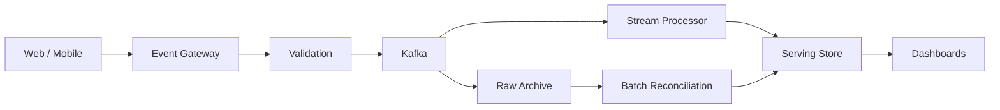

# Design Case 08 — Real-Time Clickstream Analytics

> **G5 — Data Engineering System Design Interviews**  
> **Case 08:** Design live product analytics for a web and mobile app with 50 million daily users.

This is a complete, production-oriented, interview-oriented Data Engineering system-design case. It teaches the learner to move from basic streaming reasoning to senior/staff-level distributed-system design under a realistic 45-minute interview constraint.

> **Authoritative case prompt:** “Design live product analytics for a web and mobile app with 50 million daily users.”

> **Scope note:** This is a system-design case, not a generic Kafka, Flink, or Spark tutorial. Technologies are discussed only to the depth required to make sound architecture and trade-off decisions.

## 1. Case Overview

### The problem

Design a platform that collects product events from web and mobile applications, processes them with low latency, calculates live product analytics, serves dashboards, preserves raw events for replay, and reconciles streaming results with a slower historical path.

The interview prompt is intentionally incomplete. A strong candidate must clarify requirements and make explicit assumptions before selecting components.

### The target reasoning chain

```text
Problem
  ↓
Requirements
  ↓
Estimates
  ↓
Event Model
  ↓
Collection
  ↓
Kafka / Durable Event Backbone
  ↓
Partitioning / Keys
  ↓
Validation / Deduplication
  ↓
Event-Time Processing
  ↓
Windows / Watermarks / State
  ↓
Sessionization / Aggregations
  ↓
Serving
  ↓
Raw Archive
  ↓
Batch Reconciliation
  ↓
Bot Filtering
  ↓
Exactly-Once / Effectively-Once
  ↓
Lag / Backpressure
  ↓
Failure Handling
  ↓
Observability
  ↓
Cost
  ↓
10× Evolution
  ↓
Interview Defense
```

### What success looks like

The candidate can explain not only **what** components exist, but **why** each component exists, what invariant it protects, what failure it handles, and what trade-off it introduces.

## 2. Why This Case Matters

Real-time clickstream analytics is a compact system-design problem that exposes many distributed-data concepts simultaneously:

- high event volume;
- event-time semantics;
- out-of-order delivery;
- mobile offline buffering;
- duplicate delivery;
- partitioning;
- stateful computation;
- windowing;
- sessionization;
- serving latency;
- replay;
- reconciliation;
- hot keys;
- consumer lag;
- backpressure;
- cost.

A weak answer usually becomes a product list:

```text
Kafka + Flink + Redis
```

A strong answer is a chain of reasoning:

```text
Freshness requirement
→ event volume
→ event semantics
→ ordering requirement
→ partition key
→ processing semantics
→ state requirements
→ serving query pattern
→ replay/correction strategy
→ operational controls
→ cost
```

The case is especially valuable because the same concepts recur in telemetry, fraud, ad-tech, IoT, operational analytics, ML features, and event-driven data platforms.

## 3. Interview Prompt

> **Design live product analytics for a web and mobile app with 50 million daily users.**

Do not immediately assume:

- event count per user;
- event size;
- peak factor;
- freshness SLA;
- dashboard latency;
- retention;
- exactness;
- serving technology;
- stream processor;
- Kafka partition count.

Discover or explicitly assume them.

## 4. What the Interviewer Is Testing

| Dimension | What the interviewer wants to observe |
|---|---|
| Requirements | You clarify freshness, correctness, consumers, retention, and scope |
| Scale | You convert DAU into events/day, EPS, storage, and peak load |
| Event design | You understand stable IDs and timestamps |
| Collection | You account for web/mobile delivery differences |
| Kafka | You understand topics, keys, partitions, retention, replay |
| Validation | You prevent malformed data from poisoning downstream metrics |
| Deduplication | You understand at-least-once consequences |
| Event time | You distinguish business time from processing time |
| Windows | You choose window semantics deliberately |
| Watermarks | You understand late-event trade-offs |
| Sessionization | You understand state and inactivity gaps |
| State | You understand recovery, size, and locality |
| Serving | You design for query patterns, not generic storage |
| Raw archive | You preserve replay and auditability |
| Reconciliation | You accept that real-time output may need correction |
| Bot filtering | You understand analytics contamination |
| Exactly-once | You define the guarantee instead of overclaiming |
| Hot keys | You recognize skew as a parallelism problem |
| Lag | You treat lag as an operational signal |
| Backpressure | You reason about flow control |
| Reliability | You can detect, contain, recover, validate, prevent |
| Cost | You understand always-on compute and state economics |
| Communication | You can explain the design under time pressure |
| Evolution | You can reason about 10× scale and changing requirements |

## 5. Prerequisites

The learner should already know:

- SQL;
- Python;
- basic Data Engineering architecture;
- Kafka or an equivalent event-log concept;
- batch processing;
- basic stream processing;
- Spark Structured Streaming or equivalent;
- basic data modelling;
- basic observability.

Related roadmap work:

- **Stage 2 Module 2.16:** streaming fundamentals;
- **Project 05:** streaming project experience;
- G5 Topics 01–06: interview format, requirements, estimation, framework, trade-offs, and diagramming.

This case applies those skills rather than re-teaching them as standalone technology courses.

## 6. Core Mental Model

Use the following operating sequence:

```text
1. Clarify
2. Estimate
3. Define event semantics
4. Design collection
5. Design durable ingestion
6. Choose partitioning
7. Validate
8. Deduplicate
9. Process by event time
10. Manage windows and state
11. Sessionize where needed
12. Aggregate
13. Serve
14. Archive
15. Reconcile
16. Filter bots
17. Monitor lag and backpressure
18. Recover from failure
19. Control cost
20. Evolve
```

### Principle

> **Every component must have a reason tied to a requirement, scale constraint, correctness invariant, or operational need.**

## 7. Step 1 — Clarify Requirements

Start with:

> “Before choosing technologies, I want to clarify the event volume, freshness SLA, dashboard latency, correctness expectations, consumers, retention, and mobile delivery behavior.”

### High-value questions

1. How many events does the average daily active user generate?
2. What is the average event size?
3. What is peak traffic relative to average?
4. Which event types matter?
5. What metrics must be live?
6. What does “live” mean: seconds, tens of seconds, or minutes?
7. What dashboard query latency is acceptable?
8. Are real-time numbers provisional?
9. What level of correctness is required?
10. Must unique-user metrics be exact?
11. What happens to late mobile events?
12. How long should raw events be retained?
13. How long should aggregates be retained?
14. Are bots included in raw data?
15. Are bots excluded from product metrics?
16. Is replay required?
17. Is historical reconciliation required?
18. Are there privacy constraints on user/device identifiers?
19. How many dashboard users or concurrent queries exist?
20. What is the cost envelope?

### Interview rule

Ask questions that can change architecture. Do not spend five minutes collecting trivia that does not affect the design.

## 8. Functional Requirements

A reasonable MVP may require:

- collect web events;
- collect mobile events;
- validate event structure;
- ingest events reliably;
- deduplicate events;
- calculate near-real-time metrics;
- support event-time windows;
- support sessionization;
- support active-user metrics;
- support conversion/funnel metrics;
- expose aggregates to dashboards;
- retain raw events;
- replay events;
- reconcile streaming results with batch;
- filter bot traffic;
- monitor processing health.

Possible future requirements:

- fraud detection;
- ML feature generation;
- multi-region active-active processing;
- user-facing personalization;
- real-time alerting;
- reverse ETL.

## 9. Non-Functional Requirements

Cover:

- freshness;
- event throughput;
- peak throughput;
- processing latency;
- serving latency;
- correctness;
- availability;
- durability;
- scalability;
- replayability;
- retention;
- cost;
- security;
- privacy.

### Distinguish four latency concepts

**Ingestion latency**

```text
event occurs → platform receives event
```

**Processing latency**

```text
event received → stream processor updates result
```

**Serving latency**

```text
query arrives → result returned
```

**End-to-end freshness**

```text
event occurs → user sees the event reflected in analytics
```

A design can have fast processing but poor end-to-end freshness if mobile delivery is delayed.

## 10. Hidden Requirements

### Mobile implies

- offline events;
- delayed upload;
- device clock drift;
- duplicate retries;
- reconnect bursts.

### Live dashboards imply

- low processing latency;
- optimized serving;
- controlled aggregation;
- predictable query latency.

### Product analytics implies

- stable event semantics;
- sessionization;
- metric definitions;
- bot treatment;
- user identity rules.

### High scale implies

- partitioning;
- parallelism;
- state management;
- backpressure;
- hot-key detection;
- capacity planning.

## 11. MVP Scope

A defensible MVP:

```text
Web + Mobile
→ Event Gateway
→ Validation
→ Kafka
→ Stateful Stream Processing
→ Windowed Metrics
→ Serving Store
→ Dashboards

Kafka
→ Raw Archive

Raw Archive
→ Batch Reconciliation
→ Corrected Metrics
```

Defer unless explicitly required:

- multi-region active-active;
- complex ML;
- personalized recommendation;
- arbitrary ad-hoc event queries;
- every possible metric;
- multi-cloud portability.

The candidate should state the boundary clearly.

## 12. Assumptions

These are illustrative interview assumptions, not facts supplied by the prompt.

| Parameter | Illustrative assumption |
|---|---:|
| DAU | 50M |
| Events/user/day | 20 |
| Events/day | 1B |
| Average event size | 1 KB |
| Peak factor | 5× |
| Dashboard freshness | <30 sec |
| Raw retention | 90 days |
| Analytics retention | 2 years |
| Dashboard concurrency | 1,000 concurrent sessions |
| Availability target | 99.9% for serving |

State:

> “I’ll use these assumptions for the design and will recalculate if you give me different numbers.”

## 13. Step 2 — Estimate Scale

Start from the user population, not from Kafka partitions.

```text
50M DAU × 20 events/user/day
= 1B events/day
```

Then derive:

```text
1B / 86,400
≈ 11,574 events/sec average
```

With a 5× peak:

```text
≈ 57,870 events/sec peak
```

At 1 KB/event:

```text
1B × 1 KB
≈ 1 TB/day raw logical volume
```

These estimates immediately tell the interviewer that this is not a trivial application-server logging problem.

## 14. DAU to Event Volume

Formula:

```text
events/day
=
DAU × events/user/day
```

Sensitivity matters.

| Events/user/day | Events/day |
|---:|---:|
| 5 | 250M |
| 10 | 500M |
| 20 | 1B |
| 50 | 2.5B |
| 100 | 5B |

The event rate can change by an order of magnitude without DAU changing.

### Interview insight

The most important scale variable may be event intensity rather than DAU itself.

## 15. Events per Second

Average EPS:

```text
events/day / 86,400
```

For 1B/day:

```text
≈ 11.6K events/sec
```

Peak EPS depends on traffic shape.

Never claim:

> “Peak is always 5×.”

Instead:

> “I will use 5× as an interview assumption and validate it against observed traffic distribution.”

## 16. Peak Traffic

A 5× peak gives:

```text
11,574 × 5
≈ 57,870 events/sec
```

But real systems may experience:

- regional peaks;
- campaign spikes;
- product launches;
- reconnect storms;
- retries;
- bot attacks.

A good design therefore needs both normal capacity and burst behavior.

## 17. Event Size

Assume 1 KB/event for the initial estimate.

At 1B events/day:

```text
1B × 1 KB
≈ 1 TB/day
```

If the average is actually 2 KB:

```text
≈ 2 TB/day
```

Event-size inflation can come from:

- verbose properties;
- nested payloads;
- device metadata;
- user-agent strings;
- duplicated context;
- debug fields.

A strong design distinguishes:

```text
wire size
compressed storage size
logical event size
```

## 18. Storage Estimates

Raw logical storage:

```text
1 TB/day × 90 days
≈ 90 TB
```

For 2-year raw retention:

```text
1 TB/day × 730 days
≈ 730 TB
```

Actual physical storage depends on:

- compression;
- encoding;
- file format;
- replication;
- metadata;
- object-store overhead;
- retention of corrected versions.

Do not treat logical volume as an exact cloud bill.

## 19. Kafka Throughput Estimates

Kafka capacity depends on:

- message size;
- producer batching;
- compression;
- broker hardware;
- network;
- replication factor;
- disk;
- acknowledgment mode;
- partition count;
- consumer workload.

At an illustrative 58K peak events/sec and 1 KB/event:

```text
≈ 58 MB/sec logical ingress
```

With replication factor 3, internal storage/network work is materially higher than the logical ingress rate.

Do not convert this directly into a universal “N MB/sec per partition” rule. Benchmark the actual workload and platform.

## 20. Partition Estimates

Partition count is a throughput and parallelism decision.

A useful interview method:

```text
Required peak throughput
+
required consumer parallelism
+
ordering requirement
+
future growth
+
rebalance limits
→
initial partition plan
```

Illustrative example:

If a tested workload supports approximately 2,000 events/sec per partition for this event size and configuration:

```text
57,870 / 2,000
≈ 29 partitions
```

You might choose a larger initial number such as 48 or 64 to provide growth and consumer parallelism.

That number is **illustrative only**. Production sizing requires benchmark evidence.

### Partition design questions

- Does user-level ordering matter?
- Does event type have very different traffic?
- Will multiple consumer groups read the topic?
- Can partitions be added safely for the chosen keying strategy?
- Is there enough parallelism for the stream processor?
- Can the serving layer consume results at the same rate?

## 21. Serving Query Estimates

Suppose the dashboard requires:

- 1,000 concurrent users;
- 5 queries/user/minute.

Then:

```text
1,000 × 5 / 60
≈ 83 query requests/sec average
```

Peak may be several times higher.

The serving store should be chosen based on actual query patterns:

```text
group-by dimensions
time range
cardinality
filter patterns
freshness
concurrency
latency
```

Do not serve raw 1B/day events directly to dashboards unless the query engine and workload genuinely support it.

## 22. Cost Drivers

Major cost drivers:

```text
Event volume
×
Retention
×
Replication
×
Stream-processing compute
×
State storage
×
Serving compute
×
Network
```

Always-on streaming has a different cost profile from scheduled micro-batch processing.

Cost optimization should not destroy:

- freshness;
- correctness;
- replayability;
- recovery capability.

## 23. Step 3 — Event Design

Event design determines downstream correctness.

A useful event contract contains:

- stable event ID;
- event type;
- event time;
- ingestion time;
- user identity;
- device identity;
- session identity when available;
- schema version;
- application version;
- event payload.

Example:

```json
{
  "event_id": "evt_123",
  "event_type": "product_view",
  "event_time": "2026-10-07T10:15:23Z",
  "ingestion_time": "2026-10-07T10:15:25Z",
  "user_id": "user_42",
  "device_id": "device_7",
  "session_id": "session_99",
  "page": "/products/123",
  "app_version": "8.2.1",
  "schema_version": 3
}
```

## 24. Event Schema

A practical schema separates envelope metadata from event-specific properties.

```text
Envelope
├── event_id
├── event_type
├── event_time
├── ingestion_time
├── user_id
├── device_id
├── session_id
├── schema_version
└── producer metadata

Payload
├── page
├── product_id
├── price
├── campaign
└── event-specific attributes
```

This makes common platform operations independent of every event type.

## 25. Event IDs

`event_id` is the primary correctness handle for duplicate detection.

A good event ID should be:

- stable across retries;
- unique enough for the required scope;
- generated before delivery retries;
- preserved through the pipeline.

Bad pattern:

```text
Generate a new ID every time the mobile SDK retries.
```

That makes duplicate detection much harder.

Good pattern:

```text
User action
→ event created
→ event_id assigned
→ same event retried with same ID
```

## 26. Event Timestamps

Carry at least:

- `event_time`;
- `ingestion_time`.

Optionally retain:

- client-created time;
- gateway receive time;
- processor time.

These timestamps answer different questions.

### Example

```text
10:00:00 user action
10:00:02 client buffers
10:05:00 gateway receives
10:05:01 processor processes
```

If you use processing time for a product-usage metric, the event appears five minutes later than the business action.

## 27. Event Time vs Processing Time

### Event time

When the business event occurred.

### Processing time

When the stream processor handled it.

### Ingestion time

When the platform accepted it.

For clickstream analytics, event time is usually the correct basis for:

- page-view windows;
- conversion windows;
- sessionization;
- time-of-day analysis.

Processing time remains valuable for:

- operational monitoring;
- latency;
- throughput;
- processor health.

## 28. User / Device / Session Identity

Identity is not one thing.

```text
user_id
device_id
anonymous_id
session_id
```

A user can have:

- multiple devices;
- logged-out activity;
- anonymous activity before login;
- multiple sessions;
- device resets.

Define identity rules explicitly.

Do not assume `user_id` is always available or stable.

## 29. Event Versioning

Version the event contract.

Example:

```text
schema_version = 1
schema_version = 2
schema_version = 3
```

Versioning should help answer:

- what producer emitted this event?
- which fields were available?
- is the event backward-compatible?
- can old consumers still parse it?

## 30. Schema Evolution

Prefer compatible changes:

- adding optional fields;
- retaining existing meanings;
- explicit versioning.

Treat carefully:

- changing field type;
- changing semantic meaning;
- renaming required fields;
- changing timestamp semantics;
- changing identity rules.

A schema registry can enforce compatibility, but the interview answer should focus on the contract and operational behavior rather than the product name.

## 31. Step 4 — Event Collection

The collection layer bridges unreliable clients and the durable platform.

```text
Web / Mobile
     ↓
Event SDK
     ↓
Gateway
     ↓
Validation
     ↓
Durable Event Backbone
```

The gateway should provide:

- authentication/authorization where needed;
- basic validation;
- rate limiting;
- batching support;
- retry-friendly responses;
- observability;
- abuse protection.

## 32. Web Event Collection

Web collection commonly uses:

- browser SDK;
- batched HTTP requests;
- asynchronous delivery;
- retry;
- bounded payload size.

Risks include:

- browser termination;
- ad blockers;
- network failure;
- duplicate retries;
- bot traffic.

Do not assume every browser event arrives.

## 33. Mobile Event Collection

Mobile collection must handle:

- offline periods;
- app suspension;
- network changes;
- reconnect bursts;
- retry;
- device clock drift;
- local buffering.

A typical flow:

```text
Mobile App
   |
   v
Local Event Buffer
   |
   +--> retry while offline
   |
   v
Event Gateway
   |
   v
Kafka
```

Mobile events are one of the strongest reasons to design around event time.

## 34. Event Gateway

The gateway provides a controlled boundary.

Responsibilities may include:

- request authentication;
- payload limits;
- schema validation;
- event normalization;
- rate limiting;
- client metadata;
- routing;
- backpressure signaling.

Do not perform expensive business aggregation in the gateway.

## 35. Batching at the Client

Batching can reduce:

- network calls;
- connection overhead;
- gateway load;
- per-request cost.

But it increases:

- delivery latency;
- burstiness after reconnect;
- duplicate complexity if retries are coarse.

Use bounded batches and stable event IDs.

## 36. Retry Behavior

Retries should be:

- bounded;
- observable;
- idempotent;
- backoff-aware.

Avoid infinite aggressive retries.

A retry storm can turn a temporary outage into a larger incident.

```text
Failure
→ exponential/backoff retry
→ bounded attempts
→ durable client buffer if appropriate
→ alert/telemetry
```

## 37. Offline Mobile Events

Offline events create a mismatch:

```text
event_time = 10:00
ingestion_time = 10:21
```

The platform must decide:

- whether the event is accepted;
- which event-time window receives it;
- how long late data is allowed;
- whether prior aggregates are updated;
- how corrections reach serving.

This becomes the mandatory late-mobile-events deep dive later.

## 38. Step 5 — Kafka Architecture

Kafka is useful here because it can provide:

- durable event retention;
- partitioned throughput;
- independent consumer groups;
- replay;
- producer/consumer decoupling.

But the interview answer should justify Kafka-like event-log behavior, not blindly select Kafka.

## 39. Topics

Topic boundaries can follow:

- domain;
- event category;
- throughput;
- retention;
- consumer requirements.

Possible conceptual layout:

```text
clickstream.events
clickstream.identity
clickstream.errors
clickstream.dead-letter
```

Avoid one topic per event type unless operational requirements justify it.

## 40. Topic Design

Ask:

- Which consumers need the same event set?
- Which retention policy applies?
- Which events need independent scaling?
- Which ordering constraints exist?
- Which data is sensitive?
- Which schema contract applies?

Topic design is an operational boundary, not merely a naming exercise.

## 41. Keys

The Kafka key determines partition placement.

Common candidates:

- `user_id`;
- `device_id`;
- `session_id`;
- composite key;
- random key.

### User ID

Good when user-level ordering matters.

Risk: hot users can concentrate traffic.

### Random key

Good distribution.

Risk: no per-user ordering/locality.

### Composite key

May balance semantics and distribution.

Always explain why the key matches the required ordering and aggregation behavior.

## 42. Partitions

Partitions provide:

- parallelism;
- ordered processing within a partition;
- independent consumer assignments.

The candidate should connect partition count to:

```text
throughput
+
consumer parallelism
+
state locality
+
ordering
+
growth
```

Do not present a partition number as universally correct.

## 43. Replication

Replication protects against broker failures and supports durability.

Higher replication can increase:

- storage;
- network traffic;
- recovery work;
- cost.

Choose based on durability requirements and platform defaults.

## 44. Ordering

Kafka ordering is generally within a partition, not globally.

If the requirement is:

> “Events for one user must be observed in order.”

then keying by user may be appropriate.

If the requirement is:

> “All events across the platform must be globally ordered.”

that requirement is usually expensive and should be challenged.

Clarify the minimum ordering needed.

## 45. Consumer Groups

Independent consumers can read the same event stream for different purposes:

```text
Kafka
 ├── Group A → Real-time metrics
 ├── Group B → Raw archive
 ├── Group C → Bot/fraud processing
 └── Group D → Secondary analytics
```

This decoupling is a major architectural benefit.

## 46. Retention

Kafka retention is not necessarily the same as long-term raw retention.

A common pattern:

```text
Kafka
  → short/medium replay window

Object storage
  → long-term raw archive
```

Retention depends on:

- replay requirements;
- recovery time;
- storage cost;
- compliance;
- downstream consumers.

## 47. Replay

Replay means re-reading historical events to:

- fix a bug;
- create a new metric;
- recover from downstream failure;
- rebuild aggregates;
- validate correctness.

Replay requires:

- durable source history;
- deterministic transformations;
- version awareness;
- controlled output;
- reconciliation.

A replay should not accidentally double-publish business results.

## 48. Step 6 — Validation and Data Quality

Validation should happen early enough to protect downstream systems but not become a single point of catastrophic failure.

```text
Event
  ↓
Schema / Contract Validation
  ├── valid → durable processing
  └── invalid → quarantine / DLQ
```

## 49. Schema Validation

Validate:

- event type;
- schema version;
- required fields;
- field types;
- payload size;
- allowed values.

Invalid events should be observable rather than silently dropped.

## 50. Required Fields

Typical required fields:

```text
event_id
event_type
event_time
producer/app version
```

`user_id` may be optional for anonymous users, depending on product requirements.

A strong design distinguishes:

```text
required for platform correctness
vs
required for a particular business metric
```

## 51. Malformed Events

Malformed events can include:

- invalid JSON;
- missing timestamp;
- invalid timestamp range;
- unknown event type;
- payload exceeding limits;
- incompatible schema.

Do not allow malformed events to contaminate core aggregates.

## 52. Quarantine / Dead-Letter Handling

Use a quarantine path for events that cannot safely enter normal processing.

Record:

- failure reason;
- schema version;
- producer;
- timestamp;
- original payload where policy permits.

A DLQ is not a garbage bin. It needs:

- ownership;
- monitoring;
- replay policy;
- retention;
- investigation workflow.

## 53. Deduplication

Duplicates occur because of:

- retries;
- mobile reconnect;
- producer retries;
- timeouts;
- at-least-once delivery;
- client bugs.

Stable `event_id` enables deduplication.

Conceptual SQL:

```sql
SELECT *
FROM (
    SELECT
        *,
        ROW_NUMBER() OVER (
            PARTITION BY event_id
            ORDER BY ingestion_time DESC
        ) AS rn
    FROM events
) x
WHERE rn = 1;
```

Streaming deduplication requires state:

```text
event_id
→ lookup recent IDs
→ unseen: process + remember
→ seen: suppress duplicate
```

The retention horizon for dedupe state is a design decision.

## 54. Step 7 — Stream Processing

The stream-processing layer converts events into useful real-time state and metrics.

The candidate should distinguish:

- stateless processing;
- stateful processing;
- windowed processing;
- event-time processing;
- processing-time processing.

## 55. Stateless Processing

Each event can be processed independently.

Examples:

- schema normalization;
- field extraction;
- simple bot classification;
- event routing.

Stateless operations are generally easier to scale and recover.

## 56. Stateful Processing

A result depends on prior events.

Examples:

- sessions;
- rolling counts;
- unique users;
- conversion funnels;
- sequence detection.

State introduces:

- storage;
- checkpoints;
- recovery;
- expiration;
- partition locality;
- operational complexity.

## 57. Windows

Windows bound the data used for a calculation.

```text
event stream
   ↓
window assignment
   ↓
aggregation
   ↓
result
```

Window choice depends on the metric.

## 58. Tumbling Windows

Non-overlapping fixed windows:

```text
00:00–00:05
00:05–00:10
00:10–00:15
```

Useful for:

- counts per five minutes;
- error rates;
- traffic summaries.

## 59. Sliding Windows

Overlapping windows:

```text
At 10:05 → last 5 minutes
At 10:06 → last 5 minutes
At 10:07 → last 5 minutes
```

Useful for:

- rolling activity;
- rolling conversion;
- moving rates.

Sliding windows can increase computation and state.

## 60. Session Windows

Session windows group events separated by less than a configured inactivity gap.

Example with 30-minute timeout:

```text
10:00 page_view
10:02 click
10:04 product_view
...
10:35 purchase
```

The 31-minute gap can split sessions depending on the precise session semantics.

## 61. Event-Time Processing

Event-time processing assigns events to windows according to when they occurred.

```text
event_time
    ↓
window assignment
    ↓
watermark
    ↓
allowed lateness
    ↓
final or updated result
```

This is essential when events arrive out of order.

## 62. Processing-Time Processing

Processing-time windows use the time the processor receives the event.

They are simpler and useful for:

- operational throughput;
- infrastructure monitoring;
- low-cost approximate monitoring.

They can be misleading for business analytics when delivery is delayed.

## 63. Watermarks

A watermark is an estimate that event-time processing has progressed far enough that events earlier than the watermark are increasingly unlikely.

Example:

```text
Watermark = 10:00

Observed events:
09:58
10:01
09:55
```

The exact handling of 09:55 depends on the configured lateness policy and engine semantics.

Watermarks help bound state.

## 64. Allowed Lateness

Allowed lateness defines how long a window may remain eligible for late updates.

Longer lateness can improve correctness for delayed events but increases:

- state retention;
- compute;
- serving corrections;
- operational complexity.

Shorter lateness reduces cost but can drop or separately handle more late events.

## 65. Late Events

A late event can:

- update an existing window;
- trigger a correction;
- be dropped;
- be sent to a late-event path.

The policy should be explicit.

Do not let the stream engine's default behavior silently define a business correctness policy.

## 66. Step 8 — Sessionization

Sessionization is stateful because the current session depends on prior events.

```text
user
 ↓
ordered/partitioned events
 ↓
inactivity-gap logic
 ↓
session state
 ↓
session start/end
 ↓
session metrics
```

## 67. Session Definition

A common rule:

> A session ends after N minutes of inactivity.

But clarify:

- whether activity is event-type-specific;
- whether background events count;
- whether anonymous identity can merge after login;
- how offline mobile events affect session boundaries.

## 68. Session State

State may contain:

```text
session_id
user_id
last_event_time
session_start
event_count
conversion flags
```

State should be bounded by:

- session timeout;
- watermark;
- retention policy.

Unbounded state is a production risk.

## 69. Session Timeout

A 30-minute timeout is only an example.

A longer timeout:

- reduces session fragmentation;
- increases state;
- may merge unrelated behavior.

A shorter timeout:

- reduces state;
- can split meaningful sessions.

Choose based on product semantics.

## 70. Late Events in Sessions

Late mobile events can arrive after a session appears closed.

Possible policies:

1. reopen/update the session;
2. attach the event to a correction path;
3. reject after an agreed lateness boundary.

The choice depends on whether session metrics are expected to be eventually correct.

## 71. Step 9 — Real-Time Aggregations

Common product analytics:

- active users;
- page views;
- product views;
- click-through rate;
- conversion;
- funnels;
- sessions;
- average session duration.

Every metric should have a definition and correctness expectation.

## 72. DAU / WAU / MAU

Unique-user metrics are harder than simple event counts.

Exact distinct counting may require:

- substantial state;
- expensive merges;
- long retention.

Approximate algorithms may reduce cost.

The interview question is:

> “Is the business willing to trade a bounded approximation error for lower cost and latency?”

## 73. Page Views

Page views can be simple event counts if:

- event IDs are stable;
- duplicates are handled;
- bots are excluded according to policy.

The metric becomes incorrect if retries are counted twice.

## 74. Active Users

Define active user precisely:

```text
A user is active if they emit at least one qualifying event in the interval.
```

Then define:

- which event types qualify;
- whether bots qualify;
- how anonymous users are treated;
- whether late events change prior intervals.

## 75. Conversion Events

Conversion often depends on event sequences.

Example:

```text
product_view
→ add_to_cart
→ checkout
→ purchase
```

State may be needed to track progression.

Clarify attribution windows and duplicate purchases.

## 76. Funnel Metrics

A funnel requires:

- ordered steps;
- user/session identity;
- time boundary;
- duplicate policy;
- late-event policy.

Do not assume a user completing step 3 means every prior event arrived in order.

## 77. Windowed Aggregations

Windowed aggregation combines:

```text
key
+
window
+
metric
```

Example:

```text
country = US
window = 10:00–10:05
metric = page_views
```

The serving layer can store the resulting aggregate rather than every raw event.

## 78. Step 10 — Serving

Streaming computation and serving are separate responsibilities.

```text
Stream Processor
       ↓
Real-Time Aggregate
       ↓
Serving Store
       ↓
Dashboard
```

Choose the serving layer based on:

- query pattern;
- freshness;
- latency;
- concurrency;
- cardinality;
- retention;
- cost.

## 79. Serving Requirements

Ask:

- Which dimensions are queried?
- Which time ranges?
- How many concurrent dashboards?
- Are filters arbitrary?
- Is sub-second latency required?
- Is a few-second response acceptable?
- Are aggregates precomputed?

## 80. Serving Store Choices

Possible categories:

| Store type | Useful when |
|---|---|
| OLAP engine | Analytical aggregation |
| Key-value store | Predictable key lookups |
| Time-series store | Time-oriented metrics |
| Warehouse | Broader SQL analytics |
| Cache | Very hot repeated queries |
| Specialized analytical store | High-concurrency low-latency analytics |

Do not name a technology without matching it to a query pattern.

## 81. Query Patterns

Example dashboard query:

```sql
SELECT
    minute,
    country,
    COUNT(*) AS page_views
FROM realtime_page_views
WHERE minute >= :start
  AND minute < :end
  AND product_id = :product
GROUP BY minute, country
ORDER BY minute;
```

The serving design should make this query predictable.

## 82. Pre-Aggregation

Instead of querying raw events:

```text
Raw Events
    ↓
5-minute aggregates
    ↓
Hourly aggregates
    ↓
Dashboard
```

Benefits:

- lower query cost;
- predictable latency;
- lower scan volume.

Costs:

- additional state;
- correction complexity;
- storage;
- multiple aggregation levels.

## 83. Caching

Caching is useful when:

- queries repeat frequently;
- results are short-lived;
- freshness can tolerate cache TTL.

Do not use caching to hide a fundamentally under-designed serving layer.

## 84. Dashboard Latency

Separate:

```text
data freshness
vs
query response latency
```

A dashboard can be:

- 10 seconds fresh;
- 100 ms query latency.

Or:

- 2 minutes fresh;
- 2-second query latency.

Both dimensions must be designed explicitly.

## 85. Step 11 — Raw Archive

A raw archive provides a durable historical event boundary.

```text
Kafka
  ├── Stream Processing
  └── Raw Archive
```

The archive should preserve enough information to:

- replay;
- debug;
- recompute;
- audit;
- create future metrics.

## 86. Why Archive the Raw Stream

Raw retention supports:

- replay after bugs;
- historical reprocessing;
- new metrics;
- reconciliation;
- auditability;
- new downstream consumers.

Without raw history, a stream processor bug can become unrecoverable.

## 87. Replay

A safe replay process:

```text
Select historical range
→ identify code/version
→ isolate output
→ recompute
→ validate
→ reconcile
→ publish corrected result
```

Do not replay directly into the production serving table without idempotency and validation.

## 88. Historical Reprocessing

Historical processing may need to account for:

- changed event definitions;
- changed bot rules;
- changed session rules;
- changed metric definitions.

Record the transformation version used for the result.

## 89. Auditability

A metric should be traceable to:

```text
event
→ raw archive
→ processing version
→ aggregate
→ serving object
→ dashboard
```

This is especially important when analytics influence product or business decisions.

## 90. Step 12 — Batch Reconciliation

Real-time output is optimized for freshness. Batch recomputation is often optimized for completeness and correctness.

The two paths can coexist:

```text
                 Kafka
                   |
          +--------+--------+
          |                 |
          v                 v
   Stream Processing    Raw Archive
          |                 |
          v                 v
   Real-Time Metrics    Batch Recompute
          |                 |
          +--------+--------+
                   |
                   v
             Reconciliation
                   |
                   v
          Corrected Analytics
```

## 91. Why Streaming Alone Is Not Enough

Streaming can be affected by:

- late events;
- duplicate events;
- bot reclassification;
- processor bugs;
- schema bugs;
- temporary state corruption;
- incorrect assumptions.

A slower batch path provides a correction mechanism.

## 92. Streaming vs Batch Truth

Do not automatically declare batch to be “truth.”

Instead define:

- what real-time output means;
- when it becomes final;
- how correction works;
- which dataset is authoritative for historical reporting.

A useful contract is:

> Real-time metrics are provisional within the lateness window; reconciled historical metrics are final after the correction process completes.

## 93. Reconciliation Pipeline

Compare:

- event counts;
- unique users;
- revenue/conversion totals where applicable;
- bot-filtered counts;
- window-level aggregates.

Example:

```text
Streaming count
vs
Batch recomputed count
→ difference
→ threshold
→ investigation/correction
```

## 94. Correction of Historical Aggregates

Correction can be:

- in-place update;
- versioned aggregate;
- corrected partition;
- append-only adjustment.

Choose based on serving and audit requirements.

The important invariant is:

> Historical corrections must be deliberate, reproducible, and observable.

## 95. Step 13 — Bot Filtering

Bot traffic can dominate clickstream volume and distort:

- page views;
- active users;
- conversion;
- session counts.

Bot treatment should be an explicit metric policy.

## 96. Bot Detection

Signals may include:

- known bot signatures;
- user-agent patterns;
- request rate;
- IP reputation;
- behavioral anomalies;
- impossible navigation patterns.

No single signal is perfect.

## 97. Filtering Strategies

Filtering can occur at:

```text
Edge
→ Gateway
→ Stream
→ Serving
→ Batch correction
```

Earlier filtering reduces downstream cost.

Later filtering preserves more raw information.

A common compromise is:

```text
retain raw
+
classify/filter for analytics
```

## 98. False Positives

Aggressive bot filtering can remove real users.

Therefore:

- retain raw events;
- version bot rules;
- monitor false-positive indicators;
- make reprocessing possible.

This is another reason raw archives matter.

## 99. Step 14 — Exactly-Once / Correctness

Distributed delivery guarantees must be defined precisely.

Three common labels:

- at-most-once;
- at-least-once;
- exactly-once.

The important question is:

> Exactly once at which boundary?

## 100. At-Least-Once

At-least-once means an event should not be silently lost under the intended failure model, but duplicates may occur.

This is common because retrying is often safer than risking loss.

Therefore downstream correctness needs deduplication or idempotency.

## 101. At-Most-Once

At-most-once avoids duplicate delivery at the cost of possible loss.

It may be acceptable for:

- low-value telemetry;
- approximate operational metrics.

It is usually a poor default for financially or analytically critical event counts.

## 102. Exactly-Once

Exactly-once requires a precise scope.

Possible scopes:

```text
broker delivery
processor state update
sink write
end-to-end business outcome
```

A system can have exactly-once processing semantics internally while still producing duplicate external side effects.

Never say:

> “Kafka guarantees exactly once, so the dashboard is exactly once.”

That skips the end-to-end boundary.

## 103. Effectively-Once Outcomes

A practical design can achieve an effectively-once business outcome through:

```text
At-least-once delivery
+
Stable event ID
+
Deterministic processing
+
Deduplication
+
Idempotent sink
+
Replay
+
Reconciliation
```

This is often more meaningful than claiming an abstract global exactly-once guarantee.

## 104. Idempotency

An operation is idempotent when repeating it produces the same intended final state.

Example:

```text
event_id = 123
purchase = $100
```

Writing the same event twice should not produce:

```text
$200
```

The sink or aggregation state needs a mechanism to recognize repeated application.

## 105. Deduplication

Deduplication can happen:

- at the gateway;
- in the stream processor;
- in the sink;
- in batch reconciliation.

Early dedupe saves downstream work.

But retaining raw duplicates can still be useful for diagnosis.

The correct placement depends on:

```text
cost
+
state
+
correctness
+
replay
```

## 106. Step 15 — Deep Dive: Late Mobile Events

### Scenario

```text
10:00
User performs event

10:00–10:20
Phone is offline

10:21
Event uploads

10:21:01
Stream processor receives it
```

If the metric window is based on processing time, the event appears in the 10:20 window.

If it is based on event time, it belongs to the 10:00 window.

### Questions

- How late is acceptable?
- What is the watermark?
- What is allowed lateness?
- Can old windows be updated?
- Does the serving store support correction?
- Is the real-time metric provisional?
- Does batch reconciliation finalize it?

### Policy A — Drop after watermark

Pros:

- bounded state;
- predictable finalization.

Cons:

- lower correctness.

### Policy B — Update prior windows

Pros:

- better event-time correctness.

Cons:

- serving complexity;
- state retention;
- repeated updates.

### Policy C — Correction pipeline

Pros:

- bounded real-time complexity;
- explicit correction.

Cons:

- historical metrics are temporarily provisional.

### Senior answer

> “I would define an explicit lateness contract rather than letting the stream engine decide. Mobile events are assigned by event time, watermarks bound state, and events within the allowed-lateness window can update results. Events beyond that boundary go through a correction/reconciliation path. The choice depends on how much historical correction the product considers acceptable.”

## 107. Step 16 — Deep Dive: Exactly-Once Counting

### Scenario

One purchase event is delivered twice:

```text
event_id = 123
amount = $100

delivery 1
delivery 2
```

Naive aggregation:

```text
$100 + $100 = $200
```

Correct business result:

```text
$100
```

### Investigation chain

```text
Producer retry?
↓
Same event_id?
↓
Kafka delivery?
↓
Processor replay?
↓
State restoration?
↓
Sink idempotency?
↓
Aggregation merge?
↓
Reconciliation against raw archive?
```

### Strong architecture

```text
Stable event_id
+
at-least-once delivery
+
stateful dedup
+
idempotent aggregation/sink
+
replay
+
batch reconciliation
```

### Important distinction

Exactly-once processing is not the same as exactly-once business semantics.

If the sink performs an external side effect that cannot participate in the same transaction boundary, end-to-end exactly-once is not automatically guaranteed.

### Interview statement

> “I would define the correctness boundary first. For analytics, I can often achieve an effectively-once result with stable IDs, deterministic processing, deduplication, idempotent writes, and reconciliation. I would not claim global exactly-once without proving the source-to-sink semantics.”

## 108. Step 17 — Deep Dive: Hot Keys

### Scenario

Most events are keyed by `user_id`, but one celebrity account produces millions of events.

Or:

```text
key = country
```

and the US receives 60% of traffic.

The result can be:

```text
Partition 0  ███
Partition 1  ███████████████████████
Partition 2  ██
Partition 3  ███
```

### Detect

Monitor:

- partition throughput;
- partition lag;
- key-frequency distribution;
- processor task skew.

### Options

1. Better key.
2. Composite key.
3. Salt the key.
4. Two-stage aggregation.
5. Separate dominant event classes.
6. Accept skew when ordering requires it.

### Salting

```text
original key = celebrity_user

salted keys:
celebrity_user#0
celebrity_user#1
celebrity_user#2
...
```

The first stage distributes work; the second stage combines the salted partial aggregates.

### Trade-off

Salting improves parallelism but complicates:

- aggregation;
- state;
- ordering;
- downstream joins.

Do not salt blindly if strict per-key ordering is required.

## 109. Step 18 — Deep Dive: Streaming vs Micro-Batch Cost

### Continuous streaming

Strengths:

- low latency;
- continuously updated results;
- natural event-time processing.

Costs:

- always-on compute;
- state management;
- operational complexity;
- continuously running serving updates.

### Micro-batch

Strengths:

- batching can improve resource efficiency;
- potentially simpler operational model;
- good fit for freshness measured in minutes.

Costs:

- higher latency;
- scheduling overhead;
- burstier compute;
- some streaming semantics become less natural.

### Decision table

| Requirement | Streaming | Micro-batch |
|---|---|---|
| <10 sec freshness | Strong fit | Usually weak |
| 30–60 sec freshness | Strong fit | Possible |
| 5–15 min freshness | Often overkill | Strong fit |
| Highly stateful continuous logic | Strong fit | Depends on engine |
| Predictable periodic workload | Possible | Strong fit |
| Lowest always-on cost | Not always | Often better |
| Continuous event-time output | Strong fit | Possible with trade-offs |

### Senior answer

> “I would not choose streaming because the data is called real-time. I would quantify the freshness SLA. If the business can tolerate five-minute freshness, micro-batching may substantially reduce continuous compute and operational complexity. If the requirement is sub-minute interactive analytics with continuous session and window state, continuous streaming is more defensible.”

## 110. Kafka Lag

Consumer lag is the difference between produced data position and consumed data position for a consumer group.

Illustrative example:

```python
produced_offset = 1_000_000
consumed_offset = 975_000

lag = produced_offset - consumed_offset

print(lag)
```

Result:

```text
25,000
```

In production, platform metrics provide this measurement.

### Why lag matters

Lag is a proxy for whether the system can keep up.

If:

```text
producer = 50K events/sec
consumer = 40K events/sec
```

then backlog grows by roughly:

```text
10K events/sec
```

unless the rates change.

## 111. Backpressure

Backpressure occurs when downstream processing cannot keep up with upstream production.

```text
Producer
   ↓
Kafka
   ↓
Stream Processor
   ↓
Slow Sink
```

Consequences:

- growing lag;
- queue growth;
- memory pressure;
- state pressure;
- timeouts;
- cascading failures.

Mitigations:

- scale consumers;
- increase parallelism;
- optimize expensive operations;
- batch sink writes;
- rate-limit producers where possible;
- buffer durably;
- degrade non-critical work;
- isolate critical paths.

## 112. Failure Handling

Use the production sequence:

```text
Detect
→ Contain
→ Recover
→ Reprocess
→ Validate
→ Prevent
```

Every failure discussion should answer:

1. How is it detected?
2. What data is at risk?
3. How is the blast radius contained?
4. How is processing recovered?
5. How are results validated?
6. How is recurrence prevented?

### Producer Failure

Stop or reduce the affected event stream; monitor freshness; allow buffered clients or retry where safe; reconcile missing intervals.

### Event Gateway Failure

Use load balancing and multiple instances; fail fast rather than accepting data that cannot be durably handled; monitor rejected requests.

### Kafka Broker Failure

Rely on replication and leader recovery; monitor under-replicated partitions; verify producer/consumer recovery.

### Partition Imbalance

Inspect key distribution and partition throughput; identify skew; redesign keying or introduce two-stage aggregation when semantics allow.

### Consumer Failure

Restart from checkpointed state/offset; validate state recovery; watch lag recovery.

### State-Store Failure

Restore from checkpoints or durable state; prevent partial aggregates from being published; validate recovered state.

### Serving Store Failure

Buffer or retain computed aggregates; restore serving capacity; replay/update affected aggregates; communicate freshness impact.

### Dashboard Overload

Rate-limit or cache queries; isolate serving workload; preserve processing pipeline.

### Schema Incompatibility

Quarantine incompatible events; alert owner; update contract; replay after compatibility is restored.

### Duplicate Event Storm

Monitor duplicate rate; verify event IDs; inspect producer retries; protect dedup state; reconcile metrics.

### Late-Event Storm

Monitor lateness distribution; inspect mobile/client health; increase controlled lateness if cost allows; route extreme lateness to correction.

### 10× Traffic Spike

Protect the gateway; use Kafka as durable buffering; scale consumers; monitor lag/state; prioritize critical metrics; recover backlog deliberately.

## 118. Step 22 — Observability

Observability must cover infrastructure, pipeline behavior, data quality, and business outcomes.

### Throughput Metrics

events/sec, bytes/sec, producer request rate, consumer processing rate.

### Kafka Metrics

consumer lag, partition skew, broker health, under-replicated partitions, request latency.

### Processing Latency

event-to-processing latency, processing duration, checkpoint duration, sink latency.

### Watermark Progress

current watermark, event-time delay, late-event rate, allowed-lateness breaches.

### State Metrics

state size, state growth, checkpoint size, checkpoint duration, recovery duration.

### Data Quality Metrics

invalid events, duplicate rate, missing required fields, schema failures, bot rate.

### Serving Metrics

query latency, QPS, error rate, cache hit rate, serving freshness.

### Business Metrics

active users, event volume, conversion rate, unusual event-rate changes.

## 124. Step 23 — Full Architecture

The architecture should make responsibilities visible.

### High-level



### Detailed conceptual flow

```text
                         WEB / MOBILE
                              |
                              v
                     +----------------+
                     | Event Gateway  |
                     +--------+-------+
                              |
                              v
                     +----------------+
                     | Validation     |
                     | Schema / Size  |
                     +--------+-------+
                              |
                              v
                     +----------------+
                     | Kafka          |
                     | Topics         |
                     | Partitions     |
                     +---+--------+---+
                         |        |
             +-----------+        +------------+
             |                                 |
             v                                 v
     +---------------+                  +---------------+
     | Stream        |                  | Raw Archive   |
     | Processing    |                  | Long Retention|
     +-------+-------+                  +-------+-------+
             |                                  |
       +-----+------+                           |
       |            |                           v
       v            v                    +---------------+
   Windows      Sessions                 | Batch         |
   + State      + Metrics               | Recompute     |
       |            |                    +-------+-------+
       +-----+------+                            |
             |                                   |
             v                                   v
       +----------------+                  +-------------+
       | Serving Store  |<-----------------| Reconcile   |
       +--------+-------+                  +-------------+
                |
                v
          Dashboards

Cross-cutting:
Observability | Lag | Backpressure | Security | Cost | Governance
```

### Failure paths

```text
Invalid Event → Quarantine
Duplicate → Deduplication State
Late Event → Allowed-Lateness Update / Correction
Processor Failure → Checkpoint Recovery + Replay
Serving Failure → Buffer/Replay + Recovery
Schema Change → Contract Validation + Quarantine
Traffic Spike → Kafka Buffer + Consumer Scaling
```

## 129. Step 24 — Technology Choices

Technology selection follows requirements.

## 130. Kafka vs Managed Streams

| Criterion | Self-managed Kafka-like platform | Managed event streaming |
|---|---|---|
| Control | High | Lower |
| Operations | Higher | Lower |
| Scaling | Team-managed | Often managed |
| Integrations | Broad ecosystem | Provider-specific |
| Cost model | Infrastructure + operations | Service consumption |
| Best fit | Strong platform team / custom needs | Speed and lower ops |

The interview answer should be:

> “I choose X because the freshness, throughput, replay, and operational requirements make its trade-off acceptable.”

## 131. Flink vs Spark Structured Streaming

| Criterion | Flink-style continuous streaming | Spark Structured Streaming |
|---|---|---|
| Continuous/event-time focus | Strong | Strong |
| Existing Spark ecosystem | Less central | Strong |
| Batch/stream unification | Strong | Strong |
| Stateful streaming | Strong | Strong |
| Team expertise | Depends | Depends |
| Operational model | Platform-specific | Often familiar to Spark teams |

Do not declare a universal winner.

The decision should reflect:

- latency;
- state;
- existing platform;
- team skill;
- operational cost;
- deployment model.

## 132. Serving Store Choices

Choose based on query shape.

### Warehouse/OLAP

Good for broad analytical SQL.

### Key-value

Good for predictable lookups.

### Time-series

Good for time-indexed metric access.

### Cache

Good for repeated hot queries.

### Specialized analytical serving

Good when high-concurrency, low-latency analytical queries justify a dedicated engine.

## 133. Step 25 — Trade-Offs

Use:

```text
Requirement
→ Options
→ Decision criteria
→ Choice
→ Consequences
```

### Key trade-offs

| Decision | Trade-off |
|---|---|
| User key vs random key | Ordering/locality vs distribution |
| One topic vs many | Simplicity vs isolation |
| Event-time vs processing-time | Correctness vs simplicity |
| Long lateness vs short lateness | Correctness vs state/cost |
| Streaming vs micro-batch | Freshness vs efficiency |
| Raw retention vs cost | Replayability vs storage |
| Pre-aggregation vs raw querying | Latency/cost vs flexibility |
| Exact distinct vs approximate | Accuracy vs resource usage |
| Aggressive bot filtering vs conservative | Cleaner metrics vs false positives |
| More partitions vs fewer | Parallelism vs operational overhead |
| Always-on compute vs scheduled compute | Freshness vs cost |
| Strong ordering vs load distribution | Semantic correctness vs throughput |

Never state a trade-off without connecting it to the requirement.

## 134. Step 26 — 45-Minute Interview Walkthrough

Use this baseline timing:

```text
0–5 min
Requirements

5–8 min
Scale estimation

8–15 min
High-level architecture

15–25 min
Event design + Kafka + partitioning

25–33 min
Event-time + windows + state + serving

33–38 min
Late events + correctness + reconciliation

38–42 min
Failures + cost + evolution

42–45 min
Summary
```

### Important

The exact timing is adaptive. If the interviewer spends ten minutes on requirements, reduce breadth and deepen the most important path.

Do not run out of time before explaining:

- correctness;
- failure recovery;
- trade-offs;
- final architecture.

## 135. Step 27 — Interviewer Pushback

### “Why Kafka?”

**Weak:** “Kafka is scalable.”

**Good:** “We need a durable partitioned event backbone with multiple independent consumers and replay.”

**Senior:** “The requirements imply high throughput, replay, producer/consumer decoupling, and multiple downstream consumers. A Kafka-like log gives us durable partitioned ingestion and independent consumer groups. The trade-off is operating or paying for another distributed platform.”

### “Why not just use a warehouse?”

**Weak:** “Warehouses are not real-time.”

**Good:** “A warehouse may serve analytics, but I need to validate its freshness and ingestion model against the event volume.”

**Senior:** “If the freshness SLA is tens of seconds and we need stateful event-time processing, a dedicated streaming layer is easier to reason about. The warehouse can still be the historical analytical system.”

### “Why key by user_id?”

**Weak:** “Because user data belongs together.”

**Good:** “It gives user-level ordering and locality.”

**Senior:** “I choose user_id only if user-level ordering/state locality matters enough to justify possible skew. If hot users create unacceptable imbalance, I would consider a composite or salted strategy and then revisit ordering semantics.”

### “What if mobile events arrive 20 minutes late?”

**Weak:** “Drop them.”

**Good:** “Use event time and watermarks.”

**Senior:** “Define an allowed-lateness policy. Events inside the lateness window can update prior windows; older events enter a correction path. The correct policy depends on whether the metric is provisional or final.”

### “How do you guarantee exactly once?”

**Weak:** “Kafka guarantees it.”

**Good:** “Use idempotency and deduplication.”

**Senior:** “First define the guarantee boundary. I would use stable event IDs, deterministic processing, deduplication, idempotent sinks, replay, and reconciliation to achieve effectively-once analytics outcomes. I would not claim global exactly-once without proving every boundary.”

### “What if traffic becomes 10×?”

**Weak:** “Add more servers.”

**Senior:** “Recalculate event rate, partition capacity, consumer parallelism, state size, serving QPS, network, storage, and cost. Then determine which assumptions fail first and scale or redesign those bottlenecks.”

## 136. Step 28 — Follow-Up Questions

The following question bank is designed for repeated practice. Answer aloud before reading the model reasoning.

### Requirements — 10 Questions


**1. What does live mean in seconds or minutes?**

**Strong reasoning:** State the relevant requirement, identify the distributed-system consequence, explain the chosen control, and name the trade-off or validation step.

**2. Which metrics are required?**

**Strong reasoning:** State the relevant requirement, identify the distributed-system consequence, explain the chosen control, and name the trade-off or validation step.

**3. Who consumes the dashboards?**

**Strong reasoning:** State the relevant requirement, identify the distributed-system consequence, explain the chosen control, and name the trade-off or validation step.

**4. How accurate must active-user counts be?**

**Strong reasoning:** State the relevant requirement, identify the distributed-system consequence, explain the chosen control, and name the trade-off or validation step.

**5. Are real-time numbers provisional?**

**Strong reasoning:** State the relevant requirement, identify the distributed-system consequence, explain the chosen control, and name the trade-off or validation step.

**6. How long is raw data retained?**

**Strong reasoning:** State the relevant requirement, identify the distributed-system consequence, explain the chosen control, and name the trade-off or validation step.

**7. How long are aggregates retained?**

**Strong reasoning:** State the relevant requirement, identify the distributed-system consequence, explain the chosen control, and name the trade-off or validation step.

**8. Are mobile offline events expected?**

**Strong reasoning:** State the relevant requirement, identify the distributed-system consequence, explain the chosen control, and name the trade-off or validation step.

**9. How much query concurrency is required?**

**Strong reasoning:** State the relevant requirement, identify the distributed-system consequence, explain the chosen control, and name the trade-off or validation step.

**10. What privacy constraints apply?**

**Strong reasoning:** State the relevant requirement, identify the distributed-system consequence, explain the chosen control, and name the trade-off or validation step.

### Scale / Estimation — 15 Questions


**1. Calculate events/day for 50M DAU and 20 events/user/day.**

**Strong reasoning:** State the relevant requirement, identify the distributed-system consequence, explain the chosen control, and name the trade-off or validation step.

**2. Calculate average EPS.**

**Strong reasoning:** State the relevant requirement, identify the distributed-system consequence, explain the chosen control, and name the trade-off or validation step.

**3. Calculate 5× peak EPS.**

**Strong reasoning:** State the relevant requirement, identify the distributed-system consequence, explain the chosen control, and name the trade-off or validation step.

**4. Calculate raw TB/day at 1KB/event.**

**Strong reasoning:** State the relevant requirement, identify the distributed-system consequence, explain the chosen control, and name the trade-off or validation step.

**5. Estimate 90-day raw logical retention.**

**Strong reasoning:** State the relevant requirement, identify the distributed-system consequence, explain the chosen control, and name the trade-off or validation step.

**6. Estimate 2-year raw logical retention.**

**Strong reasoning:** State the relevant requirement, identify the distributed-system consequence, explain the chosen control, and name the trade-off or validation step.

**7. What changes if event size is 2KB?**

**Strong reasoning:** State the relevant requirement, identify the distributed-system consequence, explain the chosen control, and name the trade-off or validation step.

**8. What changes if users generate 50 events/day?**

**Strong reasoning:** State the relevant requirement, identify the distributed-system consequence, explain the chosen control, and name the trade-off or validation step.

**9. What is the network ingress at peak?**

**Strong reasoning:** State the relevant requirement, identify the distributed-system consequence, explain the chosen control, and name the trade-off or validation step.

**10. How would you validate the peak factor?**

**Strong reasoning:** State the relevant requirement, identify the distributed-system consequence, explain the chosen control, and name the trade-off or validation step.

**11. What is the main scaling variable: DAU or event intensity?**

**Strong reasoning:** State the relevant requirement, identify the distributed-system consequence, explain the chosen control, and name the trade-off or validation step.

**12. How does replication change infrastructure work?**

**Strong reasoning:** State the relevant requirement, identify the distributed-system consequence, explain the chosen control, and name the trade-off or validation step.

**13. How would you estimate serving QPS?**

**Strong reasoning:** State the relevant requirement, identify the distributed-system consequence, explain the chosen control, and name the trade-off or validation step.

**14. How do you estimate state size?**

**Strong reasoning:** State the relevant requirement, identify the distributed-system consequence, explain the chosen control, and name the trade-off or validation step.

**15. How would you plan for 10× growth?**

**Strong reasoning:** State the relevant requirement, identify the distributed-system consequence, explain the chosen control, and name the trade-off or validation step.

### Event Design — 15 Questions


**1. Why is event_id required?**

**Strong reasoning:** State the relevant requirement, identify the distributed-system consequence, explain the chosen control, and name the trade-off or validation step.

**2. Why carry event_time?**

**Strong reasoning:** State the relevant requirement, identify the distributed-system consequence, explain the chosen control, and name the trade-off or validation step.

**3. Why carry ingestion_time?**

**Strong reasoning:** State the relevant requirement, identify the distributed-system consequence, explain the chosen control, and name the trade-off or validation step.

**4. Should user_id always be required?**

**Strong reasoning:** State the relevant requirement, identify the distributed-system consequence, explain the chosen control, and name the trade-off or validation step.

**5. How do you represent anonymous users?**

**Strong reasoning:** State the relevant requirement, identify the distributed-system consequence, explain the chosen control, and name the trade-off or validation step.

**6. Why carry schema_version?**

**Strong reasoning:** State the relevant requirement, identify the distributed-system consequence, explain the chosen control, and name the trade-off or validation step.

**7. How should app_version be used?**

**Strong reasoning:** State the relevant requirement, identify the distributed-system consequence, explain the chosen control, and name the trade-off or validation step.

**8. How do you version event semantics?**

**Strong reasoning:** State the relevant requirement, identify the distributed-system consequence, explain the chosen control, and name the trade-off or validation step.

**9. What makes a good event ID?**

**Strong reasoning:** State the relevant requirement, identify the distributed-system consequence, explain the chosen control, and name the trade-off or validation step.

**10. How do you handle duplicate IDs?**

**Strong reasoning:** State the relevant requirement, identify the distributed-system consequence, explain the chosen control, and name the trade-off or validation step.

**11. How do you handle invalid timestamps?**

**Strong reasoning:** State the relevant requirement, identify the distributed-system consequence, explain the chosen control, and name the trade-off or validation step.

**12. How do you handle oversized events?**

**Strong reasoning:** State the relevant requirement, identify the distributed-system consequence, explain the chosen control, and name the trade-off or validation step.

**13. How do you distinguish envelope from payload?**

**Strong reasoning:** State the relevant requirement, identify the distributed-system consequence, explain the chosen control, and name the trade-off or validation step.

**14. Which fields belong in every event?**

**Strong reasoning:** State the relevant requirement, identify the distributed-system consequence, explain the chosen control, and name the trade-off or validation step.

**15. How do you evolve an event schema?**

**Strong reasoning:** State the relevant requirement, identify the distributed-system consequence, explain the chosen control, and name the trade-off or validation step.

### Kafka — 21 Questions


**1. Why use a durable event backbone?**

**Strong reasoning:** State the relevant requirement, identify the distributed-system consequence, explain the chosen control, and name the trade-off or validation step.

**2. What is a Kafka topic?**

**Strong reasoning:** State the relevant requirement, identify the distributed-system consequence, explain the chosen control, and name the trade-off or validation step.

**3. What is a partition?**

**Strong reasoning:** State the relevant requirement, identify the distributed-system consequence, explain the chosen control, and name the trade-off or validation step.

**4. What is a consumer group?**

**Strong reasoning:** State the relevant requirement, identify the distributed-system consequence, explain the chosen control, and name the trade-off or validation step.

**5. What does a Kafka key do?**

**Strong reasoning:** State the relevant requirement, identify the distributed-system consequence, explain the chosen control, and name the trade-off or validation step.

**6. Where is ordering guaranteed?**

**Strong reasoning:** State the relevant requirement, identify the distributed-system consequence, explain the chosen control, and name the trade-off or validation step.

**7. How does replication affect durability?**

**Strong reasoning:** State the relevant requirement, identify the distributed-system consequence, explain the chosen control, and name the trade-off or validation step.

**8. How does retention affect replay?**

**Strong reasoning:** State the relevant requirement, identify the distributed-system consequence, explain the chosen control, and name the trade-off or validation step.

**9. Why separate consumer groups?**

**Strong reasoning:** State the relevant requirement, identify the distributed-system consequence, explain the chosen control, and name the trade-off or validation step.

**10. When would you use multiple topics?**

**Strong reasoning:** State the relevant requirement, identify the distributed-system consequence, explain the chosen control, and name the trade-off or validation step.

**11. When would you keep one topic?**

**Strong reasoning:** State the relevant requirement, identify the distributed-system consequence, explain the chosen control, and name the trade-off or validation step.

**12. How do you choose retention?**

**Strong reasoning:** State the relevant requirement, identify the distributed-system consequence, explain the chosen control, and name the trade-off or validation step.

**13. How do you handle broker failure?**

**Strong reasoning:** State the relevant requirement, identify the distributed-system consequence, explain the chosen control, and name the trade-off or validation step.

**14. What does replay mean?**

**Strong reasoning:** State the relevant requirement, identify the distributed-system consequence, explain the chosen control, and name the trade-off or validation step.

**15. How do you protect consumers from replay duplicates?**

**Strong reasoning:** State the relevant requirement, identify the distributed-system consequence, explain the chosen control, and name the trade-off or validation step.

**16. How do you monitor broker health?**

**Strong reasoning:** State the relevant requirement, identify the distributed-system consequence, explain the chosen control, and name the trade-off or validation step.

**17. How do you reason about producer acknowledgments?**

**Strong reasoning:** State the relevant requirement, identify the distributed-system consequence, explain the chosen control, and name the trade-off or validation step.

**18. How does compression affect throughput?**

**Strong reasoning:** State the relevant requirement, identify the distributed-system consequence, explain the chosen control, and name the trade-off or validation step.

**19. How does message size affect partition sizing?**

**Strong reasoning:** State the relevant requirement, identify the distributed-system consequence, explain the chosen control, and name the trade-off or validation step.

**20. How do you handle a burst?**

**Strong reasoning:** State the relevant requirement, identify the distributed-system consequence, explain the chosen control, and name the trade-off or validation step.

**21. How does Kafka decouple producers and consumers?**

**Strong reasoning:** State the relevant requirement, identify the distributed-system consequence, explain the chosen control, and name the trade-off or validation step.

### Partitioning — 15 Questions


**1. Why partition the stream?**

**Strong reasoning:** State the relevant requirement, identify the distributed-system consequence, explain the chosen control, and name the trade-off or validation step.

**2. How do you choose a key?**

**Strong reasoning:** State the relevant requirement, identify the distributed-system consequence, explain the chosen control, and name the trade-off or validation step.

**3. What is the benefit of user_id?**

**Strong reasoning:** State the relevant requirement, identify the distributed-system consequence, explain the chosen control, and name the trade-off or validation step.

**4. What is the risk of user_id?**

**Strong reasoning:** State the relevant requirement, identify the distributed-system consequence, explain the chosen control, and name the trade-off or validation step.

**5. When is random partitioning acceptable?**

**Strong reasoning:** State the relevant requirement, identify the distributed-system consequence, explain the chosen control, and name the trade-off or validation step.

**6. What is a hot key?**

**Strong reasoning:** State the relevant requirement, identify the distributed-system consequence, explain the chosen control, and name the trade-off or validation step.

**7. How do you detect partition skew?**

**Strong reasoning:** State the relevant requirement, identify the distributed-system consequence, explain the chosen control, and name the trade-off or validation step.

**8. How do you detect hot partitions?**

**Strong reasoning:** State the relevant requirement, identify the distributed-system consequence, explain the chosen control, and name the trade-off or validation step.

**9. What is salting?**

**Strong reasoning:** State the relevant requirement, identify the distributed-system consequence, explain the chosen control, and name the trade-off or validation step.

**10. When does salting help?**

**Strong reasoning:** State the relevant requirement, identify the distributed-system consequence, explain the chosen control, and name the trade-off or validation step.

**11. When does salting hurt?**

**Strong reasoning:** State the relevant requirement, identify the distributed-system consequence, explain the chosen control, and name the trade-off or validation step.

**12. How does salting affect ordering?**

**Strong reasoning:** State the relevant requirement, identify the distributed-system consequence, explain the chosen control, and name the trade-off or validation step.

**13. What is two-stage aggregation?**

**Strong reasoning:** State the relevant requirement, identify the distributed-system consequence, explain the chosen control, and name the trade-off or validation step.

**14. How does partition count affect consumers?**

**Strong reasoning:** State the relevant requirement, identify the distributed-system consequence, explain the chosen control, and name the trade-off or validation step.

**15. How does partition count affect cost?**

**Strong reasoning:** State the relevant requirement, identify the distributed-system consequence, explain the chosen control, and name the trade-off or validation step.

### Deduplication — 10 Questions


**1. Why do duplicates occur?**

**Strong reasoning:** State the relevant requirement, identify the distributed-system consequence, explain the chosen control, and name the trade-off or validation step.

**2. Why is event_id useful?**

**Strong reasoning:** State the relevant requirement, identify the distributed-system consequence, explain the chosen control, and name the trade-off or validation step.

**3. Where can deduplication occur?**

**Strong reasoning:** State the relevant requirement, identify the distributed-system consequence, explain the chosen control, and name the trade-off or validation step.

**4. What state does streaming dedup require?**

**Strong reasoning:** State the relevant requirement, identify the distributed-system consequence, explain the chosen control, and name the trade-off or validation step.

**5. How long should dedup state be retained?**

**Strong reasoning:** State the relevant requirement, identify the distributed-system consequence, explain the chosen control, and name the trade-off or validation step.

**6. What happens to late duplicates?**

**Strong reasoning:** State the relevant requirement, identify the distributed-system consequence, explain the chosen control, and name the trade-off or validation step.

**7. What happens after processor replay?**

**Strong reasoning:** State the relevant requirement, identify the distributed-system consequence, explain the chosen control, and name the trade-off or validation step.

**8. How does idempotency differ from deduplication?**

**Strong reasoning:** State the relevant requirement, identify the distributed-system consequence, explain the chosen control, and name the trade-off or validation step.

**9. How do you validate duplicate rates?**

**Strong reasoning:** State the relevant requirement, identify the distributed-system consequence, explain the chosen control, and name the trade-off or validation step.

**10. How do you recover from a duplicate storm?**

**Strong reasoning:** State the relevant requirement, identify the distributed-system consequence, explain the chosen control, and name the trade-off or validation step.

### Event Time — 15 Questions


**1. What is event time?**

**Strong reasoning:** State the relevant requirement, identify the distributed-system consequence, explain the chosen control, and name the trade-off or validation step.

**2. What is processing time?**

**Strong reasoning:** State the relevant requirement, identify the distributed-system consequence, explain the chosen control, and name the trade-off or validation step.

**3. What is ingestion time?**

**Strong reasoning:** State the relevant requirement, identify the distributed-system consequence, explain the chosen control, and name the trade-off or validation step.

**4. Why does mobile make event time important?**

**Strong reasoning:** State the relevant requirement, identify the distributed-system consequence, explain the chosen control, and name the trade-off or validation step.

**5. When is processing time acceptable?**

**Strong reasoning:** State the relevant requirement, identify the distributed-system consequence, explain the chosen control, and name the trade-off or validation step.

**6. How does event time affect window assignment?**

**Strong reasoning:** State the relevant requirement, identify the distributed-system consequence, explain the chosen control, and name the trade-off or validation step.

**7. What happens when event time is out of order?**

**Strong reasoning:** State the relevant requirement, identify the distributed-system consequence, explain the chosen control, and name the trade-off or validation step.

**8. How do you reason about device clock skew?**

**Strong reasoning:** State the relevant requirement, identify the distributed-system consequence, explain the chosen control, and name the trade-off or validation step.

**9. What if event_time is missing?**

**Strong reasoning:** State the relevant requirement, identify the distributed-system consequence, explain the chosen control, and name the trade-off or validation step.

**10. What if event_time is far in the future?**

**Strong reasoning:** State the relevant requirement, identify the distributed-system consequence, explain the chosen control, and name the trade-off or validation step.

**11. How do you monitor event-time delay?**

**Strong reasoning:** State the relevant requirement, identify the distributed-system consequence, explain the chosen control, and name the trade-off or validation step.

**12. What is event-time correctness?**

**Strong reasoning:** State the relevant requirement, identify the distributed-system consequence, explain the chosen control, and name the trade-off or validation step.

**13. How do you define finality?**

**Strong reasoning:** State the relevant requirement, identify the distributed-system consequence, explain the chosen control, and name the trade-off or validation step.

**14. How do late events change historical results?**

**Strong reasoning:** State the relevant requirement, identify the distributed-system consequence, explain the chosen control, and name the trade-off or validation step.

**15. How does batch reconciliation interact with event time?**

**Strong reasoning:** State the relevant requirement, identify the distributed-system consequence, explain the chosen control, and name the trade-off or validation step.

### Watermarks — 13 Questions


**1. What is a watermark?**

**Strong reasoning:** State the relevant requirement, identify the distributed-system consequence, explain the chosen control, and name the trade-off or validation step.

**2. Why are watermarks needed?**

**Strong reasoning:** State the relevant requirement, identify the distributed-system consequence, explain the chosen control, and name the trade-off or validation step.

**3. How do watermarks bound state?**

**Strong reasoning:** State the relevant requirement, identify the distributed-system consequence, explain the chosen control, and name the trade-off or validation step.

**4. What happens when an event arrives before the watermark?**

**Strong reasoning:** State the relevant requirement, identify the distributed-system consequence, explain the chosen control, and name the trade-off or validation step.

**5. What is allowed lateness?**

**Strong reasoning:** State the relevant requirement, identify the distributed-system consequence, explain the chosen control, and name the trade-off or validation step.

**6. What is the cost of longer lateness?**

**Strong reasoning:** State the relevant requirement, identify the distributed-system consequence, explain the chosen control, and name the trade-off or validation step.

**7. What is the benefit of shorter lateness?**

**Strong reasoning:** State the relevant requirement, identify the distributed-system consequence, explain the chosen control, and name the trade-off or validation step.

**8. How do you choose a lateness window?**

**Strong reasoning:** State the relevant requirement, identify the distributed-system consequence, explain the chosen control, and name the trade-off or validation step.

**9. What if mobile lateness has a long tail?**

**Strong reasoning:** State the relevant requirement, identify the distributed-system consequence, explain the chosen control, and name the trade-off or validation step.

**10. What if watermark progress stops?**

**Strong reasoning:** State the relevant requirement, identify the distributed-system consequence, explain the chosen control, and name the trade-off or validation step.

**11. How do you monitor watermark progress?**

**Strong reasoning:** State the relevant requirement, identify the distributed-system consequence, explain the chosen control, and name the trade-off or validation step.

**12. Can a watermark guarantee no future event will arrive?**

**Strong reasoning:** State the relevant requirement, identify the distributed-system consequence, explain the chosen control, and name the trade-off or validation step.

**13. What does watermark finality mean operationally?**

**Strong reasoning:** State the relevant requirement, identify the distributed-system consequence, explain the chosen control, and name the trade-off or validation step.

### Windows — 10 Questions


**1. What is a tumbling window?**

**Strong reasoning:** State the relevant requirement, identify the distributed-system consequence, explain the chosen control, and name the trade-off or validation step.

**2. What is a sliding window?**

**Strong reasoning:** State the relevant requirement, identify the distributed-system consequence, explain the chosen control, and name the trade-off or validation step.

**3. What is a session window?**

**Strong reasoning:** State the relevant requirement, identify the distributed-system consequence, explain the chosen control, and name the trade-off or validation step.

**4. When is a tumbling window appropriate?**

**Strong reasoning:** State the relevant requirement, identify the distributed-system consequence, explain the chosen control, and name the trade-off or validation step.

**5. When is a sliding window appropriate?**

**Strong reasoning:** State the relevant requirement, identify the distributed-system consequence, explain the chosen control, and name the trade-off or validation step.

**6. When is a session window appropriate?**

**Strong reasoning:** State the relevant requirement, identify the distributed-system consequence, explain the chosen control, and name the trade-off or validation step.

**7. How does window size affect state?**

**Strong reasoning:** State the relevant requirement, identify the distributed-system consequence, explain the chosen control, and name the trade-off or validation step.

**8. How does window size affect latency?**

**Strong reasoning:** State the relevant requirement, identify the distributed-system consequence, explain the chosen control, and name the trade-off or validation step.

**9. How do late events affect a window?**

**Strong reasoning:** State the relevant requirement, identify the distributed-system consequence, explain the chosen control, and name the trade-off or validation step.

**10. How do you correct an already-published window?**

**Strong reasoning:** State the relevant requirement, identify the distributed-system consequence, explain the chosen control, and name the trade-off or validation step.

### Sessionization — 10 Questions


**1. What is a session?**

**Strong reasoning:** State the relevant requirement, identify the distributed-system consequence, explain the chosen control, and name the trade-off or validation step.

**2. How is session timeout selected?**

**Strong reasoning:** State the relevant requirement, identify the distributed-system consequence, explain the chosen control, and name the trade-off or validation step.

**3. What state is required?**

**Strong reasoning:** State the relevant requirement, identify the distributed-system consequence, explain the chosen control, and name the trade-off or validation step.

**4. How do you handle late session events?**

**Strong reasoning:** State the relevant requirement, identify the distributed-system consequence, explain the chosen control, and name the trade-off or validation step.

**5. How do you handle anonymous sessions?**

**Strong reasoning:** State the relevant requirement, identify the distributed-system consequence, explain the chosen control, and name the trade-off or validation step.

**6. What happens when a user logs in?**

**Strong reasoning:** State the relevant requirement, identify the distributed-system consequence, explain the chosen control, and name the trade-off or validation step.

**7. Can two devices share a session?**

**Strong reasoning:** State the relevant requirement, identify the distributed-system consequence, explain the chosen control, and name the trade-off or validation step.

**8. What if the client reconnects after 40 minutes?**

**Strong reasoning:** State the relevant requirement, identify the distributed-system consequence, explain the chosen control, and name the trade-off or validation step.

**9. How do session rules affect product metrics?**

**Strong reasoning:** State the relevant requirement, identify the distributed-system consequence, explain the chosen control, and name the trade-off or validation step.

**10. How do you reconcile sessions in batch?**

**Strong reasoning:** State the relevant requirement, identify the distributed-system consequence, explain the chosen control, and name the trade-off or validation step.

### Stateful Processing — 10 Questions


**1. What makes a calculation stateful?**

**Strong reasoning:** State the relevant requirement, identify the distributed-system consequence, explain the chosen control, and name the trade-off or validation step.

**2. Why is state partition-local?**

**Strong reasoning:** State the relevant requirement, identify the distributed-system consequence, explain the chosen control, and name the trade-off or validation step.

**3. How do you recover state?**

**Strong reasoning:** State the relevant requirement, identify the distributed-system consequence, explain the chosen control, and name the trade-off or validation step.

**4. What is checkpointing?**

**Strong reasoning:** State the relevant requirement, identify the distributed-system consequence, explain the chosen control, and name the trade-off or validation step.

**5. How do you bound state?**

**Strong reasoning:** State the relevant requirement, identify the distributed-system consequence, explain the chosen control, and name the trade-off or validation step.

**6. What happens when state grows too large?**

**Strong reasoning:** State the relevant requirement, identify the distributed-system consequence, explain the chosen control, and name the trade-off or validation step.

**7. How does hot-key skew affect state?**

**Strong reasoning:** State the relevant requirement, identify the distributed-system consequence, explain the chosen control, and name the trade-off or validation step.

**8. How does a processor restart affect state?**

**Strong reasoning:** State the relevant requirement, identify the distributed-system consequence, explain the chosen control, and name the trade-off or validation step.

**9. How do you test state recovery?**

**Strong reasoning:** State the relevant requirement, identify the distributed-system consequence, explain the chosen control, and name the trade-off or validation step.

**10. How do you reprocess stateful computations?**

**Strong reasoning:** State the relevant requirement, identify the distributed-system consequence, explain the chosen control, and name the trade-off or validation step.

### Serving — 15 Questions


**1. What queries must the serving store support?**

**Strong reasoning:** State the relevant requirement, identify the distributed-system consequence, explain the chosen control, and name the trade-off or validation step.

**2. Why not query Kafka directly?**

**Strong reasoning:** State the relevant requirement, identify the distributed-system consequence, explain the chosen control, and name the trade-off or validation step.

**3. Why not query raw archive directly?**

**Strong reasoning:** State the relevant requirement, identify the distributed-system consequence, explain the chosen control, and name the trade-off or validation step.

**4. When is an OLAP store appropriate?**

**Strong reasoning:** State the relevant requirement, identify the distributed-system consequence, explain the chosen control, and name the trade-off or validation step.

**5. When is a key-value store appropriate?**

**Strong reasoning:** State the relevant requirement, identify the distributed-system consequence, explain the chosen control, and name the trade-off or validation step.

**6. When is a cache useful?**

**Strong reasoning:** State the relevant requirement, identify the distributed-system consequence, explain the chosen control, and name the trade-off or validation step.

**7. When is a warehouse sufficient?**

**Strong reasoning:** State the relevant requirement, identify the distributed-system consequence, explain the chosen control, and name the trade-off or validation step.

**8. How do you estimate dashboard QPS?**

**Strong reasoning:** State the relevant requirement, identify the distributed-system consequence, explain the chosen control, and name the trade-off or validation step.

**9. How do you handle query bursts?**

**Strong reasoning:** State the relevant requirement, identify the distributed-system consequence, explain the chosen control, and name the trade-off or validation step.

**10. How do you pre-aggregate?**

**Strong reasoning:** State the relevant requirement, identify the distributed-system consequence, explain the chosen control, and name the trade-off or validation step.

**11. How do you correct serving aggregates?**

**Strong reasoning:** State the relevant requirement, identify the distributed-system consequence, explain the chosen control, and name the trade-off or validation step.

**12. How do you guarantee serving freshness?**

**Strong reasoning:** State the relevant requirement, identify the distributed-system consequence, explain the chosen control, and name the trade-off or validation step.

**13. How do you handle serving-store failure?**

**Strong reasoning:** State the relevant requirement, identify the distributed-system consequence, explain the chosen control, and name the trade-off or validation step.

**14. How do you isolate dashboard load?**

**Strong reasoning:** State the relevant requirement, identify the distributed-system consequence, explain the chosen control, and name the trade-off or validation step.

**15. How do you choose retention in serving?**

**Strong reasoning:** State the relevant requirement, identify the distributed-system consequence, explain the chosen control, and name the trade-off or validation step.

### Raw Archive — 10 Questions


**1. Why archive raw events?**

**Strong reasoning:** State the relevant requirement, identify the distributed-system consequence, explain the chosen control, and name the trade-off or validation step.

**2. How long should raw data be retained?**

**Strong reasoning:** State the relevant requirement, identify the distributed-system consequence, explain the chosen control, and name the trade-off or validation step.

**3. What format should raw events use?**

**Strong reasoning:** State the relevant requirement, identify the distributed-system consequence, explain the chosen control, and name the trade-off or validation step.

**4. How does raw storage enable replay?**

**Strong reasoning:** State the relevant requirement, identify the distributed-system consequence, explain the chosen control, and name the trade-off or validation step.

**5. How does raw storage enable debugging?**

**Strong reasoning:** State the relevant requirement, identify the distributed-system consequence, explain the chosen control, and name the trade-off or validation step.

**6. How does raw storage support new metrics?**

**Strong reasoning:** State the relevant requirement, identify the distributed-system consequence, explain the chosen control, and name the trade-off or validation step.

**7. How does raw storage affect cost?**

**Strong reasoning:** State the relevant requirement, identify the distributed-system consequence, explain the chosen control, and name the trade-off or validation step.

**8. What metadata should be retained?**

**Strong reasoning:** State the relevant requirement, identify the distributed-system consequence, explain the chosen control, and name the trade-off or validation step.

**9. How do you protect sensitive raw data?**

**Strong reasoning:** State the relevant requirement, identify the distributed-system consequence, explain the chosen control, and name the trade-off or validation step.

**10. How do you version replay logic?**

**Strong reasoning:** State the relevant requirement, identify the distributed-system consequence, explain the chosen control, and name the trade-off or validation step.

### Reconciliation — 10 Questions


**1. Why reconcile streaming output?**

**Strong reasoning:** State the relevant requirement, identify the distributed-system consequence, explain the chosen control, and name the trade-off or validation step.

**2. What should be reconciled?**

**Strong reasoning:** State the relevant requirement, identify the distributed-system consequence, explain the chosen control, and name the trade-off or validation step.

**3. How do you compare counts?**

**Strong reasoning:** State the relevant requirement, identify the distributed-system consequence, explain the chosen control, and name the trade-off or validation step.

**4. How do you compare unique users?**

**Strong reasoning:** State the relevant requirement, identify the distributed-system consequence, explain the chosen control, and name the trade-off or validation step.

**5. How do you reconcile after late events?**

**Strong reasoning:** State the relevant requirement, identify the distributed-system consequence, explain the chosen control, and name the trade-off or validation step.

**6. How do you reconcile after bot-rule changes?**

**Strong reasoning:** State the relevant requirement, identify the distributed-system consequence, explain the chosen control, and name the trade-off or validation step.

**7. How do you correct historical aggregates?**

**Strong reasoning:** State the relevant requirement, identify the distributed-system consequence, explain the chosen control, and name the trade-off or validation step.

**8. Who owns reconciliation thresholds?**

**Strong reasoning:** State the relevant requirement, identify the distributed-system consequence, explain the chosen control, and name the trade-off or validation step.

**9. What happens when reconciliation fails?**

**Strong reasoning:** State the relevant requirement, identify the distributed-system consequence, explain the chosen control, and name the trade-off or validation step.

**10. How does reconciliation support trust?**

**Strong reasoning:** State the relevant requirement, identify the distributed-system consequence, explain the chosen control, and name the trade-off or validation step.

### Bot Filtering — 10 Questions


**1. Why filter bots?**

**Strong reasoning:** State the relevant requirement, identify the distributed-system consequence, explain the chosen control, and name the trade-off or validation step.

**2. Where can bots be filtered?**

**Strong reasoning:** State the relevant requirement, identify the distributed-system consequence, explain the chosen control, and name the trade-off or validation step.

**3. What signals indicate a bot?**

**Strong reasoning:** State the relevant requirement, identify the distributed-system consequence, explain the chosen control, and name the trade-off or validation step.

**4. How do you avoid false positives?**

**Strong reasoning:** State the relevant requirement, identify the distributed-system consequence, explain the chosen control, and name the trade-off or validation step.

**5. Should raw events be retained before filtering?**

**Strong reasoning:** State the relevant requirement, identify the distributed-system consequence, explain the chosen control, and name the trade-off or validation step.

**6. How do bot rules evolve?**

**Strong reasoning:** State the relevant requirement, identify the distributed-system consequence, explain the chosen control, and name the trade-off or validation step.

**7. How do bot changes affect historical data?**

**Strong reasoning:** State the relevant requirement, identify the distributed-system consequence, explain the chosen control, and name the trade-off or validation step.

**8. How do you measure bot-filter quality?**

**Strong reasoning:** State the relevant requirement, identify the distributed-system consequence, explain the chosen control, and name the trade-off or validation step.

**9. How do you reconcile after a bot-rule change?**

**Strong reasoning:** State the relevant requirement, identify the distributed-system consequence, explain the chosen control, and name the trade-off or validation step.

**10. How do you handle sophisticated bots?**

**Strong reasoning:** State the relevant requirement, identify the distributed-system consequence, explain the chosen control, and name the trade-off or validation step.

### Exactly-Once — 15 Questions


**1. What is at-most-once?**

**Strong reasoning:** State the relevant requirement, identify the distributed-system consequence, explain the chosen control, and name the trade-off or validation step.

**2. What is at-least-once?**

**Strong reasoning:** State the relevant requirement, identify the distributed-system consequence, explain the chosen control, and name the trade-off or validation step.

**3. What is exactly-once?**

**Strong reasoning:** State the relevant requirement, identify the distributed-system consequence, explain the chosen control, and name the trade-off or validation step.

**4. Exactly once at which boundary?**

**Strong reasoning:** State the relevant requirement, identify the distributed-system consequence, explain the chosen control, and name the trade-off or validation step.

**5. Why does at-least-once cause duplicates?**

**Strong reasoning:** State the relevant requirement, identify the distributed-system consequence, explain the chosen control, and name the trade-off or validation step.

**6. How does event_id support correctness?**

**Strong reasoning:** State the relevant requirement, identify the distributed-system consequence, explain the chosen control, and name the trade-off or validation step.

**7. What is an idempotent sink?**

**Strong reasoning:** State the relevant requirement, identify the distributed-system consequence, explain the chosen control, and name the trade-off or validation step.

**8. How does deduplication differ from idempotency?**

**Strong reasoning:** State the relevant requirement, identify the distributed-system consequence, explain the chosen control, and name the trade-off or validation step.

**9. Can exactly-once processing guarantee dashboard correctness?**

**Strong reasoning:** State the relevant requirement, identify the distributed-system consequence, explain the chosen control, and name the trade-off or validation step.

**10. What is effectively-once?**

**Strong reasoning:** State the relevant requirement, identify the distributed-system consequence, explain the chosen control, and name the trade-off or validation step.

**11. How do external side effects complicate exactly-once?**

**Strong reasoning:** State the relevant requirement, identify the distributed-system consequence, explain the chosen control, and name the trade-off or validation step.

**12. How does replay interact with exactly-once?**

**Strong reasoning:** State the relevant requirement, identify the distributed-system consequence, explain the chosen control, and name the trade-off or validation step.

**13. How do you test duplicate delivery?**

**Strong reasoning:** State the relevant requirement, identify the distributed-system consequence, explain the chosen control, and name the trade-off or validation step.

**14. How do you test processor replay?**

**Strong reasoning:** State the relevant requirement, identify the distributed-system consequence, explain the chosen control, and name the trade-off or validation step.

**15. How do you prove business-level correctness?**

**Strong reasoning:** State the relevant requirement, identify the distributed-system consequence, explain the chosen control, and name the trade-off or validation step.

### Hot Keys — 15 Questions


**1. What is a hot key?**

**Strong reasoning:** State the relevant requirement, identify the distributed-system consequence, explain the chosen control, and name the trade-off or validation step.

**2. What causes hot keys?**

**Strong reasoning:** State the relevant requirement, identify the distributed-system consequence, explain the chosen control, and name the trade-off or validation step.

**3. Why can user_id become hot?**

**Strong reasoning:** State the relevant requirement, identify the distributed-system consequence, explain the chosen control, and name the trade-off or validation step.

**4. Why can country become hot?**

**Strong reasoning:** State the relevant requirement, identify the distributed-system consequence, explain the chosen control, and name the trade-off or validation step.

**5. How do you detect hot keys?**

**Strong reasoning:** State the relevant requirement, identify the distributed-system consequence, explain the chosen control, and name the trade-off or validation step.

**6. How do you detect partition skew?**

**Strong reasoning:** State the relevant requirement, identify the distributed-system consequence, explain the chosen control, and name the trade-off or validation step.

**7. When can a composite key help?**

**Strong reasoning:** State the relevant requirement, identify the distributed-system consequence, explain the chosen control, and name the trade-off or validation step.

**8. What is salting?**

**Strong reasoning:** State the relevant requirement, identify the distributed-system consequence, explain the chosen control, and name the trade-off or validation step.

**9. What is two-stage aggregation?**

**Strong reasoning:** State the relevant requirement, identify the distributed-system consequence, explain the chosen control, and name the trade-off or validation step.

**10. How does salting affect ordering?**

**Strong reasoning:** State the relevant requirement, identify the distributed-system consequence, explain the chosen control, and name the trade-off or validation step.

**11. How does salting affect state?**

**Strong reasoning:** State the relevant requirement, identify the distributed-system consequence, explain the chosen control, and name the trade-off or validation step.

**12. When should you isolate a dominant tenant?**

**Strong reasoning:** State the relevant requirement, identify the distributed-system consequence, explain the chosen control, and name the trade-off or validation step.

**13. How do hot keys affect consumer lag?**

**Strong reasoning:** State the relevant requirement, identify the distributed-system consequence, explain the chosen control, and name the trade-off or validation step.

**14. How do hot keys affect cost?**

**Strong reasoning:** State the relevant requirement, identify the distributed-system consequence, explain the chosen control, and name the trade-off or validation step.

**15. How do you explain the trade-off to an interviewer?**

**Strong reasoning:** State the relevant requirement, identify the distributed-system consequence, explain the chosen control, and name the trade-off or validation step.

### Consumer Lag — 10 Questions


**1. What is consumer lag?**

**Strong reasoning:** State the relevant requirement, identify the distributed-system consequence, explain the chosen control, and name the trade-off or validation step.

**2. Why does lag grow?**

**Strong reasoning:** State the relevant requirement, identify the distributed-system consequence, explain the chosen control, and name the trade-off or validation step.

**3. How do you detect lag growth?**

**Strong reasoning:** State the relevant requirement, identify the distributed-system consequence, explain the chosen control, and name the trade-off or validation step.

**4. How do you distinguish producer spikes from slow consumers?**

**Strong reasoning:** State the relevant requirement, identify the distributed-system consequence, explain the chosen control, and name the trade-off or validation step.

**5. How does partition skew affect lag?**

**Strong reasoning:** State the relevant requirement, identify the distributed-system consequence, explain the chosen control, and name the trade-off or validation step.

**6. How does downstream sink latency affect lag?**

**Strong reasoning:** State the relevant requirement, identify the distributed-system consequence, explain the chosen control, and name the trade-off or validation step.

**7. How do you recover lag?**

**Strong reasoning:** State the relevant requirement, identify the distributed-system consequence, explain the chosen control, and name the trade-off or validation step.

**8. When should you scale consumers?**

**Strong reasoning:** State the relevant requirement, identify the distributed-system consequence, explain the chosen control, and name the trade-off or validation step.

**9. When does scaling consumers not help?**

**Strong reasoning:** State the relevant requirement, identify the distributed-system consequence, explain the chosen control, and name the trade-off or validation step.

**10. How does lag affect freshness?**

**Strong reasoning:** State the relevant requirement, identify the distributed-system consequence, explain the chosen control, and name the trade-off or validation step.

### Backpressure — 10 Questions


**1. What is backpressure?**

**Strong reasoning:** State the relevant requirement, identify the distributed-system consequence, explain the chosen control, and name the trade-off or validation step.

**2. What causes it?**

**Strong reasoning:** State the relevant requirement, identify the distributed-system consequence, explain the chosen control, and name the trade-off or validation step.

**3. How does a slow sink create backpressure?**

**Strong reasoning:** State the relevant requirement, identify the distributed-system consequence, explain the chosen control, and name the trade-off or validation step.

**4. What happens to memory?**

**Strong reasoning:** State the relevant requirement, identify the distributed-system consequence, explain the chosen control, and name the trade-off or validation step.

**5. What happens to state?**

**Strong reasoning:** State the relevant requirement, identify the distributed-system consequence, explain the chosen control, and name the trade-off or validation step.

**6. How does Kafka absorb bursts?**

**Strong reasoning:** State the relevant requirement, identify the distributed-system consequence, explain the chosen control, and name the trade-off or validation step.

**7. When should producers be rate-limited?**

**Strong reasoning:** State the relevant requirement, identify the distributed-system consequence, explain the chosen control, and name the trade-off or validation step.

**8. When should consumers be scaled?**

**Strong reasoning:** State the relevant requirement, identify the distributed-system consequence, explain the chosen control, and name the trade-off or validation step.

**9. When should expensive processing be optimized?**

**Strong reasoning:** State the relevant requirement, identify the distributed-system consequence, explain the chosen control, and name the trade-off or validation step.

**10. How do you prevent cascading failure?**

**Strong reasoning:** State the relevant requirement, identify the distributed-system consequence, explain the chosen control, and name the trade-off or validation step.

### Failures — 20 Questions


**1. What if the producer is down?**

**Strong reasoning:** State the relevant requirement, identify the distributed-system consequence, explain the chosen control, and name the trade-off or validation step.

**2. What if the gateway is down?**

**Strong reasoning:** State the relevant requirement, identify the distributed-system consequence, explain the chosen control, and name the trade-off or validation step.

**3. What if Kafka has broker failures?**

**Strong reasoning:** State the relevant requirement, identify the distributed-system consequence, explain the chosen control, and name the trade-off or validation step.

**4. What if one partition is overloaded?**

**Strong reasoning:** State the relevant requirement, identify the distributed-system consequence, explain the chosen control, and name the trade-off or validation step.

**5. What if a consumer crashes?**

**Strong reasoning:** State the relevant requirement, identify the distributed-system consequence, explain the chosen control, and name the trade-off or validation step.

**6. What if state recovery fails?**

**Strong reasoning:** State the relevant requirement, identify the distributed-system consequence, explain the chosen control, and name the trade-off or validation step.

**7. What if the serving store is down?**

**Strong reasoning:** State the relevant requirement, identify the distributed-system consequence, explain the chosen control, and name the trade-off or validation step.

**8. What if dashboards overload the serving layer?**

**Strong reasoning:** State the relevant requirement, identify the distributed-system consequence, explain the chosen control, and name the trade-off or validation step.

**9. What if a schema changes incompatibly?**

**Strong reasoning:** State the relevant requirement, identify the distributed-system consequence, explain the chosen control, and name the trade-off or validation step.

**10. What if duplicate traffic spikes?**

**Strong reasoning:** State the relevant requirement, identify the distributed-system consequence, explain the chosen control, and name the trade-off or validation step.

**11. What if mobile lateness spikes?**

**Strong reasoning:** State the relevant requirement, identify the distributed-system consequence, explain the chosen control, and name the trade-off or validation step.

**12. What if traffic becomes 10×?**

**Strong reasoning:** State the relevant requirement, identify the distributed-system consequence, explain the chosen control, and name the trade-off or validation step.

**13. What if raw storage is unavailable?**

**Strong reasoning:** State the relevant requirement, identify the distributed-system consequence, explain the chosen control, and name the trade-off or validation step.

**14. What if reconciliation fails?**

**Strong reasoning:** State the relevant requirement, identify the distributed-system consequence, explain the chosen control, and name the trade-off or validation step.

**15. What if the stream processor is continuously restarting?**

**Strong reasoning:** State the relevant requirement, identify the distributed-system consequence, explain the chosen control, and name the trade-off or validation step.

**16. What if lag exceeds the freshness SLA?**

**Strong reasoning:** State the relevant requirement, identify the distributed-system consequence, explain the chosen control, and name the trade-off or validation step.

**17. What if state grows without bound?**

**Strong reasoning:** State the relevant requirement, identify the distributed-system consequence, explain the chosen control, and name the trade-off or validation step.

**18. What if a checkpoint is corrupted?**

**Strong reasoning:** State the relevant requirement, identify the distributed-system consequence, explain the chosen control, and name the trade-off or validation step.

**19. What if bot traffic suddenly dominates?**

**Strong reasoning:** State the relevant requirement, identify the distributed-system consequence, explain the chosen control, and name the trade-off or validation step.

**20. What if a metric definition changes?**

**Strong reasoning:** State the relevant requirement, identify the distributed-system consequence, explain the chosen control, and name the trade-off or validation step.

### Cost — 10 Questions


**1. What are the largest cost drivers?**

**Strong reasoning:** State the relevant requirement, identify the distributed-system consequence, explain the chosen control, and name the trade-off or validation step.

**2. How does always-on streaming cost compare with scheduled compute?**

**Strong reasoning:** State the relevant requirement, identify the distributed-system consequence, explain the chosen control, and name the trade-off or validation step.

**3. When is micro-batch cheaper?**

**Strong reasoning:** State the relevant requirement, identify the distributed-system consequence, explain the chosen control, and name the trade-off or validation step.

**4. When is continuous streaming justified?**

**Strong reasoning:** State the relevant requirement, identify the distributed-system consequence, explain the chosen control, and name the trade-off or validation step.

**5. How does retention affect cost?**

**Strong reasoning:** State the relevant requirement, identify the distributed-system consequence, explain the chosen control, and name the trade-off or validation step.

**6. How does replication affect cost?**

**Strong reasoning:** State the relevant requirement, identify the distributed-system consequence, explain the chosen control, and name the trade-off or validation step.

**7. How does state size affect cost?**

**Strong reasoning:** State the relevant requirement, identify the distributed-system consequence, explain the chosen control, and name the trade-off or validation step.

**8. How does serving query volume affect cost?**

**Strong reasoning:** State the relevant requirement, identify the distributed-system consequence, explain the chosen control, and name the trade-off or validation step.

**9. How can pre-aggregation reduce cost?**

**Strong reasoning:** State the relevant requirement, identify the distributed-system consequence, explain the chosen control, and name the trade-off or validation step.

**10. What if the budget is cut by 50%?**

**Strong reasoning:** State the relevant requirement, identify the distributed-system consequence, explain the chosen control, and name the trade-off or validation step.

### Security — 10 Questions


**1. Why is clickstream sensitive?**

**Strong reasoning:** State the relevant requirement, identify the distributed-system consequence, explain the chosen control, and name the trade-off or validation step.

**2. Which identifiers are PII?**

**Strong reasoning:** State the relevant requirement, identify the distributed-system consequence, explain the chosen control, and name the trade-off or validation step.

**3. How should user identifiers be protected?**

**Strong reasoning:** State the relevant requirement, identify the distributed-system consequence, explain the chosen control, and name the trade-off or validation step.

**4. How should device IDs be protected?**

**Strong reasoning:** State the relevant requirement, identify the distributed-system consequence, explain the chosen control, and name the trade-off or validation step.

**5. How should raw archives be secured?**

**Strong reasoning:** State the relevant requirement, identify the distributed-system consequence, explain the chosen control, and name the trade-off or validation step.

**6. Who should access raw events?**

**Strong reasoning:** State the relevant requirement, identify the distributed-system consequence, explain the chosen control, and name the trade-off or validation step.

**7. Who should access aggregates?**

**Strong reasoning:** State the relevant requirement, identify the distributed-system consequence, explain the chosen control, and name the trade-off or validation step.

**8. How do retention policies affect privacy?**

**Strong reasoning:** State the relevant requirement, identify the distributed-system consequence, explain the chosen control, and name the trade-off or validation step.

**9. How do you audit access?**

**Strong reasoning:** State the relevant requirement, identify the distributed-system consequence, explain the chosen control, and name the trade-off or validation step.

**10. How do you handle deletion requirements?**

**Strong reasoning:** State the relevant requirement, identify the distributed-system consequence, explain the chosen control, and name the trade-off or validation step.

### Evolution — 10 Questions


**1. What changes at 10× traffic?**

**Strong reasoning:** State the relevant requirement, identify the distributed-system consequence, explain the chosen control, and name the trade-off or validation step.

**2. What changes at 100× traffic?**

**Strong reasoning:** State the relevant requirement, identify the distributed-system consequence, explain the chosen control, and name the trade-off or validation step.

**3. What if one event type becomes dominant?**

**Strong reasoning:** State the relevant requirement, identify the distributed-system consequence, explain the chosen control, and name the trade-off or validation step.

**4. What if one user becomes a hot key?**

**Strong reasoning:** State the relevant requirement, identify the distributed-system consequence, explain the chosen control, and name the trade-off or validation step.

**5. What if traffic becomes global?**

**Strong reasoning:** State the relevant requirement, identify the distributed-system consequence, explain the chosen control, and name the trade-off or validation step.

**6. What if data residency is introduced?**

**Strong reasoning:** State the relevant requirement, identify the distributed-system consequence, explain the chosen control, and name the trade-off or validation step.

**7. What if multi-region is required?**

**Strong reasoning:** State the relevant requirement, identify the distributed-system consequence, explain the chosen control, and name the trade-off or validation step.

**8. What if dashboard concurrency grows 10×?**

**Strong reasoning:** State the relevant requirement, identify the distributed-system consequence, explain the chosen control, and name the trade-off or validation step.

**9. What if cost must fall 50%?**

**Strong reasoning:** State the relevant requirement, identify the distributed-system consequence, explain the chosen control, and name the trade-off or validation step.

**10. What if product analytics feeds ML features?**

**Strong reasoning:** State the relevant requirement, identify the distributed-system consequence, explain the chosen control, and name the trade-off or validation step.

## 137. Step 29 — Break/Fix Scenarios

The learner should diagnose the following broken designs rather than simply memorize the fixes.

### Broken 1 — No Durable Event Log

**Broken architecture**

```text
Clients → Processor → Dashboard
```

**Problem:** Failure loses in-flight events and replay is impossible.

**Fix:** Add a durable event backbone and raw archive.

**Trade-off:** Introduces infrastructure and retention cost.

### Broken 2 — One Kafka Partition

**Broken architecture**

```text
All events → P0
```

**Problem:** Parallelism is capped and one partition becomes the bottleneck.

**Fix:** Use multiple partitions sized from throughput and consumer parallelism.

**Trade-off:** More partitions increase operational complexity.

### Broken 3 — Keying Entirely by Country

**Broken architecture**

```text
key = country
```

**Problem:** Traffic is highly skewed toward large countries.

**Fix:** Choose a key matching ordering requirements; consider composite/salted keys where safe.

**Trade-off:** Salting complicates aggregation and ordering.

### Broken 4 — Processing-Time Windows Only

**Broken architecture**

```text
processor_time → windows
```

**Problem:** Late mobile events land in the wrong business window.

**Fix:** Use event-time windows with watermarks and lateness policy.

**Trade-off:** State and correction complexity increase.

### Broken 5 — No Event ID

**Broken architecture**

```text
Every retry creates a new logical event
```

**Problem:** Duplicates cannot be reliably identified.

**Fix:** Generate stable IDs before retries and deduplicate.

**Trade-off:** Requires state and retention.

### Broken 6 — No Raw Archive

**Broken architecture**

```text
Kafka expires; only aggregates remain
```

**Problem:** Bugs cannot be replayed or historically corrected.

**Fix:** Retain durable raw history.

**Trade-off:** Storage and governance cost increase.

### Broken 7 — No State Checkpointing

**Broken architecture**

```text
State exists only in process memory
```

**Problem:** Restart loses session/window state.

**Fix:** Use durable checkpoint/state recovery.

**Trade-off:** Checkpoint overhead and operational complexity.

### Broken 8 — Unlimited Lateness

**Broken architecture**

```text
Every old event can reopen state forever
```

**Problem:** State and correction workload grow without bound.

**Fix:** Define allowed lateness and correction path.

**Trade-off:** Some events may be corrected later rather than immediately.

### Broken 9 — Raw Events Directly Serve Dashboards

**Broken architecture**

```text
Every dashboard scans raw events
```

**Problem:** High query latency and cost.

**Fix:** Pre-aggregate and use a serving layer.

**Trade-off:** More materialized state must be maintained.

### Broken 10 — Streaming-Only Architecture

**Broken architecture**

```text
Only real-time output exists
```

**Problem:** Historical correctness depends on fragile live state.

**Fix:** Archive raw events and add batch reconciliation.

**Trade-off:** Adds storage and batch compute.

### Broken 11 — No Lag Monitoring

**Broken architecture**

```text
Pipeline looks healthy because processes are running
```

**Problem:** Freshness can silently degrade.

**Fix:** Monitor consumer lag and projected freshness.

**Trade-off:** Requires meaningful thresholds and alert ownership.

### Broken 12 — Backpressure Ignored

**Broken architecture**

```text
Slow sink causes unbounded queues
```

**Problem:** Memory/state pressure can cascade into failure.

**Fix:** Use durable buffering, scaling, batching, rate limits, and workload isolation.

**Trade-off:** May increase latency during overload.

## 138. Step 30 — Mock Interviews

### Mock A — Standard

**Prompt**

> Design live product analytics for a web and mobile app with 50 million daily users.

**Interviewer hints**

- Ask about freshness.
- Ask about peak traffic.
- Ask about mobile lateness.
- Ask how metrics are served.

**Expected architecture**

```text
Clients
→ Gateway
→ Validation
→ Kafka
→ Stateful event-time processing
→ Serving
→ Dashboards

Kafka
→ Raw archive
→ Batch reconciliation
```

**Key follow-ups**

- Why user_id?
- What if events are late?
- How do you dedupe?
- What happens at 10×?

### Mock B — Scale-heavy

Change:

```text
50M DAU → 500M DAU
1B events/day → 10B events/day
```

The candidate must revisit:

- partitions;
- network;
- consumer parallelism;
- state;
- serving;
- raw storage;
- cost;
- hot keys.

### Mock C — Correctness-heavy

The interviewer says:

> “The dashboard is showing double the expected purchases.”

The candidate must investigate:

```text
Producer retry
→ event IDs
→ duplicate delivery
→ processor replay
→ state
→ sink idempotency
→ reconciliation
```

The candidate should not immediately blame Kafka.

## 139. Step 31 — Self-Scoring

| Area | 1 — Weak | 3 — Good | 5 — Senior |
|---|---|---|---|
| Requirements | Picks tools immediately | Clarifies basics | Finds hidden mobile/freshness requirements |
| Scale | No estimates | Basic EPS | Estimates drive architecture |
| Event design | Generic JSON | Stable IDs/timestamps | Explicit correctness contract |
| Kafka | Product list | Topics/partitions | Keying/ordering/replay trade-offs |
| Partitioning | Number guessed | Basic sizing | Throughput + skew + growth |
| Validation | Mentioned | Schema checks | Quarantine/ownership/replay |
| Deduplication | “Use dedupe” | Event ID | State horizon + idempotency |
| Event time | Mentioned | Explained | Lateness/finality policy |
| Watermarks | Definition only | Basic usage | Correctness/state trade-off |
| Windows | Names windows | Chooses examples | Links windows to metric semantics |
| Sessionization | Basic timeout | State explained | Late-session correction |
| State | Generic | Checkpoints | State sizing/recovery/skew |
| Serving | Names Redis | Query-driven | Query pattern + latency + cost |
| Raw archive | Optional | Replay mentioned | Replay/correction architecture |
| Reconciliation | Mentioned | Batch path | Explicit correctness contract |
| Bot filtering | Generic | Signals | False positives + reprocessing |
| Exactly-once | Overclaims | Dedup/idempotency | Defines end-to-end boundary |
| Hot keys | Missed | Salt mentioned | Key semantics + two-stage aggregation |
| Lag/backpressure | Metric names | Recovery | Flow-control diagnosis |
| Reliability | Retry only | Failure handling | Detect/contain/recover/validate/prevent |
| Cost | Generic | Drivers | Streaming vs micro-batch economics |
| Communication | Rambling | Clear | Adaptive, concise, check-ins |
| Trade-offs | Options only | Decision | Requirement → choice → consequence |
| Evolution | “Scale out” | 10× discussed | Bottleneck-by-bottleneck redesign |

## 140. Common Mistakes

Avoid:

- immediately choosing Kafka;
- no scale estimate;
- no event schema;
- ignoring event time;
- using processing time everywhere;
- no watermark policy;
- no late-event strategy;
- no stable event ID;
- claiming exactly-once without defining it;
- ignoring hot keys;
- guessing partition counts;
- ignoring consumer groups;
- no raw archive;
- no reconciliation;
- no bot treatment;
- no serving design;
- no lag monitoring;
- no backpressure strategy;
- assuming state is free;
- ignoring mobile offline behavior;
- ignoring cost;
- drawing technology boxes before requirements;
- over-explaining Kafka internals;
- failing to discuss recovery;
- running out of time before trade-offs and summary.

## 141. Mental Models

### Mental Model 1

> Event design is the foundation of streaming analytics.

### Mental Model 2

> Scale determines partitioning and parallelism.

### Mental Model 3

> Event time matters whenever events can arrive late.

### Mental Model 4

> Watermarks trade correctness against state retention.

### Mental Model 5

> At-least-once delivery requires an idempotent correctness strategy.

### Mental Model 6

> A raw archive turns a streaming pipeline into a replayable system.

### Mental Model 7

> Real-time analytics can be fast without being the final historical truth.

### Mental Model 8

> Consumer lag is an operational signal, not merely a dashboard number.

### Mental Model 9

> Backpressure is a system-wide flow-control problem.

### Mental Model 10

> Hot keys can destroy otherwise well-designed parallelism.

### Mental Model 11

> Low latency has a cost.

### Mental Model 12

> Exactly-once must be explained end to end, not as a product feature.

## 142. Interview Cheat Sheet

```text
1. Clarify requirements
2. Estimate events/day
3. Estimate average and peak EPS
4. Estimate storage
5. Define event schema
6. Define event_id
7. Define event_time
8. Design collection
9. Design Kafka topics
10. Choose partition key
11. Estimate partitions
12. Validate events
13. Deduplicate
14. Use event-time processing
15. Define windows
16. Define watermarks
17. Handle late events
18. Handle sessions
19. Manage state
20. Build real-time aggregates
21. Design serving
22. Archive raw events
23. Reconcile with batch
24. Filter bots
25. Define exactly-once/effectively-once boundary
26. Diagnose lag
27. Handle backpressure
28. Handle failures
29. Explain observability
30. Explain cost
31. Explain 10× evolution
32. Summarize
```

### 60-second final-answer template

> “We collect web and mobile events through an event gateway and validate them before writing to a partitioned durable event backbone. Events carry stable IDs and event timestamps so we can deduplicate and process using event time. A stateful streaming layer performs windowed aggregations and sessionization, while raw events are archived for replay and batch reconciliation. Real-time aggregates are written to a serving layer optimized for dashboard queries. We monitor consumer lag, processing latency, watermark progress, state size, and data quality. The major trade-offs are freshness versus cost and correctness versus state and operational complexity. At larger scale, partitioning, hot keys, serving capacity, and state management become the primary concerns.”

Adapt the summary to the actual assumptions and interviewer priorities.

## 143. Final Assessment

The learner should be able to answer these without notes.

### Part A — Requirements

1. What does “live” mean?
2. Which metrics are required?
3. Who consumes them?
4. What freshness is required?
5. What query latency is required?
6. What correctness is required?
7. How should late events be handled?
8. How long is raw data retained?
9. Is replay required?
10. What privacy constraints exist?

### Part B — Estimation

1. Calculate events/day for 50M × 20.
2. Calculate average EPS.
3. Calculate 5× peak EPS.
4. Calculate raw TB/day.
5. Calculate 90-day raw storage.
6. Calculate 2-year raw storage.
7. Recalculate for 2KB events.
8. Recalculate for 50 events/user/day.
9. Estimate serving QPS.
10. Explain which estimate most affects architecture.

### Part C — Event Design

1. Why event_id?
2. Why event_time?
3. Why ingestion_time?
4. How do you handle anonymous users?
5. How do you version events?
6. How do you handle missing timestamps?
7. How do you prevent new IDs on retry?
8. What belongs in the envelope?
9. What belongs in payload?
10. How do you evolve the schema?

### Part D — Kafka

1. Why an event backbone?
2. What is a topic?
3. What is a partition?
4. What is a consumer group?
5. What does the key control?
6. Where is ordering guaranteed?
7. What does replication protect?
8. How does retention enable replay?
9. Why separate consumer groups?
10. How do you handle broker failure?
11. How do you choose retention?
12. What causes partition skew?
13. How do you handle a burst?
14. How do you benchmark partitions?
15. What makes Kafka a justified choice?

### Part E — Partitioning

1. Why key by user?
2. Why not key randomly?
3. What is a hot key?
4. How do you detect it?
5. What is salting?
6. What is two-stage aggregation?
7. How does salting affect ordering?
8. How does partition count affect consumers?
9. How does skew affect lag?
10. How do you evolve the partition plan?

### Part F — Event Time / Watermarks

1. Define event time.
2. Define processing time.
3. Define ingestion time.
4. Why is event time important?
5. What is a watermark?
6. What is allowed lateness?
7. What happens to an event behind the watermark?
8. How does lateness affect state?
9. How do you choose lateness?
10. How do you monitor watermark progress?
11. What if mobile lateness has a long tail?
12. How do you correct old windows?
13. When is processing time acceptable?
14. What is metric finality?
15. How does batch reconciliation help?

### Part G — Windows / Sessions

1. Define tumbling window.
2. Define sliding window.
3. Define session window.
4. When would you use each?
5. How does window size affect state?
6. How does lateness affect windows?
7. What is a session timeout?
8. How do late events change sessions?
9. How do you handle login transitions?
10. How do you reconcile sessions?

### Part H — State

1. What is stateful processing?
2. What state does sessionization require?
3. What is checkpointing?
4. How do you bound state?
5. What if state grows too large?
6. How does a hot key affect state?
7. How do you recover state?
8. How do you test recovery?
9. How do you replay stateful processing?
10. What happens after a processor restart?

### Part I — Deduplication

1. Why do duplicates occur?
2. Why is event_id important?
3. Where can dedup happen?
4. How much dedup state is needed?
5. How do you handle late duplicates?
6. How do retries affect duplication?
7. What is idempotency?
8. How do you test duplicate storms?
9. How do you reconcile duplicates?
10. What if event IDs are not stable?

### Part J — Exactly-Once

1. Define at-most-once.
2. Define at-least-once.
3. Define exactly-once.
4. Exactly once at which boundary?
5. Why does at-least-once produce duplicates?
6. How does stable event_id help?
7. What is an idempotent sink?
8. What is effectively-once?
9. Why is external side-effect exactly-once difficult?
10. How does replay interact with correctness?
11. How do you test processor replay?
12. How do you test duplicate delivery?
13. How do you reconcile business totals?
14. Can exactly-once processing guarantee dashboard correctness?
15. Give a senior-level correctness answer.

### Part K — Serving

1. What are the query patterns?
2. Why not query Kafka directly?
3. Why not query raw storage?
4. When is OLAP appropriate?
5. When is key-value appropriate?
6. When is a cache appropriate?
7. How do you estimate QPS?
8. How do you handle query bursts?
9. Why pre-aggregate?
10. How do you correct serving data?

### Part L — Reconciliation

1. Why reconcile?
2. What should be compared?
3. How do you compare event counts?
4. How do you compare active users?
5. How do late events affect reconciliation?
6. How do bot rules affect reconciliation?
7. How do you correct historical aggregates?
8. Who owns thresholds?
9. What happens when reconciliation fails?
10. How does reconciliation improve trust?

### Part M — Hot Keys

1. Define hot key.
2. Give two examples.
3. How do you detect it?
4. Why can user_id be hot?
5. Why can country be hot?
6. When does composite key help?
7. What is salting?
8. What is two-stage aggregation?
9. How does salting affect ordering?
10. How does skew affect cost?

### Part N — Lag / Backpressure

1. Define consumer lag.
2. Why does lag grow?
3. How do you detect lag growth?
4. How do you distinguish producer spike from slow consumer?
5. What is backpressure?
6. How does a slow sink create it?
7. How do you recover?
8. When does scaling consumers not help?
9. How do you prevent cascading failure?
10. How does lag affect freshness?

### Part O — Failures

1. Producer outage.
2. Gateway outage.
3. Kafka broker failure.
4. Partition imbalance.
5. Consumer crash.
6. State-store failure.
7. Serving-store failure.
8. Dashboard overload.
9. Schema incompatibility.
10. Duplicate storm.
11. Late-event storm.
12. 10× traffic burst.
13. Checkpoint corruption.
14. Reconciliation failure.
15. Continuous processor restart.

For every incident use:

```text
Detect
→ Contain
→ Recover
→ Reprocess
→ Validate
→ Prevent
```

### Part P — Cost

1. Identify cost drivers.
2. Compare continuous streaming and micro-batch.
3. Explain state cost.
4. Explain retention cost.
5. Explain replication cost.
6. Explain serving cost.
7. Explain network cost.
8. Explain pre-aggregation economics.
9. Respond to a 50% budget cut.
10. Preserve required freshness while optimizing.

### Part Q — Full system-design prompts

**Prompt 1**

> Design live product analytics for a web and mobile app with 50 million daily users.

**Prompt 2**

> Design the same platform when traffic increases to 500 million daily users and the product launches globally.

**Prompt 3**

> Design the same platform when Finance discovers that purchase counts are overstated because of duplicate mobile events and asks for historical correction.

For every prompt:

```text
Requirements
→ Estimates
→ Event Model
→ Collection
→ Kafka
→ Partitioning
→ Validation
→ Deduplication
→ Event Time
→ Windows
→ Watermarks
→ Sessionization
→ State
→ Serving
→ Raw Archive
→ Reconciliation
→ Bot Filtering
→ Exactly-Once
→ Lag
→ Backpressure
→ Failures
→ Observability
→ Cost
→ Evolution
```

## 144. Roadmap Coverage Audit

| Roadmap Requirement | Covered? | Location |
|---|---|---|
| Real-time clickstream case | ✅ | Case Overview / Interview Prompt |
| 50M daily users | ✅ | Assumptions / Estimation |
| Streaming fundamentals | ✅ | Core Mental Model / Stream Processing |
| Event design | ✅ | Step 3 |
| Event collection | ✅ | Step 4 |
| Kafka topics | ✅ | Kafka Architecture |
| Kafka keys | ✅ | Keys |
| Kafka partitions | ✅ | Partitions / Estimation |
| Validation | ✅ | Validation |
| Deduplication | ✅ | Deduplication |
| Watermarks | ✅ | Watermarks |
| Windows | ✅ | Windows |
| Sessionisation | ✅ | Sessionization |
| Stateful processing | ✅ | Stateful Processing |
| Serving store | ✅ | Serving |
| Dashboards | ✅ | Serving / Architecture |
| Raw archive | ✅ | Raw Archive |
| Batch reconciliation | ✅ | Batch Reconciliation |
| Bot filtering | ✅ | Bot Filtering |
| Consumer lag | ✅ | Kafka Lag |
| Backpressure | ✅ | Backpressure |
| Late mobile events deep dive | ✅ | Mandatory Deep Dive 15 |
| Exactly-once counting deep dive | ✅ | Mandatory Deep Dive 16 |
| Hot keys deep dive | ✅ | Mandatory Deep Dive 17 |
| Streaming vs micro-batch cost deep dive | ✅ | Mandatory Deep Dive 18 |
| Failure handling | ✅ | Failure Handling / Incidents |
| Observability | ✅ | Observability |
| Cost | ✅ | Cost Drivers / Cost Deep Dive |
| Trade-offs | ✅ | Trade-Offs |
| 45-minute interview practice | ✅ | 45-Minute Walkthrough |
| Follow-up questions | ✅ | Expanded Question Bank |
| Mock interviews | ✅ | Mock Interviews |
| Self-scoring | ✅ | Self-Scoring |
| Related Module 2.16 | ✅ | Prerequisites / Related Roadmap Work |
| Related Project 05 | ✅ | Related Roadmap Work |

# Final Operating Standard

The candidate should be able to take:

> **“Design live product analytics for a web and mobile app with 50 million daily users.”**

and reason through:

```text
Requirements
↓
Scale
↓
Event Semantics
↓
Collection
↓
Durable Event Backbone
↓
Keys + Partitions
↓
Validation
↓
Deduplication
↓
Event Time
↓
Windows
↓
Watermarks
↓
Sessionization
↓
State
↓
Real-Time Aggregates
↓
Serving
↓
Raw Archive
↓
Batch Reconciliation
↓
Bot Filtering
↓
Exactly-Once / Effectively-Once
↓
Hot-Key Handling
↓
Lag
↓
Backpressure
↓
Failures
↓
Observability
↓
Cost
↓
10× Evolution
↓
Interview Defense
```

The final senior-level mental model is:

> **Design for the business freshness requirement, not the word “real-time”; define event semantics before processing; use partitioning to create parallelism without violating required ordering; treat late data and duplicates as normal rather than exceptional; preserve raw history so the system can be replayed and corrected; separate fast provisional analytics from slower reconciliation when appropriate; and never claim an end-to-end correctness guarantee that the architecture cannot actually prove.**

# Appendix A — Production Runbook: Consumer Lag

```text
1. Confirm lag is actually increasing.
2. Check producer rate.
3. Check consumer processing rate.
4. Check partition skew.
5. Check downstream sink latency.
6. Check state/checkpoint duration.
7. Identify whether all partitions or one partition is affected.
8. Scale consumers only if partition parallelism permits.
9. Optimize or isolate the bottleneck.
10. Verify lag recovery.
11. Verify freshness recovery.
12. Record the incident cause.
```

### Questions during diagnosis

- Is traffic unusually high?
- Is one partition hot?
- Did event size increase?
- Did a schema change add expensive processing?
- Did the sink slow down?
- Did checkpoint time increase?
- Did a downstream dependency fail?

# Appendix B — Production Runbook: Late Events

```text
1. Measure lateness distribution.
2. Determine whether the source is mobile or server-side.
3. Check client connectivity/retry behavior.
4. Check gateway ingestion latency.
5. Check watermark progress.
6. Determine affected windows.
7. Apply allowed-lateness policy.
8. Route extreme lateness to correction.
9. Reconcile affected metrics.
10. Monitor recovery.
```

### Key invariant

Late data must have a deterministic policy. It must not silently change historical metrics without observability.

# Appendix C — Production Runbook: Duplicate Event Storm

```text
1. Confirm duplicate-rate anomaly.
2. Group duplicates by event_id.
3. Identify producer/client version.
4. Inspect retry behavior.
5. Inspect gateway response behavior.
6. Inspect processor replay.
7. Verify deduplication state.
8. Verify sink idempotency.
9. Reconcile affected metrics.
10. Prevent recurrence.
```

### Important

Keep raw evidence where policy permits. Removing duplicate records too early can destroy the evidence needed to explain why the storm occurred.

# Appendix D — Production Runbook: Hot Partition

```text
1. Identify the hot partition.
2. Inspect key distribution.
3. Identify dominant key(s).
4. Determine whether ordering requires the current key.
5. Evaluate composite key.
6. Evaluate salting.
7. Evaluate two-stage aggregation.
8. Rebalance workload if possible.
9. Verify lag recovery.
10. Document the new key semantics.
```

# Appendix E — Production Runbook: 10× Traffic Burst

```text
Detect
→ protect gateway
→ preserve durable buffering
→ prioritize critical metrics
→ scale consumers where possible
→ monitor partition and state pressure
→ protect serving layer
→ allow controlled freshness degradation if policy permits
→ drain backlog
→ reconcile
→ review capacity plan
```

### Senior-level observation

The goal is not to make every component scale independently. The goal is to prevent one overloaded component from causing a cascading system failure.

# Appendix F — Technology-Neutral Interview Answer Framework

For every component, answer five questions:

1. **Requirement:** What requirement makes this component necessary?
2. **Mechanism:** What does it actually provide?
3. **Failure:** What happens when it fails?
4. **Trade-off:** What cost or complexity does it introduce?
5. **Validation:** How will we know it is working?

Example for Kafka:

```text
Requirement:
High-throughput durable ingestion with replay and multiple consumers.

Mechanism:
Partitioned durable event log with independent consumer groups.

Failure:
Broker/partition failures and consumer lag.

Trade-off:
Operational and infrastructure complexity.

Validation:
Broker health, replication status, producer latency, consumer lag, throughput.
```

This prevents technology-name memorization.

# Appendix G — Senior vs Staff-Level Discussion

### Senior-level

The candidate can:

- design the architecture;
- explain event time;
- estimate throughput;
- choose partitions;
- handle duplicates;
- explain failures;
- discuss cost.

### Staff-level

The candidate additionally:

- challenges ambiguous requirements;
- identifies organizational ownership;
- separates provisional and final truth;
- explains migration/evolution;
- designs operational boundaries;
- recognizes cross-team metric contracts;
- anticipates hot keys before incidents;
- treats cost as a system constraint;
- explains where guarantees stop;
- adapts the design when requirements change.

The staff-level answer is not necessarily more complicated. It is more explicit about constraints, boundaries, and consequences.

### Additional Scenario 1 — Requirements

**Question:** What requirement would make a serving store unnecessary?

**Strong reasoning:** Start with the requirement, quantify the affected workload, identify the failure or constraint, then change only the architectural boundary that must change. State the new trade-off explicitly.

### Additional Scenario 2 — Requirements

**Question:** What requirement would make raw retention unnecessary?

**Strong reasoning:** Start with the requirement, quantify the affected workload, identify the failure or constraint, then change only the architectural boundary that must change. State the new trade-off explicitly.

### Additional Scenario 3 — Requirements

**Question:** What requirement would justify sub-second freshness?

**Strong reasoning:** Start with the requirement, quantify the affected workload, identify the failure or constraint, then change only the architectural boundary that must change. State the new trade-off explicitly.

### Additional Scenario 4 — Requirements

**Question:** What requirement would make approximate unique users acceptable?

**Strong reasoning:** Start with the requirement, quantify the affected workload, identify the failure or constraint, then change only the architectural boundary that must change. State the new trade-off explicitly.

### Additional Scenario 5 — Requirements

**Question:** What requirement would make micro-batch the default?

**Strong reasoning:** Start with the requirement, quantify the affected workload, identify the failure or constraint, then change only the architectural boundary that must change. State the new trade-off explicitly.

### Additional Scenario 6 — Scale

**Question:** If events/user/day doubles, which components change first?

**Strong reasoning:** Start with the requirement, quantify the affected workload, identify the failure or constraint, then change only the architectural boundary that must change. State the new trade-off explicitly.

### Additional Scenario 7 — Scale

**Question:** If average event size triples, what network and storage assumptions change?

**Strong reasoning:** Start with the requirement, quantify the affected workload, identify the failure or constraint, then change only the architectural boundary that must change. State the new trade-off explicitly.

### Additional Scenario 8 — Scale

**Question:** If peak traffic is 20× average, what changes in buffering design?

**Strong reasoning:** Start with the requirement, quantify the affected workload, identify the failure or constraint, then change only the architectural boundary that must change. State the new trade-off explicitly.

### Additional Scenario 9 — Scale

**Question:** How would you capacity-plan for a one-hour product launch spike?

**Strong reasoning:** Start with the requirement, quantify the affected workload, identify the failure or constraint, then change only the architectural boundary that must change. State the new trade-off explicitly.

### Additional Scenario 10 — Scale

**Question:** How do you estimate recovery time after a 30-minute outage?

**Strong reasoning:** Start with the requirement, quantify the affected workload, identify the failure or constraint, then change only the architectural boundary that must change. State the new trade-off explicitly.

### Additional Scenario 11 — Event

**Question:** Should event_time be trusted blindly from a mobile device?

**Strong reasoning:** Start with the requirement, quantify the affected workload, identify the failure or constraint, then change only the architectural boundary that must change. State the new trade-off explicitly.

### Additional Scenario 12 — Event

**Question:** How do you detect implausible client timestamps?

**Strong reasoning:** Start with the requirement, quantify the affected workload, identify the failure or constraint, then change only the architectural boundary that must change. State the new trade-off explicitly.

### Additional Scenario 13 — Event

**Question:** How do you distinguish retries from legitimate repeated user actions?

**Strong reasoning:** Start with the requirement, quantify the affected workload, identify the failure or constraint, then change only the architectural boundary that must change. State the new trade-off explicitly.

### Additional Scenario 14 — Event

**Question:** What if the client generates the same event_id for two actions?

**Strong reasoning:** Start with the requirement, quantify the affected workload, identify the failure or constraint, then change only the architectural boundary that must change. State the new trade-off explicitly.

### Additional Scenario 15 — Event

**Question:** How would event schema changes affect replay?

**Strong reasoning:** Start with the requirement, quantify the affected workload, identify the failure or constraint, then change only the architectural boundary that must change. State the new trade-off explicitly.

### Additional Scenario 16 — Kafka

**Question:** What if one topic contains ten unrelated event contracts?

**Strong reasoning:** Start with the requirement, quantify the affected workload, identify the failure or constraint, then change only the architectural boundary that must change. State the new trade-off explicitly.

### Additional Scenario 17 — Kafka

**Question:** What if one consumer group falls behind for hours?

**Strong reasoning:** Start with the requirement, quantify the affected workload, identify the failure or constraint, then change only the architectural boundary that must change. State the new trade-off explicitly.

### Additional Scenario 18 — Kafka

**Question:** How do you keep raw archival independent from metric processing?

**Strong reasoning:** Start with the requirement, quantify the affected workload, identify the failure or constraint, then change only the architectural boundary that must change. State the new trade-off explicitly.

### Additional Scenario 19 — Kafka

**Question:** What happens when partition count is insufficient?

**Strong reasoning:** Start with the requirement, quantify the affected workload, identify the failure or constraint, then change only the architectural boundary that must change. State the new trade-off explicitly.

### Additional Scenario 20 — Kafka

**Question:** What is the trade-off of excessive partition counts?

**Strong reasoning:** Start with the requirement, quantify the affected workload, identify the failure or constraint, then change only the architectural boundary that must change. State the new trade-off explicitly.

### Additional Scenario 21 — Partitioning

**Question:** What if strict global ordering is requested?

**Strong reasoning:** Start with the requirement, quantify the affected workload, identify the failure or constraint, then change only the architectural boundary that must change. State the new trade-off explicitly.

### Additional Scenario 22 — Partitioning

**Question:** What if user_id distribution is highly skewed?

**Strong reasoning:** Start with the requirement, quantify the affected workload, identify the failure or constraint, then change only the architectural boundary that must change. State the new trade-off explicitly.

### Additional Scenario 23 — Partitioning

**Question:** What if session_id is unavailable at ingestion?

**Strong reasoning:** Start with the requirement, quantify the affected workload, identify the failure or constraint, then change only the architectural boundary that must change. State the new trade-off explicitly.

### Additional Scenario 24 — Partitioning

**Question:** How would you change keys without breaking downstream consumers?

**Strong reasoning:** Start with the requirement, quantify the affected workload, identify the failure or constraint, then change only the architectural boundary that must change. State the new trade-off explicitly.

### Additional Scenario 25 — Deduplication

**Question:** What if duplicate events arrive after dedup state expires?

**Strong reasoning:** Start with the requirement, quantify the affected workload, identify the failure or constraint, then change only the architectural boundary that must change. State the new trade-off explicitly.

### Additional Scenario 26 — Deduplication

**Question:** What if event IDs are unique but payloads are duplicated?

**Strong reasoning:** Start with the requirement, quantify the affected workload, identify the failure or constraint, then change only the architectural boundary that must change. State the new trade-off explicitly.

### Additional Scenario 27 — Deduplication

**Question:** How would you detect semantic duplicates?

**Strong reasoning:** Start with the requirement, quantify the affected workload, identify the failure or constraint, then change only the architectural boundary that must change. State the new trade-off explicitly.

### Additional Scenario 28 — Event Time

**Question:** What if 1% of events arrive six hours late?

**Strong reasoning:** Start with the requirement, quantify the affected workload, identify the failure or constraint, then change only the architectural boundary that must change. State the new trade-off explicitly.

### Additional Scenario 29 — Event Time

**Question:** What if 0.01% arrive three days late?

**Strong reasoning:** Start with the requirement, quantify the affected workload, identify the failure or constraint, then change only the architectural boundary that must change. State the new trade-off explicitly.

### Additional Scenario 30 — Event Time

**Question:** How would you expose provisional versus final metrics?

**Strong reasoning:** Start with the requirement, quantify the affected workload, identify the failure or constraint, then change only the architectural boundary that must change. State the new trade-off explicitly.

### Additional Scenario 31 — Watermarks

**Question:** What if one partition stops producing and watermark progress stalls?

**Strong reasoning:** Start with the requirement, quantify the affected workload, identify the failure or constraint, then change only the architectural boundary that must change. State the new trade-off explicitly.

### Additional Scenario 32 — Watermarks

**Question:** How can one slow partition affect a global watermark?

**Strong reasoning:** Start with the requirement, quantify the affected workload, identify the failure or constraint, then change only the architectural boundary that must change. State the new trade-off explicitly.

### Additional Scenario 33 — Watermarks

**Question:** When would you intentionally accept dropped late events?

**Strong reasoning:** Start with the requirement, quantify the affected workload, identify the failure or constraint, then change only the architectural boundary that must change. State the new trade-off explicitly.

### Additional Scenario 34 — Windows

**Question:** How would you compute rolling five-minute active users?

**Strong reasoning:** Start with the requirement, quantify the affected workload, identify the failure or constraint, then change only the architectural boundary that must change. State the new trade-off explicitly.

### Additional Scenario 35 — Windows

**Question:** What is the cost of overlapping windows?

**Strong reasoning:** Start with the requirement, quantify the affected workload, identify the failure or constraint, then change only the architectural boundary that must change. State the new trade-off explicitly.

### Additional Scenario 36 — Windows

**Question:** How do corrections propagate to pre-aggregated windows?

**Strong reasoning:** Start with the requirement, quantify the affected workload, identify the failure or constraint, then change only the architectural boundary that must change. State the new trade-off explicitly.

### Additional Scenario 37 — Sessionization

**Question:** How do you handle a user switching devices?

**Strong reasoning:** Start with the requirement, quantify the affected workload, identify the failure or constraint, then change only the architectural boundary that must change. State the new trade-off explicitly.

### Additional Scenario 38 — Sessionization

**Question:** How do you define a session for anonymous users?

**Strong reasoning:** Start with the requirement, quantify the affected workload, identify the failure or constraint, then change only the architectural boundary that must change. State the new trade-off explicitly.

### Additional Scenario 39 — Sessionization

**Question:** What happens when a late event connects two sessions?

**Strong reasoning:** Start with the requirement, quantify the affected workload, identify the failure or constraint, then change only the architectural boundary that must change. State the new trade-off explicitly.

### Additional Scenario 40 — State

**Question:** How do you estimate state size before production?

**Strong reasoning:** Start with the requirement, quantify the affected workload, identify the failure or constraint, then change only the architectural boundary that must change. State the new trade-off explicitly.

### Additional Scenario 41 — State

**Question:** What is the blast radius of corrupted state?

**Strong reasoning:** Start with the requirement, quantify the affected workload, identify the failure or constraint, then change only the architectural boundary that must change. State the new trade-off explicitly.

### Additional Scenario 42 — State

**Question:** How do you validate restored state?

**Strong reasoning:** Start with the requirement, quantify the affected workload, identify the failure or constraint, then change only the architectural boundary that must change. State the new trade-off explicitly.

### Additional Scenario 43 — Serving

**Question:** What if dashboards need arbitrary dimensions?

**Strong reasoning:** Start with the requirement, quantify the affected workload, identify the failure or constraint, then change only the architectural boundary that must change. State the new trade-off explicitly.

### Additional Scenario 44 — Serving

**Question:** What if dashboard concurrency grows 20×?

**Strong reasoning:** Start with the requirement, quantify the affected workload, identify the failure or constraint, then change only the architectural boundary that must change. State the new trade-off explicitly.

### Additional Scenario 45 — Serving

**Question:** When would you serve a cached aggregate versus query an analytical engine?

**Strong reasoning:** Start with the requirement, quantify the affected workload, identify the failure or constraint, then change only the architectural boundary that must change. State the new trade-off explicitly.

### Additional Scenario 46 — Archive

**Question:** What if raw storage is cheaper but replay is slow?

**Strong reasoning:** Start with the requirement, quantify the affected workload, identify the failure or constraint, then change only the architectural boundary that must change. State the new trade-off explicitly.

### Additional Scenario 47 — Archive

**Question:** What metadata makes replay reproducible?

**Strong reasoning:** Start with the requirement, quantify the affected workload, identify the failure or constraint, then change only the architectural boundary that must change. State the new trade-off explicitly.

### Additional Scenario 48 — Reconciliation

**Question:** What if streaming and batch disagree by 0.2%?

**Strong reasoning:** Start with the requirement, quantify the affected workload, identify the failure or constraint, then change only the architectural boundary that must change. State the new trade-off explicitly.

### Additional Scenario 49 — Reconciliation

**Question:** What if they disagree by 30%?

**Strong reasoning:** Start with the requirement, quantify the affected workload, identify the failure or constraint, then change only the architectural boundary that must change. State the new trade-off explicitly.

### Additional Scenario 50 — Reconciliation

**Question:** How do you prevent reconciliation from becoming another bottleneck?

**Strong reasoning:** Start with the requirement, quantify the affected workload, identify the failure or constraint, then change only the architectural boundary that must change. State the new trade-off explicitly.

### Additional Scenario 51 — Bots

**Question:** What if bot classification changes after three months?

**Strong reasoning:** Start with the requirement, quantify the affected workload, identify the failure or constraint, then change only the architectural boundary that must change. State the new trade-off explicitly.

### Additional Scenario 52 — Bots

**Question:** How do you correct historical metrics after a bot-rule change?

**Strong reasoning:** Start with the requirement, quantify the affected workload, identify the failure or constraint, then change only the architectural boundary that must change. State the new trade-off explicitly.

### Additional Scenario 53 — Exactly-once

**Question:** What guarantee can you actually prove at the dashboard boundary?

**Strong reasoning:** Start with the requirement, quantify the affected workload, identify the failure or constraint, then change only the architectural boundary that must change. State the new trade-off explicitly.

### Additional Scenario 54 — Exactly-once

**Question:** How do external BI caches affect correctness guarantees?

**Strong reasoning:** Start with the requirement, quantify the affected workload, identify the failure or constraint, then change only the architectural boundary that must change. State the new trade-off explicitly.

### Additional Scenario 55 — Exactly-once

**Question:** What if the sink cannot participate in a transaction?

**Strong reasoning:** Start with the requirement, quantify the affected workload, identify the failure or constraint, then change only the architectural boundary that must change. State the new trade-off explicitly.

### Additional Scenario 56 — Hot keys

**Question:** What if the dominant key cannot be changed?

**Strong reasoning:** Start with the requirement, quantify the affected workload, identify the failure or constraint, then change only the architectural boundary that must change. State the new trade-off explicitly.

### Additional Scenario 57 — Hot keys

**Question:** When is a separate processing path preferable to salting?

**Strong reasoning:** Start with the requirement, quantify the affected workload, identify the failure or constraint, then change only the architectural boundary that must change. State the new trade-off explicitly.

### Additional Scenario 58 — Lag

**Question:** What if lag is isolated to one partition?

**Strong reasoning:** Start with the requirement, quantify the affected workload, identify the failure or constraint, then change only the architectural boundary that must change. State the new trade-off explicitly.

### Additional Scenario 59 — Lag

**Question:** What if lag increases uniformly across all partitions?

**Strong reasoning:** Start with the requirement, quantify the affected workload, identify the failure or constraint, then change only the architectural boundary that must change. State the new trade-off explicitly.

### Additional Scenario 60 — Lag

**Question:** What if lag is low but freshness is still poor?

**Strong reasoning:** Start with the requirement, quantify the affected workload, identify the failure or constraint, then change only the architectural boundary that must change. State the new trade-off explicitly.

### Additional Scenario 61 — Backpressure

**Question:** How can backpressure propagate from a serving store to clients?

**Strong reasoning:** Start with the requirement, quantify the affected workload, identify the failure or constraint, then change only the architectural boundary that must change. State the new trade-off explicitly.

### Additional Scenario 62 — Backpressure

**Question:** When should the system shed non-critical work?

**Strong reasoning:** Start with the requirement, quantify the affected workload, identify the failure or constraint, then change only the architectural boundary that must change. State the new trade-off explicitly.

### Additional Scenario 63 — Failures

**Question:** What if a stream processor is stuck in a restart loop?

**Strong reasoning:** Start with the requirement, quantify the affected workload, identify the failure or constraint, then change only the architectural boundary that must change. State the new trade-off explicitly.

### Additional Scenario 64 — Failures

**Question:** What if raw archival succeeds but metrics processing fails?

**Strong reasoning:** Start with the requirement, quantify the affected workload, identify the failure or constraint, then change only the architectural boundary that must change. State the new trade-off explicitly.

### Additional Scenario 65 — Failures

**Question:** What if metrics processing succeeds but serving fails?

**Strong reasoning:** Start with the requirement, quantify the affected workload, identify the failure or constraint, then change only the architectural boundary that must change. State the new trade-off explicitly.

### Additional Scenario 66 — Cost

**Question:** What if product requires 10-second freshness but budget is halved?

**Strong reasoning:** Start with the requirement, quantify the affected workload, identify the failure or constraint, then change only the architectural boundary that must change. State the new trade-off explicitly.

### Additional Scenario 67 — Cost

**Question:** What if retention doubles without increasing budget?

**Strong reasoning:** Start with the requirement, quantify the affected workload, identify the failure or constraint, then change only the architectural boundary that must change. State the new trade-off explicitly.

### Additional Scenario 68 — Evolution

**Question:** What if clickstream becomes an ML feature source?

**Strong reasoning:** Start with the requirement, quantify the affected workload, identify the failure or constraint, then change only the architectural boundary that must change. State the new trade-off explicitly.

### Additional Scenario 69 — Evolution

**Question:** What if multiple regions require data residency?

**Strong reasoning:** Start with the requirement, quantify the affected workload, identify the failure or constraint, then change only the architectural boundary that must change. State the new trade-off explicitly.
