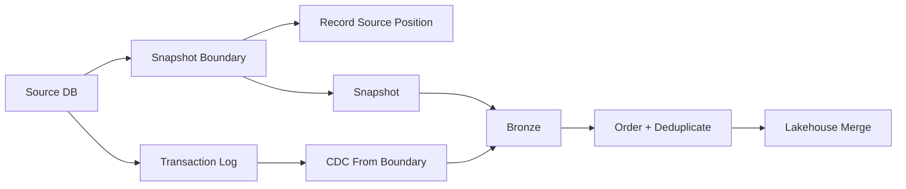
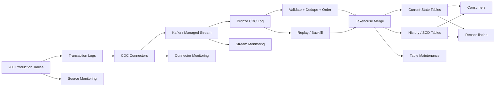

# Design Case 09 — CDC Replication to the Lakehouse

> **G5 — Data Engineering System Design Interviews**  
> **Case 09:** Replicate 200 production database tables into the lakehouse with minutes of latency and full history.

This is a complete production-oriented Data Engineering system-design learning module. It teaches CDC from first principles and progresses to source-safe log capture, snapshot/CDC handoff, durable change logs, ordered/idempotent lakehouse application, SCD history, deletes, schema evolution, source failover, reconciliation, operations, and senior/staff interview defense.

## Exact Interview Prompt

> **Design a system that replicates 200 production database tables into a lakehouse with minutes of latency and full history.**

The target reasoning chain is:

```text
Requirements
    ↓
Estimates
    ↓
Constraints
    ↓
Architecture
    ↓
Correctness model
    ↓
Failure handling
    ↓
Operational model
    ↓
Trade-offs
```

---

## 1. What the Interviewer Is Testing

| Dimension | What strong candidates demonstrate |
|---|---|
| Log-based CDC | Understand why database logs are safer and more complete than repeated source queries. |
| Ordering | Use source positions/transaction metadata rather than ingestion time as the correctness signal. |
| Snapshot handoff | Prevent gaps and duplicate effects when bootstrapping existing data. |
| Correctness | Define idempotency, deduplication, ordering, replay, and transaction boundaries. |
| Source safety | Protect production databases from excessive snapshot/query/connector load. |
| Lakehouse application | Separate immutable CDC history from current-state and historical tables. |
| History | Model SCD Type 2 and delete semantics explicitly. |
| Schema evolution | Use compatibility policy, contracts, versioning, and controlled rollout. |
| Operations | Monitor slots, connector lag, Kafka lag, merge latency, freshness, and reconciliation. |
| Failure recovery | Detect, contain, recover, replay, validate, prevent. |
| Scale | Reason about 200 tables, skew, partitions, high-volume tables, and 10× growth. |
| Communication | Clarify, estimate, draw, deep dive, state trade-offs, and summarize within 45 minutes. |

A weak answer lists products. A strong answer explains why each boundary exists and what invariant it protects.

---

## 2. Learning Progression

```text
Database fundamentals
        ↓
What is CDC?
        ↓
Why CDC?
        ↓
Polling vs log-based CDC
        ↓
Transaction logs
        ↓
Logical decoding
        ↓
CDC event model
        ↓
Connectors
        ↓
Initial snapshot
        ↓
Snapshot + CDC handoff
        ↓
Kafka topics / keys / partitions
        ↓
Bronze CDC log
        ↓
Ordering
        ↓
Deduplication
        ↓
Idempotent processing
        ↓
Lakehouse merges
        ↓
Current-state tables
        ↓
Full-history / SCD tables
        ↓
Deletes
        ↓
Schema evolution
        ↓
Replication slots
        ↓
Monitoring
        ↓
Reconciliation
        ↓
Table maintenance
        ↓
Failure scenarios
        ↓
Advanced trade-offs
        ↓
Production architecture
        ↓
45-minute interview design
        ↓
Senior-level deep dives
```

For every difficult concept use:

1. **What is it?**
2. **Why does it exist?**
3. **How does it work?**
4. **Example**
5. **Code/SQL where useful**
6. **Production implication**
7. **Interview angle**

---

## 3. Requirements Clarification

Do not design immediately. The prompt contains enough information to start, but not enough to make a defensible architecture without assumptions.

### Functional requirements

- Replicate 200 production database tables.
- Support inserts, updates, and deletes.
- Deliver changes with minutes-level freshness.
- Preserve full historical change information.
- Maintain current-state mirrors.
- Maintain historical/SCD representations where required.
- Bootstrap existing data.
- Continue CDC without gaps across snapshot handoff.
- Support replay and recovery.
- Support reconciliation.
- Support onboarding additional tables without reprocessing all existing tables.
- Handle schema changes under an explicit compatibility policy.
- Handle source failover and connector recovery.

### Non-functional requirements

| Concern | Question |
|---|---|
| Latency | Does “minutes” mean <1, <5, or <15 minutes? |
| Throughput | How many changes/sec average and peak? |
| Transaction size | How large are source transactions? |
| Ordering | Per primary key, table, transaction, or global? |
| Durability | What data-loss tolerance is acceptable? |
| Availability | What freshness/availability SLO applies? |
| Source safety | How much snapshot/CDC overhead can production tolerate? |
| History | Raw events, SCD Type 2, or both? |
| Retention | How long must raw and curated history remain? |
| Recovery | What are RPO and RTO? |
| Schema | Which changes are allowed automatically? |
| Security | Which columns contain PII or sensitive data? |
| Cost | What is the operating envelope? |
| Reconciliation | How frequently must source and lakehouse agree? |

### High-value questions

- Which source database engines are involved?
- How many databases host the 200 tables?
- What are average and peak change rates?
- How large is the existing source history?
- What does “full history” mean for deletes?
- Do consumers need current state, raw changes, or both?
- Is transaction-level atomicity important?
- Is per-row ordering sufficient?
- Can source databases tolerate snapshots?
- What is the failover topology?
- How much CDC replay must be possible?
- Which schema changes should be automatic?

---

## 4. CDC Terminology

| Term | Simple definition | Why it matters |
|---|---|---|
| CDC | Capture changes instead of repeatedly extracting tables. | Core architecture. |
| Transaction log | Durable database record of writes. | CDC source. |
| WAL/binlog | Engine-specific transaction-log mechanism. | Source capture. |
| Logical decoding | Converts log information into logical changes. | Produces row-level CDC events. |
| LSN/source position | Position in the source change stream. | Restart, ordering, handoff. |
| Snapshot | Copy of existing state. | Bootstraps the target. |
| Replication slot | Durable source-side CDC position. | Prevents required logs being discarded. |
| Connector | Captures and emits changes. | CDC operational boundary. |
| Topic | Durable event-stream namespace. | Isolation and replay. |
| Partition | Ordered parallel stream within a topic. | Throughput and ordering. |
| Consumer group | Independent consumer progress. | Decoupled downstream processing. |
| Offset | Consumer progress position. | Restart/replay. |
| Tombstone | Delete marker in some event designs. | Key deletion semantics. |
| Upsert | Insert if absent, update if present. | Current-state replication. |
| Merge | Conditional insert/update/delete. | Lakehouse application. |
| Idempotency | Repetition produces the same intended result. | Safe retries/replay. |
| Deduplication | Suppress repeated logical events. | Prevent duplicate effects. |
| SCD Type 2 | Historical rows with validity intervals. | Full-history analytics. |
| Schema evolution | Change in data structure over time. | Consumer safety. |
| Reconciliation | Compare source and target. | Evidence of correctness. |
| Replay | Reprocess historical changes. | Recovery/backfill. |

---

## 5. What Is CDC?

Traditional extraction:

```text
Database
   ↓
SELECT rows
   ↓
ETL job
   ↓
Lakehouse
```

CDC:

```text
Database
   ↓
Transaction Log
   ↓
CDC Capture
   ↓
CDC Events
   ↓
Transport
   ↓
Lakehouse
```

CDC is useful because it can provide:

- lower source query pressure;
- lower latency;
- incremental processing;
- native update/delete capture;
- transaction metadata;
- replayable source positions;
- near-real-time replication.

The architectural principle is:

> Capture the source's durable change stream rather than repeatedly asking the source what changed.

---

## 6. Polling vs Log-Based CDC

| Approach | Latency | Source load | Deletes | Ordering | Recovery |
|---|---|---|---|---|---|
| Full extraction | High | High | Special handling | Weak | Re-run |
| Timestamp polling | Minutes+ | Medium/high | Easy to miss | Limited | Watermark dependent |
| High-water-mark polling | Minutes+ | Medium | Requires careful semantics | Limited | Watermark dependent |
| Trigger CDC | Low/medium | Adds write-path work | Good | Potentially good | Trigger complexity |
| Log-based CDC | Low | Usually lower query load | Native | Strong source-position semantics | Replay from source position |

For this case, log-based CDC is generally preferred because the requirements combine low latency, full history, deletes, correctness, and source safety.

Polling remains reasonable for low-value/small tables, systems without usable transaction logs, or sources that cannot support log capture.

---

## 7. Transaction Logs

A conceptual database transaction:

```text
BEGIN
  ↓
writes
  ↓
COMMIT
  ↓
durable transaction-log record
```

CDC exploits the durable record of committed changes.

Conceptual mappings:

- PostgreSQL → WAL + logical decoding.
- MySQL → binlog-based capture.
- SQL Server → transaction-log-based mechanisms.

The interview abstraction is:

```text
Committed source change
→ durable source position
→ logical change event
→ downstream processing
```

Do not assume every engine exposes identical transaction, ordering, or failover semantics.

---

## 8. Logical Decoding

Logical decoding converts low-level log information into logical changes.

```text
WAL / transaction log
       ↓
logical decoder
       ↓
BEGIN
INSERT ...
UPDATE ...
DELETE ...
COMMIT
```

Illustrative PostgreSQL-oriented examples:

```sql
-- Illustrative only; verify exact settings/version/deployment.

CREATE PUBLICATION cdc_publication
FOR TABLE customer, orders;
```

Inspecting replication slots:

```sql
SELECT
    slot_name,
    active,
    restart_lsn,
    confirmed_flush_lsn
FROM pg_replication_slots;
```

The key system-design concept is the source position, not memorization of vendor-specific commands.

---

## 9. CDC Connectors

Conceptually:

```text
Database
   ↓
CDC connector
   ↓
CDC event
   ↓
Kafka / managed stream
```

A connector typically handles:

- capture;
- snapshot;
- source-position tracking;
- transaction metadata;
- schema metadata;
- serialization;
- restart/recovery;
- status and lag.

Debezium-style connectors are a useful reference architecture, but this module is not a Debezium tutorial. Managed CDC services and native replication can implement similar responsibilities with different operational trade-offs.

---

## 10. CDC Event Model

```json
{
  "source": {
    "engine": "postgres",
    "database": "commerce",
    "schema": "public",
    "table": "customer"
  },
  "operation": "UPDATE",
  "before": {
    "id": 42,
    "status": "TRIAL"
  },
  "after": {
    "id": 42,
    "status": "ACTIVE"
  },
  "transaction_id": "tx-981",
  "lsn": "0/16B6A30",
  "commit_timestamp": "2026-10-07T09:12:03.123Z",
  "event_id": "commerce-public-customer-42-0/16B6A30"
}
```

| Field | Purpose |
|---|---|
| source | Origin database/schema/table. |
| operation | INSERT, UPDATE, DELETE. |
| before | Previous image where available. |
| after | New image where available. |
| transaction_id | Groups source transaction changes. |
| LSN/source position | Ordering and recovery coordinate. |
| commit_timestamp | Source commit timing. |
| event_id | Stable event identity. |

A good event should answer:

> What changed, where did it come from, in what source sequence did it commit, and has it already been applied?

---

## 11. Initial Snapshot

Existing source state cannot be reconstructed by starting CDC at “now.”

```text
Existing source state
        +
Future changes
        =
Complete target state
```

Snapshot options:

- full snapshot;
- consistent snapshot;
- chunked snapshot;
- parallel snapshot;
- per-table snapshot.

Consider:

- source CPU/I/O;
- locks;
- connection limits;
- snapshot duration;
- restartability;
- consistency;
- CDC overlap;
- target validation.

The initial snapshot and continuous CDC are different workload phases and should be capacity-planned separately.

---

## 12. Mandatory Deep Dive — Snapshot + CDC Handoff

The core problem:

```text
Snapshot existing rows
        +
Capture changes during snapshot
        ↓
No missing changes
No duplicate effects
```

Race example:

```text
T1: snapshot begins
T2: source row changes
T3: snapshot reads row
T4: CDC event appears
```

A safe design establishes a source-position boundary and ensures CDC covers the interval from that boundary forward.

Conceptually:

```text
Establish consistent snapshot boundary S
        ↓
Record S
        ↓
Read snapshot
        ↓
CDC captures >= S
        ↓
Apply snapshot
        ↓
Apply CDC after S
        ↓
Deduplicate / order
        ↓
Target is complete
```

The invariant is:

> **The target must have deterministic coverage from historical state through every committed change after the snapshot boundary.**



Never say:

> “We snapshot first and then turn on CDC.”

That can create a gap.

---

## 13. Transport Architecture

```text
Source DB
   ↓
CDC connectors
   ↓
Kafka / managed stream
   ↓
Bronze + downstream consumers
```

Transport should provide:

- durable buffering;
- partitioned throughput;
- consumer groups;
- replay;
- producer/consumer decoupling.

### Topic strategies

| Strategy | Advantages | Risks |
|---|---|---|
| One topic/table | Strong isolation | Many objects to operate |
| Topic/database | Fewer objects | Uneven traffic and mixed contracts |
| Topic/domain | Ownership alignment | Requires routing discipline |
| Shared CDC topic | Simple ingestion | Noisy-neighbor/security/retention complexity |

There is no universal choice. Use traffic, ownership, retention, security, and operational isolation to decide.

---

## 14. Kafka Keys, Partitions, and Ordering

If `customer_id = 42` is the key, related changes can consistently reach one partition:

```text
customer_id = 42
      ↓
same partition
      ↓
INSERT
UPDATE
DELETE
```

Kafka-like systems provide ordering within a partition, not global ordering.

The architecture should define the minimum required ordering:

```text
Global order
    ↓
Partition order
    ↓
Key-local order
    ↓
Source transaction order
```

### Partition sizing

Do not claim a universal events/sec per partition.

Use:

```text
required peak throughput
÷ benchmarked per-partition throughput
= baseline partitions
```

Then add capacity for:

- consumer parallelism;
- skew;
- recovery;
- growth.

Hot keys are a separate design problem.

---

## 15. Bronze CDC Change Log

```text
Source DB
   ↓
CDC
   ↓
Kafka
   ↓
Bronze CDC Log
   ↓
Validate + Dedupe + Order
   ↓
Current State / History
```

Bronze should preserve:

- raw logical event;
- source metadata;
- operation;
- source position;
- transaction metadata;
- ingestion metadata;
- schema version;
- retention metadata.

Bronze is the replay boundary for:

- debugging;
- audit;
- backfills;
- recovery;
- reprocessing;
- rebuilding silver/current state.

Raw CDC can contain sensitive information, so retention and access must be governed.

---

## 16. Applying CDC to Current-State Tables

Conceptually:

```text
INSERT → INSERT
UPDATE → UPSERT/MERGE
DELETE → DELETE
```

Illustrative SQL:

```sql
MERGE INTO target_customer AS t
USING customer_changes AS c
ON t.id = c.id

WHEN MATCHED AND c.operation = 'DELETE'
  THEN DELETE

WHEN MATCHED AND c.operation <> 'DELETE'
  THEN UPDATE SET
    name = c.name,
    email = c.email,
    status = c.status,
    updated_at = c.updated_at

WHEN NOT MATCHED AND c.operation <> 'DELETE'
  THEN INSERT (id, name, email, status, updated_at)
       VALUES (c.id, c.name, c.email, c.status, c.updated_at);
```

Production safeguards include:

- deterministic source ordering;
- duplicate suppression;
- source-position tracking;
- schema compatibility;
- atomic/transactional writes where available;
- retry safety;
- table/file-layout strategy;
- validation.

---

## 17. Idempotency and Duplicates

At-least-once delivery can produce:

```text
event A
event A
```

A safe system ensures the second application has no additional business effect.

Useful controls:

- stable event IDs;
- source positions;
- transaction IDs;
- primary keys;
- durable dedupe state;
- deterministic MERGE;
- checkpoints;
- transactional writes.

> **At-least-once delivery + idempotent application can produce effectively-once business outcomes.**

That is not the same as claiming global end-to-end exactly-once.

### Python example

```python
from dataclasses import dataclass
from typing import Any

@dataclass(frozen=True)
class Change:
    event_id: str
    key: str
    operation: str
    source_position: int
    after: dict[str, Any] | None

def apply_change(state: dict, seen: set[str], change: Change) -> None:
    if change.event_id in seen:
        return

    seen.add(change.event_id)

    if change.operation == "DELETE":
        state.pop(change.key, None)
    else:
        state[change.key] = change.after
```

This is intentionally simplified. In production, dedupe state and target writes must be coordinated so a crash cannot leave them inconsistent.

---

## 18. Mandatory Deep Dive — Out-of-Order Events

Suppose the target sees:

```text
UPDATE v2
UPDATE v3
UPDATE v1
```

Arrival order is not necessarily source commit order.

### Preferred ordering signals

1. source log position / LSN;
2. transaction sequence;
3. commit ordering;
4. per-key source position;
5. connector-provided sequence metadata.

Do not blindly use ingestion timestamp.

### Strategies

| Strategy | Useful when | Risk |
|---|---|---|
| Partition by primary key | Key-local ordering matters | Hot keys |
| Sequence validation | Reliable sequence exists | Requires source semantics |
| Buffer/reorder | Disorder is bounded | State/latency |
| Last-write-wins | Reliable version exists | Timestamp semantics can be wrong |
| Quarantine | Unsafe event cannot be resolved | Delayed data |
| Replay | Online ordering is corrupted | Compute/operational cost |

### Senior answer

> “I would define ordering at the source-semantics level. If the database exposes a monotonically advancing source position, I would use it rather than ingestion time. I would preserve key-local ordering where practical, detect sequence regressions, quarantine unsafe records, and use replay/reconciliation when the online path cannot safely determine the correct state.”

---

## 19. Full History and SCD Type 2

Current state:

```text
id | name | status
1  | A    | ACTIVE
```

Historical state:

```text
id | status | valid_from | valid_to | is_current
1  | NEW    | 09:00      | 10:00    | false
1  | ACTIVE | 10:00      | 11:00    | false
1  | CLOSED | 11:00      | NULL     | true
```

SCD Type 2 requires explicit handling of:

- INSERT;
- UPDATE;
- DELETE;
- multiple updates;
- same-transaction changes;
- late events;
- corrections;
- validity intervals;
- current flags.

### Conceptual SQL

```sql
UPDATE customer_history
SET valid_to = :change_time,
    is_current = FALSE
WHERE customer_id = :customer_id
  AND is_current = TRUE;

INSERT INTO customer_history (
    customer_id,
    status,
    valid_from,
    valid_to,
    is_current
)
VALUES (
    :customer_id,
    :new_status,
    :change_time,
    NULL,
    TRUE
);
```

This is a conceptual pattern. Production implementations must serialize changes per key and respect source ordering.

---

## 20. Delete Handling

```text
DELETE source row
        ↓
CDC DELETE event
        ↓
current table removal
        ↓
history representation
```

Distinguish:

- hard delete;
- soft delete;
- tombstone;
- historical retention;
- compliance deletion.

A history table might record:

```text
id | status | valid_from | valid_to | operation
42 | ACTIVE | 09:00      | 11:30    | UPDATE
42 | NULL   | 11:30      | NULL     | DELETE
```

Whether this is correct depends on business, audit, and privacy requirements.

---

## 21. Schema Evolution Policy

| Change | Default posture | Reason |
|---|---|---|
| Add nullable column | Usually compatible | Old consumers can often continue. |
| Add required column | Controlled migration | Existing events may not contain it. |
| INT → BIGINT | Potentially compatible | Validate all consumers. |
| BIGINT → INT | Breaking | Overflow/truncation risk. |
| Rename | Breaking | Semantic identity changed. |
| Drop | Breaking | Consumers may depend on field. |
| Semantic meaning change | Breaking | Type compatibility is insufficient. |
| Nested structure change | Compatibility-controlled | Parsers can break. |

The contract path is:

```text
Source schema
      ↓
CDC event schema
      ↓
Bronze schema
      ↓
Silver target schema
      ↓
Consumers
```

---

## 22. Mandatory Deep Dive — Schema Changes

### Add nullable column

```sql
ALTER TABLE customer
ADD COLUMN loyalty_tier VARCHAR(20);
```

Safe process:

```text
Detect
→ validate compatibility
→ evolve CDC schema
→ evolve target
→ test consumers
→ reconcile
```

### Widening type

`INT → BIGINT` may be compatible, but validate serialization and downstream target types.

### Rename

`customer_name → full_name` should not silently become add/drop.

Safer:

```text
Add new field
→ dual populate
→ migrate consumers
→ deprecate old field
→ remove after contract window
```

### Drop

Use a deprecation period and consumer-impact analysis.

> Automatic schema evolution is useful only inside an explicit compatibility policy.

---

## 23. Mandatory Deep Dive — Adding Tables Without Re-Snapshotting Everything

If table 201 is added, do not restart all 200 tables.

Use table-level onboarding:

```text
Register metadata
        ↓
Validate source permissions
        ↓
Establish snapshot boundary
        ↓
Snapshot table 201
        ↓
Capture CDC for table 201
        ↓
Create target current/history
        ↓
Reconcile
        ↓
Enable downstream consumption
```

Example metadata:

```yaml
tables:
  - source: commerce
    schema: public
    table: customer
    primary_key: id
    history: true
    target: silver.customer
```

The key property is independent table lifecycle.

---

## 24. Mandatory Deep Dive — Source Failover

When the production database fails over:

1. Detect the primary failure.
2. Identify the new primary.
3. Validate source-position continuity.
4. Validate replication-slot/CDC semantics.
5. Reconnect capture.
6. Allow safe duplicate replay if necessary.
7. Deduplicate/idempotently apply.
8. Reconcile affected tables.
9. Confirm freshness.

Questions to answer:

- Is the new primary on the same logical timeline?
- Is the CDC position still valid?
- Can the slot move?
- Could committed transactions be missing?
- Could duplicates be replayed?
- What are RPO/RTO expectations?

Do not assume application failover automatically means CDC failover is safe.

---

## 25. Replication Slot Monitoring

A replication slot can retain source log data until the CDC consumer advances.

```text
CDC stops
   ↓
slot stops advancing
   ↓
source retains more WAL/binlog
   ↓
disk usage grows
   ↓
source availability risk
```

Monitor:

- slot lag;
- retained WAL/log bytes;
- connector state;
- restart count;
- snapshot progress;
- capture throughput;
- Kafka consumer lag;
- processing lag.

Illustrative PostgreSQL query:

```sql
SELECT
    slot_name,
    active,
    restart_lsn,
    confirmed_flush_lsn
FROM pg_replication_slots;
```

The key interview point:

> **CDC lag can become a production database storage incident.**

---

## 26. Source Safety

Protect the production database by:

- preferring log-based CDC;
- limiting snapshot concurrency;
- chunking large snapshots;
- monitoring CPU/I/O/connections;
- controlling connector concurrency;
- isolating CDC infrastructure;
- using source replicas only when semantics permit;
- coordinating failover;
- defining source-side SLOs;
- stopping/throttling onboarding if source health degrades.

The CDC platform is downstream, but it can still affect production.

---

## 27. Reconciliation

Reconciliation provides evidence that:

```text
Source state
      ≈
Lakehouse state
```

| Technique | Strength | Limitation |
|---|---|---|
| Row count | Cheap broad check | Different rows can cancel out. |
| Min/max key | Cheap boundary check | Misses internal differences. |
| Aggregates | Useful | Compensating errors possible. |
| Checksums/hashes | Stronger | More expensive. |
| Per-partition counts | Localizes mismatch | Requires partitioning. |
| Source LSN vs target high-water mark | Progress evidence | Does not prove row content. |
| Sample comparison | Cheap spot check | Not exhaustive. |

Illustrative SQL:

```sql
SELECT COUNT(*) AS source_count
FROM source_customer_snapshot;

SELECT COUNT(*) AS target_count
FROM silver_customer;
```

High-water mark:

```sql
SELECT
    source_table,
    MAX(source_position) AS processed_position
FROM bronze_customer_changes
GROUP BY source_table;
```

If reconciliation fails:

```text
Detect
→ isolate table
→ inspect source position
→ inspect bronze
→ replay affected range
→ recompute target
→ validate
→ close incident
```

---

## 28. Table Maintenance

High-frequency CDC can create:

```text
many small writes
        ↓
small files
        ↓
metadata growth
        ↓
slow reads
        ↓
higher compute
```

Maintenance includes:

- compaction;
- file sizing;
- clustering where justified;
- statistics;
- retention cleanup;
- metadata maintenance;
- vacuum/garbage-collection concepts;
- merge optimization.

Keep:

```text
Ingestion path
    ≠
Merge path
    ≠
Optimization path
```

Maintenance must not block the freshness-critical ingestion path.

---

## 29. Full Reference Architecture



Responsibilities:

- **Source:** authoritative operational state.
- **CDC connector:** capture changes.
- **Streaming backbone:** durable buffering and replay.
- **Bronze:** raw change evidence.
- **Validation:** contract/data-quality gate.
- **Dedupe:** protects against retries.
- **Ordering:** preserves source semantics.
- **Merge:** current state.
- **History/SCD:** temporal state.
- **Replay:** recovery/backfill.
- **Reconciliation:** correctness evidence.
- **Maintenance:** performance.

---

## 30. Technology Choices

| Layer | Options | Selection criteria |
|---|---|---|
| CDC | Debezium-style, managed CDC, native replication | Source support, semantics, operations, cost |
| Transport | Kafka, managed streaming | Throughput, replay, operations, retention |
| Processing | Spark Structured Streaming, Flink, SQL streaming, micro-batch | Latency, state, team expertise, deployment |
| Lakehouse | Delta Lake, Iceberg, Hudi | Merge semantics, ecosystem, governance |
| Orchestration | Workflow scheduler | Retries, dependencies, maintenance |

There is no universally correct stack.

For every choice explain:

```text
Why
When
Benefits
Drawbacks
Operational burden
Cost
Correctness implications
Interview justification
```

---

## 31. Estimation

Illustrative assumptions:

```text
200 tables
5M average existing rows/table
500 CDC events/sec average
5× peak
1 KB average CDC event
```

### Existing rows

```text
200 × 5M
= 1B rows
```

### Daily CDC events

```text
500 × 86,400
= 43.2M events/day
```

### Peak events/sec

```text
500 × 5
= 2,500 events/sec
```

### Raw logical bytes/day

```text
43.2M × 1 KB
≈ 43.2 GB/day
```

### 90-day logical raw volume

```text
43.2 GB × 90
≈ 3.89 TB
```

Physical storage differs because of compression, file format, replication, metadata, and retained history.

### Partition baseline

```text
required peak throughput
÷ benchmarked per-partition throughput
= baseline partitions
```

Never treat a guessed partition capacity as a universal constant. Benchmark the actual event size, compression, acknowledgement mode, broker configuration, and consumer workload.

### Architecture consequence

The snapshot workload can be orders of magnitude larger than the ongoing CDC stream. Source and downstream capacity must be planned for both phases.

---

## 32. Correctness Model

| Stage | Correctness concern | Control |
|---|---|---|
| Source | Capture committed changes | Log position / transaction semantics |
| Connector | No gaps across restart | Durable source position |
| Kafka | Durable ordered partitions | Replication + offsets |
| Bronze | Preserve evidence | Immutable durable records |
| Processing | Correct order/dedupe | Source position + state |
| Merge | No duplicate effects | Deterministic idempotent merge |
| History | Correct temporal intervals | Ordered SCD application |
| Consumer | Correct published version | Contracts / lineage |

### Guarantee vocabulary

**At-most-once:** may lose data, avoids duplicates.

**At-least-once:** protects against loss through retry, but duplicates may occur.

**Exactly-once:** only meaningful when the transaction boundary is defined.

**Effectively-once:** business outcome achieved through at-least-once delivery plus idempotency, deduplication, deterministic application, and reconciliation.

Never say:

> “The pipeline is exactly once.”

Say:

> “I can guarantee X between boundary A and B; beyond that, I rely on idempotency and reconciliation.”

---

## 33. Failure Scenarios

### 33.1 CDC connector crash

```text
Detect
→ contain affected source/table
→ restart from durable source position
→ replay safely
→ reconcile
→ validate freshness
→ improve restart/alerting
```

### 33.2 Kafka broker failure

Use replication and leader recovery. Monitor under-replicated partitions and consumer lag. Validate continuity after recovery.

### 33.3 Consumer crash

Restart from checkpoint/offset. Bronze/Kafka must retain enough history to replay safely.

### 33.4 Lakehouse merge failure

Stop publication of an incomplete batch, preserve bronze, fix the failure, replay deterministically, and validate the target high-water mark.

### 33.5 Duplicate events

Identify the duplicate source, protect downstream effects with idempotency, replay the affected range, and reconcile.

### 33.6 Out-of-order events

Compare source positions rather than arrival time, quarantine unsafe events, then replay/reconcile.

### 33.7 Source failure

Protect against false progress. Recover the source/CDC boundary and reconcile before declaring healthy.

### 33.8 Source failover

Validate logical continuity and connector semantics before resuming normal processing.

### 33.9 Replication slot growth

Treat source storage as an incident. Recover capture before source disk becomes critical.

### 33.10 Schema incompatibility

Quarantine incompatible records, migrate the contract/target, replay affected events, and reconcile.

### 33.11 Target partial success

Require atomicity where possible; otherwise use deterministic idempotent writes plus target high-water marks and replay.

### 33.12 Bronze succeeds but silver fails

This is a recoverable architecture if bronze is durable. Re-run silver from bronze rather than querying production.

### 33.13 Kafka retention expires before recovery

If replay history is gone, use another durable archive or perform a controlled resnapshot/reconciliation. Retention must exceed the worst credible recovery interval.

### 33.14 High-volume table

Isolate capacity, monitor table-level throughput, and consider table/domain-specific transport and processing.

### 33.15 Hot primary key

Measure key distribution. Preserve required ordering; if semantics permit, use composite/salted strategies and a two-stage aggregation/application pattern.

### 33.16 Snapshot too slow

Throttle, chunk, or parallelize only within source capacity. Do not solve a downstream SLA by harming production.

### 33.17 Snapshot/CDC handoff inconsistency

Use the source-position boundary to identify the missing/duplicated interval, then replay/rebuild from the durable source log.

### 33.18 Reconciliation mismatch

Freeze or flag affected publication, locate the source-position range, inspect bronze, replay, and revalidate.

---

## 34. Break/Fix Labs

### Break #1 — Duplicate CDC events

**Symptoms:** duplicate event IDs and inflated target effects.

**Investigation:** event identity, connector retries, consumer restart, merge behavior.

**Fix:** durable deduplication + deterministic idempotent merge.

**Proof:** one logical event produces one business effect.

### Break #2 — Out-of-order events

**Symptoms:** current state regresses.

**Investigation:** compare source position and arrival time.

**Fix:** source-order validation, partitioning, buffering or replay.

**Proof:** final state equals source order.

### Break #3 — Replication slot growth

**Symptoms:** source log storage grows continuously.

**Investigation:** connector status and slot position.

**Fix:** restore capture or safely reinitialize.

**Proof:** slot advances and source storage returns to safe trajectory.

### Break #4 — Required schema change

**Symptoms:** CDC/target parser fails.

**Investigation:** schema version and compatibility policy.

**Fix:** controlled migration and replay.

**Proof:** all affected events apply and reconciliation passes.

### Break #5 — Source failover

**Symptoms:** connector disconnect or position error.

**Investigation:** new primary and source timeline.

**Fix:** reconnect from a safe source position.

**Proof:** no missing committed range and reconciliation passes.

### Break #6 — Incorrect current state

**Symptoms:** target contains an older value.

**Investigation:** source-position regression.

**Fix:** replay bronze from a safe point.

**Proof:** target converges to source state.

### Break #7 — Snapshot/CDC gap

**Symptoms:** source contains a row/change absent from target.

**Investigation:** compare snapshot boundary and CDC start position.

**Fix:** replay the uncovered source interval.

**Proof:** source/target reconciliation passes.

### Break #8 — Small-file explosion

**Symptoms:** file count and query latency grow.

**Investigation:** merge frequency and file sizes.

**Fix:** asynchronous compaction and better write batching.

**Proof:** query performance improves without violating freshness.

---

## 35. SQL Examples

### CDC event table

```sql
CREATE TABLE bronze_customer_changes (
    event_id STRING,
    source_database STRING,
    source_schema STRING,
    source_table STRING,
    operation STRING,
    source_position STRING,
    transaction_id STRING,
    commit_timestamp TIMESTAMP,
    ingestion_timestamp TIMESTAMP,
    before_json STRING,
    after_json STRING
);
```

### Dedupe

```sql
SELECT *
FROM (
    SELECT
        c.*,
        ROW_NUMBER() OVER (
            PARTITION BY event_id
            ORDER BY ingestion_timestamp DESC
        ) AS rn
    FROM bronze_customer_changes c
) x
WHERE rn = 1;
```

Production dedupe should use source-semantic identity and ordering metadata where available.

### Reconciliation

```sql
SELECT
    source_count,
    target_count,
    source_count - target_count AS count_delta
FROM (
    SELECT
        (SELECT COUNT(*) FROM source_customer_snapshot) AS source_count,
        (SELECT COUNT(*) FROM silver_customer) AS target_count
) r;
```

### High-water mark

```sql
SELECT
    source_table,
    MAX(source_position) AS processed_position
FROM bronze_customer_changes
GROUP BY source_table;
```

---

## 36. Python Examples

### Validate a CDC event

```python
from typing import Any

REQUIRED = {
    "event_id",
    "operation",
    "source_position",
    "source_table",
}

def validate_event(event: dict[str, Any]) -> list[str]:
    errors = []

    missing = REQUIRED - event.keys()
    if missing:
        errors.append(f"missing fields: {sorted(missing)}")

    if event.get("operation") not in {"INSERT", "UPDATE", "DELETE"}:
        errors.append("invalid operation")

    if not event.get("event_id"):
        errors.append("empty event_id")

    if not event.get("source_position"):
        errors.append("missing source_position")

    return errors
```

### Apply only a newer source position

```python
def apply_if_newer(state, change):
    key = change["primary_key"]
    position = change["source_position"]

    previous = state.get(key)

    if previous is not None and position <= previous["source_position"]:
        return False

    state[key] = {
        "source_position": position,
        "payload": change.get("after"),
        "operation": change["operation"],
    }
    return True
```

This assumes the source position has a valid comparator. Production implementations must use the source/connector's real ordering semantics.

### Replay a bounded range

```python
def replay(events, start_position, end_position, apply):
    for event in events:
        pos = event["source_position"]
        if start_position <= pos <= end_position:
            apply(event)
```

---

## 37. Realistic End-to-End Example

Source:

```sql
CREATE TABLE customer (
    id BIGINT PRIMARY KEY,
    name TEXT NOT NULL,
    email TEXT,
    status TEXT NOT NULL,
    updated_at TIMESTAMP NOT NULL
);
```

Initial state:

```text
id | name | status
1  | A    | NEW
2  | B    | ACTIVE
```

### Step 1 — Snapshot

The target receives the existing rows under a known snapshot boundary.

### Step 2 — INSERT

```text
INSERT id=3, name=C, status=NEW
```

Current state gains row 3.

### Step 3 — UPDATE

```text
UPDATE id=1 NEW → ACTIVE
```

Current state updates row 1.

### Step 4 — UPDATE again

```text
UPDATE id=1 ACTIVE → VIP
```

Current state becomes VIP.

### Step 5 — DELETE

```text
DELETE id=2
```

Current state removes row 2 while history records the deletion according to policy.

### Step 6 — Duplicate

The update to row 1 arrives twice with the same stable event identity. The second application is a no-op.

### Step 7 — Out of order

Positions:

```text
105 → 107 → 106
```

The position-106 event must not overwrite the position-107 state.

### Step 8 — Schema change

The source adds `loyalty_tier`. The schema policy determines whether target evolution is automatic.

### Step 9 — Connector restart

The connector resumes from its durable source position. Replayed events remain safe because application is idempotent.

### Step 10 — Replay

If merge logic is found to be wrong for positions 100–120:

```text
Bronze
  ↓
select positions 100–120
  ↓
recompute
  ↓
correct target
  ↓
reconcile
```

### Step 11 — Current-state reconstruction

Apply changes in source order to obtain the final row image.

### Step 12 — History reconstruction

Convert valid state transitions into temporal intervals.

### Step 13 — Reconciliation

Compare:

- row count;
- source position;
- target high-water mark;
- selected checksums;
- recent changed keys.

---

## 38. Scaling to 200 Tables

Use table metadata such as:

```text
source_database
source_schema
source_table
primary_key
cdc_mode
snapshot_status
source_position
topic
partition_strategy
target_current_table
target_history_table
schema_policy
retention
SLA
owner
```

This enables:

- configuration-driven onboarding;
- table ownership;
- independent recovery;
- table-level SLOs;
- reconciliation;
- controlled rollout;
- incident routing.

| Scaling concern | Response |
|---|---|
| Many tables | Metadata-driven onboarding |
| Different change rates | Per-table/domain isolation |
| High-volume tables | Dedicated capacity where justified |
| Hot keys | Distribution analysis |
| Different SLAs | Table-level freshness monitoring |
| Schema diversity | Contracts and compatibility policy |
| Blast radius | Connector/domain isolation |
| Operations | Central metadata + dashboards + runbooks |

---

## 39. 10× Scale Scenario

If CDC increases tenfold:

```text
500 events/sec
→ 5,000 events/sec average
```

Recalculate:

- connector throughput;
- Kafka partitions;
- broker network/storage;
- consumer parallelism;
- bronze writes;
- merge capacity;
- state;
- file generation;
- maintenance;
- reconciliation;
- cost.

If five tables produce 80% of all changes, isolate and capacity-plan those tables instead of assuming uniform traffic.

---

## 40. Trade-Off Catalogue

| Decision | Main trade-off | Strong default reasoning |
|---|---|---|
| Polling vs log CDC | Simplicity vs latency/source safety | Log CDC for this case |
| Topic per table vs domain | Isolation vs operational count | Use workload/ownership boundaries |
| Snapshot strategy | Source load vs bootstrap speed | Consistent/chunked controlled snapshot |
| Spark vs Flink | Team/platform fit vs streaming specialization | Choose from SLA/state needs |
| Streaming vs micro-batch | Freshness vs efficiency | Minutes SLA may allow micro-batch |
| Current-only vs history | Cost vs auditability | Both when full history is required |
| SCD vs append-only | Query convenience vs raw fidelity | SCD for temporal consumers + raw CDC for replay |
| Managed vs self-hosted | Operations vs control | Managed if semantics and source support fit |
| Automatic vs controlled schema evolution | Speed vs safety | Automate only compatible changes |
| Full vs sampled reconciliation | Confidence vs cost | Tiered strategy |
| Long bronze retention vs cost | Recovery vs storage | Retention from recovery requirements |
| Strong ordering vs distribution | Correctness vs throughput | Preserve only required ordering |

Use:

```text
Decision
→ Options
→ Criteria
→ Choice
→ Downside
→ Mitigation
→ When the alternative wins
```

---

## 41. Security and Governance

CDC can copy sensitive data.

Cover:

- encryption in transit;
- encryption at rest;
- least-privilege source credentials;
- secret management;
- PII classification;
- masking/tokenization;
- access control;
- audit logs;
- retention;
- deletion obligations;
- secure connector networking;
- controlled replay access.

Before replicating a sensitive field unchanged, ask:

```text
Is it required downstream?
Can it be masked/tokenized?
Does the target need raw value?
How long must it exist?
Who can access bronze?
```

Raw CDC should be treated as highly privileged data because before/after images can contain sensitive values.

---

## 42. Observability Model

| Layer | Signals |
|---|---|
| Source | DB health, WAL/binlog growth, replication-slot lag |
| Connector | Status, restart count, snapshot progress, capture latency |
| Kafka | Throughput, partition distribution, consumer lag, broker health |
| Processing | Records/sec, failures, retries, batch duration |
| Lakehouse | Merge latency, freshness, file counts, small-file growth |
| Data quality | Duplicates, missing events, reconciliation mismatches |
| Maintenance | Compaction backlog, metadata growth |

Useful SLIs:

```text
CDC capture latency
Target freshness
Connector error rate
Consumer lag
Source log retention risk
Merge latency
Reconciliation mismatch rate
Snapshot progress
```

The operational dashboard should answer:

1. Are we capturing?
2. Are we applying?
3. Can we prove correctness?

---

## 43. Production Runbooks

### Connector Lag

**Symptoms:** freshness breach and rising connector lag.

**Checks:** source health, connector state, source position, downstream throughput.

**Likely causes:** source pressure, connector failure, network, sink bottleneck.

**Immediate mitigation:** stabilize source and restore capture.

**Recovery:** resume from durable position.

**Validation:** lag declines and reconciliation passes.

**Prevention:** capacity limits, alert thresholds, restart testing.

### Replication Slot Growth

**Symptoms:** source log/WAL storage grows.

**Checks:** slot active state, retained log, connector position.

**Likely cause:** stalled connector or downstream.

**Mitigation:** protect source disk.

**Recovery:** restore capture or safely reinitialize.

**Validation:** slot advances.

### Schema-Change Failure

**Symptoms:** parser/merge failure.

**Checks:** schema version and compatibility.

**Mitigation:** quarantine incompatible records.

**Recovery:** migrate target/consumer, then replay.

**Validation:** schema and reconciliation pass.

### Duplicate Events

**Symptoms:** duplicate-rate spike or inflated target.

**Checks:** event IDs, source positions, retry logs.

**Mitigation:** protect target with idempotent processing.

**Recovery:** replay affected range.

**Validation:** business totals and row state.

### Out-of-Order Events

**Symptoms:** target regresses.

**Checks:** source position vs arrival time.

**Mitigation:** quarantine unsafe events.

**Recovery:** ordered replay.

**Validation:** final source-consistent state.

### Target Mismatch

**Symptoms:** count/checksum mismatch.

**Checks:** high-water mark, bronze completeness, merge history.

**Mitigation:** freeze affected publication if material.

**Recovery:** replay affected range.

**Validation:** reconciliation passes.

### Source Failover

**Symptoms:** connector disconnect or position error.

**Checks:** new primary and source timeline.

**Mitigation:** prevent false progress.

**Recovery:** reconnect from safe position.

**Validation:** continuity + reconciliation.

### Snapshot Stuck

**Symptoms:** progress flat.

**Checks:** source load, connector state, locks, throughput.

**Mitigation:** throttle/stop if source health degrades.

**Recovery:** resume safely.

**Validation:** snapshot + CDC coverage.

### Kafka Consumer Lag

**Symptoms:** freshness breach.

**Checks:** producer rate, partition skew, consumer throughput, sink latency.

**Mitigation:** scale/optimize.

**Recovery:** drain backlog.

**Validation:** freshness returns to SLO.

### Lakehouse Merge Failure

**Symptoms:** bronze grows while silver stalls.

**Checks:** job logs, schema, conflicts, resources, file layout.

**Mitigation:** isolate failing table/batch.

**Recovery:** replay bronze.

**Validation:** target high-water mark + reconciliation.

---

## 44. Common Interview Mistakes

| Mistake | Why it hurts |
|---|---|
| Jumping directly to Kafka | Requirements and source semantics remain unexplained. |
| Ignoring snapshot | Existing data cannot be reconstructed. |
| Ignoring snapshot/CDC handoff | Can create gaps or duplicate effects. |
| Using ingestion time for ordering | Arrival order is not source commit order. |
| Claiming exactly-once casually | Guarantee boundary is undefined. |
| Ignoring deletes | Current state and history become incorrect. |
| Ignoring schema evolution | Production changes break consumers. |
| Ignoring replication slots | CDC lag can harm source availability. |
| No bronze history | Bugs cannot be safely replayed. |
| No reconciliation | Correctness is assumed, not demonstrated. |
| No estimates | Architecture lacks scale justification. |
| No table maintenance | High-frequency writes degrade query performance. |
| Technology-first design | Tools are selected before requirements. |
| Overengineering | Complexity is not justified by the SLA. |

---

## 45. Mental Models

### CDC

```text
Capture → Transport → Persist → Apply → Verify
```

### Correctness

```text
Order + Deduplicate + Idempotency + Atomicity + Reconciliation
```

### Snapshot

```text
Past state + Future changes = Complete state
```

### Production

```text
Freshness + Correctness + Durability + Recoverability + Cost
```

### Source safety

```text
CDC success
≠
production success
```

### Replay

```text
Raw evidence
→ deterministic processing
→ corrected state
```

---

## 46. Practical Exercises

### Level 1 — Beginner

- Explain CDC in your own words.
- Compare polling and log-based CDC.
- Identify INSERT/UPDATE/DELETE events.
- Explain WAL/binlog conceptually.
- Explain replication slots.
- Explain current state versus history.

### Level 2 — Intermediate

- Design a Kafka topic strategy.
- Design snapshot + CDC handoff.
- Implement event-ID deduplication.
- Write a current-state MERGE.
- Design SCD Type 2.
- Design reconciliation.
- Define schema compatibility rules.

### Level 3 — Advanced

- Design the complete 200-table architecture.
- Handle out-of-order events.
- Handle source failover.
- Add table 201 without re-snapshotting tables 1–200.
- Handle breaking schema changes.
- Design 10× scaling.
- Defend the architecture under interviewer pushback.

---

## 47. 45-Minute Interview Walkthrough

| Time | Focus | What to do |
|---|---|---|
| 0–5 min | Requirements | Source engines, volume, latency, history, ordering, deletes, failover |
| 5–8 min | Estimates | Changes/sec, peak, snapshot volume, storage, partitions |
| 8–15 min | High-level architecture | Source → logs → CDC → Kafka → bronze → merge → current/history |
| 15–25 min | CDC mechanics | Logical decoding, connectors, snapshot, handoff, keys, ordering |
| 25–35 min | Correctness | Dedupe, idempotency, SCD, deletes, schema |
| 35–40 min | Operations | Slots, lag, reconciliation, failure recovery, maintenance |
| 40–45 min | Trade-offs | Defend choices and summarize guarantees |

### What to draw

Start:

```text
Source DB
→ CDC
→ Kafka
→ Bronze
→ Lakehouse
→ Consumers
```

Then zoom into:

```text
Snapshot + handoff
Ordering
Deduplication
Current state
History
Reconciliation
```

If interrupted:

> “That changes the requirement. I’ll keep the source capture and durable bronze boundary and adjust the processing/target layer to satisfy the new constraint.”

---

## 48. Interviewer Pushback

### “Why not query the source every five minutes?”

> Polling adds source query load, can miss deletes or updates depending on watermark semantics, and does not naturally preserve transaction ordering. Log CDC gives a lower-latency incremental stream with source-position semantics.

### “Why do you need Kafka?”

> We need durable buffering, replay, decoupled consumers, partitioned throughput, and recovery. A managed equivalent is acceptable if it provides those properties.

### “Why can't we just use timestamps?”

> Timestamps do not necessarily provide transaction-safe ordering. Clock precision, clock skew, and same-timestamp updates make them unsafe as the sole correctness coordinate.

### “How do you guarantee exactly once?”

> First define the boundary. I would use at-least-once capture plus stable identity, dedupe, deterministic idempotent merges, checkpointing, and reconciliation for effectively-once business outcomes. I would not claim global exactly-once without proving every boundary.

### “What happens if the source fails over?”

> Validate source-position continuity and CDC semantics, reconnect to the new primary, allow safe duplicate replay, then reconcile.

### “Why keep bronze?”

> It is the durable replay and audit boundary. It lets us rebuild downstream state without repeatedly querying production.

### “Why not just overwrite the target?”

> Current state alone does not satisfy full history and makes audit/replay harder. We maintain current state plus historical representations.

### “What if schema changes every week?”

> Automate compatible changes, require controlled migration for breaking changes, and treat schema as a versioned contract.

### “What if one table produces 90% of traffic?”

> Measure table and key skew, isolate the dominant table where useful, and choose partitioning according to ordering requirements rather than assuming uniform traffic.

### “What if Kafka is unavailable?”

> The source connector must not silently advance beyond durable downstream capture. Buffer/retry while source retention allows, restore the transport path, and reconcile before declaring recovery.

### “What if the replication slot grows until the source disk fills?”

> Treat it as a source incident: identify stalled capture, restore or safely reinitialize it, protect source disk, then validate slot advancement.

### “How do you prove the lakehouse matches production?”

> Combine source-position reconciliation with row counts, targeted checksums/hashes, changed-key comparison, and periodic deeper audits.

### “How do you onboard 50 more tables?”

> Use metadata-driven table-level onboarding with independent snapshot and CDC state. Unaffected tables should not be re-snapshotted.

---

## 49. Senior vs Staff-Level Reasoning

| Level | Expected reasoning |
|---|---|
| Mid-level | Working CDC architecture, basic correctness, basic implementation. |
| Senior | Trade-offs, source safety, failure handling, schema policy, cost, reconciliation, ownership. |
| Staff | Platform standardization, multi-team onboarding, governance, blast radius, multi-region evolution, organizational contracts, platform economics. |

Staff-level reasoning is not necessarily more complicated. It is more explicit about boundaries, ownership, and long-term consequences.

---

## 50. Interview Follow-Up Question Bank

### Requirements

1. Which source database engines are involved?
2. How many source databases host the 200 tables?
3. What is the average change rate?
4. What is the peak change rate?
5. What does minutes-level latency mean?
6. Is per-table ordering required?
7. Is global ordering required?
8. What does full history mean?
9. Do consumers need current state, history, or both?
10. What is the RPO?
11. What is the RTO?
12. How much source load is acceptable?
13. How long is raw CDC retained?
14. How long is SCD history retained?
15. What are the security classifications?

### CDC Fundamentals

1. What is CDC?
2. Why is log-based CDC preferred?
3. What is WAL?
4. What is a transaction log?
5. What is logical decoding?
6. What is an LSN?
7. What is a replication slot?
8. What is a binlog?
9. How does a connector recover?
10. How are transaction boundaries represented?
11. Why are deletes important?
12. How do source positions differ from timestamps?
13. Why is CDC incremental?
14. Can polling ever be better?
15. How does source logging affect storage?

### Snapshot

1. Why is a snapshot required?
2. What is a consistent snapshot?
3. What is a chunked snapshot?
4. What is a parallel snapshot?
5. How do you limit source impact?
6. How do you resume a failed snapshot?
7. How do you validate snapshot completeness?
8. What if the table is 20 TB?
9. What if the source cannot tolerate a snapshot?
10. What if snapshot and CDC run concurrently?

### Snapshot + CDC Handoff

1. How do you prevent a gap?
2. How do you prevent duplicate effects?
3. What source position defines the boundary?
4. What if a transaction commits during the snapshot?
5. What if a row changes twice during the snapshot?
6. What if the snapshot fails halfway?
7. What if the connector restarts during handoff?
8. How do you validate handoff completeness?
9. Can the target publish before handoff finishes?
10. How would you explain handoff in one minute?

### Kafka

1. Why Kafka or an equivalent?
2. One topic per table or domain?
3. What is a partition?
4. What is a consumer group?
5. What is a key?
6. Where is ordering guaranteed?
7. How does replication protect data?
8. How much retention is needed?
9. How does replay work?
10. What if a consumer is offline for hours?
11. How do you estimate partitions?
12. What if partitions are too few?
13. What if partitions are too many?
14. What is a hot partition?
15. How do you isolate a high-volume table?

### Ordering

1. Why can events arrive out of order?
2. What is the best ordering field?
3. Why not ingestion timestamp?
4. What is per-key ordering?
5. What is transaction ordering?
6. How do you detect stale events?
7. How do you buffer disorder?
8. When do you quarantine?
9. When do you replay?
10. What if source positions are not comparable across databases?

### Deduplication

1. What causes duplicate CDC events?
2. How does event ID help?
3. How does source position help?
4. What if event IDs change during replay?
5. Where should deduplication occur?
6. How long should dedup state live?
7. What if a duplicate arrives after state expiry?
8. How do you make MERGE retry-safe?
9. How do you test duplicate storms?
10. How do you reconcile after duplicate effects?

### Idempotency

1. What is idempotency?
2. Why does at-least-once require it?
3. What makes a merge idempotent?
4. How does a crash between state and target writes affect correctness?
5. What transaction boundary is required?
6. Can a non-transactional sink be exactly once?
7. What is effectively once?
8. How does replay interact with idempotency?
9. How do you prove repeated application is safe?
10. Where can idempotency break?

### Exactly-Once

1. What is at-most-once?
2. What is at-least-once?
3. What is exactly-once?
4. Exactly once between which boundaries?
5. Does Kafka exactly-once imply lakehouse exactly-once?
6. Does checkpointing guarantee business correctness?
7. How do external side effects complicate guarantees?
8. How does transactional target writing help?
9. How does deduplication differ from exactly once?
10. Give a defensible senior-level exactly-once answer.

### Lakehouse

1. Why bronze?
2. Why current-state tables?
3. Why history tables?
4. How do you merge CDC?
5. What makes a MERGE deterministic?
6. How do you avoid small files?
7. How do you partition the target?
8. How do you cluster high-volume tables?
9. When do you compact?
10. How do you protect ingestion from maintenance jobs?

### SCD

1. What is SCD Type 2?
2. Why use it?
3. How does INSERT affect history?
4. How does UPDATE affect history?
5. How does DELETE affect history?
6. How do late events affect validity intervals?
7. How do multiple changes in one transaction affect history?
8. How do you identify the current row?
9. How do you repair a bad historical interval?
10. Would append-only CDC history be sufficient?

### Deletes

1. How are deletes represented in CDC?
2. What is a tombstone?
3. Should current-state tables physically delete rows?
4. Should history retain deleted records?
5. How do compliance deletions change the design?
6. How do you reconcile deletes?
7. How do you handle delete followed by re-insert?
8. How do you preserve delete ordering?
9. How do you replay deletes?
10. How do you audit deletion propagation?

### Schema Evolution

1. What happens when a column is added?
2. What if it is required?
3. What if type widens?
4. What if type narrows?
5. What if a column is renamed?
6. What if it is dropped?
7. What if semantics change without type change?
8. What is backward compatibility?
9. What is forward compatibility?
10. Where should compatibility be enforced?
11. How do you quarantine incompatible events?
12. How do you roll back a schema migration?
13. How do you onboard schema changes across 200 tables?
14. How do you prevent silent data loss?
15. How do you handle nested schemas?

### Replication Slots

1. What is a replication slot?
2. Why can slot lag hurt the source?
3. What metrics should be monitored?
4. What if the connector stops for six hours?
5. What if source disk is nearly full?
6. How do you alert on slot growth?
7. How do you safely recover?
8. What if the slot is lost?
9. Can you recreate it without data loss?
10. How do you test slot incidents?

### Reconciliation

1. Why reconcile?
2. How often?
3. Row count or checksum?
4. How do you compare large tables?
5. How do you use source positions?
6. How do you localize a mismatch?
7. What if counts match but rows differ?
8. What if mismatch is caused by late CDC?
9. How do you reconcile history?
10. How do you automate recovery?

### Table Maintenance

1. Why does CDC create small files?
2. How does compaction help?
3. When should maintenance run?
4. How does clustering affect merge cost?
5. How do you control metadata growth?
6. What is the risk of aggressive retention cleanup?
7. How do you separate maintenance from ingestion?
8. How do you monitor maintenance backlog?
9. What if maintenance doubles compute cost?
10. How do you prioritize critical tables?

### Source Safety

1. How do you protect source CPU?
2. How do you protect source I/O?
3. How do you limit connections?
4. How do you throttle snapshots?
5. How do you isolate connector workloads?
6. What if CDC increases source log retention?
7. How do you fail safely?
8. How do you monitor source health?
9. How do you onboard a new table safely?
10. Who owns source safety?

### Failure Recovery

1. What if the connector crashes?
2. What if Kafka fails?
3. What if the consumer crashes?
4. What if target merge fails?
5. What if bronze succeeds but silver fails?
6. What if Kafka retention expires?
7. What if source fails?
8. What if source fails over?
9. What if snapshot gets stuck?
10. What if reconciliation fails?
11. How do you recover corrupt target state?
12. How do you recover a bad schema rollout?
13. How do you recover out-of-order application?
14. How do you recover duplicate effects?
15. How do you verify recovery?

### Disaster Recovery

1. What is the RPO?
2. What is the RTO?
3. Can CDC resume in another region?
4. How does source failover affect LSN continuity?
5. How do you recover Kafka?
6. How do you recover bronze?
7. How do you rebuild current state?
8. How do you rebuild history?
9. How do you validate after DR?
10. How do you avoid split-brain CDC?

### Scaling

1. What changes at 10× CDC volume?
2. What if five tables produce 80% of changes?
3. What if one table is 20 TB?
4. What if one key is extremely hot?
5. What if Kafka partitions become bottlenecks?
6. What if merge compute is the bottleneck?
7. What if storage grows faster than expected?
8. What if reconciliation becomes too expensive?
9. How do you isolate noisy tables?
10. How do you forecast capacity?

### Cost

1. What are the major cost drivers?
2. How does retention affect cost?
3. How does replication affect cost?
4. How does snapshot concurrency affect cost?
5. How does always-on processing compare with micro-batch?
6. How does compaction affect cost?
7. How do you optimize high-volume tables?
8. What if the budget is cut by 50%?
9. What cost should never be optimized away?
10. How do you attribute cost per source/table?

### Security

1. Which CDC fields are sensitive?
2. How do you protect credentials?
3. Who can read bronze?
4. Who can read current state?
5. How do you mask PII?
6. How do you encrypt in transit?
7. How do you encrypt at rest?
8. How do you audit replay access?
9. How do retention policies affect privacy?
10. How do you handle deletion requirements?

### Operations

1. What dashboards do you build?
2. What alerts are critical?
3. What is the freshness SLO?
4. What is the connector error SLO?
5. What is the reconciliation SLO?
6. How do you page on source risk?
7. How do you detect silent data loss?
8. How do you detect stale tables?
9. How do you run incident response?
10. What belongs in the runbook?

### Architecture Alternatives

1. When would polling be acceptable?
2. When would managed CDC be better?
3. When would self-hosted CDC be better?
4. When would Spark be preferable?
5. When would Flink be preferable?
6. When would micro-batch be preferable?
7. When would current-state-only be enough?
8. When would append-only history be better than SCD?
9. When would topic-per-table be justified?
10. When would topic-per-domain be better?

---

## 51. Mock Interview Cases

### Mock 1 — Standard

**INTERVIEWER PROMPT**

> Design a system that replicates 200 production database tables into a lakehouse with minutes of latency and full history.

Attempt for 45 minutes before reading the reference.

**Expected clarification:** source engines, table/database count, change rate, latency, history, ordering, deletes, schema, failover, RPO/RTO.

**Reference architecture:**

```text
Production DBs
→ transaction logs
→ CDC connectors
→ Kafka/managed stream
→ bronze CDC log
→ validate/dedupe/order
→ lakehouse merge
→ current + history
→ consumers
```

**Likely follow-ups:** snapshot handoff, out-of-order events, source failover, schema changes, slot growth, reconciliation.

### Mock 2 — High Scale

**INTERVIEWER PROMPT**

> The company now has 2,000 tables and 10× CDC volume. Redesign without increasing data loss or freshness beyond the agreed SLA.

Focus on:

- metadata-driven onboarding;
- connector isolation;
- partitions;
- hot tables;
- broker capacity;
- merge parallelism;
- maintenance;
- cost;
- observability.

### Mock 3 — Reliability

**INTERVIEWER PROMPT**

> During a production incident, the source fails over, a schema changes, events arrive out of order, and reconciliation detects a mismatch. Explain how you recover.

Expected sequence:

```text
Detect
→ Contain
→ Establish source continuity
→ Stabilize CDC
→ Quarantine unsafe changes
→ Replay affected range
→ Repair target
→ Reconcile
→ Restore publication
→ Prevent recurrence
```

---

## 52. Self-Scoring Rubric

| Dimension | 1 — Weak | 3 — Competent | 5 — Exceptional |
|---|---|---|---|
| Requirements | Picks tools immediately | Clarifies main constraints | Finds hidden source-safety/history/failover requirements |
| Estimation | No numbers | Basic rate/storage | Numbers drive architecture |
| Architecture | Product list | End-to-end flow | Clear boundaries, replay, failure domains |
| CDC fundamentals | Superficial | Explains log CDC | Connects source log semantics to correctness |
| Snapshot/handoff | Ignored | Mentions snapshot | Explains source-position coverage and races |
| Ordering | Uses timestamps | Understands partition order | Defines source-level ordering and stale-event policy |
| Correctness | Says exactly once | Uses dedupe/idempotency | Defines guarantees at each boundary |
| Lakehouse | Generic | Current + bronze | Current, history, replay, maintenance |
| History | Mentions SCD | Basic Type 2 | Handles late changes, deletes, corrections |
| Schema | Automatic only | Compatibility mentioned | Contract, rollout, rollback, ownership |
| Failures | Retry only | Recovery | Detect/contain/recover/replay/validate/prevent |
| Reconciliation | Counts | Counts + checks | Progress + content + targeted audits |
| Observability | Logs | Lag/metrics | Source, connector, stream, target, quality |
| Security | Encryption | Access control | Classification, masking, audit, retention |
| Cost | Generic | Names drivers | Explains economics |
| Communication | Rambling | Clear | Adaptive and time-boxed |
| Trade-offs | Lists options | Chooses one | Requirement → decision → consequence |

Scoring:

```text
1 = weak
2 = developing
3 = competent
4 = senior
5 = exceptional
```

---

## 53. Final Interview Cheat Sheet

### Requirements

```text
Which sources?
How many databases?
How many changes/sec?
What does minutes mean?
What does full history mean?
What ordering is required?
What happens on deletes?
What schema changes are allowed?
What is source capacity?
What is RPO/RTO?
```

### Estimates

```text
average events/sec
peak events/sec
snapshot volume
raw bytes/day
retention storage
partition baseline
consumer capacity
merge capacity
maintenance load
```

### Architecture

```text
Source
→ Transaction Log
→ CDC
→ Kafka
→ Bronze
→ Validate/Dedupe/Order
→ Current + History
→ Consumers
```

### Correctness

```text
Ordering
+ Deduplication
+ Idempotency
+ Atomicity
+ Reconciliation
```

### Deep dives

```text
Out-of-order events
New table without global resnapshot
Source failover
Schema changes
```

### Failures

```text
Connector lag
Replication slot growth
Kafka lag
Merge failure
Source failure
Schema failure
Reconciliation mismatch
```

### Final 60-second answer

> “I would capture committed changes from the production databases' transaction logs rather than repeatedly querying the sources. CDC connectors maintain source positions and feed a durable partitioned streaming backbone. Existing data is bootstrapped with a consistent snapshot tied to a known source position so there is no gap between snapshot and live CDC. The raw change stream is preserved in a bronze layer for replay and audit. Downstream processing validates, deduplicates, and orders events using source metadata before applying deterministic idempotent merges into current-state lakehouse tables and SCD/history tables. Deletes and schema evolution follow explicit contracts. We monitor connector and replication-slot lag, stream lag, merge latency, freshness, and reconciliation. The main correctness strategy is at-least-once capture plus source ordering, deduplication, idempotent application, replay, and reconciliation; I would not claim end-to-end exactly-once without defining every transactional boundary.”

---

## 54. Final Assessment — Attempt Before Reading the Reference

> **Design a CDC platform that replicates 200 production database tables into a lakehouse with minutes of latency and full history.**

Produce independently:

1. requirements;
2. assumptions;
3. estimates;
4. architecture;
5. CDC strategy;
6. snapshot strategy;
7. snapshot/CDC handoff;
8. Kafka design;
9. bronze design;
10. merge strategy;
11. ordering strategy;
12. deduplication strategy;
13. SCD history;
14. delete handling;
15. schema evolution;
16. source failover;
17. replication-slot monitoring;
18. reconciliation;
19. observability;
20. security;
21. cost model;
22. failure scenarios;
23. trade-offs;
24. 45-minute verbal walkthrough.

Do not look at the reference architecture until the attempt is complete.

---

## 55. Reference Evaluation Guide

A senior-level answer should contain:

```text
Production DBs
→ transaction logs
→ CDC connectors
→ durable event transport
→ bronze CDC log
→ validation/dedupe/order
→ current-state merges
→ history/SCD
→ reconciliation
→ maintenance
```

It must explicitly explain:

- snapshot boundary;
- gap-free CDC handoff;
- source-position ordering;
- idempotency;
- deletes;
- schema contracts;
- replication-slot risk;
- source failover;
- table-level onboarding;
- replay;
- reconciliation;
- operational SLOs;
- source safety;
- cost.

A candidate who draws the diagram but cannot explain snapshot/CDC handoff, source ordering, slot risk, or recovery has not demonstrated senior-level CDC system-design readiness.

---

## 56. Roadmap Coverage Audit

| Roadmap Requirement | Covered? | Section |
|---|---|---|
| Log-based CDC | Yes | What Is CDC; Polling vs Log-Based CDC |
| Ordering | Yes | Kafka Keys, Partitions, and Ordering; Out-of-Order Deep Dive |
| Correctness | Yes | Correctness Model; Idempotency; Reconciliation |
| Source safety | Yes | Source Safety |
| Logical decoding | Yes | Logical Decoding |
| Connectors | Yes | CDC Connectors |
| Initial snapshot | Yes | Initial Snapshot |
| Snapshot + CDC handoff | Yes | Mandatory Deep Dive — Snapshot + CDC Handoff |
| Topics and keys | Yes | Transport Architecture; Kafka Keys |
| Bronze change log | Yes | Bronze CDC Change Log |
| Ordered merges | Yes | Current-State Tables; Ordering |
| Idempotency | Yes | Idempotency and Duplicates |
| SCD history | Yes | Full History and SCD Type 2 |
| Deletes | Yes | Delete Handling |
| Schema evolution policy | Yes | Schema Evolution Policy |
| Replication slot monitoring | Yes | Replication Slot Monitoring |
| Reconciliation | Yes | Reconciliation |
| Table maintenance | Yes | Table Maintenance |
| Out-of-order events | Yes | Mandatory Deep Dive — Out-of-Order Events |
| Adding tables without re-snapshotting | Yes | Mandatory Deep Dive — Adding Tables Without Re-Snapshotting |
| Source failover | Yes | Mandatory Deep Dive — Source Failover |
| Schema changes | Yes | Mandatory Deep Dive — Schema Changes |

### Mandatory deep dives explicitly present

- Out-of-order events
- Adding tables without re-snapshotting
- Source failover
- Schema changes

---

## 57. Completion Checklist

```text
## Completion Checklist

- [ ] I can explain CDC from first principles.
- [ ] I understand transaction logs.
- [ ] I understand logical decoding.
- [ ] I understand CDC connectors.
- [ ] I can explain initial snapshots.
- [ ] I can explain snapshot + CDC handoff.
- [ ] I can design Kafka topics and keys.
- [ ] I understand ordering.
- [ ] I can design a bronze CDC log.
- [ ] I understand idempotency.
- [ ] I understand deduplication.
- [ ] I can explain exactly-once vs effectively-once.
- [ ] I can design current-state replication.
- [ ] I can design full-history replication.
- [ ] I can implement SCD Type 2 conceptually.
- [ ] I can handle deletes.
- [ ] I can handle schema evolution.
- [ ] I can monitor replication slots.
- [ ] I can design reconciliation.
- [ ] I understand lakehouse table maintenance.
- [ ] I can handle out-of-order events.
- [ ] I can onboard a new table without re-snapshotting everything.
- [ ] I can handle source failover.
- [ ] I can troubleshoot production CDC incidents.
- [ ] I can estimate system capacity.
- [ ] I can explain architecture trade-offs.
- [ ] I can design the complete system in 45 minutes.
- [ ] I can handle senior-level interviewer follow-ups.
```

---

## 58. Advanced Scenario Drills

### Scenario 1 — 100K changes/sec for one hour

Recalculate connector throughput, transport capacity, partitions, bronze writes, merge capacity, and retention. Explain the first bottleneck you would isolate.

### Scenario 2 — One key generates 20% of a table's changes

Identify hot-key risk. Determine whether strict per-key ordering is required before considering salting or a dedicated path.

### Scenario 3 — Connector is healthy but target freshness is 20 minutes

Trace:

```text
source capture
→ Kafka
→ consumer
→ merge
→ table publication
```

Do not assume the connector is the bottleneck.

### Scenario 4 — Counts match but checksums differ

Investigate changed-key distribution, duplicates, schema mapping, and correction boundaries.

### Scenario 5 — High-water marks match but a row is wrong

Explain why progress equality does not prove content equality. Use targeted source/target comparison and replay.

### Scenario 6 — Schema field removed without notice

Quarantine or fail the contract according to policy, prevent silent data loss, migrate consumers, and replay.

### Scenario 7 — Snapshot complete but CDC starts after the boundary

Identify the coverage gap and recover from the source log position.

### Scenario 8 — Failover creates duplicate CDC events

Allow duplicates if recovery is safe; deduplicate by stable identity/source position and reconcile.

### Scenario 9 — Source disk is filling because a slot is stalled

Prioritize source safety, restore or safely reinitialize capture, and validate slot advancement.

### Scenario 10 — MERGE partially applies before a crash

Explain atomicity/idempotency and how bronze replay should converge to one correct target state.

### Scenario 11 — Table 201 is added

Use metadata-driven per-table onboarding rather than re-snapshotting tables 1–200.

### Scenario 12 — Budget is cut by 60%

Separate raw retention, SCD retention, compression/tiering, processing frequency, and required recovery horizon. Quantify which guarantees change.

### Scenario 13 — One database has radically different table SLAs

Use table/domain isolation so high-criticality tables are not blocked by low-priority workloads.

### Scenario 14 — CDC is correct but queries are slow

Treat table maintenance, file layout, clustering/statistics, and serving architecture as separate from CDC correctness.

### Scenario 15 — Future-dated event arrives

Validate source metadata and quarantine if needed. Preserve the raw evidence.

### Scenario 16 — Same primary key is updated in two transactions

Use source transaction/order metadata, not arrival order, to determine final state.

### Scenario 17 — Connector restarts every few minutes

Investigate source connectivity, schema failures, resource exhaustion, position/state corruption, and source constraints before simply increasing retries.

### Scenario 18 — Replay doubles historical rows

Use replay isolation, idempotent target writes, versioned output, and reconciliation.

### Scenario 19 — Source table is 20 TB

Design chunked/parallel snapshotting, source throttling, snapshot validation, and CDC handoff.

### Scenario 20 — Product requires zero duplicate business effects

Translate the requirement into an explicit correctness boundary and prove the controls rather than promising impossible global semantics.

---

## 59. Final Operating Standard

```text
CLARIFY
→ ESTIMATE
→ PROTECT SOURCE
→ CAPTURE LOG CHANGES
→ ESTABLISH SNAPSHOT BOUNDARY
→ HAND OFF TO CDC WITHOUT GAPS
→ TRANSPORT DURABLY
→ PRESERVE BRONZE
→ VALIDATE
→ ORDER
→ DEDUPLICATE
→ APPLY IDEMPOTENTLY
→ MAINTAIN CURRENT STATE
→ MAINTAIN HISTORY
→ HANDLE DELETES
→ EVOLVE SCHEMA SAFELY
→ MONITOR SLOTS/LAG
→ RECONCILE
→ MAINTAIN TABLES
→ REPLAY WHEN REQUIRED
→ RECOVER FROM FAILURE
→ MEASURE COST
→ EXPLAIN TRADE-OFFS
→ DEFEND THE DESIGN
```

The senior-level mental model is:

> **Capture committed source changes safely, establish a gap-free snapshot-to-CDC handoff, preserve the raw change stream, apply changes in source-defined order with idempotent semantics, separate current state from historical state, treat schema and deletes as explicit contracts, monitor source-side CDC risk as seriously as downstream lag, and use reconciliation plus replay to make correctness observable rather than assumed.**
