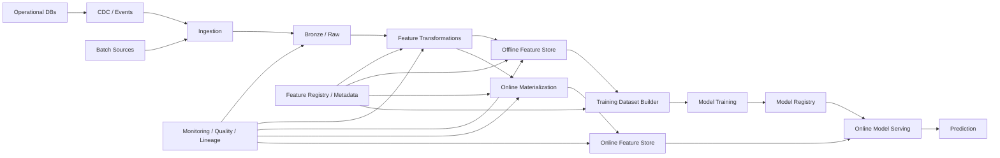
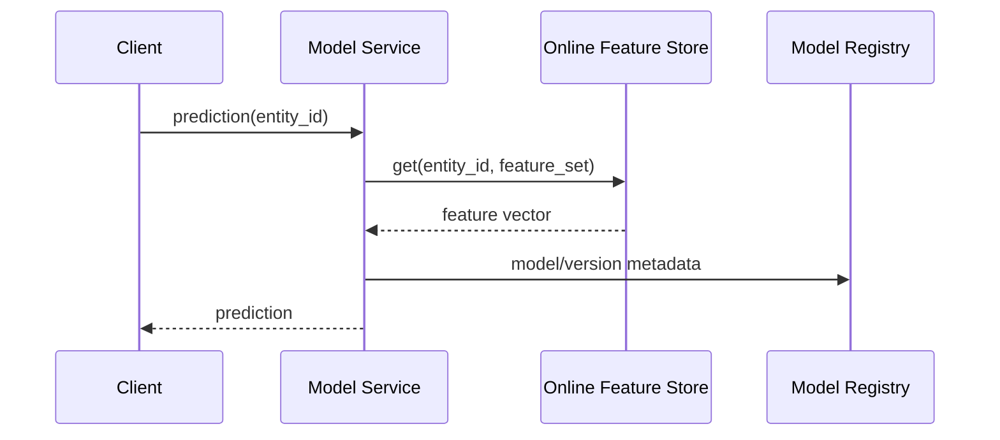
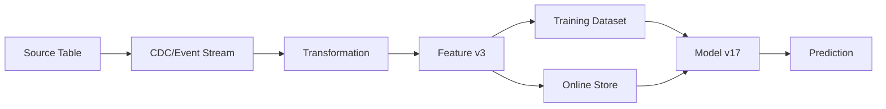

# Design Case 10 — ML Feature Platform

> **G5 — Data Engineering System Design Interviews**  
> **Case 10:** Design an ML feature platform that provides reliable, point-in-time-correct training features and low-latency online features for production models.

This case teaches the Data Engineering system-design method through an ML feature platform. The emphasis is not on training model architectures. It is on the data platform that makes features **correct, reproducible, fresh, observable, governed, and consistently available across training and inference**.

---

## 1. Interview Prompt

> **Design an ML feature platform that supports both offline model training and low-latency online inference, while preventing training/serving skew and point-in-time leakage.**

The target reasoning chain is:

```text
Requirements
    ↓
Estimates
    ↓
Feature definitions
    ↓
Source data
    ↓
Offline computation
    ↓
Point-in-time training sets
    ↓
Online feature materialization
    ↓
Serving
    ↓
Freshness + correctness
    ↓
Monitoring + governance
    ↓
Failure recovery
    ↓
Trade-offs
```

The central principle is:

> **A feature platform is a data correctness and serving system first; the model consumes its outputs.**

---

## 2. What the Interviewer Is Testing

| Dimension | Strong candidate signal |
|---|---|
| Requirements | Separates training, batch inference, online inference, freshness, latency, retention, and correctness. |
| Feature semantics | Defines entity, feature, timestamp, aggregation window, owner, and computation. |
| Point-in-time correctness | Prevents future information from entering historical training examples. |
| Offline/online consistency | Uses the same feature definitions and transformation semantics across paths. |
| Architecture | Separates source, transformation, offline store, online store, registry/metadata, and serving. |
| Freshness | Quantifies feature freshness instead of saying “real time.” |
| Serving | Estimates QPS, latency, availability, and access patterns. |
| Backfills | Makes historical recomputation safe and reproducible. |
| Feature lifecycle | Covers creation, validation, deployment, deprecation, and ownership. |
| Data quality | Defines completeness, validity, freshness, distribution, and referential checks. |
| Monitoring | Covers both platform health and feature quality. |
| Security | Handles sensitive features, access, lineage, retention, and audit. |
| Cost | Explains storage, compute, online serving, materialization, and retention economics. |
| Failure recovery | Handles stale features, partial materialization, source failures, and online-store outages. |
| Seniority | Connects design decisions to business risk, ML quality, operational burden, and scale. |

A weak answer says:

> “Use a feature store.”

A strong answer explains:

> **What data is computed, when it is valid, how historical values are reconstructed, how online values are served, and how the platform proves that training and serving use the intended semantics.**

---

## 3. Scope and Boundaries

This case focuses on:

- feature data architecture;
- feature definitions;
- entity keys;
- event time;
- offline feature computation;
- point-in-time correctness;
- training-set generation;
- online feature materialization;
- low-latency serving;
- offline/online consistency;
- freshness;
- backfills;
- feature validation;
- monitoring;
- lineage and governance;
- cost and reliability;
- ML handoff.

It does **not** attempt to teach:

- neural-network architecture;
- model hyperparameter tuning;
- deep learning theory;
- model training algorithms;
- generic ML theory.

The interview question is:

> **How do we reliably provide the right feature value for the right entity at the right point in time?**

---

## 4. Learning Progression

```text
ML feature concept
        ↓
Entity + feature + timestamp
        ↓
Feature definitions
        ↓
Offline vs online use cases
        ↓
Source data
        ↓
Event time and observation time
        ↓
Windowed aggregations
        ↓
Point-in-time joins
        ↓
Training datasets
        ↓
Offline feature store
        ↓
Online feature store
        ↓
Materialization
        ↓
Online serving
        ↓
Training/serving consistency
        ↓
Freshness and quality
        ↓
Backfills
        ↓
Feature registry
        ↓
Monitoring
        ↓
Security/governance
        ↓
Failure recovery
        ↓
Capacity/cost
        ↓
Production architecture
        ↓
45-minute interview defense
```

For every major design choice ask:

1. What problem does it solve?
2. What correctness invariant does it protect?
3. What happens when it fails?
4. How is it observed?
5. What does it cost?
6. How does it affect ML quality?

---

# Part I — Requirements and Estimation

## 5. Requirements Clarification

Do not start by naming a feature-store product.

Clarify:

### Users

- Data Engineers
- ML Engineers
- Data Scientists
- ML Platform Engineers
- Model-serving systems
- Analytics/BI consumers where appropriate

### Feature types

- batch features;
- near-real-time features;
- streaming/event-driven features;
- numerical aggregates;
- categorical attributes;
- counters;
- ratios;
- embeddings where relevant;
- derived business features.

### Serving modes

1. Offline training
2. Batch inference
3. Online inference

### Key requirements

| Requirement | Questions |
|---|---|
| Entities | Customer, account, device, merchant, transaction? |
| Feature count | Hundreds, thousands, millions? |
| Freshness | Hours, minutes, seconds? |
| Online latency | p50/p95/p99? |
| QPS | Average and peak? |
| Training volume | Rows/features per training job? |
| History | How many months/years? |
| Point-in-time | Required for all training datasets? |
| Availability | What is the online serving SLO? |
| Consistency | Must offline and online values be identical? |
| Backfill | How frequently? |
| Schema | How often do features change? |
| Governance | PII, financial, health, regulated data? |
| Cost | Budget per model/team/platform? |

---

## 6. Functional Requirements

A reasonable baseline:

- Define reusable features.
- Associate features with entities.
- Compute batch and streaming features.
- Persist historical feature values.
- Generate point-in-time-correct training sets.
- Materialize selected features to an online store.
- Serve online features at low latency.
- Support batch inference.
- Version feature definitions.
- Track ownership and lineage.
- Validate feature freshness and quality.
- Support backfills.
- Detect training/serving skew.
- Support deprecation.
- Audit feature access and changes.

---

## 7. Non-Functional Requirements

Example target assumptions:

```text
Online p95 latency: < 20 ms for feature lookup
Online availability: 99.9%+
Freshness: < 5 minutes for critical streaming features
Training reproducibility: deterministic feature snapshot
Point-in-time correctness: mandatory
Feature history: 12–24 months
Peak online QPS: 20,000
```

These are illustrative assumptions, not universal industry limits.

In an interview, ask the interviewer to confirm or modify them.

---

## 8. The Three Core Workloads

### Training

```text
Historical labels
      +
historical feature values
      ↓
Point-in-time training dataset
      ↓
Model training
```

### Batch inference

```text
Entity list
      ↓
Offline feature retrieval
      ↓
Batch prediction
```

### Online inference

```text
Request
   ↓
Entity ID
   ↓
Online feature lookup
   ↓
Model
   ↓
Prediction
```

The platform must support all three without accidentally using future information during training.

---

## 9. What Is a Feature?

A feature is a measurable input derived from source data.

Example:

```text
customer_id = 42

transactions_last_7_days = 13
avg_transaction_amount_30d = 84.20
days_since_last_purchase = 3
support_tickets_last_30d = 2
```

A useful feature definition includes:

```text
entity
feature name
data type
source
transformation
event-time semantics
aggregation window
freshness expectation
owner
version
quality checks
```

A feature without time semantics is often incomplete.

---

## 10. Feature Identity

A practical feature identity can be modeled as:

```text
Feature =
    Entity
  + Name
  + Version
  + Transformation
  + Time Semantics
```

Example:

```yaml
entity: customer
name: transactions_7d
version: 3
source: transaction_events
window: 7d
timestamp: event_time
aggregation: count
```

This makes the feature definition explicit rather than hiding semantics in arbitrary SQL.

---

## 11. Entity Keys

The online and offline paths must agree on entity identity.

Examples:

```text
customer_id
merchant_id
device_id
account_id
user_id
```

Composite entities:

```text
(customer_id, merchant_id)
(device_id, region)
(account_id, product_id)
```

A key design should answer:

- Is the key globally unique?
- Can it change?
- How are missing keys handled?
- How are deleted entities represented?
- What is the cardinality?
- How is key normalization performed?

A feature platform with ambiguous entity identity creates correctness problems everywhere else.

---

## 12. Feature Categories

| Type | Example | Typical computation |
|---|---|---|
| Snapshot | Customer segment | Latest dimension value |
| Aggregate | Orders in 7d | Windowed count |
| Ratio | Refund rate | Sum/count |
| Recency | Days since purchase | Time difference |
| Frequency | Purchases/month | Windowed count |
| Monetary | Spend 30d | Sum |
| Behavioral | Session duration | Event aggregation |
| Streaming | Transactions/minute | Stateful stream |
| Embedding | User representation | Model/embedding pipeline |

---

## 13. Time Semantics

Feature systems commonly involve several timestamps:

```text
event_time
ingestion_time
processing_time
observation_time
label_time
```

These are not interchangeable.

Example:

```text
Transaction occurred: 10:00
Arrived at platform: 10:02
Processed: 10:03
Model prediction: 10:05
```

For a training example at 10:05, a feature that uses information from 10:06 is invalid even if the record was ingested at 10:04 due to timestamp confusion.

The feature platform must define:

> **Which timestamp determines whether a value was knowable at prediction time?**

---

# Part II — Point-in-Time Correctness

## 14. Why Point-in-Time Correctness Matters

Suppose:

```text
Customer churn label:
2026-10-10

Feature:
customer_support_tickets_last_7d
```

A correct training row should only use tickets known before the prediction/observation timestamp.

Incorrect:

```text
Feature window:
2026-10-05 → 2026-10-12
Label:
2026-10-10
```

The feature includes future information.

This is **data leakage**.

Correct:

```text
Feature window:
2026-10-03 → 2026-10-10
Label:
2026-10-10
```

Exact boundary semantics must be defined.

---

## 15. Point-in-Time Join

Suppose:

### Feature history

| customer_id | feature_time | spend_30d |
|---|---:|---:|
| 42 | 2026-01-01 10:00 | 100 |
| 42 | 2026-01-03 10:00 | 150 |
| 42 | 2026-01-06 10:00 | 220 |

### Training observation

| customer_id | observation_time |
|---|---:|
| 42 | 2026-01-05 12:00 |

The correct feature value is:

```text
150
```

because:

```text
2026-01-03 10:00
<
2026-01-05 12:00
```

while:

```text
2026-01-06 10:00
>
2026-01-05 12:00
```

is future information.

---

## 16. Point-in-Time Join SQL

Conceptual SQL:

```sql
SELECT
    e.customer_id,
    e.observation_time,
    f.spend_30d
FROM training_examples e
LEFT JOIN feature_history f
  ON e.customer_id = f.customer_id
 AND f.feature_time <= e.observation_time
QUALIFY ROW_NUMBER() OVER (
    PARTITION BY e.customer_id, e.observation_time
    ORDER BY f.feature_time DESC
) = 1;
```

This is illustrative. Production systems may use temporal joins, range joins, feature-store APIs, or engine-specific point-in-time retrieval.

The invariant is:

> **For every training observation, select the latest feature value that was valid and observable at that observation time.**

---

## 17. Leakage Failure Modes

| Failure | Example |
|---|---|
| Future feature value | Using a post-label transaction. |
| Aggregation leakage | 30-day window extends past observation time. |
| Label leakage | Feature directly derived from label. |
| Processing-time confusion | Late-arriving event incorrectly treated as historically known. |
| Backfill leakage | Recomputed feature uses corrected future data. |
| Entity leakage | Aggregate includes information from the target entity's future state. |
| Split leakage | Features computed across train/test boundaries using future observations. |

A senior candidate explicitly tests for these.

---

## 18. Event Time vs Processing Time

Suppose:

```text
event_time       = 09:00
ingestion_time   = 09:30
```

If a training observation occurred at 09:15, was the event known?

The answer depends on the platform's **knowledge-time contract**.

Possible semantics:

1. **Event-time correctness:** event is treated as existing at event time.
2. **Availability-time correctness:** event is considered usable only when it became available.
3. **Dual timestamps:** preserve both and choose explicitly by use case.

For high-stakes models, the platform should make this distinction explicit rather than silently assuming one.

---

## 19. Late-Arriving Data

```text
Event happened at 09:00
Arrived at 09:30
Training observation at 09:15
```

If the real production model could not have known the event at 09:15, blindly using event time may still leak information.

This is why a strong design preserves:

```text
event_time
+
ingestion/availability_time
```

and documents which one defines feature eligibility.

---

## 20. Training Dataset Contract

A training row should conceptually contain:

```text
entity_id
observation_time
label
feature_1_at_observation
feature_2_at_observation
...
feature_N_at_observation
dataset_version
feature_definition_versions
source_snapshot/version
```

Example:

```yaml
entity_id: customer-42
observation_time: 2026-10-05T12:00:00Z
label: 1
feature_set_version: churn-v7
source_snapshot: delta-table@version-9182
```

This enables reproducibility.

---

# Part III — Reference Architecture

## 21. High-Level Architecture



The platform has distinct planes:

### Data plane

```text
Sources
→ ingestion
→ transformation
→ storage
→ materialization
→ serving
```

### Metadata/control plane

```text
Feature definitions
→ versions
→ ownership
→ lineage
→ contracts
→ quality rules
→ access policy
```

Do not mix these concepts.

---

## 22. Offline Feature Store

The offline store is optimized for:

- large historical datasets;
- training;
- batch inference;
- reproducibility;
- backfills;
- analytical access.

Typical storage:

- lakehouse tables;
- columnar files;
- warehouse tables;
- versioned datasets.

Example:

```text
feature_customer_daily
--------------------------------
customer_id
feature_date
spend_7d
orders_30d
support_tickets_30d
```

The offline store is not automatically the right online serving database.

---

## 23. Online Feature Store

The online store is optimized for:

```text
GET(entity_id, feature_set)
```

Example:

```text
GET customer-42
→
{
  "spend_7d": 820.10,
  "orders_30d": 14,
  "support_tickets_30d": 2
}
```

Primary requirements:

- low latency;
- high availability;
- predictable QPS;
- key-value access;
- controlled freshness;
- efficient point lookup.

Possible implementation categories:

- managed key-value stores;
- distributed caches;
- feature-store online databases;
- low-latency databases.

Do not select a database before estimating QPS, payload size, consistency, and availability requirements.

---

## 24. Why Two Stores?

Offline and online workloads have different access patterns.

| Offline | Online |
|---|---|
| Large scans | Point lookups |
| Historical | Latest serving state |
| Minutes/hours acceptable | Milliseconds often required |
| High throughput | Low latency |
| Batch | Request/response |
| Cost-efficient object storage | Low-latency serving infrastructure |

A single system can sometimes serve both, but the access-pattern difference should drive the design.

---

## 25. Feature Materialization

Materialization means moving computed features into the online store.

```text
Offline computation
       ↓
validated feature values
       ↓
materialization
       ↓
online store
       ↓
model serving
```

Materialization modes:

- scheduled batch;
- continuous streaming;
- event-driven;
- hybrid.

Example:

```text
every 5 minutes:
    compute transactions_1h
    validate
    publish
```

For a 5-minute freshness SLA, the full pipeline must fit comfortably inside the SLA budget.

---

## 26. Freshness Budget

If:

```text
Freshness SLO = 5 minutes
```

and the path is:

```text
source lag
+
processing
+
validation
+
materialization
+
online propagation
```

then:

```text
source lag      = 60 sec
processing      = 90 sec
validation      = 20 sec
materialization = 30 sec
propagation     = 10 sec
--------------------------------
total           = 210 sec
```

The remaining budget is:

```text
300 - 210 = 90 seconds
```

A senior engineer designs to a budget rather than saying “near real time.”

---

## 27. Online Serving Path



Production concerns:

- request timeouts;
- retries;
- connection pooling;
- caching;
- feature missingness;
- schema compatibility;
- model/feature version compatibility;
- fallback behavior;
- observability.

---

# Part IV — Offline/Online Consistency

## 28. Training/Serving Skew

A common failure:

```text
Training:
Python transformation A

Serving:
Java transformation B
```

The model learned:

```text
feature = 0.73
```

but production calculates:

```text
feature = 0.61
```

even though both are called the same feature.

This is **training/serving skew**.

---

## 29. Consistency Strategies

### Strategy A — Shared feature definitions

```text
One definition
    ↓
offline computation
online computation
```

### Strategy B — Precompute online values

Compute using one transformation pipeline and materialize the result.

### Strategy C — Shared transformation library

Use common code with careful runtime/version control.

### Strategy D — Centralized feature registry

Feature definition is versioned and referenced by both paths.

The best choice depends on latency, computation complexity, language/runtime, and platform capabilities.

---

## 30. Feature Definition as a Contract

Example:

```yaml
name: customer_orders_30d
version: 4

entity:
  type: customer
  key: customer_id

source:
  table: orders
  timestamp: order_time

transformation:
  aggregation: count
  window: 30d
  filter: status = "COMPLETED"

freshness:
  max_age: 5m

dtype: int64

owner:
  team: risk-platform

quality:
  non_negative: true
```

The contract should be reviewable, versioned, testable, and discoverable.

---

## 31. Feature Versioning

Never silently change feature semantics.

Bad:

```text
customer_spend_30d
```

means one thing today and something different tomorrow.

Better:

```text
customer_spend_30d:v1
customer_spend_30d:v2
```

or a controlled versioned registry.

Version changes may require:

- retraining;
- backfill;
- online rematerialization;
- consumer migration;
- model compatibility testing.

---

## 32. Model-to-Feature Compatibility

A model should declare:

```text
model_version
feature_set
feature_versions
expected dtypes
expected defaults
```

Example:

```yaml
model: churn
version: 17
features:
  - customer_spend_30d:v4
  - orders_7d:v3
  - support_tickets_30d:v2
```

This prevents an unrelated feature rollout from silently changing model inputs.

---

# Part V — Feature Computation

## 33. Batch Features

Example:

```sql
SELECT
    customer_id,
    DATE(order_time) AS feature_date,
    SUM(amount) AS spend_1d,
    COUNT(*) AS orders_1d
FROM orders
GROUP BY customer_id, DATE(order_time);
```

For production:

- define event time;
- handle late data;
- partition appropriately;
- version transformations;
- validate outputs;
- make reruns deterministic.

---

## 34. Streaming Features

Example:

```text
transaction events
        ↓
key by customer_id
        ↓
window/state
        ↓
transactions_last_10m
        ↓
online materialization
```

Streaming feature risks:

- state growth;
- late events;
- duplicate events;
- out-of-order events;
- checkpoint failures;
- watermark decisions;
- recovery;
- backfill consistency.

Streaming is not automatically better. If a five-minute batch feature meets the SLA, a simpler batch architecture may be preferable.

---

## 35. Window Semantics

Common windows:

```text
last 5 minutes
last 1 hour
last 7 days
last 30 days
month-to-date
lifetime
```

Define:

```text
window start
window end
inclusive/exclusive boundary
event timestamp
late-data policy
timezone
```

Example:

```text
[observation_time - 7d, observation_time)
```

This prevents ambiguous double-counting at boundaries.

---

## 36. Aggregation Correctness

Suppose:

```text
event A at 10:00
event B at 10:05
observation at 10:05
```

If the window is:

```text
[09:05, 10:05)
```

event B is excluded.

If the definition is:

```text
[09:05, 10:05]
```

event B is included.

Feature definitions must make this explicit.

---

## 37. Late Data Policy

Possible policies:

| Policy | Advantage | Cost |
|---|---|---|
| Ignore late data | Simple | Incorrect history |
| Update recent windows | Better correctness | More computation |
| Recompute affected partitions | Strong correctness | Expensive |
| Watermark + correction | Balanced | More complexity |
| Full historical recompute | Strongest | Very expensive |

Use business impact to decide.

---

# Part VI — Point-in-Time Training Pipeline

## 38. Training Dataset Builder

```text
Labels
  ↓
Observation timestamps
  ↓
Feature definitions
  ↓
Historical feature store
  ↓
Point-in-time joins
  ↓
Quality checks
  ↓
Training dataset
  ↓
Version/snapshot
```

The dataset builder should record:

- feature versions;
- source versions;
- code version;
- transformation version;
- observation-time policy;
- data-quality results.

---

## 39. Reproducibility

A training dataset should be reproducible.

Record:

```text
dataset_id
dataset_version
feature_set_version
source_table_versions
code_commit
run_id
created_at
schema_version
quality_report
```

If a model performed well six months ago, engineers should be able to determine what feature values it actually saw.

---

## 40. Point-in-Time Training Example

Labels:

| customer | label_time |
|---|---|
| A | Jan 10 |
| B | Jan 12 |

Feature history:

```text
A Jan 01 → spend=100
A Jan 08 → spend=150
A Jan 15 → spend=500

B Jan 05 → spend=200
B Jan 11 → spend=250
B Jan 20 → spend=400
```

Training values:

```text
A Jan 10 → 150
B Jan 12 → 250
```

Never:

```text
A Jan 10 → 500
```

because Jan 15 is future information.

---

## 41. Training Data Validation

Validate:

- entity uniqueness;
- observation timestamp validity;
- no future feature values;
- feature null rates;
- expected ranges;
- schema;
- duplicate training rows;
- label leakage;
- feature availability;
- distribution drift;
- source completeness.

A training dataset can be syntactically valid and still be scientifically invalid.

---

# Part VII — Online Serving Design

## 42. Serving Requirements

Assume:

```text
20,000 peak QPS
50 features/request
average payload = 2 KB
p95 feature lookup < 10 ms
p95 model request < 20 ms
99.9%+ availability
```

These numbers are illustrative.

The design should estimate:

```text
requests/sec
features/request
bytes/request
network bandwidth
storage
replication
connection count
cache hit rate
```

---

## 43. QPS Estimation

If:

```text
2,000 average QPS
10× burst
```

then:

```text
peak QPS = 20,000
```

If each response is 2 KB:

```text
20,000 × 2 KB
≈ 40 MB/s
```

This is only the logical payload rate. Replication, protocol overhead, serialization, retries, and network direction increase physical requirements.

---

## 44. Latency Budget

Example:

```text
API overhead          2 ms
feature lookup        6 ms
feature deserialization 2 ms
model inference       7 ms
network/queue         3 ms
---------------------------
p95 target           20 ms
```

If feature lookup grows from 6 ms to 15 ms, the serving architecture may violate the end-to-end SLA.

Latency budgets must be owned by components.

---

## 45. Online Caching

Caching can reduce online-store load.

Possible cache key:

```text
(entity_id, feature_set_version)
```

Risks:

- stale values;
- cache stampede;
- invalidation complexity;
- inconsistent feature versions;
- memory pressure.

Caching is appropriate when:

- features tolerate bounded staleness;
- access patterns are repetitive;
- online-store latency is material;
- cache semantics can be defined.

Do not cache critical features without defining freshness semantics.

---

## 46. Missing Features

Online serving must define what happens when a feature is missing.

Options:

1. default value;
2. use cached previous value;
3. fail request;
4. model fallback;
5. omit optional feature;
6. route to degraded model.

Example policy:

```text
Critical feature missing
→ fail closed / fallback model

Optional feature missing
→ validated default
```

The right policy depends on model risk.

---

## 47. Online Store Failure

```text
Model request
    ↓
Online feature store unavailable
```

Possible strategies:

- cached features;
- fallback values;
- degraded model;
- fail request;
- regional failover;
- replicated online store.

Do not use arbitrary defaults for high-risk features without proving model behavior remains acceptable.

---

# Part VIII — Backfills and Recovery

## 48. Why Backfills Matter

Feature logic changes.

Example:

```text
v1:
count all orders

v2:
count completed orders only
```

Historical data must be recomputed.

A production feature platform therefore needs:

```text
versioned code
+
versioned definitions
+
historical source data
+
deterministic computation
```

---

## 49. Safe Backfill

```text
Create feature version
        ↓
Run historical computation
        ↓
Validate
        ↓
Write isolated output
        ↓
Compare against current
        ↓
Promote
        ↓
Materialize online if required
        ↓
Retrain affected models
```

Avoid overwriting production features before validation.

---

## 50. Backfill and Point-in-Time Correctness

A backfill can accidentally introduce leakage if it uses data that was only available later.

Therefore preserve:

```text
event_time
availability_time
observation_time
```

and make the training policy explicit.

---

## 51. Replay

If an upstream source was wrong:

```text
source correction
→ raw data correction
→ feature recomputation
→ validation
→ affected model/training dataset review
```

Do not simply patch the online feature value without understanding the historical effect.

---

# Part IX — Feature Registry and Governance

## 52. Feature Registry

The registry is the metadata/control plane.

It should track:

```text
feature name
version
entity
owner
description
source
transformation
timestamp semantics
freshness SLA
dtype
quality rules
lineage
consumers
models
status
security classification
```

Lifecycle:

```text
Draft
→ Review
→ Tested
→ Published
→ Deprecated
→ Retired
```

---

## 53. Feature Ownership

Every production feature should have:

- owner team;
- technical owner;
- business definition;
- SLA;
- incident contact;
- quality checks;
- dependency map;
- deprecation policy.

An unowned feature is an operational liability.

---

## 54. Feature Lineage



Lineage should answer:

> Which source changes can affect this model?

and:

> Which models depend on this feature?

This is essential for safe schema and feature changes.

---

## 55. Feature Deprecation

Before retiring a feature:

```text
Identify consumers
→ identify models
→ announce deprecation
→ migrate consumers
→ validate replacement
→ stop materialization
→ archive history
→ retire definition
```

Never delete a feature because no current dashboard references it. A production model may depend on it.

---

# Part X — Quality and Monitoring

## 56. Feature Quality Dimensions

| Dimension | Example |
|---|---|
| Freshness | Feature age < 5 minutes |
| Completeness | <1% missing |
| Validity | Non-negative spend |
| Uniqueness | One value/entity/time |
| Referential integrity | Entity exists |
| Range | Probability ∈ [0,1] |
| Distribution | PSI/drift threshold |
| Stability | Sudden variance change |
| Availability | Online lookup success |
| Consistency | Offline/online comparison |

---

## 57. Monitoring Architecture

```text
Source
  ↓
Ingestion metrics
  ↓
Transformation metrics
  ↓
Feature quality
  ↓
Materialization lag
  ↓
Online-store health
  ↓
Serving latency
  ↓
Model input monitoring
```

Monitor both:

### Platform health

- CPU;
- memory;
- failures;
- latency;
- throughput;
- queue depth.

### Feature health

- freshness;
- null rate;
- range violations;
- distribution drift;
- missing entities;
- stale values.

### Model impact

- prediction distribution;
- feature contribution changes;
- model performance where labels are available.

---

## 58. Freshness Monitoring

For each feature:

```text
feature_freshness =
current_time - latest_valid_feature_timestamp
```

Alert:

```text
freshness > SLA
```

Better:

```text
freshness SLO
+
burn rate
+
dependency-aware alert
```

A source outage should not create hundreds of unrelated feature alerts without a common dependency signal.

---

## 59. Training/Serving Skew Monitoring

Compare:

```text
offline feature distribution
vs
online feature distribution
```

and, where possible:

```text
same entity
same feature version
same observation window
```

Possible checks:

- mean;
- quantiles;
- null rate;
- min/max;
- categorical frequencies;
- sampled exact comparisons.

A skew detector should distinguish expected drift from implementation bugs.

---

# Part XI — Security

## 60. Sensitive Features

Potential sensitive data:

- income;
- account balance;
- location;
- health-related attributes;
- identifiers;
- transaction behavior.

Controls:

- least privilege;
- encryption;
- masking/tokenization;
- row/column access controls;
- audit;
- retention;
- purpose limitation;
- secure online serving.

The feature registry should carry classification metadata.

---

## 61. Feature Access

Different users may need different access:

```text
Data Engineer → manage feature pipeline
Data Scientist → read approved offline features
Model Serving → read specific online feature set
Auditor → lineage/access logs
```

Do not give every model service access to every feature.

---

# Part XII — Cost Model

## 62. Major Cost Drivers

```text
Source ingestion
+
storage
+
batch compute
+
streaming compute
+
online store
+
replication
+
network
+
materialization
+
backfills
+
monitoring
```

Cost grows with:

- feature count;
- entity cardinality;
- update frequency;
- retention;
- online replication;
- historical backfills;
- serving QPS.

---

## 63. Cost Trade-Offs

| Decision | Cost benefit | Risk |
|---|---|---|
| Batch instead of streaming | Lower compute | Higher latency |
| Longer online TTL | Lower writes | Staler features |
| Shorter history | Lower storage | Less reproducibility |
| Shared compute | Lower idle cost | Blast radius |
| Dedicated compute | Isolation | Higher baseline |
| Materialize fewer features | Lower online cost | More serving computation |
| Cache | Lower DB load | Staleness |
| Recompute on demand | Lower storage | Higher latency |

Cost should be optimized after correctness and SLA are established.

---

# Part XIII — Failure Scenarios

## 64. Source Pipeline Failure

**Symptoms:** feature freshness increases.

**Investigation:**

```text
source health
→ ingestion
→ transformation
→ feature output
```

**Recovery:** restore upstream, replay missing data, recompute affected windows.

**Validation:** freshness and quality return to normal.

---

## 65. Online Materialization Failure

**Symptoms:** offline feature is current; online value is stale.

**Response:**

```text
Detect
→ stop publishing invalid values
→ restore materialization
→ replay latest feature state
→ validate online/offline parity
```

Do not hide stale data by updating the freshness timestamp.

---

## 66. Point-in-Time Leakage Discovered

**Symptoms:** model performance collapses after deployment or audit.

**Response:**

```text
Freeze affected dataset/model
→ identify leakage boundary
→ rebuild training set
→ retrain
→ compare metrics
→ document root cause
→ add automated PIT tests
```

This is a model/data integrity incident, not merely a pipeline bug.

---

## 67. Training/Serving Skew

**Symptoms:** offline feature distribution differs significantly from online.

**Checks:**

- feature version;
- transformation version;
- schema;
- timestamp semantics;
- defaults;
- missingness;
- serialization;
- online materialization.

**Recovery:** align versions, rematerialize, rerun parity tests.

---

## 68. Online Store Outage

**Symptoms:** model feature lookup errors/latency.

**Options:**

```text
cache
→ replica
→ degraded model
→ fail request
```

The decision must be defined per model risk tier.

---

## 69. Backfill Corrupts Production Features

**Symptoms:** online values change unexpectedly.

**Root cause:** backfill wrote directly into production without isolation.

**Fix:**

```text
restore previous version
→ isolate backfill
→ validate
→ promote atomically
```

---

## 70. Late Data Storm

**Symptoms:** recent feature windows continuously recompute.

**Response:**

- quantify late-arrival distribution;
- adjust watermark policy;
- isolate expensive recomputation;
- update affected windows;
- monitor compute/cost.

---

## 71. Feature Schema Change

**Symptoms:** model serving rejects or misinterprets input.

**Response:**

```text
Detect
→ compare contract versions
→ stop incompatible rollout
→ restore compatible version
→ migrate model/features
→ validate
```

---

## 72. Entity Key Explosion

**Symptoms:** online store grows unexpectedly.

**Investigation:**

- cardinality;
- key normalization;
- duplicate IDs;
- orphan entities;
- retention policy.

**Recovery:** clean invalid keys and enforce entity contracts.

---

# Part XIV — Break/Fix Labs

## 73. Lab 1 — Build a Feature Contract

Create:

```yaml
name: customer_orders_7d
version: 1
entity: customer_id
source: orders
event_time: order_time
window: 7d
aggregation: count
freshness: 5m
owner: risk-platform
```

**Success:** another engineer can implement the feature without guessing semantics.

---

## 74. Lab 2 — Point-in-Time Join

Create feature history and training observations.

Test:

- correct historical value;
- future value excluded;
- missing history;
- multiple updates;
- equal timestamps.

**Break:** deliberately use the latest feature rather than the latest feature before observation time.

**Expected diagnosis:** future leakage.

---

## 75. Lab 3 — Training/Serving Parity

Implement the same feature using:

- offline SQL;
- online materialization logic.

Compare outputs for the same entity/time samples.

**Break:** alter one filter in one path.

**Expected diagnosis:** training/serving skew.

---

## 76. Lab 4 — Freshness Budget

Assume:

```text
source = 45 sec
processing = 60 sec
validation = 15 sec
materialization = 30 sec
serving propagation = 10 sec
```

Calculate total:

```text
160 sec
```

For a 5-minute SLA:

```text
300 - 160 = 140 sec headroom
```

Introduce a 100-second source delay and determine whether the SLO remains safe.

---

## 77. Lab 5 — Backfill Safely

Create feature v2.

Steps:

```text
compute isolated
→ validate
→ compare
→ promote
```

**Break:** write directly to production.

**Expected lesson:** backfills require isolation and promotion controls.

---

## 78. Lab 6 — Online Store Failure

Simulate:

```text
online store unavailable
```

Implement a defined fallback policy.

Measure:

- request latency;
- error rate;
- stale-value rate.

---

## 79. Lab 7 — Feature Drift

Generate historical and current distributions.

Detect:

- mean shift;
- quantile shift;
- null-rate increase.

Document:

```text
expected drift
vs
pipeline bug
vs
source anomaly
```

---

## 80. Lab 8 — Leakage Test Suite

Create automated tests for:

```text
feature_time <= observation_time
```

and:

```text
availability_time <= observation_time
```

depending on the declared contract.

**Success:** intentionally leaked rows fail validation.

---

## 81. Lab 9 — Feature Deprecation

Choose a feature with two model consumers.

Build:

```text
consumer inventory
→ replacement
→ compatibility test
→ migration
→ deprecation
```

---

## 82. Lab 10 — End-to-End Mini Platform

Build:

```text
events
→ bronze
→ feature computation
→ offline store
→ point-in-time training set
→ online materialization
→ online lookup
→ model input
→ monitoring
```

Required evidence:

- architecture diagram;
- feature contract;
- training dataset;
- online lookup;
- PIT tests;
- parity tests;
- freshness dashboard;
- incident runbook.

---

# Part XV — Production Runbooks

## 83. Feature Freshness Breach

**Symptoms:** feature age exceeds SLA.

**Checks:**

```text
source
→ ingestion
→ transformation
→ materialization
→ online store
```

**Mitigation:** identify common dependency before paging every feature owner.

**Recovery:** restore the bottleneck and recompute missed windows.

**Validation:** freshness returns below SLO.

---

## 84. Training/Serving Skew Runbook

**Symptoms:** offline and online distributions differ.

**Checks:**

- feature version;
- code version;
- schema;
- default values;
- timestamp;
- materialization;
- serialization.

**Recovery:** roll back incompatible feature version, rematerialize, rerun parity tests.

---

## 85. Point-in-Time Leakage Runbook

**Symptoms:** feature values come from after observation time.

**Immediate action:**

```text
Stop affected training pipeline
→ identify models/datasets
→ quarantine artifacts
```

**Recovery:**

```text
correct temporal join
→ rebuild dataset
→ validate
→ retrain
```

**Prevention:** automated leakage tests and code review checklist.

---

## 86. Online Store Latency Runbook

**Symptoms:** p95/p99 lookup latency rises.

**Checks:**

- QPS;
- payload size;
- hot keys;
- cache hit rate;
- storage CPU/memory;
- network;
- connection pool.

**Mitigation:** cache/scale/isolate hot workload.

**Validation:** latency budget restored.

---

## 87. Online Store Capacity Runbook

**Symptoms:** memory/storage/QPS capacity near limits.

**Checks:**

- entity cardinality;
- feature count;
- replication;
- retention;
- write frequency.

**Mitigation:** remove unnecessary materialized features, scale, or tier.

---

## 88. Backfill Failure Runbook

**Symptoms:** backfill job fails or produces incorrect values.

**Checks:**

- code version;
- source snapshot;
- feature version;
- data quality;
- output isolation.

**Recovery:** discard isolated output, fix, rerun, validate, promote.

---

# Part XVI — SQL and Python Examples

## 89. Feature Aggregation SQL

```sql
SELECT
    customer_id,
    DATE(order_time) AS feature_date,
    COUNT(*) AS orders_1d,
    SUM(amount) AS spend_1d
FROM orders
WHERE status = 'COMPLETED'
GROUP BY customer_id, DATE(order_time);
```

---

## 90. Point-in-Time SQL

```sql
SELECT
    e.customer_id,
    e.observation_time,
    f.spend_30d
FROM training_examples e
LEFT JOIN feature_history f
  ON e.customer_id = f.customer_id
 AND f.feature_time <= e.observation_time
QUALIFY ROW_NUMBER() OVER (
    PARTITION BY e.customer_id, e.observation_time
    ORDER BY f.feature_time DESC
) = 1;
```

---

## 91. Leakage Validation SQL

```sql
SELECT COUNT(*) AS leaked_rows
FROM training_features
WHERE feature_time > observation_time;
```

A correct pipeline should produce:

```text
leaked_rows = 0
```

---

## 92. Freshness SQL

```sql
SELECT
    feature_name,
    MAX(feature_timestamp) AS latest_value,
    CURRENT_TIMESTAMP - MAX(feature_timestamp) AS feature_age
FROM online_feature_audit
GROUP BY feature_name;
```

---

## 93. Python Feature Contract

```python
from dataclasses import dataclass

@dataclass(frozen=True)
class FeatureDefinition:
    name: str
    version: int
    entity: str
    dtype: str
    freshness_seconds: int

    def identifier(self) -> str:
        return f"{self.name}:v{self.version}"
```

---

## 94. Python Point-in-Time Validation

```python
from datetime import datetime

def is_point_in_time_safe(
    feature_time: datetime,
    observation_time: datetime,
    availability_time: datetime | None = None,
) -> bool:
    if feature_time > observation_time:
        return False

    if availability_time is not None:
        if availability_time > observation_time:
            return False

    return True
```

---

## 95. Python Freshness Check

```python
from datetime import datetime, timezone

def freshness_seconds(feature_time: datetime) -> float:
    now = datetime.now(timezone.utc)
    return (now - feature_time).total_seconds()

def is_fresh(feature_time: datetime, max_age_seconds: int) -> bool:
    return freshness_seconds(feature_time) <= max_age_seconds
```

---

## 96. Python Feature Parity Check

```python
def compare_features(
    offline: dict[str, float],
    online: dict[str, float],
    tolerance: float = 1e-9,
) -> list[str]:
    errors = []

    keys = set(offline) | set(online)

    for key in keys:
        if key not in offline or key not in online:
            errors.append(f"missing feature: {key}")
            continue

        if abs(offline[key] - online[key]) > tolerance:
            errors.append(
                f"mismatch: {key} offline={offline[key]} "
                f"online={online[key]}"
            )

    return errors
```

For floating-point features, production parity checks should use domain-appropriate tolerances rather than assuming exact binary equality.

---

# Part XVII — Capacity and Architecture Trade-Offs

## 97. Capacity Model

A first-pass model:

```text
online QPS
×
feature payload
×
replication factor
×
protocol overhead
=
network/storage pressure
```

For feature computation:

```text
entities
×
features
×
update frequency
×
historical retention
=
compute/storage workload
```

For training:

```text
training rows
×
feature count
×
bytes/value
=
logical training volume
```

Always benchmark actual serialization, compression, engine behavior, and workload.

---

## 98. Batch vs Streaming

| Batch | Streaming |
|---|---|
| Simpler | Lower latency |
| Lower cost | Higher operational complexity |
| Easier backfills | Stateful recovery complexity |
| Good for hourly/daily features | Good for seconds/minutes |
| Easier reproducibility | More difficult ordering/state semantics |

Decision:

```text
Required freshness
+
business value
+
operational maturity
+
cost
```

Do not use streaming merely because the system is “ML.”

---

## 99. Compute Strategy

Options:

- scheduled batch;
- micro-batch;
- streaming;
- event-driven;
- hybrid.

Example:

```text
customer_lifetime_spend → daily batch
orders_30d             → hourly
transactions_5m        → streaming
```

Feature-level SLAs often produce a hybrid architecture.

---

## 100. Materialize vs Compute at Request Time

### Materialize

Advantages:

- predictable latency;
- low online compute;
- stable serving.

Costs:

- storage;
- write traffic;
- freshness pipeline.

### Compute at request time

Advantages:

- less precomputed storage;
- potentially fresher.

Risks:

- higher latency;
- source dependency;
- repeated compute;
- less predictable availability.

For low-latency production serving, materialization is often preferable.

---

# Part XVIII — Architecture Decisions

## 101. ADR — Why Separate Offline and Online Stores?

**Decision:** use separate optimized serving layers.

**Reason:** scan-heavy historical training and point-lookup online serving have fundamentally different access patterns.

**Trade-off:** duplicated storage and synchronization complexity.

**Alternative:** single lakehouse/database.

**When alternative wins:** low QPS, relaxed latency, or simpler batch-only workloads.

---

## 102. ADR — Why Preserve Feature History?

**Decision:** retain versioned historical feature values.

**Reason:** reproducible training, audit, backfill, and leakage-safe reconstruction.

**Trade-off:** storage cost.

**Mitigation:** retention tiers and lifecycle policies.

---

## 103. ADR — Why Use Point-in-Time Joins?

**Decision:** all historical training datasets use explicit temporal joins.

**Reason:** prevent future-information leakage.

**Trade-off:** more computation and more complex semantics.

**Mitigation:** reusable PIT framework and automated tests.

---

## 104. ADR — Why Version Features?

**Decision:** semantic feature changes create versions.

**Reason:** models are consumers with reproducibility requirements.

**Trade-off:** more metadata and migration work.

---

## 105. ADR — Why Keep Event and Availability Time?

**Decision:** preserve both when source semantics permit.

**Reason:** event time alone can incorrectly imply information was available historically.

**Trade-off:** more storage and semantic complexity.

---

# Part XIX — Advanced Interview Follow-Ups

## 106. Point-in-Time Correctness

1. What exactly is the observation timestamp?
2. What if data arrives late?
3. Is event time or availability time authoritative?
4. How do you prevent future leakage?
5. How do you test a PIT join?
6. What if a feature is computed from another feature?
7. How do you handle nested dependencies?
8. How do you rebuild a feature after logic changes?
9. What if source history is incomplete?
10. How do you prove training reproducibility?

## 107. Training/Serving Consistency

1. How do you avoid duplicate transformation logic?
2. How do you version feature definitions?
3. How do models declare dependencies?
4. What happens when a feature changes?
5. How do you test offline/online parity?
6. What if online uses a stale feature version?
7. How do you roll back a feature?
8. Can streaming and batch implementations differ?
9. When is approximate parity acceptable?
10. How do you detect skew automatically?

## 108. Online Serving

1. What is your p95/p99 latency?
2. What is peak QPS?
3. How many features per request?
4. What is payload size?
5. How do you handle hot entities?
6. What if online storage fails?
7. What if features are stale?
8. How do you cache?
9. What is your consistency model?
10. How do you isolate models?

## 109. Feature Computation

1. Which features are batch?
2. Which are streaming?
3. Why?
4. How do you handle late data?
5. How do you handle duplicates?
6. What is your watermark policy?
7. How do you recover streaming state?
8. How do you backfill?
9. How do you validate windows?
10. How do you control compute cost?

## 110. Feature Lifecycle

1. Who owns a feature?
2. How is it registered?
3. How is it reviewed?
4. How is it versioned?
5. How is it deprecated?
6. How do you find consumers?
7. How do you track lineage?
8. How do you enforce contracts?
9. How do you handle PII?
10. How do you audit access?

## 111. Reliability

1. What if the source is down?
2. What if feature computation fails?
3. What if materialization fails?
4. What if online storage fails?
5. What if a backfill is wrong?
6. What if a feature becomes stale?
7. What if a feature is missing?
8. What if a schema changes?
9. What if the platform loses history?
10. How do you recover without retraining every model?

## 112. Scale

1. What changes at 10× QPS?
2. What changes at 10× entity count?
3. What changes at 10× feature count?
4. What if one feature is extremely high-cardinality?
5. What if one model dominates QPS?
6. What if online storage is memory constrained?
7. What if historical training data reaches petabytes?
8. How do you partition?
9. How do you cache?
10. How do you control cost?

## 113. Security

1. Which features are sensitive?
2. How do you restrict access?
3. How do you mask features?
4. How do you audit model access?
5. How do you prevent unauthorized training datasets?
6. How do you handle deletion requirements?
7. How do you protect online stores?
8. How do you manage service identities?
9. How do you encrypt?
10. How do you prove compliance?

---

# Part XX — Mock Interview

## 114. Mock 1 — Standard 45-Minute Design

**Prompt**

> Design an ML feature platform that supports both offline model training and low-latency online inference, while preventing training/serving skew and point-in-time leakage.

### Expected clarification

Ask about:

- entities;
- number of features;
- QPS;
- freshness;
- latency;
- training volume;
- history;
- model count;
- point-in-time requirements;
- online availability;
- governance.

### Reference architecture

```text
Sources
→ ingestion
→ raw/lakehouse
→ feature transformations
→ offline feature history
→ PIT training datasets
→ model training

Offline feature computation
→ materialization
→ online feature store
→ model serving
```

### Mandatory deep dives

- point-in-time correctness;
- offline/online consistency;
- late-arriving data;
- backfills;
- online-store outage;
- feature freshness.

---

## 115. Mock 2 — Fraud Detection

> Design a feature platform for fraud models where online predictions require sub-50-ms feature retrieval and transaction-derived features must be updated within seconds.

Focus on:

- streaming;
- entity keys;
- state;
- hot keys;
- online storage;
- latency;
- failure fallback;
- stale-feature policy;
- training/serving parity.

---

## 116. Mock 3 — Churn Prediction

> Design a feature platform for a churn model with daily batch scoring and weekly retraining.

A simpler architecture may win:

```text
Daily source
→ batch transformations
→ offline feature tables
→ PIT training
→ batch scoring
```

Do not introduce streaming unless requirements justify it.

---

## 117. Mock 4 — Point-in-Time Incident

> A model's offline AUC is 0.91, but production performance is dramatically lower. Investigation shows a feature was computed using records that arrived after the training observation timestamp.

Expected response:

```text
Freeze affected model
→ identify leakage
→ rebuild training dataset
→ add availability-time validation
→ retrain
→ compare honestly
→ document incident
→ prevent recurrence
```

---

# Part XXI — 45-Minute Interview Walkthrough

## 118. Recommended Time Allocation

| Time | Focus |
|---|---|
| 0–5 min | Requirements |
| 5–8 min | Estimates |
| 8–15 min | High-level architecture |
| 15–25 min | Feature computation + offline/online stores |
| 25–33 min | PIT correctness + training/serving consistency |
| 33–38 min | Reliability + observability |
| 38–42 min | Security + cost |
| 42–45 min | Trade-offs + summary |

---

## 119. What to Draw First

Start simple:

```text
Sources
  ↓
Feature Pipelines
  ↓
Offline Store
  ↓
Training
```

Then:

```text
Feature Pipelines
  ↓
Online Materialization
  ↓
Online Store
  ↓
Model Serving
```

Then add:

```text
Feature Registry
PIT Join
Monitoring
Backfills
Lineage
```

Do not begin with 25 boxes.

---

## 120. 60-Second Architecture Summary

> “I would build a feature platform around versioned feature definitions and explicit entity/time semantics. Source data lands in a durable lakehouse layer, where batch and streaming pipelines compute reusable features. Historical feature values are retained in an offline store so training datasets can be generated with point-in-time joins using the correct observation and availability timestamps. Features required for online inference are validated and materialized into a low-latency online store. Models declare their feature versions so training and serving use compatible definitions. The platform monitors freshness, quality, online latency, materialization lag, and offline/online skew. Backfills run in isolation and are promoted only after validation. The key correctness invariant is that every training feature was actually available at the observation time and that the online path implements the same feature semantics as the training path.”

---

# Part XXII — Weak vs Strong Answers

## 121. Weak Answer

> “I would use a feature store, Spark, Kafka, Redis, and MLflow. Kafka handles streaming and Redis serves features. Spark calculates the features.”

Problems:

- no requirements;
- no estimates;
- no entity model;
- no time semantics;
- no point-in-time correctness;
- no skew prevention;
- no freshness budget;
- no failure strategy;
- no backfill strategy;
- no feature lifecycle;
- no trade-offs.

---

## 122. Strong Answer

> “First I would clarify whether online predictions require seconds-level freshness or whether minutes are acceptable, because that determines whether streaming is necessary. I would define features by entity, version, source, transformation, and timestamp semantics. Historical features would live in an offline store with enough history to build point-in-time-correct training sets. For every training observation, the feature lookup would select the latest value that was valid and available at that time. Features needed online would be materialized into a low-latency store using the same versioned definitions. I would monitor freshness, quality, materialization lag, online latency, and offline/online parity. Backfills would write isolated versions before promotion. The main design goal is not simply serving features quickly; it is proving that the feature seen during training and the feature served in production have the intended semantics.”

---

# Part XXIII — Practice Questions

## 123. Basic — 5 Questions

### Q1. What is an ML feature?

**Expected Thinking**

Identify a measurable input derived from data.

**Strong Answer Outline**

A feature is a reusable, defined input associated with an entity and time semantics.

**Common Mistake**

Treating a feature as just a column without defining how it is computed or when it is valid.

---

### Q2. Why do we need an online feature store?

**Expected Thinking**

Think about online request latency.

**Strong Answer Outline**

To support low-latency entity-based feature retrieval without scanning large historical datasets.

**Common Mistake**

Using the offline lakehouse directly for every prediction request without evaluating latency and availability.

---

### Q3. What is point-in-time correctness?

**Expected Thinking**

Think about historical knowledge.

**Strong Answer Outline**

Training features must reflect only information available at the observation time.

**Common Mistake**

Joining each training row to the latest feature value.

---

### Q4. What is training/serving skew?

**Expected Thinking**

Compare offline and online computations.

**Strong Answer Outline**

The feature semantics or values differ between training and production inference.

**Common Mistake**

Thinking skew only means model prediction drift.

---

### Q5. Why version features?

**Expected Thinking**

Think about reproducibility.

**Strong Answer Outline**

A semantic change can alter model inputs and therefore must be traceable and compatible.

**Common Mistake**

Overwriting a feature definition without recording the previous behavior.

---

## 124. Intermediate — 5 Questions

### Q6. How would you design a point-in-time join?

**Expected Thinking**

Use entity + timestamp.

**Strong Answer Outline**

For each observation, select the latest valid feature record whose feature/availability time does not exceed the observation time.

**Common Mistake**

Using ingestion time without defining knowledge semantics.

---

### Q7. When would you choose batch instead of streaming?

**Expected Thinking**

Start with freshness.

**Strong Answer Outline**

If the required freshness can be met by batch or micro-batch, batch often reduces operational complexity and cost.

**Common Mistake**

Assuming ML requires streaming.

---

### Q8. What should a feature registry contain?

**Expected Thinking**

Think metadata.

**Strong Answer Outline**

Name/version, entity, source, transformation, time semantics, owner, freshness, schema, quality, lineage, consumers, lifecycle status.

**Common Mistake**

Treating the registry as a simple name catalog.

---

### Q9. How do you handle a backfill?

**Expected Thinking**

Avoid corrupting production.

**Strong Answer Outline**

Version logic, compute isolated output, validate, compare, promote, then rematerialize/retrain as required.

**Common Mistake**

Overwriting production features during computation.

---

### Q10. What if the online store fails?

**Expected Thinking**

Model risk.

**Strong Answer Outline**

Use defined cache/replica/degraded-model/fail-request behavior according to feature and model criticality.

**Common Mistake**

Returning arbitrary zeros for every feature.

---

## 125. Advanced — 5 Questions

### Q11. How do you prevent leakage with late-arriving events?

**Expected Thinking**

Separate event time and availability time.

**Strong Answer Outline**

Preserve both timestamps and define whether historical training uses event-time or knowledge/availability-time semantics.

**Common Mistake**

Assuming event time always equals what the model could have known.

---

### Q12. How do you guarantee offline/online consistency?

**Expected Thinking**

Feature definitions and versions.

**Strong Answer Outline**

Centralized/versioned definitions, shared transformations where possible, materialization from canonical outputs, parity tests, and model-to-feature version contracts.

**Common Mistake**

Maintaining two independently written implementations with no parity tests.

---

### Q13. How would you scale to 100,000 online QPS?

**Expected Thinking**

Capacity first.

**Strong Answer Outline**

Estimate payload, partition/shard, replication, hot keys, caching, regional capacity, and p99 latency. Benchmark before selecting capacity.

**Common Mistake**

Saying “add more Redis nodes” without a capacity model.

---

### Q14. How do you recover from a corrupt feature backfill?

**Expected Thinking**

Version and isolate.

**Strong Answer Outline**

Stop promotion, restore known-good version, identify affected range, correct logic, recompute isolated output, validate, promote atomically, and retrigger downstream consumers.

**Common Mistake**

Re-running the same broken job against production.

---

### Q15. What does “exactly the same feature” mean between training and serving?

**Expected Thinking**

Define semantics, not just code.

**Strong Answer Outline**

Same entity definition, transformation semantics, time window, filters, data types, defaults, version, and intended freshness/availability contract.

**Common Mistake**

Assuming identical feature names imply identical behavior.

---

## 126. Senior/Staff — 5 Questions

### Q16. Design the platform for 10,000 features and 50,000 QPS.

**Expected Thinking**

Separate workload classes and capacity domains.

**Strong Answer Outline**

Metadata-driven registry, offline/online separation, feature ownership, selective materialization, online sharding/replication, caching where valid, tiered compute, feature-level SLOs, and cost attribution.

**Common Mistake**

Materializing every feature for every model.

---

### Q17. A critical feature is stale but the model endpoint must remain available. What do you do?

**Expected Thinking**

Model risk and feature criticality.

**Strong Answer Outline**

Classify feature criticality, use a validated fallback/cached value or degraded model where safe, expose staleness telemetry, and avoid silently pretending freshness.

**Common Mistake**

Serving stale data with no indication.

---

### Q18. The business asks for “real-time features” but has a 15-minute prediction SLA. What architecture do you choose?

**Expected Thinking**

Challenge the requirement.

**Strong Answer Outline**

Clarify whether 15-minute freshness is truly required; if not, micro-batch may meet the SLA with lower complexity and cost.

**Common Mistake**

Automatically selecting streaming.

---

### Q19. How would you prove the platform prevents point-in-time leakage?

**Expected Thinking**

Design controls and tests.

**Strong Answer Outline**

Explicit timestamp semantics, PIT join abstraction, availability-time support, synthetic leakage tests, assertions that feature times do not exceed observation time, review of feature dependencies, and reproducible dataset audits.

**Common Mistake**

Relying on model performance to detect leakage.

---

### Q20. A model's performance drops after a feature deployment. How do you isolate whether the problem is feature correctness, serving skew, or model drift?

**Expected Thinking**

Trace the dependency chain.

**Strong Answer Outline**

Compare feature versions, offline/online distributions, sampled entity-level parity, freshness, nulls, source changes, model input schema, prediction distribution, and recent model/data changes. Roll back the feature version if necessary.

**Common Mistake**

Immediately retraining without identifying the data-path failure.

---

# Part XXIV — Advanced Scenario Drills

## 127. Scenario 1 — Feature Freshness Breach

```text
SLO = 5 minutes
current freshness = 12 minutes
```

Determine:

- where the delay occurred;
- whether the source is delayed;
- whether materialization is delayed;
- whether serving is stale;
- whether model fallback is required.

---

## 128. Scenario 2 — Offline/Online Difference

Offline:

```text
customer_orders_30d = 12
```

Online:

```text
customer_orders_30d = 15
```

Investigate:

```text
feature version
time window
timezone
late events
filters
source lag
materialization
dedupe
```

Do not assume the online store is wrong.

---

## 129. Scenario 3 — Leakage

Feature history contains:

```text
feature_time = 2026-10-12
observation_time = 2026-10-10
```

The training dataset includes the value.

Expected response:

```text
fail validation
→ quarantine dataset
→ identify affected models
→ rebuild
→ add automated guardrail
```

---

## 130. Scenario 4 — Online Store Overloaded

Symptoms:

```text
QPS +40%
p99 latency +150%
```

Investigate:

- traffic distribution;
- hot keys;
- payload;
- cache;
- shard balance;
- storage resources;
- connection pools.

---

## 131. Scenario 5 — Backfill Changes Model Inputs

A feature definition changes from:

```text
all orders
```

to:

```text
completed orders only
```

Determine:

- feature version;
- historical recomputation;
- model compatibility;
- training dataset impact;
- online materialization;
- rollback.

---

## 132. Scenario 6 — Source Clock Problem

Source events have inconsistent timestamps.

Design a policy using:

```text
source event time
+
ingestion time
+
availability semantics
```

Do not silently trust one timestamp.

---

## 133. Scenario 7 — High-Cardinality Entity

A feature is keyed by:

```text
device_id
```

with billions of devices.

Consider:

- storage footprint;
- TTL;
- sparse materialization;
- hot/cold entities;
- sharding;
- retention;
- cache.

---

## 134. Scenario 8 — Feature Dependency Graph

```text
orders_7d
   ↓
spend_7d
   ↓
customer_risk_score
   ↓
fraud_model
```

A change to `orders_7d` can affect downstream features and models.

Feature lineage must support impact analysis.

---

# Part XXV — Final Assessment

## 135. Independent 45-Minute Challenge

> **Design an ML feature platform for a fraud-detection model with 50,000 peak online predictions/sec, 5-second freshness for selected transaction features, daily batch features, point-in-time-correct training, 18 months of historical feature data, and strict auditability.**

Produce:

1. requirements;
2. assumptions;
3. estimates;
4. entity model;
5. feature taxonomy;
6. time semantics;
7. source architecture;
8. offline computation;
9. online computation;
10. point-in-time training design;
11. offline store;
12. online store;
13. materialization;
14. serving path;
15. training/serving consistency;
16. feature versioning;
17. freshness;
18. quality;
19. lineage;
20. security;
21. backfills;
22. failure recovery;
23. cost;
24. trade-offs.

Attempt before reading the reference material.

---

# Part XXVI — Final Evaluation Rubric

| Dimension | 1 — Weak | 3 — Competent | 5 — Exceptional |
|---|---|---|---|
| Requirements | Product-first | Main constraints | Finds hidden ML/data constraints |
| Estimates | None | Basic QPS/storage | Estimates drive architecture |
| Feature model | Generic columns | Entity/features | Entity + version + time semantics |
| PIT correctness | Ignored | Mentioned | Explicit invariant + automated tests |
| Offline store | Generic | Historical store | Reproducible versioned feature history |
| Online store | Generic KV | Low-latency store | Capacity, latency, failure and consistency model |
| Materialization | Mentioned | Pipeline | Freshness budget and failure recovery |
| Training/serving | Separate paths | Shared definitions | Versioned semantic contract + parity |
| Backfills | Rerun job | Controlled rerun | Isolated versioned promotion |
| Quality | Basic null checks | Freshness/range | Full feature-quality framework |
| Governance | Access only | Ownership | Lineage, classification, lifecycle |
| Reliability | Retries | Fallbacks | Explicit failure domains and recovery |
| Cost | Generic | Main drivers | Feature-level economics |
| Security | Encryption | RBAC | Classification, audit, purpose/retention |
| Communication | Tool list | Architecture | Clear requirements-to-trade-offs narrative |

Scoring:

```text
1 = weak
2 = developing
3 = competent
4 = senior
5 = exceptional
```

---

# Part XXVII — Final Interview Cheat Sheet

## Requirements

```text
Who consumes features?
Which entities?
How many features?
How many entities?
What freshness?
What online latency?
What QPS?
How much history?
What PIT guarantee?
What availability?
What governance?
```

## Estimates

```text
entities
× features
× bytes/value
= storage

QPS
× payload
= network/load

source lag
+ compute
+ validation
+ materialization
= freshness

training rows
× features
= training volume
```

## Architecture

```text
Sources
→ Raw/Lakehouse
→ Feature Computation
→ Offline Feature History
→ PIT Training Sets
→ Model Training

Feature Computation
→ Validation
→ Materialization
→ Online Feature Store
→ Model Serving
```

## Correctness

```text
Entity identity
+
Timestamp semantics
+
Point-in-time joins
+
Versioned definitions
+
Offline/online parity
+
Reproducibility
```

## Operations

```text
Freshness
Quality
Materialization lag
Online latency
Availability
Skew
Drift
Cost
```

## Failures

```text
Source failure
Feature pipeline failure
Materialization failure
Online-store outage
Backfill corruption
Schema incompatibility
Point-in-time leakage
Training/serving skew
```

---

# Part XXVII — Roadmap Coverage Audit

| Required Topic | Covered |
|---|---|
| ML feature platform architecture | Yes |
| Feature definitions | Yes |
| Entity keys | Yes |
| Offline feature store | Yes |
| Online feature store | Yes |
| Feature materialization | Yes |
| Point-in-time training | Yes |
| Training/serving skew | Yes |
| Feature versioning | Yes |
| Batch features | Yes |
| Streaming features | Yes |
| Window semantics | Yes |
| Late-arriving data | Yes |
| Backfills | Yes |
| Feature registry | Yes |
| Feature lineage | Yes |
| Feature ownership | Yes |
| Feature lifecycle | Yes |
| Quality monitoring | Yes |
| Freshness monitoring | Yes |
| Online serving | Yes |
| QPS estimation | Yes |
| Latency budgeting | Yes |
| Caching | Yes |
| Missing-feature policy | Yes |
| Failure recovery | Yes |
| Security/governance | Yes |
| Cost | Yes |
| Senior/staff trade-offs | Yes |
| 45-minute interview | Yes |
| Mock cases | Yes |
| Practice questions | Yes |
| Break/fix labs | Yes |
| Final assessment | Yes |

---

# Part XXIX — Completion Checklist

```text
## Completion Checklist

- [ ] I can define an ML feature precisely.
- [ ] I can define entity identity.
- [ ] I understand event time and availability time.
- [ ] I can explain point-in-time correctness.
- [ ] I can build a PIT join conceptually.
- [ ] I can identify data leakage.
- [ ] I understand offline feature storage.
- [ ] I understand online feature storage.
- [ ] I can explain materialization.
- [ ] I can calculate a freshness budget.
- [ ] I can estimate online QPS.
- [ ] I can estimate feature payload/network load.
- [ ] I understand training/serving skew.
- [ ] I can design feature versioning.
- [ ] I can design a feature registry.
- [ ] I can design feature lineage.
- [ ] I can design quality checks.
- [ ] I can design freshness monitoring.
- [ ] I can handle late-arriving data.
- [ ] I can design safe backfills.
- [ ] I can handle online-store failure.
- [ ] I can define missing-feature behavior.
- [ ] I can explain caching trade-offs.
- [ ] I can design feature deprecation.
- [ ] I can reason about security and sensitive features.
- [ ] I can reason about cost.
- [ ] I can handle 10× scale.
- [ ] I can explain failure recovery.
- [ ] I can defend batch vs streaming.
- [ ] I can design the platform in 45 minutes.
- [ ] I can defend the design at senior/staff level.
```

---

# Part XXX — Final Operating Standard

```text
CLARIFY
→ DEFINE ENTITIES
→ DEFINE FEATURE SEMANTICS
→ DEFINE TIME/AVAILABILITY SEMANTICS
→ ESTIMATE SCALE
→ INGEST SOURCE DATA
→ COMPUTE FEATURES
→ PRESERVE HISTORICAL VALUES
→ BUILD POINT-IN-TIME TRAINING DATA
→ VALIDATE
→ VERSION FEATURES
→ MATERIALIZE ONLINE FEATURES
→ SERVE WITHIN LATENCY SLO
→ MONITOR FRESHNESS
→ MONITOR QUALITY
→ TEST OFFLINE/ONLINE PARITY
→ TRACK LINEAGE
→ GOVERN ACCESS
→ BACKFILL SAFELY
→ HANDLE FAILURES
→ RECONCILE
→ MEASURE COST
→ DEPRECATE SAFELY
→ DEFEND TRADE-OFFS
```

The senior-level mental model is:

> **A production ML feature platform is not merely a feature lookup service. It is a governed data system that must prove temporal correctness during training, preserve reproducibility, deliver compatible values during inference, meet freshness and latency SLOs, recover safely from failures and backfills, and make every feature's ownership, lineage, quality, and cost observable.**
