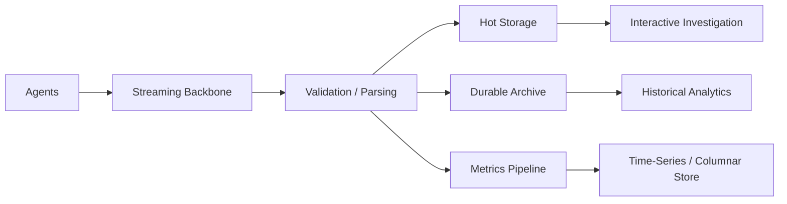
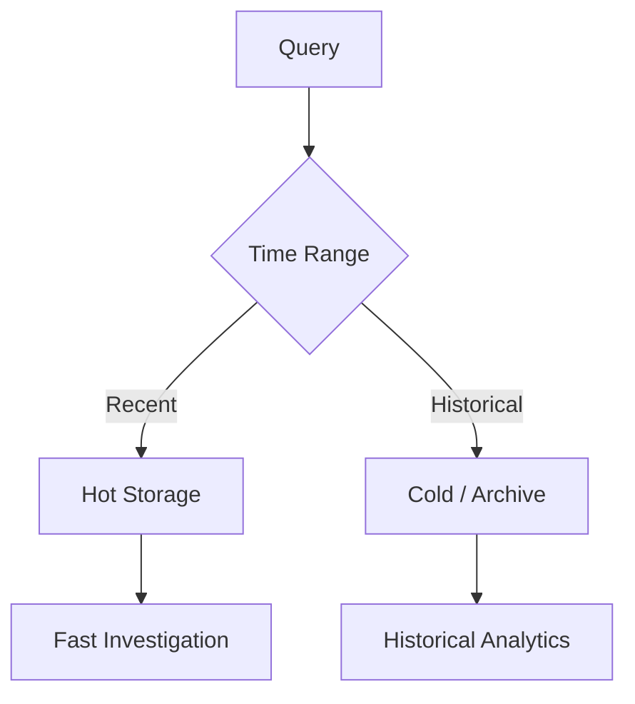

# Design Case 11 — Log and Metrics Analytics at Scale

> **G5 — Data Engineering System Design Interviews**  
> **Case 11:** Design a platform that collects and analyses application logs and metrics from **10,000 servers**, allows engineers to search within minutes, and retains data for **one year**.

This module teaches the complete system-design reasoning process for a large-scale observability data platform. The goal is not to memorize a vendor stack. The goal is to derive an architecture from **volume, query patterns, freshness, retention, cardinality, reliability, security, and cost**.

---

# 1. Exact Interview Case

> **Design a platform that collects and analyses application logs and metrics from 10,000 servers; engineers need search within minutes; keep one year.**

The interviewer is testing:

- very high ingestion volume;
- bursty traffic;
- retention tiers;
- query patterns;
- cost;
- collection reliability;
- streaming and replay;
- storage trade-offs;
- high-cardinality metrics;
- sampling and downsampling;
- PII and access control;
- operational failure handling.

The key reasoning chain is:

```text
Requirements
    ↓
Workload characterization
    ↓
Estimates
    ↓
Collection
    ↓
Buffering
    ↓
Streaming backbone
    ↓
Parsing / validation
    ↓
Hot + historical storage
    ↓
Query architecture
    ↓
Cardinality / sampling / aggregation
    ↓
Retention / lifecycle
    ↓
Security / PII
    ↓
Observability / reliability
    ↓
Cost
    ↓
Trade-offs
    ↓
Production architecture
```

---

# 2. What Makes This Problem Difficult?

Observability data differs from ordinary business data.

A production platform may simultaneously face:

- continuous high-volume writes;
- unpredictable incident bursts;
- many independent producers;
- heterogeneous schemas;
- text search;
- time-series aggregation;
- low-latency investigation;
- long retention;
- expensive indexing;
- high metric cardinality;
- duplicate and malformed records;
- late or incorrect timestamps;
- privacy-sensitive log content;
- noisy tenants/services;
- expensive historical queries.

The architecture therefore needs **multiple workload paths**, not necessarily one database.

---

# 3. Learning Outcomes

By the end of this case, you should be able to:

1. Explain logs, metrics, events, and traces.
2. Explain why observability data has unusual scale and access patterns.
3. Clarify requirements for an observability platform.
4. Estimate log and metric volume.
5. Design collection agents.
6. Design local buffering.
7. Design a streaming ingestion backbone.
8. Design parsing and validation.
9. Design hot storage.
10. Design inexpensive historical storage.
11. Compare search-oriented and columnar systems.
12. Partition by time and service.
13. Reason about high-cardinality metrics.
14. Design sampling and aggregation.
15. Design metric downsampling.
16. Design retention and lifecycle tiers.
17. Estimate storage and query cost.
18. Protect PII.
19. Design access control.
20. Monitor the observability platform itself.
21. Handle 10× incident bursts.
22. Diagnose production failures.
23. Design disaster recovery.
24. Explain major architecture trade-offs.
25. Defend the design in a 45-minute interview.

---

# 4. Observability Fundamentals

## 4.1 Logs

A log is a discrete record describing an event or state.

Example:

```text
2026-10-07T10:15:23Z
service=payments
level=ERROR
request_id=abc123
message="payment gateway timeout"
```

A structured representation is preferable:

```json
{
  "timestamp": "2026-10-07T10:15:23Z",
  "service": "payments",
  "host": "server-123",
  "level": "ERROR",
  "request_id": "abc123",
  "message": "payment gateway timeout",
  "environment": "production"
}
```

Logs are useful when engineers need to answer:

> **What happened?**

---

## 4.2 Metrics

Metrics are numerical measurements over time.

Examples:

```text
cpu_usage
http_requests_total
request_latency
error_rate
queue_depth
```

Metrics are useful when engineers need to answer:

> **How much, how often, and how is the system behaving over time?**

---

## 4.3 Traces and Events

Traces describe a request's path across distributed services.

Events describe discrete occurrences.

This case focuses on **logs and metrics**. Traces provide context but should not become a separate tracing tutorial.

---

## 4.4 Logs vs Metrics

| Dimension | Logs | Metrics |
|---|---|---|
| Primary shape | Event/record | Numeric time series |
| Query | Search/filter | Aggregate/time-series |
| Typical data | Text + fields | Values + labels |
| Main risk | Volume/indexing | Cardinality |
| Storage | Search/columnar/object | Time-series/columnar |
| Long-term strategy | Compression/tiering | Downsampling/tiering |
| Example | Error event | CPU utilization |

A shared ingestion backbone can work, but **storage and query requirements differ**.

---

# 5. Requirements Clarification

Do not begin by saying “use Kafka and Elasticsearch.”

First clarify the workload.

## Functional requirements

- collect application logs;
- collect system logs;
- collect metrics;
- search logs;
- filter by service;
- filter by host;
- filter by time;
- aggregate errors;
- query metric trends;
- investigate incidents;
- retain one year;
- retrieve historical data.

## Non-functional requirements

Clarify:

- ingestion freshness;
- search latency;
- query availability;
- durability;
- peak ingestion;
- burst tolerance;
- retention;
- security;
- privacy;
- access control;
- cost.

## Questions to ask

```text
How many servers?
How many services?
How many log events/sec?
Average event size?
Peak multiplier?
How many metric series/server?
Scrape interval?
Expected query rate?
Search latency target?
Hot retention?
Cold retention?
Who queries the data?
What PII exists?
Which records must never be dropped?
```

---

# 6. Workload Characterization

The architecture follows:

```text
Workload
   ↓
Requirements
   ↓
Estimates
   ↓
Architecture
```

For the canonical case, define explicit assumptions rather than pretending the prompt provides them.

Illustrative assumptions:

```text
Servers                  = 10,000
Average log rate/server  = 2,000 events/sec
Average log size         = 500 bytes
Peak multiplier          = 5×
Metric series/server     = 1,000
Metric scrape interval   = 15 seconds
```

These are **illustrative interview assumptions**, not universal production constants.

---

# 7. Estimation

## 7.1 Log Events per Second

```text
10,000 servers
× 2,000 events/sec/server
=
20,000,000 events/sec
```

That is:

```text
20 million log events/sec
```

This assumption is intentionally demanding. In a real interview, ask the interviewer to confirm the order of magnitude before designing for it.

---

## 7.2 Raw Bytes per Second

```text
20,000,000 events/sec
× 500 bytes/event
=
10,000,000,000 bytes/sec
```

Approximately:

```text
10 GB/sec
```

---

## 7.3 Daily Raw Volume

```text
10 GB/sec
× 86,400 sec/day
=
864,000 GB/day
≈ 864 TB/day
```

Again, this is a deliberately illustrative workload. The important interview skill is the method.

---

## 7.4 One-Year Raw Volume

Approximate:

```text
864 TB/day
× 365
≈ 315 PB/year
```

This immediately changes the architecture.

Keeping a year of raw logs in an expensive indexed hot store is unlikely to be economical.

---

## 7.5 Compression

If compressed storage achieves an illustrative 5:1 ratio:

```text
315 PB / 5
≈ 63 PB
```

Do not assume a fixed compression ratio. Actual compression depends heavily on:

- schema;
- field repetition;
- data types;
- message entropy;
- encoding;
- columnar layout;
- workload.

---

## 7.6 Peak Ingestion

For a 5× peak:

```text
10 GB/sec × 5
=
50 GB/sec
```

This is the capacity requirement at the ingestion boundary before considering protocol overhead, replication, metadata, retries, and fan-out.

---

# 8. Metric Volume

With:

```text
10,000 servers
× 1,000 metric series/server
=
10,000,000 active series
```

At a 15-second interval:

```text
10,000,000 / 15
≈ 666,667 samples/sec
```

Daily samples:

```text
666,667 × 86,400
≈ 57.6 billion samples/day
```

This demonstrates why metric cardinality and downsampling matter.

---

# 9. Architecture Implications from the Estimates

The estimates suggest:

1. direct server-to-database writes are undesirable;
2. local buffering is necessary;
3. a durable streaming backbone is useful;
4. processing must be horizontally scalable;
5. recent data and historical data should use different economics;
6. indexing everything for one year is expensive;
7. partitioning and compression are critical;
8. high-cardinality metric labels need governance;
9. lifecycle management must be automated.

This is the key system-design lesson:

> **Estimates should force architectural decisions.**

---

# 10. Collection Agents

A collection agent runs close to the workload.

```text
Application
    ↓
stdout / log file
    ↓
Collection Agent
    ↓
Local Buffer
    ↓
Central Ingestion
```

Agent responsibilities:

- collect;
- batch;
- compress;
- enrich;
- parse where appropriate;
- retry;
- buffer;
- forward;
- apply controlled sampling;
- expose local health metrics.

---

## 10.1 Deployment Options

### Host/daemon agent

```text
Host
├── Application
├── Application
└── Agent
```

Advantages:

- centralized host collection;
- lower application coupling;
- efficient for many processes.

### Sidecar

```text
Pod
├── Application
└── Agent
```

Advantages:

- workload-specific control;
- isolation.

Cost:

- additional resource overhead.

### SDK

Application emits directly to a telemetry library.

Advantages:

- rich application context.

Risks:

- application coupling;
- application performance impact;
- rollout complexity.

### Gateway

Multiple agents send to an intermediary.

Useful for:

- centralized policy;
- buffering;
- routing;
- multi-tenant controls.

---

# 11. Local Buffering

Central systems fail temporarily.

Without local buffering:

```text
Central outage
→ agent cannot send
→ events may be lost
```

With buffering:

```text
Application
   ↓
Agent
   ↓
Disk/Memory Buffer
   ↓
Retry
   ↓
Central Pipeline
```

Buffer choices:

| Buffer | Advantage | Risk |
|---|---|---|
| Memory | Fast | Lost on restart |
| Disk | Durable | Disk exhaustion |
| Hybrid | Balanced | More complexity |

A production agent should have:

- bounded buffer;
- retry policy;
- exponential backoff;
- disk quota;
- buffer utilization metrics;
- drop policy;
- backpressure policy.

---

# 12. Buffer-Full Policy

Suppose the central system is unavailable for hours.

The buffer eventually fills.

The system needs an explicit priority policy.

Example:

```text
Security/audit events
    → preserve

Critical errors
    → preserve

Warning logs
    → controlled degradation

Debug logs
    → sample/drop under policy
```

Do not silently drop critical events.

---

# 13. Streaming Backbone

A durable streaming backbone provides:

- decoupling;
- buffering;
- replay;
- fan-out;
- horizontal scaling;
- consumer isolation.

Conceptually:

```text
10,000 Servers
      ↓
Agents
      ↓
Streaming Backbone
      ↓
 ┌────┼─────────┐
 ↓    ↓         ↓
Parser Storage  Archive
```

Kafka or managed equivalents are examples, not mandatory choices.

---

# 14. Topics and Partitioning

Possible topic strategy:

```text
logs.application
logs.system
metrics.raw
metrics.derived
```

Avoid creating a topic for every tiny dimension unless there is a strong operational reason.

Partitioning should support:

- throughput;
- consumer parallelism;
- ordering where required;
- balanced load.

Potential keys:

```text
service
host
tenant
hash(service + host)
```

The best key depends on traffic distribution.

---

# 15. Hot Partitions

If one service generates 50% of all logs and partitioning uses only:

```text
service
```

then one partition family may become disproportionately hot.

Mitigations:

- composite keys;
- hashing;
- controlled partitioning;
- dedicated high-volume streams;
- quotas;
- workload isolation.

Never assume a logically meaningful key is automatically a good distribution key.

---

# 16. Log Event Schema

A canonical structured event:

```json
{
  "event_time": "2026-10-07T10:15:23Z",
  "ingestion_time": "2026-10-07T10:15:24Z",
  "service": "payments",
  "host": "server-123",
  "environment": "production",
  "level": "ERROR",
  "request_id": "abc123",
  "message": "payment gateway timeout",
  "source": "application"
}
```

Important fields:

- event timestamp;
- ingestion timestamp;
- service;
- host;
- environment;
- severity;
- request ID;
- message;
- source.

Preserving both event and ingestion timestamps helps diagnose clock skew and ingestion delay.

---

# 17. Parsing and Structuring

Unstructured:

```text
ERROR payment gateway timeout customer=123
```

Structured:

```json
{
  "level": "ERROR",
  "event": "payment_gateway_timeout",
  "customer_id": 123
}
```

Parsing options:

- JSON;
- key-value;
- regex;
- grok-like patterns;
- application-native structured logging.

Preferred principle:

> **Push structured logging toward producers when practical; use centralized parsing for legacy or uncontrolled sources.**

---

# 18. Python Parsing Example

```python
import json

REQUIRED_FIELDS = {"timestamp", "service", "level", "message"}

def parse_log(raw: str) -> dict:
    try:
        record = json.loads(raw)
    except json.JSONDecodeError as exc:
        raise ValueError("malformed log") from exc

    missing = REQUIRED_FIELDS - record.keys()
    if missing:
        raise ValueError(f"missing fields: {sorted(missing)}")

    return record
```

Production implications:

- malformed events need quarantine;
- parsing failures need metrics;
- schema changes need compatibility policy;
- parsers should not become the single point of ingestion failure.

---

# 19. Validation

Validate:

- timestamp;
- service identity;
- environment;
- severity;
- required fields;
- field types;
- message size;
- schema version.

Architecture:

```text
Raw Event
    ↓
Validation
  ┌─┴─────────┐
  ↓           ↓
Valid       Invalid
  ↓           ↓
Pipeline    Quarantine
```

A dead-letter or quarantine path is useful for investigation and replay.

---

# 20. Hot Storage

Hot storage serves recent investigation.

Example policy:

```text
0–7 days → hot
```

The actual period depends on:

- incident patterns;
- query frequency;
- cost;
- compliance;
- storage economics.

Hot storage may be:

- search/index-oriented;
- columnar OLAP;
- time-series optimized;
- managed observability storage.

Selection must follow query patterns.

---

# 21. Historical Storage

Older data can move to cheaper storage.

```text
Recent
  ↓
Hot Storage
  ↓
Warm
  ↓
Cold / Object Storage
```

Historical storage can use:

- object storage;
- compressed Parquet;
- lakehouse tables;
- inexpensive archival tiers.

The key trade-off:

```text
Lower storage cost
        ↕
Higher retrieval latency / compute
```

---

# 22. Mandatory Deep Dive — Indexing vs Columnar Storage

## Search/index-oriented storage

Best suited to:

```text
Find ERROR
AND service=payments
AND request_id=abc123
AND message contains "timeout"
```

Strengths:

- text search;
- inverted indexes;
- interactive exploration;
- filtering.

Costs:

- index storage;
- write amplification;
- metadata;
- expensive long retention.

## Columnar analytics

Best suited to:

```text
COUNT errors by service
SUM bytes by hour
P95 latency by endpoint
```

Strengths:

- compression;
- analytical scans;
- column pruning;
- aggregation efficiency.

Weaknesses:

- arbitrary full-text search may be weaker;
- interactive performance depends on layout and query selectivity.

---

## 22.1 Decision Matrix

| Workload | Better fit |
|---|---|
| Full-text search | Search/index |
| Exact structured filtering | Either |
| Large aggregation | Columnar |
| Long-term archive | Object + columnar |
| Recent incident exploration | Search/hot OLAP |
| One-year indexed retention | Usually expensive |

A hybrid design often wins:

```text
Hot search/OLAP
      +
Compressed historical columnar storage
```

---

# 23. Hybrid Storage Architecture



The archive should be durable even if the hot system is lost.

---

# 24. Partitioning

Partition primarily around common access predicates.

For logs:

```text
date
service
```

Conceptual layout:

```text
date=2026-10-07/
service=payments/
```

Benefits:

- partition pruning;
- manageable data files;
- easier lifecycle management.

Risks:

- too many partitions;
- tiny files;
- skew;
- expensive metadata.

Avoid partitioning directly by extremely high-cardinality identifiers.

---

# 25. High Cardinality

Cardinality means the number of distinct values.

Low cardinality:

```text
service = payments
service = auth
service = search
```

High cardinality:

```text
request_id
user_id
session_id
unique URL
```

High cardinality increases:

- index size;
- memory;
- metadata;
- query complexity;
- series count;
- cost.

---

# 26. Mandatory Deep Dive — Label Cardinality

Consider:

```text
http_requests_total{
    service="payments",
    region="us-east",
    status="500"
}
```

This is generally manageable.

Now:

```text
http_requests_total{
    service="payments",
    user_id="123456",
    request_id="abc123"
}
```

The number of unique series can explode.

The core principle:

> **Metrics should describe aggregate system behavior; high-cardinality identifiers often belong in logs or traces instead.**

Strategies:

- whitelist labels;
- remove unnecessary labels;
- bucket values;
- aggregate;
- sample;
- move high-cardinality investigation to logs;
- enforce metric cardinality budgets.

---

# 27. Cardinality Estimation

Conceptual SQL:

```sql
SELECT
    COUNT(DISTINCT service || ':' || host || ':' || region)
FROM metrics;
```

This illustrates the concept, but production systems may use specialized approximate cardinality algorithms.

The engineering question is not:

> “Can I count distinct values?”

It is:

> **Can I keep cardinality bounded enough that the metric system remains economically and operationally healthy?**

---

# 28. Sampling

Sampling reduces ingestion/storage/query cost.

Types:

- probabilistic sampling;
- rate-based sampling;
- adaptive sampling;
- severity-aware sampling;
- endpoint-aware sampling.

Example:

```python
import random

def sample(probability: float) -> bool:
    return random.random() < probability
```

Do not blindly sample:

- security events;
- audit records;
- critical failure signals;
- compliance-required records.

A robust design defines sampling policy by event class.

---

# 29. Aggregation and Downsampling

Raw metrics may arrive at high resolution:

```text
1-second samples
      ↓
5-minute aggregates
      ↓
1-hour aggregates
      ↓
long-term retention
```

Possible statistics:

- min;
- max;
- sum;
- count;
- average;
- histogram;
- percentile-oriented summaries.

Average alone can hide tail latency.

For latency metrics, preserve a representation that supports useful percentile analysis.

---

# 30. Metric Downsampling SQL

```sql
SELECT
    service,
    DATE_TRUNC('5 minutes', timestamp) AS bucket,
    AVG(value) AS avg_value,
    MIN(value) AS min_value,
    MAX(value) AS max_value
FROM metrics
GROUP BY
    service,
    DATE_TRUNC('5 minutes', timestamp);
```

This is illustrative. Production percentile/histogram handling depends on the metric representation.

---

# 31. Metric Representation

Conceptually:

```text
metric_name
timestamp
value
service
region
status
```

The series identity is determined by:

```text
metric_name + label set
```

A single metric name can therefore create millions of series if labels are uncontrolled.

---

# 32. Query Patterns

Representative queries:

```text
Find ERROR logs for payments in the last 10 minutes.
```

```text
Find request_id=abc123 across services.
```

```text
Count errors by service over one hour.
```

```text
Calculate latency distribution by endpoint.
```

```text
Show CPU utilization by host over the last day.
```

Query patterns should determine:

- indexing;
- partitioning;
- storage;
- materialization;
- caching;
- retention.

---

# 33. Search Within Minutes

Clarify two separate requirements:

### Data availability latency

```text
Event occurs
→ searchable within 1–3 minutes
```

### Query completion latency

```text
Search request
→ result within 5–30 seconds
```

These are different SLOs.

A system can ingest quickly but still have slow queries.

---

# 34. Query Routing



A production system may route by:

- time;
- data class;
- tenant;
- query cost;
- availability.

---

# 35. Retention

Illustrative policy:

```text
Hot:   7 days
Warm:  30 days
Cold:  1 year
```

These values are assumptions.

Retention can vary by:

- log severity;
- environment;
- service;
- data class;
- compliance;
- business value.

---

# 36. Mandatory Deep Dive — Lifecycle Tiers

The lifecycle:

```text
HOT
 ↓
WARM
 ↓
COLD
 ↓
DELETE
```

| Tier | Cost | Latency | Typical use |
|---|---|---|---|
| Hot | High | Low | Active incidents |
| Warm | Medium | Medium | Recent investigation |
| Cold | Low | High | Historical analysis |
| Delete | Lowest | None | Expired data |

Lifecycle transitions should be automated.

---

# 37. Cost per GB

A simplified model:

```text
Daily raw volume
× retention
× compression factor
× replication
× storage price
```

But storage is only one cost.

Total platform economics include:

```text
Ingestion
+
streaming
+
processing
+
indexing
+
hot storage
+
archive storage
+
query compute
+
network
+
replication
+
monitoring
```

---

# 38. Why “Index Everything” Is Expensive

Indexing can introduce:

```text
raw data
+
index structures
+
write amplification
+
metadata
+
replication
```

Therefore:

```text
Keep recent data highly queryable
+
archive older data economically
+
index only fields that justify the cost
```

This is one of the most important design decisions in the case.

---

# 39. PII in Logs

Logs can accidentally contain:

- email addresses;
- phone numbers;
- IP addresses;
- customer IDs;
- authentication tokens;
- credentials;
- payment information.

Ideal flow:

```text
Application
   ↓
Prevent sensitive logging
   ↓
Agent / ingestion policy
   ↓
Detect / redact
   ↓
Validated storage
```

Source-level prevention is preferable because once sensitive data enters the platform, copies may exist in:

- buffers;
- streams;
- hot stores;
- indexes;
- archives;
- backups.

---

# 40. Python PII Redaction

```python
SENSITIVE_FIELDS = {
    "email",
    "phone",
    "credit_card",
    "authorization",
    "password",
    "token",
}

def redact(record: dict) -> dict:
    output = dict(record)

    for field in SENSITIVE_FIELDS:
        if field in output:
            output[field] = "[REDACTED]"

    return output
```

Production concerns:

- false positives;
- false negatives;
- nested objects;
- free-form messages;
- regex detection;
- performance;
- auditability.

---

# 41. Access Control

Typical roles:

| Role | Example access |
|---|---|
| Developer | Application logs for owned services |
| SRE | Broad operational access |
| Security | Security/audit data |
| Data Engineer | Platform and pipeline data |
| Support | Restricted customer-support logs |
| Auditor | Read-only audited access |

Controls:

- RBAC;
- service-level permissions;
- tenant isolation;
- environment isolation;
- field-level protection;
- audit logging.

Never assume every engineer should see every log.

---

# 42. Security

Cover:

- encryption in transit;
- encryption at rest;
- authentication;
- authorization;
- secrets;
- PII;
- auditability;
- retention;
- secure deletion.

Security should be part of the architecture, not a final slide.

---

# 43. Observability of the Observability Platform

Monitor the platform itself.

## Agents

```text
CPU
memory
disk
buffer size
dropped events
retry count
```

## Streaming

```text
throughput
consumer lag
partition skew
broker health
retention pressure
```

## Processing

```text
parse failures
processing latency
malformed records
backlog
```

## Storage

```text
ingestion rate
storage growth
indexing lag
query latency
capacity
```

## Query

```text
p50
p95
p99
error rate
timeouts
```

---

# 44. Backpressure

If:

```text
Producer rate > Consumer rate
```

then:

```text
backlog
   ↓
lag
   ↓
buffer growth
```

Possible responses:

- autoscale consumers;
- increase parallelism;
- throttle producers;
- sample low-priority data;
- isolate noisy services;
- use durable buffering;
- temporarily reduce expensive processing.

Backpressure should be observable before users report missing data.

---

# 45. Mandatory Deep Dive — 10× Incident Burst

Assume:

```text
Normal = 100 GB/hour
Incident = 1 TB/hour
```

The architecture must absorb a 10× increase without blindly scaling every downstream component 10× forever.

## Burst strategy

```text
Incident
   ↓
Agents batch
   ↓
Local buffers
   ↓
Streaming backbone absorbs burst
   ↓
Consumers scale
   ↓
Hot storage scales
   ↓
Non-critical data may be sampled
```

Preserve:

- security events;
- audit records;
- critical errors;
- high-value incident logs.

Potentially degrade:

- debug logs;
- verbose informational logs;
- low-value repetitive records.

---

# 46. Burst Capacity Reasoning

If normal:

```text
100 GB/hour
```

then peak:

```text
1 TB/hour
```

If the downstream system processes only:

```text
150 GB/hour
```

the backlog grows by:

```text
850 GB/hour
```

The system therefore needs either:

- more consumer capacity;
- temporary buffering;
- controlled load shedding;
- or acceptance of delayed processing.

This is better reasoning than simply saying “autoscale.”

---

# 47. Failure Scenario — Agent Crash

**Symptoms**

```text
One host stops sending logs.
```

**Checks**

- agent process;
- disk;
- permissions;
- application output;
- network;
- local queue.

**Recovery**

Restart/repair the agent and replay local durable buffer if available.

**Validation**

Compare expected vs received event rate.

**Prevention**

Agent health checks and host-level telemetry.

---

# 48. Failure Scenario — Agent Disk Buffer Fills

**Symptoms**

```text
buffer utilization → 100%
```

**Checks**

- central ingestion;
- consumer lag;
- network;
- disk size;
- retry policy.

**Mitigation**

Restore downstream capacity and apply priority-based sampling if explicitly allowed.

**Prevention**

Disk thresholds and alerts.

---

# 49. Failure Scenario — Streaming Lag

**Symptoms**

```text
consumer lag rising
```

Investigate:

```text
producer rate
partition distribution
consumer throughput
hot partitions
processing latency
downstream storage
```

Recovery:

```text
scale consumers
→ rebalance
→ reduce expensive processing
→ verify downstream capacity
```

---

# 50. Failure Scenario — Parser Breaks

A service changes:

```text
JSON schema v1
→ JSON schema v2
```

If parsing assumes the old schema:

```text
valid events → quarantine
```

Response:

```text
detect
→ isolate affected parser
→ preserve raw events
→ update compatibility
→ replay
→ validate
```

Preserving raw data is extremely valuable for replay.

---

# 51. Failure Scenario — Hot Storage Overload

Symptoms:

- indexing lag;
- query latency;
- high CPU;
- storage pressure.

Possible actions:

- reduce hot retention;
- move older data to warm/cold;
- reduce unnecessary indexes;
- scale storage;
- throttle expensive queries;
- route historical queries elsewhere.

---

# 52. Failure Scenario — High-Cardinality Explosion

Symptoms:

```text
series count suddenly increases
memory rises
query latency increases
```

Likely cause:

```text
new label = request_id
```

Recovery:

```text
identify offending metric
→ disable/remove label
→ control cardinality
→ restore capacity
→ validate series count
```

Prevention:

- cardinality budgets;
- metric review;
- automated label policies.

---

# 53. Failure Scenario — 10× Traffic

Use:

```text
Detect
→ Contain
→ Buffer
→ Scale
→ Prioritize
→ Recover
→ Validate
→ Prevent
```

Measure:

- dropped data;
- lag;
- ingestion latency;
- storage pressure;
- query latency;
- cost impact.

---

# 54. Failure Scenario — PII Leak

If sensitive data is detected:

```text
Detect
→ restrict access
→ stop further propagation
→ identify affected copies
→ redact/remove where required
→ audit
→ fix source
```

Treat it as a security incident, not merely a parsing bug.

---

# 55. Failure Scenario — Cold-Tier Retrieval

If an engineer needs a one-year-old incident:

```text
Query
→ historical routing
→ object/columnar scan
→ partition pruning
→ bounded compute
```

Protect the platform from an unbounded historical query.

---

# 56. Failure Scenario — Storage Cost Spike

Investigate:

```text
ingestion volume
compression
replication
index growth
retention
cardinality
query scans
```

A cost spike often indicates a workload change rather than simply “storage got expensive.”

---

# 57. Break/Fix Labs

## Lab 1 — Consumer Lag

**Symptoms:** ingestion is healthy, processing falls behind.

**Task:** identify whether the bottleneck is partitions, consumers, parsing, or storage.

**Success:** produce evidence-backed root cause and recovery plan.

---

## Lab 2 — Cardinality Explosion

Add:

```text
request_id
```

to a metric label set.

Measure:

- series growth;
- memory;
- storage;
- query impact.

Fix by moving request-level investigation to logs.

---

## Lab 3 — Indexing Overload

Increase log volume while holding hot-store capacity constant.

Determine:

- indexing backlog;
- query impact;
- safe degradation.

---

## Lab 4 — 10× Burst

Inject 10× traffic.

Measure:

- agent buffer;
- stream lag;
- consumer throughput;
- storage pressure.

---

## Lab 5 — PII Leak

Insert:

```text
email
authorization token
```

into sample logs.

Build detection/redaction.

---

## Lab 6 — Small Partitions

Create excessive time/service partitions.

Measure:

- metadata overhead;
- file counts;
- query performance.

---

## Lab 7 — Storage Cost Explosion

Increase:

- retention;
- replication;
- index coverage.

Identify which factor dominates cost.

---

## Lab 8 — Parser Failure

Change the producer schema.

Verify:

```text
quarantine
→ parser update
→ replay
→ validation
```

---

## Lab 9 — Downsampling Error

Compare raw and downsampled latency data.

Determine whether averages preserve the operational signal.

---

## Lab 10 — Historical Query

Query a one-year-old incident.

Compare:

```text
hot index
vs
cold columnar archive
```

Document latency and cost trade-offs.

---

## Lab 11 — Hot Partition

Make one service generate most traffic.

Test key choices and partition distribution.

---

## Lab 12 — Query Latency Spike

Introduce:

- wide time range;
- high-cardinality filter;
- expensive text search.

Identify the dominant query cost.

---

# 58. SQL Log Analytics

## Errors by service

```sql
SELECT
    service,
    COUNT(*) AS errors
FROM logs
WHERE timestamp >= CURRENT_TIMESTAMP - INTERVAL '1 hour'
  AND level = 'ERROR'
GROUP BY service
ORDER BY errors DESC;
```

Production considerations:

- time partition pruning;
- service filtering;
- appropriate indexes;
- bounded result sets.

---

## Error rate

```sql
SELECT
    service,
    SUM(CASE WHEN level = 'ERROR' THEN 1 ELSE 0 END) * 1.0
        / COUNT(*) AS error_rate
FROM logs
WHERE timestamp >= CURRENT_TIMESTAMP - INTERVAL '15 minutes'
GROUP BY service;
```

---

## Logs by host

```sql
SELECT
    host,
    COUNT(*) AS events
FROM logs
WHERE timestamp >= CURRENT_TIMESTAMP - INTERVAL '10 minutes'
GROUP BY host
ORDER BY events DESC;
```

This can identify noisy hosts.

---

# 59. Metric Aggregation

```sql
SELECT
    service,
    DATE_TRUNC('5 minutes', timestamp) AS bucket,
    AVG(value) AS avg_value,
    MIN(value) AS min_value,
    MAX(value) AS max_value
FROM metrics
WHERE timestamp >= CURRENT_TIMESTAMP - INTERVAL '24 hours'
GROUP BY
    service,
    DATE_TRUNC('5 minutes', timestamp);
```

For latency, do not assume average is enough. Histogram or percentile-capable representations may be required.

---

# 60. Cardinality Analysis

Conceptual:

```sql
SELECT
    COUNT(DISTINCT service || ':' || host || ':' || region)
FROM metrics;
```

Use production-native approximate cardinality functions when scale makes exact `COUNT(DISTINCT ...)` too expensive.

---

# 61. Python Log Volume Estimator

```python
SECONDS_PER_DAY = 86_400

def daily_bytes(
    servers: int,
    events_per_second_per_server: int,
    avg_bytes_per_event: int,
) -> int:
    events_per_second = (
        servers * events_per_second_per_server
    )
    return events_per_second * avg_bytes_per_event * SECONDS_PER_DAY

raw = daily_bytes(
    servers=10_000,
    events_per_second_per_server=2_000,
    avg_bytes_per_event=500,
)

print(f"{raw / 1e12:.2f} TB/day")
```

The code converts workload assumptions into capacity requirements.

---

# 62. Python Sampling

```python
import random

def should_keep(probability: float) -> bool:
    return random.random() < probability
```

Production sampling should be:

- policy-driven;
- observable;
- deterministic where useful;
- severity-aware;
- auditable.

---

# 63. Python Cardinality Estimation

```python
def exact_cardinality(rows: list[tuple[str, str, str]]) -> int:
    return len(set(rows))

rows = [
    ("payments", "host-1", "us-east"),
    ("payments", "host-2", "us-east"),
    ("auth", "host-1", "us-east"),
]

print(exact_cardinality(rows))
```

At production scale, use approximate algorithms where appropriate instead of retaining every unique tuple in application memory.

---

# 64. Pseudocode — Agent Buffer

```text
while event_available:
    event = read_event()

    if valid(event):
        append_to_buffer(event)
    else:
        quarantine(event)

    if buffer_ready():
        batch = read_batch()
        send(batch)

    if send_failed():
        retry_with_backoff()

    if buffer_full():
        apply_priority_policy()
```

The important design decisions are:

- bounded buffer;
- retry;
- backoff;
- durability;
- priority;
- observability.

---

# 65. Pseudocode — Lifecycle Tiering

```text
for each data_partition:

    if age < hot_retention:
        keep in hot storage

    elif age < warm_retention:
        move to warm storage

    elif age < cold_retention:
        move/archive to cold storage

    else:
        securely delete
```

Production systems must make transitions:

- idempotent;
- auditable;
- failure-aware;
- policy-driven.

---

# 66. Technology Trade-Offs

## Collection

| Choice | Strength | Weakness |
|---|---|---|
| Host agent | Broad collection | Fleet management |
| Sidecar | Isolation | Resource overhead |
| SDK | Rich context | Application coupling |
| Gateway | Central policy | Additional hop |

## Streaming

A streaming backbone is useful when the platform needs:

- decoupling;
- buffering;
- replay;
- fan-out;
- independent consumers.

Direct ingestion can be acceptable for small or low-risk workloads, but the canonical case is large enough that durable buffering is valuable.

## Hot storage

Choose according to:

```text
text search?
structured filters?
aggregation?
latency?
retention?
cost?
```

## Historical storage

Object storage plus compressed columnar data is often attractive for:

- long retention;
- large scans;
- lower storage cost.

---

# 67. Push vs Pull Metrics

### Pull

```text
Monitoring system
       ↓
scrape target
```

### Push

```text
Application
       ↓
metrics gateway
```

Pull can simplify discovery and centralized scraping.

Push can help with ephemeral workloads or environments where scraping is difficult.

The decision depends on:

- service discovery;
- workload lifecycle;
- network topology;
- buffering;
- operational model.

---

# 68. Trade-Off Catalogue

Use:

```text
Decision
→ Options
→ Requirements
→ Criteria
→ Choice
→ Downside
→ Mitigation
```

Important comparisons:

### Search vs columnar

Search wins for text-heavy interactive investigation.

Columnar wins for large analytical scans.

### Hot vs cold

Hot wins for latency.

Cold wins for retention economics.

### Full logging vs sampling

Full logging maximizes investigation detail.

Sampling reduces cost but can lose evidence.

### Raw vs structured

Raw preserves maximum fidelity.

Structured improves queryability.

### One store vs hybrid

One store simplifies operations.

Hybrid optimizes different workload economics.

### Real-time vs batch

Real-time improves freshness.

Batch often reduces complexity and cost.

---

# 69. Disaster Recovery

Consider:

- regional outage;
- streaming outage;
- hot-store outage;
- archive outage;
- metadata failure.

Define:

```text
RPO
RTO
replay strategy
backup
archive durability
```

A strong design separates:

```text
durable source/archive
```

from:

```text
derived hot index
```

so hot-storage loss does not necessarily mean permanent data loss.

---

# 70. Data Quality

Monitor:

### Logs

- missing events;
- duplicates;
- malformed events;
- invalid timestamps;
- clock skew;
- unexpected schema.

### Metrics

- gaps;
- duplicate samples;
- invalid values;
- unexpected series growth;
- missing labels.

Data quality should be measured against expected source behavior, not only storage-system health.

---

# 71. Clock and Timestamp Issues

Preserve:

```text
event_time
ingestion_time
processing_time
```

Clock skew can affect:

- ordering;
- windows;
- aggregation;
- incident timelines;
- retention.

A production platform should distinguish:

> **When did the event happen?**

from:

> **When did we receive it?**

---

# 72. 10× Scale Scenario

What changes if:

```text
10,000 servers
→
100,000 servers
```

Re-evaluate:

- agent fleet;
- network;
- stream partitions;
- consumer parallelism;
- hot storage;
- archive;
- query fleet;
- metadata;
- cardinality;
- cost.

Now assume:

```text
1% of services generate 80% of traffic.
```

The design needs:

- workload isolation;
- quotas;
- dedicated capacity where justified;
- hot-key mitigation;
- selective sampling;
- service-level cost attribution.

---

# 73. Multi-Tenancy

For large organizations, teams may share the platform.

Consider:

- tenant isolation;
- quotas;
- rate limits;
- access control;
- noisy neighbors;
- cost attribution;
- retention policies.

Do not let one team's debug flood consume the entire platform's capacity.

---

# 74. Production Runbook — Agent Buffer Filling

**Symptoms**

```text
buffer utilization > 80%
```

**Checks**

- stream availability;
- network;
- consumer lag;
- local disk;
- producer rate.

**Immediate mitigation**

- restore downstream capacity;
- increase consumer capacity;
- apply approved low-priority sampling.

**Recovery**

Replay buffered records.

**Validation**

Confirm buffer drains and no critical events were dropped.

**Prevention**

Capacity alerts and bounded-buffer policy.

---

# 75. Production Runbook — Kafka/Streaming Lag

**Symptoms**

Consumer lag continuously increases.

**Checks**

```text
producer rate
partition distribution
consumer throughput
processing latency
downstream storage
```

**Mitigation**

Scale consumers, fix hot partitions, or reduce expensive processing.

**Validation**

Lag returns to normal and freshness SLO recovers.

---

# 76. Production Runbook — High Cardinality

**Symptoms**

Series count and memory increase sharply.

**Checks**

- recent metric deployments;
- new labels;
- unique-value counts;
- series growth by service.

**Mitigation**

Remove offending label or route that dimension to logs.

**Prevention**

Cardinality budgets and review gates.

---

# 77. Production Runbook — Indexing Backlog

**Symptoms**

Ingestion succeeds but searchable data is delayed.

**Checks**

- index queue;
- shard/partition health;
- CPU;
- disk;
- write throughput;
- query load.

**Mitigation**

Scale indexing capacity, reduce unnecessary indexing, or route older data away from hot storage.

---

# 78. Production Runbook — 10× Burst

**Symptoms**

Traffic exceeds normal capacity.

**Checks**

- source rate;
- agent buffers;
- stream lag;
- storage throughput;
- query traffic.

**Mitigation**

Prioritize critical data, scale consumers, protect the hot path, and apply approved sampling.

---

# 79. Production Runbook — PII Detection

**Symptoms**

Sensitive content detected.

**Checks**

- source service;
- affected time range;
- storage/index copies;
- access logs.

**Mitigation**

Restrict access, stop further propagation, redact/delete where required.

**Prevention**

Source controls and automated detection.

---

# 80. Production Runbook — Query Latency Spike

**Symptoms**

p95/p99 increases.

**Checks**

- time range;
- query selectivity;
- high-cardinality filters;
- hot partitions;
- storage pressure;
- concurrent queries.

**Mitigation**

Bound expensive queries, route historical workloads, scale query capacity.

---

# 81. Production Runbook — Cost Spike

**Checks**

```text
volume
retention
replication
indexing
cardinality
query scans
```

**Recovery**

Remove unnecessary hot/indexed data, enforce retention, improve compression, and optimize queries.

---

# 82. Production Runbook — Metric Gap

**Symptoms**

Expected series disappear.

**Checks**

- source scrape;
- agent;
- stream;
- parser;
- storage;
- query.

**Recovery**

Restore pipeline and determine whether historical samples can be replayed.

---

# 83. Interview Pushback

## “Why not store everything in Elasticsearch?”

Strong response:

> “It can provide excellent interactive search, but one-year retention of very high-volume data with extensive indexing can be expensive. I would keep a recent hot search layer and use compressed historical storage for long retention, unless the workload or economics justify indexing everything.”

---

## “Why not store everything in S3?”

> “Object storage is excellent for durable, inexpensive retention, but interactive incident search within minutes may require more specialized indexing or columnar query infrastructure. I would separate the hot query path from the archive.”

---

## “Why do we need Kafka?”

> “The primary reason is decoupling and durable buffering between high-volume producers and multiple consumers. It also provides replay and independent scaling. If the workload were small enough, direct ingestion might be simpler.”

---

## “Why not index everything?”

> “Indexing improves retrieval but adds storage and write amplification. I would index fields that support high-value queries and keep long-term raw/structured data in cheaper storage.”

---

## “Why can't user_id be a metric label?”

> “It can cause a series explosion because every unique user creates another time series. User-level investigation is generally better represented in logs or traces, while metrics should keep bounded dimensions.”

---

# 84. Senior vs Staff-Level Thinking

## Mid-level

Should explain:

- collection;
- streaming;
- storage;
- basic reliability.

## Senior

Should additionally explain:

- volume estimates;
- partitioning;
- cardinality;
- burst handling;
- storage economics;
- lifecycle;
- failure recovery;
- cost.

## Staff

Should additionally reason about:

- organization-wide standards;
- multi-team governance;
- cost allocation;
- multi-region strategy;
- platform economics;
- lifecycle policy;
- standardization vs team autonomy;
- evolution over years.

Staff-level thinking asks:

> **How does this platform remain economically and operationally sustainable as the organization grows?**

---

# 85. Mental Models

## Observability pipeline

```text
Collect
→ Buffer
→ Transport
→ Process
→ Store
→ Query
→ Retain
```

## Cost model

```text
Volume
× Retention
× Replication
× Indexing
× Query
```

## Cardinality

```text
More unique label combinations
→ More series
→ More memory/storage
→ Higher cost
```

## Lifecycle

```text
Hot
→ Warm
→ Cold
→ Delete
```

## Incident burst

```text
Burst
→ Buffer
→ Queue
→ Scale
→ Recover
```

---

# 86. Mock Interview 1 — Standard Case

## INTERVIEWER PROMPT

> Design a platform that collects and analyses application logs and metrics from 10,000 servers; engineers need search within minutes; keep one year.

Attempt before reading the reference.

## Clarifications expected

Ask about:

- average/peak volume;
- log size;
- metric cardinality;
- query patterns;
- freshness;
- search latency;
- retention;
- PII;
- access control.

## REFERENCE SOLUTION

```text
Agents
→ local buffering
→ durable streaming backbone
→ validation/parsing
→ hot search/OLAP
→ historical compressed archive

Metrics
→ controlled labels
→ aggregation/downsampling
→ time-series/columnar storage

Lifecycle
→ hot
→ warm
→ cold
→ delete
```

Mandatory deep dives:

- 10× bursts;
- search vs columnar;
- cardinality;
- lifecycle tiers.

---

# 87. Mock Interview 2 — Burst Case

## INTERVIEWER PROMPT

> The same platform experiences a 10× increase in log traffic during major incidents. Design the system so that critical incident evidence is preserved without making the platform permanently 10× more expensive.

Expected focus:

- local buffers;
- stream retention;
- autoscaling;
- consumer lag;
- priority classes;
- sampling;
- storage burst capacity;
- cost.

---

# 88. Mock Interview 3 — Cost + Cardinality

## INTERVIEWER PROMPT

> The company wants one-year retention, but metric cardinality has doubled every quarter and storage cost is growing rapidly. Redesign the platform.

Expected focus:

- label governance;
- cardinality budgets;
- downsampling;
- lifecycle;
- selective indexing;
- hot/cold separation;
- cost attribution;
- query economics.

---

# 89. 45-Minute Interview Walkthrough

| Time | Focus |
|---|---|
| 0–5 min | Requirements + workload |
| 5–8 min | Estimates |
| 8–15 min | High-level architecture |
| 15–22 min | Collection + buffering + streaming |
| 22–30 min | Hot/historical storage + queries |
| 30–35 min | Cardinality + sampling + downsampling |
| 35–40 min | Retention + lifecycle + cost |
| 40–45 min | Failures + security + trade-offs |

Do not spend 20 minutes discussing one database.

---

# 90. What to Draw

Start with:

```text
Servers
 ↓
Agents
 ↓
Streaming
 ↓
Processing
 ↓
Hot + Archive
```

Then add:

```text
Buffering
Validation
Sampling
Aggregation
Lifecycle
Monitoring
Security
```

Then annotate:

```text
throughput
latency
retention
cost
failure handling
```

---

# 91. 60-Second Architecture Answer

> “I would place collection agents on the servers with bounded local buffering so temporary central outages do not immediately lose data. Agents publish into a durable streaming backbone that decouples producers from parsing, storage, and downstream consumers. The ingestion layer validates and structures events, applies controlled redaction and policy-driven sampling, and routes logs and metrics to workload-appropriate stores. Recent logs go to a hot search or OLAP layer for interactive incident investigation, while durable compressed columnar data goes to cheaper historical storage for the one-year retention requirement. Metrics use controlled label cardinality and aggregation/downsampling. Automated lifecycle policies move data from hot to warm to cold and eventually delete it. The platform monitors ingestion freshness, consumer lag, cardinality, storage growth, query latency, and cost. During 10× incidents, buffering, streaming capacity, autoscaling, and priority-based degradation protect critical evidence without permanently provisioning for peak load.”

---

# 92. Interviewer Follow-Up Bank

## Requirements

1. What does “within minutes” mean?
2. What is the query SLA?
3. How much log data is generated?
4. What is the peak multiplier?
5. What data cannot be dropped?
6. Which teams query the system?
7. Is one-year retention mandatory for every record?
8. What compliance requirements exist?

## Estimation

9. How do you calculate GB/day?
10. How do you estimate peak throughput?
11. How do you estimate metric series?
12. How do you estimate hot storage?
13. How does compression affect capacity?
14. What about replication?
15. What about query compute?
16. What changes at 10× scale?

## Collection

17. Why agents?
18. Why not application SDKs?
19. Why not direct database writes?
20. Where does buffering happen?
21. What if the agent crashes?
22. What if local disk fills?
23. How do you preserve ordering?
24. How do you handle malformed logs?

## Streaming

25. Why a streaming backbone?
26. How do you partition?
27. What is the partition key?
28. How do you prevent hot partitions?
29. What if consumers fall behind?
30. How do you replay?
31. What retention does the stream need?
32. How do you isolate noisy producers?

## Parsing

33. Where does parsing happen?
34. What if a schema changes?
35. What if parsing fails?
36. Why preserve raw events?
37. How do you quarantine bad records?
38. How do you validate timestamps?
39. How do you enrich events?
40. How do you control parsing cost?

## Hot Storage

41. Why search storage?
42. Why columnar storage?
43. Why not one database?
44. What fields do you index?
45. How do you control index size?
46. What happens when hot storage fills?
47. How do you scale search?
48. How do you handle query storms?

## Historical Storage

49. Why object storage?
50. How do you partition archives?
51. How do you query historical data?
52. How do you control scan cost?
53. How do you restore old incidents?
54. How do you manage retention?
55. How do you verify archive durability?
56. What happens if an archive partition is corrupt?

## Cardinality

57. What is cardinality?
58. Why is it dangerous?
59. What is a metric series?
60. Why is request_id a poor metric label?
61. How do you enforce label limits?
62. How do you detect cardinality growth?
63. What if a service suddenly creates millions of series?
64. Where should user-level dimensions go?

## Sampling

65. What can be sampled?
66. What cannot be sampled?
67. How do you choose a sample rate?
68. What is adaptive sampling?
69. How do you audit sampling?
70. How do you preserve rare errors?
71. What if an incident changes the value of sampling?
72. How do you communicate sampling to users?

## Downsampling

73. Why downsample?
74. What information is lost?
75. Why isn't average always enough?
76. How do histograms help?
77. What retention should raw metrics have?
78. What resolution should long-term metrics use?
79. How do you validate downsampled data?
80. How do you support historical percentile queries?

## Retention/Lifecycle

81. Why tier storage?
82. What determines hot retention?
83. What determines cold retention?
84. How do you automate movement?
85. What happens if tier migration fails?
86. How do you securely delete expired data?
87. How do retention policies differ by data class?
88. How do you handle legal holds?

## Cost

89. What are the major cost drivers?
90. How does indexing affect cost?
91. How does cardinality affect cost?
92. How does retention affect cost?
93. How do you allocate cost to teams?
94. How do you reduce cost without destroying incident response?
95. How do you handle query-cost abuse?
96. What would you optimize first?

## Security/PII

97. What PII can appear in logs?
98. Where should redaction occur?
99. What if a secret is logged?
100. How do you restrict access?
101. How do you audit access?
102. How do you remove sensitive historical data?
103. How do you isolate production logs?
104. How do you prevent unauthorized archive access?

## Reliability/Scale

105. What if Kafka is unavailable?
106. What if hot storage is unavailable?
107. What if one service generates most traffic?
108. What if traffic increases 10×?
109. What if query traffic increases 10×?
110. What if the region fails?
111. What is the RPO?
112. What is the RTO?

---

# 93. Difficult Interview Pushback

### “Why not just use Elasticsearch for everything?”

Answer in one sentence:

> “Because the one-year volume makes universal indexing expensive; I would keep recent interactive data hot and move long-term data into compressed, cheaper analytical storage.”

### “Why not just use S3?”

> “Because durable object storage is excellent for retention but does not by itself provide the interactive investigation experience implied by the minute-level search requirement.”

### “Why not eliminate Kafka?”

> “If the system is small, direct ingestion can be simpler, but at this volume Kafka-like durable buffering provides decoupling, replay, fan-out, and failure isolation.”

### “What if we need exact data?”

> “Preserve raw durable events and define which downstream transformations are allowed to sample or aggregate; critical evidence should not be silently sampled.”

---

# 94. Self-Scoring Rubric

Score each dimension from 1–5.

| Dimension | 1 | 3 | 5 |
|---|---|---|---|
| Requirements | Vague | Main constraints | Finds hidden constraints |
| Estimation | Missing | Basic | Architecture-driven |
| Collection | Generic | Agents | Agents + buffering + policy |
| Streaming | Named | Explained | Partition/replay/failure model |
| Parsing | Mentioned | Basic | Schema evolution + quarantine |
| Storage | Tool list | Hot/cold | Workload-derived hybrid |
| Search | Ignored | Covered | Query-driven indexing strategy |
| Columnar | Ignored | Covered | Cost/query trade-off |
| Partitioning | Generic | Time | Time/service/skew analysis |
| Cardinality | Missing | Defined | Governance + economics |
| Sampling | Missing | Basic | Priority-aware policy |
| Downsampling | Missing | Aggregation | Percentile-aware design |
| Retention | One number | Tiers | Lifecycle economics |
| Cost | Generic | Storage | Full unit economics |
| PII | Mentioned | Redaction | Prevention + incident response |
| Security | Basic | RBAC | Full access/audit model |
| Reliability | Retries | Failures | Recovery architecture |
| Scale | Static | 10× | Capacity/economic reasoning |
| Communication | Tool list | Architecture | Requirement-to-trade-off narrative |
| Trade-offs | Weak | Some | Explicit decision framework |

Scoring:

```text
1 = Weak
2 = Developing
3 = Competent
4 = Senior
5 = Exceptional
```

---

# 95. Final Assessment

## Attempt First

> **Design a platform that collects and analyses application logs and metrics from 10,000 servers; engineers need search within minutes; keep one year.**

Produce:

1. requirements;
2. assumptions;
3. workload estimates;
4. collection architecture;
5. buffering;
6. streaming backbone;
7. parsing;
8. validation;
9. hot storage;
10. historical storage;
11. search architecture;
12. columnar architecture;
13. partitioning;
14. cardinality strategy;
15. sampling;
16. downsampling;
17. retention;
18. lifecycle tiers;
19. cost model;
20. PII protection;
21. access control;
22. platform observability;
23. failure handling;
24. 10× burst handling;
25. disaster recovery;
26. trade-offs;
27. 45-minute walkthrough.

---

# 96. Reference Evaluation Guide

A strong answer should derive approximately:

```text
10,000 servers
        ↓
high-volume agents
        ↓
bounded local buffers
        ↓
durable streaming backbone
        ↓
validation + parsing
        ↓
 ┌───────────────┬──────────────────┐
 ↓               ↓                  ↓
hot logs      metric pipeline    durable archive
 ↓               ↓                  ↓
search/OLAP   TS/columnar      compressed history
 ↓               ↓                  ↓
incident      dashboards       long retention
```

And should explicitly explain:

```text
10× bursts
indexing vs columnar
label cardinality
lifecycle tiers
```

The candidate should also quantify:

- normal throughput;
- peak throughput;
- hot storage;
- historical storage;
- metric series;
- query requirements;
- retention cost.

---

# 97. Final Reference Architecture

```text
                         10,000 SERVERS
                               |
                    ┌──────────┴──────────┐
                    ↓                     ↓
              LOG AGENTS             METRIC AGENTS
                    |                     |
                    └──────────┬──────────┘
                               ↓
                         LOCAL BUFFER
                               ↓
                    STREAMING BACKBONE
                               ↓
                     VALIDATION/PARSING
                               |
                  ┌────────────┴────────────┐
                  ↓                         ↓
          PROCESSING / ROUTING       SAMPLING / AGGREGATION
                  |                         |
                  └────────────┬────────────┘
                               ↓
                  ┌────────────┴────────────┐
                  ↓                         ↓
              HOT STORAGE             DURABLE ARCHIVE
                  ↓                         ↓
           FAST INVESTIGATION         LONG RETENTION
                  ↓                         ↓
              ENGINEERS             HISTORICAL QUERIES

                  RETENTION / LIFECYCLE
                  HOT → WARM → COLD → DELETE
```

Key annotations:

```text
Agents:
  bounded buffering + retry

Streaming:
  durable transport + replay

Processing:
  validation + parsing + enrichment

Hot:
  low-latency investigation

Archive:
  durable, compressed, inexpensive retention

Metrics:
  bounded cardinality + aggregation/downsampling

Lifecycle:
  automated movement by age/data class

Security:
  PII controls + RBAC + audit

Operations:
  lag + freshness + cardinality + cost + query latency
```

---

# 98. Final Interview Cheat Sheet

## Requirements

```text
How many servers?
How much data?
What peak?
What freshness?
What query SLA?
What retention?
What cannot be dropped?
What PII?
Who accesses it?
```

## Estimates

```text
events/sec
bytes/sec
GB/day
TB/day
peak rate
metric series
samples/sec
hot storage
annual storage
```

## Collection

```text
agent
buffer
batch
compress
retry
backpressure
```

## Streaming

```text
topics
partitions
keys
replication
lag
replay
```

## Storage

```text
hot
warm
cold
archive
```

## Query

```text
text search
structured filtering
aggregation
partition pruning
query routing
```

## Cardinality

```text
labels
series
budgets
governance
logs for high-cardinality dimensions
```

## Cost

```text
ingestion
processing
indexing
storage
replication
query
retention
```

## Security

```text
PII
redaction
RBAC
encryption
audit
deletion
```

## Failures

```text
agent
buffer
stream
parser
hot store
cardinality
burst
query
archive
```

---

# 99. Roadmap Coverage Audit

| Roadmap Requirement | Covered? | Section |
|---|---|---|
| Collection agents | Yes | 10 |
| Buffering | Yes | 11–12 |
| Streaming backbone | Yes | 13–15 |
| Parsing | Yes | 17–18 |
| Structuring | Yes | 16–18 |
| Hot storage | Yes | 20 |
| Search / columnar OLAP | Yes | 22 |
| Cheap historical storage | Yes | 21 |
| Partitioning by time | Yes | 24 |
| Partitioning by service | Yes | 24 |
| High-cardinality problems | Yes | 25–26 |
| Sampling | Yes | 28 |
| Aggregation | Yes | 29–30 |
| Downsampling | Yes | 29–31 |
| Retention | Yes | 35 |
| Lifecycle tiers | Yes | 36 |
| Cost per GB | Yes | 37–38 |
| Access control | Yes | 41 |
| PII in logs | Yes | 39–40 |
| 10× incident bursts | Yes | 45–46 |
| Indexing vs columnar storage | Yes | 22 |
| Label cardinality | Yes | 26 |
| Lifecycle tiers | Yes | 36 |
| Failure scenarios | Yes | 47–54 |
| Production runbooks | Yes | 74–82 |
| SQL examples | Yes | 58–60 |
| Python examples | Yes | 61–63 |
| Architecture diagrams | Yes | 23, 90 |
| Interview follow-ups | Yes | 92–93 |
| Mock interviews | Yes | 86–88 |
| Self-scoring | Yes | 94 |
| Final assessment | Yes | 95–96 |

### Mandatory Deep-Dive Verification

```text
[✓] 10× incident bursts
[✓] Indexing vs columnar storage
[✓] Label cardinality
[✓] Lifecycle tiers
```

Related roadmap work is intentionally treated as context rather than duplicated:

```text
Module 2.5
Module 2.16
Module 2.17
Module 2.20
Module 2.21
```

---

# 100. Completion Checklist

```text
## Completion Checklist

- [ ] I understand what logs are.
- [ ] I understand what metrics are.
- [ ] I understand logs vs metrics.
- [ ] I can characterize observability workloads.
- [ ] I can estimate log volume.
- [ ] I can estimate metric volume.
- [ ] I can design collection agents.
- [ ] I understand local buffering.
- [ ] I understand backpressure.
- [ ] I can design a streaming backbone.
- [ ] I can design log schemas.
- [ ] I understand parsing and structuring.
- [ ] I can handle malformed logs.
- [ ] I can design hot storage.
- [ ] I can design cheap historical storage.
- [ ] I can compare search and columnar storage.
- [ ] I understand partitioning.
- [ ] I understand high cardinality.
- [ ] I understand label cardinality.
- [ ] I can design sampling.
- [ ] I can design metric aggregation.
- [ ] I understand downsampling.
- [ ] I can design retention policies.
- [ ] I understand lifecycle tiers.
- [ ] I can calculate cost per GB.
- [ ] I understand PII risks in logs.
- [ ] I can design access control.
- [ ] I can design observability for the platform.
- [ ] I can handle 10× incident bursts.
- [ ] I can troubleshoot ingestion failures.
- [ ] I can troubleshoot indexing failures.
- [ ] I can troubleshoot cardinality explosions.
- [ ] I can troubleshoot storage-cost explosions.
- [ ] I can design disaster recovery.
- [ ] I can design the complete platform in 45 minutes.
- [ ] I can explain the major architectural trade-offs.
- [ ] I can handle senior-level interviewer follow-ups.
```

---

# 101. Final Operating Standard

```text
CLARIFY
→ CHARACTERIZE WORKLOAD
→ ESTIMATE VOLUME
→ DESIGN COLLECTION
→ BUFFER LOCALLY
→ TRANSPORT DURABLY
→ VALIDATE
→ PARSE / STRUCTURE
→ STORE RECENT DATA HOT
→ ARCHIVE HISTORIC DATA CHEAPLY
→ PARTITION FOR QUERY PATTERNS
→ CONTROL CARDINALITY
→ SAMPLE WHEN SAFE
→ AGGREGATE / DOWNSAMPLE
→ TIER BY LIFECYCLE
→ PROTECT PII
→ CONTROL ACCESS
→ MONITOR THE PLATFORM
→ HANDLE BURSTS
→ RECOVER FROM FAILURES
→ MEASURE COST
→ RECONCILE
→ EVOLVE
→ DEFEND TRADE-OFFS
```

The senior-level mental model is:

> **Observability architecture is a workload-economics problem as much as a storage problem. Collect reliably, preserve critical evidence, make recent data fast to investigate, make historical data cheap, keep metric cardinality bounded, and use lifecycle policies so the platform remains operationally and financially sustainable at scale.**
