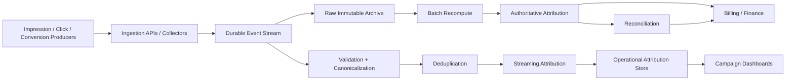
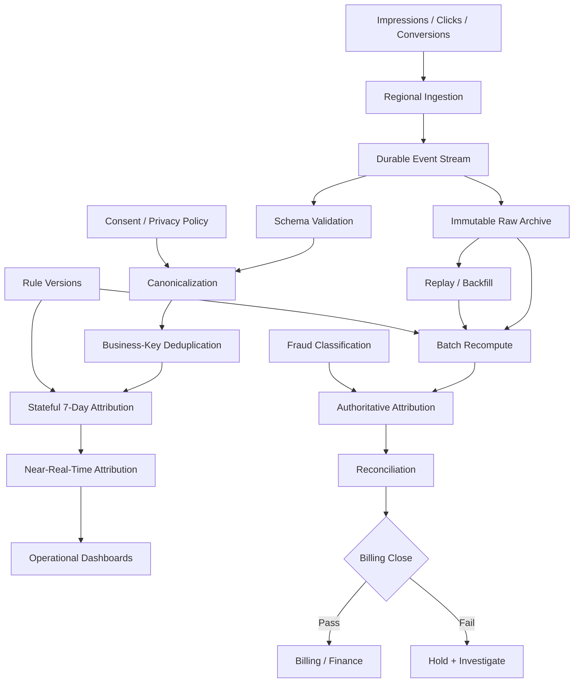

# 12 — Design Case: Ad Attribution and Deduplication

> **G5 — Data Engineering System Design Interviews**  
> **Case 12:** Design an ad attribution and deduplication system that attributes conversions to ad clicks within a **7-day window**, deduplicates events, and produces **billing-grade numbers**.

This case teaches the learner to move from advertising fundamentals to a production-grade event-processing architecture. The core engineering problem is not merely “join clicks to conversions.” It is a correctness problem involving **identity, temporal joins, duplicate delivery, late data, state, deterministic attribution, restatements, reconciliation, fraud, privacy, and auditability**.

The architecture must support two deliberately different outcomes:

```text
Near-real-time operational estimate
                +
Final authoritative billing result
```

The final system must be replayable, explainable, testable, and economically scalable.


## 1. Case Overview

### Interview prompt

> **Design an ad attribution and deduplication system that attributes conversions to ad clicks within a 7-day window, deduplicates events, and produces billing-grade numbers.**

### What the interviewer is testing

- joins across time windows;
- deduplication at scale;
- exactness and correctness;
- impression, click, and conversion streams;
- event identity;
- attribution models;
- stream-stream joins;
- batch recomputation;
- late conversions;
- restatements;
- billing correctness;
- reconciliation;
- fraud and bot filtering;
- privacy and consent;
- auditability;
- failure handling;
- cost and scale.

### Core mental model

```text
Business semantics
      ↓
Event contracts
      ↓
Event identity
      ↓
Deduplication
      ↓
Event-time ordering
      ↓
7-day eligibility
      ↓
Attribution rule
      ↓
Real-time estimate
      ↓
Raw immutable archive
      ↓
Batch recomputation
      ↓
Reconciliation
      ↓
Billing-grade result
      ↓
Auditable restatement
```

### Critical principle

> **Never confuse “the pipeline processed the message once” with “the business event was counted once.”**

Exactly-once processing semantics do not eliminate duplicate business events, duplicate producer submissions, or conflicting source records.


## 2. Why This Problem Matters

Advertising systems connect money to event data.

A small error can become financially material:

```text
100M clicks/day
× duplicate rate
× conversion rate
× conversion value
```

A duplicated conversion can:

- over-credit a campaign;
- overstate publisher revenue;
- distort advertiser ROI;
- create incorrect invoices;
- trigger disputes;
- make finance reconciliation fail.

A late conversion can:

- change yesterday's attribution;
- change campaign totals;
- change billing;
- require a restatement.

Therefore the design objective is:

```text
Correctness first
→ freshness second
→ cost efficiency
→ operational simplicity
```

Subject to the explicit business SLA.


## 3. Digital Advertising Fundamentals

### Advertiser

The business paying for advertising.

### Publisher

The property where an advertisement is displayed.

### Ad platform

The system that connects advertisers, inventory, users, bidding, delivery, measurement, and billing.

### Campaign

A business-defined advertising initiative with budget, targeting, creative, and measurement rules.

### Impression

An advertisement was displayed or recorded as served according to the platform's impression definition.

### Click

A user interaction with the advertisement.

### Conversion

A business outcome such as:

- purchase;
- signup;
- lead;
- subscription;
- app install;
- qualified action.

### Simple journey

```text
User sees ad
   ↓
Impression
   ↓
User clicks
   ↓
Click
   ↓
User visits product
   ↓
Purchase
   ↓
Conversion
   ↓
Attribution assigns credit
```

The key question is:

> **Which eligible ad interaction gets credit for the conversion?**


## 4. What Is Ad Attribution?

Attribution assigns conversion credit to one or more marketing interactions.

### Single-touch example

```text
Search Ad A
    ↓
Click C1
    ↓
Purchase V1
```

Last-touch and first-touch both assign V1 to C1.

### Multi-touch example

```text
Day 1: Ad A → Click C1
Day 3: Ad B → Click C2
Day 6: Ad C → Click C3
Day 7: Purchase V1
```

Possible outcomes:

```text
First-touch → C1
Last-touch  → C3
Linear      → C1 + C2 + C3
```

The system must make the selected rule explicit and deterministic.


## 5. Attribution Models

| Model | Rule | Engineering implication |
|---|---|---|
| First-touch | Earliest eligible touch | Requires historical ordering |
| Last-touch | Latest eligible touch | Requires latest eligible click |
| Linear | Split credit across eligible touches | Requires complete candidate set |
| Time-decay | More recent touches receive more credit | Requires deterministic weighting |
| Position-based | Higher weights at journey boundaries | Requires ordered candidate set |
| Rule-based | Business-defined conditions | Requires versioned rules |
| Custom | Organization-specific | Requires explicit contract and auditability |

For billing, the attribution model should be treated as a **versioned business rule**.

Do not silently change:

```text
last_touch_v1
```

into:

```text
last_touch_v2
```

without preserving which rule generated each historical result.


## 6. Event Data Model

A simplified click:

```json
{
  "event_id": "click-8a21",
  "event_type": "click",
  "event_time": "2026-10-01T10:00:00Z",
  "ingestion_time": "2026-10-01T10:00:03Z",
  "user_id": "u-123",
  "click_id": "click-8a21",
  "campaign_id": "cmp-42",
  "advertiser_id": "adv-7",
  "publisher_id": "pub-9",
  "consent_state": "granted",
  "schema_version": 3
}
```

A conversion:

```json
{
  "event_id": "conversion-91ff",
  "event_type": "conversion",
  "event_time": "2026-10-07T09:00:00Z",
  "ingestion_time": "2026-10-07T09:00:08Z",
  "user_id": "u-123",
  "conversion_id": "order-10001",
  "conversion_value": 149.99,
  "currency": "USD",
  "schema_version": 4
}
```

Important fields:

- immutable event ID;
- business ID;
- event type;
- event time;
- ingestion time;
- identity key;
- campaign/advertiser;
- value/currency;
- consent state;
- schema version;
- source metadata.


## 7. Event Identity

A central design question is:

> **What makes two records the same business event?**

Potential identities:

```text
event_id
click_id
conversion_id
order_id
transaction_id
```

Do not use:

```text
user_id
```

as the universal event identity.

One user can legitimately produce:

```text
10 clicks
3 orders
```

### Identity hierarchy

```text
Transport/message ID
        ↓
Producer event ID
        ↓
Business transaction ID
        ↓
Attribution entity
```

The design should document which identifier controls which type of deduplication.


## 8. Why Deduplication Is Required

Duplicates arise from:

- client retries;
- SDK retries;
- network retries;
- browser reloads;
- mobile offline buffering;
- message redelivery;
- producer retries;
- API retries;
- batch replay;
- pipeline restart;
- connector duplication;
- third-party integration bugs.

Example:

```text
Original click
    ↓
Network timeout
    ↓
Client retries
    ↓
Same click submitted again
```

Naive counting:

```text
1 logical click
→ 2 physical records
→ 2 counted clicks
```

Billing consequence:

```text
1 conversion
→ 2 attribution records
→ incorrect billing
```

Deduplication is therefore a business-correctness control, not merely a performance optimization.


## 9. Deduplication Fundamentals

### Exact duplicate

Same event ID and same payload.

### Logical duplicate

Different transport IDs but the same business event.

### Near duplicate

Events that are highly similar but cannot safely be declared identical without business rules.

### Deterministic deduplication

Given the same source data and rules, the system always chooses the same surviving record.

A common SQL pattern:

```sql
WITH ranked AS (
    SELECT
        *,
        ROW_NUMBER() OVER (
            PARTITION BY event_id
            ORDER BY ingestion_time DESC
        ) AS rn
    FROM raw_events
)
SELECT *
FROM ranked
WHERE rn = 1;
```

This does not solve every duplicate problem. If producers generate different IDs for the same order, a business-key rule is required.


## 10. Deduplication Strategies

### Primary-key enforcement

Useful when a durable store can enforce uniqueness.

### MERGE / upsert

Useful when the target supports deterministic matching.

### Stateful stream dedupe

Useful when duplicate detection must happen before downstream attribution.

### Idempotent writes

Useful when the same logical operation may be retried.

### Probabilistic filters

Bloom-filter-style structures can reduce repeated work, but should not be the sole correctness mechanism for billing if false positives could discard legitimate events.

### Recommended pattern

```text
Raw immutable events
        ↓
Deterministic canonicalization
        ↓
Business-key deduplication
        ↓
Validated event tables
        ↓
Attribution
```

Keep the raw source so the pipeline can be re-run when deduplication rules change.


## 11. Deduplication Windows

Possible policies:

```text
24-hour dedupe window
7-day dedupe window
30-day dedupe window
```

The correct window depends on:

- producer retry behavior;
- offline client behavior;
- business semantics;
- attribution window;
- late-data policy;
- regulatory requirements;
- storage cost.

A 7-day attribution window does **not automatically mean** the dedupe state must be exactly seven days. A late-arriving duplicate may require a different operational horizon.

Document separately:

```text
Deduplication horizon
Attribution horizon
Late-data acceptance horizon
Billing finalization horizon
```

This distinction prevents subtle correctness bugs.


## 12. Event Time vs Processing Time

Suppose:

```text
Click happened:       10:00
Click arrived:        10:08
Click processed:      10:09
```

These are different timestamps.

| Timestamp | Meaning |
|---|---|
| event_time | When business event occurred |
| ingestion_time | When platform received it |
| processing_time | When a processor handled it |

Attribution should generally reason from **event time**, not arrival order.

Otherwise a delayed event can incorrectly appear to have happened after a conversion simply because it arrived later.


## 13. Late and Out-of-Order Events

Example:

```text
Click:
Monday 10:00

Conversion:
Friday 14:00

Conversion arrives:
Saturday 09:00
```

The conversion is late relative to its event time.

Another case:

```text
Click C2 event_time = 10:05
Click C1 event_time = 10:01

C2 arrives first
C1 arrives later
```

Arrival order is not event order.

Production processing therefore needs:

- event-time semantics;
- bounded state;
- watermarks or equivalent progress tracking;
- late-event policy;
- replay capability;
- correction path.


## 14. The Seven-Day Attribution Window

For conversion time `T`, an eligible click can be defined as:

```text
T - 7 days ≤ click_time ≤ T
```

The exact boundary must be specified.

Example:

```text
Conversion: Day 8 10:00

Click A: Day 1 09:59 → outside
Click B: Day 1 10:00 → boundary; eligible if inclusive
Click C: Day 5 12:00 → eligible
Click D: Day 8 10:01 → after conversion; not eligible
```

Clarify:

- inclusive/exclusive boundaries;
- UTC normalization;
- clock skew;
- event-time semantics;
- late arrival;
- state retention.

Never leave “7 days” as an ambiguous phrase in a billing design.


## 15. Time-Window Joins

A simple equality join:

```sql
SELECT *
FROM clicks c
JOIN conversions v
  ON c.user_id = v.user_id;
```

is insufficient because it matches all historical clicks.

Add the temporal predicate:

```sql
SELECT
    c.click_id,
    v.conversion_id
FROM clicks c
JOIN conversions v
  ON c.user_id = v.user_id
 AND c.click_time <= v.conversion_time
 AND c.click_time >= v.conversion_time - INTERVAL '7 days';
```

This is a range/time-window join.

The system must still answer:

- Which identity key?
- Which clicks are valid?
- What if there are 100 eligible clicks?
- Which attribution model?
- What if events arrive late?
- How long is join state retained?


## 16. Stream-Stream Joins

Conceptually:

```text
Clicks stream ──────────┐
                        ├── 7-day temporal join ── Attribution
Conversions stream ─────┘
```

A streaming join requires state because one side may arrive before the other.

Cases:

```text
Click first
→ retain click state

Conversion first
→ retain conversion state

Both arrive
→ match immediately

Conversion late
→ reopen/correct attribution if policy allows

Click late
→ evaluate whether it should change attribution
```

State must have:

- bounded retention;
- partitioning;
- checkpointing;
- recovery;
- expiration;
- late-event policy.


## 17. Attribution Matching

Example:

```text
C1 → Day 1
C2 → Day 3
C3 → Day 6

V1 → Day 7
```

Eligible set:

```text
{C1, C2, C3}
```

Possible models:

```text
Last-touch  → C3
First-touch → C1
Linear      → 1/3 each
```

### Deterministic tie-breaking

If:

```text
C1.event_time = C2.event_time
```

use a documented secondary key:

```text
click_id
```

or another deterministic sequence.

Billing cannot depend on nondeterministic ordering.


## 18. Multiple Conversions

One user may produce:

```text
Click C1
  ↓
Order O1
Order O2
Subscription S1
```

Therefore:

```text
user_id
```

is not sufficient to identify a conversion.

Prefer explicit business identifiers such as:

```text
conversion_id
order_id
transaction_id
subscription_id
```

Business rules must define whether:

- one order can generate multiple conversion events;
- refunds reverse conversion value;
- cancellations restate value;
- subscription renewals count as new conversions.


## 19. Conversion Value and Monetary Correctness

Billing-grade monetary processing must avoid accidental floating-point arithmetic.

Prefer integer minor units:

```text
$149.99
→ 14999 cents
```

or a decimal type with an explicit currency scale.

Example:

```python
from decimal import Decimal

value = Decimal("149.99")
tax = Decimal("12.50")
total = value + tax
print(total)
```

Store:

```text
amount
currency
exchange-rate policy
effective date
```

Do not silently mix:

```text
USD
EUR
INR
```

without an explicit currency conversion contract.


## 20. Real-Time Attribution

A near-real-time path may produce:

```text
Estimated conversions
Estimated attributed value
Campaign dashboard
```

Architecture:

```text
Event streams
     ↓
Deduplication
     ↓
Streaming attribution
     ↓
Operational serving layer
     ↓
Campaign dashboard
```

This result may change later because:

- late events arrive;
- fraud detection changes eligibility;
- duplicates are discovered;
- business rules are corrected;
- source data is restated.

Therefore label it clearly:

> **Preliminary / operational attribution**


## 21. Real-Time Attribution vs Final Attribution

This distinction is critical.

```text
                 ┌→ Near-real-time attribution
Raw event stream ┤
                 └→ Immutable archive
                         ↓
                  Batch recomputation
                         ↓
                 Final authoritative result
                         ↓
                       Billing
```

The two numbers can temporarily differ.

That is not automatically a defect.

The defect is failing to define:

- which result is authoritative;
- when it becomes final;
- how corrections occur;
- how users see restatements;
- how finance reconciles the result.


## 22. Batch Attribution

Batch recomputation provides a deterministic correctness path.

Conceptually:

```text
Raw clicks
Raw conversions
Raw impressions
      ↓
Canonicalization
      ↓
Deduplication
      ↓
Eligibility filtering
      ↓
7-day temporal join
      ↓
Attribution model
      ↓
Fraud/quality rules
      ↓
Authoritative attribution table
```

Batch recomputation is especially valuable when:

- late data is common;
- attribution rules evolve;
- fraud results arrive later;
- auditability matters;
- billing requires deterministic reproducibility.


## 23. Late Conversions and Restatements

Example:

```text
Day 1: Click C1
Day 3: Conversion V1 occurs
Day 8: V1 arrives
```

A dashboard generated on Day 3 may have shown:

```text
0 conversions
```

The final Day 3 result may become:

```text
1 attributed conversion
```

That is a **restatement**.

A restatement should be explicit, traceable, and versioned rather than silently overwriting history without audit evidence.


## 24. Restatement Strategies

| Strategy | Strength | Weakness |
|---|---|---|
| Mutable result table | Simple queries | Audit history harder |
| Append-only corrections | Strong auditability | Query logic more complex |
| Versioned results | Explicit reproducibility | More storage/metadata |
| Periodic full recompute | Strong correctness | More compute |

A robust billing design often combines:

```text
Immutable raw events
+
Versioned canonical data
+
Authoritative result
+
Correction/restatement history
```

Example result metadata:

```text
attribution_run_id
rule_version
data_cutoff
generated_at
source_snapshot
result_version
```


## 25. Billing-Grade Correctness

### Analytics-grade

Usually emphasizes:

- useful numbers;
- reasonable freshness;
- scalable queries.

### Billing-grade

Must additionally emphasize:

- deterministic rules;
- reproducibility;
- completeness;
- exact business-event identity;
- controlled deduplication;
- monetary correctness;
- auditability;
- reconciliation;
- traceability;
- controlled restatement;
- versioned logic;
- immutable source evidence.

Think:

```text
Can we explain the number?
Can we reproduce it?
Can we prove what inputs produced it?
Can we identify corrections?
Can finance reconcile it?
```

If the answer is no, the system is not billing-grade.


## 26. Reconciliation

Reconciliation compares independent representations of the same business quantity.

Examples:

```text
raw clicks
vs
deduplicated clicks
```

```text
raw conversions
vs
valid conversions
```

```text
eligible conversions
vs
attributed conversions
```

```text
streaming estimate
vs
batch authoritative result
```

```text
billing total
vs
finance/source-of-truth total
```

### SQL example

```sql
SELECT
    event_date,
    COUNT(*) AS raw_conversions,
    COUNT(DISTINCT conversion_id) AS unique_conversions
FROM raw_conversions
GROUP BY event_date
ORDER BY event_date;
```

Reconcile by:

- day;
- advertiser;
- campaign;
- currency;
- event type;
- partition.

Define explicit tolerance rules. For billing, “small difference” is not an acceptable explanation without an approved business tolerance.


## 27. Fraud and Bot Filtering

Potential signals include:

- impossible event rates;
- repeated click patterns;
- automated user agents;
- abnormal device behavior;
- suspicious IP patterns where legally appropriate;
- invalid conversion sequences;
- known bot signatures.

Two broad architectures:

### Filter before attribution

```text
Raw
→ Validation
→ Fraud filter
→ Attribution
```

### Preserve raw, exclude downstream

```text
Raw immutable archive
→ Detection
→ Fraud classification
→ Attribution excludes invalid events
```

The second approach can improve auditability because the original event remains available.

Fraud detection should be treated as a versioned classification problem, not a simplistic single rule.


## 28. Privacy and Consent

Attribution often involves user identifiers.

Potential concerns:

- consent;
- pseudonymous identifiers;
- device identifiers;
- cookies;
- IP addresses;
- cross-site tracking;
- data retention;
- deletion requests;
- access controls.

Design principles:

```text
Collect minimum necessary data
→ respect consent state
→ pseudonymize where appropriate
→ restrict access
→ encrypt
→ retain only as required
→ support deletion/governance
```

Do not use privacy-sensitive identifiers as arbitrary analytics dimensions without a defined purpose and governance policy.


## 29. Production Architecture



The raw archive is the replay foundation.

The streaming path is optimized for freshness.

The batch path is optimized for correctness and reproducibility.


## 30. Streaming Architecture

A representative flow:

```text
Producers
   ↓
API / SDK / Collector
   ↓
Durable stream
   ↓
Schema validation
   ↓
Canonicalization
   ↓
Deduplication
   ↓
Stateful 7-day attribution
   ↓
Operational result
```

Design requirements:

- partitioning;
- durable offsets;
- checkpointing;
- state recovery;
- watermark progress;
- backpressure;
- retry;
- dead-letter handling;
- schema compatibility.

Technology is secondary to these requirements.


## 31. State Management

The 7-day join requires bounded state.

Potential state:

```text
clicks_by_identity
conversions_by_identity
dedupe_keys
attribution candidates
watermark
```

A conceptual state key:

```text
identity_key
```

with values containing recent eligible events.

State must expire after the business horizon plus an explicitly defined late-data allowance.

### State risks

- hot identities;
- state explosion;
- skew;
- checkpoint growth;
- recovery time;
- storage cost.

State is not “free memory.” It is a production capacity requirement.


## 32. Partitioning and Key Design

Candidate keys:

```text
user_id
advertiser_id
campaign_id
hashed identity
```

For attribution, events that may join should generally land in compatible partitions.

But a single user or advertiser can become a hot key.

Mitigations:

- controlled key salting where semantics permit;
- workload isolation;
- hot-key detection;
- dedicated processing;
- rate limits;
- aggregation before expensive joins.

Never blindly salt a key when exact co-location is required; salting can make the join more complex.


## 33. Exactly-Once vs Effectively-Once

### At-most-once

May lose events.

### At-least-once

May deliver duplicates.

### Exactly-once

A processing framework may guarantee certain transactional or state semantics, but that does not automatically guarantee business-event uniqueness.

### Effectively-once business outcome

A stronger practical goal:

```text
At-least-once transport
+
deterministic event identity
+
idempotent writes
+
deduplication
+
replayable raw source
=
effectively-once business result
```

For billing, focus on the **observable business outcome**, not the marketing label attached to the messaging system.


## 34. SQL Implementation

### Deterministic deduplication

```sql
WITH ranked AS (
    SELECT
        *,
        ROW_NUMBER() OVER (
            PARTITION BY event_id
            ORDER BY ingestion_time DESC
        ) AS rn
    FROM raw_clicks
)
SELECT *
FROM ranked
WHERE rn = 1;
```

### 7-day eligibility

```sql
SELECT
    c.click_id,
    v.conversion_id
FROM clean_clicks c
JOIN clean_conversions v
  ON c.user_id = v.user_id
 AND c.event_time <= v.event_time
 AND c.event_time >= v.event_time - INTERVAL '7 days';
```

### Last-touch selection

```sql
WITH candidates AS (
    SELECT
        c.click_id,
        v.conversion_id,
        c.event_time AS click_time,
        ROW_NUMBER() OVER (
            PARTITION BY v.conversion_id
            ORDER BY c.event_time DESC, c.click_id DESC
        ) AS rn
    FROM clean_clicks c
    JOIN clean_conversions v
      ON c.user_id = v.user_id
     AND c.event_time <= v.event_time
     AND c.event_time >= v.event_time - INTERVAL '7 days'
)
SELECT *
FROM candidates
WHERE rn = 1;
```

The secondary ordering makes ties deterministic.


## 35. SQL Reconciliation

### Duplicate rate

```sql
SELECT
    event_date,
    COUNT(*) AS rows_received,
    COUNT(DISTINCT event_id) AS unique_events,
    COUNT(*) - COUNT(DISTINCT event_id) AS duplicate_rows
FROM raw_clicks
GROUP BY event_date;
```

### Attributed value by campaign

```sql
SELECT
    campaign_id,
    SUM(attributed_value) AS attributed_value
FROM authoritative_attribution
WHERE result_version = 7
GROUP BY campaign_id;
```

### Streaming vs batch

```sql
SELECT
    campaign_id,
    SUM(stream_value) AS stream_value,
    SUM(batch_value) AS batch_value,
    SUM(batch_value) - SUM(stream_value) AS delta
FROM reconciliation_daily
GROUP BY campaign_id;
```

Investigate material deltas rather than masking them with rounding.


## 36. Python Implementation

### Deterministic deduplication

```python
def deduplicate(events):
    winners = {}

    for event in events:
        key = event["event_id"]
        current = winners.get(key)

        if current is None:
            winners[key] = event
            continue

        # Prefer the later-ingested copy when event identity is equal.
        if event["ingestion_time"] > current["ingestion_time"]:
            winners[key] = event

    return list(winners.values())
```

This is a teaching implementation, not a recommendation to load billions of events into process memory.

### Last-touch attribution

```python
from datetime import timedelta

def last_touch(clicks, conversion):
    start = conversion["event_time"] - timedelta(days=7)

    eligible = [
        c for c in clicks
        if start <= c["event_time"] <= conversion["event_time"]
    ]

    if not eligible:
        return None

    return max(
        eligible,
        key=lambda c: (c["event_time"], c["click_id"])
    )
```

Production systems distribute this logic across partitioned state or batch processing.


## 37. PySpark / Distributed Implementation

A simplified batch pattern:

```python
from pyspark.sql import functions as F
from pyspark.sql.window import Window

clicks = spark.table("clean_clicks")
conversions = spark.table("clean_conversions")

joined = (
    conversions.alias("v")
    .join(
        clicks.alias("c"),
        (F.col("c.user_id") == F.col("v.user_id"))
        & (F.col("c.event_time") <= F.col("v.event_time"))
        & (
            F.col("c.event_time")
            >= F.col("v.event_time") - F.expr("INTERVAL 7 DAYS")
        ),
        "inner",
    )
)

w = Window.partitionBy("v.conversion_id").orderBy(
    F.col("c.event_time").desc(),
    F.col("c.click_id").desc(),
)

last_touch = (
    joined
    .withColumn("rn", F.row_number().over(w))
    .filter(F.col("rn") == 1)
)
```

Production concerns:

- data skew;
- partition pruning;
- shuffle volume;
- join strategy;
- state size;
- late data;
- deterministic ordering;
- incremental recomputation.

The code demonstrates the logic; it does not eliminate the distributed-systems design problem.


## 38. Scale Estimation

Illustrative assumptions — **not facts from the roadmap**:

```text
100M clicks/day
20M conversions/day
500M impressions/day
Average click event = 1 KB
Average conversion event = 1 KB
Peak multiplier = 10×
```

### Average click rate

```text
100,000,000 / 86,400
≈ 1,157 clicks/sec
```

### Peak click rate

```text
1,157 × 10
≈ 11,570 clicks/sec
```

### Raw click storage/day

```text
100M × 1 KB
≈ 100 GB/day
```

Before accounting for:

- replication;
- indexes;
- compression;
- metadata;
- state;
- derived tables;
- archive formats.

The interview skill is to make assumptions explicit and use them to drive architecture.


## 39. Ten-Times Scale

If clicks grow from:

```text
100M/day
→
1B/day
```

re-evaluate:

- ingestion throughput;
- stream partitions;
- dedupe state;
- temporal-join state;
- storage;
- batch recomputation;
- query concurrency;
- reconciliation cost;
- hot keys;
- network;
- operational blast radius.

Do not simply say “add more workers.”

Ask:

```text
Which component becomes the first bottleneck?
What is the new state size?
What is the partition distribution?
What is the recovery time?
What is the cost?
```


## 40. Failure Scenarios

### Producer retry storm

**Symptom:** duplicate event rate spikes.

**Response:**

```text
Detect duplicate ratio
→ preserve raw events
→ deduplicate by deterministic identity
→ identify producer cause
→ repair retry behavior
→ reconcile affected partitions
```

### Stream outage

```text
Producer
→ durable local/API retry
→ stream recovers
→ replay
→ downstream catches up
```

Do not discard billing events merely because the downstream stream is unavailable.

### State-store failure

Recover from checkpoints plus replayable source data.

### Attribution job crash

Use checkpoint/restart semantics and idempotent result writes.

### Late conversion

Apply the late-data policy, recompute affected attribution, and generate a controlled restatement.

### Fraud model update

Version the fraud decision and recompute affected results rather than silently mutating historical logic.


## 41. Data Quality

Monitor:

- duplicate rate;
- missing event IDs;
- invalid timestamps;
- future timestamps;
- conversion without identity;
- click without campaign;
- unknown advertiser;
- currency mismatch;
- negative/invalid values;
- unexpected event-volume changes;
- attribution match rate;
- unmatched conversion rate.

A useful invariant:

```text
raw_count
≥
deduplicated_count
≥
valid_count
≥
eligible_count
```

The exact relationship depends on business rules, but unexplained inversions should trigger investigation.


## 42. Observability

### Ingestion

```text
events/sec
bytes/sec
error rate
retry rate
duplicate rate
```

### Streaming

```text
consumer lag
processing latency
watermark
checkpoint duration
state size
```

### Attribution

```text
eligible conversions
attributed conversions
unattributed conversions
match rate
rule-version distribution
```

### Billing

```text
daily total
restatement amount
reconciliation delta
source-to-result completeness
```

### Platform

```text
CPU
memory
storage
network
query latency
cost
```

Alert on business correctness metrics, not only infrastructure health.


## 43. Security and Governance

Controls should include:

- encryption in transit;
- encryption at rest;
- least-privilege access;
- service identities;
- secret management;
- audit logs;
- consent state;
- data classification;
- retention;
- deletion workflows;
- environment isolation.

Govern:

```text
Who can see user-level events?
Who can run attribution?
Who can approve a rule-version change?
Who can publish billing results?
Who can restate a closed period?
```

Billing pipelines should have stronger change control than exploratory analytics.


## 44. Cost Engineering

Major costs:

```text
ingestion
+
streaming compute
+
state storage
+
hot storage
+
archive storage
+
batch recomputation
+
query compute
+
network
+
indexing
```

Optimization strategies:

- partition pruning;
- incremental recomputation;
- state TTL;
- compact storage;
- pre-aggregation;
- appropriate retention;
- right-sized streaming capacity;
- efficient joins;
- selective indexing;
- replay only affected partitions.

Do **not** optimize away billing correctness.

A cheaper incorrect invoice is not a successful optimization.


## 45. Technology Trade-Offs

### Kafka-like stream vs managed streaming

Choose based on:

- throughput;
- operations;
- replay;
- ecosystem;
- regional requirements;
- cost.

### Spark Structured Streaming vs Flink-style processing

Consider:

- latency;
- stateful processing;
- team expertise;
- operational model;
- batch/stream unification;
- ecosystem.

### Warehouse SQL vs streaming engine

Warehouse:

- simpler for batch;
- excellent analytical SQL;
- potentially slower for continuous low-latency state.

Streaming engine:

- better continuous state;
- more operational complexity.

### Batch recomputation vs continuous attribution

Streaming:

- fresh;
- operationally useful.

Batch:

- deterministic;
- easier to audit and correct.

A strong architecture commonly uses both.


## 46. Interview Requirements Clarification

Before drawing boxes, ask:

### Business

1. What exactly counts as a conversion?
2. What is the attribution model?
3. Is attribution used for billing?
4. What level of exactness is required?
5. What is the authoritative source of monetary value?

### Scale

6. Events/day?
7. Peak events/sec?
8. Number of advertisers?
9. Number of campaigns?
10. Number of users?
11. Number of simultaneous conversions?

### Latency

12. How quickly must operational attribution appear?
13. When must final billing close?
14. What is the acceptable restatement window?

### Correctness

15. How are duplicate IDs defined?
16. How late can events arrive?
17. What is the exact 7-day boundary?
18. Can historical rules change?

### Privacy

19. What consent model exists?
20. Which identifiers are allowed?
21. What retention/deletion requirements apply?

### Operations

22. What are RPO/RTO targets?
23. How are failed partitions replayed?
24. Who can approve billing corrections?


## 47. 45-Minute Interview Walkthrough

| Time | Objective |
|---|---|
| 0–5 min | Clarify business and correctness requirements |
| 5–10 min | Estimate event volume, state, and storage |
| 10–15 min | Draw high-level architecture |
| 15–25 min | Deep dive into dedupe, attribution, 7-day join, and state |
| 25–35 min | Billing, reconciliation, restatements, fraud, privacy |
| 35–40 min | Failure scenarios and recovery |
| 40–45 min | Trade-offs and concise final summary |

### High-level diagram to draw first

```text
Clicks / Conversions
        ↓
Durable Stream
        ↓
Validate → Canonicalize → Deduplicate
        ↓
Streaming 7-Day Attribution
        ↓
Operational Results

Raw Immutable Archive
        ↓
Batch Recompute
        ↓
Authoritative Attribution
        ↓
Reconciliation
        ↓
Billing
```

Do not spend the first 20 minutes debating product names.


## 48. Deep-Dive Follow-Up Questions

A strong candidate should be prepared for questions across requirements, attribution, deduplication, identity, temporal joins, state, late data, correctness, billing, reconciliation, fraud, privacy, operations, cost, scale, disaster recovery, schema evolution, backfills, and architecture.

### Requirements and business semantics

1. What exactly is a conversion?
2. Can one order create multiple conversion events?
3. Is attribution used for billing or only analytics?
4. What is the finalization deadline?
5. Is the 7-day window inclusive?
6. Are clicks before the conversion always eligible?
7. Can attribution rules change?
8. Who owns the attribution definition?
9. What is the source of truth for conversion value?
10. What is the source of truth for ad spend?

### Attribution models

11. How does last-touch work?
12. How does first-touch work?
13. How would linear attribution work?
14. How does time decay affect the result?
15. How do you version attribution rules?
16. How do you make ties deterministic?
17. What if no click is eligible?
18. Can one conversion receive fractional credit?
19. How do refunds affect attribution?
20. How do subscription renewals differ from first purchase?

### Deduplication

21. Why is user_id insufficient for deduplication?
22. What is the event identity?
23. What if the same business event has two event IDs?
24. How long should dedupe state live?
25. Why not dedupe forever?
26. How does a stateful stream dedupe work?
27. How does a database uniqueness constraint help?
28. When is MERGE appropriate?
29. Can a Bloom filter provide billing correctness?
30. What happens if a duplicate arrives after the dedupe TTL?
31. How do you measure duplicate rate?
32. How do you reconcile duplicate events already billed?

### Event identity

33. What is the difference between event_id and conversion_id?
34. What if conversion_id is reused incorrectly?
35. What if an SDK generates a new ID on every retry?
36. How do you establish logical identity?
37. What metadata should be retained for audit?
38. Can a transport message ID be the business key?
39. How do you handle missing IDs?
40. How do you handle malformed IDs?

### Time-window joins

41. Why is an equality join insufficient?
42. How do you implement the 7-day range?
43. Why does event time matter?
44. How do watermarks help?
45. How long must click state be retained?
46. What if a conversion arrives before its click?
47. What if a click arrives after the conversion?
48. What if both are late?
49. How do you avoid unbounded state?
50. What happens at the seven-day boundary?

### Streaming

51. Why use a durable stream?
52. How would you partition events?
53. What makes a hot partition?
54. How do you handle consumer lag?
55. How do you replay?
56. How do you recover a failed stateful job?
57. What happens if checkpoints are corrupted?
58. How do you handle backpressure?
59. How do you isolate noisy advertisers?
60. How do you monitor watermark progress?

### State

61. What state does attribution require?
62. What state does deduplication require?
63. How do you estimate state size?
64. How do you expire state?
65. How do you recover state?
66. What happens when one user has millions of events?
67. How do you detect hot keys?
68. Can you salt attribution keys?
69. What is the trade-off of salting?
70. How do you test state recovery?

### Late data and restatements

71. What is a late conversion?
72. What is an out-of-order click?
73. When is a result considered final?
74. How do you reopen a closed day?
75. How do you version restatements?
76. How do users discover that numbers changed?
77. How do you recompute only affected data?
78. What if a late event is fraudulent?
79. What if the attribution rule changes?
80. How do you audit a historical correction?

### Exactly-once and correctness

81. Is exactly-once processing enough?
82. What does effectively-once mean?
83. How does idempotency help?
84. How do you make writes idempotent?
85. What if a database commit succeeds but the acknowledgement is lost?
86. How do you replay safely?
87. How do you prevent double billing?
88. How do you prove deterministic output?
89. How do you test replay equivalence?
90. What evidence supports a billing result?

### Billing and reconciliation

91. What does billing-grade mean?
92. How do you reconcile raw vs clean events?
93. How do you reconcile streaming vs batch?
94. How do you reconcile campaign totals?
95. How do you reconcile monetary values?
96. What is a permitted tolerance?
97. What happens when reconciliation fails?
98. Who can approve a correction?
99. How do you close a billing period?
100. How do you reproduce a previous invoice?

### Fraud and privacy

101. Where should bot filtering happen?
102. Why preserve raw fraudulent events?
103. How do you avoid false-positive fraud filtering?
104. What consent state belongs on an event?
105. How do you protect user identifiers?
106. How do you restrict access to user-level data?
107. How do you handle deletion requests?
108. How do you audit access?
109. What happens if a sensitive value is logged?
110. How does privacy affect attribution completeness?

### Data quality and operations

111. What if conversion volume suddenly drops 80%?
112. What if duplicate rate jumps 20×?
113. What if event timestamps are in the future?
114. What if a campaign disappears from the reference data?
115. How do you detect missing partitions?
116. How do you monitor schema drift?
117. What are your key SLOs?
118. How do you test disaster recovery?
119. How do you handle partial pipeline failure?
120. What is the replay procedure?

### Cost and scale

121. What are the largest cost drivers?
122. How would you reduce state cost?
123. How would you reduce batch recomputation cost?
124. What changes at 10× traffic?
125. What becomes the first bottleneck?
126. How do you estimate seven-day state?
127. How do you isolate large advertisers?
128. How do you control query costs?
129. When would you archive older raw data?
130. How do you balance freshness against cost?

### Architecture and staff-level reasoning

131. Why keep immutable raw data?
132. Why separate operational and authoritative results?
133. Why not use only a warehouse?
134. Why not use only streaming?
135. Why version business rules?
136. How would multiple business units share the platform?
137. How would you govern attribution definitions?
138. How would you support regional data residency?
139. How would you migrate to a new attribution model?
140. How would you prove the platform is audit-ready?


## 49. Strong Answers to Common Interview Pushback

### “Why not deduplicate using user_id?”

Because a user can legitimately generate multiple clicks and conversions. Event or business-transaction identity is required to distinguish legitimate repetition from duplicate delivery.

### “Why not just use exactly-once processing?”

Exactly-once framework semantics do not prove that two producer records represent the same business event. Business identity and deterministic deduplication are still required.

### “Why do you need a streaming system?”

For near-real-time attribution, durable buffering, replay, independent consumer scaling, and stateful event processing. A batch-only design can still work when freshness requirements permit it.

### “Why can't the warehouse do everything?”

It can handle the authoritative batch computation well, but a low-latency operational attribution path may benefit from stateful streaming. The correct choice depends on freshness, scale, and operational constraints.

### “Why are yesterday's numbers changing?”

Because late events, fraud classification, duplicate discovery, or rule changes can alter the authoritative result. The system should make these restatements explicit and auditable.

### “What happens when a conversion arrives after seven days?”

Apply the documented late-data/finalization policy. Do not silently attribute it. If the business permits late corrections, create a controlled restatement; otherwise classify it as outside the attribution window.

### “Why preserve raw events?”

Because raw immutable data is the replay and audit foundation. Without it, correcting attribution logic or investigating a billing dispute may be impossible.

### “How do you prove no conversion was double-counted?”

Use deterministic conversion identity, deduplication, unique authoritative keys, reconciliation, replay tests, and auditable attribution-run metadata.

### “What happens if the attribution job crashes halfway through?”

Restart from durable checkpoints or replayable source data and write results idempotently. The final output must not depend on how many times the job was retried.

### “How would you handle 10× more traffic?”

Re-estimate throughput, state, partitions, storage, query load, and recovery time; then identify bottlenecks rather than blindly scaling every component.


## 50. Failure Deep Dives

### Failure 1 — Duplicate conversion flood

```text
Detect
→ quantify affected IDs
→ freeze affected billing partition if required
→ deduplicate
→ recompute
→ reconcile
→ correct invoice/result
→ fix producer retry behavior
```

### Failure 2 — Consumer lag

Check:

```text
producer rate
partition skew
consumer throughput
state-store latency
downstream writes
```

### Failure 3 — State explosion

Check:

```text
identity skew
dedupe horizon
attribution horizon
watermark progress
hot keys
```

### Failure 4 — Late-event storm

Use:

```text
late-event queue
→ bounded correction policy
→ affected-partition recomputation
→ controlled restatement
```

### Failure 5 — Fraud classifier outage

Do not silently classify all traffic as valid.

Prefer:

```text
preserve raw
→ pause finalization if necessary
→ recover classifier
→ recompute affected period
```

### Failure 6 — Schema-breaking deployment

```text
detect incompatible schema
→ quarantine
→ preserve raw
→ rollback/fix
→ replay
→ validate
```

### Failure 7 — Billing reconciliation failure

```text
stop finalization
→ identify dimension/time partition
→ compare raw/clean/attributed
→ inspect restatements
→ repair
→ rerun reconciliation
→ approve close
```

### Failure 8 — Hot advertiser

One advertiser produces disproportionate traffic.

Mitigate through:

- workload isolation;
- partition strategy;
- quotas;
- dedicated capacity;
- hot-key monitoring.


## 51. Break/Fix Labs

### Lab 1 — Duplicate Clicks

Inject the same click 10 times.

Measure:

- raw count;
- unique count;
- deduplicated count;
- attribution impact.

Success condition:

```text
one logical click
→ one canonical click
```

### Lab 2 — Duplicate Conversion

Replay one conversion with different transport IDs.

Implement business-key deduplication.

### Lab 3 — Late Conversion

Create:

```text
Click Day 1
Conversion Day 3
Arrival Day 8
```

Verify the result is corrected according to the late-data policy.

### Lab 4 — Boundary Test

Test clicks at:

```text
T - 7 days - 1 second
T - 7 days
T
T + 1 second
```

Document expected eligibility.

### Lab 5 — Out-of-Order Events

Deliver conversion before click.

Verify state-based correction.

### Lab 6 — Hot Key

Generate millions of events for one identity.

Measure state skew and recovery.

### Lab 7 — Streaming vs Batch

Generate a preliminary streaming result and compare it with batch recomputation.

### Lab 8 — Restatement

Change the attribution rule version and recompute one day.

### Lab 9 — Fraud Exclusion

Mark a set of clicks as bot traffic and verify authoritative totals change while raw events remain available.

### Lab 10 — Reconciliation Failure

Inject one missing conversion and detect the mismatch.

### Lab 11 — Schema Evolution

Add a field and then change a required field type.

Verify quarantine and replay.

### Lab 12 — Billing Close

Create a simulated daily billing close with:

```text
cutoff
result_version
rule_version
reconciliation_status
approval
```


## 52. Testing Strategy

Test categories:

### Unit tests

- attribution boundary;
- tie-breaking;
- dedupe;
- monetary arithmetic;
- consent filtering.

### Property tests

Useful properties:

```text
deduplication does not increase event count
```

```text
replaying the same input produces the same canonical output
```

```text
a click outside the 7-day window cannot receive credit
```

### Integration tests

Test:

- stream → state → result;
- checkpoint recovery;
- replay;
- schema evolution.

### Data-quality tests

Validate:

- uniqueness;
- referential integrity;
- accepted ranges;
- currency;
- timestamps.

### Replay tests

Run the same raw input twice.

Expected:

```text
same rule version
+
same source snapshot
+
same input
=
same authoritative result
```


## 53. Practical Mini-Project

Build a local attribution platform.

### Inputs

```text
clicks.jsonl
conversions.jsonl
campaigns.csv
fraud_flags.csv
```

### Pipeline

```text
Raw files
→ canonicalization
→ deduplication
→ 7-day eligibility
→ last-touch attribution
→ fraud exclusion
→ reconciliation
→ final result
```

### Required outputs

```text
canonical_clicks
canonical_conversions
attribution_results
reconciliation_report
restatement_log
```

### Required metadata

```text
run_id
rule_version
source_snapshot
generated_at
result_version
```

### Extension

Add:

```text
streaming estimate
+
batch finalization
```

and demonstrate why the numbers can differ temporarily.


## 54. Mock Interview 1 — Beginner / Intermediate

### Prompt

> Design an attribution system that credits conversions to clicks within seven days and removes duplicate events.

### Clarifying questions

Ask:

- What is a conversion?
- What identity is available?
- How many events?
- What is the attribution model?
- What latency is required?
- Is it billing-grade?

### Expected architecture

```text
Events
→ stream
→ validation
→ dedup
→ 7-day join
→ attribution
→ result
```

### Follow-up

What happens if the conversion arrives late?

Strong answer:

> Preserve the raw event, evaluate it against the late-data policy, and recompute the affected result rather than pretending the earlier number was permanently final.

### Scoring

Focus on:

- requirements;
- identity;
- dedupe;
- temporal window;
- late data.


## 55. Mock Interview 2 — Senior

### Prompt

> The platform processes 100M clicks/day and 20M conversions/day. Preliminary attribution must be available within minutes, while billing closes daily and must be reproducible.

### Expected reasoning

```text
Estimate scale
→ durable stream
→ canonicalization
→ stateful dedupe
→ streaming estimate
→ immutable raw archive
→ batch recompute
→ reconciliation
→ billing close
```

### Follow-ups

- seven-day state;
- hot keys;
- late conversions;
- replay;
- rule versioning;
- billing reconciliation;
- failure recovery.

### Pushback

> “Why not simply write streaming results directly to billing?”

Strong answer:

> “Because the streaming result is necessarily exposed to late data, fraud classification, retries, and correction. I would make the batch-reconciled result authoritative for billing and keep streaming output operational.”


## 56. Mock Interview 3 — Staff / Principal

### Prompt

> Design a multi-tenant global attribution platform supporting billions of events/day, regional privacy constraints, near-real-time dashboards, and authoritative billing.

### Staff-level dimensions

Cover:

- tenant isolation;
- regional data residency;
- identity governance;
- cost attribution;
- platform SLOs;
- versioned business rules;
- regional replay;
- disaster recovery;
- billing close governance;
- organizational ownership.

### Strong architecture

```text
Regional ingestion
      ↓
Regional raw immutable storage
      ↓
Regional canonicalization
      ↓
Regional attribution state
      ↓
Regional operational results
      ↓
Controlled global aggregation
      ↓
Authoritative billing layer
```

The candidate should explicitly discuss which data may cross regional boundaries and why.


## 57. Self-Scoring Rubric — 100 Points

| Dimension | Points |
|---|---:|
| Requirements clarification | 6 |
| Estimation | 5 |
| Architecture | 8 |
| Data model | 5 |
| Deduplication | 8 |
| Attribution | 8 |
| Streaming | 5 |
| Batch correction | 5 |
| Late data | 6 |
| Billing correctness | 10 |
| Reconciliation | 6 |
| Privacy | 4 |
| Fraud | 4 |
| Failure handling | 6 |
| Cost | 4 |
| Trade-offs | 4 |
| Communication | 6 |
| **Total** | **100** |

```text
90–100 = Excellent / Staff-ready
80–89  = Strong Senior
70–79  = Senior with gaps
60–69  = Intermediate
<60    = Revisit fundamentals
```


## 58. Common Mistakes

1. Starting with Kafka instead of requirements.
2. Using user_id as the event identity.
3. Ignoring event time.
4. Treating seven days as an undefined phrase.
5. Assuming arrival order equals business order.
6. Saying “exactly once” solves deduplication.
7. Forgetting late conversions.
8. Forgetting restatements.
9. Using floating point for monetary correctness.
10. Making streaming output the billing source of truth without qualification.
11. Omitting raw immutable data.
12. Omitting reconciliation.
13. Ignoring fraud.
14. Ignoring consent/privacy.
15. Designing unbounded state.
16. Ignoring hot keys.
17. Ignoring replay.
18. Updating billing rules without versioning.
19. Saying “small difference” instead of defining reconciliation tolerance.
20. Optimizing cost by compromising correctness.


## 59. Mental Models

### Attribution

```text
Eligible interactions
→ deterministic rule
→ credited conversion
```

### Deduplication

```text
Physical records
→ business identity
→ canonical event
```

### Temporal correctness

```text
Event time
→ eligibility
→ attribution
```

### Billing correctness

```text
Raw evidence
→ deterministic transformation
→ reconciliation
→ versioned result
→ audit
```

### Real-time vs final

```text
Fresh estimate
≠
Final authoritative result
```

### Replayability

```text
Immutable source
+
versioned logic
=
reproducible result
```


## 60. Interview Cheat Sheet

### First 5 minutes

```text
Define conversion
Define attribution
Define identity
Define freshness
Define billing finality
Define scale
Define late-data policy
```

### Estimate

```text
events/day
→ average EPS
→ peak EPS
→ storage/day
→ seven-day state
→ batch compute
```

### Draw

```text
Sources
→ durable stream
→ canonicalization
→ dedupe
→ streaming attribution
→ operational result

Raw archive
→ batch recompute
→ reconciliation
→ billing
```

### Deep dive

```text
7-day window
state
watermarks
late events
restatements
reconciliation
fraud
privacy
```

### Close

```text
correctness
+
replay
+
auditability
+
cost
+
failure recovery
```


## 61. Final Reference Architecture



### Design properties

```text
Durable
Replayable
Deterministic
Idempotent
Auditable
Privacy-aware
Scalable
Cost-conscious
```


## 62. Final Assessment

### Part A — Conceptual Questions

1. Define attribution.
2. Define deduplication.
3. Explain event identity.
4. Explain event time.
5. Explain processing time.
6. Explain late data.
7. Explain a temporal join.
8. Explain stream-stream state.
9. Explain billing-grade correctness.
10. Explain reconciliation.
11. Explain restatement.
12. Explain effectively-once.
13. Explain cardinality/state growth.
14. Explain rule versioning.
15. Explain why raw immutable data matters.
16. Explain first-touch.
17. Explain last-touch.
18. Explain multi-touch.
19. Explain consent.
20. Explain fraud classification.
21. Explain replay.
22. Explain finalization.
23. Explain deterministic tie-breaking.
24. Explain conversion identity.
25. Explain a seven-day boundary.

### Part B — SQL Problems

1. Deduplicate events by event_id.
2. Find duplicate conversion IDs.
3. Join clicks to conversions within seven days.
4. Select last-touch click.
5. Select first-touch click.
6. Calculate attributed value by campaign.
7. Reconcile raw vs canonical counts.
8. Compare streaming vs batch values.
9. Find conversions without eligible clicks.
10. Detect a duplicate-rate spike.

### Part C — Python Problems

1. Implement deterministic dedupe.
2. Implement seven-day eligibility.
3. Implement last-touch selection.
4. Implement first-touch selection.
5. Implement monetary arithmetic with Decimal.
6. Calculate events/sec.
7. Estimate daily storage.
8. Detect duplicate IDs.
9. Produce reconciliation deltas.
10. Build a simple replay-equivalence test.

### Part D — Debugging Problems

1. Duplicate conversions doubled billing.
2. Consumer lag increased.
3. State grew unexpectedly.
4. Late events are missing.
5. A schema deployment broke ingestion.
6. Campaign totals do not reconcile.
7. Fraud classification stopped.
8. One advertiser created a hot key.
9. Streaming and batch results diverged.
10. Billing close failed.

### Part E — System Design

1. Design the base seven-day attribution platform.
2. Design it for 10× traffic.
3. Design multi-region attribution.
4. Design regional privacy isolation.
5. Design a versioned billing close system.

### Part F — Deep-Dive

Explain:

- exactly-once vs effectively-once;
- state TTL;
- watermarking;
- replay;
- restatement;
- reconciliation;
- fraud;
- privacy;
- monetary correctness;
- rule versioning;
- disaster recovery;
- backfill;
- hot keys;
- partitioning;
- schema evolution;
- cost controls;
- auditability;
- billing finalization;
- source-of-truth design;
- operational vs authoritative results.

### Part G — Production Incidents

For each, provide:

```text
Detection
Containment
Root cause
Recovery
Validation
Prevention
```

Scenarios:

1. Duplicate event storm.
2. Stream outage.
3. State-store failure.
4. Late-data surge.
5. Fraud-model outage.
6. Reconciliation mismatch.
7. PII exposure.
8. Hot partition.
9. Batch recomputation failure.
10. Billing close failure.


## 63. Roadmap Coverage Audit

| Case 12 Requirement | Coverage | Where / How |
|---|---|---|
| Impression/click/conversion streams | Complete | Sections 3, 6, 29 |
| Event IDs | Complete | Sections 6–10 |
| Deduplication windows | Complete | Sections 10–11 |
| Attribution models | Complete | Sections 4–5, 17 |
| Time-window joins | Complete | Sections 14–16 |
| Stream-stream joins | Complete | Sections 16, 30–32 |
| Batch recomputation | Complete | Sections 21–22, 34, 37 |
| Late conversions | Complete | Sections 13, 23, 40, 50 |
| Restatements | Complete | Sections 23–24, 50 |
| Billing correctness | Complete | Sections 25, 35, 57, 62 |
| Reconciliation | Complete | Sections 26, 35, 42, 50 |
| Fraud/bot filtering | Complete | Sections 27, 40, 50 |
| Privacy/consent | Complete | Sections 28, 43 |
| Auditability | Complete | Sections 24–26, 43, 59 |
| Failure scenarios | Complete | Section 40 and 50 |
| Trade-offs | Complete | Section 45 |
| Scaling / 10× | Complete | Section 39 |
| Interview walkthrough | Complete | Section 47 |
| Deep-dive follow-ups | Complete | Section 48 |
| Pushback handling | Complete | Section 49 |
| Senior/Staff reasoning | Complete | Sections 56–57 |
| SQL | Complete | Sections 34–35 |
| Python | Complete | Section 36 |
| PySpark/distributed processing | Complete | Section 37 |
| Break/fix | Complete | Section 51 |
| Testing | Complete | Section 52 |
| Mock interviews | Complete | Sections 54–56 |
| Final assessment | Complete | Section 62 |

### Coverage conclusion

The case preserves the roadmap's intended scope and teaches the central progression:

```text
Advertising fundamentals
→ event identity
→ deduplication
→ event-time reasoning
→ 7-day temporal joins
→ streaming state
→ batch recomputation
→ late data
→ restatements
→ billing correctness
→ reconciliation
→ fraud
→ privacy
→ production architecture
→ scale/cost
→ interview mastery
```


## 64. Completion Checklist

```text
[ ] I understand digital advertising fundamentals.
[ ] I understand impressions, clicks, and conversions.
[ ] I understand attribution.
[ ] I understand first-touch and last-touch attribution.
[ ] I understand multi-touch attribution.
[ ] I understand event identity.
[ ] I understand deduplication.
[ ] I understand deduplication windows.
[ ] I understand event time.
[ ] I understand processing time.
[ ] I understand late events.
[ ] I understand out-of-order events.
[ ] I understand the seven-day attribution window.
[ ] I understand temporal joins.
[ ] I understand stream-stream joins.
[ ] I understand state management.
[ ] I understand watermarks and expiration.
[ ] I understand exactly-once vs effectively-once.
[ ] I understand idempotency.
[ ] I understand batch recomputation.
[ ] I understand real-time vs final attribution.
[ ] I understand restatements.
[ ] I understand billing-grade correctness.
[ ] I understand reconciliation.
[ ] I understand fraud/bot filtering.
[ ] I understand privacy and consent.
[ ] I can write the core attribution SQL.
[ ] I can implement simplified attribution in Python.
[ ] I can explain distributed implementation considerations.
[ ] I can estimate scale.
[ ] I can design the seven-day state.
[ ] I can explain replay and backfills.
[ ] I can handle failure scenarios.
[ ] I can handle 10× scale.
[ ] I can explain cost trade-offs.
[ ] I can explain auditability.
[ ] I can answer senior-level follow-ups.
[ ] I can answer staff-level follow-ups.
[ ] I can complete the design in 45 minutes.
```


## 65. Final Operating Standard

Use this sequence in the interview:

```text
CLARIFY BUSINESS SEMANTICS
→ DEFINE EVENT IDENTITY
→ ESTIMATE SCALE
→ DEFINE 7-DAY BOUNDARY
→ DESIGN DURABLE INGESTION
→ PRESERVE RAW EVENTS
→ CANONICALIZE
→ DEDUPLICATE
→ PARTITION BY JOIN KEY
→ MANAGE EVENT-TIME STATE
→ APPLY ATTRIBUTION RULE
→ PRODUCE REAL-TIME ESTIMATE
→ BATCH RECOMPUTE
→ RECONCILE
→ HANDLE LATE DATA
→ VERSION RESTATEMENTS
→ APPLY FRAUD RULES
→ ENFORCE PRIVACY
→ CLOSE BILLING
→ AUDIT
→ MONITOR
→ REPLAY WHEN REQUIRED
→ MEASURE COST
→ SCALE
→ EXPLAIN TRADE-OFFS
```

The senior/staff mental model is:

> **A billing-grade attribution system is an event-correctness and reconciliation platform, not merely a streaming join.**

The strongest design preserves immutable evidence, makes business identity explicit, performs deterministic temporal attribution, separates operational freshness from authoritative financial truth, supports controlled restatements, and provides enough lineage and reconciliation to explain every material number.
