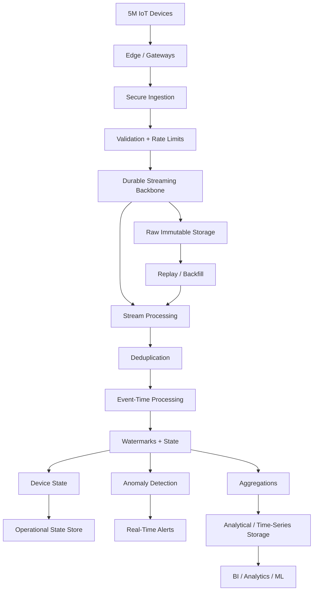
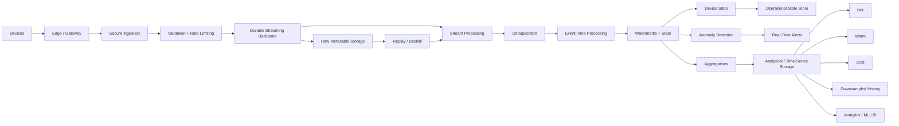

# 13 — Design Case: IoT Telemetry Ingestion

> **G5 — Data Engineering System Design Interviews**  
> **Case 13:** Ingest telemetry from **5 million devices every 10 seconds**, detect anomalies, and retain history for analysis.

This case is a production-oriented Data Engineering system-design module. It starts with IoT fundamentals and progresses through massive fan-in, unreliable devices, event-time semantics, clock skew, out-of-order data, state, watermarks, partitioning, time-series storage, downsampling, anomaly detection, device state, security, retention, cost, disaster recovery, and Senior/Staff-level interview reasoning.

The objective is not to build an embedded-systems course. The objective is to teach how to design the **data platform behind a large IoT fleet**.

---

## 1. Case Prompt and Learning Objective

### Interview prompt

> Design a system that ingests telemetry from 5 million devices every 10 seconds, detects anomalies, and keeps history for analysis.

The authoritative baseline is:

```text
5,000,000 devices
1 telemetry message / 10 seconds / device
```

Therefore:

```text
5,000,000 / 10
= 500,000 events/second
```

This **500,000 events/sec** figure is the baseline average ingestion rate. Any additional event size, burst multiplier, replication factor, compression ratio, or retention period used in calculations below is an **illustrative engineering assumption**, not a roadmap requirement.

### What the interviewer is testing

- massive fan-in;
- device and event identity;
- unreliable devices;
- edge buffering;
- ingestion protocols;
- burst handling;
- reconnect storms;
- partitioning;
- hot devices;
- event-time semantics;
- clock skew;
- out-of-order and late data;
- state and watermarks;
- time-series storage;
- downsampling;
- anomaly detection;
- current device state;
- security;
- retention;
- observability;
- cost;
- disaster recovery;
- 10× scaling;
- trade-off reasoning.

### Final mental model

```text
Devices
  ↓
Edge / Gateway
  ↓
Secure Ingestion
  ↓
Durable Streaming Backbone
  ├──────────────→ Raw Immutable Storage
  ↓
Stream Processing
  ├── Validate
  ├── Deduplicate
  ├── Event-Time Processing
  ├── Watermarks
  ├── Aggregation
  ├── Device State
  └── Anomaly Detection
  ↓
Analytical / Time-Series Storage
  ↓
Alerts / Analytics / ML / BI
```

---

## 2. What Is IoT?

**IoT — Internet of Things** describes physical devices that sense, communicate, and sometimes act on information.

A simple flow is:

```text
Temperature sensor
      ↓
IoT device
      ↓
Network
      ↓
Gateway
      ↓
Cloud ingestion
      ↓
Data platform
      ↓
Analytics / Alerts / ML
```

### Core terms

| Term | Meaning |
|---|---|
| Device | Physical computing unit participating in the system |
| Sensor | Measures a physical property |
| Actuator | Performs an action in the physical world |
| Gateway | Aggregates, translates, buffers, or secures device traffic |
| Edge | Compute/storage close to devices |
| Telemetry | Measurements/status emitted by devices |
| Command | Instruction sent toward a device |
| Cloud ingestion | Service receiving device data at platform scale |

Examples include industrial temperature sensors, vehicles, energy meters, medical equipment, warehouse sensors, and machinery vibration monitors.

The Data Engineering concern is what happens **after the device produces data**.

---

## 3. Telemetry Fundamentals

Telemetry is data describing what a device measured or what state it observed.

Typical measurements:

```text
temperature
pressure
humidity
vibration
battery percentage
GPS position
energy consumption
voltage
current
```

### Telemetry vs related data

| Data | Meaning | Typical use |
|---|---|---|
| Telemetry | Measurements emitted over time | Analytics, alerts |
| Device metadata | Relatively stable attributes | Enrichment |
| Device state | Current/latest operational state | Operations |
| Command | Desired action | Control |
| Event | A discrete occurrence | Lifecycle/audit |
| Log | Diagnostic text/records | Debugging |
| Metric | Aggregated operational measurement | Monitoring |

Example:

```text
Telemetry:
temperature = 31.4°C

Metadata:
device_model = pump-v4

State:
last_seen = 10:00:05
status = online

Command:
set_sampling_interval = 10s
```

Do not confuse telemetry history with current state.

---

## 4. Why IoT Data Is Different

| Traditional application events | IoT telemetry |
|---|---|
| User-driven | Device-driven |
| Usually stable clients | Millions of heterogeneous clients |
| Usually reliable network | Intermittent connectivity |
| Server-controlled clocks | Device clocks may drift |
| Often request/response | Frequently continuous push |
| Traffic may follow user activity | Devices create scheduled fan-in |
| Clients can often be upgraded centrally | Firmware/device lifecycle is distributed |
| Burst patterns often application-driven | Reconnect storms can synchronize millions of devices |

A useful mental model:

> **Treat every device as an unreliable distributed-systems client.**

A device may:

- disappear for hours;
- reconnect repeatedly;
- retry the same message;
- send a corrupted timestamp;
- run old firmware;
- produce malformed values;
- suddenly emit 100× its expected traffic.

---

## 5. Authoritative Scale and Back-of-the-Envelope Estimation

### Baseline

```text
Devices = 5,000,000
Frequency = 1 event / 10 seconds

Average EPS = 5,000,000 / 10
            = 500,000 events/sec
```

### Daily event count

```text
500,000 × 86,400
= 43,200,000,000 events/day
= 43.2 billion events/day
```

This is already a massive data platform.

### Illustrative event-size assumption

Assume:

```text
1 KB/event
```

This is an assumption for capacity planning.

Then:

```text
43.2B × 1 KB
≈ 43.2 TB/day decimal
```

If the average encoded payload is 2 KB:

```text
≈ 86.4 TB/day
```

If it is 512 bytes:

```text
≈ 21.6 TB/day
```

Therefore event size is a major architectural variable.

### Illustrative retention

At 1 KB/event:

```text
7 days   ≈ 302.4 TB raw
30 days  ≈ 1.296 PB raw
365 days ≈ 15.768 PB raw
```

These figures exclude replication, metadata, indexes, checkpoints, derived tables, and storage overhead.

### Peak assumption

Suppose an interview assumption is:

```text
10× burst
```

Then:

```text
500,000 × 10
= 5,000,000 events/sec
```

This is why buffering and a durable streaming layer matter.

### Network estimate

At 1 KB/event:

```text
500,000 KB/sec
≈ 500 MB/sec
≈ 4 Gbit/sec
```

At a 10× burst:

```text
≈ 40 Gbit/sec
```

Real systems must additionally account for protocol overhead, TLS, framing, retries, metadata, replication, and regional topology.

---

## 6. Massive Fan-In

Massive fan-in means:

```text
Millions of producers
        ↓
Relatively few ingestion endpoints
```

The challenge is not only payload throughput.

It includes:

- millions of connections;
- TLS handshakes;
- authentication;
- connection churn;
- network bandwidth;
- load balancing;
- request routing;
- rate limiting;
- buffering;
- partitioning;
- backpressure;
- retry storms.

### Important distinction

A system can have:

```text
500,000 events/sec
```

and still fail because it cannot efficiently manage:

```text
5,000,000 concurrent device connections
```

Connection scalability and message throughput are related but distinct capacity problems.

---

## 7. Device Communication Protocols

### MQTT

MQTT is a lightweight publish/subscribe protocol commonly used in constrained or intermittently connected environments.

Useful properties:

- low protocol overhead;
- persistent sessions;
- publish/subscribe semantics;
- QoS levels;
- topic-based routing.

Trade-offs:

- broker infrastructure is required;
- topic design matters;
- security and credential lifecycle matter;
- QoS does not eliminate business-level deduplication.

### HTTP/HTTPS

Useful when:

- devices already have HTTP stacks;
- REST-style APIs are convenient;
- payloads are less frequent;
- infrastructure is already HTTP-centric.

Advantages:

- mature ecosystem;
- easy observability;
- standard load balancing.

Trade-offs:

- higher overhead for some workloads;
- connection management can be less efficient for continuous telemetry.

### TCP

TCP provides reliable ordered byte delivery.

It is a transport mechanism rather than an IoT application protocol.

### UDP

UDP is connectionless and does not provide TCP-style delivery guarantees.

It can be appropriate for specialized latency-sensitive telemetry where the application explicitly accepts loss or implements its own reliability.

### WebSockets

Useful where a persistent bidirectional channel is required, especially for gateway/browser-like environments.

### Interview decision

Do not say:

> "MQTT is always best."

Say:

```text
Device constraints
→ connectivity
→ message frequency
→ reliability needs
→ connection model
→ security
→ operational requirements
→ protocol choice
```

---

## 8. Edge and Gateway Architecture

A gateway sits between devices and cloud ingestion:

```text
Device
  ↓
Gateway
  ↓
Cloud ingestion
```

A gateway can provide:

- local buffering;
- store-and-forward;
- protocol translation;
- authentication;
- compression;
- aggregation;
- filtering;
- local anomaly detection;
- connectivity management.

### Store-and-forward

```text
Device
  ↓
Gateway
  ↓
Network unavailable
  ↓
Local durable buffer
  ↓
Network returns
  ↓
Upload backlog
```

Without buffering, temporary network outages become immediate data loss.

### Edge aggregation

Instead of sending every reading:

```text
10 seconds × raw reading
```

the edge may produce:

```text
1-minute min
1-minute max
1-minute average
```

But this can destroy information needed for future analytics.

Therefore:

> **Edge aggregation is a data-loss trade-off, not a free optimization.**

---

## 9. Unreliable Devices

Typical failures:

- device offline;
- network outage;
- battery failure;
- firmware crash;
- sensor malfunction;
- duplicate transmission;
- retry storm;
- clock reset;
- reboot;
- intermittent connectivity;
- long offline period.

Design implication:

```text
Assume every device can fail.
```

The platform must distinguish:

```text
No telemetry
```

from:

```text
Telemetry is late
```

and:

```text
Telemetry is invalid
```

Those are different failure modes.

---

## 10. Device Identity

Potential identity attributes:

```text
device_id
hardware_id
serial_number
certificate identity
tenant_id
manufacturer_id
model_id
firmware_version
```

### Device identity vs event identity

```text
device_id = D123
```

may generate:

```text
event-1
event-2
event-3
...
event-N
```

Therefore:

```text
device_id ≠ event_id
```

Device identity is useful for:

- authentication;
- authorization;
- routing;
- partitioning;
- ownership;
- lifecycle;
- tenant isolation.

Event identity is useful for:

- deduplication;
- idempotency;
- replay;
- audit.

---

## 11. Telemetry Event Schema

A practical event:

```json
{
  "event_id": "evt-123",
  "device_id": "device-987",
  "tenant_id": "tenant-42",
  "event_time": "2026-10-07T10:00:05Z",
  "ingestion_time": "2026-10-07T10:00:07Z",
  "sequence_number": 991822,
  "temperature_c": 31.4,
  "pressure_kpa": 101.2,
  "battery_pct": 87,
  "firmware_version": "v3.2.1",
  "schema_version": 4
}
```

### Field purpose

| Field | Purpose |
|---|---|
| event_id | Event-level identity |
| device_id | Producer identity |
| tenant_id | Multi-tenant boundary |
| event_time | Device/business event timestamp |
| ingestion_time | Platform receipt timestamp |
| sequence_number | Per-device ordering/deduplication signal |
| measurements | Sensor data |
| firmware_version | Enrichment/debugging |
| schema_version | Evolution control |

For high-scale systems, schemas should be explicit and versioned.

---

## 12. Event Identity and Deduplication

Duplicates happen because of:

- MQTT retransmission;
- HTTP retries;
- gateway replay;
- device reconnect;
- consumer retry;
- pipeline replay.

Possible identities:

```text
event_id
(device_id, sequence_number)
idempotency_key
```

### SQL example

```sql
WITH ranked AS (
    SELECT
        *,
        ROW_NUMBER() OVER (
            PARTITION BY device_id, sequence_number
            ORDER BY ingestion_time ASC, event_id ASC
        ) AS rn
    FROM raw_telemetry
)
SELECT *
FROM ranked
WHERE rn = 1;
```

### Important caveat

If a device resets its sequence number after reboot, then:

```text
(device_id, sequence_number)
```

may not remain globally unique.

You may need:

```text
(device_id, boot_id, sequence_number)
```

or a durable device-side event ID.

### Business rule

Document:

```text
What makes two telemetry records the same event?
```

Do not assume the transport protocol answers that question.

---

## 13. Event Time vs Ingestion Time vs Processing Time

Example:

```text
Device measurement:
10:00:00

Network unavailable

Platform receives event:
10:07:30
```

Therefore:

```text
event_time      = 10:00:00
ingestion_time  = 10:07:30
processing_time = time processor handles it
```

Analytics usually needs event time because it describes when the measurement happened.

Operational monitoring may use ingestion time because it describes platform arrival.

Both are valuable.

---

## 14. Clock Skew

A device clock can be wrong:

```text
Actual event: ~10:00
Device timestamp: 04:00
```

or:

```text
Actual event: ~10:00
Device timestamp: 16:00
```

### Sources of skew

- bad RTC;
- reboot;
- battery loss;
- NTP failure;
- firmware bug;
- manual configuration;
- GPS synchronization failure.

### Controls

- NTP where available;
- secure time synchronization;
- timestamp bounds;
- server receive timestamp;
- skew monitoring;
- quarantine;
- correction rules.

### Example validation

```python
from datetime import datetime, timezone, timedelta

def is_reasonable_timestamp(event_time, ingestion_time, max_skew_minutes=15):
    delta = abs(ingestion_time - event_time)
    return delta <= timedelta(minutes=max_skew_minutes)
```

Do not blindly overwrite device timestamps. Preserve the original value for diagnosis.

---

## 15. Out-of-Order Events

Example:

```text
Event 101 arrives
Event 103 arrives
Event 102 arrives later
```

Why?

- network paths;
- retries;
- gateway buffering;
- device reconnection;
- batching;
- partitions;
- variable processing latency.

If analytics assumes arrival order, it can produce incorrect windows and aggregates.

The platform should use:

```text
event time
+
watermarks
+
allowed lateness
+
state retention
```

when the workload requires event-time correctness.

---

## 16. Late Data

A late event might be:

```text
event_time = T
arrival_time = T + 20 minutes
```

A very late event:

```text
event_time = T
arrival_time = T + 2 days
```

The system needs an explicit policy:

```text
On-time
→ process normally

Late but accepted
→ process and correct affected result

Too late
→ quarantine / correction workflow / restatement
```

Do not hide the policy inside implementation defaults.

---

## 17. Watermarks

A watermark is an estimate of how far event-time processing has progressed.

Conceptually:

```text
Watermark = 10:00
```

means the system considers event time up to approximately 10:00 sufficiently progressed for the chosen policy.

### Why watermarks exist

Without bounded progress:

```text
How long do we retain state?
```

could become:

```text
forever
```

Watermarks allow state to be eventually expired.

### Trade-off

Aggressive watermark:

```text
lower state cost
higher late-event risk
```

Conservative watermark:

```text
higher state cost
better late-data tolerance
```

There is no universal best watermark.

---

## 18. Partitioning

Candidate partition keys:

```text
device_id
tenant_id
region
device_type
time
```

### Device ID

Advantages:

- preserves per-device locality;
- useful for device state;
- natural event-time grouping.

Problems:

- hot devices;
- uneven traffic.

### Tenant ID

Advantages:

- tenant isolation;
- useful for quota enforcement.

Problems:

- large tenants become hot.

### Region

Advantages:

- data locality;
- residency boundaries.

Problems:

- geographically uneven traffic.

### Time

Advantages:

- useful for analytical storage.

Problems:

- poor streaming load distribution if all current events land together.

### Decision framework

```text
Required ordering
→ state locality
→ traffic distribution
→ query locality
→ tenancy
→ geography
→ hot-key risk
→ operational complexity
```

---

## 19. Hot Devices

A hot device may generate:

```text
100× expected telemetry
```

because of:

- broken sensor;
- firmware bug;
- infinite retry loop;
- high-frequency mode;
- malicious activity.

Symptoms:

```text
hot partition
consumer lag
state growth
memory pressure
```

Controls:

- per-device rate limits;
- quotas;
- anomaly detection;
- quarantine;
- traffic isolation;
- dedicated capacity;
- backpressure.

Do not blindly salt device IDs if per-device ordering is a requirement.

---

## 20. Reconnect Storms

A classic IoT failure:

```text
Network outage
      ↓
5M devices disconnect
      ↓
Network recovers
      ↓
5M devices reconnect together
      ↓
Connection + authentication storm
```

This is a thundering herd.

### Controls

```text
Exponential backoff
+
random jitter
+
admission control
+
connection quotas
+
gateway buffering
+
autoscaling
+
load shedding
```

Why “add more servers” is insufficient:

The bottleneck may be:

- certificate validation;
- database lookups;
- connection tracking;
- network bandwidth;
- broker partitions;
- downstream writes.

The recovery strategy must spread the reconnect wave over time.

---

## 21. Burst Handling

Distinguish:

```text
Average
Peak
Burst
```

A durable system absorbs bursts:

```text
Producers
   ↓
Ingestion
   ↓
Durable buffer
   ↓
Consumers
```

Backpressure allows downstream systems to signal that processing capacity is saturated.

### Data priority

Potential classes:

| Data | Loss tolerance |
|---|---|
| Critical alarm | Very low |
| Safety telemetry | Very low |
| Billing telemetry | Very low |
| Raw routine telemetry | Business-dependent |
| Debug telemetry | Potentially higher |

Load shedding must be an explicit business decision.

---

## 22. Ingestion Architecture

A baseline architecture:

```text
IoT Devices
     ↓
Edge / Gateway
     ↓
Load Balancer
     ↓
IoT Ingestion Service
     ├── Authenticate
     ├── Validate
     ├── Rate limit
     └── Route
     ↓
Durable Message Broker
     ↓
Stream Processing
```

### Ingestion responsibilities

1. Terminate connections.
2. Authenticate device.
3. Validate envelope.
4. Attach ingestion metadata.
5. Enforce quotas.
6. Reject malformed messages.
7. Route to durable infrastructure.
8. Avoid doing expensive analytics synchronously.

The ingestion service should remain intentionally thin.

---

## 23. Message Broker

A durable streaming backbone provides:

- topics;
- partitions;
- producers;
- consumers;
- consumer groups;
- replication;
- retention;
- replay;
- backpressure.

Kafka-like terminology is useful, but the design is vendor-neutral.

Alternatives include:

- managed streaming services;
- pub/sub systems;
- durable queues.

### Decision

Choose based on:

```text
throughput
+
ordering
+
replay
+
retention
+
latency
+
operations
+
cost
```

Not because one product is universally superior.

---

## 24. Raw Immutable Storage

Recommended pattern:

```text
Streaming backbone
      ├── Real-time processing
      └── Raw immutable archive
```

Raw telemetry enables:

- replay;
- debugging;
- reprocessing;
- new analytics;
- model training;
- historical corrections;
- disaster recovery.

A strong design can answer:

> “Can we reconstruct the result if our processing logic changes tomorrow?”

If the answer is no, the architecture is fragile.

---

## 25. Data Processing Layers

A sensible lifecycle:

```text
Raw
 ↓
Validated
 ↓
Normalized
 ↓
Enriched
 ↓
Aggregated
 ↓
Analytical
```

### Raw

Original payload plus ingestion metadata.

### Validated

Schema/range/identity checks applied.

### Normalized

Canonical units and field names.

### Enriched

Device registry, tenant, geography, firmware metadata.

### Aggregated

Minute/hour/day summaries.

### Analytical

Curated datasets for BI, ML, and operational analysis.

Do not force a named architecture pattern if the underlying principles are what matter.

---

## 26. Time-Series Data

IoT telemetry naturally has:

```text
device_id
timestamp
metric
value
dimensions
```

Example:

```text
device_id = D123
timestamp = 10:00
metric = temperature
value = 31.4
```

Typical query:

```text
Show temperature for device D123
from 09:00 to 12:00.
```

The system should optimize for:

- time-range filtering;
- device/tenant filtering;
- aggregation;
- compression;
- high write throughput;
- predictable retention.

---

## 27. Time-Series Storage Trade-Offs

| Storage | Strength | Weakness |
|---|---|---|
| Time-series DB | Fast time-window queries | Specialized operations/cost |
| Columnar lakehouse | Large-scale analytics, history | Higher latency for some operational queries |
| Warehouse | SQL and BI | May be expensive for massive continuous writes |
| Object storage | Cheap durable history | Not inherently low-latency |
| Specialized OLAP | Fast aggregation | Additional platform complexity |

No universal winner.

The right architecture may use more than one:

```text
Hot operational state
+
Recent analytical store
+
Cheap historical archive
```

---

## 28. Storage Partitioning

Useful dimensions:

```text
date
hour
region
tenant
device_type
```

Avoid automatically partitioning by:

```text
device_id
```

in analytical object storage when that creates millions of tiny partitions/files.

Consider:

- partition pruning;
- file size;
- compaction;
- write amplification;
- query patterns;
- cardinality.

A good storage layout balances write and read behavior.

---

## 29. High Cardinality

High-cardinality dimensions include:

```text
device_id
tenant_id
sensor_id
tag
label
```

High cardinality can increase:

- index size;
- metadata;
- memory;
- query planning;
- aggregation cost.

A design that works for:

```text
1,000 devices
```

may fail badly for:

```text
5,000,000 devices
```

Always evaluate cardinality explicitly.

---

## 30. Downsampling

Raw telemetry:

```text
1 reading / 10 seconds
```

can become:

```text
1-minute average
5-minute average
1-hour average
1-day summary
```

Possible aggregates:

- average;
- minimum;
- maximum;
- count;
- sum;
- percentile.

### Example

```text
60 raw values
→ 1-minute summary
```

### When safe

Downsampling is appropriate when the historical query does not require the original resolution.

### When unsafe

Do not discard raw readings if they are required for:

- safety analysis;
- forensic investigation;
- billing;
- legal evidence;
- anomaly reconstruction;
- model training.

Downsampling is a retention decision, not merely a performance trick.

---

## 31. Retention Tiers

A common lifecycle:

```text
Hot
 ↓
Warm
 ↓
Cold
 ↓
Archive
```

Example **illustrative** policy:

| Tier | Example retention | Purpose |
|---|---:|---|
| Hot | 7 days | Dashboards, alerts |
| Warm | 30 days | Operational analysis |
| Cold | 1 year | Historical analytics |
| Archive | 3+ years | Compliance/forensics |

These values are examples only.

Choose retention based on:

```text
query frequency
+
business value
+
compliance
+
recovery needs
+
storage cost
```

---

## 32. Anomaly Detection Fundamentals

Start simple.

### Threshold

```python
def is_anomaly(temperature):
    return temperature > 80
```

Easy to explain and operate.

Weakness:

- fixed thresholds ignore seasonality;
- different devices may have different normal ranges.

### Z-score

```python
def z_score(x, mean, std):
    return (x - mean) / std
```

A large absolute z-score can indicate unusual behavior.

Weaknesses:

- assumes a useful distribution;
- sensitive to outliers;
- baseline quality matters.

### Rolling baseline

```text
current value
vs
recent mean/std
```

Useful for changing operating conditions.

### ML-based detection

Can model:

- multivariate patterns;
- seasonality;
- device-specific behavior.

But increases:

- model complexity;
- monitoring requirements;
- false-positive analysis;
- operational burden.

Start simple unless the requirements justify complexity.

---

## 33. Real-Time Anomaly Detection

Architecture:

```text
Telemetry
   ↓
Stream processing
   ↓
Window / feature computation
   ↓
Anomaly detector
   ↓
Alert event
```

State may contain:

```text
rolling mean
rolling standard deviation
recent observations
device baseline
last alert
```

### Alert deduplication

Without suppression:

```text
1 bad sensor
→ 6,000 identical alerts
```

Use:

- cooldowns;
- incident grouping;
- hysteresis;
- alert state.

Optimize for actionable alerts, not maximum alert count.

---

## 34. Device State

Historical telemetry:

```text
millions of observations
```

Current state:

```text
device_id
last_seen
current_temperature
battery_level
firmware_version
connectivity_status
```

Keep current state separately when low-latency operational access is required.

A state table can be updated idempotently:

```text
newer event_time
→ replace current state

older event_time
→ do not overwrite newer state
```

This protects against out-of-order events.

---

## 35. Offline Device Detection

Suppose the expected heartbeat is:

```text
every 10 seconds
```

Do not declare a device offline after exactly 10 seconds.

Use a grace period:

```text
expected = 10s
grace = 30s
offline threshold = 40s
```

The exact threshold depends on:

- network variability;
- device class;
- business criticality;
- false-positive tolerance.

Store:

```text
last_seen_event_time
last_seen_ingestion_time
offline_detected_at
```

This makes diagnosis easier.

---

## 36. Multi-Tenancy

A shared platform may serve:

```text
Tenant A
Tenant B
Tenant C
...
```

Tenant-aware design requires:

- tenant ID;
- authentication;
- authorization;
- quotas;
- rate limits;
- cost attribution;
- isolation;
- noisy-neighbor controls.

A tenant that produces 40% of platform traffic should not silently degrade every other tenant.

---

## 37. Device Security

Distinguish:

```text
Identity
Authentication
Authorization
```

### Device identity

Who is this device?

### Authentication

Can it prove that identity?

### Authorization

What is it allowed to do?

Controls:

- device certificates;
- mutual TLS concept;
- credential rotation;
- provisioning;
- revocation;
- encrypted transport;
- encrypted storage;
- least privilege.

A compromised device must be revocable without redesigning the entire platform.

---

## 38. Device Lifecycle

A useful lifecycle:

```text
Manufactured
→ Provisioned
→ Activated
→ Operating
→ Updated
→ Suspended
→ Decommissioned
```

Track:

- ownership;
- tenant;
- certificate;
- firmware;
- model;
- deployment region;
- lifecycle status.

Device lifecycle data is essential for:

- access control;
- fleet operations;
- cost;
- historical analysis;
- incident response.

---

## 39. Schema Evolution

Suppose the schema changes:

```text
temperature
```

to:

```text
temperature_c
temperature_f
```

or a new sensor is introduced.

Use:

- schema version;
- compatibility policy;
- optional fields;
- contract validation;
- migration rules;
- quarantine for incompatible events.

A safe change should not force all 5 million devices to upgrade simultaneously.

---

## 40. Data Quality

Production data quality should cover:

### Completeness

Are expected devices sending telemetry?

### Validity

Is:

```text
temperature = -900°C
```

plausible?

### Uniqueness

Are events duplicated?

### Timeliness

How late are events?

### Consistency

Does device metadata match telemetry?

### Accuracy

Are values physically plausible?

### Freshness

When did the device last report?

Example SQL:

```sql
SELECT
    device_id,
    MAX(event_time) AS last_event_time
FROM telemetry
GROUP BY device_id
HAVING MAX(event_time) < CURRENT_TIMESTAMP - INTERVAL '5' MINUTE;
```

Dialect-specific interval syntax varies by engine.

---

## 41. Observability

### Ingestion

Monitor:

- events/sec;
- bytes/sec;
- active connections;
- authentication failures;
- rejection rate.

### Streaming

Monitor:

- broker lag;
- processing latency;
- watermark;
- state size;
- checkpoint duration.

### Data quality

Monitor:

- duplicate rate;
- late-event rate;
- invalid-value rate;
- clock-skew rate;
- missing-device rate.

### Storage

Monitor:

- storage growth;
- file counts;
- compaction backlog;
- query latency.

### Business

Monitor:

- anomaly rate;
- offline-device rate;
- tenant throughput;
- critical-event loss.

Infrastructure health alone is not enough.

---

## 42. Observability Decision Table

| Metric | Why it matters | Example alert | Likely causes |
|---|---|---|---|
| Ingestion EPS | Capacity | > expected peak | Burst, reconnect |
| Broker lag | Freshness | Sustained growth | Consumer bottleneck |
| Duplicate rate | Correctness | 5× baseline | Retry storm |
| Late-event rate | Event-time quality | 3× baseline | Network/device issue |
| Clock-skew rate | Data quality | > threshold | NTP/device failure |
| State size | Cost/reliability | Rapid growth | Watermark/state issue |
| Hot partition | Distribution | Severe imbalance | Hot device/tenant |
| Storage growth | Cost | Above forecast | Payload/retention change |
| Offline devices | Fleet health | Regional spike | Network/power outage |
| Anomaly rate | Business | Sudden spike | Real incident/model issue |

---

## 43. Failure Scenarios

For every incident use:

```text
Detect
→ Contain
→ Diagnose
→ Recover
→ Reconcile
→ Prevent
```

### 1. Network outage

Devices buffer locally if possible. Durable ingestion catches up after recovery.

### 2. Gateway failure

Use gateway redundancy and store-and-forward where business-critical.

### 3. Broker outage

Preserve producer buffering, fail over where supported, and replay from durable sources.

### 4. Stream processor crash

Recover from checkpoints or replay raw data.

### 5. Consumer lag

Identify whether the bottleneck is CPU, I/O, skew, downstream storage, or insufficient partitions.

### 6. Reconnect storm

Throttle connection admission and use jitter/backoff.

### 7. Duplicate telemetry

Measure affected IDs, deduplicate, replay/recompute affected data.

### 8. Clock corruption

Quarantine or flag affected timestamps and retain original evidence.

### 9. Hot device

Rate-limit or isolate without losing critical events if business policy forbids loss.

### 10. Hot partition

Re-evaluate key distribution and isolate hot workloads.

### 11. Storage outage

Buffer/retry and maintain raw durable copies.

### 12. Schema incompatibility

Quarantine incompatible events and restore a compatible producer/consumer path.

### 13. State-store corruption

Recover from checkpoint/object-store source and replay.

### 14. Backlog

Estimate catch-up time:

```text
backlog / net_processing_rate
```

Do not assume “autoscaling” automatically resolves stateful bottlenecks.

### 15. Anomaly detector failure

Continue telemetry ingestion; decouple detection from ingestion durability.

### 16. Regional outage

Fail over only if the requirements justify multi-region complexity.

### 17. Firmware bug

Identify firmware cohort and isolate traffic/behavior by version.

### 18. Certificate expiration

Monitor certificate expiry and maintain controlled rotation.

### 19. Data-quality degradation

Quarantine invalid data without blocking healthy traffic where possible.

### 20. 10× traffic spike

Protect the durable ingestion layer, prioritize critical telemetry, scale consumers, and preserve raw data.

---

## 44. Break/Fix Labs

### Lab 1 — Duplicate telemetry

Inject the same event repeatedly.

**Symptoms:** inflated counts.

**Investigation:** compare event IDs and sequence numbers.

**Fix:** deterministic deduplication.

**Validation:** replay produces identical canonical output.

### Lab 2 — Clock skew

Shift one device clock by six hours.

**Symptoms:** future/historical events.

**Fix:** timestamp bounds and quarantine.

### Lab 3 — Out-of-order events

Deliver:

```text
101, 103, 102
```

Verify event-time aggregation.

### Lab 4 — Late telemetry

Delay events by 20 minutes and two days.

Validate the late-data policy.

### Lab 5 — Hot device

Generate 100× expected traffic.

Observe partition and state impact.

### Lab 6 — Hot partition

Concentrate traffic on one partition.

Measure lag and recovery.

### Lab 7 — Reconnect storm

Simulate millions of clients reconnecting with and without jitter.

Compare peak load.

### Lab 8 — Broker lag

Slow consumers intentionally.

Calculate backlog and recovery time.

### Lab 9 — Invalid values

Inject impossible temperatures and battery percentages.

Validate quarantine/DQ metrics.

### Lab 10 — Schema evolution

Add a field, then introduce an incompatible type.

Verify compatible processing and quarantine.

### Lab 11 — Downsampling error

Compare:

```text
raw max
```

with:

```text
average-only summary
```

Demonstrate information loss.

### Lab 12 — Offline detection

Simulate intermittent network delay.

Tune grace periods to reduce false offline alerts.

---

## 45. SQL Examples

### 45.1 Latest telemetry per device

```sql
WITH ranked AS (
    SELECT
        *,
        ROW_NUMBER() OVER (
            PARTITION BY device_id
            ORDER BY event_time DESC, ingestion_time DESC
        ) AS rn
    FROM telemetry
)
SELECT *
FROM ranked
WHERE rn = 1;
```

### 45.2 Deduplicate telemetry

```sql
WITH ranked AS (
    SELECT
        *,
        ROW_NUMBER() OVER (
            PARTITION BY device_id, sequence_number
            ORDER BY ingestion_time ASC, event_id ASC
        ) AS rn
    FROM raw_telemetry
)
SELECT *
FROM ranked
WHERE rn = 1;
```

### 45.3 Missing/stale devices

```sql
SELECT
    device_id,
    MAX(event_time) AS last_seen
FROM telemetry
GROUP BY device_id
HAVING MAX(event_time) < CURRENT_TIMESTAMP - INTERVAL '5' MINUTE;
```

### 45.4 Invalid values

```sql
SELECT *
FROM telemetry
WHERE temperature_c NOT BETWEEN -80 AND 150
   OR battery_pct NOT BETWEEN 0 AND 100;
```

### 45.5 Hourly average

```sql
SELECT
    device_id,
    DATE_TRUNC('hour', event_time) AS hour,
    AVG(temperature_c) AS avg_temperature
FROM telemetry
GROUP BY device_id, DATE_TRUNC('hour', event_time);
```

### 45.6 Rolling average

```sql
SELECT
    device_id,
    event_time,
    temperature_c,
    AVG(temperature_c) OVER (
        PARTITION BY device_id
        ORDER BY event_time
        ROWS BETWEEN 5 PRECEDING AND CURRENT ROW
    ) AS rolling_avg
FROM telemetry;
```

### 45.7 Duplicate detection

```sql
SELECT
    device_id,
    sequence_number,
    COUNT(*) AS copies
FROM raw_telemetry
GROUP BY device_id, sequence_number
HAVING COUNT(*) > 1;
```

### 45.8 Ingestion latency

```sql
SELECT
    device_id,
    AVG(
        EXTRACT(EPOCH FROM (ingestion_time - event_time))
    ) AS avg_latency_seconds
FROM telemetry
GROUP BY device_id;
```

Timestamp arithmetic syntax varies by SQL engine.

### 45.9 Late events

```sql
SELECT *
FROM telemetry
WHERE ingestion_time > event_time + INTERVAL '10' MINUTE;
```

### 45.10 Clock-skewed devices

```sql
SELECT
    device_id,
    AVG(
        EXTRACT(EPOCH FROM (ingestion_time - event_time))
    ) AS avg_clock_delta_seconds
FROM telemetry
GROUP BY device_id
HAVING ABS(
    AVG(EXTRACT(EPOCH FROM (ingestion_time - event_time)))
) > 900;
```

### 45.11 Reconciliation

```sql
SELECT
    DATE(event_time) AS event_date,
    COUNT(*) AS processed_count
FROM processed_telemetry
GROUP BY DATE(event_time);
```

Compare independently with raw counts and expected device reporting.

### 45.12 Uptime

```sql
SELECT
    device_id,
    SUM(
        CASE
            WHEN event_time >= CURRENT_TIMESTAMP - INTERVAL '1' DAY
            THEN 1 ELSE 0
        END
    ) AS observations
FROM telemetry
GROUP BY device_id;
```

A real uptime calculation should model expected reporting intervals rather than simply count rows.

---

## 46. Python Examples

### Telemetry validation

```python
def validate(event):
    required = ["event_id", "device_id", "event_time"]

    if any(field not in event for field in required):
        return False

    if not 0 <= event.get("battery_pct", 0) <= 100:
        return False

    return True
```

### Deduplication

```python
def deduplicate(events):
    winners = {}

    for event in events:
        key = (event["device_id"], event["sequence_number"])
        current = winners.get(key)

        if current is None:
            winners[key] = event
        elif event["ingestion_time"] < current["ingestion_time"]:
            winners[key] = event

    return list(winners.values())
```

### Clock skew

```python
from datetime import timedelta

def clock_skewed(event_time, ingestion_time, allowed_minutes=15):
    return abs(ingestion_time - event_time) > timedelta(
        minutes=allowed_minutes
    )
```

### Threshold anomaly

```python
def detect_anomaly(temperature, threshold=80.0):
    return temperature > threshold
```

### Z-score

```python
def z_score(value, mean, std):
    if std == 0:
        return 0.0
    return (value - mean) / std
```

### Offline detection

```python
from datetime import timedelta

def is_offline(now, last_seen, expected_seconds=10, grace_seconds=30):
    threshold = timedelta(
        seconds=expected_seconds + grace_seconds
    )
    return now - last_seen > threshold
```

### Event simulation

```python
import random
from datetime import datetime, timezone

def make_event(device_id, sequence_number):
    return {
        "event_id": f"{device_id}-{sequence_number}",
        "device_id": device_id,
        "sequence_number": sequence_number,
        "event_time": datetime.now(timezone.utc),
        "temperature_c": random.uniform(20, 40),
        "battery_pct": random.uniform(50, 100),
    }
```

The simulator is intentionally small. Production systems distribute this logic across gateways and streaming infrastructure.

---

## 47. PySpark / Distributed Processing

A simplified deduplication pattern:

```python
from pyspark.sql import functions as F
from pyspark.sql.window import Window

w = Window.partitionBy(
    "device_id",
    "sequence_number",
).orderBy(
    F.col("ingestion_time").asc(),
    F.col("event_id").asc(),
)

deduped = (
    raw_telemetry
    .withColumn("rn", F.row_number().over(w))
    .filter(F.col("rn") == 1)
    .drop("rn")
)
```

### Hourly aggregation

```python
hourly = (
    deduped
    .withColumn("hour", F.date_trunc("hour", "event_time"))
    .groupBy("device_id", "hour")
    .agg(
        F.avg("temperature_c").alias("avg_temperature"),
        F.min("temperature_c").alias("min_temperature"),
        F.max("temperature_c").alias("max_temperature"),
        F.count("*").alias("samples"),
    )
)
```

### Why distributed processing matters

At:

```text
500,000 events/sec
```

a single Python process cannot be treated as the production processing engine.

Distributed processing provides:

- parallel execution;
- partitioned state;
- fault recovery;
- scalable aggregation;
- distributed storage access.

But distributed systems introduce:

- shuffle;
- skew;
- checkpointing;
- serialization;
- partition sizing;
- state management.

---

## 48. Event-Time Processing in Distributed Systems

Conceptually:

```text
Events
  ↓
Partition by device
  ↓
Event-time window
  ↓
Watermark
  ↓
Stateful aggregation
  ↓
Result
```

Example requirement:

> Compute five-minute average temperature per device.

The system needs to define:

- window boundary;
- watermark;
- allowed lateness;
- state retention;
- late-result policy.

The implementation technology can vary; the semantics must be explicit.

---

## 49. Capacity Planning

Use the authoritative requirement:

```text
5M devices
1 event / 10 sec
= 500K events/sec
```

Illustrative assumptions:

```text
Average event size = 1 KB
Peak multiplier = 10×
Replication factor = 3
Compression = 3:1
```

### Network

```text
500K events/sec × 1 KB
≈ 500 MB/sec
≈ 4 Gbit/sec
```

At 10×:

```text
≈ 40 Gbit/sec
```

### Raw storage/day

```text
43.2B events/day × 1 KB
≈ 43.2 TB/day
```

### With 3:1 compression

```text
43.2 / 3
≈ 14.4 TB/day
```

### With replication factor 3

```text
14.4 × 3
≈ 43.2 TB/day
```

This simplified calculation ignores metadata and implementation overhead.

### Partition planning

Do not answer:

> “We need exactly 10,000 partitions.”

Instead estimate:

```text
required throughput
÷
sustainable throughput per partition
```

Then validate through load testing.

Capacity numbers are workload-dependent, not universal constants.

---

## 50. 10× Scale

At 10×:

```text
50 million devices
```

with the same interval:

```text
5,000,000 events/sec
```

Potential bottlenecks:

- connection termination;
- TLS/authentication;
- network;
- broker partitions;
- state stores;
- downstream storage;
- object-store writes;
- query engines;
- anomaly detection.

### What can remain stable

The conceptual architecture:

```text
ingest
→ durable stream
→ raw archive
→ processing
→ storage
```

can remain.

### What changes

Capacity and topology:

- more ingestion endpoints;
- more partitions;
- more regional capacity;
- larger state;
- more storage;
- stronger isolation;
- more aggressive tiering.

---

## 51. Global / Multi-Region Architecture

For global fleets:

```text
Region A devices → Region A ingestion
Region B devices → Region B ingestion
Region C devices → Region C ingestion
```

Benefits:

- lower latency;
- regional resilience;
- data locality;
- residency control.

Trade-offs:

- operational complexity;
- cross-region replication;
- consistency;
- duplicated infrastructure;
- cost.

Use multi-region when the requirements justify it:

```text
RTO/RPO
+
regional failure risk
+
latency
+
data residency
```

Do not add global replication merely because it sounds enterprise-grade.

---

## 52. Disaster Recovery

Key terms:

### RPO

Maximum acceptable data loss measured in time.

### RTO

Maximum acceptable recovery time.

A durable raw archive supports recovery:

```text
Regional failure
      ↓
Restore infrastructure
      ↓
Replay raw telemetry
      ↓
Recompute derived state
      ↓
Reconcile
```

Raw telemetry is therefore not only an analytics asset; it is a recovery asset.

---

## 53. Cost Engineering

Cost components:

```text
network
+
ingestion
+
streaming compute
+
broker
+
object storage
+
time-series storage
+
query compute
+
anomaly detection
+
egress
+
replication
```

Optimization levers:

- compression;
- batching;
- edge aggregation where safe;
- downsampling;
- tiered storage;
- retention;
- partition pruning;
- efficient serialization;
- state TTL;
- selective indexing.

### Correctness warning

Do not optimize by dropping data required for:

- safety;
- billing;
- compliance;
- forensic analysis.

A cheaper incorrect system is not a successful optimization.

---

## 54. Technology Trade-Off Catalogue

### MQTT vs HTTP

Choose based on:

```text
device constraints
connection behavior
message frequency
reliability
security
operational model
```

### Gateway vs direct-to-cloud

Gateway:

- buffering;
- aggregation;
- protocol translation;
- local resilience.

Direct:

- simpler topology;
- fewer components.

### Kafka-like broker vs managed streaming

Self-managed:

- control;
- operational burden.

Managed:

- lower operations;
- provider coupling/cost.

### Stream processor vs warehouse SQL

Streaming:

- low latency;
- continuous state.

Warehouse:

- simpler batch analytics;
- strong SQL ecosystem.

### Time-series database vs lakehouse

Time-series:

- operational time-window queries.

Lakehouse:

- long-term history;
- broad analytics;
- low-cost object storage.

### Edge aggregation vs raw telemetry

Aggregation reduces:

```text
network + storage
```

but can reduce:

```text
historical fidelity
```

### Real-time vs batch anomaly detection

Real-time:

- faster response;
- higher operational complexity.

Batch:

- simpler;
- not suitable for immediate alarms.

### Push vs pull

Push is often natural for telemetry.

Pull can be useful for device management or periodic fleet-state collection.

---

## 55. Production Architecture



### Component responsibilities

**Devices:** produce measurements.

**Gateways:** buffer, translate, aggregate, and manage connectivity.

**Secure ingestion:** authenticate and validate.

**Streaming backbone:** absorb bursts and provide replay.

**Raw storage:** immutable recovery/reprocessing source.

**Stream processing:** apply event-time semantics and state.

**Device state:** expose current operational status.

**Anomaly detection:** generate actionable alerts.

**Analytical storage:** support historical queries.

---

## 56. Real-Time vs Historical Paths

```text
                 Telemetry
                     │
            ┌────────┴────────┐
            ▼                 ▼
       Real-time path    Historical path
            │                 │
            ▼                 ▼
       Alerts / State     Analytics / ML
```

One storage system rarely optimizes equally for:

- sub-second operational access;
- billion-row historical analytics;
- years of low-cost retention.

Separate workloads when requirements justify it.

---

## 57. Raw vs Processed Data

```text
Raw telemetry
      ↓
Validated telemetry
      ↓
Processed telemetry
      ↓
Aggregated telemetry
      ↓
Analytical datasets
```

Raw data enables:

- replay;
- debugging;
- reprocessing;
- new analytics;
- model changes;
- historical corrections.

A production design should define how long raw data remains recoverable.

---

## 58. Requirements Clarification Questions

### Scale

- How many devices?
- How often do they report?
- What is the peak rate?
- What is the burst multiplier?
- Are devices globally distributed?

### Data

- What telemetry types exist?
- What is event size?
- Is every event equally important?
- Is ordering required?
- What is the expected schema?

### Reliability

- Can devices buffer locally?
- How long can devices be offline?
- How much late data is acceptable?
- Is data loss acceptable?

### Analytics

- What is anomaly detection latency?
- What queries must be supported?
- Is current device state required?
- Is historical full-resolution data required?

### Storage

- How long must raw data be retained?
- How long must high-resolution data be retained?
- What can be downsampled?

### Security

- How are devices authenticated?
- How are credentials rotated?
- What happens when a device is compromised?

### Operations

- RPO?
- RTO?
- Data-loss tolerance?
- Regional failover requirements?

---

## 59. 45-Minute Interview Walkthrough

| Time | Objective |
|---|---|
| 0–5 min | Clarify requirements |
| 5–10 min | Estimate scale |
| 10–15 min | Draw architecture |
| 15–25 min | Ingestion, partitioning, identity, event time, state |
| 25–35 min | Storage, downsampling, anomaly detection, state, retention |
| 35–40 min | Failures and reliability |
| 40–45 min | Trade-offs, cost, summary |

### First five minutes

Say:

> “I’ll first clarify the device population, reporting frequency, peak/burst behavior, event size, freshness, loss tolerance, retention, anomaly SLA, and security requirements.”

### Estimation

Show:

```text
5M / 10 = 500K events/sec
```

Then make assumptions explicit.

### High-level architecture

Draw only:

```text
Devices
→ Gateway
→ Secure Ingestion
→ Durable Stream
→ Stream Processing
→ State / Alerts / Analytics

                         ↘ Raw Archive
```

### Deep dive

Prioritize:

```text
massive fan-in
+
reconnect storms
+
event time
+
late data
+
partitioning
+
state
+
storage
```

### Closing

Summarize:

```text
correctness
reliability
replay
security
cost
scalability
```

---

## 60. Interviewer Pushback and Strong Responses

### “Why not send all devices directly to Kafka?”

**Strong response:** Kafka-like systems are excellent durable streaming backbones, but direct device connectivity introduces device authentication, connection management, rate limiting, protocol adaptation, quotas, and fleet lifecycle concerns. A dedicated ingestion/gateway layer can separate device-facing reliability from internal streaming.

### “Why do you need gateways?”

**Strong response:** Gateways are justified when devices need buffering, protocol translation, offline operation, local aggregation, or controlled connectivity. If devices are capable and the network is reliable, direct ingestion can be simpler.

### “Why can't we just use a database?”

**Strong response:** A database may be suitable for a subset of workloads, but 500K events/sec plus burst absorption, replay, decoupled consumers, and long-term history usually benefits from a durable streaming backbone and cheap immutable storage.

### “Why is device_id a risky partition key?”

**Strong response:** It is useful for device-local state and ordering, but a hot device can concentrate disproportionate traffic on one partition. I would measure skew and choose the key based on the required semantics.

### “What happens when all five million devices reconnect?”

**Strong response:** Prevent synchronized retries with exponential backoff and jitter, then protect the ingestion layer with admission control and quotas. Gateways can buffer where available. Autoscaling helps capacity but does not solve a synchronized connection storm by itself.

### “What if a device clock is wrong by six hours?”

**Strong response:** Preserve both device event time and ingestion time, detect skew against a policy, quarantine or flag invalid timestamps, and avoid letting corrupt device clocks silently poison event-time analytics.

### “Why do you need watermarks?”

**Strong response:** Watermarks bound event-time state and tell the system how far it can advance while still accepting late events under the chosen policy.

### “Why not store everything forever at full resolution?”

**Strong response:** Because storage, query, compaction, and operational costs grow continuously. Keep full resolution where business value or compliance requires it and downsample older data where the loss of detail is acceptable.

### “Why not use Spark for everything?”

**Strong response:** Spark is powerful for distributed batch and streaming workloads, but the device-facing ingestion layer still needs connection management, protocol handling, admission control, and durable buffering. Architecture should separate concerns.

### “How do you guarantee telemetry is not lost?”

**Strong response:** Define the actual loss guarantee, then combine device/gateway buffering, durable ingestion, replicated storage, acknowledgements, replay, idempotent processing, monitoring, and recovery procedures. No honest architecture should claim zero loss without specifying failure assumptions.

### “What if one device sends 100× normal traffic?”

**Strong response:** Detect the anomaly, enforce per-device limits, isolate the hot producer, preserve critical telemetry, and prevent it from destabilizing shared partitions.

### “How do you detect an offline device?”

**Strong response:** Compare last-seen event time/ingestion time with the expected reporting interval plus a business-defined grace period. Avoid declaring offline on one delayed packet.

### “How would you redesign for 50 million devices?”

**Strong response:** Re-estimate connection load, network, partitions, state, storage, and regional capacity. Keep the conceptual architecture but scale ingestion, streaming, storage, and isolation horizontally.

---

## 61. Senior vs Staff-Level Reasoning

### Intermediate

Focus on:

- ingestion;
- storage;
- basic processing;
- basic scaling.

### Senior

Focus on:

- event time;
- state;
- late data;
- partitioning;
- hot devices;
- reliability;
- cost;
- failure recovery;
- observability.

### Staff

Focus on:

- platform boundaries;
- multi-tenancy;
- global architecture;
- device lifecycle;
- governance;
- regional isolation;
- organizational ownership;
- cost model;
- platform evolution;
- disaster recovery;
- long-term scalability.

The progression is:

```text
Can I build it?
      ↓
Can I operate it?
      ↓
Can I scale it?
      ↓
Can I evolve it safely?
      ↓
Can multiple teams depend on it?
```

---

## 62. Practical Mini-Project

### Project

> Build a simplified IoT telemetry ingestion and analytics system.

### Requirements

Simulate:

- devices;
- telemetry;
- duplicates;
- late events;
- clock skew;
- offline devices;
- rolling metrics;
- anomalies;
- device health;
- hourly aggregation.

### Suggested logical flow

```text
Simulator
  ↓
Raw events
  ↓
Validation
  ↓
Deduplication
  ↓
Clock-skew detection
  ↓
Event-time handling
  ↓
Aggregations
  ├── Device state
  ├── Hourly metrics
  └── Anomaly alerts
```

### Sample event

```json
{
  "event_id": "D001-100",
  "device_id": "D001",
  "tenant_id": "T01",
  "event_time": "2026-10-07T10:00:00Z",
  "ingestion_time": "2026-10-07T10:00:04Z",
  "sequence_number": 100,
  "temperature_c": 32.1,
  "battery_pct": 88,
  "schema_version": 1
}
```

### Python simulator

```python
import random
from datetime import datetime, timezone, timedelta

def generate_event(device_id, sequence_number, delay_seconds=0):
    event_time = datetime.now(timezone.utc)
    ingestion_time = event_time + timedelta(seconds=delay_seconds)

    return {
        "event_id": f"{device_id}-{sequence_number}",
        "device_id": device_id,
        "sequence_number": sequence_number,
        "event_time": event_time,
        "ingestion_time": ingestion_time,
        "temperature_c": random.uniform(20, 40),
        "battery_pct": random.uniform(60, 100),
    }
```

### Failure injection

Implement switches for:

```text
duplicate_probability
late_probability
clock_skew_probability
offline_probability
hot_device_probability
```

### Expected outputs

Produce:

```text
canonical telemetry
device latest state
hourly aggregates
anomaly events
late-event report
duplicate report
clock-skew report
offline-device report
```

### PySpark extension

Scale the simulator output and implement:

- deduplication;
- event-time windows;
- hourly aggregation;
- partitioned writes.

### Success criteria

The project is complete when you can:

1. explain every field;
2. reproduce the same result from the same input;
3. detect injected failures;
4. reconcile raw and processed counts;
5. explain the architecture in 45 minutes.

---

## 63. Testing Strategy

### Unit tests

Test:

- event validation;
- deduplication;
- clock-skew detection;
- anomaly rules;
- offline detection;
- state update ordering.

### Data-contract tests

Validate:

- required fields;
- types;
- ranges;
- schema version;
- compatibility.

### Load tests

Test:

```text
500K events/sec baseline
```

and an illustrative:

```text
5M events/sec burst
```

### Burst tests

Gradually increase:

```text
1× → 2× → 5× → 10×
```

Measure:

- latency;
- lag;
- errors;
- state;
- recovery.

### Reconnect-storm tests

Simulate synchronized clients and then add jitter.

Compare peak connection rate.

### Late-data tests

Inject:

```text
1 minute late
20 minutes late
2 hours late
2 days late
```

### Clock-skew tests

Inject:

```text
+5 min
-15 min
+6 hours
```

### Failure-injection tests

Kill:

- ingestion instance;
- stream processor;
- consumer;
- state store;
- regional dependency.

Verify replay and recovery.

### Recovery test

Prove:

```text
same raw input
+
same rule version
=
same result
```

---

## 64. Common Interview and Production Mistakes

### Treating devices like web users

**Why it fails:** device fleets have persistent connectivity, offline periods, firmware variation, and synchronized reconnects.

**Better:** model device lifecycle and unreliable clients explicitly.

### No edge buffering

**Why it fails:** temporary network outages become data loss.

**Better:** store-and-forward where justified.

### No backpressure

**Why it fails:** downstream overload propagates into ingestion.

**Better:** durable buffering and bounded consumers.

### Wrong partition key

**Why it fails:** hot devices/tenants create skew.

**Better:** select keys from ordering and locality requirements.

### Trusting device clocks

**Why it fails:** event-time analytics becomes corrupt.

**Better:** retain ingestion time and detect skew.

### Ignoring late data

**Why it fails:** aggregates become silently incorrect.

**Better:** explicit watermark and correction policy.

### No deduplication

**Why it fails:** retries inflate counts.

**Better:** event identity + idempotency.

### No raw archive

**Why it fails:** replay and forensic recovery become difficult.

**Better:** immutable source retention.

### Full-resolution forever

**Why it fails:** unnecessary storage cost.

**Better:** tiered retention and justified downsampling.

### No anomaly false-positive strategy

**Why it fails:** alert fatigue.

**Better:** cooldowns, baselines, hysteresis, incident grouping.

### No device lifecycle

**Why it fails:** revoked/decommissioned devices may continue producing data.

**Better:** explicit lifecycle state.

### No security model

**Why it fails:** compromised devices can become data injection paths.

**Better:** identity, authentication, authorization, rotation, revocation.

### No multi-tenancy controls

**Why it fails:** noisy neighbors and unauthorized access.

**Better:** tenant isolation, quotas, cost attribution.

### No observability

**Why it fails:** failures are discovered from user complaints.

**Better:** platform and data-quality SLOs.

### No cost model

**Why it fails:** storage and streaming spend scales with every reading.

**Better:** capacity and retention economics from day one.

### No disaster recovery

**Why it fails:** regional failure can destroy operational continuity.

**Better:** explicit RPO/RTO and replay.

---

## 65. Mental Models

### Mental Model 1

```text
Millions of devices create massive fan-in.
```

### Mental Model 2

```text
Devices are unreliable distributed-systems clients.
```

### Mental Model 3

```text
Event time is not arrival time.
```

### Mental Model 4

```text
Late data is normal in IoT.
```

### Mental Model 5

```text
Clock correctness is a data-quality problem.
```

### Mental Model 6

```text
Reconnect storms are predictable failure modes.
```

### Mental Model 7

```text
Raw telemetry enables replay and recovery.
```

### Mental Model 8

```text
Keep high-resolution data where it creates value; downsample where precision is unnecessary.
```

### Mental Model 9

```text
Partition keys are semantic decisions, not just infrastructure settings.
```

### Mental Model 10

```text
The ingestion layer should absorb device complexity so downstream analytics can remain simpler.
```

### Mental Model 11

```text
State has a cost; watermarks define how long you keep it.
```

### Mental Model 12

```text
Every optimization is a potential correctness trade-off.
```

---

## 66. Cheat Sheet

```text
5M devices
÷ 10 seconds
= 500K events/sec

Massive fan-in
→ connection management
→ authentication
→ buffering
→ rate limiting

Device identity
≠
event identity

event_time
≠
ingestion_time

Late data
→ watermark
→ allowed lateness
→ correction

Partitioning
→ ordering
→ state locality
→ skew
→ hot devices

Reconnect storm
→ backoff
→ jitter
→ admission control
→ buffering

Raw archive
→ replay
→ recovery
→ reprocessing

Time-series
→ time-range queries
→ compression
→ cardinality

Downsampling
→ lower cost
→ lower fidelity

Anomaly detection
→ threshold
→ rolling baseline
→ statistical
→ ML

Device state
→ last_seen
→ current measurements
→ lifecycle

Security
→ identity
→ authentication
→ authorization
→ rotation
→ revocation

Retention
→ hot
→ warm
→ cold
→ archive

Production
→ observability
→ data quality
→ DR
→ cost
→ governance
```

---

## 67. Final Reference Architecture



### Data flow

```text
Device
→ gateway
→ secure ingestion
→ validation
→ durable stream
→ stream processing
→ state / anomaly / aggregates
→ analytical storage
```

### Failure handling

```text
device/gateway buffering
→ durable stream
→ raw archive
→ checkpoints
→ replay
→ reconciliation
```

### Scaling

```text
horizontal ingestion
+
partitioned streaming
+
distributed state
+
tiered storage
```

### Security

```text
device identity
+
authentication
+
authorization
+
encryption
+
rotation/revocation
```

### Cost

```text
compression
+
batching
+
tiering
+
downsampling
+
retention
+
right-sized compute
```

---

## 68. Mock Interview 1 — Intermediate

### Prompt

> Design an IoT telemetry system for 5 million devices reporting every 10 seconds.

### Clarifying questions

- What is event size?
- What is peak traffic?
- Is data loss acceptable?
- What is anomaly latency?
- How long is data retained?
- Can devices buffer?

### Expected architecture

```text
Devices
→ Gateway
→ Ingestion
→ Stream
→ Processing
→ Storage
```

### Follow-ups

- Why a stream?
- How do you handle duplicates?
- How do you store history?
- What happens if a device is offline?

### Pushback

> Why not use a single database?

Expected direction:

> Separate durable ingestion from analytical storage because the workload has continuous high write throughput, burst absorption, replay, and long-term analytical requirements.

### Scoring

Focus on:

- requirements;
- 500K EPS calculation;
- ingestion;
- storage;
- basic reliability.

---

## 69. Mock Interview 2 — Senior

### Prompt

> Design the same platform with 5-minute anomaly detection, late events, out-of-order data, and daily analytical reporting.

### Expected architecture

```text
Devices
→ gateways
→ secure ingestion
→ durable stream
→ stateful event-time processing
→ anomaly + device state
→ raw archive
→ analytical storage
```

### Follow-ups

- watermark?
- late event?
- hot device?
- reconnect storm?
- state recovery?
- deduplication?
- retention?

### Pushback

> What if the watermark is too aggressive?

Expected answer:

> Some late events will be classified as too late or require correction. Move the watermark only after measuring the lateness distribution and business tolerance; do not optimize state cost at the expense of correctness.

### Scoring

Focus on:

- event-time correctness;
- state;
- partitioning;
- failure recovery;
- cost.

---

## 70. Mock Interview 3 — Staff

### Prompt

> Design a globally distributed IoT platform supporting 50 million devices, multiple tenants, regional data residency, near-real-time anomaly detection, and years of history.

### Expected architecture

```text
Regional Devices
      ↓
Regional Gateways
      ↓
Regional Secure Ingestion
      ↓
Regional Streaming
      ├── Regional Raw Archive
      ├── Regional State
      └── Regional Detection
      ↓
Controlled Cross-Region Analytics
```

### Staff concerns

- regional isolation;
- tenant boundaries;
- device lifecycle;
- platform ownership;
- cost attribution;
- RPO/RTO;
- data residency;
- capacity planning;
- global schema governance;
- migration strategy.

### Pushback

> Why replicate everything globally?

Expected answer:

> I would not replicate everything by default. I would classify data by residency, recovery, analytics, and business requirements and replicate only what is justified.

---

## 71. Self-Scoring Rubric — 100 Points

| Dimension | Points |
|---|---:|
| Requirements clarification | 5 |
| Scale estimation | 5 |
| IoT/device fundamentals | 4 |
| Ingestion architecture | 7 |
| Device/event identity | 5 |
| Partitioning | 5 |
| Event-time processing | 7 |
| Late data/watermarks | 6 |
| State management | 5 |
| Storage | 6 |
| Downsampling/retention | 4 |
| Anomaly detection | 4 |
| Reliability/failures | 7 |
| Security | 4 |
| Observability/data quality | 5 |
| Cost | 4 |
| 10× scaling | 4 |
| Disaster recovery | 3 |
| Trade-offs | 4 |
| Communication | 6 |
| **Total** | **100** |

```text
90–100 = Staff-ready
80–89  = Strong Senior
70–79  = Senior with gaps
60–69  = Intermediate
<60    = Revisit fundamentals
```

---

## 72. Deep-Dive Follow-Up Questions

### IoT fundamentals

1. What is IoT?
2. What is telemetry?
3. What is the difference between a sensor and actuator?
4. Why use a gateway?
5. What is edge computing?
6. What is a device lifecycle?
7. Why are IoT clients unreliable?
8. Why is fan-in different from normal web traffic?
9. What makes telemetry time-series data?
10. Why does device heterogeneity matter?

### Device identity

11. What is a device ID?
12. What is a hardware ID?
13. What is certificate identity?
14. What is tenant ID?
15. Why is device identity different from event identity?
16. How do you revoke a compromised device?
17. How do you rotate credentials?
18. What happens when a device is replaced?
19. How do you preserve historical ownership?
20. Can two devices share a certificate?

### Event schema

21. Why keep event_id?
22. Why keep sequence_number?
23. Why keep event_time?
24. Why keep ingestion_time?
25. Why keep schema_version?
26. What happens if sequence numbers reset?
27. How do you evolve a telemetry schema?
28. What if a sensor is added?
29. What if a field changes type?
30. How do you quarantine invalid events?

### Ingestion

31. Why separate ingestion from processing?
32. What belongs at the ingestion layer?
33. Why use durable buffering?
34. How do you authenticate millions of devices?
35. How do you rate-limit?
36. How do you handle malformed messages?
37. How do you isolate a bad tenant?
38. How do you handle connection churn?
39. What happens when ingestion is unavailable?
40. How do gateways help?

### MQTT / HTTP

41. Why use MQTT?
42. Why use HTTP?
43. What are MQTT QoS concepts useful for?
44. Does MQTT QoS eliminate business duplicates?
45. When would HTTP be simpler?
46. What is the role of TLS?
47. What is TCP providing?
48. When could UDP be appropriate?
49. Why might WebSockets be useful?
50. How would protocol choice change at constrained devices?

### Massive fan-in

51. What does 500K EPS mean operationally?
52. How many daily events exist?
53. How do connection count and EPS differ?
54. What is the network requirement?
55. How do you handle millions of connections?
56. What causes connection storms?
57. How do you spread reconnect load?
58. What is admission control?
59. Why is autoscaling alone insufficient?
60. How do you load test fan-in?

### Partitioning

61. Why partition by device_id?
62. Why might device_id be a problem?
63. Why partition by tenant?
64. What makes a hot partition?
65. How do you detect skew?
66. Can you salt a device key?
67. What does salting do to ordering?
68. How does region affect partitioning?
69. What key supports state locality?
70. How do you re-partition?

### Hot devices

71. What creates a hot device?
72. How do you detect one?
73. How do you rate-limit one?
74. How do you protect other tenants?
75. What if the device produces safety telemetry?
76. What if the device is malicious?
77. How do you quarantine it?
78. What if the hot device is caused by firmware?
79. How do you avoid losing critical events?
80. How do you audit the intervention?

### Reconnect storms

81. What is a thundering herd?
82. Why does jitter help?
83. What is exponential backoff?
84. Where should backoff be implemented?
85. How do gateways help?
86. How do you protect authentication systems?
87. How do you throttle reconnects?
88. How do you test a reconnect storm?
89. What metrics indicate one?
90. What happens if the storm lasts an hour?

### Event time

91. What is event time?
92. What is ingestion time?
93. What is processing time?
94. Why retain all three?
95. What happens if event time is wrong?
96. What is clock skew?
97. How do you detect future timestamps?
98. How do you detect historical timestamps?
99. What is NTP?
100. When should an event be quarantined?

### Late data and watermarks

101. What is a late event?
102. What is a very late event?
103. Why do watermarks exist?
104. What does an aggressive watermark trade away?
105. What does a conservative watermark cost?
106. How much state should be retained?
107. What is allowed lateness?
108. How do you correct a late aggregate?
109. When is data considered final?
110. How do you reconcile corrected results?

### State

111. What state does anomaly detection need?
112. What state does device status need?
113. What state does deduplication need?
114. How do you bound state?
115. What happens when state grows unexpectedly?
116. How do checkpoints work conceptually?
117. How do you recover state?
118. What happens after checkpoint loss?
119. How does skew affect state?
120. How do you test state recovery?

### Deduplication

121. Why do retries create duplicates?
122. What is an idempotency key?
123. Why might event_id be insufficient?
124. Why use device_id + sequence_number?
125. What if sequence numbers reset?
126. How long should dedupe state live?
127. What if duplicates arrive after the dedupe horizon?
128. Does exactly-once processing solve business duplicates?
129. How do you reconcile duplicate data?
130. How do you test replay equivalence?

### Storage

131. Why use object storage?
132. Why use a time-series database?
133. Why use a lakehouse?
134. Why use a warehouse?
135. Can one system serve all workloads?
136. What is hot storage?
137. What is cold storage?
138. How does compression affect design?
139. How does cardinality affect storage?
140. What creates small-file problems?

### Downsampling

141. What is downsampling?
142. When is averaging safe?
143. When is max more useful than average?
144. When do percentiles matter?
145. What information does downsampling lose?
146. Why keep raw safety telemetry?
147. How would you retain one year cheaply?
148. How would you choose tier boundaries?
149. What is the cost of full-resolution history?
150. How would a customer request older raw data?

### Anomaly detection

151. What is a threshold detector?
152. What is a rolling average?
153. What is a z-score?
154. What causes false positives?
155. What causes false negatives?
156. Why are device-specific baselines useful?
157. When would ML be justified?
158. How do you suppress alert storms?
159. How do you monitor model quality?
160. What happens if anomaly detection fails?

### Device state

161. What belongs in current device state?
162. Why separate state from history?
163. How do you update state out of order?
164. What is last_seen?
165. How do you detect offline devices?
166. How do grace periods help?
167. How do you recover current state?
168. Can state be rebuilt from raw data?
169. How do you audit state changes?
170. What if a device reports stale telemetry?

### Security

171. How are devices authenticated?
172. What is mutual TLS?
173. How are certificates rotated?
174. How are compromised devices revoked?
175. How do you isolate tenants?
176. How do you encrypt telemetry?
177. What data should be masked?
178. How do you audit access?
179. What if credentials leak?
180. How do you bootstrap device identity securely?

### Data quality

181. How do you measure completeness?
182. How do you measure timeliness?
183. How do you detect impossible measurements?
184. How do you detect duplicate data?
185. How do you detect clock skew?
186. How do you detect missing devices?
187. How do you compare raw vs processed counts?
188. What is a data-quality SLO?
189. When should bad data be quarantined?
190. When should bad data be corrected?

### Observability

191. What ingestion metrics matter?
192. What streaming metrics matter?
193. What storage metrics matter?
194. What business metrics matter?
195. What does broker lag indicate?
196. What does watermark lag indicate?
197. What does state growth indicate?
198. What does duplicate-rate growth indicate?
199. How do you distinguish a real anomaly from a pipeline bug?
200. What dashboards would you show an on-call engineer?

### Disaster recovery

201. Define RPO.
202. Define RTO.
203. How does raw storage support recovery?
204. How do you recover a failed region?
205. What must be replicated?
206. What should not be replicated?
207. How do you validate recovery?
208. How do you prevent duplicate replay?
209. How do you reconcile after recovery?
210. How often should DR be tested?

### Cost

211. What drives cost?
212. How does event size affect cost?
213. How does retention affect cost?
214. How does replication affect cost?
215. How does downsampling reduce cost?
216. How does edge aggregation reduce cost?
217. What is the cost of state?
218. What is the cost of multi-region?
219. How would you create tenant chargeback?
220. Which optimization would you try first?

### 10× scaling

221. What changes at 50M devices?
222. What bottlenecks first?
223. How does partition count change?
224. How does state size change?
225. How does network scale?
226. How does storage scale?
227. How do you isolate tenants?
228. Would the architecture remain conceptually the same?
229. What requires regionalization?
230. How would you load test the 10× design?

### Multi-region

231. When is multi-region justified?
232. What is data residency?
233. How do you route devices to regions?
234. What happens when a region fails?
235. How do you replicate raw telemetry?
236. How do you avoid unnecessary cross-region traffic?
237. How does regional ownership work?
238. How do you reconcile regional data?
239. What does active-active mean here?
240. What is the operational cost?

### Schema evolution

241. What is backward compatibility?
242. What is forward compatibility?
243. Why version schemas?
244. How do you add a field safely?
245. How do you rename a field?
246. How do you change units?
247. What happens with old firmware?
248. How do you quarantine incompatible data?
249. How do you migrate historical data?
250. Who owns the telemetry contract?

### Failure scenarios

251. What if the gateway fails?
252. What if the broker fails?
253. What if consumers fall behind?
254. What if the state store fails?
255. What if object storage is unavailable?
256. What if authentication becomes slow?
257. What if a firmware release causes 10× traffic?
258. What if all devices reconnect?
259. What if anomaly detection fails?
260. What if a regional network is unavailable?

### Senior architecture

261. How would you define platform SLOs?
262. How would you separate critical and routine telemetry?
263. How would you design ownership boundaries?
264. How would you expose platform contracts?
265. How would you design replay?
266. How would you design backfills?
267. How would you control noisy tenants?
268. How would you manage schema governance?
269. How would you evolve storage without downtime?
270. How would you make the system operable by another team?

### Staff architecture

271. How would you design a global platform?
272. How would you define regional boundaries?
273. How would you allocate cost to tenants?
274. How would you handle regulatory differences?
275. How would you govern device identity globally?
276. How would you migrate between streaming technologies?
277. How would you design organizational ownership?
278. How would you prevent platform lock-in?
279. How would you evaluate build vs buy?
280. What architecture would you choose if traffic grew 100×?

---

## 73. Final Assessment

### Part A — IoT Fundamentals

1. Define IoT.
2. Define telemetry.
3. Define a sensor.
4. Define a gateway.
5. Define edge computing.
6. Explain massive fan-in.
7. Explain device identity.
8. Explain event identity.
9. Explain device state.
10. Explain telemetry vs logs.
11. Explain telemetry vs metrics.
12. Explain device lifecycle.
13. Explain MQTT at a system-design level.
14. Explain HTTP ingestion.
15. Explain why devices are unreliable.
16. Explain store-and-forward.
17. Explain device authentication.
18. Explain tenant isolation.
19. Explain event schema versioning.
20. Explain raw immutable storage.
21. Explain time-series data.
22. Explain downsampling.
23. Explain retention tiers.
24. Explain anomaly detection.
25. Explain reconnect storms.

### Part B — SQL Problems

1. Deduplicate by device and sequence.
2. Find latest event per device.
3. Find stale devices.
4. Find invalid measurements.
5. Compute hourly averages.
6. Compute rolling averages.
7. Find duplicate events.
8. Calculate ingestion latency.
9. Find late events.
10. Reconcile raw and processed counts.

### Part C — Python Problems

1. Validate an event.
2. Deduplicate telemetry.
3. Detect clock skew.
4. Detect threshold anomalies.
5. Calculate z-scores.
6. Detect offline devices.
7. Generate simulated events.
8. Inject duplicates.
9. Inject late events.
10. Simulate reconnect storms.

### Part D — Debugging Scenarios

1. Duplicate rate jumps 20×.
2. One partition has 30× the traffic.
3. Watermark stops progressing.
4. State grows rapidly.
5. Device clocks move six hours backward.
6. Five million devices reconnect simultaneously.
7. Broker lag increases continuously.
8. Storage costs double.
9. Anomaly alerts spike 100×.
10. A firmware version produces invalid telemetry.

### Part E — System Design Cases

1. Design the baseline 5M-device platform.
2. Design it for 10× traffic.
3. Design multi-region ingestion.
4. Design a low-cost five-year archive.
5. Design a safety-critical telemetry path with stronger durability.

### Part F — Deep-Dive Questions

Answer at least 20 from the follow-up bank without notes. For each answer:

```text
Requirement
→ Decision
→ Reasoning
→ Trade-off
→ Failure implication
```

### Part G — Production Incidents

For each provide:

```text
Detection
→ Containment
→ Diagnosis
→ Recovery
→ Reconciliation
→ Prevention
```

Required scenarios:

1. Network outage.
2. Gateway failure.
3. Broker outage.
4. Consumer lag.
5. Reconnect storm.
6. Duplicate flood.
7. Clock corruption.
8. Hot device.
9. State-store failure.
10. Regional outage.

---

## 74. Roadmap Coverage Audit

| Authoritative requirement | Coverage | Depth |
|---|---|---|
| 5 million devices | Sections 1, 5, 49 | Quantitative |
| Every 10 seconds | Sections 1, 5 | Quantitative |
| Massive fan-in | Sections 6, 49 | Deep |
| Unreliable devices | Sections 4, 9, 43 | Deep |
| Protocols/gateways | Sections 7, 8, 22 | Deep |
| Bursty traffic | Sections 20, 21, 43 | Deep |
| Reconnect storms | Sections 20, 43, 60 | Deep |
| Out-of-order data | Sections 15, 46, 47 | Deep |
| Device identity | Sections 10, 37 | Deep |
| Event identity | Sections 12, 45 | Deep |
| Device security | Section 37 | Deep |
| Partitioning | Sections 18, 19, 28 | Deep |
| Hot devices | Section 19 | Deep |
| Time-series storage | Sections 26–29 | Deep |
| High cardinality | Section 29 | Deep |
| Downsampling | Section 30 | Deep |
| Anomaly detection | Sections 32–33 | Deep |
| Device state | Sections 34–35 | Deep |
| Late data | Sections 16–17 | Deep |
| Clock skew | Section 14 | Deep |
| Watermarks | Section 17 | Deep |
| Retention | Section 31 | Deep |
| Cost | Section 53 | Deep |
| Failure handling | Section 43 | Deep |
| 10× scaling | Section 50 | Quantitative |
| Disaster recovery | Section 52 | Deep |
| Observability | Sections 41–42 | Deep |
| Data quality | Section 40 | Deep |
| SQL | Section 45 | Practical |
| Python | Section 46 | Practical |
| PySpark | Section 47 | Practical |
| Testing | Section 63 | Practical |
| Mini-project | Section 62 | Practical |
| Break/fix | Section 44 | Practical |
| 45-minute communication | Section 59 | Interview |
| Trade-offs | Section 54 | Interview |
| ≥100 follow-ups | Section 72 | Interview |
| Senior reasoning | Section 61 | Interview |
| Staff reasoning | Section 61 | Interview |
| Mock interviews | Sections 68–70 | Interview |
| Self-scoring | Section 71 | Interview |

### Coverage conclusion

The case follows the required progression:

```text
IoT fundamentals
→ telemetry
→ device identity
→ event identity
→ ingestion
→ massive fan-in
→ streaming
→ event-time semantics
→ state
→ watermarks
→ partitioning
→ time-series storage
→ downsampling
→ anomaly detection
→ device state
→ security
→ retention
→ reliability
→ cost
→ 10× scale
→ multi-region
→ disaster recovery
→ Senior/Staff system design
```

---

## 75. Completion Checklist

```text
[ ] I understand IoT fundamentals.
[ ] I understand telemetry.
[ ] I understand devices and sensors.
[ ] I understand massive fan-in.
[ ] I can calculate 500K events/sec.
[ ] I can estimate storage.
[ ] I understand MQTT/HTTP at system-design level.
[ ] I understand gateways.
[ ] I understand unreliable devices.
[ ] I understand device identity.
[ ] I understand event identity.
[ ] I understand deduplication.
[ ] I understand event time.
[ ] I understand processing time.
[ ] I understand clock skew.
[ ] I understand out-of-order events.
[ ] I understand late data.
[ ] I understand watermarks.
[ ] I understand reconnect storms.
[ ] I understand hot devices.
[ ] I understand partitioning.
[ ] I understand time-series storage.
[ ] I understand high cardinality.
[ ] I understand downsampling.
[ ] I understand retention tiers.
[ ] I understand anomaly detection.
[ ] I understand device state.
[ ] I understand device security.
[ ] I understand schema evolution.
[ ] I can write SQL for telemetry.
[ ] I can implement telemetry logic in Python.
[ ] I understand distributed processing.
[ ] I can design the production architecture.
[ ] I can estimate network/storage capacity.
[ ] I can design for 10× scale.
[ ] I can reason about multi-region architecture.
[ ] I can explain disaster recovery.
[ ] I can handle production failures.
[ ] I can explain cost trade-offs.
[ ] I can answer Senior-level questions.
[ ] I can answer Staff-level questions.
[ ] I can complete the case in 45 minutes.
```

---

## 76. Final Operating Standard

Use this sequence in the interview:

```text
CLARIFY REQUIREMENTS
→ ESTIMATE 5M × 1/10s
→ DEFINE DEVICE + EVENT IDENTITY
→ HANDLE CONNECTIONS
→ BUFFER AT EDGE WHERE JUSTIFIED
→ AUTHENTICATE
→ VALIDATE
→ RATE LIMIT
→ DURABLY INGEST
→ PARTITION
→ PRESERVE RAW EVENTS
→ DEDUPLICATE
→ PROCESS BY EVENT TIME
→ HANDLE CLOCK SKEW
→ USE WATERMARKS
→ MANAGE STATE
→ DETECT ANOMALIES
→ MAINTAIN DEVICE STATE
→ STORE HOT DATA
→ DOWNSAMPLE WHERE SAFE
→ TIER RETENTION
→ MONITOR DATA QUALITY
→ MONITOR INFRASTRUCTURE
→ REPLAY / BACKFILL
→ RECOVER FROM FAILURE
→ CONTROL COST
→ SCALE 10×
→ GOVERN SECURITY
→ EXPLAIN TRADE-OFFS
```

The senior/staff mental model is:

> **IoT telemetry ingestion is a distributed data platform whose hardest problems are not merely throughput; they are fan-in, unreliable clients, event-time correctness, state, recovery, storage economics, security, and operational resilience.**

A strong system-design answer does not merely draw:

```text
Devices → Kafka → Spark → Database
```

It explains **why each boundary exists, what can fail, how data remains recoverable, how the platform behaves under synchronized failure, how event-time correctness is maintained, and how cost changes as the fleet grows.**
