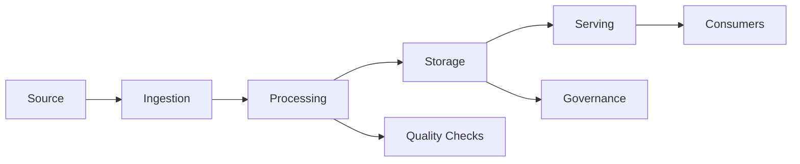
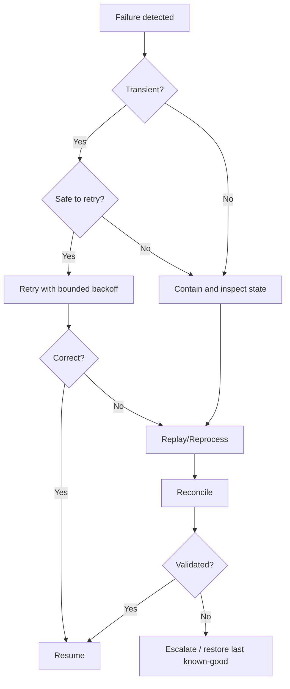
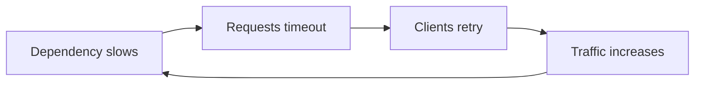
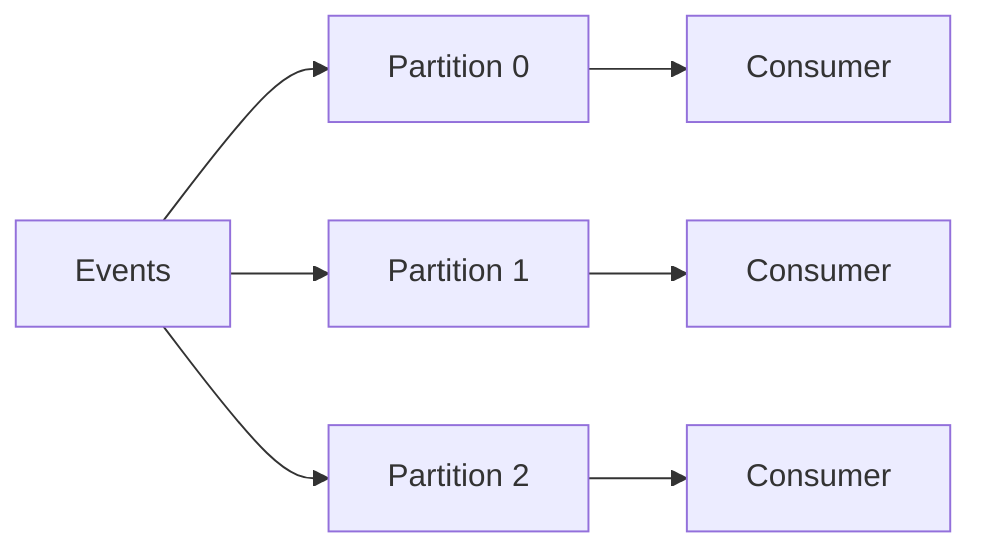
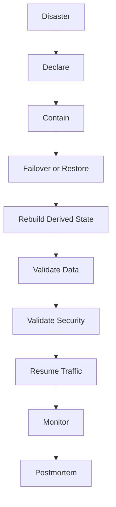
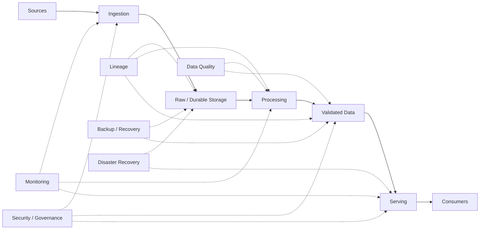

# 16 — Failure Scenarios and Deep-Dive Follow-Up Questions

> **Phase D — Depth Under Pressure (Advanced)**
>
> This module follows Topics 07–15 and teaches the skill that separates a design that looks good on a whiteboard from a design that can be defended under pressure: **failure reasoning**.
>
> Core operating sequence:
>
> **Diagnose → Isolate → Reason → Mitigate → Recover → Validate → Prevent → Explain**

---

## 1. Module Overview

A Data Engineering system is not defined only by its happy path.

A production system must also answer:

- What fails?
- Why does it fail?
- How do we detect it?
- What is the blast radius?
- What happens to consumers?
- Can we safely retry?
- Can retrying duplicate data?
- What state is authoritative?
- How do we contain the problem?
- How do we recover?
- How do we prove the recovered data is correct?
- What happens at 10× scale?
- What architectural assumption became false?

This is the bridge between:

> **"I can design a Data Engineering system."**

and:

> **"I can defend the design when the interviewer introduces failures, scale increases, requirements change, or a dependency behaves unexpectedly."**

### Topic 16 outcomes

By the end of this module you should be able to:

1. Classify Data Engineering failures.
2. Separate symptoms from root causes.
3. Determine blast radius and business impact.
4. Design detection and containment.
5. Explain retries, backoff, idempotency, replay, and backpressure.
6. Reason about batch, streaming, CDC, lakehouse, orchestration, ML, observability, ad attribution, IoT, GDPR, and RAG failures.
7. Validate correctness after recovery.
8. Explain exactly-once versus effectively-once semantics.
9. Design backfill and disaster-recovery strategies.
10. Reason about RPO/RTO and 10× scale.
11. Conduct a structured incident response.
12. Answer deep-dive interviewer follow-ups without bluffing.
13. Distinguish Senior-level debugging from Staff-level systemic reasoning.

### The most important principle

> **A recovered job is not necessarily a recovered system. Recovery is incomplete until correctness, downstream impact, and SLA state are verified.**

---

# 2. Why Failure Analysis Matters

Senior interviews rarely stop after:

> "Here is my architecture."

The interviewer often changes one assumption:

> "Kafka is unavailable."

> "Your consumer is three hours behind."

> "The source sent duplicate CDC events."

> "The schema changed."

> "You need to backfill two years without missing today's SLA."

> "One region is down."

> "Your data is now 10× larger."

> "A permission was revoked but the user can still retrieve the document."

The candidate must adapt rather than restart the design.

### Weak reasoning

> "We add retries."

### Strong reasoning

> "First I would determine whether the failure is transient and whether the operation is idempotent. I would stop unsafe retries, preserve the durable source of truth, contain downstream propagation, recover from a known checkpoint or replay position, reconcile source and target state, and only then resume publication."

The difference is not vocabulary. It is **operational reasoning**.

---

# 3. Prerequisites and Dependencies

Topic 16 assumes the learner has already studied:

| Earlier area | Used here |
|---|---|
| Requirements/scoping | Define failure impact and changed constraints |
| Estimation | Quantify backlog, storage, throughput, and recovery time |
| Reusable design framework | Locate the failing stage |
| Trade-offs | Compare recovery strategies |
| Topics 07–15 | Apply failures to complete design cases |
| Streaming / Kafka / Spark | Component-level deep dives |
| CDC | Replication failure reasoning |
| Orchestration | Retry and dependency failures |
| Data quality | Recovery validation |
| Security/governance | Privacy and authorization incidents |

This module does **not** replace those topics. It teaches how to defend them under failure.

---

# 4. Failure Fundamentals

## 4.1 Failure

A component cannot perform its intended function.

Example:

```text
Spark job cannot write its output.
```

## 4.2 Bug

An implementation behaves incorrectly.

```text
A join accidentally multiplies records.
```

## 4.3 Incident

A production event that requires operational response.

```text
A transformation bug publishes incorrect revenue for customers.
```

## 4.4 Outage

A service is unavailable or unusable.

```text
Consumers cannot read from the streaming platform.
```

## 4.5 Degradation

The system still works, but below its required performance or quality.

```text
P95 latency increases from 1s to 8s.
```

## 4.6 Data correctness failure

The system runs successfully but produces wrong data.

```text
Job status = SUCCESS
Revenue = wrong
```

This is especially dangerous because infrastructure monitoring can remain green.

---

# 5. Failure Taxonomy

## 5.1 Application failures

- Code bugs
- Null handling errors
- Incorrect transformations
- Incorrect joins
- Incorrect aggregations
- Memory leaks
- Infinite processing
- Serialization failures

## 5.2 Data failures

- Missing records
- Duplicate records
- Corrupted records
- Malformed records
- Unexpected nulls
- Invalid values
- Referential-integrity violations
- Schema drift
- Breaking schema changes
- Late-arriving data
- Out-of-order data
- Data skew
- Bad timestamps
- Clock skew
- Poison-pill records

## 5.3 Pipeline failures

- Job failure
- Partial completion
- Retry loops
- Failed checkpoints
- Broken dependencies
- DAG deadlocks
- Backfill failure
- Incremental-load corruption
- Incorrect watermark
- Incorrect checkpoint state

## 5.4 Infrastructure failures

- CPU exhaustion
- Memory exhaustion
- Disk exhaustion
- Network failure
- DNS failure
- Storage outage
- Container failure
- Node failure
- Cluster failure
- Region failure

## 5.5 Distributed-system failures

- Network partitions
- Partial failures
- Leader failure
- Worker failure
- Consumer failure
- Coordinator failure
- Split-brain risk
- Replication lag
- Message reordering
- Duplicate delivery

## 5.6 Streaming failures

- Consumer lag
- Producer outage
- Broker failure
- Partition imbalance
- Hot partition
- Backpressure
- State-store growth
- Checkpoint corruption
- Watermark errors
- Replay storms
- Reconnect storms

## 5.7 Warehouse/lake/lakehouse failures

- Write failures
- Transaction conflicts
- Corrupted tables
- Metadata failures
- Partition problems
- Small-file explosion
- Concurrent writes
- Stale metadata
- Failed compaction
- Object-storage failures

## 5.8 Orchestration failures

- Scheduler failure
- Retry storms
- Dependency failures
- Duplicate task execution
- Zombie tasks
- Stuck tasks
- Incorrect DAG dependencies
- Scheduler backlog

## 5.9 Security/privacy failures

- Unauthorized data access
- ACL propagation failure
- Credential expiration
- Secret rotation failure
- PII leakage
- Incorrect tenant isolation
- GDPR deletion propagation failure

---

# 6. Reliability Fundamentals

## 6.1 SLA

**Service Level Agreement** — an external commitment.

Example:

> Daily revenue data must be available by 07:00.

## 6.2 SLO

**Service Level Objective** — the internal reliability target.

Example:

> 99.9% of daily datasets are available by the agreed deadline.

## 6.3 SLI

**Service Level Indicator** — the measured signal.

Example:

```text
successful_daily_deliveries / total_daily_deliveries
```

## 6.4 Error budget

If the SLO permits 0.1% failure, that tolerated failure becomes an operational budget.

This helps answer:

> "Can we accept this risky migration now?"

## 6.5 Availability

Whether the service is usable.

## 6.6 Reliability

Whether it performs correctly and consistently over time.

A system can be available but unreliable:

```text
API responds = yes
Returned data = wrong
```

## 6.7 Durability

Whether committed data survives failures.

## 6.8 Consistency

Whether readers observe data according to the system's defined consistency model.

## 6.9 Freshness

How current the data is.

```text
freshness lag =
current time - source update time
```

## 6.10 Correctness

Whether the result satisfies the required business/data semantics.

## 6.11 Completeness

Whether expected data is present.

## 6.12 Recoverability

Whether the system can return to a correct state after failure.

## 6.13 RPO

**Recovery Point Objective** — maximum acceptable data loss measured in time.

Example:

```text
RPO = 15 minutes
```

## 6.14 RTO

**Recovery Time Objective** — maximum acceptable recovery time.

Example:

```text
RTO = 2 hours
```

## 6.15 MTTD

Mean Time To Detect.

## 6.16 MTTR

Mean Time To Recover/Repair.

## 6.17 MTBF

Mean Time Between Failures.

### Interview mental model

```text
SLI → measure
SLO → target
SLA → commitment
RPO → how much data/time can be lost
RTO → how quickly service must recover
MTTD → how quickly we notice
MTTR → how quickly we restore
```

---

# 7. The Failure-Analysis Framework

Use this framework for almost every follow-up.

```text
1. Clarify
      ↓
2. Determine blast radius
      ↓
3. Establish impact
      ↓
4. Detect
      ↓
5. Isolate
      ↓
6. Contain
      ↓
7. Recover
      ↓
8. Validate correctness
      ↓
9. Prevent recurrence
      ↓
10. Explain trade-offs
```

## 7.1 Clarify

Ask:

- What failed?
- Which component?
- When?
- Is it still failing?
- Is the failure partial or total?
- Is this availability, correctness, freshness, or security?

## 7.2 Blast radius

Determine:

- datasets
- tenants
- partitions
- time range
- consumers
- regions
- downstream systems

## 7.3 Impact

Ask:

```text
Data loss?
Duplicate data?
Incorrect data?
Stale data?
Availability degradation?
Security exposure?
SLA/SLO violation?
```

## 7.4 Detect

Use:

- metrics
- logs
- traces
- data-quality checks
- freshness checks
- reconciliation
- consumer lag
- queue depth

## 7.5 Isolate

Trace:

```text
Source → Ingestion → Processing → Storage → Serving → Consumer
```

Find the first incorrect or unavailable stage.

## 7.6 Contain

Examples:

- pause consumers
- quarantine bad data
- disable a deployment
- stop publishing
- reduce traffic
- isolate a tenant
- fail over
- disable unsafe retries

## 7.7 Recover

Possible actions:

- retry
- replay
- restore checkpoint
- backfill
- rebuild
- restore snapshot
- reprocess raw data
- fail over

## 7.8 Validate

Use:

- row counts
- checksums
- event IDs
- aggregate reconciliation
- business invariants
- freshness checks
- schema checks

## 7.9 Prevent

Add:

- tests
- alerts
- contracts
- idempotency
- guardrails
- capacity planning
- isolation
- automated reconciliation

---

# 8. Detection and Observability

A production platform needs both **system health** and **data health**.

## System-health signals

- CPU
- memory
- disk
- network
- error rate
- latency
- throughput
- queue depth
- consumer lag
- retries

## Data-health signals

- completeness
- accuracy
- uniqueness
- freshness
- validity
- distribution changes
- referential integrity
- reconciliation differences

### Key distinction

```text
System health:
"Did the job run?"

Data health:
"Did the job produce correct data?"
```

You need both.

---

# 9. Blast Radius and Impact Analysis

Use a dependency graph:



If `C` fails, ask:

- Does D receive partial data?
- Does E continue serving yesterday's data?
- Do consumers receive stale data?
- Can a downstream retry create duplicates?
- Is the failure isolated to one partition?

### Blast-radius dimensions

| Dimension | Question |
|---|---|
| Time | Which time interval is affected? |
| Data | Which datasets? |
| Tenant | Which customers? |
| Region | Which geography? |
| Partition | Which shard/partition? |
| Consumer | Which downstream users? |
| Security | Is unauthorized data exposed? |
| Business | What decision/process is affected? |

---

# 10. Containment and Mitigation

Containment stops the incident from spreading.

Examples:

### Bad transformation

```text
Stop publication
→ quarantine output
→ keep raw data
```

### Consumer lag

```text
Bound upstream production
→ scale consumers
→ inspect hot partitions
```

### Security incident

```text
Fail closed
→ revoke access
→ isolate affected path
→ audit
```

### Corrupt table

```text
Stop writes
→ preserve evidence
→ identify last known-good version
```

### Important principle

> **Containment optimizes for limiting damage; recovery optimizes for restoring service. They are not the same action.**

---

# 11. Recovery and Reprocessing

## Retry

Use for transient, safely repeatable operations.

## Replay

Re-read durable events from a known position.

## Backfill

Recompute historical data.

## Restore

Recover persisted state from a snapshot/backup.

## Rebuild

Reconstruct derived state from authoritative data.

### Recovery decision tree



---

# 12. Data Correctness After Recovery

The question:

> **"How do I know the system is correct after recovery?"**

is one of the highest-value Senior/Staff interview questions.

### Validation techniques

#### Row-count reconciliation

```text
source_count == target_count
```

#### Checksums

```text
hash(source) == hash(target)
```

#### Aggregate reconciliation

```text
source revenue == target revenue
```

#### Event-ID reconciliation

```text
source IDs - target IDs = expected gap
```

#### Watermark comparison

```text
source position == recovered processing position
```

#### Business invariants

Examples:

```text
quantity >= 0
order_total = sum(line_items)
one current customer record per customer_id
```

#### Sampling

Useful for rapid verification, but not always sufficient for critical data.

#### Full validation

Appropriate for high-criticality recovery when feasible.

### Golden rule

> **Successful execution ≠ correct data.**

---

# 13. Idempotency and Exactly/Effectively-Once

Retries create a fundamental problem:

```text
Write
 ↓
Network timeout
 ↓
Did the write happen?
 ↓
Retry
```

If the first write succeeded, the retry may duplicate it.

## Idempotent operation

Applying the same operation multiple times produces the same final state.

Example:

```sql
MERGE INTO target t
USING source s
ON t.event_id = s.event_id
WHEN MATCHED THEN UPDATE SET *
WHEN NOT MATCHED THEN INSERT *;
```

The exact syntax varies by engine, but the design principle is stable.

## Exactly-once

"Exactly once" is not a magic property of a single component.

Reason end to end:

```text
source
→ transport
→ processing
→ state
→ sink
→ downstream consumers
```

A system may provide strong processing guarantees while an external side effect remains non-idempotent.

## Effectively-once

A practical pattern:

```text
at-least-once delivery
+
stable event ID
+
deduplication/idempotent sink
=
effectively-once outcome
```

---

# 14. Retries, Backoff and Failure Amplification

Blind retries can turn a small incident into a large incident.

## Retry storm



This is positive feedback.

Use:

- exponential backoff
- jitter
- bounded attempts
- retry budgets
- circuit breakers
- dead-letter handling
- queueing
- backpressure

### Retryable

Often:

- temporary network error
- transient service unavailable
- throttling

### Usually not retryable without change

Often:

- schema validation failure
- invalid credentials
- malformed record
- deterministic business-rule violation

The exact classification depends on the system.

---

# 15. Partial Failure

Distributed systems fail partially.

Examples:

- 99% of Kafka partitions healthy
- one Spark executor repeatedly fails
- one region unavailable
- one CDC stream behind
- one tenant affected
- one downstream consumer broken

### Partial failure questions

1. How do you detect the affected subset?
2. Can healthy traffic continue?
3. Can you isolate the unhealthy subset?
4. Does recovery create ordering problems?
5. How do you reconcile only the affected range?

> **A partially working system can still be globally incorrect.**

---

# 16. Batch Failure Scenarios

## Scenario 1 — Source arrives late

**Symptom:** daily job sees 90% of expected data.

**Likely causes:**
- source delay
- upstream outage
- incomplete partition

**Containment:**
- mark partition incomplete
- prevent false publication

**Recovery:**
- wait/retry or run targeted backfill

**Validation:**
- source count vs target count
- freshness check

**Prevention:**
- source completeness contract
- arrival SLA
- late-data alert

### Follow-up

> What if the dashboard must still open at 07:00?

Strong answer:

> Publish a clearly marked prior snapshot or partial state only if the business contract allows it; otherwise fail the freshness SLO explicitly. I would not silently present incomplete data as complete.

---

## Scenario 2 — Backfill overlaps production

Risk:

```text
Backfill writes date D
Production writes date D
```

Possible outcome:

```text
duplicates
conflicts
non-deterministic final state
```

Mitigation:

- partition ownership
- isolated output
- write-audit-publish
- deterministic merge
- atomic publication

---

## Scenario 3 — Incorrect aggregation

The job succeeds but revenue is 12% too high.

Investigate:

```text
input counts
join cardinality
duplicate keys
aggregation grain
late data
dimension changes
```

Never begin by restarting the job.

---

## Scenario 4 — Orchestrator retries task

If task output is not idempotent:

```text
run 1 → partial write
run 2 → second write
```

Fix:

- idempotent destination
- transaction boundary
- run ID
- deterministic output path
- atomic publish

---

# 17. Streaming Failure Scenarios

## Scenario 1 — Consumer lag

Symptoms:

```text
lag ↑
event age ↑
freshness ↓
```

Investigate:

- consumer throughput
- partition distribution
- downstream sink latency
- CPU/memory
- hot partitions
- broker health

Do not automatically add consumers.

If one partition is hot:

```text
more consumers
≠
more throughput for one partition
```

---

## Scenario 2 — Hot partition



If 60% of traffic lands on partition 0, adding consumers does not solve the single-partition bottleneck.

Possible options:

- change partition key
- increase partitions
- redistribute keys
- isolate hot entities
- accept ordering trade-off if business requirements allow

---

## Scenario 3 — Late events

If event time is:

```text
10:00
```

but arrival is:

```text
10:12
```

a watermark that advances too aggressively may drop valid events from a window.

Trade-off:

```text
larger lateness allowance
→ better completeness
→ more state
→ more latency
```

---

## Scenario 4 — State-store growth

Causes:

- high-cardinality keys
- long windows
- slow watermarks
- missing cleanup
- skew

Recovery:

- inspect state cardinality
- reduce unnecessary state
- repair watermark semantics
- scale state resources
- replay from safe checkpoint if required

---

# 18. CDC Failure Scenarios

## Scenario 1 — Replication lag

Track:

```text
source position
target position
lag duration
```

A "green connector" is not enough if it is hours behind.

## Scenario 2 — Duplicate CDC event

Use:

```text
source transaction position
+
event key
+
operation sequence
```

to reason about deduplication.

## Scenario 3 — Snapshot + CDC overlap

Initial snapshot and live CDC can overlap.

Without coordination:

```text
snapshot row
+
same row from CDC
=
duplicate
```

Use a defined snapshot boundary and deterministic merge semantics.

## Scenario 4 — Delete event lost

A missing delete is worse than an ordinary duplicate because target state can remain permanently stale.

Validation:

```text
source keyset
vs
target keyset
```

---

# 19. Warehouse/Lakehouse Failure Scenarios

## Transaction conflict

Two writers modify the same logical state.

Mitigation:

- coordinate ownership
- reduce concurrent writers
- use transaction semantics
- retry only if conflict is safely retryable

## Small-file explosion

Symptoms:

- metadata overhead
- slow reads
- many tiny objects

Recovery:

- compaction
- controlled write sizing
- optimized partition strategy

## Metadata failure

If metadata is unavailable:

- stop unsafe writes
- preserve source/transaction state
- restore or fail over metadata
- validate before resuming

## Corrupted derived table

If raw authoritative data is intact:

```text
stop serving
→ identify last-good state
→ rebuild
→ validate
→ publish
```

---

# 20. Orchestration Failure Scenarios

## Scheduler outage

Question:

> What happens to scheduled jobs?

A robust architecture separates:

- scheduling state
- task state
- data state

Recovery should avoid launching duplicate work without understanding existing task state.

## Retry storm

A dependency failure causes hundreds of tasks to retry.

Controls:

- bounded retries
- backoff
- dependency-aware scheduling
- concurrency limits

## Zombie task

The scheduler thinks a task is alive but execution is no longer healthy.

Use:

- heartbeats
- leases
- timeouts
- explicit task-state reconciliation

---

# 21. ML Feature Platform Failure Scenarios

## Feature freshness violation

```text
Expected freshness = 5 min
Actual freshness = 45 min
```

Impact:

- model decisions may use stale features

Detect:

- feature timestamp
- pipeline lag
- online-store timestamp

Contain:

- mark feature unavailable/stale
- use approved fallback only if business rules allow

## Training-serving skew

Offline transformation:

```text
feature = avg(...)
```

Online path:

```text
feature = sum(...)
```

The pipeline can be healthy while model quality degrades.

## Point-in-time leakage

A feature includes information that was not available at prediction time.

This is a correctness failure, not merely an ML-model problem.

---

# 22. Log/Metrics Platform Failure Scenarios

Observability systems themselves must be observable.

## High-cardinality explosion

Example:

```text
metric{user_id="..."}
```

Millions of unique label values can overload storage/query systems.

Mitigation:

- cardinality budgets
- label policy
- aggregation
- sampling

## Storage exhaustion

Contain:

- protect critical ingestion
- enforce retention
- shed non-critical telemetry
- expand storage if justified

## Missing logs during an incident

This creates an operational blind spot.

Use:

- local buffering
- durable queues
- multiple observability paths
- health metrics independent of application logs

---

# 23. Ad Attribution Failure Scenarios

For the 7-day attribution case:

## Duplicate click

Use event ID and deduplication.

## Late conversion

Must still be eligible within the attribution window if the business definition allows it.

## Real-time vs billing result

Real-time attribution may be provisional.

Billing-grade result should support:

```text
recompute
→ reconcile
→ publish final
```

## Fraudulent traffic

Do not silently discard evidence. Maintain:

- classification
- auditability
- deterministic rules
- reprocessing path

## Consent changes

Authorization/privacy state may alter whether events can be processed or retained.

---

# 24. IoT Failure Scenarios

## Reconnect storm

Thousands of devices reconnect after a network outage.

Result:

```text
traffic spike
→ broker pressure
→ consumer lag
→ state growth
```

Controls:

- exponential device backoff
- gateway buffering
- admission control
- partition capacity
- bounded queues

## Clock skew

Device says:

```text
event_time = 10:00
```

but actual time is 10:30.

You need:

- ingestion timestamp
- processing timestamp
- device timestamp
- clock-quality checks

## Hot device

One device emits 100× normal traffic.

Do not allow one producer to dominate shared resources.

---

# 25. GDPR Deletion Failure Scenarios

Use the lifecycle:

```text
Discover → Delete → Verify → Prove
```

Possible failure:

```text
Database deleted
Vector index still contains content
```

The deletion is incomplete.

Derived representations include:

- caches
- vectors
- feature values
- warehouse copies
- Kafka retention
- backups
- historical snapshots

The correct interview answer traces lineage rather than saying:

> "We deleted the source row."

---

# 26. RAG/Vector Platform Failure Scenarios

## ACL synchronization failure

```text
User access revoked
↓
ACL index stale
↓
Old document remains retrievable
```

Treat as security-critical.

## Embedding pipeline failure

Track:

```text
chunks_total
chunks_embedded
chunks_failed
coverage %
```

Do not silently skip failures.

## Index rebuild failure

Keep the old index serving while candidate index is incomplete.

## Retrieval-quality degradation

Infrastructure can be green while:

```text
Recall@10: 0.82 → 0.51
```

Treat this as a production quality incident.

## PII leakage

Contain retrieval and follow approved privacy/security incident response.

## Cache staleness

Version cache entries by relevant authorization/index state.

---

# 27. Root-Cause Analysis

## Trigger vs root cause

Example:

```text
Trigger:
Schema change

Immediate failure:
Parser rejected field

Contributing factor:
No compatibility test

Systemic root cause:
No source contract / schema governance
```

## 5 Whys

```text
Why did data miss SLA?
→ Spark job failed.

Why?
→ Executor OOM.

Why?
→ One partition was extremely large.

Why?
→ Partition key was skewed.

Why?
→ No skew monitoring or key-distribution guardrail.
```

The final answer is more useful than:

> "Spark crashed."

## Timeline analysis

Record:

```text
T-30: deployment
T-20: latency rises
T-10: queue grows
T0: alert
T+10: containment
T+30: recovery
T+45: validation
```

## Postmortem template

### Incident summary

What happened?

### Impact

Who/what was affected?

### Timeline

What happened and when?

### Detection

How did we learn?

### Root cause

What systemic condition caused it?

### Contributing factors

What made it worse?

### Resolution

What restored service?

### Prevention

What changes reduce recurrence?

### Action items

Each action should have:

```text
owner
deadline
success criterion
```

---

# 28. Incident Response

## Severity

A useful conceptual scale:

| Severity | Example |
|---|---|
| SEV-1 | Critical data/security/business outage |
| SEV-2 | Major degradation or important SLA breach |
| SEV-3 | Limited impact / recoverable delay |
| SEV-4 | Minor issue |

Use the organization's actual severity definitions in production.

## Incident roles

For major incidents:

- Incident Commander
- Technical Lead
- Communications Lead
- Subject Matter Experts
- Scribe

The engineer debugging the issue should not necessarily also coordinate every communication task.

## Incident communication

Communicate:

```text
What happened
Impact
Current containment
Next checkpoint
Known unknowns
```

Do not invent certainty.

---

# 29. Disaster Recovery

A disaster can involve:

- metadata loss
- cluster loss
- storage corruption
- region loss
- credential failure
- accidental deletion

## RPO/RTO example

```text
RPO = 15 minutes
RTO = 2 hours
```

The architecture must support those targets.

## Recovery principle

> **A backup that has never been restored is an assumption, not proven recovery capability.**

### Recovery workflow



---

# 30. Chaos and Failure Testing

Failure testing should answer:

> "Does the system behave as designed when a dependency fails?"

Test:

- broker failure
- consumer failure
- node failure
- network interruption
- storage unavailability
- schema break
- slow dependency
- high load
- checkpoint corruption
- malformed records

## Safe progression

```text
local
→ test environment
→ controlled staging
→ limited production experiment
```

Production chaos testing requires:

- explicit scope
- rollback
- monitoring
- owner
- blast-radius limit
- business approval

---

# 31. Capacity and 10× Failure Analysis

Always ask:

> **What breaks first at 10×?**

Possible bottlenecks:

| Component | Failure mode at scale |
|---|---|
| Source API | rate limit |
| Kafka | partition/broker capacity |
| Spark | shuffle / skew / memory |
| Storage | capacity / metadata |
| Warehouse | concurrency |
| State store | memory/storage |
| Vector index | memory / shards |
| Metadata | bottleneck |
| Orchestrator | scheduler backlog |
| Network | bandwidth |
| Cost | budget breach |

### Example

Current:

```text
100K events/sec
```

Future:

```text
1M events/sec
```

Do not say:

> "Add more servers."

Ask:

1. Where is the current bottleneck?
2. Is scaling horizontal?
3. Does ordering constrain parallelism?
4. Does state grow with traffic?
5. Does storage grow linearly?
6. Does cost grow linearly?
7. What happens during recovery from backlog?

### Backlog recovery

If:

```text
incoming = 1M events/sec
processing = 1.2M events/sec
```

then backlog decreases at:

```text
200K events/sec
```

If backlog is 36 billion events:

```text
36B / 200K = 180,000 sec
≈ 50 hours
```

So "we can process above incoming rate" does not mean the backlog disappears quickly.

---

# 32. Failure Trade-Off Matrix

| Failure | Detection | Containment | Recovery | Correctness risk | Cost | Complexity |
|---|---|---|---|---|---|---|
| Consumer lag | Lag/age | Backpressure | Scale/replay | Medium | Medium | Medium |
| Bad batch output | DQ/reconciliation | Stop publish | Recompute | High | Medium | Medium |
| CDC gap | Position comparison | Stop target publish | Replay | High | Medium | High |
| Storage loss | Availability | Failover | Restore | High | High | High |
| ACL failure | Security tests/audit | Fail closed | Re-sync | Critical | Medium | High |
| RAG index loss | Index health | Route to backup | Rebuild | Medium | High | High |
| Schema break | Contract test | Quarantine | Adapt/replay | High | Low | Medium |
| Backfill conflict | Validation | Isolate output | Reconcile | High | Medium | High |

The right recovery depends on:

```text
criticality
+
SLA
+
RPO/RTO
+
recoverability
+
cost
+
complexity
+
blast radius
```

---

# 33. Senior vs Staff Reasoning

## Senior Engineer

Should be able to:

- identify failure
- diagnose systematically
- explain impact
- contain the incident
- recover the system
- validate correctness
- improve monitoring
- prevent recurrence

## Staff Engineer

Additionally:

- identify systemic failure modes
- reason about organizational blast radius
- design failure isolation
- establish platform standards
- balance reliability and cost
- anticipate failure before implementation
- simplify recovery paths
- define reusable reliability patterns
- influence multiple teams
- decide which risks are acceptable

### Example

**Senior:**

> "The CDC stream is lagging because the connector is throttled. I would reduce load, increase permitted throughput, monitor source impact, and replay from the last safe position."

**Staff:**

> "The immediate problem is throttling, but the systemic issue is that the platform has no source-capacity contract or adaptive ingestion control. I would define source quotas, lag SLOs, bounded concurrency, backpressure, and a replay strategy so every connector behaves predictably under source pressure."

---

# 34. Interviewer Pushback Simulations

## Simulation 1 — Kafka lag

**Interviewer:** Your consumer is 30 minutes behind. What do you do?

**Candidate:** First I would determine whether lag is caused by insufficient consumer throughput, a hot partition, a slow sink, broker issues, or downstream backpressure. I would quantify lag by partition and event age.

**Interviewer:** You increase consumer count but lag keeps growing.

**Candidate:** Then I would inspect partition distribution and per-consumer throughput. More consumers cannot improve throughput beyond the parallelism available in the partitions.

**Interviewer:** One partition receives 60% of traffic.

**Candidate:** That is likely the bottleneck. I would evaluate whether the partition key can be changed or the workload can be redistributed without violating ordering requirements.

**Interviewer:** How do you preserve ordering?

**Candidate:** First define what ordering is actually required—global, per customer, per device, or per entity. If per-entity ordering is sufficient, partition by entity and distribute different entities across partitions.

---

## Simulation 2 — Spark OOM

**Interviewer:** A Spark job fails with OOM. What do you do?

**Candidate:** I would identify whether the driver or executor ran out of memory, inspect the stage and partition sizes, and determine whether skew, a large collect, an unbounded join, or insufficient resources caused the failure.

**Interviewer:** One partition is 20× larger.

**Candidate:** That suggests skew. I would inspect the key distribution and choose a strategy such as salting, pre-aggregation, broadcast where appropriate, or repartitioning based on the workload.

**Interviewer:** Why not just add memory?

**Candidate:** More memory can mask the symptom but may not solve the structural skew. I would quantify whether the workload will fail again at higher scale.

---

## Simulation 3 — CDC gap

**Interviewer:** The lakehouse is missing 0.1% of CDC events.

**Candidate:** I would stop treating the target as trustworthy until I know whether the missing events affect business-critical records. I would compare source positions, connector checkpoints, event IDs, and target state to identify the gap.

**Interviewer:** The connector has already advanced its checkpoint.

**Candidate:** I would determine whether the source retains enough history to replay the missing range. If not, I would use source-target reconciliation or a fresh snapshot for the affected range.

---

## Simulation 4 — RAG authorization

**Interviewer:** A user's access was revoked, but retrieval still returns the document.

**Candidate:** I would treat this as a security incident. I would contain the retrieval path, invalidate authorization-sensitive caches, refresh ACL state, and verify that the document is no longer retrievable before restoring normal traffic.

**Interviewer:** Why not wait for the normal index refresh?

**Candidate:** Because security freshness can have a stricter SLA than ordinary content freshness.

---

## Simulation 5 — 10× growth

**Interviewer:** Your platform must support 10× today's traffic.

**Candidate:** I would not scale every component equally. I would estimate throughput and identify the first bottleneck across ingestion, processing, storage, state, serving, and network. Then I would scale that bottleneck and test recovery behavior under the new load.

---

# 35. Deep-Dive Follow-Up Question Bank

Use these questions aloud. Do not memorize fixed scripts.

## Architecture

1. Why did you choose this architecture?
2. What is the weakest architectural assumption?
3. Which component has the largest blast radius?
4. What would you remove if the team were half as large?
5. Which component would you make independently scalable?
6. Which state is authoritative?
7. Which state is derived?
8. Where is the primary recovery boundary?
9. Where can partial failure occur?
10. What happens if your main dependency is unavailable?

## Scale

11. What happens at 10× traffic?
12. What happens at 100× traffic?
13. What breaks first?
14. How do you prove that is the bottleneck?
15. Can the bottleneck scale horizontally?
16. What does ordering prevent you from scaling?
17. How does cost change?
18. How does recovery time change?
19. What happens during backlog recovery?
20. What changes at 10× data retention?

## Failure

21. What happens if the source is unavailable?
22. What happens if storage is unavailable?
23. What happens if processing fails halfway through?
24. What happens if the scheduler fails?
25. What happens if one node dies?
26. What happens if one region dies?
27. What happens if the network partitions?
28. What happens if the dependency becomes slow instead of unavailable?
29. What happens if the failure is intermittent?
30. What happens if monitoring fails too?

## Data correctness

31. How do you detect missing data?
32. How do you detect duplicate data?
33. How do you reconcile source and target?
34. How do you validate recovery?
35. What business invariants do you monitor?
36. What if row counts match but the data is wrong?
37. What if a join multiplies records?
38. What if a timestamp is wrong?
39. What if data arrives late?
40. What if events arrive out of order?

## Batch

41. Yesterday's job failed. What happens today?
42. How do you backfill two years?
43. How do you avoid interfering with today's workload?
44. How do you prevent duplicate outputs?
45. How do you validate a backfill?
46. What if historical business logic changed?
47. What if a dimension changed?
48. What if the source changes while the backfill runs?
49. What if the backfill fails at 80%?
50. What if the backfill takes longer than the SLA?

## Streaming

51. What causes consumer lag?
52. Why doesn't adding consumers always help?
53. What is a hot partition?
54. How do you handle backpressure?
55. How do you handle replay?
56. How do you handle state recovery?
57. What if the checkpoint is corrupt?
58. What if a watermark is wrong?
59. What if a late event arrives after publication?
60. How do you prevent retry storms?

## CDC

61. How do you detect CDC gaps?
62. How do you handle duplicate CDC events?
63. How do you handle delete events?
64. How do you handle source failover?
65. What if the source log expires before replay?
66. How do you coordinate snapshot and CDC?
67. How do you validate synchronization?
68. What if the target is ahead?
69. What if the target has an incorrect update?
70. What if schema changes during replication?

## Storage / Lakehouse

71. What if two writers conflict?
72. What if compaction fails?
73. What if metadata is unavailable?
74. What if object storage is unavailable?
75. How do you recover a corrupted table?
76. How do you identify the last known-good state?
77. How do you prevent small-file explosion?
78. How do you validate restored data?
79. What if snapshots consume too much storage?
80. What if a recovery operation conflicts with production writes?

## Orchestration

81. What if the scheduler fails?
82. What if tasks retry simultaneously?
83. What if a task is duplicated?
84. What if a dependency is late?
85. What if a DAG deadlocks?
86. How do you identify zombie tasks?
87. What if a task partially writes before failure?
88. How do you design task idempotency?
89. How do you safely resume?
90. How do you backfill without overwhelming production?

## ML feature platforms

91. What if features become stale?
92. What if online and offline features differ?
93. What if a feature pipeline is delayed?
94. What if a feature version is deleted?
95. How do you detect point-in-time leakage?
96. What if the online store is unavailable?
97. What happens to model predictions?
98. How do you recover feature history?
99. How do you validate training-serving consistency?
100. What if a model expects an unavailable feature?

## Logs and metrics

101. What if observability storage is full?
102. What if cardinality explodes?
103. What if logs are missing during an incident?
104. What if the metrics system is down?
105. How do you observe the observability platform?
106. What should be sampled?
107. What should never be sampled?
108. How do you distinguish telemetry loss from application health?
109. How do you handle an incident traffic spike?
110. How do you prevent monitoring from becoming a bottleneck?

## Ad attribution

111. How do you handle duplicate clicks?
112. What if a conversion arrives seven days later?
113. What if real-time and billing results differ?
114. How do you reconcile historical attribution?
115. What if fraud rules change?
116. What if consent changes?
117. How do you prevent double billing?
118. How do you prove billing correctness?
119. What if the attribution state grows beyond memory?
120. How do you backfill attribution safely?

## IoT

121. What if 100,000 devices reconnect simultaneously?
122. What if one device sends 100× traffic?
123. What if device clocks are wrong?
124. What if telemetry arrives out of order?
125. How do you buffer at the edge?
126. What if the gateway fails?
127. How do you handle device authentication failure?
128. How do you manage high-cardinality device state?
129. How do you recover after a network partition?
130. How do you control storage growth?

## GDPR / privacy

131. What if one system misses a deletion?
132. How do you find derived copies?
133. What if backups contain the data?
134. What if Kafka retention still contains the event?
135. What if a cache still has PII?
136. How do you prove deletion?
137. How do you handle immutable storage?
138. What if identity resolution fails?
139. What if deletion processing itself fails?
140. What if a deletion request arrives during a backfill?

## RAG / vectors

141. What if the vector index disappears?
142. How do you rebuild it?
143. What if the embedding model changes?
144. How do you re-embed 100 million chunks?
145. What if ACL state is stale?
146. How do you test tenant isolation?
147. What if retrieval quality drops?
148. What if caches serve stale results?
149. What if parsing quality degrades?
150. What if deleted content remains retrievable?

## Exactly-once / idempotency

151. What exactly do you mean by exactly-once?
152. Is exactly-once end-to-end?
153. How do retries create duplicates?
154. What makes a sink idempotent?
155. How do you deduplicate?
156. What if event IDs are not stable?
157. How do you handle a partially committed transaction?
158. How do you recover from an ambiguous timeout?
159. What if the external API is not idempotent?
160. How do you prove effective-once behavior?

## Backfill

161. How do you backfill two years without breaking daily SLAs?
162. How do you isolate backfill compute?
163. How do you prevent output conflicts?
164. How do you validate the result?
165. What if historical source data is missing?
166. What if business logic changed?
167. What if the backfill fails halfway?
168. How do you resume?
169. How do you communicate partial completion?
170. How do you retire the old data?

## Disaster recovery

171. What is your RPO?
172. What is your RTO?
173. What if the metadata store is lost?
174. What if one region is lost?
175. What if backups are corrupted?
176. How do you test restore?
177. What if the restored state is inconsistent?
178. What data is authoritative?
179. What data can be rebuilt?
180. How do you validate recovery?

## Security

181. What if credentials expire?
182. What if secret rotation fails?
183. What if ACL propagation fails?
184. What if a tenant filter is wrong?
185. What if an internal user accesses restricted data?
186. How do you fail closed?
187. How do you audit access?
188. How do you contain a privacy incident?
189. How do you prevent recurrence?
190. How does security change at multi-region scale?

## Cost

191. What is the largest cost driver?
192. How would you cut cost by 50%?
193. What reliability would you sacrifice?
194. Can you reduce replicas?
195. Can you reduce retention?
196. Can you batch work?
197. Can you reduce reprocessing?
198. What happens to cost at 10×?
199. How do you allocate cost to teams?
200. How do you prevent cost-driven reliability failures?

## Operations

201. What alerts fire?
202. Which alerts are actionable?
203. What dashboards do you need?
204. What logs are essential?
205. What traces are useful?
206. How do you correlate a data-quality failure to a deployment?
207. How do you detect silent correctness failures?
208. How do you distinguish transient from persistent failure?
209. What should page an engineer at 03:00?
210. What should create a ticket instead?

## Trade-offs

211. Retry or replay?
212. Recompute or incremental correction?
213. Strong consistency or availability?
214. Fail-open or fail-closed?
215. Full validation or sampling?
216. Multi-region or lower cost?
217. More replicas or cheaper infrastructure?
218. Synchronous or asynchronous processing?
219. Managed or self-hosted?
220. Simpler architecture or stronger isolation?

## Staff-level

221. Which assumption in your architecture is most fragile?
222. Which failure has the largest organizational blast radius?
223. Which failure should be impossible by design?
224. What reliability standard would you make mandatory platform-wide?
225. What would you centralize?
226. What would you federate?
227. What would you simplify after six months?
228. How would you migrate the platform without stopping consumers?
229. What would you redesign after a major incident?
230. How would you make reliability measurable across teams?

## "I don't know" / first-principles reasoning

231. What if you do not know the exact Kafka behavior?
232. What if you have never operated this database?
233. What if the interviewer names an unfamiliar technology?
234. How do you avoid bluffing?
235. What assumptions would you state?
236. What invariant would you protect?
237. What state would you make authoritative?
238. What experiment would you run?
239. What documentation would you consult?
240. How would you validate the answer?

### How to answer an unfamiliar follow-up

Use:

```text
1. State what I know.
2. State the assumption.
3. Identify the invariant.
4. Reason from first principles.
5. Explain the likely failure modes.
6. Say what I would verify.
7. Explain how the decision could change.
```

That is much stronger than inventing a confident answer.

---

# 36. Failure Scenario Drills

For each drill, receive only the initial conditions. Answer aloud before reading the key.

## Drill 1 — Batch

```text
Volume: 5 TB/day
SLA: 06:00
Source arrives in hourly partitions
One partition is missing
```

Questions:

1. What do you detect?
2. Do you publish?
3. How do you recover?
4. How do you validate?

### Answer key

Mark the partition incomplete, prevent false completeness, recover the missing partition, rerun the affected transformation, reconcile counts/aggregates, then publish.

---

## Drill 2 — Streaming

```text
Input: 500K events/sec
Consumer lag increasing
One partition has 8× the traffic
```

Answer:

- identify skew
- do not blindly add consumers
- evaluate partition-key change
- preserve required ordering
- quantify recovery time

---

## Drill 3 — CDC

```text
Source position = 10,000,000
Target position = 9,850,000
Connector says healthy
```

Answer:

The connector is not healthy from a business-freshness perspective. Measure lag, inspect throughput and source retention, then recover from a known position.

---

## Drill 4 — RAG

```text
Document ACL changed at 10:00
User query at 10:01 still returns it
```

Answer:

Security incident. Contain, invalidate relevant caches, refresh ACL state, verify authorization, audit, then resume.

---

## Drill 5 — Lakehouse

```text
Two writers update the same logical partition
```

Answer:

Identify transaction conflict, determine whether writes can be safely retried, resolve ownership/concurrency, validate final state.

---

## Drill 6 — Feature platform

```text
Online feature timestamp is 45 minutes old
Model requires <5 minutes
```

Answer:

Freshness SLO violation. Stop or degrade the feature path according to business policy, investigate pipeline/store lag, recover, validate timestamps, and monitor.

---

## Drill 7 — IoT

```text
5M devices
100K reconnect simultaneously
Broker CPU 95%
```

Answer:

Reconnect storm. Use admission control, exponential backoff, gateway buffering, partition/capacity analysis, and protect critical traffic.

---

## Drill 8 — Attribution

```text
Final billing total differs from real-time attribution by 4%
```

Answer:

Do not assume real-time is authoritative. Reconcile event IDs, attribution windows, late events, deduplication, fraud rules, and produce a billing-grade final result.

---

# 37. Break/Fix Labs

## Lab 1 — Duplicate event processing

**Inject:** process the same event batch twice.

**Symptoms:** row count doubles.

**Task:** implement idempotent processing.

**Expected diagnosis:** sink lacks stable-key idempotency.

**Validation:** rerun produces no additional logical records.

**Prevention:** event IDs + idempotent merge.

---

## Lab 2 — Consumer lag

**Inject:** reduce consumer throughput below producer rate.

**Symptoms:** lag increases continuously.

**Task:** calculate backlog growth and identify bottleneck.

**Validation:** recovered backlog reaches zero without violating ordering.

---

## Lab 3 — Schema break

**Inject:** change a required field type.

**Symptoms:** parser/write failures.

**Task:** quarantine incompatible records.

**Prevention:** schema compatibility checks.

---

## Lab 4 — Missing partition

**Inject:** omit one daily source partition.

**Symptoms:** row count and freshness checks fail.

**Task:** prevent publication and recover the partition.

---

## Lab 5 — Incorrect watermark

**Inject:** advance watermark too aggressively.

**Symptoms:** late events disappear from results.

**Task:** recover affected windows and correct watermark logic.

---

## Lab 6 — CDC duplication

**Inject:** replay a CDC range.

**Symptoms:** duplicate updates.

**Task:** deduplicate using stable source position/key semantics.

---

## Lab 7 — Failed checkpoint

**Inject:** invalidate the last checkpoint.

**Task:** recover from an earlier safe checkpoint and reconcile replayed output.

---

## Lab 8 — Feature freshness breach

**Inject:** stop feature updates for 20 minutes.

**Task:** detect SLO violation and determine serving behavior.

---

## Lab 9 — Storage exhaustion

**Inject:** fill a worker/data volume.

**Task:** protect critical writes, identify large files, recover capacity, validate no data loss.

---

## Lab 10 — Incorrect attribution

**Inject:** duplicate conversions.

**Task:** reconcile event IDs and correct attribution.

---

## Lab 11 — Clock skew

**Inject:** one IoT device reports timestamps 30 minutes ahead.

**Task:** compare device, ingestion, and processing time and prevent corrupt windows.

---

## Lab 12 — GDPR deletion gap

**Inject:** delete source data but leave a vector/cache record.

**Task:** discover, delete, verify, prove.

---

## Lab 13 — RAG ACL mismatch

**Inject:** change ACL without updating retrieval metadata.

**Task:** detect unauthorized retrieval and contain it.

---

## Lab 14 — Stale vector index

**Inject:** source content changes but index remains old.

**Task:** measure freshness lag and repair the incremental pipeline.

---

## Lab 15 — Cascading retry storm

**Inject:** make a downstream service return timeouts.

**Task:** implement bounded retries, backoff, jitter, and a circuit breaker.

---

# 38. Coding Exercises

## Exercise 1 — Duplicate detection

```python
from collections import Counter

events = ["a", "b", "a", "c", "b", "a"]

counts = Counter(events)
duplicates = {event: n for event, n in counts.items() if n > 1}

print(duplicates)
```

Expected:

```text
{'a': 3, 'b': 2}
```

Production consideration: for very large streams, use distributed/stateful deduplication rather than unbounded local memory.

---

## Exercise 2 — Idempotent processing

```python
def process_once(events, seen):
    output = []

    for event in events:
        event_id = event["event_id"]

        if event_id in seen:
            continue

        seen.add(event_id)
        output.append(event)

    return output
```

The state must be durable in a real system.

---

## Exercise 3 — Exponential backoff

```python
import random


def backoff_delay(attempt: int, base: float = 1.0, cap: float = 60.0) -> float:
    delay = min(cap, base * (2 ** attempt))
    return delay * random.uniform(0.5, 1.5)
```

Why jitter?

Without it, many workers can retry simultaneously.

---

## Exercise 4 — Failure classifier

```python
def classify_error(error: Exception) -> str:
    message = str(error).lower()

    if "timeout" in message or "temporarily unavailable" in message:
        return "transient"

    if "schema" in message or "invalid" in message:
        return "data_or_contract"

    if "permission" in message or "unauthorized" in message:
        return "security"

    return "unknown"
```

Production systems should use typed errors where possible rather than relying on message text.

---

## Exercise 5 — Reconciliation

```python
def reconcile(source_ids: set[str], target_ids: set[str]) -> dict:
    return {
        "missing_in_target": sorted(source_ids - target_ids),
        "extra_in_target": sorted(target_ids - source_ids),
        "matching": len(source_ids & target_ids),
    }
```

---

## Exercise 6 — Freshness violation

```python
from datetime import datetime, timezone


def is_stale(updated_at: datetime, max_age_seconds: int) -> bool:
    now = datetime.now(timezone.utc)
    age = (now - updated_at).total_seconds()
    return age > max_age_seconds
```

---

## Exercise 7 — SQL duplicate detection

```sql
SELECT event_id, COUNT(*) AS copies
FROM events
GROUP BY event_id
HAVING COUNT(*) > 1;
```

---

## Exercise 8 — Source/target reconciliation

```sql
SELECT
    (SELECT COUNT(*) FROM source_table) AS source_count,
    (SELECT COUNT(*) FROM target_table) AS target_count;
```

For large production tables, use partition-level reconciliation and business-specific invariants where full scans are too expensive.

---

## Exercise 9 — Late data

```sql
SELECT COUNT(*) AS late_events
FROM events
WHERE event_time < processing_time - INTERVAL '15' MINUTE;
```

Syntax varies by SQL engine; the concept is to compare event time against an allowed lateness boundary.

---

## Exercise 10 — PySpark skew inspection

```python
from pyspark.sql import functions as F

distribution = (
    events
    .groupBy("partition_key")
    .count()
    .orderBy(F.desc("count"))
)

distribution.show(20)
```

Look for extreme concentration.

---

# 39. Incident Runbooks

## Runbook 1 — Kafka consumer lag

### Detection

- lag alert
- event-age alert
- freshness SLO breach

### Immediate actions

1. Identify affected topics/partitions.
2. Check producer rate.
3. Check consumer throughput.
4. Check broker health.
5. Check sink latency.
6. Check partition skew.

### Containment

- throttle producers if possible
- protect downstream systems
- avoid uncontrolled retries

### Recovery

- scale consumers if useful
- rebalance
- fix hot partition
- replay if necessary

### Validation

- lag reaches target
- event-age returns to SLA
- downstream reconciliation passes

---

## Runbook 2 — Batch pipeline failure

### Detection

- task failure
- freshness SLA
- missing partition

### Actions

1. Identify failed stage.
2. Check input completeness.
3. Inspect output partiality.
4. Prevent downstream publication.

### Recovery

- retry if safe
- rerun partition
- backfill
- restore last known-good output

### Validation

- row count
- aggregates
- business invariants

---

## Runbook 3 — Data-quality incident

### Detection

- uniqueness
- completeness
- distribution
- validity

### Containment

- quarantine affected partition
- stop publication

### Recovery

- identify source
- repair transformation/data
- replay

### Validation

Run the same quality checks plus independent reconciliation.

---

## Runbook 4 — Duplicate-data incident

### Detect

Compare event IDs and business keys.

### Contain

Stop propagation.

### Recover

Deduplicate and recompute affected outputs.

### Prevent

Stable identifiers, idempotent writes, retry-safe operations.

---

## Runbook 5 — CDC replication lag

### Detect

Source vs target position.

### Contain

Avoid falsely declaring target current.

### Recover

Replay from safe position or snapshot affected range.

### Validate

Source-target reconciliation.

---

## Runbook 6 — Spark OOM

### Detect

Executor/driver memory failure.

### Investigate

- stage
- partition sizes
- skew
- joins
- collect operations
- state

### Recover

Fix workload first; scale resources where justified.

### Validate

Output reconciliation.

---

## Runbook 7 — Storage exhaustion

### Immediate

Protect critical writes.

### Investigate

Largest paths, object counts, retention, temporary data.

### Recover

Remove safe temporary data, expand capacity, compact where appropriate.

### Validate

No required data was deleted.

---

## Runbook 8 — Schema-breaking change

### Detect

Contract/compatibility check.

### Contain

Quarantine incompatible input.

### Recover

Adapt parser/transformer and replay.

### Prevent

Schema registry/contracts/compatibility tests.

---

## Runbook 9 — RAG permission-sync failure

### Severity

Security-critical.

### Immediate actions

- restrict retrieval
- invalidate authorization-sensitive caches
- identify affected documents/users

### Recovery

Synchronize ACLs, verify authorization, audit access.

### Validation

Attempt retrieval with revoked identity and confirm denial.

---

## Runbook 10 — Unauthorized data access

### Immediate

- revoke affected access
- isolate serving path
- preserve evidence
- notify incident/security owners

### Recovery

Repair authorization state.

### Prevention

Automated isolation and authorization regression tests.

---

## Runbook 11 — Backfill failure

### Detect

Checkpoint stops progressing.

### Contain

Prevent conflicting production writes.

### Recover

Resume from last safe boundary.

### Validate

Compare backfilled and authoritative source data.

---

## Runbook 12 — GDPR deletion failure

### Detect

Verification scan fails.

### Contain

Prevent further processing of deleted identity.

### Recover

Trace lineage and remove remaining derived state.

### Validate

Independent verification.

### Prove

Generate approved audit evidence.

---

# 40. Practical Mini-Project

## Resilient Data Platform Failure Lab

Design a platform containing:

```text
Source systems
     ↓
Batch ingestion ──→ Lake/Lakehouse
     ↓                   ↓
Streaming ingestion   Warehouse
     ↓                   ↓
Orchestration        Serving
     ↓                   ↓
Data Quality       Consumers
     ↓
Observability
```

Add:

- security
- governance
- lineage
- recovery
- backup
- disaster recovery

## Inject at least 8 failures

1. Source outage
2. Kafka lag
3. Spark skew
4. Schema break
5. CDC gap
6. Backfill conflict
7. Storage exhaustion
8. Unauthorized retrieval

For each document:

```text
Failure
→ Detection
→ Blast radius
→ Containment
→ Recovery
→ Validation
→ Prevention
```

## Required deliverables

Within your own study notes, produce:

- architecture diagram
- failure matrix
- runbooks
- SLOs
- RPO/RTO
- validation plan
- postmortem
- cost/reliability trade-off analysis

The project is complete only when you can explain every failure aloud without reading your notes.

---

# 41. Mock Interviews

## Mock 1 — Senior

### Prompt

> Design a batch + streaming analytics platform. Then handle five failures introduced by the interviewer.

### 45-minute structure

```text
0–5   requirements
5–10  estimates
10–15 architecture
15–25 failure 1–2
25–35 failure 3–4
35–40 failure 5
40–45 trade-offs and recovery validation
```

### Expected signals

- structured diagnosis
- no blind retries
- explicit correctness validation
- downstream impact awareness
- reasonable estimates

### Common mistakes

- restarting everything
- ignoring data correctness
- no containment
- no recovery validation

---

## Mock 2 — Senior+

### Prompt

> Design CDC replication to a lakehouse and defend it through source failover, duplicate events, schema change, checkpoint loss, and a two-year backfill.

### Expected signals

- checkpoint semantics
- source position
- idempotency
- reconciliation
- backfill isolation
- source/target correctness

### Follow-ups

1. What if the source log has expired?
2. What if target is ahead?
3. What if a delete is missing?
4. What if production continues during backfill?
5. What if schema changes during recovery?

---

## Mock 3 — Staff

### Prompt

> Design a global enterprise data platform. During the interview, introduce a regional outage, a schema migration, 10× traffic, a security incident, and a cost reduction target.

### Expected Staff signals

- failure isolation
- systemic reasoning
- organizational blast radius
- RPO/RTO
- platform standards
- explicit cost/reliability trade-offs
- graceful uncertainty
- simplification

### Staff follow-ups

1. What failure should be impossible by design?
2. What would you standardize across teams?
3. What would you centralize?
4. What would you allow teams to own?
5. Which reliability investment gives the highest leverage?

---

# 42. Scoring Rubric

| Dimension | Beginner | Intermediate | Senior | Staff |
|---|---|---|---|---|
| Failure identification | Names obvious failure | Classifies failure | Identifies likely modes | Anticipates systemic failure |
| Root cause | Symptom-focused | Basic cause | Evidence-driven | Systemic/root-cause analysis |
| Blast radius | Mentions affected job | Identifies datasets | Quantifies impact | Reasons organizationally |
| Detection | Basic logs | Metrics + logs | Data + system signals | Designs measurable SLOs |
| Containment | Restart | Stop propagation | Targeted isolation | Designs failure boundaries |
| Recovery | Retry | Replay/backfill | Safe recovery + validation | Recovery architecture |
| Correctness | Row counts | Reconciliation | Business invariants | Independent correctness strategy |
| Observability | Monitoring | Dashboards | Actionable alerts | Platform-wide observability |
| Trade-offs | Tool preference | Basic pros/cons | Requirement-based choice | Long-term system economics |
| 10× reasoning | "Scale up" | Adds capacity | Finds bottleneck | Re-architects constraints |
| Communication | Gives answer | Structured answer | Thinks aloud clearly | Leads ambiguous discussion |

### Suggested scoring

Score each dimension 1–5.

```text
1 = weak
2 = developing
3 = competent
4 = strong
5 = exceptional
```

A Senior-ready candidate should usually average at least 4 on:

- diagnosis
- blast radius
- recovery
- correctness
- trade-offs

A Staff-ready candidate should additionally demonstrate strong systemic reasoning and architecture-level prevention.

---

# 43. Common Interview Mistakes

## 1. Only discussing the happy path

Failure questions exist specifically to test what happens when assumptions fail.

## 2. "We retry"

Ask:

- Is it retryable?
- Is it idempotent?
- Can retry amplify load?
- Can retry duplicate data?

## 3. Assuming exactly-once solves everything

Exactly-once must be reasoned about end to end.

## 4. Ignoring partial failure

A system may be 99% healthy and still violate correctness.

## 5. Ignoring downstream impact

A failure in one component can produce incorrect consumer behavior.

## 6. Treating monitoring as an afterthought

Monitoring should detect the actual business failure, not just process failure.

## 7. Giving technology-first answers

"Use Kafka" is not a recovery strategy.

## 8. No numbers

Say:

```text
Current lag = 30 min
Consumer throughput = 400K/sec
Producer = 500K/sec
```

Then reason.

## 9. Ignoring backfills

Historical repair is a core Data Engineering capability.

## 10. Ignoring late data

Event-time systems require explicit lateness semantics.

## 11. Ignoring schema evolution

Data contracts are part of reliability.

## 12. Ignoring security/privacy

A data pipeline can be technically available while violating security requirements.

## 13. No recovery validation

A successful replay does not prove correctness.

## 14. Bluffing

If you do not know a vendor-specific detail, reason from first principles and state what you would verify.

---

# 44. Mental Models

## Failure loop

> **Detect → Diagnose → Contain → Recover → Validate → Prevent**

## Correctness loop

> **Process → Reconcile → Verify → Publish**

## Incident loop

> **Signal → Impact → Isolation → Mitigation → Recovery → Postmortem**

## Distributed-system mindset

> **Assume dependencies fail.**

## Data Engineering mindset

> **A pipeline is not healthy merely because the job is green.**

## Recovery mindset

> **Recovery is incomplete until correctness is proven.**

## Retry mindset

> **Retries are a load multiplier unless bounded and controlled.**

## State mindset

> **Know which state is authoritative before repairing derived state.**

## Scale mindset

> **At 10×, identify the first bottleneck before adding capacity everywhere.**

## Security mindset

> **Contain first; investigate second; restore only after authorization is verified.**

---

# 45. Final Interview Cheat Sheet

## Failure framework

```text
CLARIFY
→ BLAST RADIUS
→ IMPACT
→ DETECT
→ ISOLATE
→ CONTAIN
→ RECOVER
→ VALIDATE
→ PREVENT
→ TRADE-OFF
```

## Always ask

```text
What failed?
What is authoritative?
What data is affected?
Can I safely retry?
Can retry duplicate?
What is the recovery boundary?
How do I validate?
What happens downstream?
What happens at 10×?
```

## Reliability

```text
SLI = measurement
SLO = target
SLA = commitment
RPO = acceptable data-loss window
RTO = acceptable recovery time
MTTD = detection time
MTTR = recovery time
```

## Streaming

```text
lag
partition skew
backpressure
watermark
state
checkpoint
replay
ordering
```

## Batch

```text
partition completeness
idempotency
backfill
reconciliation
atomic publication
```

## CDC

```text
source position
checkpoint
duplicates
deletes
snapshot boundary
schema evolution
reconciliation
```

## Security

```text
ACL
tenant isolation
fail closed
audit
deletion
```

## Recovery

```text
retry
replay
reprocess
backfill
restore
rebuild
validate
```

---

# 46. Final Assessment

## Part A — Conceptual

1. Define failure, incident, outage, and degradation.
2. Explain correctness versus freshness.
3. Explain SLA, SLO, and SLI.
4. Explain RPO and RTO.
5. Explain partial failure.
6. Explain blast radius.
7. Explain idempotency.
8. Explain exactly-once versus effectively-once.
9. Explain backpressure.
10. Explain why retries can amplify failures.

### Answer key

A strong answer must define the concept, provide a Data Engineering example, explain operational impact, and state a measurement or mitigation strategy.

---

## Part B — Failure Analysis

For each scenario, answer:

```text
detect
→ isolate
→ contain
→ recover
→ validate
→ prevent
```

1. Kafka consumer lag
2. CDC gap
3. Spark OOM
4. Schema break
5. Storage failure
6. Backfill conflict
7. ACL failure
8. RAG index loss
9. IoT reconnect storm
10. GDPR deletion gap

---

## Part C — SQL

Write queries to:

1. Find duplicates.
2. Find missing target IDs.
3. Compare source and target counts.
4. Find stale records.
5. Find late events.
6. Find invalid timestamps.
7. Find orphan records.
8. Detect CDC gaps.
9. Reconcile aggregates.
10. Verify deletion.

### Evaluation

Full credit requires:

- correct logic
- clear assumptions
- awareness of engine-specific syntax
- explanation of production-scale limitations

---

## Part D — Python

Implement:

1. idempotent processing
2. retry with backoff
3. duplicate detection
4. reconciliation
5. freshness validation
6. failure classification
7. dead-letter routing
8. checkpoint validation
9. simple circuit-breaker behavior
10. incident diagnostic summary

---

## Part E — Architecture

Design:

1. batch analytics platform
2. clickstream platform
3. CDC lakehouse
4. ML feature platform
5. RAG/vector platform

For each, introduce three failures and recover them.

---

## Part F — Incident Response

You receive:

```text
09:00 deployment
09:10 freshness begins degrading
09:20 consumer lag rises
09:30 downstream dashboards stale
09:40 alert fires
```

Produce:

- incident summary
- impact
- timeline
- hypothesis
- containment
- recovery
- validation
- prevention

---

## Part G — Deep-Dive

Choose 20 questions from Section 35 and answer them aloud.

For each answer, score:

```text
clarity / 5
technical correctness / 5
numbers / 5
trade-offs / 5
recovery / 5
```

---

## Part H — Senior

Explain how you would prevent the same incident from recurring across the platform.

---

## Part I — Staff

Explain how you would turn the incident into:

- platform standards
- reusable reliability controls
- organizational guardrails
- measurable SLOs
- architecture improvements

---

# 47. Roadmap Coverage Audit

| Roadmap Requirement | Covered? | Where Covered | Depth |
|---|---|---|---|
| Detect → contain → recover → prevent | Yes | §§7, 45 | Deep |
| Consumer and SLA impact | Yes | §§7–10 | Deep |
| Scale 10× / 100× | Yes | §31 + questions | Deep |
| Component / region / source failures | Yes | §§16–29 | Deep |
| Late / duplicate / malformed data | Yes | §§5, 16–25 | Deep |
| Schema changes | Yes | §§16–25, labs | Deep |
| Backfill / reprocessing | Yes | §§11, 16, 40 | Deep |
| Cost reduction reasoning | Yes | §32 + follow-ups | Advanced |
| Security / access failures | Yes | §§25–26, runbooks | Deep |
| Kafka partitions / consumers | Yes | §§17, 34, 35 | Deep |
| Spark shuffle / skew | Yes | §§17, 19, labs | Deep |
| Table commits / compaction | Yes | §19 | Advanced |
| Merge performance | Yes | §§13, 19 | Advanced |
| Watermarks / state | Yes | §17 | Deep |
| Orchestration retries / idempotency | Yes | §20 | Deep |
| Cache invalidation | Yes | §26 | Advanced |
| Exactly-once / effectively-once | Yes | §13 | Deep |
| Backfill two years without breaking SLA | Yes | §§11, 31, 35 | Deep |
| Disaster recovery | Yes | §29 | Deep |
| RPO / RTO | Yes | §§6, 29 | Deep |
| Evolution: consumers/regions/regulations | Yes | §§31–33, questions | Advanced |
| "I don't know" reasoning | Yes | §35 | Advanced |
| Connect failures to Cases 07–15 | Yes | §§16–26 | Deep |
| Data correctness after recovery | Yes | §12 | Deep |
| Observability | Yes | §8 | Deep |
| Root-cause analysis | Yes | §27 | Deep |
| Incident response | Yes | §28 | Deep |
| Chaos/failure testing | Yes | §30 | Advanced |
| 15+ break/fix labs | Yes | §37 | Deep |
| SQL/Python/PySpark | Yes | §38 | Deep |
| Incident runbooks | Yes | §39 | Deep |
| Mock interviews | Yes | §41 | Deep |
| Senior vs Staff | Yes | §33 | Deep |
| 100+ follow-up questions | Yes | §35 | Deep |
| Interviewer pushback | Yes | §34 | Deep |
| Scoring rubric | Yes | §42 | Deep |
| Cheat sheet | Yes | §45 | Deep |
| Final assessment | Yes | §46 | Deep |
| Completion checklist | Yes | §48 | Deep |
| 45-minute failure-heavy interview | Yes | §41, §48 | Deep |

---

# 48. Topic 16 Completion Checklist

- [ ] I understand Data Engineering failure fundamentals.
- [ ] I can classify failure types.
- [ ] I can identify blast radius.
- [ ] I can reason about partial failures.
- [ ] I understand SLA/SLO/SLI.
- [ ] I can reason about RPO/RTO.
- [ ] I can diagnose pipeline failures.
- [ ] I understand idempotency.
- [ ] I understand retries and backoff.
- [ ] I can reason about streaming failures.
- [ ] I can reason about CDC failures.
- [ ] I can reason about batch failures.
- [ ] I can validate correctness after recovery.
- [ ] I can design incident runbooks.
- [ ] I can perform root-cause analysis.
- [ ] I can reason about 10× scale.
- [ ] I can answer deep-dive interviewer questions.
- [ ] I can handle interviewer pushback.
- [ ] I can explain Senior-level failure reasoning.
- [ ] I can explain Staff-level failure reasoning.
- [ ] I can complete a 45-minute failure-heavy design interview.
- [ ] I can defend recovery decisions with trade-offs.
- [ ] I can reason about derived-data recovery.
- [ ] I can distinguish system health from data health.
- [ ] I can reason about security/privacy failures.
- [ ] I can explain how recovery affects downstream consumers.
- [ ] I can state assumptions instead of bluffing.
- [ ] I can explain what I would verify when I do not know a detail.

---

# 49. Final Reference Architecture



### Annotated failure points

```text
Sources
  [source outage / malformed data / schema change]
      ↓
Ingestion
  [network / connector / rate-limit / checkpoint failure]
      ↓
Raw / Durable Storage
  [capacity / corruption / metadata failure]
      ↓
Processing
  [OOM / skew / logic bug / retry storm]
      ↓
Validated Data
  [quality / completeness / correctness failure]
      ↓
Serving
  [latency / availability / authorization failure]
      ↓
Consumers
  [stale dashboards / incorrect decisions / downstream outage]
```

Cross-cutting failure domains:

```text
Security
Observability
Governance
Lineage
Cost
Backup
Disaster Recovery
```

---

# 50. Final Operating Standard

For every failure question, use:

```text
CLARIFY
    ↓
WHAT FAILED?
    ↓
WHAT IS AUTHORITATIVE?
    ↓
WHAT IS THE BLAST RADIUS?
    ↓
WHAT IS THE BUSINESS / DATA IMPACT?
    ↓
HOW DO WE DETECT IT?
    ↓
HOW DO WE ISOLATE IT?
    ↓
HOW DO WE CONTAIN IT?
    ↓
CAN WE SAFELY RETRY?
    ↓
DO WE NEED REPLAY / BACKFILL / RESTORE?
    ↓
HOW DO WE VALIDATE CORRECTNESS?
    ↓
WHAT HAPPENS TO DOWNSTREAM CONSUMERS?
    ↓
HOW DO WE PREVENT RECURRENCE?
    ↓
WHAT CHANGES AT 10×?
    ↓
WHAT IS THE TRADE-OFF?
```

The final Senior/Staff mindset is:

> **Do not merely explain how the system works when everything is healthy. Explain how the system fails, how you know it failed, how you limit the damage, how you recover, how you prove correctness, and how you redesign the system so the same class of failure becomes less likely or less damaging.**

And when you do not know a vendor-specific detail:

> **Do not bluff. State the invariant, make the assumption explicit, reason from first principles, and explain what you would verify.**

That is the core competency Topic 16 is designed to build.
