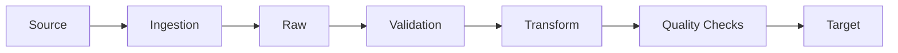
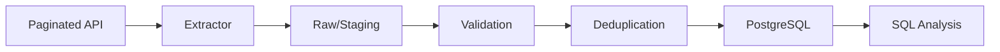

# 18 — Take-Home Assignments and Live Pipeline Coding

> **Phase E — Beyond the Design Round (Intermediate → Advanced)**
>
> This module teaches how to demonstrate Data Engineering ability through implementation under interview constraints. It covers both take-home assignments and live pipeline coding, progressing from beginner fundamentals to Senior/Staff expectations.
>
> **Core principle:** **Implementation quality + engineering reasoning + communication.**

---

## 1. Module Overview

Topic 18 follows system-design fundamentals, design cases, failure/deep-dive practice, and behavioural interviews. It completes the implementation side of the G5 interview loop before Topic 19's ongoing mock/practice system.

The authoritative roadmap identifies two primary assessment modes:

1. **Take-home pipeline assignments**
2. **Live coding sessions implementing small data transformations**

The roadmap emphasizes production habits within strict time limits: a clear README, assumptions, design decisions, trade-offs, tests, idempotent runs, basic data validation, reproducible setup, time management, and live implementation of deduplication, sessionisation, incremental merge, or aggregation while thinking aloud. fileciteturn183file3

### Learning outcomes

By completing this module, you should be able to:

- understand an unfamiliar Data Engineering problem quickly
- clarify ambiguous requirements
- inspect unfamiliar datasets
- identify source and target schemas
- determine data grain
- identify business rules
- design before coding
- choose the simplest appropriate tool
- implement clean Python
- write production-quality SQL
- use PySpark when distributed processing is justified
- build incremental pipelines
- handle duplicates, late data, schema changes, and failures
- implement data-quality checks
- test transformations and pipeline behavior
- make writes idempotent
- reconcile source and target
- reason about observability, performance, scalability, security, and cost
- document assumptions and trade-offs
- present and defend implementation decisions
- debug under live interview pressure
- distinguish Senior from Staff implementation judgment

### Scope boundary

This module does **not** ask you to build a miniature enterprise platform every time.

A small interview task may legitimately need:

```text
CSV
  ↓
Python transformation
  ↓
SQL/database output
```

It does not automatically need Kafka, Spark, Kubernetes, Airflow, Terraform, or multiple cloud services.

> **Use the simplest architecture that satisfies the stated requirements.**

Then explain how the design would evolve if volume, latency, reliability, consumers, or failure cost increased.

---

## 2. Why Take-Home and Live Coding Matter

A take-home evaluates more than whether code executes.

Interviewers may assess:

- requirements interpretation
- data reasoning
- correctness
- code quality
- testing
- data quality
- reliability
- reproducibility
- documentation
- maintainability
- performance
- cost awareness
- security
- communication
- trade-off judgment

A live pipeline exercise adds another dimension:

> **How do you think while implementing?**

The interviewer can observe whether you:

- clarify before coding
- identify grain
- make assumptions explicit
- choose a simple first solution
- test incrementally
- respond constructively to errors
- reason about edge cases
- accept hints
- communicate trade-offs
- stop optimizing when the requirement is already satisfied

---

## 3. Take-Home vs Live Pipeline Coding

| Dimension | Take-Home | Live Pipeline Coding |
|---|---|---|
| Time | Usually hours | Usually ~45 minutes |
| Environment | Controlled by candidate | Interviewer-provided |
| Requirements | Written brief | Conversation + prompt |
| Data inspection | More time available | Fast, selective |
| Debugging | Can iterate independently | Think aloud |
| Testing | Expected | Must demonstrate quickly |
| Documentation | Major signal | Verbal explanation |
| Communication | README + presentation | Continuous narration |
| Code quality | Strongly evaluated | Important but time-boxed |
| Design | Lightweight architecture | Clarify then implement |
| Interviewer interaction | Follow-up discussion | Continuous |
| Optimization | Reasonable | Only after correctness |
| Expected depth | Robust, reproducible | Correct, testable, explainable |
| Main risk | Overengineering | Silent/chaotic coding |

### Strategy difference

**Take-home:**

> Understand → Design → Implement → Validate → Harden → Explain

**Live coding:**

> Clarify → Think → Code → Test → Debug → Explain

---

## 4. What Interviewers Evaluate

### Core rubric

| Dimension | Weak | Strong |
|---|---|---|
| Requirements | Codes immediately | Clarifies ambiguity |
| Data reasoning | Treats rows as interchangeable | Defines grain and semantics |
| Correctness | Happy path only | Edge cases and invariants |
| Code quality | Monolithic | Small, readable, testable units |
| Testing | One happy-path test | Core + edge + failure tests |
| Data quality | Assumed | Explicit validation |
| Reliability | Retry blindly | Safe retry/idempotency |
| Documentation | Minimal | Reproducible and decision-oriented |
| Performance | Guessing | Evidence and complexity |
| Observability | Prints | Useful logs/metrics |
| Security | Secrets in code | Configuration/least privilege |
| Trade-offs | Tool preference | Requirement-driven |
| Communication | Silent | Structured narration |
| Scope | Overbuilds | Prioritizes the required outcome |

### The evaluator's central question

> **Can this person be trusted with a real data problem when the requirements are incomplete and the clock is running?**

---

# 5. The Take-Home Workflow

Use this workflow every time:

```text
Read Requirements
      ↓
Clarify Assumptions
      ↓
Inspect Data
      ↓
Identify Grain
      ↓
Define Inputs / Outputs
      ↓
Define Business Rules
      ↓
Design Pipeline
      ↓
Choose Tools
      ↓
Implement Minimal Correct Version
      ↓
Add Tests
      ↓
Add Data Quality
      ↓
Handle Failure Modes
      ↓
Optimize Only Where Justified
      ↓
Document
      ↓
Run End-to-End
      ↓
Review
      ↓
Submit
```

The authoritative task specification requires this workflow to be taught as a reusable approach. fileciteturn184file8

## Step 1 — Read

Read the entire assignment before writing code.

Mark:

- required deliverables
- time limit
- input sources
- output requirements
- evaluation criteria
- explicit exclusions
- optional extensions
- assumptions you must resolve

## Step 2 — Clarify

Ask only questions that change implementation.

Examples:

- What is the business grain?
- Are records mutable?
- Are deletes represented?
- What freshness is required?
- Can input be duplicated?
- What happens on rerun?
- Is ordering guaranteed?
- What is the expected output contract?

If questions cannot be asked, document assumptions.

## Step 3 — Inspect

Before transformation:

- inspect schema
- count rows
- inspect nulls
- inspect duplicate keys
- inspect timestamps
- inspect distributions
- inspect malformed records
- inspect representative values

## Step 4 — Design

Draw a small architecture before implementation.



## Step 5 — Implement

Build the smallest correct path first.

## Step 6 — Validate

Run:

- unit tests
- edge cases
- data-quality checks
- end-to-end test
- output validation

## Step 7 — Harden

Only after correctness:

- logging
- configuration
- safe retries
- idempotency
- reproducibility
- error handling

## Step 8 — Document

README should explain:

1. problem
2. architecture
3. setup
4. commands
5. assumptions
6. design decisions
7. tests
8. data-quality checks
9. trade-offs
10. limitations
11. what you would add with more time

---

# 6. Requirements Analysis

Convert vague statements into engineering requirements.

### Functional requirements

- What must the pipeline do?
- What data must be ingested?
- What transformations are required?
- What outputs must exist?

### Non-functional requirements

- freshness
- latency
- volume
- reliability
- correctness
- availability
- retention
- cost
- security
- privacy

### Hidden requirements

Prompt:

> "Load daily transaction data."

Questions:

- What is a transaction?
- What is one row?
- Can a transaction be updated?
- Can it be deleted?
- Can the same file arrive twice?
- Can files arrive late?
- Can a pipeline rerun?
- What happens if yesterday's file is missing?
- What is the expected output freshness?
- Is the result append-only or current-state?

### Requirement worksheet

```text
Goal:
Inputs:
Outputs:
Source grain:
Target grain:
Business key:
Freshness:
Expected volume:
Duplicates:
Updates:
Deletes:
Ordering:
Late data:
Schema evolution:
Retry behavior:
Rerun behavior:
Backfill:
Quality checks:
Security:
Cost constraint:
Time limit:
```

---

# 7. Data Inspection

You should be able to inspect unfamiliar data quickly.

## Formats

Understand the practical implications of:

- CSV
- JSON
- Parquet
- Avro concepts
- relational tables
- APIs
- event streams

## First-pass inspection

Ask:

```text
What is the schema?
How many rows?
What is the grain?
Which fields are nullable?
Which fields are keys?
Are there duplicates?
What timestamps exist?
What is the time range?
Are values malformed?
Are there unexpected categories?
```

### Python

```python
import pandas as pd

df = pd.read_csv("events.csv")

print(df.shape)
print(df.dtypes)
print(df.isna().mean().sort_values(ascending=False))
print(df["event_id"].nunique())
print(df["event_id"].duplicated().sum())
print(df["event_time"].min(), df["event_time"].max())
```

For large data, do not blindly load everything.

```python
for chunk in pd.read_csv("events.csv", chunksize=100_000):
    # inspect or process bounded batches
    print(len(chunk))
```

### SQL

```sql
SELECT COUNT(*) AS rows
FROM events;

SELECT
    COUNT(*) AS rows,
    COUNT(DISTINCT event_id) AS unique_events
FROM events;

SELECT
    COUNT(*) FILTER (WHERE event_id IS NULL) AS null_event_ids,
    COUNT(*) FILTER (WHERE event_time IS NULL) AS null_event_times
FROM events;
```

### Inspection principle

> **Do not transform data you have not first understood.**

---

# 8. Data Grain

Grain is one of the highest-value concepts in Data Engineering interviews.

> **Grain = what one row represents.**

Examples:

- one row per order
- one row per order item
- one row per customer
- one row per event
- one row per device reading
- one row per CDC change

### Why grain matters

Suppose:

```text
orders
order_id | customer_id | total

order_items
order_id | item_id | price
```

Joining an order to many items changes the row count.

If you aggregate `orders.total` after the join, you may multiply revenue.

### Safe pattern

Aggregate the item-level data first if the target grain is order-level.

```sql
WITH item_totals AS (
    SELECT
        order_id,
        SUM(price) AS item_revenue
    FROM order_items
    GROUP BY order_id
)
SELECT
    o.order_id,
    o.customer_id,
    i.item_revenue
FROM orders o
LEFT JOIN item_totals i
    ON o.order_id = i.order_id;
```

### Interview habit

Before every transformation say:

> "The current grain is X; the target grain is Y."

That single sentence prevents many data bugs.

---

# 9. Schema and Data Contracts

A take-home may provide an implicit schema contract.

Make it explicit.

Validate:

- required columns
- types
- nullability
- uniqueness
- allowed values
- timestamp semantics
- schema version

### Evolution categories

| Change | Usually safe? |
|---|---|
| Add nullable column | Often |
| Add required column without default | Breaking |
| Rename column | Breaking |
| Change type | Potentially breaking |
| Change timestamp semantics | Potentially severe |
| Remove column | Breaking |

Do not silently coerce a breaking change unless the assignment explicitly requires it.

### Example validation

```python
REQUIRED = {"event_id", "event_time", "customer_id"}

missing = REQUIRED - set(df.columns)

if missing:
    raise ValueError(f"Missing required columns: {sorted(missing)}")
```

---

# 10. Pipeline Design Before Coding

Use a lightweight design:

```text
Source
  ↓
Ingestion
  ↓
Raw / Staging
  ↓
Validation
  ↓
Transformation
  ↓
Quality Gate
  ↓
Target
  ↓
Reconciliation
```

For a tiny take-home, some boxes may be conceptual rather than separate services.

### Architecture decision rule

Ask:

1. What is the smallest architecture satisfying the requirements?
2. What constraint would force the next level of complexity?
3. Can I explain that boundary clearly?

---

# 11. Minimum Viable Correct Solution

Use staged implementation.

### Stage 1 — Make it work

Build the happy path.

### Stage 2 — Make it correct

Handle:

- duplicates
- nulls
- grain
- timestamps
- invalid data

### Stage 3 — Make it testable

Extract functions and add tests.

### Stage 4 — Make it reliable

Add:

- safe retries
- idempotency
- failure handling
- reconciliation

### Stage 5 — Make it observable

Add:

- structured logs
- run metadata
- metrics
- quality outcomes

### Stage 6 — Explain production evolution

Do not implement every hypothetical production feature if time does not justify it.

---

# 12. Python for Data Engineering Interviews

## A clean transformation

```python
from datetime import datetime

def normalize_event(raw: dict) -> dict:
    return {
        "event_id": str(raw["event_id"]),
        "customer_id": str(raw["customer_id"]),
        "event_time": datetime.fromisoformat(raw["event_time"]),
        "amount": float(raw["amount"]),
    }
```

The point is not syntax. The point is:

- explicit contract
- deterministic behavior
- testability

## Naive versus improved

Naive:

```python
def run(rows):
    result = []
    for row in rows:
        result.append({
            "id": row["id"],
            "value": row["value"] * 2
        })
    return result
```

Improved:

```python
def transform_row(row: dict) -> dict:
    value = row["value"]
    if value is None:
        raise ValueError("value cannot be null")

    return {
        "id": row["id"],
        "value": value * 2,
    }


def transform(rows):
    return [transform_row(row) for row in rows]
```

The second version creates a unit-testable boundary.

---

# 13. SQL for Data Engineering Interviews

You should be fluent with:

- joins
- aggregation
- windows
- deduplication
- anti-joins
- incremental merges
- reconciliation
- null handling
- conditional aggregation

## Latest record per key

```sql
WITH ranked AS (
    SELECT
        *,
        ROW_NUMBER() OVER (
            PARTITION BY customer_id
            ORDER BY updated_at DESC, event_id DESC
        ) AS rn
    FROM customer_changes
)
SELECT *
FROM ranked
WHERE rn = 1;
```

The tie-breaker matters.

## Reconciliation

```sql
SELECT
    COUNT(*) AS row_count,
    SUM(amount) AS amount_sum,
    COUNT(DISTINCT order_id) AS unique_orders
FROM target
WHERE business_date = DATE '2026-10-01';
```

Compare equivalent metrics with the source.

---

# 14. PySpark for Data Engineering Interviews

Use Spark when the problem's scale or distributed nature justifies it.

## Deduplication

```python
from pyspark.sql import functions as F
from pyspark.sql.window import Window

w = Window.partitionBy("event_id").orderBy(
    F.col("event_time").desc(),
    F.col("ingest_id").desc()
)

deduped = (
    events
    .withColumn("_rn", F.row_number().over(w))
    .where(F.col("_rn") == 1)
    .drop("_rn")
)
```

## Diagnose skew

```python
(
    events
    .groupBy("customer_id")
    .count()
    .orderBy(F.desc("count"))
    .show(20)
)
```

## Explain the plan

```python
result.explain("formatted")
```

Look for:

- Exchange
- large shuffles
- unexpected joins
- repeated scans
- expensive stages

### Interview principle

Do not say:

> "Spark is faster."

Say:

> "The data volume exceeds practical single-process memory, and the transformation requires distributed aggregation; therefore Spark is justified."

---

# 15. Incremental Processing

Incremental processing means processing only the necessary change rather than recomputing all history.

Common mechanisms:

- watermark
- updated timestamp
- source offset
- cursor
- CDC position
- partition date

## Watermark model

```text
last_successful_watermark
          ↓
read source changes
          ↓
stage
          ↓
validate
          ↓
write idempotently
          ↓
commit output
          ↓
advance watermark
```

### Critical rule

Do not advance the watermark before the corresponding output is safely committed.

Otherwise:

```text
watermark advances
→ write fails
→ next run starts after missing data
→ data loss
```

### Late data

Use a lookback window when source semantics justify it:

```text
watermark = 10:00
lookback = 15 minutes
read from 09:45
deduplicate/merge
```

The overlap must be safe because the sink is idempotent.

---

# 16. Idempotency

A pipeline is idempotent when repeating the same logical input does not produce an incorrect additional effect.

### Bad

```python
# Conceptual checkpoint state.
state = {
    "last_successful_watermark": "2026-10-01T00:00:00Z",
    "run_id": "example-run-123",
}
```

Run twice → duplicate.

### Better conceptual design

```text
business/event key
        ↓
staging
        ↓
deduplicate
        ↓
merge/upsert
        ↓
publish
```

### Common failure window

```text
write succeeds
process crashes
checkpoint does not advance
retry occurs
```

If the sink is not idempotent, the retry can duplicate data.

### Interview answer

If asked:

> "What happens if the pipeline runs twice?"

Never answer:

> "It probably won't."

Answer with explicit semantics.

---

# 17. Data Quality

At minimum consider:

### Completeness

- expected partitions
- expected records
- required fields

### Uniqueness

- business keys
- event IDs

### Validity

- allowed ranges
- allowed categories
- valid timestamps

### Referential integrity

- parent/child relationships

### Freshness

- event or ingestion timestamp against SLA

### Reconciliation

- counts
- sums
- key coverage
- samples/checksums where appropriate

### Quality gate

```text
Transform
  ↓
Critical checks
  ├── PASS → Publish
  └── FAIL → Quarantine / Stop / Alert
```

Not every check should block publication. Explain severity.

---

# 18. Testing Data Pipelines

Use layers.

## Unit tests

Test deterministic functions.

```python
def test_transform_row():
    row = {"id": "a", "value": 3}
    assert transform_row(row)["value"] == 6
```

## Edge-case tests

Test:

- empty input
- nulls
- duplicates
- malformed timestamps
- tied timestamps
- late records

## Integration tests

Test:

```text
source → transform → target
```

## Idempotency test

Run twice and compare outputs.

```text
run(input)
run(input)
assert output_after_second_run == output_after_first_run
```

## Reconciliation test

Compare source and target metrics.

### Test priority under time pressure

1. core correctness
2. edge cases
3. failure behavior
4. idempotency
5. integration
6. performance

---

# 19. Failure Handling

Think in terms of failure classes:

| Failure | Expected response |
|---|---|
| Transient network error | bounded retry/backoff |
| Invalid input | reject/quarantine |
| Schema break | stop or controlled compatibility path |
| Target unavailable | retry/recover without duplicate effects |
| Partial batch | resume from durable state |
| Duplicate input | deduplicate/idempotent write |
| Late data | lookback/reconciliation policy |
| Logic bug | rollback/fix/reprocess |
| Source unavailable | wait/retry/alert according to SLA |

### Retry principle

Retries are not automatically reliability.

Unbounded retries can create:

- retry storms
- duplicate writes
- higher costs
- longer incidents

---

# 20. Data Reconciliation

Reconciliation answers:

> **Did the target faithfully represent the intended source state?**

Useful checks:

```text
row counts
distinct business keys
sum of important measures
min/max timestamps
partition completeness
missing keys
unexpected extra keys
sample/value comparison
checksums where appropriate
```

### Why count-only is weak

Source:

```text
A = 100
B = 200
```

Target:

```text
A = 200
B = 100
```

Counts match.

Data is still wrong.

### Reconciliation table concept

```text
run_id
partition
source_count
target_count
source_sum
target_sum
missing_keys
extra_keys
status
validated_at
```

---

# 21. Observability

A good take-home can demonstrate observability without building a monitoring platform.

Useful signals:

- run start/end
- records read
- records written
- records rejected
- duplicate count
- processing duration
- watermark
- latest event time
- quality-check status

### Structured logging

Prefer:

```text
run_id=123
partition=2026-10-01
rows_read=100000
rows_written=99870
duplicates=130
status=success
```

over:

```text
Everything worked!!!
```

---

# 22. Configuration and Secrets

Do not hardcode:

- passwords
- API keys
- tokens
- private connection strings

Use environment/configuration.

```python
import os

DATABASE_URL = os.environ["DATABASE_URL"]
API_TOKEN = os.environ["API_TOKEN"]
```

For an actual production system, use a secret manager where appropriate.

### Interview signal

If the assignment includes secrets in the supplied environment, explain how the solution would handle them without committing them to source control.

---

# 23. Code Quality

Review:

- naming
- function boundaries
- separation of concerns
- error handling
- testability
- duplication
- typing where useful
- deterministic behavior
- configuration
- maintainability

### Good structure

```text
extract
  ↓
validate
  ↓
transform
  ↓
load
  ↓
reconcile
```

### Avoid

```text
main.py
  └── 900 lines
      └── everything
```

But do not create 30 abstractions for a 100-line assignment.

---

# 24. Documentation

A strong README is part of the implementation.

Recommended structure:

```markdown
# Assignment

## Problem
## Architecture
## Assumptions
## Setup
## Run
## Data Model
## Transformation Logic
## Data Quality
## Tests
## Idempotency
## Failure Handling
## Trade-offs
## Limitations
## Scaling
## What I Would Do With More Time
```

### "What I would do with more time"

This section demonstrates judgment.

Example:

> "The current implementation is intentionally single-process because the supplied dataset is small. At materially larger volume, I would move the transformation to a distributed engine and partition output by event date. I would not introduce that complexity in the current time-box."

---

# 25. Take-Home Evaluation Rubric

A practical baseline:

| Dimension | Weight |
|---|---:|
| Requirements understanding | 10% |
| Correctness | 20% |
| Code quality | 15% |
| Data quality | 10% |
| Testing | 10% |
| Reliability | 10% |
| Performance | 5% |
| Documentation | 5% |
| Observability | 5% |
| Security | 5% |
| Trade-offs | 5% |
| **Total** | **100%** |

### Score interpretation

**90–100:** exceptional; strong Senior/Staff evidence

**80–89:** strong; likely Senior-ready if explanations are defensible

**70–79:** acceptable but has meaningful gaps

**60–69:** weak; several production habits missing

**<60:** not ready

A rubric is not a universal hiring standard. Companies may weight dimensions differently.

---

# 26. Time-Boxing Take-Home Assignments

The first objective is not perfection.

It is:

> **Finish a correct, explainable solution within the deadline.**

## Example 4-hour allocation

```text
0:00–0:20  Read + requirements
0:20–0:40  Data inspection
0:40–1:00  Architecture + assumptions
1:00–2:15  Core implementation
2:15–2:45  Tests
2:45–3:15  Data quality + idempotency
3:15–3:35  Failure handling + cleanup
3:35–3:50  README
3:50–4:00  Final run + submission check
```

### Stop rule

At approximately 70–80% of the time:

> Stop adding major features.

Switch to:

- testing
- correctness
- documentation
- cleanup
- reproducibility

---

# 27. Types of Take-Home Assignments

Common categories:

1. API → database ingestion
2. Files → analytical model
3. Data cleaning + quality
4. Incremental pipeline
5. CDC replication
6. Analytics SQL + modelling
7. Streaming/event transformation
8. Small platform design + partial implementation

---

# 28. Take-Home Assignment 1 — Paginated API → PostgreSQL

### Difficulty

Intermediate.

### Time

4 hours.

### Prompt

Build an incremental pipeline that reads a paginated transactions API and loads a PostgreSQL target.

Requirements:

- handle pagination
- normalize records
- deduplicate by transaction ID
- support reruns
- model transactions and customers
- answer three analytical questions
- include tests
- document assumptions

### Hidden requirements

The API may:

- repeat a page
- return records out of order
- temporarily fail
- return a nullable field
- contain duplicate transaction IDs

### Expected architecture



### Deliverables

- runnable code
- database schema
- tests
- README
- sample output

### Reviewer questions

- How does rerunning work?
- What happens after page 7 fails?
- What is the checkpoint?
- How do you avoid duplicate writes?
- What happens if an existing transaction is updated?
- How would this work at 100× volume?

---

# 29. Take-Home Assignment 2 — Files → Analytics Model

### Difficulty

Intermediate.

### Prompt

Given daily CSV files for orders and order items:

- validate schema
- handle duplicate files
- produce order-level facts
- produce customer-level daily metrics
- reconcile totals
- support a one-day backfill

### Key test

Ensure item-level joins do not duplicate order-level revenue.

### Reviewer focus

- grain
- data quality
- idempotency
- backfill
- SQL correctness

---

# 30. Take-Home Assignment 3 — CDC → Lakehouse

### Difficulty

Advanced.

### Prompt

Implement a simplified CDC consumer with:

- insert/update/delete operations
- source sequence
- deduplication
- target current-state table
- audit history
- replay support

### Expected reasoning

```text
CDC event
→ validate
→ order
→ deduplicate
→ apply
→ audit
→ checkpoint
```

### Hidden edge cases

- repeated sequence
- out-of-order event
- delete before update
- restart after write
- schema change

---

# 31. Take-Home Assignment 4 — Data Quality Framework

### Difficulty

Intermediate → Advanced.

Build reusable checks for:

- nullability
- uniqueness
- freshness
- accepted values
- referential integrity
- row-count anomaly
- reconciliation

Output:

```text
check_name
partition
observed_value
expected_value
status
severity
```

### Reviewer question

Which failures block publication and which only alert?

There is no universal answer; justify based on business impact.

---

# 32. Take-Home Assignment 5 — Incremental API Backfill

### Difficulty

Advanced.

Build an extractor that:

- stores a durable cursor
- supports lookback
- deduplicates overlapping windows
- handles API rate limits
- retries transient errors
- supports bounded backfill

### Evaluation

Strong solutions explicitly separate:

```text
source progress
+
output commit
+
reconciliation
```

---

# 33. Take-Home Assignment 6 — Event Sessionisation

### Difficulty

Advanced.

Input:

```text
user_id
event_id
event_time
event_type
```

Requirements:

- events separated by >30 minutes begin a new session
- event time, not ingestion time, defines ordering
- duplicates must not create extra events
- output session start/end and event count

### Follow-ups

- What if events arrive late?
- What if event timestamps are wrong?
- What happens at 10× volume?
- Would you use SQL or Spark?

---

# 34. Take-Home Assignment 7 — Streaming Aggregation

### Difficulty

Advanced.

Build a conceptual or executable streaming aggregation:

```text
events
→ event-time window
→ dedupe
→ aggregate
→ output
```

Requirements:

- define watermark
- define allowed lateness
- handle duplicate events
- explain replay
- explain checkpointing

The implementation can remain small; the design explanation matters.

---

# 35. Take-Home Assignment 8 — Productionization Review

### Difficulty

Senior/Staff.

Start from a deliberately simple pipeline.

Task:

1. review the implementation
2. identify production risks
3. fix the highest-value issues
4. document remaining risks
5. explain what you would change at 100× scale

Evaluate:

- correctness
- reliability
- observability
- security
- cost
- maintainability
- operational ownership

---

# 36. Live Pipeline Coding

Live coding is not:

> "Type code as fast as possible."

It is:

> **Structured engineering reasoning while implementing.**

## Recommended sequence

```text
0–5 min   Clarify
5–10 min  Inspect / model
10–25 min Implement
25–32 min Test
32–38 min Edge cases / debug
38–42 min Optimization
42–45 min Production follow-ups
```

Adjust based on interviewer guidance.

---

# 37. Live Coding Communication

Think aloud without narrating every keystroke.

### Good

> "Before I code, I want to confirm that one output row represents one customer-session and that the 30-minute boundary uses event time."

Then code.

### Bad

> "Now I am typing `for`, now I am typing `if`, now I am..."

### Narration model

```text
Assumption
→ Decision
→ Implementation
→ Test
→ Result
```

---

# 38. Live Coding Problem-Solving Framework

Use:

```text
1. Restate the problem
2. Clarify inputs
3. Clarify output
4. Define grain
5. Identify edge cases
6. State simple approach
7. Implement
8. Test normal case
9. Test edge case
10. Discuss complexity
11. Discuss production extension
```

### If stuck

Say:

> "I see two possible approaches. I will implement the simpler one first because it gives us a correct baseline, then I can optimize if time permits."

That is much stronger than silently searching for the perfect abstraction.

---

# 39. Live Coding Question Types

Expect:

- deduplication
- latest record
- aggregation
- sessionisation
- incremental merge
- joins
- data validation
- API pagination
- parsing
- CDC
- streaming concepts
- debugging
- performance
- data modelling
- pipeline design
- productionization

---

# 40. Live Coding Edge Cases

Always consider:

- empty input
- one record
- duplicate records
- null keys
- null timestamps
- equal timestamps
- malformed values
- missing columns
- late data
- out-of-order data
- duplicate batches
- source failure
- target failure
- rerun
- partial output
- schema changes

Do not spend ten minutes listing every theoretical edge case. Prioritize those that affect correctness.

---

# 41. Live Debugging

Use:

```text
Observe
→ Reproduce
→ Form hypothesis
→ Gather evidence
→ Isolate
→ Fix
→ Test
→ Explain prevention
```

### Example

Symptom:

> Output has twice as many rows.

Reasoning:

1. Check input counts.
2. Check intended grain.
3. Check join cardinality.
4. Check duplicate source keys.
5. Identify multiplying join.
6. Fix aggregation/grain.
7. Add regression test.

Do not immediately delete duplicates from the output.

---

# 42. What to Do When Stuck

Use the interviewer as a collaborator.

### Good

> "I have a working approach for the common case. The remaining issue is handling tied timestamps. I want deterministic behavior, so I'll add a secondary key."

### Good

> "I think the failure is caused by join cardinality. I'll inspect counts before and after the join."

### Bad

> "I don't know."

### Better when genuinely uncertain

> "I haven't used that exact library, but the requirement is deterministic incremental application. I would preserve a durable source position and make the sink idempotent. I would verify the library's transaction semantics before relying on it."

---

# 43. Live Coding Optimization

Do not optimize before correctness.

Use:

```text
Correct
→ Measure
→ Identify bottleneck
→ Change one thing
→ Benchmark
→ Explain trade-off
```

### Complexity

For Python:

- O(n)
- O(n log n)
- O(n²)

For SQL:

- scan size
- join cardinality
- sort/window cost
- partition pruning

For Spark:

- shuffle
- partition count
- skew
- serialization
- executor memory
- data scan

---

# 44. Productionization Follow-Ups

After you finish the coding task, expect:

- How would you test it?
- How would you backfill it?
- How would you handle schema evolution?
- How would you secure it?
- What happens if it runs twice?
- How would you monitor it?
- How would you recover from failure?
- What changes at 100× scale?
- What would you add for production?

Use:

```text
Correctness
→ Reliability
→ Observability
→ Performance
→ Cost
→ Security
```

Do not automatically implement all of these.

---

# 45. Live Pipeline Coding Question Bank

The following 120 questions are designed for progressive practice. For each, practise answering with:

**clarification → approach → implementation → test → follow-up.**

## Python — 1–10

1. Deduplicate records by key while keeping the latest timestamp.
2. Normalize null and empty-string values.
3. Parse a paginated API safely.
4. Implement bounded exponential backoff.
5. Flatten nested JSON.
6. Aggregate events by customer and day.
7. Build a deterministic record fingerprint.
8. Validate required columns.
9. Separate extraction, transformation, and loading.
10. Process a large file without loading it entirely into memory.

**Senior extension:** Explain memory, failure, idempotency, and scale.

## SQL — 11–20

11. Latest record per business key.
12. Duplicate business-key detection.
13. Revenue without order-item double counting.
14. Three-day rolling average.
15. Sessionisation using `LAG`.
16. Incremental upsert.
17. Source-target reconciliation.
18. Source-minus-target anti-join.
19. Column null-rate profiling.
20. Referential-integrity violations.

**Senior extension:** Explain grain, indexing/partitioning, concurrency, and backfill.

## PySpark — 21–30

21. Latest record per key using a window.
22. Diagnose a skewed join.
23. Choose `repartition` versus `coalesce`.
24. Partition output by date.
25. Replace a simple Python UDF with built-ins.
26. Inspect an execution plan.
27. Optimize a large aggregation.
28. Quarantine malformed records.
29. Implement partition-level quality checks.
30. Explain when Spark is unnecessary.

**Senior extension:** Explain shuffle, skew, AQE, cost, and failure recovery.

## Data Quality — 31–40

31. Define table grain.
32. Detect schema drift.
33. Detect freshness degradation.
34. Validate partition completeness.
35. Detect duplicate events.
36. Validate numeric ranges.
37. Validate categorical values.
38. Reconcile source and target.
39. Design a quarantine path.
40. Explain why green job status does not prove data correctness.

## Incremental Processing — 41–50

41. Implement watermark-based processing.
42. Design an incremental API extractor.
43. Handle overlapping lookback windows.
44. Backfill one affected date.
45. Choose a watermark field.
46. Recover from a failed incremental run.
47. Compare full refresh and incremental processing.
48. Handle late-arriving updates.
49. Design durable pipeline state.
50. Prevent duplicates after retries.

## CDC — 51–60

51. Apply insert/update/delete CDC.
52. Detect a CDC gap.
53. Reconcile a CDC target with source.
54. Handle tombstones.
55. Build a replayable CDC consumer.
56. Handle CDC schema changes.
57. Explain exactly-once versus idempotency.
58. Build an audit trail.
59. Handle snapshot plus CDC.
60. Explain delete propagation.

## Streaming — 61–70

61. Sessionise in event time.
62. Handle out-of-order events.
63. Deduplicate streaming events.
64. Recover after a streaming restart.
65. Detect consumer lag.
66. Handle a hot partition.
67. Choose batch versus streaming.
68. Design a windowed aggregation.
69. Replay after a correction.
70. Control backpressure.

## Debugging — 71–80

71. Pipeline succeeds but output is empty.
72. Row count doubles overnight.
73. SQL becomes 10× slower.
74. API extractor hangs.
75. Spark has one slow task.
76. Incremental load misses updates.
77. Tests pass but production data is wrong.
78. Works locally but fails in CI.
79. Job repeatedly retries.
80. Retry creates target duplicates.

## Performance — 81–90

81. Choose ingestion chunk size.
82. Reduce a large SQL scan.
83. Optimize a join.
84. Reduce small files.
85. Explain Python UDF overhead.
86. Estimate whether local Python can handle the data.
87. Benchmark an optimization.
88. Identify an O(n²) pipeline.
89. Optimize a repeated lookup.
90. Explain when not to optimize.

## Data Modelling — 91–100

91. Define a fact-table grain.
92. Model orders and order items.
93. Handle slowly changing attributes.
94. Model event history.
95. Choose natural versus surrogate keys.
96. Define uniqueness semantics.
97. Handle unknown dimensions.
98. Explain denormalization trade-offs.
99. Model daily aggregates.
100. Design a reconciliation table.

## Pipeline Design — 101–110

101. Design API → PostgreSQL incrementally.
102. Design files → warehouse.
103. Design CDC → lakehouse.
104. Design a small metrics pipeline.
105. Design daily batch with backfills.
106. Design schema evolution.
107. Design source downtime handling.
108. Design a data-quality gate.
109. Design a reusable pipeline interface.
110. Explain the simplest architecture for a CSV task.

## Productionization — 111–120

111. What would you add before production?
112. How would you manage secrets?
113. How would you make the job observable?
114. How would you deploy it?
115. How would you secure input and output?
116. How would you handle schema-contract failures?
117. How would you support backfills?
118. How would you monitor cost?
119. How would you document limitations?
120. How would you prove reproducibility?

---

# 46. Coding Examples — End-to-End

## Example A — Python API pipeline

### Naive

```python
for page in range(1, 100):
    rows = fetch(page)
    for row in rows:
        insert(row)
```

Problems:

- fixed page limit
- no checkpoint
- no retry policy
- no deduplication
- no validation
- no idempotent sink

### Better conceptual design

```python
def extract(fetch_page, start_page=1):
    page = start_page

    while True:
        rows, has_more = fetch_page(page)

        for row in rows:
            yield row

        if not has_more:
            break

        page += 1
```

Then separate:

```text
extract → validate → dedupe → stage → merge → reconcile
```

### Interview explanation

> "I separated extraction from persistence so I can test API behavior independently and make the sink retry-safe."

---

## Example B — SQL incremental merge

Conceptual pattern:

```sql
MERGE INTO target AS t
USING staging AS s
ON t.id = s.id
WHEN MATCHED AND s.updated_at > t.updated_at THEN
    UPDATE SET
        value = s.value,
        updated_at = s.updated_at
WHEN NOT MATCHED THEN
    INSERT (id, value, updated_at)
    VALUES (s.id, s.value, s.updated_at);
```

Follow-up:

> What if two source rows have the same `id`?

Answer:

> Deduplicate staging to one deterministic record per target key before the merge.

---

## Example C — PySpark optimization

```python
from pyspark.sql import functions as F

result = (
    events
    .filter(F.col("event_date") >= "2026-10-01")
    .select("customer_id", "event_date", "amount")
    .groupBy("customer_id", "event_date")
    .agg(F.sum("amount").alias("daily_amount"))
)

result.explain("formatted")
```

The important interview discussion is:

- predicate pushdown / partition pruning
- column projection
- aggregation
- shuffle
- partition distribution
- output partitioning
- benchmark

---

# 47. Code Review

Review submissions in this order:

```text
Correctness
→ Data semantics
→ Tests
→ Reliability
→ Readability
→ Performance
→ Security
→ Documentation
```

Do not start with formatting while the data logic is wrong.

---

# 48. Take-Home Code Review Exercises

## Review 1 — Duplicate-prone loader

```python
def load(rows, conn):
    for row in rows:
        conn.execute(
            "INSERT INTO events VALUES (%s, %s)",
            (row["id"], row["value"])
        )
```

### Problems

- no transaction boundary
- no idempotency
- duplicate input creates duplicate target rows
- no validation
- no error classification
- no reconciliation

### Better direction

Use:

```text
validate
→ stage
→ dedupe
→ idempotent merge
→ commit
→ reconcile
```

---

## Review 2 — Hardcoded secret

```python
API_TOKEN = "sk-secret-value"
```

### Problem

Credential leakage.

### Better

```python
import os

API_TOKEN = os.environ["API_TOKEN"]
```

Then explain production secret-management expectations.

---

## Review 3 — Silent data loss

```python
valid = [r for r in rows if r.get("amount") is not None]
```

### Problem

Rows are silently dropped.

### Better

Count and classify rejected rows:

```text
valid
invalid
reason
```

Then decide whether the quality threshold blocks publication.

---

## Review 4 — Unbounded retry

```python
while True:
    try:
        return call_api()
    except Exception:
        continue
```

### Problems

- infinite loop
- catches all exceptions
- no backoff
- no observability
- may retry permanent failures

### Better

Bound retries and classify transient versus permanent failures.

---

# 49. Common Take-Home Mistakes

| Mistake | Fix |
|---|---|
| Overengineering | Build smallest correct solution |
| Underengineering | Add tests/quality/reliability |
| No README | Document reproducible execution |
| No assumptions | Write explicit assumptions |
| No validation | Add data-quality checks |
| Hardcoded paths | Configuration |
| Hardcoded secrets | Environment/secret manager |
| No error handling | Classify failures |
| No idempotency | Design safe reruns |
| No edge cases | Test nulls/duplicates/empty input |
| No performance reasoning | Explain complexity |
| No reproducibility | Pin/document environment |
| No schema handling | Contract + evolution policy |
| No recovery | Explain retry/backfill |
| No output validation | Reconcile |
| Too many dependencies | Minimize |
| Too many abstractions | Match code structure to scope |

---

# 50. Common Live Coding Mistakes

Avoid:

1. starting without clarifying
2. coding silently
3. coding before defining grain
4. overengineering
5. ignoring edge cases
6. not testing
7. giving up after the first error
8. optimizing before correctness
9. not checking output
10. ignoring complexity
11. failing to communicate assumptions
12. arguing with hints
13. pretending certainty
14. spending the entire session on setup
15. forgetting production follow-ups

---

# 51. Senior vs Staff Expectations

| Dimension | Senior | Staff |
|---|---|---|
| Correctness | Strong | Strong |
| Edge cases | Identifies and handles | Anticipates systemic patterns |
| Debugging | Finds root cause | Improves the system against recurrence |
| Testing | Good coverage | Reusable testing strategy |
| Architecture | Appropriate solution | Simplifies ambiguity and creates leverage |
| Performance | Optimizes bottlenecks | Balances scale, cost, and organizational constraints |
| Reliability | Productionizes | Establishes durable reliability patterns |
| Communication | Clear | Aligns multiple stakeholders |
| Abstraction | Appropriate | Reusable without over-generalizing |
| Trade-offs | Explains | Connects to strategy and long-term cost |
| Scope | Owns implementation | Owns problem boundary |
| Impact | System/team | Multiple teams/platform |

### Senior signal

> "I can take this ambiguous task and deliver a correct, tested, production-aware solution."

### Staff signal

> "I can simplify the problem, identify the durable abstraction, prevent repeated classes of failure, and improve how multiple engineers solve similar problems."

---

# 52. Take-Home Scoring Rubric — Practical Interpretation

### 5 — Exceptional

- requirements are explicit
- correctness is strong
- tests are purposeful
- reruns are safe
- data quality is visible
- README is excellent
- trade-offs are thoughtful
- production gaps are clearly identified

### 4 — Strong

- correct core implementation
- useful tests
- reasonable reliability
- clear documentation
- minor gaps

### 3 — Acceptable

- works for happy path
- some testing
- limited edge-case handling
- reasonable documentation

### 2 — Weak

- partial correctness
- fragile behavior
- poor tests
- unclear assumptions

### 1 — Poor

- incorrect or non-reproducible
- no meaningful validation
- major engineering risks

---

# 53. Live Coding Scoring Rubric

| Dimension | 1 — Weak | 3 — Acceptable | 5 — Exceptional |
|---|---|---|---|
| Clarification | Starts coding | Asks key questions | Quickly identifies hidden requirements |
| Communication | Silent | Some narration | Precise reasoning |
| Data reasoning | Misses grain | Defines basic grain | Anticipates semantic risks |
| Correctness | Buggy | Correct happy path | Correct + edge cases |
| Testing | None | Basic test | Layered validation |
| Debugging | Random | Structured | Evidence-driven |
| Complexity | Unknown | Basic | Explicit trade-off |
| Production thinking | None | Mentions basics | Prioritizes highest-value risks |
| Time management | Runs out | Finishes | Leaves time for hardening |
| Collaboration | Resists hints | Accepts | Uses hints productively |

---

# 54. Practice Progression

### Stage 1 — Small Python transformations

Goal:

- correctness
- functions
- edge cases

### Stage 2 — SQL data problems

Goal:

- grain
- joins
- windows
- aggregation

### Stage 3 — Incremental pipelines

Goal:

- watermark
- merge
- idempotency

### Stage 4 — Data quality

Goal:

- invariants
- validation
- reconciliation

### Stage 5 — API ingestion

Goal:

- pagination
- retries
- checkpoints

### Stage 6 — CDC

Goal:

- operations
- ordering
- replay

### Stage 7 — PySpark

Goal:

- distributed reasoning
- shuffle
- skew
- explain plans

### Stage 8 — Streaming

Goal:

- event time
- watermarks
- state
- replay

### Stage 9 — Failure/debugging

Goal:

- hypothesis
- evidence
- recovery

### Stage 10 — Production-style capstone

Goal:

- end-to-end implementation
- testing
- reliability
- observability
- documentation
- interview presentation

---

# 55. 45-Minute Live Coding Simulation 1 — Senior Batch Pipeline

## Interviewer prompt

> "You receive order events with `order_id`, `customer_id`, `order_time`, and `amount`. Return daily revenue per customer. Duplicate events may exist."

## 0–5 minutes

Clarify:

- duplicate semantics
- timestamp semantics
- null behavior
- output grain

## 5–10 minutes

Define:

```text
input grain = event
output grain = customer + day
```

## 10–25 minutes

Implement.

## 25–32 minutes

Test:

- normal records
- duplicate
- null amount
- empty input

## 32–38 minutes

Follow-up:

> What if data is 100× larger?

Discuss SQL/Spark/distribution.

## 38–42 minutes

Follow-up:

> What if events arrive late?

Discuss event time and correction/recomputation.

## 42–45 minutes

Productionization:

- logging
- quality
- idempotency
- monitoring

### Pass standard

Correct result + explicit grain + tests + concise explanation.

---

# 56. 45-Minute Live Coding Simulation 2 — Senior+ Incremental/CDC

## Prompt

> "You receive customer CDC records with `customer_id`, `operation`, `updated_at`, and `sequence`. Build current-state customer records."

Operations:

```text
I = insert
U = update
D = delete
```

### Required reasoning

- deduplicate sequence
- ordering
- delete semantics
- idempotent apply
- replay
- checkpoint

### Hidden edge case

The same CDC event can arrive twice.

### Follow-ups

1. What if events are out of order?
2. What if the process dies after applying a record?
3. How do you reconcile with source?
4. How would you backfill?
5. What if schema changes?
6. What happens at 100× volume?

### Senior+ pass standard

Correct state transition model plus explicit recovery semantics.

---

# 57. 45-Minute Live Coding Simulation 3 — Staff Production Pipeline

## Prompt

> "Design and partially implement a pipeline that ingests customer events, deduplicates them, calculates daily metrics, and publishes a table consumed by analytics and ML. Requirements are intentionally incomplete."

### First five minutes

You should clarify:

- event volume
- freshness
- consumers
- correctness
- retention
- late events
- schema evolution
- privacy
- cost
- replay

### Implementation

Choose a deliberately small baseline.

Example:

```text
events
→ validate
→ dedupe
→ aggregate
→ quality gate
→ publish
```

### Staff follow-ups

- What should be standardized across teams?
- What belongs in a reusable platform?
- What should remain application-specific?
- What happens when a downstream consumer disagrees with the metric?
- How would you introduce data contracts?
- What operational risks emerge at 100×?
- Which complexity would you explicitly refuse to add?

### Staff pass standard

The candidate demonstrates problem simplification, implementation judgment, reusable patterns, organizational impact, and clear trade-offs.

---

# 58. Complete Take-Home Simulation 1 — 4-Hour API Pipeline

## Assignment

Build:

```text
Paginated API
→ Incremental extraction
→ PostgreSQL
→ Analytical SQL
```

### Inputs

Each API record contains:

```text
transaction_id
customer_id
updated_at
amount
status
```

### Requirements

- pagination
- retries
- deduplication
- incremental extraction
- target tables
- three analytical queries
- tests
- README

### Hidden requirements

- duplicate pages
- retryable timeout
- update to existing transaction
- null status
- rerun

### Deliverables

1. source code
2. SQL/schema
3. tests
4. README
5. sample output

### Evaluation

Use the 100-point rubric from §25.

### Reviewer follow-ups

- Why this architecture?
- How do you checkpoint?
- What happens after a partial failure?
- How do you prove idempotency?
- What would change at 100×?

---

# 59. Complete Take-Home Simulation 2 — 4-Hour CDC Pipeline

## Assignment

Build a simplified CDC ingestion path.

### Requirements

- inserts
- updates
- deletes
- sequence ordering
- deduplication
- current-state target
- audit trail
- replay

### Hidden requirements

- repeated events
- out-of-order sequence
- restart
- tombstone
- schema addition

### Deliverables

- implementation
- tests
- state model
- README
- reconciliation approach

### Strong solution characteristics

```text
raw immutable events
→ deterministic ordering
→ dedupe
→ current-state apply
→ audit
→ checkpoint
```

### Reviewer follow-ups

- Exactly-once?
- Idempotency?
- Replay?
- Recovery?
- Source reconciliation?
- Schema evolution?

---

# 60. Complete Take-Home Simulation 3 — Senior/Staff Ambiguous Pipeline

## Assignment

> "Build a reliable customer analytics pipeline from supplied event files. The business wants daily customer metrics and expects the solution to remain useful as data volume grows."

The brief intentionally omits:

- exact grain
- duplicate semantics
- late data behavior
- SLA
- schema evolution
- backfill
- retention

### Candidate responsibility

Ask questions or document assumptions.

### Evaluation emphasizes

- ambiguity management
- correct grain
- minimal architecture
- data quality
- idempotency
- tests
- documentation
- production evolution

### Hidden interviewer test

The candidate should **not** immediately build Kafka + Spark + Kubernetes.

A strong answer first establishes the requirements.

---

# 61. Interviewer Follow-Up Framework

For every major assignment, expect:

1. Why did you choose this approach?
2. What alternatives did you consider?
3. What is the data grain?
4. What happens with duplicate input?
5. What happens if the pipeline runs twice?
6. What happens if the source is unavailable?
7. What happens if the schema changes?
8. What happens at 10× or 100× scale?
9. What is the computational complexity?
10. How would you test it?
11. How would you monitor it?
12. How would you backfill it?
13. How would you recover from failure?
14. How would you secure it?
15. What would you change for production?
16. What assumption is most risky?
17. What is the correctness invariant?
18. Where can data be lost?
19. Where can duplicates be introduced?
20. What would you deliberately not build?

### Senior follow-up

> "What would you change?"

### Staff follow-up

> "What would you standardize, and what would you deliberately leave flexible?"

---

# 62. Mental Models

## Take-home

> **Understand → Design → Implement → Validate → Harden → Explain**

## Live coding

> **Clarify → Think → Code → Test → Debug → Explain**

## Production

> **Correctness → Reliability → Observability → Performance → Cost**

## Senior

> **Solve the problem correctly.**

## Staff

> **Solve the right problem with the simplest sustainable engineering approach.**

## Data correctness

> **Grain → Contract → Transform → Validate → Reconcile**

## Incremental reliability

> **Checkpoint → Idempotent write → Commit → Advance state**

## Debugging

> **Symptom → Evidence → Hypothesis → Isolation → Fix → Validation → Prevention**

---

# 63. Final Take-Home Checklist

### Before coding

- [ ] Requirements understood
- [ ] Assumptions documented
- [ ] Input/output identified
- [ ] Grain identified
- [ ] Edge cases identified
- [ ] Architecture sketched
- [ ] Time budget planned

### During coding

- [ ] Core solution works
- [ ] Code is modular
- [ ] Errors handled
- [ ] Logging exists where useful
- [ ] Data-quality checks exist
- [ ] Idempotency considered
- [ ] Tests added
- [ ] No secrets committed

### Before submission

- [ ] Tests pass
- [ ] End-to-end run succeeds
- [ ] Outputs validated
- [ ] README complete
- [ ] Trade-offs documented
- [ ] Limitations documented
- [ ] Reproducible execution verified
- [ ] No unnecessary complexity
- [ ] Final output inspected
- [ ] Time limit respected

---

# 64. Final Live-Coding Cheat Sheet

## Requirements

Ask:

- What is the input?
- What is the output?
- What is the grain?
- What defines uniqueness?
- What does a duplicate mean?
- What does "latest" mean?
- What happens with nulls?
- What happens with empty input?
- What is the expected scale?
- What happens on rerun?

## Python

Think:

```text
functions
→ deterministic behavior
→ explicit validation
→ appropriate data structures
→ complexity
```

## SQL

Think:

```text
grain
→ joins
→ aggregation
→ windows
→ dedupe
→ reconciliation
```

## PySpark

Think:

```text
volume
→ partitioning
→ shuffle
→ skew
→ built-ins
→ explain plan
```

## Testing

```text
happy path
→ edge case
→ duplicate
→ failure
→ rerun
```

## Debugging

```text
observe
→ reproduce
→ hypothesis
→ evidence
→ isolate
→ fix
→ validate
```

## Production

Ask:

- How is it monitored?
- How does it retry?
- Is it idempotent?
- How does it backfill?
- How does it recover?
- How does it evolve?
- How is it secured?
- What does it cost?
- What changes at 100×?

---

# 65. Final Assessment

## Section A — Fundamentals

1. What is a Data Engineering take-home?
2. What is live pipeline coding?
3. What does an interviewer evaluate beyond correctness?
4. Why should you avoid overengineering?
5. What does idempotency mean?
6. Why does data grain matter?
7. Why are tests necessary?
8. What is reconciliation?
9. Why is observability useful?
10. How does Senior differ from Staff?

**Pass:** explain all ten without relying on memorized definitions.

## Section B — Requirements

Given:

> "Process daily customer events and publish analytics."

Write:

- functional requirements
- non-functional requirements
- assumptions
- input/output grain
- duplicate policy
- late-data policy
- failure policy
- quality checks

**Pass:** requirements are precise enough to implement.

## Section C — Data Inspection

Given an unfamiliar dataset, identify:

- schema
- row count
- grain
- key
- duplicates
- nulls
- timestamp range
- malformed records

**Pass:** produce a structured inspection plan before transformation.

## Section D — Python

Implement:

- normalization
- dedupe
- validation
- tests

**Pass:** correct + readable + testable.

## Section E — SQL

Implement:

- latest-record dedupe
- aggregation
- reconciliation
- incremental merge logic

**Pass:** correct grain and deterministic results.

## Section F — PySpark

Explain and implement:

- dedupe
- partitioning
- skew diagnosis
- plan inspection

**Pass:** can explain why Spark is justified.

## Section G — Pipeline Design

Design:

```text
API → staging → validation → transformation → target
```

Include:

- idempotency
- quality
- retry
- observability

**Pass:** simple architecture that satisfies requirements.

## Section H — Debugging

Fix:

> A pipeline succeeds but doubles output rows.

**Pass:** investigates grain and join cardinality rather than blindly deleting duplicates.

## Section I — Productionization

Explain:

- deployment
- secrets
- monitoring
- retries
- backfills
- schema evolution
- cost
- security

**Pass:** prioritizes high-value production controls.

## Section J — Take-Home Simulation

Complete one of §58–60 within the stated time.

Score against the rubric.

**Target:** ≥80/100.

## Section K — Live Coding Simulation

Complete one of §55–57 in 45 minutes.

Score against the live rubric.

**Target:** average ≥4/5 for Senior readiness.

### Staff readiness additionally requires

- ambiguity reduction
- abstraction judgment
- systemic thinking
- cost awareness
- reusable patterns
- organizational impact
- strategic trade-off reasoning

---

# 66. Roadmap Coverage Audit

The authoritative G5 roadmap specifies Topic 18 as a take-home/live-pipeline implementation module with:

- API/files → database ingestion
- data cleaning/modeling
- analytical questions
- small platform design/partial implementation
- careful reading of requirements, time limit, evaluation criteria, and scope
- README, assumptions, design decisions, trade-offs, and next steps
- simple and correct implementation
- tests
- idempotent runs
- data validation
- reproducible setup
- time-boxing
- live deduplication/sessionisation/incremental merge/aggregation
- thinking aloud
- collaborative coding
- production touches
- scaling discussion
- ethics and confidentiality
- a reusable take-home template concept
- a 4-hour API → PostgreSQL practice assignment
- three 45-minute live drills
- presentation and scaling discussion. fileciteturn183file0

| Roadmap requirement | Covered? | Where |
|---|---|---|
| API/file ingestion | Yes | §§28–35 |
| Database target | Yes | §28 |
| Cleaning/modeling | Yes | §§7–9, 29 |
| Analytical questions | Yes | §§28–29 |
| Small platform design | Yes | §§10, 35 |
| Requirements interpretation | Yes | §6 |
| Time limit | Yes | §§25–26 |
| Evaluation criteria | Yes | §4, §25 |
| What not to build | Yes | §§1, 10 |
| README | Yes | §24 |
| Assumptions | Yes | §§6, 24 |
| Design decisions | Yes | §§10, 24 |
| Trade-offs | Yes | §§4, 24 |
| Next steps | Yes | §24 |
| Simple/correct solution | Yes | §11 |
| Tests | Yes | §18 |
| Idempotency | Yes | §16 |
| Data validation | Yes | §17 |
| Reproducibility | Yes | §§22, 24 |
| Time management | Yes | §26 |
| Deduplication | Yes | §§8, 13, 28, 55 |
| Sessionisation | Yes | §§33, 55 |
| Incremental merge | Yes | §§15, 13, 55 |
| Aggregation | Yes | §§13–14, 55 |
| Thinking aloud | Yes | §37 |
| Collaborative coding | Yes | §§37, 42 |
| Logging | Yes | §21 |
| Configuration | Yes | §22 |
| Error handling | Yes | §19 |
| Data-quality check | Yes | §17 |
| Scaling discussion | Yes | §§43, 55–57 |
| Two complete practice take-homes | Yes | §§58–60; three supplied |
| Three 45-minute live drills | Yes | §§55–57 |
| Take-home presentation | Yes | §61 / reviewer follow-ups |
| Ethics/confidentiality | Yes | §67 |
| Senior expectations | Yes | §51 |
| Staff expectations | Yes | §51 |
| 100+ live questions | Yes | §45 — 120 |
| Interviewer follow-ups | Yes | §61 |
| Scoring | Yes | §§25, 52, 53 |
| Mental models | Yes | §62 |
| Final assessment | Yes | §65 |
| Completion checklist | Yes | §63 |
| Roadmap audit | Yes | §66 |

---

# 67. Topic 18 Completion Checklist

- [ ] I understand take-home assignments.
- [ ] I understand live pipeline coding.
- [ ] I can analyze requirements.
- [ ] I can identify data grain.
- [ ] I can inspect unfamiliar datasets.
- [ ] I can design a pipeline before coding.
- [ ] I can write production-quality Python.
- [ ] I can write strong SQL.
- [ ] I can use PySpark appropriately.
- [ ] I understand incremental processing.
- [ ] I understand idempotency.
- [ ] I can implement data-quality checks.
- [ ] I can write pipeline tests.
- [ ] I can handle failures.
- [ ] I can reconcile source and target.
- [ ] I can reason about observability.
- [ ] I can explain performance.
- [ ] I can explain scalability.
- [ ] I can document assumptions.
- [ ] I can explain trade-offs.
- [ ] I can debug under interview pressure.
- [ ] I can think aloud effectively.
- [ ] I can handle interviewer follow-ups.
- [ ] I can complete a timed take-home.
- [ ] I can complete a 45-minute live coding session.
- [ ] I understand Senior expectations.
- [ ] I understand Staff expectations.
- [ ] I can productionize a coding solution.
- [ ] I can defend my implementation decisions.
- [ ] I can explain what I would deliberately not build.
- [ ] I can keep the implementation within scope.
- [ ] I can explain the difference between prototype, take-home, and production quality.

---

# 68. Final Operating Standard

Before submitting a take-home:

```text
UNDERSTAND
    ↓
DEFINE GRAIN
    ↓
STATE ASSUMPTIONS
    ↓
DESIGN SIMPLY
    ↓
IMPLEMENT CORRECTLY
    ↓
TEST
    ↓
VALIDATE DATA
    ↓
MAKE RERUNS SAFE
    ↓
HANDLE IMPORTANT FAILURES
    ↓
MEASURE / RECONCILE
    ↓
DOCUMENT
    ↓
EXPLAIN TRADE-OFFS
    ↓
STOP ON TIME
```

Before a live coding interview:

```text
CLARIFY
    ↓
RESTATE
    ↓
DEFINE INPUT / OUTPUT / GRAIN
    ↓
STATE EDGE CASES
    ↓
IMPLEMENT SIMPLE CORRECT VERSION
    ↓
TEST
    ↓
DEBUG WITH EVIDENCE
    ↓
DISCUSS COMPLEXITY
    ↓
DISCUSS PRODUCTION EVOLUTION
```

### The central rule

> **Correctness first. Simplicity second. Reliability third. Optimization only when justified.**

### Senior standard

> **Deliver a correct, tested, production-aware implementation and explain every important decision.**

### Staff standard

> **Solve the right problem, simplify ambiguity, choose the smallest sustainable abstraction, anticipate systemic risks, and create leverage beyond the immediate coding task.**

### Integrity standard

Do not:

- submit another person's solution
- misrepresent project work as production experience
- fabricate benchmarks
- invent metrics
- conceal copied code
- violate assignment confidentiality
- use prohibited external assistance

If external tools are allowed, use them according to the assignment's rules and disclose assistance when required.

---

# 69. Final Self-Review

### Fundamentals

- Does the solution answer the stated problem?
- Did I define the grain?
- Are assumptions visible?

### Correctness

- Does it handle duplicates?
- Nulls?
- Empty input?
- Ordering?
- Late data?
- Reruns?

### Reliability

- What happens if the source fails?
- What happens if the target fails?
- What happens after a process crash?
- Is retry safe?

### Data quality

- What invariants matter?
- How are invalid records handled?
- How do I reconcile source and target?

### Performance

- What is the complexity?
- What is the data volume?
- Where is the likely bottleneck?
- Did I optimize based on evidence?

### Production

- How is it observed?
- How is it secured?
- How is it deployed?
- How is it backfilled?
- How does it evolve?

### Interview

- Can I explain the solution in two minutes?
- Can I explain every major decision?
- Can I answer "why?"
- Can I answer "what happens at 100×?"
- Can I explain what I intentionally did not build?

---

# 70. Completion Standard

You are ready for Topic 18 when you can independently:

1. read an unfamiliar assignment
2. identify its real requirements
3. define grain
4. inspect data
5. design a small pipeline
6. implement it in Python/SQL/PySpark where appropriate
7. test it
8. validate the data
9. make reruns safe
10. recover from realistic failures
11. reconcile outputs
12. document assumptions
13. explain trade-offs
14. finish within a strict time limit
15. debug while thinking aloud
16. handle interviewer follow-ups
17. explain how the design changes at 10×/100× scale
18. distinguish what belongs in the interview solution versus production
19. demonstrate Senior-level implementation judgment
20. demonstrate Staff-level problem framing and leverage

> **The goal is not to write the most code. The goal is to demonstrate that you can take an ambiguous data problem, make it precise, implement the right solution, validate it, explain it, and know exactly what you would change as the system grows.**


---

## 71. Interview Ethics and Professional Conduct

A take-home is part of an evaluation process, not an invitation to outsource the assessment.

### Respect

- respect the stated time limit
- respect confidentiality
- do not publish proprietary prompts or datasets
- do not submit another person's solution
- do not misrepresent assistance
- follow the employer's rules for AI or external tooling

### External tools

If AI assistants, documentation, or internet access are explicitly permitted, use them to improve reasoning rather than conceal lack of understanding.

You should still be able to:

- explain the implementation
- defend decisions
- debug it
- modify it live
- explain limitations

### Integrity test

If an interviewer asks:

> "Why did you implement this this way?"

you should be able to answer without relying on a tool or another person's explanation.

---

## Final Principle

A high-quality Data Engineering take-home or live coding performance demonstrates:

```text
Problem understanding
        +
Data semantics
        +
Correct implementation
        +
Testing
        +
Reliability
        +
Data quality
        +
Clear communication
        +
Appropriate simplicity
        +
Production judgment
        +
Honest trade-offs
```

That combination—not raw coding speed—is what makes the implementation credible at Senior and Staff level.
